# [MS-CMRP]: Failover Cluster: Management API (ClusAPI) Protocol

Table of Contents

<details>
<summary>1 Introduction</summary>

- [1 Introduction](#Section_1)
  - [1.1 Glossary](#Section_1.1)
  - [1.2 References](#Section_1.2)
    - [1.2.1 Normative References](#Section_1.2.1)
    - [1.2.2 Informative References](#Section_1.2.2)
  - [1.3 Overview](#Section_1.3)
  - [1.4 Relationship to Other Protocols](#Section_1.4)
  - [1.5 Prerequisites/Preconditions](#Section_1.5)
  - [1.6 Applicability Statement](#Section_1.6)
  - [1.7 Versioning and Capability Negotiation](#Section_1.7)
  - [1.8 Vendor-Extensible Fields](#Section_1.8)
  - [1.9 Standards Assignments](#Section_1.9)
</details>

<details>
<summary>2 Messages</summary>

- [2 Messages](#Section_2)
  - [2.1 Transport](#Section_2.1)
  - [2.2 Common Data Types](#Section_2.2)
    - [2.2.1 Data Types](#Section_2.2.1)
      - [2.2.1.1 HCLUSTER_RPC](#Section_2.2.1.1)
      - [2.2.1.2 HNODE_RPC](#Section_2.2.1.2)
      - [2.2.1.3 HGROUP_RPC](#Section_2.2.1.3)
      - [2.2.1.4 HRES_RPC](#Section_2.2.1.4)
      - [2.2.1.5 HKEY_RPC](#Section_2.2.1.5)
      - [2.2.1.6 HNOTIFY_RPC](#Section_2.2.1.6)
      - [2.2.1.7 HNETWORK_RPC](#Section_2.2.1.7)
      - [2.2.1.8 HNETINTERFACE_RPC](#Section_2.2.1.8)
      - [2.2.1.9 HBATCH_PORT_RPC](#Section_2.2.1.9)
      - [2.2.1.10 HGENERIC_RPC](#Section_2.2.1.10)
      - [2.2.1.11 HGROUPSET_RPC](#Section_2.2.1.11)
    - [2.2.2 Enumerations](#Section_2.2.2)
      - [2.2.2.1 CLUSTER_PROPERTY_TYPE](#Section_2.2.2.1)
      - [2.2.2.2 CLUSTER_PROPERTY_FORMAT](#Section_2.2.2.2)
      - [2.2.2.3 CLUSTER_PROPERTY_SYNTAX](#Section_2.2.2.3)
      - [2.2.2.4 CLUS_CHARACTERISTICS](#Section_2.2.2.4)
      - [2.2.2.5 CLUS_FLAGS](#Section_2.2.2.5)
      - [2.2.2.6 MAINTENANCE_MODE_TYPE](#Section_2.2.2.6)
      - [2.2.2.7 CLUSTER_CHANGE](#Section_2.2.2.7)
      - [2.2.2.8 CLUSTER_REG_BATCH_COMMAND](#Section_2.2.2.8)
      - [2.2.2.9 IDL_CLUSTER_SET_PASSWORD_FLAGS](#Section_2.2.2.9)
      - [2.2.2.10 CLUSTER_QUORUM_VALUE](#Section_2.2.2.10)
      - [2.2.2.11 CLUSTER_OBJECT_TYPE](#Section_2.2.2.11)
      - [2.2.2.12 CLUSTER_CHANGE_CLUSTER_V2](#Section_2.2.2.12)
      - [2.2.2.13 CLUSTER_CHANGE_GROUP_V2](#Section_2.2.2.13)
      - [2.2.2.14 CLUSTER_CHANGE_RESOURCE_V2](#Section_2.2.2.14)
      - [2.2.2.15 CLUSTER_CHANGE_RESOURCE_TYPE_V2](#Section_2.2.2.15)
      - [2.2.2.16 CLUSTER_CHANGE_NETINTERFACE_V2](#Section_2.2.2.16)
      - [2.2.2.17 CLUSTER_CHANGE_NETWORK_V2](#Section_2.2.2.17)
      - [2.2.2.18 CLUSTER_CHANGE_NODE_V2](#Section_2.2.2.18)
      - [2.2.2.19 CLUSTER_CHANGE_REGISTRY_V2](#Section_2.2.2.19)
      - [2.2.2.20 CLUSTER_CHANGE_QUORUM_V2](#Section_2.2.2.20)
      - [2.2.2.21 CLUSTER_CHANGE_SHARED_VOLUME_V2](#Section_2.2.2.21)
      - [2.2.2.22 CLUSDSK_DISKID_ENUM](#Section_2.2.2.22)
      - [2.2.2.23 S2DCACHE_MODE](#Section_2.2.2.23)
      - [2.2.2.24 CLUSTER_CHANGE_GROUPSET_V2](#Section_2.2.2.24)
      - [2.2.2.25 CLUSTER_CHANGE_SPACEPORT_V2](#Section_2.2.2.25)
      - [2.2.2.26 CLUSTER_CHANGE_NODE_UPGRADE_PHASE_V2](#Section_2.2.2.26)
      - [2.2.2.27 STORAGE_MEDIA_TYPE](#Section_2.2.2.27)
      - [2.2.2.28 CLUSTER_FAULT_DOMAIN_ENUM_TYPE](#Section_2.2.2.28)
    - [2.2.3 Structures](#Section_2.2.3)
      - [2.2.3.1 RPC_SECURITY_DESCRIPTOR](#Section_2.2.3.1)
      - [2.2.3.2 RPC_SECURITY_ATTRIBUTES](#Section_2.2.3.2)
      - [2.2.3.3 CLUSTER_OPERATIONAL_VERSION_INFO](#Section_2.2.3.3)
      - [2.2.3.4 ENUM_ENTRY](#Section_2.2.3.4)
      - [2.2.3.5 ENUM_LIST](#Section_2.2.3.5)
      - [2.2.3.6 IDL_CLUSTER_SET_PASSWORD_STATUS](#Section_2.2.3.6)
      - [2.2.3.7 CLUS_RESOURCE_CLASS_INFO](#Section_2.2.3.7)
      - [2.2.3.8 CLUS_SCSI_ADDRESS](#Section_2.2.3.8)
      - [2.2.3.9 CLUS_PARTITION_INFO](#Section_2.2.3.9)
      - [2.2.3.10 PROPERTY_LIST](#Section_2.2.3.10)
        - [2.2.3.10.1 Property Value](#Section_2.2.3.10.1)
      - [2.2.3.11 CLUS_PARTITION_INFO_EX](#Section_2.2.3.11)
      - [2.2.3.12 CLUS_STORAGE_REMAP_DRIVELETTER](#Section_2.2.3.12)
      - [2.2.3.13 CLUS_NETNAME_PWD_INFO](#Section_2.2.3.13)
      - [2.2.3.14 CLUS_MAINTENANCE_MODE_INFO](#Section_2.2.3.14)
      - [2.2.3.15 CLUS_MAINTENANCE_MODE_INFO_EX](#Section_2.2.3.15)
      - [2.2.3.16 CLUS_STORAGE_SET_DRIVELETTER](#Section_2.2.3.16)
      - [2.2.3.17 CLUSTER_REG_BATCH_UPDATE](#Section_2.2.3.17)
        - [2.2.3.17.1 BATCH_UPDATE_COMMAND](#Section_2.2.3.17.1)
      - [2.2.3.18 CLUS_CSV_VOLUME_INFO](#Section_2.2.3.18)
      - [2.2.3.19 CLUS_CSV_MAINTENANCE_MODE_INFO](#Section_2.2.3.19)
      - [2.2.3.20 CLUS_SHARED_VOLUME_BACKUP_MODE](#Section_2.2.3.20)
      - [2.2.3.21 CLUSTER_CREATE_GROUP_INFO_RPC](#Section_2.2.3.21)
      - [2.2.3.22 NOTIFY_FILTER_AND_TYPE_RPC](#Section_2.2.3.22)
      - [2.2.3.23 NOTIFICATION_DATA_RPC](#Section_2.2.3.23)
      - [2.2.3.24 NOTIFICATION_RPC](#Section_2.2.3.24)
      - [2.2.3.25 GROUP_ENUM_ENTRY](#Section_2.2.3.25)
      - [2.2.3.26 GROUP_ENUM_LIST](#Section_2.2.3.26)
      - [2.2.3.27 RESOURCE_ENUM_ENTRY](#Section_2.2.3.27)
      - [2.2.3.28 RESOURCE_ENUM_LIST](#Section_2.2.3.28)
      - [2.2.3.29 CLUSTER_SHARED_VOLUME_STATE_INFO](#Section_2.2.3.29)
      - [2.2.3.30 NOTIFICATION_DATA_ASYNC_RPC](#Section_2.2.3.30)
      - [2.2.3.31 CLUS_POOL_DRIVE_INFO](#Section_2.2.3.31)
      - [2.2.3.32 CLUSTER_SHARED_VOLUME_STATE_INFO_EX](#Section_2.2.3.32)
      - [2.2.3.33 CLUSDSK_DISKID](#Section_2.2.3.33)
      - [2.2.3.34 CLUSCTL_RESOURCE_NETNAME_CHECK_OU_PERMISSIONS_INPUT](#Section_2.2.3.34)
      - [2.2.3.35 CLUSCTL_RESOURCE_NETNAME_CHECK_OU_PERMISSIONS_OUTPUT](#Section_2.2.3.35)
      - [2.2.3.36 SR_RESOURCE_TYPE_QUERY_ELIGIBLE_LOGDISKS](#Section_2.2.3.36)
      - [2.2.3.37 SR_RESOURCE_TYPE_ELIGIBLE_DISKS_RESULT](#Section_2.2.3.37)
      - [2.2.3.38 SR_RESOURCE_TYPE_QUERY_ELIGIBLE_TARGET_DATADISKS](#Section_2.2.3.38)
      - [2.2.3.39 SR_RESOURCE_TYPE_QUERY_ELIGIBLE_SOURCE_DATADISKS](#Section_2.2.3.39)
      - [2.2.3.40 SR_RESOURCE_TYPE_REPLICATED_DISK](#Section_2.2.3.40)
      - [2.2.3.41 SR_RESOURCE_TYPE_REPLICATED_DISKS_RESULT](#Section_2.2.3.41)
      - [2.2.3.42 CLUSTER_MEMBERSHIP_INFO](#Section_2.2.3.42)
      - [2.2.3.43 OS_AND_OS_VERSION_INFO](#Section_2.2.3.43)
      - [2.2.3.44 CLUS_DISK_NUMBER_INFO](#Section_2.2.3.44)
      - [2.2.3.45 CLUS_PARTITION_INFO_EX2](#Section_2.2.3.45)
      - [2.2.3.46 NodeUtilizationInfo](#Section_2.2.3.46)
      - [2.2.3.47 CBFLT_PATH_IDS](#Section_2.2.3.47)
      - [2.2.3.48 CLUS_GET_CLUSBFLT_PATHINFO_EX_IN](#Section_2.2.3.48)
      - [2.2.3.49 CLUS_PHYSICAL_DISK_INFO_EX_IN](#Section_2.2.3.49)
      - [2.2.3.50 CLUS_PHYSICAL_DISK_INFO_HEADER](#Section_2.2.3.50)
      - [2.2.3.51 CLUS_PHYSICAL_DISK_INFO](#Section_2.2.3.51)
      - [2.2.3.52 CLUS_STRING_NAME_INFO](#Section_2.2.3.52)
      - [2.2.3.53 CLUS_GET_SBL_DISK_STATE_EX_IN](#Section_2.2.3.53)
      - [2.2.3.54 CLUS_SBL_DISK_STATE](#Section_2.2.3.54)
      - [2.2.3.55 CLUS_GET_SBL_DISK_STATE_OUT](#Section_2.2.3.55)
      - [2.2.3.56 CLUS_SBL_DISK_HEALTH_STAT](#Section_2.2.3.56)
      - [2.2.3.57 CLUS_SBL_CACHE_CONFIG_EX_IN](#Section_2.2.3.57)
      - [2.2.3.58 CLUS_SBL_CACHE_CONFIG](#Section_2.2.3.58)
      - [2.2.3.59 CLUS_CREATE_INFRASTRUCTURE_FILESERVER_INPUT](#Section_2.2.3.59)
      - [2.2.3.60 CLUS_CREATE_INFRASTRUCTURE_FILESERVER_OUTPUT](#Section_2.2.3.60)
      - [2.2.3.61 ClusterUtilizationInfo](#Section_2.2.3.61)
      - [2.2.3.62 CLUS_NETNAME_PWD_INFOEX](#Section_2.2.3.62)
</details>

<details>
<summary>3 Protocol Details</summary>

- [3 Protocol Details](#Section_3)
  - [3.1 Server Details](#Section_3.1)
    - [3.1.1 Abstract Data Model](#Section_3.1.1)
      - [3.1.1.1 Resource Model](#Section_3.1.1.1)
        - [3.1.1.1.1 Resources](#Section_3.1.1.1.1)
          - [3.1.1.1.1.1 Checkpoints](#Section_3.1.1.1.1.1)
          - [3.1.1.1.1.2 Maintenance Mode](#Section_3.1.1.1.1.2)
        - [3.1.1.1.2 Dependencies](#Section_3.1.1.1.2)
          - [3.1.1.1.2.1 Simple Dependencies](#Section_3.1.1.1.2.1)
          - [3.1.1.1.2.2 Complex Dependencies](#Section_3.1.1.1.2.2)
        - [3.1.1.1.3 Resource Type](#Section_3.1.1.1.3)
        - [3.1.1.1.4 Groups](#Section_3.1.1.1.4)
        - [3.1.1.1.5 Group Sets](#Section_3.1.1.1.5)
      - [3.1.1.2 Cluster Registry](#Section_3.1.1.2)
      - [3.1.1.3 Cluster Security Descriptor](#Section_3.1.1.3)
      - [3.1.1.4 Cluster Node Volume Accessibility](#Section_3.1.1.4)
      - [3.1.1.5 Resource Types](#Section_3.1.1.5)
      - [3.1.1.6 Nodes](#Section_3.1.1.6)
      - [3.1.1.7 Cluster Networks and Cluster Network Interfaces](#Section_3.1.1.7)
      - [3.1.1.8 Notification Ports](#Section_3.1.1.8)
        - [3.1.1.8.1 Cluster Registry Batch Update Notification Ports](#Section_3.1.1.8.1)
      - [3.1.1.9 Object Properties](#Section_3.1.1.9)
        - [3.1.1.9.1 Resource Private Properties](#Section_3.1.1.9.1)
      - [3.1.1.10 Quorum](#Section_3.1.1.10)
      - [3.1.1.11 Access Granted to a Client](#Section_3.1.1.11)
      - [3.1.1.12 Cluster Version](#Section_3.1.1.12)
    - [3.1.2 Timers](#Section_3.1.2)
      - [3.1.2.1 Volume Backup Timer](#Section_3.1.2.1)
      - [3.1.2.2 LooksAlive Timer](#Section_3.1.2.2)
      - [3.1.2.3 IsAlive Timer](#Section_3.1.2.3)
      - [3.1.2.4 GetNotify Timer](#Section_3.1.2.4)
      - [3.1.2.5 Arbitration Timer](#Section_3.1.2.5)
    - [3.1.3 Initialization](#Section_3.1.3)
      - [3.1.3.1 ClusterInstallationState Registry Value](#Section_3.1.3.1)
      - [3.1.3.2 Service Control Manager Configuration and Status](#Section_3.1.3.2)
      - [3.1.3.3 Cluster Registry Key Associated with an Object](#Section_3.1.3.3)
    - [3.1.4 Message Processing Events and Sequencing Rules](#Section_3.1.4)
      - [3.1.4.1 Protocol Version 2](#Section_3.1.4.1)
        - [3.1.4.1.1 ApiOpenCluster (Opnum 0)](#Section_3.1.4.1.1)
        - [3.1.4.1.2 ApiCloseCluster (Opnum 1)](#Section_3.1.4.1.2)
        - [3.1.4.1.3 ApiSetClusterName (Opnum 2)](#Section_3.1.4.1.3)
        - [3.1.4.1.4 ApiGetClusterName (Opnum 3)](#Section_3.1.4.1.4)
        - [3.1.4.1.5 ApiGetClusterVersion (Opnum 4)](#Section_3.1.4.1.5)
        - [3.1.4.1.6 ApiGetQuorumResource (Opnum 5)](#Section_3.1.4.1.6)
        - [3.1.4.1.7 ApiSetQuorumResource (Opnum 6)](#Section_3.1.4.1.7)
        - [3.1.4.1.8 ApiCreateEnum (Opnum 7)](#Section_3.1.4.1.8)
        - [3.1.4.1.9 ApiOpenResource (Opnum 8)](#Section_3.1.4.1.9)
        - [3.1.4.1.10 ApiCreateResource (Opnum 9)](#Section_3.1.4.1.10)
        - [3.1.4.1.11 ApiDeleteResource (Opnum 10)](#Section_3.1.4.1.11)
        - [3.1.4.1.12 ApiCloseResource (Opnum 11)](#Section_3.1.4.1.12)
        - [3.1.4.1.13 ApiGetResourceState (Opnum 12)](#Section_3.1.4.1.13)
        - [3.1.4.1.14 ApiSetResourceName (Opnum 13)](#Section_3.1.4.1.14)
        - [3.1.4.1.15 ApiGetResourceId (Opnum 14)](#Section_3.1.4.1.15)
        - [3.1.4.1.16 ApiGetResourceType (Opnum 15)](#Section_3.1.4.1.16)
        - [3.1.4.1.17 ApiFailResource (Opnum 16)](#Section_3.1.4.1.17)
        - [3.1.4.1.18 ApiOnlineResource (Opnum 17)](#Section_3.1.4.1.18)
        - [3.1.4.1.19 ApiOfflineResource (Opnum 18)](#Section_3.1.4.1.19)
        - [3.1.4.1.20 ApiAddResourceDependency (Opnum 19)](#Section_3.1.4.1.20)
        - [3.1.4.1.21 ApiRemoveResourceDependency (Opnum 20)](#Section_3.1.4.1.21)
        - [3.1.4.1.22 ApiCanResourceBeDependent (Opnum 21)](#Section_3.1.4.1.22)
        - [3.1.4.1.23 ApiCreateResEnum (Opnum 22)](#Section_3.1.4.1.23)
        - [3.1.4.1.24 ApiAddResourceNode (Opnum 23)](#Section_3.1.4.1.24)
        - [3.1.4.1.25 ApiRemoveResourceNode (Opnum 24)](#Section_3.1.4.1.25)
        - [3.1.4.1.26 ApiChangeResourceGroup (Opnum 25)](#Section_3.1.4.1.26)
        - [3.1.4.1.27 ApiCreateResourceType (Opnum 26)](#Section_3.1.4.1.27)
        - [3.1.4.1.28 ApiDeleteResourceType (Opnum 27)](#Section_3.1.4.1.28)
        - [3.1.4.1.29 ApiGetRootKey (Opnum 28)](#Section_3.1.4.1.29)
        - [3.1.4.1.30 ApiCreateKey (Opnum 29)](#Section_3.1.4.1.30)
        - [3.1.4.1.31 ApiOpenKey (Opnum 30)](#Section_3.1.4.1.31)
        - [3.1.4.1.32 ApiEnumKey (Opnum 31)](#Section_3.1.4.1.32)
        - [3.1.4.1.33 ApiSetValue (Opnum 32)](#Section_3.1.4.1.33)
        - [3.1.4.1.34 ApiDeleteValue (Opnum 33)](#Section_3.1.4.1.34)
        - [3.1.4.1.35 ApiQueryValue (Opnum 34)](#Section_3.1.4.1.35)
        - [3.1.4.1.36 ApiDeleteKey (Opnum 35)](#Section_3.1.4.1.36)
        - [3.1.4.1.37 ApiEnumValue (Opnum 36)](#Section_3.1.4.1.37)
        - [3.1.4.1.38 ApiCloseKey (Opnum 37)](#Section_3.1.4.1.38)
        - [3.1.4.1.39 ApiQueryInfoKey (Opnum 38)](#Section_3.1.4.1.39)
        - [3.1.4.1.40 ApiSetKeySecurity (Opnum 39)](#Section_3.1.4.1.40)
        - [3.1.4.1.41 ApiGetKeySecurity (Opnum 40)](#Section_3.1.4.1.41)
        - [3.1.4.1.42 ApiOpenGroup (Opnum 41)](#Section_3.1.4.1.42)
        - [3.1.4.1.43 ApiCreateGroup (Opnum 42)](#Section_3.1.4.1.43)
        - [3.1.4.1.44 ApiDeleteGroup (Opnum 43)](#Section_3.1.4.1.44)
        - [3.1.4.1.45 ApiCloseGroup (Opnum 44)](#Section_3.1.4.1.45)
        - [3.1.4.1.46 ApiGetGroupState (Opnum 45)](#Section_3.1.4.1.46)
        - [3.1.4.1.47 ApiSetGroupName (Opnum 46)](#Section_3.1.4.1.47)
        - [3.1.4.1.48 ApiGetGroupId (Opnum 47)](#Section_3.1.4.1.48)
        - [3.1.4.1.49 ApiGetNodeId (Opnum 48)](#Section_3.1.4.1.49)
        - [3.1.4.1.50 ApiOnlineGroup (Opnum 49)](#Section_3.1.4.1.50)
        - [3.1.4.1.51 ApiOfflineGroup (Opnum 50)](#Section_3.1.4.1.51)
        - [3.1.4.1.52 ApiMoveGroup (Opnum 51)](#Section_3.1.4.1.52)
        - [3.1.4.1.53 ApiMoveGroupToNode (Opnum 52)](#Section_3.1.4.1.53)
        - [3.1.4.1.54 ApiCreateGroupResourceEnum (Opnum 53)](#Section_3.1.4.1.54)
        - [3.1.4.1.55 ApiSetGroupNodeList (Opnum 54)](#Section_3.1.4.1.55)
        - [3.1.4.1.56 ApiCreateNotify (Opnum 55)](#Section_3.1.4.1.56)
        - [3.1.4.1.57 ApiCloseNotify (Opnum 56)](#Section_3.1.4.1.57)
        - [3.1.4.1.58 ApiAddNotifyCluster (Opnum 57)](#Section_3.1.4.1.58)
        - [3.1.4.1.59 ApiAddNotifyNode (Opnum 58)](#Section_3.1.4.1.59)
        - [3.1.4.1.60 ApiAddNotifyGroup (Opnum 59)](#Section_3.1.4.1.60)
        - [3.1.4.1.61 ApiAddNotifyResource (Opnum 60)](#Section_3.1.4.1.61)
        - [3.1.4.1.62 ApiAddNotifyKey (Opnum 61)](#Section_3.1.4.1.62)
        - [3.1.4.1.63 ApiReAddNotifyNode (Opnum 62)](#Section_3.1.4.1.63)
        - [3.1.4.1.64 ApiReAddNotifyGroup (Opnum 63)](#Section_3.1.4.1.64)
        - [3.1.4.1.65 ApiReAddNotifyResource (Opnum 64)](#Section_3.1.4.1.65)
        - [3.1.4.1.66 ApiGetNotify (Opnum 65)](#Section_3.1.4.1.66)
        - [3.1.4.1.67 ApiOpenNode (Opnum 66)](#Section_3.1.4.1.67)
        - [3.1.4.1.68 ApiCloseNode (Opnum 67)](#Section_3.1.4.1.68)
        - [3.1.4.1.69 ApiGetNodeState (Opnum 68)](#Section_3.1.4.1.69)
        - [3.1.4.1.70 ApiPauseNode (Opnum 69)](#Section_3.1.4.1.70)
        - [3.1.4.1.71 ApiResumeNode (Opnum 70)](#Section_3.1.4.1.71)
        - [3.1.4.1.72 ApiEvictNode (Opnum 71)](#Section_3.1.4.1.72)
        - [3.1.4.1.73 ApiNodeResourceControl (Opnum 72)](#Section_3.1.4.1.73)
        - [3.1.4.1.74 ApiResourceControl (Opnum 73)](#Section_3.1.4.1.74)
        - [3.1.4.1.75 ApiNodeResourceTypeControl (Opnum 74)](#Section_3.1.4.1.75)
        - [3.1.4.1.76 ApiResourceTypeControl (Opnum 75)](#Section_3.1.4.1.76)
        - [3.1.4.1.77 ApiNodeGroupControl (Opnum 76)](#Section_3.1.4.1.77)
        - [3.1.4.1.78 ApiGroupControl (Opnum 77)](#Section_3.1.4.1.78)
        - [3.1.4.1.79 ApiNodeNodeControl (Opnum 78)](#Section_3.1.4.1.79)
        - [3.1.4.1.80 ApiNodeControl (Opnum 79)](#Section_3.1.4.1.80)
        - [3.1.4.1.81 ApiOpenNetwork (Opnum 81)](#Section_3.1.4.1.81)
        - [3.1.4.1.82 ApiCloseNetwork (Opnum 82)](#Section_3.1.4.1.82)
        - [3.1.4.1.83 ApiGetNetworkState (Opnum 83)](#Section_3.1.4.1.83)
        - [3.1.4.1.84 ApiSetNetworkName (Opnum 84)](#Section_3.1.4.1.84)
        - [3.1.4.1.85 ApiCreateNetworkEnum (Opnum 85)](#Section_3.1.4.1.85)
        - [3.1.4.1.86 ApiGetNetworkId (Opnum 86)](#Section_3.1.4.1.86)
        - [3.1.4.1.87 ApiSetNetworkPriorityOrder (Opnum 87)](#Section_3.1.4.1.87)
        - [3.1.4.1.88 ApiNodeNetworkControl (Opnum 88)](#Section_3.1.4.1.88)
        - [3.1.4.1.89 ApiNetworkControl (Opnum 89)](#Section_3.1.4.1.89)
        - [3.1.4.1.90 ApiAddNotifyNetwork (Opnum 90)](#Section_3.1.4.1.90)
        - [3.1.4.1.91 ApiReAddNotifyNetwork (Opnum 91)](#Section_3.1.4.1.91)
        - [3.1.4.1.92 ApiOpenNetInterface (Opnum 92)](#Section_3.1.4.1.92)
        - [3.1.4.1.93 ApiCloseNetInterface (Opnum 93)](#Section_3.1.4.1.93)
        - [3.1.4.1.94 ApiGetNetInterfaceState (Opnum 94)](#Section_3.1.4.1.94)
        - [3.1.4.1.95 ApiGetNetInterface (Opnum 95)](#Section_3.1.4.1.95)
        - [3.1.4.1.96 ApiGetNetInterfaceId (Opnum 96)](#Section_3.1.4.1.96)
        - [3.1.4.1.97 ApiNodeNetInterfaceControl (Opnum 97)](#Section_3.1.4.1.97)
        - [3.1.4.1.98 ApiNetInterfaceControl (Opnum 98)](#Section_3.1.4.1.98)
        - [3.1.4.1.99 ApiAddNotifyNetInterface (Opnum 99)](#Section_3.1.4.1.99)
        - [3.1.4.1.100 ApiReAddNotifyNetInterface (Opnum 100)](#Section_3.1.4.1.100)
        - [3.1.4.1.101 ApiCreateNodeEnum (Opnum 101)](#Section_3.1.4.1.101)
        - [3.1.4.1.102 ApiGetClusterVersion2 (Opnum 102)](#Section_3.1.4.1.102)
        - [3.1.4.1.103 ApiCreateResTypeEnum (Opnum 103)](#Section_3.1.4.1.103)
        - [3.1.4.1.104 ApiBackupClusterDatabase (Opnum 104)](#Section_3.1.4.1.104)
        - [3.1.4.1.105 ApiNodeClusterControl (Opnum 105)](#Section_3.1.4.1.105)
        - [3.1.4.1.106 ApiClusterControl (Opnum 106)](#Section_3.1.4.1.106)
        - [3.1.4.1.107 ApiUnblockGetNotifyCall (Opnum 107)](#Section_3.1.4.1.107)
        - [3.1.4.1.108 ApiSetServiceAccountPassword (Opnum 108)](#Section_3.1.4.1.108)
      - [3.1.4.2 Protocol Version 3](#Section_3.1.4.2)
        - [3.1.4.2.1 ApiOpenCluster (Opnum 0)](#Section_3.1.4.2.1)
        - [3.1.4.2.2 ApiCloseCluster (Opnum 1)](#Section_3.1.4.2.2)
        - [3.1.4.2.3 ApiSetClusterName (Opnum 2)](#Section_3.1.4.2.3)
        - [3.1.4.2.4 ApiGetClusterName (Opnum 3)](#Section_3.1.4.2.4)
        - [3.1.4.2.5 ApiGetClusterVersion (Opnum 4)](#Section_3.1.4.2.5)
        - [3.1.4.2.6 ApiGetQuorumResource (Opnum 5)](#Section_3.1.4.2.6)
        - [3.1.4.2.7 ApiSetQuorumResource (Opnum 6)](#Section_3.1.4.2.7)
        - [3.1.4.2.8 ApiCreateEnum (Opnum 7)](#Section_3.1.4.2.8)
        - [3.1.4.2.9 ApiOpenResource (Opnum 8)](#Section_3.1.4.2.9)
        - [3.1.4.2.10 ApiCreateResource (Opnum 9)](#Section_3.1.4.2.10)
        - [3.1.4.2.11 ApiDeleteResource (Opnum 10)](#Section_3.1.4.2.11)
        - [3.1.4.2.12 ApiCloseResource (Opnum 11)](#Section_3.1.4.2.12)
        - [3.1.4.2.13 ApiGetResourceState (Opnum 12)](#Section_3.1.4.2.13)
        - [3.1.4.2.14 ApiSetResourceName (Opnum 13)](#Section_3.1.4.2.14)
        - [3.1.4.2.15 ApiGetResourceId (Opnum 14)](#Section_3.1.4.2.15)
        - [3.1.4.2.16 ApiGetResourceType (Opnum 15)](#Section_3.1.4.2.16)
        - [3.1.4.2.17 ApiFailResource (Opnum 16)](#Section_3.1.4.2.17)
        - [3.1.4.2.18 ApiOnlineResource (Opnum 17)](#Section_3.1.4.2.18)
        - [3.1.4.2.19 ApiOfflineResource (Opnum 18)](#Section_3.1.4.2.19)
        - [3.1.4.2.20 ApiAddResourceDependency (Opnum 19)](#Section_3.1.4.2.20)
        - [3.1.4.2.21 ApiRemoveResourceDependency (Opnum 20)](#Section_3.1.4.2.21)
        - [3.1.4.2.22 ApiCanResourceBeDependent (Opnum 21)](#Section_3.1.4.2.22)
        - [3.1.4.2.23 ApiCreateResEnum (Opnum 22)](#Section_3.1.4.2.23)
        - [3.1.4.2.24 ApiAddResourceNode (Opnum 23)](#Section_3.1.4.2.24)
        - [3.1.4.2.25 ApiRemoveResourceNode (Opnum 24)](#Section_3.1.4.2.25)
        - [3.1.4.2.26 ApiChangeResourceGroup (Opnum 25)](#Section_3.1.4.2.26)
        - [3.1.4.2.27 ApiCreateResourceType (Opnum 26)](#Section_3.1.4.2.27)
        - [3.1.4.2.28 ApiDeleteResourceType (Opnum 27)](#Section_3.1.4.2.28)
        - [3.1.4.2.29 ApiGetRootKey (Opnum 28)](#Section_3.1.4.2.29)
        - [3.1.4.2.30 ApiCreateKey (Opnum 29)](#Section_3.1.4.2.30)
        - [3.1.4.2.31 ApiOpenKey (Opnum 30)](#Section_3.1.4.2.31)
        - [3.1.4.2.32 ApiEnumKey (Opnum 31)](#Section_3.1.4.2.32)
        - [3.1.4.2.33 ApiSetValue (Opnum 32)](#Section_3.1.4.2.33)
        - [3.1.4.2.34 ApiDeleteValue (Opnum 33)](#Section_3.1.4.2.34)
        - [3.1.4.2.35 ApiQueryValue (Opnum 34)](#Section_3.1.4.2.35)
        - [3.1.4.2.36 ApiDeleteKey (Opnum 35)](#Section_3.1.4.2.36)
        - [3.1.4.2.37 ApiEnumValue (Opnum 36)](#Section_3.1.4.2.37)
        - [3.1.4.2.38 ApiCloseKey (Opnum 37)](#Section_3.1.4.2.38)
        - [3.1.4.2.39 ApiQueryInfoKey (Opnum 38)](#Section_3.1.4.2.39)
        - [3.1.4.2.40 ApiSetKeySecurity (Opnum 39)](#Section_3.1.4.2.40)
        - [3.1.4.2.41 ApiGetKeySecurity (Opnum 40)](#Section_3.1.4.2.41)
        - [3.1.4.2.42 ApiOpenGroup (Opnum 41)](#Section_3.1.4.2.42)
        - [3.1.4.2.43 ApiCreateGroup (Opnum 42)](#Section_3.1.4.2.43)
        - [3.1.4.2.44 ApiDeleteGroup (Opnum 43)](#Section_3.1.4.2.44)
        - [3.1.4.2.45 ApiCloseGroup (Opnum 44)](#Section_3.1.4.2.45)
        - [3.1.4.2.46 ApiGetGroupState (Opnum 45)](#Section_3.1.4.2.46)
        - [3.1.4.2.47 ApiSetGroupName (Opnum 46)](#Section_3.1.4.2.47)
        - [3.1.4.2.48 ApiGetGroupId (Opnum 47)](#Section_3.1.4.2.48)
        - [3.1.4.2.49 ApiGetNodeId (Opnum 48)](#Section_3.1.4.2.49)
        - [3.1.4.2.50 ApiOnlineGroup (Opnum 49)](#Section_3.1.4.2.50)
        - [3.1.4.2.51 ApiOfflineGroup (Opnum 50)](#Section_3.1.4.2.51)
        - [3.1.4.2.52 ApiMoveGroup (Opnum 51)](#Section_3.1.4.2.52)
        - [3.1.4.2.53 ApiMoveGroupToNode (Opnum 52)](#Section_3.1.4.2.53)
        - [3.1.4.2.54 ApiCreateGroupResourceEnum (Opnum 53)](#Section_3.1.4.2.54)
        - [3.1.4.2.55 ApiSetGroupNodeList (Opnum 54)](#Section_3.1.4.2.55)
        - [3.1.4.2.56 ApiCreateNotify (Opnum 55)](#Section_3.1.4.2.56)
        - [3.1.4.2.57 ApiCloseNotify (Opnum 56)](#Section_3.1.4.2.57)
        - [3.1.4.2.58 ApiAddNotifyCluster (Opnum 57)](#Section_3.1.4.2.58)
        - [3.1.4.2.59 ApiAddNotifyNode (Opnum 58)](#Section_3.1.4.2.59)
        - [3.1.4.2.60 ApiAddNotifyGroup (Opnum 59)](#Section_3.1.4.2.60)
        - [3.1.4.2.61 ApiAddNotifyResource (Opnum 60)](#Section_3.1.4.2.61)
        - [3.1.4.2.62 ApiAddNotifyKey (Opnum 61)](#Section_3.1.4.2.62)
        - [3.1.4.2.63 ApiReAddNotifyNode (Opnum 62)](#Section_3.1.4.2.63)
        - [3.1.4.2.64 ApiReAddNotifyGroup (Opnum 63)](#Section_3.1.4.2.64)
        - [3.1.4.2.65 ApiReAddNotifyResource (Opnum 64)](#Section_3.1.4.2.65)
        - [3.1.4.2.66 ApiGetNotify (Opnum 65)](#Section_3.1.4.2.66)
        - [3.1.4.2.67 ApiOpenNode (Opnum 66)](#Section_3.1.4.2.67)
        - [3.1.4.2.68 ApiCloseNode (Opnum 67)](#Section_3.1.4.2.68)
        - [3.1.4.2.69 ApiGetNodeState (Opnum 68)](#Section_3.1.4.2.69)
        - [3.1.4.2.70 ApiPauseNode (Opnum 69)](#Section_3.1.4.2.70)
        - [3.1.4.2.71 ApiResumeNode (Opnum 70)](#Section_3.1.4.2.71)
        - [3.1.4.2.72 ApiEvictNode (Opnum 71)](#Section_3.1.4.2.72)
        - [3.1.4.2.73 ApiNodeResourceControl (Opnum 72)](#Section_3.1.4.2.73)
        - [3.1.4.2.74 ApiResourceControl (Opnum 73)](#Section_3.1.4.2.74)
        - [3.1.4.2.75 ApiNodeResourceTypeControl (Opnum 74)](#Section_3.1.4.2.75)
        - [3.1.4.2.76 ApiResourceTypeControl (Opnum 75)](#Section_3.1.4.2.76)
        - [3.1.4.2.77 ApiNodeGroupControl (Opnum 76)](#Section_3.1.4.2.77)
        - [3.1.4.2.78 ApiGroupControl (Opnum 77)](#Section_3.1.4.2.78)
        - [3.1.4.2.79 ApiNodeNodeControl (Opnum 78)](#Section_3.1.4.2.79)
        - [3.1.4.2.80 ApiNodeControl (Opnum 79)](#Section_3.1.4.2.80)
        - [3.1.4.2.81 ApiOpenNetwork (Opnum 81)](#Section_3.1.4.2.81)
        - [3.1.4.2.82 ApiCloseNetwork (Opnum 82)](#Section_3.1.4.2.82)
        - [3.1.4.2.83 ApiGetNetworkState (Opnum 83)](#Section_3.1.4.2.83)
        - [3.1.4.2.84 ApiSetNetworkName (Opnum 84)](#Section_3.1.4.2.84)
        - [3.1.4.2.85 ApiCreateNetworkEnum (Opnum 85)](#Section_3.1.4.2.85)
        - [3.1.4.2.86 ApiGetNetworkId (Opnum 86)](#Section_3.1.4.2.86)
        - [3.1.4.2.87 ApiSetNetworkPriorityOrder (Opnum 87)](#Section_3.1.4.2.87)
        - [3.1.4.2.88 ApiNodeNetworkControl (Opnum 88)](#Section_3.1.4.2.88)
        - [3.1.4.2.89 ApiNetworkControl (Opnum 89)](#Section_3.1.4.2.89)
        - [3.1.4.2.90 ApiAddNotifyNetwork (Opnum 90)](#Section_3.1.4.2.90)
        - [3.1.4.2.91 ApiReAddNotifyNetwork (Opnum 91)](#Section_3.1.4.2.91)
        - [3.1.4.2.92 ApiOpenNetInterface (Opnum 92)](#Section_3.1.4.2.92)
        - [3.1.4.2.93 ApiCloseNetInterface (Opnum 93)](#Section_3.1.4.2.93)
        - [3.1.4.2.94 ApiGetNetInterfaceState (Opnum 94)](#Section_3.1.4.2.94)
        - [3.1.4.2.95 ApiGetNetInterface (Opnum 95)](#Section_3.1.4.2.95)
        - [3.1.4.2.96 ApiGetNetInterfaceId (Opnum 96)](#Section_3.1.4.2.96)
        - [3.1.4.2.97 ApiNodeNetInterfaceControl (Opnum 97)](#Section_3.1.4.2.97)
        - [3.1.4.2.98 ApiNetInterfaceControl (Opnum 98)](#Section_3.1.4.2.98)
        - [3.1.4.2.99 ApiAddNotifyNetInterface (Opnum 99)](#Section_3.1.4.2.99)
        - [3.1.4.2.100 ApiReAddNotifyNetInterface (Opnum 100)](#Section_3.1.4.2.100)
        - [3.1.4.2.101 ApiCreateNodeEnum (Opnum 101)](#Section_3.1.4.2.101)
        - [3.1.4.2.102 ApiGetClusterVersion2 (Opnum 102)](#Section_3.1.4.2.102)
        - [3.1.4.2.103 ApiCreateResTypeEnum (Opnum 103)](#Section_3.1.4.2.103)
        - [3.1.4.2.104 ApiBackupClusterDatabase (Opnum 104)](#Section_3.1.4.2.104)
        - [3.1.4.2.105 ApiNodeClusterControl (Opnum 105)](#Section_3.1.4.2.105)
        - [3.1.4.2.106 ApiClusterControl (Opnum 106)](#Section_3.1.4.2.106)
        - [3.1.4.2.107 ApiUnblockGetNotifyCall (Opnum 107)](#Section_3.1.4.2.107)
        - [3.1.4.2.108 ApiSetServiceAccountPassword (Opnum 108)](#Section_3.1.4.2.108)
        - [3.1.4.2.109 ApiSetResourceDependencyExpression (Opnum 109)](#Section_3.1.4.2.109)
        - [3.1.4.2.110 ApiGetResourceDependencyExpression (Opnum 110)](#Section_3.1.4.2.110)
        - [3.1.4.2.111 ApiGetResourceNetworkName (Opnum 112)](#Section_3.1.4.2.111)
        - [3.1.4.2.112 ApiExecuteBatch (Opnum 113)](#Section_3.1.4.2.112)
        - [3.1.4.2.113 ApiCreateBatchPort (Opnum 114)](#Section_3.1.4.2.113)
        - [3.1.4.2.114 ApiGetBatchNotification (Opnum 115)](#Section_3.1.4.2.114)
        - [3.1.4.2.115 ApiCloseBatchPort (Opnum 116)](#Section_3.1.4.2.115)
        - [3.1.4.2.116 ApiOpenClusterEx (Opnum 117)](#Section_3.1.4.2.116)
        - [3.1.4.2.117 ApiOpenNodeEx (Opnum 118)](#Section_3.1.4.2.117)
        - [3.1.4.2.118 ApiOpenGroupEx (Opnum 119)](#Section_3.1.4.2.118)
        - [3.1.4.2.119 ApiOpenResourceEx (Opnum 120)](#Section_3.1.4.2.119)
        - [3.1.4.2.120 ApiOpenNetworkEx (Opnum 121)](#Section_3.1.4.2.120)
        - [3.1.4.2.121 ApiOpenNetInterfaceEx (Opnum 122)](#Section_3.1.4.2.121)
        - [3.1.4.2.122 ApiChangeCsvState (Opnum 123)](#Section_3.1.4.2.122)
        - [3.1.4.2.123 ApiCreateNodeEnumEx (Opnum 124)](#Section_3.1.4.2.123)
        - [3.1.4.2.124 ApiCreateEnumEx (Opnum 125)](#Section_3.1.4.2.124)
        - [3.1.4.2.125 ApiPauseNodeEx (Opnum 126)](#Section_3.1.4.2.125)
        - [3.1.4.2.126 ApiPauseNodeWithDrainTarget (Opnum 127)](#Section_3.1.4.2.126)
        - [3.1.4.2.127 ApiResumeNodeEx (Opnum 128)](#Section_3.1.4.2.127)
        - [3.1.4.2.128 ApiCreateGroupEx (Opnum 129)](#Section_3.1.4.2.128)
        - [3.1.4.2.129 ApiOnlineGroupEx (Opnum 130)](#Section_3.1.4.2.129)
        - [3.1.4.2.130 ApiOfflineGroupEx (Opnum 131)](#Section_3.1.4.2.130)
        - [3.1.4.2.131 ApiMoveGroupEx (Opnum 132)](#Section_3.1.4.2.131)
        - [3.1.4.2.132 ApiMoveGroupToNodeEx (Opnum 133)](#Section_3.1.4.2.132)
        - [3.1.4.2.133 ApiCancelClusterGroupOperation (Opnum 134)](#Section_3.1.4.2.133)
        - [3.1.4.2.134 ApiOnlineResourceEx (Opnum 135)](#Section_3.1.4.2.134)
        - [3.1.4.2.135 ApiOfflineResourceEx (Opnum 136)](#Section_3.1.4.2.135)
        - [3.1.4.2.136 ApiCreateNotifyV2 (Opnum 137)](#Section_3.1.4.2.136)
        - [3.1.4.2.137 ApiAddNotifyV2 (Opnum 138)](#Section_3.1.4.2.137)
        - [3.1.4.2.138 ApiGetNotifyV2 (Opnum 139)](#Section_3.1.4.2.138)
        - [3.1.4.2.139 ApiCreateGroupEnum (Opnum 143)](#Section_3.1.4.2.139)
        - [3.1.4.2.140 ApiCreateResourceEnum (Opnum 144)](#Section_3.1.4.2.140)
        - [3.1.4.2.141 ApiExecuteReadBatch (Opnum 145)](#Section_3.1.4.2.141)
        - [3.1.4.2.142 ApiRestartResource (Opnum 146)](#Section_3.1.4.2.142)
        - [3.1.4.2.143 ApiGetNotifyAsync (Opnum 147)](#Section_3.1.4.2.143)
        - [3.1.4.2.144 ApiAddNotifyResourceTypeV2 (Opnum 155)](#Section_3.1.4.2.144)
        - [3.1.4.2.145 ApiExecuteReadBatchEx (Opnum 157)](#Section_3.1.4.2.145)
        - [3.1.4.2.146 ApiCreateGroupSet (Opnum 163)](#Section_3.1.4.2.146)
        - [3.1.4.2.147 ApiOpenGroupSet (Opnum 164)](#Section_3.1.4.2.147)
        - [3.1.4.2.148 ApiCloseGroupSet (Opnum 165)](#Section_3.1.4.2.148)
        - [3.1.4.2.149 ApiDeleteGroupSet (Opnum 166)](#Section_3.1.4.2.149)
        - [3.1.4.2.150 ApiAddGroupToGroupSet (Opnum 167)](#Section_3.1.4.2.150)
        - [3.1.4.2.151 ApiRemoveGroupFromGroupSet (Opnum 168)](#Section_3.1.4.2.151)
        - [3.1.4.2.152 ApiMoveGroupToGroupSet (Opnum 169)](#Section_3.1.4.2.152)
        - [3.1.4.2.153 ApiAddGroupSetDependency (Opnum 171)](#Section_3.1.4.2.153)
        - [3.1.4.2.154 ApiAddGroupToGroupSetDependency (Opnum 172)](#Section_3.1.4.2.154)
        - [3.1.4.2.155 ApiNodeGroupSetControl (Opnum 173)](#Section_3.1.4.2.155)
        - [3.1.4.2.156 ApiGroupSetControl (Opnum 174)](#Section_3.1.4.2.156)
        - [3.1.4.2.157 ApiSetGroupDependencyExpression (Opnum 175)](#Section_3.1.4.2.157)
        - [3.1.4.2.158 ApiRemoveClusterGroupDependency (Opnum 176)](#Section_3.1.4.2.158)
        - [3.1.4.2.159 ApiSetGroupSetDependencyExpression (Opnum 177)](#Section_3.1.4.2.159)
        - [3.1.4.2.160 ApiRemoveGroupSetDependency (Opnum 178)](#Section_3.1.4.2.160)
        - [3.1.4.2.161 ApiRemoveClusterGroupToGroupSetDependency (Opnum 179)](#Section_3.1.4.2.161)
        - [3.1.4.2.162 ApiCreateGroupSetEnum (Opnum 180)](#Section_3.1.4.2.162)
        - [3.1.4.2.163 ApiCreateNetInterfaceEnum (Opnum 181)](#Section_3.1.4.2.163)
        - [3.1.4.2.164 ApiChangeCsvStateEx (Opnum 182)](#Section_3.1.4.2.164)
        - [3.1.4.2.165 ApiAddGroupToGroupSetEx (Opnum 183)](#Section_3.1.4.2.165)
        - [3.1.4.2.166 ApiChangeResourceGroupEx (Opnum 184)](#Section_3.1.4.2.166)
        - [3.1.4.2.167 ApiClusterNativeUpdateControl (Opnum 185)](#Section_3.1.4.2.167)
      - [3.1.4.3 Method Control Codes](#Section_3.1.4.3)
        - [3.1.4.3.1 ApiResourceControl (Opnum 73) Control Codes](#Section_3.1.4.3.1)
          - [3.1.4.3.1.1 CLUSCTL_RESOURCE_UNKNOWN](#Section_3.1.4.3.1.1)
          - [3.1.4.3.1.2 CLUSCTL_RESOURCE_GET_CHARACTERISTICS](#Section_3.1.4.3.1.2)
          - [3.1.4.3.1.3 CLUSCTL_RESOURCE_GET_FLAGS](#Section_3.1.4.3.1.3)
          - [3.1.4.3.1.4 CLUSCTL_RESOURCE_GET_CLASS_INFO](#Section_3.1.4.3.1.4)
          - [3.1.4.3.1.5 CLUSCTL_RESOURCE_GET_REQUIRED_DEPENDENCIES](#Section_3.1.4.3.1.5)
          - [3.1.4.3.1.6 CLUSCTL_RESOURCE_GET_NAME](#Section_3.1.4.3.1.6)
          - [3.1.4.3.1.7 CLUSCTL_RESOURCE_GET_RESOURCE_TYPE](#Section_3.1.4.3.1.7)
          - [3.1.4.3.1.8 CLUSCTL_RESOURCE_GET_ID](#Section_3.1.4.3.1.8)
          - [3.1.4.3.1.9 CLUSCTL_RESOURCE_ENUM_COMMON_PROPERTIES](#Section_3.1.4.3.1.9)
          - [3.1.4.3.1.10 CLUSCTL_RESOURCE_GET_RO_COMMON_PROPERTIES](#Section_3.1.4.3.1.10)
          - [3.1.4.3.1.11 CLUSCTL_RESOURCE_GET_COMMON_PROPERTIES](#Section_3.1.4.3.1.11)
          - [3.1.4.3.1.12 CLUSCTL_RESOURCE_SET_COMMON_PROPERTIES](#Section_3.1.4.3.1.12)
          - [3.1.4.3.1.13 CLUSCTL_RESOURCE_VALIDATE_COMMON_PROPERTIES](#Section_3.1.4.3.1.13)
          - [3.1.4.3.1.14 CLUSCTL_RESOURCE_GET_COMMON_PROPERTY_FMTS](#Section_3.1.4.3.1.14)
          - [3.1.4.3.1.15 CLUSCTL_RESOURCE_ENUM_PRIVATE_PROPERTIES](#Section_3.1.4.3.1.15)
          - [3.1.4.3.1.16 CLUSCTL_RESOURCE_GET_RO_PRIVATE_PROPERTIES](#Section_3.1.4.3.1.16)
          - [3.1.4.3.1.17 CLUSCTL_RESOURCE_GET_PRIVATE_PROPERTIES](#Section_3.1.4.3.1.17)
          - [3.1.4.3.1.18 CLUSCTL_RESOURCE_SET_PRIVATE_PROPERTIES](#Section_3.1.4.3.1.18)
          - [3.1.4.3.1.19 CLUSCTL_RESOURCE_VALIDATE_PRIVATE_PROPERTIES](#Section_3.1.4.3.1.19)
          - [3.1.4.3.1.20 CLUSCTL_RESOURCE_GET_PRIVATE_PROPERTY_FMTS](#Section_3.1.4.3.1.20)
          - [3.1.4.3.1.21 CLUSCTL_RESOURCE_ADD_REGISTRY_CHECKPOINT](#Section_3.1.4.3.1.21)
          - [3.1.4.3.1.22 CLUSCTL_RESOURCE_DELETE_REGISTRY_CHECKPOINT](#Section_3.1.4.3.1.22)
          - [3.1.4.3.1.23 CLUSCTL_RESOURCE_GET_REGISTRY_CHECKPOINTS](#Section_3.1.4.3.1.23)
          - [3.1.4.3.1.24 CLUSCTL_RESOURCE_ADD_CRYPTO_CHECKPOINT](#Section_3.1.4.3.1.24)
          - [3.1.4.3.1.25 CLUSCTL_RESOURCE_DELETE_CRYPTO_CHECKPOINT](#Section_3.1.4.3.1.25)
          - [3.1.4.3.1.26 CLUSCTL_RESOURCE_GET_CRYPTO_CHECKPOINTS](#Section_3.1.4.3.1.26)
          - [3.1.4.3.1.27 CLUSCTL_RESOURCE_UPGRADE_DLL](#Section_3.1.4.3.1.27)
          - [3.1.4.3.1.28 CLUSCTL_RESOURCE_ADD_REGISTRY_CHECKPOINT_64BIT](#Section_3.1.4.3.1.28)
          - [3.1.4.3.1.29 CLUSCTL_RESOURCE_ADD_REGISTRY_CHECKPOINT_32BIT](#Section_3.1.4.3.1.29)
          - [3.1.4.3.1.30 CLUSCTL_RESOURCE_GET_NETWORK_NAME](#Section_3.1.4.3.1.30)
          - [3.1.4.3.1.31 CLUSCTL_RESOURCE_NETNAME_REGISTER_DNS_RECORDS](#Section_3.1.4.3.1.31)
          - [3.1.4.3.1.32 CLUSCTL_RESOURCE_GET_DNS_NAME](#Section_3.1.4.3.1.32)
          - [3.1.4.3.1.33 CLUSCTL_RESOURCE_NETNAME_SET_PWD_INFO](#Section_3.1.4.3.1.33)
          - [3.1.4.3.1.34 CLUSCTL_RESOURCE_NETNAME_DELETE_CO](#Section_3.1.4.3.1.34)
          - [3.1.4.3.1.35 CLUSCTL_RESOURCE_NETNAME_VALIDATE_VCO](#Section_3.1.4.3.1.35)
          - [3.1.4.3.1.36 CLUSCTL_RESOURCE_NETNAME_RESET_VCO](#Section_3.1.4.3.1.36)
          - [3.1.4.3.1.37 CLUSCTL_RESOURCE_NETNAME_CREDS_UPDATED](#Section_3.1.4.3.1.37)
          - [3.1.4.3.1.38 CLUSCTL_RESOURCE_STORAGE_GET_DISK_INFO](#Section_3.1.4.3.1.38)
          - [3.1.4.3.1.39 CLUSCTL_RESOURCE_STORAGE_IS_PATH_VALID](#Section_3.1.4.3.1.39)
          - [3.1.4.3.1.40 CLUSCTL_RESOURCE_IPADDRESS_RENEW_LEASE](#Section_3.1.4.3.1.40)
          - [3.1.4.3.1.41 CLUSCTL_RESOURCE_IPADDRESS_RELEASE_LEASE](#Section_3.1.4.3.1.41)
          - [3.1.4.3.1.42 CLUSCTL_RESOURCE_QUERY_MAINTENANCE_MODE](#Section_3.1.4.3.1.42)
          - [3.1.4.3.1.43 CLUSCTL_RESOURCE_SET_MAINTENANCE_MODE](#Section_3.1.4.3.1.43)
          - [3.1.4.3.1.44 CLUSCTL_RESOURCE_STORAGE_SET_DRIVELETTER](#Section_3.1.4.3.1.44)
          - [3.1.4.3.1.45 CLUSCTL_RESOURCE_STORAGE_GET_DISK_INFO_EX](#Section_3.1.4.3.1.45)
          - [3.1.4.3.1.46 CLUSCTL_RESOURCE_STORAGE_GET_DIRTY](#Section_3.1.4.3.1.46)
          - [3.1.4.3.1.47 CLUSCTL_RESOURCE_STORAGE_GET_MOUNTPOINTS](#Section_3.1.4.3.1.47)
          - [3.1.4.3.1.48 CLUSCTL_RESOURCE_STORAGE_GET_SHARED_VOLUME_INFO](#Section_3.1.4.3.1.48)
          - [3.1.4.3.1.49 CLUSCTL_RESOURCE_VM_START_MIGRATION](#Section_3.1.4.3.1.49)
          - [3.1.4.3.1.50 CLUSCTL_RESOURCE_VM_CANCEL_MIGRATION](#Section_3.1.4.3.1.50)
          - [3.1.4.3.1.51 CLUSCTL_RESOURCE_SET_CSV_MAINTENANCE_MODE](#Section_3.1.4.3.1.51)
          - [3.1.4.3.1.52 CLUSCTL_RESOURCE_ENABLE_SHARED_VOLUME_DIRECTIO](#Section_3.1.4.3.1.52)
          - [3.1.4.3.1.53 CLUSCTL_RESOURCE_DISABLE_SHARED_VOLUME_DIRECTIO](#Section_3.1.4.3.1.53)
          - [3.1.4.3.1.54 CLUSCTL_RESOURCE_SET_SHARED_VOLUME_BACKUP_MODE](#Section_3.1.4.3.1.54)
          - [3.1.4.3.1.55 CLUSCTL_RESOURCE_GET_RELATED_RESOURCE_NAMES](#Section_3.1.4.3.1.55)
          - [3.1.4.3.1.56 CLUSCTL_RESOURCE_POOL_GET_DRIVE_INFO](#Section_3.1.4.3.1.56)
          - [3.1.4.3.1.57 CLUSCTL_CLOUD_WITNESS_RESOURCE_UPDATE_TOKEN](#Section_3.1.4.3.1.57)
          - [3.1.4.3.1.58 CLUSCTL_RESOURCE_NETNAME_CHECK_OU_PERMISSIONS](#Section_3.1.4.3.1.58)
          - [3.1.4.3.1.59 CLUSCTL_RESOURCE_NETNAME_CHECK_AD_STATE](#Section_3.1.4.3.1.59)
          - [3.1.4.3.1.60 CLUSCTL_RESOURCE_GET_STATE_CHANGE_TIME](#Section_3.1.4.3.1.60)
          - [3.1.4.3.1.61 CLUSCTL_RESOURCE_STORAGE_GET_DISK_INFO_EX2](#Section_3.1.4.3.1.61)
          - [3.1.4.3.1.62 CLUSCTL_RESOURCE_STORAGE_GET_DISK_NUMBER_INFO](#Section_3.1.4.3.1.62)
          - [3.1.4.3.1.63 CLUSCTL_RESOURCE_NETNAME_SET_PWD_INFOEX](#Section_3.1.4.3.1.63)
          - [3.1.4.3.1.64 CLUSCTL_RESOURCE_GET_NODES_IN_FD](#Section_3.1.4.3.1.64)
        - [3.1.4.3.2 ApiResourceTypeControl (Opnum 75) Control Codes](#Section_3.1.4.3.2)
          - [3.1.4.3.2.1 CLUSCTL_RESOURCE_TYPE_UNKNOWN](#Section_3.1.4.3.2.1)
          - [3.1.4.3.2.2 CLUSCTL_RESOURCE_TYPE_GET_CHARACTERISTICS](#Section_3.1.4.3.2.2)
          - [3.1.4.3.2.3 CLUSCTL_RESOURCE_TYPE_GET_FLAGS](#Section_3.1.4.3.2.3)
          - [3.1.4.3.2.4 CLUSCTL_RESOURCE_TYPE_GET_CLASS_INFO](#Section_3.1.4.3.2.4)
          - [3.1.4.3.2.5 CLUSCTL_RESOURCE_TYPE_GET_REQUIRED_DEPENDENCIES](#Section_3.1.4.3.2.5)
          - [3.1.4.3.2.6 CLUSCTL_RESOURCE_TYPE_GET_ARB_TIMEOUT](#Section_3.1.4.3.2.6)
          - [3.1.4.3.2.7 CLUSCTL_RESOURCE_TYPE_ENUM_COMMON_PROPERTIES](#Section_3.1.4.3.2.7)
          - [3.1.4.3.2.8 CLUSCTL_RESOURCE_TYPE_GET_RO_COMMON_PROPERTIES](#Section_3.1.4.3.2.8)
          - [3.1.4.3.2.9 CLUSCTL_RESOURCE_TYPE_GET_COMMON_PROPERTIES](#Section_3.1.4.3.2.9)
          - [3.1.4.3.2.10 CLUSCTL_RESOURCE_TYPE_SET_COMMON_PROPERTIES](#Section_3.1.4.3.2.10)
          - [3.1.4.3.2.11 CLUSCTL_RESOURCE_TYPE_VALIDATE_COMMON_PROPERTIES](#Section_3.1.4.3.2.11)
          - [3.1.4.3.2.12 CLUSCTL_RESOURCE_TYPE_GET_COMMON_PROPERTY_FMTS](#Section_3.1.4.3.2.12)
          - [3.1.4.3.2.13 CLUSCTL_RESOURCE_TYPE_GET_COMMON_RESOURCE_PROPERTY_FMTS](#Section_3.1.4.3.2.13)
          - [3.1.4.3.2.14 CLUSCTL_RESOURCE_TYPE_ENUM_PRIVATE_PROPERTIES](#Section_3.1.4.3.2.14)
          - [3.1.4.3.2.15 CLUSCTL_RESOURCE_TYPE_GET_RO_PRIVATE_PROPERTIES](#Section_3.1.4.3.2.15)
          - [3.1.4.3.2.16 CLUSCTL_RESOURCE_TYPE_GET_PRIVATE_PROPERTIES](#Section_3.1.4.3.2.16)
          - [3.1.4.3.2.17 CLUSCTL_RESOURCE_TYPE_SET_PRIVATE_PROPERTIES](#Section_3.1.4.3.2.17)
          - [3.1.4.3.2.18 CLUSCTL_RESOURCE_TYPE_VALIDATE_PRIVATE_PROPERTIES](#Section_3.1.4.3.2.18)
          - [3.1.4.3.2.19 CLUSCTL_RESOURCE_TYPE_GET_PRIVATE_PROPERTY_FMTS](#Section_3.1.4.3.2.19)
          - [3.1.4.3.2.20 CLUSCTL_RESOURCE_TYPE_GET_PRIVATE_RESOURCE_PROPERTY_FMTS](#Section_3.1.4.3.2.20)
          - [3.1.4.3.2.21 CLUSCTL_RESOURCE_TYPE_STORAGE_GET_AVAILABLE_DISKS](#Section_3.1.4.3.2.21)
          - [3.1.4.3.2.22 CLUSCTL_RESOURCE_TYPE_NETNAME_VALIDATE_NETNAME](#Section_3.1.4.3.2.22)
          - [3.1.4.3.2.23 CLUSCTL_RESOURCE_TYPE_VALIDATE_PATH](#Section_3.1.4.3.2.23)
          - [3.1.4.3.2.24 CLUSCTL_RESOURCE_TYPE_GEN_APP_VALIDATE_DIRECTORY](#Section_3.1.4.3.2.24)
          - [3.1.4.3.2.25 CLUSCTL_RESOURCE_TYPE_STORAGE_GET_DRIVELETTERS](#Section_3.1.4.3.2.25)
          - [3.1.4.3.2.26 CLUSCTL_RESOURCE_TYPE_STORAGE_GET_AVAILABLE_DISKS_EX](#Section_3.1.4.3.2.26)
          - [3.1.4.3.2.27 CLUSCTL_RESOURCE_TYPE_STORAGE_REMAP_DRIVELETTER](#Section_3.1.4.3.2.27)
          - [3.1.4.3.2.28 CLUSCTL_RESOURCE_TYPE_STORAGE_GET_DISKID](#Section_3.1.4.3.2.28)
          - [3.1.4.3.2.29 CLUSCTL_RESOURCE_TYPE_STORAGE_IS_CLUSTERABLE](#Section_3.1.4.3.2.29)
          - [3.1.4.3.2.30 CLUSCTL_RESOURCE_TYPE_STORAGE_RELEASE_OWNERSHIP](#Section_3.1.4.3.2.30)
          - [3.1.4.3.2.31 CLUSCTL_RESOURCE_TYPE_STORAGE_IS_CSV_FILE](#Section_3.1.4.3.2.31)
          - [3.1.4.3.2.32 CLUSCTL_CLOUD_WITNESS_RESOURCE_TYPE_VALIDATE_CREDENTIALS](#Section_3.1.4.3.2.32)
          - [3.1.4.3.2.33 CLUSCTL_RESOURCE_TYPE_REPLICATION_GET_ELIGIBLE_LOGDISKS](#Section_3.1.4.3.2.33)
          - [3.1.4.3.2.34 CLUSCTL_RESOURCE_TYPE_REPLICATION_GET_ELIGIBLE_TARGET_DATADISKS](#Section_3.1.4.3.2.34)
          - [3.1.4.3.2.35 CLUSCTL_RESOURCE_TYPE_REPLICATION_GET_ELIGIBLE_SOURCE_DATADISKS](#Section_3.1.4.3.2.35)
          - [3.1.4.3.2.36 CLUSCTL_RESOURCE_TYPE_REPLICATION_GET_REPLICA_VOLUMES](#Section_3.1.4.3.2.36)
          - [3.1.4.3.2.37 CLUSCTL_RESOURCE_TYPE_REPLICATION_GET_LOG_VOLUME](#Section_3.1.4.3.2.37)
          - [3.1.4.3.2.38 CLUSCTL_RESOURCE_TYPE_REPLICATION_GET_REPLICATED_DISKS](#Section_3.1.4.3.2.38)
          - [3.1.4.3.2.39 CLUSCTL_RESOURCE_TYPE_REPLICATION_GET_RESOURCE_GROUP](#Section_3.1.4.3.2.39)
          - [3.1.4.3.2.40 CLUSCTL_RESOURCE_TYPE_REPLICATION_GET_LOG_INFO](#Section_3.1.4.3.2.40)
        - [3.1.4.3.3 ApiGroupControl (Opnum 77) Control Codes](#Section_3.1.4.3.3)
          - [3.1.4.3.3.1 CLUSCTL_GROUP_UNKNOWN](#Section_3.1.4.3.3.1)
          - [3.1.4.3.3.2 CLUSCTL_GROUP_GET_CHARACTERISTICS](#Section_3.1.4.3.3.2)
          - [3.1.4.3.3.3 CLUSCTL_GROUP_GET_FLAGS](#Section_3.1.4.3.3.3)
          - [3.1.4.3.3.4 CLUSCTL_GROUP_GET_NAME](#Section_3.1.4.3.3.4)
          - [3.1.4.3.3.5 CLUSCTL_GROUP_GET_ID](#Section_3.1.4.3.3.5)
          - [3.1.4.3.3.6 CLUSCTL_GROUP_ENUM_COMMON_PROPERTIES](#Section_3.1.4.3.3.6)
          - [3.1.4.3.3.7 CLUSCTL_GROUP_GET_RO_COMMON_PROPERTIES](#Section_3.1.4.3.3.7)
          - [3.1.4.3.3.8 CLUSCTL_GROUP_GET_COMMON_PROPERTIES](#Section_3.1.4.3.3.8)
          - [3.1.4.3.3.9 CLUSCTL_GROUP_SET_COMMON_PROPERTIES](#Section_3.1.4.3.3.9)
          - [3.1.4.3.3.10 CLUSCTL_GROUP_VALIDATE_COMMON_PROPERTIES](#Section_3.1.4.3.3.10)
          - [3.1.4.3.3.11 CLUSCTL_GROUP_GET_COMMON_PROPERTY_FMTS](#Section_3.1.4.3.3.11)
          - [3.1.4.3.3.12 CLUSCTL_GROUP_ENUM_PRIVATE_PROPERTIES](#Section_3.1.4.3.3.12)
          - [3.1.4.3.3.13 CLUSCTL_GROUP_GET_RO_PRIVATE_PROPERTIES](#Section_3.1.4.3.3.13)
          - [3.1.4.3.3.14 CLUSCTL_GROUP_GET_PRIVATE_PROPERTIES](#Section_3.1.4.3.3.14)
          - [3.1.4.3.3.15 CLUSCTL_GROUP_SET_PRIVATE_PROPERTIES](#Section_3.1.4.3.3.15)
          - [3.1.4.3.3.16 CLUSCTL_GROUP_VALIDATE_PRIVATE_PROPERTIES](#Section_3.1.4.3.3.16)
          - [3.1.4.3.3.17 CLUSCTL_GROUP_GET_STATE_CHANGE_TIME](#Section_3.1.4.3.3.17)
          - [3.1.4.3.3.18 CLUSCTL_GROUP_CHECK_FOR_STABLE_ONLINE_OR_TERMINAL_FAILED](#Section_3.1.4.3.3.18)
          - [3.1.4.3.3.19 CLUSCTL_GROUP_SET_CCF_FROM_MASTER](#Section_3.1.4.3.3.19)
          - [3.1.4.3.3.20 CLUSCTL_GROUP_GET_PROVIDER_GROUPS](#Section_3.1.4.3.3.20)
          - [3.1.4.3.3.21 CLUSCTL_GROUP_GET_PROVIDER_GROUPSETS](#Section_3.1.4.3.3.21)
        - [3.1.4.3.4 ApiNodeControl (Opnum 79) Control Codes](#Section_3.1.4.3.4)
          - [3.1.4.3.4.1 CLUSCTL_NODE_UNKNOWN](#Section_3.1.4.3.4.1)
          - [3.1.4.3.4.2 CLUSCTL_NODE_GET_CHARACTERISTICS](#Section_3.1.4.3.4.2)
          - [3.1.4.3.4.3 CLUSCTL_NODE_GET_FLAGS](#Section_3.1.4.3.4.3)
          - [3.1.4.3.4.4 CLUSCTL_NODE_GET_NAME](#Section_3.1.4.3.4.4)
          - [3.1.4.3.4.5 CLUSCTL_NODE_GET_ID](#Section_3.1.4.3.4.5)
          - [3.1.4.3.4.6 CLUSCTL_NODE_GET_CLUSTER_SERVICE_ACCOUNT_NAME](#Section_3.1.4.3.4.6)
          - [3.1.4.3.4.7 CLUSCTL_NODE_ENUM_COMMON_PROPERTIES](#Section_3.1.4.3.4.7)
          - [3.1.4.3.4.8 CLUSCTL_NODE_GET_RO_COMMON_PROPERTIES](#Section_3.1.4.3.4.8)
          - [3.1.4.3.4.9 CLUSCTL_NODE_GET_COMMON_PROPERTIES](#Section_3.1.4.3.4.9)
          - [3.1.4.3.4.10 CLUSCTL_NODE_SET_COMMON_PROPERTIES](#Section_3.1.4.3.4.10)
          - [3.1.4.3.4.11 CLUSCTL_NODE_VALIDATE_COMMON_PROPERTIES](#Section_3.1.4.3.4.11)
          - [3.1.4.3.4.12 CLUSCTL_NODE_ENUM_PRIVATE_PROPERTIES](#Section_3.1.4.3.4.12)
          - [3.1.4.3.4.13 CLUSCTL_NODE_GET_RO_PRIVATE_PROPERTIES](#Section_3.1.4.3.4.13)
          - [3.1.4.3.4.14 CLUSCTL_NODE_GET_PRIVATE_PROPERTIES](#Section_3.1.4.3.4.14)
          - [3.1.4.3.4.15 CLUSCTL_NODE_SET_PRIVATE_PROPERTIES](#Section_3.1.4.3.4.15)
          - [3.1.4.3.4.16 CLUSCTL_NODE_VALIDATE_PRIVATE_PROPERTIES](#Section_3.1.4.3.4.16)
          - [3.1.4.3.4.17 CLUSCTL_NODE_GET_CLUSBFLT_PATHS](#Section_3.1.4.3.4.17)
          - [3.1.4.3.4.18 CLUSCTL_NODE_GET_CLUSBFLT_PATHINFO_EX](#Section_3.1.4.3.4.18)
          - [3.1.4.3.4.19 CLUSCTL_NODE_STORAGE_GET_PHYSICAL_DISK_INFO_EX](#Section_3.1.4.3.4.19)
          - [3.1.4.3.4.20 CLUSCTL_NODE_GET_SBL_DISK_STATE_EX](#Section_3.1.4.3.4.20)
          - [3.1.4.3.4.21 CLUSCTL_NODE_GET_SBL_CACHE_CONFIG_EX](#Section_3.1.4.3.4.21)
          - [3.1.4.3.4.22 CLUSCTL_NODE_SCALEOUTNODE_PLACEMENT_UPDATE](#Section_3.1.4.3.4.22)
        - [3.1.4.3.5 ApiNetworkControl (Opnum 89) Control Codes](#Section_3.1.4.3.5)
          - [3.1.4.3.5.1 CLUSCTL_NETWORK_UNKNOWN](#Section_3.1.4.3.5.1)
          - [3.1.4.3.5.2 CLUSCTL_NETWORK_GET_CHARACTERISTICS](#Section_3.1.4.3.5.2)
          - [3.1.4.3.5.3 CLUSCTL_NETWORK_GET_FLAGS](#Section_3.1.4.3.5.3)
          - [3.1.4.3.5.4 CLUSCTL_NETWORK_GET_NAME](#Section_3.1.4.3.5.4)
          - [3.1.4.3.5.5 CLUSCTL_NETWORK_GET_ID](#Section_3.1.4.3.5.5)
          - [3.1.4.3.5.6 CLUSCTL_NETWORK_ENUM_COMMON_PROPERTIES](#Section_3.1.4.3.5.6)
          - [3.1.4.3.5.7 CLUSCTL_NETWORK_GET_RO_COMMON_PROPERTIES](#Section_3.1.4.3.5.7)
          - [3.1.4.3.5.8 CLUSCTL_NETWORK_GET_COMMON_PROPERTIES](#Section_3.1.4.3.5.8)
          - [3.1.4.3.5.9 CLUSCTL_NETWORK_SET_COMMON_PROPERTIES](#Section_3.1.4.3.5.9)
          - [3.1.4.3.5.10 CLUSCTL_NETWORK_VALIDATE_COMMON_PROPERTIES](#Section_3.1.4.3.5.10)
          - [3.1.4.3.5.11 CLUSCTL_NETWORK_ENUM_PRIVATE_PROPERTIES](#Section_3.1.4.3.5.11)
          - [3.1.4.3.5.12 CLUSCTL_NETWORK_GET_RO_PRIVATE_PROPERTIES](#Section_3.1.4.3.5.12)
          - [3.1.4.3.5.13 CLUSCTL_NETWORK_GET_PRIVATE_PROPERTIES](#Section_3.1.4.3.5.13)
          - [3.1.4.3.5.14 CLUSCTL_NETWORK_SET_PRIVATE_PROPERTIES](#Section_3.1.4.3.5.14)
          - [3.1.4.3.5.15 CLUSCTL_NETWORK_VALIDATE_PRIVATE_PROPERTIES](#Section_3.1.4.3.5.15)
        - [3.1.4.3.6 ApiNetInterfaceControl (Opnum 98) Control Codes](#Section_3.1.4.3.6)
          - [3.1.4.3.6.1 CLUSCTL_NETINTERFACE_UNKNOWN](#Section_3.1.4.3.6.1)
          - [3.1.4.3.6.2 CLUSCTL_NETINTERFACE_GET_CHARACTERISTICS](#Section_3.1.4.3.6.2)
          - [3.1.4.3.6.3 CLUSCTL_NETINTERFACE_GET_FLAGS](#Section_3.1.4.3.6.3)
          - [3.1.4.3.6.4 CLUSCTL_NETINTERFACE_GET_NAME](#Section_3.1.4.3.6.4)
          - [3.1.4.3.6.5 CLUSCTL_NETINTERFACE_GET_NODE](#Section_3.1.4.3.6.5)
          - [3.1.4.3.6.6 CLUSCTL_NETINTERFACE_GET_NETWORK](#Section_3.1.4.3.6.6)
          - [3.1.4.3.6.7 CLUSCTL_NETINTERFACE_GET_ID](#Section_3.1.4.3.6.7)
          - [3.1.4.3.6.8 CLUSCTL_NETINTERFACE_ENUM_COMMON_PROPERTIES](#Section_3.1.4.3.6.8)
          - [3.1.4.3.6.9 CLUSCTL_NETINTERFACE_GET_RO_COMMON_PROPERTIES](#Section_3.1.4.3.6.9)
          - [3.1.4.3.6.10 CLUSCTL_NETINTERFACE_GET_COMMON_PROPERTIES](#Section_3.1.4.3.6.10)
          - [3.1.4.3.6.11 CLUSCTL_NETINTERFACE_SET_COMMON_PROPERTIES](#Section_3.1.4.3.6.11)
          - [3.1.4.3.6.12 CLUSCTL_NETINTERFACE_VALIDATE_COMMON_PROPERTIES](#Section_3.1.4.3.6.12)
          - [3.1.4.3.6.13 CLUSCTL_NETINTERFACE_ENUM_PRIVATE_PROPERTIES](#Section_3.1.4.3.6.13)
          - [3.1.4.3.6.14 CLUSCTL_NETINTERFACE_GET_RO_PRIVATE_PROPERTIES](#Section_3.1.4.3.6.14)
          - [3.1.4.3.6.15 CLUSCTL_NETINTERFACE_GET_PRIVATE_PROPERTIES](#Section_3.1.4.3.6.15)
          - [3.1.4.3.6.16 CLUSCTL_NETINTERFACE_SET_PRIVATE_PROPERTIES](#Section_3.1.4.3.6.16)
          - [3.1.4.3.6.17 CLUSCTL_NETINTERFACE_VALIDATE_PRIVATE_PROPERTIES](#Section_3.1.4.3.6.17)
        - [3.1.4.3.7 ApiClusterControl (Opnum 106) Control Codes](#Section_3.1.4.3.7)
          - [3.1.4.3.7.1 CLUSCTL_CLUSTER_UNKNOWN](#Section_3.1.4.3.7.1)
          - [3.1.4.3.7.2 CLUSCTL_CLUSTER_GET_FQDN](#Section_3.1.4.3.7.2)
          - [3.1.4.3.7.3 CLUSCTL_CLUSTER_CHECK_VOTER_EVICT](#Section_3.1.4.3.7.3)
          - [3.1.4.3.7.4 CLUSCTL_CLUSTER_CHECK_VOTER_DOWN](#Section_3.1.4.3.7.4)
          - [3.1.4.3.7.5 CLUSCTL_CLUSTER_SHUTDOWN](#Section_3.1.4.3.7.5)
          - [3.1.4.3.7.6 CLUSCTL_CLUSTER_ENUM_COMMON_PROPERTIES](#Section_3.1.4.3.7.6)
          - [3.1.4.3.7.7 CLUSCTL_CLUSTER_GET_RO_COMMON_PROPERTIES](#Section_3.1.4.3.7.7)
          - [3.1.4.3.7.8 CLUSCTL_CLUSTER_GET_COMMON_PROPERTIES](#Section_3.1.4.3.7.8)
          - [3.1.4.3.7.9 CLUSCTL_CLUSTER_SET_COMMON_PROPERTIES](#Section_3.1.4.3.7.9)
          - [3.1.4.3.7.10 CLUSCTL_CLUSTER_VALIDATE_COMMON_PROPERTIES](#Section_3.1.4.3.7.10)
          - [3.1.4.3.7.11 CLUSCTL_CLUSTER_GET_COMMON_PROPERTY_FMTS](#Section_3.1.4.3.7.11)
          - [3.1.4.3.7.12 CLUSCTL_CLUSTER_ENUM_PRIVATE_PROPERTIES](#Section_3.1.4.3.7.12)
          - [3.1.4.3.7.13 CLUSCTL_CLUSTER_GET_RO_PRIVATE_PROPERTIES](#Section_3.1.4.3.7.13)
          - [3.1.4.3.7.14 CLUSCTL_CLUSTER_GET_PRIVATE_PROPERTIES](#Section_3.1.4.3.7.14)
          - [3.1.4.3.7.15 CLUSCTL_CLUSTER_SET_PRIVATE_PROPERTIES](#Section_3.1.4.3.7.15)
          - [3.1.4.3.7.16 CLUSCTL_CLUSTER_VALIDATE_PRIVATE_PROPERTIES](#Section_3.1.4.3.7.16)
          - [3.1.4.3.7.17 CLUSCTL_CLUSTER_GET_SHARED_VOLUME_ID](#Section_3.1.4.3.7.17)
          - [3.1.4.3.7.18 CLUSCTL_CLUSTER_UPGRADE_CLUSTER_VERSION](#Section_3.1.4.3.7.18)
          - [3.1.4.3.7.19 CLUSCTL_CLUSTER_CLEAR_UPGRADE_IN_PROGRESS](#Section_3.1.4.3.7.19)
          - [3.1.4.3.7.20 CLUSCTL_CLUSTER_IS_READY_FOR_UPGRADE](#Section_3.1.4.3.7.20)
          - [3.1.4.3.7.21 CLUSCTL_CLUSTER_SET_ACCOUNT_ACCESS](#Section_3.1.4.3.7.21)
          - [3.1.4.3.7.22 CLUSCTL_CLUSTER_SET_DNS_DOMAIN](#Section_3.1.4.3.7.22)
          - [3.1.4.3.7.23 CLUSCTL_CLUSTER_GET_OS_AND_OS_VERSION_INFO](#Section_3.1.4.3.7.23)
          - [3.1.4.3.7.24 CLUSCTL_CLUSTER_NODE_REPLACEMENT](#Section_3.1.4.3.7.24)
          - [3.1.4.3.7.25 CLUSCTL_CLUSTER_GET_CLUSTER_UTILIZATION](#Section_3.1.4.3.7.25)
          - [3.1.4.3.7.26 CLUSCTL_CLUSTER_REMOVE_INFRASTRUCTURE_FILESERVER](#Section_3.1.4.3.7.26)
          - [3.1.4.3.7.27 CLUSCTL_CLUSTER_NOTIFY_INFRASTRUCTURE_SOFS_CHANGED](#Section_3.1.4.3.7.27)
          - [3.1.4.3.7.28 CLUSCTL_CLUSTER_CREATE_INFRASTRUCTURE_FILESERVER](#Section_3.1.4.3.7.28)
          - [3.1.4.3.7.29 CLUSCTL_CLUSTER_ENUM_AFFINITY_RULE_NAMES](#Section_3.1.4.3.7.29)
        - [3.1.4.3.8 ApiGroupSetControl (Opnum 174) Control Codes](#Section_3.1.4.3.8)
          - [3.1.4.3.8.1 CLUSCTL_GROUPSET_GET_COMMON_PROPERTIES](#Section_3.1.4.3.8.1)
          - [3.1.4.3.8.2 CLUSCTL_GROUPSET_GET_RO_COMMON_PROPERTIES](#Section_3.1.4.3.8.2)
          - [3.1.4.3.8.3 CLUSCTL_GROUPSET_SET_COMMON_PROPERTIES](#Section_3.1.4.3.8.3)
          - [3.1.4.3.8.4 CLUSCTL_GROUPSET_GET_GROUPS](#Section_3.1.4.3.8.4)
          - [3.1.4.3.8.5 CLUSCTL_GROUPSET_GET_PROVIDER_GROUPS](#Section_3.1.4.3.8.5)
          - [3.1.4.3.8.6 CLUSCTL_GROUPSET_GET_PROVIDER_GROUPSETS](#Section_3.1.4.3.8.6)
          - [3.1.4.3.8.7 CLUSCTL_GROUPSET_GET_ID](#Section_3.1.4.3.8.7)
    - [3.1.5 Timer Events](#Section_3.1.5)
      - [3.1.5.1 Volume Backup Timer Event](#Section_3.1.5.1)
      - [3.1.5.2 LooksAlive Timer Event](#Section_3.1.5.2)
      - [3.1.5.3 IsAlive Timer Event](#Section_3.1.5.3)
      - [3.1.5.4 GetNotify Timer Event](#Section_3.1.5.4)
      - [3.1.5.5 Arbitration Timer Event](#Section_3.1.5.5)
    - [3.1.6 Other Local Events](#Section_3.1.6)
  - [3.2 Client Details](#Section_3.2)
    - [3.2.1 Abstract Data Model](#Section_3.2.1)
      - [3.2.1.1 Notification Ports](#Section_3.2.1.1)
        - [3.2.1.1.1 Version 1 Notification Port Event Filters](#Section_3.2.1.1.1)
        - [3.2.1.1.2 Version 2 Notification Port Event Filters](#Section_3.2.1.1.2)
    - [3.2.2 Timers](#Section_3.2.2)
    - [3.2.3 Initialization](#Section_3.2.3)
      - [3.2.3.1 Client Prerequisites for Protocol Initialization](#Section_3.2.3.1)
      - [3.2.3.2 RPC Connection Initialization](#Section_3.2.3.2)
      - [3.2.3.3 Reconnect Logic Initialization](#Section_3.2.3.3)
    - [3.2.4 Message Processing Events and Sequencing Rules](#Section_3.2.4)
      - [3.2.4.1 Determining Cluster Node Configuration and State](#Section_3.2.4.1)
        - [3.2.4.1.1 Querying the State of a Cluster Node](#Section_3.2.4.1.1)
        - [3.2.4.1.2 Determining Cluster Node Configuration and State](#Section_3.2.4.1.2)
        - [3.2.4.1.3 Identifying an Active Node](#Section_3.2.4.1.3)
      - [3.2.4.2 Cluster Resources and Groups](#Section_3.2.4.2)
      - [3.2.4.3 Cluster Registry](#Section_3.2.4.3)
      - [3.2.4.4 Cluster Nodes, Cluster Networks, and Cluster Network Interfaces](#Section_3.2.4.4)
      - [3.2.4.5 Notification Ports](#Section_3.2.4.5)
        - [3.2.4.5.1 Version 1 Notification Ports](#Section_3.2.4.5.1)
        - [3.2.4.5.2 Version 2 Notification Ports](#Section_3.2.4.5.2)
      - [3.2.4.6 Reconnect Procedure](#Section_3.2.4.6)
      - [3.2.4.7 Closing a Context Handle](#Section_3.2.4.7)
      - [3.2.4.8 Reading the Notification Port Event Queue](#Section_3.2.4.8)
        - [3.2.4.8.1 Reading the Notification Port Event Queue for Version 1](#Section_3.2.4.8.1)
        - [3.2.4.8.2 Reading the Version 2 Notification Port Event Queue](#Section_3.2.4.8.2)
    - [3.2.5 Timer Events](#Section_3.2.5)
    - [3.2.6 Other Local Events](#Section_3.2.6)
</details>

<details>
<summary>4 Protocol Examples</summary>

- [4 Protocol Examples](#Section_4)
  - [4.1 Querying the Private Properties of Resources](#Section_4.1)
  - [4.2 Moving a Group](#Section_4.2)
  - [4.3 Receiving Cluster Object Event Indications](#Section_4.3)
  - [4.4 Setting a Complex Dependency for a Resource](#Section_4.4)
</details>

<details>
<summary>5 Security</summary>

- [5 Security](#Section_5)
  - [5.1 Security Considerations for Implementers](#Section_5.1)
  - [5.2 Index of Security Parameters](#Section_5.2)
</details>

<details>
<summary>6 Appendix A: Full IDL</summary>

- [6 Appendix A: Full IDL](#Section_6)
  - [6.1 Appendix A.1: clusapi2.idl](#Section_6.1)
  - [6.2 Appendix A.2: clusapi3.idl](#Section_6.2)
</details>

<details>
<summary>7 Appendix B: Product Behavior</summary>

- [7 Appendix B: Product Behavior](#Section_7)
</details>

<details>
<summary>8 Change Tracking</summary>

- [8 Change Tracking](#Section_8)
</details>

For the legal notice and IP terms, see [LEGAL.md](../LEGAL.md).
Last updated: 8/11/2025.
See [Revision History](#revision-history) for full version history.

<a id="Section_1"></a>
# 1 Introduction

The Failover Cluster: Management API (ClusAPI) Protocol is a [**remote procedure call (RPC)**](#gt_remote-procedure-call-rpc)–based protocol that is used for remotely managing a [**failover cluster**](#gt_failover-cluster). Managing a failover cluster involves managing the data that represents the configuration of the [**cluster**](#gt_cluster), the entities that constitute the cluster, and the applications and services that run in a cluster. For example, the ClusAPI Protocol is used to determine the version of the cluster and to read and write data in the [**cluster registry**](#gt_cluster-registry). This protocol is also used to determine whether a computer system is currently acting as a member of a failover cluster. Lastly, the ClusAPI Protocol is used to control and query a service or application that is hosted by a failover cluster.

Sections 1.5, 1.8, 1.9, 2, and 3 of this specification are normative. All other sections and examples in this specification are informative.

<a id="Section_1.1"></a>
## 1.1 Glossary

This document uses the following terms:

<a id="gt_active-node"></a>
**active node**: A [**node**](#gt_node) that is currently successfully executing the implementation-specific server-to-server protocols that constitute participation in a [**cluster**](#gt_cluster).

<a id="gt_authentication-level"></a>
**authentication level**: A numeric value indicating the level of authentication or message protection that [**remote procedure call (RPC)**](#gt_remote-procedure-call-rpc) will apply to a specific message exchange. For more information, see [[C706]](https://go.microsoft.com/fwlink/?LinkId=89824) section 13.1.2.1 and [MS-RPCE](../MS-RPCE/MS-RPCE.md).

<a id="gt_authentication-service-as"></a>
**Authentication Service (AS)**: A service that issues ticket granting tickets (TGTs), which are used for authenticating principals within the realm or domain served by the [**Authentication Service**](#gt_authentication-service-as).

<a id="gt_basic-volume"></a>
**basic volume**: A [**partition**](#gt_partition) on a basic disk.

<a id="gt_characteristic"></a>
**characteristic**: A read-only, intrinsic attribute associated with a [**cluster object**](#gt_cluster-object).

<a id="gt_client"></a>
**client**: A computer on which the remote procedure call (RPC) client is executing.

<a id="gt_cluster"></a>
**cluster**: A group of computers that are able to dynamically assign resource tasks among nodes in a group.

<a id="gt_cluster-name"></a>
**cluster name**: The computer name that is associated with a cluster, rather than with a single computer system.

<a id="gt_cluster-name-object-cno"></a>
**Cluster Name Object (CNO)**: An Active Directory Domain Services (AD DS) named computer account that matches the cluster name (Cluster Name Object (CNO)) is automatically created for the failover cluster during setup.

<a id="gt_cluster-network"></a>
**cluster network**: A distinct communication path between a set of [**nodes**](#gt_node) that typically represents a subnet in the underlying network infrastructure.

<a id="gt_cluster-network-interface"></a>
**cluster network interface**: An instance of a connection point on a [**cluster network**](#gt_cluster-network) that is associated with a specific [**node**](#gt_node).

<a id="gt_cluster-object"></a>
**cluster object**: An entity that can be accessed or managed via the ClusAPI Protocol. A [**cluster object**](#gt_cluster-object) is either a [**cluster**](#gt_cluster), [**node**](#gt_node), [**resource**](#gt_resource), [**group**](#gt_group), [**cluster network**](#gt_cluster-network), [**cluster network interface**](#gt_cluster-network-interface), or [**cluster registry**](#gt_cluster-registry) key.

<a id="gt_cluster-registry"></a>
**cluster registry**: A hierarchical data store that has lightly typed elements and that is stored by and accessed through the [**cluster**](#gt_cluster). The abstraction that is presented to [**clients**](#gt_client) is similar to that presented by the Windows registry.

<a id="gt_cluster-registry-root-key"></a>
**cluster registry root key**: The root key of the [**cluster registry**](#gt_cluster-registry). The root key is described in [MS-RRP](../MS-RRP/MS-RRP.md) section 3.1.1.1.1.

<a id="gt_cluster-security-descriptor"></a>
**cluster security descriptor**: A [**security descriptor**](#gt_security-descriptor) that is associated with the management of a [**cluster**](#gt_cluster).

<a id="gt_cluster-state"></a>
**cluster state**: A state that consists of all the non-volatile configuration data and volatile current status data that is maintained by the [**cluster**](#gt_cluster) and accessible to active nodes.

<a id="gt_common-property"></a>
**common property**: A named element of a schema defined by the [**server**](#gt_server) and specific to a [**cluster object**](#gt_cluster-object). A schema element has at least one value consisting of a type and a format. Each object instance maintains its own set of [**values**](#gt_value), which is part of the object's nonvolatile configuration data. All [**cluster objects**](#gt_cluster-object), with the exception of a [**cluster**](#gt_cluster) registry key, have [**common properties**](#gt_common-property).

<a id="gt_computer-name"></a>
**computer name**: The [**DNS**](#gt_domain-name-system-dns) or NetBIOS name.

<a id="gt_curly-braced-guid-string"></a>
**curly braced GUID string**: The string representation of a 128-bit globally unique identifier ([**GUID**](#gt_globally-unique-identifier-guid)) using the form {XXXXXXXX-XXXX-XXXX-XXXX-XXXXXXXXXXXX}, where X denotes a hexadecimal digit. The string representation between the enclosing braces is the standard representation of a GUID as described in [[RFC4122]](https://go.microsoft.com/fwlink/?LinkId=90460) section 3. Unlike a GUIDString, a curly braced GUID string includes enclosing braces.

<a id="gt_disk-number"></a>
**disk number**: An integer [**value**](#gt_value) that can be used to identify a device in the system device namespace. As specified in [MS-DMRP](../MS-DMRP/MS-DMRP.md), the Windows implementation uses device names in the form \device\HarddiskNNN for hard disks. All Windows NT operating system namespace device paths are created under \device for Windows. The [**disk number**](#gt_disk-number) is the NNN in the Windows NT namespace device path.

<a id="gt_disk-signature"></a>
**disk signature**: A unique identifier for a disk. For a [**master boot record (MBR)**](#gt_master-boot-record-mbr)-formatted disk, this identifier is a 4-byte value stored at the end of the [**MBR**](#gt_master-boot-record-mbr), which is located in sector 0 on the disk. For a [**GUID partitioning table (GPT)**](#gt_guid-partition-table-gpt)-formatted disk, this value is a [**GUID**](#gt_globally-unique-identifier-guid) stored in the [**GPT**](#gt_guid-partition-table-gpt) disk header at the beginning of the disk.

<a id="gt_domain-name-system-dns"></a>
**Domain Name System (DNS)**: A hierarchical, distributed database that contains mappings of domain names to various types of data, such as IP addresses. DNS enables the location of computers and services by user-friendly names, and it also enables the discovery of other information stored in the database.

<a id="gt_dynamic-endpoint"></a>
**dynamic endpoint**: A network-specific server address that is requested and assigned at run time. For more information, see [C706].

<a id="gt_environment-variable"></a>
**environment variable**: A set of string name/value pairs that are used to abstract host-specific parameters, such as the location of the operating system or installed binaries.

<a id="gt_failover-cluster"></a>
**failover cluster**: A set of independent computers that work together to increase the availability of services and applications. The term cluster is sometimes used as shorthand for [**failover cluster**](#gt_failover-cluster).

<a id="gt_fault-domain"></a>
**fault domain**: A set of hardware components that share a single point of failure.

<a id="gt_file-system-flags"></a>
**file system flags**: A set of values used by a file system to configure and report file system features and operations.

<a id="gt_fully-qualified-domain-name-fqdn"></a>
**fully qualified domain name (FQDN)**: An unambiguous domain name that gives an absolute location in the [**Domain Name System's (DNS)**](#gt_domain-name-system-dns) hierarchy tree, as defined in [[RFC1035]](https://go.microsoft.com/fwlink/?LinkId=90264) section 3.1 and [[RFC2181]](https://go.microsoft.com/fwlink/?LinkId=127732) section 11.

<a id="gt_globally-unique-identifier-guid"></a>
**globally unique identifier (GUID)**: A term used interchangeably with [**universally unique identifier (UUID)**](#gt_universally-unique-identifier-uuid) in Microsoft protocol technical documents (TDs). Interchanging the usage of these terms does not imply or require a specific algorithm or mechanism to generate the value. Specifically, the use of this term does not imply or require that the algorithms described in [RFC4122] or [C706] have to be used for generating the GUID. See also universally unique identifier (UUID).

<a id="gt_group"></a>
**group**: A [**cluster**](#gt_cluster) group is a container for zero or more [**cluster**](#gt_cluster) [**resources**](#gt_resource), when referring to cluster groups. [**Groups**](#gt_group) enable [**resources**](#gt_resource) to be combined into larger logical units and are owned by only one [**node**](#gt_node) in the [**cluster**](#gt_cluster) at a time.

<a id="gt_group-set"></a>
**group set**: A cluster group set is a container for zero or more cluster groups. Group sets enable groups to be combined into larger logical units. The groups in a group set can be owned by different nodes in a cluster.

<a id="gt_guid-partition-table-gpt"></a>
**GUID partition table (GPT)**: A disk-partitioning scheme that is used by the Extensible Firmware Interface (EFI). [**GPT**](#gt_guid-partition-table-gpt) offers more advantages than [**master boot record (MBR)**](#gt_master-boot-record-mbr) partitioning because it allows up to 128 [**partitions**](#gt_partition) per disk, provides support for [**volumes**](#gt_volume) up to 18 exabytes in size, allows primary and backup partition tables for redundancy, and supports unique disk and partition IDs through the use of [**globally unique identifiers (GUIDs)**](#gt_globally-unique-identifier-guid). Disks with [**GPT**](#gt_guid-partition-table-gpt) schemes are referred to as [**GPT**](#gt_guid-partition-table-gpt) disks.

<a id="gt_guidstring"></a>
**GUIDString**: A [**GUID**](#gt_globally-unique-identifier-guid) in the form of an ASCII or [**Unicode**](#gt_unicode) string, consisting of one group of 8 hexadecimal digits, followed by three groups of 4 hexadecimal digits each, followed by one group of 12 hexadecimal digits. It is the standard representation of a GUID, as described in [RFC4122] section 3. For example, "6B29FC40-CA47-1067-B31D-00DD010662DA". Unlike a curly braced GUID string, a GUIDString is not enclosed in braces.

<a id="gt_interface-definition-language-idl"></a>
**Interface Definition Language (IDL)**: The International Standards Organization (ISO) standard language for specifying the interface for remote procedure calls. For more information, see [C706] section 4.

<a id="gt_master-boot-record-mbr"></a>
**master boot record (MBR)**: Metadata such as the partition table, the disk signature, and the executable code for initiating the operating system boot process that is located on the first sector of a disk. Disks that have [**MBRs**](#gt_master-boot-record-mbr) are referred to as [**MBR**](#gt_master-boot-record-mbr) disks. [**GUID partitioning table (GPT)**](#gt_guid-partition-table-gpt) disks, instead, have unused dummy data in the first sector where the [**MBR**](#gt_master-boot-record-mbr) would normally be.

<a id="gt_multi_sz"></a>
**MULTI_SZ**: A character buffer for holding null-terminated strings, as specified in [MS-DTYP](#Section_2.2.1) section 2.8.

<a id="gt_netbios-name"></a>
**NetBIOS name**: A 16-byte address that is used to identify a NetBIOS resource on the network. For more information, see [[RFC1001]](https://go.microsoft.com/fwlink/?LinkId=90260) and [[RFC1002]](https://go.microsoft.com/fwlink/?LinkId=90261).

<a id="gt_network"></a>
**network**: A communications infrastructure over which two or more [**nodes**](#gt_node) in the [**cluster**](#gt_cluster) can communicate with one another. A cluster network represents a subnet on which a [**network interface**](#gt_network-interface) is connected.

<a id="gt_network-data-representation-ndr"></a>
**Network Data Representation (NDR)**: A specification that defines a mapping from [**Interface Definition Language (IDL)**](#gt_interface-definition-language-idl) data types onto octet streams. [**NDR**](#gt_network-data-representation-ndr) also refers to the runtime environment that implements the mapping facilities (for example, data provided to [**NDR**](#gt_network-data-representation-ndr)). For more information, see [MS-RPCE] and [C706] section 14.

<a id="gt_network-interface"></a>
**network interface**: An interface on a [**cluster**](#gt_cluster) network that is connected to a [**node**](#gt_node) and is used to communicate with other [**nodes**](#gt_node) on the same [**network**](#gt_network).

<a id="gt_node"></a>
**node**: A computer system that is configured as a member of a [**cluster**](#gt_cluster). That is, the computer has the necessary software installed and configured to participate in the [**cluster**](#gt_cluster), and the [**cluster**](#gt_cluster) configuration includes this computer as a member.

<a id="gt_notification-port"></a>
**notification port**: An event creation mechanism, subscribed to by applications, that provides information about changes in the state and configuration of one or more objects in the [**cluster state**](#gt_cluster-state).

<a id="gt_nt-file-system-ntfs"></a>
**NT file system (NTFS)**: A proprietary Microsoft file system. For more information, see [[MSFT-NTFS]](https://go.microsoft.com/fwlink/?LinkId=90200).

<a id="gt_opnum"></a>
**opnum**: An operation number or numeric identifier that is used to identify a specific [**remote procedure call (RPC)**](#gt_remote-procedure-call-rpc) method or a method in an interface. For more information, see [C706] section 12.5.2.12 or [MS-RPCE].

<a id="gt_partition"></a>
**partition**: In the context of hard disks, a logical region of a hard disk. A hard disk can be subdivided into one or more partitions.

<a id="gt_private-property"></a>
**private property**: A named element of a schema defined by and specific to a cluster object. A schema element has at least one value consisting of a type and a format. Not all objects define private schemas and an object can define the private schema for another object. If a schema is defined, each object instance maintains its own set of values, which are part of the object's nonvolatile configuration data.

<a id="gt_protocol-server-state"></a>
**protocol server state**: A status that is local to a [**server**](#gt_server) and that indicates the [**server's**](#gt_server) ability to accept ClusAPI Protocol requests that operate on the [**cluster state**](#gt_cluster-state).

<a id="gt_registry"></a>
**registry**: A local system-defined database in which applications and system components store and retrieve configuration data. It is a hierarchical data store with lightly typed elements that are logically stored in tree format. Applications use the registry API to retrieve, modify, or delete registry data. The data stored in the registry varies according to the version of the operating system.

<a id="gt_remote-procedure-call-rpc"></a>
**remote procedure call (RPC)**: A communication protocol used primarily between client and server. The term has three definitions that are often used interchangeably: a runtime environment providing for communication facilities between computers (the RPC runtime); a set of request-and-response message exchanges between computers (the RPC exchange); and the single message from an RPC exchange (the RPC message). For more information, see [C706].

<a id="gt_resource"></a>
**resource**: Any physical or logical component that can be managed by a [**cluster**](#gt_cluster). A resource is owned by a single [**node**](#gt_node) at any one time.

<a id="gt_resource-class"></a>
**resource class**: A collection of [**resources**](#gt_resource) that share a similar trait.

<a id="gt_resource-dependency"></a>
**resource dependency**: A relationship between two [**resources**](#gt_resource) in which one [**resource**](#gt_resource) cannot be online unless the other is online.

<a id="gt_resource-persistent-state"></a>
**resource persistent state**: A [**resource**](#gt_resource) state to which the [**resource**](#gt_resource) was most recently commanded to transition by a [**client**](#gt_client).

<a id="gt_resource-private-property"></a>
**resource private property**: The part of a [**resource**](#gt_resource)'s nonvolatile configuration data whose schema is specific to the [**resource type**](#gt_resource-type).

<a id="gt_resource-type"></a>
**resource type**: A [**cluster**](#gt_cluster) [**resource type**](#gt_resource-type) that uniquely categorizes [**cluster**](#gt_cluster) [**resources**](#gt_resource) and codifies the functionality that is required for a [**node**](#gt_node) to own that [**resource**](#gt_resource) in a [**cluster**](#gt_cluster).

<a id="gt_resource-type-private-property"></a>
**resource type private property**: The part of a [**resource type's**](#gt_resource-type) nonvolatile configuration data whose schema is specific to the [**resource type**](#gt_resource-type). The [**private properties**](#gt_private-property) of a [**resource type**](#gt_resource-type) and its [**resources**](#gt_resource) can be identical, can intersect, or can be mutually exclusive.

<a id="gt_rpc-context-handle"></a>
**RPC context handle**: A representation of state maintained between a remote procedure call (RPC) client and server. The state is maintained on the server on behalf of the client. An RPC context handle is created by the server and given to the client. The client passes the RPC context handle back to the server in method calls to assist in identifying the state. For more information, see [C706].

<a id="gt_rpc-protocol-sequence"></a>
**RPC protocol sequence**: A character string that represents a valid combination of a [**remote procedure call (RPC)**](#gt_remote-procedure-call-rpc) protocol, a network layer protocol, and a transport layer protocol, as described in [C706] and [MS-RPCE].

<a id="gt_rpc-transport"></a>
**RPC transport**: The underlying network services used by the remote procedure call (RPC) runtime for communications between network nodes. For more information, see [C706] section 2.

<a id="gt_security-descriptor"></a>
**security descriptor**: A data structure containing the security information associated with a securable object. A [**security descriptor**](#gt_security-descriptor) identifies an object's owner by its [**security identifier (SID)**](#gt_security-identifier-sid). If access control is configured for the object, its [**security descriptor**](#gt_security-descriptor) contains a discretionary access control list (DACL) with [**SIDs**](#gt_security-identifier-sid) for the [**security principals**](#gt_security-principal) who are allowed or denied access. Applications use this structure to set and query an object's security status. The [**security descriptor**](#gt_security-descriptor) is used to guard access to an object as well as to control which type of auditing takes place when the object is accessed. The [**security descriptor**](#gt_security-descriptor) format is specified in [MS-DTYP] section 2.4.6; a string representation of [**security descriptors**](#gt_security-descriptor), called SDDL, is specified in [MS-DTYP] section 2.5.1.

<a id="gt_security-identifier-sid"></a>
**security identifier (SID)**: An identifier for [**security principals**](#gt_security-principal) that is used to identify an account or a group. Conceptually, the [**SID**](#gt_security-identifier-sid) is composed of an account authority portion (typically a domain) and a smaller integer representing an identity relative to the account authority, termed the relative identifier (RID). The [**SID**](#gt_security-identifier-sid) format is specified in [MS-DTYP] section 2.4.2; a string representation of [**SIDs**](#gt_security-identifier-sid) is specified in [MS-DTYP] section 2.4.2 and [MS-AZOD](../MS-AZOD/MS-AZOD.md) section 1.1.1.2.

<a id="gt_security-principal"></a>
**security principal**: An identity that can be used to regulate access to resources. A security principal can be a user, a computer, or a group that represents a set of users.

<a id="gt_security-provider"></a>
**security provider**: A pluggable security module that is specified by the protocol layer above the [**remote procedure call (RPC)**](#gt_remote-procedure-call-rpc) layer, and will cause the [**RPC**](#gt_remote-procedure-call-rpc) layer to use this module to secure messages in a communication session with the server. The security provider is sometimes referred to as an authentication service. For more information, see [C706] and [MS-RPCE].

<a id="gt_server"></a>
**server**: A computer on which the [**remote procedure call (RPC)**](#gt_remote-procedure-call-rpc) server is executing.

<a id="gt_storage-pool"></a>
**storage pool**: A group of disks where all of the storage space on all of the disks is aggregated and managed as a single unit.

<a id="gt_storage-pool-drive"></a>
**storage pool drive**: A disk that is part of a [**storage pool**](#gt_storage-pool).

<a id="gt_subkey"></a>
**subkey**: A child node in the logical tree of the hierarchical data store.

<a id="gt_top-level-resource"></a>
**top-level resource**: A [**resource**](#gt_resource) that no [**resource**](#gt_resource) depends on.

<a id="gt_unicode"></a>
**Unicode**: A character encoding standard developed by the Unicode Consortium that represents almost all of the written languages of the world. The [**Unicode**](#gt_unicode) standard [[UNICODE5.0.0/2007]](https://go.microsoft.com/fwlink/?LinkId=154659) provides three forms (UTF-8, UTF-16, and UTF-32) and seven schemes (UTF-8, UTF-16, UTF-16 BE, UTF-16 LE, UTF-32, UTF-32 LE, and UTF-32 BE).

<a id="gt_unicode-string"></a>
**Unicode string**: A [**Unicode**](#gt_unicode) 8-bit string is an ordered sequence of 8-bit units, a [**Unicode**](#gt_unicode) 16-bit string is an ordered sequence of 16-bit code units, and a [**Unicode**](#gt_unicode) 32-bit string is an ordered sequence of 32-bit code units. In some cases, it could be acceptable not to terminate with a terminating null character. Unless otherwise specified, all [**Unicode strings**](#gt_unicode-string) follow the UTF-16LE encoding scheme with no Byte Order Mark (BOM).

<a id="gt_unique-identifier-uid"></a>
**unique identifier (UID)**: A pair consisting of a [**GUID**](#gt_globally-unique-identifier-guid) and a version sequence number to identify each resource uniquely. The UID is used to track the object for its entire lifetime through any number of times that the object is modified or renamed.

<a id="gt_universally-unique-identifier-uuid"></a>
**universally unique identifier (UUID)**: A 128-bit value. UUIDs can be used for multiple purposes, from tagging objects with an extremely short lifetime, to reliably identifying very persistent objects in cross-process communication such as client and server interfaces, manager entry-point vectors, and [**RPC**](#gt_remote-procedure-call-rpc) objects. UUIDs are highly likely to be unique. UUIDs are also known as [**globally unique identifiers (GUIDs)**](#gt_globally-unique-identifier-guid) and these terms are used interchangeably in the Microsoft protocol technical documents (TDs). Interchanging the usage of these terms does not imply or require a specific algorithm or mechanism to generate the UUID. Specifically, the use of this term does not imply or require that the algorithms described in [RFC4122] or [C706] has to be used for generating the UUID.

<a id="gt_value"></a>
**value**: A data element associated with a key.

<a id="gt_virtual-computer-object-vco"></a>
**Virtual Computer Object (VCO)**: When a [**Cluster Name Object (CNO)**](#gt_cluster-name-object-cno) clustered role is created or configured with a client access point, the cluster automatically creates a Virtual Computer Object (VCO).

<a id="gt_volume"></a>
**volume**: A group of one or more partitions that forms a logical region of storage and the basis for a file system. A [**volume**](#gt_volume) is an area on a storage device that is managed by the file system as a discrete logical storage unit. A partition contains at least one [**volume**](#gt_volume), and a volume can exist on one or more partitions.

<a id="gt_volume-identifier-volumeid"></a>
**volume identifier (VolumeId)**: A 128-bit value used to represent a [**volume**](#gt_volume). The value of a [**VolumeId**](#gt_volume-identifier-volumeid) is unique on a single computer (the local file system or a remote file server).

**MAY, SHOULD, MUST, SHOULD NOT, MUST NOT:** These terms (in all caps) are used as defined in [[RFC2119]](https://go.microsoft.com/fwlink/?LinkId=90317). All statements of optional behavior use either MAY, SHOULD, or SHOULD NOT.

<a id="Section_1.2"></a>
## 1.2 References

Links to a document in the Microsoft Open Specifications library point to the correct section in the most recently published version of the referenced document. However, because individual documents in the library are not updated at the same time, the section numbers in the documents may not match. You can confirm the correct section numbering by checking the [Errata](https://go.microsoft.com/fwlink/?linkid=850906).

<a id="Section_1.2.1"></a>
### 1.2.1 Normative References

We conduct frequent surveys of the normative references to assure their continued availability. If you have any issue with finding a normative reference, please contact [dochelp@microsoft.com](mailto:dochelp@microsoft.com). We will assist you in finding the relevant information.

[C706] The Open Group, "DCE 1.1: Remote Procedure Call", C706, August 1997, [https://publications.opengroup.org/c706](https://go.microsoft.com/fwlink/?LinkId=89824)

**Note** Registration is required to download the document.

[MS-DMRP] Microsoft Corporation, "[Disk Management Remote Protocol](../MS-DMRP/MS-DMRP.md)".

[MS-DTYP] Microsoft Corporation, "[Windows Data Types](#Section_2.2.1)".

[MS-ERREF] Microsoft Corporation, "[Windows Error Codes](../MS-ERREF/MS-ERREF.md)".

[MS-LSAD] Microsoft Corporation, "[Local Security Authority (Domain Policy) Remote Protocol](#Section_5)".

[MS-NLMP] Microsoft Corporation, "[NT LAN Manager (NTLM) Authentication Protocol](../MS-NLMP/MS-NLMP.md)".

[MS-RPCE] Microsoft Corporation, "[Remote Procedure Call Protocol Extensions](../MS-RPCE/MS-RPCE.md)".

[MS-RRP] Microsoft Corporation, "[Windows Remote Registry Protocol](../MS-RRP/MS-RRP.md)".

[MS-SCMR] Microsoft Corporation, "[Service Control Manager Remote Protocol](../MS-SCMR/MS-SCMR.md)".

[MS-SPNG] Microsoft Corporation, "[Simple and Protected GSS-API Negotiation Mechanism (SPNEGO) Extension](../MS-SPNG/MS-SPNG.md)".

[RFC1035] Mockapetris, P., "Domain Names - Implementation and Specification", STD 13, RFC 1035, November 1987, [https://www.rfc-editor.org/info/rfc1035](https://go.microsoft.com/fwlink/?LinkId=90264)

[RFC2119] Bradner, S., "Key words for use in RFCs to Indicate Requirement Levels", BCP 14, RFC 2119, March 1997, [https://www.rfc-editor.org/info/rfc2119](https://go.microsoft.com/fwlink/?LinkId=90317)

[UNICODE] The Unicode Consortium, "The Unicode Consortium Home Page", [http://www.unicode.org/](https://go.microsoft.com/fwlink/?LinkId=90550)

<a id="Section_1.2.2"></a>
### 1.2.2 Informative References

[MSDN-CLUSRESTYPES] Microsoft Corporation, "Resource Types", [http://msdn.microsoft.com/en-us/library/aa372279.aspx](https://go.microsoft.com/fwlink/?LinkId=89974)

[MSDN-CSP] Microsoft Corporation, "Cryptographic Provider Names", [http://msdn.microsoft.com/en-us/library/aa380243.aspx](https://go.microsoft.com/fwlink/?LinkId=89985)

[SYSERR] Microsoft Corporation, "System Error Codes", [http://msdn.microsoft.com/en-us/library/ms681381.aspx](https://go.microsoft.com/fwlink/?LinkId=90540)

<a id="Section_1.3"></a>
## 1.3 Overview

The ClusAPI Protocol is used to remotely manage a [**cluster**](#gt_cluster). For example, this protocol can be used for the following purposes:

- Determining whether a computer system is configured or active as a [**node**](#gt_node) in a cluster.
- Querying the configuration of the cluster; for example, cluster and node versions.
- Storing data in and retrieving data from the [**cluster registry**](#gt_cluster-registry).
- Querying the configuration of applications and services that are hosted by the cluster.
- Starting and stopping applications and services that are hosted by the cluster.
An implementation can include methods that are executed using implementation-specific methods between servers. These include adding nodes to a cluster, changing the configuration of the cluster (for example, quorum policies or cluster version), restoring the cluster, and configuring applications and services to be hosted by a cluster. Such methods are specific to cluster-[**server**](#gt_server) implementations.

A cluster is composed of computer systems that are called nodes. Before a computer can participate in a cluster as a node, it is configured as a cluster node. A node can be configured as a member of only one cluster at a time. After it is configured, a node can actively participate in its cluster.

The nodes of a cluster are interconnected by one or more [**cluster networks**](#gt_cluster-network) and their corresponding [**cluster network interfaces**](#gt_cluster-network-interface). A cluster network represents a distinct communication path between a set of nodes and typically represents a subnet in the underlying [**network**](#gt_network) infrastructure. A cluster network interface is an instance of a connection point on a cluster network and is associated with a specific node. Thus, a given cluster network has a set of interfaces that defines the set of nodes that are reachable on that cluster network.

Applications and services that are hosted by a cluster are represented as cluster [**resources**](#gt_resource). A resource can be started and stopped, consequently starting and stopping the application or service that the resource represents. Resources are contained in logical units called groups. A resource can be configured to depend on other resources in the same group. Resources are started and stopped in dependency order. A group is owned by one cluster node at a time, and a [**client**](#gt_client) can request that a group be moved from one node to another node. Moving a group in this manner stops all the resources on one node and starts them on the other node.

Each resource is of one [**resource type**](#gt_resource-type). The resource type codifies how the resource is hosted by the cluster; for example, the semantics of starting or stopping it. Resource types that codify similar functionality can be grouped into a [**resource class**](#gt_resource-class). For example, resources that represent data storage devices can be grouped into a storage class even if they are of different resource types. The configuration of an object includes its common and private properties if such properties are part of the object's configuration and have been defined.

Applications are made aware of changes in both the non-volatile and volatile [**cluster state**](#gt_cluster-state) through a [**notification port**](#gt_notification-port). The application can subscribe to a variety of events, such as the creation and deletion of objects and changes in object state and property [**values**](#gt_value).

The cluster registry is organized in a hierarchical tree structure that consists of keys and values. The cluster registry is rooted at a single key. Each object is associated with a key in the cluster registry, and the object's properties are stored under this key.

In a typical ClusAPI Protocol session, the client connects to the server and requests to open a [**cluster object**](#gt_cluster-object) on the server. If the server accepts the request, it responds with an [**RPC context handle**](#gt_rpc-context-handle) that refers to the cluster object. The client uses this RPC context handle to operate on that cluster object. Typically, the client then sends another request to the server and specifies the type of operation to perform and any specific parameters that are associated with that operation. If the server accepts this request, it attempts to query or change the state of the cluster object based on the request and responds to the client with the result of the operation. After the client is finished operating on the server cluster object, it terminates the protocol by sending a request to close the RPC context handle.

The ClusAPI Protocol is an [**RPC**](#gt_remote-procedure-call-rpc)-based protocol. For every method that the server receives, it executes the method against the current server configuration and cluster state. The server maintains client state information, and in some cases, protocol methods are executed in a particular order.

In response to some specific errors that are returned by the server or the [**RPC transport**](#gt_rpc-transport), a client might attempt to connect to a different server in the cluster and reissue the method, thus masking the error from the caller.

<a id="Section_1.4"></a>
## 1.4 Relationship to Other Protocols

This protocol is dependent on Microsoft [**RPC**](#gt_remote-procedure-call-rpc), as specified in [MS-RPCE](../MS-RPCE/MS-RPCE.md), and uses the User Datagram Protocol (UDP) and Transmission Control Protocol (TCP) as the protocol transport.

In some cases, a [**client**](#gt_client) can use the Windows Remote Registry Protocol [MS-RRP](../MS-RRP/MS-RRP.md) or the Service Control Manager Remote Protocol [MS-SCMR](../MS-SCMR/MS-SCMR.md) to query [**server**](#gt_server) state. This is done together with issuing methods in the ClusAPI Protocol.

<a id="Section_1.5"></a>
## 1.5 Prerequisites/Preconditions

The ClusAPI Protocol is an [**RPC**](#gt_remote-procedure-call-rpc) interface and, as a result, has the prerequisites that are specified in [MS-RPCE](../MS-RPCE/MS-RPCE.md) as being common to RPC interfaces.

It is assumed that a ClusAPI Protocol [**client**](#gt_client) has obtained the name or IP address of a remote computer that supports the ClusAPI Protocol before this protocol is called. This is done by using any implementation-specific method.

The following security packages are required for the RPC [**Authentication Service (AS)**](#gt_authentication-service-as):

- For ClusAPI Protocol version 2.0, NT LAN Manager (NTLM) protocol [MS-NLMP](../MS-NLMP/MS-NLMP.md).
- For ClusAPI Protocol version 3.0, Simple and Protected Generic Security Service Application Program Interface Negotiation Mechanism (SPNEGO) [MS-SPNG](../MS-SPNG/MS-SPNG.md).
Further prerequisites for client initialization of the protocol are specified in section [3.2.3.1](#Section_1.5).

<a id="Section_1.6"></a>
## 1.6 Applicability Statement

The data and methods of the ClusAPI Protocol are specific to a [**failover cluster**](#gt_failover-cluster). As such, the protocol is applicable to managing a failover cluster and discovering whether a remote computer system is configured or active as a [**node**](#gt_node) in a failover cluster.

<a id="Section_1.7"></a>
## 1.7 Versioning and Capability Negotiation

This document covers versioning issues in the following areas:

- Supported Transports: This protocol uses multiple [**RPC protocol sequences**](#gt_rpc-protocol-sequence) as specified in section [2.1](#Section_2.1).
- Protocol Versions: This protocol has multiple interface versions, which are defined in section 2.1.
- Security and Authentication Methods: This protocol supports the following authentication methods: NTLM, as specified in [MS-NLMP](../MS-NLMP/MS-NLMP.md), in ClusAPI Protocol version 2.0, and SPNEGO, as specified in [MS-SPNG](../MS-SPNG/MS-SPNG.md), in ClusAPI Protocol version 3.0. These authentication methods are specified in section 2.1.
- Localization: This protocol passes text strings in various methods. Localization considerations for such strings are specified in the [**server**](#gt_server) specifications of the methods in section [3.1.4](#Section_1.3).
- Capability Negotiation: This protocol does not support negotiation of which interface version to use. Instead, an implementation is configured with the interface version to use. That interface is explicitly specified on the server and requested on the [**client**](#gt_client) during [**RPC**](#gt_remote-procedure-call-rpc) binding.
<a id="Section_1.8"></a>
## 1.8 Vendor-Extensible Fields

The ClusAPI Protocol uses Win32 and HRESULT error codes. These [**values**](#gt_value) are taken from the Windows error number space specified in [MS-ERREF](../MS-ERREF/MS-ERREF.md). Vendors SHOULD<1> reuse those values with their indicated meanings. Choosing any other value runs the risk of a collision in the future.

<a id="Section_1.9"></a>
## 1.9 Standards Assignments

| Parameter | Value | Reference |
| --- | --- | --- |
| Interface [**UUID**](#gt_universally-unique-identifier-uuid) | b97db8b2-4c63-11cf-bff6-08002be23f2f | As specified in section [6](#Section_6). |

<a id="Section_2"></a>
# 2 Messages

<a id="Section_2.1"></a>
## 2.1 Transport

This protocol uses [**RPC**](#gt_remote-procedure-call-rpc) [**dynamic endpoints**](#gt_dynamic-endpoint) as specified in [[C706]](https://go.microsoft.com/fwlink/?LinkId=89824) part 4.

This protocol uses Security Support Provider (SSP) security as specified in [MS-RPCE](../MS-RPCE/MS-RPCE.md).

This protocol MUST use the [**UUID**](#gt_universally-unique-identifier-uuid), as specified in section [1.9](#Section_1.9). There are two versions of this protocol: ClusAPI Protocol version 2.0 and ClusAPI Protocol version 3.0. <2>

For ClusAPI Protocol version 2.0, this protocol uses the following [**RPC Protocol Sequence**](#gt_rpc-protocol-sequence): RPC over UDP, as specified in [MS-RPCE]. The [**client**](#gt_client) MUST specify an RPC [**authentication level**](#gt_authentication-level) of at least RPC_C_AUTHN_LEVEL_CONNECT. The client SHOULD specify the RPC authentication level RPC_C_AUTHN_LEVEL_PKT_INTEGRITY except when the [ApiSetServiceAccountPassword](#Section_3.1.4.2.108) method, as specified in section 3.1.4.2.108, is called; the client MUST specify the RPC authentication level RPC_C_AUTHN_LEVEL_PKT_PRIVACY as defined in [MS-RPCE] section 2.2.1.1.8) if this method will be called as part of this RPC session. The client MUST specify the RPC [**Authentication Service**](#gt_authentication-service-as) as NTLM, as specified in [MS-RPCE]. The client MUST use the default security Quality of Service (QoS) settings for the NTLM [**Security provider**](#gt_security-provider).

For ClusAPI Protocol version 3.0, this protocol uses the following RPC Protocol Sequence: RPC over TCP, as specified in [MS-RPCE]. The client MUST specify an RPC authentication level of at least RPC_C_AUTHN_LEVEL_PKT_PRIVACY. The client SHOULD specify the RPC authentication level RPC_C_AUTHN_LEVEL_PKT_PRIVACY. The server MUST refuse clients that establish connections by using an RPC authentication level that is less than RPC_C_AUTHN_LEVEL_PKT_PRIVACY. The client MUST specify the RPC Authentication Service as SPNEGO, as specified in [MS-RPCE].

For ClusAPI Protocol version 3.0, if the client connects to the server by using a [**computer name**](#gt_computer-name), the client SHOULD indicate a service principal name as specified below. If the client connects to the server by using an IP address, the client SHOULD indicate a NULL [**security principal**](#gt_security-principal) name, which causes the SPNEGO security provider to fall back to the NTLM security provider.

For ClusAPI Protocol version 3.0, if the client indicates a service principal name, the service principal name MUST be composed as follows: the [**Unicode string**](#gt_unicode-string) "MSServerClusterMgmtAPI", followed by the [**Unicode**](#gt_unicode) "/" character, followed by the server computer name. The client MUST then specify the following security QoS settings to the security provider.

| Value | Description |
| --- | --- |
| RPC_C_QOS_CAPABILITIES_MUTUAL_AUTH | The security provider is required to perform mutual authentication of client and server. |
| RPC_C_QOS_IDENTITY_STATIC | The security context is created only one time and is never revised during the entire communication, even if the client-side changes it. |
| RPC_C_IMP_LEVEL_IMPERSONATE | The server can impersonate the client's security context on its local system, but not on remote systems. |

Otherwise, for ClusAPI Protocol version 3.0, if the client indicates a NULL service principal name, it MUST direct the security provider to use its default security QoS settings.

In ClusAPI Protocol version 2.0 and ClusAPI Protocol version 3.0, the server MUST allow calls only by clients that are permitted by the [**cluster security descriptor**](#gt_cluster-security-descriptor). The RPC Authentication Service is used to establish the identity of the client. The server MUST<3> validate that the authenticated client is authorized to call protocol methods by using the cluster security descriptor.

In ClusAPI Protocol version 2.0, the server MUST register the NTLM security provider.

In ClusAPI Protocol version 3.0, the server MUST register the SPNEGO security provider with the service principal name composed as follows: the Unicode string "MSServerClusterMgmtAPI", followed by the Unicode character "/", followed by the client name.

<a id="Section_2.2"></a>
## 2.2 Common Data Types

Starting with version 3.0, the ClusAPI Protocol MUST indicate to the [**RPC**](#gt_remote-procedure-call-rpc) runtime that it is to support both the [**Network Data Representation (NDR)**](#gt_network-data-representation-ndr) and NDR64 transfer syntaxes. This protocol MUST also provide a negotiation mechanism for determining which transfer syntax will be used, as specified in [MS-RPCE](../MS-RPCE/MS-RPCE.md) section 3. This protocol uses little-endian format for all applicable data types. Unless otherwise specified, all textual strings MUST be in [**Unicode**](#gt_unicode) version 5.0 format, as specified in [[UNICODE]](https://go.microsoft.com/fwlink/?LinkId=90550), using the 16-bit Unicode Transformation Format (UTF-16) form of the encoding.

In addition to the RPC base types and definitions that are specified in [[C706]](https://go.microsoft.com/fwlink/?LinkId=89824) and [MS-DTYP](#Section_2.2.1), additional data types are defined in the following table, which also summarizes enumerations and structures that are defined in this specification.

| Data type | Description |
| --- | --- |
| HCLUSTER_RPC Section [2.2.1.1](#Section_2.2.1.1) | A context handle that represents the [**cluster state**](#gt_cluster-state) that is allocated on the server for the client . |
| HNODE_RPC Section [2.2.1.2](#Section_2.2.1.2) | A context handle that represents the [**node**](#gt_node) state that is allocated on the server for the client |
| HGROUP_RPC Section [2.2.1.3](#Section_2.2.1.3) | A context handle that represents the [**cluster**](#gt_cluster) [**group**](#gt_group) state that is allocated on the server for the client. |
| HRES_RPC Section [2.2.1.4](#Section_2.2.1.4) | A context handle that represents the cluster resource state that is allocated on the server for the client. |
| HKEY_RPC Section [2.2.1.5](#Section_2.2.1.5) | A context handle that represents a key in the [**cluster registry**](#gt_cluster-registry). |
| HNOTIFY_RPC Section [2.2.1.6](#Section_2.2.1.6) | A context handle that represents a cluster event notification port that is allocated on the server for the client. |
| HNETWORK_RPC Section [2.2.1.7](#Section_2.2.1.7) | A context handle that represents the cluster network state that is allocated on the server for the client. |
| HNETINTERFACE_RPC Section [2.2.1.8](#Section_2.2.1.8) | A context handle that represents the cluster [**network interface**](#gt_network-interface) state that is allocated on the server for the client. |
| HBATCH_PORT_RPC Section [2.2.1.9](#Section_2.2.1.9) | A context handle that represents a cluster registry batch update port that is allocated on the server for the client. |
| CLUSTER_PROPERTY_TYPE Section [2.2.2.1](#Section_2.2.2.1) | The property types that are supported by a [PROPERTY_LIST](#Section_2.2.3.10.1) structure. |
| CLUSTER_PROPERTY_FORMAT Section [2.2.2.2](#Section_2.2.2.2) | The data type of a property [**value**](#gt_value) in a PROPERTY_LIST structure. |
| CLUSTER_PROPERTY_SYNTAX Section [2.2.2.3](#Section_2.2.2.3) | The possible values for the syntax structures in a PROPERTY_LIST structure. |
| CLUS_CHARACTERISTICS Section [2.2.2.4](#Section_2.2.2.4) | The [**characteristics**](#gt_characteristic) associated with a [**cluster object**](#gt_cluster-object). |
| CLUS_FLAGS Section [2.2.2.5](#Section_2.2.2.5) | The flags associated with a cluster object. |
| MAINTENANCE_MODE_TYPE Section [2.2.2.6](#Section_2.2.2.6) | The types of maintenance modes in which a storage class resource can be placed. |
| CLUSTER_CHANGE Section [2.2.2.7](#Section_2.2.2.7) | The possible values for the set of object event filters for a cluster [**notification port**](#gt_notification-port). |
| IDL_CLUSTER_SET_PASSWORD_FLAGS Section [2.2.2.9](#Section_2.2.2.9) | The possible values for the flags that can modify the changing of the password associated with the cluster service identity. |
| CLUSTER_QUORUM_VALUE Section [2.2.2.10](#Section_2.2.2.10) | The possible values associated with checking when a cluster configuration change will cause loss of quorum. |
| RPC_SECURITY_DESCRIPTOR Section [2.2.3.1](#Section_2.2.3.1) | The RPC [**security descriptors**](#gt_security-descriptor). |
| RPC_SECURITY_ATTRIBUTES Section [2.2.3.2](#Section_2.2.3.2) | The RPC security attributes. |
| CLUSTER_OPERATIONAL_VERSION_INFO Section [2.2.3.3](#Section_2.2.3.3) | The version information about the cluster and the cluster nodes. |
| ENUM_ENTRY Section [2.2.3.4](#Section_2.2.3.4) | The data structure that contains the information about a single element in an enumeration of cluster objects. |
| ENUM_LIST Section [2.2.3.5](#Section_2.2.3.5) | The data structure that contains an enumeration of cluster objects. |
| CLUS_RESOURCE_CLASS_INFO Section [2.2.3.7](#Section_2.2.3.7) | The identifier for the class of a cluster resource. |
| CLUS_SCSI_ADDRESS Section [2.2.3.8](#Section_2.2.3.8) | The format of a property value that has the syntax CLUSPROP_SYNTAX_SCSI_ADDRESS. |
| CLUS_PARTITION_INFO Section [2.2.3.9](#Section_2.2.3.9) | The format in which a property value of syntax CLUSPROP_SYNTAX_PARTITION_INFO appears. |
| PROPERTY_LIST Section 2.2.3.10 | A self-describing data structure that contains a sequence of value lists. |
| CLUS_PARTITION_INFO_EX Section [2.2.3.11](#Section_2.2.3.11) | The format in which a property value of syntax CLUSPROP_SYNTAX_PARTITION_INFO_EX appears. |
| CLUS_STORAGE_REMAP_DRIVELETTER Section [2.2.3.12](#Section_2.2.3.12) | The data structure that contains information about modifying the drive letter of a [**partition**](#gt_partition) of a storage device on the server. |
| CLUS_NETNAME_PWD_INFO Section [2.2.3.13](#Section_2.2.3.13) | The data structure that contains information about modifying the information associated with a [**security principal**](#gt_security-principal). |
| CLUS_MAINTENANCE_MODE_INFO Section [2.2.3.14](#Section_2.2.3.14) | The data structure that contains information about the maintenance mode state of a storage class resource. |
| CLUS_MAINTENANCE_MODE_INFO_EX Section [2.2.3.15](#Section_2.2.3.15) | The data structure that contains information about the maintenance mode state of a storage class resource. |
| CLUS_STORAGE_SET_DRIVELETTER Section [2.2.3.16](#Section_2.2.3.16) | The data structure that contains information about modifying the drive letter of a partition on a storage class resource. |
| CLUSTER_REG_BATCH_UPDATE Section [2.2.3.17](#Section_2.2.3.17) | The data structure that contains information about modifying one or more values and/or keys of the cluster registry in a single operation. |
| IDL_CLUSTER_SET_PASSWORD_STATUS Section [2.2.3.6](#Section_2.2.3.6) | The data structure that contains information about the results of changing the password for the cluster service identity. |

<a id="Section_2.2.1"></a>
### 2.2.1 Data Types

<a id="Section_2.2.1.1"></a>
#### 2.2.1.1 HCLUSTER_RPC

HCLUSTER_RPC is an [**RPC context handle**](#gt_rpc-context-handle), as specified in [MS-RPCE](../MS-RPCE/MS-RPCE.md). It represents the [**server**](#gt_server) context for the operations of a [**client**](#gt_client) on a [**cluster**](#gt_cluster). An HCLUSTER_RPC is obtained as specified in section [3.1.4.2.1](#Section_3.1.4.2.139).

This type is declared as follows:

typedef [context_handle] void* HCLUSTER_RPC;

<a id="Section_2.2.1.2"></a>
#### 2.2.1.2 HNODE_RPC

HNODE_RPC is an [**RPC context handle**](#gt_rpc-context-handle) as specified in [MS-RPCE](../MS-RPCE/MS-RPCE.md). It represents the [**server**](#gt_server) context for the operations of a [**client**](#gt_client) on a [**cluster**](#gt_cluster) [**node**](#gt_node). An HNODE_RPC is obtained as specified in section [3.1.4.2.67](#Section_3.1.4.2.67).

This type is declared as follows:

typedef [context_handle] void* HNODE_RPC;

<a id="Section_2.2.1.3"></a>
#### 2.2.1.3 HGROUP_RPC

HGROUP_RPC is an [**RPC context handle**](#gt_rpc-context-handle) as specified in [MS-RPCE](../MS-RPCE/MS-RPCE.md). It represents the [**server**](#gt_server) context for the operations of a [**client**](#gt_client) on a [**cluster**](#gt_cluster) [**group**](#gt_group). An HGROUP_RPC is obtained as specified in sections [3.1.4.2.42](#Section_3.1.4.2.42) and [3.1.4.2.43](#Section_3.1.4.2.43).

This type is declared as follows:

typedef [context_handle] void* HGROUP_RPC;

<a id="Section_2.2.1.4"></a>
#### 2.2.1.4 HRES_RPC

HRES_RPC is an [**RPC context handle**](#gt_rpc-context-handle) as specified in [MS-RPCE](../MS-RPCE/MS-RPCE.md). It represents the [**server**](#gt_server) context for the operations of a [**client**](#gt_client) on a [**cluster**](#gt_cluster) [**resource**](#gt_resource). An HRES_RPC is obtained as specified in sections [3.1.4.2.9](#Section_3.1.4.2.92) and [3.1.4.2.10](#Section_3.1.4.2.100).

This type is declared as follows:

typedef [context_handle] void* HRES_RPC;

<a id="Section_2.2.1.5"></a>
#### 2.2.1.5 HKEY_RPC

HKEY_RPC is an [**RPC context handle**](#gt_rpc-context-handle) as specified in [MS-RPCE](../MS-RPCE/MS-RPCE.md). It represents the [**server**](#gt_server) context for the operations of a [**client**](#gt_client) on a key in the [**cluster registry**](#gt_cluster-registry). An HKEY_RPC is obtained as specified in sections [3.1.4.2.29](#Section_3.1.4.2.29), [3.1.4.2.30](#Section_3.1.4.2.30), and [3.1.4.2.31](#Section_3.1.4.2.31).

This type is declared as follows:

typedef [context_handle] void* HKEY_RPC;

<a id="Section_2.2.1.6"></a>
#### 2.2.1.6 HNOTIFY_RPC

HNOTIFY_RPC is an [**RPC context handle**](#gt_rpc-context-handle) as specified in [MS-RPCE](../MS-RPCE/MS-RPCE.md). It represents the server context for the client to obtain cluster event notifications. An HNOTIFY_RPC is obtained as specified in section [3.1.4.2.56](#Section_3.1.4.2.56).

This type is declared as follows:

typedef [context_handle] void* HNOTIFY_RPC;

<a id="Section_2.2.1.7"></a>
#### 2.2.1.7 HNETWORK_RPC

HNETWORK_RPC is an [**RPC context handle**](#gt_rpc-context-handle) as specified in [MS-RPCE](../MS-RPCE/MS-RPCE.md). It represents the server context for the operations of a client on a cluster network. An HNETWORK_RPC is obtained as specified in section [3.1.4.2.81](#Section_3.1.4.2.81).

This type is declared as follows:

typedef [context_handle] void* HNETWORK_RPC;

<a id="Section_2.2.1.8"></a>
#### 2.2.1.8 HNETINTERFACE_RPC

HNETINTERFACE_RPC is an [**RPC context handle**](#gt_rpc-context-handle) as specified in [MS-RPCE](../MS-RPCE/MS-RPCE.md). It represents the [**server**](#gt_server) context for the operations of a [**client**](#gt_client) on a [**cluster**](#gt_cluster) [**network interface**](#gt_network-interface). An HNETINTERFACE_RPC is obtained as specified in section [3.1.4.2.92](#Section_3.1.4.2.92).

This type is declared as follows:

typedef [context_handle] void* HNETINTERFACE_RPC;

<a id="Section_2.2.1.9"></a>
#### 2.2.1.9 HBATCH_PORT_RPC

HBATCH_PORT_RPC is an [**RPC context handle**](#gt_rpc-context-handle) as specified in [MS-RPCE](../MS-RPCE/MS-RPCE.md). It represents the [**server**](#gt_server) context for a set of transacted operations of a [**client**](#gt_client) on keys and data in the [**cluster registry**](#gt_cluster-registry). An HBATCH_PORT_RPC is obtained as specified in section [3.1.4.2.113](#Section_3.1.4.2.113). ClusAPI Protocol version 2.0 servers do not support this data type.

This type is declared as follows:

typedef [context_handle] void* HBATCH_PORT_RPC;

<a id="Section_2.2.1.10"></a>
#### 2.2.1.10 HGENERIC_RPC

HGENERIC_RPC is an [**RPC context handle**](#gt_rpc-context-handle) as specified in [MS-RPCE](../MS-RPCE/MS-RPCE.md). It represents the server context for the operations of a client. An HGENERIC_RPC is obtained as specified in section [3.1.4.2.137](#Section_3.1.4.2.137). ClusAPI Protocol version 2.0 servers do not support this data type.

This type is declared as follows:

typedef [context_handle] void* HGENERIC_RPC;

<a id="Section_2.2.1.11"></a>
#### 2.2.1.11 HGROUPSET_RPC

**HGROUPSET_RPC**<4> is an [**RPC context handle**](#gt_rpc-context-handle) as specified in [MS-RPCE](../MS-RPCE/MS-RPCE.md). It represents the server context for the operations of a client on a cluster [**group set**](#gt_group-set). An **HGROUPSET_RPC** is obtained as specified in sections [3.1.4.2.146](#Section_3.1.4.2.146) and [3.1.4.2.147](#Section_3.1.4.2.147).

This type is declared as follows:

typedef [context_handle] void* HGROUPSET_RPC;

<a id="Section_2.2.2"></a>
### 2.2.2 Enumerations

<a id="Section_2.2.2.1"></a>
#### 2.2.2.1 CLUSTER_PROPERTY_TYPE

The **CLUSTER_PROPERTY_TYPE** enumeration defines the property types that are supported by a [**cluster**](#gt_cluster) **PROPERTY_LIST** (section [2.2.3.10](#Section_2.2.3.10.1)) structure.

**CLUSTER_PROPERTY_TYPE** values are unsigned 16-bit integer values. **CLUSTER_PROPERTY_TYPE** values provide the upper 2 bytes for the **CLUSTER_PROPERTY_SYNTAX** (section [2.2.2.3](#Section_2.2.2.3)) enumeration values.

The **CLUSTER_PROPERTY_TYPE** values identify the type of data that is stored in a **PROPERTY_LIST**. Using the **CLUSTER_PROPERTY_TYPE** values, a [**client**](#gt_client) can parse a **PROPERTY_LIST** to associate the proper semantics with each data value in the list.

**CLUSTER_PROPERTY_TYPE** values MUST be used when specifying the type of data value that is stored in a **PROPERTY_LIST**. Any other value, when received in a form that specifies the type of data value that is stored in a **PROPERTY_LIST**, MUST be treated as an error.

The valid constant values for **CLUSTER_PROPERTY_TYPE** are listed below. The [**server**](#gt_server) MUST return only these values. All other values are reserved and MUST be treated as an error.

typedef enum

{

CLUSPROP_TYPE_ENDMARK = 0x0000,

CLUSPROP_TYPE_LIST_VALUE = 0x0001,

CLUSPROP_TYPE_RESCLASS = 0x0002,

CLUSPROP_TYPE_NAME = 0x0004,

CLUSPROP_TYPE_SIGNATURE = 0x0005,

CLUSPROP_TYPE_SCSIADDRESS = 0x0006,

CLUSPROP_TYPE_DISK_NUMBER = 0x0007,

CLUSPROP_TYPE_PARTITION_INFO = 0x0008,

CLUSPROP_TYPE_DISK_SERIALNUMBER = 0x000a,

CLUSPROP_TYPE_DISK_GUID = 0x000b,

CLUSPROP_TYPE_DISK_SIZE = 0x000c,

CLUSPROP_TYPE_PARTITION_INFO_EX = 0x000d,

CLUSPROP_TYPE_PARTITION_INFO_EX2 = 0x000e

} CLUSTER_PROPERTY_TYPE;

**CLUSPROP_TYPE_ENDMARK:** Indicates that the property type is an end mark. End marks denote the end of a value list.

**CLUSPROP_TYPE_LIST_VALUE:** Describes a data value in a property list. For example, in the property list passed to a control code function for a property validation operation, **CLUSPROP_TYPE_LIST_VALUE** is the type required for inclusion with each property value.

**CLUSPROP_TYPE_RESCLASS:** Indicates a property value that contains information about the class of the [**resource**](#gt_resource), as specified in section [2.2.3.7](#Section_2.2.3.7).

**CLUSPROP_TYPE_NAME:** Indicates a property name.

**CLUSPROP_TYPE_SIGNATURE:** Indicates a property value that contains a [**disk signature**](#gt_disk-signature).

**CLUSPROP_TYPE_SCSIADDRESS:** Indicates a property value that contains a SCSI address, as specified in section [2.2.3.8](#Section_2.2.3.8).

**CLUSPROP_TYPE_DISK_NUMBER:** Indicates a property value that contains a [**disk number**](#gt_disk-number).

**CLUSPROP_TYPE_PARTITION_INFO:** Indicates a property value that contains the [**partition**](#gt_partition) information from a partition of a storage device, as specified in section [2.2.3.9](#Section_2.2.3.9).

**CLUSPROP_TYPE_DISK_SERIALNUMBER:** Indicates a property value that contains a disk serial number.

**CLUSPROP_TYPE_DISK_GUID:** Indicates a property value that contains a [**GUID**](#gt_globally-unique-identifier-guid) for a [**GUID partitioning table (GPT)**](#gt_guid-partition-table-gpt) disk, as specified in [MS-DTYP](#Section_2.2.1) section 2.3.4.

**CLUSPROP_TYPE_DISK_SIZE:** Indicates a property value that contains the total size of a disk, in bytes.

**CLUSPROP_TYPE_PARTITION_INFO_EX:** Indicates a property value that contains the extended partition information from a partition of a storage device, as specified in section [2.2.3.11](#Section_2.2.3.11).

**CLUSPROP_TYPE_PARTITION_INFO_EX2**: Indicates a property value that contains the extended partition information from a partition of a storage device, as specified in section [2.2.3.45](#Section_2.2.3.45).

<a id="Section_2.2.2.2"></a>
#### 2.2.2.2 CLUSTER_PROPERTY_FORMAT

The **CLUSTER_PROPERTY_FORMAT** enumeration is used to specify the data type of a property value in a **PROPERTY_LIST** (section [2.2.3.10](#Section_2.2.3.10.1)) structure.

**CLUSTER_PROPERTY_FORMAT** values are 16-bit unsigned integers. **CLUSTER_PROPERTY_FORMAT** values provide the lower 2 bytes for the **CLUSTER_PROPERTY_SYNTAX** (section [2.2.2.3](#Section_2.2.2.3)) enumeration values.

**CLUSTER_PROPERTY_FORMAT** values identify the type of representation of a data value that is stored in a **PROPERTY_LIST**. Using the **CLUSTER_PROPERTY_FORMAT** value, a [**client**](#gt_client) that is parsing a **PROPERTY_LIST** can correctly interpret a buffer of bytes in a **PROPERTY_LIST** value as the correct, specific data type.

These values MUST be used when specifying the representation of a [**value**](#gt_value) that is stored in a **PROPERTY_LIST**. Any other value, when received in a form that specifies the representation of a value that is stored in a **PROPERTY_LIST**, MUST be treated as an error.

typedef enum

{

CLUSPROP_FORMAT_UNKNOWN = 0x0000,

CLUSPROP_FORMAT_BINARY = 0x0001,

CLUSPROP_FORMAT_DWORD = 0x0002,

CLUSPROP_FORMAT_SZ = 0x0003,

CLUSPROP_FORMAT_EXPAND_SZ = 0x0004,

CLUSPROP_FORMAT_MULTI_SZ = 0x0005,

CLUSPROP_FORMAT_ULARGE_INTEGER = 0x0006,

CLUSPROP_FORMAT_LONG = 0x0007,

CLUSPROP_FORMAT_EXPANDED_SZ = 0x0008,

CLUSPROP_FORMAT_SECURITY_DESCRIPTOR = 0x0009,

CLUSPROP_FORMAT_LARGE_INTEGER = 0x000a,

CLUSPROP_FORMAT_WORD = 0x000b,

CLUSPROP_FORMAT_FILETIME = 0x000c

} CLUSTER_PROPERTY_FORMAT;

**CLUSPROP_FORMAT_UNKNOWN:** The property format is unknown, or this property value represents an end mark for a value list.

**CLUSPROP_FORMAT_BINARY:** The property value contains data, but the data MUST NOT be interpreted or assigned a more granular structure.

**CLUSPROP_FORMAT_DWORD:** The property value is an unsigned long integer.

**CLUSPROP_FORMAT_SZ:** The property value is a null-terminated [**Unicode string**](#gt_unicode-string).

**CLUSPROP_FORMAT_EXPAND_SZ:** The property value is a null-terminated Unicode string that contains embedded [**environment variables**](#gt_environment-variable).

**CLUSPROP_FORMAT_MULTI_SZ:** The property value in the format string, as specified for **REG_MULTI_SZ** in [MS-RRP](../MS-RRP/MS-RRP.md) (section 2.2.5).

**CLUSPROP_FORMAT_ULARGE_INTEGER:** The property value is a ULARGE_INTEGER structure, as specified in [MS-DTYP](#Section_2.2.1) section 2.3.15.

**CLUSPROP_FORMAT_LONG:** The property value is a 32-bit signed integer.

**CLUSPROP_FORMAT_EXPANDED_SZ:** The property value is a null-terminated Unicode string where embedded environment variables have been substituted with their corresponding values as stored on the [**server**](#gt_server). See section 2.2.2.3 for more information.

**CLUSPROP_FORMAT_SECURITY_DESCRIPTOR:** The property value is a **SECURITY_DESCRIPTOR** structure, as specified in [MS-DTYP] section 2.4.6.

**CLUSPROP_FORMAT_LARGE_INTEGER:** The property value is a **LARGE_INTEGER** structure, as specified in [MS-DTYP] section 2.3.5.

**CLUSPROP_FORMAT_WORD:** The property value is a 16-bit unsigned integer.

**CLUSPROP_FORMAT_FILETIME:** The property value is a **FILETIME** structure, as specified in [MS-DTYP] section 2.3.3.

<a id="Section_2.2.2.3"></a>
#### 2.2.2.3 CLUSTER_PROPERTY_SYNTAX

The **CLUSTER_PROPERTY_SYNTAX** enumeration provides the possible values for the syntax structures in a **PROPERTY_LIST** (section [2.2.3.10](#Section_2.2.3.10.1)) structure. **CLUSTER_PROPERTY_SYNTAX** values are unsigned 32-bit integers.

The upper 2 bytes of a **CLUSTER_PROPERTY_SYNTAX** MUST be a valid **CLUSTER_PROPERTY_TYPE** (section [2.2.2.1](#Section_2.2.2.1)) enumeration value. The lower 2 bytes of a **CLUSTER_PROPERTY_SYNTAX** MUST be a valid **CLUSTER_PROPERTY_FORMAT** (section [2.2.2.2](#Section_2.2.2.2)) enumeration value. As a combination of the **CLUSTER_PROPERTY_TYPE** and **CLUSTER_PROPERTY_FORMAT**, the **CLUSTER_PROPERTY_SYNTAX** specifies for the [**client**](#gt_client) both the semantics of a property data value and its representation in the property value buffer. Use the values that are specified here as a single value that has the meaning that is indicated in the structure that follows.

The client MUST NOT specify a syntax value of **CLUSPROP_SYNTAX_LIST_VALUE_EXPANDED_SZ** when adding a property value to a **PROPERTY_LIST**.

When constructing a **PROPERTY_LIST** for any property value of syntax **CLUSPROP_SYNTAX_LIST_VALUE_EXPAND_SZ** to return to the client, the **PROPERTY_LIST** MUST contain two property values. The first property value is of syntax **CLUSPROP_SYNTAX_LIST_VALUE_EXPAND_SZ** and the second property value is of syntax **CLUSPROP_SYNTAX_LIST_VALUE_EXPANDED_SZ**. The first value contains the property value exactly as it is stored on the [**server**](#gt_server). The second value contains the property value as it is stored on the server, except that each embedded environment variable has been replaced by its value as stored on the server.

The valid constant values for **CLUSTER_PROPERTY_SYNTAX** are listed below. The server MUST return only these values. All other values are reserved and MUST be treated as an error.

typedef enum

{

CLUSPROP_SYNTAX_ENDMARK = 0x00000000,

CLUSPROP_SYNTAX_NAME = 0x00040003,

CLUSPROP_SYNTAX_RESCLASS = 0x00020002,

CLUSPROP_SYNTAX_LIST_VALUE_SZ = 0x00010003,

CLUSPROP_SYNTAX_LIST_VALUE_EXPAND_SZ = 0x00010004,

CLUSPROP_SYNTAX_LIST_VALUE_DWORD = 0x00010002,

CLUSPROP_SYNTAX_LIST_VALUE_BINARY = 0x00010001,

CLUSPROP_SYNTAX_LIST_VALUE_MULTI_SZ = 0x00010005,

CLUSPROP_SYNTAX_LIST_VALUE_LONG = 0x00010007,

CLUSPROP_SYNTAX_LIST_VALUE_EXPANDED_SZ = 0x00010008,

CLUSPROP_SYNTAX_LIST_VALUE_SECURITY_DESCRIPTOR = 0x00010009,

CLUSPROP_SYNTAX_LIST_VALUE_LARGE_INTEGER = 0x0001000a,

CLUSPROP_SYNTAX_LIST_VALUE_ULARGE_INTEGER = 0x00010006,

CLUSPROP_SYNTAX_LIST_VALUE_WORD = 0x0001000b,

CLUSPROP_SYNTAX_LIST_VALUE_FILETIME = 0x0001000c,

CLUSPROP_SYNTAX_DISK_SIGNATURE = 0x00050002,

CLUSPROP_SYNTAX_SCSI_ADDRESS = 0x00060002,

CLUSPROP_SYNTAX_DISK_NUMBER = 0x00070002,

CLUSPROP_SYNTAX_PARTITION_INFO = 0x00080001,

CLUSPROP_SYNTAX_DISK_SERIALNUMBER = 0x000a0003,

CLUSPROP_SYNTAX_DISK_GUID = 0x000b0003,

CLUSPROP_SYNTAX_DISK_SIZE = 0x000c0006,

CLUSPROP_SYNTAX_PARTITION_INFO_EX = 0x000d0001,

CLUSPROP_SYNTAX_PARTITION_INFO_EX2 = 0x000e0001

} CLUSTER_PROPERTY_SYNTAX;

**CLUSPROP_SYNTAX_ENDMARK:** Marks the end of a value list.

**CLUSPROP_SYNTAX_NAME:** Specifies a property name as an unsigned long.

**CLUSPROP_SYNTAX_RESCLASS:** Specifies a [**resource**](#gt_resource) class value as an unsigned long.

**CLUSPROP_SYNTAX_LIST_VALUE_SZ:** Specifies a NULL-terminated [**Unicode string**](#gt_unicode-string) value.

**CLUSPROP_SYNTAX_LIST_VALUE_EXPAND_SZ:** Specifies a NULL-terminated Unicode string value that contains embedded environment variables.

**CLUSPROP_SYNTAX_LIST_VALUE_DWORD:** Specifies a 32-bit unsigned integer value.

**CLUSPROP_SYNTAX_LIST_VALUE_BINARY:** Specifies a value that is a series of one or more 8-bit integers.

**CLUSPROP_SYNTAX_LIST_VALUE_MULTI_SZ:** Specifies a value that is a **MULTI_SZ** string, as specified in [MS-DTYP](#Section_2.2.1) section 2.3.8.

**CLUSPROP_SYNTAX_LIST_VALUE_LONG:** Specifies a 32-bit signed integer value.

**CLUSPROP_SYNTAX_LIST_VALUE_EXPANDED_SZ:** Specifies a NULL-terminated Unicode string value that used to contain embedded environment variables that have been substituted with their corresponding values on the server.

**CLUSPROP_SYNTAX_LIST_VALUE_SECURITY_DESCRIPTOR:** Specifies a value that is a **SECURITY_DESCRIPTOR** structure, as specified in [MS-DTYP] section 2.4.6.

**CLUSPROP_SYNTAX_LIST_VALUE_LARGE_INTEGER:** Specifies a value that is a **LARGE_INTEGER** structure, as specified in [MS-DTYP] section 2.3.5.

**CLUSPROP_SYNTAX_LIST_VALUE_ULARGE_INTEGER:** Specifies a value that is a **ULARGE_INTEGER** structure, as specified in [MS-DTYP] section 2.3.15.

**CLUSPROP_SYNTAX_LIST_VALUE_WORD:** Specifies a 16-bit unsigned integer value.

**CLUSPROP_SYNTAX_LIST_VALUE_FILETIME:** Specifies a value that is a **FILETIME** structure, as specified in [MS-DTYP] section 2.3.3.

**CLUSPROP_SYNTAX_DISK_SIGNATURE:** Specifies a [**disk signature**](#gt_disk-signature) as an unsigned long.

**CLUSPROP_SYNTAX_SCSI_ADDRESS:** Specifies a SCSI address value in a **CLUS_SCSI_ADDRESS** (section [2.2.3.8](#Section_2.2.3.8)) data structure.

**CLUSPROP_SYNTAX_DISK_NUMBER:** Specifies a disk number as an unsigned long.

**CLUSPROP_SYNTAX_PARTITION_INFO:** Specifies a collection of information about a physical disk resource, such as its device name and [**volume**](#gt_volume) label. [**Partition**](#gt_partition) information is contained in a **CLUS_PARTITION_INFO** (section [2.2.3.9](#Section_2.2.3.9)) structure.

**CLUSPROP_SYNTAX_DISK_SERIALNUMBER:** Specifies the serial number of a disk as a NULL-terminated Unicode string.

**CLUSPROP_SYNTAX_DISK_GUID:** Specifies a [**GUID**](#gt_globally-unique-identifier-guid) for a [**GPT**](#gt_guid-partition-table-gpt) disk in the form of a NULL-terminated [**Unicode**](#gt_unicode) [**curly braced GUID string**](#gt_curly-braced-guid-string), as specified in [MS-DTYP] section 2.3.4.

**CLUSPROP_SYNTAX_DISK_SIZE:** Specifies a value containing the total size of the disk, in bytes, as an **ULARGE_INTEGER** structure, as specified in [MS-DTYP] section 2.3.15.

**CLUSPROP_SYNTAX_PARTITION_INFO_EX:** Specifies a collection of information about a physical disk resource, such as its device name and volume label. Partition information is contained in a **CLUS_PARTITION_INFO_EX** (section [2.2.3.11](#Section_2.2.3.11)) structure.

**CLUSPROP_SYNTAX_PARTITION_INFO_EX2:** Specifies a collection of information about a physical disk resource, such as its device name and volume label. Partition information is contained in a **CLUS_PARTITION_INFO_EX2** (section [2.2.3.45](#Section_2.2.3.45)) structure.

<a id="Section_2.2.2.4"></a>
#### 2.2.2.4 CLUS_CHARACTERISTICS

The **CLUS_CHARACTERISTICS** enumeration is a bitmask of the possible [**values**](#gt_value) describing one or more intrinsic attributes associated with a [**resource**](#gt_resource) or [**resource type**](#gt_resource-type) object. **CLUS_CHARACTERISTICS** values are unsigned 32-bit integers.

The valid constant values for **CLUS_CHARACTERISTICS** are listed below. The [**server**](#gt_server) MUST return a value that consists of the bitwise OR operator of one or more values that are listed here. All other values are reserved and MUST be treated as an error.

typedef enum

{

CLUS_CHAR_UNKNOWN = 0x00000000,

CLUS_CHAR_QUORUM = 0x00000001,

CLUS_CHAR_DELETE_REQUIRES_ALL_NODES = 0x00000002,

CLUS_CHAR_LOCAL_QUORUM = 0x00000004,

CLUS_CHAR_BROADCAST_DELETE = 0x00000020,

CLUS_CHAR_SINGLE_CLUSTER_INSTANCE = 0x00000040,

CLUS_CHAR_SINGLE_GROUP_INSTANCE = 0x00000080,

CLUS_CHAR_COEXIST_IN_SHARED_VOLUME_GROUP = 0x00000100,

CLUS_CHAR_RESERVED1 = 0x00000200,

CLUS_CHAR_MONITOR_DETACH = 0x00000400,

CLUS_CHAR_RESERVED2 = 0x00000800,

CLUS_CHAR_RESERVED3 = 0x00001000,

CLUS_CHAR_RESERVED4 = 0x00002000

} CLUS_CHARACTERISTICS;

**CLUS_CHAR_UNKNOWN:** The object has none of the [**characteristics**](#gt_characteristic) defined in this enumeration.

**CLUS_CHAR_QUORUM:** The resource participates in making quorum decisions.

**CLUS_CHAR_DELETE_REQUIRES_ALL_NODES:** The resource requires that all configured nodes are active in the [**cluster**](#gt_cluster) before it can be deleted from the nonvolatile [**cluster state**](#gt_cluster-state).

**CLUS_CHAR_LOCAL_QUORUM:** The resource is an instance of the local quorum resource type.<5>

The following values are not supported in ClusAPI Protocol version 2.0:

**CLUS_CHAR_BROADCAST_DELETE:** When the server executes delete actions indicated by the type of a resource, and the resource has the **CLUS_CHAR_BROADCAST_DELETE** characteristic, all nodes on the cluster also execute the same delete action.

**CLUS_CHAR_SINGLE_CLUSTER_INSTANCE:** Only one instance of the resource type is permitted in a cluster.

**CLUS_CHAR_SINGLE_GROUP_INSTANCE:** Only one instance of the resource type is permitted in a [**group**](#gt_group).

**CLUS_CHAR_COEXIST_IN_SHARED_VOLUME_GROUP:** The resource can be made part of a group that is a special group (see **Cluster Node Volume Accessibility** (section [3.1.1.1.4](#Section_3.1.1.1.4)).

**CLUS_CHAR_RESERVED1:** This value is reserved for local use and MUST be ignored by the client. ClusAPI Protocol version 2.0 servers do not support this value.

**CLUS_CHAR_MONITOR_DETACH:** The resource can be deleted without being taken offline.

**CLUS_CHAR_RESERVED2:** This value is reserved for local use and MUST be ignored by the client.

**CLUS_CHAR_RESERVED3:** This value is reserved for local use and MUST be ignored by the client.

**CLUS_CHAR_RESERVED4:** This value is reserved for local use and MUST be ignored by the client.

<a id="Section_2.2.2.5"></a>
#### 2.2.2.5 CLUS_FLAGS

The **CLUS_FLAGS** enumeration is a bitmask of the possible [**values**](#gt_value) for the flags associated with a [**resource**](#gt_resource), [**resource type**](#gt_resource-type), or [**group**](#gt_group) object.

The following table specifies valid constant values for **CLUS_FLAGS** that are interpreted by the [**server**](#gt_server). Entities external to the [**cluster**](#gt_cluster) can define other values. If they do, these values MUST be written as defined in section [3.1.4.3.1.3](#Section_3.1.4.3.1.31) and section [3.1.4.3.2.3](#Section_3.1.4.3.2.3).

typedef enum

{

CLUS_FLAG_CORE = 0x00000001

} CLUS_FLAGS;

**CLUS_FLAG_CORE:** The object is core to the operation of the cluster and cannot be deleted from the non-volatile [**cluster state**](#gt_cluster-state). When the flags are associated with a resource object, the resource is designated as a core resource, as defined in section [3.1.1.1.1](#Section_3.1.1.1.1.1).

<a id="Section_2.2.2.6"></a>
#### 2.2.2.6 MAINTENANCE_MODE_TYPE

The **MAINTENANCE_MODE_TYPE** enumeration defines the possible states in which this [**resource**](#gt_resource) in the storage class can be placed when marked for maintenance.<6>

The valid constant [**values**](#gt_value) for **MAINTENANCE_MODE_TYPE** are as follows. The [**server**](#gt_server) MUST return only these values. All other values are reserved.

typedef enum

{

MaintenanceModeTypeDisableIsAliveCheck = 1,

MaintenanceModeTypeOfflineResource = 2,

MaintenanceModeTypeUnclusterResource = 3

} MAINTENANCE_MODE_TYPE;

**MaintenanceModeTypeDisableIsAliveCheck:** Indicates that the server is ignoring the result of the resource's health check.

**MaintenanceModeTypeOfflineResource:** Indicates that the server has internally performed the operations to bring the storage resource to the ClusterResourceOffline state without changing the [**client**](#gt_client) visible state of the resource.

**MaintenanceModeTypeUnclusterResource:** Indicates that the server has released ownership of the storage resource. ClusAPI Protocol version 2.0 servers do not support this value.

<a id="Section_2.2.2.7"></a>
#### 2.2.2.7 CLUSTER_CHANGE

The **CLUSTER_CHANGE** enumeration defines the possible values for a [**notification port**](#gt_notification-port) event filter. A client specifies one or more values to indicate the types of event indication it is interested in. A server returns only one such value for each indication it posts to the notification port.

The constant values for **CLUSTER_CHANGE** are listed here. All other values are reserved.

typedef enum

{

CLUSTER_CHANGE_NODE_STATE = 0x00000001,

CLUSTER_CHANGE_NODE_DELETED = 0x00000002,

CLUSTER_CHANGE_NODE_ADDED = 0x00000004,

CLUSTER_CHANGE_NODE_PROPERTY = 0x00000008,

CLUSTER_CHANGE_REGISTRY_NAME = 0x00000010,

CLUSTER_CHANGE_REGISTRY_ATTRIBUTES = 0x00000020,

CLUSTER_CHANGE_REGISTRY_VALUE = 0x00000040,

CLUSTER_CHANGE_REGISTRY_SUBTREE = 0x00000080,

CLUSTER_CHANGE_RESOURCE_STATE = 0x00000100,

CLUSTER_CHANGE_RESOURCE_DELETED = 0x00000200,

CLUSTER_CHANGE_RESOURCE_ADDED = 0x00000400,

CLUSTER_CHANGE_RESOURCE_PROPERTY = 0x00000800,

CLUSTER_CHANGE_GROUP_STATE = 0x00001000,

CLUSTER_CHANGE_GROUP_DELETED = 0x00002000,

CLUSTER_CHANGE_GROUP_ADDED = 0x00004000,

CLUSTER_CHANGE_GROUP_PROPERTY = 0x00008000,

CLUSTER_CHANGE_RESOURCE_TYPE_DELETED = 0x00010000,

CLUSTER_CHANGE_RESOURCE_TYPE_ADDED = 0x00020000,

CLUSTER_CHANGE_RESOURCE_TYPE_PROPERTY = 0x00040000,

CLUSTER_CHANGE_CLUSTER_RECONNECT = 0x00080000,

CLUSTER_CHANGE_NETWORK_STATE = 0x00100000,

CLUSTER_CHANGE_NETWORK_DELETED = 0x00200000,

CLUSTER_CHANGE_NETWORK_ADDED = 0x00400000,

CLUSTER_CHANGE_NETWORK_PROPERTY = 0x00800000,

CLUSTER_CHANGE_NETINTERFACE_STATE = 0x01000000,

CLUSTER_CHANGE_NETINTERFACE_DELETED = 0x02000000,

CLUSTER_CHANGE_NETINTERFACE_ADDED = 0x04000000,

CLUSTER_CHANGE_NETINTERFACE_PROPERTY = 0x08000000,

CLUSTER_CHANGE_QUORUM_STATE = 0x10000000,

CLUSTER_CHANGE_CLUSTER_STATE = 0x20000000,

CLUSTER_CHANGE_CLUSTER_PROPERTY = 0x40000000,

CLUSTER_CHANGE_HANDLE_CLOSE = 0x80000000

} CLUSTER_CHANGE;

**CLUSTER_CHANGE_NODE_STATE:** The state of the specified [**node**](#gt_node) has changed.

**CLUSTER_CHANGE_NODE_DELETED:** The specified node (2) was removed from the [**cluster**](#gt_cluster) nonvolatile [**cluster state**](#gt_cluster-state).

**CLUSTER_CHANGE_NODE_ADDED:** The specified node was added to the cluster nonvolatile cluster state.

**CLUSTER_CHANGE_NODE_PROPERTY:** A property of the specified node has changed value.

**CLUSTER_CHANGE_REGISTRY_NAME:** The specified [**cluster registry**](#gt_cluster-registry) key either has been created or deleted.

**CLUSTER_CHANGE_REGISTRY_ATTRIBUTES:** The [**security descriptor**](#gt_security-descriptor) of the specified cluster registry key has changed.

**CLUSTER_CHANGE_REGISTRY_VALUE:** A value of the specified cluster registry key has changed or been deleted.

**CLUSTER_CHANGE_REGISTRY_SUBTREE:** (Client only) Instructs the [**server**](#gt_server) to post an event indication if any name, attribute, or value under either the root cluster registry key or the specified cluster registry key has changed.

**CLUSTER_CHANGE_RESOURCE_STATE:** The state of the specified resource has changed.

**CLUSTER_CHANGE_RESOURCE_DELETED:** The specified resource was removed from the cluster nonvolatile cluster state.

**CLUSTER_CHANGE_RESOURCE_ADDED:** The specified resource was added to the cluster nonvolatile cluster state.

**CLUSTER_CHANGE_RESOURCE_PROPERTY:** A property value, dependency relationship, or the set of hosting nodes of the specified resource has changed.

**CLUSTER_CHANGE_GROUP_STATE:** The state of the specified [**group**](#gt_group) has changed.

**CLUSTER_CHANGE_GROUP_DELETED:** The specified group was removed from the cluster nonvolatile cluster state.

**CLUSTER_CHANGE_GROUP_ADDED:** The specified group was added to the cluster nonvolatile cluster state.

**CLUSTER_CHANGE_GROUP_PROPERTY:** A property value of the specified group has changed or a resource has been moved either into or out of the group.

**CLUSTER_CHANGE_RESOURCE_TYPE_DELETED:** The specified [**resource type**](#gt_resource-type) was removed from the cluster nonvolatile cluster state.

**CLUSTER_CHANGE_RESOURCE_TYPE_ADDED:** The specified resource type was added to the cluster nonvolatile cluster state.

**CLUSTER_CHANGE_RESOURCE_TYPE_PROPERTY:** A property of the specified resource type has changed value.

**CLUSTER_CHANGE_CLUSTER_RECONNECT:** When generated by a client, this value indicates that the [**RPC**](#gt_remote-procedure-call-rpc) connection to a server has been reconnected to another server for the specified cluster. When generated by the server, this value indicates that notification events were dropped by the server for the port.

**CLUSTER_CHANGE_NETWORK_STATE:** The state of the specified [**cluster network**](#gt_cluster-network) has changed.

**CLUSTER_CHANGE_NETWORK_DELETED:** The specified cluster network was removed from the cluster nonvolatile cluster state.

**CLUSTER_CHANGE_NETWORK_ADDED:** The specified cluster network was added to the cluster nonvolatile cluster state.

**CLUSTER_CHANGE_NETWORK_PROPERTY:** A property of the specified cluster network has changed value.

**CLUSTER_CHANGE_NETINTERFACE_STATE:** The state of the specified [**cluster network interface**](#gt_cluster-network-interface) has changed.

**CLUSTER_CHANGE_NETINTERFACE_DELETED:** The specified cluster network interface was removed from the cluster nonvolatile cluster state.

**CLUSTER_CHANGE_NETINTERFACE_ADDED:** The specified cluster network interface was added to the cluster nonvolatile cluster state.

**CLUSTER_CHANGE_NETINTERFACE_PROPERTY:** A property of the specified cluster network interface has changed value.

**CLUSTER_CHANGE_QUORUM_STATE:** The quorum configuration of the cluster has changed. ClusAPI Protocol version 2.0 servers do not support this value.

**CLUSTER_CHANGE_CLUSTER_STATE:** (Client only) The connection to the specified cluster is no longer available.

**CLUSTER_CHANGE_CLUSTER_PROPERTY:** A property of the specified cluster has changed value.

**CLUSTER_CHANGE_HANDLE_CLOSE:** (Client only) The cluster object context handle associated with this notification port has been closed.

<a id="Section_2.2.2.8"></a>
#### 2.2.2.8 CLUSTER_REG_BATCH_COMMAND

The **CLUSTER_REG_BATCH_COMMAND** enumeration defines the possible values that are specified in a cluster registry batch update command block. The valid constant values are as follows. All other values are reserved.

typedef enum

{

CLUSREG_SET_VALUE = 1,

CLUSREG_CREATE_KEY = 2,

CLUSREG_DELETE_KEY = 3,

CLUSREG_DELETE_VALUE = 4,

CLUSREG_VALUE_DELETED = 6,

CLUSREG_READ_KEY = 7,

CLUSREG_READ_VALUE = 8,

CLUSREG_READ_ERROR = 9,

CLUSREG_CONTROL_COMMAND = 10,

CLUSREG_CONDITION_EXISTS = 11,

CLUSREG_CONDITION_NOT_EXISTS = 12,

CLUSREG_CONDITION_IS_EQUAL = 13,

CLUSREG_CONDITION_IS_NOT_EQUAL = 14,

CLUSREG_CONDITION_IS_GREATER_THAN = 15,

CLUSREG_CONDITION_IS_LESS_THAN = 16,

CLUSREG_CONDITION_KEY_EXISTS = 17,

CLUSREG_CONDITION_KEY_NOT_EXISTS = 18

} CLUSTER_REG_BATCH_COMMAND;

**CLUSREG_SET_VALUE:** Instructs the [**server**](#gt_server) to create a value with the name and data set to the respective values stored in the batch command data block.

**CLUSREG_CREATE_KEY:** Instructs the server to create a new subkey, or to open an existing subkey by using the name stored in the batch command data block.

**CLUSREG_DELETE_KEY:** Instructs the server to delete the subkey using the name stored in the batch command data block.

**CLUSREG_DELETE_VALUE:** Instructs the server to delete the value using the name stored in the batch command data block.

**CLUSREG_VALUE_DELETED:** Indicates that the named value has either been deleted from the registry or the value data has been changed. Returned only through a batch update notification port.

**CLUSREG_READ_KEY:** Instructs the server to execute future operations on a key, and indicates that the server has executed operations on a key.

**CLUSREG_READ_VALUE:** Instructs the server to read the specified value of the current key, and represents that the server has read a value.

**CLUSREG_READ_ERROR:** Indicates that a CLUSREG_READ_VALUE operation on the server has failed.

**CLUSREG_CONTROL_COMMAN**D**:** A value of 1 indicates to synchronize the registry write to all nodes, a value of 2 indicates the batch can be executed in isolation without synchronizing the registry to all nodes.

**CLUSREG_CONDITION_EXISTS:** Indicates to successfully complete the batch if the specified value exists.

**CLUSREG_CONDITION_NOT_EXISTS:** Indicates to successfully complete the batch if the specified value does not exist.

**CLUSREG_CONDITION_IS_EQUAL:** Indicates to successfully complete the batch if the specified value is equal to the value in the registry.

**CLUSREG_CONDITION_IS_NOT_EQUAL:** Indicates to successfully complete the batch if the specified value is not the same.

**CLUSREG_CONDITION_IS_GREATER_THAN:** Indicates to successfully complete the batch if the registry value is greater than the specified value.

**CLUSREG_CONDITION_IS_LESS_THAN:** Indicates to successfully complete the batch if the registry value is less than the specified value.

**CLUSREG_CONDITION_KEY_EXISTS:** Indicates to successfully complete the batch if the specified key exists.

**CLUSREG_CONDITION_KEY_NOT_EXISTS:** Indicates to successfully complete the batch if the specified value does not exist.

<a id="Section_2.2.2.9"></a>
#### 2.2.2.9 IDL_CLUSTER_SET_PASSWORD_FLAGS

The **IDL_CLUSTER_SET_PASSWORD_FLAGS** enumeration defines the possible values for the *dwFlags* parameter of the method **ApiSetServiceAccountPassword** (section [3.1.4.1.108)](#Section_31e849561b574a869ad00571e8b02bba). The valid constant values are as follows. All other values are reserved.

typedef enum IDL_CLUSTER_SET_PASSWORD_FLAGS

{

IDL_CLUSTER_SET_PASSWORD_IGNORE_DOWN_NODES = 1

} IDL_CLUSTER_SET_PASSWORD_FLAGS;

**IDL_CLUSTER_SET_PASSWORD_IGNORE_DOWN_NODES:** Indicates to the [**server**](#gt_server) to proceed with the password change operation even if there are nodes configured in the cluster that are currently in the ClusterNodeUp state, as specified in section [3.1.4.1.69](#Section_3.1.4.1.69).

<a id="Section_2.2.2.10"></a>
#### 2.2.2.10 CLUSTER_QUORUM_VALUE

The **CLUSTER_QUORUM_VALUE** enumeration defines the possible values that are returned when querying the cluster as to whether a configuration change will cause a loss of quorum, as specified in sections [3.1.4.3.7.3](#Section_3.1.4.3.7.3) and [3.1.4.3.7.4](#Section_3.1.4.3.7.4). The following constant values are valid. All other values are reserved.

typedef enum

{

CLUSTER_QUORUM_MAINTAINED = 0,

CLUSTER_QUORUM_LOST = 1

} CLUSTER_QUORUM_VALUE;

**CLUSTER_QUORUM_MAINTAINED:** Indicates that the change to the cluster state will not cause quorum to be lost.

**CLUSTER_QUORUM_LOST:** Indicates that the change to the cluster state will cause quorum to be lost.

<a id="Section_2.2.2.11"></a>
#### 2.2.2.11 CLUSTER_OBJECT_TYPE

The **CLUSTER_OBJECT_TYPE** enumeration is used to define the type of the object for which a notification is requested or generated.

typedef enum

{

CLUSTER_OBJECT_TYPE_CLUSTER = 0x00000001,

CLUSTER_OBJECT_TYPE_GROUP = 0x00000002,

CLUSTER_OBJECT_TYPE_RESOURCE = 0x00000003,

CLUSTER_OBJECT_TYPE_RESOURCE_TYPE = 0x00000004,

CLUSTER_OBJECT_TYPE_NETWORK_INTERFACE = 0x00000005,

CLUSTER_OBJECT_TYPE_NETWORK = 0x00000006,

CLUSTER_OBJECT_TYPE_NODE = 0x00000007,

CLUSTER_OBJECT_TYPE_REGISTRY = 0x00000008,

CLUSTER_OBJECT_TYPE_QUORUM = 0x00000009,

CLUSTER_OBJECT_TYPE_SHARED_VOLUME = 0x0000000a,

CLUSTER_OBJECT_TYPE_SPACEPORT = 0x0000000b,

CLUSTER_OBJECT_TYPE_UPGRADE = 0x0000000c,

CLUSTER_OBJECT_TYPE_GROUPSET = 0x0000000d,

CLUSTER_OBJECT_TYPE_SBL_DEVICE = 0x0000000e,

CLUSTER_OBJECT_TYPE_CERT = 0x0000000f,

CLUSTER_OBJECT_TYPE_AFFINITYRULE = 0x00000010

} CLUSTER_OBJECT_TYPE;

**CLUSTER_OBJECT_TYPE_CLUSTER:** The notification is for the cluster.

**CLUSTER_OBJECT_TYPE_GROUP:** The notification is for a group.

**CLUSTER_OBJECT_TYPE_RESOURCE:** The notification is for a resource.

**CLUSTER_OBJECT_TYPE_RESOURCE_TYPE:** The notification is for a [**resource type**](#gt_resource-type).

**CLUSTER_OBJECT_TYPE_NETWORK_INTERFACE:** The notification is for a cluster network interface.

**CLUSTER_OBJECT_TYPE_NETWORK:** The notification is for a cluster network.

**CLUSTER_OBJECT_TYPE_NODE:** The notification is for a cluster node.

**CLUSTER_OBJECT_TYPE_REGISTRY:** The notification is for a cluster registry key.

**CLUSTER_OBJECT_TYPE_QUORUM:** The notification is for a quorum resource.

**CLUSTER_OBJECT_TYPE_SHARED_VOLUME:** The notification is for a cluster shared [**volume**](#gt_volume).

**CLUSTER_OBJECT_TYPE_SPACEPORT:** The notification is for a spaceport.

**CLUSTER_OBJECT_TYPE_UPGRADE:** The notification is for an upgrade.

**CLUSTER_OBJECT_TYPE_GROUPSET:** The notification is for a [**group set**](#gt_group-set)**.**

**CLUSTER_OBJECT_TYPE_SBL_DEVICE:** The notification is for an SBL device.<7>

**CLUSTER_OBJECT_TYPE_CERT:** The notification is for a certificate.<8>

**CLUSTER_OBJECT_TYPE_AFFINITY_RULE**: The notification is for an affinity rule.<9>

<a id="Section_2.2.2.12"></a>
#### 2.2.2.12 CLUSTER_CHANGE_CLUSTER_V2

The **CLUSTER_CHANGE_CLUSTER_V2** enumeration defines the list of notifications that are generated for the cluster. These notifications are available only with **ApiGetNotifyV2** (section [3.1.4.2.138](#Section_3.1.4.2.138)). The object type is CLUSTER_OBJECT_TYPE_CLUSTER.

typedef enum

{

CLUSTER_CHANGE_CLUSTER_RECONNECT_V2 = 0x00000001,

CLUSTER_CHANGE_CLUSTER_STATE_V2 = 0x00000002,

CLUSTER_CHANGE_CLUSTER_GROUP_ADDED_V2 = 0x00000004,

CLUSTER_CHANGE_CLUSTER_HANDLE_CLOSE_V2 = 0x00000008,

CLUSTER_CHANGE_CLUSTER_NETWORK_ADDED_V2 = 0x00000010,

CLUSTER_CHANGE_CLUSTER_NODE_ADDED_V2 = 0x00000020,

CLUSTER_CHANGE_CLUSTER_RESOURCE_TYPE_ADDED_V2 = 0x00000040,

CLUSTER_CHANGE_CLUSTER_COMMON_PROPERTY_V2 = 0x00000080,

CLUSTER_CHANGE_CLUSTER_PRIVATE_PROPERTY_V2 = 0x00000100,

CLUSTER_CHANGE_CLUSTER_LOST_NOTIFICATIONS_V2 = 0x00000200,

CLUSTER_CHANGE_CLUSTER_RENAME_V2 = 0x00000400,

CLUSTER_CHANGE_CLUSTER_MEMBERSHIP_V2 = 0x00000800,

CLUSTER_CHANGE_CLUSTER_UPGRADED_V2 = 0x00001000

} CLUSTER_CHANGE_CLUSTER_V2;

**CLUSTER_CHANGE_CLUSTER_RECONNECT_V2:** (Client only) For details of this notification, see section [3.2.4.6](#Section_3.2.4.6).

**CLUSTER_CHANGE_CLUSTER_STATE_V2:** (Client only) For details of this notification, see section 3.2.4.6.

**CLUSTER_CHANGE_CLUSTER_GROUP_ADDED_V2:** This notification indicates that a new group was created.

**CLUSTER_CHANGE_CLUSTER_HANDLE_CLOSE_V2:** (Client only) For details of this notification, see section [3.2.4.7](#Section_3.2.4.7).

**CLUSTER_CHANGE_CLUSTER_NETWORK_ADDED_V2:** This notification indicates that a cluster network was added to the cluster.

**CLUSTER_CHANGE_CLUSTER_NODE_ADDED_V2:** This notification indicates that a node was added to the cluster. The way nodes are added to a cluster is implementation-specific.

**CLUSTER_CHANGE_CLUSTER_RESOURCE_TYPE_ADDED_V2:** This notification indicates that a new [**resource type**](#gt_resource-type) was added to the cluster.

**CLUSTER_CHANGE_CLUSTER_COMMON_PROPERTY_V2:** This notification indicates that a cluster common property has changed.

**CLUSTER_CHANGE_CLUSTER_PRIVATE_PROPERTY_V2:** This notification indicates that a cluster [**private property**](#gt_private-property) has changed.

**CLUSTER_CHANGE_CLUSTER_LOST_NOTIFICATIONS_V2:** This notification indicates that notifications might have been lost due to a transient condition on the [**server**](#gt_server).

**CLUSTER_CHANGE_CLUSTER_RENAME_V2:** This notification indicates that the name of the cluster has changed.

**CLUSTER_CHANGE_CLUSTER_MEMBERSHIP_V2:** This notification indicates that a node or quorum in the cluster is in a different state.

**CLUSTER_CHANGE_CLUSTER_UPGRADED_V2:** This notification indicates that the operating version of the cluster has changed.

<a id="Section_2.2.2.13"></a>
#### 2.2.2.13 CLUSTER_CHANGE_GROUP_V2

The **CLUSTER_CHANGE_GROUP_V2** enumeration SHOULD<10> define the list of notifications that are generated for a group. These notifications are available only with **ApiGetNotifyV2** (section [3.1.4.2.138](#Section_3.1.4.2.138)). The object type is CLUSTER_OBJECT_TYPE_GROUP. ClusAPI Protocol version 2.0 servers do not support this value.

typedef enum

{

CLUSTER_CHANGE_GROUP_DELETED_V2 = 0x00000001,

CLUSTER_CHANGE_GROUP_COMMON_PROPERTY_V2 = 0x00000002,

CLUSTER_CHANGE_GROUP_PRIVATE_PROPERTY_V2 = 0x00000004,

CLUSTER_CHANGE_GROUP_STATE_V2 = 0x00000008,

CLUSTER_CHANGE_GROUP_OWNER_NODE_V2 = 0x00000010,

CLUSTER_CHANGE_GROUP_PREFERRED_OWNERS_V2 = 0x00000020,

CLUSTER_CHANGE_GROUP_RESOURCE_ADDED_V2 = 0x00000040,

CLUSTER_CHANGE_GROUP_RESOURCE_GAINED_V2 = 0x00000080,

CLUSTER_CHANGE_GROUP_RESOURCE_LOST_V2 = 0x00000100,

CLUSTER_CHANGE_GROUP_HANDLE_CLOSE_V2 = 0x00000200

} CLUSTER_CHANGE_GROUP_V2;

**CLUSTER_CHANGE_GROUP_DELETED_V2:** This notification indicates that a group was deleted.

**CLUSTER_CHANGE_GROUP_COMMON_PROPERTY_V2:** This notification indicates that a group's common property has changed. For details of group property lists, see section [2.2.3.10](#Section_2.2.3.10.1).

**CLUSTER_CHANGE_GROUP_PRIVATE_PROPERTY_V2:** This notification indicates that a group's [**private property**](#gt_private-property) has changed. For details of group property lists, see section 2.2.3.10.

**CLUSTER_CHANGE_GROUP_STATE_V2:** This notification indicates that the state of the group has changed. For details on group states, see section [3.1.4.2.46](#Section_3.1.4.2.46).

**CLUSTER_CHANGE_GROUP_OWNER_NODE_V2:** This notification indicates that the group's owner node has changed.

**CLUSTER_CHANGE_GROUP_PREFERRED_OWNERS_V2:** This notification indicates that the group's preferred owners have changed.

**CLUSTER_CHANGE_GROUP_RESOURCE_ADDED_V2:** This notification indicates that a resource was added to the group.

**CLUSTER_CHANGE_GROUP_RESOURCE_GAINED_V2:** This notification indicates that the group gained a resource.

**CLUSTER_CHANGE_GROUP_RESOURCE_LOST_V2:** This notification indicates that a resource is no longer part of the group.

**CLUSTER_CHANGE_GROUP_HANDLE_CLOSE_V2:** For details of this notification, see section [3.2.4.7](#Section_3.2.4.7).

<a id="Section_2.2.2.14"></a>
#### 2.2.2.14 CLUSTER_CHANGE_RESOURCE_V2

The **CLUSTER_CHANGE_RESOURCE_V2** enumeration defines the list of notifications that are generated for a resource. ClusAPI Protocol version 2.0 servers do not support this value.<11> These notifications are available only with **ApiGetNotifyV2** (section [3.1.4.2.138](#Section_3.1.4.2.138)). The object type is CLUSTER_OBJECT_TYPE_RESOURCE.

typedef enum

{

CLUSTER_CHANGE_RESOURCE_COMMON_PROPERTY_V2 = 0x00000001,

CLUSTER_CHANGE_RESOURCE_PRIVATE_PROPERTY_V2 = 0x00000002,

CLUSTER_CHANGE_RESOURCE_STATE_V2 = 0x00000004,

CLUSTER_CHANGE_RESOURCE_OWNER_GROUP_V2 = 0x00000008,

CLUSTER_CHANGE_RESOURCE_DEPENDENCIES_V2 = 0x00000010,

CLUSTER_CHANGE_RESOURCE_DEPENDENTS_V2 = 0x00000020,

CLUSTER_CHANGE_RESOURCE_POSSIBLE_OWNERS_V2 = 0x00000040,

CLUSTER_CHANGE_RESOURCE_DELETED_V2 = 0x00000080,

CLUSTER_CHANGE_RESOURCE_DLL_UPGRADED_V2 = 0x00000100,

CLUSTER_CHANGE_RESOURCE_HANDLE_CLOSE_V2 = 0x00000200

} CLUSTER_CHANGE_RESOURCE_V2;

**CLUSTER_CHANGE_RESOURCE_COMMON_PROPERTY_V2:** This notification indicates that the resource's common properties have changed.

**CLUSTER_CHANGE_RESOURCE_PRIVATE_PROPERTY_V2:** This notification indicates that the resource's private properties have changed.

**CLUSTER_CHANGE_RESOURCE_STATE_V2:** This notification indicates that the state of the resource has changed.

**CLUSTER_CHANGE_RESOURCE_OWNER_GROUP_V2:** This notification indicates that the owner group of the resource has changed.

**CLUSTER_CHANGE_RESOURCE_DEPENDENCIES_V2:** This notification indicates that the resource's dependencies have changed.

**CLUSTER_CHANGE_RESOURCE_DEPENDENTS_V2:** This notification indicates that the resource's dependents have changed.

**CLUSTER_CHANGE_RESOURCE_POSSIBLE_OWNERS_V2:** This notification indicates that the resource's possible owner nodes have changed.

**CLUSTER_CHANGE_RESOURCE_DELETED_V2:** This notification indicates that the resource has been deleted.

**CLUSTER_CHANGE_RESOURCE_DLL_UPGRADED_V2:** This notification indicates that the resource's DLL has been upgraded.

**CLUSTER_CHANGE_RESOURCE_HANDLE_CLOSE_V2:** For details of this notification, see section [3.2.4.7](#Section_3.2.4.7).

<a id="Section_2.2.2.15"></a>
#### 2.2.2.15 CLUSTER_CHANGE_RESOURCE_TYPE_V2

The **CLUSTER_CHANGE_RESOURCE_TYPE_V2** enumeration SHOULD<12> define the set of notifications that are generated for a [**resource type**](#gt_resource-type). ClusAPI Protocol version 2.0 servers do not support this value. These notifications are only available with **ApiGetNotifyV2** (section [3.1.4.2.138](#Section_3.1.4.2.138)). The object type is CLUSTER_OBJECT_TYPE_RESOURCE_TYPE. The ParentId is not set for these notifications.

typedef enum

{

CLUSTER_CHANGE_RESOURCE_TYPE_DELETED_V2 = 0x00000001,

CLUSTER_CHANGE_RESOURCE_TYPE_COMMON_PROPERTY_V2 = 0x00000002,

CLUSTER_CHANGE_RESOURCE_TYPE_PRIVATE_PROPERTY_V2 = 0x00000004,

CLUSTER_CHANGE_RESOURCE_TYPE_POSSIBLE_OWNERS_V2 = 0x00000008,

CLUSTER_CHANGE_RESOURCE_TYPE_DLL_UPGRADED_V2 = 0x00000010,

CLUSTER_RESOURCE_TYPE_SPECIFIC_V2 = 0x00000020

} CLUSTER_CHANGE_RESOURCE_TYPE_V2;

**CLUSTER_CHANGE_RESOURCE_TYPE_DELETED_V2:** This notification indicates that the resource type has been deleted.

**CLUSTER_CHANGE_RESOURCE_TYPE_COMMON_PROPERTY_V2:** This notification indicates that the resource type common properties have changed.

**CLUSTER_CHANGE_RESOURCE_TYPE_PRIVATE_PROPERTY_V2:** This notification indicates that the resource type private properties have changed.

**CLUSTER_CHANGE_RESOURCE_TYPE_POSSIBLE_OWNERS_V2:** This notification indicates that the possible owners for the resource type have changed.

**CLUSTER_CHANGE_RESOURCE_TYPE_DLL_UPGRADED_V2:** This notification indicates that the resource type DLL has been upgraded.

**CLUSTER_RESOURCE_TYPE_SPECIFIC_V2:** This notification indicates a resource DLL has raised a notification.

<a id="Section_2.2.2.16"></a>
#### 2.2.2.16 CLUSTER_CHANGE_NETINTERFACE_V2

The **CLUSTER_CHANGE_NETINTERFACE_V2** enumeration SHOULD<13> define the notifications that are generated for a cluster network interface. These notifications are only available with **ApiGetNotifyV2** (section [3.1.4.2.138](#Section_3.1.4.2.138)). The object type is CLUSTER_OBJECT_TYPE_NETWORK_INTERFACE. The ParentId is not set for these notifications. ClusAPI Protocol version 2.0 servers do not support this value.

typedef enum

{

CLUSTER_CHANGE_NETINTERFACE_DELETED_V2 = 0x00000001,

CLUSTER_CHANGE_NETINTERFACE_COMMON_PROPERTY_V2 = 0x00000002,

CLUSTER_CHANGE_NETINTERFACE_PRIVATE_PROPERTY_V2 = 0x00000004,

CLUSTER_CHANGE_NETINTERFACE_STATE_V2 = 0x00000008,

CLUSTER_CHANGE_NETINTERFACE_HANDLE_CLOSE_V2 = 0x00000010

} CLUSTER_CHANGE_NETINTERFACE_V2;

**CLUSTER_CHANGE_NETINTERFACE_DELETED_V2:** This notification indicates that the cluster network interface has been deleted.

**CLUSTER_CHANGE_NETINTERFACE_COMMON_PROPERTY_V2:** This notification indicates that the common properties for the cluster interface have changed.

**CLUSTER_CHANGE_NETINTERFACE_PRIVATE_PROPERTY_V2:** This notification indicates that the private properties for the cluster interface have changed.

**CLUSTER_CHANGE_NETINTERFACE_STATE_V2:** This notification indicates that the state of the cluster interface has changed.

**CLUSTER_CHANGE_NETINTERFACE_HANDLE_CLOSE_V2:** For details of this notification, see section [3.2.4.7](#Section_3.2.4.7).

<a id="Section_2.2.2.17"></a>
#### 2.2.2.17 CLUSTER_CHANGE_NETWORK_V2

The **CLUSTER_CHANGE_NETWORK_V2** enumeration SHOULD<14> list the notifications that are generated for a cluster network. ClusAPI Protocol version 2.0 servers do not support this value.

These notifications are available only with **ApiGetNotifyV2** (section [3.1.4.2.138](#Section_3.1.4.2.138)). The object type is CLUSTER_OBJECT_TYPE_NETWORK. The ParentId is not set for these notifications.

typedef enum

{

CLUSTER_CHANGE_NETWORK_DELETED_V2 = 0x00000001,

CLUSTER_CHANGE_NETWORK_COMMON_PROPERTY_V2 = 0x00000002,

CLUSTER_CHANGE_NETWORK_PRIVATE_PROPERTY_V2 = 0x00000004,

CLUSTER_CHANGE_NETWORK_STATE_V2 = 0x00000008,

CLUSTER_CHANGE_NETWORK_HANDLE_CLOSE_V2 = 0x00000010

} CLUSTER_CHANGE_NETWORK_V2;

**CLUSTER_CHANGE_NETWORK_DELETED_V2:** This notification indicates that the cluster network has been deleted.

**CLUSTER_CHANGE_NETWORK_COMMON_PROPERTY_V2:** This notification indicates that the common properties for the cluster network have changed.

**CLUSTER_CHANGE_NETWORK_PRIVATE_PROPERTY_V2:** This notification indicates that the private properties for the cluster network have changed.

**CLUSTER_CHANGE_NETWORK_STATE_V2:** This notification indicates that the cluster network state has changed.

**CLUSTER_CHANGE_NETWORK_HANDLE_CLOSE_V2:** For details of this notification, see section [3.2.4.7](#Section_3.2.4.7).

<a id="Section_2.2.2.18"></a>
#### 2.2.2.18 CLUSTER_CHANGE_NODE_V2

The **CLUSTER_CHANGE_NODE_V2** enumeration SHOULD<15> list the notifications that are generated for a cluster node. ClusAPI Protocol version 2.0 servers do not support this value.

These notifications are available only with **ApiGetNotifyV2** (section [3.1.4.2.138](#Section_3.1.4.2.138)). The object type is CLUSTER_OBJECT_TYPE_NODE. The ParentId is not set for these notifications.

typedef enum

{

CLUSTER_CHANGE_NODE_NETINTERFACE_ADDED_V2 = 0x00000001,

CLUSTER_CHANGE_NODE_DELETED_V2 = 0x00000002,

CLUSTER_CHANGE_NODE_COMMON_PROPERTY_V2 = 0x00000004,

CLUSTER_CHANGE_NODE_PRIVATE_PROPERTY_V2 = 0x00000008,

CLUSTER_CHANGE_NODE_STATE_V2 = 0x00000010,

CLUSTER_CHANGE_NODE_GROUP_GAINED_V2 = 0x00000020,

CLUSTER_CHANGE_NODE_GROUP_LOST_V2 = 0x00000040,

CLUSTER_CHANGE_NODE_HANDLE_CLOSE_V2 = 0x00000080

} CLUSTER_CHANGE_NODE_V2;

**CLUSTER_CHANGE_NODE_NETINTERFACE_ADDED_V2:** This notification indicates that the network interface for the cluster node has been added.

**CLUSTER_CHANGE_NODE_DELETED_V2:** This notification indicates that the cluster node has been deleted.

**CLUSTER_CHANGE_NODE_COMMON_PROPERTY_V2:** This notification indicates that the common properties for the cluster node have been changed.

**CLUSTER_CHANGE_NODE_PRIVATE_PROPERTY_V2:** This notification indicates that the private properties for the cluster node have been changed.

**CLUSTER_CHANGE_NODE_STATE_V2:** This notification indicates that the state of the cluster node has changed.

**CLUSTER_CHANGE_NODE_GROUP_GAINED_V2:** This notification indicates that the cluster node has gained a group.

**CLUSTER_CHANGE_NODE_GROUP_LOST_V2:** This notification indicates that the cluster node has lost a group.

**CLUSTER_CHANGE_NODE_HANDLE_CLOSE_V2:** For details of this notification, see section [3.2.4.7](#Section_3.2.4.7).

<a id="Section_2.2.2.19"></a>
#### 2.2.2.19 CLUSTER_CHANGE_REGISTRY_V2

The **CLUSTER_CHANGE_REGISTRY_V2** enumeration lists the notifications that are generated for a registry key. ClusAPI Protocol version 2.0 servers do not support this value.<16>

These notifications are available only with **ApiGetNotifyV2** (section [3.1.4.2.138](#Section_3.1.4.2.138)). The object type is CLUSTER_OBJECT_TYPE_REGISTRY. The ParentId is not set for these notifications.

typedef enum

{

CLUSTER_CHANGE_REGISTRY_ATTRIBUTES_V2 = 0x00000001,

CLUSTER_CHANGE_REGISTRY_NAME_V2 = 0x00000002,

CLUSTER_CHANGE_REGISTRY_SUBTREE_V2 = 0x00000004,

CLUSTER_CHANGE_REGISTRY_VALUE_V2 = 0x00000008,

CLUSTER_CHANGE_REGISTRY_HANDLE_CLOSE_V2 = 0x00000010

} CLUSTER_CHANGE_REGISTRY_V2;

**CLUSTER_CHANGE_REGISTRY_ATTRIBUTES_V2:** This notification indicates that the registry attributes changed.

**CLUSTER_CHANGE_REGISTRY_NAME_V2:** This notification indicates that the registry key name has changed.

**CLUSTER_CHANGE_REGISTRY_SUBTREE_V2:** This notification indicates that the registry subtree has changed.

**CLUSTER_CHANGE_REGISTRY_VALUE_V2:** This notification indicates that the registry value has changed.

**CLUSTER_CHANGE_REGISTRY_HANDLE_CLOSE_V2:** For details of this notification, see section [3.2.4.7](#Section_3.2.4.7).

<a id="Section_2.2.2.20"></a>
#### 2.2.2.20 CLUSTER_CHANGE_QUORUM_V2

The **CLUSTER_CHANGE_QUORUM_V2** enumeration SHOULD<17> list the notifications that are generated for quorum-specific information. ClusAPI Protocol version 2.0 servers do not support this value.

These notifications are available only with **ApiGetNotifyV2** (section [3.1.4.2.138](#Section_3.1.4.2.138)). The object type is CLUSTER_OBJECT_TYPE_QUORUM. The ParentId is not set for these notifications.

typedef enum

{

CLUSTER_CHANGE_QUORUM_STATE_V2 = 0x00000001

} CLUSTER_CHANGE_QUORUM_V2;

**CLUSTER_CHANGE_QUORUM_STATE_V2:** This notification indicates that the quorum configuration of the cluster has changed.

<a id="Section_2.2.2.21"></a>
#### 2.2.2.21 CLUSTER_CHANGE_SHARED_VOLUME_V2

The **CLUSTER_CHANGE_SHARED_VOLUME_V2** enumeration SHOULD<18> list the notifications that are generated for a cluster shared [**volume**](#gt_volume). ClusAPI Protocol version 2.0 servers do not support this value.

These notifications are available only with **ApiGetNotifyV2** (section [3.1.4.2.138](#Section_3.1.4.2.138)). The object type is CLUSTER_OBJECT_TYPE_SHARED_VOLUME.

typedef enum

{

CLUSTER_CHANGE_SHARED_VOLUME_STATE_V2 = 0x00000001

} CLUSTER_CHANGE_SHARED_VOLUME_V2;

**CLUSTER_CHANGE_SHARED_VOLUME_STATE_V2:** This notification indicates that the cluster shared volume state has changed.

<a id="Section_2.2.2.22"></a>
#### 2.2.2.22 CLUSDSK_DISKID_ENUM

The **CLUSDSK_DISKID_ENUM** enumeration defines the possible values of the disk ID types.

typedef enum

{

DiskIdSignature = 0x00000001,

DiskIdGuid = 0x00000002,

DiskIdUnKnown = 0x00001388

} CLUSDSK_DISKID_ENUM;

**DiskIdSignature:** This value indicates a [**master boot record (MBR)**](#gt_master-boot-record-mbr) disk type.

**DiskIdGuid:** This value indicates a [**GPT**](#gt_guid-partition-table-gpt) disk type.

**DiskIdUnKnown:** This value indicates a disk whose [**partition**](#gt_partition) type is unknown.

<a id="Section_2.2.2.23"></a>
#### 2.2.2.23 S2DCACHE_MODE

The **S2DCACHE_MODE** enumeration<19> represents the disk cache mode of cluster manager.

typedef enum

{

S2DCacheMode_Disabled = 0x00000000,

S2DCacheMode_Enabled = 0x00000002,

S2DCacheMode_ReadOnly = 0x00000004,

S2DCacheMode_ReadWrite = 0x00000008,

S2DCacheMode_WriteOnly = 0x0000000c

} S2DCacheMode;

**S2DCacheMode_Disabled:** This value indicates that the storage manager's disk cache access is disabled.

**S2DCacheMode_Enabled:** This value indicates that the storage manager’s disk cache access is enabled.

**S2DCacheMode_ReadOnly:** This value indicates that the storage manager's disk cache has read-only access.

**S2DCacheMode_ReadWrite:** This value indicates that the storage manager's disk cache has read/write access.

**S2DCacheMode_WriteOnly:** This value indicates that the storage manager's disk cache has write-only mode.

<a id="Section_2.2.2.24"></a>
#### 2.2.2.24 CLUSTER_CHANGE_GROUPSET_V2

The **CLUSTER_CHANGE_GROUPSET_V2** enumeration SHOULD<20> define the list of notifications that are generated for a [**group set**](#gt_group-set). These notifications are available only with **ApiGetNotifyV2** (section [3.1.4.2.138](#Section_3.1.4.2.138)). The object type is CLUSTER_OBJECT_TYPE_GROUPSET. ClusAPI Protocol version 2.0 servers do not support this value.

typedef enum CLUSTER_CHANGE_GROUPSET_V2 {

CLUSTER_CHANGE_GROUPSET_DELETED_v2 = 0x00000001,

CLUSTER_CHANGE_GROUPSET_COMMON_PROPERTY_V2 = 0x00000002,

CLUSTER_CHANGE_GROUPSET_PRIVATE_PROPERTY_V2 = 0x00000004,

CLUSTER_CHANGE_GROUPSET_STATE_V2 = 0x00000008,

CLUSTER_CHANGE_GROUPSET_GROUP_ADDED = 0x00000010,

CLUSTER_CHANGE_GROUPSET_GROUP_REMOVED = 0x00000020,

CLUSTER_CHANGE_GROUPSET_DEPENDENCIES_V2 = 0x00000040,

CLUSTER_CHANGE_GROUPSET_DEPENDENTS_V2 = 0x00000080,

CLUSTER_CHANGE_GROUPSET_HANDLE_CLOSE_v2 = 0x00000100

} CLUSTER_CHANGE_GROUPSET_V2;

**CLUSTER_CHANGE_GROUPSET_DELETED_v2:** This notification indicates that a group set was deleted.

**CLUSTER_CHANGE_GROUPSET_COMMON_PROPERTY_V2:** This notification indicates that a group set's common property has changed. For details of group set property lists, see section [2.2.3.10](#Section_2.2.3.10.1).

**CLUSTER_CHANGE_GROUPSET_PRIVATE_PROPERTY_V2:** This notification indicates that a group set's [**private property**](#gt_private-property) has changed. For details of group set property lists, see section 2.2.3.10.

**CLUSTER_CHANGE_GROUPSET_STATE_V2:** This notification indicates that a group set's state has changed.

**CLUSTER_CHANGE_GROUPSET_GROUP_ADDED:** This notification indicates that a group was added to the group set.

**CLUSTER_CHANGE_GROUPSET_GROUP_REMOVED:** This notification indicates that a group was removed from the group set.

**CLUSTER_CHANGE_GROUPSET_DEPENDENCIES_V2:** This notification indicates that there is a change in group set's dependencies.

**CLUSTER_CHANGE_GROUPSET_DEPENDENTS_V2:** This notification indicates that there is a change in group set's dependents.

**CLUSTER_CHANGE_GROUPSET_HANDLE_CLOSE_v2:** This notification indicates that a group set handle is closed. For details of this notification, see section [3.2.4.7](#Section_3.2.4.7).

<a id="Section_2.2.2.25"></a>
#### 2.2.2.25 CLUSTER_CHANGE_SPACEPORT_V2

The **CLUSTER_CHANGE_SPACEPORT_V2** enumeration SHOULD<21> define the list of notifications that are generated for a spaceport. These notifications are available only with **ApiGetNotifyV2** (section [3.1.4.2.138](#Section_3.1.4.2.138)). The object type is CLUSTER_OBJECT_TYPE_SPACEPORT. ClusAPI Protocol version 2.0 servers do not support this value.

typedef enum

{

CLUSTER_CHANGE_SPACEPORT_CUSTOM_PNP_V2 = 0x00000001

} CLUSTER_CHANGE_SPACEPORT_V2;

**CLUSTER_CHANGE_SPACEPORT_CUSTOM_PNP_V2:** This notification indicates a spaceport event.

<a id="Section_2.2.2.26"></a>
#### 2.2.2.26 CLUSTER_CHANGE_NODE_UPGRADE_PHASE_V2

The **CLUSTER_CHANGE_NODE_UPGRADE_PHASE_V2** enumeration SHOULD<22> define the list of notifications that are generated for node upgrades. These notifications are available only with **ApiGetNotifyV2** (section [3.1.4.2.138](#Section_3.1.4.2.138)). The object type is CLUSTER_OBJECT_TYPE_UPGRADE. ClusAPI Protocol version 2.0 servers do not support this value.

typedef enum

{

CLUSTER_CHANGE_UPGRADE_NODE_PREPARE = 0x00000001,

CLUSTER_CHANGE_UPGRADE_NODE_COMMIT = 0x00000002,

CLUSTER_CHANGE_UPGRADE_NODE_POSTCOMMIT = 0x00000004,

CLUSTER_CHANGE_UPGRADE_ALL = 0x00000007

} CLUSTER_CHANGE_NODE_UPGRADE_PHASE_V2;

**CLUSTER_CHANGE_UPGRADE_NODE_PREPARE:** This notification indicates that the node is preparing upgrade.

**CLUSTER_CHANGE_UPGRADE_NODE_COMMIT:** This notification indicates that the node is committing upgrade.

**CLUSTER_CHANGE_UPGRADE_NODE_POSTCOMMIT:** This notification indicates that the node is post-processing upgrade.

**CLUSTER_CHANGE_UPGRADE_ALL:** This value is used for prepare, commit and post-processing upgrade notifications.

<a id="Section_2.2.2.27"></a>
#### 2.2.2.27 STORAGE_MEDIA_TYPE

The **STORAGE_MEDIA_TYPE** enumeration defines the possible values of media type.

- typedef enum STORAGE_MEDIA_TYPE
- {
- UNKNOWN = 0x00000000,
- DISK = 0x00000003,
- SSD = 0x00000004,
- SCM = 0x00000005
- };
**Unknown**: The type of storage media is unknown.

**Disk**: The storage media is a hard disk.

**SSD**: The storage media is a flash disk.

**SCM**: The storage media is Storage Class Memory.

<a id="Section_2.2.2.28"></a>
#### 2.2.2.28 CLUSTER_FAULT_DOMAIN_ENUM_TYPE

The **CLUSTER_FAULT_DOMAIN_ENUM_TYPE** enumeration defines the type of [**fault domain**](#gt_fault-domain).

- typedef enum CLUSTER_FAULT_DOMAIN_ENUM_TYPE
- {
- CLUSTER_FAULT_DOMAIN_TYPE_INVALID = 0,
- CLUSTER_FAULT_DOMAIN_TYPE_SITE = 1000,
- CLUSTER_FAULT_DOMAIN_TYPE_RACK = 2000,
- CLUSTER_FAULT_DOMAIN_TYPE_CHASSIS = 3000,
- CLUSTER_FAULT_DOMAIN_TYPE_NODE = 4000,
- CLUSTER_FAULT_DOMAIN_TYPE_ENCLOSURE = 5000,
- CLUSTER_FAULT_DOMAIN_TYPE_MIN = CLUSTER_FAULT_DOMAIN_TYPE_INVALID,
- CLUSTER_FAULT_DOMAIN_TYPE_MAX = CLUSTER_FAULT_DOMAIN_TYPE_ENCLOSURE
- } CLUSTER_FAULT_DOMAIN_ENUM_TYPE;
**CLUSTER_FAULT_DOMAIN_TYPE_INVALID:** The Fault domain type is invalid.

**CLUSTER_FAULT_DOMAIN_TYPE_SITE:** The level of Fault domain is “Site”.

**CLUSTER_FAULT_DOMAIN_TYPE_RACK:** The level of Fault domain is “Rack”.

**CLUSTER_FAULT_DOMAIN_TYPE_CHASIS**: The level of Fault domain is “Chasis”.

**CLUSTER_FAULT_DOMAIN_TYPE_NODE**: The level of Fault domain is “Node”.

**CLUSTER_FAULT_DOMAIN_TYPE_ENCLOSURE**: The level of Fault domain is “Enclosure”.

**CLUSTER_FAULT_DOMAIN_TYPE_MIN**: The minimum level of fault domain. This MUST be set to **CLUSTER_FAULT_DOMAIN_TYPE_INVALID.**

**CLUSTER_FAULT_DOMAIN_TYPE_MAX**: The maximum level of fault domain. This MUST be set to **CLUSTER_FAULT_DOMAIN_TYPE_ENCLOSURE.**

<a id="Section_2.2.3"></a>
### 2.2.3 Structures

<a id="Section_2.2.3.1"></a>
#### 2.2.3.1 RPC_SECURITY_DESCRIPTOR

The **RPC_SECURITY_DESCRIPTOR** structure is a container for passing a [**security descriptor**](#gt_security-descriptor) that can be marshaled and unmarshaled by [**RPC**](#gt_remote-procedure-call-rpc). In this protocol it is part of the **RPC_SECURITY_ATTRIBUTES structure** (section [2.2.3.2](#Section_2.2.3.2)).

typedef struct _RPC_SECURITY_DESCRIPTOR {

[size_is(cbInSecurityDescriptor), length_is(cbOutSecurityDescriptor)]

unsigned char* lpSecurityDescriptor;

unsigned long cbInSecurityDescriptor;

unsigned long cbOutSecurityDescriptor;

} RPC_SECURITY_DESCRIPTOR,

*PRPC_SECURITY_DESCRIPTOR;

**lpSecurityDescriptor:** A variable-length buffer that contains a security descriptor in self-relative form.

**cbInSecurityDescriptor:** The size, in bytes, of memory that is allocated for the security descriptor. If no security descriptor is specified, this field MUST be zero.

**cbOutSecurityDescriptor:** The number of bytes of the **lpSecurityDescriptor** to be transmitted. If no security descriptor is specified, this field MUST be zero.

<a id="Section_2.2.3.2"></a>
#### 2.2.3.2 RPC_SECURITY_ATTRIBUTES

The **RPC_SECURITY_ATTRIBUTES** structure represents security attributes that can be marshaled and unmarshaled by [**RPC**](#gt_remote-procedure-call-rpc).

The **RPC_SECURITY_ATTRIBUTES** is used by a [**client**](#gt_client) to indicate the security attributes that are assigned when creating a new cluster registry key, as specified in section [3.1.4.2.30](#Section_3.1.4.2.30).

typedef struct _RPC_SECURITY_ATTRIBUTES {

unsigned long nLength;

RPC_SECURITY_DESCRIPTOR RpcSecurityDescriptor;

long bInheritHandle;

} RPC_SECURITY_ATTRIBUTES,

*PRPC_SECURITY_ATTRIBUTES;

**nLength:** The length of the structure, in bytes.

**RpcSecurityDescriptor:** A self-relative [**security descriptor**](#gt_security-descriptor) that can be marshaled and unmarshaled by RPC, as specified in section [2.2.3.1](#Section_2.2.3.1).

**bInheritHandle:** Any nonzero value if a new spawned process inherits the handle; however, because cluster registry keys are not inheritable, this field MUST be set to zero for use in **ApiCreateKey** (section 3.1.4.2.30).

<a id="Section_2.2.3.3"></a>
#### 2.2.3.3 CLUSTER_OPERATIONAL_VERSION_INFO

The **CLUSTER_OPERATIONAL_VERSION_INFO** structure contains information about the versions of cluster software with which all nodes in the [**cluster**](#gt_cluster) are compatible.

typedef struct _CLUSTER_OPERATIONAL_VERSION_INFO {

unsigned long dwSize;

unsigned long dwClusterHighestVersion;

unsigned long dwClusterLowestVersion;

unsigned long dwFlags;

unsigned long dwReserved;

} CLUSTER_OPERATIONAL_VERSION_INFO,

*PCLUSTER_OPERATIONAL_VERSION_INFO;

**dwSize:** The size, in bytes, of this structure. MUST be set to 20 bytes.

**dwClusterHighestVersion:** The highest version of cluster software with which all nodes in the cluster are compatible. The upper 2 bytes of **dwClusterHighestVersion** identify the cluster software internal major version number, and the lower 2 bytes identify the cluster software internal minor version number. Note that the internal version and build numbers are not necessarily identical to the operating system version and build numbers. The **dwClusterHighestVersion** member SHOULD<23> be set to one of the following values.

| Value | Meaning |
| --- | --- |
| 0x000100e0 | One or more nodes support an internal version that is no higher than 0x0001 with internal build number 0x00e0. |
| 0x000200e0 | One or more nodes support an internal version that is no higher than 0x0002 with internal build number 0x00e0. |
| 0x00030893 | One or more nodes support an internal version that is no higher than 0x0003 with internal build number 0x0893. |
| 0x00040ECE | One or more nodes support an internal version that is no higher than 0x0004 with internal build number 0x0ECE. |
| 0x00051771 | One or more nodes support an internal version that is no higher than 0x0005 with internal build number 0x1771. |
| 0x00061DB0 | One or more nodes support an internal version that is no higher than 0x0006 with internal build number 0x1DB0. |
| 0x00061DB1 | One or more nodes support an internal version that is no higher than 0x0006 with internal build number 0x1DB1. |
| 0x000723F0 | One or more nodes support an internal version that is no higher than 0x0007 with internal build number 0x23F0. |
| 0x00082580 | One or more nodes support an internal version that is no higher than 0x0008 with internal build number 0x2580. |
| 0x00090003 | One or more nodes support an internal version that is no higher than 0x0009 with internal build number 0x0003. |
| 0x000a0001 | One or more nodes support an internal version that is no higher than 0x000a with internal build number 0x0001. |
| 0x000a0002 | One or more nodes support an internal version that is no higher than 0x000a with internal build number 0x0002. |
| 0x000a0003 | One or more nodes support an internal version that is no higher than 0x000a with internal build number 0x0003. |
| 0x000b0003 | One or more nodes support an internal version that is no higher than 0x000b with internal build number 0x0003. |
| 0x000c0004 | One or more nodes support an internal version that is no higher than 0x000c with internal build number 0x0004. |

**dwClusterLowestVersion:** The lowest version of cluster software with which all nodes in the cluster are compatible. The upper 2 bytes of *dwClusterLowestVersion* identify the cluster software internal major version number, and the lower 2 bytes of *dwClusterLowestVersion* identify the cluster software internal minor version number. The *dwClusterLowestVersion* member SHOULD<24> be set to one of the following values.

| Value | Meaning |
| --- | --- |
| 0x000100e0 | One or more nodes support an internal version that is no lower than 0x0001 with internal build number 0x00e0. |
| 0x000200e0 | One or more nodes support an internal version that is no lower than 0x0002 with internal build number 0x00e0. |
| 0x00030893 | One or more nodes support an internal version that is no lower than 0x0003 with internal build number 0x0893. |
| 0x00040ECE | One or more nodes support an internal version that is no lower than 0x0004 with internal build number 0x0ECE. |
| 0x00051771 | One or more nodes support an internal version that is no lower than 0x0005 with internal build number 0x1771. |
| 0x00061DB0 | One or more nodes support an internal version that is no lower than 0x0006 with internal build number 0x1DB0. |
| 0x00061DB1 | One or more nodes support an internal version that is no lower than 0x0003 with internal build number 0x1DB1. |
| 0x000723F0 | One or more nodes support an internal version that is no lower than 0x0007 with internal build number 0x23F0. |
| 0x00082580 | One or more nodes support an internal version that is no lower than 0x0008 with internal build number 0x2580. |
| 0x00090003 | One or more nodes support an internal version that is no lower than 0x0009 with internal build number 0x0003. |
| 0x000a0001 | One or more nodes support an internal version that is no lower than 0x000a with internal build number 0x0001. |
| 0x000a0002 | One or more nodes support an internal version that is no lower than 0x000a with internal build number 0x0002. |
| 0x000a0003 | One or more nodes support an internal version that is no higher than 0x000a with internal build number 0x0003. |
| 0x000b0003 | One or more nodes support an internal version that is no lower than 0x000b with internal build number 0x0003. |
| 0x000c0004 | One or more nodes support an internal version that is no lower than 0x000c with internal build number 0x0004. |

**dwFlags:** The flags that identify the [**characteristics**](#gt_characteristic) of the cluster operational version. The **dwFlags** member MUST be set to one of the following values.

| Value | Meaning |
| --- | --- |
| 0x00000000 | All nodes in the cluster are running the same version of the cluster software. |
| CLUSTER_VERSION_FLAG_MIXED_MODE 0x00000001 | The cluster is configured with nodes that are running different versions of the cluster software. |

**dwReserved:** Reserved. MUST be set to 0 and ignored by the [**client**](#gt_client).

<a id="Section_2.2.3.4"></a>
#### 2.2.3.4 ENUM_ENTRY

The **ENUM_ENTRY** structure contains information about a single element in an **ENUM_LIST** (section [2.2.3.5](#Section_2.2.3.5)). An **ENUM_ENTRY** contains the name of a [**cluster object**](#gt_cluster-object).

typedef struct _ENUM_ENTRY {

DWORD Type;

[string] LPWSTR Name;

} ENUM_ENTRY,

*PENUM_ENTRY;

**Type:** Specifies the type of the object that is represented by the list element. This member MUST be set to one of the following values.

If the **ENUM_LIST** is returned by a call to **ApiCreateEnum** (section [3.1.4.2.8](#Section_3.1.4.2.89)) or **ApiCreateEnumEx** (section [3.1.4.2.124](#Section_3.1.4.2.124)), **Type** is set to one of the following values.

| Value | Meaning |
| --- | --- |
| CLUSTER_ENUM_NODE 0x00000001 | If returned by **ApiCreateEnum**, this **ENUM_ENTRY** list element contains the name of a cluster node. If returned by **ApiCreateEnumEx**, this **ENUM_ENTRY** list element contains the name or ID, as specified in **ApiCreateEnumEx**, of a cluster node. |
| CLUSTER_ENUM_RESTYPE 0x00000002 | If returned by **ApiCreateEnum**, this **ENUM_ENTRY** list element contains the name of a cluster [**resource type**](#gt_resource-type). If returned by **ApiCreateEnumEx**, this **ENUM_ENTRY** list element contains the name or ID, as specified in **ApiCreateEnumEx**, of a cluster resource type. |
| CLUSTER_ENUM_RESOURCE 0x00000004 | If returned by **ApiCreateEnum**, this **ENUM_ENTRY** list element contains the name of a cluster resource. If returned by **ApiCreateEnumEx**, this **ENUM_ENTRY** list element contains the name or ID, as specified in **ApiCreateEnumEx**, of a cluster resource. |
| CLUSTER_ENUM_GROUP 0x00000008 | If returned by **ApiCreateEnum**, this **ENUM_ENTRY** list element contains the name of a cluster group. If returned by **ApiCreateEnumEx**, this **ENUM_ENTRY** list element contains the name or ID, as specified in **ApiCreateEnumEx**, of a cluster group. |
| CLUSTER_ENUM_NETWORK 0x00000010 | If returned by **ApiCreateEnum**, this **ENUM_ENTRY** list element contains the name of a cluster network. If returned by **ApiCreateEnumEx**, this **ENUM_ENTRY** list element contains the name or ID, as specified in **ApiCreateEnumEx**, of a cluster network. |
| CLUSTER_ENUM_NETINTERFACE 0x00000020 | If returned by **ApiCreateEnum**, this **ENUM_ENTRY** list element contains the name of a cluster network interface. If returned by **ApiCreateEnumEx**, this **ENUM_ENTRY** list element contains the name or ID, as specified in **ApiCreateEnumEx**, of a cluster network interface. |
| CLUSTER_ENUM_SHARED_VOLUME_RESOURCE 0x40000000 | If returned by **ApiCreateEnum**, this **ENUM_ENTRY** list element contains the name of a cluster shared [**volume**](#gt_volume). If returned by **ApiCreateEnumEx**, this **ENUM_ENTRY** list element contains the name or ID, as specified in **ApiCreateEnumEx**, of a cluster shared volume. |
| CLUSTER_ENUM_INTERNAL_NETWORK 0x80000000 | If returned by **ApiCreateEnum**, this **ENUM_ENTRY** list element contains the name of a cluster network used only for internal cluster communications. If returned by **ApiCreateEnumEx**, this **ENUM_ENTRY** list element contains the name or ID, as specified in **ApiCreateEnumEx**, of a cluster network used only for internal cluster communications. |

If the **ENUM_LIST** is returned by a call to **ApiCreateResEnum** (section [3.1.4.2.23](#Section_3.1.4.2.23)), Type is set to one of the following values.

| Value | Meaning |
| --- | --- |
| CLUSTER_RESOURCE_ENUM_DEPENDS 0x00000001 | This **ENUM_ENTRY** list element contains the name of a cluster resource that is depended upon, as described in **Resources** (section [3.1.1.1.1](#Section_3.1.1.1.1.1)) by the resource designated in the call to **ApiCreateResEnum**. |
| CLUSTER_RESOURCE_ENUM_PROVIDES 0x00000002 | This **ENUM_ENTRY** list element contains the name of a cluster resource that depends upon, as described in **Resources** by the resource designated in the call to **ApiCreateResEnum**. |
| CLUSTER_RESOURCE_ENUM_NODES 0x00000004 | This **ENUM_ENTRY** list element contains the name of a cluster node that can host the resource designated in the call to **ApiCreateResEnum**. |

If the **ENUM_LIST** is returned by a call to **ApiCreateGroupResourceEnum** (section [3.1.4.2.54](#Section_3.1.4.2.54)), Type is set to one of the following values.

| Value | Meaning |
| --- | --- |
| CLUSTER_GROUP_ENUM_CONTAINS 0x00000001 | This **ENUM_ENTRY** list element contains the name of a cluster resource that is contained in the group designated in the call to **ApiCreateGroupResourceEnum**. |
| CLUSTER_GROUP_ENUM_NODES 0x00000002 | This **ENUM_ENTRY** list element contains the name of a cluster node that can host the group designated in the call to **ApiCreateGroupResourceEnum**. |

If the **ENUM_LIST** is returned by a call to **ApiCreateNetworkEnum** (section [3.1.4.2.85](#Section_3.1.4.2.85)), Type is set to one of the following values.

| Value | Meaning |
| --- | --- |
| CLUSTER_NETWORK_ENUM_NETINTERFACES 0x00000001 | This **ENUM_ENTRY** list element contains the name of a cluster network interface. |

If the **ENUM_LIST** is returned by a call to **ApiCreateNodeEnum** (section [3.1.4.2.101](#Section_3.1.4.2.101)) or **ApiCreateNodeEnumEx** (section [3.1.4.2.123](#Section_3.1.4.2.123)), **Type** is set to one of the following values.

| Value | Meaning |
| --- | --- |
| CLUSTER_NODE_ENUM_NETINTERFACES 0x00000001 | This **ENUM_ENTRY** list element contains the name of a cluster network interface. |
| CLUSTER_NODE_ENUM_GROUPS 0x00000002 | If returned by **ApiCreateNodeEnum**, this **ENUM_ENTRY** list element contains the name of a cluster group. If returned by **ApiCreateNodeEnumEx**, this **ENUM_ENTRY** list element contains the name or ID, as specified in **ApiCreateNodeEnumEx**, of a cluster group. |

If the **ENUM_LIST** is returned by a call to **ApiCreateResTypeEnum** (section [3.1.4.2.103](#Section_3.1.4.2.103)), Type is set to one of the following values.

| Value | Meaning |
| --- | --- |
| CLUSTER_RESOURCE_TYPE_ENUM_NODES 0x00000001 | This **ENUM_ENTRY** list element contains the name of a cluster node. |
| CLUSTER_RESOURCE_TYPE_ENUM_RESOURCES 0x00000002 | This **ENUM_ENTRY** list element contains the name of a cluster resource. |

If the **ENUM_LIST** is returned by a call to **ApiCreateNetInterfaceEnum**, as specified in section [3.1.4.2.163](#Section_3.1.4.2.163), Type is set to one of the following values.

| Value | Meaning |
| --- | --- |
| CLUSTER_ENUM_NETINTERFACE 0x00000020 | If returned by **ApiCreateNetInterfaceEnum**, this **ENUM_ENTRY** list element contains the list of cluster network interfaces. |

**Name:** If the **ENUM_LIST** is returned by a call to **ApiCreateNodeEnumEx**, it contains the return data specified in section 3.1.4.2.123.

If the **ENUM_LIST** is returned by a call to **ApiCreateEnumEx**, it contains the return data specified in section 3.1.4.2.124.

Otherwise, a null-terminated [**Unicode string**](#gt_unicode-string) that specifies the name of the object that is represented by the list element. See section [3.1.4](#Section_1.3) for information about the maximum length of this string.

<a id="Section_2.2.3.5"></a>
#### 2.2.3.5 ENUM_LIST

The **ENUM_LIST** structure is a container for a list of **ENUM_ENTRY** (section [2.2.3.4](#Section_2.2.3.4)) structures. An **ENUM_LIST** encapsulates the results of a query that is performed on the [**cluster state**](#gt_cluster-state). The semantics of the collection of named [**cluster objects**](#gt_cluster-object) depends on the query that is performed. For example, the **ApiCreateEnum** (section [3.1.4.2.8](#Section_3.1.4.2.89)) method can be used to query a list of nodes in the [**cluster**](#gt_cluster) or a list of resources in the cluster. The result of either query is returned to the [**client**](#gt_client) as an **ENUM_LIST**.

typedef struct _ENUM_LIST {

DWORD EntryCount;

[size_is(EntryCount)] ENUM_ENTRY Entry[*];

} ENUM_LIST,

*PENUM_LIST;

**EntryCount:** An unsigned 32-bit integer. The number of elements in the field Entry.

**Entry:** An array of **ENUM_ENTRY** structures that represents the contents of the list.

<a id="Section_2.2.3.6"></a>
#### 2.2.3.6 IDL_CLUSTER_SET_PASSWORD_STATUS

The **IDL_CLUSTER_SET_PASSWORD_STATUS** structure contains information about the results of a service account password change, as specified in section [3.1.4.2.108](#Section_3.1.4.2.108), on a particular node in the cluster.

typedef struct IDL_CLUSTER_SET_PASSWORD_STATUS {

DWORD NodeId;

BOOLEAN SetAttempted;

DWORD ReturnStatus;

} IDL_CLUSTER_SET_PASSWORD_STATUS,

*PIDL_CLUSTER_SET_PASSWORD_STATUS;

**NodeId:** A 32-bit integer containing the ID of a configured node in the cluster.

**SetAttempted:** A Boolean where TRUE indicates that the password change was attempted on this node; any other value indicates that no attempt was made.

**ReturnStatus:** The Win32 error code associated with the attempt. This field MUST be ignored if the **SetAttempted** field is FALSE.

<a id="Section_2.2.3.7"></a>
#### 2.2.3.7 CLUS_RESOURCE_CLASS_INFO

The **CLUS_RESOURCE_CLASS_INFO** structure identifies the class of a cluster resource. A [**resource class**](#gt_resource-class) is a collection of resources that share a similar trait. For example, resources that represent a disk are placed in a class that identifies storage devices.

**CLUS_RESOURCE_CLASS_INFO** is a custom-marshaled structure as follows.

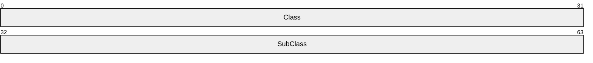

**Class (4 bytes):** An unsigned 32-bit integer. Identifies the resource class of the designated [**resource**](#gt_resource) . On successful completion of the method, the [**server**](#gt_server) MUST set this field to one of the following values.

| Value | Meaning |
| --- | --- |
| CLUS_RESCLASS_UNKNOWN 0x00000000 | The resource is not identified with a class. |
| CLUS_RESCLASS_STORAGE 0x00000001 | The resource represents a physical or logical entity on which data can be persistently written. |
| CLUS_RESCLASS_NETWORK 0x00000002 | The resource represents a physical or logical entity that pertains to networks. |

**SubClass (4 bytes):** An unsigned 32-bit integer. Identifies the subclass, within the class, of the designated resource. On successful completion of the method, the server MUST set this field to one of the following values.

| Value | Meaning |
| --- | --- |
| 0x00000000 | The resource is not identified with a subclass. |
| 0x80000000 | For resources of class CLUS_RESCLASS_STORAGE, the storage entity is shared; that is, it can potentially be accessed by more than one computer. For resources of class CLUS_RESCLASS_NETWORK, the resource represents an IP address. |

<a id="Section_2.2.3.8"></a>
#### 2.2.3.8 CLUS_SCSI_ADDRESS

The **CLUS_SCSI_ADDRESS** data structure is the format in which a property value of syntax CLUSPROP_SYNTAX_SCSI_ADDRESS, as specified in [2.2.2.3](#Section_2.2.2.3), is written as a property value, as specified in section [2.2.3.10.1](#Section_2.2.3.10.1).

**CLUS_SCSI_ADDRESS** is a custom-marshaled data structure that has fields as follows.


**PortNumber (1 byte):** An unsigned 8-bit integer. Specifies the SCSI port number of the disk.

**PathId (1 byte):** An unsigned 8-bit integer. Indicates the bus number if the SCSI adapter that is identified by PortNumber is connected to multiple SCSI buses. This field is an index that MUST start at 0 and that is local to the SCSI adapter. For adapters that are connected to only one bus, this field MUST be 0.

**TargetID (1 byte):** An unsigned 8-bit integer. Identifies the SCSI target of the disk.

**LUN (1 byte):** An unsigned 8-bit integer. Specifies the SCSI logical unit number (LUN) of the disk.

<a id="Section_2.2.3.9"></a>
#### 2.2.3.9 CLUS_PARTITION_INFO

The **CLUS_PARTITION_INFO** data structure is the format in which a property value of syntax CLUSPROP_SYNTAX_PARTITION_INFO, as specified in section [2.2.2.3](#Section_2.2.2.3), is written as a property value, as specified in section [2.2.3.10.1](#Section_2.2.3.10.1). **CLUS_PARTITION_INFO** contains data about a disk [**partition**](#gt_partition) that is configured with a [**basic volume**](#gt_basic-volume).

**CLUS_PARTITION_INFO** is a custom-marshaled data structure that has fields as follows.

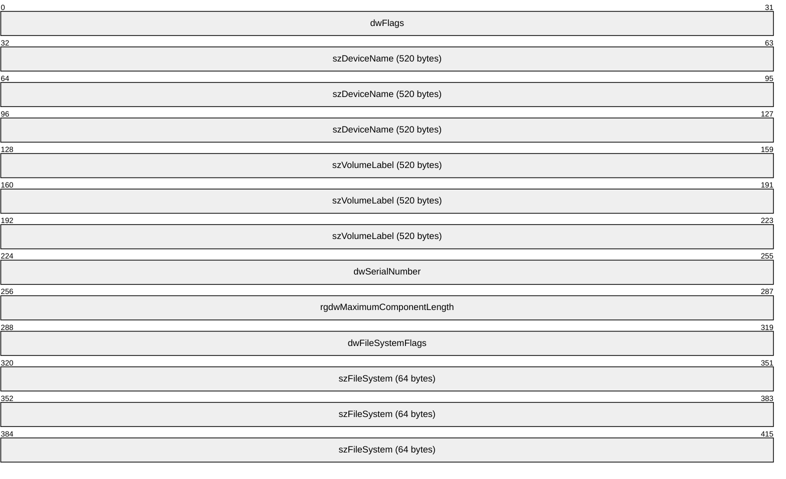

**dwFlags (4 bytes):** An unsigned 32-bit integer. Indicates [**characteristics**](#gt_characteristic) about the partition. Can be a combination of the following values.

| Value | Meaning |
| --- | --- |
| CLUSPROP_PIFLAG_STICKY 0x00000001 | The [**volume**](#gt_volume) is configured with a drive letter. Can be combined with any other flag. |
| CLUSPROP_PIFLAG_REMOVABLE 0x00000002 | The partition is formatted with a file system that is removable by the cluster software. |
| CLUSPROP_PIFLAG_USABLE 0x00000004 | The partition is formatted with a file system that is usable by the cluster software. This flag SHOULD be set if and only if the partition is formatted with the [**NT file system (NTFS)**](#gt_nt-file-system-ntfs). Can be combined with any other flag, but MUST be set if CLUSPROP_PIFLAG_DEFAULT_QUORUM is set. |
| CLUSPROP_PIFLAG_DEFAULT_QUORUM 0x00000008 | Indicates that the smallest NTFS partition MUST be at least 50,000,000 bytes in size. Can be combined with any other flag, but CLUSPROP_PIFLAG_USABLE MUST also be set if this flag is set. |
| CLUSPROP_PIFLAG_USABLE_FOR_CSV 0x00000010 | This flag is set if and only if the partition is formatted with NTFS/ReFS. Can be combined with any other flag. |
| CLUSPROP_PIFLAG_ENCRYPTION_ENABLED 0x00000020 | Encryption is enabled and this flag is used when ENCRYPTION_ENABLED flag is set in **EncryptionFlags** field. |
| CLUSPROP_PIFLAG_RAW 0x00000040 | The partition is a raw volume and is not formatted with a file system. |
| CLUSPROP_PIFLAG_UNKNOWN 0x80000000 | Partition is of unknown file system type. |

**szDeviceName (520 bytes):** A 520-byte long fixed-length field. It contains a null-terminated [**Unicode string**](#gt_unicode-string) that contains the drive letter of the volume if the volume has a drive letter. If the volume is not configured with a drive letter, a null-terminated Unicode string of the format "DiskNNNPartitionYYY", where *NNN* is the [**disk number**](#gt_disk-number) and *YYY* is the partition number, as specified in [MS-DMRP](../MS-DMRP/MS-DMRP.md).

**szVolumeLabel (520 bytes):** A 520-byte long fixed-length field. It contains the file system label. This field is a null-terminated Unicode string.

**dwSerialNumber (4 bytes):** An unsigned 32-bit integer. This is the serial number that is assigned by the operating system when the partition was formatted.

**rgdwMaximumComponentLength (4 bytes):** An unsigned 32-bit integer. A [**value**](#gt_value) specifying the maximum length, in characters, of a file name component that is supported by the specified file system. A file name component is the portion of a file name between "\" characters.

**dwFileSystemFlags (4 bytes):** An unsigned 32-bit integer that identifies the [**file system flags**](#gt_file-system-flags).

**szFileSystem (64 bytes):** A 64-byte long fixed-length field that contains a null-terminated Unicode string, which is the name of the file system, as specified in [MS-DMRP].

<a id="Section_2.2.3.10"></a>
#### 2.2.3.10 PROPERTY_LIST

A **PROPERTY_LIST** is a self-describing data structure that contains a sequence of value lists. A **PROPERTY_LIST** MUST consist of the following elements:

- A count of the properties in the list.
- One value list for each property.
Each property value list, in turn, MUST consist of the following elements:

- A property name.
- One or more property values. Each property value is represented by a data structure that is appropriate to the type of data. Each property value can consist of multiple data values, such as a string, an array, or a structure.
- An enumeration value set to CLUSPROP_SYNTAX_ENDMARK.
Conceptually, a **PROPERTY_LIST** can be illustrated as in the following diagram.

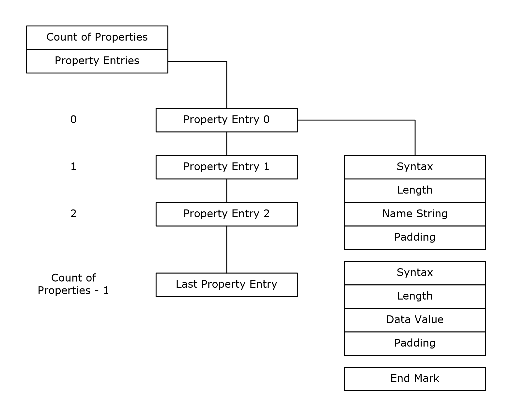

Figure 1: Property list

The **PROPERTY_LIST** is a custom-marshaled contiguous buffer with fields that are specified as follows.


**propertyCount (4 bytes):** An unsigned 32-bit integer. The **PROPERTY_LIST** buffer MUST begin with an unsigned long indicating the count of properties in the **PROPERTY_LIST**. The count of properties MUST be followed by the properties in the form of property values.

**propertyValue (variable):** A variable-sized buffer of **Property Value** (section [2.2.3.10.1](#Section_2.2.3.10.1)) structures. A property value MUST contain the name of the property that the [**value**](#gt_value) is associated with.

The layout of the property name, value list, and value list end mark is repeated in the **PROPERTY_LIST** buffer for each property in the **PROPERTY_LIST**. There MUST be one end mark structure for each property in the **PROPERTY_LIST**. The number of property names and value lists MUST sum to the count of properties that are specified at the beginning of the **PROPERTY_LIST** buffer. Therefore, the following statement MUST hold true:

- propertyCount = number of properties
where each individual property contains a name and a value list.

<a id="Section_2.2.3.10.1"></a>
##### 2.2.3.10.1 Property Value

The **Property Value** is a custom-marshaled contiguous buffer with fields that are specified as follows. This buffer MUST contain at least one element in the PropertyValues array.


**CLUSPROP_SYNTAX_NAME (4 bytes):** An unsigned long. The property name structure MUST begin with the **CLUSTER_PROPERTY_SYNTAX** (section [2.2.2.3](#Section_2.2.2.3)) value CLUSPROP_SYNTAX_NAME (0x00040003).

| Name | Value |
| --- | --- |
| CLUSPROP_SYNTAX_NAME | 0x00040003 |

**size (4 bytes):** An unsigned long. This field MUST be an unsigned long that specifies the size of the buffer that contains the property name. Padding MUST be included so that the next byte in contiguous memory after the buffer is aligned to 4 bytes; however, the padding is not included in the size specified by this parameter.

**buffer (variable):** A buffer of 16-bit [**Unicode**](#gt_unicode) characters. This field MUST be a buffer that contains the property name as a null-terminated [**Unicode string**](#gt_unicode-string). Following the property name buffer MUST be 0 or more bytes of padding. The contents of the padding bytes MUST be ignored.

**padding (variable):** This field MUST be 0 or 2 bytes of padding such that the size of the buffer field, plus the size of this field, is divisible by 4. The contents of the padding bytes MUST be ignored.

**PropertyValues (variable):** One to three **PropertyValues** structures, as follows.


**Syntax (4 bytes):** An unsigned 32-bit integer. This field MUST be one of the **CLUSTER_PROPERTY_SYNTAX** values and MUST NOT contain CLUSPROP_SYNTAX_NAME or CLUSPROP_SYNTAX_ENDMARK.

**Size (4 bytes):** An unsigned 32-bit integer. This field MUST be an unsigned long that specifies the size of the buffer that contains the property. Padding MUST be included so that the next byte in contiguous memory after the buffer is aligned to 4 bytes; however, the padding is not included in the size specified by this parameter.

**Buffer (variable):** A buffer of 8-bit integers. This field MUST be a buffer that contains the value of the property as specified by the Syntax member of this structure. Following the property buffer there MUST be 0 or more bytes of padding. The contents of the padding bytes MUST be ignored.

**Padding (variable):** This field MUST be 0 to 3 bytes of padding such that the size of the buffer field, plus the size of this field, is divisible by 4. The contents of the padding bytes MUST be ignored.

**CLUSPROP_SYNTAX_ENDMARK (4 bytes):** An unsigned 32-bit integer. The last [**value**](#gt_value) in the value list MUST be followed by a 4-byte **CLUSPROP_SYNTAX_ENDMARK**, as specified in section 2.2.2.3. Any other syntax value, as specified in section 2.2.2.3, that follows a value MUST mark the beginning of another value in the value list.

<a id="Section_2.2.3.11"></a>
#### 2.2.3.11 CLUS_PARTITION_INFO_EX

The **CLUS_PARTITION_INFO_EX** data structure is the format in which a property [**value**](#gt_value) of syntax **CLUSPROP_SYNTAX_PARTITION_INFO_EX** (section [2.2.2.3](#Section_2.2.2.3)), is written as a property value, as specified in section [2.2.3.10.1](#Section_2.2.3.10.1). **CLUS_PARTITION_INFO_EX** contains data about a disk [**partition**](#gt_partition) that is configured with a [**basic volume**](#gt_basic-volume).

**CLUS_PARTITION_INFO_EX** is a custom-marshaled data structure that has fields as follows.

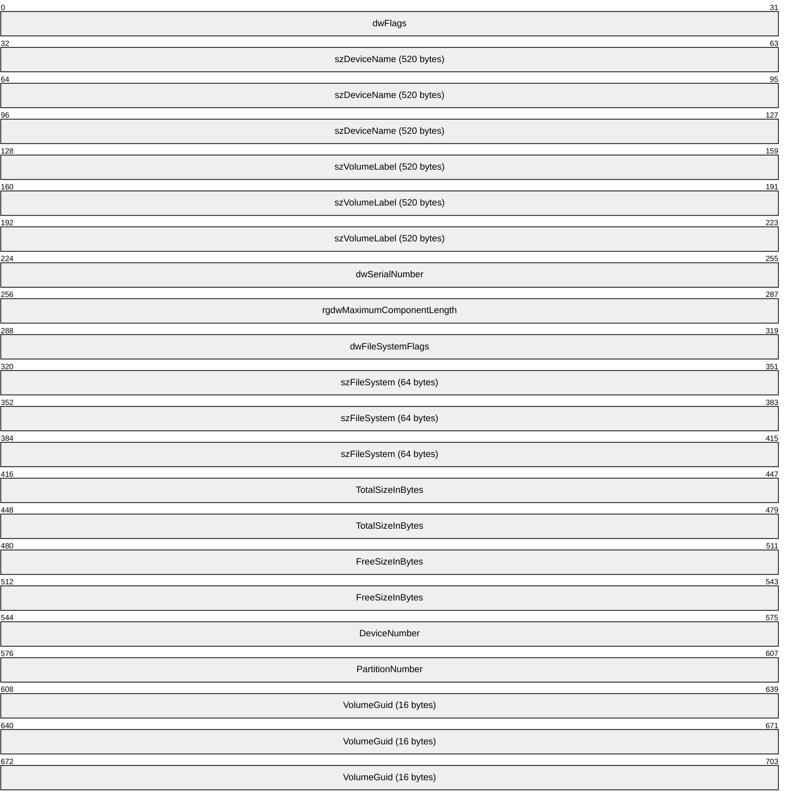

**dwFlags (4 bytes):** An unsigned 32-bit integer. Indicates [**characteristics**](#gt_characteristic) about the partition. Can be a combination of the following values.

| Value | Meaning |
| --- | --- |
| CLUSPROP_PIFLAG_STICKY 0x00000001 | The [**volume**](#gt_volume) is configured with a drive letter. Can be combined with any other flag. |
| CLUSPROP_PIFLAG_REMOVABLE 0x00000002 | The partition is formatted with a file system that is removable by the cluster software. |
| CLUSPROP_PIFLAG_USABLE 0x00000004 | The partition is formatted with a file system that is usable by the [**cluster**](#gt_cluster) software. This flag SHOULD be set if and only if the partition is formatted with the NTFS file system. Can be combined with any other flag, but MUST be set if CLUSPROP_PIFLAG_DEFAULT_QUORUM is set. |
| CLUSPROP_PIFLAG_DEFAULT_QUORUM 0x00000008 | Indicates that the smallest NTFS partition MUST be at least 50,000,000 bytes in size. Can be combined with any other flag, but CLUSPROP_PIFLAG_USABLE MUST also be set if this flag is set. |
| CLUSPROP_PIFLAG_USABLE_FOR_CSV 0x00000010 | This flag is set if and only if the partition is formatted with NTFS/ReFS. Can be combined with any other flag. |
| CLUSPROP_PIFLAG_ENCRYPTION_ENABLED 0x00000020 | Encryption is enabled and this flag is used when ENCRYPTION_ENABLED flag is set in **EncryptionFlags** field. |
| CLUSPROP_PIFLAG_RAW 0x00000040 | The partition is a raw volume and is not formatted with a file system. |
| CLUSPROP_PIFLAG_UNKNOWN 0x80000000 | Partition is of unknown file system type. |

**szDeviceName (520 bytes):** A fixed-length buffer 520 bytes long that contains a null-terminated [**Unicode string**](#gt_unicode-string) based on the following rules:

- If the volume has a drive letter and the state of the designated storage [**resource**](#gt_resource) is ClusterResourceOnline, the [**server**](#gt_server) MUST return the drive letter of the volume followed by a [**Unicode**](#gt_unicode) ':'.
- If the volume is not configured with a drive letter and the resource is online, the server MUST return a string of the form "\\?\Volume{GGG}" where GGG is the identifier of the volume.
- If the resource is offline, the server MUST return a string of the form "\\?\GLOBALROOT\Device\HarddiskNNN\PartitionYYY", where NNN is the [**disk number**](#gt_disk-number) and YYY is the partition number ([MS-DMRP](../MS-DMRP/MS-DMRP.md)).
Note: If the resource is offline, the remaining fields in this structure are left unfilled and MUST NOT be considered valid data.

**szVolumeLabel (520 bytes):** A fixed-length buffer 520 bytes long that contains the file system label. This field is a null-terminated Unicode string.

**dwSerialNumber (4 bytes):** An unsigned 32-bit integer. This is the serial number that is assigned by the operating system when the partition was formatted.

**rgdwMaximumComponentLength (4 bytes):** An unsigned 32-bit integer. A value specifying the maximum length, in characters, of a file name component that is supported by the specified file system. A file name component is the portion of a file name between "\" characters.

**dwFileSystemFlags (4 bytes):** An unsigned 32-bit integer that identifies the [**file system flags**](#gt_file-system-flags).

**szFileSystem (64 bytes):** A fixed-length buffer 64 bytes long that contains a null-terminated Unicode string representing the name of the file system, as specified in [MS-DMRP].

**TotalSizeInBytes (8 bytes):** An unsigned 64-bit integer specifying the total size, in bytes, of the volume.

**FreeSizeInBytes (8 bytes):** An unsigned 64-bit integer specifying the size, in bytes, of the unallocated space on the volume.

**DeviceNumber (4 bytes):** An unsigned 32-bit integer indicating the disk number.

**PartitionNumber (4 bytes):** An unsigned 32-bit integer indicating the partition number, as specified in [MS-DMRP].

**VolumeGuid (16 bytes):** A 128-bit value that contains the [**volume identifier**](#gt_volume-identifier-volumeid).

<a id="Section_2.2.3.12"></a>
#### 2.2.3.12 CLUS_STORAGE_REMAP_DRIVELETTER

The **CLUS_STORAGE_REMAP_DRIVELETTER** structure identifies the existing and target drive letter for a disk drive on a [**node**](#gt_node).

**CLUS_STORAGE_REMAP_DRIVELETTER** is a custom-marshaled structure that has fields as follows.

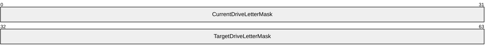

**CurrentDriveLetterMask (4 bytes):** A 32-bit bitmask indicating the drive letter to be changed. The least significant bit represents the drive letter 'A' through bit 25, which represents the drive letter 'Z'.

**TargetDriveLetterMask (4 bytes):** A 32-bit bitmask indicating the new drive letter for the disk drive that corresponds to the drive letter specified in CurrentDriveLetterMask.

<a id="Section_2.2.3.13"></a>
#### 2.2.3.13 CLUS_NETNAME_PWD_INFO

The **CLUS_NETNAME_PWD_INFO** structure provides information for resetting an alternate [**computer name's**](#gt_computer-name) associated [**security principal**](#gt_security-principal).

**CLUS_NETNAME_PWD_INFO** is a custom-marshaled structure that has fields as follows.


**Flags (4 bytes):** A 32-bit field indicating whether other fields in the structure have valid data. Can be a combination of the following [**values**](#gt_value).

| Value | Meaning |
| --- | --- |
| 0x00000000 | No flags are set, indicating that only the Password field is valid. |
| GUID_PRESENT 0x00000001 | The ObjectGuid field has valid data. |
| CREATEDC_PRESENT 0x00000002 | The CreatingDC field has valid data. |

**Password (32 bytes):** A 32-byte long fixed-length field that contains the new password, as a null-terminated [**Unicode string**](#gt_unicode-string), for the alternate computer name's associated security principal. Remaining bytes after null-termination MAY contain any value.

**CreatingDC (516 bytes):** A 516-byte long fixed-length field that contains the name of a directory [**server**](#gt_server), as a null-terminated Unicode string, where the associated security principal object is stored. Remaining bytes after null-termination MAY contain any value.

**ObjectGuid (128 bytes):** A [**GUIDString**](#gt_guidstring), as a null-terminated Unicode string, of the security principal object on a directory server. Remaining bytes after null-termination MAY contain any value.

<a id="Section_2.2.3.14"></a>
#### 2.2.3.14 CLUS_MAINTENANCE_MODE_INFO

The **CLUS_MAINTENANCE_MODE_INF**O structure represents the maintenance mode setting for a storage class [**resource**](#gt_resource).

**CLUS_MAINTENANCE_MODE_INFO** is a custom-marshaled structure that has fields as follows.


**InMaintenance (4 bytes):** A 32-bit integer that indicates the current maintenance mode state when written by the [**server**](#gt_server) or the target maintenance mode state when provided by the [**client**](#gt_client) for a storage class resource. Zero indicates that the resource is not in maintenance mode and one indicates that the storage resource is in maintenance mode.

<a id="Section_2.2.3.15"></a>
#### 2.2.3.15 CLUS_MAINTENANCE_MODE_INFO_EX

The **CLUS_MAINTENANCE_MODE_INFO_EX** structure represents the extended maintenance mode settings for a storage class [**resource**](#gt_resource).

**CLUS_MAINTENANCE_MODE_INFO_EX** is a custom-marshaled structure that has fields as follows.


**InMaintenance (4 bytes):** A 32-bit integer that indicates the current maintenance mode state when written by the [**server**](#gt_server) or the target maintenance mode state when provided by the [**client**](#gt_client) for a storage class resource. Zero indicates that the resource is not in maintenance mode and one indicates that the storage resource is in maintenance mode.

**MaintenanceModeType (4 bytes):** A 4-byte **MAINTENANCE_MODE_TYPE** (section [2.2.2.6](#Section_2.2.2.6)) enumeration that indicates the current maintenance mode type when written by the server or the target maintenance mode type when provided by the client for a storage class resource.

**InternalState (4 bytes):** A 32-bit integer representing the internal resource state, as specified in section [3.1.4.2.13](#Section_3.1.4.2.139). This field is valid only when written by the server.

**Signature (4 bytes):** A 32-bit integer that MUST contain the [**value**](#gt_value) 0xABBAF00F.

<a id="Section_2.2.3.16"></a>
#### 2.2.3.16 CLUS_STORAGE_SET_DRIVELETTER

The **CLUS_STORAGE_SET_DRIVELETTER** structure supplies drive letter information for a disk [**partition**](#gt_partition) associated with a storage class [**resource**](#gt_resource).

The **CLUS_STORAGE_SET_DRIVELETTER** is a custom-marshaled structure that has fields as follows.

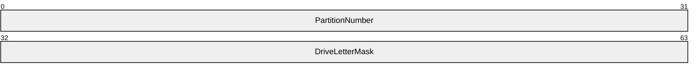

**PartitionNumber (4 bytes):** A 32-bit integer that indicates a partition on the storage device.

**DriveLetterMask (4 bytes):** A 32-bit integer bitmask that indicates either the new drive letter of the partition or that the partition's drive letter SHOULD be removed. Each bit represents a drive letter where bit 0 represents 'A', bit 1 represents 'B', and so forth through bit 25. Bits 26 through 31 are ignored. A [**value**](#gt_value) of zero indicates that the drive letter SHOULD be removed.

<a id="Section_2.2.3.17"></a>
#### 2.2.3.17 CLUSTER_REG_BATCH_UPDATE

The **CLUSTER_REG_BATCH_UPDATE** structure is a self-describing data structure that contains a sequence of command blocks that describes one or more modifications or read operations to be performed on the cluster registry. A **CLUSTER_REG_BATCH_UPDATE** structure MUST consist of the following elements:

- A version number.
- One or more batch update command blocks describing a set of modifications to the registry or read operations from the registry.
Each batch update command block, in turn, MUST consist of the following elements:

- A command type.
- The name of a key or value.
- Any optional data required for the command.
Conceptually, a **CLUSTER_REG_BATCH_UPDATE** structure can be illustrated as in the following diagram.

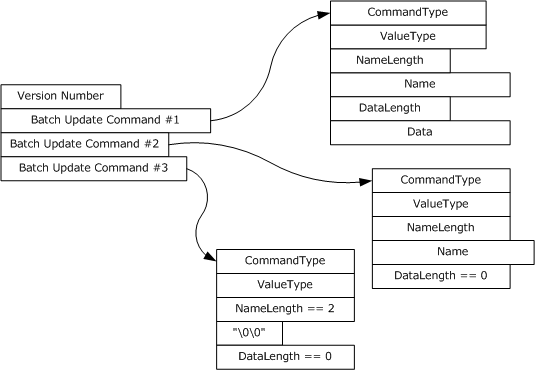

Figure 2: CLUSTER_REG_BATCH_UPDATE structure

**CLUSTER_REG_BATCH_UPDATE** is a custom-marshaled structure that has fields as follows.


**VersionNumber (4 bytes):** A 32-bit integer that indicates the version of the batch update command block. This value MUST be set to one.

**BatchUpdateCommand (variable):** One or more instances of a variable-length data structure that describes a set of modifications to be made to the cluster registry.

<a id="Section_2.2.3.17.1"></a>
##### 2.2.3.17.1 BATCH_UPDATE_COMMAND

The **BATCH_UPDATE_COMMAND** is a stream of bytes that describes an individual update to be applied to the cluster registry or returned from a call to **ApiExecuteReadBatch** (section [3.1.4.2.141](#Section_3.1.4.2.141)). It defines two variable-length fields, Name and Data, that MUST be present in the stream if their associated length fields are nonzero. The end of each structure is aligned to a 16-bit boundary.

The **BATCH_UPDATE_COMMAND** is a custom-marshaled structure that has fields as follows.


**CommandType (4 bytes):** An unsigned 32-bit integer. A **CLUSTER_REG_BATCH_COMMAND** (section [2.2.2.8](#Section_2.2.2.8)) enumeration value that indicates the type of update operation.

**ValueType (4 bytes):** An unsigned 32-bit integer. The **ValueType** field MUST be set to one of the types specified in **ApiSetValue** (section [3.1.4.2.33](#Section_3.1.4.2.33) when the **CommandType** field is set to CLUSREG_SET_VALUE or CLUSREG_READ_VALUE. If **CommandType** is set to CLUSREG_READ_ERROR, the value is a status code. Otherwise, the field is ignored. The [**server**](#gt_server) SHOULD support all values as specified in **ApiSetValue**.<25>

**NameLength (4 bytes):** An unsigned 32-bit integer indicating the size, in bytes, of the string stored in the Name field. Minimum value is two, indicating the Name field contains the null [**Unicode string**](#gt_unicode-string) (0x0000).

**Name (variable):** A variable-length, null-terminated Unicode string containing the name of the key or value on which the command is executed.

**DataLength (4 bytes):** An unsigned 32-bit integer indicating the size, in bytes, of the binary data stored in the Data field. Can be zero.

**Data (variable):** A variable-length series of 8-bit integers containing the data associated with a CLUSREG_SET_VALUE operation. This field is not present if the DataLength field is set to zero.

**Padding (1 byte):** Up to 1 byte. A variable-length series of zero or one 8-bit integers used to align the end of the structure to a 16-bit boundary. This field is not present if the DataLength field is of even length.

<a id="Section_2.2.3.18"></a>
#### 2.2.3.18 CLUS_CSV_VOLUME_INFO

The **CLUS_CSV_VOLUME_INFO** structure represents information about a [**cluster**](#gt_cluster) shared [**volume**](#gt_volume).

CLUS_CSV_VOLUME_INFO is a custom-marshaled structure that has fields as follows.

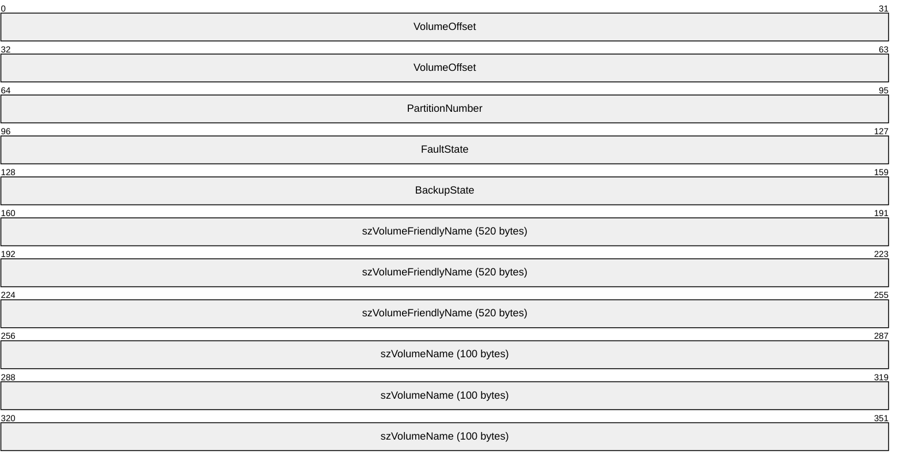

**VolumeOffset (8 bytes):** A 64-bit unsigned integer that indicates the offset of the volume.

**PartitionNumber (4 bytes):** A 32-bit unsigned integer that indicates the [**partition**](#gt_partition) number of the volume.

**FaultState (4 bytes):** A 32-bit integer that indicates the existence of faults for this volume, or that the volume is in volume maintenance mode, backup mode, or redirected mode. The block redirected mode of the volume is not reflected in this field. Possible values are as follows.

| Value | Meaning |
| --- | --- |
| VolumeStateNoFaults 0x00000000 | Indicates that the volume is accessible on all nodes. None of these modes are enabled: volume maintenance mode, backup mode, or redirected mode. |
| VolumeStateRedirected 0x00000001 | Indicates that volume maintenance mode is not enabled and that the volume is either in redirected mode, in backup mode, or in both redirected and backup modes. |
| VolumeStateNoAccess 0x00000002 | Indicates that the volume is not accessible to applications irrespective of whether the volume maintenance, redirected, or backup modes are enabled. |
| VolumeStateInMaintenance 0x00000004 | Indicates that the volume is in volume maintenance mode irrespective of whether redirected or backup modes are enabled. |

**BackupState (4 bytes):** A 32-bit integer that indicates the current backup mode of the volume, as specified in **Cluster Node Volume Accessibility** (section [3.1.1.4](#Section_3.1.1.4)). Possible values are as follows.

| Value | Meaning |
| --- | --- |
| VolumeBackupNone 0x00000000 | Indicates that the volume is not in backup mode. |
| VolumeBackupInProgress 0x00000001 | Indicates that the volume is in backup mode. |

**szVolumeFriendlyName (520 bytes):** A fixed-length buffer 520 bytes long that contains a null-terminated [**Unicode string**](#gt_unicode-string) that indicates the friendly name of the volume.

**szVolumeName (100 bytes):** A fixed-length buffer 100 bytes long that contains a null-terminated Unicode string that indicates the name of the volume in the volume GUID format. For example:

\\?\Volume{00000000-0000-0000-0000-000000000000}\

<a id="Section_2.2.3.19"></a>
#### 2.2.3.19 CLUS_CSV_MAINTENANCE_MODE_INFO

The **CLUS_CSV_MAINTENANCE_MODE_INFO** structure supplies maintenance mode information about a [**cluster**](#gt_cluster) shared [**volume**](#gt_volume).

**CLUS_CSV_MAINTENANCE_MODE_INFO** is a custom-marshaled structure that has fields as follows.


**InMaintenance (4 bytes):** A 32-bit integer that indicates the desired volume maintenance mode of the volume, as specified in **Cluster Node Volume Accessibility** (section [3.1.1.4](#Section_3.1.1.4)). Possible values are as follows.

| Value | Meaning |
| --- | --- |
| TRUE 0x00000001 | Instructs the [**server**](#gt_server) to transition the volume into volume maintenance mode. |
| FALSE 0x00000000 | Instructs the server to transition the volume out of volume maintenance mode. |

**VolumeName (520 bytes):** A fixed-length buffer, 520 bytes long, which contains a null-terminated [**Unicode string**](#gt_unicode-string) that indicates the name of the volume. The server MUST accept either a friendly name described as **szVolumeFriendlyName** or a volume GUID name as **szVolumeName** (both as specified in section [2.2.3.18](#Section_2.2.3.18)).

<a id="Section_2.2.3.20"></a>
#### 2.2.3.20 CLUS_SHARED_VOLUME_BACKUP_MODE

The **CLUS_SHARED_VOLUME_BACKUP_MODE** structure supplies backup mode information about a [**cluster**](#gt_cluster) shared [**volume**](#gt_volume).

**CLUS_SHARED_VOLUME_BACKUP_MODE** is a custom-marshaled structure that has fields as follows.


**BackupState (4 bytes):** A 32-bit integer that indicates the desired backup mode of the volume, as specified in **Cluster Node Volume Accessibility** (section [3.1.1.4](#Section_3.1.1.4)). Possible values are as follows.

| Value | Meaning |
| --- | --- |
| VolumeBackupInProgress 0x00000001 | Instructs the [**server**](#gt_server) to transition the volume into backup mode. |
| VolumeBackupNone 0x00000000 | Instructs the server to transition the volume out of backup mode. |

**DelayTimerInSecs (4 bytes):** A 32-bit unsigned integer indicating the maximum time (in seconds) for the server to wait to detect that a backup has started on that volume.

**VolumeName (520 bytes):** A fixed-length buffer, 520 bytes long, which contains a null-terminated [**Unicode string**](#gt_unicode-string) that indicates the name of the volume. The server MUST accept either a friendly name described as **szVolumeFriendlyName** or a volume GUID name as **szVolumeName** (both as specified in **CLUS_CSV_VOLUME_INFO** (section [2.2.3.18](#Section_2.2.3.18)) structure).

<a id="Section_2.2.3.21"></a>
#### 2.2.3.21 CLUSTER_CREATE_GROUP_INFO_RPC

The **CLUSTER_CREATE_GROUP_INFO_RPC** structure contains information about the creation of a group, as specified in **ApiCreateGroupEx** (section [3.1.4.2.128)](#Section_3.1.4.2.128).<26>

typedef struct _CLUSTER_CREATE_GROUP_INFO_RPC {

DWORD dwVersion;

DWORD dwGroupType;

} CLUSTER_CREATE_GROUP_INFO_RPC,

*PCLUSTER_CREATE_GROUP_INFO_RPC;

**dwVersion:** The version of the **CLUSTER_CREATE_GROUP_INFO_RPC** data structure.

**dwGroupType:** Designates the type of group.

<a id="Section_2.2.3.22"></a>
#### 2.2.3.22 NOTIFY_FILTER_AND_TYPE_RPC

The **NOTIFY_FILTER_AND_TYPE_RPC** structure contains information about notifications that clients register for by using **ApiAddNotifyV2** (section [3.1.4.2.137](#Section_3.1.4.2.137)) or that clients get notification for by using **ApiGetNotifyV2** (section [3.1.4.2.138](#Section_3.1.4.2.138)).<27>

typedef struct _NOTIFY_FILTER_AND_TYPE_RPC {

DWORD dwObjectType;

LONGLONG FilterFlags;

} NOTIFY_FILTER_AND_TYPE_RPC,

*PNOTIFY_FILTER_AND_TYPE_RPC;

**dwObjectType:** The type of object for which the notification is generated (see section [2.2.2.12](#Section_2.2.2.12)).

**FilterFlags:** A set of flags indicating the particular notification that was generated for the object. See **ApiCreateNotifyV2** (section [3.1.4.2.136](#Section_3.1.4.2.136)) for the list of object-specific notifications.

<a id="Section_2.2.3.23"></a>
#### 2.2.3.23 NOTIFICATION_DATA_RPC

The **NOTIFICATION_DATA_RPC** structure contains the information for a specific notification. See **ApiGetNotifyV2** (section [3.1.4.2.138](#Section_3.1.4.2.138)) for the exact values the fields of this structure use for specific notification objects and their types.<28>

typedef struct _NOTIFICATION_DATA_RPC {

NOTIFY_FILTER_AND_TYPE_RPC FilterAndType;

[ size_is(dwBufferSize) ] BYTE* buffer;

DWORD dwBufferSize;

[ string ] LPWSTR ObjectId;

[ string ] LPWSTR ParentId;

[ string ] LPWSTR Name;

[ string ] LPWSTR Type;

} NOTIFICATION_DATA_RPC,

*PNOTIFICATION_DATA_RPC;

**FilterAndType:** A **NOTIFY_FILTER_AND_TYPE_RPC** (section [2.2.3.22](#Section_2.2.3.22)) structure containing the object type and notification value.

**buffer:** A pointer to the payload buffer. The format of this buffer is specific to the notification type. For details, see **ApiGetNotifyV2**.

**dwBufferSize:** The size in bytes of the **buffer** field.

**ObjectId:** A buffer of 16-bit [**Unicode**](#gt_unicode) characters containing the Id of the object for which the notification was generated. This field MUST be followed by 0 or more bytes of padding, which MUST be ignored.

**ParentId:** A buffer of 16-bit Unicode characters containing the Id of the parent of the object represented by the **ObjectId** field. This field MUST be followed by 0 or more bytes of padding, which MUST be ignored.

**Name:** A buffer of 16-bit Unicode characters containing the name of the object for which the notification was generated. This field MUST be followed by 0 or more bytes of padding, which MUST be ignored.

**Type:** A buffer of 16-bit Unicode characters containing the object type for which the notification was generated. This field MUST be followed by 0 or more bytes of padding, which MUST be ignored.

<a id="Section_2.2.3.24"></a>
#### 2.2.3.24 NOTIFICATION_RPC

The **NOTIFICATION_RPC** structure associates the NOTIFICATION_DATA_RPC structure with the notify key that was passed as a parameter to **ApiAddNotifyV2** (section [3.1.4.2.137](#Section_3.1.4.2.137)).

typedef struct _NOTIFICATION_RPC {

DWORD_PTR dwNotifyKey;

NOTIFICATION_DATA_RPC NotificationData;

} NOTIFICATION_RPC,

*PNOTIFICATION_RPC;

**dwNotifyKey:** A 32-bit value provided by the client.

**NotificationData:** A **NOTIFICATION_DATA_RPC** structure as defined in section [2.2.3.23](#Section_2.2.3.23).

<a id="Section_2.2.3.25"></a>
#### 2.2.3.25 GROUP_ENUM_ENTRY

The **GROUP_ENUM_ENTRY** structure contains information for each group in the enumeration list returned by **ApiCreateGroupEnum** (section [3.1.4.2.139](#Section_3.1.4.2.139)).

typedef struct _GROUP_ENUM_ENTRY {

[string] LPWSTR Name;

[string] LPWSTR Id;

DWORD dwState;

[string] LPWSTR Owner;

DWORD dwFlags;

DWORD cbProperties;

[size_is(cbProperties)] UCHAR* Properties;

DWORD cbRoProperties;

[size_is(cbRoProperties)] UCHAR* RoProperties;

} GROUP_ENUM_ENTRY,

*PGROUP_ENUM_ENTRY;

**Name:** The name of the group.

**Id:** The Id of the group.

**dwState:** The state of the group, as specified in section [3.1.4.2.46](#Section_3.1.4.2.46).

**Owner:** The name of the group's current owner node.

**dwFlags:** The group's flags, as would be returned by **CLUSCTL_GROUP_GET_FLAGS** (section [3.1.4.3.3.3](#Section_3.1.4.3.3.3)).

**cbProperties:** The size in bytes of the buffer pointed to by the **Properties** field.

**Properties:** A **PROPERTY_LIST** (section [2.2.3.10](#Section_2.2.3.10.1)) containing common properties of the group.

**cbRoProperties:** The size in bytes of the buffer pointed to by the **RoProperties** field.

**RoProperties:** A **PROPERTY_LIST** containing read-only common properties of the group.

<a id="Section_2.2.3.26"></a>
#### 2.2.3.26 GROUP_ENUM_LIST

The **GROUP_ENUM_LIST** structure is a container for a list of **GROUP_ENUM_ENTRY** (section [2.2.3.25](#Section_2.2.3.25)) structures. This structure encapsulates the results of a call to **ApiCreateGroupEnum** (section [3.1.4.2.139](#Section_3.1.4.2.139)), which clients use to enumerate the groups in a cluster.

typedef struct _GROUP_ENUM_LIST {

DWORD EntryCount;

[size_is(EntryCount)] GROUP_ENUM_ENTRY Entry[*];

} GROUP_ENUM_LIST,

*PGROUP_ENUM_LIST;

**EntryCount:** The number of **GROUP_ENUM_ENTRY** structures contained in the **Entry** field.

**Entry:** An array of **GROUP_ENUM_ENTRY** structures that represent information for the groups being enumerated.

<a id="Section_2.2.3.27"></a>
#### 2.2.3.27 RESOURCE_ENUM_ENTRY

The **RESOURCE_ENUM_ENTRY** (section 2.2.3.27) structure represents information for each resource in the enumeration list returned by **ApiCreateResourceEnum** (section [3.1.4.2.140](#Section_3.1.4.2.140)).

typedef struct _RESOURCE_ENUM_ENTRY {

[string] LPWSTR Name;

[string] LPWSTR Id;

[string] LPWSTR OwnerName;

[string] LPWSTR OwnerId;

DWORD cbProperties;

[size_is(cbProperties)] UCHAR* Properties;

DWORD cbRoProperties;

[size_is(cbRoProperties)] UCHAR* RoProperties;

} RESOURCE_ENUM_ENTRY,

*PRESOURCE_ENUM_ENTRY;

**Name:** The name of the resource.

**Id:** The Id of the resource.

**OwnerName:** The name of the group that contains this resource.

**OwnerId:** The Id of the group that contains this resource.

**cbProperties:** The size in bytes of the buffer pointed to by the **Properties** field.

**Properties:** A **PROPERTY_LIST** (section [2.2.3.10](#Section_2.2.3.10.1)) containing the common properties of the resource.

**cbRoProperties:** The size in bytes of the buffer pointed to by the **RoProperties** field.

**RoProperties:** A **PROPERTY_LIST** containing the common read-only properties of the resource.

<a id="Section_2.2.3.28"></a>
#### 2.2.3.28 RESOURCE_ENUM_LIST

The **RESOURCE_ENUM_LIST** structure is a container for a list of **RESOURCE_ENUM_ENTRY** (section [2.2.3.27](#Section_2.2.3.27)) structures. This structure encapsulates the results of a call to **ApiCreateResourceEnum** (section [3.1.4.2.140](#Section_3.1.4.2.140)), which clients use to enumerate resources.

typedef struct _RESOURCE_ENUM_LIST {

DWORD EntryCount;

[size_is(EntryCount)] RESOURCE_ENUM_ENTRY Entry[*];

} RESOURCE_ENUM_LIST,

*PRESOURCE_ENUM_LIST;

**EntryCount:** The number of **RESOURCE_ENUM_ENTRY** in the **Entry** field.

**Entry:** An array of **RESOURCE_ENUM_ENTRY** that contain information for each enumerated resource.

<a id="Section_2.2.3.29"></a>
#### 2.2.3.29 CLUSTER_SHARED_VOLUME_STATE_INFO

The **CLUSTER_SHARED_VOLUME_STATE_INFO** structure contains information about the cluster shared [**volume**](#gt_volume) for which a notification was generated. See **CLUSTER_CHANGE_SHARED_VOLUME_V2** (section [2.2.2.21](#Section_2.2.2.21)) for details.<29>

**CLUSTER_SHARED_VOLUME_STATE_INFO** is a custom-marshaled structure that has the following fields:


**szVolumeName (520 bytes):** A buffer of 16-bit [**Unicode**](#gt_unicode) characters that MUST contain the null-terminated friendly name of the cluster shared volume for which the notification was generated. If the volume name plus terminating null character is less than the size of the buffer, the buffer is padded with additional null characters. The client MUST ignore these additional null characters.

**szNodeName (520 bytes):** A buffer of 16-bit Unicode characters representing the name of the node which generated the notification. This buffer MUST contain the node name as a null-terminated [**Unicode string**](#gt_unicode-string). If the node name is less than the size of the buffer, the string MUST be padded with null characters. Any such padding MUST be ignored.

**VolumeState (4 bytes):** A 32-bit integer that MUST contain one of the following values, indicating the state of the cluster shared volume.

| Value | Meaning |
| --- | --- |
| SharedVolumeStateUnavailable 0x00000000 | The shared volume is unavailable. |
| SharedVolumeStatePaused 0x00000001 | The shared volume is paused. |
| SharedVolumeStateActive 0x00000002 | The shared volume is active. |
| SharedVolumeStateActiveRedirected 0x00000003 | The shared volume is active and in redirected mode. |
| SharedVolumeStateActiveBlockRedirected 0x00000004 | The shared volume is active and in block redirected mode. |

<a id="Section_2.2.3.30"></a>
#### 2.2.3.30 NOTIFICATION_DATA_ASYNC_RPC

The **NOTIFICATION_DATA_ASYNC_RPC** structure contains the information for a specific notification. See **ApiGetNotifyAsync** (section [3.1.4.2.143](#Section_3.1.4.2.143)) for more information.

typedef struct _NOTIFICATION_DATA_ASYNC_RPC {

DWORD dwNotifyKey;

DWORD dwFilter;

[string] LPWSTR Name;

} NOTIFICATION_DATA_ASYNC_RPC, *PNOTIFICATION_DATA_ASYNC_RPC;

**dwNotifyKey:** The address of a 32-bit integer that the [**server**](#gt_server) MUST write upon successful completion of this method. The value was supplied as the *dwNotifyKey* parameter in a previous call to one of the following methods: **ApiAddNotifyCluster** (section [3.1.4.1.58](#Section_3.1.4.1.58)), **ApiAddNotifyNode** (section [3.1.4.1.59](#Section_3.1.4.1.59)), **ApiAddNotifyGroup** (section [3.1.4.1.60](#Section_3.1.4.1.60)), **ApiAddNotifyResource** (section [3.1.4.1.61](#Section_3.1.4.1.61)), **ApiAddNotifyKey** (section [3.1.4.1.62](#Section_3.1.4.1.62)), **ApiAddNotifyNetwork** (section [3.1.4.1.90](#Section_3.1.4.1.90)), **ApiAddNotifyNetInterface** (section [3.1.4.1.99](#Section_3.1.4.1.99)), **ApiReAddNotifyNode** (section [3.1.4.1.63](#Section_3.1.4.1.63)), **ApiReAddNotifyGroup** (section [3.1.4.1.64](#Section_3.1.4.1.64)), **ApiReAddNotifyResource** (section [3.1.4.1.65](#Section_3.1.4.1.65)), **ApiReAddNotifyNetwork** (section [3.1.4.1.91](#Section_3.1.4.1.91)), or **ApiReAddNotifyNetInterface** (section [3.1.4.1.100](#Section_3.1.4.1.100)).

**dwFilter:** The address of a 32-bit integer value that the server MUST write upon successful completion of this method, which contains the **CLUSTER_CHANGE** (section [2.2.2.7](#Section_2.2.2.7)) enumeration value, indicating the type of event. The value MUST match one or more filter blocks that were provided in a previous call to one of the following methods: **ApiAddNotifyCluster**, **ApiAddNotifyNode**, **ApiAddNotifyGroup**, **ApiAddNotifyResource**, **ApiAddNotifyKey**, **ApiAddNotifyNetwork**, **ApiAddNotifyNetInterface**, **ApiReAddNotifyNode**, **ApiReAddNotifyGroup**, **ApiReAddNotifyResource**, **ApiReAddNotifyNetwork**, or **ApiReAddNotifyNetInterface**.

**Name:** The address of a pointer where the server MUST write, upon successful completion of this method, the address of a [**Unicode string**](#gt_unicode-string) buffer that contains the name of the object to which the event pertains. If a name is not associated with the event, then the buffer contains the null Unicode string.

<a id="Section_2.2.3.31"></a>
#### 2.2.3.31 CLUS_POOL_DRIVE_INFO

The **CLUS_POOL_DRIVE_INFO** structure contains the information about a [**storage pool drive**](#gt_storage-pool-drive). See **CLUSCTL_RESOURCE_POOL_GET_DRIVE_INFO** (section [3.1.4.3.1.56](#Section_3.1.4.3.1.56)) for more information.

**CLUS_POOL_DRIVE_INFO** is a custom-marshaled structure that has fields as follows.

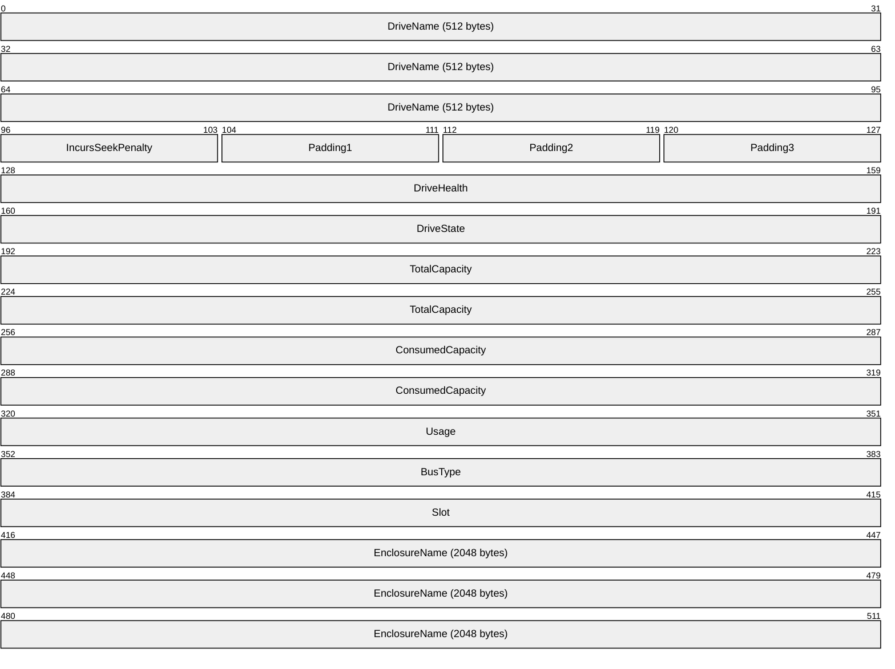

**DriveName (512 bytes):** A buffer of 16-bit [**Unicode**](#gt_unicode) characters representing the name of the storage pool drive. This buffer MUST contain the name as a null-terminated [**Unicode string**](#gt_unicode-string). If the name is less than the size of the buffer, the string MUST be padded with null characters. The client MUST ignore any padding.

**IncursSeekPenalty (1 byte):** A flag that indicates whether the storage pool drive incurs any latency when reading from an arbitrary sector.

**Padding1 (1 byte):** The client MUST ignore this field.

**Padding2 (1 byte):** The client MUST ignore this field.

**Padding3 (1 byte):** The client MUST ignore this field.

**DriveHealth (4 bytes):** The health of the storage pool drive. The [**server**](#gt_server) MUST set this field to one of the following values.

| Value | Description |
| --- | --- |
| SpHealthUnknown 0x00000000 | The health of the storage pool drive is not known. |
| SpHealthUnhealthy 0x00000001 | The storage pool drive has encountered a severe error condition, such as a media failure. |
| SpHealthWarning 0x00000002 | The storage pool drive has encountered an automatically recoverable error condition, such as an I/O error that can be retried. |
| SpHealthHealthy 0x00000003 | The storage pool drive is healthy. |

**DriveState (4 bytes):** The state of the storage pool drive. The server MUST set this field to one of the following values.

| Value | Description |
| --- | --- |
| SpDriveStateUnknown 0x00000000 | The state of the storage pool drive is not known. |
| SpDriveStateBecomingReady 0x00000001 | The storage pool drive is becoming ready. |
| SpDriveStateCorruptMetadata 0x00000002 | The storage pool drive has corrupt metadata. |
| SpDriveStateFailedMedia 0x00000003 | The storage pool drive detected a failure when accessing the media. |
| SpDriveStateSplit 0x00000004 | The storage pool drive metadata was changed while separated from a two-drive pool. The split metadata cannot automatically be corrected. |
| SpDriveStateStaleMetadata 0x00000005 | The storage pool drive has stale metadata |
| SpDriveStateIOError 0x00000006 | The storage pool drive has encountered an I/O error. |
| SpDriveStateMissing 0x00000007 | The storage pool drive is missing. |
| SpDriveStateOkay 0x00000008 | The storage pool drive is ready and in a nominal state. |

**TotalCapacity (8 bytes):** A 64-bit value containing the total capacity, in bytes, of the storage pool drive.

**ConsumedCapacity (8 bytes):** A 64-bit value containing the amount of capacity, in bytes, that is currently in use on the storage pool drive.

**Usage (4 bytes):** The usage of the storage pool drive. The server MUST set this field to one of the following values.

| Value | Description |
| --- | --- |
| SpDriveUsageUnknown 0x00000000 | The usage of the storage pool drive is unknown. |
| SpDriveUsageAutoAllocation 0x00000001 | The storage pool drive is used for automatic allocation. |
| SpDriveUsageManualAllocation 0x00000002 | The storage pool drive is used for manual allocation. |
| SpDriveUsageSpare 0x00000003 | The storage pool drive is used as a spare. |
| SpDriveUsageJournal 0x00000004 | The storage pool drive is used exclusively for journaling. |
| SpDriveUsageRetired 0x00000005 | The storage pool drive is retired and not used for capacity allocations. |

**BusType (4 bytes):** The type of bus to which the storage pool drive is attached. The server MUST set this field to one of the following values.

| Value | Description |
| --- | --- |
| BusTypeUnknown 0x00000000 | The bus type is unknown. |
| BusTypeScsi 0x00000001 | The bus type is small computer system interface (SCSI). |
| BusTypeAtapi 0x00000002 | The bus type is AT attachment packet interface (ATAPI). |
| BusTypeAta 0x00000003 | The bus type is advanced technology attachment (ATA). |
| BusType1394 0x00000004 | The bus type is IEEE 1394, commonly known as FireWire. |
| BusTypeSsa 0x00000005 | The bus type is serial storage architecture (SSA) |
| BusTypeFibre 0x00000006 | The bus type is Fibre Channel. |
| BusTypeUsb 0x00000007 | The bus type is universal serial bus (USB). |
| BusTypeRAID 0x000000008 | The bus type is redundant array of independent disks (RAID). |
| BusTypeiScsi 0x00000009 | The bus type is internet small computer system interface (iSCSI). |
| BusTypeSas 0x0000000A | The bus type is serial attached SCSI (SAS). |
| BusTypeSata 0x0000000B | The bus type is serial ATA (SATA). |
| BusTypeSd 0x0000000C | The bus type is secure digital (SD). |
| BusTypeMmc 0x0000000D | The bus type is multimedia card (MMC). |
| BusTypeVirtual 0x00000000E | The bus type is virtual. |
| BusTypeFileBackedVirtual 0x00000000F | The bus type is file-backed virtual. |
| BusTypeSpaces 0x00000010 | The bus type is Spaces. |

**Slot (4 bytes):** A 32-bit value containing the slot in which the storage pool drive is located.

**EnclosureName (2048 bytes):** A buffer of 16-bit Unicode characters representing the name of the enclosure in which the storage pool drive is located. This buffer MUST contain the name as a null-terminated Unicode string. If the name is less than the size of the buffer, the string MUST be padded with null characters. Any such padding MUST be ignored.

<a id="Section_2.2.3.32"></a>
#### 2.2.3.32 CLUSTER_SHARED_VOLUME_STATE_INFO_EX

The **CLUSTER_SHARED_VOLUME_STATE_INFO_EX** structure<30> contains information about the cluster shared [**volume**](#gt_volume) for which a notification was generated. See **CLUSTER_CHANGE_SHARED_VOLUME_V2** (section [2.2.2.21](#Section_2.2.2.21)) for details.

**CLUSTER_SHARED_VOLUME_STATE_INFO_EX** is a custom-marshaled structure that has fields as follows.

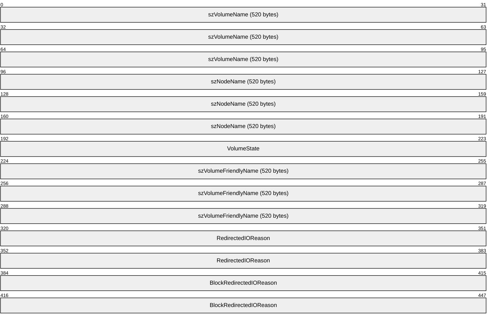

**szVolumeName (520 bytes):** A buffer of 16-bit [**Unicode**](#gt_unicode) characters that MUST contain the null-terminated name of the volume in the volume [**GUID**](#gt_globally-unique-identifier-guid) format. For example:

\\?\Volume{00000000-0000-0000-0000-000000000000}\

The buffer MUST be padded with additional null characters from the end of the volume name plus null-termination to the end of the buffer. The client MUST ignore any such padding.

**szNodeName (520 bytes):** A buffer of 16-bit Unicode characters representing the name of the node that generated the notification. This buffer MUST contain the node name as a null-terminated [**Unicode string**](#gt_unicode-string). If the node name is less than the size of the buffer, the string MUST be padded with null characters. Any such padding MUST be ignored.

**VolumeState (4 bytes):** A 32-bit integer that MUST contain one of the following values, indicating the state of the cluster shared volume:

| Value | Meaning |
| --- | --- |
| SharedVolumeStateUnavailable 0x00000000 | The shared volume is unavailable. |
| SharedVolumeStatePaused 0x00000001 | The shared volume is paused. |
| SharedVolumeStateActive 0x00000002 | The shared volume is active. |
| SharedVolumeStateActiveRedirected 0x00000003 | The shared volume is active and in redirected mode. |
| SharedVolumeStateActiveBlockRedirected 0x00000004 | The shared volume is active and in block redirected mode. |

**szVolumeFriendlyName (520 bytes):** A buffer of 16-bit Unicode characters that MUST contain the name of the cluster shared volume for which the notification was generated. This buffer MUST contain the name as a null-terminated Unicode string. If the volume name is less than the size of the buffer, the string MUST be padded with null characters. The client MUST ignore any such padding.

**RedirectedIOReason (8 bytes):** A 64-bit integer that MUST contain the bitwise OR of one or more of the following values:

| Value | Meaning |
| --- | --- |
| RedirectedIOReasonNotRedirected 0x0000000000000000 | Indicates that the cluster shared volume redirected mode is FALSE. |
| RedirectedIOReasonUserRequest 0x0000000000000001 | Indicates that the cluster shared volume redirected mode is TRUE due to a client request, such as via the **CLUSCTL_RESOURCE_DISABLE_SHARED_VOLUME_DIRECTIO** (section [3.1.4.3.1.53](#Section_3.1.4.3.1.53)) method. |
| RedirectedIOReasonIncompatibleFileSystemFilter 0x0000000000000002 | Indicates that the cluster shared volume redirected mode is TRUE due to an incompatible component that is configured with a file system of the storage-class resource associated with the cluster shared volume. What the [**server**](#gt_server) considers an incompatible component and how the server identifies the incompatible component are implementation-specific. |
| RedirectedIOReasonIncompatibleVolumeFilter 0x0000000000000004 | Indicates that the cluster shared volume redirected mode is TRUE due to an incompatible component configured with a volume of the storage-class resource associated with the cluster shared volume. What the server considers an incompatible component and how the server identifies the incompatible component are implementation-specific. |
| RedirectedIOReasonFileSystemConfiguration 0x0000000000000008 | Indicates that the cluster shared volume redirected mode is TRUE due to the configuration of the file system of the storage-class resource associated with the cluster shared volume. What the server considers a valid file system configuration for redirected mode and how the server identifies the valid configuration are implementation-specific. |
| RedirectedIOReasonVolumeEncryption 0x0000000000000010 | Indicates that the cluster shared volume redirected mode is TRUE due to an encryption operation on the storage object represented by the storage-class resource associated with the cluster shared volume. What constitutes an encryption operation is implementation-specific. |

**BlockRedirectedIOReason (8 bytes):** A 64-bit integer that MUST contain the bitwise OR of one or more of the following values:

| Value | Meaning |
| --- | --- |
| BlockRedirectedIOReasonNotRedirected 0x0000000000000000 | Indicates that the cluster shared volume block redirected mode is FALSE. |
| BlockRedirectedIOReasonNoDiskConnectivity 0x0000000000000001 | Indicates that the cluster shared volume block redirected mode is TRUE because the server is not connected to the disk. |
| BlockRedirectedIOReasonStorageSpaceNotAttached 0x0000000000000002 | Indicates that the cluster shared volume block redirected mode is TRUE because the storage-class resource associated with the cluster shared volume is formed from a storage pool and can only be accessed by the server via network communication to a different node. |

<a id="Section_2.2.3.33"></a>
#### 2.2.3.33 CLUSDSK_DISKID

The **CLUSDSK_DISKID** structure contains the identification information of the disk of the designated storage class [**resource type**](#gt_resource-type).

typedef struct _CLUSDSK_DISKID {

CLUSDSK_DISKID_ENUM DiskIdType;

[switch_is(DiskIdType)] union {

[case(DiskIdSignature)] unsigned long DiskSignature;

[case(DiskIdGuid)] GUID DiskGuid;

};

} CLUSDSK_DISKID, *PCLUSDSK_DISKID;

**DiskIdType:** A 32-bit integer indicating disk ID type. See **CLUSDSK_DISKID_ENUM** (section [2.2.2.22](#Section_2.2.2.22)).

**DiskSignature:** Identification information of the disk is an [**MBR**](#gt_master-boot-record-mbr) [**disk signature**](#gt_disk-signature).

**DiskGuid:** Identification information of the disk is a [**GPT**](#gt_guid-partition-table-gpt) disk ID, which is a 128-bit GUID.

<a id="Section_2.2.3.34"></a>
#### 2.2.3.34 CLUSCTL_RESOURCE_NETNAME_CHECK_OU_PERMISSIONS_INPUT

The **CLUSCTL_RESOURCE_NETNAME_CHECK_OU_PERMISSIONS_INPUT** structure SHOULD<31> be used to determine whether the server has permissions to access a directory [**server**](#gt_server). It is a custom-marshaled structure that contains the following fields.

```mermaid
packet-beta
  0-31: "dwVersion"
  32-63: "dwPermissions"
  64-191: "GUID (16 bytes)"
```

**dwVersion (4 bytes):** A 32-bit unsigned integer. The [**client**](#gt_client) MUST set this to 0x00000001.

**dwPermissions (4 bytes):** A 32-bit unsigned integer that indicates the permissions to check. The client MUST set this to field to 0x00000011.

**GUID (16 bytes):** A **GUID**, as specified in [MS-DTYP](#Section_2.2.1) section 2.3.4.2, identifying the type of directory object for which permissions are checked. The client MUST set **Data1** to 0xbf967a86, **Data2** to 0x0de6, **Data3** to 0x11d0, and **Data4** to 0xe24930aa0085a211d0.

<a id="Section_2.2.3.35"></a>
#### 2.2.3.35 CLUSCTL_RESOURCE_NETNAME_CHECK_OU_PERMISSIONS_OUTPUT

The **CLUSCTL_RESOURCE_NETNAME_CHECK_OU_PERMISSIONS_OUTPUT** structure SHOULD<32> indicate whether the [**server**](#gt_server) has access as requested. It is a custom-marshaled structure that contains the following fields.

```mermaid
packet-beta
  0-31: "bHasAccess"
  32-63: "bDefaultOU"
  64-95: "OUSize"
  96-159: "OUName (variable)"
```

**bHasAccess (4 bytes)**: Set to 0x00000001 if the server has access to the directory server sufficient to create a computer object and read all properties for a computer object; otherwise, it is set to 0x00000000.

**bDefaultOU (4 bytes)**: Set to 0x00000001 if the access request is for the default organizational unit on the directory server; otherwise, it is set to 0x00000000.

**OUSize (4 bytes)**: The number of bytes in **OUName**.

**OUName (variable)**: A null-terminated [**Unicode string**](#gt_unicode-string) containing the name of the directory server organizational unit for which access was checked.

<a id="Section_2.2.3.36"></a>
#### 2.2.3.36 SR_RESOURCE_TYPE_QUERY_ELIGIBLE_LOGDISKS

The **SR_RESOURCE_TYPE_QUERY_ELIGIBLE_LOGDISKS** structure SHOULD<33> be used to query eligible log disks, given either a source or target disk, for storage replication. It is a custom-marshaled structure that contains the following fields.

```mermaid
packet-beta
  0-95: "DataDiskGuid (16 bytes)"
  96-103: "IncludeOfflineDisks"
  104-111: "Reserved1"
  112-119: "Reserved2"
  120-127: "Reserved3"
```

**DataDiskGuid (16 bytes):** A **GUID**, as specified in [MS-DTYP](#Section_2.2.1) section 2.3.4.2, that contains the resource ID of the storage class resource that is either the source or target of replication.

**IncludeOfflineDisks (1 byte):** The client sets this field to 0x01 to request that results include disks whose resource state is ClusterResourceOffline. Otherwise, the client sets this field to 0x00.

**Reserved1 (1 byte):** The field MUST be ignored.

**Reserved2 (1 byte):** This field MUST be ignored.

**Reserved3 (1 byte):** This field MUST be ignored.

<a id="Section_2.2.3.37"></a>
#### 2.2.3.37 SR_RESOURCE_TYPE_ELIGIBLE_DISKS_RESULT

The **SR_RESOURCE_TYPE_ELIGIBLE_DISKS_RESULT** structure SHOULD<34> be used to return a list of disks for storage replication. It is a custom-marshalled structure that contains the following fields.

```mermaid
packet-beta
  0-15: "Count"
  16-31: "Reserved1"
  32-127: "DiskGuid (variable)"
```

**Count (2 bytes):** The number of GUID elements in the **DiskGuid** field.

**Reserved1 (2 bytes):** This field MUST be ignored.

**DiskGuid (variable):** An array of **GUID** structures, as specified in [MS-DTYP](#Section_2.2.1) section 2.3.4.2, each containing the resource ID of a storage class resource.

<a id="Section_2.2.3.38"></a>
#### 2.2.3.38 SR_RESOURCE_TYPE_QUERY_ELIGIBLE_TARGET_DATADISKS

The **SR_RESOURCE_TYPE_QUERY_ELIGIBLE_TARGET_DATADISKS** structure SHOULD<35> be used to query eligible target disks, given a source disk, for storage replication. It is a custom-marshalled structure that has fields as follows.

```mermaid
packet-beta
  0-95: "SourceDataDiskGuid (16 bytes)"
  96-103: "SkipConnectivityCheck"
  104-111: "IncludeOfflineDisks"
  112-119: "Reserved1"
  120-127: "Reserved2"
```

**SourceDataDiskGuid (16 bytes):** A **GUID**, as specified in [MS-DTYP](#Section_2.2.1) section 2.3.4.2, that contains the resource ID of the storage class resource that is the replication source.

**SkipConnectivityCheck (1 byte):** The client sets this field to 0x01 to request that the [**server**](#gt_server) not consider connectivity of disks to cluster nodes when preparing results. The client sets this field to 0x00 to request that the server return only disks that are not connected to any of the cluster nodes that are connected to the disk represented by **SourceDataDiskGuid**.

**IncludeOfflineDisks (1 byte):** The client sets this field to 0x01 to request that results include disks whose resource state is ClusterResourceOffline. Otherwise, the client sets this field to 0x00.

**Reserved1 (1 byte)**: This field MUST be ignored.

**Reserved2 (1 byte)**: This field MUST be ignored.

<a id="Section_2.2.3.39"></a>
#### 2.2.3.39 SR_RESOURCE_TYPE_QUERY_ELIGIBLE_SOURCE_DATADISKS

The **SR_RESOURCE_TYPE_QUERY_ELIGIBLE_SOURCE_DATADISKS** structure SHOULD<36> be used to query eligible source disks that can be added to the same replication group as a given source disk. It is a custom-marshalled structure that contains the following fields.

```mermaid
packet-beta
  0-95: "SourceDataDiskGuid (16 bytes)"
  96-103: "IncludeAvailableStorageDisks"
  104-111: "Reserved1"
  112-119: "Reserved2"
  120-127: "Reserved3"
```

**SourceDataDiskGuid (16 bytes):** A **GUID**, as specified in [MS-DTYP](#Section_2.2.1) section 2.3.4.2, that contains the resource ID of the storage class resource that is the replication source.

**IncludeAvailableStorageDisks (1 byte):** The client sets this field to 0x01 to request that results include storage class resources that have not yet been configured as cluster shared [**volumes**](#gt_volume). Otherwise, the client sets this field to 0x00.

**Reserved1 (1 byte)**: This field MUST be ignored.

**Reserved2 (1 byte)**: This field MUST be ignored.

**Reserved3 (1 byte)**: This field MUST be ignored.

<a id="Section_2.2.3.40"></a>
#### 2.2.3.40 SR_RESOURCE_TYPE_REPLICATED_DISK

The **SR_RESOURCE_TYPE_REPLICATED_DISK** structure SHOULD<37> represent one disk in an enumeration of the replicated disks in the cluster state. It is a custom-marshalled structure that contains the following fields.

```mermaid
packet-beta
  0-31: "Type"
  32-127: "ClusterDiskResourceGuid (16 bytes)"
  128-223: "ReplicationGroupId (16 bytes)"
  224-319: "ReplicationGroupName (520 bytes)"
```

**Type (4 bytes):** A 32-bit integer that MUST contain one of the following values, indicating the role this disk plays in storage replication:

| Value | Meaning |
| --- | --- |
| SrReplicatedDiskTypeSource 0x00000001 | Source disk |
| SrReplicatedDiskTypeLogSource 0x00000002 | Source log disk |
| SrReplicatedDiskTypeDestination 0x00000003 | Target disk |
| SrReplicatedDiskTypeLogDestination 0x00000004 | Target log disk |

**ClusterDiskResourceGuid (16 bytes):** A **GUID**, as specified in [MS-DTYP](#Section_2.2.1) section 2.3.4.2, that contains the resource ID of the storage class resource corresponding to this disk.

**ReplicationGroupId (16 bytes):** A **GUID** that contains the ID of the replication group.

**ReplicationGroupName (520 bytes):** A buffer of 16-bit [**Unicode**](#gt_unicode) characters representing the name of the replication group. This buffer MUST contain the replication group name as a null-terminated [**Unicode string**](#gt_unicode-string). If the replication group name plus null termination is less than the size of the buffer, the string MUST be padded with additional null characters. Any such padding MUST be ignored.

<a id="Section_2.2.3.41"></a>
#### 2.2.3.41 SR_RESOURCE_TYPE_REPLICATED_DISKS_RESULT

The **SR_RESOURCE_TYPE_REPLICATED_DISKS_RESULT** structure SHOULD<38> be used to enumerate the replicated disks in the cluster state. It is a custom-marshalled structure that contains the following fields.

```mermaid
packet-beta
  0-15: "Count"
  16-31: "Reserved1"
  32-127: "ReplicatedDisks (variable)"
```

**Count (2 bytes):** The number of **SR_RESOURCE_TYPE_REPLICATED_DISK** elements in the **ReplicatedDisks** field.

**Reserved1 (2 bytes):** This field MUST be ignored.

**ReplicatedDisks (variable):** An array of **SR_RESOURCE_TYPE_REPLICATED_DISK** elements, each representing a replicated disk in the cluster state.

<a id="Section_2.2.3.42"></a>
#### 2.2.3.42 CLUSTER_MEMBERSHIP_INFO

The **CLUSTER_MEMBERSHIP_INFO** structure SHOULD<39> be used to represent the membership view in the cluster. It is a custom-marshalled structure that contains the following fields.

```mermaid
packet-beta
  0-7: "HasQuorum"
  8-39: "UpNodesSize"
  40-127: "UpNodes (variable)"
```

**HasQuorum (1 byte):** A Boolean where TRUE indicates if the current view in the cluster has quorum.

**UpNodesSize (4 bytes):** The number of nodes that are in the UP state in the cluster.

**UpNodes (variable):** An array of bytes of length **UpNodesSize** where each byte contains a node ID of a node that is in the UP state in the cluster.

<a id="Section_2.2.3.43"></a>
#### 2.2.3.43 OS_AND_OS_VERSION_INFO

The **OS_AND_OS_VERSION_INFO** structure SHOULD<40> be used to determine the cluster node’s operating system version. It is a custom-marshalled structure that contains the following fields.

```mermaid
packet-beta
  0-31: "dwOSSize"
  32-63: "dwOSVersionSize"
  64-127: "OS (variable)"
```

**dwOSSize (4 bytes):** Specifies the number of characters in the operating system string.

**dwOSVersionSize (4 bytes):** Specifies the number of characters in the operating system version string.

**OS (variable):** Specifies the location where the null-terminated [**Unicode**](#gt_unicode) operating system string starts. A null-terminated string that represents the operating system version immediately follows the null termination of the operating system string.

<a id="Section_2.2.3.44"></a>
#### 2.2.3.44 CLUS_DISK_NUMBER_INFO

The **CLUS_DISK_NUMBER_INFO** structure SHOULD<41> be used to get the disk number information.

```mermaid
packet-beta
  0-31: "DiskNumber"
  32-63: "BytesPerSector"
```

**DiskNumber (4 bytes):** Specifies the disk number.

**BytesPerSector (4 bytes):** Specifies the number of bytes per sector of the disk.

<a id="Section_2.2.3.45"></a>
#### 2.2.3.45 CLUS_PARTITION_INFO_EX2

The **CLUS_PARTITION_INFO_EX2** data structure SHOULD<42> be used to store data about the disk [**partition**](#gt_partition) that is configure with a [**basic volume**](#gt_basic-volume).

The **CLUS_PARTITION_INFO_EX2** is the format in which a property value of syntax **CLUS_SYNTAX_PARTITION_INFO_EX2** (section [2.2.2.3](#Section_2.2.2.3)) is written as a property value, as specified in **Property Valu**e (section [2.2.3.10.1](#Section_2.2.3.10.1)).

**CLUS_PARTITION_INFO_EX2** is a custom-marshaled data structure that has fields as follows.

```mermaid
packet-beta
  0-31: "dwFlags"
  32-127: "szDeviceName_(520_bytes)"
  128-223: "szVolumeLabel_(520_bytes)"
  224-255: "dwSerialNumber"
  256-287: "rgdwMaximumComponentLength"
  288-319: "dwFileSystemFlags"
  320-415: "szFileSystem_(64_bytes)"
  416-479: "TotalSizeInBytes"
  480-543: "FreeSizeInBytes"
  544-575: "DeviceNumber"
  576-607: "PartitionNumber"
  608-703: "VolumeGuid_(16_bytes)"
  704-799: "GptPartitionId_(16_bytes)"
  800-895: "szPartitionName_(520_bytes)"
  896-927: "EncryptionFlags"
```

**dwFlags (4 bytes):** An unsigned 32-bit integer that indicates [**characteristics**](#gt_characteristic) of the partition. Can be a combination of the following values.

| Value | Meaning |
| --- | --- |
| CLUSPROP_PIFLAG_STICKY 0x00000001 | The [**volume**](#gt_volume) is configured with a drive letter. Can be combined with any other flag. |
| CLUSPROP_PIFLAG_REMOVABLE 0x00000002 | The partition is formatted with a file system that is removable by the cluster software. |
| CLUSPROP_PIFLAG_USABLE 0x00000004 | The partition is formatted with a file system that is usable by the cluster software. This flag SHOULD be set only if the partition is formatted with the [**NT file system (NTFS)**](#gt_nt-file-system-ntfs). Can be combined with any other flag, but MUST be set if CLUSPROP_PIFLAG_DEFAULT_QUORUM is set. |
| CLUSPROP_PIFLAG_DEFAULT_QUORUM 0x00000008 | Indicates that the smallest NTFS partition MUST be at least 50,000,000 bytes in size. Can be combined with any other flag, but CLUSPROP_PIFLAG_USABLE MUST also be set if this flag is set. |
| CLUSPROP_PIFLAG_USABLE_FOR_CSV 0x00000010 | This flag is set if and only if the partition is formatted with NTFS/ReFS. Can be combined with any other flag. |
| CLUSPROP_PIFLAG_ENCRYPTION_ENABLED 0x00000020 | Encryption is enabled and this flag is used when ENCRYPTION_ENABLED flag is set in **EncryptionFlags** field. |
| CLUSPROP_PIFLAG_RAW 0x00000040 | The partition is a raw volume and is not formatted with a file system. |
| CLUSPROP_PIFLAG_UNKNOWN 0x80000000 | Partition is of unknown file system type. |

**szDeviceName_(520_bytes):** A fixed-length buffer that contains a null-terminated [**Unicode string**](#gt_unicode-string) based on the following rules:

- If the volume has a drive letter and the state of the designated storage resource is ClusterResourceOnline, the server MUST return the drive letter of the volume followed by a [**Unicode**](#gt_unicode) ':'.
- If the volume is not configured with a drive letter and the resource is online, the server MUST return a string of the form "\\?\Volume{GGG}" where GGG is the identifier of the volume.
- If the resource is offline, the server MUST return a string of the form "\\?\GLOBALROOT\Device\HarddiskNNN\PartitionYYY", where NNN is the disk number and YYY is the partition number ([MS-DMRP](../MS-DMRP/MS-DMRP.md)).
Note: If the resource is offline, the remaining fields in this structure are left unfilled and MUST NOT be considered valid data.

**szVolumeLabel_(520_bytes):** A fixed-length buffer that contains the file system label. This field is a null-terminated Unicode string.

**dwSerialNumber (4 bytes):** An unsigned 32-bit integer that is the serial number assigned by the operating system when the partition was formatted.

**rgdwMaximumComponentLength (4 bytes):** An unsigned 32-bit integer specifying the maximum length, in characters, of a file name component that is supported by the specified file system. A file name component is the portion of a file name between "\" characters.

**dwFileSystemFlags (4 bytes):** An unsigned 32-bit integer that identifies the file system flags.

**szFileSystem_(64_bytes):** A fixed-length buffer 64 bytes long that contains a null-terminated Unicode string representing the name of the file system, as specified in [MS-DMRP].

**TotalSizeInBytes (8 bytes):** An unsigned 64-bit integer specifying the total size, in bytes, of the volume.

**FreeSizeInBytes (8 bytes):** An unsigned 64-bit integer specifying the size, in bytes, of the unallocated space on the volume.

**DeviceNumber (4 bytes):** An unsigned 32-bit integer indicating the disk number.

**PartitionNumber (4 bytes):** An unsigned 32-bit integer indicating the partition number, as specified in [MS-DMRP].

**VolumeGuid_(16_bytes):** A 128-bit value that contains the [**volume identifier**](#gt_volume-identifier-volumeid).

**GptPartitionId_(16_bytes):** A 128-bit value that contains the GUID Partition Table identifier.

**szPartitionName_(520_bytes):** A fixed-length buffer that contains the partition name. This field is a null-terminated Unicode string.

**EncryptionFlags (32 bits):** A 32-bit integer that indicates the encryption status on the partition. Can be a combination of the following values.

| Value | Meaning |
| --- | --- |
| 0x00000000 | No flags are set. |
| ENCRYPTION_ENABLED 0x00000001 | Encryption is enabled. |
| ENCRYPTION_DECRYPTED 0x00000004 | Data is fully decrypted. |
| ENCRYPTION_ENCRYPTED 0x00000008 | Data is fully encrypted. |
| ENCRYPTION_DECRYPTING 0x00000010 | When encryption is disabled decryption starts. |
| ENCRYPTION_ENCRYPTING 0x00000020 | Encryption in progress. |
| ENCRYPTION_PAUSED 0x00000040 | Encryption/Decryption is put on pause state. |

<a id="Section_2.2.3.46"></a>
#### 2.2.3.46 NodeUtilizationInfo

The **NodeUtilizationInfo** structure<43> represents the information about a designated node and its utilization in the cluster. It is a custom-marshalled structure that contains the following fields.

```mermaid
packet-beta
  0-127: "NodeName (variable)"
  128-159: "NodeId"
  160-223: "TotalMemory"
  224-287: "AvailableMemory"
  288-351: "AvailableMemoryAfterReclamation"
  352-415: "NodeAverageCpuUsage"
  416-447: "LpCount"
  448-511: "NodeMaxCpuReserve"
  512-575: "NodeFreeCpuReserve"
  576-607: "NodeLocalDiskFreeSpaceInMB"
  608-639: "NodeLocalDiskTotalSpaceInMB"
  640-703: "ReservedCpu"
  704-767: "ReservedMemory"
  768-831: "ReservedLocalDiskUsage"
  832-863: "Version"
```

**NodeName (variable):** A buffer of [**Unicode**](#gt_unicode) characters representing the name of the node.

**NodeId (4 bytes):** A unique identifier that identifies the node.

**TotalMemory (8 bytes):** A 64-bit value indicating total memory used by all tasks that are running in the cluster.

**AvailableMemory (8 bytes):** A 64-bit value indicating the remaining available memory in the cluster.

**AvailableMemoryAfterReclamation (8 bytes):** A 64-bit value indicating the available memory in the cluster after a node restart.

**NodeAverageCpuUsage (8 bytes):** A 64-bit value indicating the average CPU usage across all compute nodes in the cluster.

**LpCount (4 bytes):** A 32-bit integer value representing the CPU Logical Processor count of node in a cluster.

**NodeMaxCpuReserve (8 bytes):** A 64-bit value indicating the maximum CPU reserve of a node in a cluster.

**NodeFreeCpuReserve (8 bytes):** A 64-bit value indicating the free CPU reserve of a node in a cluster.

**NodeLocalDiskFreeSpaceInMB (4 bytes):** A 32-bit value indicating the available disk space in a node.

**NodeLocalDiskTotalSpaceInMB (4 bytes):** A 32-bit value indicating the total available disk space in a node.

**ReservedCpu (8 bytes):** A 64-bit value indicating the reserve CPU usage of a node.

**ReservedMemory (8 bytes):** A 64-bit value indicating the reserve memory usage of a node.

**ReservedLocalDiskUsage (8 bytes):** A 64-bit value indicating the reserve local disk usage of a node.

**Version (4 bytes):** A 32-bit value containing the version of the request structure. This field MUST be set to 0x00000001.

<a id="Section_2.2.3.47"></a>
#### 2.2.3.47 CBFLT_PATH_IDS

The **CBFLT_PATH_IDS** structure represents the information about the path to storage units. It is a custom-marshalled structure that contains the following fields.

```mermaid
packet-beta
  0-31: "Version"
  32-63: "Count"
  64-191: "TargetInstanceId"
  192-319: "PathId (variable)"
```

**Version (4 bytes):** Indicates the version of this structure, expressed as its size in bytes.

**Count (4 bytes):** Indicates the total number of path identifiers to the storage unit.

**TargetInstanceId (16 bytes):** A GUID indicating the instance Id of the node.

**PathId (variable):** An array, of size **Count**, containing 32-bit path identifiers.

<a id="Section_2.2.3.48"></a>
#### 2.2.3.48 CLUS_GET_CLUSBFLT_PATHINFO_EX_IN

The **CLUS_GET_CLUSBFLT_PATHINFO_EX_IN** structure retrieves the path information to storage scale unit. It is a custom-marshalled structure that contains the following fields.

```mermaid
packet-beta
  0-31: "Version"
  32-159: "SSUName (variable)"
  160-191: "PathIdBufferSize"
  192-319: "PathIdBuffer (variable)"
```

**Version (4 bytes):** Indicates the version of the request structure. This field MUST be set to 0x00000001.

**SSUName (variable):** A null-terminated [**Unicode string**](#gt_unicode-string) containing the name of the Storage Scale Unit. This is in the form "\\BlockTarget$".

**PathIdBufferSize (4 bytes):** A 32-bit value containing the size of **PathIdBuffer**.

**PathIdBuffer (variable):** A buffer containing the path identifiers, as defined in **CBFLT_PATH_IDS** (section [2.2.3.47](#Section_2.2.3.47)), to the target.

<a id="Section_2.2.3.49"></a>
#### 2.2.3.49 CLUS_PHYSICAL_DISK_INFO_EX_IN

The **CLUS_PHYSICAL_DISK_INFO_EX_IN** structure denotes physical disk information to which the node is trying to connect. It is a custom-marshalled structure that contains the following fields.

```mermaid
packet-beta
  0-31: "Version"
  32-159: "SSUName (variable)"
```

**Version (4 bytes):** Indicates the version of the request structure. This field MUST be set to 0x00000001.

**SSUName (variable):** A null-terminated [**Unicode string**](#gt_unicode-string) containing the name of the Storage Scale Unit. This is in the form "\\BlockTarget$".

<a id="Section_2.2.3.50"></a>
#### 2.2.3.50 CLUS_PHYSICAL_DISK_INFO_HEADER

The **CLUS_PHYSICAL_DISK_INFO_HEADER** structure<44> is sent in response to the **CLUSCTL_NODE_STORAGE_GET_PHYSICAL_DISK_INFO_EX** (section [3.1.4.3.4.19](#Section_3.1.4.3.4.19)) control code. It is a custom-marshalled structure that contains the following fields.

```mermaid
packet-beta
  0-31: "Version"
  32-63: "NumberOfDisks"
  64-191: "PhysicalDiskInfo (variable)"
```

**Version (4 bytes):** Indicates the version of the request structure. This field MUST be set to 0x00000001.

**NumberOfDisks (4 bytes):** Indicates the total number of disks connected to the storage unit.

**PhysicalDiskInfo (variable):** A **CLUS_PHYSICAL_DISK_INFO** (section [2.2.3.51](#Section_2.2.3.51)) structure.

<a id="Section_2.2.3.51"></a>
#### 2.2.3.51 CLUS_PHYSICAL_DISK_INFO

The **CLUS_PHYSICAL_DISK_INFO** structure represents the information of the physical disk to which the node is connected. It is a custom-marshalled structure that contains the following fields.

```mermaid
packet-beta
  0-127: "PhydiscId"
  128-159: "BusType"
  160-191: "MediaType"
  192-199: "IsClusBFltCandidate"
  200-207: "IsSystemCritical"
  208-319: "Manufacturer (variable)"
  320-447: "ModelInfo (variable)"
  448-575: "FriendlyNameInfo (variable)"
```

**PhydiscId (16 bytes):** A **GUID** ([MS-DTYP](#Section_2.2.1) section 2.3.4) that identifies the physical disk in designated cluster.

**BusType (4 bytes):** The type of bus to which the physical storage disk is attached. The server MUST set this field to one of the following values.

| Value/code | Description |
| --- | --- |
| BusTypeUnknown 0x00000000 | The bus type is unknown. |
| BusTypeScsi 0x00000001 | The bus type is small computer system interface (SCSI). |
| BusTypeAtapi 0x00000002 | The bus type is AT attachment packet interface (ATAPI). |
| BusTypeAta 0x00000003 | The bus type is advanced technology attachment (ATA). |
| BusType1394 0x00000004 | The bus type is IEEE 1394, commonly known as FireWire. |
| BusTypeSsa 0x00000005 | The bus type is serial storage architecture (SSA). |
| BusTypeFibre 0x00000006 | The bus type is Fibre Channel. |
| BusTypeUsb 0x00000007 | The bus type is universal serial bus (USB). |
| BusTypeRAID 0x00000008 | The bus type is redundant array of independent disks (RAID). |
| BusTypeiScsi 0x00000009 | The bus type is internet small computer system interface (iSCSI). |
| BusTypeSas 0x0000000A | The bus type is serial attached SCSI (SAS). |
| BusTypeSata 0x0000000B | The bus type is serial ATA (SATA). |
| BusTypeSd 0x0000000C | The bus type is secure digital (SD). |
| BusTypeMmc 0x0000000D | The bus type is multimedia card (MMC). |
| BusTypeVirtual 0x0000000E | The bus type is virtual. |
| BusTypeFileBackedVirtual 0x0000000F | The bus type is file-backed virtual. |
| BusTypeSpaces 0x00000010 | The bus type is Spaces. |
| BusTypeMax 0x00000011 | Maximum bus type. |
| BusTypeMaxReserved 0x0000007F | Reserved. |

**MediaType (4 bytes):** A media type enumerated by STORAGE_MEDIA_TYPE, as specified in section [2.2.2.27](#Section_2.2.2.27).

**IsClusBFltCandidate (1 byte):** A Boolean where TRUE indicates that the disk is a CBFLT disk.

**IsSystemCritical (1 byte):** A Boolean where TRUE indicates that the state of the disk is system critical.

**Manufacturer (variable):** Represents the name of the disk manufacturer as specified in **CLUS_STRING_NAME_INFO** (section [2.2.3.52](#Section_2.2.3.52)).

**ModelInfo (variable):** Represents the disk model information as specified in **CLUS_STRING_NAME_INFO**.

**FriendlyNameInfo (variable):** Denotes the disk alternate name of type **CLUS_STRING_NAME_INFO**.

<a id="Section_2.2.3.52"></a>
#### 2.2.3.52 CLUS_STRING_NAME_INFO

The **CLUS_STRING_NAME_INFO** structure<45> denotes the string names used in the cluster. It is a custom-marshalled structure that contains the following fields.

```mermaid
packet-beta
  0-31: "StringNameSize"
  32-159: "StringName (variable)"
```

**StringNameSize (4 bytes):** A 32-bit integer value indicating the size of the cluster string name.

**StringName (variable):** A null-terminated [**Unicode string**](#gt_unicode-string) containing the cluster string name.

<a id="Section_2.2.3.53"></a>
#### 2.2.3.53 CLUS_GET_SBL_DISK_STATE_EX_IN

The **CLUS_GET_SBL_DISK_STATE_EX_IN** structure is an input in processing the **CLUSCTL_NODE_GET_SBL_DISK_STATE_EX** (section [3.1.4.3.4.20](#Section_3.1.4.3.4.20)) control code. It is used in retrieving the disk states of all storage devices. It is a custom-marshalled structure that contains the following fields.

```mermaid
packet-beta
  0-31: "Version"
  32-159: "SSUName (variable)"
```

**Version (4 bytes):** Indicates the version of the request structure. This field MUST be set to 0x00000001.

**SSUName (variable):** A null-terminated [**Unicode string**](#gt_unicode-string) containing the name of the Storage Scale Unit. This is in the form "\\BlockTarget$".

<a id="Section_2.2.3.54"></a>
#### 2.2.3.54 CLUS_SBL_DISK_STATE

The **CLUS_SBL_DISK_STATE** structure<46> represents the disk state information in processing the **CLUSCTL_NODE_GET_SBL_DISK_STATE_EX** (section [3.1.4.3.4.20](#Section_3.1.4.3.4.20)) control code (section 3.1.4.3.4.20). It is a custom-marshalled structure that contains the following fields.

```mermaid
packet-beta
  0-31: "Version"
  32-159: "DiskId"
  160-191: "DeviceNumber"
  192-199: "IsFlash"
  200-207: "IsCacheDevice"
  208-223: "Reserved1"
  224-255: "Status"
  256-287: "State"
  288-319: "AdditionalStateInfo"
  320-351: "CacheMode"
  352-415: "DirtyDataBytes"
  416-447: "Read (24 bytes)"
  448-479: "Write (24 bytes)"
  480-511: "Reserved2"
```

**Version (4 bytes):** Indicates the version of the request structure. This field MUST be set to 0x00000001.

**DiskId (16 bytes):** A GUID which represents the disk identifier.

**DeviceNumber (4 bytes):** A 32-bit integer indicating the device number of the disk.

**IsFlash (1 byte):** A Boolean value. When set to TRUE indicates that this is a flash device.

**IsCacheDevice (1 byte):** A Boolean value. When set to TRUE indicates this is a cache device.

**Reserved1 (2 bytes):** Used as padding bytes. This field MUST be ignored.

**Status (4 bytes):** Indicates the configuration status of the disk.

**State (4 bytes):** Indicates the storage disk's state. This is set to one of the following values.

| Value | Meaning |
| --- | --- |
| S2DCacheDiskStateUnknown 0x00000000 | Indicates disk is in unknown state. |
| S2DCacheDiskStateInvalid 0x00001001 | Indicates disk is in invalid state. |
| S2DCacheDiskStateMissing 0x00001002 | Indicates disk state is missing. |
| S2DCacheDiskStateCannotSurface 0x00001003 | Indicates disk state cannot be surfaced. |
| S2DCacheDiskStateNeedsRepair 0x00001004 | Indicates disk needs repair. |
| S2DCacheDiskStateConfiguring 0x00002001 | Indicates disk is in configuring state. |
| S2DCacheDiskStateBound 0x00003001 | Indicates disk is in bound state. |
| S2DCacheDiskStateDisabled 0x00003002 | Indicates disk is in disabled state. |
| S2DCacheDiskStateInMaintenance 0x00003003 | Indicates disk is in maintenance state. |
| S2DCacheDiskStateNoFlash 0x00003004 | Indicates disk has no flash. |
| S2DCacheDiskStateNotHybrid 0x00003005 | Indicates disk state is not hybrid. |

**AdditionalStateInfo (4 bytes):** Indicates extra details about the current state of the disk.

**CacheMode (4 bytes):** Indicates the type of cache mode. This is set to one of the following values.

| Value | Meaning |
| --- | --- |
| Disabled 0x00000000 | Indicates cache is in disabled mode. |
| ReadOnly 0x00000001 | Indicates cache is in read-only mode. |
| ReadWrite 0x00000002 | Indicates cache is in read-write mode. |
| WriteOnly 0x00000003 | Indicates cache is in write-only mode. |

**DirtyDataBytes (8 bytes):** A 64-bit value that indicates the total number of bytes of dirty data of cached disk.

**Read (24 bytes):** Indicates the read error statistics of the cached disk as specified in **CLUS_SBL_DISK_HEALTH_STAT** (section [2.2.3.56](#Section_2.2.3.56)).

**Write (24 bytes):** Indicates the write error statistics of the cached disk as specified in **CLUS_SBL_DISK_HEALTH_STAT**.

**Reserved2 (4 bytes):** Reserved for future use. This field MUST be ignored.

<a id="Section_2.2.3.55"></a>
#### 2.2.3.55 CLUS_GET_SBL_DISK_STATE_OUT

The **CLUS_GET_SBL_DISK_STATE_OUT** structure is sent in response to the **CLUSCTL_NODE_GET_SBL_DISK_STATE_EX** (section [3.1.4.3.4.20](#Section_3.1.4.3.4.20)) control code by the node. It is a custom-marshalled structure that contains the following fields.

```mermaid
packet-beta
  0-31: "DiskCount"
  32-159: "DiskState (variable)"
```

**DiskCount (4 bytes):** A 32-bit integer representing the number of disks connected to the node.

**DiskState (variable):** An array of size **DiskCount** each indicating the state of each disk as specified in section [2.2.3.54](#Section_2.2.3.54).

<a id="Section_2.2.3.56"></a>
#### 2.2.3.56 CLUS_SBL_DISK_HEALTH_STAT

The **CLUS_SBL_DISK_HEALTH_STAT** structure<47> represents the disk health state information. It is a custom-marshalled structure that contains the following fields.

```mermaid
packet-beta
  0-63: "ErrorCountTotal"
  64-127: "ErrorCountMedia"
  128-191: "ErrorCountTimeOut"
```

**ErrorCountTotal (8 bytes):** A 64-bit integer value indicating total error count encountered on the disk.

**ErrorCountMedia (8 bytes):** A 64-bit integer value indicating total media error count encountered on the disk.

**ErrorCountTimeOut (8 bytes):** A 64-bit integer value indicating total timeout error count encountered on the disk.

<a id="Section_2.2.3.57"></a>
#### 2.2.3.57 CLUS_SBL_CACHE_CONFIG_EX_IN

The **CLUS_SBL_CACHE_CONFIG_EX_IN** structure represents the cache configuration details for the designated cluster. It is a custom-marshalled structure that has fields as follows.

```mermaid
packet-beta
  0-31: "Version"
  32-159: "SSUName (variable)"
```

**Version (4 bytes):** Indicates the version of the request structure. This field MUST be set to 0x00000001.

**SSUName (variable):** A null-terminated [**Unicode string**](#gt_unicode-string) containing the name of the Storage Scale Unit. This is in the form "\\BlockTarget$".

<a id="Section_2.2.3.58"></a>
#### 2.2.3.58 CLUS_SBL_CACHE_CONFIG

The **CLUS_SBL_CACHE_CONFIG** structure represents the cache configuration information of designated target. This is sent in response to **CLUSCTL_NODE_GET_SBL_CACHE_CONFIG_EX** (section [3.1.4.3.4.21](#Section_3.1.4.3.4.21)). It is a custom-marshalled structure that has fields as follows.

```mermaid
packet-beta
  0-31: "Version"
  32-159: "TargetIdentifier"
  160-167: "SpacesDirectEnabled"
  168-191: "Reserved"
  192-223: "CurrentState"
  224-255: "DesiredState"
  256-287: "CacheDesiredModeHDD"
  288-319: "CacheCurrentModeHDD"
  320-351: "CacheDesiredModeSSD"
  352-383: "CacheCurrentModeSSD"
  384-447: "ProvisioningStage"
  448-511: "ProvisioningStageMax"
  512-575: "CurrentStateProgress"
  576-639: "CurrentStateProgressMax"
  640-703: "FlashMetadataReserveBytes"
  704-735: "CachePagingSize"
  736-799: "CacheBehavior"
```

**Version (4 bytes):** Indicates the version of the request structure. This field MUST be set to 0x00000001.

**TargetIdentifier (16 bytes):** A **GUID** representing the target manager.

**SpacesDirectEnabled (1 byte):** A Boolean value. When set to TRUE, indicates that Storage Spaces Direct is enabled.

**Reserved (3 bytes):** Reserved for padding. This field MUST be ignored.

**CurrentState (4 bytes):** A 32-bit integer indicating the current state of the cache.

**DesiredState (4 bytes):** A 32-bit integer indicating the desired state of the cache.

**CacheDesiredModeHDD (4 bytes):** Indicates the cache desired mode on HDD disk as defined in **S2DCACHE_MODE** (section [2.2.2.23](#Section_2.2.2.23)).

**CacheCurrentModeHDD (4 bytes):** Indicates the cache current mode on HDD disk as defined in **S2DCACHE_MODE**.

**CacheDesiredModeSSD (4 bytes):** Indicates the cache desired mode on SSD disk as defined in **S2DCACHE_MODE**.

**CacheCurrentModeSSD (4 bytes):** Indicates the cache current mode on SSD disk as defined in **S2DCACHE_MODE**.

**ProvisioningStage (8 bytes):** A 64-bit integer indicating the current provisioning stage index.

**ProvisioningStageMax (8 bytes):** A 64-bit integer indicating the maximum provisioning stage index.

**CurrentStateProgress (8 bytes):** A 64-bit integer indicating the state of current process.

**CurrentStateProgressMax (8 bytes):** A 64-bit integer indicating the maximum state of current process.

**FlashMetadataReserveBytes (8 bytes):** A 64-bit integer that specifies the number of bytes to be reserved for other flash metadata operations.

**CachePagingSize (4 bytes):** A 32-bit integer indicating the number of kilobytes that make up a single cache page.

**CacheBehavior (8 bytes):** A 64-bit integer indicating the implementation-specific behavior flags of cache.

<a id="Section_2.2.3.59"></a>
#### 2.2.3.59 CLUS_CREATE_INFRASTRUCTURE_FILESERVER_INPUT

The **CLUS_CREATE_INFRASTRUCTURE_FILESERVER_INPUT** structure is used as input parameter to the cluster control code **CLUSCTL_CLUSTER_CREATE_INFRASTRUCTURE_FILESERVER** (section [3.1.4.3.7.28](#Section_3.1.4.3.7.28)). It contains the information about the cluster file system infrastructure to create. It is a custom-marshalled structure that contains the following fields.

```mermaid
packet-beta
  0-127: "FileServerName"
```

**FileServerName (16 bytes):** This field contains the cluster infrastructure file server name.

<a id="Section_2.2.3.60"></a>
#### 2.2.3.60 CLUS_CREATE_INFRASTRUCTURE_FILESERVER_OUTPUT

The **CLUS_CREATE_INFRASTRUCTURE_FILESERVER_OUTPUT** structure<48> is sent in response to the cluster control code **CLUSCTL_CLUSTER_CREATE_INFRASTRUCTURE_FILESERVER** (section [3.1.4.3.7.28](#Section_3.1.4.3.7.28)). It is a custom-marshalled structure that contains the following fields.

```mermaid
packet-beta
  0-127: "FileServerName"
```

**FileServerName (480 bytes):** A [**Unicode string**](#gt_unicode-string) containing the name of the file server.

<a id="Section_2.2.3.61"></a>
#### 2.2.3.61 ClusterUtilizationInfo

The **ClusterUtilizationInfo** structure<49> contains the information about the nodes that are part of the cluster, which in turn gives the utilization information of the complete cluster. It is a custom-marshalled structure that contains the following fields.

```mermaid
packet-beta
  0-127: "NodeInfos (variable)"
```

**NodeInfos (variable):** An array of **NodeUtilizationInfo** (section [2.2.3.46](#Section_2.2.3.46)) structures.

<a id="Section_2.2.3.62"></a>
#### 2.2.3.62 CLUS_NETNAME_PWD_INFOEX

The **CLUS_NETNAME_PWD_INFOEX** structure provides information for resetting an alternate [**computer name's**](#gt_computer-name) associated [**security principals**](#gt_security-principal).

**CLUS_NETNAME_PWD_INFOEX** is a custom-marshaled structure that has fields as follows.

```mermaid
packet-beta
  0-31: "Flags"
  32-127: "Password (256 bytes)"
  128-223: "CreatingDC (516 bytes)"
  224-319: "ObjectGuid (128 bytes)"
```

**Flags (4 bytes):** An 32-bit field indicating whether other fields in the structure have valid data. Can be a combination of the following values.

| Value | Meaning |
| --- | --- |
| 0x00000000 | No flags are set, indicating that only the Password field is valid. |
| GUID_PRESENT 0x00000001 | The ObjectGuid field has valid data. |
| CREATEDC_PRESENT 0x00000002 | The CreatingDC field has valid data. |

**Password (256 bytes):** A 256-byte long fixed-length field that contains the new password, as a null-terminated Unicode string, for the alternate computer name's associated security principal. Remaining bytes after null-termination MAY contain any value.

**CreatingDC (516 bytes):** A 516-byte long fixed-length field that contains the name of a directory server, as a null-terminated Unicode string, where the associated security principal object is stored. Remaining bytes after null-termination MAY contain any value.

**ObjectGuid (128 bytes):** A [**GUIDString**](#gt_guidstring), as a null-terminated Unicode string, of the security principal object on a directory server. Remaining bytes after null-termination MAY contain any value.

<a id="Section_3"></a>
# 3 Protocol Details

Except for the methods that return context handles, the methods comprising this [**RPC**](#gt_remote-procedure-call-rpc) interface all return 0x00000000 to indicate success and a nonzero error code to indicate failure. Aside from the values listed in section [3.2.4.6](#Section_3.2.4.6) and the values that represent particular error conditions listed in section [3.1.4](#Section_1.3), the [**server**](#gt_server) can return any implementation-specific nonzero Win32 error value to signify an error condition (as specified in section [1.8](#Section_1.8)). The values listed in section 3.2.4.6 indicate a cluster node failure and MUST be used as specified in section 3.2.4.6. Certain error codes that are returned by some methods SHOULD cause the [**client**](#gt_client) to attempt to reconnect to the [**cluster**](#gt_cluster), as specified in section 3.2.4.6.

Methods that return context handles MUST return a valid context handle to indicate success and NULL to indicate failure.

Certain methods require the client to supply one or more context handles that are obtained by a previous method call. In particular:

- The [ApiOpenCluster](#Section_3.1.4.2.139) method or the [ApiOpenClusterEx](#Section_3.1.4.2.116) method MUST be called in order to obtain an [HCLUSTER_RPC](#Section_2.2.1.1) context handle prior to invoking the following methods: [ApiAddNotifyCluster](#Section_3.1.4.2.58), [ApiNodeResourceTypeControl](#Section_3.1.4.2.75), [ApiResourceTypeControl](#Section_3.1.4.1.76), [ApiNodeClusterControl](#Section_3.1.4.2.105), [ApiClusterControl](#Section_3.1.4.3.7), [ApiCreateNetInterfaceEnum](#Section_3.1.4.2.163), and [ApiCloseCluster](#Section_3.1.4.2.2). After ApiCloseCluster is called, the specified HCLUSTER_RPC context handle is no longer valid.
- The [ApiOpenNode](#Section_3.1.4.2.67) method or the [ApiOpenNodeEx](#Section_3.1.4.2.117) method MUST be called in order to obtain an [HNODE_RPC](#Section_2.2.1.2) context handle prior to invoking the following methods: [ApiAddResourceNode](#Section_3.1.4.1.24), [ApiRemoveResourceNode](#Section_3.1.4.2.25), [ApiGetNodeId](#Section_3.1.4.1.49), [ApiMoveGroupToNode](#Section_3.1.4.2.132), [ApiAddNotifyNode](#Section_3.1.4.2.59), [ApiReAddNotifyNode](#Section_3.1.4.2.63), [ApiGetNodeState](#Section_3.1.4.1.69), [ApiCloseNode](#Section_3.1.4.2.68), [ApiPauseNode](#Section_3.1.4.2.126), [ApiResumeNode](#Section_3.1.4.2.127), [ApiEvictNode](#Section_3.1.4.2.72), [ApiNodeResourceControl](#Section_3.1.4.2.73), ApiNodeResourceTypeControl, [ApiNodeGroupControl](#Section_3.1.4.2.77), [ApiNodeNodeControl](#Section_3.1.4.1.79), [ApiNodeControl](#Section_3.1.4.1.80), [ApiNodeNetworkControl](#Section_3.1.4.2.88), [ApiNodeNetInterfaceControl](#Section_3.1.4.2.97), [ApiCreateNodeEnum](#Section_3.1.4.2.101), and ApiNodeClusterControl. After ApiCloseNode is invoked, the specified HNODE_RPC context handle is no longer valid.
- The [ApiOpenGroup](#Section_3.1.4.2.42) method, the [ApiOpenGroupEx](#Section_3.1.4.2.118) method, or the [ApiCreateGroup](#Section_3.1.4.2.43) method MUST be called in order to obtain an [HGROUP_RPC](#Section_2.2.1.3) context handle prior to invoking the following methods: [ApiCreateResource](#Section_3.1.4.2.100), [ApiChangeResourceGroup](#Section_3.1.4.2.166), [ApiDeleteGroup](#Section_3.1.4.1.44), [ApiSetGroupName](#Section_3.1.4.1.47), [ApiGetGroupId](#Section_3.1.4.2.48), ApiGetNodeId, [ApiOnlineGroup](#Section_3.1.4.1.50), [ApiOfflineGroup](#Section_3.1.4.1.51), [ApiSetGroupNodeList](#Section_3.1.4.1.55), [ApiAddNotifyGroup](#Section_3.1.4.2.60), [ApiReAddNotifyGroup](#Section_3.1.4.2.64), ApiNodeGroupControl, [ApiGroupControl](#Section_3.1.4.2.78), [ApiCreateGroupResourceEnum](#Section_3.1.4.2.54), [ApiGetGroupState](#Section_3.1.4.2.46), [ApiMoveGroup](#Section_3.1.4.2.152), ApiMoveGroupToNode, [ApiSetGroupDependencyExpression](#Section_3.1.4.2.157), [ApiRemoveClusterGroupDependency](#Section_3.1.4.2.158), [ApiAddGroupSetDependency](#Section_3.1.4.2.153), [ApiAddGroupToGroupSetDependency](#Section_3.1.4.2.154), and [ApiCloseGroup](#Section_3.1.4.1.45). After ApiCloseGroup is called, the specified HGROUP_RPC context handle is no longer valid.
- The [ApiOpenResource](#Section_3.1.4.2.92) method, the [ApiOpenResourceEx](#Section_3.1.4.2.119) method, or the ApiCreateResource method MUST be called in order to obtain an [HRES_RPC](#Section_2.2.1.4) context handle prior to invoking the following methods: [ApiSetQuorumResource](#Section_3.1.4.1.7), [ApiDeleteResource](#Section_3.1.4.1.28), [ApiSetResourceName](#Section_3.1.4.1.14), [ApiGetResourceType](#Section_3.1.4.1.16), [ApiFailResource](#Section_3.1.4.1.17), [ApiCanResourceBeDependent](#Section_3.1.4.2.22), ApiAddResourceNode, ApiRemoveResourceNode, ApiChangeResourceGroup, [ApiAddNotifyResource](#Section_3.1.4.2.61), [ApiReAddNotifyResource](#Section_3.1.4.1.65), [ApiSetResourceDependencyExpression](#Section_3.1.4.2.109), [ApiGetResourceDependencyExpression](#Section_3.1.4.2.110), [ApiGetResourceNetworkName](#Section_3.1.4.2.111), [ApiGetResourceState](#Section_3.1.4.2.139), [ApiGetResourceId](#Section_3.1.4.2.15), [ApiOnlineResource](#Section_3.1.4.1.18), [ApiOfflineResource](#Section_3.1.4.2.19), [ApiAddResourceDependency](#Section_3.1.4.2.20), [ApiRemoveResourceDependency](#Section_3.1.4.2.21), [ApiCreateResEnum](#Section_3.1.4.2.23), ApiNodeResourceControl, [ApiResourceControl](#Section_3.1.4.1.74), [ApiChangeCsvStateEx](#Section_3.1.4.2.164), and [ApiCloseResource](#Section_3.1.4.1.12). After ApiCloseResource is called, the specified HRES_RPC context handle is no longer valid.
- Either the [ApiGetRootKey](#Section_3.1.4.2.29), the [ApiCreateKey](#Section_3.1.4.2.30), or the [ApiOpenKey](#Section_3.1.4.2.31) method MUST be called in order to obtain an [HKEY_RPC](#Section_2.2.1.5) context handle prior to invoking the following methods: ApiCreateKey, ApiOpenKey, [ApiEnumKey](#Section_3.1.4.1.32), [ApiSetValue](#Section_3.1.4.2.33), [ApiDeleteValue](#Section_3.1.4.1.34), [ApiQueryValue](#Section_3.1.4.1.35), [ApiDeleteKey](#Section_3.1.4.2.36), [ApiEnumValue](#Section_3.1.4.2.37), [ApiQueryInfoKey](#Section_3.1.4.1.39), [ApiSetKeySecurity](#Section_3.1.4.1.40), [ApiGetKeySecurity](#Section_3.1.4.2.41), [ApiAddNotifyKey](#Section_3.1.4.1.62), [ApiExecuteBatch](#Section_3.1.4.2.112), [ApiCreateBatchPort](#Section_3.1.4.2.113), [ApiGetBatchNotification](#Section_3.1.4.2.114), [ApiCloseBatchPort](#Section_3.1.4.2.115), and [ApiCloseKey](#Section_3.1.4.2.38). After ApiCloseKey is called, the specified HKEY_RPC context handle is no longer valid.
- The [ApiCreateNotify](#Section_3.1.4.2.56) method MUST be called in order to obtain an [HNOTIFY_RPC](#Section_2.2.1.6) context handle prior to calling the following methods: ApiAddNotifyCluster, ApiAddNotifyNode, ApiAddNotifyGroup, ApiAddNotifyResource, ApiAddNotifyKey, [ApiAddNotifyNetwork](#Section_3.1.4.1.90), [ApiAddNotifyNetInterface](#Section_3.1.4.2.99), ApiReAddNotifyNode, ApiReAddNotifyGroup, ApiReAddNotifyResource, [ApiReAddNotifyNetwork](#Section_3.1.4.1.91), [ApiReAddNotifyNetInterface](#Section_3.1.4.2.100), [ApiUnblockGetNotifyCall](#Section_3.1.4.1.107), and [ApiCloseNotify](#Section_3.1.4.2.57). After ApiCloseNotify is called, the specified HNOTIFY_RPC context handle is no longer valid.
- Either the [ApiOpenNetwork](#Section_3.1.4.2.81) or [ApiOpenNetworkEx](#Section_3.1.4.2.120) method MUST be called in order to obtain an [HNETWORK_RPC](#Section_2.2.1.7) context handle prior to calling the following methods: [ApiGetNetworkState](#Section_3.1.4.1.83), [ApiSetNetworkName](#Section_3.1.4.2.84), [ApiCreateNetworkEnum](#Section_3.1.4.2.85), [ApiGetNetworkId](#Section_3.1.4.2.86), [ApiSetNetworkPriorityOrder](#Section_3.1.4.1.87), ApiNodeNetworkControl, [ApiNetworkControl](#Section_3.1.4.2.89), ApiAddNotifyNetwork, ApiReAddNotifyNetwork, and [ApiCloseNetwork](#Section_3.1.4.2.82). After ApiCloseNetwork is called, the specified HNETWORK_RPC context handle is no longer valid.
- Either the [ApiOpenNetInterface](#Section_3.1.4.2.92) or [ApiOpenNetInterfaceEx](#Section_3.1.4.2.121) method MUST be called in order to obtain an [HNETINTERFACE_RPC](#Section_2.2.1.8) context handle prior to calling the following methods: [ApiGetNetInterfaceState](#Section_3.1.4.2.94), [ApiGetNetInterfaceId](#Section_3.1.4.1.96), ApiNodeNetInterfaceControl, [ApiNetInterfaceControl](#Section_3.1.4.3.6), ApiAddNotifyNetInterface, ApiReAddNotifyNetInterface, and [ApiCloseNetInterface](#Section_3.1.4.1.93). After ApiCloseNetInterface is called, the specified HNETINTERFACE_RPC context handle is no longer valid.
- The ApiCreateBatchPort method MUST be called in order to obtain an [HBATCH_PORT_RPC](#Section_2.2.1.9) context handle prior to calling the following methods: ApiGetBatchNotification and ApiCloseBatchPort. After ApiCloseBatchPort is called, the specified HBATCH_PORT_RPC context handle is no longer valid.
<a id="Section_3.1"></a>
## 3.1 Server Details

<a id="Section_3.1.1"></a>
### 3.1.1 Abstract Data Model

This section describes a conceptual model of possible data organization that an implementation maintains to participate in this protocol. The described organization is provided to explain how the protocol behaves. This document does not mandate that implementations adhere to this model as long as their external behavior is consistent with the behavior that is described in this document.

A [**server**](#gt_server) that implements this protocol is potentially a [**node**](#gt_node) in a [**failover cluster**](#gt_failover-cluster). As such, a server maintains state indicating whether or not it is configured as a node in a failover cluster and whether or not the cluster software is currently running such that this information can be reported upon request.

A server that is an [**active node**](#gt_active-node) in a failover cluster has access to the current [**cluster state**](#gt_cluster-state) by using implementation-specific mechanisms and protocols between servers. The cluster state consists of all the nonvolatile configuration and volatile current status data that is maintained by the [**cluster**](#gt_cluster) and accessible to active nodes. For example, the cluster state includes the [**cluster name**](#gt_cluster-name); the configuration and status of nodes (section [3.1.1.6](#Section_3.1.1.6)), [**cluster networks**](#gt_cluster-network) (section [3.1.1.7](#Section_3.2.4.4)), and [**cluster network interfaces**](#gt_cluster-network-interface) (section 3.1.1.7); the configuration and status of resources (section [3.1.1.1.1](#Section_3.1.1.1.1.1)), [**resource types**](#gt_resource-type) (section [3.1.1.5](#Section_3.1.1.5)), and groups (section [3.1.1.1.4](#Section_3.1.1.1.4)); the content of the [**cluster registry**](#gt_cluster-registry) (section [3.1.1.2](#Section_3.1.4.3.1.28)); and the [**cluster security descriptor**](#gt_cluster-security-descriptor) (section [3.1.1.3](#Section_3.1.1.3)).

The cluster name is a nonvolatile property of the cluster that is used to uniquely identify the cluster. The cluster name is case-insensitive and consists of a [**DNS**](#gt_domain-name-system-dns) host name (in the format of a label as specified in [[RFC1035]](https://go.microsoft.com/fwlink/?LinkId=90264)).

A server maintains its [**protocol server state**](#gt_protocol-server-state). This indicates the extent to which it can accept protocol requests that operate on the cluster state. The protocol server state has one of the following values:

- **None:** The node has not sufficiently initialized to accept any protocol requests.
- **Read/Write:** The node can accept all requests.
- **Read-Only:** The node can accept requests that do not modify the cluster state.
Any active node in the cluster can accept ClusAPI Protocol requests from valid clients. A valid client is a client that has successfully completed the initialization steps as specified in section [3.2.3](#Section_3.2.3). For client requests that change the cluster state, after the client request is completed, the updated cluster state is accessible to the same or other protocol clients by means of a ClusAPI Protocol session to any active node.

A node that is running the cluster software but is not yet an active node in the cluster can accept ClusAPI Protocol requests that do not modify the cluster state. For this to occur, each node locally maintains its protocol server state, which indicates the extent to which it can accept protocol requests that operate on the cluster state. A server supports the following values for protocol server state: None (indicating that the node has not sufficiently initialized to accept any protocol requests), Read-Only (indicating that the node accepts requests that do not modify the cluster state), and Read/Write (indicating that the node accepts all requests). The protocol server state of an active node is Read/Write, as specified in ApiGetNodeState Opnum 68 (section [3.1.4.1.69)](#Section_3.1.4.1.69) for protocol version 2, or [3.1.4.2.69](#Section_3.1.4.1.69) for protocol version 3).

<a id="Section_3.1.1.1"></a>
#### 3.1.1.1 Resource Model

<a id="Section_3.1.1.1.1"></a>
##### 3.1.1.1.1 Resources

A [**cluster**](#gt_cluster) [**resource**](#gt_resource) is any physical or logical component that can be hosted by a cluster and can be owned by only one [**node**](#gt_node) at a time. The [**cluster state**](#gt_cluster-state) includes at least a list of all cluster resources. This list includes the following for each cluster resource: the configuration, the current owner, and the current state. The configuration of a resource consists of the information that is needed to host that resource in a cluster.

A protocol client can perform the following management operations on a cluster resource (see section [4.1](#Section_4.1) for an example):

- Create: Create a new instance of a specific type of resource. For more information, refer to [3.1.4.1.10](#Section_3.1.4.1.107) (protocol version 2) or [3.1.4.2.10](#Section_3.1.4.2.100) (protocol version 3).
- Delete: Delete a resource from the nonvolatile cluster state. For more information, refer to [3.1.4.1.11](#Section_3.1.4.1.11) (protocol version 2) or [3.1.4.2.11](#Section_3.1.4.1.28) (protocol version 3).
- Online: Bringing a resource online consists of starting the resource or making the resource active or available on a cluster node. For more information, refer to [3.1.4.1.18](#Section_3.1.4.1.18) (protocol version 2) or [3.1.4.2.18](#Section_3.1.4.1.18) (protocol version 3).
- Offline: Bringing a resource offline consists of stopping the resource or making the resource inactive or unavailable on all cluster nodes. For more information, refer to [3.1.4.1.19](#Section_3.1.4.1.19) (protocol version 2) or [3.1.4.2.19](#Section_3.1.4.2.19) (protocol version 3).
- Fail: Force the resource to fail its health check. For more information, refer to [3.1.4.1.17](#Section_3.1.4.1.17) (protocol version 2) or [3.1.4.2.17](#Section_3.1.4.1.17) (protocol version 3).
- Get state: Query the state of the resource. For more information, refer to [3.1.4.1.13](#Section_3.1.4.1.13) (protocol version 2) or [3.1.4.2.13](#Section_3.1.4.2.139) (protocol version 3).
- Query configuration: Querying the configuration data for a resource. For more information, see sections [3.1.4.1.8](#Section_3.1.4.1.85), [3.1.4.1.15](#Section_3.1.4.1.15), [3.1.4.1.16](#Section_3.1.4.1.16), [3.1.4.1.22](#Section_3.1.4.1.22), and [3.1.4.1.23](#Section_3.1.4.1.23) (protocol version 2), and sections [3.1.4.2.8](#Section_3.1.4.2.89), [3.1.4.2.15](#Section_3.1.4.2.15), [3.1.4.2.16](#Section_3.1.4.1.16), [3.1.4.2.22](#Section_3.1.4.2.22), and [3.1.4.2.23](#Section_3.1.4.2.23) (protocol version 3).
- Set configuration: Change the configuration data for a resource. For more information, see sections [3.1.4.1.14](#Section_3.1.4.1.14), [3.1.4.1.20](#Section_3.1.4.1.20), [3.1.4.1.21](#Section_3.1.4.1.21), [3.1.4.1.24](#Section_3.1.4.1.24), [3.1.4.1.25](#Section_3.1.4.1.25), [3.1.4.1.26](#Section_3.1.4.1.26), and [3.1.4.1.74](#Section_3.1.4.1.74) (protocol version 2), and sections [3.1.4.2.14](#Section_3.1.4.1.14), [3.1.4.2.20](#Section_3.1.4.2.20), [3.1.4.2.21](#Section_3.1.4.2.21), [3.1.4.2.24](#Section_3.1.4.1.24), [3.1.4.2.25](#Section_3.1.4.2.25), [3.1.4.2.26](#Section_3.1.4.2.166), and [3.1.4.2.74](#Section_3.1.4.1.74) (protocol version 3).
A resource is uniquely identified in a cluster by separate [**Unicode strings**](#gt_unicode-string) that contain the name and ID of the resource. Both the resource name and resource ID are case-insensitive and contain any [**Unicode**](#gt_unicode) character in any position except as follows: the string is null-terminated, the string contains no Unicode null character other than for termination, and the string contains at least one character that is not Unicode 0x20, 0x09, 0x0d, 0x0a, or null. In addition to these exceptions, the resource ID string does not include the backslash ('\') character. The size of resource name and ID strings are not limited by this protocol. The resource name can be changed (so long as it remains unique). The resource ID is assigned by the cluster at resource creation and remains constant until the resource is deleted. A resource cannot have a name that is the same as the ID of a different resource.

Each resource has an associated persistent state, which itself has a [**value**](#gt_value) of either online or offline. The persistent state of a resource is stored in a nonvolatile cluster state. The persistent state of a resource indicates whether the resource was most recently commanded to transition online or offline by a protocol [**client**](#gt_client). A client can query the current state of a resource. The [**server**](#gt_server) will maintain the current state of a resource. The current state of a resource is one of the values that is specified in section 3.1.4.1.13 (protocol version 2) or 3.1.4.2.13 (protocol version 3) when a client successfully queries for the state.

A resource maintains a set of configured nodes that restrict where the resource is hosted. The possible node hosts are stored in a nonvolatile cluster state.

A resource can be designated as a core resource. A core resource is critical to the operation of the cluster and cannot be deleted from the non-volatile cluster state. How a server determines which resources are core resources is implementation-specific, except as specified in section [3.1.4.1.7](#Section_3.1.4.1.71) (protocol version 2) or section [3.1.4.2.7](#Section_3.1.4.1.7) (protocol version 3).

A resource is associated with a set of [**characteristics**](#gt_characteristic) that are defined by its [**resource type**](#gt_resource-type). For example, a characteristic can be used to determine whether it is appropriate to create more than one instance of a resource type in a group or within the cluster.

The nonvolatile cluster state associated with a resource includes a set of flags; these flags can be set by a client individually for each resource and the server returns them when queried by a client. The flags, as defined in section [2.2.2.5](#Section_2.2.2.5), are interpreted by the server as appropriate for the individual flag value. Any other flag values are not interpreted by the server or associated with any semantics.

A resource maintains a state sequence number that represents whether a change in the resource's configuration or state has occurred.

A resource can be placed in locked mode. This is maintained in the volatile cluster state.

<a id="Section_3.1.1.1.1.1"></a>
###### 3.1.1.1.1.1 Checkpoints

A resource provides an external data checkpoint mechanism for binding data stored outside of the [**cluster**](#gt_cluster) to a resource. An application can have data associated with it that is not stored as part of the nonvolatile [**cluster state**](#gt_cluster-state) but that needs to be present on the [**node**](#gt_node) hosting the application and its resource in order to ensure proper operation.

A resource checkpoint supports two sources of checkpoint data: [**server**](#gt_server) [**registry**](#gt_registry) data and cryptographic keys. Registry checkpoints are rooted underneath the "HKEY_LOCAL_MACHINE" key in the server's registry, as described in [MS-RRP](../MS-RRP/MS-RRP.md) section 3.1.1.7. Registry checkpoints recursively include all [**values**](#gt_value), [**subkeys**](#gt_subkey), and their values under the key to be checkpointed.

Cryptographic keys are stored in a server implementation-specific database.

The location of the registry data is specified as a null-terminated [**Unicode string**](#gt_unicode-string) containing a registry path that is relative to the well-known registry key "HKEY_LOCAL_MACHINE". A server can provide an alternate registry for backward compatibility with non-native applications. If the alternate registry exists, a server will allow the [**client**](#gt_client) to specify a path to a checkpoint in the alternate registry as long as the same path in the native registry has not already been checkpointed for a given resource; that is, the registry path namespace is common to both registries.

The location of the cryptographic keys is specified as a null-terminated Unicode string, and is present as the string representation form of the numeric cryptographic service provider (CSP) type, followed by a "\", the CSP name, followed by a "\", and the key container name. A server SHOULD support CSPs. For more information on CSPs, see [[MSDN-CSP]](https://go.microsoft.com/fwlink/?LinkId=89985).

<a id="Section_3.1.1.1.1.2"></a>
###### 3.1.1.1.1.2 Maintenance Mode

A storage class resource supports a mode of operation where the storage device is part of the [**cluster**](#gt_cluster) configuration and in the online state but allows for maintenance activity to take place that will not affect the health of the resource from the cluster's perspective.

There are two types of maintenance modes for storage class resources: simple and extended. In simple mode, the [**server**](#gt_server) suppresses negative health indications for the resource and continues to advertise that the resource is in the online state.

Extended mode is further subdivided by three types: disable health check, offline disk, and remove from cluster control.The "disable health check" extended mode type is equivalent to placing the resource in maintenance mode via simple mode. The "offline disk" type instructs the resource to internally perform the operations of placing the disk in the offline state while the state of the resource remains online. The "remove from cluster control" type instructs the resource to internally take the disk offline and unmount it from the system, thereby facilitating operations such as hot swapping.

<a id="Section_3.1.1.1.2"></a>
##### 3.1.1.1.2 Dependencies

[**Resource dependencies**](#gt_4dd1909e-098c-4553-9cee-0cbc7c2f6916) govern the order and circumstances in which resources transition between [**resource**](#gt_resource) states.

A resource can depend on zero or more resources, a resource can have zero or more resources depend on it, and a resource can depend on a resource that in turn depends on one or more other resources. However, dependency relations cannot be circular. A resource is in a circular dependency relation if any chain of dependencies leads from the resource back to itself. There can be at most only one dependency relation between two resources. A dependency is uniquely identified in a [**cluster**](#gt_cluster) by the resources in the dependency relation.

In ClusAPI Protocol version 3.0, the maximum depth for a resource's dependency tree is 100. There is no specified maximum depth in protocol version 2.0 servers.

A resource that no resource depends on is a [**top-level resource**](#gt_top-level-resource). The resource that depends on another resource is also called the dependent resource, and the resource that is depended on is also called the provider resource (for complex dependencies, there can be multiple provider resources).

A protocol [**client**](#gt_client) can perform the following management operations on a dependency relation (see section [4.4](#Section_4.4) for an example). Note that complex dependencies are supported only in ClusAPI Protocol version 3.

- Add a dependency: Add a simple or complex dependency to a resource. For more information, see section [3.1.4.1.20](#Section_3.1.4.1.20) (ClusAPI Protocol version 2), and sections [3.1.4.2.20](#Section_3.1.4.2.20) and [3.1.4.2.109](#Section_3.1.4.2.109) (ClusAPI Protocol version 3).
- Remove a dependency: Remove a simple or complex dependency to a resource. For more information, see section [3.1.4.1.21](#Section_3.1.4.1.21) (ClusAPI Protocol version 2), and sections [3.1.4.2.21](#Section_3.1.4.2.21) and 3.1.4.2.109 (ClusAPI Protocol version 3).
- Validate: Determine whether a simple or complex dependency is valid. For more information, see section [3.1.4.1.22](#Section_3.1.4.1.22) (ClusAPI Protocol version 2) and section [3.1.4.2.22](#Section_3.1.4.2.22) (ClusAPI Protocol version 3).
- Query Configuration: Query the configuration data for a resource's dependency tree. For more information, see section [3.1.4.1.23](#Section_3.1.4.1.23) (ClusAPI Protocol version 2), and sections [3.1.4.2.23](#Section_3.1.4.2.23) and [3.1.4.2.110](#Section_3.1.4.2.110) (ClusAPI Protocol version 3).
<a id="Section_3.1.1.1.2.1"></a>
###### 3.1.1.1.2.1 Simple Dependencies

A simple dependency is a relationship between two resources, a dependent and a provider, with the following rules:

- The dependent resource cannot be brought online until the provider resource is online.
- The provider resource cannot be brought offline until the dependent resource is offline.
- The dependent resource will not remain online if the provider resource is not online (for example, if the provider resource has failed).
Simple [**resource dependencies**](#gt_4dd1909e-098c-4553-9cee-0cbc7c2f6916) are maintained as nonvolatile configuration data in the [**cluster state**](#gt_cluster-state).

<a id="Section_3.1.1.1.2.2"></a>
###### 3.1.1.1.2.2 Complex Dependencies

A complex dependency is a dependency between a dependent resource and a non-empty set of provider resources with the following rules:

- The dependent resource cannot be brought online until at least one resource in the set of provider resources is online.
- If there is only one resource in the provider set that is online, then that resource cannot be brought offline until the dependent resource is offline.
- The dependent resource cannot remain online if zero resources in the set of provider resources is online (for example, if all of the resources in the provider set are either offline or have failed).
Note that if the set of provider resources contains only one resource, then the complex dependency behaves identically to a simple dependency, where the dependent resource depends on the one resource in the provider set.

A resource can be simultaneously configured with zero or more simple dependencies and zero or more complex dependencies. However, a resource cannot have more than one dependency relationship with another resource, whether simple or complex. Thus, if the same provider resource is in two different sets of provider resources, then a dependent resource cannot have a complex dependency on both sets. For example, if a resource B is in two sets S1 and S2, then resource A cannot have a dependency on both S1 and S2.

Complex [**resource dependencies**](#gt_4dd1909e-098c-4553-9cee-0cbc7c2f6916) are maintained as nonvolatile configuration data in the cluster state.

<a id="Section_3.1.1.1.3"></a>
##### 3.1.1.1.3 Resource Type

A [**resource**](#gt_resource) is of exactly one [**resource type**](#gt_resource-type). The resource type codifies the functionality that is required to manage a resource and host it in a [**cluster**](#gt_cluster). This codification might be implemented in an object, such as a dynamic-link library, that either is or is not present on a particular [**server**](#gt_server). The following list provides examples of the type of functionality that can be attached to a resource type:

- The procedure used to bring the resource online and offline.
- The parameters used to configure the resource in the cluster.
- The manner in which the health of the resource is monitored.
- A restriction on the number of resources of that resource type that can be configured in a single cluster.
- The manner in which the resource enters and exits locked mode (see section [3.1.1.1.1](#Section_3.1.1.1.1.1)).
A resource type is uniquely identified in a cluster by a [**Unicode string**](#gt_unicode-string) that contains the resource type name. The resource type name is case-insensitive and contains any [**Unicode**](#gt_unicode) character in any position except as follows: the string is null-terminated, the string contains no Unicode null character other than for termination, the first character in the string is not "\", and the string contains at least one character that is not Unicode 0x20, 0x09, 0x0d, 0x0a, or null. The resource type name string does not exceed 514 bytes. Once a resource type is created, its name remains constant until it is deleted.

The resource type is part of the configuration of a resource and is thus included in nonvolatile [**cluster state**](#gt_cluster-state). A resource type can have certain requirements for proper operation. These are referred to as its [**characteristics**](#gt_characteristic) and they convey the following requirements to the cluster:

- Only one instance of this resource type is allowed in the cluster.
- Only one instance of this resource type is allowed in a [**group**](#gt_group).
- The deletion of a resource type is sent to every [**active node**](#gt_active-node).
- All configured nodes need to be active in order to delete the resource.
A protocol [**client**](#gt_client) can perform the following management operations on a cluster resource type:

- Create: Create a new type of resource. For more information, see section [3.1.4.1.27](#Section_3.1.4.1.27) (protocol version 2) and section [3.1.4.2.27](#Section_3.1.4.2.27) (protocol version 3).
- Delete: Delete a resource type. For more information, see section [3.1.4.1.28](#Section_3.1.4.1.28) (protocol version 2) and section [3.1.4.2.28](#Section_3.1.4.2.28) (protocol version 3).
- Query Configuration: Query the configuration data for a resource type. For more information, see sections [3.1.4.1.8](#Section_3.1.4.1.85), [3.1.4.1.75](#Section_3.1.4.1.75), [3.1.4.1.76](#Section_3.1.4.1.76) and [3.1.4.1.103](#Section_3.1.4.1.103) (protocol version 2), and sections [3.1.4.2.8](#Section_3.1.4.2.89), [3.1.4.2.75](#Section_3.1.4.2.75), [3.1.4.2.76](#Section_3.1.4.1.76) and [3.1.4.2.103](#Section_3.1.4.2.103) (protocol version 3).
- Set configuration: Change the configuration data for a resource type. For more information, see sections 3.1.4.1.75 and 3.1.4.1.76 (protocol version 2), and sections 3.1.4.2.75 and 3.1.4.2.76 (protocol version 3).
<a id="Section_3.1.1.1.4"></a>
##### 3.1.1.1.4 Groups

A [**group**](#gt_group) is a container for zero or more [**cluster**](#gt_cluster) resources. Each [**resource**](#gt_resource) is contained by exactly one group. Groups cannot be nested in other groups; that is, a group contains only resources--not other groups. Groups are the unit of ownership in a cluster; that is, all the resources in a group are owned by the same [**node**](#gt_node). A resource cannot depend on a resource that is in a different group from itself. In order for two resources to be configured in a dependency relation, they need to be in the same group.

Groups have a state that is calculated from the configuration and state of the resources that are contained in that group.

Each group has an associated persistent state, which has a [**value**](#gt_value) of either online or offline. The persistent state of a group is stored in a nonvolatile [**cluster state**](#gt_cluster-state). The persistent state of a group indicates whether the group was most recently commanded to transition online or offline by a protocol [**client**](#gt_client). A group maintains state as indicated in section [3.1.4.2.46](#Section_3.1.4.2.46).

A resource can move from one group to another.

A ClusAPI Protocol client can perform the following management operations on a cluster group (see section [4.2](#Section_4.2) for an example):

- Create: Create a new, empty instance of a group. For more information, see section [3.1.4.1.43](#Section_3.1.4.1.43) (protocol version 2) and section [3.1.4.2.43](#Section_3.1.4.2.43) (protocol version 3).
- Delete: Delete a group from the nonvolatile cluster state. For more information, see section [3.1.4.1.44](#Section_3.1.4.1.44) (protocol version 2) and section [3.1.4.2.44](#Section_3.1.4.1.44) (protocol version 3).
- Online: Bringing a group online consists of bringing all the resources in a group to their online state. For more information, see section [3.1.4.1.50](#Section_3.1.4.1.50) (protocol version 2) and section [3.1.4.2.50](#Section_3.1.4.1.50) (protocol version 3).
- Offline: Bringing a group offline consists of bringing all the resources in a group to their offline state. For more information, see section [3.1.4.1.51](#Section_3.1.4.1.51) (protocol version 2) and [3.1.4.2.51](#Section_3.1.4.1.51) (protocol version 3).
- Get state: Query the state of the group. See section [3.1.4.1.46](#Section_3.1.4.1.46) (protocol version 2) and 3.1.4.2.46 (protocol version 3) for more details.
- Move: Change ownership of the group to another node in the cluster. For more information, see sections [3.1.4.1.52](#Section_3.1.4.1.52) and [3.1.4.1.53](#Section_3.1.4.1.53) (protocol version 2), and sections [3.1.4.2.52](#Section_3.1.4.2.152) and [3.1.4.2.53](#Section_3.1.4.2.132) (protocol version 3).
- Query configuration: Querying the configuration data for a group. For more information, see sections [3.1.4.1.8](#Section_3.1.4.1.85), [3.1.4.1.48](#Section_3.1.4.1.48), [3.1.4.1.54](#Section_3.1.4.1.54), [3.1.4.1.77](#Section_3.1.4.1.77) and [3.1.4.1.78](#Section_3.1.4.1.78) (protocol version 2), and sections [3.1.4.2.8](#Section_3.1.4.2.89), [3.1.4.2.48](#Section_3.1.4.2.48), [3.1.4.2.54](#Section_3.1.4.2.54), [3.1.4.2.77](#Section_3.1.4.2.77) and [3.1.4.2.78](#Section_3.1.4.2.78) (protocol version 3).
- Set configuration: Change the configuration data for a group. For more information, see sections [3.1.4.1.47](#Section_3.1.4.1.47), [3.1.4.1.55](#Section_3.1.4.1.55), 3.1.4.1.77 and 3.1.4.1.78 (protocol version 2), and sections [3.1.4.2.47](#Section_3.1.4.1.47), [3.1.4.2.55](#Section_3.1.4.1.55), 3.1.4.2.77 and 3.1.4.2.78 (protocol version 3).
A group can be uniquely identified in a cluster by separate [**Unicode strings**](#gt_unicode-string) that contain the name and ID of the group. Both the group name and group ID are case-insensitive and contain any [**Unicode**](#gt_unicode) character in any position except as follows: the string is null-terminated, the string contains no Unicode null character other than for termination, and the string contains at least one character that is not Unicode 0x20, 0x09, 0x0d, 0x0a, and null. The size of group name and ID strings are not limited by this protocol. The group name can be changed (so long as it remains unique). The group ID is assigned by the cluster at group creation and remains constant until the resource is deleted.

Groups, and the resources that are contained in each group, are part of the nonvolatile cluster state.

A group maintains a prioritized list of configured nodes that are considered to be the preferred hosts of the group. The list is initialized as empty when a group is created, indicating that there is no hosting preference for the group. The list is stored as part of the nonvolatile cluster state.

A cluster group has no defined [**characteristics**](#gt_characteristic).

The nonvolatile cluster state associated with a group includes a set of flags; these flags can be set by a client individually for each group, and the [**server**](#gt_server) returns them when queried by a client. The flags, as defined in section [2.2.2.5](#Section_2.2.2.5), are interpreted by the server as appropriate for the individual flag value. Any other flag values will not be interpreted by the server or associated with any semantics.

A group maintains a state sequence number that represents whether a change in the group's state has occurred. It is monotonically incremented for any transition between the group states, as specified in section 3.1.4.2.46.

Affinity establishes a relationship between two or more specified roles (for example, virtual machines, resource groups, etc.) to keep them together on the group’s cluster nodes. Anti-affinity is the same but is used to keep the specified roles apart from each other.

It is possible for a group to have anti-affinity with other groups. The anti-affinity setting identifies groups in the cluster that, if possible given current cluster conditions, won't typically be hosted on the same node. The nonvolatile cluster state associated with a group is often used to indicate anti-affinity with other groups. The format and means of configuring the anti-affinity setting are implementation-specific. For instance, it might not be possible to honor anti-affinity settings if only one node in the cluster is active, meaning that there is only one node in the cluster capable of hosting groups.

A group has a type. This is a DWORD value that is assigned to the group when it is created. The group type behavior is further described in section [3.1.4.2.128](#Section_3.1.4.2.128).

A group is in locked mode<50> if one or more resources contained in the group are in locked mode (section [3.1.1.1.1](#Section_3.1.1.1.1.1)).

A group can be designated as a special group. The special group designation prohibits a protocol client from performing the following operations on the group:

- Bringing the group online (**ApiOnlineGroup (Opnum 49)**; section 3.1.4.1.50 for protocol version 2, or section 3.1.4.2.50 for protocol version 3).
- Bringing the group offline (**ApiOfflineGroup (Opnum 50)**; section 3.1.4.1.51 for protocol version 2, or section 3.1.4.2.51 for protocol version 3).
- Changing the node list (**ApiSetGroupNodeList (Opnum 54)**; section 3.1.4.1.55 for protocol version 2, or section 3.1.4.2.55 for protocol version 3).
How a server determines which groups are special groups is implementation-specific, except as specified in **ApiChangeCsvState (Opnum 123)** (section [3.1.4.2.122](#Section_3.1.4.2.122)) and **ApiChangeCsvStateEx (Opnum 182)** (section [3.1.4.2.164](#Section_3.1.4.2.164)) (protocol version 3 only).

<a id="Section_3.1.1.1.5"></a>
##### 3.1.1.1.5 Group Sets

A cluster [**group set**](#gt_group-set)<51> is a container for zero or more cluster groups. Group sets enable groups to be combined into larger logical units. The groups in a group set may be owned by different nodes in a cluster. Group sets cannot be nested in other group sets; that is, a group set contains only groups, not other group sets.

A group can move from one group set to another.

A ClusAPI Protocol client can perform the following management operations on a cluster group:

- Create: Create a new, empty instance of a group set. For more information, see section 3.1.4.2.146 (protocol version 3).
- Delete: Delete a group set from the nonvolatile cluster state. For more information, see section [3.1.4.2.149](#Section_3.1.4.2.149) (protocol version 3).
A group set can be uniquely identified in a cluster by a separate [**Unicode string**](#gt_unicode-string) that contains the ID of the group set, which is assigned by the cluster at group set creation and remains constant until the group set is deleted.

All groups and group sets have an implicit dependency on a group set that is designated as global. Explicit use of the **ApiAddGroupSetDependency** (section [3.1.4.2.153](#Section_3.1.4.2.153)) method to add a dependency on a global group set is not required.

Group sets, and the groups that are contained in each group set, are part of the nonvolatile cluster state.

<a id="Section_3.1.1.2"></a>
#### 3.1.1.2 Cluster Registry

The ClusAPI Protocol is used to manage the [**cluster registry**](#gt_cluster-registry), which is a persistent data store that presents a hierarchical view of the stored data. The protocol [**server**](#gt_server) operates on this data store and responds to specific [**client**](#gt_client) requests, as specified in section [3.1.4](#Section_1.3). The content of the cluster registry is part of the [**cluster state**](#gt_cluster-state) as specified in section [3.1.1](#Section_1.3).

The cluster registry data store presents data in a tree format. The cluster registry tree format consists of a hierarchical set of keys and [**values**](#gt_value), and is the same as the [**registry**](#gt_registry) format, as specified in [MS-RRP](../MS-RRP/MS-RRP.md) sections 2.2 and 3.1.1, except as follows:

- The cluster registry has only one root key. Clients cannot access the [**cluster registry root key**](#gt_cluster-registry-root-key) by name, but the registry can be opened as specified in ApiGetRootKey (see [3.1.4.1.29](#Section_3.1.4.1.29) for protocol version 2 or [3.1.4.2.29](#Section_3.1.4.2.29) for protocol version 3).
- Because the cluster registry root key cannot be named by clients, the fully qualified name of a key does not apply to the cluster registry. Keys in the cluster registry are always identified by using a hierarchical name that is relative to a parent key.
- The cluster registry does not expose key types. Keys cannot be volatile, in that the information is persisted to the backing data store and is preserved when the data store or [**cluster**](#gt_cluster) system is restarted.
- The type of a value is one of the types as specified in ApiSetValue (see [3.1.4.1.33](#Section_3.1.4.1.33) for protocol version 2 or [3.1.4.2.33](#Section_3.1.4.2.33) for protocol version 3). The server typically supports all values as specified in ApiSetValue.<52>
- Cluster registry keys do not expose classes.
- The cluster registry associates a key with each [**resource**](#gt_resource), [**resource type**](#gt_resource-type), [**group**](#gt_group), [**node**](#gt_node), [**cluster network**](#gt_cluster-network), and [**cluster network interface**](#gt_cluster-network-interface).
A key can have access restrictions, as indicated in ApiGetRootKey, ApiCreateKey (see [3.1.4.1.30](#Section_3.1.4.1.30) for protocol version 2 or [3.1.4.2.30](#Section_3.1.4.2.30) for protocol version 3), and ApiOpenKey (see [3.1.4.1.31](#Section_3.1.4.1.31) for protocol version 2 or [3.1.4.2.31](#Section_3.1.4.2.31) for protocol version 3).

<a id="Section_3.1.1.3"></a>
#### 3.1.1.3 Cluster Security Descriptor

A [**server**](#gt_server) that is an [**active node**](#gt_active-node) in a [**failover cluster**](#gt_failover-cluster) also has access to the [**cluster security descriptor**](#gt_cluster-security-descriptor). The cluster security descriptor is used to determine whether a particular [**client**](#gt_client) is permitted to call methods in the [**RPC**](#gt_remote-procedure-call-rpc) interface. Methods in the RPC interface require either "Read" or "All" access. A client granted "All" access is also granted "Read" access. The cluster security descriptor indicates the level of access that a client can obtain.

The format and storage mechanism for the cluster security descriptor is implementation-specific. It is set and typically permits "All" access to clients that are members of the server's local Administrators [**group**](#gt_group).

<a id="Section_3.1.1.4"></a>
#### 3.1.1.4 Cluster Node Volume Accessibility

A cluster can support making a [**Volume**](#gt_volume) on a disk accessible to all cluster nodes. A volume that is accessible to all cluster nodes is referred to in this document as a "cluster shared volume".

A [**server**](#gt_server) maintains the EnableSharedVolumes state, which indicates whether or not the server supports cluster shared volumes. EnableSharedVolumes is a Boolean. How it is configured is implementation-specific. EnableSharedVolumes is part of the nonvolatile cluster state.

A [**cluster**](#gt_cluster) shared volume is associated with a storage class resource. There can be zero or more shared volumes associated with a single storage class resource. For each resource, a server maintains the ResourceSharedVolumes state with data type Boolean. A value of TRUE indicates that the volumes associated with that resource are cluster shared volumes. ResourceSharedVolumes is part of the nonvolatile cluster state. ResourceSharedVolumes is FALSE for all resources that are not storage class resources. If EnableSharedVolumes is FALSE, then ResourceSharedVolumes is FALSE for all resources. ResourceSharedVolumes is initially FALSE when a resource is created.

A server associates four state variables with each cluster shared volume: volume maintenance mode, redirected mode, block redirected mode, and backup mode. A server maintains the values of these four state variables independently, in that a value change in one state variable does not cause a value change in a different variable. However, some protocol methods that change one of these state variables are rejected based on another of these state variables (as specified for [CLUSCTL_RESOURCE_ENABLE_SHARED_VOLUME_DIRECTIO (section 3.1.4.3.1.52)](#Section_3.1.4.3.1.52) and [CLUSCTL_RESOURCE_DISABLE_SHARED_VOLUME_DIRECTIO (section 3.1.4.3.1.53)](#Section_3.1.4.3.1.53)).

Volume maintenance mode is similar to but distinct from maintenance mode for storage class disk resources described in section [3.1.1.1.1.2](#Section_3.1.1.1.1.2). In this document it will be referred to as "volume maintenance mode" as opposed to just "maintenance mode". Volume maintenance mode indicates whether or not maintenance activities can be performed on the volume. Volume-level health checks are disabled while a cluster shared volume is in volume maintenance mode. If there are multiple volumes associated with the same storage class resource, volume maintenance mode can be enabled differently for each volume. The method by which the server supports volume maintenance mode is implementation-specific. Whether or not a specific cluster shared volume is in volume maintenance mode is part of the nonvolatile cluster state. The volume maintenance mode state has data type Boolean, where a value of TRUE indicates that the cluster shared volume is in volume maintenance mode (also referred to as volume maintenance mode enabled). Volume maintenance mode corresponds to the InMaintenance field of [CLUS_CSV_MAINTENANCE_MODE_INFO (section 2.2.3.19)](#Section_2.2.3.19) and the VolumeStateInMaintenance value of the FaultState field of [CLUS_CSV_VOLUME_INFO (section 2.2.3.18)](#Section_2.2.3.18). Volume maintenance mode is initially FALSE when a volume is made a cluster shared volume.

Redirected mode indicates that although the volume is accessible on the server, the accessibility is provided via network communication from the server to a different node in the cluster due to configuration of the file system on the storage-class resource associated with the volume. The method by which the server supports redirected mode is implementation-specific. Whether or not a specific cluster shared volume is in redirected mode is part of the nonvolatile cluster state. The redirected mode state has data type Boolean, where a value of TRUE indicates that the cluster shared volume is in redirected mode (also referred to as redirected mode enabled). Redirected mode is initially FALSE when a volume is made a cluster shared volume.

Block redirected mode indicates that although the volume is accessible on the server, the accessibility is provided via network communication from the server to a different node in the cluster. The method by which the server supports block redirected mode is implementation-specific. The block redirected mode state has data type Boolean, where a value of TRUE indicates that the cluster shared volume is in block redirected mode (also referred to as block redirected mode enabled). Block redirected mode is initially FALSE when a volume is made a cluster shared volume. Block redirected mode cannot be changed via this protocol. How and when the value of the block redirected mode state is modified by the server is implementation-specific.

Backup mode indicates whether or not a backup of the volume is currently expected or being performed. If there are multiple volumes associated with the same storage class resource, the backup mode of these volumes can differ.

The method by which the server supports backup mode is implementation-specific. Whether or not a specific cluster shared volume is in backup mode is part of the volatile cluster state. The backup mode state has data type Boolean, where a value of TRUE indicates that the cluster shared volume is in backup mode (also referred to as backup mode enabled). Backup mode corresponds to the **BackupState** field of CLUS_CSV_VOLUME_INFO (section 2.2.3.18) and the BackupState field of [CLUS_SHARED_VOLUME_BACKUP_MODE (section 2.2.3.20)](#Section_2.2.3.20). Backup mode is initially FALSE when a volume is made a cluster shared volume.

A protocol client can perform the following management operations for cluster shared volumes. These operations are supported in ClusAPI Protocol version 3 only.

- Change ResourceSharedVolumes: change whether the volumes associated with a resource are cluster shared volumes. For more information, see sections [3.1.4.2.122](#Section_3.1.4.2.122) and [3.1.4.2.162](#Section_3.1.4.2.162).
- Enumerate: enumerate the resources that have cluster shared volumes. For more information, see section [3.1.4.2.8](#Section_3.1.4.2.89).
- Query configuration: query the configuration of a cluster shared volume. For more information, see [3.1.4.3.1.48](#Section_3.1.4.3.1.48).
- Change configuration: change the configuration of a cluster shared volume. For more information, see [3.1.4.3.1.51](#Section_3.1.4.3.1.51), 3.1.4.3.1.52, 3.1.4.3.1.53, and [3.1.4.3.1.54](#Section_3.1.4.3.1.54).
<a id="Section_3.1.1.5"></a>
#### 3.1.1.5 Resource Types

The [**cluster state**](#gt_cluster-state), as specified in section [3.1.1](#Section_1.3), is typically configured by default with several [**resource types**](#gt_resource-type); however, the configured resource types can be modified by implementation-specific methods between servers. For information about the default resource types in the cluster state, see [[MSDN-CLUSRESTYPES]](https://go.microsoft.com/fwlink/?LinkId=89974).

The cluster state includes a resource type that allows alternate IP addresses to be instantiated on a [**server**](#gt_server). A [**cluster**](#gt_cluster) supports a resource type that allows an alternate computer name to be instantiated as an endpoint with which [**client**](#gt_client) applications can make authenticated connections. The cluster typically maintains a [**security principal**](#gt_security-principal) that is based on the primary [**cluster name**](#gt_cluster-name) and is made available to services, applications, and resources within the cluster.

The cluster state also includes a resource type that allows storage to be replicated.<53> Storage replication occurs from a [**volume**](#gt_volume) on a source disk to a volume on a target disk. Multiple source disks can be aggregated in the same replication group and replicated together to a corresponding aggregation of target disks. Storage replication typically uses a log disk associated with the source disks and a log disk associated with the target disks to maintain replication data. Each of these disks is represented by a storage class resource in the cluster state. The mechanisms to replicate storage, to aggregate disks into replication groups, and to determine eligibility of storage class resources for replication are implementation-specific.

<a id="Section_3.1.1.6"></a>
#### 3.1.1.6 Nodes

A [**cluster**](#gt_cluster) [**node**](#gt_node) object represents a [**server**](#gt_server) that is configured as a member of a cluster. A server cannot be a member of more than one cluster simultaneously. A node is configured when it is added to the cluster nonvolatile configuration; evicting a node removes it from the cluster nonvolatile configuration. Adding a server to the cluster configuration and becoming an [**active node**](#gt_active-node) in the cluster are performed through implementation-specific methods and protocols between servers.

A node is uniquely identified in a cluster by separate [**Unicode strings**](#gt_unicode-string) that contain the [**computer name**](#gt_computer-name) of the server and the node's ID. The node name is case-insensitive and consists of a [**DNS**](#gt_domain-name-system-dns) host name (in the format of a label as specified in [[RFC1035]](https://go.microsoft.com/fwlink/?LinkId=90264)). The node ID is represented as a positive integer within the range of 1 and the maximum number of nodes in the cluster (but no greater than 0xFFFFFFFF), and is assigned by the cluster when the server is added to the cluster. The node name and ID cannot change while the server is a configured member of the cluster.

Each node has an associated persistent state, which has a [**value**](#gt_value) of either operational or paused. The persistent state of a node is stored in a nonvolatile [**cluster state**](#gt_cluster-state). The persistent state of a node indicates whether the node was most recently commanded to transition to operational or paused by a protocol [**client**](#gt_client). The server initializes the persistent node state to operational when a server is added to the cluster nonvolatile configuration. A client can query the current state of a node. The server maintains the current state of a node. The current state of a node is one of the values specified in ApiGetNodeState (Opnum 68; see [3.1.4.1.69](#Section_3.1.4.1.69) for protocol version 2 or [3.1.4.2.69](#Section_3.1.4.1.69) for protocol version 3) when a client successfully queries for the state.

A cluster node has no defined [**characteristics**](#gt_characteristic).

The nonvolatile cluster state associated with a node includes a set of flags; these flags can be set by a client individually for each cluster node, and the server will return them when queried by a client. These flags will not be interpreted by the server and will not be associated with any semantics on the server.

A ClusAPI Protocol client can perform the following management operations on a cluster node:

- Pause: Pause group failover activity and set the persistent state of the node to paused, see ApiPauseNode (Opnum 69; [3.1.4.1.70](#Section_3.1.4.1.70) for protocol version 2 or [3.1.4.2.70](#Section_3.1.4.2.126) for protocol version 3).
- Resume: Resume group failover activity and set the persistent state of the node to operational, see ApiResumeNode (Opnum 70; [3.1.4.1.71](#Section_3.1.4.1.71) for protocol version 2 or [3.1.4.2.71](#Section_3.1.4.2.127) for protocol version 3).
- Evict: Remove a configured node from a cluster, see ApiEvictNode (Opnum 71; [3.1.4.1.72](#Section_3.1.4.1.72) for protocol version 2 or [3.1.4.2.72](#Section_3.1.4.2.72) for protocol version 3).
- Query the configured nodes: Querying a cluster for a list of its configured nodes, see ApiCreateEnum (Opnum 7; [3.1.4.1.8](#Section_3.1.4.1.85) for protocol version 2 or [3.1.4.2.8](#Section_3.1.4.2.89) for protocol version 3).
- Query configuration: Querying the configuration data for a node, see ApiGetNodeId (Opnum 48; [3.1.4.1.49](#Section_3.1.4.1.49) for protocol version 2 or [3.1.4.2.49](#Section_3.1.4.1.49) for protocol version 3), ApiNodeNodeControl (Opnum 78; [3.1.4.1.79](#Section_3.1.4.1.79) for protocol version 2 or [3.1.4.2.79](#Section_3.1.4.1.79) for protocol version 3), ApiNodeControl (Opnum 79; [3.1.4.1.80](#Section_3.1.4.1.80) for protocol version 2 or [3.1.4.2.80](#Section_3.1.4.1.80) for protocol version 3), and ApiCreateNodeEnum (Opnum 101; [3.1.4.1.101](#Section_3.1.4.1.101) for protocol version 2 or [3.1.4.2.101](#Section_3.1.4.2.101) for protocol version 3).
- Set configuration: Change the configuration data for a node, see ApiNodeNodeControl (Opnum 78; 3.1.4.1.79 for protocol version 2 or 3.1.4.2.79 for protocol version 3) and ApiNodeControl (Opnum 79; 3.1.4.1.80 for protocol version 2 or 3.1.4.2.80 for protocol version 3).
<a id="Section_3.1.1.7"></a>
#### 3.1.1.7 Cluster Networks and Cluster Network Interfaces

A [**cluster**](#gt_cluster) [**network**](#gt_network) represents a communication path between cluster nodes. A cluster [**network interface**](#gt_network-interface) represents a connection on a [**node**](#gt_node) for a particular cluster network. There is at most one [**cluster network interface**](#gt_cluster-network-interface) for a given node and [**cluster network**](#gt_cluster-network) combination.

A cluster network is uniquely identified in a cluster by separate [**Unicode strings**](#gt_unicode-string) that contain the name and ID of the cluster network. Both the network name and network ID are case-insensitive and can contain any [**Unicode**](#gt_unicode) character in any position except as follows: the string is null-terminated, the string contains no Unicode null character other than for termination, and the string contains at least one character that is not Unicode 0x20 and null. In addition to these exceptions, the network ID string does not include the backslash character ('\'). The size of network name and ID strings are not limited by this protocol. The network name can be changed as long as the name remains unique among all cluster networks. The network ID is assigned by the cluster when the cluster network is added to the cluster and remains constant until the cluster network is deleted. A cluster network cannot have a name that is the same as the ID of a cluster network.

A cluster network interface is uniquely identified in a cluster by separate Unicode strings that contain the name and ID of the cluster network interface. Both the network interface name and network interface ID are case-insensitive and can contain any Unicode character in any position except as follows: the string is null-terminated, the string contains no Unicode null character other than for termination, and the string contains at least one character that is not Unicode null. In addition to these exceptions, the network interface ID string does not include the backslash character ("\"). The network interface name is created by the cluster and set through implementation-specific methods and protocols between servers. The network interface name is case-insensitive and can change as long as the name remains unique among all cluster network interfaces. The network interface ID is assigned by the cluster when the cluster network interface is added to the cluster and remains constant until the cluster network interface is deleted. A cluster network interface cannot have a name that is the same as the ID of a cluster network interface.

A cluster network has a role in the cluster as either private, public, mixed, or none. A private cluster network carries internal cluster communication, a public cluster network provides clients with access to cluster applications, and a cluster network that is mixed carries both internal communication and client-based communication. A cluster network with a role of "none" does not carry any cluster or [**client**](#gt_client) related communication. Mixed and private cluster networks are referred to as a cluster internal network. The role of each cluster network is stored in the nonvolatile configuration data in the [**cluster state**](#gt_cluster-state).

Cluster Networks and cluster network interfaces are added to and removed from the nonvolatile cluster state through implementation-specific methods and protocols between servers.

ClusAPI Protocol version 2.0 servers normally maintain a cluster internal network prioritization list. The cluster internal network prioritization list includes each cluster internal network and indicates the order the server will choose a cluster network for internal cluster communications. The cluster internal network prioritization list is part of the nonvolatile cluster state. A server typically maintains the cluster internal network prioritization list as an array of cluster network IDs in decreasing priority order, as specified for the *NetworkIdList* parameter for ApiSetNetworkPriorityOrder (section [3.1.4.1.87](#Section_3.1.4.1.87)). When an internal network is added to the nonvolatile cluster state, its position in the cluster internal network prioritization list is arbitrary and implementation-specific. When a cluster network is removed from the nonvolatile cluster state, it is removed from the cluster internal network prioritization list. Any ordering of cluster networks by version 3.0 servers is implementation-specific.

Cluster network and cluster network interface objects have no defined [**characteristics**](#gt_characteristic).

The nonvolatile cluster state associated with a cluster network and cluster network interface includes a set of flags; these flags can be set by a client individually for each cluster network and cluster network interface, and the server returns them when queried by a client, but those flags will not be interpreted by the server and will not be associated with any semantics on the server.

A ClusAPI Protocol client can perform the following management operations on a cluster network:

- Get State: For more information, see section [3.1.4.1.83](#Section_3.1.4.1.83) (protocol version 2) and section [3.1.4.2.83](#Section_3.1.4.1.83) (protocol version 3).
- Query configuration: Querying the configuration data for a cluster network. For more information, see sections [3.1.4.1.8](#Section_3.1.4.1.85), [3.1.4.1.85](#Section_3.1.4.1.85), [3.1.4.1.86](#Section_3.1.4.1.86), [3.1.4.1.88](#Section_3.1.4.1.88) and [3.1.4.1.89](#Section_3.1.4.1.89) (protocol version 2), and sections [3.1.4.2.8](#Section_3.1.4.2.89), [3.1.4.2.85](#Section_3.1.4.2.85), [3.1.4.2.86](#Section_3.1.4.2.86), [3.1.4.2.88](#Section_3.1.4.2.88) and [3.1.4.2.89](#Section_3.1.4.2.89) (protocol version 3).
- Set configuration: Change the configuration data for a cluster network. For more information, see sections [3.1.4.1.84](#Section_3.1.4.1.84), 3.1.4.1.87, 3.1.4.1.88, and 3.1.4.1.89 (protocol version 2), and sections [3.1.4.2.84](#Section_3.1.4.2.84), 3.1.4.2.88, and 3.1.4.2.89 (protocol version 3).
A ClusAPI Protocol client can perform the following management operations on a cluster network interface:

**Get State**: Return the current state of the designated cluster network interface. For more information, see section [3.1.4.1.94](#Section_3.1.4.1.94) (ClusAPI Protocol version 2.0) and section [3.1.4.2.94](#Section_3.1.4.2.94) (ClusAPI Protocol version 3.0).

**Query configuration**: Query the configuration data for a cluster network interface. For more information, see sections [3.1.4.1.95](#Section_3.1.4.1.95) through [3.1.4.1.98](#Section_3.1.4.1.98) (protocol version 2), and sections [3.1.4.2.95](#Section_3.1.4.2.95) through [3.1.4.2.98](#Section_3.1.4.3.6) (protocol version 3).

**Set configuration**: Change the configuration data for a cluster network interface. For more information, see sections 3.1.4.1.88 and 3.1.4.1.89 (protocol version 2), and sections 3.1.4.2.88 and 3.1.4.2.89 (protocol version3).

<a id="Section_3.1.1.8"></a>
#### 3.1.1.8 Notification Ports

A [**notification port**](#gt_notification-port) is a first-in, first-out queue containing indications that some portion of the volatile and/or nonvolatile [**cluster state**](#gt_cluster-state) has changed. A notification port is not part of the nonvolatile cluster state.

Notification ports have a version which is either 1 or 2, depending on whether the notification was created with a call to ApiCreateNotify (ClusAPI Protocol version 2, section [3.1.4.1.56](#Section_3.1.4.1.56) or ClusAPI Protocol version 3, section [3.1.4.2.56](#Section_3.1.4.2.56)) or ApiCreateNotifyV2 (protocol version 3 section [3.1.4.2.136](#Section_3.1.4.2.136)), respectively.

A version 1 event indication contains the following information:

- A [**value**](#gt_value) from the [CLUSTER_CHANGE (section 2.2.2.7)](#Section_2.2.2.7) enumeration, as described in section 2.2.2.7, that indicates the type of event that has occurred.
- The name of the object to which the event pertains.
- For objects with state, a numerical value associated with the object's state.
- A client-supplied context value.
A version 2 event indication contains the following information:

- A value from the [CLUSTER_OBJECT_TYPE (section 2.2.2.11)](#Section_2.2.2.11) enumeration that indicates the type of cluster object for which the event has occurred.
- A value from one of the following enumerations, indicating the type of event that occurred.
- [CLUSTER_CHANGE_CLUSTER_V2 (section 2.2.2.12)](#Section_2.2.2.12)
- [CLUSTER_CHANGE_GROUP_V2 (section 2.2.2.13)](#Section_2.2.2.7)
- [CLUSTER_CHANGE_RESOURCE_V2 (section 2.2.2.14)](#Section_2.2.2.7)
- [CLUSTER_CHANGE_RESOURCE_TYPE_V2 (section 2.2.2.15)](#Section_2.2.2.7)
- [CLUSTER_CHANGE_NETINTERFACE_V2 (section 2.2.2.16)](#Section_2.2.2.7)
- [CLUSTER_CHANGE_NETWORK_V2 (section 2.2.2.17)](#Section_2.2.2.7)
- [CLUSTER_CHANGE_NODE_V2 (section 2.2.2.18)](#Section_2.2.2.7)
- [CLUSTER_CHANGE_REGISTRY_V2 (section 2.2.2.19)](#Section_2.2.2.7)
- [CLUSTER_CHANGE_QUORUM_V2 (section 2.2.2.20)](#Section_2.2.2.7)
- [CLUSTER_CHANGE_SHARED_VOLUME_V2 (section 2.2.2.21)](#Section_2.2.2.21)
- The name of the object the event pertains to.
- The ID of the object the event pertains to.
- A buffer containing additional information specific to the type of object and the type of notification.
- A client-supplied context value.
A notification port supports the registration of one or more filters that identify the types of event indications that are posted to the port. The filter is associated either with one or more [**cluster**](#gt_cluster) object classes or a specific cluster object and has an associated 32-bit integer context value that is supplied at registration; this value is returned with each indication that was queued to the port as a result of a match between the context value's filter and the event type.

Each version 1 indication includes a 32-bit integer value that is associated with the current state of the object; this value is supplied to various ClusAPI methods during the reconnection process, as specified in section [3.2.4.6](#Section_3.2.4.6). The state value is not part of the nonvolatile cluster state. The value is made consistent on all [**active nodes**](#gt_active-node) in the cluster through implementation-specific methods and protocols between servers.

A ClusAPI Protocol [**client**](#gt_client) can perform the following management operations on a version 1 cluster notification port (see section [4.3](#Section_4.3) for an example):

- Create: Create a notification port for receiving information about changes in the cluster. For more information, see sections 3.1.4.1.56 (protocol version 2) and 3.1.4.2.56 (protocol version 3).
- Close: Close the notification port. For more information, see sections [3.1.4.1.57](#Section_3.1.4.1.57) (protocol version 2), [3.1.4.2.57](#Section_3.1.4.2.57) (protocol version 3), [3.1.4.1.107](#Section_3.1.4.1.107) (protocol version 2), and [3.1.4.2.107](#Section_3.1.4.1.107) (protocol version 3).
- Configure a notification port: Add a filter mask, a context value and/or objects of interest. For more information, see sections [3.1.4.1.58](#Section_3.1.4.1.58) through [3.1.4.1.65](#Section_3.1.4.1.65) (protocol version 2), sections [3.1.4.2.58](#Section_3.1.4.2.58) through [3.1.4.2.65](#Section_3.1.4.1.65) (protocol version 3), and sections [3.1.4.1.90](#Section_3.1.4.1.90) (protocol version 2), [3.1.4.1.91](#Section_3.1.4.1.91) (protocol version 2), [3.1.4.1.99](#Section_3.1.4.1.99) (protocol version 2), [3.1.4.1.100](#Section_3.1.4.1.100) (protocol version 2), [3.1.4.2.90](#Section_3.1.4.1.90) (protocol version 3), [3.1.4.2.91](#Section_3.1.4.1.91) (protocol version 3), [3.1.4.2.99](#Section_3.1.4.2.99) (protocol version 3), and [3.1.4.2.100](#Section_3.1.4.2.100) (protocol version 3).
- Retrieve an event: Get the first event at the head of the queue. For more information, see sections [3.1.4.1.66](#Section_3.1.4.1.66) (protocol version 2) and [3.1.4.2.66](#Section_3.1.4.2.66) (protocol version 3).
A ClusAPI Protocol client can perform the following management operations on a version 2 cluster notification port:

- Create: Create a notification port for receiving information about changes in the cluster. For more information, see ApiCreateNotifyV2 (section 3.1.4.2.136).
- Close: Close the notification port. For more information, see ApiCloseNotify (section 3.1.4.2.57) and ApiUnblockGetNotifyCall (section 3.1.4.2.107).
- Configure a notification port: Add a filter mask, a context value and/or objects of interest. For more information, see [ApiAddNotifyV2 (section 3.1.4.2.137)](#Section_3.1.4.2.137).
- Retrieve an event: Get the events at the head of the queue. For more information, see [ApiGetNotifyV2 (section 3.1.4.2.138)](#Section_3.1.4.2.138).
<a id="Section_3.1.1.8.1"></a>
##### 3.1.1.8.1 Cluster Registry Batch Update Notification Ports

A [**cluster**](#gt_cluster) registry batch update [**notification port**](#gt_notification-port) is a first-in, first-out queue containing indications that some portion of the cluster registry has changed. A cluster registry batch update notification port is not part of the nonvolatile cluster state and is not related in any way to a cluster object notification port.

A batch update notification port is similar in functionality to a cluster object notification port but is strictly used for receiving event indications that pertain to changes made to the cluster registry through the [ApiExecuteBatch](#Section_3.1.4.2.112) method. There are no event filters, context values, or state sequence numbers associated with a batch update notification port.

A ClusAPI Protocol [**client**](#gt_client) can perform the following management operations on a cluster registry batch update notification port:

- Create: Create a batch update notification port for receiving information about changes in the cluster registry. For more information, see section [3.1.4.2.113](#Section_3.1.4.2.113).
- Close: Close the notification port. For more information, see section [3.1.4.2.115](#Section_3.1.4.2.115).
- Retrieve an event: Get the first event at the head of the queue. For more information, see section [3.1.4.2.114](#Section_3.1.4.2.114).
<a id="Section_3.1.1.9"></a>
#### 3.1.1.9 Object Properties

A property is part of a schema that defines zero or more name, data syntax, and [**value**](#gt_value) tuples. Each object type, with the exception of a [**cluster registry**](#gt_cluster-registry) key, has its own schema and is further categorized by a hierarchy of scopes: common, private, or unknown, with common being the highest scope, followed by private and then unknown.

A property name is a case-insensitive, non-null [**Unicode string**](#gt_unicode-string) and is unique within its schema. The name is associated with a scope that defines its place in the hierarchy. After it is defined, a property name cannot be reused in a lesser scope.

The data syntax consists of two parts: a type and a format. The type indicates how the data is structured, while the format indicates a core data type (integer, string, binary) indicating how the data is stored in the [**cluster**](#gt_cluster) nonvolatile cluster database. The data syntax for a common or [**private property**](#gt_private-property) is immutable.

The cluster state contains a common schema for [**group**](#gt_group), [**resource**](#gt_resource), [**resource type**](#gt_resource-type), [**cluster network**](#gt_cluster-network), and [**cluster network interface**](#gt_cluster-network-interface) object types. For example, such configuration data can include parameters about failure recovery actions and restrictions on owner nodes. Private schema is defined by the object type; resource and resource type objects can define a private schema, when appropriate, while all other object types cannot define a private schema. Unknown schema can be defined by an entity outside of the cluster and can be associated with any [**cluster object**](#gt_cluster-object). All properties, regardless of scope, are stored as part of the object's nonvolatile [**cluster state**](#gt_cluster-state).

The common and private schemas can mark a property as read-only, as appropriate, indicating that the [**client**](#gt_client) can obtain the data associated with the property but cannot modify the property value. An object can use read-only properties to convey internal data that is of interest to the client but remains under the object's control. Unknown property schema does not support read-only properties.

The schema can also define a minimum, maximum, and default value for the property, where appropriate for the data type. The minimum and maximum values are used to validate requests to modify the value of the property. The default value is used to provide an initial value for the property.

A ClusAPI Protocol client can perform the following management operations on properties:

- Query information: Query information about property names and formats. For more information, see sections [3.1.4.3.1.9](#Section_3.1.4.3.1.9), [3.1.4.3.1.14](#Section_3.1.4.3.1.14), [3.1.4.3.1.15](#Section_3.1.4.3.1.15), [3.1.4.3.1.20](#Section_3.1.4.3.1.20), [3.1.4.3.2.7](#Section_3.1.4.3.2.7), [3.1.4.3.2.12](#Section_3.1.4.3.2.12), [3.1.4.3.2.13](#Section_3.1.4.3.2.13), [3.1.4.3.2.14](#Section_3.1.4.3.2.14), [3.1.4.3.2.19](#Section_3.1.4.3.2.19), [3.1.4.3.2.20](#Section_3.1.4.3.2.20), [3.1.4.3.3.6](#Section_3.1.4.3.3.6), [3.1.4.3.3.11](#Section_3.1.4.3.3.11), [3.1.4.3.3.12](#Section_3.1.4.3.3.12), [3.1.4.3.4.7](#Section_3.1.4.3.4.7), [3.1.4.3.4.12](#Section_3.1.4.3.4.12), [3.1.4.3.5.6](#Section_3.1.4.3.5.6), [3.1.4.3.5.11](#Section_3.1.4.3.5.11), [3.1.4.3.6.8](#Section_3.1.4.3.6.8), [3.1.4.3.6.13](#Section_3.1.4.3.6.13), [3.1.4.3.7.6](#Section_3.1.4.3.7.6), [3.1.4.3.7.11](#Section_3.1.4.3.7.11), and [3.1.4.3.7.12](#Section_3.1.4.3.7.12).
- Query values: Query the values of one or more properties. For more information, see sections [3.1.4.3.1.10](#Section_3.1.4.3.1.10), [3.1.4.3.1.11](#Section_3.1.4.3.1.11), [3.1.4.3.1.16](#Section_3.1.4.3.1.16), [3.1.4.3.1.17](#Section_3.1.4.3.1.17), [3.1.4.3.2.8](#Section_3.1.4.3.2.8), [3.1.4.3.2.9](#Section_3.1.4.3.2.9), [3.1.4.3.2.15](#Section_3.1.4.3.2.15), [3.1.4.3.2.16](#Section_3.1.4.3.2.16), [3.1.4.3.3.7](#Section_3.1.4.3.3.7), [3.1.4.3.3.8](#Section_3.1.4.3.3.8), [3.1.4.3.3.13](#Section_3.1.4.3.3.13), [3.1.4.3.3.14](#Section_3.1.4.3.3.14), [3.1.4.3.4.8](#Section_3.1.4.3.4.8), [3.1.4.3.4.9](#Section_3.1.4.3.4.9), [3.1.4.3.4.13](#Section_3.1.4.3.4.13), [3.1.4.3.4.14](#Section_3.1.4.3.4.14), [3.1.4.3.5.7](#Section_3.1.4.3.5.7), [3.1.4.3.5.8](#Section_3.1.4.3.5.8), [3.1.4.3.5.12](#Section_3.1.4.3.5.12), [3.1.4.3.5.13](#Section_3.1.4.3.5.13), [3.1.4.3.6.9](#Section_3.1.4.3.6.9), [3.1.4.3.6.10](#Section_3.1.4.3.6.10), [3.1.4.3.6.14](#Section_3.1.4.3.6.14), [3.1.4.3.6.15](#Section_3.1.4.3.6.15), [3.1.4.3.7.7](#Section_3.1.4.3.7.7), [3.1.4.3.7.8](#Section_3.1.4.3.7.8), [3.1.4.3.7.13](#Section_3.1.4.3.7.13), and [3.1.4.3.7.14](#Section_3.1.4.3.7.14).
- Set values: Change the value of one or more properties. For more information, see sections [3.1.4.3.1.12](#Section_3.1.4.3.1.12), [3.1.4.3.1.18](#Section_3.1.4.3.1.18), [3.1.4.3.2.10](#Section_3.1.4.3.2.10), [3.1.4.3.2.17](#Section_3.1.4.3.2.17), [3.1.4.3.3.9](#Section_3.1.4.3.3.9), [3.1.4.3.3.15](#Section_3.1.4.3.3.15), [3.1.4.3.4.10](#Section_3.1.4.3.4.10), [3.1.4.3.4.15](#Section_3.1.4.3.4.15), [3.1.4.3.5.9](#Section_3.1.4.3.5.9), [3.1.4.3.5.14](#Section_3.1.4.3.5.14), [3.1.4.3.6.11](#Section_3.1.4.3.6.11), [3.1.4.3.6.16](#Section_3.1.4.3.6.16), [3.1.4.3.7.9](#Section_3.1.4.3.7.9), and [3.1.4.3.7.15](#Section_3.1.4.3.7.15).
- Validate values: Confirm that the values for one or more properties are within operating limits. For more information, see sections [3.1.4.3.1.13](#Section_3.1.4.3.1.13), [3.1.4.3.1.19](#Section_3.1.4.3.1.19), [3.1.4.3.2.11](#Section_3.1.4.3.2.11), [3.1.4.3.2.18](#Section_3.1.4.3.2.18), [3.1.4.3.3.10](#Section_3.1.4.3.3.10), [3.1.4.3.3.16](#Section_3.1.4.3.3.16), [3.1.4.3.4.11](#Section_3.1.4.3.4.11), [3.1.4.3.4.16](#Section_3.1.4.3.4.16), [3.1.4.3.5.10](#Section_3.1.4.3.5.10), [3.1.4.3.5.15](#Section_3.1.4.3.5.15), [3.1.4.3.6.12](#Section_3.1.4.3.6.12), [3.1.4.3.6.17](#Section_3.1.4.3.6.17), [3.1.4.3.7.10](#Section_3.1.4.3.7.10), and [3.1.4.3.7.16](#Section_3.1.4.3.7.16).
<a id="Section_3.1.1.9.1"></a>
##### 3.1.1.9.1 Resource Private Properties

[**Resource private properties**](#gt_37225367-6771-4fe8-9cfb-b626548204e1) are the configuration parameters of a resource whose schema (number, names, and types of private properties) is specific to the [**resource type**](#gt_resource-type).

A resource type can have private properties that are part of its own private scope and are separate from the private scope it maintains for its resources. The two scopes can define two sets of properties whose schema is identical, overlaps, or is mutually exclusive.

The following rules determine the value of a resource private property:

- The value last assigned if a value has been assigned.
- The value of the corresponding [**resource type private property**](#gt_resource-type-private-property) if the property exists in the resource type private property schema and a value has been assigned.
- The default value in the resource type's schema for its resources. For more information about that configuration data and how it is expected to be described, see [[MSDN-CLUSRESTYPES]](https://go.microsoft.com/fwlink/?LinkId=89974).
<a id="Section_3.1.1.10"></a>
#### 3.1.1.10 Quorum

The non-volatile state of the [**cluster**](#gt_cluster) is stored in the cluster configuration database, which is accessible to all [**active nodes**](#gt_active-node) in the cluster. A set of one or more storage elements holds the master copy of this database. This set is referred to as the quorum storage, because a majority, or quorum, of these elements has to be available in order for one or more configured nodes to form and operate a cluster.

The storage elements are either a single storage device that can be accessed by any configured [**node**](#gt_node), or they are storage devices that are accessible only by the configured nodes themselves. In order to form a cluster, one or more configured nodes needs to control a majority of the storage elements.

A slight variation of this is another type of quorum, called Witness, which does not require that the storage element contain the full copy of the cluster configuration database. Witness quorum only maintains cluster information on a node that is separate from the configured nodes in a cluster (hence the "Witness" moniker) about which nodes have the most up-to-date version of the configuration data. The information stored on the Witness allows configured nodes to determine whether their locally stored copy is up-to-date and therefore is able to go forward with forming a cluster.

The following is a list of specific quorum types and their operating [**characteristics**](#gt_characteristic):

- Shared Disk: A disk that is physically accessible by all configured nodes in the cluster that contains the master copy of the configuration data. The node that has acquired ownership of this disk is able to form a cluster.
- Majority of Nodes: A majority of the configured nodes are available to form a cluster, using their locally stored copies of the configuration data.
- Hybrid: A combination of the two preceding types, except that ownership of the disk by itself does not constitute the ability to form a cluster. This style is used in clusters with an even number of nodes in order to allow the cluster to form when the node majority is off by one.
- Local: A variation of Shared Disk where the storage element is a local disk on the node. This type can only be used when there is one configured node in the cluster.
- Witness: As described in the preceding paragraph.
The nonvolatile cluster state contains the quorum configuration of the cluster.

<a id="Section_3.1.1.11"></a>
#### 3.1.1.11 Access Granted to a Client

The level of access granted to a [**client**](#gt_client) is associated with the following context handles: [HCLUSTER_RPC](#Section_2.2.1.1), [HRES_RPC](#Section_2.2.1.4), [HGROUP_RPC](#Section_2.2.1.3), [HNODE_RPC](#Section_2.2.1.2), [HNETWORK_RPC](#Section_2.2.1.7), and [HNETINTERFACE_RPC](#Section_2.2.1.8).

The level of access granted to a client is initialized when the context handle is created or opened, as specified in the following sections:

- HCLUSTER_RPC: ApiOpenCluster ([3.1.4.1.1](#Section_3.1.4.1.14) for protocol version 2 and [3.1.4.2.1](#Section_3.1.4.2.139) for protocol version 3) and [ApiOpenClusterEx](#Section_3.1.4.2.116) (protocol version 3 only).
- HRES_RPC: ApiOpenResource ([3.1.4.1.9](#Section_3.1.4.1.90) for protocol version 2 and [3.1.4.2.9](#Section_3.1.4.2.92) for protocol version 3), [ApiOpenResourceEx](#Section_3.1.4.2.119) (protocol version 3 only), and ApiCreateResource ([3.1.4.1.10](#Section_3.1.4.1.107) for protocol version 2 and [3.1.4.2.10](#Section_3.1.4.2.100) for protocol version 3).
- HGROUP_RPC: ApiOpenGroup ([3.1.4.1.42](#Section_3.1.4.1.42) for protocol version 2 and [3.1.4.2.42](#Section_3.1.4.2.42) for protocol version 3), [ApiOpenGroupEx](#Section_3.1.4.2.118) (protocol version 3 only), and ApiCreateGroup ([3.1.4.1.43](#Section_3.1.4.1.43) for protocol version 2 and [3.1.4.2.43](#Section_3.1.4.2.43) for protocol version 3).
- HNODE_RPC: ApiOpenNode ([3.1.4.1.67](#Section_3.1.4.1.67) for protocol version 2 and [3.1.4.2.67](#Section_3.1.4.2.67) for protocol version 3) and [ApiOpenNodeEx](#Section_3.1.4.2.117) (protocol version 3 only).
- HNETWORK_RPC: ApiOpenNetwork ([3.1.4.1.81](#Section_3.1.4.1.81) for protocol version 2 and [3.1.4.2.81](#Section_3.1.4.2.81) for protocol version 3) and [ApiOpenNetworkEx](#Section_3.1.4.2.120) (protocol version 3 only).
- HNETINTERFACE_RPC: ApiOpenNetInterface ([3.1.4.1.92](#Section_3.1.4.1.92) for protocol version 2 and [3.1.4.2.92](#Section_3.1.4.2.92) for protocol version 3) and [ApiOpenNetInterfaceEx](#Section_3.1.4.2.121) (protocol version 3 only).
<a id="Section_3.1.1.12"></a>
#### 3.1.1.12 Cluster Version

A [**cluster**](#gt_cluster) has an operational version, consisting of an internal major version number and an internal minor version number. A [**server**](#gt_server) is capable of operating at one or more versions. The cluster operational version is a version on which all nodes are capable of operating. How the nodes determine which version or versions they are capable of operating at is implementation-specific.

The cluster operational version can be incremented if the nodes support a higher version than that on which the cluster is currently operating.

The cluster operational version and whether an upgrade to the cluster operational version is currently in progress are part of the nonvolatile [**cluster state**](#gt_cluster-state).

A client can perform the following management operations on the cluster version:

**Query:** Queries the version at which the cluster is currently operating. For more information, see *ApiGetClusterVersion2* (section [3.1.4.1.102](#Section_3.1.4.1.102) for Protocol Version 2 and section [3.1.4.2.102](#Section_3.1.4.2.102) for Protocol Version 3).

**Upgrade:** Upgrades the cluster to a higher supported version (Protocol Version 3 only). For more information, see [CLUSCTL_CLUSTER_UPGRADE_CLUSTER_VERSION (section 3.1.4.3.7.18)](#Section_3.1.4.3.7.18), [CLUSCTL_CLUSTER_CLEAR_UPGRADE_IN_PROGRESS (section 3.1.4.3.7.19)](#Section_3.1.4.3.7.19), and [CLUSCTL_CLUSTER_IS_READY_FOR_UPGRADE (section 3.1.4.3.7.20)](#Section_3.1.4.3.7.20).

<a id="Section_3.1.2"></a>
### 3.1.2 Timers

<a id="Section_3.1.2.1"></a>
#### 3.1.2.1 Volume Backup Timer

The [**server**](#gt_server) maintains a [**volume**](#gt_volume) backup timer for each [**cluster**](#gt_cluster) shared volume. This timer controls the amount of time the server waits for a backup operation to commence for that volume, as specified in section [3.1.4.3.1.54](#Section_3.1.4.3.1.54).

<a id="Section_3.1.2.2"></a>
#### 3.1.2.2 LooksAlive Timer

The [**server**](#gt_server) maintains a LooksAlive timer for each [**resource**](#gt_resource). This timer is used by the server in an implementation-specific manner to schedule low-cost health-checks of the resource, as specified in section [3.1.4.2.27](#Section_3.1.4.2.27).

<a id="Section_3.1.2.3"></a>
#### 3.1.2.3 IsAlive Timer

The [**server**](#gt_server) maintains an IsAlive timer for each [**resource**](#gt_resource). This timer is used by the server in an implementation-specific manner to schedule in-depth health-checks of the resource, as specified in section [3.1.4.2.27](#Section_3.1.4.2.27).

<a id="Section_3.1.2.4"></a>
#### 3.1.2.4 GetNotify Timer

ClusAPI Protocol version 2.0 servers maintain a GetNotify timer for each notification port. This timer controls the amount of time the [**server**](#gt_server) waits for an event to be queued to the [**notification port**](#gt_notification-port) (see [ApiGetNotify](#Section_3.1.4.1.66) for Protocol version 2).

<a id="Section_3.1.2.5"></a>
#### 3.1.2.5 Arbitration Timer

The [**server**](#gt_server) maintains an Arbitration timer for the quorum resource if a quorum resource has been designated by a call to the ApiSetQuorumResource (Opnum 6) method (see ApiSetQuorumResource; [3.1.4.1.7](#Section_3.1.4.1.71) for protocol version 2 or [3.1.4.2.7](#Section_3.1.4.1.7) for protocol version 3). This timer is used by the server in an implementation-specific manner as specified in [CLUSCTL_RESOURCE_TYPE_GET_ARB_TIMEOUT (section 3.1.4.3.2.6)](#Section_3.1.4.3.2.6).

<a id="Section_3.1.3"></a>
### 3.1.3 Initialization

A [**server**](#gt_server) MUST perform appropriate server-side initialization of the protocol so that it can accept [**client**](#gt_client) requests by using the [**RPC**](#gt_remote-procedure-call-rpc) interface when it is an [**active node**](#gt_active-node) of a [**cluster**](#gt_cluster). A [**node**](#gt_node) becomes an active node of a cluster through implementation-specific mechanisms between servers.

ClusAPI Protocol message sequences begin with a client establishing an RPC connection to a server. Before the server responds to any methods that are issued by the client, the server MUST validate that the client has appropriate permission. First, the identity of the client MUST be established by using the RPC [**Authentication Service**](#gt_authentication-service-as), as specified in section [2.1](#Section_2.1). Then, the server MUST use the [**cluster security descriptor**](#gt_cluster-security-descriptor) to validate that the authenticated client is permitted to call methods in the RPC interface. If the client is not permitted, the server MUST return a nonzero error code and terminate the RPC connection.

<a id="Section_3.1.3.1"></a>
#### 3.1.3.1 ClusterInstallationState Registry Value

For ClusAPI Protocol version 2.0, a [**server**](#gt_server) SHOULD<54> make the following registry subkey readable to clients by means of the Windows Remote Registry Protocol specified in [MS-RRP](../MS-RRP/MS-RRP.md): "HKEY_LOCAL_MACHINE\SOFTWARE\Microsoft\Windows NT\CurrentVersion\Cluster Server\ClusterInstallationState".

For ClusAPI Protocol version 3.0, this [**registry**](#gt_registry) key MUST NOT be set.

If this [**subkey**](#gt_subkey) is absent from the server, the client SHOULD interpret this absence to mean that the server is not configured as a [**cluster**](#gt_cluster) node. If the subkey is present on the server, its [**value**](#gt_value) MUST be set to one of the values in the following table.

| Value | Description |
| --- | --- |
| 0x00000000 eClusterInstallStateUnknown | The server is not configured as a cluster node. |
| 0x00000001 eClusterInstallStateFilesCopied | The server is configured as a cluster node, but since configuration, it has not yet participated in the cluster as an [**active node**](#gt_active-node). |
| 0x00000002 eClusterInstallStateConfigured | The server is configured as a cluster node, and since configuration, it has participated in the cluster as an active node. |
| 0x00000003 eClusterInstallStateUpgraded | The server was configured as a cluster node prior to an upgrade of the server operating system. Since the upgrade, the server has not yet participated in the cluster as an active node. |

<a id="Section_3.1.3.2"></a>
#### 3.1.3.2 Service Control Manager Configuration and Status

Servers MUST provide information about the configuration and current status of the cluster software by using the Service Control Manager Remote Protocol, as specified in [MS-SCMR](../MS-SCMR/MS-SCMR.md). In particular:

- If a [**server**](#gt_server) is configured as a node in a cluster, the server MUST complete with success the OpenService method for service name "ClusSvc".
- If a server is configured as a node in a cluster, the server MUST complete with success the QueryServiceConfig method for the ClusSvc service, and the returned service start type MUST NOT be 0x00000004 (SERVICE_DISABLED).
- If the cluster software is currently running, the server MUST complete with success the QueryServiceStatus method, and the returned current status SHOULD<55> be 0x00000004 (SERVICE_RUNNING).
<a id="Section_3.1.3.3"></a>
#### 3.1.3.3 Cluster Registry Key Associated with an Object

Each cluster object, with the exception of cluster registry keys, is associated with a key in the cluster registry. The hierarchical name of the registry key, relative to the root key that is obtained by using the [ApiGetRootKey (section 3.1.4.1.29)](#Section_3.1.4.1.29) and the [ApiGetRootKey (section 3.1.4.2.29)](#Section_3.1.4.2.29) methods, MUST be as follows: a null-terminated [**Unicode string**](#gt_unicode-string) that is specific to the object type, followed by the [**Unicode**](#gt_unicode) character "\", followed by the object ID that is obtained by using the object appropriate method for obtaining the object's ID:

- For resources, ApiGetResourceId (Opnum 14): section [3.1.4.1.15](#Section_3.1.4.1.15) for protocol version 2, and [3.1.4.2.15](#Section_3.1.4.2.15) for protocol version 3.0.
- For groups, ApiGetGroupId (Opnum 47): section [3.1.4.1.48](#Section_3.1.4.1.48) for protocol version 2, and [3.1.4.2.48](#Section_3.1.4.2.48) for protocol version 3.0.
- For nodes, ApiGetNodeId (Opnum 48): section [3.1.4.1.49](#Section_3.1.4.1.49) for protocol version 2, and [3.1.4.2.49](#Section_3.1.4.1.49) for protocol version 3.0.
- For cluster networks, ApiGetNetworkId (Opnum 86): section [3.1.4.1.86](#Section_3.1.4.1.86) for protocol version 2, and [3.1.4.2.86](#Section_3.1.4.2.86) for protocol version 3.0.
- For cluster network interfaces, ApiGetNetInterfaceId (Opnum 96): section [3.1.4.1.96](#Section_3.1.4.1.96) for protocol version 2, and [3.1.4.2.96](#Section_3.1.4.1.96) for protocol version 3.0.
For example, consider a resource with the following ID.

"186cd9dc4fd84c728e3e-239d3719a5cf"

This resource has its non-volatile cluster state stored under the path represented by the following null-terminated Unicode string.

"Resources"

This is followed by the Unicode character `"\"`. Finally, the preceding strings are followed by the resource ID obtained by using the ApiGetResourceId method (see section 3.1.4.1.15 for ClusAPI Protocol version 2 and section 3.1.4.2.15 for ClusAPI Protocol version 3).

"186cd9dc4fd84c728e3e-239d3719a5cf"

The private properties of an object MUST be stored in the [**cluster registry**](#gt_cluster-registry) in a key whose parent key is the key that is associated with the object (as specified in the introductory paragraph in this section) and whose name is the null-terminated Unicode string "Parameters". For each [**private property**](#gt_private-property), the private property data MUST be accessible via the cluster registry as a [**value**](#gt_value) under the object's "Parameters" key.

<a id="Section_3.1.4"></a>
### 3.1.4 Message Processing Events and Sequencing Rules

This protocol supports two distinct versions, namely, ClusAPI Protocol version 2 and ClusAPI Protocol version 3.

Message Processing Events and Sequencing Rules are specified in section [3.1.4.1](#Section_3.1.4.1) for ClusAPI Protocol version 2 and in section [3.1.4.2](#Section_3.1.4.2) for ClusAPI Protocol version 3.

<a id="Section_3.1.4.1"></a>
#### 3.1.4.1 Protocol Version 2

Protocol Version 2.0<56> MUST indicate to the [**RPC**](#gt_remote-procedure-call-rpc) runtime that it is to perform a strict [**NDR**](#gt_network-data-representation-ndr) consistency check at target level 5.0, as specified in [MS-RPCE](../MS-RPCE/MS-RPCE.md) section 3.

This protocol<57> MUST indicate to the RPC runtime by means of the strict_context_handle attribute that it is to reject the use of context handles that are created by a method of an RPC interface that is different from this one, as specified in [MS-RPCE] section 3.

The methods MUST NOT throw an exception except those thrown by the underlying RPC protocol [MS-RPCE], as specified in [MS-RPCE].

Any [**active node**](#gt_active-node) in the [**cluster**](#gt_cluster) MUST have [**protocol server state**](#gt_protocol-server-state) set to read/write, as specified in section [3.1.1](#Section_1.3). As such, it MUST accept ClusAPI Protocol requests from clients that have successfully completed the initialization steps, as specified in section [3.2.3](#Section_3.2.3). For [**client**](#gt_client) requests that change the [**cluster state**](#gt_cluster-state), after the client request is completed, the updated state MUST be accessible to the same or other protocol clients by means of a ClusAPI Protocol session to any active node. For client requests that change non-volatile cluster state, after the client request has completed, the updated state MUST be accessible to the same or other protocol clients by means of a ClusAPI Protocol session to any active node, even after one or all nodes have failed or restarted.

Any active node in the cluster MUST accept ClusAPI Protocol requests from valid clients. A valid client is a client that has successfully completed the initialization steps as specified in section 3.2.3. For client requests that change the cluster state, after the client request is completed, the updated cluster state MUST be accessible to the same or other protocol clients by means of a ClusAPI Protocol session to any active node.

A node that is running the cluster software but is not yet an active node in the cluster SHOULD accept ClusAPI Protocol requests that do not modify the cluster state. As such, each node SHOULD locally maintain its protocol server state, which indicates the extent to which it can accept protocol requests that operate on the cluster state. A server SHOULD support the following values for protocol server state:

**None:** Indicates that the node has not sufficiently initialized to accept any protocol requests.

**Read-Only:** Indicates that the node accepts requests that do not modify the cluster state.

**Read/Write:** Indicates that the node accepts all requests.

If a client has successfully completed the initialization steps, as specified in section 3.2.3, and calls a method that requires greater access than the server's current protocol server state allows, as specified in section 3.1.1, the [**server**](#gt_server) MUST NOT accept the method request, and it MUST fail the method with error 0x00000046 (ERROR_SHARING_PAUSED).Error codes are specified in [[SYSERR]](https://go.microsoft.com/fwlink/?LinkId=90540).

It is implementation-specific how a server determines when to stop processing protocol requests as it ceases to be an active node. For example, a server typically ceases to be an active node when the server computer is shut down or when the server software is terminated.

If a server receives a protocol request but determines that it is unable to process that request because it is no longer an active node due to server computer shut down, the server MUST return 0x0000045B (ERROR_SHUTDOWN_IN_PROGRESS) or 0x000004E7 (ERROR_SERVER_SHUTDOWN_IN_PROGRESS). If a server receives a protocol request but determines that it is unable to process that request because it is no longer an active node due to any other reason, the server MUST return 0x000013D0 (ERROR_CLUSTER_NODE_NOT_READY) or 0x000013D1 (ERROR_CLUSTER_NODE_SHUTTING_DOWN). Note that failure of the server to respond will result in an RPC error on the client, as specified in [MS-RPCE]. The client SHOULD treat all of these responses the same.

Methods in the RPC interface require that the client have appropriate security access. ClusAPI Protocol Version 2.0 has only one level of security access: "All".

The server MUST require an access level of "All" for all methods.

The server MUST treat a method invocation as an implicit request by the client for "All" access. If a client that does not have "All" access invokes a method then the server MUST fail the method with error 0x00000005 (ERROR_ACCESS_DENIED).

The server MUST determine the level of access a client can obtain from the cluster [**security descriptor**](#gt_security-descriptor) (specified in section [3.1.1.3](#Section_3.1.1.3)). Since ClusAPI Protocol Version 2.0 supports only "All" access, if the cluster security descriptor does not permit a particular client "All" access, then the server MUST fail the method with error 0x00000005 (ERROR_ACCESS_DENIED).

For methods that return one of the following context handles, the server MUST maintain with the state represented by this context handle that the client is granted "All" access.

The server MUST NOT return any of the following context handles that do not have "All" access.

- HCLUSTER_RPC, HRES_RPC, HGROUP_RPC, HNODE_RPC, HNETWORK_RPC, or HNETINTERFACE_RPC
RPC parameters for methods in this protocol have maximum size restrictions as follows:

- A [**cluster name**](#gt_cluster-name) or [**node**](#gt_node) name MUST be a null-terminated [**Unicode string**](#gt_unicode-string) that does not exceed 32 bytes.
- Cluster registry key and value names have size limitations as specified in [MS-RRP](../MS-RRP/MS-RRP.md).
Methods in RPC Opnum Order

| Method | Description |
| --- | --- |
| [ApiOpenCluster](#Section_3.1.4.1.14) | Obtains an [HCLUSTER_RPC](#Section_2.2.1.1) context handle to a cluster, enabling the client to issue subsequent methods pertaining to the specified cluster. Opnum: 0 |
| [ApiCloseCluster](#Section_3.1.4.1.29) | Instructs the server to free the context specified by the HCLUSTER_RPC context handle previously obtained by ApiOpenCluster. Opnum: 1 |
| [ApiSetClusterName](#Section_3.1.4.1.3) | Changes the name of the cluster. Opnum: 2 |
| [ApiGetClusterName](#Section_3.1.4.1.47) | Queries the cluster name and the host name of the node acting as an RPC interface server. Opnum: 3 |
| [ApiGetClusterVersion](#Section_3.1.4.1.5) | Queries version information about the cluster and the protocol server software. Opnum: 4 |
| [ApiGetQuorumResource](#Section_3.1.4.1.6) | Queries the quorum configuration for the cluster. Opnum: 5 |
| [ApiSetQuorumResource](#Section_3.1.4.1.71) | Changes the quorum configuration for the cluster. Opnum: 6 |
| [ApiCreateEnum](#Section_3.1.4.1.85) | Queries an enumeration of named objects from the cluster state. Opnum: 7 |
| [ApiOpenResource](#Section_3.1.4.1.90) | Obtains an [HRES_RPC](#Section_2.2.1.4) context handle to a [**resource**](#gt_resource), enabling the client to issue subsequent methods pertaining to the specified resource. Opnum: 8 |
| [ApiCreateResource](#Section_3.1.4.1.107) | Creates an instance of a cluster resource in the non-volatile cluster state for the specified [**resource type**](#gt_resource-type). Returns an HRES_RPC context handle to the resource, enabling the client to issue subsequent methods pertaining to the specified resource. Opnum: 9 |
| [ApiDeleteResource](#Section_3.1.4.1.11) | Removes the specified resource from the non-volatile cluster state. Opnum: 10 |
| [ApiCloseResource](#Section_3.1.4.1.12) | Instructs the server to free the context specified by the HRES_RPC context handle previously obtained by ApiOpenResource. Opnum: 11 |
| [ApiGetResourceState](#Section_3.1.4.1.13) | Queries the current state of the specified resource. Opnum: 12 |
| [ApiSetResourceName](#Section_3.1.4.1.14) | Changes the name of the specified resource. Opnum: 13 |
| [ApiGetResourceId](#Section_3.1.4.1.15) | Queries the [**unique identifier (UID)**](#gt_unique-identifier-uid) of the specified resource. Opnum: 14 |
| [ApiGetResourceType](#Section_3.1.4.1.16) | Queries a string identifying the resource type of the designated resource. Opnum: 15 |
| [ApiFailResource](#Section_3.1.4.1.17) | Initiates a failure of the specified resource. Tests the recovery policy associated with the resource. Opnum: 16 |
| [ApiOnlineResource](#Section_3.1.4.1.18) | Instructs the server to bring the specified resource to the online state. Opnum: 17 |
| [ApiOfflineResource](#Section_3.1.4.1.19) | Instructs the server to bring the specified resource to the offline state. Opnum: 18 |
| [ApiAddResourceDependency](#Section_3.1.4.1.20) | Instructs the server to add a simple dependency between the two specified resources. Opnum: 19 |
| [ApiRemoveResourceDependency](#Section_3.1.4.1.21) | Instructs the server to remove the dependency between the two specified resources. Opnum: 20 |
| [ApiCanResourceBeDependent](#Section_3.1.4.1.22) | Determines whether the specified resource can be dependent on another specified resource. Opnum: 21 |
| [ApiCreateResEnum](#Section_3.1.4.1.23) | Queries an enumeration of the resources on which the specified resource depends. Opnum: 22 |
| [ApiAddResourceNode](#Section_3.1.4.1.24) | Adds the specified node to the set of nodes that can host the specified resource. Opnum: 23 |
| [ApiRemoveResourceNode](#Section_3.1.4.1.25) | Removes the specified node from the set of nodes that can host the specified resource. Opnum: 24 |
| [ApiChangeResourceGroup](#Section_3.1.4.1.26) | Moves the specified resource from its current group to the specified [**group**](#gt_group). Opnum: 25 |
| [ApiCreateResourceType](#Section_3.1.4.1.27) | Adds the specified resource type to the non-volatile cluster state. Opnum: 26 |
| [ApiDeleteResourceType](#Section_3.1.4.1.28) | Removes the specified resource type from the non-volatile cluster state. Opnum: 27 |
| [ApiGetRootKey](#Section_3.1.4.1.29) | Obtains a context handle for the root key of the [**cluster registry**](#gt_cluster-registry). Opnum: 28 |
| [ApiCreateKey](#Section_3.1.4.1.30) | Creates a key in the cluster registry and returns a context handle for the created key. Opnum: 29 |
| [ApiOpenKey](#Section_3.1.4.1.31) | Opens and returns a context handle to a key in the cluster registry. Opnum: 30 |
| [ApiEnumKey](#Section_3.1.4.1.32) | Obtains, by index, the name of a [**subkey**](#gt_subkey) of a key in the cluster registry. Opnum: 31 |
| [ApiSetValue](#Section_3.1.4.1.33) | Sets the data stored in a value in the cluster registry. Opnum: 32 |
| [ApiDeleteValue](#Section_3.1.4.1.34) | Deletes a [**value**](#gt_value) from the cluster registry. Opnum: 33 |
| [ApiQueryValue](#Section_3.1.4.1.35) | Queries the data stored in a value in the cluster registry. Opnum: 34 |
| [ApiDeleteKey](#Section_3.1.4.1.36) | Deletes a key from the cluster registry. Opnum: 35 |
| [ApiEnumValue](#Section_3.1.4.1.37) | Retrieve, by index, a value under a key in the cluster registry. Opnum: 36 |
| [ApiCloseKey](#Section_3.1.4.1.38) | Close a cluster registry key. Opnum: 37 |
| [ApiQueryInfoKey](#Section_3.1.4.1.39) | Queries information about a key in the cluster registry. Opnum: 38 |
| [ApiSetKeySecurity](#Section_3.1.4.1.40) | Sets the security descriptor of a key in the cluster registry. Opnum: 39 |
| [ApiGetKeySecurity](#Section_3.1.4.1.41) | Retrieves the security descriptor of a key in the cluster registry. Opnum: 40 |
| [ApiOpenGroup](#Section_3.1.4.1.42) | Obtains an [HGROUP_RPC](#Section_2.2.1.3) context handle to a group, enabling the client to issue subsequent methods pertaining to the specified group. Opnum: 41 |
| [ApiCreateGroup](#Section_3.1.4.1.43) | Creates an instance of a cluster group in the non-volatile cluster state. Returns an HGROUP_RPC context handle to the group, enabling the client to issue subsequent methods pertaining to the specified group. Opnum: 42 |
| [ApiDeleteGroup](#Section_3.1.4.1.44) | Removes the specified group from the non-volatile cluster state. Opnum: 43 |
| [ApiCloseGroup](#Section_3.1.4.1.45) | Instructs the server to free the context specified by the HGROUP_RPC context handle previously obtained by [ApiOpenGroup](#Section_3.1.4.2.42). Opnum: 44 |
| [ApiGetGroupState](#Section_3.1.4.1.46) | Queries the current state of the specified group. Opnum: 45 |
| [ApiSetGroupName](#Section_3.1.4.1.47) | Changes the name of the specified group. Opnum: 46 |
| [ApiGetGroupId](#Section_3.1.4.1.48) | Queries the UID of the specified group. Opnum: 47 |
| [ApiGetNodeId](#Section_3.1.4.1.49) | Queries the unique identifier (UID) of the specified node. Opnum: 48 |
| [ApiOnlineGroup](#Section_3.1.4.1.50) | Instructs the server to bring the specified group to the ClusterGroupOnline state. Opnum: 49 |
| [ApiOfflineGroup](#Section_3.1.4.1.51) | Instructs the server to bring the specified resource to the ClusterGroupOffline state. Opnum: 50 |
| [ApiMoveGroup](#Section_3.1.4.1.52) | Instructs the server to move the group to another node in the cluster. Opnum: 51 |
| [ApiMoveGroupToNode](#Section_3.1.4.1.53) | Instructs the server to move the group to the specified node. Opnum: 52 |
| [ApiCreateGroupResourceEnum](#Section_3.1.4.1.54) | Queries an enumeration of the resources that are contained in the specified group. Opnum: 53 |
| [ApiSetGroupNodeList](#Section_3.1.4.1.55) | Sets a list of nodes, in order of preference, indicating where the specified group is hosted. Opnum: 54 |
| [ApiCreateNotify](#Section_3.1.4.1.56) | Obtains an [HNOTIFY_RPC](#Section_2.2.1.6) context handle to a [**notification port**](#gt_notification-port), enabling the client to issue subsequent methods pertaining to the events in the cluster. Opnum: 55 |
| [ApiCloseNotify](#Section_3.1.4.1.57) | Instructs the server to free the context specified by the HNOTIFY_RPC context handle previously obtained by ApiCreateNotify. Opnum: 56 |
| [ApiAddNotifyCluster](#Section_3.1.4.1.58) | Registers an event filter mask with the specified notification port whose scope covers all objects in the cluster. Opnum: 57 |
| [ApiAddNotifyNode](#Section_3.1.4.1.59) | Registers an event filter mask with the specified notification port whose scope is limited to the specified node. Opnum: 58 |
| [ApiAddNotifyGroup](#Section_3.1.4.1.60) | Registers an event filter mask with the specified notification port whose scope is limited to the specified group. Opnum: 59 |
| [ApiAddNotifyResource](#Section_3.1.4.1.61) | Registers an event filter mask with the specified notification port whose scope is limited to the specified resource. Opnum: 60 |
| [ApiAddNotifyKey](#Section_3.1.4.1.62) | Registers an event filter mask with the specified notification port whose scope is limited to the specified cluster registry key. Opnum: 61 |
| [ApiReAddNotifyNode](#Section_3.1.4.1.63) | Re-registers an event filter mask with the specified notification port whose scope is limited to the specified node. Opnum: 62 |
| [ApiReAddNotifyGroup](#Section_3.1.4.1.64) | Re-registers an event filter mask with the specified notification port whose scope is limited to the specified group. Opnum: 63 |
| [ApiReAddNotifyResource](#Section_3.1.4.1.65) | Re-registers an event filter mask with the specified notification port whose scope is limited to the specified resource. Opnum: 64 |
| [ApiGetNotify](#Section_3.1.4.1.66) | Retrieves the next event from the specified notification port. Opnum: 65 |
| [ApiOpenNode](#Section_3.1.4.1.67) | Obtains an [HNODE_RPC](#Section_2.2.1.2) context handle to a node, enabling the client to issue subsequent methods pertaining to the specified node. Opnum: 66 |
| [ApiCloseNode](#Section_3.1.4.1.68) | Instructs the server to free the context specified by the HNODE_RPC context handle previously obtained by ApiOpenNode. Opnum: 67 |
| [ApiGetNodeState](#Section_3.1.4.1.69) | Queries the current state of the specified node. Opnum: 68 |
| [ApiPauseNode](#Section_3.1.4.1.70) | Instructs the server to pause group failover activity on the specified node. Opnum: 69 |
| [ApiResumeNode](#Section_3.1.4.1.71) | Instructs the server to resume group failover activity on the specified node. Opnum: 70 |
| [ApiEvictNode](#Section_3.1.4.1.72) | Instructs the server to remove the specified node as a configured node in the cluster. Opnum: 71 |
| [ApiNodeResourceControl](#Section_3.1.4.1.73) | Instructs the server to initiate an operation on the specified resource based on the specified control code. The operation is executed on the specified node. Opnum: 72 |
| [ApiResourceControl](#Section_3.1.4.1.74) | Instructs the server to initiate an operation on the specified resource based on the specified control code. The operation is executed on the node hosting the group that contains the resource. Opnum: 73 |
| [ApiNodeResourceTypeControl](#Section_3.1.4.1.75) | Instructs the server to initiate an operation on the specified resource type based on the specified control code. The operation is executed on the specified node. Opnum: 74 |
| [ApiResourceTypeControl](#Section_3.1.4.1.76) | Instructs the server to initiate an operation on the specified resource type based on the specified control code. The operation is executed on the node where the HCLUSTER_RPC context handle was obtained. Opnum: 75 |
| [ApiNodeGroupControl](#Section_3.1.4.1.77) | Instructs the server to initiate an operation on the specified group based on the specified control code. The operation is executed on the specified node. Opnum: 76 |
| [ApiGroupControl](#Section_3.1.4.1.78) | Instructs the server to initiate an operation on the specified group based on the specified control code. The operation is executed on the node hosting the group. Opnum: 77 |
| [ApiNodeNodeControl](#Section_3.1.4.1.79) | Instructs the server to initiate an operation on the specified node based on the specified control code. The operation is executed on the specified node. Opnum: 78 |
| [ApiNodeControl](#Section_3.1.4.1.80) | Instructs the server to initiate an operation on the specified node based on the specified control code. The operation is executed on the node where the HNODE_RPC context handle was obtained. Opnum: 79 |
| [Opnum80NotUsedOnWire](#Section_7) | Reserved for local use. Opnum: 80 |
| [ApiOpenNetwork](#Section_3.1.4.1.81) | Obtains an [HNETWORK_RPC](#Section_2.2.1.7) context handle to a [**cluster network**](#gt_cluster-network), enabling the client to issue subsequent methods pertaining to the specified cluster network. Opnum: 81 |
| [ApiCloseNetwork](#Section_3.1.4.1.82) | Instructs the server to free the context specified by the HNETWORK_RPC context handle previously obtained by ApiOpenNetwork. Opnum: 82 |
| [ApiGetNetworkState](#Section_3.1.4.1.83) | Queries the current state of the specified cluster network. Opnum: 83 |
| [ApiSetNetworkName](#Section_3.1.4.1.84) | Changes the name of the specified cluster network. Opnum: 84 |
| [ApiCreateNetworkEnum](#Section_3.1.4.1.85) | Queries an enumeration of [**cluster network interface**](#gt_cluster-network-interface) objects that are installed on the specified cluster network. Opnum: 85 |
| [ApiGetNetworkId](#Section_3.1.4.1.86) | Queries the unique ID of the specified cluster network. Opnum: 86 |
| [ApiSetNetworkPriorityOrder](#Section_3.1.4.1.87) | Sets the priority ordered list of internal cluster networks to use for internal cluster communication. Opnum: 87 |
| [ApiNodeNetworkControl](#Section_3.1.4.1.88) | Instructs the server to initiate an operation on the specified cluster network based on the specified control code. The operation is executed on the specified node. Opnum: 88 |
| [ApiNetworkControl](#Section_3.1.4.1.89) | Instructs the server to initiate an operation on the specified cluster network based on the specified control code. The operation is executed on the node where the HNETWORK_RPC context handle was obtained. Opnum: 89 |
| [ApiAddNotifyNetwork](#Section_3.1.4.1.90) | Registers an event filter mask with the specified notification port whose scope is limited to the specified cluster network. Opnum: 90 |
| [ApiReAddNotifyNetwork](#Section_3.1.4.1.91) | Re-registers an event filter mask with the specified notification port whose scope is limited to the specified cluster network. Opnum: 91 |
| [ApiOpenNetInterface](#Section_3.1.4.1.92) | Obtains an [HNETINTERFACE_RPC](#Section_2.2.1.8) context handle to a cluster network interface, enabling the client to issue subsequent methods pertaining to the specified cluster network interface. Opnum: 92 |
| [ApiCloseNetInterface](#Section_3.1.4.1.93) | Instructs the server to free the context specified by the HNETINTERFACE_RPC context handle previously obtained by ApiOpenNetInterface. Opnum: 93 |
| [ApiGetNetInterfaceState](#Section_3.1.4.1.94) | Queries the current state of the specified cluster network interface. Opnum: 94 |
| [ApiGetNetInterface](#Section_3.1.4.1.95) | Queries the name of a cluster network interface for a specified node and cluster network. Opnum: 95 |
| [ApiGetNetInterfaceId](#Section_3.1.4.1.96) | Queries the unique ID of the specified cluster network interface. Opnum: 96 |
| [ApiNodeNetInterfaceControl](#Section_3.1.4.1.97) | Instructs the server to initiate an operation on the specified cluster network interface based on the specified control code. The operation is executed on the specified node. Opnum: 97 |
| [ApiNetInterfaceControl](#Section_3.1.4.1.98) | Instructs the server to initiate an operation on the specified cluster network interface based on the specified control code. The operation is executed on the node where the HNETINTERFACE_RPC context handle was obtained. Opnum: 98 |
| [ApiAddNotifyNetInterface](#Section_3.1.4.1.99) | Registers an event filter mask with the specified notification port whose scope is limited to the specified cluster network interface. Opnum: 99 |
| [ApiReAddNotifyNetInterface](#Section_3.1.4.1.100) | Re-registers an event filter mask with the specified notification port whose scope is limited to the specified cluster network interface. Opnum: 100 |
| [ApiCreateNodeEnum](#Section_3.1.4.1.101) | Queries an enumeration of named cluster objects that are associated with a particular node. Opnum: 101 |
| [ApiGetClusterVersion2](#Section_3.1.4.1.102) | Queries version information about the cluster and the protocol server software. Opnum: 102 |
| [ApiCreateResTypeEnum](#Section_3.1.4.1.103) | Queries an enumeration of named [**cluster objects**](#gt_cluster-object) associated with the specified resource type. Opnum: 103 |
| [ApiBackupClusterDatabase](#Section_3.1.4.1.104) | Instructs the server to make a backup copy of the cluster configuration data. Opnum: 104 |
| [ApiNodeClusterControl](#Section_3.1.4.1.105) | Instructs the server to initiate an operation on the specified cluster based on the specified control code. The operation is executed on the specified node. Opnum: 105 |
| [ApiClusterControl](#Section_3.1.4.3.7) | Instructs the server to initiate an operation on the specified cluster based on the specified control code. The operation is executed on the node where the HCLUSTER_RPC context handle was obtained. Opnum: 106 |
| [ApiUnblockGetNotifyCall](#Section_3.1.4.1.107) | Instructs the server to complete any outstanding ApiGetNotify calls as a precursor to closing the notification port. Opnum: 107 |
| [ApiSetServiceAccountPassword](#Section_3.1.4.1.108) | Changes the password associated with the operational identity of the cluster service. Opnum: 108 |

In the preceding table, the phrase "Reserved for local use" means that the client MUST NOT send the [**opnum**](#gt_opnum) and that the server behavior is undefined because it does not affect interoperability.

<a id="Section_3.1.4.1.1"></a>
##### 3.1.4.1.1 ApiOpenCluster (Opnum 0)

(Protocol Version 2) The ApiOpenCluster method establishes context on the [**server**](#gt_server) about [**client**](#gt_client) interaction with the [**cluster**](#gt_cluster) by means of the current [**RPC**](#gt_remote-procedure-call-rpc) connection. ApiOpenCluster returns a context handle so that the client can refer to the context that is created in subsequent method calls.

The server SHOULD accept an ApiOpenCluster request if its [**protocol server state**](#gt_protocol-server-state) is read-only and MUST accept the request for processing if it is in the read/write state, as specified in section [3.1.1](#Section_1.3).

HCLUSTER_RPC ApiOpenCluster(

[out] error_status_t *Status

);

**Status:** Indicates the status of this operation. Status MUST be set to ERROR_SUCCESS (0x00000000) to indicate success; otherwise, it MUST return an implementation-specific nonzero value.

**Return Values:** The method MUST return a valid [HCLUSTER_RPC (section 2.2.1.1)](#Section_2.2.1.1) context handle to indicate success; otherwise, it MUST return NULL.

<a id="Section_3.1.4.1.2"></a>
##### 3.1.4.1.2 ApiCloseCluster (Opnum 1)

(Protocol Version 2) The ApiCloseCluster method instructs the [**server**](#gt_server) to free any context information that is created in a previous [ApiOpenCluster](#Section_3.1.4.1.14) method call.

The server SHOULD accept an ApiCloseCluster request if its [**protocol server state**](#gt_protocol-server-state) is read-only and MUST accept the request for processing if it is in the read/write state, as specified in section [3.1.1](#Section_1.3).

error_status_t ApiCloseCluster(

[in, out] HCLUSTER_RPC *Cluster

);

**Cluster:** A pointer to an [HCLUSTER_RPC](#Section_2.2.1.1) context handle that is obtained in a previous ApiOpenCluster method call. Upon success, the server MUST set to NULL the context handle that this parameter points to. Upon failure, the [**client**](#gt_client) MUST ignore the context handle to which this parameter points.

**Return Values:** The method MUST return the following error codes for the conditions that are specified in the following table.

| Return value/code | Description |
| --- | --- |
| 0x00000000 ERROR_SUCCESS | Success. |
| 0x00000006 ERROR_INVALID_HANDLE | The data that is pointed to by the *Cluster* parameter does not represent a valid HCLUSTER_RPC context handle. |

For any other condition, this method MUST return a value that is not listed in the preceding table. The client MUST behave in one consistent, identical manner for all values that are not listed in the preceding table.

<a id="Section_3.1.4.1.3"></a>
##### 3.1.4.1.3 ApiSetClusterName (Opnum 2)

(Protocol Version 2) The ApiSetClusterName method changes the name of the [**cluster**](#gt_cluster).

The [**server**](#gt_server) MUST accept an ApiSetClusterName request only if its [**protocol server state**](#gt_protocol-server-state) is read/write, as specified in section [3.1.1](#Section_1.3).

error_status_t ApiSetClusterName(

[in, string] LPCWSTR NewClusterName

);

**NewClusterName:** A pointer to a case-insensitive [**Unicode string**](#gt_unicode-string) indicating the new name for the cluster. The new name consists of a [**DNS**](#gt_domain-name-system-dns) host name (in the format of a label as specified in [[RFC1035]](https://go.microsoft.com/fwlink/?LinkId=90264)) and MUST NOT exceed 32 bytes (16 [**Unicode**](#gt_unicode) characters), including the terminating null character.

**Return Values:** The method MUST return the following error codes for the specified conditions.

| Return value/code | Description |
| --- | --- |
| 0x00000000 ERROR_SUCCESS | Success. |
| 0x00000034 ERROR_DUP_NAME | The *NewClusterName* parameter is already used as the name of a configured [**node**](#gt_node). |
| 0x000006CF RPC_S_STRING_TOO_LONG | The *NewClusterName* parameter exceeds 32 bytes (16 Unicode characters), including the terminating null character. |
| 0x000013A0 ERROR_RESOURCE_PROPERTIES_STORED | The server is unable to immediately affect the behavior of the cluster and make the new name of the configured node visible to entities external to the cluster. If this condition applies, the server MUST store the change to the nonvolatile [**cluster state**](#gt_cluster-state) and then return this error code. |

For any other condition, the server sets *Status* to a value that is not one of the values listed in the preceding table. The [**client**](#gt_client) MUST treat all values that are not listed in the preceding table the same, except as specified in section [3.2.4.6](#Section_3.2.4.6).

<a id="Section_3.1.4.1.4"></a>
##### 3.1.4.1.4 ApiGetClusterName (Opnum 3)

(Protocol Version 2) The ApiGetClusterName method returns the cluster name and the [**computer name**](#gt_computer-name) of the [**node**](#gt_node) that is acting as an [**RPC**](#gt_remote-procedure-call-rpc) interface server.

The [**server**](#gt_server) SHOULD accept an ApiGetClusterName request if its [**protocol server state**](#gt_protocol-server-state) is read-only and MUST accept the request for processing if it is in the read/write state, as specified in section [3.1.1](#Section_1.3).

error_status_t ApiGetClusterName(

[out][string] LPWSTR *ClusterName,

[out] [string] LPWSTR *NodeName

);

**ClusterName:** The address of a pointer where the server MUST, upon successful completion of this method, write the address of a case-insensitive [**Unicode string**](#gt_unicode-string) buffer containing the [**cluster name**](#gt_cluster-name). The server MUST attempt to allocate as much memory as is required to return the cluster name. If the method fails, this parameter MUST be ignored.

**NodeName:** The address of a pointer that receives the address of a Unicode string where the server MUST, upon successful completion of this method, write the address of a Unicode string buffer containing the computer name. If the method fails, this parameter MUST be ignored.

**Return Values:** The method MUST return the following error codes for the specified conditions.

| Return value/code | Description |
| --- | --- |
| 0x00000000 ERROR_SUCCESS | Success. |
| 0x00000008 ERROR_NOT_ENOUGH_MEMORY | The server failed to allocate enough memory for the *ClusterName* parameter or the *NodeName* parameter. |

For any other condition, this method MUST return a value that is not one of the values listed in the preceding table. The client MUST behave in one consistent, identical manner for all values that are not listed in the preceding table. However, the [**client**](#gt_client) SHOULD treat errors specified in section [3.2.4.6](#Section_3.2.4.6) as recoverable errors and initiate the reconnect procedure as specified in section 3.2.4.6.

<a id="Section_3.1.4.1.5"></a>
##### 3.1.4.1.5 ApiGetClusterVersion (Opnum 4)

(Protocol Version 2) The ApiGetClusterVersion method retrieves version information about the [**cluster**](#gt_cluster) and the [**server**](#gt_server) that the [**client**](#gt_client) is connected to.

The server SHOULD accept an ApiGetClusterVersion request if its [**protocol server state**](#gt_protocol-server-state) is read-only and MUST accept the request for processing if it is in the read/write state, as specified in section [3.1.1](#Section_1.3).

For successful completion of this method, servers MUST set the parameters that are specified as follows.

error_status_t ApiGetClusterVersion(

[out] WORD* lpwMajorVersion,

[out] WORD* lpwMinorVersion,

[out] WORD* lpwBuildNumber,

[out, string] LPWSTR* lpszVendorId,

[out, string] LPWSTR* lpszCSDVersion

);

**lpwMajorVersion:** Identifies the major version number of the protocol server software, as specified in section [3.1.4.1.102](#Section_3.1.4.1.102).

**lpwMinorVersion:** Identifies the minor version number of the protocol server software, as specified in section 3.1.4.1.102.

**lpwBuildNumber:** Identifies the build number of the protocol server software, as specified in section 3.1.4.1.102.

**lpszVendorId:** Identifies the vendor product ID name of the protocol server software, as specified in section 3.1.4.1.102.

**lpszCSDVersion:** Identifies the latest operating system service pack that is installed on the server, as specified in section 3.1.4.1.102.

**Return Values:** Upon successful completion of this method the server MUST return 0x0000000 (ERROR_SUCCESS).

For any other condition, the server MUST return a value that is not one of the values listed in the following table. The client MUST behave in one consistent, identical manner for all values that are not listed except as specified in section [3.2.4.6](#Section_3.2.4.6).

| Return value/code | Description |
| --- | --- |
| 0x00000000 ERROR_SUCCESS | Success. |

<a id="Section_3.1.4.1.6"></a>
##### 3.1.4.1.6 ApiGetQuorumResource (Opnum 5)

(Protocol Version 2) The ApiGetQuorumResource method returns information about how quorum is configured in the cluster.

The [**server**](#gt_server) MUST return:

- The name of the storage class resource that is determining quorum for the cluster.
- The fully qualified disk path associated with the quorum resource that contains the cluster configuration data file area.
- The maximum size to which the quorum log file can grow. The server usage details of quorum log file is implementation-specific.
The server SHOULD accept an ApiGetQuorumResource request if its protocol server state is read-only and MUST accept the request for processing if it is in the read/write state, as specified in section [3.1.1](#Section_1.3).

error_status_t ApiGetQuorumResource(

[out, string] LPWSTR *lpszResourceName,

[out, string] LPWSTR *lpszDeviceName,

[out] DWORD* pdwMaxQuorumLogSize

);

**lpszResourceName:** The address of a pointer where the server MUST, upon successful completion of this method, write the address of a [**Unicode string**](#gt_unicode-string) buffer containing the name of the quorum resource. The server MUST allocate as much memory as is required to return the name. If the method fails, this parameter MUST be ignored.

**lpszDeviceName:** The address of a pointer where the server MUST, upon successful completion of this method, write the address of a Unicode string buffer containing a path on the disk represented by the resource identified in the *lpszResourceName* parameter. The server MUST allocate as much memory as is required to return the path. If the method fails, this parameter MUST be ignored.

**pdwMaxQuorumLogSize:** The address of a 32-bit integer where the server MUST, upon successful completion of this method, write the maximum size, in bytes, to which the quorum log file can grow.

**Return Values:** The method MUST return the following error codes for the conditions that are specified as follows.

| Return value/code | Description |
| --- | --- |
| 0x00000000 ERROR_SUCCESS | Success. |

For any other condition, the server MUST set *Status* to a value that is not one of the values listed in the preceding table. The client MUST behave in one consistent, identical manner for all values that are not listed, except as specified in section [3.2.4.6](#Section_3.2.4.6).

<a id="Section_3.1.4.1.7"></a>
##### 3.1.4.1.7 ApiSetQuorumResource (Opnum 6)

(Protocol Version 2) The ApiSetQuorumResource method instructs the [**server**](#gt_server) to change the cluster's quorum configuration information. The process of changing the quorum configuration information and synchronizing the change with other cluster nodes is achieved through implementation-specific methods and protocols between servers.

The cluster SHOULD<58> support the following types of quorum: Shared Disk, Majority of Nodes, and Local.

The cluster SHOULD NOT support the Hybrid and Witness styles of quorum.

The designated server [**resource**](#gt_resource) has the following attributes:

- The resource's subclass information, as specified in section [2.2.3.7](#Section_2.2.3.7), MUST indicate that it is a shared storage class resource.
- The resource MUST return CLUS_CHAR_QUORUM, as specified in section [2.2.2.4](#Section_2.2.2.4), when queried for its [**characteristics**](#gt_characteristic).
- The resource MUST support the CLUSCTL_RESOURCE_STORAGE_GET_DISK_INFO resource control, as specified in section [3.1.4.3.1.38](#Section_3.1.4.3.1.38).
- The resource MUST NOT indicate that it is in maintenance, as specified in section [3.1.4.3.1.42](#Section_3.1.4.3.1.42).
- The resource MUST NOT have any other resources dependent on it.
The configuration database is stored in a directory on the storage device represented by *hResource*. The path is specified via the *lpszDeviceName* parameter and MUST be one of the following values:

- NULL, indicating that the server MUST use a default [**partition**](#gt_partition) and directory path on the storage device represented by *hResource*.
- A drive letter, indicating that the server MUST use a default directory path on the partition that corresponds to the specified drive letter.
- A fully qualified path (drive letter and path), indicating that the server MUST place the quorum configuration data in this area.
Upon successful completion of this method, the server SHOULD designate that resource indicated by the *hResource* parameter as a core resource. If a different resource is associated with the quorum configuration information at the time of this method invocation (due to a previous call to ApiSetQuorumResource), then upon successful completion of this method the server SHOULD remove the core resource designation from that different resource.

The server MUST accept an ApiSetQuorumResource request only if its [**protocol server state**](#gt_protocol-server-state) is read/write, as specified in section [3.1.1](#Section_1.3).

error_status_t ApiSetQuorumResource(

[in] HRES_RPC hResource,

[in, string] LPCWSTR lpszDeviceName,

[in] DWORD dwMaxQuorumLogSize

);

**hResource:** An [HRES_RPC](#Section_2.2.1.4) context handle that was obtained in a previous [ApiOpenResource](#Section_3.1.4.1.90) or [ApiCreateResource](#Section_3.1.4.1.107) method call.

**lpszDeviceName:** A [**Unicode string**](#gt_unicode-string) identifying a directory on the disk (when the *hResource* parameter represents a storage device) where the cluster will store its configuration database.

**dwMaxQuorumLogSize:** A 32-bit integer that indicates the maximum size, in bytes, to which the quorum log file will grow. If zero is supplied, then the server MUST set the log size to a default value. Whether and how a server uses a quorum log file as well as the default log size value is implementation-specific. A client can query the server for the default log size by setting *dwMaxQuorumLogSize* to 0, and then performing a subsequent call to the [ApiGetQuorumResource](#Section_3.1.4.1.6) method.

**Return Values:** The method MUST return the following error codes for the conditions that are specified as follows.

For any other condition, the server MUST return a value that is not one of the values listed in the following table. The client MUST behave in one consistent, identical manner for all values that are not listed here.

| Return value/code | Description |
| --- | --- |
| 0x00000000 ERROR_SUCCESS | Success. |
| 0x00000006 ERROR_INVALID_HANDLE | The *hResource* parameter does not represent a valid HRES_RPC context handle. |
| 0x0000138C ERROR_RESOURCE_NOT_ONLINE | The resource represented by HRES_RPC is not in the ClusterResourceOnline state. |
| 0x0000139D ERROR_NOT_QUORUM_CAPABLE | The server is not capable of participating in a quorum. |
| 0x000013A1 ERROR_NOT_QUORUM_CLASS | The class of the resource represented by HRES_RPC does not indicate that it is a shared storage device. |
| 0x000013B8 ERROR_CLUSTER_INVALID_REQUEST | The resource represented by HRES_RPC is in a maintenance state, as described in either section [2.2.3.14](#Section_2.2.3.14) or section [2.2.3.15](#Section_2.2.3.15). |
| 0x000013CD ERROR_DEPENDENCY_NOT_ALLOWED | The resource represented by HRES_RPC has other resources dependent on it. |

For any other condition, the server MUST set *Status* to a value that is not one of the values listed in the preceding table. The [**client**](#gt_client) MUST treat all values that are not listed in the preceding table the same, except as specified in section [3.2.4.6](#Section_3.2.4.6).

<a id="Section_3.1.4.1.8"></a>
##### 3.1.4.1.8 ApiCreateEnum (Opnum 7)

(Protocol Version 2) The ApiCreateEnum method returns a collection of names of objects from the [**cluster state**](#gt_cluster-state) that are of the specified enumeration type. If multiple enumeration types are indicated, the resulting [ENUM_LIST](#Section_2.2.3.5) contains zero or more entries of each type, and the type of each entry in the list is indicated by the [ENUM_ENTRY](#Section_2.2.3.4) data structure, as specified in section 2.2.3.4.

The [**server**](#gt_server) MUST accept an ApiCreateEnum request only when its [**protocol server state**](#gt_protocol-server-state) is read/write, as specified in section [3.1.1](#Section_1.3), except when the *dwType* parameter is CLUSTER_ENUM_NODE. If the *dwType* parameter is CLUSTER_ENUM_NODE, the server MUST accept an ApiCreateEnum request when the protocol server state is read/write, and the server SHOULD accept an ApiCreateEnum request when the protocol server state is read-only.

error_status_t ApiCreateEnum(

[in] DWORD dwType,

[out] PENUM_LIST *ReturnEnum

);

**dwType:** The type of enumeration to be returned by the server. This [**value**](#gt_value) MUST be set to the bitwise OR operator of one or more of the following values, except as noted for **CLUSTER_ENUM_INTERNAL_NETWORK** and **CLUSTER_ENUM_SHARED_VOLUME_RESOURCE**.

| Value | Meaning |
| --- | --- |
| CLUSTER_ENUM_NODE 0x00000001 | Returns an enumeration of names of cluster nodes. |
| CLUSTER_ENUM_RESTYPE 0x00000002 | Returns an enumeration of names of [**resource types**](#gt_resource-type). |
| CLUSTER_ENUM_RESOURCE 0x00000004 | Returns an enumeration of names of cluster resources. |
| CLUSTER_ENUM_GROUP 0x00000008 | Returns an enumeration of names of cluster groups. |
| CLUSTER_ENUM_NETWORK 0x00000010 | Returns an enumeration of names of cluster networks. |
| CLUSTER_ENUM_NETINTERFACE 0x00000020 | Returns an enumeration of names of cluster network interfaces. |
| CLUSTER_ENUM_INTERNAL_NETWORK 0x80000000 | Cannot be specified with any other value for this parameter. Returns an enumeration of names of cluster networks that can be used for internal communications. The list is ordered from highest to lowest priority order, as maintained by the server in the cluster internal network prioritization list. |

**ReturnEnum:** A pointer to a PENUM_LIST, as specified in section 2.2.3.5. The pointer contains the data that matches the enumeration type that is indicated by the *dwType* parameter. The server MUST allocate as much memory as is required to return the enumeration data. If the method fails, this parameter MUST be ignored.

**Return Values:** The method MUST return the following error codes for the conditions that are specified as follows.

| Return value/code | Description |
| --- | --- |
| 0x00000000 ERROR_SUCCESS | Success. |
| 0x00000008 ERROR_NOT_ENOUGH_MEMORY | The server failed to allocate enough memory for the *ReturnEnum* parameter. |
| 0x00000057 ERROR_INVALID_PARAMETER | The enumeration type that is specified by *dwType* is not valid. |

For any other condition, the server MUST return a value that is not one of the values listed in the preceding table. The client MUST behave in one consistent, identical manner for all values that are not listed in the preceding table. However, the [**client**](#gt_client) SHOULD treat errors specified in [3.2.4.6](#Section_3.2.4.6) as recoverable errors and initiate the reconnect procedure as specified in section 3.2.4.6.

<a id="Section_3.1.4.1.9"></a>
##### 3.1.4.1.9 ApiOpenResource (Opnum 8)

(Protocol Version 2) The ApiOpenResource method establishes context on the [**server**](#gt_server) about the interaction of a [**client**](#gt_client) with the specified cluster resource by using the current [**RPC**](#gt_remote-procedure-call-rpc) connection. ApiOpenResource returns a context handle so that the client can refer to the [**resource**](#gt_resource) in subsequent method call.

There are several ways in which the client can determine the name of the resource to specify for the *lpszResourceName* parameter. A resource can have a well-known name if the resource was configured as such by using implementation-specific methods between servers. Optionally, a client can use [ApiCreateEnum](#Section_3.1.4.1.85) with enumeration type CLUSTER_ENUM_RESOURCE, as specified in section 3.1.4.1.8. This method obtains a list of all resource names in the [**cluster state**](#gt_cluster-state). The client can then examine names or open resources to call additional methods to determine which resources to operate on.

The server SHOULD accept an ApiOpenResource request if its [**protocol server state**](#gt_protocol-server-state) is read-only, and MUST accept the request for processing if it is in the read/write state, as specified in section [3.1.1](#Section_1.3).

HRES_RPC ApiOpenResource(

[in, string] LPCWSTR lpszResourceName,

[out] error_status_t *Status

);

**lpszResourceName:** A [**Unicode string**](#gt_unicode-string) that contains the name of the resource for which to establish context on the server. The server MUST also accept the resource unique ID as returned by the [ApiGetResourceId](#Section_3.1.4.1.15) method.

**Status:** Indicates the status of this operation. The server MUST set Status to the following error codes for the specified conditions.

| Value | Meaning |
| --- | --- |
| ERROR_SUCCESS 0x0000000 | Success. |
| ERROR_RESOURCE_NOT_FOUND 0x0000138f | A resource that matches name lpszResourceName was not found in the cluster configuration. |

For any other condition, the server MUST set *Status* to a value that is not one of the values listed in the preceding table. The client MUST treat all values that are not listed in the preceding table the same, except as specified in section [3.2.4.6](#Section_3.2.4.6).

**Return Values:** The method MUST return a valid [HRES_RPC](#Section_2.2.1.4) context handle, as specified in section 2.2.1.4, to indicate success; otherwise, it MUST return NULL.

<a id="Section_3.1.4.1.10"></a>
##### 3.1.4.1.10 ApiCreateResource (Opnum 9)

(Protocol Version 2) The ApiCreateResource method adds a resource of the specified type to the nonvolatile [**cluster state**](#gt_cluster-state) and establishes context on the [**server**](#gt_server) about the interaction of a [**client**](#gt_client) with the new resource by using the current [**RPC**](#gt_remote-procedure-call-rpc) connection. The method returns a context handle so that the client can refer to the resource in subsequent method calls.

The server MUST initialize the resource's persistent state to ClusterResourceOffline, as described in section [3.1.1.1.1](#Section_3.1.1.1.1.1), and initialize the set of nodes that are capable of hosting the resource to all configured nodes.

A resource MUST maintain a state sequence number. The sequence number MUST be initialized to zero when the resource is created.

The resource ID MUST be assigned by the cluster at resource creation and MUST remain constant until the resource is deleted. The value that the cluster assigns for the resource ID is implementation-specific but MUST comply with the requirements specified in section 3.1.1.1.1. The cluster SHOULD assign the resource ID with a [**GUIDString**](#gt_guidstring).

The resource MUST initialize an empty set when the resource is created.

The server MUST configure the new resource with the default health detection and recovery actions as defined by its [**resource type**](#gt_resource-type).

The server MUST allow the creation of a resource even when the server implementation-specific object for its resource type is not present on any or all configured nodes in the [**cluster**](#gt_cluster).

The server MUST initialize ResourceSharedVolumes to FALSE.

The server MUST accept an ApiCreateResource request only if its [**protocol server state**](#gt_protocol-server-state) is read/write, as specified in section [3.1.1](#Section_1.3).

HRES_RPC ApiCreateResource(

[in] HGROUP_RPC hGroup,

[in, string] LPCWSTR lpszResourceName,

[in, string] LPCWSTR lpszResourceType,

[in] DWORD dwFlags,

[out] error_status_t *Status

);

**hGroup:** An [HGROUP_RPC](#Section_2.2.1.3) context handle that was obtained in a previous [ApiOpenGroup](#Section_3.1.4.1.42) or [ApiCreateGroup](#Section_3.1.4.1.43) method call.

**lpszResourceName:** A [**Unicode string**](#gt_unicode-string) that is the name to be associated with the new resource.

**lpszResourceType:** A Unicode string that contains the name of the type of resource to be created.

**dwFlags:** Identifies whether the resource instance is hosted in the default or its own resource monitor process. The dwFlags member MUST be set to one of the following values.

| Value | Meaning |
| --- | --- |
| CLUSTER_RESOURCE_DEFAULT_MONITOR 0x00000000 | The resource is co-located with other resources. |
| CLUSTER_RESOURCE_SEPARATE_MONITOR 0x00000001 | The resource is hosted separately from other resources. |

**Status:** Indicates the status of this operation. The server MUST set Status to the following error codes for the specified conditions.

| Value | Meaning |
| --- | --- |
| ERROR_SUCCESS 0x00000000 | Success. |
| ERROR_INVALID_HANDLE 0x00000006 | The *hGroup* parameter does not represent a valid HGROUP_RPC context handle. |
| ERROR_INVALID_PARAMETER 0x00000057 | One or more flags in the *dwFlags* parameter are not valid. |
| ERROR_OBJECT_ALREADY_EXISTS 0x00001392 | The resource name is not unique. The resource name matches either the name or the ID of a different resource. |
| ERROR_GROUP_NOT_AVAILABLE 0x00001394 | The group represented by the *hGroup* parameter is in the act of being deleted but still remains in the cluster state. |
| ERROR_GROUP_NOT_FOUND 0x00001395 | The group represented by the *hGroup* parameter no longer exists in the nonvolatile cluster state. |

For any other condition, the server MUST set *Status* to a value that is not one of the values listed in the preceding table. The client MUST treat all values that are not listed in the preceding table the same, except as specified in section [3.2.4.6](#Section_3.2.4.6).

**Return Values:** The method MUST return a valid [HRES_RPC](#Section_2.2.1.4) context handle, as specified in section 2.2.1.4, to indicate success; otherwise, it MUST return NULL.

<a id="Section_3.1.4.1.11"></a>
##### 3.1.4.1.11 ApiDeleteResource (Opnum 10)

(Protocol Version 2) The ApiDeleteResource method removes the designated resource from the nonvolatile [**cluster state**](#gt_cluster-state).

If the resource has the CLUS_CHAR_BROADCAST_DELETE [**characteristic**](#gt_characteristic) and the [**server**](#gt_server) executes a delete action indicated by the type of the [**resource**](#gt_resource), then all nodes in the cluster MUST execute the same delete action. Actions indicated by a [**resource type**](#gt_resource-type) are implementation-specific.

The server MUST fail this method for any of the following conditions:

- The resource is not in either the ClusterResourceOffline or ClusterResourceFailed state, as specified in section [3.1.4.1.13](#Section_3.1.4.1.13).
- Another resource is directly dependent on the designated resource.
- The resource has the CLUS_CHAR_DELETE_REQUIRES_ALL_NODES characteristic, as specified in section [2.2.2.4](#Section_2.2.2.4), and one or more nodes are not active within the [**cluster**](#gt_cluster).
- The resource is a core resource.
A [**client**](#gt_client) SHOULD immediately close the [HRES_RPC](#Section_2.2.1.4) handle to the resource using the [ApiCloseResource](#Section_3.1.4.1.12) method upon successful completion of this method.

The server MUST accept an ApiDeleteResource request only if its [**protocol server state**](#gt_protocol-server-state) is read/write, as specified in section [3.1.1](#Section_1.3).

error_status_t ApiDeleteResource(

[in] HRES_RPC hResource

);

**hResource:** An HRES_RPC context handle that was obtained in a previous [ApiOpenResource](#Section_3.1.4.1.90) or [ApiCreateResource](#Section_3.1.4.1.107) method call.

**Return Values:** The method MUST return the following error codes for the specified conditions.

| Return value/code | Description |
| --- | --- |
| 0x00000000 ERROR_SUCCESS | Success. |
| 0x00000006 ERROR_INVALID_HANDLE | The *hResource* parameter does not represent a valid HRES_RPC context handle. |
| 0x00001389 ERROR_DEPENDENT_RESOURCE_EXISTS | The resource represented by the *hResource* parameter has other resources dependent on it. |
| 0x0000138E ERROR_RESOURCE_NOT_AVAILABLE | The resource represented by the *hResource* parameter no longer exists in the nonvolatile cluster state. |
| 0x0000139B ERROR_RESOURCE_ONLINE | The resource represented by the *hResource* parameter is not in the Offline or Failed state. |
| 0x0000139F ERROR_INVALID_STATE | The group or resource is not in the correct state to perform the requested operation. |
| 0x000013A2 ERROR_CORE_RESOURCE | The resource represented by the *hResource* parameter is a core resource. |
| 0x000013AD ERROR_ALL_NODES_NOT_AVAILABLE | The resource represented by the *hResource* parameter requires all nodes in the cluster to be active in order to be deleted. |

For any other condition, the server MUST set *Status* to a value that is not one of the values listed in the preceding table. The client MUST treat all values that are not listed in the preceding table the same, except as specified in section [3.2.4.6](#Section_3.2.4.6).

<a id="Section_3.1.4.1.12"></a>
##### 3.1.4.1.12 ApiCloseResource (Opnum 11)

(Protocol Version 2) The ApiCloseResource method instructs the [**server**](#gt_server) to free any context information that is created in a previous [ApiOpenResource](#Section_3.1.4.1.90) or [ApiCreateResource](#Section_3.1.4.1.107) method.

The server SHOULD accept an ApiCloseResource request if its [**protocol server state**](#gt_protocol-server-state) is read-only and MUST accept the request for processing if it is in the read/write state, as specified in section [3.1.1](#Section_1.3).

error_status_t ApiCloseResource(

[in, out] HRES_RPC *Resource

);

**Resource:** A pointer to an [HRES_RPC](#Section_2.2.1.4) context handle that was obtained in a previous ApiOpenResource or ApiCreateResource method call. Upon success, the server MUST set to NULL (0x00000000) the context handle that this parameter points to.

**Return Values:** The method MUST return the following error codes for the conditions specified as follows.

| Return value/code | Description |
| --- | --- |
| 0x00000000 ERROR_SUCCESS | Success. |
| 0x00000006 ERROR_INVALID_HANDLE | The data that is pointed to by the *Resource* parameter does not represent a valid [HRES_RPC](#Section_2.2.1.1) context handle. |

For any other condition, the server MUST return a value that is not listed in the preceding table. The client MUST behave in one consistent, identical manner for all values that are not listed in the preceding table.

<a id="Section_3.1.4.1.13"></a>
##### 3.1.4.1.13 ApiGetResourceState (Opnum 12)

(Protocol Version 2) The ApiGetResourceState method returns the current state of the specified [**resource**](#gt_resource), the name of the [**node**](#gt_node) that currently owns the resource, and the name of the [**group**](#gt_group) that contains the resource.

The [**server**](#gt_server) SHOULD accept an ApiGetResourceState request if its [**protocol server state**](#gt_protocol-server-state) is read-only and MUST accept the request for processing if it is in the read/write state, as specified in section [3.1.1](#Section_1.3).

The server SHOULD change the state of a resource according to implementation-specific mechanisms and protocols between servers, such as when the cluster detects that a resource that was online has failed.

The resource state sequence number MUST be monotonically incremented when a transition between the resource states occurs.

The current state of a resource MUST be one of the possible values specified for the State parameter later in this section.

error_status_t ApiGetResourceState(

[in] HRES_RPC hResource,

[out] DWORD *State,

[out, string] LPWSTR *NodeName,

[out, string] LPWSTR *GroupName

);

**hResource:** An [HRES_RPC](#Section_2.2.1.4) context handle that was obtained in a previous [ApiOpenResource](#Section_3.1.4.1.90) or [ApiCreateResource](#Section_3.1.4.1.107) method call.

**State:** The current state of the resource, which is written by the server to indicate the success of this method. If the method fails, this parameter MUST be ignored. If the method succeeds, State MUST be set to one of the following values.

| Value | Meaning |
| --- | --- |
| ClusterResourceInitializing 0x00000001 | The resource is performing initialization. |
| ClusterResourceOnline 0x00000002 | The resource is active or available and functioning normally. |
| ClusterResourceOffline 0x00000003 | The resource is not active or available. |
| ClusterResourceFailed 0x00000004 | The resource failed to reach the online state. |
| ClusterResourceOnlinePending 0x00000081 | The resource is in the process of transitioning to the ClusterResourceOnline state. |
| ClusterResourceOfflinePending 0x00000082 | The resource is in the process of transitioning to the ClusterResourceOffline state. |
| ClusterResourceStateUnknown 0xFFFFFFFF | The operation to retrieve resource state was not successful. |

**NodeName:** The address of a pointer where the server MUST write, upon successful completion of this method, the address of a [**Unicode string**](#gt_unicode-string) buffer containing the name of the node that currently owns this resource. The server MUST allocate as much memory as is required to return the node name. If the method fails, this parameter MUST be ignored.

**GroupName:** The address of a pointer where the server MUST write, upon successful completion of this method, the address of a Unicode string buffer containing the name of the group that contains this resource. The server MUST allocate as much memory as is required to return the group name. If the method fails, this parameter MUST be ignored.

**Return Values:** The method MUST return the following error codes for the specified conditions.

| Return value/code | Description |
| --- | --- |
| 0x00000000 ERROR_SUCCESS | Success. |
| 0x00000006 ERROR_INVALID_HANDLE | The *hResource* parameter does not represent a valid HRES_RPC context handle. |
| 0x0000138E ERROR_RESOURCE_NOT_AVAILABLE | The cluster resource is not available. |

For any other condition, this method MUST return a value that is not one of the values listed in the preceding table. The client MUST behave in one consistent, identical manner for all values that are not listed in the preceding table. The [**client**](#gt_client) SHOULD treat errors specified in section [3.2.4.6](#Section_3.2.4.6) as recoverable errors and initiate the reconnect procedure as specified in section 3.2.4.6.

<a id="Section_3.1.4.1.14"></a>
##### 3.1.4.1.14 ApiSetResourceName (Opnum 13)

(Protocol Version 2) The ApiSetResourceName method sets the name of the designated resource to the string represented by the *lpszResourceName* parameter. The nonvolatile [**cluster state**](#gt_cluster-state) associated with this resource is updated.

The [**server**](#gt_server) MUST accept an ApiSetResourceName request for processing only if it is in the read/write state, as specified in section [3.1.1](#Section_1.3).

error_status_t ApiSetResourceName(

[in] HRES_RPC hResource,

[in, string] LPCWSTR lpszResourceName

);

**hResource:** An [HRES_RPC](#Section_2.2.1.4) context handle that was obtained in a previous [ApiOpenResource](#Section_3.1.4.1.90) or [ApiCreateResource](#Section_3.1.4.1.107) method call.

**lpszResourceName:** A pointer to a [**Unicode string**](#gt_unicode-string) that contains the new name of the resource.

**Return Values:** The method MUST return the following error codes for the specified conditions.

| Return value/code | Description |
| --- | --- |
| 0x00000000 ERROR_SUCCESS | Success. |
| 0x00000006 ERROR_INVALID_HANDLE | The *hResource* parameter does not represent a valid HRES_RPC context handle. |
| 0x0000007B ERROR_INVALID_NAME | The name pointed to by the *lpszResourceName* parameter MUST contain at least one character. |
| 0x0000138E ERROR_RESOURCE_NOT_AVAILABLE | The resource represented by the *hResource* parameter no longer exists in the nonvolatile cluster state. |
| 0x000000B7 ERROR_ALREADY_EXISTS | The specified name is already in use as either the name or the ID of another resource. |

For any other condition, the server MUST set *Status* to a value that is not one of the values listed in the preceding table. The [**client**](#gt_client) MUST treat all values that are not listed in the preceding table the same, except as specified in section [3.2.4.6](#Section_3.2.4.6).

<a id="Section_3.1.4.1.15"></a>
##### 3.1.4.1.15 ApiGetResourceId (Opnum 14)

(Protocol Version 2) The ApiGetResourceId method returns the unique ID of the specified [**resource**](#gt_resource).

The [**server**](#gt_server) SHOULD accept an ApiGetResourceId request if its [**protocol server state**](#gt_protocol-server-state) is read-only, and MUST accept the request for processing if it is in the read/write state, as specified in section [3.1.1](#Section_1.3).

error_status_t ApiGetResourceId(

[in] HRES_RPC hResource,

[out, string] LPWSTR* pGuid

);

**hResource:** An [HRES_RPC](#Section_2.2.1.4) context handle that was obtained in a previous [ApiOpenResource](#Section_3.1.4.1.90) or [ApiCreateResource](#Section_3.1.4.1.107) method call.

**pGuid:** The address of a pointer where the server MUST write, upon successful completion of this method, the address of a [**Unicode string**](#gt_unicode-string) buffer containing the unique ID of the resource. The server MUST allocate as much memory as is required to return the ID. If the method fails, this parameter MUST be ignored.<59>

**Return Values:** The method MUST return the following error codes for the specified conditions.

| Return value/code | Description |
| --- | --- |
| 0x00000000 ERROR_SUCCESS | Success. |
| 0x00000006 ERROR_INVALID_HANDLE | The *hResource* parameter does not represent a valid HRES_RPC context handle. |

For any other condition, this method MUST return a value that is not one of the values listed in the preceding table. The client MUST behave in one consistent, identical manner for all values that are not listed in the preceding table. The [**client**](#gt_client) SHOULD treat errors specified in [3.2.4.6](#Section_3.2.4.6) as recoverable errors, and initiate the reconnect procedure as specified in section 3.2.4.6.

<a id="Section_3.1.4.1.16"></a>
##### 3.1.4.1.16 ApiGetResourceType (Opnum 15)

(Protocol Version 2) The ApiGetResourceType method returns the name of the [**resource type**](#gt_resource-type) of the specified [**resource**](#gt_resource).

The [**server**](#gt_server) SHOULD accept an ApiGetResourceType request if its [**protocol server state**](#gt_protocol-server-state) is read-only and MUST accept the request for processing if it is in the read/write state, as specified in section [3.1.1](#Section_1.3).

error_status_t ApiGetResourceType(

[in] HRES_RPC hResource,

[out, string] LPWSTR* lpszResourceType

);

**hResource:** An [HRES_RPC](#Section_2.2.1.4) context handle that was obtained in a previous [ApiOpenResource](#Section_3.1.4.1.90) or [ApiCreateResource](#Section_3.1.4.1.107) method call.

**lpszResourceType:** The address of a pointer where the server MUST write, upon successful completion of this method, the address of a [**Unicode string**](#gt_unicode-string) buffer containing the name of the resource type of the specified resource. The server MUST allocate as much memory as is required to return the resource type. If the method fails, this parameter MUST be ignored.

**Return Values:** The method MUST return the following error codes for the specified conditions.

| Return value/code | Description |
| --- | --- |
| 0x00000000 ERROR_SUCCESS | Success. |
| 0x00000006 ERROR_INVALID_HANDLE | The data that is pointed to by the *hResource* parameter does not represent a valid HRES_RPC context handle. |

For any other condition, this method MUST return a value that is not one of the values listed in the preceding table. The client MUST behave in one consistent, identical manner for all values that are not listed in the preceding table. The [**client**](#gt_client) SHOULD treat errors specified in section [3.2.4.6](#Section_3.2.4.6) as recoverable errors and initiate the reconnect procedure as specified in section 3.2.4.6.

<a id="Section_3.1.4.1.17"></a>
##### 3.1.4.1.17 ApiFailResource (Opnum 16)

(Protocol Version 2) The ApiFailResource method instructs the [**cluster**](#gt_cluster) to treat the designated resource as having failed the criteria that determine whether the resource is functioning correctly. The cluster MAY choose to call recovery methods as specified in section [3.1.1.1.1](#Section_3.1.1.1.1.1).

The [**server**](#gt_server) MUST accept an ApiFailResource request for processing only if it is in the read/write state, as specified in section [3.1.1](#Section_1.3).

error_status_t ApiFailResource(

[in] HRES_RPC hResource

);

**hResource:** An [HRES_RPC](#Section_2.2.1.4) context handle that was obtained in a previous [ApiOpenResource](#Section_3.1.4.1.90) or [ApiCreateResource](#Section_3.1.4.1.107) method call.

**Return Values:** The method MUST return the following error codes for the specified conditions.

| Return value/code | Description |
| --- | --- |
| 0x00000000 ERROR_SUCCESS | Success. |
| 0x00000006 ERROR_INVALID_HANDLE | The data that is pointed to by the *hResource* parameter does not represent a valid HRES_RPC context handle. |
| 0x0000138E ERROR_RESOURCE_NOT_AVAILABLE | The resource represented by the *hResource* parameter no longer exists in the nonvolatile [**cluster state**](#gt_cluster-state). |
| 0x000013DC ERROR_RESMON_INVALID_STATE | The resource is not in the ClusterResourceOnline state. |

For any other condition, the server MUST set *Status* to a value that is not one of the values listed in the preceding table. The [**client**](#gt_client) MUST treat all values not listed in the preceding table the same, except as specified in section [3.2.4.6](#Section_3.2.4.6).

<a id="Section_3.1.4.1.18"></a>
##### 3.1.4.1.18 ApiOnlineResource (Opnum 17)

(Protocol Version 2) The ApiOnlineResource method instructs the [**server**](#gt_server) to make the specified [**resource**](#gt_resource) active or available on the [**node**](#gt_node) that currently owns it.

For a successful completion of this method, the server MUST execute any implementation-specific methods and protocols between servers to transition the specified resource to the ClusterResourceOnline state, as specified in section [3.1.4.1.13](#Section_3.1.4.1.13).

The server MUST fail this method with ERROR_INVALID_STATE (0x0000139F) if the specified resource is not in either the ClusterResourceInitializing, ClusterResourceOnline, ClusterResourceOffline, or ClusterResourceFailed state, as specified in section 3.1.4.1.13.

Otherwise, the server MUST update the persistent state in the configuration of the resource to be ClusterResourceOnline. The cluster SHOULD continue to take appropriate steps to maintain this resource in the ClusterResourceOnline state, regardless of the success or failure of this immediate attempt.

If the designated resource is in the ClusterResourceOnline state, the server MUST complete the method with ERROR_SUCCESS (0x00000000).

If the designated resource is in the ClusterResourceInitializing state, the server MUST first transition the resource to the ClusterResourceOffline state before attempting to transition the resource to the ClusterResourceOnline state.

The server MUST adhere to the rules of dependency relations, as specified in section [3.1.1.1.2](#Section_3.1.1.1.2). In particular, if the specified resource has one or more simple dependencies, the server MUST first bring online the resources that this resource depends on.

Depending on how the [**resource type**](#gt_resource-type) of the designated resource specifies the procedure of bringing the resource online, the server MAY complete this method while the online procedure is executed asynchronously. In this case, the server MUST transition the resource to the ClusterResourceOnlinePending state, as specified in section 3.1.4.1.13, and return 0x000003E5 (ERROR_IO_PENDING). After the completion of the online procedure, depending on whether the procedure succeeded or failed, the server MUST set the resource state to ClusterResourceOnline or ClusterResourceFailed, respectively.

If the server executes the full online procedure synchronously, and if the resource fails to come online, the server MUST return a nonzero error code other than 0x000003E5 (ERROR_IO_PENDING) and set the resource state to ClusterResourceFailed.

Whether the online procedure is executed synchronously or asynchronously, if the resource fails to come online and its state is thus set to ClusterResourceFailed, the server SHOULD attempt recovery action, such as attempting to bring the resource online again on the same node or attempting to bring the resource online on a different node. Recovery actions SHOULD be triggered when the [**resource persistent state**](#gt_resource-persistent-state) is ClusterResourceOnline but the current resource state is ClusterResourceFailed or ClusterResourceOffline. Recovery actions are configured and executed by using implementation-specific methods between servers. The server MUST update the resource state in accordance with the success or failure of the recovery actions.

The server SHOULD store, in the resource configuration in the nonvolatile [**cluster state**](#gt_cluster-state), preferences for and limitations on how and where (for example, which owner node) a resource can come online. The server SHOULD customize the online procedure according to these policies. These policies are configured and executed by using implementation-specific methods between servers.

The cluster, meaning one or more active cluster nodes, SHOULD monitor the health of all resources that are online in the cluster. In this manner, the cluster detects resource failure if a resource is expected to be online. If the cluster detects that a resource has failed, the cluster SHOULD attempt to perform recovery actions, such as attempting to bring the resource online again on the same node or attempting to bring the resource online on a different node. Resource health detection and recovery actions are executed by using implementation-specific mechanisms and methods between servers.

The server MUST accept an ApiOnlineResource request only if its [**protocol server state**](#gt_protocol-server-state) is read/write, as specified in section [3.1.1](#Section_1.3).

error_status_t ApiOnlineResource(

[in] HRES_RPC hResource

);

**hResource:** An [HRES_RPC](#Section_2.2.1.4) context handle that was obtained in a previous [ApiOpenResource](#Section_3.1.4.1.90) or [ApiCreateResource](#Section_3.1.4.1.107) method call.

**Return Values:** The method MUST return the following error codes for the specified conditions.

| Return value/code | Description |
| --- | --- |
| 0x00000000 ERROR_SUCCESS | Success. |
| 0x00000006 ERROR_INVALID_HANDLE | The data that is pointed to by the *hResource* parameter does not represent a valid HRES_RPC context handle. |
| 0x000003E5 ERROR_IO_PENDING | The resource is in the process of becoming functional. The resource transitioned to the ClusterResourceOnlinePending state. |
| 0x00000046 ERROR_SHARING_PAUSED | Either the node that owns the designated resource is in the ClusterNodePaused state or the current protocol server state of the server is not read/write. |
| 0x0000138E ERROR_RESOURCE_NOT_AVAILABLE | The cluster resource is not available. |
| 0x0000139F ERROR_INVALID_STATE | The group or resource is not in the correct state to perform the requested operation. |
| 0x00001736 ERROR_CLUSTER_RESOURCE_PROVIDER_FAILED | The resource failed to come online due to the failure of one or more provider resources. |

For any other condition, this method MUST return a value that is not one of the values listed in the preceding table. The client MUST behave in one consistent, identical manner for all values that are not listed in the preceding table. The [**client**](#gt_client) SHOULD treat errors specified in section [3.2.4.6](#Section_3.2.4.6) as recoverable errors and initiate the reconnect procedure as specified in section 3.2.4.6.

<a id="Section_3.1.4.1.19"></a>
##### 3.1.4.1.19 ApiOfflineResource (Opnum 18)

(Protocol Version 2) The ApiOfflineResource method instructs the [**server**](#gt_server) to make the specified [**resource**](#gt_resource) inactive or unavailable.

For a successful completion of this method, the server MUST execute any implementation-specific methods and protocols between servers in order to transition the specified resource to the ClusterResourceOffline state, as specified in section [3.1.4.1.13](#Section_3.1.4.1.13).

The server MUST fail this method with ERROR_INVALID_STATE (0x0000139F) if the specified resource is not in the *ClusterResourceOnline* state, the *ClusterResourceOffline* state, or the *ClusterResourceFailed* state, as specified in section 3.1.4.1.13.

Otherwise, the server MUST update the persistent state in the configuration of the resource to be ClusterResourceOffline, indicating that the cluster SHOULD NOT attempt to maintain the resource in the ClusterResourceOnline state.

If the resource is in the ClusterResourceOffline state, the server MUST complete the method with ERROR_SUCCESS (0x00000000). If the resource is in the *ClusterResourceFailed* state, the server MUST complete the method with ERROR_RESOURCE_FAILED (0x000013AE).

The server MUST adhere to the rules of dependency relations, as specified in section [3.1.1.1.2](#Section_3.1.1.1.2). In particular, if there are one or more resources with a simple dependency on the designated resource, the server MUST first bring offline the resources that depend on the designated resource before it brings offline the designated resource.

Depending on how the [**resource type**](#gt_resource-type) of the designated resource specifies the procedure of bringing the resource offline, the server MAY complete this method while the offline procedure is executed asynchronously. In this case, the server MUST transition the resource to the ClusterResourceOfflinePending state, as specified in section 3.1.4.1.13, and return 0x000003E5 (ERROR_IO_PENDING). After the completion of the offline procedure, depending on whether the procedure succeeded or failed, the server MUST set the resource state to ClusterResourceOffline or ClusterResourceFailed, respectively.

If the server executes the full offline procedure synchronously, and if the resource fails to come offline, the server MUST return a nonzero error code other than 0x000003E5 (ERROR_IO_PENDING) and set the resource state to ClusterResourceFailed.

Whether the offline procedure is executed synchronously or asynchronously, if the resource fails to come offline and its state is thus set to ClusterResourceFailed, the server SHOULD NOT attempt recovery action. Recovery actions SHOULD NOT be triggered when the [**resource persistent state**](#gt_resource-persistent-state) is ClusterResourceOffline and the current resource state is ClusterResourceFailed or ClusterResourceOffline. Recovery actions are configured and executed by using implementation-specific methods between servers.

The server MUST accept an ApiOfflineResource request only if its [**protocol server state**](#gt_protocol-server-state) is read/write, as specified in section [3.1.1](#Section_1.3).

error_status_t ApiOfflineResource(

[in] HRES_RPC hResource

);

**hResource:** An [HRES_RPC](#Section_2.2.1.4) context handle that is obtained in a previous [ApiOpenResource](#Section_3.1.4.1.90) or [ApiCreateResource](#Section_3.1.4.1.107) method call.

**Return Values:** The method MUST return the following error codes for the specified conditions.

| Return value/code | Description |
| --- | --- |
| 0x00000000 ERROR_SUCCESS | Success. |
| 0x00000006 ERROR_INVALID_HANDLE | The data that is pointed to by the *hResource* parameter does not represent a valid HRES_RPC context handle. |
| 0x000003E5 ERROR_IO_PENDING | The resource is in the process of becoming inactive or unavailable. The resource transitioned to the ClusterResourceOfflinePending state. |
| 0x0000138E ERROR_RESOURCE_NOT_AVAILABLE | The cluster resource is not available. |

For any other condition, this method MUST return a value that is not one of the values listed in the preceding table. The client MUST behave in one consistent, identical manner for all values that are not listed in the preceding table. The [**client**](#gt_client) SHOULD treat errors specified in section [3.2.4.6](#Section_3.2.4.6) as recoverable errors and initiate the reconnect procedure as specified in section 3.2.4.6.

<a id="Section_3.1.4.1.20"></a>
##### 3.1.4.1.20 ApiAddResourceDependency (Opnum 19)

(Protocol Version 2) The ApiAddResourceDependency method instructs the [**server**](#gt_server) to add a simple dependency, as specified in section [3.1.1.1.2](#Section_3.1.1.1.2), from the [**resource**](#gt_resource) that is identified by the *hResource* parameter to the resource that is identified by the *hDependsOn* parameter. For successful completion of the method, the server MUST add the dependency to the nonvolatile [**cluster state**](#gt_cluster-state).

The server MUST fail this method with *ERROR_DEPENDENCY_ALREADY_EXISTS* (0x0000138B) if a dependency already exists between the resource that is identified by *hResource* and the resource that is identified by *hDependsOn*. The server MUST fail this method with *ERROR_CIRCULAR_DEPENDENCY* (0x00000423) if the new dependency would result in a circular dependency between the two resources. The server MUST fail this method with ERROR_INVALID_PARAMETER (0x00000057) if *hResource* and *hDependsOn* designate the same resource.

Any limits imposed by the server on the depth of a resource's dependency tree are implementation-specific.

The server MUST accept an ApiAddResourceDependency request only if its [**protocol server state**](#gt_protocol-server-state) is read/write, as specified in section [3.1.1](#Section_1.3).

error_status_t ApiAddResourceDependency(

[in] HRES_RPC hResource,

[in] HRES_RPC hDependsOn

);

**hResource:** An [HRES_RPC](#Section_2.2.1.4) context handle that was obtained in a previous [ApiOpenResource](#Section_3.1.4.1.90) or [ApiCreateResource](#Section_3.1.4.1.107) method call.

**hDependsOn:** An HRES_RPC context handle that was obtained in a previous ApiOpenResource method call. After successful completion of this method, the resource that is specified in the *hResource* parameter has a simple dependency to this resource.

**Return Values:** The method MUST return the following error codes for the specified conditions.

| Return value/code | Description |
| --- | --- |
| 0x00000000 ERROR_SUCCESS | Success. |
| 0x00000006 ERROR_INVALID_HANDLE | The data that is pointed to by either the *hResource* parameter or the *hDependsOn* parameter does not represent a valid HRES_RPC context handle. |
| 0x0000138B ERROR_DEPENDENCY_ALREADY_EXISTS | A dependency already exists from the resource that is identified by *hResource* to the resource that is identified by *hDependsOn*. |
| 0x13CD ERROR_DEPENDENCY_NOT_ALLOWED | The dependent resource is the quorum. |
| 0x00000423 ERROR_CIRCULAR_DEPENDENCY | The new dependency would result in a circular dependency between the two resources. |
| 0x00000057 ERROR_INVALID_PARAMETER | The *hResource* parameter and the *hDependsOn* parameter designate the same resource. |
| 0x0000139B ERROR_RESOURCE_ONLINE | This error code MUST be returned if the following condition is true: The resource that is identified by *hResource* is not in the ClusterResourceFailed, ClusterResourceOffline, or ClusterResourceInitializing state. |
| 0x0000138E ERROR_RESOURCE_NOT_AVAILABLE | The resource represented by either the *hResource* parameter or the *hDependsOn* parameter no longer exists in the nonvolatile cluster state. |

For any other condition, this method MUST return a value that is not one of the values listed in the preceding table. The client MUST behave in one consistent, identical manner for all values that are not listed in the preceding table. The [**client**](#gt_client) SHOULD treat errors specified in section [3.2.4.6](#Section_3.2.4.6) as recoverable errors and initiate the reconnect procedure as specified in section 3.2.4.6.

<a id="Section_3.1.4.1.21"></a>
##### 3.1.4.1.21 ApiRemoveResourceDependency (Opnum 20)

(Protocol Version 2) The ApiRemoveResourceDependency method instructs the [**server**](#gt_server) to remove the dependency relation (section [3.1.1.1.2](#Section_3.1.1.1.2)) that exists from the [**resource**](#gt_resource) that is identified by hResource to the resource that is identified by hDependsOn. For successful completion of the method, the server MUST remove the dependency from the nonvolatile [**cluster state**](#gt_cluster-state).

The server MUST fail this method with ERROR_DEPENDENCY_NOT_FOUND (0x0000138a) if no dependency exists between the resource that is identified by hResource and the resource that is identified by hDependsOn.

The server MUST fail this method by returning ERROR_INVALID_STATE if either the resource that is identified by *hResource* or the resource that is identified by *hDependsOn* is not in one of the following states: ClusterResourceFailed, ClusterResourceOffline, or ClusterResourceInitializing.

The server MUST accept an ApiRemoveResourceDependency request only if its [**protocol server state**](#gt_protocol-server-state) is read/write, as specified in section [3.1.1](#Section_1.3).

error_status_t ApiRemoveResourceDependency(

[in] HRES_RPC hResource,

[in] HRES_RPC hDependsOn

);

**hResource:** An [HRES_RPC](#Section_2.2.1.4) context handle that is obtained in a previous [ApiOpenResource](#Section_3.1.4.1.90) or [ApiCreateResource](#Section_3.1.4.1.107) method call.

**hDependsOn:** An HRES_RPC context handle that is obtained in a previous ApiOpenResource method call.

**Return Values:** The method MUST return the following error codes for the specified conditions.

| Return value/code | Description |
| --- | --- |
| 0x00000000 ERROR_SUCCESS | Success. |
| 0x00000006 ERROR_INVALID_HANDLE | The data that is pointed to by either the hResource parameter or the hDependsOn parameter does not represent a valid HRES_RPC context handle. |
| 0x0000138a ERROR_DEPENDENCY_NOT_FOUND | No dependency exists between the resource that is identified by hResource and the resource that is identified by hDependsOn. |
| 0x0000138E ERROR_RESOURCE_NOT_AVAILABLE | The cluster resource is not available. |
| 0x0000139B ERROR_RESOURCE_ONLINE | See the preceding text for details of when this error can occur. |
| 0x0000139F ERROR_INVALID_STATE | See the preceding text for details of when this error can occur. |

For any other condition, this method MUST return a value that is not one of the values listed in the preceding table. The client MUST behave in one consistent, identical manner for all values that are not listed in the preceding table. The [**client**](#gt_client) SHOULD treat errors specified in [3.2.4.6](#Section_3.2.4.6) as recoverable errors and initiate the reconnect procedure as specified in section 3.2.4.6.

<a id="Section_3.1.4.1.22"></a>
##### 3.1.4.1.22 ApiCanResourceBeDependent (Opnum 21)

(Protocol Version 2) The ApiCanResourceBeDependent method determines whether a resource can be dependent on another resource as specified in section [3.1.1.1.2](#Section_3.1.1.1.2). The nonvolatile [**cluster state**](#gt_cluster-state) associated with either resource is not updated.

The [**server**](#gt_server) MUST fail this method using error ERROR_DEPENDENCY_ALREADY_EXISTS for any of the following conditions:

- hResource and hResourceDependent represent the same resource.
- The resources are not in the same group.
- A dependency between hResource and hResourceDependent already exists.
- A dependent of hResourceDependent is already dependent on hResource, either directly or indirectly. That is, circular dependencies are not permitted.
The server SHOULD accept an ApiCanResourceBeDependent request if its [**protocol server state**](#gt_protocol-server-state) is read-only, and MUST accept the request for processing if it is in the read/write state, as specified in section [3.1.1](#Section_1.3).

error_status_t ApiCanResourceBeDependent(

[in] HRES_RPC hResource,

[in] HRES_RPC hResourceDependent

);

**hResource:** An [HRES_RPC](#Section_2.2.1.4) context handle that was obtained in a previous [ApiOpenResource](#Section_3.1.4.1.90) or [ApiCreateResource](#Section_3.1.4.1.107) method call.

**hResourceDependent:** An HRES_RPC context handle that was obtained in a previous ApiOpenResource or ApiCreateResource method call.

**Return Values:** The method MUST return the following error codes for the specified conditions.

| Return value/code | Description |
| --- | --- |
| 0x00000000 ERROR_SUCCESS | Success. |
| 0x00000006 ERROR_INVALID_HANDLE | The data that is pointed to by either the hResource parameter or the hResourceDependent parameter does not represent a valid HRES_RPC context handle. |
| 0x00000057 ERROR_INVALID_PARAMETER | See the preceding text for details of when this error can occur. |
| 0x00000423 ERROR_CIRCULAR_DEPENDENCY | See the preceding text for details of when this error can occur. |
| 0x0000138B ERROR_DEPENDENCY_ALREADY_EXISTS | See the preceding text for details of when this error can occur. |
| 0x0000138E ERROR_RESOURCE_NOT_AVAILABLE | The resource represented by either the hResource parameter or the hResourceDependent parameter no longer exists in the nonvolatile cluster state. |
| 0x0000139B ERROR_RESOURCE_ONLINE | See the preceding text for details of when this error can occur. |
| 0x000013CD ERROR_DEPENDENCY_NOT_ALLOWED | See the preceding text for details of when this error can occur. |
| 0x00001729 ERROR_DEPENDENCY_TREE_TOO_COMPLEX | See the preceding text for details of when this error can occur. |

For any other condition, the server MUST set *Status* to a value that is not one of the values listed in the preceding table. The [**client**](#gt_client) MUST treat all values that are not listed in the preceding table the same, except as specified in section [3.2.4.6](#Section_3.2.4.6).

<a id="Section_3.1.4.1.23"></a>
##### 3.1.4.1.23 ApiCreateResEnum (Opnum 22)

(Protocol Version 2) The ApiCreateResEnum method returns a collection of names of objects from the cluster state that are of the specified enumeration type and have a direct relationship to the resource designated by the hResource parameter. If multiple enumeration types are indicated, the resulting [ENUM_LIST](#Section_2.2.3.5) contains zero or more entries of each type, and the type of each entry in the list is indicated by the [ENUM_ENTRY](#Section_2.2.3.4) data structure, as specified in section 2.2.3.4.

The [**server**](#gt_server) SHOULD accept an ApiCreateResEnum request if its [**protocol server state**](#gt_protocol-server-state) is read-only and MUST accept the request for processing if it is in the read/write state, as specified in section [3.1.1](#Section_1.3).

If the value specified by dwType includes CLUSTER_RESOURCE_ENUM_DEPENDS, the server MUST return the name of all resources on which the [**resource**](#gt_resource) that is designated by hResource has a simple dependency.

error_status_t ApiCreateResEnum(

[in] HRES_RPC hResource,

[in] DWORD dwType,

[out] PENUM_LIST *ReturnEnum

);

**hResource:** An [HRES_RPC](#Section_2.2.1.4) context handle that is obtained in a previous [ApiOpenResource](#Section_3.1.4.1.90) or [ApiCreateResource](#Section_3.1.4.1.107) method call.

**dwType:** The type of enumeration to be returned by the server. This [**value**](#gt_value) MUST be set to the bitwise OR operator of one or more of the following values.

| Value | Meaning |
| --- | --- |
| CLUSTER_RESOURCE_ENUM_DEPENDS 0x00000001 | Returns an enumeration of zero or more resource names on which the resource that is specified by hResource depends. |
| CLUSTER_RESOURCE_ENUM_PROVIDES 0x00000002 | Returns an enumeration of zero or more resource names that depend on the resource specified by hResource. |
| CLUSTER_RESOURCE_ENUM_NODES 0x00000004 | Returns an enumeration of zero or more node names that can host the resource specified by hResource. |

**ReturnEnum:** A pointer to a PENUM_LIST (section 2.2.3.5) that contains the data that matches the enumeration type that is indicated by the *dwType* parameter. The server MUST allocate as much memory as is required to return the enumeration data. If the method fails, this parameter MUST be ignored.

**Return Values:** The method MUST return the following error codes for the specified conditions.

| Return value/code | Description |
| --- | --- |
| 0x00000000 ERROR_SUCCESS | Success. |
| 0x00000057 ERROR_INVALID_PARAMETER | The parameter is incorrect. |

For any other condition, this method MUST return a value that is not one of the values listed in the preceding table. The client MUST behave in one consistent, identical manner for all values that are not listed in the preceding table. The [**client**](#gt_client) SHOULD treat errors specified in section [3.2.4.6](#Section_3.2.4.6) as recoverable errors and initiate the reconnect procedure as specified in section 3.2.4.6.

<a id="Section_3.1.4.1.24"></a>
##### 3.1.4.1.24 ApiAddResourceNode (Opnum 23)

(Protocol Version 2) The ApiAddResourceNode method instructs the [**server**](#gt_server) to add the designated [**node**](#gt_node) to the set of nodes that can host the designated [**resource**](#gt_resource), as specified in section [3.1.1.1.1](#Section_3.1.1.1.1.1). The non-volatile [**cluster state**](#gt_cluster-state) associated with this resource is updated.

The server MUST enforce that the resource will only be hosted on a node that is a member of the set. If none of the nodes in the set is active, then the resource SHOULD be hosted on a node that is not a member of the set, but the resource MUST remain in the ClusterResourceOffline state.

The server MUST fail this method using error ERROR_OBJECT_ALREADY_EXISTS if the set is not empty and the node is already a member of the set.

The server MUST accept an ApiAddResourceNode request for processing only if it is in the read/write state, as specified in section [3.1.1](#Section_1.3).

error_status_t ApiAddResourceNode(

[in] HRES_RPC hResource,

[in] HNODE_RPC hNode

);

**hResource:** An [HRES_RPC](#Section_2.2.1.4) context handle that was obtained in a previous [ApiOpenResource](#Section_3.1.4.1.90) or [ApiCreateResource](#Section_3.1.4.1.107) method call.

**hNode:** An [HNODE_RPC](#Section_2.2.1.2) context handle that was obtained in a previous [ApiOpenNode](#Section_3.1.4.1.67) method call.

**Return Values:** The method MUST return the following error codes for the specified conditions.

| Return value/code | Description |
| --- | --- |
| 0x00000000 ERROR_SUCCESS | Success. |
| 0x00000006 ERROR_INVALID_HANDLE | Either the *hResource* parameter does not represent a valid HRES_RPC context handle or the *hNode* parameter does not represent a valid HNODE_RPC context handle. |
| 0x0000138E ERROR_RESOURCE_NOT_AVAILABLE | The resource represented by the *hResource* parameter no longer exists in the non-volatile cluster state. |
| 0x00001392 ERROR_OBJECT_ALREADY_EXISTS | See the preceding text for details of when this error can occur. |
| 0x000013D7 ERROR_CLUSTER_RESTYPE_NOT_SUPPORTED | The node represented by *hNode* is not capable of hosting any resource of this type. |

For any other condition, the server MUST set *Status* to a value that is not one of the values listed in the preceding table. The [**client**](#gt_client) MUST treat all values that are not listed in the preceding table the same, except as specified in section [3.2.4.6](#Section_3.2.4.6).

<a id="Section_3.1.4.1.25"></a>
##### 3.1.4.1.25 ApiRemoveResourceNode (Opnum 24)

(Protocol Version 2) The ApiRemoveResourceNode method instructs the [**server**](#gt_server) to remove the designated [**node**](#gt_node) from the set of nodes that can host the designated [**resource**](#gt_resource), as specified in section [3.1.1.1.1](#Section_3.1.1.1.1.1). The non-volatile [**cluster state**](#gt_cluster-state) associated with this resource is updated.

The server MUST enforce that a resource will be hosted only on a node that is a member of the set. If none of the nodes in the set is active, then the resource MUST be hosted on another node but MUST remain in the ClusterResourceOffline state.

The server fails this method using error ERROR_INVALID_STATE if the specified node is the current owner of the resource and the resource is in the ClusterResourceOnline, ClusterResourceOnlinePending, or ClusterResourceOfflinePending state or the [**group**](#gt_group) hosting the resource is not in the ClusterResourceOffline state.

The server fails this method using error ERROR_CLUSTER_NODE_NOT_FOUND if the set is not empty and the node is not a member of the set.

The server MUST accept an ApiRemoveResourceNode request for processing only if it is in the read/write state, as specified in section [3.1.1](#Section_1.3).

error_status_t ApiRemoveResourceNode(

[in] HRES_RPC hResource,

[in] HNODE_RPC hNode

);

**hResource:** An [HRES_RPC](#Section_2.2.1.4) context handle that was obtained in a previous [ApiOpenResource](#Section_3.1.4.1.90) or [ApiCreateResource](#Section_3.1.4.1.107) method call.

**hNode:** An [HNODE_RPC](#Section_2.2.1.2) context handle that is obtained in a previous [ApiOpenNode](#Section_3.1.4.1.67) method call.

**Return Values:** The method MUST return the following error codes for the specified conditions.

| Return value/code | Description |
| --- | --- |
| 0x00000000 ERROR_SUCCESS | Success. |
| 0x00000006 ERROR_INVALID_HANDLE | Either the *hResource* parameter does not represent a valid HRES_RPC context handle or the *hNode* parameter does not represent a valid HNODE_RPC context handle. |
| 0x0000138E ERROR_RESOURCE_NOT_AVAILABLE | The resource represented by the *hResource* parameter no longer exists in the non-volatile cluster state. |
| 0x0000139F ERROR_INVALID_STATE | See the preceding text for details of when this error can occur. |
| 0x000013B2 ERROR_CLUSTER_NODE_NOT_FOUND | The node specified by *hNode* is not in the set of possible owners for the resource specified by *hResource*. |

For any other condition, the server MUST set *Status* to a value that is not one of the values listed in the preceding table. The [**client**](#gt_client) MUST treat all other values the same, except as specified in section [3.2.4.6](#Section_3.2.4.6).

<a id="Section_3.1.4.1.26"></a>
##### 3.1.4.1.26 ApiChangeResourceGroup (Opnum 25)

(Protocol Version 2) The ApiChangeResourceGroup method moves the designated [**resource**](#gt_resource) and all the resources in its dependency tree out of its current [**group**](#gt_group) and into the designated group. The nonvolatile [**cluster state**](#gt_cluster-state) is updated to reflect this change.

The [**server**](#gt_server) MUST fail this method if the resource is already a member of the group designated by *hGroup*. In this event, the server returns ERROR_ALREADY_EXISTS.

The server fails this method using error ERROR_HOST_NODE_NOT_GROUP_OWNER if the group containing *hResource* and the destination group are not hosted on the same [**node**](#gt_node).

The resource state sequence number MUST be monotonically incremented when the resource is transferred to another group.

The server MUST accept an ApiChangeResourceGroup request for processing only if it is in the read/write state, as specified in section [3.1.1](#Section_1.3).

error_status_t ApiChangeResourceGroup(

[in] HRES_RPC hResource,

[in] HGROUP_RPC hGroup

);

**hResource:** An [HRES_RPC](#Section_2.2.1.4) context handle that was obtained in a previous [ApiOpenResource](#Section_3.1.4.1.90) or [ApiCreateResource](#Section_3.1.4.1.107) method call.

**hGroup:** An [HGROUP_RPC](#Section_2.2.1.3) context handle that was obtained in a previous [ApiOpenGroup](#Section_3.1.4.1.42) or [ApiCreateGroup](#Section_3.1.4.1.43) method call.

**Return Values:** The method MUST return the following error codes for the specified conditions.

| Return value/code | Description |
| --- | --- |
| 0x00000000 ERROR_SUCCESS | Success. |
| 0x00000006 ERROR_INVALID_HANDLE | Either the *hResource* parameter does not represent a valid HRES_RPC context handle or the *hGroup* parameter does not represent a valid HGROUP_RPC context handle. |
| 0x000000B7 ERROR_ALREADY_EXISTS | See the preceding text for when this error can occur. |
| 0x0000138E ERROR_RESOURCE_NOT_AVAILABLE | The resource represented by the *hResource* parameter no longer exists in the nonvolatile cluster state. |
| 0x00001394 ERROR_GROUP_NOT_AVAILABLE | The group represented by the *hGroup* parameter no longer exists in the nonvolatile cluster state. |
| 0x00001398 ERROR_HOST_NODE_NOT_GROUP_OWNER | See the preceding text for details of when this error can occur. |

For any other condition, the server MUST set *Status* to a value that is not one of the values listed in the preceding table. The [**client**](#gt_client) MUST treat all values that are not listed in the preceding table the same, except as specified in section [3.2.4.6](#Section_3.2.4.6).

<a id="Section_3.1.4.1.27"></a>
##### 3.1.4.1.27 ApiCreateResourceType (Opnum 26)

(Protocol Version 2) The ApiCreateResourceType method adds the designated [**resource**](#gt_resource) type to the nonvolatile [**cluster state**](#gt_cluster-state). The nonvolatile cluster state is updated.

The [**server**](#gt_server) MUST fail the method if the resource type name is not unique. The server MUST return ERROR_ALREADY_EXISTS or ERROR_OBJECT_ALREADY_EXISTS.

A server MUST allow a [**resource type**](#gt_resource-type) to be added to the nonvolatile cluster state without requiring the presence of the server implementation specific object that codifies the resource's functionality on any configured [**node**](#gt_node). The server MUST NOT allow the resource to be hosted on a node where the object is not present except when all of the [**active nodes**](#gt_active-node) are missing the object; then the [**cluster**](#gt_cluster) MUST host the resource on an active node but it MUST NOT attempt to bring the resource to the Online state. For more information on resource type objects, see section [3.1.1.1.3](#Section_3.1.1.1.3).

The *dwLooksAlive* and *dwIsAlive* parameters specify periodic time intervals. These time intervals SHOULD be used to determine when the health of a resource of this type is checked. The resource MUST inherit the current values for these parameters when it is created.

The server MUST accept an ApiCreateResourceType request for processing only if it is in the read/write state, as specified in section [3.1.1](#Section_1.3).

error_status_t ApiCreateResourceType(

[in, string] LPCWSTR lpszTypeName,

[in, string] LPCWSTR lpszDisplayName,

[in, string] LPCWSTR lpszDllName,

[in] unsigned long dwLooksAlive,

[in] unsigned long dwIsAlive

);

**lpszTypeName:** A pointer to a [**Unicode string**](#gt_unicode-string) buffer that uniquely specifies the name of the new resource type.

**lpszDisplayName:** A pointer to a Unicode string buffer that specifies the display name of the new resource type. The display name SHOULD be used to provide a localized, friendly name suitable for display in cluster management tools.

**lpszDllName:** A pointer to a Unicode string buffer that specifies a server implementation-specific object that codifies the methods for controlling, configuring, and monitoring the health of a resource based on this type.

**dwLooksAlive:** The periodic interval of time, in milliseconds, when the cluster SHOULD instruct the server to perform a low-cost check of the health of a resource of this type. The server SHOULD use this value to configure the LooksAlive timer for any resource subsequently created with this resource type. How the server implements this low-cost health-check, how the server uses the timer to schedule the health-check, and how the server reacts to the result of the health-check are all implementation-specific.

**dwIsAlive:** The periodic interval of time, in milliseconds, when the cluster SHOULD instruct the server to perform a more in-depth check of the health of a resource of this type. The server SHOULD use this value to configure the IsAlive timer for any resource subsequently created with this resource type. How the server implements this more in-depth health-check, how the server uses the timer to schedule the health-check, and how the server reacts to the result of the health-check are all implementation-specific.

**Return Values:** The method MUST return the following error codes for the specified conditions.

| Return value/code | Description |
| --- | --- |
| 0x00000000 ERROR_SUCCESS | Success. |
| 0x000000B7 ERROR_ALREADY_EXISTS | See the preceding text for when this error can occur. |
| 0x00001392 ERROR_OBJECT_ALREADY_EXISTS | See the preceding text for when this error can occur. |

For any other condition, the server MUST set *Status* to a value that is not one of the values listed in the preceding table. The [**client**](#gt_client) MUST treat all values that are not listed in the preceding table the same, except as specified in section [3.2.4.6](#Section_3.2.4.6).

<a id="Section_3.1.4.1.28"></a>
##### 3.1.4.1.28 ApiDeleteResourceType (Opnum 27)

(Protocol Version 2) The ApiDeleteResourceType method removes the designated [**resource**](#gt_resource) type from the [**cluster**](#gt_cluster) configuration. The nonvolatile [**cluster state**](#gt_cluster-state) associated with this resource is updated.

The [**server**](#gt_server) fails this method using error ERROR_DIR_NOT_EMPTY if one or more resources of this type exist in the cluster configuration.

The server MUST accept an ApiDeleteResourceType request for processing only if it is in the read/write state, as specified in section [3.1.1](#Section_1.3).

error_status_t ApiDeleteResourceType(

[in, string] const wchar_t * lpszTypeName

);

**lpszTypeName:** A pointer to a [**Unicode string**](#gt_unicode-string) buffer that uniquely specifies the name of the [**resource type**](#gt_resource-type) to delete.

**Return Values:** The method MUST return the following error codes for the specified conditions.

| Return value/code | Description |
| --- | --- |
| 0x00000000 ERROR_SUCCESS | Success. |
| 0x00000091 ERROR_DIR_NOT_EMPTY | See the preceding text for when this error can occur. |

For any other condition, the server MUST set *Status* to a value that is not one of the values listed in the preceding table. The [**client**](#gt_client) MUST treat all values that are not listed in the preceding table the same, except as specified in section [3.2.4.6](#Section_3.2.4.6).

<a id="Section_3.1.4.1.29"></a>
##### 3.1.4.1.29 ApiGetRootKey (Opnum 28)

(Protocol Version 2) In response to the ApiGetRootKey method, the [**server**](#gt_server) returns an [HKEY_RPC](#Section_2.2.1.5) context handle that represents the root key of the [**cluster registry**](#gt_cluster-registry). The server MUST evaluate the [**security descriptor**](#gt_security-descriptor) that is associated with the key against the user authorization context and the requested access that is expressed in the *samDesired* parameter in order to determine whether the caller can open this key.

The server SHOULD accept an ApiGetRootKey request if its [**protocol server state**](#gt_protocol-server-state) is read-only and MUST accept the request for processing if it is in the read/write state, as specified in section [3.1.1](#Section_1.3).

HKEY_RPC ApiGetRootKey(

[in] unsigned long samDesired,

[out] error_status_t *Status

);

**samDesired:** A bitmask that indicates the requested level of access to the root key. The values in the bitmask are as specified in [MS-RRP](../MS-RRP/MS-RRP.md) for REGSAM.

**Status:** Indicates the status of this operation. The server MUST set *Status* to the following error codes for the specified conditions.

| Value | Meaning |
| --- | --- |
| ERROR_SUCCESS 0x00000000 | Success. |
| ERROR_ACCESS_DENIED 0x00000005 | The [**client**](#gt_client) is not permitted to open the root key with the requested access. |

For any other condition, the server MUST set *Status* to a value that is not one of the values listed in the preceding table. The client MUST treat all values that are not listed in the preceding table the same, except as specified in section [3.2.4.6](#Section_3.2.4.6).

**Return Values:** If the method succeeds, the server MUST return a valid HKEY_RPC context handle; otherwise, the server MUST return NULL.

<a id="Section_3.1.4.1.30"></a>
##### 3.1.4.1.30 ApiCreateKey (Opnum 29)

(Protocol Version 2) In response to the ApiCreateKey method, for a successful operation, either the [**server**](#gt_server) MUST create the specified key in the [**cluster registry**](#gt_cluster-registry), or if the key already exists in the cluster registry, the server MUST open the specified key.

If the *lpSubKey* exists, the server MUST evaluate the [**security descriptor**](#gt_security-descriptor) that is associated with the key against the user authorization context and the wanted access that is expressed in the *samDesired* parameter in order to determine whether the caller can open this key.

The server MUST accept an ApiCreateKey request only if its [**protocol server state**](#gt_protocol-server-state) is read/write, as specified in section [3.1.1](#Section_1.3).

HKEY_RPC ApiCreateKey(

[in] HKEY_RPC hKey,

[in, string] const wchar_t * lpSubKey,

[in] unsigned long dwOptions,

[in] unsigned long samDesired,

[in, unique] PRPC_SECURITY_ATTRIBUTES lpSecurityAttributes,

[out] unsigned long * lpdwDisposition,

[out] error_status_t *Status

);

**hKey:** The [**RPC context handle**](#gt_rpc-context-handle) for a key that was previously obtained by a call to [ApiGetRootKey](#Section_3.1.4.1.29), ApiCreateKey, or [ApiOpenKey](#Section_3.1.4.1.31).

**lpSubKey:** A NULL-terminated [**Unicode string**](#gt_unicode-string) that specifies the name of the [**subkey**](#gt_subkey) to be created or opened. The *lpSubKey* parameter MUST be either the empty string or a subkey that is a child of the key that is identified by *hKey*; does not begin with the "\" character; and is not NULL. If *lpSubKey* is an empty string, the server MUST return an [HKEY_RPC](#Section_2.2.1.5) context handle that represents the cluster registry key that is represented by *hKey*.

**dwOptions:**

MUST be set to 0x00000000. Otherwise, the server MUST return ERROR_INVALID_PARAMETER.

**samDesired:** A bitmask that indicates the requested level of access to the subkey. The values in the bitmask MUST be as specified in [MS-RRP](../MS-RRP/MS-RRP.md) for REGSAM.

**lpSecurityAttributes:** The security attributes data structure that contains the security descriptor for the new key in the **lpSecurityDescriptor** field. The *lpSecurityAttributes* parameter MAY be NULL. If *lpSecurityAttributes* is NULL, the server MUST use a default security descriptor as specified in [MS-DTYP](#Section_2.2.1) section 2.4.6 in order to complete the request. If a security descriptor already exists for the key, the specified security descriptor overwrites the existing [**value**](#gt_value) of the security descriptor. Handles to cluster registry keys are not inheritable; therefore, the **bInheritHandle** member of the SECURITY_ATTRIBUTES structure MUST be zero.

**lpdwDisposition:** If the method succeeds, the server MUST set *lpdwDisposition* to one of the following values. If the method fails, the client MUST ignore the output value of *lpdwDisposition*.

| Value | Meaning |
| --- | --- |
| REG_CREATED_NEW_KEY 0x00000001 | The key did not exist and was created. |
| REG_OPENED_EXISTING_KEY 0x00000002 | The key existed and was opened. |

**Status:** Indicates the status of this operation. The server MUST set *Status* to the following error codes for the specified conditions.

| Value | Meaning |
| --- | --- |
| ERROR_SUCCESS 0x00000000 | Success. |
| ERROR_ACCESS_DENIED 0x00000005 | The [**client**](#gt_client) is not permitted to create or open the specified subkey with the wanted access. |
| ERROR_INVALID_HANDLE 0x00000006 | The *hKey* value does not indicate a valid cluster registry key. |
| ERROR_SHARING_PAUSED 0x00000046 | The remote server has been paused or is in the process of being started. |
| ERROR_INVALID_PARAMETER 0x00000057 | Returned whenever *dwOptions* is not set to 0x00000000. |
| ERROR_INVALID_SECURITY_DESCR 0x0000053A | The security descriptor structure is invalid. |

For any other condition, the server MUST set *Status* to a value that is not listed in the preceding table. The client MUST treat all values not included in the preceding table the same, except as specified in section [3.2.4.6](#Section_3.2.4.6).

**Return Values:** If the method succeeds, the server MUST return a valid HKEY_RPC context handle; otherwise, the server MUST return NULL.

<a id="Section_3.1.4.1.31"></a>
##### 3.1.4.1.31 ApiOpenKey (Opnum 30)

(Protocol Version 2) In response to the ApiOpenKey method, for a successful operation, the [**server**](#gt_server) MUST open the key in the [**cluster registry**](#gt_cluster-registry) that is specified by *lpSubKey*.

The server MUST evaluate the [**security descriptor**](#gt_security-descriptor) that is associated with the key against the user authorization context and requested access as expressed in the *samDesired* parameter in order to determine whether the caller can open this key.

The server SHOULD accept an ApiOpenKey request if its [**protocol server state**](#gt_protocol-server-state) is read-only and MUST accept the request for processing if it is in the read/write state, as specified in section [3.1.1](#Section_1.3).

HKEY_RPC ApiOpenKey(

[in] HKEY_RPC hKey,

[in, string] const wchar_t * lpSubKey,

[in] unsigned long samDesired,

[out] error_status_t *Status

);

**hKey:** The [**RPC context handle**](#gt_rpc-context-handle) for a key that was previously obtained by a call to [ApiGetRootKey](#Section_3.1.4.1.29), [ApiCreateKey](#Section_3.1.4.1.30), or ApiOpenKey.

**lpSubKey:** A null-terminated [**Unicode string**](#gt_unicode-string) that specifies the name of the [**subkey**](#gt_subkey) to be opened. The *lpSubKey* parameter MUST indicate a subkey that is a child of the key that is identified by *hKey*; does not begin with the "\" character; and is not NULL. The *lpSubKey* parameter can be an empty string, in which case the server MUST return an [HKEY_RPC](#Section_2.2.1.5) context handle that represents the cluster registry key that is represented by *hKey*.

**samDesired:** The bitmask that indicates the requested level of access to the subkey. The values in the bitmask are as specified in [MS-RRP](../MS-RRP/MS-RRP.md) for REGSAM.

**Status:** Indicates the status of this operation. The server MUST set *Status* to the following error codes for the specified conditions.

| Value | Meaning |
| --- | --- |
| ERROR_SUCCESS 0x00000000 | Success. |
| ERROR_ACCESS_DENIED 0x00000005 | The [**client**](#gt_client) is not permitted to open the specified subkey with the requested access. |
| ERROR_INVALID_HANDLE 0x00000006 | The *hKey* value does not indicate a valid cluster registry key. |

For any other condition, the server MUST set *Status* to a value that is not one of the values listed in the preceding table. The client MUST treat all values that are not listed in the preceding table the same, except as specified in section [3.2.4.6](#Section_3.2.4.6).

**Return Values:** If the method succeeds, the server MUST return a valid HKEY_RPC context handle; otherwise, the server MUST return NULL.

<a id="Section_3.1.4.1.32"></a>
##### 3.1.4.1.32 ApiEnumKey (Opnum 31)

(Protocol Version 2) In response to an ApiEnumKey request from the [**client**](#gt_client), for a successful operation, the [**server**](#gt_server) MUST return the [**subkey**](#gt_subkey) at the index that is specified by *dwIndex* for the [**cluster registry**](#gt_cluster-registry) key that is specified by *hkey*.

The server SHOULD accept an ApiEnumKey request if its [**protocol server state**](#gt_protocol-server-state) is read-only and MUST accept the request for processing if it is in the read/write state, as specified in section [3.1.1](#Section_1.3).

error_status_t ApiEnumKey(

[in] HKEY_RPC hKey,

[in] unsigned long dwIndex,

[out, string] wchar_t * *KeyName,

[out] FILETIME *lpftLastWriteTime

);

**hKey:** The [**RPC context handle**](#gt_rpc-context-handle) for a key that was previously obtained by a call to [ApiGetRootKey](#Section_3.1.4.1.29), [ApiCreateKey](#Section_3.1.4.1.30), or [ApiOpenKey](#Section_3.1.4.1.31).

**dwIndex:** The index of the key, as specified in [MS-RRP](../MS-RRP/MS-RRP.md), whose name is to be retrieved.

**KeyName:** On successful completion of the method, the server MUST copy the name of the retrieved subkey (as specified in [MS-RRP]), including the terminating NULL character, to the buffer that is pointed to by the *KeyName* parameter. If the method fails, this parameter MUST be ignored.

**lpftLastWriteTime:** On successful completion of the method, the server MUST set *lpftLastWriteTime* to the time the enumerated subkey was last modified. If the method fails, this parameter MUST be ignored. The *lpftLastWriteTime* parameter is a FILETIME data structure as specified in [MS-DTYP](#Section_2.2.1) section 2.3.3.

**Return Values:** The method MUST return the following error codes for the specified conditions.

| Return value/code | Description |
| --- | --- |
| 0x00000000 ERROR_SUCCESS | Success. |
| 0x00000006 ERROR_INVALID_HANDLE | The data that is pointed to by the *hKey* parameter does not represent a valid [HKEY_RPC](#Section_2.2.1.5) context handle. |
| 0x00000103 ERROR_NO_MORE_ITEMS | Either the key specified by *hKey* has zero subkeys, or *dwIndex* is greater than or equal to the nonzero number of subkeys under the key specified by *hKey*. |

For any other condition, this method MUST return a value that is not one of the values listed in the preceding table. The client MUST behave in one consistent, identical manner for all values that are not listed in the preceding table. The client SHOULD treat errors specified in [3.2.4.6](#Section_3.2.4.6) as recoverable errors, and initiate the reconnect procedure as specified in section 3.2.4.6.

<a id="Section_3.1.4.1.33"></a>
##### 3.1.4.1.33 ApiSetValue (Opnum 32)

(Protocol Version 2) In response to the ApiSetValue request from the [**client**](#gt_client), the [**server**](#gt_server) MUST set the data that is associated with the specified [**value**](#gt_value) and [**cluster registry**](#gt_cluster-registry) key.

The server MUST accept an ApiSetValue request only if its [**protocol server state**](#gt_protocol-server-state) is read/write, as specified in section [3.1.1](#Section_1.3).

error_status_t ApiSetValue(

[in] HKEY_RPC hKey,

[in, string] const wchar_t * lpValueName,

[in] unsigned long dwType,

[in, size_is(cbData)] const unsigned char *lpData,

[in] unsigned long cbData

);

**hKey:** The [**RPC context handle**](#gt_rpc-context-handle) for a key that was previously obtained by a call to [ApiGetRootKey](#Section_3.1.4.1.29), [ApiCreateKey](#Section_3.1.4.1.30), or [ApiOpenKey](#Section_3.1.4.1.31).

**lpValueName:** A null-terminated string that is the name of the value to set, as specified in [MS-RRP](../MS-RRP/MS-RRP.md). If this parameter is set to NULL or an empty string, the server MUST set the value to the default value of the specified key, as specified in [MS-RRP]. If the specified value name is not present, the server MUST create it.

**dwType:** The type of data to be stored MUST be one of the following values. A server SHOULD support all of the following values.

| Value | Meaning |
| --- | --- |
| REG_NONE 0x00000000 | No defined value type. |
| REG_SZ 0x00000001 | A null-terminated [**Unicode string**](#gt_unicode-string). |
| REG_EXPAND_SZ 0x00000002 | A null-terminated Unicode string that contains unexpanded references to environment variables. |
| REG_BINARY 0x00000003 | Binary data in any form. |
| REG_DWORD 0x00000004 | A 32-bit unsigned integer, as defined in [MS-DTYP](#Section_2.2.1) section 2.2.9. |
| REG_MULTI_SZ 0x00000007 | A null-terminated array of null-terminated Unicode strings, such that the last two characters of the array are both null terminators. See [MS-RRP] section 2.2.5. |

**lpData:** A pointer to a buffer that contains the data to set for the value entry, or NULL.

**cbData:** The length, in bytes, of the data to be stored.

**Return Values:** The method MUST return 0x00000000 (ERROR_SUCCESS) on success.

For any other condition, the server MUST return a value that is not one of the values listed in the preceding table. The client MUST behave in one consistent, identical manner for all values that are not listed in the preceding table, except as specified in section [3.2.4.6](#Section_3.2.4.6).

<a id="Section_3.1.4.1.34"></a>
##### 3.1.4.1.34 ApiDeleteValue (Opnum 33)

(Protocol Version 2) In response to the ApiDeleteValue request from the [**client**](#gt_client), for a successful operation, the [**server**](#gt_server) MUST delete the named value from the [**cluster registry**](#gt_cluster-registry) key that is specified by the *hKey* parameter in the client request.

The server MUST accept an ApiDeleteValue request only if its [**protocol server state**](#gt_protocol-server-state) is read/write, as specified in section [3.1.1](#Section_1.3).

error_status_t ApiDeleteValue(

[in] HKEY_RPC hKey,

[in, string] const wchar_t * lpValueName

);

**hKey:** The [HKEY_RPC](#Section_2.2.1.5) context handle for a key that was previously obtained by a call to [ApiGetRootKey](#Section_3.1.4.1.29), [ApiCreateKey](#Section_3.1.4.2.30), or [ApiOpenKey](#Section_3.1.4.1.31).

**lpValueName:** The name of the value, as specified in [MS-RRP](../MS-RRP/MS-RRP.md), to delete. If the value name is NULL or an empty string, the server MUST delete the data in the default value of the specified key, as specified in section [3.1.1.2](#Section_3.1.4.3.1.28).

**Return Values:** The method MUST return 0x00000000 (ERROR_SUCCESS) to indicate success.

For any other condition, the server MUST return a value that is not 0x00000000. The client MUST behave in one consistent, identical manner for all values that are not 0x00000000, except as specified in section [3.2.4.6](#Section_3.2.4.6).

<a id="Section_3.1.4.1.35"></a>
##### 3.1.4.1.35 ApiQueryValue (Opnum 34)

(Protocol Version 2) In response to an ApiQueryValue request from the [**client**](#gt_client), for a successful operation the [**server**](#gt_server) MUST return the data that is associated with the [**value**](#gt_value) that is specified by *lpValueName* for the [**cluster registry**](#gt_cluster-registry) key that is specified by *hKey*.

The server SHOULD accept an ApiQueryValue request if its [**protocol server state**](#gt_protocol-server-state) is read-only and MUST accept the request for processing if it is in the read/write state, as specified in section [3.1.1](#Section_1.3).

error_status_t ApiQueryValue(

[in] HKEY_RPC hKey,

[in, string] const wchar_t * lpValueName,

[out] unsigned long *lpValueType,

[out, size_is(cbData)] unsigned char *lpData,

[in] unsigned long cbData,

[out] unsigned long * lpcbRequired

);

**hKey:** The [**RPC context handle**](#gt_rpc-context-handle) for a key that was previously obtained by a call to [ApiGetRootKey](#Section_3.1.4.1.29), [ApiCreateKey](#Section_3.1.4.1.30), or [ApiOpenKey](#Section_3.1.4.1.31).

**lpValueName:** The name of the value (as specified in [MS-RRP](../MS-RRP/MS-RRP.md)) to query. If the name value was not specified and an empty string is presented to the server, the server MUST return the data in the default value of the specified key, as specified in [MS-RRP].

**lpValueType:** Upon successful completion of this method, the server MUST set *lpValueType* to one of the value types specified for the *dwType* parameter in section [3.1.4.1.33](#Section_3.1.4.1.33). Upon failure of this method, the client MUST ignore the value assigned to *lpValueType*.

**lpData:** A pointer to a buffer to receive the data of the value entry. If the size of *lpData* is too small to hold the *lpValueName* data (as indicated by *cbData*), the server MUST return 0x000000EA (ERROR_MORE_DATA) and set *lpcbRequired* to the size of the *lpData* buffer that is necessary to return the *lpValueName* data, and the client MUST ignore the value of *lpData*. If there is sufficient size, the server MUST copy the data of the value entry into *lpData*.

**cbData:** On input, the size, in bytes, of *lpData*.

**lpcbRequired:** If the method succeeds, the server MUST set *lpcbRequired* to the number of bytes that are written into the *lpData* buffer. If the server returns 0x000000EA (ERROR_MORE_DATA), the server MUST set *lpcbRequired* to the size of the *lpData* buffer that is necessary to return the *lpValueName* data. If the method fails with any other error code, this parameter MUST be ignored.

**Return Values:** The method MUST return the following error codes for the specified conditions.

| Return value/code | Description |
| --- | --- |
| 0x00000000 ERROR_SUCCESS | Success. |
| 0x00000006 ERROR_INVALID_HANDLE | The data that is pointed to by the *hKey* parameter does not represent a valid [HKEY_RPC](#Section_2.2.1.5) context handle. |
| 0x000000EA ERROR_MORE_DATA | The *cbData* parameter indicates that the *lpData* buffer is too small to hold the *lpValueName* data. |

For any other condition, this method MUST return a value that is not one of the values listed in the preceding table. The client MUST behave in one consistent, identical manner for all values that are not listed in the preceding table. The client SHOULD treat errors specified in section [3.2.4.6](#Section_3.2.4.6) as recoverable errors and initiate the reconnect procedure as specified in section 3.2.4.6.

<a id="Section_3.1.4.1.36"></a>
##### 3.1.4.1.36 ApiDeleteKey (Opnum 35)

(Protocol Version 2) In response to an ApiDeleteKey request from the [**client**](#gt_client), for a successful operation, the [**server**](#gt_server) MUST delete the [**registry**](#gt_registry) key that is specified by the *lpSubKey* parameter in the client request.

The server MUST accept an ApiDeleteKey request only if its [**protocol server state**](#gt_protocol-server-state) is read/write, as specified in section [3.1.1](#Section_1.3).

error_status_t ApiDeleteKey(

[in] HKEY_RPC hKey,

[in, string] const wchar_t * lpSubKey

);

**hKey:** The [HKEY_RPC](#Section_2.2.1.5) context handle for a key that was previously obtained by a call to [ApiGetRootKey](#Section_3.1.4.1.29), [ApiCreateKey](#Section_3.1.4.1.30), or [ApiOpenKey](#Section_3.1.4.1.31).

**lpSubKey:** A null-terminated [**Unicode string**](#gt_unicode-string) that specifies the name of the [**subkey**](#gt_subkey) to be deleted. The *lpSubKey* parameter MUST indicate a subkey that is a child of the key that is identified by *hKey*, does not begin with the "\" character, and is not NULL. The server MUST fail the request with ERROR_ACCESS_DENIED (0x00000005) if *lpSubKey* has one or more subkeys.

**Return Values:** The method MUST return the following error codes for the specified conditions.

| Return value/code | Description |
| --- | --- |
| 0x00000000 ERROR_SUCCESS | Success. |
| 0x00000005 ERROR_ACCESS_DENIED | The *lpSubKey* parameter has one or more subkeys. |
| 0x00000006 ERROR_INVALID_HANDLE | The data that is pointed to by the *hKey* parameter does not represent a valid HKEY_RPC context handle. |

For any other condition, this method MUST return a value that is not one of the values listed in the preceding table. The client MUST behave in one consistent, identical manner for all values that are not listed in the preceding table. The client SHOULD treat errors specified in [3.2.4.6](#Section_3.2.4.6) as recoverable errors and initiate the reconnect procedure as specified in section 3.2.4.6.

<a id="Section_3.1.4.1.37"></a>
##### 3.1.4.1.37 ApiEnumValue (Opnum 36)

(Protocol Version 2) In response to an ApiEnumValue request from the [**client**](#gt_client), the [**server**](#gt_server) MUST return the [**value**](#gt_value) and data at the index that is specified by *dwIndex* for the [**cluster registry**](#gt_cluster-registry) key that is specified by *hKey* in the client request.

The server SHOULD accept an ApiEnumValue request if its [**protocol server state**](#gt_protocol-server-state) is read-only, and the server MUST accept the request for processing if it is in the read/write state, as specified in section [3.1.1](#Section_1.3).

error_status_t ApiEnumValue(

[in] HKEY_RPC hKey,

[in] unsigned long dwIndex,

[out, string] wchar_t * *lpValueName,

[out] unsigned long * lpType,

[out, size_is(*lpcbData)] unsigned char * lpData,

[in, out] unsigned long * lpcbData,

[out] unsigned long * TotalSize

);

**hKey:** The [HKEY_RPC](#Section_2.2.1.5) context handle for a key that was previously obtained by a call to [ApiGetRootKey](#Section_3.1.4.1.29), [ApiCreateKey](#Section_3.1.4.1.30), or [ApiOpenKey](#Section_3.1.4.1.31).

**dwIndex:** The index of the value, as specified in [MS-RRP](../MS-RRP/MS-RRP.md), whose name, type, and data are to be retrieved.

**lpValueName:** On success, the server MUST set this parameter to a null-terminated [**Unicode string**](#gt_unicode-string) that contains the name of the value at *dwIndex*. On failure, this parameter MUST be ignored. The *lpValueName* parameter MUST NOT equal NULL.

**lpType:** On success, the server MUST set *lpType* to one of the value types for the *dwType* parameter, as specified in section [3.1.4.1.33](#Section_3.1.4.1.33). On failure, this parameter MUST be ignored. The *lpType* parameter MUST NOT equal NULL.

**lpData:** On success, the server MUST write the *lpValueName* data to the *lpData* buffer. On failure, this parameter MUST be ignored. The *lpData* parameter MUST NOT be NULL.

**lpcbData:** On input, the variable that is pointed to by *lpcbData* MUST be set to the size, in bytes, of the *lpData* buffer. On successful completion of the method, the server MUST set the variable that is pointed to by *lpcbData* to the number of bytes written into the *lpData* buffer. The *lpcbData* parameter MUST NOT be NULL.

**TotalSize:** On success, the server MUST set the variable that is pointed to by *TotalSize* to the number of bytes written into the *lpData* buffer. If the input value of the variable that is pointed to by *lpcbData* indicates that the *lpData* buffer is too small for the data, the server MUST return 234 (ERROR_MORE_DATA) and set the variable that is pointed to by *TotalSize* to the required size of the *lpData* buffer. If the method fails with any other error code, *TotalSize* MUST be ignored. *TotalSize* MUST NOT be NULL.

**Return Values:** The method MUST return the following error codes for the specified conditions.

| Return value/code | Description |
| --- | --- |
| 0x00000000 ERROR_SUCCESS | Success. |
| 0x00000006 ERROR_INVALID_HANDLE | The data that is pointed to by the *hKey* parameter does not represent a valid HKEY_RPC context handle. |
| 0x000000EA ERROR_MORE_DATA | The *lpcbData* parameter indicates that the *lpData* buffer is too small to hold the *lpValueName* data. |
| 0x00000103 ERROR_NO_MORE_ITEMS | Either the key specified by *hKey* has zero [**subkeys**](#gt_subkey), or *dwIndex* is greater than or equal to the nonzero number of subkeys under the key specified by *hKey*. |

For any other condition, this method MUST return a value that is not one of the values listed in the preceding table. The client MUST behave in one consistent, identical manner for all values that are not listed in the preceding table. The client SHOULD treat errors specified in section [3.2.4.6](#Section_3.2.4.6) as recoverable errors and initiate the reconnect procedure as specified in section 3.2.4.6.

<a id="Section_3.1.4.1.38"></a>
##### 3.1.4.1.38 ApiCloseKey (Opnum 37)

(Protocol Version 2) In response to an ApiCloseKey request from the [**client**](#gt_client), for a successful operation, the [**server**](#gt_server) MUST close the handle to the [**cluster registry**](#gt_cluster-registry) key that is specified by the *hKey* parameter in the client request.

The server SHOULD accept an ApiCloseKey request if its [**protocol server state**](#gt_protocol-server-state) is read-only, and the server MUST accept the request for processing if it is in the read/write state, as specified in section [3.1.1](#Section_1.3).

error_status_t ApiCloseKey(

[in, out] HKEY_RPC *pKey

);

**pKey:** A pointer to an [HKEY_RPC](#Section_2.2.1.5) context handle for a key that was previously obtained by a call to [ApiGetRootKey](#Section_3.1.4.1.29), [ApiCreateKey](#Section_3.1.4.1.30), or [ApiOpenKey](#Section_3.1.4.1.31). After successful completion of the method, the server MUST set *hKey* to NULL. After failure of the method, this parameter MUST be ignored.

**Return Values:** The method MUST return the following error codes for the specified conditions.

| Return value/code | Description |
| --- | --- |
| 0x00000000 ERROR_SUCCESS | Success. |
| 0x00000006 ERROR_INVALID_HANDLE | The data that is pointed to by the *pKey* parameter does not represent a valid HKEY_RPC context handle. |

For any other condition, this method MUST return a value that is not one of the values listed in the preceding table. The client MUST behave in one consistent, identical manner for all values that are not listed in the preceding table.

<a id="Section_3.1.4.1.39"></a>
##### 3.1.4.1.39 ApiQueryInfoKey (Opnum 38)

(Protocol Version 2) The ApiQueryInfoKey method returns information about the designated [**cluster**](#gt_cluster) key. This includes the number of values in the key, the number of immediate [**subkeys**](#gt_subkey) in the key, the length of the longest key and value names, the length of the largest data value, and the length of the key's [**security descriptor**](#gt_security-descriptor).

The [**server**](#gt_server) SHOULD accept an ApiQueryInfoKey request if its [**protocol server state**](#gt_protocol-server-state) is read-only, and the server MUST accept the request for processing if it is in the read/write state, as specified in section [3.1.1](#Section_1.3).

error_status_t ApiQueryInfoKey(

[in] HKEY_RPC hKey,

[out] LPDWORD lpcSubKeys,

[out] LPDWORD lpcbMaxSubKeyLen,

[out] LPDWORD lpcValues,

[out] LPDWORD lpcbMaxValueNameLen,

[out] LPDWORD lpcbMaxValueLen,

[out] LPDWORD lpcbSecurityDescriptor,

[out] PFILETIME lpftLastWriteTime

);

**hKey:** The [HKEY_RPC](#Section_2.2.1.5) context handle for a key that was previously obtained by a call to [ApiGetRootKey](#Section_3.1.4.1.29), [ApiCreateKey](#Section_3.1.4.1.30), or [ApiOpenKey](#Section_3.1.4.1.31).

**lpcSubKeys:** On successful completion of the method, the server MUST set the variable pointed to by *lpcSubKeys* to the number of keys that are contained in the designated key.

**lpcbMaxSubKeyLen:** On successful completion of the method, the server MUST set the variable pointed to by *lpcbMaxSubKeyLen* to the length, in characters of the subkey with the longest name.

**lpcValues:** On successful completion of the method, the server MUST set the variable pointed to by *lpcValues* to the number of values that are associated with the key.

**lpcbMaxValueNameLen:** On successful completion of the method, the server MUST set the variable pointed to by *lpcbMaxValueNameLen* to the length, in characters, of the value with the longest name.

**lpcbMaxValueLen:** On successful completion of the method, the server MUST set the variable pointed to by *lpcbMaxValueLen* to the length, in bytes, of the key's value that contains the largest amount of data.

**lpcbSecurityDescriptor:** On successful completion of the method, the server MUST set the variable pointed to by *lpcbSecurityDescriptor* to the length, in bytes, of the key's security descriptor.

**lpftLastWriteTime:** On successful completion of the method, the server MUST set *lpftLastWriteTime* to the time of the most recent modification to the key or any of its values. The *lpftLastWriteTime* parameter is a FILETIME data structure as specified in [MS-DTYP](#Section_2.2.1).

**Return Values:** The method MUST return the following error codes for the specified conditions.

| Return value/code | Description |
| --- | --- |
| 0x00000000 ERROR_SUCCESS | Success. |
| 0x00000006 ERROR_INVALID_HANDLE | The *hKey* parameter does not represent a valid HKEY_RPC context handle. |

For any other condition, the server MUST set *Status* to a value that is not one of the values listed in the preceding table. The [**client**](#gt_client) MUST treat all values not listed in the preceding table the same, except as specified in section [3.2.4.6](#Section_3.2.4.6).

<a id="Section_3.1.4.1.40"></a>
##### 3.1.4.1.40 ApiSetKeySecurity (Opnum 39)

(Protocol Version 2) The ApiSetKeySecurity method modifies any or all components of the [**security descriptor**](#gt_security-descriptor) for the designated [**cluster**](#gt_cluster) key.

The [**server**](#gt_server) MUST accept an ApiSetKeySecurity request for processing only if it is in the read/write state, as specified in section [3.1.1](#Section_1.3).

error_status_t ApiSetKeySecurity(

[in] HKEY_RPC hKey,

[in] DWORD SecurityInformation,

[in] PRPC_SECURITY_DESCRIPTOR pRpcSecurityDescriptor

);

**hKey:** The [**RPC context handle**](#gt_rpc-context-handle) for a key that was previously obtained by a call to [ApiGetRootKey](#Section_3.1.4.1.29), [ApiCreateKey](#Section_3.1.4.1.30), or [ApiOpenKey](#Section_3.1.4.1.31).

**SecurityInformation:** A bitmask, as described in [MS-RRP](../MS-RRP/MS-RRP.md) section 2.2.9, that indicates which components of the security descriptor designated *pRpcSecurityDescriptor* are used to modify the key's security descriptor.

**pRpcSecurityDescriptor:** A pointer to an [RPC_SECURITY_DESCRIPTOR](#Section_2.2.3.1) structure, as specified in section 2.2.3.1, that contains the security attributes for the designated key.

**Return Values:** The method MUST return the following error codes for the specified conditions.

| Return value/code | Description |
| --- | --- |
| 0x00000000 ERROR_SUCCESS | Success. |
| 0x00000006 ERROR_INVALID_HANDLE | The *hKey* parameter does not represent a valid [HKEY_RPC](#Section_2.2.1.5) context handle. |
| 0x00000057 ERROR_INVALID_PARAMETER | The RPC_SECURITY_DESCRIPTOR data structure identified by the *pRpcSecurityDescriptor* parameter does not contain a valid security descriptor in self-relative form, as specified in [MS-DTYP](#Section_2.2.1) section 2.4.6. |

For any other condition, the server MUST set *Status* to a value that is not one of the values listed in the preceding table. The [**client**](#gt_client) MUST treat all values not listed in the preceding table the same, except as specified in section [3.2.4.6](#Section_3.2.4.6).

<a id="Section_3.1.4.1.41"></a>
##### 3.1.4.1.41 ApiGetKeySecurity (Opnum 40)

(Protocol Version 2) The ApiGetKeySecurity method retrieves any or all components of the [**security descriptor**](#gt_security-descriptor) for the designated [**cluster**](#gt_cluster) key.

The [**server**](#gt_server) SHOULD accept an ApiGetKeySecurity request if its [**protocol server state**](#gt_protocol-server-state) is read-only, and the server MUST accept the request for processing if it is in the read/write state, as specified in section [3.1.1](#Section_1.3).

error_status_t ApiGetKeySecurity(

[in] HKEY_RPC hKey,

[in] DWORD SecurityInformation,

[in, out] PRPC_SECURITY_DESCRIPTOR pRpcSecurityDescriptor

);

**hKey:** The [HKEY_RPC](#Section_2.2.1.5) [**RPC context handle**](#gt_rpc-context-handle) for a key that was previously obtained by a call to [ApiGetRootKey](#Section_3.1.4.1.29), [ApiCreateKey](#Section_3.1.4.1.30), or [ApiOpenKey](#Section_3.1.4.1.31).

**SecurityInformation:** A bitmask, as described in [MS-RRP](../MS-RRP/MS-RRP.md) section 2.2.9, that indicates the components of the security descriptor to retrieve.

**pRpcSecurityDescriptor:** On successful completion of the method, the server MUST set *pRpcSecurityDescriptor* to the address of an [RPC_SECURITY_DESCRIPTOR](#Section_2.2.3.1) structure, as specified in section 2.2.3.1.

**Return Values:** The method MUST return the following error codes for the specified conditions.

| Return value/code | Description |
| --- | --- |
| 0x00000000 ERROR_SUCCESS | Success. |
| 0x00000006 ERROR_INVALID_HANDLE | The *hKey* parameter does not represent a valid HKEY_RPC context handle. |

For any other condition, the server MUST set *Status* to a value that is not one of the values listed in the preceding table. The [**client**](#gt_client) MUST treat all values that are not listed in the preceding table the same, except as specified in section [3.2.4.6](#Section_3.2.4.6).

<a id="Section_3.1.4.1.42"></a>
##### 3.1.4.1.42 ApiOpenGroup (Opnum 41)

(Protocol Version 2) The ApiOpenGroup method establishes context on the [**server**](#gt_server) about the interaction of a [**client**](#gt_client) with a specified [**cluster**](#gt_cluster) [**group**](#gt_group) by means of the current [**RPC**](#gt_remote-procedure-call-rpc) connection. ApiOpenGroup returns a context handle so that the client can refer to the group in subsequent method calls.

There are several ways by which the client can determine the name of the group to specify for the *lpszGroupName* parameter. A group can have a well-known name if the group was configured as such using implementation-specific methods between servers. Alternatively, a client can use [ApiGetResourceState](#Section_3.1.4.1.13) which returns the name of the group that a [**resource**](#gt_resource) is contained in.

The server SHOULD accept an ApiOpenGroup request if its [**protocol server state**](#gt_protocol-server-state) is read-only and MUST accept the request for processing if it is in the read/write state, as specified in section [3.1.1](#Section_1.3).

HGROUP_RPC ApiOpenGroup(

[in, string] const wchar_t * lpszGroupName,

[out] error_status_t *Status

);

**lpszGroupName:** A [**Unicode string**](#gt_unicode-string) that contains the name of the group for which to establish context on the server.

**Status:** Indicates the status of this operation. The server MUST set *Status* to the following error codes for the specified conditions.

| Value | Meaning |
| --- | --- |
| ERROR_SUCCESS 0x00000000 | Success. |
| ERROR_SHARING_PAUSED 0x00000046 | The remote server has been paused, or is in the process of being started. |
| ERROR_GROUP_NOT_FOUND 0x00001395 | A group that matches the name *lpszGroupName* was not found in the cluster configuration. |

For any other condition, the server MUST set *Status* to a value that is not one of the values listed in the preceding table. The client MUST treat all values that are not listed in the preceding table the same, except as specified in section [3.2.4.6](#Section_3.2.4.6).

**Return Values:** This method MUST return a valid [HGROUP_RPC](#Section_2.2.1.3) context handle, as specified in section 2.2.1.3, to indicate success; otherwise, it MUST return NULL.

<a id="Section_3.1.4.1.43"></a>
##### 3.1.4.1.43 ApiCreateGroup (Opnum 42)

(Protocol Version 2) The ApiCreateGroup method adds a [**resource**](#gt_resource) [**group**](#gt_group) to the nonvolatile [**cluster state**](#gt_cluster-state) and establishes context on the [**server**](#gt_server) about the interaction of a [**client**](#gt_client) with the new group by using the current [**RPC**](#gt_remote-procedure-call-rpc) connection. The method returns a context handle so that the client can refer to the group in subsequent method calls.

The group contains no resources and is hosted on the [**node**](#gt_node) to which the current RPC connection was made. The initial persistent state of a group is offline and its preferred hosts list, as described in section [3.1.1.1.4](#Section_3.1.1.1.4), is initialized as empty.

The group ID MUST be assigned by the [**cluster**](#gt_cluster) at group creation and MUST NOT be changed until the group is deleted. The value that the cluster assigns for the group ID is implementation-specific but MUST comply with the requirements specified in section 3.1.1.1.4. The cluster SHOULD assign the group ID with a [**GUIDString**](#gt_guidstring).

A group MUST maintain a state sequence number that represents whether a change in the group's state has occurred. This sequence number is initialized to zero when the group is created.

The server fails the method using ERROR_OBJECT_ALREADY_EXISTS if the group name is same as either the name or the ID of a different group.

The server MUST accept an ApiCreateGroup request for processing only if it is in the read/write state, as specified in section [3.1.1](#Section_1.3).

HGROUP_RPC ApiCreateGroup(

[in, string] LPCWSTR lpszGroupName,

[out] error_status_t *Status

);

**lpszGroupName:** A [**Unicode string**](#gt_unicode-string) that is the name associated with the group.

**Status:** Indicates the status of this operation. The server MUST set Status to the following error codes for the specified conditions.

| Value | Meaning |
| --- | --- |
| ERROR_SUCCESS 0x00000000 | Success. |
| ERROR_SHARING_PAUSED 0x00000046 | The remote server has been paused or is in the process of being started. |
| ERROR_OBJECT_ALREADY_EXISTS 0x00001392 | See the preceding text for when this error can occur. |

For any other condition, the server MUST set *Status* to a value that is not one of the values listed in the preceding table. The client MUST treat all values that are not listed in the preceding table the same, except as specified in section [3.2.4.6](#Section_3.2.4.6).

**Return Values:** The method MUST return a valid [HGROUP_RPC](#Section_2.2.1.3) context handle, as specified in section 2.2.1.3, to indicate success; otherwise, it MUST return NULL.

<a id="Section_3.1.4.1.44"></a>
##### 3.1.4.1.44 ApiDeleteGroup (Opnum 43)

(Protocol Version 2) The ApiDeleteGroup method removes the designated [**group**](#gt_group) from the nonvolatile [**cluster state**](#gt_cluster-state).

The [**server**](#gt_server) fails this method using error ERROR_DIR_NOT_EMPTY if one or more resources are contained in the group.

A [**client**](#gt_client) SHOULD immediately close the [HGROUP_RPC](#Section_2.2.1.3) handle to the group using the [ApiCloseGroup](#Section_3.1.4.1.45) method upon successful completion of this method.

The server MUST accept an ApiDeleteGroup request only if its [**protocol server state**](#gt_protocol-server-state) is read/write, as specified in section [3.1.1](#Section_1.3).

error_status_t ApiDeleteGroup(

[in] HGROUP_RPC Group

);

**Group:** An HGROUP_RPC context handle that was obtained in a previous [ApiOpenGroup](#Section_3.1.4.1.42) or [ApiCreateGroup](#Section_3.1.4.1.43) method call.

**Return Values:** The method MUST return the following error codes for the specified conditions.

| Return value/code | Description |
| --- | --- |
| 0x00000000 ERROR_SUCCESS | Success. |
| 0x00000006 ERROR_INVALID_HANDLE | The *hGroup* parameter does not represent a valid HGROUP_RPC context handle. |
| 0x00000091 ERROR_DIR_NOT_EMPTY | One or more resources are contained in the group. |
| 0x00001394 ERROR_GROUP_NOT_AVAILABLE | The group represented by the *hGroup* parameter is not part of the nonvolatile cluster state. |
| 0x00001395 ERROR_GROUP_NOT_FOUND | The group represented by the *hGroup* parameter no longer exists in the nonvolatile cluster state. |

For any other condition, the server MUST set *Status* to a value that is not one of the values listed in the preceding table. The client MUST treat all values that are not listed in the preceding table the same, except as specified in section [3.2.4.6](#Section_3.2.4.6).

- The server MUST return ERROR_GROUP_NOT_AVAILABLE if, at the time the server receives the request from the client, the group represented by the *hGroup* parameter is not part of the nonvolatile cluster state.
- The server SHOULD return ERROR_GROUP_NOT_FOUND if the server determines that the group represented by the *hGroup* parameter has already been deleted. This is determined while communicating with other servers to delete the group from the nonvolatile cluster state. The manner of determination is implementation-specific.
<a id="Section_3.1.4.1.45"></a>
##### 3.1.4.1.45 ApiCloseGroup (Opnum 44)

(Protocol Version 2) The ApiCloseGroup method instructs the [**server**](#gt_server) to free any context information that is created in a previous [ApiOpenGroup](#Section_3.1.4.1.42) or [ApiCreateGroup](#Section_3.1.4.1.43) method.

The server SHOULD accept an ApiCloseGroup request if its [**protocol server state**](#gt_protocol-server-state) is read-only and MUST accept the request for processing if it is in the read/write state, as specified in section [3.1.1](#Section_1.3).

error_status_t ApiCloseGroup(

[in, out] HGROUP_RPC *Group

);

**Group:** A pointer to an [HGROUP_RPC](#Section_2.2.1.3) context handle that was obtained in a previous ApiOpenGroup or ApiCreateGroup method call. Upon success of this method, the server MUST set to NULL the context handle that this parameter points to. Upon failure, the [**client**](#gt_client) MUST ignore the context handle that this parameter points to.

**Return Values:** The method MUST return the following error codes for the specified conditions.

| Return value/code | Description |
| --- | --- |
| 0x00000000 ERROR_SUCCESS | Success. |
| 0x00000006 ERROR_INVALID_HANDLE | The data that is pointed to by the *Group* parameter does not represent a valid HGROUP_RPC context handle. |

For any other condition, this method MUST return a value that is not one of the values listed in the preceding table. The client MUST behave in one consistent, identical manner for all values that are not listed in the preceding table.

<a id="Section_3.1.4.1.46"></a>
##### 3.1.4.1.46 ApiGetGroupState (Opnum 45)

(Protocol Version 2) The ApiGetGroupState method returns the current state of the specified [**group**](#gt_group) and the name of the [**node**](#gt_node) that owns the group. The group state is determined by the [**server**](#gt_server) at the time it is requested; that is, the state of the group is dynamically determined and is based on the configuration and collective set of [**resource**](#gt_resource) states (section [3.1.4.1.13](#Section_3.1.4.1.13)) that are contained in the group.

The group state is meant to convey an exceptional resource state by using an increasing level of precedence. The group state does not imply the state of all the resources in the group; typically it implies that at least one resource state is exceptional or transitional. Therefore, if the group state is ClusterGroupFailed, it is possible that some resources are in a state other than ClusterResourceFailed. The order of precedence is defined as follows:

- If one or more resources in the group is in the state ClusterResourceFailed, the server MUST return the group state ClusterGroupFailed.
- Otherwise, if one or more resources in the group is in the state ClusterResourceOnlinePending or ClusterResourceOfflinePending, the server MUST return the group state ClusterGroupPending.
- Otherwise, if one or more but not all resources are in the state ClusterResourceOnline, the server MUST return the group state ClusterGroupPartialOnline.
- Otherwise, if all resources are in state ClusterResourceOnline, the server MUST return group state ClusterGroupOnline; if all resources are in state ClusterResourceOffline, the server MUST return group state ClusterGroupOffline.
The state and ownership of a group SHOULD change according to implementation-specific mechanisms between servers, such as when the cluster detects that a resource that was online has failed.

The group state sequence number MUST be monotonically incremented for any transition between the group states.

The server SHOULD accept an ApiGetGroupState request if its [**protocol server state**](#gt_protocol-server-state) is read-only, and MUST accept the request for processing if it is in the read/write state, as specified in section [3.1.1](#Section_1.3).

error_status_t ApiGetGroupState(

[in] HGROUP_RPC hGroup,

[out] unsigned long *State,

[out, string] wchar_t * *NodeName

);

**hGroup:** An [HGROUP_RPC](#Section_2.2.1.3) context handle that was obtained in a previous [ApiOpenGroup](#Section_3.1.4.1.42) or [ApiCreateGroup](#Section_3.1.4.1.43) method call.

**State:** The current state of the group, which is written by the server after successful completion of this method. If the method fails, this parameter MUST be ignored. If the method succeeds, *State* MUST be set to one of the following values.

| Value | Meaning |
| --- | --- |
| ClusterGroupOnline 0x00000000 | All the resources in the group are in the state ClusterResourceOnline. |
| ClusterGroupOffline 0x00000001 | All the resources in the group are in the state ClusterResourceOffline. This is also the state of group that contains no resources. |
| ClusterGroupFailed 0x00000002 | At least one resource in the group has failed; that is, the resources are in the state ClusterResourceFailed. |
| ClusterGroupPartialOnline 0x00000003 | At least one resource in the group is in state ClusterResourceOnline, but not all resources are in this state. No resources are in the state ClusterResourceOnlinePending, ClusterResourceOfflinePending, or ClusterResourceFailed. |
| ClusterGroupPending 0x00000004 | At least one resource in the group is in state ClusterResourceOnlinePending or ClusterResourceOfflinePending. There are no resources in the state ClusterResourceFailed. |
| ClusterGroupStateUnknown 0xFFFFFFFF | The operation to retrieve the group state was unsuccessful. |

**NodeName:** The address of a pointer where the server MUST write, upon successful completion of this method, the address of a [**Unicode string**](#gt_unicode-string) buffer containing the name of the node that currently owns this group. The server MUST allocate as much memory as is required to return the node name. If the method fails, this parameter MUST be ignored.

**Return Values:** The method MUST return the following error codes for the specified conditions.

| Return value/code | Description |
| --- | --- |
| 0x00000000 ERROR_SUCCESS | Success. |
| 0x00000006 ERROR_INVALID_HANDLE | The *hGroup* parameter does not represent a valid HGROUP_RPC context handle. |
| 0x00001394 ERROR_GROUP_NOT_AVAILABLE | The cluster group is not available for any new requests. |

For any other condition, this method MUST return a value that is not one of the values listed in the preceding table. The [**client**](#gt_client) MUST behave in one consistent, identical manner for all values that are not listed in the preceding table. However, the client SHOULD treat errors specified in [3.2.4.6](#Section_3.2.4.6) as recoverable errors and initiate the reconnect procedure as specified in section 3.2.4.6.

<a id="Section_3.1.4.1.47"></a>
##### 3.1.4.1.47 ApiSetGroupName (Opnum 46)

(Protocol Version 2) The ApiSetGroupName method sets the name of the designated [**group**](#gt_group) to the specified name. The non-volatile [**cluster state**](#gt_cluster-state) associated with the group is updated.

The [**server**](#gt_server) fails this method using error ERROR_ALREADY_EXISTS if the specified name is already used as either the name or the ID of another group.

The server MUST accept an ApiSetGroupName request for processing only if it is in the read/write state, as specified in section [3.1.1](#Section_1.3).

error_status_t ApiSetGroupName(

[in] HGROUP_RPC hGroup,

[in, string] LPCWSTR lpszGroupName

);

**hGroup:** An [HGROUP_RPC](#Section_2.2.1.3) context handle that was obtained in a previous [ApiOpenGroup](#Section_3.1.4.1.42) or [ApiCreateGroup](#Section_3.1.4.1.43) method call.

**lpszGroupName:** A pointer to a [**Unicode string**](#gt_unicode-string) that contains the new name of the group.

**Return Values:** The method MUST return the following error codes for the specified conditions.

| Return value/code | Description |
| --- | --- |
| 0x00000000 ERROR_SUCCESS | Success. |
| 0x00000006 ERROR_INVALID_HANDLE | The *hGroup* parameter does not represent a valid HGROUP_RPC context handle. |
| 0x0000007B ERROR_INVALID_NAME | The name pointed to by the *lpszGroupName* parameter MUST contain at least one character. |
| 0x00001394 ERROR_GROUP_NOT_AVAILABLE | The group represented by the *hGroup* parameter no longer exists in the non-volatile cluster state. |
| 0x000000B7 ERROR_ALREADY_EXISTS | See the preceding text for when this error can occur. |

For any other condition, the server MUST set *Status* to a value that is not one of the values listed in the preceding table. The [**client**](#gt_client) MUST treat all values that are not listed in the preceding table the same, except as specified in section [3.2.4.6](#Section_3.2.4.6).

<a id="Section_3.1.4.1.48"></a>
##### 3.1.4.1.48 ApiGetGroupId (Opnum 47)

(Protocol Version 2) The ApiGetGroupId method returns the unique ID of the designated [**group**](#gt_group).

The [**server**](#gt_server) SHOULD accept an ApiGetGroupId request if its [**protocol server state**](#gt_protocol-server-state) is read-only, and MUST accept the request for processing if it is in the read/write state, as specified in section [3.1.1](#Section_1.3).

error_status_t ApiGetGroupId(

[in] HGROUP_RPC hGroup,

[out, string] LPWSTR *pGuid

);

**hGroup:** An [HGROUP_RPC](#Section_2.2.1.3) context handle that was obtained in a previous [ApiOpenGroup](#Section_3.1.4.1.42) or [ApiCreateGroup](#Section_3.1.4.1.43) method call.

**pGuid:** The address of a pointer that receives a pointer to a [**Unicode string**](#gt_unicode-string) buffer where the server MUST return the unique ID of the group after successful completion of this method. The server MUST allocate as much memory as is required to return the ID. If the method fails, this parameter MUST be ignored.<60>

**Return Values:** The method MUST return the following error codes for the specified conditions.

| Return value/code | Description |
| --- | --- |
| 0x00000000 ERROR_SUCCESS | Success. |
| 0x00000006 ERROR_INVALID_HANDLE | The *hGroup* parameter does not represent a valid HGROUP_RPC context handle. |
| 0x00001394 ERROR_GROUP_NOT_AVAILABLE | The group represented by the *hGroup* parameter no longer exists in the non-volatile [**cluster state**](#gt_cluster-state). |

For any other condition, this method MUST return a value that is not one of the values listed in the preceding table. The [**client**](#gt_client) MUST behave in one consistent, identical manner for all values that are not listed in the preceding table. The client SHOULD treat errors specified in [3.2.4.6](#Section_3.2.4.6) as recoverable errors and initiate the reconnect procedure as specified in section 3.2.4.6.

<a id="Section_3.1.4.1.49"></a>
##### 3.1.4.1.49 ApiGetNodeId (Opnum 48)

(Protocol Version 2) The ApiGetNodeId method returns the unique ID of the designated [**node**](#gt_node).

The [**server**](#gt_server) SHOULD accept an ApiGetNodeId request if its [**protocol server state**](#gt_protocol-server-state) is read-only and MUST accept the request for processing if it is in the read/write state, as specified in section [3.1.1](#Section_1.3).

error_status_t ApiGetNodeId(

[in] HNODE_RPC hNode,

[out, string] LPWSTR *pGuid

);

**hNode:** An [HNODE_RPC](#Section_2.2.1.2) context handle that was obtained in a previous [ApiOpenNode](#Section_3.1.4.1.67) method call.

**pGuid:** The address of a pointer that receives a pointer to a [**Unicode string**](#gt_unicode-string) buffer where the server MUST return the unique ID of the node after successful completion of this method. The server MUST allocate as much memory as is required to return the ID. If the method fails, this parameter MUST be ignored.

**Return Values:** The method MUST return the following error codes for the specified conditions.

| Return value/code | Description |
| --- | --- |
| 0x00000000 ERROR_SUCCESS | Success. |
| 0x00000006 ERROR_INVALID_HANDLE | The *hNode* parameter does not represent a valid HNODE_RPC context handle. |
| 0x000013AC ERROR_NODE_NOT_AVAILABLE | The node represented by the *hNode* parameter no longer exists in the non-volatile [**cluster state**](#gt_cluster-state). |

For any other condition, this method MUST return a value that is not one of the values listed in the preceding table. The [**client**](#gt_client) MUST behave in one consistent, identical manner for all values that are not listed in the preceding table. The client SHOULD treat errors specified in [3.2.4.6](#Section_3.2.4.6) as recoverable errors and initiate the reconnect procedure as specified in section 3.2.4.6.

<a id="Section_3.1.4.1.50"></a>
##### 3.1.4.1.50 ApiOnlineGroup (Opnum 49)

(Protocol Version 2) The ApiOnlineGroup method instructs the [**server**](#gt_server) to make all the resources in the designated [**group**](#gt_group) active or available on the [**node**](#gt_node) that is hosting the group. The persistent state of the group is set to online and is updated in the nonvolatile [**cluster state**](#gt_cluster-state).

The server MUST attempt to make all resources in the group active or available as specified in section [3.1.4.1.18](#Section_3.1.4.1.18).

The server MUST fail this method using the error ERROR_NODE_CANT_HOST_RESOURCE if the node is already hosting a group with one or more resources in the ClusterResourceOnline state, and the group has the same anti-affinity setting as the designated group. For information about anti-affinity, see section [3.1.1.1.4](#Section_3.1.1.1.4).

The server MUST fail this method using the error ERROR_SHARING_PAUSED if the node hosting the group is in the paused state.

The server MUST accept an ApiOnlineGroup request for processing only if it is in the read/write state, as specified in section [3.1.1](#Section_1.3).

error_status_t ApiOnlineGroup(

[in] HGROUP_RPC hGroup

);

**hGroup:** An [HGROUP_RPC](#Section_2.2.1.3) context handle that was obtained in a previous [ApiOpenGroup](#Section_3.1.4.1.42) or [ApiCreateGroup](#Section_3.1.4.1.43) method call.

**Return Values:** The method MUST return the following error codes for the specified conditions.

| Return value/code | Description |
| --- | --- |
| 0x00000000 ERROR_SUCCESS | Success. |
| 0x00000006 ERROR_INVALID_HANDLE | The *hGroup* parameter does not represent a valid HGROUP_RPC context handle. |
| 0x00000046 ERROR_SHARING_PAUSED | The node hosting the group is in the paused state. |
| 0x000003E5 ERROR_IO_PENDING | The server is in the process of making the group's resources active or available. |
| 0x0000055C ERROR_SPECIAL_GROUP | Cannot perform this operation on this built-in special group (section 3.1.1.1.4). |
| 0x00001394 ERROR_GROUP_NOT_AVAILABLE | The group represented by the *hGroup* parameter no longer exists in the nonvolatile cluster state. |
| 0x0000139F ERROR_INVALID_STATE | The group is already in the ClusterGroupPending state, or the group is in the process of being deleted but is still in the cluster state. |
| 0x000013CF ERROR_NODE_CANT_HOST_RESOURCE | The node is already hosting a group with one or more resources in the ClusterResourceOnline state and the group has the same anti-affinity setting as the designated group. |

For any other condition, this method MUST return a value that is not one of the values listed in the preceding table. The [**client**](#gt_client) MUST behave in one consistent, identical manner for all values that are not listed in the preceding table. The client SHOULD treat errors specified in section [3.2.4.6](#Section_3.2.4.6) as recoverable errors and initiate the reconnect procedure as specified in section 3.2.4.6.

<a id="Section_3.1.4.1.51"></a>
##### 3.1.4.1.51 ApiOfflineGroup (Opnum 50)

(Protocol Version 2) The ApiOfflineGroup method instructs the [**server**](#gt_server) to make all the resources in the designated [**group**](#gt_group) inactive or unavailable on the [**node**](#gt_node) that is hosting the group. The group's persistent state is set to offline and is updated in the non-volatile [**cluster state**](#gt_cluster-state).

The server MUST attempt to make all resources in the group inactive or unavailable as specified in section [3.1.4.1.19](#Section_3.1.4.1.19).

The server MUST accept an ApiOfflineGroup request for processing only if it is in the read/write state, as specified in section [3.1.1](#Section_1.3).

error_status_t ApiOfflineGroup(

[in] HGROUP_RPC hGroup

);

**hGroup:** An [HGROUP_RPC](#Section_2.2.1.3) context handle that was obtained in a previous [ApiOpenGroup](#Section_3.1.4.1.42) or [ApiCreateGroup](#Section_3.1.4.1.43) method call.

**Return Values:** The method MUST return the following error codes for the specified conditions.

| Return value/code | Description |
| --- | --- |
| 0x00000000 ERROR_SUCCESS | Success. |
| 0x00000006 ERROR_INVALID_HANDLE | The *hGroup* parameter does not represent a valid HGROUP_RPC context handle. |
| 0x000003E5 ERROR_IO_PENDING | The server is in the process of making the group's resources inactive or unavailable. |
| 0x00001394 ERROR_GROUP_NOT_AVAILABLE | The group represented by the *hGroup* parameter no longer exists in the non-volatile cluster state. |
| 0x0000055C ERROR_SPECIAL_GROUP | The server cannot perform this operation on this built-in [special group (section 3.1.1.1.4)](#Section_3.1.1.1.4). |
| 0x0000139F ERROR_INVALID_STATE | The group or resource is not in the correct state to perform the requested operation. |

For any other condition, this method MUST return a value that is not one of the values listed in the preceding table. The [**client**](#gt_client) MUST behave in one consistent, identical manner for all values that are not listed in the preceding table. The client SHOULD treat errors specified in [3.2.4.6](#Section_3.2.4.6) as recoverable errors, and initiate the reconnect procedure as specified in section 3.2.4.6.

<a id="Section_3.1.4.1.52"></a>
##### 3.1.4.1.52 ApiMoveGroup (Opnum 51)

(Protocol Version 2) The ApiMoveGroup method instructs the [**server**](#gt_server) to move ownership of the specified [**group**](#gt_group) to another [**node**](#gt_node) in the [**cluster**](#gt_cluster). The server SHOULD select the destination node based on preferences and limitations on where the resources in the group can be owned and any preferred node that is associated with the group. These policies are configured and executed by using implementation-specific methods between servers.

The server MUST initiate transition of all resources that are contained in the ClusterResourceOnline group state to the ClusterResourceOffline state. When all the resources have reached either the ClusterResourceOffline or ClusterResourceFailed state, the server MUST attempt to transfer ownership of the group to another [**active node**](#gt_active-node) in the cluster.

On the destination node, the server MUST initiate transition of each [**resource**](#gt_resource) in the group to its persistent state. That is, if the persistent state of the resource is **ClusterResourceOnline**, the server MUST attempt to transition the resource from the ClusterResourceOffline state to the ClusterResourceOnline state. It is possible for the final group state on the destination node to be different from the group state prior to the move.

The server MAY return from this method while the move procedure is executed asynchronously. In this case, the server MUST return 0x000003E5 (ERROR_IO_PENDING). After completion of the move procedure, depending on whether the resources that are contained in the designated group were successfully brought to their persistent states, the server MUST set the group state as specified in section [3.1.4.1.46](#Section_3.1.4.1.46).

If the server executes the full move procedure synchronously, and if the server fails to bring the resources that are contained in the group to their persistent states, the server MUST return a nonzero error code other than 0x000003E5 and set the group state as specified in section 3.1.4.1.46.

Whether the move procedure is executed synchronously or asynchronously, it is possible for the resources in the group to fail to reach their persistent state on the destination node. In this case, the server SHOULD attempt recovery actions, such as moving the group to another node in the cluster, which might include moving the group to the node that was the owner prior to the move request.

The server MUST fail this method if the specified group is in the ClusterGroupPending state, as specified in section 3.1.4.1.46, or if any of the group resources are in either the ClusterResourceOnlinePending or ClusterResourceOfflinePending states.

The server MUST accept an ApiMoveGroup request only if its [**protocol server state**](#gt_protocol-server-state) is read/write, as specified in section [3.1.1](#Section_1.3).

error_status_t ApiMoveGroup(

[in] HGROUP_RPC hGroup

);

**hGroup:** An [HGROUP_RPC](#Section_2.2.1.3) context handle that is obtained in a previous [ApiOpenGroup](#Section_3.1.4.1.42) or [ApiCreateGroup](#Section_3.1.4.1.43) method call.

**Return Values:** The method MUST return the following error codes for the specified conditions.

| Return value/code | Description |
| --- | --- |
| 0x00000000 ERROR_SUCCESS | The move of the designated group was successfully completed. |
| 0x00000005 ERROR_ACCESS_DENIED | Access is denied. |
| 0x00000006 ERROR_INVALID_HANDLE | The *hGroup* parameter does not represent a valid HGROUP_RPC context handle. |
| 0x000003E5 ERROR_IO_PENDING | The ownership of the group is in transition. |
| 0x0000138D ERROR_HOST_NODE_NOT_AVAILABLE | A cluster node is not available for this operation. |

For any other condition, this method MUST return a value that is not one of the values listed in the preceding table. The [**client**](#gt_client) MUST behave in one consistent, identical manner for all values that are not listed in the preceding table. The client SHOULD treat errors specified in [3.2.4.6](#Section_3.2.4.6) as recoverable errors and initiate the reconnect procedure as specified in section 3.2.4.6.

<a id="Section_3.1.4.1.53"></a>
##### 3.1.4.1.53 ApiMoveGroupToNode (Opnum 52)

(Protocol Version 2) The ApiMoveGroupToNode method instructs the [**server**](#gt_server) to move ownership of the specified [**group**](#gt_group) to the specified [**node**](#gt_node) in the [**cluster**](#gt_cluster). If the designated group is currently owned by the target destination node, the server MUST complete the method using ERROR_SUCCESS (0x00000000).

The server SHOULD fail this method if it maintains limitations on which nodes can own the resources in the group and the destination node is not identified as a potential owner. These policies are configured and executed by using implementation-specific methods between server.

The server MUST initiate transition of all resources that are contained in the ClusterResourceOnline group state to the ClusterResourceOffline state. When all the resources reach either the ClusterResourceOffline or ClusterResourceFailed state, the server MUST attempt to transfer ownership of the group to the destination node that is specified by *hNode*.

On the destination node, the server MUST initiate transition of each [**resource**](#gt_resource) in the group to its persistent state. For example, if the persistent state of the resource is ClusterResourceOnline, the server MUST attempt to transition the resource from the ClusterResourceOffline state to the ClusterResourceOnline state. It is possible for the final group state on the destination node to be different from the group state prior to the move.

The server MAY return from this method while the move procedure is executed asynchronously. In this case, the server MUST return 0x000003E5 (ERROR_IO_PENDING). After the move procedure is completed, depending on whether the resources that are contained in the designated group were successfully brought to their persistent states, the server MUST set the group state as specified in section [3.1.4.1.46](#Section_3.1.4.1.46).

If the server executes the full move procedure synchronously, and if the server fails to bring the resources that are contained in the group to their persistent states, the server MUST return a nonzero error code other than 0x000003E5 and set the group state as specified in section 3.1.4.1.46.

Whether the move procedure is executed synchronously or asynchronously, it is possible for the resources in the group to fail to reach their persistent state on the destination node. In this case, the server SHOULD attempt recovery actions, such as moving the group to another node in the cluster, which might include moving the group to the node that was the owner prior to the move request.

If the destination node is in the ClusterNodePaused state, as specified in section [3.1.4.1.69](#Section_3.1.4.1.69), or if the current [**protocol server state**](#gt_protocol-server-state) of the server is not read/write, as specified in section [3.1.1](#Section_1.3), the server MUST fail this call using ERROR_SHARING_PAUSED. Otherwise, if the node is not in the ClusterNodeUp state, the server MUST fail this call using ERROR_HOST_NODE_NOT_AVAILABLE.

The server MUST accept an ApiMoveGroupToNode request only if its protocol server state is read/write, as specified in section 3.1.1.

error_status_t ApiMoveGroupToNode(

[in] HGROUP_RPC hGroup,

[in] HNODE_RPC hNode

);

**hGroup:** An [HGROUP_RPC](#Section_2.2.1.3) context handle that is obtained in a previous [ApiOpenGroup](#Section_3.1.4.1.42) or [ApiCreateGroup](#Section_3.1.4.1.43) method call.

**hNode:** An [HNODE_RPC](#Section_2.2.1.2) context handle that was obtained in a previous [ApiOpenNode](#Section_3.1.4.1.67) method call indicating the node that will take ownership of the group.

**Return Values:** The method MUST return the following error codes for the specified conditions.

| Return value/code | Description |
| --- | --- |
| 0x00000000 ERROR_SUCCESS | The move of the designated group to the designated node was successfully completed. |
| 0x00000005 ERROR_ACCESS_DENIED | Access is denied. |
| 0x00000006 ERROR_INVALID_HANDLE | The *hGroup* parameter and the *hNode* parameter represent a valid [**RPC context handle**](#gt_rpc-context-handle). The *hGroup* parameter is not of type HGROUP_RPC, or the *hNode* parameter is not of type HNODE_RPC, or both are not of the correct type. |
| 0x00000046 ERROR_SHARING_PAUSED | Either the destination node that is specified by *hNode* is in the ClusterNodePaused state and cannot take ownership of the group that is identified by *hGroup* or the current protocol server state of the server is not read/write. |
| 0x000003E5 ERROR_IO_PENDING | Ownership of the group is in transition. |
| 0x0000138D ERROR_HOST_NODE_NOT_AVAILABLE | The destination node that is specified by *hNode* is not in either the ClusterNodeUp or the ClusterNodePaused state. |
| 0x000013B2 ERROR_CLUSTER_NODE_NOT_FOUND | The destination node that is specified by *hNode* is no longer attached to the cluster. |

For any other condition, this method MUST return a value that is not one of the values listed in the preceding table. The [**client**](#gt_client) MUST behave in one consistent, identical manner for all values that are not listed in the preceding table. The client SHOULD treat errors specified in [3.2.4.6](#Section_3.2.4.6) as recoverable errors, and initiate the reconnect procedure as specified in section 3.2.4.6.

<a id="Section_3.1.4.1.54"></a>
##### 3.1.4.1.54 ApiCreateGroupResourceEnum (Opnum 53)

(Protocol Version 2) The ApiCreateGroupResourceEnum method returns a collection of names of objects from the [**cluster state**](#gt_cluster-state) that are of the specified enumeration type and have a direct relationship to the [**group**](#gt_group) that is specified by *hGroup*. If multiple enumeration types are indicated, the resulting [PENUM_LIST](#Section_2.2.3.5) contains zero or more entries of each type, and the type of each entry in the list is indicated by the [ENUM_ENTRY](#Section_2.2.3.4) data structure, as specified in section 2.2.3.4.

The [**server**](#gt_server) SHOULD accept an ApiCreateGroupResourceEnum request if its [**protocol server state**](#gt_protocol-server-state) is read-only and MUST accept the request for processing if it is in the read/write state, as specified in section [3.1.1](#Section_1.3).

error_status_t ApiCreateGroupResourceEnum(

[in] HGROUP_RPC hGroup,

[in] unsigned long dwType,

[out] PENUM_LIST *ReturnEnum

);

**hGroup:** An [HGROUP_RPC](#Section_2.2.1.3) context handle that was obtained in a previous [ApiOpenGroup](#Section_3.1.4.1.42) or [ApiCreateGroup](#Section_3.1.4.1.43) method call.

**dwType:** The type of enumeration to be returned by the server. The [**client**](#gt_client) MUST set *dwType* to the bitwise OR operator of one or more of the following values.

| Value | Meaning |
| --- | --- |
| CLUSTER_GROUP_ENUM_CONTAINS 0x00000001 | Returns an enumeration of zero or more [**resource**](#gt_resource) names that represent the resources that are contained in the specified group. |
| CLUSTER_GROUP_ENUM_NODES 0x00000002 | Returns an enumeration of one or more [**node**](#gt_node) names that represent the prioritized list of nodes that are given preference when the server is making a decision for which node will host the specified group. |

**ReturnEnum:** A pointer to a PENUM_LIST, as specified in section 2.2.3.5, that contains the data that matches the enumeration type that is indicated by the *dwType* parameter. The server MUST allocate as much memory as is required to return the enumeration data. If the method fails, this parameter MUST be ignored.

If the client sets *dwType* to a value other than as specified earlier in this section, the server SHOULD ignore all bits in *dwType* except those that match the bit(s) in allowable *dwType* values and complete the method successfully, provided no other failure conditions are met.

**Return Values:** The method MUST return the following error codes for the specified conditions:

| Return value/code | Description |
| --- | --- |
| 0x00000000 ERROR_SUCCESS | Success. |

For any other condition, this method MUST return a value that is not one of the values listed in the preceding table. The client MUST behave in one consistent, identical manner for all values that are not listed in the preceding table. The client SHOULD treat errors specified in [3.2.4.6](#Section_3.2.4.6) as recoverable errors, and initiate the reconnect procedure as specified in section 3.2.4.6.

<a id="Section_3.1.4.1.55"></a>
##### 3.1.4.1.55 ApiSetGroupNodeList (Opnum 54)

(Protocol Version 2) The ApiSetGroupNodeList method sets the specified list of [**nodes**](#gt_node) on which the designated [**group**](#gt_group) prefers to be hosted.

The [**server**](#gt_server) MUST overwrite any existing data in the set with the designated list. The set is emptied as specified in protocol version-specific information later in this section. The server SHOULD append, in any order, the remaining nodes to the list if the designated list does not include all configured nodes in the [**cluster**](#gt_cluster).

The server SHOULD use the set when making placement decisions for the designated group. The server SHOULD place the group on the first node in the list when the group is moved by using the [ApiMoveGroup](#Section_3.1.4.1.52) method. The server SHOULD use the next node in the list, relative to the node that is currently hosting the group, if the group moves due to group and/or [**resource**](#gt_resource) failure.

The server MUST return ERROR_INVALID_PARAMETER (0x00000057) for any input node list that is not properly formatted. An input node list is not properly formatted if it meets any of the following criteria:

- The *lpNodeList* parameter is NULL.
- The number of bytes in *lpNodeList*, as indicated by *cchListSize*, is not an even multiple of the size of a [**Unicode**](#gt_unicode) character.
- The number of Unicode characters in *lpNodeList*, as determined by dividing *cchListSize* by the size of a Unicode character, is less than 1.
- The last Unicode character, as indicated by *cchListSize*, in *lpNodeList* is not NULL.
- The *lpNodeList* parameter contains more than one Unicode character, and the second-to-last Unicode character is not NULL. The number of Unicode characters contained in *lpNodeList* and the second-to-last Unicode character are both indicated by *cchListSize*.
The server MUST accept any other input. However, if any string specified by *lpNodeList* is not a valid node ID, then the server SHOULD ignore that particular string when performing group placement decisions as specified earlier in this section.

The server MUST treat the input as an empty list of nodes if *lpNodeList* contains only Unicode NULL characters and at least one Unicode NULL character.

The server MUST accept an ApiSetGroupNodeList request only if its [**protocol server state**](#gt_protocol-server-state) is read/write, as specified in section [3.1.1](#Section_1.3).

error_status_t ApiSetGroupNodeList(

[in] HGROUP_RPC hGroup,

[in, unique, size_is(cbListSize)] UCHAR *lpNodeList,

[in] DWORD cbListSize

);

**hGroup:** An [HGROUP_RPC](#Section_2.2.1.3) context handle that was obtained in a previous [ApiOpenGroup](#Section_3.1.4.1.42) or [ApiCreateGroup](#Section_3.1.4.1.43) method call.

**lpNodeList:** A pointer to a buffer that contains a [**MULTI_SZ**](#gt_multi_sz) string of the IDs of the nodes in the preferred list. In both cases the Unicode node IDs are passed.

The node IDs are returned by the [ApiGetNodeId](#Section_3.1.4.1.49) method.

**cchListSize:** The total number of bytes, including all terminating NULL characters, in *lpNodeList*.

**Return Values:** The method MUST return the following error codes for the specified conditions.

| Return value/code | Description |
| --- | --- |
| 0x00000000 ERROR_SUCCESS | Success. |
| 0x00000057 ERROR_INVALID_PARAMETER | Refer to the processing rules included earlier in this section for details about this return value. |
| 0x0000055C ERROR_SPECIAL_GROUP | Cannot perform this operation on this built-in [special group (section 3.1.1.1.4)](#Section_3.1.1.1.4). |
| 0x00001394 ERROR_GROUP_NOT_AVAILABLE | The cluster group is not available for new requests. |

For any other condition, this method MUST return a value that is not one of the values listed in the preceding table. The [**client**](#gt_client) MUST behave in one consistent, identical manner for all values that are not listed in the preceding table. The client SHOULD treat errors specified in section [3.2.4.6](#Section_3.2.4.6) as recoverable errors and initiate the reconnect procedure as specified in section 3.2.4.6.

<a id="Section_3.1.4.1.56"></a>
##### 3.1.4.1.56 ApiCreateNotify (Opnum 55)

(Protocol Version 2) The ApiCreateNotify method establishes context on the [**server**](#gt_server) about the interaction of a [**client**](#gt_client) with a version 1 [**cluster**](#gt_cluster) [**notification port**](#gt_notification-port) by using the current [**RPC**](#gt_remote-procedure-call-rpc) connection.

Upon receipt of this method, the server MUST create and maintain a queuing mechanism for posting event indications to the port, as described in section [3.1.1.8](#Section_3.1.1.8). This mechanism is maintained using implementation-specific methods and protocols between servers.

The server MUST NOT queue any event indications to the port until the first event filter has been registered, as specified in [ApiAddNotifyCluster (section 3.1.4.1.58)](#Section_3.1.4.1.58), [ApiAddNotifyNode (section 3.1.4.1.59)](#Section_3.1.4.1.59), [ApiAddNotifyGroup (section 3.1.4.1.60)](#Section_3.1.4.1.60), [ApiAddNotifyResource (section 3.1.4.1.61)](#Section_3.1.4.1.61), [ApiAddNotifyKey (section 3.1.4.1.62)](#Section_3.1.4.1.62), [ApiAddNotifyNetwork (section 3.1.4.1.90)](#Section_3.1.4.1.90), and [ApiAddNotifyNetInterface (section 3.1.4.1.99)](#Section_3.1.4.1.99).

The server MUST accept an ApiCreateNotify request only if its [**protocol server state**](#gt_protocol-server-state) is read/write, as specified in section [3.1.1](#Section_1.3).

HNOTIFY_RPC ApiCreateNotify(

[out] error_status_t *Status

);

**Status:** Indicates the status of this operation. The server MUST set *Status* to the following error codes for the specified conditions.

| Value | Meaning |
| --- | --- |
| ERROR_SUCCESS 0x00000000 | Success. |

For any other condition, the server MUST set *Status* to a value that is not one of the values listed in the preceding table. The client MUST treat all values that are not listed in the preceding table the same, except as specified in section [3.2.4.6](#Section_3.2.4.6).

**Return Values:** The method MUST return a valid [HNOTIFY_RPC (section 2.2.1.6)](#Section_2.2.1.6) context handle, as specified in section 2.2.1.6, to indicate success; otherwise, it MUST return NULL.

<a id="Section_3.1.4.1.57"></a>
##### 3.1.4.1.57 ApiCloseNotify (Opnum 56)

(Protocol Version 2) The ApiCloseNotify method instructs the [**server**](#gt_server) to free any context information that was created in a previous [ApiCreateNotify](#Section_3.1.4.1.56) method.

The server MUST complete all outstanding [ApiGetNotify](#Section_3.1.4.1.66) calls and flush any undelivered event indications still associated with this port.

The server SHOULD accept an ApiCloseNotify request if its [**protocol server state**](#gt_protocol-server-state) is read-only and MUST accept the request for processing if it is in the read/write state, as specified in section [3.1.1](#Section_1.3).

error_status_t ApiCloseNotify(

[in, out] HNOTIFY_RPC* hNotify

);

**hNotify:** A pointer to an [HNOTIFY_RPC](#Section_2.2.1.6) context handle that was obtained in a previous ApiCreateNotify method call. To indicate success, the server MUST set the context handle, which is pointed to by this parameter, to NULL.

**Return Values:** The method MUST return the following error codes for the specified conditions.

| Return value/code | Description |
| --- | --- |
| 0x00000000 ERROR_SUCCESS | Success. |
| 0x00000006 ERROR_INVALID_HANDLE | The HNOTIFY_RPC context handle indicated by **hNotify** is not valid. |

For any other condition, this method MUST return a value that is not one of the values listed in the preceding table. The [**client**](#gt_client) MUST behave in one consistent, identical manner for all values that are not listed in the preceding table.

<a id="Section_3.1.4.1.58"></a>
##### 3.1.4.1.58 ApiAddNotifyCluster (Opnum 57)

(Protocol Version 2) The ApiAddNotifyCluster method instructs the [**server**](#gt_server) to begin queuing event indications to the designated version 1 [**notification port**](#gt_notification-port). Event indications correspond to internal [**cluster**](#gt_cluster) volatile and/or non-volatile configuration and/or state changes that map to a value in the designated filter. Indications are queued for all instances of the various cluster objects.

The server MUST queue a separate event indication to the port for every filter that has the [CLUSTER_CHANGE (section 2.2.2.7)](#Section_2.2.2.7) value set (section 2.2.2.7) that corresponds to the internal event.

The server MUST use the root key of the [**cluster registry**](#gt_cluster-registry) as the key for which state/configuration changes are monitored if any of the following CLUSTER_CHANGE (section 2.2.2.7) values are specified for the filter: CLUSTER_CHANGE_REGISTRY_NAME, CLUSTER_CHANGE_REGISTRY_ATTRIBUTES, CLUSTER_CHANGE_REGISTRY_VALUE, or CLUSTER_CHANGE_REGISTRY_SUBTREE.

If the CLUSTER_CHANGE_REGISTRY_SUBTREE value is included in the filter, the server MUST extend the scope of monitoring to the following: all [**subkeys**](#gt_subkey), all subkey [**security descriptors**](#gt_security-descriptor), and all values under the root key. The server MUST also report changes under the specified key and all subkeys.

The server SHOULD accept an ApiAddNotifyCluster request if its [**protocol server state**](#gt_protocol-server-state) is read-only and MUST accept the request for processing if it is in the read/write state, as specified in section [3.1.1](#Section_1.3).

error_status_t ApiAddNotifyCluster(

[in] HNOTIFY_RPC hNotify,

[in] HCLUSTER_RPC hCluster,

[in] DWORD dwFilter,

[in] DWORD dwNotifyKey

);

**hNotify:** An [HNOTIFY_RPC (section 2.2.1.6)](#Section_2.2.1.6) context handle that was obtained in a previous [ApiCreateNotify (section 3.1.4.1.56)](#Section_3.1.4.1.56) method call.

**hCluster:** An [HCLUSTER_RPC (section 2.2.1.1)](#Section_2.2.1.1) context handle that was obtained in a previous [ApiOpenCluster (section 3.1.4.1.1)](#Section_3.1.4.1.14) method call.

**dwFilter:** A 32-bit integer bitmask containing the bitwise OR operator of one or more values in a CLUSTER_CHANGE (section 2.2.2.7) enumeration. This parameter MUST NOT have any of the following values set: CLUSTER_CHANGE_CLUSTER_STATE, CLUSTER_CHANGE_CLUSTER_RECONNECT, or CLUSTER_CHANGE_HANDLE_CLOSE.

**dwNotifyKey:** A 32-bit integer context value chosen by the [**client**](#gt_client). This value MUST be returned to the client via a subsequent completion of the [ApiGetNotify (section 3.1.4.1.66)](#Section_3.1.4.1.66) method, if the name of the object pertaining to the event matches the name of the object designated by *hCluster* (the second parameter).

**Return Values:** The method MUST return the following error codes for the specified conditions.

| Return value/code | Description |
| --- | --- |
| 0x00000000 ERROR_SUCCESS | Success. |
| 0x00000006 ERROR_INVALID_HANDLE | The data that is pointed to by the *hNotify* parameter or the *hCluster* parameter does not respectively represent a valid HNOTIFY_RPC (section 2.2.1.6) or HCLUSTER_RPC (section 2.2.1.1) context handle. |

For any other condition, this method MUST return a value that is not one of the values listed in the preceding table. The client MUST behave in one consistent, identical manner for all values that are not listed in the preceding table. The client SHOULD treat errors specified in section [3.2.4.6](#Section_3.2.4.6) as recoverable errors and initiate the reconnect procedure as specified in section 3.2.4.6.

<a id="Section_3.1.4.1.59"></a>
##### 3.1.4.1.59 ApiAddNotifyNode (Opnum 58)

(Protocol Version 2) The ApiAddNotifyNode method instructs the [**server**](#gt_server) to begin queuing event indications. Event indications correspond to internal [**cluster**](#gt_cluster) [**node**](#gt_node) state and configuration changes that map to a value in the designated filter of the designated version 1 [**notification port**](#gt_notification-port). Indications are queued for the node represented by the designated context handle.

The server MUST queue a separate event indication to the port for every filter that has the [CLUSTER_CHANGE (section 2.2.2.7)](#Section_2.2.2.7) value set (section 2.2.2.7) that corresponds to the internal event.

The server SHOULD accept an ApiAddNotifyNode request if its [**protocol server state**](#gt_protocol-server-state) is read-only and MUST accept the request for processing if it is in the read/write state, as specified in section [3.1.1](#Section_1.3).

error_status_t ApiAddNotifyNode(

[in] HNOTIFY_RPC hNotify,

[in] HNODE_RPC hNode,

[in] DWORD dwFilter,

[in] DWORD dwNotifyKey,

[out] DWORD *dwStateSequence

);

**hNotify:** An [HNOTIFY_RPC (section 2.2.1.6)](#Section_2.2.1.6) context handle that was obtained in a previous [ApiCreateNotify (section 3.1.4.2.56)](#Section_3.1.4.2.56) method call.

**hNode:** An [HNODE_RPC (section 2.2.1.2)](#Section_2.2.1.2) context handle that was obtained in a previous [ApiOpenNode (section 3.1.4.1.67)](#Section_3.1.4.1.67) method call.

**dwFilter:** A 32-bit integer bitmask containing one or more node-specific values in a CLUSTER_CHANGE (section 2.2.2.7) enumeration. The value of this parameter MUST be set to the bitwise OR operator of one or more of the following values: CLUSTER_CHANGE_NODE_ADDED, CLUSTER_CHANGE_NODE_DELETED, CLUSTER_CHANGE_NODE_STATE, or **CLUSTER_CHANGE_NODE_PROPERTY**.

**dwNotifyKey:** A 32-bit integer context value chosen by the [**client**](#gt_client). This value MUST be returned to the client via a subsequent completion of the [ApiGetNotify (section 3.1.4.1.66)](#Section_3.1.4.1.66) method, if the name of the object pertaining to the event matches the name of the object designated by *hNode* (the second parameter).

**dwStateSequence:** The address of a 32-bit integer that the server MUST write upon successful completion of this method. The client MUST retain the most current value of this parameter and provide it back to the server via the *StateSequence* parameter of the [ApiReAddNotifyNode (section 3.1.4.1.63)](#Section_3.1.4.1.63) method.

**Return Values:** The method MUST return the following error codes for the specified conditions.

| Return value/code | Description |
| --- | --- |
| 0x00000000 ERROR_SUCCESS | Success. |
| 0x00000006 ERROR_INVALID_HANDLE | The data that is pointed to by the *hNotify* parameter or the *hNode* parameter does not respectively represent a valid HNOTIFY_RPC (section 2.2.1.6) or HNODE_RPC (section 2.2.1.2) context handle. |

For any other condition, this method MUST return a value that is not one of the values listed in the preceding table. The client MUST behave in one consistent, identical manner for all values that are not listed in the preceding table. The client SHOULD treat errors specified in [3.2.4.6](#Section_3.2.4.6) as recoverable errors, and initiate the reconnect procedure as specified in section 3.2.4.6.

<a id="Section_3.1.4.1.60"></a>
##### 3.1.4.1.60 ApiAddNotifyGroup (Opnum 59)

(Protocol Version 2) The ApiAddNotifyGroup method instructs the [**server**](#gt_server) to begin queuing event indications. Event indications correspond to internal [**cluster**](#gt_cluster) [**group**](#gt_group) state and configuration changes that map to a value in the designated filter of the designated version 1 [**notification port**](#gt_notification-port). Indications are queued for the group object represented by the designated context handle.

The server MUST queue a separate event indication to the port for every filter that has the [CLUSTER_CHANGE (section 2.2.2.7)](#Section_2.2.2.7) value set (section 2.2.2.7) that corresponds to the internal event.

The server SHOULD accept an ApiAddNotifyGroup request if its [**protocol server state**](#gt_protocol-server-state) is read-only and MUST accept the request for processing if it is in the read/write state, as specified in section [3.1.1](#Section_1.3).

error_status_t ApiAddNotifyGroup(

[in] HNOTIFY_RPC hNotify,

[in] HGROUP_RPC hGroup,

[in] DWORD dwFilter,

[in] DWORD dwNotifyKey,

[out] DWORD *dwStateSequence

);

**hNotify:** An [HNOTIFY_RPC (section 2.2.1.6)](#Section_2.2.1.6) context handle that was obtained in a previous [ApiCreateNotify (section 3.1.4.1.56)](#Section_3.1.4.1.56) method call.

**hGroup:** An [HGROUP_RPC (section 2.2.1.3)](#Section_2.2.1.3) context handle that was obtained in a previous [ApiOpenGroup (section 3.1.4.1.42)](#Section_3.1.4.1.42) or [ApiCreateGroup (section 3.1.4.1.43)](#Section_3.1.4.1.43) method call.

**dwFilter:** A 32-bit integer bitmask containing one or more group-specific values in a CLUSTER_CHANGE (section 2.2.2.7) enumeration. The value of this parameter MUST be set to the bitwise OR operator of one or more of the following values: CLUSTER_CHANGE_GROUP_ADD, CLUSTER_CHANGE_GROUP_DELETE, CLUSTER_CHANGE_GROUP_STATE, or CLUSTER_CHANGE_GROUP_PROPERTY.

**dwNotifyKey:** A 32-bit integer context value chosen by the [**client**](#gt_client). This value MUST be returned to the client via a subsequent completion of the [ApiGetNotify (section 3.1.4.1.66)](#Section_3.1.4.1.66) method, if the name of the object pertaining to the event matches the name of the object designated by *hGroup* (the second parameter).

**dwStateSequence:** The address of a 32-bit integer that the server MUST write upon successful completion of this method. The client MUST retain the most current value of this parameter and provide it back to the server via the *dwStateSequence* parameter of the [ApiReAddNotifyGroup (section 3.1.4.1.64)](#Section_3.1.4.1.64) method, as specified in section [3.1.4.2.64](#Section_3.1.4.2.64).

**Return Values:** The method MUST return the following error codes for the specified conditions.

| Return value/code | Description |
| --- | --- |
| 0x00000000 ERROR_SUCCESS | Success. |
| 0x00000006 ERROR_INVALID_HANDLE | The data that is pointed to by the *hNotify* parameter or the *hGroup* parameter does not respectively represent a valid HNOTIFY_RPC (section 2.2.1.6) or HGROUP_RPC (section 2.2.1.3) context handle. |

For any other condition, this method MUST return a value that is not one of the values listed in the preceding table. The client MUST behave in one consistent, identical manner for all values that are not listed in the preceding table. The client SHOULD treat errors specified in [3.2.4.6](#Section_3.2.4.6) as recoverable errors, and initiate the reconnect procedure as specified in section 3.2.4.6.

<a id="Section_3.1.4.1.61"></a>
##### 3.1.4.1.61 ApiAddNotifyResource (Opnum 60)

(Protocol Version 2) The ApiAddNotifyResource method instructs the [**server**](#gt_server) to begin queuing event indications. Event indications correspond to internal [**cluster**](#gt_cluster) [**resource**](#gt_resource) state and configuration changes that map to a value in the designated filter of the designated version 1 [**notification port**](#gt_notification-port). Indications are queued for the resource object represented by the designated context handle.

The server MUST queue a separate event indication to the port for every filter that has the [CLUSTER_CHANGE (section 2.2.2.7)](#Section_2.2.2.7) value set (section 2.2.2.7) that corresponds to the internal event.

The server SHOULD accept an ApiAddNotifyResource request if its [**protocol server state**](#gt_protocol-server-state) is read-only and MUST accept the request for processing if it is in the read/write state, as specified in section [3.1.1](#Section_1.3).

error_status_t ApiAddNotifyResource(

[in] HNOTIFY_RPC hNotify,

[in] HRES_RPC hResource,

[in] DWORD dwFilter,

[in] DWORD dwNotifyKey,

[out] DWORD *dwStateSequence

);

**hNotify:** An [HNOTIFY_RPC (section 2.2.1.6)](#Section_2.2.1.6) context handle that was obtained in a previous [ApiCreateNotify (section 3.1.4.1.56)](#Section_3.1.4.1.56) method call.

**hResource:** An [HRES_RPC (section 2.2.1.4)](#Section_2.2.1.4) context handle that was obtained in a previous [ApiOpenResource (section 3.1.4.1.9)](#Section_3.1.4.1.90) or [ApiCreateResource (section 3.1.4.1.10)](#Section_3.1.4.1.107) method call.

**dwFilter:** A 32-bit integer bitmask containing one or more resource-specific values in a CLUSTER_CHANGE (section 2.2.2.7) enumeration. The value of this parameter MUST be set to the bitwise OR operator of one or more of the following values: CLUSTER_CHANGE_RESOURCE_ADD, CLUSTER_CHANGE_RESOURCE_DELETE, CLUSTER_CHANGE_RESOURCE_STATE, or CLUSTER_CHANGE_RESOURCE_PROPERTY.

**dwNotifyKey:** A 32-bit integer context value chosen by the [**client**](#gt_client). This value MUST be returned to the client via a subsequent completion of the [ApiGetNotify (section 3.1.4.1.66)](#Section_3.1.4.1.66) method, if the name of the object pertaining to the event matches the name of the object designated by *hResource* (the second parameter).

**dwStateSequence:** The address of a 32-bit integer that the server MUST write upon successful completion of this method. The client MUST retain the most current value of this parameter and provide it back to the server via the *dwStateSequence* parameter of the [ApiReAddNotifyResource (section 3.1.4.1.65)](#Section_3.1.4.1.65) method, as specified in section [3.1.4.2.65](#Section_3.1.4.1.65).

**Return Values:** The method MUST return the following error codes for the specified conditions.

| Return value/code | Description |
| --- | --- |
| 0x00000000 ERROR_SUCCESS | Success. |
| 0x00000006 ERROR_INVALID_HANDLE | The data that is pointed to by the *hNotify* parameter or the *hResource* parameter does not respectively represent a valid HNOTIFY_RPC (section 2.2.1.6) or HRES_RPC (section 2.2.1.4) context handle. |

For any other condition, this method MUST return a value that is not one of the values listed in the preceding table. The client MUST behave in one consistent, identical manner for all values that are not listed in the preceding table. The client SHOULD treat errors specified in section [3.2.4.6](#Section_3.2.4.6) as recoverable errors and initiate the reconnect procedure as specified in section 3.2.4.6.

<a id="Section_3.1.4.1.62"></a>
##### 3.1.4.1.62 ApiAddNotifyKey (Opnum 61)

(Protocol Version 2) The ApiAddNotifyKey method instructs the [**server**](#gt_server) to begin queuing event indications. Event indications correspond to internal [**cluster**](#gt_cluster) [**registry**](#gt_registry) state and configuration changes that map to a value in the designated filter of the designated version 1 [**notification port**](#gt_notification-port). Indications are queued for the cluster registry key represented by the designated context handle.

The server MUST queue a separate event indication to the port for every filter that has the [CLUSTER_CHANGE (section 2.2.2.7)](#Section_2.2.2.7) value set (section 2.2.2.7) that corresponds to the internal event.

The server MUST monitor the designated key for changes in the key, its [**security descriptor**](#gt_security-descriptor), or any of its values, and post the corresponding CLUSTER_CHANGE event indication. If the *WatchSubTree* parameter is set to TRUE, the server MUST extend the scope of monitoring to all [**subkeys**](#gt_subkey) and to their security descriptors and values under the designated key, and post individual event indications for each detected change.

The server SHOULD accept an ApiAddNotifyKey request if its [**protocol server state**](#gt_protocol-server-state) is read-only and MUST accept the request for processing if it is in the read/write state, as specified in section [3.1.1](#Section_1.3).

error_status_t ApiAddNotifyKey(

[in] HNOTIFY_RPC hNotify,

[in] HKEY_RPC hKey,

[in] DWORD dwNotifyKey,

[in] DWORD dwFilter,

[in] BOOL WatchSubTree

);

**hNotify:** An [HNOTIFY_RPC (section 2.2.1.6)](#Section_2.2.1.6) context handle that was obtained in a previous [ApiCreateNotify (section 3.1.4.1.56)](#Section_3.1.4.1.56) method call.

**hKey:** An [HKEY_RPC (section 2.2.1.5)](#Section_2.2.1.5) context handle that was obtained in a previous [ApiGetRootKey (section 3.1.4.1.29)](#Section_3.1.4.1.29), [ApiCreateKey (section 3.1.4.1.30)](#Section_3.1.4.1.30) or [ApiOpenKey (section 3.1.4.1.31)](#Section_3.1.4.1.31) method call that indicates the key in the cluster registry that is monitored for changes.

**dwNotifyKey:** A 32-bit integer context value chosen by the [**client**](#gt_client). This value MUST be returned to the client via a subsequent completion of the [ApiGetNotify (section 3.1.4.1.66)](#Section_3.1.4.1.66) method, if the name of the object pertaining to the event matches the name of the object designated by *hKey* (the second parameter).

**dwFilter:** A 32-bit integer containing one or more registry-specific values in a CLUSTER_CHANGE (section 2.2.2.7) enumeration. The value of this parameter MUST be set to the bitwise OR operator of one or more of the following values: CLUSTER_CHANGE_REGISTRY_NAME, CLUSTER_CHANGE_REGISTRY_ATTRIBUTES, or CLUSTER_CHANGE_REGISTRY_VALUE.

**WatchSubTree:** A Boolean value where TRUE indicates that a change in any subkeys and/or values under the specified cluster registry key will cause event indications to be queued when a change corresponding to the appropriate filter has been detected.

**Return Values:** The method MUST return the following error codes for the specified conditions.

| Return value/code | Description |
| --- | --- |
| 0x00000000 ERROR_SUCCESS | Success. |
| 0x00000006 ERROR_INVALID_HANDLE | The data that is pointed to by the *hNotify* parameter or the *hKey* parameter does not respectively represent a valid HNOTIFY_RPC (section 2.2.1.6) or HKEY_RPC (section 2.2.1.5) context handle. |

For any other condition, this method MUST return a value that is not one of the values listed in the preceding table. The client MUST behave in one consistent, identical manner for all values that are not listed in the preceding table. The client SHOULD treat errors specified in section [3.2.4.6](#Section_3.2.4.6) as recoverable errors and initiate the reconnect procedure as specified in section 3.2.4.6.

<a id="Section_3.1.4.1.63"></a>
##### 3.1.4.1.63 ApiReAddNotifyNode (Opnum 62)

(Protocol Version 2) The ApiReAddNotifyNode method instructs the [**server**](#gt_server) to begin queuing event indications. Event indications correspond to internal cluster node state and configuration changes that map to a value in the designated filter of the designated version 1 notification port. Indications are queued for the node represented by the designated context handle.

The server MUST queue a separate event indication to the port for every filter that has the [CLUSTER_CHANGE (section 2.2.2.7)](#Section_2.2.2.7) value set (section [3.1.4.1.69](#Section_3.1.4.1.69)) that corresponds to the internal event.

As part of the successful completion of this method, the server MUST queue a CLUSTER_CHANGE_NODE_STATE event indication to the port if the StateSequence parameter is not equal to the internal state of the node, as specified in section [3.1.4.1.59](#Section_3.1.4.1.59).

The server SHOULD accept an ApiReAddNotifyNode request if its [**protocol server state**](#gt_protocol-server-state) is read-only and MUST accept the request for processing if it is in the read/write state, as specified in section [3.1.4.1.66](#Section_3.1.4.1.66).

error_status_t ApiReAddNotifyNode(

[in] HNOTIFY_RPC hNotify,

[in] HNODE_RPC hNode,

[in] DWORD dwFilter,

[in] DWORD dwNotifyKey,

[in] DWORD StateSequence

);

**hNotify:** An [HNOTIFY_RPC (section 2.2.1.6)](#Section_2.2.1.6) context handle that was obtained in a previous [ApiCreateNotify (section 3.1.4.1.56)](#Section_3.1.4.1.56) method call.

**hNode:** An [HNODE_RPC (section 2.2.1.2)](#Section_2.2.1.2) context handle that was obtained in a previous ApiOpenNode (section 3.1.4.1.56) method call.

**dwFilter:** A 32-bit integer bitmask containing one or more node-specific values in a CLUSTER_CHANGE (section 2.2.2.7) enumeration. The value of this parameter MUST be set to the bitwise OR operator of one or more of the following values: CLUSTER_CHANGE_NODE_ADDED, CLUSTER_CHANGE_NODE_DELETED, CLUSTER_CHANGE_NODE_STATE, and CLUSTER_CHANGE_NODE_PROPERTY.

**dwNotifyKey:** A 32-bit integer context value chosen by the client. This value MUST be returned to the client via a subsequent completion of the ApiGetNotify (section 3.1.4.1.66) method, if the name of the object pertaining to the event matches the name of the object designated by *hNode* (the second parameter).

**dwStateSequence:** A 32-bit integer that was obtained from a call to ApiAddNotifyNode (section 3.1.4.1.59), as specified in section 3.1.4.1.59, or the most recent value obtained from subsequent calls to ApiGetNotify (section 3.1.4.1.66), as specified in section 3.1.4.1.66.

**Return Values:** The method MUST return the following error codes for the specified conditions.

| Return value/code | Description |
| --- | --- |
| 0x00000000 ERROR_SUCCESS | Success. |
| 0x00000006 ERROR_INVALID_HANDLE | The data that is pointed to by the hNotify parameter or the hNode parameter does not respectively represent a valid HNOTIFY_RPC (section 2.2.1.6) or HNODE_RPC (section 2.2.1.2) context handle. |

For any other condition, this method MUST return a value that is not one of the values listed in the preceding table. The client MUST behave in one consistent, identical manner for all values that are not listed in the preceding table. The [**client**](#gt_client) SHOULD treat errors specified in section [3.2.4.6](#Section_3.2.4.6) as recoverable errors and initiate the reconnect procedure as specified in section 3.2.4.6.

<a id="Section_3.1.4.1.64"></a>
##### 3.1.4.1.64 ApiReAddNotifyGroup (Opnum 63)

(Protocol Version 2) The ApiReAddNotifyGroup (section 3.1.4.1.64) method instructs the [**server**](#gt_server) to begin queuing event indications. Event indications correspond to internal [**cluster**](#gt_cluster) [**group**](#gt_group) state and configuration changes that map to a value in the designated filter of the designated version 1 [**notification port**](#gt_notification-port). Indications are queued for the group represented by the designated context handle.

The server MUST queue a separate event indication to the port for every filter that has the [CLUSTER_CHANGE (section 2.2.2.7)](#Section_2.2.2.7) value set (section 2.2.2.7) that corresponds to the internal event.

The server MUST queue a CLUSTER_CHANGE_GROUP_STATE event indication to the port if the *dwStateSequence* parameter is not equal to the internal state sequence of the group.

The server SHOULD accept an ApiReAddNotifyGroup (section 3.1.4.1.64) request if its [**protocol server state**](#gt_protocol-server-state) is read-only and MUST accept the request for processing if it is in the read/write state, as specified in section [3.1.1](#Section_1.3).

error_status_t ApiReAddNotifyGroup(

[in] HNOTIFY_RPC hNotify,

[in] HGROUP_RPC hGroup,

[in] DWORD dwFilter,

[in] DWORD dwNotifyKey,

[in] DWORD StateSequence

);

**hNotify:** An [HNOTIFY_RPC (section 2.2.1.6)](#Section_2.2.1.6) context handle that was obtained in a previous [ApiCreateNotify (section 3.1.4.1.56)](#Section_3.1.4.1.56) method call.

**hGroup:** An [HGROUP_RPC (section 2.2.1.3)](#Section_2.2.1.3) context handle that was obtained in a previous [ApiOpenGroup (section 3.1.4.1.42)](#Section_3.1.4.1.42) or [ApiCreateGroup (section 3.1.4.1.43)](#Section_3.1.4.1.43) method call.

**dwFilter:** A 32-bit integer containing one or more group-specific values in a **CLUSTER_CHANGE** enumeration. The value of this parameter MUST be set to the bitwise OR operator of one or more of the following values: CLUSTER_CHANGE_GROUP_ADD, CLUSTER_CHANGE_GROUP_DELETE, CLUSTER_CHANGE_GROUP_STATE, and CLUSTER_CHANGE_GROUP_PROPERTY.

**dwNotifyKey:** A 32-bit integer context value chosen by the [**client**](#gt_client). This value MUST be returned to the client via a subsequent completion of the [ApiGetNotify (section 3.1.4.1.66)](#Section_3.1.4.1.66) method, if the name of the object pertaining to the event matches the name of the object designated by *hGroup* (the second parameter).

**dwStateSequence:** A 32-bit integer value that was obtained from a call to the [ApiAddNotifyGroup (section 3.1.4.1.60)](#Section_3.1.4.1.60) method, as specified in section 3.1.4.1.60, or from the most recent value obtained from subsequent calls to ApiGetNotify (section 3.1.4.1.66), as specified in section 3.1.4.1.66.

**Return Values:** The method MUST return the following error codes for the specified conditions.

| Return value/code | Description |
| --- | --- |
| 0x00000000 ERROR_SUCCESS | Success. |
| 0x00000006 ERROR_INVALID_HANDLE | The data that is pointed to by the *hNotify* parameter or the *hGroup* parameter does not respectively represent a valid HNOTIFY_RPC (section 2.2.1.6) or HGROUP_RPC (section 2.2.1.3) context handle. |

For any other condition, this method MUST return a value that is not one of the values listed in the preceding table. The client MUST behave in one consistent, identical manner for all values that are not listed in the preceding table. The client SHOULD treat errors specified in [3.2.4.6](#Section_3.2.4.6) as recoverable errors, and initiate the reconnect procedure as specified in section 3.2.4.6.

<a id="Section_3.1.4.1.65"></a>
##### 3.1.4.1.65 ApiReAddNotifyResource (Opnum 64)

(Protocol Version 2) The ApiReAddNotifyResource method instructs the [**server**](#gt_server) to begin queuing event indications. Event indications correspond to internal [**cluster**](#gt_cluster) [**resource**](#gt_resource) state and configuration changes that map to a value in the designated filter of the designated version 1 [**notification port**](#gt_notification-port). Indications are queued for the resource object represented by the designated context handle.

The server MUST queue a separate event indication to the port for every filter that has the [CLUSTER_CHANGE (section 2.2.2.7)](#Section_2.2.2.7) value set (section 2.2.2.7) that corresponds to the internal event.

The server MUST post a CLUSTER_CHANGE_RESOURCE_STATE event indication to the port if the *dwStateSequence* parameter is not equal to the internal state sequence of the resource.

The server SHOULD accept an ApiReAddNotifyResource request if its [**protocol server state**](#gt_protocol-server-state) is read-only and MUST accept the request for processing if it is in the read/write state, as specified in section [3.1.1](#Section_1.3).

error_status_t ApiReAddNotifyResource(

[in] HNOTIFY_RPC hNotify,

[in] HRES_RPC hResource,

[in] DWORD dwFilter,

[in] DWORD dwNotifyKey,

[in] DWORD StateSequence

);

**hNotify:** An [HNOTIFY_RPC (section 2.2.1.6)](#Section_2.2.1.6) context handle that was obtained in a previous [ApiCreateNotify (section 3.1.4.1.56)](#Section_3.1.4.1.56) method call.

**hResource:** An [HRES_RPC (section 2.2.1.4)](#Section_2.2.1.4) context handle that was obtained in a previous [ApiOpenResource (section 3.1.4.1.9)](#Section_3.1.4.1.90) or [ApiCreateResource (section 3.1.4.1.10)](#Section_3.1.4.1.107) method call.

**dwFilter:** A 32-bit integer containing one or more resource-specific values in a **CLUSTER_CHANGE** enumeration. The value of this parameter MUST be set to the bitwise OR operator of one or more of the following values: CLUSTER_CHANGE_RESOURCE_ADD, CLUSTER_CHANGE_RESOURCE_DELETE, CLUSTER_CHANGE_RESOURCE_STATE and CLUSTER_CHANGE_RESOURCE_PROPERTY.

**dwNotifyKey:** A 32-bit integer context value chosen by the [**client**](#gt_client). This value MUST be returned to the client via a subsequent completion of the [ApiGetNotify (section 3.1.4.1.66)](#Section_3.1.4.1.66) method, if the name of the object pertaining to the event matches the name of the object designated by *hResource* (the second parameter).

**dwStateSequence:** A 32-bit integer value that was obtained from a call to [ApiAddNotifyResource (section 3.1.4.1.61)](#Section_3.1.4.1.61) or from the most recent value obtained from subsequent calls to ApiGetNotify (section 3.1.4.1.66).

**Return Values:** The method MUST return the following error codes for the specified conditions.

| Return value/code | Description |
| --- | --- |
| 0x00000000 ERROR_SUCCESS | Success. |
| 0x00000006 ERROR_INVALID_HANDLE | The data that is pointed to by the *hNotify* parameter or the *hResource* parameter does not respectively represent a valid HNOTIFY_RPC (section 2.2.1.6) or HRES_RPC (section 2.2.1.4) context handle. |

For any other condition, this method MUST return a value that is not one of the values listed in the preceding table. The client MUST behave in one consistent, identical manner for all values that are not listed in the preceding table. The client SHOULD treat errors specified in [3.2.4.6](#Section_3.2.4.6) as recoverable errors and initiate the reconnect procedure as specified in section 3.2.4.6.

<a id="Section_3.1.4.1.66"></a>
##### 3.1.4.1.66 ApiGetNotify (Opnum 65)

(Protocol Version 2) The ApiGetNotify method instructs the [**server**](#gt_server) to retrieve the first queued event indication from the designated version 1 [**notification port**](#gt_notification-port). The server MUST NOT complete this method until an indication has been queued to the port or the port has been closed through a separate call to the [ApiUnblockGetNotifyCall (section 3.1.4.1.107)](#Section_3.1.4.1.107) method or the [ApiCloseNotify (section 3.1.4.1.57)](#Section_3.1.4.1.57).

The server MUST NOT return the following [CLUSTER_CHANGE (section 2.2.2.7)](#Section_2.2.2.7) enumeration values in the *dwFilter* parameter: CLUSTER_CHANGE_REGISTRY_SUBTREE, CLUSTER_CHANGE_CLUSTER_STATE, CLUSTER_CHANGE_CLUSTER_RECONNECT, or CLUSTER_CHANGE_HANDLE_CLOSE.

The server SHOULD accept an ApiGetNotify request if its [**protocol server state**](#gt_protocol-server-state) is read-only, and MUST accept the request for processing if it is in the read/write state, as specified in section [3.1.1](#Section_1.3).

error_status_t ApiGetNotify(

[in] HNOTIFY_RPC hNotify,

[in] DWORD Timeout,

[out] DWORD *dwNotifyKey,

[out] DWORD *dwFilter,

[out] DWORD *dwStateSequence,

[out, string] LPWSTR *Name

);

**hNotify:** An [HNOTIFY_RPC (section 2.2.1.6)](#Section_2.2.1.6) context handle that was obtained in a previous [ApiCreateNotify (section 3.1.4.1.56)](#Section_3.1.4.1.56) method call.

**Timeout:** The amount of time, in milliseconds, the call will wait in the server for an event indication to be posted to the port. The server MUST initialize the GetNotify timer associated with the notification port to this value. If no indication is received before the GetNotify timer expires the server MUST complete the method with status WAIT_TIMEOUT (0x00000102). The server MUST cancel the GetNotify timer upon completing the method for any other reason.

**dwNotifyKey:** The address of a 32-bit integer that the server MUST write upon successful completion of this method. The value was supplied as the *dwNotifyKey* parameter in a previous call to one of the following methods: [ApiAddNotifyCluster (section 3.1.4.1.58)](#Section_3.1.4.1.58), [ApiAddNotifyNode (section 3.1.4.1.59)](#Section_3.1.4.1.59), [ApiAddNotifyGroup (section 3.1.4.1.60)](#Section_3.1.4.1.60), [ApiAddNotifyResource (section 3.1.4.1.61)](#Section_3.1.4.1.61), [ApiAddNotifyKey (section 3.1.4.1.62)](#Section_3.1.4.1.62), [ApiAddNotifyNetwork (section 3.1.4.1.90)](#Section_3.1.4.1.90), [ApiAddNotifyNetInterface (section 3.1.4.1.99)](#Section_3.1.4.1.99), [ApiReAddNotifyNode (section 3.1.4.1.63)](#Section_3.1.4.1.63), [ApiReAddNotifyGroup (section 3.1.4.1.64)](#Section_3.1.4.1.64), [ApiReAddNotifyResource (section 3.1.4.1.65)](#Section_3.1.4.1.65), [ApiReAddNotifyNetwork (section 3.1.4.1.91)](#Section_3.1.4.1.91), or [ApiReAddNotifyNetInterface (section 3.1.4.1.100)](#Section_3.1.4.1.100).

**dwFilter:** The address of a 32-bit integer value that the server MUST write upon successful completion of this method, which contains the CLUSTER_CHANGE (section 2.2.2.7) enumeration value, as specified in section 2.2.2.7, indicating the type of event. The value MUST match one or more filter blocks that were provided in a previous call to one of the following methods: ApiAddNotifyCluster (section 3.1.4.1.58), [ApiAddNotifyNode (section 3.1.4.2.59)](#Section_3.1.4.2.59), ApiAddNotifyGroup (section 3.1.4.1.60), [ApiAddNotifyResource (section 3.1.4.2.61)](#Section_3.1.4.2.61), ApiAddNotifyKey (section 3.1.4.1.62), ApiAddNotifyNetwork (section 3.1.4.1.90), ApiAddNotifyNetInterface (section 3.1.4.1.99), ApiReAddNotifyNode (section 3.1.4.1.63), ApiReAddNotifyGroup (section 3.1.4.1.64), ApiReAddNotifyResource (section 3.1.4.1.65), ApiReAddNotifyNetwork (section 3.1.4.1.91), or ApiReAddNotifyNetInterface (section 3.1.4.1.100).

**dwStateSequence:** The address of a 32-bit integer value that the server MUST write upon successful completion of this method. The [**client**](#gt_client) MUST retain this value for reuse when calling any of the following methods: ApiReAddNotifyNode (section 3.1.4.1.63), ApiReAddNotifyGroup (section 3.1.4.1.64), ApiReAddNotifyResource (section 3.1.4.1.65), ApiReAddNotifyNetwork (section 3.1.4.1.91), or ApiReAddNotifyNetInterface (section 3.1.4.1.100).

**Name:** The address of a pointer where the server MUST write, upon successful completion of this method, the address of a [**Unicode string**](#gt_unicode-string) buffer that contains the name of the object to which the event pertains. If a name is not associated with the event, then the buffer contains the null Unicode string.

**Return Values:** The method MUST return the following error codes for the specified conditions.

| Return value/code | Description |
| --- | --- |
| 0x00000000 ERROR_SUCCESS | Success. |
| 0x00000006 ERROR_INVALID_HANDLE | The data that is pointed to by the *hNotify* parameter does not represent a valid HNOTIFY_RPC (section 2.2.1.6) context handle. |
| 0x00000103 ERROR_NO_MORE_ITEMS | The notify port represented by the *hNotify* parameter has been closed. |
| 0x00000001 ERROR_INVALID_FUNCTION | Either the ApiCloseNotify (section 3.1.4.1.57) method or the ApiUnblockGetNotifyCall (section 3.1.4.1.107) method has been called in another thread. The client SHOULD kill the notification thread. |
| 0x00000102 WAIT_TIMEOUT | The time designated by the Timeout parameter expired before an event indication was posted to the port. |

For any other condition, this method MUST return a value that is not one of the values listed in the preceding table. The client MUST behave in one consistent, identical manner for all values that are not listed in the preceding table. The client SHOULD treat errors specified in section [3.2.4.6](#Section_3.2.4.6) as recoverable errors and initiate the reconnect procedure as specified in section 3.2.4.6.

<a id="Section_3.1.4.1.67"></a>
##### 3.1.4.1.67 ApiOpenNode (Opnum 66)

(Protocol Version 2) The ApiOpenNode method establishes context on the [**server**](#gt_server) about the interaction of a [**client**](#gt_client) with the specified [**cluster**](#gt_cluster) [**node**](#gt_node) by using the current [**RPC**](#gt_remote-procedure-call-rpc) connection. ApiOpenNode returns a context handle so that the client can refer to the context that is created in subsequent method calls.

There are several ways by which the client can determine the name of the node to specify for the *lpszNodeName* parameter. A node can have a well-known name if the node was configured as such by using implementation-specific methods between servers. Optionally, a client can use [ApiCreateEnum](#Section_3.1.4.1.85) with enumeration type CLUSTER_ENUM_NODE, as specified in section 3.1.4.1.8. This method obtains a list of all node names in the [**cluster state**](#gt_cluster-state). The client can then examine names or open nodes to call additional methods in order to determine which nodes to operate on.

The server SHOULD accept an ApiOpenNode request if its [**protocol server state**](#gt_protocol-server-state) is read-only and MUST accept the request for processing if it is in the read/write state, as specified in section [3.1.1](#Section_1.3).

HNODE_RPC ApiOpenNode(

[in, string] const wchar_t * lpszNodeName,

[out] error_status_t *Status

);

**lpszNodeName:** A null-terminated [**Unicode string**](#gt_unicode-string) that contains the [**computer name**](#gt_computer-name) of the node for which to establish context on the server.

**Status:** Indicates the status of this operation. The server MUST set *Status* to the following error codes for the specified conditions.

| Value | Meaning |
| --- | --- |
| ERROR_SUCCESS 0x00000000 | Success. |
| ERROR_CLUSTER_NODE_NOT_FOUND 0x000013B2 | A node that matches the name *lpszNodeName* was not found in the cluster configuration. |

For any other condition, the server MUST set *Status* to a value that is not one of the values listed in the preceding table. The client MUST treat all values not listed in the preceding table the same, except as specified in section [3.2.4.6](#Section_3.2.4.6).

**Return Values:** The method MUST return a valid [HNODE_RPC](#Section_2.2.1.2) context handle, as specified in section 2.2.1.2, to indicate success; otherwise, it MUST return NULL.

<a id="Section_3.1.4.1.68"></a>
##### 3.1.4.1.68 ApiCloseNode (Opnum 67)

(Protocol Version 2) The ApiCloseNode method instructs the [**server**](#gt_server) to free any context information that was created in a previous [ApiOpenNode](#Section_3.1.4.1.67) method.

The server SHOULD accept an ApiCloseNode request if its [**protocol server state**](#gt_protocol-server-state) is read-only and MUST accept the request for processing if it is in the read/write state, as specified in section [3.1.1](#Section_1.3).

error_status_t ApiCloseNode(

[in, out] HNODE_RPC *Node

);

**Node:** A pointer to an [HNODE_RPC](#Section_2.2.1.2) context handle that was obtained in a previous ApiOpenNode method. To indicate success, the server MUST set to NULL the context handle that this parameter points to. Upon failure, the [**client**](#gt_client) MUST ignore the context handle that this parameter points to.

**Return Values:** The method MUST return the following error codes for the specified conditions.

| Return value/code | Description |
| --- | --- |
| 0x00000000 ERROR_SUCCESS | Success. |
| 0x00000006 ERROR_INVALID_HANDLE | The data that is pointed to by the *hNode* parameter does not represent a valid HNODE_RPC context handle. |

For any other condition, this method MUST return a value that is not one of the values listed in the preceding table. The client MUST behave in one consistent, identical manner for all values that are not listed in the preceding table.

<a id="Section_3.1.4.1.69"></a>
##### 3.1.4.1.69 ApiGetNodeState (Opnum 68)

(Protocol Version 2) The ApiGetNodeState method returns the current state of the specified [**node**](#gt_node).

The [**server**](#gt_server) SHOULD accept an ApiGetNodeState request if its [**protocol server state**](#gt_protocol-server-state) is read-only, and MUST accept the request for processing if it is in the read/write state, as specified in section [3.1.1](#Section_1.3).

The state of a node SHOULD change according to implementation-specific methods and protocols between servers, such as when other [**active nodes**](#gt_active-node) detect that a configured node is active or has failed. A [**client**](#gt_client) MAY query the current state of a node.

error_status_t ApiGetNodeState(

[in] HNODE_RPC hNode,

[out] unsigned long *State

);

**hNode:** An [HNODE_RPC](#Section_2.2.1.2) context handle that was obtained in a previous [ApiOpenNode](#Section_3.1.4.1.67) method.

**State:** The current state of the node, which is written by the server after successful completion of this method. If the method fails, this parameter MUST be ignored. If the method succeeds, this field MUST be set to one of the following values.

| Value | Meaning |
| --- | --- |
| ClusterNodeUp 0x00000000 | The node is active. |
| ClusterNodeDown 0x00000001 | The node is not active. |
| ClusterNodeJoining 0x00000003 | The node is in the process of becoming active by joining a [**cluster**](#gt_cluster). |
| ClusterNodePaused 0x00000002 | The node is active, but it has temporarily suspended activity, as specified in section [3.1.4.1.70](#Section_3.1.4.1.70). |
| ClusterNodeStateUnknown 0xFFFFFFFF | The operation to retrieve the node state was not successful. |

**Return Values:** The method MUST return the following error codes for the specified conditions.

| Return value/code | Description |
| --- | --- |
| 0x00000000 ERROR_SUCCESS | Success. |
| 0x00000006 ERROR_INVALID_HANDLE | The data that is pointed to by the *hNode* parameter does not represent a valid HNODE_RPC context handle. |

For any other condition, this method MUST return a value that is not one of the values listed in the preceding table. The client MUST behave in one consistent, identical manner for all values that are not listed in the preceding table. The client SHOULD treat errors specified in section [3.2.4.6](#Section_3.2.4.6) as recoverable errors and initiate the reconnect procedure as specified in section 3.2.4.6.

<a id="Section_3.1.4.1.70"></a>
##### 3.1.4.1.70 ApiPauseNode (Opnum 69)

(Protocol Version 2) The ApiPauseNode method instructs the [**server**](#gt_server) to suspend [**group**](#gt_group) ownership and failover activity on the designated [**node**](#gt_node). The persistent state of the node is set to paused, as specified in section [3.1.1.6](#Section_3.1.1.6).

The server MUST NOT move a group to a node in the ClusterNodePaused state in response to a [**client**](#gt_client) request, such as [ApiMoveGroup](#Section_3.1.4.1.52) or [ApiMoveGroupToNode](#Section_3.1.4.1.53). If a node hosting one or more groups fails, then the server MUST NOT move those groups to a node in the ClusterNodePaused state if there are any other nodes in the ClusterNodeUp state. If a node hosting one or more groups fails, and there are no remaining nodes in the ClusterNodeUp state but there are nodes in the ClusterNodePaused state, then the server MUST move those groups to a node in the ClusterNodePaused state; however, the server MUST NOT bring those groups online. If there are groups hosted on a node in the ClusterNodePaused state, the server MUST NOT allow those groups or any resources in those groups to transition to the online state, such as in response to an [ApiOnlineGroup](#Section_3.1.4.1.50) or [ApiOnlineResource](#Section_3.1.4.1.18) request from a client. However, the server MUST permit the quorum [**resource**](#gt_resource), as designated by a previous call to [ApiSetQuorumResource](#Section_3.1.4.1.71), to come online on a node, even if that node is in the ClusterNodePaused state.

The [**cluster**](#gt_cluster) takes necessary and appropriate actions, by using implementation-specific mechanisms between servers, in order to bring all nodes into their persistent state.

The server MUST complete this method with ERROR_SUCCESS (0x00000000) if the designated node is already in the ClusterNodePaused state. Otherwise, the server MUST fail this method using error ERROR_CLUSTER_NODE_DOWN (0x000013BA) if the designated node is not in the ClusterNodeUp state. If the designated node is in the ClusterNodeUp state, the server MUST transition the node to the ClusterNodePaused state and return ERROR_SUCCESS.

The server MUST accept an ApiPauseNode request only if its [**protocol server state**](#gt_protocol-server-state) is read/write, as specified in section [3.1.1](#Section_1.3).

error_status_t ApiPauseNode(

[in] HNODE_RPC hNode

);

**hNode:** An [HNODE_RPC](#Section_2.2.1.2) context handle that was obtained in a previous [ApiOpenNode](#Section_3.1.4.1.67) method call.

**Return Values:** The method MUST return the following error codes for the specified conditions.

| Return value/code | Description |
| --- | --- |
| 0x00000000 ERROR_SUCCESS | Success. |
| 0x00000006 ERROR_INVALID_HANDLE | The data that is pointed to by the *hNode* parameter does not represent a valid HNODE_RPC context handle. |
| 0x000013BA ERROR_CLUSTER_NODE_DOWN | See the preceding text for details of when this error can occur. |

For any other condition, this method MUST return a value that is not one of the values listed in the preceding table. The client MUST behave in one consistent, identical manner for all values that are not listed in the preceding table. The client SHOULD treat errors specified in [3.2.4.6](#Section_3.2.4.6) as recoverable errors and initiate the reconnect procedure as specified in section 3.2.4.6.

<a id="Section_3.1.4.1.71"></a>
##### 3.1.4.1.71 ApiResumeNode (Opnum 70)

(Protocol Version 2) The ApiResumeNode method instructs the [**server**](#gt_server) to resume normal [**group**](#gt_group) ownership and failover activity on the specified [**node**](#gt_node). The persistent state of the node is set to operational, as specified in section [3.1.1.6](#Section_3.1.1.6).

The server MUST allow a group to be hosted or move off the designated node. The server MUST allow a group and its resources to transition to online on the designated node.

The server MUST accept an ApiResumeNode request only if its [**protocol server state**](#gt_protocol-server-state) is read/write, as specified in section [3.1.1](#Section_1.3).

error_status_t ApiResumeNode(

[in] HNODE_RPC hNode

);

**hNode:** An [HNODE_RPC](#Section_2.2.1.2) context handle that was obtained in a previous [ApiOpenNode](#Section_3.1.4.1.67) method call.

**Return Values:** The method MUST return the following error codes for the specified conditions.

| Return value/code | Description |
| --- | --- |
| 0x00000000 ERROR_SUCCESS | Success. |
| 0x00000006 ERROR_INVALID_HANDLE | The *hNode* parameter does not represent a valid HNODE_RPC context handle. |

For any other condition, the server MUST return a value that is not one of the values listed in the preceding table. The [**client**](#gt_client) MUST behave in one consistent, identical manner for all values that are not listed in the preceding table. However, the client SHOULD treat errors specified in section [3.2.4.6](#Section_3.2.4.6) as recoverable errors and initiate the reconnect procedure as specified in section 3.2.4.6.

<a id="Section_3.1.4.1.72"></a>
##### 3.1.4.1.72 ApiEvictNode (Opnum 71)

(Protocol Version 2) The ApiEvictNode method instructs the [**server**](#gt_server) to remove the specified [**node**](#gt_node), as specified in section [3.1.1.6](#Section_3.1.1.6), from the nonvolatile [**cluster**](#gt_cluster) configuration.

The server MUST remove any reference to the designated node from data in the cluster nonvolatile cluster store that is used to control placement of a [**resource**](#gt_resource) or [**group**](#gt_group). The server SHOULD effect a cleanup of itself so as to allow it to join another cluster.

A node SHOULD allow itself to be evicted even if it is not active.

The server MUST accept an ApiEvictNode request only if its [**protocol server state**](#gt_protocol-server-state) is read/write, as specified in section [3.1.1](#Section_1.3).

error_status_t ApiEvictNode(

[in] HNODE_RPC hNode

);

**hNode:** An [HNODE_RPC](#Section_2.2.1.2) context handle that was obtained in a previous [ApiOpenNode](#Section_3.1.4.1.67) method call.

**Return Values:** The method MUST return the following error codes for the specified conditions.

| Return value/code | Description |
| --- | --- |
| 0x00000000 ERROR_SUCCESS | Success. |
| 0x00000006 ERROR_INVALID_HANDLE | The *hNode* parameter does not represent a valid HNODE_RPC context handle. |

For any other condition, this method MUST return a value that is not one of the values listed in the preceding table. The [**client**](#gt_client) MUST behave in one consistent, identical manner for all values that are not listed in the preceding table. However, the client SHOULD treat errors specified in section [3.2.4.6](#Section_3.2.4.6) as recoverable errors and initiate the reconnect procedure as specified in section 3.2.4.6.

<a id="Section_3.1.4.1.73"></a>
##### 3.1.4.1.73 ApiNodeResourceControl (Opnum 72)

(Protocol Version 2) The ApiNodeResourceControl method instructs the [**server**](#gt_server) to initiate, on the specified [**resource**](#gt_resource), an operation that is defined by the specified control code. If necessary, the operation is forwarded to and executed on the specified [**node**](#gt_node).

The semantic behavior as well as all parameters with the exception of *hNode* are identical to the [ApiResourceControl](#Section_3.1.4.1.74) method, as specified in section 3.1.4.1.74.

error_status_t ApiNodeResourceControl(

[in] HRES_RPC hResource,

[in] HNODE_RPC hNode,

[in] DWORD dwControlCode,

[in, unique, size_is(nInBufferSize)] UCHAR *lpInBuffer,

[in] DWORD nInBufferSize,

[out, size_is(nOutBufferSize), length_is(*lpBytesReturned)]

UCHAR *lpOutBuffer,

[in] DWORD nOutBufferSize,

[out] DWORD *lpBytesReturned,

[out] DWORD *lpcbRequired

);

**hNode:** An [HNODE_RPC](#Section_2.2.1.2) context handle that is obtained in a previous [ApiOpenNode](#Section_3.1.4.1.67) method call.

<a id="Section_3.1.4.1.74"></a>
##### 3.1.4.1.74 ApiResourceControl (Opnum 73)

(Protocol Version 2) The ApiResourceControl method instructs the [**server**](#gt_server) to initiate, on the [**node**](#gt_node) hosting the specified [**resource**](#gt_resource), an operation that is defined by the specified control code.

error_status_t ApiResourceControl(

[in] HRES_RPC hResource,

[in] unsigned long dwControlCode,

[in, unique, size_is(nInBufferSize)] unsigned char *lpInBuffer,

[in] unsigned long nInBufferSize,

[out, size_is(nOutBufferSize),

length_is (*lpBytesReturned)] unsigned char *lpOutBuffer,

[in] unsigned long nOutBufferSize,

[out] unsigned long *lpBytesReturned,

[out] unsigned long *lpcbRequired

);

**hResource:** An [HRES_RPC](#Section_2.2.1.4) context handle that is obtained in a previous [ApiOpenResource](#Section_3.1.4.1.90) or [ApiCreateResource](#Section_3.1.4.1.107) method call.

**dwControlCode:** Indicates the operation to perform on the resource. It MUST be one of the following values.

| Value | Meaning |
| --- | --- |
| [CLUSCTL_RESOURCE_UNKNOWN](#Section_3.1.4.3.1.1) 0x1000000 | Verifies that control codes for the resource are being processed. |
| [CLUSCTL_RESOURCE_GET_CHARACTERISTICS](#Section_3.1.4.3.1.2) 0x1000005 | Retrieves the intrinsic [**characteristics**](#gt_characteristic) associated with the resource. |
| [CLUSCTL_RESOURCE_GET_FLAGS](#Section_3.1.4.3.1.31) 0x1000009 | Retrieves the flags that are set for a resource. |
| [CLUSCTL_RESOURCE_GET_CLASS_INFO](#Section_3.1.4.3.1.44) 0x100000D | Retrieves info about the class to which the designated resource belongs. |
| [CLUSCTL_RESOURCE_GET_REQUIRED_DEPENDENCIES](#Section_3.1.1.1.2) 0x1000011 | Retrieves a list of the names of [**resource types**](#gt_resource-type) on which the designated resource MUST be dependent on in order to properly operate. |
| [CLUSCTL_RESOURCE_GET_NAME](#Section_3.1.4.3.1.60) 0x1000029 | Retrieves the name of the resource. |
| [CLUSCTL_RESOURCE_GET_RESOURCE_TYPE](#Section_3.1.4.3.1.7) 0x100002D | Retrieves the resource type of the designated resource. |
| [CLUSCTL_RESOURCE_GET_ID](#Section_3.1.4.3.1.8) 0x1000039 | Retrieves the unique ID for the resource. |
| [CLUSCTL_RESOURCE_ENUM_COMMON_PROPERTIES](#Section_3.1.4.3.1.9) 0x1000051 | Retrieves a list of the [**common property**](#gt_common-property) names for the designated resource. |
| [CLUSCTL_RESOURCE_GET_RO_COMMON_PROPERTIES](#Section_3.1.4.3.1.10) 0x1000055 | Retrieves the read-only common property values for the designated resource. |
| [CLUSCTL_RESOURCE_GET_COMMON_PROPERTIES](#Section_3.1.4.3.1.11) 0x1000059 | Retrieves all common property values for the designated resource. |
| [CLUSCTL_RESOURCE_SET_COMMON_PROPERTIES](#Section_3.1.4.3.1.12) 0x140005E | Sets the common property values for the designated resource. |
| [CLUSCTL_RESOURCE_VALIDATE_COMMON_PROPERTIES](#Section_3.1.4.3.1.13) 0x1000061 | Validates that the values supplied for the common properties are acceptable for the designated resource. |
| [CLUSCTL_RESOURCE_GET_COMMON_PROPERTY_FMTS](#Section_3.1.4.3.1.14) 0x1000065 | Retrieves a list of the common properties formats for the designated resource. |
| [CLUSCTL_RESOURCE_ENUM_PRIVATE_PROPERTIES](#Section_3.1.4.3.1.15) 0x1000079 | Retrieves a list of the [**private property**](#gt_private-property) names for the designated resource. |
| [CLUSCTL_RESOURCE_GET_RO_PRIVATE_PROPERTIES](#Section_3.1.4.3.1.16) 0x100007D | Retrieves the read-only private property values for the designated resource. |
| [CLUSCTL_RESOURCE_GET_PRIVATE_PROPERTIES](#Section_3.1.4.3.1.17) 0x1000081 | Retrieves all private property values for the designated resource. |
| [CLUSCTL_RESOURCE_SET_PRIVATE_PROPERTIES](#Section_3.1.4.3.1.18) 0x1400086 | Sets the private property values for the designated resource. |
| [CLUSCTL_RESOURCE_VALIDATE_PRIVATE_PROPERTIES](#Section_3.1.4.3.1.19) 0x1000089 | Validates that the values supplied for the private properties are acceptable for the designated resource. |
| [CLUSCTL_RESOURCE_GET_PRIVATE_PROPERTY_FMTS](#Section_3.1.4.3.1.20) 0x100008D | Retrieves a list of the private property formats for the designated resource. |
| [CLUSCTL_RESOURCE_ADD_REGISTRY_CHECKPOINT](#Section_3.1.4.3.1.21) 0x14000A2 | Adds a [**registry**](#gt_registry) checkpoint to the designated resource. |
| [CLUSCTL_RESOURCE_DELETE_REGISTRY_CHECKPOINT](#Section_3.1.4.3.1.22) 0x14000A6 | Removes a registry checkpoint from the designated resource. |
| [CLUSCTL_RESOURCE_GET_REGISTRY_CHECKPOINTS](#Section_3.1.4.3.1.23) 0x10000A9 | Retrieves a list of registry checkpoints associated with the designated resource. |
| [CLUSCTL_RESOURCE_ADD_CRYPTO_CHECKPOINT](#Section_3.1.4.3.1.24) 0x14000AE | Associates a cryptographic container checkpoint with the designated resource. |
| [CLUSCTL_RESOURCE_DELETE_CRYPTO_CHECKPOINT](#Section_3.1.4.3.1.25) 0x14000B2 | Removes the cryptographic container checkpoint from the designated resource. |
| [CLUSCTL_RESOURCE_GET_CRYPTO_CHECKPOINTS](#Section_3.1.4.3.1.26) 0x010000B5 | Retrieves a list of cryptographic container checkpoints associated with the designated resource. |
| [CLUSCTL_RESOURCE_UPGRADE_DLL](#Section_3.1.4.3.1.27) 0x14000BA | Instructs the server to change the resource DLL for the resource type of the designated resource without stopping the cluster service. |
| [CLUSCTL_RESOURCE_ADD_REGISTRY_CHECKPOINT_64BIT](#Section_3.1.4.3.1.28) 0x14000BE | Add a registry checkpoint to the designated resource. |
| [CLUSCTL_RESOURCE_ADD_REGISTRY_CHECKPOINT_32BIT](#Section_3.1.4.3.1.29) 0x14000C2 | Add a registry checkpoint to the designated resource. |
| [CLUSCTL_RESOURCE_GET_NETWORK_NAME](#Section_3.1.4.3.1.30) 0x1000169 | Queries the [**NetBIOS name**](#gt_netbios-name) of the designated resource. |
| [CLUSCTL_RESOURCE_NETNAME_REGISTER_DNS_RECORDS](#Section_3.1.4.3.1.31) 0x1000172 | Instructs the server to register the [**Domain Name System (DNS)**](#gt_domain-name-system-dns) records associated with the designated resource. |
| [CLUSCTL_RESOURCE_GET_DNS_NAME](#Section_3.1.4.3.1.32) 0x1000175 | Queries the DNS of the designated resource. |
| [CLUSCTL_RESOURCE_NETNAME_SET_PWD_INFO](#Section_3.1.4.3.1.33) 0x100017A | Updates information about the [**security principal**](#gt_security-principal) of the designated resource. |
| [CLUSCTL_RESOURCE_NETNAME_DELETE_CO](#Section_3.1.4.3.1.34) 0x100017E | Deletes the security principal of the designated resource. |
| [CLUSCTL_RESOURCE_NETNAME_VALIDATE_VCO](#Section_3.1.4.3.1.35) 0x1000181 | Confirms whether the security principal of the designated resource can be managed by the [**cluster**](#gt_cluster). |
| [CLUSCTL_RESOURCE_NETNAME_RESET_VCO](#Section_3.1.4.3.1.36) 0x1000185 | Resets the password for the designated alternate [**computer name's**](#gt_computer-name) associated security principal. |
| [CLUSCTL_RESOURCE_NETNAME_CREDS_UPDATED](#Section_3.1.4.3.1.37) 0x1c0018a | Notifies the resource that the credentials for the domain account associated with the resource have changed. |
| [CLUSCTL_RESOURCE_STORAGE_GET_DISK_INFO](#Section_3.1.4.3.1.38) 0x1000191 | Retrieves data about the disk that the designated storage-class resource represents. |
| [CLUSCTL_RESOURCE_STORAGE_IS_PATH_VALID](#Section_3.1.4.3.1.39) 0x1000199 | Confirms that the path exists on the designated resource. |
| [CLUSCTL_RESOURCE_IPADDRESS_RENEW_LEASE](#Section_3.1.4.3.1.40) 0x14001BE | Acquires or renews the IP address associated with the designated resource. |
| [CLUSCTL_RESOURCE_IPADDRESS_RELEASE_LEASE](#Section_3.1.4.3.1.41) 0x14001C2 | Releases the IP address associated with the designated resource. |
| [CLUSCTL_RESOURCE_QUERY_MAINTENANCE_MODE](#Section_3.1.4.3.1.42) 0x10001E1 | Queries the maintenance state of the designated storage-class resource. |
| [CLUSCTL_RESOURCE_SET_MAINTENANCE_MODE](#Section_3.1.4.3.1.43) 0x14001E6 | Places the designated storage-class resource into maintenance. |
| [CLUSCTL_RESOURCE_STORAGE_SET_DRIVELETTER](#Section_3.1.4.3.1.44) 0x14001EA | Modifies the drive letter associated with the designated storage-class resource. |
| [CLUSCTL_RESOURCE_STORAGE_GET_DISK_INFO_EX](#Section_3.1.4.3.1.45) 0x10001F1 | Retrieves data about the disk that the designated storage-class resource represents. |
| [CLUSCTL_RESOURCE_STORAGE_GET_DIRTY](#Section_3.1.4.3.1.46) 0x1000219 | Retrieves a list of dirty [**volumes**](#gt_volume) on the disk. |
| [CLUSCTL_RESOURCE_STORAGE_GET_MOUNTPOINTS](#Section_3.1.4.3.1.47) 0x1000211 | Retrieves a list of volume path names for a [**partition**](#gt_partition) on the disk. |
| [CLUSCTL_RESOURCE_STORAGE_GET_SHARED_VOLUME_INFO](#Section_3.1.4.3.1.48) 0x1000225 | Retrieves information about a cluster shared volume. |
| [CLUSCTL_RESOURCE_VM_START_MIGRATION](#Section_3.1.4.3.1.49) 0x1600004 | Indicates to the VM resource that it needs to migrate to the specified cluster node. |
| [CLUSCTL_RESOURCE_VM_CANCEL_MIGRATION](#Section_3.1.4.3.1.50) 0x1600008 | Indicates to the VM resource that it needs to cancel any pending migration. |
| [CLUSCTL_RESOURCE_SET_CSV_MAINTENANCE_MODE](#Section_3.1.4.3.1.51) 0x1400296 | Enables or disables volume maintenance mode on the designated cluster shared volume. |
| [CLUSCTL_RESOURCE_ENABLE_SHARED_VOLUME_DIRECTIO](#Section_3.1.4.3.1.52) 0x140028a | Disables redirected mode on the designated cluster shared volume. |
| [CLUSCTL_RESOURCE_DISABLE_SHARED_VOLUME_DIRECTIO](#Section_3.1.4.3.1.53) 0x140028e | Enables redirected mode on the designated cluster shared volume. |
| [CLUSCTL_RESOURCE_SET_SHARED_VOLUME_BACKUP_MODE](#Section_3.1.4.3.1.54) 0x140029a | Enables or disables backup mode on the designated cluster shared volume. |

**lpInBuffer:** The input data for the operation that is specified by *dwControlCode*. See the following sections for the data structures that are required for each *dwControlCode*. If a section does not specify the contents of *lpInBuffer*, then *lpInBuffer* is not defined for that control code and the server MUST ignore this parameter.

**nInBufferSize:** The size, in bytes, of the buffer that is specified by *lpInBuffer*.

**lpOutBuffer:** The output data for the operation that is specified by *dwControlCode*. The output buffer MUST be allocated and provided by the [**client**](#gt_client).

**nOutBufferSize:** The available size of the buffer that is specified by *lpOutBuffer*, as allocated by the client.

**lpBytesReturned:** On successful completion of the method, the server MUST set *lpBytesReturned* to the number of bytes that are written to the *lpOutBuffer* buffer.

**lpcbRequired:** If *nOutBufferSize* indicates that the buffer that is specified by *lpOutBuffer* is too small for the output data, the server MUST return 0x000000EA (ERROR_MORE_DATA) and set *lpcbRequired* to the number of bytes that are required for the output buffer. If the method completes successfully and *lpBytesReturned* is 0x00000000 then the server MUST set *lpcbRequired* to 0x00000000. In any other condition the client MUST ignore *lpcbRequired* after this method completes.

**Return Values:** The method MUST return the following error codes for the specified conditions.

| Return value/code | Description |
| --- | --- |
| 0x00000000 ERROR_SUCCESS | Success. |
| 0x00000001 ERROR_INVALID_FUNCTION | The resource that is designated by *hResource* does not support the operation that is designated by *dwControlCode*. |
| 0x0000000D ERROR_INVALID_DATA | The input data was invalid or was incorrectly formatted. |
| 0x00000057 ERROR_INVALID_PARAMETER | The input data was invalid or was incorrectly formatted. |
| 0x000000EA ERROR_MORE_DATA | The *nOutBufferSize* parameter indicates that the buffer that is pointed to by *lpOutBuffer* is not large enough to hold the data that resulted from the operation. |
| 0x0000139B ERROR_RESOURCE_ONLINE | The server MUST fail this method using error code ERROR_RESOURCE_ONLINE unless the resource is in ClusterResourceOffline or ClusterResourceFailed state (see section [3.1.4.3](#Section_3.1.4.3)). |
| 0x000013A0 ERROR_RESOURCE_PROPERTIES_STORED | See section 3.1.4.3 for when this error can occur. |

For any other condition, this method MUST return a value that is not one of the values listed in the preceding table. The client MUST behave in one consistent, identical manner for all values that are not listed in the preceding table. The client SHOULD treat errors specified in section [3.2.4.6](#Section_3.2.4.6) as recoverable errors and initiate the reconnect procedure as specified in section 3.2.4.6.

Upon receiving this message, the server MUST:

- Determine the number of bytes that are required for *lpOutBuffer*. If the size indicated by *nOutBufferSize* is less than the number of bytes that are required for *lpOutBuffer*, return ERROR_MORE_DATA (0x000000EA), except as specified in the following sub-sections where a different value is returned, and set *lpcbRequired* to the number of bytes that are required for the output buffer.
- Return either ERROR_INVALID_DATA or ERROR_INVALID_PARAMETER if the input data is invalid or incorrectly formatted. The client MUST treat these two error codes the same.
<a id="Section_3.1.4.1.75"></a>
##### 3.1.4.1.75 ApiNodeResourceTypeControl (Opnum 74)

(Protocol Version 2) The ApiNodeResourceTypeControl method instructs the [**server**](#gt_server) to initiate, on the specified [**resource**](#gt_resource) type, an operation that is defined by the specified control code. If necessary, the operation is forwarded to and executed on the specified [**node**](#gt_node).

The semantic behavior as well as all parameters with the exception of *hNode* are identical to the [ApiResourceTypeControl](#Section_3.1.4.1.76) method including parameter descriptions.

error_status_t ApiNodeResourceTypeControl(

[in] HCLUSTER_RPC hCluster,

[in, string] LPCWSTR lpszResourceTypeName,

[in] HNODE_RPC hNode,

[in] DWORD dwControlCode,

[in, unique, size_is(nInBufferSize)]

UCHAR *lpInBuffer,

[in] DWORD nInBufferSize,

[out, size_is(nOutBufferSize),

length_is (*lpBytesReturned)] UCHAR *lpOutBuffer,

[in] DWORD nOutBufferSize,

[out] DWORD *lpBytesReturned,

[out] DWORD *lpcbRequired

);

**hNode:** An [HNODE_RPC](#Section_2.2.1.2) context handle that is obtained in a previous [ApiOpenNode](#Section_3.1.4.1.67) method call.

<a id="Section_3.1.4.1.76"></a>
##### 3.1.4.1.76 ApiResourceTypeControl (Opnum 75)

(Protocol Version 2) The ApiResourceTypeControl method instructs the [**server**](#gt_server) to initiate, on the specified [**resource**](#gt_resource) type, an operation that is defined by the specified control code. The operation is executed on the [**node**](#gt_node) where the specified [**cluster**](#gt_cluster) context handle was obtained.

error_status_t ApiResourceTypeControl(

[in] HCLUSTER_RPC hCluster,

[in, string] LPCWSTR lpszResourceTypeName,

[in] DWORD dwControlCode,

[in, unique, size_is(nInBufferSize)] UCHAR *lpInBuffer,

[in] DWORD nInBufferSize,

[out, size_is(nOutBufferSize),

length_is (*lpBytesReturned)] UCHAR *lpOutBuffer,

[in] DWORD nOutBufferSize,

[out] DWORD *lpBytesReturned,

[out] DWORD *lpcbRequired

);

**hCluster:** An [HCLUSTER_RPC](#Section_2.2.1.1) context handle that is obtained in a previous [ApiOpenCluster](#Section_3.1.4.1.14) method call.

**lpszResourceTypeName:** A [**Unicode string**](#gt_unicode-string) that is the name of the type of resource that will execute this operation.

**dwControlCode:** Indicates the operation to perform on the [**resource type**](#gt_resource-type). MUST be one of the following values.

| Value | Meaning |
| --- | --- |
| [CLUSCTL_RESOURCE_TYPE_UNKNOWN](#Section_3.1.4.3.2.1) 0x02000000 | Verifies that control codes for the resource type are being processed. |
| [CLUSCTL_RESOURCE_TYPE_GET_CHARACTERISTICS](#Section_3.1.4.3.2.2) 0x02000005 | Retrieves the intrinsic [**characteristics**](#gt_characteristic) associated with the resource type. |
| [CLUSCTL_RESOURCE_TYPE_GET_FLAGS](#Section_3.1.4.3.2.3) 0x02000009 | Retrieves the flags that are set for the resource type. |
| [CLUSCTL_RESOURCE_TYPE_GET_CLASS_INFO](#Section_3.1.4.3.2.4) 0x0200000D | Retrieves info about the class to which the resource type belongs. |
| [CLUSCTL_RESOURCE_TYPE_GET_REQUIRED_DEPENDENCIES](#Section_3.1.4.3.2.5) 0x02000011 | Retrieves a list of the names of resource types on which an instance of this resource type MUST be dependent on in order to properly operate. |
| [CLUSCTL_RESOURCE_TYPE_GET_ARB_TIMEOUT](#Section_3.1.4.3.2.6) 0x02000015 | Queries the arbitration time-out value for the designated storage class resource. |
| [CLUSCTL_RESOURCE_TYPE_ENUM_COMMON_PROPERTIES](#Section_3.1.4.3.2.7) 0x02000051 | Retrieves a list of the [**common property**](#gt_common-property) names for the designated resource type. |
| [CLUSCTL_RESOURCE_TYPE_GET_RO_COMMON_PROPERTIES](#Section_3.1.4.3.2.8) 0x02000055 | Retrieves the read-only common property values for the designated resource type. |
| [CLUSCTL_RESOURCE_TYPE_GET_COMMON_PROPERTIES](#Section_3.1.4.3.2.9) 0x02000059 | Retrieves all common property values for the designated resource type. |
| [CLUSCTL_RESOURCE_TYPE_SET_COMMON_PROPERTIES](#Section_3.1.4.3.2.10) 0x0240005E | Sets the common property values for the designated resource type. |
| [CLUSCTL_RESOURCE_TYPE_VALIDATE_COMMON_PROPERTIES](#Section_3.1.4.3.2.11) 0x02000061 | Validates that the values supplied for the common properties are acceptable for the designated resource type. |
| [CLUSCTL_RESOURCE_TYPE_GET_COMMON_PROPERTY_FMTS](#Section_3.1.4.3.2.12) 0x02000065 | Retrieves a list of the common property formats for the designated resource type. |
| [CLUSCTL_RESOURCE_TYPE_GET_COMMON_RESOURCE_PROPERTY_FMTS](#Section_3.1.4.3.2.13) 0x02000069 | Retrieves a list of the common property formats for resource instances of the designated resource type. |
| [CLUSCTL_RESOURCE_TYPE_ENUM_PRIVATE_PROPERTIES](#Section_3.1.4.3.2.14) 0x02000079 | Retrieves a list of the [**private property**](#gt_private-property) names for the designated resource type. |
| [CLUSCTL_RESOURCE_TYPE_GET_RO_PRIVATE_PROPERTIES](#Section_3.1.4.3.2.15) 0x0200007D | Retrieves the read-only private property values for the designated resource type. |
| [CLUSCTL_RESOURCE_TYPE_GET_PRIVATE_PROPERTIES](#Section_3.1.4.3.2.16) 0x02000081 | Retrieves all private property values for the designated resource type. |
| [CLUSCTL_RESOURCE_TYPE_SET_PRIVATE_PROPERTIES](#Section_3.1.4.3.2.17) 0x02400086 | Sets the private property values for the designated resource type. |
| [CLUSCTL_RESOURCE_TYPE_VALIDATE_PRIVATE_PROPERTIES](#Section_3.1.4.3.2.18) 0x02000089 | Validates that the values supplied for the private properties are acceptable for the designated resource type. |
| [CLUSCTL_RESOURCE_TYPE_GET_PRIVATE_PROPERTY_FMTS](#Section_3.1.4.3.2.19) 0x0200008D | Retrieves a list of the private property formats for the designated resource type. |
| [CLUSCTL_RESOURCE_TYPE_GET_PRIVATE_RESOURCE_PROPERTY_FMTS](#Section_3.1.4.3.2.20) 0x02000091 | Retrieves a list of the private property formats for resource instances of the designated resource type. |
| [CLUSCTL_RESOURCE_TYPE_STORAGE_GET_AVAILABLE_DISKS](#Section_3.1.4.3.2.21) 0x02000195 | Queries information on the designated node about disks that can be placed under cluster control. |
| [CLUSCTL_RESOURCE_TYPE_NETNAME_VALIDATE_NETNAME](#Section_3.1.4.3.2.22) 0x02000235 | Confirms that the name is valid as an alternate connection point for the cluster. |
| [CLUSCTL_RESOURCE_TYPE_VALIDATE_PATH](#Section_3.1.4.3.2.23) 0x02000231 | Confirms that for resources of type "Generic Application", the server can access the file using the supplied path. |
| [CLUSCTL_RESOURCE_TYPE_GEN_APP_VALIDATE_DIRECTORY](#Section_3.1.4.3.2.24) 0x02000239 | Confirms that, for resources of type "Generic Application", the supplied directory exists. |
| [CLUSCTL_RESOURCE_TYPE_STORAGE_GET_DRIVELETTERS](#Section_3.1.4.3.2.25) 0x020001ED | Queries a bitmask of the drive letters that are in use on the designated node. |
| [CLUSCTL_RESOURCE_TYPE_STORAGE_GET_AVAILABLE_DISKS_EX](#Section_3.1.4.3.2.26) 0x020001F5 | Queries information on the designated node about disks that can be placed under cluster control. |
| [CLUSCTL_RESOURCE_TYPE_STORAGE_REMAP_DRIVELETTER](#Section_3.1.4.3.2.27) 0x02000201 | Modifies the drive letter of a disk on the designated node. |
| [CLUSCTL_RESOURCE_TYPE_STORAGE_GET_DISKID](#Section_3.1.4.3.2.28) 0x02000205 | Queries the ID of a disk on the designated node. |
| [CLUSCTL_RESOURCE_TYPE_STORAGE_IS_CLUSTERABLE](#Section_3.1.4.3.2.29) 0x02000209 | Confirms whether a disk on the designated node can be placed under cluster control. |
| [CLUSCTL_RESOURCE_TYPE_STORAGE_RELEASE_OWNERSHIP](#Section_3.1.4.3.2.30) 0x0240020E | Releases control of a disk on the designated node. |
| [CLUSCTL_RESOURCE_TYPE_STORAGE_IS_CSV_FILE](#Section_3.1.4.3.2.31) 0x1000229 | Queries whether a file is stored on a cluster shared [**volume**](#gt_volume). |

**lpInBuffer:** The input data for the operation that is specified by *dwControlCode*. See the following sections for the data structures that are required for each *dwControlCode*.

**nInBufferSize:** The size, in bytes, of the buffer that is specified by *lpInBuffer*.

**lpOutBuffer:** The output data for the operation that is specified by **dwControlCode**. The output buffer MUST be allocated and provided by the [**client**](#gt_client).

**nOutBufferSize:** The available size of the buffer that is specified by *lpOutBuffer*, as allocated by the client.

**lpBytesReturned:** On successful completion of the method, the server MUST set *lpBytesReturned* to the number of bytes that are written to the *lpOutBuffer* buffer.

**lpcbRequired:** If *nOutBufferSize* indicates that the buffer that is specified by *lpOutBuffer* is too small for the output data, the server MUST return 0x000000EA (ERROR_MORE_DATA) and set *lpcbRequired* to the number of bytes that are required for the output buffer. If the method completes successfully and *lpBytesReturned* is 0x00000000 then the server MUST set *lpcbRequired* to 0x00000000. In any other condition the client MUST ignore *lpcbRequired* after this method completes.

**Return Values:** The method MUST return the following error codes for the specified conditions.

| Return value/code | Description |
| --- | --- |
| 0x00000000 ERROR_SUCCESS | Success. |
| 0x00000001 ERROR_INVALID_FUNCTION | The resource type that is designated by *lpszResourceTypeName* does not support the operation that is designated by *dwControlCode*. |
| 0x0000000D ERROR_INVALID_DATA | The input data was invalid or was incorrectly formatted. |
| 0x00000057 ERROR_INVALID_PARAMETER | The input data was invalid or was incorrectly formatted. |
| 0x000000EA ERROR_MORE_DATA | The *nOutBufferSize* parameter indicates that the buffer that is pointed to by *lpOutBuffer* is not large enough to hold the data that resulted from the operation. |

For any other condition, this method MUST return a value that is not one of the values listed in the preceding table. The client MUST behave in one consistent, identical manner for all values that are not listed in the preceding table. The client SHOULD treat errors specified in section [3.2.4.6](#Section_3.2.4.6) as recoverable errors and initiate the reconnect procedure as specified in section 3.2.4.6.

Upon receiving this message, the server MUST:

- Determine the number of bytes that are required for *lpOutBuffer*. If the size indicated by *nOutBufferSize* is less than the number of bytes that are required for *lpOutBuffer*, return ERROR_MORE_DATA (0x000000EA), except as specified in the subsections of [3.1.4.3.2](#Section_3.1.4.3.2.20) where a different value is returned, and set *lpcbRequired* to the number of bytes that are required for the output buffer.
- Return either ERROR_INVALID_DATA or ERROR_INVALID_PARAMETER if the input data is invalid or incorrectly formatted. The client MUST treat these two error codes the same.
<a id="Section_3.1.4.1.77"></a>
##### 3.1.4.1.77 ApiNodeGroupControl (Opnum 76)

(Protocol Version 2) The ApiNodeGroupControl method instructs the [**server**](#gt_server) to initiate, on the specified [**group**](#gt_group), an operation that is defined by the specified control code. If necessary, the operation is forwarded to and executed on the specified [**node**](#gt_node).

The semantic behavior as well as all parameters with the exception of *hNode* are identical to the [ApiGroupControl](#Section_3.1.4.1.78) method, as specified in section 3.1.4.1.78.

error_status_t ApiNodeGroupControl(

[in] HGROUP_RPC hGroup,

[in] HNODE_RPC hNode,

[in] DWORD dwControlCode,

[in, unique, size_is(nInBufferSize)] UCHAR *lpInBuffer,

[in] DWORD nInBufferSize,

[out, size_is(nOutBufferSize),

length_is (*lpBytesReturned)] UCHAR *lpOutBuffer,

[in] DWORD nOutBufferSize,

[out] DWORD *lpBytesReturned,

[out] DWORD *lpcbRequired

);

**hNode:** An [HNODE_RPC](#Section_2.2.1.2) context handle that is obtained in a previous [ApiOpenNode](#Section_3.1.4.1.67) method call.

<a id="Section_3.1.4.1.78"></a>
##### 3.1.4.1.78 ApiGroupControl (Opnum 77)

(Protocol Version 2) The ApiGroupControl method instructs the [**server**](#gt_server) to initiate, on the specified [**group**](#gt_group), an operation that is defined by the specified control code. The operation is performed on the [**node**](#gt_node) hosting the group.

error_status_t ApiGroupControl(

[in] HGROUP_RPC hGroup,

[in] DWORD dwControlCode,

[in, unique, size_is(nInBufferSize)] UCHAR *lpInBuffer,

[in] DWORD nInBufferSize,

[out, size_is(nOutBufferSize),

length_is (*lpBytesReturned)] UCHAR *lpOutBuffer,

[in] DWORD nOutBufferSize,

[out] DWORD *lpBytesReturned,

[out] DWORD *lpcbRequired

);

**hGroup:** An [HGROUP_RPC](#Section_2.2.1.3) context handle that is obtained in a previous [ApiOpenGroup](#Section_3.1.4.1.42) or [ApiCreateGroup](#Section_3.1.4.1.43) method call.

**dwControlCode:** Indicates the operation to perform on the group. It MUST be one of the following values:

| Value | Meaning |
| --- | --- |
| [CLUSCTL_GROUP_UNKNOWN](#Section_3.1.4.3.3.1) 0x3000000 | Verifies that control codes for the group are being processed. |
| [CLUSCTL_GROUP_GET_CHARACTERISTICS](#Section_3.1.4.3.3.2) 0x3000005 | Retrieves the intrinsic [**characteristics**](#gt_characteristic) associated with the group. |
| [CLUSCTL_GROUP_GET_FLAGS](#Section_3.1.4.3.3.3) 0x3000009 | Retrieves the flags that are set for the group. |
| [CLUSCTL_GROUP_GET_NAME](#Section_3.1.4.3.3.4) 0x3000029 | Retrieves the name of the group. |
| [CLUSCTL_GROUP_GET_ID](#Section_3.1.4.3.3.5) 0x3000039 | Retrieves the unique ID for the group. |
| [CLUSCTL_GROUP_ENUM_COMMON_PROPERTIES](#Section_3.1.4.3.3.6) 0x3000051 | Retrieves a list of the [**common property**](#gt_common-property) names for the designated group. |
| [CLUSCTL_GROUP_GET_RO_COMMON_PROPERTIES](#Section_3.1.4.3.3.7) 0x3000055 | Retrieves the read-only common property values for the designated group. |
| [CLUSCTL_GROUP_GET_COMMON_PROPERTIES](#Section_3.1.4.3.3.8) 0x3000059 | Retrieves all common property values for the designated group. |
| [CLUSCTL_GROUP_SET_COMMON_PROPERTIES](#Section_3.1.4.3.3.9) 0x340005E | Sets the common property values for the designated group. |
| [CLUSCTL_GROUP_VALIDATE_COMMON_PROPERTIES](#Section_3.1.4.3.3.10) 0x3000061 | Validates that the values supplied for the common properties are acceptable for the designated group. |
| [CLUSCTL_GROUP_GET_COMMON_PROPERTY_FMTS](#Section_3.1.4.3.3.11) 0x3000065 | Retrieves a list of the common property formats for the designated group. |
| [CLUSCTL_GROUP_ENUM_PRIVATE_PROPERTIES](#Section_3.1.4.3.3.12) 0x3000079 | Retrieves a list of the [**private property**](#gt_private-property) names for the designated group. |
| [CLUSCTL_GROUP_GET_RO_PRIVATE_PROPERTIES](#Section_3.1.4.3.3.13) 0x300007D | Retrieves the read-only private property values for the designated group. |
| [CLUSCTL_GROUP_GET_PRIVATE_PROPERTIES](#Section_3.1.4.3.3.14) 0x3000081 | Retrieves all private property values for the designated group. |
| [CLUSCTL_GROUP_SET_PRIVATE_PROPERTIES](#Section_3.1.4.3.3.15) 0x3400086 | Sets the private property values for the designated group. |
| [CLUSCTL_GROUP_VALIDATE_PRIVATE_PROPERTIES](#Section_3.1.4.3.3.16) 0x3000089 | Validates that the supplied property list is valid. |

**lpInBuffer:** The input data for the operation that is specified by *dwControlCode*. See the following sections for the data structures that are required for each *dwControlCode*.

**nInBufferSize:** The size, in bytes, of the buffer that is specified by *lpInBuffer*.

**lpOutBuffer:** The output data for the operation that is specified by *dwControlCode*. The output buffer MUST be allocated and provided by the [**client**](#gt_client).

**nOutBufferSize:** The available size of the buffer that is specified by *lpOutBuffer*, as allocated by the client.

**lpBytesReturned:** On successful completion of the method, the server MUST set *lpBytesReturned* to the number of bytes that are written to the *lpOutBuffer* buffer.

**lpcbRequired:** If *nOutBufferSize* indicates that the buffer that is specified by *lpOutBuffer* is too small for the output data, the server MUST return 0x000000EA (ERROR_MORE_DATA) and set *lpcbRequired* to the number of bytes that are required for the output buffer. If the method completes successfully and *lpBytesReturned* is 0x00000000 then the server MUST set *lpcbRequired* to 0x00000000. In any other condition the client MUST ignore *lpcbRequired* after this method completes.

**Return Values:** The method MUST return the following error codes for the specified conditions.

| Return value/code | Description |
| --- | --- |
| 0x00000000 ERROR_SUCCESS | Success. |
| 0x00000001 ERROR_INVALID_FUNCTION | The group that is designated by *hGroup* does not support the operation that is designated by *dwControlCode*. |
| 0x0000000D ERROR_INVALID_DATA | The input data was invalid or was incorrectly formatted. |
| 0x00000057 ERROR_INVALID_PARAMETER | The input data was invalid or was incorrectly formatted. |
| 0x000000EA ERROR_MORE_DATA | The *nOutBufferSize* parameter indicates that the buffer that is pointed to by *lpOutBuffer* is not large enough to hold the data that resulted from the operation. |

For any other condition, this method MUST return a value that is not one of the values listed in the preceding table. The client MUST behave in one consistent, identical manner for all values that are not listed in the preceding table. The client SHOULD treat errors specified in section [3.2.4.6](#Section_3.2.4.6) as recoverable errors and initiate the reconnect procedure as specified in section 3.2.4.6.

Upon receiving this message, the server MUST:

- Determine the number of bytes that are required for *lpOutBuffer*. If the size indicated by *nOutBufferSize* is less than the number of bytes that are required for *lpOutBuffer*, return ERROR_MORE_DATA (0x000000EA) and set *lpcbRequired* to the number of bytes that are required for the output buffer.
- Return either ERROR_INVALID_DATA or ERROR_INVALID_PARAMETER if the input data is invalid or incorrectly formatted. The client MUST treat these two error codes the same.
<a id="Section_3.1.4.1.79"></a>
##### 3.1.4.1.79 ApiNodeNodeControl (Opnum 78)

(Protocol Version 2) The ApiNodeNodeControl method instructs the [**server**](#gt_server) to initiate, on the [**node**](#gt_node) designated by *hNode*, an operation that is defined by the specified control code. The operation is forwarded to and executed on the node designated by *hHostNode*. The *hNode* parameter MUST NOT be set to the calling node.

The semantic behavior and all parameters, with the exception of *hHostNode*, are identical to the [ApiNodeControl](#Section_3.1.4.1.80) method, as specified in section 3.1.4.1.80.

error_status_t ApiNodeNodeControl(

[in] HNODE_RPC hNode,

[in] HNODE_RPC hHostNode,

[in] DWORD dwControlCode,

[in, unique, size_is(nInBufferSize)] UCHAR *lpInBuffer,

[in] DWORD nInBufferSize,

[out, size_is(nOutBufferSize),

length_is (*lpBytesReturned)] UCHAR *lpOutBuffer,

[in] DWORD nOutBufferSize,

[out] DWORD *lpBytesReturned,

[out] DWORD *lpcbRequired

);

**hHostNode:** An [HNODE_RPC](#Section_2.2.1.2) context handle that is obtained in a previous [ApiOpenNode](#Section_3.1.4.1.67) method call.

<a id="Section_3.1.4.1.80"></a>
##### 3.1.4.1.80 ApiNodeControl (Opnum 79)

(Protocol Version 2) The ApiNodeControl method instructs the [**server**](#gt_server) to initiate, on the specified [**node**](#gt_node), an operation that is defined by the specified control code. The operation is executed on the node where the specified node context handle was obtained.

error_status_t ApiNodeControl(

[in] HNODE_RPC hNode,

[in] DWORD dwControlCode,

[in, unique, size_is(nInBufferSize)] UCHAR *lpInBuffer,

[in] DWORD nInBufferSize,

[out, size_is(nOutBufferSize),

length_is (*lpBytesReturned)] UCHAR *lpOutBuffer,

[in] DWORD nOutBufferSize,

[out] DWORD *lpBytesReturned,

[out] DWORD *lpcbRequired

);

**hNode:** An [HNODE_RPC](#Section_2.2.1.2) context handle that is obtained in a previous [ApiOpenNode](#Section_3.1.4.1.67) method call.

**dwControlCode:** Indicates the operation to perform on the node. MUST be one of the following values.

| Value | Meaning |
| --- | --- |
| [CLUSCTL_NODE_UNKNOWN](#Section_3.1.4.3.4.1) 0x4000000 | Verifies that control codes for the node are being processed. |
| [CLUSCTL_NODE_GET_CHARACTERISTICS](#Section_3.1.4.3.4.2) 0x4000005 | Retrieves the intrinsic [**characteristics**](#gt_characteristic) associated with the node. |
| [CLUSCTL_NODE_GET_FLAGS](#Section_3.1.4.3.4.3) 0x4000009 | Retrieves the flags that are set for the node. |
| [CLUSCTL_NODE_GET_NAME](#Section_3.1.4.3.4.4) 0x4000029 | Retrieves the name of the node. |
| [CLUSCTL_NODE_GET_ID](#Section_3.1.4.3.4.5) 0x4000039 | Retrieves the unique ID for the node. |
| [CLUSCTL_NODE_GET_CLUSTER_SERVICE_ACCOUNT_NAME](#Section_3.1.4.3.4.6) 0x4000041 | Retrieves the identity of the service on the designated node. |
| [CLUSCTL_NODE_ENUM_COMMON_PROPERTIES](#Section_3.1.4.3.4.7) 0x4000051 | Retrieves a list of the [**common property**](#gt_common-property) names for the designated node. |
| [CLUSCTL_NODE_GET_RO_COMMON_PROPERTIES](#Section_3.1.4.3.4.8) 0x4000055 | Retrieves the read-only common property values for the designated node. |
| [CLUSCTL_NODE_GET_COMMON_PROPERTIES](#Section_3.1.4.3.4.9) 0x4000059 | Retrieves all common property values for the designated node. |
| [CLUSCTL_NODE_SET_COMMON_PROPERTIES](#Section_3.1.4.3.4.10) 0x440005E | Sets the common property values for the designated node. |
| [CLUSCTL_NODE_VALIDATE_COMMON_PROPERTIES](#Section_3.1.4.3.4.11) 0x4000061 | Validates that the values supplied for the common properties are acceptable for the designated node. |
| [CLUSCTL_NODE_ENUM_PRIVATE_PROPERTIES](#Section_3.1.4.3.4.12) 0x4000079 | Retrieves a list of the [**private property**](#gt_private-property) names for the designated node. |
| [CLUSCTL_NODE_GET_RO_PRIVATE_PROPERTIES](#Section_3.1.4.3.4.13) 0x400007D | Retrieves the read-only private property names for the designated node. |
| [CLUSCTL_NODE_GET_PRIVATE_PROPERTIES](#Section_3.1.4.3.4.14) 0x4000081 | Retrieves all private property values for the designated node. |
| [CLUSCTL_NODE_SET_PRIVATE_PROPERTIES](#Section_3.1.4.3.4.15) 0x4400086 | Sets the private property values for the designated node. |
| [CLUSCTL_NODE_VALIDATE_PRIVATE_PROPERTIES](#Section_3.1.4.3.4.16) 0x4000089 | Validates that the supplied property list is valid. |

**lpInBuffer:** The input data for the operation that is specified by *dwControlCode*. See the following sections for the data structures that are required for each *dwControlCode*.

**nInBufferSize:** The size, in bytes, of the buffer that is specified by *lpInBuffer*.

**lpOutBuffer:** The output data for the operation that is specified by *dwControlCode*. The output buffer MUST be allocated and provided by the [**client**](#gt_client).

**nOutBufferSize:** The available size of the buffer that is specified by *lpOutBuffer*, as allocated by the client.

**lpBytesReturned:** On successful completion of the method, the server MUST set *lpBytesReturned* to the number of bytes that are written to the *lpOutBuffer* buffer.

**lpcbRequired:** If *nOutBufferSize* indicates that the buffer that is specified by *lpOutBuffer* is too small for the output data, the server MUST return 0x000000EA (ERROR_MORE_DATA) and set *lpcbRequired* to the number of bytes that are required for the output buffer. If the method completes successfully and *lpBytesReturned* is 0x00000000 then the server MUST set *lpcbRequired* to 0x00000000. In any other condition the client MUST ignore *lpcbRequired* after this method completes.

**Return Values:** The method MUST return the following error codes for the specified conditions.

| Return value/code | Description |
| --- | --- |
| 0x00000000 ERROR_SUCCESS | Success. |
| 0x00000001 ERROR_INVALID_FUNCTION | The node that is designated by *hNode* does not support the operation that is designated by *dwControlCode*. |
| 0x0000000D ERROR_INVALID_DATA | The input data was invalid or was incorrectly formatted. |
| 0x00000057 ERROR_INVALID_PARAMETER | The input data was invalid or was incorrectly formatted. |
| 0x000000EA ERROR_MORE_DATA | The *nOutBufferSize* parameter indicates that the buffer that is pointed to by *lpOutBuffer* is not large enough to hold the data that resulted from the operation. |

For any other condition, this method MUST return a value that is not one of the values listed in the preceding table. The client MUST behave in one consistent, identical manner for all values that are not listed in the preceding table. The client SHOULD treat errors specified in section [3.2.4.6](#Section_3.2.4.6) as recoverable errors and initiate the reconnect procedure as specified in section 3.2.4.6.

Upon receiving this message, the server MUST:

- Determine the number of bytes that are required for *lpOutBuffer*. If the size indicated by *nOutBufferSize* is less than the number of bytes that are required for *lpOutBuffer*, return ERROR_MORE_DATA (0x000000EA), except as specified in the following sub-sections where a different value is returned, and set *lpcbRequired* to the number of bytes that are required for the output buffer.
- Return either ERROR_INVALID_DATA or ERROR_INVALID_PARAMETER if the input data is invalid or incorrectly formatted. The client MUST treat these two error codes the same.
<a id="Section_3.1.4.1.81"></a>
##### 3.1.4.1.81 ApiOpenNetwork (Opnum 81)

(Protocol Version 2) The ApiOpenNetwork method establishes context on the [**server**](#gt_server) about the interaction of a [**client**](#gt_client) with the specified [**cluster**](#gt_cluster) [**network**](#gt_network) by using the current [**RPC**](#gt_remote-procedure-call-rpc) connection. ApiOpenNetwork returns a context handle so that the client can refer to the context that is created in subsequent method calls.

There are several ways by which the client can determine the name of the [**cluster network**](#gt_cluster-network) to specify for the *lpszNetworkName* parameter. A cluster network can have a well-known name if the cluster network was configured as such by using implementation-specific methods between servers. Optionally, a client can use [ApiCreateEnum](#Section_3.1.4.1.85) with enumeration type CLUSTER_ENUM_NETWORK, as specified in section 3.1.4.1.8. This method obtains a list of all cluster network names in the [**cluster state**](#gt_cluster-state). The client can then examine names or open cluster networks to call additional methods in order to determine which cluster networks to operate on.

The server SHOULD accept an ApiOpenNetwork request if its [**protocol server state**](#gt_protocol-server-state) is read-only and MUST accept the request for processing if it is in the read/write state, as specified in section [3.1.1](#Section_1.3).

HNETWORK_RPC ApiOpenNetwork(

[in, string] LPCWSTR lpszNetworkName,

[out] error_status_t *Status

);

**lpszNetworkName:** A null-terminated [**Unicode string**](#gt_unicode-string) that contains the name of the cluster network for which to establish context on the cluster network.

**Status:** Indicates the status of this operation. The cluster network MUST set Status to the following error codes for the specified conditions.

| Value | Meaning |
| --- | --- |
| ERROR_SUCCESS 0x00000000 | Success. |
| ERROR_CLUSTER_NETWORK_NOT_FOUND 0x000013B5 | A cluster network that matches the name *lpszNetworkName* was not found in the cluster configuration. |

**Return Values:** For any other condition, the server MUST set *Status* to a value that is not one of the values listed in the preceding table. The client MUST treat all values that are not listed in the preceding table the same, except as specified in section [3.2.4.6](#Section_3.2.4.6).

The method MUST return a valid [HNETWORK_RPC](#Section_2.2.1.7) context handle, as specified in section 2.2.1.7, to indicate success; otherwise, it MUST return NULL.

<a id="Section_3.1.4.1.82"></a>
##### 3.1.4.1.82 ApiCloseNetwork (Opnum 82)

(Protocol Version 2) The ApiCloseNetwork method instructs the [**server**](#gt_server) to free any context information that was created in a previous [ApiOpenNetwork](#Section_3.1.4.1.81) method.

The server SHOULD accept an ApiCloseNetwork request if its [**protocol server state**](#gt_protocol-server-state) is read-only and MUST accept the request for processing if it is in the read/write state, as specified in section [3.1.1](#Section_1.3).

error_status_t ApiCloseNetwork(

[in, out] HNETWORK_RPC *hNetwork

);

**hNetwork:** A pointer to an [HNETWORK_RPC](#Section_2.2.1.7) context handle that was obtained in a previous ApiOpenNetwork method. To indicate success, the server MUST set to NULL the context handle that this parameter points to.

**Return Values:** The method MUST return the following error codes for the specified conditions.

| Return value/code | Description |
| --- | --- |
| 0x00000000 ERROR_SUCCESS | Success. |
| 0x00000006 ERROR_INVALID_HANDLE | The data that is pointed to by the *hNetwork* parameter does not represent a valid HNETWORK_RPC context handle. |

For any other condition, this method MUST return a value that is not one of the values listed in the preceding table. The [**client**](#gt_client) MUST behave in one consistent, identical manner for all values that are not listed in the preceding table.

<a id="Section_3.1.4.1.83"></a>
##### 3.1.4.1.83 ApiGetNetworkState (Opnum 83)

(Protocol Version 2) The ApiGetNetworkState method returns the current state of the specified [**cluster network**](#gt_cluster-network).

A cluster network has a state that is calculated from the configuration and state of its [**cluster interface**](#gt_cluster-network-interface)s that are installed on that cluster network. The state of a cluster network and its associated cluster network interfaces can change according to implementation-specific mechanisms between servers, such as when the [**server**](#gt_server) detects that an interface on that cluster network has failed.

The server SHOULD accept an ApiGetNetworkState request if its [**protocol server state**](#gt_protocol-server-state) is read-only and MUST accept the request for processing if it is in the read/write state, as specified in section [3.1.1](#Section_1.3).

error_status_t ApiGetNetworkState(

[in] HNETWORK_RPC hNetwork,

[out] DWORD *State

);

**hNetwork:** An [HNETWORK_RPC](#Section_2.2.1.7) context handle that was obtained in a previous [ApiOpenNetwork](#Section_3.1.4.1.81) method.

**State:** The current state of the cluster network, which is written by the server after successful completion of this method. If the method fails, this parameter MUST be ignored. If the method succeeds, this field MUST be set to one of the following values.

| Value | Meaning |
| --- | --- |
| ClusterNetworkUnavailable 0x00000000 | All cluster network interfaces on the [**network**](#gt_network) are in the ClusterNetInterfaceUnavailable state. |
| ClusterNetworkDown 0x00000001 | All cluster network interfaces on the network are in either the ClusterNetInterfaceFailed state or the ClusterNetInterfaceUnreachable state. |
| ClusterNetworkPartitioned 0x00000002 | One or more cluster network interfaces are in the ClusterNetInterfaceUnreachable state, and at least two interfaces are in the ClusterNetInterfaceUp state. |
| ClusterNetworkUp 0x00000003 | All cluster network interfaces are in the ClusterNetInterfaceUp state. |
| ClusterNetworkStateUnknown 0xFFFFFFFF | The operation to retrieve cluster network state was not successful. |

**Return Values:** The method MUST return the following error codes for the specified conditions.

| Return value/code | Description |
| --- | --- |
| 0x00000000 ERROR_SUCCESS | Success. |
| 0x00000006 ERROR_INVALID_HANDLE | The data that is pointed to by the *hNetwork* parameter does not represent a valid HNETWORK_RPC context handle. |

For any other condition, this method MUST return a value that is not one of the values listed in the preceding table. The [**client**](#gt_client) MUST behave in one consistent, identical manner for all values that are not listed in the preceding table. The client SHOULD treat errors specified in [3.2.4.6](#Section_3.2.4.6) as recoverable errors and initiate the reconnect procedure as specified in section 3.2.4.6.

<a id="Section_3.1.4.1.84"></a>
##### 3.1.4.1.84 ApiSetNetworkName (Opnum 84)

(Protocol Version 2) The ApiSetNetworkName method sets the name of the [**cluster network**](#gt_cluster-network) represented by the *hNetwork* parameter to the string represented by the *lpszNetworkName* parameter. The nonvolatile [**cluster state**](#gt_cluster-state) associated with this cluster network is updated.

The [**server**](#gt_server) MUST fail this method using error ERROR_OBJECT_ALREADY_EXISTS if the specified name is already the name or ID of a cluster [**network**](#gt_network).

The server MUST accept an ApiSetNetworkName request for processing only if it is in the read/write state, as specified in section [3.1.1](#Section_1.3).

error_status_t ApiSetNetworkName(

[in] HNETWORK_RPC hNetwork,

[in, string] LPCWSTR lpszNetworkName

);

**hNetwork:** An [HNETWORK_RPC](#Section_2.2.1.7) context handle that was obtained in a previous [ApiOpenNetwork](#Section_3.1.4.1.81) method call.

**lpszNetworkName:** A pointer to a [**Unicode string**](#gt_unicode-string) that contains the new name of the cluster network.

**Return Values:** The method MUST return the following error codes for the specified conditions.

| Return value/code | Description |
| --- | --- |
| 0x00000000 ERROR_SUCCESS | Success. |
| 0x00000006 ERROR_INVALID_HANDLE | The data that is pointed to by the *hNetwork* parameter does not represent a valid HNETWORK_RPC context handle. |
| 0x0000007B ERROR_INVALID_NAME | The name pointed to by the *lpszNetworkName* parameter MUST contain at least one character. |
| 0x00001392 ERROR_OBJECT_ALREADY_EXISTS | See the preceding text for when this error can occur. |
| 0x000013AB ERROR_NETWORK_NOT_AVAILABLE | The cluster network represented by the *hNetwork* parameter no longer exists in the nonvolatile cluster state. |

For any other condition, the server MUST set *Status* to a value that is not one of the values listed in the preceding table. The [**client**](#gt_client) MUST treat all values that are not listed in the preceding table the same, except as specified in section [3.2.4.6](#Section_3.2.4.6).

<a id="Section_3.1.4.1.85"></a>
##### 3.1.4.1.85 ApiCreateNetworkEnum (Opnum 85)

(Protocol Version 2) The ApiCreateNetworkEnum method returns a collection of [**cluster network interface**](#gt_cluster-network-interface) names from the [**cluster state**](#gt_cluster-state) that are installed on the [**cluster network**](#gt_cluster-network) that is specified by *hNetwork*.

The [**server**](#gt_server) SHOULD accept an ApiCreateNetworkEnum request if its [**protocol server state**](#gt_protocol-server-state) is read-only and MUST accept the request for processing if it is in the read/write state, as specified in section [3.1.1](#Section_1.3).

error_status_t ApiCreateNetworkEnum(

[in] HNETWORK_RPC hNetwork,

[in] DWORD dwType,

[out] PENUM_LIST *ReturnEnum

);

**hNetwork:** An [HNETWORK_RPC](#Section_2.2.1.7) context handle that was obtained in a previous [ApiOpenNetwork](#Section_3.1.4.1.81) method call.

**dwType:** The type of enumeration to be returned by the server. The [**client**](#gt_client) MUST set *dwType* to the following [**value**](#gt_value).

| Value | Meaning |
| --- | --- |
| CLUSTER_NETWORK_ENUM_NETINTERFACES 0x00000001 | Return an enumeration of one or more names that represent the cluster network interfaces that are installed on the specified cluster network. |

**ReturnEnum:** A pointer to a [PENUM_LIST](#Section_2.2.3.5), as specified in section 2.2.3.5, that contains the data that matches the enumeration type that is indicated by the *dwType* parameter. The server MUST allocate as much memory as is required to return the enumeration data. If the method fails, this parameter MUST be ignored.

If the client sets *dwType* to a value other than as specified above, the server SHOULD ignore all bits in *dwType* except those that match the bit(s) in allowable *dwType* values and complete the method successfully, provided no other failure conditions are met.

**Return Values:** The method MUST return the following error codes for the specified conditions.

| Return value/code | Description |
| --- | --- |
| 0x00000000 ERROR_SUCCESS | Success. |

For any other condition, this method MUST return a value that is not one of the values listed in the preceding table. The client MUST behave in one consistent, identical manner for all values that are not listed in the preceding table. The client SHOULD treat errors specified in section [3.2.4.6](#Section_3.2.4.6) as recoverable errors and initiate the reconnect procedure as specified in section 3.2.4.6.

<a id="Section_3.1.4.1.86"></a>
##### 3.1.4.1.86 ApiGetNetworkId (Opnum 86)

(Protocol Version 2) The ApiGetNetworkId method returns the unique ID of the specified [**cluster network**](#gt_cluster-network).

The [**server**](#gt_server) SHOULD accept an ApiGetNetworkId request if its [**protocol server state**](#gt_protocol-server-state) is read-only, and MUST accept the request for processing if it is in the read/write state, as specified in section [3.1.1](#Section_1.3).

error_status_t ApiGetNetworkId(

[in] HNETWORK_RPC hNetwork,

[out, string] LPWSTR *pGuid

);

**hNetwork:** An [HNETWORK_RPC](#Section_2.2.1.7) context handle that was obtained in a previous [ApiOpenNetwork](#Section_3.1.4.1.81) method call.

**pGuid:** The address of a pointer that receives a pointer to a [**Unicode string**](#gt_unicode-string) buffer where the server MUST return the unique ID of the cluster network after successful completion of this method. The server MUST allocate as much memory as is required to return the ID. If the method fails, this parameter MUST be ignored. <61>

**Return Values:** The method MUST return the following error codes for the specified conditions.

| Return value/code | Description |
| --- | --- |
| 0x00000000 ERROR_SUCCESS | Success. |
| 0x00000006 ERROR_INVALID_HANDLE | The data that is pointed to by the *hNetwork* parameter does not represent a valid HNETWORK_RPC context handle. |
| 0x000013AB ERROR_NETWORK_NOT_AVAILABLE | The cluster network represented by the *hNetwork* parameter no longer exists in the non-volatile [**cluster state**](#gt_cluster-state). |

For any other condition, this method MUST return a value that is not one of the values listed in the preceding table. The [**client**](#gt_client) MUST behave in one consistent, identical manner for all values that are not listed in the preceding table. The client SHOULD treat errors specified in section [3.2.4.6](#Section_3.2.4.6) as recoverable errors and initiate the reconnect procedure as specified in section 3.2.4.6.

<a id="Section_3.1.4.1.87"></a>
##### 3.1.4.1.87 ApiSetNetworkPriorityOrder (Opnum 87)

(Protocol Version 2) The ApiSetNetworkPriorityOrder method sets the list of internal [**networks**](#gt_network) to use, in decreasing order of priority, which a [**cluster**](#gt_cluster) [**node**](#gt_node) uses for cluster-related communication with other cluster nodes, as maintained by the [**server**](#gt_server) in the cluster internal network prioritization list.

The server fails this method using error ERROR_INVALID_PARAMETER if the count of networks specified by the *NetworkCount* parameter does not match the count of networks with a role of private or mixed.

The server MUST accept an ApiSetNetworkPriorityOrder request for processing only if it is in the read/write state, as specified in section [3.1.1](#Section_1.3).

error_status_t ApiSetNetworkPriorityOrder(

[in, range(0, 1000)] DWORD NetworkCount,

[in, string, size_is(NetworkCount)]

LPWSTR NetworkIdList[*]

);

**NetworkCount:** A count of pointers in the *NetworkIdList* parameter.

**NetworkIdList:** A pointer to an array of pointers that point to null-terminated [**Unicode strings**](#gt_unicode-string) that are the IDs, as specified in section [3.1.4.1.86](#Section_3.1.4.1.86), of internal networks.

**Return Values:** The method MUST return the following error codes for the specified conditions.

| Return value/code | Description |
| --- | --- |
| 0x00000000 ERROR_SUCCESS | Success. |
| 0x00000006 ERROR_INVALID_HANDLE | See the preceding text for when this error can occur. |
| 0x00000057 ERROR_INVALID_PARAMETER | The count of networks specified by the *NetworkCount* parameter does not match the count of networks with a role of private or mixed. |

For any other condition, the server MUST set *Status* to a value that is not one of the values listed in the preceding table. The [**client**](#gt_client) MUST treat all values that are not listed in the preceding table the same, except as specified in section [3.2.4.6](#Section_3.2.4.6).

<a id="Section_3.1.4.1.88"></a>
##### 3.1.4.1.88 ApiNodeNetworkControl (Opnum 88)

(Protocol Version 2) The ApiNodeNetworkControl method instructs the [**server**](#gt_server) to initiate, on the specified [**cluster network**](#gt_cluster-network), an operation that is defined by the specified control code. The operation is forwarded to and executed on the specified [**node**](#gt_node).

The semantic behavior as well as all parameters with the exception of *hNode* are identical to the [ApiNetworkControl](#Section_3.1.4.1.89) method.

error_status_t ApiNodeNetworkControl(

[in] HNETWORK_RPC hNetwork,

[in] HNODE_RPC hNode,

[in] DWORD dwControlCode,

[in, unique, size_is(nInBufferSize)] UCHAR *lpInBuffer,

[in] DWORD nInBufferSize,

[out, size_is(nOutBufferSize),

length_is (*lpBytesReturned)] UCHAR *lpOutBuffer,

[in] DWORD nOutBufferSize,

[out] DWORD *lpBytesReturned,

[out] DWORD *lpcbRequired

);

**hNode:** An [HNODE_RPC](#Section_2.2.1.2) context handle that is obtained in a previous [ApiOpenNode](#Section_3.1.4.1.67) method call.

<a id="Section_3.1.4.1.89"></a>
##### 3.1.4.1.89 ApiNetworkControl (Opnum 89)

(Protocol Version 2) The ApiNetworkControl method instructs the [**server**](#gt_server) to initiate, on the specified [**cluster network**](#gt_cluster-network), an operation that is defined by the specified control code. The operation is executed on the node where the specified cluster network context handle was obtained.

error_status_t ApiNetworkControl(

[in] HNETWORK_RPC hNetwork,

[in] DWORD dwControlCode,

[in, unique, size_is(nInBufferSize)] UCHAR *lpInBuffer,

[in] DWORD nInBufferSize,

[out, size_is(nOutBufferSize),

length_is (*lpBytesReturned)] UCHAR *lpOutBuffer,

[in] DWORD nOutBufferSize,

[out] DWORD *lpBytesReturned,

[out] DWORD *lpcbRequired

);

**hNetwork:** An [HNETWORK_RPC](#Section_2.2.1.7) context handle that is obtained in a previous [ApiOpenNetwork](#Section_3.1.4.1.81) method call.

**dwControlCode:** Indicates the operation to perform on the cluster network. MUST be one of the following values.

| Value | Meaning |
| --- | --- |
| [CLUSCTL_NETWORK_UNKNOWN](#Section_3.1.4.3.5.1) 0x5000000 | Verifies that control codes for the cluster network are being processed. |
| [CLUSCTL_NETWORK_GET_CHARACTERISTICS](#Section_3.1.4.3.5.2) 0x5000005 | Retrieves the intrinsic [**characteristics**](#gt_characteristic) associated with the cluster network. |
| [CLUSCTL_NETWORK_GET_FLAGS](#Section_3.1.4.3.5.3) 0x5000009 | Retrieves the flags that are set for the cluster network. |
| [CLUSCTL_NETWORK_GET_NAME](#Section_3.1.4.3.5.4) 0x5000029 | Retrieves the name of the cluster network. |
| [CLUSCTL_NETWORK_GET_ID](#Section_3.1.4.3.5.5) 0x5000039 | Retrieves the unique ID for the cluster network. |
| [CLUSCTL_NETWORK_ENUM_COMMON_PROPERTIES](#Section_3.1.4.3.5.6) 0x5000051 | Retrieves a list of the [**common property**](#gt_common-property) names for the designated cluster network. |
| [CLUSCTL_NETWORK_GET_RO_COMMON_PROPERTIES](#Section_3.1.4.3.5.7) 0x5000055 | Retrieves the read-only common property values for the designated cluster network. |
| [CLUSCTL_NETWORK_GET_COMMON_PROPERTIES](#Section_3.1.4.3.5.8) 0x5000059 | Retrieves all common property values for the designated cluster network. |
| [CLUSCTL_NETWORK_SET_COMMON_PROPERTIES](#Section_3.1.4.3.5.9) 0x540005E | Sets the common property values for the designated cluster network. |
| [CLUSCTL_NETWORK_VALIDATE_COMMON_PROPERTIES](#Section_3.1.4.3.5.10) 0x5000061 | Validates that the values supplied for the common properties are acceptable for the designated cluster network. |
| [CLUSCTL_NETWORK_ENUM_PRIVATE_PROPERTIES](#Section_3.1.4.3.5.11) 0x5000079 | Retrieves a list of the [**private property**](#gt_private-property) names for the designated cluster network. |
| [CLUSCTL_NETWORK_GET_RO_PRIVATE_PROPERTIES](#Section_3.1.4.3.5.12) 0x500007D | Retrieves the read-only private property names for the designated cluster network. |
| [CLUSCTL_NETWORK_GET_PRIVATE_PROPERTIES](#Section_3.1.4.3.5.13) 0x5000081 | Retrieves all private property values for the designated cluster network. |
| [CLUSCTL_NETWORK_SET_PRIVATE_PROPERTIES](#Section_3.1.4.3.5.14) 0x5400086 | Sets the private property values for the designated cluster network. |
| [CLUSCTL_NETWORK_VALIDATE_PRIVATE_PROPERTIES](#Section_3.1.4.3.5.15) 0x5000089 | Validates that the supplied property list is valid. |

**lpInBuffer:** The input data for the operation that is specified by *dwControlCode*. See the following sections for the data structures that are required for each *dwControlCode*.

**nInBufferSize:** The size, in bytes, of the buffer that is specified by *lpInBuffer*.

**lpOutBuffer:** The output data for the operation that is specified by *dwControlCode*. The output buffer MUST be allocated and provided by the client.

**nOutBufferSize:** The available size of the buffer that is specified by *lpOutBuffer*, as allocated by the client.

**lpBytesReturned:** On successful completion of the method, the server MUST set *lpBytesReturned* to the number of bytes that are written to the *lpOutBuffer* buffer.

**lpcbRequired:** If *nOutBufferSize* indicates that the buffer that is specified by *lpOutBuffer* is too small for the output data, the server MUST return 0x000000EA (ERROR_MORE_DATA) and set *lpcbRequired* to the number of bytes that are required for the output buffer. If the method completes successfully and *lpBytesReturned* is 0x00000000 then the server MUST set *lpcbRequired* to 0x00000000. In any other condition the [**client**](#gt_client) MUST ignore *lpcbRequired* after this method completes.

**Return Values:** The method MUST return the following error codes for the specified conditions.

| Return value/code | Description |
| --- | --- |
| 0x00000000 ERROR_SUCCESS | Success. |
| 0x00000001 ERROR_INVALID_FUNCTION | The cluster network that is designated by *hNetwork* does not support the operation that is designated by *dwControlCode*. |
| 0x0000000D ERROR_INVALID_DATA | The input data was invalid or was incorrectly formatted. |
| 0x00000057 ERROR_INVALID_PARAMETER | The input data was invalid or was incorrectly formatted. |
| 0x000000EA ERROR_MORE_DATA | The *nOutBufferSize* parameter indicates that the buffer that is pointed to by *lpOutBuffer* is not large enough to hold the data that resulted from the operation. |

For any other conditions, this method MUST return a value that is not one of the values listed in the preceding table. The client MUST behave in one consistent, identical manner for all values that are not listed in the preceding table. The client SHOULD treat errors specified in section [3.2.4.6](#Section_3.2.4.6) as recoverable errors and initiate the reconnect procedure as specified in section 3.2.4.6.

Upon receiving this message, the server MUST:

- Determine the number of bytes that are required for *lpOutBuffer*. If the size indicated by *nOutBufferSize* is less than the number of bytes that are required for *lpOutBuffer*, return ERROR_MORE_DATA (0x000000EA), except as specified in the following sub-sections where a different value is returned, and set *lpcbRequired* to the number of bytes that are required for the output buffer.
- Return either ERROR_INVALID_DATA or ERROR_INVALID_PARAMETER if the input data is invalid or incorrectly formatted. The client MUST treat these two error codes the same.
<a id="Section_3.1.4.1.90"></a>
##### 3.1.4.1.90 ApiAddNotifyNetwork (Opnum 90)

(Protocol Version 2) The ApiAddNotifyNetwork method instructs the [**server**](#gt_server) to begin queuing event indications to the designated version 1 [**notification port**](#gt_notification-port). These indications, which correspond to internal [**cluster network**](#gt_cluster-network) state and configuration changes that map to a value in the designated filter, are queued only for the [**resource**](#gt_resource) object represented by the designated context handle.

The server MUST queue a separate event indication to the port for every filter that has the [CLUSTER_CHANGE (section 2.2.2.7)](#Section_2.2.2.7) value set that corresponds to the internal event.

The server SHOULD accept an ApiAddNotifyNetwork request if its [**protocol server state**](#gt_protocol-server-state) is read-only, and the server MUST accept the request for processing if it is in the read/write state, as specified in section [3.1.1](#Section_1.3).

error_status_t ApiAddNotifyNetwork(

[in] HNOTIFY_RPC hNotify,

[in] HNETWORK_RPC hNetwork,

[in] DWORD dwFilter,

[in] DWORD dwNotifyKey,

[out] DWORD *dwStateSequence

);

**hNotify:** An [HNOTIFY_RPC (section 2.2.1.6)](#Section_2.2.1.6) context handle that was obtained in a previous [ApiCreateNotify (section 3.1.4.1.56)](#Section_3.1.4.1.56) method call.

**hNetwork:** An [HNETWORK_RPC (section 2.2.1.7)](#Section_2.2.1.7) context handle that was obtained in a previous [ApiOpenNetwork (section 3.1.4.1.81)](#Section_3.1.4.1.81) method call.

**dwFilter:** A 32-bit integer containing one or more cluster network-specific values in a CLUSTER_CHANGE (section 2.2.2.7) enumeration. The value of this parameter MUST be set to the bitwise OR operator of one or more of the following values: CLUSTER_CHANGE_NETWORK_ADD, CLUSTER_CHANGE_NETWORK_DELETE, CLUSTER_CHANGE_NETWORK_STATE, or CLUSTER_CHANGE_NETWORK_PROPERTY.

**dwNotifyKey:** A 32-bit integer context value chosen by the [**client**](#gt_client). This value MUST be returned to the client via a subsequent completion of the [ApiGetNotify (section 3.1.4.1.66)](#Section_3.1.4.1.66) method, if the name of the object pertaining to the event matches the name of the object designated by *hNetwork* (the second parameter).

**dwStateSequence:** The address of a 32-bit integer value that the server MUST write upon successful completion of this method. The client MUST retain the most current value of this parameter and provide it back to the server via the *StateSequence* parameter of the [ApiReAddNotifyNetwork (section 3.1.4.1.91)](#Section_3.1.4.1.91) method, as specified in section 3.1.4.1.91.

**Return Values:** The method MUST return the following error codes for the specified conditions.

| Return value/code | Description |
| --- | --- |
| 0x00000000 ERROR_SUCCESS | Success. |
| 0x00000006 ERROR_INVALID_HANDLE | The data that is pointed to by the *hNotify* parameter or the *hNetwork* parameter does not respectively represent a valid HNOTIFY_RPC (section 2.2.1.6) or HNETWORK_RPC (section 2.2.1.7) context handle. |

For any other condition, this method MUST return a value that is not one of the values listed in the preceding table. The client MUST behave in one consistent, identical manner for all values that are not listed in the preceding table. The client SHOULD treat errors specified in [3.2.4.6](#Section_3.2.4.6) as recoverable errors, and initiate the reconnect procedure as specified in section 3.2.4.6.

<a id="Section_3.1.4.1.91"></a>
##### 3.1.4.1.91 ApiReAddNotifyNetwork (Opnum 91)

(Protocol Version 2) The ApiReAddNotifyNetwork method instructs the [**server**](#gt_server) to begin queuing event indications to the designated version 1 [**notification port**](#gt_notification-port). These indications, which correspond to internal [**cluster network**](#gt_cluster-network) state and configuration changes that map to a value in the designated filter, are queued for the [**resource**](#gt_resource) object represented by the designated context handle.

The server MUST queue a separate event indication to the port for every filter that has the [CLUSTER_CHANGE (section 2.2.2.7)](#Section_2.2.2.7) value set that corresponds to the internal event.

The server MUST queue a CLUSTER_CHANGE_NETWORK_STATE event indication to the port if the *StateSequence* parameter is not equal to the internal state of the cluster network, as specified in section [3.1.4.1.83](#Section_3.1.4.1.83).

The server SHOULD accept an ApiReAddNotifyNetwork request if its [**protocol server state**](#gt_protocol-server-state) is read-only, and the server MUST accept the request for processing if it is in the read/write state, as specified in section [3.1.1](#Section_1.3).

error_status_t ApiReAddNotifyNetwork(

[in] HNOTIFY_RPC hNotify,

[in] HNETWORK_RPC hNetwork,

[in] DWORD dwFilter,

[in] DWORD dwNotifyKey,

[in] DWORD StateSequence

);

**hNotify:** An [HNOTIFY_RPC (section 2.2.1.6)](#Section_2.2.1.6) context handle that was obtained in a previous [ApiCreateNotify (section 3.1.4.1.56)](#Section_3.1.4.1.56) method call.

**hNetwork:** An [HNETWORK_RPC (section 2.2.1.7)](#Section_2.2.1.7) context handle that was obtained in a previous [ApiOpenNetwork (section 3.1.4.1.81)](#Section_3.1.4.1.81) method call.

**dwFilter:** A 32-bit integer containing one or more cluster network-specific values in a CLUSTER_CHANGE (section 2.2.2.7) enumeration. The value of this parameter MUST be set to the bitwise OR operator of one or more of the following values: CLUSTER_CHANGE_NETWORK_ADD, CLUSTER_CHANGE_NETWORK_DELETE, CLUSTER_CHANGE_NETWORK_STATE, or CLUSTER_CHANGE_NETWORK_PROPERTY.

**dwNotifyKey:** A 32-bit integer context value chosen by the [**client**](#gt_client). This value MUST be returned to the client via a subsequent completion of the [ApiGetNotify (section 3.1.4.1.66)](#Section_3.1.4.1.66) method, if the name of the object pertaining to the event matches the name of the object designated by *hNetwork* (the second parameter).

**dwStateSequence:** A 32-bit integer value that was obtained from a call to [ApiAddNotifyNetwork (section 3.1.4.1.90)](#Section_3.1.4.1.90) or the most recent value obtained from subsequent calls to ApiGetNotify (section 3.1.4.1.66).

**Return Values:** The method MUST return the following error codes for the specified conditions.

| Return value/code | Description |
| --- | --- |
| 0x00000000 ERROR_SUCCESS | Success. |
| 0x00000006 ERROR_INVALID_HANDLE | The data that is pointed to by the *hNotify* parameter or the *hNetwork* parameter does not respectively represent a valid HNOTIFY_RPC (section 2.2.1.6) or HNETWORK_RPC (section 2.2.1.7) context handle. |

For any other condition, this method MUST return a value that is not one of the values listed in the preceding table. The client MUST behave in one consistent, identical manner for all values that are not listed in the preceding table. The client SHOULD treat errors specified in section [3.2.4.6](#Section_3.2.4.6) as recoverable errors and initiate the reconnect procedure as specified in section 3.2.4.6.

<a id="Section_3.1.4.1.92"></a>
##### 3.1.4.1.92 ApiOpenNetInterface (Opnum 92)

(Protocol Version 2) The ApiOpenNetInterface method establishes context on the [**server**](#gt_server) about the interaction of a [**client**](#gt_client) with the specified [**cluster network interface**](#gt_cluster-network-interface) by using the current [**RPC**](#gt_remote-procedure-call-rpc) connection. ApiOpenNetInterface returns a context handle so that the client can refer to the context that is created in subsequent method calls.

There are several ways by which the client can determine the name of the cluster network interface to specify for the *lpszNetInterfaceName* parameter. A cluster network interface can have a well-known name if the cluster network interface was configured as such by using implementation-specific methods between servers. Optionally, a client can use [ApiCreateEnum](#Section_3.1.4.1.85) with enumeration type CLUSTER_ENUM_NETINTERFACE, as specified in section 3.1.4.1.8. This method obtains a list of all cluster network interface names in the [**cluster state**](#gt_cluster-state). The client can then examine names or open the cluster network interface to call additional methods in order to determine which cluster network interface to operate on. Finally, a client supplying the name of the [**node**](#gt_node) and [**cluster network**](#gt_cluster-network) to the [ApiGetNetInterface](#Section_3.1.4.1.95) method will get back the corresponding cluster network interface object name for that combination, which can then be provided to this method.

The server SHOULD accept an ApiOpenNetInterface request if its [**protocol server state**](#gt_protocol-server-state) is read-only, and the server MUST accept the request for processing if it is in the read/write state, as specified in section [3.1.1](#Section_1.3).

HNETINTERFACE_RPC ApiOpenNetInterface(

[in, string] LPCWSTR lpszNetInterfaceName,

[out] error_status_t *Status

);

**lpszNetInterfaceName:** A null-terminated [**Unicode string**](#gt_unicode-string) that contains the name of the cluster network interface for which to establish context on the server.

**Status:** Indicates the status of this operation. The server MUST set *Status* to the following error codes for the specified conditions.

| Value | Meaning |
| --- | --- |
| ERROR_SUCCESS 0x00000000 | Success. |
| ERROR_CLUSTER_NETINTERFACE_NOT_FOUND 0x000013b7 | A cluster network interface that matches the name *lpszNetInterfaceName* was not found in the [**cluster**](#gt_cluster) configuration. |

For any other condition, the server MUST set *Status* to a value that is not one of the values listed in the preceding table. The client MUST treat all values that are not listed in the preceding table the same, except as specified in section [3.2.4.6](#Section_3.2.4.6).

**Return Values:** The method MUST return a valid [HNETINTERFACE_RPC](#Section_2.2.1.8) context handle, as specified in section 2.2.1.8, to indicate success; otherwise, it MUST return NULL.

<a id="Section_3.1.4.1.93"></a>
##### 3.1.4.1.93 ApiCloseNetInterface (Opnum 93)

(Protocol Version 2) The ApiCloseNetInterface method instructs the [**server**](#gt_server) to free any context information that was created in a previous [ApiOpenNetInterface](#Section_3.1.4.1.92) method.

The server SHOULD accept an ApiCloseNetInterface request if its [**protocol server state**](#gt_protocol-server-state) is read-only, and the server MUST accept the request for processing if it is in the read/write state, as specified in section [3.1.1](#Section_1.3).

error_status_t ApiCloseNetInterface(

[in, out] HNETINTERFACE_RPC *hNetInterface

);

**hNetInterface:** A pointer to an [HNETINTERFACE_RPC](#Section_2.2.1.8) context handle that was obtained in a previous ApiOpenNetInterface method. To indicate success, the server MUST set to NULL the context handle that this parameter points to. Upon failure, the [**client**](#gt_client) MUST ignore the context handle that this parameter points to.

**Return Values:** The method MUST return the following error codes for the specified conditions.

| Return value/code | Description |
| --- | --- |
| 0x00000000 ERROR_SUCCESS | Success. |
| 0x00000006 ERROR_INVALID_HANDLE | The data that is pointed to by the *hNetInterface* parameter does not represent a valid HNETINTERFACE_RPC context handle. |

For any other condition, this method MUST return a value that is not one of the values listed in the preceding table. The client MUST behave in one consistent, identical manner for all values that are not listed in the preceding table.

<a id="Section_3.1.4.1.94"></a>
##### 3.1.4.1.94 ApiGetNetInterfaceState (Opnum 94)

(Protocol Version 2) The ApiGetNetInterfaceState method returns the current state of the designated [**cluster network interface**](#gt_cluster-network-interface).

The [**server**](#gt_server) SHOULD detect changes in cluster network interface state and use that information accordingly to determine if it is best suited to continue hosting its resources.

The server SHOULD accept an ApiGetNetInterfaceState request if its [**protocol server state**](#gt_protocol-server-state) is read-only, and the server MUST accept the request for processing if it is in the read/write state, as specified in section [3.1.1](#Section_1.3).

error_status_t ApiGetNetInterfaceState(

[in] HNETINTERFACE_RPC hNetInterface,

[out] DWORD *State

);

**hNetInterface:** An [HNETINTERFACE_RPC](#Section_2.2.1.8) context handle that was obtained in a previous [ApiOpenNetInterface](#Section_3.1.4.1.92) method.

**State:** The current state of the cluster network interface, which is written by the server after successful completion of this method. If the method fails, this parameter MUST be ignored. If the method succeeds, this field MUST be set to one of the following values.

| Value | Meaning |
| --- | --- |
| ClusterNetInterfaceFailed 0x00000000 | The cluster network interface cannot communicate with any other cluster network interface. |
| ClusterNetInterfaceUnreachable 0x00000001 | The cluster network interface cannot communicate with at least one other cluster network interface whose state is not ClusterNetInterfaceFailed or ClusterNetInterfaceUnavailable. |
| ClusterNetInterfaceUnavailable 0x00000002 | The [**node**](#gt_node) on which this cluster network interface is installed is not in either the ClusterNodeUp state or the ClusterNodePaused state. |
| ClusterNetInterfaceUp 0x00000003 | The cluster network interface can communicate with all other cluster network interfaces whose state is not ClusterNetInterfaceFailed or ClusterNetInterfaceUnavailable. |
| ClusterNetInterfaceStateUnknown 0xFFFFFFFF | The operation to retrieve cluster network interface state was not successful. |

**Return Values:** The method MUST return the following error codes for the specified conditions.

| Return value/code | Description |
| --- | --- |
| 0x00000000 ERROR_SUCCESS | Success. |
| 0x00000006 ERROR_INVALID_HANDLE | The data that is pointed to by the *hNetInterface* parameter does not represent a valid HNETINTERFACE_RPC context handle. |

For any other condition, this method MUST return a value that is not one of the values listed in the preceding table. The [**client**](#gt_client) MUST behave in one consistent, identical manner for all values that are not listed in the preceding table. The client SHOULD treat errors specified in section [3.2.4.6](#Section_3.2.4.6) as recoverable errors and initiate the reconnect procedure as specified in section 3.2.4.6.

<a id="Section_3.1.4.1.95"></a>
##### 3.1.4.1.95 ApiGetNetInterface (Opnum 95)

(Protocol Version 2) The ApiGetNetInterface method returns the name of the [**cluster network interface**](#gt_cluster-network-interface) that is installed on the specified [**node**](#gt_node) and [**cluster network**](#gt_cluster-network).

The [**server**](#gt_server) SHOULD accept an ApiGetNetInterface request if its [**protocol server state**](#gt_protocol-server-state) is read-only, and the server MUST accept the request for processing if it is in the read/write state, as specified in section [3.1.1](#Section_1.3).

error_status_t ApiGetNetInterface(

[in, string] LPCWSTR lpszNodeName,

[in, string] LPCWSTR lpszNetworkName,

[out, string] LPWSTR *lppszInterfaceName

);

**lpszNodeName:** A null-terminated [**Unicode string**](#gt_unicode-string) that contains the [**computer name**](#gt_computer-name) of the node on which to locate the cluster network interface.

**lpszNetworkName:** A null-terminated Unicode string that contains the name of the cluster network on which to locate the cluster network interface.

**lppszInterfaceName:** The address of a pointer that receives a pointer to a Unicode string buffer. The server MUST use the *lppszInterfaceName* parameter to return the name of the cluster network interface upon successful completion of this method. The server MUST allocate as much memory as is required to return the name. If the method fails, this parameter MUST be ignored.

**Return Values:** The method MUST return the following error codes for the specified conditions.

| Return value/code | Description |
| --- | --- |
| 0x00000000 ERROR_SUCCESS | Success. |
| 0x000013B2 ERROR_CLUSTER_NODE_NOT_FOUND | A node that matches the name *lpszNodeName* was not found in the [**cluster**](#gt_cluster) configuration. |
| 0x000013b7 ERROR_CLUSTER_NETINTERFACE_NOT_FOUND | A cluster network interface that matches the name *lpszNetworkName* was not found in the cluster configuration. |

For any other condition, this method MUST return a value that is not one of the values listed in the preceding table. The [**client**](#gt_client) MUST behave in one consistent, identical manner for all values that are not listed in the preceding table. The client SHOULD treat errors specified in section [3.2.4.6](#Section_3.2.4.6) as recoverable errors and initiate the reconnect procedure as specified in section 3.2.4.6.

<a id="Section_3.1.4.1.96"></a>
##### 3.1.4.1.96 ApiGetNetInterfaceId (Opnum 96)

(Protocol Version 2) The ApiGetNetInterfaceId method returns the unique ID of the specified [**cluster network interface**](#gt_cluster-network-interface).

The [**server**](#gt_server) SHOULD accept an ApiGetNetInterfaceId request if its [**protocol server state**](#gt_protocol-server-state) is read-only, and the server MUST accept the request for processing if it is in the read/write state, as specified in section [3.1.1](#Section_1.3).

error_status_t ApiGetNetInterfaceId(

[in] HNETINTERFACE_RPC hNetInterface,

[out, string] LPWSTR *pGuid

);

**hNetInterface:** An [HNETINTERFACE_RPC](#Section_2.2.1.8) context handle that was obtained in a previous [ApiOpenNetInterface](#Section_3.1.4.1.92) method call.

**pGuid:** The address of a pointer that receives a pointer to a [**Unicode string**](#gt_unicode-string) buffer. The server MUST use the *pGuid* parameter to return the unique ID of the cluster network interface upon successful completion of this method. The server MUST allocate as much memory as is required to return the ID. If the method fails, this parameter MUST be ignored.<62>

**Return Values:** The method MUST return the following error codes for the specified conditions.

| Return value/code | Description |
| --- | --- |
| 0x00000000 ERROR_SUCCESS | Success. |
| 0x00000006 ERROR_INVALID_HANDLE | The data that is pointed to by the *hNetInterface* parameter does not represent a valid HNETINTERFACE_RPC context handle. |

For any other condition, this method MUST return a value that is not one of the values listed in the preceding table. The [**client**](#gt_client) MUST behave in one consistent, identical manner for all values that are not listed in the preceding table. The client SHOULD treat errors specified in section [3.2.4.6](#Section_3.2.4.6) as recoverable errors and initiate the reconnect procedure as specified in section 3.2.4.6.

<a id="Section_3.1.4.1.97"></a>
##### 3.1.4.1.97 ApiNodeNetInterfaceControl (Opnum 97)

(Protocol Version 2) The ApiNodeNetInterfaceControl method instructs the [**server**](#gt_server) to initiate, on the specified [**cluster network interface**](#gt_cluster-network-interface), an operation that is defined by the specified control code. If necessary, the operation is forwarded to and executed on the specified [**node**](#gt_node).

The semantic behavior as well as all parameters, with the exception of *hNode*, are identical to that of the [ApiNetInterfaceControl](#Section_3.1.4.1.98) method. All return values are identical to those specified in ApiNetInterfaceControl.

error_status_t ApiNodeNetInterfaceControl(

[in] HNETINTERFACE_RPC hNetInterface,

[in] HNODE_RPC hNode,

[in] DWORD dwControlCode,

[in, unique, size_is(nInBufferSize)] UCHAR *lpInBuffer,

[in] DWORD nInBufferSize,

[out, size_is(nOutBufferSize),

length_is (*lpBytesReturned)] UCHAR *lpOutBuffer,

[in] DWORD nOutBufferSize,

[out] DWORD *lpBytesReturned,

[out] DWORD *lpcbRequired

);

**hNode:** An [HNODE_RPC](#Section_2.2.1.2) context handle that is obtained in a previous [ApiOpenNode](#Section_3.1.4.1.67) method call.

<a id="Section_3.1.4.1.98"></a>
##### 3.1.4.1.98 ApiNetInterfaceControl (Opnum 98)

(Protocol Version 2) The ApiNetInterfaceControl method instructs the [**server**](#gt_server) to initiate, on the specified [**cluster network interface**](#gt_cluster-network-interface), an operation that is defined by the specified control code. The operation is executed on the node where the specified cluster network interface context handle was obtained.

error_status_t ApiNetInterfaceControl(

[in] HNETINTERFACE_RPC hNetInterface,

[in] DWORD dwControlCode,

[in, unique, size_is(nInBufferSize)] UCHAR *lpInBuffer,

[in] DWORD nInBufferSize,

[out, size_is(nOutBufferSize),

length_is (*lpBytesReturned)] UCHAR *lpOutBuffer,

[in] DWORD nOutBufferSize,

[out] DWORD *lpBytesReturned,

[out] DWORD *lpcbRequired

);

**hNetInterface:** An [HNETINTERFACE_RPC](#Section_2.2.1.8) context handle that is obtained in a previous [ApiOpenNetInterface](#Section_3.1.4.1.92) method call.

**dwControlCode:** Indicates the operation to perform on the cluster network interface. It MUST be one of the following values.

| Value | Meaning |
| --- | --- |
| [CLUSCTL_NETINTERFACE_UNKNOWN](#Section_3.1.4.3.6.1) 0x6000000 | Verifies that control codes for the cluster network interface are being processed. |
| [CLUSCTL_NETINTERFACE_GET_CHARACTERISTICS](#Section_3.1.4.3.6.2) 0x6000005 | Retrieves the intrinsic [**characteristics**](#gt_characteristic) associated with the cluster network interface. |
| [CLUSCTL_NETINTERFACE_GET_FLAGS](#Section_3.1.4.3.6.3) 0x6000009 | Retrieves the flags that are set for the cluster network interface. |
| [CLUSCTL_NETINTERFACE_GET_NAME](#Section_3.1.4.3.6.4) 0x6000029 | Retrieves the name of the cluster network interface. |
| [CLUSCTL_NETINTERFACE_GET_NODE](#Section_3.1.4.3.6.5) 0x6000031 | Retrieves the name of the [**node**](#gt_node) on the cluster network interface is installed. |
| [CLUSCTL_NETINTERFACE_GET_NETWORK](#Section_3.1.4.3.6.6) 0x6000035 | Retrieves the name of the [**cluster network**](#gt_cluster-network) to which the cluster network interface is connected. |
| [CLUSCTL_NETINTERFACE_GET_ID](#Section_3.1.4.3.6.7) 0x6000039 | Retrieves the unique ID for the cluster network interface. |
| [CLUSCTL_NETINTERFACE_ENUM_COMMON_PROPERTIES](#Section_3.1.4.3.6.8) 0x6000051 | Retrieves a list of the [**common property**](#gt_common-property) names for the designated cluster network interface. |
| [CLUSCTL_NETINTERFACE_GET_RO_COMMON_PROPERTIES](#Section_3.1.4.3.6.9) 0x6000055 | Retrieves the read-only common property values for the designated cluster network interface. |
| [CLUSCTL_NETINTERFACE_GET_COMMON_PROPERTIES](#Section_3.1.4.3.6.10) 0x6000059 | Retrieves all common property values for the designated cluster network interface. |
| [CLUSCTL_NETINTERFACE_SET_COMMON_PROPERTIES](#Section_3.1.4.3.6.11) 0x640005E | Sets the common property values for the designated cluster network interface. |
| [CLUSCTL_NETINTERFACE_VALIDATE_COMMON_PROPERTIES](#Section_3.1.4.3.6.12) 0x6000061 | Validates that the values supplied for the common properties are acceptable for the designated cluster network interface. |
| [CLUSCTL_NETINTERFACE_ENUM_PRIVATE_PROPERTIES](#Section_3.1.4.3.6.13) 0x6000079 | Retrieves a list of the [**private property**](#gt_private-property) names for the designated cluster network interface. |
| [CLUSCTL_NETINTERFACE_GET_RO_PRIVATE_PROPERTIES](#Section_3.1.4.3.6.14) 0x600007D | Retrieves the read-only private property names for the designated cluster network interface. |
| [CLUSCTL_NETINTERFACE_GET_PRIVATE_PROPERTIES](#Section_3.1.4.3.6.15) 0x6000081 | Retrieves all private property values for the designated cluster network interface. |
| [CLUSCTL_NETINTERFACE_SET_PRIVATE_PROPERTIES](#Section_3.1.4.3.6.16) 0x6400086 | Sets the private property values for the designated cluster network interface. |
| [CLUSCTL_NETINTERFACE_VALIDATE_PRIVATE_PROPERTIES](#Section_3.1.4.3.6.17) 0x6000089 | Validates that the supplied property list is valid. |

**lpInBuffer:** The input data for the operation that is specified by *dwControlCode*. See the following sections for the data structures that are required for each *dwControlCode*.

**nInBufferSize:** The size, in bytes, of the buffer that is specified by *lpInBuffer*.

**lpOutBuffer:** The output data for the operation that is specified by *dwControlCode*. The output buffer MUST be allocated and provided by the [**client**](#gt_client).

**nOutBufferSize:** The available size of the buffer that is specified by *lpOutBuffer*, as allocated by the client.

**lpBytesReturned:** On successful completion of the method, the server MUST set *lpBytesReturned* to the number of bytes that are written to the *lpOutBuffer* buffer.

**lpcbRequired:** If *nOutBufferSize* indicates that the buffer that is specified by *lpOutBuffer* is too small for the output data, the server MUST return 0x000000EA (ERROR_MORE_DATA) and set *lpcbRequired* to the number of bytes that are required for the output buffer. If the method completes successfully and *lpBytesReturned* is 0x00000000 then the server MUST set *lpcbRequired* to 0x00000000. In any other condition the client MUST ignore *lpcbRequired* after this method completes.

**Return Values:** The method MUST return the following error codes for the specified conditions.

| Return value/code | Description |
| --- | --- |
| 0x00000000 ERROR_SUCCESS | Success. |
| 0x00000001 ERROR_INVALID_FUNCTION | The cluster network interface that is designated by *hNetInterface* does not support the operation that is designated by *dwControlCode*. |
| 0x0000000D ERROR_INVALID_DATA | The input data was invalid or was incorrectly formatted. |
| 0x00000057 ERROR_INVALID_PARAMETER | The input data was invalid or was incorrectly formatted. |
| 0x000000EA ERROR_MORE_DATA | The *nOutBufferSize* parameter indicates that the buffer that is pointed to by *lpOutBuffer* is not large enough to hold the data that resulted from the operation. |

For any other condition, this method MUST return a value that is not one of the values listed in the preceding table. The client MUST behave in one consistent, identical manner for all values that are not listed in the preceding table. The client SHOULD treat errors specified in section [3.2.4.6](#Section_3.2.4.6) as recoverable errors and initiate the reconnect procedure as specified in section 3.2.4.6.

Upon receiving this message, the server MUST:

- Determine the number of bytes that are required for *lpOutBuffer*. If the size indicated by *nOutBufferSize* is less than the number of bytes that are required for *lpOutBuffer*, return ERROR_MORE_DATA (0x000000EA), except as specified in the following sub-sections where a different value is returned, and set *lpcbRequired* to the number of bytes that are required for the output buffer.
- Return either ERROR_INVALID_DATA or ERROR_INVALID_PARAMETER if the input data is invalid or incorrectly formatted. The client MUST treat these two error codes the same.
<a id="Section_3.1.4.1.99"></a>
##### 3.1.4.1.99 ApiAddNotifyNetInterface (Opnum 99)

(Protocol Version 2) The ApiAddNotifyNetInterface method instructs the [**server**](#gt_server) to begin queuing event indications to the designated version 1 [**notification port**](#gt_notification-port). These indications, which correspond to internal [**cluster network interface**](#gt_cluster-network-interface) state and configuration changes that map to a value in the designated filter, are queued only for the cluster network interface object represented by the designated context handle.

The server MUST queue a separate event indication to the port for every filter that has the [CLUSTER_CHANGE (section 2.2.2.7)](#Section_2.2.2.7) value set that corresponds to the internal event.

The server SHOULD accept an ApiAddNotifyNetInterface request if its [**protocol server state**](#gt_protocol-server-state) is read-only, and the server MUST accept the request for processing if it is in the read/write state, as specified in section [3.1.1](#Section_1.3).

error_status_t ApiAddNotifyNetInterface(

[in] HNOTIFY_RPC hNotify,

[in] HNETINTERFACE_RPC hNetInterface,

[in] DWORD dwFilter,

[in] DWORD dwNotifyKey,

[out] DWORD *dwStateSequence

);

**hNotify:** An [HNOTIFY_RPC (section 2.2.1.6)](#Section_2.2.1.6) context handle that was obtained in a previous [ApiCreateNotify (section 3.1.4.1.56)](#Section_3.1.4.1.56) method call.

**hNetInterface:** An [HNETINTERFACE_RPC (section 2.2.1.8)](#Section_2.2.1.8) context handle that was obtained in a previous [ApiOpenNetInterface (section 3.1.4.1.92)](#Section_3.1.4.1.92) method call.

**dwFilter:** A 32-bit integer containing one or more cluster network interface specific values in a CLUSTER_CHANGE (section 2.2.2.7) enumeration. The value of this parameter MUST be set to the bitwise OR operator of one or more of the following values: CLUSTER_CHANGE_NETINTERFACE_ADD, CLUSTER_CHANGE_NETINTERFACE_DELETE, CLUSTER_CHANGE_NETINTERFACE_STATE, or CLUSTER_CHANGE_NETINTERFACE_PROPERTY.

**dwNotifyKey:** A 32-bit integer context value chosen by the [**client**](#gt_client). This value MUST be returned to the client via a subsequent completion of the [ApiGetNotify (section 3.1.4.1.66)](#Section_3.1.4.1.66) method, if the name of the object pertaining to the event matches the name of the object designated by *hNetInterface* (the second parameter).

**dwStateSequence:** The address of a 32-bit integer value that the server MUST write upon successful completion of this method. The client MUST retain the most current value of this parameter and provide it back to the server via the *StateSequence* parameter of the [ApiReAddNotifyNetInterface (section 3.1.4.1.100)](#Section_3.1.4.1.100) method.

**Return Values:** The method MUST return the following error codes for the specified conditions.

| Return value/code | Description |
| --- | --- |
| 0x00000000 ERROR_SUCCESS | Success. |
| 0x00000006 ERROR_INVALID_HANDLE | The data that is pointed to by the *hNotify* parameter or the *hNetInterface* parameter does not respectively represent a valid HNOTIFY_RPC (section 2.2.1.6) or HNETINTERFACE_RPC (section 2.2.1.8) context handle. |

For any other condition, this method MUST return a value that is not one of the values listed in the preceding table. The client MUST behave in one consistent, identical manner for all values that are not listed in the preceding table. The client SHOULD treat errors specified in [3.2.4.6](#Section_3.2.4.6) as recoverable errors and initiate the reconnect procedure as specified in section 3.2.4.6.

<a id="Section_3.1.4.1.100"></a>
##### 3.1.4.1.100 ApiReAddNotifyNetInterface (Opnum 100)

(Protocol Version 2) The ApiReAddNotifyNetInterface method instructs the [**server**](#gt_server) to begin queuing event indications to the designated version 1 [**notification port**](#gt_notification-port). These indications, which correspond to internal [**cluster network interface**](#gt_cluster-network-interface) state and configuration changes that map to a value in the designated filter, are queued only for the cluster network interface object represented by the designated context handle.

The server MUST queue a separate event indication to the port for every filter that has the [CLUSTER_CHANGE (section 2.2.2.7)](#Section_2.2.2.7) value set that corresponds to the internal event.

The server MUST post a CLUSTER_CHANGE_NETINTERFACE_STATE event indication to the port if the *StateSequence* parameter is not equal to the internal state of the cluster network interface, as specified in section [3.1.4.1.94](#Section_3.1.4.1.94).

The server SHOULD accept an ApiReAddNotifyNetInterface request if its [**protocol server state**](#gt_protocol-server-state) is read-only, and the server MUST accept the request for processing if it is in the read/write state, as specified in section [3.1.1](#Section_1.3).

error_status_t ApiReAddNotifyNetInterface(

[in] HNOTIFY_RPC hNotify,

[in] HNETINTERFACE_RPC hNetInterface,

[in] DWORD dwFilter,

[in] DWORD dwNotifyKey,

[in] DWORD StateSequence

);

**hNotify:** An [HNOTIFY_RPC (section 2.2.1.6)](#Section_2.2.1.6) context handle that was obtained in a previous [ApiCreateNotify (section 3.1.4.1.56)](#Section_3.1.4.1.56) method call.

**hNetInterface:** An [HNETINTERFACE_RPC (section 2.2.1.8)](#Section_2.2.1.8) context handle that was obtained in a previous [ApiOpenNetInterface (section 3.1.4.1.92)](#Section_3.1.4.1.92) method call.

**dwFilter:** A 32-bit integer containing one or more cluster network interface-specific values in a CLUSTER_CHANGE (section 2.2.2.7) enumeration. The value of this parameter MUST be set to the bitwise OR operator of one or more of the following values: CLUSTER_CHANGE_NETINTERFACE_ADD, CLUSTER_CHANGE_NETINTERFACE_DELETE, CLUSTER_CHANGE_NETINTERFACE_STATE, or CLUSTER_CHANGE_NETINTERFACE_PROPERTY.

**dwNotifyKey:** A 32-bit integer context value chosen by the [**client**](#gt_client). This value MUST be returned to the client via a subsequent completion of the [ApiGetNotify (section 3.1.4.1.66)](#Section_3.1.4.1.66) method, if the name of the object pertaining to the event matches the name of the object designated by *hNetInterface* (the second parameter).

**dwStateSequence:** A 32-bit integer value that was obtained from a call to [ApiAddNotifyNetInterface (section 3.1.4.1.99)](#Section_3.1.4.1.99) or the most recent value obtained from subsequent calls to ApiGetNotify (section 3.1.4.1.66).

**Return Values:** The method MUST return the following error codes for the specified conditions.

| Return value/code | Description |
| --- | --- |
| 0x00000000 ERROR_SUCCESS | Success. |
| 0x00000006 ERROR_INVALID_HANDLE | The data that is pointed to by the *hNotify* parameter or the *hNetInterface* parameter does not respectively represent a valid HNOTIFY_RPC (section 2.2.1.6) or HNETINTERFACE_RPC (section 2.2.1.8) context handle. |

For any other condition, this method MUST return a value that is not one of the values listed in the preceding table. The client MUST behave in one consistent, identical manner for all values that are not listed in the preceding table. The client SHOULD treat errors specified in section [3.2.4.6](#Section_3.2.4.6) as recoverable errors and initiate the reconnect procedure as specified in section 3.2.4.6.

<a id="Section_3.1.4.1.101"></a>
##### 3.1.4.1.101 ApiCreateNodeEnum (Opnum 101)

(Protocol Version 2) The ApiCreateNodeEnum method returns a collection of named objects in the [**cluster state**](#gt_cluster-state) associated with a particular [**node**](#gt_node).

The [**server**](#gt_server) SHOULD accept an ApiCreateNodeEnum request if its [**protocol server state**](#gt_protocol-server-state) is read-only, and the server MUST accept the request for processing if it is in the read/write state, as specified in section [3.1.1](#Section_1.3).

error_status_t ApiCreateNodeEnum(

[in] HNODE_RPC hNode,

[in] DWORD dwType,

[out] PENUM_LIST *ReturnEnum

);

**hNode:** An [HNODE_RPC](#Section_2.2.1.2) context handle that was obtained in a previous [ApiOpenNode](#Section_3.1.4.1.67) method call.

**dwType:** The type of enumeration to be returned by the server. The [**client**](#gt_client) MUST set *dwType* to the bit-wise OR operator of one or more of the following [**values**](#gt_value).

| Value | Meaning |
| --- | --- |
| CLUSTER_NODE_ENUM_NETINTERFACES 0x00000001 | Return an enumeration of one or more [**cluster network interface**](#gt_cluster-network-interface) names that represent the cluster network interfaces that are installed on the specified node. |

**ReturnEnum:** A pointer to an [ENUM_LIST](#Section_2.2.3.5), as specified in section 2.2.3.5, that contains the data that matches the enumeration type that is indicated by the **dwType** parameter. The server MUST allocate as much memory as is required to return the enumeration data. If the method fails, this parameter MUST be ignored.

If the client sets *dwType* to a value other than as specified above, the server SHOULD ignore all bits in *dwType* except those that match the bit(s) in allowable *dwType* values and complete the method successfully, provided no other failure conditions are met.

**Return Values:** The method MUST return the following error codes for the specified conditions.

| Return value/code | Description |
| --- | --- |
| 0x00000000 ERROR_SUCCESS | Success. |

For any other condition, this method MUST return a value that is not one of the values listed in the preceding table. The client MUST behave in one consistent, identical manner for all values that are not listed in the preceding table. The client SHOULD treat errors specified in [3.2.4.6](#Section_3.2.4.6) as recoverable errors and initiate the reconnect procedure as specified in section 3.2.4.6.

<a id="Section_3.1.4.1.102"></a>
##### 3.1.4.1.102 ApiGetClusterVersion2 (Opnum 102)

(Protocol Version 2) The ApiGetClusterVersion2 method retrieves version information about the [**cluster**](#gt_cluster) and the [**server**](#gt_server) to which the [**client**](#gt_client) is connected. Note that the version of the cluster and the version of the server can differ from the version of the ClusAPI Protocol.

The server SHOULD<63> accept an ApiGetClusterVersion2 request if its [**protocol server state**](#gt_protocol-server-state) is read-only, and the server MUST accept the request for processing if it is in the read/write state, as specified in section [3.1.1](#Section_1.3).

error_status_t ApiGetClusterVersion2(

[out] WORD* lpwMajorVersion,

[out] WORD* lpwMinorVersion,

[out] WORD* lpwBuildNumber,

[out, string] wchar_t * *lpszVendorId,

[out, string] wchar_t * *lpszCSDVersion,

[out] PCLUSTER_OPERATIONAL_VERSION_INFO *ppClusterOpVerInfo

);

**lpwMajorVersion:** Identifies the major version number of the protocol server software. After successful completion of this method, a server SHOULD<64> set this parameter to 0x0005. If the method fails, this parameter MUST be ignored.

**lpwMinorVersion:** Identifies the minor version number of the protocol server software. After successful completion of this method, a server SHOULD<65> set this parameter to 0x0002. If the method fails, this parameter MUST be ignored.

**lpwBuildNumber:** Identifies the build number of the protocol server software. After successful completion of this method, a server SHOULD<66> set this parameter to 0x0ECE. If the method fails, this parameter MUST be ignored.

**lpszVendorId:** Identifies the vendor product ID name of the protocol server software. After successful completion of this method, the server MUST set this parameter either to a null-terminated [**Unicode string**](#gt_unicode-string) that identifies the vendor product or to an empty Unicode string.<67> The server MUST allocate sufficient memory to store this string, including null-termination. If the method fails, this parameter MUST be ignored.

**lpszCSDVersion:** Identifies the latest operating system service pack that is installed on the server. After successful completion of this method, the server MUST set this parameter to either a null-terminated Unicode string identifying an operating system service pack that is installed (if any),<68> or a null-terminated [**Unicode**](#gt_unicode) empty string. If the method fails, this parameter MUST be ignored.

**ppClusterOpVerInfo:** Identifies the operational version of the cluster, as specified in section [2.2.3.3](#Section_2.2.3.3), of which the server is an [**active node**](#gt_active-node). After successful completion of this method, the server MUST allocate sufficient memory to return a CLUSTER_OPERATIONAL_VERSION_INFO structure and set the *ppClusterOpVerInfo* to point to the allocated buffer. If the method fails, this parameter MUST be ignored.

**Return Values:** Upon successful completion of this method, the server MUST return 0x00000000 (ERROR_SUCCESS).

| Return value/code | Description |
| --- | --- |
| 0x00000000 ERROR_SUCCESS | Success. |

For any other condition, the server MUST return a value that is not one of the values listed in the preceding table. The client MUST behave in one consistent, identical manner for all values that are not listed in the preceding table, except as specified in section [3.2.4.6](#Section_3.2.4.6).

<a id="Section_3.1.4.1.103"></a>
##### 3.1.4.1.103 ApiCreateResTypeEnum (Opnum 103)

(Protocol Version 2) The ApiCreateResTypeEnum method returns a collection of named objects in the [**cluster state**](#gt_cluster-state) associated with the designated [**resource**](#gt_resource) type.

The [**server**](#gt_server) SHOULD<69> accept an ApiCreateResTypeEnum request if its [**protocol server state**](#gt_protocol-server-state) is read-only, and the server MUST accept the request for processing if it is in the read/write state, as specified in section [3.1.1](#Section_1.3).

error_status_t ApiCreateResTypeEnum(

[in, string] LPCWSTR lpszTypeName,

[in] DWORD dwType,

[out] PENUM_LIST *ReturnEnum

);

**lpszTypeName:** A pointer to a null-terminated [**Unicode string**](#gt_unicode-string) buffer containing the name of the resource type.

**dwType:** The type of enumeration to be returned by the server. The [**client**](#gt_client) MUST set dwType to the bitwise OR operator of one or more of the following [**values**](#gt_value).

| Value | Meaning |
| --- | --- |
| CLUSTER_RESOURCE_TYPE_ENUM_NODES 0x00000001 | Returns an enumeration of zero or more [**node**](#gt_node) names where the server implementation-specific object that codifies the resource's functionality is present, hence for which a resource of the type specified by **lpszTypeName** can be created or hosted. |

**ReturnEnum:** A pointer to an [ENUM_LIST](#Section_2.2.3.5) structure, as specified in section 2.2.3.5, that contains the data that matches the enumeration type that is indicated by the *dwType* parameter. The server MUST allocate as much memory as is required to return the enumeration data. If the method fails, this parameter MUST be ignored.

If the client sets *dwType* to a value other than as specified above, the server SHOULD ignore all bits in *dwType* except those that match the bit(s) in allowable *dwType* values and complete the method successfully, provided no other failure conditions are met.

**Return Values:** The method MUST return the following error codes for the specified conditions.

| Return value/code | Description |
| --- | --- |
| 0x00000000 ERROR_SUCCESS | Success. |
| 0x000013D6 ERROR_CLUSTER_RESOURCE_TYPE_NOT_FOUND | The [**resource type**](#gt_resource-type) specified by the *lpszTypeName* parameter is not part of the nonvolatile cluster state. |

For any other condition, the server MUST set *Status* to a value that is not one of the values listed in the preceding table. The client MUST treat all values that are not listed in the preceding table the same, except as specified in section [3.2.4.6](#Section_3.2.4.6).

<a id="Section_3.1.4.1.104"></a>
##### 3.1.4.1.104 ApiBackupClusterDatabase (Opnum 104)

(Protocol Version 2) The ApiBackupClusterDatabase method SHOULD<70> instruct the [**server**](#gt_server) to make a copy of the current [**cluster**](#gt_cluster) configuration data in the designated path. The server MUST ensure its configuration state is up-to-date and that no attributes are changed while the backup is in progress.

error_status_t ApiBackupClusterDatabase(

[in, string] LPCWSTR lpszPathName

);

**lpszPathName:** A null-terminated [**Unicode string**](#gt_unicode-string) containing the path to a location to which the backup data is copied.

**Return Values:** The method MUST return the following error codes for the specified conditions.

| Return value/code | Description |
| --- | --- |
| 0x00000000 ERROR_SUCCESS | Success. |

For any other condition, the server MUST set *Status* to a value that is not one of the values listed in the preceding table. The [**client**](#gt_client) MUST treat all values that are not listed in the preceding table the same, except as specified in section [3.2.4.6](#Section_3.2.4.6).

<a id="Section_3.1.4.1.105"></a>
##### 3.1.4.1.105 ApiNodeClusterControl (Opnum 105)

(Protocol Version 2) The ApiNodeClusterControl method SHOULD<71> instruct the [**server**](#gt_server) to initiate, on the specified [**cluster**](#gt_cluster), an operation that is defined by the specified control code. If necessary, the operation is forwarded to and executed on the specified [**node**](#gt_node).

The semantic behavior as well as all the parameters, with the exception of *hHostNode*, are identical to those of the [ApiClusterControl](#Section_3.1.4.3.7) method. All return values are identical to those specified in ApiClusterControl.

error_status_t ApiNodeClusterControl(

[in] HCLUSTER_RPC hCluster,

[in] HNODE_RPC hHostNode,

[in] DWORD dwControlCode,

[in, unique, size_is(nInBufferSize)] UCHAR *lpInBuffer,

[in] DWORD nInBufferSize,

[out, size_is(nOutBufferSize),

length_is (*lpBytesReturned)] UCHAR *lpOutBuffer,

[in] DWORD nOutBufferSize,

[out] DWORD *lpBytesReturned,

[out] DWORD *lpcbRequired

);

**hHostNode:** An [HNODE_RPC](#Section_2.2.1.2) context handle that is obtained in a previous [ApiOpenNode](#Section_3.1.4.2.67) method call.

<a id="Section_3.1.4.1.106"></a>
##### 3.1.4.1.106 ApiClusterControl (Opnum 106)

(Protocol Version 2) The ApiClusterControl method SHOULD<72> instruct the [**server**](#gt_server) to initiate, on the specified [**cluster**](#gt_cluster), an operation that is defined by the specified control code. The operation is executed on the [**node**](#gt_node) from which the specified cluster context handle is obtained.

error_status_t ApiClusterControl(

[in] HCLUSTER_RPC hCluster,

[in] DWORD dwControlCode,

[in, unique, size_is(nInBufferSize)] UCHAR *lpInBuffer,

[in] DWORD nInBufferSize,

[out, size_is(nOutBufferSize),

length_is (*lpBytesReturned)] UCHAR *lpOutBuffer,

[in] DWORD nOutBufferSize,

[out] DWORD *lpBytesReturned,

[out] DWORD *lpcbRequired

);

**hCluster:** An [HCLUSTER_RPC](#Section_2.2.1.1) context handle that is obtained in a previous [ApiOpenCluster](#Section_3.1.4.1.14) method call.

**dwControlCode:** Indicates the operation to perform on the cluster. It MUST be one of the following values.

| Value | Meaning |
| --- | --- |
| [CLUSCTL_CLUSTER_UNKNOWN](#Section_3.1.4.3.7.1) 0x07000000 | Verifies that control codes for the cluster are being processed. |
| [CLUSCTL_CLUSTER_GET_FQDN](#Section_3.1.4.3.7.2) 0x0700003D | Retrieves the [**fully qualified domain name (FQDN)**](#gt_fully-qualified-domain-name-fqdn) of the cluster. |
| [CLUSCTL_CLUSTER_CHECK_VOTER_EVICT](#Section_3.1.4.3.7.3) 0x07000045 | Queries the cluster to determine whether evicting the specified node will cause the cluster to lose quorum. |
| [CLUSCTL_CLUSTER_CHECK_VOTER_DOWN](#Section_3.1.4.3.7.4) 0x07000049 | Queries the cluster to determine whether taking the specified [**resource**](#gt_resource) offline or stopping the specified [**active node**](#gt_active-node) will cause the cluster to lose quorum. |
| [CLUSCTL_CLUSTER_SHUTDOWN](#Section_3.1.4.3.7.5) 0x0700004D | Instructs the server to stop the cluster service on every active node. |
| [CLUSCTL_CLUSTER_ENUM_COMMON_PROPERTIES](#Section_3.1.4.3.7.6) 0x07000051 | Retrieves a list of the [**common property**](#gt_common-property) names for the designated cluster. |
| [CLUSCTL_CLUSTER_GET_RO_COMMON_PROPERTIES](#Section_3.1.4.3.7.7) 0x07000055 | Retrieves the read-only common property values for the designated cluster. |
| [CLUSCTL_CLUSTER_GET_COMMON_PROPERTIES](#Section_3.1.4.3.7.8) 0x07000059 | Retrieves all common property values for the designated cluster. |
| [CLUSCTL_CLUSTER_SET_COMMON_PROPERTIES](#Section_3.1.4.3.7.9) 0x0740005E | Sets the common property values for the designated cluster. |
| [CLUSCTL_CLUSTER_VALIDATE_COMMON_PROPERTIES](#Section_3.1.4.3.7.10) 0x07000061 | Validates that the values supplied for the common property are acceptable for the designated cluster. |
| [CLUSCTL_CLUSTER_GET_COMMON_PROPERTY_FMTS](#Section_3.1.4.3.7.11) 0x07000065 | Retrieves a list of the common property formats for the designated cluster. |
| [CLUSCTL_CLUSTER_ENUM_PRIVATE_PROPERTIES](#Section_3.1.4.3.7.12) 0x07000079 | Retrieves a list of the [**private property**](#gt_private-property) names for the designated cluster. |
| [CLUSCTL_CLUSTER_GET_RO_PRIVATE_PROPERTIES](#Section_3.1.4.3.7.13) 0x0700007D | Retrieves the read-only private property values for the designated cluster. |
| [CLUSCTL_CLUSTER_GET_PRIVATE_PROPERTIES](#Section_3.1.4.3.7.14) 0x07000081 | Gets the private property values for the designated cluster. |
| [CLUSCTL_CLUSTER_SET_PRIVATE_PROPERTIES](#Section_3.1.4.3.7.15) 0x07400086 | Sets the private property values for the designated cluster. |
| [CLUSCTL_CLUSTER_VALIDATE_PRIVATE_PROPERTIES](#Section_3.1.4.3.7.16) 0x07000089 | Validates that the supplied private property list is valid. |
| [CLUSCTL_CLUSTER_GET_SHARED_VOLUME_ID](#Section_3.1.4.3.7.17) 0x07000291 | Verifies that the file path is on the cluster shared [**volume**](#gt_volume) and retrieves a unique [**volume identifier**](#gt_volume-identifier-volumeid) corresponding to that volume. |

**lpInBuffer:** The input data for the operation that is specified by *dwControlCode*. See the following sections for the data structures that are required for each dwControlCode.

**nInBufferSize:** The size, in bytes, of the buffer that is specified by *lpInBuffer*.

**lpOutBuffer:** The output data for the operation that is specified by *dwControlCode*. The output buffer MUST be allocated and provided by the [**client**](#gt_client).

**nOutBufferSize:** The available size of the buffer that is specified by *lpOutBuffer*, as allocated by the client.

**lpBytesReturned:** On successful completion of the method, the server MUST set *lpBytesReturned* to the number of bytes that are written to the *lpOutBuffer* buffer.

**lpcbRequired:** If *nOutBufferSize* indicates that the buffer that is specified by *lpOutBuffer* is too small for the output data, the server MUST return 0x000000EA (ERROR_MORE_DATA) and set *lpcbRequired* to the number of bytes that are required for the output buffer. If the method completes successfully and *lpBytesReturned* is 0x00000000 then the server MUST set *lpcbRequired* to 0x00000000. In any other condition the client MUST ignore *lpcbRequired* after this method completes.

**Return Values:** The method MUST return the following error codes for the specified conditions.

| Return value/code | Description |
| --- | --- |
| 0x00000000 ERROR_SUCCESS | Success. |
| 0x00000001 ERROR_INVALID_FUNCTION | The cluster that is designated by *hCluster* does not support the operation that is designated by *dwControlCode*. |
| 0x0000000D ERROR_INVALID_DATA | The input data was invalid or was incorrectly formatted. |
| 0x00000057 ERROR_INVALID_PARAMETER | The input data was invalid or was incorrectly formatted. |
| 0x000000EA ERROR_MORE_DATA | The *nOutBufferSize* parameter indicates that the buffer that is pointed to by *lpOutBuffer* is not large enough to hold the data that resulted from the operation. |
| 0x00001739 ERROR_CLUSTER_NOT_SHARED_VOLUME | See section 3.1.4.3.7.17 for details about when this error can occur. |

For any other condition, this method MUST return a value that is not one of the values listed in the preceding table. The client MUST behave in one consistent, identical manner for all values that are not listed in the preceding table. The client SHOULD treat errors specified in [3.2.4.6](#Section_3.2.4.6) as recoverable errors, and initiate the reconnect procedure as specified in section 3.2.4.6.

Upon receiving this message, the server MUST:

- Determine the number of bytes that are required for *lpOutBuffer*. If the size indicated by *nOutBufferSize* is less than the number of bytes that are required for *lpOutBuffer*, return ERROR_MORE_DATA (0x000000EA), except as specified in the following sub-sections where a different value is returned, and set *lpcbRequired* to the number of bytes that are required for the output buffer.
- Return either ERROR_INVALID_DATA or ERROR_INVALID_PARAMETER if the input data is invalid or incorrectly formatted. The client MUST treat these two error codes the same.
<a id="Section_3.1.4.1.107"></a>
##### 3.1.4.1.107 ApiUnblockGetNotifyCall (Opnum 107)

(Protocol Version 2) The ApiUnblockGetNotifyCall method SHOULD<73> instruct the [**server**](#gt_server) to complete any outstanding [ApiGetNotify](#Section_3.1.4.2.66) calls for the designated [**notification port**](#gt_notification-port) so that the port can be closed.

error_status_t ApiUnblockGetNotifyCall(

[in] HNOTIFY_RPC hNotify

);

**hNotify:** An [HNOTIFY_RPC](#Section_2.2.1.6) context handle that was obtained in a previous [ApiCreateNotify](#Section_3.1.4.2.56) method call.

**Return Values:** The method MUST return the following error codes for the specified conditions.

| Return value/code | Description |
| --- | --- |
| 0x00000000 ERROR_SUCCESS | Success. |
| 0x00000006 ERROR_INVALID_HANDLE | The data that is pointed to by the <hNotify> parameter does not respectively represent a valid HNOTIFY_RPC context handle. |

For any other condition, this method MUST return a value that is not one of the values listed in the preceding table. The [**client**](#gt_client) MUST behave in one consistent, identical manner for all values that are not listed in the preceding table. The client SHOULD treat errors specified in section [3.2.4.6](#Section_3.2.4.6) as recoverable errors and initiate the reconnect procedure as specified in section 3.2.4.6.

<a id="Section_3.1.4.1.108"></a>
##### 3.1.4.1.108 ApiSetServiceAccountPassword (Opnum 108)

(Protocol Version 2) The ApiSetServiceAccountPassword method SHOULD<74> instruct the [**server**](#gt_server) to change the password of the operational identity that each configured [**node**](#gt_node) uses to run the [**cluster**](#gt_cluster) service. The operation is sent to all [**active nodes**](#gt_active-node) in the cluster where the password of the account is updated as appropriate for the server.

Each configured node MUST use the same operational identity.

The server fails this method using ERROR_ALL_NODES_NOT_AVAILABLE if one or more configured nodes are not active in the cluster and IDL_CLUSTER_SET_PASSWORD_IGNORE_DOWN_NODES (as specified in section [2.2.2.9](#Section_2.2.2.9)) is not set in the *dwFlags* parameter.

The server accepts an ApiSetServiceAccountPassword request for processing if it is in the read/write state, as specified in section [3.1.1](#Section_1.3).

error_status_t ApiSetServiceAccountPassword(

[in, string] LPWSTR lpszNewPassword,

[in] IDL_CLUSTER_SET_PASSWORD_FLAGS dwFlags,

[out, size_is(ReturnStatusBufferSize), length_is(*SizeReturned)]

IDL_CLUSTER_SET_PASSWORD_STATUS ReturnStatusBufferPtr[*],

[in] DWORD ReturnStatusBufferSize,

[out] DWORD *SizeReturned,

[out] DWORD *ExpectedBufferSize

);

**lpszNewPassword:** A pointer to a null-terminated, non-null [**Unicode string**](#gt_unicode-string) buffer containing the password to be set for the cluster identity.

**dwFlags:** A 32-bit integer providing a value from the IDL_CLUSTER_SET_PASSWORD_FLAGS enumeration, as specified in section 2.2.2.9, that the server MUST use to modify the requirements for completing this method. When the one supported value, IDL_CLUSTER_SET_PASSWORD_IGNORE_DOWN_NODES, is set, the server MUST proceed with changing the password when one or more configured nodes are not active in the cluster.

**ReturnStatusBufferPtr:** A pointer to an array of [IDL_CLUSTER_SET_PASSWORD_STATUS](#Section_2.2.3.6) structures, as specified in section 2.2.3.6, with one array element per active node in the cluster, that the server MUST write upon successful completion of this method. Each element contains information about the status of a node's attempt at changing the password of the cluster identity. The [**client**](#gt_client) MUST set this parameter to a non-null value even if no return information is desired.

**ReturnStatusBufferSize:** A 32-bit integer indicating the size, in IDL_CLUSTER_SET_PASSWORD_STATUS sized elements, of the buffer represented by the *ReturnStatusBufferPtr* parameter. The client MUST set this value to zero if no return information is desired.

**SizeReturned:** A pointer to a 32-bit integer that the server MUST fill in, upon successful completion of the method, indicating the number of IDL_CLUSTER_SET_PASSWORD_STATUS sized elements that were written to the buffer pointed to by the *ReturnStatusBufferPtr* parameter.

**ExpectedBufferSize:** A pointer to a 32-bit integer that the server MUST fill in, when returning ERROR_MORE_DATA, indicating the total number of IDL_CLUSTER_SET_PASSWORD_STATUS sized elements that are needed in the buffer pointed to by the *ReturnStatusBufferPtr* parameter.

**Return Values:** The method MUST return the following error codes for the specified conditions.

| Return value/code | Description |
| --- | --- |
| 0x00000000 ERROR_SUCCESS | Success. |
| 0x000000EA ERROR_MORE_DATA | The *ReturnStatusBufferSize* parameter indicates that the **ReturnStatusBufferPtr** buffer is too small to hold the information returned by the server. |
| 0x000013AD ERROR_ALL_NODES_NOT_AVAILABLE | See the preceding text for when this error can occur. |

For any other condition, this method MUST return a value that is not one of the values listed in the preceding table. The client MUST behave in one consistent, identical manner for all values that are not listed in the preceding table. The client SHOULD treat errors specified in section [3.2.4.6](#Section_3.2.4.6) as recoverable errors and initiate the reconnect procedure as specified in section 3.2.4.6.

<a id="Section_3.1.4.2"></a>
#### 3.1.4.2 Protocol Version 3

This protocol MUST indicate to the [**RPC**](#gt_remote-procedure-call-rpc) runtime that it is to perform a strict [**NDR**](#gt_network-data-representation-ndr) consistency check at target level 6.0, as specified in [MS-RPCE](../MS-RPCE/MS-RPCE.md) section 3.

This protocol MUST indicate to the RPC runtime that it is to reject a NULL unique pointer or NULL full pointer with nonzero conformant value, as specified in [MS-RPCE] section 3.

This protocol MUST indicate to the RPC runtime by means of the strict_context_handle attribute that it is to reject the use of context handles that are created by a method of an RPC interface that is different from this one, as specified in [MS-RPCE] section 3.

The methods MUST NOT throw an exception except those thrown by the underlying RPC protocol [MS-RPCE], as specified in [MS-RPCE].

Any [**active node**](#gt_active-node) in the [**cluster**](#gt_cluster) MUST have [**protocol server state**](#gt_protocol-server-state) set to read/write, as specified in section [3.1.1](#Section_1.3). As such, it MUST accept ClusAPI Protocol requests from clients that have successfully completed the initialization steps, as specified in section [3.2.3](#Section_3.2.3). For [**client**](#gt_client) requests that change the [**cluster state**](#gt_cluster-state), after the client request is completed, the updated state MUST be accessible to the same or other protocol clients by means of a ClusAPI Protocol session to any active node. For client requests that change non-volatile cluster state, after the client request has completed, the updated state MUST be accessible to the same or other protocol clients by means of a ClusAPI Protocol session to any active node, even after one or all nodes have failed or restarted.

Any active node in the cluster MUST accept ClusAPI Protocol requests from valid clients. A valid client is a client that has successfully completed the initialization steps as specified in section 3.2.3. For client requests that change the cluster state, after the client request is completed, the updated cluster state MUST be accessible to the same or other protocol clients by means of a ClusAPI Protocol session to any active node.

A node that is running the cluster software but is not yet an active node in the cluster SHOULD accept ClusAPI Protocol requests that do not modify the cluster state. As such, each node SHOULD locally maintain its protocol server state, which indicates the extent to which it can accept protocol requests that operate on the cluster state. A server SHOULD support the following values for protocol server state:

**None:** Indicates that the node has not sufficiently initialized to accept any protocol requests.

**Read-Only:** Indicates that the node accepts requests that do not modify the cluster state.

**Read/Write:** Indicates that the node accepts all requests.

If a client has successfully completed the initialization steps, as specified in section 3.2.3, and calls a method that requires greater access than the server's current protocol server state allows, as specified in section 3.1.1, the [**server**](#gt_server) MUST NOT accept the method request, and it MUST fail the method with error 0x00000046 (ERROR_SHARING_PAUSED).Error codes are specified in [[SYSERR]](https://go.microsoft.com/fwlink/?LinkId=90540).

It is implementation-specific how a server determines when to stop processing protocol requests as it ceases to be an active node. For example, a server typically ceases to be an active node when the server computer is shut down or when the server software is terminated.

If a server receives a protocol request but determines that it is unable to process that request because it is no longer an active node, the server MUST return 0x000013D0 (ERROR_CLUSTER_NODE_NOT_READY) or 0x000013D1 (ERROR_CLUSTER_NODE_SHUTTING_DOWN). Note that failure of the server to respond will result in an RPC error on the client, as specified in [MS-RPCE]. The client SHOULD treat all of these responses the same.

Methods in the RPC interface require that the client have appropriate security access. There are three levels of security access: "All", "Read with Backup Privilege", and "Read".<75> The access level "All" subsumes the access level of "Read with Backup Privilege", which subsumes the access level of "Read". The "All" access level is said to be of greater access than "Read with Backup Privilege", which is said to be of greater access than "Read".

The server SHOULD require the access level specified per method in the following subsections. For some methods, as specified in the following subsections, the server SHOULD determine the required access level based on the input parameters set by the client.

The server SHOULD treat a method invocation as an implicit request by the client for the minimum level of access required for the method being invoked, except for the following methods. In the following methods, the server SHOULD evaluate the level of access explicitly requested by the client: ApiOpenClusterEx (section [3.1.4.2.116](#Section_3.1.4.2.116)), ApiOpenNodeEx (section [3.1.4.2.117](#Section_3.1.4.2.117)), ApiOpenGroupEx (section [3.1.4.2.118](#Section_3.1.4.2.118)), ApiOpenResourceEx (section [3.1.4.2.119](#Section_3.1.4.2.119)), ApiOpenNetworkEx (section [3.1.4.2.120](#Section_3.1.4.2.120)), and ApiOpenNetInterfaceEx (section [3.1.4.2.121](#Section_3.1.4.2.121)). If a client implicitly or explicitly requests a level of access greater than the client is entitled to, the server MUST fail the method with error 0x00000005 (ERROR_ACCESS_DENIED).

The server MUST determine the level of access a client can obtain both from the cluster [**security descriptor**](#gt_security-descriptor) and from whether the client has the backup privilege [MS-LSAD](#Section_5). In particular, the server SHOULD evaluate the client's request for access as follows:

If a client (with or without the backup privilege) requests "All" access and the cluster security descriptor does not allow the client to have "All" access, the server SHOULD fail the method with error 0x00000005 (ERROR_ACCESS_DENIED). If the cluster security descriptor does allow the client "All" access, then the server SHOULD accept the client's request and grant the client an access level of "All".

If a client without the backup privilege requests "Read" access and the cluster security descriptor does not permit the client "Read" access, the server SHOULD fail the method with error 0x00000005 (ERROR_ACCESS_DENIED). If the cluster security descriptor does permit the client "Read" access, then the server SHOULD accept the client's request and grant the client an access level of "Read".

If a client with the backup privilege requests "Read" access, the server SHOULD accept the client's request and grant the client an access level of "Read with Backup Privilege".

For methods that do not have one of the following context handles as a parameter, the server MUST perform an access check for the particular client when the method is called. If the particular client does not have the required level of access, the server MUST fail the method with error 0x00000005 (ERROR_ACCESS_DENIED).

- HCLUSTER_RPC, HRES_RPC, HGROUP_RPC, HNODE_RPC, HNETWORK_RPC, or HNETINTERFACE_RPC
For methods that return one of the following context handles, the server MUST maintain with the state represented by this context handle the level of access granted to the client:

- HCLUSTER_RPC, HRES_RPC, HGROUP_RPC, HNODE_RPC, HNETWORK_RPC, or HNETINTERFACE_RPC
When the client invokes a method using one of the following context handles the server MUST validate that the level of access granted upon context handle creation is sufficient. If a client calls a method using a context handle that was opened with insufficient access, the server MUST fail the method with error 0x00000005 (ERROR_ACCESS_DENIED).

- HCLUSTER_RPC, HRES_RPC, HGROUP_RPC, HNODE_RPC, HNETWORK_RPC, or HNETINTERFACE_RPC
The server SHOULD NOT<76> return any of the following context handles that do not have "Read" access or higher:

- HCLUSTER_RPC, HRES_RPC, HGROUP_RPC, HNODE_RPC, HNETWORK_RPC, or HNETINTERFACE_RPC
RPC parameters for methods in this protocol have maximum size restrictions as follows:

- A [**cluster name**](#gt_cluster-name) or [**node**](#gt_node) name MUST be a null-terminated [**Unicode string**](#gt_unicode-string) that does not exceed 128 bytes.
- Cluster registry key and value names have size limitations as specified in [MS-RRP](../MS-RRP/MS-RRP.md).
Methods in RPC Opnum Order

| Method | Description |
| --- | --- |
| [ApiOpenCluster](#Section_3.1.4.2.139) | Obtains an [HCLUSTER_RPC](#Section_2.2.1.1) context handle to a cluster, enabling the client to issue subsequent methods pertaining to the specified cluster. Opnum: 0 |
| [ApiCloseCluster](#Section_3.1.4.2.2) | Instructs the server to free the context specified by the HCLUSTER_RPC context handle previously obtained by ApiOpenCluster. Opnum: 1 |
| [ApiSetClusterName](#Section_3.1.4.1.3) | Changes the name of the cluster. Opnum: 2 |
| [ApiGetClusterName](#Section_3.1.4.2.47) | Queries the cluster name and the host name of the node acting as an RPC interface server. Opnum: 3 |
| [ApiGetClusterVersion](#Section_3.1.4.1.5) | Queries version information about the cluster and the protocol server software. Opnum: 4 |
| [ApiGetQuorumResource](#Section_3.1.4.1.6) | Queries the quorum configuration for the cluster. Opnum: 5 |
| [ApiSetQuorumResource](#Section_3.1.4.1.7) | Changes the quorum configuration for the cluster. Opnum: 6 |
| [ApiCreateEnum](#Section_3.1.4.2.89) | Queries an enumeration of named objects from the cluster state. Opnum: 7 |
| [ApiOpenResource](#Section_3.1.4.2.92) | Obtains an [HRES_RPC](#Section_2.2.1.4) context handle to a [**resource**](#gt_resource), enabling the client to issue subsequent methods pertaining to the specified resource. Opnum: 8 |
| [ApiCreateResource](#Section_3.1.4.2.100) | Creates an instance of a cluster resource in the non-volatile cluster state for the specified [**resource type**](#gt_resource-type). Returns an HRES_RPC context handle to the resource, enabling the client to issue subsequent methods pertaining to the specified resource. Opnum: 9 |
| [ApiDeleteResource](#Section_3.1.4.1.28) | Removes the specified resource from the non-volatile cluster state. Opnum: 10 |
| [ApiCloseResource](#Section_3.1.4.1.12) | Instructs the server to free the context specified by the HRES_RPC context handle previously obtained by ApiOpenResource or ApiOpenResourceEx. Opnum: 11 |
| [ApiGetResourceState](#Section_3.1.4.2.139) | Queries the current state of the specified resource. Opnum: 12 |
| [ApiSetResourceName](#Section_3.1.4.1.14) | Changes the name of the specified resource. Opnum: 13 |
| [ApiGetResourceId](#Section_3.1.4.2.15) | Queries the [**unique identifier (UID)**](#gt_unique-identifier-uid) of the specified resource. Opnum: 14 |
| [ApiGetResourceType](#Section_3.1.4.1.16) | Queries a string identifying the resource type of the designated resource. Opnum: 15 |
| [ApiFailResource](#Section_3.1.4.1.17) | Initiates a failure of the specified resource. Tests the recovery policy associated with the resource. Opnum: 16 |
| [ApiOnlineResource](#Section_3.1.4.1.18) | Instructs the server to bring the specified resource to the online state. Opnum: 17 |
| [ApiOfflineResource](#Section_3.1.4.2.19) | Instructs the server to bring the specified resource to the offline state. Opnum: 18 |
| [ApiAddResourceDependency](#Section_3.1.4.2.20) | Instructs the server to add a simple dependency between the two specified resources. Opnum: 19 |
| [ApiRemoveResourceDependency](#Section_3.1.4.2.21) | Instructs the server to remove the dependency between the two specified resources. Opnum: 20 |
| [ApiCanResourceBeDependent](#Section_3.1.4.2.22) | Determines whether the specified resource can be dependent on another specified resource. Opnum: 21 |
| [ApiCreateResEnum](#Section_3.1.4.2.23) | Queries an enumeration of the resources on which the specified resource depends. Opnum: 22 |
| [ApiAddResourceNode](#Section_3.1.4.1.24) | Adds the specified node to the set of nodes that can host the specified resource. Opnum: 23 |
| [ApiRemoveResourceNode](#Section_3.1.4.2.25) | Removes the specified node from the set of nodes that can host the specified resource. Opnum: 24 |
| [ApiChangeResourceGroup](#Section_3.1.4.2.166) | Moves the specified resource from its current group to the specified [**group**](#gt_group). Opnum: 25 |
| [ApiCreateResourceType](#Section_3.1.4.2.27) | Adds the specified resource type to the non-volatile cluster state. Opnum: 26 |
| [ApiDeleteResourceType](#Section_3.1.4.2.28) | Removes the specified resource type from the non-volatile cluster state. Opnum: 27 |
| [ApiGetRootKey](#Section_3.1.4.2.29) | Obtains a context handle for the root key of the [**cluster registry**](#gt_cluster-registry). Opnum: 28 |
| [ApiCreateKey](#Section_3.1.4.2.30) | Creates a key in the cluster registry and returns a context handle for the created key. Opnum: 29 |
| [ApiOpenKey](#Section_3.1.4.2.31) | Opens and returns a context handle to a key in the cluster registry. Opnum: 30 |
| [ApiEnumKey](#Section_3.1.4.1.32) | Obtains, by index, the name of a [**subkey**](#gt_subkey) of a key in the cluster registry. Opnum: 31 |
| [ApiSetValue](#Section_3.1.4.2.33) | Sets the data stored in a [**value**](#gt_value) in the cluster registry. Opnum: 32 |
| [ApiDeleteValue](#Section_3.1.4.1.34) | Deletes a value from the cluster registry. Opnum: 33 |
| [ApiQueryValue](#Section_3.1.4.1.35) | Queries the data stored in a value in the cluster registry. Opnum: 34 |
| [ApiDeleteKey](#Section_3.1.4.2.36) | Deletes a key from the cluster registry. Opnum: 35 |
| [ApiEnumValue](#Section_3.1.4.2.37) | Retrieve, by index, a value under a key in the cluster registry. Opnum: 36 |
| [ApiCloseKey](#Section_3.1.4.2.38) | Close a cluster registry key. Opnum: 37 |
| [ApiQueryInfoKey](#Section_3.1.4.1.39) | Queries information about a key in the cluster registry. Opnum: 38 |
| [ApiSetKeySecurity](#Section_3.1.4.1.40) | Sets the security descriptor of a key in the cluster registry. Opnum: 39 |
| [ApiGetKeySecurity](#Section_3.1.4.2.41) | Retrieves the security descriptor of a key in the cluster registry. Opnum: 40 |
| [ApiOpenGroup](#Section_3.1.4.2.42) | Obtains an [HGROUP_RPC](#Section_2.2.1.3) context handle to a group, enabling the client to issue subsequent methods pertaining to the specified group. Opnum: 41 |
| [ApiCreateGroup](#Section_3.1.4.2.43) | Creates an instance of a cluster group in the non-volatile cluster state. Returns an HGROUP_RPC context handle to the group, enabling the client to issue subsequent methods pertaining to the specified group. Opnum: 42 |
| [ApiDeleteGroup](#Section_3.1.4.1.44) | Removes the specified group from the non-volatile cluster state. Opnum: 43 |
| [ApiCloseGroup](#Section_3.1.4.1.45) | Instructs the server to free the context specified by the HGROUP_RPC context handle previously obtained by ApiOpenGroup. Opnum: 44 |
| [ApiGetGroupState](#Section_3.1.4.2.46) | Queries the current state of the specified group. Opnum: 45 |
| [ApiSetGroupName](#Section_3.1.4.1.47) | Changes the name of the specified group. Opnum: 46 |
| [ApiGetGroupId](#Section_3.1.4.2.48) | Queries the UID of the specified group. Opnum: 47 |
| [ApiGetNodeId](#Section_3.1.4.1.49) | Queries the unique identifier (UID) of the specified node. Opnum: 48 |
| [ApiOnlineGroup](#Section_3.1.4.1.50) | Instructs the server to bring the specified group to the ClusterGroupOnline state. Opnum: 49 |
| [ApiOfflineGroup](#Section_3.1.4.1.51) | Instructs the server to bring the specified resource to the ClusterGroupOffline state. Opnum: 50 |
| [ApiMoveGroup](#Section_3.1.4.2.152) | Instructs the server to move the group to another node in the cluster. Opnum: 51 |
| [ApiMoveGroupToNode](#Section_3.1.4.2.132) | Instructs the server to move the group to the specified node. Opnum: 52 |
| [ApiCreateGroupResourceEnum](#Section_3.1.4.2.54) | Queries an enumeration of the resources that are contained in the specified group. Opnum: 53 |
| [ApiSetGroupNodeList](#Section_3.1.4.1.55) | Sets a list of nodes, in order of preference, indicating where the specified group is hosted. Opnum: 54 |
| [ApiCreateNotify](#Section_3.1.4.2.56) | Obtains an [HNOTIFY_RPC](#Section_2.2.1.6) context handle to a [**notification port**](#gt_notification-port), enabling the client to issue subsequent methods pertaining to the events in the cluster. Opnum: 55 |
| [ApiCloseNotify](#Section_3.1.4.2.57) | Instructs the server to free the context specified by the HNOTIFY_RPC context handle previously obtained by ApiCreateNotify. Opnum: 56 |
| [ApiAddNotifyCluster](#Section_3.1.4.2.58) | Registers an event filter mask with the specified notification port whose scope covers all objects in the cluster. Opnum: 57 |
| [ApiAddNotifyNode](#Section_3.1.4.2.59) | Registers an event filter mask with the specified notification port whose scope is limited to the specified node. Opnum: 58 |
| [ApiAddNotifyGroup](#Section_3.1.4.2.60) | Registers an event filter mask with the specified notification port whose scope is limited to the specified group. Opnum: 59 |
| [ApiAddNotifyResource](#Section_3.1.4.2.61) | Registers an event filter mask with the specified notification port whose scope is limited to the specified resource. Opnum: 60 |
| [ApiAddNotifyKey](#Section_3.1.4.1.62) | Registers an event filter mask with the specified notification port whose scope is limited to the specified cluster registry key. Opnum: 61 |
| [ApiReAddNotifyNode](#Section_3.1.4.2.63) | Re-registers an event filter mask with the specified notification port whose scope is limited to the specified node. Opnum: 62 |
| [ApiReAddNotifyGroup](#Section_3.1.4.2.64) | Re-registers an event filter mask with the specified notification port whose scope is limited to the specified group. Opnum: 63 |
| [ApiReAddNotifyResource](#Section_3.1.4.1.65) | Re-registers an event filter mask with the specified notification port whose scope is limited to the specified resource. Opnum: 64 |
| [ApiGetNotify](#Section_3.1.4.2.66) | Retrieves the next event from the specified notification port. Opnum: 65 |
| [ApiOpenNode](#Section_3.1.4.2.67) | Obtains an [HNODE_RPC](#Section_2.2.1.2) context handle to a node, enabling the client to issue subsequent methods pertaining to the specified node. Opnum: 66 |
| [ApiCloseNode](#Section_3.1.4.2.68) | Instructs the server to free the context specified by the HNODE_RPC context handle previously obtained by ApiOpenNode. Opnum: 67 |
| [ApiGetNodeState](#Section_3.1.4.1.69) | Queries the current state of the specified node. Opnum: 68 |
| [ApiPauseNode](#Section_3.1.4.2.126) | Instructs the server to pause group failover activity on the specified node. Opnum: 69 |
| [ApiResumeNode](#Section_3.1.4.2.127) | Instructs the server to resume group failover activity on the specified node. Opnum: 70 |
| [ApiEvictNode](#Section_3.1.4.2.72) | Instructs the server to remove the specified node as a configured node in the cluster. Opnum: 71 |
| [ApiNodeResourceControl](#Section_3.1.4.2.73) | Instructs the server to initiate an operation on the specified resource based on the specified control code. The operation is executed on the specified node. Opnum: 72 |
| [ApiResourceControl](#Section_3.1.4.1.74) | Instructs the server to initiate an operation on the specified resource based on the specified control code. The operation is executed on the node hosting the group that contains the resource. Opnum: 73 |
| [ApiNodeResourceTypeControl](#Section_3.1.4.2.75) | Instructs the server to initiate an operation on the specified resource type based on the specified control code. The operation is executed on the specified node. Opnum: 74 |
| [ApiResourceTypeControl](#Section_3.1.4.1.76) | Instructs the server to initiate an operation on the specified resource type based on the specified control code. The operation is executed on the node where the HCLUSTER_RPC context handle was obtained. Opnum: 75 |
| [ApiNodeGroupControl](#Section_3.1.4.2.77) | Instructs the server to initiate an operation on the specified group based on the specified control code. The operation is executed on the specified node. Opnum: 76 |
| [ApiGroupControl](#Section_3.1.4.2.78) | Instructs the server to initiate an operation on the specified group based on the specified control code. The operation is executed on the node hosting the group. Opnum: 77 |
| [ApiNodeNodeControl](#Section_3.1.4.1.79) | Instructs the server to initiate an operation on the specified node based on the specified control code. The operation is executed on the specified node. Opnum: 78 |
| [ApiNodeControl](#Section_3.1.4.1.80) | Instructs the server to initiate an operation on the specified node based on the specified control code. The operation is executed on the node where the HNODE_RPC context handle was obtained. Opnum: 79 |
| [Opnum80NotUsedOnWire](#Section_7) | Reserved for local use. Opnum: 80 Opnum: 80 |
| [ApiOpenNetwork](#Section_3.1.4.2.81) | Obtains an [HNETWORK_RPC](#Section_2.2.1.7) context handle to a [**cluster network**](#gt_cluster-network), enabling the client to issue subsequent methods pertaining to the specified cluster network. Opnum: 81 |
| [ApiCloseNetwork](#Section_3.1.4.2.82) | Instructs the server to free the context specified by the HNETWORK_RPC context handle previously obtained by ApiOpenNetwork or ApiOpenNetworkEx. Opnum: 82 |
| [ApiGetNetworkState](#Section_3.1.4.1.83) | Queries the current state of the specified cluster network. Opnum: 83 |
| [ApiSetNetworkName](#Section_3.1.4.2.84) | Changes the name of the specified cluster network. Opnum: 84 |
| [ApiCreateNetworkEnum](#Section_3.1.4.2.85) | Queries an enumeration of [**cluster network interface**](#gt_cluster-network-interface) objects that are installed on the specified cluster network. Opnum: 85 |
| [ApiGetNetworkId](#Section_3.1.4.2.86) | Queries the unique ID of the specified cluster network. Opnum: 86 |
| [ApiSetNetworkPriorityOrder](#Section_3.1.4.1.87) | Sets the priority ordered list of internal cluster networks to use for internal cluster communication. Opnum: 87 |
| [ApiNodeNetworkControl](#Section_3.1.4.2.88) | Instructs the server to initiate an operation on the specified cluster network based on the specified control code. The operation is executed on the specified node. Opnum: 88 |
| [ApiNetworkControl](#Section_3.1.4.2.89) | Instructs the server to initiate an operation on the specified cluster network based on the specified control code. The operation is executed on the node where the HNETWORK_RPC context handle was obtained. Opnum: 89 |
| [ApiAddNotifyNetwork](#Section_3.1.4.1.90) | Registers an event filter mask with the specified notification port whose scope is limited to the specified cluster network. Opnum: 90 |
| [ApiReAddNotifyNetwork](#Section_3.1.4.1.91) | Re-registers an event filter mask with the specified notification port whose scope is limited to the specified cluster network. Opnum: 91 |
| [ApiOpenNetInterface](#Section_3.1.4.2.92) | Obtains an [HNETINTERFACE_RPC](#Section_2.2.1.8) context handle to a cluster network interface, enabling the client to issue subsequent methods pertaining to the specified cluster network interface. Opnum: 92 |
| [ApiCloseNetInterface](#Section_3.1.4.1.93) | Instructs the server to free the context specified by the HNETINTERFACE_RPC context handle previously obtained by ApiOpenNetInterface or ApiOpenNetInterfaceEx. Opnum: 93 |
| [ApiGetNetInterfaceState](#Section_3.1.4.2.94) | Queries the current state of the specified cluster network interface. Opnum: 94 |
| [ApiGetNetInterface](#Section_3.1.4.2.95) | Queries the name of a cluster network interface for a specified node and cluster network. Opnum: 95 |
| [ApiGetNetInterfaceId](#Section_3.1.4.1.96) | Queries the unique ID of the specified cluster network interface. Opnum: 96 |
| [ApiNodeNetInterfaceControl](#Section_3.1.4.2.97) | Instructs the server to initiate an operation on the specified cluster network interface based on the specified control code. The operation is executed on the specified node. Opnum: 97 |
| [ApiNetInterfaceControl](#Section_3.1.4.3.6) | Instructs the server to initiate an operation on the specified cluster network interface based on the specified control code. The operation is executed on the node where the HNETINTERFACE_RPC context handle was obtained. Opnum: 98 |
| [ApiAddNotifyNetInterface](#Section_3.1.4.2.99) | Registers an event filter mask with the specified notification port whose scope is limited to the specified cluster network interface. Opnum: 99 |
| [ApiReAddNotifyNetInterface](#Section_3.1.4.2.100) | Re-registers an event filter mask with the specified notification port whose scope is limited to the specified cluster network interface. Opnum: 100 |
| [ApiCreateNodeEnum](#Section_3.1.4.2.101) | Queries an enumeration of named cluster objects that are associated with a particular node. Opnum: 101 |
| [ApiGetClusterVersion2](#Section_3.1.4.2.102) | Queries version information about the cluster and the protocol server software. Opnum: 102 |
| [ApiCreateResTypeEnum](#Section_3.1.4.2.103) | Queries an enumeration of named [**cluster objects**](#gt_cluster-object) associated with the specified resource type. Opnum: 103 |
| [ApiBackupClusterDatabase](#Section_3.1.4.1.104) | Instructs the server to make a backup copy of the cluster configuration data. Opnum: 104 |
| [ApiNodeClusterControl](#Section_3.1.4.2.105) | Instructs the server to initiate an operation on the specified cluster based on the specified control code. The operation is executed on the specified node. Opnum: 105 |
| [ApiClusterControl](#Section_3.1.4.3.7) | Instructs the server to initiate an operation on the specified cluster based on the specified control code. The operation is executed on the node where the HCLUSTER_RPC context handle was obtained. Opnum: 106 |
| [ApiUnblockGetNotifyCall](#Section_3.1.4.1.107) | Instructs the server to complete any outstanding ApiGetNotify calls as a precursor to closing the notification port. Opnum: 107 |
| [ApiSetServiceAccountPassword](#Section_3.1.4.2.108) | Changes the password associated with the operational identity of the cluster service. Opnum: 108 |
| [ApiSetResourceDependencyExpression](#Section_3.1.4.2.109) | Instructs the server to modify a complex dependency for the resource. Opnum: 109 |
| [ApiGetResourceDependencyExpression](#Section_3.1.4.2.110) | Instructs the server to retrieve the complex dependency for the resource. Opnum: 110 |
| Opnum111NotUsedOnWire | Reserved for local use. Opnum: 111 Opnum: 111 |
| [ApiGetResourceNetworkName](#Section_3.1.4.2.111) | Retrieves the name of the resource matching resource type "Network Name" on which the specified resource depends. Opnum: 112 |
| [ApiExecuteBatch](#Section_3.1.4.2.112) | Modifies the cluster registry through a series of transactions. Opnum: 113 |
| [ApiCreateBatchPort](#Section_3.1.4.2.113) | Obtains an **HBATCH_NOTIFY_RPC** context handle to a cluster registry batch update notification port, enabling the client to issue subsequent methods pertaining to the specified cluster network interface. Opnum: 114 |
| [ApiGetBatchNotification](#Section_3.1.4.2.114) | Instructs the server to retrieve batch update notifications, which indicate a set of modifications made to the cluster registry. Opnum: 115 |
| [ApiCloseBatchPort](#Section_3.1.4.2.115) | Instructs the server to free the context specified by the **HBATCH_NOTIFY_RPC** context handle previously obtained by a call to the ApiCreateBatchPort method. Opnum: 116 |
| ApiOpenClusterEx | Obtains an HCLUSTER_RPC context handle to a cluster at a specified access level, enabling the client to issue subsequent methods pertaining to the specified cluster. Opnum: 117 |
| ApiOpenNodeEx | Obtains an HNODE_RPC context handle to a node at a specified access level, enabling the client to issue subsequent methods pertaining to the specified node. Opnum: 118 |
| ApiOpenGroupEx | Obtains an HGROUP_RPC context handle to a group at a specified access level, enabling the client to issue subsequent methods pertaining to the specified group. Opnum: 119 |
| ApiOpenResourceEx | Obtains an HRES_RPC context handle to a resource at a specified access level, enabling the client to issue subsequent methods pertaining to the specified resource. Opnum: 120 |
| ApiOpenNetworkEx | Obtains an HNETWORK_RPC context handle to a cluster network at a specified access level, enabling the client to issue subsequent methods pertaining to the specified cluster network. Opnum: 121 |
| ApiOpenNetInterfaceEx | Obtains an HNETINTERFACE_RPC context handle to a cluster network interface at a specified access level, enabling the client to issue subsequent methods pertaining to the specified cluster network interface. Opnum: 122 |
| [ApiChangeCsvState](#Section_3.1.4.2.122) | Instructs the server to change the accessibility of a clustered disk. Opnum: 123 |
| [ApiCreateNodeEnumEx](#Section_3.1.4.2.123) | Queries from the cluster state an enumeration of names and IDs of objects associated with a particular node. Opnum: 124 |
| [ApiCreateEnumEx](#Section_3.1.4.2.124) | Queries from the cluster state an enumeration of names and IDs of objects. Opnum: 125 |
| [ApiPauseNodeEx](#Section_3.1.4.2.125) | Instructs the server to pause group failover activity on the specified node. The caller can also specify whether to move all groups off the cluster node. Opnum: 126 |
| [ApiPauseNodeWithDrainTarget](#Section_3.1.4.2.126) | Instructs the server to suspend group failover activity on the specified cluster node and move all the groups from the target cluster node to the specified destination cluster node. Opnum: 127 |
| [ApiResumeNodeEx](#Section_3.1.4.2.127) | Instructs the server to resume group failover activity on the specified node. Opnum: 128 |
| [ApiCreateGroupEx](#Section_3.1.4.2.128) | Creates an instance of a cluster group in the nonvolatile cluster state. Returns an HGROUP_RPC context handle to the group, enabling the client to issue subsequent methods pertaining to the group. Opnum: 129 |
| [ApiOnlineGroupEx](#Section_3.1.4.2.129) | Instructs the server to bring the specified group to the ClusterGroupOnline state. Opnum: 130 |
| [ApiOfflineGroupEx](#Section_3.1.4.2.130) | Instructs the server to bring the specified group to the ClusterGroupOffline state. Opnum: 131 |
| [ApiMoveGroupEx](#Section_3.1.4.2.131) | Instructs the server to move the group to another node in the cluster. Opnum: 132 |
| [ApiMoveGroupToNodeEx](#Section_3.1.4.2.132) | Instructs the server to move the group to a particular node, given as a parameter to the call. Opnum: 133 |
| [ApiCancelClusterGroupOperation](#Section_3.1.4.2.133) | Instructs the server to cancel any existing move operation on the specified group. Opnum: 134 |
| [ApiOnlineResourceEx](#Section_3.1.4.2.134) | Instructs the server to bring the specified resource to the online state. Opnum: 135 |
| [ApiOfflineResourceEx](#Section_3.1.4.2.135) | Instructs the server to bring the specified resource to the offline state. Opnum: 136 |
| [ApiCreateNotifyV2](#Section_3.1.4.2.136) | Obtains an HNOTIFY_RPC context handle to a cluster's notification port, enabling the client to issue subsequent method calls pertaining to the events in the cluster. Opnum: 137 |
| [ApiAddNotifyV2](#Section_3.1.4.2.137) | Registers for notifications for the object and type specified on a given HNOTIFY_RPC context handle. Opnum: 138 |
| [ApiGetNotifyV2](#Section_3.1.4.2.138) | Retrieves the next event from the specified notification port. Opnum: 139 |
| Opnum140NotUsedOnWire | Reserved for local use. Opnum: 140 Opnum: 140 |
| Opnum141NotUsedOnWire | Reserved for local use. Opnum: 141. Opnum: 141 |
| Opnum142NotUsedOnWire | Reserved for local use. Opnum: 142 Opnum: 142 |
| [ApiCreateGroupEnum](#Section_3.1.4.2.139) | Obtains an enumeration of information about groups in a given cluster state. Opnum: 143 |
| [ApiCreateResourceEnum](#Section_3.1.4.2.140) | Obtains an enumeration of information about resources in a given cluster state. Opnum: 144 |
| [ApiExecuteReadBatch](#Section_3.1.4.2.141) | Retrieves a set of values from the cluster registry. Opnum: 145 |
| [ApiRestartResource](#Section_3.1.4.2.142) | Instructs the server to take the designated resource offline and then bring it back online without changing its persistent state. Opnum: 146 |
| [ApiGetNotifyAsync](#Section_3.1.4.2.143) | Retrieves a set of next events from the specified notification port. Opnum: 147 |
| Opnum148NotUsedOnWire | Reserved for local use. Opnum: 148 Opnum: 148 |
| Opnum149NotUsedOnWire | Reserved for local use. Opnum: 149 Opnum: 149 |
| Opnum150NotUsedOnWire | Reserved for local use. Opnum: 150 Opnum: 150 |
| Opnum151NotUsedOnWire | Reserved for local use. Opnum: 151 Opnum: 151 |
| Opnum152NotUsedOnWire | Reserved for local use. Opnum: 152 Opnum: 152 |
| Opnum153NotUsedOnWire | Reserved for local use: Opnum: 153 Opnum: 153 |
| Opnum154NotUsedOnWire | Reserved for local use: Opnum: 154 Opnum: 154 |
| [ApiAddNotifyResourceTypeV2](#Section_3.1.4.2.144) | Registers for notifications for a resource type specified on a given HNOTIFY_RPC context handle. Opnum: 155 |
| Opnum156NotUsedOnWire | Reserved for local use: Opnum: 156 Opnum: 156 |
| [ApiExecuteReadBatchEx](#Section_3.1.4.2.145) | Retrieves a set of values from the cluster registry. Opnum: 157 |
| Opnum158NotUsedOnWire | Reserved for local use: Opnum: 158 Opnum: 158 |
| Opnum159NotUsedOnWire | Reserved for local use: Opnum: 159 Opnum: 159 |
| Opnum160NotUsedOnWire | Reserved for local use: Opnum: 160 Opnum: 160 |
| Opnum161NotUsedOnWire | Reserved for local use: Opnum: 161 Opnum: 161 |
| Opnum162NotUsedOnWire | Reserved for local use: Opnum: 162 Opnum: 162 |
| ApiCreateGroupSet | Instructs the server to create a new [**group set**](#gt_group-set) object. Opnum: 163 |
| ApiOpenGroupSet | Instructs the server to open the handle to an existing group set object is created by **ApiCreateGroupSet** methods. Opnum: 164 |
| ApiCloseGroupSet | Instructs the server to free any context information that is created in a previous **ApiOpenGroupSet** or **ApiCreateGroupSet** methods. Opnum: 165 |
| ApiDeleteGroupSet | Removes the designated cluster group set from the nonvolatile cluster state. Opnum: 166 |
| ApiAddGroupToGroupSet | Adds an existing group to the cluster group set, which is created successfully earlier using the **ApiCreateGroupSet** or **ApiOpenGroupSet** method. Opnum: 167 |
| ApiRemoveGroupFromGroupSet | Instructs the server to remove the designated group from a group set. Opnum: 168 |
| ApiMoveGroupToGroupSet | Instructs the server to move the specified group into the specified group set in the cluster. Opnum: 169 |
| Opnum170NotUsedOnWire | Reserved for local use: Opnum: 170 Opnum: 170 |
| ApiAddGroupSetDependency | Adds dependency between two cluster group sets. Opnum: 171 |
| ApiAddGroupToGroupSetDependency | Adds dependency between a cluster group and a cluster group set. Opnum: 172 |
| ApiNodeGroupSetControl | Instructs the server to initiate, on the specified group set, an operation that is defined by the specified control code. Opnum: 173 |
| ApiGroupSetControl | Instructs the server to initiate, on the specified group set, an operation that is defined by the specified control code. The operation is performed on the node hosting the group set. Opnum: 174 |
| ApiSetGroupDependencyExpression | Instructs the server to set the dependency relationship for the Cluster Group. Opnum: 175 |
| ApiRemoveClusterGroupDependency | Instructs the server to remove the dependency relation that exists from the Cluster Group. Opnum: 176 |
| ApiSetGroupSetDependencyExpression | Instructs the server to set the dependency relationship for the cluster group set. Opnum: 177 |
| ApiRemoveGroupSetDependency | Instructs the server to remove the dependency relation that exists from the group set. Opnum: 178 |
| ApiRemoveClusterGroupToGroupSetDependency | Instructs the server to remove the dependency that exists from the group set. Opnum: 179 |
| ApiCreateGroupSetEnum | Returns an enumeration of group sets from the current cluster. Opnum: 180 |
| ApiCreateNetInterfaceEnum | Returns a collection of cluster network interface names from the cluster state that is installed on the cluster network. Opnum: 181 |
| ApiChangeCsvStateEx | Instructs the server to change the accessibility of the disk. Opnum: 182 |
| ApiAddGroupToGroupSetEx | Adds an existing group to an existing cluster group set. Additionally adds the group to the specified FaultDomain and UpdateDomain. Opnum: 183 |
| ApiChangeResourceGroupEx | Moves the specified resource from its current group to the specified group. Opnum: 184 |
| Opnum185Reserved | Reserved for future use. Opnum: 185 |
| Opnum186Reserved | Reserved for future use. Opnum: 186 |
| Opnum187Reserved | Reserved for future use. Opnum: 187 |
| Opnum188Reserved | Reserved for future use. Opnum: 188 |
| Opnum189Reserved | Reserved for future use. Opnum: 189 |
| Opnum190Reserved | Reserved for future use. Opnum: 190 |
| Opnum191Reserved | Reserved for future use. Opnum: 191 |
| Opnum192Reserved | Reserved for future use. Opnum: 192 |
| Opnum193Reserved | Reserved for future use. Opnum: 193 |
| Opnum194Reserved | Reserved for future use. Opnum: 194 |
| Opnum195Reserved | Reserved for future use. Opnum: 195 |
| Opnum196Reserved | Reserved for future use. Opnum: 196 |
| Opnum197Reserved | Reserved for future use. Opnum: 197 |
| Opnum198Reserved | Reserved for future use. Opnum: 198 |
| Opnum199Reserved | Reserved for future use. Opnum: 199 |
| Opnum200Reserved | Reserved for future use. Opnum: 200 |
| Opnum201Reserved | Reserved for future use. Opnum: 201 |
| Opnum202Reserved | Reserved for future use. Opnum: 202 |
| Opnum203Reserved | Reserved for future use. Opnum: 203 |
| Opnum204Reserved | Reserved for future use. Opnum: 204 |
| Opnum205Reserved | Reserved for future use. Opnum: 205 |
| Opnum206Reserved | Reserved for future use. Opnum: 206 |
| Opnum207Reserved | Reserved for future use. Opnum: 207 |
| Opnum208Reserved | Reserved for future use. Opnum: 208 |
| Opnum209Reserved | Reserved for future use. Opnum: 209 |
| Opnum210Reserved | Reserved for future use. Opnum: 210 |
| Opnum211Reserved | Reserved for future use. Opnum: 211 |
| Opnum212Reserved | Reserved for future use. Opnum: 212 |
| Opnum213Reserved | Reserved for future use. Opnum: 213 |
| Opnum214Reserved | Reserved for future use. Opnum: 214 |
| Opnum215Reserved | Reserved for future use. Opnum: 215 |
| Opnum216Reserved | Reserved for future use. Opnum: 216 |
| Opnum217Reserved | Reserved for future use. Opnum: 217 |
| Opnum218Reserved | Reserved for future use. Opnum: 218 |
| Opnum219Reserved | Reserved for future use. Opnum: 219 |
| Opnum220Reserved | Reserved for future use. Opnum: 220 |
| Opnum221Reserved | Reserved for future use. Opnum: 221 |
| Opnum222Reserved | Reserved for future use. Opnum: 222 |
| Opnum223Reserved | Reserved for future use. Opnum: 223 |
| Opnum224Reserved | Reserved for future use. Opnum: 224 |
| Opnum225Reserved | Reserved for future use. Opnum: 225 |
| Opnum226Reserved | Reserved for future use. Opnum: 226 |
| Opnum227Reserved | Reserved for future use. Opnum: 227 |
| Opnum228Reserved | Reserved for future use. Opnum: 228 |
| Opnum229Reserved | Reserved for future use. Opnum: 229 |
| Opnum230Reserved | Reserved for future use. Opnum: 230 |
| Opnum231Reserved | Reserved for future use. Opnum: 231 |
| Opnum232Reserved | Reserved for future use. Opnum: 232 |
| Opnum233Reserved | Reserved for future use. Opnum: 233 |
| Opnum234Reserved | Reserved for future use. Opnum: 234 |
| Opnum235Reserved | Reserved for future use. Opnum: 235 |
| Opnum236Reserved | Reserved for future use. Opnum: 236 |
| Opnum237Reserved | Reserved for future use. Opnum: 237 |
| Opnum238Reserved | Reserved for future use. Opnum: 238 |
| Opnum239Reserved | Reserved for future use. Opnum: 239 |
| Opnum240Reserved | Reserved for future use. Opnum: 240 |
| Opnum241Reserved | Reserved for future use. Opnum: 241 |
| Opnum242Reserved | Reserved for future use. Opnum: 242 |
| Opnum243Reserved | Reserved for future use. Opnum: 243 |
| Opnum244Reserved | Reserved for future use. Opnum: 244 |
| Opnum245Reserved | Reserved for future use. Opnum: 245 |
| Opnum246Reserved | Reserved for future use. Opnum: 246 |
| Opnum247Reserved | Reserved for future use. Opnum: 247 |
| Opnum248Reserved | Reserved for future use. Opnum: 248 |
| Opnum249Reserved | Reserved for future use. Opnum: 249 |
| Opnum250Reserved | Reserved for future use. Opnum: 250 |
| Opnum251Reserved | Reserved for future use. Opnum: 251 |
| Opnum252Reserved | Reserved for future use. Opnum: 252 |
| Opnum253Reserved | Reserved for future use. Opnum: 253 |
| Opnum254Reserved | Reserved for future use. Opnum: 254 |
| Opnum255Reserved | Reserved for future use. Opnum: 255 |
| Opnum256Reserved | Reserved for future use. Opnum: 256 |
| Opnum257Reserved | Reserved for future use. Opnum: 257 |
| Opnum258Reserved | Reserved for future use. Opnum: 258 |
| Opnum259Reserved | Reserved for future use. Opnum: 259 |
| Opnum260Reserved | Reserved for future use. Opnum: 260 |
| Opnum261Reserved | Reserved for future use. Opnum: 261 |
| Opnum262Reserved | Reserved for future use. Opnum: 262 |
| Opnum263Reserved | Reserved for future use. Opnum: 263 |
| Opnum264NotUsedOnWire | Reserved for local use. Opnum: 264 |

In the preceding table, the phrase “Reserved for local use” means that the client MUST NOT send the [**opnum**](#gt_opnum) and that the server behavior is undefined because it does not affect interoperability.

In the preceding table, the phrase “Reserved for future use” (Opnum185Reserved through Opnum263Reserved) means that the client SHOULD NOT send the **opnum** and the server MUST return RPC_S_PROCNUM_OUT_OF_RANGE (0x000006D1).

<a id="Section_3.1.4.2.1"></a>
##### 3.1.4.2.1 ApiOpenCluster (Opnum 0)

(Protocol Version 3) The ApiOpenCluster method establishes context on the [**server**](#gt_server) about [**client**](#gt_client) interaction with the [**cluster**](#gt_cluster) by means of the current [**RPC**](#gt_remote-procedure-call-rpc) connection. ApiOpenCluster returns a context handle so that the client can refer to the context that is created in subsequent method calls.

The server SHOULD accept an ApiOpenCluster request if its [**protocol server state**](#gt_protocol-server-state) is read-only and MUST accept the request for processing if it is in the read/write state, as specified in section [3.1.1](#Section_1.3).

The server MUST require that the client have a security access level of "All" (section [3.1.4](#Section_1.3)).

Upon success, the server MUST associate a security access level of "All" with the context it has established.

HCLUSTER_RPC ApiOpenCluster(

[out] error_status_t *Status

);

**Status:** Indicates the status of this operation. Status MUST be set to ERROR_SUCCESS (0x00000000) to indicate success; otherwise, it MUST return an implementation-specific nonzero value.

**Return Values:** The method MUST return a valid [HCLUSTER_RPC (section 2.2.1.1)](#Section_2.2.1.1) context handle to indicate success; otherwise, it MUST return NULL.

<a id="Section_3.1.4.2.2"></a>
##### 3.1.4.2.2 ApiCloseCluster (Opnum 1)

(Protocol Version 3) The ApiCloseCluster method instructs the [**server**](#gt_server) to free any context information that is created in a previous [ApiOpenCluster](#Section_3.1.4.2.139) method or [ApiOpenClusterEx](#Section_3.1.4.2.116) method call.

The server SHOULD accept an ApiCloseCluster request if its [**protocol server state**](#gt_protocol-server-state) is read-only and MUST accept the request for processing if it is in the read/write state, as specified in section [3.1.1](#Section_1.3).

The server SHOULD accept an ApiCloseCluster request if the access level associated with the *Cluster* context handle is at least "Read" (section [3.1.4](#Section_1.3)).

error_status_t ApiCloseCluster(

[in, out] HCLUSTER_RPC *Cluster

);

**Cluster:** A pointer to an [HCLUSTER_RPC](#Section_2.2.1.1) context handle that is obtained in a previous ApiOpenCluster method or ApiOpenClusterEx method call. Upon success, the server MUST set to NULL the context handle that this parameter points to. Upon failure, the [**client**](#gt_client) MUST ignore the context handle that this parameter points to.

**Return Values:** The method MUST return the following error codes for the conditions that are specified in the following table.

| Return value/code | Description |
| --- | --- |
| 0x00000000 ERROR_SUCCESS | Success. |
| 0x00000006 ERROR_INVALID_HANDLE | The data that is pointed to by the *Cluster* parameter does not represent a valid HCLUSTER_RPC context handle. |

For any other condition, this method MUST return a value that is not listed in the preceding table. The client MUST behave in one consistent, identical manner for all values that are not listed in the preceding table.

<a id="Section_3.1.4.2.3"></a>
##### 3.1.4.2.3 ApiSetClusterName (Opnum 2)

(Protocol Version 3) The ApiSetClusterName method changes the name of the [**cluster**](#gt_cluster).

The [**server**](#gt_server) MUST accept an ApiSetClusterName request only if its [**protocol server state**](#gt_protocol-server-state) is read/write, as specified in section [3.1.1](#Section_1.3).

The server MUST require that the [**client**](#gt_client) have a security access level of "All" (section [3.1.4](#Section_1.3)).

error_status_t ApiSetClusterName(

[in, string] LPCWSTR NewClusterName,

[out] error_status_t *rpc_status

);

**NewClusterName:** A pointer to a case-insensitive [**Unicode string**](#gt_unicode-string) indicating the new name for the cluster. The new name consists of a [**DNS**](#gt_domain-name-system-dns) host name (in the format of a label as specified in [[RFC1035]](https://go.microsoft.com/fwlink/?LinkId=90264)) and MUST NOT exceed 128 bytes (64 [**Unicode**](#gt_unicode) characters), including the terminating null character.

**rpc_status:** A 32-bit integer used to indicate success or failure. The [**RPC**](#gt_remote-procedure-call-rpc) runtime MUST indicate, by writing to this parameter, whether it succeeded in executing this method on the server. The encoding of the value passed in this parameter MUST conform to encoding for comm_status and fault_status, as specified in Appendix E of [[C706]](https://go.microsoft.com/fwlink/?LinkId=89824).

**Return Values:** The method returns the following error codes for the specified conditions.

| Return value/code | Description |
| --- | --- |
| 0x00000000 ERROR_SUCCESS | Success. |
| 0x0000007B ERROR_INVALID_NAME | The *NewClusterName* parameter is already used as the name of a configured [**node**](#gt_node). |
| 0x000006CF RPC_S_STRING_TOO_LONG | The *NewClusterName* parameter exceeds 128 bytes (64 Unicode characters), including the terminating null character. |
| 0x0000139B ERROR_RESOURCE_ONLINE | The [**cluster name**](#gt_cluster-name) could not be changed because the resource associated with the primary [**security principal**](#gt_security-principal) of the cluster is in the ClusterResourceOnline state. |
| 0x000013A0 ERROR_RESOURCE_PROPERTIES_STORED | The resource associated with the primary security principal of the cluster is in the ClusterResourceOnline or ClusterResourceOnlinePending state, and the value of the *NewClusterName* parameter is the same as the current name of the cluster. In this case, the server MUST ensure that the value of *NewClusterName* is stored in the nonvolatile [**cluster state**](#gt_cluster-state) and then return this error code. |

For any other condition, the server MUST set *Status* to a value that is not one of the values listed in the preceding table. The client MUST treat all values that are not listed in the preceding table the same, except as specified in section [3.2.4.6](#Section_3.2.4.6).

<a id="Section_3.1.4.2.4"></a>
##### 3.1.4.2.4 ApiGetClusterName (Opnum 3)

(Protocol Version 3) The ApiGetClusterName method returns the cluster name and the [**computer name**](#gt_computer-name) of the [**node**](#gt_node) that is acting as an [**RPC**](#gt_remote-procedure-call-rpc) interface server.

The [**server**](#gt_server) SHOULD accept an ApiGetClusterName request if its [**protocol server state**](#gt_protocol-server-state) is read-only and MUST accept the request for processing if it is in the read/write state, as specified in section [3.1.1](#Section_1.3).

The server SHOULD accept an ApiGetClusterName request if the client's access level is at least "Read" (section [3.1.4](#Section_1.3)).

error_status_t ApiGetClusterName(

[out, string] LPWSTR *ClusterName,

[out, string] LPWSTR *NodeName

);

**ClusterName:** The address of a pointer where the server MUST, on successful completion of this method, write the address of a case-insensitive [**Unicode string**](#gt_unicode-string) buffer containing the [**cluster name**](#gt_cluster-name). The server MUST attempt to allocate as much memory as is required to return the cluster name. If the method fails, this parameter MUST be ignored.

**NodeName:** The address of a pointer that receives the address of a Unicode string where the server MUST, on successful completion of this method, write the address of a Unicode string buffer containing the computer name. If the method fails, this parameter MUST be ignored.

**Return Values:** The method MUST return the following error codes for the specified conditions.

| Return value/code | Description |
| --- | --- |
| 0x00000000 ERROR_SUCCESS | Success. |
| 0x00000008 ERROR_NOT_ENOUGH_MEMORY | The server failed to allocate enough memory for the *ClusterName* parameter or the *NodeName* parameter. |

For any other condition, this method MUST return a value that is not one of the values listed in the preceding table. The client MUST behave in one consistent, identical manner for all values that are not listed in the preceding table. However, the [**client**](#gt_client) SHOULD treat errors specified in section [3.2.4.6](#Section_3.2.4.6) as recoverable errors and initiate the reconnect procedure as specified in section 3.2.4.6.

<a id="Section_3.1.4.2.5"></a>
##### 3.1.4.2.5 ApiGetClusterVersion (Opnum 4)

Servers MUST fail this method using error ERROR_CALL_NOT_IMPLEMENTED.

error_status_t ApiGetClusterVersion(

[out] WORD *lpwMajorVersion,

[out] WORD *lpwMinorVersion,

[out] WORD *lpwBuildNumber,

[out, string] *LPWSTR lpszVendorId,

[out, string] *LPWSTR lpszCSDVersion

);

**lpwMajorVersion:** Not used.

**lpwMinorVersion:** Not used.

**lpwBuildNumber:** Not used.

**lpszVendorId:** Not used.

**lpszCSDVersion:** Not used.

| Return value/code | Description |
| --- | --- |
| 0x00000078 ERROR_CALL_NOT_IMPLEMENTED | Servers MUST return this error code. |

<a id="Section_3.1.4.2.6"></a>
##### 3.1.4.2.6 ApiGetQuorumResource (Opnum 5)

(Protocol Version 3) The ApiGetQuorumResource method returns information about how quorum is configured in the cluster.

The [**server**](#gt_server) MUST return:

- The name of the resource that is participating in quorum for the cluster or the null [**Unicode string**](#gt_unicode-string), indicating that there is no specific resource associated with cluster quorum.
- The fully qualified disk path associated with the quorum resource that contains the cluster configuration data file area or the null Unicode string if the quorum resource name is the null Unicode string.
- A flag indicating the type of quorum that is configured.
The server SHOULD accept an ApiGetQuorumResource request if its [**protocol server state**](#gt_protocol-server-state) is read-only and MUST accept the request for processing if it is in the read/write state, as specified in section [3.1.1](#Section_1.3).

The server SHOULD accept an ApiGetQuorumResource request if the client's access level is at least "Read" (section [3.1.4](#Section_1.3)).

error_status_t ApiGetQuorumResource(

[out, string] LPWSTR *lpszResourceName,

[out, string] LPWSTR *lpszDeviceName,

[out] DWORD *pdwMaxQuorumLogSize,

[out] error_status_t *rpc_status

);

**lpszResourceName:** The address of a pointer where the server MUST, upon successful completion of this method, write the address of a Unicode string buffer containing either the name of the quorum resource or the null Unicode string (0x0000) if no specific resource is associated with cluster quorum. The server MUST allocate as much memory as is required to return the name. If the method fails, this parameter MUST be ignored.

**lpszDeviceName:** The address of a pointer where the server MUST, upon successful completion of this method, write the address of a Unicode string buffer containing either a path on the disk represented by the resource identified in the *lpszResourceName* parameter or the null Unicode string if the *lpszResourceName* parameter is set to the null Unicode string. The server MUST allocate as much memory as is required to return the path. If the method fails, this parameter MUST be ignored.

**pdwMaxQuorumLogSize:**

- The address of a 32-bit integer where the server MUST, upon successful completion of this method, write one of the following values:
- 0x00000000, indicating that the cluster has been configured with Majority Node Set quorum. The *lpszResourceName* and *lpszDeviceName* parameters contain null-terminated strings.
- 0x00000400, indicating that the cluster has been configured with either Hybrid or Witness quorum. When Hybrid is configured, the *lpszResourceName* and *lpszDeviceName* parameters both contain non-null-terminated strings, while only the *lpszResourceName* parameter contains a non-null-terminated string for a Witness quorum.
A return value other than 0x0000000 or 0x00000400 indicates that the cluster is configured with *Shared Disk* quorum. Both the *lpszResourceName* and *lpszDeviceName* parameters contain non-null strings.

**rpc_status:** A 32-bit integer used to indicate success or failure. The [**RPC**](#gt_remote-procedure-call-rpc) runtime MUST indicate, by writing to this parameter, whether it succeeded in executing this method on the server The encoding of the value passed in this parameter MUST conform to encoding for comm_status and fault_status, as specified in Appendix E of [[C706]](https://go.microsoft.com/fwlink/?LinkId=89824).

**Return Values:** The method MUST return the following error codes for the conditions that are specified as follows.

| Return value/code | Description |
| --- | --- |
| 0x00000000 ERROR_SUCCESS | Success. |

For any other condition, the server MUST set *Status* to a value that is not one of the values listed in the preceding table. The client MUST behave in one consistent, identical manner for all values that are not listed, except as specified in section [3.2.4.6](#Section_3.2.4.6).

<a id="Section_3.1.4.2.7"></a>
##### 3.1.4.2.7 ApiSetQuorumResource (Opnum 6)

(Protocol Version 3) The ApiSetQuorumResource method instructs the [**server**](#gt_server) to change the cluster's quorum configuration information. The process of changing the quorum configuration information and synchronizing the change with other cluster nodes is achieved through implementation-specific methods and protocols between servers.

The cluster SHOULD support the following types of quorum: Shared Disk, Majority of Nodes, Hybrid, and Witness. The cluster SHOULD NOT support the Local style of quorum.

If a [**resource**](#gt_resource) is designated by the *hResource* parameter, it has the following attributes:

- The resource MUST return CLUS_CHAR_QUORUM, as specified in section [2.2.2.4](#Section_2.2.2.4), when queried for its [**characteristics**](#gt_characteristic).
- The resource MUST support the CLUSCTL_RESOURCE_STORAGE_GET_DISK_INFO_EX resource control, as specified in section [3.1.4.3.1.45](#Section_3.1.4.3.1.45).
- The resource MUST NOT indicate that it is in maintenance, as specified in section [3.1.4.3.1.42](#Section_3.1.4.3.1.42).
- The resource MUST NOT have any other resources dependent on it.
The configuration database is stored in a directory on the storage device represented by *hResource*. The path is specified via the *lpszDeviceName* parameter and MUST be one of the following values:

- NULL, indicating that the server MUST use a default [**partition**](#gt_partition) and directory path on the storage device represented by *hResource*.
- A drive letter, indicating that the server MUST use a default directory path on the partition that corresponds to the specified drive letter.
- A fully qualified path (drive letter and path), indicating that the server MUST place the quorum configuration data in this area.
If a resource is designated by the *hResource* parameter, then upon successful completion of this method, the server SHOULD designate that resource as a core resource. If a different resource is associated with the quorum configuration information at the time of this method invocation (due to a previous call to ApiSetQuorumResource), then upon successful completion of this method the server SHOULD remove the core resource designation from that different resource.

The server MUST accept an ApiSetQuorumResource request only if its [**protocol server state**](#gt_protocol-server-state) is read/write, as specified in section [3.1.1](#Section_1.3).

If *dwMaxQuorumLogSize* is set to "0x00000000", then the server SHOULD require that the client's access level is "All" (section [3.1.4](#Section_1.3)). If *dwMaxQuorumLogSize* is not set to "0x00000000", then the server SHOULD require that the access level associated with the *hResource* context handle is "All".

error_status_t ApiSetQuorumResource(

[in] HRES_RPC hResource,

[in, string] LPCWSTR lpszDeviceName,

[in] DWORD dwMaxQuorumLogSize,

[out] error_status_t *rpc_status

);

**hResource:** An [HRES_RPC](#Section_2.2.1.4) context handle that was obtained in a previous [ApiOpenResource](#Section_3.1.4.2.92), [ApiOpenResourceEx](#Section_3.1.4.2.119), or [ApiCreateResource](#Section_3.1.4.2.100) method call. If the *dwMaxQuorumLogSize* parameter is set to 0x00000000, *hResource* MUST be set to a handle of a current quorum resource.

**lpszDeviceName:** A [**Unicode string**](#gt_unicode-string) identifying a directory on the disk (when the *hResource* parameter represents a storage device) where the cluster stores its configuration database. If the *dwMaxQuorumLogSize* parameter is set to 0x00000000, this parameter SHOULD be set to an empty string by clients and ignored by servers.

**dwMaxQuorumLogSize:** A 32-bit integer contains one of the following values:

- 0x00000000, indicating that the quorum type is to be set to Majority of Nodes quorum.
- 0x00000400, indicating that the quorum type is to be set to either Hybrid or Witness quorum. To select Hybrid quorum, the client MUST set the *hResource* parameter to a context handle representing a storage class resource and set the *lpszDeviceName* parameter as described in the preceding paragraphs. Otherwise, for the quorum type to be set to Witness, the client MUST set the *hResource* parameter to a context handle representing a resource of type "File Share Witness" or "Cloud Witness", and the *lpszDeviceName* parameter to the null Unicode string (0x0000).
- Any other value indicates that the quorum type is set to Disk quorum. The *hResource* parameter represents a storage class resource and the *lpszDeviceName* parameter as described in the preceding paragraphs.
**rpc_status:** A 32-bit integer used to indicate success or failure. The [**RPC**](#gt_remote-procedure-call-rpc) runtime MUST indicate, by writing to this parameter, whether the runtime succeeded in executing this method on the server. A value of 0x00000000 indicates that the method call was successfully transported to the server, executed with no faults, and returned control to the [**client**](#gt_client) without encountering any communication faults. This value is separate from the value returned by the method and does not represent the success of the method. The client MUST treat all nonzero values the same, except as specified in section [3.2.4.6](#Section_3.2.4.6).

**Return Values:** The method MUST return the following error codes for the conditions that are specified as follows.

For any other condition, the server MUST return a value that is not listed in the following table. The client MUST behave in one consistent, identical manner for all values that are not listed.

| Return value/code | Description |
| --- | --- |
| 0x00000000 ERROR_SUCCESS | Success. |
| 0x00000006 ERROR_INVALID_HANDLE | The *hResource* parameter does not represent a valid HRES_RPC context handle. |
| 0x0000138C ERROR_RESOURCE_NOT_ONLINE | The resource represented by HRES_RPC is not in the ClusterResourceOnline state. |
| 0x0000139D ERROR_NOT_QUORUM_CAPABLE | The server is not capable of participating in a quorum. |
| 0x0000139F ERROR_INVALID_STATE | The resource represented by HRES_RPC is in a maintenance state, as described in either section [2.2.3.14](#Section_2.2.3.14) or section [2.2.3.15](#Section_2.2.3.15). |
| 0x000013CD ERROR_DEPENDENCY_NOT_ALLOWED | The resource represented by HRES_RPC has other resources dependent on it. |

For any other condition, the server MUST set *Status* to a value that is not one of the values listed in the preceding table. The client MUST treat all values that are not listed in the preceding table the same, except as specified in section 3.2.4.6.

<a id="Section_3.1.4.2.8"></a>
##### 3.1.4.2.8 ApiCreateEnum (Opnum 7)

(Protocol Version 3) The ApiCreateEnum method returns a collection of names of objects from the [**cluster state**](#gt_cluster-state) that are of the specified enumeration type. If multiple enumeration types are indicated, the resulting [ENUM_LIST](#Section_2.2.3.5) contains zero or more entries of each type, and the type of each entry in the list is indicated by the [ENUM_ENTRY](#Section_2.2.3.4) data structure, as specified in section 2.2.3.4.

The [**server**](#gt_server) MUST accept an ApiCreateEnum request only if its [**protocol server state**](#gt_protocol-server-state) is read/write, as specified in section [3.1.1](#Section_1.3), except when the *dwType* parameter is CLUSTER_ENUM_NODE. If the *dwType* parameter is CLUSTER_ENUM_NODE, the server MUST accept an ApiCreateEnum request if the protocol server state is read/write, and the server SHOULD accept an ApiCreateEnum request when the protocol server state is read-only.

The server SHOULD accept an ApiCreateEnum request if the client's access level is at least "Read" (section [3.1.4](#Section_1.3)).

error_status_t ApiCreateEnum(

[in] DWORD dwType,

[out] PENUM_LIST *ReturnEnum,

[out] error_status_t *rpc_status

);

**dwType:** The type of enumeration to be returned by the server. This [**value**](#gt_value) MUST be set to the bitwise OR operator of one or more of the following values, except as noted for **CLUSTER_ENUM_INTERNAL_NETWORK** and **CLUSTER_ENUM_SHARED_VOLUME_RESOURCE**.

| Value | Meaning |
| --- | --- |
| CLUSTER_ENUM_NODE 0x00000001 | Returns an enumeration of names of cluster nodes. |
| CLUSTER_ENUM_RESTYPE 0x00000002 | Returns an enumeration of names of [**resource types**](#gt_resource-type). |
| CLUSTER_ENUM_RESOURCE 0x00000004 | Returns an enumeration of names of cluster resources. |
| CLUSTER_ENUM_GROUP 0x00000008 | Returns an enumeration of names of cluster groups. |
| CLUSTER_ENUM_NETWORK 0x00000010 | Returns an enumeration of names of cluster networks. |
| CLUSTER_ENUM_NETINTERFACE 0x00000020 | Returns an enumeration of names of cluster network interfaces. |
| CLUSTER_ENUM_INTERNAL_NETWORK 0x80000000 | Cannot be specified with any other value for this parameter. Returns an enumeration of names of cluster networks that can be used for internal communications. |
| CLUSTER_ENUM_SHARED_VOLUME_RESOURCE 0x40000000 | Returns an enumeration of names of resources that represent cluster shared [**volumes**](#gt_volume) (ResourceSharedVolumes state is TRUE). Cannot be specified with any other value for this parameter.<77> |

**ReturnEnum:** A pointer to a PENUM_LIST, as specified in section 2.2.3.5. The pointer contains the data that matches the enumeration type that is indicated by the *dwType* parameter. The server MUST allocate as much memory as is required to return the enumeration data. If the method fails, this parameter MUST be ignored.

**rpc_status:** A 32-bit integer used to indicate success or failure. The [**RPC**](#gt_remote-procedure-call-rpc) runtime MUST indicate, by writing to this parameter, whether it succeeded in executing this method on the server. The encoding of the value passed in this parameter MUST conform to encoding for comm_status and fault_status, as specified in Appendix E of [[C706]](https://go.microsoft.com/fwlink/?LinkId=89824).

**Return Values:** The method MUST return the following error codes for the conditions that are specified as follows.

| Return value/code | Description |
| --- | --- |
| 0x00000000 ERROR_SUCCESS | Success. |
| 0x00000008 ERROR_NOT_ENOUGH_MEMORY | The server failed to allocate enough memory for the *ReturnEnum* parameter. |
| 0x00000057 ERROR_INVALID_PARAMETER | The enumeration type that is specified by *dwType* is not valid. |

For any other condition, the server MUST return a value that is not one of the values listed in the preceding table. The client MUST behave in one consistent, identical manner for all values that are not listed in the preceding table. However, the [**client**](#gt_client) SHOULD treat errors specified in [3.2.4.6](#Section_3.2.4.6) as recoverable errors and initiate the reconnect procedure as specified in section 3.2.4.6.

<a id="Section_3.1.4.2.9"></a>
##### 3.1.4.2.9 ApiOpenResource (Opnum 8)

(Protocol Version 3) The ApiOpenResource method establishes context on the [**server**](#gt_server) about the interaction of a [**client**](#gt_client) with the specified cluster resource by using the current [**RPC**](#gt_remote-procedure-call-rpc) connection. ApiOpenResource returns a context handle so that the client can refer to the [**resource**](#gt_resource) in subsequent method call.

There are several ways in which the client can determine the name of the resource to specify for the *lpszResourceName* parameter. A resource can have a well-known name if the resource was configured as such by using implementation-specific methods between servers. Optionally, a client can use [ApiCreateEnum](#Section_3.1.4.2.89) with enumeration type CLUSTER_ENUM_RESOURCE, as specified in section 3.1.4.2.8. This method obtains a list of all resource names in the [**cluster state**](#gt_cluster-state). The client can then examine names or open resources to call additional methods to determine which resources to operate on.

The server SHOULD accept an ApiOpenResource request if its [**protocol server state**](#gt_protocol-server-state) is read-only, and MUST accept the request for processing if it is in the read/write state, as specified in section [3.1.1](#Section_1.3).

The server MUST require that the client have a security access level of "All" (section [3.1.4](#Section_1.3)).

Upon success, the server MUST associate a security access level of "All" with the context it has established.

HRES_RPC ApiOpenResource(

[in, string] LPCWSTR lpszResourceName,

[out] error_status_t *Status,

[out] error_status_t *rpc_status

);

**lpszResourceName:** A [**Unicode string**](#gt_unicode-string) that contains the name of the resource for which to establish context on the server. The server MUST also accept the resource unique ID as returned by the [ApiGetResourceId](#Section_3.1.4.2.15) method.

**Status:** Indicates the status of this operation. The server MUST set Status to the following error codes for the specified conditions.

| Value | Meaning |
| --- | --- |
| ERROR_SUCCESS 0x0000000 | Success. |
| ERROR_RESOURCE_NOT_FOUND 0x0000138f | A resource that matches name lpszResourceName was not found in the cluster configuration. |

For any other condition, the server MUST set *Status* to a value that is not one of the values listed in the preceding table. The client MUST treat all values that are not listed in the preceding table the same, except as specified in section [3.2.4.6](#Section_3.2.4.6).

**rpc_status:** A 32-bit integer used to indicate success or failure. The RPC runtime MUST indicate, by writing to this parameter, whether it succeeded in executing this method on the server. The encoding of the value passed in this parameter MUST conform to encoding for comm_status and fault_status, as specified in Appendix E of [[C706]](https://go.microsoft.com/fwlink/?LinkId=89824).

**Return Values:** The method MUST return a valid [HRES_RPC](#Section_2.2.1.4) context handle, as specified in section 2.2.1.4, to indicate success; otherwise, it MUST return NULL.

<a id="Section_3.1.4.2.10"></a>
##### 3.1.4.2.10 ApiCreateResource (Opnum 9)

(Protocol Version 3) The ApiCreateResource method adds a resource of the specified type to the nonvolatile [**cluster state**](#gt_cluster-state) and establishes context on the [**server**](#gt_server) about the interaction of a [**client**](#gt_client) with the new resource by using the current [**RPC**](#gt_remote-procedure-call-rpc) connection. The method returns a context handle so that the client can refer to the resource in subsequent method calls.

The server MUST initialize the resource's persistent state to ClusterResourceOffline, as described in section [3.1.1.1.1](#Section_3.1.1.1.1.1), and initialize the set of nodes that are capable of hosting the resource to all configured nodes.

A resource MUST maintain a state sequence number. The sequence number MUST be initialized to zero when the resource is created.

The resource ID MUST be assigned by the cluster at resource creation and MUST remain constant until the resource is deleted. The value that the cluster assigns for the resource ID is implementation-specific but MUST comply with the requirements specified in section 3.1.1.1.1. The cluster SHOULD assign the resource ID with a [**GUIDString**](#gt_guidstring).

The resource MUST initialize an empty set when the resource is created.

The server MUST configure the new resource with the default health detection and recovery actions as defined by its [**resource type**](#gt_resource-type).

The server MUST allow the creation of a resource even when the server implementation-specific object for its resource type is not present on any or all configured nodes in the [**cluster**](#gt_cluster).

The server MUST initialize ResourceSharedVolumes to FALSE.

The server MUST accept an ApiCreateResource request only if its [**protocol server state**](#gt_protocol-server-state) is read/write, as specified in section [3.1.1](#Section_1.3).

The server MUST require that the access level associated with the *hGroup* context handle is "All" (section [3.1.4](#Section_1.3)).

Upon success, the server MUST associate a security access level of "All" with the resource context it has established.

HRES_RPC ApiCreateResource(

[in] HGROUP_RPC hGroup,

[in, string] LPCWSTR lpszResourceName,

[in, string] LPCWSTR lpszResourceType,

[in] DWORD dwFlags,

[out] error_status_t *Status,

[out] error_status_t *rpc_status

);

**hGroup:** An [HGROUP_RPC](#Section_2.2.1.3) context handle that was obtained in a previous [ApiOpenGroup](#Section_3.1.4.2.42), [ApiOpenGroupEx](#Section_3.1.4.2.118), or [ApiCreateGroup](#Section_3.1.4.2.43) method call.

**lpszResourceName:** A [**Unicode string**](#gt_unicode-string) that is the name to be associated with the new resource.

**lpszResourceType:** A Unicode string that contains the name of the type of resource to be created.

**dwFlags:** Identifies whether the resource instance is hosted in the default or its own resource monitor process. The dwFlags member MUST be set to one of the following values.

| Value | Meaning |
| --- | --- |
| CLUSTER_RESOURCE_DEFAULT_MONITOR 0x00000000 | The resource is co-located with other resources. |
| CLUSTER_RESOURCE_SEPARATE_MONITOR 0x00000001 | The resource is hosted separately from other resources. |

**Status:** Indicates the status of this operation. The server MUST set Status to the following error codes for the specified conditions.

| Value | Meaning |
| --- | --- |
| ERROR_SUCCESS 0x00000000 | Success. |
| ERROR_INVALID_HANDLE 0x00000006 | The *hGroup* parameter does not represent a valid HGROUP_RPC context handle. |
| ERROR_INVALID_PARAMETER 0x00000057 | One or more flags in the *dwFlags* parameter are not valid. |
| ERROR_OBJECT_ALREADY_EXISTS 0x00001392 | The resource name is not unique. The resource name matches either the name or the ID of a different resource. |
| ERROR_GROUP_NOT_AVAILABLE 0x00001394 | The group represented by the *hGroup* parameter is in the act of being deleted but still remains in the cluster state. |
| ERROR_GROUP_NOT_FOUND 0x00001395 | The group represented by the *hGroup* parameter no longer exists in the nonvolatile cluster state. |
| ERROR_CLUSTER_SINGLETON_RESOURCE 0x00001734 | The resource type has indicated via its [**characteristics**](#gt_characteristic) that only one resource of its type is permitted in a cluster, and that a resource of that type already exists. ClusAPI Protocol version 2.0 servers do not support this value. |
| ERROR_CLUSTER_GROUP_SINGLETON_RESOURCE 0x00001735 | The resource type has indicated via its characteristics that only one resource of its type is permitted in a group, and a resource of that type already exists in the designated group. ClusAPI Protocol version 2.0 servers do not support this value. |
| ERROR_CLUSTER_USE_SHARED_VOLUMES_API 0x0000173C | This group or resource cannot be directly manipulated. Use shared [**volume**](#gt_volume) APIs to perform the requested operation. |

For any other condition, the server MUST set *Status* to a value that is not one of the values listed in the preceding table. The client MUST treat all values that are not listed in the preceding table the same, except as specified in section [3.2.4.6](#Section_3.2.4.6).

**rpc_status:** A 32-bit integer used to indicate success or failure. The RPC runtime MUST indicate, by writing to this parameter, whether or not it succeeded in executing this method on the server. A value of 0x00000000 indicates that the method call was successfully transported to the server, executed with no faults, and returned control to the client without encountering any communication faults. This value is separate from the value returned by the method and does not represent the success of the method. The client MUST treat all nonzero values the same, except as specified in section 3.2.4.6.

**Return Values:** The method MUST return a valid [HRES_RPC](#Section_2.2.1.4) context handle, as specified in section 2.2.1.4, to indicate success; otherwise, it MUST return NULL.

<a id="Section_3.1.4.2.11"></a>
##### 3.1.4.2.11 ApiDeleteResource (Opnum 10)

(Protocol Version 3) The ApiDeleteResource method removes the designated resource from the nonvolatile [**cluster state**](#gt_cluster-state).

If the resource has the CLUS_CHAR_BROADCAST_DELETE [**characteristic**](#gt_characteristic) and the [**server**](#gt_server) executes a delete action indicated by the type of the [**resource**](#gt_resource), then all nodes in the cluster MUST execute the same delete action. Actions indicated by a [**resource type**](#gt_resource-type) are implementation-specific.

The server MUST fail this method for any of the following conditions:

- The resource is not in either the ClusterResourceOffline or ClusterResourceFailed state, as specified in section [3.1.4.2.13](#Section_3.1.4.2.139).
- Another resource is directly dependent on the designated resource.
- The resource has the CLUS_CHAR_DELETE_REQUIRES_ALL_NODES characteristic, as specified in section [2.2.2.4](#Section_2.2.2.4), and one or more nodes are not active within the [**cluster**](#gt_cluster).
- The resource is a core resource.
A [**client**](#gt_client) SHOULD immediately close the [HRES_RPC](#Section_2.2.1.4) handle to the resource using the [ApiCloseResource](#Section_3.1.4.1.12) method upon successful completion of this method.

The server MUST accept an ApiDeleteResource request only if its [**protocol server state**](#gt_protocol-server-state) is read/write, as specified in section [3.1.1](#Section_1.3).

The server MUST require that the access level associated with the *hResource* context handle is "All" (section [3.1.4](#Section_1.3)).

error_status_t ApiDeleteResource(

[in] HRES_RPC hResource,

[out] error_status_t *rpc_status

);

**hResource:** An HRES_RPC context handle that was obtained in a previous [ApiOpenResource](#Section_3.1.4.2.92), [ApiOpenResourceEx](#Section_3.1.4.2.119), or [ApiCreateResource](#Section_3.1.4.2.100) method call.

**rpc_status:** A 32-bit integer used to indicate success or failure. The [**RPC**](#gt_remote-procedure-call-rpc) runtime MUST indicate, by writing to this parameter, whether it succeeded in executing this method on the server. The encoding of the value passed in this parameter MUST conform to encoding for comm_status and fault_status, as specified in Appendix E of [[C706]](https://go.microsoft.com/fwlink/?LinkId=89824).

**Return Values:** The method MUST return the following error codes for the specified conditions.

| Return value/code | Description |
| --- | --- |
| 0x00000000 ERROR_SUCCESS | Success. |
| 0x00000006 ERROR_INVALID_HANDLE | The *hResource* parameter does not represent a valid HRES_RPC context handle. |
| 0x00001389 ERROR_DEPENDENT_RESOURCE_EXISTS | The resource represented by the *hResource* parameter has other resources dependent on it. |
| 0x0000138E ERROR_RESOURCE_NOT_AVAILABLE | The resource represented by the *hResource* parameter no longer exists in the nonvolatile cluster state. |
| 0x0000139B ERROR_RESOURCE_ONLINE | The resource represented by the *hResource* parameter is not in the Offline or Failed state. |
| 0x0000139F ERROR_INVALID_STATE | The group or resource is not in the correct state to perform the requested operation. |
| 0x000013A2 ERROR_CORE_RESOURCE | The resource represented by the hResource parameter is a core resource. |
| 0x000013AD ERROR_ALL_NODES_NOT_AVAILABLE | The resource represented by the *hResource* parameter requires all nodes in the cluster to be active in order to be deleted. |

For any other condition, the server MUST set *Status* to a value that is not one of the values listed in the preceding table. The client MUST treat all values that are not listed in the preceding table the same, except as specified in section [3.2.4.6](#Section_3.2.4.6).

<a id="Section_3.1.4.2.12"></a>
##### 3.1.4.2.12 ApiCloseResource (Opnum 11)

(Protocol Version 3) The ApiCloseResource method instructs the [**server**](#gt_server) to free any context information that is created in a previous [ApiOpenResource](#Section_3.1.4.2.92), [ApiOpenResourceEx](#Section_3.1.4.2.119), or [ApiCreateResource](#Section_3.1.4.2.100) method.

The server SHOULD accept an ApiCloseResource request if its [**protocol server state**](#gt_protocol-server-state) is read-only and MUST accept the request for processing if it is in the read/write state, as specified in section [3.1.1](#Section_1.3).

The server SHOULD accept an ApiCloseResource request if the access level associated with the *Resource* context handle is at least "Read" (section [3.1.4](#Section_1.3)).

error_status_t ApiCloseResource(

[in, out] HRES_RPC *Resource

);

**Resource:** A pointer to an [HRES_RPC](#Section_2.2.1.4) context handle that was obtained in a previous ApiOpenResource, ApiOpenResourceEx, or ApiCreateResource method call. Upon success, the server MUST set to NULL (0x00000000) the context handle that this parameter points to.

**Return Values:** The method MUST return the following error codes for the conditions specified as follows.

| Return value/code | Description |
| --- | --- |
| 0x00000000 ERROR_SUCCESS | Success. |
| 0x00000006 ERROR_INVALID_HANDLE | The data that is pointed to by the *Resource* parameter does not represent a valid [HRES_RPC](#Section_2.2.1.1) context handle. |

For any other condition, the server MUST return a value that is not listed in the preceding table. The client MUST behave in one consistent, identical manner for all values that are not listed in the preceding table.

<a id="Section_3.1.4.2.13"></a>
##### 3.1.4.2.13 ApiGetResourceState (Opnum 12)

(Protocol Version 3) The ApiGetResourceState method returns the current state of the specified [**resource**](#gt_resource), the name of the [**node**](#gt_node) that currently owns the resource, and the name of the [**group**](#gt_group) that contains the resource.

The [**server**](#gt_server) SHOULD accept an ApiGetResourceState request if its [**protocol server state**](#gt_protocol-server-state) is read-only and MUST accept the request for processing if it is in the read/write state, as specified in section [3.1.1](#Section_1.3).

The server SHOULD change the state of a resource according to implementation-specific mechanisms and protocols between servers, such as when the cluster detects that a resource that was online has failed.

The resource state sequence number MUST be monotonically incremented when a transition between the resource states occurs.

The current state of a resource MUST be one of the possible values specified for the State parameter later in this section.

The server SHOULD accept an ApiGetResourceState request if the access level associated with the *hResource* context handle is at least "Read" (section [3.1.4](#Section_1.3)).

error_status_t ApiGetResourceState(

[in] HRES_RPC hResource,

[out] DWORD *State,

[out, string] LPWSTR *NodeName,

[out, string] LPWSTR *GroupName,

[out] error_status_t *rpc_status

);

**hResource:** An [HRES_RPC](#Section_2.2.1.4) context handle that was obtained in a previous [ApiOpenResource](#Section_3.1.4.2.92), [ApiOpenResourceEx](#Section_3.1.4.2.119), or [ApiCreateResource](#Section_3.1.4.2.100) method call.

**State:** The current state of the resource, which is written by the server to indicate the success of this method. If the method fails, this parameter MUST be ignored. If the method succeeds, State MUST be set to one of the following values.

| Value | Meaning |
| --- | --- |
| ClusterResourceInitializing 0x00000001 | The resource is performing initialization. |
| ClusterResourceOnline 0x00000002 | The resource is active or available and functioning normally. |
| ClusterResourceOffline 0x00000003 | The resource is not active or available. |
| ClusterResourceFailed 0x00000004 | The resource failed to reach the online state. |
| ClusterResourceOnlinePending 0x00000081 | The resource is in the process of transitioning to the ClusterResourceOnline state. |
| ClusterResourceOfflinePending 0x00000082 | The resource is in the process of transitioning to the ClusterResourceOffline state. |
| ClusterResourceStateUnknown 0xFFFFFFFF | The operation to retrieve resource state was not successful. |

**NodeName:** The address of a pointer where the server MUST write, upon successful completion of this method, the address of a [**Unicode string**](#gt_unicode-string) buffer containing the name of the node that currently owns this resource. The server MUST allocate as much memory as is required to return the node name. If the method fails, this parameter MUST be ignored.

**GroupName:** The address of a pointer where the server MUST write, upon successful completion of this method, the address of a Unicode string buffer containing the name of the group that contains this resource. The server MUST allocate as much memory as is required to return the group name. If the method fails, this parameter MUST be ignored.

**rpc_status:** A 32-bit integer used to indicate success or failure. The [**RPC**](#gt_remote-procedure-call-rpc) runtime MUST indicate, by writing to this parameter, whether it succeeded in executing this method on the server. The encoding of the value passed in this parameter MUST conform to encoding for comm_status and fault_status, as specified in Appendix E of [[C706]](https://go.microsoft.com/fwlink/?LinkId=89824).

**Return Values:** The method MUST return the following error codes for the specified conditions.

| Return value/code | Description |
| --- | --- |
| 0x00000000 ERROR_SUCCESS | Success. |
| 0x00000006 ERROR_INVALID_HANDLE | The *hResource* parameter does not represent a valid HRES_RPC context handle. |
| 0x0000138E ERROR_RESOURCE_NOT_AVAILABLE | The cluster resource is not available. |

For any other condition, this method MUST return a value that is not one of the values listed in the preceding table. The client MUST behave in one consistent, identical manner for all values that are not listed in the preceding table. The [**client**](#gt_client) SHOULD treat errors specified in section [3.2.4.6](#Section_3.2.4.6) as recoverable errors and initiate the reconnect procedure as specified in section 3.2.4.6.

<a id="Section_3.1.4.2.14"></a>
##### 3.1.4.2.14 ApiSetResourceName (Opnum 13)

(Protocol Version 3) The ApiSetResourceName method sets the name of the designated resource to the string represented by the *lpszResourceName* parameter. The nonvolatile [**cluster state**](#gt_cluster-state) associated with this resource is updated.

The [**server**](#gt_server) MUST accept an ApiSetResourceName request for processing only if it is in the read/write state, as specified in section [3.1.1](#Section_1.3).

The server MUST require that the access level associated with the *hResource* context handle is "All" (section [3.1.4](#Section_1.3)).

error_status_t ApiSetResourceName(

[in] HRES_RPC hResource,

[in, string] LPCWSTR lpszResourceName,

[out] error_status_t *rpc_status

);

**hResource:** An [HRES_RPC](#Section_2.2.1.4) context handle that was obtained in a previous [ApiOpenResource](#Section_3.1.4.2.92), [ApiOpenResourceEx](#Section_3.1.4.2.119), or [ApiCreateResource](#Section_3.1.4.2.100) method call.

**lpszResourceName:** A pointer to a [**Unicode string**](#gt_unicode-string) that contains the new name of the resource.

**rpc_status:** A 32-bit integer that indicates success or failure. The [**RPC**](#gt_remote-procedure-call-rpc) runtime MUST indicate, by writing to this parameter, whether it succeeded in executing this method on the server. The encoding of the value passed in this parameter MUST conform to encoding for comm_status and fault_status, as specified in Appendix E of [[C706]](https://go.microsoft.com/fwlink/?LinkId=89824).

**Return Values:** The method MUST return the following error codes for the specified conditions.

| Return value/code | Description |
| --- | --- |
| 0x00000000 ERROR_SUCCESS | Success. |
| 0x00000006 ERROR_INVALID_HANDLE | The *hResource* parameter does not represent a valid HRES_RPC context handle. |
| 0x0000007B ERROR_INVALID_NAME | The name pointed to by the *lpszResourceName* parameter MUST contain at least one character. |
| 0x0000138E ERROR_RESOURCE_NOT_AVAILABLE | The resource represented by the *hResource* parameter no longer exists in the nonvolatile cluster state. |
| 0x000000B7 ERROR_ALREADY_EXISTS | The specified name is already in use as either the name or the ID of another resource. |

For any other condition, the server MUST set *Status* to a value that is not one of the values listed in the preceding table. The [**client**](#gt_client) MUST treat all values that are not listed in the preceding table the same, except as specified in section [3.2.4.6](#Section_3.2.4.6).

<a id="Section_3.1.4.2.15"></a>
##### 3.1.4.2.15 ApiGetResourceId (Opnum 14)

(Protocol Version 3) The ApiGetResourceId method returns the unique ID of the specified [**resource**](#gt_resource).

The [**server**](#gt_server) SHOULD accept an ApiGetResourceId request if its [**protocol server state**](#gt_protocol-server-state) is read-only, and MUST accept the request for processing if it is in the read/write state, as specified in section [3.1.1](#Section_1.3).

The server SHOULD accept an ApiGetResourceId request if the access level associated with the *hResource* context handle is at least "Read" (section [3.1.4](#Section_1.3)).

error_status_t ApiGetResourceId(

[in] HRES_RPC hResource,

[out, string] LPWSTR *pGuid,

[out] error_status_t *rpc_status

);

**hResource:** An [HRES_RPC](#Section_2.2.1.4) context handle that was obtained in a previous [ApiOpenResource](#Section_3.1.4.2.92), [ApiOpenResourceEx](#Section_3.1.4.2.119), or [ApiCreateResource](#Section_3.1.4.2.100) method call.

**pGuid:** The address of a pointer where the server MUST write, upon successful completion of this method, the address of a [**Unicode string**](#gt_unicode-string) buffer containing the unique ID of the resource. The server MUST allocate as much memory as is required to return the ID. If the method fails, this parameter MUST be ignored.<78>

**rpc_status:** A 32-bit integer used to indicate success or failure. The [**RPC**](#gt_remote-procedure-call-rpc) runtime MUST indicate, by writing to this parameter, whether it succeeded in executing this method on the server. The encoding of the value passed in this parameter MUST conform to encoding for comm_status and fault_status, as specified in Appendix E of [[C706]](https://go.microsoft.com/fwlink/?LinkId=89824).

**Return Values:** The method MUST return the following error codes for the specified conditions.

| Return value/code | Description |
| --- | --- |
| 0x00000000 ERROR_SUCCESS | Success. |
| 0x00000006 ERROR_INVALID_HANDLE | The *hResource* parameter does not represent a valid HRES_RPC context handle. |

For any other condition, this method MUST return a value that is not one of the values listed in the preceding table. The client MUST behave in one consistent, identical manner for all values that are not listed in the preceding table. The [**client**](#gt_client) SHOULD treat errors specified in [3.2.4.6](#Section_3.2.4.6) as recoverable errors, and initiate the reconnect procedure as specified in section 3.2.4.6.

<a id="Section_3.1.4.2.16"></a>
##### 3.1.4.2.16 ApiGetResourceType (Opnum 15)

(Protocol Version 3) The ApiGetResourceType method returns the name of the [**resource type**](#gt_resource-type) of the specified [**resource**](#gt_resource).

The [**server**](#gt_server) SHOULD accept an ApiGetResourceType request if its [**protocol server state**](#gt_protocol-server-state) is read-only and MUST accept the request for processing if it is in the read/write state, as specified in section [3.1.1](#Section_1.3).

The server SHOULD accept an ApiGetResourceType request if the access level associated with the *hResource* context handle is at least "Read" (section [3.1.4](#Section_1.3)).

error_status_t ApiGetResourceType(

[in] HRES_RPC hResource,

[out, string] LPWSTR *lpszResourceType,

[out] error_status_t *rpc_status

);

**hResource:** An [HRES_RPC](#Section_2.2.1.4) context handle that was obtained in a previous [ApiOpenResource](#Section_3.1.4.2.92), [ApiOpenResourceEx](#Section_3.1.4.2.119), or [ApiCreateResource](#Section_3.1.4.2.100) method call.

**lpszResourceType:** The address of a pointer where the server MUST write, upon successful completion of this method, the address of a [**Unicode string**](#gt_unicode-string) buffer containing the name of the resource type of the specified resource. The server MUST allocate as much memory as is required to return the resource type. If the method fails, this parameter MUST be ignored.

**rpc_status:** A 32-bit integer used to indicate success or failure. The [**RPC**](#gt_remote-procedure-call-rpc) runtime MUST indicate, by writing to this parameter, whether it succeeded in executing this method on the server. The encoding of the value passed in this parameter MUST conform to encoding for comm_status and fault_status, as specified in Appendix E of [[C706]](https://go.microsoft.com/fwlink/?LinkId=89824).

**Return Values:** The method MUST return the following error codes for the specified conditions.

| Return value/code | Description |
| --- | --- |
| 0x00000000 ERROR_SUCCESS | Success. |
| 0x00000006 ERROR_INVALID_HANDLE | The data that is pointed to by the *hResource* parameter does not represent a valid HRES_RPC context handle. |

For any other condition, this method MUST return a value that is not one of the values listed in the preceding table. The client MUST behave in one consistent, identical manner for all values that are not listed in the preceding table. The [**client**](#gt_client) SHOULD treat errors specified in section [3.2.4.6](#Section_3.2.4.6) as recoverable errors and initiate the reconnect procedure as specified in section 3.2.4.6.

<a id="Section_3.1.4.2.17"></a>
##### 3.1.4.2.17 ApiFailResource (Opnum 16)

(Protocol Version 3) The ApiFailResource method instructs the [**cluster**](#gt_cluster) to treat the designated resource as having failed the criteria that determine whether the resource is functioning correctly. The cluster MAY choose to call recovery methods as specified in section [3.1.1.1.1](#Section_3.1.1.1.1.1).

The [**server**](#gt_server) MUST accept an ApiFailResource request for processing only if it is in the read/write state, as specified in section [3.1.1](#Section_1.3).

The server MUST require that the access level associated with the *hResource* context handle is "All" (section [3.1.4](#Section_1.3)).

error_status_t ApiFailResource(

[in] HRES_RPC hResource,

[out] error_status_t *rpc_status

);

**hResource:** An [HRES_RPC](#Section_2.2.1.4) context handle that was obtained in a previous [ApiOpenResource](#Section_3.1.4.2.92), [ApiOpenResourceEx](#Section_3.1.4.2.119), or [ApiCreateResource](#Section_3.1.4.2.100) method call.

**rpc_status:** A 32-bit integer used to indicate success or failure. The [**RPC**](#gt_remote-procedure-call-rpc) runtime MUST indicate, by writing to this parameter, whether it succeeded in executing this method on the server. The encoding of the value passed in this parameter MUST conform to encoding for comm_status and fault_status, as specified in Appendix E of [[C706]](https://go.microsoft.com/fwlink/?LinkId=89824).

**Return Values:** The method MUST return the following error codes for the specified conditions.

| Return value/code | Description |
| --- | --- |
| 0x00000000 ERROR_SUCCESS | Success. |
| 0x00000006 ERROR_INVALID_HANDLE | The data that is pointed to by the *hResource* parameter does not represent a valid HRES_RPC context handle. |
| 0x0000138E ERROR_RESOURCE_NOT_AVAILABLE | The resource represented by the *hResource* parameter no longer exists in the nonvolatile [**cluster state**](#gt_cluster-state). |
| 0x0000139F ERROR_INVALID_STATE | The resource is not in the ClusterResourceOnline, ClusterResourceOnlinePending, or ClusterResourceOfflinePending states. |

For any other condition, the server MUST set *Status* to a value that is not one of the values listed in the preceding table. The [**client**](#gt_client) MUST treat all values not listed in the preceding table the same, except as specified in section [3.2.4.6](#Section_3.2.4.6).

<a id="Section_3.1.4.2.18"></a>
##### 3.1.4.2.18 ApiOnlineResource (Opnum 17)

(Protocol Version 3) The ApiOnlineResource method instructs the [**server**](#gt_server) to make the specified [**resource**](#gt_resource) active or available on the [**node**](#gt_node) that currently owns it.

For a successful completion of this method, the server MUST execute any implementation-specific methods and protocols between servers to transition the specified resource to the ClusterResourceOnline state, as specified in section [3.1.4.2.13](#Section_3.1.4.2.139).

The server MUST fail this method with ERROR_INVALID_STATE (0x0000139F) if the specified resource is not in either the ClusterResourceInitializing, ClusterResourceOnline, ClusterResourceOffline, or ClusterResourceFailed state, as specified in section 3.1.4.2.13.

Otherwise, the server MUST update the persistent state in the configuration of the resource to be ClusterResourceOnline. Thereafter, the cluster SHOULD continue to take appropriate steps to maintain this resource in the ClusterResourceOnline state, regardless of the success or failure of this immediate attempt.

If the designated resource is in the ClusterResourceOnline state, the server MUST complete the method with ERROR_SUCCESS (0x00000000).

If the designated resource is in the ClusterResourceInitializing state, the server MUST first transition the resource to the ClusterResourceOffline state before attempting to transition the resource to the ClusterResourceOnline state.

The server MUST adhere to the rules of dependency relations, as specified in section [3.1.1.1.2](#Section_3.1.1.1.2). In particular, if the specified resource has one or more simple dependencies, the server MUST first bring online the resources that this resource depends on. If the specified resource has one or more complex dependencies, the server MUST bring online at least one resource in each set of resources in each complex dependency relation.

Depending on how the [**resource type**](#gt_resource-type) of the designated resource specifies the procedure of bringing the resource online, the server MAY complete this method while the online procedure is executed asynchronously. In this case, the server MUST transition the resource to the ClusterResourceOnlinePending state, as specified in section 3.1.4.2.13, and return 0x000003E5 (ERROR_IO_PENDING). After the completion of the online procedure, depending on whether the procedure succeeded or failed, the server MUST set the resource state to ClusterResourceOnline or ClusterResourceFailed, respectively.

If the server executes the full online procedure synchronously, and if the resource fails to come online, the server MUST return a nonzero error code other than 0x000003E5 (ERROR_IO_PENDING) and set the resource state to ClusterResourceFailed.

Whether the online procedure is executed synchronously or asynchronously, if the resource fails to come online and its state is thus set to ClusterResourceFailed, the server SHOULD attempt recovery action, such as attempting to bring the resource online again on the same node or attempting to bring the resource online on a different node. Recovery actions SHOULD be triggered when the [**resource persistent state**](#gt_resource-persistent-state) is ClusterResourceOnline but the current resource state is ClusterResourceFailed or ClusterResourceOffline. Recovery actions are configured and executed by using implementation-specific methods between servers. The server MUST update the resource state in accordance with the success or failure of the recovery actions.

The server SHOULD store, in the resource configuration in the nonvolatile [**cluster state**](#gt_cluster-state), preferences for and limitations on how and where (for example, which owner node) a resource can come online. The server SHOULD customize the online procedure according to these policies. These policies are configured and executed by using implementation-specific methods between servers.

The cluster, meaning one or more active cluster nodes, SHOULD monitor the health of all resources that are online in the cluster. In this manner, the cluster detects resource failure if a resource is expected to be online. If the cluster detects that a resource has failed, the cluster SHOULD attempt to perform recovery actions, such as attempting to bring the resource online again on the same node or attempting to bring the resource online on a different node. Resource health detection and recovery actions are executed by using implementation-specific mechanisms and methods between servers.

The server fails this method using the error ERROR_CLUSTER_RESOURCE_LOCKED_STATUS if the resource or any of its providers are in locked mode, as specified in section [3.1.1.1.4](#Section_3.1.1.1.4).

The server MUST accept an ApiOnlineResource request only if its [**protocol server state**](#gt_protocol-server-state) is read/write, as specified in section [3.1.1](#Section_1.3).

The server MUST require that the access level associated with the *hResource* context handle is "All" (section [3.1.4](#Section_1.3)).

error_status_t ApiOnlineResource(

[in] HRES_RPC hResource,

[out] error_status_t *rpc_status

);

**hResource:** An [HRES_RPC (section 2.2.1.4)](#Section_2.2.1.4) context handle that was obtained in a previous [ApiOpenResource (section 3.1.4.2.9)](#Section_3.1.4.2.92), [ApiOpenResourceEx (section 3.1.4.2.119)](#Section_3.1.4.2.119), or [ApiCreateResource (section 3.1.4.2.10)](#Section_3.1.4.2.100) method call.

**rpc_status:** A 32-bit integer used to indicate success or failure. The [**RPC**](#gt_remote-procedure-call-rpc) runtime MUST indicate, by writing to this parameter, whether it succeeded in executing this method on the server. The encoding of the value passed in this parameter MUST conform to encoding for comm_status and fault_status, as specified in Appendix E of [[C706]](https://go.microsoft.com/fwlink/?LinkId=89824).

**Return Values:** The method MUST return the following error codes for the specified conditions.

| Return value/code | Description |
| --- | --- |
| 0x00000000 ERROR_SUCCESS | Success. |
| 0x00000006 ERROR_INVALID_HANDLE | The data that is pointed to by the *hResource* parameter does not represent a valid HRES_RPC (section 2.2.1.4) context handle. |
| 0x000003E5 ERROR_IO_PENDING | The resource is in the process of becoming functional. The resource transitioned to the ClusterResourceOnlinePending state. |
| 0x00000046 ERROR_SHARING_PAUSED | Either the node that owns the designated resource is in the ClusterNodePaused state or the current protocol server state of the server is not read/write. |
| 0x0000138E ERROR_RESOURCE_NOT_AVAILABLE | The cluster resource is not available. |
| 0x0000139F ERROR_INVALID_STATE | The group or resource is not in the correct state to perform the requested operation. |
| 0x00001736 ERROR_CLUSTER_RESOURCE_PROVIDER_FAILED | The resource failed to come online due to the failure of one or more provider resources. |

For any other condition, this method MUST return a value that is not one of the values listed in the preceding table. The client MUST behave in one consistent, identical manner for all values that are not listed in the preceding table. The [**client**](#gt_client) SHOULD treat errors specified in section [3.2.4.6](#Section_3.2.4.6) as recoverable errors and initiate the reconnect procedure as specified in section 3.2.4.6.

<a id="Section_3.1.4.2.19"></a>
##### 3.1.4.2.19 ApiOfflineResource (Opnum 18)

(Protocol Version 3) The ApiOfflineResource method instructs the [**server**](#gt_server) to make the specified [**resource**](#gt_resource) inactive or unavailable.

For a successful completion of this method, the server MUST execute any implementation-specific methods and protocols between servers in order to transition the specified resource to the ClusterResourceOffline state, as specified in section [3.1.4.2.13](#Section_3.1.4.2.139).

The server MUST fail this method with ERROR_INVALID_STATE (0x0000139F) if the specified resource is not in the *ClusterResourceOnline* state, the *ClusterResourceOffline* state, or the *ClusterResourceFailed* state, as specified in section 3.1.4.2.13.

Otherwise, the server MUST update the persistent state in the configuration of the resource to be ClusterResourceOffline, indicating that the cluster SHOULD NOT attempt to maintain the resource in the ClusterResourceOnline state.

If the resource is in the ClusterResourceOffline state, the server MUST complete the method with ERROR_SUCCESS (0x00000000). If the resource is in the *ClusterResourceFailed* state, the server MUST complete the method with ERROR_RESOURCE_FAILED (0x000013AE).

The server MUST adhere to the rules of dependency relations, as specified in section [3.1.1.1.2](#Section_3.1.1.1.2). In particular, if there are one or more resources with a simple dependency on the designated resource, the server MUST first bring offline the resources that depend on the designated resource before it brings offline the designated resource. If the designated resource is in a complex dependency set, and if it is the only resource in that set that is online, the server MUST first bring offline the resources that depend on the designated resource's complex dependency set before it brings offline the designated resource.

Depending on how the [**resource type**](#gt_resource-type) of the designated resource specifies the procedure of bringing the resource offline, the server MAY complete this method while the offline procedure is executed asynchronously. In this case, the server MUST transition the resource to the ClusterResourceOfflinePending state, as specified in section 3.1.4.2.13, and return 0x000003E5 (ERROR_IO_PENDING). After the completion of the offline procedure, depending on whether the procedure succeeded or failed, the server MUST set the resource state to ClusterResourceOffline or ClusterResourceFailed, respectively.

If the server executes the full offline procedure synchronously, and if the resource fails to come offline, the server MUST return a nonzero error code other than 0x000003E5 (ERROR_IO_PENDING) and set the resource state to ClusterResourceFailed.

Whether the offline procedure is executed synchronously or asynchronously, if the resource fails to come offline and its state is thus set to ClusterResourceFailed, the server SHOULD NOT attempt recovery action. Recovery actions SHOULD NOT be triggered when the [**resource persistent state**](#gt_resource-persistent-state) is ClusterResourceOffline and the current resource state is ClusterResourceFailed or ClusterResourceOffline. Recovery actions are configured and executed by using implementation-specific methods between servers.

The server fails this method using the error ERROR_CLUSTER_RESOURCE_LOCKED_STATUS if the designated resource, or any resources that need to be made offline according to the dependency relations, are in locked mode as specified in section [3.1.1.1.4](#Section_3.1.1.1.4).

The server MUST accept an ApiOfflineResource request only if its [**protocol server state**](#gt_protocol-server-state) is read/write, as specified in section [3.1.1](#Section_1.3).

The server MUST require that the access level associated with the *hResource* context handle is "All" (section [3.1.4](#Section_1.3)).

error_status_t ApiOfflineResource(

[in] HRES_RPC hResource,

[out] error_status_t *rpc_status

);

**hResource:** An [HRES_RPC (section 2.2.1.4)](#Section_2.2.1.4) context handle that is obtained in a previous [ApiOpenResource (section 3.1.4.2.9)](#Section_3.1.4.2.92), [ApiOpenResourceEx (section 3.1.4.2.119)](#Section_3.1.4.2.119), or [ApiCreateResource (section 3.1.4.2.10)](#Section_3.1.4.2.100) method call.

**rpc_status:** A 32-bit integer used to indicate success or failure. The [**RPC**](#gt_remote-procedure-call-rpc) runtime MUST indicate, by writing to this parameter, whether it succeeded in executing this method on the server. The encoding of the value passed in this parameter MUST conform to encoding for comm_status and fault_status, as specified in Appendix E of [[C706]](https://go.microsoft.com/fwlink/?LinkId=89824).

**Return Values:** The method MUST return the following error codes for the specified conditions.

| Return value/code | Description |
| --- | --- |
| 0x00000000 ERROR_SUCCESS | Success. |
| 0x00000006 ERROR_INVALID_HANDLE | The data that is pointed to by the *hResource* parameter does not represent a valid HRES_RPC (section 2.2.1.4) context handle. |
| 0x000003E5 ERROR_IO_PENDING | The resource is in the process of becoming inactive or unavailable. The resource transitioned to the ClusterResourceOfflinePending state. |
| 0x0000138E ERROR_RESOURCE_NOT_AVAILABLE | The cluster resource is not available. |
| 0x0000139F ERROR_INVALID_STATE | The resource represented by *hResource* is not in the *ClusterResourceOnline* state, the *ClusterResourceOffline* state, or the *ClusterResourceFailed* state, as specified in section 3.1.4.2.13. |
| 0x000013AE ERROR_RESOURCE_FAILED | The resource represented by *hResource* is in the *ClusterResourceFailed* state, as specified in section 3.1.4.2.13. |

For any other condition, this method MUST return a value that is not one of the values listed in the preceding table. The client MUST behave in one consistent, identical manner for all values that are not listed in the preceding table. The [**client**](#gt_client) SHOULD treat errors specified in section [3.2.4.6](#Section_3.2.4.6) as recoverable errors and initiate the reconnect procedure as specified in section 3.2.4.6.

<a id="Section_3.1.4.2.20"></a>
##### 3.1.4.2.20 ApiAddResourceDependency (Opnum 19)

(Protocol Version 3) The ApiAddResourceDependency method instructs the [**server**](#gt_server) to add a simple dependency, as specified in section [3.1.1.1.2](#Section_3.1.1.1.2), from the [**resource**](#gt_resource) that is identified by the *hResource* parameter to the resource that is identified by the *hDependsOn* parameter. For successful completion of the method, the server MUST add the dependency to the nonvolatile [**cluster state**](#gt_cluster-state).

The server MUST fail this method with ERROR_DEPENDENCY_ALREADY_EXISTS (0x0000138B) if a dependency already exists between the resource that is identified by *hResource* and the resource that is identified by *hDependsOn*. The server MUST fail this method with ERROR_CIRCULAR_DEPENDENCY (0x00000423) if the new dependency would result in a circular dependency between the two resources. The server MUST fail this method with ERROR_INVALID_PARAMETER (0x00000057) if *hResource* and *hDependsOn* designate the same resource.

The server MUST limit the depth of a resource's dependency tree to 100.

The server MUST accept an ApiAddResourceDependency request only if its [**protocol server state**](#gt_protocol-server-state) is read/write, as specified in section [3.1.1](#Section_1.3).

The server MUST require that the access level associated with the *hResource* context handle is "All" and that the access level associated with the *hDependsOn* context handle is "All" (section [3.1.4](#Section_1.3)).

error_status_t ApiAddResourceDependency(

[in] HRES_RPC hResource,

[in] HRES_RPC hDependsOn,

[out] error_status_t *rpc_status

);

**hResource:** An [HRES_RPC](#Section_2.2.1.4) context handle that was obtained in a previous [ApiOpenResource](#Section_3.1.4.2.92), [ApiOpenResourceEx](#Section_3.1.4.2.119), or [ApiCreateResource](#Section_3.1.4.2.100) method call.

**hDependsOn:** An HRES_RPC context handle that was obtained in a previous ApiOpenResource or ApiOpenResourceEx method call. After successful completion of this method, the resource that is specified in the *hResource* parameter has a simple dependency to this resource.

**rpc_status:** A 32-bit integer used to indicate success or failure. The [**RPC**](#gt_remote-procedure-call-rpc) runtime MUST indicate, by writing to this parameter, whether it succeeded in executing this method on the server. The encoding of the value passed in this parameter MUST conform to encoding for comm_status and fault_status, as specified in Appendix E of [[C706]](https://go.microsoft.com/fwlink/?LinkId=89824).

**Return Values:** The method MUST return the following error codes for the specified conditions.

| Return value/code | Description |
| --- | --- |
| 0x00000000 ERROR_SUCCESS | Success. |
| 0x00000006 ERROR_INVALID_HANDLE | The data that is pointed to by either the *hResource* parameter or the *hDependsOn* parameter does not represent a valid HRES_RPC context handle. |
| 0x0000138B ERROR_DEPENDENCY_ALREADY_EXISTS | A dependency already exists from the resource that is identified by *hResource* to the resource that is identified by *hDependsOn*. |
| 0x13CD ERROR_DEPENDENCY_NOT_ALLOWED | The dependent resource is the quorum. |
| 0x00000423 ERROR_CIRCULAR_DEPENDENCY | The new dependency would result in a circular dependency between the two resources. |
| 0x00000057 ERROR_INVALID_PARAMETER | The *hResource* parameter and the *hDependsOn* parameter designate the same resource. |
| 0x0000139B ERROR_RESOURCE_ONLINE | This error code MUST be returned if any of the following conditions are true: The resource designated by *hResource* is in the ClusterResourceOnlinePending state. The resource designated by *hResource* is in the ClusterResourceOnline state and the resource designated by *hDependsOn* is not in the ClusterResourceOnline state. |
| 0x0000138E ERROR_RESOURCE_NOT_AVAILABLE | The resource represented by either the *hResource* parameter or the *hDependsOn* parameter no longer exists in the nonvolatile cluster state. |

For any other condition, this method MUST return a value that is not one of the values listed in the preceding table. The client MUST behave in one consistent, identical manner for all values that are not listed in the preceding table. The [**client**](#gt_client) SHOULD treat errors specified in section [3.2.4.6](#Section_3.2.4.6) as recoverable errors and initiate the reconnect procedure as specified in section 3.2.4.6.

<a id="Section_3.1.4.2.21"></a>
##### 3.1.4.2.21 ApiRemoveResourceDependency (Opnum 20)

(Protocol Version 3) The ApiRemoveResourceDependency method instructs the [**server**](#gt_server) to remove the dependency relation (section [3.1.1.1.2](#Section_3.1.1.1.2)) that exists from the [**resource**](#gt_resource) that is identified by hResource to the resource that is identified by hDependsOn. For successful completion of the method, the server MUST remove the dependency from the nonvolatile [**cluster state**](#gt_cluster-state).

The server MUST fail this method with ERROR_DEPENDENCY_NOT_FOUND (0x0000138a) if no dependency exists between the resource that is identified by hResource and the resource that is identified by hDependsOn.

The server MUST fail this method with ERROR_RESOURCE_ONLINE if the resource that is designated by hResource is in either the ClusterResourceOnline, ClusterResourceOnlinePending, or ClusterResourceOfflinePending state; AND the resource that is designated by hDependsOn is in the ClusterResourceOnline state; AND the resource that is designated by hDependsOn is a member of a complex dependency set that contains more than one resource.

The server MUST accept an ApiRemoveResourceDependency request only if its [**protocol server state**](#gt_protocol-server-state) is read/write, as specified in section [3.1.1](#Section_1.3).

The server MUST require that the access level associated with the *hResource* context handle is "All" and that the access level associated with the *hDependsOn* context handle is "All" (section [3.1.4](#Section_1.3)).

error_status_t ApiRemoveResourceDependency(

[in] HRES_RPC hResource,

[in] HRES_RPC hDependsOn,

[out] error_status_t *rpc_status

);

**hResource:** An [HRES_RPC](#Section_2.2.1.4) context handle that is obtained in a previous [ApiOpenResource](#Section_3.1.4.2.92), [ApiOpenResourceEx](#Section_3.1.4.2.119), or [ApiCreateResource](#Section_3.1.4.2.100) method call.

**hDependsOn:** An HRES_RPC context handle that is obtained in a previous ApiOpenResource, or ApiOpenResourceEx method call.

**rpc_status:** A 32-bit integer used to indicate success or failure. The [**RPC**](#gt_remote-procedure-call-rpc) runtime MUST indicate, by writing to this parameter, whether the runtime succeeded in executing this method on the server. The encoding of the value passed in this parameter MUST conform to encoding for comm_status and fault_status, as specified in Appendix E of [[C706]](https://go.microsoft.com/fwlink/?LinkId=89824).

**Return Values:** The method MUST return the following error codes for the specified conditions.

| Return value/code | Description |
| --- | --- |
| 0x00000000 ERROR_SUCCESS | Success. |
| 0x00000006 ERROR_INVALID_HANDLE | The data that is pointed to by either the hResource parameter or the hDependsOn parameter does not represent a valid HRES_RPC context handle. |
| 0x0000138a ERROR_DEPENDENCY_NOT_FOUND | No dependency exists between the resource that is identified by hResource and the resource that is identified by hDependsOn. |
| 0x0000138E ERROR_RESOURCE_NOT_AVAILABLE | The cluster resource is not available. |
| 0x0000139B ERROR_RESOURCE_ONLINE | See the preceding text for details of when this error can occur. |
| 0x0000139F ERROR_INVALID_STATE | See the preceding text for details of when this error can occur. |

For any other condition, this method MUST return a value that is not one of the values listed in the preceding table. The client MUST behave in one consistent, identical manner for all values that are not listed in the preceding table. The [**client**](#gt_client) SHOULD treat errors specified in [3.2.4.6](#Section_3.2.4.6) as recoverable errors and initiate the reconnect procedure as specified in section 3.2.4.6.

<a id="Section_3.1.4.2.22"></a>
##### 3.1.4.2.22 ApiCanResourceBeDependent (Opnum 21)

(Protocol Version 3) The ApiCanResourceBeDependent method determines whether a resource can be dependent on another resource as specified in section [3.1.1.1.2](#Section_3.1.1.1.2). The nonvolatile [**cluster state**](#gt_cluster-state) associated with either resource is not updated.

The [**server**](#gt_server) MUST fail this method by using one of the following errors for any of the error's associated conditions described as follows:

- ERROR_INVALID_PARAMETER
- *hResource* and *hResourceDependent* represent the same resource.
- The resources are not in the same group.
- ERROR_DEPENDENCY_ALREADY_EXISTS
- A dependency between *hResource* and *hResourceDependent* already exists.
- ERROR_CIRCULAR_DEPENDENCY
- A dependent of *hResourceDependent* is already dependent on *hResource*, either directly or indirectly. That is, circular dependencies are not permitted.
- ERROR_RESOURCE_ONLINE
- *hResource* is in the *ClusterResourceOnlinePending* state.
- *hResource* is in the ClusterResourceOnline state and *hResourceDependent* is in the *ClusterResourceOnline* state.
- ERROR_DEPENDENCY_TREE_TOO_COMPLEX
- The existing dependency tree for hResourceDependent is at its maximum depth.
The server SHOULD accept an ApiCanResourceBeDependent request if its [**protocol server state**](#gt_protocol-server-state) is read-only, and MUST accept the request for processing if it is in the read/write state, as specified in section [3.1.1](#Section_1.3).

The server SHOULD accept an ApiCanResourceBeDependent request if the access levels associated with the *hResource* and *hResourceDependent* context handles are at least "Read" (section [3.1.4](#Section_1.3)).

error_status_t ApiCanResourceBeDependent(

[in] HRES_RPC hResource,

[in] HRES_RPC hResourceDependent,

[out] error_status_t *rpc_status

);

**hResource:** An [HRES_RPC](#Section_2.2.1.4) context handle that was obtained in a previous [ApiOpenResource](#Section_3.1.4.2.92), [ApiOpenResourceEx](#Section_3.1.4.2.119), or [ApiCreateResource](#Section_3.1.4.2.100) method call.

**hResourceDependent:** An HRES_RPC context handle that was obtained in a previous ApiOpenResource, ApiOpenResourceEx, or ApiCreateResource method call.

**rpc_status:** A 32-bit integer used to indicate success or failure. The [**RPC**](#gt_remote-procedure-call-rpc) runtime MUST indicate, by writing to this parameter, whether it succeeded in executing this method on the server. The encoding of the value passed in this parameter MUST conform to encoding for comm_status and fault_status, as specified in Appendix E of [[C706]](https://go.microsoft.com/fwlink/?LinkId=89824).

**Return Values:** The method MUST return the following error codes for the specified conditions.

| Return value/code | Description |
| --- | --- |
| 0x00000000 ERROR_SUCCESS | Success. |
| 0x00000006 ERROR_INVALID_HANDLE | The data that is pointed to by either the hResource parameter or the hResourceDependent parameter does not represent a valid HRES_RPC context handle. |
| 0x00000057 ERROR_INVALID_PARAMETER | See the preceding text for details of when this error can occur. |
| 0x00000423 ERROR_CIRCULAR_DEPENDENCY | See the preceding text for details of when this error can occur. |
| 0x0000138B ERROR_DEPENDENCY_ALREADY_EXISTS | See the preceding text for details of when this error can occur. |
| 0x0000138E ERROR_RESOURCE_NOT_AVAILABLE | The resource represented by either the hResource parameter or the hResourceDependent parameter no longer exists in the nonvolatile cluster state. |
| 0x0000139B ERROR_RESOURCE_ONLINE | See the preceding text for details of when this error can occur. |
| 0x000013CD ERROR_DEPENDENCY_NOT_ALLOWED | See the preceding text for details of when this error can occur. |
| 0x00001729 ERROR_DEPENDENCY_TREE_TOO_COMPLEX | See the preceding text for details of when this error can occur. |

For any other condition, the server MUST set *Status* to a value that is not one of the values listed in the preceding table. The [**client**](#gt_client) MUST treat all values that are not listed in the preceding table the same, except as specified in section [3.2.4.6](#Section_3.2.4.6).

<a id="Section_3.1.4.2.23"></a>
##### 3.1.4.2.23 ApiCreateResEnum (Opnum 22)

(Protocol Version 3) The ApiCreateResEnum method returns a collection of names of objects from the cluster state that are of the specified enumeration type and have a direct relationship to the resource designated by the hResource parameter. If multiple enumeration types are indicated, the resulting [ENUM_LIST](#Section_2.2.3.5) contains zero or more entries of each type, and the type of each entry in the list is indicated by the [ENUM_ENTRY](#Section_2.2.3.4) data structure, as specified in section 2.2.3.4.

The [**server**](#gt_server) SHOULD accept an ApiCreateResEnum request if its [**protocol server state**](#gt_protocol-server-state) is read-only and MUST accept the request for processing if it is in the read/write state, as specified in section [3.1.1](#Section_1.3).

If the value specified by dwType includes CLUSTER_RESOURCE_ENUM_DEPENDS, the server MUST return the name of all resources on which the [**resource**](#gt_resource) that is designated by hResource has either a simple or a complex dependency.

The server SHOULD accept an ApiCreateResEnum request if the access level associated with the *hResource* context handle is at least "Read" (section [3.1.4](#Section_1.3)).

error_status_t ApiCreateResEnum(

[in] HRES_RPC hResource,

[in] DWORD dwType,

[out] PENUM_LIST *ReturnEnum,

[out] error_status_t *rpc_status

);

**hResource:** An [HRES_RPC](#Section_2.2.1.4) context handle that is obtained in a previous [ApiOpenResource](#Section_3.1.4.2.92), [ApiOpenResourceEx](#Section_3.1.4.2.119), or [ApiCreateResource](#Section_3.1.4.2.100) method call.

**dwType:** The type of enumeration to be returned by the server. This [**value**](#gt_value) MUST be set to the bitwise OR operator of one or more of the following values.

| Value | Meaning |
| --- | --- |
| CLUSTER_RESOURCE_ENUM_DEPENDS 0x00000001 | Returns an enumeration of zero or more resource names on which the resource that is specified by hResource depends. |
| CLUSTER_RESOURCE_ENUM_PROVIDES 0x00000002 | Returns an enumeration of zero or more resource names that depend on the resource specified by hResource. |
| CLUSTER_RESOURCE_ENUM_NODES 0x00000004 | Returns an enumeration of zero or more node names that can host the resource specified by hResource. |

**ReturnEnum:** A pointer to a PENUM_LIST (section 2.2.3.5) that contains the data that matches the enumeration type that is indicated by the *dwType* parameter. The server MUST allocate as much memory as is required to return the enumeration data. If the method fails, this parameter MUST be ignored.

**rpc_status:** A 32-bit integer used to indicate success or failure. The [**RPC**](#gt_remote-procedure-call-rpc) runtime MUST indicate, by writing to this parameter, whether the runtime succeeded in executing this method on the server. A value of 0x00000000 indicates that the method call was successfully transported to the server, executed with no faults, and returned control to the [**client**](#gt_client) without encountering any communication faults. This value is separate from the value returned by the method and does not represent the success of the method. The client MUST treat all nonzero values the same, except as specified in section [3.2.4.6](#Section_3.2.4.6).

**Return Values:** The method MUST return the following error codes for the specified conditions.

| Return value/code | Description |
| --- | --- |
| 0x00000000 ERROR_SUCCESS | Success. |
| 0x00000057 ERROR_INVALID_PARAMETER | The parameter is incorrect. |

For any other condition, this method MUST return a value that is not one of the values listed in the preceding table. The client MUST behave in one consistent, identical manner for all values that are not listed in the preceding table. The client SHOULD treat errors specified in section 3.2.4.6 as recoverable errors and initiate the reconnect procedure as specified in section 3.2.4.6.

<a id="Section_3.1.4.2.24"></a>
##### 3.1.4.2.24 ApiAddResourceNode (Opnum 23)

(Protocol Version 3) The ApiAddResourceNode method instructs the [**server**](#gt_server) to add the designated [**node**](#gt_node) to the set of nodes that can host the designated [**resource**](#gt_resource), as specified in section [3.1.1.1.1](#Section_3.1.1.1.1.1). The non-volatile [**cluster state**](#gt_cluster-state) associated with this resource is updated.

The server MUST enforce that the resource will only be hosted on a node that is a member of the set. If none of the nodes in the set is active, then the resource SHOULD be hosted on a node that is not a member of the set, but the resource MUST remain in the ClusterResourceOffline state.

The server MUST fail this method using ERROR_OBJECT_ALREADY_EXISTS if the set is not empty and the node is already a member of the set.

The server MUST accept an ApiAddResourceNode request for processing only if it is in the read/write state, as specified in section [3.1.1](#Section_1.3).

The server MUST require that the access level associated with the *hResource* context handle is "All" and that the access level associated with the *hNode* context handle is "All" (section [3.1.4](#Section_1.3)).

error_status_t ApiAddResourceNode(

[in] HRES_RPC hResource,

[in] HNODE_RPC hNode,

[out] error_status_t *rpc_status

);

**hResource:** An [HRES_RPC](#Section_2.2.1.4) context handle that was obtained in a previous [ApiOpenResource](#Section_3.1.4.2.92), [ApiOpenResourceEx](#Section_3.1.4.2.119), or [ApiCreateResource](#Section_3.1.4.2.100) method call.

**hNode:** An [HNODE_RPC](#Section_2.2.1.2) context handle that was obtained in a previous [ApiOpenNode](#Section_3.1.4.2.67) or [ApiOpenNodeEx](#Section_3.1.4.2.117) method call.

**rpc_status:** A 32-bit integer used to indicate success or failure. The [**RPC**](#gt_remote-procedure-call-rpc) runtime MUST indicate, by writing to this parameter, whether it succeeded in executing this method on the server. The encoding of the value passed in this parameter MUST conform to encoding for comm_status and fault_status, as specified in Appendix E of [[C706]](https://go.microsoft.com/fwlink/?LinkId=89824).

**Return Values:** The method MUST return the following error codes for the specified conditions.

| Return value/code | Description |
| --- | --- |
| 0x00000000 ERROR_SUCCESS | Success. |
| 0x00000006 ERROR_INVALID_HANDLE | Either the *hResource* parameter does not represent a valid HRES_RPC context handle or the *hNode* parameter does not represent a valid HNODE_RPC context handle. |
| 0x0000138E ERROR_RESOURCE_NOT_AVAILABLE | The resource represented by the *hResource* parameter no longer exists in the non-volatile cluster state. |
| 0x00001392 ERROR_OBJECT_ALREADY_EXISTS | See the preceding text for details of when this error can occur. |
| 0x000013D7 ERROR_CLUSTER_RESTYPE_NOT_SUPPORTED | The node represented by *hNode* is not capable of hosting any resource of this type. |

For any other condition, the server MUST set *Status* to a value that is not one of the values listed in the preceding table. The [**client**](#gt_client) MUST treat all values that are not listed in the preceding table the same, except as specified in section [3.2.4.6](#Section_3.2.4.6).

<a id="Section_3.1.4.2.25"></a>
##### 3.1.4.2.25 ApiRemoveResourceNode (Opnum 24)

(Protocol Version 3) The ApiRemoveResourceNode method instructs the [**server**](#gt_server) to remove the designated [**node**](#gt_node) from the set of nodes that can host the designated [**resource**](#gt_resource), as specified in section [3.1.1.1.1](#Section_3.1.1.1.1.1). The nonvolatile [**cluster state**](#gt_cluster-state) associated with this resource is updated.

The server MUST enforce that a resource will be hosted only on a node that is a member of the set. If none of the nodes in the set is active, then the resource MUST be hosted on another node but MUST remain in the ClusterResourceOffline state.

The server MUST fail this method using ERROR_INVALID_STATE if the specified node is the current owner of the resource and the resource is in the ClusterResourceOnline, ClusterResourceOnlinePending or ClusterResourceOfflinePending state.

The server MUST fail this method using ERROR_CLUSTER_NODE_NOT_FOUND if the set is not empty and the node is not a member of the set.

The server MUST accept an ApiRemoveResourceNode request for processing only if it is in the read/write state, as specified in section [3.1.1](#Section_1.3).

The server MUST require that the access level associated with the *hResource* context handle is "All" and that the access level associated with the *hNode* context handle is "All" (section [3.1.4](#Section_1.3)).

error_status_t ApiRemoveResourceNode(

[in] HRES_RPC hResource,

[in] HNODE_RPC hNode,

[out] error_status_t *rpc_status

);

**hResource:** An [HRES_RPC](#Section_2.2.1.4) context handle that was obtained in a previous [ApiOpenResource](#Section_3.1.4.2.92), [ApiOpenResourceEx,](#Section_3.1.4.2.119) or [ApiCreateResource](#Section_3.1.4.2.100) method call.

**hNode:** An [HNODE_RPC](#Section_2.2.1.2) context handle that is obtained in a previous [ApiOpenNode](#Section_3.1.4.2.67) or [ApiOpenNodeEx](#Section_3.1.4.2.117) method call.

**rpc_status:** A 32-bit integer used to indicate success or failure. The [**RPC**](#gt_remote-procedure-call-rpc) runtime MUST indicate, by writing to this parameter, whether the runtime succeeded in executing this method on the server. The encoding of the value passed in this parameter MUST conform to encoding for comm_status and fault_status, as specified in Appendix E of [[C706]](https://go.microsoft.com/fwlink/?LinkId=89824).

**Return Values:** The method MUST return the following error codes for the specified conditions.

| Return value/code | Description |
| --- | --- |
| 0x00000000 ERROR_SUCCESS | Success. |
| 0x00000006 ERROR_INVALID_HANDLE | Either the *hResource* parameter does not represent a valid HRES_RPC context handle or the *hNode* parameter does not represent a valid HNODE_RPC context handle. |
| 0x0000138E ERROR_RESOURCE_NOT_AVAILABLE | The resource represented by the *hResource* parameter no longer exists in the non-volatile cluster state. |
| 0x0000139F ERROR_INVALID_STATE | See the preceding text for details of when this error can occur. |
| 0x000013B2 ERROR_CLUSTER_NODE_NOT_FOUND | The node specified by *hNode* is not in the set of possible owners for the resource specified by *hResource*. |

For any other condition, the server MUST set *Status* to a value that is not one of the values listed in the preceding table. The [**client**](#gt_client) MUST treat all other values the same, except as specified in section [3.2.4.6](#Section_3.2.4.6).

<a id="Section_3.1.4.2.26"></a>
##### 3.1.4.2.26 ApiChangeResourceGroup (Opnum 25)

(Protocol Version 3) The ApiChangeResourceGroup method moves the designated [**resource**](#gt_resource) and all the resources in its dependency tree out of its current [**group**](#gt_group) and into the designated group. The nonvolatile [**cluster state**](#gt_cluster-state) is updated to reflect this change.

The [**server**](#gt_server) MUST fail this method if the resource is already a member of the group designated by *hGroup*. In this event, the server MUST return ERROR_ALREADY_EXISTS.

The server MUST fail this method using ERROR_RESOURCE_ONLINE if the destination group is hosted on another [**node**](#gt_node) and *hResource* or any of its dependents are not in the Offline or Failed state.

The server MUST fail this method using ERROR_HOST_NODE_NOT_RESOURCE_OWNER if the destination group is currently hosted by a different node than the current group and if the node hosting the destination group is not a possible owner for the resource or any of its dependents (no DLL, or not in possible owner's list).

The server MUST fail this method using ERROR_CLUSTER_GROUP_SINGLETON_RESOURCE if the resource has indicated via its [**characteristics**](#gt_characteristic) that only one resource of its type is permitted in a group and a resource of that type already exists in the destination group.

The server fails this method using ERROR_CLUSTER_RESOURCE_LOCKED_STATUS if either the group that owns the specified resource is in locked mode or the specified target group is in locked mode, as specified in section [3.1.1.1.4](#Section_3.1.1.1.4).

The resource state sequence number MUST be monotonically incremented when the resource is transferred to another group.

The server MUST accept an ApiChangeResourceGroup request for processing only if it is in the read/write state, as specified in section [3.1.1](#Section_1.3).

The server MUST require that the access level associated with the *hResource* context handle is "All" and that the access level associated with the *hGroup* context handle is "All" (section [3.1.4](#Section_1.3)).

error_status_t ApiChangeResourceGroup(

[in] HRES_RPC hResource,

[in] HGROUP_RPC hGroup,

[out] error_status_t *rpc_status

);

**hResource:** An [HRES_RPC (section 2.2.1.4)](#Section_2.2.1.4) context handle that was obtained in a previous [ApiOpenResource (section 3.1.4.2.9)](#Section_3.1.4.2.92), [ApiOpenResourceEx (section 3.1.4.2.119)](#Section_3.1.4.2.119), or [ApiCreateResource (section 3.1.4.2.10)](#Section_3.1.4.2.100) method call.

**hGroup:** An [HGROUP_RPC (section 2.2.1.3)](#Section_2.2.1.3) context handle that was obtained in a previous [ApiOpenGroup (section 3.1.4.2.42)](#Section_3.1.4.2.42), [ApiOpenGroupEx (section 3.1.4.2.118)](#Section_3.1.4.2.118), or [ApiCreateGroup (section 3.1.4.2.43)](#Section_3.1.4.2.43) method call.

**rpc_status:** A 32-bit integer used to indicate success or failure. The [**RPC**](#gt_remote-procedure-call-rpc) runtime MUST indicate, by writing to this parameter, whether it succeeded in executing this method on the server. The encoding of the value passed in this parameter MUST conform to encoding for comm_status and fault_status, as specified in Appendix E of [[C706]](https://go.microsoft.com/fwlink/?LinkId=89824).

**Return Values:** The method MUST return the following error codes for the specified conditions.

| Return value/code | Description |
| --- | --- |
| 0x00000000 ERROR_SUCCESS | Success. |
| 0x00000006 ERROR_INVALID_HANDLE | Either the *hResource* parameter does not represent a valid HRES_RPC (section 2.2.1.4) context handle or the *hGroup* parameter does not represent a valid HGROUP_RPC (section 2.2.1.3) context handle. |
| 0x000000B7 ERROR_ALREADY_EXISTS | See the preceding text for when this error can occur. |
| 0x0000138E ERROR_RESOURCE_NOT_AVAILABLE | The resource represented by the *hResource* parameter no longer exists in the nonvolatile cluster state. |
| 0x00001394 ERROR_GROUP_NOT_AVAILABLE | The group represented by the *hGroup* parameter no longer exists in the nonvolatile cluster state. |
| 0x0000139B ERROR_RESOURCE_ONLINE | See the preceding text for details of when this error can occur. |
| 0x00001735 ERROR_CLUSTER_GROUP_SINGLETON_RESOURCE | See the preceding text for details of when this error can occur. |
| 0x00001397 ERROR_HOST_NODE_NOT_RESOURCE_OWNER | The operation failed because the destination group is currently hosted by a different node than the current group, and the node hosting the destination group is not a possible owner for the resource (or at least one of the resource's dependents). |
| 0x00001728 ERROR_QUORUM_NOT_ALLOWED_IN_THIS_GROUP | Quorum resource cannot reside in the available storage group. |
| 0x0000173C ERROR_CLUSTER_USE_SHARED_VOLUMES_API | The group or resource cannot be directly manipulated. Use shared [**volume**](#gt_volume) APIs to perform the required operation. |

For any other condition, the server MUST set *Status* to a value that is not one of the values listed in the preceding table. The [**client**](#gt_client) MUST treat all values that are not listed in the preceding table the same, except as specified in section [3.2.4.6](#Section_3.2.4.6).

<a id="Section_3.1.4.2.27"></a>
##### 3.1.4.2.27 ApiCreateResourceType (Opnum 26)

(Protocol Version 3) The ApiCreateResourceType method adds the designated [**resource**](#gt_resource) type to the nonvolatile [**cluster state**](#gt_cluster-state). The nonvolatile cluster state is updated.

The [**server**](#gt_server) MUST fail the method if the resource type name is not unique. The server MUST return ERROR_ALREADY_EXISTS or ERROR_OBJECT_ALREADY_EXISTS.

A server MUST allow a [**resource type**](#gt_resource-type) to be added to the nonvolatile cluster state without requiring the presence of the server implementation specific object that codifies the resource's functionality on any configured [**node**](#gt_node). The server MUST NOT allow the resource to be hosted on a node where the object is not present except when all of the [**active nodes**](#gt_active-node) are missing the object; then the [**cluster**](#gt_cluster) MUST host the resource on an active node but it MUST NOT attempt to bring the resource to the Online state. For more information on resource type objects, see section [3.1.1.1.3](#Section_3.1.1.1.3).

The *dwLooksAlive* and *dwIsAlive* parameters specify periodic time intervals. These time intervals SHOULD be used to determine when the health of a resource of this type is checked. The resource MUST inherit the current values for these parameters when it is created.

The server MUST accept an ApiCreateResourceType request for processing only if it is in the read/write state, as specified in section [3.1.1](#Section_1.3).

The server MUST require that the [**client**](#gt_client) have a security access level of "All" (section [3.1.4](#Section_1.3)).

error_status_t ApiCreateResourceType(

[in, string] LPCWSTR lpszTypeName,

[in, string] LPCWSTR lpszDisplayName,

[in, string] LPCWSTR lpszDllName,

[in] DWORD dwLooksAlive,

[in] DWORD dwIsAlive,

[out] error_status_t *rpc_status

);

**lpszTypeName:** A pointer to a [**Unicode string**](#gt_unicode-string) buffer that uniquely specifies the name of the new resource type.

**lpszDisplayName:** A pointer to a Unicode string buffer that specifies the display name of the new resource type. The display name SHOULD be used to provide a localized, friendly name suitable for display in cluster management tools.

**lpszDllName:** A pointer to a Unicode string buffer that specifies a server implementation-specific object that codifies the methods for controlling, configuring, and monitoring the health of a resource based on this type.

**dwLooksAlive:** The periodic interval of time, in milliseconds, when the cluster SHOULD instruct the server to perform a low-cost check of the health of a resource of this type. The server SHOULD use this value to configure the LooksAlive timer for any resource subsequently created with this resource type. How the server implements this low-cost health-check, how the server uses the timer to schedule the health-check, and how the server reacts to the result of the health-check are all implementation-specific.

**dwIsAlive:** The periodic interval of time, in milliseconds, when the cluster SHOULD instruct the server to perform a more in-depth check of the health of a resource of this type. The server uses this value to configure the IsAlive timer for any resource subsequently created with this resource type. How the server implements this more in-depth health-check, how the server uses the timer to schedule the health-check, and how the server reacts to the result of the health-check are all implementation-specific.

**rpc_status:** A 32-bit integer used to indicate success or failure. The [**RPC**](#gt_remote-procedure-call-rpc) runtime MUST indicate, by writing to this parameter, whether the runtime succeeded in executing this method on the server. A value of 0x00000000 indicates that the method call was successfully transported to the server, executed with no faults with control returned to the client without encountering any communication faults. This value is separate from the value returned by the method and does not represent the success of the method. The client MUST treat all nonzero values the same, except as specified in section [3.2.4.6](#Section_3.2.4.6).

**Return Values:** The method MUST return the following error codes for the specified conditions.

| Return value/code | Description |
| --- | --- |
| 0x00000000 ERROR_SUCCESS | Success. |
| 0x000000B7 ERROR_ALREADY_EXISTS | See the preceding text for when this error can occur. |
| 0x00001392 ERROR_OBJECT_ALREADY_EXISTS | See the preceding text for when this error can occur. |

For any other condition, the server MUST set *Status* to a value that is not one of the values listed in the preceding table. The client MUST treat all values that are not listed in the preceding table the same, except as specified in section 3.2.4.6.

<a id="Section_3.1.4.2.28"></a>
##### 3.1.4.2.28 ApiDeleteResourceType (Opnum 27)

(Protocol Version 3) The ApiDeleteResourceType method removes the designated [**resource**](#gt_resource) type from the [**cluster**](#gt_cluster) configuration. The non-volatile [**cluster state**](#gt_cluster-state) associated with this resource is updated.

The [**server**](#gt_server) MUST fail this method using ERROR_DIR_NOT_EMPTY if one or more resources of this type exist in the cluster configuration.

The server MUST accept an ApiDeleteResourceType request for processing only if it is in the read/write state, as specified in section [3.1.1](#Section_1.3).

The server MUST require that the [**client**](#gt_client) have a security access level of "All" (section [3.1.4](#Section_1.3)).

error_status_t ApiDeleteResourceType(

[in, string] LPCWSTR lpszTypeName,

[out] error_status_t *rpc_status

);

**lpszTypeName:** A pointer to a [**Unicode string**](#gt_unicode-string) buffer that uniquely specifies the name of the [**resource type**](#gt_resource-type) to delete.

**rpc_status:** A 32-bit integer used to indicate success or failure. The [**RPC**](#gt_remote-procedure-call-rpc) runtime MUST indicate, by writing to this parameter, whether it succeeded in executing this method on the server by writing to this parameter. The encoding of the value passed in this parameter MUST conform to encoding for comm_status and fault_status, as specified in Appendix E of [[C706]](https://go.microsoft.com/fwlink/?LinkId=89824).

**Return Values:** The method returns the following error codes for the specified conditions.

| Return value/code | Description |
| --- | --- |
| 0x00000000 ERROR_SUCCESS | Success. |
| 0x00000091 ERROR_DIR_NOT_EMPTY | See the preceding text for when this error can occur. |

For any other condition, the server MUST set *Status* to a value that is not one of the values listed in the preceding table. The client MUST treat all values that are not listed in the preceding table the same, except as specified in section [3.2.4.6](#Section_3.2.4.6).

<a id="Section_3.1.4.2.29"></a>
##### 3.1.4.2.29 ApiGetRootKey (Opnum 28)

(Protocol Version 3) In response to the ApiGetRootKey method, the [**server**](#gt_server) returns an [HKEY_RPC](#Section_2.2.1.5) context handle that represents the root key of the [**cluster registry**](#gt_cluster-registry). The server MUST evaluate the [**security descriptor**](#gt_security-descriptor) that is associated with the key against the user authorization context and the requested access that is expressed in the *samDesired* parameter in order to determine whether the caller can open this key.

The server SHOULD accept an ApiGetRootKey request if its [**protocol server state**](#gt_protocol-server-state) is read-only and MUST accept the request for processing if it is in the read/write state, as specified in section [3.1.1](#Section_1.3).

The server SHOULD accept an ApiGetRootKey request if the client's access level is at least "Read" (section [3.1.4](#Section_1.3)).

HKEY_RPC ApiGetRootKey(

[in] DWORD samDesired,

[out] error_status_t *Status,

[out] error_status_t *rpc_status

);

**samDesired:** A bitmask that indicates the requested level of access to the root key. The values in the bitmask are as specified in [MS-RRP](../MS-RRP/MS-RRP.md) for REGSAM.

**Status:** Indicates the status of this operation. The server MUST set *Status* to the following error codes for the specified conditions.

| Value | Meaning |
| --- | --- |
| ERROR_SUCCESS 0x00000000 | Success. |
| ERROR_ACCESS_DENIED 0x00000005 | The [**client**](#gt_client) is not permitted to open the root key with the requested access. |

For any other condition, the server MUST set *Status* to a value that is not one of the values listed in the preceding table. The client MUST treat all values that are not listed in the preceding table the same, except as specified in section [3.2.4.6](#Section_3.2.4.6).

**rpc_status:** A 32-bit integer used to indicate success or failure. The [**RPC**](#gt_remote-procedure-call-rpc) runtime MUST indicate, by writing to this parameter, whether it succeeded in executing this method on the server. The encoding of the value passed in this parameter MUST conform to encoding for comm_status and fault_status, as specified in Appendix E of [[C706]](https://go.microsoft.com/fwlink/?LinkId=89824).

**Return Values:** If the method succeeds, the server MUST return a valid HKEY_RPC context handle; otherwise, the server MUST return NULL.

<a id="Section_3.1.4.2.30"></a>
##### 3.1.4.2.30 ApiCreateKey (Opnum 29)

(Protocol Version 3) In response to the ApiCreateKey method, for a successful operation, either the [**server**](#gt_server) MUST create the specified key in the [**cluster registry**](#gt_cluster-registry), or if the key already exists in the cluster registry, the server MUST open the specified key.

If the *lpSubKey* exists, the server MUST evaluate the [**security descriptor**](#gt_security-descriptor) that is associated with the key against the user authorization context and the wanted access that is expressed in the *samDesired* parameter in order to determine whether the caller can open this key.

The server MUST accept an ApiCreateKey request only if its [**protocol server state**](#gt_protocol-server-state) is read/write, as specified in section [3.1.1](#Section_1.3).

The server MUST require that the [**client**](#gt_client) have a security access level of "All" (section [3.1.4](#Section_1.3)).

HKEY_RPC ApiCreateKey(

[in] HKEY_RPC hKey,

[in, string] LPCWSTR lpSubKey,

[in] DWORD dwOptions,

[in] DWORD samDesired,

[in, unique] PRPC_SECURITY_ATTRIBUTES lpSecurityAttributes,

[out] LPDWORD lpdwDisposition,

[out] error_status_t *Status,

[out] error_status_t *rpc_status

);

**hKey:** The [**RPC**](#gt_remote-procedure-call-rpc) context handle for a key that was previously obtained by a call to [ApiGetRootKey](#Section_3.1.4.2.29), ApiCreateKey, or [ApiOpenKey](#Section_3.1.4.2.31).

**lpSubKey:** A NULL-terminated [**Unicode string**](#gt_unicode-string) that specifies the name of the [**subkey**](#gt_subkey) to be created or opened. The *lpSubKey* parameter MUST be either the empty string or a subkey that is a child of the key that is identified by *hKey*; does not begin with the "\" character; and is not NULL. If *lpSubKey* is an empty string, the server MUST return an [HKEY_RPC](#Section_2.2.1.5) context handle that represents the cluster registry key that is represented by *hKey*.

**dwOptions:** Ignored by the server.

**samDesired:** A bitmask that indicates the requested level of access to the subkey. The values in the bitmask MUST be as specified in [MS-RRP](../MS-RRP/MS-RRP.md) for REGSAM.

**lpSecurityAttributes:** The security attributes data structure that contains the security descriptor for the new key in the **lpSecurityDescriptor** field. The *lpSecurityAttributes* parameter MAY be NULL. If *lpSecurityAttributes* is NULL, the server MUST use a default security descriptor as specified in [MS-DTYP](#Section_2.2.1) section 2.4.6 in order to complete the request. If a security descriptor already exists for the key, the specified security descriptor overwrites the existing [**value**](#gt_value) of the security descriptor. Handles to cluster registry keys are not inheritable; therefore, the **bInheritHandle** member of the SECURITY_ATTRIBUTES structure MUST be zero.

**lpdwDisposition:** If the method succeeds, the server MUST set *lpdwDisposition* to one of the following values. If the method fails, the client MUST ignore the output value of *lpdwDisposition*.

| Value | Meaning |
| --- | --- |
| REG_CREATED_NEW_KEY 0x00000001 | The key did not exist and was created. |
| REG_OPENED_EXISTING_KEY 0x00000002 | The key existed and was opened. |

**Status:** Indicates the status of this operation. The server MUST set *Status* to the following error codes for the specified conditions.

| Value | Meaning |
| --- | --- |
| ERROR_SUCCESS 0x00000000 | Success. |
| ERROR_ACCESS_DENIED 0x00000005 | The client is not permitted to create or open the specified subkey with the wanted access or the client does not have an access level of "All" (section 3.1.4). |
| ERROR_INVALID_HANDLE 0x00000006 | The *hKey* value does not indicate a valid cluster registry key. |
| ERROR_SHARING_PAUSED 0x00000046 | The remote server has been paused or is in the process of being started. |
| ERROR_INVALID_SECURITY_DESCR 0x0000053A | The security descriptor structure is invalid. |

For any other condition, the server MUST set *Status* to a value that is not listed in the preceding table. The client MUST treat all values not included in the preceding table the same, except as specified in section [3.2.4.6](#Section_3.2.4.6).

**rpc_status:** A 32-bit integer that the RPC runtime MUST write indicating whether or not it succeeded in executing this method on the server. A value of 0x00000000 indicates that the method call was successfully transported to the server, executed with no faults, and returned control to the client without encountering any communication faults. This value is separate from the value returned by the method and does not represent the success of the method. The client MUST treat all nonzero values the same, except as specified in section 3.2.4.6.

**Return Values:** If the method succeeds, the server MUST return a valid HKEY_RPC context handle; otherwise, the server MUST return NULL.

<a id="Section_3.1.4.2.31"></a>
##### 3.1.4.2.31 ApiOpenKey (Opnum 30)

(Protocol Version 3) In response to the ApiOpenKey method, for a successful operation, the [**server**](#gt_server) MUST open the key in the [**cluster registry**](#gt_cluster-registry) that is specified by *lpSubKey*.

The server MUST evaluate the [**security descriptor**](#gt_security-descriptor) that is associated with the key against the user authorization context and requested access as expressed in the *samDesired* parameter in order to determine whether the caller can open this key.

The server SHOULD accept an ApiOpenKey request if its [**protocol server state**](#gt_protocol-server-state) is read-only and MUST accept the request for processing if it is in the read/write state, as specified in section [3.1.1](#Section_1.3).

The server SHOULD accept an ApiOpenKey request if the client's access level is at least "Read" (section [3.1.4](#Section_1.3)).

HKEY_RPC ApiOpenKey(

[in] HKEY_RPC hKey,

[in, string] LPCWSTR lpSubKey,

[in] DWORD samDesired,

[out] error_status_t *Status,

[out] error_status_t *rpc_status

);

**hKey:** The [**RPC**](#gt_remote-procedure-call-rpc) context handle for a key that was previously obtained by a call to [ApiGetRootKey](#Section_3.1.4.2.29), [ApiCreateKey](#Section_3.1.4.2.30), or ApiOpenKey.

**lpSubKey:** A null-terminated [**Unicode string**](#gt_unicode-string) that specifies the name of the [**subkey**](#gt_subkey) to be opened. The *lpSubKey* parameter MUST indicate a subkey that is a child of the key that is identified by *hKey*; does not begin with the "\" character; and is not NULL. The *lpSubKey* parameter can be an empty string, in which case the server MUST return an [HKEY_RPC](#Section_2.2.1.5) context handle that represents the cluster registry key that is represented by *hKey*.

**samDesired:** The bitmask that indicates the requested level of access to the subkey. The values in the bitmask are as specified in [MS-RRP](../MS-RRP/MS-RRP.md) for REGSAM.

**Status:** Indicates the status of this operation. The server MUST set *Status* to the following error codes for the specified conditions.

| Value | Meaning |
| --- | --- |
| ERROR_SUCCESS 0x00000000 | Success. |
| ERROR_ACCESS_DENIED 0x00000005 | The [**client**](#gt_client) is not permitted to open the specified subkey with the requested access. |
| ERROR_INVALID_HANDLE 0x00000006 | The *hKey* value does not indicate a valid cluster registry key. |

For any other condition, the server MUST set *Status* to a value that is not one of the values listed in the preceding table. The client MUST treat all values that are not listed in the preceding table the same, except as specified in section [3.2.4.6](#Section_3.2.4.6).

**rpc_status:** A 32-bit integer used to indicate success or failure. The RPC runtime MUST indicate, by writing to this parameter, whether it succeeded in executing this method on the server. The encoding of the value passed in this parameter MUST conform to encoding for comm_status and fault_status, as specified in Appendix E of [[C706]](https://go.microsoft.com/fwlink/?LinkId=89824).

**Return Values:** If the method succeeds, the server MUST return a valid HKEY_RPC context handle; otherwise, the server MUST return NULL.

<a id="Section_3.1.4.2.32"></a>
##### 3.1.4.2.32 ApiEnumKey (Opnum 31)

(Protocol Version 3) In response to an ApiEnumKey request from the [**client**](#gt_client), for a successful operation, the [**server**](#gt_server) MUST return the [**subkey**](#gt_subkey) at the index that is specified by *dwIndex* for the [**cluster registry**](#gt_cluster-registry) key that is specified by *hkey*.

The server SHOULD accept an ApiEnumKey request if its [**protocol server state**](#gt_protocol-server-state) is read-only and MUST accept the request for processing if it is in the read/write state, as specified in section [3.1.1](#Section_1.3).

The server SHOULD accept an ApiEnumKey request if the client's access level is at least "Read" (section [3.1.4](#Section_1.3)).

error_status_t ApiEnumKey(

[in] HKEY_RPC hKey,

[in] DWORD dwIndex,

[out, string] LPWSTR *KeyName,

[out] FILETIME *lpftLastWriteTime,

[out] error_status_t *rpc_status

);

**hKey:** The [**RPC**](#gt_remote-procedure-call-rpc) context handle for a key that was previously obtained by a call to [ApiGetRootKey](#Section_3.1.4.2.29), [ApiCreateKey](#Section_3.1.4.2.30), or [ApiOpenKey](#Section_3.1.4.2.31).

**dwIndex:** The index of the key, as specified in [MS-RRP](../MS-RRP/MS-RRP.md), whose name is to be retrieved.

**KeyName:** On successful completion of the method, the server MUST copy the name of the retrieved subkey (as specified in [MS-RRP]), including the terminating NULL character, to the buffer that is pointed to by the *KeyName* parameter. If the method fails, this parameter MUST be ignored.

**lpftLastWriteTime:** On successful completion of the method, the server MUST set *lpftLastWriteTime* to the time the enumerated subkey was last modified. If the method fails, this parameter MUST be ignored. The *lpftLastWriteTime* parameter is a FILETIME data structure as specified in [MS-DTYP](#Section_2.2.1) section 2.3.3.

**rpc_status:** A 32-bit integer used to indicate success or failure. The RPC runtime MUST indicate, by writing to this parameter, whether the runtime succeeded in executing this method on the server. A value of 0x00000000 indicates that the method call was successfully transported to the server, executed with no faults, and returned control to the client without encountering any communication faults. This value is separate from the value returned by the method and does not represent the success of the method. The client MUST treat all nonzero values the same, except as specified in section [3.2.4.6](#Section_3.2.4.6).

**Return Values:** The method MUST return the following error codes for the specified conditions.

| Return value/code | Description |
| --- | --- |
| 0x00000000 ERROR_SUCCESS | Success. |
| 0x00000006 ERROR_INVALID_HANDLE | The data that is pointed to by the *hKey* parameter does not represent a valid [HKEY_RPC](#Section_2.2.1.5) context handle. |
| 0x00000103 ERROR_NO_MORE_ITEMS | Either the key specified by *hKey* has zero subkeys, or *dwIndex* is greater than or equal to the nonzero number of subkeys under the key specified by *hKey*. |

For any other condition, this method MUST return a value that is not one of the values listed in the preceding table. The client MUST behave in one consistent, identical manner for all values that are not listed in the preceding table. The client SHOULD treat errors specified in 3.2.4.6 as recoverable errors, and initiate the reconnect procedure as specified in section 3.2.4.6.

<a id="Section_3.1.4.2.33"></a>
##### 3.1.4.2.33 ApiSetValue (Opnum 32)

(Protocol Version 3) In response to the ApiSetValue request from the [**client**](#gt_client), the [**server**](#gt_server) MUST set the data that is associated with the specified [**value**](#gt_value) and [**cluster registry**](#gt_cluster-registry) key.

The server MUST accept an ApiSetValue request only if its [**protocol server state**](#gt_protocol-server-state) is read/write, as specified in section [3.1.1](#Section_1.3).

The server MUST require that the client have a security access level of "All" (section [3.1.4](#Section_1.3)).

error_status_t ApiSetValue(

[in] HKEY_RPC hKey,

[in, string] LPCWSTR lpValueName,

[in] DWORD dwType,

[in, size_is(cbData)] const UCHAR *lpData,

[in] DWORD cbData,

[out] error_status_t *rpc_status

);

**hKey:** The [**RPC**](#gt_remote-procedure-call-rpc) context handle for a key that was previously obtained by a call to [ApiGetRootKey](#Section_3.1.4.2.29), [ApiCreateKey](#Section_3.1.4.2.30), or [ApiOpenKey](#Section_3.1.4.2.31).

**lpValueName:** A null-terminated string that is the name of the value to set, as specified in [MS-RRP](../MS-RRP/MS-RRP.md). If this parameter is set to NULL or an empty string, the server MUST set the value to the default value of the specified key, as specified in [MS-RRP]. If the specified value name is not present, the server MUST create it.

**dwType:** The type of data to be stored as one of the following values. A server SHOULD support all of the following values.

| Value | Meaning |
| --- | --- |
| REG_NONE 0x00000000 | No defined value type. |
| REG_SZ 0x00000001 | A null-terminated [**Unicode string**](#gt_unicode-string). |
| REG_EXPAND_SZ 0x00000002 | A null-terminated Unicode string that contains unexpanded references to environment variables. |
| REG_BINARY 0x00000003 | Binary data in any form. |
| REG_DWORD 0x00000004 | A 32-bit unsigned integer, as defined in[MS-DTYP](#Section_2.2.1) section 2.2.9. |
| REG_MULTI_SZ 0x00000007 | An array of null-terminated Unicode strings that are terminated by two NULL characters, as defined in [MS-RRP] section 2.2.5. |
| REG_QWORD 0x0000000B | A 64-bit unsigned integer, as defined in [MS-DTYP] section 2.2.40. |

**lpData:** A pointer to a buffer that contains the data to set for the value entry, or NULL.

**cbData:** The length, in bytes, of the data to be stored.

**rpc_status:** A 32-bit integer used to indicate success or failure. The RPC runtime MUST indicate, by writing to this parameter, whether the runtime succeeded in executing this method on the server. A value of 0x00000000 indicates that the method call was successfully transported to the server, executed with no faults, and returned control to the client without encountering any communication faults. This value is separate from the value returned by the method and does not represent the success of the method. The client MUST treat all nonzero values the same, except as specified in section [3.2.4.6](#Section_3.2.4.6).

**Return Values:** On success, the method returns 0x00000000 (ERROR_SUCCESS).

For any other condition, the server MUST return a value that is not one of the values listed in the preceding table. The client MUST behave in one consistent, identical manner for all values that are not listed in the preceding table, except as specified in section 3.2.4.6.

<a id="Section_3.1.4.2.34"></a>
##### 3.1.4.2.34 ApiDeleteValue (Opnum 33)

(Protocol Version 3) In response to the ApiDeleteValue request from the [**client**](#gt_client), for a successful operation, the [**server**](#gt_server) MUST delete the named value from the [**cluster registry**](#gt_cluster-registry) key that is specified by the *hKey* parameter in the client request.

The server MUST accept an ApiDeleteValue request only if its [**protocol server state**](#gt_protocol-server-state) is read/write, as specified in section [3.1.1](#Section_1.3).

The server MUST require that the client have a security access level of "All" (section [3.1.4](#Section_1.3)).

error_status_t ApiDeleteValue(

[in] HKEY_RPC hKey,

[in, string] LPCWSTR lpValueName,

[out] error_status_t *rpc_status

);

**hKey:** The [HKEY_RPC](#Section_2.2.1.5) context handle for a key that was previously obtained by a call to [ApiGetRootKey](#Section_3.1.4.2.29), [ApiCreateKey](#Section_3.1.4.2.30), or [ApiOpenKey](#Section_3.1.4.2.31).

**lpValueName:** The name of the value, as specified in [MS-RRP](../MS-RRP/MS-RRP.md), to delete. If the value name is NULL or an empty string, the server MUST delete the data in the default value of the specified key, as specified in section [3.1.1.2](#Section_3.1.4.3.1.28).

**rpc_status:** A 32-bit integer used to indicate success or failure. The [**RPC**](#gt_remote-procedure-call-rpc) runtime MUST indicate, by writing to this parameter, whether it succeeded in executing this method on the server. The encoding of the value passed in this parameter MUST conform to encoding for comm_status and fault_status, as specified in Appendix E of [[C706]](https://go.microsoft.com/fwlink/?LinkId=89824).

**Return Values:** The method returns 0x00000000 (ERROR_SUCCESS) to indicate success.

For any other condition, the server MUST return a value that is not 0x00000000. The client MUST behave in one consistent, identical manner for all values that are not 0x00000000, except as specified in section [3.2.4.6](#Section_3.2.4.6).

<a id="Section_3.1.4.2.35"></a>
##### 3.1.4.2.35 ApiQueryValue (Opnum 34)

(Protocol Version 3) In response to an ApiQueryValue request from the [**client**](#gt_client), for a successful operation the [**server**](#gt_server) MUST return the data that is associated with the [**value**](#gt_value) that is specified by *lpValueName* for the [**cluster registry**](#gt_cluster-registry) key that is specified by *hKey*.

The server SHOULD accept an ApiQueryValue request if its [**protocol server state**](#gt_protocol-server-state) is read-only and MUST accept the request for processing if it is in the read/write state, as specified in section [3.1.1](#Section_1.3).

The server SHOULD accept an ApiQueryValue request if the client's access level is at least "Read" (section [3.1.4](#Section_1.3)).

error_status_t ApiQueryValue(

[in] HKEY_RPC hKey,

[in, string] LPCWSTR lpValueName,

[out] DWORD *lpValueType,

[out, size_is(cbData)] UCHAR *lpData,

[in] DWORD cbData,

[out] LPDWORD lpcbRequired,

[out] error_status_t *rpc_status

);

**hKey:** The [**RPC**](#gt_remote-procedure-call-rpc) context handle for a key that was previously obtained by a call to [ApiGetRootKey](#Section_3.1.4.2.29), [ApiCreateKey](#Section_3.1.4.2.30), or [ApiOpenKey](#Section_3.1.4.2.31).

**lpValueName:** The name of the value (as specified in [MS-RRP](../MS-RRP/MS-RRP.md)) to query. If the name value was not specified and an empty string is presented to the server, the server MUST return the data in the default value of the specified key, as specified in [MS-RRP].

**lpValueType:** Upon successful completion of this method, the server MUST set *lpValueType* to one of the value types specified for the *dwType* parameter in section [3.1.4.2.33](#Section_3.1.4.2.33). Upon failure of this method, the client MUST ignore the value assigned to *lpValueType*.

**lpData:** A pointer to a buffer to receive the data of the value entry. If the size of *lpData* is too small to hold the *lpValueName* data (as indicated by *cbData*), the server MUST return 0x000000EA (ERROR_MORE_DATA) and set *lpcbRequired* to the size of the *lpData* buffer that is necessary to return the *lpValueName* data, and the client MUST ignore the value of *lpData*. If there is sufficient size, the server MUST copy the data of the value entry into *lpData*.

**cbData:** On input, the size, in bytes, of *lpData*.

**lpcbRequired:** If the method succeeds, the server MUST set *lpcbRequired* to the number of bytes that are written into the *lpData* buffer. If the server returns 0x000000EA (ERROR_MORE_DATA), the server MUST set *lpcbRequired* to the size of the *lpData* buffer that is necessary to return the *lpValueName* data. If the method fails with any other error code, this parameter MUST be ignored.

**rpc_status:** A 32-bit integer used to indicate success or failure. The RPC runtime MUST indicate, by writing to this parameter, whether it succeeded in executing this method on the server. The encoding of the value passed in this parameter MUST conform to encoding for comm_status and fault_status, as specified in Appendix E of [[C706]](https://go.microsoft.com/fwlink/?LinkId=89824).

**Return Values:** The method MUST return the following error codes for the specified conditions.

| Return value/code | Description |
| --- | --- |
| 0x00000000 ERROR_SUCCESS | Success. |
| 0x00000006 ERROR_INVALID_HANDLE | The data that is pointed to by the *hKey* parameter does not represent a valid [HKEY_RPC](#Section_2.2.1.5) context handle. |
| 0x000000EA ERROR_MORE_DATA | The *cbData* parameter indicates that the *lpData* buffer is too small to hold the *lpValueName* data. |

For any other condition, this method MUST return a value that is not one of the values listed in the preceding table. The client MUST behave in one consistent, identical manner for all values that are not listed in the preceding table. The client SHOULD treat errors specified in section [3.2.4.6](#Section_3.2.4.6) as recoverable errors and initiate the reconnect procedure as specified in section 3.2.4.6.

<a id="Section_3.1.4.2.36"></a>
##### 3.1.4.2.36 ApiDeleteKey (Opnum 35)

(Protocol Version 3) In response to an ApiDeleteKey request from the [**client**](#gt_client), for a successful operation, the [**server**](#gt_server) MUST delete the [**registry**](#gt_registry) key that is specified by the *lpSubKey* parameter in the client request.

The server MUST accept an ApiDeleteKey request only if its [**protocol server state**](#gt_protocol-server-state) is read/write, as specified in section [3.1.1](#Section_1.3).

The server MUST require that the client have a security access level of "All" (section [3.1.4](#Section_1.3)).

error_status_t ApiDeleteKey(

[in] HKEY_RPC hKey,

[in, string] LPCWSTR lpSubKey,

[out] error_status_t *rpc_status

);

**hKey:** The [HKEY_RPC](#Section_2.2.1.5) context handle for a key that was previously obtained by a call to [ApiGetRootKey](#Section_3.1.4.2.29), [ApiCreateKey](#Section_3.1.4.2.30), or [ApiOpenKey](#Section_3.1.4.2.31).

**lpSubKey:** A null-terminated [**Unicode string**](#gt_unicode-string) that specifies the name of the [**subkey**](#gt_subkey) to be deleted. The *lpSubKey* parameter MUST indicate a subkey that is a child of the key that is identified by *hKey*, does not begin with the "\" character, and is not NULL. The server MUST fail the request with ERROR_ACCESS_DENIED (0x00000005) if *lpSubKey* has one or more subkeys.

**rpc_status:** A 32-bit integer used to indicate success or failure. The [**RPC**](#gt_remote-procedure-call-rpc) runtime MUST indicate, by writing to this parameter, whether it succeeded in executing this method on the server. The encoding of the value passed in this parameter MUST conform to encoding for comm_status and fault_status, as specified in Appendix E of [[C706]](https://go.microsoft.com/fwlink/?LinkId=89824).

**Return Values:** The method MUST return the following error codes for the specified conditions.

| Return value/code | Description |
| --- | --- |
| 0x00000000 ERROR_SUCCESS | Success. |
| 0x00000005 ERROR_ACCESS_DENIED | The *lpSubKey* parameter has one or more subkeys. The client does not have an access level of "All", as specified in section 3.1.4. |
| 0x00000006 ERROR_INVALID_HANDLE | The data that is pointed to by the *hKey* parameter does not represent a valid HKEY_RPC context handle. |

For any other condition, this method MUST return a value that is not one of the values listed in the preceding table. The client MUST behave in one consistent, identical manner for all values that are not listed in the preceding table. The client SHOULD treat errors specified in [3.2.4.6](#Section_3.2.4.6) as recoverable errors and initiate the reconnect procedure as specified in section 3.2.4.6.

<a id="Section_3.1.4.2.37"></a>
##### 3.1.4.2.37 ApiEnumValue (Opnum 36)

(Protocol Version 3) In response to an ApiEnumValue request from the [**client**](#gt_client), the [**server**](#gt_server) MUST return the [**value**](#gt_value) and data at the index that is specified by *dwIndex* for the [**cluster registry**](#gt_cluster-registry) key that is specified by *hKey* in the client request.

The server SHOULD accept an ApiEnumValue request if its [**protocol server state**](#gt_protocol-server-state) is read-only, and the server MUST accept the request for processing if it is in the read/write state, as specified in section [3.1.1](#Section_1.3).

The server SHOULD accept an ApiEnumValue request if the client's access level is at least "Read" (section [3.1.4](#Section_1.3)).

error_status_t ApiEnumValue(

[in] HKEY_RPC hKey,

[in] DWORD dwIndex,

[out, string] LPWSTR *lpValueName,

[out] LPDWORD lpType,

[out, size_is(*lpcbData)] UCHAR *lpData,

[in, out] LPDWORD lpcbData,

[out] LPDWORD TotalSize,

[out] error_status_t *rpc_status

);

**hKey:** The [HKEY_RPC](#Section_2.2.1.5) context handle for a key that was previously obtained by a call to [ApiGetRootKey](#Section_3.1.4.2.29), [ApiCreateKey](#Section_3.1.4.2.30), or [ApiOpenKey](#Section_3.1.4.2.31).

**dwIndex:** The index of the value, as specified in [MS-RRP](../MS-RRP/MS-RRP.md), whose name, type, and data are to be retrieved.

**lpValueName:** On success, the server MUST set this parameter to a null-terminated [**Unicode string**](#gt_unicode-string) that contains the name of the value at *dwIndex*. On failure, this parameter MUST be ignored. The *lpValueName* parameter MUST NOT equal NULL.

**lpType:** On success, the server MUST set *lpType* to one of the value types for the *dwType* parameter, as specified in section [3.1.4.2.33](#Section_3.1.4.2.33). On failure, this parameter MUST be ignored. The *lpType* parameter MUST NOT equal NULL.

**lpData:** On success, the server MUST write the *lpValueName* data to the *lpData* buffer. On failure, this parameter MUST be ignored. The *lpData* parameter MUST NOT be NULL.

**lpcbData:** On input, the variable that is pointed to by *lpcbData* MUST be set to the size, in bytes, of the *lpData* buffer. On successful completion of the method, the server MUST set the variable that is pointed to by *lpcbData* to the number of bytes written into the *lpData* buffer. The *lpcbData* parameter MUST NOT be NULL.

**TotalSize:** On success, the server MUST set the variable that is pointed to by *TotalSize* to the number of bytes written into the *lpData* buffer. If the input value of the variable that is pointed to by *lpcbData* indicates that the *lpData* buffer is too small for the data, the server MUST return 234 (ERROR_MORE_DATA) and set the variable that is pointed to by *TotalSize* to the required size of the *lpData* buffer. If the method fails with any other error code, *TotalSize* MUST be ignored. *TotalSize* MUST NOT be NULL.

**rpc_status:** A 32-bit integer used to indicate success or failure. The [**RPC**](#gt_remote-procedure-call-rpc) runtime MUST indicate, by writing to this parameter, whether it succeeded in executing this method on the server. The encoding of the value passed in this parameter MUST conform to encoding for comm_status and fault_status, as specified in Appendix E of [[C706]](https://go.microsoft.com/fwlink/?LinkId=89824).

**Return Values:** The method MUST return the following error codes for the specified conditions.

| Return value/code | Description |
| --- | --- |
| 0x00000000 ERROR_SUCCESS | Success. |
| 0x00000006 ERROR_INVALID_HANDLE | The data that is pointed to by the *hKey* parameter does not represent a valid HKEY_RPC context handle. |
| 0x000000EA ERROR_MORE_DATA | The *lpcbData* parameter indicates that the *lpData* buffer is too small to hold the *lpValueName* data. |
| 0x00000103 ERROR_NO_MORE_ITEMS | Either the key specified by *hKey* has zero [**subkeys**](#gt_subkey), or *dwIndex* is greater than or equal to the nonzero number of subkeys under the key specified by *hKey*. |

For any other condition, this method MUST return a value that is not one of the values listed in the preceding table. The client MUST behave in one consistent, identical manner for all values that are not listed in the preceding table. The client SHOULD treat errors specified in section [3.2.4.6](#Section_3.2.4.6) as recoverable errors and initiate the reconnect procedure as specified in section 3.2.4.6.

<a id="Section_3.1.4.2.38"></a>
##### 3.1.4.2.38 ApiCloseKey (Opnum 37)

(Protocol Version 3) In response to an ApiCloseKey request from the [**client**](#gt_client), for a successful operation, the [**server**](#gt_server) MUST close the handle to the [**cluster registry**](#gt_cluster-registry) key that is specified by the *hKey* parameter in the client request.

The server SHOULD accept an ApiCloseKey request if its [**protocol server state**](#gt_protocol-server-state) is read-only, and the server MUST accept the request for processing if it is in the read/write state, as specified in section [3.1.1](#Section_1.3).

The server SHOULD accept an ApiCloseKey request if the client's access level is at least "Read" (section [3.1.4](#Section_1.3)).

error_status_t ApiCloseKey(

[in, out] HKEY_RPC *pKey

);

**pKey:** A pointer to an [HKEY_RPC](#Section_2.2.1.5) context handle for a key that was previously obtained by a call to [ApiGetRootKey](#Section_3.1.4.2.29), [ApiCreateKey](#Section_3.1.4.2.30), or [ApiOpenKey](#Section_3.1.4.2.31). After successful completion of the method, the server MUST set *hKey* to NULL. After failure of the method, this parameter MUST be ignored.

**Return Values:** The method MUST return the following error codes for the specified conditions.

| Return value/code | Description |
| --- | --- |
| 0x00000000 ERROR_SUCCESS | Success. |
| 0x00000006 ERROR_INVALID_HANDLE | The data that is pointed to by the *pKey* parameter does not represent a valid HKEY_RPC context handle. |

For any other condition, this method MUST return a value that is not one of the values listed in the preceding table. The client MUST behave in one consistent, identical manner for all values that are not listed in the preceding table.

<a id="Section_3.1.4.2.39"></a>
##### 3.1.4.2.39 ApiQueryInfoKey (Opnum 38)

(Protocol Version 3) The ApiQueryInfoKey method returns information about the designated [**cluster**](#gt_cluster) key. This includes the number of values in the key, the number of immediate [**subkeys**](#gt_subkey) in the key, the length of the longest key and value names, the length of the largest data value, and the length of the key's [**security descriptor**](#gt_security-descriptor).

The [**server**](#gt_server) SHOULD accept an ApiQueryInfoKey request if its [**protocol server state**](#gt_protocol-server-state) is read-only, and the server MUST accept the request for processing if it is in the read/write state, as specified in section [3.1.1](#Section_1.3).

The server SHOULD accept an ApiQueryInfoKey request if the client's access level is at least "Read" (section [3.1.4](#Section_1.3)).

error_status_t ApiQueryInfoKey(

[in] HKEY_RPC hKey,

[out] LPDWORD lpcSubKeys,

[out] LPDWORD lpcbMaxSubKeyLen,

[out] LPDWORD lpcValues,

[out] LPDWORD lpcbMaxValueNameLen,

[out] LPDWORD lpcbMaxValueLen,

[out] LPDWORD lpcbSecurityDescriptor,

[out] PFILETIME lpftLastWriteTime,

[out] error_status_t *rpc_status

);

**hKey:** The [HKEY_RPC](#Section_2.2.1.5) context handle for a key that was previously obtained by a call to [ApiGetRootKey](#Section_3.1.4.2.29), [ApiCreateKey](#Section_3.1.4.2.30), or [ApiOpenKey](#Section_3.1.4.2.31).

**lpcSubKeys:** On successful completion of the method, the server MUST set the variable pointed to by *lpcSubKeys* to the number of keys that are contained in the designated key.

**lpcbMaxSubKeyLen:** On successful completion of the method, the server MUST set the variable pointed to by *lpcbMaxSubKeyLen* to the length, in characters of the subkey with the longest name.

**lpcValues:** On successful completion of the method, the server MUST set the variable pointed to by *lpcValues* to the number of values that are associated with the key.

**lpcbMaxValueNameLen:** On successful completion of the method, the server MUST set the variable pointed to by *lpcbMaxValueNameLen* to the length, in characters, of the value with the longest name.

**lpcbMaxValueLen:** On successful completion of the method, the server MUST set the variable pointed to by *lpcbMaxValueLen* to the length, in bytes, of the key's value that contains the largest amount of data.

**lpcbSecurityDescriptor:** On successful completion of the method, the server MUST set the variable pointed to by *lpcbSecurityDescriptor* to the length, in bytes, of the key's security descriptor.

**lpftLastWriteTime:** On successful completion of the method, the server MUST set *lpftLastWriteTime* to the time of the most recent modification to the key or any of its values. The *lpftLastWriteTime* parameter is a FILETIME data structure as specified in [MS-DTYP](#Section_2.2.1).

**rpc_status:** A 32-bit integer used to indicate success or failure. The [**RPC**](#gt_remote-procedure-call-rpc) runtime MUST indicate, by writing to this parameter, whether the runtime succeeded in executing this method on the server. A value of 0x00000000 indicates that the method call was successfully transported to the server, executed with no faults with control returned to the [**client**](#gt_client) without encountering any communication faults. This value is separate from the value returned by the method and does not represent the success of the method. The client MUST treat all nonzero values the same, except as specified in section [3.2.4.6](#Section_3.2.4.6).

**Return Values:** The method MUST return the following error codes for the specified conditions.

| Return value/code | Description |
| --- | --- |
| 0x00000000 ERROR_SUCCESS | Success. |
| 0x00000006 ERROR_INVALID_HANDLE | The *hKey* parameter does not represent a valid HKEY_RPC context handle. |

For any other condition, the server MUST set *Status* to a value that is not one of the values listed in the preceding table. The client MUST treat all values not listed in the preceding table the same, except as specified in section 3.2.4.6.

<a id="Section_3.1.4.2.40"></a>
##### 3.1.4.2.40 ApiSetKeySecurity (Opnum 39)

(Protocol Version 3) The ApiSetKeySecurity method modifies any or all components of the [**security descriptor**](#gt_security-descriptor) for the designated [**cluster**](#gt_cluster) key.

The [**server**](#gt_server) MUST accept an ApiSetKeySecurity request for processing only if it is in the read/write state, as specified in section [3.1.1](#Section_1.3).

The server MUST require that the [**client**](#gt_client) have a security access level of "All" (section [3.1.4](#Section_1.3)).

error_status_t ApiSetKeySecurity(

[in] HKEY_RPC hKey,

[in] DWORD SecurityInformation,

[in] PRPC_SECURITY_DESCRIPTOR pRpcSecurityDescriptor,

[out] error_status_t *rpc_status

);

**hKey:** The [**RPC context handle**](#gt_rpc-context-handle) for a key that was previously obtained by a call to [ApiGetRootKey](#Section_3.1.4.2.29), [ApiCreateKey](#Section_3.1.4.2.30), or [ApiOpenKey](#Section_3.1.4.2.31).

**SecurityInformation:** A bitmask, as described in [MS-RRP](../MS-RRP/MS-RRP.md) section 2.2.9, that indicates which components of the security descriptor designated *pRpcSecurityDescriptor* are used to modify the key's security descriptor.

**pRpcSecurityDescriptor:** A pointer to an [RPC_SECURITY_DESCRIPTOR](#Section_2.2.3.1) structure, as specified in section 2.2.3.1, that contains the security attributes for the designated key.

**rpc_status:** A 32-bit integer used to indicate success or failure. The [**RPC**](#gt_remote-procedure-call-rpc) runtime MUST indicate, by writing to this parameter, whether the runtime succeeded in executing this method on the server. The encoding of the value passed in this parameter MUST conform to encoding for comm_status and fault_status, as specified in Appendix E of [[C706]](https://go.microsoft.com/fwlink/?LinkId=89824).

**Return Values:** The method MUST return the following error codes for the specified conditions.

| Return value/code | Description |
| --- | --- |
| 0x00000000 ERROR_SUCCESS | Success. |
| 0x00000006 ERROR_INVALID_HANDLE | The *hKey* parameter does not represent a valid [HKEY_RPC](#Section_2.2.1.5) context handle. |
| 0x00000057 ERROR_INVALID_PARAMETER | The RPC_SECURITY_DESCRIPTOR data structure identified by the *pRpcSecurityDescriptor* parameter does not contain a valid security descriptor in self-relative form, as specified in [MS-DTYP](#Section_2.2.1) section 2.4.6. |

For any other condition, the server MUST set *Status* to a value that is not one of the values listed in the preceding table. The client MUST treat all values not listed in the preceding table the same, except as specified in section [3.2.4.6](#Section_3.2.4.6).

<a id="Section_3.1.4.2.41"></a>
##### 3.1.4.2.41 ApiGetKeySecurity (Opnum 40)

(Protocol Version 3) The ApiGetKeySecurity method retrieves any or all components of the [**security descriptor**](#gt_security-descriptor) for the designated [**cluster**](#gt_cluster) key.

The [**server**](#gt_server) SHOULD accept an ApiGetKeySecurity request if its [**protocol server state**](#gt_protocol-server-state) is read-only, and the server MUST accept the request for processing if it is in the read/write state, as specified in section [3.1.1](#Section_1.3).

The server SHOULD accept an ApiGetKeySecurity request if the client's access level is at least "Read" (section [3.1.4](#Section_1.3)).

error_status_t ApiGetKeySecurity(

[in] HKEY_RPC hKey,

[in] DWORD SecurityInformation,

[in, out] PRPC_SECURITY_DESCRIPTOR pRpcSecurityDescriptor,

[out] error_status_t *rpc_status

);

**hKey:** The [HKEY_RPC](#Section_2.2.1.5) [**RPC**](#gt_remote-procedure-call-rpc) context handle for a key that was previously obtained by a call to [ApiGetRootKey](#Section_3.1.4.2.29), [ApiCreateKey](#Section_3.1.4.2.30), or [ApiOpenKey](#Section_3.1.4.2.31).

**SecurityInformation:** A bitmask, as described in [MS-RRP](../MS-RRP/MS-RRP.md) section 2.2.9, that indicates the components of the security descriptor to retrieve.

**pRpcSecurityDescriptor:** On successful completion of the method, the server MUST set *pRpcSecurityDescriptor* to the address of an [RPC_SECURITY_DESCRIPTOR](#Section_2.2.3.1) structure, as specified in section 2.2.3.1.

**rpc_status:** A 32-bit integer used to indicate success or failure. The RPC runtime MUST indicate, by writing to this parameter, whether it succeeded in executing this method on the server. The encoding of the value passed in this parameter MUST conform to encoding for comm_status and fault_status, as specified in Appendix E of [[C706]](https://go.microsoft.com/fwlink/?LinkId=89824).

**Return Values:** The method MUST return the following error codes for the specified conditions.

| Return value/code | Description |
| --- | --- |
| 0x00000000 ERROR_SUCCESS | Success. |
| 0x00000006 ERROR_INVALID_HANDLE | The *hKey* parameter does not represent a valid HKEY_RPC context handle. |

For any other condition, the server MUST set *Status* to a value that is not one of the values listed in the preceding table. The [**client**](#gt_client) MUST treat all values that are not listed in the preceding table the same, except as specified in section [3.2.4.6](#Section_3.2.4.6).

<a id="Section_3.1.4.2.42"></a>
##### 3.1.4.2.42 ApiOpenGroup (Opnum 41)

(Protocol Version 3) The ApiOpenGroup method establishes context on the [**server**](#gt_server) about the interaction of a [**client**](#gt_client) with a specified [**cluster**](#gt_cluster) [**group**](#gt_group) by means of the current [**RPC**](#gt_remote-procedure-call-rpc) connection. ApiOpenGroup returns a context handle so that the client can refer to the group in subsequent method calls.

There are several ways by which the client can determine the name of the group to specify for the *lpszGroupName* parameter. A group can have a well-known name if the group was configured as such using implementation-specific methods between servers. Alternatively, a client can use [ApiGetResourceState](#Section_3.1.4.2.139), as specified in 3.1.4.2.13, which returns the name of the group that a [**resource**](#gt_resource) is contained in.

The server SHOULD accept an ApiOpenGroup request if its [**protocol server state**](#gt_protocol-server-state) is read-only and MUST accept the request for processing if it is in the read/write state, as specified in section [3.1.1](#Section_1.3).

The server MUST require that the client have a security access level of "All" (section [3.1.4](#Section_1.3)).

Upon success, the server MUST associate a security access level of "All" with the context it has established.

HGROUP_RPC ApiOpenGroup(

[in, string] LPCWSTR lpszGroupName,

[out] error_status_t *Status,

[out] error_status_t *rpc_status

);

**lpszGroupName:** A [**Unicode string**](#gt_unicode-string) that contains the name of the group for which to establish context on the server.

**Status:** Indicates the status of this operation. The server MUST set *Status* to the following error codes for the specified conditions.

| Value | Meaning |
| --- | --- |
| ERROR_SUCCESS 0x00000000 | Success. |
| ERROR_SHARING_PAUSED 0x00000046 | The remote server has been paused, or is in the process of being started. |
| ERROR_GROUP_NOT_FOUND 0x00001395 | A group that matches the name *lpszGroupName* was not found in the cluster configuration. |

For any other condition, the server MUST set *Status* to a value that is not one of the values listed in the preceding table. The client MUST treat all values that are not listed in the preceding table the same, except as specified in section [3.2.4.6](#Section_3.2.4.6).

**rpc_status:** A 32-bit integer used to indicate success or failure. The RPC runtime MUST indicate, by writing to this parameter, whether it succeeded in executing this method on the server. The encoding of the value passed in this parameter MUST conform to encoding for comm_status and fault_status, as specified in Appendix E of [[C706]](https://go.microsoft.com/fwlink/?LinkId=89824).

**Return Values:** This method MUST return a valid [HGROUP_RPC](#Section_2.2.1.3) context handle, as specified in section 2.2.1.3, to indicate success; otherwise, it MUST return NULL.

<a id="Section_3.1.4.2.43"></a>
##### 3.1.4.2.43 ApiCreateGroup (Opnum 42)

(Protocol Version 3) The ApiCreateGroup method adds a [**resource**](#gt_resource) [**group**](#gt_group) to the nonvolatile [**cluster state**](#gt_cluster-state) and establishes context on the [**server**](#gt_server) about the interaction of a [**client**](#gt_client) with the new group by using the current [**RPC**](#gt_remote-procedure-call-rpc) connection. The method returns a context handle so that the client can refer to the group in subsequent method calls.

The group contains no resources and is hosted on the [**node**](#gt_node) to which the current RPC connection was made. The initial persistent state of a group is offline and its preferred hosts list, as described in section [3.1.1.1.4](#Section_3.1.1.1.4), is initialized as empty.

The group ID MUST be assigned by the [**cluster**](#gt_cluster) at group creation and MUST NOT be changed until the group is deleted.

A group MUST maintain a state sequence number that represents whether a change in the group's state has occurred. This sequence number MUST be initialized to zero when the group is created. The value that the cluster assigns for the group ID is implementation-specific but MUST comply with the requirements specified in section 3.1.1.1.4. The cluster SHOULD assign the group ID with a [**GUIDString**](#gt_guidstring).

The server MUST initialize the group type to 0x0000270F, ClusGroupTypeUnknown.

The server MUST fail the method using ERROR_OBJECT_ALREADY_EXISTS if the group name is same as either the name or the ID of a different group.

The server MUST accept an ApiCreateGroup request for processing only if it is in the read/write state, as specified in section [3.1.1](#Section_1.3).

The server MUST require that the client have a security access level of "All" (section [3.1.4](#Section_1.3)).

Upon success, the server MUST associate a security access level of "All" with the resource context it has established.

HGROUP_RPC ApiCreateGroup(

[in, string] LPCWSTR lpszGroupName,

[out] error_status_t *Status,

[out] error_status_t *rpc_status

);

**lpszGroupName:** A [**Unicode string**](#gt_unicode-string) that is the name associated with the group.

**Status:** Indicates the status of this operation. The server MUST set Status to the following error codes for the specified conditions.

| Value | Meaning |
| --- | --- |
| ERROR_SUCCESS 0x00000000 | Success. |
| ERROR_SHARING_PAUSED 0x00000046 | The remote server has been paused or is in the process of being started. |
| ERROR_OBJECT_ALREADY_EXISTS 0x00001392 | See the preceding text for when this error can occur. |

For any other condition, the server MUST set *Status* to a value that is not one of the values listed in the preceding table. The client MUST treat all values that are not listed in the preceding table the same, except as specified in section [3.2.4.6](#Section_3.2.4.6).

**rpc_status:** A 32-bit integer used to indicate success or failure. The RPC runtime MUST indicate, by writing to this parameter, whether the runtime succeeded in executing this method on the server. The encoding of the value passed in this parameter MUST conform to encoding for comm_status and fault_status, as specified in Appendix E of [[C706]](https://go.microsoft.com/fwlink/?LinkId=89824).

**Return Values:** The method MUST return a valid [HGROUP_RPC](#Section_2.2.1.3) context handle, as specified in section 2.2.1.3, to indicate success; otherwise, it MUST return NULL.

<a id="Section_3.1.4.2.44"></a>
##### 3.1.4.2.44 ApiDeleteGroup (Opnum 43)

(Protocol Version 3) The ApiDeleteGroup method removes the designated [**group**](#gt_group) from the nonvolatile [**cluster state**](#gt_cluster-state).

The [**server**](#gt_server) MUST fail this method using ERROR_DIR_NOT_EMPTY if one or more resources are contained in the group and the *force* parameter is set to false, unless the [**resource**](#gt_resource) is one of core resources, in which case server returns ERROR_CORE_RESOURCE.

A [**client**](#gt_client) SHOULD immediately close the [HGROUP_RPC](#Section_2.2.1.3) handle to the group using the [ApiCloseGroup](#Section_3.1.4.1.45) method upon successful completion of this method.

The server MUST accept an ApiDeleteGroup request only if its [**protocol server state**](#gt_protocol-server-state) is read/write, as specified in section [3.1.1](#Section_1.3).

The server MUST require that the access level associated with the *Group* context handle is "All" (section [3.1.4](#Section_1.3)).

error_status_t ApiDeleteGroup(

[in] HGROUP_RPC Group,

[in] BOOL force,

[out] error_status_t *rpc_status

);

**Group:** An HGROUP_RPC context handle that was obtained in a previous [ApiOpenGroup](#Section_3.1.4.2.42), [ApiOpenGroupEx,](#Section_3.1.4.2.118) or [ApiCreateGroup](#Section_3.1.4.2.43) method call.

**force:** When set to TRUE, the server MUST bring all resources contained within the group to either the ClusterResourceOffline or ClusterResourceFailed state, delete the resources, and delete the group.

**rpc_status:** A 32-bit integer used to indicate success or failure. The [**RPC**](#gt_remote-procedure-call-rpc) runtime MUST indicate, by writing to this parameter, whether the runtime succeeded in executing this method on the server. The encoding of the value passed in this parameter MUST conform to encoding for comm_status and fault_status, as specified in Appendix E of [[C706]](https://go.microsoft.com/fwlink/?LinkId=89824).

**Return Values:** The method MUST return the following error codes for the specified conditions.

| Return value/code | Description |
| --- | --- |
| 0x00000000 ERROR_SUCCESS | Success. |
| 0x00000006 ERROR_INVALID_HANDLE | The *hGroup* parameter does not represent a valid HGROUP_RPC context handle. |
| 0x00000091 ERROR_DIR_NOT_EMPTY | One or more resources are contained in the group. |
| 0x00001394 ERROR_GROUP_NOT_AVAILABLE | The group represented by the *hGroup* parameter is not part of the nonvolatile cluster state. |
| 0x00001395 ERROR_GROUP_NOT_FOUND | The group represented by the *hGroup* parameter no longer exists in the nonvolatile cluster state. |
| 0x000013A2 ERROR_CORE_RESOURCE | One or more of the resources contained in the group is a core resource. |

For any other condition, the server MUST set *Status* to a value that is not one of the values listed in the preceding table. The client MUST treat all values that are not listed in the preceding table the same, except as specified in section [3.2.4.6](#Section_3.2.4.6).

- The server MUST return ERROR_GROUP_NOT_AVAILABLE if, at the time the server receives the request from the client, the group represented by the *hGroup* parameter is not part of the nonvolatile cluster state.
- The server SHOULD return ERROR_GROUP_NOT_FOUND if the server determines that the group represented by the *hGroup* parameter has already been deleted. This is determined while communicating with other servers to delete the group from the nonvolatile cluster state. The manner of determination is implementation-specific.
<a id="Section_3.1.4.2.45"></a>
##### 3.1.4.2.45 ApiCloseGroup (Opnum 44)

(Protocol Version 3) The ApiCloseGroup method instructs the [**server**](#gt_server) to free any context information that is created in a previous [ApiOpenGroup](#Section_3.1.4.2.42), [ApiOpenGroupEx](#Section_3.1.4.2.118), or [ApiCreateGroup](#Section_3.1.4.2.43) method.

The server SHOULD accept an ApiCloseGroup request if its [**protocol server state**](#gt_protocol-server-state) is read-only and MUST accept the request for processing if it is in the read/write state, as specified in section [3.1.1](#Section_1.3).

The server SHOULD accept an ApiCloseGroup request if the access level associated with the *Group* context handle is at least "Read" (section [3.1.4](#Section_1.3)).

error_status_t ApiCloseGroup(

[in, out] HGROUP_RPC *Group

);

**Group:** A pointer to an [HGROUP_RPC](#Section_2.2.1.3) context handle that was obtained in a previous ApiOpenGroup, ApiOpenGroupEx, or ApiCreateGroup method call. Upon success of this method, the server MUST set to NULL the context handle that this parameter points to. Upon failure, the [**client**](#gt_client) MUST ignore the context handle that this parameter points to.

**Return Values:** The method MUST return the following error codes for the specified conditions.

| Return value/code | Description |
| --- | --- |
| 0x00000000 ERROR_SUCCESS | Success. |
| 0x00000006 ERROR_INVALID_HANDLE | The data that is pointed to by the *Group* parameter does not represent a valid HGROUP_RPC context handle. |

For any other condition, this method MUST return a value that is not one of the values listed in the preceding table. The client MUST behave in one consistent, identical manner for all values that are not listed in the preceding table.

<a id="Section_3.1.4.2.46"></a>
##### 3.1.4.2.46 ApiGetGroupState (Opnum 45)

(Protocol Version 3) The ApiGetGroupState method returns the current state of the specified [**group**](#gt_group) and the name of the [**node**](#gt_node) that owns the group. The group state is determined by the [**server**](#gt_server) at the time it is requested; that is, the state of the group is dynamically determined and is based on the configuration and collective set of [**resource**](#gt_resource) states (section [3.1.4.2.13](#Section_3.1.4.2.139)) that are contained in the group.

The group state is meant to convey an exceptional resource state by using an increasing level of precedence. The group state does not imply the state of all the resources in the group; typically it implies that at least one resource state is exceptional or transitional. Therefore, if the group state is ClusterGroupFailed, it is possible that some resources are in a state other than ClusterResourceFailed. The order of precedence is defined as follows:

- If one or more resources in the group is in the state ClusterResourceFailed, the server MUST return the group state ClusterGroupFailed.
- Otherwise, if one or more resources in the group is in the state ClusterResourceOnlinePending or ClusterResourceOfflinePending, the server MUST return the group state ClusterGroupPending.
- Otherwise, if one or more but not all [**top-level resources**](#gt_top-level-resource) are in the state ClusterResourceOnline, the server MUST return the group state ClusterGroupPartialOnline.
- Otherwise, if all top-level resources are in the state ClusterResourceOnline, the server MUST return the group state ClusterGroupOnline; if all top-level resources are in the state ClusterResourceOffline, the server MUST return the group state ClusterGroupOffline.
The state and ownership of a group SHOULD change according to implementation-specific mechanisms between servers, such as when the cluster detects that a resource that was online has failed.

The group state sequence number MUST be monotonically incremented for any transition between the group states.

The server SHOULD accept an ApiGetGroupState request if its [**protocol server state**](#gt_protocol-server-state) is read-only, and MUST accept the request for processing if it is in the read/write state, as specified in section [3.1.1](#Section_1.3).

The server SHOULD accept an ApiGetGroupState request if the access level associated with the *hGroup* context handle is at least "Read" (section [3.1.4](#Section_1.3)).

error_status_t ApiGetGroupState(

[in] HGROUP_RPC hGroup,

[out] DWORD *State,

[out, string] LPWSTR *NodeName,

[out] error_status_t *rpc_status

);

**hGroup:** An [HGROUP_RPC](#Section_2.2.1.3) context handle that was obtained in a previous [ApiOpenGroup](#Section_3.1.4.2.42), [ApiOpenGroupEx](#Section_3.1.4.2.118), or [ApiCreateGroup](#Section_3.1.4.2.43) method call.

**State:** The current state of the group, which is written by the server after successful completion of this method. If the method fails, this parameter MUST be ignored. If the method succeeds, *State* MUST be set to one of the following values.

| Value | Meaning |
| --- | --- |
| ClusterGroupOnline 0x00000000 | All the top-level resources in the group (resources as specified in section [3.1.1.1.2](#Section_3.1.1.1.2)) are in the state ClusterResourceOnline. |
| ClusterGroupOffline 0x00000001 | All the resources in the group are in the state ClusterResourceOffline. This is also the state of a group that contains no resources. |
| ClusterGroupFailed 0x00000002 | At least one resource in the group has failed; that is, the resources are in the state ClusterResourceFailed. |
| ClusterGroupPartialOnline 0x00000003 | At least one top-level resource in the group is in the state ClusterResourceOnline but not all resources are in this state. No top-level resources are in the state ClusterResourceOnlinePending, ClusterResourceOfflinePending, or *ClusterResourceFailed*. |
| ClusterGroupPending 0x00000004 | At least one resource in the group is in the state **ClusterResourceOnlinePending** or ClusterResourceOfflinePending. There are no resources in the state ClusterResourceFailed. |
| ClusterGroupStateUnknown 0xFFFFFFFF | The operation to retrieve the group state was unsuccessful. |

**NodeName:** The address of a pointer where the server MUST write, upon successful completion of this method, the address of a [**Unicode string**](#gt_unicode-string) buffer containing the name of the node that currently owns this group. The server MUST allocate as much memory as is required to return the node name. If the method fails, this parameter MUST be ignored.

**rpc_status:** A 32-bit integer used to indicate success or failure. The [**RPC**](#gt_remote-procedure-call-rpc) runtime MUST indicate, by writing to this parameter, whether the runtime succeeded in executing this method on the server. The encoding of the value passed in this parameter MUST conform to encoding for comm_status and fault_status, as specified in Appendix E of [[C706]](https://go.microsoft.com/fwlink/?LinkId=89824).

**Return Values:** The method MUST return the following error codes for the specified conditions.

| Return value/code | Description |
| --- | --- |
| 0x00000000 ERROR_SUCCESS | Success. |
| 0x00000006 ERROR_INVALID_HANDLE | The *hGroup* parameter does not represent a valid HGROUP_RPC context handle. |
| 0x00001394 ERROR_GROUP_NOT_AVAILABLE | The cluster group is not available for any new requests. |

For any other condition, this method MUST return a value that is not one of the values listed in the preceding table. The [**client**](#gt_client) MUST behave in one consistent, identical manner for all values that are not listed in the preceding table. However, the client SHOULD treat errors specified in [3.2.4.6](#Section_3.2.4.6) as recoverable errors and initiate the reconnect procedure as specified in section 3.2.4.6.

<a id="Section_3.1.4.2.47"></a>
##### 3.1.4.2.47 ApiSetGroupName (Opnum 46)

(Protocol Version 3) The ApiSetGroupName method sets the name of the designated [**group**](#gt_group) to the specified name. The non-volatile [**cluster state**](#gt_cluster-state) associated with the group is updated.

The [**server**](#gt_server) MUST fail this method using ERROR_ALREADY_EXISTS if the specified name is already used as either the name or the ID of another group.

The server MUST accept an ApiSetGroupName request for processing only if it is in the read/write state, as specified in section [3.1.1](#Section_1.3).

The server MUST require that the access level associated with the *hGroup* context handle is "All" (section [3.1.4](#Section_1.3)).

error_status_t ApiSetGroupName(

[in] HGROUP_RPC hGroup,

[in, string] LPCWSTR lpszGroupName,

[out] error_status_t *rpc_status

);

**hGroup:** An [HGROUP_RPC](#Section_2.2.1.3) context handle that was obtained in a previous [ApiOpenGroup](#Section_3.1.4.2.42), [ApiOpenGroupEx,](#Section_3.1.4.2.118) or [ApiCreateGroup](#Section_3.1.4.2.43) method call.

**lpszGroupName:** A pointer to a [**Unicode string**](#gt_unicode-string) that contains the new name of the group.

**rpc_status:** A 32-bit integer used to indicate success or failure. The [**RPC**](#gt_remote-procedure-call-rpc) runtime MUST indicate, by writing to this parameter, whether it succeeded in executing this method on the server. The encoding of the value passed in this parameter MUST conform to encoding for comm_status and fault_status, as specified in Appendix E of [[C706]](https://go.microsoft.com/fwlink/?LinkId=89824).

**Return Values:** The method MUST return the following error codes for the specified conditions.

| Return value/code | Description |
| --- | --- |
| 0x00000000 ERROR_SUCCESS | Success. |
| 0x00000006 ERROR_INVALID_HANDLE | The *hGroup* parameter does not represent a valid HGROUP_RPC context handle. |
| 0x0000007B ERROR_INVALID_NAME | The name pointed to by the *lpszGroupName* parameter MUST contain at least one character. |
| 0x00001394 ERROR_GROUP_NOT_AVAILABLE | The group represented by the *hGroup* parameter no longer exists in the non-volatile cluster state. |
| 0x000000B7 ERROR_ALREADY_EXISTS | See the preceding text for when this error can occur. |

For any other condition, the server MUST set *Status* to a value that is not one of the values listed in the preceding table. The [**client**](#gt_client) MUST treat all values that are not listed in the preceding table the same, except as specified in section [3.2.4.6](#Section_3.2.4.6).

<a id="Section_3.1.4.2.48"></a>
##### 3.1.4.2.48 ApiGetGroupId (Opnum 47)

(Protocol Version 3) The ApiGetGroupId method returns the unique ID of the designated [**group**](#gt_group).

The [**server**](#gt_server) SHOULD accept an ApiGetGroupId request if its [**protocol server state**](#gt_protocol-server-state) is read-only, and MUST accept the request for processing if it is in the read/write state, as specified in section [3.1.1](#Section_1.3).

The server SHOULD accept an ApiGetGroupId request if the access level associated with the *hGroup* context handle is at least "Read" (section [3.1.4](#Section_1.3)).

error_status_t ApiGetGroupId(

[in] HGROUP_RPC hGroup,

[out, string] LPWSTR *pGuid,

[out] error_status_t *rpc_status

);

**hGroup:** An [HGROUP_RPC](#Section_2.2.1.3) context handle that was obtained in a previous [ApiOpenGroup](#Section_3.1.4.2.42), [ApiOpenGroupEx,](#Section_3.1.4.2.118) or [ApiCreateGroup](#Section_3.1.4.2.43) method call.

**pGuid:** The address of a pointer that receives a pointer to a [**Unicode string**](#gt_unicode-string) buffer where the server MUST return the unique ID of the group after successful completion of this method. The server MUST allocate as much memory as is required to return the ID. If the method fails, this parameter MUST be ignored.<79>

**rpc_status:** A 32-bit integer used to indicate success or failure. The [**RPC**](#gt_remote-procedure-call-rpc) runtime MUST indicate, by writing to this parameter, whether it succeeded in executing this method on the server. The encoding of the value passed in this parameter MUST conform to encoding for comm_status and fault_status, as specified in Appendix E of [[C706]](https://go.microsoft.com/fwlink/?LinkId=89824).

**Return Values:** The method MUST return the following error codes for the specified conditions.

| Return value/code | Description |
| --- | --- |
| 0x00000000 ERROR_SUCCESS | Success. |
| 0x00000006 ERROR_INVALID_HANDLE | The *hGroup* parameter does not represent a valid HGROUP_RPC context handle. |
| 0x00001394 ERROR_GROUP_NOT_AVAILABLE | The group represented by the *hGroup* parameter no longer exists in the non-volatile [**cluster state**](#gt_cluster-state). |

For any other condition, this method MUST return a value that is not one of the values listed in the preceding table. The [**client**](#gt_client) MUST behave in one consistent, identical manner for all values that are not listed in the preceding table. The client SHOULD treat errors specified in [3.2.4.6](#Section_3.2.4.6) as recoverable errors and initiate the reconnect procedure as specified in section 3.2.4.6.

<a id="Section_3.1.4.2.49"></a>
##### 3.1.4.2.49 ApiGetNodeId (Opnum 48)

(Protocol Version 3) The ApiGetNodeId method returns the unique ID of the designated [**node**](#gt_node).

The [**server**](#gt_server) SHOULD accept an ApiGetNodeId request if its [**protocol server state**](#gt_protocol-server-state) is read-only, and MUST accept the request for processing if it is in the read/write state, as specified in section [3.1.1](#Section_1.3).

The server SHOULD accept an ApiGetNodeId request if the access level associated with the *hNode* context handle is at least "Read" (section [3.1.4](#Section_1.3)).

error_status_t ApiGetNodeId(

[in] HNODE_RPC hNode,

[out, string] LPWSTR *pGuid,

[out] error_status_t *rpc_status

);

**hNode:** An [HNODE_RPC](#Section_2.2.1.2) context handle that was obtained in a previous [ApiOpenNode](#Section_3.1.4.2.67) or [ApiOpenNodeEx](#Section_3.1.4.2.117) method call.

**pGuid:** The address of a pointer that receives a pointer to a [**Unicode string**](#gt_unicode-string) buffer where the server MUST return the unique ID of the node after successful completion of this method. The server MUST allocate as much memory as is required to return the ID. If the method fails, this parameter MUST be ignored.

**rpc_status:** A 32-bit integer used to indicate success or failure. The [**RPC**](#gt_remote-procedure-call-rpc) runtime MUST indicate, by writing to this parameter, whether it succeeded in executing this method on the server. The encoding of the value passed in this parameter MUST conform to encoding for comm_status and fault_status, as specified in Appendix E of [[C706]](https://go.microsoft.com/fwlink/?LinkId=89824).

**Return Values:** The method MUST return the following error codes for the specified conditions.

| Return value/code | Description |
| --- | --- |
| 0x00000000 ERROR_SUCCESS | Success. |
| 0x00000006 ERROR_INVALID_HANDLE | The *hNode* parameter does not represent a valid HNODE_RPC context handle. |
| 0x000013AC ERROR_NODE_NOT_AVAILABLE | The node represented by the *hNode* parameter no longer exists in the non-volatile [**cluster state**](#gt_cluster-state). |

For any other condition, this method MUST return a value that is not one of the values listed in the preceding table. The [**client**](#gt_client) MUST behave in one consistent, identical manner for all values that are not listed in the preceding table. The client SHOULD treat errors specified in [3.2.4.6](#Section_3.2.4.6) as recoverable errors and initiate the reconnect procedure as specified in section 3.2.4.6.

<a id="Section_3.1.4.2.50"></a>
##### 3.1.4.2.50 ApiOnlineGroup (Opnum 49)

(Protocol Version 3) The ApiOnlineGroup method instructs the [**server**](#gt_server) to make all the resources in the designated [**group**](#gt_group) active or available on the [**node**](#gt_node) that is hosting the group. The persistent state of the group is set to online and is updated in the nonvolatile [**cluster state**](#gt_cluster-state).

The server MUST attempt to make all resources in the group active or available as specified in section [3.1.4.2.18](#Section_3.1.4.1.18).

The server MUST fail this method using the error ERROR_NODE_CANT_HOST_RESOURCE if the node is already hosting a group with one or more resources in the ClusterResourceOnline state, and the group has the same anti-affinity setting as the designated group. For information about anti-affinity, see section [3.1.1.1.4](#Section_3.1.1.1.4).

The server MUST fail this method using the error ERROR_SHARING_PAUSED if the node hosting the group is in the paused state.

The server fails this method using the error ERROR_CLUSTER_RESOURCE_LOCKED_STATUS if the group is in locked mode, as specified in section 3.1.1.1.4.

The server MUST accept an ApiOnlineGroup request for processing only if it is in the read/write state, as specified in section [3.1.1](#Section_1.3).

The server MUST require that the access level associated with the *hGroup* context handle is "All" (section [3.1.4](#Section_1.3)).

error_status_t ApiOnlineGroup(

[in] HGROUP_RPC hGroup,

[out] error_status_t *rpc_status

);

**hGroup:** An [HGROUP_RPC (section 2.2.1.3)](#Section_2.2.1.3) context handle that was obtained in a previous [ApiOpenGroup (section 3.1.4.2.42)](#Section_3.1.4.2.42), [ApiOpenGroupEx (section 3.1.4.2.118)](#Section_3.1.4.2.118), or [ApiCreateGroup (section 3.1.4.2.43)](#Section_3.1.4.2.43) method call.

**rpc_status:** A 32-bit integer used to indicate success or failure. The [**RPC**](#gt_remote-procedure-call-rpc) runtime MUST indicate, by writing to this parameter, whether it succeeded in executing this method on the server. The encoding of the value passed in this parameter MUST conform to encoding for comm_status and fault_status, as specified in Appendix E of [[C706]](https://go.microsoft.com/fwlink/?LinkId=89824).

**Return Values:** The method MUST return the following error codes for the specified conditions.

| Return value/code | Description |
| --- | --- |
| 0x00000000 ERROR_SUCCESS | Success. |
| 0x00000006 ERROR_INVALID_HANDLE | The *hGroup* parameter does not represent a valid HGROUP_RPC context handle. |
| 0x00000046 ERROR_SHARING_PAUSED | The node hosting the group is in the paused state. |
| 0x000003E5 ERROR_IO_PENDING | The server is in the process of making the group's resources active or available. |
| 0x0000055C ERROR_SPECIAL_GROUP | Cannot perform this operation on this built-in special group (section 3.1.1.1.4). |
| 0x00001394 ERROR_GROUP_NOT_AVAILABLE | The group represented by the *hGroup* parameter no longer exists in the nonvolatile cluster state. |
| 0x0000139F ERROR_INVALID_STATE | The group is already in the ClusterGroupPending state, or the group is in the process of being deleted but is still in the cluster state. |
| 0x000013CF ERROR_NODE_CANT_HOST_RESOURCE | The node is already hosting a group with one or more resources in the ClusterResourceOnline state and the group has the same anti-affinity setting as the designated group. |
| 0x00001748 ERROR_CLUSTER_RESOURCE_LOCKED_STATUS | The group is in locked mode, as specified in section 3.1.1.1.4. |

For any other condition, this method MUST return a value that is not one of the values listed in the preceding table. The [**client**](#gt_client) MUST behave in one consistent, identical manner for all values that are not listed in the preceding table. The client SHOULD treat errors specified in section [3.2.4.6](#Section_3.2.4.6) as recoverable errors and initiate the reconnect procedure as specified in section 3.2.4.6.

<a id="Section_3.1.4.2.51"></a>
##### 3.1.4.2.51 ApiOfflineGroup (Opnum 50)

(Protocol Version 3) The ApiOfflineGroup method instructs the [**server**](#gt_server) to make all the resources in the designated [**group**](#gt_group) inactive or unavailable on the [**node**](#gt_node) that is hosting the group. The group's persistent state is set to offline and is updated in the non-volatile [**cluster state**](#gt_cluster-state).

The server MUST attempt to make all resources in the group inactive or unavailable as specified in section [3.1.4.2.19](#Section_3.1.4.2.19).

The server fails this method using the error ERROR_CLUSTER_RESOURCE_LOCKED_STATUS if the group is in locked mode, as specified in section [3.1.1.1.4](#Section_3.1.1.1.4).

The server MUST accept an ApiOfflineGroup request for processing only if it is in the read/write state, as specified in section [3.1.1](#Section_1.3).

The server MUST require that the access level associated with the *hGroup* context handle is "All" (section [3.1.4](#Section_1.3)).

error_status_t ApiOfflineGroup(

[in] HGROUP_RPC hGroup,

[out] error_status_t *rpc_status

);

**hGroup:** An [HGROUP_RPC (section 2.2.1.3)](#Section_2.2.1.3) context handle that was obtained in a previous [ApiOpenGroup (section 3.1.4.2.42)](#Section_3.1.4.2.42), [ApiOpenGroupEx (section 3.1.4.2.118)](#Section_3.1.4.2.118), or [ApiCreateGroup (section 3.1.4.2.43)](#Section_3.1.4.2.43) method call.

**rpc_status:** A 32-bit integer used to indicate success or failure. The [**RPC**](#gt_remote-procedure-call-rpc) runtime MUST indicate, by writing to this parameter, whether it succeeded in executing this method on the server by writing to this parameter. The encoding of the value passed in this parameter MUST conform to encoding for comm_status and fault_status, as specified in Appendix E of [[C706]](https://go.microsoft.com/fwlink/?LinkId=89824).

**Return Values:** The method MUST return the following error codes for the specified conditions.

| Return value/code | Description |
| --- | --- |
| 0x00000000 ERROR_SUCCESS | Success. |
| 0x00000006 ERROR_INVALID_HANDLE | The *hGroup* parameter does not represent a valid HGROUP_RPC context handle. |
| 0x000003E5 ERROR_IO_PENDING | The server is in the process of making the group's resources inactive or unavailable. |
| 0x00001394 ERROR_GROUP_NOT_AVAILABLE | The group represented by the *hGroup* parameter no longer exists in the non-volatile cluster state. |
| 0x0000055C ERROR_SPECIAL_GROUP | The server cannot perform this operation on this built-in special group (section 3.1.1.1.4). |
| 0x0000139F ERROR_INVALID_STATE | The group or resource is not in the correct state to perform the requested operation. |

For any other condition, this method MUST return a value that is not one of the values listed in the preceding table. The [**client**](#gt_client) MUST behave in one consistent, identical manner for all values that are not listed in the preceding table. The client SHOULD treat errors specified in [3.2.4.6](#Section_3.2.4.6) as recoverable errors, and initiate the reconnect procedure as specified in section 3.2.4.6.

<a id="Section_3.1.4.2.52"></a>
##### 3.1.4.2.52 ApiMoveGroup (Opnum 51)

(Protocol Version 3) The ApiMoveGroup method instructs the [**server**](#gt_server) to move ownership of the specified [**group**](#gt_group) to another [**node**](#gt_node) in the [**cluster**](#gt_cluster). The server SHOULD select the destination node based on preferences and limitations on where the resources in the group can be owned and any preferred node that is associated with the group. These policies are configured and executed by using implementation-specific methods between servers.

The server MUST initiate transition of all resources that are contained in the ClusterResourceOnline group state to the ClusterResourceOffline state. When all the resources have reached either the ClusterResourceOffline or ClusterResourceFailed state, the server MUST attempt to transfer ownership of the group to another [**active node**](#gt_active-node) in the cluster.

On the destination node, the server MUST initiate transition of each [**resource**](#gt_resource) in the group to its persistent state. That is, if the persistent state of the resource is **ClusterResourceOnline**, the server MUST attempt to transition the resource from the ClusterResourceOffline state to the ClusterResourceOnline state. It is possible for the final group state on the destination node to be different from the group state prior to the move.

The server MAY return from this method while the move procedure is executed asynchronously. In this case, the server MUST return 0x000003E5 (ERROR_IO_PENDING). After completion of the move procedure, depending on whether the resources that are contained in the designated group were successfully brought to their persistent states, the server MUST set the group state as specified in section [3.1.4.2.46](#Section_3.1.4.2.46).

If the server executes the full move procedure synchronously, and if the server fails to bring the resources that are contained in the group to their persistent states, the server MUST return a nonzero error code other than 0x000003E5 and set the group state as specified in section 3.1.4.2.46.

Whether the move procedure is executed synchronously or asynchronously, it is possible for the resources in the group to fail to reach their persistent state on the destination node. In this case, the server SHOULD attempt recovery actions, such as moving the group to another node in the cluster, which might include moving the group to the node that was the owner prior to the move request.

The server fails this method using the error ERROR_CLUSTER_RESOURCE_LOCKED_STATUS if the group is in locked mode, as specified in section [3.1.1.1.4](#Section_3.1.1.1.4).

The server MUST fail this method if the specified group is in the ClusterGroupPending state, as specified in section 3.1.4.2.46, or if any of the group resources are in either the ClusterResourceOnlinePending or ClusterResourceOfflinePending states.

The server MUST accept an ApiMoveGroup request only if its [**protocol server state**](#gt_protocol-server-state) is read/write, as specified in section [3.1.1](#Section_1.3).

The server SHOULD apply the following criteria to determine whether the [**client**](#gt_client) has a sufficient level of access for the ApiMoveGroup request. Either the following condition is true:

- The access level associated with the *hGroup* context handle is "All" (section [3.1.4](#Section_1.3)).
Or, the following two conditions are true:

- The access level associated with the *hGroup* context handle is at least "Read with Backup Privilege" (section 3.1.4).
- The *hGroup* context handle designates a group that contains a cluster shared [**volume**](#gt_volume) resource, as specified in sections [3.1.4.2.122](#Section_3.1.4.2.122) and [3.1.4.2.162](#Section_3.1.4.2.162).
error_status_t ApiMoveGroup(

[in] HGROUP_RPC hGroup,

[out] error_status_t *rpc_status

);

**hGroup:** An [HGROUP_RPC (section 2.2.1.3)](#Section_2.2.1.3) context handle that is obtained in a previous [ApiOpenGroup (section 3.1.4.2.42)](#Section_3.1.4.2.42), [ApiOpenGroupEx (section 3.1.4.2.118)](#Section_3.1.4.2.118), or [ApiCreateGroup (section 3.1.4.2.43)](#Section_3.1.4.2.43) method call.

**rpc_status:** A 32-bit integer used to indicate success or failure. The [**RPC**](#gt_remote-procedure-call-rpc) runtime MUST indicate, by writing to this parameter, whether it succeeded in executing this method on the server. The encoding of the value passed in this parameter MUST conform to encoding for comm_status and fault_status, as specified in Appendix E of [[C706]](https://go.microsoft.com/fwlink/?LinkId=89824).

**Return Values:** The method MUST return the following error codes for the specified conditions.

| Return value/code | Description |
| --- | --- |
| 0x00000000 ERROR_SUCCESS | The move of the designated group was successfully completed. |
| 0x00000005 ERROR_ACCESS_DENIED | Access is denied. |
| 0x00000006 ERROR_INVALID_HANDLE | The *hGroup* parameter does not represent a valid HGROUP_RPC (section 2.2.1.3) context handle. |
| 0x000003E5 ERROR_IO_PENDING | The ownership of the group is in transition. |
| 0x0000138D ERROR_HOST_NODE_NOT_AVAILABLE | A cluster node is not available for this operation. |

For any other condition, this method MUST return a value that is not one of the values listed in the preceding table. The client MUST behave in one consistent, identical manner for all values that are not listed in the preceding table. The client SHOULD treat errors specified in [3.2.4.6](#Section_3.2.4.6) as recoverable errors and initiate the reconnect procedure as specified in section 3.2.4.6.

<a id="Section_3.1.4.2.53"></a>
##### 3.1.4.2.53 ApiMoveGroupToNode (Opnum 52)

(Protocol Version 3) The ApiMoveGroupToNode method instructs the [**server**](#gt_server) to move ownership of the specified [**group**](#gt_group) to the specified [**node**](#gt_node) in the [**cluster**](#gt_cluster). If the designated group is currently owned by the target destination node, the server MUST complete the method using ERROR_SUCCESS (0x00000000).

The server SHOULD fail this method if it maintains limitations on which nodes can own the resources in the group and the destination node is not identified as a potential owner. These policies are configured and executed by using implementation-specific methods between server.

The server MUST initiate transition of all resources that are contained in the ClusterResourceOnline group state to the ClusterResourceOffline state. When all the resources reach either the ClusterResourceOffline or ClusterResourceFailed state, the server MUST attempt to transfer ownership of the group to the destination node that is specified by *hNode*.

On the destination node, the server MUST initiate transition of each [**resource**](#gt_resource) in the group to its persistent state. For example, if the persistent state of the resource is ClusterResourceOnline, the server MUST attempt to transition the resource from the ClusterResourceOffline state to the ClusterResourceOnline state. It is possible for the final group state on the destination node to be different from the group state prior to the move.

The server MAY return from this method while the move procedure is executed asynchronously. In this case, the server MUST return 0x000003E5 (ERROR_IO_PENDING). After the move procedure is completed, depending on whether the resources that are contained in the designated group were successfully brought to their persistent states, the server MUST set the group state as specified in section [3.1.4.2.46](#Section_3.1.4.2.46).

If the server executes the full move procedure synchronously, and if the server fails to bring the resources that are contained in the group to their persistent states, the server MUST return a nonzero error code other than 0x000003E5 and set the group state as specified in section 3.1.4.2.46.

Whether the move procedure is executed synchronously or asynchronously, it is possible for the resources in the group to fail to reach their persistent state on the destination node. In this case, the server SHOULD attempt recovery actions, such as moving the group to another node in the cluster, which might include moving the group to the node that was the owner prior to the move request.

If the destination node is in the ClusterNodePaused state, as specified in section [3.1.4.2.69](#Section_3.1.4.1.69), or if the current [**protocol server state**](#gt_protocol-server-state) of the server is not read/write, as specified in section [3.1.1](#Section_1.3), the server MUST fail this call using ERROR_SHARING_PAUSED. Otherwise, if the node is not in the ClusterNodeUp state, the server MUST fail this call using ERROR_HOST_NODE_NOT_AVAILABLE.

The server fails this method using ERROR_CLUSTER_RESOURCE_LOCKED_STATUS if the resource or any of its providers are in locked mode, as specified in section [3.1.1.1.4](#Section_3.1.1.1.4).

The server MUST accept an ApiMoveGroupToNode request only if its protocol server state is read/write, as specified in section 3.1.1.

The server SHOULD apply the following criteria to determine whether the [**client**](#gt_client) has a sufficient level of access for the ApiMoveGroupToNode request. Either the following two conditions are true:

- The access level associated with the *hGroup* context handle is "All" (section [3.1.4](#Section_1.3)).
- The access level associated with the *hNode* context handle is "All" (section 3.1.4).
Or, the following three conditions are true:

- The access level associated with the *hGroup* context handle is at least "Read with Backup Privilege" (section 3.1.4).
- The access level associated with the *hNode* context handle is at least "Read with Backup Privilege" (section 3.1.4).
- The *hGroup* context handle designates a group that contains a cluster shared [**volume**](#gt_volume) resource, as specified in sections [3.1.4.2.122](#Section_3.1.4.2.122) and [3.1.4.2.162](#Section_3.1.4.2.162).
error_status_t ApiMoveGroupToNode(

[in] HGROUP_RPC hGroup,

[in] HNODE_RPC hNode,

[out] error_status_t *rpc_status

);

**hGroup:** An [HGROUP_RPC (section 2.2.1.3)](#Section_2.2.1.3) context handle that is obtained in a previous [ApiOpenGroup (section 3.1.4.2.42)](#Section_3.1.4.2.42), [ApiOpenGroupEx (section 3.1.4.2.118)](#Section_3.1.4.2.118), or [ApiCreateGroup (section 3.1.4.2.43)](#Section_3.1.4.2.43) method call.

**hNode:** An [HNODE_RPC (section 2.2.1.2)](#Section_2.2.1.2) context handle that was obtained in a previous [ApiOpenNode (section 3.1.4.2.67)](#Section_3.1.4.2.67) or [ApiOpenNodeEx (section 3.1.4.2.117)](#Section_3.1.4.2.117), method call indicating the node that will take ownership of the group.

**rpc_status:** A 32-bit integer used to indicate success or failure. The [**RPC**](#gt_remote-procedure-call-rpc) runtime MUST indicate, by writing to this parameter, whether it succeeded in executing this method on the server. The encoding of the value passed in this parameter MUST conform to encoding for comm_status and fault_status, as specified in Appendix E of [[C706]](https://go.microsoft.com/fwlink/?LinkId=89824).

**Return Values:** The method MUST return the following error codes for the specified conditions.

| Return value/code | Description |
| --- | --- |
| 0x00000000 ERROR_SUCCESS | The move of the designated group to the designated node was successfully completed. |
| 0x00000005 ERROR_ACCESS_DENIED | Access is denied. |
| 0x00000006 ERROR_INVALID_HANDLE | The *hGroup* parameter and the *hNode* parameter represent a valid RPC context handle. The *hGroup* parameter is not of type HGROUP_RPC (section 2.2.1.3), or the *hNode* parameter is not of type HNODE_RPC (section 2.2.1.2), or both are not of the correct type. |
| 0x00000046 ERROR_SHARING_PAUSED | Either the destination node that is specified by *hNode* is in the ClusterNodePaused state and cannot take ownership of the group that is identified by *hGroup* or the current protocol server state of the server is not read/write. |
| 0x000003E5 ERROR_IO_PENDING | Ownership of the group is in transition. |
| 0x0000138D ERROR_HOST_NODE_NOT_AVAILABLE | The destination node that is specified by *hNode* is not in either the ClusterNodeUp or the ClusterNodePaused state. |
| 0x000013B2 ERROR_CLUSTER_NODE_NOT_FOUND | The destination node that is specified by *hNode* is no longer attached to the cluster. |

For any other condition, this method MUST return a value that is not one of the values listed in the preceding table. The client MUST behave in one consistent, identical manner for all values that are not listed in the preceding table. The client SHOULD treat errors specified in [3.2.4.6](#Section_3.2.4.6) as recoverable errors, and initiate the reconnect procedure as specified in section 3.2.4.6.

<a id="Section_3.1.4.2.54"></a>
##### 3.1.4.2.54 ApiCreateGroupResourceEnum (Opnum 53)

(Protocol Version 3) The ApiCreateGroupResourceEnum method returns a collection of names of objects from the [**cluster state**](#gt_cluster-state) that are of the specified enumeration type and have a direct relationship to the [**group**](#gt_group) that is specified by *hGroup*. If multiple enumeration types are indicated, the resulting [PENUM_LIST](#Section_2.2.3.5) contains zero or more entries of each type, and the type of each entry in the list is indicated by the [ENUM_ENTRY](#Section_2.2.3.4) data structure, as specified in section 2.2.3.4.

The [**server**](#gt_server) SHOULD accept an ApiCreateGroupResourceEnum request if its [**protocol server state**](#gt_protocol-server-state) is read-only and MUST accept the request for processing if it is in the read/write state, as specified in section [3.1.1](#Section_1.3).

The server SHOULD accept an ApiCreateGroupResourceEnum request if the client's access level is at least "Read" (section [3.1.4](#Section_1.3)).

error_status_t ApiCreateGroupResourceEnum(

[in] HGROUP_RPC hGroup,

[in] DWORD dwType,

[out] PENUM_LIST *ReturnEnum,

[out] error_status_t *rpc_status

);

**hGroup:** An [HGROUP_RPC](#Section_2.2.1.3) context handle that was obtained in a previous [ApiOpenGroup](#Section_3.1.4.2.42), [ApiOpenGroupEx,](#Section_3.1.4.2.118) or [ApiCreateGroup](#Section_3.1.4.2.43) method call.

**dwType:** The type of enumeration to be returned by the server. The [**client**](#gt_client) MUST set *dwType* to the bitwise OR operator of one or more of the following [**values**](#gt_value).

| Value | Meaning |
| --- | --- |
| CLUSTER_GROUP_ENUM_CONTAINS 0x00000001 | Returns an enumeration of zero or more [**resource**](#gt_resource) names that represent the resources that are contained in the specified group. |
| CLUSTER_GROUP_ENUM_NODES 0x00000002 | Returns an enumeration of one or more [**node**](#gt_node) names that represent the prioritized list of nodes that are given preference when the server is making a decision for which node will host the specified group. |

**ReturnEnum:** A pointer to a PENUM_LIST, as specified in section 2.2.3.5, that contains the data that matches the enumeration type that is indicated by the *dwType* parameter. The server MUST allocate as much memory as is required to return the enumeration data. If the method fails, this parameter MUST be ignored.

If the client sets *dwType* to a value other than as specified earlier in this section, the server SHOULD ignore all bits in *dwType* except those that match the bit(s) in allowable *dwType* values and complete the method successfully, provided no other failure conditions are met.

**rpc_status:** A 32-bit integer used to indicate success or failure. The [**RPC**](#gt_remote-procedure-call-rpc) runtime MUST indicate, by writing to this parameter, whether it succeeded in executing this method on the server. The encoding of the value passed in this parameter MUST conform to encoding for comm_status and fault_status, as specified in Appendix E of [[C706]](https://go.microsoft.com/fwlink/?LinkId=89824).

**Return Values:** The method MUST return the following error codes for the specified conditions:

| Return value/code | Description |
| --- | --- |
| 0x00000000 ERROR_SUCCESS | Success. |

For any other condition, this method MUST return a value that is not one of the values listed in the preceding table. The client MUST behave in one consistent, identical manner for all values that are not listed in the preceding table. The client SHOULD treat errors specified in [3.2.4.6](#Section_3.2.4.6) as recoverable errors, and initiate the reconnect procedure as specified in section 3.2.4.6.

<a id="Section_3.1.4.2.55"></a>
##### 3.1.4.2.55 ApiSetGroupNodeList (Opnum 54)

(Protocol Version 3) The ApiSetGroupNodeList method sets the specified list of nodes on which the designated [**group**](#gt_group) prefers to be hosted.

The [**server**](#gt_server) MUST overwrite any existing data in the set with the designated list. The set is emptied as specified in protocol version-specific information later in this section. The server SHOULD append, in any order, the remaining nodes to the list if the designated list does not include all configured nodes in the [**cluster**](#gt_cluster).

The server SHOULD use the set when making placement decisions for the designated group. The server SHOULD place the group on the first [**node**](#gt_node) in the list when the group is moved by using the [ApiMoveGroup](#Section_3.1.4.2.152) method. The server SHOULD use the next node in the list, relative to the node that is currently hosting the group, if the group moves due to group and/or [**resource**](#gt_resource) failure.

If *cchListSize* is not greater than 1 or if *multiSzNodeList* is NULL, then the server MUST treat the input as an empty node list. Otherwise, the server MUST return ERROR_INVALID_PARAMETER (0x00000057) if *multiSzNodeList* is not terminated by at least one [**Unicode**](#gt_unicode) NULL character, where the terminating character is determined by *cchListSize*. If the two preceding conditions are not met, the server MUST return ERROR_ASSERTION_FAILURE (0x0000029c) if any individual string in *multiSzNodeList* is not a valid node ID. The server MUST accept any other input.

The server MUST accept an ApiSetGroupNodeList request only if its [**protocol server state**](#gt_protocol-server-state) is read/write, as specified in section [3.1.1](#Section_1.3).

The server MUST require that the access level associated with the *hGroup* context handle is "All" (section [3.1.4](#Section_1.3)).

error_status_t ApiSetGroupNodeList(

[in] HGROUP_RPC hGroup,

[in, unique, size_is(cchListSize)]

wchar_t* multiSzNodeList,

[in] DWORD cchListSize,

[out] error_status_t *rpc_status

);

**hGroup:** An [HGROUP_RPC](#Section_2.2.1.3) context handle that was obtained in a previous [ApiOpenGroup](#Section_3.1.4.2.42), [ApiOpenGroupEx](#Section_3.1.4.2.118), or [ApiCreateGroup](#Section_3.1.4.2.43) method call.

**multiSzNodeList:** A pointer to a buffer that contains a [**MULTI_SZ**](#gt_multi_sz) string of the IDs of the nodes in the preferred list. The node IDs are returned by [ApiGetNodeId](#Section_3.1.4.1.49).

**cchListSize:** The total number of characters, including all terminating NULL characters, in *multiSzNodeList*.

**rpc_status:** A 32-bit integer used to indicate success or failure. The [**RPC**](#gt_remote-procedure-call-rpc) runtime MUST indicate, by writing to this parameter, whether it succeeded in executing this method on the server. The encoding of the value passed in this parameter MUST conform to encoding for comm_status and fault_status, as specified in Appendix E of [[C706]](https://go.microsoft.com/fwlink/?LinkId=89824).

**Return Values:** The method MUST return the following error codes for the specified conditions.

| Return value/code | Description |
| --- | --- |
| 0x00000000 ERROR_SUCCESS | Success. |
| 0x00000057 ERROR_INVALID_PARAMETER | Refer to the processing rules included earlier in this section for details about this return value. |
| 0x0000055C ERROR_SPECIAL_GROUP | Cannot perform this operation on this built-in [special group (section 3.1.1.1.4)](#Section_3.1.1.1.4). |
| 0x00001394 ERROR_GROUP_NOT_AVAILABLE | The cluster group is not available for new requests. |

For any other condition, this method MUST return a value that is not one of the values listed in the preceding table. The [**client**](#gt_client) MUST behave in one consistent, identical manner for all values that are not listed in the preceding table. The client SHOULD treat errors specified in section [3.2.4.6](#Section_3.2.4.6) as recoverable errors and initiate the reconnect procedure as specified in section 3.2.4.6.

<a id="Section_3.1.4.2.56"></a>
##### 3.1.4.2.56 ApiCreateNotify (Opnum 55)

(Protocol Version 3) The ApiCreateNotify method establishes context on the [**server**](#gt_server) about the interaction of a [**client**](#gt_client) with a version 1 [**cluster**](#gt_cluster) [**notification port**](#gt_notification-port) by using the current [**RPC**](#gt_remote-procedure-call-rpc) connection.

Upon receipt of this method, the server MUST create and maintain a queuing mechanism for posting event indications to the port, as described in section [3.1.1.8](#Section_3.1.1.8). This mechanism is maintained using implementation-specific methods and protocols between servers.

The server MUST NOT queue any event indications to the port until the first event filter has been registered, as specified in [ApiAddNotifyCluster (section 3.1.4.2.58)](#Section_3.1.4.2.58), [ApiAddNotifyNode (section 3.1.4.2.59)](#Section_3.1.4.2.59), [ApiAddNotifyGroup (section 3.1.4.2.60)](#Section_3.1.4.2.60), [ApiAddNotifyResource (section 3.1.4.2.61)](#Section_3.1.4.2.61), [ApiAddNotifyKey (section 3.1.4.2.62)](#Section_3.1.4.1.62), [ApiAddNotifyNetwork (section 3.1.4.2.90)](#Section_3.1.4.1.90), and [ApiAddNotifyNetInterface (section 3.1.4.2.99)](#Section_3.1.4.2.99).

The server SHOULD accept an ApiCreateNotify request if its [**protocol server state**](#gt_protocol-server-state) is read-only and MUST accept the request for processing if it is in the read/write state, as specified in section [3.1.1](#Section_1.3).

The server SHOULD accept an ApiCreateNotify request if the client's access level is at least "Read" (section [3.1.4](#Section_1.3)).

HNOTIFY_RPC ApiCreateNotify(

[out] error_status_t *Status,

[out] error_status_t *rpc_status

);

**Status:** Indicates the status of this operation. The server MUST set *Status* to the following error codes for the specified conditions.

| Value | Meaning |
| --- | --- |
| ERROR_SUCCESS 0x00000000 | Success. |

For any other condition, the server MUST set *Status* to a value that is not one of the values listed in the preceding table. The client MUST treat all values that are not listed in the preceding table the same, except as specified in section [3.2.4.6](#Section_3.2.4.6).

**rpc_status:** A 32-bit integer used to indicate success or failure. The RPC runtime MUST indicate, by writing to this parameter, whether the runtime succeeded in executing this method on the server. The encoding of the value passed in this parameter MUST conform to encoding for comm_status and fault_status, as specified in Appendix E of [[C706]](https://go.microsoft.com/fwlink/?LinkId=89824).

**Return Values:** The method MUST return a valid [HNOTIFY_RPC (section 2.2.1.6)](#Section_2.2.1.6) context handle, as specified in section 2.2.1.6, to indicate success; otherwise, it MUST return NULL.

<a id="Section_3.1.4.2.57"></a>
##### 3.1.4.2.57 ApiCloseNotify (Opnum 56)

(Protocol Version 3) The ApiCloseNotify method instructs the [**server**](#gt_server) to free any context information that was created in a previous call to the [ApiCreateNotify (section 3.1.4.2.56)](#Section_3.1.4.2.56) or [ApiCreateNotifyV2 (section 3.1.4.2.136)](#Section_3.1.4.2.136) method.

The server MUST complete all outstanding [ApiGetNotify (section 3.1.4.2.66)](#Section_3.1.4.2.66), [ApiGetNotifyAsync (section 3.1.4.2.143)](#Section_3.1.4.2.143), and [ApiGetNotifyV2 (section 3.1.4.2.138)](#Section_3.1.4.2.138) calls, and flush any undelivered event indications still associated with this port.

The server SHOULD accept an ApiCloseNotify request if its [**protocol server state**](#gt_protocol-server-state) is read-only and MUST accept the request for processing if it is in the read/write state, as specified in section [3.1.1](#Section_1.3).

The server SHOULD accept an ApiCloseNotify request if the client's access level is at least "Read" (section [3.1.4](#Section_1.3)).

error_status_t ApiCloseNotify(

[in, out] HNOTIFY_RPC *Notify

);

**hNotify:** A pointer to an [HNOTIFY_RPC (section 2.2.1.6)](#Section_2.2.1.6) context handle that was obtained in a previous ApiCreateNotify (section 3.1.4.2.56) method call. To indicate success, the server MUST set the context handle, which is pointed to by this parameter, to NULL.

**Return Values:** The method MUST return the following error codes for the specified conditions.

| Return value/code | Description |
| --- | --- |
| 0x00000000 ERROR_SUCCESS | Success. |
| 0x00000006 ERROR_INVALID_HANDLE | The HNOTIFY_RPC (section 2.2.1.6) context handle indicated by **hNotify** is not valid. |

For any other condition, this method MUST return a value that is not one of the values listed in the preceding table. The [**client**](#gt_client) MUST behave in one consistent, identical manner for all values that are not listed in the preceding table.

<a id="Section_3.1.4.2.58"></a>
##### 3.1.4.2.58 ApiAddNotifyCluster (Opnum 57)

(Protocol Version 3) The ApiAddNotifyCluster method instructs the [**server**](#gt_server) to begin queuing event indications to the designated version 1 [**notification port**](#gt_notification-port). Event indications correspond to internal [**cluster**](#gt_cluster) volatile and/or nonvolatile configuration and/or state changes that map to a value in the designated filter. Indications are queued for all instances of the various cluster objects.

The server MUST queue a separate event indication to the port for every filter that has the [CLUSTER_CHANGE (section 2.2.2.7)](#Section_2.2.2.7) value set (section 2.2.2.7) that corresponds to the internal event.

The server MUST use the root key of the [**cluster registry**](#gt_cluster-registry) as the key for which state/configuration changes are monitored if any of the following CLUSTER_CHANGE (section 2.2.2.7) values are specified for the filter: CLUSTER_CHANGE_REGISTRY_NAME, CLUSTER_CHANGE_REGISTRY_ATTRIBUTES, CLUSTER_CHANGE_REGISTRY_VALUE, or CLUSTER_CHANGE_REGISTRY_SUBTREE.

If the CLUSTER_CHANGE_REGISTRY_SUBTREE value is included in the filter, the server MUST extend the scope of monitoring to the following: all [**subkeys**](#gt_subkey), all subkey [**security descriptors**](#gt_security-descriptor), and all values under the root key. The server MUST also report changes under the specified key and all subkeys.

The server SHOULD accept an ApiAddNotifyCluster request if its [**protocol server state**](#gt_protocol-server-state) is read-only and MUST accept the request for processing if it is in the read/write state, as specified in section [3.1.1](#Section_1.3).

The server SHOULD accept an ApiAddNotifyCluster request if the access level associated with the *hCluster* context handle is at least "Read" (section [3.1.4](#Section_1.3)).

error_status_t ApiAddNotifyCluster(

[in] HNOTIFY_RPC hNotify,

[in] HCLUSTER_RPC hCluster,

[in] DWORD dwFilter,

[in] DWORD dwNotifyKey,

[out] error_status_t *rpc_status

);

**hNotify:** An [HNOTIFY_RPC (section 2.2.1.6)](#Section_2.2.1.6) context handle that was obtained in a previous [ApiCreateNotify (section 3.1.4.2.56)](#Section_3.1.4.2.56) method call.

**hCluster:** An [HCLUSTER_RPC (section 2.2.1.1)](#Section_2.2.1.1) context handle that was obtained in a previous [ApiOpenCluster (section 3.1.4.2.1)](#Section_3.1.4.2.139) or [ApiOpenClusterEx (section 3.1.4.2.116)](#Section_3.1.4.2.116) method call.

**dwFilter:** A 32-bit integer bitmask containing the bitwise OR operator of one or more values in a CLUSTER_CHANGE (section 2.2.2.7) enumeration. This parameter MUST NOT have any of the following values set: CLUSTER_CHANGE_CLUSTER_STATE, CLUSTER_CHANGE_CLUSTER_RECONNECT, or CLUSTER_CHANGE_HANDLE_CLOSE.

**dwNotifyKey:** A 32-bit integer context value chosen by the [**client**](#gt_client). This value MUST be returned to the client via a subsequent completion of the [ApiGetNotify (section 3.1.4.2.66)](#Section_3.1.4.2.66) method, if the name of the object pertaining to the event matches the name of the object designated by *hCluster* (the second parameter).

**rpc_status:** A 32-bit integer used to indicate success or failure. The [**RPC**](#gt_remote-procedure-call-rpc) runtime MUST indicate, by writing to this parameter, whether it succeeded in executing this method on the server. The encoding of the value passed in this parameter MUST conform to encoding for comm_status and fault_status, as specified in Appendix E of [[C706]](https://go.microsoft.com/fwlink/?LinkId=89824).

**Return Values:** The method MUST return the following error codes for the specified conditions.

| Return value/code | Description |
| --- | --- |
| 0x00000000 ERROR_SUCCESS | Success. |
| 0x00000006 ERROR_INVALID_HANDLE | The data that is pointed to by the *hNotify* parameter or the *hCluster* parameter does not respectively represent a valid HNOTIFY_RPC (section 2.2.1.6) or HCLUSTER_RPC (section 2.2.1.1) context handle. |

For any other condition, this method MUST return a value that is not one of the values listed in the preceding table. The client MUST behave in one consistent, identical manner for all values that are not listed in the preceding table. The client SHOULD treat errors specified in section [3.2.4.6](#Section_3.2.4.6) as recoverable errors and initiate the reconnect procedure as specified in section 3.2.4.6.

<a id="Section_3.1.4.2.59"></a>
##### 3.1.4.2.59 ApiAddNotifyNode (Opnum 58)

(Protocol Version 3) The ApiAddNotifyNode method instructs the [**server**](#gt_server) to begin queuing event indications. Event indications correspond to internal [**cluster**](#gt_cluster) [**node**](#gt_node) state and configuration changes that map to a value in the designated filter of the designated version 1 [**notification port**](#gt_notification-port). Indications are queued for the node represented by the designated context handle.

The server MUST queue a separate event indication to the port for every filter that has the [CLUSTER_CHANGE (section 2.2.2.7)](#Section_2.2.2.7) value set (section 2.2.2.7) that corresponds to the internal event.

The server SHOULD accept an ApiAddNotifyNode request if its [**protocol server state**](#gt_protocol-server-state) is read-only and MUST accept the request for processing if it is in the read/write state, as specified in section [3.1.1](#Section_1.3).

The server SHOULD accept an ApiAddNotifyNode request if the access level associated with the *hNode* context handle is at least "Read" (section [3.1.4](#Section_1.3)).

error_status_t ApiAddNotifyNode(

[in] HNOTIFY_RPC hNotify,

[in] HNODE_RPC hNode,

[in] DWORD dwFilter,

[in] DWORD dwNotifyKey,

[out] DWORD *dwStateSequence,

[out] error_status_t *rpc_status

);

**hNotify:** An [HNOTIFY_RPC (section 2.2.1.6)](#Section_2.2.1.6) context handle that was obtained in a previous [ApiCreateNotify (section 3.1.4.2.56)](#Section_3.1.4.2.56) method call.

**hNode:** An [HNODE_RPC (section 2.2.1.2)](#Section_2.2.1.2) context handle that was obtained in a previous [ApiOpenNode (section 3.1.4.2.67)](#Section_3.1.4.2.67) or [ApiOpenNodeEx (section 3.1.4.2.117)](#Section_3.1.4.2.117) method call.

**dwFilter:** A 32-bit integer bitmask containing one or more node-specific values in a CLUSTER_CHANGE (section 2.2.2.7) enumeration. The value of this parameter MUST be set to the bitwise OR operator of one or more of the following values: CLUSTER_CHANGE_NODE_ADDED, CLUSTER_CHANGE_NODE_DELETED, CLUSTER_CHANGE_NODE_STATE, or **CLUSTER_CHANGE_NODE_PROPERTY**.

**dwNotifyKey:** A 32-bit integer context value chosen by the [**client**](#gt_client). This value MUST be returned to the client via a subsequent completion of the [ApiGetNotify (section 3.1.4.2.66)](#Section_3.1.4.2.66) method, if the name of the object pertaining to the event matches the name of the object designated by *hNode* (the second parameter).

**dwStateSequence:** The address of a 32-bit integer that the server MUST write upon successful completion of this method. The client MUST retain the most current value of this parameter and provide it back to the server via the *StateSequence* parameter of the [ApiReAddNotifyNode (section 3.1.4.2.63)](#Section_3.1.4.2.63) method.

**rpc_status:** A 32-bit integer used to indicate success or failure. The [**RPC**](#gt_remote-procedure-call-rpc) runtime MUST indicate, by writing to this parameter, whether it succeeded in executing this method on the server. The encoding of the value passed in this parameter MUST conform to encoding for comm_status and fault_status, as specified in Appendix E of [[C706]](https://go.microsoft.com/fwlink/?LinkId=89824).

**Return Values:** The method MUST return the following error codes for the specified conditions.

| Return value/code | Description |
| --- | --- |
| 0x00000000 ERROR_SUCCESS | Success. |
| 0x00000006 ERROR_INVALID_HANDLE | The data that is pointed to by the *hNotify* parameter or the *hNode* parameter does not respectively represent a valid HNOTIFY_RPC (section 2.2.1.6) or HNODE_RPC (section 2.2.1.2) context handle. |

For any other condition, this method MUST return a value that is not one of the values listed in the preceding table. The client MUST behave in one consistent, identical manner for all values that are not listed in the preceding table. The client SHOULD treat errors specified in [3.2.4.6](#Section_3.2.4.6) as recoverable errors, and initiate the reconnect procedure as specified in section 3.2.4.6.

<a id="Section_3.1.4.2.60"></a>
##### 3.1.4.2.60 ApiAddNotifyGroup (Opnum 59)

(Protocol Version 3) The ApiAddNotifyGroup method instructs the [**server**](#gt_server) to begin queuing event indications. Event indications correspond to internal [**cluster**](#gt_cluster) [**group**](#gt_group) state and configuration changes that map to a value in the designated filter of the designated version 1 [**notification port**](#gt_notification-port). Indications are queued for the group object represented by the designated context handle.

The server MUST queue a separate event indication to the port for every filter that has the [CLUSTER_CHANGE (section 2.2.2.7)](#Section_2.2.2.7) value set (section 2.2.2.7) that corresponds to the internal event.

The server SHOULD accept an ApiAddNotifyGroup request if its [**protocol server state**](#gt_protocol-server-state) is read-only and MUST accept the request for processing if it is in the read/write state, as specified in section [3.1.1](#Section_1.3).

The server SHOULD accept an ApiAddNotifyGroup request if the access level associated with the *hGroup* context handle is at least "Read" (section [3.1.4](#Section_1.3)).

error_status_t ApiAddNotifyGroup(

[in] HNOTIFY_RPC hNotify,

[in] HGROUP_RPC hGroup,

[in] DWORD dwFilter,

[in] DWORD dwNotifyKey,

[out] DWORD *dwStateSequence,

[out] error_status_t *rpc_status

);

**hNotify:** An [HNOTIFY_RPC (section 2.2.1.6)](#Section_2.2.1.6) context handle that was obtained in a previous [ApiCreateNotify (section 3.1.4.2.56)](#Section_3.1.4.2.56) method call.

**hGroup:** An [HGROUP_RPC (section 2.2.1.3)](#Section_2.2.1.3) context handle that was obtained in a previous [ApiOpenGroup (section 3.1.4.2.42)](#Section_3.1.4.2.42), [ApiOpenGroupEx (section 3.1.4.2.118)](#Section_3.1.4.2.118), or [ApiCreateGroup (section 3.1.4.2.43)](#Section_3.1.4.2.43) method call.

**dwFilter:** A 32-bit integer bitmask containing one or more group-specific values in a CLUSTER_CHANGE (section 2.2.2.7) enumeration. The value of this parameter MUST be set to the bitwise OR operator of one or more of the following values: CLUSTER_CHANGE_GROUP_ADD, CLUSTER_CHANGE_GROUP_DELETE, CLUSTER_CHANGE_GROUP_STATE, or CLUSTER_CHANGE_GROUP_PROPERTY.

**dwNotifyKey:** A 32-bit integer context value chosen by the [**client**](#gt_client). This value MUST be returned to the client via a subsequent completion of the [ApiGetNotify (section 3.1.4.2.66)](#Section_3.1.4.2.66) method, if the name of the object pertaining to the event matches the name of the object designated by *hGroup* (the second parameter).

**dwStateSequence:** The address of a 32-bit integer that the server MUST write upon successful completion of this method. The client MUST retain the most current value of this parameter and provide it back to the server via the *dwStateSequence* parameter of the [ApiReAddNotifyGroup (section 3.1.4.2.64)](#Section_3.1.4.2.64) method.

**rpc_status:** A 32-bit integer used to indicate success or failure. The [**RPC**](#gt_remote-procedure-call-rpc) runtime MUST indicate, by writing to this parameter, whether it succeeded in executing this method on the server. The encoding of the value passed in this parameter MUST conform to encoding for comm_status and fault_status, as specified in Appendix E of [[C706]](https://go.microsoft.com/fwlink/?LinkId=89824).

**Return Values:** The method MUST return the following error codes for the specified conditions.

| Return value/code | Description |
| --- | --- |
| 0x00000000 ERROR_SUCCESS | Success. |
| 0x00000006 ERROR_INVALID_HANDLE | The data that is pointed to by the *hNotify* parameter or the *hGroup* parameter does not respectively represent a valid HNOTIFY_RPC (section 2.2.1.6) or HGROUP_RPC (section 2.2.1.3) context handle. |

For any other condition, this method MUST return a value that is not one of the values listed in the preceding table. The client MUST behave in one consistent, identical manner for all values that are not listed in the preceding table. The client SHOULD treat errors specified in section [3.2.4.6](#Section_3.2.4.6) as recoverable errors, and initiate the reconnect procedure as specified in section 3.2.4.6.

<a id="Section_3.1.4.2.61"></a>
##### 3.1.4.2.61 ApiAddNotifyResource (Opnum 60)

(Protocol Version 3) The ApiAddNotifyResource method instructs the [**server**](#gt_server) to begin queuing event indications. Event indications correspond to internal [**cluster**](#gt_cluster) [**resource**](#gt_resource) state and configuration changes that map to a value in the designated filter of the designated version 1 [**notification port**](#gt_notification-port). Indications are queued for the resource object represented by the designated context handle.

The server MUST queue a separate event indication to the port for every filter that has the [CLUSTER_CHANGE (section 2.2.2.7)](#Section_2.2.2.7) value set (section 2.2.2.7) that corresponds to the internal event.

The server SHOULD accept an ApiAddNotifyResource request if its [**protocol server state**](#gt_protocol-server-state) is read-only and MUST accept the request for processing if it is in the read/write state, as specified in section [3.1.1](#Section_1.3).

The server SHOULD accept an ApiAddNotifyResource request if the access level associated with the *hResource* context handle is at least "Read" (section [3.1.4](#Section_1.3)).

error_status_t ApiAddNotifyResource(

[in] HNOTIFY_RPC hNotify,

[in] HRES_RPC hResource,

[in] DWORD dwFilter,

[in] DWORD dwNotifyKey,

[out] DWORD *dwStateSequence,

[out] error_status_t *rpc_status

);

**hNotify:** An [HNOTIFY_RPC (section 2.2.1.6)](#Section_2.2.1.6) context handle that was obtained in a previous [ApiCreateNotify (section 3.1.4.2.56)](#Section_3.1.4.2.56) method call.

**hResource:** An [HRES_RPC (section 2.2.1.4)](#Section_2.2.1.4) context handle that was obtained in a previous [ApiOpenResource (section 3.1.4.2.9)](#Section_3.1.4.2.92), [ApiOpenResourceEx (section 3.1.4.2.119)](#Section_3.1.4.2.119), or [ApiCreateResource (section 3.1.4.2.10)](#Section_3.1.4.2.100) method call.

**dwFilter:** A 32-bit integer bitmask containing one or more resource-specific values in a CLUSTER_CHANGE (section 2.2.2.7) enumeration. The value of this parameter MUST be set to the bitwise OR operator of one or more of the following values: CLUSTER_CHANGE_RESOURCE_ADD, CLUSTER_CHANGE_RESOURCE_DELETE, CLUSTER_CHANGE_RESOURCE_STATE, or CLUSTER_CHANGE_RESOURCE_PROPERTY.

**dwNotifyKey:** A 32-bit integer context value chosen by the [**client**](#gt_client). This value MUST be returned to the client via a subsequent completion of the [ApiGetNotify (section 3.1.4.2.66)](#Section_3.1.4.2.66) method, if the name of the object pertaining to the event matches the name of the object designated by *hResource* (the second parameter).

**dwStateSequence:** The address of a 32-bit integer that the server MUST write upon successful completion of this method. The client MUST retain the most current value of this parameter and provide it back to the server via the *dwStateSequence* parameter of the [ApiReAddNotifyResource (section 3.1.4.2.65)](#Section_3.1.4.1.65) method.

**rpc_status:** A 32-bit integer used to indicate success or failure. The [**RPC**](#gt_remote-procedure-call-rpc) runtime MUST indicate, by writing to this parameter, whether it succeeded in executing this method on the server. The encoding of the value passed in this parameter MUST conform to encoding for comm_status and fault_status, as specified in Appendix E of [[C706]](https://go.microsoft.com/fwlink/?LinkId=89824).

**Return Values:** The method MUST return the following error codes for the specified conditions.

| Return value/code | Description |
| --- | --- |
| 0x00000000 ERROR_SUCCESS | Success. |
| 0x00000006 ERROR_INVALID_HANDLE | The data that is pointed to by the *hNotify* parameter or the *hResource* parameter does not respectively represent a valid HNOTIFY_RPC (section 2.2.1.6) or HRES_RPC (section 2.2.1.4) context handle. |

For any other condition, this method MUST return a value that is not one of the values listed in the preceding table. The client MUST behave in one consistent, identical manner for all values that are not listed in the preceding table. The client SHOULD treat errors specified in section [3.2.4.6](#Section_3.2.4.6) as recoverable errors and initiate the reconnect procedure as specified in section 3.2.4.6.

<a id="Section_3.1.4.2.62"></a>
##### 3.1.4.2.62 ApiAddNotifyKey (Opnum 61)

(Protocol Version 3) The ApiAddNotifyKey method instructs the [**server**](#gt_server) to begin queuing event indications. Event indications correspond to internal [**cluster**](#gt_cluster) [**registry**](#gt_registry) state and configuration changes that map to a value in the designated filter of the designated version 1 [**notification port**](#gt_notification-port). Indications are queued for the cluster registry key represented by the designated context handle.

The server MUST queue a separate event indication to the port for every filter that has the [CLUSTER_CHANGE (section 2.2.2.7)](#Section_2.2.2.7) value set (section 2.2.2.7) that corresponds to the internal event.

The server MUST monitor the designated key for changes in the key, its [**security descriptor**](#gt_security-descriptor), or any of its values, and post the corresponding CLUSTER_CHANGE event indication. If the *WatchSubTree* parameter is set to TRUE, the server MUST extend the scope of monitoring to all [**subkeys**](#gt_subkey) and to their security descriptors and values under the designated key, and post individual event indications for each detected change.

The server SHOULD accept an ApiAddNotifyKey request if its [**protocol server state**](#gt_protocol-server-state) is read-only and MUST accept the request for processing if it is in the read/write state, as specified in section [3.1.1](#Section_1.3).

The server SHOULD accept an ApiAddNotifyKey request if the client's access level is at least "Read" (section [3.1.4](#Section_1.3)).

error_status_t ApiAddNotifyKey(

[in] HNOTIFY_RPC hNotify,

[in] HKEY_RPC hKey,

[in] DWORD dwNotifyKey,

[in] DWORD Filter,

[in] BOOL WatchSubTree,

[out] error_status_t *rpc_status

);

**hNotify:** An [HNOTIFY_RPC (section 2.2.1.6)](#Section_2.2.1.6) context handle that was obtained in a previous [ApiCreateNotify (section 3.1.4.2.56)](#Section_3.1.4.2.56) method call.

**hKey:** An [HKEY_RPC (section 2.2.1.5)](#Section_2.2.1.5) context handle that was obtained in a previous [ApiGetRootKey (section 3.1.4.2.29)](#Section_3.1.4.2.29), [ApiCreateKey (section 3.1.4.2.30)](#Section_3.1.4.2.30) or [ApiOpenKey (section 3.1.4.2.31)](#Section_3.1.4.2.31) method call that indicates the key in the cluster registry that is monitored for changes.

**dwNotifyKey:** A 32-bit integer context value chosen by the [**client**](#gt_client). This value MUST be returned to the client via a subsequent completion of the [ApiGetNotify (section 3.1.4.2.66)](#Section_3.1.4.2.66) method, if the name of the object pertaining to the event matches the name of the object designated by *hKey* (the second parameter).

**Filter:** A 32-bit integer containing one or more registry-specific values in a CLUSTER_CHANGE (section 2.2.2.7) enumeration. The value of this parameter MUST be set to the bitwise OR operator of one or more of the following values: CLUSTER_CHANGE_REGISTRY_NAME, CLUSTER_CHANGE_REGISTRY_ATTRIBUTES, or CLUSTER_CHANGE_REGISTRY_VALUE.

**WatchSubTree:** A Boolean value where TRUE indicates that a change in any subkeys and/or values under the specified cluster registry key will cause event indications to be queued when a change corresponding to the appropriate filter has been detected.

**rpc_status:** A 32-bit integer used to indicate success or failure. The [**RPC**](#gt_remote-procedure-call-rpc) runtime MUST indicate, by writing to this parameter, whether it succeeded in executing this method on the server. The encoding of the value passed in this parameter MUST conform to encoding for comm_status and fault_status, as specified in Appendix E of [[C706]](https://go.microsoft.com/fwlink/?LinkId=89824).

**Return Values:** The method MUST return the following error codes for the specified conditions.

| Return value/code | Description |
| --- | --- |
| 0x00000000 ERROR_SUCCESS | Success. |
| 0x00000006 ERROR_INVALID_HANDLE | The data that is pointed to by the *hNotify* parameter or the *hKey* parameter does not respectively represent a valid HNOTIFY_RPC (section 2.2.1.6) or HKEY_RPC (section 2.2.1.5) context handle. |

For any other condition, this method MUST return a value that is not one of the values listed in the preceding table. The client MUST behave in one consistent, identical manner for all values that are not listed in the preceding table. The client SHOULD treat errors specified in section [3.2.4.6](#Section_3.2.4.6) as recoverable errors and initiate the reconnect procedure as specified in section 3.2.4.6.

<a id="Section_3.1.4.2.63"></a>
##### 3.1.4.2.63 ApiReAddNotifyNode (Opnum 62)

(Protocol Version 3) The **ApiReAddNotifyNode** method instructs the server to begin queuing event indications. Event indications correspond to internal cluster node state and configuration changes that map to a value in the designated filter of the designated version 1 [**notification port**](#gt_notification-port). Indications are queued for the node represented by the designated context handle.

The server MUST queue a separate event indication to the port for every filter that has the [CLUSTER_CHANGE (section 2.2.2.7)](#Section_2.2.2.7) value set (section 2.2.2.7) that corresponds to the internal event.

As part of the successful completion of this method, the server MUST queue a CLUSTER_CHANGE_NODE_STATE event indication to the port if the StateSequence parameter is not equal to the internal state of the node, as specified in section [3.1.4.2.69](#Section_3.1.4.1.69).

The server SHOULD accept an ApiReAddNotifyNode request if its [**protocol server state**](#gt_protocol-server-state) is read-only and MUST accept the request for processing if it is in the read/write state, as specified in section [3.1.1](#Section_1.3).

The server SHOULD accept an ApiReAddNotifyNode request if the access level associated with the *hNode* context handle is at least "Read" (section [3.1.4](#Section_1.3)).

error_status_t ApiReAddNotifyNode(

[in] HNOTIFY_RPC hNotify,

[in] HNODE_RPC hNode,

[in] DWORD dwFilter,

[in] DWORD dwNotifyKey,

[in] DWORD StateSequence,

[out] error_status_t *rpc_status

);

**hNotify:** An [HNOTIFY_RPC (section 2.2.1.6)](#Section_2.2.1.6) context handle that was obtained in a previous [ApiCreateNotify (section 3.1.4.2.56)](#Section_3.1.4.2.56) method call.

**hNode:** An [HNODE_RPC (section 2.2.1.2)](#Section_2.2.1.2) context handle that was obtained in a previous [ApiOpenNode (section 3.1.4.2.67)](#Section_3.1.4.2.67) or [ApiOpenNodeEx (section 3.1.4.2.117)](#Section_3.1.4.2.117), method call.

**dwFilter:** A 32-bit integer bitmask containing one or more node-specific values in a CLUSTER_CHANGE (section 2.2.2.7) enumeration. The value of this parameter MUST be set to the bitwise OR operator of one or more of the following values: CLUSTER_CHANGE_NODE_ADDED, CLUSTER_CHANGE_NODE_DELETED, CLUSTER_CHANGE_NODE_STATE, and CLUSTER_CHANGE_NODE_PROPERTY.

**dwNotifyKey:** A 32-bit integer context value chosen by the client. This value MUST be returned to the client via a subsequent completion of the [ApiGetNotify (section 3.1.4.2.66)](#Section_3.1.4.2.66) method, if the name of the object pertaining to the event matches the name of the object designated by *hNode* (the second parameter).

**dwStateSequence:** A 32-bit integer that was obtained from a call to [ApiAddNotifyNode (section 3.1.4.2.59)](#Section_3.1.4.2.59) or the most recent value obtained from subsequent calls to ApiGetNotify (section 3.1.4.2.66).

**rpc_status:** A 32-bit integer used to indicate success or failure. The [**RPC**](#gt_remote-procedure-call-rpc) runtime MUST indicate, by writing to this parameter, whether the runtime succeeded in executing this method on the server. The encoding of the value passed in this parameter MUST conform to encoding for comm_status and fault_status, as specified in Appendix E of [[C706]](https://go.microsoft.com/fwlink/?LinkId=89824).

**Return Values:** The method MUST return the following error codes for the specified conditions.

| Return value/code | Description |
| --- | --- |
| 0x00000000 ERROR_SUCCESS | Success. |
| 0x00000006 ERROR_INVALID_HANDLE | The data that is pointed to by the hNotify parameter or the hNode parameter does not respectively represent a valid HNOTIFY_RPC (section 2.2.1.6) or HNODE_RPC (section 2.2.1.2) context handle. |

For any other condition, this method MUST return a value that is not one of the values listed in the preceding table. The client MUST behave in one consistent, identical manner for all values that are not listed in the preceding table. The [**client**](#gt_client) SHOULD treat errors specified in section [3.2.4.6](#Section_3.2.4.6) as recoverable errors and initiate the reconnect procedure as specified in section 3.2.4.6.

<a id="Section_3.1.4.2.64"></a>
##### 3.1.4.2.64 ApiReAddNotifyGroup (Opnum 63)

(Protocol Version 3) The ApiReAddNotifyGroup method instructs the [**server**](#gt_server) to begin queuing event indications. Event indications correspond to internal [**cluster**](#gt_cluster) [**group**](#gt_group) state and configuration changes that map to a value in the designated filter of the designated version 1 [**notification port**](#gt_notification-port). Indications are queued for the group represented by the designated context handle.

The server MUST queue a separate event indication to the port for every filter that has the [CLUSTER_CHANGE (section 2.2.2.7)](#Section_2.2.2.7) value set (section 2.2.2.7) that corresponds to the internal event.

The server MUST queue a CLUSTER_CHANGE_GROUP_STATE event indication to the port if the *dwStateSequence* parameter is not equal to the internal state sequence of the group.

The server SHOULD accept an ApiReAddNotifyGroup request if its [**protocol server state**](#gt_protocol-server-state) is read-only and MUST accept the request for processing if it is in the read/write state, as specified in section [3.1.1](#Section_1.3).

The server SHOULD accept an ApiReAddNotifyGroup request if the access level associated with the *hGroup* context handle is at least "Read" (section [3.1.4](#Section_1.3)).

error_status_t ApiReAddNotifyGroup(

[in] HNOTIFY_RPC hNotify,

[in] HGROUP_RPC hGroup,

[in] DWORD dwFilter,

[in] DWORD dwNotifyKey,

[in] DWORD StateSequence,

[out] error_status_t *rpc_status

);

**hNotify:** An [HNOTIFY_RPC (section 2.2.1.6)](#Section_2.2.1.6) context handle that was obtained in a previous [ApiCreateNotify (section 3.1.4.2.56)](#Section_3.1.4.2.56) method call.

**hGroup:** An [HGROUP_RPC (section 2.2.1.3)](#Section_2.2.1.3) context handle that was obtained in a previous [ApiOpenGroup (section 3.1.4.2.42)](#Section_3.1.4.2.42), [ApiOpenGroupEx (section 3.1.4.2.118)](#Section_3.1.4.2.118), or [ApiCreateGroup (section 3.1.4.2.43)](#Section_3.1.4.2.43) method call.

**dwFilter:** A 32-bit integer containing one or more group-specific values in a **CLUSTER_CHANGE** enumeration. The value of this parameter MUST be set to the bitwise OR operator of one or more of the following values: CLUSTER_CHANGE_GROUP_ADD, CLUSTER_CHANGE_GROUP_DELETE, CLUSTER_CHANGE_GROUP_STATE, and CLUSTER_CHANGE_GROUP_PROPERTY.

**dwNotifyKey:** A 32-bit integer context value chosen by the [**client**](#gt_client). This value MUST be returned to the client via a subsequent completion of the [ApiGetNotify (section 3.1.4.2.66)](#Section_3.1.4.2.66) method, if the name of the object pertaining to the event matches the name of the object designated by *hGroup* (the second parameter).

**dwStateSequence:** A 32-bit integer value that was obtained from a call to the [ApiAddNotifyGroup (section 3.1.4.2.60)](#Section_3.1.4.2.60) method or from the most recent value obtained from subsequent calls to ApiGetNotify (section 3.1.4.2.66).

**rpc_status:** A 32-bit integer used to indicate success or failure. The [**RPC**](#gt_remote-procedure-call-rpc) runtime MUST indicate, by writing to this parameter, whether the runtime succeeded in executing this method on the server. The encoding of the value passed in this parameter MUST conform to encoding for comm_status and fault_status, as specified in Appendix E of [[C706]](https://go.microsoft.com/fwlink/?LinkId=89824).

**Return Values:** The method MUST return the following error codes for the specified conditions.

| Return value/code | Description |
| --- | --- |
| 0x00000000 ERROR_SUCCESS | Success. |
| 0x00000006 ERROR_INVALID_HANDLE | The data that is pointed to by the *hNotify* parameter or the *hGroup* parameter does not respectively represent a valid HNOTIFY_RPC (section 2.2.1.6) or HGROUP_RPC (section 2.2.1.3) context handle. |

For any other condition, this method MUST return a value that is not one of the values listed in the preceding table. The client MUST behave in one consistent, identical manner for all values that are not listed in the preceding table. The client SHOULD treat errors specified in section [3.2.4.6](#Section_3.2.4.6) as recoverable errors, and initiate the reconnect procedure as specified in section 3.2.4.6.

<a id="Section_3.1.4.2.65"></a>
##### 3.1.4.2.65 ApiReAddNotifyResource (Opnum 64)

(Protocol Version 3) The ApiReAddNotifyResource method instructs the [**server**](#gt_server) to begin queuing event indications. Event indications correspond to internal [**cluster**](#gt_cluster) [**resource**](#gt_resource) state and configuration changes that map to a value in the designated filter of the designated version 1 [**notification port**](#gt_notification-port). Indications are queued for the resource object represented by the designated context handle.

The server MUST queue a separate event indication to the port for every filter that has the [CLUSTER_CHANGE (section 2.2.2.7)](#Section_2.2.2.7) value set (section 2.2.2.7) that corresponds to the internal event.

The server MUST post a CLUSTER_CHANGE_RESOURCE_STATE event indication to the port if the *dwStateSequence* parameter is not equal to the internal state sequence of the resource.

The server SHOULD accept an ApiReAddNotifyResource request if its [**protocol server state**](#gt_protocol-server-state) is read-only and MUST accept the request for processing if it is in the read/write state, as specified in section [3.1.1](#Section_1.3).

The server SHOULD accept an ApiReAddNotifyResource request if the access level associated with the *hResource* context handle is at least "Read" (section [3.1.4](#Section_1.3)).

error_status_t ApiReAddNotifyResource(

[in] HNOTIFY_RPC hNotify,

[in] HRES_RPC hResource,

[in] DWORD dwFilter,

[in] DWORD dwNotifyKey,

[in] DWORD StateSequence,

[out] error_status_t *rpc_status

);

**hNotify:** An [HNOTIFY_RPC (section 2.2.1.6)](#Section_2.2.1.6) context handle that was obtained in a previous [ApiCreateNotify (section 3.1.4.2.56)](#Section_3.1.4.2.56) method call.

**hResource:** An [HRES_RPC (section 2.2.1.4)](#Section_2.2.1.4) context handle that was obtained in a previous [ApiOpenResource (section 3.1.4.2.9)](#Section_3.1.4.2.92), [ApiOpenResourceEx (section 3.1.4.2.119)](#Section_3.1.4.2.119), or [ApiCreateResource (section 3.1.4.2.10)](#Section_3.1.4.2.100) method call.

**dwFilter:** A 32-bit integer containing one or more resource-specific values in a **CLUSTER_CHANGE** enumeration. The value of this parameter MUST be set to the bitwise OR operator of one or more of the following values: CLUSTER_CHANGE_RESOURCE_ADD, CLUSTER_CHANGE_RESOURCE_DELETE, CLUSTER_CHANGE_RESOURCE_STATE and CLUSTER_CHANGE_RESOURCE_PROPERTY.

**dwNotifyKey:** A 32-bit integer context value chosen by the [**client**](#gt_client). This value MUST be returned to the client via a subsequent completion of the [ApiGetNotify (section 3.1.4.2.66)](#Section_3.1.4.2.66) method, if the name of the object pertaining to the event matches the name of the object designated by *hResource* (the second parameter).

**dwStateSequence:** A 32-bit integer value that was obtained from a call to [ApiAddNotifyResource (section 3.1.4.2.61)](#Section_3.1.4.2.61) or from the most recent value obtained from subsequent calls to ApiGetNotify (section 3.1.4.2.66).

**rpc_status:** A 32-bit integer used to indicate success or failure. The [**RPC**](#gt_remote-procedure-call-rpc) runtime MUST indicate, by writing to this parameter, whether the runtime succeeded in executing this method on the server. The encoding of the value passed in this parameter MUST conform to encoding for comm_status and fault_status, as specified in Appendix E of [[C706]](https://go.microsoft.com/fwlink/?LinkId=89824).

**Return Values:** The method MUST return the following error codes for the specified conditions.

| Return value/code | Description |
| --- | --- |
| 0x00000000 ERROR_SUCCESS | Success. |
| 0x00000006 ERROR_INVALID_HANDLE | The data that is pointed to by the *hNotify* parameter or the *hResource* parameter does not respectively represent a valid HNOTIFY_RPC (section 2.2.1.6) or HRES_RPC (section 2.2.1.4) context handle. |

For any other condition, this method MUST return a value that is not one of the values listed in the preceding table. The client MUST behave in one consistent, identical manner for all values that are not listed in the preceding table. The client SHOULD treat errors specified in section [3.2.4.6](#Section_3.2.4.6) as recoverable errors and initiate the reconnect procedure as specified in section 3.2.4.6.

<a id="Section_3.1.4.2.66"></a>
##### 3.1.4.2.66 ApiGetNotify (Opnum 65)

(Protocol Version 3) The ApiGetNotify method instructs the [**server**](#gt_server) to retrieve the first queued event indication from the designated version 1 [**notification port**](#gt_notification-port). The server MUST NOT complete this method until an indication has been queued to the port or the port has been closed through a separate call to the [ApiUnblockGetNotifyCall (section 3.1.4.2.107)](#Section_3.1.4.1.107) method or the [ApiCloseNotify (section 3.1.4.2.57)](#Section_3.1.4.2.57) method.

The server MUST NOT return the following [CLUSTER_CHANGE (section 2.2.2.7)](#Section_2.2.2.7) enumeration values in the *dwFilter* parameter: CLUSTER_CHANGE_REGISTRY_SUBTREE, CLUSTER_CHANGE_CLUSTER_STATE, or CLUSTER_CHANGE_HANDLE_CLOSE. The server SHOULD<80> return the value CLUSTER_CHANGE_CLUSTER_RECONNECT in each case where the server fails to return one or more event indications on the port. How and when the server fails to return an event indication is implementation-specific.

The server SHOULD accept an ApiGetNotify request if its [**protocol server state**](#gt_protocol-server-state) is read-only, and MUST accept the request for processing if it is in the read/write state, as specified in section [3.1.1](#Section_1.3).

The server SHOULD accept an ApiGetNotify request if the client's access level is at least "Read" (section [3.1.4](#Section_1.3)).

error_status_t ApiGetNotify(

[in] HNOTIFY_RPC hNotify,

[out] DWORD *dwNotifyKey,

[out] DWORD *dwFilter,

[out] DWORD *dwStateSequence,

[out, string] LPWSTR *Name,

[out] error_status_t *rpc_status

);

**hNotify:** An [HNOTIFY_RPC (section 2.2.1.6)](#Section_2.2.1.6) context handle that was obtained in a previous [ApiCreateNotify (section 3.1.4.2.56)](#Section_3.1.4.2.56) method call.

**dwNotifyKey:** The address of a 32-bit integer that the server MUST write upon successful completion of this method. The value was supplied as the *dwNotifyKey* parameter in a previous call to one of the following methods: [ApiAddNotifyCluster (section 3.1.4.2.58)](#Section_3.1.4.2.58), [ApiAddNotifyNode (section 3.1.4.2.59)](#Section_3.1.4.2.59), [ApiAddNotifyGroup (section 3.1.4.2.60)](#Section_3.1.4.2.60), [ApiAddNotifyResource (section 3.1.4.2.61)](#Section_3.1.4.2.61), [ApiAddNotifyKey (section 3.1.4.2.62)](#Section_3.1.4.1.62), [ApiAddNotifyNetwork (section 3.1.4.2.90)](#Section_3.1.4.1.90), [ApiAddNotifyNetInterface (section 3.1.4.2.99)](#Section_3.1.4.2.99), [ApiReAddNotifyNode (section 3.1.4.2.63)](#Section_3.1.4.2.63), [ApiReAddNotifyGroup (section 3.1.4.2.64)](#Section_3.1.4.2.64), [ApiReAddNotifyResource (section 3.1.4.2.65)](#Section_3.1.4.1.65), [ApiReAddNotifyNetwork (section 3.1.4.2.91)](#Section_3.1.4.1.91), or [ApiReAddNotifyNetInterface (section 3.1.4.2.100)](#Section_3.1.4.2.100).

**dwFilter:** The address of a 32-bit integer value that the server MUST write upon successful completion of this method, which contains the CLUSTER_CHANGE (section 2.2.2.7) enumeration value, as specified in section 2.2.2.7, indicating the type of event. The value MUST match one or more filter blocks that were provided in a previous call to one of the following methods: ApiAddNotifyCluster, ApiAddNotifyNode, ApiAddNotifyGroup, ApiAddNotifyResource, ApiAddNotifyKey, ApiAddNotifyNetwork, ApiAddNotifyNetInterface, ApiReAddNotifyNode, ApiReAddNotifyGroup, ApiReAddNotifyResource, ApiReAddNotifyNetwork, or ApiReAddNotifyNetInterface.

**dwStateSequence:** The address of a 32-bit integer value that the server MUST write upon successful completion of this method. The [**client**](#gt_client) MUST retain this value for reuse when calling any of the following methods: ApiReAddNotifyNode, ApiReAddNotifyGroup, ApiReAddNotifyResource, ApiReAddNotifyNetwork, or ApiReAddNotifyNetInterface.

**Name:** The address of a pointer where the server MUST write, upon successful completion of this method, the address of a [**Unicode string**](#gt_unicode-string) buffer that contains the name of the object to which the event pertains. If a name is not associated with the event, then the buffer contains the null Unicode string.

**rpc_status:** A 32-bit integer used to indicate success or failure. The [**RPC**](#gt_remote-procedure-call-rpc) runtime MUST indicate, by writing to this parameter, whether it succeeded in executing this method on the server. The encoding of the value passed in this parameter MUST conform to encoding for comm_status and fault_status, as specified in Appendix E of [[C706]](https://go.microsoft.com/fwlink/?LinkId=89824).

**Return Values:** The method MUST return the following error codes for the specified conditions.

| Return value/code | Description |
| --- | --- |
| 0x00000000 ERROR_SUCCESS | Success. |
| 0x00000006 ERROR_INVALID_HANDLE | The data that is pointed to by the *hNotify* parameter does not represent a valid HNOTIFY_RPC (section 2.2.1.6) context handle. |
| 0x00000103 ERROR_NO_MORE_ITEMS | The notify port represented by the *hNotify* parameter has been closed. |
| 0x00000001 ERROR_INVALID_FUNCTION | Either the ApiCloseNotify (section 3.1.4.2.57) method or the ApiUnblockGetNotifyCall (section 3.1.4.2.107) method has been called in another thread. The client SHOULD kill the notification thread. |

For any other condition, this method MUST return a value that is not one of the values listed in the preceding table. The client MUST behave in one consistent, identical manner for all values that are not listed in the preceding table. The client SHOULD treat errors specified in section [3.2.4.6](#Section_3.2.4.6) as recoverable errors and initiate the reconnect procedure as specified in section 3.2.4.6.

<a id="Section_3.1.4.2.67"></a>
##### 3.1.4.2.67 ApiOpenNode (Opnum 66)

(Protocol Version 3) The ApiOpenNode method establishes context on the [**server**](#gt_server) about the interaction of a [**client**](#gt_client) with the specified [**cluster**](#gt_cluster) [**node**](#gt_node) by using the current [**RPC**](#gt_remote-procedure-call-rpc) connection. ApiOpenNode returns a context handle so that the client can refer to the context that is created in subsequent method calls.

There are several ways by which the client can determine the name of the node to specify for the *lpszNodeName* parameter. A node can have a well-known name if the node was configured as such by using implementation-specific methods between servers. Optionally, a client can use [ApiCreateEnum](#Section_3.1.4.2.89) with enumeration type CLUSTER_ENUM_NODE, as specified in section 3.1.4.2.8. This method obtains a list of all node names in the [**cluster state**](#gt_cluster-state). The client can then examine names or open nodes to call additional methods in order to determine which nodes to operate on.

The server SHOULD accept an ApiOpenNode request if its [**protocol server state**](#gt_protocol-server-state) is read-only and MUST accept the request for processing if it is in the read/write state, as specified in section [3.1.1](#Section_1.3).

The server MUST require that the client have a security access level of "All" (section [3.1.4](#Section_1.3)).

Upon success, the server MUST associate a security access level of "All" with the context it has established.

HNODE_RPC ApiOpenNode(

[in, string] LPCWSTR lpszNodeName,

[out] error_status_t *Status,

[out] error_status_t *rpc_status

);

**lpszNodeName:** A null-terminated [**Unicode string**](#gt_unicode-string) that contains the [**computer name**](#gt_computer-name) of the node for which to establish context on the server.

**Status:** Indicates the status of this operation. The server MUST set *Status* to the following error codes for the specified conditions.

| Value | Meaning |
| --- | --- |
| ERROR_SUCCESS 0x00000000 | Success. |
| ERROR_CLUSTER_NODE_NOT_FOUND 0x000013B2 | A node that matches the name *lpszNodeName* was not found in the cluster configuration. |

For any other condition, the server MUST set *Status* to a value that is not one of the values listed in the preceding table. The client MUST treat all values not listed in the preceding table the same, except as specified in section [3.2.4.6](#Section_3.2.4.6).

**rpc_status:** A 32-bit integer used to indicate success or failure. The RPC runtime MUST indicate, by writing to this parameter, whether it succeeded in executing this method on the server. The encoding of the value passed in this parameter MUST conform to encoding for comm_status and fault_status, as specified in Appendix E of [[C706]](https://go.microsoft.com/fwlink/?LinkId=89824).

**Return Values:** The method MUST return a valid [HNODE_RPC](#Section_2.2.1.2) context handle, as specified in section 2.2.1.2, to indicate success; otherwise, it MUST return NULL.

<a id="Section_3.1.4.2.68"></a>
##### 3.1.4.2.68 ApiCloseNode (Opnum 67)

(Protocol Version 3) The ApiCloseNode method instructs the [**server**](#gt_server) to free any context information that was created in a previous [ApiOpenNode](#Section_3.1.4.2.67) or [ApiOpenNodeEx](#Section_3.1.4.2.117) method.

The server SHOULD accept an ApiCloseNode request if its [**protocol server state**](#gt_protocol-server-state) is read-only and MUST accept the request for processing if it is in the read/write state, as specified in section [3.1.1](#Section_1.3).

The server SHOULD accept an ApiCloseNode request if the access level associated with the *hNode* context handle is at least "Read" (section [3.1.4](#Section_1.3)).

error_status_t ApiCloseNode(

[in, out] HNODE_RPC *Node

);

**Node:** A pointer to an [HNODE_RPC](#Section_2.2.1.2) context handle that was obtained in a previous ApiOpenNode method or ApiOpenNodeEx method call. To indicate success, the server MUST set to NULL the context handle that this parameter points to. Upon failure, the [**client**](#gt_client) MUST ignore the context handle that this parameter points to.

**Return Values:** The method MUST return the following error codes for the specified conditions.

| Return value/code | Description |
| --- | --- |
| 0x00000000 ERROR_SUCCESS | Success. |
| 0x00000006 ERROR_INVALID_HANDLE | The data that is pointed to by the *hNode* parameter does not represent a valid HNODE_RPC context handle. |

For any other condition, this method MUST return a value that is not one of the values listed in the preceding table. The client MUST behave in one consistent, identical manner for all values that are not listed in the preceding table.

<a id="Section_3.1.4.2.69"></a>
##### 3.1.4.2.69 ApiGetNodeState (Opnum 68)

(Protocol Version 3) The ApiGetNodeState method returns the current state of the specified [**node**](#gt_node).

The [**server**](#gt_server) SHOULD accept an ApiGetNodeState request if its [**protocol server state**](#gt_protocol-server-state) is read-only, and MUST accept the request for processing if it is in the read/write state, as specified in section [3.1.1](#Section_1.3).

The state of a node SHOULD change according to implementation-specific methods and protocols between servers, such as when other [**active nodes**](#gt_active-node) detect that a configured node is active or has failed. A [**client**](#gt_client) MAY query the current state of a node.

The server SHOULD accept an ApiGetNodeState request if the access level associated with the *hNode* context handle is at least "Read" (section [3.1.4](#Section_1.3)).

error_status_t ApiGetNodeState(

[in] HNODE_RPC hNode,

[out] DWORD *State,

[out] error_status_t *rpc_status

);

**hNode:** An [HNODE_RPC](#Section_2.2.1.2) context handle that was obtained in a previous [ApiOpenNode](#Section_3.1.4.2.67) or [ApiOpenNodeEx](#Section_3.1.4.2.117) method.

**State:** The current state of the node, which is written by the server after successful completion of this method. If the method fails, this parameter MUST be ignored. If the method succeeds, this field MUST be set to one of the following values.

| Value | Meaning |
| --- | --- |
| ClusterNodeUp 0x00000000 | The node is active. |
| ClusterNodeDown 0x00000001 | The node is not active. |
| ClusterNodeJoining 0x00000003 | The node is in the process of becoming active by joining a [**cluster**](#gt_cluster). |
| ClusterNodePaused 0x00000002 | The node is active, but it has temporarily suspended activity, as specified in section [3.1.4.2.70](#Section_3.1.4.2.126). |
| ClusterNodeStateUnknown 0xFFFFFFFF | The operation to retrieve the node state was not successful. |

**rpc_status:** A 32-bit integer used to indicate success or failure. The [**RPC**](#gt_remote-procedure-call-rpc) runtime MUST indicate, by writing to this parameter, whether it succeeded in executing this method on the server. The encoding of the value passed in this parameter MUST conform to encoding for comm_status and fault_status, as specified in Appendix E of [[C706]](https://go.microsoft.com/fwlink/?LinkId=89824).

**Return Values:** The method MUST return the following error codes for the specified conditions.

| Return value/code | Description |
| --- | --- |
| 0x00000000 ERROR_SUCCESS | Success. |
| 0x00000006 ERROR_INVALID_HANDLE | The data that is pointed to by the *hNode* parameter does not represent a valid HNODE_RPC context handle. |

For any other condition, this method MUST return a value that is not one of the values listed in the preceding table. The client MUST behave in one consistent, identical manner for all values that are not listed in the preceding table. The client SHOULD treat errors specified in section [3.2.4.6](#Section_3.2.4.6) as recoverable errors and initiate the reconnect procedure as specified in section 3.2.4.6.

<a id="Section_3.1.4.2.70"></a>
##### 3.1.4.2.70 ApiPauseNode (Opnum 69)

(Protocol Version 3) The ApiPauseNode method instructs the [**server**](#gt_server) to suspend [**group**](#gt_group) ownership and failover activity on the designated [**node**](#gt_node). The persistent state of the node is set to paused, as specified in section [3.1.1.6](#Section_3.1.1.6).

The server MUST NOT move a group to a node in the ClusterNodePaused state in response to a [**client**](#gt_client) request, such as [ApiMoveGroup](#Section_3.1.4.2.152) or [ApiMoveGroupToNode](#Section_3.1.4.2.132). If a node hosting one or more groups fails, then the server MUST NOT move those groups to a node in the ClusterNodePaused state if there are any other nodes in the ClusterNodeUp state. If a node hosting one or more groups fails, and there are no remaining nodes in the ClusterNodeUp state but there are nodes in the ClusterNodePaused state, then the server MUST move those groups to a node in the ClusterNodePaused state; however, the server MUST NOT bring those groups online. If there are groups hosted on a node in the ClusterNodePaused state, the server MUST NOT allow those groups or any resources in those groups to transition to the online state, such as in response to an [ApiOnlineGroup](#Section_3.1.4.1.50) or [ApiOnlineResource](#Section_3.1.4.1.18) request from a client. However, the server MUST permit the quorum [**resource**](#gt_resource), as designated by a previous call to [ApiSetQuorumResource](#Section_3.1.4.1.7), to come online on a node, even if that node is in the ClusterNodePaused state.

The [**cluster**](#gt_cluster) takes necessary and appropriate actions, by using implementation-specific mechanisms between servers, in order to bring all nodes into their persistent state.

The server MUST complete this method with ERROR_SUCCESS (0x00000000) if the designated node is already in the ClusterNodePaused state. Otherwise, the server MUST fail this method using ERROR_CLUSTER_NODE_DOWN (0x000013BA) if the designated node is not in the ClusterNodeUp state. If the designated node is in the ClusterNodeUp state, the server MUST transition the node to the ClusterNodePaused state and return ERROR_SUCCESS (0x00000000).

The server MUST accept an ApiPauseNode request only if its [**protocol server state**](#gt_protocol-server-state) is read/write, as specified in section [3.1.1](#Section_1.3).

The server MUST require that the access level associated with the *hNode* context handle is "All" (section [3.1.4](#Section_1.3)).

error_status_t ApiPauseNode(

[in] HNODE_RPC hNode,

[out] error_status_t *rpc_status

);

**hNode:** An [HNODE_RPC](#Section_2.2.1.2) context handle that was obtained in a previous [ApiOpenNode](#Section_3.1.4.2.67) method call.

**rpc_status:** A 32-bit integer used to indicate success or failure. The [**RPC**](#gt_remote-procedure-call-rpc) runtime MUST indicate, by writing to this parameter, whether the runtime succeeded in executing this method on the server. The encoding of the value passed in this parameter MUST conform to encoding for comm_status and fault_status, as specified in Appendix E of [[C706]](https://go.microsoft.com/fwlink/?LinkId=89824).

**Return Values:** The method MUST return the following error codes for the specified conditions.

| Return value/code | Description |
| --- | --- |
| 0x00000000 ERROR_SUCCESS | Success. |
| 0x00000006 ERROR_INVALID_HANDLE | The data that is pointed to by the *hNode* parameter does not represent a valid HNODE_RPC context handle. |
| 0x000013BA ERROR_CLUSTER_NODE_DOWN | See the preceding text for details of when this error can occur. |

For any other condition, this method MUST return a value that is not one of the values listed in the preceding table. The client MUST behave in one consistent, identical manner for all values that are not listed in the preceding table. The client SHOULD treat errors specified in [3.2.4.6](#Section_3.2.4.6) as recoverable errors and initiate the reconnect procedure as specified in section 3.2.4.6.

<a id="Section_3.1.4.2.71"></a>
##### 3.1.4.2.71 ApiResumeNode (Opnum 70)

(Protocol Version 3) The ApiResumeNode method instructs the [**server**](#gt_server) to resume normal [**group**](#gt_group) ownership and failover activity on the specified [**node**](#gt_node). The persistent state of the node is set to operational, as specified in section [3.1.1.6](#Section_3.1.1.6).

The server MUST allow a group to be hosted or move off the designated node. The server MUST allow a group and its resources to transition to online on the designated node.

The server MUST accept an ApiResumeNode request only if its [**protocol server state**](#gt_protocol-server-state) is read/write, as specified in section [3.1.1](#Section_1.3).

The server MUST require that the access level associated with the *hNode* context handle is "All" (section [3.1.4](#Section_1.3)).

error_status_t ApiResumeNode(

[in] HNODE_RPC hNode,

[out] error_status_t *rpc_status

);

**hNode:** An [HNODE_RPC](#Section_2.2.1.2) context handle that was obtained in a previous [ApiOpenNode](#Section_3.1.4.2.67) or [ApiOpenNodeEx](#Section_3.1.4.2.117) method call.

**rpc_status:** A 32-bit integer used to indicate success or failure. The [**RPC**](#gt_remote-procedure-call-rpc) runtime MUST indicate, by writing to this parameter, whether the runtime succeeded in executing this method on the server. The encoding of the value passed in this parameter MUST conform to encoding for comm_status and fault_status, as specified in Appendix E of [[C706]](https://go.microsoft.com/fwlink/?LinkId=89824).

**Return Values:** The method MUST return the following error codes for the specified conditions.

| Return value/code | Description |
| --- | --- |
| 0x00000000 ERROR_SUCCESS | Success. |
| 0x00000006 ERROR_INVALID_HANDLE | The *hNode* parameter does not represent a valid HNODE_RPC context handle. |

For any other condition, the server MUST return a value that is not one of the values listed in the preceding table. The [**client**](#gt_client) MUST behave in one consistent, identical manner for all values that are not listed in the preceding table. However, the client SHOULD treat errors specified in section [3.2.4.6](#Section_3.2.4.6) as recoverable errors and initiate the reconnect procedure as specified in section 3.2.4.6.

<a id="Section_3.1.4.2.72"></a>
##### 3.1.4.2.72 ApiEvictNode (Opnum 71)

(Protocol Version 3) The ApiEvictNode method instructs the [**server**](#gt_server) to remove the specified [**node**](#gt_node), as specified in section [3.1.1.6](#Section_3.1.1.6), from the nonvolatile [**cluster**](#gt_cluster) configuration.

The server MUST remove any reference to the designated node from data in the cluster nonvolatile cluster store that is used to control placement of a [**resource**](#gt_resource) or [**group**](#gt_group). The server SHOULD effect a cleanup of itself so as to allow it to join another cluster.

A node SHOULD allow itself to be evicted even if it is not active.

The server MUST accept an ApiEvictNode request only if its [**protocol server state**](#gt_protocol-server-state) is read/write, as specified in section [3.1.1](#Section_1.3).

The server MUST require that the access level associated with the *hNode* context handle is "All" (section [3.1.4](#Section_1.3)).

error_status_t ApiEvictNode(

[in] HNODE_RPC hNode,

[out] error_status_t *rpc_status

);

**hNode:** An [HNODE_RPC](#Section_2.2.1.2) context handle that was obtained in a previous [ApiOpenNode](#Section_3.1.4.2.67) or [ApiOpenNodeEx](#Section_3.1.4.2.117) method call.

**rpc_status:** A 32-bit integer used to indicate success or failure. The [**RPC**](#gt_remote-procedure-call-rpc) runtime MUST indicate, by writing to this parameter, whether the runtime succeeded in executing this method on the server. The encoding of the value passed in this parameter MUST conform to encoding for comm_status and fault_status, as specified in Appendix E of [[C706]](https://go.microsoft.com/fwlink/?LinkId=89824).

**Return Values:** The method MUST return the following error codes for the specified conditions.

| Return value/code | Description |
| --- | --- |
| 0x00000000 ERROR_SUCCESS | Success. |
| 0x00000006 ERROR_INVALID_HANDLE | The *hNode* parameter does not represent a valid HNODE_RPC context handle. |

For any other condition, this method MUST return a value that is not one of the values listed in the preceding table. The [**client**](#gt_client) MUST behave in one consistent, identical manner for all values that are not listed in the preceding table. However, the client SHOULD treat errors specified in section [3.2.4.6](#Section_3.2.4.6) as recoverable errors and initiate the reconnect procedure as specified in section 3.2.4.6.

<a id="Section_3.1.4.2.73"></a>
##### 3.1.4.2.73 ApiNodeResourceControl (Opnum 72)

(Protocol Version 3) The ApiNodeResourceControl method instructs the [**server**](#gt_server) to initiate, on the specified [**resource**](#gt_resource), an operation that is defined by the specified control code. If necessary, the operation is forwarded to and executed on the specified [**node**](#gt_node).

The semantic behavior as well as all parameters with the exception of *hNode* are identical to the [ApiResourceControl](#Section_3.1.4.1.74) method, as specified in section 3.1.4.2.74. In addition, the server MUST require that the access level associated with the *hNode* context handle is "All" (section [3.1.4](#Section_1.3)), if and only if the bitwise AND of *dwControlCode* and 0x00400000 is not equal to zero, except as otherwise specified for particular control codes in section 3.1.4.2.74.

error_status_t ApiNodeResourceControl(

[in] HRES_RPC hResource,

[in] HNODE_RPC hNode,

[in] DWORD dwControlCode,

[in, unique, size_is(nInBufferSize)] UCHAR *lpInBuffer,

[in] DWORD nInBufferSize,

[out, size_is(nOutBufferSize),

length_is (*lpBytesReturned)] UCHAR *lpOutBuffer,

[in] DWORD nOutBufferSize,

[out] DWORD *lpBytesReturned,

[out] DWORD *lpcbRequired,

[out] error_status_t *rpc_status

);

**hNode:** An [HNODE_RPC](#Section_2.2.1.2) context handle that is obtained in a previous [ApiOpenNode](#Section_3.1.4.2.67) or [ApiOpenNodeEx](#Section_3.1.4.2.117) method call.

<a id="Section_3.1.4.2.74"></a>
##### 3.1.4.2.74 ApiResourceControl (Opnum 73)

(Protocol Version 3) The ApiResourceControl method instructs the [**server**](#gt_server) to initiate, on the [**node**](#gt_node) hosting the specified [**resource**](#gt_resource), an operation that is defined by the specified control code.

The access level associated with the *hResource* context handle MUST be "All" (section [3.1.4](#Section_1.3)), only if the bitwise AND of *dwControlCode* and 0x00400000 is not equal to zero, except as otherwise specified for particular control codes in the following subsections.

error_status_t ApiResourceControl(

[in] HRES_RPC hResource,

[in] DWORD dwControlCode,

[in, unique, size_is(nInBufferSize)] UCHAR *lpInBuffer,

[in] DWORD nInBufferSize,

[out, size_is(nOutBufferSize),

length_is (*lpBytesReturned)] UCHAR *lpOutBuffer,

[in] DWORD nOutBufferSize,

[out] DWORD *lpBytesReturned,

[out] DWORD *lpcbRequired,

[out] error_status_t *rpc_status

);

**hResource:** An [HRES_RPC (section 2.2.1.4)](#Section_2.2.1.4) context handle that is obtained in a previous [ApiOpenResource (section 3.1.4.2.9)](#Section_3.1.4.2.92), [ApiOpenResourceEx (section 3.1.4.2.119)](#Section_3.1.4.2.119) or [ApiCreateResource (section 3.1.4.2.10)](#Section_3.1.4.2.100) method call.

**dwControlCode:** Indicates the operation to perform on the resource. It MUST be one of the following values.

| Value | Meaning |
| --- | --- |
| [CLUSCTL_RESOURCE_UNKNOWN (section 3.1.4.3.1.1)](#Section_3.1.4.3.1.1) 0x1000000 | Verifies that control codes for the resource are being processed. |
| [CLUSCTL_RESOURCE_GET_CHARACTERISTICS (section 3.1.4.3.1.2)](#Section_3.1.4.3.1.2) 0x1000005 | Retrieves the intrinsic [**characteristics**](#gt_characteristic) associated with the resource. |
| [CLUSCTL_RESOURCE_GET_FLAGS (section 3.1.4.3.1.3)](#Section_3.1.4.3.1.31) 0x1000009 | Retrieves the flags that are set for a resource. |
| [CLUSCTL_RESOURCE_GET_CLASS_INFO (section 3.1.4.3.1.4)](#Section_3.1.4.3.1.44) 0x100000D | Retrieves info about the class to which the designated resource belongs. |
| [CLUSCTL_RESOURCE_GET_REQUIRED_DEPENDENCIES (section 3.1.4.3.1.5)](#Section_3.1.1.1.2) 0x1000011 | Retrieves a list of the names of [**resource types**](#gt_resource-type) on which the designated resource MUST be dependent on in order to properly operate. |
| [CLUSCTL_RESOURCE_GET_NAME (section 3.1.4.3.1.6)](#Section_3.1.4.3.1.60) 0x1000029 | Retrieves the name of the resource. |
| [CLUSCTL_RESOURCE_GET_RESOURCE_TYPE (section 3.1.4.3.1.7)](#Section_3.1.4.3.1.7) 0x100002D | Retrieves the resource type of the designated resource. |
| [CLUSCTL_RESOURCE_GET_ID (section 3.1.4.3.1.8)](#Section_3.1.4.3.1.8) 0x1000039 | Retrieves the unique ID for the resource. |
| [CLUSCTL_RESOURCE_ENUM_COMMON_PROPERTIES (section 3.1.4.3.1.9)](#Section_3.1.4.3.1.9) 0x1000051 | Retrieves a list of the [**common property**](#gt_common-property) names for the designated resource. |
| [CLUSCTL_RESOURCE_GET_RO_COMMON_PROPERTIES (section 3.1.4.3.1.10)](#Section_3.1.4.3.1.10) 0x1000055 | Retrieves the read-only common property values for the designated resource. |
| [CLUSCTL_RESOURCE_GET_COMMON_PROPERTIES (section 3.1.4.3.1.11)](#Section_3.1.4.3.1.11) 0x1000059 | Retrieves all common property values for the designated resource. |
| [CLUSCTL_RESOURCE_SET_COMMON_PROPERTIES (section 3.1.4.3.1.12)](#Section_3.1.4.3.1.12) 0x140005E | Sets the common property values for the designated resource. |
| [CLUSCTL_RESOURCE_VALIDATE_COMMON_PROPERTIES (section 3.1.4.3.1.13)](#Section_3.1.4.3.1.13) 0x1000061 | Validates that the values supplied for the common properties are acceptable for the designated resource. |
| [CLUSCTL_RESOURCE_GET_COMMON_PROPERTY_FMTS (section 3.1.4.3.1.14)](#Section_3.1.4.3.1.14) 0x1000065 | Retrieves a list of the common properties formats for the designated resource. |
| [CLUSCTL_RESOURCE_ENUM_PRIVATE_PROPERTIES (section 3.1.4.3.1.15)](#Section_3.1.4.3.1.15) 0x1000079 | Retrieves a list of the [**private property**](#gt_private-property) names for the designated resource. |
| [CLUSCTL_RESOURCE_GET_RO_PRIVATE_PROPERTIES (section 3.1.4.3.1.16)](#Section_3.1.4.3.1.16) 0x100007D | Retrieves the read-only private property values for the designated resource. |
| [CLUSCTL_RESOURCE_GET_PRIVATE_PROPERTIES (section 3.1.4.3.1.17)](#Section_3.1.4.3.1.17) 0x1000081 | Retrieves all private property values for the designated resource. |
| [CLUSCTL_RESOURCE_SET_PRIVATE_PROPERTIES (section 3.1.4.3.1.18)](#Section_3.1.4.3.1.18) 0x1400086 | Sets the private property values for the designated resource. |
| [CLUSCTL_RESOURCE_VALIDATE_PRIVATE_PROPERTIES (section 3.1.4.3.1.19)](#Section_3.1.4.3.1.19) 0x1000089 | Validates that the values supplied for the private properties are acceptable for the designated resource. |
| [CLUSCTL_RESOURCE_GET_PRIVATE_PROPERTY_FMTS (section 3.1.4.3.1.20)](#Section_3.1.4.3.1.20) 0x100008D | Retrieves a list of the private property formats for the designated resource. |
| [CLUSCTL_RESOURCE_ADD_REGISTRY_CHECKPOINT (section 3.1.4.3.1.21)](#Section_3.1.4.3.1.21) 0x14000A2 | Adds a [**registry**](#gt_registry) checkpoint to the designated resource. |
| [CLUSCTL_RESOURCE_DELETE_REGISTRY_CHECKPOINT (section 3.1.4.3.1.22)](#Section_3.1.4.3.1.22) 0x14000A6 | Removes a registry checkpoint from the designated resource. |
| [CLUSCTL_RESOURCE_GET_REGISTRY_CHECKPOINTS (section 3.1.4.3.1.23)](#Section_3.1.4.3.1.23) 0x10000A9 | Retrieves a list of registry checkpoints associated with the designated resource. |
| [CLUSCTL_RESOURCE_ADD_CRYPTO_CHECKPOINT (section 3.1.4.3.1.24)](#Section_3.1.4.3.1.24) 0x14000AE | Associates a cryptographic container checkpoint with the designated resource. |
| [CLUSCTL_RESOURCE_DELETE_CRYPTO_CHECKPOINT (section 3.1.4.3.1.25)](#Section_3.1.4.3.1.25) 0x14000B2 | Removes the cryptographic container checkpoint from the designated resource. |
| [CLUSCTL_RESOURCE_GET_CRYPTO_CHECKPOINTS (section 3.1.4.3.1.26)](#Section_3.1.4.3.1.26) 0x010000B5 | Retrieves a list of cryptographic container checkpoints associated with the designated resource. |
| [CLUSCTL_RESOURCE_UPGRADE_DLL (section 3.1.4.3.1.27)](#Section_3.1.4.3.1.27) 0x14000BA | Instructs the server to change the resource DLL for the resource type of the designated resource without stopping the cluster service. |
| [CLUSCTL_RESOURCE_ADD_REGISTRY_CHECKPOINT_64BIT (section 3.1.4.3.1.28)](#Section_3.1.4.3.1.28) 0x14000BE | Add a registry checkpoint to the designated resource. |
| [CLUSCTL_RESOURCE_ADD_REGISTRY_CHECKPOINT_32BIT (section 3.1.4.3.1.29)](#Section_3.1.4.3.1.29) 0x14000C2 | Add a registry checkpoint to the designated resource. |
| [CLUSCTL_RESOURCE_GET_NETWORK_NAME (section 3.1.4.3.1.30)](#Section_3.1.4.3.1.30) 0x1000169 | Queries the [**NetBIOS name**](#gt_netbios-name) of the designated resource. |
| [CLUSCTL_RESOURCE_NETNAME_REGISTER_DNS_RECORDS (section 3.1.4.3.1.31)](#Section_3.1.4.3.1.31) 0x1000172 | Instructs the server to register the [**Domain Name System (DNS)**](#gt_domain-name-system-dns) records associated with the designated resource. |
| [CLUSCTL_RESOURCE_GET_DNS_NAME (section 3.1.4.3.1.32)](#Section_3.1.4.3.1.32) 0x1000175 | Queries the DNS of the designated resource. |
| [CLUSCTL_RESOURCE_NETNAME_SET_PWD_INFO (section 3.1.4.3.1.33)](#Section_3.1.4.3.1.33) 0x100017A | Updates information about the [**security principal**](#gt_security-principal) of the designated resource. |
| [CLUSCTL_RESOURCE_NETNAME_DELETE_CO (section 3.1.4.3.1.34)](#Section_3.1.4.3.1.34) 0x100017E | Deletes the security principal of the designated resource. |
| [CLUSCTL_RESOURCE_NETNAME_VALIDATE_VCO (section 3.1.4.3.1.35)](#Section_3.1.4.3.1.35) 0x1000181 | Confirms whether the security principal of the designated resource can be managed by the [**cluster**](#gt_cluster). |
| [CLUSCTL_RESOURCE_NETNAME_RESET_VCO (section 3.1.4.3.1.36)](#Section_3.1.4.3.1.36) 0x1000185 | Resets the password for the designated alternate [**computer name's**](#gt_computer-name) associated security principal. |
| [CLUSCTL_RESOURCE_NETNAME_CREDS_UPDATED (section 3.1.4.3.1.37)](#Section_3.1.4.3.1.37) 0x1c0018a | Notifies the resource that the credentials for the domain account associated with the resource have changed. |
| [CLUSCTL_RESOURCE_STORAGE_GET_DISK_INFO](#Section_3.1.4.3.1.38) 0x1000191 | Retrieves data about the disk that the designated storage-class resource represents. |
| [CLUSCTL_RESOURCE_STORAGE_IS_PATH_VALID (section 3.1.4.3.1.39)](#Section_3.1.4.3.1.39) 0x1000199 | Confirms that the path exists on the designated resource. |
| [CLUSCTL_RESOURCE_IPADDRESS_RENEW_LEASE (section 3.1.4.3.1.40)](#Section_3.1.4.3.1.40) 0x14001BE | Acquires or renews the IP address associated with the designated resource. |
| [CLUSCTL_RESOURCE_IPADDRESS_RELEASE_LEASE (section 3.1.4.3.1.41)](#Section_3.1.4.3.1.41) 0x14001C2 | Releases the IP address associated with the designated resource. |
| [CLUSCTL_RESOURCE_QUERY_MAINTENANCE_MODE (section 3.1.4.3.1.42)](#Section_3.1.4.3.1.42) 0x10001E1 | Queries the maintenance state of the designated storage-class resource. |
| [CLUSCTL_RESOURCE_SET_MAINTENANCE_MODE (section 3.1.4.3.1.43)](#Section_3.1.4.3.1.43) 0x14001E6 | Places the designated storage-class resource into maintenance. |
| [CLUSCTL_RESOURCE_STORAGE_SET_DRIVELETTER (section 3.1.4.3.1.44)](#Section_3.1.4.3.1.44) 0x14001EA | Modifies the drive letter associated with the designated storage-class resource. |
| [CLUSCTL_RESOURCE_STORAGE_GET_DISK_INFO_EX (section 3.1.4.3.1.45)](#Section_3.1.4.3.1.45) 0x10001F1 | Retrieves data about the disk that the designated storage-class resource represents. |
| [CLUSCTL_RESOURCE_STORAGE_GET_DIRTY (section 3.1.4.3.1.46)](#Section_3.1.4.3.1.46) 0x1000219 | Retrieves a list of dirty [**volumes**](#gt_volume) on the disk. |
| [CLUSCTL_RESOURCE_STORAGE_GET_MOUNTPOINTS (section 3.1.4.3.1.47)](#Section_3.1.4.3.1.47) 0x1000211 | Retrieves a list of volume path names for a [**partition**](#gt_partition) on the disk. |
| [CLUSCTL_RESOURCE_STORAGE_GET_SHARED_VOLUME_INFO (section 3.1.4.3.1.48)](#Section_3.1.4.3.1.48) 0x1000225 | Retrieves information about a cluster shared volume. |
| [CLUSCTL_RESOURCE_VM_START_MIGRATION (section 3.1.4.3.1.49)](#Section_3.1.4.3.1.49) 0x1600004 | Indicates to the VM resource that it needs to migrate to the specified cluster node. |
| [CLUSCTL_RESOURCE_VM_CANCEL_MIGRATION (section 3.1.4.3.1.50)](#Section_3.1.4.3.1.50) 0x1600008 | Indicates to the VM resource that it needs to cancel any pending migration. |
| [CLUSCTL_RESOURCE_SET_CSV_MAINTENANCE_MODE (section 3.1.4.3.1.51)](#Section_3.1.4.3.1.51) 0x1400296 | Enables or disables volume maintenance mode on the designated cluster shared volume.<81> |
| [CLUSCTL_RESOURCE_ENABLE_SHARED_VOLUME_DIRECTIO (section 3.1.4.3.1.52)](#Section_3.1.4.3.1.52) 0x140028a | Disables redirected mode on the designated cluster shared volume. |
| [CLUSCTL_RESOURCE_DISABLE_SHARED_VOLUME_DIRECTIO (section 3.1.4.3.1.53)](#Section_3.1.4.3.1.53) 0x140028e | Enables redirected mode on the designated cluster shared volume. |
| [CLUSCTL_RESOURCE_SET_SHARED_VOLUME_BACKUP_MODE (section 3.1.4.3.1.54)](#Section_3.1.4.3.1.54) 0x140029a | Enables or disables backup mode on the designated cluster shared volume.<82> |
| [CLUSCTL_RESOURCE_GET_RELATED_RESOURCE_NAMES (section 3.1.4.3.1.55)](#Section_3.1.4.3.1.55) 0x1001fad | Returns the list of other resources that will also be validated if this resource is validated by the cluster validation process.<83> |
| [CLUSCTL_RESOURCE_POOL_GET_DRIVE_INFO (section 3.1.4.3.1.56)](#Section_3.1.4.3.1.56) 0x10002b5 | Returns the list of drives and information about them that comprise the [**storage pool**](#gt_storage-pool). |
| [CLUSCTL_CLOUD_WITNESS_RESOURCE_UPDATE_TOKEN (section 3.1.4.3.1.57)](#Section_3.1.4.3.1.57) 0x014020e6 | Updates the token used by the server to authenticate access to the witness. |
| [CLUSCTL_RESOURCE_NETNAME_CHECK_OU_PERMISSIONS (section 3.1.4.3.1.58)](#Section_3.1.4.3.1.58) 0x07002121 | Determines whether the primary security principal of the cluster has the proper level of authorization to create an alternate computer object on a directory server. |
| [CLUSCTL_RESOURCE_NETNAME_CHECK_AD_STATE (section 3.1.4.3.1.59)](#Section_3.1.4.3.1.59) 0x07002125 | Queries for status information about the alternate computer name associated with the resource. |
| [CLUSCTL_RESOURCE_GET_STATE_CHANGE_TIME (section 3.1.4.3.1.60)](#Section_3.1.4.3.1.60) 0x01002d5d | Gets the last time the resource changed state. |
| [CLUSCTL_RESOURCE_STORAGE_GET_DISK_INFO_EX2 (section 3.1.4.3.1.61)](#Section_3.1.4.3.1.61) 0x010001f9 | Returns information about a disk. |
| [CLUSCTL_RESOURCE_STORAGE_GET_DISK_NUMBER_INFO (section 3.1.4.3.1.62)](#Section_3.1.4.3.1.62) 0x010001a1 | Returns the disk device number and sector size. |
| CLUSCTL_RESOURCE_NETNAME_SET_PWD_INFOEX (section [3.1.4.3.1.63](#Section_3.1.4.3.1.63)) 0x0100031a | Updates information about the security principals of the designated resource. <84> |
| CLUSCTL_RESOURCE_GET_NODES_IN_FD 0x01002de1 | Retrieves the nodes in the fault domain.<85> |

**lpInBuffer:** The input data for the operation that is specified by *dwControlCode*. See the following sections for the data structures that are required for each *dwControlCode*. If a section does not specify the contents of *lpInBuffer*, then *lpInBuffer* is not defined for that control code and the server MUST ignore this parameter.

**nInBufferSize:** The size, in bytes, of the buffer that is specified by *lpInBuffer*.

**lpOutBuffer:** The output data for the operation that is specified by *dwControlCode*. The output buffer MUST be allocated and provided by the [**client**](#gt_client).

**nOutBufferSize:** The available size of the buffer that is specified by *lpOutBuffer*, as allocated by the client.

**lpBytesReturned:** On successful completion of the method, the server MUST set *lpBytesReturned* to the number of bytes that are written to the *lpOutBuffer* buffer.

**lpcbRequired:** If *nOutBufferSize* indicates that the buffer that is specified by *lpOutBuffer* is too small for the output data, the server MUST return 0x000000EA (ERROR_MORE_DATA) and set *lpcbRequired* to the number of bytes that are required for the output buffer. If the method completes successfully and *lpBytesReturned* is 0x00000000 then the server MUST set *lpcbRequired* to 0x00000000. In any other condition the client MUST ignore *lpcbRequired* after this method completes.

**rpc_status:** A 32-bit integer used to indicate success or failure. The [**RPC**](#gt_remote-procedure-call-rpc) runtime MUST indicate, by writing to this parameter, whether the runtime succeeded in executing this method on the server. The encoding of the value passed in this parameter MUST conform to encoding for comm_status and fault_status, as specified in [[C706]](https://go.microsoft.com/fwlink/?LinkId=89824) Appendix E.

**Return Values:** The method MUST return the following error codes for the specified conditions.

| Return value/code | Description |
| --- | --- |
| 0x00000000 ERROR_SUCCESS | Success. |
| 0x00000001 ERROR_INVALID_FUNCTION | The resource that is designated by *hResource* does not support the operation that is designated by *dwControlCode*. |
| 0x0000000D ERROR_INVALID_DATA | The input data was invalid or was incorrectly formatted. |
| 0x00000057 ERROR_INVALID_PARAMETER | The input data was invalid or was incorrectly formatted. |
| 0x000000EA ERROR_MORE_DATA | The *nOutBufferSize* parameter indicates that the buffer that is pointed to by *lpOutBuffer* is not large enough to hold the data that resulted from the operation. |
| 0x0000139B ERROR_RESOURCE_ONLINE | The server MUST fail this method using error code ERROR_RESOURCE_ONLINE unless the resource is in ClusterResourceOffline or ClusterResourceFailed state (see section [3.1.4.3](#Section_3.1.4.3)). |
| 0x000013A0 ERROR_RESOURCE_PROPERTIES_STORED | See section 3.1.4.3 for when this error can occur. |

For any other condition, this method MUST return a value that is not one of the values listed in the preceding table. The client MUST behave in one consistent, identical manner for all values that are not listed in the preceding table. The client SHOULD treat errors specified in section [3.2.4.6](#Section_3.2.4.6) as recoverable errors and initiate the reconnect procedure as specified in section 3.2.4.6.

Upon receiving this message, the server MUST:

- Determine the number of bytes that are required for *lpOutBuffer*. If the size indicated by *nOutBufferSize* is less than the number of bytes that are required for *lpOutBuffer*, return ERROR_MORE_DATA (0x000000EA), except as specified in the following sub-sections where a different value is returned, and set *lpcbRequired* to the number of bytes that are required for the output buffer.
- Return either ERROR_INVALID_DATA or ERROR_INVALID_PARAMETER if the input data is invalid or incorrectly formatted. The client MUST treat these two error codes the same.
<a id="Section_3.1.4.2.75"></a>
##### 3.1.4.2.75 ApiNodeResourceTypeControl (Opnum 74)

(Protocol Version 3) The ApiNodeResourceTypeControl method instructs the [**server**](#gt_server) to initiate, on the specified [**resource**](#gt_resource) type, an operation that is defined by the specified control code. If necessary, the operation is forwarded to and executed on the specified [**node**](#gt_node).

The semantic behavior as well as all parameters with the exception of *hNode* are identical to the [ApiResourceTypeControl](#Section_3.1.4.1.76) method including parameter descriptions. In addition, the server MUST require that the access level associated with the *hNode* context handle is "All" (section [3.1.4](#Section_1.3)), if and only if the bitwise AND of *dwControlCode* and 0x00400000 is not equal to zero, except as otherwise specified for particular control codes in section 3.1.4.2.76.

error_status_t ApiNodeResourceTypeControl(

[in] HCLUSTER_RPC hCluster,

[in, string] LPCWSTR lpszResourceTypeName,

[in] HNODE_RPC hNode,

[in] DWORD dwControlCode,

[in, unique, size_is(nInBufferSize)] UCHAR *lpInBuffer,

[in] DWORD nInBufferSize,

[out, size_is(nOutBufferSize),

length_is (*lpBytesReturned)] UCHAR *lpOutBuffer,

[in] DWORD nOutBufferSize,

[out] DWORD *lpBytesReturned,

[out] DWORD *lpcbRequired,

[out] error_status_t *rpc_status

);

**hNode:** An [HNODE_RPC](#Section_2.2.1.2) context handle that is obtained in a previous [ApiOpenNode](#Section_3.1.4.2.67) or [ApiOpenNodeEx](#Section_3.1.4.2.117) method call.

<a id="Section_3.1.4.2.76"></a>
##### 3.1.4.2.76 ApiResourceTypeControl (Opnum 75)

(Protocol Version 3) The ApiResourceTypeControl method instructs the [**server**](#gt_server) to initiate, on the specified [**resource**](#gt_resource) type, an operation that is defined by the specified control code. The operation is executed on the [**node**](#gt_node) where the specified [**cluster**](#gt_cluster) context handle was obtained.

The server MUST require that the access level associated with the *hCluster* context handle is "All" (section [3.1.4](#Section_1.3)), if and only if the bitwise AND of *dwControlCode* and 0x00400000 is not equal to zero, except as otherwise specified for particular control codes in the following subsections.

error_status_t ApiResourceTypeControl(

[in] HCLUSTER_RPC hCluster,

[in, string] LPCWSTR lpszResourceTypeName,

[in] DWORD dwControlCode,

[in, unique, size_is(nInBufferSize)] UCHAR *lpInBuffer,

[in] DWORD nInBufferSize,

[out, size_is(nOutBufferSize),

length_is (*lpBytesReturned)] UCHAR *lpOutBuffer,

[in] DWORD nOutBufferSize,

[out] DWORD *lpBytesReturned,

[out] DWORD *lpcbRequired,

[out] error_status_t *rpc_status

);

**hCluster:** An [HCLUSTER_RPC](#Section_2.2.1.1) context handle that is obtained in a previous [ApiOpenCluster](#Section_3.1.4.2.139) or [ApiOpenClusterEx](#Section_3.1.4.2.116) method call.

**lpszResourceTypeName:** A [**Unicode string**](#gt_unicode-string) that is the name of the type of resource that will execute this operation.

**dwControlCode:** Indicates the operation to perform on the [**resource type**](#gt_resource-type). MUST be one of the following values.

| Value | Meaning |
| --- | --- |
| [CLUSCTL_RESOURCE_TYPE_UNKNOWN](#Section_3.1.4.3.2.1) 0x02000000 | Verifies that control codes for the resource type are being processed. |
| [CLUSCTL_RESOURCE_TYPE_GET_CHARACTERISTICS](#Section_3.1.4.3.2.2) 0x02000005 | Retrieves the intrinsic [**characteristics**](#gt_characteristic) associated with the resource type. |
| [CLUSCTL_RESOURCE_TYPE_GET_FLAGS](#Section_3.1.4.3.2.3) 0x02000009 | Retrieves the flags that are set for the resource type. |
| [CLUSCTL_RESOURCE_TYPE_GET_CLASS_INFO](#Section_3.1.4.3.2.4) 0x0200000D | Retrieves info about the class to which the resource type belongs. |
| [CLUSCTL_RESOURCE_TYPE_GET_REQUIRED_DEPENDENCIES](#Section_3.1.4.3.2.5) 0x02000011 | Retrieves a list of the names of resource types on which an instance of this resource type MUST be dependent on in order to properly operate. |
| [CLUSCTL_RESOURCE_TYPE_GET_ARB_TIMEOUT](#Section_3.1.4.3.2.6) 0x02000015 | Queries the arbitration time-out value for the designated storage class resource. |
| [CLUSCTL_RESOURCE_TYPE_ENUM_COMMON_PROPERTIES](#Section_3.1.4.3.2.7) 0x02000051 | Retrieves a list of the [**common property**](#gt_common-property) names for the designated resource type. |
| [CLUSCTL_RESOURCE_TYPE_GET_RO_COMMON_PROPERTIES](#Section_3.1.4.3.2.8) 0x02000055 | Retrieves the read-only common property values for the designated resource type. |
| [CLUSCTL_RESOURCE_TYPE_GET_COMMON_PROPERTIES](#Section_3.1.4.3.2.9) 0x02000059 | Retrieves all common property values for the designated resource type. |
| [CLUSCTL_RESOURCE_TYPE_SET_COMMON_PROPERTIES](#Section_3.1.4.3.2.10) 0x0240005E | Sets the common property values for the designated resource type. |
| [CLUSCTL_RESOURCE_TYPE_VALIDATE_COMMON_PROPERTIES](#Section_3.1.4.3.2.11) 0x02000061 | Validates that the values supplied for the common properties are acceptable for the designated resource type. |
| [CLUSCTL_RESOURCE_TYPE_GET_COMMON_PROPERTY_FMTS](#Section_3.1.4.3.2.12) 0x02000065 | Retrieves a list of the common property formats for the designated resource type. |
| [CLUSCTL_RESOURCE_TYPE_GET_COMMON_RESOURCE_PROPERTY_FMTS](#Section_3.1.4.3.2.13) 0x02000069 | Retrieves a list of the common property formats for resource instances of the designated resource type. |
| [CLUSCTL_RESOURCE_TYPE_ENUM_PRIVATE_PROPERTIES](#Section_3.1.4.3.2.14) 0x02000079 | Retrieves a list of the [**private property**](#gt_private-property) names for the designated resource type. |
| [CLUSCTL_RESOURCE_TYPE_GET_RO_PRIVATE_PROPERTIES](#Section_3.1.4.3.2.15) 0x0200007D | Retrieves the read-only private property values for the designated resource type. |
| [CLUSCTL_RESOURCE_TYPE_GET_PRIVATE_PROPERTIES](#Section_3.1.4.3.2.16) 0x02000081 | Retrieves all private property values for the designated resource type. |
| [CLUSCTL_RESOURCE_TYPE_SET_PRIVATE_PROPERTIES](#Section_3.1.4.3.2.17) 0x02400086 | Sets the private property values for the designated resource type. |
| [CLUSCTL_RESOURCE_TYPE_VALIDATE_PRIVATE_PROPERTIES](#Section_3.1.4.3.2.18) 0x02000089 | Validates that the values supplied for the private properties are acceptable for the designated resource type. |
| [CLUSCTL_RESOURCE_TYPE_GET_PRIVATE_PROPERTY_FMTS](#Section_3.1.4.3.2.19) 0x0200008D | Retrieves a list of the private property formats for the designated resource type. |
| [CLUSCTL_RESOURCE_TYPE_GET_PRIVATE_RESOURCE_PROPERTY_FMTS](#Section_3.1.4.3.2.20) 0x02000091 | Retrieves a list of the private property formats for resource instances of the designated resource type. |
| [CLUSCTL_RESOURCE_TYPE_STORAGE_GET_AVAILABLE_DISKS](#Section_3.1.4.3.2.21) 0x02000195 | Queries information on the designated node about disks that can be placed under cluster control. |
| [CLUSCTL_RESOURCE_TYPE_NETNAME_VALIDATE_NETNAME](#Section_3.1.4.3.2.22) 0x02000235 | Confirms that the name is valid as an alternate connection point for the cluster. |
| [CLUSCTL_RESOURCE_TYPE_VALIDATE_PATH](#Section_3.1.4.3.2.23) 0x02000231 | Confirms that for resources of type "Generic Application", the server can access the file using the supplied path. |
| [CLUSCTL_RESOURCE_TYPE_GEN_APP_VALIDATE_DIRECTORY](#Section_3.1.4.3.2.24) 0x02000239 | Confirms that, for resources of type "Generic Application", the supplied directory exists. |
| [CLUSCTL_RESOURCE_TYPE_STORAGE_GET_DRIVELETTERS](#Section_3.1.4.3.2.25) 0x020001ED | Queries a bitmask of the drive letters that are in use on the designated node. |
| [CLUSCTL_RESOURCE_TYPE_STORAGE_GET_AVAILABLE_DISKS_EX](#Section_3.1.4.3.2.26) 0x020001F5 | Queries information on the designated node about disks that can be placed under cluster control. |
| [CLUSCTL_RESOURCE_TYPE_STORAGE_REMAP_DRIVELETTER](#Section_3.1.4.3.2.27) 0x02000201 | Modifies the drive letter of a disk on the designated node. |
| [CLUSCTL_RESOURCE_TYPE_STORAGE_GET_DISKID](#Section_3.1.4.3.2.28) 0x02000205 | Queries the ID of a disk on the designated node. |
| [CLUSCTL_RESOURCE_TYPE_STORAGE_IS_CLUSTERABLE](#Section_3.1.4.3.2.29) 0x02000209 | Confirms whether a disk on the designated node can be placed under cluster control. |
| [CLUSCTL_RESOURCE_TYPE_STORAGE_RELEASE_OWNERSHIP](#Section_3.1.4.3.2.30) 0x0240020E | Releases control of a disk on the designated node. |
| [CLUSCTL_RESOURCE_TYPE_STORAGE_IS_CSV_FILE](#Section_3.1.4.3.2.31) 0x1000229 | Queries whether a file is stored on a cluster shared [**volume**](#gt_volume). |
| [CLUSCTL_CLOUD_WITNESS_RESOURCE_TYPE_VALIDATE_CREDENTIALS](#Section_3.1.4.3.2.32) 0x020020e1 | Validates that the server can successfully access the witness using the supplied credentials. |
| [CLUSCTL_RESOURCE_TYPE_REPLICATION_GET_ELIGIBLE_LOGDISKS](#Section_3.1.4.3.2.33) 0x02002149 | Retrieves the eligible storage replication log disks for a given source or target disk. |
| [CLUSCTL_RESOURCE_TYPE_REPLICATION_GET_ELIGIBLE_TARGET_DATADISKS](#Section_3.1.4.3.2.34) 0x0200214D | Retrieves the eligible storage replication target disks for a given source disk. |
| [CLUSCTL_RESOURCE_TYPE_REPLICATION_GET_ELIGIBLE_SOURCE_DATADISKS](#Section_3.1.4.3.2.35) 0x02002151 | Retrieves the eligible storage replication data disks that can be aggregated into the same replication group as a given source disk. |
| [CLUSCTL_RESOURCE_TYPE_REPLICATION_GET_REPLICA_VOLUMES](#Section_3.1.4.3.2.36) 0x02002159 | Retrieves the volumes on a given source disk and a given target disk that can be paired for storage replication. |
| [CLUSCTL_RESOURCE_TYPE_REPLICATION_GET_LOG_VOLUME](#Section_3.1.4.3.2.37) 0x0200215D | Retrieves the path where log data can be written given a source or target disk and a log disk. |
| [CLUSCTL_RESOURCE_TYPE_REPLICATION_GET_REPLICATED_DISKS](#Section_3.1.4.3.2.38) 0x02002155 | Retrieves the storage replication disks from the cluster state. |
| [CLUSCTL_RESOURCE_TYPE_REPLICATION_GET_RESOURCE_GROUP](#Section_3.1.4.3.2.39) 0x02002161 | Retrieves the cluster groups from the cluster state that contain a storage class resource configured for storage replication. |
| [CLUSCTL_RESOURCE_TYPE_REPLICATION_GET_LOG_INFO](#Section_3.1.4.3.2.40) 0x02002145 | Gets the replication log constraints. |

**lpInBuffer:** The input data for the operation that is specified by *dwControlCode*. See the following sections for the data structures that are required for each *dwControlCode*.

**nInBufferSize:** The size, in bytes, of the buffer that is specified by *lpInBuffer*.

**lpOutBuffer:** The output data for the operation that is specified by **dwControlCode**. The output buffer MUST be allocated and provided by the [**client**](#gt_client).

**nOutBufferSize:** The available size of the buffer that is specified by *lpOutBuffer*, as allocated by the client.

**lpBytesReturned:** On successful completion of the method, the server MUST set *lpBytesReturned* to the number of bytes that are written to the *lpOutBuffer* buffer.

**lpcbRequired:** If *nOutBufferSize* indicates that the buffer that is specified by *lpOutBuffer* is too small for the output data, the server MUST return 0x000000EA (ERROR_MORE_DATA) and set *lpcbRequired* to the number of bytes that are required for the output buffer. If the method completes successfully and *lpBytesReturned* is 0x00000000 then the server MUST set *lpcbRequired* to 0x00000000. In any other condition the client MUST ignore *lpcbRequired* after this method completes.

**rpc_status:** A 32-bit integer used to indicate success or failure. The [**RPC**](#gt_remote-procedure-call-rpc) runtime MUST indicate, by writing to this parameter, whether the runtime succeeded in executing this method on the server. A value of 0x00000000 indicates that the method call was successfully transported to the server, executed with no faults, and returned control to the client without encountering any communication faults. This value is separate from the value returned by the method and does not represent the success of the method. The client MUST treat all nonzero values the same, except as specified in section [3.2.4.6](#Section_3.2.4.6).

**Return Values:** The method MUST return the following error codes for the specified conditions.

| Return value/code | Description |
| --- | --- |
| 0x00000000 ERROR_SUCCESS | Success. |
| 0x00000001 ERROR_INVALID_FUNCTION | The resource type that is designated by *lpszResourceTypeName* does not support the operation that is designated by *dwControlCode*. |
| 0x0000000D ERROR_INVALID_DATA | The input data was invalid or was incorrectly formatted. |
| 0x00000057 ERROR_INVALID_PARAMETER | The input data was invalid or was incorrectly formatted. |
| 0x000000EA ERROR_MORE_DATA | The *nOutBufferSize* parameter indicates that the buffer that is pointed to by *lpOutBuffer* is not large enough to hold the data that resulted from the operation. |
| 0x00001732 ERROR_FILE_SHARE_RESOURCE_CONFLICT | For CLUSCTL_RESOURCE_TYPE_VALIDATE_PATH, the path in *lpInBuffer* refers to a file share that is hosted by one of the nodes in the cluster of which the server is a member. |

For any other condition, this method MUST return a value that is not one of the values listed in the preceding table. The client MUST behave in one consistent, identical manner for all values that are not listed in the preceding table. The client SHOULD treat errors specified in section 3.2.4.6 as recoverable errors and initiate the reconnect procedure as specified in section 3.2.4.6.

Upon receiving this message, the server MUST:

- Determine the number of bytes that are required for *lpOutBuffer*. If the size indicated by *nOutBufferSize* is less than the number of bytes that are required for *lpOutBuffer*, return ERROR_MORE_DATA (0x000000EA), except as specified in the subsections of [3.1.4.3.2](#Section_3.1.4.3.2.20) where a different value is returned, and set *lpcbRequired* to the number of bytes that are required for the output buffer.
- Return either ERROR_INVALID_DATA or ERROR_INVALID_PARAMETER if the input data is invalid or incorrectly formatted. The client MUST treat these two error codes the same.
<a id="Section_3.1.4.2.77"></a>
##### 3.1.4.2.77 ApiNodeGroupControl (Opnum 76)

(Protocol Version 3) The ApiNodeGroupControl method instructs the [**server**](#gt_server) to initiate, on the specified [**group**](#gt_group), an operation that is defined by the specified control code. If necessary, the operation is forwarded to and executed on the specified [**node**](#gt_node).

The semantic behavior as well as all parameters with the exception of *hNode* are identical to the [ApiGroupControl](#Section_3.1.4.2.78) method. In addition, the server MUST require that the access level associated with the *hNode* context handle is "All" (section [3.1.4](#Section_1.3)), if and only if the bitwise AND of *dwControlCode* and 0x00400000 is not equal to zero.

error_status_t ApiNodeGroupControl(

[in] HGROUP_RPC hGroup,

[in] HNODE_RPC hNode,

[in] DWORD dwControlCode,

[in, unique, size_is(nInBufferSize)] UCHAR *lpInBuffer,

[in] DWORD nInBufferSize,

[out, size_is(nOutBufferSize),

length_is (*lpBytesReturned)] UCHAR *lpOutBuffer,

[in] DWORD nOutBufferSize,

[out] DWORD *lpBytesReturned,

[out] DWORD *lpcbRequired,

[out] error_status_t *rpc_status

);

**hNode:** An [HNODE_RPC](#Section_2.2.1.2) context handle that is obtained in a previous [ApiOpenNode](#Section_3.1.4.2.67) or [ApiOpenNodeEx](#Section_3.1.4.2.117) method call.

<a id="Section_3.1.4.2.78"></a>
##### 3.1.4.2.78 ApiGroupControl (Opnum 77)

(Protocol Version 3) The ApiGroupControl method instructs the [**server**](#gt_server) to initiate, on the specified [**group**](#gt_group), an operation that is defined by the specified control code. The operation is performed on the [**node**](#gt_node) hosting the group.

The server MUST require that the access level associated with the *hGroup* context handle is "All" (section [3.1.4](#Section_1.3)), if and only if the bitwise AND of *dwControlCode* and 0x00400000 is not equal to zero.

error_status_t ApiGroupControl(

[in] HGROUP_RPC hGroup,

[in] DWORD dwControlCode,

[in, unique, size_is(nInBufferSize)] UCHAR *lpInBuffer,

[in] DWORD nInBufferSize,

[out, size_is(nOutBufferSize),

length_is (*lpBytesReturned)] UCHAR *lpOutBuffer,

[in] DWORD nOutBufferSize,

[out] DWORD *lpBytesReturned,

[out] DWORD *lpcbRequired,

[out] error_status_t *rpc_status

);

**hGroup:** An [HGROUP_RPC](#Section_2.2.1.3) context handle that is obtained in a previous [ApiOpenGroup](#Section_3.1.4.2.42), [ApiOpenGroupEx,](#Section_3.1.4.2.118) or [ApiCreateGroup](#Section_3.1.4.2.43) method call.

**dwControlCode:** Indicates the operation to perform on the group. It MUST be one of the following values:

| Value | Meaning |
| --- | --- |
| [CLUSCTL_GROUP_UNKNOWN](#Section_3.1.4.3.3.1) 0x3000000 | Verifies that control codes for the group are being processed. |
| [CLUSCTL_GROUP_GET_CHARACTERISTICS](#Section_3.1.4.3.3.2) 0x3000005 | Retrieves the intrinsic [**characteristics**](#gt_characteristic) associated with the group. |
| [CLUSCTL_GROUP_GET_FLAGS](#Section_3.1.4.3.3.3) 0x3000009 | Retrieves the flags that are set for the group. |
| [CLUSCTL_GROUP_GET_NAME](#Section_3.1.4.3.3.4) 0x3000029 | Retrieves the name of the group. |
| [CLUSCTL_GROUP_GET_ID](#Section_3.1.4.3.3.5) 0x3000039 | Retrieves the unique ID for the group. |
| [CLUSCTL_GROUP_ENUM_COMMON_PROPERTIES](#Section_3.1.4.3.3.6) 0x3000051 | Retrieves a list of the [**common property**](#gt_common-property) names for the designated group. |
| [CLUSCTL_GROUP_GET_RO_COMMON_PROPERTIES](#Section_3.1.4.3.3.7) 0x3000055 | Retrieves the read-only common property values for the designated group. |
| [CLUSCTL_GROUP_GET_COMMON_PROPERTIES](#Section_3.1.4.3.3.8) 0x3000059 | Retrieves all common property values for the designated group. |
| [CLUSCTL_GROUP_SET_COMMON_PROPERTIES](#Section_3.1.4.3.3.9) 0x340005E | Sets the common property values for the designated group. |
| [CLUSCTL_GROUP_VALIDATE_COMMON_PROPERTIES](#Section_3.1.4.3.3.10) 0x3000061 | Validates that the values supplied for the common properties are acceptable for the designated group. |
| [CLUSCTL_GROUP_GET_COMMON_PROPERTY_FMTS](#Section_3.1.4.3.3.11) 0x3000065 | Retrieves a list of the common property formats for the designated group. |
| [CLUSCTL_GROUP_ENUM_PRIVATE_PROPERTIES](#Section_3.1.4.3.3.12) 0x3000079 | Retrieves a list of the [**private property**](#gt_private-property) names for the designated group. |
| [CLUSCTL_GROUP_GET_RO_PRIVATE_PROPERTIES](#Section_3.1.4.3.3.13) 0x300007D | Retrieves the read-only private property values for the designated group. |
| [CLUSCTL_GROUP_GET_PRIVATE_PROPERTIES](#Section_3.1.4.3.3.14) 0x3000081 | Retrieves all private property values for the designated group. |
| [CLUSCTL_GROUP_SET_PRIVATE_PROPERTIES](#Section_3.1.4.3.3.15) 0x3400086 | Sets the private property values for the designated group. |
| [CLUSCTL_GROUP_VALIDATE_PRIVATE_PROPERTIES](#Section_3.1.4.3.3.16) 0x3000089 | Validates that the supplied property list is valid. |
| [CLUSCTL_GROUP_GET_STATE_CHANGE_TIME](#Section_3.1.4.3.3.17) 0x03002d5d | Gets the last time the group changed state. |
| [CLUSCTL_GROUP_CHECK_FOR_STABLE_ONLINE_OR_TERMINAL_FAILED](#Section_3.1.4.3.3.18) 0x0300228D | Retrieves the group state. |
| [CLUSCTL_GROUP_SET_CCF_FROM_MASTER](#Section_3.1.4.3.3.19) 0x03402D86 | Stores the common property values for the designated group. |

**lpInBuffer:** The input data for the operation that is specified by *dwControlCode*. See the following sections for the data structures that are required for each *dwControlCode*.

**nInBufferSize:** The size, in bytes, of the buffer that is specified by *lpInBuffer*.

**lpOutBuffer:** The output data for the operation that is specified by *dwControlCode*. The output buffer MUST be allocated and provided by the [**client**](#gt_client).

**nOutBufferSize:** The available size of the buffer that is specified by *lpOutBuffer*, as allocated by the client.

**lpBytesReturned:** On successful completion of the method, the server MUST set *lpBytesReturned* to the number of bytes that are written to the *lpOutBuffer* buffer.

**lpcbRequired:** If *nOutBufferSize* indicates that the buffer that is specified by *lpOutBuffer* is too small for the output data, the server MUST return 0x000000EA (ERROR_MORE_DATA) and set *lpcbRequired* to the number of bytes that are required for the output buffer. If the method completes successfully and *lpBytesReturned* is 0x00000000 then the server MUST set *lpcbRequired* to 0x00000000. In any other condition the client MUST ignore *lpcbRequired* after this method completes.

**rpc_status:** A 32-bit integer used to indicate success or failure. The [**RPC**](#gt_remote-procedure-call-rpc) runtime MUST indicate, by writing to this parameter, whether it succeeded in executing this method on the server. The encoding of the value passed in this parameter MUST conform to encoding for comm_status and fault_status, as specified in Appendix E of [[C706]](https://go.microsoft.com/fwlink/?LinkId=89824).

**Return Values:** The method MUST return the following error codes for the specified conditions.

| Return value/code | Description |
| --- | --- |
| 0x00000000 ERROR_SUCCESS | Success. |
| 0x00000001 ERROR_INVALID_FUNCTION | The group that is designated by *hGroup* does not support the operation that is designated by *dwControlCode*. |
| 0x0000000D ERROR_INVALID_DATA | The input data was invalid or was incorrectly formatted. |
| 0x00000057 ERROR_INVALID_PARAMETER | The input data was invalid or was incorrectly formatted. |
| 0x000000EA ERROR_MORE_DATA | The *nOutBufferSize* parameter indicates that the buffer that is pointed to by *lpOutBuffer* is not large enough to hold the data that resulted from the operation. |

For any other condition, this method returns a value that is not one of the values listed in the preceding table. The client MUST behave in one consistent, identical manner for all values that are not listed in the preceding table. The client SHOULD treat errors specified in section [3.2.4.6](#Section_3.2.4.6) as recoverable errors and initiate the reconnect procedure as specified in section 3.2.4.6.

Upon receiving this message, the server MUST:

- Determine the number of bytes that are required for *lpOutBuffer*. If the size indicated by *nOutBufferSize* is less than the number of bytes that are required for *lpOutBuffer*, return ERROR_MORE_DATA (0x000000EA) and set *lpcbRequired* to the number of bytes that are required for the output buffer.
- Return either ERROR_INVALID_DATA or ERROR_INVALID_PARAMETER if the input data is invalid or incorrectly formatted. The client MUST treat these two error codes the same.
<a id="Section_3.1.4.2.79"></a>
##### 3.1.4.2.79 ApiNodeNodeControl (Opnum 78)

(Protocol Version 3) The ApiNodeNodeControl method instructs the [**server**](#gt_server) to initiate, on the [**node**](#gt_node) designated by *hNode*, an operation that is defined by the specified control code. The operation is forwarded to and executed on the node designated by *hHostNode*. The *hNode* parameter MUST NOT be set to the calling node.

The semantic behavior and all parameters, with the exception of *hHostNode*, are identical to the [ApiNodeControl](#Section_3.1.4.1.80) method. In addition, the server MUST require that the access level associated with the *hHostNode* context handle is "All" (section [3.1.4](#Section_1.3)), if and only if the bitwise AND of *dwControlCode* and 0x00400000 is not equal to zero.

error_status_t ApiNodeNodeControl(

[in] HNODE_RPC hNode,

[in] HNODE_RPC hHostNode,

[in] DWORD dwControlCode,

[in, unique, size_is(nInBufferSize)] UCHAR *lpInBuffer,

[in] DWORD nInBufferSize,

[out, size_is(nOutBufferSize),

length_is (*lpBytesReturned)] UCHAR *lpOutBuffer,

[in] DWORD nOutBufferSize,

[out] DWORD *lpBytesReturned,

[out] DWORD *lpcbRequired,

[out] error_status_t *rpc_status

);

**hHostNode:** An [HNODE_RPC](#Section_2.2.1.2) context handle that is obtained in a previous [ApiOpenNode](#Section_3.1.4.2.67) or [ApiOpenNodeEx](#Section_3.1.4.2.117) method call.

<a id="Section_3.1.4.2.80"></a>
##### 3.1.4.2.80 ApiNodeControl (Opnum 79)

(Protocol Version 3) The ApiNodeControl method instructs the [**server**](#gt_server) to initiate, on the specified [**node**](#gt_node), an operation that is defined by the specified control code. The operation is executed on the node where the specified node context handle was obtained.

The server requires that the access level associated with the *hNode* context handle is "All" (section [3.1.4](#Section_1.3)), if and only if the bitwise AND of *dwControlCode* and 0x00400000 is not equal to zero.

error_status_t ApiNodeControl(

[in] HNODE_RPC hNode,

[in] DWORD dwControlCode,

[in, unique, size_is(nInBufferSize)] UCHAR *lpInBuffer,

[in] DWORD nInBufferSize,

[out, size_is(nOutBufferSize),

length_is (*lpBytesReturned)] UCHAR *lpOutBuffer,

[in] DWORD nOutBufferSize,

[out] DWORD *lpBytesReturned,

[out] DWORD *lpcbRequired,

[out] error_status_t *rpc_status

);

**hNode:** An [HNODE_RPC](#Section_2.2.1.2) context handle that is obtained in a previous [ApiOpenNode](#Section_3.1.4.2.67) or [ApiOpenNodeEx](#Section_3.1.4.2.117) method call.

**dwControlCode:** Indicates the operation to perform on the node. MUST be one of the following values.

| Value | Meaning |
| --- | --- |
| [CLUSCTL_NODE_UNKNOWN](#Section_3.1.4.3.4.1) 0x4000000 | Verifies that control codes for the node are being processed. |
| [CLUSCTL_NODE_GET_CHARACTERISTICS](#Section_3.1.4.3.4.2) 0x4000005 | Retrieves the intrinsic [**characteristics**](#gt_characteristic) associated with the node. |
| [CLUSCTL_NODE_GET_FLAGS](#Section_3.1.4.3.4.3) 0x4000009 | Retrieves the flags that are set for the node. |
| [CLUSCTL_NODE_GET_NAME](#Section_3.1.4.3.4.4) 0x4000029 | Retrieves the name of the node. |
| [CLUSCTL_NODE_GET_ID](#Section_3.1.4.3.4.5) 0x4000039 | Retrieves the unique ID for the node. |
| [CLUSCTL_NODE_GET_CLUSTER_SERVICE_ACCOUNT_NAME](#Section_3.1.4.3.4.6) 0x4000041 | Retrieves the identity of the service on the designated node. |
| [CLUSCTL_NODE_ENUM_COMMON_PROPERTIES](#Section_3.1.4.3.4.7) 0x4000051 | Retrieves a list of the [**common property**](#gt_common-property) names for the designated node. |
| [CLUSCTL_NODE_GET_RO_COMMON_PROPERTIES](#Section_3.1.4.3.4.8) 0x4000055 | Retrieves the read-only common property values for the designated node. |
| [CLUSCTL_NODE_GET_COMMON_PROPERTIES](#Section_3.1.4.3.4.9) 0x4000059 | Retrieves all common property values for the designated node. |
| [CLUSCTL_NODE_SET_COMMON_PROPERTIES](#Section_3.1.4.3.4.10) 0x440005E | Sets the common property values for the designated node. |
| [CLUSCTL_NODE_VALIDATE_COMMON_PROPERTIES](#Section_3.1.4.3.4.11) 0x4000061 | Validates that the values supplied for the common properties are acceptable for the designated node. |
| [CLUSCTL_NODE_ENUM_PRIVATE_PROPERTIES](#Section_3.1.4.3.4.12) 0x4000079 | Retrieves a list of the [**private property**](#gt_private-property) names for the designated node. |
| [CLUSCTL_NODE_GET_RO_PRIVATE_PROPERTIES](#Section_3.1.4.3.4.13) 0x400007D | Retrieves the read-only private property names for the designated node. |
| [CLUSCTL_NODE_GET_PRIVATE_PROPERTIES](#Section_3.1.4.3.4.14) 0x4000081 | Retrieves all private property values for the designated node. |
| [CLUSCTL_NODE_SET_PRIVATE_PROPERTIES](#Section_3.1.4.3.4.15) 0x4400086 | Sets the private property values for the designated node. |
| [CLUSCTL_NODE_VALIDATE_PRIVATE_PROPERTIES](#Section_3.1.4.3.4.16) 0x4000089 | Validates that the supplied property list is valid. |
| [CLUSCTL_NODE_GET_CLUSBFLT_PATHS](#Section_3.1.4.3.4.17) 0x40002FD | Retrieves the path Ids for the designated nodes. |
| [CLUSCTL_NODE_GET_CLUSBFLT_PATHINFO_EX](#Section_3.1.4.3.4.18) 0x400021F1 | Retrieves the path info for each designated node. |
| [CLUSCTL_NODE_STORAGE_GET_PHYSICAL_DISK_INFO_EX](#Section_3.1.4.3.4.19) 0x400021E9 | Retrieves the physical disk information on the node. |
| [CLUSCTL_NODE_GET_SBL_DISK_STATE_EX](#Section_3.1.4.3.4.20) 0x400021DD | Retrieves the storage disk state. |
| [CLUSCTL_NODE_GET_SBL_CACHE_CONFIG_EX](#Section_3.1.4.3.4.21) 0x400021E1 | Retrieves the storage cache configuration. |
| [CLUSCTL_NODE_SCALEOUTNODE_PLACEMENT_UPDATE](#Section_3.1.4.3.4.22) 0x40002d2d | Returns the result of VM migration from one cluster to another cluster. |

**lpInBuffer:** The input data for the operation that is specified by *dwControlCode*. See the following sections for the data structures that are required for each *dwControlCode*.

**nInBufferSize:** The size, in bytes, of the buffer that is specified by *lpInBuffer*.

**lpOutBuffer:** The output data for the operation that is specified by *dwControlCode*. The output buffer MUST be allocated and provided by the [**client**](#gt_client).

**nOutBufferSize:** The available size of the buffer that is specified by *lpOutBuffer*, as allocated by the client.

**lpBytesReturned:** On successful completion of the method, the server MUST set *lpBytesReturned* to the number of bytes that are written to the *lpOutBuffer* buffer.

**lpcbRequired:** If *nOutBufferSize* indicates that the buffer that is specified by *lpOutBuffer* is too small for the output data, the server MUST return 0x000000EA (ERROR_MORE_DATA) and set *lpcbRequired* to the number of bytes that are required for the output buffer. If the method completes successfully and *lpBytesReturned* is 0x00000000 then the server MUST set *lpcbRequired* to 0x00000000. In any other condition the client MUST ignore *lpcbRequired* after this method completes.

**rpc_status:** A 32-bit integer used to indicate success or failure. The [**RPC**](#gt_remote-procedure-call-rpc) runtime MUST indicate, by writing to this parameter, whether it succeeded in executing this method on the server. The encoding of the value passed in this parameter MUST conform to encoding for comm_status and fault_status, as specified in Appendix E of [[C706]](https://go.microsoft.com/fwlink/?LinkId=89824).

**Return Values:** The method MUST return the following error codes for the specified conditions.

| Return value/code | Description |
| --- | --- |
| 0x00000000 ERROR_SUCCESS | Success. |
| 0x00000001 ERROR_INVALID_FUNCTION | The node that is designated by *hNode* does not support the operation that is designated by *dwControlCode*. |
| 0x0000000D ERROR_INVALID_DATA | The input data was invalid or was incorrectly formatted. |
| 0x00000057 ERROR_INVALID_PARAMETER | The input data was invalid or was incorrectly formatted. |
| 0x000000EA ERROR_MORE_DATA | The *nOutBufferSize* parameter indicates that the buffer that is pointed to by *lpOutBuffer* is not large enough to hold the data that resulted from the operation. |

For any other condition, this method returns a value that is not one of the values listed in the preceding table. The client MUST behave in one consistent, identical manner for all values that are not listed in the preceding table. The client SHOULD treat errors specified in section [3.2.4.6](#Section_3.2.4.6) as recoverable errors and initiate the reconnect procedure as specified in section 3.2.4.6.

Upon receiving this message, the server MUST:

- Determine the number of bytes that are required for *lpOutBuffer*. If the size indicated by *nOutBufferSize* is less than the number of bytes that are required for *lpOutBuffer*, return ERROR_MORE_DATA (0x000000EA), except as specified in the following sub-sections where a different value is returned, and set *lpcbRequired* to the number of bytes that are required for the output buffer.
- Return either ERROR_INVALID_DATA or ERROR_INVALID_PARAMETER if the input data is invalid or incorrectly formatted. The client MUST treat these two error codes the same.
<a id="Section_3.1.4.2.81"></a>
##### 3.1.4.2.81 ApiOpenNetwork (Opnum 81)

(Protocol Version 3) The ApiOpenNetwork method establishes context on the [**server**](#gt_server) about the interaction of a [**client**](#gt_client) with the specified [**cluster network**](#gt_cluster-network) by using the current [**RPC**](#gt_remote-procedure-call-rpc) connection. ApiOpenNetwork returns a context handle so that the client can refer to the context that is created in subsequent method calls.

There are several ways by which the client can determine the name of the cluster network to specify for the *lpszNetworkName* parameter. A cluster network can have a well-known name if the cluster network was configured as such by using implementation-specific methods between servers. Optionally, a client can use [ApiCreateEnum](#Section_3.1.4.2.89) with enumeration type CLUSTER_ENUM_NETWORK, as specified in section 3.1.4.2.8. This method obtains a list of all cluster network names in the [**cluster state**](#gt_cluster-state). The client can then examine names or open cluster networks to call additional methods in order to determine which cluster networks to operate on.

The server SHOULD accept an ApiOpenNetwork request if its [**protocol server state**](#gt_protocol-server-state) is read-only and MUST accept the request for processing if it is in the read/write state, as specified in section [3.1.1](#Section_1.3).

The server MUST require that the client have a security access level of "All" (section [3.1.4](#Section_1.3)).

Upon success, the server MUST associate a security access level of "All" with the context it has established.

HNETWORK_RPC ApiOpenNetwork(

[in, string] LPCWSTR lpszNetworkName,

[out] error_status_t *Status,

[out] error_status_t *rpc_status

);

**lpszNetworkName:** A null-terminated [**Unicode string**](#gt_unicode-string) that contains the name of the cluster network for which to establish context on the cluster network.

**Status:** Indicates the status of this operation. The cluster network MUST set Status to the following error codes for the specified conditions.

| Value | Meaning |
| --- | --- |
| ERROR_SUCCESS 0x00000000 | Success. |
| ERROR_CLUSTER_NETWORK_NOT_FOUND 0x000013B5 | A cluster network that matches the name *lpszNetworkName* was not found in the [**cluster**](#gt_cluster) configuration. |

**rpc_status:** A 32-bit integer used to indicate success or failure. The RPC runtime MUST indicate, by writing to this parameter, whether it succeeded in executing this method on the server. The encoding of the value passed in this parameter MUST conform to encoding for comm_status and fault_status, as specified in Appendix E of [[C706]](https://go.microsoft.com/fwlink/?LinkId=89824).

**Return Values:** For any other condition, the server MUST set *Status* to a value that is not one of the values listed in the preceding table. The client MUST treat all values that are not listed in the preceding table the same, except as specified in section [3.2.4.6](#Section_3.2.4.6).

The method returns a valid [HNETWORK_RPC](#Section_2.2.1.7) context handle, as specified in section 2.2.1.7, to indicate success; otherwise, it returns NULL.

<a id="Section_3.1.4.2.82"></a>
##### 3.1.4.2.82 ApiCloseNetwork (Opnum 82)

(Protocol Version 3) The ApiCloseNetwork method instructs the [**server**](#gt_server) to free any context information that was created in a previous [ApiOpenNetwork](#Section_3.1.4.2.81) method or [ApiOpenNetworkEx](#Section_3.1.4.2.120) method call.

The server SHOULD accept an ApiCloseNetwork request if its [**protocol server state**](#gt_protocol-server-state) is read-only and MUST accept the request for processing if it is in the read/write state, as specified in section [3.1.1](#Section_1.3).

The server SHOULD accept an ApiCloseNetwork request if the access level associated with the *hNetwork* context handle is at least "Read" (section [3.1.4](#Section_1.3)).

error_status_t ApiCloseNetwork(

[in, out] HNETWORK_RPC *Network

);

**hNetwork:** A pointer to an [HNETWORK_RPC](#Section_2.2.1.7) context handle that was obtained in a previous ApiOpenNetwork method or ApiOpenNetworkEx method call. To indicate success, the server MUST set to NULL the context handle that this parameter points to.

**Return Values:** The method returns the following error codes for the specified conditions.

| Return value/code | Description |
| --- | --- |
| 0x00000000 ERROR_SUCCESS | Success. |
| 0x00000006 ERROR_INVALID_HANDLE | The data that is pointed to by the *hNetwork* parameter does not represent a valid HNETWORK_RPC context handle. |

For any other condition, this method returns a value that is not one of the values listed in the preceding table. The [**client**](#gt_client) MUST behave in one consistent, identical manner for all values that are not listed in the preceding table.

<a id="Section_3.1.4.2.83"></a>
##### 3.1.4.2.83 ApiGetNetworkState (Opnum 83)

(Protocol Version 3) The ApiGetNetworkState method returns the current state of the specified [**cluster network**](#gt_cluster-network).

A cluster network has a state that is calculated from the configuration and state of its [**cluster interfaces**](#gt_cluster-network-interface) that are installed on that cluster network. The state of a cluster network and its associated cluster network interfaces can change according to implementation-specific mechanisms between servers, such as when the [**server**](#gt_server) detects that an interface on that cluster network has failed.

The server SHOULD accept an ApiGetNetworkState request if its [**protocol server state**](#gt_protocol-server-state) is read-only and MUST accept the request for processing if it is in the read/write state, as specified in section [3.1.1](#Section_1.3).

The server SHOULD accept an ApiGetNetworkState request if the access level associated with the *hNetwork* context handle is at least "Read" (section [3.1.4](#Section_1.3)).

error_status_t ApiGetNetworkState(

[in] HNETWORK_RPC hNetwork,

[out] DWORD *State,

[out] error_status_t *rpc_status

);

**hNetwork:** An [HNETWORK_RPC](#Section_2.2.1.7) context handle that was obtained in a previous [ApiOpenNetwork](#Section_3.1.4.2.81) or [ApiOpenNetworkEx](#Section_3.1.4.2.120) method.

**State:** The current state of the cluster network, which is written by the server after successful completion of this method. If the method fails, this parameter MUST be ignored. If the method succeeds, this field MUST be set to one of the following values.

| Value | Meaning |
| --- | --- |
| ClusterNetworkUnavailable 0x00000000 | All cluster network interfaces on the network are in the ClusterNetInterfaceUnavailable state. |
| ClusterNetworkDown 0x00000001 | All cluster network interfaces on the network are in either the ClusterNetInterfaceFailed state or the ClusterNetInterfaceUnreachable state. |
| ClusterNetworkPartitioned 0x00000002 | One or more cluster network interfaces are in the ClusterNetInterfaceUnreachable state, and at least two interfaces are in the ClusterNetInterfaceUp state. |
| ClusterNetworkUp 0x00000003 | All cluster network interfaces are in the ClusterNetInterfaceUp state. |
| ClusterNetworkStateUnknown 0xFFFFFFFF | The operation to retrieve cluster network state was not successful. |

**rpc_status:** A 32-bit integer used to indicate success or failure. The [**RPC**](#gt_remote-procedure-call-rpc) runtime MUST indicate, by writing to this parameter, whether it succeeded in executing this method on the server. The encoding of the value passed in this parameter MUST conform to encoding for comm_status and fault_status, as specified in Appendix E of [[C706]](https://go.microsoft.com/fwlink/?LinkId=89824).

**Return Values:** The method returns the following error codes for the specified conditions.

| Return value/code | Description |
| --- | --- |
| 0x00000000 ERROR_SUCCESS | Success. |
| 0x00000006 ERROR_INVALID_HANDLE | The data that is pointed to by the *hNetwork* parameter does not represent a valid HNETWORK_RPC context handle. |

For any other condition, this method MUST return a value that is not one of the values listed in the preceding table. The [**client**](#gt_client) MUST behave in one consistent, identical manner for all values that are not listed in the preceding table. The client SHOULD treat errors specified in [3.2.4.6](#Section_3.2.4.6) as recoverable errors and initiate the reconnect procedure as specified in section 3.2.4.6.

<a id="Section_3.1.4.2.84"></a>
##### 3.1.4.2.84 ApiSetNetworkName (Opnum 84)

(Protocol Version 3) The ApiSetNetworkName method sets the name of the [**cluster network**](#gt_cluster-network) represented by the *hNetwork* parameter to the string represented by the *lpszNetworkName* parameter. The nonvolatile [**cluster state**](#gt_cluster-state) associated with this cluster network is updated.

The [**server**](#gt_server) MUST fail this method using ERROR_ALREADY_EXISTS if the specified name is already the name or ID of a cluster [**network**](#gt_network).

The server MUST accept an ApiSetNetworkName request for processing only if it is in the read/write state, as specified in section [3.1.1](#Section_1.3).

The server MUST require that the access level associated with the *hNetwork* context handle is "All" (section [3.1.4](#Section_1.3)).

error_status_t ApiSetNetworkName(

[in] HNETWORK_RPC hNetwork,

[in, string] LPCWSTR lpszNetworkName,

[out] error_status_t *rpc_status

);

**hNetwork:** An [HNETWORK_RPC](#Section_2.2.1.7) context handle that was obtained in a previous [ApiOpenNetwork](#Section_3.1.4.2.81) or [ApiOpenNetworkEx](#Section_3.1.4.2.120) method call.

**lpszNetworkName:** A pointer to a [**Unicode string**](#gt_unicode-string) that contains the new name of the cluster network.<86>

**rpc_status:** A 32-bit integer used to indicate success or failure. The [**RPC**](#gt_remote-procedure-call-rpc) runtime MUST indicate, by writing to this parameter, whether the runtime succeeded in executing this method on the server. The encoding of the value passed in this parameter MUST conform to encoding for comm_status and fault_status, as specified in Appendix E of [[C706]](https://go.microsoft.com/fwlink/?LinkId=89824).

**Return Values:** The method MUST return the following error codes for the specified conditions.

| Return value/code | Description |
| --- | --- |
| 0x00000000 ERROR_SUCCESS | Success. |
| 0x00000006 ERROR_INVALID_HANDLE | The data that is pointed to by the *hNetwork* parameter does not represent a valid HNETWORK_RPC context handle. |
| 0x0000007B ERROR_INVALID_NAME | The name pointed to by the *lpszNetworkName* parameter MUST contain at least one character. |
| 0x000000B7 ERROR_ALREADY_EXISTS | See the preceding text for when this error can occur. |
| 0x000013AB ERROR_NETWORK_NOT_AVAILABLE | The cluster network represented by the *hNetwork* parameter no longer exists in the nonvolatile cluster state. |

For any other condition, the server MUST set *Status* to a value that is not one of the values listed in the preceding table. The [**client**](#gt_client) MUST treat all values that are not listed in the preceding table the same, except as specified in section [3.2.4.6](#Section_3.2.4.6).

<a id="Section_3.1.4.2.85"></a>
##### 3.1.4.2.85 ApiCreateNetworkEnum (Opnum 85)

(Protocol Version 3) The ApiCreateNetworkEnum method returns a collection of [**cluster network interface**](#gt_cluster-network-interface) names from the [**cluster state**](#gt_cluster-state) that are installed on the [**cluster network**](#gt_cluster-network) that is specified by *hNetwork*.

The [**server**](#gt_server) SHOULD accept an ApiCreateNetworkEnum request if its [**protocol server state**](#gt_protocol-server-state) is read-only and MUST accept the request for processing if it is in the read/write state, as specified in section [3.1.1](#Section_1.3).

The server SHOULD accept an ApiCreateNetworkEnum request if the access level associated with the *hNetwork* context handle is at least "Read" (section [3.1.4](#Section_1.3)).

error_status_t ApiCreateNetworkEnum(

[in] HNETWORK_RPC hNetwork,

[in] DWORD dwType,

[out] PENUM_LIST *ReturnEnum,

[out] error_status_t *rpc_status

);

**hNetwork:** An [HNETWORK_RPC](#Section_2.2.1.7) context handle that was obtained in a previous [ApiOpenNetwork](#Section_3.1.4.2.81) or [ApiOpenNetworkEx](#Section_3.1.4.2.120) method call.

**dwType:** The type of enumeration to be returned by the server. The [**client**](#gt_client) MUST set *dwType* to the following [**value**](#gt_value).

| Value | Meaning |
| --- | --- |
| CLUSTER_NETWORK_ENUM_NETINTERFACES 0x00000001 | Return an enumeration of one or more names that represent the cluster network interfaces that are installed on the specified cluster network. |

**ReturnEnum:** A pointer to a [PENUM_LIST](#Section_2.2.3.5), as specified in section 2.2.3.5, that contains the data that matches the enumeration type that is indicated by the *dwType* parameter. The server MUST allocate as much memory as is required to return the enumeration data. If the method fails, this parameter MUST be ignored.

If the client sets *dwType* to a value other than as specified above, the server SHOULD ignore all bits in *dwType* except those that match the bit(s) in allowable *dwType* values and complete the method successfully, provided no other failure conditions are met.

**rpc_status:** A 32-bit integer used to indicate success or failure. The [**RPC**](#gt_remote-procedure-call-rpc) runtime MUST indicate, by writing to this parameter, whether the runtime succeeded in executing this method on the server. The encoding of the value passed in this parameter MUST conform to encoding for comm_status and fault_status, as specified in Appendix E of [[C706]](https://go.microsoft.com/fwlink/?LinkId=89824).

**Return Values:** The method MUST return the following error codes for the specified conditions.

| Return value/code | Description |
| --- | --- |
| 0x00000000 ERROR_SUCCESS | Success. |

For any other condition, this method MUST return a value that is not one of the values listed in the preceding table. The client MUST behave in one consistent, identical manner for all values that are not listed in the preceding table. The client SHOULD treat errors specified in section [3.2.4.6](#Section_3.2.4.6) as recoverable errors and initiate the reconnect procedure as specified in section 3.2.4.6.

<a id="Section_3.1.4.2.86"></a>
##### 3.1.4.2.86 ApiGetNetworkId (Opnum 86)

(Protocol Version 3) The ApiGetNetworkId method returns the unique ID of the specified [**cluster network**](#gt_cluster-network).

The [**server**](#gt_server) SHOULD accept an ApiGetNetworkId request if its [**protocol server state**](#gt_protocol-server-state) is read-only, and MUST accept the request for processing if it is in the read/write state, as specified in section [3.1.1](#Section_1.3).

The server SHOULD accept an ApiGetNetworkId request if the access level associated with the *hNetwork* context handle is at least "Read" (section [3.1.4](#Section_1.3)).

error_status_t ApiGetNetworkId(

[in] HNETWORK_RPC hNetwork,

[out, string] LPWSTR *pGuid,

[out] error_status_t *rpc_status

);

**hNetwork:** An [HNETWORK_RPC](#Section_2.2.1.7) context handle that was obtained in a previous [ApiOpenNetwork](#Section_3.1.4.2.81) or [ApiOpenNetworkEx](#Section_3.1.4.2.120) method call.

**pGuid:** The address of a pointer that receives a pointer to a [**Unicode string**](#gt_unicode-string) buffer where the server MUST return the unique ID of the cluster network after successful completion of this method. The server MUST allocate as much memory as is required to return the ID. If the method fails, this parameter MUST be ignored. <87>

**rpc_status:** A 32-bit integer used to indicate success or failure. The [**RPC**](#gt_remote-procedure-call-rpc) runtime MUST indicate, by writing to this parameter, whether the runtime succeeded in executing this method on the server. The encoding of the value passed in this parameter MUST conform to encoding for comm_status and fault_status, as specified in Appendix E of [[C706]](https://go.microsoft.com/fwlink/?LinkId=89824).

**Return Values:** The method MUST return the following error codes for the specified conditions.

| Return value/code | Description |
| --- | --- |
| 0x00000000 ERROR_SUCCESS | Success. |
| 0x00000006 ERROR_INVALID_HANDLE | The data that is pointed to by the *hNetwork* parameter does not represent a valid HNETWORK_RPC context handle. |
| 0x000013AB ERROR_NETWORK_NOT_AVAILABLE | The cluster network represented by the *hNetwork* parameter no longer exists in the non-volatile [**cluster state**](#gt_cluster-state). |

For any other condition, this method MUST return a value that is not one of the values listed in the preceding table. The [**client**](#gt_client) MUST behave in one consistent, identical manner for all values that are not listed in the preceding table. The client SHOULD treat errors specified in section [3.2.4.6](#Section_3.2.4.6) as recoverable errors and initiate the reconnect procedure as specified in section 3.2.4.6.

<a id="Section_3.1.4.2.87"></a>
##### 3.1.4.2.87 ApiSetNetworkPriorityOrder (Opnum 87)

(Protocol Version 3) The [**server**](#gt_server) MUST fail this method using ERROR_CALL_NOT_IMPLEMENTED.

error_status_t ApiSetNetworkPriorityOrder(

[in, range(0, 1000)] DWORD NetworkCount,

[in, string, size_is(NetworkCount)]

LPWSTR NetworkIdList[*],

[out] error_status_t *rpc_status

);

**NetworkCount:** Not used.

**NetworkIdList:** Not used.

**rpc_status:** Not used.

| Return value/code | Description |
| --- | --- |
| 0x00000078 ERROR_CALL_NOT_IMPLEMENTED | Servers MUST return this error code. |

<a id="Section_3.1.4.2.88"></a>
##### 3.1.4.2.88 ApiNodeNetworkControl (Opnum 88)

(Protocol Version 3) The ApiNodeNetworkControl method instructs the [**server**](#gt_server) to initiate, on the specified [**cluster network**](#gt_cluster-network), an operation that is defined by the specified control code. The operation is forwarded to and executed on the specified [**node**](#gt_node).

The semantic behavior as well as all parameters with the exception of *hNode* are identical to the [ApiNetworkControl](#Section_3.1.4.2.89) method. In addition, the server MUST require that the access level associated with the *hNode* context handle is "All" (section [3.1.4](#Section_1.3)), if and only if the bitwise AND of *dwControlCode* and 0x00400000 is not equal to zero.

error_status_t ApiNodeNetworkControl(

[in] HNETWORK_RPC hNetwork,

[in] HNODE_RPC hNode,

[in] DWORD dwControlCode,

[in, unique, size_is(nInBufferSize)] UCHAR *lpInBuffer,

[in] DWORD nInBufferSize,

[out, size_is(nOutBufferSize),

length_is (*lpBytesReturned)] UCHAR *lpOutBuffer,

[in] DWORD nOutBufferSize,

[out] DWORD *lpBytesReturned,

[out] DWORD *lpcbRequired,

[out] error_status_t *rpc_status

);

**hNode:** An [HNODE_RPC](#Section_2.2.1.2) context handle that is obtained in a previous [ApiOpenNode](#Section_3.1.4.2.67) or [ApiOpenNodeEx](#Section_3.1.4.2.117) method call.

<a id="Section_3.1.4.2.89"></a>
##### 3.1.4.2.89 ApiNetworkControl (Opnum 89)

(Protocol Version 3) The ApiNetworkControl method instructs the [**server**](#gt_server) to initiate, on the specified [**cluster network**](#gt_cluster-network), an operation that is defined by the specified control code. The operation is executed on the node where the specified cluster network context handle was obtained.

The server MUST require that the access level associated with the *hNetwork* context handle is "All" (section [3.1.4](#Section_1.3)), if and only if the bitwise AND of *dwControlCode* and 0x00400000 is not equal to zero.

error_status_t ApiNetworkControl(

[in] HNETWORK_RPC hNetwork,

[in] DWORD dwControlCode,

[in, unique, size_is(nInBufferSize)] UCHAR *lpInBuffer,

[in] DWORD nInBufferSize,

[out, size_is(nOutBufferSize),

length_is (*lpBytesReturned)] UCHAR *lpOutBuffer,

[in] DWORD nOutBufferSize,

[out] DWORD *lpBytesReturned,

[out] DWORD *lpcbRequired,

[out] error_status_t *rpc_status

);

**hNetwork:** An [HNETWORK_RPC](#Section_2.2.1.7) context handle that is obtained in a previous [ApiOpenNetwork](#Section_3.1.4.2.81) or [ApiOpenNetworkEx](#Section_3.1.4.2.120) method call.

**dwControlCode:** Indicates the operation to perform on the cluster network. MUST be one of the following values.

| Value | Meaning |
| --- | --- |
| [CLUSCTL_NETWORK_UNKNOWN](#Section_3.1.4.3.5.1) 0x5000000 | Verifies that control codes for the cluster network are being processed. |
| [CLUSCTL_NETWORK_GET_CHARACTERISTICS](#Section_3.1.4.3.5.2) 0x5000005 | Retrieves the intrinsic [**characteristics**](#gt_characteristic) associated with the cluster network. |
| [CLUSCTL_NETWORK_GET_FLAGS](#Section_3.1.4.3.5.3) 0x5000009 | Retrieves the flags that are set for the cluster network. |
| [CLUSCTL_NETWORK_GET_NAME](#Section_3.1.4.3.5.4) 0x5000029 | Retrieves the name of the cluster network. |
| [CLUSCTL_NETWORK_GET_ID](#Section_3.1.4.3.5.5) 0x5000039 | Retrieves the unique ID for the cluster network. |
| [CLUSCTL_NETWORK_ENUM_COMMON_PROPERTIES](#Section_3.1.4.3.5.6) 0x5000051 | Retrieves a list of the [**common property**](#gt_common-property) names for the designated cluster network. |
| [CLUSCTL_NETWORK_GET_RO_COMMON_PROPERTIES](#Section_3.1.4.3.5.7) 0x5000055 | Retrieves the read-only common property values for the designated cluster network. |
| [CLUSCTL_NETWORK_GET_COMMON_PROPERTIES](#Section_3.1.4.3.5.8) 0x5000059 | Retrieves all common property values for the designated cluster network. |
| [CLUSCTL_NETWORK_SET_COMMON_PROPERTIES](#Section_3.1.4.3.5.9) 0x540005E | Sets the common property values for the designated cluster network. |
| [CLUSCTL_NETWORK_VALIDATE_COMMON_PROPERTIES](#Section_3.1.4.3.5.10) 0x5000061 | Validates that the values supplied for the common properties are acceptable for the designated cluster network. |
| [CLUSCTL_NETWORK_ENUM_PRIVATE_PROPERTIES](#Section_3.1.4.3.5.11) 0x5000079 | Retrieves a list of the [**private property**](#gt_private-property) names for the designated cluster network. |
| [CLUSCTL_NETWORK_GET_RO_PRIVATE_PROPERTIES](#Section_3.1.4.3.5.12) 0x500007D | Retrieves the read-only private property names for the designated cluster network. |
| [CLUSCTL_NETWORK_GET_PRIVATE_PROPERTIES](#Section_3.1.4.3.5.13) 0x5000081 | Retrieves all private property values for the designated cluster network. |
| [CLUSCTL_NETWORK_SET_PRIVATE_PROPERTIES](#Section_3.1.4.3.5.14) 0x5400086 | Sets the private property values for the designated cluster network. |
| [CLUSCTL_NETWORK_VALIDATE_PRIVATE_PROPERTIES](#Section_3.1.4.3.5.15) 0x5000089 | Validates that the supplied property list is valid. |

**lpInBuffer:** The input data for the operation that is specified by *dwControlCode*. See the following sections for the data structures that are required for each *dwControlCode*.

**nInBufferSize:** The size, in bytes, of the buffer that is specified by *lpInBuffer*.

**lpOutBuffer:** The output data for the operation that is specified by *dwControlCode*. The output buffer MUST be allocated and provided by the client.

**nOutBufferSize:** The available size of the buffer that is specified by *lpOutBuffer*, as allocated by the client.

**lpBytesReturned:** On successful completion of the method, the server MUST set *lpBytesReturned* to the number of bytes that are written to the *lpOutBuffer* buffer.

**lpcbRequired:** If *nOutBufferSize* indicates that the buffer that is specified by *lpOutBuffer* is too small for the output data, the server MUST return 0x000000EA (ERROR_MORE_DATA) and set *lpcbRequired* to the number of bytes that are required for the output buffer. If the method completes successfully and *lpBytesReturned* is 0x00000000 then the server MUST set *lpcbRequired* to 0x00000000. In any other condition the [**client**](#gt_client) MUST ignore *lpcbRequired* after this method completes.

**rpc_status:** A 32-bit integer used to indicate success or failure. The [**RPC**](#gt_remote-procedure-call-rpc) runtime MUST indicate, by writing to this parameter, whether it succeeded in executing this method on the server. The encoding of the value passed in this parameter MUST conform to encoding for comm_status and fault_status, as specified in Appendix E of [[C706]](https://go.microsoft.com/fwlink/?LinkId=89824).

**Return Values:** The method MUST return the following error codes for the specified conditions.

| Return value/code | Description |
| --- | --- |
| 0x00000000 ERROR_SUCCESS | Success. |
| 0x00000001 ERROR_INVALID_FUNCTION | The cluster network that is designated by *hNetwork* does not support the operation that is designated by *dwControlCode*. |
| 0x0000000D ERROR_INVALID_DATA | The input data was invalid or was incorrectly formatted. |
| 0x00000057 ERROR_INVALID_PARAMETER | The input data was invalid or was incorrectly formatted. |
| 0x000000EA ERROR_MORE_DATA | The *nOutBufferSize* parameter indicates that the buffer that is pointed to by *lpOutBuffer* is not large enough to hold the data that resulted from the operation. |

For any other conditions, this method MUST return a value that is not one of the values listed in the preceding table. The client MUST behave in one consistent, identical manner for all values that are not listed in the preceding table. The client SHOULD treat errors specified in section [3.2.4.6](#Section_3.2.4.6) as recoverable errors and initiate the reconnect procedure as specified in section 3.2.4.6.

Upon receiving this message, the server MUST:

- Determine the number of bytes that are required for *lpOutBuffer*. If the size indicated by *nOutBufferSize* is less than the number of bytes that are required for *lpOutBuffer*, return ERROR_MORE_DATA (0x000000EA), except as specified in the following sub-sections where a different value is returned, and set *lpcbRequired* to the number of bytes that are required for the output buffer.
- Return either ERROR_INVALID_DATA or ERROR_INVALID_PARAMETER if the input data is invalid or incorrectly formatted. The client MUST treat these two error codes the same.
<a id="Section_3.1.4.2.90"></a>
##### 3.1.4.2.90 ApiAddNotifyNetwork (Opnum 90)

(Protocol Version 3) The ApiAddNotifyNetwork method instructs the [**server**](#gt_server) to begin queuing event indications to the designated version 1 [**notification port**](#gt_notification-port). These indications, which correspond to internal [**cluster network**](#gt_cluster-network) state and configuration changes that map to a value in the designated filter, are queued only for the [**resource**](#gt_resource) object represented by the designated context handle.

The server MUST queue a separate event indication to the port for every filter that has the [CLUSTER_CHANGE (section 2.2.2.7)](#Section_2.2.2.7) value set that corresponds to the internal event.

The server SHOULD accept an ApiAddNotifyNetwork request if its [**protocol server state**](#gt_protocol-server-state) is read-only, and the server MUST accept the request for processing if it is in the read/write state, as specified in section [3.1.1](#Section_1.3).

The server SHOULD accept an ApiAddNotifyNetwork request if the access level associated with the *hNetwork* context handle is at least "Read" (section [3.1.4](#Section_1.3)).

error_status_t ApiAddNotifyNetwork(

[in] HNOTIFY_RPC hNotify,

[in] HNETWORK_RPC hNetwork,

[in] DWORD dwFilter,

[in] DWORD dwNotifyKey,

[out] DWORD *dwStateSequence,

[out] error_status_t *rpc_status

);

**hNotify:** An [HNOTIFY_RPC (section 2.2.1.6)](#Section_2.2.1.6) context handle that was obtained in a previous [ApiCreateNotify (section 3.1.4.2.56)](#Section_3.1.4.2.56) method call.

**hNetwork:** An [HNETWORK_RPC (section 2.2.1.7)](#Section_2.2.1.7) context handle that was obtained in a previous [ApiOpenNetwork (section 3.1.4.2.81)](#Section_3.1.4.2.81) or [ApiOpenNetworkEx (section 3.1.4.2.120)](#Section_3.1.4.2.120) method call.

**dwFilter:** A 32-bit integer containing one or more cluster network-specific values in a CLUSTER_CHANGE (section 2.2.2.7) enumeration. The value of this parameter MUST be set to the bitwise OR operator of one or more of the following values: CLUSTER_CHANGE_NETWORK_ADD, CLUSTER_CHANGE_NETWORK_DELETE, CLUSTER_CHANGE_NETWORK_STATE, or CLUSTER_CHANGE_NETWORK_PROPERTY.

**dwNotifyKey:** A 32-bit integer context value chosen by the [**client**](#gt_client). This value MUST be returned to the client via a subsequent completion of the [ApiGetNotify (section 3.1.4.2.66)](#Section_3.1.4.2.66) method, if the name of the object pertaining to the event matches the name of the object designated by *hNetwork* (the second parameter).

**dwStateSequence:** The address of a 32-bit integer value that the server MUST write upon successful completion of this method. The client MUST retain the most current value of this parameter and provide it back to the server via the *StateSequence* parameter of the [ApiReAddNotifyNetwork (section 3.1.4.2.91)](#Section_3.1.4.1.91) method.

**rpc_status:** A 32-bit integer used to indicate success or failure. The [**RPC**](#gt_remote-procedure-call-rpc) runtime MUST indicate, by writing to this parameter, whether the runtime succeeded in executing this method on the server. The encoding of the value passed in this parameter MUST conform to encoding for comm_status and fault_status, as specified in Appendix E of [[C706]](https://go.microsoft.com/fwlink/?LinkId=89824).

**Return Values:** The method MUST return the following error codes for the specified conditions.

| Return value/code | Description |
| --- | --- |
| 0x00000000 ERROR_SUCCESS | Success. |
| 0x00000006 ERROR_INVALID_HANDLE | The data that is pointed to by the *hNotify* parameter or the *hNetwork* parameter does not respectively represent a valid HNOTIFY_RPC (section 2.2.1.6) or HNETWORK_RPC (section 2.2.1.7) context handle. |

For any other condition, this method MUST return a value that is not one of the values listed in the preceding table. The client MUST behave in one consistent, identical manner for all values that are not listed in the preceding table. The client SHOULD treat errors specified in section [3.2.4.6](#Section_3.2.4.6) as recoverable errors, and initiate the reconnect procedure as specified in section 3.2.4.6.

<a id="Section_3.1.4.2.91"></a>
##### 3.1.4.2.91 ApiReAddNotifyNetwork (Opnum 91)

(Protocol Version 3) The ApiReAddNotifyNetwork method instructs the [**server**](#gt_server) to begin queuing event indications to the designated version 1 [**notification port**](#gt_notification-port). These indications, which correspond to internal [**cluster network**](#gt_cluster-network) state and configuration changes that map to a value in the designated filter, are queued for the [**resource**](#gt_resource) object represented by the designated context handle.

The server MUST queue a separate event indication to the port for every filter that has the CLUSTER_CHANGE (section [2.2.2.7](#Section_2.2.2.7)) value set that corresponds to the internal event.

The server MUST queue a CLUSTER_CHANGE_NETWORK_STATE event indication to the port if the *StateSequence* parameter is not equal to the internal state of the cluster network, as specified in section [3.1.4.2.83](#Section_3.1.4.1.83).

The server SHOULD accept an ApiReAddNotifyNetwork request if its [**protocol server state**](#gt_protocol-server-state) is read-only, and the server MUST accept the request for processing if it is in the read/write state, as specified in section [3.1.1](#Section_1.3).

error_status_t ApiReAddNotifyNetwork(

[in] HNOTIFY_RPC hNotify,

[in] HNETWORK_RPC hNetwork,

[in] DWORD dwFilter,

[in] DWORD dwNotifyKey,

[in] DWORD StateSequence,

[out] error_status_t *rpc_status

);

**hNotify:** An [HNOTIFY_RPC (section 2.2.1.6)](#Section_2.2.1.6) context handle that was obtained in a previous [ApiCreateNotify (section 3.1.4.2.56)](#Section_3.1.4.2.56) method call.

**hNetwork:** An [HNETWORK_RPC (section 2.2.1.7)](#Section_2.2.1.7) context handle that was obtained in a previous [ApiOpenNetwork (section 3.1.4.2.81)](#Section_3.1.4.2.81) or [ApiOpenNetworkEx (section 3.1.4.2.120)](#Section_3.1.4.2.120) method call.

**dwFilter:** A 32-bit integer containing one or more cluster network-specific values in a CLUSTER_CHANGE (section 2.2.2.7) enumeration. The value of this parameter MUST be set to the bitwise OR operator of one or more of the following values: CLUSTER_CHANGE_NETWORK_ADD, CLUSTER_CHANGE_NETWORK_DELETE, CLUSTER_CHANGE_NETWORK_STATE, or CLUSTER_CHANGE_NETWORK_PROPERTY.

**dwNotifyKey:** A 32-bit integer context value chosen by the [**client**](#gt_client). This value MUST be returned to the client via a subsequent completion of the [ApiGetNotify (section 3.1.4.2.66)](#Section_3.1.4.2.66) method, if the name of the object pertaining to the event matches the name of the object designated by *hNetwork* (the second parameter).

**dwStateSequence:** A 32-bit integer value that was obtained from a call to [ApiAddNotifyNetwork (section 3.1.4.2.90)](#Section_3.1.4.1.90) or the most recent value obtained from subsequent calls to ApiGetNotify (section 3.1.4.2.66).

**rpc_status:** A 32-bit integer used to indicate success or failure. The [**RPC**](#gt_remote-procedure-call-rpc) runtime MUST indicate, by writing to this parameter, whether the runtime succeeded in executing this method on the server. The encoding of the value passed in this parameter MUST conform to encoding for comm_status and fault_status, as specified in Appendix E of [[C706]](https://go.microsoft.com/fwlink/?LinkId=89824).

**Return Values:** The method MUST return the following error codes for the specified conditions.

| Return value/code | Description |
| --- | --- |
| 0x00000000 ERROR_SUCCESS | Success. |
| 0x00000006 ERROR_INVALID_HANDLE | The data that is pointed to by the *hNotify* parameter or the *hNetwork* parameter does not respectively represent a valid HNOTIFY_RPC (section 2.2.1.6) or HNETWORK_RPC (section 2.2.1.7) context handle. |

For any other condition, this method MUST return a value that is not one of the values listed in the preceding table. The client MUST behave in one consistent, identical manner for all values that are not listed in the preceding table. The client SHOULD treat errors specified in section [3.2.4.6](#Section_3.2.4.6) as recoverable errors and initiate the reconnect procedure as specified in section 3.2.4.6.

<a id="Section_3.1.4.2.92"></a>
##### 3.1.4.2.92 ApiOpenNetInterface (Opnum 92)

(Protocol Version 3) The ApiOpenNetInterface method establishes context on the [**server**](#gt_server) about the interaction of a [**client**](#gt_client) with the specified [**cluster network interface**](#gt_cluster-network-interface) by using the current [**RPC**](#gt_remote-procedure-call-rpc) connection. ApiOpenNetInterface returns a context handle so that the client can refer to the context that is created in subsequent method calls.

There are several ways by which the client can determine the name of the cluster network interface to specify for the *lpszNetInterfaceName* parameter. A cluster network interface can have a well-known name if the cluster network interface was configured as such by using implementation-specific methods between servers. Optionally, a client can use [ApiCreateEnum](#Section_3.1.4.2.89) with enumeration type CLUSTER_ENUM_NETINTERFACE, as specified in section 3.1.4.2.8. This method obtains a list of all cluster network interface names in the [**cluster state**](#gt_cluster-state). The client can then examine names or open the cluster network interface to call additional methods in order to determine which cluster network interface to operate on. Finally, a client supplying the name of the [**node**](#gt_node) and [**cluster network**](#gt_cluster-network) to the [ApiGetNetInterface](#Section_3.1.4.2.95) method will get back the corresponding cluster network interface object name for that combination, which can then be provided to this method.

The server SHOULD accept an ApiOpenNetInterface request if its [**protocol server state**](#gt_protocol-server-state) is read-only, and the server MUST accept the request for processing if it is in the read/write state, as specified in section [3.1.1](#Section_1.3).

The server MUST require that the client have a security access level of "All" (section [3.1.4](#Section_1.3)). Upon success, the server MUST associate a security access level of "All" with the context it has established.

HNETINTERFACE_RPC ApiOpenNetInterface(

[in, string] LPCWSTR lpszNetInterfaceName,

[out] error_status_t *Status,

[out] error_status_t *rpc_status

);

**lpszNetInterfaceName:** A null-terminated [**Unicode string**](#gt_unicode-string) that contains the name of the cluster network interface for which to establish context on the server.

**Status:** Indicates the status of this operation. The server MUST set *Status* to the following error codes for the specified conditions.

| Value | Meaning |
| --- | --- |
| ERROR_SUCCESS 0x00000000 | Success. |
| ERROR_CLUSTER_NETINTERFACE_NOT_FOUND 0x000013b7 | A cluster network interface that matches the name *lpszNetInterfaceName* was not found in the [**cluster**](#gt_cluster) configuration. |

For any other condition, the server sets *Status* to a value that is not one of the values listed in the preceding table. The client MUST treat all values that are not listed in the preceding table the same, except as specified in section [3.2.4.6](#Section_3.2.4.6).

**rpc_status:** A 32-bit integer used to indicate success or failure. The RPC runtime MUST indicate, by writing to this parameter, whether it succeeded in executing this method on the server. The encoding of the value passed in this parameter MUST conform to encoding for comm_status and fault_status, as specified in Appendix E of [[C706]](https://go.microsoft.com/fwlink/?LinkId=89824).

**Return Values:** The method MUST return a valid [HNETINTERFACE_RPC](#Section_2.2.1.8) context handle, as specified in section 2.2.1.8, to indicate success; otherwise, it MUST return NULL.

<a id="Section_3.1.4.2.93"></a>
##### 3.1.4.2.93 ApiCloseNetInterface (Opnum 93)

(Protocol Version 3) The ApiCloseNetInterface method instructs the [**server**](#gt_server) to free any context information that was created in a previous [ApiOpenNetInterface](#Section_3.1.4.2.92) method.

The server SHOULD accept an ApiCloseNetInterface request if its [**protocol server state**](#gt_protocol-server-state) is read-only, and the server MUST accept the request for processing if it is in the read/write state, as specified in section [3.1.1](#Section_1.3).

The server SHOULD accept an ApiCloseNetInterface request if the access level associated with the *hNetInterface* context handle is at least "Read" (section [3.1.4](#Section_1.3)).

error_status_t ApiCloseNetInterface(

[in, out] HNETINTERFACE_RPC *NetInterface

);

**hNetInterface:** A pointer to an [HNETINTERFACE_RPC](#Section_2.2.1.8) context handle that was obtained in a previous ApiOpenNetInterface method or [ApiOpenNetInterfaceEx](#Section_3.1.4.2.121) method call. To indicate success, the server MUST set to NULL the context handle that this parameter points to. Upon failure, the [**client**](#gt_client) MUST ignore the context handle that this parameter points to.

**Return Values:** The method MUST return the following error codes for the specified conditions.

| Return value/code | Description |
| --- | --- |
| 0x00000000 ERROR_SUCCESS | Success. |
| 0x00000006 ERROR_INVALID_HANDLE | The data that is pointed to by the *hNetInterface* parameter does not represent a valid HNETINTERFACE_RPC context handle. |

For any other condition, this method MUST return a value that is not one of the values listed in the preceding table. The client MUST behave in one consistent, identical manner for all values that are not listed in the preceding table.

<a id="Section_3.1.4.2.94"></a>
##### 3.1.4.2.94 ApiGetNetInterfaceState (Opnum 94)

(Protocol Version 3) The ApiGetNetInterfaceState method returns the current state of the designated [**cluster network interface**](#gt_cluster-network-interface).

The [**server**](#gt_server) SHOULD detect changes in cluster network interface state and use that information accordingly to determine if it is best suited to continue hosting its resources.

The server SHOULD accept an ApiGetNetInterfaceState request if its [**protocol server state**](#gt_protocol-server-state) is read-only, and the server MUST accept the request for processing if it is in the read/write state, as specified in section [3.1.1](#Section_1.3).

The server SHOULD accept an ApiGetNetInterfaceState request if the access level associated with the *hNetInterface* context handle is at least "Read" (section [3.1.4](#Section_1.3)).

error_status_t ApiGetNetInterfaceState(

[in] HNETINTERFACE_RPC hNetInterface,

[out] DWORD *State,

[out] error_status_t *rpc_status

);

**hNetInterface:** An [HNETINTERFACE_RPC](#Section_2.2.1.8) context handle that was obtained in a previous [ApiOpenNetInterface](#Section_3.1.4.2.92) method or [ApiOpenNetInterfaceEx](#Section_3.1.4.2.121) method call.

**State:** The current state of the cluster network interface, which is written by the server after successful completion of this method. If the method fails, this parameter MUST be ignored. If the method succeeds, this field MUST be set to one of the following values.

| Value | Meaning |
| --- | --- |
| ClusterNetInterfaceFailed 0x00000000 | The cluster network interface cannot communicate with any other cluster network interface. |
| ClusterNetInterfaceUnreachable 0x00000001 | The cluster network interface cannot communicate with at least one other cluster network interface whose state is not ClusterNetInterfaceFailed or ClusterNetInterfaceUnavailable. |
| ClusterNetInterfaceUnavailable 0x00000002 | The [**node**](#gt_node) on which this cluster network interface is installed is not in either the ClusterNodeUp state or the ClusterNodePaused state. |
| ClusterNetInterfaceUp 0x00000003 | The cluster network interface can communicate with all other cluster network interfaces whose state is not ClusterNetInterfaceFailed or ClusterNetInterfaceUnavailable. |
| ClusterNetInterfaceStateUnknown 0xFFFFFFFF | The operation to retrieve cluster network interface state was not successful. |

**rpc_status:** A 32-bit integer used to indicate success or failure. The [**RPC**](#gt_remote-procedure-call-rpc) runtime MUST indicate, by writing to this parameter, whether it succeeded in executing this method on the server. The encoding of the value passed in this parameter MUST conform to encoding for comm_status and fault_status, as specified in Appendix E of [[C706]](https://go.microsoft.com/fwlink/?LinkId=89824).

**Return Values:** The method MUST return the following error codes for the specified conditions.

| Return value/code | Description |
| --- | --- |
| 0x00000000 ERROR_SUCCESS | Success. |
| 0x00000006 ERROR_INVALID_HANDLE | The data that is pointed to by the *hNetInterface* parameter does not represent a valid HNETINTERFACE_RPC context handle. |

For any other condition, this method MUST return a value that is not one of the values listed in the preceding table. The [**client**](#gt_client) MUST behave in one consistent, identical manner for all values that are not listed in the preceding table. The client SHOULD treat errors specified in section [3.2.4.6](#Section_3.2.4.6) as recoverable errors and initiate the reconnect procedure as specified in section 3.2.4.6.

<a id="Section_3.1.4.2.95"></a>
##### 3.1.4.2.95 ApiGetNetInterface (Opnum 95)

(Protocol Version 3) The ApiGetNetInterface method returns the name of the [**cluster network interface**](#gt_cluster-network-interface) that is installed on the specified [**node**](#gt_node) and [**cluster network**](#gt_cluster-network).

The [**server**](#gt_server) SHOULD accept an ApiGetNetInterface request if its [**protocol server state**](#gt_protocol-server-state) is read-only, and the server MUST accept the request for processing if it is in the read/write state, as specified in section [3.1.1](#Section_1.3).

The server SHOULD accept an ApiGetNetInterface request if the client's access level is at least "Read" (section [3.1.4](#Section_1.3)).

error_status_t ApiGetNetInterface(

[in, string] LPCWSTR lpszNodeName,

[in, string] LPCWSTR lpszNetworkName,

[out, string] LPWSTR *lppszInterfaceName,

[out] error_status_t *rpc_status

);

**lpszNodeName:** A null-terminated [**Unicode string**](#gt_unicode-string) that contains the [**computer name**](#gt_computer-name) of the node on which to locate the cluster network interface.

**lpszNetworkName:** A null-terminated Unicode string that contains the name of the cluster network on which to locate the cluster network interface.

**lppszInterfaceName:** The address of a pointer that receives a pointer to a Unicode string buffer. The server MUST use the *lppszInterfaceName* parameter to return the name of the cluster network interface upon successful completion of this method. The server MUST allocate as much memory as is required to return the name. If the method fails, this parameter MUST be ignored.

**rpc_status:** A 32-bit integer used to indicate success or failure. The [**RPC**](#gt_remote-procedure-call-rpc) runtime MUST indicate, by writing to this parameter, whether it succeeded in executing this method on the server. The encoding of the value passed in this parameter MUST conform to encoding for comm_status and fault_status, as specified in Appendix E of [[C706]](https://go.microsoft.com/fwlink/?LinkId=89824).

**Return Values:** The method MUST return the following error codes for the specified conditions.

| Return value/code | Description |
| --- | --- |
| 0x00000000 ERROR_SUCCESS | Success. |
| 0x000013B2 ERROR_CLUSTER_NODE_NOT_FOUND | A node that matches the name *lpszNodeName* was not found in the [**cluster**](#gt_cluster) configuration. |
| 0x000013b7 ERROR_CLUSTER_NETINTERFACE_NOT_FOUND | A cluster network interface that matches the name *lpszNetworkName* was not found in the cluster configuration. |

For any other condition, this method MUST return a value that is not one of the values listed in the preceding table. The [**client**](#gt_client) MUST behave in one consistent, identical manner for all values that are not listed in the preceding table. The client SHOULD treat errors specified in section [3.2.4.6](#Section_3.2.4.6) as recoverable errors and initiate the reconnect procedure as specified in section 3.2.4.6.

<a id="Section_3.1.4.2.96"></a>
##### 3.1.4.2.96 ApiGetNetInterfaceId (Opnum 96)

(Protocol Version 3) The ApiGetNetInterfaceId method returns the unique ID of the specified [**cluster network interface**](#gt_cluster-network-interface).

The [**server**](#gt_server) SHOULD accept an ApiGetNetInterfaceId request if its [**protocol server state**](#gt_protocol-server-state) is read-only, and the server MUST accept the request for processing if it is in the read/write state, as specified in section [3.1.1](#Section_1.3).

The server SHOULD accept an ApiGetNetInterfaceId request if the access level associated with the *hNetInterface* context handle is at least "Read" (section [3.1.4](#Section_1.3)).

error_status_t ApiGetNetInterfaceId(

[in] HNETINTERFACE_RPC hNetInterface,

[out, string] LPWSTR *pGuid,

[out] error_status_t *rpc_status

);

**hNetInterface:** An [HNETINTERFACE_RPC](#Section_2.2.1.8) context handle that was obtained in a previous [ApiOpenNetInterface](#Section_3.1.4.2.92) or [ApiOpenNetInterfaceEx](#Section_3.1.4.2.121) method call.

**pGuid:** The address of a pointer that receives a pointer to a [**Unicode string**](#gt_unicode-string) buffer. The server MUST use the *pGuid* parameter to return the unique ID of the cluster network interface upon successful completion of this method. The server MUST allocate as much memory as is required to return the ID. If the method fails, this parameter MUST be ignored.<88>

**rpc_status:** A 32-bit integer used to indicate success or failure. The [**RPC**](#gt_remote-procedure-call-rpc) runtime MUST indicate, by writing to this parameter, whether it succeeded in executing this method on the server. The encoding of the value passed in this parameter MUST conform to encoding for comm_status and fault_status, as specified in Appendix E of [[C706]](https://go.microsoft.com/fwlink/?LinkId=89824).

**Return Values:** The method MUST return the following error codes for the specified conditions.

| Return value/code | Description |
| --- | --- |
| 0x00000000 ERROR_SUCCESS | Success. |
| 0x00000006 ERROR_INVALID_HANDLE | The data that is pointed to by the *hNetInterface* parameter does not represent a valid HNETINTERFACE_RPC context handle. |

For any other condition, this method MUST return a value that is not one of the values listed in the preceding table. The [**client**](#gt_client) MUST behave in one consistent, identical manner for all values that are not listed in the preceding table. The client SHOULD treat errors specified in section [3.2.4.6](#Section_3.2.4.6) as recoverable errors and initiate the reconnect procedure as specified in section 3.2.4.6.

<a id="Section_3.1.4.2.97"></a>
##### 3.1.4.2.97 ApiNodeNetInterfaceControl (Opnum 97)

(Protocol Version 3) The ApiNodeNetInterfaceControl method instructs the [**server**](#gt_server) to initiate, on the specified [**cluster network interface**](#gt_cluster-network-interface), an operation that is defined by the specified control code. If necessary, the operation is forwarded to and executed on the specified [**node**](#gt_node).

The semantic behavior as well as all parameters, with the exception of *hNode*, are identical to that of the [ApiNetInterfaceControl](#Section_3.1.4.3.6) method. All return values are identical to those specified in ApiNetInterfaceControl. In addition, the server MUST require that the access level associated with the *hNode* context handle is "All" (section [3.1.4](#Section_1.3)), if and only if the bitwise AND of *dwControlCode* and 0x00400000 is not equal to zero.

error_status_t ApiNodeNetInterfaceControl(

[in] HNETINTERFACE_RPC hNetInterface,

[in] HNODE_RPC hNode,

[in] DWORD dwControlCode,

[in, unique, size_is(nInBufferSize)] UCHAR *lpInBuffer,

[in] DWORD nInBufferSize,

[out, size_is(nOutBufferSize),

length_is (*lpBytesReturned)] UCHAR *lpOutBuffer,

[in] DWORD nOutBufferSize,

[out] DWORD *lpBytesReturned,

[out] DWORD *lpcbRequired,

[out] error_status_t *rpc_status

);

**hNode:** An [HNODE_RPC](#Section_2.2.1.2) context handle that is obtained in a previous [ApiOpenNode](#Section_3.1.4.2.67) or [ApiOpenNodeEx](#Section_3.1.4.2.117) method call.

<a id="Section_3.1.4.2.98"></a>
##### 3.1.4.2.98 ApiNetInterfaceControl (Opnum 98)

The ApiNetInterfaceControl method instructs the [**server**](#gt_server) to initiate, on the specified [**cluster network interface**](#gt_cluster-network-interface), an operation that is defined by the specified control code. The operation is executed on the node where the specified cluster network interface context handle was obtained.

For ClusAPI Protocol version 3.0, the server MUST require that the access level associated with the *hNetInterface* context handle is "All" (section [3.1.4](#Section_1.3)), if and only if the bitwise AND of *dwControlCode* and 0x00400000 is not equal to zero.

error_status_t ApiNetInterfaceControl(

[in] HNETINTERFACE_RPC hNetInterface,

[in] DWORD dwControlCode,

[in, unique, size_is(nInBufferSize)] UCHAR *lpInBuffer,

[in] DWORD nInBufferSize,

[out, size_is(nOutBufferSize),

length_is (*lpBytesReturned)] UCHAR *lpOutBuffer,

[in] DWORD nOutBufferSize,

[out] DWORD *lpBytesReturned,

[out] DWORD *lpcbRequired,

[out] error_status_t *rpc_status

);

**hNetInterface:** An [HNETINTERFACE_RPC](#Section_2.2.1.8) context handle that is obtained in a previous [ApiOpenNetInterface](#Section_3.1.4.2.92) or [ApiOpenNetInterfaceEx](#Section_3.1.4.2.121) method call.

**dwControlCode:** Indicates the operation to perform on the cluster network interface. It MUST be one of the following values.

| Value | Meaning |
| --- | --- |
| CLUSCTL_NETINTERFACE_UNKNOWN 0x6000000 | Verifies that control codes for the cluster network interface are being processed. |
| CLUSCTL_NETINTERFACE_GET_CHARACTERISTICS 0x6000005 | Retrieves the intrinsic [**characteristics**](#gt_characteristic) associated with the cluster network interface. |
| CLUSCTL_NETINTERFACE_GET_FLAGS 0x6000009 | Retrieves the flags that are set for the cluster network interface. |
| CLUSCTL_NETINTERFACE_GET_NAME 0x6000029 | Retrieves the name of the cluster network interface. |
| CLUSCTL_NETINTERFACE_GET_NODE 0x6000031 | Retrieves the name of the [**node**](#gt_node) on the cluster network interface is installed. |
| CLUSCTL_NETINTERFACE_GET_NETWORK 0x6000035 | Retrieves the name of the [**cluster network**](#gt_cluster-network) to which the cluster network interface is connected. |
| CLUSCTL_NETINTERFACE_GET_ID 0x6000039 | Retrieves the unique ID for the cluster network interface. |
| CLUSCTL_NETINTERFACE_ENUM_COMMON_PROPERTIES 0x6000051 | Retrieves a list of the [**common property**](#gt_common-property) names for the designated cluster network interface. |
| CLUSCTL_NETINTERFACE_GET_RO_COMMON_PROPERTIES 0x6000055 | Retrieves the read-only common property values for the designated cluster network interface. |
| CLUSCTL_NETINTERFACE_GET_COMMON_PROPERTIES 0x6000059 | Retrieves all common property values for the designated cluster network interface. |
| CLUSCTL_NETINTERFACE_SET_COMMON_PROPERTIES 0x640005E | Sets the common property values for the designated cluster network interface. |
| CLUSCTL_NETINTERFACE_VALIDATE_COMMON_PROPERTIES 0x6000061 | Validates that the values supplied for the common properties are acceptable for the designated cluster network interface. |
| CLUSCTL_NETINTERFACE_ENUM_PRIVATE_PROPERTIES 0x6000079 | Retrieves a list of the [**private property**](#gt_private-property) names for the designated cluster network interface. |
| CLUSCTL_NETINTERFACE_GET_RO_PRIVATE_PROPERTIES 0x600007D | Retrieves the read-only private property names for the designated cluster network interface. |
| CLUSCTL_NETINTERFACE_GET_PRIVATE_PROPERTIES 0x6000081 | Retrieves all private property values for the designated cluster network interface. |
| CLUSCTL_NETINTERFACE_SET_PRIVATE_PROPERTIES 0x6400086 | Sets the private property values for the designated cluster network interface. |
| CLUSCTL_NETINTERFACE_VALIDATE_PRIVATE_PROPERTIES 0x6000089 | Validates that the supplied property list is valid. |

**lpInBuffer:** The input data for the operation that is specified by *dwControlCode*. See the following sections for the data structures that are required for each *dwControlCode*.

**nInBufferSize:** The size, in bytes, of the buffer that is specified by *lpInBuffer*.

**lpOutBuffer:** The output data for the operation that is specified by *dwControlCode*. The output buffer MUST be allocated and provided by the [**client**](#gt_client).

**nOutBufferSize:** The available size of the buffer that is specified by *lpOutBuffer*, as allocated by the client.

**lpBytesReturned:** On successful completion of the method, the server MUST set *lpBytesReturned* to the number of bytes that are written to the *lpOutBuffer* buffer.

**lpcbRequired:** If *nOutBufferSize* indicates that the buffer that is specified by *lpOutBuffer* is too small for the output data, the server MUST return 0x000000EA (ERROR_MORE_DATA) and set *lpcbRequired* to the number of bytes that are required for the output buffer. If the method completes successfully and *lpBytesReturned* is 0x00000000 then the server MUST set *lpcbRequired* to 0x00000000. In any other condition the client MUST ignore *lpcbRequired* after this method completes.

**rpc_status:** (ClusAPI Protocol version 3.0 only) A 32-bit integer used to indicate success or failure. The [**RPC**](#gt_remote-procedure-call-rpc) runtime MUST indicate, by writing to this parameter, whether it succeeded in executing this method on the server. The encoding of the value passed in this parameter MUST conform to encoding for comm_status and fault_status, as specified in Appendix E of [[C706]](https://go.microsoft.com/fwlink/?LinkId=89824).

**Return Values:** The method MUST return the following error codes for the specified conditions.

| Return value/code | Description |
| --- | --- |
| 0x00000000 ERROR_SUCCESS | Success. |
| 0x00000001 ERROR_INVALID_FUNCTION | The cluster network interface that is designated by *hNetInterface* does not support the operation that is designated by *dwControlCode*. |
| 0x0000000D ERROR_INVALID_DATA | The input data was invalid or was incorrectly formatted. |
| 0x00000057 ERROR_INVALID_PARAMETER | The input data was invalid or was incorrectly formatted. |
| 0x000000EA ERROR_MORE_DATA | The *nOutBufferSize* parameter indicates that the buffer that is pointed to by *lpOutBuffer* is not large enough to hold the data that resulted from the operation. |

For any other condition, this method MUST return a value that is not one of the values listed in the preceding table. The client MUST behave in one consistent, identical manner for all values that are not listed in the preceding table. The client SHOULD treat errors specified in section [3.2.4.6](#Section_3.2.4.6) as recoverable errors and initiate the reconnect procedure as specified in section 3.2.4.6.

Upon receiving this message, the server MUST:

- Determine the number of bytes that are required for *lpOutBuffer*. If the size indicated by *nOutBufferSize* is less than the number of bytes that are required for *lpOutBuffer*, return ERROR_MORE_DATA (0x000000EA), except as specified in the following sub-sections where a different value is returned, and set *lpcbRequired* to the number of bytes that are required for the output buffer.
- Return either ERROR_INVALID_DATA or ERROR_INVALID_PARAMETER if the input data is invalid or incorrectly formatted. The client MUST treat these two error codes the same.
<a id="Section_3.1.4.2.99"></a>
##### 3.1.4.2.99 ApiAddNotifyNetInterface (Opnum 99)

(Protocol Version 3) The ApiAddNotifyNetInterface method instructs the [**server**](#gt_server) to begin queuing event indications to the designated version 1 [**notification port**](#gt_notification-port). These indications, which correspond to internal [**cluster network interface**](#gt_cluster-network-interface) state and configuration changes that map to a value in the designated filter, are queued only for the cluster network interface object represented by the designated context handle.

The server MUST queue a separate event indication to the port for every filter that has the [CLUSTER_CHANGE (section 2.2.2.7)](#Section_2.2.2.7) value set that corresponds to the internal event.

The server SHOULD accept an ApiAddNotifyNetInterface request if its [**protocol server state**](#gt_protocol-server-state) is read-only, and the server MUST accept the request for processing if it is in the read/write state, as specified in section [3.1.1](#Section_1.3).

The server SHOULD accept an ApiAddNotifyNetInterface request if the access level associated with the *hNetInterface* context handle is at least "Read" (section [3.1.4](#Section_1.3)).

error_status_t ApiAddNotifyNetInterface(

[in] HNOTIFY_RPC hNotify,

[in] HNETINTERFACE_RPC hNetInterface,

[in] DWORD dwFilter,

[in] DWORD dwNotifyKey,

[out] DWORD *dwStateSequence,

[out] error_status_t *rpc_status

);

**hNotify:** An [HNOTIFY_RPC (section 2.2.1.6)](#Section_2.2.1.6) context handle that was obtained in a previous [ApiCreateNotify (section 3.1.4.2.56)](#Section_3.1.4.2.56) method call.

**hNetInterface:** An [HNETINTERFACE_RPC (section 2.2.1.8)](#Section_2.2.1.8) context handle that was obtained in a previous [ApiOpenNetInterface (section 3.1.4.2.92)](#Section_3.1.4.2.92) or [ApiOpenNetInterfaceEx (section 3.1.4.2.121)](#Section_3.1.4.2.121) method call.

**dwFilter:** A 32-bit integer containing one or more cluster network interface specific values in a CLUSTER_CHANGE (section 2.2.2.7) enumeration. The value of this parameter MUST be set to the bitwise OR operator of one or more of the following values: CLUSTER_CHANGE_NETINTERFACE_ADD, CLUSTER_CHANGE_NETINTERFACE_DELETE, CLUSTER_CHANGE_NETINTERFACE_STATE, or CLUSTER_CHANGE_NETINTERFACE_PROPERTY.

**dwNotifyKey:** A 32-bit integer context value chosen by the [**client**](#gt_client). This value MUST be returned to the client via a subsequent completion of the [ApiGetNotify (section 3.1.4.2.66)](#Section_3.1.4.2.66) method, if the name of the object pertaining to the event matches the name of the object designated by *hNetInterface* (the second parameter).

**dwStateSequence:** The address of a 32-bit integer value that the server MUST write upon successful completion of this method. The client MUST retain the most current value of this parameter and provide it back to the server via the *StateSequence* parameter of the [ApiReAddNotifyNetInterface (section 3.1.4.2.100)](#Section_3.1.4.2.100) method.

**rpc_status:** A 32-bit integer used to indicate success or failure. The [**RPC**](#gt_remote-procedure-call-rpc) runtime MUST indicate, by writing to this parameter, whether the runtime succeeded in executing this method on the server. The encoding of the value passed in this parameter MUST conform to encoding for comm_status and fault_status, as specified in Appendix E of [[C706]](https://go.microsoft.com/fwlink/?LinkId=89824).

**Return Values:** The method MUST return the following error codes for the specified conditions.

| Return value/code | Description |
| --- | --- |
| 0x00000000 ERROR_SUCCESS | Success. |
| 0x00000006 ERROR_INVALID_HANDLE | The data that is pointed to by the *hNotify* parameter or the *hNetInterface* parameter does not respectively represent a valid HNOTIFY_RPC (section 2.2.1.6) or HNETINTERFACE_RPC (section 2.2.1.8) context handle. |

For any other condition, this method MUST return a value that is not one of the values listed in the preceding table. The client MUST behave in one consistent, identical manner for all values that are not listed in the preceding table. The client SHOULD treat errors specified in section [3.2.4.6](#Section_3.2.4.6) as recoverable errors and initiate the reconnect procedure as specified in section 3.2.4.6.

<a id="Section_3.1.4.2.100"></a>
##### 3.1.4.2.100 ApiReAddNotifyNetInterface (Opnum 100)

(Protocol Version 3) The ApiReAddNotifyNetInterface method instructs the [**server**](#gt_server) to begin queuing event indications to the designated version 1 [**notification port**](#gt_notification-port). These indications, which correspond to internal [**cluster network interface**](#gt_cluster-network-interface) state and configuration changes that map to a value in the designated filter, are queued only for the cluster network interface object represented by the designated context handle.

The server MUST queue a separate event indication to the port for every filter that has the [CLUSTER_CHANGE (section 2.2.2.7)](#Section_2.2.2.7) value set that corresponds to the internal event.

The server MUST post a CLUSTER_CHANGE_NETINTERFACE_STATE event indication to the port if the *StateSequence* parameter is not equal to the internal state of the cluster network interface, as specified in section [3.1.4.2.94](#Section_3.1.4.2.94).

The server SHOULD accept an ApiReAddNotifyNetInterface request if its [**protocol server state**](#gt_protocol-server-state) is read-only, and the server MUST accept the request for processing if it is in the read/write state, as specified in section [3.1.1](#Section_1.3).

The server SHOULD accept an ApiReAddNotifyNetInterface request if the access level associated with the *hNetInterface* context handle is at least "Read" (section [3.1.4](#Section_1.3)).

error_status_t ApiReAddNotifyNetInterface(

[in] HNOTIFY_RPC hNotify,

[in] HNETINTERFACE_RPC hNetInterface,

[in] DWORD dwFilter,

[in] DWORD dwNotifyKey,

[in] DWORD StateSequence,

[out] error_status_t *rpc_status

);

**hNotify:** An [HNOTIFY_RPC (section 2.2.1.6)](#Section_2.2.1.6) context handle that was obtained in a previous [ApiCreateNotify (section 3.1.4.2.56)](#Section_3.1.4.2.56) method call.

**hNetInterface:** An [HNETINTERFACE_RPC (section 2.2.1.8)](#Section_2.2.1.8) context handle that was obtained in a previous [ApiOpenNetInterface (section 3.1.4.2.92)](#Section_3.1.4.2.92) or [ApiOpenNetInterfaceEx (section 3.1.4.2.121)](#Section_3.1.4.2.121) method call.

**dwFilter:** A 32-bit integer containing one or more cluster network interface-specific values in a CLUSTER_CHANGE (section 2.2.2.7) enumeration. The value of this parameter MUST be set to the bitwise OR operator of one or more of the following values: CLUSTER_CHANGE_NETINTERFACE_ADD, CLUSTER_CHANGE_NETINTERFACE_DELETE, CLUSTER_CHANGE_NETINTERFACE_STATE, or CLUSTER_CHANGE_NETINTERFACE_PROPERTY.

**dwNotifyKey:** A 32-bit integer context value chosen by the [**client**](#gt_client). This value MUST be returned to the client via a subsequent completion of the [ApiGetNotify (section 3.1.4.2.66)](#Section_3.1.4.2.66) method, if the name of the object pertaining to the event matches the name of the object designated by *hNetInterface* (the second parameter).

**dwStateSequence:** A 32-bit integer value that was obtained from a call to [ApiAddNotifyNetInterface (section 3.1.4.2.99)](#Section_3.1.4.2.99) or the most recent value obtained from subsequent calls to ApiGetNotify (section 3.1.4.2.66).

**rpc_status:** A 32-bit integer used to indicate success or failure. The [**RPC**](#gt_remote-procedure-call-rpc) runtime MUST indicate, by writing to this parameter, whether it succeeded in executing this method on the server. The encoding of the value passed in this parameter MUST conform to encoding for comm_status and fault_status, as specified in Appendix E of [[C706]](https://go.microsoft.com/fwlink/?LinkId=89824).

**Return Values:** The method MUST return the following error codes for the specified conditions.

| Return value/code | Description |
| --- | --- |
| 0x00000000 ERROR_SUCCESS | Success. |
| 0x00000006 ERROR_INVALID_HANDLE | The data that is pointed to by the *hNotify* parameter or the *hNetInterface* parameter does not respectively represent a valid HNOTIFY_RPC (section 2.2.1.6) or HNETINTERFACE_RPC (section 2.2.1.8) context handle. |

For any other condition, this method MUST return a value that is not one of the values listed in the preceding table. The client MUST behave in one consistent, identical manner for all values that are not listed in the preceding table. The client SHOULD treat errors specified in section [3.2.4.6](#Section_3.2.4.6) as recoverable errors and initiate the reconnect procedure as specified in section 3.2.4.6.

<a id="Section_3.1.4.2.101"></a>
##### 3.1.4.2.101 ApiCreateNodeEnum (Opnum 101)

(Protocol Version 3) The ApiCreateNodeEnum method returns a collection of named objects in the [**cluster state**](#gt_cluster-state) associated with a particular [**node**](#gt_node).

The [**server**](#gt_server) SHOULD accept an ApiCreateNodeEnum request if its [**protocol server state**](#gt_protocol-server-state) is read-only, and the server MUST accept the request for processing if it is in the read/write state, as specified in section [3.1.1](#Section_1.3).

The server SHOULD accept an ApiCreateNodeEnum request if the access level associated with the *hNode* context handle is at least "Read" (section [3.1.4](#Section_1.3)).

error_status_t ApiCreateNodeEnum(

[in] HNODE_RPC hNode,

[in] DWORD dwType,

[out] PENUM_LIST *ReturnEnum,

[out] error_status_t *rpc_status

);

**hNode:** An [HNODE_RPC](#Section_2.2.1.2) context handle that was obtained in a previous [ApiOpenNode](#Section_3.1.4.2.67) or [ApiOpenNodeEx](#Section_3.1.4.2.117) method call.

**dwType:** The type of enumeration to be returned by the server. The [**client**](#gt_client) MUST set *dwType* to the bit-wise OR operator of one or more of the following [**values**](#gt_value).

| Value | Meaning |
| --- | --- |
| CLUSTER_NODE_ENUM_NETINTERFACES 0x00000001 | Return an enumeration of one or more [**cluster network interface**](#gt_cluster-network-interface) names that represent the cluster network interfaces that are installed on the specified node. |
| CLUSTER_NODE_ENUM_GROUPS 0x00000002 | Return an enumeration of one or more [**group**](#gt_group) names that represent the groups that are currently owned by the specified node.<89> |

**ReturnEnum:** A pointer to an [ENUM_LIST](#Section_2.2.3.5), as specified in section 2.2.3.5, that contains the data that matches the enumeration type that is indicated by the *dwType* parameter. The server MUST allocate as much memory as is required to return the enumeration data. If the method fails, this parameter MUST be ignored.

If the client sets *dwType* to a value other than as specified above, the server SHOULD ignore all bits in *dwType* except those that match the bit(s) in allowable *dwType* values and complete the method successfully, provided no other failure conditions are met.

**rpc_status:** A 32-bit integer used to indicate success or failure. The [**RPC**](#gt_remote-procedure-call-rpc) runtime MUST indicate, by writing to this parameter, whether the runtime succeeded in executing this method on the server. The encoding of the value passed in this parameter MUST conform to encoding for comm_status and fault_status, as specified in Appendix E of [[C706]](https://go.microsoft.com/fwlink/?LinkId=89824).

**Return Values:** The method MUST return the following error codes for the specified conditions.

| Return value/code | Description |
| --- | --- |
| 0x00000000 ERROR_SUCCESS | Success. |

For any other condition, this method returns a value that is not one of the values listed in the preceding table. The client MUST behave in one consistent, identical manner for all values that are not listed in the preceding table. The client SHOULD treat errors specified in [3.2.4.6](#Section_3.2.4.6) as recoverable errors and initiate the reconnect procedure as specified in section 3.2.4.6.

<a id="Section_3.1.4.2.102"></a>
##### 3.1.4.2.102 ApiGetClusterVersion2 (Opnum 102)

(Protocol Version 3) The ApiGetClusterVersion2 method retrieves version information about the [**cluster**](#gt_cluster) and the [**server**](#gt_server) to which the [**client**](#gt_client) is connected. Note that the version of the cluster and the version of the server can differ from the version of the ClusAPI Protocol.

The server SHOULD accept an ApiGetClusterVersion2 request if its [**protocol server state**](#gt_protocol-server-state) is read-only, and the server MUST accept the request for processing if it is in the read/write state, as specified in section [3.1.1](#Section_1.3).

The server accepts an ApiGetClusterVersion2 request if the client's access level is at least "Read" (section [3.1.4](#Section_1.3)).

error_status_t ApiGetClusterVersion2(

[out] WORD *lpwMajorVersion,

[out] WORD *lpwMinorVersion,

[out] WORD *lpwBuildNumber,

[out, string] LPWSTR *lpszVendorId,

[out, string] LPWSTR *lpszCSDVersion,

[out] PCLUSTER_OPERATIONAL_VERSION_INFO *ppClusterOpVerInfo,

[out] error_status_t *rpc_status

);

**lpwMajorVersion:** Identifies the major version number of the protocol server software After successful completion of this method a server SHOULD<90> set this parameter to an implementation-specific value. If the method fails, this parameter MUST be ignored.

**lpwMinorVersion:** Identifies the minor version number of the protocol server software. After successful completion of this method, a server SHOULD<91> set this parameter to an implementation-specific value. If the method fails, this parameter MUST be ignored.

**lpwBuildNumber:** Identifies the build number of the protocol server software. After successful completion of this method, a server MUST set this parameter to an implementation-specific value. If the method fails, this parameter MUST be ignored.

**lpszVendorId:** Identifies the vendor product ID name of the protocol server software. After successful completion of this method, the server MUST set this parameter either to a null-terminated [**Unicode string**](#gt_unicode-string) that identifies the vendor product or to an empty Unicode string.<92> The server MUST allocate sufficient memory to store this string, including null-termination. If the method fails, this parameter MUST be ignored.

**lpszCSDVersion:** Identifies the latest operating system service pack that is installed on the server. After successful completion of this method, the server MUST set this parameter to either a null-terminated Unicode string identifying an operating system service pack that is installed (if any),<93> or a null-terminated [**Unicode**](#gt_unicode) empty string. If the method fails, this parameter MUST be ignored.

**ppClusterOpVerInfo:** Identifies the operational version of the cluster, as specified in section [2.2.3.3](#Section_2.2.3.3), of which the server is an [**active node**](#gt_active-node). After successful completion of this method, the server MUST allocate sufficient memory to return a CLUSTER_OPERATIONAL_VERSION_INFO structure and set the *ppClusterOpVerInfo* to point to the allocated buffer. If the method fails, this parameter MUST be ignored.

**rpc_status:** A 32-bit integer used to indicate success or failure. The [**RPC**](#gt_remote-procedure-call-rpc) runtime MUST indicate whether or not it succeeded in executing this method on the server by writing to this parameter. The encoding of the value passed in this parameter MUST conform to encoding for comm_status and fault_status, as specified in Appendix E of [[C706]](https://go.microsoft.com/fwlink/?LinkId=89824).

**Return Values:** Upon successful completion of this method, the server MUST return 0x00000000 (ERROR_SUCCESS).

| Return value/code | Description |
| --- | --- |
| 0x00000000 ERROR_SUCCESS | Success. |

For any other condition, the server returns a value that is not one of the values listed in the preceding table. The client MUST behave in one consistent, identical manner for all values that are not listed in the preceding table, except as specified in section [3.2.4.6](#Section_3.2.4.6).

<a id="Section_3.1.4.2.103"></a>
##### 3.1.4.2.103 ApiCreateResTypeEnum (Opnum 103)

(Protocol Version 3) The ApiCreateResTypeEnum method returns a collection of named objects in the [**cluster state**](#gt_cluster-state) associated with the designated [**resource**](#gt_resource) type.

The [**server**](#gt_server) SHOULD accept an ApiCreateResTypeEnum request if its [**protocol server state**](#gt_protocol-server-state) is read-only, and the server MUST accept the request for processing if it is in the read/write state, as specified in section [3.1.1](#Section_1.3).

The server SHOULD accept an ApiCreateResTypeEnum request if the client's access level is at least "Read" (section [3.1.4](#Section_1.3)).

error_status_t ApiCreateResTypeEnum(

[in, string] LPCWSTR lpszTypeName,

[in] DWORD dwType,

[out] PENUM_LIST *ReturnEnum,

[out] error_status_t *rpc_status

);

**lpszTypeName:** A pointer to a null-terminated [**Unicode string**](#gt_unicode-string) buffer containing the name of the resource type.

**dwType:** The type of enumeration to be returned by the server. The [**client**](#gt_client) MUST set *dwType* to the bitwise OR operator of one or more of the following [**values**](#gt_value).

| Value | Meaning |
| --- | --- |
| CLUSTER_RESOURCE_TYPE_ENUM_NODES 0x00000001 | Returns an enumeration of zero or more [**node**](#gt_node) names where the server implementation-specific object that codifies the resource's functionality is present, hence for which a resource of the type specified by **lpszTypeName** can be created or hosted. |
| CLUSTER_RESOURCE_TYPE_ENUM_RESOURCES 0x00000002 | Returns an enumeration of zero or more resource names that contains all the resource instances in the cluster state that have the [**resource type**](#gt_resource-type) specified by *lpszTypeName*.<94> |

**ReturnEnum:** A pointer to an [ENUM_LIST](#Section_2.2.3.5) structure, as specified in section 2.2.3.5, that contains the data that matches the enumeration type that is indicated by the *dwType* parameter. The server MUST allocate as much memory as is required to return the enumeration data. If the method fails, this parameter MUST be ignored.

If the client sets *dwType* to a value other than as specified above, the server SHOULD ignore all bits in *dwType* except those that match the bit(s) in allowable *dwType* values and complete the method successfully, provided no other failure conditions are met.

**rpc_status:** A 32-bit integer used to indicate success or failure. The [**RPC**](#gt_remote-procedure-call-rpc) runtime MUST indicate, by writing to this parameter, whether the runtime succeeded in executing this method on the server. The encoding of the value passed in this parameter MUST conform to encoding for comm_status and fault_status, as specified in Appendix E of [[C706]](https://go.microsoft.com/fwlink/?LinkId=89824).

**Return Values:** The method MUST return the following error codes for the specified conditions.

| Return value/code | Description |
| --- | --- |
| 0x00000000 ERROR_SUCCESS | Success. |
| 0x000013D6 ERROR_CLUSTER_RESOURCE_TYPE_NOT_FOUND | The resource type specified by the *lpszTypeName* parameter is not part of the nonvolatile cluster state. |

For any other condition, the server sets *Status* to a value that is not one of the values listed in the preceding table. The client MUST treat all values that are not listed in the preceding table the same, except as specified in section [3.2.4.6](#Section_3.2.4.6).

<a id="Section_3.1.4.2.104"></a>
##### 3.1.4.2.104 ApiBackupClusterDatabase (Opnum 104)

The [**server**](#gt_server) MUST fail this method using error ERROR_CALL_NOT_IMPLEMENTED.

error_status_t ApiBackupClusterDatabase(

[in, string] LPCWSTR lpszPathName,

[out] error_status_t *rpc_status

);

**lpszPathName:** Not used.

**rpc_status:** Not used.

| Return value/code | Description |
| --- | --- |
| 0x00000078 ERROR_CALL_NOT_IMPLEMENTED | Servers MUST return this error code. |

<a id="Section_3.1.4.2.105"></a>
##### 3.1.4.2.105 ApiNodeClusterControl (Opnum 105)

(Protocol Version 3) The ApiNodeClusterControl method instructs the [**server**](#gt_server) to initiate, on the specified [**cluster**](#gt_cluster), an operation that is defined by the specified control code. If necessary, the operation is forwarded to and executed on the specified [**node**](#gt_node).

The semantic behavior as well as all the parameters, with the exception of *hHostNode*, are identical to those of the [ApiClusterControl](#Section_3.1.4.3.7) method. All return values are identical to those specified in section 3.1.4.2.106.

In addition, the server MUST require that the access level associated with the *hNode* context handle is "All" (section [3.1.4](#Section_1.3)), if and only if the bitwise AND of *dwControlCode* and 0x00400000 is not equal to zero.

error_status_t ApiNodeClusterControl(

[in] HCLUSTER_RPC hCluster,

[in] HNODE_RPC hHostNode,

[in] DWORD dwControlCode,

[in, unique, size_is(nInBufferSize)] UCHAR *lpInBuffer,

[in] DWORD nInBufferSize,

[out, size_is(nOutBufferSize),

length_is (*lpBytesReturned)] UCHAR *lpOutBuffer,

[in] DWORD nOutBufferSize,

[out] DWORD *lpBytesReturned,

[out] DWORD *lpcbRequired,

[out] error_status_t *rpc_status

);

**hHostNode:** An [HNODE_RPC](#Section_2.2.1.2) context handle that is obtained in a previous [ApiOpenNode](#Section_3.1.4.2.67) or [ApiOpenNodeEx](#Section_3.1.4.2.117) method call.

<a id="Section_3.1.4.2.106"></a>
##### 3.1.4.2.106 ApiClusterControl (Opnum 106)

(Protocol Version 3) The ApiClusterControl method instructs the [**server**](#gt_server) to initiate, on the specified [**cluster**](#gt_cluster), an operation that is defined by the specified control code. The operation is executed on the [**node**](#gt_node) where the specified cluster context handle was obtained.

The server MUST require that the access level associated with the *hCluster* context handle is "All" (section [3.1.4](#Section_1.3)), if and only if the bitwise AND of *dwControlCode* and 0x00400000 is not equal to zero.

error_status_t ApiClusterControl(

[in] HCLUSTER_RPC hCluster,

[in] DWORD dwControlCode,

[in, unique, size_is(nInBufferSize)] UCHAR *lpInBuffer,

[in] DWORD nInBufferSize,

[out, size_is(nOutBufferSize),

length_is (*lpBytesReturned)] UCHAR *lpOutBuffer,

[in] DWORD nOutBufferSize,

[out] DWORD *lpBytesReturned,

[out] DWORD *lpcbRequired,

[out] error_status_t *rpc_status

);

**hCluster:** An [HCLUSTER_RPC](#Section_2.2.1.1) context handle that is obtained in a previous [ApiOpenCluster](#Section_3.1.4.2.139) or [ApiOpenClusterEx](#Section_3.1.4.2.116) method call.

**dwControlCode:** Indicates the operation to perform on the cluster. Must be one of the following values.

| Value | Meaning |
| --- | --- |
| [CLUSCTL_CLUSTER_UNKNOWN](#Section_3.1.4.3.7.1) 0x07000000 | Verifies that control codes for the cluster are being processed. |
| [CLUSCTL_CLUSTER_GET_FQDN](#Section_3.1.4.3.7.2) 0x0700003D | Retrieves the [**FQDN**](#gt_fully-qualified-domain-name-fqdn) of the cluster. |
| [CLUSCTL_CLUSTER_CHECK_VOTER_EVICT](#Section_3.1.4.3.7.3) 0x07000045 | Queries the cluster to determine whether evicting the specified node will cause the cluster to lose quorum. |
| [CLUSCTL_CLUSTER_CHECK_VOTER_DOWN](#Section_3.1.4.3.7.4) 0x07000049 | Queries the cluster to determine whether taking the specified [**resource**](#gt_resource) offline or stopping the specified [**active node**](#gt_active-node) will cause the cluster to lose quorum. |
| [CLUSCTL_CLUSTER_SHUTDOWN](#Section_3.1.4.3.7.5) 0x0700004D | Instructs the server to stop the cluster service on every active node. |
| [CLUSCTL_CLUSTER_ENUM_COMMON_PROPERTIES](#Section_3.1.4.3.7.6) 0x07000051 | Retrieves a list of the [**common property**](#gt_common-property) names for the designated cluster. |
| [CLUSCTL_CLUSTER_GET_RO_COMMON_PROPERTIES](#Section_3.1.4.3.7.7) 0x07000055 | Retrieves the read-only common property values for the designated cluster. |
| [CLUSCTL_CLUSTER_GET_COMMON_PROPERTIES](#Section_3.1.4.3.7.8) 0x07000059 | Retrieves all common property values for the designated cluster. |
| [CLUSCTL_CLUSTER_SET_COMMON_PROPERTIES](#Section_3.1.4.3.7.9) 0x0740005E | Sets the common property values for the designated cluster. |
| [CLUSCTL_CLUSTER_VALIDATE_COMMON_PROPERTIES](#Section_3.1.4.3.7.10) 0x07000061 | Validates that the values supplied for the common property are acceptable for the designated cluster. |
| [CLUSCTL_CLUSTER_GET_COMMON_PROPERTY_FMTS](#Section_3.1.4.3.7.11) 0x07000065 | Retrieves a list of the common property formats for the designated cluster. |
| [CLUSCTL_CLUSTER_ENUM_PRIVATE_PROPERTIES](#Section_3.1.4.3.7.12) 0x07000079 | Retrieves a list of the [**private property**](#gt_private-property) names for the designated cluster. |
| [CLUSCTL_CLUSTER_GET_RO_PRIVATE_PROPERTIES](#Section_3.1.4.3.7.13) 0x0700007D | Retrieves the read-only private property values for the designated cluster. |
| [CLUSCTL_CLUSTER_GET_PRIVATE_PROPERTIES](#Section_3.1.4.3.7.14) 0x07000081 | Gets the private property values for the designated cluster. |
| [CLUSCTL_CLUSTER_SET_PRIVATE_PROPERTIES](#Section_3.1.4.3.7.15) 0x07400086 | Sets the private property values for the designated cluster. |
| [CLUSCTL_CLUSTER_VALIDATE_PRIVATE_PROPERTIES](#Section_3.1.4.3.7.16) 0x07000089 | Validates that the supplied private property list is valid. |
| [CLUSCTL_CLUSTER_GET_SHARED_VOLUME_ID](#Section_3.1.4.3.7.17) 0x07000291 | Verifies that the file path is on the cluster shared [**volume**](#gt_volume) and retrieves a unique [**volume identifier**](#gt_volume-identifier-volumeid) corresponding to that volume. |
| [CLUSCTL_CLUSTER_UPGRADE_CLUSTER_VERSION](#Section_3.1.4.3.7.18) 0x074000ce | Upgrades the operational version of the cluster. |
| [CLUSCTL_CLUSTER_CLEAR_UPGRADE_IN_PROGRESS](#Section_3.1.4.3.7.19) 0x074000d2 | Indicates that the current upgrade to the cluster operational version is no longer in progress. |
| [CLUSCTL_CLUSTER_IS_READY_FOR_UPGRADE](#Section_3.1.4.3.7.20) 0x070000d5 | Determines whether all nodes in a cluster support an upgrade to a higher operational version. |
| [CLUSCTL_CLUSTER_SET_ACCOUNT_ACCESS](#Section_3.1.4.3.7.21) 0x074000f2 | Updates [**SIDs**](#gt_security-identifier-sid) on the cluster [**security descriptor**](#gt_security-descriptor). |
| [CLUSCTL_CLUSTER_SET_DNS_DOMAIN](#Section_3.1.4.3.7.22) 0x0740030a | Sets the DNS suffix with which [**Cluster Name Object (CNO)**](#gt_cluster-name-object-cno) and [**Virtual Computer Object (VCO)**](#gt_virtual-computer-object-vco) are registered into DNS. |
| [CLUSCTL_CLUSTER_GET_OS_AND_OS_VERSION_INFO](#Section_3.1.4.3.7.23) 0x07002101 | Gets the operating system (OS) name and OS version info on a machine. |
| [CLUSCTL_CLUSTER_NODE_REPLACEMENT](#Section_3.1.4.3.7.24) 0x070021F1 | Replaces existing node with new node. |
| [CLUSCTL_CLUSTER_GET_CLUSTER_UTILIZATION](#Section_3.1.4.3.7.25) 0x07002115 | Retrieves the utilization information for the designated cluster. |
| [CLUSCTL_CLUSTER_NOTIFY_INFRASTRUCTURE_SOFS_CHANGED](#Section_3.1.4.3.7.27) 0x07402d92 | Instructs the server to inform every active node in the cluster that SOFS changed. |
| [CLUSCTL_CLUSTER_CREATE_INFRASTRUCTURE_FILESERVER](#Section_3.1.4.3.7.28) 0x074023F2 | Instructs the server to create file server for the cluster set. |
| [CLUSCTL_CLUSTER_REMOVE_INFRASTRUCTURE_FILESERVER](#Section_3.1.4.3.7.26) 0x074023F6 | Instructs the server to remove the file server from the cluster set. |
| [CLUSCTL_CLUSTER_ENUM_AFFINITY_RULE_NAMES](#Section_3.1.4.3.7.29) 0x09402ddd | Enumerates the affinity rule names in the cluster.<95> |

**lpInBuffer:** The input data for the operation that is specified by *dwControlCode*. See the following sections for the data structures that are required for each dwControlCode.

**nInBufferSize:** The size, in bytes, of the buffer that is specified by *lpInBuffer*.

**lpOutBuffer:** The output data for the operation that is specified by *dwControlCode*. The output buffer MUST be allocated and provided by the [**client**](#gt_client).

**nOutBufferSize:** The available size of the buffer that is specified by *lpOutBuffer*, as allocated by the client.

**lpBytesReturned:** On successful completion of the method, the server MUST set *lpBytesReturned* to the number of bytes that are written to the *lpOutBuffer* buffer.

**lpcbRequired:** If *nOutBufferSize* indicates that the buffer that is specified by *lpOutBuffer* is too small for the output data, the server MUST return 0x000000EA (ERROR_MORE_DATA) and set *lpcbRequired* to the number of bytes that are required for the output buffer. If the method completes successfully and *lpBytesReturned* is 0x00000000 then the server MUST set *lpcbRequired* to 0x00000000. In any other condition the client MUST ignore *lpcbRequired* after this method completes.

**rpc_status:** A 32-bit integer used to indicate success or failure. The [**RPC**](#gt_remote-procedure-call-rpc) runtime MUST indicate, by writing to this parameter, whether the runtime succeeded in executing this method on the server. A value of 0x00000000 indicates that the method call was successfully transported to the server, executed with no faults, and returned control to the client without encountering any communication faults. This value is separate from the value returned by the method and does not represent the success of the method. The client MUST treat all nonzero values the same, except as specified in section [3.2.4.6](#Section_3.2.4.6).

**Return Values:** The method MUST return the following error codes for the specified conditions.

| Return value/code | Description |
| --- | --- |
| 0x00000000 ERROR_SUCCESS | Success. |
| 0x00000001 ERROR_INVALID_FUNCTION | The cluster that is designated by *hCluster* does not support the operation that is designated by *dwControlCode*. |
| 0x0000000D ERROR_INVALID_DATA | The input data was invalid or was incorrectly formatted. |
| 0x00000057 ERROR_INVALID_PARAMETER | The input data was invalid or was incorrectly formatted. |
| 0x000000EA ERROR_MORE_DATA | The *nOutBufferSize* parameter indicates that the buffer that is pointed to by *lpOutBuffer* is not large enough to hold the data that resulted from the operation. |
| 0x00001739 ERROR_CLUSTER_NOT_SHARED_VOLUME | See section 3.1.4.3.7.17 for details about when this error can occur. |

For any other condition, this method MUST return a value that is not one of the values listed in the preceding table. The client MUST behave in one consistent, identical manner for all values that are not listed in the preceding table. The client SHOULD treat errors specified in 3.2.4.6 as recoverable errors, and initiate the reconnect procedure as specified in section 3.2.4.6.

Upon receiving this message, the server MUST:

- Determine the number of bytes that are required for *lpOutBuffer*. If the size indicated by *nOutBufferSize* is less than the number of bytes that are required for *lpOutBuffer*, return ERROR_MORE_DATA (0x000000EA), except as specified in the following sub-sections where a different value is returned, and set *lpcbRequired* to the number of bytes that are required for the output buffer.
- Return either ERROR_INVALID_DATA or ERROR_INVALID_PARAMETER if the input data is invalid or incorrectly formatted. The client MUST treat these two error codes the same.
<a id="Section_3.1.4.2.107"></a>
##### 3.1.4.2.107 ApiUnblockGetNotifyCall (Opnum 107)

(Protocol Version 3) The ApiUnblockGetNotifyCall method instructs the [**server**](#gt_server) to complete any outstanding [ApiGetNotify (section 3.1.4.2.66)](#Section_3.1.4.2.66), [ApiGetNotifyV2 (section 3.1.4.2.138)](#Section_3.1.4.2.138), and [ApiGetNotifyAsync (section 3.1.4.2.143)](#Section_3.1.4.2.143) calls for the designated [**notification port**](#gt_notification-port) so that the port can be closed.

The server SHOULD accept an ApiUnblockGetNotifyCall request if the client's access level is at least "Read" (section [3.1.4](#Section_1.3)).

error_status_t ApiUnblockGetNotifyCall(

[in] HNOTIFY_RPC hNotify

);

**hNotify:** An [HNOTIFY_RPC (section 2.2.1.6)](#Section_2.2.1.6) context handle that was obtained in a previous [ApiCreateNotify (section 3.1.4.2.56)](#Section_3.1.4.2.56) method call.

**Return Values:** The method MUST return the following error codes for the specified conditions.

| Return value/code | Description |
| --- | --- |
| 0x00000000 ERROR_SUCCESS | Success. |
| 0x00000006 ERROR_INVALID_HANDLE | The data that is pointed to by the <hNotify> parameter does not respectively represent a valid HNOTIFY_RPC (section 2.2.1.6) context handle. |

For any other condition, this method MUST return a value that is not one of the values listed in the preceding table. The [**client**](#gt_client) MUST behave in one consistent, identical manner for all values that are not listed in the preceding table. The client SHOULD treat errors specified in section [3.2.4.6](#Section_3.2.4.6) as recoverable errors and initiate the reconnect procedure as specified in section 3.2.4.6.

<a id="Section_3.1.4.2.108"></a>
##### 3.1.4.2.108 ApiSetServiceAccountPassword (Opnum 108)

The [**server**](#gt_server) MUST fail this method using error ERROR_CALL_NOT_IMPLEMENTED.

error_status_t ApiSetServiceAccountPassword(

[in, string] LPWSTR lpszNewPassword,

[in] IDL_CLUSTER_SET_PASSWORD_FLAGS dwFlags,

[out, size_is(ReturnStatusBufferSize), length_is(*SizeReturned)]

IDL_CLUSTER_SET_PASSWORD_STATUS ReturnStatusBufferPtr[*],

[in, range(0, (64 * 1024))] DWORD ReturnStatusBufferSize,

[out] DWORD *SizeReturned,

[out] DWORD *ExpectedBufferSize

);

**lpszNewPassword:** Not used.

**dwFlags:** Not used.

**ReturnStatusBufferPtr:** Not used.

**ReturnStatusBufferSize:** Not used.

**SizeReturned:** Not used.

**ExpectedBufferSize**: Not used.

| Return value/code | Description |
| --- | --- |
| 0x00000078 ERROR_CALL_NOT_IMPLEMENTED | Servers MUST return this error code. |

<a id="Section_3.1.4.2.109"></a>
##### 3.1.4.2.109 ApiSetResourceDependencyExpression (Opnum 109)

(Protocol Version 3) The ApiSetResourceDependencyExpression method instructs the [**server**](#gt_server) to set the dependency relationship for the [**resource**](#gt_resource) that is identified by *hResource* to the complex dependency, as specified in section [3.1.1.1.2](#Section_3.1.1.1.2), using dependency expression represented by *lpszDependencyExpression*. For successful completion of the method, the server MUST add the dependency information to the nonvolatile [**cluster state**](#gt_cluster-state).

Servers MUST maintain complex [**resource dependencies**](#gt_4dd1909e-098c-4553-9cee-0cbc7c2f6916) as nonvolatile configuration data in their cluster state.

The server MUST limit the depth of a resource's dependency tree to 100.

Dependency expressions are "ANDs of Ors" such as (a or b) and (c or d), and so on. The [**client**](#gt_client) MUST provide an input lpszDependencyExpression that conforms to the following grammar:

expression:

or_expression

| "(" or_expression ")"

| "(" or_expression ")" "and" and_or_expression

or_expression:

resource

| resource "or" or_expression

and_or_expression:

"(" or_expression ")"

| "(" or_expression ")" "and" and_or_expression

| resource

| resource "and" and_or_expression

resource:

"[" resourceID "]"

| "[" resourceName "]"

In this grammar, "resourceID" represents the ID of a resource, as returned by CLUSCTL_RESOURCE_GET_ID ([3.1.4.3.1.8](#Section_3.1.4.3.1.8)), and "resourceName" represents the name of a resource, as returned by CLUSCTL_RESOURCE_GET_NAME ([3.1.4.3.1.6](#Section_3.1.4.3.1.60)).

For example, the following expression indicates that *hResource* will remain online as long as a resource from each of the parenthesized expressions remains online.

(

[a904e1b7-95dd-47f0-9b2e-f1007d92699b]

or

[ae6fcf48-c42f-4960-a61a-7f1044067668]

)

and

(

[c471abc6-e454-482e-8be4-fae084cf799b]

or

[de976488-82cb-4950-8ce0-1b45e868e058]

)

The server MUST fail this method using ERROR_INVALID_PARAMETER if the dependency expression does not conform to this grammar.

The server MUST clear the dependency relationship for *hResource* if the null [**Unicode string**](#gt_unicode-string) (0x0000) is specified.

The server MUST fail this method by using one of the following errors for any of the error's associated conditions described as follows:

- ERROR_INVALID_PARAMETER
- *hResource's* resource ID is present in the dependency expression.
- One or more of the resources in the dependency expression are not in the same group as the resource represented by *hResource*.
- ERROR_DEPENDENCY_ALREADY_EXISTS
- The same resource ID is specified more than once in the dependency expression.
- A dependency between *hResource* and a resource in the dependency expression already exists.
- ERROR_CIRCULAR_DEPENDENCY
- A resource in the dependency expression is dependent on the resource represented by *hResource*. That is, circular dependencies are not permitted.
- ERROR_RESOURCE_ONLINE
- *hResource* is in the ClusterResourceOnlinePending state.
- *hResource* is in the ClusterResourceOnline state and none of the resources in the dependency expression are in the ClusterResourceOnline state.
The server MUST accept an ApiSetResourceDependencyExpression request only if its [**protocol server state**](#gt_protocol-server-state) is read/write, as specified in section [3.1.1](#Section_1.3).

The server MUST require that the access level associated with the *hResource* context handle is "All" (section [3.1.4](#Section_1.3)).

error_status_t ApiSetResourceDependencyExpression(

[in] HRES_RPC hResource,

[in, string, unique] LPCWSTR lpszDependencyExpression,

[out] error_status_t *rpc_status

);

**hResource:** An [HRES_RPC](#Section_2.2.1.4) context handle that was obtained in a previous [ApiOpenResource](#Section_3.1.4.2.92), [ApiOpenResourceEx,](#Section_3.1.4.2.119) or [ApiCreateResource](#Section_3.1.4.2.100) method call.

**lpszDependencyExpression:** A pointer to a null-terminated Unicode string buffer containing a valid dependency expression.

**rpc_status:** A 32-bit integer used to indicate success or failure. The [**RPC**](#gt_remote-procedure-call-rpc) runtime MUST indicate, by writing to this parameter, whether the runtime succeeded in executing this method on the server. The encoding of the value passed in this parameter MUST conform to encoding for comm_status and fault_status, as specified in Appendix E of [[C706]](https://go.microsoft.com/fwlink/?LinkId=89824).

**Return Values:** The method MUST return the following error codes for the specified conditions.

| Return value/code | Description |
| --- | --- |
| 0x00000000 ERROR_SUCCESS | Success. |
| 0x00000006 ERROR_INVALID_HANDLE | The data that is pointed to by the *hResource* parameter does not represent a valid **HRES_RPC** context handle. |
| 0x00000057 ERROR_INVALID_PARAMETER | See the preceding text for details of when this error can occur. |
| 0x00000423 ERROR_CIRCULAR_DEPENDENCY | See the preceding text for details of when this error can occur. |
| 0x0000138B ERROR_DEPENDENCY_ALREADY_EXISTS | See the preceding text for details of when this error can occur. |
| 0x0000139B ERROR_RESOURCE_ONLINE | See the preceding text for details of when this error can occur. |
| 0x000013CD ERROR_DEPENDENCY_NOT_ALLOWED | Cannot depend on quorum resource. |

For any other condition, this method MUST return a value that is not one of the values listed in the preceding table. The client MUST behave in one consistent, identical manner for all values that are not listed in the preceding table. The client SHOULD treat errors specified in section [3.2.4.6](#Section_3.2.4.6) as recoverable errors and initiate the reconnect procedure as specified in section 3.2.4.6.

<a id="Section_3.1.4.2.110"></a>
##### 3.1.4.2.110 ApiGetResourceDependencyExpression (Opnum 110)

(Protocol Version 3) The ApiGetResourceDependencyExpression method instructs the [**server**](#gt_server) to retrieve the complex dependency expression, as specified in section [3.1.1.1.2](#Section_3.1.1.1.2), for the [**resource**](#gt_resource) represented by *hResource*.

The server SHOULD accept an ApiGetResourceDependencyExpression request if its [**protocol server state**](#gt_protocol-server-state) is read-only, and the server MUST accept an ApiGetResourceDependencyExpression request for processing if it is in the read/write state, as specified in section [3.1.1](#Section_1.3).

The server SHOULD accept an ApiGetResourceDependencyExpression request if the access level associated with the *hResource* context handle is at least "Read" (section [3.1.4](#Section_1.3)).

error_status_t ApiGetResourceDependencyExpression(

[in] HRES_RPC hResource,

[out, string] LPWSTR *lpszDependencyExpression,

[out] error_status_t *rpc_status

);

**hResource:** An [HRES_RPC](#Section_2.2.1.4) context handle that was obtained in a previous [ApiOpenResource](#Section_3.1.4.2.92), [ApiOpenResourceEx](#Section_3.1.4.2.119), or [ApiCreateResource](#Section_3.1.4.2.100) method call.

**lpszDependencyExpression:** The address of a pointer that receives a pointer to a [**Unicode string**](#gt_unicode-string) buffer where the server MUST return the null-terminated complex dependency expression after successful completion of this method. The server MUST allocate as much memory as is required to return the expression. If the method fails, this parameter MUST be ignored.

**rpc_status:** A 32-bit integer used to indicate success or failure. The [**RPC**](#gt_remote-procedure-call-rpc) runtime MUST indicate, by writing to this parameter, whether it succeeded in executing this method on the server. The encoding of the value passed in this parameter MUST conform to encoding for comm_status and fault_status, as specified in appendix E of [[C706]](https://go.microsoft.com/fwlink/?LinkId=89824).

**Return Values:** The method MUST return the following error codes for the specified conditions.

| Return value/code | Description |
| --- | --- |
| 0x00000000 ERROR_SUCCESS | Success. |
| 0x00000006 ERROR_INVALID_HANDLE | The data that is pointed to by the *hResource* parameter does not represent a valid HRES_RPC context handle. |

For any other condition, this method MUST return a value that is not one of the values listed in the preceding table. The [**client**](#gt_client) MUST behave in one consistent, identical manner for all values that are not listed in the preceding table. The client SHOULD treat errors as recoverable errors and initiate the reconnect procedure as specified in section [3.2.4.6](#Section_3.2.4.6).

<a id="Section_3.1.4.2.111"></a>
##### 3.1.4.2.111 ApiGetResourceNetworkName (Opnum 112)

(Protocol Version 3) The ApiGetResourceNetworkName method retrieves the [**NetBIOS computer name**](#gt_netbios-name) associated with the [**resource**](#gt_resource) upon which the designated resource depends and whose [**resource type**](#gt_resource-type), as specified in section [3.1.4.2.16](#Section_3.1.4.1.16), matches the [**Unicode string**](#gt_unicode-string) "Network Name".

The [**server**](#gt_server) MUST return a "Network Name" type resource even if the dependency is not direct; that is, the designated resource can have a chain of dependencies that lead to the "Network Name" type resource.

If there is more than one "Network Name" type resource on which the designated resource depends (as specified in the preceding paragraph), the server MUST return the name of one resource. The set of "Network Name" type resources that the server returns is implementation-specific.

The dependency chain, as previously specified, can include zero or more complex dependencies, as specified in section [3.1.1.1.2.2](#Section_3.1.1.1.2.2).

The server SHOULD accept an ApiGetResourceNetworkName request if its [**protocol server state**](#gt_protocol-server-state) is read-only, and the server MUST accept the request for processing if it is in the read/write state, as specified in section [3.1.1](#Section_1.3).

The server SHOULD accept an ApiGetResourceNetworkName request if the access level associated with the *hResource* context handle is at least "Read" (section [3.1.4](#Section_1.3)).

error_status_t ApiGetResourceNetworkName(

[in] HRES_RPC hResource,

[out, string] LPWSTR *lpszName,

[out] error_status_t *rpc_status

);

**hResource:** An [HRES_RPC](#Section_2.2.1.4) context handle that was obtained in a previous [ApiOpenResource](#Section_3.1.4.2.92), [ApiOpenResourceEx,](#Section_3.1.4.2.119) or [ApiCreateResource](#Section_3.1.4.2.100) method call.

**lpszName:** A pointer to a Unicode string buffer. The *lpszName* parameter receives the NetBIOS computer name associated with the resource with the following properties:

- This resource has a resource type that matches the Unicode string "Network Name".
- This resource is depended upon by the specified resource, possibly through a chain of dependencies.
The server MUST allocate as much memory as is required to return the resource type. If the method fails, this parameter MUST be ignored.

**rpc_status:** A 32-bit integer used to indicate success or failure. The [**RPC**](#gt_remote-procedure-call-rpc) runtime MUST indicate, by writing to this parameter, whether it succeeded in executing this method on the server. The encoding of the value passed in this parameter MUST conform to encoding for comm_status and fault_status, as specified in Appendix E of [[C706]](https://go.microsoft.com/fwlink/?LinkId=89824).

**Return Values:** The method MUST return the following error codes for the specified conditions.

| Return value/code | Description |
| --- | --- |
| 0x00000000 ERROR_SUCCESS | Success. |
| 0x00000006 ERROR_INVALID_HANDLE | The data that is pointed to by the *hResource* parameter does not represent a valid HRES_RPC context handle. |
| 0x0000138A ERROR_DEPENDENCY_NOT_FOUND | A resource that has the resource type that matches the Unicode string "Network Name" was not found in any dependency chains that start from the designated resource. |

For any other condition, this method MUST return a value that is not one of the values listed in the preceding table. The [**client**](#gt_client) MUST behave in one consistent, identical manner for all values that are not listed in the preceding table. The client SHOULD treat errors specified in [3.2.4.6](#Section_3.2.4.6) as recoverable errors and initiate the reconnect procedure as specified in section 3.2.4.6.

<a id="Section_3.1.4.2.112"></a>
##### 3.1.4.2.112 ApiExecuteBatch (Opnum 113)

(Protocol Version 3) The ApiExecuteBatch method instructs the [**server**](#gt_server) to perform a transacted series of modifications, relative to the designated key, to the [**cluster registry**](#gt_cluster-registry). The contents of the [**registry**](#gt_registry) are changed only if all the modifications succeed; the first failure causes all previous modifications to be backed out.

The modifications are described in a [CLUSTER_REG_BATCH_UPDATE](#Section_2.2.3.17) structure, as described in section 2.2.3.17. Each batch update command instructs the server as to how the registry is modified.

The server MUST NOT fail this method if the key identified in a CLUSREG_CREATE_KEY already exists. The server MUST NOT fail this method if the key identified in a CLUSREG_DELETE_KEY command or the value identified in a CLUSREG_DELETE_VALUE does not exist.

The server MUST maintain a current key pointer that is initially set to the designated key and is changed to the key identified in a CLUSREG_CREATE_KEY command when it is executed. The current key pointer is cleared when a CLUSREG_DELETE_KEY command is executed requiring a subsequent CLUSREG_CREATE_KEY command to be executed before any CLUSREG_SET_VALUE or CLUSREG_DELETE_VALUE commands can be processed. After the key pointer is cleared, the server MUST fail this method with ERROR_INVALID_PARAMETER (0x00000057) if a CLUSREG_SET_VALUE or CLUSREG_DELETE_VALUE command is encountered prior to a CLUSREG_CREATE_KEY command.

The **Name** field for the CLUSREG_CREATE_KEY and CLUSREG_DELETE_KEY commands is the path to the key to be created/opened or deleted and is relative to the designated key. The key namespace is hierarchical, and each level in the hierarchy is separated by a [**Unicode**](#gt_unicode) backslash ("\"). The following are examples of properly formed key names: "test", "test\KeyToDelete".

The following table describes the command type, how the **Name** and **Data** fields are interpreted for the command, and the effect the command has on the key pointer.

| Command type | Action | Name | Data | Key pointer effect |
| --- | --- | --- | --- | --- |
| CLUSREG_SET_VALUE | Creates or updates the named value with the specified data. | The name of the value. Can be the null [**Unicode string**](#gt_unicode-string) (0x0000) indicating the default (unnamed) value associated with the key. | The optional data associated with the value. | None. |
| CLUSREG_CREATE_KEY | Creates or opens the named subkey relative to the current key pointer. | A subkey path relative to the current key pointer. | Not used. | Key pointer is set to this key. |
| CLUSREG_DELETE_KEY | Deletes the named subkey relative to the current key pointer. | A subkey path relative to the current key pointer. | Not used. | Key pointer is cleared. |
| CLUSREG_DELETE_VALUE | Deletes the named value relative to the current key pointer. | The name of the value. Can be the null Unicode string (0x0000) indicating the default (unnamed) value associated with the key. | Not used. | None. |

The server MUST accept an ApiExecuteBatch request for processing if it is in the read/write state, as specified in section [3.1.1](#Section_1.3).

The server MUST require that the [**client**](#gt_client) have a security access level of "All" (section [3.1.4](#Section_1.3)).

error_status_t ApiExecuteBatch(

[in] HKEY_RPC hKey,

[in] DWORD cbData,

[in, size_is(cbData)] UCHAR const * lpData,

[out] int * pdwFailedCommand,

[out] error_status_t *rpc_status

);

**hKey:** The [**RPC**](#gt_remote-procedure-call-rpc) context handle for a key that was previously obtained by a call to [ApiGetRootKey](#Section_3.1.4.2.29), [ApiCreateKey](#Section_3.1.4.2.30), or [ApiOpenKey](#Section_3.1.4.2.31). The key represented by this parameter is the initial key from which all commands in the buffer of the *lpData* parameter are executed.

**cbData:** A 32-bit integer that provides the size, in bytes, of the buffer pointed to by the *lpData* parameter.

**lpData:** A pointer to a buffer containing a variable-length CLUSTER_REG_BATCH_UPDATE structure, as described in section 2.2.3.17, that contains a series of commands describing a set of modifications to be applied to the cluster registry.

**pdwFailedCommand:** A pointer to a 32-bit integer that is written, upon failure of the method, with the number of the command that caused the failure. Commands are numbered beginning at one and increase monotonically.

**rpc_status:** A 32-bit integer used to indicate success or failure. The RPC runtime MUST indicate, by writing to this parameter, whether it succeeded in executing this method on the server. The encoding of the value passed in this parameter MUST conform to encoding for comm_status and fault_status, as specified in Appendix E of [[C706]](https://go.microsoft.com/fwlink/?LinkId=89824).

**Return Values:** The method MUST return the following error codes for the specified conditions.

| Return value/code | Description |
| --- | --- |
| 0x00000000 ERROR_SUCCESS | Success. |
| 0x00000006 ERROR_INVALID_HANDLE | The data that is pointed to by the *hKey* parameter does not represent a valid [HKEY_RPC](#Section_2.2.1.5) context handle. |
| 0x00000057 ERROR_INVALID_PARAMETER | A CLUSREG_SET_VALUE or CLUSREG_DELETE_VALUE command has been encountered prior to a CLUSREG_CREATE_KEY command. |

For any other condition, this method MUST return a value that is not one of the values listed in the preceding table. The client MUST behave in one consistent, identical manner for all values that are not listed in the preceding table. The client SHOULD treat errors specified in section [3.2.4.6](#Section_3.2.4.6) as recoverable errors and initiate the reconnect procedure as specified in section 3.2.4.6.

<a id="Section_3.1.4.2.113"></a>
##### 3.1.4.2.113 ApiCreateBatchPort (Opnum 114)

(Protocol Version 3) The ApiCreateBatchPort method establishes context on the [**server**](#gt_server) about [**client**](#gt_client) interaction with a [**cluster registry**](#gt_cluster-registry) batch update [**notification port**](#gt_notification-port) by means of the current [**RPC**](#gt_remote-procedure-call-rpc) connection. ApiCreateBatchPort returns a context handle so that the client can refer to the context that is created in subsequent method invocations.

The server SHOULD accept an ApiCreateBatchPort request if the client's access level is at least "Read" (section [3.1.4](#Section_1.3)).

error_status_t ApiCreateBatchPort(

[in] HKEY_RPC hKey,

[out] HBATCH_PORT_RPC * phBatchPort,

[out] error_status_t *rpc_status

);

**hKey:** The [HKEY_RPC](#Section_2.2.1.5) [**RPC context handle**](#gt_rpc-context-handle) for a key that was previously obtained by a call to [ApiGetRootKey](#Section_3.1.4.2.29), [ApiCreateKey](#Section_3.1.4.2.30), or [ApiOpenKey](#Section_3.1.4.2.31).

**phBatchPort:** If the method succeeds, the server MUST write a valid [HBATCH_PORT_RPC](#Section_2.2.1.9) context handle, as specified in section 2.2.1.9, to the address supplied by this parameter. Otherwise, the value at this address MUST be ignored.

**rpc_status:** A 32-bit integer used to indicate success or failure. The RPC runtime MUST indicate, by writing to this parameter, whether it succeeded in executing this method on the server. The encoding of the value passed in this parameter MUST conform to encoding for comm_status and fault_status, as specified in Appendix E of [[C706]](https://go.microsoft.com/fwlink/?LinkId=89824).

**Return Values:** The method MUST return the following error codes for the specified conditions.

| Return value/code | Description |
| --- | --- |
| 0x00000000 ERROR_SUCCESS | Success. |
| 0x00000006 ERROR_INVALID_HANDLE | The data that is pointed to by the hKey parameter does not represent a valid HKEY_RPC context handle. |

For any other condition, this method MUST return a value that is not one of the values listed in the preceding table. The client MUST behave in one consistent, identical manner for all values that are not listed in the preceding table. The client SHOULD treat errors as recoverable errors, and initiate the reconnect procedure as specified in section [3.2.4.6](#Section_3.2.4.6).

<a id="Section_3.1.4.2.114"></a>
##### 3.1.4.2.114 ApiGetBatchNotification (Opnum 115)

(Protocol Version 3) The ApiGetBatchNotification method instructs the [**server**](#gt_server) to retrieve the first queued batch update event indication from the designated batch update [**notification_port**](#gt_notification-port). The server MUST NOT complete this method until an indication has been queued to the port or the port has been closed through a separate call to the [ApiCloseBatchPort](#Section_3.1.4.2.115) method.

Upon successful completion of this method, the server MUST write a [CLUSTER_REG_BATCH_UPDATE](#Section_2.2.3.17) structure, as specified in section 2.2.3.17, indicating the modifications that have been made to the [**cluster registry**](#gt_cluster-registry). This information essentially mirrors the CLUSTER_REG_BATCH_UPDATE structure provided to the [ApiExecuteBatch](#Section_3.1.4.2.112) method with the modification that a CLUSREG_VALUE_DELETED command precedes every CLUSREG_SET_VALUE and CLUSREG_DELETE_VALUE command in the returned notification data if the [**value**](#gt_value) has existing data. The Name field identifies the name of the value that was modified, and the Data field contains the value data that existed prior to executing the aforementioned value command.

For example, the [**client**](#gt_client) calls ApiExecuteBatch with the following series of commands for a value named "NotifyTest" that does not already exist in the [**registry**](#gt_registry):

- Delete Value
- Set Value to "hello world"
- Set Value to "hello universe"
- Delete Value
The series of change notifications that the server returns to the client through this method are as follows:

- Delete Value
- Set Value to "hello world"
- Value Deleted with the data set to "hello world"
- Set Value to "hello universe"
- Value Deleted with the data set to "hello universe"
- Delete Value
The following diagrams illustrate the preceding command and notification sequence.

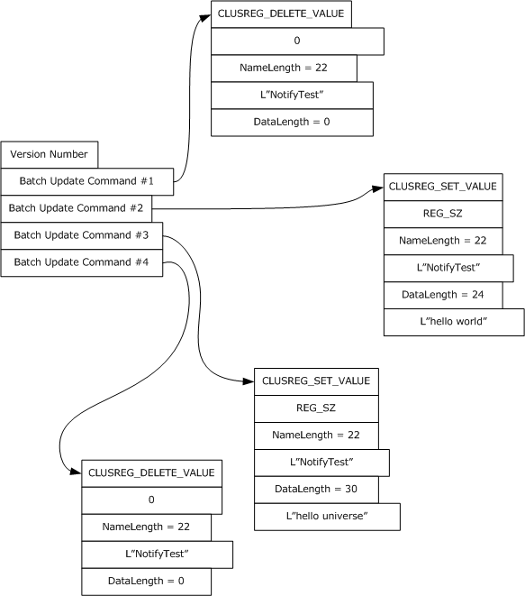

Figure 3: Client-issued registry update

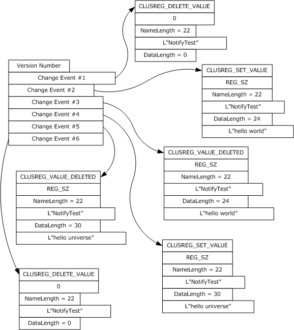

Figure 4: Corresponding change notifications returned by server

The server SHOULD accept an ApiGetBatchNotification request if the client's access level is at least "Read" (section [3.1.4](#Section_1.3)).

error_status_t ApiGetBatchNotification(

[in] HBATCH_PORT_RPC hBatchNotify,

[out] DWORD * cbData,

[out, size_is(,*cbData)] UCHAR ** lpData

);

**hBatchNotify:** A pointer to an [HBATCH_PORT_RPC](#Section_2.2.1.9) context handle that was obtained in a previous [ApiCreateBatchPort](#Section_3.1.4.2.113) method call.

**cbData:** A pointer to a 32-bit integer. Upon successful completion of this method, the server MUST write the size, in bytes, of the *lpData* buffer to the integer location indicated by **cbData**.

**lpData:** The address of a pointer where the server MUST write, upon successful completion of this method, a CLUSTER_REG_BATCH_UPDATE structure as previously described.

**Return Values:** The method MUST return the following error codes for the specified conditions.

| Return value/code | Description |
| --- | --- |
| 0x00000000 ERROR_SUCCESS | Success. |
| 0x00000006 ERROR_INVALID_HANDLE | The data that is pointed to by the *hBatchNotify* parameter does not represent a valid HBATCH_PORT_RPC context handle. |
| 0x00000103 ERROR_NO_MORE_ITEMS | The port referenced by the *hBatchNotify* parameter has been closed by a separate call to the ApiCloseBatchPort method. |

For any other condition, this method MUST return a value that is not one of those listed in the preceding table. The client MUST behave in one consistent, identical manner for all values that are not listed in the preceding table.

<a id="Section_3.1.4.2.115"></a>
##### 3.1.4.2.115 ApiCloseBatchPort (Opnum 116)

(Protocol Version 3) The ApiCloseBatchPort method instructs the [**server**](#gt_server) to free any context information that is created in a previous [ApiCreateBatchPort](#Section_3.1.4.2.113) method.

The server SHOULD accept an ApiCloseBatchPort request if its [**protocol server state**](#gt_protocol-server-state) is read-only, and the server MUST accept the request for processing if it is in the read/write state, as specified in section [3.1.1](#Section_1.3).

The server SHOULD accept an ApiCloseBatchPort request if the client's access level is at least "Read" (section [3.1.4](#Section_1.3)).

error_status_t ApiCloseBatchPort(

[in, out] HBATCH_PORT_RPC * phBatchPort

);

**phBatchPort:** A pointer to an [HBATCH_PORT_RPC](#Section_2.2.1.9) context handle that was obtained in a previous ApiCreateBatchPort method call. Upon success, the server MUST set to NULL (0x00000000) the context handle pointed to by this parameter.

**Return Values:** The method MUST return the following error codes for the specified conditions.

| Return value/code | Description |
| --- | --- |
| 0x00000000 ERROR_SUCCESS | Success. |
| 0x00000006 ERROR_INVALID_HANDLE | The data that is pointed to by the *phBatchPort* parameter does not represent a valid HBATCH_PORT_RPC context handle. |

For any other condition, this method MUST return a value that is not one of the values listed in the preceding table. The [**client**](#gt_client) MUST behave in one consistent, identical manner for all values that are not listed in the preceding table.

<a id="Section_3.1.4.2.116"></a>
##### 3.1.4.2.116 ApiOpenClusterEx (Opnum 117)

(Protocol Version 3) The ApiOpenClusterEx method SHOULD<96> establish context on the [**server**](#gt_server) about [**client**](#gt_client) interaction with the [**cluster**](#gt_cluster) by means of the current [**RPC**](#gt_remote-procedure-call-rpc) connection. ApiOpenClusterEx returns a context handle so that the client can refer to the context that is created in subsequent method calls.

The server MUST determine the level of access to be granted to the client (section [3.1.4](#Section_1.3)). Upon success, the server MUST associate that level of access with the cluster context it has established.

The server SHOULD accept an ApiOpenClusterEx request if its [**protocol server state**](#gt_protocol-server-state) is read-only and MUST accept the request for processing if it is in the read/write state, as specified in section [3.1.1](#Section_1.3).

HCLUSTER_RPC ApiOpenClusterEx(

[in] DWORD dwDesiredAccess,

[out] DWORD * lpdwGrantedAccess,

[out] error_status_t *Status

);

**dwDesiredAccess:** Indicates the access level desired by the caller. The client SHOULD set *dwDesiredAccess* to the bitwise OR of one or more values in the following table (except for restrictions as noted in the table). The server SHOULD permit the cluster [**security descriptor**](#gt_security-descriptor) to express permissions other than those specified in the following table. The server SHOULD perform an access check against those other permissions if requested by the client, except if the client sets *dwDesiredAccess* to a value that is invalid as specified in the following table. The server SHOULD NOT support a value for *dwDesiredAccess* that allows the client to request an access level of "Read with Backup Privilege".

| Value | Meaning |
| --- | --- |
| CLUSAPI_READ_ACCESS 0x00000001 | The client requests a context handle that can be used in subsequent method calls that require "Read" access. |
| CLUSAPI_CHANGE_ACCESS 0x00000002 | The client requests a context handle that can be used in subsequent method calls that require "All" access. The server MUST return ERROR_INVALID_PARAMETER (0x00000057) if the *dwDesiredAccess* bitwise OR includes CLUSAPI_CHANGE_ACCESS but not CLUSAPI_READ_ACCESS. |
| GENERIC_READ 0x80000000 | The server MUST treat this value the same as CLUSAPI_READ_ACCESS. |
| GENERIC-WRITE 0x40000000 | The server MUST treat this value the same as the bitwise OR of CLUSAPI_READ_ACCESS and CLUSAPI_CHANGE_ACCESS. |
| GENERIC_EXECUTE 0x20000000 | The server MUST treat this value the same as the bitwise OR of CLUSAPI_READ_ACCESS and CLUSAPI_CHANGE_ACCESS. |
| GENERIC_ALL 0x10000000 | The server MUST treat this value the same as the bitwise OR of CLUSAPI_READ_ACCESS and CLUSAPI_CHANGE_ACCESS. |
| MAXIMUM_ALLOWED 0x02000000 | The client requests a context handle that can be used in subsequent method calls that require the maximum access level granted to the client, as specified in section 3.1.4. |

**lpdwGrantedAccess:** A pointer to a 32-bit value that indicates the access level granted to the client. If the method fails, the client MUST ignore this value. Upon successful completion of this method, the server MUST set this value to one of the values in the following table.

| Value | Meaning |
| --- | --- |
| GENERIC_READ 0x80000000 | The returned context handle can be used in subsequent methods that require "Read" access. If the client has backup privilege, the returned context handle can also be used in subsequent methods that require "Read with Backup Privilege" access. |
| GENERIC_ALL 0x10000000 | The returned context handle can be used in subsequent methods that require "All" access. |

**Status:** Indicates the status of this operation. The server MUST set *Status* to the following error codes for the specified conditions.

| Value | Meaning |
| --- | --- |
| ERROR_SUCCESS 0x00000000 | Success. |
| ERROR_ACCESS_DENIED 0x00000005 | *dwDesiredAccess* indicates a level of access exceeding what the client is entitled to (section 3.1.4). |
| ERROR_INVALID_PARAMETER 0x00000057 | *dwDesiredAccess* is invalid, as specified earlier in this section. |
| RPC_S_PROCNUM_OUT_OF_RANGE 0x000006D1 | The server does not support this method. |

For any other condition, the server sets *Status* to a value that is not one of the values listed in the preceding table. The client MUST treat all values that are not listed in the preceding table the same, except as specified in section [3.2.4.6](#Section_3.2.4.6).

**Return Values:** The method MUST return a valid [HCLUSTER_RPC](#Section_2.2.1.1) (section 2.2.1.1) context handle to indicate success; otherwise, it MUST return NULL.

<a id="Section_3.1.4.2.117"></a>
##### 3.1.4.2.117 ApiOpenNodeEx (Opnum 118)

(Protocol Version 3) The ApiOpenNodeEx method SHOULD<97> establish context on the [**server**](#gt_server) about the interaction of a [**client**](#gt_client) with the specified [**cluster**](#gt_cluster) [**node**](#gt_node) by using the current [**RPC**](#gt_remote-procedure-call-rpc) connection. ApiOpenNodeEx returns a context handle so that the client can refer to the context that is created in subsequent method calls.

The server MUST determine the level of access to be granted to the client (section [3.1.4](#Section_1.3)). Upon success, the server MUST associate that level of access with the node context it has established.

The client can determine the name of the node to specify for the *lpszNodeName* parameter in one of two ways. A node can have a well-known name if it was configured as such by using implementation-specific methods between servers. Or, a client can use [ApiCreateEnum](#Section_3.1.4.2.89) with enumeration type CLUSTER_ENUM_NODE, as specified in section 3.1.4.2.8. This method obtains a list of all node names in the [**cluster state**](#gt_cluster-state). The client can then examine names or open nodes to call additional methods to determine which nodes to operate on.

The server SHOULD accept an ApiOpenNodeEx request if its [**protocol server state**](#gt_protocol-server-state) is read-only, and MUST accept the request for processing if it is in the read/write state, as specified in section [3.1.1](#Section_1.3).

HNODE_RPC ApiOpenNodeEx(

[in, string] LPCWSTR lpszNodeName,

[in] DWORD dwDesiredAccess,

[out] DWORD * lpdwGrantedAccess,

[out] error_status_t *Status,

[out] error_status_t *rpc_status

);

**lpszNodeName:** A null-terminated [**Unicode string**](#gt_unicode-string) that contains the [**computer name**](#gt_computer-name) of the node for which to establish context on the server.

**dwDesiredAccess:** The value for this parameter is the same as specified for *dwDesiredAccess* in [ApiOpenClusterEx](#Section_3.1.4.2.116).

**lpdwGrantedAccess:** The value for this parameter is the same as specified for *lpdwGrantedAccess* in ApiOpenClusterEx, with the additional stipulation that if the server sets *lpdwGrantedAccess* to GENERIC_READ and if the client has the backup privilege, as defined in [MS-LSAD](#Section_5), then the returned context handle can also be used in a subsequent call to [ApiMoveGroupToNode](#Section_3.1.4.2.132).

**Status:** Indicates the status of this operation. The server MUST set *Status* to the following error codes for the specified conditions.

| Value | Meaning |
| --- | --- |
| ERROR_SUCCESS 0x00000000 | Success. |
| ERROR_ACCESS_DENIED 0x00000005 | *dwDesiredAccess* indicates a level of access exceeding what the client is entitled to (section 3.1.4). |
| ERROR_INVALID_PARAMETER 0x00000057 | *dwDesiredAccess* is invalid, as specified earlier in this section. |
| ERROR_CLUSTER_NODE_NOT_FOUND 0x000013B2 | A node that matches the name *lpszNodeName* was not found in the cluster configuration. |
| RPC_S_PROCNUM_OUT_OF_RANGE 0x000006D1 | The server does not support this method. |

For any other condition, the server sets *Status* to a value that is not one of the values listed in the preceding table. The client MUST treat all values not listed in the preceding table the same, except as specified in section [3.2.4.6](#Section_3.2.4.6).

**rpc_status:** A 32-bit integer used to indicate success or failure. The RPC runtime MUST indicate, by writing to this parameter, whether it succeeded in executing this method on the server. The encoding of the value passed in this parameter MUST conform to encoding for comm_status and fault_status, as specified in Appendix E of [[C706]](https://go.microsoft.com/fwlink/?LinkId=89824).

**Return Values:** The method MUST return a valid [HNODE_RPC](#Section_2.2.1.2) (section 2.2.1.2) context handle to indicate success; otherwise, it MUST return NULL.

<a id="Section_3.1.4.2.118"></a>
##### 3.1.4.2.118 ApiOpenGroupEx (Opnum 119)

(Protocol Version 3) The ApiOpenGroupEx method SHOULD<98> establish context on the server about the interaction of a client with a specified cluster group by means of the current [**RPC**](#gt_remote-procedure-call-rpc) connection. ApiOpenGroupEx returns a context handle so that the client can refer to the group in subsequent method calls.

The [**server**](#gt_server) MUST determine the level of access to be granted to the [**client**](#gt_client) (section [3.1.4](#Section_1.3)). Upon success, the server MUST associate that level of access with the [**group**](#gt_group) context it has established.

The client has two ways to determine the group name to specify for the *lpszGroupName* parameter. A group can have a well-known name if it was configured as such using implementation-specific methods between servers. Alternatively, a client can use [ApiGetResourceState](#Section_3.1.4.2.139) which returns the name of the group in which a [**resource**](#gt_resource) is contained.

The server SHOULD accept an ApiOpenGroupEx request if its [**protocol server state**](#gt_protocol-server-state) is read-only and MUST accept the request for processing if it is in the read/write state, as specified in section [3.1.1](#Section_1.3).

HGROUP_RPC ApiOpenGroupEx(

[in, string] LPCWSTR lpszGroupName,

[in] DWORD dwDesiredAccess,

[out] DWORD * lpdwGrantedAccess,

[out] error_status_t *Status,

[out] error_status_t *rpc_status

);

**lpszGroupName:** A [**Unicode string**](#gt_unicode-string) that contains the name of the group for which to establish context on the server.

**dwDesiredAccess:** The value for this parameter is the same as specified for *dwDesiredAccess* in [ApiOpenClusterEx](#Section_3.1.4.2.116).

**lpdwGrantedAccess:** The value for this parameter is the same as specified for *lpdwGrantedAccess* in ApiOpenClusterEx, with the additional stipulation that if the server sets *lpdwGrantedAccess* to GENERIC_READ and if the client has the backup privilege, as defined in [MS-LSAD](#Section_5), then the returned context handle can also be used in a subsequent call to [ApiMoveGroup](#Section_3.1.4.2.152) or [ApiMoveGroupToNode](#Section_3.1.4.2.132).

**Status:** Indicates the status of this operation. The server MUST set **Status** to the following error codes for the specified conditions.

| Value | Meaning |
| --- | --- |
| ERROR_SUCCESS 0x00000000 | Success. |
| ERROR_ACCESS_DENIED 0x00000005 | *dwDesiredAccess* indicates a level of access exceeding what the client is entitled to (section 3.1.4). |
| ERROR_SHARING_PAUSED 0x00000046 | The remote server has been paused or is in the process of being started. |
| ERROR_INVALID_PARAMETER 0x00000057 | *dwDesiredAccess* is invalid, as specified earlier in this section. |
| RPC_S_PROCNUM_OUT_OF_RANGE 0x000006D1 | The server does not support this method. |
| ERROR_GROUP_NOT_FOUND 0x00001395 | A group that matches the name *lpszGroupName* was not found in the [**cluster**](#gt_cluster) configuration. |

For any other condition, the server sets *Status* to a value that is not one of the values listed in the preceding table. The client MUST treat all values that are not listed in the preceding table the same, except as specified in section [3.2.4.6](#Section_3.2.4.6).

**rpc_status:** A 32-bit integer used to indicate success or failure. The RPC runtime MUST indicate, by writing to this parameter, whether it succeeded in executing this method on the server. The encoding of the value passed in this parameter MUST conform to encoding for comm_status and fault_status, as specified in Appendix E of [[C706]](https://go.microsoft.com/fwlink/?LinkId=89824).

**Return Values:** The method MUST return a valid [HGROUP_RPC](#Section_2.2.1.3) context handle (section 2.2.1.3) to indicate success; otherwise, it MUST return NULL.

<a id="Section_3.1.4.2.119"></a>
##### 3.1.4.2.119 ApiOpenResourceEx (Opnum 120)

(Protocol Version 3) The ApiOpenResourceEx method SHOULD<99> establish context on the [**server**](#gt_server) about the interaction of a client with the specified cluster resource by using the current [**RPC**](#gt_remote-procedure-call-rpc) connection. ApiOpenResourceEx returns a context handle so that the client can refer to the [**resource**](#gt_resource) in subsequent method calls.

The server MUST determine the level of access to be granted to the client (section [3.1.4](#Section_1.3)). Upon success, the server MUST associate that level of access with the resource context it has established.

The client has several ways to determine the resource name to specify for the *lpszResourceName* parameter. A resource can have a well-known name if it was configured as such by using implementation-specific methods between servers. Or, a client can use [ApiCreateEnum](#Section_3.1.4.2.89) with enumeration type CLUSTER_ENUM_RESOURCE, as specified in section 3.1.4.2.8. This method obtains a list of all resource names in the [**cluster state**](#gt_cluster-state). The client can then examine names or open resources to call additional methods to determine on which resources to operate.

The server SHOULD accept an ApiOpenResourceEx request if its [**protocol server state**](#gt_protocol-server-state) is read-only, and MUST accept the processing request if it is in the read/write state, as specified in section [3.1.1](#Section_1.3).

HRES_RPC ApiOpenResourceEx(

[in, string] LPCWSTR lpszResourceName,

[in] DWORD dwDesiredAccess,

[out] DWORD * lpdwGrantedAccess,

[out] error_status_t *Status,

[out] error_status_t *rpc_status

);

**lpszResourceName:** A [**Unicode string**](#gt_unicode-string) that contains the name of the resource for which to establish context on the server. For version 3.0, the server MUST also accept the resource unique ID as returned by the [ApiGetResourceId](#Section_3.1.4.2.15) method.

**dwDesiredAccess:** The value for this parameter is the same as specified for *dwDesiredAccess* in [ApiOpenClusterEx](#Section_3.1.4.2.116).

**lpdwGrantedAccess:** The value for this parameter is the same as specified for *lpdwGrantedAccess* in ApiOpenClusterEx.

**Status:** Indicates the status of this operation. The server MUST set *Status* to the following error codes for the specified conditions.

| Value | Meaning |
| --- | --- |
| ERROR_SUCCESS 0x0000000 | Success. |
| ERROR_ACCESS_DENIED 0x00000005 | *dwDesiredAccess* indicates a level of access exceeding what the client is entitled to (section 3.1.4). |
| ERROR_INVALID_PARAMETER 0x00000057 | *dwDesiredAccess* is invalid, as specified earlier in this section. |
| RPC_S_PROCNUM_OUT_OF_RANGE 0x000006D1 | The server does not support this method. |
| ERROR_RESOURCE_NOT_FOUND 0x0000138f | A resource that matches name *lpszResourceName* was not found in the [**cluster**](#gt_cluster) configuration. |

For any other condition, the server sets *Status* to a value that is not one of the values listed in the preceding table. The client MUST treat all values that are not listed in the preceding table the same, except as specified in section [3.2.4.6](#Section_3.2.4.6).

**rpc_status:** A 32-bit integer used to indicate success or failure. The RPC runtime MUST indicate, by writing to this parameter, whether it succeeded in executing this method on the server. The encoding of the value passed in this parameter MUST conform to encoding for comm_status and fault_status, as specified in Appendix E of [[C706]](https://go.microsoft.com/fwlink/?LinkId=89824).

**Return Values:** The method MUST return a valid [HRES_RPC](#Section_2.2.1.4) (section 2.2.1.4) context handle to indicate success; otherwise, it MUST return NULL.

<a id="Section_3.1.4.2.120"></a>
##### 3.1.4.2.120 ApiOpenNetworkEx (Opnum 121)

(Protocol Version 3) The ApiOpenNetworkEx method SHOULD<100> establish context on the [**server**](#gt_server) about the interaction of a [**client**](#gt_client) with the specified [**cluster network**](#gt_cluster-network) by using the current [**RPC**](#gt_remote-procedure-call-rpc) connection. ApiOpenNetworkEx returns a context handle so that the client can refer to the context that is created in subsequent method calls.

The server MUST determine the level of access to be granted to the client (section [3.1.4](#Section_1.3)). Upon success, the server MUST associate with the [**node**](#gt_node) context it has established that level of access.

There are several ways by which the client can determine the name of the cluster network to specify for the *lpszNetworkName* parameter. A cluster network can have a well-known name if the cluster network was configured as such by using implementation-specific methods between servers. Optionally, a client can use [ApiCreateEnum](#Section_3.1.4.2.89) with enumeration type CLUSTER_ENUM_NETWORK, as specified in section 3.1.4.2.8. This method obtains a list of all cluster network names in the [**cluster state**](#gt_cluster-state). The client can then examine names or open networks to call additional methods in order to determine which networks to operate on.

The server SHOULD accept an ApiOpenNetworkEx request if its [**protocol server state**](#gt_protocol-server-state) is read-only and MUST accept the request for processing if it is in the read/write state, as specified in section [3.1.1](#Section_1.3).

HNETWORK_RPC ApiOpenNetworkEx(

[in, string] LPCWSTR lpszNetworkName,

[in] DWORD dwDesiredAccess,

[out] DWORD * lpdwGrantedAccess,

[out] error_status_t *Status,

[out] error_status_t *rpc_status

);

**lpszNetworkName:** A null-terminated [**Unicode string**](#gt_unicode-string) that contains the name of the cluster network for which to establish context on the server.

**dwDesiredAccess:** The value for this parameter is the same as specified for *dwDesiredAccess* in [ApiOpenClusterEx](#Section_3.1.4.2.116).

**lpdwGrantedAccess:** The value for this parameter is the same as specified for *lpdwGrantedAccess* in ApiOpenClusterEx.

**Status:** Indicates the status of this operation. The server MUST set **Status** to the following error codes for the specified conditions.

| Value | Meaning |
| --- | --- |
| ERROR_SUCCESS 0x00000000 | Success. |
| ERROR_ACCESS_DENIED 0x00000005 | *dwDesiredAccess* indicates a level of access exceeding what the client is entitled to (section 3.1.4). |
| ERROR_INVALID_PARAMETER 0x00000057 | *dwDesiredAccess* is invalid, as specified earlier in this section. |
| RPC_S_PROCNUM_OUT_OF_RANGE 0x000006D1 | The server does not support this method. |
| ERROR_CLUSTER_NETWORK_NOT_FOUND 0x000013B5 | A cluster network that matches the name *lpszNetworkName* was not found in the [**cluster**](#gt_cluster) configuration. |

For any other condition, the server sets *Status* to a value that is not one of the values listed in the preceding table. The client MUST treat all values that are not listed in the preceding table the same, except as specified in section [3.2.4.6](#Section_3.2.4.6).

**rpc_status:** A 32-bit integer used to indicate success or failure. The RPC runtime MUST indicate, by writing to this parameter, whether it succeeded in executing this method on the server. The encoding of the value passed in this parameter MUST conform to encoding for comm_status and fault_status, as specified in Appendix E of [[C706]](https://go.microsoft.com/fwlink/?LinkId=89824).

**Return Values:** The method MUST return a valid [HNETWORK_RPC](#Section_2.2.1.7) (section 2.2.1.7) context handle to indicate success; otherwise, it MUST return NULL.

<a id="Section_3.1.4.2.121"></a>
##### 3.1.4.2.121 ApiOpenNetInterfaceEx (Opnum 122)

(Protocol Version 3) The ApiOpenNetInterfaceEx method SHOULD<101> establish context on the [**server**](#gt_server) about the interaction of a [**client**](#gt_client) with the specified [**cluster network interface**](#gt_cluster-network-interface) by using the current [**RPC**](#gt_remote-procedure-call-rpc) connection. ApiOpenNetInterfaceEx returns a context handle so that the client can refer to the context that is created in subsequent method calls.

The server MUST determine the level of access to be granted to the client (section [3.1.4](#Section_1.3)). Upon success, the server MUST associate that level of access with the node context it has established.

The client can determine the name of the cluster network interface in several ways to specify for the *lpszNetInterfaceName* parameter. A cluster network interface can have a well-known name if the cluster network interface was configured as such by using implementation-specific methods between servers. Or, a client can use [ApiCreateEnum](#Section_3.1.4.2.89) with enumeration type CLUSTER_ENUM_NETINTERFACE, as specified in section 3.1.4.2.8. This method obtains a list of all cluster network interface names in the [**cluster state**](#gt_cluster-state). The client then can examine names or open cluster network interfaces to call additional methods to determine which cluster network interfaces to operate on. Finally, a client supplying the name of the [**node**](#gt_node) and network to the [ApiGetNetInterface](#Section_3.1.4.2.95) method, will get the corresponding cluster network interface object name for that combination, which then can be provided to this method.

The server SHOULD accept an ApiOpenNetInterfaceEx request if its [**protocol server state**](#gt_protocol-server-state) is read-only and MUST accept the request for processing if it is in the read/write state, as specified in section [3.1.1](#Section_1.3).

HNETINTERFACE_RPC ApiOpenNetInterfaceEx(

[in, string] LPCWSTR lpszNetInterfaceName,

[in] DWORD dwDesiredAccess,

[out] DWORD * lpdwGrantedAccess,

[out] error_status_t *Status,

[out] error_status_t *rpc_status

);

**lpszNetInterfaceName:** A null-terminated [**Unicode string**](#gt_unicode-string) that contains the name of the cluster network interface for which to establish context on the server.

**dwDesiredAccess:** The value for this parameter is the same as specified for *dwDesiredAccess* in [ApiOpenClusterEx](#Section_3.1.4.2.116).

**lpdwGrantedAccess:** The value for this parameter is the same as specified for *lpdwGrantedAccess* in ApiOpenClusterEx.

**Status:** Indicates the status of this operation. The server MUST set *Status* to the following error codes for the specified conditions.

| Value | Meaning |
| --- | --- |
| ERROR_SUCCESS 0x00000000 | Success. |
| ERROR_ACCESS_DENIED 0x00000005 | *dwDesiredAccess* indicates a level of access exceeding what the client is entitled to (section 3.1.4). |
| ERROR_INVALID_PARAMETER 0x00000057 | *dwDesiredAccess* is invalid, as specified earlier in this section. |
| RPC_S_PROCNUM_OUT_OF_RANGE 0x000006D1 | The server does not support this method. |
| ERROR_CLUSTER_NETINTERFACE_NOT_FOUND 0x000013b7 | A cluster network interface that matches the name *lpszNetInterfaceName* was not found in the [**cluster**](#gt_cluster) configuration. |

For any other condition, the server sets *Status* to a value that is not one of the values listed in the preceding table. The client MUST treat all values that are not listed in the preceding table the same, except as specified in section [3.2.4.6](#Section_3.2.4.6).

**rpc_status:** A 32-bit integer used to indicate success or failure. The RPC runtime MUST indicate, by writing to this parameter, whether it succeeded in executing this method on the server. The encoding of the value passed in this parameter MUST conform to encoding for comm_status and fault_status, as specified in Appendix E of [[C706]](https://go.microsoft.com/fwlink/?LinkId=89824).

**Return Values:** The method MUST return a valid [HNETINTERFACE_RPC](#Section_2.2.1.8) (section 2.2.1.8) context handle to indicate success; otherwise, it MUST return NULL.

<a id="Section_3.1.4.2.122"></a>
##### 3.1.4.2.122 ApiChangeCsvState (Opnum 123)

(Protocol Version 3) The ApiChangeCsvState method SHOULD<102> instruct the [**server**](#gt_server) to change the accessibility of the disk associated with *hResource*.

If *dwState* is 1, the server MUST set ResourceSharedVolumes to TRUE and convert all [**volumes**](#gt_volume) associated with *hResource* to [**cluster**](#gt_cluster) shared volumes. The server MUST set the initial state of all cluster shared volumes associated with *hResource* such that volume maintenance mode, redirected mode, and backup mode are all disabled.

If *dwState* is 1, the server SHOULD also designate the group associated with *hResource* as a special group, as specified in section [3.1.1.1.4](#Section_3.1.1.1.4).

If *dwState* is 0, the server MUST set ResourceSharedVolumes to FALSE and stop making the volumes associated with *hResource* accessible to all nodes as cluster shared volumes.

If *dwState* is 0, the server SHOULD also remove the special group designation of the group associated with *hResource*.

The server SHOULD accept an ApiChangeCsvState request if its [**protocol server state**](#gt_protocol-server-state) is read-only, and the server MUST accept the request for processing if it is in the read/write state, as specified in section [3.1.1](#Section_1.3).

The server MUST require that the access level associated with the *hResource* context handle is "All" (section [3.1.4](#Section_1.3)).

error_status_t ApiChangeCsvState(

[in] HRES_RPC hResource,

[in] DWORD dwState,

[out] error_status_t *rpc_status

);

**hResource:** An HRES_RPC context handle that was obtained in a previous [ApiOpenResource](#Section_3.1.4.2.92), [ApiOpenResourceEx](#Section_3.1.4.2.119), or [ApiCreateResource](#Section_3.1.4.2.100) method call.

**dwState:** This MUST be 1 to make the disk associated with *hResource* accessible from all cluster nodes. This MUST be 0 to make the disk associated with *hResource* accessible only from the cluster [**node**](#gt_node) that mounted the disk.

**rpc_status:** A 32-bit integer used to indicate success or failure. The [**RPC**](#gt_remote-procedure-call-rpc) runtime MUST indicate, by writing to this parameter, whether it succeeded in executing this method on the server. The encoding of the value passed in this parameter MUST conform to encoding for comm_status and fault_status, as specified in Appendix E of [[C706]](https://go.microsoft.com/fwlink/?LinkId=89824).

**Return Values:** The method MUST return the following error codes for the specified conditions.

| Return value/code | Description |
| --- | --- |
| 0x00000000 ERROR_SUCCESS | Success. |
| 0x000003E5 ERROR_IO_PENDING | The operation is still in progress. |
| 0x00000046 ERROR_SHARING_PAUSED | The current protocol server state of the server is not read/write. |
| 0x000006D1 RPC_S_PROCNUM_OUT_OF_RANGE | The server does not support this method. |
| 0x000013B8 ERROR_CLUSTER_INVALID_REQUEST | The operation is invalid for the cluster or for the specified [**resource**](#gt_resource) . It is invalid for the cluster if the *dwState* parameter is 1 and the requested state is not enabled for the cluster; for instance, the server EnableSharedVolumes state is FALSE (indicating that the server does not support cluster shared volumes) (see section [3.1.1.4](#Section_3.1.1.4)). The operation is invalid for the specified resource if any of the following conditions are met: The *dwState* parameter is 1, and the specified resource is already deployed to an application/service. The *dwState* parameter is 1, and the specified resource is in maintenance mode (see section [3.1.1.1.1.2](#Section_3.1.1.1.1.2)). The *dwState* parameter is 1, and the specified resource depends on one or more additional resources. The dwState parameter is 0, and the specified resource does not currently allow volumes to be shared to all nodes in a cluster (ResourceSharedVolumes is already FALSE). |
| 0x000013D7 ERROR_CLUSTER_RESTYPE_NOT_SUPPORTED | The *dwState* parameter is 1 and the specified resource is not of the correct type. Shared access can only be enabled for resources that are of the Physical Disk Resource type. |
| 0x0000138C ERROR_RESOURCE_NOT_ONLINE | The *dwState* parameter is 1 and the specified resource is not online. The resource MUST be online to enable shared access. |

For any other condition, this method returns a value that is not one of the values listed in the preceding table. The [**client**](#gt_client) MUST behave in one consistent, identical manner for all values that are not listed in the preceding table. The client treats errors specified in [3.2.4.6](#Section_3.2.4.6) as recoverable errors and initiate the reconnect procedure as specified in section 3.2.4.6.

<a id="Section_3.1.4.2.123"></a>
##### 3.1.4.2.123 ApiCreateNodeEnumEx (Opnum 124)

(Protocol Version 3) The ApiCreateNodeEnumEx method SHOULD<103> return two [ENUM_LIST](#Section_2.2.3.5) structures of equal length containing the **ID** and **Name** attributes of the requested objects of the specified enumeration type from the [**cluster state**](#gt_cluster-state). Each **Element** in the *ReturnIdEnum* parameter corresponds to the ID of the element at the same offset in the *ReturnNameEnum* parameter.

If multiple enumeration types are indicated, the resulting ENUM_LIST contains zero or more entries of each type, and the type of each entry in the lists are indicated by the [ENUM_ENTRY](#Section_2.2.3.4) data structure, as specified in section 2.2.3.4.

The [**server**](#gt_server) SHOULD accept an ApiCreateNodeEnumEx request if its [**protocol server state**](#gt_protocol-server-state) is read-only, and the server MUST accept the request for processing if it is in the read/write state, as specified in section [3.1.1](#Section_1.3).

The server MUST fail this method with the ERROR_INVALID_PARAMETER (0x00000057) return value if the *dwType* parameter is not one of the specified values or if the *dwOptions* parameter is not 0x00000000.

The server SHOULD accept an ApiCreateNodeEnumEx request if the access level associated with the hNode context handle is at least "Read" (section [3.1.4](#Section_1.3)).

error_status_t ApiCreateNodeEnumEx(

[in] HNODE_RPC hNode,

[in] DWORD dwType,

[in] DWORD dwOptions,

[out] PENUM_LIST* ReturnIdEnum,

[out] PENUM_LIST* ReturnNameEnum,

[out] error_status_t* rpc_status

);

**hNode:** An [HNODE_RPC](#Section_2.2.1.2) context handle that was obtained in a previous ApiOpenNode (Opnum 66) or ApiOpenNodeEx (Opnum 118) method call.

**dwType:** The type of enumeration to be returned by the server. This value MUST be set to the bitwise OR operator of one or more of the following values:

| Value | Meaning |
| --- | --- |
| CLUSTER_NODE_ENUM_NETINTERFACES 0x00000001 | The server MUST return an enumeration of names, in *ReturnNameEnum*, and an enumeration of IDs, in *ReturnIdEnum*, representing one or more [**cluster network interfaces**](#gt_cluster-network-interface) installed on the specified [**node**](#gt_node). Each element of *ReturnIdEnum* that sets *dwType* to CLUSTER_NODE_ENUM_NETINTERFACES contains the ID of the cluster network interface as if the CLUSCTL_NETINTERFACE_GET_ID control code is sent to the cluster network interface represented by the name in the corresponding element of the *ReturnNameEnum*. |
| CLUSTER_NODE_ENUM_GROUPS 0x00000002 | The server MUST return an enumeration of names, in *ReturnNameEnum*, and an enumeration of IDs, in *ReturnIdEnum*, representing one or more [**cluster**](#gt_cluster) groups currently owned by the specified node. Each element of *ReturnIdEnum* that sets *dwType* to CLUSTER_NODE_ENUM_GROUPS contains the ID of the cluster group as if the CLUSCTL_GROUP_GET_ID control code is sent to the cluster group represented by the name in the corresponding element of the *ReturnNameEnum*. |

**dwOptions:** A 32-bit integer that specifies the options on the type of elements to return. The client MUST set this value to 0x00000000. The server MUST fail the call if this parameter is not set to 0x00000000.

**ReturnIdEnum:** A pointer to an ENUM_LIST (section 2.2.3.5) that contains IDs of the objects that match the enumeration type that is indicated by the *dwType* parameter. The server MUST allocate as much memory as is required to return the enumeration data. If the method fails, this parameter MUST be ignored.

**ReturnNameEnum:** A pointer to an ENUM_LIST (section 2.2.3.5) that contains the names of the objects that match the enumeration type that is indicated by the *dwType* parameter. The server MUST allocate as much memory as is required to return the enumeration data. If the method fails, this parameter MUST be ignored.

**rpc_status:** A 32-bit integer used to indicate success or failure. The [**RPC**](#gt_remote-procedure-call-rpc) runtime MUST indicate, by writing to this parameter, whether the runtime succeeded in executing this method on the server. The encoding of the value passed in this parameter MUST conform to encoding for comm_status and fault_status, as specified in Appendix E of [[C706]](https://go.microsoft.com/fwlink/?LinkId=89824).

**Return Values:** The method MUST return the following error codes for the specified conditions.

| Return value/code | Description |
| --- | --- |
| 0x00000000 ERROR_SUCCESS | Success. |
| 0x000000057 ERROR_INVALID_PARAMETER | The *dwType* parameter is not one of the specified values, or the *dwOptions* parameter is not 0x00000000. |
| 0x000006D1 RPC_S_PROCNUM_OUT_OF_RANGE | The server does not support this method. |

For any other condition, this method returns a value that is not one of the values listed in the preceding table. The client MUST behave in one consistent, identical manner for all values that are not listed in the preceding table. The client SHOULD treat errors specified in [3.2.4.6](#Section_3.2.4.6) as recoverable errors and initiate the reconnect procedure as specified in section 3.2.4.6.

<a id="Section_3.1.4.2.124"></a>
##### 3.1.4.2.124 ApiCreateEnumEx (Opnum 125)

(Protocol Version 3) The ApiCreateEnumEx method SHOULD<104> return two [ENUM_LIST](#Section_2.2.3.5) structures of equal length containing the **ID** and **Name** attributes of the requested objects of the specified enumeration type from the cluster state. Each **Element** in the **ReturnIdEnum** parameter corresponds to the ID of the element at the same offset in the **ReturnNameEnum** parameter.

If multiple enumeration types are indicated, the resulting ENUM_LIST contains zero or more entries of each type, and the type of each entry in the list is indicated by the [ENUM_ENTRY](#Section_2.2.3.4) data structure, as specified in section 2.2.3.4.

The server SHOULD accept an ApiCreateEnumEx request if its [**protocol server state**](#gt_protocol-server-state) is read-only, as specified in section [3.1.1](#Section_1.3), and the *dwType* parameter is CLUSTER_ENUM_NODE. The server MUST accept an ApiCreateEnumEx request if its protocol server state is read/write.

The server MUST fail this method with the ERROR_INVALID_PARAMETER (0x00000057) return value if the *dwType* parameter is not one of the specified values or if the *dwOptions* parameter is not 0x00000000.

The server SHOULD accept an ApiCreateEnumEx request if the access level associated with the hCluster context handle is at least "Read" (section [3.1.4](#Section_1.3)).

error_status_t ApiCreateEnumEx(

[in] HCLUSTER_RPC hCluster,

[in] DWORD dwType,

[in] DWORD dwOptions,

[out] PENUM_LIST* ReturnIdEnum,

[out] PENUM_LIST* ReturnNameEnum,

[out] error_status_t* rpc_status

);

**hCluster:** An [HCLUSTER_RPC (section 2.2.1.1)](#Section_2.2.1.1) context handle that was obtained in a previous [ApiOpenCluster (section 3.1.4.2.1)](#Section_3.1.4.2.139) or [ApiOpenClusterEx (section 3.1.4.2.116)](#Section_3.1.4.2.116) method call.

**dwType:** The type of enumeration to be returned by the server. This value MUST be set to the bitwise OR operator of one or more of the following values, except as noted for CLUSTER_ENUM_INTERNAL_NETWORK.

| Value | Meaning |
| --- | --- |
| CLUSTER_ENUM_NODE 0x00000001 | The server MUST return an enumeration of names, in *ReturnNameEnum*, and an enumeration of IDs, in *ReturnIdEnum*, representing cluster nodes that are members of the cluster. Each element of *ReturnIdEnum* that sets *dwType* to CLUSTER_ENUM_NODE contains the ID of the cluster node as if the CLUSCTL_NODE_GET_ID control code is sent to the node with the name in the corresponding element of the *ReturnNameEnum*. |
| CLUSTER_ENUM_RESTYPE 0x00000002 | The serer MUST return an enumeration of names representing the [**resource types**](#gt_resource-type) installed in the cluster as the *ReturnNameEnum* out parameter. The server MUST return an ENUM_LIST of equal length in the *ReturnIdEnum* out parameter with each element that sets *dwType* to CLUSTER_ENUM_RESTYPE a zero-length null-terminated [**Unicode string**](#gt_unicode-string). |
| CLUSTER_ENUM_RESOURCE 0x00000004 | The server MUST return an enumeration of names, in *ReturnNameEnum*, and an enumeration of IDs, in *ReturnIdEnum*, representing the cluster resources. Each element of *ReturnIdEnum* that sets *dwType* to CLUSTER_ENUM_RESOURCE contains the ID of the cluster resource as if the CLUSCTL_RESOURCE_GET_ID control code is sent to the resource with the name in the corresponding element of the *ReturnNameEnum*. |
| CLUSTER_ENUM_GROUP 0x00000008 | The server MUST return an enumeration of names, in *ReturnNameEnum*, and an enumeration of IDs, in *ReturnIdEnum*, of cluster groups. Each element of *ReturnIdEnum* that sets *dwType* to CLUSTER_ENUM_GROUP contains the ID of the cluster group as if the CLUSCTL_GROUP_GET_ID control code is sent to the group with the name in the corresponding element of the *ReturnNameEnum*. |
| CLUSTER_ENUM_NETWORK 0x00000010 | The server MUST return an enumeration of names, in *ReturnNameEnum*, and an enumeration of IDs, in *ReturnIdEnum*, of [**cluster networks**](#gt_cluster-network). Each element of *ReturnIdEnum* that sets *dwType* to CLUSTER_ENUM_NETWORK contains the ID of the cluster network as if the CLUSCTL_NETWORK_GET_ID control code is sent to the cluster network with the name in the corresponding element of the *ReturnNameEnum*. |
| CLUSTER_ENUM_NETINTERFACE 0x00000020 | The server MUST return an enumeration of names, in *ReturnNameEnum*, and an enumeration of IDs, in *ReturnIdEnum*, of [**cluster network interfaces**](#gt_cluster-network-interface). Each element of *ReturnIdEnum* that sets *dwType* to CLUSTER_ENUM_NETINTERFACE contains the ID of the cluster network interface as if the CLUSCTL_NETINTERFACE_GET_ID control code is sent to the cluster network interface with the name in the corresponding element of the *ReturnNameEnum*. |
| CLUSTER_ENUM_INTERNAL_NETWORK 0x80000000 | Cannot be specified with any other value for this parameter. The server MUST return an enumeration of names, in *ReturnNameEnum*, and an enumeration of IDs, in *ReturnIdEnum*, of cluster networks that are used only for internal communications. Each element of *ReturnIdEnum* that sets *dwType* to CLUSTER_ENUM_INTERNAL_NETWORK contains the ID of the cluster network as if the CLUSCTL_NETWORK_GET_ID control code is sent to the cluster network with the name in the corresponding element of the *ReturnNameEnum*. |

**dwOptions:** A 32-bit integer that specifies the options on the type of elements to return. The client MUST set this value to 0x00000000. The server MUST fail the call if this parameter is not set to 0x00000000.

**ReturnIdEnum:** A pointer to a PENUM_LIST (section 2.2.3.5). The pointer contains the IDs of the objects that match the enumeration type that is indicated by the *dwType* parameter. The server MUST allocate as much memory as is required to return the enumeration data. If the method fails, this parameter MUST be ignored.

**ReturnNameEnum:** A pointer to a PENUM_LIST (section 2.2.3.5). The pointer contains the name of the objects that match the enumeration type that is indicated by the *dwType* parameter, except where noted above. The server MUST allocate as much memory as is required to return the enumeration data. If the method fails, this parameter MUST be ignored.

**rpc_status:** A 32-bit integer used to indicate success or failure. The [**RPC**](#gt_remote-procedure-call-rpc) runtime MUST indicate, by writing to this parameter, whether it succeeded in executing this method on the server. The encoding of the value passed in this parameter MUST conform to encoding for comm_status and fault_status, as specified in Appendix E of [[C706]](https://go.microsoft.com/fwlink/?LinkId=89824).

**Return Values:** The method MUST return the following error codes for the conditions that are specified as follows.

| Return value/code | Description |
| --- | --- |
| 0x00000000 ERROR_SUCCESS | Success. |
| 0x00000008 ERROR_NOT_ENOUGH_MEMORY | The server failed to allocate enough memory for the *ReturnEnum* parameter. |
| 0x000000057 ERROR_INVALID_PARAMETER | The enumeration type that is specified by *dwType* is not valid or *dwOptions* is not set to 0x00000000. |
| 0x000006D1 RPC_S_PROCNUM_OUT_OF_RANGE | The server does not support this method. |

For any other condition, the server returns a value that is not one of the values listed in the preceding table. The client MUST behave in one consistent, identical manner for all values that are not listed in the preceding table. However, the client SHOULD treat errors specified in [3.2.4.6](#Section_3.2.4.6) as recoverable errors and initiate the reconnect procedure as specified in section 3.2.4.6.

<a id="Section_3.1.4.2.125"></a>
##### 3.1.4.2.125 ApiPauseNodeEx (Opnum 126)

(Protocol Version 3) The ApiPauseNodeEx method SHOULD<105> instruct the server to suspend group ownership and failover activity on the designated node and, optionally, to move groups on the designated node to different nodes in the cluster.

The server MUST handle this method in the same manner as [ApiPauseNode (section 3.1.4.1.70)](#Section_3.1.4.1.70) except as specified in this section.

This method enables the client to specify whether to evacuate the node by moving all the groups to other nodes in the cluster. The client requests evacuation by setting the *bDrainNode* parameter to TRUE. In this case, the server MUST move each group owned by the node designated by the *hNode* parameter to a different node in the cluster.

If the client calls this method with *bDrainNode* set to TRUE:

- The server MUST fail this method with ERROR_CLUSTER_NODE_EVACUATION_IN_PROGRESS (0x0000174A) if evacuation is already in progress for the designated node. The way the server determines that evacuation is in progress is implementation-specific, although for evacuation to not be in progress, the following condition MUST be met: if the *dwPauseFlags* parameter does not include the CLUSAPI_NODE_PAUSE_REMAIN_ON_PAUSED_NODE_ON_MOVE_ERROR flag, the node designated by the *hNode* parameter cannot host any groups.
- The server MUST fail this method with ERROR_CLUSTER_NODE_DOWN (0x000013BA) if there are no nodes in the cluster that are in the ClusterNodeUp state (as specified in section [3.1.4.1.69](#Section_3.1.4.1.69)) other than the node designated by the hNode parameter.
Otherwise, if the client calls this method with *bDrainNode* set to TRUE, the server MUST return ERROR_IO_PENDING (0x000003E5) and proceed to move the groups asynchronously.

The server SHOULD move the groups according to preferences, limitations, and other policies that are configured and executed through implementation-specific methods between servers, as if [ApiMoveGroup (section 3.1.4.1.52)](#Section_3.1.4.1.52) or [ApiMoveGroupEx (section 3.1.4.2.131)](#Section_3.1.4.2.131) had been called for each of these groups individually. If a preference, limitation, or other policy would prevent the server from moving the group such that a call to ApiMoveGroup or ApiMoveGroupEx would fail, then unless the CLUSAPI_NODE_PAUSE_REMAIN_ON_PAUSED_NODE_ON_MOVE_ERROR flag is set in the *dwPauseFlags* parameter, the server MUST move the group to a different node anyway, even if the server does not bring the group to its persistent state on the destination node.

The server MUST accept an ApiPauseNodeEx request only if its [**protocol server state**](#gt_protocol-server-state) is read/write, as specified in section [3.1.1](#Section_1.3).

The server MUST require that the access level associated with the *hNode* parameter context handle is "All", as specified in section [3.1.4](#Section_1.3).

error_status_t ApiPauseNodeEx(

[in] HNODE_RPC hNode,

[in] BOOL bDrainNode,

[in] DWORD dwPauseFlags,

[out] error_status_t *rpc_status

);

**hNode:** An HNODE_RPC context handle that was obtained in a previous call to [ApiOpenNode (section 3.1.4.1.67)](#Section_3.1.4.1.67) or [ApiOpenNodeEx (section 3.1.4.2.117)](#Section_3.1.4.2.117).

**bDrainNode:** Indicates whether to evacuate the node. If set to TRUE, the server MUST evacuate the node specified by the *hNode* parameter as specified in this section.

**dwPauseFlags:** This parameter can be set to CLUSAPI_NODE_PAUSE_REMAIN_ON_PAUSED_NODE_ON_MOVE_ERROR (0x00000001), indicating that the server MUST allow a group to remain on the node designated by the *hNode* parameter if policies prohibit moving the group to any other nodes that are in the ClusterNodeUp state. Otherwise, this parameter MUST be set to zero. The server MUST ignore the value of this parameter entirely if the *bDrainNode* parameter is set to FALSE.

**rpc_status:** A 32-bit integer used to indicate success or failure. The [**RPC**](#gt_remote-procedure-call-rpc) runtime MUST indicate, by writing to this parameter, whether it succeeded in executing this method on the server. The encoding of the value passed in this parameter MUST conform to encoding for comm_status and fault_status, as specified in Appendix E of [[C706]](https://go.microsoft.com/fwlink/?LinkId=89824).

**Return Values:** The method MUST return one of the following error codes.

| Return value/code | Description |
| --- | --- |
| 0x00000000 ERROR_SUCCESS | The method completed successfully. |
| 0x00000006 ERROR_INVALID_HANDLE | The data that is designated by the *hNode* parameter does not represent a valid HNODE_RPC context handle. |
| 0x000013BA ERROR_CLUSTER_NODE_DOWN | There are no nodes in the cluster that are in the ClusterNodeUp state other than the node designated by the *hNode* parameter. |
| 0x000003E5 ERROR_IO_PENDING | The server is in the process of evacuating the specified node. |
| 0x0000174A ERROR_CLUSTER_NODE_EVACUATION_IN_PROGRESS | The server is already evacuating the specified node due to a prior call to this method. |

For any other condition, the server returns a value that is not one of the values listed in the preceding table. The client MUST behave identically for all return values that are not listed in the preceding table; however, the client SHOULD treat errors specified in section [3.2.4.6](#Section_3.2.4.6) as recoverable errors and initiate the reconnect procedure as specified in that section.

<a id="Section_3.1.4.2.126"></a>
##### 3.1.4.2.126 ApiPauseNodeWithDrainTarget (Opnum 127)

(Protocol Version 3) The ApiPauseNodeWithDrainTarget method SHOULD<106> instruct the server to suspend group ownership and failover activity on the designated target node and to move all groups from the designated node to a designated node in the cluster.

This server MUST handle this method in the same manner as [ApiPauseNodeEx (section 3.1.4.2.125)](#Section_3.1.4.2.125) except that the server MUST attempt to move groups hosted by the node specified by the *hNode* parameter to the node specified by the *hNodeDrainTarget* parameter. The server SHOULD move the groups according to preferences, limitations, and other policies as if [ApiMoveGroupToNode (section 3.1.4.2.53)](#Section_3.1.4.2.132) or [ApiMoveGroupToNodeEx (section 3.1.4.2.132)](#Section_3.1.4.2.132) had been called for each of these groups individually.

The server MUST fail this method with ERROR_HOST_NODE_NOT_AVAILABLE (0x0000138D) if the node designated by the *hNodeDrainTarget* parameter is not in the ClusterNodeUp state as specified in section [3.1.4.2.69](#Section_3.1.4.1.69).

The server MUST accept an ApiPauseNodeWithDrainTarget request only if its [**protocol server state**](#gt_protocol-server-state) is read/write, as specified in section [3.1.1](#Section_1.3).

The server MUST require that the access level associated with the *hNodeDrainTarget* parameter context handle is "All", as specified in section [3.1.4](#Section_1.3).

void ApiPauseNodeWithDrainTarget(

[in] HNODE_RPC hNode,

[in] DWORD dwPauseFlags,

[in] HNODE_RPC hNodeDrainTarget,

[out] error_status_t* rpc_status

);

**hNode:** An HNODE_RPC context handle that was obtained in a previous call to [ApiOpenNode (section 3.1.4.1.67)](#Section_3.1.4.1.67) or [ApiOpenNodeEx (section 3.1.4.2.117)](#Section_3.1.4.2.117).

**dwPauseFlags:** This parameter can be set to CLUSAPI_NODE_PAUSE_REMAIN_ON_PAUSED_NODE_ON_MOVE_ERROR (0x00000001), indicating that the server MUST allow a group to remain on the node designated by the *hNode* parameter if policies prohibit moving the group to the node designated by the *hNodeDrainTarget* parameter. Otherwise, this parameter MUST be set to zero.

**hNodeDrainTarget:** An HNODE_RPC context handle to the destination node, obtained in a previous call to ApiOpenNode (section 3.1.4.1.67) or ApiOpenNodeEx (section 3.1.4.2.117). The *hNodeDrainTarget* parameter MUST NOT specify the same node as the *hNode* parameter.

**rpc_status:** A 32-bit integer used to indicate success or failure. The [**RPC**](#gt_remote-procedure-call-rpc) runtime MUST indicate, by writing to this parameter, whether it succeeded in executing this method on the server. The encoding of the value passed in this parameter MUST conform to encoding for comm_status and fault_status, as specified in Appendix E of [[C706]](https://go.microsoft.com/fwlink/?LinkId=89824).

**Return Values:** This method MUST return one of the error codes returned by ApiPauseNodeEx (section 3.1.4.2.125) or one of the following values:

| Return value/code | Description |
| --- | --- |
| 0x0000138D ERROR_HOST_NODE_NOT_AVAILABLE | The node designated by the *hNodeDrainTarget* parameter is in an invalid state. |
| 0x00000072 ERROR_INVALID_TARGET_HANDLE | The node designated by the *hNodeDrainTarget* parameter is an invalid destination node. This method MUST return ERROR_INVALID_TARGET_HANDLE if the node designated by the *hNodeDrainTarget* parameter is the same as the node designated by the *hNode* parameter. |

For any other condition, the server returns a value that is not one of the values listed in the preceding table. The client MUST behave identically for all return values that are not listed in the preceding table; however, the client SHOULD treat errors specified in section [3.2.4.6](#Section_3.2.4.6) as recoverable errors and initiate the reconnect procedure as specified in that section.

<a id="Section_3.1.4.2.127"></a>
##### 3.1.4.2.127 ApiResumeNodeEx (Opnum 128)

(Protocol Version 3) The ApiResumeNodeEx method SHOULD<107> instruct the server to resume normal group ownership and failover activity on the designated node and, optionally, to initiate operations to move groups to the designated node.

The server MUST handle this method in the same manner as [ApiResumeNode (section 3.1.4.2.71)](#Section_3.1.4.2.127) except as specified below for the *dwResumeFailbackType* parameter.

The server MUST require that the access level associated with the *hNode* parameter context handle is "All", as specified in section [3.1.4](#Section_1.3).

error_status_t ApiResumeNodeEx(

[in] HNODE_RPC hNode,

[in] DWORD dwResumeFailbackType,

[in] DWORD dwResumeFlagsReserved,

[out] error_status_t *rpc_status

);

**hNode:** An HNODE_RPC context handle that was obtained in a previous call to [ApiOpenNode (section 3.1.4.1.67)](#Section_3.1.4.1.67) or [ApiOpenNodeEx (section 3.1.4.2.117)](#Section_3.1.4.2.117).

**dwResumeFailbackType:** Designates whether the server MUST initiate operations to move groups to the node designated by the *hNode* parameter. This parameter MUST be set to one of the following values:

| Value | Description |
| --- | --- |
| 0 | The server SHOULD NOT move groups to the node designated by the *hNode* parameter as a result of the call to this method. The server MAY subsequently move groups to the node designated by the *hNode* parameter according to other implementation-specific policies. |
| 1 | The server SHOULD move groups to the node designated by the *hNode* parameter as a result of the call to this method. The server SHOULD use implementation-specific policies to determine the groups to move and the manner in which to move them. In determining the groups to move, the server SHOULD ignore previously configured policies that control whether groups are to be moved to a node upon its transition to the ClusterNodeUp state (as specified in section [3.1.4.1.69](#Section_3.1.4.1.69)). |
| 2 | The server SHOULD move groups to the node designated by the *hNode* parameter as a result of the call to this method. The server SHOULD use implementation-specific policies to determine the groups to move and the manner in which to move them. In selecting the groups to move, the server SHOULD adhere to policies that control whether groups are to be moved to a node upon its transition to the ClusterNodeUp state (as specified in section 3.1.4.1.69). This setting will cause failback due to potential violations of configured policies (such as possible owners, anti-affinity, and preferred owners) only if failback is enabled. Although callers can specify a failback window in which failback would normally occur, in this situation the server will ignore any caller-specified failback window. The failback can happen at any time. This setting also causes failback of all groups from all paused nodes to this node. |

**dwResumeFlagsReserved:** Reserved for future use.

**rpc_status:** A 32-bit integer used to indicate success or failure. The [**RPC**](#gt_remote-procedure-call-rpc) runtime MUST indicate, by writing to this parameter, whether it succeeded in executing this method on the server. The encoding of the value passed in this parameter MUST conform to encoding for comm_status and fault_status, as specified in Appendix E of [[C706]](https://go.microsoft.com/fwlink/?LinkId=89824).

**Return Values:** The method MUST return one of the following error codes:

| Return value/code | Description |
| --- | --- |
| 0x00000000 ERROR_SUCCESS | The method completed successfully. |
| 0x00000006 ERROR_INVALID_HANDLE | The *hNode* parameter does not contain a valid HNODE_RPC context handle. |
| 0x000013C2 ERROR_CLUSTER_NODE_NOT_PAUSED | The node designated by the *hNode* parameter is not paused. |
| 0x000013BA ERROR_CLUSTER_NODE_DOWN | The node designated by the *hNode* parameter is down. |

<a id="Section_3.1.4.2.128"></a>
##### 3.1.4.2.128 ApiCreateGroupEx (Opnum 129)

(Protocol Version 3) The ApiCreateGroupEx method SHOULD<108> extend functionality of the [ApiCreateGroup (section 3.1.4.2.43)](#Section_3.1.4.2.43) method, allowing the client to provide additional information about the group being created.

The server MUST handle this method in the same manner as ApiCreateGroup (section 3.1.4.2.43) except as specified later in this section for the *pGroupInfo* parameter.

HGROUP_RPC ApiCreateGroupEx(

[in, string] LPCWSTR lpszGroupName,

[in, unique] PCLUSTER_CREATE_GROUP_INFO_RPC pGroupInfo,

[out] error_status_t *Status,

[out] error_status_t *rpc_status

);

**lpszGroupName:** A [**Unicode string**](#gt_unicode-string) that is the name associated with the group.

**pGroupInfo:** Contains information about the group to be created. The client MUST set the **dwVersion** field of the [CLUSTER_CREATE_GROUP_INFO_RPC (section 2.2.3.21)](#Section_2.2.3.21) to 0x00000001. Except for the following reserved values, the client sets the **dwGroupType** field to an arbitrary value that the client can use to associate meaning or context with the group. Upon successful creation of the group, the server MUST set the group type to the value specified by the client and the server MUST treat all values identically. If a client does not need to associate any particular meaning or context with the group, the client SHOULD set the group type to 0x0000270F (ClusGroupTypeUnknown).

| Value | Description |
| --- | --- |
| 0x00000001 ClusGroupTypeReserved1 | Reserved for local use. |
| 0x00000002 ClusGroupTypeReserved2 | Reserved for local use. |
| 0x00000004 ClusGroupTypeReserved3 | Reserved for local use. |
| 0x00000005 ClusGroupTypeReserved4 | Reserved for local use. |

**Status:** Indicates the status of this operation. The server MUST set this parameter to one of the following error codes:

| Value | Description |
| --- | --- |
| 0x00000000 ERROR_SUCCESS | The operation completed successfully. |
| 0x00000046 ERROR_SHARING_PAUSED | The remote server is paused or is in the process of being started. |
| 0x00001392 ERROR_OBJECT_ALREADY_EXISTS | A group with the designated name already exists. |

For any other condition, the server sets the *Status* parameter to a value that is not one of the values listed in this table. The client MUST treat all values not listed in this table identically, except as specified in section [3.2.4.6](#Section_3.2.4.6).

**rpc_status:** A 32-bit integer used to indicate success or failure. The [**RPC**](#gt_remote-procedure-call-rpc) runtime MUST indicate, by writing to this parameter, whether it succeeded in executing this method on the server. The encoding of the value passed in this parameter MUST conform to encoding for comm_status and fault_status, as specified in Appendix E of [[C706]](https://go.microsoft.com/fwlink/?LinkId=89824).

**Return Values:** This method MUST return a valid HGROUP_RPC context handle, as specified in section [2.2.1.3](#Section_2.2.1.3), to indicate success. Otherwise, it MUST return NULL.

<a id="Section_3.1.4.2.129"></a>
##### 3.1.4.2.129 ApiOnlineGroupEx (Opnum 130)

(Protocol Version 3) The ApiOnlineGroupEx method SHOULD<109> instruct the server to make all the resources in the designated group active or available on the node that is hosting the group. The persistent state of the group is set to Online and is updated in the nonvolatile cluster state.

The server MUST handle this method in the same manner as [ApiOnlineGroup (section 3.1.4.2.50)](#Section_3.1.4.1.50) except as follows:

- If the CLUSAPI_GROUP_ONLINE_IGNORE_RESOURCE_STATUS flag is set in the *dwOnlineFlags* parameter, the server MUST ignore the locked mode value of the group designated by the *hGroup* parameter.
- If the CLUSAPI_GROUP_ONLINE_SYNCHRONOUS flag is set in the *dwOnlineFlags* parameter, the server MUST perform the operation synchronously to bring the group designated by the *hGroup* parameter online.
- If the CLUSAPI_GROUP_ONLINE_BEST_POSSIBLE_NODE flag is set in the *dwOnlineFlags* parameter, the server MUST determine the best possible node that will host the group designated by the *hGroup* parameter.
- If the CLUSAPI_GROUP_ONLINE_IGNORE_AFFINITY_RULE flag is set in the *dwOnlineFlags* parameter, the server MUST ignore the affinity rule of the group designated by the *hGroup* parameter.
- For each resource contained in the group designated by the *hGroup* parameter that is not in the ClusterResourceOnline state (section [3.1.4.2.13](#Section_3.1.4.2.139)), the server MUST provide the buffer specified by the *lpInBuffer* parameter to the server implementation-specific object that controls the resource operation while bringing the resource online.
The server MUST accept an ApiOnlineGroupEx request only if it is in the read/write state, as specified in section [3.1.1](#Section_1.3).

The server MUST require that the access level associated with the *hGroup* parameter is "All" (section [3.1.4](#Section_1.3)).

error_status_t ApiOnlineGroupEx(

[in] HGROUP_RPC hGroup,

[in] DWORD dwOnlineFlags,

[in, size_is(cbInBufferSize)] BYTE* lpInBuffer,

[in] DWORD cbInBufferSize,

[out] error_status_t *rpc_status

);

**hGroup:** An HGROUP_RPC context handle that was obtained in a previous call to [ApiOpenGroup (section 3.1.4.2.42)](#Section_3.1.4.2.42), [ApiOpenGroupEx (section 3.1.4.2.118)](#Section_3.1.4.2.118), or [ApiCreateGroup (section 3.1.4.2.43)](#Section_3.1.4.2.43).

**dwOnlineFlags:** A bitwise-OR of zero or more of the following flags.

| Value | Description |
| --- | --- |
| 0x00000001 CLUSAPI_GROUP_ONLINE_IGNORE_RESOURCE_STATUS | The server MUST ignore the locked mode of the group as specified in section [3.1.1.1.4](#Section_3.1.1.1.4). |
| 0x00000002 CLUSAPI_GROUP_ONLINE_SYNCHRONOUS | The server MUST perform the operation synchronously to bring the group online.<110> |
| 0x00000004 CLUSAPI_GROUP_ONLINE_BEST_POSSIBLE_NODE | The server MUST determine the best possible node that will host the group when it is brought online.<111> |
| 0x00000008 CLUSAPI_GROUP_ONLINE_IGNORE_AFFINITY_RULE | The server MUST ignore the affinity rule of the group.<112> |

**lpInBuffer:** A pointer to a buffer that the server will provide to implementation-specific objects that control the resource operations for each resource in the group. The client SHOULD set this parameter to a [PROPERTY_LIST (section 2.2.3.10)](#Section_2.2.3.10.1). For each value in this list, the client SHOULD set the property name to the name of the [**resource type**](#gt_resource-type) of one of the resources in the group. The client MAY provide a buffer that does not have a property value corresponding to each resource type in the group, and the client MAY provide a buffer that has multiple property values for the same resource type. Except for the following property values, the server MUST treat all property values provided by the client identically.

| Property Name | CLUSTER_PROPERTY_FORMAT | Value | Description |
| --- | --- | --- | --- |
| Virtual Machine | CLUSPROP_FORMAT_DWORD | 0x00000004 | Reserved for local use. |

**cbInBufferSize:** The size in bytes of the buffer pointed to by the *lpInBuffer* parameter.

**rpc_status:** A 32-bit integer used to indicate success or failure. The [**RPC**](#gt_remote-procedure-call-rpc) runtime MUST indicate, by writing to this parameter, whether it succeeded in executing this method on the server. The encoding of the value passed in this parameter MUST conform to encoding for comm_status and fault_status, as specified in Appendix E of [[C706]](https://go.microsoft.com/fwlink/?LinkId=89824).

**Return Values:** This method MUST return the same error codes as specified for ApiOnlineGroup (section 3.1.4.2.50), in addition to the following return value.

| Return value/code | Description |
| --- | --- |
| 0x00000057 ERROR_INVALID_PARAMETER | The *dwOnlineFlags* parameter is not one of the specified values. |

<a id="Section_3.1.4.2.130"></a>
##### 3.1.4.2.130 ApiOfflineGroupEx (Opnum 131)

(Protocol Version 3) The ApiOfflineGroupEx method SHOULD<113> instruct the server to make all the resources in the designated group inactive or unavailable on the node that is hosting the group.

The server MUST handle this method in the same manner as [ApiOfflineGroup (section 3.1.4.2.51)](#Section_3.1.4.1.51) except as follows:

- If the CLUSAPI_GROUP_OFFLINE_IGNORE_RESOURCE_STATUS flag is set in the *dwOfflineFlags* parameter, the server MUST ignore the locked mode value of the group designated by the *hGroup* parameter.
- For each resource contained in the group designated by the *hGroup* parameter that is in the ClusterResourceOnline state (section [3.1.4.2.13](#Section_3.1.4.2.139)), the server MUST provide the buffer specified by the *lpInBuffer* parameter to the server implementation-specific object that controls the resource operation while bringing the resource offline.
The server MUST accept an ApiOfflineGroupEx request only if it is in the read/write state, as specified in section [3.1.1](#Section_1.3).

The server MUST require that the access level associated with the *hGroup* parameter is "All" (section [3.1.4](#Section_1.3)).

error_status_t ApiOfflineGroupEx(

[in] HGROUP_RPC hGroup,

[in] DWORD dwOfflineFlags,

[in, size_is(cbInBufferSize)] BYTE* lpInBuffer,

[in] DWORD cbInBufferSize,

[out] error_status_t *rpc_status

);

**hGroup:** An HGROUP_RPC context handle that was obtained in a previous call to [ApiOpenGroup (section 3.1.4.2.42)](#Section_3.1.4.2.42), [ApiOpenGroupEx (section 3.1.4.2.118)](#Section_3.1.4.2.118), or [ApiCreateGroup (section 3.1.4.2.43)](#Section_3.1.4.2.43).

**dwOfflineFlags:** Either CLUSAPI_GROUP_OFFLINE_IGNORE_RESOURCE_STATUS (0x00000001), if the client needs the server to ignore the locked mode for the group specified by the *hGroup* parameter (section [3.1.1.1.4](#Section_3.1.1.1.4)), or zero.

**lpInBuffer:** A pointer to a buffer that the server will provide to implementation-specific objects that control the resource operations for each resource in the group. The client SHOULD set this parameter to a [PROPERTY_LIST (section 2.2.3.10)](#Section_2.2.3.10.1). For each value in this list, the client SHOULD set the property name to the name of the [**resource type**](#gt_resource-type) of one of the resources in the group. The client MAY provide a buffer that does not have a property value corresponding to each resource type in the group, and the client MAY provide a buffer that has multiple property values for the same resource type. Except for the following property values, the server MUST treat all property values provided by the client identically.

| Property Name | CLUSTER_PROPERTY_FORMAT | Value | Description |
| --- | --- | --- | --- |
| Virtual Machine | CLUSPROP_FORMAT_DWORD | 0x00000000 | For a resource of type "Virtual Machine" in the group that is in the ClusterResourceOnline state (section 3.1.4.2.13), the server MUST turn off the corresponding virtual machine. |
| Virtual Machine | CLUSPROP_FORMAT_DWORD | 0x00000001 | For a resource of type "Virtual Machine" in the group that is in the ClusterResourceOnline state (section 3.1.4.2.13), the server MUST save the corresponding virtual machine. |
| Virtual Machine | CLUSPROP_FORMAT_DWORD | 0x00000002 | For a resource of type "Virtual Machine" in the group that is in the ClusterResourceOnline state (section 3.1.4.2.13), the server MUST shut down the corresponding virtual machine. |
| Virtual Machine | CLUSPROP_FORMAT_DWORD | 0x00000003 | For a resource of type "Virtual Machine" in the group that is in the ClusterResourceOnline state (section 3.1.4.2.13), the server MUST forcibly shut down the corresponding virtual machine. |
| Virtual Machine | CLUSPROP_FORMAT_DWORD | 0x00000004 | Reserved. |

**cbInBufferSize:** The size in bytes of the buffer pointed to by the *lpInBuffer* parameter.

**rpc_status:** A 32-bit integer used to indicate success or failure. The [**RPC**](#gt_remote-procedure-call-rpc) runtime MUST indicate, by writing to this parameter, whether it succeeded in executing this method on the server. The encoding of the value passed in this parameter MUST conform to encoding for comm_status and fault_status, as specified in Appendix E of [[C706]](https://go.microsoft.com/fwlink/?LinkId=89824).

**Return Values:** This method MUST return the same error codes as specified for ApiOfflineGroup (section 3.1.4.2.51).

<a id="Section_3.1.4.2.131"></a>
##### 3.1.4.2.131 ApiMoveGroupEx (Opnum 132)

(Protocol Version 3) The ApiMoveGroupEx method SHOULD<114> instruct the server to move ownership of the specified group to another node in the cluster.

The server MUST handle this method in the same manner as [ApiMoveGroup (section 3.1.4.2.52)](#Section_3.1.4.2.152) except as follows:

- If the CLUSAPI_GROUP_MOVE_IGNORE_RESOURCE_STATUS flag is set in the *dwMoveFlags* parameter, the server MUST ignore the locked mode value of the group designated by the *hGroup* parameter.
- If the CLUSAPI_GROUP_MOVE_RETURN_TO_SOURCE_NODE_ON_ERROR flag is set in the *dwMoveFlags* parameter, and if the designated group cannot be brought to its persistent state on the destination node selected by the server, the server MUST move the group back to the source node and bring the group to its persistent state on the source node.
- If the CLUSAPI_GROUP_MOVE_QUEUE_ENABLED flag is set in the *dwMoveFlags* parameter, and if server implementation-specific policies preclude the move operation from proceeding, the server MUST retry the move operation until either the move succeeds, or the move fails due to a different reason, or the move is canceled.
- If the CLUSAPI_GROUP_MOVE_HIGH_PRIORITY_START flag is set in the *dwMoveFlags* parameter, then on the destination node when bringing the group to its persistent state, the server SHOULD bring this group to its persistent state as soon as possible, regardless of other implementation-specific policies that govern the ordering and/or prioritization of bringing groups to their persistent states.
- If the CLUSAPI_GROUP_MOVE_FAILBACK flag is set in the *dwMoveFlags* parameter, and if move group operation fails, the server MUST perform failback operation.
- If the CLUSAPI_GROUP_MOVE_IGNORE_AFFINITY_RULE flag is set in the *dwMoveFlags* parameter, the server MUST ignore the affinity rule of the group designated by the *hGroup* parameter.
- For each resource contained in the group designated by *hGroup* that is in the state ClusterResourceOnline (section [3.1.4.2.13](#Section_3.1.4.2.139)), the server MUST provide the buffer designated by the lpInBuffer parameter to the server implementation-specific object that controls the resource operation while bringing the resource offline on the current node and when bringing the resource online on the destination node. How the server provides this buffer is implementation-specific.
The server accepts an ApiMoveGroupEx request only if it is in the read/write state, as specified in section [3.1.1](#Section_1.3).

The server MUST require that the access level associated with the *hGroup* parameter is "All" (section [3.1.4](#Section_1.3)).

error_status_t ApiMoveGroupEx(

[in] HGROUP_RPC hGroup,

[in] DWORD dwMoveFlags,

[in, size_is(cbInBufferSize)] BYTE* lpInBuffer,

[in] DWORD cbInBufferSize,

[out] error_status_t *rpc_status

);

**hGroup:** An HGROUP_RPC context handle that was obtained in a previous call to [ApiOpenGroup (section 3.1.4.2.42)](#Section_3.1.4.2.42), [ApiOpenGroupEx (section 3.1.4.2.118)](#Section_3.1.4.2.118), or [ApiCreateGroup (section 3.1.4.2.43)](#Section_3.1.4.2.43).

**dwMoveFlags:** A bitwise-OR of zero or more of the following flags, with the exception that CLUSAPI_GROUP_MOVE_IGNORE_RESOURCE_STATUS and CLUSAPI_GROUP_MOVE_QUEUE_ENABLED cannot be specified together and MUST be rejected by the server with the error 0x00000057 (ERROR_INVALID_PARAMETER).

| Value | Description |
| --- | --- |
| 0x00000001 CLUSAPI_GROUP_MOVE_IGNORE_RESOURCE_STATUS | The server MUST ignore the group locked mode as specified in section [3.1.1.1.4](#Section_3.1.1.1.4). |
| 0x00000002 CLUSAPI_GROUP_MOVE_RETURN_TO_SOURCE_NODE_ON_ERROR | If the designated group cannot be brought to its persistent state on the destination node selected by the server, the server MUST move the group back to the source node and bring the group to its persistent state on the source node. |
| 0x00000004 CLUSAPI_GROUP_MOVE_QUEUE_ENABLED | If server implementation-specific policies preclude the move operation from proceeding, the server MUST retry the move operation until either the move succeeds, or the move fails due to a different reason, or the move is canceled. |
| 0x00000008 CLUSAPI_GROUP_MOVE_HIGH_PRIORITY_START | When bringing the group to its persistent state on the destination node, the server SHOULD bring this group to its persistent state as soon as possible without regard to implementation-specific policies that govern the ordering and/or prioritization of bringing groups to their persistent states. |
| CLUSAPI_GROUP_MOVE_FAILBACK 0x00000010 | If move group operation fails, the server MUST perform failback operation. |
| CLUSAPI_GROUP_MOVE_IGNORE_AFFINITY_RULE 0x00000020 | The server MUST ignore the affinity rule while performing move group operation.<115> |

**lpInBuffer:** A pointer to a buffer that the server will provide to implementation-specific objects that control the resource operations for each resource in the group. The client SHOULD set this parameter to a [PROPERTY_LIST (section 2.2.3.10)](#Section_2.2.3.10.1). For each value in this list, the client sets the property name to the name of the [**resource type**](#gt_resource-type) of one of the resources in the group. The client MAY provide a buffer that does not have a property value corresponding to each resource type in the group, and the client MAY provide a buffer that has multiple property values for the same resource type. Except for the following property values, the server MUST treat all property values provided by the client identically.

| Property Name | CLUSTER_PROPERTY_FORMAT | Value | Description |
| --- | --- | --- | --- |
| Virtual Machine | CLUSPROP_FORMAT_DWORD | 0x00000000 | For a resource of resource type "Virtual Machine" in the group that is in the ClusterResourceOnline state (section 3.1.4.2.13), the server MUST turn off the corresponding virtual machine on the source node of the move operation. |
| Virtual Machine | CLUSPROP_FORMAT_DWORD | 0x00000001 | For a resource of resource type "Virtual Machine" in the group that is in the ClusterResourceOnline state (section 3.1.4.2.13), the server MUST save the corresponding virtual machine on the source node of the move operation. |
| Virtual Machine | CLUSPROP_FORMAT_DWORD | 0x00000002 | For a resource of resource type "Virtual Machine" in the group that is in the ClusterResourceOnline state (section 3.1.4.2.13), the server MUST shut down the corresponding virtual machine on the source node of the move operation. |
| Virtual Machine | CLUSPROP_FORMAT_DWORD | 0x00000003 | For a resource of resource type "Virtual Machine" in the group that is in the ClusterResourceOnline state (section 3.1.4.2.13), the server MUST forcibly shut down the corresponding virtual machine on the source node of the move operation. |
| Virtual Machine | CLUSPROP_FORMAT_DWORD | 0x00000004 | For a resource of resource type "Virtual Machine" in the group that is in the ClusterResourceOnline state (section 3.1.4.2.13), the server MUST migrate the corresponding virtual machine to a destination node chosen by the server. If the client includes this property value in the *lpInBuffer* parameter, the client SHOULD also enable the CLUSAPI_GROUP_MOVE_RETURN_TO_SOURCE_NODE_ON_ERROR, CLUSAPI_GROUP_MOVE_QUEUE_ENABLED, and CLUSAPI_GROUP_MOVE_HIGH_PRIORITY_START flags in the *dwMoveFlags* parameter. |

**cbInBufferSize:** The size in bytes of the buffer pointed to by the *lpInBuffer* parameter.

**rpc_status:** A 32-bit integer used to indicate success or failure. The [**RPC**](#gt_remote-procedure-call-rpc) runtime MUST indicate, by writing to this parameter, whether it succeeded in executing this method on the server. The encoding of the value passed in this parameter MUST conform to encoding for comm_status and fault_status, as specified in Appendix E of [[C706]](https://go.microsoft.com/fwlink/?LinkId=89824).

**Return Values:** This method MUST return the same error codes as specified for ApiMoveGroup (section 3.1.4.2.52), in addition to the following return value.

| Return value/code | Description |
| --- | --- |
| 0x00000057 ERROR_INVALID_PARAMETER | The client included both the CLUSAPI_GROUP_MOVE_IGNORE_RESOURCE_STATUS and CLUSAPI_GROUP_MOVE_QUEUE_ENABLED flags in the *dwMoveFlags* parameter. |

<a id="Section_3.1.4.2.132"></a>
##### 3.1.4.2.132 ApiMoveGroupToNodeEx (Opnum 133)

(Protocol Version 3) The ApiMoveGroupToNodeEx method SHOULD<116> instructs the server to move ownership of a group to the specified node in the cluster.

The server MUST handle this method in the same manner as [ApiMoveGroupToNode (section 3.1.4.2.53)](#Section_3.1.4.2.132) except as follows:

- The server handles the *dwMoveFlags* and *lpInBuffer* parameters as specified for [ApiMoveGroupEx (section 3.1.4.2.131)](#Section_3.1.4.2.131), with any reference to the destination node now referring to the node designated by the *hNode* parameter.
The server accepts an ApiMoveGroupToNodeEx request only if it is in the read/write state, as specified in section [3.1.1](#Section_1.3).

The server MUST require that the access level associated with the *hGroup* parameter is "All" (section [3.1.4](#Section_1.3)).

error_status_t ApiMoveGroupToNodeEx(

[in] HGROUP_RPC hGroup,

[in] HNODE_RPC hNode,

[in] DWORD dwMoveFlags,

[in, size_is(cbInBufferSize)] BYTE* lpInBuffer,

[in] DWORD cbInBufferSize,

[out] error_status_t *rpc_status

);

**hGroup:** An HGROUP_RPC context handle that was obtained in a previous call to [ApiOpenGroup (section 3.1.4.2.42)](#Section_3.1.4.2.42), [ApiOpenGroupEx (section 3.1.4.2.118)](#Section_3.1.4.2.118), or [ApiCreateGroup (section 3.1.4.2.43)](#Section_3.1.4.2.43).

**hNode:** An HNODE_RPC context handle that was obtained in a previous call to [ApiOpenNode (section 3.1.4.2.67)](#Section_3.1.4.2.67) or [ApiOpenNodeEx (section 3.1.4.2.117)](#Section_3.1.4.2.117), indicating the node that will take ownership of the group specified in the *hGroup* parameter.

**dwMoveFlags:** The available values for this parameter are identical to those specified for the ApiMoveGroupEx (section 3.1.4.2.131) method.

**lpInBuffer:** A pointer to a buffer that the server will provide to implementation-specific objects that control the resource operations for each resource in the group. The client SHOULD set this parameter to a [PROPERTY_LIST (section 2.2.3.10)](#Section_2.2.3.10.1). For each value in this list, the client sets the property name to the name of the [**resource type**](#gt_resource-type) of one of the resources in the group. The client can provide a buffer that does not have a property value corresponding to each resource type in the group, and the client can provide a buffer that has multiple property values for the same resource type. Except for the following property values, the server MUST treat all property values provided by the client identically.

**cbInBufferSize:** The size in bytes of the buffer pointed to by the *lpInBuffer* parameter.

**rpc_status:** A 32-bit integer used to indicate success or failure. The [**RPC**](#gt_remote-procedure-call-rpc) runtime MUST indicate, by writing to this parameter, whether it succeeded in executing this method on the server. The encoding of the value passed in this parameter MUST conform to encoding for comm_status and fault_status, as specified in Appendix E of [[C706]](https://go.microsoft.com/fwlink/?LinkId=89824).

**Return Values:** This method MUST return the same error codes as specified for ApiMoveGroupToNode (section 3.1.4.2.53) and ApiMoveGroupEx (section 3.1.4.2.131).

<a id="Section_3.1.4.2.133"></a>
##### 3.1.4.2.133 ApiCancelClusterGroupOperation (Opnum 134)

(Protocol Version 3) The ApiCancelClusterGroupOperation SHOULD<117>allow a client to cancel a pending group move operation.

The server MUST fail this method with error 0x0000139F (ERROR_INVALID_STATE) if the specified group is not in the ClusterGroupPending state (section [3.1.4.2.46](#Section_3.1.4.2.46)) or if the server is not retrying a move operation due to the CLUSAPI_GROUP_MOVE_QUEUE_ENABLED flag, as specified in sections [3.1.4.2.131](#Section_3.1.4.2.131) and [3.1.4.2.132](#Section_3.1.4.2.132). The server SHOULD fail this method with 0x0000139F (ERROR_INVALID_STATE) if the server determines that there is no operation in progress for the designated group that can be canceled. How the server determines whether there is a cancellable operation in progress is implementation-specific.

If the server accepts the ApiCancelClusterGroupOperation request and will process it asynchronously, the server MUST return ERROR_IO_PENDING.

The server accepts an ApiCancelClusterGroupOperation request only if it is in the read/write state, as specified in section [3.1.1](#Section_1.3).

The server MUST require that the access level associated with the *hGroup* parameter is "All" (section [3.1.4](#Section_1.3)).

error_status_t ApiCancelClusterGroupOperation(

[in] HGROUP_RPC hGroup,

[in] DWORD dwCancelFlags,

[out] error_status_t *rpc_status

);

**hGroup:** An HGROUP_RPC context handle that was obtained in a previous call to [ApiOpenGroup (section 3.1.4.2.42)](#Section_3.1.4.2.42), [ApiOpenGroupEx (section 3.1.4.2.118)](#Section_3.1.4.2.118), or [ApiCreateGroup (section 3.1.4.2.43)](#Section_3.1.4.2.43).

**dwCancelFlags:** Reserved. The client MUST set this parameter to 0.

**rpc_status:** A 32-bit integer used to indicate success or failure. The [**RPC**](#gt_remote-procedure-call-rpc) runtime MUST indicate, by writing to this parameter, whether it succeeded in executing this method on the server. The encoding of the value passed in this parameter MUST conform to encoding for comm_status and fault_status, as specified in Appendix E of [[C706]](https://go.microsoft.com/fwlink/?LinkId=89824).

**Return Values:** This method MUST return one of the following values.

| Return value/code | Description |
| --- | --- |
| 0x00000000 ERROR_SUCCESS | The method completed successfully. |
| 0x00000005 ERROR_ACCESS_DENIED | Access is denied. |
| 0x00000057 ERROR_INVALID_PARAMETER | The *dwCancelFlags* parameter is not set to 0. |
| 0x00000006 ERROR_INVALID_HANDLE | The *hGroup* parameter does not represent a valid HGROUP_RPC context handle. |
| 0x000003E5 ERROR_IO_PENDING | The server has accepted the request and will process it asynchronously. |
| 0x0000139F ERROR_INVALID_STATE | The specified group is not moving or the group move operation is no longer cancellable. |

For any other condition, the server returns a value that is not one of the values listed in the preceding table. The client MUST treat all values that are not listed in the preceding table identically. However, the client SHOULD treat errors specified in section [3.2.4.6](#Section_3.2.4.6) as recoverable errors and initiate the reconnect procedure as specified in section 3.2.4.6.

<a id="Section_3.1.4.2.134"></a>
##### 3.1.4.2.134 ApiOnlineResourceEx (Opnum 135)

(Protocol Version 3) The ApiOnlineResourceEx method SHOULD<118> instruct the server to make the specified resource active or available on the node that currently owns it.

The server MUST handle this method in the same manner as [ApiOnlineResource (section 3.1.4.2.18)](#Section_3.1.4.1.18) except as follows:

- If the CLUSAPI_RESOURCE_ONLINE_IGNORE_RESOURCE_STATUS flag is set in the *dwOnlineFlags* parameter, the server MUST ignore the locked mode value of the resource designated by the *hResource* parameter as well as the locked mode value of any of its provider resources as specified in section [3.1.1.1.2](#Section_3.1.1.1.2).
- If the CLUSAPI_RESOURCE_ONLINE_DO_NOT_UPDATE_PERSISTENT_STATE flag is set in the *dwOnlineFlags* parameter, the server MUST not update the persistent state of the resource designated by the *hResource* parameter.
- If the CLUSAPI_RESOURCE_ONLINE_NECESSARY_FOR_QUORUM flag is set in the *dwOnlineFlags* parameter, the server MUST bring the resource designated by the *hResource* parameter to online to maintain a quorum.
- If the CLUSAPI_RESOURCE_ONLINE_BEST_POSSIBLE_NODE flag is set in the *dwOnlineFlags* parameter, the server MUST determine the best possible node that will host the resource designated by the *hResource* parameter.
- If the CLUSAPI_RESOURCE_ONLINE_IGNORE_AFFINITY_RULE flag is set in the *dwOnlineFlags* parameter, the server MUST ignore the affinity rule of the resource designated by the *hResource* parameter.
- If the resource designated by *hResource* is not already in the ClusterResourceOnline state (section [3.1.4.2.13](#Section_3.1.4.2.139)), the server MUST provide the buffer designated by the *lpInBuffer* parameter to the server implementation-specific object that controls the resource operation while bringing the resource online and MUST provide this buffer to the server implementation-specific objects for any of the designated resource's provider resources that are not already in the ClusterResourceOnline state. How the server provides this buffer is implementation-specific.
The server accepts an ApiOnlineResourceEx request only if it is in the read/write state, as specified in section [3.1.1](#Section_1.3).

The server MUST require that the access level associated with the *hResource* parameter is "All" (section [3.1.4](#Section_1.3)).

error_status_t ApiOnlineResourceEx(

[in] HRES_RPC hResource,

[in] DWORD dwOnlineFlags,

[in, size_is(cbInBufferSize)] BYTE* lpInBuffer,

[in] DWORD cbInBufferSize,

[out] error_status_t *rpc_status

);

**hResource:** An HRES_RPC context handle that was obtained in a previous call to [ApiOpenResource (section 3.1.4.2.9)](#Section_3.1.4.2.92), [ApiOpenResourceEx (section 3.1.4.2.119)](#Section_3.1.4.2.119), or [ApiCreateResource (section 3.1.4.2.10)](#Section_3.1.4.2.100).

**dwOnlineFlags:** A bitwise-OR of zero or more of the following flags.

| Value | Description |
| --- | --- |
| 0x00000001 CLUSAPI_RESOURCE_ONLINE_IGNORE_RESOURCE_STATUS | The server MUST ignore the resource locked mode as specified in section [3.1.1.1.1](#Section_3.1.1.1.1.1). |
| 0x00000002 CLUSAPI_RESOURCE_ONLINE_DO_NOT_UPDATE_PERSISTENT_STATE | The server MUST not update the persistent state of the resource. |
| 0x00000004 CLUSAPI_RESOURCE_ONLINE_NECESSARY_FOR_QUORUM | The server MUST bring the resource to online to maintain a quorum. |
| 0x00000008 CLUSAPI_RESOURCE_ONLINE_BEST_POSSIBLE_NODE | The server MUST determine the best possible node that will host the resource.<119> |
| 0x00000020 CLUSAPI_RESOURCE_ONLINE_IGNORE_AFFINITY_RULE | The server MUST ignore the affinity rule of the resource.<120> |

**lpInBuffer:** A pointer to a buffer that the server will provide to implementation-specific objects that control the resource operations for each resource in the group. The client SHOULD set this parameter to a [PROPERTY_LIST (section 2.2.3.10)](#Section_2.2.3.10.1). For each value in this list, the client SHOULD set the property name to the name of the [**resource type**](#gt_resource-type) of one of the resources in the group. The client MAY provide a buffer that does not have a property value corresponding to each resource type in the group, and the client MAY provide a buffer that has multiple property values for the same resource type. Except for the following property values, the server MUST treat all property values provided by the client identically.

| Property Name | CLUSTER_PROPERTY_FORMAT | Value | Description |
| --- | --- | --- | --- |
| Virtual Machine | CLUSPROP_FORMAT_DWORD | 0x00000004 | Reserved for local use. |

**cbInBufferSize:** The size in bytes of the buffer pointed to by the *lpInBuffer* parameter.

**rpc_status:** A 32-bit integer used to indicate success or failure. The [**RPC**](#gt_remote-procedure-call-rpc) runtime MUST indicate, by writing to this parameter, whether it succeeded in executing this method on the server. The encoding of the value passed in this parameter MUST conform to encoding for comm_status and fault_status, as specified in Appendix E of [[C706]](https://go.microsoft.com/fwlink/?LinkId=89824).

**Return Values:** This method MUST return the same error codes as returned by the ApiOnlineResource (section 3.1.4.2.18) method, in addition to the following return value.

| Return value/code | Description |
| --- | --- |
| 0x00000057 ERROR_INVALID_PARAMETER | The *dwOnlineFlags* parameter is not one of the specified values. |

<a id="Section_3.1.4.2.135"></a>
##### 3.1.4.2.135 ApiOfflineResourceEx (Opnum 136)

(Protocol Version 3) The ApiOfflineResourceEx SHOULD<121> instruct the server to make the designated resource inactive or unavailable on the node that currently owns it.

The server MUST handle this method in the same manner as [ApiOfflineResource (section 3.1.4.2.19)](#Section_3.1.4.2.19) except as follows:

- If the CLUSAPI_RESOURCE_OFFLINE_IGNORE_RESOURCE_STATUS flag is set in the *dwOfflineFlags* parameter, the server MUST ignore the locked mode value of the resource designated by the *hResource* parameter as well as the locked mode value of any of its dependent resources as specified in section [3.1.1.1.2](#Section_3.1.1.1.2).
- If the CLUSAPI_RESOURCE_OFFLINE_FORCE_WITH_TERMINATION flag is set in the *dwOfflineFlags* parameter, the server MUST shut down the resource designated by the *hResource* parameter.
- If the CLUSAPI_RESOURCE_OFFLINE_DO_NOT_UPDATE_PERSISTENT_STATE flag is set in the *dwOfflineFlags* parameter, the server MUST not update the persistent state of the resource designated by the *hResource* parameter when it is brought offline.
- If the resource designated by the *hResource* parameter is in the ClusterResourceOnline state (section [3.1.4.2.13](#Section_3.1.4.2.139)), then the server MUST provide the buffer designated by the *lpInBuffer* parameter to the server implementation-specific object that controls the resource operation while bringing the resource offline. The server MUST also provide this buffer to the server implementation-specific objects for any of the designated resource's dependent resources that are also in the ClusterResourceOnline state. How the server provides this buffer is implementation-specific.
The server MUST accept an ApiOfflineResourceEx request only if it is in the read/write state, as specified in section [3.1.1](#Section_1.3).

The server MUST require that the access level associated with the *hResource* parameter is "All" (section [3.1.4](#Section_1.3)).

error_status_t ApiOfflineResourceEx(

[in] HRES_RPC hResource,

[in] DWORD dwOfflineFlags,

[in, size_is(cbInBufferSize)] BYTE* lpInBuffer,

[in] DWORD cbInBufferSize,

[out] error_status_t *rpc_status

);

**hResource:** An HRES_RPC context handle that was obtained in a previous call to [ApiOpenResource (section 3.1.4.2.9)](#Section_3.1.4.2.92), [ApiOpenResourceEx (section 3.1.4.2.119)](#Section_3.1.4.2.119), or [ApiCreateResource (section 3.1.4.2.10)](#Section_3.1.4.2.100).

**dwOfflineFlags:** A bitwise-OR of zero or more of the following flags.

| Value | Description |
| --- | --- |
| 0x00000001 CLUSAPI_RESOURCE_OFFLINE_IGNORE_RESOURCE_STATUS | The server MUST ignore the locked mode value of the resource as well as the locked mode value of any of its dependent resources as specified in section 3.1.1.1.2. |
| 0x00000002 CLUSAPI_RESOURCE_OFFLINE_FORCE_WITH_TERMINATION | The server MUST shut down the resource. |
| 0x00000004 CLUSAPI_RESOURCE_OFFLINE_DO_NOT_UPDATE_PERSISTENT_STATE | The server MUST not update the persistent state of the resource when it is brought offline.<122> |

**lpInBuffer:** A pointer to a buffer that the server will provide to implementation-specific objects that control the resource operations for each resource in the group. The client SHOULD set this parameter to a [PROPERTY_LIST (section 2.2.3.10)](#Section_2.2.3.10.1). For each value in this list, the client SHOULD set the property name to the name of the [**resource type**](#gt_resource-type) of one of the resources in the group. The client MAY provide a buffer that does not have a property value corresponding to each resource type in the group, and the client MAY provide a buffer that has multiple property values for the same resource type. Except for the following property values, the server MUST treat all property values provided by the client identically.

| Property Name | CLUSTER_PROPERTY_FORMAT | Value | Description |
| --- | --- | --- | --- |
| Virtual Machine | CLUSPROP_FORMAT_DWORD | 0x00000000 | For a resource of resource type "Virtual Machine" that is in the ClusterResourceOnline state (section 3.1.4.2.13), the server MUST turn off the corresponding virtual machine. |
| Virtual Machine | CLUSPROP_FORMAT_DWORD | 0x00000001 | For a resource of resource type "Virtual Machine" that is in the ClusterResourceOnline state (section 3.1.4.2.13), the server MUST save the corresponding virtual machine. |
| Virtual Machine | CLUSPROP_FORMAT_DWORD | 0x00000002 | For a resource of resource type "Virtual Machine" that is in the ClusterResourceOnline state (section 3.1.4.2.13), the server MUST shut down the corresponding virtual machine. |
| Virtual Machine | CLUSPROP_FORMAT_DWORD | 0x00000003 | For a resource of resource type "Virtual Machine" that is in the ClusterResourceOnline state (section 3.1.4.2.13), the server MUST forcibly shut down the corresponding virtual machine. |
| Virtual Machine | CLUSPROP_FORMAT_DWORD | 0x00000000 | Reserved. |

**cbInBufferSize:** The size in bytes of the buffer pointed to by the *lpInBuffer* parameter.

**rpc_status:** A 32-bit integer used to indicate success or failure. The [**RPC**](#gt_remote-procedure-call-rpc) runtime MUST indicate, by writing to this parameter, whether it succeeded in executing this method on the server. The encoding of the value passed in this parameter MUST conform to encoding for comm_status and fault_status, as specified in Appendix E of [[C706]](https://go.microsoft.com/fwlink/?LinkId=89824).

**Return Values:** This method MUST return the same error codes returned by the ApiOfflineResource (section 3.1.4.2.19) method, in addition to the following return value.

| Return value/code | Description |
| --- | --- |
| 0x00000057 ERROR_INVALID_PARAMETER | The *dwOfflineFlags* parameter is not one of the specified values. |

<a id="Section_3.1.4.2.136"></a>
##### 3.1.4.2.136 ApiCreateNotifyV2 (Opnum 137)

(Protocol Version 3) The ApiCreateNotifyV2 method uses the current [**RPC**](#gt_remote-procedure-call-rpc) connection to establish a context on the server about the interaction of a client with a cluster version 2 notification port.

Upon receipt of this method, the server MUST create and maintain a queuing mechanism for posting event indications to the notification port, as specified in section [3.1.1.8](#Section_3.1.1.8). This mechanism is maintained using implementation-specific methods and protocols between servers.

The server MUST NOT queue any event indications to the port until the first event filter has been registered, as specified in [ApiAddNotifyV2 (section 3.1.4.2.137)](#Section_3.1.4.2.137).

When calling theApiAddNotifyV2 (section 3.1.4.2.137), [ApiGetNotifyV2 (section 3.1.4.2.138)](#Section_3.1.4.2.138), [ApiCloseNotify (section 3.1.4.2.57)](#Section_3.1.4.2.57), and [ApiUnblockGetNotifyCall (section 3.1.4.2.107)](#Section_3.1.4.1.107) methods, the client MUST use the HNOTIFY_RPC handle obtained by calling this method.

The server SHOULD accept an ApiCreateNotifyV2 request if its [**protocol server state**](#gt_protocol-server-state) is read-only. The server MUST accept an ApiCreateNotifyV2 request if it is in the read/write state, as specified in section [3.1.1](#Section_1.3).

The server SHOULD accept an ApiCreateNotifyV2 request if the client's access level is at least "Read" (section [3.1.4](#Section_1.3)).

HNOTIFY_RPC ApiCreateNotifyV2(

[out] error_status_t *rpc_error,

[out] error_status_t *rpc_status

);

**rpc_error:** Indicates the status of the operation. The server MUST set this parameter to the value ERROR_SUCCESS (0x00000000) on success, or to one of the values specified in [ApiCreateNotify (section 3.1.4.2.56)](#Section_3.1.4.2.56) for other conditions. Clients MUST treat all values the same except as specified in section [3.2.4.6](#Section_3.2.4.6).

**rpc_status:** A 32-bit integer used to indicate success or failure. The RPC runtime MUST indicate, by writing to this parameter, whether it succeeded in executing this method on the server. The encoding of the value passed in this parameter MUST conform to encoding for comm_status and fault_status, as specified in Appendix E of [[C706]](https://go.microsoft.com/fwlink/?LinkId=89824).

**Return Values:** The method MUST return a valid HNOTIFY_RPC context handle, as specified in section [2.2.1.6](#Section_2.2.1.6), to indicate success. Otherwise, it MUST return NULL.

<a id="Section_3.1.4.2.137"></a>
##### 3.1.4.2.137 ApiAddNotifyV2 (Opnum 138)

(Protocol Version 3) The ApiAddNotifyV2 method SHOULD<123> register for notifications for the object and type specified on an HNOTIFY_RPC context handle previously returned by a call to [ApiCreateNotifyV2 (section 3.1.4.2.136)](#Section_3.1.4.2.136). Clients can use this method to register for multiple notifications for a given object in a single call. However, clients MUST call this method for every object for which it needs to receive notifications.

Clients MUST only call this method with an HNOTIFY_RPC handle returned by the ApiCreateNotifyV2 (section 3.1.4.2.136) method. The server MUST use the root key of the cluster registry as the key for which state and configuration changes are monitored if the object type specified in the *filter* parameter is CLUSTER_OBJECT_TYPE_REGISTRY.

If the filter includes the CLUSTER_CHANGE_REGISTRY_SUBTREE_V2 value, the server MUST extend the scope of monitoring to include all subkeys, all subkey security descriptors, and all values under the root key. The server MUST also report changes under the specified key and all subkeys.

The server SHOULD accept an ApiAddNotifyV2 request if its [**protocol server state**](#gt_protocol-server-state) is read-only and MUST accept the request if its state is read/write, as specified in section [3.1.1](#Section_1.3).

The server SHOULD accept an ApiAddNotifyV2 request if the client's access level is at least "Read" (section [3.1.4](#Section_1.3)).

error_status_t ApiAddNotifyV2(

[in] HNOTIFY_RPC hNotify,

[in] HGENERIC_RPC hObject,

[in] NOTIFY_FILTER_AND_TYPE_RPC filter,

[in] DWORD dwNotifyKey,

[in] DWORD dwVersion,

[in] BOOL isTargetedAtObject,

[out] error_status_t *rpc_status

);

**hNotify:** An HNOTIFY_RPC context handle that was obtained in a previous call to ApiCreateNotifyV2 (section 3.1.4.2.136).

**hObject:** A context handle. The type of handle depends on the value of the *filter* parameter.

| Filter | Context handle |
| --- | --- |
| CLUSTER_OBJECT_TYPE_CLUSTER | An HCLUSTER_RPC context handle that was obtained from a call to [ApiOpenCluster (section 3.1.4.2.1)](#Section_3.1.4.2.139) or [ApiOpenClusterEx (section 3.1.4.2.116)](#Section_3.1.4.2.116). |
| CLUSTER_OBJECT_TYPE_QUORUM | An HCLUSTER_RPC context handle that was obtained from a call to ApiOpenCluster (section 3.1.4.2.1) or ApiOpenClusterEx (section 3.1.4.2.116). |
| CLUSTER_OBJECT_TYPE_RESOURCE_TYPE | An HCLUSTER_RPC context handle that was obtained from a call to ApiOpenCluster (section 3.1.4.2.1) or ApiOpenClusterEx (section 3.1.4.2.116). |
| CLUSTER_OBJECT_TYPE_GROUP | An HGROUP_RPC context handle that was obtained from a call to [ApiOpenGroup (section 3.1.4.2.42)](#Section_3.1.4.2.42), [ApiOpenGroupEx (section 3.1.4.2.118)](#Section_3.1.4.2.118), or [ApiCreateGroup (section 3.1.4.2.43)](#Section_3.1.4.2.43). |
| CLUSTER_OBJECT_TYPE_RESOURCE | An HRES_RPC context handle that was obtained from a call to [ApiOpenResource (section 3.1.4.2.9)](#Section_3.1.4.2.92), [ApiOpenResourceEx (section 3.1.4.2.119)](#Section_3.1.4.2.119), or [ApiCreateResource (section 3.1.4.2.10)](#Section_3.1.4.2.100). |
| CLUSTER_OBJECT_TYPE_NETWORK | An HNETWORK_RPC context handle that was obtained from a call to [ApiOpenNetwork (section 3.1.4.2.81)](#Section_3.1.4.2.81) or [ApiOpenNetworkEx (section 3.1.4.2.120)](#Section_3.1.4.2.120). |
| CLUSTER_OBJECT_TYPE_NETWORK_INTERFACE | An HNETINTERFACE_RPC context handle that was obtained from a call to [ApiOpenNetInterface (section 3.1.4.2.92)](#Section_3.1.4.2.92) or [ApiOpenNetInterfaceEx (section 3.1.4.2.121)](#Section_3.1.4.2.121). |
| CLUSTER_OBJECT_TYPE_NODE | An HNODE_RPC context handle that was obtained from a call to [ApiOpenNode (section 3.1.4.2.67)](#Section_3.1.4.2.67) or [ApiOpenNodeEx (section 3.1.4.2.117)](#Section_3.1.4.2.117). |
| CLUSTER_OBJECT_TYPE_REGISTRY | An HKEY_RPC context handle that was obtained from a call to [ApiGetRootKey (section 3.1.4.2.29)](#Section_3.1.4.2.29), [ApiCreateKey (section 3.1.4.2.30)](#Section_3.1.4.2.30), or [ApiOpenKey (section 3.1.4.2.31)](#Section_3.1.4.2.31). |
| CLUSTER_OBJECT_TYPE_SHARED_VOLUME | An **HCLUSTER_RPC** context handle that was obtained from a call to **ApiOpenCluster** (section 3.1.4.2.1) or **ApiOpenClusterEx** (section 3.1.4.2.116). |
| CLUSTER_OBJECT_TYPE_SPACEPORT | An **HCLUSTER_RPC** context handle that was obtained from a call to **ApiOpenCluster** or **ApiOpenClusterEx**. |
| CLUSTER_OBJECT_TYPE_UPGRADE | An **HCLUSTER_RPC** context handle that was obtained from a call to **ApiOpenCluster** or **ApiOpenClusterEx**. |
| CLUSTER_OBJECT_TYPE_GROUPSET | An **HGROUPSET_RPC** context handle that was obtained from a call to **ApiOpenGroupSet** (section [3.1.4.2.147](#Section_3.1.4.2.147)) or **ApiCreateGroupSet** (section [3.1.4.2.146](#Section_3.1.4.2.146)). |

**filter:** Identifies the notifications for the specified object type that the client is registering for. For details of the NOTIFY_FILTER_AND_TYPE_RPC structure, see section [2.2.3.22](#Section_2.2.3.22). Clients MUST set this structure with the object type, as specified in section [2.2.2.12](#Section_2.2.2.12), and a bitwise-OR of flags from enumerations that correspond to the desired notifications. For some notifications, certain flags are disallowed.

| Notification type | Enumeration |
| --- | --- |
| CLUSTER_OBJECT_TYPE_CLUSTER | CLUSTER_CHANGE_CLUSTER_V2 (section 2.2.2.12) The client MUST NOT set the following flags: CLUSTER_CHANGE_CLUSTER_RECONNECT_V2, CLUSTER_CHANGE_CLUSTER_HANDLE_CLOSE_V2, CLUSTER_CHANGE_CLUSTER_STATE_V2. |
| CLUSTER_OBJECT_TYPE_QUORUM | [CLUSTER_CHANGE_QUORUM_V2 (section 2.2.2.20)](#Section_2.2.2.7) |
| CLUSTER_OBJECT_TYPE_RESOURCE_TYPE | [CLUSTER_CHANGE_RESOURCE_TYPE_V2 (section 2.2.2.15)](#Section_2.2.2.7) |
| CLUSTER_OBJECT_TYPE_GROUP | [CLUSTER_CHANGE_GROUP_V2 (section 2.2.2.13)](#Section_2.2.2.7) The client MUST NOT set the CLUSTER_CHANGE_GROUP_HANDLE_CLOSE_V2 flag. |
| CLUSTER_OBJECT_TYPE_RESOURCE | [CLUSTER_CHANGE_RESOURCE_V2 (section 2.2.2.14)](#Section_2.2.2.7) The client MUST NOT set the CLUSTER_CHANGE_RESOURCE_HANDLE_CLOSE_V2 flag. |
| CLUSTER_OBJECT_TYPE_NETWORK | [CLUSTER_CHANGE_NETWORK_V2 (section 2.2.2.17)](#Section_2.2.2.7) The client MUST NOT set the CLUSTER_CHANGE_NETWORK_HANDLE_CLOSE_V2 flag. |
| CLUSTER_OBJECT_TYPE_NETWORK_INTERFACE | [CLUSTER_CHANGE_NETINTERFACE_V2 (section 2.2.2.16)](#Section_2.2.2.7) The client MUST NOT set the CLUSTER_CHANGE_NETINTERFACE_HANDLE_CLOSE_V2 flag. |
| CLUSTER_OBJECT_TYPE_NODE | [CLUSTER_CHANGE_NODE_V2 (section 2.2.2.18)](#Section_2.2.2.7) The client MUST NOT set the CLUSTER_CHANGE_NODE_HANDLE_CLOSE_V2 flag. |
| CLUSTER_OBJECT_TYPE_REGISTRY | [CLUSTER_CHANGE_REGISTRY_V2 (section 2.2.2.19)](#Section_2.2.2.7) The client MUST NOT set the CLUSTER_CHANGE_REGISTRY_HANDLE_CLOSE_V2 flag. |
| CLUSTER_OBJECT_TYPE_SHARED_VOLUME | [CLUSTER_CHANGE_SHARED_VOLUME_V2 (section 2.2.2.21](#Section_2.2.2.21)). |
| CLUSTER_OBJECT_TYPE_SPACEPORT | **CLUSTER_CHANGE_SPACEPORT_V2** (section [2.2.2.25](#Section_2.2.2.25)). |
| CLUSTER_OBJECT_TYPE_UPGRADE | **CLUSTER_CHANGE_NODE_UPGRADE_PHASE_V2** (section [2.2.2.26](#Section_2.2.2.26)). |
| CLUSTER_OBJECT_TYPE_GROUPSET | **CLUSTER_CHANGE_GROUPSET_V2** (section [2.2.2.24](#Section_2.2.2.24)). The client MUST NOT set the CLUSTER_CHANGE_GROUPSET_HANDLE_CLOSE_v2 flag. |

**dwNotifyKey:** A 32-bit integer context value chosen by the client. This value MUST be returned to the client via a subsequent completion of the [ApiGetNotifyV2 (section 3.1.4.2.138)](#Section_3.1.4.2.138) method, if the name of the object pertaining to the event matches the name of the object indicated by the *hObject* parameter.

**dwVersion:** Clients MUST set this value to 2.

**isTargetedAtObject:** A value of TRUE indicates that the client is registering for notification for a particular object that it MUST specify in the *hObject* parameter. A value of FALSE indicates that the *hObject* parameter contains an HCLUSTER_RPC context handle that the client has previously obtained from a call to ApiOpenCluster (section 3.1.4.2.1) or ApiOpenClusterEx (section 3.1.4.2.116).

**rpc_status:** A 32-bit integer used to indicate success or failure. The [**RPC**](#gt_remote-procedure-call-rpc) runtime MUST indicate, by writing to this parameter, whether it succeeded in executing this method on the server. The encoding of the value passed in this parameter MUST conform to encoding for comm_status and fault_status, as specified in Appendix E of [[C706]](https://go.microsoft.com/fwlink/?LinkId=89824).

**Return Values:** This method MUST return one of the following error codes.

| Return value/code | Description |
| --- | --- |
| 0x00000000 ERROR_SUCCESS | The method completed successfully. |
| 0x00000006 ERROR_INVALID_HANDLE | Either the *hNotify* parameter does not represent a valid HNOTIFY_RPC context handle, or the *hObject* parameter does not represent a valid HGENERIC_RPC context handle, or both. |
| 0x00000057 ERROR_INVALID_PARAMETER | Any of the following conditions: The *filter* parameter contains invalid flags. The *filter* parameter specifies an invalid object type. The *dwVersion* parameter contains an invalid value. |

For any other condition, the server returns a value that is not one of the values listed in the above table. The client MUST treat all values that are not listed in the preceding table identically, except for recoverable errors specified in section [3.2.4.6](#Section_3.2.4.6), for which the client SHOULD initiate the reconnect procedure.

<a id="Section_3.1.4.2.138"></a>
##### 3.1.4.2.138 ApiGetNotifyV2 (Opnum 139)

(Protocol Version 3) The ApiGetNotifyV2 method is an asynchronous [**RPC**](#gt_remote-procedure-call-rpc) method that SHOULD<124> instruct the server to return a set of queued events from a designated version 2 notification port corresponding to a particular context handle. The server MUST NOT complete this method until an indication has been queued to the port or the port has been closed through a separate call to the [ApiUnblockGetNotifyCall (section 3.1.4.2.107)](#Section_3.1.4.1.107) or [ApiCloseNotify (section 3.1.4.2.57)](#Section_3.1.4.2.57) method.

The server MUST return the notification enumeration values registered by the client as specified in [ApiAddNotifyV2 (section 3.1.4.2.137)](#Section_3.1.4.2.137).

The server MUST NOT return these notification filter flags:

- CLUSTER_CHANGE_CLUSTER_RECONNECT_V2
- CLUSTER_CHANGE_CLUSTER_STATE_V2
- CLUSTER_CHANGE_CLUSTER_HANDLE_CLOSE_V2
- CLUSTER_CHANGE_CLUSTER_GROUP_HANDLE_CLOSE_V2
- CLUSTER_CHANGE_CLUSTER_RESOURCE_HANDLE_CLOSE_V2
- CLUSTER_CHANGE_CLUSTER_NETWORK_HANDLE_CLOSE_V2
- CLUSTER_CHANGE_CLUSTER_NETINTERFACE_HANDLE_CLOSE_V2
- CLUSTER_CHANGE_CLUSTER_NODE_HANDLE_CLOSE_V2
- CLUSTER_CHANGE_CLUSTER_REGISTRY_HANDLE_CLOSE_V2
- CLUSTER_CHANGE_CLUSTER_REGISTRY_SUBTREE_V2
The server SHOULD accept an ApiGetNotifyV2 request if its [**protocol server state**](#gt_protocol-server-state) is read-only and MUST accept the request if it is in the read/write state, as specified in section [3.1.1](#Section_1.3).

The server MUST require that the access level associated with the *hResource* parameter is "Read" (section [3.1.4](#Section_1.3)).

error_status_t ApiGetNotifyV2(

[in] HNOTIFY_RPC hNotify,

[out, size_is (,*dwNumNotifications)]

PNOTIFICATION_RPC* Notifications,

[out] DWORD *dwNumNotifications

);

**hNotify:** An HNOTIFY_RPC context handle that was obtained from a previous call to [ApiCreateNotifyV2 (section 3.1.4.2.136)](#Section_3.1.4.2.136).

**Notifications:** A pointer to an array of one or more [NOTIFICATION_RPC (section 2.2.3.24)](#Section_2.2.3.24) structures corresponding to notification events that have been generated on the designated notification port since the previous call to ApiGetNotifyV2 or since the client registered for events with ApiAddNotifyV2. For each NOTIFICATION_RPC element in the array, the **dwNotifyKey** member is set to the value provided by the client in the previous ApiAddNotifyV2 call corresponding to the event indication contained in the NOTIFICATION_RPC structure. Each NOTIFICATION_RPC structure contains a [NOTIFICATION_DATA_RPC (section 2.2.3.23)](#Section_2.2.3.23) structure, which is populated according to the particular notification event.

For event indications pertaining to a cluster object, as specified for [CLUSTER_OBJECT_TYPE_CLUSTER (section 2.2.2.11)](#Section_2.2.2.11), the server MUST set the NOTIFICATION_DATA_RPC structure as follows:

- FilterAndType.dwObjectType: CLUSTER_OBJECT_TYPE_CLUSTER (section 2.2.2.11).
- FilterAndType.FilterFlags: one flag from the [CLUSTER_CHANGE_CLUSTER_V2 (section 2.2.2.12)](#Section_2.2.2.12) enumeration, indicating the event that occurred.
- ObjectId: an empty [**Unicode string**](#gt_unicode-string).
- Type: an empty Unicode string.
- dwBufferSize: the number of bytes in the **buffer** field.
The remaining fields are set depending on the event that occurred, identified by the **FilterAndType.FilterFlags** field, as specified in the following table.

| FilterAndType.FilterFlags | buffer | ObjectId | ParentId | Name |
| --- | --- | --- | --- | --- |
| CLUSTER_CHANGE_CLUSTER_GROUP _ADDED_V2 | A DWORD containing the type of the group. | The ID of the group. | The ID of the node where the group is hosted. | The name of the group |
| CLUSTER_CHANGE_CLUSTER_NETWORK _ADDED_V2 | Empty. | The ID of the cluster network. | An empty Unicode string. | The name of the cluster network. |
| CLUSTER_CHANGE_CLUSTER_NODE _ADDED_V2 | A DWORD containing the state of the node, as specified in [3.1.4.2.69](#Section_3.1.4.1.69) | The ID of the cluster node. | An empty Unicode string. | The name of the cluster node. |
| CLUSTER_CHANGE_CLUSTER_RESOURCE _TYPE_ADDED_V2 | Empty. | An empty Unicode string. | An empty Unicode string. | The name of the new [**resource type**](#gt_resource-type). |
| CLUSTER_CHANGE_CLUSTER_COMMON _PROPERTY_V2 | A [Property List (section 2.2.3.10)](#Section_2.2.3.10.1) containing one or more [Property Values (section 2.2.3.10.1)](#Section_2.2.3.10.1) with updated values. | An empty Unicode string. | An empty Unicode string. | An empty Unicode string. |
| CLUSTER_CHANGE_CLUSTER_PRIVATE _PROPERTY | A Property List (section 2.2.3.10) containing one or more Property Values (section 2.2.3.10.1) with updated values. | An empty Unicode string. | An empty Unicode string. | An empty Unicode string. |
| CLUSTER_CHANGE_CLUSTER_LOST _NOTIFICATIONS_V2 | Empty. | An empty Unicode string. | An empty Unicode string. | An empty Unicode string. |
| CLUSTER_CHANGE_CLUSTER _RENAME_V2 | Empty. | An empty Unicode string. | An empty Unicode string. | The new name of the cluster. |
| CLUSTER_CHANGE_CLUSTER _MEMBERSHIP_V2 | A [CLUSTER_MEMBERSHIP_INFO (section 2.2.3.42)](#Section_2.2.3.42) containing new information about the cluster membership. | An empty Unicode string. | An empty Unicode string. | An empty Unicode string. |
| CLUSTER_CHANGE_CLUSTER _UPGRADED_V2 | A DWORD containing the cluster operating version. | An empty Unicode string. | An empty Unicode string. | An empty Unicode string. |

For event indications pertaining to a group object as specified for CLUSTER_OBJECT_TYPE_GROUP (section 2.2.2.11), the server MUST set the NOTIFICATION_DATA_RPC structure as follows:

- FilterAndType.dwObjectType: CLUSTER_OBJECT_TYPE_GROUP (section 2.2.2.11).
- FilterAndType.FilterFlags: one flag from the [CLUSTER_CHANGE_GROUP_V2 (section 2.2.2.13)](#Section_2.2.2.7) enumeration, indicating the event that occurred.
- ParentId: ID of the node on which the group is hosted.
- Type: an empty Unicode string.
- dwBufferSize: the number of bytes in the **buffer** field.
The remaining fields are set depending on the event that occurred, identified by the **FilterAndType.FilterFlags** field, as specified in the following table.

| FilterAndType.FilterFlags | buffer | ObjectId | Name |
| --- | --- | --- | --- |
| CLUSTER_CHANGE_GROUP_DELETED_V2 | Empty. | The ID of the group. | The name of the group. |
| CLUSTER_CHANGE_GROUP_COMMON_PROPERTY_V2 | A Property List (section 2.2.3.10) containing one or more Property Values (section 2.2.3.10.1) with updated values. | The ID of the group. | The name of the group. |
| CLUSTER_CHANGE_GROUP_PRIVATE_PROPERTY_V2 | A Property List (section 2.2.3.10) containing one or more Property Values (section 2.2.3.10.1) with updated values. | The ID of the group. | The name of the group. |
| CLUSTER_CHANGE_GROUP_STATE_V2 | A DWORD containing the new group state (see section [3.1.4.2.46](#Section_3.1.4.2.46)). | The ID of the group. | The name of the group. |
| CLUSTER_CHANGE_GROUP_OWNER_NODE_V2 | The ID of the new owner node. | The ID of the group. | The name of the group. |
| CLUSTER_CHANGE_GROUP_PREFERRED_OWNER_V2 | A [**MULTI_SZ**](#gt_multi_sz) list of string IDs of the preferred owners, as would be set for a multiSzNodeList in a call to [ApiSetGroupNodeList (section 3.1.4.2.55)](#Section_3.1.4.1.55). | The ID of the group. | The name of the group. |
| CLUSTER_CHANGE_GROUP_RESOURCE_ADDED_V2 | The ID of the group. | The ID of the resource created in the cluster and contained in this group (see [ApiCreateResource (section 3.1.4.2.10)](#Section_3.1.4.2.100)). | The name of the resource created in the cluster and contained in this group (see ApiCreateResource (section 3.1.4.2.10)). |
| CLUSTER_CHANGE_GROUP_RESOURCE_GAINED_V2 | The ID of the resource added to this group, either by ApiCreateResource (section 3.1.4.2.10) or [ApiChangeResourceGroup (section 3.1.4.2.26)](#Section_3.1.4.2.166) or [ApiChangeResourceGroupEx (](#Section_3.1.4.1.26)section 3.1.4.2.166). | The ID of the group. | The name of the group. |
| CLUSTER_CHANGE_GROUP_RESOURCE_LOST_V2 | The ID of the resource removed from this group, either by [ApiDeleteResource (section 3.1.4.2.11)](#Section_3.1.4.1.28) or ApiChangeResourceGroup (section 3.1.4.2.26) or ApiChangeResourceGroupEx (section 3.1.4.2.166). | The ID of the group. | The name of the group. |

For event indications pertaining to a resource object as specified for CLUSTER_OBJECT_TYPE_RESOURCE (section 2.2.2.11), the server MUST set the NOTIFICATION_DATA_RPC structure as follows:

- FilterAndType.dwObjectType: CLUSTER_OBJECT_TYPE_RESOURCE (section 2.2.2.11).
- FilterAndType.FilterFlags: one flag from the [CLUSTER_CHANGE_RESOURCE_V2 (section 2.2.2.14)](#Section_2.2.2.7) enumeration, indicating the event that occurred.
- ObjectId: ID of the resource.
- ParentId: ID of the group that contains the resource.
- Name: the name of the resource.
- Type: the name of the resource type.
- dwBufferSize: the number of bytes in the **buffer** field.
The remaining fields are set depending on the event that occurred, identified by the **FilterAndType.FilterFlags** field, as specified in the following table.

| FilterAndType.FilterFlags | buffer |
| --- | --- |
| CLUSTER_CHANGE_RESOURCE_COMMON_PROPERTY_V2 | A Property List (section 2.2.3.10) containing one or more Property Values (section 2.2.3.10.1) with updated values. |
| CLUSTER_CHANGE_RESOURCE_PRIVATE_PROPERTY_V2 | Empty. |
| CLUSTER_CHANGE_RESOURCE_STATE_V2 | A DWORD containing the resource state (see [3.1.4.2.13](#Section_3.1.4.2.139)). |
| CLUSTER_CHANGE_RESOURCE_OWNER_GROUP_V2 | The ID of the group that now contains the resource. |
| CLUSTER_CHANGE_RESOURCE_DEPENDENCIES_V2 | A new dependency expression, as would be returned by a call to [ApiGetResourceDependencyExpression (section 3.1.4.2.110)](#Section_3.1.4.2.110). |
| CLUSTER_CHANGE_RESOURCE_DEPENDENTS_V2 | A MULTI_SZ list of resource ID strings that now list this resource as a provider. |
| CLUSTER_CHANGE_RESOURCE_POSSIBLE_OWNERS_V2 | A MULTI_SZ list of node IDs that can host the resource. |
| CLUSTER_CHANGE_RESOURCE_DELETED_V2 | The ID of the group that contained the resource before it was deleted. |
| CLUSTER_CHANGE_RESOURCE_DLL_UPGRADED_V2 | The ID of the node that issued [CLUSCTL_RESOURCE_UPGRADED_DLL (section 3.1.4.3.1.27)](#Section_3.1.4.3.1.27). |

For event indications pertaining to a resource type object as specified for CLUSTER_OBJECT_TYPE_RESOURCE_TYPE (section 2.2.2.11), the server MUST set the NOTIFICATION_DATA_RPC structure as follows:

- FilterAndType.dwObjectType: CLUSTER_OBJECT_TYPE_RESOURCE_TYPE (section 2.2.2.11).
- FilterAndType.FilterFlags: one flag from the [CLUSTER_CHANGE_RESOURCE_TYPE_V2 (section 2.2.2.15)](#Section_2.2.2.7) enumeration, indicating the event that occurred.
- ObjectId: An empty Unicode string.
- ParentId: An empty Unicode string.
- Name: the name of the resource type.
- Type: An empty Unicode string.
- dwBufferSize: the number of bytes in the **buffer** field.
The **buffer** field is set depending on the event that occurred, identified by the **FilterAndType.FilterFlags** field, as specified in the following table.

| FilterAndType.FilterFlags | buffer |
| --- | --- |
| CLUSTER_CHANGE_RESOURCE_TYPE_DELETED_V2 | Empty. |
| CLUSTER_CHANGE_RESOURCE_TYPE_COMMON_PROPERTY_V2 | A Property List (section 2.2.3.10) containing one or more Property Values (section 2.2.3.10.1) with updated values. |
| CLUSTER_CHANGE_RESOURCE_TYPE_PRIVATE_PROPERTY_V2 | Empty. |
| CLUSTER_CHANGE_RESOURCE_TYPE_POSSIBLE_OWNERS_V2 | A MULTI_SZ list of cluster node IDs that can host this resource type. |
| CLUSTER_CHANGE_RESOURCE_TYPE_DLL_UPGRADED_V2 | The ID of the node that issued CLUSCTL_RESOURCE_UPGRADED_DLL (section 3.1.4.3.1.27). |
| CLUSTER_RESOURCE_TYPE_SPECIFIC_V2 | The same **buffer** field that a resource DLL used when it raised the notification. |

For event indications pertaining to a cluster network interface as specified for CLUSTER_OBJECT_TYPE_NETWORK_INTERFACE (section 2.2.2.11), the server MUST set the NOTIFICATION_DATA_RPC structure as follows:

- FilterAndType.dwObjectType: CLUSTER_OBJECT_TYPE_NETWORK_INTERFACE (section 2.2.2.11).
- FilterAndType.FilterFlags: one flag from the [CLUSTER_CHANGE_NETINTERFACE_V2 (section 2.2.2.16)](#Section_2.2.2.7) enumeration, indicating the event that occurred.
- ObjectId: ID of the cluster network interface.
- ParentId: ID of the node associated with the cluster network interface.
- Name: the name of the cluster network interface.
- Type: An empty Unicode string.
- dwBufferSize: the number of bytes in the **buffer** field.
The **buffer** field is set depending on the event that occurred, identified by the **FilterAndType.FilterFlags** field, as specified in the following table.

| FilterAndType.FilterFlags | buffer |
| --- | --- |
| CLUSTER_CHANGE_NETINTERFACE_DELETED_V2 | Empty. |
| CLUSTER_CHANGE_NETINTERFACE_COMMON_PROPERTY_V2 | A Property List (section 2.2.3.10) containing one or more Property Values (section 2.2.3.10.1) with updated values. |
| CLUSTER_CHANGE_NETINTERFACE_PRIVATE_PROPERTY_V2 | A Property List (section 2.2.3.10) containing one or more Property Values (section 2.2.3.10.1) with updated values. |
| CLUSTER_CHANGE_NETINTERFACE_STATE_V2 | A DWORD containing the cluster network interface state as would be returned from a call to [ApiGetNetInterfaceState (section 3.1.4.2.94)](#Section_3.1.4.2.94). |

For event indications pertaining to a cluster network object as specified for CLUSTER_OBJECT_TYPE_NETWORK (section 2.2.2.11), the server MUST set the NOTIFICATION_DATA_RPC structure as follows:

- FilterAndType.dwObjectType: CLUSTER_OBJECT_TYPE_NETWORK (section 2.2.2.11).
- FilterAndType.FilterFlags: one flag from the [CLUSTER_CHANGE_NETWORK_V2 (section 2.2.2.17)](#Section_2.2.2.7) enumeration, indicating the event that occurred.
- ObjectId: ID of the cluster network.
- ParentId: An empty Unicode string.
- Name: the name of the cluster network.
- Type: An empty Unicode string.
- dwBufferSize: the number of bytes in the **buffer** field.
The **buffer** field is set depending on the event that occurred, identified by the **FilterAndType.FilterFlags** field, as specified in the following table.

| FilterAndType.FilterFlags | Buffer |
| --- | --- |
| CLUSTER_CHANGE_NETWORK_DELETED_V2 | Empty. |
| CLUSTER_CHANGE_NETWORK_COMMON_PROPERTY_V2 | A Property List (section 2.2.3.10) containing one or more Property Values (section 2.2.3.10.1) with updated values. |
| CLUSTER_CHANGE_NETWORK_PRIVATE_PROPERTY_V2 | A Property List (section 2.2.3.10) containing one or more Property Values (section 2.2.3.10.1) with updated values. |
| CLUSTER_CHANGE_NETWORK_STATE_V2 | A DWORD containing the cluster network state, as would be returned by a call to [ApiGetNetworkState (section 3.1.4.2.83)](#Section_3.1.4.1.83). |

For event indications pertaining to a cluster node object as specified for CLUSTER_OBJECT_TYPE_NODE (section 2.2.2.11), the server MUST set the NOTIFICATION_DATA_RPC structure as follows:

- FilterAndType.dwObjectType: CLUSTER_OBJECT_TYPE_NODE (section 2.2.2.11).
- FilterAndType.FilterFlags: one flag from the [CLUSTER_CHANGE_NODE_V2 (section 2.2.2.18)](#Section_2.2.2.7) enumeration, indicating the event that occurred.
- ParentId: An empty Unicode string.
- Type: An empty Unicode string.
- dwBufferSize: the number of bytes in the **buffer** field.
The remaining fields are set depending on the event that occurred, identified by the **FilterAndType.FilterFlags** field, as specified in the following table.

| FilterAndType.FilterFlags | buffer | ObjectId | Name |
| --- | --- | --- | --- |
| CLUSTER_CHANGE_NODE_NETINTERFACE_ADDED_V2 | The ID of the cluster node. | The ID of the cluster network interface. | The name of the cluster network interface. |
| CLUSTER_CHANGE_NODE_DELETED_V2 | A DWORD containing the state of the cluster node as would be returned from a call to ApiGetNodeState (section 3.1.4.2.69). | The ID of the cluster node. | The name of the cluster node. |
| CLUSTER_CHANGE_NODE_COMMON_PROPERTY_V2 | A Property List (section 2.2.3.10) containing one or more Property Values (section 2.2.3.10.1) with updated values. | The ID of the cluster node. | The name of the cluster node. |
| CLUSTER_CHANGE_NODE_PRIVATE_PROPERTY_V2 | A Property List (section 2.2.3.10) containing one or more Property Values (section 2.2.3.10.1) with updated values. | The ID of the cluster node. | The name of the cluster node. |
| CLUSTER_CHANGE_NODE_STATE_V2 | A DWORD containing the state of the cluster node as would be returned from a call to ApiGetNodeState (section 3.1.4.2.69). | The ID of the cluster node. | The name of the cluster node. |
| CLUSTER_CHANGE_NODE_GROUP_GAINED_V2 | The ID of the group that has moved to this node. | The ID of the cluster node. | The name of the cluster node. |
| CLUSTER_CHANGE_NODE_GROUP_LOST_V2 | The ID of the group that has moved away from this node. | The ID of the cluster node. | The name of the cluster node. |

For event indications pertaining to a cluster registry key object as specified for CLUSTER_OBJECT_TYPE_REGISTRY (section 2.2.2.11), the server MUST set the NOTIFICATION_DATA_RPC structure as follows:

- FilterAndType.dwObjectType: CLUSTER_OBJECT_TYPE_REGISTRY (section 2.2.2.11).
- FilterAndType.FilterFlags: one flag from the [CLUSTER_CHANGE_REGISTRY_V2 (section 2.2.2.19)](#Section_2.2.2.7) enumeration, indicating the event that occurred.
- ParentId: An empty Unicode string.
- Type: An empty Unicode string.
- buffer: An empty buffer.
- dwBufferSize: 0x00000000.
The remaining fields are set depending on the event that occurred, identified by the **FilterAndType.FilterFlags** field, as specified in the following table.

| FilterAndType.FilterFlags | ObjectId | Name |
| --- | --- | --- |
| CLUSTER_CHANGE_REGISTRY_ATTRIBUTES_V2 | An empty Unicode string. | Relative name of the cluster database key whose attributes changed. |
| CLUSTER_CHANGE_REGISTRY_NAME_V2 | The name of the changed value. | Relative name of the renamed cluster database key. |
| CLUSTER_CHANGE_REGISTRY_SUBTREE_V2 | An empty Unicode string. | An empty Unicode string. |
| CLUSTER_CHANGE_REGISTRY_VALUE_V2 | The name of the changed value. | Relative name of the changed cluster database key. |

For event indications pertaining to a cluster quorum as specified for CLUSTER_OBJECT_TYPE_QUORUM (section 2.2.2.11), the server MUST set the NOTIFICATION_DATA_RPC structure as follows:

- FilterAndType.dwObjectType: CLUSTER_OBJECT_TYPE_QUORUM (section 2.2.2.11).
- FilterAndType.FilterFlags: one flag from the CLUSTER_CHANGE_QUORUM_V2 (section 2.2.2.19) enumeration, indicating the event that occurred.
- ParentId: NULL.
- Type: NULL.
- dwBufferSize: the number of bytes in the **buffer** field.
The remaining fields are set depending on the event that occurred, identified by the **FilterAndType.FilterFlags** field, as specified in the following table.

| FilterAndType.FilterFlags | buffer | ObjectId | Name |
| --- | --- | --- | --- |
| CLUSTER_CHANGE_QUORUM_STATE_V2 | A DWORD describing the new state of the resource, as would be returned from a call to ApiGetResourceState (section 3.1.4.2.13). | The ID of the resource. | The name of the resource. |

**Note** For the CLUSTER_CHANGE_QUORUM_STATE_V2 value, if and only if a quorum disk resource is included, a payload will also be provided and the target will be the resource.

For event indications pertaining to a shared [**volume**](#gt_volume) as specified for CLUSTER_OBJECT_TYPE_SHARED_VOLUME (section 2.2.2.11), the server SHOULD<125> set the **NOTIFICATION_DATA_RPC** structure as follows:

- FilterAndType.dwObjectType: CLUSTER_OBJECT_TYPE_SHARED_VOLUME (section 2.2.2.11).
- FilterAndType.FilterFlags: one flag from the [CLUSTER_CHANGE_SHARED_VOLUME_V2 (section 2.2.2.21)](#Section_2.2.2.21) enumeration, indicating the event that occurred.
- ParentId: NULL.
- Type: NULL.
- dwBufferSize: the number of bytes in the **buffer** field.
The remaining fields are set depending on the event that occurred, identified by the **FilterAndType.FilterFlags** field, as specified in the following table.

| FilterAndType.FilterFlags | buffer | ObjectId | Name |
| --- | --- | --- | --- |
| CLUSTER_CHANGE_SHARED_VOLUME_STATE_V2 | A Property List (section 2.2.3.10) containing one or more Property Values (section 2.2.3.10.1) of type binary value, with each binary data value representing a [CLUSTER_SHARED_VOLUME_STATE_INFO_EX (section 2.2.3.32)](#Section_2.2.3.32) structure. | The ID of the cluster shared volume resource. | The name of the cluster shared volume resource. |

**dwNumNotifications:** A pointer to a DWORD that contains the count of NOTIFICATION_RPC structures.

**rpc_status:** A 32-bit integer used to indicate success or failure. The RPC runtime MUST indicate, by writing to this parameter, whether it succeeded in executing this method on the server. The encoding of the value passed in this parameter MUST conform to encoding for comm_status and fault_status, as specified in Appendix E of [[C706]](https://go.microsoft.com/fwlink/?LinkId=89824).

**Return Values:** This method MUST return the following error codes for the following conditions.

| Return value/code | Description |
| --- | --- |
| 0x00000000 ERROR_SUCCESS | The method completed successfully. |
| 0x00000006 ERROR_INVALID_HANDLE | The data that is pointed to by the *hNotify* parameter does not represent a valid HNOTIFY_RPC context handle. |
| 0x00000103 ERROR_NO_MORE_ITEMS | The notification port represented by the *hNotify* parameter has been closed. |
| 0x00000001 ERROR_INVALID_FUNCTION | Either the ApiUnblockGetNotifyCall (section 3.1.4.2.107) method or the ApiCloseNotify (section 3.1.4.2.57) method has been called in another thread. The client SHOULD terminate the notification thread. |

For any other condition, the server returns a value that is not one of the values listed in the preceding table. The client MUST treat all such values identically, with the exception of errors specified in section [3.2.4.6](#Section_3.2.4.6), which are recoverable and for which the client SHOULD initiate the reconnect procedure.

<a id="Section_3.1.4.2.139"></a>
##### 3.1.4.2.139 ApiCreateGroupEnum (Opnum 143)

(Protocol Version 3) The ApiCreateGroupEnum method SHOULD<126> return an enumeration of groups from the current set of groups in the cluster.

The server MUST accept an ApiCreateGroupEnum request only if it is in the read/write state, as specified in section [3.1.1](#Section_1.3).

The server SHOULD accept an ApiCreateGroupEnum request if the access level associated with the *hCluster* parameter is "Read" (section [3.1.4](#Section_1.3)).

error_status_t ApiCreateGroupEnum(

[in] HCLUSTER_RPC hCluster,

[in, unique, size_is(cbProperties)]

UCHAR* pProperties,

[in] DWORD cbProperties,

[in, unique, size_is(cbRoProperties)]

UCHAR* pRoProperties,

[in] DWORD cbRoProperties,

[out] PGROUP_ENUM_LIST* ppResultList,

[out] error_status_t *rpc_status

);

**hCluster:** A valid context handle to the cluster from which the client wishes to obtain a group enumeration.

**pProperties:** A [**MULTI_SZ**](#gt_multi_sz) list containing a list of names of common properties requested by the client. For each [GROUP_ENUM_ENTRY (section 2.2.3.25)](#Section_2.2.3.25) in the resulting [GROUP_ENUM_LIST (section 2.2.3.26)](#Section_2.2.3.26), the server MUST return a [PROPERTY_LIST (section 2.2.3.10)](#Section_2.2.3.10.1) containing a [Property Value (section 2.2.3.10.1)](#Section_2.2.3.10.1) for each property name specified by the client in the *pProperties* parameter. If the client sets the *pProperties* parameter to a single NULL-terminated [**Unicode string**](#gt_unicode-string) equaling "*", then the server MUST return a PROPERTY_LIST containing a Property Value for each of the common properties of the group, as would be returned by a call to [CLUSCTL_GROUP_GET_COMMON_PROPERTIES (section 3.1.4.3.3.8)](#Section_3.1.4.3.3.8).

**cbProperties:** The size in bytes of the property list buffer pointed to by the *pProperties* parameter.

**pRoProperties:** A MULTI_SZ list containing a list of names of common read-only properties requested by the client. For each GROUP_ENUM_ENTRY (section 2.2.3.25) in the resulting GROUP_ENUM_LIST (section 2.2.3.26), the server MUST return a PROPERTY_LIST (section 2.2.3.10) containing a Property Value (section 2.2.3.10.1) for each property name specified by the client in the *pRoProperties* parameter. If the client sets the *pRoProperties* parameter to a single NULL-terminated Unicode string equaling "*", then the server MUST return a PROPERTY_LIST containing a Property Value for each of the common read-only properties of the group, as would be returned by a call to [CLUSCTL_GROUP_GET_RO_COMMON_PROPERTIES (section 3.1.4.3.3.7)](#Section_3.1.4.3.3.7).

**cbRoProperties:** The size in bytes of the property list buffer pointed to by the *pRoProperties* parameter.

**ppResultList:** A pointer to the enumerated group list as specified in GROUP_ENUM_LIST (section 2.2.3.26). Each entry in the list is specified by a GROUP_ENUM_ENTRY (section 2.2.3.25).

**rpc_status:** A 32-bit integer used to indicate success or failure. The [**RPC**](#gt_remote-procedure-call-rpc) runtime MUST indicate, by writing to this parameter, whether it succeeded in executing this method on the server. The encoding of the value passed in this parameter MUST conform to encoding for comm_status and fault_status, as specified in Appendix E of [[C706]](https://go.microsoft.com/fwlink/?LinkId=89824).

**Return Values:** This method MUST return the following values for the following conditions.

| Return value/code | Description |
| --- | --- |
| 0x00000000 ERROR_SUCCESS | The method completed successfully. |
| 0x00000057 ERROR_INVALID_PARAMETER | The client specified a property name in the *pProperties* or *pRoProperties* parameters that is not the name of a group common or [**private property**](#gt_private-property), respectively. |

For any other condition, the server returns a value that is not one of the values listed in the preceding table. Clients MUST treat all such values identically, with the exception of errors specified in section [3.2.4.6](#Section_3.2.4.6), which are recoverable errors for which the client SHOULD initiate the reconnect procedure.

<a id="Section_3.1.4.2.140"></a>
##### 3.1.4.2.140 ApiCreateResourceEnum (Opnum 144)

(Protocol Version 3) The ApiCreateResourceEnum method SHOULD<127> return an enumeration of resources from the current set of resources in the cluster.

The server MUST accept an ApiCreateResourceEnum request only if it is in the read/write state, as specified in section [3.1.1](#Section_1.3).

The server SHOULD accept an ApiCreateResourceEnum request if the access level associated with the *hCluster* parameter is "Read" (section [3.1.4](#Section_1.3)).

error_status_t ApiCreateResourceEnum(

[in] HCLUSTER_RPC hCluster,

[in, unique, size_is(cbProperties)]

UCHAR* pProperties,

[in] DWORD cbProperties,

[in, unique, size_is(cbRoProperties)]

UCHAR* pRoProperties,

[in] DWORD cbRoProperties,

[out] PRESOURCE_ENUM_LIST* ppResultList,

[out] error_status_t *rpc_status

);

**hCluster:** A valid context handle to the cluster from which the client wishes to obtain a resource enumeration.

**pProperties:** A [**MULTI_SZ**](#gt_multi_sz) list containing a list of names of common properties requested by the client. For each [RESOURCE_ENUM_ENTRY (section 2.2.3.27)](#Section_2.2.3.27) in the resulting [RESOURCE_ENUM_LIST (section 2.2.3.28)](#Section_2.2.3.5), the server MUST return a [PROPERTY_LIST (section 2.2.3.10)](#Section_2.2.3.10.1) containing a [Property Value (section 2.2.3.10.1)](#Section_2.2.3.10.1) for each property name specified by the client in the *pProperties* parameter. If the client sets the *pProperties* parameter to a single NULL-terminated [**Unicode string**](#gt_unicode-string) equaling "*", then the server MUST return a PROPERTY_LIST containing a Property Value for each of the common properties of the resource, as would be returned by a call to [CLUSCTL_RESOURCE_GET_COMMON_PROPERTIES (section 3.1.4.3.1.11)](#Section_3.1.4.3.1.11).

**cbProperties:** The size in bytes of the property list buffer pointed to by the *pProperties* parameter.

**pRoProperties:** A MULTI_SZ list containing a list of names of read-only properties requested by the client. For each RESOURCE_ENUM_ENTRY (section 2.2.3.27) in the resulting RESOURCE_ENUM_LIST (section 2.2.3.28), the server MUST return a PROPERTY_LIST (section 2.2.3.10) containing a Property Value (section 2.2.3.10.1) for each property name specified by the client in the *pRoProperties* parameter. If the client sets the *pRoProperties* parameter to a single NULL-terminated Unicode string equaling "*", then the server MUST return a PROPERTY_LIST containing a Property Value for each of the read-only properties of the resource, as would be returned by a call to [CLUSCTL_RESOURCE_GET_RO_COMMON_PROPERTIES (section 3.1.4.3.1.10)](#Section_3.1.4.3.1.10).

**cbRoProperties:** The size in bytes of the property list buffer pointed to by the *pRoProperties* parameter.

**ppResultList:** A pointer to the enumerated resource list as specified in RESOURCE_ENUM_LIST (section 2.2.3.28). Each entry in the list is specified by a RESOURCE_ENUM_ENTRY (section 2.2.3.27).

**rpc_status:** A 32-bit integer used to indicate success or failure. The [**RPC**](#gt_remote-procedure-call-rpc) runtime MUST indicate, by writing to this parameter, whether it succeeded in executing this method on the server. The encoding of the value passed in this parameter MUST conform to encoding for comm_status and fault_status, as specified in Appendix E of [[C706]](https://go.microsoft.com/fwlink/?LinkId=89824).

**Return Values:** This method MUST return the following values for the following conditions.

| Return value/code | Description |
| --- | --- |
| 0x00000000 ERROR_SUCCESS | The method completed successfully. |

For any other condition, the server returns a value that is not one of the values listed in the preceding table. Clients MUST treat all such values identically, with the exception of errors specified in section [3.2.4.6](#Section_3.2.4.6), which are recoverable errors for which the client SHOULD initiate the reconnect procedure.

<a id="Section_3.1.4.2.141"></a>
##### 3.1.4.2.141 ApiExecuteReadBatch (Opnum 145)

(Protocol Version 3) The **ApiExecuteReadBatch** method SHOULD<128> instruct the server to perform a series of cluster registry value read operations, relative to the designated key on the cluster registry.

The individual read operations are described by means of a [CLUSTER_REG_BATCH_UPDATE](#Section_2.2.3.17) structure. Each batch update command instructs the server as to how the registry is to be read. The server MUST maintain a current key pointer that is initially set to the designated key and is changed to the key identified in a CLUSREG_READ_KEY command when that command is executed.

The Name field for the CLUSREG_READ_KEY command is a path to the key to read, and is relative to the designated key. The key namespace is hierarchical, and each level in the hierarchy is separated by a [**Unicode**](#gt_unicode) backslash ("\"). The following are examples of properly formed key names: "test", "test\KeyToReadValuesOf".

The following table describes the different command types.

| Command Type | Action | Name | Data | Effect on Key Pointer |
| --- | --- | --- | --- | --- |
| CLUSREG_READ_KEY | Changes the current key to be relative to the previous current key. | A subkey path relative to the current key pointer. | Not used. | The key pointer is set to this key. |
| CLUSREG_READ_VALUE | Reads the named value relative to the current key pointer. | The name of the value to be read. This can be the null [**Unicode string**](#gt_unicode-string) (0x0000), indicating the default, unnamed value associated with the key. | Not used. | None. |

On successful completion of this method, the server MUST set the *lpOutData* parameter to a buffer containing a **CLUSTER_REG_BATCH_UPDATE** structure. For each **BATCH_UPDATE_COMMAND** structure in the variable-length **CLUSTER_REG_BATCH_UPDATE** structure pointed to by *lpInData*, the server MUST include, in the same order, a **CLUSTER_REG_BATCH_UPDATE** structure in the *lpOutData* parameter. If the read operation is successful, a BATCH_UPDATE_COMMAND of command type CLUSREG_READ_VALUE is returned with its **Data** and **ValueType** fields filled out. If the read operation is not successful, a CLUSREG_READ_ERROR is returned with the **ValueType** field set to the status code corresponding to the failure, as would be returned by the server if the designed query were attempted via the [ApiQueryValue (section 3.1.4.2.35)](#Section_3.1.4.1.35) method.

The server SHOULD accept calls to ApiExecuteReadBatch if it is in the read state, and MUST accept calls to ApiExecuteReadBatch if it is in the read/write state, as specified in section [3.1.1](#Section_1.3).

The server MUST require that the client have a security access level of "Read", as specified in section [3.1.4](#Section_1.3).

error_status_t ApiExecuteReadBatch(

[in] HKEY_RPC hKey,

[in] DWORD cbInData,

[in, size_is(cbInData)] UCHAR const * lpInData,

[out] DWORD * cbOutData,

[out, size_is(,*cbOutData)] UCHAR ** lpOutData,

[out] error_status_t *rpc_status

);

**hKey:** The [**RPC context handle**](#gt_rpc-context-handle) for a key that was previously obtained by a call to [ApiGetRootKey](#Section_3.1.4.2.29), [ApiCreateKey](#Section_3.1.4.2.30), or [ApiOpenKey](#Section_3.1.4.2.31). The key represented by this parameter is the initial key from which all commands in the buffer of the *lpInData* parameter are executed.

**cbInData:** A 32-bit integer that provides the size, in bytes, of the buffer pointed to by the *lpInData* parameter.

**lpInData:** A pointer to a buffer containing a variable-length CLUSTER_REG_BATCH_UPDATE structure that contains a series of commands describing a set of values to read from the cluster registry.

**cbOutData:** A 32-bit integer that provides the size, in bytes, of the buffer pointed to by the *lpOutData* parameter.

**lpOutData:** A pointer to a pointer to a buffer containing a variable-length CLUSTER_REG_BATCH_UPDATE structure that contains the results of the read operations from the cluster registry.

**rpc_status:** A 32-bit integer indicating success or failure. The [**RPC**](#gt_remote-procedure-call-rpc) runtime MUST indicate, by writing to this parameter, whether it succeeded in executing this method on the server. The encoding of the value passed in this parameter MUST conform to encoding for comm_status and fault_status, as described in [[C706]](https://go.microsoft.com/fwlink/?LinkId=89824) Appendix E.

**Return Values:** The method MUST return the following error codes for the following conditions.

| Return value/code | Description |
| --- | --- |
| 0x00000000 ERROR_SUCCESS | The operation completed successfully. |
| 0x00000006 ERROR_INVALID_HANDLE | The data that is pointed to by the *hKey* parameter does not represent a valid **HKEY_RPC** context handle. |
| 0x00000057 ERROR_INVALID_PARAMETER | A CLUSREG_SET_VALUE or CLUSREG_DELETE_VALUE command was encountered in the input CLUSTER_REG_BATCH_UPDATE structure prior to a CLUSREG_CREATE_KEY command. |

For any other condition, this method returns a value that is not one of the values listed in the preceding table. The client MUST behave in one consistent, identical manner for all values that are not listed in the preceding table. The client SHOULD treat errors specified in section [3.2.4.6](#Section_3.2.4.6) as recoverable errors and initiate the reconnect procedure specified in section 3.2.4.6.

<a id="Section_3.1.4.2.142"></a>
##### 3.1.4.2.142 ApiRestartResource (Opnum 146)

The ApiRestartResource method SHOULD<129> instruct the server to restart a resource without affecting the resource's persistent state. The server SHOULD bring the resource offline, then bring the resource back to its persistent state.

The server MUST accept an ApiRestartResource request only if it is in the read/write state, as specified in section [3.1.1](#Section_1.3).

The server MUST require that the access level associated with the *hResource* parameter is "All" (section [3.1.4](#Section_1.3)).

error_status_t ApiRestartResource(

[in] HRES_RPC hResource,

[in] DWORD dwFlags,

[out] error_status_t *rpc_status

);

**hResource:** An HRES_RPC context handle that was obtained in a previous call to [ApiOpenResource (section 3.1.4.2.9)](#Section_3.1.4.2.92), [ApiOpenResourceEx (section 3.1.4.2.119)](#Section_3.1.4.2.119), or [ApiCreateResource (section 3.1.4.2.10)](#Section_3.1.4.2.100).

**dwFlags:** This field is reserved and is ignored by the server. Clients MUST set this value to 0.

**rpc_status:** A 32-bit integer used to indicate success or failure. The [**RPC**](#gt_remote-procedure-call-rpc) runtime MUST indicate, by writing to this parameter, whether it succeeded in executing this method on the server. The encoding of the value passed in this parameter MUST conform to encoding for comm_status and fault_status, as specified in Appendix E of [[C706]](https://go.microsoft.com/fwlink/?LinkId=89824).

**Return Values:** This method MUST return ERROR_SUCCESS (0x00000000) on success, or a different value for any other condition. Clients MUST treat all values other than ERROR_SUCCESS identically, except for recoverable errors as specified in section [3.2.4.6](#Section_3.2.4.6), for which the client MUST initiate the reconnect procedure.

<a id="Section_3.1.4.2.143"></a>
##### 3.1.4.2.143 ApiGetNotifyAsync (Opnum 147)

(Protocol Version 3) The **ApiGetNotifyAsync** method is an asynchronous [**RPC**](#gt_remote-procedure-call-rpc) method that SHOULD<130> be used instead of [ApiGetNotify](#Section_3.1.4.2.66) to instruct the server to return the next set of queued events corresponding to a particular context handle. The server MUST NOT complete this method until an indication has been queued to the port or the port has been closed through a separate call to the [ApiUnblockGetNotifyCall](#Section_3.1.4.1.107) or [ApiCloseNotify](#Section_3.1.4.2.57) method.

error_status_t ApiGetNotifyAsync(

[in] HNOTIFY_RPC hNotify,

[out, size_is(,*dwNumNotifications)]

PNOTIFICATION_DATA_ASYNC_RPC* Notifications,

[out] DWORD *dwNumNotifications

);

**hNotify:** An [HNOTIFY_RPC (section 2.2.1.6)](#Section_2.2.1.6) context handle that was obtained in a previous [ApiCreateNotify (section 3.1.4.2.56)](#Section_3.1.4.2.56) method call.

**Notifications:** A pointer to an array of one or more [NOTIFICATION_DATA_ASYNC_RPC (section 2.2.3.30)](#Section_2.2.3.30) structures corresponding to the next notification events that have been generated on the specified notification port, but have not yet been retrieved through previous calls to ApiGetNotifyAsync or ApiGetNotify.

**dwNumNotifications:** A pointer to a DWORD that contains the count of NOTIFICATION_DATA_ASYNC_RPC structures.

**Return Values:** This method MUST return one of the following values.

| Return value/code | Description |
| --- | --- |
| 0x00000000 ERROR_SUCCESS | The method completed successfully. |
| 0x00000006 ERROR_INVALID_HANDLE | The data that is pointed to by the *hNotify* parameter does not represent a valid HNOTIFY_RPC context handle. |
| 0x00000103 ERROR_NO_MORE_ITEMS | The notification port represented by the *hNotify* parameter has been closed. |
| 0x00000001 ERROR_INVALID_FUNCTION | Either the ApiUnblockGetNotifyCall (section 3.1.4.2.107) method or the ApiCloseNotify (section 3.1.4.2.57) method has been called in another thread. The client SHOULD terminate the notification thread. |

For any other condition, the server returns a value that is not one of the values listed in the preceding table. The client MUST treat all such values identically, with the exception of errors specified in section [3.2.4.6](#Section_3.2.4.6), which are recoverable and for which the client SHOULD initiate the reconnect procedure.

<a id="Section_3.1.4.2.144"></a>
##### 3.1.4.2.144 ApiAddNotifyResourceTypeV2 (Opnum 155)

(Protocol Version 3) The ApiAddNotifyResourceV2 SHOULD<131> be used to register for notifications for the [**resource type**](#gt_resource-type) specified on an [HNOTIFY_RPC (section 2.2.1.6)](#Section_2.2.1.6) context handle previously returned by a call to [ApiCreateNotifyV2 (section 3.1.4.2.136)](#Section_3.1.4.2.136). Clients can use this method to register for notifications for the given resource type in a single call. However, clients MUST call this method for every resource type for which it needs to receive notifications.

Clients MUST call this method only with an HNOTIFY_RPC handle returned by the ApiCreateNotifyV2 (section 3.1.4.2.136) method.

The server SHOULD accept an ApiAddNotifyResourceV2 request if its [**protocol server state**](#gt_protocol-server-state) is read-only and MUST accept the request if its state is read/write, as specified in section [3.1.1](#Section_1.3).

The server SHOULD accept an ApiAddNotifyResourceV2 request if the client's access level is at least "Read" (section [3.1.4](#Section_1.3)).

error_status_t ApiAddNotifyResourceTypeV2(

[ in ] HNOTIFY_RPC hNotify,

[ in ] LONGLONG filter,

[ in ] DWORD dwNotifyKey,

[ in ] LPCWSTR resTypeName,

[ in ] DWORD dwVersion,

[ out ] error_status_t *rpc_status

);

**hNotify:** An HNOTIFY_RPC context handle that was obtained in a previous call to ApiCreateNotifyV2 (section 3.1.4.2.136).

**filter:** Identifies the notifications for the specified object type for which the client is registering. Clients MUST set this field with a bitwise-OR of flags from enumerations that correspond to the desired notifications. For some notifications, certain flags are disallowed. See CLUSTER_CHANGE_RESOURCE_TYPE_V2 (section [2.2.2.15](#Section_2.2.2.7)) for more details.

**dwNotifyKey:** A 32-bit integer context value chosen by the client. This value MUST be returned to the client via a subsequent completion of the ApiGetNotifyV2 (section [3.1.4.2.138](#Section_3.1.4.2.138)) method, if the name of the object pertaining to the event matches the name of the object indicated by the *hObject* parameter.

**resTypeName:** A [**Unicode string**](#gt_unicode-string) that is the name of the type of resource that will execute this operation.

**dwVersion:** Clients MUST set this value to 2.

**rpc_status:** A 32-bit integer used to indicate success or failure. The [**RPC**](#gt_remote-procedure-call-rpc) runtime MUST indicate, by writing to this parameter, whether it succeeded in executing this method on the server. The encoding of the value passed in this parameter MUST conform to encoding for comm_status and fault_status, as specified in Appendix E of [[C706]](https://go.microsoft.com/fwlink/?LinkId=89824).

**Return Values:** This method MUST return one of the following error codes.

| Return value | Description |
| --- | --- |
| 0x00000000 ERROR_SUCCESS | The method completed successfully. |
| 0x00000006 ERROR_INVALID_HANDLE | Either the *hNotify* parameter does not represent a valid HNOTIFY_RPC context handle, or the *hObject* parameter does not represent a valid HGENERIC_RPC context handle, or both. |
| 0x00000057 ERROR_INVALID_PARAMETER | Any of the following conditions: The *filter* parameter contains invalid flags. The *filter* parameter specifies an invalid object type. The *dwVersion* parameter contains an invalid value. |

For any other condition, the server returns a value that is not one of the values listed in the above table. The client MUST treat all values that are not listed in the preceding table identically, except for recoverable errors specified in section [3.2.4.6](#Section_3.2.4.6), for which the client SHOULD initiate the reconnect procedure.

<a id="Section_3.1.4.2.145"></a>
##### 3.1.4.2.145 ApiExecuteReadBatchEx (Opnum 157)

(Protocol Version 3)

The ApiExecuteReadBatchEx method SHOULD<132> instruct the server to perform a series of cluster registry value read operations, relative to the designated key on the cluster registry.

The server MUST handle this method as specified for ApiExecuteReadBatch (section [3.1.4.2.141](#Section_3.1.4.2.141)) except as follows. The server MUST determine whether the bit-wise AND of the *flags* parameter with CLUSREG_DATABASE_ISOLATE_READ (0x00000002) is nonzero. If so, the server MUST ensure that the values returned by the read operation are isolated from concurrent writes; for instance via ApiSetValue (section [3.1.4.2.33](#Section_3.1.4.2.33)). That is, the values returned by the server for ApiExecuteReadBatchEx MUST reflect the cluster state from either before all concurrent writes or from after all concurrent writes.

error_status_t ApiExecuteReadBatchEx(

[in] HKEY_RPC hKey,

[in] DWORD cbInData,

[in, size_is(cbInData)] const UCHAR* lpInData,

[in] DWORD flags,

[out] DWORD* cbOutData,

[out, size_is(,*cbOutData)] UCHAR** lpOutData,

[out] error_status_t *rpc_status

);

**hKey:** As specified for *hKey* in ApiExecuteReadBatch (section 3.1.4.2.141).

**cbInData:** As specified for *cbInData* in ApiExecuteReadBatch.

**lpInData:** As specified for *lpInData* in ApiExecuteReadBatch.

**flags:** Indicates that the server MUST isolate the batch read from concurrent writes, if the bit-wise AND of *flags* with 0x00000002 (CLUSREG_DATABASE_ISOLATE_READ) is nonzero.

**cbOutData:** As specified for *cbOutData* in ApiExecuteReadBatch.

**lpOutData:** As specified for *lpOutData* in ApiExecuteReadBatch.

**rpc_status:** As specified for *rpc_status* in ApiExecuteReadBatch.

**Return Values:** As specified for *Return Values* in ApiExecuteReadBatch.

<a id="Section_3.1.4.2.146"></a>
##### 3.1.4.2.146 ApiCreateGroupSet (Opnum 163)

The **ApiCreateGroupSet** method<133> instructs the server to create a new [**group set**](#gt_group-set) object. The method establishes context on the server about the interaction of a client with a specified cluster group set by means of the current [**RPC**](#gt_remote-procedure-call-rpc) connection. The method returns a context handle so that the client can refer to the group set in subsequent method calls.

The server MUST fail the method using ERROR_INVALID_NAME if *lpszGroupSetName* is empty.

The server MUST fail the method using ERROR_OBJECT_ALREADY_EXISTS if the group set name is the same as the name of a different group set.

The server MUST accept an **ApiCreateGroupSet** request for processing only if it is in the read/write state, as specified in section [3.1.1](#Section_1.3).

The server MUST require that the client have a security access level of "All" (section [3.1.4](#Section_1.3)).

HGROUPSET_RPC

ApiCreateGroupSet (

[ in, string ] LPCWSTR lpszGroupSetName,

[ out ] error_status_t *Status,

[ out ] error_status_t *rpc_status

);

**lpszGroupSetName:** A [**Unicode string**](#gt_unicode-string) that is the name associated with the group set.

**Status:** Indicates the status of this operation. The server MUST set *Status* to the following error codes for the specified conditions.

| Value | Meaning |
| --- | --- |
| 0x00000000 ERROR_SUCCESS | Success |
| 0x00000046 ERROR_SHARING_PAUSED | The remote server has been paused or is in the process of being started. |
| 0x00001392 ERROR_OBJECT_ALREADY_EXISTS | See the preceding text for when this error can occur. |

**rpc_status:** A 32-bit integer used to indicate success or failure. The RPC runtime MUST indicate, by writing to this parameter, whether the runtime succeeded in executing this method on the server. The encoding of the value passed in this parameter MUST conform to encoding for comm_status and fault_status, as specified in Appendix E of [[C706]](https://go.microsoft.com/fwlink/?LinkId=89824).

**Return Values:** The method MUST return a valid **HGROUPSET_RPC** context handle, as specified in section [2.2.1.11](#Section_2.2.1.11), to indicate success; otherwise, it MUST return NULL.

<a id="Section_3.1.4.2.147"></a>
##### 3.1.4.2.147 ApiOpenGroupSet (Opnum 164)

The **ApiOpenGroupSet** method<134> instructs the server to open the handle to an existing [**group set**](#gt_group-set) object created by the **ApiCreateGroupSe**t (section [3.1.4.2.146](#Section_3.1.4.2.146)) method. The method establishes context on the server about the interaction of a client with a specified cluster group set by means of the current [**RPC**](#gt_remote-procedure-call-rpc) connection. **ApiOpenGroupSet** returns a context handle so that the client can refer to the group set in subsequent method calls.

There are several ways by which the client can determine the name of the group set to specify for the *lpszGroupSetName* parameter. A group set can have a well-known name if the group set was configured as such using implementation-specific methods between servers.

The server SHOULD accept an **ApiOpenGroupSet** request if its [**protocol server state**](#gt_protocol-server-state) is read-only and MUST accept the request for processing if it is in the read/write state, as specified in section [3.1.1](#Section_1.3).

Upon success, the server MUST associate a security access level of "All" with the context it has established.

HGROUPSET_RPC

ApiOpenGroupSet (

[ in, string ] LPCWSTR lpszGroupSetName,

[ out ] error_status_t *Status,

[ out ] error_status_t *rpc_status

);

**lpszGroupSetName:** A [**Unicode string**](#gt_unicode-string) that contains the name of the group set.

**Status:** Indicates the status of this operation. The server MUST set *Status* to the following error codes for the specified conditions.

| Value | Meaning |
| --- | --- |
| 0x00000000 ERROR_SUCCESS | Success |
| 0x00000046 ERROR_SHARING_PAUSED | The remote server has been paused or is in the process of being started. |
| 0x000013D1 ERROR_CLUSTER_NODE_SHUTTING_DOWN | The cluster node is shutting down. |
| 0x00001768 ERROR_GROUPSET_NOT_FOUND | The cluster group set represented by the *lpszGroupSetName* parameter is not available for any further requests. |

**rpc_status:** A 32-bit integer used to indicate success or failure. The RPC runtime MUST indicate, by writing to this parameter, whether the runtime succeeded in executing this method on the server. The encoding of the value passed in this parameter MUST conform to encoding for comm_status and fault_status, as specified in Appendix E of [[C706]](https://go.microsoft.com/fwlink/?LinkId=89824).

**Return Values:** This method MUST return a valid **HGROUPSET_RPC** context handle, as specified in section [2.2.1.11](#Section_2.2.1.11), to indicate success; otherwise, it MUST return NULL.

<a id="Section_3.1.4.2.148"></a>
##### 3.1.4.2.148 ApiCloseGroupSet (Opnum 165)

The **ApiCloseGroupSe**t method<135> instructs the server to free any context information that is created in a previous **ApiOpenGroupSet** (section [3.1.4.2.147](#Section_3.1.4.2.147)) or **ApiCreateGroupSet** (section [3.1.4.2.146](#Section_3.1.4.2.146)) method.

The server SHOULD accept an **ApiCloseGroupSet** request if its [**protocol server state**](#gt_protocol-server-state) is read-only and MUST accept the request for processing if it is in the read/write state, as specified in section [3.1.1](#Section_1.3).

error_status_t

ApiCloseGroupSet {

[ in, out ] HGROUPSET_RPC *GroupSet

}

**GroupSet:** A pointer to an **HGROUPSET_RPC** context handle (section [2.2.1.11](#Section_2.2.1.11)) that was obtained in a previous **ApiOpenGroupSet** or **ApiCreateGroupSet** method call. Upon success of this method, the server MUST set to NULL the context handle that this parameter points to. Upon failure, the client MUST ignore the context handle that this parameter points to.

**Return Values:** The method MUST return the following error codes for the specified conditions.

| Return value/code | Description |
| --- | --- |
| 0x00000000 ERROR_SUCCESS | Success |
| 0x00000006 ERROR_INVALID_HANDLE | The data that is pointed to by the *GroupSet* parameter does not represent a valid **HGROUPSET_RPC** context handle. |

For any other condition, this method MUST return a value that is not one of the values listed in the preceding table. The client MUST behave in one consistent, identical manner for all values that are not listed in the preceding table.

<a id="Section_3.1.4.2.149"></a>
##### 3.1.4.2.149 ApiDeleteGroupSet (Opnum 166)

The **ApiDeleteGroupSet** method<136> removes the designated cluster [**group set**](#gt_group-set) from the nonvolatile cluster state.

The server MUST fail this method using ERROR_DIR_NOT_EMPTY if one or more dependents exist for the group set identified by *GroupSet*.

The server MUST accept an **ApiDeleteGroupSe**t request only if its [**protocol server state**](#gt_protocol-server-state) is read/write, as specified in section [3.1.1](#Section_1.3).

The server MUST require that the access level associated with the *GroupSet* context handle is "All" (section [3.1.4](#Section_1.3)).

error_status_t

ApiDeleteGroupSet {

[ in ] HGROUPSET_RPC GroupSet,

[ out ] error_status_t *rpc_status

}

**GroupSet:** An **HGROUPSET_RPC** (section [2.2.1.11](#Section_2.2.1.11)) context handle that was obtained in a previous **ApiOpenGroupSet** (section [3.1.4.2.147](#Section_3.1.4.2.147)) or **ApiCreateGroupSet** (section [3.1.4.2.146](#Section_3.1.4.2.146)) method call.

**rpc_status:** A 32-bit integer used to indicate success or failure. The [**RPC**](#gt_remote-procedure-call-rpc) runtime MUST indicate by writing to this parameter whether the runtime succeeded in executing this method on the server. The encoding of the value passed in this parameter MUST conform to encoding for comm_status and fault_status, as specified in Appendix E of [[C706]](https://go.microsoft.com/fwlink/?LinkId=89824).

**Return Values:** The method MUST return the following error codes for the specified conditions.

| Return value/code | Description |
| --- | --- |
| 0x00000000 ERROR_SUCCESS | Success |
| 0x00000006 ERROR_INVALID_HANDLE | The *GroupSet* parameter does not represent a valid **HGROUPSET_RPC** context handle. |
| 0x00000091 ERROR_DIR_NOT_EMPTY | One or more dependents exist for the group set. |
| 0x00001767 ERROR_GROUPSET_NOT_AVAILABLE | The group set represented by the *GroupSet* parameter is not part of the nonvolatile cluster state. |
| 0x00001768 ERROR_GROUPSET_NOT_FOUND | The group set represented by the *GroupSet* parameter is not available for any further requests. |

For any other condition, the server MUST set *rpc_status* to a value that is not one of the values listed in the preceding table. The client MUST treat all values that are not listed in the preceding table the same, except as specified in section [3.2.4.6](#Section_3.2.4.6).

The server MUST return ERROR_GROUPSET_NOT_AVAILABLE if, at the time the server receives the request from the client, the group set represented by the *GroupSet* parameter is not part of the nonvolatile cluster state.

The server SHOULD return ERROR_GROUPSET_NOT_FOUND if the server determines that the group represented by the *GroupSet* parameter has already been deleted. This is determined while communicating with other servers to delete the group set from the nonvolatile cluster state. The manner of determination is implementation-specific.

<a id="Section_3.1.4.2.150"></a>
##### 3.1.4.2.150 ApiAddGroupToGroupSet (Opnum 167)

The **ApiAddGroupToGroupSet** method<137> adds the existing group to the cluster [**group set**](#gt_group-set) which is created successfully earlier using the **ApiCreateGroupSet** (section [3.1.4.2.146](#Section_3.1.4.2.146)) or **ApiOpenGroupSet** (section [3.1.4.2.147](#Section_3.1.4.2.147)) methods.

The server SHOULD accept an **ApiAddGroupToGroupSet** request only if its [**protocol server state**](#gt_protocol-server-state) is read/write and MUST accept the request for processing if it is in the read/write state, as specified in section [3.1.1](#Section_1.3).

The server SHOULD accept an **ApiAddGroupToGroupSet** request if the access level associated with the *GroupSet* context handle is at least "Read" (section [3.1.4](#Section_1.3)).

error_status_t

ApiAddGroupToGroupSet (

[ in ] HGROUPSET_RPC GroupSet,

[ in ] HGROUP_RPC Group,

[ out ] error_status_t *rpc_status

);

**GroupSet:** An **HGROUPSET_RPC** (section [2.2.1.11](#Section_2.2.1.11)) context handle that was obtained in a previous **ApiOpenGroupSet** or **ApiCreateGroupSet** method call.

**Group:** An **HGROUP_RPC** (section [2.2.1.3](#Section_2.2.1.3)) context handle that was obtained in a previous **ApiOpenGroup** (section [3.1.4.2.42](#Section_3.1.4.2.42)) or **ApiCreateGroup** (section [3.1.4.2.43](#Section_3.1.4.2.43)) method call.

**rpc_status:** A 32-bit integer used to indicate success or failure. The [**RPC**](#gt_remote-procedure-call-rpc) runtime MUST indicate by writing to this parameter whether the runtime succeeded in executing this method on the server. The encoding of the value passed in this parameter MUST conform to encoding for comm_status and fault_status, as specified in Appendix E of [[C706]](https://go.microsoft.com/fwlink/?LinkId=89824).

**Return Values:** The method MUST return the following error codes for the specified conditions.

| Return value/code | Description |
| --- | --- |
| 0x00000000 ERROR_SUCCESS | Success. |
| 0x00000006 ERROR_INVALID_HANDLE | The *GroupSet* parameter does not represent a valid **HGROUPSET_RP**C context handle. |
| 0x00000032 ERROR_NOT_SUPPORTED | The request is not supported. |
| 0x00000091 ERROR_DIR_NOT_EMPTY | One or more resources are contained in the group set represented by *GroupSet*. |
| 0x000000B7 ERROR_ALREADY_EXISTS | The group cannot be added because it already exists in the *GroupSe*t. |
| 0x00000428 ERROR_EXCEPTION_IN_SERVICE | An exception occurred in the service when handling the control request. |
| 0x0000139F ERROR_INVALID_STATE | The group or resource is not in the correct state to perform the requested operation. |
| 0x000013D1 ERROR_CLUSTER_NODE_SHUTTING_DOWN | The cluster node is shutting down in cluster group set represented by *GroupSet*. |
| 0x00001767 ERROR_GROUPSET_NOT_AVAILABLE | The group represented in the *GroupSet* parameter is not part of the nonvolatile cluster state. |
| 0x00001768 ERROR_GROUPSET_NOT_FOUND | The cluster group set represented by the *GroupSet* parameter is not available for any further requests. |

For any other condition, the server MUST set *rpc_status* to a value that is not one of the values listed in the preceding table. The client MUST treat all values that are not listed in the preceding table the same, except as specified in section [3.2.4.6](#Section_3.2.4.6).

The server MUST return ERROR_GROUPSET_NOT_AVAILABLE if at the time the server receives the request from the client, the group set represented by the *GroupSet* parameter is not part of the nonvolatile cluster state.

The server MUST return ERROR_GROUPSET_NOT_FOUND if the server determines that the group set represented by the *GroupSet* parameter has already been deleted. This is determined while communicating with other servers to delete the group from the nonvolatile cluster state. The manner of determination is implementation-specific.

<a id="Section_3.1.4.2.151"></a>
##### 3.1.4.2.151 ApiRemoveGroupFromGroupSet (Opnum 168)

The **ApiRemoveGroupFromGroupSet** method<138> instructs the server to remove the designated group from a [**group set**](#gt_group-set). The nonvolatile cluster state associated with this group is updated.

The server SHOULD accept an **ApiRemoveGroupFromGroupSet** request only if its [**protocol server state**](#gt_protocol-server-state) is read/write and MUST accept the request for processing if it is in the read/write state as specified in section [3.1.1](#Section_1.3).

The server SHOULD require that the access level associated with the *Group* context handle is "All" (section [3.1.4](#Section_1.3)).

error_status_t

ApiRemoveGroupFromGroupSet (

[ in ] HGROUP_RPC Group,

[ out ] error-status_t *rpc_status

);

**Group:** An **HGROUP_RPC** (section [2.2.1.3](#Section_2.2.1.3)) context handle that was obtained in a previous **ApiCreateGroupSet** (section [3.1.4.2.146](#Section_3.1.4.2.146)) or **ApiOpenGroupSet** (section [3.1.4.2.147](#Section_3.1.4.2.147)) method call.

**rpc_status:** A 32-bit integer used to indicate success or failure. The [**RPC**](#gt_remote-procedure-call-rpc) runtime MUST indicate by writing to this parameter whether the runtime succeeded in executing this method on the server. The encoding of the value passed in this parameter MUST conform to encoding for comm_status and fault_status, as specified in Appendix E of [[C706]](https://go.microsoft.com/fwlink/?LinkId=89824).

**Return Values:** The method MUST return the following error codes for the specified conditions.

| Return value/code | Description |
| --- | --- |
| 0x00000000 ERROR_SUCCESS | Success |
| 0x00000006 ERROR_INVALID_HANDLE | The *Group* parameter does not represent a valid **HGROUP_RP**C context handle. |
| 0x00000032 ERROR_NOT_SUPPORTED | The request is not supported. |
| 0x00000091 ERROR_DIR_NOT_EMPTY | One or more resources are contained in the group set represented by *Group*. |
| 0x00000428 ERROR_EXCEPTION_IN_SERVICE | An exception occurred in the service when handling the control request. |
| 0x00001394 ERROR_GROUP_NOT_AVAILABLE | The group represented by the *Group* parameter is not available in the cluster. |
| 0x0000139F ERROR_INVALID_STATE | The group or resource is not in the correct state to perform the requested operation. |
| 0x000013D1 ERROR_CLUSTER_NODE_SHUTTING_DOWN | The cluster node is shutting down in cluster group represented by *Group*. |

For any other condition, the server MUST set *rpc_status* to a value that is not one of the values listed in the preceding table. The client MUST treat all values that are not listed in the preceding table the same, except as specified in section [3.2.4.6](#Section_3.2.4.6).

The server SHOULD return ERROR_GROUP_NOT_FOUND if the server determines that the group represented by the *Group* parameter has already been deleted. This is determined while communicating with other servers to delete the group from the nonvolatile cluster state. The manner of determination is implementation-specific.

<a id="Section_3.1.4.2.152"></a>
##### 3.1.4.2.152 ApiMoveGroupToGroupSet (Opnum 169)

The **ApiMoveGroupToGroupSet** method<139> instructs the server to move the specified group into the specified [**group set**](#gt_group-set) in the cluster.

The semantic behavior is identical to the **ApiAddGroupToGroupSet (**section [3.1.4.2.150](#Section_3.1.4.2.150)**)** if the group is not already in a cluster group set. And the semantic behavior is identical to calling **ApiRemoveGroupFromGroupSet** (section [3.1.4.2.151](#Section_3.1.4.2.151)) and then **ApiAddGroupToGroupSet** if the group is currently in a group set.

The server MUST accept an **ApiMoveGroupToGroupSet** request for processing only if it is in the read/write state, as specified in section [3.1.1](#Section_1.3).

The server MUST require that the access level associated with the *GroupSet* context handle is "All" and that the access level associated with the *Group* context handle is "All" (section [3.1.4](#Section_1.3)).

error_status_t

ApiMoveGroupToGroupSet (

[ in ] HGROUPSET_RPC GroupSet,

[ in ] HGROUP_RPC Group,

[ out ] error_status_t *rpc_status

);

**GroupSet:** An **HGROUPSET_RPC** (section [2.2.1.11](#Section_2.2.1.11)) context handle that was obtained in a previous **ApiOpenGroupSet** (section [3.1.4.2.147](#Section_3.1.4.2.147)) or **ApiCreateGroupSet** (section [3.1.4.2.146](#Section_3.1.4.2.146)) method call.

**Group:** An **HGROUP_RPC** (section [2.2.1.3](#Section_2.2.1.3)) context handle that was obtained in a previous **ApiOpenGroupSet** or **ApiCreateGroupSet** method call.

**rpc_status:** A 32-bit integer used to indicate success or failure. The [**RPC**](#gt_remote-procedure-call-rpc) runtime MUST indicate by writing to this parameter whether the runtime succeeded in executing this method on the server. The encoding of the value passed in this parameter MUST conform to encoding for comm_status and fault_status, as specified in Appendix E of [[C706]](https://go.microsoft.com/fwlink/?LinkId=89824).

**Return Values:** The method MUST return the following error codes for the specified conditions.

| Return value/code | Description |
| --- | --- |
| 0x00000000 ERROR_SUCCESS | Success |
| 0x00000032 ERROR_NOT_SUPPORTED | The request is not supported. |
| 0x00000046 ERROR_SHARING_PAUSED | The remote server has been paused, or is in the process of being started. |
| 0x00000428 ERROR_EXCEPTION_IN_SERVICE | An exception occurred in the service when handling the request. |
| 0x00001394 ERROR_GROUP_NOT_AVAILABLE | The group represented by the *Group* parameter is not available in the cluster. |
| 0x0000139F ERROR_INVALID_STATE | The group is not in the correct state to perform the requested operation. |
| 0x000013D1 ERROR_CLUSTER_NODE_SHUTTING_DOWN | The cluster node is shutting down in cluster group set represented by *GroupSet*. |
| 0x00001767 ERROR_GROUPSET_NOT_AVAILABLE | The group set represented by the *GroupSet* parameter is not part of the nonvolatile cluster state. |
| 0x00001768 ERROR_GROUPSET_NOT_FOUND | The cluster group set represented by the *GroupSet* parameter is not available for any further requests. |

For any other condition, the server MUST set *rpc_status* to a value that is not one of the values listed in the preceding table. The client MUST treat all values that are not listed in the preceding table the same, except as specified in section [3.2.4.6](#Section_3.2.4.6).

<a id="Section_3.1.4.2.153"></a>
##### 3.1.4.2.153 ApiAddGroupSetDependency (Opnum 171)

The **ApiAddGroupSetDependency** method<140> instructs the server to add dependency from the [**group set**](#gt_group-set) that is identified by the *DependentGroupSet* parameter to the group set that is identified by the *ProviderGroupSet* parameter.

The server MUST fail this method using ERROR_INVALID_PARAMETER in the following cases:

- If adding a dependency from the dependent group set to the provider group set would introduce a circular dependency.
- If the dependent group set is a global group set and the provider group set is not a global group set.
- If either the dependent group set or the provider group set is empty.
The server MUST accept an **ApiAddGroupSetDependency** request for processing only if it is in the read/write state, as specified in section [3.1.1](#Section_1.3).

The server MUST require that the access level associated with *DependentGroupSet* context handle is "All" and the access level associated with *ProviderGroupSet* context handle is "All" (section [3.1.4](#Section_1.3)).

error_status_t

ApiAddGroupSetDependency (

[ in ] HGROUPSET_RPC DependentGroupSet,

[ in ] HGROUPSET_RPC ProviderGroupSet,

[ out ] error_status_t *rpc_status

);

**DependentGroupSet:** An **HGROUPSET_RPC** (section [2.2.1.11](#Section_2.2.1.11)) context handle that was obtained in a previous **ApiOpenGroupSet** (section [3.1.4.2.147](#Section_3.1.4.2.147)) or **ApiCreateGroupSet** (section [3.1.4.2.146](#Section_3.1.4.2.146)) method call. This field supplies the context handle to the group set that is dependent on the *ProviderGroupSet*.

**ProviderGroupSet:** An **HGROUPSET_RPC** context handle that was obtained in a previous **ApiOpenGroupSet** or **ApiCreateGroupSet** method calls. This field supplies the context handle to the group set that *DependentGroupSet* depends on.

**rpc_status:** A 32-bit integer used to indicate success or failure. The [**RPC**](#gt_remote-procedure-call-rpc) runtime MUST indicate by writing to this parameter whether the runtime succeeded in executing this method on the server. The encoding of the value passed in this parameter MUST conform to encoding for comm_status and fault_status, as specified in Appendix E of [[C706]](https://go.microsoft.com/fwlink/?LinkId=89824).

**Return Values:** The method MUST return the following error codes for the specified conditions.

| Return value/code | Description |
| --- | --- |
| ERROR_SUCCESS 0x00000000 | Success. |
| ERROR_NOT_SUPPORTED 0x00000032 | The request is not supported. |
| ERROR_INVALID_PARAMETER 0x00000057 | The parameter is incorrect. |
| ERROR_EXCEPTION_IN_SERVICE 0x00000428 | An exception occurred in the service when handling the control request. |
| ERROR_CLUSTER_NODE_SHUTTING_DOWN 0x000013D1 | The cluster node is shutting down in the cluster group set. |
| ERROR_GROUPSET_NOT_AVAILABLE 0x00001767 | The group set represented by the *DependentGroupSet* or *ProviderGroupSet* parameter is not part of the nonvolatile cluster state. |
| ERROR_GROUPSET_NOT_FOUND 0x00001768 | The cluster group set represented by the *DependentGroupSet* or *ProviderGroupSet* parameter is not available for any further requests. |

For any other condition, the server MUST set *rpc_status* to a value that is not one of the values listed in the preceding table. The client MUST treat all values that are not listed in the preceding table the same, except as specified in section [3.2.4.6](#Section_3.2.4.6).

The server MUST return ERROR_GROUPSET_NOT_AVAILABLE if at the time the server receives the request from the client, the group sets represented by the *DependentGroupSet* or *ProviderGroupSet* parameter is not part of the nonvolatile cluster state.

<a id="Section_3.1.4.2.154"></a>
##### 3.1.4.2.154 ApiAddGroupToGroupSetDependency (Opnum 172)

The **ApiAddGroupToGroupSetDependency** method<141> instructs the server to add a cluster group identified by the *DependentGroup* parameter to the cluster [**group set**](#gt_group-set) identified by the *ProviderGroupSet* parameter. A cluster group can only be dependent on one cluster group set.

The server MUST accept an **ApiAddGroupToGroupSetDependency** request for processing only if it is in the read/write state, as specified in section [3.1.1](#Section_1.3).

The server MUST require that the access level associated with the *DependentGroup* context handle is "All" and that the access level associated with the *ProviderGroupSet* context handle is "All" (section [3.1.4](#Section_1.3)).

error_status_t

ApiAddGroupToGroupSetDependency (

[ in ] HGROUP_RPC DependentGroup,

[ in ] HGROUPSET_RPC ProviderGroupSet,

[ out ] error_status_t *rpc_status

);

**DependentGroup:** An **HGROUP_RPC** (section [2.2.1.3](#Section_2.2.1.3)) context handle that was obtained in a previous **ApiOpenGroup** (section [3.1.4.2.42](#Section_3.1.4.2.42)) or **ApiCreateGroup** (section [3.1.4.2.43](#Section_3.1.4.2.43)) method call. This field supplies the context handle to the group set that is dependent on the *ProviderGroupSet*.

**ProviderGroupSet:** An **HGROUPSET_RPC** (section [2.2.1.11](#Section_2.2.1.11)) context handle that was obtained in a previous **ApiOpenGroupSet** (section [3.1.4.2.147](#Section_3.1.4.2.147)) or **ApiCreateGroupSet** (section [3.1.4.2.146](#Section_3.1.4.2.146)) method call. This field supplies the context handle to the group set that *DependentGroup* depends on.

**rpc_status:** A 32-bit integer used to indicate success or failure. The [**RPC**](#gt_remote-procedure-call-rpc) runtime MUST indicate by writing to this parameter whether the runtime succeeded in executing this method on the server. The encoding of the value passed in this parameter MUST conform to encoding for comm_status and fault_status, as specified in Appendix E of [[C706]](https://go.microsoft.com/fwlink/?LinkId=89824).

**Return Values:** The method MUST return the following error codes for the specified conditions.

| Return value/code | Description |
| --- | --- |
| 0x00000000 ERROR_SUCCESS | Success. |
| 0x00000032 ERROR_NOT_SUPPORTED | The request is not supported. |
| 0x00000057 ERROR_INVALID_PARAMETER | The parameter is incorrect. |
| 0x00000428 ERROR_EXCEPTION_IN_SERVICE | An exception occurred in the service when handling the control request. |
| 0x00001394 ERROR_GROUP_NOT_AVAILABLE | The group represented by the *DependentGroup* parameter is not available in the cluster. |
| 0x000013D1 ERROR_CLUSTER_NODE_SHUTTING_DOWN | The cluster node is shutting down in the cluster group set. |
| 0x00001714 ERROR_CLUSTER_GROUP_MOVING | The group is unable to accept the request since the move operation is performed to another node. |
| 0x0000175C ERROR_NODE_NOT_ACTIVE_CLUSTER_MEMBER | The operation has failed because the requested node is not currently part of active cluster membership. |
| 0x00001767 ERROR_GROUPSET_NOT_AVAILABLE | The group set represented by the *ProviderGroupSet* parameter is not part of the nonvolatile cluster state. |
| 0x00001768 ERROR_GROUPSET_NOT_FOUND | The cluster group set represented by the *ProviderGroupSet* parameter is not available for any further requests. |

For any other condition, the server MUST set *rpc_status* to a value that is not one of the values listed in the preceding table. The client MUST treat all values that are not listed in the preceding table the same, except as specified in section [3.2.4.6](#Section_3.2.4.6).

<a id="Section_3.1.4.2.155"></a>
##### 3.1.4.2.155 ApiNodeGroupSetControl (Opnum 173)

The **ApiNodeGroupSetControl** method<142> provides arbitrary communication and control between an application and an instance of a [**group set**](#gt_group-set). This method instructs the server to initiate, on the specified group set, an operation that is defined by the specified control code. If necessary, the operation is forwarded to and executed on the specified node.

The semantic behavior, as well as all parameters with the exception of *hNode*, are identical to the **ApiGroupSetControl** (section [3.1.4.2.156](#Section_3.1.4.2.156)) method. In addition, the server MUST require that the access level associated with the *hGroupSet* context handle is "All" (section [3.1.4](#Section_1.3)), if and only if the bitwise AND of *dwControlCode* and 0x00400000 is not equal to zero. The server MUST require that the access level associated with the *hNode* context handle is the same as the access level required for the control code identified by *dwControlCode*.

error_status_t

ApiNodeGroupSetControl (

[ in ] HGROUPSET_RPC hGroupSet,

[ in ] HNODE_RPC hNode,

[ in ] DWORD dwControlCode,

[ in, unique, size_is(nInBufferSize) ] UCHAR *lpInBuffer,

[ in ] DWORD nInBufferSize,

[ out, size_is(nOutBufferSize), length_is(*lpBytesReturned) ] UCHAR *lpOutBuffer,

[ in, range(0, MAX_CLUSTER_CONTROL_CODE_BUFFER_SIZE) ] DWORD nOutBufferSize,

[ out ] DWORD *lpBytesReturned,

[ out ] DWORD *lpcbRequired,

[ out ] error_status_t *rpc_status

);

**hNode:** An **HNODE_RPC** (section [2.2.1.2](#Section_2.2.1.2)) context handle that is obtained in a previous **ApiOpenNode** (section [3.1.4.2.67](#Section_3.1.4.2.67)) or **ApiOpenNodeEx** (section [3.1.4.2.117](#Section_3.1.4.2.117)) method call. *hNode* represents a handle to the node on which the control should be delivered. If this is NULL, the node where the application is bound performs the request.

<a id="Section_3.1.4.2.156"></a>
##### 3.1.4.2.156 ApiGroupSetControl (Opnum 174)

The **ApiGroupSetControl** method<143> provides for arbitrary communication and control between an application and an instance of a group. This method instructs the server to initiate, on the specified [**group set**](#gt_group-set), an operation that is defined by the specified control code. The operation is performed on the node hosting the group set.

The server MUST require that the access level associated with the *hGroupSet* context handle is "All" (section [3.1.4](#Section_1.3)), if and only if the bitwise AND of *dwControlCode* and 0x00400000 is not equal to zero, except as otherwise specified for particular control codes in section [3.1.4.3.8](#Section_3.1.4.3.8.3).

error_status_t

ApiGroupSetControl (

[ in ] HGROUPSET_RPC hGroupSet,

[ in ] DWORD dwControlCode,

[ in, unique, size_is(nInBufferSize) ] UCHAR *lpInBuffer,

[ in ] DWORD nInBufferSize,

[ out, size_is(nOutBufferSize), length_is(*lpBytesReturned) ] UCHAR *lpOutBuffer,

[ in, range(0, MAX_CLUSTER_CONTROL_CODE_BUFFER_SIZE) ] DWORD nOutBufferSize,

[ out ] DWORD *lpBytesReturned,

[ out ] DWORD *lpcbRequired,

[ out ] error_status_t *rpc_status

);

**hGroupSet:** An **HGROUPSET_RPC** (section [2.2.1.11](#Section_2.2.1.11)) context handle that is obtained in a previous **ApiOpenGroupSet** (section [3.1.4.2.147](#Section_3.1.4.2.147)) or **ApiCreateGroupSet** (section [3.1.4.2.146](#Section_3.1.4.2.146)) method call.

**dwControlCode:** Indicates the operation to perform on the group. It MUST be one of the following values.

| Value/code | Description |
| --- | --- |
| CLUSCTL_GROUPSET_GET_ID 0x08000039 | Retrieves the unique ID for the group set. |
| CLUSCTL_GROUPSET_GET_RO_COMMON_PROPERTIES 0x08000055 | Retrieves the read-only common property values for the designated group set. |
| CLUSCTL_GROUPSET_GET_COMMON_PROPERTIES 0x08000059 | Retrieves all common property values for the designated group set. |
| CLUSCTL_GROUPSET_GET_GROUPS 0x08002D71 | Retrieves the list of groups for the designated group set. |
| CLUSCTL_GROUPSET_GET_PROVIDER_GROUPS 0x08002D75 | Retrieves the list of provider groups for the designated group set. |
| CLUSCTL_GROUPSET_GET_PROVIDER_GROUPSETS 0x08002D79 | Retrieves a list of the provider group sets for the designated group set. |
| CLUSCTL_GROUPSET_SET_COMMON_PROPERTIES 0x0840005E | Sets the common property values for the designated group set. |

**lpInBuffer:** The input data for the operation that is specified by *dwControlCode*. See section 3.1.4.3.8 for the data structures that are required for each *dwControlCode*.

**nInBufferSize:** The size, in bytes, of the buffer that is specified by *lpInBuffer*.

**lpOutBuffer:** The output data for the operation that is specified by *dwControlCode*. The output buffer MUST be allocated and provided by the client.

**nOutBufferSize:** The available size of the buffer that is specified by *lpOutBuffer*, as allocated by the client.

**lpBytesReturned:** On successful completion of the method, the server MUST set *lpBytesReturned* to the number of bytes that are written to the *lpOutBuffer* buffer.

**lpcbRequired:** If *nOutBufferSize* indicates that the buffer that is specified by *lpOutBuffer* is too small for the output data, the server MUST return 0x000000EA (ERROR_MORE_DATA) and set *lpcbRequired* to the number of bytes that are required for the output buffer. If the method completes successfully and *lpBytesReturned* is 0x00000000, then the server MUST set *lpcbRequired* to 0x00000000. In any other condition the client MUST ignore *lpcbRequired* after this method completes.

**rpc_status:** A 32-bit integer used to indicate success or failure. The [**RPC**](#gt_remote-procedure-call-rpc) runtime MUST indicate by writing to this parameter whether the runtime succeeded in executing this method on the server. The encoding of the value passed in this parameter MUST conform to encoding for comm_status and fault_status, as specified in Appendix E of [[C706]](https://go.microsoft.com/fwlink/?LinkId=89824).

**Return Values:** The method MUST return the following error codes for the specified conditions.

| Return value/code | Description |
| --- | --- |
| 0x00000000 ERROR_SUCCESS | Success. |
| 0x00000001 ERROR_INVALID_FUNCTION | The group that is designated by *hGroup* does not support the operation that is designated by *dwControlCode*. |
| 0x0000000D ERROR_INVALID_DATA | The input data was invalid or was incorrectly formatted. |
| 0x00000057 ERROR_INVALID_PARAMETER | The input data was invalid or was incorrectly formatted. |
| 0x000000EA ERROR_MORE_DATA | The *nOutBufferSize* parameter indicates that the buffer that is pointed to by *lpOutBuffer* is not large enough to hold the data that resulted from the operation. |
| 0x00000522 ERROR_PRIVILEGE_NOT_HELD | A required privilege is not held by the client. |
| 0x000013D1 ERROR_CLUSTER_NODE_SHUTTING_DOWN | The cluster node is shutting down. |
| 0x00001767 ERROR_GROUPSET_NOT_AVAILABLE | The cluster group set is not available for any further requests. |

For any other condition, this method returns a value that is not one of the values listed in the preceding table. The client MUST behave in one consistent, identical manner for all values that are not listed in the preceding table. The client SHOULD treat errors specified in section [3.2.4.6](#Section_3.2.4.6) as recoverable errors, and initiate the reconnect procedure as specified in section 3.2.4.6.

Upon receiving this message, the server MUST:

- Determine the number of bytes that are required for *lpOutBuffer*. If the size indicated by *nOutBufferSize* is less than the number of bytes that are required for *lpOutBuffer*, return ERROR_MORE_DATA (0x000000EA) and set *lpcbRequired* to the number of bytes that are required for the output buffer.
Return either ERROR_INVALID_DATA or ERROR_INVALID_PARAMETER if the input data is invalid or incorrectly formatted. The client MUST treat these two error codes the same.

<a id="Section_3.1.4.2.157"></a>
##### 3.1.4.2.157 ApiSetGroupDependencyExpression (Opnum 175)

The **ApiSetGroupDependencyExpression** method<144> instructs the server to set the dependency relationship for the Cluster Group that is identified by *hGroup* to the complex dependency, as specified in section [3.1.1.1.2](#Section_3.1.1.1.2), using dependency expression represented by *lpszDependencyExpression*. For successful completion of the method, the server MUST add the dependency information to the nonvolatile cluster state.

Servers MUST maintain complex group dependencies as nonvolatile configuration data in their cluster state.

Dependency expressions are "ANDs" only; "ORs" are not allowed, and parentheticals, "(" and ")", are ignored. Example dependency expressions can be as follows: *a and b*, *a and (b and c)*, *a and b … and n*, and so on. The server MUST fail this method with ERROR_INVALID_PARAMETER if the dependency expression contains "ORs". The client MUST provide an input *lpszDependencyExpression* that conforms to the following grammar:

expression:

and_expression

| "{" and_expression "}"

| "{" and_expression "}" "and" and_expression

and_expression:

group

| group "and" and_expression

| "{" and_expression "}" "and" and_expression

group:

"[" groupID "]"

| "[" groupName "]"

In this grammar, "groupID" represents the ID of a group, as returned by **CLUSCTL_GROUP_GET_ID** (section [3.1.4.3.3.5](#Section_3.1.4.3.3.5)), and "groupName" represents the name of a group, as returned by **CLUSCTL_GROUP_GET_NAME** (section [3.1.4.3.3.4](#Section_3.1.4.3.3.4)).

The server MUST clear the dependency relationship for *hGroup* if the null [**Unicode string**](#gt_unicode-string) (0x0000) is specified.

The server MUST fail this method using ERROR_INVALID_PARAMETER in the following cases:

- If the dependency expression does not conform to the above grammar.
- If one of the provider groups depend on *hGroup*, where a circular dependency would be introduced.
- If *hGroup* depends on a provider [**group set**](#gt_group-set) that contains *hGroup*, where a circular dependency would be introduced.
The server MUST accept an **ApiSetGroupDependencyExpression** request only if its [**protocol server state**](#gt_protocol-server-state) is read/write, as specified in section [3.1.1](#Section_1.3).

The server MUST require that the access level associated with the *hGroup* context handle is "All" (section [3.1.4](#Section_1.3)).

error_status_t

ApiSetGroupDependencyExpresson (

[ in ] HGROUP_RPC hGroup,

[ in ] LPCWSTR lpszDependencyExpression,

[ out ] error_status_t *rpc_status

);

**hGroup:** An **HGROUP_RPC** (section [2.2.1.3](#Section_2.2.1.3)) context handle that was obtained in a previous **ApiOpenGroup** (section [3.1.4.2.42](#Section_3.1.4.2.42)), **ApiOpenGroupEx** (section [3.1.4.2.118](#Section_3.1.4.2.118)), or **ApiCreateGroup** (section [3.1.4.2.43](#Section_3.1.4.2.43)) method call.

**lpszDependencyExpression:** A pointer to a null-terminated Unicode string buffer containing a valid dependency expression.

**rpc_status:** A 32-bit integer used to indicate success or failure. The [**RPC**](#gt_remote-procedure-call-rpc) runtime MUST indicate by writing to this parameter whether the runtime succeeded in executing this method on the server. The encoding of the value passed in this parameter MUST conform to encoding for comm_status and fault_status, as specified in Appendix E of [[C706]](https://go.microsoft.com/fwlink/?LinkId=89824).

**Return Values:** The method MUST return the following error codes for the specified conditions.

| Return value/code | Description |
| --- | --- |
| 0x00000000 ERROR_SUCCESS | Success. |
| 0x00000006 ERROR_INVALID_HANDLE | The data that is pointed to by either the *hGroup* parameter or the *hDependsOn* parameter does not represent a valid **HGROUP_RPC** context handle. |
| 0x00000428 ERROR_EXCEPTION_IN_SERVICE | An exception occurred in the service when handling the control request. |
| 0x000006BA RPC_S_SERVER_UNAVAILABLE | RPC server is unavailable. |
| 0x00001394 ERROR_GROUP_NOT_AVAILABLE | The group represented by the *hGroup* parameter no longer exists in the nonvolatile cluster state. |
| 0x000013D1 ERROR_CLUSTER_NODE_SHUTTING_DOWN | The cluster node is shutting down. |

For any other condition, this method MUST return a value that is not one of the values listed in the preceding table. The client MUST behave in one consistent, identical manner for all values that are not listed in the preceding table. The client SHOULD treat errors specified in section [3.2.4.6](#Section_3.2.4.6) as recoverable errors, and initiate the reconnect procedure as specified in section 3.2.4.6.

<a id="Section_3.1.4.2.158"></a>
##### 3.1.4.2.158 ApiRemoveClusterGroupDependency (Opnum 176)

The **ApiRemoveClusterGroupDependency** method<145> instructs the server to remove the dependency relation (section [3.1.1.1.2](#Section_3.1.1.1.2)) that exists from the Cluster Group that is identified by *hGroup* to the Cluster Group that is identified by *hDependsOn*. For successful completion of the method, the server MUST remove the dependency from the nonvolatile cluster state.

The server MUST accept an **ApiRemoveClusterGroupDependency** request only if its [**protocol server state**](#gt_protocol-server-state) is read/write, as specified in section [3.1.1](#Section_1.3).

The server MUST require that the access level associated with the *hGroup* context handle is "All" and that the access level associated with the *hDependsOn* context handle is "All" (section [3.1.4](#Section_1.3)).

error_status_t

ApiRemoveClusterGroupDependency (

[ in ] HGROUP_RPC hGroup,

[ in ] HGROUP_RPC hDependsOn,

[ out ] error_status_t *rpc_status

);

**hGroup:** An **HGROUP_RPC** (section [2.2.1.3](#Section_2.2.1.3)) context handle that was obtained in a previous **ApiOpenGroup** (section [3.1.4.2.42](#Section_3.1.4.2.42)), **ApiOpenGroupEx** (section [3.1.4.2.118](#Section_3.1.4.2.118)), or **ApiCreateGroup** (section [3.1.4.2.43](#Section_3.1.4.2.43)) method call.

**hDependsOn:** An **HGROUP_RPC** context handle that was obtained in a previous **ApiOpenGroup** or **ApiOpenGroupEx** method call.

**rpc_status:** A 32-bit integer used to indicate success or failure. The [**RPC**](#gt_remote-procedure-call-rpc) runtime MUST indicate by writing to this parameter whether the runtime succeeded in executing this method on the server. The encoding of the value passed in this parameter MUST conform to encoding for comm_status and fault_status, as specified in Appendix E of [[C706]](https://go.microsoft.com/fwlink/?LinkId=89824).

**Return Values:** The method MUST return the following error codes for the specified conditions.

| Return value/code | Description |
| --- | --- |
| 0x00000000 ERROR_SUCCESS | Success. |
| 0x00000006 ERROR_INVALID_HANDLE | The data that is pointed to by either the *hGroup* parameter or the *hDependsOn* parameter does not represent a valid **HGROUP_RPC** context handle. |
| 0x00000428 ERROR_EXCEPTION_IN_SERVICE | An exception occurred in the service when handling the control request. |
| 0x00001394 ERROR_GROUP_NOT_AVAILABLE | The group represented by the *hGroup* parameter no longer exists in the nonvolatile cluster state. |
| 0x000013D1 ERROR_CLUSTER_NODE_SHUTTING_DOWN | The cluster node is shutting down. |

For any other condition, this method MUST return a value that is not one of the values listed in the preceding table. The client MUST behave in one consistent, identical manner for all values that are not listed in the preceding table. The client SHOULD treat errors specified in section [3.2.4.6](#Section_3.2.4.6) as recoverable errors, and initiate the reconnect procedure as specified in section 3.2.4.6.

<a id="Section_3.1.4.2.159"></a>
##### 3.1.4.2.159 ApiSetGroupSetDependencyExpression (Opnum 177)

The **ApiSetGroupSetDependencyExpression** method<146> instructs the server to set the dependency relationship for the cluster [**group set**](#gt_group-set) that is identified by *hGroupSet* to the complex dependency, as specified in section [3.1.1.1.2](#Section_3.1.1.1.2), using the dependency expression represented by *lpszDependencyExpression*. For successful completion of the method, the server MUST add the dependency information to the nonvolatile cluster state.

Servers MUST maintain complex group set dependencies as nonvolatile configuration data in their cluster state.

Dependency expressions are "ANDs" only; "ORs" are not allowed, and parentheticals, "(" and ")" are ignored. Example dependency expressions can be as follows: *a and b*, *a and (b and c)*, *a and b … and n*, and so on. The server MUST fail this method with ERROR_INVALID_PARAMETER if the dependency expression contains "ORs". The client MUST provide an input *lpszDependencyExpression* that conforms to the following grammar:

expression:

and_expression

| "(" and_expression ")"

| "(" and_expression ")" "and" and_expression

and_expression:

groupset

| groupset "and" and expression

| "(" and_expression ")" "and" and_expression

groupset:

"[" groupSetID "]"

In this grammar, "groupSetID" represents the ID of a group, as returned by CLUSCTL_GROUPSET_GET_ID ([3.1.4.3.8.7](#Section_3.1.4.3.8.7)).

The server MUST clear the dependency relationship for *hGroupSet* if the null [**Unicode string**](#gt_unicode-string) (0x0000) is specified.

The server MUST fail this method using ERROR_INVALID_PARAMETER in the following cases:

- If the dependency expression does not conform to the above grammar.
- If adding a dependency would introduce a circular dependency.
- If the dependent group set is a global group set and the provider group set is not a global group set.
The server MUST accept an **ApiSetGroupSetDependencyExpression** request only if its [**protocol server state**](#gt_protocol-server-state) is read/write, as specified in section [3.1.1](#Section_1.3).

The server MUST require that the access level associated with the *hGroup* context handle is "All" (section [3.1.4](#Section_1.3)).

error_status_t

ApiSetGroupSetDependencyExpression (

[ in ] HGROUPSET_RPC hGroupSet,

[ in ] LPCWSTR lpszDependencyExpression,

[ out ] error_status_t *rpc_status

);

**hGroupSet:** An **HGROUPSET_RPC** (section [2.2.1.11](#Section_2.2.1.11)) context handle that is obtained in a previous **ApiOpenGroupSet** (section [3.1.4.2.147](#Section_3.1.4.2.147)) or **ApiCreateGroupSet** (section [3.1.4.2.146](#Section_3.1.4.2.146)) method call.

**lpszDependencyExpression:** A pointer to a null-terminated Unicode string buffer containing a valid dependency expression.

**rpc_status:** A 32-bit integer used to indicate success or failure. The [**RPC**](#gt_remote-procedure-call-rpc) runtime MUST indicate by writing to this parameter whether the runtime succeeded in executing this method on the server. The encoding of the value passed in this parameter MUST conform to encoding for comm_status and fault_status, as specified in Appendix E of [[C706]](https://go.microsoft.com/fwlink/?LinkId=89824).

**Return Values:** The method MUST return the following error codes for the specified conditions.

| Return value/code | Description |
| --- | --- |
| 0x00000000 ERROR_SUCCESS | Success. |
| 0x00000006 ERROR_INVALID_HANDLE | The data that is pointed to by the *hGroupSet* parameter does not represent a valid **HGROUPSET_RPC** context handle. |
| 0x00000057 ERROR_INVALID_PARAMETER | See the preceding text for details of when this error can occur. |
| 0x00001768 ERROR_GROUPSET_NOT_FOUND | The cluster group set could not be found. |

For any other condition, this method MUST return a value that is not one of the values listed in the preceding table. The client MUST behave in one consistent, identical manner for all values that are not listed in the preceding table. The client SHOULD treat errors specified in section [3.2.4.6](#Section_3.2.4.6) as recoverable errors, and initiate the reconnect procedure as specified in section 3.2.4.6.

<a id="Section_3.1.4.2.160"></a>
##### 3.1.4.2.160 ApiRemoveGroupSetDependency (Opnum 178)

The **ApiRemoveGroupSetDependency** method<147> instructs the server to remove the dependency relation (section [3.1.1.1.2](#Section_3.1.1.1.2)) that exists from the [**group set**](#gt_group-set) that is identified by *hGroupSet* to the group set that is identified by *hDependsOn*. For successful completion of the method, the server MUST remove the dependency from the nonvolatile cluster state.

The server MUST fail this method with ERROR_GROUPSET_NOT_AVAILABLE (0x00001767) if group set that is identified by *hGroupSet* is not found in cluster group sets.

The server MUST accept an **ApiRemoveGroupSetDependency** request only if its [**protocol server state**](#gt_protocol-server-state) is read/write, as specified in section [3.1.1](#Section_1.3).

The server MUST require that the access level associated with the *hGroupSet* context handle is "All" and that the access level associated with the *hDependsOn* context handle is "All" (section [3.1.4](#Section_1.3)).

error_status_t

ApiRemoveGroupSetDependency (

[ in ] HGROUPSET_RPC *hGroupSet,

[ in ] HGROUPSET_RPC *hDependsOn,

[ out ] error_status_t *rpc_status

);

**hGroupSet:** An **HGROUPSET_RPC** (section [2.2.1.11](#Section_2.2.1.11)) context handle that is obtained in a previous **ApiOpenGroupSet** (section [3.1.4.2.147](#Section_3.1.4.2.147)) or **ApiCreateGroupSet** (section [3.1.4.2.146](#Section_3.1.4.2.146)) method call.

**hDependsOn:** An **HGROUPSET_RPC** context handle that is obtained in a previous **ApiOpenGroupSet** or **ApiCreateGroupSet** method call.

**rpc_status:** A 32-bit integer used to indicate success or failure. The [**RPC**](#gt_remote-procedure-call-rpc) runtime MUST indicate by writing to this parameter whether the runtime succeeded in executing this method on the server. The encoding of the value passed in this parameter MUST conform to encoding for comm_status and fault_status, as specified in Appendix E of [[C706]](https://go.microsoft.com/fwlink/?LinkId=89824).

**Return Values:** The method MUST return the following error codes for the specified conditions.

| Return value/code | Description |
| --- | --- |
| 0x00000000 ERROR_SUCCESS | Success. |
| 0x00000006 ERROR_INVALID_HANDLE | The data that is pointed to by either the *hGroupSet* parameter or the *hDependsOn* parameter does not represent a valid **HGROUPSET_RPC** context handle. |
| 0x000013D1 ERROR_CLUSTER_NODE_SHUTTING_DOWN | The cluster node is shutting down. |
| 0x00001767 ERROR_GROUPSET_NOT_AVAILABLE | The cluster group set is not available for any further requests. |

For any other condition, this method MUST return a value that is not one of the values listed in the preceding table. The client MUST behave in one consistent, identical manner for all values that are not listed in the preceding table. The client SHOULD treat errors specified in section [3.2.4.6](#Section_3.2.4.6) as recoverable errors, and initiate the reconnect procedure as specified in section 3.2.4.6.

<a id="Section_3.1.4.2.161"></a>
##### 3.1.4.2.161 ApiRemoveClusterGroupToGroupSetDependency (Opnum 179)

The **ApiRemoveClusterGroupToGroupSetDependency** method<148> instructs the server to remove the dependency relation (section [3.1.1.1.2](#Section_3.1.1.1.2)) that exists from the Group that is identified by *hGroup* to the [**group set**](#gt_group-set) that is identified by *hDependsOn*. For successful completion of the method, the server MUST remove the dependency from the nonvolatile cluster state.

The server MUST fail this method with ERROR_GROUP_NOT_AVAILABLE (0x00001767) if the group that is identified by *hGroup* is not found.

The server MUST accept an **ApiRemoveClusterGroupToGroupSetDependency** request only if its [**protocol server state**](#gt_protocol-server-state) is read/write, as specified in section [3.1.1](#Section_1.3).

The server MUST require that the access level associated with the *hGroup* context handle is "All" and that the access level associated with the *hDependsOn* context handle is "All" (section [3.1.4](#Section_1.3)).

error_status_t

ApiRemoveClusterGroupToGroupSetDependency (

[ in ] HGROUP_RPC *hGroup,

[ in ] HGROUPSET_RPC hDependsOn,

[ out ] error_status_t *rpc_status

);

**hGroup:** An **HGROUP_RPC** (section [2.2.1.3](#Section_2.2.1.3)) context handle that is obtained in a previous **ApiOpenGroup** (section [3.1.4.2.42](#Section_3.1.4.2.42)), **ApiOpenGroupEx** (section [3.1.4.2.118](#Section_3.1.4.2.118)), or **ApiCreateGroup** (section [3.1.4.2.43](#Section_3.1.4.2.43)) method call.

**hDependsOn:** An **HGROUPSET_RPC** (section [2.2.1.11](#Section_2.2.1.11)) context handle that is obtained in a previous **ApiOpenGroupSet** (section [3.1.4.2.147](#Section_3.1.4.2.147)) or **ApiCreateGroupSet** (section [3.1.4.2.146](#Section_3.1.4.2.146)) method call.

**rpc_status:** A 32-bit integer used to indicate success or failure. The [**RPC**](#gt_remote-procedure-call-rpc) runtime MUST indicate by writing to this parameter whether the runtime succeeded in executing this method on the server. The encoding of the value passed in this parameter MUST conform to encoding for comm_status and fault_status, as specified in Appendix E of [[C706]](https://go.microsoft.com/fwlink/?LinkId=89824).

**Return Values:** The method MUST return the following error codes for the specified conditions.

| Return value/code | Description |
| --- | --- |
| 0x00000000 ERROR_SUCCESS | Success. |
| 0x00000006 ERROR_INVALID_HANDLE | The data that is pointed to by either the *hGroup* parameter or the *hDependsOn* parameter does not represent a valid **HGROUP_RPC** or **HGROUPSET_RPC** context handle. |
| 0x00000428 ERROR_EXCEPTION_IN_SERVICE | An exception occurred in the service when handling the control request. |
| 0x00001394 ERROR_GROUP_NOT_AVAILABLE | The group represented by the *hGroup* parameter no longer exists in the nonvolatile cluster state. |
| 0x0000139B ERROR_RESOURCE_ONLINE | See the preceding text for details of when this error can occur. |
| 0x000013D1 ERROR_CLUSTER_NODE_SHUTTING_DOWN | The cluster node is shutting down. |
| 0x00001767 ERROR_GROUPSET_NOT_AVAILABLE | The cluster group set is not available for any further requests. |

For any other condition, this method MUST return a value that is not one of the values listed in the preceding table. The client MUST behave in one consistent, identical manner for all values that are not listed in the preceding table. The client SHOULD treat errors specified in section [3.2.4.6](#Section_3.2.4.6) as recoverable errors, and initiate the reconnect procedure as specified in section 3.2.4.6.

<a id="Section_3.1.4.2.162"></a>
##### 3.1.4.2.162 ApiCreateGroupSetEnum (Opnum 180)

The **ApiCreateGroupSetEnum** method<149> returns an enumeration of group sets in the current cluster.

The server SHOULD accept an **ApiCreateGroupSetEnum** request if its [**protocol server state**](#gt_protocol-server-state) is read-only, and the server MUST accept the request for processing if it is in the read/write state, as specified in section [3.1.1](#Section_1.3).

The server SHOULD accept an **ApiCreateGroupSetEnum** request if the access level associated with the *hCluster* context handle is at least "Read" (section [3.1.4](#Section_1.3)).

error_status_t

ApiCreateGroupSetEnum (

[ in ] HCLUSTER_RPC hCluster,

[ out ] PENUM_LIST *ReturnEnum,

[ out ] error_status_t *rpc_status

);

**hCluster:** An **HCLUSTER_RPC** (section [2.2.1.1](#Section_2.2.1.1)) context handle that is obtained in a previous **ApiOpenCluster** (section [3.1.4.2.1](#Section_3.1.4.2.139)) or **ApiOpenClusterEx** (section [3.1.4.2.116](#Section_3.1.4.2.116)) method call.

**ReturnEnum:** A pointer to a **PENUM_LIST**, as specified in section [2.2.3.5](#Section_2.2.3.5). The server MUST allocate as much memory as is required to return the enumeration data. If the method fails, this parameter MUST be ignored.

**rpc_status:** A 32-bit integer used to indicate success or failure. The [**RPC**](#gt_remote-procedure-call-rpc) runtime MUST indicate by writing to this parameter whether the runtime succeeded in executing this method on the server. The encoding of the value passed in this parameter MUST conform to encoding for comm_status and fault_status, as specified in Appendix E of [[C706]](https://go.microsoft.com/fwlink/?LinkId=89824).

**Return Values:** The method MUST return the following error codes for the specified conditions.

| Return value/code | Description |
| --- | --- |
| 0x00000000 ERROR_SUCCESS | Success. |
| 0x00000008 ERROR_NOT_ENOUGH_MEMORY | The server failed to allocate enough memory for the *ReturnEnum* parameter. |

For any other condition, this method MUST return a value that is not one of the values listed in the preceding table. The client MUST behave in one consistent, identical manner for all values that are not listed in the preceding table. However, the client SHOULD treat errors specified in section [3.2.4.6](#Section_3.2.4.6) as recoverable errors, and initiate the reconnect procedure as specified in section 3.2.4.6.

<a id="Section_3.1.4.2.163"></a>
##### 3.1.4.2.163 ApiCreateNetInterfaceEnum (Opnum 181)

The **ApiCreateNetInterfaceEnum** method<150> returns a collection of cluster network interface names from the cluster state that is installed on the cluster network that are specified by *hCluster*.

The server MUST accept an **ApiCreateNetInterfaceEnum** request if its [**protocol server state**](#gt_protocol-server-state) is read-only, as specified in section [3.1.1](#Section_1.3).

The server MUST accept an **ApiCreateNetInterfaceEnum** request if the access level associated with the *hCluster* context handle is at least "Read" (section [3.1.4](#Section_1.3)).

error_status_t

ApiCreateNetInterfaceEnum (

[ in ] HCLUSTER_RPC hCluster,

[ in, string ] LPCWSTR lpszNodeName,

[ in, string ] LPCWSTR lpszNetworkName,

[ out ] PENUM_LIST *ReturnEnum,

[ out ] error_status_t *rpc_status

);

**hCluster:** An **HCLUSTER_RPC** (section [2.2.1.1](#Section_2.2.1.1)) context handle that is obtained in a previous **ApiOpenCluster** (section [3.1.4.2.1](#Section_3.1.4.2.139)) or **ApiOpenClusterEx** (section [3.1.4.2.116](#Section_3.1.4.2.116)) method call.

**lpszNodeName:** A null-terminated [**Unicode string**](#gt_unicode-string) that contains the name of the node on which to locate the cluster network interface.

**lpszNetworkName:** A null-terminated Unicode string that contains the name of the cluster network on which to locate the cluster network interface.

**ReturnEnum:** A pointer to a **PENUM_LIST**, as specified in section [2.2.3.5](#Section_2.2.3.5), that contains the data that matches the enumeration type that is indicated by the *dwType* parameter. The server MUST allocate as much memory as is required to return the enumeration data. If the method fails, this parameter MUST be ignored.

**rpc_status:** A 32-bit integer used to indicate success or failure. The [**RPC**](#gt_remote-procedure-call-rpc) runtime MUST indicate by writing to this parameter whether the runtime succeeded in executing this method on the server. The encoding of the value passed in this parameter MUST conform to encoding for comm_status and fault_status, as specified in Appendix E of [[C706]](https://go.microsoft.com/fwlink/?LinkId=89824).

**Return Values:** The method MUST return the following error codes for the specified conditions.

| Return value/code | Description |
| --- | --- |
| 0x00000000 ERROR_SUCCESS | Success. |
| 0x00000008 ERROR_NOT_ENOUGH_MEMORY | The server failed to allocate enough memory for the *ReturnEnum* parameter. |
| 0x000013B2 ERROR_CLUSTER_NODE_NOT_FOUND | A node that matches the name *lpszNodeName* was not found in the cluster configuration. |
| 0x000013B5 ERROR_CLUSTER_NETWORK_NOT_FOUND | A cluster network that matches the name *lpszNetworkName* was not found in the cluster configuration. |

For any other condition, this method MUST return a value that is not one of the values listed in the preceding table. The client MUST behave in one consistent, identical manner for all values that are not listed in the preceding table. The client SHOULD treat errors specified in section [3.2.4.6](#Section_3.2.4.6) as recoverable errors, and initiate the reconnect procedure as specified in section 3.2.4.6.

<a id="Section_3.1.4.2.164"></a>
##### 3.1.4.2.164 ApiChangeCsvStateEx (Opnum 182)

The **ApiChangeCsvStateEx** method<151> SHOULD<152> instruct the server to change the accessibility of the disk associated with *hResource*.

If *dwState* is 1, the server MUST set ResourceSharedVolumes to TRUE and convert all [**volumes**](#gt_volume) associated with *hResource* to cluster shared volumes. The server MUST add the volume identified by *lpszVolumeName* to the disk. The server MUST set the initial state of all cluster shared volumes associated with *hResource* such that volume maintenance mode, redirected mode, and backup mode are all disabled.

If *dwState* is 1, the server MUST also designate the group associated with *hResource* as a special group, as specified in section [3.1.1.1.4](#Section_3.1.1.1.4).

If *dwState* is 0, the server MUST set ResourceSharedVolumes to FALSE and stop making the volumes associated with *hResource* accessible to all nodes as cluster shared volumes.

If *dwState* is 0, the server MUST also remove the special group designation of the group associated with *hResource*.

The server MUST accept an **ApiChangeCsvStateEx** request if its [**protocol server state**](#gt_protocol-server-state) is read-only, and the server MUST accept the request for processing if it is in the read/write state, as specified in section [3.1.1](#Section_1.3).

The server MUST require that the access level associated with the *hResource* context handle is "All" (section [3.1.4](#Section_1.3)).

error_status_t

ApiChnageCsvStateEx (

[ in ] HRES_RPC hResource,

[ in ] DWORD dwState,

[ in, string ] LPCWSTR lpszVolumeName,

[ out ] error_status_t *rpc_status

);

**hResource:** An **HRES_RPC** (section [2.2.1.4](#Section_2.2.1.4)) context handle that was obtained in a previous **ApiOpenResource** (section [3.1.4.2.9](#Section_3.1.4.2.92)), **ApiOpenResourceEx** (section [3.1.4.2.119](#Section_3.1.4.2.119)), or **ApiCreateResource** (section [3.1.4.2.10](#Section_3.1.4.2.100)) method call.

**DwState:** This MUST be 1 to make the disk associated with *hResource* accessible from all cluster nodes. This MUST be 0 to make the disk associated with *hResource* accessible only from the cluster node that mounted the disk.

**lpszVolumeName:** A null-terminated [**Unicode string**](#gt_unicode-string) that contains the volume name of the cluster shared volume.

**rpc_status:** A 32-bit integer used to indicate success or failure. The [**RPC**](#gt_remote-procedure-call-rpc) runtime MUST indicate by writing to this parameter whether the runtime succeeded in executing this method on the server. The encoding of the value passed in this parameter MUST conform to encoding for comm_status and fault_status, as specified in Appendix E of [[C706]](https://go.microsoft.com/fwlink/?LinkId=89824).

**Return Values:** The method MUST return the following error codes for the specified conditions.

| Return value/code | Description |
| --- | --- |
| 0x00000000 ERROR_SUCCESS | Success. |
| 0x00000046 ERROR_SHARING_PAUSED | The current protocol server state of the server is not read/write. |
| 0x000003E5 ERROR_IO_PENDING | The operation is still in progress. |
| 0x000006D1 RPC_S_PROCNUM_OUT_OF_RANGE | The server does not support this method. |
| 0x00001389 ERROR_DEPENDENT_RESOURCE_EXISTS | The resource represented by the *hResource* parameter has other resources dependent on it. |
| 0x00001390 ERROR_SHUTDOWN_CLUSTER | The cluster is being shut down. |
| 0x0000138C ERROR_RESOURCE_NOT_ONLINE | The *dwState* parameter is 1 and the specified resource is not online. The resource MUST be online to enable shared access. |
| 0x000013B8 ERROR_CLUSTER_INVALID_REQUEST | The operation is invalid for the cluster or for the specified resource. It is invalid for the cluster if the *dwState* parameter is 1 and the requested state is not enabled for the cluster; for instance, the server EnableSharedVolumes state is FALSE (indicating that the server does not support cluster shared volumes) (see section [3.1.1.4](#Section_3.1.1.4)). The operation is invalid for the specified resource if any of the following conditions are met: The *dwState* parameter is 1 and the specified resource is already deployed to an application/service. The *dwState* parameter is 1 and the specified resource is in maintenance mode (see section [3.1.1.1.1.2](#Section_3.1.1.1.1.2)). The *dwState* parameter is 1 and the specified resource depends on one or more additional resources. The *dwState* parameter is 0 and the specified resource does not currently allow volumes to be shared to all nodes in a cluster (ResourceSharedVolumes is already FALSE). |
| 0x000013D7 ERROR_CLUSTER_RESTYPE_NOT_SUPPORTED | The *dwState* parameter is 1 and the specified resource is not of the correct type. Shared access can only be enabled for resources that are of the Physical Disk Resource type. |
| 0x0000174C ERROR_DISK_NOT+CSV_CAPABLE | The disk is not configured in a way to be used with CSV. CSV disks must have at least one [**partition**](#gt_partition) that is formatted with NTFS or REFS. |
| 0x0000174D ERROR_RESOURCE_NOT_IN_AVAILABLE_STORAGE | The resource must be part of the Available Storage group to complete this action. |

For any other condition, this method returns a value that is not one of the values listed in the preceding table. The client MUST behave in one consistent, identical manner for all values that are not listed in the preceding table. The client SHOULD treat errors specified in section [3.2.4.6](#Section_3.2.4.6) as recoverable errors, and initiate the reconnect procedure as specified in section 3.2.4.6

<a id="Section_3.1.4.2.165"></a>
##### 3.1.4.2.165 ApiAddGroupToGroupSetEx (Opnum 183)

The **ApiAddGroupToGroupSetEx** method<153> adds the existing group to the cluster group set which is created successfully earlier using the **ApiCreateGroupSet** (section [3.1.4.2.146](#Section_3.1.4.2.146)) or **ApiOpenGroupSet** (section [3.1.4.2.147](#Section_3.1.4.2.147)) method. Additionally, this method adds the group to the specified *FaultDomain* and *UpdateDomain*.

The server MUST handle this method in the same manner as **ApiAddGroupToGroupSet** (section [3.1.4.2.150](#Section_3.1.4.2.150)) except as specified below for *UseDomains* parameter.

The server SHOULD accept an **ApiAddGroupToGroupSetEx** request only if its [**protocol server state**](#gt_protocol-server-state) is read/write and MUST accept the request for processing if it is in the read/write state, as specified in section [3.1.1](#Section_1.3).

The server SHOULD accept an **ApiAddGroupToGroupSetEx** request if the access level associated with the *GroupSet* context handle is at least "Read" (section [3.1.4](#Section_1.3)).

error_status_t

ApiAddGroupToGroupSetEx (

[ in ] HGROUPSET_RPC GroupSet,

[ in ] HGROUP_RPC Group,

[ in ] Dword FaultDomain,

[ in ] Dword UpdateDomain,

[ in ] Bool UseDomains,

[ in ] Dword *Reserved,

[ out ] error_status_t *rpc_status

);

**GroupSet:** An **HGROUPSET_RPC** (section [2.2.1.11](#Section_2.2.1.11)) context handle that was obtained in a previous **ApiOpenGroupSet** or **ApiCreateGroupSet** method call.

**Group:** An **HGROUP_RPC** (section [2.2.1.3](#Section_2.2.1.3)) context handle that was obtained in a previous **ApiOpenGroup** (section [3.1.4.1.42](#Section_3.1.4.1.42)) or **ApiCreateGroup** (section [3.1.4.1.43](#Section_3.1.4.1.43)) method call.

**FaultDomain:** The fault domain under which the *Group* MUST be placed.

**UpdateDomain:** The update domain under which the *Group* MUST be placed.

**UseDomains:** A Boolean value where TRUE indicates to add the *Group* to *FaultDomain* and *UpdateDomain*.

**Reserved:** This field is reserved. The client MUST set this value to 0 and MUST be ignored by the server.

**rpc_status:** A 32-bit integer that indicates success or failure. The [**RPC**](#gt_remote-procedure-call-rpc) runtime MUST indicate by writing to this parameter whether the runtime succeeded in executing this method on the server. The encoding of the value passed in this parameter MUST conform to encoding for comm_status and fault_status, as specified in Appendix E of [[C706]](https://go.microsoft.com/fwlink/?LinkId=89824).

**Return Values:** The method MUST return the following error codes for the specified conditions.

| Return value/code | Description |
| --- | --- |
| 0x00000000 ERROR_SUCCESS | Success. |
| 0x00000006 ERROR_INVALID_HANDLE | The *GroupSet* parameter does not represent a valid **HGROUPSET_RP**C context handle. |
| 0x00000032 ERROR_NOT_SUPPORTED | The request is not supported. |
| 0x00000091 ERROR_DIR_NOT_EMPTY | One or more resources are contained in the group set represented by *GroupSet*. |
| 0x000000B7 ERROR_ALREADY_EXISTS | The group cannot be added because it already exists in the *GroupSe*t. |
| 0x00000428 ERROR_EXCEPTION_IN_SERVICE | An exception occurred in the service when handling the control request. |
| 0x0000139F ERROR_INVALID_STATE | The group or resource is not in the correct state to perform the requested operation. |
| 0x000013D1 ERROR_CLUSTER_NODE_SHUTTING_DOWN | The cluster node is shutting down in cluster group set represented by *GroupSet*. |
| 0x00001767 ERROR_GROUPSET_NOT_AVAILABLE | The group represented in the *GroupSet* parameter is not part of the nonvolatile cluster state. |
| 0x00001768 ERROR_GROUPSET_NOT_FOUND | The cluster group set represented by the *GroupSet* parameter is not available for any further requests. |

For any other condition, the server MUST set *rpc_status* to a value that is not one of the values listed in the preceding table. The client MUST treat all values that are not listed in the preceding table the same, except as specified in section [3.2.4.6](#Section_3.2.4.6).

If at the time the server receives the request from the client, the group set represented by the *GroupSet* parameter is not part of the nonvolatile cluster state, the server MUST return ERROR_GROUPSET_NOT_AVAILABLE.

If the server determines that the group set represented by the *GroupSet* parameter has already been deleted, the server MUST return ERROR_GROUPSET_NOT_FOUND. This is determined while communicating with other servers to delete the group from the nonvolatile cluster state. The manner of determination is implementation-specific.

If *UseDomains* is TRUE, the server MUST add the *Group* to *UpdateDomain* and *FaultDomain*.

<a id="Section_3.1.4.2.166"></a>
##### 3.1.4.2.166 ApiChangeResourceGroupEx (Opnum 184)

The ApiChangeResourceGroupEx method<154> moves the designated resource and all the resources in its dependency tree out of its current group and into the designated group. The nonvolatile [**cluster state**](#gt_cluster-state) is updated to reflect this change.

The server MUST handle this method in the same manner as [ApiChangeResourceGroup (section 3.1.4.2.26)](#Section_3.1.4.2.166) except as follows:

- If the CLUSAPI_CHANGE_RESOURCE_GROUP_FORCE_MOVE_TO_CSV flag is set in the *flags* parameter, the server MUST move the resource designated by the *hResource* parameter to cluster shared volume group designated by the *hGroup* parameter.
The server MUST accept an ApiChangeResourceGroupEx request for processing only if it is in the read/write state, as specified in section [3.1.1](#Section_1.3).

The server MUST require that the access level associated with the *hResource* context handle is "All" and that the access level associated with the *hGroup* context handle is "All" (section [3.1.4](#Section_1.3)).

error_status_t ApiChangeResourceGroupEx(

[in] HRES_RPC hResource,

[in] HGROUP_RPC hGroup,

[in] ULONGLONG flags,

[out] error_status_t *rpc_status

);

**hResource:** An [HRES_RPC (section 2.2.1.4)](#Section_2.2.1.4) context handle that was obtained in a previous [ApiOpenResource (section 3.1.4.2.9)](#Section_3.1.4.2.92), [ApiOpenResourceEx (section 3.1.4.2.119)](#Section_3.1.4.2.119), or [ApiCreateResource (section 3.1.4.2.10)](#Section_3.1.4.2.100) method call.

**hGroup:** An [HGROUP_RPC (section 2.2.1.3)](#Section_2.2.1.3) context handle that was obtained in a previous [ApiOpenGroup (section 3.1.4.2.42)](#Section_3.1.4.2.42), [ApiOpenGroupEx (section 3.1.4.2.118)](#Section_3.1.4.2.118), or [ApiCreateGroup (section 3.1.4.2.43)](#Section_3.1.4.2.43) method call.

**flags:** Either CLUSAPI_CHANGE_RESOURCE_GROUP_FORCE_MOVE_TO_CSV (0x0000000000000001), if the client needs the server to move the resource designated by the *hResource* parameter to cluster shared volume group designated by the *hGroup* parameter, or zero.

**rpc_status:** A 32-bit integer used to indicate success or failure. The [**RPC**](#gt_remote-procedure-call-rpc) runtime MUST indicate, by writing to this parameter, whether it succeeded in executing this method on the server. The encoding of the value passed in this parameter MUST conform to encoding for comm_status and fault_status, as specified in Appendix E of [[C706]](https://go.microsoft.com/fwlink/?LinkId=89824).

**Return Values:** This method MUST return the same error codes as specified for ApiChangeResourceGroup (section 3.1.4.2.26), in addition to the following return values.

| Return value/code | Description |
| --- | --- |
| 0x00000057 ERROR_INVALID_PARAMETER | The *flags* parameter is not one of the specified values. |
| 0x000013B8 ERROR_CLUSTER_INVALID_REQUEST | The resource group represented by HGROUP_RPC is not a cluster shared volume resource group. |

<a id="Section_3.1.4.2.167"></a>
##### 3.1.4.2.167 ApiClusterNativeUpdateControl (Opnum 185)

The **ApiClusterNativeUpdateControl** method<155> is reserved for future use.

error_status_t ApiClusterNativeUpdateControl(

[in] handle_t IDL_handle,

[in] UCHAR* inBuffer,

[in] DWORD inBufferSize,

[out] UCHAR* outBuffer,

[in] DWORD outBufferSize,

[out] LPDWORD lpBytesReturned,

[out] LPDWORD lpBytesNeeded,

[out] error_status_t *rpc_status

)

**IDL_handle**: An RPC context handle that is obtained in a previous **ApiOpenCluster** or **ApiOpenClusterEx** call.

**inBuffer**: The input data for the operation.

**inBufferSize**: The size, in bytes, of the buffer that is specified by *inBuffer*.

**outBuffer**: The output data for the operation that is specified in the input data. The output buffer MUST be allocated and provided by the client.

**outBufferSize**: The available size of the buffer that is specified by *outBuffer*, as allocated by the client.

**lpBytesReturned**: On successful completion of the method, the server MUST set *lpBytesReturned* to the number of bytes that are written to the *outBuffer* buffer.

**lpBytesNeeded**: If *outBufferSize* indicates that the buffer that is specified by *outBuffer* is too small for the output data, the server MUST return 0x000000EA (ERROR_MORE_DATA) and set *lpBytesNeeded* to the number of bytes that are required for the output buffer. If the method completes successfully and *lpBytesReturned* is 0x00000000, then the server MUST set *lpBytesNeeded* to 0x00000000. In any other condition, the client MUST ignore *lpBytesRequired* after this method completes.

**rpc_status**: A 32-bit integer used to indicate success or failure. The RPC runtime MUST indicate, by writing to this parameter, whether the runtime succeeded in executing this method on the server. A value of 0x00000000 indicates that the method call was successfully transported to the server, executed with no faults and returned control to the client without encountering any communication faults. This value is separate from the value returned by the method and does not represent the success of the method. The client MUST treat all nonzero values the same, except as specified in section [3.2.4.6](#Section_3.2.4.6).

**Return values**: The method MUST return ERROR_NOT_SUPPORTED.

<a id="Section_3.1.4.3"></a>
#### 3.1.4.3 Method Control Codes

This section contains the control code values that are common between the ClusAPI Protocol version 2.0 (section [3.1.4.1](#Section_3.1.4.1)) methods and ClusAPI Protocol version 3.0 ([3.1.4.2](#Section_3.1.4.2)) methods.

<a id="Section_3.1.4.3.1"></a>
##### 3.1.4.3.1 ApiResourceControl (Opnum 73) Control Codes

This section contains the control codes for the ApiResourceControl (Opnum 73) method for ClusAPI Protocol version 2.0 (section [3.1.4.2.74](#Section_3.1.4.1.74)) and ClusAPI Protocol version 3.0 (section 3.1.4.2.74).

<a id="Section_3.1.4.3.1.1"></a>
###### 3.1.4.3.1.1 CLUSCTL_RESOURCE_UNKNOWN

The CLUSCTL_RESOURCE_UNKNOWN [**resource**](#gt_resource) control code verifies that control codes are being processed on the [**node**](#gt_node) where the [ApiResourceControl](#Section_3.1.4.1.74) was issued.

The [**server**](#gt_server) SHOULD accept a CLUSCTL_RESOURCE_UNKNOWN resource control code request if its [**protocol server state**](#gt_protocol-server-state) is read-only, and the server MUST accept the request for processing if it is in the read/write state, as specified in section [3.1.1](#Section_1.3).

Upon successful completion of the method, the server MUST return 0x00000000 (ERROR_SUCCESS). If control codes are not being processed, the server MUST return an implementation-specific error code.

<a id="Section_3.1.4.3.1.2"></a>
###### 3.1.4.3.1.2 CLUSCTL_RESOURCE_GET_CHARACTERISTICS

The CLUSCTL_RESOURCE_GET_CHARACTERISTICS [**resource**](#gt_resource) control code retrieves the intrinsic [**characteristics**](#gt_characteristic) of the designated resource. If the resource has multiple characteristics, the [**server**](#gt_server) MUST indicate each characteristic by setting a value for each characteristic.

After the successful completion of this method, the server MUST write a CLUS_CHARACTERISTICS enumeration, as specified in section [2.2.2.4](#Section_2.2.2.4), to the buffer that is indicated by *lpOutBuffer*.

For ClusAPI Protocol version 3.0, if the size indicated by nOutBufferSize is less than the number of bytes that are required for *lpOutBuffer* and if nOutBufferSize is 0x00000000, then the server MUST return ERROR_SUCCESS (0x00000000).

The server SHOULD accept a CLUSCTL_RESOURCE_GET_CHARACTERISTICS resource control code request if its [**protocol server state**](#gt_protocol-server-state) is read-only, and the server MUST accept the request for processing if it is in the read/write state, as specified in section [3.1.1](#Section_1.3).

<a id="Section_3.1.4.3.1.3"></a>
###### 3.1.4.3.1.3 CLUSCTL_RESOURCE_GET_FLAGS

The CLUSCTL_RESOURCE_GET_FLAGS [**resource**](#gt_resource) control code retrieves the flags associated with the designated resource. Flags are used to identify the specific attributes and/or capabilities that are provided by the resource. If the resource has multiple attributes and/or capabilities, the [**server**](#gt_server) MUST indicate each attribute and/or capability by setting a value for each attribute and/or capability.

After the successful completion of this method, the server MUST calculate the bitwise OR operator of the values of a [CLUS_FLAGS](#Section_2.2.2.5) enumeration as well as any other undefined flag values that are appropriate for the designated resource. The server MUST write the result to the buffer designated by *lpOutBuffer*.

For protocol version 3.0, if the size indicated by *nOutBufferSize* is less than the number of bytes that are required for *lpOutBuffer* and if *nOutBufferSize* is 0x00000000, then the server MUST return *ERROR_SUCCESS* (0x00000000).

The server SHOULD accept a CLUSCTL_RESOURCE_GET_FLAGS resource control code request if its [**protocol server state**](#gt_protocol-server-state) is read-only, and the server MUST accept the request for processing if it is in the read/write state, as specified in section [3.1.1](#Section_1.3).

<a id="Section_3.1.4.3.1.4"></a>
###### 3.1.4.3.1.4 CLUSCTL_RESOURCE_GET_CLASS_INFO

The CLUSCTL_RESOURCE_GET_CLASS_INFO [**resource**](#gt_resource) control code retrieves the class to which the specified resource belongs.

After the successful completion of this method, the [**server**](#gt_server) MUST write a [CLUS_RESOURCE_CLASS_INFO](#Section_2.2.3.7) structure to the buffer that is indicated by *lpOutBuffer*. Except where specified as follows, the server MUST report that a resource is in class CLUS_RESCLASS_UNKNOWN with subclass 0x0, as specified in section 2.2.3.7.

- For versions 2.0 and 3.0, if the specified resource has a [**resource type**](#gt_resource-type), as specified in section [3.1.4.2.16](#Section_3.1.4.1.16), that is identified by the [**Unicode string**](#gt_unicode-string) "Physical Disk", the server MUST return class 0x00000001 (CLUS_RESCLASS_STORAGE) and subClass 0x80000000.
- For version 3.0, if the specified resource has a resource type that is identified by either of the Unicode strings "IP Address", "IPv6 Address", or "IPv6 Tunnel Address", the server MUST return class 0x00000002 (CLUS_RESCLASS_NETWORK) and subClass 0x80000000.
If the method succeeds and the server writes any other data to *lpOutBuffer*, the [**client**](#gt_client) MUST determine that the specified resource is not an instance of one of the resource types that were previously specified.

For protocol version 3.0, if the size indicated by nOutBufferSize is less than the number of bytes that are required for *lpOutBuffer* and if nOutBufferSize is 0x00000000, then the server MUST return ERROR_SUCCESS (0x00000000).

The server SHOULD accept a CLUSCTL_RESOURCE_GET_CLASS_INFO resource control code request if its [**protocol server state**](#gt_protocol-server-state) is read-only, and the server MUST accept the request for processing if it is in the read/write state, as specified in section [3.1.1](#Section_1.3).

<a id="Section_3.1.4.3.1.5"></a>
###### 3.1.4.3.1.5 CLUSCTL_RESOURCE_GET_REQUIRED_DEPENDENCIES

The CLUSCTL_RESOURCE_GET_REQUIRED_DEPENDENCIES [**resource**](#gt_resource) control code retrieves a [PROPERTY_LIST](#Section_2.2.3.10.1) value list (section [2.2.3.10.1](#Section_2.2.3.10.1)) that contains information about [**resource types**](#gt_resource-type) and/or classes. The designated resource MUST have an explicit [**dependency**](#gt_4dd1909e-098c-4553-9cee-0cbc7c2f6916) on these resource types and/or classes in order to operate correctly.

After the successful completion of this method, the [**server**](#gt_server) MUST return a value list containing zero or more of the following structures to the buffer that is designated by *lpOutBuffer*. These structures can be marshaled in any order.

- A [**resource class**](#gt_resource-class) information structure that MUST begin with the CLUSPROP_SYNTAX_RESCLASS value, as specified in section [2.2.2.3](#Section_2.2.2.3), followed by a 4-byte unsigned long set to the size, in bytes, of a CLUS_RESOURCE_CLASS_INFO structure, as defined in section [2.2.3.7](#Section_2.2.3.7), followed by the CLUS_RESOURCE_CLASS_INFO structure containing information about the resource class.
- A resource type name structure that MUST begin with the CLUSPROP_SYNTAX_NAME value, as specified in section 2.2.2.3, followed by a 4-byte unsigned long set to the size, in bytes, of the resource type name as a null-terminated [**Unicode string**](#gt_unicode-string), followed by the null-terminated Unicode string containing the resource type name.
As specified in section 2.2.3.10.1, the value list MUST be terminated by a CLUSPROP_SYNTAX_ENDMARK.

The server SHOULD accept a CLUSCTL_RESOURCE_GET_REQUIRED_DEPENDENCIES resource control code request if its [**protocol server state**](#gt_protocol-server-state) is read-only and MUST accept the request for processing if it is in the read/write state, as specified in section [3.1.1](#Section_1.3).

<a id="Section_3.1.4.3.1.6"></a>
###### 3.1.4.3.1.6 CLUSCTL_RESOURCE_GET_NAME

The CLUSCTL_RESOURCE_GET_NAME [**resource**](#gt_resource) control code retrieves the name of the resource, as specified in section [3.1.1.1.1](#Section_3.1.1.1.1.1). After successful completion of the method, the [**server**](#gt_server) MUST write the resource name, as a null-terminated [**Unicode string**](#gt_unicode-string), to the buffer that is designated by *lpOutBuffer*. If the *lpOutBuffer* buffer is not large enough to accommodate the name string and the terminating [**Unicode**](#gt_unicode) null character, error 0x000000EA (ERROR_MORE_DATA) MUST be returned.

The server SHOULD accept a CLUSCTL_RESOURCE_GET_NAME resource control code request if its [**protocol server state**](#gt_protocol-server-state) is read-only and MUST accept the request for processing if it is in the read/write state, as specified in section [3.1.1](#Section_1.3).

<a id="Section_3.1.4.3.1.7"></a>
###### 3.1.4.3.1.7 CLUSCTL_RESOURCE_GET_RESOURCE_TYPE

The CLUSCTL_RESOURCE_GET_RESOURCE_TYPE [**resource**](#gt_resource) control code retrieves the [**resource type**](#gt_resource-type) name of the designated resource, as specified in section [3.1.4.2.16](#Section_3.1.4.1.16). After successful completion of the method, the [**server**](#gt_server) MUST write the name of the resource type as a null-terminated [**Unicode string**](#gt_unicode-string) to the buffer that is designated by *lpOutBuffer*. The *lpOutBuffer* buffer MUST be large enough to accommodate the resource type name string and the terminating [**Unicode**](#gt_unicode) NULL character.

The server SHOULD accept a CLUSCTL_RESOURCE_GET_RESOURCE_TYPE resource control code request if its [**protocol server state**](#gt_protocol-server-state) is read-only and MUST accept the request for processing if it is in the read/write state, as specified in section [3.1.1](#Section_1.3).

<a id="Section_3.1.4.3.1.8"></a>
###### 3.1.4.3.1.8 CLUSCTL_RESOURCE_GET_ID

The CLUSCTL_RESOURCE_GET_ID [**resource**](#gt_resource) control code retrieves the unique ID of the designated resource, as specified in section [3.1.1.1.1](#Section_3.1.1.1.1.1).

After successful completion of the method, the [**server**](#gt_server) MUST write the resource ID, as a null-terminated [**Unicode string**](#gt_unicode-string), to the buffer that is designated by *lpOutBuffer*<156>. If the *lpOutBuffer* buffer is not large enough to accommodate the ID string and the terminating [**Unicode**](#gt_unicode) NULL character, error 0x000000EA (ERROR_MORE_DATA) MUST be returned.

The server SHOULD accept a CLUSCTL_RESOURCE_GET_ID resource control code request if its [**protocol server state**](#gt_protocol-server-state) is read-only and MUST accept the request for processing if it is in the read/write state, as specified in section [3.1.1](#Section_1.3).

<a id="Section_3.1.4.3.1.9"></a>
###### 3.1.4.3.1.9 CLUSCTL_RESOURCE_ENUM_COMMON_PROPERTIES

The CLUSCTL_RESOURCE_ENUM_COMMON_PROPERTIES [**resource**](#gt_resource) control code retrieves the names of the [**common properties**](#gt_common-property), as specified in section [3.1.1.9](#Section_3.1.1.9), of the designated resource.

The common properties of a resource are the part of the non-volatile configuration data of the resource that is maintained in the [**cluster state**](#gt_cluster-state) and whose schema is defined by the [**server**](#gt_server) .

After successful completion of the method, the server MUST write the names, as a [**MULTI_SZ**](#gt_multi_sz) formatted [**Unicode string**](#gt_unicode-string), of common properties that can be modified to the buffer that is designated by *lpOutBuffer*. If the *lpOutBuffer* buffer is not large enough to accommodate the string, error 0x000000EA (ERROR_MORE_DATA) MUST be returned.

The server SHOULD accept a CLUSCTL_RESOURCE_ENUM_COMMON_PROPERTIES resource control code request if its [**protocol server state**](#gt_protocol-server-state) is read-only and MUST accept the request for processing if it is in the read/write state, as specified in section [3.1.1](#Section_1.3).

<a id="Section_3.1.4.3.1.10"></a>
###### 3.1.4.3.1.10 CLUSCTL_RESOURCE_GET_RO_COMMON_PROPERTIES

The CLUSCTL_RESOURCE_GET_RO_COMMON_PROPERTIES [**resource**](#gt_resource) control code retrieves the read-only [**common properties**](#gt_common-property), as specified in section [3.1.1.9](#Section_3.1.1.9), of the designated resource.

The common properties of a resource are the part of the non-volatile configuration data of the resource that is maintained in the [**cluster state**](#gt_cluster-state) and whose schema is defined by the [**server**](#gt_server).

After successful completion of this method, the server MUST write a [PROPERTY_LIST](#Section_2.2.3.10.1) structure, as specified in section 2.2.3.10, to the buffer that is designated by *lpOutBuffer* containing zero or more names and values of the read-only common properties for the designated resource. If the *lpOutBuffer* buffer is not large enough to accommodate the string, error 0x000000EA (ERROR_MORE_DATA) MUST be returned.

The server SHOULD accept a CLUSCTL_RESOURCE_GET_RO_COMMON_PROPERTIES resource control code request if its [**protocol server state**](#gt_protocol-server-state) is read-only and MUST accept the request for processing if it is in the read/write state, as specified in section [3.1.1](#Section_1.3).

<a id="Section_3.1.4.3.1.11"></a>
###### 3.1.4.3.1.11 CLUSCTL_RESOURCE_GET_COMMON_PROPERTIES

The CLUSCTL_RESOURCE_GET_COMMON_PROPERTIES [**resource**](#gt_resource) control code retrieves the [**common properties**](#gt_common-property), as specified in section [3.1.1.9](#Section_3.1.1.9), of the designated resource.

The common properties of a resource are the part of the non-volatile configuration data of the resource that is maintained in the [**cluster state**](#gt_cluster-state) and whose schema is defined by the [**server**](#gt_server) .

After successful completion of this method, the server MUST write a [PROPERTY_LIST](#Section_2.2.3.10.1) structure (section 2.2.3.10) to the buffer that is designated by *lpOutBuffer*. This PROPERTY_LIST structure MUST contain one or more names and values of the writable common properties for the designated resource. If the *lpOutBuffer* buffer is not large enough to accommodate the string, error 0x000000EA (ERROR_MORE_DATA) MUST be returned.

The server SHOULD accept a CLUSCTL_RESOURCE_GET_COMMON_PROPERTIES resource control code request if its [**protocol server state**](#gt_protocol-server-state) is read-only, and the server MUST accept the request for processing if it is in the read/write state, as specified in section [3.1.1](#Section_1.3).

<a id="Section_3.1.4.3.1.12"></a>
###### 3.1.4.3.1.12 CLUSCTL_RESOURCE_SET_COMMON_PROPERTIES

The CLUSCTL_RESOURCE_SET_COMMON_PROPERTIES [**resource**](#gt_resource) control code stores the [**common properties**](#gt_common-property), as specified in section [3.1.1.9](#Section_3.1.1.9), of the designated resource as part of the resource's non-volatile [**cluster state**](#gt_cluster-state).

The common properties of a resource are the part of the non-volatile configuration data of the resource that is maintained in the cluster state and whose schema is defined by the [**server**](#gt_server).

The [**client**](#gt_client) MUST provide one or more common property names and their associated values, as specified in section [2.2.3.10](#Section_2.2.3.10.1), in the buffer designated by *lpInBuffer*.

The server SHOULD fail this method if validation of the property names and values, as specified in section [3.1.4.3.1.13](#Section_3.1.4.3.1.13), fails.

After successful completion of the method, the server SHOULD NOT write any data to the buffer designated by *lpOutBuffer*.

The server MUST store the data values to the non-volatile cluster state and return 0x000013A0 (ERROR_RESOURCE_PROPERTIES_STORED) if the resource is in the ClusterResourceOnline state and is unable to immediately affect the behavior of the resource such that the change in its common properties is visible to entities external to the [**cluster**](#gt_cluster).

The server MUST accept a CLUSCTL_RESOURCE_SET_COMMON_PROPERTIES resource control code request if its [**protocol server state**](#gt_protocol-server-state) is in the read/write state, as specified in section [3.1.1](#Section_1.3).

<a id="Section_3.1.4.3.1.13"></a>
###### 3.1.4.3.1.13 CLUSCTL_RESOURCE_VALIDATE_COMMON_PROPERTIES

The CLUSCTL_RESOURCE_VALIDATE_COMMON_PROPERTIES [**resource**](#gt_resource) control code confirms that the supplied values for the [**common properties**](#gt_common-property), as specified in section [3.1.1.9](#Section_3.1.1.9), of the designated resource are within the operating limits imposed by the [**cluster**](#gt_cluster).

The common properties of a resource are the part of the non-volatile configuration data of the resource that is maintained in the [**cluster state**](#gt_cluster-state) and whose schema is defined by the [**server**](#gt_server).

The [**client**](#gt_client) MUST provide one or more common property names and their associated values, by using the format as specified in section [2.2.3.10](#Section_2.2.3.10.1), in the buffer designated by *lpInBuffer*.

After successful completion of the method, the server SHOULD NOT write any data to the buffer designated by *lpOutBuffer*.

The server SHOULD accept a CLUSCTL_RESOURCE_VALIDATE_COMMON_PROPERTIES resource control code request if its [**protocol server state**](#gt_protocol-server-state) is read-only and MUST accept the request for processing if it is in the read/write state, as specified in section [3.1.1](#Section_1.3).

<a id="Section_3.1.4.3.1.14"></a>
###### 3.1.4.3.1.14 CLUSCTL_RESOURCE_GET_COMMON_PROPERTY_FMTS

The CLUSCTL_RESOURCE_GET_COMMON_PROPERTY_FMTS [**resource**](#gt_resource) control code SHOULD<157> retrieve the name and data format of each writable [**common property**](#gt_common-property), as specified in section [3.1.1.9](#Section_3.1.1.9), of the designated resource.

The common properties of a resource are the part of the nonvolatile configuration data of the resource that is maintained in the [**cluster state**](#gt_cluster-state) and whose schema is defined by the [**server**](#gt_server).

After successful completion of this method, the server MUST write a [PROPERTY_LIST](#Section_2.2.3.10.1) structure, as specified in section 2.2.3.10, to the buffer that is designated by *lpOutBuffer*. If the *lpOutBuffer* buffer is not large enough to accommodate the string, error 0x000000EA (ERROR_MORE_DATA) MUST be returned.

Each common property in the returned property list is represented by a property value, as specified in section [2.2.3.10.1](#Section_2.2.3.10.1), and is of the following format:

- A property name structure that MUST begin with the 4-byte CLUSPROP_SYNTAX_NAME value, as specified in section [2.2.2.3](#Section_2.2.2.3).
- A property values structure, as specified in section 2.2.3.10.1, describing the data format of the property value. The structure MUST begin with 0x0001000B (CLUSPROP_SYNTAX_LIST_VALUE_WORD) value, as specified in section 2.2.2.3, followed by the 4-byte Size field set to 0x00000002, and followed by a 2-byte value from the **CLUSTER_PROPERTY_FORMAT** enumeration, as specified in section [2.2.2.2](#Section_2.2.2.2), followed by 2 bytes of zero padding.
- An enumeration value set to CLUSPROP_SYNTAX_ENDMARK.
The server SHOULD accept a CLUSCTL_RESOURCE_GET_COMMON_PROPERTY_FMTS resource control code request if its [**protocol server state**](#gt_protocol-server-state) is read-only and MUST accept the request for processing if it is in the read/write state, as specified in section [3.1.1](#Section_1.3).

<a id="Section_3.1.4.3.1.15"></a>
###### 3.1.4.3.1.15 CLUSCTL_RESOURCE_ENUM_PRIVATE_PROPERTIES

The CLUSCTL_RESOURCE_ENUM_PRIVATE_PROPERTIES [**resource**](#gt_resource) control code retrieves the names of the writable [**private properties**](#gt_private-property) , as specified in section [3.1.1.9](#Section_3.1.1.9), of the designated resource.

The private properties of a resource are the part of the non-volatile configuration data of the resource that is maintained in the [**cluster state**](#gt_cluster-state) and whose schema is defined by the [**resource type**](#gt_resource-type) of the resource.

After successful completion of the method, the server MUST write zero or more names, as a [**MULTI_SZ**](#gt_multi_sz) formatted string, of private properties that can be modified to the buffer that is designated by *lpOutBuffer*. If the *lpOutBuffer* buffer is not large enough to accommodate the string, error 0x000000EA (ERROR_MORE_DATA) MUST be returned.

The server SHOULD accept a CLUSCTL_RESOURCE_ENUM_PRIVATE_PROPERTIES resource control code request if its [**protocol server state**](#gt_protocol-server-state) is read-only and MUST accept the request for processing if it is in the read/write state, as specified in section [3.1.1](#Section_1.3).

<a id="Section_3.1.4.3.1.16"></a>
###### 3.1.4.3.1.16 CLUSCTL_RESOURCE_GET_RO_PRIVATE_PROPERTIES

The CLUSCTL_RESOURCE_GET_RO_PRIVATE_PROPERTIES [**resource**](#gt_resource) control code retrieves the read-only [**private properties**](#gt_private-property) of the designated resource, as specified in section [3.1.1.9](#Section_3.1.1.9).

The private properties of a resource are the part of the non-volatile configuration data of the resource that is maintained in the [**cluster state**](#gt_cluster-state) and whose schema is defined by the [**resource type**](#gt_resource-type) of the resource.

After successful completion of this method, the [**server**](#gt_server) MUST write a [PROPERTY_LIST](#Section_2.2.3.10.1) structure (section 2.2.3.10) to the buffer that is designated by *lpOutBuffer*. This structure MUST contain zero or more names and associated values of the read-only private properties. The server MUST return data, as specified in section 2.2.3.10, which indicates that there are no properties with this attribute. If the *lpOutBuffer* buffer is not large enough to accommodate the string, error 0x000000EA (ERROR_MORE_DATA) MUST be returned.

The server SHOULD accept a CLUSCTL_RESOURCE_GET_RO_PRIVATE_PROPERTIES resource control code request if its [**protocol server state**](#gt_protocol-server-state) is read-only and MUST accept the request for processing if it is in the read/write state, as specified in section [3.1.1](#Section_1.3).

<a id="Section_3.1.4.3.1.17"></a>
###### 3.1.4.3.1.17 CLUSCTL_RESOURCE_GET_PRIVATE_PROPERTIES

The CLUSCTL_RESOURCE_GET_PRIVATE_PROPERTIES [**resource**](#gt_resource) control code retrieves the private and unknown properties of the designated resource, as specified in section [3.1.1.9](#Section_3.1.1.9).

The private and unknown properties of a resource are the part of the non-volatile configuration data of the resource that is maintained in the [**cluster state**](#gt_cluster-state). [**Private property**](#gt_private-property) schema is specific to the [**resource type**](#gt_resource-type) of the resource, while unknown property schema is defined by an entity external to the [**cluster**](#gt_cluster).

After successful completion of this method, the [**server**](#gt_server) MUST write a [PROPERTY_LIST](#Section_2.2.3.10.1) structure, as specified in section 2.2.3.10, to the buffer that is designated by *lpOutBuffer* containing zero or more names and values of the writable private and all unknown properties for the designated resource. If the *lpOutBuffer* buffer is not large enough to accommodate the string, error 0x000000EA (ERROR_MORE_DATA) MUST be returned.

The server SHOULD accept a CLUSCTL_RESOURCE_GET_PRIVATE_PROPERTIES resource control code request if its [**protocol server state**](#gt_protocol-server-state) is read-only and MUST accept the request for processing if it is in the read/write state, as specified in section [3.1.1](#Section_1.3).

<a id="Section_3.1.4.3.1.18"></a>
###### 3.1.4.3.1.18 CLUSCTL_RESOURCE_SET_PRIVATE_PROPERTIES

The CLUSCTL_RESOURCE_SET_PRIVATE_PROPERTIES [**resource**](#gt_resource) control code stores the private and unknown properties, as specified in section [3.1.1.9](#Section_3.1.1.9), of the designated resource as part of the non-volatile [**cluster state**](#gt_cluster-state) of the resource.

The private and unknown properties of a resource are the part of the non-volatile configuration data of the resource that is maintained in the cluster state. [**Private property**](#gt_private-property) schema is specific to the [**resource type**](#gt_resource-type) of the resource, while unknown property schema is defined by an entity external to the [**cluster**](#gt_cluster).

The [**client**](#gt_client) MUST provide one or more private and/or unknown property names and their associated values, by using the format as specified in section [2.2.3.10](#Section_2.2.3.10.1), in the buffer that is designated by *lpInBuffer*.

The [**server**](#gt_server) SHOULD fail this method if validation of the private property names and values, as specified in section [3.1.4.3.1.19](#Section_3.1.4.3.1.19), fails.

After successful completion of the method, the server SHOULD NOT write any data to the buffer that is designated by *lpOutBuffer*.

The server MUST store the data values to the non-volatile cluster state and return 0x000013A0 (ERROR_RESOURCE_PROPERTIES_STORED) if the resource is in the ClusterResourceOnline state and is unable to immediately affect the behavior of the resource such that the change in its private properties is visible to entities external to the cluster.

The server MUST accept a CLUSCTL_RESOURCE_SET_PRIVATE_PROPERTIES resource control code request if its [**protocol server state**](#gt_protocol-server-state) is in the read/write state, as specified in section [3.1.1](#Section_1.3).

<a id="Section_3.1.4.3.1.19"></a>
###### 3.1.4.3.1.19 CLUSCTL_RESOURCE_VALIDATE_PRIVATE_PROPERTIES

The CLUSCTL_RESOURCE_VALIDATE_PRIVATE_PROPERTIES [**resource**](#gt_resource) control code confirms that the supplied values for the private properties, as specified in section [3.1.1.9](#Section_3.1.1.9), of the designated resource are within the operating limits imposed by the [**server**](#gt_server).

The private properties of a resource are the part of the non-volatile configuration data of the resource that is maintained in the [**cluster state**](#gt_cluster-state) and whose schema is defined by the [**resource type**](#gt_resource-type) of the resource.

The [**client**](#gt_client) MUST provide one or more [**private property**](#gt_private-property) names and their associated values by using the format, as specified in section [2.2.3.10](#Section_2.2.3.10.1), in the buffer that is designated by *lpInBuffer*.

After successful completion of the method, the server SHOULD NOT write any data to the buffer that is designated by *lpOutBuffer*.

The server SHOULD accept a CLUSCTL_RESOURCE_VALIDATE_PRIVATE_PROPERTIES resource control code request if its [**protocol server state**](#gt_protocol-server-state) is read-only and MUST accept the request for processing if it is in the read/write state, as specified in section [3.1.1](#Section_1.3).

<a id="Section_3.1.4.3.1.20"></a>
###### 3.1.4.3.1.20 CLUSCTL_RESOURCE_GET_PRIVATE_PROPERTY_FMTS

The CLUSCTL_RESOURCE_GET_PRIVATE_PROPERTY_FMTS [**resource**](#gt_resource) control code SHOULD<158> retrieve the name and data format of each [**private property**](#gt_private-property), as specified in section [3.1.1.9](#Section_3.1.1.9), of the designated resource.

The private properties of a resource are the part of the nonvolatile configuration data of the resource that is maintained in the [**cluster state**](#gt_cluster-state) and whose schema is defined by the [**resource type**](#gt_resource-type) of the resource.

After successful completion of this method, the [**server**](#gt_server) MUST write a [PROPERTY_LIST](#Section_2.2.3.10.1) structure, as specified in section [3.1.4.3.1.14](#Section_3.1.4.3.1.14), to the buffer that is designated by *lpOutBuffer* for the designated resource. If the *lpOutBuffer* buffer is not large enough to accommodate the string, error 0x000000EA (ERROR_MORE_DATA) MUST be returned.

The server SHOULD accept a CLUSCTL_RESOURCE_GET_PRIVATE_PROPERTY_FMTS resource control code request if its [**protocol server state**](#gt_protocol-server-state) is read-only and MUST accept the request for processing if it is in the read/write state, as specified in section [3.1.1](#Section_1.3).

<a id="Section_3.1.4.3.1.21"></a>
###### 3.1.4.3.1.21 CLUSCTL_RESOURCE_ADD_REGISTRY_CHECKPOINT

The CLUSCTL_RESOURCE_ADD_REGISTRY_CHECKPOINT [**resource**](#gt_resource) control code associates a [**registry**](#gt_registry) checkpoint, as specified in section [3.1.1.1.1.1](#Section_3.1.1.1.1.1), with the designated resource.

The [**client**](#gt_client) MUST provide the path, in the buffer that is designated by *lpInBuffer*, to the data in the server's default registry, as specified in section 3.1.1.1.1.1.

After successful completion of the method, the [**server**](#gt_server) SHOULD NOT write any data to the buffer that is designated by *lpOutBuffer*.

The server MUST restore the registry data on the [**node**](#gt_node) hosting the resource prior to bringing the resource online. The server MAY choose to detect changes in the registry data and take another checkpoint of the data associated with the resource. The server SHOULD monitor changes in the checkpointed registry key and take another checkpoint when a change has been detected.

The server MUST accept a CLUSCTL_RESOURCE_ADD_REGISTRY_CHECKPOINT resource control code request if its [**protocol server state**](#gt_protocol-server-state) is in the read/write state, as specified in section [3.1.1](#Section_1.3).

<a id="Section_3.1.4.3.1.22"></a>
###### 3.1.4.3.1.22 CLUSCTL_RESOURCE_DELETE_REGISTRY_CHECKPOINT

The CLUSCTL_RESOURCE_DELETE_REGISTRY_CHECKPOINT [**resource**](#gt_resource) control code removes a [**registry**](#gt_registry) checkpoint, as specified in section [3.1.1.1.1.1](#Section_3.1.1.1.1.1), from the designated resource.

The [**client**](#gt_client) MUST provide the path of an existing registry checkpoint, as specified in section 3.1.1.1.1.1, in the buffer that is designated by *lpInBuffer*. The checkpoint for the path MUST have been previously associated with the designated resource using the [CLUSCTL_RESOURCE_ADD_REGISTRY_CHECKPOINT](#Section_3.1.4.3.1.21) control, as specified in section 3.1.4.3.1.21.

After successful completion of the method, the [**server**](#gt_server) SHOULD NOT write any data to the buffer that is designated by *lpOutBuffer*.

The server MUST accept a CLUSCTL_RESOURCE_DELETE_REGISTRY_CHECKPOINT resource control code request if its [**protocol server state**](#gt_protocol-server-state) is in the read/write state, as specified in section [3.1.1](#Section_1.3).

<a id="Section_3.1.4.3.1.23"></a>
###### 3.1.4.3.1.23 CLUSCTL_RESOURCE_GET_REGISTRY_CHECKPOINTS

The CLUSCTL_RESOURCE_GET_REGISTRY_CHECKPOINTS [**resource**](#gt_resource) control code returns a list of existing [**registry**](#gt_registry) checkpoints, as specified in section [3.1.1.1.1.1](#Section_3.1.1.1.1.1), associated with the designated resource.

After successful completion of the method, the [**server**](#gt_server) MUST write zero or more relative registry paths, as a [**MULTI_SZ**](#gt_multi_sz) string, to the buffer that is designated by *lpOutBuffer*.

The server SHOULD accept a CLUSCTL_RESOURCE_GET_REGISTRY_CHECKPOINTS resource control code request if its [**protocol server state**](#gt_protocol-server-state) is read-only and MUST accept the request for processing if it is in the read/write state, as specified in section [3.1.1](#Section_1.3).

<a id="Section_3.1.4.3.1.24"></a>
###### 3.1.4.3.1.24 CLUSCTL_RESOURCE_ADD_CRYPTO_CHECKPOINT

The CLUSCTL_RESOURCE_ADD_CRYPTO_CHECKPOINT [**resource**](#gt_resource) control code SHOULD<159> associate a cryptographic key checkpoint, as specified in section [3.1.1.1.1.1](#Section_3.1.1.1.1.1), with the designated resource.

The [**client**](#gt_client) MUST provide the location of the cryptographic keys, as specified in section 3.1.1.1.1.1, in the buffer that is designated by *lpInBuffer*.

After successful completion of the method, the [**server**](#gt_server) SHOULD NOT write any data to the buffer that is designated by *lpOutBuffer*.

The server MUST restore the cryptographic key on the [**node**](#gt_node) hosting the resource prior to bringing the resource online. The server MAY choose to detect changes in the checkpointed data and take another checkpoint of the data associated with the resource.

The server MUST accept a CLUSCTL_RESOURCE_ADD_CRYPTO_CHECKPOINT resource control code request if its [**protocol server state**](#gt_protocol-server-state) is in the read/write state, as specified in section [3.1.1](#Section_1.3).

<a id="Section_3.1.4.3.1.25"></a>
###### 3.1.4.3.1.25 CLUSCTL_RESOURCE_DELETE_CRYPTO_CHECKPOINT

The CLUSCTL_RESOURCE_DELETE_CRYPTO_CHECKPOINT [**resource**](#gt_resource) control code SHOULD<160> remove a cryptographic key checkpoint, as specified in section [3.1.1.1.1.1](#Section_3.1.1.1.1.1), from the designated resource.

The [**client**](#gt_client) MUST provide the location of the cryptographic keys, as specified in section 3.1.1.1.1.1, in the buffer that is designated by *lpInBuffer*. The checkpoint for the keys MUST have been previously associated with the designated resource using the [CLUSCTL_RESOURCE_ADD_CRYPTO_CHECKPOINT](#Section_3.1.4.3.1.24) control, as specified in section 3.1.4.3.1.24.

After successful completion of the method, the [**server**](#gt_server) SHOULD NOT write any data to the buffer that is designated by *lpOutBuffer*.

The server MUST accept a CLUSCTL_RESOURCE_DELETE_CRYPTO_CHECKPOINT resource control code request if its [**protocol server state**](#gt_protocol-server-state) is in the read/write state, as specified in section [3.1.1](#Section_1.3).

<a id="Section_3.1.4.3.1.26"></a>
###### 3.1.4.3.1.26 CLUSCTL_RESOURCE_GET_CRYPTO_CHECKPOINTS

The CLUSCTL_RESOURCE_GET_CRYPTO_CHECKPOINTS [**resource**](#gt_resource) control code SHOULD<161> return a list of existing cryptographic key checkpoints, as specified in section [3.1.1.1.1.1](#Section_3.1.1.1.1.1), associated with the designated resource.

After successful completion of the method, the [**server**](#gt_server) MUST write zero or more cryptographic key locations, as a [**MULTI_SZ**](#gt_multi_sz) string, to the buffer that is designated by *lpOutBuffer*.

The server SHOULD accept a CLUSCTL_RESOURCE_GET_CRYPTO_CHECKPOINTS resource control code request if its [**protocol server state**](#gt_protocol-server-state) is read-only and MUST accept the request for processing if it is in the read/write state, as specified in section [3.1.1](#Section_1.3).

<a id="Section_3.1.4.3.1.27"></a>
###### 3.1.4.3.1.27 CLUSCTL_RESOURCE_UPGRADE_DLL

The CLUSCTL_RESOURCE_UPGRADE_DLL [**resource**](#gt_resource) control code SHOULD<162> replace the [**server**](#gt_server) implementation-specific object that controls resource operation and health monitoring without stopping the [**cluster**](#gt_cluster) service on the node where the [ApiResourceControl](#Section_3.1.4.1.74) was issued.

The [**client**](#gt_client) MUST provide the location of the object on the server in the buffer that is designated by *lpInBuffer*. The client SHOULD specify a file path to the object that specifies a disk on the designated [**node**](#gt_node).

After successful completion of the method, the server SHOULD NOT write any data to the buffer that is designated by *lpOutBuffer*.

The server MUST accept a CLUSCTL_RESOURCE_UPGRADE_DLL resource control code request if its [**protocol server state**](#gt_protocol-server-state) is in the read/write state, as specified in section [3.1.1](#Section_1.3).

The server MUST return ERROR_INVALID_PARAMETER (0x00000057) if the final component of the path name in the input buffer differs from the final component of the path name that was specified for *lpszDllName* in [ApiCreateResourceType](#Section_3.1.4.2.27) (3.1.4.2.27) when the [**resource type**](#gt_resource-type) was created. For example, if *lpszDllName* was "D:\dir1\dir2\object.dll", then the input buffer could be "D:\upgrade\object.dll" but it could not be "D:\upgrade\objectv2.dll".

<a id="Section_3.1.4.3.1.28"></a>
###### 3.1.4.3.1.28 CLUSCTL_RESOURCE_ADD_REGISTRY_CHECKPOINT_64BIT

The CLUSCTL_RESOURCE_ADD_REGISTRY_CHECKPOINT_64BIT [**resource**](#gt_resource) control code SHOULD<163> associate [**registry**](#gt_registry) data, as specified in section [3.1.1.1.1.1](#Section_3.1.1.1.1.1), from the 64-bit version of the registry of the [**server**](#gt_server) with the designated resource.

The [**client**](#gt_client) MUST provide the path, in the buffer that is designated by *lpInBuffer*, to the data in the server's default registry, as specified in section 3.1.1.1.1.1.

After successful completion of the method, the server SHOULD NOT write any data to the buffer that is designated by *lpOutBuffer*.

The server MUST restore the registry data on the [**node**](#gt_node) hosting the resource prior to bringing the resource online. The server MAY choose to detect changes in the registry data and take another checkpoint of the data associated with the resource. The server SHOULD monitor changes in the checkpointed registry key and take another checkpoint when a change has been detected.

The server MUST accept a CLUSCTL_RESOURCE_ADD_REGISTRY_CHECKPOINT_64BIT resource control code request if its [**protocol server state**](#gt_protocol-server-state) is in the read/write state, as specified in section [3.1.1](#Section_1.3).

<a id="Section_3.1.4.3.1.29"></a>
###### 3.1.4.3.1.29 CLUSCTL_RESOURCE_ADD_REGISTRY_CHECKPOINT_32BIT

The CLUSCTL_RESOURCE_ADD_REGISTRY_CHECKPOINT_32BIT [**resource**](#gt_resource) control code SHOULD<164> associate [**registry**](#gt_registry) data, as specified in section [3.1.1.1.1.1](#Section_3.1.1.1.1.1), from the 32-bit version of the registry of the [**server**](#gt_server) with the designated resource.

The [**client**](#gt_client) MUST provide the path, in the buffer that is designated by *lpInBuffer*, to the data in the alternate registry of the server, as specified in section 3.1.1.1.1.1. If the alternate registry does not exist, then the path specifies the location of data in the default registry of the server.

After successful completion of the method, the server SHOULD NOT write any data to the buffer that is designated by *lpOutBuffer*.

The server MUST restore the registry data on the [**node**](#gt_node) hosting the resource prior to bringing the resource online. The server MAY choose to detect changes in the registry data and take another checkpoint of the data associated with the resource. The server SHOULD monitor changes in the checkpointed registry key and take another checkpoint when a change has been detected.

The server MUST accept a CLUSCTL_RESOURCE_ADD_REGISTRY_CHECKPOINT_32BIT resource control code request if its [**protocol server state**](#gt_protocol-server-state) is in the read/write state, as specified in section [3.1.1](#Section_1.3).

<a id="Section_3.1.4.3.1.30"></a>
###### 3.1.4.3.1.30 CLUSCTL_RESOURCE_GET_NETWORK_NAME

The CLUSCTL_RESOURCE_GET_NETWORK_NAME [**resource**](#gt_resource) control code SHOULD<165> retrieve the NetBIOS [**computer name**](#gt_computer-name) from the designated resource.

The [**server**](#gt_server) MUST fail this method using ERROR_INVALID_FUNCTION (0x00000001) if the designated type of the resource does not support the functionality of an alternate computer name.

After successful completion of the method, the server MUST write the computer name, as a null-terminated [**Unicode string**](#gt_unicode-string), to the buffer that is designated by *lpOutBuffer*.

The server SHOULD accept a CLUSCTL_RESOURCE_GET_NETWORK_NAME resource control code request if its [**protocol server state**](#gt_protocol-server-state) is read-only and MUST accept the request for processing if it is in the read/write state, as specified in section [3.1.1](#Section_1.3).

<a id="Section_3.1.4.3.1.31"></a>
###### 3.1.4.3.1.31 CLUSCTL_RESOURCE_NETNAME_REGISTER_DNS_RECORDS

The CLUSCTL_RESOURCE_NETNAME_REGISTER_DNS_RECORDS [**resource**](#gt_resource) control code instructs the designated resource to re-register its [**DNS**](#gt_domain-name-system-dns) Host records with the DNS [**server**](#gt_server) associated with the designated [**node**](#gt_node).

The server MUST fail this method using ERROR_INVALID_FUNCTION (0x00000001) if the designated type of the resource does not support the functionality of an alternate [**computer name**](#gt_computer-name).

After successful completion of the method, the server SHOULD NOT write any data to the buffer that is designated by *lpOutBuffer*.

The server SHOULD<166> accept a CLUSCTL_RESOURCE_NETNAME_REGISTER_DNS_RECORDS resource control code request if its [**protocol server state**](#gt_protocol-server-state) is read-only and MUST accept the request for processing if it is in the read/write state, as specified in section [3.1.1](#Section_1.3).

<a id="Section_3.1.4.3.1.32"></a>
###### 3.1.4.3.1.32 CLUSCTL_RESOURCE_GET_DNS_NAME

The CLUSCTL_RESOURCE_GET_DNS_NAME [**resource**](#gt_resource) control code retrieves the [**fully qualified domain name (FQDN)**](#gt_fully-qualified-domain-name-fqdn) from the designated resource.

Protocol version 2.0 servers SHOULD fail this method using ERROR_INVALID_FUNCTION (0x00000001).

The [**server**](#gt_server) MUST fail this method by using error code 0x00000001 (ERROR_INVALID_FUNCTION) if the designated type of the resource does not support the functionality of an alternate [**computer name**](#gt_computer-name).

After successful completion of the method, the server MUST write the computer name, as a null-terminated [**Unicode string**](#gt_unicode-string), to the buffer that is designated by *lpOutBuffer*.

The server SHOULD accept a CLUSCTL_RESOURCE_GET_DNS_NAME resource control code request if its [**protocol server state**](#gt_protocol-server-state) is read-only and MUST accept the request for processing if it is in the read/write state, as specified in section [3.1.1](#Section_1.3).

<a id="Section_3.1.4.3.1.33"></a>
###### 3.1.4.3.1.33 CLUSCTL_RESOURCE_NETNAME_SET_PWD_INFO

The CLUSCTL_RESOURCE_NETNAME_SET_PWD_INFO [**resource**](#gt_resource) control code updates information about the designated associated [**security principal**](#gt_security-principal) of the resource.

ClusAPI Protocol version 2.0 servers fail this method by using error code 0x00000001 (ERROR_INVALID_FUNCTION).

The [**server**](#gt_server) MUST fail this method by using error code 0x00000001 (ERROR_INVALID_FUNCTION) if the designated type of the resource does not support the functionality of an alternate [**computer name**](#gt_computer-name) with an associated security principal. The server MUST fail this method if the designated resource is not in the ClusterResourceOffline state.

The [**client**](#gt_client) MUST provide a [CLUS_NETNAME_PWD_INFO](#Section_2.2.3.13) structure, as specified in section 2.2.3.13, in the buffer that is designated by *lpInBuffer*.

After successful completion of the method, the server SHOULD NOT write any data to the buffer that is designated by lpOutBuffer.

Prior to invoking this method, the client SHOULD use implementation-specific mechanisms to ensure that the state of the associated security principal on a directory server is consistent with the data provided in the [CLUS_NETNAME_PWD_INFO](#Section_2.2.3.13) input data structure. If the provided CLUS_NETNAME_PWD_INFO input data structure is not consistent with the associated security principal on a directory server, then the server MUST still complete the method (assuming no other failure conditions are met), but the server SHOULD subsequently fail to bring the designated resource online.

The server SHOULD accept a CLUSCTL_RESOURCE_NETNAME_SET_PWD_INFO resource control code request if its [**protocol server state**](#gt_protocol-server-state) is read-only and MUST accept the request for processing if it is in the read/write state, as specified in section [3.1.1](#Section_1.3).

<a id="Section_3.1.4.3.1.34"></a>
###### 3.1.4.3.1.34 CLUSCTL_RESOURCE_NETNAME_DELETE_CO

The CLUSCTL_RESOURCE_NETNAME_DELETE_CO [**resource**](#gt_resource) control code deletes the designated associated security principal of the resource.

Protocol version 2.0 servers SHOULD fail this method by using error code 0x00000001 (ERROR_INVALID_FUNCTION).

The [**server**](#gt_server) MUST fail this method by using error code 0x00000001 (ERROR_INVALID_FUNCTION) if the designated type of the resource does not support the functionality of an alternate [**computer name**](#gt_computer-name).

The client MUST provide the objectGuid in the buffer that is designated by lpInBuffer. The objectGUID MUST be a null-terminated [**Unicode string**](#gt_unicode-string) of the security principal object on a directory server.

After successful completion of the method, the server SHOULD NOT write any data to the buffer that is designated by *lpOutBuffer*. After successful completion of this method, the server SHOULD fail subsequent requests to bring the designated resource online, and the client SHOULD delete the resource.

The server SHOULD accept a CLUSCTL_RESOURCE_NETNAME_DELETE_CO resource control code request if its [**protocol server state**](#gt_protocol-server-state) is read-only and MUST accept the request for processing if it is in the read/write state, as specified in section [3.1.1](#Section_1.3).

<a id="Section_3.1.4.3.1.35"></a>
###### 3.1.4.3.1.35 CLUSCTL_RESOURCE_NETNAME_VALIDATE_VCO

The CLUSCTL_RESOURCE_NETNAME_VALIDATE_VCO [**resource**](#gt_resource) control code confirms whether the primary security principal of the cluster has the proper level of authorization to manage the security principal designated by *lpInBuffer*.

Protocol version 2.0 servers SHOULD fail this method by using error code 0x00000001 (ERROR_INVALID_FUNCTION).

The [**server**](#gt_server) MUST fail this method by using error code 0x00000001 (ERROR_INVALID_FUNCTION) if the designated type of the resource does not support the functionality of an alternate [**computer name**](#gt_computer-name).

The [**client**](#gt_client) MUST provide the name of the security principal, as a null-terminated [**Unicode string**](#gt_unicode-string), in the buffer that is designated by *lpInBuffer*. The server MUST fail this method with ERROR_INVALID_PARAMETER (0x00000057) if the resource designated by the *hResource* parameter does not correspond to the primary [**cluster name**](#gt_cluster-name). The server SHOULD fail this method with ERROR_ACCESS_DENIED (0x00000005) if the buffer designated by *lpInBuffer* contains the alternate computer name associated with primary cluster name. For example, the client can designate the primary cluster name with the *hResource* parameter and the [**NetBIOS name**](#gt_netbios-name) of a non-primary cluster name with the *lpInBuffer* parameter.

After successful completion of the method, the server SHOULD NOT write any data to the buffer that is designated by *lpOutBuffer*.

The server SHOULD accept a CLUSCTL_RESOURCE_NETNAME_VALIDATE_VCO resource control code request if its [**protocol server state**](#gt_protocol-server-state) is read-only and MUST accept the request for processing if it is in the read/write state, as specified in section [3.1.1](#Section_1.3).

<a id="Section_3.1.4.3.1.36"></a>
###### 3.1.4.3.1.36 CLUSCTL_RESOURCE_NETNAME_RESET_VCO

The CLUSCTL_RESOURCE_NETNAME_RESET_VCO [**resource**](#gt_resource) control code resets the password for the associated security principal of the alternate [**computer name**](#gt_computer-name). How the server constructs the new password is implementation-specific.

ClusAPI Protocol version 2.0 servers fail this method by using error code 0x00000001 (ERROR_INVALID_FUNCTION).

The server MUST fail this method by using error code 0x00000001 (ERROR_INVALID_FUNCTION) if the designated type of the resource does not support the functionality of an alternate computer name.

The server MUST fail this method with 0x000013B8 (ERROR_CLUSTER_INVALID_REQUEST) if the resource designated by the *hResource* parameter does not correspond to the primary [**cluster name**](#gt_cluster-name), as defined in section [3.1.1.5](#Section_3.1.1.5).

The client MUST provide the alternate computer name whose security principal password is to be reset, as a null-terminated [**Unicode string**](#gt_unicode-string), in the buffer that is designated by *lpInBuffer*.

The client MUST provide the name of the security principal, as a null-terminated Unicode string, in the buffer that is designated by *lpInBuffer*. The server MUST fail this method with ERROR_CLUSTER_INVALID_REQUEST (0x000013B8) if the resource designated by the *hResource* parameter does not correspond to the primary cluster name. The server SHOULD fail this method with ERROR_ACCESS_DENIED (0x00000005) if the buffer designated by *lpInBuffer* contains the alternate computer name associated with the primary cluster name. For example, the client can designate the primary cluster name with the *hResource* parameter and the [**NetBIOS name**](#gt_netbios-name) of a non-primary cluster name with the *lpInBuffer* parameter.

After successful completion of the method, the server SHOULD NOT write any data to the buffer that is designated by *lpOutBuffer*.

The server SHOULD accept a CLUSCTL_RESOURCE_NETNAME_RESET_VCO resource control code request if its [**protocol server state**](#gt_protocol-server-state) is read-only and MUST accept the request for processing if it is in the read/write state, as specified in section [3.1.1](#Section_1.3).

For ClusAPI Protocol version 3.0, the server MUST require that the access level associated with the *hResource* context handle is "All" (section [3.1.4](#Section_1.3)). For [ApiNodeResourceControl](#Section_3.1.4.2.73), the server MUST also require that the access level associated with the *hNode* context handle is "All" (section 3.1.4).

<a id="Section_3.1.4.3.1.37"></a>
###### 3.1.4.3.1.37 CLUSCTL_RESOURCE_NETNAME_CREDS_UPDATED

The CLUSCTL_RESOURCE_NETNAME_CREDS_UPDATED [**resource**](#gt_resource) control code notifies the resource that the credentials for the domain account associated with the resource has changed.

Protocol version 2.0 servers SHOULD fail this method by using error code 0x00000001 (ERROR_INVALID_FUNCTION).

After successful completion of the method, the [**server**](#gt_server) SHOULD NOT write any data to the buffer that is designated by *lpOutBuffer*.

The server SHOULD accept a CLUSCTL_RESOURCE_NETNAME_CREDS_UPDATED resource control code request if its [**protocol server state**](#gt_protocol-server-state) is read-only, and MUST accept the request for processing if it is in the read/write state, as specified in section [3.1.1](#Section_1.3).

<a id="Section_3.1.4.3.1.38"></a>
###### 3.1.4.3.1.38 CLUSCTL_RESOURCE_STORAGE_GET_DISK_INFO

The CLUSCTL_RESOURCE_STORAGE_GET_DISK_INFO [**resource**](#gt_resource) control code retrieves a [PROPERTY_LIST](#Section_2.2.3.10.1) value list (section [2.2.3.10.1](#Section_2.2.3.10.1)) that contains information about the disk that is represented by the designated storage class resource.

The [**server**](#gt_server) MUST fail this method by using error code 0x00000001 (ERROR_INVALID_FUNCTION) if the designated resource is not in class CLUS_RESCLASS_STORAGE, as specified in section [3.1.4.3.1.4](#Section_3.1.4.3.1.44).

After successful completion of this method, the server MUST return a value list as follows:

- For ClusAPI Protocol version 2.0, the value list MUST begin with a CLUSPROP_SYNTAX_DISK_SIGNATURE value, as specified in section [2.2.2.3](#Section_2.2.2.3), that specifies the [**disk signature**](#gt_disk-signature) of a [**master boot record (MBR)**](#gt_master-boot-record-mbr) disk.
- For ClusAPI Protocol version 3.0, the value list MUST begin with either a CLUSPROP_SYNTAX_DISK_SIGNATURE value that specifies the disk signature of an MBR disk, or if the disk is a [**GPT**](#gt_guid-partition-table-gpt) disk, a CLUSPROP_SYNTAX_DISK_GUID value that specifies the disk [**GUID**](#gt_globally-unique-identifier-guid).
Following the disk signature value, which is a GUID for GPT disks in version 3.0, the value list MAY contain the following values in any order:

- A CLUSPROP_SYNTAX_SCSI_ADDRESS value, as specified in section 2.2.2.3, that specifies the SCSI address of the device that is represented by the storage class resource, if applicable.
- A CLUSPROP_SYNTAX_DISK_NUMBER value, as specified in section 2.2.2.3, that specifies the disk number of the storage class resource, if applicable.
- One CLUSPROP_SYNTAX_PARTITION_INFO value, as specified in section 2.2.2.3, for each [**partition**](#gt_partition) that has a [**basic volume**](#gt_basic-volume) that is assigned to the storage class resource, if applicable.
As specified in section 2.2.3.10.1, the value list MUST be terminated by a CLUSPROP_SYNTAX_ENDMARK.

The server SHOULD accept a CLUSCTL_RESOURCE_STORAGE_GET_DISK_INFO resource control code request if its [**protocol server state**](#gt_protocol-server-state) is read-only, and the server MUST accept the request for processing if it is in the read/write state, as specified in section [3.1.1](#Section_1.3).

<a id="Section_3.1.4.3.1.39"></a>
###### 3.1.4.3.1.39 CLUSCTL_RESOURCE_STORAGE_IS_PATH_VALID

The CLUSCTL_RESOURCE_STORAGE_IS_PATH_VALID [**resource**](#gt_resource) control code confirms that the designated path exists on the storage device associated with the designated resource.

The [**server**](#gt_server) MUST fail this method by using error code 0x00000001 (ERROR_INVALID_FUNCTION) if the designated resource is not in class CLUS_RESCLASS_STORAGE, as specified in section [3.1.4.3.1.4](#Section_3.1.4.3.1.44).

The [**client**](#gt_client) MUST provide the path, as a null-terminated [**Unicode string**](#gt_unicode-string), in the buffer that is designated by *lpInBuffer*.

After successful completion of the method, the server SHOULD NOT write any data to the buffer that is designated by *lpOutBuffer*.

The server SHOULD accept a CLUSCTL_RESOURCE_STORAGE_IS_PATH_VALID resource control code request if its [**protocol server state**](#gt_protocol-server-state) is read-only and MUST accept the request for processing if it is in the read/write state, as specified in section [3.1.1](#Section_1.3).

<a id="Section_3.1.4.3.1.40"></a>
###### 3.1.4.3.1.40 CLUSCTL_RESOURCE_IPADDRESS_RENEW_LEASE

The CLUSCTL_RESOURCE_IPADDRESS_RENEW_LEASE [**resource**](#gt_resource) control code renews the Dynamic Host Configuration Protocol (DHCP)-based lease of the IP address associated with the designated resource.

Protocol version 2.0 servers SHOULD fail this method by using error code 0x00000001 (ERROR_INVALID_FUNCTION).

The [**server**](#gt_server) MUST fail this method by using error code 0x00000001 (ERROR_INVALID_FUNCTION) if the designated resource is not in class CLUS_RESCLASS_NETWORK, as specified in section [3.1.4.3.1.4](#Section_3.1.4.3.1.44).

After successful completion of the method, the server SHOULD NOT write any data to the buffer that is designated by *lpOutBuffer*.

The server MUST accept a CLUSCTL_RESOURCE_IPADDRESS_RENEW_LEASE resource control code request if its [**protocol server state**](#gt_protocol-server-state) is in the read/write state, as specified in section [3.1.1](#Section_1.3).

<a id="Section_3.1.4.3.1.41"></a>
###### 3.1.4.3.1.41 CLUSCTL_RESOURCE_IPADDRESS_RELEASE_LEASE

The CLUSCTL_RESOURCE_IPADDRESS_RELEASE_LEASE [**resource**](#gt_resource) control code releases the DHCP-based lease of the IP address associated with the designated resource.

Protocol version 2.0 servers SHOULD fail this method by using error code 0x00000001 (ERROR_INVALID_FUNCTION).

The [**server**](#gt_server) MUST fail this method by using error code 0x00000001 (ERROR_INVALID_FUNCTION) if the designated resource is not in class CLUS_RESCLASS_NETWORK, as specified in section [3.1.4.3.1.4](#Section_3.1.4.3.1.44).

After successful completion of the method, the server SHOULD NOT write any data to the buffer that is designated by *lpOutBuffer*.

The server MUST accept a CLUSCTL_RESOURCE_IPADDRESS_RELEASE_LEASE resource control code request if its [**protocol server state**](#gt_protocol-server-state) is in the read/write state, as specified in section [3.1.1](#Section_1.3).

<a id="Section_3.1.4.3.1.42"></a>
###### 3.1.4.3.1.42 CLUSCTL_RESOURCE_QUERY_MAINTENANCE_MODE

The CLUSCTL_RESOURCE_QUERY_MAINTENANCE_MODE [**resource**](#gt_resource) control code retrieves the maintenance mode setting of the designated resource, as specified in section [3.1.1.1.2](#Section_3.1.1.1.2).

ClusAPI Protocol version 2.0 servers SHOULD<167> support this control. ClusAPI Protocol version 3.0 servers MUST support this control.

The [**server**](#gt_server) MUST fail this method by using error ERROR_INVALID_FUNCTION (0x00000001) if maintenance mode is queried for any nonstorage class [**resource type**](#gt_resource-type).

After successful completion of the method, the server MUST write either a [CLUS_MAINTENANCE_MODE_INFO](#Section_2.2.3.14) structure (section 2.2.3.14) or a [CLUS_MAINTENANCE_MODE_INFO_EX](#Section_2.2.3.15) structure (section 2.2.3.15) to the buffer designated by *lpOutBuffer*. The structure written depends upon the size of *lpOutBuffer*, as designated by *nOutBufferSize*.

For example, a disk is placed in maintenance mode if the disk requires a consistency check that, as a side effect, locks the [**volume**](#gt_volume), making it unavailable to the [**cluster**](#gt_cluster). Normally, this would cause the health check for the resource to fail, but because the resource is in maintenance, the resource MUST continue to report that the disk is healthy. Other applications MAY fail as a result, but the cluster MUST NOT fail the resource.

The server SHOULD accept a CLUSCTL_RESOURCE_QUERY_MAINTENANCE_MODE resource control code request if its [**protocol server state**](#gt_protocol-server-state) is read-only and MUST accept the request for processing if it is in the read/write state, as specified in section [3.1.1](#Section_1.3).

<a id="Section_3.1.4.3.1.43"></a>
###### 3.1.4.3.1.43 CLUSCTL_RESOURCE_SET_MAINTENANCE_MODE

The CLUSCTL_RESOURCE_SET_MAINTENANCE_MODE [**resource**](#gt_resource) control code controls when the designated resource enters or leaves maintenance mode. The designated resource SHOULD enter or leave maintenance mode, as specified in section [3.1.1.1.1.2](#Section_3.1.1.1.1.2).<168>

ClusAPI Protocol version 2.0 servers SHOULD<169> support this control. ClusAPI Protocol version 3.0 servers MUST support this control.

The [**server**](#gt_server) MUST fail this method by using error ERROR_INVALID_FUNCTION (0x00000001) if maintenance mode is set for any nonstorage class [**resource type**](#gt_resource-type).

For ClusAPI Protocol version 2.0, the [**client**](#gt_client) MUST provide either a [CLUS_MAINTENANCE_MODE_INFO](#Section_2.2.3.14) structure, as specified in section 2.2.3.14, or a [CLUS_MAINTENANCE_MODE_INFO_EX](#Section_2.2.3.15), as specified in section 2.2.3.15, in the buffer that is designated by *lpInBuffer*.

If the CLUS_MAINTENANCE_MODE_INFO_EX structure is used, the client MUST place the resource in extended maintenance mode by using type MaintenanceModeTypeDisableIsAliveCheck before the resource can be set to extended maintenance mode type MaintenanceModeTypeOfflineResource. Similarly, if the extended maintenance mode type is currently set to MaintenanceModeTypeOfflineResource, the client MUST set the resource to extended maintenance mode type MaintenanceModeTypeDisableIsAliveCheck before removing the resource from maintenance mode. The client SHOULD NOT remove the resource from maintenance mode using simple mode if the resource was originally placed in maintenance mode using extended mode.

For ClusAPI Protocol version 2.0, when a resource is moved to a new hosting node in the cluster, a server MUST set the resource's maintenance mode state so that the resource is not in maintenance mode.

For ClusAPI Protocol version 3.0, the client MUST provide a CLUS_MAINTENANCE_MODE_INFO structure, as specified in section 2.2.3.14, or a CLUS_MAINTENANCE_MODE_INFO_EX, as specified in section 2.2.3.15, in the buffer that is designated by *lpInBuffer*.

If the CLUS_MAINTENANCE_MODE_INFO_EX structure is used, the client SHOULD place the resource in extended maintenance mode by using type MaintenanceModeTypeUnclusterResource but MAY use the other types for backward compatibility with protocol version 2.0.

For ClusAPI Protocol version 3.0, a resource MUST store its maintenance mode state as part of the nonvolatile [**cluster state**](#gt_cluster-state). Upon restart of the [**cluster**](#gt_cluster), a resource MUST remain in its maintenance mode state until removed by either administrative action or notification from another server component.

After successful completion of the method, the server SHOULD NOT write any data to the buffer that is designated by **lpOutBuffer**.

The server MUST accept a CLUSCTL_RESOURCE_SET_MAINTENANCE_MODE resource control code request if its [**protocol server state**](#gt_protocol-server-state) is in the read/write state, as specified in section [3.1.1](#Section_1.3).

<a id="Section_3.1.4.3.1.44"></a>
###### 3.1.4.3.1.44 CLUSCTL_RESOURCE_STORAGE_SET_DRIVELETTER

The CLUSCTL_RESOURCE_STORAGE_SET_DRIVELETTER [**resource**](#gt_resource) control code sets, changes or removes the drive letter on the disk represented by the designated resource.

ClusAPI Protocol version 2.0 servers SHOULD fail this method by using error code 0x00000001 (ERROR_INVALID_FUNCTION).

The [**client**](#gt_client) MUST provide a [CLUS_STORAGE_SET_DRIVELETTER](#Section_2.2.3.16) structure, as specified in section 2.2.3.16, in the buffer that is designated by *lpInBuffer*.

After successful completion of the method, the [**server**](#gt_server) SHOULD NOT write any data to the buffer that is designated by *lpOutBuffer*.

The server MUST accept a CLUSCTL_RESOURCE_STORAGE_SET_DRIVELETTER resource control code request if its [**protocol server state**](#gt_protocol-server-state) is in the read/write state, as specified in section [3.1.1](#Section_1.3).

<a id="Section_3.1.4.3.1.45"></a>
###### 3.1.4.3.1.45 CLUSCTL_RESOURCE_STORAGE_GET_DISK_INFO_EX

The CLUSCTL_RESOURCE_STORAGE_GET_DISK_INFO_EX [**resource**](#gt_resource) control code retrieves a [PROPERTY_LIST](#Section_2.2.3.10.1) value list, as specified in section [2.2.3.10.1](#Section_2.2.3.10.1), that contains information about the disk that is represented by the designated storage class resource.

Protocol version 2.0 servers SHOULD fail this method by using error code 0x00000001 (ERROR_INVALID_FUNCTION).

The [**server**](#gt_server) MUST fail this method by using error code 0x00000001 (ERROR_INVALID_FUNCTION) if the designated resource is not in class CLUS_RESCLASS_STORAGE, as specified in section [3.1.4.3.1.4](#Section_3.1.4.3.1.44).

After successful completion of this method, the server MUST write a value list as follows to the buffer that is designated by *lpOutBuffer*:

- The value list MUST begin with either a CLUSPROP_SYNTAX_DISK_SIGNATURE value that specifies the disk signature of an [**MBR**](#gt_master-boot-record-mbr) disk, or, if the disk is a [**GPT**](#gt_guid-partition-table-gpt) disk, a CLUSPROP_SYNTAX_DISK_GUID value that specifies the disk [**GUID**](#gt_globally-unique-identifier-guid).
Following the disk signature value, which is a GUID for GPT disks in version 3.0, the value list MAY contain the following values in any order:

- A CLUSPROP_SYNTAX_SCSI_ADDRESS value, as specified in section [2.2.2.3](#Section_2.2.2.3), that specifies the SCSI address of the device that is represented by the storage class resource, if applicable.
- A CLUSPROP_SYNTAX_DISK_NUMBER value, as specified in section 2.2.2.3, that specifies the disk number of the storage class resource, if applicable.
- A CLUSPROP_SYNTAX_DISK_SIZE value, as specified in section 2.2.2.3, that specifies the total size of the disk, in bytes, of the storage class resource.
- One CLUSPROP_SYNTAX_PARTITION_INFO_EX value, as specified in section 2.2.2.3, for each [**partition**](#gt_partition) that has a [**basic volume**](#gt_basic-volume) that is assigned to the storage class resource, if applicable.
As specified in section 2.2.3.10.1, the value list MUST be terminated by a CLUSPROP_SYNTAX_ENDMARK.

The server SHOULD accept a CLUSCTL_RESOURCE_STORAGE_GET_DISK_INFO_EX resource control code request if its [**protocol server state**](#gt_protocol-server-state) is read-only and MUST accept the request for processing if it is in the read/write state, as specified in section [3.1.1](#Section_1.3).

<a id="Section_3.1.4.3.1.46"></a>
###### 3.1.4.3.1.46 CLUSCTL_RESOURCE_STORAGE_GET_DIRTY

The CLUSCTL_RESOURCE_STORAGE_GET_DIRTY [**resource**](#gt_resource) control code retrieves a list of dirty [**volumes**](#gt_volume) on the disk.

After successful completion of this method, the [**server**](#gt_server) MUST write a series of 32-bit unsigned values, corresponding to the volume numbers of the corrupted volumes, to the buffer that is designated by *lpOutBuffer*.

The server SHOULD accept a CLUSCTL_RESOURCE_STORAGE_GET_DIRTY resource control code request if its [**protocol server state**](#gt_protocol-server-state) is read-only, and MUST accept the request for processing if it is in the read/write state, as specified in section [3.1.1](#Section_1.3).

<a id="Section_3.1.4.3.1.47"></a>
###### 3.1.4.3.1.47 CLUSCTL_RESOURCE_STORAGE_GET_MOUNTPOINTS

The CLUSCTL_RESOURCE_STORAGE_GET_MOUNTPOINTS [**resource**](#gt_resource) control code retrieves a list of [**volume**](#gt_volume) path names for a [**partition**](#gt_partition) on the disk.

Protocol version 2.0 servers SHOULD fail this method by using error code ERROR_INVALID_FUNCTION (0x00000001).

The [**client**](#gt_client) MUST provide a 32-bit unsigned value in the buffer that is designated by *lpInBuffer*, to indicate the partition number.

After successful completion of this method, the [**server**](#gt_server) MUST write a list of path names for the volume corresponding to the above mentioned partition, to the buffer that is designated by *lpOutBuffer*. This list is a series of null-terminated strings terminated by an additional null character.

The server SHOULD accept a CLUSCTL_RESOURCE_STORAGE_GET_MOUNTPOINTS resource control code request if its [**protocol server state**](#gt_protocol-server-state) is read-only, and MUST accept the request for processing if it is in the read/write state, as specified in section [3.1.1](#Section_1.3).

<a id="Section_3.1.4.3.1.48"></a>
###### 3.1.4.3.1.48 CLUSCTL_RESOURCE_STORAGE_GET_SHARED_VOLUME_INFO

The CLUSCTL_RESOURCE_STORAGE_GET_SHARED_VOLUME_INFO [**resource**](#gt_resource) control code retrieves information about all of the [**cluster**](#gt_cluster) shared [**volumes**](#gt_volume) associated with the storage class resource designated by *hResource*.

ClusAPI Protocol version 2.0 servers SHOULD fail this method by using error code ERROR_INVALID_FUNCTION (0x00000001).

ClusAPI Protocol version 3.0 servers SHOULD<170> support this resource control code.

The server MUST fail this method by using error ERROR_INVALID_FUNCTION (0x00000001) if the resource designated by *hResource* does not contain a cluster shared volume (ResourceSharedVolumes MUST be TRUE).

If the resource designated by *hResource* is not in the **ClusterResourceOnline** state, then the [**server**](#gt_server) MUST return error code ERROR_RESOURCE_NOT_ONLINE (0x0000138C).

After successful completion of this method, the server MUST write a [PROPERTY_LIST (section 2.2.3.10)](#Section_2.2.3.10.1) value list to the buffer that is designated by *lpOutBuffer*. This value list MUST consist of one [CLUSPROP_SYNTAX_LIST_VALUE_BINARY (section 2.2.2.3)](#Section_2.2.2.3) for each cluster shared volume associated with the designated resource. Each value **Buffer** MUST contain a unique [CLUS_CSV_VOLUME_INFO (section 2.2.3.18)](#Section_2.2.3.18) structure providing information about a cluster shared volume associated with the designated resource. If the *lpOutBuffer* buffer is not large enough to accommodate the resulting PROPERTY_LIST value list, then the server MUST return error ERROR_MORE_DATA (0x000000EA).

The server SHOULD accept a CLUSCTL_RESOURCE_STORAGE_GET_SHARED_VOLUME_INFO resource control code request if its [**protocol server state**](#gt_protocol-server-state) is read-only, and MUST accept the request for processing if it is in the read/write state, as specified in section [3.1.1](#Section_1.3).

<a id="Section_3.1.4.3.1.49"></a>
###### 3.1.4.3.1.49 CLUSCTL_RESOURCE_VM_START_MIGRATION

The CLUSCTL_RESOURCE_VM_START_MIGRATION [**resource**](#gt_resource) control code indicates to a virtual machine resource that it needs to migrate to the specified [**cluster**](#gt_cluster) [**node**](#gt_node) or to a virtual machine configuration resource that it needs to refresh its state.

The [**client**](#gt_client) MUST write to the buffer designated by *lpInBuffer* a [**Unicode string**](#gt_unicode-string) that indicates the cluster node to which the virtual machine is to migrate. However, if the type of the resource designated by the *hResource* parameter is "Virtual Machine Configuration", then the client SHOULD write no data into the *lpInBuffer* parameter, and the [**server**](#gt_server) MUST ignore the *lpInBuffer* parameter.

The server SHOULD accept a CLUSCTL_RESOURCE_VM_START_MIGRATION resource control code request if its [**protocol server state**](#gt_protocol-server-state) is read-only, and MUST accept the request for processing if it is in the read/write state, as specified in section [3.1.1](#Section_1.3).

The server SHOULD<171> fail this method with ERROR_INVALID_FUNCTION.

<a id="Section_3.1.4.3.1.50"></a>
###### 3.1.4.3.1.50 CLUSCTL_RESOURCE_VM_CANCEL_MIGRATION

The CLUSCTL_RESOURCE_VM_CANCEL_MIGRATION [**resource**](#gt_resource) control code indicates to a virtual machine resource that it needs to cancel any pending migration.

The [**server**](#gt_server) SHOULD accept a CLUSCTL_RESOURCE_VM_CANCEL_MIGRATION resource control code request if its [**protocol server state**](#gt_protocol-server-state) is read-only, and MUST accept the request for processing if it is in the read/write state, as specified in section [3.1.1](#Section_1.3).

The server SHOULD<172> fail this method with error ERROR_INVALID_FUNCTION.

<a id="Section_3.1.4.3.1.51"></a>
###### 3.1.4.3.1.51 CLUSCTL_RESOURCE_SET_CSV_MAINTENANCE_MODE

The CLUSCTL_RESOURCE_SET_CSV_MAINTENANCE_MODE [**resource**](#gt_resource) control code controls when the designated [**cluster**](#gt_cluster) shared [**volume**](#gt_volume) on the designated resource enters or leaves volume maintenance mode.

ClusAPI Protocol servers SHOULD<173> fail this method by using error code ERROR_INVALID_FUNCTION (0x00000001).

The [**server**](#gt_server) fails this method by using error ERROR_INVALID_FUNCTION (0x00000001) if the resource designated by *hResource* does not contain a cluster shared volume (ResourceSharedVolumes MUST be TRUE).

The server fails this method by using error ERROR_RESOURCE_NOT_ONLINE (0x0000138C) if the resource designated by *hResource* is not currently online.

The [**client**](#gt_client) MUST provide a [CLUS_CSV_MAINTENANCE_MODE_INFO (section 2.2.3.19)](#Section_2.2.3.19) structure in the buffer that is designated by *lpInBuffer*. The **VolumeName** field MUST be set to a unique [**volume identifier**](#gt_volume-identifier-volumeid) as specified in section 2.2.3.19. The client SHOULD obtain the appropriate volume identifier by calling CLUSCTL_RESOURCE_STORAGE_GET_SHARED_VOLUME_INFO (section [3.1.4.3.1.48)](#Section_3.1.4.3.1.48). The client sets the CLUS_CSV_MAINTENANCE_MODE_INFO **InMaintenance** field to TRUE to enable or FALSE to disable volume maintenance mode for the designated cluster shared volume. If the volume is already in cluster shared volume maintenance mode state requested by the client, the server MUST complete the method successfully. Otherwise, the server MUST transition the volume maintenance mode state as requested. How the server performs this transition is implementation-specific.

After successful completion of the method, the server SHOULD NOT write any data to the buffer that is designated by *lpOutBuffer*.

The server MUST accept a CLUSCTL_RESOURCE_SET_CSV_MAINTENANCE_MODE resource control code request only if it is in the read/write state, as specified in section [3.1.1](#Section_1.3).

<a id="Section_3.1.4.3.1.52"></a>
###### 3.1.4.3.1.52 CLUSCTL_RESOURCE_ENABLE_SHARED_VOLUME_DIRECTIO

The CLUSCTL_RESOURCE_ENABLE_SHARED_VOLUME_DIRECTIO [**resource**](#gt_resource) control code disables redirected mode for the designated [**cluster**](#gt_cluster) shared [**volume**](#gt_volume) on the designated resource.

ClusAPI Protocol version 2.0 servers fail this method by using error code ERROR_INVALID_FUNCTION (0x00000001).

ClusAPI Protocol version 3.0 servers SHOULD<174> support this control code.

The [**server**](#gt_server) MUST fail this method by using error ERROR_INVALID_FUNCTION (0x00000001) if the resource designated by *hResource* does not contain a cluster shared volume (ResourceSharedVolumes MUST be TRUE).

The server MUST fail this method by using error ERROR_RESOURCE_NOT_ONLINE (0x0000138C) if the resource designated by *hResource* is not currently online.

The [**client**](#gt_client) MUST provide a volume unique identifier in the buffer that is designated by *lpInBuffer*, in the same manner as specified for the ***VolumeName*** of the [CLUS_CSV_MAINTENANCE_MODE_INFO](#Section_2.2.3.19) structure in section 2.2.3.19. The client SHOULD obtain the appropriate [**volume identifier**](#gt_volume-identifier-volumeid) by calling [CLUSCTL_RESOURCE_STORAGE_GET_SHARED_VOLUME_INFO (section 3.1.4.3.1.48)](#Section_3.1.4.3.1.48).

The server MUST fail this method by using error ERROR_CLUSTER_INVALID_REQUEST (0x000013B8) if the designated cluster shared volume is in volume maintenance mode.

The server MUST fail this method by using error ERROR_CLUSTER_BACKUP_IN_PROGRESS (0x0000173D) if the designated cluster shared volume is in backup mode.

If the designated cluster shared volume is in redirected mode, the server MUST transition the cluster shared volume out of redirected mode. How the server performs this transition is implementation-specific. Irrespective of the invocation of this method, the server SHOULD transition cluster shared volumes into redirected mode in order to handle errors and other unexpected conditions. The policies driving these transitions are implementation-specific.

If the server successfully transitions the cluster shared volume out of redirected mode, or if the cluster shared volume was already not in redirected mode, and if the client designates a non-empty output buffer with *lpOutBuffer*, then the server MUST write the volume name of the designated cluster shared volume into the *lpOutBuffer*. The volume name is as specified for the **szVolumeName** field of the [CLUS_CSV_VOLUME_INFO (section 2.2.3.18)](#Section_2.2.3.18). If *lpOutBuffer* is too small to accommodate the volume name, then the server MUST return ERROR_MORE_DATA, though the server MUST not undo any redirected mode transition it performed in handling this method.

The server MUST accept a CLUSCTL_RESOURCE_ENABLE_SHARED_VOLUME_DIRECTIO resource control code request only if it is in the read/write state, as specified in section [3.1.1](#Section_1.3).

<a id="Section_3.1.4.3.1.53"></a>
###### 3.1.4.3.1.53 CLUSCTL_RESOURCE_DISABLE_SHARED_VOLUME_DIRECTIO

The CLUSCTL_RESOURCE_DISABLE_SHARED_VOLUME_DIRECTIO [**resource**](#gt_resource) control code enables redirected mode for the designated [**cluster**](#gt_cluster) shared [**volume**](#gt_volume) on the designated resource.

ClusAPI Protocol version 2.0 servers fail this method by using error code ERROR_INVALID_FUNCTION (0x00000001).

ClusAPI Protocol version 3.0 servers SHOULD<175> support this control code.

The [**server**](#gt_server) MUST fail this method by using error ERROR_INVALID_FUNCTION (0x00000001) if the resource designated by *hResource* does not contain a cluster shared volume (ResourceSharedVolumes MUST be TRUE).

The server MUST fail this method by using error ERROR_RESOURCE_NOT_ONLINE (0x0000138C) if the resource designated by *hResource* is not currently online.

The [**client**](#gt_client) MUST provide a volume unique identifier in the buffer that is designated by *lpInBuffer*, in the same manner as specified for the **VolumeName** of the [CLUS_CSV_MAINTENANCE_MODE_INFO (section 2.2.3.19)](#Section_2.2.3.19) structure. The client SHOULD obtain the appropriate [**volume identifier**](#gt_volume-identifier-volumeid) by calling [CLUSCTL_RESOURCE_STORAGE_GET_SHARED_VOLUME_INFO (section 3.1.4.3.1.48)](#Section_3.1.4.3.1.48).

The server MUST fail this method by using error ERROR_CLUSTER_INVALID_REQUEST (0x000013B8) if the designated volume is in cluster shared volume maintenance mode.

The server MUST fail this method by using error ERROR_CLUSTER_BACKUP_IN_PROGRESS (0x0000173D) if the designated volume is in cluster shared backup mode.

If the designated cluster shared volume is not in redirected mode, the server MUST transition the cluster shared volume into redirected mode. How the server performs this transition is implementation-specific. Irrespective of the invocation of this method, the server SHOULD transition cluster shared volumes into redirected mode in order to handle errors and other unexpected conditions. The policies driving these transitions are implementation-specific.

If the server successfully transitions the cluster shared volume into redirected mode, or if the cluster shared volume was already in redirected mode, and if the client designates a non-empty output buffer with *lpOutBuffer*, then the server MUST write the volume name of the designated cluster shared volume into the *lpOutBuffer*. The volume name is as specified for the **szVolumeName** field of the [CLUS_CSV_VOLUME_INFO (section 2.2.3.18)](#Section_2.2.3.18). If *lpOutBuffer* is too small to accommodate the volume name, then the server MUST return ERROR_MORE_DATA, though the server MUST not undo any redirected mode transition it performed in handling this method.

The server MUST accept a CLUSCTL_RESOURCE_DISABLE_SHARED_VOLUME_DIRECTIO resource control code request only if it is in the read/write state, as specified in section [3.1.1](#Section_1.3).

<a id="Section_3.1.4.3.1.54"></a>
###### 3.1.4.3.1.54 CLUSCTL_RESOURCE_SET_SHARED_VOLUME_BACKUP_MODE

The CLUSCTL_RESOURCE_SET_SHARED_VOLUME_BACKUP_MODE [**resource**](#gt_resource) control code changes the backup mode of the designated [**cluster**](#gt_cluster) shared [**volume**](#gt_volume).

ClusAPI Protocol version 2.0 servers fail this method by using error code ERROR_INVALID_FUNCTION (0x00000001).

ClusAPI Protocol version 3.0 servers SHOULD<176> support this control code.

The [**server**](#gt_server) MUST fail this method by using error ERROR_INVALID_FUNCTION (0x00000001) if the resource designated by *hResource* does not contain a cluster shared volume (ResourceSharedVolumes MUST be TRUE).

The server MUST fail this method by using error ERROR_RESOURCE_NOT_ONLINE (0x0000138C) if the resource designated by *hResource* is not currently online.

The [**client**](#gt_client) MUST provide a [CLUS_SHARED_VOLUME_BACKUP_MODE (section 2.2.3.20)](#Section_2.2.3.20) structure in the buffer that is designated by *lpInBuffer*. The client MUST set the **VolumeName** field to a unique [**volume identifier**](#gt_volume-identifier-volumeid) as specified in section 2.2.3.20.

If the client sets the CLUS_SHARED_VOLUME_BACKUP_MODE **BackupState** field to VolumeBackupInProgress, the server MUST enable backup mode and complete the method. In the meantime, the server MUST monitor the cluster shared volume for initiation of a backup operation. If no backup operation has been detected within the number of seconds designated by the client in the CLUSCTL_RESOURCE_SET_SHARED_VOLUME_BACKUP_MODE **DelayTimerInSecs** field, then the server MUST disable backup mode for the cluster shared volume.

If the client sets the CLUS_SHARED_VOLUME_BACKUP_MODE BackupState field to VolumeBackupInProgress, the server MUST enable backup mode and complete the method. In the meantime, the server MUST initialize the [volume backup timer](#Section_3.1.2.1) associated with the designated cluster shared volume to the value specified by the client in the CLUSCTL_RESOURCE_SET_SHARED_VOLUME_BACKUP_MODE DelayTimerInSecs field. The server MUST monitor the cluster shared volume for initiation of a backup operation. If no backup operation has been detected by the time the volume backup timer has expired, the server MUST disable backup mode for the cluster shared volume. If the cluster shared volume transitions out of backup mode for any other reason, or if the server detects a backup operation on the cluster shared volume, the server MUST cancel the volume backup timer.

If the server detects a backup operation while the cluster shared volume is not in backup mode, the server MUST enable backup mode. When a backup operation completes, the server MUST disable backup mode for the cluster shared volume. The method of server detecting the start of a backup operation, the server detecting the completion of a backup operation, and performing backup operation are all implementation-specific. If the storage class resource associated with a cluster shared volume transitions out of the **ClusterResourceOnline** state, the server MUST reinitialize the backup mode to disabled.

After successful completion of the method, the server SHOULD NOT write any data to the buffer that is designated by *lpOutBuffer*.The server MUST accept a CLUSCTL_RESOURCE_SET_SHARED_VOLUME_BACKUP_MODE resource control code request only if it is in the read/write state, as specified in section [3.1.1](#Section_1.3).

<a id="Section_3.1.4.3.1.55"></a>
###### 3.1.4.3.1.55 CLUSCTL_RESOURCE_GET_RELATED_RESOURCE_NAMES

The CLUSCTL_RESOURCE_GET_RELATED_RESOURCE_NAMES [**resource**](#gt_resource) control code returns the list of other resources that are also validated if this resource is validated by the cluster validation process.

ClusAPI Protocol version 2.0 servers fail this method using error code ERROR_INVALID_FUNCTION (0x00000001).

ClusAPI Protocol version 3.0 servers SHOULD<177> support this control code.

The server MUST fail this method by using error ERROR_RESOURCE_NOT_ONLINE (0x0000138C) if the resource designated by *hResource* is not currently online.

After successful completion of this method, the server MUST write a list of other resources that will also be validated if this resource is validated by the cluster validation process, to the buffer that is designated by *lpOutBuffer*. This list is a series of null-terminated strings terminated by an additional null character.

The server SHOULD accept a CLUSCTL_RESOURCE_GET_RELATED_RESOURCE_NAMES resource control code request if its [**protocol server state**](#gt_protocol-server-state) is read-only, and MUST accept the request for processing if it is in the read/write state, as specified in section [3.1.1](#Section_1.3).

<a id="Section_3.1.4.3.1.56"></a>
###### 3.1.4.3.1.56 CLUSCTL_RESOURCE_POOL_GET_DRIVE_INFO

The CLUSCTL_RESOURCE_POOL_GET_DRIVE_INFO [**resource**](#gt_resource) control code returns information about the drives in a storage pool. ClusAPI Protocol version 2.0 servers fail this method using error code ERROR_INVALID_FUNCTION (0x00000001). ClusAPI Protocol version 3.0 servers SHOULD<178> support this control code.

After successful completion of the method, the server MUST write an array of [CLUS_POOL_DRIVE_INFO (section 2.2.3.31)](#Section_2.2.3.31) structures, one for each drive in the storage pool, to the buffer designated by *lpOutBuffer*. If the size of *lpOutBuffer*, as designated by *nOutBufferSize*, is not sufficient to contain the array, the server MUST return ERROR_MORE_DATA (0x000000EA) and set *lpcbRequired* to the number of bytes that are required for the output buffer.

The server SHOULD accept a CLUSCTL_RESOURCE_POOL_GET_DRIVE_INFO resource control code request if its [**protocol server state**](#gt_protocol-server-state) is read-only and MUST accept the request for processing if it is in the read/write state, as specified in section [3.1.1](#Section_1.3).

<a id="Section_3.1.4.3.1.57"></a>
###### 3.1.4.3.1.57 CLUSCTL_CLOUD_WITNESS_RESOURCE_UPDATE_TOKEN

The CLUSCTL_CLOUD_WITNESS_RESOURCE_UPDATE_TOKEN [**resource**](#gt_resource) control code SHOULD<179> update the token used by the server to authenticate access to the witness.

ClusAPI Protocol Version 2.0 servers fail this method by using error code 0x00000001 (ERROR_INVALID_FUNCTION).

The server SHOULD accept CLUSCTL_CLOUD_WITNESS_RESOURCE_UPDATE_TOKEN resource control code request(s) if its [**protocol server state**](#gt_protocol-server-state) is read-only, and the server MUST accept the request for processing if it is in the read/write state, as specified in section [3.1.1](#Section_1.3).

The client MUST provide a [PROPERTY_LIST](#Section_2.2.3.10.1) structure, as specified in section 2.2.3.10, in the buffer that is designated by the *lpInBuffer* parameter. The PROPERTY_LIST MUST contain a property with name "PrimaryToken" whose syntax is **CLUSPROP_SYNTAX_LIST_VALUE_SZ**, as specified in section [2.2.2.3](#Section_2.2.2.3), followed by a null-terminated [**Unicode string**](#gt_unicode-string) containing the string representation of an access token. The representation of the token and how the server uses the token to access the witness are implementation-specific.

After successful completion of the method, the [**server**](#gt_server) SHOULD NOT write any data to the buffer that is designated by the *lpOutBuffer* parameter.

<a id="Section_3.1.4.3.1.58"></a>
###### 3.1.4.3.1.58 CLUSCTL_RESOURCE_NETNAME_CHECK_OU_PERMISSIONS

The CLUSCTL_RESOURCE_NETNAME_CHECK_OU_PERMISSIONS [**resource**](#gt_resource) control code SHOULD<180> determine whether the primary security principal of the cluster has the proper level of authorization to create an alternate computer object on a directory server.

ClusAPI Protocol Version 2.0 servers fail this method using error code 0x00000001 (ERROR_INVALID_FUNCTION). The server fails this method using the same error code if the designated type of the resource does not support the functionality of an alternate computer name.

The server fails this method with 0x000013B8 (ERROR_CLUSTER_INVALID_REQUEST) if the resource designated by the *hResource* parameter does not correspond to the primary [**cluster**](#gt_cluster) name, as defined in section [3.1.1.5](#Section_3.1.1.5).

The client MUST provide a [CLUSCTL_RESOURCE_NETNAME_CHECK_OU_PERMISSIONS_INPUT](#Section_2.2.3.34) structure, as specified in section 2.2.3.34, in the buffer that is designated by the *lpInBuffer* parameter. Upon successful completion of the method, the server MUST provide a [CLUSCTL_RESOURCE_NETNAME_CHECK_OU_PERMISSIONS_OUTPUT](#Section_2.2.3.35) structure, as specified in section 2.2.3.35, in the buffer designated by the *lpOutBuffer* parameter.

The server SHOULD accept a CLUSCTL_RESOURCE_NETNAME_CHECK_OU_PERMISSIONS resource control code request if its [**protocol server state**](#gt_protocol-server-state) is read-only and MUST accept the request for processing if it is in the read/write state, as specified in section [3.1.1](#Section_1.3).

<a id="Section_3.1.4.3.1.59"></a>
###### 3.1.4.3.1.59 CLUSCTL_RESOURCE_NETNAME_CHECK_AD_STATE

The CLUSCTL_RESOURCE_NETNAME_CHECK_AD_STATE [**resource**](#gt_resource) control code SHOULD<181> query status information about the alternate computer name associated with the resource.

Protocol version 2.0 servers fail this method using error code 0x00000001 (ERROR_INVALID_FUNCTION).

The [**server**](#gt_server) MUST fail this method using ERROR_INVALID_FUNCTION if the designated type of the resource does not support the functionality of an alternate computer name.

The server MUST ignore any data in the buffer designated by the *lpInBuffer* parameter. Upon successful completion of this method, the server MUST write to the buffer designated by the *lpOutBuffer* parameter a 32-bit unsigned integer containing the bitwise OR of zero or more of the following values:

| Value | Meaning |
| --- | --- |
| **NETNAME_CHECK_AD_STATE_FLAGS_NO_DCS** 0x00000001 | The server was unable to contact a directory server. |
| **NETNAME_CHECK_AD_STATE_FLAGS_NO_OBJECT** 0x00000002 | The alternate computer name security principal associated with the resource was not found on a directory server. |
| **NETNAME_CHECK_AD_STATE_FLAGS_BAD_PWD** 0x00000004 | The server has an incorrect password for the associated alternate computer name's security principal. |
| **NETNAME_CHECK_AD_STATE_FLAGS_OBJ_DISABLED** 0x00000008 | The alternate computer name security principal is disabled on a directory server. |

The server SHOULD accept a [CLUSCTL_RESOURCE_NETNAME_CHECK_OU_PERMISSIONS](#Section_3.1.4.3.1.58) resource control code request if its [**protocol server state**](#gt_protocol-server-state) is read-only and MUST accept the request for processing if it is in the read/write state, as specified in section [3.1.1](#Section_1.3).

<a id="Section_3.1.4.3.1.60"></a>
###### 3.1.4.3.1.60 CLUSCTL_RESOURCE_GET_STATE_CHANGE_TIME

The CLUSCTL_RESOURCE_GET_STATE_CHANGE_TIME resource control code SHOULD query the time that the resource last changed state.

Protocol version 2.0 servers fail this method using error code 0x00000001 (ERROR_INVALID_FUNCTION).

The server MUST ignore any data in the buffer designated by the *lpInBuffer* parameter. Upon successful completion of this method, the server MUST write to the buffer designated by the *lpOutBuffer* parameter a FILETIME data structure as specified in [MS-DTYP](#Section_2.2.1) section 2.3.3, which contains the time on the receiving node when the resource last changed state.

The server SHOULD accept a CLUSCTL_RESOURCE_GET_STATE_CHANGE_TIME resource control code request if its [**protocol server state**](#gt_protocol-server-state) is read-only and MUST accept the request for processing if it is in the read/write state, as specified in section [3.1.1](#Section_1.3).

<a id="Section_3.1.4.3.1.61"></a>
###### 3.1.4.3.1.61 CLUSCTL_RESOURCE_STORAGE_GET_DISK_INFO_EX2

The CLUSCTL_RESOURCE_STORAGE_GET_DISK_INFO_EX2 resource control code retrieves a PROPERTY_LIST value list, as specified in section [2.2.3.10.1](#Section_2.2.3.10.1), that contains information about the disk that is represented by the designated storage class resource.

Protocol version 2.0 servers SHOULD fail this method by using error code 0x00000001 (ERROR_INVALID_FUNCTION).

The server MUST fail this method by using error code 0x00000001 (ERROR_INVALID_FUNCTION) if the designated resource is not in class CLUS_RESCLASS_STORAGE, as specified in section [3.1.4.3.1.4](#Section_3.1.4.3.1.44).

After successful completion of this method, the server MUST write a value list as follows to the buffer that is designated by *lpOutBuffer*:

- The value list MUST begin with either a CLUSPROP_SYNTAX_DISK_SIGNATURE value that specifies the disk signature of an [**MBR**](#gt_master-boot-record-mbr) disk, or, if the disk is a GPT disk, a CLUSPROP_SYNTAX_DISK_GUID value that specifies the disk GUID.
Following the disk signature value, which is a GUID for GPT disks in version 3.0, the value list MAY contain the following values in any order:

- A CLUSPROP_SYNTAX_SCSI_ADDRESS value, as specified in section [2.2.2.3](#Section_2.2.2.3), that specifies the SCSI address of the device that is represented by the storage class resource, if applicable.
- A CLUSPROP_SYNTAX_DISK_NUMBER value, as specified in section 2.2.2.3, that specifies the disk number of the storage class resource, if applicable.
- A CLUSPROP_SYNTAX_DISK_SIZE value, as specified in section 2.2.2.3, that specifies the total size of the disk, in bytes, of the storage class resource.
- One CLUSPROP_SYNTAX_PARTITION_INFO_EX2 value, as specified in section 2.2.2.3, for each [**partition**](#gt_partition) that has a [**basic volume**](#gt_basic-volume) that is assigned to the storage class resource, if applicable.
The value list MUST be terminated by a CLUSPROP_SYNTAX_ENDMARK as specified in section 2.2.3.10.1.

The server SHOULD accept a CLUSCTL_RESOURCE_STORAGE_GET_DISK_INFO_EX2 resource control code request if its [**protocol server state**](#gt_protocol-server-state) is read-only and MUST accept the request for processing if it is in the read/write state, as specified in section [3.1.1](#Section_1.3).

<a id="Section_3.1.4.3.1.62"></a>
###### 3.1.4.3.1.62 CLUSCTL_RESOURCE_STORAGE_GET_DISK_NUMBER_INFO

The CLUSCTL_RESOURCE_STORAGE_GET_DISK_NUMBER_INFO resource control code retrieves a structure that returns the disk device number and sector size of the disk.

After a successful completion of this method, the server MUST write a structure CLUS_DISK_NUMBER_INFO corresponding to the disk, to the buffer that is designated by *lpOutBuffer*.

The server SHOULD accept a CLUSCTL_RESOURCE_STORAGE_GET_DISK_NUMBER_INFO resource control code request if its [**protocol server state**](#gt_protocol-server-state) is read-only, and MUST accept the request for processing if it is in the read/write state, as specified in section [3.1.1](#Section_1.3).

<a id="Section_3.1.4.3.1.63"></a>
###### 3.1.4.3.1.63 CLUSCTL_RESOURCE_NETNAME_SET_PWD_INFOEX

This control code is only applicable for ClusApi Protocol Version 3.0.

The CLUSCTL_RESOURCE_NETNAME_SET_PWD_INFOEX resource control code updates information about the designated associated [**security principals**](#gt_security-principal) of the resource.

The server MUST fail this method by using error code 0x00000001 (ERROR_INVALID_FUNCTION) if the designated type of the resource does not support the functionality of an alternate computer name with an associated security principal. The server MUST fail this method if the designated resource is not in the ClusterResourceOffline state.

The client provides a CLUS_NETNAME_PWD_INFOEX structure, as specified in section [2.2.3.62](#Section_2.2.3.62), in the buffer that is designated by *lpInBuffer*.

If *nInBufferSize* is less than the size of CLUS_NETNAME_PWD_INFOEX structure, the server MUST fail the request with ERROR_INVALID_PARAMETER.

If the length of the new password in *Password* field in CLUS_NETNAME_PWD_INFOEX structure is greater than 127, the server MUST fail the request with ERROR_PASSWORD_RESTRICTION.

Prior to invoking this method, the client uses implementation-specific mechanisms to ensure that the state of the associated security principal on a directory server is consistent with the data provided in the CLUS_NETNAME_PWD_INFOEX input data structure. If the provided CLUS_NETNAME_PWD_INFOEX input data structure is not consistent with the associated security principal on a directory server, then the server MUST still complete the method (assuming no other failure conditions are met), but the server SHOULD subsequently fail to bring the designated resource online.

<a id="Section_3.1.4.3.1.64"></a>
###### 3.1.4.3.1.64 CLUSCTL_RESOURCE_GET_NODES_IN_FD

The CLUSCTL_RESOURCE_GET_NODES_IN_FD control code retrieves the nodes in the fault domain.

If *nOutBufferSize* is not equal to 8, the server MUST return ERROR_MORE_DATA by setting the following values:

- *lpBytesReturned* set to 0x00000000.
- *lpcbRequired* set to 0x00000008.
If *lpInBuffer* is empty, *nInBufferSize* is not equal to size of CLUSTER_FAULT_DOMAIN_ENUM_TYPE defined in section [2.2.2.28](#Section_2.2.2.28), or fault domain type is CLUSTER_FAULT_DOMAIN_TYPE_INVALID, the server MUST return a 64-bit value with all bits set.

The server MUST search for a parent fault domain associated with the node of the specified type that contains the node currently hosting the resource in an implementation-specific manner. If parent fault domain is not NULL, the server MUST retrieve all the nodes in the parent fault domain. Otherwise, the server MUST retrieve all the nodes in the quorum.

The server MUST initialize *lpOutBuffer* to a 64-bit value. For each node ID 'n' in the nodes retrieved, the server MUST set the nth bit in *lpOutBuffer.*

After successful completion of this method, the server MUST set *lpBytesReturned* to 0x00000008, *lpcbRequired* to 0x00000000, and return ERROR_SUCCESS (0x00000000).

The server SHOULD accept a CLUSCTL_RESOURCE_GET_NODES_IN_FD resource control code if its [**protocol server state**](#gt_protocol-server-state) is read-only, and MUST accept the request for processing if it is in the read/write state, as specified in section [3.1.1](#Section_1.3).

<a id="Section_3.1.4.3.2"></a>
##### 3.1.4.3.2 ApiResourceTypeControl (Opnum 75) Control Codes

This section contains the control codes for the ApiResourceTypeControl (Opnum 75) method for ClusAPI Protocol version 2.0 (section [3.1.4.1.76](#Section_3.1.4.1.76)) and ClusAPI Protocol version 3.0 (section [3.1.4.2.76](#Section_3.1.4.1.76)).

<a id="Section_3.1.4.3.2.1"></a>
###### 3.1.4.3.2.1 CLUSCTL_RESOURCE_TYPE_UNKNOWN

The CLUSCTL_RESOURCE_TYPE_UNKNOWN [**resource**](#gt_resource) type control code verifies that control codes are being processed on the [**node**](#gt_node) where the [ApiResourceTypeControl](#Section_3.1.4.1.76) method was issued.

The [**server**](#gt_server) SHOULD accept a CLUSCTL_RESOURCE_TYPE_UNKNOWN resource type control code request if its [**protocol server state**](#gt_protocol-server-state) is read-only, and the server MUST accept the request for processing if it is in the read/write state, as specified in section [3.1.1](#Section_1.3).

Upon successful completion of the method, the server MUST return 0x00000000 (ERROR_SUCCESS). If control codes are not being processed, the server MUST return an implementation-specific error code.

<a id="Section_3.1.4.3.2.2"></a>
###### 3.1.4.3.2.2 CLUSCTL_RESOURCE_TYPE_GET_CHARACTERISTICS

The CLUSCTL_RESOURCE_TYPE_GET_CHARACTERISTICS [**resource**](#gt_resource) type control code retrieves the intrinsic [**characteristics**](#gt_characteristic) of the designated resource type. A [**resource type**](#gt_resource-type) can have more than one characteristic.

After the successful completion of this method, the [**server**](#gt_server) MUST write a [CLUS CHARACTERISTICS (section 2.2.2.4)](#Section_2.2.2.4) enumeration to the buffer that is designated by *lpOutBuffer*.

For protocol version 3.0, if the size indicated by *nOutBufferSize* is less than the number of bytes that are required for *lpOutBuffer* and if *nOutBufferSize* is 0x00000000, then the server MUST return *ERROR_SUCCESS* (0x00000000).

The server SHOULD accept a CLUSCTL_RESOURCE_TYPE_GET_CHARACTERISTICS resource type control code request if its [**protocol server state**](#gt_protocol-server-state) is read-only, and the server MUST accept the request for processing if it is in the read/write state, as specified in section [3.1.1](#Section_1.3).

<a id="Section_3.1.4.3.2.3"></a>
###### 3.1.4.3.2.3 CLUSCTL_RESOURCE_TYPE_GET_FLAGS

The CLUSCTL_RESOURCE_TYPE_GET_FLAGS [**resource**](#gt_resource) control code retrieves the flags associated with the designated resource type. Flags are used to identify the specific attributes and/or capabilities that are provided by the [**resource type**](#gt_resource-type). If the resource type provides multiple attributes and/or capabilities, the [**server**](#gt_server) MUST indicate each attribute and/or capability by setting a value for each attribute and/or capability.

After the successful completion of this method, the server MUST write the bitwise OR operator of the values of a [CLUS_FLAGS](#Section_2.2.2.5) enumeration (section 2.2.2.5). The server MUST also write any unknown flag values appropriate for the designated resource to the buffer that is designated by *lpOutBuffer*. For example, unknown flag values might designate a custom resource type defined by a third party.

The server SHOULD accept a CLUSCTL_RESOURCE_TYPE_GET_FLAGS resource type control code request if its [**protocol server state**](#gt_protocol-server-state) is read-only, and the server MUST accept the request for processing if it is in the read/write state, as specified in section [3.1.1](#Section_1.3).

<a id="Section_3.1.4.3.2.4"></a>
###### 3.1.4.3.2.4 CLUSCTL_RESOURCE_TYPE_GET_CLASS_INFO

The CLUSCTL_RESOURCE_TYPE_GET_CLASS_INFO [**resource**](#gt_resource) type control code retrieves the class to which the designated resource type belongs.

The behavior for this [**resource type**](#gt_resource-type) control is identical to that of the [CLUSCTL_RESOURCE_GET_CLASS_INFO](#Section_3.1.4.3.1.44) resource control, as specified in section 3.1.4.3.1.4.

For protocol version 3.0, if the size indicated by *nOutBufferSize* is less than the number of bytes that are required for *lpOutBuffer* and if *nOutBufferSize* is 0x00000000, then the [**server**](#gt_server) MUST return *ERROR_SUCCESS* (0x00000000).

<a id="Section_3.1.4.3.2.5"></a>
###### 3.1.4.3.2.5 CLUSCTL_RESOURCE_TYPE_GET_REQUIRED_DEPENDENCIES

The CLUSCTL_RESOURCE_TYPE_GET_REQUIRED_DEPENDENCIES [**resource**](#gt_resource) type control code retrieves a [PROPERTY_LIST](#Section_2.2.3.10.1) value list (section [2.2.3.10.1](#Section_2.2.3.10.1)) that contains information about the resource types and/or classes on which the designated [**resource type**](#gt_resource-type) is required to have an explicit [**dependency**](#gt_4dd1909e-098c-4553-9cee-0cbc7c2f6916) in order to properly operate.

The behavior for this resource type control is identical to that of the [CLUSCTL_RESOURCE_GET_REQUIRED_DEPENDENCIES (section 3.1.4.3.1.5)](#Section_3.1.1.1.2) resource control.

<a id="Section_3.1.4.3.2.6"></a>
###### 3.1.4.3.2.6 CLUSCTL_RESOURCE_TYPE_GET_ARB_TIMEOUT

The CLUSCTL_RESOURCE_TYPE_GET_ARB_TIMEOUT [**resource**](#gt_resource) type control code SHOULD<182>query the designated resource type for its arbitration timeout value. The arbitration timeout value is associated with taking control of a storage or Witness element for the purposes of cluster quorum, as specified in section [3.1.1.10](#Section_3.1.1.10). The [**server**](#gt_server) SHOULD use the arbitration timeout value returned by this control code to configure the [Arbitration timer (section 3.1.2.5)](#Section_3.1.2.5); however, when and how the server determines control of a storage or Witness element, as well as when and how the server uses the Arbitration timer, are implementation-specific.

The server MUST fail this control if the designated [**resource type**](#gt_resource-type) does not have the CLUS_CHAR_QUORUM [**characteristic**](#gt_characteristic), as specified in section [2.2.2.4](#Section_2.2.2.4). The error code used SHOULD be ERROR_INVALID_FUNCTION (0x00000001).

After the successful completion of this method, the server MUST write a 32-bit integer that indicates the arbitration time-out value, in seconds, to the buffer that is designated by **lpOutBuffer**.

The server SHOULD accept a CLUSCTL_RESOURCE_TYPE_GET_ARB_TIMEOUT resource type control code request if its [**protocol server state**](#gt_protocol-server-state) is read-only, and the server MUST accept the request for processing if it is in the read/write state, as specified in section [3.1.1](#Section_1.3).

<a id="Section_3.1.4.3.2.7"></a>
###### 3.1.4.3.2.7 CLUSCTL_RESOURCE_TYPE_ENUM_COMMON_PROPERTIES

The CLUSCTL_RESOURCE_TYPE_ENUM_COMMON_PROPERTIES [**resource**](#gt_resource) type control code retrieves the names of the [**common properties**](#gt_common-property) (section [3.1.1.9](#Section_3.1.1.9)) of the designated resource type.

The common properties of a [**resource type**](#gt_resource-type) are the part of the resource type's non-volatile configuration data that is maintained in the [**cluster state**](#gt_cluster-state) and whose schema is defined by the [**server**](#gt_server).

After successful completion of the method, the server MUST write the names, as a [**MULTI_SZ**](#gt_multi_sz) formatted [**Unicode string**](#gt_unicode-string), of properties that can be modified to the buffer that is designated by *lpOutBuffer*.

The server SHOULD accept a CLUSCTL_RESOURCE_TYPE_ENUM_COMMON_PROPERTIES resource type control code request if its [**protocol server state**](#gt_protocol-server-state) is read-only, and the server MUST accept the request for processing if it is in the read/write state, as specified in section [3.1.1](#Section_1.3).

<a id="Section_3.1.4.3.2.8"></a>
###### 3.1.4.3.2.8 CLUSCTL_RESOURCE_TYPE_GET_RO_COMMON_PROPERTIES

The CLUSCTL_RESOURCE_TYPE_GET_RO_COMMON_PROPERTIES [**resource**](#gt_resource) type control code retrieves the read-only [**common properties**](#gt_common-property) (section [3.1.1.9](#Section_3.1.1.9)) of the designated resource type.

The common properties of a [**resource type**](#gt_resource-type) are the part of the resource type's non-volatile configuration data that is maintained in the [**cluster state**](#gt_cluster-state) and whose schema is defined by the [**server**](#gt_server).

After successful completion of this method, the server MUST write a [PROPERTY_LIST](#Section_2.2.3.10.1) structure (section 2.2.3.10) to the buffer that is designated by *lpOutBuffer*. This PROPERTY_LIST structure MUST contain zero or more names and values of the read-only common properties for the designated resource type. If the designated resource type has no read-only common properties, the server MUST write a property list that indicates there are no properties of this designation.

The server SHOULD accept a CLUSCTL_RESOURCE_TYPE_GET_RO_COMMON_PROPERTIES resource type control code request if its [**protocol server state**](#gt_protocol-server-state) is read-only, and the server MUST accept the request for processing if it is in the read/write state, as specified in section [3.1.1](#Section_1.3).

<a id="Section_3.1.4.3.2.9"></a>
###### 3.1.4.3.2.9 CLUSCTL_RESOURCE_TYPE_GET_COMMON_PROPERTIES

The CLUSCTL_RESOURCE_TYPE_GET_COMMON_PROPERTIES [**resource**](#gt_resource) type control code retrieves the [**common properties**](#gt_common-property) (section [3.1.1.9](#Section_3.1.1.9)) of the designated resource type.

The common properties of a [**resource type**](#gt_resource-type) are the part of the resource type's non-volatile configuration data that is maintained in the [**cluster state**](#gt_cluster-state) and whose schema is defined by the [**server**](#gt_server).

After successful completion of this method, the server MUST write a [PROPERTY_LIST](#Section_2.2.3.10.1) structure (section 2.2.3.10) to the buffer that is designated by *lpOutBuffer*. This PROPERTY_LIST structure MUST contain one or more names and values of the writable common properties for the designated resource type.

The server SHOULD accept a CLUSCTL_RESOURCE_TYPE_GET_COMMON_PROPERTIES resource type control code request if its [**protocol server state**](#gt_protocol-server-state) is read-only, and the server MUST accept the request for processing if it is in the read/write state, as specified in section [3.1.1](#Section_1.3).

<a id="Section_3.1.4.3.2.10"></a>
###### 3.1.4.3.2.10 CLUSCTL_RESOURCE_TYPE_SET_COMMON_PROPERTIES

The CLUSCTL_RESOURCE_TYPE_SET_COMMON_PROPERTIES [**resource**](#gt_resource) type control code stores the [**common properties**](#gt_common-property) (section [3.1.1.9](#Section_3.1.1.9)) of the designated resource type as part of the resource type's nonvolatile [**cluster state**](#gt_cluster-state).

The common properties of a [**resource type**](#gt_resource-type) are the part of the resource type's non-volatile configuration data that is maintained in the cluster state and whose schema is defined by the [**server**](#gt_server).

The [**client**](#gt_client) MUST provide one or more common property names and their associated values (section [2.2.3.10](#Section_2.2.3.10.1)) in the buffer that is designated by *lpInBuffer*.

The server SHOULD fail this method if validation of the property names and values (section [3.1.4.3.2.11](#Section_3.1.4.3.2.11)) fails. Validation error codes are implementation-dependent, and MUST NOT be equal to ERROR_SUCCESS (0x00000000).

After successful completion of the method, the server SHOULD NOT write any data to the buffer that is designated by *lpOutBuffer*.

The server MUST accept a CLUSCTL_RESOURCE_TYPE_SET_COMMON_PROPERTIES resource type control code request if its [**protocol server state**](#gt_protocol-server-state) is in the read/write state, as specified in section [3.1.1](#Section_1.3).

<a id="Section_3.1.4.3.2.11"></a>
###### 3.1.4.3.2.11 CLUSCTL_RESOURCE_TYPE_VALIDATE_COMMON_PROPERTIES

The CLUSCTL_RESOURCE_TYPE_VALIDATE_COMMON_PROPERTIES [**resource**](#gt_resource) type control code confirms that the supplied values for the [**common properties**](#gt_common-property) (section [3.1.1.9](#Section_3.1.1.9)) of the designated resource type are within the operating limits imposed by the [**cluster**](#gt_cluster).

The common properties of a [**resource type**](#gt_resource-type) are the part of the resource type's non-volatile configuration data that is maintained in the [**cluster state**](#gt_cluster-state) and whose schema is defined by the [**server**](#gt_server).

The [**client**](#gt_client) MUST provide one or more common property names and their associated values by using the format specified in section [2.2.3.10](#Section_2.2.3.10.1) in the buffer that is designated by *lpInBuffer*.

After successful completion of the method, the server SHOULD NOT write any data to the buffer that is designated by *lpOutBuffer*.

The server SHOULD accept a CLUSCTL_RESOURCE_TYPE_VALIDATE_COMMON_PROPERTIES resource type control code request if its [**protocol server state**](#gt_protocol-server-state) is read-only, and the server MUST accept the request for processing if it is in the read/write state, as specified in section [3.1.1](#Section_1.3).

<a id="Section_3.1.4.3.2.12"></a>
###### 3.1.4.3.2.12 CLUSCTL_RESOURCE_TYPE_GET_COMMON_PROPERTY_FMTS

The CLUSCTL_RESOURCE_TYPE_GET_COMMON_PROPERTY_FMTS [**resource**](#gt_resource) type control code retrieves the name and data format of each resource type [**common property**](#gt_common-property), as specified in section [3.1.1.9](#Section_3.1.1.9), of the designated [**resource type**](#gt_resource-type).

The [**server**](#gt_server) SHOULD NOT<183> support this control.

The common properties of a resource type are the part of the resource type's non-volatile configuration data that is maintained in the [**cluster state**](#gt_cluster-state) and whose schema is defined by the server.

After successful completion of this method, the server MUST write a [PROPERTY_LIST](#Section_2.2.3.10.1) structure (section [3.1.4.3.1.14](#Section_3.1.4.3.1.14)) to the buffer that is designated by *lpOutBuffer*.

The server SHOULD accept a CLUSCTL_RESOURCE_TYPE_GET_COMMON_PROPERTY_FMTS resource type control code request if its [**protocol server state**](#gt_protocol-server-state) is read-only, and the server MUST accept the request for processing if it is in the read/write state, as specified in section [3.1.1](#Section_1.3).

<a id="Section_3.1.4.3.2.13"></a>
###### 3.1.4.3.2.13 CLUSCTL_RESOURCE_TYPE_GET_COMMON_RESOURCE_PROPERTY_FMTS

The CLUSCTL_RESOURCE_TYPE_GET_COMMON_RESOURCE_PROPERTY_FMTS [**resource**](#gt_resource) type control code SHOULD<184> retrieve the name and data format of each [**common property**](#gt_common-property), as specified in section [3.1.1.9](#Section_3.1.1.9), of a resource of the designated [**resource type**](#gt_resource-type).

The common properties of a resource are the part of the resource type's non-volatile configuration data that is maintained in the [**cluster state**](#gt_cluster-state) and whose schema is defined by the [**server**](#gt_server).

After successful completion of this method, the server MUST write a [PROPERTY_LIST](#Section_2.2.3.10.1) structure (section [3.1.4.3.1.14](#Section_3.1.4.3.1.14)) to the buffer that is designated by *lpOutBuffer*.

The server SHOULD accept a CLUSCTL_RESOURCE_TYPE_GET_COMMON_RESOURCE_PROPERTY_FMTS resource type control code request if its [**protocol server state**](#gt_protocol-server-state) is read-only, and the server MUST accept the request for processing if it is in the read/write state, as specified in section [3.1.1](#Section_1.3).

<a id="Section_3.1.4.3.2.14"></a>
###### 3.1.4.3.2.14 CLUSCTL_RESOURCE_TYPE_ENUM_PRIVATE_PROPERTIES

The CLUSCTL_RESOURCE_TYPE_ENUM_PRIVATE_PROPERTIES [**resource**](#gt_resource) type control code retrieves the names of the private properties (section [3.1.1.9](#Section_3.1.1.9)) of the designated resource type.

The private properties of a [**resource type**](#gt_resource-type) are the part of the resource type's non-volatile configuration data that is maintained in the [**cluster state**](#gt_cluster-state) and whose schema is defined by the resource type.

After successful completion of the method, the [**server**](#gt_server) MUST write zero or more names, as a [**MULTI_SZ**](#gt_multi_sz) formatted string, of properties that can be modified to the buffer that is designated by *lpOutBuffer*.

The server SHOULD accept a CLUSCTL_RESOURCE_TYPE_ENUM_PRIVATE_PROPERTIES resource type control code request if its [**protocol server state**](#gt_protocol-server-state) is read-only, and the server MUST accept the request for processing if it is in the read/write state, as specified in section [3.1.1](#Section_1.3).

<a id="Section_3.1.4.3.2.15"></a>
###### 3.1.4.3.2.15 CLUSCTL_RESOURCE_TYPE_GET_RO_PRIVATE_PROPERTIES

The CLUSCTL_RESOURCE_TYPE_GET_RO_PRIVATE_PROPERTIES [**resource**](#gt_resource) type control code retrieves the read-only private properties of the designated resource type, as specified in section [3.1.1.9](#Section_3.1.1.9).

The private properties of a [**resource type**](#gt_resource-type) are the part of the resource type's non-volatile configuration data that is maintained in the [**cluster state**](#gt_cluster-state) and whose schema is defined by the resource type.

After successful completion of this method, the [**server**](#gt_server) MUST write a [PROPERTY_LIST](#Section_2.2.3.10.1) structure, using the format specified in section 2.2.3.10, to the buffer that is designated by *lpOutBuffer*. This PROPERTY_LIST structure MUST contain zero or more names and values of the read-only private properties for the designated resource type.

The server SHOULD accept a CLUSCTL_RESOURCE_TYPE_GET_RO_PRIVATE_PROPERTIES resource type control code request if its [**protocol server state**](#gt_protocol-server-state) is read-only, and the server MUST accept the request for processing if it is in the read/write state, as specified in section [3.1.1](#Section_1.3).

<a id="Section_3.1.4.3.2.16"></a>
###### 3.1.4.3.2.16 CLUSCTL_RESOURCE_TYPE_GET_PRIVATE_PROPERTIES

The CLUSCTL_RESOURCE_TYPE_GET_PRIVATE_PROPERTIES [**resource**](#gt_resource) type control code retrieves the private and unknown properties of the designated resource type, as specified in section [3.1.1.9](#Section_3.1.1.9).

The private and unknown properties of a [**resource type**](#gt_resource-type) are the part of the resource type's non-volatile configuration data that is maintained in the [**cluster state**](#gt_cluster-state). [**Private property**](#gt_private-property) schema is specific to the resource type while unknown property schema is defined by an entity external to the [**cluster**](#gt_cluster).

After successful completion of this method, the [**server**](#gt_server) MUST write a [PROPERTY_LIST](#Section_2.2.3.10.1) structure (section 2.2.3.10) to the buffer that is designated by *lpOutBuffer*. This PROPERTY_LIST structure MUST contain zero or more names and values of the writable private and all unknown properties for the designated resource type.

The server SHOULD accept a CLUSCTL_RESOURCE_TYPE_GET_PRIVATE_PROPERTIES resource type control code request if its [**protocol server state**](#gt_protocol-server-state) is read-only and MUST accept the request for processing if it is in the read/write state, as specified in section [3.1.1](#Section_1.3).

<a id="Section_3.1.4.3.2.17"></a>
###### 3.1.4.3.2.17 CLUSCTL_RESOURCE_TYPE_SET_PRIVATE_PROPERTIES

The CLUSCTL_RESOURCE_TYPE_SET_PRIVATE_PROPERTIES [**resource**](#gt_resource) type control code stores the private properties, as specified in section [3.1.1.9](#Section_3.1.1.9), of the designated resource type as part of the resource type's nonvolatile [**cluster state**](#gt_cluster-state).

The private and unknown properties of a [**resource type**](#gt_resource-type) are the part of the resource type's nonvolatile configuration data that is maintained in the cluster state. [**Private property**](#gt_private-property) schema is specific to the resource type while unknown property schema is defined by an entity external to the [**cluster**](#gt_cluster).

The [**client**](#gt_client) MUST provide one or more private and/or unknown property names and their associated values, by using the format as specified in section [2.2.3.10](#Section_2.2.3.10.1), in the buffer that is designated by *lpInBuffer*.

The [**server**](#gt_server) SHOULD fail this method if validation of the private property names and values, as specified in section [3.1.4.3.2.18](#Section_3.1.4.3.2.18), fails. Validation error codes are implementation-dependent, and MUST NOT be equal to ERROR_SUCCESS (0x00000000).

After successful completion of the method, the server SHOULD NOT write any data to the buffer that is designated by *lpOutBuffer*.

The server MUST accept a CLUSCTL_RESOURCE_TYPE_SET_PRIVATE_PROPERTIES resource type control code request if its [**protocol server state**](#gt_protocol-server-state) is in the read/write state, as specified in section [3.1.1](#Section_1.3).

<a id="Section_3.1.4.3.2.18"></a>
###### 3.1.4.3.2.18 CLUSCTL_RESOURCE_TYPE_VALIDATE_PRIVATE_PROPERTIES

The CLUSCTL_RESOURCE_TYPE_VALIDATE_PRIVATE_PROPERTIES [**resource**](#gt_resource) type control code confirms that the supplied values for the private properties (section [3.1.1.9](#Section_3.1.1.9)) of the designated resource type are within the operating limits imposed by the [**server**](#gt_server).

The private properties of a [**resource type**](#gt_resource-type) are the part of the resource type's non-volatile configuration data that is maintained in the [**cluster state**](#gt_cluster-state) and whose schema is defined by the resource type.

The [**client**](#gt_client) MUST provide one or more [**private property**](#gt_private-property) names and their associated values by using the format specified in section [2.2.3.10](#Section_2.2.3.10.1) in the buffer that is designated by *lpInBuffer*.

After successful completion of the method, the server SHOULD NOT write any data to the buffer that is designated by *lpOutBuffer*.

The server SHOULD accept a CLUSCTL_RESOURCE_TYPE_VALIDATE_PRIVATE_PROPERTIES resource type control code request if its [**protocol server state**](#gt_protocol-server-state) is read-only, and the server MUST accept the request for processing if it is in the read/write state, as specified in section [3.1.1](#Section_1.3).

<a id="Section_3.1.4.3.2.19"></a>
###### 3.1.4.3.2.19 CLUSCTL_RESOURCE_TYPE_GET_PRIVATE_PROPERTY_FMTS

The CLUSCTL_RESOURCE_TYPE_GET_PRIVATE_PROPERTY_FMTS [**resource**](#gt_resource) type control code retrieves the name and data format of each [**private property**](#gt_private-property) (section [3.1.1.9](#Section_3.1.1.9)) of the designated resource type.

The private properties of a [**resource type**](#gt_resource-type) are the part of the resource type's non-volatile configuration data that is maintained in the [**cluster state**](#gt_cluster-state) and whose schema is defined by the resource type.

After successful completion of this method, the [**server**](#gt_server) MUST write a [PROPERTY_LIST](#Section_2.2.3.10.1) structure (section [3.1.4.3.1.14](#Section_3.1.4.3.1.14)) to the buffer that is designated by *lpOutBuffer*.

ClusAPI P rotocol version 2.0 servers do not support this control and return 0x00000001 (ERROR_INVALID_FUNCTION).

The server SHOULD accept a CLUSCTL_RESOURCE_TYPE_GET_PRIVATE_PROPERTY_FMTS resource type control code request if its [**protocol server state**](#gt_protocol-server-state) is read-only, and the server MUST accept the request for processing if it is in the read/write state, as specified in section [3.1.1](#Section_1.3).

<a id="Section_3.1.4.3.2.20"></a>
###### 3.1.4.3.2.20 CLUSCTL_RESOURCE_TYPE_GET_PRIVATE_RESOURCE_PROPERTY_FMTS

The CLUSCTL_RESOURCE_TYPE_GET_PRIVATE_RESOURCE_PROPERTY_FMTS [**resource**](#gt_resource) type control code SHOULD<185> retrieve the name and data format of each [**private property**](#gt_private-property) (section [3.1.1.9](#Section_3.1.1.9)) of a resource of the designated [**resource type**](#gt_resource-type).

The private properties of a resource are the part of the resource type's non-volatile configuration data that is maintained in the [**cluster state**](#gt_cluster-state) and whose schema is defined by the resource type.

After successful completion of this method, the [**server**](#gt_server) MUST write a [PROPERTY_LIST](#Section_2.2.3.10.1) structure, as specified in section [3.1.4.3.1.14](#Section_3.1.4.3.1.14), to the buffer that is designated by *lpOutBuffer*.

The server SHOULD accept a CLUSCTL_RESOURCE_TYPE_GET_PRIVATE_RESOURCE_PROPERTY_FMTS resource type control code request if its [**protocol server state**](#gt_protocol-server-state) is read-only, and the server MUST accept the request for processing if it is in the read/write state, as specified in section [3.1.1](#Section_1.3).

<a id="Section_3.1.4.3.2.21"></a>
###### 3.1.4.3.2.21 CLUSCTL_RESOURCE_TYPE_STORAGE_GET_AVAILABLE_DISKS

The CLUSCTL_RESOURCE_TYPE_STORAGE_GET_AVAILABLE_DISKS [**resource**](#gt_resource) type control code retrieves a [PROPERTY_LIST](#Section_2.2.3.10.1) value list (section [2.2.3.10.1](#Section_2.2.3.10.1)) from the designated storage class resource type. The PROPERTY_LIST value list MUST contain information about the disks that can be placed under [**cluster**](#gt_cluster) control on the [**node**](#gt_node) where the [ApiResourceTypeControl](#Section_3.1.4.1.76) method was issued.

After successful completion of this method, the [**server**](#gt_server) MUST write the value list (section [3.1.4.3.1.38](#Section_3.1.4.3.1.38)), or return zero or more sets of the value lists, to the buffer that is designated by *lpOutBuffer*. An empty value list is signified with a CLUSPROP_SYNTAX_ENDMARK as its first component.

The server SHOULD accept a CLUSCTL_RESOURCE_TYPE_STORAGE_GET_AVAILABLE_DISKS [**resource type**](#gt_resource-type) control code request if its [**protocol server state**](#gt_protocol-server-state) is read-only, and the server MUST accept the request for processing if it is in the read/write state, as specified in section [3.1.1](#Section_1.3).

<a id="Section_3.1.4.3.2.22"></a>
###### 3.1.4.3.2.22 CLUSCTL_RESOURCE_TYPE_NETNAME_VALIDATE_NETNAME

The CLUSCTL_RESOURCE_TYPE_NETNAME_VALIDATE_NETNAME [**resource**](#gt_resource) type control code confirms that the specified [**computer name**](#gt_computer-name) is valid as an alternate communication endpoint on the cluster's [**network**](#gt_network).

ClusAPI Protocol version 2.0 servers fail this method using error code 0x00000001 (ERROR_INVALID_FUNCTION).

The [**client**](#gt_client) MUST provide a [**DNS**](#gt_domain-name-system-dns) label or [**NetBIOS computer name**](#gt_netbios-name), as a null-terminated [**Unicode string**](#gt_unicode-string), in the buffer that is designated by *lpInBuffer*.

After successful completion of the method, the [**server**](#gt_server) SHOULD NOT write any data to the buffer that is designated by *lpOutBuffer*.

The server SHOULD accept a CLUSCTL_RESOURCE_TYPE_NETNAME_VALIDATE_NETNAME resource type control code request if its [**protocol server state**](#gt_protocol-server-state) is read-only, and the server MUST accept the request for processing if it is in the read/write state, as specified in section [3.1.1](#Section_1.3).

<a id="Section_3.1.4.3.2.23"></a>
###### 3.1.4.3.2.23 CLUSCTL_RESOURCE_TYPE_VALIDATE_PATH

The CLUSCTL_RESOURCE_TYPE_VALIDATE_PATH [**resource**](#gt_resource) type control code confirms that the supplied file path is valid on the [**node**](#gt_node) where the [ApiResourceTypeControl](#Section_3.1.4.1.76) method was issued.

ClusAPI Protocol version 2.0 servers fail this method using error code 0x00000001 (ERROR_INVALID_FUNCTION).

The [**server**](#gt_server) SHOULD accept CLUSCTL_RESOURCE_TYPE_VALIDATE_PATH resource type control code request(s) if its [**protocol server state**](#gt_protocol-server-state) is read-only, and the server MUST accept the request for processing if it is in the read/write state, as specified in section [3.1.1](#Section_1.3).

The [**client**](#gt_client) MUST provide a file path, as a null-terminated [**Unicode string**](#gt_unicode-string), in the buffer that is designated by *lpInBuffer*.

After successful completion of the method, the server SHOULD NOT write any data to the buffer that is designated by *lpOutBuffer*.

However, if the [**resource type**](#gt_resource-type) designated by the *lpscResourceTypeName* parameter is "File Share Witness", then the client MUST provide a PROPERTY_LIST value list, as specified in section [2.2.3.10](#Section_2.2.3.10.1), in the buffer that is designated by *lpInBuffer*. The property name MUST be "SharePath" and the syntax for the property value MUST be the value "CLUSPROP_SYNTAX_LIST_VALUE_SZ", as specified in section [2.2.2.3](#Section_2.2.2.3), followed by a null-terminated Unicode string of the form "\\servername\sharename" indicating the path to validate.

Furthermore, if the resource type designated by the *lpscResourceTypeName* parameter is "File Share Witness", then the server SHOULD accept, as a valid path, a path to a file share that meets the following requirements:

- The file share is not hosted on any node in the [**cluster**](#gt_cluster) of which the servers is a member.
- The file share is accessible by the primary [**security principal**](#gt_security-principal) of the cluster of which the servers is a member.
<a id="Section_3.1.4.3.2.24"></a>
###### 3.1.4.3.2.24 CLUSCTL_RESOURCE_TYPE_GEN_APP_VALIDATE_DIRECTORY

The CLUSCTL_RESOURCE_TYPE_GEN_APP_VALIDATE_DIRECTORY [**resource**](#gt_resource) type control code confirms that the supplied directory path is valid for the designated resource type on the [**node**](#gt_node) where the [ApiResourceTypeControl](#Section_3.1.4.1.76) method was issued.

ClusAPI Protocol version 2.0 servers fail this method using error code 0x00000001 (ERROR_INVALID_FUNCTION).

The [**client**](#gt_client) MUST provide a directory path, as a null-terminated [**Unicode string**](#gt_unicode-string), in the buffer that is designated by *lpInBuffer*.

After successful completion of the method, the [**server**](#gt_server) SHOULD NOT write any data to the buffer that is designated by *lpOutBuffer*.

The server SHOULD accept a CLUSCTL_RESOURCE_TYPE_GEN_APP_VALIDATE_DIRECTORY [**resource type**](#gt_resource-type) control code request if its [**protocol server state**](#gt_protocol-server-state) is read-only, and the server MUST accept the request for processing if it is in the read/write state, as specified in section [3.1.1](#Section_1.3).

<a id="Section_3.1.4.3.2.25"></a>
###### 3.1.4.3.2.25 CLUSCTL_RESOURCE_TYPE_STORAGE_GET_DRIVELETTERS

The CLUSCTL_RESOURCE_TYPE_STORAGE_GET_DRIVELETTERS [**resource**](#gt_resource) type control code returns a 32-bit integer bitmask that represents the drive letters that have been assigned to disk drives of the designated storage class resource type on the [**node**](#gt_node) where the [ApiResourceTypeControl](#Section_3.1.4.1.76) method was issued.

ClusAPI Protocol version 2.0 servers fail this method using error code 0x00000001 (ERROR_INVALID_FUNCTION).

The least significant bit represents the letter 'A' and is set to zero if any [**partition**](#gt_partition) on the node has that drive letter in use. This convention continues until bit 26, which represents the letter 'Z'. The value of bits 27 through 32 is not defined.

After successful completion of this method, the [**server**](#gt_server) MUST write a 32-bit integer to the buffer that is designated by *lpOutBuffer*.

The server SHOULD accept a CLUSCTL_RESOURCE_TYPE_STORAGE_GET_DRIVELETTERS [**resource type**](#gt_resource-type) control code request if its [**protocol server state**](#gt_protocol-server-state) is read-only, and the server MUST accept the request for processing if it is in the read/write state, as specified in section [3.1.1](#Section_1.3).

<a id="Section_3.1.4.3.2.26"></a>
###### 3.1.4.3.2.26 CLUSCTL_RESOURCE_TYPE_STORAGE_GET_AVAILABLE_DISKS_EX

The CLUSCTL_RESOURCE_TYPE_STORAGE_GET_AVAILABLE_DISKS_EX [**resource**](#gt_resource) type control code retrieves zero or more PROPERTY_LIST value lists (section [2.2.3.10.1](#Section_2.2.3.10.1)) that contain information about disks of the designated storage class resource type on the [**node**](#gt_node) where the [ApiResourceTypeControl](#Section_3.1.4.1.76) method was issued.

Protocol version 2.0 servers SHOULD fail this method using ERROR_INVALID_FUNCTION (0x00000001).

After successful completion of this method, the [**server**](#gt_server) MUST write the value list, as specified in section [2.2.3.10](#Section_2.2.3.10.1), with the exception that zero or more instances of the value lists MUST be returned to the buffer that is designated by *lpOutBuffer*. An empty value list is signified with a CLUSPROP_SYNTAX_ENDMARK as its first component.

The server MUST NOT return information for a disk if it does not meet the server-implementation-specific criteria for whether a disk can be placed under [**cluster**](#gt_cluster) control.

The server SHOULD accept a CLUSCTL_RESOURCE_TYPE_STORAGE_GET_AVAILABLE_DISKS_EX resource control code request if its [**protocol server state**](#gt_protocol-server-state) is read-only, and the server MUST accept the request for processing if it is in the read/write state, as specified in section [3.1.1](#Section_1.3).

<a id="Section_3.1.4.3.2.27"></a>
###### 3.1.4.3.2.27 CLUSCTL_RESOURCE_TYPE_STORAGE_REMAP_DRIVELETTER

The CLUSCTL_RESOURCE_TYPE_STORAGE_REMAP_DRIVELETTER [**resource**](#gt_resource) type control code changes the drive letter of a disk drive of the designated storage class resource type on the [**node**](#gt_node) where the [ApiResourceTypeControl](#Section_3.1.4.1.76) method was issued.

Protocol version 2.0 servers fail this method using ERROR_INVALID_FUNCTION (0x00000001).

The [**client**](#gt_client) MUST provide a CLUS_STORAGE_REMAP_DRIVELETTER structure, as specified in section [2.2.3.12](#Section_2.2.3.12), in the buffer that is designated by *lpInBuffer*.

After successful completion of the method, the [**server**](#gt_server) SHOULD NOT write any data to the buffer that is designated by *lpOutBuffer*.

The server MUST accept a CLUSCTL_RESOURCE_TYPE_STORAGE_REMAP_DRIVELETTER resource control code request if its [**protocol server state**](#gt_protocol-server-state) is in the read/write state, as specified in section [3.1.1](#Section_1.3).

For protocol version 3.0, the server MUST require that the access level associated with the *hCluster* context handle is "All" (section [3.1.4](#Section_1.3)). For [ApiNodeResourceTypeControl](#Section_3.1.4.2.75), the server MUST also require that the access level associated with the *hNode* context handle is "All" (section 3.1.4).

<a id="Section_3.1.4.3.2.28"></a>
###### 3.1.4.3.2.28 CLUSCTL_RESOURCE_TYPE_STORAGE_GET_DISKID

The CLUSCTL_RESOURCE_TYPE_STORAGE_GET_DISKID [**resource**](#gt_resource) type control code returns the identification information of the disk of the designated storage class resource type with the specified file path on the [**node**](#gt_node) where the [ApiResourceTypeControl](#Section_3.1.4.1.76) method was issued.

Protocol version 2.0 servers fail this method using ERROR_INVALID_FUNCTION (0x00000001).

The [**client**](#gt_client) MUST provide the file path on the target disk, as a null-terminated [**Unicode string**](#gt_unicode-string), in the buffer that is designated by *lpInBuffer*.

After successful completion of this method, the [**server**](#gt_server) MUST write the following data as a **CLUSDSK_DISKID** structure, as specified in section [2.2.3.33](#Section_2.2.3.33) to the buffer that is designated by *lpOutBuffer*:

- A 32-bit integer indicating ID type. Valid values for this field are 0x00000001 for [**MBR**](#gt_master-boot-record-mbr) disks, 0x00000002 for GPT disks, and 0x00001388 for disks whose [**partition**](#gt_partition) type is unknown.
- A 32-bit integer if the preceding ID type is an MBR disk signature or device number or a [**GUID**](#gt_globally-unique-identifier-guid) (128-bit) if the preceding ID type is GPT disk ID.
The server MUST fail this method by using error code 0x00000002 (ERROR_FILE_NOT_FOUND) or 0x00000003 (ERROR_PATH_NOT_FOUND) if the file name or path name, respectively, sent in the input buffer is not associated with a disk of the designated storage class [**resource type**](#gt_resource-type). The client MUST treat the two error codes equivalently.

The server MUST fail this method by using error code 0x0000139F (ERROR_INVALID_STATE) if the ID type is 0x00001388 (partition type is unknown).

The server SHOULD accept a CLUSCTL_RESOURCE_TYPE_STORAGE_GET_DISKID resource control code request if its [**protocol server state**](#gt_protocol-server-state) is read-only, and the server MUST accept the request for processing if it is in the read/write state, as specified in section [3.1.1](#Section_1.3).

<a id="Section_3.1.4.3.2.29"></a>
###### 3.1.4.3.2.29 CLUSCTL_RESOURCE_TYPE_STORAGE_IS_CLUSTERABLE

The CLUSCTL_RESOURCE_TYPE_STORAGE_IS_CLUSTERABLE [**resource**](#gt_resource) type control code identifies whether the specified disk of the designated storage class resource type can be placed under [**cluster**](#gt_cluster) control on the [**node**](#gt_node) where the [ApiResourceTypeControl](#Section_3.1.4.1.76) method was issued.

Protocol version 2.0 servers SHOULD fail this method by using error code ERROR_INVALID_FUNCTION (0x00000001).

Protocol version 3.0: The [**server**](#gt_server) MUST fail this method with ERROR_WRONG_DISK (0x00000034) if the target disk does not meet the server implementation-specific criteria for whether a disk can be placed under cluster control.

The [**client**](#gt_client) MUST provide the disk ID, as specified in section [3.1.4.3.2.28](#Section_3.1.4.3.2.28), for the target disk in the buffer that is designated by *lpInBuffer*.

On successful completion of this method, the server MUST return ERROR_SUCCESS (0x00000000), and the client MUST ignore the *lpOutBuffer* value.

The server SHOULD accept a CLUSCTL_RESOURCE_TYPE_STORAGE_IS_CLUSTERABLE resource control code request if its [**protocol server state**](#gt_protocol-server-state) is read-only, and the server MUST accept the request for processing if it is in the read/write state, as specified in section [3.1.1](#Section_1.3).

<a id="Section_3.1.4.3.2.30"></a>
###### 3.1.4.3.2.30 CLUSCTL_RESOURCE_TYPE_STORAGE_RELEASE_OWNERSHIP

The CLUSCTL_RESOURCE_TYPE_STORAGE_RELEASE_OWNERSHIP [**resource**](#gt_resource) type control code permits access to the specified disk by components running on the [**server**](#gt_server) . A server SHOULD provide a disk access control mechanism preventing components on the server from accessing a disk. For example, this mechanism might be used when a disk is physically connected to multiple machines, but one of those machines requires exclusive access. All connected machines except the one requiring exclusive access would locally restrict access to the disk. Note that the access control mechanism affected by this resource type control code is applied only to components local to the server. This access control mechanism has no bearing on the ability of components on other machines to access the disk, if that disk is connected to multiple machines. How access control mechanisms are implemented and set by a server for a particular disk are implementation-specific and beyond the scope of this protocol specification.

In response to the CLUSCTL_RESOURCE_TYPE_STORAGE_RELEASE_OWNERSHIP [**resource type**](#gt_resource-type) control code, the server SHOULD remove access restrictions and permit access to the disk as if the disk were capable of connection to multiple machines but not currently connected to multiple machines. If there are no access restrictions for the disk, the server SHOULD NOT fail the request, and the disk SHOULD continue to have no access restrictions.

The [**client**](#gt_client) SHOULD issue this resource type control for a disk that it intends to bring into [**cluster**](#gt_cluster) control and for which the server currently has access restrictions. A client brings a disk into cluster control by creating a storage class resource ([ApiCreateResource](#Section_3.1.4.2.100)) representing that disk.

The client MUST NOT issue this resource type control for a disk that is currently represented by a storage class resource. If the client issues this resource type control for a disk that is currently represented by a storage class resource, the server SHOULD NOT fail the request. However, the resulting behavior is implementation-specific.

Protocol version 2.0 servers SHOULD fail this method by using error code 0x00000001 (ERROR_INVALID_FUNCTION).

The client MUST provide the disk ID (section [3.1.4.3.2.28](#Section_3.1.4.3.2.28)) for the target disk in the buffer that is designated by *lpInBuffer*.

After successful completion of the method, the server SHOULD NOT write any data to the buffer that is designated by *lpOutBuffer*.

The server MUST accept a CLUSCTL_RESOURCE_TYPE_STORAGE_RELEASE_OWNERSHIP resource control code request if its [**protocol server state**](#gt_protocol-server-state) is in the read/write state, as specified in section [3.1.1](#Section_1.3).

<a id="Section_3.1.4.3.2.31"></a>
###### 3.1.4.3.2.31 CLUSCTL_RESOURCE_TYPE_STORAGE_IS_CSV_FILE

The CLUSCTL_RESOURCE_TYPE_STORAGE_IS_CSV_FILE [**resource**](#gt_resource) type control code queries whether a file is stored on a [**cluster**](#gt_cluster) shared [**volume**](#gt_volume).

Protocol version 2.0 servers SHOULD fail this method by using error code 0x00000001 (ERROR_INVALID_FUNCTION).

The [**client**](#gt_client) MUST provide a null-terminated [**Unicode string**](#gt_unicode-string) in the buffer that is designated by *lpInBuffer*. This string MUST specify the absolute or relative path to the file the query is about.

If the specified file is stored on a cluster shared volume, this method MUST complete successfully. Otherwise, the [**server**](#gt_server) MUST fail this method with the error code 0x00001739 (ERROR_CLUSTER_NOT_SHARED_VOLUME).

The server MUST accept a CLUSCTL_RESOURCE_TYPE_STORAGE_IS_CSV_FILE resource control code request if its [**protocol server state**](#gt_protocol-server-state) is in the read/write state, as specified in section [3.1.1](#Section_1.3).

<a id="Section_3.1.4.3.2.32"></a>
###### 3.1.4.3.2.32 CLUSCTL_CLOUD_WITNESS_RESOURCE_TYPE_VALIDATE_CREDENTIALS

The CLUSCTL_CLOUD_WITNESS_RESOURCE_TYPE_VALIDATE_CREDENTIALS [**resource**](#gt_resource) control code SHOULD<186> validate that the [**server**](#gt_server) can successfully access the witness using the supplied credentials.

ClusAPI Protocol Version 2.0 servers fail this method by using error code 0x00000001 (ERROR_INVALID_FUNCTION).

The server SHOULD accept CLUSCTL_CLOUD_WITNESS_RESOURCE_TYPE_VALIDATE_CREDENTIALS resource control code request(s) if its [**protocol server state**](#gt_protocol-server-state) is read-only, and the server MUST accept the request for processing if it is in the read/write state, as specified in section [3.1.1](#Section_1.3).

The [**client**](#gt_client) MUST provide a [PROPERTY_LIST](#Section_2.2.3.10.1) structure, as specified in section 2.2.3.10, in the buffer that is designated by the *lpInBuffer* parameter. The PROPERTY_LIST MUST contain a property with name "PrimaryToken" whose syntax is **CLUSPROP_SYNTAX_LIST_VALUE_SZ**, as specified in section [2.2.2.3](#Section_2.2.2.3), followed by a null-terminated [**Unicode string**](#gt_unicode-string) containing the string representation of an access token. The PROPERTY_LIST MUST also contain a property with name "AccountName" whose syntax is **CLUSPROP_SYNTAX_LIST_VALUE_SZ**, as specified in section 2.2.2.3, followed by a null-terminated Unicode string containing an account name. The PROPERTY_LIST MUST contain a property with name "EndpointInfo" whose syntax is **CLUSPROP_SYNTAX_LIST_VALUE_SZ**, as specified in section 2.2.2.3, followed by a null-terminated Unicode string containing the string representation of endpoint information. The representation of the token and how the server uses the token, account name, and endpoint information to access the witness are implementation-specific.

After successful completion of the method, the server SHOULD NOT write any data to the buffer that is designated by the *lpOutBuffer* parameter.

<a id="Section_3.1.4.3.2.33"></a>
###### 3.1.4.3.2.33 CLUSCTL_RESOURCE_TYPE_REPLICATION_GET_ELIGIBLE_LOGDISKS

The CLUSCTL_RESOURCE_TYPE_REPLICATION_GET_ELIGIBLE_LOGDISKS [**resource**](#gt_resource) type control code SHOULD<187> retrieve the eligible storage replication log disks for a given source or target disk.

ClusAPI Protocol version 2.0 servers fail this method by using error code 0x00000001 (ERROR_INVALID_FUNCTION).

The server SHOULD accept a [CLUSCTL_RESOURCE_TYPE_REPLICATION_GET_ELIGIBLE_LOGDISKS](#Section_3.1.4.3.2.33)resource type control request(s) if its [**protocol server state**](#gt_protocol-server-state) is read-only, and the server MUST accept the request for processing if it is in the read/write state, as specified in section [3.1.1](#Section_1.3).

The client MUST provide a **SR_RESOURCE_TYPE_QUERY_ELIGIBLE_LOGDISKS** structure (section 2.2.3.36) in the buffer that is designated by the *lpInBuffer* parameter.

Upon successful completion of this method, the server MUST provide a SR_RESOURCE_TYPE_ELIGIBLE_DISKS_RESULT structure (section [2.2.3.37](#Section_2.2.3.37)) in the buffer that is designated by the *lpOutBuffer* parameter.

<a id="Section_3.1.4.3.2.34"></a>
###### 3.1.4.3.2.34 CLUSCTL_RESOURCE_TYPE_REPLICATION_GET_ELIGIBLE_TARGET_DATADISKS

The CLUSCTL_RESOURCE_TYPE_REPLICATION_GET_ELIGIBLE_TARGET_DATADISKS [**resource**](#gt_resource) type control code SHOULD<188> retrieve the eligible storage replication target disks for a given source disk.

ClusAPI Protocol version 2.0 servers fail this method using error code 0x00000001 (ERROR_INVALID_FUNCTION).

The server SHOULD accept this resource type control request(s) if its [**protocol server state**](#gt_protocol-server-state) is read-only, and the server MUST accept the request for processing if it is in the read/write state, as specified in section [3.1.1](#Section_1.3).

The client MUST provide a SR_RESOURCE_TYPE_QUERY_ELIGIBLE_TARGET_DATADISKS structure (section [2.2.3.38](#Section_2.2.3.38)) in the buffer that is designated by the *lpInBuffer* parameter.

Upon successful completion of this method, the server MUST provide a **SR_RESOURCE_TYPE_ELIGIBLE_DISKS_RESULT** structure (section [2.2.3.37](#Section_2.2.3.37)) in the buffer that is designated by the *lpOutBuffer* parameter.

<a id="Section_3.1.4.3.2.35"></a>
###### 3.1.4.3.2.35 CLUSCTL_RESOURCE_TYPE_REPLICATION_GET_ELIGIBLE_SOURCE_DATADISKS

The CLUSCTL_RESOURCE_TYPE_REPLICATION_GET_ELIGIBLE_SOURCE_DATADISKS [**resource**](#gt_resource) type control code SHOULD<189> retrieve the eligible storage replication data disks that can be aggregated into the same replication group as a given source disk.

ClusAPI Protocol version 2.0 servers fail this method using error code 0x00000001 (ERROR_INVALID_FUNCTION).

The server SHOULD accept this resource type control request(s) if its [**protocol server state**](#gt_protocol-server-state) is read-only, and the server MUST accept the request for processing if it is in the read/write state, as specified in section [3.1.1](#Section_1.3).

The client MUST provide a **SR_RESOURCE_TYPE_QUERY_ELIGIBLE_SOURCE_DATADISKS** structure (section [2.2.3.39](#Section_2.2.3.39)) in the buffer that is designated by the *lpInBuffer* parameter.

Upon successful completion of this method, the server MUST provide a **SR_RESOURCE_TYPE_ELIGIBLE_DISKS_RESULT** structure (section [2.2.3.37](#Section_2.2.3.37)) in the buffer that is designated by the *lpOutBuffer* parameter.

<a id="Section_3.1.4.3.2.36"></a>
###### 3.1.4.3.2.36 CLUSCTL_RESOURCE_TYPE_REPLICATION_GET_REPLICA_VOLUMES

The CLUSCTL_RESOURCE_TYPE_REPLICATION_GET_REPLICA_VOLUMES [**resource**](#gt_resource) type control code SHOULD<190> retrieve the [**volumes**](#gt_volume) on a given source disk and a given target disk that can be paired for storage replication.

ClusAPI Protocol version 2.0 servers fail this method using error code 0x00000001 (ERROR_INVALID_FUNCTION).

The server SHOULD accept CLUSCTL_RESOURCE_TYPE_REPLICATION_GET_REPLICA_VOLUMES request(s) if its [**protocol server state**](#gt_protocol-server-state) is read-only, and the server MUST accept the request for processing if it is in the read/write state, as specified in section [3.1.1](#Section_1.3).

The client MUST provide in the buffer designated by the *lpInBuffer* parameter a Property List (section [2.2.3.10](#Section_2.2.3.10.1)) containing two Property Values section [2.2.3.10.1](#Section_2.2.3.10.1)). The first value MUST have as name the null-terminated [**Unicode string**](#gt_unicode-string) "SourceResourceId". The syntax of this value MUST be set to CLUSPROP_SYNTAX_LIST_VALUE_SZ and the property value buffer MUST contain a null-terminated Unicode string containing the resource ID of the storage replication source disk. The second value MUST have as name the null-terminated Unicode string "TargetResourceId". The syntax of this value MUST be set to CLUSPROP_SYNTAX_LIST_VALUE_SZ and the property value buffer MUST contain a null-terminated Unicode string containing the resource ID of the storage replication target disk.

Upon successful completion of this method, the server MUST provide in the buffer designated by the *lpOutBuffer* parameter a Property List containing two properties. The first property MUST have as name the null-terminated Unicode string "SourceVolumes", and the second property MUST have as name the null-terminated Unicode string "TargetVolumes". These two properties MUST contain the same number of PropertyValue structures. The PropertyValue structures MUST be ordered such that the first structure in the "SourceVolumes" list represents a volume that can be paired with the volume represented by the first structure in the "TargetVolumes" list, and so on. The PropertyValue structures MUST have syntax set to CLUSPROP_SYNTAX_LIST_VALUE_SZ, and the buffer MUST contain the null-terminated [**Unicode**](#gt_unicode) name of the volume in the volume GUID format. For example:

\\?\Volume{00000000-0000-0000-0000-000000000000}\

<a id="Section_3.1.4.3.2.37"></a>
###### 3.1.4.3.2.37 CLUSCTL_RESOURCE_TYPE_REPLICATION_GET_LOG_VOLUME

The CLUSCTL_RESOURCE_TYPE_REPLICATION_GET_LOG_VOLUME [**resource**](#gt_resource) type control code SHOULD<191> retrieve the path where log data can be written given a source or target disk and a log disk.

ClusAPI Protocol version 2.0 servers fail this method using error code 0x00000001 (ERROR_INVALID_FUNCTION).

The server accepts CLUSCTL_RESOURCE_TYPE_REPLICATION_GET_LOG_VOLUME resource type control request(s) if its [**protocol server state**](#gt_protocol-server-state) is read-only, and the server MUST accept the request for processing if it is in the read/write state, as specified in section [3.1.1](#Section_1.3).

The client MUST provide in the buffer designated by the *lpInBuffer* parameter a Property List (section [2.2.3.10](#Section_2.2.3.10.1)) containing two Property Values (section [2.2.3.10.1](#Section_2.2.3.10.1)). The first value MUST have as name the null-terminated [**Unicode string**](#gt_unicode-string) "DataResourceId". The syntax of this value MUST be set to CLUSPROP_SYNTAX_LIST_VALUE_SZ and the property value buffer MUST contain a null-terminated Unicode string containing the resource ID of the storage replication disk (either source or target) for which the log path is being queried. The second value MUST have as name the null-terminated Unicode string "LogResourceId". The syntax of this value MUST be set to CLUSPROP_SYNTAX_LIST_VALUE_SZ and the property value buffer MUST contain a null-terminated Unicode string containing the resource ID of the storage replication log disk.

Upon successful completion of this method, the server MUST provide in the buffer designated by the *lpOutBuffer* parameter a Property List containing one Property Value. The value MUST have as name the null-terminated Unicode string "LogVolume". The syntax of this value MUST be set to CLUSPROP_SYNTAX_LIST_VALUE_SZ and the property value buffer MUST contain a null-terminated Unicode string containing the path at which log data can be written.

<a id="Section_3.1.4.3.2.38"></a>
###### 3.1.4.3.2.38 CLUSCTL_RESOURCE_TYPE_REPLICATION_GET_REPLICATED_DISKS

The CLUSCTL_RESOURCE_TYPE_REPLICATION_GET_REPLICATED_DISKS [**resource**](#gt_resource) type control code SHOULD<192> retrieve the storage replication disks from the cluster state.

ClusAPI Protocol version 2.0 servers SHOULD fail this method by using error code 0x00000001 (ERROR_INVALID_FUNCTION).

The server SHOULD accept CLUSCTL_RESOURCE_TYPE_REPLICATION_GET_REPLICATED_DISKS resource type control request(s) if its [**protocol server state**](#gt_protocol-server-state) is read-only, and the server MUST accept the request for processing if it is in the read/write state, as specified in section [3.1.1](#Section_1.3).

The buffer that is designated by the *lpInBuffer* parameter MUST be ignored.

Upon successful completion of this method, the server MUST provide a SR_RESOURCE_TYPE_REPLICATED_DISKS_RESULT structure (section [2.2.3.41](#Section_2.2.3.41)) in the buffer that is designated by the *lpOutBuffer* parameter.

<a id="Section_3.1.4.3.2.39"></a>
###### 3.1.4.3.2.39 CLUSCTL_RESOURCE_TYPE_REPLICATION_GET_RESOURCE_GROUP

The CLUSCTL_RESOURCE_TYPE_REPLICATION_GET_RESOURCE_GROUP [**resource**](#gt_resource) type control code SHOULD<193> retrieve the cluster groups from the cluster state that contain a storage class resource configured for storage replication.

Protocol version 2.0 servers fail this method using error code 0x00000001 (ERROR_INVALID_FUNCTION).

The server accepts CLUSCTL_RESOURCE_TYPE_REPLICATION_GET_RESOURCE_GROUP resource type control request(s) if its [**protocol server state**](#gt_protocol-server-state) is read-only, and the server MUST accept the request for processing if it is in the read/write state, as specified in section [3.1.1](#Section_1.3).

The buffer that is designated by the *lpInBuffer* parameter MUST be ignored.

Upon successful completion of this method, the server MUST provide in the buffer designated by the *lpOutBuffer* parameter a list of PropertyValues structures (section [2.2.3.10.1](#Section_2.2.3.10.1)). Each property value has CLUSPROP_SYNTAX_LIST_VALUE_BINARY syntax as defined in section [2.2.2.3](#Section_2.2.2.3). The buffer contains a PROPERTY_LIST data structure (section [2.2.3.10](#Section_2.2.3.10.1)) containing three properties.

- The first property is a null-terminated [**Unicode string**](#gt_unicode-string) named ReplicationGroupId, whose syntax is CLUSPROP_SYNTAX_LIST_VALUE_SZ, with a buffer containing the ID of a replication group as a null-terminated Unicode string.
- The second property is a the null-terminated Unicode string named ClusterGroupId, whose syntax is CLUSPROP_SYNTAX_LIST_VALUE_SZ, with a buffer containing the ID of a cluster group that contains a storage class resource representing a disk that is in the replication group referenced by the first property.
- The third property is a null-terminated Unicode string named ReplicationClusterGroupType, whose syntax is CLUSPROP_SYNTAX_LIST_VALUE_DWORD, and data buffer is set to 0x00000000 or 0x00000001, depending on whether the storage class resource in this cluster group represents the target or the source disk for storage replication, respectively.
<a id="Section_3.1.4.3.2.40"></a>
###### 3.1.4.3.2.40 CLUSCTL_RESOURCE_TYPE_REPLICATION_GET_LOG_INFO

The CLUSCTL_RESOURCE_TYPE_REPLICATION_GET_LOG_INFO [**resource type**](#gt_resource-type) control code SHOULD<194> retrieve the replica log constraints for a storage class resource configured for storage replication.

Protocol version 2.0 servers fail this method using error code 0x00000001 (ERROR_INVALID_FUNCTION).

The server accepts CLUSCTL_RESOURCE_TYPE_REPLICATION_GET_LOG_INFO resource type control request(s) if its [**protocol server state**](#gt_protocol-server-state) is read-only, and the server MUST accept the request for processing if it is in the read/write state, as specified in section [3.1.1](#Section_1.3).

The server MUST update the buffer designated by the *lpInBuffer* parameter with a [**GUID**](#gt_globally-unique-identifier-guid) of the replica to get the replica log constraints received from client.

Upon successful completion of this method, the server MUST provide a Property List (section [2.2.3.10](#Section_2.2.3.10.1)) containing following three Property Values (section [2.2.3.10.1](#Section_2.2.3.10.1)).

- A property with the type CLUSPROP_SYNTAX_LIST_VALUE_ULARGE_INTEGER and the name "MinimumLogSizeInBytes" and the value representing that the Storage Replica log size cannot be smaller than this value per [**volume**](#gt_volume) in the replication group.
- A property with the type CLUSPROP_SYNTAX_LIST_VALUE_ULARGE_INTEGER and the name "UnitOfLogSizeChangeInBytes" and the value representing that the Storage Replica log size can be increased or decreased by this value.
- A property with the type CLUSPROP_SYNTAX_LIST_VALUE_DWORD and the name "LogSizeMultiple" and the value representing that the Storage Replica log size per volume times LogSizeMultiple provides the total replication log size for the entire replication group.
<a id="Section_3.1.4.3.3"></a>
##### 3.1.4.3.3 ApiGroupControl (Opnum 77) Control Codes

This section contains the control codes for the ApiGroupControl (Opnum 77) method for ClusAPI Protocol version 2.0 (section [3.1.4.1.78](#Section_3.1.4.1.78)) and ClusAPI Protocol version 3.0 (section [3.1.4.2.78](#Section_3.1.4.2.78)).

<a id="Section_3.1.4.3.3.1"></a>
###### 3.1.4.3.3.1 CLUSCTL_GROUP_UNKNOWN

The CLUSCTL_GROUP_UNKNOWN [**group**](#gt_group) control code verifies that control codes are being processed on the [**node**](#gt_node) where execution of the control is directed.

The [**server**](#gt_server) SHOULD accept a CLUSCTL_GROUP_UNKNOWN group control code request if its [**protocol server state**](#gt_protocol-server-state) is read-only, and the server MUST accept the request for processing if it is in the read/write state, as specified in section [3.1.1](#Section_1.3).

Upon successful completion of the method, the server MUST return 0x00000000 (ERROR_SUCCESS). If control codes are not being processed, the server MUST return an implementation-specific error code.

<a id="Section_3.1.4.3.3.2"></a>
###### 3.1.4.3.3.2 CLUSCTL_GROUP_GET_CHARACTERISTICS

The CLUSCTL_GROUP_GET_CHARACTERISTICS [**group**](#gt_group) control code retrieves the intrinsic [**characteristics**](#gt_characteristic) of the designated group. A group MUST NOT have any characteristics.

After the successful completion of this method, the [**server**](#gt_server) MUST write the CLUS_CHAR_UNKNOWN value (section [2.2.2.4](#Section_2.2.2.4)) to the buffer that is indicated by lpOutBuffer.

The server SHOULD accept a CLUSCTL_GROUP_GET_CHARACTERISTICS group control code request if its [**protocol server state**](#gt_protocol-server-state) is read-only, and the server MUST accept the request for processing if it is in the read/write state, as specified in section [3.1.1](#Section_1.3).

<a id="Section_3.1.4.3.3.3"></a>
###### 3.1.4.3.3.3 CLUSCTL_GROUP_GET_FLAGS

The CLUSCTL_GROUP_GET_FLAGS [**group**](#gt_group) control code retrieves the flags associated with the designated group. Flags are used to identify the specific attributes and/or capabilities that are provided by the group. If the group has multiple attributes and capabilities, the [**server**](#gt_server) MUST indicate each attribute or capability by setting a value for each attribute or capability.

After the successful completion of this method, the server MUST write the following to the buffer that is designated by *lpOutBuffer*: the bitwise OR operator of the values of a [CLUS_FLAGS](#Section_2.2.2.5) enumeration (section 2.2.2.5) and any other undefined flag values that are appropriate for the designated resource.

The server SHOULD accept a CLUSCTL_GROUP_GET_FLAGS group control code request if its [**protocol server state**](#gt_protocol-server-state) is read-only, and the server MUST accept the request for processing if it is in the read/write state, as specified in section [3.1.1](#Section_1.3).

<a id="Section_3.1.4.3.3.4"></a>
###### 3.1.4.3.3.4 CLUSCTL_GROUP_GET_NAME

The CLUSCTL_GROUP_GET_NAME [**group**](#gt_group) control code retrieves the name of the designated group, as specified in section [3.1.1.1.4](#Section_3.1.1.1.4).

After successful completion of the method, the [**server**](#gt_server) MUST write the group name, as a null-terminated [**Unicode string**](#gt_unicode-string), to the buffer that is designated by *lpOutBuffer*. If the *lpOutBuffer* buffer is not large enough to accommodate the name string and the terminating [**Unicode**](#gt_unicode) NULL character, error 0x000000EA (ERROR_MORE_DATA) MUST be returned.

The server SHOULD accept a CLUSCTL_GROUP_GET_NAME group control code request if its [**protocol server state**](#gt_protocol-server-state) is read-only, and the server MUST accept the request for processing if it is in the read/write state, as specified in section [3.1.1](#Section_1.3).

<a id="Section_3.1.4.3.3.5"></a>
###### 3.1.4.3.3.5 CLUSCTL_GROUP_GET_ID

The CLUSCTL_GROUP_GET_ID [**group**](#gt_group) control code retrieves the unique ID of the designated group, as specified in section [3.1.1.1.4](#Section_3.1.1.1.4).

After successful completion of the method, the [**server**](#gt_server) MUST write the group ID, as a null-terminated [**Unicode string**](#gt_unicode-string), to the buffer that is designated by *lpOutBuffer*<195>. If the *lpOutBuffer* buffer is not large enough to accommodate the ID string and the terminating [**Unicode**](#gt_unicode) NULL character, error 0x000000EA (ERROR_MORE_DATA) MUST be returned.

The server SHOULD accept a CLUSCTL_GROUP_GET_ID group control code request if its [**protocol server state**](#gt_protocol-server-state) is read-only, and the server MUST accept the request for processing if it is in the read/write state, as specified in section [3.1.1](#Section_1.3).

<a id="Section_3.1.4.3.3.6"></a>
###### 3.1.4.3.3.6 CLUSCTL_GROUP_ENUM_COMMON_PROPERTIES

The CLUSCTL_GROUP_ENUM_COMMON_PROPERTIES [**group**](#gt_group) control code retrieves the names of the [**common properties**](#gt_common-property), as specified in section [3.1.1.9](#Section_3.1.1.9), of the designated group.

The common properties of a group are the part of the group's nonvolatile configuration data that is maintained in the [**cluster state**](#gt_cluster-state) and whose schema is defined by the [**server**](#gt_server).

After successful completion of the method, the server MUST write, to the buffer that is designated by *lpOutBuffer*, the names of common properties that can be modified. The server MUST write these names as a [**MULTI_SZ**](#gt_multi_sz) string. If the *lpOutBuffer* buffer is not large enough to accommodate the string, error 0x000000EA (ERROR_MORE_DATA) MUST be returned.

The server SHOULD accept a CLUSCTL_GROUP_ENUM_COMMON_PROPERTIES group control code request if its [**protocol server state**](#gt_protocol-server-state) is read only, and the server MUST accept the request for processing if it is in the read/write state, as specified in section [3.1.1](#Section_1.3).

<a id="Section_3.1.4.3.3.7"></a>
###### 3.1.4.3.3.7 CLUSCTL_GROUP_GET_RO_COMMON_PROPERTIES

The CLUSCTL_GROUP_GET_RO_COMMON_PROPERTIES [**group**](#gt_group) control code retrieves the read-only [**common properties**](#gt_common-property), as specified in section [3.1.1.9](#Section_3.1.1.9), of the designated group.

The common properties of a group are the part of the group's non-volatile configuration data that is maintained in the [**cluster state**](#gt_cluster-state) and whose schema is defined by the [**server**](#gt_server).

After successful completion of this method, the server MUST write a [PROPERTY_LIST](#Section_2.2.3.10.1) structure (section 2.2.3.10) to the buffer that is designated by *lpOutBuffer*. This PROPERTY_LIST structure MUST contain zero or more names and values of the read-only common properties for the designated group. If the *lpOutBuffer* buffer is not large enough to accommodate the string, error 0x000000EA (ERROR_MORE_DATA) MUST be returned.

The server SHOULD accept a CLUSCTL_GROUP_GET_RO_COMMON_PROPERTIES group control code request if its [**protocol server state**](#gt_protocol-server-state) is read-only, and the server MUST accept the request for processing if it is in the read/write state, as specified in section [3.1.1](#Section_1.3).

<a id="Section_3.1.4.3.3.8"></a>
###### 3.1.4.3.3.8 CLUSCTL_GROUP_GET_COMMON_PROPERTIES

The CLUSCTL_GROUP_GET_COMMON_PROPERTIES [**group**](#gt_group) control code retrieves the [**common properties**](#gt_common-property) (section [3.1.1.9](#Section_3.1.1.9)) of the designated group.

The common properties of a group are the part of the group's non-volatile configuration data that is maintained in the [**cluster state**](#gt_cluster-state) and whose schema is defined by the [**server**](#gt_server).

After successful completion of this method, the server MUST write a [PROPERTY_LIST](#Section_2.2.3.10.1) structure (section 2.2.3.10) to the buffer that is designated by *lpOutBuffer*. This PROPERTY_LIST structure MUST contain one or more names and values of the writable common properties for the designated group. If the *lpOutBuffer* buffer is not large enough to accommodate the string, error 0x000000EA (ERROR_MORE_DATA) MUST be returned.

The server SHOULD accept a CLUSCTL_GROUP_GET_COMMON_PROPERTIES group control code request if its [**protocol server state**](#gt_protocol-server-state) is read-only and MUST accept the request for processing if it is in the read/write state, as specified in section [3.1.1](#Section_1.3).

<a id="Section_3.1.4.3.3.9"></a>
###### 3.1.4.3.3.9 CLUSCTL_GROUP_SET_COMMON_PROPERTIES

The CLUSCTL_GROUP_SET_COMMON_PROPERTIES [**group**](#gt_group) control code stores the [**common properties**](#gt_common-property) (section [3.1.1.9](#Section_3.1.1.9)) of the designated group as part of the group's nonvolatile [**cluster state**](#gt_cluster-state).

The common properties of a group are the part of the group's nonvolatile configuration data that is maintained in the cluster state and whose schema is defined by the [**server**](#gt_server).

The [**client**](#gt_client) MUST provide one or more common property names and their associated values (section [2.2.3.10](#Section_2.2.3.10.1)) in the buffer that is designated by *lpInBuffer*.

The server SHOULD fail this method if validation of the property names and values (section [3.1.4.3.3.10](#Section_3.1.4.3.3.10)) fails. Validation error codes are implementation-dependent, and MUST NOT be equal to ERROR_SUCCESS (0x00000000).

After successful completion of the method, the server SHOULD NOT write any data to the buffer that is designated by *lpOutBuffer*.

The server MUST accept a CLUSCTL_GROUP_SET_COMMON_PROPERTIES group control code request if its [**protocol server state**](#gt_protocol-server-state) is in the read/write state, as specified in section [3.1.1](#Section_1.3).

<a id="Section_3.1.4.3.3.10"></a>
###### 3.1.4.3.3.10 CLUSCTL_GROUP_VALIDATE_COMMON_PROPERTIES

The CLUSCTL_GROUP_VALIDATE_COMMON_PROPERTIES [**group**](#gt_group) control code confirms that the supplied values for the [**common properties**](#gt_common-property) (section [3.1.1.9](#Section_3.1.1.9)) of the designated group are within the operating limits imposed by the [**cluster**](#gt_cluster).

The common properties of a group are the part of the group's non-volatile configuration data that is maintained in the [**cluster state**](#gt_cluster-state) and whose schema is defined by the [**server**](#gt_server).

The [**client**](#gt_client) MUST provide one or more common property names and their associated values, by using the format specified in section [2.2.3.10](#Section_2.2.3.10.1), in the buffer that is designated by *lpInBuffer*.

After successful completion of the method, the server SHOULD NOT write any data to the buffer that is designated by *lpOutBuffer*.

The server SHOULD accept a CLUSCTL_GROUP_VALIDATE_COMMON_PROPERTIES group control code request if its [**protocol server state**](#gt_protocol-server-state) is read-only, and the server MUST accept the request for processing if it is in the read/write state, as specified in section [3.1.1](#Section_1.3).

<a id="Section_3.1.4.3.3.11"></a>
###### 3.1.4.3.3.11 CLUSCTL_GROUP_GET_COMMON_PROPERTY_FMTS

The CLUSCTL_GROUP_GET_COMMON_PROPERTY_FMTS [**group**](#gt_group) control code retrieves the name and data format of each [**common property**](#gt_common-property) (section [3.1.1.9](#Section_3.1.1.9)) of the designated group.

The common properties of a group are the part of the group's non-volatile configuration data that is maintained in the [**cluster state**](#gt_cluster-state) and whose schema is defined by the [**server**](#gt_server).

After successful completion of this method, the server MUST write a [PROPERTY_LIST](#Section_2.2.3.10.1) structure (section [3.1.4.3.1.14](#Section_3.1.4.3.1.14)) to the buffer that is designated by *lpOutBuffer*. If the *lpOutBuffer* buffer is not large enough to accommodate the string, error 0x000000EA (ERROR_MORE_DATA) MUST be returned.

Protocol version 2.0 servers SHOULD fail this method by using error code 0x00000001 (ERROR_INVALID_FUNCTION).

The server SHOULD accept a CLUSCTL_GROUP_GET_COMMON_PROPERTY_FMTS group control code request if its [**protocol server state**](#gt_protocol-server-state) is read-only, and the server MUST accept the request for processing if it is in the read/write state, as specified in section [3.1.1](#Section_1.3).

<a id="Section_3.1.4.3.3.12"></a>
###### 3.1.4.3.3.12 CLUSCTL_GROUP_ENUM_PRIVATE_PROPERTIES

The CLUSCTL_GROUP_ENUM_PRIVATE_PROPERTIES [**group**](#gt_group) control code retrieves the names of any unknown properties (section [3.1.1.9](#Section_3.1.1.9)) associated with the designated group.

The unknown properties of a group are the part of the group's nonvolatile configuration data that is maintained in the [**cluster state**](#gt_cluster-state) and whose schema is defined by an entity external to the [**cluster**](#gt_cluster).

After successful completion of the method, the [**server**](#gt_server) MUST write zero or more names of unknown properties to the buffer that is designated by *lpOutBuffer*. The server MUST write these names as a [**MULTI_SZ**](#gt_multi_sz) formatted [**Unicode string**](#gt_unicode-string). If the *lpOutBuffer* buffer is not large enough to accommodate the string, error 0x000000EA (ERROR_MORE_DATA) MUST be returned.

The server SHOULD accept a CLUSCTL_GROUP_ENUM_PRIVATE_PROPERTIES group control code request if its [**protocol server state**](#gt_protocol-server-state) is read-only, and the server MUST accept the request for processing if it is in the read/write state, as specified in section [3.1.1](#Section_1.3).

<a id="Section_3.1.4.3.3.13"></a>
###### 3.1.4.3.3.13 CLUSCTL_GROUP_GET_RO_PRIVATE_PROPERTIES

The CLUSCTL_GROUP_GET_RO_PRIVATE_PROPERTIES [**group**](#gt_group) control code retrieves the read-only private properties of the designated group, as specified in section [3.1.1.9](#Section_3.1.1.9). A group MUST NOT have any read-only private properties; therefore the [**server**](#gt_server) MUST return an empty [PROPERTY_LIST](#Section_2.2.3.10.1) structure, as specified in section 2.2.3.10.

After successful completion of this method, the server MUST write a 4-byte value set to 0x00000000 indicating that the group does not have any read-only private properties. If the *lpOutBuffer* buffer is not large enough to accommodate the string, error 0x000000EA (ERROR_MORE_DATA) MUST be returned.

The server SHOULD accept a CLUSCTL_GROUP_GET_RO_PRIVATE_PROPERTIES group control code request if its [**protocol server state**](#gt_protocol-server-state) is read-only and MUST accept the request for processing if it is in the read/write state, as specified in section [3.1.1](#Section_1.3).

<a id="Section_3.1.4.3.3.14"></a>
###### 3.1.4.3.3.14 CLUSCTL_GROUP_GET_PRIVATE_PROPERTIES

The CLUSCTL_GROUP_GET_PRIVATE_PROPERTIES [**group**](#gt_group) control code retrieves any unknown properties associated with the designated group, as specified in section [3.1.1.9](#Section_3.1.1.9).

The unknown properties of a group are the part of the group's non-volatile configuration data that is maintained in the [**cluster state**](#gt_cluster-state) and whose schema is defined by an entity external to the [**cluster**](#gt_cluster).

After successful completion of this method, the [**server**](#gt_server) MUST write a [PROPERTY_LIST](#Section_2.2.3.10.1) structure, using the format specified in section 2.2.3.10, to the buffer that is designated by *lpOutBuffer*. This PROPERTY_LIST structure MUST contain zero or more names and values of all of the unknown properties associated with the designated group. If the *lpOutBuffer* buffer is not large enough to accommodate the string, error 0x000000EA (ERROR_MORE_DATA) MUST be returned.

The server SHOULD accept a CLUSCTL_GROUP_GET_PRIVATE_PROPERTIES group control code request if its [**protocol server state**](#gt_protocol-server-state) is read-only and MUST accept the request for processing if it is in the read/write state, as specified in section [3.1.1](#Section_1.3).

<a id="Section_3.1.4.3.3.15"></a>
###### 3.1.4.3.3.15 CLUSCTL_GROUP_SET_PRIVATE_PROPERTIES

The CLUSCTL_GROUP_SET_PRIVATE_PROPERTIES [**group**](#gt_group) control code stores the unknown properties (section [3.1.1.9](#Section_3.1.1.9)) for the designated group as part of the group's non-volatile [**cluster state**](#gt_cluster-state).

The unknown properties of a group are the part of the group's non-volatile configuration data that is maintained in the cluster state and whose schema is defined by an entity external to the [**cluster**](#gt_cluster).

The [**client**](#gt_client) MUST provide one or more unknown property names and their associated values, by using the format specified in section [2.2.3.10](#Section_2.2.3.10.1), in the buffer that is designated by *lpInBuffer*. After successful completion of the method, the [**server**](#gt_server) SHOULD NOT write any data to the buffer that is designated by *lpOutBuffer*.

The server MUST accept a CLUSCTL_GROUP_SET_PRIVATE_PROPERTIES group control code request if its [**protocol server state**](#gt_protocol-server-state) is in the read/write state, as specified in section [3.1.1](#Section_1.3).

<a id="Section_3.1.4.3.3.16"></a>
###### 3.1.4.3.3.16 CLUSCTL_GROUP_VALIDATE_PRIVATE_PROPERTIES

The CLUSCTL_GROUP_VALIDATE_PRIVATE_PROPERTIES [**group**](#gt_group) control code confirms that the designated property list describing a set of unknown properties (section [3.1.1.9](#Section_3.1.1.9)) for the designated group is properly formed.

The unknown properties of a group are the part of the group's non-volatile configuration data that is maintained in the [**cluster state**](#gt_cluster-state) and whose schema is defined by an entity external to the [**cluster**](#gt_cluster).

The [**client**](#gt_client) MUST provide one or more unknown property names and their associated values, by using the format specified in section [2.2.3.10](#Section_2.2.3.10.1), in the buffer that is designated by *lpInBuffer*.

After successful completion of the method, the [**server**](#gt_server) SHOULD NOT write any data to the buffer that is designated by *lpOutBuffer*.

The server SHOULD accept a CLUSCTL_GROUP_VALIDATE_PRIVATE_PROPERTIES group control code request if its [**protocol server state**](#gt_protocol-server-state) is read-only, and the server MUST accept the request for processing if it is in the read/write state, as specified in section [3.1.1](#Section_1.3).

<a id="Section_3.1.4.3.3.17"></a>
###### 3.1.4.3.3.17 CLUSCTL_GROUP_GET_STATE_CHANGE_TIME

The CLUSCTL_GROUP_GET_STATE_CHANGE_TIME group control code retrieves the time that the group last changed state.

Protocol version 2.0 servers fail this method using error code 0x00000001 (ERROR_INVALID_FUNCTION).

The server MUST ignore any data in the buffer designated by the *lpInBuffer* parameter.

Upon successful completion of this method, the server MUST write to the buffer designated by the *lpOutBuffer* parameter a FILETIME data structure as specified in [MS-DTYP](#Section_2.2.1) that contains the time on the receiving node when the group last changed state.

The server SHOULD accept a CLUSCTL_GROUP_GET_STATE_CHANGE_TIME group control code request if its [**protocol server state**](#gt_protocol-server-state) is read-only and MUST accept the request for processing if it is in the read/write state, as specified in section [3.1.1](#Section_1.3).

<a id="Section_3.1.4.3.3.18"></a>
###### 3.1.4.3.3.18 CLUSCTL_GROUP_CHECK_FOR_STABLE_ONLINE_OR_TERMINAL_FAILED

The CLUSCTL_GROUP_CHECK_FOR_STABLE_ONLINE_OR_TERMINAL_FAILED group control code retrieves the group state.

Protocol version 2.0 servers fail this method using error code 0x00000001 (ERROR_INVALID_FUNCTION).

The server MUST ignore any data in the buffer designated by the *lpInBuffer* parameter.

Upon successful completion of this method, the server MUST write to the buffer designated by the *lpOutBuffer* parameter a 4-byte value indicating the state of the group with the following possible values.

| Value | Meaning |
| --- | --- |
| ERROR_SUCCESS 0x00000000 | When the group is online or partially online. |
| ERROR_IO_PENDING 0x0000139A | When the group is still in pending state. |
| ERROR_RESMON_ONLINE_FAILED 0x0000139A | When the group failed. |

The server SHOULD accept a CLUSCTL_GROUP_CHECK_FOR_STABLE_ONLINE_OR_TERMINAL_FAILED group control code request if its [**protocol server state**](#gt_protocol-server-state) is read-only and MUST accept the request for processing if it is in the read/write state, as specified in section [3.1.1](#Section_1.3).

<a id="Section_3.1.4.3.3.19"></a>
###### 3.1.4.3.3.19 CLUSCTL_GROUP_SET_CCF_FROM_MASTER

The CLUSCTL_GROUP_SET_CCF_FROM_MASTER group control code<196> stores the common properties (section [3.1.1.9](#Section_3.1.1.9)) of the designated group as part of the group's nonvolatile cluster state.

The common properties of a group are the part of the group's nonvolatile configuration data that is maintained in the cluster state and whose schema is defined by the server.

The client MUST provide exactly two common property names and their associated values (section [2.2.3.10](#Section_2.2.3.10.1)) in the buffer that is designated by *lpInBuffer*.

The server SHOULD fail this method if validation of the property names and values (section [3.1.4.3.3.10](#Section_3.1.4.3.3.10)) fails. Validation error codes are implementation-dependent and MUST NOT be equal to ERROR_SUCCESS (0x00000000).

After successful completion of the method, the server SHOULD NOT write any data to the buffer that is designated by *lpOutBuffer*.

The server MUST accept a CLUSCTL_GROUP_SET_CCF_FROM_MASTER group control code request if its [**protocol server state**](#gt_protocol-server-state) is in the read/write state, as specified in section [3.1.1](#Section_1.3).

<a id="Section_3.1.4.3.3.20"></a>
###### 3.1.4.3.3.20 CLUSCTL_GROUP_GET_PROVIDER_GROUPS

The **CLUSCTL_GROUP_GET_PROVIDER_GROUPS** cluster [**group set**](#gt_group-set) control code<197> retrieves the list of the provider groups, as specified in section [3.1.1.1.4](#Section_3.1.1.1.4), for designated cluster group.

After successful completion of the method, the server MUST write the list of provider group names, as a null-terminated [**Unicode string**](#gt_unicode-string), to the buffer that is designated by *lpOutBuffer*. If the *lpOutBuffer* buffer is not large enough to accommodate the provider group name strings and the terminating [**Unicode**](#gt_unicode) NULL character, error 0x000000EA (ERROR_MORE_DATA) MUST be returned.

The server SHOULD accept a **CLUSCTL_GROUP_GET_PROVIDER_GROUPS** cluster group set control code request if its [**protocol server state**](#gt_protocol-server-state) is read-only, and the server MUST accept the request for processing if it is in the read/write state, as specified in section [3.1.1](#Section_1.3).

<a id="Section_3.1.4.3.3.21"></a>
###### 3.1.4.3.3.21 CLUSCTL_GROUP_GET_PROVIDER_GROUPSETS

The **CLUSCTL_GROUP_GET_PROVIDER_GROUPSETS** cluster [**group set**](#gt_group-set) control code<198> retrieves the list of the provider group sets in a cluster.

After successful completion of the method, the server MUST write the list of provider group set names, as a null-terminated [**Unicode string**](#gt_unicode-string), to the buffer that is designated by *lpOutBuffer*. If the *lpOutBuffer* buffer is not large enough to accommodate the provider group set name strings and the terminating [**Unicode**](#gt_unicode) NULL character, error 0x000000EA (ERROR_MORE_DATA) MUST be returned.

The server SHOULD accept a **CLUSCTL_GROUP_GET_PROVIDER_GROUPSETS** cluster group set control code request if its [**protocol server state**](#gt_protocol-server-state) is read-only, and the server MUST accept the request for processing if it is in the read/write state, as specified in section [3.1.1](#Section_1.3).

<a id="Section_3.1.4.3.4"></a>
##### 3.1.4.3.4 ApiNodeControl (Opnum 79) Control Codes

This section contains the control codes for the ApiNodeControl (Opnum 79) method for ClusAPI Protocol version 2.0 (section [3.1.4.1.80](#Section_3.1.4.1.80)) and ClusAPI Protocol version 3.0 (section [3.1.4.2.80](#Section_3.1.4.1.80)).

<a id="Section_3.1.4.3.4.1"></a>
###### 3.1.4.3.4.1 CLUSCTL_NODE_UNKNOWN

The CLUSCTL_NODE_UNKNOWN [**node**](#gt_node) control code verifies that control codes are being processed on the node where execution of the control is directed.

The [**server**](#gt_server) SHOULD accept a CLUSCTL_NODE_UNKNOWN node control code request if its [**protocol server state**](#gt_protocol-server-state) is read-only and MUST accept the request for processing if it is in the read/write state, as specified in section [3.1.1](#Section_1.3).

Upon successful completion of the method, the server MUST return 0x00000000 (ERROR_SUCCESS). If control codes are not being processed, the server is required to return an implementation-specific error code.

<a id="Section_3.1.4.3.4.2"></a>
###### 3.1.4.3.4.2 CLUSCTL_NODE_GET_CHARACTERISTICS

The CLUSCTL_NODE_GET_CHARACTERISTICS [**node**](#gt_node) control code retrieves the intrinsic [**characteristics**](#gt_characteristic) of the designated node. A node MUST NOT have any characteristics.

After the successful completion of this method, the [**server**](#gt_server) MUST write the CLUS_CHAR_UNKNOWN value, as specified in section [2.2.2.4](#Section_2.2.2.4), to the buffer that is indicated by *lpOutBuffer*.

The server SHOULD accept a CLUSCTL_NODE_GET_CHARACTERISTICS node control code request if its [**protocol server state**](#gt_protocol-server-state) is read-only, and the server MUST accept the request for processing if it is in the read/write state, as specified in section [3.1.1](#Section_1.3).

<a id="Section_3.1.4.3.4.3"></a>
###### 3.1.4.3.4.3 CLUSCTL_NODE_GET_FLAGS

The CLUSCTL_NODE_GET_FLAGS [**node**](#gt_node) control code retrieves the flags associated with the designated node. Flags are used to identify the specific attributes and/or capabilities that are provided by the node.

After the successful completion of this method, the [**server**](#gt_server) MUST write a [CLUS_FLAGS](#Section_2.2.2.5) enumeration (section 2.2.2.5) to the buffer that is designated by *lpOutBuffer*. If the node has multiple attributes and capabilities, the server MUST indicate each attribute or capability by setting a value for each attribute or capability.

The server SHOULD accept a CLUSCTL_NODE_GET_FLAGS node control code request if its [**protocol server state**](#gt_protocol-server-state) is read-only, and the server MUST accept the request for processing if it is in the read/write state, as specified in section [3.1.1](#Section_1.3).

<a id="Section_3.1.4.3.4.4"></a>
###### 3.1.4.3.4.4 CLUSCTL_NODE_GET_NAME

The CLUSCTL_NODE_GET_NAME [**node**](#gt_node) control code retrieves the name of the designated node as specified in section [3.1.1](#Section_1.3).

After successful completion of the method, the [**server**](#gt_server) MUST write the node name, as a null-terminated [**Unicode string**](#gt_unicode-string), to the buffer that is designated by *lpOutBuffer*. If the *lpOutBuffer* buffer is not large enough to accommodate the name string and the terminating [**Unicode**](#gt_unicode) NULL character, error 0x000000EA (ERROR_MORE_DATA) MUST be returned.

The server SHOULD accept a CLUSCTL_NODE_GET_NAME node control code request if its [**protocol server state**](#gt_protocol-server-state) is read-only, and the server MUST accept the request for processing if it is in the read/write state, as specified in section 3.1.1.

<a id="Section_3.1.4.3.4.5"></a>
###### 3.1.4.3.4.5 CLUSCTL_NODE_GET_ID

The CLUSCTL_NODE_GET_ID [**node**](#gt_node) control code retrieves the unique ID of the designated node, as specified in section [3.1.1](#Section_1.3).

After successful completion of the method, the [**server**](#gt_server) MUST write the node ID, as a null-terminated [**Unicode string**](#gt_unicode-string), to the buffer that is designated by *lpOutBuffer*. If the *lpOutBuffer* buffer is not large enough to accommodate the ID string and the terminating [**Unicode**](#gt_unicode) NULL character, error 0x000000EA (ERROR_MORE_DATA) MUST be returned.

The server SHOULD accept a CLUSCTL_NODE_GET_ID node control code request if its [**protocol server state**](#gt_protocol-server-state) is read-only, and the server MUST accept the request for processing if it is in the read/write state, as specified in section 3.1.1.

<a id="Section_3.1.4.3.4.6"></a>
###### 3.1.4.3.4.6 CLUSCTL_NODE_GET_CLUSTER_SERVICE_ACCOUNT_NAME

The CLUSCTL_NODE_GET_CLUSTER_SERVICE_ACCOUNT_NAME [**node**](#gt_node) control code retrieves the name of the security principal under which the cluster service is run. <199>

After successful completion of the method, the server MUST write the name of the security principal as a null-terminated [**Unicode string**](#gt_unicode-string), to the buffer that is designated by *lpOutBuffer*. If the *lpOutBuffer* buffer is not large enough to accommodate the name and the terminating [**Unicode**](#gt_unicode) NULL character, error 0x000000EA (ERROR_MORE_DATA) MUST be returned.

The [**server**](#gt_server) SHOULD accept a CLUSCTL_NODE_GET_CLUSTER_SERVICE_ACCOUNT_NAME node control code request if its [**protocol server state**](#gt_protocol-server-state) is read-only, and the server MUST accept the request for processing if it is in the read/write state, as specified in section [3.1.1](#Section_1.3).

<a id="Section_3.1.4.3.4.7"></a>
###### 3.1.4.3.4.7 CLUSCTL_NODE_ENUM_COMMON_PROPERTIES

The CLUSCTL_NODE_ENUM_COMMON_PROPERTIES [**node**](#gt_node) control code retrieves the names of the [**common properties**](#gt_common-property), as specified in section [3.1.1.9](#Section_3.1.1.9), of the designated node.

The common properties of a node are the part of the node's nonvolatile configuration data that is maintained in the [**cluster state**](#gt_cluster-state) and whose schema is defined by the [**server**](#gt_server).

After successful completion of the method, the server MUST write the names, as a [**MULTI_SZ**](#gt_multi_sz) formatted [**Unicode string**](#gt_unicode-string), of properties that can be modified to the buffer that is designated by *lpOutBuffer*. If the *lpOutBuffer* buffer is not large enough to accommodate the string, error 0x000000EA (ERROR_MORE_DATA) MUST be returned.

The server SHOULD accept a CLUSCTL_NODE_ENUM_COMMON_PROPERTIES node control code request if its [**protocol server state**](#gt_protocol-server-state) is read-only, and the server MUST accept the request for processing if it is in the read/write state, as specified in section [3.1.1](#Section_1.3).

<a id="Section_3.1.4.3.4.8"></a>
###### 3.1.4.3.4.8 CLUSCTL_NODE_GET_RO_COMMON_PROPERTIES

The CLUSCTL_NODE_GET_RO_COMMON_PROPERTIES [**node**](#gt_node) control code retrieves the read-only [**common properties**](#gt_common-property), as specified in section [3.1.1.9](#Section_3.1.1.9), of the designated node.

The common properties of a node are the part of the node's non-volatile configuration data that is maintained in the [**cluster state**](#gt_cluster-state) and whose schema is defined by the [**server**](#gt_server).

After successful completion of this method, the server MUST write a [PROPERTY_LIST](#Section_2.2.3.10.1) structure (section 2.2.3.10) to the buffer that is designated by *lpOutBuffer*. This PROPERTY_LIST structure MUST contain zero or more names and values of the read-only common properties for the designated node. If the *lpOutBuffer* buffer is not large enough to accommodate the string, error 0x000000EA (ERROR_MORE_DATA) MUST be returned.

The server SHOULD accept a CLUSCTL_NODE_GET_RO_COMMON_PROPERTIES node control code request if its [**protocol server state**](#gt_protocol-server-state) is read-only, and the server MUST accept the request for processing if it is in the read/write state, as specified in section [3.1.1](#Section_1.3).

<a id="Section_3.1.4.3.4.9"></a>
###### 3.1.4.3.4.9 CLUSCTL_NODE_GET_COMMON_PROPERTIES

The CLUSCTL_NODE_GET_COMMON_PROPERTIES [**node**](#gt_node) control code retrieves the [**common properties**](#gt_common-property), as specified in section [3.1.1.9](#Section_3.1.1.9), of the designated node.

The common properties of a node are the part of the node's non-volatile configuration data that is maintained in the [**cluster state**](#gt_cluster-state) and whose schema is defined by the [**server**](#gt_server).

After successful completion of this method, the server MUST write a [PROPERTY_LIST](#Section_2.2.3.10.1) structure (section 2.2.3.10) to the buffer that is designated by *lpOutBuffer*. This PROPERTY_LIST structure MUST contain one or more names and values of the writable common properties for the designated node. If the *lpOutBuffer* buffer is not large enough to accommodate the string, error 0x000000EA (ERROR_MORE_DATA) MUST be returned.

The server SHOULD accept a CLUSCTL_NODE_GET_COMMON_PROPERTIES node control code request if its [**protocol server state**](#gt_protocol-server-state) is read-only, and the server MUST accept the request for processing if it is in the read/write state, as specified in section [3.1.1](#Section_1.3).

<a id="Section_3.1.4.3.4.10"></a>
###### 3.1.4.3.4.10 CLUSCTL_NODE_SET_COMMON_PROPERTIES

The CLUSCTL_NODE_SET_COMMON_PROPERTIES [**node**](#gt_node) control code stores the [**common properties**](#gt_common-property) (section [3.1.1.9](#Section_3.1.1.9)) of the designated node as part of the node's non-volatile [**cluster state**](#gt_cluster-state).

The common properties of a node are the part of the node's non-volatile configuration data that is maintained in the cluster state and whose schema is defined by the [**server**](#gt_server).

The [**client**](#gt_client) MUST provide one or more common property names and their associated values (section [2.2.3.10](#Section_2.2.3.10.1)) in the buffer that is designated by *lpInBuffer*.

The server SHOULD fail this method if validation of the property names and values (section [3.1.4.3.4.11](#Section_3.1.4.3.4.11)) fails.

After successful completion of the method, the server SHOULD NOT write any data to the buffer that is designated by *lpOutBuffer*.

The server MUST accept a CLUSCTL_NODE_SET_COMMON_PROPERTIES node control code request if its [**protocol server state**](#gt_protocol-server-state) is in the read/write state, as specified in section [3.1.1](#Section_1.3).

<a id="Section_3.1.4.3.4.11"></a>
###### 3.1.4.3.4.11 CLUSCTL_NODE_VALIDATE_COMMON_PROPERTIES

The CLUSCTL_NODE_VALIDATE_COMMON_PROPERTIES [**node**](#gt_node) control code confirms that the supplied values for the [**common properties**](#gt_common-property), as specified in section [3.1.1.9](#Section_3.1.1.9), of the designated node are within the operating limits imposed by the [**cluster**](#gt_cluster).

The common properties of a node are the part of the node's non-volatile configuration data that is maintained in the [**cluster state**](#gt_cluster-state) and whose schema is defined by the [**server**](#gt_server).

The [**client**](#gt_client) MUST provide one or more common property names and their associated values, by using the format as specified in section [2.2.3.10](#Section_2.2.3.10.1), in the buffer that is designated by *lpInBuffer*.

After successful completion of the method, the server SHOULD NOT write any data to the buffer that is designated by *lpOutBuffer*.

The server SHOULD accept a CLUSCTL_NODE_VALIDATE_COMMON_PROPERTIES node control code request if its [**protocol server state**](#gt_protocol-server-state) is read-only, and the server MUST accept the request for processing if it is in the read/write state, as specified in section [3.1.1](#Section_1.3).

<a id="Section_3.1.4.3.4.12"></a>
###### 3.1.4.3.4.12 CLUSCTL_NODE_ENUM_PRIVATE_PROPERTIES

The CLUSCTL_NODE_ENUM_PRIVATE_PROPERTIES [**node**](#gt_node) control code retrieves the names of any unknown properties (section [3.1.1.9](#Section_3.1.1.9)) associated with the designated node.

The unknown properties of a node are the part of the node's non-volatile configuration data that is maintained in the [**cluster state**](#gt_cluster-state) and whose schema is defined by an entity external to the [**cluster**](#gt_cluster).

After successful completion of the method, the [**server**](#gt_server) MUST write zero or more names of unknown properties to the buffer that is designated by *lpOutBuffer*. The server MUST write these names as a [**MULTI_SZ**](#gt_multi_sz) string. If the *lpOutBuffer* buffer is not large enough to accommodate the string, error 0x000000EA (ERROR_MORE_DATA) MUST be returned.

The server SHOULD accept a CLUSCTL_NODE_ENUM_PRIVATE_PROPERTIES node control code request if its [**protocol server state**](#gt_protocol-server-state) is read-only, and the server MUST accept the request for processing if it is in the read/write state, as specified in section [3.1.1](#Section_1.3).

<a id="Section_3.1.4.3.4.13"></a>
###### 3.1.4.3.4.13 CLUSCTL_NODE_GET_RO_PRIVATE_PROPERTIES

The CLUSCTL_NODE_GET_RO_PRIVATE_PROPERTIES [**node**](#gt_node) control code retrieves the read-only private properties of the designated node, as specified in section [3.1.1.9](#Section_3.1.1.9). A node MUST NOT have any read-only private properties; therefore the [**server**](#gt_server) MUST return an empty [PROPERTY_LIST](#Section_2.2.3.10.1) structure, as specified in section 2.2.3.10.

After successful completion of this method, the server MUST write a 4-byte value set to 0x00000000 indicating that the node does not have any read-only private properties. If the *lpOutBuffer* buffer is not large enough to accommodate the string, error 0x000000EA (ERROR_MORE_DATA) MUST be returned.

The server SHOULD accept a CLUSCTL_NODE_GET_RO_PRIVATE_PROPERTIES node control code request if its [**protocol server state**](#gt_protocol-server-state) is read-only, and the server MUST accept the request for processing if it is in the read/write state, as specified in section [3.1.1](#Section_1.3).

<a id="Section_3.1.4.3.4.14"></a>
###### 3.1.4.3.4.14 CLUSCTL_NODE_GET_PRIVATE_PROPERTIES

The CLUSCTL_NODE_GET_PRIVATE_PROPERTIES [**node**](#gt_node) control code retrieves any unknown properties associated with the designated node, as specified in section [3.1.1.9](#Section_3.1.1.9).

The unknown properties of a node are the part of the node's non-volatile configuration data that is maintained in the [**cluster state**](#gt_cluster-state) and whose schema is defined by an entity external to the [**cluster**](#gt_cluster).

After successful completion of this method, the [**server**](#gt_server) MUST write a [PROPERTY_LIST](#Section_2.2.3.10.1) structure to the buffer that is designated by *lpOutBuffer*. This PROPERTY_LIST structure MUST contain zero or more names and values of all of the unknown properties associated with the designated node. This PROPERTY_LIST structure MUST use the format specified in section 2.2.3.10. If the *lpOutBuffer* buffer is not large enough to accommodate the string, error 0x000000EA (ERROR_MORE_DATA) MUST be returned.

The server SHOULD accept a CLUSCTL_NODE_GET_PRIVATE_PROPERTIES node control code request if its [**protocol server state**](#gt_protocol-server-state) is read-only and MUST accept the request for processing if it is in the read/write state, as specified in section [3.1.1](#Section_1.3).

<a id="Section_3.1.4.3.4.15"></a>
###### 3.1.4.3.4.15 CLUSCTL_NODE_SET_PRIVATE_PROPERTIES

The CLUSCTL_NODE_SET_PRIVATE_PROPERTIES [**node**](#gt_node) control code stores the unknown properties (section [3.1.1.9](#Section_3.1.1.9)) for the designated node as part of the node's non-volatile [**cluster state**](#gt_cluster-state).

The unknown properties of a node are the part of the node's non-volatile configuration data that is maintained in the cluster state and whose schema is defined by an entity external to the [**cluster**](#gt_cluster).

The [**client**](#gt_client) MUST provide one or more unknown property names and their associated values, by using the format specified in section [2.2.3.10](#Section_2.2.3.10.1), in the buffer that is designated by *lpInBuffer*.

After successful completion of the method, the [**server**](#gt_server) SHOULD NOT write any data to the buffer that is designated by *lpOutBuffer*.

The server MUST accept a CLUSCTL_NODE_SET_PRIVATE_PROPERTIES node control code request if its [**protocol server state**](#gt_protocol-server-state) is in the read/write state, as specified in section [3.1.1](#Section_1.3).

<a id="Section_3.1.4.3.4.16"></a>
###### 3.1.4.3.4.16 CLUSCTL_NODE_VALIDATE_PRIVATE_PROPERTIES

The CLUSCTL_NODE_VALIDATE_PRIVATE_PROPERTIES [**node**](#gt_node) control code confirms that the designated property list describing a set of unknown properties (section [3.1.1.9](#Section_3.1.1.9)) for the designated node is properly formed.

The unknown properties of a node are the part of the node's non-volatile configuration data that is maintained in the [**cluster state**](#gt_cluster-state) and whose schema is defined by an entity external to the [**cluster**](#gt_cluster).

The [**client**](#gt_client) MUST provide one or more unknown property names and their associated values, by using the format specified in section [2.2.3.10](#Section_2.2.3.10.1), in the buffer that is designated by *lpInBuffer*.

After successful completion of the method, the [**server**](#gt_server) SHOULD NOT write any data to the buffer that is designated by *lpOutBuffer*.

The server SHOULD accept a CLUSCTL_NODE_VALIDATE_PRIVATE_PROPERTIES node control code request if its [**protocol server state**](#gt_protocol-server-state) is read-only, and the server MUST accept the request for processing if it is in the read/write state, as specified in section [3.1.1](#Section_1.3).

<a id="Section_3.1.4.3.4.17"></a>
###### 3.1.4.3.4.17 CLUSCTL_NODE_GET_CLUSBFLT_PATHS

The **CLUSCTL_NODE_GET_CLUSBFLT_PATHS** node control code<200> retrieves the path Ids for the designated nodes as specified in section [3.1.1](#Section_1.3).

The client MUST provide a CBFLT_PATH_IDS (section [2.2.3.47](#Section_2.2.3.47)) structure in the buffer that is designated by lpInBuffer.

After successful completion of the method, the server MUST set the path as a null-terminated [**Unicode string**](#gt_unicode-string) to the buffer that is designated by *lpOutBuffer*. If the *lpOutBuffer* buffer is not large enough to accommodate the path, error 0x000000EA (ERROR_MORE_DATA) MUST be returned.

The server SHOULD accept a **CLUSCTL_NODE_GET_CLUSBFLT_PATHS** node control code request if its [**protocol server state**](#gt_protocol-server-state) is read-only, and the server MUST accept the request for processing if it is in the read/write state, as specified in section 3.1.1.

<a id="Section_3.1.4.3.4.18"></a>
###### 3.1.4.3.4.18 CLUSCTL_NODE_GET_CLUSBFLT_PATHINFO_EX

The **CLUSCTL_NODE_GET_CLUSBFLT_PATHINFO_EX** node control code<201> retrieves the path information for the designated node on the server as specified in section [3.1.1](#Section_1.3).

ClusAPI Protocol version 2.0 servers do not support this control and MUST fail this method using error code 0x00000001 (ERROR_INVALID_FUNCTION).

The client MUST provide a **CLUS_GET_CLUSBFLT_PATHINFO_EX_IN** (section [2.2.3.48](#Section_2.2.3.48)) structure in the buffer that is designated by *lpInBuffer*.

After successful completion of the method, the server MUST update the path information to the buffer that is designated by *lpOutBuffer*. If the *lpOutBuffer* buffer is not large enough to accommodate the path information, error 0x000000EA (ERROR_MORE_DATA) MUST be returned.

The server SHOULD accept a **CLUSCTL_NODE_GET_CLUSBFLT_PATHINFO_EX** node control code request if its [**protocol server state**](#gt_protocol-server-state) is read-only, and the server MUST accept the request for processing if it is in the read/write state as specified in section 3.1.1.

<a id="Section_3.1.4.3.4.19"></a>
###### 3.1.4.3.4.19 CLUSCTL_NODE_STORAGE_GET_PHYSICAL_DISK_INFO_EX

The **CLUSCTL_NODE_STORAGE_GET_PHYSICAL_DISK_INFO_EX** node control code<202> retrieves the physical disk information of the storage unit.

ClusAPI Protocol version 2.0 servers do not support this control and MUST fail this method using error code 0x00000001 (ERROR_INVALID_FUNCTION).

The client MUST provide a CLUS_PHYSICAL_DISK_INFO_EX_IN (section [2.2.3.49](#Section_2.2.3.49)) structure in the buffer that is designated by *lpInBuffer*.

After successful completion of the method, the server MUST update the physical disk information of the device to the buffer that is designated by *lpOutBuffer*. If the *lpOutBuffer* buffer is not large enough to accommodate the physical disk information, error 0x000000EA (ERROR_MORE_DATA) MUST be returned.

The server SHOULD accept a CLUSCTL_NODE_STORAGE_GET_PHYSICAL_DISK_INFO_EX node control code request if its [**protocol server state**](#gt_protocol-server-state) is read-only, and the server MUST accept the request for processing if it is in the read/write state, as specified in section [3.1.1](#Section_1.3).

The server MUST update the CLUS_PHYSICAL_DISK_INFO_HEADER structure, as specified in section [2.2.3.50](#Section_2.2.3.50), to the buffer designated by *lpOutBuffer*.

<a id="Section_3.1.4.3.4.20"></a>
###### 3.1.4.3.4.20 CLUSCTL_NODE_GET_SBL_DISK_STATE_EX

The **CLUSCTL_NODE_GET_SBL_DISK_STATE_EX** node control code<203> retrieves the disk state of the storage unit.

ClusAPI Protocol version 2.0 servers do not support this control and MUST fail this method using error code 0x00000001 (ERROR_INVALID_FUNCTION).

The client MUST provide a **CLUS_GET_SBL_DISK_STATE_EX_IN** (section [2.2.3.53](#Section_2.2.3.53)) structure in the buffer that is designated by *lpInBuffer*.

After successful completion of the method, the server MUST update the disk state information for all disks connected to the storage that is designated by *lpOutBuffer*. If the *lpOutBuffer* buffer is not large enough to accommodate the storage disk state information, error 0x000000EA (ERROR_MORE_DATA) MUST be returned.

The server SHOULD accept a **CLUSCTL_NODE_GET_SBL_DISK_STATE_EX** node control code request if its [**protocol server state**](#gt_protocol-server-state) is read-only, and the server MUST accept the request for processing if it is in the read/write state, as specified in section [3.1.1](#Section_1.3).

The server MUST update the **CLUS_GET_SBL_DISK_STATE_OUT** (section [2.2.3.55](#Section_2.2.3.55)) structure to buffer designated by *lpOutBuffer*.

<a id="Section_3.1.4.3.4.21"></a>
###### 3.1.4.3.4.21 CLUSCTL_NODE_GET_SBL_CACHE_CONFIG_EX

The **CLUSCTL_NODE_GET_SBL_CACHE_CONFIG_EX** node control code<204> retrieves the cache configuration of the storage disk.

ClusAPI Protocol version 2.0 servers do not support this control and MUST fail this method using error code 0x00000001 (ERROR_INVALID_FUNCTION).

The client MUST provide a **CLUS_SBL_CACHE_CONFIG_EX_IN** (section [2.2.3.57](#Section_2.2.3.57)) structure in the buffer that is designated by *lpInBuffer*.

After successful completion of the method, the server MUST update the cache configuration of the disk that is designated by *lpOutBuffer*. If the *lpOutBuffer* buffer is not large enough to accommodate the cache configuration, error 0x000000EA (ERROR_MORE_DATA) MUST be returned.

The server SHOULD accept a **CLUSCTL_NODE_GET_SBL_CACHE_CONFIG_EX** node control code request if its [**protocol server state**](#gt_protocol-server-state) is read-only, and the server MUST accept the request for processing if it is in the read/write state, as specified in section [3.1.1](#Section_1.3).

The server MUST update the **CLUS_SBL_CACHE_CONFIG** (section [2.2.3.58](#Section_2.2.3.58)) structure to buffer designated by *lpOutBuffer*.

<a id="Section_3.1.4.3.4.22"></a>
###### 3.1.4.3.4.22 CLUSCTL_NODE_SCALEOUTNODE_PLACEMENT_UPDATE

The CLUSCTL_NODE_SCALEOUTNODE_PLACEMENT_UPDATE [**node**](#gt_node) control code<205> returns the migration result of the virtual machine from one cluster to another cluster.

The client MUST provide a PROPERTY_LIST structure, as specified in section [2.2.3.10](#Section_2.2.3.10.1), in the buffer that is designated by the *lpInBuffer* parameter. The PROPERTY_LIST MUST contain a property with names "CLUSREG_NAME_RES_VM_ID” whose syntax is **CLUSPROP_SYNTAX_LIST_VALUE_SZ**, “SCALEOUT_PLACEMENT_VERSION” whose syntax is **CLUSPROP_SYNTAX_LIST_VALUE_DWORD**, and “SCALEOUT_PLACEMENT_RESULT_VM_MIGRATION_RESULT” whose syntax is **CLUSPROP_SYNTAX_LIST_VALUE_DWORD.** See section [2.2.2.3](#Section_2.2.2.3) for more details.

If CLUSREG_NAME_RES_VM_ID is not provided in the lpInBuffer, the server MUST fail the request with ERROR_INVALID_DATA.

If SCALEOUT_PLACEMENT_RESULT_VM_MIGRATION_RESULT is not provided in the lpInBuffer, the server MUST fail the request with ERROR_INVALID_DATA.

After successful completion of this method, the server MUST update scaleout node placement, using the properties provided by the client, to cluster service in an implementation-specific manner.

The server MUST accept a CLUSCTL_NODE_SCALEOUTNODE_PLACEMENT_STATE node control code request if its [**protocol server state**](#gt_protocol-server-state) is in the read/write state, as specified in section [3.1.1](#Section_1.3).

<a id="Section_3.1.4.3.5"></a>
##### 3.1.4.3.5 ApiNetworkControl (Opnum 89) Control Codes

This section contains the control codes for the ApiNetworkControl (Opnum 89) method for ClusAPI Protocol version 2.0 (section [3.1.4.1.89](#Section_3.1.4.1.89)) and ClusAPI Protocol version 3.0 (section [3.1.4.2.89](#Section_3.1.4.2.89)).

<a id="Section_3.1.4.3.5.1"></a>
###### 3.1.4.3.5.1 CLUSCTL_NETWORK_UNKNOWN

The CLUSCTL_NETWORK_UNKNOWN [**cluster network**](#gt_cluster-network) control code verifies that control codes are being processed on the [**node**](#gt_node) where the [ApiNetworkControl](#Section_3.1.4.2.89) method was issued.

The [**server**](#gt_server) SHOULD accept a CLUSCTL_NETWORK_UNKNOWN cluster network control code request if its [**protocol server state**](#gt_protocol-server-state) is read-only and MUST accept the request for processing if it is in the read/write state, as specified in section [3.1.1](#Section_1.3).

Upon successful completion of the method, the server MUST return 0x00000000 (ERROR_SUCCESS). If control codes are not being processed, the server is required to return an implementation-specific error code.

<a id="Section_3.1.4.3.5.2"></a>
###### 3.1.4.3.5.2 CLUSCTL_NETWORK_GET_CHARACTERISTICS

The CLUSCTL_NETWORK_GET_CHARACTERISTICS [**cluster network**](#gt_cluster-network) control code retrieves the intrinsic [**characteristics**](#gt_characteristic) of the designated cluster network. A cluster network MUST NOT have any characteristics.

After the successful completion of this method, the [**server**](#gt_server) MUST write the CLUS_CHAR_UNKNOWN value, as specified in section [2.2.2.4](#Section_2.2.2.4), to the buffer that is indicated by *lpOutBuffer*.

The server SHOULD accept a CLUSCTL_NETWORK_GET_CHARACTERISTICS cluster network control code request if its [**protocol server state**](#gt_protocol-server-state) is read-only and MUST accept the request for processing if it is in the read/write state, as specified in section [3.1.1](#Section_1.3).

<a id="Section_3.1.4.3.5.3"></a>
###### 3.1.4.3.5.3 CLUSCTL_NETWORK_GET_FLAGS

The CLUSCTL_NETWORK_GET_FLAGS [**cluster network**](#gt_cluster-network) control code retrieves the flags associated with the designated cluster network. Flags are used to identify the specific attributes and/or capabilities that are provided by the cluster network.

After the successful completion of this method, the [**server**](#gt_server) MUST write a [CLUS_FLAGS](#Section_2.2.2.5) enumeration, as specified in section 2.2.2.5, to the buffer that is designated by *lpOutBuffer*. If the cluster network has multiple attributes and capabilities, the server MUST indicate each attribute or capability by setting a value for each attribute or capability.

The server SHOULD accept a CLUSCTL_NETWORK_GET_FLAGS cluster network control code request if its [**protocol server state**](#gt_protocol-server-state) is read-only and MUST accept the request for processing if it is in the read/write state, as specified in section [3.1.1](#Section_1.3).

<a id="Section_3.1.4.3.5.4"></a>
###### 3.1.4.3.5.4 CLUSCTL_NETWORK_GET_NAME

The CLUSCTL_NETWORK_GET_NAME [**cluster network**](#gt_cluster-network) control code retrieves the name of the designated cluster network as specified in section [3.1.1.7](#Section_3.2.4.4).

After successful completion of the method, the [**server**](#gt_server) MUST write the cluster network name, as a null-terminated [**Unicode string**](#gt_unicode-string), to the buffer that is designated by *lpOutBuffer*. If the *lpOutBuffer* buffer is not large enough to accommodate the name string and the terminating [**Unicode**](#gt_unicode) NULL character, error 0x000000EA (ERROR_MORE_DATA) MUST be returned.

The server SHOULD accept a CLUSCTL_NETWORK_GET_NAME cluster network control code request if its [**protocol server state**](#gt_protocol-server-state) is read-only and MUST accept the request for processing if it is in the read/write state, as specified in section [3.1.1](#Section_1.3).

<a id="Section_3.1.4.3.5.5"></a>
###### 3.1.4.3.5.5 CLUSCTL_NETWORK_GET_ID

The CLUSCTL_NETWORK_GET_ID [**cluster network**](#gt_cluster-network) control code retrieves the unique ID of the designated cluster network, as specified in section [3.1.1.7](#Section_3.2.4.4).

After successful completion of the method, the [**server**](#gt_server) MUST write the cluster network ID, as a null-terminated [**Unicode string**](#gt_unicode-string), to the buffer that is designated by *lpOutBuffer*<206>. If the *lpOutBuffer* buffer is not large enough to accommodate the ID string and the terminating [**Unicode**](#gt_unicode) null character, error 0x000000EA (ERROR_MORE_DATA) MUST be returned.

The server SHOULD accept a CLUSCTL_NETWORK_GET_ID cluster network control code request if its [**protocol server state**](#gt_protocol-server-state) is read-only and MUST accept the request for processing if it is in the read/write state, as specified in section [3.1.1](#Section_1.3).

<a id="Section_3.1.4.3.5.6"></a>
###### 3.1.4.3.5.6 CLUSCTL_NETWORK_ENUM_COMMON_PROPERTIES

The CLUSCTL_NETWORK_ENUM_COMMON_PROPERTIES [**cluster network**](#gt_cluster-network) control code retrieves the names of the [**common properties**](#gt_common-property), as specified in section [3.1.1.9](#Section_3.1.1.9), of the designated cluster network.

The common properties of a cluster network are the part of the cluster network's non-volatile configuration data that is maintained in the [**cluster state**](#gt_cluster-state) and whose schema is defined by the [**server**](#gt_server).

After successful completion of the method, the server MUST write the names, as a [**MULTI_SZ**](#gt_multi_sz) formatted [**Unicode string**](#gt_unicode-string), of common properties that can be modified to the buffer that is designated by *lpOutBuffer*. If the *lpOutBuffer* buffer is not large enough to accommodate the string, error 0x000000EA (ERROR_MORE_DATA) MUST be returned.

The server SHOULD accept a CLUSCTL_NETWORK_ENUM_COMMON_PROPERTIES cluster network control code request if its [**protocol server state**](#gt_protocol-server-state) is read-only and MUST accept the request for processing if it is in the read/write state, as specified in section [3.1.1](#Section_1.3).

<a id="Section_3.1.4.3.5.7"></a>
###### 3.1.4.3.5.7 CLUSCTL_NETWORK_GET_RO_COMMON_PROPERTIES

The CLUSCTL_NETWORK_GET_RO_COMMON_PROPERTIES [**cluster network**](#gt_cluster-network) control code retrieves the read-only [**common properties**](#gt_common-property), as specified in section [3.1.1.9](#Section_3.1.1.9), of the designated cluster network.

The common properties of a cluster network are the part of the cluster network's non-volatile configuration data that is maintained in the [**cluster state**](#gt_cluster-state) and whose schema is defined by the [**server**](#gt_server).

After successful completion of this method, the server MUST write a property list, as specified in section [2.2.3.10](#Section_2.2.3.10.1), to the buffer that is designated by *lpOutBuffer* containing zero or more names and values of the read-only common properties for the designated cluster network. If the designated cluster network has no read-only common properties, the server MUST return data, as specified in section 2.2.3.10, that indicates there are no properties of this designation. If the *lpOutBuffer* buffer is not large enough to accommodate the string, error 0x000000EA (ERROR_MORE_DATA) MUST be returned.

The server SHOULD accept a CLUSCTL_NETWORK_GET_RO_COMMON_PROPERTIES cluster network control code request if its [**protocol server state**](#gt_protocol-server-state) is read-only and MUST accept the request for processing if it is in the read/write state, as specified in section [3.1.1](#Section_1.3).

<a id="Section_3.1.4.3.5.8"></a>
###### 3.1.4.3.5.8 CLUSCTL_NETWORK_GET_COMMON_PROPERTIES

The CLUSCTL_NETWORK_GET_COMMON_PROPERTIES [**cluster network**](#gt_cluster-network) control code retrieves the [**common properties**](#gt_common-property), as specified in section [3.1.1.9](#Section_3.1.1.9), of the designated cluster network.

The common properties of a cluster network are the part of the cluster network's non-volatile configuration data that is maintained in the [**cluster state**](#gt_cluster-state) and whose schema is defined by the [**server**](#gt_server).

After successful completion of this method, the server MUST write a property list, as specified in section [2.2.3.10](#Section_2.2.3.10.1), to the buffer that is designated by *lpOutBuffer* containing one or more names and values of the writable common properties for the designated cluster network. If the *lpOutBuffer* buffer is not large enough to accommodate the string, error 0x000000EA (ERROR_MORE_DATA) MUST be returned.

The server SHOULD accept a CLUSCTL_NETWORK_GET_COMMON_PROPERTIES cluster network control code request if its [**protocol server state**](#gt_protocol-server-state) is read-only and MUST accept the request for processing if it is in the read/write state, as specified in section [3.1.1](#Section_1.3).

<a id="Section_3.1.4.3.5.9"></a>
###### 3.1.4.3.5.9 CLUSCTL_NETWORK_SET_COMMON_PROPERTIES

The CLUSCTL_NETWORK_SET_COMMON_PROPERTIES [**cluster network**](#gt_cluster-network) control code stores the [**common properties**](#gt_common-property), as specified in section [3.1.1.9](#Section_3.1.1.9), of the designated cluster network as part of the cluster network's non-volatile [**cluster state**](#gt_cluster-state).

The common properties of a cluster network are the part of the cluster network's non-volatile configuration data that is maintained in the cluster state and whose schema is defined by the [**server**](#gt_server).

The [**client**](#gt_client) MUST provide one or more common property names and their associated values, as specified in section [2.2.3.10](#Section_2.2.3.10.1), in the buffer that is designated by *lpInBuffer*.

The server SHOULD fail this method if validation of the property names and values, as specified in section [3.1.4.3.5.10](#Section_3.1.4.3.5.10), fails. Validation error codes are implementation-dependent, and MUST NOT be equal to ERROR_SUCCESS (0x00000000).

After successful completion of the method, the server SHOULD NOT write any data to the buffer that is designated by **lpOutBuffer**.

The server MUST accept a CLUSCTL_NETWORK_SET_COMMON_PROPERTIES cluster network control code request if its [**protocol server state**](#gt_protocol-server-state) is in the read/write state, as specified in section [3.1.1](#Section_1.3).

<a id="Section_3.1.4.3.5.10"></a>
###### 3.1.4.3.5.10 CLUSCTL_NETWORK_VALIDATE_COMMON_PROPERTIES

The CLUSCTL_NETWORK_VALIDATE_COMMON_PROPERTIES [**cluster network**](#gt_cluster-network) control code confirms that the supplied values for the [**common properties**](#gt_common-property), as specified in section [3.1.1.9](#Section_3.1.1.9), of the designated cluster network are within the operating limits imposed by the [**cluster**](#gt_cluster).

The common properties of a cluster network are the part of the cluster network's non-volatile configuration data that is maintained in the [**cluster state**](#gt_cluster-state) and whose schema is defined by the [**server**](#gt_server).

The [**client**](#gt_client) MUST provide one or more common property names and their associated values, by using the format as specified in section [2.2.3.10](#Section_2.2.3.10.1), in the buffer that is designated by *lpInBuffer*.

After successful completion of the method, the server SHOULD NOT write any data to the buffer that is designated by *lpOutBuffer*.

The server SHOULD accept a CLUSCTL_NETWORK_VALIDATE_COMMON_PROPERTIES cluster network control code request if its [**protocol server state**](#gt_protocol-server-state) is read-only and MUST accept the request for processing if it is in the read/write state, as specified in section [3.1.1](#Section_1.3).

<a id="Section_3.1.4.3.5.11"></a>
###### 3.1.4.3.5.11 CLUSCTL_NETWORK_ENUM_PRIVATE_PROPERTIES

The CLUSCTL_NETWORK_ENUM_PRIVATE_PROPERTIES [**cluster network**](#gt_cluster-network) control code retrieves the names of any unknown properties, as specified in section [3.1.1.9](#Section_3.1.1.9), associated with the designated cluster network.

The unknown properties of a cluster network are the part of the cluster network's non-volatile configuration data that is maintained in the [**cluster state**](#gt_cluster-state) and whose schema is defined by an entity external to the [**cluster**](#gt_cluster).

After successful completion of the method, the [**server**](#gt_server) MUST write zero or more names, as a [**MULTI_SZ**](#gt_multi_sz) formatted string, of unknown properties to the buffer that is designated by *lpOutBuffer*. If the *lpOutBuffer* buffer is not large enough to accommodate the string, error 0x000000EA (ERROR_MORE_DATA) MUST be returned.

The server SHOULD accept a CLUSCTL_NETWORK_ENUM_PRIVATE_PROPERTIES cluster network control code request if its [**protocol server state**](#gt_protocol-server-state) is read-only and MUST accept the request for processing if it is in the read/write state, as specified in section [3.1.1](#Section_1.3).

<a id="Section_3.1.4.3.5.12"></a>
###### 3.1.4.3.5.12 CLUSCTL_NETWORK_GET_RO_PRIVATE_PROPERTIES

The CLUSCTL_NETWORK_GET_RO_PRIVATE_PROPERTIES [**cluster network**](#gt_cluster-network) control code retrieves the read-only private properties of the designated cluster network, as specified in section [3.1.1.9](#Section_3.1.1.9). A cluster network MUST NOT have any read-only private properties; therefore the [**server**](#gt_server) MUST return an empty [PROPERTY_LIST](#Section_2.2.3.10.1) structure, as specified in section 2.2.3.10.

After successful completion of this method, the server MUST write a 4-byte value set to 0x00000000 indicating that the cluster network does not have any read-only private properties. If the *lpOutBuffer* buffer is not large enough to accommodate the string, error 0x000000EA (ERROR_MORE_DATA) MUST be returned.

The server SHOULD accept a CLUSCTL_NETWORK_GET_RO_PRIVATE_PROPERTIES cluster network control code request if its [**protocol server state**](#gt_protocol-server-state) is read-only and MUST accept the request for processing if it is in the read/write state, as specified in section [3.1.1](#Section_1.3).

<a id="Section_3.1.4.3.5.13"></a>
###### 3.1.4.3.5.13 CLUSCTL_NETWORK_GET_PRIVATE_PROPERTIES

The CLUSCTL_NETWORK_GET_PRIVATE_PROPERTIES [**cluster network**](#gt_cluster-network) control code retrieves any unknown properties associated with the designated cluster network, as specified in section [3.1.1.9](#Section_3.1.1.9).

The unknown properties of a cluster network are the part of the cluster network's non-volatile configuration data that is maintained in the [**cluster state**](#gt_cluster-state) and whose schema is defined by an entity external to the [**cluster**](#gt_cluster).

After successful completion of this method, the [**server**](#gt_server) MUST write a [PROPERTY_LIST](#Section_2.2.3.10.1) structure, using the format as specified in section 2.2.3.10, to the buffer that is designated by *lpOutBuffer* containing zero or more names and values of all of the unknown properties associated with the designated cluster network. If the *lpOutBuffer* buffer is not large enough to accommodate the string, error 0x000000EA (ERROR_MORE_DATA) MUST be returned.

The server SHOULD accept a CLUSCTL_NETWORK_GET_PRIVATE_PROPERTIES cluster network control code request if its [**protocol server state**](#gt_protocol-server-state) is read-only and MUST accept the request for processing if it is in the read/write state, as specified in section [3.1.1](#Section_1.3).

<a id="Section_3.1.4.3.5.14"></a>
###### 3.1.4.3.5.14 CLUSCTL_NETWORK_SET_PRIVATE_PROPERTIES

The CLUSCTL_NETWORK_SET_PRIVATE_PROPERTIES [**cluster network**](#gt_cluster-network) control code stores the unknown properties, as specified in section [3.1.1.9](#Section_3.1.1.9), for the designated cluster network as part of the cluster network's non-volatile [**cluster state**](#gt_cluster-state).

The unknown properties of a cluster network are the part of the cluster network's non-volatile configuration data that is maintained in the cluster state and whose schema is defined by an entity external to the [**cluster**](#gt_cluster).

The [**client**](#gt_client) MUST provide one or more unknown property names and their associated values, by using the format as specified in section [2.2.3.10](#Section_2.2.3.10.1), in the buffer that is designated by *lpInBuffer*.

After successful completion of the method, the [**server**](#gt_server) SHOULD NOT write any data to the buffer that is designated by *lpOutBuffer*.

The server MUST accept a CLUSCTL_NETWORK_SET_PRIVATE_PROPERTIES cluster network control code request if its [**protocol server state**](#gt_protocol-server-state) is in the read/write state, as specified in section [3.1.1](#Section_1.3).

<a id="Section_3.1.4.3.5.15"></a>
###### 3.1.4.3.5.15 CLUSCTL_NETWORK_VALIDATE_PRIVATE_PROPERTIES

The CLUSCTL_NETWORK_VALIDATE_PRIVATE_PROPERTIES [**cluster network**](#gt_cluster-network) control code confirms that the designated property list describing a set of unknown properties, as specified in section [3.1.1.9](#Section_3.1.1.9), for the designated cluster network is properly formed.

The unknown properties of a cluster network are the part of the cluster network's non-volatile configuration data that is maintained in the [**cluster state**](#gt_cluster-state) and whose schema is defined by an entity external to the [**cluster**](#gt_cluster).

The [**client**](#gt_client) MUST provide one or more unknown property names and their associated values, by using the format as specified in section [2.2.3.10](#Section_2.2.3.10.1), in the buffer that is designated by *lpInBuffer*.

After successful completion of the method, the [**server**](#gt_server) SHOULD NOT write any data to the buffer that is designated by *lpOutBuffer*.

The server SHOULD accept a CLUSCTL_NETWORK_VALIDATE_PRIVATE_PROPERTIES cluster network control code request if its [**protocol server state**](#gt_protocol-server-state) is read-only and MUST accept the request for processing if it is in the read/write state, as specified in section [3.1.1](#Section_1.3).

<a id="Section_3.1.4.3.6"></a>
##### 3.1.4.3.6 ApiNetInterfaceControl (Opnum 98) Control Codes

This section contains the control codes for the ApiNetInterfaceControl (Opnum 98) method for ClusAPI Protocol version 2.0 (section [3.1.4.1.98](#Section_3.1.4.1.98)) and ClusAPI Protocol version 3.0 (section [3.1.4.2.98](#Section_3.1.4.3.6)).

<a id="Section_3.1.4.3.6.1"></a>
###### 3.1.4.3.6.1 CLUSCTL_NETINTERFACE_UNKNOWN

The CLUSCTL_NETINTERFACE_UNKNOWN [**cluster network interface**](#gt_cluster-network-interface) control code verifies that control codes are being processed on the [**node**](#gt_node) where execution of the control is directed.

The [**server**](#gt_server) SHOULD accept a CLUSCTL_NETINTERFACE_UNKNOWN cluster network interface control code request if its [**protocol server state**](#gt_protocol-server-state) is read-only, and the server MUST accept the request for processing if it is in the read/write state, as specified in section [3.1.1](#Section_1.3).

Upon successful completion of the method, the server MUST return 0x00000000 (ERROR_SUCCESS). If control codes are not being processed, the server is required to return an implementation-specific error code.

<a id="Section_3.1.4.3.6.2"></a>
###### 3.1.4.3.6.2 CLUSCTL_NETINTERFACE_GET_CHARACTERISTICS

The CLUSCTL_NETINTERFACE_GET_CHARACTERISTICS [**cluster network interface**](#gt_cluster-network-interface) control code retrieves the intrinsic [**characteristics**](#gt_characteristic) of the designated cluster network interface. A cluster network interface MUST NOT have any characteristics.

After the successful completion of this method, the [**server**](#gt_server) MUST write the CLUS_CHAR_UNKNOWN value, as specified in section [2.2.2.4](#Section_2.2.2.4), to the buffer that is indicated by *lpOutBuffer*.

The server SHOULD accept a CLUSCTL_NETINTERFACE_GET_CHARACTERISTICS cluster network interface control code request if its [**protocol server state**](#gt_protocol-server-state) is read-only, and the server MUST accept the request for processing if it is in the read/write state, as specified in section [3.1.1](#Section_1.3).

<a id="Section_3.1.4.3.6.3"></a>
###### 3.1.4.3.6.3 CLUSCTL_NETINTERFACE_GET_FLAGS

The CLUSCTL_NETINTERFACE_GET_FLAGS [**cluster network interface**](#gt_cluster-network-interface) control code retrieves the flags associated with the designated cluster network interface. Flags are used to identify the specific attributes and/or capabilities that are provided by the cluster network interface.

After the successful completion of this method, the [**server**](#gt_server) MUST write a [CLUS_FLAGS (section 2.2.2.5)](#Section_2.2.2.5) enumeration to the buffer that is designated by *lpOutBuffer*. If the cluster network interface has multiple attributes and capabilities, the server MUST indicate each attribute or capability by setting a value for each attribute or capability.

The server SHOULD accept a CLUSCTL_NETINTERFACE_GET_FLAGS cluster network interface control code request if its [**protocol server state**](#gt_protocol-server-state) is read-only, and the server MUST accept the request for processing if it is in the read/write state, as specified in section [3.1.1](#Section_1.3).

<a id="Section_3.1.4.3.6.4"></a>
###### 3.1.4.3.6.4 CLUSCTL_NETINTERFACE_GET_NAME

The CLUSCTL_NETINTERFACE_GET_NAME [**cluster network interface**](#gt_cluster-network-interface) control code retrieves the name of the designated cluster network interface as specified in section [3.1.1.7](#Section_3.2.4.4).

After successful completion of the method, the [**server**](#gt_server) MUST write the cluster network interface name, as a null-terminated [**Unicode string**](#gt_unicode-string), to the buffer that is designated by *lpOutBuffer*. If the *lpOutBuffer* buffer is not large enough to accommodate the name string and the terminating [**Unicode**](#gt_unicode) NULL character, error 0x000000EA (ERROR_MORE_DATA) MUST be returned.

The server SHOULD accept a CLUSCTL_NETINTERFACE_GET_NAME cluster network interface control code request if its [**protocol server state**](#gt_protocol-server-state) is read-only, and the server MUST accept the request for processing if it is in the read/write state, as specified in section [3.1.1](#Section_1.3).

<a id="Section_3.1.4.3.6.5"></a>
###### 3.1.4.3.6.5 CLUSCTL_NETINTERFACE_GET_NODE

The CLUSCTL_NETINTERFACE_GET_NODE [**cluster network interface**](#gt_cluster-network-interface) control code retrieves the name of the [**node**](#gt_node) , as specified in section [3.1.1.6](#Section_3.1.1.6), on which the designated cluster network interface is installed.

After successful completion of the method, the [**server**](#gt_server) MUST write the node name, as a null-terminated [**Unicode string**](#gt_unicode-string), to the buffer that is designated by *lpOutBuffer*. If the *lpOutBuffer* buffer is not large enough to accommodate the name string and the terminating [**Unicode**](#gt_unicode) NULL character, error 0x000000EA (ERROR_MORE_DATA) MUST be returned.

The server SHOULD accept a CLUSCTL_NETINTERFACE_GET_NODE cluster network interface control code request if its [**protocol server state**](#gt_protocol-server-state) is read-only, and the server MUST accept the request for processing if it is in the read/write state, as specified in section [3.1.1](#Section_1.3).

<a id="Section_3.1.4.3.6.6"></a>
###### 3.1.4.3.6.6 CLUSCTL_NETINTERFACE_GET_NETWORK

The CLUSCTL_NETINTERFACE_GET_NETWORK [**cluster network interface**](#gt_cluster-network-interface) control code retrieves the name of the [**cluster network**](#gt_cluster-network), as specified in section [3.1.1.7](#Section_3.2.4.4), on which the designated cluster network interface is connected.

After successful completion of the method, the [**server**](#gt_server) MUST write the [**cluster network name**](#gt_cluster-name), as a null-terminated [**Unicode string**](#gt_unicode-string), to the buffer that is designated by *lpOutBuffer*. If the *lpOutBuffer* buffer is not large enough to accommodate the name string and the terminating [**Unicode**](#gt_unicode) NULL character, error 0x000000EA (ERROR_MORE_DATA) MUST be returned.

The server SHOULD accept a CLUSCTL_NETINTERFACE_GET_NETWORK cluster network interface control code request if its [**protocol server state**](#gt_protocol-server-state) is read-only, and the server MUST accept the request for processing if it is in the read/write state, as specified in section [3.1.1](#Section_1.3).

<a id="Section_3.1.4.3.6.7"></a>
###### 3.1.4.3.6.7 CLUSCTL_NETINTERFACE_GET_ID

The CLUSCTL_NETINTERFACE_GET_ID [**cluster network interface**](#gt_cluster-network-interface) control code retrieves the unique ID of the designated cluster network interface, as specified in section [3.1.1.7](#Section_3.2.4.4).

After successful completion of the method, the [**server**](#gt_server) MUST write the cluster network interface ID, as a null-terminated [**Unicode string**](#gt_unicode-string), to the buffer that is designated by *lpOutBuffer*<207>. If the *lpOutBuffer* buffer is not large enough to accommodate the ID string and the terminating [**Unicode**](#gt_unicode) NULL character, error 0x000000EA (ERROR_MORE_DATA) MUST be returned.

The server SHOULD accept a CLUSCTL_NETINTERFACE_GET_ID cluster network interface control code request if its [**protocol server state**](#gt_protocol-server-state) is read-only, and the server MUST accept the request for processing if it is in the read/write state, as specified in section [3.1.1](#Section_1.3).

<a id="Section_3.1.4.3.6.8"></a>
###### 3.1.4.3.6.8 CLUSCTL_NETINTERFACE_ENUM_COMMON_PROPERTIES

The CLUSCTL_NETINTERFACE_ENUM_COMMON_PROPERTIES [**cluster network interface**](#gt_cluster-network-interface) control code retrieves the names of the [**common properties**](#gt_common-property), as specified in section [3.1.1.9](#Section_3.1.1.9), of the designated cluster network interface, as specified in section 3.1.1.9.

The common properties of a cluster network interface are the part of the cluster network interface's non-volatile configuration data that is maintained in the [**cluster state**](#gt_cluster-state) and whose schema is defined by the [**server**](#gt_server).

After successful completion of the method, the server MUST write the names, as a [**MULTI_SZ**](#gt_multi_sz) formatted [**Unicode string**](#gt_unicode-string), of common properties that can be modified to the buffer that is designated by *lpOutBuffer*. If the *lpOutBuffer* buffer is not large enough to accommodate the string, error 0x000000EA (ERROR_MORE_DATA) MUST be returned.

The server SHOULD accept a CLUSCTL_NETINTERFACE_ENUM_COMMON_PROPERTIES cluster network interface control code request if its [**protocol server state**](#gt_protocol-server-state) is read-only, and the server MUST accept the request for processing if it is in the read/write state, as specified in section [3.1.1](#Section_1.3).

<a id="Section_3.1.4.3.6.9"></a>
###### 3.1.4.3.6.9 CLUSCTL_NETINTERFACE_GET_RO_COMMON_PROPERTIES

The CLUSCTL_NETINTERFACE_GET_RO_COMMON_PROPERTIES [**cluster network interface**](#gt_cluster-network-interface) control code retrieves the read-only [**common properties**](#gt_common-property), as specified in section [3.1.1.9](#Section_3.1.1.9), of the designated cluster network interface.

The common properties of a cluster network interface are the part of the cluster network interface's non-volatile configuration data that is maintained in the [**cluster state**](#gt_cluster-state) and whose schema is defined by the [**server**](#gt_server).

After successful completion of this method, the server MUST write a property list, as specified in section [2.2.3.10](#Section_2.2.3.10.1), to the buffer that is designated by *lpOutBuffer* containing zero or more names and values of the read-only common properties for the designated cluster network interface. If the designated cluster network interface has no read-only common properties, the server MUST return data, as specified in section 2.2.3.10, which indicates there are no properties of this designation. If the *lpOutBuffer* buffer is not large enough to accommodate the string, error 0x000000EA (ERROR_MORE_DATA) MUST be returned.

The server SHOULD accept a CLUSCTL_NETINTERFACE_GET_RO_COMMON_PROPERTIES cluster network interface control code request if its [**protocol server state**](#gt_protocol-server-state) is read-only, and the server MUST accept the request for processing if it is in the read/write state, as specified in section [3.1.1](#Section_1.3).

<a id="Section_3.1.4.3.6.10"></a>
###### 3.1.4.3.6.10 CLUSCTL_NETINTERFACE_GET_COMMON_PROPERTIES

The CLUSCTL_NETINTERFACE_GET_COMMON_PROPERTIES [**cluster network interface**](#gt_cluster-network-interface) control code retrieves the [**common properties**](#gt_common-property), as specified in section [3.1.1.9](#Section_3.1.1.9), of the designated cluster network interface.

The common properties of a cluster network interface are the part of the cluster network interface's non-volatile configuration data that is maintained in the [**cluster state**](#gt_cluster-state) and whose schema is defined by the [**server**](#gt_server).

After successful completion of this method, the server MUST write a property list, as specified in section [2.2.3.10](#Section_2.2.3.10.1), to the buffer that is designated by *lpOutBuffer* containing one or more names and values of the writable common properties for the designated cluster network interface. If the *lpOutBuffer* buffer is not large enough to accommodate the string, error 0x000000EA (ERROR_MORE_DATA) MUST be returned.

The server SHOULD accept a CLUSCTL_NETINTERFACE_GET_COMMON_PROPERTIES cluster network interface control code request if its [**protocol server state**](#gt_protocol-server-state) is read-only, and the server MUST accept the request for processing if it is in the read/write state, as specified in section [3.1.1](#Section_1.3).

<a id="Section_3.1.4.3.6.11"></a>
###### 3.1.4.3.6.11 CLUSCTL_NETINTERFACE_SET_COMMON_PROPERTIES

The CLUSCTL_NETINTERFACE_SET_COMMON_PROPERTIES [**cluster network interface**](#gt_cluster-network-interface) control code stores the [**common properties**](#gt_common-property), as specified in section [3.1.1.9](#Section_3.1.1.9), of the designated cluster network interface as part of the cluster network interface's non-volatile [**cluster state**](#gt_cluster-state).

The common properties of a cluster network interface are the part of the cluster network interface's non-volatile configuration data that is maintained in the cluster state and whose schema is defined by the [**server**](#gt_server).

The [**client**](#gt_client) MUST provide one or more common property names and their associated values, as specified in section [2.2.3.10](#Section_2.2.3.10.1), in the buffer that is designated by *lpInBuffer*.

The server SHOULD fail this method if validation of the property names and values, as specified in section [3.1.4.3.6.12](#Section_3.1.4.3.6.12), fails. Validation error codes are implementation-dependent, and MUST NOT be equal to ERROR_SUCCESS (0x00000000).

After successful completion of the method, the server SHOULD NOT write any data to the buffer that is designated by *lpOutBuffer*.

The server MUST accept a CLUSCTL_NETINTERFACE_SET_COMMON_PROPERTIES cluster network interface control code request if its [**protocol server state**](#gt_protocol-server-state) is in the read/write state, as specified in section [3.1.1](#Section_1.3).

<a id="Section_3.1.4.3.6.12"></a>
###### 3.1.4.3.6.12 CLUSCTL_NETINTERFACE_VALIDATE_COMMON_PROPERTIES

The CLUSCTL_NETINTERFACE_VALIDATE_COMMON_PROPERTIES [**cluster network interface**](#gt_cluster-network-interface) control code confirms that the supplied values for the [**common properties**](#gt_common-property), as specified in section [3.1.1.9](#Section_3.1.1.9), of the designated cluster network interface are within the operating limits imposed by the [**cluster**](#gt_cluster).

The common properties of a cluster network interface are the part of the cluster network interface's non-volatile configuration data that is maintained in the [**cluster state**](#gt_cluster-state) and whose schema is defined by the [**server**](#gt_server).

The [**client**](#gt_client) MUST provide one or more common property names and their associated values, by using the format as specified in section [2.2.3.10](#Section_2.2.3.10.1), in the buffer that is designated by *lpInBuffer*.

After successful completion of the method, the server SHOULD NOT write any data to the buffer that is designated by *lpOutBuffer*.

The server SHOULD accept a CLUSCTL_NETINTERFACE_VALIDATE_COMMON_PROPERTIES cluster network interface control code request if its [**protocol server state**](#gt_protocol-server-state) is read-only, and the server MUST accept the request for processing if it is in the read/write state, as specified in section [3.1.1](#Section_1.3).

<a id="Section_3.1.4.3.6.13"></a>
###### 3.1.4.3.6.13 CLUSCTL_NETINTERFACE_ENUM_PRIVATE_PROPERTIES

The CLUSCTL_NETINTERFACE_ENUM_PRIVATE_PROPERTIES [**cluster network interface**](#gt_cluster-network-interface) control code retrieves the names of any unknown properties, as specified in section [3.1.1.9](#Section_3.1.1.9), associated with the designated cluster network interface.

The unknown properties of a cluster network interface are the part of the cluster network interface's non-volatile configuration data that is maintained in the [**cluster state**](#gt_cluster-state) and whose schema is defined by an entity external to the [**cluster**](#gt_cluster).

After successful completion of the method, the [**server**](#gt_server) MUST write zero or more names, as a [**MULTI_SZ**](#gt_multi_sz) formatted string, of unknown properties to the buffer that is designated by *lpOutBuffer*. If the *lpOutBuffer* buffer is not large enough to accommodate the string, error 0x000000EA (ERROR_MORE_DATA) MUST be returned.

The server SHOULD accept a CLUSCTL_NETINTERFACE_ENUM_PRIVATE_PROPERTIES cluster network interface control code request if its [**protocol server state**](#gt_protocol-server-state) is read-only, and the server MUST accept the request for processing if it is in the read/write state, as specified in section [3.1.1](#Section_1.3).

<a id="Section_3.1.4.3.6.14"></a>
###### 3.1.4.3.6.14 CLUSCTL_NETINTERFACE_GET_RO_PRIVATE_PROPERTIES

The CLUSCTL_NETINTERFACE_GET_RO_PRIVATE_PROPERTIES [**cluster network interface**](#gt_cluster-network-interface) control code retrieves the read-only private properties of the designated cluster network interface, as specified in section [3.1.1.9](#Section_3.1.1.9). A cluster network interface MUST NOT have any read-only private properties; therefore, the [**server**](#gt_server) MUST return an empty [PROPERTY_LIST](#Section_2.2.3.10.1) structure, as specified in section 2.2.3.10.

After successful completion of this method, the server MUST write a 4-byte value set to 0x00000000 indicating that the cluster network interface does not have any read-only private properties. If the *lpOutBuffer* buffer is not large enough to accommodate the string, error 0x000000EA (ERROR_MORE_DATA) MUST be returned.

The server SHOULD accept a CLUSCTL_NETINTERFACE_GET_RO_PRIVATE_PROPERTIES cluster network interface control code request if its [**protocol server state**](#gt_protocol-server-state) is read-only, and the server MUST accept the request for processing if it is in the read/write state, as specified in section [3.1.1](#Section_1.3).

<a id="Section_3.1.4.3.6.15"></a>
###### 3.1.4.3.6.15 CLUSCTL_NETINTERFACE_GET_PRIVATE_PROPERTIES

The CLUSCTL_NETINTERFACE_GET_PRIVATE_PROPERTIES [**cluster network interface**](#gt_cluster-network-interface) control code retrieves any unknown properties associated with the designated cluster network interface, as specified in section [3.1.1.9](#Section_3.1.1.9).

The unknown properties of a cluster network interface are the part of the cluster network interface's non-volatile configuration data that is maintained in the [**cluster state**](#gt_cluster-state) and whose schema is defined by an entity external to the [**cluster**](#gt_cluster).

After successful completion of this method, the [**server**](#gt_server) MUST write a [PROPERTY_LIST](#Section_2.2.3.10.1) structure, using the format as specified in section 2.2.3.10, to the buffer that is designated by *lpOutBuffer* containing zero or more names and values of all of the unknown properties associated with the designated cluster network interface. If the *lpOutBuffer* buffer is not large enough to accommodate the string, error 0x000000EA (ERROR_MORE_DATA) MUST be returned.

The server SHOULD accept a CLUSCTL_NETINTERFACE_GET_PRIVATE_PROPERTIES cluster network interface control code request if its [**protocol server state**](#gt_protocol-server-state) is read-only, and the server MUST accept the request for processing if it is in the read/write state, as specified in section [3.1.1](#Section_1.3).

<a id="Section_3.1.4.3.6.16"></a>
###### 3.1.4.3.6.16 CLUSCTL_NETINTERFACE_SET_PRIVATE_PROPERTIES

The CLUSCTL_NETINTERFACE_SET_PRIVATE_PROPERTIES [**cluster network interface**](#gt_cluster-network-interface) control code stores the unknown properties, as specified in section [3.1.1.9](#Section_3.1.1.9), for the designated cluster network interface as part of the cluster network interface's non-volatile [**cluster state**](#gt_cluster-state).

The unknown properties of a cluster network interface are the part of the cluster network interface's non-volatile configuration data that is maintained in the cluster state and whose schema is defined by an entity external to the [**cluster**](#gt_cluster).

The [**client**](#gt_client) MUST provide one or more unknown property names and their associated values, by using the format as specified in section [2.2.3.10](#Section_2.2.3.10.1), in the buffer that is designated by *lpInBuffer*.

After successful completion of the method, the [**server**](#gt_server) SHOULD NOT write any data to the buffer that is designated by *lpOutBuffer*.

The server MUST accept a CLUSCTL_NETINTERFACE_SET_PRIVATE_PROPERTIES cluster network interface control code request if its [**protocol server state**](#gt_protocol-server-state) is in the read/write state, as specified in section [3.1.1](#Section_1.3).

<a id="Section_3.1.4.3.6.17"></a>
###### 3.1.4.3.6.17 CLUSCTL_NETINTERFACE_VALIDATE_PRIVATE_PROPERTIES

The CLUSCTL_NETINTERFACE_VALIDATE_PRIVATE_PROPERTIES [**cluster network interface**](#gt_cluster-network-interface) control code confirms that the designated property list describing a set of unknown properties, as specified in section [3.1.1.9](#Section_3.1.1.9), for the designated cluster network interface is properly formed.

The unknown properties of a cluster network interface are the part of the cluster network interface's non-volatile configuration data that is maintained in the [**cluster state**](#gt_cluster-state) and whose schema is defined by an entity external to the [**cluster**](#gt_cluster).

The [**client**](#gt_client) MUST provide one or more unknown property names and their associated values, by using the format as specified in section [2.2.3.10](#Section_2.2.3.10.1), in the buffer that is designated by *lpInBuffer*.

After successful completion of the method, the [**server**](#gt_server) SHOULD NOT write any data to the buffer that is designated by *lpOutBuffer*.

The server SHOULD accept a CLUSCTL_NETINTERFACE_VALIDATE_PRIVATE_PROPERTIES cluster network interface control code request if its [**protocol server state**](#gt_protocol-server-state) is read-only, and the server MUST accept the request for processing if it is in the read/write state, as specified in section [3.1.1](#Section_1.3).

<a id="Section_3.1.4.3.7"></a>
##### 3.1.4.3.7 ApiClusterControl (Opnum 106) Control Codes

This section contains the control codes for the ApiClusterControl (Opnum 106) method for ClusAPI Protocol version 2.0 (section [3.1.4.1.106](#Section_3.1.4.3.7)) and ClusAPI Protocol version 3.0 (section [3.1.4.2.106](#Section_3.1.4.3.7)).

<a id="Section_3.1.4.3.7.1"></a>
###### 3.1.4.3.7.1 CLUSCTL_CLUSTER_UNKNOWN

The CLUSCTL_CLUSTER_UNKNOWN [**cluster**](#gt_cluster) control code verifies that control codes are being processed on the node where execution of the control is directed.

The server SHOULD accept a CLUSCTL_CLUSTER_UNKNOWN cluster control code request if its [**protocol server state**](#gt_protocol-server-state) is read-only, and the server MUST accept the request for processing if it is in the read/write state, as specified in section [3.1.1](#Section_1.3).

Upon successful completion of the method, the server MUST return 0x00000000 (ERROR_SUCCESS). If control codes are not being processed, the server MUST return an implementation-specific error code.

<a id="Section_3.1.4.3.7.2"></a>
###### 3.1.4.3.7.2 CLUSCTL_CLUSTER_GET_FQDN

The CLUSCTL_CLUSTER_GET_FQDN [**cluster**](#gt_cluster) control code retrieves the [**FQDN**](#gt_fully-qualified-domain-name-fqdn) of the cluster.

After successful completion of the method, the [**server**](#gt_server) MUST write the FQDN, as a null-terminated [**Unicode string**](#gt_unicode-string), to the buffer that is designated by *lpOutBuffer*. If the *lpOutBuffer* buffer is not large enough to accommodate the FQDN string and the terminating [**Unicode**](#gt_unicode) null character, error 0x000000EA (ERROR_MORE_DATA) MUST be returned.

The server SHOULD<208> accept a CLUSCTL_CLUSTER_GET_FQDN [**resource**](#gt_resource) control code request if its [**protocol server state**](#gt_protocol-server-state) is read-only, and the server MUST accept the request for processing if it is in the read/write state, as specified in section [3.1.1](#Section_1.3).

<a id="Section_3.1.4.3.7.3"></a>
###### 3.1.4.3.7.3 CLUSCTL_CLUSTER_CHECK_VOTER_EVICT

The CLUSCTL_CLUSTER_CHECK_VOTER_EVICT [**cluster**](#gt_cluster) control code queries the [**server**](#gt_server) for whether evicting the designated configured [**node**](#gt_node) from the cluster or changing the cluster quorum configuration such that the designated [**resource**](#gt_resource) is no longer participating in quorum, as defined in section [3.1.1.10](#Section_3.1.1.10), will cause the loss of quorum.

Protocol version 2.0 servers do not support this control and MUST fail this method using error code 0x00000001 (ERROR_INVALID_FUNCTION).

The [**client**](#gt_client) MUST NOT invoke this method if the server is in a Shared Disk quorum type cluster, as defined in section 3.1.1.10.

The client MUST provide either a resource or node ID, as specified in sections [3.1.4.2.15](#Section_3.1.4.2.15) and [3.1.4.2.49](#Section_3.1.4.1.49) respectively, as a null-terminated [**Unicode string**](#gt_unicode-string) in the buffer that is designated by *lpInBuffer*. The server MUST fail this method by using ERROR_INVALID_PARAMETER if the resource specified is not the one currently configured as the quorum resource, as specified in section 3.1.1.10, or the node ID does not correspond to the ID of a configured node in the cluster.

After successful completion of the method, the server MUST write a 32-bit integer containing one of the values from the [CLUSTER_QUORUM_VALUE](#Section_2.2.2.10) enumeration (as specified in section 2.2.2.10) to the buffer that is designated by *lpOutBuffer*, indicating whether quorum will be lost. If the *lpOutBuffer* buffer is not large enough to accommodate the enumeration value, error 0x000000EA (ERROR_MORE_DATA) MUST be returned.

The server SHOULD accept a CLUSCTL_CLUSTER_CHECK_VOTER_EVICT cluster control code request if its [**protocol server state**](#gt_protocol-server-state) is read-only, and the server MUST accept the request for processing if it is in the read/write state, as specified in section [3.1.1](#Section_1.3).

<a id="Section_3.1.4.3.7.4"></a>
###### 3.1.4.3.7.4 CLUSCTL_CLUSTER_CHECK_VOTER_DOWN

The CLUSCTL_CLUSTER_CHECK_VOTER_DOWN [**cluster**](#gt_cluster) control code queries the [**server**](#gt_server) for whether taking the specified quorum [**resource**](#gt_resource) offline or stopping the specified [**active node**](#gt_active-node) will cause the cluster to lose quorum.

Protocol version 2.0 servers do not support this control and MUST fail this method by using error code 0x00000001 (ERROR_INVALID_FUNCTION).

The [**client**](#gt_client) MUST provide either a resource or [**node**](#gt_node) ID, as specified in sections [3.1.4.2.15](#Section_3.1.4.2.15) and [3.1.4.2.49](#Section_3.1.4.1.49) respectively, as a null-terminated [**Unicode string**](#gt_unicode-string) in the buffer that is designated by *lpInBuffer*. The server MUST fail this method by using ERROR_INVALID_PARAMETER if the resource specified is not the one currently configured as the quorum resource, as specified in section [3.1.1.10](#Section_3.1.1.10), or if the node ID does not correspond to the ID of a configured node in the cluster.

After successful completion of the method, the server MUST write a 32-bit integer containing one of the values from the [CLUSTER_QUORUM_VALUE](#Section_2.2.2.10) enumeration (as specified in section 2.2.2.10) to the buffer that is designated by *lpOutBuffer*, indicating whether quorum will be lost. If the *lpOutBuffer* buffer is not large enough to accommodate the enumeration value, error 0x000000EA (ERROR_MORE_DATA) MUST be returned.

The server SHOULD accept a CLUSCTL_CLUSTER_CHECK_VOTER_DOWN cluster control code request if its [**protocol server state**](#gt_protocol-server-state) is read-only, and the server MUST accept the request for processing if it is in the read/write state, as specified in section [3.1.1](#Section_1.3).

<a id="Section_3.1.4.3.7.5"></a>
###### 3.1.4.3.7.5 CLUSCTL_CLUSTER_SHUTDOWN

The CLUSCTL_CLUSTER_SHUTDOWN [**cluster**](#gt_cluster) control code instructs the [**server**](#gt_server) to inform every [**active node**](#gt_active-node) in the cluster to stop participating in the cluster.

Protocol version 2.0 servers do not support this control and MUST fail this method by using error code 0x00000001 (ERROR_INVALID_FUNCTION).

The [**client**](#gt_client) SHOULD set the *nInBufferSize* parameter to zero, indicating that there is no input data associated with this control. The server MUST ignore any input data specified by the client.

After successful completion of the method, the server SHOULD NOT write any data to the buffer that is designated by *lpOutBuffer*.

The server SHOULD accept a CLUSCTL_CLUSTER_SHUTDOWN cluster control code request if its [**protocol server state**](#gt_protocol-server-state) is in the read/write state, as specified in section [3.1.1](#Section_1.3).

<a id="Section_3.1.4.3.7.6"></a>
###### 3.1.4.3.7.6 CLUSCTL_CLUSTER_ENUM_COMMON_PROPERTIES

The CLUSCTL_CLUSTER_ENUM_COMMON_PROPERTIES [**cluster**](#gt_cluster) control code retrieves the names of the common properties, as specified in section [3.1.1.9](#Section_3.1.1.9), of the designated cluster, as specified in section 3.1.1.9.

The common properties of a cluster are the part of the cluster's nonvolatile configuration data that is maintained in the [**cluster state**](#gt_cluster-state) and whose schema is defined by the [**server**](#gt_server).

After successful completion of the method, the server MUST write the names, as a [**MULTI_SZ**](#gt_multi_sz) formatted [**Unicode string**](#gt_unicode-string), of common properties that can be modified to the buffer that is designated by *lpOutBuffer*. If the *lpOutBuffer* buffer is not large enough to accommodate the string, error 0x000000EA (ERROR_MORE_DATA) MUST be returned.

The server SHOULD accept a CLUSCTL_CLUSTER_ENUM_COMMON_PROPERTIES cluster control code request if its [**protocol server state**](#gt_protocol-server-state) is read-only, and the server MUST accept the request for processing if it is in the read/write state, as specified in section [3.1.1](#Section_1.3).

<a id="Section_3.1.4.3.7.7"></a>
###### 3.1.4.3.7.7 CLUSCTL_CLUSTER_GET_RO_COMMON_PROPERTIES

The CLUSCTL_CLUSTER_GET_RO_COMMON_PROPERTIES [**cluster**](#gt_cluster) control code retrieves the read-only common properties, as specified in section [3.1.1.9](#Section_3.1.1.9), of the designated cluster.

The common properties of a cluster are the part of the cluster's nonvolatile configuration data that is maintained in the [**cluster state**](#gt_cluster-state) and whose schema is defined by the [**server**](#gt_server).

After successful completion of this method, the server MUST write a property list, as specified in section [2.2.3.10](#Section_2.2.3.10.1), to the buffer that is designated by *lpOutBuffer* containing zero or more names and values of the read-only common properties for the designated cluster. If the designated cluster has no read-only common properties, the server MUST return data, as specified in section 2.2.3.10, that indicates there are no properties of this designation. If the *lpOutBuffer* buffer is not large enough to accommodate the string, error 0x000000EA (ERROR_MORE_DATA) MUST be returned.

The server SHOULD accept a CLUSCTL_CLUSTER_GET_RO_COMMON_PROPERTIES cluster control code request if its [**protocol server state**](#gt_protocol-server-state) is read-only, and the server MUST accept the request for processing if it is in the read/write state, as specified in section [3.1.1](#Section_1.3).

<a id="Section_3.1.4.3.7.8"></a>
###### 3.1.4.3.7.8 CLUSCTL_CLUSTER_GET_COMMON_PROPERTIES

The CLUSCTL_CLUSTER_GET_COMMON_PROPERTIES [**cluster**](#gt_cluster) control code retrieves the common properties, as specified in section [3.1.1.9](#Section_3.1.1.9), of the designated cluster.

The common properties of a cluster are the part of the cluster's nonvolatile configuration data that is maintained in the [**cluster state**](#gt_cluster-state) and whose schema is defined by the [**server**](#gt_server).

After successful completion of this method, the server MUST write a property list, as specified in section [2.2.3.10](#Section_2.2.3.10.1), to the buffer that is designated by *lpOutBuffer* containing one or more names and values of the writable common properties for the designated cluster. If the *lpOutBuffer* buffer is not large enough to accommodate the string, error 0x000000EA (ERROR_MORE_DATA) MUST be returned.

The server SHOULD accept a CLUSCTL_CLUSTER_GET_COMMON_PROPERTIES cluster control code request if its [**protocol server state**](#gt_protocol-server-state) is read-only, and the server MUST accept the request for processing if it is in the read/write state, as specified in section [3.1.1](#Section_1.3).

<a id="Section_3.1.4.3.7.9"></a>
###### 3.1.4.3.7.9 CLUSCTL_CLUSTER_SET_COMMON_PROPERTIES

The CLUSCTL_CLUSTER_SET_COMMON_PROPERTIES [**cluster**](#gt_cluster) control code stores the common properties, as specified in section [3.1.1.9](#Section_3.1.1.9), of the designated cluster as part of the cluster's nonvolatile [**cluster state**](#gt_cluster-state).

The common properties of a cluster are the part of the cluster's nonvolatile configuration data that is maintained in the cluster state and whose schema is defined by the [**server**](#gt_server).

The [**client**](#gt_client) MUST provide one or more common property names and their associated values, as specified in section [2.2.3.10](#Section_2.2.3.10.1), in the buffer that is designated by *lpInBuffer*.

The server SHOULD fail this method if validation of the property names and values, as specified in section [3.1.4.3.7.10](#Section_3.1.4.3.7.10), fails. Validation error codes are implementation-dependent, and MUST NOT be equal to ERROR_SUCCESS (0x00000000).

After successful completion of the method, the server SHOULD NOT write any data to the buffer that is designated by *lpOutBuffer*.

The server SHOULD accept a CLUSCTL_CLUSTER_SET_COMMON_PROPERTIES cluster control code request if its [**protocol server state**](#gt_protocol-server-state) in the read/write state, as specified in section [3.1.1](#Section_1.3).

<a id="Section_3.1.4.3.7.10"></a>
###### 3.1.4.3.7.10 CLUSCTL_CLUSTER_VALIDATE_COMMON_PROPERTIES

The CLUSCTL_CLUSTER_VALIDATE_COMMON_PROPERTIES [**cluster**](#gt_cluster) control code confirms that the supplied values for the common properties, as specified in section [3.1.1.9](#Section_3.1.1.9), of the designated cluster are within the operating limits imposed by the cluster.

The common properties of a cluster are the part of the cluster's nonvolatile configuration data that is maintained in the [**cluster state**](#gt_cluster-state) and whose schema is defined by the [**server**](#gt_server).

The [**client**](#gt_client) MUST provide one or more common property names and their associated values, by using the format as specified in section [2.2.3.10](#Section_2.2.3.10.1), in the buffer that is designated by *lpInBuffer*.

After successful completion of the method, the server SHOULD NOT write any data to the buffer that is designated by *lpOutBuffer*.

The server SHOULD accept a CLUSCTL_CLUSTER_VALIDATE_COMMON_PROPERTIES cluster control code request if its [**protocol server state**](#gt_protocol-server-state) is read-only, and the server MUST accept the request for processing if it is in the read/write state, as specified in section [3.1.1](#Section_1.3).

<a id="Section_3.1.4.3.7.11"></a>
###### 3.1.4.3.7.11 CLUSCTL_CLUSTER_GET_COMMON_PROPERTY_FMTS

The CLUSCTL_CLUSTER_GET_COMMON_PROPERTY_FMTS [**cluster**](#gt_cluster) control code SHOULD<209> retrieve the name and data format of each common property, as specified in section [3.1.1.9](#Section_3.1.1.9), of the designated cluster.

The common properties of a cluster are the part of the cluster's nonvolatile configuration data that is maintained in the [**cluster state**](#gt_cluster-state) and whose schema is defined by the [**server**](#gt_server).

After successful completion of this method, the server MUST write a [PROPERTY_LIST](#Section_2.2.3.10.1) structure, as specified in section [3.1.4.3.1.13](#Section_3.1.4.3.1.13), to the buffer that is designated by *lpOutBuffer*. If the **lpOutBuffer** buffer is not large enough to accommodate the string, error 0x000000EA (ERROR_MORE_DATA) MUST be returned.

The server SHOULD accept a CLUSCTL_CLUSTER_GET_COMMON_PROPERTY_FMTS cluster control code request if its [**protocol server state**](#gt_protocol-server-state) is read-only, and the server MUST accept the request for processing if it is in the read/write state, as specified in section [3.1.1](#Section_1.3).

<a id="Section_3.1.4.3.7.12"></a>
###### 3.1.4.3.7.12 CLUSCTL_CLUSTER_ENUM_PRIVATE_PROPERTIES

The CLUSCTL_CLUSTER_ENUM_PRIVATE_PROPERTIES [**cluster**](#gt_cluster) control code retrieves the names of any unknown properties, as specified in section [3.1.1.9](#Section_3.1.1.9), associated with the designated cluster.

The unknown properties of a cluster are the part of the cluster's nonvolatile configuration data that is maintained in the [**cluster state**](#gt_cluster-state) and whose schema is defined by an entity external to the cluster.

After successful completion of the method, the [**server**](#gt_server) MUST write zero or more names, as a [**MULTI_SZ**](#gt_multi_sz) formatted string, of unknown properties to the buffer that is designated by *lpOutBuffer*. If the *lpOutBuffer* buffer is not large enough to accommodate the string, error 0x000000EA (ERROR_MORE_DATA) MUST be returned.

The server SHOULD accept a CLUSCTL_CLUSTER_ENUM_PRIVATE_PROPERTIES cluster control code request if its [**protocol server state**](#gt_protocol-server-state) is read-only, and the server MUST accept the request for processing if it is in the read/write state, as specified in section [3.1.1](#Section_1.3).

<a id="Section_3.1.4.3.7.13"></a>
###### 3.1.4.3.7.13 CLUSCTL_CLUSTER_GET_RO_PRIVATE_PROPERTIES

The CLUSCTL_CLUSTER_GET_RO_PRIVATE_PROPERTIES [**cluster**](#gt_cluster) control code retrieves the read-only private properties of the designated cluster, as specified in section [3.1.1.9](#Section_3.1.1.9). A cluster MUST NOT have any read-only private properties; therefore, the [**server**](#gt_server) MUST return an empty [PROPERTY_LIST](#Section_2.2.3.10.1) structure, as specified in section 2.2.3.10.

After successful completion of this method, the server MUST write a 4-byte value set to 0x00000000 indicating that the cluster does not have any read-only private properties. If the *lpOutBuffer* buffer is not large enough to accommodate the string, error 0x000000EA (ERROR_MORE_DATA) MUST be returned.

The server SHOULD accept a CLUSCTL_CLUSTER_GET_RO_PRIVATE_PROPERTIES cluster control code request if its [**protocol server state**](#gt_protocol-server-state) is read-only, and the server MUST accept the request for processing if it is in the read/write state, as specified in section [3.1.1](#Section_1.3).

<a id="Section_3.1.4.3.7.14"></a>
###### 3.1.4.3.7.14 CLUSCTL_CLUSTER_GET_PRIVATE_PROPERTIES

The CLUSCTL_CLUSTER_GET_PRIVATE_PROPERTIES [**cluster**](#gt_cluster) control code retrieves any unknown properties associated with the designated cluster, as specified in [3.1.1.9](#Section_3.1.1.9).

The unknown properties of a cluster are the part of the cluster's nonvolatile configuration data that is maintained in the [**cluster state**](#gt_cluster-state) and whose schema is defined by an entity external to the cluster.

After successful completion of this method, the [**server**](#gt_server) MUST write a [PROPERTY_LIST](#Section_2.2.3.10.1) structure, using the format as specified in section 2.2.3.10, to the buffer that is designated by *lpOutBuffer* containing zero or more names and values of all the unknown properties associated with the designated cluster. If the *lpOutBuffer* buffer is not large enough to accommodate the string, error 0x000000EA (ERROR_MORE_DATA) MUST be returned.

The server SHOULD accept a CLUSCTL_CLUSTER_GET_PRIVATE_PROPERTIES cluster control code request if its [**protocol server state**](#gt_protocol-server-state) is read-only, and the server MUST accept the request for processing if it is in the read/write state, as specified in section [3.1.1](#Section_1.3).

<a id="Section_3.1.4.3.7.15"></a>
###### 3.1.4.3.7.15 CLUSCTL_CLUSTER_SET_PRIVATE_PROPERTIES

The CLUSCTL_CLUSTER_SET_PRIVATE_PROPERTIES [**cluster**](#gt_cluster) control code stores the unknown properties, as specified in section [3.1.1.9](#Section_3.1.1.9), for the designated cluster as part of the cluster's non-volatile [**cluster state**](#gt_cluster-state).

The unknown properties of a cluster are the part of the cluster's non-volatile configuration data that is maintained in the cluster state and whose schema is defined by an entity external to the cluster.

The [**client**](#gt_client) MUST provide one or more unknown property names and their associated values, by using the format as specified in section [2.2.3.10](#Section_2.2.3.10.1), in the buffer that is designated by *lpInBuffer*.

After successful completion of the method, the [**server**](#gt_server) SHOULD NOT write any data to the buffer that is designated by *lpOutBuffer*.

The server MUST accept a CLUSCTL_CLUSTER_SET_PRIVATE_PROPERTIES cluster control code request if its [**protocol server state**](#gt_protocol-server-state) is in the read/write state, as specified in section [3.1.1](#Section_1.3).

<a id="Section_3.1.4.3.7.16"></a>
###### 3.1.4.3.7.16 CLUSCTL_CLUSTER_VALIDATE_PRIVATE_PROPERTIES

The CLUSCTL_CLUSTER_VALIDATE_PRIVATE_PROPERTIES [**cluster**](#gt_cluster) control code confirms that the designated property list describing a set of unknown properties, as specified in section [3.1.1.9](#Section_3.1.1.9), for the designated cluster is properly formed.

The unknown properties of a cluster are the part of the cluster's nonvolatile configuration data that is maintained in the [**cluster state**](#gt_cluster-state) and whose schema is defined by an entity external to the cluster.

The [**client**](#gt_client) MUST provide one or more unknown property names and their associated values, by using the format as specified in section [2.2.3.10](#Section_2.2.3.10.1), in the buffer that is designated by *lpInBuffer*.

After successful completion of the method, the cluster SHOULD NOT write any data to the buffer that is designated by *lpOutBuffer*.

The cluster SHOULD accept a CLUSCTL_CLUSTER_VALIDATE_PRIVATE_PROPERTIES cluster control code request if its [**protocol server state**](#gt_protocol-server-state) is read-only, and the cluster MUST accept the request for processing if it is in the read/write state, as specified in section [3.1.1](#Section_1.3).

<a id="Section_3.1.4.3.7.17"></a>
###### 3.1.4.3.7.17 CLUSCTL_CLUSTER_GET_SHARED_VOLUME_ID

The CLUSCTL_CLUSTER_GET_SHARED_VOLUME_ID [**resource**](#gt_resource) control code verifies that the file path is on the [**cluster**](#gt_cluster) shared [**volume**](#gt_volume) and retrieves a unique volume identifier corresponding to that volume.

ClusAPI Protocol version 2.0 servers do not support this control and MUST fail this method using error code 0x00000001 (ERROR_INVALID_FUNCTION).

The [**client**](#gt_client) MUST provide a path to a file as a NULL-terminated [**Unicode string**](#gt_unicode-string) in the buffer that is designated by *lpInBuffer*.

After successful completion of the method, the [**server**](#gt_server) MUST write a volume *unique id*, as a NULL-terminated Unicode string, to the buffer that is designated by *lpOutBuffer*. If the *lpOutBuffer* buffer is not large enough to accommodate the volume *unique id* and the terminating [**Unicode**](#gt_unicode) NULL character, error 0x000000EA (ERROR_MORE_DATA) MUST be returned and *lpcbRequired* MUST be set to the number of bytes that are required for the output buffer.

If the file path does not point to an existing file or directory, the server MUST fail this method and return the error supplied by a file system.

If the file or directory pointed by the file path does not reside on a shared volume, the server MUST fail this method by using error code 0x00001739 (ERROR_CLUSTER_NOT_SHARED_VOLUME).

volume *unique id* returned MUST be of form:

RESOURCE-ID : PARTITIONOFFSET,

where **RESOURCE-ID** is a unique resource ID (as specified in [3.1.4.2.15](#Section_3.1.4.2.15)) identifying disk resource hosting the shared volume, and where **PARTITIONOFFSET** is decimal number representing the offset of the disk [**partition**](#gt_partition) containing the volume on that disk.

Example:

Input: c:\clusterstorage\volume1\a.txt

Output: c12fde64-73df-4efb-bf36-11f13ea99a31:65536

<a id="Section_3.1.4.3.7.18"></a>
###### 3.1.4.3.7.18 CLUSCTL_CLUSTER_UPGRADE_CLUSTER_VERSION

The CLUSCTL_CLUSTER_UPGRADE_CLUSTER_VERSION control code SHOULD<210> be used to upgrade the operational version of the [**cluster**](#gt_cluster).

Servers that do not support this control fail this method and return error code 0x00000001 (ERROR_INVALID_FUNCTION).

The client MUST provide a 32-bit value in the buffer designated by the *lpInBuffer* parameter indicating whether the server is to check the possibility of the cluster version upgrade or perform the cluster version upgrade.

The server MUST set the buffer designated by the *lpOutBuffer* parameter to a 32-bit value containing the cluster major version number, if the method completes successfully and if the client set *lpInBuffer* to 0x00000002. In other cases, the client MUST ignore *lpOutBuffer*.

Upon accepting this method, the server MUST proceed only after determining that no upgrade to the cluster operational version is in progress, waiting for any in-progress upgrade to complete if necessary.

If the client provides an input value of 0x00000001:

- The server MUST determine whether at least one [**node**](#gt_node) in the cluster supports an increment of the current major version by one.
- If not, the server returns 0x00000000 (ERROR_SUCCESS).
- If so, the server determines whether all nodes support an increment of the cluster major version by one.
- If so, the server returns 0x00000000 (ERROR_SUCCESS).
- Otherwise, the server returns 0x00001755 (ERROR_CLUSTER_UPGRADE_INCOMPATIBLE_VERSIONS).
If the client provides an input value of 0x00000002:

- The server MUST determine whether at least one node in the cluster supports an increment of the current major version by one.
- If not, the server returns 0x00000000 (ERROR_SUCCESS) and set *lpOutBuffer* to the current major version.
- If so, the server determines whether all nodes support an increment of the cluster major version by one.
- If not, the server MUST return 0x00001755 (ERROR_CLUSTER_UPGRADE_INCOMPATIBLE_VERSIONS).
- If so, the server MUST set in the cluster nonvolatile state that an upgrade to the cluster operational version is in progress. The server MUST then upgrade the cluster major version to the current major version plus one. How the server increments the major version is implementation-specific. Upon successful upgrade of the cluster major version, the server MUST return 0x00000000 (ERROR_SUCCESS) and set *lpOutBuffer* to the new cluster major version.
The server MUST fail this method with 0x00000057 (ERROR_INVALID_PARAMETER) if the client sets *lpInBuffer* to any other value

The server MUST accept a CLUSCTL_CLUSTER_UPGRADE_CLUSTER_VERSION cluster control code request if its [**protocol server state**](#gt_protocol-server-state) is in the read/write state, as specified in section [3.1.1](#Section_1.3).

<a id="Section_3.1.4.3.7.19"></a>
###### 3.1.4.3.7.19 CLUSCTL_CLUSTER_CLEAR_UPGRADE_IN_PROGRESS

The CLUSCTL_CLUSTER_CLEAR_UPGRADE_IN_PROGRESS control code SHOULD<211> be used to indicate that the current upgrade to the [**cluster**](#gt_cluster) operational version is no longer in progress.

Servers do not support this control fail this method by returning error code 0x00000001 (ERROR_INVALID_FUNCTION).

The server MUST set in the cluster nonvolatile state that an upgrade to the cluster operational version is not in progress.

The server MUST accept a CLUSCTL_CLUSTER_CLEAR_UPGRADE_IN_PROGRESS cluster control code request if its [**protocol server state**](#gt_protocol-server-state) is in the read/write state, as specified in section [3.1.1](#Section_1.3)

<a id="Section_3.1.4.3.7.20"></a>
###### 3.1.4.3.7.20 CLUSCTL_CLUSTER_IS_READY_FOR_UPGRADE

The CLUSCTL_CLUSTER_IS_READY_FOR_UPGRADE control code SHOULD<212> determine whether all nodes in a [**cluster**](#gt_cluster) support an upgrade to a higher operational version.

Servers that do not support this control fail this method by returning error code 0x00000001 (ERROR_INVALID_FUNCTION).

Upon accepting this method, the server proceeds only after determining that no upgrade to the cluster operational version is in progress, waiting for any in-progress upgrade to complete if necessary.

The server MUST determine whether all nodes in the cluster support an increment of the current major version by one. If not, the server MUST return 0x00001755 (ERROR_CLUSTER_UPGRADE_INCOMPATIBLE_VERSIONS). If so, the server MUST return 0x00000000 (ERROR_SUCCESS).

The server MUST accept a CLUSCTL_CLUSTER_IS_READY_FOR_UPGRADE cluster control code request if its [**protocol server state**](#gt_protocol-server-state) is in the read/write state, as specified in section [3.1.1](#Section_1.3).

<a id="Section_3.1.4.3.7.21"></a>
###### 3.1.4.3.7.21 CLUSCTL_CLUSTER_SET_ACCOUNT_ACCESS

The CLUSCTL_CLUSTER_SET_ACCOUNT_ACCESS control code SHOULD modify a particular given SID on the cluster security descriptor.

Servers that do not support this control fail this method by returning error code 0x00000001 (ERROR_INVALID_FUNCTION).

The client MUST provide three property names and their associated values, by using the format as specified in section [2.2.3.10](#Section_2.2.3.10.1), in the buffer that is designated by *lpInBuffer* as below:

- A CLUSPROP_SYNTAX_LIST_VALUE_SZ with the name "AccountSID" and value is a string that specifies the SID to modify.
- A CLUSPROP_SYNTAX_LIST_VALUE_DWORD with the name "AccountAccessMask" and value representing one of the following on the mask to apply to the SID.
| Value | Meaning |
| --- | --- |
| CLUSAPI_READ_ACCESS 0x00000001 | Read access. |
| CLUSAPI_CHANGE_ACCESS 0x00000002 | Change access. |
| CLUSAPI_ALL_ACCESS 0x00000003 | The bitwise OR of CLUSAPI_READ_ACCESS and CLUSAPI_CHANGE_ACCESS. |
| CLUSAPI_NO_ACCESS 0x00000004 | No access. |

- A CLUSPROP_SYNTAX_LIST_VALUE_DWORD with the name "AccountAccessType" and value representing one of the following
| Value | Meaning |
| --- | --- |
| CLUSTER_SET_ACCESS_TYPE_ALLOWED 0 | Add an allowed ACE. |
| CLUSTER_SET_ACCESS_TYPE_DENIED 1 | Add a denied ACE. |
| CLUSTER_DELETE_ACCESS_CONTROL_ENTRY 2 | Delete all ACEs for a particular SID. |

After successful completion of the method, the cluster SHOULD NOT write any data to the buffer that is designated by *lpOutBuffer*.

The server MUST accept a CLUSCTL_CLUSTER_SET_ACCOUNT_ACCESS cluster control code request if its [**protocol server state**](#gt_protocol-server-state) is in the read/write state, as specified in section [3.1.1](#Section_1.3). The server MUST not accept a CLUSCTL_CLUSTER_SET_ACCOUNT_ACCESS cluster control code request if its protocol server state is in the read-only state.

<a id="Section_3.1.4.3.7.22"></a>
###### 3.1.4.3.7.22 CLUSCTL_CLUSTER_SET_DNS_DOMAIN

The CLUSCTL_CLUSTER_SET_DNS_DOMAIN control code SHOULD<213> update the DNS suffix to indicate that Cluster Name Object and VCO are registered into DNS.

Servers that do not support this control fail this method by returning error code 0x00000001 (ERROR_INVALID_FUNCTION).

The client MUST provide a [**Unicode**](#gt_unicode) null-terminated string in the buffer that is designated by the *lpInBuffer* parameter, which represents the DNS suffix to use.

After successful completion of the method, the server SHOULD NOT write any data to the buffer that is designated by *lpOutBuffer*.

The server MUST accept a CLUSCTL_CLUSTER_SET_DNS_DOMAIN cluster control code request if its [**protocol server state**](#gt_protocol-server-state) is in the read/write state, as specified in section [3.1.1](#Section_1.3). The server MUST not accept a CLUSCTL_CLUSTER_SET_DNS_DOMAIN cluster control code request if its protocol server state is in the read only state.

<a id="Section_3.1.4.3.7.23"></a>
###### 3.1.4.3.7.23 CLUSCTL_CLUSTER_GET_OS_AND_OS_VERSION_INFO

The CLUSCTL_CLUSTER_GET_OS_AND_OS_VERSION_INFO control code SHOULD<214> get the operating system (OS) name and version information.

Servers that do not support this control fail this method by returning error code 0x00000001 (ERROR_INVALID_FUNCTION).

The server MUST ignore data in the buffer that is designated by the *lpInBuffer* parameter.

After successful completion of the method, the server MUST set the OS and OS version information of type OS_AND_OS_VERSION_INFO specified in section [2.2.3.43](#Section_2.2.3.43) to the buffer that is designated by the *lpOutBuffer* parameter.

The server MUST accept a CLUSCTL_CLUSTER_GET_OS_AND_OS_VERSION_INFO cluster control code request if its [**protocol server state**](#gt_protocol-server-state) is in the read/write state or read-only state, as specified in section [3.1.1](#Section_1.3).

<a id="Section_3.1.4.3.7.24"></a>
###### 3.1.4.3.7.24 CLUSCTL_CLUSTER_NODE_REPLACEMENT

The **CLUSCTL_CLUSTER_NODE_REPLACEMENT** cluster control code<215> replaces existing node with new node.

The client MUST provide the names of the current node and replacement node, as a null-terminated [**Unicode string**](#gt_unicode-string), in the buffer that is designated by *lpInBuffer*. The server MUST fail this method with ERROR_INVALID_PARAMETER (0x00000056) if the current node is not present. The server MUST replace current node with replacement node.

The server MUST accept a **CLUSCTL_CLUSTER_NODE_REPLACEMENT** cluster control code request if its [**protocol server state**](#gt_protocol-server-state) is in the read/write state, as specified in section [3.1.1](#Section_1.3).

<a id="Section_3.1.4.3.7.25"></a>
###### 3.1.4.3.7.25 CLUSCTL_CLUSTER_GET_CLUSTER_UTILIZATION

The **CLUSCTL_CLUSTER_GET_CLUSTER_UTILIZATION** control code<216> retrieves the utilization information for the designated cluster as specified in section [3.1.1](#Section_1.3).

After successful completion of the method, the server MUST update the cluster utilization information, as specified in section [2.2.3.61](#Section_2.2.3.61), to the buffer that is designated by *lpOutBuffer*. If the *lpOutBuffer* buffer is not large enough to accommodate the information, error 0x000000EA (ERROR_MORE_DATA) MUST be returned.

The server SHOULD accept a **CLUSCTL_CLUSTER_GET_CLUSTER_UTILIZATION** cluster control code request if its [**protocol server state**](#gt_protocol-server-state) is read-only, and the server MUST accept the request for processing if it is in the read/write state, as specified in section 3.1.1.

<a id="Section_3.1.4.3.7.26"></a>
###### 3.1.4.3.7.26 CLUSCTL_CLUSTER_REMOVE_INFRASTRUCTURE_FILESERVER

The **CLUSCTL_CLUSTER_REMOVE_INFRASTRUCTURE_FILESERVER** cluster control code<217> instructs the server to remove file server on the cluster set.

Protocol version 2.0 servers do not support this control and MUST fail this method by using error code 0x00000001 (ERROR_INVALID_FUNCTION).

The client SHOULD set the *InBuffer* parameter to **CLUS_CREATE_INFRASTRUCTURE_FILESERVER_INPUT**, as specified in section [2.2.3.59](#Section_2.2.3.59), associated with this control.

After successful completion of the method, the server MUST remove the file server created from the FileServerName specified in the *InBuffer*.

The server SHOULD accept a **CLUSCTL_CLUSTER_REMOVE_INFRASTRUCTURE_FILESERVER** cluster control code request if its [**protocol server state**](#gt_protocol-server-state) is in the read/write state, as specified in section [3.1.1](#Section_1.3).

<a id="Section_3.1.4.3.7.27"></a>
###### 3.1.4.3.7.27 CLUSCTL_CLUSTER_NOTIFY_INFRASTRUCTURE_SOFS_CHANGED

The **CLUSCTL_CLUSTER_NOTIFY_INFRASTRUCTURE_SOFS_CHANGED** cluster control code<218> instructs the server to inform every [**active node**](#gt_active-node) in the cluster that SOFS changed.

Protocol version 2.0 servers do not support this control and MUST fail this method by using error code 0x00000001 (ERROR_INVALID_FUNCTION).

The client SHOULD set the *nInBufferSize* parameter to zero, indicating that there is no input data associated with this control. The server MUST ignore any input data specified by the client.

After successful completion of the method, the server SHOULD NOT write any data to the buffer that is designated by *lpOutBuffer*.

The server SHOULD accept a **CLUSCTL_CLUSTER_NOTIFY_INFRASTRUCTURE_SOFS_CHANGED** cluster control code request if its [**protocol server state**](#gt_protocol-server-state) is in the read/write state, as specified in section [3.1.1](#Section_1.3).

<a id="Section_3.1.4.3.7.28"></a>
###### 3.1.4.3.7.28 CLUSCTL_CLUSTER_CREATE_INFRASTRUCTURE_FILESERVER

The **CLUSCTL_CLUSTER_CREATE_INFRASTRUCTURE_FILESERVER** cluster control code<219> instructs the server to create a file server for the cluster set.

Protocol version 2.0 servers do not support this control and MUST fail this method by using error code 0x00000001 (ERROR_INVALID_FUNCTION).

The client SHOULD set the *InBuffer* parameter to **CLUS_CREATE_INFRASTRUCTURE_FILESERVER_INPUT**, as specified in section [2.2.3.59](#Section_2.2.3.59), associated with this control. If length of *InBuffer* is greater than 16, the server MUST fail the operation with ERROR_INVALID_PARAMETER.

The server MUST create a file server for cluster set indicated by the FileServerName specified in *InBuffer* and update the file server name in the CLUS_CREATE_INFRASTRUCTURE_FILESERVER_OUTPUT structure as specified in section [2.2.3.60](#Section_2.2.3.60).

The server SHOULD accept a **CLUSCTL_CLUSTER_CREATE_INFRASTRUCTURE_FILESERVER** cluster control code request if its [**protocol server state**](#gt_protocol-server-state) is in the read/write state, as specified in section [3.1.1](#Section_1.3).

<a id="Section_3.1.4.3.7.29"></a>
###### 3.1.4.3.7.29 CLUSCTL_CLUSTER_ENUM_AFFINITY_RULE_NAMES

The **CLUSCTL_CLUSTER_ENUM_AFFINITY_RULE_NAMES** cluster control enumerates the affinity rule names in the cluster.

The client SHOULD set the *InBufferSize* parameter to zero, indicating that there is no input data associated with this control. The server MUST ignore any input data specified by the client.

After successful completion of the method, the server MUST update the affinity rule names to the buffer that is designated by *OutBuffer*. If the *OutBuffer* is not large enough to accommodate the information, error 0x000000EA (ERROR_MORE_DATA) MUST be returned.

The server SHOULD accept a **CLUSCTL_CLUSTER_ENUM_AFFINITY_RULE_NAMES** cluster control code request if its [**protocol server state**](#gt_protocol-server-state) is in the read/write state, as specified in section [3.1.1](#Section_1.3).

<a id="Section_3.1.4.3.8"></a>
##### 3.1.4.3.8 ApiGroupSetControl (Opnum 174) Control Codes

This section contains the control codes for the **ApiGroupSetControl (Opnum 174)** method<220> for ClusAPI Protocol version 3.0 (section [3.1.4.2.156](#Section_3.1.4.2.156)).

<a id="Section_3.1.4.3.8.1"></a>
###### 3.1.4.3.8.1 CLUSCTL_GROUPSET_GET_COMMON_PROPERTIES

The **CLUSCTL_GROUPSET_GET_COMMON_PROPERTIES** [**group set**](#gt_group-set) control code retrieves the common properties (section [3.1.1.9](#Section_3.1.1.9)) of the designated group.

The common properties of a group set are the part of the group set's nonvolatile configuration data that is maintained in the cluster state and whose schema is defined by the server.

After successful completion of this method, the server MUST write a **PROPERTY_LIST** structure (section [2.2.3.10](#Section_2.2.3.10.1)) to the buffer that is designated by *lpOutBuffer*. This **PROPERTY_LIST** MUST contain one or more names and values of the writable common properties for the designated group set. If the *lpOutBuffer* buffer is not large enough to accommodate the string, error 0x000000EA (ERROR_MORE_DATA) MUST be returned.

The server SHOULD accept a **CLUSCTL_GROUPSET_GET_COMMON_PROPERTIES** group set control code request if its [**protocol server state**](#gt_protocol-server-state) is read-only and MUST accept the request for processing if it is in the read/write state, as specified in section [3.1.1](#Section_1.3).

<a id="Section_3.1.4.3.8.2"></a>
###### 3.1.4.3.8.2 CLUSCTL_GROUPSET_GET_RO_COMMON_PROPERTIES

The **CLUSCTL_GROUPSET_GET_RO_COMMON_PROPERTIES** [**group set**](#gt_group-set) control code retrieves the read-only common properties, as specified in section [3.1.1.9](#Section_3.1.1.9) of the designated group.

The common properties of a group set are the part of the group set's nonvolatile configuration data that is maintained in the cluster state and whose schema is defined by the server.

After successful completion of this method, the server MUST write a **PROPERTY_LIST** structure (section [2.2.3.10](#Section_2.2.3.10.1)) to the buffer that is designated by *lpOutBuffer*. This **PROPERTY_LIST** MUST contain zero or more names and values of the read-only common properties for the designated group. If the *lpOutBuffer* buffer is not large enough to accommodate the string, error 0x000000EA (ERROR_MORE_DATA) MUST be returned.

The server SHOULD accept a **CLUSCTL_GROUPSET_GET_RO_COMMON_PROPERTIES** group set control code request if its [**protocol server state**](#gt_protocol-server-state) is read-only, and the server MUST accept the request for processing if it is in the read/write state, as specified in section [3.1.1](#Section_1.3).

<a id="Section_3.1.4.3.8.3"></a>
###### 3.1.4.3.8.3 CLUSCTL_GROUPSET_SET_COMMON_PROPERTIES

The **CLUSCTL_GROUPSET_SET_COMMON_PROPERTIES** [**group set**](#gt_group-set) control code stores the common properties (section [3.1.1.9](#Section_3.1.1.9)) of the designated group as part of the group's nonvolatile cluster state.

The common properties of a group set are the part of the group set's nonvolatile configuration data that is maintained in the cluster state and whose schema is defined by the server.

The client MUST provide one or more common property names and their associated values (section [2.2.3.10](#Section_2.2.3.10.1)) in the buffer that is designated by *lpInBuffer*.

The server SHOULD fail this method if validation of the property names and values (section [3.1.4.3.3.10](#Section_3.1.4.3.3.10)) fails. Validation error codes are implementation-dependent and MUST NOT be equal to ERROR_SUCCESS (0x00000000).

After successful completion of the method, the server SHOULD NOT write any data to the buffer that is designated by *lpOutBuffer*.

The server MUST accept a **CLUSCTL_GROUPSET_SET_COMMON_PROPERTIES** group set control code request if its [**protocol server state**](#gt_protocol-server-state) is in the read/write state, as specified in section [3.1.1](#Section_1.3).

<a id="Section_3.1.4.3.8.4"></a>
###### 3.1.4.3.8.4 CLUSCTL_GROUPSET_GET_GROUPS

The **CLUSCTL_GROUPSET_GET_GROUPS** cluster [**group set**](#gt_group-set) control code retrieves the list of the groups, as specified in section [3.1.1.1.4](#Section_3.1.1.1.4), for the designated cluster group set.

After successful completion of the method, the server MUST write the list of groups, as a null-terminated [**Unicode string**](#gt_unicode-string), to the buffer that is designated by *lpOutBuffer*. If the *lpOutBuffer* buffer is not large enough to accommodate groups and the terminating [**Unicode**](#gt_unicode) NULL character, error 0x000000EA (ERROR_MORE_DATA) MUST be returned.

The server SHOULD accept a **CLUSCTL_GROUPSET_GET_GROUPS** cluster group set control code request if its [**protocol server state**](#gt_protocol-server-state) is read-only, and the server MUST accept the request for processing if it is in the read/write state, as specified in section [3.1.1](#Section_1.3).

<a id="Section_3.1.4.3.8.5"></a>
###### 3.1.4.3.8.5 CLUSCTL_GROUPSET_GET_PROVIDER_GROUPS

The **CLUSCTL_GROUPSET_GET_PROVIDER_GROUPS** cluster [**group set**](#gt_group-set) control code retrieves the list of the provider groups, as specified in section [3.1.1.1.4](#Section_3.1.1.1.4), for the designated cluster group set.

After successful completion of the method, the server MUST write the list of provider group names, as a null-terminated [**Unicode string**](#gt_unicode-string), to the buffer that is designated by *lpOutBuffer*. If the *lpOutBuffer* buffer is not large enough to accommodate the provider group's name string and the terminating [**Unicode**](#gt_unicode) NULL character, error 0x000000EA (ERROR_MORE_DATA) MUST be returned.

The server SHOULD accept a **CLUSCTL_GROUPSET_GET_PROVIDER_GROUPS** cluster group set control code request if its [**protocol server state**](#gt_protocol-server-state) is read-only, and the server MUST accept the request for processing if it is in the read/write state, as specified in section [3.1.1](#Section_1.3).

<a id="Section_3.1.4.3.8.6"></a>
###### 3.1.4.3.8.6 CLUSCTL_GROUPSET_GET_PROVIDER_GROUPSETS

The **CLUSCTL_GROUPSET_GET_PROVIDER_GROUPSETS** cluster [**group set**](#gt_group-set) control code retrieves the list of the provider group sets, for designated cluster group set.

After successful completion of the method, the server MUST write the list of provider group set names, as a null-terminated [**Unicode string**](#gt_unicode-string), to the buffer that is designated by *lpOutBuffer*. If the *lpOutBuffer* buffer is not large enough to accommodate the provider group set name strings and the terminating [**Unicode**](#gt_unicode) NULL character, error 0x000000EA (ERROR_MORE_DATA) MUST be returned.

The server SHOULD accept a **CLUSCTL_GROUPSET_GET_PROVIDER_GROUPSETS** cluster group set control code request if its [**protocol server state**](#gt_protocol-server-state) is read-only, and the server MUST accept the request for processing if it is in the read/write state, as specified in section [3.1.1](#Section_1.3).

<a id="Section_3.1.4.3.8.7"></a>
###### 3.1.4.3.8.7 CLUSCTL_GROUPSET_GET_ID

The **CLUSCTL_GROUPSET_GET_ID** [**group set**](#gt_group-set) control code retrieves the unique ID of the designated group set.

After successful completion of the method, the server MUST write the group set ID, as a null-terminated [**Unicode string**](#gt_unicode-string), to the buffer that is designated by *lpOutBuffer*. If the *lpOutBuffer* buffer is not large enough to accommodate the ID string and the terminating [**Unicode**](#gt_unicode) NULL character, error 0x000000EA (ERROR_MORE_DATA) MUST be returned.

The server SHOULD accept a **CLUSCTL_GROUPSET_GET_ID** group set control code request if its [**protocol server state**](#gt_protocol-server-state) is read-only, and the server MUST accept the request for processing if it is in the read/write state, as specified in section [3.1.1](#Section_1.3)

<a id="Section_3.1.5"></a>
### 3.1.5 Timer Events

No protocol timer events are required on the [**server**](#gt_server) except for the timers that are required in the underlying [**RPC transport**](#gt_rpc-transport) and the timers specified in the following subsections.

<a id="Section_3.1.5.1"></a>
#### 3.1.5.1 Volume Backup Timer Event

The [Volume Backup Timer (section 3.1.2.1)](#Section_3.1.2.1) MUST be started when the [**server**](#gt_server) processes the [CLUSCTL_RESOURCE_SET_SHARED_VOLUME_BACKUP_MODE method (section 3.1.4.3.1.54)](#Section_3.1.4.3.1.54). The expiration time of the Volume Backup Timer is designated by the CLUSCTL_RESOURCE_SET_SHARED_VOLUME_BACKUP_MODE **DelayTimerInSecs** field in the CLUSCTL_RESOURCE_SET_SHARED_VOLUME_BACKUP_MODE method.

When the volume backup timer expires, the server MUST determine whether a backup has been initiated for the associated [**cluster**](#gt_cluster) shared [**volume**](#gt_volume). If no backup has been initiated, the server MUST disable backup mode for the cluster shared volume. If the cluster shared volume transitions out of backup mode for any other reason, or if the server detects a backup operation on the cluster shared volume before the volume backup timer expires, then the server MUST cancel the volume backup timer. The method of the server detecting a backup operation is implementation-specific.

<a id="Section_3.1.5.2"></a>
#### 3.1.5.2 LooksAlive Timer Event

As specified in the ApiCreateResoureType method (see section [3.1.4.1.27](#Section_3.1.4.1.27) for protocol version 2, or section [3.1.4.2.27](#Section_3.1.4.2.27) for protocol version 3), the point in time when the [**server**](#gt_server) starts the [LooksAlive timer (section 3.1.2.2)](#Section_3.1.2.2) is implementation specific, and the actions performed by the server when the LooksAlive timer expires are implementation specific.

A server typically starts the LooksAlive timer when the associated [**resource**](#gt_resource) transitions into the ClusterResourceOnline state (see ApiGetResourceState: section [3.1.4.1.13](#Section_3.1.4.1.13) for protocol version 2, or section [3.1.4.2.13](#Section_3.1.4.2.139) for protocol version 3). The expiration time of the LooksAlive timer is typically designated by the *dwLooksAlive* parameter in the ApiCreateResourceType method or by other implementation-specific mechanisms. When the LooksAlive timer expires, the server typically performs an implementation-specific low-cost health-check of the resource. If the health-check fails, the server typically performs implementation-specific actions to confirm or restore the health of the resource. If the health-check succeeds, then the server typically reschedules the LooksAlive timer for the same interval. If the resource transitions out of the ClusterResourceOnline state, then the server typically cancels the LooksAlive timer.

<a id="Section_3.1.5.3"></a>
#### 3.1.5.3 IsAlive Timer Event

As specified in the ApiCreateResourceType method (see section [3.1.4.1.27](#Section_3.1.4.1.27) for protocol version 2, or section [3.1.4.2.27](#Section_3.1.4.2.27) for protocol version 3), the point in time when the [**server**](#gt_server) starts the [IsAlive timer (section 3.1.2.3)](#Section_3.1.2.3) is implementation specific, and the actions performed by the server when the IsAlive timer expires are implementation specific.

A server typically starts the IsAlive timer when the associated [**resource**](#gt_resource) transitions into the ClusterResourceOnline state (see ApiGetResourceState: section [3.1.4.1.13](#Section_3.1.4.1.13) for protocol version 2, or section [3.1.4.2.13](#Section_3.1.4.2.139) for protocol version 3). The expiration time of the IsAlive timer is typically designated by the *dwIsAlive* parameter in the ApiCreateResourceType method or by other implementation-specific mechanisms. When the IsAlive timer expires, the server typically performs an implementation-specific in-depth health-check of the resource. If the health-check fails, the server typically performs implementation-specific actions to confirm or restore the health of the resource. If the health-check succeeds, the server typically reschedules the IsAlive timer for the same interval. If the resource transitions out of the ClusterResourceOnline state, then the server typically cancels the IsAlive timer.

<a id="Section_3.1.5.4"></a>
#### 3.1.5.4 GetNotify Timer Event

The [GetNotify timer (section 3.1.2.4)](#Section_3.1.2.4) MUST be started when a protocol version 2.0 [**server**](#gt_server) processes an ApiGetNotify method, as specified in section [3.1.4.1.66](#Section_3.1.4.1.66). The expiration time of the GetNotify timer is designated by the *Timeout* parameter of the ApiGetNotify method.

When the GetNotify timer expires, the server MUST complete the associated ApiGetNotify method with the status WAIT_TIMEOUT (0x00000102). If the server completes the ApiGetNotify method for any other reason before the GetNotify timer expires (for instance, the server has an event indication to return to the client), then the server MUST cancel the GetNotify timer.

<a id="Section_3.1.5.5"></a>
#### 3.1.5.5 Arbitration Timer Event

As specified in [CLUSCTL_RESOURCE_TYPE_GET_ARB_TIMEOUT (section 3.1.4.3.2.6)](#Section_3.1.4.3.2.6), the point in time when the [**server**](#gt_server) starts the [Arbitration timer (section 3.1.2.5)](#Section_3.1.2.5) is implementation-specific, and the actions performed by the server when the Arbitration timer expires are implementation-specific.

A server typically starts the Arbitration timer when it attempts to take control of a [**resource**](#gt_resource) that was designated as the quorum resource by a previous call to the ApiSetQuorumResource (Opnum 6) method (section [3.1.4.1.7](#Section_3.1.4.1.71) for protocol version 2, or section [3.1.4.2.7](#Section_3.1.4.1.7) for protocol version 3). The expiration time of the Arbitration timer is typically designated by the result of the CLUSCTL_RESOURCE_TYPE_GET_ARB_TIMEOUT method (section 3.1.4.3.2.6) for the [**resource type**](#gt_resource-type) associated with the quorum resource or by other implementation-specific mechanisms. When the Arbitration timer expires, the server typically stops attempting to take control of the quorum resource and typically takes implementation-specific recovery actions, depending on the [quorum type (section 3.1.1.10)](#Section_3.1.1.10). The server typically cancels the Arbitration timer if it successfully takes control of the quorum resource before the timer expires. When and how the server determines control of a quorum resource is implementation-specific.

<a id="Section_3.1.6"></a>
### 3.1.6 Other Local Events

Except as specified in the following paragraphs in this section, no local events are used on the [**server**](#gt_server) except the events that are maintained in the underlying [**RPC transport**](#gt_rpc-transport).

If the [**RPC**](#gt_remote-procedure-call-rpc) connection fails, the server SHOULD free all context that is associated with the [**client**](#gt_client). Such context MUST exist if any of the following has occurred:

- The client has previously called ApiOpenCluster (section [3.1.4.1.1](#Section_3.1.4.1.14) for protocol version 2, or [3.1.4.2.1](#Section_3.1.4.2.139) for protocol version 3) or ApiOpenClusterEx (section [3.1.4.2.116](#Section_3.1.4.2.116) for protocol version 3) and not yet called ApiCloseCluster (section [3.1.4.1.2](#Section_3.1.4.1.29) for protocol version 2, or [3.1.4.2.2](#Section_3.1.4.2.2) for protocol version 3).
- The client has previously called ApiOpenNode (section [3.1.4.1.67](#Section_3.1.4.1.67) for protocol version 2, or [3.1.4.2.67](#Section_3.1.4.2.67) for protocol version 3) or ApiOpenNodeEx (section [3.1.4.2.117](#Section_3.1.4.2.117) for protocol version 3) and not yet called ApiCloseNode (section [3.1.4.1.68](#Section_3.1.4.1.68) for protocol version 2, or [3.1.4.2.68](#Section_3.1.4.2.68) for protocol version 3).
- The client has previously called ApiOpenResource (section [3.1.4.1.9](#Section_3.1.4.1.90) for protocol version 2, or [3.1.4.2.9](#Section_3.1.4.2.92) for protocol version 3), ApiOpenResourceEx (section [3.1.4.2.119](#Section_3.1.4.2.119) for protocol version 3), or ApiCreateResource (section [3.1.4.1.10](#Section_3.1.4.1.107) for protocol version 2, or [3.1.4.2.10](#Section_3.1.4.2.100) for protocol version 3) and not yet called ApiCloseResource (section [3.1.4.1.12](#Section_3.1.4.1.12) for protocol version 2, or [3.1.4.2.12](#Section_3.1.4.1.12) for protocol version 3).
- The client has previously called ApiOpenGroup (section [3.1.4.1.42](#Section_3.1.4.1.42) for protocol version 2, or [3.1.4.2.42](#Section_3.1.4.2.42) for protocol version 3), ApiOpenGroupEx (section [3.1.4.2.118](#Section_3.1.4.2.118) for protocol version 3), or ApiCreateGroup (section [3.1.4.1.43](#Section_3.1.4.1.43) for protocol version 2, or [3.1.4.2.43](#Section_3.1.4.2.43) for protocol version 3) and not yet called ApiCloseGroup (section [3.1.4.1.45](#Section_3.1.4.1.45) for protocol version 2, or [3.1.4.2.45](#Section_3.1.4.1.45) for protocol version 3).
- The client has previously called ApiGetRootKey (section [3.1.4.1.29](#Section_3.1.4.1.29) for protocol version 2, or [3.1.4.2.29](#Section_3.1.4.2.29) for protocol version 3), ApiCreateKey (section [3.1.4.1.30](#Section_3.1.4.1.30) for protocol version 2, or [3.1.4.2.30](#Section_3.1.4.2.30) for protocol version 3), or ApiOpenKey (section [3.1.4.1.31](#Section_3.1.4.1.31) for protocol version 2, or [3.1.4.2.31](#Section_3.1.4.2.31) for protocol version 3) and did not call ApiCloseKey (section [3.1.4.1.38](#Section_3.1.4.1.38) for protocol version 2, or [3.1.4.2.38](#Section_3.1.4.2.38) for protocol version 3).
- The client has previously called ApiOpenNetInterface (section [3.1.4.1.92](#Section_3.1.4.1.92) for protocol version 2, or [3.1.4.2.92](#Section_3.1.4.2.92) for protocol version 3) or ApiOpenNetInterfaceEx (section [3.1.4.2.121](#Section_3.1.4.2.121) for protocol version 3) and not yet called ApiCloseNetInterface (section [3.1.4.1.93](#Section_3.1.4.1.93) for protocol version 2, or [3.1.4.2.93](#Section_3.1.4.1.93) for protocol version 3).
- The client has previously called ApiOpenNetwork (section [3.1.4.1.81](#Section_3.1.4.1.81) for protocol version 2, or [3.1.4.2.81](#Section_3.1.4.2.81) for protocol version 3) or ApiOpenNetworkEx (section [3.1.4.2.120](#Section_3.1.4.2.120) for protocol version 3) and not yet called ApiCloseNetwork (section [3.1.4.1.82](#Section_3.1.4.1.82) for protocol version 2, or [3.1.4.2.82](#Section_3.1.4.2.82) for protocol version 3).
- The client has previously called ApiCreateNotify (section [3.1.4.1.56](#Section_3.1.4.1.56) for protocol version 2, or [3.1.4.2.56](#Section_3.1.4.2.56) for protocol version 3) and not yet called ApiCloseNotify (section [3.1.4.1.57](#Section_3.1.4.1.57) for protocol version 2, or [3.1.4.2.57](#Section_3.1.4.2.57) for protocol version 3).
- The client has previously called [ApiCreateBatchPort](#Section_3.1.4.2.113) (protocol version 3 only) and not yet called [ApiCloseBatchPort](#Section_3.1.4.2.115) (protocol version 3 only).
- Note that additional context might exist due to pending operations or in progress operations.
<a id="Section_3.2"></a>
## 3.2 Client Details

The interfaces used by a client implementation of protocol version 2 are documented by the Full IDL in section [6.1](#Section_6.1), and the interfaces used by a client implementation of protocol version 3 are documented by the Full IDL in section [6.2](#Section_6.2). Although not required, a client implementation of the protocol that exposes either version-specific interface to higher-layer applications and protocols SHOULD implement the client behaviors specified in section [3.2.4](#Section_3.1.4) within this interface implementation as follows:

- As specified in sections [3.1.4.1](#Section_3.1.4.1) and [3.1.4.2](#Section_3.1.4.2), the client implementation SHOULD perform the Reconnect Procedure in response to particular errors, as specified in section [3.2.4.6](#Section_3.2.4.6).
- The client implementation SHOULD maintain a client-side notification queue for each Notification Port as specified in sections [3.2.4.5](#Section_3.1.1.8) and [3.2.4.8](#Section_3.2.4.8).
- The client implementation SHOULD close context handles as specified in section [3.2.4.7](#Section_3.2.4.7).
Unless otherwise stated, these behaviors are transparent to the client and do not impact the caller or the method parameters.

Unless otherwise stated, all references to IDL methods within this protocol made by other protocols are assumed to be referencing the behavior inclusive of the client behaviors detailed above.

<a id="Section_3.2.1"></a>
### 3.2.1 Abstract Data Model

A [**client**](#gt_client) that implements this protocol takes advantage of a [**server**](#gt_server) that is potentially a [**node**](#gt_node) in a [**failover cluster**](#gt_failover-cluster). Because any [**active node**](#gt_active-node) in the [**cluster**](#gt_cluster) acts as an [**RPC**](#gt_remote-procedure-call-rpc) interface server (as specified in section [3.1.1](#Section_1.3)), the client can be implemented to connect to a different node and resubmit methods if it detects that the current node, or the RPC connection with the current node, has failed.

In order to implement this reconnect logic, the client can maintain the following state:

- A list of reconnect candidates that consists of the [**cluster name**](#gt_cluster-name) and the [**computer name**](#gt_computer-name) of all the nodes that are configured as members of the cluster, regardless of their current state.
- The computer name of the node that is currently acting as server for the RPC interface.
- Open [**RPC context handles**](#gt_rpc-context-handle) for [**cluster objects**](#gt_cluster-object), as specified in sections [2.2.1.1](#Section_2.2.1.1), [2.2.1.2](#Section_2.2.1.2), [2.2.1.3](#Section_2.2.1.3), [2.2.1.4](#Section_2.2.1.4), [2.2.1.5](#Section_2.2.1.5), [2.2.1.6](#Section_2.2.1.6), [2.2.1.7](#Section_2.2.1.7), [2.2.1.8](#Section_2.2.1.8), and [2.2.1.9](#Section_2.2.1.9). For protocol version 3.0,<221> the client maintains the level of access that was granted by the server when the context handle was created with each open HCLUSTER_RPC, HNODE_RPC, HGROUP_RPC, HRES_RPC, HNETWORK_RPC, and HNETINTERFACE_RPC context handle.
<a id="Section_3.2.1.1"></a>
#### 3.2.1.1 Notification Ports

<a id="Section_3.2.1.1.1"></a>
##### 3.2.1.1.1 Version 1 Notification Port Event Filters

For each version 1 notification port, the client maintains a list of event filters that have been registered with the port. This information includes the following:

- The [CLUSTER_CHANGE](#Section_2.2.2.7) filter mask indicating one or more types of event indications that MUST be queued to the port.
- A 32-bit integer context value that is returned to the [**client**](#gt_client) when an event indication is retrieved.
- The [**cluster object**](#gt_cluster-object) context handle associated with the event filter, as specified in the following methods:
- [ApiAddNotifyNode (section 3.1.4.1.59)](#Section_3.1.4.1.59) for protocol version 2, or section [3.1.4.2.59](#Section_3.1.4.2.59) for protocol version 3
- [ApiAddNotifyGroup (section 3.1.4.1.60)](#Section_3.1.4.1.60) for protocol version 2, or section [3.1.4.2.60](#Section_3.1.4.2.60) for protocol version 3
- [ApiAddNotifyResource (section 3.1.4.1.65)](#Section_3.1.4.1.65) for protocol version 2, or section [3.1.4.2.61](#Section_3.1.4.2.61) for protocol version 3
- [ApiAddNotifyKey (section 3.1.4.1.62)](#Section_3.1.4.1.62) for protocol version 2, or section [3.1.4.2.62](#Section_3.1.4.1.62) for protocol version 3
- [ApiAddNotifyNetwork (section 3.1.4.1.90)](#Section_3.1.4.1.90) for protocol version 2, or section [3.1.4.2.90](#Section_3.1.4.1.90) for protocol version 3
- [ApiAddNotifyNetInterface (section 3.1.4.1.99)](#Section_3.1.4.1.99) for protocol version 2, or section [3.1.4.2.99](#Section_3.1.4.2.99) for protocol version 3
- The latest state sequence number associated with an event filter that is specific to a [**resource**](#gt_resource), [**group**](#gt_group), [**node**](#gt_node), [**cluster network**](#gt_cluster-network), or [**cluster network interface**](#gt_cluster-network-interface) cluster object.
<a id="Section_3.2.1.1.2"></a>
##### 3.2.1.1.2 Version 2 Notification Port Event Filters

For each version 2 notification port, the client maintains a list of event filters that have been registered with the port. This information includes the following:

- The combination of object type (section [2.2.2.11](#Section_2.2.2.11)) and filter flags (section [2.2.2.13](#Section_2.2.2.7) through [2.2.2.21](#Section_2.2.2.21)) indicating one or more types of event indications that MUST be queued to the port.
- A 32-bit integer context value that is returned to the [**client**](#gt_client) when an event indication is retrieved.
- The [**cluster object**](#gt_cluster-object) context handle associated with the event filter, as specified in [ApiAddNotifyV2 (section 3.1.4.2.137)](#Section_3.1.4.2.137) for protocol version 3.
- The latest state sequence number associated with an event filter that is specific to a [**resource**](#gt_resource), [**group**](#gt_group), [**node**](#gt_node), [**cluster network**](#gt_cluster-network), or [**cluster network interface**](#gt_cluster-network-interface) cluster object.
<a id="Section_3.2.2"></a>
### 3.2.2 Timers

No protocol timers are required.

<a id="Section_3.2.3"></a>
### 3.2.3 Initialization

The [**server**](#gt_server) state that is specified in sections [3.1.3.1](#Section_3.1.3.1) and [3.1.3.2](#Section_3.1.3.2) MUST be accessed by Windows Remote Registry Protocol [MS-RRP](../MS-RRP/MS-RRP.md) and Service Control Manager Remote Protocol [MS-SCMR](../MS-SCMR/MS-SCMR.md) respectively, prior to using this protocol. Windows Remote Registry Protocol and Service Control Manager Remote Protocol MUST be initialized as specified in their respective requirements.

<a id="Section_3.2.3.1"></a>
#### 3.2.3.1 Client Prerequisites for Protocol Initialization

The following are prerequisites for initializing the [**client**](#gt_client) side of the ClusAPI Protocol:

- The client MUST be capable of accessing the [**server**](#gt_server) remotely through the [**cluster network**](#gt_cluster-network). That is, the server MUST be turned on and ready to respond to cluster network requests, the cluster network MUST be functioning sufficiently well for connectivity between the client and server, and there MUST NOT be firewalls or other obstacles blocking protocol traffic between client and server.
If, after completing client-side protocol initialization as specified in sections [3.2.3.2](#Section_3.2.3.2) and [3.2.3.3](#Section_3.2.3), the server or server cluster network connectivity fails but other nodes in the [**cluster**](#gt_cluster) remain active, the client MUST be capable of accessing the remaining [**active nodes**](#gt_active-node) remotely through the cluster network.

- The client MUST be permitted by the cluster [**security descriptor**](#gt_security-descriptor) to invoke the ClusAPI Protocol methods on the server.
- The client MUST be permitted to access server state, as specified in sections [3.1.3.1](#Section_3.1.3.1) and [3.1.3.2](#Section_3.1.3.2).
If these prerequisites are not met, the client MUST NOT make determinations whether a server is a configured node, whether a server is an active node in a cluster, or about the state or configuration of any [**cluster objects**](#gt_cluster-object). Validation of these prerequisites is implementation-specific.

<a id="Section_3.2.3.2"></a>
#### 3.2.3.2 RPC Connection Initialization

The [**client**](#gt_client) initializes and secures an [**RPC**](#gt_remote-procedure-call-rpc) connection to a [**server**](#gt_server) as specified in section [2.1](#Section_2.1).

<a id="Section_3.2.3.3"></a>
#### 3.2.3.3 Reconnect Logic Initialization

Along with establishing an [**RPC**](#gt_remote-procedure-call-rpc) connection, client-side initialization SHOULD gather the state that is necessary to execute the reconnect-on-failure logic as specified in sections [3.2.1](#Section_1.3) and [3.2.4.6](#Section_3.2.4.6). The [**client**](#gt_client) SHOULD initialize reconnect logic according to the following procedure. This procedure MUST NOT be executed until an RPC connection is successfully established, as specified in section [3.2.3.2](#Section_3.2.3.2).

The client SHOULD call the ApiGetClusterName (section [3.1.4.1.4](#Section_3.1.4.1.47) for protocol version 2, or [3.1.4.2.4](#Section_3.1.4.2.47) for protocol version 3) method in order to retrieve the [**cluster name**](#gt_cluster-name) and the current [**server**](#gt_server) [**computer name**](#gt_computer-name). As long as this method fails with status 0x000006BF (RPC_CALL_FAILED_DNE), the client SHOULD<222> try the method again, although it SHOULD NOT exceed four attempts. If the method fails, either with a status other than 0x000006BF (RPC_CALL_FAILED_DNE) or by exhausting retries, the client SHOULD terminate the RPC connection and deduce that the server is not an [**active node**](#gt_active-node) in a [**cluster**](#gt_cluster). If the method is successful, the client SHOULD add the cluster name to the list of reconnect candidates, as specified in section 3.2.1, and save the current server computer name.

The client SHOULD call the ApiOpenCluster (section [3.1.4.1.1](#Section_3.1.4.1.14) for protocol version 2, or [3.1.4.2.1](#Section_3.1.4.2.139) for protocol version 3) or ApiOpenClusterEx (section [3.1.4.2.116](#Section_3.1.4.2.116) for protocol version 3) method. If the method fails, the client SHOULD terminate the RPC connection and deduce that the server is not an active node in a cluster.

The client SHOULD retrieve an enumeration of cluster nodes by using the ApiCreateEnum (section [3.1.4.1.8](#Section_3.1.4.1.85) for protocol version 2, or [3.1.4.2.8](#Section_3.1.4.2.89) for protocol version 3) method. If the method fails, the client SHOULD terminate the RPC connection and deduce that the server is not an active node in a cluster. If the method is successful, the client SHOULD add the Computer Name of all cluster nodes to the list of reconnect candidates, as specified in section 3.2.1.

<a id="Section_3.2.4"></a>
### 3.2.4 Message Processing Events and Sequencing Rules

The ClusAPI Protocol enables clients to remotely manage a [**failover cluster**](#gt_failover-cluster) and remotely discover whether a computer system is configured or active as a [**node**](#gt_node) in a failover cluster.

Depending on the protocol version and the operations that are requested by the [**client**](#gt_client), clients MAY follow one or more of these protocol sequences:

- Determine whether a computer is configured as a [**cluster**](#gt_cluster) node or whether it is currently active in the cluster, as specified in section [3.2.4.1](#Section_3.2.4.1).
- Configure and activate resources and groups, as specified in section [3.2.4.2](#Section_3.2.4.2).
- Access the [**cluster registry**](#gt_cluster-registry), as specified in section [3.2.4.3](#Section_3.1.1.2).
- Obtain configuration and state information about nodes, [**cluster networks**](#gt_cluster-network), and [**cluster network interfaces**](#gt_cluster-network-interface), as specified in section [3.2.4.4](#Section_3.2.4.4).
- Configure [**notification ports**](#gt_notification-port) and retrieve event indications, as specified in section [3.2.4.5](#Section_3.1.1.8).
Clients MAY invoke protocol methods in any order, unless otherwise noted in the following subsections, and except where ordering is determined by [**RPC**](#gt_remote-procedure-call-rpc) context-handling requirements (as specified in section [3.1](#Section_3.1)). Upon successfully accepting the client request, the [**server**](#gt_server) MUST execute the method against the current configuration and state of the cluster.

Clients SHOULD implement reconnect-on-failure logic, as specified in section [3.2.1](#Section_1.3), by interpreting specific error codes that are returned by methods on either the client or server side of the [**RPC transport**](#gt_rpc-transport). Those error codes and the actions taken are as specified in section [3.2.4.6](#Section_3.2.4.6).

Except as specified in section 3.2.4.6, when a method completes, the values that are returned by RPC MUST be returned unmodified to the upper layer.

Except as specified in section 3.2.4.6, the client MUST ignore errors that are returned from the RPC server and notify the application invoker of the error received in the higher layer.

Clients SHOULD close context handles as specified in section [3.2.4.7](#Section_3.2.4.7).

Clients SHOULD maintain a client-side notification queue for each notification port as specified in sections 3.2.4.5 and [3.2.4.8](#Section_3.2.4.8).

<a id="Section_3.2.4.1"></a>
#### 3.2.4.1 Determining Cluster Node Configuration and State

For the following two scenarios, a [**client**](#gt_client) attempts to determine the configuration and state of a computer when it participates in a [**cluster**](#gt_cluster):

- The client attempts to determine whether the computer is configured as a [**node**](#gt_node) in a cluster, and if so, whether it is currently an [**active node**](#gt_active-node). For more information, see section [3.2.4.1.2](#Section_3.2.4.1.2).
- The client attempts to determine whether a computer is currently an active node in a cluster. If the computer is not an active node in a cluster, it is irrelevant to the client whether the computer is configured as a node in a cluster. For more information, see section [3.2.4.1.3](#Section_3.2.4.1.3).
Both scenarios rely on the protocol sequence, as specified in section [3.2.4.1.1](#Section_3.2.4.1.1), in order to query the state of a cluster node, as determined by the cluster that is using implementation-specific mechanisms between servers.

<a id="Section_3.2.4.1.1"></a>
##### 3.2.4.1.1 Querying the State of a Cluster Node

The state of a [**node**](#gt_node) in a [**cluster**](#gt_cluster) is determined by the cluster using implementation-specific mechanisms and methods between servers. In order to query that state, a [**client**](#gt_client) SHOULD follow the procedure that is specified in this section. As a prerequisite for this procedure, a client MUST establish an [**RPC**](#gt_remote-procedure-call-rpc) connection to a cluster node, as specified in section [3.2.3](#Section_3.2.3).

- Call the ApiOpenNode (section [3.1.4.1.67](#Section_3.1.4.1.67) for protocol version 2, or [3.1.4.2.67](#Section_3.1.4.2.67) for protocol version 3) method indicating the computer name of the node whose state is to be queried. The client SHOULD interpret failure of this method as the node having state ClusterNodeDown, as specified in the ApiGetNodeState (section [3.1.4.1.69](#Section_3.1.4.1.69) for protocol version 2, or [3.1.4.2.69](#Section_3.1.4.1.69) for protocol version 3) method.
- Call the ApiGetNodeState method indicating the [HNODE_RPC](#Section_2.2.1.2) context handle obtained in the previous step. The client SHOULD interpret failure of this method as the node having state ClusterNodeDown (see the ApiGetNodeState method); otherwise, the client SHOULD conclude that the state of the node is that returned by the ApiGetNodeState method.
- Call the ApiCloseNode (section [3.1.4.1.68](#Section_3.1.4.1.68) for protocol version 2, or [3.1.4.2.68](#Section_3.1.4.2.68) for protocol version 3) method indicating the HNODE_RPC context handle that was obtained in the previous call to ApiOpenNode.
<a id="Section_3.2.4.1.2"></a>
##### 3.2.4.1.2 Determining Cluster Node Configuration and State

This section describes the sequence of methods that a [**client**](#gt_client) SHOULD follow in order to determine whether a computer is configured as a [**cluster**](#gt_cluster) [**node**](#gt_node), and if so, whether it is currently an [**Active Node**](#gt_active-node).

A client that implements version 2.0 of the protocol SHOULD<223> perform the following procedure:

- The client SHOULD query the cluster installation status of the [**server**](#gt_server) from the [**registry**](#gt_registry), as specified in section [3.1.3.1](#Section_3.1.3.1). If the registry query fails, the client SHOULD deduce that the server is not configured as a cluster node.
- The client SHOULD<224> query whether the cluster software of the server is running, as specified in section [3.1.3.2](#Section_3.1.3.2).
- If the cluster software of the server is not running, as determined in the previous step, the client SHOULD<225> attempt an [**RPC**](#gt_remote-procedure-call-rpc) connection to the server, as specified in section [3.2.3](#Section_3.2.3). The client SHOULD interpret a failure to establish an RPC connection to mean that the server is not an active node in the cluster.
- The client SHOULD query the cluster node state, as specified in section [3.2.4.1.1](#Section_3.2.4.1.1). The client SHOULD interpret the failure of this call to mean that the server is not an active node in the cluster.
A client that implements version 3.0 of the protocol SHOULD perform the following procedure:

- Query whether the server's cluster software is running, as specified in section 3.1.3.2.
- If the server's cluster software is running, as specified in section 3.1.3.2, the client SHOULD establish an RPC connection to the server, as specified in section 3.2.3. The client SHOULD interpret a failure to establish an RPC connection to mean that the server is not an active node in the cluster.
- The client SHOULD enumerate the nodes of the cluster, as specified in the ApiCreateEnum (section [3.1.4.1.8](#Section_3.1.4.1.85) for protocol version 2, or [3.1.4.2.8](#Section_3.1.4.2.89) for protocol version 3) method. The client SHOULD interpret the failure of this method to mean that the server is not an active node in the cluster.
- For each node in the enumeration, the client SHOULD query the cluster node state, as specified in section 3.2.4.1.1. If at least one node is found to have state ClusterNodeUp or ClusterNodePaused, as specified in the ApiGetNodeState (section [3.1.4.1.69](#Section_3.1.4.1.69) for protocol version 2, or [3.1.4.2.69](#Section_3.1.4.1.69) for protocol version 3) method, the client SHOULD conclude that the target computer is an active node in the cluster. The client MAY stop querying the state of the remaining nodes in the enumeration. If no node is found to have state ClusterNodeUp or ClusterNodePaused, as specified in section 3.2.4.1.1, the client SHOULD conclude that the target computer is a configured node in the cluster, although not an active node. If a cluster node state query, as specified in section 3.2.4.1.1, fails, the client SHOULD conclude that the target computer is not a node in the cluster.
<a id="Section_3.2.4.1.3"></a>
##### 3.2.4.1.3 Identifying an Active Node

A [**client**](#gt_client) can determine whether a computer is an [**active node**](#gt_active-node) in a [**cluster**](#gt_cluster) by first establishing an [**RPC**](#gt_remote-procedure-call-rpc) connection to the computer, as specified in section [3.2.3](#Section_3.2.3).

For protocol version 2.0, if the connection succeeds, the client SHOULD conclude that the [**server**](#gt_server) is currently an active node in a cluster.

For protocol version 3.0, if the connection succeeds, the client SHOULD conclude that the server is a [**node**](#gt_node) in a cluster. However, in order to determine whether the server is an active node, the client SHOULD query the node state as specified in section [3.2.4.1.1](#Section_3.2.4.1.1).

If the RPC connection succeeded, the client SHOULD call the ApiCloseCluster (section [3.1.4.1.2](#Section_3.1.4.1.29) for protocol version 2, or [3.1.4.2.2](#Section_3.1.4.2.2) for protocol version 3) method to clean up any server context that is no longer needed.

If the client fails to establish an RPC connection, as specified in section 3.2.3, the client SHOULD conclude that the computer is not an active node in a cluster; however, the client SHOULD NOT conclude that the computer either is or is not configured as a node in a cluster.

<a id="Section_3.2.4.2"></a>
#### 3.2.4.2 Cluster Resources and Groups

In order to operate on a [**cluster**](#gt_cluster) [**resource**](#gt_resource) or [**group**](#gt_group), a [**client**](#gt_client) MUST establish a ClusAPI [**RPC**](#gt_remote-procedure-call-rpc) interface connection to an [**active node**](#gt_active-node), as specified in section [3.2.3](#Section_3.2.3).

In order to operate on a cluster resource , the client MAY call ApiOpenResource (section [3.1.4.1.9](#Section_3.1.4.1.90) for protocol version 2, or [3.1.4.2.9](#Section_3.1.4.2.92) for protocol version 3), designating either the resource name or ID. If the resource does not have a well-known name, the client MAY determine the name by using a mechanism such as a resource enumeration.

For example, to access a resource of a particular [**resource type**](#gt_resource-type), a client obtains an enumeration of all resources in the cluster by using ApiCreateEnum (section [3.1.4.1.8](#Section_3.1.4.1.85) for protocol version 2, or [3.1.4.2.8](#Section_3.1.4.2.89) for protocol version 3) with enumeration type CLUSTER_ENUM_RESOURCE. For each resource name in the enumeration, the client calls ApiOpenResource followed by ApiGetResourceType (section [3.1.4.1.16](#Section_3.1.4.1.16) for protocol version 2, or [3.1.4.2.16](#Section_3.1.4.1.16) for protocol version 3), and the client compares the returned resource type name to the name of the resource type it is searching for.

As another example, to open all resources that are not in the ClusterResourceOnline state (as specified in ApiGetResourceState; section [3.1.4.1.13](#Section_3.1.4.1.13) for protocol version 2, or [3.1.4.2.13](#Section_3.1.4.2.139) for protocol version 3), the client calls ApiCreateEnum with enumeration type CLUSTER_ENUM_RESOURCE, and for each resource name in the enumeration, the client calls ApiOpenResource followed by ApiGetResourceState.

After a resource is opened and a client has an [HRES_RPC](#Section_2.2.1.4) context handle, the client can perform operations on the resource, such as:

- Bringing it online: ApiOnlineResource (section [3.1.4.1.18](#Section_3.1.4.1.18) for protocol version 2, or [3.1.4.2.18](#Section_3.1.4.1.18) for protocol version 3)
- Bringing it offline: ApiOfflineResource (section [3.1.4.1.19](#Section_3.1.4.1.19) for protocol version 2, or [3.1.4.2.19](#Section_3.1.4.2.19) for protocol version 3)
- Adding dependencies: ApiAddResourceDependency (section [3.1.4.1.20](#Section_3.1.4.1.20) for protocol version 2, or [3.1.4.2.20](#Section_3.1.4.2.20) for protocol version 3)
- Removing dependencies: ApiRemoveResourceDependency (section [3.1.4.1.21](#Section_3.1.4.1.21) for protocol version 2, or [3.1.4.2.21](#Section_3.1.4.2.21) for protocol version 3)
When a client has finished performing operations with an HRES_RPC context handle, it SHOULD release the context handle by calling ApiCloseResource (section [3.1.4.1.12](#Section_3.1.4.1.12) for protocol version 2, or [3.1.4.2.12](#Section_3.1.4.1.12) for protocol version 3).

In order to operate on a cluster group, the client MAY call ApiOpenGroup (section [3.1.4.1.42](#Section_3.1.4.1.42) for protocol version 2, or [3.1.4.2.42](#Section_3.1.4.2.42) for protocol version 3) designating the name of the group. If the group does not have a well-known name, the client MAY obtain the group name by querying the state of one of the group resources. See ApiGetResourceState (section 3.1.4.1.13 for protocol version 2, or 3.1.4.2.13 for protocol version 3).

After a group is opened and a client has an [HGROUP_RPC](#Section_2.2.1.3) context handle, the client MAY perform operations on the group, such as moving it using ApiMoveGroup (section [3.1.4.1.52](#Section_3.1.4.1.52) for protocol version 2, or [3.1.4.2.52](#Section_3.1.4.2.152) for protocol version 3), moving it using ApiMoveGroupToNode (section [3.1.4.1.53](#Section_3.1.4.1.53) for protocol version 2, or [3.1.4.2.53](#Section_3.1.4.2.132) for protocol version 3), querying its state using ApiGetGroupState (section [3.1.4.1.46](#Section_3.1.4.1.46) for protocol version 2, or [3.1.4.2.46](#Section_3.1.4.2.46) for protocol version 3), setting group dependency expression using **ApiSetGroupDependencyExpression** (section [3.1.4.2.157](#Section_3.1.4.2.157) for protocol version 3), and removing cluster group dependency using **ApiRemoveClusterGroupDependency** (section [3.1.4.2.158](#Section_3.1.4.2.158) for protocol version 3).

When a client has finished performing operations with an HGROUP_RPC context handle, it MAY release the context handle by calling ApiCloseGroup (section [3.1.4.1.45](#Section_3.1.4.1.45) for protocol version 2, or [3.1.4.2.45](#Section_3.1.4.1.45) for protocol version 3).

<a id="Section_3.2.4.3"></a>
#### 3.2.4.3 Cluster Registry

In order to access the [**cluster registry**](#gt_cluster-registry), a [**client**](#gt_client) MUST establish an [**RPC**](#gt_remote-procedure-call-rpc) interface connection to an [**active node**](#gt_active-node), as specified in section [3.2.3](#Section_3.2.3). Operations on the cluster registry begin with the client calling ApiGetRootKey (section [3.1.4.1.29](#Section_3.1.4.1.29) for protocol version 2, or [3.1.4.2.29](#Section_3.1.4.2.29) for protocol version 3) to open the [**cluster registry root key**](#gt_cluster-registry-root-key). After this key is opened, an [**RPC context handle**](#gt_rpc-context-handle) is associated with this opened key, as specified in [MS-RPCE](../MS-RPCE/MS-RPCE.md), and this handle is returned to the client. The client MAY then perform operations on this key, such as:

- Open the key: ApiOpenKey (section [3.1.4.1.31](#Section_3.1.4.1.31) for protocol version 2, or [3.1.4.2.31](#Section_3.1.4.2.31) for protocol version 3)
- Create [**subkeys**](#gt_subkey): ApiCreateKey (section [3.1.4.1.30](#Section_3.1.4.1.30) for protocol version 2, or [3.1.4.2.30](#Section_3.1.4.2.30) for protocol version 3)
- Read values associated with this key: ApiQueryValue (section [3.1.4.1.35](#Section_3.1.4.1.35) for protocol version 2, or [3.1.4.2.35](#Section_3.1.4.1.35) for protocol version 3)
- Set values associated with this key: ApiSetValue (section [3.1.4.1.33](#Section_3.1.4.1.33) for protocol version 2, or [3.1.4.2.33](#Section_3.1.4.2.33) for protocol version 3)
- Delete subkeys: ApiDeleteKey (section [3.1.4.1.36](#Section_3.1.4.1.36) for protocol version 2, or [3.1.4.2.36](#Section_3.1.4.2.36) for protocol version 3)
After finishing operations, the client MAY call the ApiCloseKey (section [3.1.4.1.38](#Section_3.1.4.1.38) for protocol version 2, or [3.1.4.2.38](#Section_3.1.4.2.38) for protocol version 3) method for each opened key.

When enumerating keys or values, a client MAY first invoke ApiEnumKey (section [3.1.4.1.32](#Section_3.1.4.1.32) for protocol version 2, or [3.1.4.2.32](#Section_3.1.4.1.32) for protocol version 3) or ApiEnumValue (section [3.1.4.1.37](#Section_3.1.4.1.37) for protocol version 2, or [3.1.4.2.37](#Section_3.1.4.2.37) for protocol version 3) with the index set to 0. Then the client MAY continue calling ApiEnumKey or ApiEnumValue, incrementing the index on each call, until 0x00000103 (ERROR_NO_MORE_ITEMS) is returned.

<a id="Section_3.2.4.4"></a>
#### 3.2.4.4 Cluster Nodes, Cluster Networks, and Cluster Network Interfaces

In order to operate on a [**cluster**](#gt_cluster) [**node**](#gt_node), [**cluster network**](#gt_cluster-network), or [**cluster network interface**](#gt_cluster-network-interface), a [**client**](#gt_client) MUST first establish a ClusAPI [**RPC**](#gt_remote-procedure-call-rpc) interface connection to an [**active node**](#gt_active-node), as specified in section [3.2.3](#Section_3.2.3).

In order to operate on a cluster node object, the client MAY call ApiOpenNode (section [3.1.4.1.67](#Section_3.1.4.1.67) for protocol version 2, or [3.1.4.2.67](#Section_3.1.4.2.67) for protocol version 3), which obtains an [HNODE_RPC](#Section_2.2.1.2) context handle to the designated configured node in the cluster. The client MAY determine the names of the configured nodes by using a mechanism such as a node enumeration (see ApiCreateEnum; section [3.1.4.1.8](#Section_3.1.4.1.85) for protocol version 2, or [3.1.4.2.8](#Section_3.1.4.2.89) for protocol version 3).

For example, to get the current state of all nodes that are not in the ClusterNodeUp state, the client calls ApiCreateEnum with enumeration type CLUSTER_ENUM_NODE, and for each node name in the enumeration, the client calls ApiOpenNode followed by ApiGetNodeState (section [3.1.4.1.69](#Section_3.1.4.1.69) for protocol version 2, or [3.1.4.2.69](#Section_3.1.4.1.69) for protocol version 3).

After a node is opened, the client MAY perform operations on the node such as:

- Pause node: ApiPauseNode (section [3.1.4.1.70](#Section_3.1.4.1.70) for protocol version 2, or [3.1.4.2.70](#Section_3.1.4.2.126) for protocol version 3)
- Resume node: ApiResumeNode (section [3.1.4.1.71](#Section_3.1.4.1.71) for protocol version 2, or [3.1.4.2.71](#Section_3.1.4.2.127) for protocol version 3)
- Remove node from the cluster configuration: ApiEvictNode (section [3.1.4.1.72](#Section_3.1.4.1.72) for protocol version 2, or [3.1.4.2.72](#Section_3.1.4.2.72) for protocol version 3)
When a client has finished performing operations with an HNODE_RPC context handle, it MAY release the context handle by calling ApiCloseNode (section [3.1.4.1.68](#Section_3.1.4.1.68) for protocol version 2, or [3.1.4.2.68](#Section_3.1.4.2.68) for protocol version 3).

In order to operate on a cluster network, the client MAY call ApiOpenNetwork (section [3.1.4.1.81](#Section_3.1.4.1.81) for protocol version 2, or [3.1.4.2.81](#Section_3.1.4.2.81) for protocol version 3), which obtains an [HNETWORK_RPC](#Section_2.2.1.7) context handle to the designated cluster network. If the cluster network does not have a well-known name, the client MAY determine the names of the configured [**networks**](#gt_network) by using a mechanism such as a cluster network enumeration (see ApiCreateEnum).

After a cluster network is opened, the client MAY perform operations on the cluster network, such as:

- Query its state: ApiGetNetworkState (section [3.1.4.1.83](#Section_3.1.4.1.83) for protocol version 2, or [3.1.4.2.83](#Section_3.1.4.1.83) for protocol version 3)
- Change its name: ApiSetNetworkName (section [3.1.4.1.84](#Section_3.1.4.1.84) for protocol version 2, or [3.1.4.2.84](#Section_3.1.4.2.84) for protocol version 3)
- Enumerate the cluster network interfaces associated with this cluster network: **ApiCreateNetworkEnum** (section [3.1.4.1.85](#Section_3.1.4.1.85) for protocol version 2 or [3.1.4.2.85](#Section_3.1.4.2.85) for protocol version 3), or **ApiCreateNetInterfaceEnum** (section [3.1.4.2.163](#Section_3.1.4.2.163)) for protocol version 3.
When a client has finished performing operations with an HNETWORK_RPC context handle, it MAY release the context handle by calling ApiCloseNetwork (section [3.1.4.1.82](#Section_3.1.4.1.82) for protocol version 2, or [3.1.4.2.82](#Section_3.1.4.2.82) for protocol version 3).

In order to operate on a cluster network interface, the client MAY call ApiOpenNetInterface (section [3.1.4.1.92](#Section_3.1.4.1.92) for protocol version 2, or [3.1.4.2.92](#Section_3.1.4.2.92) for protocol version 3), which obtains an [HNETINTERFACE_RPC](#Section_2.2.1.8) context handle to the designated cluster network interface. If the cluster network interface does not have a well-known name, the client MAY determine the names of the configured cluster network interfaces by using a mechanism such as a cluster network interface enumeration, as specified in ApiCreateEnum.

After a cluster network interface is opened, the client MAY perform operations on the cluster network interface, such as querying its state (see ApiGetNetInterfaceState; section [3.1.4.1.94](#Section_3.1.4.1.94) for protocol version 2, or [3.1.4.2.94](#Section_3.1.4.2.94) for protocol version 3) and obtaining its unique ID (see ApiGetNetInterfaceId; section [3.1.4.1.96](#Section_3.1.4.1.96) for protocol version 2, or [3.1.4.2.96](#Section_3.1.4.1.96) for protocol version 3).

When a client has finished performing operations with an HNETINTERFACE_RPC context handle, it MAY release the context handle by calling ApiCloseNetInterface (section [3.1.4.1.93](#Section_3.1.4.1.93) for protocol version 2, or [3.1.4.2.93](#Section_3.1.4.1.93) for protocol version 3).

<a id="Section_3.2.4.5"></a>
#### 3.2.4.5 Notification Ports

In order to operate on a [**cluster**](#gt_cluster) [**notification port**](#gt_notification-port), a [**client**](#gt_client) MUST first establish a ClusAPI RPC interface connection to an [**active node**](#gt_active-node), as specified in section [3.2.3](#Section_3.2.3).

<a id="Section_3.2.4.5.1"></a>
##### 3.2.4.5.1 Version 1 Notification Ports

To create a version 1 [**notification port**](#gt_notification-port), the [**client**](#gt_client) SHOULD call [ApiCreateNotify (section 3.1.4.1.56)](#Section_3.1.4.1.56) for protocol version 2, or section [3.1.4.2.56](#Section_3.1.4.2.56) for protocol version 3) to obtain an [HNOTIFY_RPC](#Section_2.2.1.6) context handle. Upon successful completion of ApiCreateNotify, the client SHOULD create a client-side queue associated with the notification port, as described in section [3.2.1.1](#Section_3.2.1.1), to hold event indications later received using the ApiGetNotify method (protocol version 2 or protocol version 3) as well as CLUSTER_CHANGE_CLUSTER_STATE, CLUSTER_CHANGE_CLUSTER_RECONNECT, and CLUSTER_CHANGE_HANDLE_CLOSE event indications. No event indications are queued by the server to the notification port until an event filter with an optional target [**cluster object**](#gt_cluster-object) has been registered with the port.

After the port is opened, the client MAY register an event filter to instruct the [**server**](#gt_server) to begin queuing the respective event indications on the port. The following methods are used to register the event filters:

- ApiAddNotifyCluster (section [3.1.4.1.58](#Section_3.1.4.1.58) for protocol version 2, or section [3.1.4.2.58](#Section_3.1.4.2.58) for protocol version 3)
- ApiAddNotifyNode (section [3.1.4.1.59](#Section_3.1.4.1.59) for protocol version 2, or section [3.1.4.2.59](#Section_3.1.4.2.59) for protocol version 3)
- ApiAddNotifyGroup (section [3.1.4.1.60](#Section_3.1.4.1.60) for protocol version 2, or section [3.1.4.2.60](#Section_3.1.4.2.60) for protocol version 3)
- ApiAddNotifyResource (section [3.1.4.1.61](#Section_3.1.4.1.61) for protocol version 2, or section [3.1.4.2.61](#Section_3.1.4.2.61) for protocol version 3)
- ApiAddNotifyKey (section [3.1.4.1.62](#Section_3.1.4.1.62) for protocol version 2, or section [3.1.4.2.62](#Section_3.1.4.1.62) for protocol version 3)
- ApiAddNotifyNetwork (section [3.1.4.1.90](#Section_3.1.4.1.90) for protocol version 2, or section [3.1.4.2.90](#Section_3.1.4.1.90) for protocol version 3)
- ApiAddNotifyNetInterface (section [3.1.4.1.99](#Section_3.1.4.1.99) for protocol version 2, or section [3.1.4.2.99](#Section_3.1.4.2.99) for protocol version 3)
After the first event filter is registered, the client SHOULD call ApiGetNotify to begin receiving event indications that are queued to the port. The client MAY continue to register additional event filters as necessary.

When a client has finished performing operations with an HNOTIFY_RPC context handle, it SHOULD unblock any outstanding ApiGetNotify calls by calling [ApiUnblockGetNotifyCall (section 3.1.4.1.107)](#Section_3.1.4.1.107) for protocol version 2, or section [3.1.4.2.107](#Section_3.1.4.1.107) for protocol version 3<226> and then release the context handle by calling ApiCloseNotify (section [3.1.4.1.57](#Section_3.1.4.1.57) for protocol version 2, or [3.1.4.2.57](#Section_3.1.4.2.57) for protocol version 3).

<a id="Section_3.2.4.5.2"></a>
##### 3.2.4.5.2 Version 2 Notification Ports

To create a version 2 notification port, the client SHOULD call [ApiCreateNotifyV2 (section 3.1.4.2.136)](#Section_3.1.4.2.136) for protocol version 3 to obtain an [HNOTIFY_RPC (section 2.2.1.6)](#Section_2.2.1.6) context handle. Upon successful completion of ApiCreateNotifyV2, the client SHOULD create a client-side queue associated with the notification port, as described in section [3.2.1.1.2](#Section_3.2.1.1.2), to hold event indications later received using the [ApiGetNotifyV2 (section 3.1.4.2.138)](#Section_3.1.4.2.138) method (protocol version 3) as well as the following event indications:

- CLUSTER_CHANGE_CLUSTER_STATE_V2
- CLUSTER_CHANGE_CLUSTER_RECONNECT_V2
- CLUSTER_CHANGE_CLUSTER_HANDLE_CLOSE_V2
- CLUSTER_CHANGE_RESOURCE_HANDLE_CLOSE_V2
- CLUSTER_CHANGE_GROUP_HANDLE_CLOSE_V2
- CLUSTER_CHANGE_NETWORK_HANDLE_CLOSE_V2
- CLUSTER_CHANGE_NETINTERFACE_HANDLE_CLOSE_V2
- CLUSTER_CHANGE_NODE_HANDLE_CLOSE_V2
- CLUSTER_CHANGE_REGISTRY_HANDLE_CLOSE_V2
No event indications are queued by the server to the notification port until an event filter with an optional target cluster object has been registered with the port.

After the port is opened, the client MAY invoke [ApiAddNotifyV2 (section 3.1.4.2.137)](#Section_3.1.4.2.137) for protocol version 3 to register an event filter to instruct the server to begin queuing the respective event indications on the port.

After the first event filter is registered, the client SHOULD call ApiGetNotifyV2 (section 3.1.4.2.138) to begin receiving event indications that are queued to the port. The client MAY continue to register additional event filters as necessary.

When a client has finished performing operations with an HNOTIFY_RPC context handle, it SHOULD unblock any outstanding ApiGetNotifyV2 calls by calling [ApiUnblockGetNotifyCall (section 3.1.4.2.107)](#Section_3.1.4.1.107) for protocol version 3 and then release the context handle by calling [ApiCloseNotify](#Section_3.1.4.2.58) for protocol version 3.

<a id="Section_3.2.4.6"></a>
#### 3.2.4.6 Reconnect Procedure

If certain methods fail, the [**client**](#gt_client) SHOULD attempt to reconnect to the [**cluster**](#gt_cluster) and reissue the method. Those methods are noted in their specifications, as specified in section [3.1.4](#Section_1.3).

Reconnect logic is triggered by specific error codes. For methods that return a context handle rather than an error code, the error code MUST be obtained by the client from the status parameter. Note that the status parameter is set by the [**server**](#gt_server) upon completion of such a method. For all other methods, the error code MUST be directly obtained from the return [**value**](#gt_value) of the method.

For version 2.0 of the protocol, clients SHOULD<227> reconnect on receipt of the following error codes.

| Value | Symbol |
| --- | --- |
| 6 | ERROR_INVALID_HANDLE |
| 1115 | ERROR_SHUTDOWN_IN_PROGRESS |
| 1255 | ERROR_SERVER_SHUTDOWN_IN_PROGRESS |
| 1702 | RPC_S_INVALID_BINDING |
| 1717 | RPC_S_UNKNOWN_IF |
| 1722 | RPC_S_SERVER_UNAVAILABLE |
| 1723 | RPC_S_SERVER_TOO_BUSY |
| 1726 | RPC_S_CALL_FAILED |
| 1727 | RPC_S_CALL_FAILED_DNE |
| 1747 | RPC_S_UNKNOWN_AUTHN_SERVICE |
| 1753 | EPT_S_NOT_REGISTERED |
| 1775 | RPC_X_SS_IN_NULL_CONTEXT |
| 5072 | ERROR_CLUSTER_NODE_NOT_READY |
| 5073 | ERROR_CLUSTER_NODE_SHUTTING_DOWN |

For version 3.0 of the protocol, clients SHOULD reconnect on the following error codes.

| Value | Symbol |
| --- | --- |
| 1702 | RPC_S_INVALID_BINDING |
| 1717 | RPC_S_UNKNOWN_IF |
| 1722 | RPC_S_SERVER_UNAVAILABLE |
| 1723 | RPC_S_SERVER_TOO_BUSY |
| 1726 | RPC_S_CALL_FAILED |
| 1727 | RPC_S_CALL_FAILED_DNE |
| 1747 | RPC_S_UNKNOWN_AUTHN_SERVICE |
| 1753 | EPT_S_NOT_REGISTERED |
| 1775 | RPC_X_SS_IN_NULL_CONTEXT |
| 1825 | RPC_S_SEC_PKG_ERROR |
| 5050 | ERROR_CLUSTER_NODE_DOWN |
| 5072 | ERROR_CLUSTER_NODE_NOT_READY |
| 5073 | ERROR_CLUSTER_NODE_SHUTTING_DOWN |

Note that in the previous two tables of error codes, those error codes whose values are in the range of 1702 to 1825 are returned by [**RPC**](#gt_remote-procedure-call-rpc), as specified in [MS-RPCE](../MS-RPCE/MS-RPCE.md).

When the client receives one of the specific error codes from a call to one of the specific methods, the client SHOULD reconnect to the cluster and retry the method according to the following procedure:

- The client SHOULD obtain a reconnect candidate name from the list of reconnect candidates that were previously constructed as specified in section [3.2.3.3](#Section_3.2.3). If all candidates in the list have already been attempted in this reconnect procedure, reconnect has failed, and the client SHOULD perform the following steps:
- For each version 1 [**notification port**](#gt_notification-port) associated with the cluster, a **CLUSTER_CHANGE_CLUSTER_STATE** event indication, as specified in section [2.2.2.7](#Section_2.2.2.7), is posted to the client queue of event indications, specifying the [**cluster name**](#gt_cluster-name) as the name of the object associated with the event.
- For each version 2 notification port associated with the cluster, a **CLUSTER_CHANGE_GROUP_STATE_V2** event indication, as specified in section [2.2.2.13](#Section_2.2.2.7), is posted to the client queue of event indications, specifying the cluster name as the name of the object associated with the event.
- Return the original error code to the caller.
- The client SHOULD determine whether the candidate name matches the [**computer name**](#gt_computer-name) of the server that the client was connected to when the reconnect procedure started. That server computer name SHOULD have been obtained as specified in section 3.2.3.3. If the candidate name matches the server name, the client SHOULD proceed to the next candidate in the list of reconnect candidates and go back to step 1. However, if all other candidates in the list have already been attempted, the client SHOULD proceed with the candidate whose name matches the server computer name.
- The client SHOULD free any existing RPC binding to a [**node**](#gt_node) in the cluster.
- The client SHOULD attempt to establish an RPC connection to the reconnect candidate name, as specified in section [3.2.3.2](#Section_3.2.3.2). If RPC connection establishment fails, the client SHOULD proceed to the next node in the enumeration and go back to step 1.
- The client SHOULD call ApiGetClusterName (section [3.1.4.1.4](#Section_3.1.4.1.47) for protocol version 2, or [3.1.4.2.4](#Section_3.1.4.2.47) for protocol version 3) to obtain the cluster name and the computer name of the server currently connected to. If ApiGetClusterName fails, the client SHOULD proceed to the next candidate in the list of reconnect candidates and go back to step 1. The client SHOULD NOT interpret error codes from ApiGetClusterName for reconnection as specified in this section. If ApiGetClusterName succeeds, the client SHOULD use the returned cluster name and node name to replace the cluster name and the computer name of the server that it is currently connected to. The returned cluster name and node were previously obtained as specified in section 3.2.3.3 or in a previous reconnect attempt.
- The client SHOULD free any existing [HCLUSTER_RPC](#Section_2.2.1.1) context handle, which was obtained as specified in section 3.2.3.3 or in a previous reconnect attempt.
- For protocol version 3.0, if the level of access granted for the HCLUSTER_RPC context handle in step 6 was not "All", the client SHOULD<228> call ApiOpenClusterEx (section [3.1.4.2.116](#Section_3.1.4.2.116), for protocol version 3 only), requesting the same level of access. Otherwise, and for protocol version 2.0, the client SHOULD call ApiOpenCluster (section [3.1.4.1.1](#Section_3.1.4.1.14) for protocol version 2, or [3.1.4.2.1](#Section_3.1.4.2.139) for protocol version 3). If this method fails, the client SHOULD proceed to the next candidate in the list of reconnect candidates and go back to step 1.
- For each [HNODE_RPC](#Section_2.2.1.2) context handle that the client has retained from a previous RPC connection or reconnect attempt, the client SHOULD first free that context. Then, for protocol version 3.0, if the level of access granted for the HNODE_RPC context handle was not "All", the client SHOULD call ApiOpenNodeEx (section [3.1.4.2.117](#Section_3.1.4.2.117), for protocol version 3 only), requesting the same level of access. Otherwise, and for protocol version 2.0, the client SHOULD call ApiOpenNode (section [3.1.4.1.67](#Section_3.1.4.1.67) for protocol version 2, or [3.1.4.2.67](#Section_3.1.4.2.67) for protocol version 3) to obtain an HNODE_RPC context handle that has the new RPC binding. If the ApiOpenNode method fails, the client SHOULD proceed to the next candidate in the list of reconnect candidates and go back to step 1. The client SHOULD NOT interpret error codes from ApiOpenNode for reconnection as specified in this section.
- The client SHOULD repeat step 8 by using [HGROUP_RPC](#Section_2.2.1.3) handles instead of HNODE_RPC handles and by using ApiOpenGroupEx (section [3.1.4.2.118](#Section_3.1.4.2.118), for protocol version 3 only) or ApiOpenGroup (section [3.1.4.1.42](#Section_3.1.4.1.42) for protocol version 2, or [3.1.4.2.42](#Section_3.1.4.2.42) for protocol version 3) to open context handles with the new RPC binding.
- The client SHOULD repeat step 8; however, this time, the client SHOULD use HRES_RPC handles and ApiOpenResourceEx (section [3.1.4.2.119](#Section_3.1.4.2.119), for protocol version 3 only) or ApiOpenResource (section [3.1.4.1.9](#Section_3.1.4.1.90) for protocol version 2, or [3.1.4.2.9](#Section_3.1.4.2.92) for protocol version 3) to open context handles with the new RPC binding.
- The client SHOULD repeat step 8; however, this time, the client SHOULD NOT consider the level of access previously granted, and the client SHOULD use [HKEY_RPC](#Section_2.2.1.5) handles and ApiGetRootKey (section [3.1.4.1.29](#Section_3.1.4.1.29) for protocol version 2, or [3.1.4.2.29](#Section_3.1.4.2.29) for protocol version 3) and ApiOpenKey (section [3.1.4.1.31](#Section_3.1.4.1.31) for protocol version 2, or [3.1.4.2.31](#Section_3.1.4.2.31) for protocol version 3) to open context handles with the new RPC binding.
- The client SHOULD repeat step 8; however, this time, the client SHOULD use [HNETWORK_RPC](#Section_2.2.1.7) handles and ApiOpenNetworkEx (section [3.1.4.2.120](#Section_3.1.4.2.120), for protocol version 3 only) or ApiOpenNetwork (section [3.1.4.1.81](#Section_3.1.4.1.81) for protocol version 2, or [3.1.4.2.81](#Section_3.1.4.2.81) for protocol version 3) to open context handles with the new RPC binding.
- The client SHOULD repeat step 8; however, this time, the client SHOULD use [HNETINTERFACE_RPC](#Section_2.2.1.8) handles and ApiOpenNetInterfaceEx (section [3.1.4.2.121](#Section_3.1.4.2.121), for protocol version 3 only) or ApiOpenNetInterface (section [3.1.4.1.92](#Section_3.1.4.1.92) for protocol version 2, or [3.1.4.2.92](#Section_3.1.4.2.92) for protocol version 3) to open context handles with the new RPC binding.
- The client SHOULD repeat step 8; however, this time, the client SHOULD NOT consider the level of access previously granted, and the client SHOULD use [HNOTIFY_RPC](#Section_2.2.1.6) handles associated with version 1 notification ports and ApiCreateNotify (section [3.1.4.1.56](#Section_3.1.4.1.56) for protocol version 2, or [3.1.4.2.56](#Section_3.1.4.2.56) for protocol version 3) to open context handles with the new RPC binding.
- For each HNOTIFY_RPC context handle that the client re-created in step 14, the client SHOULD re-register the event filters associated with the port by calling the registration method that is appropriate for the type of event filter and queue a local reconnect event indication to the port. If any of the registration methods in the following list fails, the client SHOULD proceed to the next candidate in the list of reconnect candidates and go back to step 1. The client SHOULD NOT interpret any error code from the registration methods for reconnection as specified in this section.
- The client SHOULD call the ApiAddNotifyCluster (section [3.1.4.1.58](#Section_3.1.4.1.58) for protocol version 2, or [3.1.4.2.58](#Section_3.1.4.2.58) for protocol version 3) method for event filters that were registered with a previous call to ApiAddNotifyCluster.
- The client SHOULD call the ApiAddNotifyKey (section [3.1.4.1.62](#Section_3.1.4.1.62) for protocol version 2, or [3.1.4.2.62](#Section_3.1.4.1.62) for protocol version 3) method for event filters that were registered with a previous call to ApiAddNotifyKey.
- The client SHOULD call the ApiReAddNotifyNode (section [3.1.4.1.63](#Section_3.1.4.1.63) for protocol version 2, or [3.1.4.2.63](#Section_3.1.4.2.63) for protocol version 3) method for event filters that were registered with a previous call to ApiAddNotifyNode (section [3.1.4.1.59](#Section_3.1.4.1.59) for protocol version 2, or [3.1.4.2.59](#Section_3.1.4.2.59) for protocol version 3).
- The client SHOULD call the ApiReAddNotifyGroup (section [3.1.4.1.64](#Section_3.1.4.1.64) for protocol version 2, or [3.1.4.2.64](#Section_3.1.4.2.64) for protocol version 3) method for event filters that were registered with a previous call to ApiAddNotifyGroup (section [3.1.4.1.60](#Section_3.1.4.1.60) for protocol version 2, or [3.1.4.2.60](#Section_3.1.4.2.60) for protocol version 3).
- The client SHOULD call the ApiReAddNotifyResource (section [3.1.4.1.65](#Section_3.1.4.1.65) for protocol version 2, or [3.1.4.2.65](#Section_3.1.4.1.65) for protocol version 3) method for event filters that were registered with a previous call to ApiAddNotifyResource (section [3.1.4.1.61](#Section_3.1.4.1.61) for protocol version 2, or [3.1.4.2.61](#Section_3.1.4.2.61) for protocol version 3).
- The client SHOULD call the ApiReAddNotifyNetwork (section [3.1.4.1.91](#Section_3.1.4.1.91) for protocol version 2, or [3.1.4.2.91](#Section_3.1.4.1.91) for protocol version 3) method for event filters that were registered with a previous call to ApiAddNotifyNetwork (section [3.1.4.1.90](#Section_3.1.4.1.90) for protocol version 2, or [3.1.4.2.90](#Section_3.1.4.1.90) for protocol version 3).
- The client SHOULD call the ApiReAddNotifyNetInterface (section [3.1.4.1.100](#Section_3.1.4.1.100) for protocol version 2, or [3.1.4.2.100](#Section_3.1.4.2.100) for protocol version 3) method for event filters that were registered with a previous call to ApiAddNotifyNetInterface (section [3.1.4.1.99](#Section_3.1.4.1.99) for protocol version 2, or [3.1.4.2.99](#Section_3.1.4.2.99) for protocol version 3).
- The client SHOULD post a **CLUSTER_CHANGE_CLUSTER_RECONNECT** to the client-side queue of event indications specifying the cluster name as the name of the object associated with the event.
- The client SHOULD repeat step 8; however, this time the client SHOULD NOT consider the level of access previously granted, and the client SHOULD use HNOTIFY_RPC handles associated with version 2 notification ports and [ApiCreateNotifyV2 (section 3.1.4.2.136)](#Section_3.1.4.2.136) for protocol version 3 to open context handles with the new RPC binding.
- For each HNOTIFY_RPC context handle that the client re-created in step 16, the client SHOULD re-register the event filters associated with the port by calling the [ApiAddNotifyV2 (section 3.1.4.2.137)](#Section_3.1.4.2.137) method and queue a local reconnect event indication to the port. If any of the registration methods in the following list fails, the client SHOULD proceed to the next candidate in the list of reconnect candidates and go back to step 1. The client SHOULD NOT interpret any error code from the registration methods for reconnection as specified in this section.
- The client SHOULD call the ApiAddNotifyV2 for protocol version 3 method for event filters that were registered with a previous call to ApiAddNotifyV2.
- The client SHOULD post a **CLUSTER_CHANGE_CLUSTER_RECONNECT_V2** to the client-side queue of event indications specifying the cluster name as the name of the object associated with the event.
Reconnect has succeeded. In preparation for a possible future reconnection, the client SHOULD consider all candidates in the list of reconnect candidates as having not yet attempted any connection.

The client SHOULD use the new RPC connection and context handles to reattempt the method whose failure initiated the reconnect procedure.

<a id="Section_3.2.4.7"></a>
#### 3.2.4.7 Closing a Context Handle

If a context handle has been registered with a version 1 [**notification port**](#gt_notification-port) event filter, then the [**client**](#gt_client) SHOULD post a [CLUSTER_CHANGE_HANDLE_CLOSE (section 2.2.2.7)](#Section_2.2.2.7) event indication to the client-side queue of events when the context handle is closed. Context handles are registered with a notification port event filter as specified in following sections:

- ApiAddNotifyNode (section [3.1.4.1.59](#Section_3.1.4.1.59) for protocol version 2, or [3.1.4.2.59](#Section_3.1.4.2.59) for protocol version 3)
- ApiAddNotifyGroup (section [3.1.4.1.60](#Section_3.1.4.1.60) for protocol version 2, or [3.1.4.2.60](#Section_3.1.4.2.60) for protocol version 3)
- ApiAddNotifyResource (section [3.1.4.1.61](#Section_3.1.4.1.61) for protocol version 2, or [3.1.4.2.61](#Section_3.1.4.2.61) for protocol version 3)
- ApiAddNotifyKey (section [3.1.4.1.62](#Section_3.1.4.1.62) for protocol version 2, or [3.1.4.2.62](#Section_3.1.4.1.62) for protocol version 3)
- ApiAddNotifyNetwork (section [3.1.4.1.90](#Section_3.1.4.1.90) for protocol version 2, or [3.1.4.2.90](#Section_3.1.4.1.90) for protocol version 3)
- ApiAddNotifyNetInterface (section [3.1.4.1.99](#Section_3.1.4.1.99) for protocol version 2, or [3.1.4.2.99](#Section_3.1.4.2.99) for protocol version 3)
If a context handle has been registered with a version 2 notification port event filter, then the client SHOULD post an event indication to the client-side queue of events when the context handle is closed as follows:

- For HCLUSTER_RPC, CLUSTER_CHANGE_CLUSTER_HANDLE_CLOSE_V2 (section [2.2.2.12](#Section_2.2.2.12)).
- For HGROUP_RPC, CLUSTER_CHANGE_GROUP_HANDLE_CLOSE_V2 (section [2.2.2.13](#Section_2.2.2.7)).
- For HRES_RPC, CLUSTER_CHANGE_RESOURCE_HANDLE_CLOSE_V2 (section [2.2.2.14](#Section_2.2.2.7)).
- For HNETINTERFACE_RPC, CLUSTER_CHANGE_NETINTERFACE_HANDLE_CLOSE_V2 (section [2.2.2.16](#Section_2.2.2.7)).
- For HNETWORK_RPC, CLUSTER_CHANGE_NETWORK_HANDLE_CLOSE_V2 (section [2.2.2.17](#Section_2.2.2.7)).
- For HNODE_RPC, CLUSTER_CHANGE_NODE_HANDLE_CLOSE_V2 (section [2.2.2.18](#Section_2.2.2.7)).
- For HKEY_RPC, CLUSTER_CHANGE_REGISTRY_HANDLE_CLOSE_V2 (section [2.2.2.19](#Section_2.2.2.7)).
- For HGROUPSET_RPC, CLUSTER_CHANGE_GROUPSET_HANDLE_CLOSE_v2 (section [2.2.2.24](#Section_2.2.2.24)).
Context handles are registered with a notification port event filter as specified for [ApiAddNotifyV2 (section 3.1.4.2.137)](#Section_3.1.4.2.137) (for protocol version 3).

For both version 1 and version 2 notification port handle close event indications, the object name associated with the context handle is the object name associated with the event indication except for cluster registry context handles where the object name returned is the NULL string.

A context handle is closed using its corresponding close methods, as specified in the following sections:

- ApiCloseResource (section [3.1.4.1.12](#Section_3.1.4.1.12) for protocol version 2, or [3.1.4.2.12](#Section_3.1.4.1.12) for protocol version 3)
- ApiCloseKey (section [3.1.4.1.38](#Section_3.1.4.1.38) for protocol version 2, or [3.1.4.2.38](#Section_3.1.4.2.38) for protocol version 3)
- ApiCloseGroup (section [3.1.4.1.45](#Section_3.1.4.1.45) for protocol version 2, or [3.1.4.2.45](#Section_3.1.4.1.45) for protocol version 3)
- ApiCloseNode (section [3.1.4.1.68](#Section_3.1.4.1.68) for protocol version 2, or [3.1.4.2.68](#Section_3.1.4.2.68) for protocol version 3)
- ApiCloseNetwork (section [3.1.4.1.82](#Section_3.1.4.1.82) for protocol version 2, or [3.1.4.2.82](#Section_3.1.4.2.82) for protocol version 3)
- ApiCloseNetInterface (section [3.1.4.1.93](#Section_3.1.4.1.93) for protocol version 2, or [3.1.4.2.93](#Section_3.1.4.1.93) for protocol version 3)
- ApiCloseGroupSet (section [3.1.4.2.148](#Section_3.1.4.2.148) for protocol version 3)
<a id="Section_3.2.4.8"></a>
#### 3.2.4.8 Reading the Notification Port Event Queue

<a id="Section_3.2.4.8.1"></a>
##### 3.2.4.8.1 Reading the Notification Port Event Queue for Version 1

The [**client**](#gt_client) -side queue of events specified in section [3.2.1.1](#Section_3.2.1.1) holds event indications returned by the ApiGetNotify method (section [3.1.4.1.66](#Section_3.1.4.1.66) for protocol version 2, or [3.1.4.2.66](#Section_3.1.4.2.66) for protocol version 3). It also holds the following events generated by the client:

- CLUSTER_CHANGE_CLUSTER_STATE, as specified in section [3.2.4.6](#Section_3.2.4.6).
- CLUSTER_CHANGE_CLUSTER_RECONNECT, as specified in section 3.2.4.6.
- CLUSTER_CHANGE_HANDLE_CLOSE, as specified in section [3.2.4.7](#Section_3.2.4.7).
When a client application requests an event from a particular [**notification port**](#gt_notification-port), the client SHOULD remove the next entry from the client-side queue associated with that notification port and return to the application the event identifier (section [2.2.2.7](#Section_2.2.2.7)) and name of the object associated with the event.

In response to event identifier CLUSTER_CHANGE_CLUSTER_STATE, an application typically cleans up any client-side state associated with the protocol session.

In response to event identifier CLUSTER_CHANGE_HANDLE_CLOSE, an application typically unblocks and closes the notification port as specified in section [3.2.4.5](#Section_3.1.1.8), if there are no remaining open context handles that were previously registered with the notification port, as specified in the following sections:

- ApiAddNotifyNode (section [3.1.4.1.59](#Section_3.1.4.1.59) for protocol version 2, or [3.1.4.2.59](#Section_3.1.4.2.59) for protocol version 3)
- ApiAddNotifyGroup (section [3.1.4.1.60](#Section_3.1.4.1.60) for protocol version 2, or [3.1.4.2.60](#Section_3.1.4.2.60) for protocol version 3)
- ApiAddNotifyResource (section [3.1.4.1.61](#Section_3.1.4.1.61) for protocol version 2, or [3.1.4.2.61](#Section_3.1.4.2.61) for protocol version 3)
- ApiAddNotifyKey (section [3.1.4.1.62](#Section_3.1.4.1.62) for protocol version 2, or [3.1.4.2.62](#Section_3.1.4.1.62) for protocol version 3)
- ApiAddNotifyNetwork (section [3.1.4.1.90](#Section_3.1.4.1.90) for protocol version 2, or [3.1.4.2.90](#Section_3.1.4.1.90) for protocol version 3)
- ApiAddNotifyNetInterface (section [3.1.4.1.99](#Section_3.1.4.1.99) for protocol version 2, or [3.1.4.2.99](#Section_3.1.4.2.99) for protocol version 3)
All other event identifiers are informative to the application and suggest no particular action on the part of the client or the application.

<a id="Section_3.2.4.8.2"></a>
##### 3.2.4.8.2 Reading the Version 2 Notification Port Event Queue

The client-side queue of events specified in section [3.2.1.1.1](#Section_3.2.1.1.1) holds event indications returned by the ApiGetNotifyV2 method (section [3.1.4.2.138](#Section_3.1.4.2.138) for protocol version 3). It also holds the following events generated by the client:

- CLUSTER_CHANGE_CLUSTER_STATE_V2, as specified in section [3.2.4.6](#Section_3.2.4.6).
- CLUSTER_CHANGE_CLUSTER_RECONNECT_V2, as specified in section 3.2.4.6.
- CLUSTER_CHANGE_CLUSTER_HANDLE_CLOSE_V2, as specified in section [3.2.4.7](#Section_3.2.4.7).
- CLUSTER_CHANGE_RESOURCE_HANDLE_CLOSE_V2, as specified in section 3.2.4.7.
- CLUSTER_CHANGE_GROUP_HANDLE_CLOSE_V2, as specified in section 3.2.4.7.
- CLUSTER_CHANGE_NETWORK_HANDLE_CLOSE_V2, as specified in section 3.2.4.7.
- CLUSTER_CHANGE_NETINTERFACE_HANDLE_CLOSE_V2, as specified in section 3.2.4.7.
- CLUSTER_CHANGE_NODE_HANDLE_CLOSE_V2, as specified in section 3.2.4.7.
- CLUSTER_CHANGE_REGISTRY_HANDLE_CLOSE_V2, as specified in section 3.2.4.7.
When a [**client**](#gt_client) application requests an event from a particular [**notification port**](#gt_notification-port), the client SHOULD remove the next entry from the client-side queue associated with that notification port and return the notification event information to the application as specified in section 3.1.4.2.138.

In response to the event identifier CLUSTER_CHANGE_CLUSTER_STATE_V2, an application typically cleans up any client-side state associated with the protocol session.

In response to the following event identifiers:

- CLUSTER_CHANGE_CLUSTER_HANDLE_CLOSE_V2
- CLUSTER_CHANGE_RESOURCE_HANDLE_CLOSE_V2
- CLUSTER_CHANGE_GROUP_HANDLE_CLOSE_V2
- CLUSTER_CHANGE_NETWORK_HANDLE_CLOSE_V2
- CLUSTER_CHANGE_NETINTERFACE_HANDLE_CLOSE_V2
- CLUSER_CHANGE_NODE_HANDLE_CLOSE_V2
- CLUSTER_CHANGE_REGISTRY_HANDLE_CLOSE_V2
An application typically unblocks and closes the notification port as specified in section [3.2.4.5](#Section_3.1.1.8), if there are no remaining open context handles that were previously registered with the notification port, as specified in [ApiAddNotifyV2 (section 3.1.4.2.137)](#Section_3.1.4.2.137) for protocol version 3. All other event identifiers are informative to the application and suggest no particular action on the part of the client or application part.

<a id="Section_3.2.5"></a>
### 3.2.5 Timer Events

None.

<a id="Section_3.2.6"></a>
### 3.2.6 Other Local Events

No local events are used on the [**client**](#gt_client) except the events that are maintained in the underlying [**RPC transport**](#gt_rpc-transport).

<a id="Section_4"></a>
# 4 Protocol Examples

<a id="Section_4.1"></a>
## 4.1 Querying the Private Properties of Resources

This example shows a [**client**](#gt_client) that is retrieving from a [**server**](#gt_server) the "Address" [**private property**](#gt_private-property) of a [**resource**](#gt_resource) whose [**resource type**](#gt_resource-type) is "IP Address". Although the example [PROPERTY_LIST](#Section_2.2.3.10.1) contains one property, a server can return additional properties. The property "Address" will have a string value of "10.1.2.3". The following diagram represents the example PROPERTY_LIST.

The property with name "Address" can be located anywhere in the PROPERTY_LIST. It can be preceded by zero or more properties in the PROPERTY_LIST, and it can have zero or more properties after it. In this example, "Address" is the first property in the list.


Figure 5: Organization of a PROPERTY_LIST structure

The following steps describe connecting to a [**cluster**](#gt_cluster), opening a cluster resource , determining the size of the private PROPERTY_LIST, getting the private PROPERTY_LIST from the resource, and parsing the PROPERTY_LIST into its name/value pairs. The following diagram depicts the message flow.

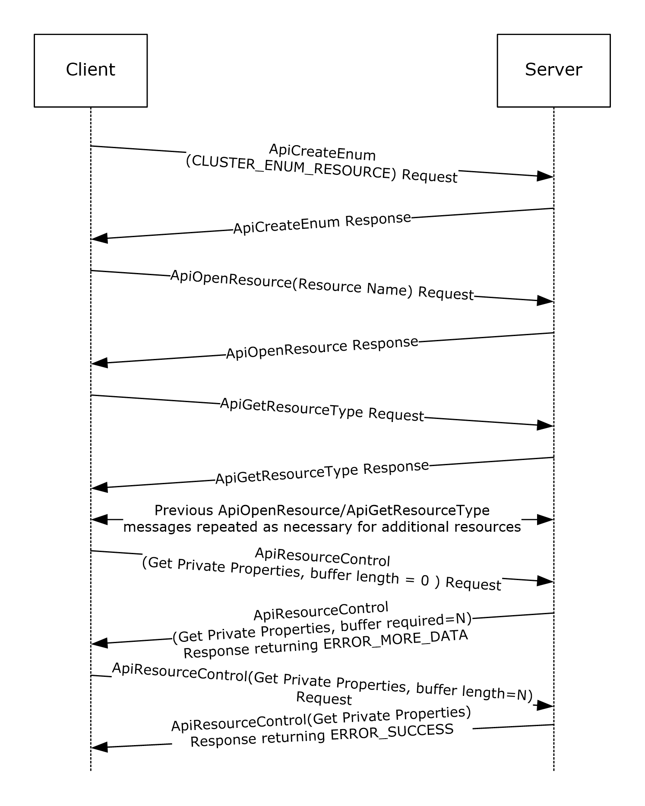

Figure 6: Message flow: Obtaining PROPERTY_LIST

First, a client initializes an [**RPC**](#gt_remote-procedure-call-rpc) connection to the cluster, as specified in section [3.2.3](#Section_3.2.3). Any implementation-specific method can be used to locate the cluster.

Next, the client calls ApiCreateEnum (section [3.1.4.1.8](#Section_3.1.4.1.85) for protocol version 2, or [3.1.4.2.8](#Section_3.1.4.2.89) for protocol version 3) and specifies the enumeration type CLUSTER_ENUM_RESOURCE (also specified in ApiCreateEnum). The server returns an [ENUM_LIST (section 2.2.3.5)](#Section_2.2.3.5) containing an [ENUM_ENTRY (section 2.2.3.4)](#Section_2.2.3.4) for each resource in the [**cluster state**](#gt_cluster-state).

For each entry in the ENUM_ENTRY, the client calls ApiOpenResource (section [3.1.4.1.9](#Section_3.1.4.1.90) for protocol version 2, or [3.1.4.2.9](#Section_3.1.4.2.92) for protocol version 3) providing the ENUM_ENTRY Name buffer as the resource name parameter. This ApiOpenResource call obtains an [HRES_RPC](#Section_2.2.1.4) context handle to the resource that is represented by the ENUM_ENTRY.

The client then calls ApiGetResourceType (section [3.1.4.1.16](#Section_3.1.4.1.16) for protocol version 2, or [3.1.4.2.16](#Section_3.1.4.1.16) for protocol version 3) on the HRES_RPC context handle. The returned buffer contains the resource's resource type name as a null-terminated [**Unicode string**](#gt_unicode-string).

Next, because the client is searching for a resource that has the type name "IP Address", the client performs a case-insensitive comparison of the returned resource type string to the null-terminated Unicode string "IP Address".

When a resource type name match is found, the client calls ApiResourceControl (section [3.1.4.1.74](#Section_3.1.4.1.74) for protocol version 2, or [3.1.4.2.74](#Section_3.1.4.1.74) for protocol version 3) passing the control code CLUSCTL_RESOURCE_GET_PRIVATE_PROPERTIES (0x001000081), as specified in section [3.1.4.3.1.17](#Section_3.1.4.3.1.17). The client sets the output buffer lpOutBuffer to a non-null pointer and sets the nOutputBuffer parameter to 0.

The server returns ERROR_MORE_DATA (234) and returns the size, in bytes, that is required for the output buffer by means of the *lpcbRequired* parameter.

The client allocates an output buffer of the prescribed size and calls ApiResourceControl again; this time the client specifies control code CLUSCTL_RESOURCE_GET_PRIVATE_PROPERTIES (0x001000081), the allocated buffer, and the prescribed buffer size.

The server returns a status code of ERROR_SUCCESS and writes the private properties of the resource into the buffer that is indicated by lpOutBuffer. The format of the buffer is a PROPERTY_LIST (section 2.2.3.10).

The client now parses the PROPERTY_LIST to extract the [**value**](#gt_value) that is associated with the "Address" property. The client follows these steps:

- Reads the first 4 bytes of the output buffer. These 4 bytes contain the count of properties in the PROPERTY_LIST. For this example, the count is 0xb.
- Advances the pointer 4 bytes to get to the syntax for the property name of the first property.
- Reads the next 4 bytes of the buffer. The value is 0x00040003 (CLUSPROP_SYNTAX_NAME).
- Advances the pointer 4 bytes to get to the length of the property name.
- Reads the next 4 bytes in the buffer. The value is 16: the length of the Unicode string "Address" plus the terminating [**Unicode**](#gt_unicode) null character. No additional padding needs to be added to the 16-byte buffer to attain 4-byte alignment.
- Advances the pointer 4 bytes to get to the name buffer. The pointer is now pointing to the beginning of the property name.
- Performs a case-insensitive string comparison of the property name to the Unicode string "Address". In this example, the property name matches.
- Advances the pointer 16 bytes to get past the property name and to the syntax of its value.
- Reads the next 4 bytes. The value is 0x00010003 (CLUSPROP_SYNTAX_LIST_VALUE_SZ), indicating that the property value buffer contains data that is a null-terminated Unicode string.
- Advances the pointer 4 bytes to get to the length of the value buffer.
- Reads the next 4 bytes. The value is 20, the length of the string "10.1.2.3" plus the terminating null character, plus 2 bytes of padding to attain 4-byte alignment.
- Advances the pointer 4 bytes to get to the value buffer. The pointer is now at the beginning of a null-terminated string that is the value for this property.
- The client reads that address string ("10.1.2.3") and performs whatever client-specific operations were intended for that address.
- Advances the pointer 20 bytes to get past the value buffer and to the end mark syntax.
- Reads the next 4 bytes. The value is 0x00000000 (CLUSPROP_SYNTAX_ENDMARK) because it is the end of the value list for the first property.
- Advances the pointer 4 bytes. If there are additional properties in the list (indicated by the property count obtained in step 1), the pointer points to the CLUSPROP_SYNTAX_NAME enumeration of the next property in the PROPERTY_LIST. If there are no more properties, the pointer points to the end of the buffer.
The client now calls ApiCloseResource (section [3.1.4.1.12](#Section_3.1.4.1.12) for protocol version 2, or [3.1.4.2.12](#Section_3.1.4.1.12) for protocol version 3) to close the HRES_RPC context handle that represents the resource.

After the client is finished processing the enumeration, the client can free the ENUM_LIST. The client then closes the RPC connection to the server.

<a id="Section_4.2"></a>
## 4.2 Moving a Group

The following example illustrates how a protocol [**client**](#gt_client) ensures that a specific [**group**](#gt_group) is owned by a specific [**node**](#gt_node), moving the group to that node if necessary. Assume that in this example, the client is managing a group that has the well-known name "Application Group". Assume that there are three nodes in the [**cluster**](#gt_cluster) that have the names "NodeA", "NodeB", and "NodeC", and all nodes are currently active. The client needs the group to be owned by NodeB.

The following diagram depicts the message flow.

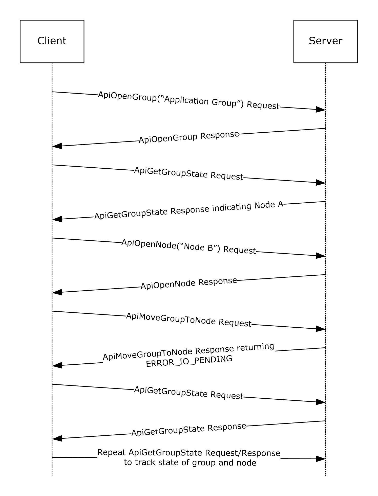

Figure 7: Message flow: Moving a group

First, the client initializes an [**RPC**](#gt_remote-procedure-call-rpc) connection to the cluster, as specified in section [3.2.3](#Section_3.2.3). The client knows the names of the nodes and can use either node to establish the connection.

The client next opens a context handle to the group by calling ApiOpenGroup (section [3.1.4.1.42](#Section_3.1.4.1.42) for protocol version 2, or [3.1.4.2.42](#Section_3.1.4.2.42) for protocol version 3) with the *lpszGroupName* parameter set to the null-terminated [**Unicode string**](#gt_unicode-string) "Application Group".

The client then determines which node currently owns the group by calling ApiGetGroupState (section [3.1.4.1.46](#Section_3.1.4.1.46) for protocol version 2, or [3.1.4.2.46](#Section_3.1.4.2.46) for protocol version 3). During this call the client passes the [HGROUP_RPC](#Section_2.2.1.3) context handle that was just obtained from ApiOpenGroup. Assume for this example that, in response to the ApiGetGroupState method, the [**server**](#gt_server) returns a current node name of "NodeA". Because the client needs the group to be owned by NodeB, the client now needs to move the group.

The client obtains an [HNODE_RPC](#Section_2.2.1.2) context handle for NodeB by calling ApiOpenNode (section [3.1.4.1.67](#Section_3.1.4.1.67) for protocol version 2, or [3.1.4.2.67](#Section_3.1.4.2.67) for protocol version 3) and setting the *lpszNodeName* parameter to the null-terminated Unicode string "NodeB". Then the client calls ApiMoveGroupToNode (section [3.1.4.1.53](#Section_3.1.4.1.53) for protocol version 2, or [3.1.4.2.53](#Section_3.1.4.2.132) for protocol version 3) indicating the group that is identified by the HGROUP_RPC and the destination node indicated by the HNODE_RPC.

Assume that the server returns status 0x000003E5 (ERROR_IO_PENDING), but the client is waiting until the move is complete. So the client polls by calling ApiGetGroupState every five seconds until the group is no longer in state ClusterGroupPending. Assuming that the group is now in state ClusterGroupOnline, the move is complete. If the group were in ClusterGroupFailed, the client could expect recovery action to be attempted to bring all resources in the group to their persistent states.

<a id="Section_4.3"></a>
## 4.3 Receiving Cluster Object Event Indications

The following example shows how a protocol [**client**](#gt_client) receives event indications for when any [**group**](#gt_group) is added or deleted to the [**cluster**](#gt_cluster) configuration and when changes in state for a [**resource**](#gt_resource) named "Resource1" occur.

This example assumes that the client has provided a higher-level programming abstraction in which its callers can create [**notification ports**](#gt_notification-port), register event filters, and receive cluster event indications. Underneath this abstraction, the client maintains the necessary data structures and queuing mechanism in order to accomplish this functionality.

One possible organization is for the client to maintain a data structure for every notification port it creates and from that, a linked set of data structures for event filter/context value registered by the caller for that port. Due to the blocking nature of the **ApiGetNotify** method (section [3.1.4.1.66](#Section_3.1.4.1.66) for protocol version 2 or section [3.1.4.2.66](#Section_3.1.4.2.66) for protocol version 3), the client also maintains a separate thread of execution that can retrieve event indications from the [**server**](#gt_server) and post them to the client-side queue. This allows the client's callers to register additional event filters after the port has been activated by the registration of its first event filter. The following diagram shows the client-side data organization of this abstraction.

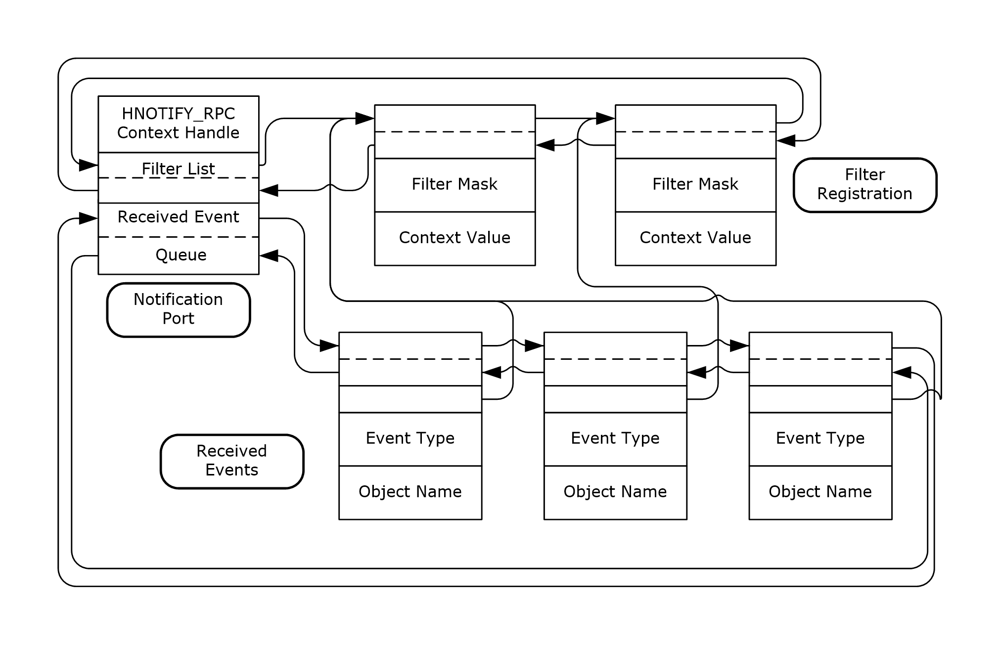Figure 8: Client/server data organization for a notification port abstraction

The following diagram depicts the message flow for this example.

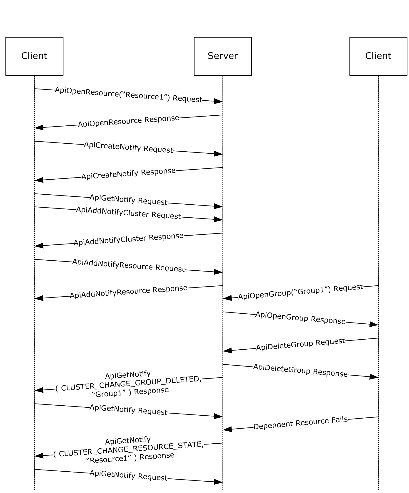

Figure 9: Message flow: Registering and receiving events from a notification port

First, the client initializes an [**RPC**](#gt_remote-procedure-call-rpc) connection to the cluster, as specified in section [3.2.3](#Section_3.2.3). Any implementation-specific method can be used to locate the cluster. The client reserves the [HCLUSTER_RPC](#Section_2.2.1.1) context handle, obtained in the [Reconnect Logic Initialization (section 3.2.3.3)](#Section_3.2.3), for invocation of **ApiAddNotifyCluster** described in the following paragraphs.

The client next obtains an [HRES_RPC](#Section_2.2.1.4) context handle to the resource by calling **ApiOpenResource** (section [3.1.4.1.9](#Section_3.1.4.1.90) for protocol version 2 or section [3.1.4.2.9](#Section_3.1.4.2.92) for protocol version 3) with the *lpszResourceName* parameter set to the null-terminated [**Unicode string**](#gt_unicode-string) "Resource1".

The caller notifies the client through the programming abstraction to create a new notification port. The client obtains an [HNOTIFY_RPC](#Section_2.2.1.6) context handle on behalf of the caller by calling the ApiCreateNotify (section [3.1.4.1.56](#Section_3.1.4.1.56) for protocol version 2, or [3.1.4.2.56](#Section_3.1.4.2.56) for protocol version 3) method. A new client-side notification data structure is allocated and initialized with the context handle of the port and the pointer to the list of filters set to NULL. A separate thread of execution is started and calls the **ApiGetNotify** method; this is called the port service thread. This method will not complete because no event filters have been registered.

The caller now registers an event filter with the client that causes the server to provide an indication each time a group is created or deleted. The client creates an event filter data structure, initializes it with the caller supplied data, and links it to the notification port data structure. The client calls **ApiAddNotifyCluster** (section [3.1.4.1.58](#Section_3.1.4.1.58) for protocol version 2 or section [3.1.4.2.58](#Section_3.1.4.2.58) for protocol version 3) with the following:

- The *hNotify* parameter set to the HNOTIFY_RPC context handle obtained in the previous step.
- The *hCluster* parameter set to the HCLUSTER_RPC context handle obtained in section 3.2.3.
- The *dwFilter* parameter set to the values CLUSTER_CHANGE_GROUP_ADDED and CLUSTER_CHANGE_GROUP_DELETED logically OR'd together (0x00006000).
- The *dwNotifyKey* parameter set to the address of the filter block created for this registration request.
The caller next registers an event filter with the client that will cause the server to provide an indication each time "Resource1" changes state. The client creates an event filter data structure, initializes it with the caller supplied data, and links it to the notification port data structure. The client calls **ApiAddNotifyResource** (section [3.1.4.1.61](#Section_3.1.4.1.61) for protocol version 2, or [3.1.4.2.61](#Section_3.1.4.2.61) for protocol version 3) with the following:

- The *hNotify* parameter set to the HNOTIFY_RPC context handle obtained from the previous **ApiCreateNotify** call.
- The *hResource* parameter set to the HRES_RPC context handle obtained from the previous **ApiOpenResource** call.
- The *dwFilter* parameter set to the value CLUSTER_CHANGE_RESOURCE_STATE (0x00000100).
- The *dwNotifyKey* parameter set to the address of the filter block created for this registration request.
- The *dwStateSequence* parameter set to the address of the StateSequence field in the event filter data structure.
Externally, another client has made a connection to the cluster and obtained an [HGROUP_RPC](#Section_2.2.1.3) context handle for a group named "Group1" by calling the **ApiOpenGroup** (section [3.1.4.1.42](#Section_3.1.4.1.42) for protocol version 2, or [3.1.4.2.42](#Section_3.1.4.2.42) for protocol version 3) method; this client then calls **ApiDeleteGroup** (section [3.1.4.1.44](#Section_3.1.4.1.44) for protocol version 2, or [3.1.4.2.44](#Section_3.1.4.1.44) for protocol version 3) using this context handle. The server responds by removing the group from the cluster configuration and generates an internal event indicating that "Group1" has been deleted. The server's notification port mechanism allocates an indication structure with the event type set to CLUSTER_CHANGE_GROUP_DELETED (0x00002000) and the object name set to "Group1" and posts it to all notification ports that have indicated an interest in this type of event.

The server thread representing the client's port service thread dequeues the indication from the server queue and returns the data in the indication to the client via **ApiGetNotify** parameters:

- The *dwNotifyKey* parameter is set to the address of the client-side event filter data structure that was registered in the previous **ApiAddNotifyCluster** call.
- The *dwFilter* parameter is set to the event type: CLUSTER_CHANGE_GROUP_DELETED (0x00002000).
- The *dwStateSequence* is set to the current state sequence number of this group.
- The *Name* parameter contains the name of the object ("Group1") as a Unicode string.
The port service thread allocates a client-side event indication structure and sets its values to the same event type and object name but sets the caller's context value in the structure instead of the context value returned by **ApiGetNotify**. The client port service thread queues this structure to the client-side queue and calls **ApiGetNotify** to wait for another indication.

A resource on which "Resource1" is dependent has failed and due to the server's restart policy, "Resource1" is taken offline and then returned to the online state. The server generates an internal event indicating that "Resource1" is in the ClusterResourceOffline state. The server's notification port mechanism allocates an indication structure with the type set to CLUSTER_CHANGE_RESOURCE_STATE (0x00000100) and the object name set to "Resource1" and posts it to all notification ports that have indicated an interest in this type of event.

The server thread representing the client's port service thread dequeues the indication from the server queue and returns the data in the indication to the client via **ApiGetNotify** parameters;

- The *dwNotifyKey* parameter is set to address of the client-side event filter data structure that was registered in the previous **ApiAddNotifyResource** call.
- The *dwFilter* parameter is set to the event type: CLUSTER_CHANGE_RESOURCE_STATE (0x00000100).
- The *dwStateSequence* is set to the current state sequence number of this resource.
- The *Name* parameter contains the name of the object ("Resource1") as a Unicode string.
The port service thread allocates a client-side event indication structure and sets its values to the same event type and object name but sets the caller's context value in the structure instead of the context value returned by **ApiGetNotify**. The **ApiGetNotify** thread queues this structure to the client-side queue and calls **ApiGetNotify** to wait for another indication.

When "Resource1" reaches the ClusterResourceOnline state, a similar internal event is generated and the server and client go through the same set of steps in which the online state change indication is delivered to the client-side queue, ready for consumption by the client's callers.

<a id="Section_4.4"></a>
## 4.4 Setting a Complex Dependency for a Resource

Complex dependencies are supported only by protocol version 3.

The following example illustrates how a [**client**](#gt_client) sets a complex dependency for a [**resource**](#gt_resource) representing a database service within a [**cluster**](#gt_cluster). This example requires a [**group**](#gt_group) that contains the following resources:

- A resource that represents the database service
- A [**cluster network**](#gt_cluster-network) name resource and its dependent IP address resources
- A set of storage device resources where each device contains one database
The service is traditionally structured where a client connects to it via the virtual cluster network name (whose IP addresses are registered with a name resolution service within the cluster network infrastructure) and the service stores its persistent data on the storage devices. The goal of the dependency relationship is to keep the database service hosted on this node as long as the cluster network name and at least one storage device are online.

The construction of this tiered dependency is performed in two steps:

- Setting an OR dependency for the Network Name resource and its two IP address resources
- Setting the AND/OR dependency for the Service and its Network Name and Disk resources
The following diagram depicts the target dependency relationship.

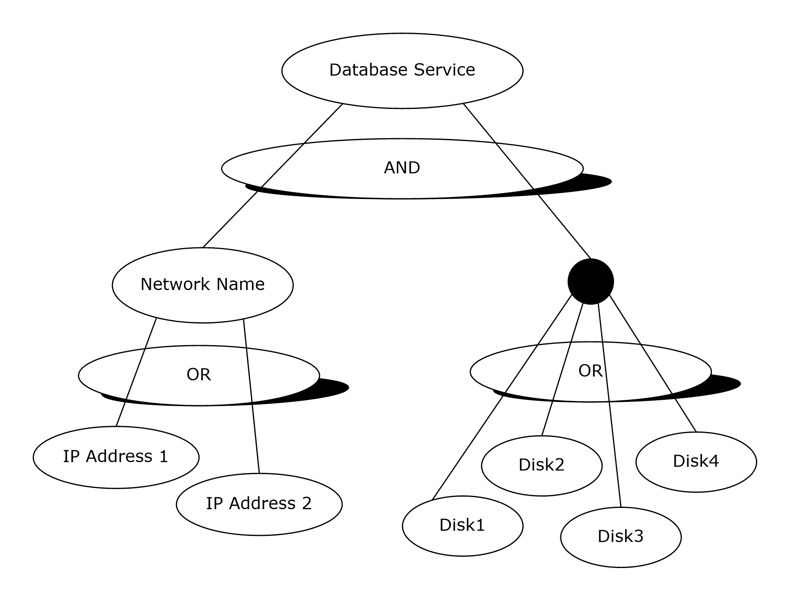

Figure 10: Database service with its dependent resources

The following diagram depicts the message flow for this example.

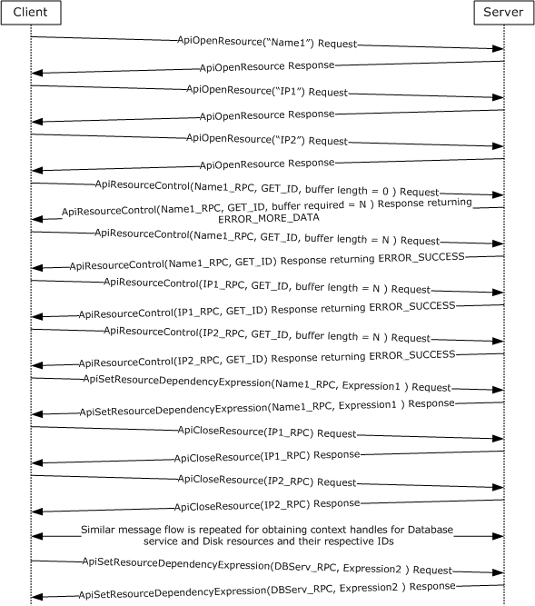

Figure 11: Message flow: Setting a complex dependency relationship for a resource

First, the client initializes an [**RPC**](#gt_remote-procedure-call-rpc) connection to the cluster, as specified in section [3.2.3](#Section_3.2.3). Any implementation-specific method can be used to locate the cluster.

The client next obtains three [HRES_RPC](#Section_2.2.1.4) context handles to the Network Name and IP address resources by calling ApiOpenResource (see section [3.1.4.2.9](#Section_3.1.4.2.92) for protocol version 3) with the *lpszResourceName* parameter set to the null-terminated [**Unicode strings**](#gt_unicode-string), "Name1", "IP1", and "IP2", respectively, for each call.

The client then obtains the resource IDs for the two IP address resources through use of the ApiResourceControl (see section [3.1.4.2.74](#Section_3.1.4.1.74) for protocol version 3). If the size of the resource ID string is well known, the client can pre-allocate a suitably sized buffer for each ID string including space for the null-termination (in this example, five buffers will eventually be needed). Otherwise, it will discover the size of the ID string for each resource by setting the *nOutBufferSize* parameter to zero and the *lpcbRequired* pointer to the address of the 32-bit integer that will receive the size, in bytes, of the ID string.

Using the allocated buffers holding the respective ID strings of the IP address resources, the client calls ApiResourceControl once for each IP address. For each IP address resource, the client sets the *hResource* parameter to the respective HRES_RPC context handle, the *dwControlCode* parameter to CLUSCTL_RESOURCE_GET_ID (0x1000039), and the *lpOutBuffer* parameter to a different allocated buffer each time.

Using the size of the two IP address resource strings, the client allocates another buffer to contain the dependency expression for the Network Name resource. This expression is a null-terminated Unicode string of the form "[IP1-ID] OR [IP2-ID]". If [**GUIDs**](#gt_globally-unique-identifier-guid) were used for ID strings, then the expression would look like the following.

[0b8b76df-d814-4813-a7c2-37837933c157] OR

[1bd68f61-3882-421f-9c31-555459f29e8a]

The client would then call ApiSetResourceDependencyExpression (see section [3.1.4.2.109](#Section_3.1.4.2.109); protocol version 3 only) with the *hResource* parameter set to the Network Name resource context handle and the *lpszDependencyExpression* parameter set to the expression previously shown.

The client calls ApiCloseResource (see section [3.1.4.2.12](#Section_3.1.4.1.12) for protocol version 3) on the two IP address context handles. The client obtains the resource IDs of the four disk resources, using the same technique described in the preceding paragraphs. After the resource IDs have been obtained, the client forms a complex dependency expression using the Network Name ID and the four Disk IDs: [NN-ID] AND ([D1] OR [D2] OR [D3] OR [D4]). If names were used for ID strings, the expression would look like the following.

[Netname] AND ([Disk1] OR [Disk2] OR [Disk3] OR [Disk4])

The client calls ApiSetResourceDependencyExpression with the *hResource* parameter set to the Database Service resource context handle and the *lpszDependencyExpression* parameter set to the expression previously shown.

The client then closes the context handles for the remaining resources using the ApiCloseResource method.

<a id="Section_5"></a>
# 5 Security

<a id="Section_5.1"></a>
## 5.1 Security Considerations for Implementers

Implementers who use ClusAPI Protocol version 2.0 will use an [**RPC**](#gt_remote-procedure-call-rpc) [**authentication level**](#gt_authentication-level) that is appropriate for the data that is to be transferred to the [**cluster**](#gt_cluster). For example, if sensitive data is written to the [**cluster registry**](#gt_cluster-registry) by means of the [ApiSetValue](#Section_3.1.4.2.33) method, binding to the cluster by using RPC_C_AUTHN_LEVEL_PKT_PRIVACY (defined in [MS-RPCE](../MS-RPCE/MS-RPCE.md) section 2.2.1.1.8) obscures the data to any [**node**](#gt_node) that was capturing data flow on the network.

Implementers who use ClusAPI Protocol version 3.0 will use an RPC authentication level of at least RPC_C_AUTHN_LEVEL_PKT_PRIVACY to ensure a level of privacy for sensitive data.

For more information, see section [2.1](#Section_2.1).

<a id="Section_5.2"></a>
## 5.2 Index of Security Parameters

| Security parameter | Section |
| --- | --- |
| [**RPC**](#gt_remote-procedure-call-rpc) [**authentication level**](#gt_authentication-level) | As specified in section [2.1](#Section_2.1). |
| RPC [**Authentication Service**](#gt_authentication-service-as) | As specified in section 2.1. |
| Service principal name | As specified in section 2.1. |
| Client security quality of service requirements | As specified in section 2.1. |

<a id="Section_6"></a>
# 6 Appendix A: Full IDL

For ease of implementation, the full [**Interface Definition Language (IDL)**](#gt_interface-definition-language-idl) for each protocol version is provided here, where "ms-dtyp.idl" is the IDL that is found in [MS-DTYP](#Section_2.2.1) Appendix A.

<a id="Section_6.1"></a>
## 6.1 Appendix A.1: clusapi2.idl

import "ms-dtyp.idl";

[

uuid(b97db8b2-4c63-11cf-bff6-08002be23f2f),

version(2.0)

]

interface clusapi

{

typedef [context_handle] void *HCLUSTER_RPC;

typedef [context_handle] void *HNODE_RPC;

typedef [context_handle] void *HGROUP_RPC;

typedef [context_handle] void *HRES_RPC;

typedef [context_handle] void *HKEY_RPC;

typedef [context_handle] void *HNOTIFY_RPC;

typedef [context_handle] void *HNETWORK_RPC;

typedef [context_handle] void *HNETINTERFACE_RPC;

typedef struct _RPC_SECURITY_DESCRIPTOR {

[ size_is( cbInSecurityDescriptor ),

length_is( cbOutSecurityDescriptor ) ]

unsigned char *lpSecurityDescriptor;

unsigned long cbInSecurityDescriptor;

unsigned long cbOutSecurityDescriptor;

} RPC_SECURITY_DESCRIPTOR, *PRPC_SECURITY_DESCRIPTOR;

typedef struct _RPC_SECURITY_ATTRIBUTES {

unsigned long nLength;

RPC_SECURITY_DESCRIPTOR RpcSecurityDescriptor;

long bInheritHandle;

} RPC_SECURITY_ATTRIBUTES, *PRPC_SECURITY_ATTRIBUTES;

typedef struct _CLUSTER_OPERATIONAL_VERSION_INFO {

unsigned long dwSize;

unsigned long dwClusterHighestVersion;

unsigned long dwClusterLowestVersion;

unsigned long dwFlags;

unsigned long dwReserved;

}CLUSTER_OPERATIONAL_VERSION_INFO,*PCLUSTER_OPERATIONAL_VERSION_INFO;

HCLUSTER_RPC

ApiOpenCluster(

[ out ] error_status_t *Status

);

error_status_t

ApiCloseCluster(

[ in, out ] HCLUSTER_RPC *Cluster

);

error_status_t

ApiSetClusterName(

[in, string] LPCWSTR NewClusterName

);

error_status_t

ApiGetClusterName(

[ out ] [ string ] LPWSTR *ClusterName,

[ out ] [ string ] LPWSTR *NodeName

);

error_status_t

ApiGetClusterVersion(

[out] WORD* lpwMajorVersion,

[out] WORD* lpwMinorVersion,

[out] WORD* lpwBuildNumber,

[out, string] LPWSTR* lpszVendorId,

[out, string] LPWSTR* lpszCSDVersion

);

error_status_t

ApiGetQuorumResource(

[ out, string ] LPWSTR *lpszResourceName,

[ out, string ] LPWSTR *lpszDeviceName,

[ out ] DWORD *pdwMaxQuorumLogSize

);

error_status_t

ApiSetQuorumResource(

[ in ] HRES_RPC hResource,

[ in, string ] LPCWSTR lpszDeviceName,

[ in ] DWORD dwMaxQuorumLogSize

);

typedef struct _ENUM_ENTRY {

DWORD Type;

[string] LPWSTR Name;

} ENUM_ENTRY, *PENUM_ENTRY;

typedef struct _ENUM_LIST {

DWORD EntryCount;

[size_is(EntryCount)] ENUM_ENTRY Entry[*];

} ENUM_LIST, *PENUM_LIST;

error_status_t

ApiCreateEnum(

[ in ] DWORD dwType,

[ out ] PENUM_LIST *ReturnEnum

);

HRES_RPC

ApiOpenResource(

[in, string] LPCWSTR lpszResourceName,

[out] error_status_t *Status

);

HRES_RPC

ApiCreateResource(

[in] HGROUP_RPC hGroup,

[in, string] LPCWSTR lpszResourceName,

[in, string] LPCWSTR lpszResourceType,

[in] DWORD dwFlags,

[out] error_status_t *Status

);

error_status_t

ApiDeleteResource(

[in] HRES_RPC hResource

);

error_status_t

ApiCloseResource(

[ in, out ] HRES_RPC *Resource

);

error_status_t

ApiGetResourceState(

[in] HRES_RPC hResource,

[out] DWORD *State,

[out, string] LPWSTR *NodeName,

[out, string] LPWSTR *GroupName

);

error_status_t

ApiSetResourceName(

[in] HRES_RPC hResource,

[in, string] LPCWSTR lpszResourceName

);

error_status_t

ApiGetResourceId(

[in] HRES_RPC hResource,

[out, string] LPWSTR* pGuid

);

error_status_t

ApiGetResourceType(

[ in ] HRES_RPC hResource,

[ out, string ] LPWSTR* lpszResourceType

);

error_status_t

ApiFailResource(

[in] HRES_RPC hResource

);

error_status_t

ApiOnlineResource(

[ in ] HRES_RPC hResource

);

error_status_t

ApiOfflineResource(

[ in ] HRES_RPC hResource

);

error_status_t

ApiAddResourceDependency(

[ in ] HRES_RPC hResource,

[ in ] HRES_RPC hDependsOn

);

error_status_t

ApiRemoveResourceDependency(

[ in ] HRES_RPC hResource,

[ in ] HRES_RPC hDependsOn

);

error_status_t

ApiCanResourceBeDependent(

[in] HRES_RPC hResource,

[in] HRES_RPC hResourceDependent

);

error_status_t

ApiCreateResEnum(

[ in ] HRES_RPC hResource,

[ in ] DWORD dwType,

[ out ] PENUM_LIST *ReturnEnum

);

error_status_t

ApiAddResourceNode(

[ in ] HRES_RPC hResource,

[ in ] HNODE_RPC hNode

);

error_status_t

ApiRemoveResourceNode(

[ in ] HRES_RPC hResource,

[ in ] HNODE_RPC hNode

);

error_status_t

ApiChangeResourceGroup(

[ in ] HRES_RPC hResource,

[ in ] HGROUP_RPC hGroup

);

error_status_t

ApiCreateResourceType(

[ in, string ] LPCWSTR lpszTypeName,

[ in, string ] LPCWSTR lpszDisplayName,

[ in, string ] LPCWSTR lpszDllName,

[ in ] unsigned long dwLooksAlive,

[ in ] unsigned long dwIsAlive

);

error_status_t

ApiDeleteResourceType(

[ in, string ] const wchar_t * lpszTypeName

);

HKEY_RPC

ApiGetRootKey(

[ in ] unsigned long samDesired,

[ out ] error_status_t *Status

);

HKEY_RPC

ApiCreateKey(

[ in ] HKEY_RPC hKey,

[ in, string ] const wchar_t * lpSubKey,

[ in ] unsigned long dwOptions,

[ in ] unsigned long samDesired,

[ in, unique ] PRPC_SECURITY_ATTRIBUTES lpSecurityAttributes,

[ out ] unsigned long * lpdwDisposition,

[ out ] error_status_t *Status

);

HKEY_RPC

ApiOpenKey(

[ in ] HKEY_RPC hKey,

[ in, string ] const wchar_t * lpSubKey,

[ in ] unsigned long samDesired,

[ out ] error_status_t *Status

);

error_status_t

ApiEnumKey(

[ in ] HKEY_RPC hKey,

[ in ] unsigned long dwIndex,

[ out, string ] wchar_t * *KeyName,

[ out ] FILETIME *lpftLastWriteTime

);

error_status_t

ApiSetValue(

[ in ] HKEY_RPC hKey,

[ in, string ] const wchar_t * lpValueName,

[ in ] unsigned long dwType,

[ in, size_is(cbData) ] const unsigned char *lpData,

[ in ] unsigned long cbData

);

error_status_t

ApiDeleteValue(

[ in ] HKEY_RPC hKey,

[ in, string ] const wchar_t * lpValueName

);

error_status_t

ApiQueryValue(

[ in ] HKEY_RPC hKey,

[ in, string ] const wchar_t * lpValueName,

[ out ] unsigned long *lpValueType,

[ out, size_is(cbData) ] unsigned char *lpData,

[ in ] unsigned long cbData,

[ out ] unsigned long * lpcbRequired

);

error_status_t

ApiDeleteKey(

[ in ] HKEY_RPC hKey,

[ in, string ] const wchar_t * lpSubKey

);

error_status_t

ApiEnumValue(

[ in ] HKEY_RPC hKey,

[ in ] unsigned long dwIndex,

[ out, string ] wchar_t * *lpValueName,

[ out ] unsigned long * lpType,

[ out, size_is(*lpcbData) ] unsigned char *lpData,

[ in, out ] unsigned long * lpcbData,

[ out ] unsigned long * TotalSize

);

error_status_t

ApiCloseKey(

[ in, out ] HKEY_RPC *pKey

);

error_status_t

ApiQueryInfoKey(

[ in ] HKEY_RPC hKey,

[ out ] LPDWORD lpcSubKeys,

[ out ] LPDWORD lpcbMaxSubKeyLen,

[ out ] LPDWORD lpcValues,

[ out ] LPDWORD lpcbMaxValueNameLen,

[ out ] LPDWORD lpcbMaxValueLen,

[ out ] LPDWORD lpcbSecurityDescriptor,

[ out ] PFILETIME lpftLastWriteTime

);

error_status_t

ApiSetKeySecurity(

[ in ] HKEY_RPC hKey,

[ in ] DWORD SecurityInformation,

[ in ] PRPC_SECURITY_DESCRIPTOR pRpcSecurityDescriptor

);

error_status_t

ApiGetKeySecurity(

[ in ] HKEY_RPC hKey,

[ in ] DWORD SecurityInformation,

[ in, out ] PRPC_SECURITY_DESCRIPTOR pRpcSecurityDescriptor

);

HGROUP_RPC

ApiOpenGroup(

[ in, string ] const wchar_t * lpszGroupName,

[ out ] error_status_t *Status

);

HGROUP_RPC

ApiCreateGroup(

[ in, string ] LPCWSTR lpszGroupName,

[ out ] error_status_t *Status

);

error_status_t

ApiDeleteGroup(

[ in ] HGROUP_RPC Group

);

error_status_t

ApiCloseGroup(

[ in, out ] HGROUP_RPC *Group

);

error_status_t

ApiGetGroupState(

[ in ] HGROUP_RPC hGroup,

[ out ] unsigned long *State,

[ out, string ] wchar_t * *NodeName

);

error_status_t

ApiSetGroupName(

[ in ] HGROUP_RPC hGroup,

[ in, string ] LPCWSTR lpszGroupName

);

error_status_t

ApiGetGroupId(

[ in ] HGROUP_RPC hGroup,

[ out, string ] LPWSTR *pGuid

);

error_status_t

ApiGetNodeId(

[ in ] HNODE_RPC hNode,

[ out, string ] LPWSTR *pGuid

);

error_status_t

ApiOnlineGroup(

[ in ] HGROUP_RPC hGroup

);

error_status_t

ApiOfflineGroup(

[ in ] HGROUP_RPC hGroup

);

error_status_t

ApiMoveGroup(

[ in ] HGROUP_RPC hGroup

);

error_status_t

ApiMoveGroupToNode(

[ in ] HGROUP_RPC hGroup,

[ in ] HNODE_RPC hNode

);

error_status_t

ApiCreateGroupResourceEnum(

[ in ] HGROUP_RPC hGroup,

[ in ] unsigned long dwType,

[ out ] PENUM_LIST *ReturnEnum

);

error_status_t

ApiSetGroupNodeList(

[ in ] HGROUP_RPC hGroup,

[ in, unique, size_is(cbListSize) ] UCHAR *lpNodeList,

[ in ] DWORD cbListSize

);

HNOTIFY_RPC

ApiCreateNotify(

[ out ] error_status_t *Status

);

error_status_t

ApiCloseNotify(

[ in, out ] HNOTIFY_RPC* hNotify

);

error_status_t

ApiAddNotifyCluster(

[ in ] HNOTIFY_RPC hNotify,

[ in ] HCLUSTER_RPC hCluster,

[ in ] DWORD dwFilter,

[ in ] DWORD dwNotifyKey

);

error_status_t

ApiAddNotifyNode(

[ in ] HNOTIFY_RPC hNotify,

[ in ] HNODE_RPC hNode,

[ in ] DWORD dwFilter,

[ in ] DWORD dwNotifyKey,

[ out ] DWORD *dwStateSequence

);

error_status_t

ApiAddNotifyGroup(

[ in ] HNOTIFY_RPC hNotify,

[ in ] HGROUP_RPC hGroup,

[ in ] DWORD dwFilter,

[ in ] DWORD dwNotifyKey,

[ out ] DWORD *dwStateSequence

);

error_status_t

ApiAddNotifyResource(

[ in ] HNOTIFY_RPC hNotify,

[ in ] HRES_RPC hResource,

[ in ] DWORD dwFilter,

[ in ] DWORD dwNotifyKey,

[ out ] DWORD *dwStateSequence

);

error_status_t

ApiAddNotifyKey(

[ in ] HNOTIFY_RPC hNotify,

[ in ] HKEY_RPC hKey,

[ in ] DWORD dwNotifyKey,

[ in ] DWORD dwFilter,

[ in ] BOOL WatchSubTree

);

error_status_t

ApiReAddNotifyNode(

[ in ] HNOTIFY_RPC hNotify,

[ in ] HNODE_RPC hNode,

[ in ] DWORD dwFilter,

[ in ] DWORD dwNotifyKey,

[ in ] DWORD StateSequence

);

error_status_t

ApiReAddNotifyGroup(

[ in ] HNOTIFY_RPC hNotify,

[ in ] HGROUP_RPC hGroup,

[ in ] DWORD dwFilter,

[ in ] DWORD dwNotifyKey,

[ in ] DWORD StateSequence

);

error_status_t

ApiReAddNotifyResource(

[ in ] HNOTIFY_RPC hNotify,

[ in ] HRES_RPC hResource,

[ in ] DWORD dwFilter,

[ in ] DWORD dwNotifyKey,

[ in ] DWORD StateSequence

);

error_status_t

ApiGetNotify(

[ in ] HNOTIFY_RPC hNotify,

[ in ] DWORD Timeout,

[ out ] DWORD *dwNotifyKey,

[ out ] DWORD *dwFilter,

[ out ] DWORD *dwStateSequence,

[ out, string ] LPWSTR *Name

);

HNODE_RPC

ApiOpenNode(

[ in, string ] const wchar_t * lpszNodeName,

[ out ] error_status_t *Status

);

error_status_t

ApiCloseNode(

[ in, out ] HNODE_RPC *Node

);

error_status_t

ApiGetNodeState(

[ in ] HNODE_RPC hNode,

[ out ] unsigned long *State

);

error_status_t

ApiPauseNode(

[ in ] HNODE_RPC hNode

);

error_status_t

ApiResumeNode(

[ in ] HNODE_RPC hNode

);

error_status_t

ApiEvictNode(

[ in ] HNODE_RPC hNode

);

error_status_t

ApiNodeResourceControl(

[ in ] HRES_RPC hResource,

[ in ] HNODE_RPC hNode,

[ in ] DWORD dwControlCode,

[ in, unique, size_is(nInBufferSize) ] UCHAR *lpInBuffer,

[ in ] DWORD nInBufferSize,

[ out, size_is(nOutBufferSize),

length_is (*lpBytesReturned)] UCHAR *lpOutBuffer,

[ in ] DWORD nOutBufferSize,

[ out ] DWORD *lpBytesReturned,

[ out ] DWORD *lpcbRequired

);

error_status_t

ApiResourceControl(

[ in ] HRES_RPC hResource,

[ in ] unsigned long dwControlCode,

[ in, unique, size_is(nInBufferSize) ] unsigned char *lpInBuffer,

[ in ] unsigned long nInBufferSize,

[ out, size_is(nOutBufferSize),

length_is (*lpBytesReturned)] unsigned char *lpOutBuffer,

[ in ] unsigned long nOutBufferSize,

[ out ] unsigned long *lpBytesReturned,

[ out ] unsigned long *lpcbRequired

);

error_status_t

ApiNodeResourceTypeControl(

[ in ] HCLUSTER_RPC hCluster,

[ in, string ] LPCWSTR lpszResourceTypeName,

[ in ] HNODE_RPC hNode,

[ in ] DWORD dwControlCode,

[ in, unique, size_is(nInBufferSize) ] UCHAR *lpInBuffer,

[ in ] DWORD nInBufferSize,

[ out, size_is(nOutBufferSize),

length_is (*lpBytesReturned)] UCHAR *lpOutBuffer,

[ in ] DWORD nOutBufferSize,

[ out ] DWORD *lpBytesReturned,

[ out ] DWORD *lpcbRequired

);

error_status_t

ApiResourceTypeControl(

[ in ] HCLUSTER_RPC hCluster,

[ in, string ] LPCWSTR lpszResourceTypeName,

[ in ] DWORD dwControlCode,

[ in, unique, size_is(nInBufferSize) ] UCHAR *lpInBuffer,

[ in ] DWORD nInBufferSize,

[ out, size_is(nOutBufferSize),

length_is (*lpBytesReturned)] UCHAR *lpOutBuffer,

[ in ] DWORD nOutBufferSize,

[ out ] DWORD *lpBytesReturned,

[ out ] DWORD *lpcbRequired

);

error_status_t

ApiNodeGroupControl(

[ in ] HGROUP_RPC hGroup,

[ in ] HNODE_RPC hNode,

[ in ] DWORD dwControlCode,

[ in, unique, size_is(nInBufferSize) ] UCHAR *lpInBuffer,

[ in ] DWORD nInBufferSize,

[ out, size_is(nOutBufferSize),

length_is (*lpBytesReturned)] UCHAR *lpOutBuffer,

[ in ] DWORD nOutBufferSize,

[ out ] DWORD *lpBytesReturned,

[ out ] DWORD *lpcbRequired

);

error_status_t

ApiGroupControl(

[ in ] HGROUP_RPC hGroup,

[ in ] DWORD dwControlCode,

[ in, unique, size_is(nInBufferSize) ] UCHAR *lpInBuffer,

[ in ] DWORD nInBufferSize,

[ out, size_is(nOutBufferSize),

length_is (*lpBytesReturned)] UCHAR *lpOutBuffer,

[ in ] DWORD nOutBufferSize,

[ out ] DWORD *lpBytesReturned,

[ out ] DWORD *lpcbRequired

);

error_status_t

ApiNodeNodeControl(

[ in ] HNODE_RPC hNode,

[ in ] HNODE_RPC hHostNode,

[ in ] DWORD dwControlCode,

[ in, unique, size_is(nInBufferSize) ] UCHAR *lpInBuffer,

[ in ] DWORD nInBufferSize,

[ out, size_is(nOutBufferSize),

length_is (*lpBytesReturned)] UCHAR *lpOutBuffer,

[ in ] DWORD nOutBufferSize,

[ out ] DWORD *lpBytesReturned,

[ out ] DWORD *lpcbRequired

);

error_status_t

ApiNodeControl(

[ in ] HNODE_RPC hNode,

[ in ] DWORD dwControlCode,

[ in, unique, size_is(nInBufferSize) ] UCHAR *lpInBuffer,

[ in ] DWORD nInBufferSize,

[ out, size_is(nOutBufferSize),

length_is (*lpBytesReturned)] UCHAR *lpOutBuffer,

[ in ] DWORD nOutBufferSize,

[ out ] DWORD *lpBytesReturned,

[ out ] DWORD *lpcbRequired

);

error_status_t

Opnum80NotUsedOnWire(void);

HNETWORK_RPC

ApiOpenNetwork(

[ in, string ] LPCWSTR lpszNetworkName,

[ out ] error_status_t *Status

);

error_status_t

ApiCloseNetwork(

[ in, out ] HNETWORK_RPC *Network

);

error_status_t

ApiGetNetworkState(

[ in ] HNETWORK_RPC hNetwork,

[ out ] DWORD *State

);

error_status_t

ApiSetNetworkName(

[ in ] HNETWORK_RPC hNetwork,

[ in, string ] LPCWSTR lpszNetworkName

);

error_status_t

ApiCreateNetworkEnum(

[ in ] HNETWORK_RPC hNetwork,

[ in ] DWORD dwType,

[ out ] PENUM_LIST *ReturnEnum

);

error_status_t

ApiGetNetworkId(

[ in ] HNETWORK_RPC hNetwork,

[ out, string ] LPWSTR *pGuid

);

error_status_t

ApiSetNetworkPriorityOrder(

[ in, range(0, 1000)] DWORD NetworkCount,

[ in, string, size_is(NetworkCount) ] LPWSTR NetworkIdList[*]

);

error_status_t

ApiNodeNetworkControl(

[ in ] HNETWORK_RPC hNetwork,

[ in ] HNODE_RPC hNode,

[ in ] DWORD dwControlCode,

[ in, unique, size_is(nInBufferSize) ] UCHAR *lpInBuffer,

[ in ] DWORD nInBufferSize,

[ out, size_is(nOutBufferSize),

length_is (*lpBytesReturned)] UCHAR *lpOutBuffer,

[ in ] DWORD nOutBufferSize,

[ out ] DWORD *lpBytesReturned,

[ out ] DWORD *lpcbRequired

);

error_status_t

ApiNetworkControl(

[ in ] HNETWORK_RPC hNetwork,

[ in ] DWORD dwControlCode,

[ in, unique, size_is(nInBufferSize) ] UCHAR *lpInBuffer,

[ in ] DWORD nInBufferSize,

[ out, size_is(nOutBufferSize),

length_is (*lpBytesReturned)] UCHAR *lpOutBuffer,

[ in ] DWORD nOutBufferSize,

[ out ] DWORD *lpBytesReturned,

[ out ] DWORD *lpcbRequired

);

error_status_t

ApiAddNotifyNetwork(

[ in ] HNOTIFY_RPC hNotify,

[ in ] HNETWORK_RPC hNetwork,

[ in ] DWORD dwFilter,

[ in ] DWORD dwNotifyKey,

[ out ] DWORD *dwStateSequence

);

error_status_t

ApiReAddNotifyNetwork(

[ in ] HNOTIFY_RPC hNotify,

[ in ] HNETWORK_RPC hNetwork,

[ in ] DWORD dwFilter,

[ in ] DWORD dwNotifyKey,

[ in ] DWORD StateSequence

);

HNETINTERFACE_RPC

ApiOpenNetInterface(

[ in, string ] LPCWSTR lpszNetInterfaceName,

[ out ] error_status_t *Status

);

error_status_t

ApiCloseNetInterface(

[ in, out ] HNETINTERFACE_RPC *NetInterface

);

error_status_t

ApiGetNetInterfaceState(

[ in ] HNETINTERFACE_RPC hNetInterface,

[ out ] DWORD *State

);

error_status_t

ApiGetNetInterface(

[ in, string ] LPCWSTR lpszNodeName,

[ in, string ] LPCWSTR lpszNetworkName,

[ out, string ] LPWSTR *lppszInterfaceName

);

error_status_t

ApiGetNetInterfaceId(

[ in ] HNETINTERFACE_RPC hNetInterface,

[ out, string ] LPWSTR *pGuid

);

error_status_t

ApiNodeNetInterfaceControl(

[ in ] HNETINTERFACE_RPC hNetInterface,

[ in ] HNODE_RPC hNode,

[ in ] DWORD dwControlCode,

[ in, unique, size_is(nInBufferSize) ] UCHAR *lpInBuffer,

[ in ] DWORD nInBufferSize,

[ out, size_is(nOutBufferSize),

length_is (*lpBytesReturned)] UCHAR *lpOutBuffer,

[ in ] DWORD nOutBufferSize,

[ out ] DWORD *lpBytesReturned,

[ out ] DWORD *lpcbRequired

);

error_status_t

ApiNetInterfaceControl(

[ in ] HNETINTERFACE_RPC hNetInterface,

[ in ] DWORD dwControlCode,

[ in, unique, size_is(nInBufferSize) ] UCHAR *lpInBuffer,

[ in ] DWORD nInBufferSize,

[ out, size_is(nOutBufferSize),

length_is (*lpBytesReturned)] UCHAR *lpOutBuffer,

[ in ] DWORD nOutBufferSize,

[ out ] DWORD *lpBytesReturned,

[ out ] DWORD *lpcbRequired

);

error_status_t

ApiAddNotifyNetInterface(

[ in ] HNOTIFY_RPC hNotify,

[ in ] HNETINTERFACE_RPC hNetInterface,

[ in ] DWORD dwFilter,

[ in ] DWORD dwNotifyKey,

[ out ] DWORD *dwStateSequence

);

error_status_t

ApiReAddNotifyNetInterface(

[ in ] HNOTIFY_RPC hNotify,

[ in ] HNETINTERFACE_RPC hNetInterface,

[ in ] DWORD dwFilter,

[ in ] DWORD dwNotifyKey,

[ in ] DWORD StateSequence

);

error_status_t

ApiCreateNodeEnum(

[ in ] HNODE_RPC hNode,

[ in ] DWORD dwType,

[ out ] PENUM_LIST *ReturnEnum

);

error_status_t

ApiGetClusterVersion2(

[ out ] WORD* lpwMajorVersion,

[ out ] WORD* lpwMinorVersion,

[ out ] WORD* lpwBuildNumber,

[ out, string ] wchar_t * *lpszVendorId,

[ out, string ] wchar_t * *lpszCSDVersion,

[ out ] PCLUSTER_OPERATIONAL_VERSION_INFO *ppClusterOpVerInfo

);

error_status_t

ApiCreateResTypeEnum(

[ in, string ] LPCWSTR lpszTypeName,

[ in ] DWORD dwType,

[ out ] PENUM_LIST *ReturnEnum

);

error_status_t

ApiBackupClusterDatabase(

[ in, string ] LPCWSTR lpszPathName

);

error_status_t

ApiNodeClusterControl(

[ in ] HCLUSTER_RPC hCluster,

[ in ] HNODE_RPC hHostNode,

[ in ] DWORD dwControlCode,

[ in, unique, size_is(nInBufferSize) ] UCHAR *lpInBuffer,

[ in ] DWORD nInBufferSize,

[ out, size_is(nOutBufferSize),

length_is (*lpBytesReturned)] UCHAR *lpOutBuffer,

[ in ] DWORD nOutBufferSize,

[ out ] DWORD *lpBytesReturned,

[ out ] DWORD *lpcbRequired

);

error_status_t

ApiClusterControl(

[ in ] HCLUSTER_RPC hCluster,

[ in ] DWORD dwControlCode,

[ in, unique, size_is(nInBufferSize) ] UCHAR *lpInBuffer,

[ in ] DWORD nInBufferSize,

[ out, size_is(nOutBufferSize),

length_is (*lpBytesReturned)] UCHAR *lpOutBuffer,

[ in ] DWORD nOutBufferSize,

[ out ] DWORD *lpBytesReturned,

[ out ] DWORD *lpcbRequired

);

error_status_t

ApiUnblockGetNotifyCall(

[ in ] HNOTIFY_RPC hNotify

);

typedef struct IDL_CLUSTER_SET_PASSWORD_STATUS {

DWORD NodeId;

BOOLEAN SetAttempted;

DWORD ReturnStatus;

} IDL_CLUSTER_SET_PASSWORD_STATUS, *PIDL_CLUSTER_SET_PASSWORD_STATUS;

typedef enum IDL_CLUSTER_SET_PASSWORD_FLAGS {

IDL_CLUSTER_SET_PASSWORD_IGNORE_DOWN_NODES = 1

} IDL_CLUSTER_SET_PASSWORD_FLAGS;

error_status_t

ApiSetServiceAccountPassword(

[ in, string ] LPWSTR lpszNewPassword,

[ in ] IDL_CLUSTER_SET_PASSWORD_FLAGS dwFlags,

[ out, size_is(ReturnStatusBufferSize),

length_is(*SizeReturned) ] IDL_CLUSTER_SET_PASSWORD_STATUS

ReturnStatusBufferPtr[*],

[ in ] DWORD ReturnStatusBufferSize,

[ out ] DWORD *SizeReturned,

[ out ] DWORD *ExpectedBufferSize

);

}

<a id="Section_6.2"></a>
## 6.2 Appendix A.2: clusapi3.idl

import "ms-dtyp.idl";

[

uuid(b97db8b2-4c63-11cf-bff6-08002be23f2f),

version(3.0)

]

#define MAX_CLUSTER_CONTROL_CODE_BUFFER_SIZE 0x7FFFFFFF

interface clusapi

{

typedef [context_handle] void *HGROUPSET_RPC;

typedef [context_handle] void *HCLUSTER_RPC;

typedef [context_handle] void *HNODE_RPC;

typedef [context_handle] void *HGROUP_RPC;

typedef [context_handle] void *HRES_RPC;

typedef [context_handle] void *HKEY_RPC;

typedef [context_handle] void *HNOTIFY_RPC;

typedef [context_handle] void *HNETWORK_RPC;

typedef [context_handle] void *HNETINTERFACE_RPC;

typedef [context_handle] void *HBATCH_PORT_RPC;

typedef struct _RPC_SECURITY_DESCRIPTOR {

[ size_is( cbInSecurityDescriptor ),

length_is( cbOutSecurityDescriptor ) ]

unsigned char *lpSecurityDescriptor;

unsigned long cbInSecurityDescriptor;

unsigned long cbOutSecurityDescriptor;

} RPC_SECURITY_DESCRIPTOR, *PRPC_SECURITY_DESCRIPTOR;

typedef struct _RPC_SECURITY_ATTRIBUTES {

unsigned long nLength;

RPC_SECURITY_DESCRIPTOR RpcSecurityDescriptor;

long bInheritHandle;

} RPC_SECURITY_ATTRIBUTES, *PRPC_SECURITY_ATTRIBUTES;

typedef struct _CLUSTER_OPERATIONAL_VERSION_INFO {

unsigned long dwSize;

unsigned long dwClusterHighestVersion;

unsigned long dwClusterLowestVersion;

unsigned long dwFlags;

unsigned long dwReserved;

}CLUSTER_OPERATIONAL_VERSION_INFO, *PCLUSTER_OPERATIONAL_VERSION_INFO;

typedef struct IDL_CLUSTER_SET_PASSWORD_STATUS {

DWORD NodeId;

BOOLEAN SetAttempted;

DWORD ReturnStatus;

} IDL_CLUSTER_SET_PASSWORD_STATUS, *PIDL_CLUSTER_SET_PASSWORD_STATUS;

typedef enum IDL_CLUSTER_SET_PASSWORD_FLAGS {

IDL_CLUSTER_SET_PASSWORD_IGNORE_DOWN_NODES = 1

} IDL_CLUSTER_SET_PASSWORD_FLAGS;

typedef struct _CLUSTER_CREATE_GROUP_INFO_RPC {

DWORD dwVersion;

DWORD dwGroupType;

}CLUSTER_CREATE_GROUP_INFO_RPC, *PCLUSTER_CREATE_GROUP_INFO_RPC;

HCLUSTER_RPC

ApiOpenCluster(

[ out ] error_status_t *Status

);

error_status_t

ApiCloseCluster(

[ in, out ] HCLUSTER_RPC *Cluster

);

error_status_t

ApiSetClusterName(

[ in, string ] LPCWSTR NewClusterName,

[ out ] error_status_t *rpc_status

);

error_status_t

ApiGetClusterName(

[ out, string ] LPWSTR *ClusterName,

[ out, string ] LPWSTR *NodeName

);

error_status_t

ApiGetClusterVersion(

[ out ] WORD *lpwMajorVersion,

[ out ] WORD *lpwMinorVersion,

[ out ] WORD *lpwBuildNumber,

[ out, string ] LPWSTR *lpszVendorId,

[ out, string ] LPWSTR *lpszCSDVersion

);

error_status_t

ApiGetQuorumResource(

[ out, string ] LPWSTR *lpszResourceName,

[ out, string ] LPWSTR *lpszDeviceName,

[ out ] DWORD *pdwMaxQuorumLogSize,

[ out ] error_status_t *rpc_status

);

error_status_t

ApiSetQuorumResource(

[ in ] HRES_RPC hResource,

[ in, string ] LPCWSTR lpszDeviceName,

[ in ] DWORD dwMaxQuorumLogSize,

[ out ] error_status_t *rpc_status

);

typedef struct _ENUM_ENTRY {

DWORD Type;

[string] LPWSTR Name;

} ENUM_ENTRY, *PENUM_ENTRY;

typedef struct _ENUM_LIST {

DWORD EntryCount;

[size_is(EntryCount)] ENUM_ENTRY Entry[*];

} ENUM_LIST, *PENUM_LIST;

typedef struct _GROUP_ENUM_ENTRY {

[string] LPWSTR Name;

[string] LPWSTR Id;

DWORD dwState;

[string] LPWSTR Owner;

DWORD dwFlags;

DWORD cbProperties;

[size_is(cbProperties)] UCHAR* Properties;

DWORD cbRoProperties;

[size_is(cbRoProperties)] UCHAR* RoProperties;

} GROUP_ENUM_ENTRY, *PGROUP_ENUM_ENTRY;

typedef struct _RESOURCE_ENUM_ENTRY {

[string] LPWSTR Name;

[string] LPWSTR Id;

[string] LPWSTR OwnerName;

[string] LPWSTR OwnerId;

DWORD cbProperties;

[size_is(cbProperties)] UCHAR* Properties;

DWORD cbRoProperties;

[size_is(cbRoProperties)] UCHAR* RoProperties;

} RESOURCE_ENUM_ENTRY, *PRESOURCE_ENUM_ENTRY;

typedef struct _GROUP_ENUM_LIST {

DWORD EntryCount;

[size_is(EntryCount)] GROUP_ENUM_ENTRY Entry[*];

} GROUP_ENUM_LIST, *PGROUP_ENUM_LIST;

typedef struct _RESOURCE_ENUM_LIST {

DWORD EntryCount;

[size_is(EntryCount)] RESOURCE_ENUM_ENTRY Entry[*];

} RESOURCE_ENUM_LIST, *PRESOURCE_ENUM_LIST;

error_status_t

ApiCreateEnum(

[ in ] DWORD dwType,

[ out ] PENUM_LIST *ReturnEnum,

[ out ] error_status_t *rpc_status

);

HRES_RPC

ApiOpenResource(

[ in, string ] LPCWSTR lpszResourceName,

[ out ] error_status_t *Status,

[ out ] error_status_t *rpc_status

);

HRES_RPC

ApiCreateResource(

[ in ] HGROUP_RPC hGroup,

[ in, string ] LPCWSTR lpszResourceName,

[ in, string ] LPCWSTR lpszResourceType,

[ in ] DWORD dwFlags,

[ out ] error_status_t *Status,

[ out ] error_status_t *rpc_status

);

error_status_t

ApiDeleteResource(

[ in ] HRES_RPC hResource,

[ out ] error_status_t *rpc_status

);

error_status_t

ApiCloseResource(

[ in, out ] HRES_RPC *Resource

);

error_status_t

ApiGetResourceState(

[ in ] HRES_RPC hResource,

[ out ] DWORD *State,

[ out, string ] LPWSTR *NodeName,

[ out, string ] LPWSTR *GroupName,

[ out ] error_status_t *rpc_status

);

error_status_t

ApiSetResourceName(

[ in ] HRES_RPC hResource,

[ in, string ] LPCWSTR lpszResourceName,

[ out ] error_status_t *rpc_status

);

error_status_t

ApiGetResourceId(

[ in ] HRES_RPC hResource,

[ out, string ] LPWSTR *pGuid,

[ out ] error_status_t *rpc_status

);

error_status_t

ApiGetResourceType(

[ in ] HRES_RPC hResource,

[ out, string ] LPWSTR *lpszResourceType,

[ out ] error_status_t *rpc_status

);

error_status_t

ApiFailResource(

[ in ] HRES_RPC hResource,

[ out ] error_status_t *rpc_status

);

error_status_t

ApiOnlineResource(

[ in ] HRES_RPC hResource,

[ out ] error_status_t *rpc_status

);

error_status_t

ApiOfflineResource(

[ in ] HRES_RPC hResource,

[ out ] error_status_t *rpc_status

);

error_status_t

ApiAddResourceDependency(

[ in ] HRES_RPC hResource,

[ in ] HRES_RPC hDependsOn,

[ out ] error_status_t *rpc_status

);

error_status_t

ApiRemoveResourceDependency(

[ in ] HRES_RPC hResource,

[ in ] HRES_RPC hDependsOn,

[ out ] error_status_t *rpc_status

);

error_status_t

ApiCanResourceBeDependent(

[ in ] HRES_RPC hResource,

[ in ] HRES_RPC hResourceDependent,

[ out ] error_status_t *rpc_status

);

error_status_t

ApiCreateResEnum(

[ in ] HRES_RPC hResource,

[ in ] DWORD dwType,

[ out ] PENUM_LIST *ReturnEnum,

[ out ] error_status_t *rpc_status

);

error_status_t

ApiAddResourceNode(

[ in ] HRES_RPC hResource,

[ in ] HNODE_RPC hNode,

[ out ] error_status_t *rpc_status

);

error_status_t

ApiRemoveResourceNode(

[ in ] HRES_RPC hResource,

[ in ] HNODE_RPC hNode,

[ out ] error_status_t *rpc_status

);

error_status_t

ApiChangeResourceGroup(

[ in ] HRES_RPC hResource,

[ in ] HGROUP_RPC hGroup,

[ out ] error_status_t *rpc_status

);

error_status_t

ApiCreateResourceType(

[ in, string ] LPCWSTR lpszTypeName,

[ in, string ] LPCWSTR lpszDisplayName,

[ in, string ] LPCWSTR lpszDllName,

[ in ] DWORD dwLooksAlive,

[ in ] DWORD dwIsAlive,

[ out ] error_status_t *rpc_status

);

error_status_t

ApiDeleteResourceType(

[ in, string ] LPCWSTR lpszTypeName,

[ out ] error_status_t *rpc_status

);

HKEY_RPC

ApiGetRootKey(

[ in ] DWORD samDesired,

[ out ] error_status_t *Status,

[ out ] error_status_t *rpc_status

);

HKEY_RPC

ApiCreateKey(

[ in ] HKEY_RPC hKey,

[ in, string ] LPCWSTR lpSubKey,

[ in ] DWORD dwOptions,

[ in ] DWORD samDesired,

[ in, unique ] PRPC_SECURITY_ATTRIBUTES lpSecurityAttributes,

[ out ] LPDWORD lpdwDisposition,

[ out ] error_status_t *Status,

[ out ] error_status_t *rpc_status

);

HKEY_RPC

ApiOpenKey(

[ in ] HKEY_RPC hKey,

[ in, string ] LPCWSTR lpSubKey,

[ in ] DWORD samDesired,

[ out ] error_status_t *Status,

[ out ] error_status_t *rpc_status

);

error_status_t

ApiEnumKey(

[ in ] HKEY_RPC hKey,

[ in ] DWORD dwIndex,

[ out, string ] LPWSTR *KeyName,

[ out ] FILETIME *lpftLastWriteTime,

[ out ] error_status_t *rpc_status

);

error_status_t

ApiSetValue(

[ in ] HKEY_RPC hKey,

[ in, string ] LPCWSTR lpValueName,

[ in ] DWORD dwType,

[ in, size_is(cbData) ] const UCHAR *lpData,

[ in ] DWORD cbData,

[ out ] error_status_t *rpc_status

);

error_status_t

ApiDeleteValue(

[ in ] HKEY_RPC hKey,

[ in, string ] LPCWSTR lpValueName,

[ out ] error_status_t *rpc_status

);

error_status_t

ApiQueryValue(

[ in ] HKEY_RPC hKey,

[ in, string ] LPCWSTR lpValueName,

[ out ] DWORD *lpValueType,

[ out, size_is(cbData) ] UCHAR *lpData,

[ in ] DWORD cbData,

[ out ] LPDWORD lpcbRequired,

[ out ] error_status_t *rpc_status

);

error_status_t

ApiDeleteKey(

[ in ] HKEY_RPC hKey,

[ in, string ] LPCWSTR lpSubKey,

[ out ] error_status_t *rpc_status

);

error_status_t

ApiEnumValue(

[ in ] HKEY_RPC hKey,

[ in ] DWORD dwIndex,

[ out, string ] LPWSTR *lpValueName,

[ out ] LPDWORD lpType,

[ out, size_is(*lpcbData) ] UCHAR *lpData,

[ in, out ] LPDWORD lpcbData,

[ out ] LPDWORD TotalSize,

[ out ] error_status_t *rpc_status

);

error_status_t

ApiCloseKey(

[ in, out ] HKEY_RPC *pKey

);

error_status_t

ApiQueryInfoKey(

[ in ] HKEY_RPC hKey,

[ out ] LPDWORD lpcSubKeys,

[ out ] LPDWORD lpcbMaxSubKeyLen,

[ out ] LPDWORD lpcValues,

[ out ] LPDWORD lpcbMaxValueNameLen,

[ out ] LPDWORD lpcbMaxValueLen,

[ out ] LPDWORD lpcbSecurityDescriptor,

[ out ] PFILETIME lpftLastWriteTime,

[ out ] error_status_t *rpc_status

);

error_status_t

ApiSetKeySecurity(

[ in ] HKEY_RPC hKey,

[ in ] DWORD SecurityInformation,

[ in ] PRPC_SECURITY_DESCRIPTOR pRpcSecurityDescriptor,

[ out ] error_status_t *rpc_status

);

error_status_t

ApiGetKeySecurity(

[ in ] HKEY_RPC hKey,

[ in ] DWORD SecurityInformation,

[ in, out ] PRPC_SECURITY_DESCRIPTOR pRpcSecurityDescriptor,

[ out ] error_status_t *rpc_status

);

HGROUP_RPC

ApiOpenGroup(

[ in, string ] LPCWSTR lpszGroupName,

[ out ] error_status_t *Status,

[ out ] error_status_t *rpc_status

);

HGROUP_RPC

ApiCreateGroup(

[ in, string ] LPCWSTR lpszGroupName,

[ out ] error_status_t *Status,

[ out ] error_status_t *rpc_status

);

error_status_t

ApiDeleteGroup(

[ in ] HGROUP_RPC Group,

[ in ] BOOL force,

[ out ] error_status_t *rpc_status

);

error_status_t

ApiCloseGroup(

[ in, out ] HGROUP_RPC *Group

);

error_status_t

ApiGetGroupState(

[ in ] HGROUP_RPC hGroup,

[ out ] DWORD *State,

[ out, string ] LPWSTR *NodeName,

[ out ] error_status_t *rpc_status

);

error_status_t

ApiSetGroupName(

[ in ] HGROUP_RPC hGroup,

[ in, string ] LPCWSTR lpszGroupName,

[ out ] error_status_t *rpc_status

);

error_status_t

ApiGetGroupId(

[ in ] HGROUP_RPC hGroup,

[ out, string ] LPWSTR *pGuid,

[ out ] error_status_t *rpc_status

);

error_status_t

ApiGetNodeId(

[ in ] HNODE_RPC hNode,

[ out, string ] LPWSTR *pGuid,

[ out ] error_status_t *rpc_status

);

error_status_t

ApiOnlineGroup(

[ in ] HGROUP_RPC hGroup,

[ out ] error_status_t *rpc_status

);

error_status_t

ApiOfflineGroup(

[ in ] HGROUP_RPC hGroup,

[ out ] error_status_t *rpc_status

);

error_status_t

ApiMoveGroup(

[ in ] HGROUP_RPC hGroup,

[ out ] error_status_t *rpc_status

);

error_status_t

ApiMoveGroupToNode(

[ in ] HGROUP_RPC hGroup,

[ in ] HNODE_RPC hNode,

[ out ] error_status_t *rpc_status

);

error_status_t

ApiCreateGroupResourceEnum(

[ in ] HGROUP_RPC hGroup,

[ in ] DWORD dwType,

[ out ] PENUM_LIST *ReturnEnum,

[ out ] error_status_t *rpc_status

);

error_status_t

ApiSetGroupNodeList(

[ in ] HGROUP_RPC hGroup,

[ in, unique, size_is(cchListSize) ] wchar_t* multiSzNodeList,

[ in ] DWORD cchListSize,

[ out ] error_status_t *rpc_status

);

HNOTIFY_RPC

ApiCreateNotify(

[ out ] error_status_t *Status,

[ out ] error_status_t *rpc_status

);

error_status_t

ApiCloseNotify(

[ in, out ] HNOTIFY_RPC *Notify

);

error_status_t

ApiAddNotifyCluster(

[ in ] HNOTIFY_RPC hNotify,

[ in ] HCLUSTER_RPC hCluster,

[ in ] DWORD dwFilter,

[ in ] DWORD dwNotifyKey,

[ out ] error_status_t *rpc_status

);

error_status_t

ApiAddNotifyNode(

[ in ] HNOTIFY_RPC hNotify,

[ in ] HNODE_RPC hNode,

[ in ] DWORD dwFilter,

[ in ] DWORD dwNotifyKey,

[ out ] DWORD *dwStateSequence,

[ out ] error_status_t *rpc_status

);

error_status_t

ApiAddNotifyGroup(

[ in ] HNOTIFY_RPC hNotify,

[ in ] HGROUP_RPC hGroup,

[ in ] DWORD dwFilter,

[ in ] DWORD dwNotifyKey,

[ out ] DWORD *dwStateSequence,

[ out ] error_status_t *rpc_status

);

error_status_t

ApiAddNotifyResource(

[ in ] HNOTIFY_RPC hNotify,

[ in ] HRES_RPC hResource,

[ in ] DWORD dwFilter,

[ in ] DWORD dwNotifyKey,

[ out ] DWORD *dwStateSequence,

[ out ] error_status_t *rpc_status

);

error_status_t

ApiAddNotifyKey(

[ in ] HNOTIFY_RPC hNotify,

[ in ] HKEY_RPC hKey,

[ in ] DWORD dwNotifyKey,

[ in ] DWORD Filter,

[ in ] BOOL WatchSubTree,

[ out ] error_status_t *rpc_status

);

error_status_t

ApiReAddNotifyNode(

[ in ] HNOTIFY_RPC hNotify,

[ in ] HNODE_RPC hNode,

[ in ] DWORD dwFilter,

[ in ] DWORD dwNotifyKey,

[ in ] DWORD StateSequence,

[ out ] error_status_t *rpc_status

);

error_status_t

ApiReAddNotifyGroup(

[ in ] HNOTIFY_RPC hNotify,

[ in ] HGROUP_RPC hGroup,

[ in ] DWORD dwFilter,

[ in ] DWORD dwNotifyKey,

[ in ] DWORD StateSequence,

[ out ] error_status_t *rpc_status

);

error_status_t

ApiReAddNotifyResource(

[ in ] HNOTIFY_RPC hNotify,

[ in ] HRES_RPC hResource,

[ in ] DWORD dwFilter,

[ in ] DWORD dwNotifyKey,

[ in ] DWORD StateSequence,

[ out ] error_status_t *rpc_status

);

error_status_t

ApiGetNotify(

[ in ] HNOTIFY_RPC hNotify,

[ out ] DWORD *dwNotifyKey,

[ out ] DWORD *dwFilter,

[ out ] DWORD *dwStateSequence,

[ out, string ] LPWSTR *Name,

[ out ] error_status_t *rpc_status

);

HNODE_RPC

ApiOpenNode(

[ in, string ] LPCWSTR lpszNodeName,

[ out ] error_status_t *Status,

[ out ] error_status_t *rpc_status

);

error_status_t

ApiCloseNode(

[ in, out ] HNODE_RPC *Node

);

error_status_t

ApiGetNodeState(

[ in ] HNODE_RPC hNode,

[ out ] DWORD *State,

[ out ] error_status_t *rpc_status

);

error_status_t

ApiPauseNode(

[ in ] HNODE_RPC hNode,

[ out ] error_status_t *rpc_status

);

error_status_t

ApiResumeNode(

[ in ] HNODE_RPC hNode,

[ out ] error_status_t *rpc_status

);

error_status_t

ApiEvictNode(

[ in ] HNODE_RPC hNode,

[ out ] error_status_t *rpc_status

);

error_status_t

ApiNodeResourceControl(

[ in ] HRES_RPC hResource,

[ in ] HNODE_RPC hNode,

[ in ] DWORD dwControlCode,

[ in, unique, size_is(nInBufferSize) ] UCHAR *lpInBuffer,

[ in ] DWORD nInBufferSize,

[ out, size_is(nOutBufferSize),

length_is (*lpBytesReturned)] UCHAR *lpOutBuffer,

[ in ] DWORD nOutBufferSize,

[ out ] DWORD *lpBytesReturned,

[ out ] DWORD *lpcbRequired,

[ out ] error_status_t *rpc_status

);

error_status_t

ApiResourceControl(

[ in ] HRES_RPC hResource,

[ in ] DWORD dwControlCode,

[ in, unique, size_is(nInBufferSize) ] UCHAR *lpInBuffer,

[ in ] DWORD nInBufferSize,

[ out, size_is(nOutBufferSize),

length_is (*lpBytesReturned)] UCHAR *lpOutBuffer,

[ in ] DWORD nOutBufferSize,

[ out ] DWORD *lpBytesReturned,

[ out ] DWORD *lpcbRequired,

[ out ] error_status_t *rpc_status

);

error_status_t

ApiNodeResourceTypeControl(

[ in ] HCLUSTER_RPC hCluster,

[ in, string ] LPCWSTR lpszResourceTypeName,

[ in ] HNODE_RPC hNode,

[ in ] DWORD dwControlCode,

[ in, unique, size_is(nInBufferSize) ] UCHAR *lpInBuffer,

[ in ] DWORD nInBufferSize,

[ out, size_is(nOutBufferSize),

length_is (*lpBytesReturned)] UCHAR *lpOutBuffer,

[ in ] DWORD nOutBufferSize,

[ out ] DWORD *lpBytesReturned,

[ out ] DWORD *lpcbRequired,

[ out ] error_status_t *rpc_status

);

error_status_t

ApiResourceTypeControl(

[ in ] HCLUSTER_RPC hCluster,

[ in, string ] LPCWSTR lpszResourceTypeName,

[ in ] DWORD dwControlCode,

[ in, unique, size_is(nInBufferSize) ] UCHAR *lpInBuffer,

[ in ] DWORD nInBufferSize,

[ out, size_is(nOutBufferSize),

length_is (*lpBytesReturned)] UCHAR *lpOutBuffer,

[ in ] DWORD nOutBufferSize,

[ out ] DWORD *lpBytesReturned,

[ out ] DWORD *lpcbRequired,

[ out ] error_status_t *rpc_status

);

error_status_t

ApiNodeGroupControl(

[ in ] HGROUP_RPC hGroup,

[ in ] HNODE_RPC hNode,

[ in ] DWORD dwControlCode,

[ in, unique, size_is(nInBufferSize) ] UCHAR *lpInBuffer,

[ in ] DWORD nInBufferSize,

[ out, size_is(nOutBufferSize),

length_is (*lpBytesReturned)] UCHAR *lpOutBuffer,

[ in ] DWORD nOutBufferSize,

[ out ] DWORD *lpBytesReturned,

[ out ] DWORD *lpcbRequired,

[ out ] error_status_t *rpc_status

);

error_status_t

ApiGroupControl(

[ in ] HGROUP_RPC hGroup,

[ in ] DWORD dwControlCode,

[ in, unique, size_is(nInBufferSize) ] UCHAR *lpInBuffer,

[ in ] DWORD nInBufferSize,

[ out, size_is(nOutBufferSize),

length_is (*lpBytesReturned)] UCHAR *lpOutBuffer,

[ in ] DWORD nOutBufferSize,

[ out ] DWORD *lpBytesReturned,

[ out ] DWORD *lpcbRequired,

[ out ] error_status_t *rpc_status

);

error_status_t

ApiNodeNodeControl(

[ in ] HNODE_RPC hNode,

[ in ] HNODE_RPC hHostNode,

[ in ] DWORD dwControlCode,

[ in, unique, size_is(nInBufferSize) ] UCHAR *lpInBuffer,

[ in ] DWORD nInBufferSize,

[ out, size_is(nOutBufferSize),

length_is (*lpBytesReturned)] UCHAR *lpOutBuffer,

[ in ] DWORD nOutBufferSize,

[ out ] DWORD *lpBytesReturned,

[ out ] DWORD *lpcbRequired,

[ out ] error_status_t *rpc_status

);

error_status_t

ApiNodeControl(

[ in ] HNODE_RPC hNode,

[ in ] DWORD dwControlCode,

[ in, unique, size_is(nInBufferSize) ] UCHAR *lpInBuffer,

[ in ] DWORD nInBufferSize,

[ out, size_is(nOutBufferSize),

length_is (*lpBytesReturned)] UCHAR *lpOutBuffer,

[ in ] DWORD nOutBufferSize,

[ out ] DWORD *lpBytesReturned,

[ out ] DWORD *lpcbRequired,

[ out ] error_status_t *rpc_status

);

error_status_t

Opnum80NotUsedOnWire(void);

HNETWORK_RPC

ApiOpenNetwork(

[ in, string ] LPCWSTR lpszNetworkName,

[ out ] error_status_t *Status,

[ out ] error_status_t *rpc_status

);

error_status_t

ApiCloseNetwork(

[ in, out ] HNETWORK_RPC *Network

);

error_status_t

ApiGetNetworkState(

[ in ] HNETWORK_RPC hNetwork,

[ out ] DWORD *State,

[ out ] error_status_t *rpc_status

);

error_status_t

ApiSetNetworkName(

[ in ] HNETWORK_RPC hNetwork,

[ in, string ] LPCWSTR lpszNetworkName,

[ out ] error_status_t *rpc_status

);

error_status_t

ApiCreateNetworkEnum(

[ in ] HNETWORK_RPC hNetwork,

[ in ] DWORD dwType,

[ out ] PENUM_LIST *ReturnEnum,

[ out ] error_status_t *rpc_status

);

error_status_t

ApiGetNetworkId(

[ in ] HNETWORK_RPC hNetwork,

[ out, string ] LPWSTR *pGuid,

[ out ] error_status_t *rpc_status

);

error_status_t

ApiSetNetworkPriorityOrder(

[ in, range(0, 1000)] DWORD NetworkCount,

[ in, string, size_is(NetworkCount) ] LPWSTR NetworkIdList[*],

[ out ] error_status_t *rpc_status

);

error_status_t

ApiNodeNetworkControl(

[ in ] HNETWORK_RPC hNetwork,

[ in ] HNODE_RPC hNode,

[ in ] DWORD dwControlCode,

[ in, unique, size_is(nInBufferSize) ] UCHAR *lpInBuffer,

[ in ] DWORD nInBufferSize,

[ out, size_is(nOutBufferSize),

length_is (*lpBytesReturned)] UCHAR *lpOutBuffer,

[ in ] DWORD nOutBufferSize,

[ out ] DWORD *lpBytesReturned,

[ out ] DWORD *lpcbRequired,

[ out ] error_status_t *rpc_status

);

error_status_t

ApiNetworkControl(

[ in ] HNETWORK_RPC hNetwork,

[ in ] DWORD dwControlCode,

[ in, unique, size_is(nInBufferSize) ] UCHAR *lpInBuffer,

[ in ] DWORD nInBufferSize,

[ out, size_is(nOutBufferSize),

length_is (*lpBytesReturned)] UCHAR *lpOutBuffer,

[ in ] DWORD nOutBufferSize,

[ out ] DWORD *lpBytesReturned,

[ out ] DWORD *lpcbRequired,

[ out ] error_status_t *rpc_status

);

error_status_t

ApiAddNotifyNetwork(

[ in ] HNOTIFY_RPC hNotify,

[ in ] HNETWORK_RPC hNetwork,

[ in ] DWORD dwFilter,

[ in ] DWORD dwNotifyKey,

[ out ] DWORD *dwStateSequence,

[ out ] error_status_t *rpc_status

);

error_status_t

ApiReAddNotifyNetwork(

[ in ] HNOTIFY_RPC hNotify,

[ in ] HNETWORK_RPC hNetwork,

[ in ] DWORD dwFilter,

[ in ] DWORD dwNotifyKey,

[ in ] DWORD StateSequence,

[ out ] error_status_t *rpc_status

);

HNETINTERFACE_RPC

ApiOpenNetInterface(

[ in, string ] LPCWSTR lpszNetInterfaceName,

[ out ] error_status_t *Status,

[ out ] error_status_t *rpc_status

);

error_status_t

ApiCloseNetInterface(

[ in, out ] HNETINTERFACE_RPC *NetInterface

);

error_status_t

ApiGetNetInterfaceState(

[ in ] HNETINTERFACE_RPC hNetInterface,

[ out ] DWORD *State,

[ out ] error_status_t *rpc_status

);

error_status_t

ApiGetNetInterface(

[ in, string ] LPCWSTR lpszNodeName,

[ in, string ] LPCWSTR lpszNetworkName,

[ out, string ] LPWSTR *lppszInterfaceName,

[ out ] error_status_t *rpc_status

);

error_status_t

ApiGetNetInterfaceId(

[ in ] HNETINTERFACE_RPC hNetInterface,

[ out, string ] LPWSTR *pGuid,

[ out ] error_status_t *rpc_status

);

error_status_t

ApiNodeNetInterfaceControl(

[ in ] HNETINTERFACE_RPC hNetInterface,

[ in ] HNODE_RPC hNode,

[ in ] DWORD dwControlCode,

[ in, unique, size_is(nInBufferSize) ] UCHAR *lpInBuffer,

[ in ] DWORD nInBufferSize,

[ out, size_is(nOutBufferSize),

length_is (*lpBytesReturned)] UCHAR *lpOutBuffer,

[ in ] DWORD nOutBufferSize,

[ out ] DWORD *lpBytesReturned,

[ out ] DWORD *lpcbRequired,

[ out ] error_status_t *rpc_status

);

error_status_t

ApiNetInterfaceControl(

[ in ] HNETINTERFACE_RPC hNetInterface,

[ in ] DWORD dwControlCode,

[ in, unique, size_is(nInBufferSize) ] UCHAR *lpInBuffer,

[ in ] DWORD nInBufferSize,

[ out, size_is(nOutBufferSize),

length_is (*lpBytesReturned)] UCHAR *lpOutBuffer,

[ in ] DWORD nOutBufferSize,

[ out ] DWORD *lpBytesReturned,

[ out ] DWORD *lpcbRequired,

[ out ] error_status_t *rpc_status

);

error_status_t

ApiAddNotifyNetInterface(

[ in ] HNOTIFY_RPC hNotify,

[ in ] HNETINTERFACE_RPC hNetInterface,

[ in ] DWORD dwFilter,

[ in ] DWORD dwNotifyKey,

[ out ] DWORD *dwStateSequence,

[ out ] error_status_t *rpc_status

);

error_status_t

ApiReAddNotifyNetInterface(

[ in ] HNOTIFY_RPC hNotify,

[ in ] HNETINTERFACE_RPC hNetInterface,

[ in ] DWORD dwFilter,

[ in ] DWORD dwNotifyKey,

[ in ] DWORD StateSequence,

[ out ] error_status_t *rpc_status

);

error_status_t

ApiCreateNodeEnum(

[ in ] HNODE_RPC hNode,

[ in ] DWORD dwType,

[ out ] PENUM_LIST *ReturnEnum,

[ out ] error_status_t *rpc_status

);

error_status_t

ApiGetClusterVersion2(

[ out ] WORD *lpwMajorVersion,

[ out ] WORD *lpwMinorVersion,

[ out ] WORD *lpwBuildNumber,

[ out, string ] LPWSTR *lpszVendorId,

[ out, string ] LPWSTR *lpszCSDVersion,

[ out ] PCLUSTER_OPERATIONAL_VERSION_INFO *ppClusterOpVerInfo,

[ out ] error_status_t *rpc_status

);

error_status_t

ApiCreateResTypeEnum(

[ in, string ] LPCWSTR lpszTypeName,

[ in ] DWORD dwType,

[ out ] PENUM_LIST *ReturnEnum,

[ out ] error_status_t *rpc_status

);

error_status_t

ApiBackupClusterDatabase(

[ in, string ] LPCWSTR lpszPathName,

[ out ] error_status_t *rpc_status

);

error_status_t

ApiNodeClusterControl(

[ in ] HCLUSTER_RPC hCluster,

[ in ] HNODE_RPC hHostNode,

[ in ] DWORD dwControlCode,

[ in, unique, size_is(nInBufferSize) ] UCHAR *lpInBuffer,

[ in ] DWORD nInBufferSize,

[ out, size_is(nOutBufferSize),

length_is (*lpBytesReturned)] UCHAR *lpOutBuffer,

[ in ] DWORD nOutBufferSize,

[ out ] DWORD *lpBytesReturned,

[ out ] DWORD *lpcbRequired,

[ out ] error_status_t *rpc_status

);

error_status_t

ApiClusterControl(

[ in ] HCLUSTER_RPC hCluster,

[ in ] DWORD dwControlCode,

[ in, unique, size_is(nInBufferSize) ] UCHAR *lpInBuffer,

[ in ] DWORD nInBufferSize,

[ out, size_is(nOutBufferSize),

length_is (*lpBytesReturned)] UCHAR *lpOutBuffer,

[ in ] DWORD nOutBufferSize,

[ out ] DWORD *lpBytesReturned,

[ out ] DWORD *lpcbRequired,

[ out ] error_status_t *rpc_status

);

error_status_t

ApiUnblockGetNotifyCall(

[ in ] HNOTIFY_RPC hNotify

);

error_status_t

ApiSetServiceAccountPassword(

[ in, string ] LPWSTR lpszNewPassword,

[ in ] IDL_CLUSTER_SET_PASSWORD_FLAGS dwFlags,

[ out, size_is(ReturnStatusBufferSize), length_is(*SizeReturned) ]

IDL_CLUSTER_SET_PASSWORD_STATUS ReturnStatusBufferPtr[*],

[ in, range(0, (64 * 1024)) ] DWORD ReturnStatusBufferSize,

[ out ] DWORD *SizeReturned,

[ out ] DWORD *ExpectedBufferSize

);

error_status_t

ApiSetResourceDependencyExpression(

[ in ] HRES_RPC hResource,

[ in, string, unique ] LPCWSTR lpszDependencyExpression,

[ out ] error_status_t *rpc_status

);

error_status_t

ApiGetResourceDependencyExpression(

[ in ] HRES_RPC hResource,

[ out, string ] LPWSTR *lpszDependencyExpression,

[ out ] error_status_t *rpc_status

);

error_status_t

Opnum111NotUsedOnWire(void);

error_status_t

ApiGetResourceNetworkName(

[ in ] HRES_RPC hResource,

[ out, string ] LPWSTR *lpszName,

[ out ] error_status_t *rpc_status

);

error_status_t

ApiExecuteBatch(

[ in ] HKEY_RPC hKey,

[ in ] DWORD cbData,

[ in, size_is(cbData)] UCHAR const * lpData,

[ out ] int * pdwFailedCommand,

[ out ] error_status_t *rpc_status

);

error_status_t

ApiCreateBatchPort(

[ in ] HKEY_RPC hKey,

[ out ] HBATCH_PORT_RPC * phBatchPort,

[ out ] error_status_t *rpc_status

);

error_status_t

ApiGetBatchNotification(

[ in ] HBATCH_PORT_RPC hBatchNotify,

[ out ] DWORD * cbData,

[ out, size_is(,*cbData) ] UCHAR ** lpData

);

error_status_t

ApiCloseBatchPort(

[ in, out ] HBATCH_PORT_RPC * phBatchPort

);

HCLUSTER_RPC

ApiOpenClusterEx(

[ in ] DWORD dwDesiredAccess,

[ out ] DWORD * lpdwGrantedAccess,

[ out ] error_status_t *Status

);

HNODE_RPC

ApiOpenNodeEx(

[ in, string ] LPCWSTR lpszNodeName,

[ in ] DWORD dwDesiredAccess,

[ out ] DWORD * lpdwGrantedAccess,

[ out ] error_status_t *Status,

[ out ] error_status_t *rpc_status

);

HGROUP_RPC

ApiOpenGroupEx(

[ in, string ] LPCWSTR lpszGroupName,

[ in ] DWORD dwDesiredAccess,

[ out ] DWORD * lpdwGrantedAccess,

[ out ] error_status_t *Status,

[ out ] error_status_t *rpc_status

);

HRES_RPC

ApiOpenResourceEx(

[ in, string ] LPCWSTR lpszResourceName,

[ in ] DWORD dwDesiredAccess,

[ out ] DWORD * lpdwGrantedAccess,

[ out ] error_status_t *Status,

[ out ] error_status_t *rpc_status

);

HNETWORK_RPC

ApiOpenNetworkEx(

[ in, string ] LPCWSTR lpszNetworkName,

[ in ] DWORD dwDesiredAccess,

[ out ] DWORD * lpdwGrantedAccess,

[ out ] error_status_t *Status,

[ out ] error_status_t *rpc_status

);

HNETINTERFACE_RPC

ApiOpenNetInterfaceEx(

[ in, string ] LPCWSTR lpszNetInterfaceName,

[ in ] DWORD dwDesiredAccess,

[ out ] DWORD * lpdwGrantedAccess,

[ out ] error_status_t *Status,

[ out ] error_status_t *rpc_status

);

error_status_t

ApiChangeCsvState(

[ in ] HRES_RPC hResource,

[ in ] DWORD dwState,

[ out ] error_status_t *rpc_status

);

error_status_t ApiCreateNodeEnumEx(

[in] HNODE_RPC hNode,

[in] DWORD dwType,

[in] DWORD dwOptions,

[out] PENUM_LIST* ReturnIdEnum,

[out] PENUM_LIST* ReturnNameEnum,

[out] error_status_t* rpc_status

);

error_status_t ApiCreateEnumEx(

[in] HCLUSTER_RPC hCluster,

[in] DWORD dwType,

[in] DWORD dwOptions,

[out] PENUM_LIST* ReturnIdEnum,

[out] PENUM_LIST* ReturnNameEnum,

[out] error_status_t* rpc_status

);

error_status_t

ApiPauseNodeEx(

[ in ] HNODE_RPC hNode,

[ in ] BOOL bDrainNode,

[ in ] DWORD dwPauseFlags,

[ out ] error_status_t *rpc_status

);

error_status_t

ApiPauseNodeWithDrainTarget(

[ in ] HNODE_RPC hNode,

[ in ] DWORD dwPauseFlags,

[ in ] HNODE_RPC hNodeDrainTarget,

[ out ] error_status_t *rpc_status

);

error_status_t

ApiResumeNodeEx(

[ in ] HNODE_RPC hNode,

[ in ] DWORD dwResumeFailbackType,

[ in ] DWORD dwResumeFlagsReserved,

[ out ] error_status_t *rpc_status

);

HGROUP_RPC

ApiCreateGroupEx(

[ in, string ] LPCWSTR lpszGroupName,

[ in, unique ] PCLUSTER_CREATE_GROUP_INFO_RPC pGroupInfo,

[ out ] error_status_t *Status,

[ out ] error_status_t *rpc_status

);

error_status_t

ApiOnlineGroupEx(

[ in ] HGROUP_RPC hGroup,

[ in ] DWORD dwOnlineFlags,

[ in, size_is(cbInBufferSize) ] BYTE* lpInBuffer,

[ in ] DWORD cbInBufferSize,

[ out ] error_status_t *rpc_status

);

error_status_t

ApiOfflineGroupEx(

[ in ] HGROUP_RPC hGroup,

[ in ] DWORD dwOfflineFlags,

[ in, size_is(cbInBufferSize) ] BYTE* lpInBuffer,

[ in ] DWORD cbInBufferSize,

[ out ] error_status_t *rpc_status

);

error_status_t

ApiMoveGroupEx(

[ in ] HGROUP_RPC hGroup,

[ in ] DWORD dwMoveFlags,

[ in, size_is(cbInBufferSize) ] BYTE* lpInBuffer,

[ in ] DWORD cbInBufferSize,

[ out ] error_status_t *rpc_status

);

error_status_t

ApiMoveGroupToNodeEx(

[ in ] HGROUP_RPC hGroup,

[ in ] HNODE_RPC hNode,

[ in ] DWORD dwMoveFlags,

[ in, size_is(cbInBufferSize) ] BYTE* lpInBuffer,

[ in ] DWORD cbInBufferSize,

[ out ] error_status_t *rpc_status

);

error_status_t

ApiCancelClusterGroupOperation(

[ in ] HGROUP_RPC hGroup,

[ in ] DWORD dwCancelFlags,

[ out ] error_status_t *rpc_status

);

error_status_t

ApiOnlineResourceEx(

[ in ] HRES_RPC hResource,

[ in ] DWORD dwOnlineFlags,

[ in, size_is(cbInBufferSize) ] BYTE* lpInBuffer,

[ in ] DWORD cbInBufferSize,

[ out ] error_status_t *rpc_status

);

error_status_t

ApiOfflineResourceEx(

[ in ] HRES_RPC hResource,

[ in ] DWORD dwOfflineFlags,

[ in, size_is(cbInBufferSize) ] BYTE* lpInBuffer,

[ in ] DWORD cbInBufferSize,

[ out ] error_status_t *rpc_status

);

typedef [context_handle] void *HGENERIC_RPC;

typedef struct _NOTIFY_FILTER_AND_TYPE_RPC

{

DWORD dwObjectType; // really of type CLUSTER_OBJECT_TYPE_RPC

LONGLONG FilterFlags;

} NOTIFY_FILTER_AND_TYPE_RPC, *PNOTIFY_FILTER_AND_TYPE_RPC;

typedef struct _NOTIFICATION_DATA_RPC

{

NOTIFY_FILTER_AND_TYPE_RPC FilterAndType;

[ size_is(dwBufferSize ) ] BYTE* buffer;

DWORD dwBufferSize;

[ string ] LPWSTR ObjectId;

[ string ] LPWSTR ParentId;

[ string ] LPWSTR Name;

[ string ] LPWSTR Type;

} NOTIFICATION_DATA_RPC, *PNOTIFICATION_DATA_RPC;

typedef struct _NOTIFICATION_RPC

{

DWORD_PTR dwNotifyKey;

NOTIFICATION_DATA_RPC NotificationData;

} NOTIFICATION_RPC, *PNOTIFICATION_RPC;

//

// Notify interface V2 functions

//

HNOTIFY_RPC

ApiCreateNotifyV2(

[ out ] error_status_t *rpc_error,

[ out ] error_status_t *rpc_status

);

error_status_t

ApiAddNotifyV2(

[ in ] HNOTIFY_RPC hNotify,

[ in ] HGENERIC_RPC hObject,

[ in ] NOTIFY_FILTER_AND_TYPE_RPC filter,

[ in ] DWORD dwNotifyKey,

[ in ] DWORD dwVersion,

[ in ] BOOL isTargetedAtObject,

[ out ] error_status_t *rpc_status

);

error_status_t

ApiGetNotifyV2(

[ in ] HNOTIFY_RPC hNotify,

[ out, size_is(,*dwNumNotifications) ] PNOTIFICATION_RPC* Notifications,

[ out ] DWORD *dwNumNotifications

);

error_status_t

Opnum140NotUsedOnWire(void);

error_status_t

Opnum141NotUsedOnWire(void);

error_status_t

Opnum142NotUsedOnWire(void);

error_status_t

ApiCreateGroupEnum(

[ in ] HCLUSTER_RPC hCluster,

[ in, unique, size_is(cbProperties)] UCHAR* pProperties,

[ in ] DWORD cbProperties,

[ in, unique, size_is(cbRoProperties)] UCHAR* pRoProperties,

[ in ] DWORD cbRoProperties,

[ out ] PGROUP_ENUM_LIST* ppResultList,

[ out ] error_status_t *rpc_status

);

error_status_t

ApiCreateResourceEnum(

[ in ] HCLUSTER_RPC hCluster,

[ in, unique, size_is(cbProperties)] UCHAR* pProperties,

[ in ] DWORD cbProperties,

[ in, unique, size_is(cbRoProperties)] UCHAR* pRoProperties,

[ in ] DWORD cbRoProperties,

[ out ] PRESOURCE_ENUM_LIST* ppResultList,

[ out ] error_status_t *rpc_status

);

error_status_t

ApiExecuteReadBatch(

[ in ] HKEY_RPC hKey,

[ in ] DWORD cbInData,

[ in, size_is(cbInData)] UCHAR const * lpInData,

[ out ] DWORD * cbOutData,

[ out, size_is(,*cbOutData) ] UCHAR ** lpOutData,

[ out ] error_status_t *rpc_status

);

error_status_t

ApiRestartResource(

[ in ] HRES_RPC hResource,

[ in ] DWORD dwFlags,

[ out ] error_status_t *rpc_status

);

typedef struct _NOTIFICATION_DATA_ASYNC_RPC

{

DWORD dwNotifyKey;

DWORD dwFilter;

[ string ] LPWSTR Name;

} NOTIFICATION_DATA_ASYNC_RPC, *PNOTIFICATION_DATA_ASYNC_RPC;

error_status_t

ApiGetNotifyAsync(

[ in ] HNOTIFY_RPC hNotify,

[ out, size_is(,*dwNumNotifications) ] PNOTIFICATION_DATA_ASYNC_RPC* Notifications,

[ out ] DWORD *dwNumNotifications

);

error_status_t

Opnum148NotUsedOnWire(void);

error_status_t

Opnum149otUsedOnWire(void);

error_status_t

Opnum150NotUsedOnWire(void);

error_status_t

Opnum151NotUsedOnWire(void);

error_status_t

Opnum152NotUsedOnWire(void);

error_status_t

Opnum153NotUsedOnWire(void);

error_status_t

Opnum154NotUsedOnWire(void);

error_status_t

ApiAddNotifyResourceTypeV2(

[ in ] HNOTIFY_RPC hNotify,

[ in ] LONGLONG filter,

[ in ] DWORD dwNotifyKey,

[ in ] LPCWSTR resTypeName,

[ in ] DWORD dwVersion,

[ out ] error_status_t *rpc_status

);

error_status_t

Opnum156NotUsedOnWire(void);

error_status_t

ApiExecuteReadBatchEx(

[in] HKEY_RPC hKey,

[in] DWORD cbInData,

[in, size_is(cbInData)] const UCHAR* lpInData,

[in] DWORD flags,

[out] DWORD* cbOutData,

[out, size_is(,*cbOutData)] UCHAR** lpOutData,

[out] error_status_t *rpc_status

);

typedef enum

{

DiskIdSignature = 0x00000001,

DiskIdGuid = 0x00000002,

DiskIdUnKnown = 0x00001388

} CLUSDSK_DISKID_ENUM;

typedef struct _CLUSDSK_DISKID {

CLUSDSK_DISKID_ENUM DiskIdType;

[switch_is(DiskIdType)] union {

[case(DiskIdSignature)] unsigned long DiskSignature;

[case(DiskIdGuid)] GUID DiskGuid;

};

} CLUSDSK_DISKID, *PCLUSDSK_DISKID;

error_status_t

Opnum158NotUsedOnWire(void);

error_status_t

Opnum159NotUsedOnWire(void);

error_status_t

Opnum160NotUsedOnWire(void);

error_status_t

Opnum161NotUsedOnWire(void);

error_status_t

Opnum162NotUsedOnWire(void);

HGROUPSET_RPC

ApiCreateGroupSet (

[ in, string ] LPCWSTR lpszGroupSetName,

[ out ] error_status_t *Status,

[ out ] error_status_t *rpc_status

);

HGROUPSET_RPC

ApiOpenGroupSet(

[ in, string ] LPCWSTR lpszGroupSetName,

[ out ] error_status_t *Status,

[ out ] error_status_t *rpc_status

);

error_status_t

ApiCloseGroupSet(

[ in, out ] HGROUPSET_RPC *GroupSet

);

error_status_t

ApiDeleteGroupSet(

[ in ] HGROUPSET_RPC GroupSet,

[ out ] error_status_t *rpc_status

);

error_status_t

ApiAddGroupToGroupSet(

[ in ] HGROUPSET_RPC GroupSet,

[ in ] HGROUP_RPC Group,

[ out ] error_status_t *rpc_status

);

error_status_t

ApiRemoveGroupFromGroupSet(

[ in ] HGROUP_RPC Group,

[ out ] error_status_t *rpc_status

);

error_status_t

ApiMoveGroupToGroupSet(

[ in ] HGROUPSET_RPC GroupSet,

[ in ] HGROUP_RPC Group,

[ out ] error_status_t *rpc_status

);

error_status_t

Opnum170NotUsedOnWire(void);

error_status_t

ApiAddGroupSetDependency(

[ in ] HGROUPSET_RPC DependentGroupSet,

[ in ] HGROUPSET_RPC ProviderGroupSet,

[ out ] error_status_t *rpc_status

);

error_status_t

ApiAddGroupToGroupSetDependency(

[ in ] HGROUP_RPC DependentGroup,

[ in ] HGROUPSET_RPC ProviderGroupSet,

[ out ] error_status_t *rpc_status

);

error_status_t

ApiNodeGroupSetControl(

[ in ] HGROUPSET_RPC hGroupSet,

[ in ] HNODE_RPC hNode,

[ in ] DWORD dwControlCode,

[ in, unique, size_is(nInBufferSize) ] UCHAR *lpInBuffer,

[ in ] DWORD nInBufferSize,

[ out, size_is(nOutBufferSize), length_is (*lpBytesReturned)] UCHAR *lpOutBuffer,

[ in, range(0, MAX_CLUSTER_CONTROL_CODE_BUFFER_SIZE)] DWORD nOutBufferSize,

[ out ] DWORD *lpBytesReturned,

[ out ] DWORD *lpcbRequired,

[ out ] error_status_t *rpc_status

);

error_status_t

ApiGroupSetControl(

[ in ] HGROUPSET_RPC hGroupSet,

[ in ] DWORD dwControlCode,

[ in, unique, size_is(nInBufferSize) ] UCHAR *lpInBuffer,

[ in ] DWORD nInBufferSize,

[ out, size_is(nOutBufferSize), length_is (*lpBytesReturned)] UCHAR *lpOutBuffer,

[ in, range(0, 0x7FFFFFFF)] DWORD nOutBufferSize,

[ out ] DWORD *lpBytesReturned,

[ out ] DWORD *lpcbRequired,

[ out ] error_status_t *rpc_status

);

error_status_t

ApiSetGroupDependencyExpression(

[ in ] HGROUP_RPC hGroup,

[ in ] LPCWSTR lpszDependencyExpression,

[ out ] error_status_t *rpc_status

);

error_status_t

ApiRemoveClusterGroupDependency(

[ in ] HGROUP_RPC hGroup,

[ in ] HGROUP_RPC hDependsOn,

[ out ] error_status_t *rpc_status

);

error_status_t

ApiSetGroupSetDependencyExpression(

[ in ] HGROUPSET_RPC hGroupSet,

[ in ] LPCWSTR lpszDependencyExpression,

[ out ] error_status_t *rpc_status

);

error_status_t

ApiRemoveGroupSetDependency(

[ in ] HGROUPSET_RPC hGroupSet,

[ in ] HGROUPSET_RPC hDependsOn,

[ out ] error_status_t *rpc_status

);

error_status_t

ApiRemoveClusterGroupToGroupSetDependency(

[ in ] HGROUP_RPC hGroup,

[ in ] HGROUPSET_RPC hDependsOn,

[ out ] error_status_t *rpc_status

);

error_status_t

ApiCreateGroupSetEnum(

[ in ] HCLUSTER_RPC hCluster,

[ out ] PENUM_LIST *ReturnEnum,

[ out ] error_status_t * rpc_status

);

error_status_t

ApiCreateNetInterfaceEnum(

[in] HCLUSTER_RPC hCluster,

[in] LPCWSTR lpszNodeName,

[in] LPCWSTR lpszNetworkName,

[out] PENUM_LIST * ReturnEnum,

[out] error_status_t * rpc_status

);

error_status_t

ApiChangeCsvStateEx(

[ in ] HRES_RPC hResource,

[ in ] DWORD dwState,

[ in, string ] LPCWSTR lpszVolumeName,

[ out ] error_status_t *rpc_status

);

- error_status_t
ApiAddGroupToGroupSetEx (

[ in ] HGROUPSET_RPC GroupSet,

[ in ] HGROUP_RPC Group,

[ in ] DWORD FaultDomain,

[ in ] DWORD UpdateDomain,

[ in ] BOOL UseDomains,

[ in ] DWORD *Reserved,

[ out ] error_status_t *rpc_status

);

error_status_t

ApiChangeResourceGroupEx(

[ in ] HRES_RPC hResource,

[ in ] HGROUP_RPC hGroup,

[ in ] ULONGLONG flags,

- [ out ] error_status_t *rpc_status
); error_status_t

ApiClusterNativeUpdateControl(

[in] handle_t IDL_handle,

[in] UCHAR* inBuffer,

[in] DWORD inBufferSize,

[out] UCHAR* outBuffer,

[in] DWORD outBufferSize,

[out] LPDWORD lpBytesReturned,

[out] LPDWORD lpBytesNeeded,

[out] error_status_t *rpc_status

);

// reserved opnums

error_status_t Opnum186Reserved(void);

error_status_t Opnum187Reserved(void);

error_status_t Opnum188Reserved(void);

error_status_t Opnum189Reserved(void);

error_status_t Opnum190Reserved(void);

error_status_t Opnum191Reserved(void);

error_status_t Opnum192Reserved(void);

error_status_t Opnum193Reserved(void);

error_status_t Opnum194Reserved(void);

error_status_t Opnum195Reserved(void);

error_status_t Opnum196Reserved(void);

error_status_t Opnum197Reserved(void);

error_status_t Opnum198Reserved(void);

error_status_t Opnum199Reserved(void);

error_status_t Opnum200Reserved(void);

error_status_t Opnum201Reserved(void);

error_status_t Opnum202Reserved(void);

error_status_t Opnum203Reserved(void);

error_status_t Opnum204Reserved(void);

error_status_t Opnum205Reserved(void);

error_status_t Opnum206Reserved(void);

error_status_t Opnum207Reserved(void);

error_status_t Opnum208Reserved(void);

error_status_t Opnum209Reserved(void);

error_status_t Opnum210Reserved(void);

error_status_t Opnum211Reserved(void);

error_status_t Opnum212Reserved(void);

error_status_t Opnum213Reserved(void);

error_status_t Opnum214Reserved(void);

error_status_t Opnum215Reserved(void);

error_status_t Opnum216Reserved(void);

error_status_t Opnum217Reserved(void);

error_status_t Opnum218Reserved(void);

error_status_t Opnum219Reserved(void);

error_status_t Opnum220Reserved(void);

error_status_t Opnum221Reserved(void);

error_status_t Opnum222Reserved(void);

error_status_t Opnum223Reserved(void);

error_status_t Opnum224Reserved(void);

error_status_t Opnum225Reserved(void);

error_status_t Opnum226Reserved(void);

error_status_t Opnum227Reserved(void);

error_status_t Opnum228Reserved(void);

error_status_t Opnum229Reserved(void);

error_status_t Opnum230Reserved(void);

error_status_t Opnum231Reserved(void);

error_status_t Opnum232Reserved(void);

error_status_t Opnum233Reserved(void);

error_status_t Opnum234Reserved(void);

error_status_t Opnum235Reserved(void);

error_status_t Opnum236Reserved(void);

error_status_t Opnum237Reserved(void);

error_status_t Opnum238Reserved(void);

error_status_t Opnum239Reserved(void);

error_status_t Opnum240Reserved(void);

error_status_t Opnum241Reserved(void);

error_status_t Opnum242Reserved(void);

error_status_t Opnum243Reserved(void);

error_status_t Opnum244Reserved(void);

error_status_t Opnum245Reserved(void);

error_status_t Opnum246Reserved(void);

error_status_t Opnum247Reserved(void);

error_status_t Opnum248Reserved(void);

error_status_t Opnum249Reserved(void);

error_status_t Opnum250Reserved(void);

error_status_t Opnum251Reserved(void);

error_status_t Opnum252Reserved(void);

error_status_t Opnum253Reserved(void);

error_status_t Opnum254Reserved(void);

error_status_t Opnum255Reserved(void);

error_status_t Opnum256Reserved(void);

error_status_t Opnum257Reserved(void);

error_status_t Opnum258Reserved(void);

error_status_t Opnum259Reserved(void);

error_status_t Opnum260Reserved(void);

error_status_t Opnum261Reserved(void);

error_status_t Opnum262Reserved(void);

error_status_t Opnum263Reserved(void);

// not used on wire

error_status_t Opnum264NotUsedOnWire(void);

}

<a id="Section_7"></a>
# 7 Appendix B: Product Behavior

The information in this specification is applicable to the following Microsoft products or supplemental software. References to product versions include updates to those products.

The terms "earlier" and "later", when used with a product version, refer to either all preceding versions or all subsequent versions, respectively. The term "through" refers to the inclusive range of versions. Applicable Microsoft products are listed chronologically in this section.

Windows Client

- Windows NT 4.0 operating system Service Pack 3 (SP3)
- Windows 2000 operating system
- Windows XP operating system
- Windows NT 4.0 operating system Service Pack 4 (SP4)
- Windows Vista operating system with Service Pack 1 (SP1)
- Windows 7 operating system
- Windows 8 operating system
- Windows 8.1 operating system
- Windows 10 operating system
- Windows 11 operating system
Windows Server

- Windows NT 4.0 SP3
- Windows 2000 Server operating system
- Windows Server 2003 operating system
- Windows Server 2008 operating system
- Windows Server 2008 R2 operating system
- Windows Server 2012 operating system
- Windows Server 2012 R2 operating system
- Windows Server 2016 operating system
- Windows Server operating system
- Windows Server 2019 operating system
- Windows Server 2022 operating system
- Windows Server 2025 operating system
Exceptions, if any, are noted in this section. If an update version, service pack or Knowledge Base (KB) number appears with a product name, the behavior changed in that update. The new behavior also applies to subsequent updates unless otherwise specified. If a product edition appears with the product version, behavior is different in that product edition.

Unless otherwise specified, any statement of optional behavior in this specification that is prescribed using the terms "SHOULD" or "SHOULD NOT" implies product behavior in accordance with the SHOULD or SHOULD NOT prescription. Unless otherwise specified, the term "MAY" implies that the product does not follow the prescription.

<1> Section 1.8: Windows uses only the [**values**](#gt_value) in [MS-ERREF](../MS-ERREF/MS-ERREF.md).

<2> Section 2.1: Only Windows NT 4.0 SP3 and subsequent service packs, Windows 2000, and Windows Server 2003 implement ClusAPI Protocol version 2. Windows XP implements the client side of ClusAPI Protocol version 2. Windows Server 2008 and later implement ClusAPI Protocol version 3.0.

The following versions of Windows implement only the client side of ClusAPI Protocol version 3:

- Windows Vista SP1
**Note**: Any attempt to use these methods on Windows Vista operating system prior to SP1 causes a nonzero error code to be returned.

- Windows 7
- Windows 8
- Windows 8.1
- Windows 10
<3> Section 2.1: For ClusAPI Protocol version 3.0, Windows also validates client authorization for any methods that do not require that a context handle be acquired in a previous method. Thus, any method could be the first method called after establishing the [**RPC**](#gt_remote-procedure-call-rpc) connection. This picks up changes in the [**cluster security descriptor**](#gt_cluster-security-descriptor), which could occur at any time through implementation-specific methods between servers.

<4> Section 2.2.1.11: The **HGROUPSET_RPC** context handle is not supported in Windows NT 4.0 SP3, Windows NT 4.0 SP4, Windows 2000, Windows XP, Windows Server 2003, Windows Vista SP1, Windows Server 2008, Windows 7, Windows Server 2008 R2, Windows 8, Windows Server 2012, Windows 8.1, and Windows Server 2012 R2.

<5> Section 2.2.2.4: In Windows, **CLUS_CHAR_LOCAL_QUORUM** is returned by protocol version 2.0 servers only when the resource being queried for its [**characteristics**](#gt_characteristic) is of type "Local Quorum".

<6> Section 2.2.2.6: This enumeration is supported by Windows Server 2003 operating system with Service Pack 2 (SP2), Windows Server 2008, and Windows Server 2008 R2.

<7> Section 2.2.2.11: The **CLUSTER_OBJECT_TYPE_SBL_DEVICE** enumeration value is not available in Windows 2000, Windows Server 2003, Windows Server 2008, Windows Server 2008 R2, Windows Server 2012, and Windows Server 2012 R2.

<8> Section 2.2.2.11: The **CLUSTER_OBJECT_TYPE_CERT** enumeration value is not available in Windows 2000, Windows Server 2003, Windows Server 2008, Windows Server 2008 R2, Windows Server 2012, Windows Server 2012 R2, and Windows Server 2016.

<9> Section 2.2.2.11: Windows 10 v1909 operating system and earlier and Windows Server v1909 operating system and earlier operating systems do not support this object type.

<10> Section 2.2.2.13: Windows Server 2008 and Windows Server 2008 R2 do not support this object type.

<11> Section 2.2.2.14: Windows Server 2008 and Windows Server 2008 R2 do not support this object type.

<12> Section 2.2.2.15: Windows Server 2008 and Windows Server 2008 R2 do not support this object type.

<13> Section 2.2.2.16: Windows Server 2008 and Windows Server 2008 R2 do not support this object type.

<14> Section 2.2.2.17: Windows Server 2008 and Windows Server 2008 R2 do not support this object type.

<15> Section 2.2.2.18: Windows Server 2008 and Windows Server 2008 R2 do not support this object type.

<16> Section 2.2.2.19: Windows Server 2008 and Windows Server 2008 R2 do not support this object type.

<17> Section 2.2.2.20: Windows Server 2008 and Windows Server 2008 R2 do not support this object type.

<18> Section 2.2.2.21: Windows Server 2008 and Windows Server 2008 R2 do not support this object type.

<19> Section 2.2.2.23: The **S2DCACHE_MODE** enumeration is not available in Windows 2000, Windows Server 2003, Windows Server 2008, Windows Server 2008 R2, Windows Server 2012, and Windows Server 2012 R2.

<20> Section 2.2.2.24: Windows Server 2008, Windows Server 2008 R2, Windows Server 2012, and Windows Server 2012 R2 do not support this object type.

<21> Section 2.2.2.25: Windows Server 2008, Windows Server 2008 R2, Windows Server 2012, and Windows Server 2012 R2 do not support this object type.

<22> Section 2.2.2.26: Windows Server 2008, Windows Server 2008 R2, Windows Server 2012, and Windows Server 2012 R2 do not support this object type.

<23> Section 2.2.3.3: The following table lists the **dwClusterHighestVersion** values that are returned by a cluster and the corresponding Windows version(s) on which all of the nodes in the cluster are running.

| dwClusterHighestVersion value returned | Applicable Windows Server releases on which all nodes are running |
| --- | --- |
| 0x000100e0 | Windows NT 4.0 SP3 or both Windows NT 4.0 SP3 and Windows NT 4.0 SP4 |
| 0x000200e0 | Windows NT 4.0 SP4 or both Windows NT 4.0 SP4 and Windows 2000 Server |
| 0x00030893 | Windows 2000 Server or both Windows 2000 Server and Windows Server 2003 |
| 0x00040ECE | Windows Server 2003 |
| 0x00051771 | Windows Server 2008 |
| 0x00061DB0 | Windows Server 2008 R2 or both Windows Server 2008 R2 and Windows Server 2008 operating system with Service Pack 2 (SP2) |
| 0x00061DB1 | Windows Server 2008 R2 operating system with Service Pack 1 (SP1) or both Windows Server 2008 R2 and Windows Server 2008 R2 SP1. |
| 0x000723F0 | Windows Server 2012 |
| 0x00082580 | Windows Server 2012 R2 or both Windows Server 2012 R2 and Windows Server 2016. This value also is returned by a cluster that is running Windows Server 2016 on all nodes, but previously had a node running Windows Server 2012 R2, and has not incremented its operational version as specified in section [3.1.4.3.7.18](#Section_3.1.4.3.7.18). |
| 0x00090003 | Windows Server 2016 and either no node running Windows Server 2012 R2 has previously been a member of this cluster or the cluster operational version has been incremented as specified in section 3.1.4.3.7.18. |
| 0x000a0001 | Windows Server operating system |
| 0x000a0003 | Windows Server 2019 |
| 0x000b0001 | Windows Server operating system |
| 0x000b0003 | Windows Server 2022 |
| 0x000c0004 | Windows Server 2022, 23H2 operating system |
| 0x000c0006 | Windows Server 2025 |

<24> Section 2.2.3.3: The following table lists the **dwClusterLowestVersion** values that are returned by a cluster and the corresponding Windows version(s) on which all of the nodes in the cluster are running.

| **dwClusterLowestVersion** value | Applicable Windows Server releases on which all nodes are running |
| --- | --- |
| 0x000100e0 | Windows NT 4.0 SP3 and/or Windows NT 4.0 SP4 |
| 0x000200e0 | Windows 2000 Server or both Windows 2000 Server and Windows NT 4.0 SP4 |
| 0x00030893 | Windows Server 2003 or both Windows Server 2003 and Windows 2000 Server |
| 0x00040ECE | Windows Server 2003 operating system |
| 0x00051771 | Windows Server 2008 |
| 0x00061DB0 | Windows Server 2008 R2 or both Windows Server 2008 R2 and Windows Server 2008 R2 SP1. |
| 0x00061DB1 | Windows Server 2008 R2 SP1 |
| 0x000723F0 | Windows Server 2012 |
| 0x00082580 | Windows Server 2012 R2 or both Windows Server 2012 R2 and Windows Server 2016. This value is also returned by a cluster running Windows Server 2016 that had a node running Windows Server 2012 R2 on which the operational version was not incremented as specified in section 3.1.4.3.7.18. |
| 0x00090003 | Windows Server 2016 and either no node was running Windows Server 2012 R2 or its cluster operational version was incremented as specified in section 3.1.4.3.7.18. |
| 0x000a0001 | Windows Server operating system |
| 0x000a0003 | Windows Server 2019 |
| 0x000b0001 | Windows Server operating system |
| 0x000b0003 | Windows Server 2022 |
| 0x000c0004 | Windows Server 2022, 23H2 |
| 0x000c0006 | Windows Server 2025 |

<25> Section 2.2.3.17.1: ClusAPI Protocol version 2.0 does not permit dwType 0x0000000B (REG_QWORD). ClusAPI Protocol version 3.0 does not permit dwType 0x00000000 (REG_NONE).

<26> Section 2.2.3.21: The **CLUSTER_CREATE_GROUP_INFO_RPC** structure is not supported in Windows NT 4.0 operating system, Windows 2000, Windows Server 2003, Windows Server 2008, or Windows Server 2008 R2.

<27> Section 2.2.3.22: The **NOTIFY_FILTER_AND_TYPE_RPC** structure is not supported in Windows NT 4.0, Windows 2000, Windows Server 2003, Windows Server 2008, or Windows Server 2008 R2.

<28> Section 2.2.3.23: The **NOTIFICATION_DATA_RPC** structure is not supported in Windows NT 4.0, Windows 2000, Windows Server 2003, Windows Server 2008, or Windows Server 2008 R2.

<29> Section 2.2.3.29: The **CLUSTER_SHARED_VOLUME_STATE_INFO** structure is not supported in Windows NT 4.0, Windows 2000, Windows Server 2003, Windows Server 2008, or Windows Server 2008 R2.

<30> Section 2.2.3.32: The **CLUSTER_SHARED_VOLUME_STATE_INFO_EX** structure is not supported in Windows NT 4.0, Windows 2000, Windows Server 2003, Windows Server 2008, Windows Server 2008 R2, or Windows Server 2012.

<31> Section 2.2.3.34: The **CLUSCTL_RESOURCE_NETNAME_CHECK_OU_PERMISSIONS_INPUT** structure is not implemented in Windows NT 4.0 SP3, Windows NT 4.0 SP4, Windows 2000, Windows XP, Windows Server 2003, Windows Vista SP1, Windows Server 2008, Windows 7, Windows Server 2008 R2, Windows 8, Windows Server 2012, Windows 8.1, and Windows Server 2012 R2.

<32> Section 2.2.3.35: The **CLUSCTL_RESOURCE_NETNAME_CHECK_OU_PERMISSIONS_OUTPUT** structure is not implemented in Windows NT 4.0 SP3, Windows NT 4.0 SP4, Windows 2000, Windows XP, Windows Server 2003, Windows Vista SP1, Windows Server 2008, Windows 7, Windows Server 2008 R2, Windows 8, Windows Server 2012, Windows 8.1, and Windows Server 2012 R2.

<33> Section 2.2.3.36: The **SR_RESOURCE_TYPE_QUERY_ELIGIBLE_LOGDISKS** structure is not implemented in Windows NT 4.0 SP3, Windows NT 4.0 SP4, Windows 2000, Windows XP, Windows Server 2003, Windows Vista SP1, Windows Server 2008, Windows 7, Windows Server 2008 R2, Windows 8, Windows Server 2012, Windows 8.1, and Windows Server 2012 R2.

<34> Section 2.2.3.37: The **SR_RESOURCE_TYPE_ELIGIBLE_DISKS_RESULT** structure is not implemented in Windows NT 4.0 SP3, Windows NT 4.0 SP4, Windows 2000, Windows XP, Windows Server 2003, Windows Vista SP1, Windows Server 2008, Windows 7, Windows Server 2008 R2, Windows 8, Windows Server 2012, Windows 8.1, and Windows Server 2012 R2.

<35> Section 2.2.3.38: The **SR_RESOURCE_TYPE_QUERY_ELIGIBLE_TARGET_DATADISKS** structure is not implemented in Windows NT 4.0 SP3, Windows NT 4.0 SP4, Windows 2000, Windows XP, Windows Server 2003, Windows Vista SP1, Windows Server 2008, Windows 7, Windows Server 2008 R2, Windows 8, Windows Server 2012, Windows 8.1, and Windows Server 2012 R2.

<36> Section 2.2.3.39: The **SR_RESOURCE_TYPE_QUERY_ELIGIBLE_SOURCE_DATADISKS** structure is not implemented in Windows NT 4.0 SP3, Windows NT 4.0 SP4, Windows 2000, Windows XP, Windows Server 2003, Windows Vista SP1, Windows Server 2008, Windows 7, Windows Server 2008 R2, Windows 8, Windows Server 2012, Windows 8.1, and Windows Server 2012 R2.

<37> Section 2.2.3.40: The **SR_RESOURCE_TYPE_REPLICATED_DISK** structure is not implemented in Windows NT 4.0 SP3, Windows NT 4.0 SP4, Windows 2000, Windows XP, Windows Server 2003, Windows Vista SP1, Windows Server 2008, Windows 7, Windows Server 2008 R2, Windows 8, Windows Server 2012, Windows 8.1, and Windows Server 2012 R2.

<38> Section 2.2.3.41: The **SR_RESOURCE_TYPE_REPLICATED_DISKS_RESULT** structure is not implemented in Windows NT 4.0 SP3, Windows NT 4.0 SP4, Windows 2000, Windows XP, Windows Server 2003, Windows Vista SP1, Windows Server 2008, Windows 7, Windows Server 2008 R2, Windows 8, Windows Server 2012, Windows 8.1, and Windows Server 2012 R2.

<39> Section 2.2.3.42: The **CLUSTER_MEMBERSHIP_INFO** structure is not implemented in Windows NT 4.0 SP3, Windows NT 4.0 SP4, Windows 2000, Windows XP, Windows Server 2003, Windows Vista SP1, Windows Server 2008, Windows 7, Windows Server 2008 R2, Windows 8, Windows Server 2012, Windows 8.1, and Windows Server 2012 R2.

<40> Section 2.2.3.43: The **OS_AND_OS_VERSION_INFO** structure is not available in Windows NT 4.0, Windows 2000 operating system, Windows XP operating system, Windows Server 2003, Windows Vista SP1, Windows Server 2008, Windows 7, Windows Server 2008 R2, Windows 8, Windows Server 2012, Windows 8.1, Windows Server 2012 R2, Windows 10 v1507 operating system, and Windows 10 v1511 operating system.

<41> Section 2.2.3.44: The **CLUS_DISK_NUMBER_INFO** structure is not available in Windows NT 4.0, Windows 2000, Windows XP, Windows Server 2003, Windows Vista SP1, Windows Server 2008, Windows 7, Windows Server 2008 R2, Windows 8, Windows Server 2012, Windows 8.1, Windows Server 2012 R2, and Windows 10 v1507.

<42> Section 2.2.3.45: The **CLUS_PARTITION_INFO_EX2** structure is not available in Windows NT 4.0, Windows 2000, Windows XP, Windows Server 2003, Windows Vista SP1, Windows Server 2008, Windows 7, Windows Server 2008 R2, Windows 8, Windows Server 2012, Windows 8.1, Windows Server 2012 R2, and Windows 10 v1507.

<43> Section 2.2.3.46: The **NodeUtilizationInfo** structure is not available in Windows NT 4.0 SP3, Windows NT 4.0 SP4, Windows 2000, Windows XP, Windows Server 2003, Windows Vista SP1, Windows Server 2008, Windows 7, Windows Server 2008 R2, Windows 8, Windows Server 2012, Windows 8.1, Windows Server 2012 R2, Windows 10, and Windows Server 2016.

<44> Section 2.2.3.50: The **CLUS_PHYSICAL_DISK_INFO_HEADER** structure is not available in Windows NT 4.0 SP3, Windows NT 4.0 SP4, Windows 2000, Windows XP, Windows Server 2003, Windows Vista SP1, Windows Server 2008, Windows 7, Windows Server 2008 R2, Windows 8, Windows Server 2012, Windows 8.1, Windows Server 2012 R2, and Windows Server 2016.

<45> Section 2.2.3.52: The **CLUS_STRING_NAME_INFO** structure is not available in Windows NT 4.0 SP3, Windows NT 4.0 SP4, Windows 2000, Windows XP, Windows Server 2003, Windows Vista SP1, Windows Server 2008, Windows 7, Windows Server 2008 R2, Windows 8, Windows Server 2012, Windows 8.1, and Windows Server 2012 R2.

<46> Section 2.2.3.54: The **CLUS_SBL_DISK_STATE** structure is not available in Windows NT 4.0 SP3, Windows NT 4.0 SP4, Windows 2000, Windows XP, Windows Server 2003, Windows Vista SP1, Windows Server 2008, Windows 7, Windows Server 2008 R2, Windows 8, Windows Server 2012, Windows 8.1, and Windows Server 2012 R2.

<47> Section 2.2.3.56: The **CLUS_SBL_DISK_HEALTH_STAT** structure is not available in Windows NT 4.0 SP3, Windows NT 4.0 SP4, Windows 2000, Windows XP, Windows Server 2003, Windows Vista SP1, Windows Server 2008, Windows 7, Windows Server 2008 R2, Windows 8, Windows Server 2012, Windows 8.1, and Windows Server 2012 R2.

<48> Section 2.2.3.60: The **CLUS_CREATE_INFRASTRUCTURE_FILESERVER_OUTPUT** is not available in Windows NT 4.0 SP3, Windows NT 4.0 SP4, Windows 2000, Windows XP, Windows Server 2003, Windows Vista SP1, Windows Server 2008, Windows 7, Windows Server 2008 R2, Windows 8, Windows Server 2012, Windows 8.1, Windows Server 2012 R2, and Windows Server 2016.

<49> Section 2.2.3.61: The **ClusterUtilizationInfo** structure is not available in Windows NT 4.0 SP3, Windows NT 4.0 SP4, Windows 2000, Windows XP, Windows Server 2003, Windows Vista SP1, Windows Server 2008, Windows 7, Windows Server 2008 R2, Windows 8, Windows Server 2012, Windows 8.1, Windows Server 2012 R2, and Windows Server 2016.

<50> Section 3.1.1.1.4: Group locked mode is not supported in Windows NT 4.0, Windows 2000, Windows Server 2003, Windows Server 2008, Windows Server 2008 R2, or Windows Server 2012.

<51> Section 3.1.1.1.5: Group Sets are not supported in Windows NT 4.0 SP3, Windows NT 4.0 SP4, Windows 2000, Windows XP, Windows Server 2003, Windows Vista SP1, Windows Server 2008, Windows 7, Windows Server 2008 R2, Windows 8, Windows Server 2012, Windows 8.1, and Windows Server 2012 R2.

<52> Section 3.1.1.2: On servers running ClusAPI Protocol version 2.0, dwType 0x0000000B (REG_QWORD) is not permitted. On servers running ClusAPI Protocol version 3.0, dwType 0x00000000 (REG_NONE) is not permitted.

<53> Section 3.1.1.5: Storage replication is not implemented in Windows NT 4.0 SP3, Windows NT 4.0 SP4, Windows 2000, Windows XP, Windows Server 2003, Windows Vista SP1, Windows Server 2008, Windows 7, Windows Server 2008 R2, Windows 8, Windows Server 2012, Windows 8.1, and Windows Server 2012 R2.

<54> Section 3.1.3.1: For protocol version 2.0, the [**registry**](#gt_registry) [**subkey**](#gt_subkey) "HKEY_LOCAL_MACHINE\SOFTWARE\Microsoft\Windows NT\CurrentVersion\Cluster Server\ClusterInstallationState" is not set in Windows NT operating system.

<55> Section 3.1.3.2: In Windows NT, Windows 2000, and Windows Server 2003, it is possible for the cluster software to run but not as a Windows service as specified in [MS-SCMR](../MS-SCMR/MS-SCMR.md). In this case, the QueryServiceStatus method can return a status value other than 0x00000004 (SERVICE_RUNNING) even though the cluster software is running.

<56> Section 3.1.4.1: For Protocol Version 2.0, Windows NT 4.0 and Windows 2000 implementations do not indicate to the RPC runtime that it is to perform a strict [**NDR**](#gt_network-data-representation-ndr) data consistency check at target level 5.0, as specified in [MS-RPCE](../MS-RPCE/MS-RPCE.md) section 3.

<57> Section 3.1.4.1: For Protocol Version 2.0, Windows NT 4.0 and Windows 2000 implementations do not indicate to the RPC runtime by means of the strict_context_handle attribute that it is to reject the use of context handles that are created by a method of an RPC interface that is different from this one, as specified in [MS-RPCE] section 3.

<58> Section 3.1.4.1.7: Windows NT and Windows 2000 Server do not support the Majority of Nodes quorum.

<59> Section 3.1.4.1.15: The [**resource**](#gt_resource) ID returned by Windows is a [**GUIDString**](#gt_guidstring).

<60> Section 3.1.4.1.48: The group ID returned by Windows is a GUIDString.

<61> Section 3.1.4.1.86: The [**cluster network**](#gt_cluster-network) ID returned by Windows is a GUIDString.

<62> Section 3.1.4.1.96: The [**cluster network interface**](#gt_cluster-network-interface) ID returned by Windows is a GUIDString.

<63> Section 3.1.4.1.102: Windows NT 4.0 SP3 does not support this method and returns 0x000006D1 (RPC_S_PROCNUM_OUT_OF_RANGE).

<64> Section 3.1.4.1.102: Windows NT 4.0 SP4 (and subsequent service packs) sets the *lpwMajorVersion* parameter to 0x0004.

<65> Section 3.1.4.1.102: Windows NT and Windows 2000 set this parameter to 0x0000.

<66> Section 3.1.4.1.102: Windows NT 4.0 SP4 (and subsequent service packs) sets this parameter to 0x00E0. Windows 2000 sets this parameter to 0x893.

<67> Section 3.1.4.1.102: Windows Server 2003 and Windows Server 2008 R2 set this value to "Microsoft(R) Cluster service".

<68> Section 3.1.4.1.102: Windows NT 4.0 SP3, Windows NT 4.0 SP4, Windows 2000 Server, Windows Server 2003, and Windows Server 2008 R2, set this Value to a null-terminated Unicode string that is constructed as follows: "Service Pack X", where X is replaced by an integer service pack number. For example, if the [**server**](#gt_server) operating system has Service Pack 3 installed, the server would set this parameter to the null-terminated Unicode string "Service Pack 3".

<69> Section 3.1.4.1.103: Windows NT 4.0 SP3 does not support this method and returns 0x000006D1 (RPC_S_PROCNUM_OUT_OF_RANGE).

<70> Section 3.1.4.1.104: Windows NT Server 4.0 operating system does not support this method and returns 0x000006D1 (RPC_S_PROCNUM_OUT_OF_RANGE).

<71> Section 3.1.4.1.105: Windows NT Server 4.0 does not support this method and returns 0x000006D1 (RPC_S_PROCNUM_OUT_OF_RANGE).

<72> Section 3.1.4.1.106: Windows NT Server 4.0 does not support this method and returns 0x000006D1 (RPC_S_PROCNUM_OUT_OF_RANGE).

<73> Section 3.1.4.1.107: Windows NT and Windows 2000 do not support this method and return 0x000006D1 (RPC_S_PROCNUM_OUT_OF_RANGE).

<74> Section 3.1.4.1.108: Only Windows Server 2003 supports this method. Windows NT and Windows 2000 return 0x000006D1 (RPC_S_PROCNUM_OUT_OF_RANGE).

<75> Section 3.1.4.2: Windows Server 2008 supports only "All" access and determines client access the same as Protocol Version 2.0 servers (see section [3.1.4.1](#Section_3.1.4.1)).

<76> Section 3.1.4.2: Servers running Windows Server 2008 do not return context handles that do not have "All" access.

<77> Section 3.1.4.2.8: This value is not supported in Windows Server 2008.

<78> Section 3.1.4.2.15: The resource ID returned by Windows is a GUIDString.

<79> Section 3.1.4.2.48: The [**group**](#gt_group) ID returned by Windows is a GUIDString.

<80> Section 3.1.4.2.66: Windows Server 2012, Windows Server 2012 R2, and Windows Server 2016 return CLUSTER_CHANGE_CLUSTER_RECONNECT if notifications were dropped for the port.

<81> Section 3.1.4.2.74: Windows 8, Windows 8.1, and Windows 10 implementations return ERROR_INVALID_FUNCTION.

<82> Section 3.1.4.2.74: Windows 8, Windows 8.1, and Windows 10 implementations return ERROR_NOT_SUPPORTED.

<83> Section 3.1.4.2.74: Windows 7 implementations return ERROR_INVALID_FUNCTION.

<84> Section 3.1.4.2.74: Windows Server v1909 and earlier, and Windows 10 v1909 and earlier do not send or process this control code.

<85> Section 3.1.4.2.74: Windows Server v2004 operating system and earlier operating systems do not send or process this control code.

<86> Section 3.1.4.2.84: Windows removes any preceding and trailing space (Unicode 0x20) characters from **lpszNetworkName** prior to checking for name uniqueness and setting the name.

<87> Section 3.1.4.2.86: The cluster network ID returned by Windows is a GUIDString.

<88> Section 3.1.4.2.96: The cluster network interface ID returned by Windows is a GUIDString.

<89> Section 3.1.4.2.101: *dwType* value CLUSTER_NODE_ENUM_GROUPS is not supported in Windows Vista SP1.

<90> Section 3.1.4.2.102: Windows Server 2008 operating system with Service Pack 2 (SP2) through Windows Server 2012 R2 operating system set *lpwMajorVersion* to 0x0006 and Windows Server 2016 through Windows Server 2022 set *lpwMajorVersion* to 0x000a.

<91> Section 3.1.4.2.102: The following table lists *lpwMinorVersion* values for additional Windows versions:

| Windows Version | lpwMinorVersion |
| --- | --- |
| Windows Server 2008 | 0x0000 |
| Windows Server 2008 R2 | 0x0001 |
| Windows Server 2012 | 0x0002 |
| Windows Server 2012 R2 | 0x0003 |
| Windows Server 2016 | 0x0000 |
| Windows Server operating system | 0x0000 |
| Windows Server 2019 | 0x0000 |
| Windows Server v1903 operating system | 0x0000 |
| Windows Server v1909 | 0x0000 |
| Windows Server v2004 | 0x0000 |
| Windows Server v20H2 operating system | 0x0000 |
| Windows Server 2022 | 0x0000 |
| Windows Server 2025 | 0x0000 |

<92> Section 3.1.4.2.102: Applicable Windows Server releases running ClusAPI Protocol version 3 set this value to "Microsoft(R) Cluster service".

<93> Section 3.1.4.2.102: Applicable Windows Server releases running ClusAPI Protocol version 3 set this value to a null-terminated Unicode string that is constructed as follows: "Service Pack X", where X is replaced by an integer service pack number. For example, if the server operating system has Service Pack 3 installed, the server would set this parameter to the null-terminated Unicode string "Service Pack 3".

<94> Section 3.1.4.2.103: *dwType* value CLUSTER_RESOURCE_TYPE_ENUM_RESOURCES is not supported in Windows Vista SP1 or Windows Server 2008.

<95> Section 3.1.4.2.106: Windows 10 v1909 and earlier and Windows Server v1909 and earlier operating systems do not send or process this control code.

<96> Section 3.1.4.2.116: Windows Server 2008 does not support this method and fails the method call with a return value of 0x000006D1 (RPC_S_PROCNUM_OUT_OF_RANGE).

<97> Section 3.1.4.2.117: Windows Server 2008 does not support this method and fails calls with RPC_S_PROCNUM_OUT_OF_RANGE (0x000006D1).

<98> Section 3.1.4.2.118: Windows Server 2008 does not support this method and fails calls with RPC_S_PROCNUM_OUT_OF_RANGE (0x000006D1).

<99> Section 3.1.4.2.119: Windows Server 2008 does not support this method and fails calls with RPC_S_PROCNUM_OUT_OF_RANGE (0x000006D1).

<100> Section 3.1.4.2.120: Windows Server 2008 does not support this method and fails calls with RPC_S_PROCNUM_OUT_OF_RANGE (0x000006D1).

<101> Section 3.1.4.2.121: Windows Server 2008 does not support this method and fails calls with RPC_S_PROCNUM_OUT_OF_RANGE (0x000006D1).

<102> Section 3.1.4.2.122: Windows Server 2008 does not support this method and fails calls with RPC_S_PROCNUM_OUT_OF_RANGE (0x000006D1).

<103> Section 3.1.4.2.123: Windows Server 2008 does not support this method and fails calls with RPC_S_PROCNUM_OUT_OF_RANGE (0x000006D1).

<104> Section 3.1.4.2.124: Windows Server 2008 does not support this method and fails calls with RPC_S_PROCNUM_OUT_OF_RANGE (0x000006D1).

<105> Section 3.1.4.2.125: Windows Server 2008 and Windows Server 2008 R2 do not support this method and fail calls with RPC_S_PROCNUM_OUT_OF_RANGE (0x000006D1).

<106> Section 3.1.4.2.126: Windows Server 2008 and Windows Server 2008 R2 do not support this method and fail calls with RPC_S_PROCNUM_OUT_OF_RANGE (0x000006D1).

<107> Section 3.1.4.2.127: Windows Server 2008 and Windows Server 2008 R2 do not support this method and fail calls with RPC_S_PROCNUM_OUT_OF_RANGE (0x000006D1).

<108> Section 3.1.4.2.128: Windows Server 2008 and Windows Server 2008 R2 do not support this method and fail calls with RPC_S_PROCNUM_OUT_OF_RANGE (0x000006D1).

<109> Section 3.1.4.2.129: Windows Server 2008 and Windows Server 2008 R2 do not support this method and fail calls with RPC_S_PROCNUM_OUT_OF_RANGE (0x000006D1).

<110> Section 3.1.4.2.129: Windows Server 2012 R2 and earlier operating systems do not support this value.

<111> Section 3.1.4.2.129: Windows Server 2016 and earlier operating systems do not support this value.

<112> Section 3.1.4.2.129: Windows Server v1909 and earlier operating systems do not support this value.

<113> Section 3.1.4.2.130: Windows Server 2008 and Windows Server 2008 R2 do not support this method and fail calls with RPC_S_PROCNUM_OUT_OF_RANGE (0x000006D1).

<114> Section 3.1.4.2.131: Windows Server 2008 and Windows Server 2008 R2 do not support this method and fail calls with RPC_S_PROCNUM_OUT_OF_RANGE (0x000006D1).

<115> Section 3.1.4.2.131: Windows Server v1909 and earlier operating systems do not support this value.

<116> Section 3.1.4.2.132: Windows Server 2008 and Windows Server 2008 R2 do not support this method and fail calls with RPC_S_PROCNUM_OUT_OF_RANGE (0x000006D1).

<117> Section 3.1.4.2.133: Windows Server 2008 and Windows Server 2008 R2 do not support this method and fail calls with RPC_S_PROCNUM_OUT_OF_RANGE (0x000006D1).

<118> Section 3.1.4.2.134: Windows Server 2008 and Windows Server 2008 R2 do not support this method and fail calls with RPC_S_PROCNUM_OUT_OF_RANGE (0x000006D1).

<119> Section 3.1.4.2.134: Windows Server 2016 and earlier operating systems do not support this value.

<120> Section 3.1.4.2.134: Windows Server v1909 and earlier operating systems do not support this value.

<121> Section 3.1.4.2.135: Windows Server 2008 and Windows Server 2008 R2 do not support this method and fail calls with RPC_S_PROCNUM_OUT_OF_RANGE (0x000006D1).

<122> Section 3.1.4.2.135: Windows Server 2016 and earlier operating systems do not support this value.

<123> Section 3.1.4.2.137: Windows Server 2008 and Windows Server 2008 R2 do not support this method and fail calls with RPC_S_PROCNUM_OUT_OF_RANGE (0x000006D1).

<124> Section 3.1.4.2.138: Windows Server 2008 and Windows Server 2008 R2 do not support this method and fail calls with RPC_S_PROCNUM_OUT_OF_RANGE (0x000006D1).

<125> Section 3.1.4.2.138: For FilterAndType.FilterFlags value CLUSTER_CHANGE_SHARED_VOLUME_STATE_V2, Windows Server 2012 sets the buffer to a [PROPERTY_LIST (section 2.2.3.10)](#Section_2.2.3.10.1) containing one or more [Property Values (section 2.2.3.10.1)](#Section_2.2.3.10.1) of type binary value, with each binary data value representing a [CLUSTER_SHARED_VOLUME_STATE_INFO (section 2.2.3.29)](#Section_2.2.3.29) structure.

<126> Section 3.1.4.2.139: Windows Server 2008 and Windows Server 2008 R2 do not support this method and fail calls with RPC_S_PROCNUM_OUT_OF_RANGE (0x000006D1).

<127> Section 3.1.4.2.140: Windows Server 2008 and Windows Server 2008 R2 do not support this method and fail calls with RPC_S_PROCNUM_OUT_OF_RANGE (0x000006D1).

<128> Section 3.1.4.2.141: Windows Server 2008 and Windows Server 2008 R2 do not support this method and fail calls with RPC_S_PROCNUM_OUT_OF_RANGE (0x000006D1).

<129> Section 3.1.4.2.142: Windows Server 2008 and Windows Server 2008 R2 do not support this method and fail calls with RPC_S_PROCNUM_OUT_OF_RANGE (0x000006D1).

<130> Section 3.1.4.2.143: Windows Server 2008 and Windows Server 2008 R2 do not support this method and fail calls with RPC_S_PROCNUM_OUT_OF_RANGE (0x000006D1).

<131> Section 3.1.4.2.144: ApiAddNotifyResourceV2 is not available in Windows NT 4.0, Windows 2000, Windows XP, Windows Server 2003, Windows Vista SP1, Windows Server 2008, Windows 7, Windows Server 2008 R2, Windows 8, Windows Server 2012, Windows 8.1, Windows Server 2012 R2, Windows 10 v1507, and Windows 10 v1511.

<132> Section 3.1.4.2.145: Windows Server 2008, Windows Server 2008 R2, Windows Server 2012, and Windows Server 2012 R2 do not support this method and fail calls with RPC_S_PROCNUM_OUT_OF_RANGE (0x000006D1).

<133> Section 3.1.4.2.146: The **ApiCreateGroupSet** method is not supported in Windows NT 4.0 SP3, Windows NT 4.0 SP4, Windows 2000, Windows XP, Windows Server 2003, Windows Vista SP1, Windows Server 2008, Windows 7, Windows Server 2008 R2, Windows 8, Windows Server 2012, Windows 8.1, and Windows Server 2012 R2.

<134> Section 3.1.4.2.147: The **ApiOpenGroupSet** method is not supported in Windows NT 4.0 SP3, Windows NT 4.0 SP4, Windows 2000, Windows XP, Windows Server 2003, Windows Vista SP1, Windows Server 2008, Windows 7, Windows Server 2008 R2, Windows 8, Windows Server 2012, Windows 8.1, and Windows Server 2012 R2.

<135> Section 3.1.4.2.148: The **ApiCloseGroupSe**t method is not supported in Windows NT 4.0 SP3, Windows NT 4.0 SP4, Windows 2000, Windows XP, Windows Server 2003, Windows Vista SP1, Windows Server 2008, Windows 7, Windows Server 2008 R2, Windows 8, Windows Server 2012, Windows 8.1, and Windows Server 2012 R2.

<136> Section 3.1.4.2.149: The **ApiDeleteGroupSet** method is not supported in Windows NT 4.0 SP3, Windows NT 4.0 SP4, Windows 2000, Windows XP, Windows Server 2003, Windows Vista SP1, Windows Server 2008, Windows 7, Windows Server 2008 R2, Windows 8, Windows Server 2012, Windows 8.1, and Windows Server 2012 R2.

<137> Section 3.1.4.2.150: The **ApiAddGroupToGroupSet** method is not supported in Windows NT 4.0 SP3, Windows NT 4.0 SP4, Windows 2000, Windows XP, Windows Server 2003, Windows Vista SP1, Windows Server 2008, Windows 7, Windows Server 2008 R2, Windows 8, Windows Server 2012, Windows 8.1, and Windows Server 2012 R2.

<138> Section 3.1.4.2.151: The **APIRemoveGroupFromGroupSet** method is not supported in Windows NT 4.0 SP3, Windows NT 4.0 SP4, Windows 2000, Windows XP, Windows Server 2003, Windows Vista SP1, Windows Server 2008, Windows 7, Windows Server 2008 R2, Windows 8, Windows Server 2012, Windows 8.1, and Windows Server 2012 R2.

<139> Section 3.1.4.2.152: The **APIMoveGroupToGroupSet** method is not supported in Windows NT 4.0 SP3, Windows NT 4.0 SP4, Windows 2000, Windows XP, Windows Server 2003, Windows Vista SP1, Windows Server 2008, Windows 7, Windows Server 2008 R2, Windows 8, Windows Server 2012, Windows 8.1, and Windows Server 2012 R2.

<140> Section 3.1.4.2.153: The **APIAddGroupSetDependency** method is not supported in Windows NT 4.0 SP3, Windows NT 4.0 SP4, Windows 2000, Windows XP, Windows Server 2003, Windows Vista SP1, Windows Server 2008, Windows 7, Windows Server 2008 R2, Windows 8, Windows Server 2012, Windows 8.1, and Windows Server 2012 R2.

<141> Section 3.1.4.2.154: The **ApiAddGroupToGroupSetDependency** method is not supported in Windows NT 4.0 SP3, Windows NT 4.0 SP4, Windows 2000, Windows XP, Windows Server 2003, Windows Vista SP1, Windows Server 2008, Windows 7, Windows Server 2008 R2, Windows 8, Windows Server 2012, Windows 8.1, and Windows Server 2012 R2.

<142> Section 3.1.4.2.155: The **ApiNodeGroupSetControl** method is not supported in Windows NT 4.0 SP3, Windows NT 4.0 SP4, Windows 2000, Windows XP, Windows Server 2003, Windows Vista SP1, Windows Server 2008, Windows 7, Windows Server 2008 R2, Windows 8, Windows Server 2012, Windows 8.1, and Windows Server 2012 R2.

<143> Section 3.1.4.2.156: The **ApiGroupSetControl** method is not supported in Windows NT 4.0 SP3, Windows NT 4.0 SP4, Windows 2000, Windows XP, Windows Server 2003, Windows Vista SP1, Windows Server 2008, Windows 7, Windows Server 2008 R2, Windows 8, Windows Server 2012, Windows 8.1, and Windows Server 2012 R2.

<144> Section 3.1.4.2.157: The **ApiSetGroupDependencyExpression** method is not supported in Windows NT 4.0 SP3, Windows NT 4.0 SP4, Windows 2000, Windows XP, Windows Server 2003, Windows Vista SP1, Windows Server 2008, Windows 7, Windows Server 2008 R2, Windows 8, Windows Server 2012, Windows 8.1, and Windows Server 2012 R2.

<145> Section 3.1.4.2.158: The **ApiRemveClusterGroupDependency** method is not supported in Windows NT 4.0 SP3, Windows NT 4.0 SP4, Windows 2000, Windows XP, Windows Server 2003, Windows Vista SP1, Windows Server 2008, Windows 7, Windows Server 2008 R2, Windows 8, Windows Server 2012, Windows 8.1, and Windows Server 2012 R2.

<146> Section 3.1.4.2.159: The **ApiSetGroupSetDependencyExpression** method is not supported in Windows NT 4.0 SP3, Windows NT 4.0 SP4, Windows 2000, Windows XP, Windows Server 2003, Windows Vista SP1, Windows Server 2008, Windows 7, Windows Server 2008 R2, Windows 8, Windows Server 2012, Windows 8.1, and Windows Server 2012 R2.

<147> Section 3.1.4.2.160: The **ApiRemoveGroupSetDependency** method is not supported in Windows NT 4.0 SP3, Windows NT 4.0 SP4, Windows 2000, Windows XP, Windows Server 2003, Windows Vista SP1, Windows Server 2008, Windows 7, Windows Server 2008 R2, Windows 8, Windows Server 2012, Windows 8.1, and Windows Server 2012 R2.

<148> Section 3.1.4.2.161: The **ApiRemoveClusterGroupToGroupSetDependency** method is not supported in Windows NT 4.0 SP3, Windows NT 4.0 SP4, Windows 2000, Windows XP, Windows Server 2003, Windows Vista SP1, Windows Server 2008, Windows 7, Windows Server 2008 R2, Windows 8, Windows Server 2012, Windows 8.1, and Windows Server 2012 R2.

<149> Section 3.1.4.2.162: The **ApiCreateGroupSetEnum** method is not supported in Windows NT 4.0 SP3, Windows NT 4.0 SP4, Windows 2000, Windows XP, Windows Server 2003, Windows Vista SP1, Windows Server 2008, Windows 7, Windows Server 2008 R2, Windows 8, Windows Server 2012, Windows 8.1, and Windows Server 2012 R2.

<150> Section 3.1.4.2.163: The **ApiSetGroupDependencyExpression** method is not supported in Windows NT 4.0 SP3, Windows NT 4.0 SP4, Windows 2000, Windows XP, Windows Server 2003, Windows Vista SP1, Windows Server 2008, Windows 7, Windows Server 2008 R2, Windows 8, Windows Server 2012, Windows 8.1, and Windows Server 2012 R2.

<151> Section 3.1.4.2.164: The **ApiChangeCsvStateEx** method is not supported in Windows NT 4.0 SP3, Windows NT 4.0 SP4, Windows 2000, Windows XP, Windows Server 2003, Windows Vista SP1, Windows Server 2008, Windows 7, Windows Server 2008 R2, Windows 8, Windows Server 2012, Windows 8.1, and Windows Server 2012 R2.

<152> Section 3.1.4.2.164: Windows Server 2008 does not support this method and fails calls with RPC_S_PROCNUM_OUT_OF_RANGE (0x000006D1).

<153> Section 3.1.4.2.165: The **ApiAddGroupToGroupSetEx** method is not supported in Windows Server v1803 operating system and earlier, and Windows 10 v1803 operating system and earlier.

<154> Section 3.1.4.2.166: Windows Server v2004 and earlier operating systems do not send or process this method.

<155> Section 3.1.4.2.167: The **ApiClusterNativeUpdateControl** method is available on Windows 11, version 24H2 operating system but returns an error if called.

<156> Section 3.1.4.3.1.8: The resource ID returned by Windows is a GUIDString.

<157> Section 3.1.4.3.1.14: Windows NT and Windows 2000 do not support this control and return 0x00000001 (ERROR_INVALID_FUNCTION.

<158> Section 3.1.4.3.1.20: Windows NT and Windows 2000 do not support this control and return 0x00000001 (ERROR_INVALID_FUNCTION).

<159> Section 3.1.4.3.1.24: Windows NT does not support this control and returns 0x00000001 (ERROR_INVALID_FUNCTION).

<160> Section 3.1.4.3.1.25: Windows NT does not support this control and returns 0x00000001 (ERROR_INVALID_FUNCTION).

<161> Section 3.1.4.3.1.26: Windows NT does not support this control and returns 0x00000001 (ERROR_INVALID_FUNCTION).

<162> Section 3.1.4.3.1.27: Windows NT and Windows 2000 do not support this control and return 0x00000001 (ERROR_INVALID_FUNCTION.

<163> Section 3.1.4.3.1.28: Windows NT and Windows 2000 do not support this control and return 0x00000001 (ERROR_INVALID_FUNCTION).

<164> Section 3.1.4.3.1.29: Windows NT and Windows 2000 do not support this control and return 0x00000001 (ERROR_INVALID_FUNCTION).

<165> Section 3.1.4.3.1.30: Windows NT does not support this control and returns 0x00000001 (ERROR_INVALID_FUNCTION)

<166> Section 3.1.4.3.1.31: Windows NT and Windows 2000 do not support this control and return 0x00000001 (ERROR_INVALID_FUNCTION).

<167> Section 3.1.4.3.1.42: Only Windows Server 2003 operating system with Service Pack 1 (SP1) and Windows Server 2003 SP2 support this control. Windows NT 4.0 with Service Pack 3 or higher installed, Windows 2000, Windows XP, and Windows Server 2003 return 0x00000001 (ERROR_INVALID_FUNCTION).

<168> Section 3.1.4.3.1.43: No type of maintenance mode is supported by Windows NT. Simple maintenance mode is supported by Windows 2000 and Windows Server 2003.

<169> Section 3.1.4.3.1.43: Only Windows Server 2003 with SP1 and Windows Server 2003 SP2 support this control. Windows NT 4.0 with Service Pack 3 or higher installed, Windows 2000, Windows XP, and Windows Server 2003 return 0x00000001 (ERROR_INVALID_FUNCTION).

<170> Section 3.1.4.3.1.48: Windows Server 2008 returns ERROR_INVALID_FUNCTION (0x00000001) for [CLUSCTL_RESOURCE_STORAGE_GET_SHARED_VOLUME_INFO](#Section_3.1.4.3.1.48).

<171> Section 3.1.4.3.1.49: Only Windows Server 2008 R2 supports this method.

<172> Section 3.1.4.3.1.50: Only Windows Server 2008 R2 supports this method.

<173> Section 3.1.4.3.1.51: Only Windows Server 2008 R2 supports this method.

<174> Section 3.1.4.3.1.52: Windows Server 2008 returns ERROR_INVALID_FUNCTION (0x00000001) for [CLUSCTL_RESOURCE_ENABLE_SHARED_VOLUME_DIRECTIO](#Section_3.1.4.3.1.52).

<175> Section 3.1.4.3.1.53: Windows Server 2008 returns ERROR_INVALID_FUNCTION (0x00000001) for [CLUSCTL_RESOURCE_DISABLE_SHARED_VOLUME_DIRECTIO](#Section_3.1.4.3.1.53).

<176> Section 3.1.4.3.1.54: Windows Server 2008 returns ERROR_INVALID_FUNCTION (0x00000001) for [CLUSCTL_RESOURCE_SET_SHARED_VOLUME_BACKUP_MODE](#Section_3.1.4.3.1.54). Windows Server 2012, Windows Server 2012 R2, and Windows Server 2016 fail this method using error code ERROR_INVALID_FUNCTION (0x00000001).

<177> Section 3.1.4.3.1.55: Implementations on Windows Server 2008 and Windows Server 2008 R2 fail this method with error code ERROR_INVALID_FUNCTION (0x00000001).

<178> Section 3.1.4.3.1.56: Implementations on Windows Server 2008 and Windows Server 2008 R2 fail this method with error code ERROR_INVALID_FUNCTION (0x00000001).

<179> Section 3.1.4.3.1.57: [CLUSCTL_RESOURCE_CLOUD_WITNESS_UPDATE_TOKEN](#Section_fe39d2e738fb450ca95befc60f92f836) is not implemented in Windows NT 4.0 SP3, Windows NT 4.0 SP4, Windows 2000, Windows XP, Windows Server 2003, Windows Vista SP1, Windows Server 2008, Windows 7, Windows Server 2008 R2, Windows 8, Windows Server 2012, Windows 8.1, and Windows Server 2012 R2.

<180> Section 3.1.4.3.1.58: The [CLUSCTL_RESOURCE_NETNAME_CHECK_OU_PERMISSIONS](#Section_3.1.4.3.1.58) resource control code is not implemented in Windows NT 4.0 SP3, Windows NT 4.0 SP4, Windows 2000, Windows XP, Windows Server 2003, Windows Vista SP1, Windows Server 2008, Windows 7, Windows Server 2008 R2, Windows 8, Windows Server 2012, Windows 8.1, and Windows Server 2012 R2.

<181> Section 3.1.4.3.1.59: CLUSCTL_RESOURCE_NETNAME_CHECK_AD_STATE is not implemented in Windows NT 4.0 SP3, Windows NT 4.0 SP4, Windows 2000, Windows XP, Windows Server 2003, Windows Vista SP1, Windows Server 2008, Windows 7, Windows Server 2008 R2, Windows 8, Windows Server 2012, Windows 8.1, and Windows Server 2012 R2.

<182> Section 3.1.4.3.2.6: Windows NT, Windows 2000, and Windows Vista do not support this control and return 0x00000001 (ERROR_INVALID_FUNCTION).

<183> Section 3.1.4.3.2.12: The resource types configured by default in Windows do not support this control and return 0x00000001 (ERROR_INVALID_FUNCTION).

<184> Section 3.1.4.3.2.13: Windows NT and Windows 2000 do not support this control and return 0x00000001 (ERROR_INVALID_FUNCTION)

<185> Section 3.1.4.3.2.20: Windows NT and Windows 2000 do not support this control and return 0x00000001 (ERROR_INVALID_FUNCTION)

<186> Section 3.1.4.3.2.32: CLUSCTL_CLOUD_WITNESS_RESOURCE_TYPE_VALIDATE_CREDENTIALS is not implemented in Windows NT 4.0 SP3, Windows NT 4.0 SP4, Windows 2000, Windows XP, Windows Server 2003, Windows Vista SP1, Windows Server 2008, Windows 7, Windows Server 2008 R2, Windows 8, Windows Server 2012, Windows 8.1, and Windows Server 2012 R2.

<187> Section 3.1.4.3.2.33: CLUSCTL_RESOURCE_TYPE_REPLICATION_GET_ELIGIBLE_LOGDISKS is not implemented in Windows NT 4.0 SP3, Windows NT 4.0 SP4, Windows 2000, Windows XP, Windows Server 2003, Windows Vista SP1, Windows Server 2008, Windows 7, Windows Server 2008 R2, Windows 8, Windows Server 2012, Windows 8.1, and Windows Server 2012 R2.

<188> Section 3.1.4.3.2.34: CLUSCTL_RESOURCE_TYPE_REPLICATION_GET_ELIGIBLE_TARGET_DATADISKS is not implemented in Windows NT 4.0 SP3, Windows NT 4.0 SP4, Windows 2000, Windows XP, Windows Server 2003, Windows Vista SP1, Windows Server 2008, Windows 7, Windows Server 2008 R2, Windows 8, Windows Server 2012, Windows 8.1, and Windows Server 2012 R2.

<189> Section 3.1.4.3.2.35: CLUSCTL_RESOURCE_TYPE_REPLICATION_GET_ELIGIBLE_SOURCE_DATADISKS is not implemented in Windows NT 4.0 SP3, Windows NT 4.0 SP4, Windows 2000, Windows XP, Windows Server 2003, Windows Vista SP1, Windows Server 2008, Windows 7, Windows Server 2008 R2, Windows 8, Windows Server 2012, Windows 8.1, and Windows Server 2012 R2.

<190> Section 3.1.4.3.2.36: CLUSCTL_RESOURCE_TYPE_REPLICATION_GET_REPLICA_VOLUMES is not implemented in Windows NT 4.0 SP3, Windows NT 4.0 SP4, Windows 2000, Windows XP, Windows Server 2003, Windows Vista SP1, Windows Server 2008, Windows 7, Windows Server 2008 R2, Windows 8, Windows Server 2012, Windows 8.1, and Windows Server 2012 R2.

<191> Section 3.1.4.3.2.37: CLUSCTL_RESOURCE_TYPE_REPLICATION_GET_LOG_VOLUME is not implemented in Windows NT 4.0 SP3, Windows NT 4.0 SP4, Windows 2000, Windows XP, Windows Server 2003, Windows Vista SP1, Windows Server 2008, Windows 7, Windows Server 2008 R2, Windows 8, Windows Server 2012, Windows 8.1, and Windows Server 2012 R2.

<192> Section 3.1.4.3.2.38: CLUSCTL_RESOURCE_TYPE_REPLICATION_GET_REPLICATED_DISKS is not implemented in Windows NT 4.0 SP3, Windows NT 4.0 SP4, Windows 2000, Windows XP, Windows Server 2003, Windows Vista SP1, Windows Server 2008, Windows 7, Windows Server 2008 R2, Windows 8, Windows Server 2012, Windows 8.1, and Windows Server 2012 R2.

<193> Section 3.1.4.3.2.39: CLUSCTL_RESOURCE_TYPE_REPLICATION_GET_RESOURCE_GROUP is not implemented in Windows NT 4.0 SP3, Windows NT 4.0 SP4, Windows 2000, Windows XP, Windows Server 2003, Windows Vista SP1, Windows Server 2008, Windows 7, Windows Server 2008 R2, Windows 8, Windows Server 2012, Windows 8.1, and Windows Server 2012 R2.

<194> Section 3.1.4.3.2.40: CLUSCTL_RESOURCE_TYPE_REPLICATION_GET_LOG_INFO is not available in Windows NT 4.0, Windows 2000, Windows XP, Windows Server 2003, Windows Vista SP1, Windows Server 2008, Windows 7, Windows Server 2008 R2, Windows 8, Windows Server 2012, Windows 8.1, Windows Server 2012 R2, Windows 10 v1507, and Windows 10 v1511.

<195> Section 3.1.4.3.3.5: The group ID returned by Windows is a GUIDString.

<196> Section 3.1.4.3.3.19: The **CLUSCTL_GROUP_SET_CCF_FROM_MASTER** control code is not supported in Windows NT 4.0 SP3, Windows NT 4.0 SP4, Windows 2000, Windows XP, Windows Server 2003, Windows Vista SP1, Windows Server 2008, Windows 7, Windows Server 2008 R2, Windows 8, Windows Server 2012, Windows 8.1, Windows Server 2012 R2, and Windows Server 2016.

<197> Section 3.1.4.3.3.20: The **CLUSCTL_GROUP_GET_PROVIDER_GROUPS** control code is not available in Windows NT 4.0 SP3, Windows NT 4.0 SP4, Windows 2000, Windows XP, Windows Server 2003, Windows Vista SP1, Windows Server 2008, Windows 7, Windows Server 2008 R2, Windows 8, Windows Server 2012, Windows 8.1, and Windows Server 2012 R2.

<198> Section 3.1.4.3.3.21: The **CLUSCTL_GROUP_GET_PROVIDER_GROUPSETS** control code is not available in Windows NT 4.0 SP3, Windows NT 4.0 SP4, Windows 2000, Windows XP, Windows Server 2003, Windows Vista SP1, Windows Server 2008, Windows 7, Windows Server 2008 R2, Windows 8, Windows Server 2012, Windows 8.1, and Windows Server 2012 R2.

<199> Section 3.1.4.3.4.6: For protocol version 2.0, only Windows Server 2003 supports this control; Windows NT and Windows 2000 return 0x00000001 (ERROR_INVALID_FUNCTION). For protocol version 3.0, Windows Server 2012, Windows Server 2012 R2, and Windows Server 2016 do not support this control code and return ERROR_INVALID_FUNCTION.

<200> Section 3.1.4.3.4.17: The **CLUSCTL_NODE_GET_CLUSBFLT_PATHS** control code is not available in Windows NT 4.0 SP3, Windows NT 4.0 SP4, Windows 2000, Windows XP, Windows Server 2003, Windows Vista SP1, Windows Server 2008, Windows 7, Windows Server 2008 R2, Windows 8, Windows Server 2012, Windows 8.1, and Windows Server 2012 R2.

<201> Section 3.1.4.3.4.18: The **CLUSCTL_NODE_GET_CLUSBFLT_PATHINFO_EX** control code is not available in Windows NT 4.0 SP3, Windows NT 4.0 SP4, Windows 2000, Windows XP, Windows Server 2003, Windows Vista SP1, Windows Server 2008, Windows 7, Windows Server 2008 R2, Windows 8, Windows Server 2012, Windows 8.1, and Windows Server 2012 R2.

<202> Section 3.1.4.3.4.19: The **CLUSCT_NODE_STORAGE_GET_PHYSICAL_DISK_INFO_EX** control code is not available in Windows NT 4.0 SP3, Windows NT 4.0 SP4, Windows 2000, Windows XP, Windows Server 2003, Windows Vista SP1, Windows Server 2008, Windows 7, Windows Server 2008 R2, Windows 8, Windows Server 2012, Windows 8.1, and Windows Server 2012 R2.

<203> Section 3.1.4.3.4.20: The **CLUSCTL_NODE_GET_SBL_DISK_STATE_EX** control code is not available in Windows NT 4.0 SP3, Windows NT 4.0 SP4, Windows 2000, Windows XP, Windows Server 2003, Windows Vista SP1, Windows Server 2008, Windows 7, Windows Server 2008 R2, Windows 8, Windows Server 2012, Windows 8.1, and Windows Server 2012 R2.

<204> Section 3.1.4.3.4.21: The **CLUSCTL_NODE_GET_SBL_CACHE_CONFIG_EX** control code is not available in Windows NT 4.0 SP3, Windows NT 4.0 SP4, Windows 2000, Windows XP, Windows Server 2003, Windows Vista SP1, Windows Server 2008, Windows 7, Windows Server 2008 R2, Windows 8, Windows Server 2012, Windows 8.1, and Windows Server 2012 R2.

<205> Section 3.1.4.3.4.22: The CLUSCTL_NODE_SCALEOUTNODE_PLACEMENT_UPDATE control code is not supported in Windows Server v1803 and earlier, and Windows 10 v1803 and earlier.

<206> Section 3.1.4.3.5.5: The cluster network ID returned by Windows is a GUIDString.

<207> Section 3.1.4.3.6.7: The cluster network interface ID returned by Windows is a GUIDString.

<208> Section 3.1.4.3.7.2: Windows NT and Windows 2000 do not support this control and return 0x00000001 (ERROR_INVALID_FUNCTION).

<209> Section 3.1.4.3.7.11: Windows NT and Windows 2000 do not support this control and return 0x00000001 (ERROR_INVALID_FUNCTION).

<210> Section 3.1.4.3.7.18: The **CLUSCTL_CLUSTER_UPGRADE_CLUSTER_VERSION** control code is not implemented in Windows NT 4.0 SP3, Windows NT 4.0 SP4, Windows 2000, Windows XP, Windows Server 2003, Windows Vista SP1, Windows Server 2008, Windows 7, Windows Server 2008 R2, Windows 8, Windows Server 2012, Windows 8.1, and Windows Server 2012 R2.

<211> Section 3.1.4.3.7.19: The **CLUSCTL_CLUSTER_CLEAR_UPGRADE_IN_PROGRESS** control code is not supported in Windows NT 4.0 SP3, Windows NT 4.0 SP4, Windows 2000, Windows XP, Windows Server 2003, Windows Vista SP1, Windows Server 2008, Windows 7, Windows Server 2008 R2, Windows 8, Windows Server 2012, Windows 8.1, and Windows Server 2012 R2.

<212> Section 3.1.4.3.7.20: The **CLUSCTL_CLUSTER_IS_READY_FOR_UPGRADE** control code is not supported in Windows NT 4.0 SP3, Windows NT 4.0 SP4, Windows 2000, Windows XP, Windows Server 2003, Windows Vista SP1, Windows Server 2008, Windows 7, Windows Server 2008 R2, Windows 8, Windows Server 2012, Windows 8.1, and Windows Server 2012 R2.

<213> Section 3.1.4.3.7.22: The **CLUSCTL_CLUSTER_SET_DNS_DOMAIN** control code is not supported in Windows NT 4.0, Windows 2000, Windows XP, Windows Server 2003, Windows Vista SP1, Windows Server 2008, Windows 7, Windows Server 2008 R2, Windows 8, Windows Server 2012, Windows 8.1, Windows Server 2012 R2, Windows 10 v1507, and Windows 10 v1511.

<214> Section 3.1.4.3.7.23: The **CLUSCTL_CLUSTER_GET_OS_AND_OS_VERSION_INFO** control code is not supported in Windows NT 4.0, Windows 2000, Windows XP, Windows Server 2003, Windows Vista SP1, Windows Server 2008, Windows 7, Windows Server 2008 R2, Windows 8, Windows Server 2012, Windows 8.1, Windows Server 2012 R2, Windows 10 v1507, and Windows 10 v1511.

<215> Section 3.1.4.3.7.24: The **CLUSCTL_CLUSTER_NODE_REPLACEMENT** control code is not supported in Windows NT 4.0 SP3, Windows NT 4.0 SP4, Windows 2000, Windows XP, Windows Server 2003, Windows Vista SP1, Windows Server 2008, Windows 7, Windows Server 2008 R2, Windows 8, Windows Server 2012, Windows 8.1, and Windows Server 2012 R2.

<216> Section 3.1.4.3.7.25: The **CLUSCTL_CLUSTER_GET_CLUSTER_UTILIZATION** control code is not supported in Windows NT 4.0 SP3, Windows NT 4.0 SP4, Windows 2000, Windows XP, Windows Server 2003, Windows Vista SP1, Windows Server 2008, Windows 7, Windows Server 2008 R2, Windows 8, Windows Server 2012, Windows 8.1, and Windows Server 2012 R2.

<217> Section 3.1.4.3.7.26: The **CLUSCTL_CLUSTER_REMOVE_INFRASTRUCTURE_FILESERVER** control code is not supported in Windows NT 4.0 SP3, Windows NT 4.0 SP4, Windows 2000, Windows XP, Windows Server 2003, Windows Vista SP1, Windows Server 2008, Windows 7, Windows Server 2008 R2, Windows 8, Windows Server 2012, Windows 8.1, and Windows Server 2012 R2.

<218> Section 3.1.4.3.7.27: The **CLUSCTL_CLUSTER_NOTIFY_INFRASTRUCTURE_SOFS_CHANGED** control code is not supported in Windows NT 4.0 SP3, Windows NT 4.0 SP4, Windows 2000, Windows XP, Windows Server 2003, Windows Vista SP1, Windows Server 2008, Windows 7, Windows Server 2008 R2, Windows 8, Windows Server 2012, Windows 8.1, or Windows Server 2012 R2.

<219> Section 3.1.4.3.7.28: The **CLUSCTL_CLUSTER_CREATE_INFRASTRUCTURE_FILESERVER** control code is not supported in Windows NT 4.0 SP3, Windows NT 4.0 SP4, Windows 2000, Windows XP, Windows Server 2003, Windows Vista SP1, Windows Server 2008, Windows 7, Windows Server 2008 R2, Windows 8, Windows Server 2012, Windows 8.1, or Windows Server 2012 R2.

<220> Section 3.1.4.3.8: The **ApiGroupSetControl (Opnum 174)** method is not supported in Windows NT 4.0 SP3, Windows NT 4.0 SP4, Windows 2000, Windows XP, Windows Server 2003, Windows Vista SP1, Windows Server 2008, Windows 7, Windows Server 2008 R2, Windows 8, Windows Server 2012, Windows 8.1, and Windows Server 2012 R2.

<221> Section 3.2.1: Windows Vista SP1 and Windows Server 2008 [**clients**](#gt_client) do not maintain granted level of access.

<222> Section 3.2.3.3: Windows NT does not retry the ApiGetClusterName (section [3.1.4.1.4](#Section_3.1.4.1.47) for protocol version 2, or [3.1.4.2.4](#Section_3.1.4.2.47) for protocol version 3) method if it fails with error 0x000006BF (RPC_CALL_FAILED_DNE).

<223> Section 3.2.4.1.2: Clients running Windows NT do not perform the procedure that is specified in this section for version 2.0 of the protocol.

<224> Section 3.2.4.1.2: Clients running Windows 2000 perform step 2 of the version 2.0 procedure only if the registry value in step 1 is set to 2 (eClusterInstallStateConfigured) or 3 (eClusterInstallStateUpgraded).

<225> Section 3.2.4.1.2: Only clients running Windows Server 2003 perform step 3 of the version 2.0 procedure, as specified in this section.

<226> Section 3.2.4.5.1: A client issues this method only when connected to a server running Windows Server 2003, Windows Server 2008, Windows Server 2008 R2, Windows Server 2012, or Windows Server 2012 R2.

<227> Section 3.2.4.6: Windows versions that implement version 2.0 protocol clients differ in the error codes that trigger a reconnect. The following table specifies the error codes that are used in each Windows version that implements version 2.0 of this protocol.

| Value | Symbol | Windows NT | Windows 2000 | Windows XP and Windows Server 2003 |
| --- | --- | --- | --- | --- |
| 6 | ERROR_INVALID_HANDLE | Yes | Yes | Yes |
| 1115 | ERROR_SHUTDOWN_IN_PROGRESS | No | Yes | No |
| 1255 | ERROR_SERVER_SHUTDOWN_IN_PROGRESS | No | Yes | No |
| 1702 | RPC_S_INVALID_BINDING | No | Yes | Yes |
| 1717 | RPC_S_UNKNOWN_IF | Yes | Yes | Yes |
| 1722 | RPC_S_SERVER_UNAVAILABLE | Yes | Yes | Yes |
| 1723 | RPC_S_SERVER_TOO_BUSY | Yes | Yes | Yes |
| 1726 | RPC_S_CALL_FAILED | Yes | Yes | Yes |
| 1727 | RPC_S_CALL_FAILED_DNE | No | Yes | Yes |
| 1747 | RPC_S_UNKNOWN_AUTHN_SERVICE | No | Yes | Yes |
| 1753 | EPT_S_NOT_REGISTERED | No | Yes | Yes |
| 1775 | RPC_X_SS_IN_NULL_CONTEXT | No | Yes | Yes |
| 5072 | ERROR_CLUSTER_NODE_NOT_READY | No | Yes | Yes |
| 5073 | ERROR_CLUSTER_NODE_SHUTTING_DOWN | Yes | Yes | Yes |

<228> Section 3.2.4.6: Windows Vista SP1 and Windows Server 2008 clients do not maintain the level of access granted and behave as protocol version 2.0 clients during the reconnect procedure.

<a id="Section_8"></a>
# 8 Change Tracking

This section identifies changes that were made to this document since the last release. Changes are classified as Major, Minor, or None.

The revision class **Major** means that the technical content in the document was significantly revised. Major changes affect protocol interoperability or implementation. Examples of major changes are:

- A document revision that incorporates changes to interoperability requirements.
- A document revision that captures changes to protocol functionality.
The revision class **Minor** means that the meaning of the technical content was clarified. Minor changes do not affect protocol interoperability or implementation. Examples of minor changes are updates to clarify ambiguity at the sentence, paragraph, or table level.

The revision class **None** means that no new technical changes were introduced. Minor editorial and formatting changes may have been made, but the relevant technical content is identical to the last released version.

The changes made to this document are listed in the following table. For more information, please contact [dochelp@microsoft.com](mailto:dochelp@microsoft.com).

| Section | Description | Revision class |
| --- | --- | --- |
| [6.2](#Section_6.2) Appendix A.2: clusapi3.idl | 30452 : Removed invalid __RPC__ tags and fixed brace in Appendix A.2 for full IDL compilation. | Major |

<a id="revision-history"></a>

## Revision History

| Date | Version | Revision Class | Comments |
| --- | --- | --- | --- |
| 4/3/2007 | 0.01 | New | Version 0.01 release |
| 6/1/2007 | 1.0 | Major | MLonghorn+90 release. |
| 7/20/2007 | 2.0 | Major | Added non-native technical content. |
| 8/10/2007 | 2.0.1 | Editorial | Changed language and formatting in the technical content. |
| 9/28/2007 | 2.0.2 | Editorial | Changed language and formatting in the technical content. |
| 10/23/2007 | 2.1 | Minor | Clarified the meaning of the technical content. |
| 11/30/2007 | 2.1.1 | Editorial | Changed language and formatting in the technical content. |
| 1/25/2008 | 2.1.2 | Editorial | Changed language and formatting in the technical content. |
| 3/14/2008 | 3.0 | Major | Updated and revised the technical content. |
| 5/16/2008 | 3.0.1 | Editorial | Changed language and formatting in the technical content. |
| 6/20/2008 | 3.1 | Minor | Clarified the meaning of the technical content. |
| 7/25/2008 | 3.1.1 | Editorial | Changed language and formatting in the technical content. |
| 8/29/2008 | 3.1.2 | Editorial | Changed language and formatting in the technical content. |
| 10/24/2008 | 3.1.3 | Editorial | Changed language and formatting in the technical content. |
| 12/5/2008 | 4.0 | Major | Updated and revised the technical content. |
| 1/16/2009 | 5.0 | Major | Updated and revised the technical content. |
| 2/27/2009 | 6.0 | Major | Updated and revised the technical content. |
| 4/10/2009 | 7.0 | Major | Updated and revised the technical content. |
| 5/22/2009 | 8.0 | Major | Updated and revised the technical content. |
| 7/2/2009 | 9.0 | Major | Updated and revised the technical content. |
| 8/14/2009 | 10.0 | Major | Updated and revised the technical content. |
| 9/25/2009 | 11.0 | Major | Updated and revised the technical content. |
| 11/6/2009 | 12.0 | Major | Updated and revised the technical content. |
| 12/18/2009 | 13.0 | Major | Updated and revised the technical content. |
| 1/29/2010 | 13.1 | Minor | Clarified the meaning of the technical content. |
| 3/12/2010 | 14.0 | Major | Updated and revised the technical content. |
| 4/23/2010 | 15.0 | Major | Updated and revised the technical content. |
| 6/4/2010 | 16.0 | Major | Updated and revised the technical content. |
| 7/16/2010 | 17.0 | Major | Updated and revised the technical content. |
| 8/27/2010 | 18.0 | Major | Updated and revised the technical content. |
| 10/8/2010 | 19.0 | Major | Updated and revised the technical content. |
| 11/19/2010 | 20.0 | Major | Updated and revised the technical content. |
| 1/7/2011 | 21.0 | Major | Updated and revised the technical content. |
| 2/11/2011 | 22.0 | Major | Updated and revised the technical content. |
| 3/25/2011 | 23.0 | Major | Updated and revised the technical content. |
| 5/6/2011 | 23.0 | None | No changes to the meaning, language, or formatting of the technical content. |
| 6/17/2011 | 23.1 | Minor | Clarified the meaning of the technical content. |
| 9/23/2011 | 23.1 | None | No changes to the meaning, language, or formatting of the technical content. |
| 12/16/2011 | 24.0 | Major | Updated and revised the technical content. |
| 3/30/2012 | 25.0 | Major | Updated and revised the technical content. |
| 7/12/2012 | 26.0 | Major | Updated and revised the technical content. |
| 10/25/2012 | 27.0 | Major | Updated and revised the technical content. |
| 1/31/2013 | 27.0 | None | No changes to the meaning, language, or formatting of the technical content. |
| 8/8/2013 | 28.0 | Major | Updated and revised the technical content. |
| 11/14/2013 | 29.0 | Major | Updated and revised the technical content. |
| 2/13/2014 | 30.0 | Major | Updated and revised the technical content. |
| 5/15/2014 | 30.0 | None | No changes to the meaning, language, or formatting of the technical content. |
| 6/30/2015 | 31.0 | Major | Significantly changed the technical content. |
| 10/16/2015 | 31.0 | None | No changes to the meaning, language, or formatting of the technical content. |
| 7/14/2016 | 32.0 | Major | Significantly changed the technical content. |
| 6/1/2017 | 33.0 | Major | Significantly changed the technical content. |
| 9/15/2017 | 34.0 | Major | Significantly changed the technical content. |
| 12/1/2017 | 34.0 | None | No changes to the meaning, language, or formatting of the technical content. |
| 3/16/2018 | 34.1 | Minor | Clarified the meaning of the technical content. |
| 9/12/2018 | 35.0 | Major | Significantly changed the technical content. |
| 3/13/2019 | 36.0 | Major | Significantly changed the technical content. |
| 3/4/2020 | 37.0 | Major | Significantly changed the technical content. |
| 8/26/2020 | 38.0 | Major | Significantly changed the technical content. |
| 4/7/2021 | 39.0 | Major | Significantly changed the technical content. |
| 6/25/2021 | 40.0 | Major | Significantly changed the technical content. |
| 4/29/2022 | 41.0 | Major | Significantly changed the technical content. |
| 11/28/2023 | 42.0 | Major | Significantly changed the technical content. |
| 4/23/2024 | 43.0 | Major | Significantly changed the technical content. |
| 8/11/2025 | 44.0 | Major | Significantly changed the technical content. |
