# [MS-COM]: Component Object Model Plus (COM+) Protocol

Table of Contents

1 Introduction

- [1 Introduction](#Section_1)
  - [1.1 Glossary](#Section_1.1)
  - [1.2 References](#Section_1.2)
    - [1.2.1 Normative References](#Section_1.2.1)
    - [1.2.2 Informative References](#Section_1.2.2)
  - [1.3 Overview](#Section_1.3)
    - [1.3.1 Context Properties](#Section_1.3.1)
      - [1.3.1.1 Context Properties and Activations](#Section_1.3.1.1)
        - [1.3.1.1.1 Client Context Within Activations](#Section_1.3.1.1.1)
        - [1.3.1.1.2 Prototype Context Within Activations](#Section_1.3.1.1.2)
        - [1.3.1.1.3 Diagram](#Section_1.3.1.1.3)
      - [1.3.1.2 Context Properties and Marshaling](#Section_1.3.1.2)
        - [1.3.1.2.1 Diagram](#Section_1.3.1.2.1)
      - [1.3.1.3 Context Properties and ORPC Calls](#Section_1.3.1.3)
        - [1.3.1.3.1 Diagram](#Section_1.3.1.3.1)
    - [1.3.2 Transactions](#Section_1.3.2)
      - [1.3.2.1 Transaction Stream](#Section_1.3.2.1)
      - [1.3.2.2 Root Transaction Object](#Section_1.3.2.2)
      - [1.3.2.3 Non-root Transaction Object](#Section_1.3.2.3)
      - [1.3.2.4 Diagram](#Section_1.3.2.4)
      - [1.3.2.5 MS-DTC Transaction Propagation Methods](#Section_1.3.2.5)
      - [1.3.2.6 Transaction Lifetime](#Section_1.3.2.6)
    - [1.3.3 Activities](#Section_1.3.3)
    - [1.3.4 Security](#Section_1.3.4)
    - [1.3.5 User-Defined Properties](#Section_1.3.5)
    - [1.3.6 Partitions](#Section_1.3.6)
  - [1.4 Relationship to Other Protocols](#Section_1.4)
  - [1.5 Prerequisites/Preconditions](#Section_1.5)
  - [1.6 Applicability Statement](#Section_1.6)
  - [1.7 Versioning and Capability Negotiation](#Section_1.7)
  - [1.8 Vendor-Extensible Fields](#Section_1.8)
  - [1.9 Standards Assignments](#Section_1.9)

2 Messages

- [2 Messages](#Section_2)
  - [2.1 Transport](#Section_2.1)
  - [2.2 Common Data Types](#Section_2.2)
    - [2.2.1 LengthPrefixedName](#Section_2.2.1)
    - [2.2.2 Activation Context Properties](#Section_2.2.2)
      - [2.2.2.1 Transaction Context Property](#Section_2.2.2.1)
        - [2.2.2.1.1 TransactionContextPropertyHeader](#Section_2.2.2.1.1)
        - [2.2.2.1.2 TransactionStream](#Section_2.2.2.1.2)
        - [2.2.2.1.3 TransactionBuffer](#Section_2.2.2.1.3)
      - [2.2.2.2 Activity Context Property](#Section_2.2.2.2)
      - [2.2.2.3 User-Defined Context Property](#Section_2.2.2.3)
        - [2.2.2.3.1 UserProperty](#Section_2.2.2.3.1)
    - [2.2.3 Context ORPC Extensions](#Section_2.2.3)
      - [2.2.3.1 Transaction ORPC Extensions](#Section_2.2.3.1)
        - [2.2.3.1.1 Transaction ORPC Call Extensions](#Section_2.2.3.1.1)
          - [2.2.3.1.1.1 TransactionPropCallHeader](#Section_2.2.3.1.1.1)
          - [2.2.3.1.1.2 TransactionPropCallExportCookie](#Section_2.2.3.1.1.2)
          - [2.2.3.1.1.3 TransactionPropCallTransmitterBuffer](#Section_2.2.3.1.1.3)
        - [2.2.3.1.2 Transaction ORPC Return Extensions](#Section_2.2.3.1.2)
          - [2.2.3.1.2.1 TransactionPropRetHeader](#Section_2.2.3.1.2.1)
          - [2.2.3.1.2.2 TransactionPropRetWhereabouts](#Section_2.2.3.1.2.2)
      - [2.2.3.2 Security ORPC Extension](#Section_2.2.3.2)
        - [2.2.3.2.1 Security Property](#Section_2.2.3.2.1)
          - [2.2.3.2.1.1 Security Property Types](#Section_2.2.3.2.1.1)
        - [2.2.3.2.2 Security Property Collection Header](#Section_2.2.3.2.2)
        - [2.2.3.2.3 Security Property Collection](#Section_2.2.3.2.3)
        - [2.2.3.2.4 Security ORPC Extension](#Section_2.2.3.2.4)
    - [2.2.4 OBJREF_EXTENDED Context Properties](#Section_2.2.4)
      - [2.2.4.1 Transaction Envoy Property](#Section_2.2.4.1)
      - [2.2.4.2 Security Envoy Property](#Section_2.2.4.2)
    - [2.2.5 Class Factory Wrapper](#Section_2.2.5)
    - [2.2.6 Constants](#Section_2.2.6)
      - [2.2.6.1 DTCO Capabilities](#Section_2.2.6.1)
      - [2.2.6.2 Transaction Isolation Levels](#Section_2.2.6.2)

3 Protocol Details

- [3 Protocol Details](#Section_3)
  - [3.1 Client Root Transaction Object Activation Details](#Section_3.1)
    - [3.1.1 Abstract Data Model](#Section_3.1.1)
    - [3.1.2 Timers](#Section_3.1.2)
    - [3.1.3 Initialization](#Section_3.1.3)
    - [3.1.4 Message Processing Events and Sequencing Rules](#Section_3.1.4)
      - [3.1.4.1 Activation Using Transaction Stream](#Section_3.1.4.1)
      - [3.1.4.2 Activation Using Transaction Buffer](#Section_3.1.4.2)
    - [3.1.5 Timer Events](#Section_3.1.5)
    - [3.1.6 Other Local Events](#Section_3.1.6)
      - [3.1.6.1 Transaction Commit](#Section_3.1.6.1)
      - [3.1.6.2 Transaction Abort](#Section_3.1.6.2)
  - [3.2 Client Non-Root Transaction Object Activation Details](#Section_3.2)
    - [3.2.1 Abstract Data Model](#Section_3.2.1)
    - [3.2.2 Timers](#Section_3.2.2)
    - [3.2.3 Initialization](#Section_3.2.3)
    - [3.2.4 Message Processing Events and Sequencing Rules](#Section_3.2.4)
    - [3.2.5 Timer Events](#Section_3.2.5)
    - [3.2.6 Other Local Events](#Section_3.2.6)
      - [3.2.6.1 Transaction Outcome Participation](#Section_3.2.6.1)
  - [3.3 Client Activity Activation Details](#Section_3.3)
    - [3.3.1 Abstract Data Model](#Section_3.3.1)
    - [3.3.2 Timers](#Section_3.3.2)
    - [3.3.3 Initialization](#Section_3.3.3)
    - [3.3.4 Message Processing Events and Sequencing Rules](#Section_3.3.4)
    - [3.3.5 Timer Events](#Section_3.3.5)
    - [3.3.6 Other Local Events](#Section_3.3.6)
  - [3.4 Client Partition Activation Details](#Section_3.4)
    - [3.4.1 Abstract Data Model](#Section_3.4.1)
    - [3.4.2 Timers](#Section_3.4.2)
    - [3.4.3 Initialization](#Section_3.4.3)
    - [3.4.4 Message Processing Events and Sequencing Rules](#Section_3.4.4)
    - [3.4.5 Timer Events](#Section_3.4.5)
    - [3.4.6 Other Local Events](#Section_3.4.6)
  - [3.5 Client User Property Activation Details](#Section_3.5)
    - [3.5.1 Abstract Data Model](#Section_3.5.1)
    - [3.5.2 Timers](#Section_3.5.2)
    - [3.5.3 Initialization](#Section_3.5.3)
    - [3.5.4 Message Processing Events and Sequencing Rules](#Section_3.5.4)
    - [3.5.5 Timer Events](#Section_3.5.5)
    - [3.5.6 Other Local Events](#Section_3.5.6)
  - [3.6 Client Class Factory Wrapper Activation Details](#Section_3.6)
    - [3.6.1 Abstract Data Model](#Section_3.6.1)
    - [3.6.2 Timers](#Section_3.6.2)
    - [3.6.3 Initialization](#Section_3.6.3)
    - [3.6.4 Message Processing Events and Sequencing Rules](#Section_3.6.4)
    - [3.6.5 Timer Events](#Section_3.6.5)
    - [3.6.6 Other Local Events](#Section_3.6.6)
  - [3.7 Server Root Transaction Object Activation Details](#Section_3.7)
    - [3.7.1 Abstract Data Model](#Section_3.7.1)
    - [3.7.2 Timers](#Section_3.7.2)
    - [3.7.3 Initialization](#Section_3.7.3)
    - [3.7.4 Message Processing Events and Sequencing Rules](#Section_3.7.4)
    - [3.7.5 Timer Events](#Section_3.7.5)
    - [3.7.6 Other Local Events](#Section_3.7.6)
  - [3.8 Server Non-Root Transaction Object Activation Details](#Section_3.8)
    - [3.8.1 Abstract Data Model](#Section_3.8.1)
    - [3.8.2 Timers](#Section_3.8.2)
    - [3.8.3 Initialization](#Section_3.8.3)
    - [3.8.4 Message Processing Events and Sequencing Rules](#Section_3.8.4)
    - [3.8.5 Timer Events](#Section_3.8.5)
    - [3.8.6 Other Local Events](#Section_3.8.6)
      - [3.8.6.1 Transaction Outcome Participation](#Section_3.8.6.1)
  - [3.9 Server Activity Activation Details](#Section_3.9)
    - [3.9.1 Abstract Data Model](#Section_3.9.1)
    - [3.9.2 Timers](#Section_3.9.2)
    - [3.9.3 Initialization](#Section_3.9.3)
    - [3.9.4 Message Processing Events and Sequencing Rules](#Section_3.9.4)
    - [3.9.5 Timer Events](#Section_3.9.5)
    - [3.9.6 Other Local Events](#Section_3.9.6)
  - [3.10 Server Partition Activation Details](#Section_3.10)
    - [3.10.1 Abstract Data Model](#Section_3.10.1)
    - [3.10.2 Timers](#Section_3.10.2)
    - [3.10.3 Initialization](#Section_3.10.3)
    - [3.10.4 Message Processing Events and Sequencing Rules](#Section_3.10.4)
    - [3.10.5 Timer Events](#Section_3.10.5)
    - [3.10.6 Other Local Events](#Section_3.10.6)
  - [3.11 Server User Property Activation Details](#Section_3.11)
    - [3.11.1 Abstract Data Model](#Section_3.11.1)
    - [3.11.2 Timers](#Section_3.11.2)
    - [3.11.3 Initialization](#Section_3.11.3)
    - [3.11.4 Message Processing Events and Sequencing Rules](#Section_3.11.4)
    - [3.11.5 Timer Events](#Section_3.11.5)
    - [3.11.6 Other Local Events](#Section_3.11.6)
  - [3.12 Server Class Factory Wrapper Activation Details](#Section_3.12)
    - [3.12.1 Abstract Data Model](#Section_3.12.1)
    - [3.12.2 Timers](#Section_3.12.2)
    - [3.12.3 Initialization](#Section_3.12.3)
    - [3.12.4 Message Processing Events and Sequencing Rules](#Section_3.12.4)
    - [3.12.5 Timer Events](#Section_3.12.5)
    - [3.12.6 Other Local Events](#Section_3.12.6)
  - [3.13 Client Transaction ORPC Extension Details](#Section_3.13)
    - [3.13.1 Abstract Data Model](#Section_3.13.1)
    - [3.13.2 Timers](#Section_3.13.2)
    - [3.13.3 Initialization](#Section_3.13.3)
    - [3.13.4 Message Processing Events and Sequencing Rules](#Section_3.13.4)
      - [3.13.4.1 Diagram](#Section_3.13.4.1)
    - [3.13.5 Timer Events](#Section_3.13.5)
    - [3.13.6 Other Local Events](#Section_3.13.6)
      - [3.13.6.1 Transaction Outcome Participation](#Section_3.13.6.1)
  - [3.14 Client Security ORPC Extension Details](#Section_3.14)
    - [3.14.1 Abstract Data Model](#Section_3.14.1)
    - [3.14.2 Timers](#Section_3.14.2)
    - [3.14.3 Initialization](#Section_3.14.3)
    - [3.14.4 Message Processing Events and Sequencing Rules](#Section_3.14.4)
    - [3.14.5 Timer Events](#Section_3.14.5)
    - [3.14.6 Other Local Events](#Section_3.14.6)
  - [3.15 Server Transaction ORPC Extension Details](#Section_3.15)
    - [3.15.1 Abstract Data Model](#Section_3.15.1)
    - [3.15.2 Timers](#Section_3.15.2)
    - [3.15.3 Initialization](#Section_3.15.3)
    - [3.15.4 Message Processing Events and Sequencing Rules](#Section_3.15.4)
    - [3.15.5 Timer Events](#Section_3.15.5)
    - [3.15.6 Other Local Events](#Section_3.15.6)
      - [3.15.6.1 Server Non-Root Transaction Object Communication](#Section_3.15.6.1)
      - [3.15.6.2 Transaction Outcome Participation](#Section_3.15.6.2)
  - [3.16 Server Security ORPC Extension Details](#Section_3.16)
    - [3.16.1 Abstract Data Model](#Section_3.16.1)
    - [3.16.2 Timers](#Section_3.16.2)
    - [3.16.3 Initialization](#Section_3.16.3)
    - [3.16.4 Message Processing Events and Sequencing Rules](#Section_3.16.4)
    - [3.16.5 Timer Events](#Section_3.16.5)
    - [3.16.6 Other Local Events](#Section_3.16.6)
  - [3.17 Server Activity ORPC Processing Details](#Section_3.17)
    - [3.17.1 Abstract Data Model](#Section_3.17.1)
    - [3.17.2 Timers](#Section_3.17.2)
    - [3.17.3 Initialization](#Section_3.17.3)
    - [3.17.4 Message Processing Events and Sequencing Rules](#Section_3.17.4)
    - [3.17.5 Timer Events](#Section_3.17.5)
    - [3.17.6 Other Local Events](#Section_3.17.6)
  - [3.18 Server Transaction Envoy Marshaling Details](#Section_3.18)
    - [3.18.1 Abstract Data Model](#Section_3.18.1)
    - [3.18.2 Timers](#Section_3.18.2)
    - [3.18.3 Initialization](#Section_3.18.3)
    - [3.18.4 Message Processing Events and Sequencing Rules](#Section_3.18.4)
    - [3.18.5 Timer Events](#Section_3.18.5)
    - [3.18.6 Other Local Events](#Section_3.18.6)
  - [3.19 Server Security Envoy Marshaling Details](#Section_3.19)
    - [3.19.1 Abstract Data Model](#Section_3.19.1)
    - [3.19.2 Timers](#Section_3.19.2)
    - [3.19.3 Initialization](#Section_3.19.3)
    - [3.19.4 Message Processing Events and Sequencing Rules](#Section_3.19.4)
    - [3.19.5 Timer Events](#Section_3.19.5)
    - [3.19.6 Other Local Events](#Section_3.19.6)
  - [3.20 Client Transaction Envoy Unmarshaling Details](#Section_3.20)
    - [3.20.1 Abstract Data Model](#Section_3.20.1)
    - [3.20.2 Timers](#Section_3.20.2)
    - [3.20.3 Initialization](#Section_3.20.3)
    - [3.20.4 Message Processing Events and Sequencing Rules](#Section_3.20.4)
    - [3.20.5 Timer Events](#Section_3.20.5)
    - [3.20.6 Other Local Events](#Section_3.20.6)
  - [3.21 Client Transaction Envoy Marshaling Details](#Section_3.21)
    - [3.21.1 Abstract Data Model](#Section_3.21.1)
    - [3.21.2 Timers](#Section_3.21.2)
    - [3.21.3 Initialization](#Section_3.21.3)
    - [3.21.4 Message Processing Events and Sequencing Rules](#Section_3.21.4)
    - [3.21.5 Timer Events](#Section_3.21.5)
    - [3.21.6 Other Local Events](#Section_3.21.6)
  - [3.22 Client Security Unmarshaling Details](#Section_3.22)
    - [3.22.1 Abstract Data Model](#Section_3.22.1)
    - [3.22.2 Timers](#Section_3.22.2)
    - [3.22.3 Initialization](#Section_3.22.3)
    - [3.22.4 Message Processing Events and Sequencing Rules](#Section_3.22.4)
    - [3.22.5 Timer Events](#Section_3.22.5)
    - [3.22.6 Other Local Events](#Section_3.22.6)
  - [3.23 ITransactionStream Server Details](#Section_3.23)
    - [3.23.1 Abstract Data Model](#Section_3.23.1)
    - [3.23.2 Timers](#Section_3.23.2)
    - [3.23.3 Initialization](#Section_3.23.3)
    - [3.23.4 Message Processing Events and Sequencing Rules](#Section_3.23.4)
      - [3.23.4.1 ITransactionStream::GetSeqAndTxViaExport (Opnum 3)](#Section_3.23.4.1)
      - [3.23.4.2 ITransactionStream::GetSeqAndTxViaTransmitter (Opnum 4)](#Section_3.23.4.2)
      - [3.23.4.3 ITransactionStream::GetTxViaExport (Opnum 5)](#Section_3.23.4.3)
      - [3.23.4.4 ITransactionStream::GetTxViaTransmitter (Opnum 6)](#Section_3.23.4.4)
    - [3.23.5 Timer Events](#Section_3.23.5)
    - [3.23.6 Other Local Events](#Section_3.23.6)

4 Protocol Examples

- [4 Protocol Examples](#Section_4)
  - [4.1 Client to RootTxn to Non-RootTxn Example](#Section_4.1)

5 Security

- [5 Security](#Section_5)
  - [5.1 Security Considerations for Implementers](#Section_5.1)
  - [5.2 Index of Security Parameters](#Section_5.2)

6 Appendix A: Full IDL

- [6 Appendix A: Full IDL](#Section_6)

7 Appendix B: Product Behavior

- [7 Appendix B: Product Behavior](#Section_7)

8 Change Tracking

- [8 Change Tracking](#Section_8)

For the legal notice and IP terms, see [LEGAL.md](../LEGAL.md).
Last updated: 4/23/2024.
See [Revision History](#revision-history) for full version history.

# 1 Introduction

The Component Object Model Plus (COM+) Protocol consists of a DCOM interface, and remote protocol extensions described in [MS-DCOM](../MS-DCOM/MS-DCOM.md), used for adding [**transactions**](#gt_transaction), implementing synchronization, managing multiple [**object class**](#gt_object-class) configurations, enforcing security, and providing additional functionality and attributes to DCOM-based distributed object applications.

Sections 1.5, 1.8, 1.9, 2, and 3 of this specification are normative. All other sections and examples in this specification are informative.

## 1.1 Glossary

This document uses the following terms:

**activity**: A synchronization boundary; ORPC calls to objects within the boundary are serialized based on their causality identifiers.

**activity identifier**: A [**GUID**](#gt_globally-unique-identifier-guid) that identifies an activity.

**authentication level**: A numeric value indicating the level of authentication or message protection that [**remote procedure call (RPC)**](#gt_remote-procedure-call-rpc) will apply to a specific message exchange. For more information, see [[C706]](https://go.microsoft.com/fwlink/?LinkId=89824) section 13.1.2.1 and [MS-RPCE](../MS-RPCE/MS-RPCE.md).

**Authentication Service (AS)**: A service that issues ticket granting tickets (TGTs), which are used for authenticating principals within the realm or [**domain**](#gt_domain) served by the [**Authentication Service**](#gt_authentication-service-as).

**causality identifier (CID)**: A [**GUID**](#gt_globally-unique-identifier-guid) that is passed as part of an [**ORPC**](#gt_object-remote-procedure-call-orpc) call to identify a chain of calls that are causally related.

**class factory**: An object (3 or 4) whose purpose is to create objects (3 or 4) from a specific object class (3 or 4).

**class identifier (CLSID)**: A [**GUID**](#gt_globally-unique-identifier-guid) that identifies a software component; for instance, a DCOM object class or a COM class.

**distributed transaction**: A [**transaction**](#gt_transaction) that updates data on two or more networked computer systems. Distributed transactions extend the benefits of transactions to applications that have to update distributed data.

**domain**: A set of users and computers sharing a common namespace and management infrastructure. At least one computer member of the set has to act as a domain controller (DC) and host a member list that identifies all members of the domain, as well as optionally hosting the Active Directory service. The domain controller provides authentication of members, creating a unit of trust for its members. Each domain has an identifier that is shared among its members. For more information, see [MS-AUTHSOD](../MS-AUTHSOD/MS-AUTHSOD.md) section 1.1.1.5 and [MS-ADTS](../MS-ADTS/MS-ADTS.md).

**dynamic endpoint**: A network-specific server address that is requested and assigned at run time. For more information, see [C706].

**global partition**: The default, required partition on a COMA server.

**globally unique identifier (GUID)**: A term used interchangeably with [**universally unique identifier (UUID)**](#gt_universally-unique-identifier-uuid) in Microsoft protocol technical documents (TDs). Interchanging the usage of these terms does not imply or require a specific algorithm or mechanism to generate the value. Specifically, the use of this term does not imply or require that the algorithms described in [[RFC4122]](https://go.microsoft.com/fwlink/?LinkId=90460) or [C706] must be used for generating the [**GUID**](#gt_globally-unique-identifier-guid). See also [**universally unique identifier (UUID)**](#gt_universally-unique-identifier-uuid).

**Interface Definition Language (IDL)**: The International Standards Organization (ISO) standard language for specifying the interface for remote procedure calls. For more information, see [C706] section 4.

**object class**: In COM, a category of objects identified by a [**CLSID**](#gt_class-identifier-clsid), members of which can be obtained through activation of the [**CLSID**](#gt_class-identifier-clsid).

**object remote procedure call (ORPC)**: A remote procedure call whose target is an interface on an object. The target interface (and therefore the object) is identified by an interface pointer identifier (IPID).

**OBJREF**: The marshaled form of an object reference.

**partition**: A container for a specific configuration of a COM+ [**object class**](#gt_object-class).

**partition identifier**: A GUID that identifies a partition.

**remote procedure call (RPC)**: A communication protocol used primarily between client and server. The term has three definitions that are often used interchangeably: a runtime environment providing for communication facilities between computers (the RPC runtime); a set of request-and-response message exchanges between computers (the RPC exchange); and the single message from an RPC exchange (the RPC message). For more information, see [C706].

**security identifier (SID)**: An identifier for security principals that is used to identify an account or a group. Conceptually, the [**SID**](#gt_security-identifier-sid) is composed of an account authority portion (typically a [**domain**](#gt_domain)) and a smaller integer representing an identity relative to the account authority, termed the relative identifier (RID). The [**SID**](#gt_security-identifier-sid) format is specified in [MS-DTYP](../MS-DTYP/MS-DTYP.md) section 2.4.2; a string representation of [**SIDs**](#gt_security-identifier-sid) is specified in [MS-DTYP] section 2.4.2 and [MS-AZOD](../MS-AZOD/MS-AZOD.md) section 1.1.1.2.

**transaction**: A unit of interaction that guarantees the ACID properties— atomicity, consistency, isolation, and durability—as specified by the MSDTC Connection Manager: OleTx Transaction Protocol ([MS-DTCO])

**transaction manager**: The party that is responsible for managing and distributing the outcome of atomic transactions. A transaction manager is either a root transaction manager or a subordinate transaction manager for a specified transaction.

**transaction sequence number (TSN)**: A positive number that identifies a single [**transaction**](#gt_transaction) within a [**transaction stream**](#gt_transaction-stream).

**transaction stream**: An object that supplies a series of transactions, each identified by a monotonically increasing sequence number.

**transaction stream ID**: A [**GUID**](#gt_globally-unique-identifier-guid) that identifies a [**transaction stream**](#gt_transaction-stream).

**Unicode**: A character encoding standard developed by the Unicode Consortium that represents almost all of the written languages of the world. The [**Unicode**](#gt_unicode) standard [[UNICODE5.0.0/2007]](https://go.microsoft.com/fwlink/?LinkId=154659) provides three forms (UTF-8, UTF-16, and UTF-32) and seven schemes (UTF-8, UTF-16, UTF-16 BE, UTF-16 LE, UTF-32, UTF-32 LE, and UTF-32 BE).

**universally unique identifier (UUID)**: A 128-bit value. UUIDs can be used for multiple purposes, from tagging objects with an extremely short lifetime, to reliably identifying very persistent objects in cross-process communication such as client and server interfaces, manager entry-point vectors, and [**RPC**](#gt_remote-procedure-call-rpc) objects. UUIDs are highly likely to be unique. UUIDs are also known as [**globally unique identifiers (GUIDs)**](#gt_globally-unique-identifier-guid) and these terms are used interchangeably in the Microsoft protocol technical documents (TDs). Interchanging the usage of these terms does not imply or require a specific algorithm or mechanism to generate the UUID. Specifically, the use of this term does not imply or require that the algorithms described in [RFC4122] or [C706] must be used for generating the UUID.

**Windows NT account name**: A string identifying the name of a Windows NT operating system account.

**MAY, SHOULD, MUST, SHOULD NOT, MUST NOT:** These terms (in all caps) are used as defined in [[RFC2119]](https://go.microsoft.com/fwlink/?LinkId=90317). All statements of optional behavior use either MAY, SHOULD, or SHOULD NOT.

## 1.2 References

Links to a document in the Microsoft Open Specifications library point to the correct section in the most recently published version of the referenced document. However, because individual documents in the library are not updated at the same time, the section numbers in the documents may not match. You can confirm the correct section numbering by checking the [Errata](https://go.microsoft.com/fwlink/?linkid=850906).

### 1.2.1 Normative References

We conduct frequent surveys of the normative references to assure their continued availability. If you have any issue with finding a normative reference, please contact [dochelp@microsoft.com](mailto:dochelp@microsoft.com). We will assist you in finding the relevant information.

[C706] The Open Group, "DCE 1.1: Remote Procedure Call", C706, August 1997, [https://publications.opengroup.org/c706](https://go.microsoft.com/fwlink/?LinkId=89824)

**Note** Registration is required to download the document.

[MS-DCOM] Microsoft Corporation, "[Distributed Component Object Model (DCOM) Remote Protocol](../MS-DCOM/MS-DCOM.md)".

[MS-DTCO] Microsoft Corporation, "[MSDTC Connection Manager: OleTx Transaction Protocol](../MS-DTCO/MS-DTCO.md)".

[MS-DTYP] Microsoft Corporation, "[Windows Data Types](../MS-DTYP/MS-DTYP.md)".

[MS-ERREF] Microsoft Corporation, "[Windows Error Codes](../MS-ERREF/MS-ERREF.md)".

[MS-NRPC] Microsoft Corporation, "[Netlogon Remote Protocol](../MS-NRPC/MS-NRPC.md)".

[MS-OAUT] Microsoft Corporation, "[OLE Automation Protocol](../MS-OAUT/MS-OAUT.md)".

[MS-RPCE] Microsoft Corporation, "[Remote Procedure Call Protocol Extensions](../MS-RPCE/MS-RPCE.md)".

[RFC2119] Bradner, S., "Key words for use in RFCs to Indicate Requirement Levels", BCP 14, RFC 2119, March 1997, [https://www.rfc-editor.org/info/rfc2119](https://go.microsoft.com/fwlink/?LinkId=90317)

### 1.2.2 Informative References

[MSDN-DTC] Microsoft Corporation, "Distributed Transaction Coordinator", [https://learn.microsoft.com/en-us/previous-versions/windows/desktop/ms684146(v=vs.85)](https://go.microsoft.com/fwlink/?LinkId=89994)

## 1.3 Overview

This protocol extends the protocol described in [MS-DCOM](../MS-DCOM/MS-DCOM.md) by providing facilities to add [**transactions**](#gt_transaction), synchronization, multiple [**object class**](#gt_object-class) configurations, security, and other attributes to distributed object applications. The protocol consists of a set of extensions layered on top of the DCOM remote protocol. The following diagram shows the layering of the protocol stack.

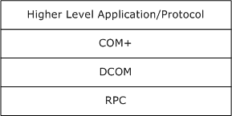

Figure 1: Layering of the protocol stack

### 1.3.1 Context Properties

This protocol operates by passing COM+ specific information in object activations, [**ORPC**](#gt_object-remote-procedure-call-orpc) calls, and as part of marshaled [**OBJREFs**](#gt_objref), using the context and context property extension mechanisms as specified in [MS-DCOM](../MS-DCOM/MS-DCOM.md) section 2.2.21.4. A COM+ object is configured using an implementation-specific mechanism to require none, some, or all of the features described in this specification. These features are implemented by creating the object within a context and associating properties with the context. A context is a collection of attributes or context properties that describes an execution environment. When an object in a context with one or more context properties creates or calls other objects on the network, the protocol specifies mechanisms for those context properties to influence the state of the object activations and ORPC calls.

A context can contain the following context properties:

- The Transaction Context Property (section [1.3.2](#Section_1.3))
- The Activity Context Property (section [1.3.3](#Section_1.3.3))
- The Security Context Property (section [1.3.4](#Section_1.3.2))
- The User-Defined Context Property (section [1.3.5](#Section_1.3.5))

#### 1.3.1.1 Context Properties and Activations

Context properties can flow as part of activation. [MS-DCOM](../MS-DCOM/MS-DCOM.md) specifies two ways to accomplish this: the client context and the prototype context passed as part of an ActivationContextInfoData structure ([MS-DCOM] section 2.2.22.2.5) within an Activation Properties BLOB ([MS-DCOM] section 2.2.22).

##### 1.3.1.1.1 Client Context Within Activations

The client context within the Activation Properties BLOB ([MS-DCOM](../MS-DCOM/MS-DCOM.md) section 2.2.22) represents a set of context properties associated with the client object context, and guides the creation of the server object context.

The server can decide to use some, none, or all of the client context properties, depending on the desired result or implementation-specific details.

For example, if the client context contains a transaction context property (section [2.2.2.1](#Section_2.2.2.1)), this indicates to the server that the client object is running within a [**transaction**](#gt_transaction). The server then decides, in an implementation-specific way, if the server object will run within the same transaction as the client, a new transaction, or no transaction at all.

##### 1.3.1.1.2 Prototype Context Within Activations

The prototype context within the Activation Properties BLOB ([MS-DCOM](../MS-DCOM/MS-DCOM.md) section 2.2.22) represents the set of context properties of the client that the server needs to add to its object context. While the client context is merely advisory, the prototype context is not. All the prototype context properties have to be present among the context properties of the server object.

##### 1.3.1.1.3 Diagram

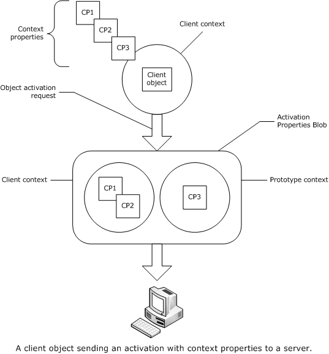

Figure 2: A client object sending an activation with context properties to a server

#### 1.3.1.2 Context Properties and Marshaling

When a server marshals a COM+ object running in a context, the server returns an OBJREF_EXTENDED instance ([MS-DCOM](../MS-DCOM/MS-DCOM.md) section 2.2.18.7). Within an OBJREF_EXTENDED instance, the server can include a representation of its context called an envoy context, consisting of envoy context properties. During unmarshaling, a client can use the envoy context properties to configure and influence future client-side behaviors, either in general or specifically with respect to future communication with the unmarshaled reference.

For example, a marshaled transactional COM+ server object returns a transactional envoy context property in an [**ORPC**](#gt_object-remote-procedure-call-orpc) call, thereby allowing the client to determine whether the client and the server share the same [**transaction**](#gt_transaction). If they do not, the client can ignore the transactional envoy context property. If they share the same transaction, the client can send extra information on subsequent ORPC calls to the server, for example, to denote the current [**transaction sequence number**](#gt_transaction-sequence-number-tsn), or to send a new transaction if the previous transaction has ended.

##### 1.3.1.2.1 Diagram

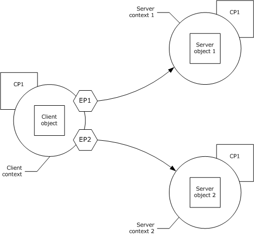

Figure 3: A client object with references to two server objects, each with a reference-specific envoy property (EP1 and EP2) returned from the server during marshaling

#### 1.3.1.3 Context Properties and ORPC Calls

Context properties can participate in out-of-band communication on [**ORPC**](#gt_object-remote-procedure-call-orpc) calls. Via the Context ORPC Extension mechanism ([MS-DCOM](../MS-DCOM/MS-DCOM.md) section 2.2.21.4), a client-side context property and a server-side context property can pass information back and forth on ORPC calls. In some cases, such communication is influenced by an envoy context property returned from the server during the marshaling/unmarshaling process. For example, during an ORPC call a transactional COM+ client object can send extra information about the state of the current [**transaction**](#gt_transaction) to a COM+ server object.

##### 1.3.1.3.1 Diagram

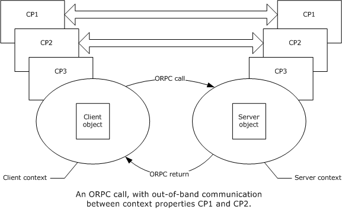

Figure 4: An ORPC call with out-of-band communication between context properties

### 1.3.2 Transactions

This protocol is designed to combine the work of collaborating objects under the aegis of a single [**distributed transaction**](#gt_distributed-transaction). The protocol itself does not define or implement distributed transaction coordination and resource manager facilities; instead, it relies on the protocol described in [MS-DTCO](../MS-DTCO/MS-DTCO.md) for these operations, and all references to a "[**transaction**](#gt_transaction)" in this specification are references to transaction protocol references. This protocol implements transactional semantics for objects by extending the protocol described in [MS-DCOM](../MS-DCOM/MS-DCOM.md) to send transactions and associated information during object activations, in [**ORPC**](#gt_object-remote-procedure-call-orpc) calls, and within marshaled [**OBJREF**](#gt_objref) instances.

#### 1.3.2.1 Transaction Stream

A [**transaction stream**](#gt_transaction-stream) is an object that supplies a series of [**transactions**](#gt_transaction), each identified by a monotonically increasing [**transaction sequence number (TSN)**](#gt_transaction-sequence-number-tsn). Each transaction stream is uniquely identified by a [**GUID**](#gt_globally-unique-identifier-guid) known as a [**transaction stream ID**](#gt_transaction-stream-id). The TSN is used to synchronize the transaction participants to the current active transaction. A new transaction in the stream might not be initiated until the previous transaction has completed.

Transaction streams make it possible for sets of distributed objects to collaborate on sequential units of work.

#### 1.3.2.2 Root Transaction Object

The root [**transaction**](#gt_transaction) object is the object for which the initial transaction is created. There can only be one root transaction object within a transaction. The root transaction object has an associated [**transaction stream**](#gt_transaction-stream), which is responsible for supplying a series of transactions to the root object, as well as to all non-root objects, as required.

#### 1.3.2.3 Non-root Transaction Object

Non-root [**transaction**](#gt_transaction) objects are objects created by or downstream from the root transaction object, and those that share the root transaction object's transaction. There can be multiple non-root objects within a transaction. A non-root transaction object communicates with the root transaction object and its associated [**transaction stream**](#gt_transaction-stream) to ensure that each [**ORPC**](#gt_object-remote-procedure-call-orpc) call to the non-root transaction object is always executed using a valid and current transaction.

After a transaction completes, the non-root transaction object retrieves the next transaction either by communicating with the transaction stream, or by receiving it directly as part of an ORPC call from another object running within the transaction.

#### 1.3.2.4 Diagram

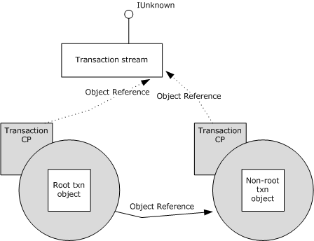

Figure 5: A root and non-root transaction object, each with a transaction context property holding a reference to the transaction stream

#### 1.3.2.5 MS-DTC Transaction Propagation Methods

The transaction protocol described in [MS-DTCO](../MS-DTCO/MS-DTCO.md) specifies two methods for propagating a [**transaction**](#gt_transaction) from one machine to another. For historical reasons, this protocol accommodates transaction manager implementations on client and server machines that support either or both methods. For more information, see section [2.2.6.1](../MS-DTCO/MS-DTCO.md) and [[MSDN-DTC]](https://go.microsoft.com/fwlink/?LinkId=89994).

#### 1.3.2.6 Transaction Lifetime

[**Transactions**](#gt_transaction) in this protocol are started only by the root transaction object. Only the root transaction object can commit a transaction. A transaction can be canceled by any participant in the transaction.

### 1.3.3 Activities

An [**activity**](#gt_activity) is a synchronization boundary; [**ORPC**](#gt_object-remote-procedure-call-orpc) calls to objects within the boundary are serialized based on the DCOM causality of the currently executing ORPC call. An activity is uniquely identified by a [**GUID**](#gt_globally-unique-identifier-guid) known as an [**activity ID**](#gt_activity-identifier). If an object in an activity is currently executing an incoming ORPC call, incoming ORPC calls with different [**causality identifiers**](#gt_cae15e71-2790-4b84-abdb-5998add4d372) (CIDs, as specified in [MS-DCOM](../MS-DCOM/MS-DCOM.md) section 2.2.6) to other objects within the same activity are blocked for a specified period of time. If the time-out expires before the incoming ORPC call is allowed to enter the activity, the call is rejected and an error is returned to the client.

### 1.3.4 Security

The protocol offers the capability to send a collection of security identities and other security information along an [**ORPC**](#gt_object-remote-procedure-call-orpc) call chain; each element in the collection represents a caller in the ORPC call chain. At any point in the call chain, an object can query, in an implementation-specific manner, the following security attributes associated with each upstream caller:

- The caller's identity (specified by a security identifier (SID) or Windows NT account name).
- The authentication service of the call.
- The authentication level of the call.
- The impersonation level of the call.
In addition, an object in the call chain can also query the minimum [**authentication level**](#gt_authentication-level) used across the entire call chain.

The protocol uses the security context property to send security information in ORPC calls as described in section [1.3.1.3](#Section_1.3.1.3). When an object is marshaled, the protocol uses the [security envoy property (section 2.2.4.2)](#Section_2.2.4.2) as described in section [1.3.1.2](#Section_1.3.1.2) to send information about the [**domain**](#gt_domain) and computer of the object. The protocol uses this information to translate [**SIDs**](#gt_security-identifier-sid) to [**Windows NT account names**](#gt_windows-nt-account-name) when sending the security identity of the caller in cross-computer and cross-domain ORPC calls.

### 1.3.5 User-Defined Properties

User-defined properties are name/value pairs that are part of an object's context. These properties are supplied and consumed by higher-level protocols or applications. This protocol supports the string value type and the [**OBJREF**](#gt_objref) value type. The protocol sends these properties as part of both the client and prototype contexts during object activations.

### 1.3.6 Partitions

[**Partitions**](#gt_partition) are used to support the side-by-side installation of multiple configurations of a COM+ object class. Each partition is uniquely identified by a [**GUID**](#gt_globally-unique-identifier-guid) known as the [**partition ID**](#gt_9587a9d3-3fd7-45c6-aab1-c74ff17a22b7). An object class can have several versions of its configuration installed on a server, one per partition. A partition contains at most one version of an object class.

Every machine has at minimum one partition, the [**global partition**](#gt_global-partition), which contains the default configuration for every object class on the machine. The global partition serves as the default partition when no criteria, such as a client-specified partition, exist to choose any other partition.

The partition of an object class is determined during the object activation request; it can be chosen automatically by an implementation on behalf of the activating client, or the activating client can specify a partition ID as part of the activation request.

For historical reasons, the client's partition information is not sent across the network in the form of a context property; instead, it is sent as part of the base DCOM protocol. See the **guidPartition** field of the SpecialPropertiesData structure, as specified in [MS-DCOM](../MS-DCOM/MS-DCOM.md) section 2.2.22.2.2.

## 1.4 Relationship to Other Protocols

This protocol is built on top of the protocol described in [MS-DCOM](../MS-DCOM/MS-DCOM.md). This protocol requires the protocol described in [MS-DTCO](../MS-DTCO/MS-DTCO.md) to implement the transactional features in this specification.

## 1.5 Prerequisites/Preconditions

This protocol requires that both client and server possess implementations of the protocol described in [MS-DCOM](../MS-DCOM/MS-DCOM.md). If the transactional features of this protocol are to be used, both client and server have to possess implementations of the protocol described in [MS-DTCO](../MS-DTCO/MS-DTCO.md).

## 1.6 Applicability Statement

This protocol is useful and appropriate when a distributed, object-based architecture with [**transactions**](#gt_transaction), synchronization, security, and side-by-side installation of multiple configurations of an [**object class**](#gt_object-class) is required.

## 1.7 Versioning and Capability Negotiation

This document covers versioning issues in the following area:

- Capability Negotiation: The protocol performs explicit capability negotiation, as follows:
- By use of the COMVERSION structure ([MS-DCOM](../MS-DCOM/MS-DCOM.md) section 2.2.11) as specified in section [2.2.5](#Section_2.2.5) and section [3.12.4](#Section_3.9.4).
- By use of the [MS-DTC Capabilities](#Section_8599ea52f5a04bb3835b0d6409f7472d) (section 2.2.6.1) as specified in section [2.2.2.1.2](#Section_2.2.2.1.2) and section [2.2.4.1](#Section_2.2.4.1).

## 1.8 Vendor-Extensible Fields

This protocol uses [HRESULT](../MS-ERREF/MS-ERREF.md)s as specified in [MS-ERREF](../MS-ERREF/MS-ERREF.md) section 2.1. Vendors can define their own HRESULT values, provided that the C bit (0x20000000) is set for each vendor-specific value.

## 1.9 Standards Assignments

The following is a table of well-known [**GUIDs**](#gt_globally-unique-identifier-guid) in this protocol.

| Parameter | Value | Reference |
| --- | --- | --- |
| [Transaction Context Property](#Section_2.2.2.1) identifier, [Transaction ORPC Extensions](#Section_3.15) identifier, and [Transaction Envoy Property](#Section_2.2.4.1) identifier (guidTransactionProperty) | {ecabaeb1-7f19-11d2-978e-0000f8757e2a} | [[C706]](https://go.microsoft.com/fwlink/?LinkId=89824) section A.2.5 |
| [Activity Context Property](#Section_2.2.2.2) identifier (guidActivityProperty) | {ecabaeb4-7f19-11d2-978e-0000f8757e2a} | [C706] section A.2.5 |
| [Security Envoy Property](#Section_2.2.4.2) identifier and [Security ORPC Extension](#Section_2.2.3.2) identifier (guidSecurityProperty) | {ecabaeb8-7f19-11d2-978e-0000f8757e2a} | [C706] section A.2.5 |
| [User-Defined Context Property](#Section_1.3.1) identifier (guidUserPropertiesProperty) | {ecabaeb6-7f19-11d2-978e-0000f8757e2a} | [C706] section A.2.5 |
| OBJREF_CUSTOM unmarshaler [**CLSID**](#gt_class-identifier-clsid) for [Class Factory Wrapper](#Section_2.2.5) (CLSID_CFW) | {ecabafc0-7f19-11d2-978e-0000f8757e2a} | [C706] section A.2.5 |
| OBJREF_CUSTOM unmarshaler CLSID for User-Defined Context Property (CLSID_UserContextProperty) | {ecabafb3-7f19-11d2-978e-0000f8757e2a} | [C706] section A.2.5 |
| OBJREF_CUSTOM unmarshaler CLSID for Transaction Context Property (CLSID_TransactionUnmarshal) | {ecabafac-7f19-11d2-978e-0000f8757e2a} | [C706] section A.2.5 |
| OBJREF_CUSTOM unmarshaler CLSID for Activity Context Property (CLSID_ActivityUnmarshal) | {ecabafaa-7f19-11d2-978e-0000f8757e2a} | [C706] section A.2.5 |
| Unmarshaling CLSID for the Security Envoy Property (CLSID_SecurityEnvoy) | {ecabafab-7f19-11d2-978e-0000f8757e2a} | [C706] section A.2.5 |
| Unmarshaling CLSID for the Transaction Envoy Property (CLSID_TransactionEnvoy) | {ecabafad-7f19-11d2-978e-0000f8757e2a} | [C706] section A.2.5 |
| [**RPC**](#gt_remote-procedure-call-rpc) interface UUID for [ITransactionStream](#Section_3.23.4.2) (IID_ITransactionStream) | {97199110-DB2E-11d1-A251-0000F805CA53} | [C706] section A.2.5 |

# 2 Messages

All structures are defined in the [**IDL**](#gt_interface-definition-language-idl) syntax and are marshaled as per [[C706]](https://go.microsoft.com/fwlink/?LinkId=89824) part 3. The IDL is specified in [Appendix A](#Section_6).

Field types in packet diagrams are specified by the packet diagram and the field descriptions. All integer-based fields in packet diagrams are marshaled using little-endian byte ordering unless otherwise specified.

This protocol references commonly used data types as defined in [MS-DTYP](../MS-DTYP/MS-DTYP.md).

Unless otherwise qualified, instances of **GUID** in sections 2 and [3](#Section_1.3) refer to [MS-DTYP] section 2.3.4.

## 2.1 Transport

This protocol uses [**RPC**](#gt_remote-procedure-call-rpc) [**dynamic endpoints**](#gt_dynamic-endpoint) as specified in [[C706]](https://go.microsoft.com/fwlink/?LinkId=89824) part 4.

## 2.2 Common Data Types

In addition to [**RPC**](#gt_remote-procedure-call-rpc) base types and definitions specified in [[C706]](https://go.microsoft.com/fwlink/?LinkId=89824) and [MS-DTYP](../MS-DTYP/MS-DTYP.md), additional data types are specified in this section.

### 2.2.1 LengthPrefixedName

The LengthPrefixedName type specifies an array of [**Unicode**](#gt_unicode) characters prefixed by the array length, in characters.

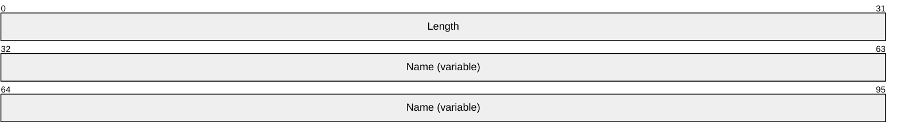

**Length (4 bytes):** An unsigned long that MUST contain the number of Unicode characters in **Name**, and MUST NOT be zero.

**Name (variable):** A Unicode string; the string SHOULD NOT end in a NULL terminator.

### 2.2.2 Activation Context Properties

Activation context properties are included as part of the client and/or prototype contexts in a DCOM Activation Properties BLOB ([MS-DCOM](../MS-DCOM/MS-DCOM.md) section 2.2.22).

The following table shows which context properties are located within either the client or prototype contexts.

| Context property | In client or prototype context? |
| --- | --- |
| [Transaction (section 2.2.2.1)](#Section_2.2.2.1) | If present, this property MUST be in client context only. |
| [Activity (section 2.2.2.2)](#Section_2.2.2.2) | If present, this property MUST be in client context only. |
| [User-defined (section 2.2.2.3)](#Section_1.3.1) | If present, this property MUST be in both client and prototype contexts. |

The user context property, if present, MUST be sent within both the client and prototype contexts, and both copies MUST be identical.

#### 2.2.2.1 Transaction Context Property

To indicate to the server that the client is running within a [**transaction**](#gt_transaction), the client MUST include a transaction context property as part of the client context in an object activation request.

The **policyId** field of the PROPMARSHALHEADER instance ([MS-DCOM](../MS-DCOM/MS-DCOM.md) section 2.2.20.1) for the transaction context property MUST be set to guidTransactionProperty, as specified in section [1.9](#Section_5). The **CLSID** field of the PROPMARSHALHEADER instance ([MS-DCOM] section 2.2.20.1) for the transaction context property MUST be set to GUID_NULL. The transaction context property MUST be marshaled using the OBJREF_CUSTOM format ([MS-DCOM] section 2.2.18.6), and the **CLSID** field of the OBJREF_CUSTOM instance MUST be set to CLSID_TransactionUnmarshal, as specified in section 1.9.

The format of the OBJREF_CUSTOM.pObjectData buffer for CLSID_TransactionUnmarshal MUST be specified as follows.

##### 2.2.2.1.1 TransactionContextPropertyHeader

The TransactionContextPropertyHeader structure is the common header for all variants of the [Transaction Context Property](#Section_2.2.2.1).

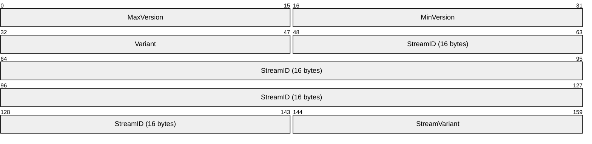

**MaxVersion (2 bytes):** The major version of this marshaled format. MUST be set to 0x0001 or 0x0002. A value of 0x0002 indicates that an **IsolationLevel** field is present at the end of the message (see sections [2.2.2.1.2](#Section_2.2.2.1.2) and [2.2.2.1.3](#Section_2.2.2.1.3)); a value of 0x0001 indicates that no **IsolationLevel** is present.

**MinVersion (2 bytes):** The minor version of this marshaled format. MUST be set to 0x0001.

**Variant (2 bytes):** This MUST be set to either 0x0000 or 0x0002, and MUST be ignored by the server on receipt.

**StreamID (16 bytes):** A [**GUID**](#gt_globally-unique-identifier-guid) identifying the controlling [**transaction stream**](#gt_transaction-stream).

**StreamVariant (2 bytes):** A value identifying the larger structure that contains the TransactionContextPropertyHeader. It MUST be set to one of the following values:

| Value | Meaning |
| --- | --- |
| StreamVariant 0x0001 | The TransactionContextPropertyHeader structure MUST be contained as part of a TransactionStream (section 2.2.2.1.2) structure. |
| TransactionVariant 0x0002 | The TransactionContextPropertyHeader structure MUST be contained as part of a TransactionBuffer (section 2.2.2.1.3) structure. |

##### 2.2.2.1.2 TransactionStream

The TransactionStream structure is used when the client passes a reference to the client's [ITransactionStream](#Section_3.23.4.2) interface and conveys information about the capabilities of the DTCO transaction manager implementation on the client.

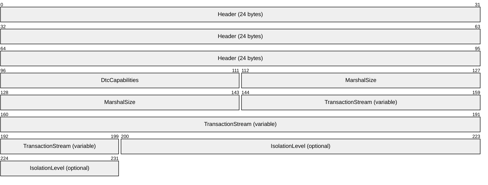

**Header (24 bytes):** A [TransactionContextPropertyHeader](#Section_2.2.2.1.1); the **StreamVariant** field of the structure MUST be set to 0x0001.

**DtcCapabilities (2 bytes):** A bitwise OR of one or more of the values defined in section [2.2.6.1](#Section_2.2.6.1) indicating the capabilities of the client’s DTCO transaction manager.

**MarshalSize (4 bytes):** The (unsigned) size in bytes of **TransactionStream**.

**TransactionStream (variable):** An [**OBJREF**](#gt_objref) instance containing a marshaled **ITransactionStream** interface instance.

**IsolationLevel (optional) (4 bytes):** The [Transaction Isolation Level (section 2.2.6.2)](#Section_2.2.6.2) used by the COM+ client. This field MUST be present if the **MaxVersion** field of the header is 0x0002; otherwise, this field MUST NOT be present.

##### 2.2.2.1.3 TransactionBuffer

The TransactionBuffer structure is used when the client passes the currently active [**transaction**](#gt_transaction) to the server.

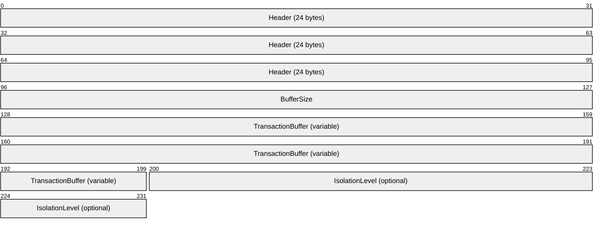

**Header (24 bytes):** A [TransactionContextPropertyHeader](#Section_2.2.2.1.1) structure. The **StreamVariant** field of the structure MUST be set to 0x0002.

**BufferSize (4 bytes):** The unsigned size, in bytes, of **TransactionBuffer**.

**TransactionBuffer (variable):** An array of bytes that MUST contain a Propagation_Token structure as specified in [MS-DTCO](../MS-DTCO/MS-DTCO.md) section 2.2.5.4.

**IsolationLevel (optional) (4 bytes):** The [Transaction Isolation Level (section 2.2.6.2)](#Section_2.2.6.2) used by the COM+ client. This field MUST be present if the **MaxVersion** field of header is 0x0002; otherwise, this field MUST NOT be present.

#### 2.2.2.2 Activity Context Property

To indicate to the server that the client is running within an [**activity**](#gt_activity), the client MUST include an activity context property as part of the client context in an object activation request.

The **policyId** field of the PROPMARSHALHEADER instance ([MS-DCOM](../MS-DCOM/MS-DCOM.md) section 2.2.20.1) for the activity context property MUST be set to guidActivityProperty, as specified in section [1.9](#Section_5). The **CLSID** field of the PROPMARSHALHEADER instance ([MS-DCOM] section 2.2.20.1) for the activity context property MUST be set to GUID_NULL. The activity context property MUST be marshaled using the OBJREF_CUSTOM format ([MS-DCOM] section 2.2.18.6), and the **CLSID** field of the OBJREF_CUSTOM instance MUST be set to CLSID_ActivityUnmarshal, as specified in section 1.9.

The format of the OBJREF_CUSTOM.pObjectData buffer for CLSID_ActivityUnmarshal MUST be specified as follows.

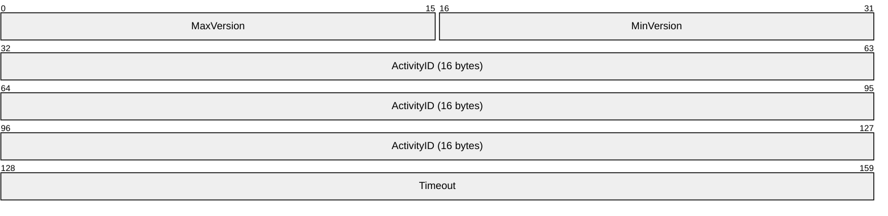

**MaxVersion (2 bytes):** The major version number for this activity context property format. This field MUST be set to 0x0001.

**MinVersion (2 bytes):** The minor version number for this activity context property format. This field MUST be set to 0x0001.

**ActivityID (16 bytes):** A [**GUID**](#gt_globally-unique-identifier-guid) that MUST specify the [**activity ID**](#gt_activity-identifier).

**Timeout (4 bytes):** An unsigned long that MUST specify the activity time-out in milliseconds. A value of 0xFFFFFFFF MUST be interpreted to specify an INFINITE time-out.

#### 2.2.2.3 User-Defined Context Property

The user-defined context property, if present, MUST be included as part of both the client and prototype contexts during activation requests. This context property contains a logical set of name/value pairs.

The **policyId** field of the PROPMARSHALHEADER instance ([MS-DCOM](../MS-DCOM/MS-DCOM.md) section 2.2.20.1) for the user-defined context property MUST be set to guidUserPropertiesProperty, as specified in section [1.9](#Section_5). The **CLSID** field of the PROPMARSHALHEADER instance ([MS-DCOM] section 2.2.20.1) for the [activity context property](#Section_2.2.2.2) MUST be set to GUID_NULL. The user-defined context property MUST be marshaled using the OBJREF_CUSTOM format ([MS-DCOM] section 2.2.18.6), and the **CLSID** field of the OBJREF_CUSTOM instance MUST be set to CLSID_UserContextProperty, as specified in section 1.9.

The format of the OBJREF_CUSTOM.pObjectData buffer for CLSID_UserContextProperty MUST be specified as follows:

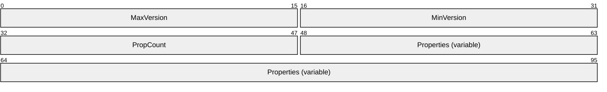

**MaxVersion (2 bytes):** The major version number for this [UserProperty (section 2.2.2.3.1)](#Section_2.2.2.3.1) format. This field MUST be set to 0x0001.

**MinVersion (2 bytes):** The minor version number for this UserProperty format. This field MUST be set to 0x0001.

**PropCount (2 bytes):** An unsigned short that MUST specify the number of elements in the **Properties** array.

**Properties (variable):** An array of UserProperty structures.

##### 2.2.2.3.1 UserProperty

The UserProperty structure is used to define a single name/value pair.

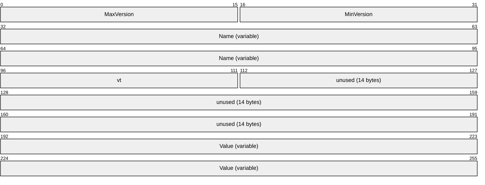

**MaxVersion (2 bytes):** The major version number for this UserProperty format; this field MUST be set to 0x0001.

**MinVersion (2 bytes):** The minor version number for this UserProperty format; this field MUST be set to 0x0001.

**Name (variable):** A [LengthPrefixedName (section 2.2.1)](#Section_2.2.1) containing the name of the UserProperty.

**vt (2 bytes):** The type of data contained in **Value**. It MUST be set to one of the following values:

| vt value | Meaning |
| --- | --- |
| 0x0008 | A LengthPrefixedName. |
| 0x0009 | An OBJREF ([MS-DCOM](../MS-DCOM/MS-DCOM.md) section 2.2.18) with an **iid** field that MUST be set to IID_IUnknown ([MS-DCOM] section 1.9). |
| 0x000D | An OBJREF ([MS-DCOM] section 2.2.18) with an **iid** field that MUST be set to IID_IDispatch ([MS-OAUT](../MS-OAUT/MS-OAUT.md) section 1.9). |

**unused (14 bytes):** SHOULD be set to zero, and MUST be ignored upon receipt.<1>

**Value (variable):** MUST contain the data for this name/value pair, as specified by the **vt** field.

### 2.2.3 Context ORPC Extensions

Context ORPC extensions are specified in [MS-DCOM](../MS-DCOM/MS-DCOM.md) section 2.2.21.4. These extension formats are passed as out-of-band data on [**ORPC**](#gt_object-remote-procedure-call-orpc) calls. Each individual extension is identified by a "**policyID**" of its corresponding EntryHeader ([MS-DCOM] section 2.2.21.5). A Context ORPC extension must be contained in the **PolicyData** array element ([MS-DCOM] section 2.2.21.4) corresponding to the EntryHeader array element ([MS-DCOM] section 2.2.21.5) that contains the **policyID** of the Context ORPC extension.

#### 2.2.3.1 Transaction ORPC Extensions

These extensions are used to coordinate the state of a [**transaction**](#gt_transaction) in use by both the client and the server.

The **policyID** field of the EntryHeader for this extension MUST be set to [guidTransactionProperty (section 1.9)](#Section_5).

##### 2.2.3.1.1 Transaction ORPC Call Extensions

These extensions are sent by a client in order to inform the server of the current [**transaction**](#gt_transaction) state, and to request that other transaction-related data be returned by the server within the same call.

###### 2.2.3.1.1.1 TransactionPropCallHeader

The TransactionPropCallHeader structure is used to pass the [**TSN**](#gt_transaction-sequence-number-tsn) of the current [**transaction**](#gt_transaction) to the server.

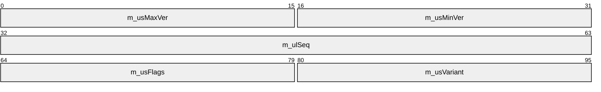

**m_usMaxVer (2 bytes):** The major version number for this TransactionPropCallHeader format. This field MUST be set to 0x0001.

**m_usMinVer (2 bytes):** The minor version number for this TransactionPropCallHeader format; this field MUST be set to 0x0001.

**m_ulSeq (4 bytes):** The sequence number of the current transaction.

**m_usFlags (2 bytes):** This MUST contain one of the following values:

| Value | Meaning |
| --- | --- |
| TransactionPropCallFlag_None 0x0000 | A request that the server MUST return a [TransactionPropRetHeader](#Section_2.2.3.1.2.1) structure with the **m_usVariant** field set to TransactionPropCall_None, as specified in section 2.2.3.1.2.1. |
| TransactionPropCallFlag_NeedWhereabouts 0x0001 | A request that the server MUST return a TransactionPropRetHeader structure with the **m_usVariant** field set to TransactionPropRet_Whereabouts, as specified in section 2.2.3.1.2.1. |

**m_usVariant (2 bytes):** This MUST contain one of the following values:

| Value | Meaning |
| --- | --- |
| TransactionPropCall_None 0x0001 | The TransactionPropCallHeader structure MUST NOT be contained within any larger structures. |
| TransactionPropCall_ExportCookie 0x0002 | The TransactionPropCallHeader structure MUST be contained as part of the [TransactionPropCallExportCookie (section 2.2.3.1.1.2)](#Section_2.2.3.1.1.2) structure. |
| TransactionPropCall_TransmitterBuffer 0x0003 | The TransactionPropCallHeader structure MUST be contained as part of the [TransactionPropCallTransmitterBuffer (section 2.2.3.1.1.3)](#Section_2.2.3.1.1.3) structure. |

###### 2.2.3.1.1.2 TransactionPropCallExportCookie

The TransactionPropCallExportCookie structure is used to send the currently active [**transaction**](#gt_transaction) to the server, using the STxInfo format. For more details, see [MS-DTCO](../MS-DTCO/MS-DTCO.md).

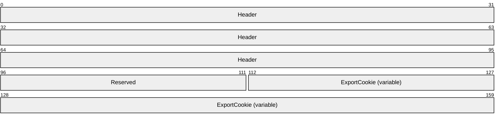

**Header (12 bytes):** A [TransactionPropCallHeader](#Section_2.2.3.1.1.1). The **m_usVariant** field of the structure MUST be set to **TransactionPropCall_ExportCookie** (0x0002).

**Reserved (2 bytes):** This can be set to any arbitrary value and MUST be ignored on receipt.

**ExportCookie (variable):** An STxInfo structure as specified in [MS-DTCO] section 2.2.5.10. The size of the structure is indicated as follows:

Obtain the value of the **cbEHBuffer** field from the EntryHeader ([MS-DCOM](../MS-DCOM/MS-DCOM.md) section 2.2.21.5) corresponding to the [Transaction ORPC Call Extensions (section 2.2.3.1.1)](#Section_2.2.3.1.1). Subtract the sum of the size of the TransactionPropCallHeader structure and the size of the **cbExportCookie field** in the TransactionPropCallExportCookie structure from the value of the **cbEHBuffer** field. The size of the STxInfo structure is the result.

###### 2.2.3.1.1.3 TransactionPropCallTransmitterBuffer

The TransactionPropCallTransmitterBuffer structure is used to send the currently active [**transaction**](#gt_transaction) to the server, using the Propagation Token format; see [MS-DTCO](../MS-DTCO/MS-DTCO.md) section 2.2.5.4 for more details.

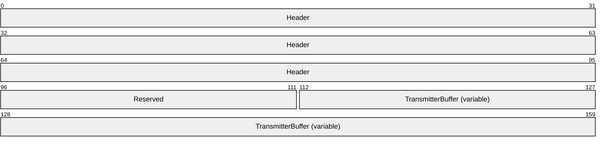

**Header (12 bytes):** A [TransactionPropCallHeader](#Section_2.2.3.1.1.1). The **m_usVariant** field of the structure MUST be set to **TransactionPropCall_TransmitterBuffer** (0x0003).

**Reserved (2 bytes):** This can be set to any arbitrary value and MUST be ignored on receipt.

**TransmitterBuffer (variable):** A Propagation Token structure as specified in [MS-DTCO] section 2.2.5.4. The size of the array is indicated as follows:

Obtain the value of the **cbEHBuffer** field from the EntryHeader ([MS-DCOM](../MS-DCOM/MS-DCOM.md) section 2.2.21.5) corresponding to the [Transaction ORPC Call Extensions (section 2.2.3.1.1)](#Section_2.2.3.1.1). Subtract the sum of the size of the TransactionPropCallHeader (section 2.2.3.1.1.1) structure and the size of the **cbTransmitterBuffer** field in the TransactionPropCallTransmitterBuffer structure from the value of the **cbEHBuffer** field. The size of the Propagation Token structure is the result.

##### 2.2.3.1.2 Transaction ORPC Return Extensions

These extensions are returned in the [**ORPC**](#gt_object-remote-procedure-call-orpc) response by a server in response to one of the call extensions specified in section [2.2.3.1](#Section_3.15).

The **policyID** field of the EntryHeader for these extensions MUST be set to [guidTransactionProperty (section 1.9)](#Section_5).

###### 2.2.3.1.2.1 TransactionPropRetHeader

The server uses the TransactionPropRetHeader structure to communicate [**transaction**](#gt_transaction) status, and optionally to return additional data that advises the client to cancel the current transaction or to stop sending further information about it.

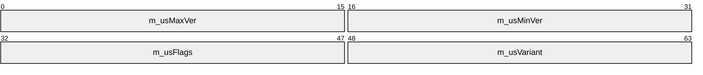

**m_usMaxVer (2 bytes):** The major version number for this TransactionPropRetHeader format; this field MUST be set to 0x0001.

**m_usMinVer (2 bytes):** The minor version number for this TransactionPropRetHeader format; this field MUST be set to 0x0001.

**m_usFlags (2 bytes):** This MUST contain 0x0000 or the bitwise OR of one or more of the following flags:

| Value | Meaning |
| --- | --- |
| TransactionPropRetFlag_Abort 0x0001 | The client MUST cancel the transaction. |
| TransactionPropRetFlag_DontSend 0x0002 | The client SHOULD NOT send the currently active transaction (for example, either as a [TransactionPropCallExportCookie (section 2.2.3.1.1.2)](#Section_2.2.3.1.1.2) or as a [TransactionPropCallTransmitterBuffer (section 2.2.3.1.1.3)](#Section_2.2.3.1.1.3)) to the server again for the life of the transaction. |

**m_usVariant (2 bytes):** This MUST be one of the following values:

| Value | Meaning |
| --- | --- |
| TransactionPropRet_None 0x0000 | The TransactionPropRetHeader structure MUST NOT be contained within any larger structures. |
| TransactionPropRet_Whereabouts 0x0001 | The TransactionPropRetHeader structure MUST be contained as part of [TransactionPropRetWhereabouts (section 2.2.3.1.2.2)](#Section_2.2.3.1.2.2). |

###### 2.2.3.1.2.2 TransactionPropRetWhereabouts

The TransactionPropRetWhereabouts structure is used by the server to return additional data and to communicate [**transaction**](#gt_transaction) status to the client.

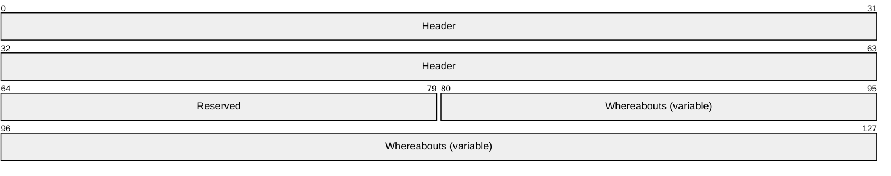

**Header (8 bytes):** A [TransactionPropRetHeader (section 2.2.3.1.2.1)](#Section_2.2.3.1.2.1). The **m_usVariant** field of the structure MUST be set to **TransactionPropRet_Whereabouts** (0x1).

**Reserved (2 bytes):** This can be set to any arbitrary value and MUST be ignored on receipt.

**Whereabouts (variable):** An SWhereabouts (section 2.2.5.11) structure as specified in [MS-DTCO](../MS-DTCO/MS-DTCO.md) section 2.2.5.11. The size of the array is indicated as follows:

Obtain the value of the **cbEHBuffer** field from the EntryHeader, [MS-DCOM](../MS-DCOM/MS-DCOM.md) section 2.2.21.5, corresponding to the [Transaction ORPC Return Extensions (section 2.2.3.1.2)](#Section_2.2.3.1.2). Subtract the sum of the size of the TransactionPropRetHeader structure and the size of the **cbWhereabouts** field in the TransactionPropRetWhereabouts structure from the value of the **cbEHBuffer** field. The size of the SWhereabouts structure is the result.

#### 2.2.3.2 Security ORPC Extension

This extension sends security information for this protocol as out-of-band data on [**ORPC**](#gt_object-remote-procedure-call-orpc) calls between two instances of this protocol. The security information provides a record of the chain of caller identities and other security attributes within a series of ORPC calls.

The [Security ORPC Extension](#Section_2.2.3.2) structure MUST contain an array of [Security Property Collection (section 2.2.3.2.3)](#Section_2.2.3.2.3) structures. Each Security Property Collection structure in turn MUST contain an array of [Security Property (section 2.2.3.2.1)](#Section_2.2.3.2.1) structures. Each Security Property structure MUST specify a [Security Property Type (section 2.2.3.2.1.1)](#Section_2.2.3.2.1).

The **policyID** field of the EntryHeader ([MS-DCOM](../MS-DCOM/MS-DCOM.md) section 2.2.21.5) of the Security ORPC Extension MUST be set to [guidSecurityProperty (section 1.9)](#Section_5).

##### 2.2.3.2.1 Security Property

The Security Property structure specifies a security property sent by the [security ORPC extension](#Section_2.2.3.2).

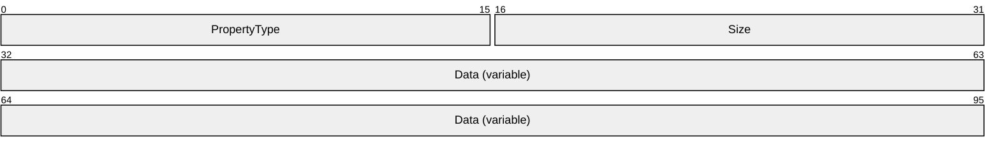

**PropertyType (2 bytes):** An unsigned short that MUST contain one of the values specified in the Type column in section [2.2.3.2.1.1](#Section_2.2.3.2.1).

**Size (2 bytes):** An unsigned short that MUST contain the size of the **Data** array as specified in section 2.2.3.2.1.1.

**Data (variable):** An array of bytes that MUST contain a security property value as specified in section 2.2.3.2.1.1.

###### 2.2.3.2.1.1 Security Property Types

The following table lists the valid Security Property Types for the PropertyType field of the Security Property structure. See [Security Property (section 2.2.3.2.1)](#Section_2.2.3.2.1).

| Bit Range | Field | Description |
| --- | --- | --- |
| MUST be an array of bytes specifying the [**security identifier (SID)**](#gt_security-identifier-sid) of the caller. The array MUST be padded to a multiple of 4. | 0x0b01 or 0x0b06 | MUST be set to the number of bytes in the **Data** field rounded to a multiple of 4. If the value is 0x0b01, the **Data** field MUST contain a SID obtained by authenticating the caller using DCOM/RPC authentication mechanisms. If the value is 0x0b06, the **Data** field MUST contain a **SID** supplied by an application or a higher-level protocol. The **collectionType** field of the [security property collection header (section 2.2.3.2.2)](#Section_2.2.3.2.3) MUST be set to 0x0a02. |
| Variable | 0x0b02 or 0x0b07 | MUST be set to the number of bytes in the **Data** field rounded to a multiple of 4. MUST be an array of Unicode characters that specifies the Windows NT account name of the caller. The array MUST be terminated with the NULL Unicode character and MUST be padded to a multiple of 4. If the value is 0x0b02, the **Data** field MUST contain a Windows NT account name obtained by authenticating the caller using DCOM/RPC authentication mechanisms. If the value is 0x0b07, the **Data** field MUST contain a Windows NT account name supplied by an application or a higher-level protocol. The **collectionType** field of the security property collection header (section 2.2.3.2.2) MUST be set to 0x0a02. |
| Variable | 0x0b03 | MUST be set to 0x0004. MUST be a **DWORD** that MUST contain the RPC authentication service value used in the ORPC call. For more details on RPC authentication services, see [MS-RPCE](../MS-RPCE/MS-RPCE.md) section 2.2.1.1.8. The **collectionType** field of the security property collection header (section 2.2.3.2.2) MUST be set to 0x0a02. |
| Variable | 0x0b04 | MUST be set to 0x0004. MUST be a **DWORD** that MUST contain the RPC authentication level value used in the ORPC call. For more details on RPC authentication levels, see [MS-RPCE] section 2.2.1.1.8. The **collectionType** field of the security property collection header (section 2.2.3.2.2) MUST be set to 0x0a02. |
| Variable | 0x0b05 | MUST be set to 0x0004. MUST be a **DWORD** that MUST contain the RPC impersonation level value used in the ORPC call. The **collectionType** field of the security property collection header (section 2.2.3.2.2) MUST be set to 0x0a02. |
| Variable | 0x0b10 | MUST be set to 0x0004. MUST be a **DWORD** that contains the minimum of the RPC authentication level values used across all the calls in the ORPC call chain. For more details on RPC authentication levels, see [MS-RPCE] section 2.2.1.1.8. The **collectionType** field of the security property collection header (section 2.2.3.2.2) MUST be set to 0x0a01. |

##### 2.2.3.2.2 Security Property Collection Header

The Security Property Collection Header structure specifies the header of a [Security Property (section 2.2.3.2.1)](#Section_2.2.3.2.1) collection.

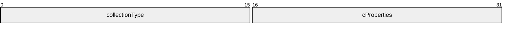

**collectionType (2 bytes):** An unsigned short that MUST contain one of the following values:

| Value | Meaning |
| --- | --- |
| 0x0a01 | The collection MUST contain properties that are not specific to any one caller in the ORPC call chain, but that apply to the entire ORPC call chain. |
| 0x0a02 | The collection MUST contain properties that describe one caller in the ORPC call chain. |

**cProperties (2 bytes):** An unsigned short that MUST contain the number of Security Property structures in the collection. MUST NOT be zero.

##### 2.2.3.2.3 Security Property Collection

The Security Property Collection structure is used to specify an array of [Security Property (section 2.2.3.2.1)](#Section_2.2.3.2.1) structures. It consists of a collection header followed by the Security Property structures.

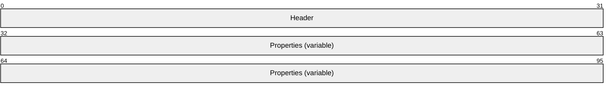

**Header (4 bytes):** A [Security Property Collection Header (section 2.2.3.2.2)](#Section_2.2.3.2.3).

**Properties (variable):** An array of Security Property structures. The number of elements in the array MUST be specified in the **cProperties** field of **Header**.

If the **collectionType** field of the **Header** has a value of 0x0a01, the **Properties** array SHOULD contain a single element with the **PropertyType** field value set to 0x0b10, specifying the minimum [**RPC**](#gt_remote-procedure-call-rpc) [**authentication level**](#gt_authentication-level) used across the [**ORPC**](#gt_object-remote-procedure-call-orpc) call chain.

If the **collectionType** field of the **Header** has a value of 0x0a02, the **Properties** array SHOULD contain at least 4 elements with the **PropertyType** values set to 0x0b01, 0x0b03, 0x0b04 and 0x0b05, specifying, respectively, the [**SID**](#gt_security-identifier-sid), the [**authentication service**](#gt_authentication-service-as), the authentication level, and the impersonation level used in the ORPC call.

If the **collectionType** field of the **Header** has a value of 0x0a02 and if the ORPC call crosses a [**domain**](#gt_domain) boundary, the **Properties** array SHOULD contain an additional element with the **PropertyType** value set to 0x0b02, specifying the [**Windows NT account name**](#gt_windows-nt-account-name) of the caller.

Otherwise, if the **collectionType** field of the **Header** has a value of 0x0a02, if the ORPC call crosses a computer boundary and if the security identity of the client is scoped to the local computer, the **Properties** array SHOULD contain an additional element with the **PropertyType** value set to 0x0b02, specifying the Windows NT account name of the caller.

##### 2.2.3.2.4 Security ORPC Extension

The Security ORPC Extension structure is used to specify the version, style, and number of security property collections in the out-of-band data sent by the security ORPC extension.

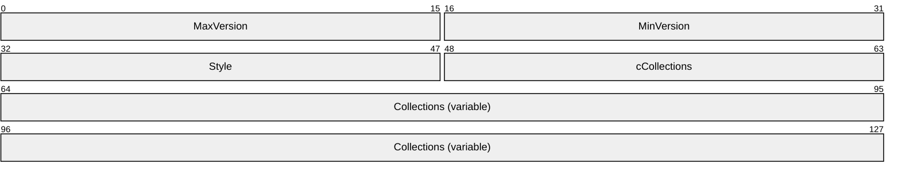

**MaxVersion (2 bytes):** The major version number for this Security ORPC Extension format; this field MUST be set to 0x0001.

**MinVersion (2 bytes):** The minor version number for this Security ORPC Extension format; this field MUST be set to 0x0001.

**Style (2 bytes):** An unsigned short that MUST be set to one of the following values:

| Value | Meaning |
| --- | --- |
| 0x0000 | The recipient of the ORPC call MUST append the [security property collection (section 2.2.3.2.3)](#Section_2.2.3.2.3) of the recipient when making an outgoing ORPC call. |
| 0x0002 | The recipient of the ORPC call MUST NOT append the security property collection (section 2.2.3.2.3) of the recipient when making an outgoing ORPC call. |

**cCollections (2 bytes):** The unsigned number of elements in the **Collections** array.

**Collections (variable):** An array of security property collections (section 2.2.3.2.3). The **collectionType** field in the [Security Property Collection Header (section 2.2.3.2.2)](#Section_2.2.3.2.3) of the first element of the array, if present, MUST be set to 0x0a01. The **collectionType** field in the Security Property Collection Header of the remaining elements of the array, if present, MUST be set to 0x0a02. The second array element, if present, indicates the security property of the direct [**ORPC**](#gt_object-remote-procedure-call-orpc) caller. Subsequent array elements, if present, indicate the security properties of previous callers in the ORPC call chain.

### 2.2.4 OBJREF_EXTENDED Context Properties

The server represents some or all server context properties as part of the marshaled [**OBJREF**](#gt_objref) using the OBJREF_EXTENDED format ([MS-DCOM](../MS-DCOM/MS-DCOM.md) section 2.2.18.7). Such properties are also known as envoy properties.

#### 2.2.4.1 Transaction Envoy Property

The Transaction Envoy Property is used to notify the unmarshaling client that the server object is running within a [**transaction**](#gt_transaction). The server object returns the transaction envoy context property as part of an OBJREF_EXTENDED instance.

The **policyId** field of the PROPMARSHALHEADER instance ([MS-DCOM](../MS-DCOM/MS-DCOM.md) section 2.2.20.1) for the transaction envoy property MUST be set to guidTransactionProperty (see section [1.9](#Section_5)). The **CLSID** field of the PROPMARSHALHEADER instance ([MS-DCOM] section 2.2.20.1) for the transaction envoy property MUST be set to CLSID_TransactionEnvoy (see section 1.9).

The marshaled data buffer for the property MUST be specified in the following format.

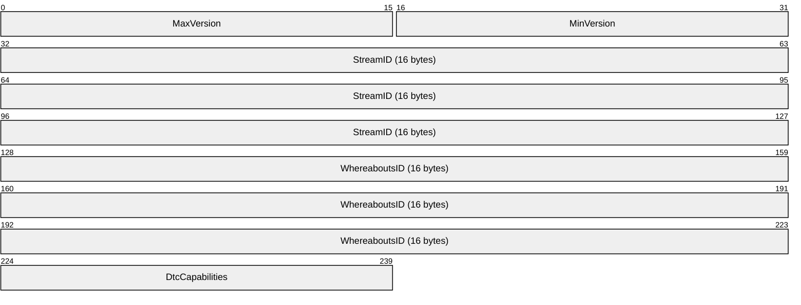

**MaxVersion (2 bytes):** The major version number for this Transaction Envoy property format; this field MUST be set to 0x0001.

**MinVersion (2 bytes):** The minor version number for this Transaction Envoy property format; this field MUST be set to 0x0001.

**StreamID (16 bytes):** A [**GUID**](#gt_globally-unique-identifier-guid) that MUST contain the [**transaction stream ID**](#gt_transaction-stream-id) of the server.

**WhereaboutsID (16 bytes):** A GUID identifying the server object's SWhereabouts. For more information, see [MS-DTCO](../MS-DTCO/MS-DTCO.md).

**DtcCapabilities (2 bytes):** An unsigned short that MUST be set to one or more of the values defined in section [2.2.6.1](#Section_2.2.6.1).

#### 2.2.4.2 Security Envoy Property

This property is used to notify the unmarshaling client that the server object is using security specified by this protocol. The server object returns the security envoy context property as part of an OBJREF_EXTENDED instance.

The **policyId** field of the PROPMARSHALHEADER instance ([MS-DCOM](../MS-DCOM/MS-DCOM.md) section 2.2.20.1) for the security envoy property MUST be set to guidSecurityProperty (see section [1.9](#Section_5)). The **CLSID** field of the PROPMARSHALHEADER instance ([MS-DCOM] section 2.2.20.1) for the security envoy property MUST be set to CLSID_SecurityEnvoy (see section 1.9).

The marshaled data buffer for the property MUST be specified in the following format:

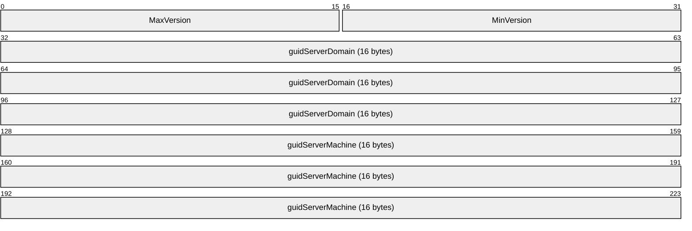

**MaxVersion (2 bytes):** The major version number for this security envoy property format; this field MUST be set to 0x0001.

**MinVersion (2 bytes):** The minor version number for this security envoy property format; this field MUST be set to 0x0001.

**guidServerDomain (16 bytes):** A [**GUID**](#gt_globally-unique-identifier-guid) that uniquely identifies the [**domain**](#gt_domain) of the server machine. For more information, see [MS-NRPC](../MS-NRPC/MS-NRPC.md) section 2.2.1.2.1.

**guidServerMachine (16 bytes):** A GUID that uniquely identifies the server machine.

### 2.2.5 Class Factory Wrapper

If a client with a COMVERSION ([MS-DCOM](../MS-DCOM/MS-DCOM.md) section 2.2.11) greater than or equal to 5.6 requests a [**class factory**](#gt_class-factory) reference during activation ([MS-DCOM] section 3.1.2.5.2.3.2), the server MUST return an OBJREF_CUSTOM instance containing a marshaled representation of the class factory. The unmarshaler of the OBJREF_CUSTOM instance on the client MUST convert object creation requests on the class factory reference to normal object activation requests. This process enables the client to send its client and prototype context properties during class-factory-based object activation requests in the same way that these properties are sent during normal object activation requests.

CLSID_CFW (see section [1.9](#Section_5)) MUST be the unmarshaler **CLSID** for the OBJREF_CUSTOM instance.

The format of the **OBJREF_CUSTOM.pObjectData** buffer for this CLSID_CFW MUST be specified as follows.

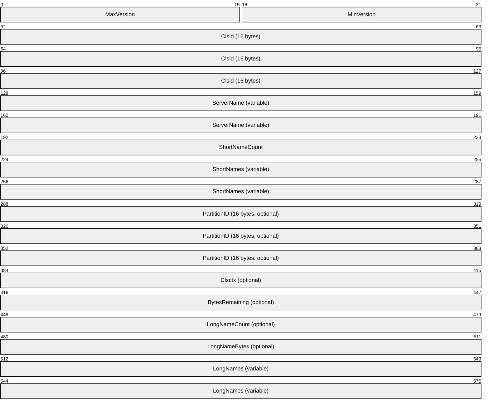

**MaxVersion (2 bytes):** The major version number for this Class Factory Wrapper format; this field MUST be set to 0x0002, 0x0003, 0x0004, or 0x0005. The value indicates which fields are present, as noted in the following relevant fields.

**MinVersion (2 bytes):** The minor version number for this Class Factory Wrapper format; this field MUST be set to 0x0002.

**Clsid (16 bytes):** A CLSID is a [**UUID**](#gt_universally-unique-identifier-uuid) that MUST identify the [**object class**](#gt_object-class) of the object to be created.

**ServerName (variable):** A [LengthPrefixedName (section 2.2.1)](#Section_2.2.1) that contains the name of the server machine on which the object is to be created.

**ShortNameCount (4 bytes):** A **DWORD** that MUST specify the number of elements in the **ShortNames** array.

**ShortNames (variable):** An array of LengthPrefixedName (section 2.2.1) that MUST specify alternate names or addresses for the server machine on which the object is to be created. The **Length** field of each element in the array MUST be less than 16.

**PartitionID (16 bytes):** A [**GUID**](#gt_globally-unique-identifier-guid) that MUST specify the [**partition ID**](#gt_9587a9d3-3fd7-45c6-aab1-c74ff17a22b7) of the [**partition**](#gt_partition) of the object class of the server object. This field MUST NOT be present if **MaxVersion** is less than 0x0003 and MUST be present otherwise.

**Clsctx (4 bytes):** A **DWORD** that MUST be set to the value of the **dwOrigClsCtx** field contained in the SpecialPropertiesData structure ([MS-DCOM] section 2.2.22.2.2) specified in an activation request for the class factory. This field MUST NOT be present if **MaxVersion** is less than 0x0003 and MUST be present otherwise.

**BytesRemaining (4 bytes):** A DWORD that MUST specify the number of bytes remaining in the buffer after the BytesRemaining field. This value MUST be equal to the sum of **LongNameBytes** plus 8. This field MUST NOT be present if **MaxVersion** is less than 0x0004 and MUST be present otherwise.

**LongNameCount (4 bytes):** A DWORD that MUST specify the number of elements in the **LongNames** array. This field MUST NOT be present if **MaxVersion** is less than 0x0005 and MUST be present otherwise.

**LongNameBytes (4 bytes):** A DWORD that MUST specify the number of bytes needed to contain all of the names contained in the **LongNames** array. This field MUST NOT be present if **MaxVersion** is less than 0x0005 and MUST be present otherwise.

**LongNames (variable):** An array of NULL-terminated [**Unicode**](#gt_unicode) strings that MUST specify alternate names or addresses for the server machine on which the object is to be created. This field MUST NOT be present if **MaxVersion** is less than 0x0005.

### 2.2.6 Constants

#### 2.2.6.1 DTCO Capabilities

The constants in the following table specify the [**transaction**](#gt_transaction) propagation methods supported by a DTCO implementation.

| Value | Meaning |
| --- | --- |
| DtcCap_CanExport (0x0001) | The DTCO implementation supports transaction export/import functionality via STxInfo as specified in [MS-DTCO](../MS-DTCO/MS-DTCO.md) section 2.2.5.10. |
| DtcCap_CanTransmit (0x0002) | The DTCO implementation supports transaction transmitter/receiver functionality via Propagation_Token as specified in [MS-DTCO] section 2.2.5.4. |

#### 2.2.6.2 Transaction Isolation Levels

The constants in the following table map a subset of the isolation levels defined in [MS-DTCO](../MS-DTCO/MS-DTCO.md) section 2.2.6.9 to COM+ Protocol-specific values indicating the transaction isolation level used by the COM+ client. COM+ supports only the isolation levels listed in the following table.

| Value | Corresponding OLETX_ISOLATION_LEVEL value |
| --- | --- |
| TxIsolationLevelReadUncommitted (0x00000001) | ISOLATIONLEVEL_READUNCOMMITTED |
| TxIsolationLevelReadCommitted (0x00000002) | ISOLATIONLEVEL_READCOMMITTED |
| TxIsolationLevelRepeatableRead (0x00000003) | ISOLATIONLEVEL_REPEATABLEREAD |
| TxIsolationLevelSerializable (0x00000004) | ISOLATIONLEVEL_SERIALIZABLE |

# 3 Protocol Details

This protocol influences object activations in two ways:

- Clients send context properties as part of the client and/or prototype contexts.
- Servers process the context properties in the client and/or prototype contexts during the creation and configuration of server objects.
The following activation-related sections detail these operations as they pertain to the different features of the protocol.

This protocol influences and adds special behaviors to [**ORPCs**](#gt_object-remote-procedure-call-orpc) in several places:

- Client-side issuing of ORPCs.
- Server-side receipt of ORPCs.
- Server-side response to ORPCs.
- Client-side receipt of the server response to ORPCs.
The following ORPCs-related sections detail these operations as they pertain to the different features of the protocol.

## 3.1 Client Root Transaction Object Activation Details

### 3.1.1 Abstract Data Model

This section describes a conceptual model of possible data organization that an implementation maintains to participate in this protocol. The described organization is provided to facilitate the explanation of how the protocol behaves. This document does not mandate that implementations adhere to this model as long as their external behavior is consistent with that described in this document.

A client root transaction object maintains the following data structures:

- A [TransactionStream (section 2.2.2.1.2)](#Section_2.2.2.1.2) object.
- A **TransactionStreamID** GUID. This GUID is shared with the [Client Transaction Envoy Unmarshaling (section 3.20)](#Section_3.20)
- A **DtcCapabilities** value, consisting of a set of flags as specified in section [2.2.6.1](#Section_2.2.6.1). This value is shared with the [ITransactionStream Server (section 3.23)](#Section_3.23.4.2).
- An **IsolationLevel** value.
- A **CurrentTSN** value. This value is shared with the ITransactionStream Server.
- A Propagation_Token instance.
- A **RootTxnObject** flag. This flag is shared with the [Client Transaction ORPC Extension (section 3.13)](#Section_3.13).

### 3.1.2 Timers

None.

### 3.1.3 Initialization

When a client root transaction object is initialized, it MUST do the following:

- Create the data structures described in section [3.1.1](#Section_1.3).
- Set the **RootTxnObject** flag to TRUE.
- Set the **CurrentTSN** value to 1.
- Set the DtcCap_CanTransmit (section [2.2.6.1](../MS-DTCO/MS-DTCO.md)) bit in the **DtcCapabilities** value if the local DTCO [**transaction manager**](#gt_transaction-manager) implementation supports the Propagation_Token ([MS-DTCO](../MS-DTCO/MS-DTCO.md) section 2.2.5.4) method of sending transactions.
- Set the DtcCap_CanExport (section 2.2.6.1) bit in the **DtcCapabilities** value if the local DTCO transaction manager implementation supports the STxInfo ([MS-DTCO] section 2.2.5.10) method of sending transactions.
- Set the **IsolationLevel** value to one of the values specified in section [2.2.6.2](#Section_2.2.6.2).
- Set the Propagation_Token instance to the Propagation_Token of the currently active transaction instance.
- Create the [TransactionStream (section 2.2.2.1.2)](#Section_2.2.2.1.2) object.
- Set the **TransactionStreamID** GUID to a unique GUID.

### 3.1.4 Message Processing Events and Sequencing Rules

When a client root [**transaction**](#gt_transaction) object issues an object activation request, it MUST include a [Transaction Context Property (section 2.2.2.1)](#Section_2.2.2.1) as part of the client context.

If the client designates the server object as able to participate in a stream of transactions for future units of work, it MUST send a [TransactionStream (section 2.2.2.1.2)](#Section_2.2.2.1.2) structure and MUST initialize it as specified in section [3.1.4.1](#Section_3.1.4.1).

Otherwise, if the client designates the server object as able to participate in only a single transaction, it MUST send a [TransactionBuffer (section 2.2.2.1.3)](#Section_2.2.2.1.3) structure and MUST initialize it as specified in section [3.1.4.2](#Section_3.1.4.2).

#### 3.1.4.1 Activation Using Transaction Stream

The client root transaction object MUST do the following:

- Set the **MaxVersion** field to 0x0001 if the **IsolationLevel** field is not included; otherwise, to 0x0002.
- Set the **Variant** field to 0x0000.
- Set the **StreamID** field to the TransactionStreamID [**GUID**](#gt_globally-unique-identifier-guid).
- Set the **StreamVariant** field to 0x0001.
- Set the **DtcCapabilities** field to its DtcCapabilities value.
- Marshal the [TransactionStream (section 2.2.2.1.2)](#Section_2.2.2.1.2) object (as specified in [MS-DCOM](../MS-DCOM/MS-DCOM.md) section 3.1.1.5.1) to an STDOBJREF structure ([MS-DCOM] section 2.2.18.2) and set the **TransactionStream** field to the STDOBJREF. The **iid** field of the OBJREF ([MS-DCOM] section 2.2.18) structure contained in the STDOBJREF structure MUST be set to IID_ITransactionStream as specified in section [1.9](#Section_5).
- Set the **MarshalSize** field to the size, in bytes, of the **TransactionStream** field.
- Set the **IsolationLevel** field, if present, to the **IsolationLevel** value.

#### 3.1.4.2 Activation Using Transaction Buffer

The client root transaction object MUST set the following:

- The **MaxVersion** field to 0x0001 if the **IsolationLevel** field is not included; otherwise, to 0x0002.
- The **Variant** field to 0x0000.
- The **StreamID** field to the TransactionStreamID [**GUID**](#gt_globally-unique-identifier-guid).
- The **StreamVariant** field to 0x0002.
- The **TransactionBuffer** field to the Propagation_Token instance.
- The **BufferSize** field to the size in bytes of the **TransactionBuffer** field.
- The **IsolationLevel** field, if present, to the IsolationLevel value.
When the activation request returns, the client root transaction object MUST unmarshal the application object reference contained in the activation response as specified in section [3.20](#Section_3.20).

### 3.1.5 Timer Events

None.

### 3.1.6 Other Local Events

#### 3.1.6.1 Transaction Commit

The client root [**transaction**](#gt_transaction) object MUST initiate a commit of the current transaction no later than the point of destruction of the client root transaction object. It MUST also initiate a commit of the current transaction if requested by a higher-level protocol.

When the client root transaction object initiates the commit of the current transaction, it MUST increment the CurrentTSN value.

#### 3.1.6.2 Transaction Abort

The client root [**transaction**](#gt_transaction) object MUST initiate a cancellation of the current transaction if requested by a higher-level protocol or by the client [Transaction ORPC Extension](#Section_3.15).

## 3.2 Client Non-Root Transaction Object Activation Details

### 3.2.1 Abstract Data Model

A client non-root [**transaction**](#gt_transaction) object maintains the following data structure:

- A **RootTxnObject** flag. This flag is shared with the [Client Transaction ORPC Extension (section 3.13)](#Section_3.13).

### 3.2.2 Timers

None.

### 3.2.3 Initialization

At initialization time, a client non-root [**transaction**](#gt_transaction) object MUST do the following:

- Set the **RootTxnObject** flag to FALSE.
- Register as a transaction voter (see [MS-DTCO](../MS-DTCO/MS-DTCO.md) section 3.5.4.9) or as a resource manager (see [MS-DTCO] section 3.5.5.1) with its local DTCO resource manager implementation.

### 3.2.4 Message Processing Events and Sequencing Rules

When a client non-root [**transaction**](#gt_transaction) object issues an object activation request, it MUST include a [Transaction Context Property (section 2.2.2.1)](#Section_2.2.2.1) as part of the client context.

If the client root or non-root transaction object supplies a [**transaction stream**](#gt_transaction-stream) reference in the **TransactionStream** field of the Transaction Context Property (section 2.2.2.1) during activation, the client non-root transaction object MUST send a [TransactionStream (section 2.2.2.1.2)](#Section_2.2.2.1.2) structure and MUST initialize it as specified in section [3.1.4.1](#Section_3.1.4.1).

If the client root or non-root transaction object supplies a transaction buffer in the **TransactionBuffer** field of the Transaction Context Property (section 2.2.2.1) during activation, the client non-root transaction object MUST send a [TransactionBuffer (section 2.2.2.1.3)](#Section_2.2.2.1.3) structure and MUST initialize it as specified in section [3.1.4.2](#Section_3.1.4.2).

When the activation request returns, the client non-root transaction object MUST unmarshal the application object reference returned in the activation response as specified in section [3.20](#Section_3.20).

### 3.2.5 Timer Events

None.

### 3.2.6 Other Local Events

#### 3.2.6.1 Transaction Outcome Participation

A client non-root [**transaction**](#gt_transaction) object MUST vote on the outcome of each transaction in which it participates, when so requested by its local DTCO transaction manager implementation (see [MS-DTCO](../MS-DTCO/MS-DTCO.md), section 3.4.7.6).

A client non-root transaction object MUST vote to cancel a transaction if so requested by a higher-level protocol or by the [Client Transaction ORPC Extension Details (section 3.13)](#Section_3.13).

## 3.3 Client Activity Activation Details

### 3.3.1 Abstract Data Model

This section describes a conceptual model of possible data organization that an implementation maintains to participate in this protocol. The described organization is provided to facilitate the explanation of how the protocol behaves. This document does not mandate that implementations adhere to this model as long as their external behavior is consistent with that described in this document.

A client object running within an [**activity**](#gt_activity) maintains the following data structures:

- An [**activity identifier**](#gt_activity-identifier) [**GUID**](#gt_globally-unique-identifier-guid).
- An activity time-out value.

### 3.3.2 Timers

Not applicable to client [**activity**](#gt_activity) activation.

### 3.3.3 Initialization

Not applicable to [Client Activity Activation (section 3.3)](#Section_3.3).

### 3.3.4 Message Processing Events and Sequencing Rules

If the client object is running in a context with an [**activity**](#gt_activity) context property, the client MUST create an activity context property (see section [2.2.2.2](#Section_2.2.2.2)) as part of the client context in the activation request. It MUST set the ActivityID field to the [**activity identifier**](#gt_activity-identifier) of the client object's activity. It MUST set the TimeOut field to the activity time-out of the client object's activity.

### 3.3.5 Timer Events

Not applicable to [Client Activity Activation (section 3.3)](#Section_3.3).

### 3.3.6 Other Local Events

Not applicable to [Client Activity Activation (section 3.3)](#Section_3.3).

## 3.4 Client Partition Activation Details

### 3.4.1 Abstract Data Model

Not applicable to [Client Partition Activation (section 3.4)](#Section_3.4).

### 3.4.2 Timers

Not applicable to [Client Partition Activation (section 3.4)](#Section_3.4).

### 3.4.3 Initialization

Not applicable to [Client Partition Activation (section 3.4)](#Section_3.4).

### 3.4.4 Message Processing Events and Sequencing Rules

When a client object issues an object activation, the client MUST specify a [**partition ID**](#gt_9587a9d3-3fd7-45c6-aab1-c74ff17a22b7) in the **guidPartition** field of the SpecialPropertiesData structure ([MS-DCOM](../MS-DCOM/MS-DCOM.md) section 2.2.22.2.2). The specified partition ID MUST be ONE of the following:

- GUID_NULL, to request that the server select a partition for the client.
- The partition ID associated with the client object context.
- The ID of the partition that the client requires the server object to be configured in.

### 3.4.5 Timer Events

Not applicable to [Client Partition Activation (section 3.4)](#Section_3.4).

### 3.4.6 Other Local Events

Not applicable to [Client Partition Activation (section 3.4)](#Section_3.4).

## 3.5 Client User Property Activation Details

### 3.5.1 Abstract Data Model

This section describes a conceptual model of possible data organization that an implementation maintains to participate in this protocol. The described organization is provided to facilitate the explanation of how the protocol behaves. This document does not mandate that implementations adhere to this model as long as their external behavior is consistent with that described in this document.

A client user context property maintains the following data structures:

- A table of name/value pair mappings, with the types of names and values as specified in section [2.2.2.3](#Section_1.3.1).

### 3.5.2 Timers

Not applicable to [Client User Property Activation (section 3.5)](#Section_3.5).

### 3.5.3 Initialization

Not applicable to [Client User Property Activation (section 3.5)](#Section_3.5).

### 3.5.4 Message Processing Events and Sequencing Rules

If an application or higher-level protocol supplies user-defined context properties (see section [2.2.2.3](#Section_1.3.1)) during activation, the client MUST copy and propagate them as part of both the client context and the prototype context in the activation request.

### 3.5.5 Timer Events

Not applicable to [Client User Property Activation (section 3.5)](#Section_3.5).

### 3.5.6 Other Local Events

Not applicable to [Client User Property Activation (section 3.5)](#Section_3.5).

## 3.6 Client Class Factory Wrapper Activation Details

### 3.6.1 Abstract Data Model

This section describes a conceptual model of possible data organization that an implementation maintains to participate in this protocol. The described organization is provided to facilitate the explanation of how the protocol behaves. This document does not mandate that implementations adhere to this model as long as their external behavior is consistent with that described in this document.

The client maintains the following data structure:

- A [Class Factory Wrapper (section 2.2.5)](#Section_2.2.5).

### 3.6.2 Timers

Not applicable to [Client Class Factory Wrapper Activation (section 3.6)](#Section_2.2.5).

### 3.6.3 Initialization

On initialization, the client MUST:

- Unmarshal the OBJREF_CUSTOM instance contained in the response to the activation request for a class factory object.
- Initialize the [Class Factory Wrapper (section 2.2.5)](#Section_2.2.5) structure with the corresponding fields from the Class Factory Wrapper structure contained in the **pObjectData** field of the OBJREF_CUSTOM instance.

### 3.6.4 Message Processing Events and Sequencing Rules

When the application makes object creation requests on the [**class factory**](#gt_class-factory) object reference, the client MUST:

- Make an object activation request ([MS-DCOM](../MS-DCOM/MS-DCOM.md) sections 3.2.4.1.1 and 3.1.2.5.2) by:
- Specifying the value of the **ServerName** field from the [Class Factory Wrapper (section 2.2.5)](#Section_2.2.5) structure as the remote server name for the activation request.
- Setting the value of the **classID** field in the InstantiationInfoData structure ([MS-DCOM] section 2.2.22.2.1) to the value of the **Clsid** field from the class factory wrapper structure.
- Setting the value of the **guidPartition** field in the SpecialPropertiesData structure ([MS-DCOM] section 2.2.22.2.2) to the value of the **PartitionID** field from the class factory wrapper structure.
- Setting the value of the **dwOrigClsCtx** field in the SpecialPropertiesData structure ([MS-DCOM] section 2.2.22.2.2) to the value of the **Clsctx** field from the class factory wrapper structure.
- Sending client and prototype context properties in the ActivationContextInfoData structure ([MS-DCOM] section 2.2.22.2.5) as specified in section [1.3.1.1](#Section_1.3.1).
- If the activation request succeeds, return success, or continue processing as follows if not.
- For each element in the **ShortNames** array in the Class Factory Wrapper structure:
- Make an object activation request by specifying the **ShortNames** array element as the remote server name and by setting all the other parameters to the same values specified in the first activation request.
- If the activation request succeeds, return success; otherwise, continue processing.
- For each element in the **LongNames** array in the Class Factory Wrapper structure:
- Make an object activation request by specifying the **LongNames** array element as the remote server name and by setting all the other parameters to the same values specified in the first activation request.
- If the activation request succeeds, return success; otherwise, continue processing.
- Return the error code from the last activation request to the application or higher layer protocol.

### 3.6.5 Timer Events

Not applicable to [Client Class Factory Wrapper Activation (section 3.6)](#Section_2.2.5).

### 3.6.6 Other Local Events

Not applicable to [Client Class Factory Wrapper Activation (section 3.6)](#Section_2.2.5).

## 3.7 Server Root Transaction Object Activation Details

### 3.7.1 Abstract Data Model

None.

### 3.7.2 Timers

None.

### 3.7.3 Initialization

None.

### 3.7.4 Message Processing Events and Sequencing Rules

When processing an activation, the server root transaction object MUST:

- Create the application object using an implementation-specific mechanism.
- Marshal the object as described in section [3.18](#Section_3.18).

### 3.7.5 Timer Events

None.

### 3.7.6 Other Local Events

None.

## 3.8 Server Non-Root Transaction Object Activation Details

### 3.8.1 Abstract Data Model

This section describes a conceptual model of possible data organization that an implementation maintains to participate in this protocol. The described organization is provided to facilitate the explanation of how the protocol behaves. This document does not mandate that implementations adhere to this model as long as their external behavior is consistent with that described in this document.

A server non-root transaction object maintains the following data structures:

- A [TransactionStream (section 2.2.2.1.2)](#Section_2.2.2.1.2) object reference. This object reference is shared with the [Server Transaction ORPC Extension (section 3.15)](#Section_3.15).
- A **TransactionStreamID** [**GUID**](#gt_globally-unique-identifier-guid). This GUID is shared with the [Server Transaction Envoy Marshaling Details (section 3.18)](#Section_3.18).
- A [DtcCapabilities](#Section_8599ea52f5a04bb3835b0d6409f7472d) value, containing a set of flags as specified in section 2.2.6.1. This value is shared with the Server Transaction ORPC Extension.
- An **IsolationLevel** value.
- A Propagation_Token ([MS-DTCO](../MS-DTCO/MS-DTCO.md) section 2.2.5.4) instance.
- An **InTransaction** flag. This flag is shared with the Server Transaction ORPC Extension.
- A **CommitTransaction** flag. This flag is shared with the Server Transaction ORPC Extension.

### 3.8.2 Timers

None.

### 3.8.3 Initialization

When a server non-root transaction object is initialized, it MUST do the following:

- Create the data structures described in section [3.8.1](#Section_3.8.1).
- Set the InTransaction flag to FALSE.
- Set the CommitTransaction flag to TRUE.
- Set the TransactionStreamID [**GUID**](#gt_globally-unique-identifier-guid) to the value of the **StreamID** field of the [Transaction Context Property (section 2.2.2.1)](#Section_2.2.2.1) contained in the incoming activation request.
- Set the DtcCapabilities value to the value of the **DtcCapabilities** field of the Transaction Context Property contained in the incoming activation request if the **StreamVariant** field of Transaction Context Property is set to 0x0001.
- Otherwise, set the DtcCapabilities value to zero if the **StreamVariant** field of the Transaction Context Property contained in the incoming activation request is set to 0x0002.
- Set the IsolationLevel value to the value of the **IsolationLevel** field of the Transaction Context Property contained in the incoming activation request if the **MaxVersion** field of the Transaction Context Property is set to 0x0002.
- Otherwise, set the IsolationLevel value to the TxIsolationLevelSerializable (section [2.2.6.2](#Section_2.2.6.2)) value if the **MaxVersion** field of the Transaction Context Property contained in the incoming activation request is set to 0x0001.
- Copy the **TransactionBuffer** field of the Transaction Context Property contained in the incoming activation request to the Propagation_Token instance if the **StreamVariant** field of the Transaction Context Property is set to 0x0002.
- Otherwise, set the TransactionStream object reference by unmarshaling (as specified in [MS-DCOM](../MS-DCOM/MS-DCOM.md) section 3.2.4.1.2) the STDOBJREF ([MS-DCOM] section 2.2.18.2) structure contained in the **TransactionStream** field of the Transaction Context Property contained in the incoming activation request if the **StreamVariant** field of the Transaction Context Property is set to 0x0001.
- Register as a transaction voter (see [MS-DTCO](../MS-DTCO/MS-DTCO.md) section 3.5.4.9) or as a resource manager (see [MS-DTCO] section 3.5.5.1) with its local DTCO resource manager implementation.

### 3.8.4 Message Processing Events and Sequencing Rules

When processing an activation, the server non-root transaction object MUST do the following:

- Create the application object using an implementation-specific mechanism.
- Marshal the application object as described in section [3.18](#Section_3.18).

### 3.8.5 Timer Events

None.

### 3.8.6 Other Local Events

#### 3.8.6.1 Transaction Outcome Participation

A server non-root [**transaction**](#gt_transaction) object MUST vote on the outcome of each transaction in which it participates when so requested by its local DTCO transaction manager implementation (see [MS-DTCO](../MS-DTCO/MS-DTCO.md) section 3.4.7.6). It MUST vote to commit the transaction if the **CommitTransaction** flag is set to TRUE. It MUST vote to abort the transaction if the **CommitTransaction** flag is set to FALSE.

The server non-root transaction object MUST set the InTransaction flag to FALSE after it votes on the outcome of the transaction.

## 3.9 Server Activity Activation Details

### 3.9.1 Abstract Data Model

This section describes a conceptual model of possible data organization that an implementation maintains to participate in this protocol. The described organization is provided to explain how the protocol behaves. This document does not mandate that implementations adhere to this model as long as their external behavior is consistent with that described in this document.

The server maintains the following data structures per object:

- An [**activity identifier**](#gt_activity-identifier) GUID.
- An activity time-out value.

### 3.9.2 Timers

Not applicable to [Server Activity Activation (section 3.9)](#Section_3.9).

### 3.9.3 Initialization

Not applicable to [Server Activity Activation (section 3.9)](#Section_3.9).

### 3.9.4 Message Processing Events and Sequencing Rules

When processing an activation, the server MUST decide, in an implementation-specific way, if the object is to share the client's [**activity**](#gt_activity), run in a new activity, or not use an activity at all.

If the object is to share the client's activity, the server MUST:

- Set the activity ID and activity time-out to the values from the corresponding fields in the client's activity context property (see section [2.2.2.2](#Section_2.2.2.2)).
If the object is to run in a new activity, the server MUST:

- Create a new activity ID GUID.
- Set the activity time-out to an implementation-specific value.<2>
If the server object is to run without an activity, the server MUST NOT associate activity data with the object.

### 3.9.5 Timer Events

Not applicable to [Server Activity Activation (section 3.9)](#Section_3.9).

### 3.9.6 Other Local Events

Not applicable to [Server Activity Activation (section 3.9)](#Section_3.9).

## 3.10 Server Partition Activation Details

### 3.10.1 Abstract Data Model

Not applicable to [Server Partition Activation (section 3.10)](#Section_3.10).

### 3.10.2 Timers

Not applicable to [Server Partition Activation (section 3.10)](#Section_3.10).

### 3.10.3 Initialization

Not applicable to [Server Partition Activation (section 3.10)](#Section_3.10).

### 3.10.4 Message Processing Events and Sequencing Rules

When processing an activation request, the server MUST do the following:

- If the partition ID specified by the client in the guidPartition field of the SpecialPropertiesData structure ([MS-DCOM](../MS-DCOM/MS-DCOM.md) section 2.2.22.2.2) is GUID_NULL, the server MUST select a partition for the server object in an implementation-specific manner. If a partition cannot be determined in an implementation-specific manner, the server MUST select the global partition.
- If the partition ID specified by the client in the guidPartition field of the SpecialPropertiesData structure ([MS-DCOM] section 2.2.22.2.2) is not GUID_NULL, the server MUST select the partition specified by the partition ID. If the partition does not exist, the server MUST select the global partition.

### 3.10.5 Timer Events

Not applicable to [Server Partition Activation (section 3.10)](#Section_3.10).

### 3.10.6 Other Local Events

Not applicable to [Server Partition Activation (section 3.10)](#Section_3.10).

## 3.11 Server User Property Activation Details

### 3.11.1 Abstract Data Model

Not applicable to [Server User Property Activation (section 3.11)](#Section_3.11).

### 3.11.2 Timers

Not applicable to [Server User Property Activation (section 3.11)](#Section_3.11).

### 3.11.3 Initialization

Not applicable to [Server User Property Activation (section 3.11)](#Section_3.11).

### 3.11.4 Message Processing Events and Sequencing Rules

When processing an activation, if [user-defined context properties (section 2.2.2.3)](#Section_1.3.1) are present in the client and prototype contexts, the server MUST copy and supply these properties to applications or higher-level protocols that consume the properties.

### 3.11.5 Timer Events

Not applicable to [Server User Property Activation (section 3.11)](#Section_3.11).

### 3.11.6 Other Local Events

Not applicable to [Server User Property Activation (section 3.11)](#Section_3.11).

## 3.12 Server Class Factory Wrapper Activation Details

### 3.12.1 Abstract Data Model

Not applicable to [Server Class Factory Wrapper Activation (section 3.12)](#Section_2.2.5).

### 3.12.2 Timers

Not applicable to [Server Class Factory Wrapper Activation (section 3.12)](#Section_2.2.5).

### 3.12.3 Initialization

Not applicable to [Server Class Factory Wrapper Activation (section 3.12)](#Section_2.2.5).

### 3.12.4 Message Processing Events and Sequencing Rules

If the activation request is for a [**class factory**](#gt_class-factory) object ([MS-DCOM](../MS-DCOM/MS-DCOM.md) section 3.1.2.5.2.3.2), and if the COMVERSION ([MS-DCOM] section 2.2.11) of the client is greater than or equal to 5.6, the server MUST:

- Create an OBJREF_CUSTOM instance ([MS-DCOM] section 2.2.18.6) for the marshaled object reference of the class factory object.
- Create and initialize the **pObjectData** field of the OBJREF_CUSTOM instance, and MUST set:
- The **MaxVersion** field to 0x0005.
- The **MinVersion** field to 0x0002.
- The **Clsid** field to the GUID of the object class.
- The **ServerName** field to a [LengthPrefixedName (section 2.2.1)](#Section_2.2.1) containing the computer name of the server machine.<3>
- The **ShortNameCount** to the number of elements in the **ShortNames** array.
- The **ShortNames** field to an array of LengthPrefixedName structures. The array MUST contain **ShortNameCount** elements. The **Length** field of each LengthPrefixedName structure MUST be less than 16. The **Name** field of each LengthPrefixedName structure MUST contain an alternate computer name or a network address of the server machine.<4>
- Further, the server MUST set:
- The **PartitionID** guid to the partition ID of the object class.
- The **Clsctx** field to the value of the **dwOrigClsctx** field contained in the SpecialPropertiesData structure ([MS-DCOM] section 2.2.22.2.2) specified in the activation request for the class factory object.
- The **BytesRemaining** field to the number of bytes in the **LongNames** array plus 8.
- The **LongNameCount** field to the number of elements in the **LongNames** array.
- The **LongNames** field to an array of Unicode strings. Each element in the array MUST contain an alternate computer name or a network address of the server machine.<5>

### 3.12.5 Timer Events

Not applicable to [Server Class Factory Wrapper Activation (section 3.12)](#Section_2.2.5).

### 3.12.6 Other Local Events

Not applicable to [Server Class Factory Wrapper Activation (section 3.12)](#Section_2.2.5).

## 3.13 Client Transaction ORPC Extension Details

### 3.13.1 Abstract Data Model

This section describes a conceptual model of possible data organization that an implementation maintains to participate in this protocol. The described organization is provided to explain how the protocol behaves. This document does not mandate that implementations adhere to this model as long as their external behavior is consistent with that described in this document.

The client transaction ORPC extension maintains the following data structures:

- A **RootTxnObject** flag. This flag is initialized by the [Client Root Transaction Object (section 3.1)](#Section_1.3.2.2) or the [Client Non-Root Transaction Object (section 3.2)](#Section_1.3.2.3).
- A **DtcCapabilities** value, consisting of a set of flags as specified in section [2.2.6.1](#Section_2.2.6.1). This value is shared with and initialized by the [Client Transaction Envoy Unmarshaling (section 3.20)](#Section_3.20).
- A **TransactionRequiredInORPC** flag. This flag is shared with and initialized by the Client Transaction Envoy Unmarshaling.
- A **WhereaboutsID** [**GUID**](#gt_globally-unique-identifier-guid). This GUID is shared with and initialized by the Client Transaction Envoy Unmarshaling.
- A **CurrentTSN** value.
- A **KnownTSN** value.
- A **Whereabouts Table**: A table of entries for each [OBJREF_EXTENDED (section 2.2.4)](#Section_2.2.4) object reference unmarshaled by the client, where each entry contains a **WhereaboutsID** GUID and the SWhereabouts structure identified by the **WhereaboutsID** GUID. The table is shared with and initialized by the Client Transaction Envoy Unmarshaling.

### 3.13.2 Timers

None.

### 3.13.3 Initialization

When the client transaction [**ORPC**](#gt_object-remote-procedure-call-orpc) extension is initialized, it MUST do the following:

- Create the data structures described in section [3.13.1](#Section_3.13).
- If the **RootTxnObject** flag is set to TRUE, it MUST set the CurrentTSN value to the CurrentTSN value of the [client root transaction object (section 3.1)](#Section_1.3.2.2).
- Otherwise, it MUST set the CurrentTSN value to 1.
- It MUST set the KnownTSN value to 0.

### 3.13.4 Message Processing Events and Sequencing Rules

When the client transaction ORPC extension participates in an [**ORPC**](#gt_object-remote-procedure-call-orpc) request, it MUST perform the following sequence of operations.

If the TransactionRequiredInORPC flag is FALSE, the client MUST NOT send a [transaction ORPC call extension (section 2.2.3.1.1)](#Section_2.2.3.1.1) in the ORPC request.

Otherwise, the client transaction ORPC extension MUST construct a [TransactionPropCallHeader (section 2.2.3.1.1.1)](#Section_2.2.3.1.1.1) structure as follows:

- It MUST set the **m_ulSeq** field to the CurrentTSN value.
- If the DtcCap_CanTransmit bit (section [2.2.6.1](#Section_2.2.6.1)) is set in the DtcCapabilities flag, the client transaction ORPC extension MUST set the **m_usFlags** field to 0x00000000.
- Otherwise, if the DtcCap_CanExport bit (section 2.2.6.1) is set in the DtcCapabilities value:
- The client transaction ORPC extension MUST look up the **WhereaboutsID** [**GUID**](#gt_globally-unique-identifier-guid) in the global Whereabouts table.
- If the entry is found and if the entry has a non-empty SWhereabouts structure, it MUST set the **m_usFlags** field to 0x00000000.
- Otherwise, it MUST set the **m_usFlags** field to TransactionPropCallFlag_NeedWhereabouts.
- Otherwise, it MUST set the **m_usFlags** field to 0x00000000.
- If the CurrentTSN value is the same as the KnownTSN value, the client transaction ORPC extension MUST set the **m_usVariant** field to TransactionPropCall_None.
- Otherwise, if the **m_usFlags** field is set to TransactionPropCallFlag_NeedWhereabouts, the client transaction ORPC extension MUST set the **m_usVariant** field to TransactionPropCall_None.
- Otherwise, if the DtcCap_CanTransmit bit is set in the DtcCapabilities value, the client transaction ORPC extension MUST set the **m_usVariant** field to TransactionPropCall_TransmitterBuffer and MUST follow the TransactionPropCallHeader structure with a [TransactionPropCallTransmitterBuffer (section 2.2.3.1.1.3)](#Section_2.2.3.1.1.3) structure containing the Propagation_Token ([MS-DTCO](../MS-DTCO/MS-DTCO.md) section 2.2.5.4) for the current transaction.
- Otherwise, if the DtcCap_CanExport bit is set in the DtcCapabilities value, the client transaction ORPC extension MUST set the **m_usVariant** field to [TransactionPropCallExportCookie (section 2.2.3.1.1.2)](#Section_2.2.3.1.1.2) and MUST follow the TransactionPropCallHeader structure with TransactionPropCallExportCookie containing the STxInfo ([MS-DTCO] section 2.2.5.10) for the current transaction.
If the ORPC request contains an application object in an ORPC request parameter, the client transaction ORPC extension MUST marshal the application object as specified in section [3.19](#Section_5).

If the ORPC request contains an application object reference in an ORPC request parameter, the client transaction ORPC extension MUST marshal the application object reference as specified in section [3.20](#Section_3.20).

Upon return of the ORPC call, the client transaction ORPC extension MUST process the returned [TransactionPropRetHeader (section 2.2.3.1.2.1)](#Section_2.2.3.1.2.1) from the server as follows:

- If the ORPC response contains an application object reference in an ORPC response parameter, the client transaction ORPC extension MUST unmarshal the application object reference as specified in section 3.20.
- If the **m_usFlags** field of TransactionPropRetHeader contains the TransactionPropRetFlag_DontSend flag, the client transaction envoy MUST set the KnownTSN value to the CurrentTSN value.
- If the **m_usVariant** field of TransactionPropRetHeader contains the TransactionPropRet_Whereabouts flag, the client MUST do the following:
- Look up the **WhereaboutsID** GUID in the global Whereabouts table.
- Set the SWhereabouts ([MS-DTCO] section 2.2.5.11) contained in the [TransactionPropRetWhereabouts (section 2.2.3.1.2.2)](#Section_2.2.3.1.2.2) structure in the table entry.

#### 3.13.4.1 Diagram

This diagram shows the logical processing flow when issuing an [**ORPC**](#gt_object-remote-procedure-call-orpc) from a client transactional object to a server object, which might or might not be running in the same [**transaction**](#gt_transaction) as the client object.

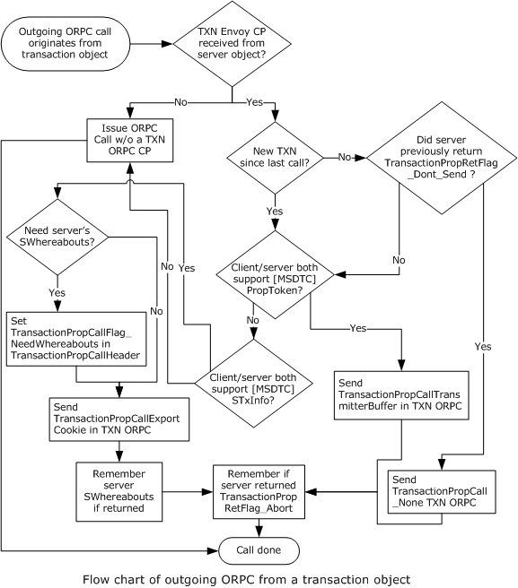

Figure 6: Flow chart of outgoing ORPC from a transactional object

### 3.13.5 Timer Events

None.

### 3.13.6 Other Local Events

#### 3.13.6.1 Transaction Outcome Participation

The [Client Transaction ORPC Extension](#Section_3.13) MUST instruct the [Client Root Transaction Object (section 3.1)](#Section_1.3.2.2) to initiate the cancellation of the transaction if the TransactionPropRetFlag_Abort flag is set in the **m_usFlags** field of the [TransactionPropRetHeader (section 2.2.3.1.2.1)](#Section_2.2.3.1.2.1) structure contained in the [**ORPC**](#gt_object-remote-procedure-call-orpc) response.

The Client Transaction ORPC Extension MUST instruct the [Client Non-Root Transaction Object (section 3.2)](#Section_1.3.2.3) to vote to cancel the transaction if the TransactionPropRetFlag_Abort flag is set in the **m_usFlags** field of TransactionPropRetHeader contained in the ORPC response.

## 3.14 Client Security ORPC Extension Details

### 3.14.1 Abstract Data Model

This section describes a conceptual model of possible data organization that an implementation maintains to participate in this protocol. The described organization is provided to explain how the protocol behaves. This document does not mandate that implementations adhere to this model as long as their external behavior is consistent with that described in this document.

If the client receives an [**ORPC**](#gt_object-remote-procedure-call-orpc), it acts as a server and maintains the data structures specified in section [3.16.1](#Section_3.16). In addition, it maintains the data structures specified in section [3.22.1](#Section_3.22).

### 3.14.2 Timers

Not applicable to [Client Security ORPC Extensions (section 3.14)](#Section_2.2.3.2).

### 3.14.3 Initialization

Not applicable to [Client Security ORPC Extensions (section 3.14)](#Section_2.2.3.2).

### 3.14.4 Message Processing Events and Sequencing Rules

When the client makes an [**ORPC**](#gt_object-remote-procedure-call-orpc) request (see [MS-DCOM](../MS-DCOM/MS-DCOM.md) section 3.2.4.2), the extension MUST add a [Security ORPC Extension (section 2.2.3.2.4)](#Section_2.2.3.2) structure to the ORPC message. The extension MUST create the structure and MUST:

- Set the **Style** field to 0x0000 unless an application or a higher-level protocol requires the extension to set this field to 0x0002.
- If the **Style** field is set to 0x0000, the extension MUST create the rest of the structure as follows:
- If the client is processing an incoming ORPC, the extension MUST look up the Security ORPC Extension structure corresponding to the incoming ORPC in the Security ORPC Extension table. It MUST increment the value of the **cCollections** field in the structure by 1 and set this value in the **cCollections** field.
- Otherwise, the extension MUST set the **cCollection** field to 0x0002.
- Next, the extension MUST create the first collection and MUST:
- Set the **collectionType** field in the header to 0x0a01.
- Set the **cProperties** field in the header to 0x0001.
- Create the [Security Property (section 2.2.3.2.1)](#Section_2.2.3.2.1) for the collection and MUST:
- Set the **Type** field 0x0b10.
- Set the **Size** field to 0x0004.
- If the client is processing an incoming ORPC, the extension MUST:
- Look up the Security ORPC Extension structure corresponding to the incoming ORPC in the Security ORPC Extension table.
- Look up the Security Property value for type 0x0b10 in the Security ORPC Extension structure.
- Compare this value to the authentication level of the outgoing ORPC request.
- Set the **Data** field to the minimum of the two values.
- Otherwise, the extension MUST set the **Data** field to the authentication level of the current ORPC call.
- Next, if the client is processing an incoming ORPC, the extension MUST:
- Look up the Security ORPC Extension structure corresponding to the incoming ORPC in the Security ORPC Extension table.
- For each Security Property Collection in the Security ORPC Extension structure with a **collectionType** field in the header set to 0x0a02, the extension MUST:
- Copy the Security Property Collection to the Security ORPC Extension structure of the outgoing ORPC.
- Next, the extension MUST add the last collection and MUST:
- Set the **collectionType** field in the header to 0x0a02.
- Set the **cProperties** field in the header to 0x0003.
- Create a Security Property for the collection and MUST set:
- The **Type** field to 0x0b03.
- The **Size** field to 0x0004.
- The **Data** field to the authentication service of the current ORPC call.
- The extension MUST next create a Security Property for the collection and MUST set:
- The **Type** field to 0x0b04.
- The **Size** field to 0x0004.
- The **Data** field to the authentication level of the current ORPC call.
- The extension MUST next create a Security Property for the collection and MUST set:
- The **Type** field to 0x0b05.
- The **Size** field to 0x0004.
- The **Data** field to the impersonation level of the current ORPC call.
- If the extension can obtain the [**security identifier (SID)**](#gt_security-identifier-sid) of the caller via authentication or from an application or higher-level protocol, it MUST:
- Increment the **cProperties** field by 0x0001.
- Create a Security Property for the collection and MUST set:
- The **Type** field to 0x0b01, unless an application or a higher-level protocol requires that the extension set the **Type** field to 0x0b06.
- The **Size** field to the size in bytes of the SID.
- The **Data** field to the **SID**.
- Next the extension MUST compare the **domainGUID** of the client computer to that of the object reference. If they are different, it MUST:
- Determine, in an implementation-specific manner or from an application or a higher-level protocol, the Windows NT operating system account name of the caller.
- Increment the **cProperties** field by 0x0001.
- Create a Security Property for the collection and MUST set:
- The **Type** field to 0x0b02, unless an application or a higher-level protocol requires that the extension set the **Type** field to 0x0b07.
- The **Size** field to the size, in bytes, of the **Data** field.
- The **Data** field to the Windows NT account name of the caller.
- Otherwise, the extension MUST compare the **machineGUID** of the client computer to that of the object reference. If they are different, it MUST:
- Determine, in an implementation-specific manner, if the security identity of the caller is scoped within the client computer (for example, if it is a local machine account).
- If the caller is a local machine account, the extension MUST:
- Determine, in an implementation-specific manner or from an application or a higher-level protocol, the Windows NT account name of the caller.
- Increment the **cProperties** field by 0x0001.
- Create a Security Property for the collection and MUST set:
- The **Type** field to 0x0b02, unless an application or a higher level protocol requires that the extension set the **Type** field to 0x0b07.
- The **Size** field to the size, in bytes, of the **Data** field.
- The **Data** field to the Windows NT account name of the caller.
- If the **Style** field is set to 0x0002, the extension MUST create the rest of the structure as follows:
- If the client is currently processing an incoming ORPC, the extension MUST:
- Look up the Security ORPC Extension structure corresponding to the incoming ORPC in the Security ORPC Extension table.
- Set the rest of the Security ORPC Extension structure in the outgoing ORPC to the corresponding data from the Security ORPC Extension structure of the incoming ORPC.
- Otherwise, the extension MUST set the **cCollections** field to 0x0000.

### 3.14.5 Timer Events

Not applicable to [Client Security ORPC Extensions (section 3.14)](#Section_2.2.3.2).

### 3.14.6 Other Local Events

Not applicable to [Client Security ORPC Extensions (section 3.14)](#Section_2.2.3.2).

## 3.15 Server Transaction ORPC Extension Details

The server transaction ORPC extension is applicable only to non-root [**transaction**](#gt_transaction) objects. It is not applicable to root transaction objects.

### 3.15.1 Abstract Data Model

This section describes a conceptual model of possible data organization that an implementation maintains to participate in this protocol. The described organization is provided to explain how the protocol behaves. This document does not mandate that implementations adhere to this model as long as their external behavior is consistent with that described in this document.

The [Server Transaction ORPC Extension](#Section_3.15) maintains the following data structures:

A [TransactionStream](#Section_2.2.2.1.2) object reference. This object reference is shared with and initialized by the [Server Non-Root Transaction Object](#Section_3.8) (see section 3.8).

A **CurrentTSN** value.

A **DtcCapabilities** value, consisting of a set of flags as specified in section [2.2.6.1](#Section_2.2.6.1). This value is shared with and initialized by the Server Non-Root Transaction Object.

A Propagation_Token instance ([MS-DTCO](../MS-DTCO/MS-DTCO.md) section 2.2.5.4).

An STxInfo instance ([MS-DTCO] section 2.2.5.10).

A **TransactionUpdated** flag.

A **CommitTransaction** flag. This flag is shared with and initialized by the Server Non-Root Transaction Object.

An **InTransaction** flag. This flag is shared with and initialized by the Server Non-Root Transaction Object.

### 3.15.2 Timers

None.

### 3.15.3 Initialization

When the server transaction ORPC extension is initialized, it MUST do the following:

- Create the data structures described in section [3.15.1](#Section_3.15).
- Set the **CurrentTSN** value to zero.
- Set the TransactionUpdated flag to FALSE.

### 3.15.4 Message Processing Events and Sequencing Rules

When a [Server Transaction ORPC Extension](#Section_3.15) receives an [**ORPC**](#gt_object-remote-procedure-call-orpc), it MUST perform the following sequence of operations.

If the incoming ORPC does not contain a [Transaction ORPC Extension (section 2.2.3.1)](#Section_3.15), the server transaction ORPC extension MUST do the following:

- If the DtcCap_CanExport bit (section [2.2.6.1](#Section_2.2.6.1)) is not set in the DtcCapabilities value and the DtcCap_CanTransmit bit (section 2.2.6.1) is not set in the DtcCapabilities value, the server transaction ORPC extension MUST stop further processing and MUST return CONTEXT_E_TMNOTAVAILABLE from the ORPC request.
- If the DtcCap_CanExport bit is set in the DtcCapabilities value and the local DTCO transaction manager implementation does not support the STxInfo ([MS-DTCO](../MS-DTCO/MS-DTCO.md) section 2.2.5.10) method of sending [**transactions**](#gt_transaction) or if the DtcCap_CanTransmit bit is set in the DtcCapabilities value and the local DTCO transaction manager implementation does not support the Propagation_Token ([MS-DTCO] section 2.2.5.4) method of sending transactions, the server transaction ORPC extension MUST stop further processing and MUST return CONTEXT_E_TMNOTAVAILABLE from the ORPC request.
- If the DtcCap_CanExport bit is set in the DtcCapabilities value and the local DTCO transaction manager implementation supports the STxInfo method of sending transactions, the server transaction ORPC extension MUST do the following:
- Call the [GetSeqAndTxViaExport (section 3.23.4.1)](#Section_3.23.4.1) method of the [TransactionStream (section 2.2.2.1.2)](#Section_2.2.2.1.2) object reference.
- If the GetSeqAndTxViaExport call succeeds, the server transaction ORPC extension MUST do the following:
- If the value returned in *pulCurrentSeq* parameter is different from the **CurrentTSN** value, the server transaction ORPC extension MUST do the following:
- If the **InTransaction** flag is set to TRUE, it MUST abort the previous transaction.
- It MUST set **InTransaction** flag to TRUE.
- Set the **CurrentTSN** value to the value returned in *pulCurrentSeq*.
- Set the STxInfo instance to the value returned in the *prgbExportCookie* parameter.
- Set the **TransactionUpdated** flag to TRUE.
- If the GetSeqAndTxViaExport call fails, the server transaction ORPC extension MUST do the following:
- Call the [GetTxViaExport (section 3.23.4.3)](#Section_3.23.4.3) method of the TransactionStream object reference.
- If the GetTxViaExport call succeeds, the server transaction ORPC extension MUST do the following:
- Set the STxInfo instance to the value returned in *prgbExportCookie*.
- Set the **TransactionUpdated** flag to TRUE.
- If the GetTxViaExport call fails, the server transaction ORPC extension MUST set the **CommitTransaction** flag to FALSE.
- Otherwise, the server transaction ORPC extension MUST do the following:
- Call the [GetSeqAndTxViaTransmitter (section 3.23.4.2)](#Section_3.23.4.2) method of the TransactionStream object reference.
- If the GetSeqAndTxViaTransmitter call succeeds, the server transaction ORPC extension MUST do the following:
- If the value returned in *pulCurrentSeq* is different from the **CurrentTSN** value, the server transaction ORPC extension MUST do the following:
- If **InTransaction** flag is set to TRUE, it MUST abort the previous transaction.
- It MUST set **InTransaction** flag to TRUE.
- Set the **CurrentTSN** value to the value returned in *pulCurrentSeq*.
- Set the Propagation_Token instance to the value returned in the *prgbTransmitterBuffer* parameter.
- Set the **TransactionUpdated** flag to TRUE.
- If the GetSeqAndTxViaTransmitter call fails, the server transaction ORPC extension MUST do the following:
- Call the [GetTxViaTransmitter (section 3.23.4.4)](#Section_1.3.2) method of the TransactionStream object reference, setting the *ulRequestSeq* parameter to the **CurrentTSN** value.
- If the GetTxViaTransmitter call succeeds, the server transaction ORPC extension MUST do the following:
- Set the Propagation_Token instance to the value returned in *prgbTransmitterBuffer*.
- Set the **TransactionUpdated** flag to TRUE.
- If the GetTxViaTransmitter call fails, the server transaction ORPC extension MUST set the **CommitTransaction** flag to FALSE.
- If the incoming ORPC does contain a Transaction ORPC Extension, the server transaction ORPC extension MUST do the following:
- If the **m_ulSeq** field of the [TransactionPropCallHeader (section 2.2.3.1.1.1)](#Section_2.2.3.1.1.1) is less than the **CurrentTSN** value, the server transaction ORPC extension MUST return CONTEXT_E_ABORTING from the ORPC request.
- If the **m_ulSeq** field of the TransactionPropCallHeader is greater than the **CurrentTSN** value, the server transaction ORPC extension MUST do the following:
- If the **InTransaction** flag is set to TRUE, the server transaction ORPC extension MUST abort the previous transaction.
- It MUST set the **InTransaction** flag to TRUE.
- Set the **CurrentTSN** value to the value contained in **m_ulSeq** field of the TransactionPropCallHeader.
- If the **m_usVariant** field of the TransactionPropCallHeader is set to TransactionPropCall_None, the server transaction ORPC extension MUST do the following:
- If the DtcCap_CanExport bit is not set in the **DtcCapabilities** value and the DtcCap_CanTransmit bit is not set in the **DtcCapabilities** value, the server transaction ORPC extension MUST stop further processing and MUST return CONTEXT_E_TMNOTAVAILABLE from the ORPC request.
- If the DtcCap_CanExport bit is set in the **DtcCapabilities** value and the local DTCO transaction manager implementation does not support the STxInfo method of sending transactions or if the DtcCap_CanTransmit bit is set in the **DtcCapabilities** value and the local DTCO transaction manager implementation does not support the Propagation_Token method of sending transactions, the server transaction ORPC extension MUST stop further processing and MUST return CONTEXT_E_TMNOTAVAILABLE from the ORPC request.
- If the DtcCap_CanTransmit bit is set in the **DtcCapabilities** value and the local DTCO transaction manager implementation supports the Propagation_Token method of sending transactions, the server transaction ORPC extension MUST do the following:
- Call the GetTxViaTransmitter method of the TransactionStream object reference, setting ulRequestSeq to the **CurrentTSN** value.
- If the GetTxViaTransmitter call succeeds, the server transaction ORPC extension MUST do the following:
- Set the Propagation_Token instance to the value returned in *prgbTransmitterBuffer*.
- Set the **TransactionUpdated** flag to TRUE.
- If the GetTxViaTransmitter call fails, the server transaction ORPC extension MUST set the **CommitTransaction** flag to FALSE.
- Otherwise, the server transaction ORPC extension MUST do the following:
- Call the GetTxViaExport method of the TransactionStream object reference.
- If the GetTxViaExport call succeeds, the server transaction ORPC extension MUST:
- Set the STxInfo instance to the value returned in *prgbExportCookie*.
- Set the **TransactionUpdated** flag to TRUE.
- If the GetTxViaExport call fails, the server transaction ORPC extension MUST set the **CommitTransaction** flag to FALSE.
- If the **m_usVariant** field of the TransactionPropCallHeader is set to TransactionPropCall_ExportCookie, it MUST set the STxInfo instance to the STxInfo contained in the **ExportCookie** field of the [TransactionPropCallExportCookie (section 2.2.3.1.1.2)](#Section_2.2.3.1.1.2) structure.
- If the **m_usVariant** field of the TransactionPropCallHeader is set to TransactionPropCall_TransmitterBuffer, it MUST set the Propagation_Token instance to the Propagation_Token contained in the **TransmitterBuffer** field of the [TransactionPropCallTransmitterBuffer (section 2.2.3.1.1.3)](#Section_2.2.3.1.1.3) structure.
If the ORPC request contains an application object reference in an ORPC request parameter, the server transaction ORPC extension MUST unmarshal the application object reference as specified in section [3.20](#Section_3.20).

The server transaction ORPC extension MUST then execute the ORPC call.

If an application or higher level protocol requests the server transaction ORPC extension to abort the transaction, it MUST set the **CommitTransaction** flag to FALSE.

After the ORPC call is executed, the server transaction ORPC extension MUST do the following:

- If the ORPC response contains an application object in an ORPC response parameter, the server transaction ORPC extension MUST marshal the application object as specified in section [3.21](#Section_3.21).
- If the ORPC response contains an application object reference in an ORPC response parameter, the server transaction ORPC extension MUST marshal the application object reference as specified in section [3.22](#Section_3.22).
- If the client requested the server's SWhereabouts ([MS-DTCO] section 2.2.5.11) by setting the TransactionPropCallFlag_NeedWhereabouts flag in the **m_usFlags** field of the TransactionPropCallHeader, the server transaction ORPC extension MUST return a [TransactionPropRetWhereabouts (section 2.2.3.1.2.2)](#Section_2.2.3.1.2.2) structure.
- If the client did not request the server's SWhereabouts, it MUST return a [TransactionPropRetHeader (section 2.2.3.1.2.1)](#Section_2.2.3.1.2.1) structure with the **m_usVariant** field of the TransactionPropRetHeader structure set to TransactionPropRet_None.
- If the **TransactionUpdated** flag is TRUE, the server transaction ORPC extension SHOULD <6> set the TransactionPropRetFlag_DontSend bit in the **m_usFlag** field of the TransactionPropRetHeader structure.
- If the **CommitTransaction** flag is set to FALSE, the server transaction ORPC extension MUST set the TransactionPropRetFlag_Abort bit in the **m_usFlag** field of the TransactionPropRetHeader structure.

### 3.15.5 Timer Events

None.

### 3.15.6 Other Local Events

#### 3.15.6.1 Server Non-Root Transaction Object Communication

When the [Server Transaction ORPC Extension (section 3.15)](#Section_3.15) is contacted by [Server Non-Root Transaction Object (section 3.8)](#Section_3.8) to inform it that the current [**transaction**](#gt_transaction) is being aborted by a higher level protocol, the Server Transaction ORPC Extension MUST set the AbortCurrentTransaction flag to TRUE.

#### 3.15.6.2 Transaction Outcome Participation

The server transaction ORPC extension MUST instruct the [Server Non-Root Transaction Object (section 3.8)](#Section_3.8) to vote to cancel the previous [**transaction**](#gt_transaction) if the AbortPreviousTransaction flag is set to TRUE.

## 3.16 Server Security ORPC Extension Details

### 3.16.1 Abstract Data Model

This section describes a conceptual model of possible data organization that an implementation maintains to participate in this protocol. The described organization is provided to explain how the protocol behaves. This document does not mandate that implementations adhere to this model as long as their external behavior is consistent with that described in this document.

The [server security ORPC extension (section 3.16)](#Section_2.2.3.2) maintains a table of [Security ORPC Extension (section 2.2.3.2.4)](#Section_2.2.3.2) structures.

### 3.16.2 Timers

None.

### 3.16.3 Initialization

None.

### 3.16.4 Message Processing Events and Sequencing Rules

On receipt of an [**ORPC**](#gt_object-remote-procedure-call-orpc) ([MS-DCOM](../MS-DCOM/MS-DCOM.md) section 3.1.1.5.4), the [Security ORPC Extension (section 2.2.3.2.4)](#Section_2.2.3.2) MUST:

- Add an entry to the Security ORPC Extension table, and MUST set the fields in the entry to the corresponding fields in the Security ORPC Extension structure contained in the ORPC message.
When returning from an ORPC ([MS-DCOM] section 3.1.1.5.4), the Security ORPC Extension MUST remove the entry corresponding to the ORPC from the Security ORPC Extension table.

### 3.16.5 Timer Events

None.

### 3.16.6 Other Local Events

None.

## 3.17 Server Activity ORPC Processing Details

### 3.17.1 Abstract Data Model

This section describes a conceptual model of possible data organization that an implementation maintains to participate in this protocol. The described organization is provided to explain how the protocol behaves. This document does not mandate that implementations adhere to this model as long as their external behavior is consistent with that described in this document.

The server maintains the data structures specified in section [3.9.1](#Section_3.9). In addition, the server maintains the following:

- A table of objects, keyed by the activity ID.
- An activity timer for each activity.
- An activity lock.
- For each object, the causality identifier of the current outstanding ORPC call into the object, if any.

### 3.17.2 Timers

The server MUST maintain a per-[**activity**](#gt_activity) timer.

### 3.17.3 Initialization

The server MUST initialize the per-[**activity**](#gt_activity) timer to the time-out value of the activity set during the object activation request (see section [3.9.4](#Section_3.9.4)).

### 3.17.4 Message Processing Events and Sequencing Rules

When processing an incoming [**ORPC**](#gt_object-remote-procedure-call-orpc) call, the server MUST:

- Look up the activity ID of the object that is processing the ORPC call.
- Look up the list of objects that share the same activity.
- For each object in the list, the server MUST:
- Determine the causality identifier of the outstanding ORPC call to the object.
- If there is a causality identifier, the server MUST:
- Compare the causality identifier of the outstanding ORPC call to that of the incoming ORPC call.
- If they are the same, the server MUST allow the incoming ORPC call to the current object to be executed.
- If they are different, the server MUST:
- Start the activity timer.
- Attempt to take the activity lock.
- If the timer expires, the server MUST reject the incoming ORPC call as specified in section [3.17.5](#Section_3.5.5).
- If the activity lock is acquired, the server MUST:
- Set the causality identifier of the current object to that of the incoming ORPC call.
- Reset the activity timer.
- Allow the incoming ORPC call to be executed.
- If there is no causality identifier, the server MUST examine the next object.
- If there are no outstanding ORPC calls on any object in the list, the server MUST:
- Take the activity lock.
- Set the causality identifier of the current object to that of the incoming ORPC call.
- Allow the incoming ORPC call to be executed.
- When the ORPC call completes, the server MUST:
- Remove the causality identifier associated with the current object.
- Relinquish the activity lock.

### 3.17.5 Timer Events

The server MUST return CONTEXT_E_SYNCH_TIMEOUT to each outstanding [**ORPC**](#gt_object-remote-procedure-call-orpc) call when the [**activity**](#gt_activity) timer of the current activity expires.

### 3.17.6 Other Local Events

None.

## 3.18 Server Transaction Envoy Marshaling Details

### 3.18.1 Abstract Data Model

This section describes a conceptual model of possible data organization that an implementation maintains to participate in this protocol. The described organization is provided to explain how the protocol behaves. This document does not mandate that implementations adhere to this model as long as their external behavior is consistent with that described in this document.

The [server transaction envoy (section 3.18)](#Section_3.18) maintains the following data structures:

- A **TransactionStreamID** [**GUID**](#gt_globally-unique-identifier-guid). This GUID is shared with and initialized by the [Server Non-Root Transaction Object (section 3.8)](#Section_3.8).
- An **SWhereaboutsID** GUID.
- A **DtcCapabilities** value, consisting of a set of flags specified in section [2.2.6.1](#Section_2.2.6.1).

### 3.18.2 Timers

None.

### 3.18.3 Initialization

When a server transaction envoy object is initialized, it MUST do the following:

- Create the data structures described in section [3.18.1](#Section_3.12.1).
- Set the DtcCap_CanTransmit bit (section [2.2.6.1](../MS-DTCO/MS-DTCO.md)) in the DtcCapabilities value if the local DTCO transaction manager implementation supports the Propagation_Token ([MS-DTCO](../MS-DTCO/MS-DTCO.md) section 2.2.5.4) method of sending transactions.
- Set the DtcCap_CanExport bit (2.2.6.1) in the DtcCapabilities value if the local DTCO transaction manager implementation supports the STxInfo ([MS-DTCO] section 2.2.5.10) method of sending transactions.
- Set the **SWhereaboutsID** [**GUID**](#gt_globally-unique-identifier-guid) to a GUID that uniquely identifies the SWhereabouts ([MS-DTCO] section 2.2.5.11) of the local DTCO transaction manager implementation.

### 3.18.4 Message Processing Events and Sequencing Rules

When an application object is marshaled, the server transaction envoy MUST produce an OBJREF_EXTENDED ([MS-DCOM](../MS-DCOM/MS-DCOM.md) section 2.2.18.7) instance if the DCOM version of the client is 5.6 or greater.

If the server transaction envoy is for a [Root Transaction Object (section 1.3.2.2)](#Section_1.3.2.2), the server transaction envoy MUST NOT contribute a [Transaction Envoy Property (section 2.2.4.1)](#Section_2.2.4.1) to the OBJREF_EXTENDED instance.

If the server transaction envoy is for a [Non-root Transaction Object (section 1.3.2.3)](#Section_1.3.2.3), the server transaction envoy MUST contribute a Transaction Envoy Property to the OBJREF_EXTENDED instance.

- The **StreamID** field MUST be set to the TransactionStreamID [**GUID**](#gt_globally-unique-identifier-guid).
- The **WhereaboutsID** field MUST be set to the SWhereaboutsID GUID.
- The **DtcCapabilities** field MUST be set to the DtcCapabilities value.

### 3.18.5 Timer Events

None.

### 3.18.6 Other Local Events

None.

## 3.19 Server Security Envoy Marshaling Details

### 3.19.1 Abstract Data Model

This section describes a conceptual model of possible data organization that an implementation maintains to participate in this protocol. The described organization is provided to explain how the protocol behaves. This document does not mandate that implementations adhere to this model as long as their external behavior is consistent with that described in this document.

The [server security envoy (section 3.19)](#Section_5) maintains the following [**GUID**](#gt_globally-unique-identifier-guid) data structure instances:

- domainGUID, which identifies the domain of the computer.
- machineGUID, which identifies the computer.

### 3.19.2 Timers

None.

### 3.19.3 Initialization

On initialization, the [server security envoy (section 3.19)](#Section_5) MUST:

- Set the domainGUID to the GUID of the domain of the computer. For more information, see [MS-NRPC](../MS-NRPC/MS-NRPC.md) section 2.2.1.2.1.
- Set the machineGUID to a GUID that uniquely identifies the computer.

### 3.19.4 Message Processing Events and Sequencing Rules

When an object is marshaled, the [server security envoy (section 3.19)](#Section_5) MUST contribute a security envoy context property (section [2.2.4.2](#Section_2.2.4.2)) to the OBJREF_EXTENDED ([MS-DCOM](../MS-DCOM/MS-DCOM.md) section 2.2.18.7) instance representing the marshaled object reference ([MS-DCOM] section 3.1.1.5.1). The security envoy property MUST be created as follows:

- The **guidServerDomain** field MUST be set to domainGUID.
- The **guidServerMachine** field MUST be set to machineGUID.

### 3.19.5 Timer Events

None.

### 3.19.6 Other Local Events

None.

## 3.20 Client Transaction Envoy Unmarshaling Details

### 3.20.1 Abstract Data Model

This section describes a conceptual model of possible data organization that an implementation maintains to participate in this protocol. The described organization is provided to explain how the protocol behaves. This document does not mandate that implementations adhere to this model as long as their external behavior is consistent with that described in this document.

The client [**transaction**](#gt_transaction) envoy unmarshaling maintains the following data structures, one for each [OBJREF_EXTENDED (section 2.2.4)](#Section_2.2.4) object reference unmarshaled by the client:

- A **TransactionStreamID** [**GUID**](#gt_globally-unique-identifier-guid). This GUID is shared with and initialized by the [Client Root Transaction Object (section 3.1)](#Section_1.3.2.2) if the client transaction envoy is for a root transaction object. This GUID is shared with and initialized by the [Client Non-Root Transaction Object (section 3.2)](#Section_1.3.2.3) if the client transaction envoy is for a non-root transaction object.
- A **DtcCapabilities** value, consisting of a set of flags specified in section [2.2.6.1](#Section_2.2.6.1). This flag is shared with the [Client Transaction ORPC Extension (section 3.13)](#Section_3.13).
- A **TransactionRequiredInORPC** flag. This flag is shared with the Client Transaction ORPC Extension.
- A **WhereaboutsID** GUID. This GUID is shared with the Client Transaction ORPC Extension.
- A [Transaction Envoy Property (section 2.2.4.1)](#Section_2.2.4.1) value. This value is shared with the client transaction envoy marshaling.
In addition, the client transaction envoy unmarshaling maintains the following global table:

A **Whereabouts Table**. A table of entries for OBJREF_EXTENDED object references unmarshaled by the client where each entry contains a **WhereaboutsID** GUID and the SWhereabouts identified by the **WhereaboutsID** GUID. The table is shared with the Client Transaction ORPC Extension.

### 3.20.2 Timers

None.

### 3.20.3 Initialization

Upon unmarshaling an [OBJREF_EXTENDED (section 2.2.4)](#Section_2.2.4) object reference, the client [**transaction**](#gt_transaction) envoy unmarshaling MUST do the following:

- Create the data structures described in section [3.20.1](#Section_3.12.1).
- Set the TransactionRequiredInORPC flag to FALSE if the OBJREF_EXTENDED structure does not contain a [Transaction Envoy Property (section 2.2.4.1)](#Section_2.2.4.1) and stop further processing.
- Read the **StreamID** [**GUID**](#gt_globally-unique-identifier-guid) from the Transaction Envoy Property and compare it with the **TransactionStreamID** GUID. If they do not match, the client MUST set the TransactionRequiredInORPC flag to FALSE and MUST stop further processing.
- Otherwise, set the TransactionRequiredInORPC flag to TRUE.
- Copy the Transaction Envoy Property contained in the OBJREF_EXTENDED structure to the Transaction Envoy Property value.
- Set the DtcCap_CanTransmit bit (section [2.2.6.1](../MS-DTCO/MS-DTCO.md)) in the DtcCapabilities value if the local DTCO transaction manager implementation supports the Propagation_Token ([MS-DTCO](../MS-DTCO/MS-DTCO.md) section 2.2.5.4) method of sending transactions and if the DtcCap_CanTransmit bit is set in the **DtcCapabilities** field of the Transaction Envoy Property contained in the OBJREF_EXTENDED structure.
- Set the DtcCap_CanExport bit (section 2.2.6.1) in the DtcCapabilities value if the local DTCO transaction manager implementation supports the STxInfo ([MS-DTCO] section 2.2.5.10) method of sending transactions and if the DtcCap_CanExport bit is set in the **DtcCapabilities** field of the Transaction Envoy Property contained in the OBJREF_EXTENDED structure.
- If the only bit set in the DtcCapabilities value is DtcCap_CanExport, set the **WhereaboutsID** GUID to the **WhereaboutsID** field of the Transaction Envoy Property contained in the OBJREF_EXTENDED structure and look it up in the Whereabouts table. If the entry is not found in the table, create an entry with the **WhereaboutsID** GUID and an empty SWhereabouts ([MS-DTCO] section 2.2.5.11) and add the entry to the Whereabouts table.

### 3.20.4 Message Processing Events and Sequencing Rules

None.

### 3.20.5 Timer Events

None.

### 3.20.6 Other Local Events

None.

## 3.21 Client Transaction Envoy Marshaling Details

### 3.21.1 Abstract Data Model

This section describes a conceptual model of possible data organization that an implementation maintains to participate in this protocol. The described organization is provided to explain how the protocol behaves. This document does not mandate that implementations adhere to this model as long as their external behavior is consistent with that described in this document.

The client transaction envoy marshaling maintains the following data structure for each object reference unmarshaled by the client:

- A [Transaction Envoy Property (section 2.2.4.1)](#Section_2.2.4.1) value. This property is shared with and initialized by the [Client Transaction Envoy Unmarshaling (section 3.20)](#Section_3.20).

### 3.21.2 Timers

None.

### 3.21.3 Initialization

None.

### 3.21.4 Message Processing Events and Sequencing Rules

When marshaling of an [OBJREF_EXTENDED](#Section_2.2.4) object reference, the client transaction envoy marshaling MUST do the following:

- Copy the [Transaction Envoy Property](#Section_2.2.4.1) value to the OBJREF_EXTENDED structure.

### 3.21.5 Timer Events

None.

### 3.21.6 Other Local Events

None.

## 3.22 Client Security Unmarshaling Details

### 3.22.1 Abstract Data Model

This section describes a conceptual model of possible data organization that an implementation maintains to participate in this protocol. The described organization is provided to explain how the protocol behaves. This document does not mandate that implementations adhere to this model as long as their external behavior is consistent with that described in this document.

The client security envoy maintains the following [**GUID**](#gt_globally-unique-identifier-guid) data structures, one for each OBJREF_EXTENDED object reference unmarshaled by the client:

- domainGUID, which identifies the domain of the computer of the object reference.
- machineGUID, which identifies the computer of the object reference.

### 3.22.2 Timers

None.

### 3.22.3 Initialization

None.

### 3.22.4 Message Processing Events and Sequencing Rules

When an OBJREF_EXTENDED ([MS-DCOM](../MS-DCOM/MS-DCOM.md) section 2.2.18.7) object reference is unmarshaled ([MS-DCOM] section 3.2.4.1.2), the client security envoy MUST associate the following with the object reference:

- The **domainGUID** field MUST be set to guidServerDomain from the security envoy property.
- The **guidServerMachine** field MUST be set to guidServerMachine from the security envoy property.

### 3.22.5 Timer Events

None.

### 3.22.6 Other Local Events

None.

## 3.23 ITransactionStream Server Details

### 3.23.1 Abstract Data Model

This section describes a conceptual model of possible data organization that an implementation maintains to participate in this protocol. The described organization is provided to explain how the protocol behaves. This document does not mandate that implementations adhere to this model as long as their external behavior is consistent with that described in this document.

An [ITransactionStream Server (section 3.23)](#Section_3.23.4.2) maintains the following data structures:

- A **CurrentTSN** value. This value is shared with and initialized by the [Client Root Transaction Object (section 3.1)](#Section_1.3.2.2).
- A **DtcCapabilities** value, consisting of a set of flags as specified in section [2.2.6.1](#Section_2.2.6.1). This value is shared with and initialized by the Client Root Transaction Object.

### 3.23.2 Timers

None.

### 3.23.3 Initialization

None.

### 3.23.4 Message Processing Events and Sequencing Rules

Methods in RPC Opnum Order

| Method | Description |
| --- | --- |
| [GetSeqAndTxViaExport](#Section_3.23.4.1) | Returns an SWhereabouts and an STxInfo, and updates the client's currently known [**TSN**](#gt_transaction-sequence-number-tsn). Opnum: 3 |
| [GetSeqAndTxViaTransmitter](#Section_3.23.4.2) | Returns a Propagation_Token (as specified in [MS-DTCO](../MS-DTCO/MS-DTCO.md)) and updates the client's currently known TSN. Opnum: 4 |
| [GetTxViaExport](#Section_3.23.4.3) | Returns an STxInfo (as specified in [MS-DTCO]) for the requested TSN, or returns an error. Opnum: 5 |
| [GetTxViaTransmitter](#Section_1.3.2) | Returns a Propagation_Token (as specified in [MS-DTCO]) for the specified TSN, or returns an error. Opnum: 6 |

The methods MUST NOT throw exceptions.

#### 3.23.4.1 ITransactionStream::GetSeqAndTxViaExport (Opnum 3)

This method returns the STxInfo ([MS-DTCO](../MS-DTCO/MS-DTCO.md) section 2.2.5.10) of the currently active [**transaction**](#gt_transaction) and the CurrentTSN value.

HRESULT GetSeqAndTxViaExport(

[in] unsigned long ulKnownSeq,

[in] unsigned long ulcbWhereabouts,

[in, size_is(ulcbWhereabouts)] BYTE* rgbWhereabouts,

[out] unsigned long* pulCurrentSeq,

[out] unsigned long* pulcbExportCookie,

[out, size_is(,*pulcbExportCookie)]

BYTE** prgbExportCookie

);

**ulKnownSeq:** The caller's CurrentTSN value of the currently active transaction known by the client.

**ulcbWhereabouts:** The unsigned size, in bytes, of *rgbWhereabouts*.

**rgbWhereabouts:** The SWhereabouts instance ([MS-DTCO] section 2.2.5.11) of the caller's local DTCO transaction manager implementation.

**pulCurrentSeq:** The [**TSN**](#gt_transaction-sequence-number-tsn) of the currently active transaction.

**pulcbExportCookie:** The unsigned size, in bytes, of *prgbExportCookie*.

**prgbExportCookie:** An STxInfo of the currently active transaction (as specified in [MS-DTCO] section 2.2.5.10).

**Return Values:** The method MUST return a positive value or zero, to indicate successful completion, or a negative value to indicate failure. The client MUST treat any negative return value as a fatal error.

When processing this [**ORPC**](#gt_object-remote-procedure-call-orpc) call, the [ITransactionStream Server (section 3.23)](#Section_3.23.4.2) MUST do the following:

- If the DtcCap_CanExport bit is not set in the DtcCapabilities value, it MUST return CO_E_NOT_SUPPORTED.
- If *ulKnownSeq* is the same as the CurrentTSN value, the ITransactionStream Server MUST:
- Set *pulCurrentSeq* to *ulKnownSeq*.
- Set *pulcbExportCookie* to zero.
- Set *prgbExportCookie* to NULL.
- Otherwise, the ITransactionStream Server MUST:
- Set *pulCurrentSeq* to the CurrentTSN value.
- Set *pulcbExportCookie* to the size of *prgbExportCookie*.
- Copy the STxInfo of the currently active transaction to the *prgbExportCookie* out parameter.

#### 3.23.4.2 ITransactionStream::GetSeqAndTxViaTransmitter (Opnum 4)

This method returns the Propagation_Token (as specified in [MS-DTCO](../MS-DTCO/MS-DTCO.md) section 2.2.5.4) of the currently active transaction and the **CurrentTSN** value.

HRESULT GetSeqAndTxViaTransmitter(

[in] unsigned long ulKnownSeq,

[out] unsigned long* pulCurrentSeq,

[out] unsigned long* pulcbTransmitterBuffer,

[out, size_is(,*pulcbTransmitterBuffer)]

BYTE** prgbTransmitterBuffer

);

**ulKnownSeq:** The caller's CurrentTSN value of the currently active [**transaction**](#gt_transaction).

**pulCurrentSeq:** The [**TSN**](#gt_transaction-sequence-number-tsn) of the currently active transaction.

**pulcbTransmitterBuffer:** The unsigned size, in bytes, of *prgbTransmitterBuffer*.

**prgbTransmitterBuffer:** A Propagation_Token of the currently active transaction.

**Return Values:** The method MUST return a positive value or zero, to indicate successful completion, or a negative value to indicate failure. The client MUST treat any negative return value as a fatal error.

When processing this [**ORPC**](#gt_object-remote-procedure-call-orpc) call, the [ITransactionStream Server](#Section_3.23.4.2) MUST do the following:

- If the DtcCap_CanTransmit bit is not set in the **DtcCapabilities** value, it MUST return CO_E_NOT_SUPPORTED.
- If *ulKnownSeq* is the same as the **CurrentTSN** value, the ITransactionStream Server MUST do the following:
- Set *pulCurrentSeq* to *ulKnownSeq*.
- Set *pulcbTransmitterBuffer* to zero.
- Set *prgbTransmitterBuffer* to NULL.
- Otherwise, the ITransactionStream Server MUST do the following:
- Set *pulCurrentSeq* to the **CurrentTSN** value.
- Set *pulcbTransmitterBuffer* to the size of *prgbTransmitterBuffer*.
- Copy the Propagation_Token of the currently active transaction to the *prgbTransmitterBuffer* out parameter.

#### 3.23.4.3 ITransactionStream::GetTxViaExport (Opnum 5)

This method returns the STxInfo instance (as specified in [MS-DTCO](../MS-DTCO/MS-DTCO.md) section 2.2.5.10) of the currently active transaction or returns an error if the specified [**TSN**](#gt_transaction-sequence-number-tsn) is not the same as the CurrentTSN value.

HRESULT GetTxViaExport(

[in] unsigned long ulRequestSeq,

[in] unsigned long ulcbWhereabouts,

[in, size_is(ulcbWhereabouts)] BYTE* rgbWhereabouts,

[out] unsigned long* pulcbExportCookie,

[out, size_is(,*pulcbExportCookie)]

BYTE** prgbExportCookie

);

**ulRequestSeq:** The caller's CurrentTSN value of the currently active [**transaction**](#gt_transaction).

**ulcbWhereabouts:** The unsigned size, in bytes, of *rgbWhereabouts*.

**rgbWhereabouts:** The SWhereabouts instance ([MS-DTCO] section 2.2.5.11) of the caller's local DTCO transaction manager implementation.

**pulcbExportCookie:** The unsigned size, in bytes, of *prgbExportCookie*.

**prgbExportCookie:** An STxInfo instance of the currently active transaction (as specified in [MS-DTCO] section 2.2.5.10).

**Return Values:** The method MUST return a positive value or zero to indicate successful completion, or a negative value to indicate failure. The client MUST treat any negative return value as a fatal error.

When processing this [**ORPC**](#gt_object-remote-procedure-call-orpc) call, if *ulRequestSeq* is the same as the CurrentTSN value, the [ITransactionStream Server (section 3.23)](#Section_3.23.4.2) MUST do the following:

- Set *pulcbExportCookie* to the size of *prgbExportCookie*.
- Copy STxInfo of the currently active transaction to the *prgbExportCookie* out parameter.
Otherwise, the ITransactionStream Server MUST return CONTEXT_E_ABORTED.

#### 3.23.4.4 ITransactionStream::GetTxViaTransmitter (Opnum 6)

This method returns the Propagation_Token ([MS-DTCO](../MS-DTCO/MS-DTCO.md) section 2.2.5.4) of the currently active transaction, or returns an error if the specified [**TSN**](#gt_transaction-sequence-number-tsn) is not the same as the CurrentTSN value.

HRESULT GetTxViaTransmitter(

[in] unsigned long ulRequestSeq,

[out] unsigned long* pulcbTransmitterBuffer,

[out, size_is(,*pulcbTransmitterBuffer)]

BYTE** prgbTransmitterBuffer

);

**ulRequestSeq:** The caller's TSN of the currently active [**transaction**](#gt_transaction).

**pulcbTransmitterBuffer:** The unsigned size, in bytes, of *prgbTransmitterBuffer*.

**prgbTransmitterBuffer:** A Propagation_Token of the currently active transaction.

**Return Values:** The method MUST return a positive value or zero to indicate successful completion, or a negative value to indicate failure. The client MUST treat any negative return value as a fatal error.

When processing this [**ORPC**](#gt_object-remote-procedure-call-orpc) call, if *ulRequestSeq* is the same as the CurrentTSN, the [ITransactionStream Server (section 3.23)](#Section_3.23.4.2) MUST:

- Set *pulcbExportCookie* to the size of *prgbExportCookie*.
- Copy Propagation_Token of the currently active transaction to the *prgbExportCookie* out parameter.
Otherwise, the ITransactionStream Server MUST return CONTEXT_E_ABORTED.

### 3.23.5 Timer Events

None.

### 3.23.6 Other Local Events

None.

# 4 Protocol Examples

## 4.1 Client to RootTxn to Non-RootTxn Example

The following figure shows a sequence for a client that activates and then calls a root txn object; the root txn activates and calls a non-root txn object, and returns a reference to the non-root txn object back to the client. The client then makes a call directly to the non-root txn object, then releases its references to both root and non-root objects.

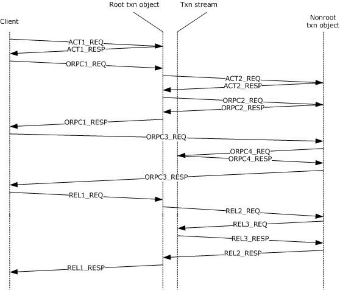

Figure 7: Client to rootTxn to non-rootTxn

ACT1_REQ: The client sends an activation request for the root txn object. The client is not an object, so the activation request does not contain any context properties.

During activation, the root txn object initializes itself and its associated [**transaction stream**](#gt_transaction-stream). In addition, the object is configured with an activity context property with an INFINITE activity time-out. The object is then marshaled as described in section [3.18](#Section_3.18), including a [**transaction**](#gt_transaction) envoy context property in the OBJREF_EXTENDED instance.

ACT1_RESP: The client receives the activation results, unmarshals the reference to the root object, and determines that the returned [**OBJREF**](#gt_objref) contains a transaction envoy context property; however, since the client is not running within a transaction, it takes no special action.

ORPC1_REQ: The client makes a call to the root txn object. There are no [**ORPC**](#gt_object-remote-procedure-call-orpc) extensions sent on this call, because the client previously discarded the transaction envoy property after unmarshaling the ACT1_RESP message.

At call entry to the root object, the root object's activity context property first checks to see that no other calls with different DCOM [**causality IDs**](#gt_cae15e71-2790-4b84-abdb-5998add4d372) are already executing in the object (see section [3.17](#Section_3.17)). Since there are none, the call executes without delay.

ACT2_REQ: The root txn object activates the non-root txn object. As part of the activation, the root txn object sends a transaction context property (see section [2.2.2.1](#Section_2.2.2.1)) that contains a reference to its associated transaction stream, and an activity context property (see section [2.2.2.2](#Section_2.2.2.2)).

During activation, the non-root txn object is created and initialized using the same transaction and the same activity as the root txn object. The non-root txn object saves a reference to the root object's transaction stream; marshals itself, as described in section 3.18, including a transaction envoy context property in the OBJREF_EXTENDED instance; and configures its server activity context property using the activity context property supplied during the activation. The non-root object is then marshaled as described in section 3.18, including a transaction envoy context property in the OBJREF_EXTENDED.

ACT2_RESP: The root txn object unmarshals the reference to the non-root txn object; detects the returned transaction envoy context property; notes that both it and the non-root txn object are running in the same transaction; and adds the returned envoy property to its table for action on subsequent calls.

ORPC2_REQ: The root txn object makes a call to the non-root txn object. Since the root object has a transaction envoy property for this reference, it includes a Transaction ORPC extension on the call as described in section [2.2.3.1.1](#Section_2.2.3.1.1).

The non-root txn object receives the call and goes through the steps described in section [3.15](#Section_3.15) to ensure that it is running within a valid transaction. In addition, at call entry to the non-root object, the root object's activity context property first checks to see that no other calls with different DCOM causality IDs are already executing in the object (see section 3.17). Since there are none, the call executes without delay.

ORPC2_RESP: The non-root txn object returns to the root txn object. This response carries a Transaction ORPC extension on the return, as described in section [2.2.3.1.2](#Section_2.2.3.1.2).

ORPC1_RESP: The root txn object returns to the client. One of the return parameters contains a reference to the non-root txn object, so that the client can call the non-root txn object directly in future.

The client unmarshals the reference to the non-root txn object. As in ACT1_RESP, the client ignores the transaction envoy context property coming from the non-root txn object.

ORPC3_REQ: The client makes an ORPC call directly to the non-root txn object. There are no ORPC extensions sent on this call.

ORPC4_REQ: The non-root txn object receives the call from the client and determines that no Transaction ORPC Call Extension is present. To ensure that it is running within a valid transaction, it makes an ORPC call to the root object's associated transaction stream, using either the *GetSeqAndTxViaExport* (see section [3.23.4.1](#Section_3.23.4.1)) or the *GetSeqAndTxViaTransmitter* (see section [3.23.4.2](#Section_3.23.4.2)) method.

ORPC4_RESP: The transaction stream determines that the [**TSN**](#gt_transaction-sequence-number-tsn) specified by the non-root txn object is still valid and returns a success code.

ORPC3_RESP: The non-root txn object returns to the client. Since ORPC3_REQ did not have a Transaction ORPC Call extension, the response also does not have a Transaction ORPC Return extension.

REL1_REQ: The client releases its reference to the root txn object. Since this is the last reference on the root txn object, it is destroyed.

REL2_REQ: The root txn object releases its reference on the non-root txn object.

REL3_REQ: The non-root txn object releases its references on the transaction stream.

REL3_RESP: Returns from the release call on the transaction stream.

REL2_RESP: Returns from the release call on the non-root txn object.

REL1_RESP: Returns from the release call on the root txn object. Because this is the last release on the root txn object, the transaction is committed at this point before returning.

# 5 Security

## 5.1 Security Considerations for Implementers

None.

## 5.2 Index of Security Parameters

None.

# 6 Appendix A: Full IDL

For ease of implementation, the full [**IDL**](#gt_interface-definition-language-idl) is provided, where "ms-dcom.idl" is the IDL found in [MS-DCOM](../MS-DCOM/MS-DCOM.md) Appendix A.

import "ms-dcom.idl";

// Disable new Vista MIDL attribute if using an older MIDL compiler

#if __midl < 700

#define disable_consistency_check

#endif

[

object,

uuid(97199110-DB2E-11d1-A251-0000F805CA53),

pointer_default(unique)

]

interface ITransactionStream : IUnknown

{

HRESULT GetSeqAndTxViaExport (

[in] unsigned long ulKnownSeq,

[in] unsigned long ulcbWhereabouts,

[in, size_is(ulcbWhereabouts)] BYTE* rgbWhereabouts,

[out] unsigned long* pulCurrentSeq,

[out] unsigned long* pulcbExportCookie,

[out, size_is(,*pulcbExportCookie)]

BYTE ** prgbExportCookie);

HRESULT GetSeqAndTxViaTransmitter (

[in] unsigned long ulKnownSeq,

[out] unsigned long* pulCurrentSeq,

[out] unsigned long* pulcbTransmitterBuffer,

[out, size_is(,*pulcbTransmitterBuffer)]

BYTE** prgbTransmitterBuffer);

HRESULT GetTxViaExport (

[in] unsigned long ulRequestSeq,

[in] unsigned long ulcbWhereabouts,

[in, size_is(ulcbWhereabouts)] BYTE* rgbWhereabouts,

[out] unsigned long* pulcbExportCookie,

[out, size_is(,*pulcbExportCookie)]

BYTE** prgbExportCookie);

HRESULT GetTxViaTransmitter (

[in] unsigned long ulRequestSeq,

[out] unsigned long* pulcbTransmitterBuffer,

[out, size_is(,*pulcbTransmitterBuffer)]

BYTE** prgbTransmitterBuffer);

};

# 7 Appendix B: Product Behavior

The information in this specification is applicable to the following Microsoft products or supplemental software. References to product versions include updates to those products.

- Windows 2000 operating system
- Windows XP operating system
- Windows Server 2003 operating system
- Windows Vista operating system
- Windows Server 2008 operating system
- Windows 7 operating system
- Windows Server 2008 R2 operating system
- Windows 8 operating system
- Windows Server 2012 operating system
- Windows 8.1 operating system
- Windows Server 2012 R2 operating system
- Windows 10 operating system
- Windows Server 2016 operating system
- Windows Server operating system
- Windows Server 2019 operating system
- Windows Server 2022 operating system
- Windows 11 operating system
- Windows Server 2025 operating system
Exceptions, if any, are noted in this section. If an update version, service pack or Knowledge Base (KB) number appears with a product name, the behavior changed in that update. The new behavior also applies to subsequent updates unless otherwise specified. If a product edition appears with the product version, behavior is different in that product edition.

Unless otherwise specified, any statement of optional behavior in this specification that is prescribed using the terms "SHOULD" or "SHOULD NOT" implies product behavior in accordance with the SHOULD or SHOULD NOT prescription. Unless otherwise specified, the term "MAY" implies that the product does not follow the prescription.

<1> Section 2.2.2.3.1: For historical reasons, Windows will set this field to random values.

<2> Section 3.9.4: Windows uses an [**activity**](#gt_activity) time-out of INFINITE by default.

<3> Section 3.12.4: Applicable Windows Server releases will set this field to the NETBIOS name of the server machine.

<4> Section 3.12.4: Applicable Windows Server releases will set this field to the NETBIOS name and IPV4 addresses of the server machine.

<5> Section 3.12.4: Applicable Windows Server releases will set this field to the IPV6 addresses of the server machine.

<6> Section 3.15.4: Applicable Windows Server releases do not set the TransactionPropRetFlag_DontSend bit in the **m_usFlag** field of the [TransactionPropRetHeader](#Section_2.2.3.1.2.1) structure

# 8 Change Tracking

This section identifies changes that were made to this document since the last release. Changes are classified as Major, Minor, or None.

The revision class **Major** means that the technical content in the document was significantly revised. Major changes affect protocol interoperability or implementation. Examples of major changes are:

- A document revision that incorporates changes to interoperability requirements.
- A document revision that captures changes to protocol functionality.
The revision class **Minor** means that the meaning of the technical content was clarified. Minor changes do not affect protocol interoperability or implementation. Examples of minor changes are updates to clarify ambiguity at the sentence, paragraph, or table level.

The revision class **None** means that no new technical changes were introduced. Minor editorial and formatting changes may have been made, but the relevant technical content is identical to the last released version.

The changes made to this document are listed in the following table. For more information, please contact [dochelp@microsoft.com](mailto:dochelp@microsoft.com).

| Section | Description | Revision class |
| --- | --- | --- |
| [7](#Section_7) Appendix B: Product Behavior | Added Windows Server 2025 to the list of applicable products. | Major |

## Revision History

| Date | Version | Revision Class | Comments |
| --- | --- | --- | --- |
| 12/18/2006 | 0.1 | New | Version 0.1 release |
| 3/2/2007 | 1.0 | Major | Version 1.0 release |
| 4/3/2007 | 1.1 | Minor | Version 1.1 release |
| 5/11/2007 | 1.2 | Minor | Version 1.2 release |
| 6/1/2007 | 1.2.1 | Editorial | Changed language and formatting in the technical content. |
| 7/3/2007 | 1.2.2 | Editorial | Changed language and formatting in the technical content. |
| 7/20/2007 | 1.2.3 | Editorial | Changed language and formatting in the technical content. |
| 8/10/2007 | 1.2.4 | Editorial | Changed language and formatting in the technical content. |
| 9/28/2007 | 1.2.5 | Editorial | Changed language and formatting in the technical content. |
| 10/23/2007 | 1.2.6 | Editorial | Changed language and formatting in the technical content. |
| 11/30/2007 | 1.2.7 | Editorial | Changed language and formatting in the technical content. |
| 1/25/2008 | 1.2.8 | Editorial | Changed language and formatting in the technical content. |
| 3/14/2008 | 1.2.9 | Editorial | Changed language and formatting in the technical content. |
| 5/16/2008 | 1.2.10 | Editorial | Changed language and formatting in the technical content. |
| 6/20/2008 | 1.3 | Minor | Clarified the meaning of the technical content. |
| 7/25/2008 | 1.3.1 | Editorial | Changed language and formatting in the technical content. |
| 8/29/2008 | 1.3.2 | Editorial | Changed language and formatting in the technical content. |
| 10/24/2008 | 1.3.3 | Major | Updated and revised the technical content. |
| 12/5/2008 | 2.0 | Major | Updated and revised the technical content. |
| 1/16/2009 | 3.0 | Major | Updated and revised the technical content. |
| 2/27/2009 | 4.0 | Major | Updated and revised the technical content. |
| 4/10/2009 | 4.1 | Minor | Clarified the meaning of the technical content. |
| 5/22/2009 | 4.2 | Minor | Clarified the meaning of the technical content. |
| 7/2/2009 | 4.2.1 | Editorial | Changed language and formatting in the technical content. |
| 8/14/2009 | 4.2.2 | Editorial | Changed language and formatting in the technical content. |
| 9/25/2009 | 4.3 | Minor | Clarified the meaning of the technical content. |
| 11/6/2009 | 4.3.1 | Editorial | Changed language and formatting in the technical content. |
| 12/18/2009 | 4.3.2 | Editorial | Changed language and formatting in the technical content. |
| 1/29/2010 | 4.4 | Minor | Clarified the meaning of the technical content. |
| 3/12/2010 | 4.4.1 | Editorial | Changed language and formatting in the technical content. |
| 4/23/2010 | 5.0 | Major | Updated and revised the technical content. |
| 6/4/2010 | 5.1 | Minor | Clarified the meaning of the technical content. |
| 7/16/2010 | 5.1 | None | No changes to the meaning, language, or formatting of the technical content. |
| 8/27/2010 | 5.1 | None | No changes to the meaning, language, or formatting of the technical content. |
| 10/8/2010 | 5.1 | None | No changes to the meaning, language, or formatting of the technical content. |
| 11/19/2010 | 5.1 | None | No changes to the meaning, language, or formatting of the technical content. |
| 1/7/2011 | 5.1 | None | No changes to the meaning, language, or formatting of the technical content. |
| 2/11/2011 | 5.1 | None | No changes to the meaning, language, or formatting of the technical content. |
| 3/25/2011 | 5.1 | None | No changes to the meaning, language, or formatting of the technical content. |
| 5/6/2011 | 5.1 | None | No changes to the meaning, language, or formatting of the technical content. |
| 6/17/2011 | 5.2 | Minor | Clarified the meaning of the technical content. |
| 9/23/2011 | 5.2 | None | No changes to the meaning, language, or formatting of the technical content. |
| 12/16/2011 | 6.0 | Major | Updated and revised the technical content. |
| 3/30/2012 | 6.0 | None | No changes to the meaning, language, or formatting of the technical content. |
| 7/12/2012 | 6.0 | None | No changes to the meaning, language, or formatting of the technical content. |
| 10/25/2012 | 6.0 | None | No changes to the meaning, language, or formatting of the technical content. |
| 1/31/2013 | 6.0 | None | No changes to the meaning, language, or formatting of the technical content. |
| 8/8/2013 | 6.1 | Minor | Clarified the meaning of the technical content. |
| 11/14/2013 | 6.1 | None | No changes to the meaning, language, or formatting of the technical content. |
| 2/13/2014 | 6.1 | None | No changes to the meaning, language, or formatting of the technical content. |
| 5/15/2014 | 6.1 | None | No changes to the meaning, language, or formatting of the technical content. |
| 6/30/2015 | 7.0 | Major | Significantly changed the technical content. |
| 10/16/2015 | 7.0 | None | No changes to the meaning, language, or formatting of the technical content. |
| 7/14/2016 | 7.0 | None | No changes to the meaning, language, or formatting of the technical content. |
| 6/1/2017 | 7.0 | None | No changes to the meaning, language, or formatting of the technical content. |
| 9/15/2017 | 8.0 | Major | Significantly changed the technical content. |
| 9/12/2018 | 9.0 | Major | Significantly changed the technical content. |
| 4/7/2021 | 10.0 | Major | Significantly changed the technical content. |
| 6/25/2021 | 11.0 | Major | Significantly changed the technical content. |
| 4/23/2024 | 12.0 | Major | Significantly changed the technical content. |
