# [MS-COMA]: Component Object Model Plus (COM+) Remote Administration Protocol

Table of Contents

<details>
<summary>1 Introduction</summary>

- [1 Introduction](#Section_1)
  - [1.1 Glossary](#Section_1.1)
  - [1.2 References](#Section_1.2)
    - [1.2.1 Normative References](#Section_1.2.1)
    - [1.2.2 Informative References](#Section_1.2.2)
  - [1.3 Overview](#Section_1.3)
    - [1.3.1 Background](#Section_1.3.1)
    - [1.3.2 Catalog](#Section_1.3.2)
    - [1.3.3 Catalog Versions and Partition Support](#Section_1.3.3)
    - [1.3.4 Role-Based Security Configuration](#Section_1.3.4)
    - [1.3.5 Bitness](#Section_1.3.5)
    - [1.3.6 Registration](#Section_1.3.6)
    - [1.3.7 Export and Import](#Section_1.3.7)
    - [1.3.8 Instantiation Concepts](#Section_1.3.8)
    - [1.3.9 Instance Load Balancing](#Section_1.3.9)
    - [1.3.10 Protection of Configuration State](#Section_1.3.10)
    - [1.3.11 Events](#Section_1.3.11)
    - [1.3.12 Replication](#Section_1.3.12)
  - [1.4 Relationship to Other Protocols](#Section_1.4)
  - [1.5 Prerequisites/Preconditions](#Section_1.5)
  - [1.6 Applicability Statement](#Section_1.6)
  - [1.7 Versioning and Capability Negotiation](#Section_1.7)
  - [1.8 Vendor-Extensible Fields](#Section_1.8)
  - [1.9 Standards Assignments](#Section_1.9)
</details>

<details>
<summary>2 Messages</summary>

- [2 Messages](#Section_2)
  - [2.1 Transport](#Section_2.1)
  - [2.2 Common Data Types](#Section_2.2)
    - [2.2.1 Table Formats](#Section_2.2.1)
      - [2.2.1.1 fTableFlags](#Section_2.2.1.1)
      - [2.2.1.2 eDataType](#Section_2.2.1.2)
      - [2.2.1.3 eSpecialQueryOption](#Section_2.2.1.3)
      - [2.2.1.4 QueryCell](#Section_2.2.1.4)
      - [2.2.1.5 QueryCellArray](#Section_2.2.1.5)
      - [2.2.1.6 QueryComparisonData](#Section_2.2.1.6)
      - [2.2.1.7 PropertyMeta](#Section_2.2.1.7)
      - [2.2.1.8 fPropertyStatus](#Section_2.2.1.8)
      - [2.2.1.9 TableEntryFixed](#Section_2.2.1.9)
      - [2.2.1.10 TableDataFixed](#Section_2.2.1.10)
      - [2.2.1.11 eTableEntryAction](#Section_2.2.1.11)
      - [2.2.1.12 TableEntryFixedWrite](#Section_2.2.1.12)
      - [2.2.1.13 TableDataFixedWrite](#Section_2.2.1.13)
      - [2.2.1.14 TableEntryVariable](#Section_2.2.1.14)
      - [2.2.1.15 TableDataVariable](#Section_2.2.1.15)
      - [2.2.1.16 TableDetailedError](#Section_2.2.1.16)
      - [2.2.1.17 TableDetailedErrorArray](#Section_2.2.1.17)
    - [2.2.2 Property Formats](#Section_2.2.2)
      - [2.2.2.1 Placeholder Property Formats](#Section_2.2.2.1)
        - [2.2.2.1.1 PlaceholderPartitionIdProperty](#Section_2.2.2.1.1)
        - [2.2.2.1.2 PlaceholderGuidProperty](#Section_2.2.2.1.2)
        - [2.2.2.1.3 PlaceholderStringProperty](#Section_2.2.2.1.3)
        - [2.2.2.1.4 PlaceholderIntegerProperty](#Section_2.2.2.1.4)
      - [2.2.2.2 ImplementationSpecificPathProperty](#Section_2.2.2.2)
      - [2.2.2.3 Threading Model Property Formats](#Section_2.2.2.3)
        - [2.2.2.3.1 ThreadingModelEnumerationProperty](#Section_2.2.2.3.1)
        - [2.2.2.3.2 ThreadingModelStringProperty](#Section_2.2.2.3.2)
      - [2.2.2.4 ScriptingProgramIdProperty](#Section_2.2.2.4)
      - [2.2.2.5 BitnessProperty](#Section_2.2.2.5)
      - [2.2.2.6 NameProperty](#Section_2.2.2.6)
      - [2.2.2.7 DescriptionProperty](#Section_2.2.2.7)
      - [2.2.2.8 ContextFacilityProperty](#Section_2.2.2.8)
      - [2.2.2.9 BooleanProperty](#Section_2.2.2.9)
        - [2.2.2.9.1 BooleanBitProperty](#Section_2.2.2.9.1)
      - [2.2.2.10 Pool Size Property Formats](#Section_2.2.2.10)
        - [2.2.2.10.1 MinPoolSizeProperty](#Section_2.2.2.10.1)
        - [2.2.2.10.2 MaxPoolSizeProperty](#Section_2.2.2.10.2)
      - [2.2.2.11 Timeout Property Formats](#Section_2.2.2.11)
        - [2.2.2.11.1 LongTimeoutInSecondsProperty](#Section_2.2.2.11.1)
        - [2.2.2.11.2 ShortTimeoutInSecondsProperty](#Section_2.2.2.11.2)
        - [2.2.2.11.3 LongTimeoutInMinutesProperty](#Section_2.2.2.11.3)
        - [2.2.2.11.4 ShortTimeoutInMinutesProperty](#Section_2.2.2.11.4)
      - [2.2.2.12 ApplicationSpecificStringProperty](#Section_2.2.2.12)
      - [2.2.2.13 ORB-Specific Property Formats](#Section_2.2.2.13)
        - [2.2.2.13.1 ORBSpecificExceptionClassProperty](#Section_2.2.2.13.1)
        - [2.2.2.13.2 ORBSpecificModuleIdentifierProperty](#Section_2.2.2.13.2)
        - [2.2.2.13.3 ORBSpecificTypeIdentifierProperty](#Section_2.2.2.13.3)
        - [2.2.2.13.4 ORBSpecificAlternateLaunchNameProperty](#Section_2.2.2.13.4)
        - [2.2.2.13.5 ORBSpecificAlternateLaunchParametersProperty](#Section_2.2.2.13.5)
        - [2.2.2.13.6 ORBSpecificCommandLineProperty](#Section_2.2.2.13.6)
        - [2.2.2.13.7 ORBSpecificWebServerVirtualDirectoryProperty](#Section_2.2.2.13.7)
        - [2.2.2.13.8 ORBSpecificSubscriptionFilterCriteriaProperty](#Section_2.2.2.13.8)
        - [2.2.2.13.9 ORBSpecificAlternateActivationProperty](#Section_2.2.2.13.9)
        - [2.2.2.13.10 ORBSpecificProtocolSequenceMnemonicProperty](#Section_2.2.2.13.10)
      - [2.2.2.14 TransactionIsolationLevelProperty](#Section_2.2.2.14)
      - [2.2.2.15 ComputerNameProperty](#Section_2.2.2.15)
      - [2.2.2.16 ComputerNameOrAddressProperty](#Section_2.2.2.16)
      - [2.2.2.17 SecurityPrincipalNameProperty](#Section_2.2.2.17)
      - [2.2.2.18 PasswordProperty](#Section_2.2.2.18)
      - [2.2.2.19 YesNoProperty](#Section_2.2.2.19)
      - [2.2.2.20 LegacyYesNoProperty](#Section_2.2.2.20)
      - [2.2.2.21 SecurityDescriptorProperty](#Section_2.2.2.21)
        - [2.2.2.21.1 Component Access Mask Types](#Section_2.2.2.21.1)
          - [2.2.2.21.1.1 Component Access Constants](#Section_2.2.2.21.1.1)
          - [2.2.2.21.1.2 OldVersionComponentAccessMask](#Section_2.2.2.21.1.2)
          - [2.2.2.21.1.3 NewVersionComponentAccessMask](#Section_2.2.2.21.1.3)
        - [2.2.2.21.2 Component ACE Types](#Section_2.2.2.21.2)
          - [2.2.2.21.2.1 OldVersionComponentAccessAllowedACE](#Section_2.2.2.21.2.1)
          - [2.2.2.21.2.2 NewVersionComponentAccessAllowedACE](#Section_2.2.2.21.2.2)
          - [2.2.2.21.2.3 OldVersionComponentAccessDeniedACE](#Section_2.2.2.21.2.3)
          - [2.2.2.21.2.4 NewVersionComponentAccessDeniedACE](#Section_2.2.2.21.2.4)
          - [2.2.2.21.2.5 ComponentMandatoryLabelACE](#Section_2.2.2.21.2.5)
        - [2.2.2.21.3 Component Access Control List Types](#Section_2.2.2.21.3)
          - [2.2.2.21.3.1 OldVersionComponentDACL](#Section_2.2.2.21.3.1)
          - [2.2.2.21.3.2 NewVersionComponentDACL](#Section_2.2.2.21.3.2)
          - [2.2.2.21.3.3 ComponentSACL](#Section_2.2.2.21.3.3)
        - [2.2.2.21.4 ComponentSecurityDescriptor](#Section_2.2.2.21.4)
      - [2.2.2.22 DefaultAuthenticationLevelProperty](#Section_2.2.2.22)
      - [2.2.2.23 ActivationTypeProperty](#Section_2.2.2.23)
      - [2.2.2.24 TrustLevelProperty](#Section_2.2.2.24)
      - [2.2.2.25 DefaultImpersonationLevelProperty](#Section_2.2.2.25)
      - [2.2.2.26 ORBSecuritySettingsProperty](#Section_2.2.2.26)
      - [2.2.2.27 MaxDumpCountProperty](#Section_2.2.2.27)
      - [2.2.2.28 ConcurrentAppsProperty](#Section_2.2.2.28)
      - [2.2.2.29 RecyclingCriterionLimitProperty](#Section_2.2.2.29)
      - [2.2.2.30 MaxThreadsProperty](#Section_2.2.2.30)
      - [2.2.2.31 PortsListProperty](#Section_2.2.2.31)
      - [2.2.2.32 Subscription Property Typed Value Formats](#Section_2.2.2.32)
        - [2.2.2.32.1 SubscriptionPropertyTypeProperty](#Section_2.2.2.32.1)
        - [2.2.2.32.2 SubscriptionPropertyValueProperty](#Section_2.2.2.32.2)
    - [2.2.3 fModuleStatus](#Section_2.2.3)
    - [2.2.4 fComponentStatus](#Section_2.2.4)
    - [2.2.5 eComponentType](#Section_2.2.5)
    - [2.2.6 SRPLevelInfo](#Section_2.2.6)
    - [2.2.7 CatSrvServices](#Section_2.2.7)
    - [2.2.8 CatSrvServiceState](#Section_2.2.8)
    - [2.2.9 InstanceContainer](#Section_2.2.9)
</details>

<details>
<summary>3 Protocol Details</summary>

- [3 Protocol Details](#Section_3)
  - [3.1 Server Details](#Section_3.1)
    - [3.1.1 Abstract Data Model](#Section_3.1.1)
      - [3.1.1.1 Configuration and the ORB](#Section_3.1.1.1)
        - [3.1.1.1.1 Transactions](#Section_3.1.1.1.1)
        - [3.1.1.1.2 Pooling](#Section_3.1.1.1.2)
        - [3.1.1.1.3 Role-Based Security](#Section_3.1.1.1.3)
        - [3.1.1.1.4 Publisher-Subscriber Framework](#Section_3.1.1.1.4)
        - [3.1.1.1.5 Transport Protocols](#Section_3.1.1.1.5)
        - [3.1.1.1.6 Instance Load Balancing](#Section_3.1.1.1.6)
        - [3.1.1.1.7 Configured Proxies](#Section_3.1.1.1.7)
        - [3.1.1.1.8 Transport Security](#Section_3.1.1.1.8)
        - [3.1.1.1.9 Software Restriction Policy](#Section_3.1.1.1.9)
        - [3.1.1.1.10 Crash Dump](#Section_3.1.1.1.10)
        - [3.1.1.1.11 Partitions and Users](#Section_3.1.1.1.11)
        - [3.1.1.1.12 System Services](#Section_3.1.1.1.12)
      - [3.1.1.2 Tables](#Section_3.1.1.2)
        - [3.1.1.2.1 Table Metadata](#Section_3.1.1.2.1)
        - [3.1.1.2.2 Supported Queries](#Section_3.1.1.2.2)
        - [3.1.1.2.3 Multiple-Bitness Support](#Section_3.1.1.2.3)
        - [3.1.1.2.4 Table Flags](#Section_3.1.1.2.4)
        - [3.1.1.2.5 Constraints](#Section_3.1.1.2.5)
        - [3.1.1.2.6 Default Values](#Section_3.1.1.2.6)
        - [3.1.1.2.7 Internal Properties](#Section_3.1.1.2.7)
        - [3.1.1.2.8 Write Restrictions](#Section_3.1.1.2.8)
        - [3.1.1.2.9 Triggers](#Section_3.1.1.2.9)
        - [3.1.1.2.10 Cascades](#Section_3.1.1.2.10)
        - [3.1.1.2.11 Populates](#Section_3.1.1.2.11)
      - [3.1.1.3 Table Definitions](#Section_3.1.1.3)
        - [3.1.1.3.1 ComponentsAndFullConfigurations Table](#Section_3.1.1.3.1)
        - [3.1.1.3.2 ComponentFullConfigurationsReadOnly Table](#Section_3.1.1.3.2)
        - [3.1.1.3.3 ComponentLegacyConfigurations Table](#Section_3.1.1.3.3)
        - [3.1.1.3.4 ComponentNativeBitness Table](#Section_3.1.1.3.4)
        - [3.1.1.3.5 ComponentNonNativeBitness Table](#Section_3.1.1.3.5)
        - [3.1.1.3.6 Conglomerations Table](#Section_3.1.1.3.6)
        - [3.1.1.3.7 Partitions Table](#Section_3.1.1.3.7)
        - [3.1.1.3.8 MachineSettings Table](#Section_3.1.1.3.8)
        - [3.1.1.3.9 Roles Table](#Section_3.1.1.3.9)
        - [3.1.1.3.10 RoleMembers Table](#Section_3.1.1.3.10)
        - [3.1.1.3.11 ConfiguredInterfaces Table](#Section_3.1.1.3.11)
        - [3.1.1.3.12 ConfiguredMethods Table](#Section_3.1.1.3.12)
        - [3.1.1.3.13 RolesForComponent Table](#Section_3.1.1.3.13)
        - [3.1.1.3.14 RolesForInterface Table](#Section_3.1.1.3.14)
        - [3.1.1.3.15 RolesForMethod Table](#Section_3.1.1.3.15)
        - [3.1.1.3.16 PartitionUsers Table](#Section_3.1.1.3.16)
        - [3.1.1.3.17 PartitionRoles Table](#Section_3.1.1.3.17)
        - [3.1.1.3.18 PartitionRoleMembers Table](#Section_3.1.1.3.18)
        - [3.1.1.3.19 InstanceLoadBalancingTargets Table](#Section_3.1.1.3.19)
        - [3.1.1.3.20 ServerList Table](#Section_3.1.1.3.20)
        - [3.1.1.3.21 InstanceContainers Table](#Section_3.1.1.3.21)
        - [3.1.1.3.22 EventClasses Table](#Section_3.1.1.3.22)
        - [3.1.1.3.23 Subscriptions Table](#Section_3.1.1.3.23)
        - [3.1.1.3.24 SubscriptionPublisherProperties Table](#Section_3.1.1.3.24)
        - [3.1.1.3.25 SubscriptionSubscriberProperties Table](#Section_3.1.1.3.25)
        - [3.1.1.3.26 Protocols Table](#Section_3.1.1.3.26)
        - [3.1.1.3.27 FilesForImport Table](#Section_3.1.1.3.27)
      - [3.1.1.4 Alternate Launch Configurations](#Section_3.1.1.4)
      - [3.1.1.5 Per-Session State](#Section_3.1.1.5)
      - [3.1.1.6 Replication Directories](#Section_3.1.1.6)
    - [3.1.2 Timers](#Section_3.1.2)
    - [3.1.3 Initialization](#Section_3.1.3)
    - [3.1.4 Message Processing Events and Sequencing Rules](#Section_3.1.4)
      - [3.1.4.1 Catalog Version Negotiation](#Section_3.1.4.1)
      - [3.1.4.2 64-Bit QueryCell Marshaling Format Capability Negotiation](#Section_3.1.4.2)
      - [3.1.4.3 Multiple-Partition Support Capability Negotiation](#Section_3.1.4.3)
      - [3.1.4.4 Multiple-Bitness Capability Negotiation](#Section_3.1.4.4)
      - [3.1.4.5 ICatalogSession](#Section_3.1.4.5)
        - [3.1.4.5.1 InitializeSession (Opnum 7)](#Section_3.1.4.5.1)
        - [3.1.4.5.2 GetServerInformation (Opnum 8)](#Section_3.1.4.5.2)
      - [3.1.4.6 ICatalog64BitSupport](#Section_3.1.4.6)
        - [3.1.4.6.1 SupportsMultipleBitness (Opnum 3)](#Section_3.1.4.6.1)
        - [3.1.4.6.2 Initialize64BitQueryCellSupport (Opnum 4)](#Section_3.1.4.6.2)
      - [3.1.4.7 ICatalogTableInfo](#Section_3.1.4.7)
        - [3.1.4.7.1 GetClientTableInfo (Opnum 3)](#Section_3.1.4.7.1)
      - [3.1.4.8 ICatalogTableRead](#Section_3.1.4.8)
        - [3.1.4.8.1 ReadTable (Opnum 3)](#Section_3.1.4.8.1)
      - [3.1.4.9 ICatalogTableWrite](#Section_3.1.4.9)
        - [3.1.4.9.1 WriteTable (Opnum 3)](#Section_3.1.4.9.1)
      - [3.1.4.10 IRegister](#Section_3.1.4.10)
        - [3.1.4.10.1 RegisterModule (Opnum 3)](#Section_3.1.4.10.1)
      - [3.1.4.11 IRegister2](#Section_3.1.4.11)
        - [3.1.4.11.1 CreateFullConfiguration (Opnum 3)](#Section_3.1.4.11.1)
        - [3.1.4.11.2 CreateLegacyConfiguration (Opnum 4)](#Section_3.1.4.11.2)
        - [3.1.4.11.3 PromoteLegacyConfiguration (Opnum 5)](#Section_3.1.4.11.3)
        - [3.1.4.11.4 RegisterModule2 (Opnum 8)](#Section_3.1.4.11.4)
      - [3.1.4.12 IImport](#Section_3.1.4.12)
        - [3.1.4.12.1 ImportFromFile (Opnum 3)](#Section_3.1.4.12.1)
        - [3.1.4.12.2 QueryFile (Opnum 4)](#Section_3.1.4.12.2)
      - [3.1.4.13 IImport2](#Section_3.1.4.13)
        - [3.1.4.13.1 SetPartition (Opnum 3)](#Section_3.1.4.13.1)
      - [3.1.4.14 IExport](#Section_3.1.4.14)
        - [3.1.4.14.1 ExportConglomeration (Opnum 3)](#Section_3.1.4.14.1)
      - [3.1.4.15 IExport2](#Section_3.1.4.15)
        - [3.1.4.15.1 ExportPartition (Opnum 3)](#Section_3.1.4.15.1)
      - [3.1.4.16 IAlternateLaunch](#Section_3.1.4.16)
        - [3.1.4.16.1 CreateConfiguration (Opnum 3)](#Section_3.1.4.16.1)
        - [3.1.4.16.2 DeleteConfiguration (Opnum 4)](#Section_3.1.4.16.2)
      - [3.1.4.17 ICatalogUtils](#Section_3.1.4.17)
        - [3.1.4.17.1 ValidateUser (Opnum 3)](#Section_3.1.4.17.1)
        - [3.1.4.17.2 WaitForEndWrites (Opnum 4)](#Section_3.1.4.17.2)
        - [3.1.4.17.3 GetEventClassesForIID (Opnum 5)](#Section_3.1.4.17.3)
      - [3.1.4.18 ICatalogUtils2](#Section_3.1.4.18)
        - [3.1.4.18.1 CopyConglomerations (Opnum 3)](#Section_3.1.4.18.1)
        - [3.1.4.18.2 CopyComponentConfiguration (Opnum 4)](#Section_3.1.4.18.2)
        - [3.1.4.18.3 AliasComponent (Opnum 5)](#Section_3.1.4.18.3)
        - [3.1.4.18.4 MoveComponentConfiguration (Opnum 6)](#Section_3.1.4.18.4)
        - [3.1.4.18.5 GetEventClassesForIID2 (Opnum 7)](#Section_3.1.4.18.5)
        - [3.1.4.18.6 IsSafeToDelete (Opnum 8)](#Section_3.1.4.18.6)
        - [3.1.4.18.7 FlushPartitionCache (Opnum 9)](#Section_3.1.4.18.7)
        - [3.1.4.18.8 EnumerateSRPLevels (Opnum 10)](#Section_3.1.4.18.8)
        - [3.1.4.18.9 GetComponentVersions (Opnum 11)](#Section_3.1.4.18.9)
      - [3.1.4.19 ICapabilitySupport](#Section_3.1.4.19)
        - [3.1.4.19.1 Start (Opnum 3)](#Section_3.1.4.19.1)
        - [3.1.4.19.2 Stop (Opnum 4)](#Section_3.1.4.19.2)
        - [3.1.4.19.3 IsInstalled (Opnum 7)](#Section_3.1.4.19.3)
        - [3.1.4.19.4 IsRunning (Opnum 8)](#Section_3.1.4.19.4)
      - [3.1.4.20 IContainerControl](#Section_3.1.4.20)
        - [3.1.4.20.1 CreateContainer (Opnum 3)](#Section_3.1.4.20.1)
        - [3.1.4.20.2 ShutdownContainers (Opnum 4)](#Section_3.1.4.20.2)
        - [3.1.4.20.3 RefreshComponents (Opnum 5)](#Section_3.1.4.20.3)
      - [3.1.4.21 IContainerControl2](#Section_3.1.4.21)
        - [3.1.4.21.1 ShutdownContainer (Opnum 3)](#Section_3.1.4.21.1)
        - [3.1.4.21.2 PauseContainer (Opnum 4)](#Section_3.1.4.21.2)
        - [3.1.4.21.3 ResumeContainer (Opnum 5)](#Section_3.1.4.21.3)
        - [3.1.4.21.4 IsContainerPaused (Opnum 6)](#Section_3.1.4.21.4)
        - [3.1.4.21.5 GetRunningContainers (Opnum 7)](#Section_3.1.4.21.5)
        - [3.1.4.21.6 GetContainerIDFromProcessID (Opnum 8)](#Section_3.1.4.21.6)
        - [3.1.4.21.7 RecycleContainer (Opnum 9)](#Section_3.1.4.21.7)
        - [3.1.4.21.8 GetContainerIDFromConglomerationID (Opnum 10)](#Section_3.1.4.21.8)
      - [3.1.4.22 IReplicationUtil](#Section_3.1.4.22)
        - [3.1.4.22.1 CreateShare (Opnum 3)](#Section_3.1.4.22.1)
        - [3.1.4.22.2 CreateEmptyDir (Opnum 4)](#Section_3.1.4.22.2)
        - [3.1.4.22.3 RemoveShare (Opnum 5)](#Section_3.1.4.22.3)
        - [3.1.4.22.4 BeginReplicationAsTarget (Opnum 6)](#Section_3.1.4.22.4)
        - [3.1.4.22.5 QueryConglomerationPassword (Opnum 7)](#Section_3.1.4.22.5)
        - [3.1.4.22.6 CreateReplicationDir (Opnum 8)](#Section_3.1.4.22.6)
    - [3.1.5 Timer Events](#Section_3.1.5)
    - [3.1.6 Other Local Events](#Section_3.1.6)
  - [3.2 Client Details](#Section_3.2)
    - [3.2.1 Abstract Data Model](#Section_3.2.1)
      - [3.2.1.1 Per-Session State](#Section_3.2.1.1)
    - [3.2.2 Timers](#Section_3.2.2)
    - [3.2.3 Initialization](#Section_3.2.3)
    - [3.2.4 Message Processing Events and Sequencing Rules](#Section_3.2.4)
      - [3.2.4.1 Catalog Version Negotiation](#Section_3.2.4.1)
      - [3.2.4.2 64-Bit QueryCell Marshaling Format Capability Negotiation](#Section_3.2.4.2)
      - [3.2.4.3 Multiple-Partition Support Capability Negotiation](#Section_3.2.4.3)
      - [3.2.4.4 Multiple-Bitness Capability Negotiation](#Section_3.2.4.4)
      - [3.2.4.5 Reads and Writes](#Section_3.2.4.5)
      - [3.2.4.6 Write Validation](#Section_3.2.4.6)
      - [3.2.4.7 Write Synchronization](#Section_3.2.4.7)
      - [3.2.4.8 IsSafeToDelete](#Section_3.2.4.8)
    - [3.2.5 Timer Events](#Section_3.2.5)
    - [3.2.6 Other Local Events](#Section_3.2.6)
</details>

<details>
<summary>4 Protocol Examples</summary>

- [4 Protocol Examples](#Section_4)
  - [4.1 Catalog Session and Capabilities Initialization](#Section_4.1)
  - [4.2 Reading a Table](#Section_4.2)
  - [4.3 Writing to a Table](#Section_4.3)
  - [4.4 Registration](#Section_4.4)
</details>

<details>
<summary>5 Security</summary>

- [5 Security](#Section_5)
  - [5.1 Security Considerations for Implementers](#Section_5.1)
  - [5.2 Index of Security Parameters](#Section_5.2)
</details>

<details>
<summary>6 Appendix A: Full IDL</summary>

- [6 Appendix A: Full IDL](#Section_6)
</details>

<details>
<summary>7 Appendix B: Product Behavior</summary>

- [7 Appendix B: Product Behavior](#Section_7)
</details>

<details>
<summary>8 Change Tracking</summary>

- [8 Change Tracking](#Section_8)
</details>

For the legal notice and IP terms, see [LEGAL.md](../LEGAL.md).
Last updated: 4/23/2024.
See [Revision History](#revision-history) for full version history.

<a id="Section_1"></a>
# 1 Introduction

This document specifies the Component Object Model Plus (COM+) Remote Administration Protocol (COMA), which allows clients to manage the configuration of software [**components**](#gt_component) and to control running instances of these components.

Sections 1.5, 1.8, 1.9, 2, and 3 of this specification are normative. All other sections and examples in this specification are informative.

<a id="Section_1.1"></a>
## 1.1 Glossary

This document uses the following terms:

<a id="gt_activation"></a>
**activation**: In COM, a local mechanism by which a client provides the [**CLSID**](#gt_class-identifier-clsid) of an object class and obtains an object, either an object from that object class or a class factory that is able to create such objects.

<a id="gt_atomic-transaction"></a>
**atomic transaction**: A shared activity that provides mechanisms for achieving the atomicity, consistency, isolation, and durability (ACID) properties when state changes occur inside participating resource managers.

<a id="gt_authentication-level"></a>
**authentication level**: A numeric value indicating the level of authentication or message protection that [**remote procedure call (RPC)**](#gt_remote-procedure-call-rpc) will apply to a specific message exchange. For more information, see [[C706]](https://go.microsoft.com/fwlink/?LinkId=89824) section 13.1.2.1 and [MS-RPCE](../MS-RPCE/MS-RPCE.md).

<a id="gt_bitness"></a>
**bitness**: The distinction between 32-bit and 64-bit address spaces, and the potential differences in instantiation of [**components**](#gt_component) that this entails.

<a id="gt_catalog"></a>
**catalog**: A data store that holds the configuration properties for [**components**](#gt_component) and [**conglomerations**](#gt_conglomeration).

<a id="gt_class-identifier-clsid"></a>
**class identifier (CLSID)**: A [**GUID**](#gt_globally-unique-identifier-guid) that identifies a software component; for instance, a DCOM object class or a [**COM class**](#gt_com-class).

<a id="gt_com-class"></a>
**COM class**: An object class.

<a id="gt_component"></a>
**component**: A representation of a constituent transport address if a candidate consists of a set of transport addresses. For example, media streams that are based on the Real-Time Transfer Protocol (RTP) have two components, one for RTP and another for the Real-Time Transfer Control Protocol (RTCP).

<a id="gt_component-configuration"></a>
**component configuration**: A particular [**component**](#gt_component) configuration.

<a id="gt_component-configuration-entry"></a>
**component configuration entry**: An entry in the catalog that represents a particular configuration of a component.

<a id="gt_component-full-configuration-entry"></a>
**component full configuration entry**: A type of [**component configuration entry**](#gt_component-configuration-entry) that supports configuration of the full set of services provided by an Object Request Broker (ORB), and to which the configuration properties of its containing conglomeration fully apply.

<a id="gt_component-instance"></a>
**component instance**: An instantiation of a component.

<a id="gt_component-legacy-configuration-entry"></a>
**component legacy configuration entry**: A type of [**component configuration entry**](#gt_component-configuration-entry) that supports configuration of only a small subset of the services provided by an Object Request Broker (ORB), and to which only a subset of its containing conglomeration's configuration properties apply. Component legacy configuration entries are typically used to configure components that, for technical reasons, do not support component full configuration entries.

<a id="gt_computer-name"></a>
**computer name**: The DNS or NetBIOS name.

<a id="gt_configured-interface"></a>
**configured interface**: A set of methods that is supported by a [**component**](#gt_component) with a [**component full configuration entry**](#gt_component-full-configuration-entry), for which configuration at the [**interface**](#gt_interface) level is supported.

<a id="gt_configured-method"></a>
**configured method**: A method in a [**configured interface**](#gt_configured-interface) that supports configuration at the method level.

<a id="gt_configured-proxy"></a>
**configured proxy**: A preferred client configuration for a [**component**](#gt_component) or [**conglomeration**](#gt_conglomeration) that is provided by another [**Object Request Broker (ORB)**](#gt_object-request-broker-orb).

<a id="gt_conglomeration"></a>
**conglomeration**: A collection of [**component configuration entries**](#gt_component-configuration-entry), together with a component-independent configuration that is conceptually shared by the [**component configuration entries**](#gt_component-configuration-entry). A conglomeration is identified by a [**conglomeration identifier**](#gt_conglomeration-identifier).

<a id="gt_conglomeration-identifier"></a>
**conglomeration identifier**: A [**GUID**](#gt_globally-unique-identifier-guid) that identifies a [**conglomeration**](#gt_conglomeration).

<a id="gt_container-identifier"></a>
**container identifier**: A GUID that identifies an instance container.

<a id="gt_container-pooling"></a>
**container pooling**: Enabling a conglomeration to support multiple concurrent instance containers.

<a id="gt_directory"></a>
**directory**: The database that stores information about objects such as users, groups, computers, printers, and the directory service that makes this information available to users and applications.

<a id="gt_dynamic-endpoint"></a>
**dynamic endpoint**: A network-specific server address that is requested and assigned at run time. For more information, see [C706].

<a id="gt_endpoint"></a>
**endpoint**: In the context of a web service, a network target to which a SOAP message can be addressed. See [[WSADDR]](https://go.microsoft.com/fwlink/?LinkId=113065).

<a id="gt_event"></a>
**event**: A discrete unit of historical data that an application exposes that may be relevant to other applications. An example of an event would be a particular user logging on to the computer.

<a id="gt_event-class"></a>
**event class**: A collection of events that are grouped together based on criteria that the publishing application specifies.

<a id="gt_export"></a>
**export**: The process of creating an [**installer package file**](#gt_installer-package-file) for a [**conglomeration**](#gt_conglomeration) or [**partition**](#gt_partition) on a COMA server, so that it can be [**imported**](#gt_import) onto another server.

<a id="gt_global-partition"></a>
**global partition**: The default, required partition on a COMA server.

<a id="gt_globally-unique-identifier-guid"></a>
**globally unique identifier (GUID)**: A term used interchangeably with [**universally unique identifier (UUID)**](#gt_universally-unique-identifier-uuid) in Microsoft protocol technical documents (TDs). Interchanging the usage of these terms does not imply or require a specific algorithm or mechanism to generate the value. Specifically, the use of this term does not imply or require that the algorithms described in [[RFC4122]](https://go.microsoft.com/fwlink/?LinkId=90460) or [C706] must be used for generating the [**GUID**](#gt_globally-unique-identifier-guid). See also [**universally unique identifier (UUID)**](#gt_universally-unique-identifier-uuid).

<a id="gt_guid_null"></a>
**GUID_NULL**: A [**GUID**](#gt_globally-unique-identifier-guid) that has the value "{00000000-0000-0000-0000-000000000000}".

<a id="gt_import"></a>
**import**: The process of creating a [**conglomeration**](#gt_conglomeration) or [**partition**](#gt_partition) on a COMA server based on [**modules**](#gt_module) and configurations extracted from an [**installer package file**](#gt_installer-package-file).

<a id="gt_installer-package-file"></a>
**installer package file**: A file that packages together [**modules**](#gt_module) and configuration states sufficient to create a [**conglomeration**](#gt_conglomeration) or [**partition**](#gt_partition) on a server.

<a id="gt_instance-container"></a>
**Instance container**: A container for the instantiation of components that are configured in a single conglomeration.

<a id="gt_instance-load-balancing"></a>
**instance load balancing**: The process of automatically distributing instantiation of [**components**](#gt_component) across [**instance containers**](#gt_instance-container) on multiple servers, according to run-time information, such as the comparative load on each server.

<a id="gt_instance-load-balancing-router"></a>
**instance load balancing router**: An [**ORB**](#gt_object-request-broker-orb) that performs [**instance load balancing**](#gt_instance-load-balancing).

<a id="gt_instance-load-balancing-target"></a>
**instance load balancing target**: A machine that participates in [**instance load balancing**](#gt_instance-load-balancing) as a target for [**component**](#gt_component) instantiation.

<a id="gt_instance-pooling"></a>
**instance pooling**: The act of enabling component instances that are no longer active to return to a pool for reuse.

<a id="gt_interface"></a>
**interface**: A specification in a Component Object Model (COM) server that describes how to access the methods of a class. For more information, see [MS-DCOM](../MS-DCOM/MS-DCOM.md).

<a id="gt_interface-definition-language-idl"></a>
**Interface Definition Language (IDL)**: The International Standards Organization (ISO) standard language for specifying the [**interface**](#gt_interface) for remote procedure calls. For more information, see [C706] section 4.

<a id="gt_ipv4-address-in-string-format"></a>
**IPv4 address in string format**: A string representation of an IPv4 address in dotted-decimal notation, as described in [[RFC1123]](https://go.microsoft.com/fwlink/?LinkId=90268) section 2.1.

<a id="gt_ipv6-address-in-string-format"></a>
**IPv6 address in string format**: A string representation of an IPv6 address, as described in [[RFC4291]](https://go.microsoft.com/fwlink/?LinkId=90464) section 2.2.

<a id="gt_little-endian"></a>
**little-endian**: Multiple-byte values that are byte-ordered with the least significant byte stored in the memory location with the lowest address.

<a id="gt_module"></a>
**module**: A file used by a server to register and instantiate one or more components. It contains either implementations of the components or metadata that a server can use to find implementations.

<a id="gt_object-request-broker-orb"></a>
**Object Request Broker (ORB)**: A set of mechanisms that collectively enable local or remote clients to create instances of software [**components**](#gt_component), and to invoke operations on these instances.

<a id="gt_opnum"></a>
**opnum**: An operation number or numeric identifier that is used to identify a specific [**remote procedure call (RPC)**](#gt_remote-procedure-call-rpc) method or a method in an interface. For more information, see [C706] section 12.5.2.12 or [MS-RPCE].

<a id="gt_partition"></a>
**partition**: A container for [**conglomerations**](#gt_conglomeration). Every COMA server has at least one partition--the [**Global Partition**](#gt_global-partition)--and may have additional partitions. A partition is identified by a [**partition identifier**](#gt_partition-identifier).

<a id="gt_partition-identifier"></a>
**partition identifier**: A GUID that identifies a partition.

<a id="gt_paused"></a>
**paused**: A service that is not available because it has been placed in a suspended state, usually as a result of explicit administrative action.

<a id="gt_pausing"></a>
**pausing**: Temporarily disabling the creation of new component instances in an instance container.

<a id="gt_process"></a>
**process**: A context in which an instance container can be created, consisting of one or more threads of execution with a shared memory address space and shared security properties. A process is identified by a process identifier.

<a id="gt_protected-conglomeration"></a>
**protected conglomeration**: A [**conglomeration**](#gt_conglomeration) for which configuration changes are permanently disabled; for example, because modifying the configuration would impact system-wide stability.

<a id="gt_publisher"></a>
**publisher**: An application that needs to publish historical data that may be of interest to other applications.

<a id="gt_publisher-subscriber-framework"></a>
**publisher-subscriber framework**: An application framework that allows applications to expose historical data to other applications that might receive this data.

<a id="gt_queue-listener"></a>
**queue listener**: A conceptual service that waits for queued messages for one or more [**components**](#gt_component) on an [**ORB**](#gt_object-request-broker-orb) that enables [**queuing**](#gt_queuing).

<a id="gt_queuing"></a>
**queuing**: A transport protocol stack that consists of an asynchronous remote procedure call protocol layered over a reliable messaging protocol.

<a id="gt_recycling"></a>
**recycling**: To permanently disable the creation of new component instances in an instance container.

<a id="gt_registration"></a>
**registration**: The process of making [**components**](#gt_component) known to a server so that they will be represented in the [**catalog**](#gt_catalog) and can be configured.

<a id="gt_remote-procedure-call-rpc"></a>
**remote procedure call (RPC)**: A communication protocol used primarily between client and server. The term has three definitions that are often used interchangeably: a runtime environment providing for communication facilities between computers (the RPC runtime); a set of request-and-response message exchanges between computers (the RPC exchange); and the single message from an RPC exchange (the RPC message). For more information, see [C706].

<a id="gt_replication"></a>
**replication**: An administration scenario in which a [**replication client application**](#gt_replication-client-application) automatically copies multiple [**conglomerations**](#gt_conglomeration) from a [**replication source**](#gt_replication-source) to one or more [**replication targets**](#gt_replication-target).

<a id="gt_replication-client-application"></a>
**replication client application**: A client application that provides automatic copying of [**conglomerations**](#gt_conglomeration) between COMA servers, typically using COMA [**export**](#gt_export) and [**import**](#gt_import) functionality.

<a id="gt_replication-source"></a>
**replication source**: A COMA server whose [**catalog**](#gt_catalog) contains [**conglomerations**](#gt_conglomeration) to be copied.

<a id="gt_replication-target"></a>
**replication target**: A COMA server whose [**catalog**](#gt_catalog) is to contain the copied [**conglomerations**](#gt_conglomeration) after [**replication**](#gt_replication) is performed.

<a id="gt_role"></a>
**role**: A set of [**role members**](#gt_role-member) that represents authorization for a set of operations that is supported by a [**conglomeration**](#gt_conglomeration). A role is identified by a [**role name**](#gt_role-name).

<a id="gt_role-member"></a>
**role member**: A predicate indicating that a particular user account belongs to a [**role**](#gt_role).

<a id="gt_role-name"></a>
**role name**: A string that identifies a [**role**](#gt_role) within a [**conglomeration**](#gt_conglomeration).

<a id="gt_rpc-protocol-sequence"></a>
**RPC protocol sequence**: A character string that represents a valid combination of a [**remote procedure call (RPC)**](#gt_remote-procedure-call-rpc) protocol, a network layer protocol, and a transport layer protocol, as described in [C706] and [MS-RPCE].

<a id="gt_security-descriptor"></a>
**security descriptor**: A data structure containing the security information associated with a securable object. A [**security descriptor**](#gt_security-descriptor) identifies an object's owner by its security identifier (SID). If access control is configured for the object, its [**security descriptor**](#gt_security-descriptor) contains a discretionary access control list (DACL) with SIDs for the [**security principals**](#gt_security-principal) who are allowed or denied access. Applications use this structure to set and query an object's security status. The [**security descriptor**](#gt_security-descriptor) is used to guard access to an object as well as to control which type of auditing takes place when the object is accessed. The [**security descriptor**](#gt_security-descriptor) format is specified in [MS-DTYP](../MS-DTYP/MS-DTYP.md) section 2.4.6; a string representation of [**security descriptors**](#gt_security-descriptor), called SDDL, is specified in [MS-DTYP] section 2.5.1.

<a id="gt_security-principal"></a>
**security principal**: A unique entity that is identifiable through cryptographic means by at least one key. It frequently corresponds to a human user, but also can be a service that offers a resource to other security principals. Also referred to as principal.

<a id="gt_security-principal-name-spn"></a>
**security principal name (SPN)**: The name that identifies a security principal (for example, machinename$@domainname for a machine joined to a domain or username@domainname for a user). Domainname is resolved using the Domain Name System (DNS).

<a id="gt_share"></a>
**share**: A resource offered by a Common Internet File System (CIFS) server for access by CIFS clients over the network. A [**share**](#gt_share) typically represents a directory tree and its included files (referred to commonly as a "disk share" or "file share") or a printer (a "print share"). If the information about the [**share**](#gt_share) is saved in persistent store (for example, Windows registry) and reloaded when a file server is restarted, then the [**share**](#gt_share) is referred to as a "sticky share". Some [**share**](#gt_share) names are reserved for specific functions and are referred to as special [**shares**](#gt_share): IPC$, reserved for interprocess communication, ADMIN$, reserved for remote administration, and A$, B$, C$ (and other local disk names followed by a dollar sign), assigned to local disk devices.

<a id="gt_subscriber"></a>
**subscriber**: An application that needs to receive events that are published by another application.

<a id="gt_subscription"></a>
**subscription**: A registration performed by a [**subscriber**](#gt_subscriber) to specify a requirement to receive events, future messages, or historical data.

<a id="gt_target-object-request-broker-target-orb"></a>
**target Object Request Broker (target ORB)**: The [**ORB**](#gt_object-request-broker-orb) for which a COMA server manages configuration.

<a id="gt_trust"></a>
**trust**: To accept another authority's statements for the purposes of authentication and authorization, especially in the case of a relationship between two domains. If domain A trusts domain B, domain A accepts domain B's authentication and authorization statements for principals represented by security principal objects in domain B; for example, the list of groups to which a particular user belongs. As a noun, a [**trust**](#gt_trust) is the relationship between two domains described in the previous sentence.

<a id="gt_trust-level"></a>
**trust level**: A numerical value used to determine the degree of [**trust**](#gt_trust) associated with a [**component**](#gt_component).

<a id="gt_unconfigured-component"></a>
**unconfigured component**: A [**component**](#gt_component) that has no [**component configuration entries**](#gt_component-configuration-entry).

<a id="gt_uniform-resource-locator-url"></a>
**Uniform Resource Locator (URL)**: A string of characters in a standardized format that identifies a document or resource on the World Wide Web. The format is as specified in [[RFC1738]](https://go.microsoft.com/fwlink/?LinkId=90287).

<a id="gt_universal-naming-convention-unc"></a>
**Universal Naming Convention (UNC)**: A string format that specifies the location of a resource. For more information, see [MS-DTYP] section 2.2.57.

<a id="gt_universally-unique-identifier-uuid"></a>
**universally unique identifier (UUID)**: A 128-bit value. UUIDs can be used for multiple purposes, from tagging objects with an extremely short lifetime, to reliably identifying very persistent objects in cross-process communication such as client and server interfaces, manager entry-point vectors, and [**RPC**](#gt_remote-procedure-call-rpc) objects. UUIDs are highly likely to be unique. UUIDs are also known as [**globally unique identifiers (GUIDs)**](#gt_globally-unique-identifier-guid) and these terms are used interchangeably in the Microsoft protocol technical documents (TDs). Interchanging the usage of these terms does not imply or require a specific algorithm or mechanism to generate the UUID. Specifically, the use of this term does not imply or require that the algorithms described in [RFC4122] or [C706] must be used for generating the UUID.

**MAY, SHOULD, MUST, SHOULD NOT, MUST NOT:** These terms (in all caps) are used as defined in [[RFC2119]](https://go.microsoft.com/fwlink/?LinkId=90317). All statements of optional behavior use either MAY, SHOULD, or SHOULD NOT.

<a id="Section_1.2"></a>
## 1.2 References

Links to a document in the Microsoft Open Specifications library point to the correct section in the most recently published version of the referenced document. However, because individual documents in the library are not updated at the same time, the section numbers in the documents may not match. You can confirm the correct section numbering by checking the [Errata](https://go.microsoft.com/fwlink/?linkid=850906).

<a id="Section_1.2.1"></a>
### 1.2.1 Normative References

We conduct frequent surveys of the normative references to assure their continued availability. If you have any issue with finding a normative reference, please contact [dochelp@microsoft.com](mailto:dochelp@microsoft.com). We will assist you in finding the relevant information.

[C706] The Open Group, "DCE 1.1: Remote Procedure Call", C706, August 1997, [https://publications.opengroup.org/c706](https://go.microsoft.com/fwlink/?LinkId=89824)

**Note** Registration is required to download the document.

[MS-CIFS] Microsoft Corporation, "[Common Internet File System (CIFS) Protocol](../MS-CIFS/MS-CIFS.md)".

[MS-DCOM] Microsoft Corporation, "[Distributed Component Object Model (DCOM) Remote Protocol](../MS-DCOM/MS-DCOM.md)".

[MS-DTYP] Microsoft Corporation, "[Windows Data Types](../MS-DTYP/MS-DTYP.md)".

[MS-ERREF] Microsoft Corporation, "[Windows Error Codes](../MS-ERREF/MS-ERREF.md)".

[MS-LCID] Microsoft Corporation, "[Windows Language Code Identifier (LCID) Reference](../MS-LCID/MS-LCID.md)".

[MS-OAUT] Microsoft Corporation, "[OLE Automation Protocol](../MS-OAUT/MS-OAUT.md)".

[MS-RPCE] Microsoft Corporation, "[Remote Procedure Call Protocol Extensions](../MS-RPCE/MS-RPCE.md)".

[RFC2119] Bradner, S., "Key words for use in RFCs to Indicate Requirement Levels", BCP 14, RFC 2119, March 1997, [https://www.rfc-editor.org/info/rfc2119](https://go.microsoft.com/fwlink/?LinkId=90317)

[RFC4234] Crocker, D., Ed., and Overell, P., "Augmented BNF for Syntax Specifications: ABNF", RFC 4234, October 2005, [https://www.rfc-editor.org/info/rfc4234](https://go.microsoft.com/fwlink/?LinkId=90462)

[RFC821] Postel, J., "SIMPLE MAIL TRANSFER PROTOCOL", STD 10, RFC 821, August 1982, [https://www.rfc-editor.org/info/rfc821](https://go.microsoft.com/fwlink/?LinkId=90496)

[SOAP1.1] Box, D., Ehnebuske, D., Kakivaya, G., et al., "Simple Object Access Protocol (SOAP) 1.1", W3C Note, May 2000, [https://www.w3.org/TR/2000/NOTE-SOAP-20000508/](https://go.microsoft.com/fwlink/?LinkId=90520)

<a id="Section_1.2.2"></a>
### 1.2.2 Informative References

[ARIESTrnsRcvr] Mohan, C., Haderle, D., Lindsay, B., et al., "ARIES: a transaction recovery method supporting fine-granularity locking and partial rollbacks using write-ahead logging", ACM Transactions on Database Systems (TODS), Volume 17 Issue 1, March 1992, [http://portal.acm.org/citation.cfm?id=128770](https://go.microsoft.com/fwlink/?LinkID=94408)

[CORBA] Object Management Group, "The Common Object Request Broker:", CORBA Version 2.1, August 1997, [https://www.omg.org/spec/CORBA/2.1/PDF](https://go.microsoft.com/fwlink/?LinkId=94411)

[MC-COMQC] Microsoft Corporation, "[Component Object Model Plus (COM+) Queued Components Protocol](../MC-COMQC/MC-COMQC.md)".

[MS-COMA] Microsoft Corporation, "[Component Object Model Plus (COM+) Remote Administration Protocol](#Section_c5b1ef02e8f641959efe9667928d1bdd)".

[MS-COMEV] Microsoft Corporation, "[Component Object Model Plus (COM+) Event System Protocol](../MS-COMEV/MS-COMEV.md)".

[MS-COMT] Microsoft Corporation, "[Component Object Model Plus (COM+) Tracker Service Protocol](../MS-COMT/MS-COMT.md)".

[MS-COM] Microsoft Corporation, "[Component Object Model Plus (COM+) Protocol](../MS-COM/MS-COM.md)".

[MS-KILE] Microsoft Corporation, "[Kerberos Protocol Extensions](../MS-KILE/MS-KILE.md)".

[MS-MQMP] Microsoft Corporation, "[Message Queuing (MSMQ): Queue Manager Client Protocol](../MS-MQMP/MS-MQMP.md)".

[MS-MQMQ] Microsoft Corporation, "[Message Queuing (MSMQ): Data Structures](../MS-MQMQ/MS-MQMQ.md)".

[MS-NLMP] Microsoft Corporation, "[NT LAN Manager (NTLM) Authentication Protocol](../MS-NLMP/MS-NLMP.md)".

[MS-SCMR] Microsoft Corporation, "[Service Control Manager Remote Protocol](../MS-SCMR/MS-SCMR.md)".

[MS-SMB2] Microsoft Corporation, "[Server Message Block (SMB) Protocol Versions 2 and 3](../MS-SMB2/MS-SMB2.md)".

[MS-SMB] Microsoft Corporation, "[Server Message Block (SMB) Protocol](../MS-SMB/MS-SMB.md)".

[MSDN-Assemblies] Microsoft Corporation, "Assemblies", [http://msdn.microsoft.com/en-us/library/hk5f40ct(VS.71).aspx](https://go.microsoft.com/fwlink/?LinkId=94412)

[MSDN-COM+] Microsoft Corporation, "COM+ (Component Services)", [http://msdn.microsoft.com/en-us/library/ms685978.aspx](https://go.microsoft.com/fwlink/?LinkId=92752)

[MSDN-COMADMIN] Microsoft Corporation, "COM+ Administration Reference", [http://msdn.microsoft.com/en-us/library/ms681189.aspx](https://go.microsoft.com/fwlink/?LinkId=93840)

[MSDN-COMMonikers] Microsoft Corporation, "COM Monikers", [http://msdn.microsoft.com/en-us/library/ms691261.aspx](https://go.microsoft.com/fwlink/?LinkId=92755)

[MSDN-CreateProcess] Microsoft Corporation, "CreateProcess function", [http://msdn.microsoft.com/en-us/library/ms682425.aspx](https://go.microsoft.com/fwlink/?LinkId=136553)

[MSDN-IIS] Microsoft Corporation, "Internet Information Services (IIS)", [http://msdn.microsoft.com/en-us/library/aa286507.aspx](https://go.microsoft.com/fwlink/?LinkId=93379)

[MSDN-MarshalDetails] Microsoft Corporation, "Marshaling Details", [http://msdn.microsoft.com/en-us/library/ms692621.aspx](https://go.microsoft.com/fwlink/?LinkId=93841)

[MSDN-SOFTWRSTRPOLICY] Microsoft Corporation, "Software Restriction Policy (COM)", [http://msdn.microsoft.com/en-us/library/ms682195.aspx](https://go.microsoft.com/fwlink/?LinkID=94413)

[MSDN-ThreadMDLS] Microsoft Corporation, "COM+ Threading Models", [http://msdn.microsoft.com/en-us/library/ms686448(VS.85).aspx](https://go.microsoft.com/fwlink/?LinkId=136556)

[MSDN-TypeLibraries] Microsoft Corporation, "COM, DCOM and Type Libraries", [http://msdn.microsoft.com/en-us/library/aa366757.aspx](https://go.microsoft.com/fwlink/?LinkID=93842)

[MSDN-WindowsInstaller] Microsoft Corporation, "Windows Installer", [http://msdn.microsoft.com/en-us/library/cc185688(VS.85).aspx](https://go.microsoft.com/fwlink/?LinkId=93843)

[MSDN-WINSVC] Microsoft Corporation, "Services", [http://msdn.microsoft.com/en-us/library/ms685141.aspx](https://go.microsoft.com/fwlink/?LinkId=90701)

[RFC2460] Deering, S., and Hinden, R., "Internet Protocol, Version 6 (IPv6) Specification", RFC 2460, December 1998, [https://www.rfc-editor.org/info/rfc2460](https://go.microsoft.com/fwlink/?LinkId=90357)

[RFC791] Postel, J., Ed., "Internet Protocol: DARPA Internet Program Protocol Specification", RFC 791, September 1981, [https://www.rfc-editor.org/info/rfc791](https://go.microsoft.com/fwlink/?LinkId=392659)

[UML] Object Management Group, "Unified Modeling Language", [http://www.omg.org/spec/UML/](https://go.microsoft.com/fwlink/?LinkId=93768)

<a id="Section_1.3"></a>
## 1.3 Overview

The **COM+ Remote Administration Protocol (COMA)** enables remote clients to register, import, remove, configure, control, and monitor [**components**](#gt_component) and [**conglomerations**](#gt_conglomeration) for an [**Object Request Broker (ORB)**](#gt_object-request-broker-orb). The server end of the protocol is a conceptual service that maintains a [**catalog**](#gt_catalog) of configurations for an ORB. A **COMA** server exposes [**interfaces**](#gt_interface) that enable a client to manage the catalog and control [**component instances**](#gt_component-instance) and [**instance containers**](#gt_instance-container).

<a id="Section_1.3.1"></a>
### 1.3.1 Background

An [**ORB**](#gt_object-request-broker-orb) is a conceptual service that enables local or remote clients to instantiate, and to invoke software operations on, software [**components**](#gt_component) (sometimes known as objects). Examples of ORBs include a DCOM server [MS-DCOM](../MS-DCOM/MS-DCOM.md), a COM+ server [MS-COM](../MS-COM/MS-COM.md), and a CORBA/IIOP ORB [[CORBA]](https://go.microsoft.com/fwlink/?LinkId=94411).

<a id="Section_1.3.2"></a>
### 1.3.2 Catalog

A [**catalog**](#gt_catalog) is a data store that holds configuration for a single [**ORB**](#gt_object-request-broker-orb), hereafter known as the [**target ORB**](#gt_target-object-request-broker-target-orb). A COMA catalog organizes the configurations as hierarchically structured collections of various types of configurable objects. Most of the configuration in the catalog can be understood in terms of the following object types: [**component**](#gt_component), [**component configuration entry**](#gt_component-configuration-entry), [**conglomeration**](#gt_conglomeration), [**partition**](#gt_partition), and machine settings. The following Unified Modeling Language (UML) [[UML]](https://go.microsoft.com/fwlink/?LinkId=93768) diagram shows the relationships between these types of objects.

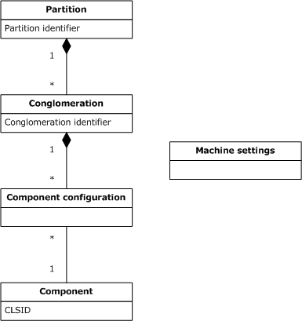

Figure 1: Relationship between objects in the catalog

A component is an indivisible unit of software functionality. Examples of components include DCOM object classes [MS-DCOM](../MS-DCOM/MS-DCOM.md) and [**event classes**](#gt_event-class) described in [MS-COMEV](../MS-COMEV/MS-COMEV.md). Each component known to the server is identified by a [**GUID**](#gt_globally-unique-identifier-guid), known as the [**class identifier (CLSID)**](#gt_class-identifier-clsid).

A component configuration entry represents a particular configuration of a component. In general, it is possible for a component to have more than one component configuration entry on a server. It is also possible for a component to have no component configuration entries, in which case it is said to be an [**unconfigured component**](#gt_unconfigured-component).

A conglomeration is a collection of component configuration entries for components that a component developer or administrator wishes to be managed as a group, and is identified by a conglomeration identifier. A component that has a component configuration entry in a conglomeration is said to be configured in that conglomeration. A conglomeration also has a set of configuration properties that apply to members of the collection. The conglomeration model assumes that component developers and administrators group together components based on application architecture, administrative policies, and performance concerns related to the shared use of system resources. Most of the configuration exposed by [MS-COMA](#Section_c5b1ef02e8f641959efe9667928d1bdd) at the conglomeration level is therefore related to broad-level security policy, such as role membership (section [1.3.4](#Section_1.3.4)), and configuration of shared system resources such as compensating resource managers (section [3.1.1.1.1](#Section_3.1.1.1.11)) and queue listeners (section [3.1.1.1.5](#Section_3.1.1.1.5)). Some conglomeration-level configuration properties might not apply to all component configuration entries, as explained in more detail in the sections that follow.

There are two types of component configuration entries, [**component legacy configuration entries**](#gt_component-legacy-configuration-entry) and [**component full configuration entries**](#gt_component-full-configuration-entry), each of which has a different purpose and a different set of configuration properties. Component full configuration entries support configuration for the full set of services provided by the target ORB. Component legacy configuration entries, if supported by the target ORB, enable configuring a component to be part of a conglomeration, where for technical reasons it might not be possible or desirable to create a component full configuration entry for the component.

Many of the configuration properties of component full configuration entries are not supported by component legacy configuration entries. For example, component legacy configuration entries do not have properties for synchronization or [**queuing**](#gt_queuing). Additionally, some of the configuration properties of conglomerations do not apply to component legacy configuration entries. Component legacy configuration entries do however have equivalent configuration properties at the component level for a subset of configuration, such as user identity and authentication level, that is usually managed at the conglomeration level.

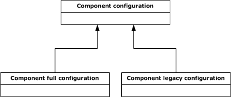

Figure 2: Types of component configurations

A partition is a container for conglomerations and is identified by a [**partition identifier**](#gt_partition-identifier). Every server has at least one partition, the [**global partition**](#gt_global-partition), and can have additional partitions and support the creation of new partitions. Multiple partitions on a server enable multiple configurations of a component. Component configuration entries for a component are subject to the following constraints:

- There can be at most one component configuration entry for any one component in a single conglomeration.
- Only conglomerations in the global partition can contain component legacy configuration entries.
- There can be at most one component configuration entry in the conglomerations in each partition that is associated with a given component, or at most one per [**bitness**](#gt_bitness), if multiple bitnesses are supported (section [1.3.5](#Section_1.3.5)).
- A component that has a component legacy configuration entry cannot have any other component configuration entries, or no other component configuration entries for the same bitness, if multiple bitnesses are supported (section 1.3.5).
The singleton machine settings object represents machine-wide configuration for the server.

<a id="Section_1.3.3"></a>
### 1.3.3 Catalog Versions and Partition Support

This document specifies three [**catalog**](#gt_catalog) versions, which correspond to changes in the configuration state model. Version 3.00 is the initial catalog version. Version 4.00 supports new types of configurable objects, and adds configuration properties to existing types of objects. Version 5.00 is a minor update that adds a configuration property to enable multiple-partition support to the machine settings object. To ensure interoperability, the client and server perform version negotiation (section [1.7](#Section_1.7)) and use the same catalog version.

One of the biggest differences between catalog version 3.00 and version 4.00 is the addition of explicit support for [**partitions**](#gt_partition). In catalog version 3.00, all [**conglomerations**](#gt_conglomeration) are implicitly contained in the [**global partition**](#gt_global-partition), and the catalog does not represent partitions or support their configuration. In catalog version 4.00, partitions are represented in the catalog and can be configured, and optionally new partitions can be created.

A server might support catalog version 4.00 or catalog version 5.00 but not support multiple partitions. COMA provides a mechanism for a client to determine whether a server allows multiple-partition support to be enabled. However, for historical reasons, catalog version 4.00 does not provide a reliable mechanism to determine whether multiple-partition support is actually enabled on the server. Catalog version 5.00 adds a configuration property to the machine settings object that indicates to the client whether multiple-partition support is enabled and optionally enables the client to change this configuration.

<a id="Section_1.3.4"></a>
### 1.3.4 Role-Based Security Configuration

Role-based security is a model for authorization in which user accounts are grouped into [**roles**](#gt_role) and authorization decisions for an operation are based on whether the user account of the requestor of an operation belongs to a particular role. COMA enables configuration of role-based security for [**conglomerations**](#gt_conglomeration) through role and [**role member**](#gt_role-member) objects. The following UML diagram shows the relationship between these types of objects and other object types in the [**catalog**](#gt_catalog).

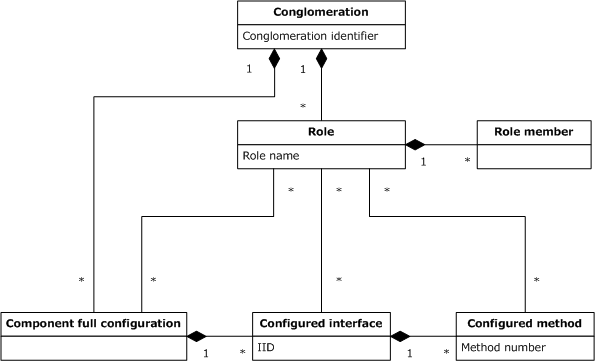

Figure 3: Role-related objects

A role is identified by a [**role name**](#gt_role-name) and is a set of role members that represents authorization for a set of operations that is supported by the [**components**](#gt_component) configured in a conglomeration. A role member is a predicate indicating that a particular user account belongs to a role.

Role-based security can be programmatic (dynamic) or declarative (static). In the programmatic model, the [**ORB**](#gt_object-request-broker-orb) provides an implementation-specific mechanism by which a component configured in a conglomeration can dynamically determine whether the user account of the requestor belongs to a particular role, in order to make authorization decisions. In the declarative model, the [**component configuration entries**](#gt_component-configuration-entry) in a conglomeration statically specify which roles are authorized to perform specific operations. COMA enables configuration of both programmatic and declarative role-based security.

COMA supports enabling or disabling role-based security for a conglomeration. If role-based security is enabled, programmatic role-based security is automatically supported. Declarative role-based security, on the other hand, can be enabled and configured at multiple levels of granularity.

A conglomeration is said to be configured for conglomeration-level access checks if all operations supported by the components configured in the conglomeration require the user account of the requestor to belong to one of the conglomeration's roles. Conglomerations can be configured to enable or disable conglomeration-level access checks.

A COMA server optionally supports configuration of components at the [**interface**](#gt_interface) and method levels, the primary purpose of which is declarative role-based security configuration. This configuration is supported for [**component full configuration entries**](#gt_component-full-configuration-entry) only. A [**configured interface**](#gt_configured-interface) is a set of methods supported by a component and for which configuration at the interface level is supported. A configured interface is identified by an interface identifier (IID). A [**configured method**](#gt_configured-method) is a method in a configured interface for which configuration at the method level is supported.

A component is said to be configured for component-level access checks if the component uses declarative role-based security configuration at the component, interface, and method levels for authorization. For the purpose of component-level access checks, roles can be associated with component full configuration entries, configured interfaces, and configured methods. This configuration has the following semantics:

- If a role is associated with a component full configuration entry, that role is authorized for all methods supported by the component.
- If a role is associated with a configured interface, that role is authorized for all methods in that interface.
- If a role is associated with a configured method, that role is authorized for that method.
<a id="Section_1.3.5"></a>
### 1.3.5 Bitness

For technical reasons, a COMA server might to make a distinction between instantiation of [**components**](#gt_component) in a [**process**](#gt_process) with a 32-bit or 64-bit address space. The term [**bitness**](#gt_bitness) refers to the distinction between 32-bit and 64-bit address spaces and the potential differences in instantiation of components that this entails.

For example, the [**target ORB**](#gt_target-object-request-broker-target-orb) can provide a local interoperability mechanism that instantiates a component in its creator's process. In this case, a server that supports both 32-bit and 64-bit address spaces would be required to determine whether a given component supports the creator's bitness. Furthermore, if a component supports multiple bitnesses, the details of its instantiation might be different. For example, each bitness might be implemented in a different [**module**](#gt_module) (section [1.3.6](#Section_1.3.6)).

To support multiple bitnesses, a COMA server keeps a separate copy of a component's properties for each bitness the component supports and allows each bitness to be configured separately. Bitness is exposed in the [**catalog**](#gt_catalog) as a property of [**component configuration entries**](#gt_component-configuration-entry), and a COMA server enables a bitness-aware client to specify which bitness of a component that it is configuring.

Not all COMA servers support multiple component bitnesses. If a server supports only a single bitness, bitness is opaque to the client, and all flags and configuration options related to bitness are ignored. A bitness-aware client performs capability negotiation for the multiple-bitness capability (section [1.7](#Section_1.7)) to determine whether it is required to select bitness when performing configuration.

<a id="Section_1.3.6"></a>
### 1.3.6 Registration

[**Registration**](#gt_registration) is the process of making [**components**](#gt_component) known to a COMA server so that they will be represented in the [**catalog**](#gt_catalog) and can be configured. For example, registration might be part of an application-specific process for installing components on a machine. A server typically supports one or more implementation-specific registration mechanisms, which are invoked in response to local [**events**](#gt_event) and can also be exposed by the server through COMA.

A [**module**](#gt_module) is a file that a server uses to register one or more components. Once the components are registered, the module is used to instantiate the components. A module might contain component implementations or metadata that a server can use to find the implementations. It is important to note that modules are implementation-specific; in other words, a module that is supported by one COMA server will not necessarily be supported by other COMA servers.

<a id="Section_1.3.7"></a>
### 1.3.7 Export and Import

COMA enables [**exporting**](#gt_export) a [**conglomeration**](#gt_conglomeration) to a file, which can then be [**imported**](#gt_import) on another server. The export procedure packages the [**modules**](#gt_module) for [**components**](#gt_component) that are configured in the conglomeration, the complete configuration state from the [**catalog**](#gt_catalog), and possibly other files and installation instructions into an [**installer package file**](#gt_installer-package-file). The client can then import this file on another server if the installer package file and the modules it contains are appropriate to (supported by) the other server.

COMA also enables exporting all of the conglomerations in a [**partition**](#gt_partition) at once to an installer package file; this is known as exporting a partition. An exported partition can be imported on a server that supports multiple partitions.

<a id="Section_1.3.8"></a>
### 1.3.8 Instantiation Concepts

A COMA server optionally provides run-time control of [**instance containers**](#gt_instance-container)--conceptual containers in which [**components**](#gt_component) are instantiated--by forwarding client requests (via an implementation-specific mechanism) to its [**target ORB**](#gt_target-object-request-broker-target-orb). This section describes instantiation concepts.

An [**ORB**](#gt_object-request-broker-orb) typically provides local and/or remote mechanisms by which components can be instantiated. An example of a remote instantiation mechanism is DCOM [**activation**](#gt_activation), ([MS-DCOM](../MS-DCOM/MS-DCOM.md) section 1.3.1). An instantiation of a component is known as a [**component instance**](#gt_component-instance).

For historical reasons, COMA enables control over instantiation of components only in cases where the instantiation is associated with a [**component configuration entry**](#gt_component-configuration-entry) in a [**conglomeration**](#gt_conglomeration). Although the details of instantiation might vary, the following conceptual steps are part of any instantiation that can be controlled in COMA:

- By some implementation-specific mechanism, the ORB associates the instantiation with a component configuration entry in a conglomeration.
- The ORB finds an existing instance container for the conglomeration, or creates a new instance container, and associates it with the conglomeration. An instance container is a conceptual container in which components that are configured in a single conglomeration can be instantiated.
- The ORB creates the component instance in the selected instance container.
An instance container is identified by a [**GUID**](#gt_globally-unique-identifier-guid), known as the [**container identifier**](#gt_container-identifier).

The following UML diagram summarizes the relationships between components, component configuration entries, conglomerations, component instances, and instance containers.

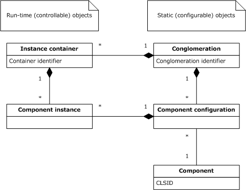

Figure 4: Relationships between static and run-time objects

[**Recycling**](#gt_recycling) refers to permanently disabling the creation of new component instances in an instance container. An instance container that is recycled is shut down as soon as the existing component instances in the container are destroyed. Recycling enables a problematic instance container to gradually drain its component instances rather than being immediately and forcibly shut down. An ORB optionally recycles instance containers automatically based on run-time information, such as the number of component instances that have been created in its context or the system resources it has consumed. COMA enables automatic recycling to be configured for a conglomeration and also enables clients to recycle instance containers.

[**Pausing**](#gt_pausing) refers to temporarily disabling the creation of new component instances in an instance container. COMA enables clients to pause instance containers.

<a id="Section_1.3.9"></a>
### 1.3.9 Instance Load Balancing

COMA also supports [**instance load balancing**](#gt_instance-load-balancing), in which instantiation of [**components**](#gt_component) is automatically distributed across [**instance containers**](#gt_instance-container) on multiple servers, according to run-time information, such as the comparative load on each server. Instance container load balancing also enables a rudimentary form of failover, in which a server that is experiencing system failures is temporarily disabled so that it can be restarted or otherwise returned to a good state.

An [**ORB**](#gt_object-request-broker-orb) that performs instance load balancing is said to be configured as an [**instance load balancing router**](#gt_instance-load-balancing-router). A machine that participates in instance load balancing as a target for component instantiation is known as an [**instance load balancing target**](#gt_instance-load-balancing-target). COMA enables configuration of instance container load balancing as follows:

- A COMA server optionally enables instance load balancing support to be started or stopped for its configured ORB.
- The machine settings object has a configuration property that indicates whether the [**target ORB**](#gt_target-object-request-broker-target-orb) is configured as an instance load balancing router and, optionally, enables a client to change this configuration.
- A COMA server that configures an instance load balancing router, exposes its list of instance load balancing targets in its [**catalog**](#gt_catalog), and allows this list to be modified.
<a id="Section_1.3.10"></a>
### 1.3.10 Protection of Configuration State

A [**conglomeration**](#gt_conglomeration) can be configured to disable configuration changes to the conglomeration and to the [**component configuration entries**](#gt_component-configuration-entry) and [**roles**](#gt_role) contained in that conglomeration. A conglomeration can also be configured to disable its deletion. A conglomeration's configuration includes properties that indicate whether it is changeable or can be deleted, and optionally enable a client to change this configuration. Additionally, in [**catalog**](#gt_catalog) version 4.00 and catalog version 5.00, a [**partition**](#gt_partition) can be configured to disable changes to all conglomerations in the partition, and to disable deletion of conglomerations in the partition or creation of new conglomerations in the partition.

The primary purpose of these configuration properties is to prevent accidental changes to a conglomeration by an administrator, not to act as a security measure. Changing a conglomeration that is marked as not changeable is usually possible by first marking the conglomeration as changeable and by then making the desired configuration changes. However, there might be conglomerations in a COMA server's catalog for which configuration is fixed because, for example, modifying the configuration would impact system-wide stability. Such a conglomeration is said to be a [**protected conglomeration**](#gt_protected-conglomeration).

<a id="Section_1.3.11"></a>
### 1.3.11 Events

A [**publisher-subscriber framework**](#gt_publisher-subscriber-framework) allows applications to publish historical information that other applications might request. The applications that publish the information are called [**publishers**](#gt_publisher), while the applications that subscribe to the information are called [**subscribers**](#gt_subscriber). A publisher can specify this information in discrete units. Each discrete unit of information is called an [**event**](#gt_event). Similarly, a subscriber can subscribe to an event by creating a [**subscription**](#gt_subscription) for it.

COMA enables management of events and their respective subscriptions on the server's target [**ORB**](#gt_object-request-broker-orb) as follows:

- A COMA server optionally enables [**event classes**](#gt_event-class)--collections of events that are grouped together based on criteria specified by the publishing application--to be registered as [**components**](#gt_component).
- A COMA server with registered event classes enables clients to create, update, or remove subscriptions to events in those event classes.
- COMA enables application-specific properties to be associated with the publisher or subscriber of a subscription.
<a id="Section_1.3.12"></a>
### 1.3.12 Replication

[**Replication**](#gt_replication) is a special-case administration scenario involving two or more COMA servers, in which a [**replication client application**](#gt_replication-client-application) (which can be but is not always to one of the servers) automatically copies one or more [**conglomerations**](#gt_conglomeration) from a [**replication source**](#gt_replication-source). A replication source is a server whose [**catalog**](#gt_catalog) contains the conglomerations to be copied to one or more [**replication targets**](#gt_replication-target), servers whose catalogs are to contain the copied conglomerations after the replication procedure has completed.

COMA does not support replication directly, but most of a typical replication procedure can be performed using COMA [**export**](#gt_export) and [**import**](#gt_import) functionality and remote file operations; for example, Server Message Block (SMB) [MS-SMB](../MS-SMB/MS-SMB.md) or SMB2 [MS-SMB2](../MS-SMB2/MS-SMB2.md) can be used. However, replication scenarios can differ from other administration scenarios in which conglomerations are copied between COMA servers, in that replication is a batch procedure and cannot take advantage of information usually provided by the administrator during interactive configuration. COMA enables the following tasks specific to replication:

- Managing [**directories**](#gt_directory) and Common Internet File System (CIFS) file [**shares**](#gt_share) (for details, see [MS-CIFS](../MS-CIFS/MS-CIFS.md)) to be used for copying installer package files.
- Limited management of replication history and backup state.
- Retrieving user passwords from the replication source, when they are necessary, in order to configure a conglomeration on a replication target to run as the same user as for the replication source.
Many of the details of replication are specific to the replication client application. In particular, the conglomerations to be copied can be all or just a subset of the conglomerations on the replication source, and are selected according to application-specific criteria. However, conglomerations in a COMA catalog have an informational configuration property that indicates to replication client applications whether or not the conglomeration is intended to be available for replication. This is an advisory value and does not otherwise affect COMA protocol behavior.

<a id="Section_1.4"></a>
## 1.4 Relationship to Other Protocols

COMA is built on top of DCOM, as described in [MS-DCOM](../MS-DCOM/MS-DCOM.md).

The COM+ Tracker Service Protocol is another protocol that provides functionality for obtaining run-time information about [**instance containers**](#gt_instance-container) (for more information, see [MS-COMT](../MS-COMT/MS-COMT.md)). The COM+ Tracker Service Protocol makes obsolete that functionality provided by this protocol by enabling clients to obtain a richer set of information and by providing a push model.

The COM+ Event System Protocol is another protocol that provides functionality for configuring [**event classes**](#gt_event-class) and [**subscriptions**](#gt_subscription) (for more information, see [MS-COMEV](../MS-COMEV/MS-COMEV.md)). The COM+ Event System Protocol makes obsolete that functionality provided by this protocol by enabling configuration for additional types of subscriptions.

COMA can be used to configure COM+ on a server. COMA [**partitions**](#gt_partition) have a natural mapping to COM+ partitions, and many configuration properties of objects in the COMA [**catalog**](#gt_catalog) are designed to support configuration of COM+ behavior that is implementation-specific as described in [MS-COM](../MS-COM/MS-COM.md).

COMA can be used to configure the COM+ Queued Components Protocol on a server (for more information, see [MC-COMQC](../MC-COMQC/MC-COMQC.md)). Several configuration properties of objects in the COMA catalog are designed to support enabling the COM+ Queued Components Protocol as a transport for communication between [**components**](#gt_component).

COMA can be used to configure system services (also known as daemons) for [**conglomerations**](#gt_conglomeration). The Service Control Manager Remote Protocol is another protocol for configuring system services (for more information, see [MS-SCMR](../MS-SCMR/MS-SCMR.md)). Neither protocol makes the other obsolete because each enables configuration that is not available in the other.

COMA provides limited management of CIFS file shares (for details, see [MS-CIFS](../MS-CIFS/MS-CIFS.md)) for use in [**replication**](#gt_replication) scenarios. COMA replication functionality is intended to be used alongside CIFS to copy conglomerations between COMA servers in these replication scenarios. Other COMA functionality requiring remote file operations might use CIFS, but this is not required by the protocol.

<a id="Section_1.5"></a>
## 1.5 Prerequisites/Preconditions

COMA expects that a client application that requests to write an [**IPv4 address in string format**](#gt_ipv4-address-in-string-format) or [**IPv6 address in string format**](#gt_ipv6-address-in-string-format) as values for properties identifying computers has determined that the COMA server supports the Internet Protocol [[RFC791]](https://go.microsoft.com/fwlink/?LinkId=392659) or Internet Protocol, version 6 [[RFC2460]](https://go.microsoft.com/fwlink/?LinkId=90357), respectively.

COMA expects that a client application that requests to set properties representing component-related [**security descriptors**](#gt_security-descriptor) detects which versions of the security descriptors are supported by the COMA server.

COMA expects that a client application that has to register [**components**](#gt_component) on a COMA server is able to locate [**modules**](#gt_module) supported by the COMA server. COMA expects that a client application that has to [**import**](#gt_import) a [**conglomeration**](#gt_conglomeration) or a [**partition**](#gt_partition) on a COMA server has an [**installer package file**](#gt_installer-package-file) that the COMA server recognizes.

COMA expects that a client application that has to install [**instance load balancing**](#gt_instance-load-balancing) support on a COMA server recognizes the location of a file that a COMA server can use to install this support.

COMA expects that a [**replication client application**](#gt_replication-client-application) that has to perform [**replication**](#gt_replication) recognizes that installer package files created by the [**replication source**](#gt_replication-source) are also supported by the [**replication targets**](#gt_replication-target).

<a id="Section_1.6"></a>
## 1.6 Applicability Statement

COMA is not a general-purpose or extensible configuration protocol. The configuration state model specified in this document is based on the following:

- COM+ Protocol, as described in [MS-COM](../MS-COM/MS-COM.md).
- COM+ Event System Protocol as described in [MS-COMEV](../MS-COMEV/MS-COMEV.md).
- COM+ Queued Components Protocol as described in [MC-COMQC](../MC-COMQC/MC-COMQC.md).
- A specific set of services provided by the server.
COMA is appropriate for configuration of an [**ORB**](#gt_object-request-broker-orb) or for administration of a server by a single client at a time because it does not provide any guarantees of consistency between multiple clients.

COMA [**replication**](#gt_replication) functionality for managing replication directories and file shares is appropriate for copying files between COMA servers as part of batch replication. It is not appropriate for general file system or file share management.

<a id="Section_1.7"></a>
## 1.7 Versioning and Capability Negotiation

This section covers versioning issues in the following areas.

Capability Negotiation: This protocol performs explicit negotiation as described in this section.

This document specifies three [**catalog**](#gt_catalog) versions: 3.00, 4.00, and 5.00. A COMA server and a COMA client perform catalog version negotiation before exchanging configuration data in the catalog. Except where otherwise noted, catalog version negotiation is completed before the client makes any other calls to the server.

Each COMA client and each COMA server can support a range of catalog versions. Catalog version negotiation is initiated by the client by sending the server its supported range. The catalog server selects the negotiated catalog version as the highest catalog version that both the client and the server support and returns the negotiated version to the client, as specified in section [3.1.4.1](#Section_3.1.4.1).

This document specifies two custom marshaling formats for queries, as used in certain server [**interfaces**](#gt_interface). One of the custom marshaling formats is optimized for implementations that use a 32-bit address space and the other for implementations that use a 64-bit address space. A COMA client and a COMA server optionally perform capability negotiation for the 64-bit query marshaling format capability, as specified in section [3.1.4.2](#Section_3.1.4.2).

On behalf of a client application that wishes to configure multiple [**partitions**](#gt_partition), a COMA client and a COMA server can perform capability negotiation for the multiple-partition support capability, as specified in section [3.1.4.3](#Section_3.2.4.3).

On behalf of a bitness-aware client application, a COMA client and a COMA server perform capability negotiation for the multiple-bitness capability to determine whether the COMA client needs to select [**bitness**](#gt_bitness) when performing configuration, as specified in section [3.1.4.4](#Section_3.2.4.4).

<a id="Section_1.8"></a>
## 1.8 Vendor-Extensible Fields

This protocol uses HRESULT values, as specified in [MS-ERREF](../MS-ERREF/MS-ERREF.md). Vendors can define their own HRESULT values, provided that they set the C bit (0x20000000) for each vendor-defined value, indicating that the value is a customer code.

<a id="Section_1.9"></a>
## 1.9 Standards Assignments

There are no standard assignments for this protocol. The following is a table of well-known GUIDs (generated using the mechanism specified in [[C706]](https://go.microsoft.com/fwlink/?LinkId=89824) section A.2.5) in COMA.

| Parameter | Value |
| --- | --- |
| DCOM [**CLSID**](#gt_class-identifier-clsid) for the COMA server (CLSID_COMAServer) | {182C40F0-32E4-11D0-818B-00A0C9231C29} |
| [**remote procedure call (RPC)**](#gt_remote-procedure-call-rpc) IID for [ICatalogSession](#Section_3.1.4.5) [**interface**](#gt_interface) (IID_ICatalogSession) | {182C40FA-32E4-11D0-818B-00A0C9231C29} |
| RPC IID for [ICatalog64BitSupport](#Section_3.1.4.6) interface (IID_ICatalog64BitSupport) | {1D118904-94B3-4A64-9FA6-ED432666A7B9} |
| RPC IID for [ICatalogTableInfo](#Section_3.1.4.7) interface (IID_ICatalogTableInfo) | {A8927A41-D3CE-11D1-8472-006008B0E5CA} |
| RPC IID for [ICatalogTableRead](#Section_3.1.4.8) interface (IID_ICatalogTableRead) | {0E3D6630-B46B-11D1-9D2D-006008B0E5CA} |
| RPC IID for [ICatalogTableWrite](#Section_3.1.4.9) interface (IID_ICatalogTableWrite) | {0E3D6631-B46B-11D1-9D2D-006008B0E5CA} |
| RPC IID for [IRegister](#Section_3.1.4.10) interface (IID_IRegister) | {8DB2180E-BD29-11D1-8B7E-00C04FD7A924} |
| RPC IID for [IRegister2](#Section_3.1.4.11) interface (IID_IRegister2) | {971668DC-C3FE-4EA1-9643-0C7230F494A1} |
| RPC IID for [IImport](#Section_3.1.4.12) interface (IID_IImport) | {C2BE6970-DF9E-11D1-8B87-00C04FD7A924} |
| RPC IID for [IImport2](#Section_3.1.4.13) interface (IID_Import2) | {1F7B1697-ECB2-4CBB-8A0E-75C427F4A6F0} |
| RPC IID for [IExport](#Section_3.1.4.14) interface (IID_IExport) | {CFADAC84-E12C-11D1-B34C-00C04F990D54} |
| RPC IID for [IExport2](#Section_3.1.4.15) interface (IID_IExport2) | {F131EA3E-B7BE-480E-A60D-51CB2785779E} |
| RPC IID for [IAlternateLaunch](#Section_3.1.4.16) interface (IID_IAlternateLaunch) | {7F43B400-1A0E-4D57-BBC9-6B0C65F7A889} |
| RPC IID for [ICatalogUtils](#Section_3.1.4.17) interface (IID_ICatalogUtils) | {456129E2-1078-11D2-B0F9-00805FC73204} |
| RPC IID for [ICatalogUtils2](#Section_3.1.4.18) interface (IID_ICatalogUtils2) | {C726744E-5735-4F08-8286-C510EE638FB6} |
| RPC IID for [ICapabilitySupport](#Section_3.1.4.19) interface (IID_ICapabilitySupport) | {47CDE9A1-0BF6-11D2-8016-00C04FB9988E} |
| RPC IID for [IContainerControl](#Section_3.1.4.20) interface (IID_IContainerControl) | {3F3B1B86-DBBE-11D1-9DA6-00805F85CFE3} |
| RPC IID for [IContainerControl2](#Section_3.1.4.20) interface (IID_IContainerControl2) | {6C935649-30A6-4211-8687-C4C83E5FE1C7} |
| RPC IID for [IReplicationUtil](#Section_3.1.4.22) interface (IID_IReplicationUtil) | {98315903-7BE5-11D2-ADC1-00A02463D6E7} |
| [**Catalog**](#gt_catalog) identifier for the COMA catalog | {6E38D3C4-C2A7-11D1-8DEC-00C04FC2E0C7} |
| Table identifier for [ComponentsAndFullConfigurations](#Section_3.1.1.3.19) table | {6E38D3C8-C2A7-11D1-8DEC-00C04FC2E0C7} |
| Table identifier for [ComponentFullConfigurationsReadOnly](#Section_3.1.1.3.2) table | {6E38D3CA-C2A7-11D1-8DEC-00C04FC2E0C7} |
| Table identifier for [ComponentLegacyConfigurations](#Section_3.1.1.3.3) table | {09487519-892D-4CA0-A00B-58EEB1662A68} |
| Table identifier for [ComponentNativeBitness](#Section_3.1.1.3.4) table | {39344B1F-EFE8-4286-9DB8-AC0A3D791FF2} |
| Table identifier for [ComponentNonNativeBitness](#Section_3.1.1.3.5) table | {96EC9BF1-063B-4ABF-8B90-42C878D9033E} |
| Table identifier for [Conglomerations](#Section_3.1.1.3.6) table | {D495F321-AF37-11D1-8B7E-00C04FD7A924} |
| Table identifier for [Partitions](#Section_3.1.1.3.7) table | {E4AD9FD6-D435-4CF5-95AD-20AD9AC6B59F} |
| Table identifier for [MachineSettings](#Section_3.1.1.3.8) table | {61436562-EE01-11D1-BFE4-00C04FB9988E} |
| Table identifier for [Roles](#Section_3.1.1.3.9) table | {CD331D11-C739-11D1-9D35-006008B0E5CA} |
| Table identifier for [RoleMembers](#Section_3.1.1.3.10) table | {CD331D10-C739-11D1-9D35-006008B0E5CA} |
| Table identifier for [ConfiguredInterfaces](#Section_3.1.1.3.11) table | {D13B72C6-C426-11D1-8507-006008B0E79D} |
| Table identifier for [ConfiguredMethods](#Section_3.1.1.3.12) table | {D13B72C4-C426-11D1-8507-006008B0E79D} |
| Table identifier for [RolesForComponent](#Section_3.1.1.3.13) table | {CD331D12-C739-11D1-9D35-006008B0E5CA} |
| Table identifier for [RolesForInterface](#Section_3.1.1.3.14) table | {CD331D13-C739-11D1-9D35-006008B0E5CA} |
| Table identifier for [RolesForMethod](#Section_3.1.1.3.15) table | {CD331D14-C739-11D1-9D35-006008B0E5CA} |
| Table identifier for [PartitionUsers](#Section_3.1.1.3.16) table | {0AF55FDC-30B5-4B6E-B258-A9DE4B64818C} |
| Table identifier for [PartitionRoles](#Section_3.1.1.3.17) table | {9D29E285-E24D-4096-98E1-44DBB2EAF7F0} |
| Table identifier for [PartitionRoleMembers](#Section_3.1.1.3.18) table | {352131CD-E0FF-4C46-9675-C3808B249F69} |
| Table identifier for [InstanceLoadBalancingTargets](#Section_3.1.1.3.19) table | {B7EEEA91-B3B9-11D1-8B7E-00C04FD7A924} |
| Table identifier for [ServerList](#Section_3.1.1.3.20) table | {2DAF1D50-BD53-11D1-8280-00A0C9231C29} |
| Table identifier for [InstanceContainers](#Section_3.1.1.3.21) table | {DF2FCC47-B7B7-4CB9-8B40-0B3D1E59E7DD} |
| Table identifier for [EventClasses](#Section_3.1.1.3.22) table | {E12539AD-CDE0-4E46-9211-916018B8C4D2} |
| Table identifier for [Subscriptions](#Section_3.1.1.3.23) table | {5A84E823-7277-11D2-9029-3078302C2030} |
| Table identifier for [SubscriptionPublisherProperties](#Section_3.1.1.3.24) table | {5A84E824-7277-11D2-9029-3078302C2030} |
| Table identifier for [SubscriptionSubscriberProperties](#Section_3.1.1.3.25) table | {5A84E825-7277-11D2-9029-3078302C2030} |
| Table identifier for [Protocols](#Section_3.1.1.3.26) table | {61436563-EE01-11D1-BFE4-00C04FB9988E} |
| Table identifier for [FilesForImport](#Section_3.1.1.3.27) table | {E4053366-BF8F-4E84-B4B2-72B3C2626CC9} |
| RequiredFixedGuid (used by [ICatalogTableInfo::GetClientTableInfo](#Section_3.1.4.7.1)) | {92AD68AB-17E0-11D1-B230-00C04FB9473F} |
| AuxiliaryGuid for ComponentsAndFullConfigurations table (used by ICatalogTableInfo::GetClientTableInfo) | {B4B3AECB-DFD6-11D1-9DAA-00805F85CFE3} |
| AuxiliaryGuid for SubscriptionPublisherProperties and SubscriptionSubscriberProperties tables (used by ICatalogTableInfo::GetClientTableInfo) | {EB56EAE8-BA51-11D2-B121-00805FC73204} |
| [**Partition identifier**](#gt_partition-identifier) for [**global partition**](#gt_global-partition) | {41E90F3E-56C1-4633-81C3-6E8BAC8BDD70} |
| GUIDs reserved for [**conglomeration identifiers**](#gt_conglomeration-identifier) of [**protected conglomerations**](#gt_protected-conglomeration) | {01885945-612C-4A53-A479-E97507453926}, {9EB3B62C-79A2-11D2-9891-00C04F79AF51}, and {6B97138E-3C20-48D1-945F-81AE63282DEE} |

<a id="Section_2"></a>
# 2 Messages

<a id="Section_2.1"></a>
## 2.1 Transport

All protocol messages MUST be transported via DCOM, as specified in [MS-DCOM](../MS-DCOM/MS-DCOM.md). COMA uses the [**dynamic endpoints**](#gt_dynamic-endpoint) allocated and managed by the DCOM infrastructure.

COMA implementations MUST override the default [**RPC**](#gt_remote-procedure-call-rpc) [**authentication level**](#gt_authentication-level) of the underlying DCOM implementation to use RPC_C_AUTHN_LEVEL_PKT_PRIVACY ([MS-RPCE](../MS-RPCE/MS-RPCE.md) section 2.2.1.1.8).

The COMA client implementations SHOULD<1> override the default impersonation level of the underlying DCOM implementation to use RPC_C_IMP_LEVEL_IMPERSONATE, as specified in [MS-RPCE] section 2.2.1.1.9.

The COMA client implementations SHOULD<2> override the default security provider of the underlying DCOM implementation to use RPC_C_AUTHN_GSS_NEGOTIATE, as specified in [MS-RPCE] section 2.2.1.1.7.

For historical reasons, ASCII MUST be used as the character representation format (as specified in [[C706]](https://go.microsoft.com/fwlink/?LinkId=89824) section 14.2.4) and [**little-endian**](#gt_little-endian) MUST be used as the integer format, as specified in [C706] section 14.2.5.

<a id="Section_2.2"></a>
## 2.2 Common Data Types

In addition to [**RPC**](#gt_remote-procedure-call-rpc) base types and definitions specified in [[C706]](https://go.microsoft.com/fwlink/?LinkId=89824) and [MS-DTYP](../MS-DTYP/MS-DTYP.md), additional data types are defined in the following table.

Field types in packet diagrams are defined by the packet diagram and the field descriptions. All fields in packet diagrams use [**little-endian**](#gt_little-endian) byte ordering unless otherwise stated.

All extra padding bytes MUST be zero unless otherwise stated and MUST be ignored on receipt.

This protocol uses the following types specified in [MS-DTYP] and [MS-OAUT](../MS-OAUT/MS-OAUT.md).

| Type | Reference |
| --- | --- |
| ACCESS_ALLOWED_ACE | [MS-DTYP], section 2.4.4.2 |
| ACCESS_DENIED_ACE | [MS-DTYP], section 2.4.4.4 |
| ACL | [MS-DTYP], section 2.4.5 |
| BOOL | [MS-DTYP], section 2.2.3 |
| BSTR | [MS-OAUT], section 2.2.23 |
| BYTE | [MS-DTYP], section 2.2.6 |
| Curly Braced GUID String Syntax | [MS-DTYP], section 2.3.4.3 |
| DWORD | [MS-DTYP], section 2.2.9 |
| GUID | [MS-DTYP], section 2.3.4.2 |
| HRESULT | [MS-DTYP], section 2.2.18 |
| LCID | [MS-DTYP], section 2.3.6 |
| LONG | [MS-DTYP], section 2.2.27 |
| LPCWSTR | [MS-DTYP], section 2.2.34 |
| LPWSTR | [MS-DTYP], section 2.2.36 |
| RPC GUID | [MS-DTYP], section 2.3.4 |
| SECURITY_DESCRIPTOR | [MS-DTYP], section 2.4.6 |
| SYSTEM_MANDATORY_LABEL_ACE | [MS-DTYP], section 2.4.4.13 |
| ULONG | [MS-DTYP], section 2.2.51 |
| VARIANT_BOOL | [MS-OAUT], section 2.2.27 |
| VARIANT Type Constants | [MS-OAUT], section 2.2.7 |

<a id="Section_2.2.1"></a>
### 2.2.1 Table Formats

The following sections specify the formats of structures related to reads from and writes to tables in a [**catalog**](#gt_catalog), as performed by the ICatalogTableInfo::GetClientTableInfo (section [3.1.4.7.1](#Section_3.1.4.7.1)), [ICatalogTableRead::ReadTable (section 3.1.4.8.1)](#Section_3.1.4.8), and [ICatalogTableWrite::WriteTable (section 3.1.4.9.1)](#Section_3.1.4.9) methods.

<a id="Section_2.2.1.1"></a>
#### 2.2.1.1 fTableFlags

The fTableFlags type represents a selector for [**component**](#gt_component) [**bitness**](#gt_bitness) in reads from and writes to certain tables. fTableFlags is an enumeration that MUST be one of the following values.

| Flag | Description |
| --- | --- |
| fTABLE_UNSPECIFIED 0x00000000 | Bitness is unspecified by this value, either because bitness is not distinguished for the type of object being read or because it is specified through another mechanism. |
| fTABLE_32BIT 0x00200000 | 32-bit component bitness. |
| fTABLE_64BIT 0x00400000 | 64-bit component bitness. |

<a id="Section_2.2.1.2"></a>
#### 2.2.1.2 eDataType

The eDataType enumeration represents the data type of variable-typed data, as used in queries and [PropertyMeta (section 2.2.1.7)](#Section_2.2.1.7) structures. In [QueryCell (section 2.2.1.4)](#Section_2.2.1.4) structures, which are custom-marshaled, an eDataType is represented by a 32-bit unsigned integer. In a PropertyMeta structure, an eDataType is marshaled as a DWORD, as specified in [MS-DTYP](../MS-DTYP/MS-DTYP.md) section 2.2.9. eDataType is an enumeration that MUST be set to one of the following values.

| Value | Description |
| --- | --- |
| eDT_ULONG 0x00000013 | Tags data of type ULONG |
| eDT_GUID 0x00000048 | Tags data of type GUID |
| eDT_BYTES 0x00000080 | Tags data that is an opaque array of BYTES |
| eDT_LPWSTR 0x00000082 | Tags data of type LPWSTR |

<a id="Section_2.2.1.3"></a>
#### 2.2.1.3 eSpecialQueryOption

The eSpecialQueryOption enumeration is used in queries to identify [QueryCell (section 2.2.1.4)](#Section_2.2.1.4) structures that represent a special option for the query, rather than a property in the table. An eSpecialQueryOption is represented by a 32-bit unsigned integer. eSpecialQueryOption is an enumeration that MUST be set to the following value.

| Value | Description |
| --- | --- |
| eSQO_OPTHINT 0xF0000005 | An advisory value that for historical reasons is required as a cell in certain queries, where it MUST be associated with a comparison value of 1.<3> |

<a id="Section_2.2.1.4"></a>
#### 2.2.1.4 QueryCell

The QueryCell structure represents either a constraint on a single property in a table, as used to construct a query on the table or, alternatively, one of the special query options identified by an [eSpecialQueryOption (section 2.2.1.3)](#Section_2.2.1.3) value.

The QueryCell type is a custom-marshaled type for which two custom marshaling formats are specified in this section. The 32-bit QueryCell marshaling format is optimized for implementations that use a 32-bit address space, and the 64-bit QueryCell marshaling format is optimized for implementations that use a 64-bit address space. All implementations MUST support the 32-bit format and MAY<4> additionally support the 64-bit format.

A client and a server optionally perform capability negotiation, as specified in section [3.1.4.2](#Section_3.1.4.2), for the 64-bit QueryCell marshaling format. If this capability negotiation is performed, and if both the client and the server support the 64-bit format, the 64-bit format MUST be used. If this capability negotiation is not performed, or if either the client or the server does not support the 64-bit format, the 32-bit format MUST be used.

A QueryCell is always associated with a variable-typed comparison data value, although this value can be null. The comparison data value is not part of the QueryCell marshaling format; instead, it is supplied in a separate parameter when marshaling a query, as specified in section [2.2.1.6](#Section_2.2.1.6). The QueryCell does, however, specify the size, in bytes, of its associated comparison data, the data type of the comparison data, and whether the comparison data is non-null.

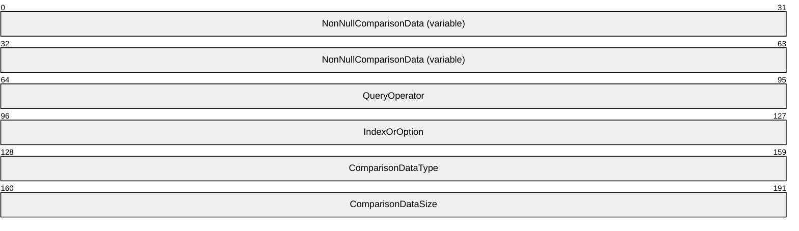

**NonNullComparisonData (variable):** Size depends on negotiated QueryCell marshaling format. It MUST be 4 bytes in the 32-bit format and MUST be 8 bytes in the 64-bit format. It MUST be set to zero if the comparison data is null and MUST be set to a nonzero value if the comparison data is non-null. On receipt, the server MUST treat all nonzero values identically.

**QueryOperator (4 bytes):** MUST be set to one of the following values.

| Value | Meaning |
| --- | --- |
| eOPERATOR_EQUAL 0x00000000 | The QueryCell represents an equality constraint. |
| eOPERATOR_NOTEQUAL 0x00000001 | The QueryCell represents an inequality constraint. |

**IndexOrOption (4 bytes):** MUST be set to either the zero-based index of a property in a table (values strictly less than 0xF0000000) or an eSpecialQueryOption value (values greater than or equal to 0xF0000000).

**ComparisonDataType (4 bytes):** The [eDataType (section 2.2.1.2)](#Section_2.2.1.2) value that represents the data type of the comparison data.

**ComparisonDataSize (4 bytes):** The size, in bytes, of the comparison data. If the representation of the comparison data in a QueryComparisonData (section 2.2.1.6) structure requires padding to a multiple of 4 bytes, this size MUST NOT include the padding bytes. If the comparison data is null, this MUST be set to zero. If the comparison data is non-null and the **ComparisonDataType** field is one of the following data type tags, this field is constrained as follows.

| Data type tag | Constraint |
| --- | --- |
| eDT_ULONG | MUST be set to 0x00000004. |
| eDT_GUID | MUST be set to 0x00000010 (decimal 16). |
| eDT_LPWSTR | MUST be a multiple of 2. |

<a id="Section_2.2.1.5"></a>
#### 2.2.1.5 QueryCellArray

The QueryCellArray is part of the representation of a query, as used in the [ICatalogTableInfo::GetClientTableInfo (section 3.1.4.7.1)](#Section_3.1.4.7.1), [ICatalogTableRead::ReadTable (section 3.1.4.8.1)](#Section_3.1.4.8), and [ICatalogTableWrite::WriteTable (section 3.1.4.9.1)](#Section_3.1.4.9) methods. It is always used along with a [QueryComparisonData (section 2.2.1.6)](#Section_2.2.1.6) structure.

QueryCellArray is a custom-marshaled type that is passed in a char* parameter. A QueryCellArray is marshaled as an array of zero or more [QueryCell](#Section_2.2.1.4) structures (a query with zero QueryCell structures MUST be represented by a NULL pointer).


**QueryCell (variable):** MUST be a sequence of zero or more QueryCell structures, custom-marshaled in the negotiated format, as specified in QueryCell.

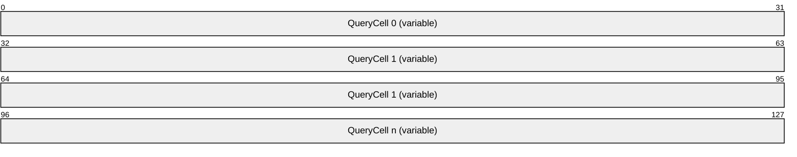

<a id="Section_2.2.1.6"></a>
#### 2.2.1.6 QueryComparisonData

The QueryComparisonData structure is part of the representation of a query, as used in the [ICatalogTableInfo::GetClientTableInfo (section 3.1.4.7.1)](#Section_3.1.4.7.1), [ICatalogTableRead::ReadTable (section 3.1.4.8.1)](#Section_3.1.4.8), and [ICatalogTableWrite::WriteTable (section 3.1.4.9.1)](#Section_3.1.4.9) methods. It is always used along with a [QueryCellArray (section 2.2.1.5)](#Section_2.2.1.4) structure.

QueryComparisonData is a custom-marshaled type that is passed in a char* parameter. A QueryComparisonData is marshaled as an array of zero or more custom-marshaled comparison data values, each of which is associated with a [QueryCell](#Section_2.2.1.4). Each non-null comparison data value MUST be marshaled in the same order as the QueryCell to which it is associated and according to the custom marshaling defined as follows for each of the supported types (a query with zero non-null comparison data values MUST be represented by a NULL pointer).

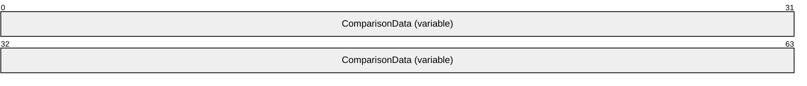

**ComparisonData (variable):** A sequence of zero or more comparison data values, marshaled according to type.

| Type | Custom marshaling |
| --- | --- |
| eDT_ULONG | Marshaled as a 32-bit, unsigned integer in [**little-endian**](#gt_little-endian) byte order. |
| eDT_GUID | Marshaled as specified in [MS-DTYP](../MS-DTYP/MS-DTYP.md), section 2.3.4.2. |
| eDT_BYTES | Marshaled as an array of bytes, padded with zeros to a multiple of 4 bytes. |
| eDT_LPWSTR | Marshaled as a null-terminated array of wchar_t in little-endian byte order, padded with zeros to a multiple of 4 bytes. |

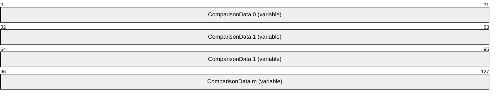

<a id="Section_2.2.1.7"></a>
#### 2.2.1.7 PropertyMeta

The PropertyMeta structure represents the type, size, and meta-properties (specified in this section) of a property in a table.

typedef struct {

DWORD dataType;

ULONG cbSize;

DWORD flags;

} PropertyMeta;

**dataType:** The [eDataType (section 2.2.1.2)](#Section_2.2.1.2) value that represents the data type of the property.

**cbSize:** A size, in bytes, associated with the property. The meaning of this value depends on the value of the **dataType** field and whether the fPROPERTY_FIXEDLENGTH flag is set in the **flags** field.

| Bit Range | Field | Description |
| --- | --- | --- |
| Variable | eDT_ULONG | - The fixed size of the property. MUST be set to 0x00000004. |
| Variable | eDT_GUID | - The fixed size of the property. MUST be set to 0x00000010 (decimal 16). |
| Variable | eDT_BYTES | No The maximum size of the property. A value of 0xFFFFFFFF indicates the property's size is unconstrained. |
| Variable | eDT_BYTES | Yes The fixed size of the property. |
| Variable | eDT_LPWSTR | No The maximum size of the property. A value of 0xFFFFFFFF indicates the property's size is unconstrained. |
| Variable | eDT_LPWSTR | Yes The fixed size of the property. MUST be set to a multiple of 2. |

**flags:** A bit field specifying the meta-properties of the property. MUST be a combination of zero or more of the following flags.

| Value | Meaning |
| --- | --- |
| fPROPERTY_PRIMARYKEY 0x00000001 | This property is part of the primary key for its table. MUST be set if fPROPERTY_NOTNULLABLE is set. |
| fPROPERTY_NOTNULLABLE 0x00000002 | This property cannot be null. |
| fPROPERTY_FIXEDLENGTH 0x00000004 | This eDT_BYTES or eDT_LPWSTR property has a fixed size. MUST NOT be set for properties of type eDT_ULONG or eDT_GUID. |
| fPROPERTY_NOTPERSISTABLE 0x00000008 | This property contains sensitive data such as passwords that MUST NOT be written in plaintext to persistent storage. |
| fPROPERTY_CASEINSENSITIVE 0x00000020 | This eDT_LPWSTR property MUST be treated as case-insensitive for purposes of comparison. MUST NOT be set for properties of type eDT_ULONG, eDT_GUID, or eDT_BYTES. |

<a id="Section_2.2.1.8"></a>
#### 2.2.1.8 fPropertyStatus

The fPropertyStatus structure represents the status of a property value in a table entry, as represented in a [TableEntryFixed (section 2.2.1.9)](#Section_2.2.1.9) structure. fPropertyStatus is a bit field 1 byte in length.

| 0 | 1 | 2 | 3 | 4 | 5 | 6 | 7 |
| --- | --- | --- | --- | --- | --- | --- | --- |
| 0 | R 1 | W | R E | R 2 | N T | C | N N |

Where the bits are defined as:

| Value | Description |
| --- | --- |
| R1 | **Reserved1 (2 bits)**. MUST be cleared when sent and MUST be ignored on receipt. |
| W | **Write (1 bit)**. For historical reasons, this flag SHOULD<5> be set for a write and MUST be set for a write if the property has variable length and any of the following is true: Action equals eACTION_ADD (section [2.2.1.11](#Section_2.2.1.11)). Action equals eACTION_UPDATE (section 2.2.1.11). Action equals eACTION_DELETE (section 2.2.1.11) and the property is a primary key. This flag MUST be cleared for a read. It SHOULD<6> be ignored on receipt. |
| RE | **Read (1 bit)**. For historical reasons, this flag SHOULD<7> be set for a read and MUST be set for a read if the property has variable length. This flag MUST be cleared for a write and SHOULD<8> be ignored on receipt. |
| R2 | **Reserved2 (1 bit)**. MUST be cleared when sent and MUST be ignored on receipt. |
| NT | **NoTouch (1 bit)**. For a write, this flag MUST be set on certain properties for historical reasons. For information about which properties require this flag, see the table definitions in section [3.1.1.3](#Section_3.1.1.3). For a read, this flag MUST be clear. |
| C | **Changed (1 bit)**. For a write, indicates that the property value is to be changed. For a read, MAY be set by the server and MUST be ignored by the client on receipt. |
| NN | **NonNull (1 bit)**. The property value is non-null. |

<a id="Section_2.2.1.9"></a>
#### 2.2.1.9 TableEntryFixed

The TableEntryFixed structure is used in the [TableDataFixed (section 2.2.1.10)](#Section_2.2.1.10) and [TableDataFixedWrite (section 2.2.1.13)](#Section_2.2.1.13) structures. These structures are always used along with a [TableDataVariable (section 2.2.1.15)](#Section_2.2.1.15) structure. This type represents fixed-size parts of the data in a table entry:

- The status of each property value.
- The size of each nonfixed size **eDT_BYTES** property.
- The property value for each fixed size property.
- An offset, in bytes, to the property value within a TableDataVariable for each nonfixed size property.
This structure is marshaled as specified in the following diagram.

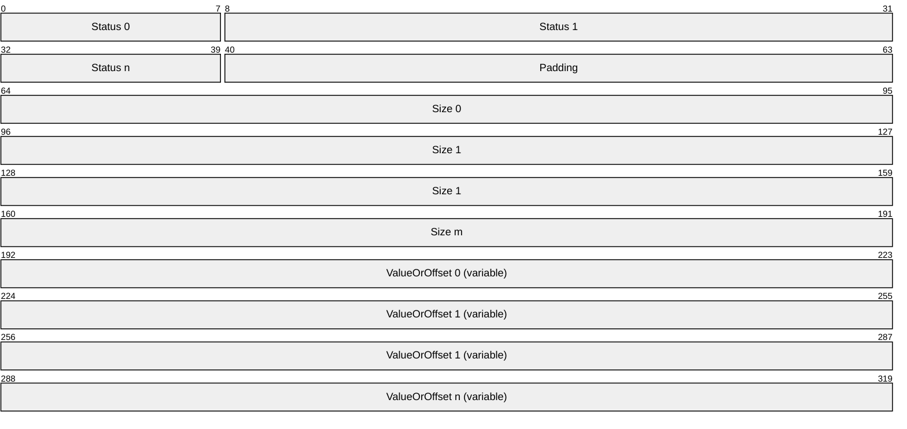

**Status 0-n:** The property status for each property, in order by index. MUST be an [fPropertyStatus (section 2.2.1.8)](#Section_2.2.1.8) value.

**Padding:** Padding with zeros to a 4-byte boundary from the start of the structure.

**Size 0-m:** The size, in bytes, represented by an unsigned integer, of the property value for each nonfixed size eDT_BYTES property, in order by index. If the representation of the property value in the associated TableDataVariable structure requires padding to a multiple of 4 bytes, this size does not include the padding bytes.

**ValueOrOffset 0-n:** The property value or offset for each property, in order by index. The format of this field depends on the type of the property, whether the fPROPERTY_FIXEDLENGTH flag is set in the property's section [PropertyMeta (section 2.2.1.7](#Section_2.2.1.7)), and whether the NonNull (see section 2.2.1.8) bit is set in the property's **Status** field.

| Bit Range | Field | Description |
| --- | --- | --- |
| The property value, marshaled as a 32-bit unsigned integer. | eDT_ULONG | - - |
| Variable | eDT_GUID | - - The property value, marshaled as specified in [MS-DTYP](../MS-DTYP/MS-DTYP.md), section 2.3.4.2. |
| A 4-byte field, which SHOULD<9> be zero and MUST be ignored on receipt. | eDT_BYTES | No No |
| A 32-bit unsigned integer, which MUST be the offset in bytes to the property value from the start of the associated TableDataVariable structure. MUST be a multiple of 4. | eDT_BYTES | No Yes |
| Variable | eDT_BYTES | Yes No A field with length equal to the fixed size of the property, rounded up to a multiple of 4. SHOULD be filled with zeros and MUST be ignored on receipt. |
| Variable | eDT_BYTES | Yes Yes The property value, marshaled as an array of bytes, padded with zeros to a multiple of 4 bytes. |
| A 4-byte field, which SHOULD<10> be zero and MUST be ignored on receipt. | eDT_LPWSTR | No No |
| A 32-bit unsigned integer, which MUST be the offset in bytes to the property value from the start of the associated TableDataVariable structure. MUST be a multiple of 4. | eDT_LPWSTR | No Yes |
| Variable | eDT_LPWSTR | Yes No A field with the length equal to the fixed size of the property, rounded up to a multiple of 4. SHOULD be filled with zeros and MUST be ignored on receipt. |
| The property value, marshaled as a null-terminated array of wchar_t in [**little-endian**](#gt_little-endian) byte order, padded with zeros to a multiple of 4 bytes. | eDT_LPWSTR | Yes Yes |

<a id="Section_2.2.1.10"></a>
#### 2.2.1.10 TableDataFixed

The TableDataFixed structure represents the fixed-size parts of the data in zero or more entries in a table, as returned by the [ICatalogTableRead::ReadTable (section 3.1.4.8.1)](#Section_3.1.4.8) method. It is always used along with a [TableDataVariable (section 2.2.1.15)](#Section_2.2.1.15) structure.

TableDataFixed is a custom-marshaled type that is returned in a char** parameter. A TableDataFixed structure is marshaled as a sequence of zero or more [TableEntryFixed (section 2.2.1.9)](#Section_2.2.1.9) structures (a result with zero table entries is represented by a NULL pointer).

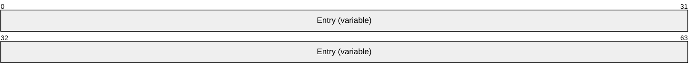

**Entry (variable):** A sequence of zero or more TableEntryFixed structures. The order in which these structures appear MUST be the same as the order in which the corresponding [TableEntryVariable (section 2.2.1.14)](#Section_2.2.1.14) structures appear in the associated TableDataVariable structure.

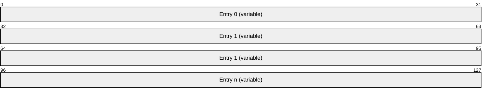

<a id="Section_2.2.1.11"></a>
#### 2.2.1.11 eTableEntryAction

The eTableEntryAction enumeration represents a write action to an entry in a table. An eTableEntryAction is represented by a 32-bit unsigned integer. The eTableEntryAction enumeration MUST be set to one of the following values.

| Value | Description |
| --- | --- |
| eACTION_ADD 0x00000001 | Add an entry to the table. |
| eACTION_UPDATE 0x00000002 | Update an existing entry in the table. |
| eACTION_REMOVE 0x00000003 | Remove an entry from the table. |

<a id="Section_2.2.1.12"></a>
#### 2.2.1.12 TableEntryFixedWrite

The **TableEntryFixedWrite** structure represents the fixed-size parts of the data, along with the write action, for a write to an entry in a table.

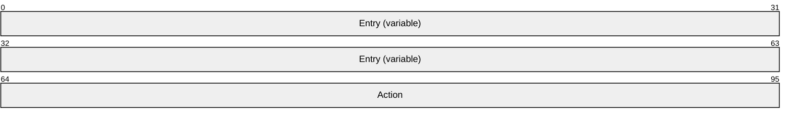

**Entry (variable):** A [TableEntryFixed](#Section_2.2.1.9) structure, marshaled as specified in section 2.2.1.9.

**Action (4 bytes):** An [eTableEntryAction (section 2.2.1.11)](#Section_2.2.1.11) value identifying the type of write action.

<a id="Section_2.2.1.13"></a>
#### 2.2.1.13 TableDataFixedWrite

The TableDataFixedWrite structure represents the fixed-size parts of the data, along with write actions, for a write to zero or more entries in a table, as used in the [ICatalogTableWrite::WriteTable (section 3.1.4.9.1)](#Section_3.1.4.9) method. It is always used along with a [TableDataVariable (section 2.2.1.15)](#Section_2.2.1.15) structure.

TableDataFixedWrite is a custom-marshaled type that is passed in a char* parameter. A TableDataFixedWrite structure is marshaled as a sequence of zero or more [TableEntryFixedWrite (section 2.2.1.12)](#Section_2.2.1.9) structures (a write with zero table entries MUST be represented by a NULL pointer).


**EntryWrite (variable):** A sequence of zero or more TableEntryFixedWrite structures. The order in which these structures appear MUST be the same as the order in which the corresponding [TableEntryVariable (section 2.2.1.14)](#Section_2.2.1.14) structures appear in the associated TableDataVariable structure.

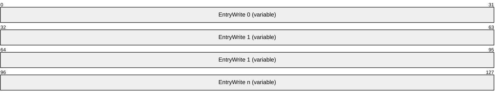

<a id="Section_2.2.1.14"></a>
#### 2.2.1.14 TableEntryVariable

The TableEntryVariable structure represents the variable-size parts of the data in an entry in a table or in a write to an entry in a table. It consists of a sequence of zero or more variable-size property values.

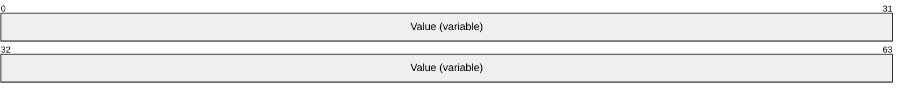

**Value (variable):** A sequence of zero or more property values, with one value for each variable-size property, in order by index. The format of each property value depends on the type of the property.

| Type of property | Format |
| --- | --- |
| eDT_BYTES 0x00000080 | The property value, marshaled as an array of bytes, padded with zeros to a multiple of 4 bytes. |
| eDT_LPWSTR 0x00000082 | The property value, marshaled as a null-terminated array of wchar_t in [**little-endian**](#gt_little-endian) byte order, padded with zeros to a multiple of 4 bytes. |

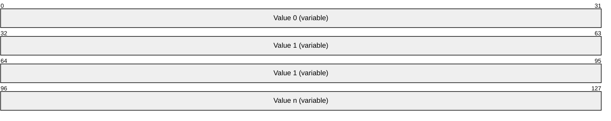

<a id="Section_2.2.1.15"></a>
#### 2.2.1.15 TableDataVariable

The TableDataVariable structure represents the variable-size parts of the data in zero or more entries in a table, as returned by the [ICatalogTableRead::ReadTable (section 3.1.4.8.1)](#Section_3.1.4.8) method, or in a write to zero or more entries in a table, as used in the [ICatalogTableWrite::WriteTable (section 3.1.4.9.1)](#Section_3.1.4.9) method. It is always used along with a [TableDataFixed (section 2.2.1.10)](#Section_2.2.1.10) or [TableDataFixedWrite (section 2.2.1.13)](#Section_2.2.1.13) structure, which specifies the offsets to each of the values in this structure.


**Entry (variable):** A sequence of zero or more [TableEntryVariable (section 2.2.1.14)](#Section_2.2.1.14) structures. The order in which these structures appear MUST be the same as the order in which the corresponding [TableEntryFixed (section 2.2.1.9)](#Section_2.2.1.9) or [TableEntryFixedWrite (section 2.2.1.12)](#Section_2.2.1.9) structures appear in the associated TableDataFixed or TableDataFixedWrite structure.


<a id="Section_2.2.1.16"></a>
#### 2.2.1.16 TableDetailedError

The TableDetailedError structure represents a record of an error related to a particular property of a particular table entry, which contributed to a partial failure in a read from a table (see section [3.1.4.8.1](#Section_3.1.4.8)) or a failure in a write to a table (see section [3.1.4.9.1](#Section_3.1.4.9)).

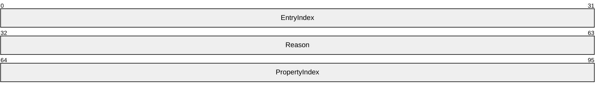

**EntryIndex (4 bytes):** An unsigned integer that represents the zero-based index of the entry to which this error corresponds.

**Reason (4 bytes):** An HRESULT value that represents the reason for failure. MUST be a failure result, as specified in [MS-ERREF](../MS-ERREF/MS-ERREF.md) section 2.1.

**PropertyIndex (4 bytes):** An unsigned integer that represents the zero-based index of the property to which this error corresponds.

<a id="Section_2.2.1.17"></a>
#### 2.2.1.17 TableDetailedErrorArray

The TableDetailedErrorArray structure represents an unordered collection of one or more detailed errors that contributed to a partial failure in a read from a table (see section [3.1.4.8.1](#Section_3.1.4.8)) or a failure in a write to a table (see section [3.1.4.9.1](#Section_3.1.4.9)).

TableDetailedErrorArray is a custom-marshaled type that is returned in a char** parameter. A TableDetailedErrorArray structure is marshaled as an array of one or more [TableDetailedError (section 2.2.1.16)](#Section_2.2.1.16) structures, the order of which is not significant.

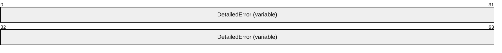

**DetailedError (variable):** One or more TableDetailedError structures, marshaled as specified in section 2.2.1.16.


<a id="Section_2.2.2"></a>
### 2.2.2 Property Formats

The definition of a property in a table (see section [3.1.1.3](#Section_3.1.1.3) for details) includes the domain of valid property values, its representation on the wire, and the semantics of the configuration it represents. The fields of a property's [PropertyMeta (section 2.2.1.7)](#Section_2.2.1.7) structure represent some low-level typing metadata--a simple type (one of the [eDataType (section 2.2.1.2)](#Section_2.2.1.2) values), size, and whether or not null is a valid value--but do not specify any higher-level constraints or semantics. For example, many properties that are represented as an eDT_ULONG are required to have a value from an enumeration, where each enumeration value has a specific meaning. The following sections specify common types for properties in tables, where the constraints and semantics are not clearly implied by the property's PropertyMeta values.

For historical reasons, COMA does not apply a consistent requirement for server and client validation responsibilities across all property types. For example, some type validity constraints require only server validation, while others require only client validation. Therefore, validity constraints on the types defined in these sections are specified separately from the validation requirements for servers and clients. For details on server and client validation requirements, see sections [3.1.4.9.1](#Section_3.1.4.9) and [3.2.4.6](#Section_3.2.4.6) respectively.

Each property type definition includes the following information:

**Simple type:** The eDataType value for properties of this type, as used when representing a property of this type in a call to the [ICatalogTableRead::ReadTable (section 3.1.4.8.1)](#Section_3.1.4.8) and ICatalogTableWrite::WriteTable (section 3.1.4.9.1) methods. If properties of this type are also used as method parameters, the wire representation used in these methods is mentioned here as well.

**Validity:** Constraints on the values that represent valid configuration for properties of this type. If a property of this type is set to a value that does not conform to these constraints, the resulting [**ORB**](#gt_object-request-broker-orb) behavior is undefined.

**Server validation:** Requirements for validation of writes received by a server implementation.

**Client validation:** Requirements for validation of writes sent by a protocol client implementation on behalf of a client application.

<a id="Section_2.2.2.1"></a>
#### 2.2.2.1 Placeholder Property Formats

The following sections specify property formats for properties that are reserved or otherwise not used in a particular context. The values required for properties of these types are placeholder values only and have no meaning.

<a id="Section_2.2.2.1.1"></a>
##### 2.2.2.1.1 PlaceholderPartitionIdProperty

**Simple type:** eDT_GUID

**Validity:** MUST have the value {41E90F3E-56C1-4633-81C3-6E8BAC8BDD70} (the [**partition identifier**](#gt_partition-identifier) of the [**global partition**](#gt_global-partition)).

**Server validation:** Servers SHOULD enforce validity constraints.

**Client validation:** Clients MUST enforce validity constraints.

<a id="Section_2.2.2.1.2"></a>
##### 2.2.2.1.2 PlaceholderGuidProperty

**Simple type:** eDT_GUID

**Validity:** MUST have the value GUID_NULL.

**Server validation:** Servers SHOULD enforce validity constraints.

**Client validation:** Clients MUST enforce validity constraints.

<a id="Section_2.2.2.1.3"></a>
##### 2.2.2.1.3 PlaceholderStringProperty

**Simple type:** eDT_LPWSTR

**Validity:** MUST be null.

**Server validation:** Servers SHOULD enforce validity constraints.

**Client validation:** Clients MUST enforce validity constraints.

<a id="Section_2.2.2.1.4"></a>
##### 2.2.2.1.4 PlaceholderIntegerProperty

**Simple type:** eDT_ULONG

**Validity:** MUST be zero.

**Server validation:** Servers SHOULD enforce validity constraints.

**Client validation:** Clients MUST enforce validity constraints.

<a id="Section_2.2.2.2"></a>
#### 2.2.2.2 ImplementationSpecificPathProperty

The ImplementationSpecificPathProperty represents a path to a resource in a format that is specific to a COMA server implementation.

**Simple type:** eDT_LPWSTR. Represented as an LPWSTR or LPCWSTR when used as a method parameter.

**Validity:** Character length MUST be at least 1 and at most 260, not including the terminating null character. Additional constraints are implementation-specific.<11> However, paths in [**Universal Naming Convention (UNC)**](#gt_universal-naming-convention-unc) SHOULD be valid.

**Server validation:** Servers MAY enforce validity constraints.

**Client validation:** Clients SHOULD simply pass through the value provided by the client application.

<a id="Section_2.2.2.3"></a>
#### 2.2.2.3 Threading Model Property Formats

If an [**ORB**](#gt_object-request-broker-orb) provides a feature for hosting [**component instances**](#gt_component-instance) on different types of threads, restrictions on the types of threads on which the component instances for a particular [**component**](#gt_component) will be hosted is represented in the catalog as a property of the component and of its component configurations.

An ORB that provides this feature divides all threads in a given [**process**](#gt_process) that will be used to host component instances into one of two categories:

- Single threaded apartment (STA) threads are primarily used to host component instances when the component expects that all calls to any given component instance will be executed on a single thread. Optionally, the ORB designates one STA thread in each process as the Main STA thread.
- Multi-threaded apartment (MTA) threads are used to host component instances when the component does not have such an expectation.
An ORB that provides this feature furthermore assigns to each component instance one of the following hosting models at the time that the component is instantiated:

- In the STA-hosted model, all calls to the component instance are executed on the same thread. The component instance is said to be hosted on that thread.
- In the MTA-hosted model, all calls to the component instance are executed on one of the MTA threads in the process. The specific thread used for any given call is selected according to ORB-specific criteria.<12>
- In the neutral-hosted model, calls to the component instance are executed on any STA or MTA thread, selected according to ORB-specific criteria.<13>
Properties that use the formats specified in the following sections are an indication of how the ORB will select the hosting model for component instances. These property values are typically selected by the component itself, and COMA does not provide a mechanism for modifying the values. If an ORB does not provide such a feature, this SHOULD be indicated by using the values eTM_NEUTRAL and "Neutral" for all components. If an ORB does not designate one STA thread in each process as the Main STA thread, the values eTM_MAIN and null SHOULD NOT be used.

<a id="Section_2.2.2.3.1"></a>
##### 2.2.2.3.1 ThreadingModelEnumerationProperty

The ThreadingModelEnumerationProperty type represents how the hosting model is to be selected for [**component instances**](#gt_component-instance).

**Simple type:** eDT_ULONG

**Validity:** MUST be one of the following values.

| Value | Meaning |
| --- | --- |
| eTM_APARTMENT 0x00000000 | Each component instance is to be STA-hosted. The STA thread used to host the component instance is to be selected as follows: If an instantiation request originates from an STA thread in the same [**process**](#gt_process) in which the [**component**](#gt_component) is to be instantiated, the component instance is to be hosted on that thread. Otherwise, the [**ORB**](#gt_object-request-broker-orb) is to select an existing STA thread or create a new STA thread to host the component instance according to some ORB-specific criteria.<14> |
| eTM_FREE 0x00000001 | Each component instance is to be MTA-hosted. If no MTA threads exist in the process in which the component is to be instantiated at the time of the instantiation request, the ORB is to create at least one MTA thread. |
| eTM_MAIN 0x00000002 | Each component instance is to be STA-hosted in the Main STA thread. If no STA threads exist in the process in which the component is to be instantiated at the time of the instantiation request, the ORB is to create one STA thread and designate it the Main STA thread. |
| eTM_BOTH 0x00000003 | Each component instance is to be either STA-hosted or MTA-hosted, according to the following criteria: If an instantiation request originates from an STA thread in the same process in which the component is to be instantiated, the component instance is to be STA-hosted on that thread. If an instantiation request originates from an MTA thread in the same process in which the component is to be instantiated, the component instance is to be MTA-hosted. If an instantiation request does not originate from within the process in which the component is to be instantiated, the component instance is to be MTA-hosted. If no MTA threads exist in the process at the time of the instantiation request, the ORB is to create at least one MTA thread. |
| eTM_NEUTRAL 0x00000004 | Component instances are to be neutrally hosted. |

**Server validation:** No validation requirements (COMA does not provide a mechanism for writing properties of this type).

**Client validation:** No validation requirements (COMA does not provide a mechanism for writing properties of this type).

<a id="Section_2.2.2.3.2"></a>
##### 2.2.2.3.2 ThreadingModelStringProperty

The ThreadingModelStringProperty type represents how the hosting model is to be selected for [**component instances**](#gt_component-instance). For historical reasons, some properties use this format instead of the [ThreadingModelEnumerationProperty (section 2.2.2.3.1)](#Section_2.2.2.3.1) format. Each allowed value of this format corresponds to one of the ThreadingModelEnumerationProperty values.

**Simple type:** eDT_LPWSTR

**Validity:** MUST be one of the following values.

| Value | Corresponding ThreadingModelEnumerationProperty value |
| --- | --- |
| "Apartment" | eTM_APARTMENT |
| "Free" | eTM_FREE |
| null | eTM_MAIN |
| "Both" | eTM_BOTH |
| "Neutral" | eTM_NEUTRAL |

**Server validation:** No validation requirements (COMA does not provide a mechanism for writing properties of this type).

**Client validation:** No validation requirements (COMA does not provide a mechanism for writing properties of this type).

<a id="Section_2.2.2.4"></a>
#### 2.2.2.4 ScriptingProgramIdProperty

The ScriptingProgramIdProperty represents a scripting-friendly unique name for a [**component**](#gt_component), intended for use in scripting environments and for display purposes.

**Simple type:** eDT_LPWSTR. It is represented as an LPWSTR or LPCWSTR type, as specified in [MS-DTYP](../MS-DTYP/MS-DTYP.md) section 2.2.36, when used as a method parameter.

**Validity:** Character length MUST be at least 1 and at most 39, not including the terminating null character. Each value MUST uniquely identify a component.

**Server validation:** Servers MAY enforce character length restrictions and SHOULD enforce uniqueness.

**Client validation:** Clients MAY enforce character length restrictions and SHOULD NOT enforce uniqueness.

<a id="Section_2.2.2.5"></a>
#### 2.2.2.5 BitnessProperty

The BitnessProperty type represents the [**bitness**](#gt_bitness) of a [**component**](#gt_component) configuration.

**Simple type:** eDT_ULONG

**Validity:** It MUST be one of the following values.

| Value | Meaning |
| --- | --- |
| 0x00000001 | The component configuration is for the 32-bit bitness of the component. |
| 0x00000002 | The component configuration is for the 64-bit bitness of the component. |

**Server validation:** Servers MUST enforce validity constraints.

**Client validation:** Clients MUST enforce validity constraints.

<a id="Section_2.2.2.6"></a>
#### 2.2.2.6 NameProperty

The NameProperty represents a scripting-friendly name for an object, intended for use in scripting environments and for display purposes.

**Simple type:** eDT_LPWSTR. It is represented as an LPCWSTR type, as specified in [MS-DTYP](../MS-DTYP/MS-DTYP.md) section 2.2.34, when used as a method parameter.

**Validity:** MUST NOT be null.

**Server validation:** Servers MUST enforce validity constraints. Servers MAY enforce an implementation-specific character length limit. If so, this limit SHOULD be at least 255 characters, not including the terminating null character.

**Client validation:** Clients SHOULD enforce validity constraints.

<a id="Section_2.2.2.7"></a>
#### 2.2.2.7 DescriptionProperty

The DescriptionProperty represents a human-readable description for an object, intended for display purposes.

**Simple type:** eDT_LPWSTR

**Validity:** No restrictions.

**Server validation:** Servers MAY enforce an implementation-specific character length limit. If so, this limit SHOULD be at least 255 characters, not including the terminating null character.

**Client validation:** Clients SHOULD pass through the value provided by the client application.

<a id="Section_2.2.2.8"></a>
#### 2.2.2.8 ContextFacilityProperty

The ContextFacilityProperty enumeration represents how, if at all, a particular facility provided by an [**ORB**](#gt_object-request-broker-orb) is to be automatically integrated into the context of a new [**component instance**](#gt_component-instance) from an incoming instantiation request.

**Simple type:** eDT_ULONG

**Validity:** MUST be one of the following values.

| Value | Meaning |
| --- | --- |
| Ignored 0x00000000 | The presence of the facility in the incoming request is to be ignored. |
| Unsupported 0x00000001 | The presence of the facility in the incoming request is to result in failure for the instantiation. |
| Supported 0x00000002 | The facility is to be integrated into the component instance's context if present in the instantiation request, but no instance of the facility is to be created if absent. |
| Required 0x00000003 | The facility is to be integrated into the component instance's context if present in the instantiation request, and a new instance of the facility is to be created if absent. |
| RequiresNew 0x00000004 | Regardless of whether the facility is present in the incoming instantiation request, a new instance of the facility is to be created. |

**Server validation:** Servers MUST enforce validity constraints.

**Client validation:** Clients MUST enforce validity constraints.

<a id="Section_2.2.2.9"></a>
#### 2.2.2.9 BooleanProperty

The BooleanProperty represents a Boolean value.

**Simple type:** eDT_ULONG

**Validity:** MUST be one of the values TRUE (0x00000001) or FALSE (0x00000000).

**Server validation:** Servers MUST enforce validity constraints.

**Client validation:** Clients MUST enforce validity constraints.

<a id="Section_2.2.2.9.1"></a>
##### 2.2.2.9.1 BooleanBitProperty

The BooleanBitProperty type represents a Boolean value multiplexed with other Boolean values in an eDT_ULONG property.

**Simple type:** This type is always a bit in an eDT_ULONG property.

**Validity:** No restrictions.

**Server validation:** No requirements.

**Client validation:** No requirements.

<a id="Section_2.2.2.10"></a>
#### 2.2.2.10 Pool Size Property Formats

The following sections specify the property formats for properties used to configure [**instance pooling**](#gt_instance-pooling).

<a id="Section_2.2.2.10.1"></a>
##### 2.2.2.10.1 MinPoolSizeProperty

The MinPoolSizeProperty type represents the minimum size of a pool of [**component instances**](#gt_component-instance).

**Simple type:** eDT_ULONG

**Validity:** MUST be between 0x00000000 and 0x00100000 (decimal 1048576), inclusive. Furthermore, table entries with a property of this type also have a corresponding property of type [MaxPoolSizeProperty (section 2.2.2.10.2)](#Section_2.2.2.10.2). The value of this property MUST be less than or equal to the corresponding MaxPoolSizeProperty.

**Server validation:** Servers MAY enforce validity constraints.

**Client validation:** Clients SHOULD enforce validity constraints.

<a id="Section_2.2.2.10.2"></a>
##### 2.2.2.10.2 MaxPoolSizeProperty

The MaxPoolSizeProperty type represents the maximum size of a pool of [**component instances**](#gt_component-instance).

**Simple type:** eDT_ULONG

**Validity:** MUST be between 0x00000001 and 0x00100000 (decimal 1048576), inclusive. Furthermore, table entries with a property of this type also have a corresponding property of type [MinPoolSizeProperty (section 2.2.2.10.1)](#Section_2.2.2.10.1). The value of this property MUST be greater than or equal to the corresponding MinPoolSizeProperty.

**Server validation:** Servers MAY enforce validity constraints.

**Client validation:** Clients SHOULD enforce validity constraints.

<a id="Section_2.2.2.11"></a>
#### 2.2.2.11 Timeout Property Formats

The following sections specify property formats that represent timeout values.

<a id="Section_2.2.2.11.1"></a>
##### 2.2.2.11.1 LongTimeoutInSecondsProperty

The LongTimeoutInSecondsProperty type represents a timeout as a number of seconds.

**Simple type:** eDT_ULONG

**Validity:** MUST be between 0x00000000 and 0x0000FFFF (decimal 65535), inclusive, where a zero value indicates an infinite timeout.

**Server validation:** Servers MAY enforce validity constraints.

**Client validation:** Clients SHOULD enforce validity constraints.

<a id="Section_2.2.2.11.2"></a>
##### 2.2.2.11.2 ShortTimeoutInSecondsProperty

The ShortTimeoutInSecondsProperty type represents a timeout as a number of seconds.

**Simple type:** eDT_ULONG

**Validity:** MUST be between 0x00000000 and 0x00000EA0 (decimal 3744) inclusive.

**Server validation:** Servers MAY enforce validity constraints.

**Client validation:** Clients SHOULD enforce validity constraints.

<a id="Section_2.2.2.11.3"></a>
##### 2.2.2.11.3 LongTimeoutInMinutesProperty

The LongTimeoutInMinutesProperty type represents a timeout as a number of minutes.

**Simple type:** eDT_ULONG

**Validity:** MUST be between 0x00000000 and 0x00007620 (decimal 30240), inclusive.

**Server validation:** Servers MAY enforce validity constraints.

**Client validation:** Clients SHOULD enforce validity constraints.

<a id="Section_2.2.2.11.4"></a>
##### 2.2.2.11.4 ShortTimeoutInMinutesProperty

The ShortTimeoutInMinutesProperty type represents a timeout as a number of minutes.

**Simple type:** eDT_ULONG

**Validity:** MUST be between 0x00000000 and0x000005A0 (decimal 1440) inclusive.

**Server validation:** Servers MAY enforce validity constraints.

**Client validation:** Clients SHOULD enforce validity constraints.

<a id="Section_2.2.2.12"></a>
#### 2.2.2.12 ApplicationSpecificStringProperty

The ApplicationSpecificStringProperty type represents a string with application-specific meaning, which is not interpreted by the [**target ORB**](#gt_target-object-request-broker-target-orb) but rather provided as a parameter to [**components**](#gt_component) at runtime.

**Simple type:** eDT_LPWSTR

**Validity:** No restrictions.

**Server validation:** Servers MAY enforce an implementation-specific character length limit. If so, this limit SHOULD be at least 255 characters, not including the terminating null character.

**Client validation:** Clients SHOULD simply pass through the value provided by the client application.

<a id="Section_2.2.2.13"></a>
#### 2.2.2.13 ORB-Specific Property Formats

The following sections specify property formats with [**ORB**](#gt_object-request-broker-orb)-specific meaning and validity constraints.

<a id="Section_2.2.2.13.1"></a>
##### 2.2.2.13.1 ORBSpecificExceptionClassProperty

The ORBSpecificExceptionClassProperty type represents an application-provided software [**component**](#gt_component) that an [**ORB**](#gt_object-request-broker-orb) is to use for handling an exceptional condition in an [**instance container**](#gt_instance-container).

**Simple type:** eDT_LPWSTR

**Validity:** ORB-specific.<15>

**Server validation:** Servers MAY enforce ORB-specific validity constraints. Servers MAY enforce an implementation-specific character length limit. If so, this limit SHOULD be at least 255 characters, not including the terminating null character.

**Client validation:** Clients SHOULD simply pass through the value provided by the client application.

<a id="Section_2.2.2.13.2"></a>
##### 2.2.2.13.2 ORBSpecificModuleIdentifierProperty

The ORBSpecificModuleIdentifierProperty type represents an [**ORB**](#gt_object-request-broker-orb)-specific identifier for a [**module**](#gt_module).

**Simple type:** eDT_LPWSTR

**Validity:** ORB-specific.<16>

**Server validation:** Servers MAY enforce ORB-specific validity constraints. Servers MAY enforce an implementation-specific character length limit. If so, this limit SHOULD be at least 255 characters, not including the terminating null character.

**Client validation:** Clients SHOULD pass through the value provided by the client application.

<a id="Section_2.2.2.13.3"></a>
##### 2.2.2.13.3 ORBSpecificTypeIdentifierProperty

The ORBSpecificTypeIdentifierProperty type represents an identifier for a type in an [**ORB**](#gt_object-request-broker-orb)-specific type system.

**Simple type:** eDT_LPWSTR

**Validity:** ORB-specific.<17>

**Server validation:** Servers MAY enforce ORB-specific validity constraints. Servers MAY enforce an implementation-specific character length limit. If so, this limit SHOULD be at least 255 characters, not including the terminating null character.

**Client validation:** Clients SHOULD pass through the value provided by the client application.

<a id="Section_2.2.2.13.4"></a>
##### 2.2.2.13.4 ORBSpecificAlternateLaunchNameProperty

The ORBSpecificAlternateLaunchNameProperty type represents the name of a resource in an [**ORB**](#gt_object-request-broker-orb)-specific namespace that is to be used by the ORB when creating [**instance containers**](#gt_instance-container) via an ORB-specific alternate launch mechanism.

**Simple type:** eDT_LPWSTR

**Validity:** ORB-specific.<18>

**Server validation**: Servers MAY enforce ORB-specific validity constraints. Servers MAY enforce an implementation-specific character length limit. If so, this limit SHOULD be at least 255 characters, not including the terminating null character.

**Client validation:** Clients SHOULD pass through the value provided by the client application.

<a id="Section_2.2.2.13.5"></a>
##### 2.2.2.13.5 ORBSpecificAlternateLaunchParametersProperty

The ORBSpecificAlternateLaunchParametersProperty type represents the additional parameters that are to be used by the [**ORB**](#gt_object-request-broker-orb) when creating [**instance containers**](#gt_instance-container) via an ORB-specific alternate launch mechanism.

**Simple type:** eDT_LPWSTR

**Validity:** ORB-specific.<19>

**Server validation:** Servers MAY enforce ORB-specific validity constraints. Servers MAY enforce an implementation-specific character length limit. If so, this limit SHOULD be at least 255 characters, not including the terminating null character.

**Client validation:** Clients SHOULD pass through the value provided by the client application.

<a id="Section_2.2.2.13.6"></a>
##### 2.2.2.13.6 ORBSpecificCommandLineProperty

The ORBSpecificCommandLineProperty type represents a command to be executed by the [**ORB**](#gt_object-request-broker-orb) in an ORB-specific syntax.

**Simple type:** eDT_LPWSTR

**Validity:** ORB-specific.<20>

**Server validation:** Servers MAY enforce ORB-specific validity constraints. Servers MAY enforce an implementation-specific character length limit. If so, this limit SHOULD be at least 255 characters, not including the terminating null character.

**Client validation:** Clients SHOULD pass through the value provided by the client application.

<a id="Section_2.2.2.13.7"></a>
##### 2.2.2.13.7 ORBSpecificWebServerVirtualDirectoryProperty

The ORBSpecificWebServerVirtualDirectoryProperty type represents a virtual [**directory**](#gt_directory) within the namespace used by the [**ORB's**](#gt_object-request-broker-orb) web server.

**Simple type:** eDT_LPWSTR

**Validity:** ORB-specific.<21>

**Server validation:** Servers MAY enforce ORB-specific validity constraints. Servers MAY enforce an implementation-specific character length limit. If so, this limit SHOULD be at least 255 characters, not including the terminating null character.

**Client validation:** Clients SHOULD pass through the value provided by the client application.

<a id="Section_2.2.2.13.8"></a>
##### 2.2.2.13.8 ORBSpecificSubscriptionFilterCriteriaProperty

The ORBSpecificSubscriptionFilterCriteriaProperty type represents criteria for a subscriber to receive [**events**](#gt_event) from a [**publisher**](#gt_publisher) in an [**ORB**](#gt_object-request-broker-orb)-specific syntax.

**Simple type:** eDT_LPWSTR

**Validity:** ORB-specific.<22>

**Server validation:** Servers MAY enforce ORB-specific validity constraints. Servers MAY enforce an implementation-specific character length limit. If so, this limit SHOULD be at least 255 characters, not including the terminating null character.

**Client validation:** Clients SHOULD pass through the value provided by the client application.

<a id="Section_2.2.2.13.9"></a>
##### 2.2.2.13.9 ORBSpecificAlternateActivationProperty

The ORBSpecificAlternateActivationProperty type represents a string to be used by an [**ORB**](#gt_object-request-broker-orb) to activate a [**component**](#gt_component) via an ORB-specific alternate [**activation**](#gt_activation) mechanism.

**Simple type:** eDT_LPWSTR

**Validity:** ORB-specific.<23>

**Server validation:** Servers MAY enforce ORB-specific validity constraints. Servers MAY enforce an implementation-specific character length limit. If so, this limit SHOULD be at least 255 characters, not including the terminating null character.

**Client validation:** Clients SHOULD pass through the value provided by the client application.

<a id="Section_2.2.2.13.10"></a>
##### 2.2.2.13.10 ORBSpecificProtocolSequenceMnemonicProperty

The ORBSpecificProtocolSequenceMnemonicProperty type is an [**ORB**](#gt_object-request-broker-orb)-specific string mnemonic for one or more [**RPC protocol sequences**](#gt_rpc-protocol-sequence), to be used by an ORB for configuring DCOM.

**Simple type:** eDT_LPWSTR

**Validity:** ORB-specific.<24>

**Server validation:** Servers SHOULD enforce ORB-specific validity constraints. Servers MAY enforce an implementation-specific character length limit. If so, this limit SHOULD be at least 255 characters, not including the terminating null character.

**Client validation:** Clients SHOULD pass through the value provided by the client application.

<a id="Section_2.2.2.14"></a>
#### 2.2.2.14 TransactionIsolationLevelProperty

The TransactionIsolationLevelProperty type represents the level to which [**component instances**](#gt_component-instance) in the context of an [**ORB**](#gt_object-request-broker-orb)-provided [**atomic transaction**](#gt_atomic-transaction) are to be isolated from entities external to this transaction.

**Simple type:** eDT_ULONG

**Validity:** MUST be one of the following values.

| Value | Meaning |
| --- | --- |
| eTXIL_ANY 0x00000000 | The ORB is to select one of the other transaction isolation levels according to ORB-specific criteria. |
| eTXIL_READUNCOMMITTED 0x00000001 | The ORB is to allow the component instance to read data even if it is being modified in the context of another transaction that has not been committed. |
| eTXIL_READCOMMITTED 0x00000002 | The ORB is to prevent the component instance from reading data that is being modified in the context of another transaction that has not been committed. |
| eTXIL_REPEATABLEREAD 0x00000003 | The ORB is to guarantee that data read by the component instance is not modified by entities external to the transaction until the transaction finishes. The ORB makes no guarantees about whether new data written by an external entity is visible to the component instance. |
| eTXIL_SERIALIZABLE 0x00000004 | The ORB is to guarantee that data read by the component instance is not modified by entities external to the transaction until the transaction finishes. The ORB is also to guarantee that new data written by an external entity is not made visible to the component instance until the transaction finishes. |

**Server validation:** Servers MAY enforce validity constraints.

**Client validation:** Clients SHOULD enforce validity constraints.

<a id="Section_2.2.2.15"></a>
#### 2.2.2.15 ComputerNameProperty

The ComputerNameProperty type represents a [**computer name**](#gt_computer-name).

**Simple type:** eDT_LPWSTR

**Validity:** If not null, it MUST be a computer name.

**Server validation:** Servers MAY enforce validity constraints but SHOULD NOT attempt to enforce that the computer identified exists or is reachable. Servers MAY enforce an implementation-specific character length limit. If so, this limit SHOULD be at least 255 characters, not including the terminating null character.

**Client validation:** Clients SHOULD simply pass through the value provided by the client application.

<a id="Section_2.2.2.16"></a>
#### 2.2.2.16 ComputerNameOrAddressProperty

The ComputerNameOrAddressProperty type represents a [**computer name**](#gt_computer-name), an [**IPv4 address in string format**](#gt_ipv4-address-in-string-format) if the server supports the Internet Protocol [[RFC791]](https://go.microsoft.com/fwlink/?LinkId=392659), or an [**IPv6 address in string format**](#gt_ipv6-address-in-string-format) if the server supports the Internet Protocol, version 6 [[RFC2460]](https://go.microsoft.com/fwlink/?LinkId=90357).

**Simple type:** eDT_LPWSTR

**Validity:** If not null, it MUST be a computer name, an IPv4 address in string format, or an IPv6 address in string format. It MUST NOT be an IPv4 address in string format if the server does not support the Internet Protocol. It MUST NOT be an IPv6 address in string format if the server supports the Internet Protocol, version 6.

**Server validation:** Servers MAY enforce validity constraints, but SHOULD NOT attempt to enforce that the computer identified exists or is reachable. Servers MAY enforce an implementation-specific character length limit. If so, this limit SHOULD be at least 255 characters, not including the terminating null character.

**Client validation:** Clients SHOULD simply pass through the value provided by the client application.

<a id="Section_2.2.2.17"></a>
#### 2.2.2.17 SecurityPrincipalNameProperty

The SecurityPrincipalNameProperty type represents a [**security principal name (SPN)**](#gt_security-principal-name-spn).

**Simple type:** eDT_LPWSTR. It is represented as an LPWSTR or LPCWSTR type, as specified in [MS-DTYP](../MS-DTYP/MS-DTYP.md) section 2.2.36, when used as a method parameter.

**Validity:** MUST be a security principal name.

**Server validation:** Servers MAY enforce validity constraints. Servers MAY enforce an implementation-specific character length limit. If so, this limit SHOULD be at least 255 characters, not including the terminating null character.

**Client validation:** Clients SHOULD simply pass through the value provided by the client application.

<a id="Section_2.2.2.18"></a>
#### 2.2.2.18 PasswordProperty

The PasswordProperty type represents a password associated with a [**security principal**](#gt_security-principal).

**Simple type:** eDT_LPWSTR. It is represented as an LPWSTR or LPCWSTR type (as specified in [MS-DTYP](../MS-DTYP/MS-DTYP.md) section 2.2.36), or an array of bytes containing a null-terminated array of wchar_t in [**little-endian**](#gt_little-endian) byte order and marshaled in a char*, when used as a method parameter.

**Validity:** No restrictions.

**Server validation:** Servers MAY enforce an implementation-specific character length limit. If so, this limit SHOULD be at least 255 characters, not including the terminating null character.

**Client validation:** Clients SHOULD simply pass through the value provided by the client application.

Except where otherwise noted, properties of this type MUST NOT be persisted in plaintext or returned to clients.

<a id="Section_2.2.2.19"></a>
#### 2.2.2.19 YesNoProperty

The YesNoProperty represents a Boolean value. For historical reasons, this type is used instead of [BooleanProperty (section 2.2.2.9)](#Section_2.2.2.9) for certain properties.

**Simple type:** eDT_LPWSTR

**Validity:** MUST be one of the following values: "Y" (for true) or "N" (for false).

**Server validation:** Servers MUST enforce validity constraints.

**Client validation:** Clients MUST enforce validity constraints.

<a id="Section_2.2.2.20"></a>
#### 2.2.2.20 LegacyYesNoProperty

The LegacyYesNoProperty represents a Boolean value. For historical reasons, this type is used instead of [BooleanProperty (section 2.2.2.9)](#Section_2.2.2.9) for certain properties. This type is equivalent to [YesNoProperty](#Section_2.2.2.19), but null values are permitted and have the same meaning as "N" (false).

**Simple type:** eDT_LPWSTR.

**Validity:** If not null, MUST be one of the following values: "Y" (for true) or "N" (for false).

**Server validation:** Servers MUST enforce validity constraints.

**Client validation:** Clients MUST enforce validity constraints.

<a id="Section_2.2.2.21"></a>
#### 2.2.2.21 SecurityDescriptorProperty

The SecurityDescriptorProperty type represents a [**security descriptor**](#gt_security-descriptor) used by an [**ORB**](#gt_object-request-broker-orb) to authorize instantiation of [**components**](#gt_component) and access to [**component instances**](#gt_component-instance).

**Simple type:** eDT_BYTES

**Validity:** If not null, it MUST be a [ComponentSecurityDescriptor (section 2.2.2.21.4)](#Section_5).

**Server validation:** Servers MAY enforce validity constraints.

**Client validation:** Clients SHOULD simply pass through the value provided by the client application.

<a id="Section_2.2.2.21.1"></a>
##### 2.2.2.21.1 Component Access Mask Types

The following sections specify types used in access masks for [**component**](#gt_component)-related [**security descriptors**](#gt_security-descriptor).

<a id="Section_2.2.2.21.1.1"></a>
###### 2.2.2.21.1.1 Component Access Constants

The following values are used as flags in the access mask of an Access Control Entry (ACE) in a [**component**](#gt_component)-related [**security descriptor**](#gt_security-descriptor).

| Value | Meaning |
| --- | --- |
| COM_RIGHTS_EXECUTE 0x00000001 | In an [OldVersionComponentAccessMask (section 2.2.2.21.1.2)](#Section_2.2.2.21.1.2), this value represents a combination of all of the rights represented by COM_RIGHTS_EXECUTE_LOCAL, COM_RIGHTS_EXECUTE_REMOTE, COM_RIGHTS_ACTIVATE_LOCAL, and COM_RIGHTS_ACTIVATE_REMOTE. In a [NewVersionComponentAccessMask (section 2.2.2.21.1.3)](#Section_2.2.2.21.1.3), this flag has no specific meaning but is required to be set for historical reasons. |
| COM_RIGHTS_EXECUTE_LOCAL 0x00000002 | In a NewVersionComponentAccessMask, this value represents the right of a [**security principal**](#gt_security-principal) to use [**ORB**](#gt_object-request-broker-orb)-specific local mechanisms to cause a component to be executed, where the precise meaning of execute depends on the context. In a component access security descriptor, this right controls whether or not a principal is authorized to execute method calls on [**component instances**](#gt_component-instance). In a component launch security descriptor, this right controls whether or not a principal is authorized to create a [**process**](#gt_process) in which the component will be hosted. |
| COM_RIGHTS_EXECUTE_REMOTE 0x00000004 | In a NewVersionComponentAccessMask, this value represents the right of a security principal to use ORB-specific remote mechanisms to cause a component to be executed, where the precise meaning of execute depends on the context. In a component access security descriptor, this right controls whether or not a principal is authorized to execute method calls on component instances. In a component launch security descriptor, this right controls whether or not a principal is authorized to create a process in which the component will be hosted. |
| COM_RIGHTS_ACTIVATE_LOCAL 0x00000008 | In a NewVersionComponentAccessMask, this value represents the right of a security principal to use ORB-specific local mechanisms to activate a component. This right is meaningful only in a component launch security descriptor. |
| COM_RIGHTS_ACTIVATE_REMOTE 0x000000010 | In a NewVersionComponentAccessMask, this value represents the right of a security principal to use ORB-specific local mechanisms to activate a component. This right is meaningful only in a component launch security descriptor. |

<a id="Section_2.2.2.21.1.2"></a>
###### 2.2.2.21.1.2 OldVersionComponentAccessMask

The OldVersionComponentAccessMask type represents an access mask that uses only the flag COM_RIGHTS_EXECUTE to specify rights.

Fields of this type are 32-bit unsigned integers that MUST have the flag COM_RIGHTS_EXECUTE (0x00000001) set and furthermore MUST NOT have any of the following flags set: COM_RIGHTS_EXECUTE_LOCAL (0x00000002), COM_RIGHTS_EXECUTE_REMOTE (0x00000004), COM_RIGHTS_ACTIVATE_LOCAL (0x00000008), and COM_RIGHTS_ACTIVATE_REMOTE (0x00000010). Other bits of the value are not meaningful and SHOULD NOT be set.

<a id="Section_2.2.2.21.1.3"></a>
###### 2.2.2.21.1.3 NewVersionComponentAccessMask

The NewVersionComponentAccessMask type represents an access mask that uses the more granular [**component**](#gt_component) access constants to specify rights.

Fields of this type are 32-bit unsigned integers that for historical reasons MUST have the flag COM_RIGHTS_EXECUTE (0x00000001) set, and furthermore MUST have one or more of the following flags set: COM_RIGHTS_EXECUTE_LOCAL (0x00000002), COM_RIGHTS_EXECUTE_REMOTE (0x00000004), COM_RIGHTS_ACTIVATE_LOCAL (0x00000008), and COM_RIGHTS_ACTIVATE_REMOTE (0x00000010). Other bits of the value are not meaningful and SHOULD NOT be set.

<a id="Section_2.2.2.21.2"></a>
##### 2.2.2.21.2 Component ACE Types

The following sections specify types used as Access Control Entries (ACEs) in [**component**](#gt_component)-related [**security descriptors**](#gt_security-descriptor).

<a id="Section_2.2.2.21.2.1"></a>
###### 2.2.2.21.2.1 OldVersionComponentAccessAllowedACE

The OldVersionComponentAccessAllowedACE type represents an ACCESS_ALLOWED_ACE as specified in [MS-DTYP](../MS-DTYP/MS-DTYP.md) section 2.4.4.2, where the access mask is an [OldVersionComponentAccessMask (section 2.2.2.21.1.2)](#Section_2.2.2.21.1.2).

A field of this type MUST be an ACCESS_ALLOWED_ACE ([MS-DTYP] section 2.4.4.2). Furthermore, the **Mask** field MUST be an OldVersionComponentAccessMask. The **AceFlags** subfield of the **Header** field is not meaningful and SHOULD be zero.

<a id="Section_2.2.2.21.2.2"></a>
###### 2.2.2.21.2.2 NewVersionComponentAccessAllowedACE

The NewVersionComponentAccessAllowedACE type represents an ACCESS_ALLOWED_ACE as specified in [MS-DTYP](../MS-DTYP/MS-DTYP.md) section 2.4.4.2, where the access mask is a [NewVersionComponentAccessMask (section 2.2.2.21.1.3)](#Section_2.2.2.21.1.3).

A field of this type MUST be an ACCESS_ALLOWED_ACE ([MS-DTYP] section 2.4.4.2). Furthermore, the **Mask** field MUST be a NewVersionComponentAccessMask. The **AceFlags** subfield of the **Header** field is not meaningful and SHOULD be zero.

<a id="Section_2.2.2.21.2.3"></a>
###### 2.2.2.21.2.3 OldVersionComponentAccessDeniedACE

The OldVersionComponentAccessDeniedACE type represents an ACCESS_DENIED_ACE as specified in [MS-DTYP](../MS-DTYP/MS-DTYP.md) section 2.4.4.4, where the access mask is an [OldVersionComponentAccessMask (section 2.2.2.21.1.2)](#Section_2.2.2.21.1.2).

A field of this type MUST be an ACCESS_DENIED_ACE ([MS-DTYP] section 2.4.4.4). Furthermore, the **Mask** field MUST be an OldVersionComponentAccessMask. The **AceFlags** subfield of the **Header** field is not meaningful and SHOULD be zero.

<a id="Section_2.2.2.21.2.4"></a>
###### 2.2.2.21.2.4 NewVersionComponentAccessDeniedACE

The NewVersionComponentAccessDeniedACE type represents an ACCESS_DENIED_ACE as specified in [MS-DTYP](../MS-DTYP/MS-DTYP.md) section 2.4.4.4, where the access mask is a [NewVersionComponentAccessMask (section 2.2.2.21.1.3)](#Section_2.2.2.21.1.3).

A field of this type MUST be an ACCESS_DENIED_ACE ([MS-DTYP] section 2.4.4.4). Furthermore, the **Mask** field MUST be a NewVersionComponentAccessMask. The **AceFlags** subfield of the **Header** field is not meaningful and SHOULD be zero.

<a id="Section_2.2.2.21.2.5"></a>
###### 2.2.2.21.2.5 ComponentMandatoryLabelACE

The ComponentMandatoryLabelACE type represents a SYSTEM_MANDATORY_LABEL_ACE as specified in [MS-DTYP](../MS-DTYP/MS-DTYP.md) section 2.4.4.13 that can be used in the System Access Control List (SACL) of a [**component**](#gt_component)-related [**security descriptor**](#gt_security-descriptor).

A packet of this type MUST be a SYSTEM_MANDATORY_LABEL_ACE ([MS-DTYP] section 2.4.4.13). The only access flag in the **Mask** field that is meaningful is SYSTEM_MANDATORY_LABEL_NO_EXECUTE_UP (0x00000004). For the purpose of access checks against a component-related security descriptor that includes an ACE of this type in its SACL, all [Component Access Constants (section 2.2.2.21.1.1)](#Section_2.2.2.21.1.1) are considered execute rights. Other access flags are not meaningful and SHOULD NOT be set. The **AceFlags** subfield of the **Header** field is not meaningful and SHOULD be zero.

<a id="Section_2.2.2.21.3"></a>
##### 2.2.2.21.3 Component Access Control List Types

The following sections specify types used as Access Control Lists (ACLs) in [**component**](#gt_component)-related [**security descriptors**](#gt_security-descriptor).

<a id="Section_2.2.2.21.3.1"></a>
###### 2.2.2.21.3.1 OldVersionComponentDACL

The OldVersionComponentDACL type represents a DACL in a [**component**](#gt_component)-related [**security descriptor**](#gt_security-descriptor) that uses only the flag COM_RIGHTS_EXECUTE to specify rights in each of its ACEs.

A field of this type MUST be an ACL as specified in [MS-DTYP](../MS-DTYP/MS-DTYP.md) section 2.4.5. Furthermore, the following restrictions apply to the **Ace** fields:

- Each **Ace** field SHOULD be an [OldVersionComponentAccessAllowedACE (section 2.2.2.21.2.1)](#Section_2.2.2.21.2.1) or [OldVersionComponentAccessDeniedACE (section 2.2.2.21.2.3)](#Section_2.2.2.21.2.3).
- Each **Ace** field MUST NOT be a [NewVersionComponentAccessAllowedACE (section 2.2.2.21.2.2)](#Section_2.2.2.21.2.2) or [NewVersionComponentAccessDeniedACE (section 2.2.2.21.2.4)](#Section_2.2.2.21.2.4).
Other ACE types are not meaningful and SHOULD NOT be present.

<a id="Section_2.2.2.21.3.2"></a>
###### 2.2.2.21.3.2 NewVersionComponentDACL

The NewVersionComponentDACL type represents a DACL in a [**component**](#gt_component)-related [**security descriptor**](#gt_security-descriptor) that uses the more granular component access constants to specify rights in each of its ACEs.

A field of this type MUST be an ACL as specified in [MS-DTYP](../MS-DTYP/MS-DTYP.md) section 2.4.5. Furthermore, the following restrictions apply to the **Ace** fields:

- Each **Ace** field SHOULD be a [NewVersionComponentAccessAllowedACE (section 2.2.2.21.2.2)](#Section_2.2.2.21.2.2) or [NewVersionComponentAccessDeniedACE (section 2.2.2.21.2.4)](#Section_2.2.2.21.2.4).
- Each **Ace** field MUST NOT be an [OldVersionComponentAccessAllowedACE (section 2.2.2.21.2.1)](#Section_2.2.2.21.2.1) or [OldVersionComponentAccessDeniedACE (section 2.2.2.21.2.3)](#Section_2.2.2.21.2.3).
Other ACE types are not meaningful and SHOULD NOT be present.

<a id="Section_2.2.2.21.3.3"></a>
###### 2.2.2.21.3.3 ComponentSACL

The ComponentSACL type represents a SACL in a [**component**](#gt_component)-related [**security descriptor**](#gt_security-descriptor).

A field of this type MUST be an ACL as specified in [MS-DTYP](../MS-DTYP/MS-DTYP.md) section 2.4.5. Furthermore, the following restrictions apply to the **Ace** fields:

- There SHOULD be at most one **Ace** field, which if present SHOULD be a [ComponentMandatoryLabelACE (section 2.2.2.21.2.5)](#Section_2.2.2.21.2.5) type.
- Duplicate ComponentMandatoryLabelACE fields are not meaningful and SHOULD NOT be present.
Other ACE types are not meaningful and SHOULD NOT be present.

<a id="Section_2.2.2.21.4"></a>
##### 2.2.2.21.4 ComponentSecurityDescriptor

The ComponentSecurityDescriptor type represents a [**component**](#gt_component)-related [**security descriptor**](#gt_security-descriptor).

A packet of this type MUST be a SECURITY_DESCRIPTOR as specified in [MS-DTYP](../MS-DTYP/MS-DTYP.md) section 2.4.6. Furthermore, the following restrictions apply to the fields:

- The **OwnerSid** field MUST be present, but its value has no meaning.
- The **GroupSid** field MUST be present, but its value has no meaning.
- The **Sacl** field, if present, MUST be a [ComponentSACL (section 2.2.2.21.3.3)](#Section_2.2.2.21.3.3).
- The **Dacl** field, if present, MUST be either an [OldVersionComponentDACL (section 2.2.2.21.3.1)](#Section_2.2.2.21.3.1) or a [NewVersionComponentDACL (section 2.2.2.21.3.2)](#Section_2.2.2.21.3.2).
An [**ORB**](#gt_object-request-broker-orb) might interpret the DACLs in all component-related security descriptors as if they were OldVersionComponentDACLs, or it might interpret both OldVersionComponentDACLs and NewVersionComponentDACLs. The NewVersionComponentDACL type has the property that, if interpreted as an OldVersionComponentDACL, each access allowed and access denied ACEs will grant or deny all rights to the trustee rather than the more granular access rights. Whether or not an ORB interprets NewVersionComponentDACLs is ORB-specific.<25>

An ORB might or might not interpret the SACL, if present, in a component-related security descriptor. An ORB that does not interpret ComponentSACLs does not make authorization decisions on the basis of mandatory integrity level. Whether or not an ORB interprets ComponentSACLs is ORB-specific.<26>

<a id="Section_2.2.2.22"></a>
#### 2.2.2.22 DefaultAuthenticationLevelProperty

The DefaultAuthenticationLevelProperty type represents an [**authentication level**](#gt_authentication-level), as specified in [MS-RPCE](../MS-RPCE/MS-RPCE.md) section 2.2.1.1.8, to be used by the [**ORB**](#gt_object-request-broker-orb) as follows for DCOM calls:

- The default authentication level for outgoing DCOM calls.
- The minimum authentication level for incoming DCOM calls.
The scope within which this default or minimum value is to be applied is specified for each of the individual properties of this type.

**Simple type:** eDT_ULONG

**Validity:** MUST be one of the authentication level constants specified in [MS-RPCE] section 2.2.1.1.8.

**Server validation:** Servers SHOULD<27> enforce validity constraints.

**Client validation:** Clients MUST enforce validity constraints.

<a id="Section_2.2.2.23"></a>
#### 2.2.2.23 ActivationTypeProperty

The ActivationTypeProperty type represents whether [**instance containers**](#gt_instance-container) for a [**conglomeration**](#gt_conglomeration) are to be hosted in a new [**process**](#gt_process) or in the creator's process.

**Simple type:** eDT_LPWSTR

**Validity:** MUST be one of the following values.

| Value | Meaning |
| --- | --- |
| "Local" | Instance containers are to be hosted in a new process. |
| "Inproc" | Instance containers are to be hosted in the creator's process. |

**Server validation:** Servers SHOULD<28> enforce validity constraints.

**Client validation:** Clients MUST enforce validity constraints.

<a id="Section_2.2.2.24"></a>
#### 2.2.2.24 TrustLevelProperty

The TrustLevelProperty type represents a numerical [**trust level**](#gt_trust-level).

**Simple type:** eDT_ULONG

**Validity:** MUST be a trust level supported by the [**ORB**](#gt_object-request-broker-orb). The set of trust levels that are supported is ORB-specific,<29> but all supported numerical values MUST be in the range 0x00000000 (meaning untrusted) to 0x00040000 (meaning fully trusted).

**Server validation:** Servers MAY enforce validity constraints.

**Client validation:** Clients SHOULD enforce validity constraints.

<a id="Section_2.2.2.25"></a>
#### 2.2.2.25 DefaultImpersonationLevelProperty

The DefaultImpersonationLevelProperty type represents an impersonation level, as specified in [MS-RPCE](../MS-RPCE/MS-RPCE.md) section 2.2.1.1.9, to be used as a default value by the [**ORB**](#gt_object-request-broker-orb) for outgoing DCOM calls. The scope within which this default is to be applied is specified for each of the individual properties of this type.

**Simple type:** eDT_ULONG

**Validity:** It MUST be one of the following values.

| Value | Meaning |
| --- | --- |
| eIMP_ANONYMOUS 0x00000001 | The ORB is to make unsecured calls by default. |
| eIMP_IDENTIFY 0x00000002 | The ORB is to use RPC_C_IMPL_LEVEL_IDENTITY by default. |
| eIMP_IMPERSONATE 0x00000003 | The ORB is to use RPC_C_IMPL_LEVEL_IMPERSONATE by default. |
| eIMP_DELEGATE 0x00000004 | The ORB is to use RPC_C_IMPL_LEVEL_DELEGATE by default. |

**Server validation:** Servers SHOULD<30> enforce validity constraints.

**Client validation:** Clients MUST enforce validity constraints.

<a id="Section_2.2.2.26"></a>
#### 2.2.2.26 ORBSecuritySettingsProperty

The ORBSecuritySettingsProperty type represents a set of [**ORB**](#gt_object-request-broker-orb) security settings as an integer.

**Simple type:** eDT_ULONG

**Validity:** MUST be a combination of the following flags.

| Flag | Meaning |
| --- | --- |
| fAC_MUTUAL_AUTH 0x00000001 | The ORB is to provide mutual authentication services if this capability is supported. |
| fAC_SECURE_REFS 0x00000002 | The ORB is to provide services to secure reference counting against malicious tampering if this capability is supported. |
| fAC_DYNAMIC 0x00000010 | This flag is reserved for future use and SHOULD NOT be set. |
| fAC_STATIC_CLOAKING 0x00000020 | The ORB is to configure the default behavior for outgoing calls to use static cloaking if this capability is supported. Static cloaking means that on the first outgoing call to a particular target, the ORB captures the identity of an impersonated client, if any, and uses this identity for all calls to this target. It MUST NOT be used with fAC_DYNAMIC_CLOAKING. |
| fAC_DYNAMIC_CLOAKING 0x00000040 | The ORB is to configure the default behavior for outgoing calls to use dynamic cloaking if this capability is supported. Dynamic cloaking means that on each outgoing call, the ORB captures the identity of an impersonated client, if any, and uses this identity for the call. It MUST NOT be used with fAC_STATIC_CLOAKING. |
| fAC_ANY_AUTHORITY 0x00000080 | The ORB is to accept any certificate as a root certificate for the purposes of certificate-based authentication mechanisms if this capability is supported. |
| fAC_MAKE_FULLSIC 0x00000100 | The ORB is to configure the default behavior for its security negotiation mechanism to send [**security principal names**](#gt_security-principal-name-spn) in a format that represents the complete certificate chain if this capability is supported. |
| fAC_REQUIRE_FULLSIC 0x00000200 | The ORB is to prevent its security negotiation mechanisms from sending security principal names in a format that does not represent the complete certificate chain if this capability is supported. |
| fAC_DISABLE_AAA 0x00001000 | The ORB is to configure the default behavior for outgoing [**activation**](#gt_activation) requests to disallow activation of [**components**](#gt_component) that are configured to run as the security identity of the client if this capability is supported. |
| fAC_NO_CUSTOM_MARSHAL 0x00002000 | The ORB is to prevent the use of custom marshalers that are not trusted if this capability is supported. |

**Server validation:** Servers MAY enforce validity constraints.

**Client validation:** Clients SHOULD pass through the value provided by the client application.

<a id="Section_2.2.2.27"></a>
#### 2.2.2.27 MaxDumpCountProperty

The MaxDumpCountProperty type represents an upper limit on the number of debugging data files that can be associated with a [**conglomeration**](#gt_conglomeration).

**Simple type:** eDT_ULONG

**Validity:** MUST be between 0x00000000 and 0x000000C8 (decimal 200).

**Server validation:** Servers MAY enforce validity constraints.

**Client validation:** Clients SHOULD enforce validity constraints.

<a id="Section_2.2.2.28"></a>
#### 2.2.2.28 ConcurrentAppsProperty

The ConcurrentAppsProperty type represents an upper limit on the number of [**instance containers**](#gt_instance-container) that can be associated with a [**conglomeration**](#gt_conglomeration).

**Simple type:** eDT_ULONG

**Validity:** MUST be between 0x00000001 and 0x00100000 (decimal 1048576).

**Server validation:** Servers MAY enforce validity constraints.

**Client validation:** Clients SHOULD enforce validity constraints.

<a id="Section_2.2.2.29"></a>
#### 2.2.2.29 RecyclingCriterionLimitProperty

The RecyclingCriterionLimitProperty type represents a numerical limit to be used in a criterion for automatic recycling applied by an [**ORB**](#gt_object-request-broker-orb).

**Simple type:** eDT_ULONG

**Validity:** MUST be between 0x00000000 and 0x00100000 (decimal 1048576). A value of zero indicates that the associated criterion is not to be applied by the ORB for automatic recycling.

**Server validation:** Servers MAY enforce validity constraints.

**Client validation:** Clients SHOULD enforce validity constraints.

<a id="Section_2.2.2.30"></a>
#### 2.2.2.30 MaxThreadsProperty

The MaxThreadsProperty type represents a maximum number of threads an [**ORB**](#gt_object-request-broker-orb) is to use for a particular purpose.

**Simple type:** eDT_ULONG

**Validity:** MUST be between 0x00000000 and 0x000003E8 (decimal 1000). A value of zero indicates that the ORB is to select a maximum based on ORB-specific criteria.

**Server validation:** Servers MAY enforce validity constraints.

**Client validation:** Clients SHOULD enforce validity constraints.

<a id="Section_2.2.2.31"></a>
#### 2.2.2.31 PortsListProperty

The PortsListProperty type represents a list of TCP port numbers and ranges of TCP port numbers as a string.

**Simple type:** eDT_LPWSTR

**Validity:** MUST be a PortsList according to the following Augmented Backus-Naur Form (ABNF) syntax, as specified in [[RFC4234]](https://go.microsoft.com/fwlink/?LinkId=90462):

PortsList = PortNumberOrRange / (PortNumberOrRange "," PortsList)

PortNumberOrRange = PortNumber / PortRange

PortRange = (PortNumber "-" PortNumber)

PortNumber = 1*DIGIT

Furthermore, the following constraints MUST be met:

- Each substring matching the PortNumber production MUST be the decimal representation of an integer in the range 0 to 65535, inclusive.
- In each substring matching the PortRange production, the first PortNumber term MUST represent an integer value strictly less than the value represented by the second PortNumber term.
**Server validation:** Servers MAY enforce validity constraints.

**Client validation:** Clients SHOULD pass through the value provided by the client application.

<a id="Section_2.2.2.32"></a>
#### 2.2.2.32 Subscription Property Typed Value Formats

The publisher-[**subscriber**](#gt_subscriber) framework data model exposed by COMA enables [**subscriptions**](#gt_subscription) to be assigned name/typed value pairs with application-specific semantics, known as subscription properties. Each subscription property's typed value is represented by two property values in a table entry, one identifying the type and the other containing an encoding of the typed value. The formats of these properties are specified in the following sections.

<a id="Section_2.2.2.32.1"></a>
##### 2.2.2.32.1 SubscriptionPropertyTypeProperty

The SubscriptionPropertyTypeProperty type represents the type of a [**subscription**](#gt_subscription) property's typed value.

**Simple type:** eDT_ULONG

**Validity:** MUST be one of the following constants, as specified in [MS-OAUT](../MS-OAUT/MS-OAUT.md) section 2.2.7: VT_BSTR, VT_I4, VT_I8 or VT_I2.

**Server validation:** Servers MUST enforce validity constraints.

**Client validation:** Clients MUST enforce validity constraints.

<a id="Section_2.2.2.32.2"></a>
##### 2.2.2.32.2 SubscriptionPropertyValueProperty

The SubscriptionPropertyValueProperty type represents an encoding of a [**subscription**](#gt_subscription) property's typed value according to the subscription property's type as identified by a corresponding [SubscriptionPropertyTypeProperty (section 2.2.2.32.1)](#Section_2.2.2.32.1).

**Simple type:** eDT_BYTES

**Validity:** MUST be an encoding of the property's value according to type as follows:

| Type | Value encoding |
| --- | --- |
| VT_BSTR | Encoded as a null-terminated array of wchar_t in [**little-endian**](#gt_little-endian) byte order. |
| VT_I4 | Encoded as a 32-bit signed integer in little-endian byte order. |
| VT_I8 | Encoded as a 64-bit signed integer in little-endian byte order. |
| VT_I2 | Encoded as a 16-bit signed integer in little-endian byte order. |

**Server validation:** Servers MUST enforce validity constraints.

**Client validation:** Clients MUST enforce validity constraints.

<a id="Section_2.2.3"></a>
### 2.2.3 fModuleStatus

The fModuleStatus enumeration represents detailed status results from processing a file as a [**module**](#gt_module), as used in the [IRegister::RegisterModule (section 3.1.4.10.1)](#Section_3.1.4.10), [IRegister2::RegisterModule2 (section 3.1.4.11.4)](#Section_3.1.4.11), and [IImport::ImportFromFile (section 3.1.4.12.1)](#Section_3.1.4.12.1) methods. A value of this type is specified to be a combination of zero or more of the following flags.

| Flag | Description |
| --- | --- |
| fMODULE_LOADED 0x00000001 | The file is a dynamically linked library and was successfully loaded by the server. |
| fMODULE_INSTANTIATE 0x00000002 | The file is a dynamically linked library that has an implementation-defined entry point for instantiating [**components**](#gt_component).<31> |
| fMODULE_SUPPORTCODE 0x00000004 | The file contains implementation-defined support code for communication between components.<32> |
| fMODULE_CONTAINSCOMP 0x00000008 | The file was recognized as a module (contains one or more components). |
| fMODULE_TYPELIB 0x00000010 | The file was recognized as containing a "type library", an implementation-specific format for component metadata.<33> |
| fMODULE_SELFREG 0x00000020 | The file is a dynamically linked library that has an entry point to register its own components.<34> |
| fMODULE_SELFUNREG 0x00000040 | The file is a dynamically linked library that has an entry point to unregister its own components.<35> |
| fMODULE_LOADFAILED 0x00000080 | The file appears to be a dynamically linked library, but the server failed to load it. |
| fMODULE_DOESNOTEXIST 0x00000100 | Either there is no file at the path specified or the file is inaccessible. |
| fMODULE_ALREADYINSTALLED 0x00000200 | The file was recognized as a module (contains one or more components) but the components that it contains are already registered. |
| fMODULE_BADTYPELIB 0x00000400 | The file appears to contain a type library, but it is malformed. |
| fMODULE_CUSTOMSUPPORTED 0x00002000 | The file contains a type library that specifies a custom mechanism to register components, and this mechanism is supported by the server. |
| fMODULE_CUSTOMUNSUPPORTED 0x00004000 | The file contains a type library that specifies a custom mechanism to register components, but this mechanism is not supported by the server. |
| fMODULE_TYPELIBFAILED 0x00008000 | An attempt to register the module by using the metadata in its type library failed. |
| fMODULE_SELFREGFAILED 0x00010000 | An attempt to register the module by using its self-registration entry point failed. |
| fMODULE_CUSTOMFAILED 0x00020000 | An attempt to register the module by using a custom mechanism failed. |

<a id="Section_2.2.4"></a>
### 2.2.4 fComponentStatus

This type represents detailed status results from an attempt to register or verify a [**component**](#gt_component) in a [**module**](#gt_module), as used in the [IRegister::RegisterModule (section 3.1.4.10.1)](#Section_3.1.4.10), [IRegister2::RegisterModule2 (section 3.1.4.11.4)](#Section_3.1.4.11), and [IImport::ImportFromFile (section 3.1.4.12.1)](#Section_3.1.4.12.1) methods. A value of this type is specified to be a combination of zero or more of the following flags.

| Flag | Meaning |
| --- | --- |
| fCOMPONENT_TYPELIBFOUND (0x00000001) | Metadata for this component was found in a "type library", an implementation-specific format for component metadata.<36> |
| fCOMPONENT_COMADATA (0x00000002) | Metadata for the component's preferred configuration in a [**component full configuration entry**](#gt_component-full-configuration-entry) was found in a type library. |
| fCOMPONENT_INTERFACES (0x00000008) | Metadata for this component's [**interfaces**](#gt_interface) was found in a type library. |
| fCOMPONENT_INSTALLED (0x00000010) | This component is already installed. |
| fCOMPONENT_PROXY (0x00000100) | The component was handled specially due to [**import**](#gt_import) of a [**configured proxy**](#gt_configured-proxy). MUST NOT be used by IRegister::RegisterModule or IRegister2::RegisterModule2. |
| fCOMPONENT_CLSIDCONFLICT (0x00000200) | The [**CLSID**](#gt_class-identifier-clsid) of this component matches the [**conglomeration identifier**](#gt_conglomeration-identifier) of an existing [**conglomeration**](#gt_conglomeration) (used to flag a common configuration error by the user). |
| fCOMPONENT_NOTYPELIB (0x00000800) | No metadata for this component was found in a type library. |
| fCOMPONENT_HIDDEN (0x00001000) | Metadata for this component was found in a type library but it is marked as hidden. |

<a id="Section_2.2.5"></a>
### 2.2.5 eComponentType

The eComponentType enumeration is used to select a component [**bitness**](#gt_bitness) when multiple bitnesses might exist for the same component.

typedef enum

{

eCT_UNKNOWN = 0x00000000,

eCT_32BIT = 0x00000001,

eCT_64BIT = 0x00000002,

eCT_NATIVE = 0x00001000

} eComponentType;

**eCT_UNKNOWN:** The component bitness is unknown to the client. The server MUST select the native bitness of the component if it exists; otherwise, the server MUST select the non-native bitness of the component.

**eCT_32BIT:** The server MUST select the 32-bit bitness of the component.

**eCT_64BIT:** The server MUST select the 64-bit bitness of the component.

**eCT_NATIVE:** The server MUST select the native bitness (see section [3.1.4.4](#Section_3.2.4.4)) of the component.

<a id="Section_2.2.6"></a>
### 2.2.6 SRPLevelInfo

The SRPLevelInfo structure defines a software restriction policy [**trust level**](#gt_trust-level), as specified in section [3.1.1.1.9](#Section_3.1.1.1.9), supported by the server.

typedef struct {

DWORD dwSRPLevel;

[string] WCHAR* wszFriendlyName;

} SRPLevelInfo;

**dwSRPLevel:** The numerical identifier of the software restriction policy level. This MUST be between 0x00000000 and 0x00040000.

**wszFriendlyName:** A user-friendly display name for the software restriction policy level.

<a id="Section_2.2.7"></a>
### 2.2.7 CatSrvServices

The CatSrvServices enumeration identifies the optional catalog-related capabilities of a COMA server that can be controlled dynamically by the [ICapabilitySupport (section 3.1.4.19)](#Section_3.1.4.19) [**interface**](#gt_interface). The current version of COMA defines one such capability, [**instance load balancing**](#gt_instance-load-balancing).

typedef enum

{

css_lb = 1

} CatSrvServices;

**css_lb:** Identifies the instance load balancing capability.

<a id="Section_2.2.8"></a>
### 2.2.8 CatSrvServiceState

The CatSrvServiceState enumeration identifies possible run-time states for [**instance load balancing**](#gt_instance-load-balancing).

typedef enum

{

css_serviceStopped = 0,

css_serviceStartPending = 1,

css_serviceStopPending = 2,

css_serviceRunning = 3,

css_serviceContinuePending = 4,

css_servicePausePending = 5,

css_servicePaused = 6,

css_serviceUnknownState = 7

} CatSrvServiceState;

**css_serviceStopped:** Instance load balancing is not running.

**css_serviceStartPending:** Instance load balancing is not yet running, but it is in the process of starting.

**css_serviceStopPending:** Instance load balancing is running, but it is in the process of stopping.

**css_serviceRunning:** Instance load balancing is running.

**css_serviceContinuePending:** Instance load balancing is running, has been paused, and is in the process of resuming.

**css_servicePausePending:** Instance load balancing is running, but it is in the process of [**pausing**](#gt_pausing).

**css_servicePaused:** Instance load balancing is running, but it is paused.

**css_serviceUnknownState:** The server was unable to determine the state of instance load balancing.

<a id="Section_2.2.9"></a>
### 2.2.9 InstanceContainer

The InstanceContainer structure represents an [**instance container**](#gt_instance-container).

typedef struct {

GUID ConglomerationID;

GUID PartitionID;

GUID ContainerID;

DWORD dwProcessID;

BOOL bPaused;

BOOL bRecycled;

} InstanceContainer;

**ConglomerationID:** The [**conglomeration identifier**](#gt_conglomeration-identifier) of the [**conglomeration**](#gt_conglomeration) associated with the instance container.

**PartitionID:** The [**partition identifier**](#gt_partition-identifier) of the [**partition**](#gt_partition) that contains the conglomeration associated with the instance container.

**ContainerID:** The [**activation**](#gt_activation) of the instance container.

**dwProcessID:** The value of the instance container's ProcessIdentifier property, as described in section [3.1.1.3.21](#Section_3.1.1.3.21).

**bPaused:** A flag that indicates whether or not the instance container is [**paused**](#gt_paused).

**bRecycled:** A flag that indicates whether or not the instance container has been [**recycled**](#gt_recycling).

<a id="Section_3"></a>
# 3 Protocol Details

The following sections specify details of COMA, including abstract data models, message processing [**events**](#gt_event), and sequencing rules.

The client initiates a conversation with a server by performing DCOM [**activation**](#gt_activation) <37> (see [MS-DCOM](../MS-DCOM/MS-DCOM.md) section 1.3.1) of the COMA server [**CLSID**](#gt_class-identifier-clsid) (CLSID_COMAServer) specified in section [1.9](#Section_1.9). After getting the [**interface**](#gt_interface) pointer to the DCOM object as a result of the activation, the client works with the object by making calls on the DCOM interface that it supports. When complete, the client performs a release on the interface pointer. For the purposes of initialization and other behavior described in this section, the conversation between a server and a single client from the time of activation to the time that the client releases its last reference on one of the server interfaces will be referred to as a *session*.

<a id="Section_3.1"></a>
## 3.1 Server Details

<a id="Section_3.1.1"></a>
### 3.1.1 Abstract Data Model

This section describes a conceptual model of possible data organization that an implementation maintains to participate in this protocol. The described organization is provided to facilitate the explanation of how the protocol behaves. This document does not mandate that implementations adhere to this model as long as their external behavior is consistent with that described in this document.

<a id="Section_3.1.1.1"></a>
#### 3.1.1.1 Configuration and the ORB

With the exception of a few meta-configuration properties, such as the Changeable and Deleteable properties of a [**conglomeration**](#gt_conglomeration) (section [3.1.1.3.6](#Section_3.1.1.3.6)), the configuration that is stored in the COMA server's [**catalog**](#gt_catalog) is intended for use by the target [**ORB**](#gt_object-request-broker-orb) and MUST NOT be interpreted by the COMA server itself.<38> They are merely applied as is to the ORB, which can interpret them in a way that is independent of which protocol or mechanism was used to configure them.

However, a COMA server SHOULD manage this configuration in a manner that is sensible for its target ORB. For example, this protocol permits a server to constrain unused configuration properties to a default value. (For more information about implementation-specific constraints, see section [3.1.1.2.5](#Section_3.1.1.2.5).) A COMA server SHOULD therefore constrain properties that do not apply to its ORB.

The following sections describe facilities that might be provided by an ORB and that are configurable using COMA. References are provided to the specific configuration in the catalog that applies to these facilities.

<a id="Section_3.1.1.1.1"></a>
##### 3.1.1.1.1 Transactions

If the target [**ORB**](#gt_object-request-broker-orb) provides facilities for managing [**atomic transactions**](#gt_atomic-transaction),<39> the following SHOULD be used to configure this facility:

- The Transaction, FlowTransactionIntegratorProperties, TransactionTimeout, and TransactionIsolationLevel properties of the ComponentsAndFullConfigurations table, as specified in section [3.1.1.3.1](#Section_3.1.1.3.19).
- The TransactionTimeout property of the MachineSettings table, as specified in section [3.1.1.3.8](#Section_3.1.1.3.8).
Compensation is a well-known technique for guaranteeing atomicity and durability of transactions using a write-ahead log (for an example of this technique, see [[ARIESTrnsRcvr]](https://go.microsoft.com/fwlink/?LinkID=94408)). A compensating resource manager is an ORB facility that applies compensation using an ORB-managed log. If the [**target ORB**](#gt_target-object-request-broker-target-orb) provides compensating resource managers,<40> the following SHOULD be used to configure this facility:

- The CRMEnabled and CRMLogFile properties of the Conglomerations table, as specified in section [3.1.1.3.6](#Section_3.1.1.3.6).
<a id="Section_3.1.1.1.2"></a>
##### 3.1.1.1.2 Pooling

An [**ORB**](#gt_object-request-broker-orb) might provide a single [**instance container**](#gt_instance-container), at most, for a [**conglomeration**](#gt_conglomeration) at any given time, or it might have the capability to provide multiple instance containers. Enabling a conglomeration to support multiple concurrent instance containers is known as [**container pooling**](#gt_container-pooling). If the target ORB provides container pooling,<41> the following SHOULD be used to configure this facility:

- The ConcurrentApps property of the Conglomerations table, as specified in section [3.1.1.3.6](#Section_3.1.1.3.6).
[**Instance pooling**](#gt_instance-pooling) refers to enabling [**component instances**](#gt_component-instance) that are no longer active to return to a pool for reuse. If the target ORB provides instance pooling,<42> the following SHOULD be used to configure this facility:

- The MinPoolSize, MaxPoolSize, and EnablePooling properties of the ComponentsAndFullConfigurations table, as specified in section [3.1.1.3.1](#Section_3.1.1.3.19).
If an ORB provides instance pooling, there is a subtle distinction between instantiation and [**activation**](#gt_activation), as these terms are used in the description of configuration properties. Activation refers to the process of making a component instance active (able to respond to requests), even if the component instance had been created previously (for example, if the instance was pooled). Therefore, activation might involve instantiating a component (if no suitable pooled component instance existed prior to the activation). If the target ORB does not provide instance pooling, these terms can be understood to be interchangeable.

<a id="Section_3.1.1.1.3"></a>
##### 3.1.1.1.3 Role-Based Security

If the [**ORB**](#gt_object-request-broker-orb) provides role-based security,<43> the following SHOULD be used to configure this facility:

- The ComponentAccessChecksEnabled property of the ComponentsAndFullConfigurations table, as specified in section [3.1.1.3.1](#Section_3.1.1.3.19).
- The RoleBasedSecurityEnabled property of the Conglomerations table, as specified in section [3.1.1.3.6](#Section_3.1.1.3.6).
- The Roles (as specified in section [3.1.1.3.9](#Section_3.1.1.3.9)), RoleMembers (as specified in section [3.1.1.3.10](#Section_3.1.1.3.10)), RolesForComponent (as specified in section [3.1.1.3.13](#Section_3.1.1.3.13)), RolesForInterface (as specified in section [3.1.1.3.14](#Section_3.1.1.3.14)), and RolesForMethod tables (as specified in section [3.1.1.3.15](#Section_3.1.1.3.15)).
<a id="Section_3.1.1.1.4"></a>
##### 3.1.1.1.4 Publisher-Subscriber Framework

If the [**ORB**](#gt_object-request-broker-orb) provides a [**publisher-subscriber framework**](#gt_publisher-subscriber-framework),<44> the following SHOULD be used to configure this facility:

- The IsEventClass, PublisherID, MultiInterfacePublisherFilterCLSID, AllowInprocSubscribers, and FireInParallel properties of the ComponentsAndFullConfigurations table, as specified in section [3.1.1.3.1](#Section_3.1.1.3.19).
- The EventClasses (as specified in section [3.1.1.3.22](#Section_3.1.1.3.22)), Subscriptions (as specified in section [3.1.1.3.23](#Section_3.1.1.3.23)), SubscriptionPublisherProperties (as specified in section [3.1.1.3.24](#Section_3.1.1.3.24)), SubscriptionSubscriberProperties (as specified in section [3.1.1.3.25](#Section_3.1.1.3.25)) tables.
<a id="Section_3.1.1.1.5"></a>
##### 3.1.1.1.5 Transport Protocols

Although a majority of the configuration specified in this document is independent of the transport protocols enabled or used by the target [**ORB**](#gt_object-request-broker-orb), a few configuration properties are intended to control specific transport protocols or transport protocols with specific characteristics. This section covers these configuration properties.

If the ORB provides a facility for exposing [**components**](#gt_component) via SOAP [[SOAP1.1]](https://go.microsoft.com/fwlink/?LinkId=90520) or an extension thereof,<45> the following SHOULD be used to configure this facility:

- The SoapAssemblyName and SoapTypeName properties of the ComponentsAndFullConfigurations table, as specified in section [3.1.1.3.1](#Section_3.1.1.3.19).
- The SoapActivated, SoapVRoot, SoapMailTo, and SoapBaseUrl properties of the Conglomerations table, as specified in section [3.1.1.3.6](#Section_3.1.1.3.6).
[**Queuing**](#gt_queuing) generically refers to a transport protocol stack in which an asynchronous [**remote procedure call**](#gt_remote-procedure-call-rpc) protocol is layered over a reliable messaging protocol. The following diagram shows queuing, with the queued components protocol layered over the data structure and the queue manager client protocol. If an ORB enables queuing, a conceptual service that waits for queued messages for one or more components is known as a [**queue listener**](#gt_queue-listener). For more information about queueing protocols, see [MC-COMQC](../MC-COMQC/MC-COMQC.md). For more information about message queuing data structures, see [MS-MQMQ](../MS-MQMQ/MS-MQMQ.md). For more information about message queueing client protocols, see [MS-MQMP](../MS-MQMP/MS-MQMP.md).

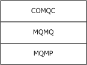

Figure 5: Example of a queuing transport stack

If the ORB provides a facility for exposing components via queuing,<46> the following SHOULD be used to configure this facility:

- The IsQueued, QCListenerEnabled, QCListenerMaxThreads, and QCAuthenticateMsgs properties of the Conglomerations table, as specified in section 3.1.1.3.6.
- The IsQueueable and QueueingSupported properties of the ConfiguredInterfaces table, as specified in section [3.1.1.3.11](#Section_3.1.1.3.11).
Finally, the following SHOULD be managed as ORB-wide configuration of transport protocols:

- The EnableDCOM, EnableCIS, PortsInternetAvailable, UseInternetPorts, and RpcProxyEnabled properties of the MachineSettings table, as specified in section [3.1.1.3.8](#Section_3.1.1.3.8).
- The Protocols table, as specified in section [3.1.1.3.26](#Section_3.1.1.3.26).
<a id="Section_3.1.1.1.6"></a>
##### 3.1.1.1.6 Instance Load Balancing

If the [**ORB**](#gt_object-request-broker-orb) provides [**instance load balancing**](#gt_instance-load-balancing),<47> the following SHOULD be used to configure this facility:

- The LoadBalancingSupported property of the ComponentsAndFullConfigurations table, as specified in section [3.1.1.3.1](#Section_3.1.1.3.19).
- The LoadBalancingCLSID property of the MachineSettings table, as specified in section [3.1.1.3.8](#Section_3.1.1.3.8).
<a id="Section_3.1.1.1.7"></a>
##### 3.1.1.1.7 Configured Proxies

A [**configured proxy**](#gt_configured-proxy) is a preferred client configuration for a [**component**](#gt_component) or [**conglomeration**](#gt_conglomeration) provided by another [**ORB**](#gt_object-request-broker-orb). If the ORB provides a facility for configured proxies,<48> the following SHOULD be used to configure this facility:

- The ServerName and IsProxyApp properties of the Conglomerations table, as specified in section [3.1.1.3.6](#Section_3.1.1.3.6).
- The RemoteServerName property of the MachineSettings table, as specified in section [3.1.1.3.8](#Section_3.1.1.3.8).
<a id="Section_3.1.1.1.8"></a>
##### 3.1.1.1.8 Transport Security

If the [**ORB**](#gt_object-request-broker-orb) enables security parameters of supported transport protocols to be configured, the following SHOULD be used to configure this facility:

- The LaunchPermissions, AccessPermissions, and AuthenticationLevel properties of the ComponentLegacyConfigurations table, as specified in section [3.1.1.3.3](#Section_3.1.1.3.3).
- The Authentication, ImpersonationLevel, AuthenticationCapability, and QCAuthenticateMsgs properties of the Conglomerations table, as specified in section [3.1.1.3.6](#Section_3.1.1.3.6).
- The DefaultAuthenticationLevel, DefaultImpersonationLevel, EnableSecurityTracking, and EnableSecureReferences properties of the MachineSettings table, as specified in section [3.1.1.3.8](#Section_3.1.1.3.8).
<a id="Section_3.1.1.1.9"></a>
##### 3.1.1.1.9 Software Restriction Policy

Software restriction policy is an [**ORB**](#gt_object-request-broker-orb) facility that enables a numerical [**trust level**](#gt_trust-level) to be assigned to [**components**](#gt_component). The trust level represents the degree of [**trust**](#gt_trust) that is associated with a component and is used in an ORB-specific manner to control instantiation of components. If the target ORB provides a configurable software restriction policy, the server SHOULD expose the supported set of trust levels to clients via the [ICatalogUtils::EnumerateSRPLevels](#Section_3.1.4.17) method (as specified in section 3.1.4.18.8), and the following SHOULD be used to configure this facility:

- The SRPLevel property of the ComponentLegacyConfigurations table, as specified in section [3.1.1.3.3](#Section_3.1.1.3.3).
- The SRPLevel and SRPEnabled properties of the Conglomerations table, as specified in section [3.1.1.3.6](#Section_3.1.1.3.6).
- The SaferActivateAsActivatorChecks and SaferRunningObjectChecks properties of the MachineSettings table, as specified in section [3.1.1.3.8](#Section_3.1.1.3.8).
<a id="Section_3.1.1.1.10"></a>
##### 3.1.1.1.10 Crash Dump

If the target [**ORB**](#gt_object-request-broker-orb) provides a facility to automatically collect debugging data, known as a crash dump, when an [**instance container**](#gt_instance-container) encounters an exceptional condition at run time, the following SHOULD be used to configure this facility:

- The DumpEnabled, DumpOnException, DumpOnFailfast, MaxDumpCount, and DumpPath properties of the [Conglomerations table (section 3.1.1.3.6)](#Section_3.1.1.3.6).
<a id="Section_3.1.1.1.11"></a>
##### 3.1.1.1.11 Partitions and Users

If the target [**ORB**](#gt_object-request-broker-orb) has facilities that require users to be associated with [**partitions**](#gt_partition), for example, to assign each user a default partition, the following SHOULD be used to configure this facility:

- The PartitionUsers (as specified in section [3.1.1.3.16](#Section_3.1.1.3.16)), PartitionRoles (as specified in section [3.1.1.3.17](#Section_3.1.1.3.17)), and PartitionRoleMembers tables (as specified in section [3.1.1.3.18](#Section_3.1.1.3.18)).
In addition, if the target ORB has the ability to associate users with partitions that are based on either local configuration or configuration that is managed by an active directory, the following SHOULD be used to configure this facility:

- The LocalPartitionLookupEnabled and DSPartitionLookupEnabled properties of the MachineSettings table, as specified in section [3.1.1.3.8](#Section_3.1.1.3.8).
An ORB that uses an active directory in this manner might keep a local cache of user-partition associations. These associations are not exposed in the COMA [**catalog**](#gt_catalog), but the method [ICatalogUtils2::FlushPartitionCache](#Section_3.1.4.18), as specified in section 3.1.4.18.7, enables clients to flush a server's cache in case this information is stale.

<a id="Section_3.1.1.1.12"></a>
##### 3.1.1.1.12 System Services

If the target [**ORB**](#gt_object-request-broker-orb) has a facility that enables [**components**](#gt_component) to be instantiated in the context of a system service or daemon, the following SHOULD be used to configure this facility:

- The ServiceName and ServiceParameters properties of the ComponentLegacyConfigurations table, as specified in section [3.1.1.3.3](#Section_3.1.1.3.3).
- Alternate launch configurations, as specified in section [3.1.1.4](#Section_3.1.1.4).
<a id="Section_3.1.1.2"></a>
#### 3.1.1.2 Tables

The [**catalog**](#gt_catalog) that is managed by the catalog server is organized as a set of tables. A table is a set of entries, each of which represents a configurable object or a relationship between objects. With the exception of the ComponentsAndFullConfigurations table, all the entries in a specific table represent either objects of the same type or relationships between objects of the same types. For historical reasons, the ComponentsAndFullConfigurations table contains entries that represent two different types of objects: [**unconfigured components**](#gt_unconfigured-component) and [**component full configuration entries**](#gt_component-full-configuration-entry). Each table is identified by a [**GUID**](#gt_globally-unique-identifier-guid), known as the table identifier.

An entry is a list of typed properties. Each table has a schema, which specifies the properties that are present in each entry in the table, and an order for interchange in methods that read and write to tables. The schemas for each table are listed in the table definitions (see section [3.1.1.3](#Section_3.1.1.3)).

Except where otherwise noted, the catalog tables are persistent; in other words, they retain their state between sessions.

<a id="Section_3.1.1.2.1"></a>
##### 3.1.1.2.1 Table Metadata

Each table has associated metadata, which can be retrieved by a client by calling [ICatalogTableInfo::GetClientTableInfo](#Section_3.1.4.7.1) (see section 3.1.4.7.1). Table metadata consists of the table's schema, and for historical reasons, an optional AuxiliaryGuid value. This metadata is specified in each table's definition (see section [3.1.1.3](#Section_3.1.1.3)).

<a id="Section_3.1.1.2.2"></a>
##### 3.1.1.2.2 Supported Queries

When reading from or writing to a table, and for historical reasons, when requesting a table's metadata, clients provide a query, which selects a subset of the entries in the table according to constraints on a set of properties in the table. Each table's definition (see section [3.1.1.3](#Section_3.1.1.3)) includes a list of one or more query templates, or rules for constructing a query on that table. A query that is constructed according to a query template that is listed in a table's definition is known as a supported query for that table.

<a id="Section_3.1.1.2.3"></a>
##### 3.1.1.2.3 Multiple-Bitness Support

A COMA server that supports [**catalog**](#gt_catalog) version 4.00 or catalog version 5.00 MAY<49> support the configuration of multiple [**bitnesses**](#gt_bitness) for [**components**](#gt_component). If a server supports this capability, then for historical reasons 64-bit component bitness is said to be "native bitness" and 32-bit component bitness is said to be "non-native bitness" If a server does not support this capability, the single bitness that is supported by the server is said to be "native bitness".

A COMA server that supports multiple bitnesses has an additional table: the ComponentNonNativeBitness table, which is not defined for servers that do not support this capability. In addition, for historical reasons, the ComponentsAndFullConfigurations table has a "hidden" component bitness property, which is not present in the representation of the table's entries on the wire. The hidden component bitness property, when defined, has a value of either 32-bit or 64-bit.

<a id="Section_3.1.1.2.4"></a>
##### 3.1.1.2.4 Table Flags

For historical reasons, a COMA server that supports multiple [**bitnesses**](#gt_bitness) accepts and assigns special meaning to the values of the fTableFlags type (see section [2.2.1.1](#Section_2.2.1.1)) for reads from and writes to certain tables. A COMA server that does not support multiple bitnesses does not assign special meaning to these flags and ignores them.

For the ComponentsAndFullConfigurations table, these flags are used to select entries based on the hidden bitness property.

For the ComponentNativeBitness and ComponentNonNativeBitness tables, these flags serve only as a consistency check (required to have the values fTABLE_64BIT and fTABLE_32BIT, respectively).

For other tables, only the value zero is supported for table flags.

<a id="Section_3.1.1.2.5"></a>
##### 3.1.1.2.5 Constraints

The table definitions specify constraints on properties other than those that are implied by their type, size, and flags. All COMA servers MUST ensure that their [**catalog**](#gt_catalog) conforms to these constraints.

For the purposes of this protocol, two types of constraints can be distinguished: referential and nonreferential. Referential constraints restrict the legal values of a property in an entry based on properties of other entries, including possibly entries in other tables (for example, constraints that reflect containment relationships). Nonreferential constraints restrict the legal values of a property independently of the properties of any other entries (for example, a range of legal values for a configuration property).

An important class of referential constraints is primary key constraints. Each table definition specifies a set of properties in the table as its primary key. Entries are constrained so that an entry is uniquely identified by its values for the primary key properties. In other words, there exists at most one entry in the table with any given value assignment to all the values in the primary key.

A COMA server MAY enforce implementation-specific, nonreferential constraints, as long as these constraints are more restrictive than those that are specified in the table definitions. For example, a server MAY constrain an unused property to a default value. The [ICatalogTableWrite::WriteTable](#Section_3.1.4.9) (see section 3.1.4.9.1) method specifies a mechanism by which a server can return TableDetailedError records (see section [2.2.1.16](#Section_2.2.1.16)) to indicate to the client the reason for a failed write. If a server enforces implementation-specific constraints more restrictive than those that are specified in the table definitions, it SHOULD return TableDetailedError records for writes that fail due to these more restrictive constraints.

A COMA server MUST NOT enforce any referential constraints except those that are specified in the table definitions.

<a id="Section_3.1.1.2.6"></a>
##### 3.1.1.2.6 Default Values

The following changes to the [**catalog**](#gt_catalog) require the server to set properties to implementation-specific default values:

- Adding an entry to a table in a call to [ICatalogTableWrite::WriteTable](#Section_3.1.4.9) (section 3.1.4.9.1).
- Creating a [**component full configuration entry**](#gt_component-full-configuration-entry) as part of [**registration**](#gt_registration) in a call to [IRegister::RegisterModule](#Section_3.1.4.10) (section 3.1.4.10.1) or [IRegister2::RegisterModule2](#Section_3.1.4.11) (section 3.1.4.11.4).
- Creating a [**component configuration entry**](#gt_component-configuration-entry) in a call to [IRegister2::CreateFullConfiguration](#Section_3.1.4.11) (section 3.1.4.11.1) or [IRegister2::CreateLegacyConfiguration](#Section_3.1.4.11) (section 3.1.4.11.2).
- Converting a [**component legacy configuration entry**](#gt_component-legacy-configuration-entry) into a component full configuration entry in a call to [IRegister2::PromoteLegacyConfiguration](#Section_3.1.4.11) (section 3.1.4.11.3).
A server is free to choose any default values for properties as long as they conform to the constraints that are specified in the table definitions.

<a id="Section_3.1.1.2.7"></a>
##### 3.1.1.2.7 Internal Properties

For historical reasons, there are properties in some of the tables that are intended for internal use only and that do not affect interoperability. A COMA server MAY<50> use these properties for implementation-specific purposes. Internal properties also implicitly disallow writes by the client, although whether a server enforces this is implementation-specific.<51> **Internal properties** are specified as such in the table definitions.

<a id="Section_3.1.1.2.8"></a>
##### 3.1.1.2.8 Write Restrictions

Some tables do not support specific types of writes (add, update, or remove) or disallow writes altogether. The write operations that are supported by each table are specified in its definition.

Additionally, some tables have restrictions on which entries can be legally modified, based on properties such as the Changeable entry in the Conglomerations table. Where such restrictions exist for a table, they are specified in its definition.

Finally, some properties are read-only, even when the entry allows updates. Read-only properties for a table that otherwise allows updates are specified in the table definition.

<a id="Section_3.1.1.2.9"></a>
##### 3.1.1.2.9 Triggers

A COMA server MAY<52> modify properties of entries automatically as the result of another property being modified; for example, to enforce configuration dependencies that a client might not have detected. Such behavior is known as a **trigger**. A property whose modification causes other properties to be modified is known as the *triggering property* of a trigger, and any properties so modified are known as *triggered properties*.

The following restrictions apply to triggers:

- Some properties cannot be triggered; in other words, they MUST NOT be triggered. Properties that cannot be triggered are specified as such in the table definitions.
- With the exception of internal properties, for which this document does not specify any restrictions on how they are used, a triggered property MUST be a property of the same entry as the triggering property.
- A server MAY<53> apply multiple triggers in a write operation to a single entry. However, if multiple triggers modify the same triggered property, all triggers MUST cause an identical, idempotent modification to the triggered property. For example, multiple triggers might have the effect of setting a property to TRUE if more than one property has a configuration dependency on the property.
For the purposes of describing the behavior of the [ICatalogTableWrite::WriteTable](#Section_3.1.4.9) method (see section 3.1.4.9.1), the following additional restriction applies to how triggers are performed. If a write explicitly updates a property and the property is also triggered by an update to another property, the server MUST do one of the following:

- The server MAY disallow such a write and fail the call, in which case the server SHOULD return TableDetailedError records, as specified in section [2.2.1.16](#Section_2.2.1.16), to indicate to the client why the write failed.
- The server MAY<54> perform the modifications in a trigger-consistent order. A trigger-consistent order is defined as an order in which, for all triggers, the triggered properties are ordered before the triggering property. In other words, the trigger overwrites the explicit modification.
<a id="Section_3.1.1.2.10"></a>
##### 3.1.1.2.10 Cascades

Many of the referential constraints that are specified in the table definitions reflect containment relationships (for example, a [**component configuration entry**](#gt_component-configuration-entry) is contained in a [**conglomeration**](#gt_conglomeration)). Removing an entry from a table, where that entry represents a container in a containment relationship, causes all the contained entries to be removed. This recursive process is known as a **cascade**. Each table definition specifies what cascades, if any, are performed as a result of removing an entry.

<a id="Section_3.1.1.2.11"></a>
##### 3.1.1.2.11 Populates

The PartitionRoles table, which does not support writes, MAY<55> be populated with entries when a new entry is added to the Partitions table. See the definition of the Partitions table (section [3.1.1.3.7](#Section_3.1.1.3.7)) for a specification of this populate.

<a id="Section_3.1.1.3"></a>
#### 3.1.1.3 Table Definitions

The following sections specify the schemas and other information for the tables used by COMA. These definitions cover all [**catalog**](#gt_catalog) versions, but when differences exist between versions, these differences are called out. Each table definition has the following information:

**Table identifier:** The [**GUID**](#gt_globally-unique-identifier-guid) for the table.

**AuxiliaryGuid**: An additional GUID that is returned by [IClientTableInfo::GetClientTableInfo (section 3.1.4.7.1)](#Section_3.1.4.7.1), if this table specifies such a value.

**Defined in catalog version:** The catalog versions for which the table is defined.

**Prerequisites:** Restrictions, other than catalog version, on when the table is defined.

**Hidden bitness property:** Specifies whether the table defines a hidden [**bitness**](#gt_bitness) property.

**Supported query templates:** A set of templates from which supported queries can be constructed. Each template is a list of cells, with parameters supplied by the client indicated by <A>, <B>, etc. Empty queries (no query cells) are listed as "Empty query". See [QueryCellArray (section 2.2.1.5)](#Section_2.2.1.4) and [QueryComparisonData (section 2.2.1.6)](#Section_2.2.1.6) for more details about how queries are represented.

**Primary key**: The set of properties in the primary key.

**Other referential constraints:** Referential constraints on table entries besides the primary key constraint (nonreferential constraints are specified in the individual property definitions).

**Write restrictions:** Specifies which types of writes (add, update, remove), if any, are supported by the table, and optionally additional restrictions on which entries can be legally modified.

**Cascade:** Specifies the cascade that MUST be performed when an entry is removed from the table.

**Populate:** Specifies the populate that MAY be performed when an entry is added to the table.

**Properties:** The table's schema, as returned by IClientTableInfo::GetClientTableInfo, and additional information about its properties. This is specified in a tabular format similar to the following example, followed by descriptions of each of the properties.

| Bit Range | Field | Description |
| --- | --- | --- |
| Variable | 0 | 0 ExampleProp1 eDT_GUID 16 0x00000003 RO |
| Variable | - | 1 ExampleProp2 eDT_LPWSTR variable 0x00000000 IN, NT |
| Variable | 1 | 2 ExampleProp3 eDT_ULONG 4 0x00000002 TR |

**Index (versions):** The zero-based index of a property in the table for a particular catalog version or set of catalog versions. The index values specify the order in which properties are exchanged with the reads from the table or the writes to the table. They are additionally used as unique identifiers for properties in [QueryCell (section 2.2.1.4)](#Section_2.2.1.4) structures and [TableDetailedError (section 2.2.1.16)](#Section_2.2.1.16) records. If a property has a dash in the index column for a catalog version, this indicates that the property is not defined for that version.

**Property name:** A descriptive identifier for the property. These identifiers are used throughout this document to refer to a particular property in a table, but they are not used on the wire.

**Type:** The [eDataType (section 2.2.1.2)](#Section_2.2.1.2) value that specifies the type of the property. This value MUST be used for the [dataType](#Section_2.2.1.7) field of the PropertyMeta (section 2.2.1.7) structure for this property.

**Size:** The size of the property (fixed size or maximum size). See PropertyMeta for more details about the meaning of this size and how it is represented.

**Flags:** The value that MUST be used in the Flags field of the PropertyMeta structure for this property. See PropertyMeta for more details about these flags.

**Meta:** A list of meta properties that are not implied by Flags. The following mnemonics are used.

| Mnemonic | Meaning |
| --- | --- |
| IN | The property is an internal property (section [3.1.1.2.7](#Section_3.1.1.2.7)). |
| RO | The property is read-only (section [3.1.1.2.8](#Section_3.1.1.2.8)). |
| TR | The property can be triggered (section [3.1.1.2.9](#Section_3.1.1.2.9)). |
| NT | The property requires the NoTouch bit (section [2.2.1.8](#Section_2.2.1.8)) to be set for writes to the table. |

<a id="Section_3.1.1.3.1"></a>
##### 3.1.1.3.1 ComponentsAndFullConfigurations Table

The entries in the ComponentsAndFullConfigurations table can be divided into two categories:

- Entries representing [**components**](#gt_component) (or component [**bitnesses**](#gt_bitness) on servers that support multiple bitnesses) that do not have [**component full configuration entries**](#gt_component-full-configuration-entry).
- Entries representing component full configuration entries.
Both types of entries have the same schema. However, the semantics of these types of entries are different, as are the constraints on the values of their properties. This is specified in more detail in this section.

**Table identifier:** {6E38D3C8-C2A7-11D1-8DEC-00C04FC2E0C7}

**AuxiliaryGuid:** {B4B3AECB-DFD6-11D1-9DAA-00805F85CFE3}

**Defined in catalog version:** All [**catalog**](#gt_catalog) versions.

**Prerequisites:** None.

**Hidden bitness property:** Yes (catalog version 4.00 and catalog version 5.00).

**Supported query templates**

| Cell 1 | Cell 2 |
| --- | --- |
| eSQO_OPTHINT equals 1 | ConglomerationIdentifier equals <A> |
| ConglomerationIdentifier equals null | InprocServerPath not equal to null |

**Primary key**

| Catalog version | Primary key properties |
| --- | --- |
| 3.00 | [**CLSID**](#gt_class-identifier-clsid) |
| 4.00/5.00 | Hidden component bitness property, CLSID, PartitionIdentifier, Reserved1, ConfigurationBitness |

For the purposes of constraints and the semantics of certain properties, it is important to make a distinction between the two types of entries. Entries that have the value [**GUID_NULL**](#gt_guid_null) for the ConglomerationIdentifier property represent components (or component bitnesses on servers that support multiple bitnesses) that do not have component full configurations on the server. Hereafter these are referred to as component*entries*. Entries that have a value other than GUID_NULL for the ConglomerationIdentifier property represent component full configurations (hereafter *full configuration entries*).

**Other referential constraints**

For simplicity, the constraints are expressed as if the hidden component bitness property is present on all servers that support catalog version 4.00 or catalog version 5.00. For these purposes, the hidden component bitness property can be thought of as having the fixed value of the single bitness supported by the server on servers that do not support multiple bitnesses.

The following constraints apply to component entries.

| Catalog version | Constraints | Notes |
| --- | --- | --- |
| 3.00 | If ProgID is not null, there MUST NOT exist another entry with an identical value for ProgID. | The ProgID is a unique identifier of a component for scripting environments. |
| 4.00/5.00 | Component entries MUST be uniquely identified by CLSID and hidden component bitness property. | Implied by constraints on PartitionIdentifier, Reserved1, and ConfigurationBitness properties for these entries. |
| 4.00/5.00 | There MUST NOT exist a full configuration entry in the table with identical values for CLSID and hidden component bitness property. | Entries represent components (or component bitnesses) that do not have component full configuration entries. |
| 4.00/5.00 | If ProgID is not null, there MUST NOT exist another entry with identical values for ProgID and hidden component bitness property. | The ProgID is a unique identifier of a component (or component bitness) for scripting environments. |

The following constraints apply to **component full configuration** entries.

| Catalog version | Constraints | Notes |
| --- | --- | --- |
| 3.00 | There MUST exist an entry in the Conglomerations table with an identical value for the ConglomerationIdentifier property. | Each component configuration entry is contained in a [**conglomeration**](#gt_conglomeration). |
| 3.00 | There MUST NOT exist an entry in the ComponentLegacyConfigurations table with identical CLSID. | A component (or component bitness) that has a [**component legacy configuration**](#gt_component-legacy-configuration-entry) can have no other [**component configuration entries**](#gt_component-configuration-entry). |
| 3.00 | If ProgID is not null, there MUST NOT exist another entry with an identical value for ProgID. | The ProgID is a unique identifier of a component for scripting environments. |
| 3.00 | If ServerInitializer is TRUE, the conglomeration identified by ConglomerationIdentifier MUST have the value 0x00000001 for the [**Activation**](#gt_activation) property. | The server initializer facility is intended for initialization of [**instance containers**](#gt_instance-container) created in a new [**process**](#gt_process). |
| 4.00/5.00 | There MUST exist an entry in the Conglomerations table with an identical value for the ConglomerationIdentifier property. | Each component configuration entry is contained in a conglomeration. |
| 4.00/5.00 | The matching entry in the Conglomerations table MUST have an identical value for the PartitionIdentifier property. | - |
| 4.00/5.00 | There MUST exist an entry in the Partitions table with an identical value for the PartitionIdentifier property. | - |
| 4.00/5.00 | Full configuration entries MUST be uniquely identified by CLSID and ConglomerationIdentifier. | Each component can have at most one component configuration entry in a conglomeration. |
| 4.00/5.00 | There MUST NOT exist another entry in the table with an identical value for the ConglomerationIdentifier property and a different value for the ConfigurationBitness property. | Each conglomeration contains component full configuration entries for a single bitness. |
| 4.00/5.00 | There MUST NOT exist an entry in the ComponentLegacyConfigurations table with identical values for the CLSID and ConfigurationBitness properties. | A component (or component bitness) that has a component legacy configuration entry can have no other component configuration entries. |
| 4.00/5.00 | There MUST NOT exist another entry in the table with identical CLSID and ConfigurationBitness for which the values of the InprocServerPath, ThreadingModel, ProgID, Description, VersionMajor, VersionMinor, VersionBuild, or VersionSubBuild properties have different values. | These properties represent static properties of the component (or component bitness), not the configuration. Note, however, that VersionMajor, VersionMinor, VersionBuild, or VersionSubBuild are not used for component entries. |
| 4.00/5.00 | If ProgID is not null, there MUST NOT exist another entry with identical values for ProgID and hidden component bitness property but a different value for CLSID. | The ProgID is a unique identifier of a component (or component bitness) for scripting environments. |
| 4.00/5.00 | If ServerInitializer is TRUE, the conglomeration identified by ConglomerationIdentifier MUST have the value 0x00000001 for the Activation property. | The server initializer facility is intended for initialization of instance containers created in a new process. |

**Write restrictions:** Add MUST NOT be supported. Update and remove MUST be supported if and only if:

- The conglomeration identified by ConglomerationIdentifier has the value "Y" for Changeable.
- The conglomeration identified by ConglomerationIdentifier has the value "N" for IsSystem.
- The [**partition**](#gt_partition) identified by PartitionIdentifier has the value "Y" for Changeable.
**Cascade:** On removal of a full configuration entry, all entries in the ConfiguredInterfaces table (section [3.1.1.3.11](#Section_3.1.1.3.11)) and RolesForComponent table (section [3.1.1.3.13](#Section_3.1.1.3.13)) tables that have identical values for CLSID property (catalog version 3.00), or CLSID, PartitionIdentifier, and ConfigurationBitness properties (catalog version 4.00) are removed.

**Populate:** N/A.

**Properties:**

| Bit Range | Field | Description |
| --- | --- | --- |
| Variable | 0 | 0 CLSID eDT_GUID 16 0x00000003 RO |
| Variable | 1 | 1 InprocServerPath eDT_LPWSTR variable 0x00000000 RO |
| Variable | 2 | 2 ThreadingModel eDT_ULONG 4 0x00000002 RO |
| Variable | 3 | 3 ProgID eDT_LPWSTR variable 0x00000000 RO |
| Variable | 4 | 4 Description eDT_LPWSTR variable 0x00000000 - |
| Variable | 5 | 5 Internal1 eDT_LPWSTR variable 0x00000000 IN |
| Variable | - | 6 PartitionIdentifier eDT_GUID 16 0x00000003 RO |
| Variable | - | 7 Reserved1 eDT_GUID 16 0x00000003 - |
| Variable | - | 8 ConfigurationBitness eDT_ULONG 4 0x00000003 RO |
| Variable | 6 | 9 ConglomerationIdentifier eDT_GUID 16 0x00000000 RO |
| Variable | 7 | 10 Internal2 eDT_GUID 16 0x00000000 IN |
| Variable | 8 | 11 VersionMajor eDT_ULONG 4 0x00000002 RO |
| Variable | 9 | 12 VersionMinor eDT_ULONG 4 0x00000002 RO |
| Variable | 10 | 13 VersionBuild eDT_ULONG 4 0x00000002 RO |
| Variable | 11 | 14 VersionSubBuild eDT_ULONG 4 0x00000002 RO |
| Variable | 12 | 15 Internal3 eDT_ULONG 4 0x00000002 IN |
| Variable | 13 | 16 ServerInitializer eDT_ULONG 4 0x00000002 TR |
| Variable | 14 | 17 Transaction eDT_ULONG 4 0x00000002 TR |
| Variable | 15 | 18 Synchronization eDT_ULONG 4 0x00000002 TR |
| Variable | 16 | 19 Internal4 eDT_ULONG 4 0x00000002 IN |
| Variable | 17 | 20 FlowWebServerProperties eDT_ULONG 4 0x00000002 TR |
| Variable | 18 | 21 FlowTransactionIntegratorProperties eDT_ULONG 4 0x00000002 TR |
| Variable | 19 | 22 JustInTimeActivation eDT_ULONG 4 0x00000002 TR |
| Variable | 20 | 23 ComponentAccessChecksEnabled eDT_ULONG 4 0x00000002 TR |
| Variable | 21 | 24 Internal5 eDT_BYTES variable 0x00000000 IN |
| Variable | 22 | 25 Internal6 eDT_GUID 16 0x00000000 IN |
| Variable | 23 | 26 MinPoolSize eDT_ULONG 4 0x00000002 TR |
| Variable | 24 | 27 MaxPoolSize eDT_ULONG 4 0x00000002 TR |
| Variable | 25 | 28 CreationTimeout eDT_ULONG 4 0x00000002 TR |
| Variable | 26 | 29 ConstructorString eDT_LPWSTR variable 0x00000000 TR |
| Variable | 27 | 30 ConfigurationFlags eDT_ULONG 4 0x00000002 TR |
| Variable | 28 | 31 Internal7 eDT_GUID 16 0x00000000 IN |
| Variable | 29 | 32 Reserved2 eDT_ULONG 4 0x00000002 - |
| Variable | 30 | 33 Internal8 eDT_LPWSTR variable 0x00000000 IN |
| Variable | 31 | 34 Internal9 eDT_GUID 16 0x00000000 IN |
| Variable | 32 | 35 ExceptionClass eDT_LPWSTR variable 0x00000000 TR |
| Variable | 33 | 36 Internal10 eDT_ULONG 4 0x00000002 IN |
| Variable | 34 | 37 Internal11 eDT_LPWSTR variable 0x00000000 IN |
| Variable | 35 | 38 Internal12 eDT_ULONG 4 0x00000002 IN |
| Variable | 36 | 39 Internal13 eDT_LPWSTR variable 0x00000020 IN |
| Variable | 37 | 40 Internal14 eDT_LPWSTR variable 0x00000000 IN |
| Variable | 38 | 41 Internal15 eDT_LPWSTR variable 0x00000020 IN |
| Variable | 39 | 42 Internal16 eDT_ULONG 4 0x00000002 IN |
| Variable | 40 | 43 IsEventClass eDT_ULONG 4 0x00000002 RO |
| Variable | 41 | 44 PublisherID eDT_LPWSTR variable 0x00000000 TR |
| Variable | 42 | 45 MultiInterfacePublisherFilterCLSID eDT_GUID 16 0x00000000 TR |
| Variable | 43 | 46 AllowInprocSubscribers eDT_ULONG 4 0x00000002 TR |
| Variable | 44 | 47 FireInParallel eDT_ULONG 4 0x00000002 TR |
| Variable | 45 | 48 Internal17 eDT_ULONG 4 0x00000002 IN |
| Variable | 46 | 49 Internal18 eDT_LPWSTR variable 0x00000000 IN |
| Variable | 47 | 50 TransactionTimeout eDT_ULONG 4 0x00000002 TR |
| Variable | 48 | 51 Internal19 eDT_ULONG 4 0x00000002 IN |
| Variable | - | 52 IsEnabled eDT_ULONG 4 0x00000002 - |
| Variable | - | 53 TransactionIsolationLevel eDT_ULONG 4 0x00000002 TR |
| Variable | - | 54 IsPrivateComponent eDT_ULONG 4 0x00000002 - |
| Variable | - | 55 SoapAssemblyName eDT_LPWSTR variable 0x00000000 TR |
| Variable | - | 56 SoapTypeName eDT_LPWSTR variable 0x00000000 TR |

In the previous table, internal properties (marked with IN in the Meta column) MUST NOT be written to or interpreted by the client. The server's use of these properties is implementation-specific because it does not affect interoperability.

**CLSID:** The CLSID of the component.<56>

**InprocServerPath:** If not null, an [ImplementationSpecificPathProperty (section 2.2.2.2)](#Section_2.2.2.2) providing a path to a [**module**](#gt_module) of the component (or component bitness) that is supported for full configuration.<57> For full configuration entries, it MUST NOT be null.

**ThreadingModel:** A [ThreadingModelEnumerationProperty (section 2.2.2.3.1)](#Section_2.2.2.3.1) representing the restrictions, if any, that the [**ORB**](#gt_object-request-broker-orb) is to place on the types of threads on which the instantiations of the component (or component bitness) will be hosted. <58>

**ProgID:** If not null, a [ScriptingProgramIdProperty (section 2.2.2.4)](#Section_2.2.2.4) of the component (or component bitness).<59> If not null, the character length of this property MUST be between 1 and 39.

**Description:** A [DescriptionProperty (section 2.2.2.7)](#Section_2.2.2.7) providing a human-readable description of the component (or component bitness).<60>

**PartitionIdentifier:** For component full configuration entries, the [**partition identifier**](#gt_partition-identifier) of the partition in which the configuration resides. For component entries, a [PlaceholderPartitionIdProperty (section 2.2.2.1.1)](#Section_2.2.2.1.1).

**Reserved1:** A [PlaceholderGuidProperty (section 2.2.2.1.2)](#Section_2.2.2.1.2).

**ConfigurationBitness:** For full configuration entries, a [BitnessProperty (section 2.2.2.5)](#Section_2.2.2.5) representing the bitness for which the component is configured in this component full configuration.<61> This value MUST represent the same bitness as the hidden bitness property. For component entries, a [PlaceholderIntegerProperty (section 2.2.2.1.4)](#Section_2.2.2.1.4).

**ConglomerationIdentifier:** For component full configuration entries, the [**conglomeration identifier**](#gt_conglomeration-identifier) of the conglomeration containing the configuration. For component entries, it MUST be GUID_NULL (this value indicates a component entry).

**VersionMajor:** For component full configuration entries, the application-specific major version of the component.<62> For component entries, a PlaceholderIntegerProperty.

**VersionMinor:** For component full configuration entries, the application-specific minor version of the component.<63> For component entries, a PlaceholderIntegerProperty.

**VersionBuild:** For component full configuration entries, the application-specific build version of the component.<64> For component entries, a PlaceholderIntegerProperty.

**VersionSubBuild:** For full configuration entries, the application-specific sub build version of the component.<65> For component entries, a PlaceholderIntegerProperty.

**ServerInitializer:** For component full configuration entries, a [BooleanProperty (section 2.2.2.9)](#Section_2.2.2.9) that indicates whether the component is to be activated by the ORB when an instance container is created for its containing conglomeration.<66> For component entries, a PlaceholderIntegerProperty.

**Transaction:** For full configuration entries, a [ContextFacilityProperty (section 2.2.2.8)](#Section_2.2.2.8) value indicating how, if at all, the ORB is to enable [**atomic transactions**](#gt_atomic-transaction) for the component.<67> It MUST be a ContextFacilityProperty (section 2.2.2.8). For component entries, a PlaceholderIntegerProperty.

**Synchronization:** For full configuration entries, a ContextFacilityProperty (section 2.2.2.8) value indicating how, if at all, the ORB is to provide synchronization to components that might not be thread safe.<68> It MUST be a ContextFacilityProperty (section 2.2.2.8). For component entries, a PlaceholderIntegerProperty.

**FlowWebServerProperties:** For full configuration entries, a BooleanProperty that indicates whether the ORB is to provide special services to [**component instances**](#gt_component-instance) if they were created within a context of a web server servicing a request.<69> It MUST be a BooleanProperty. For component entries, a PlaceholderIntegerProperty.

**FlowTransactionIntegratorProperties:** For full configuration entries, a BooleanProperty that indicates whether the ORB is to provide special services to component instances to interoperate with other **transaction managers** not native to the ORB.<70> For component entries, a PlaceholderIntegerProperty.

**JustInTimeActivation:** For full configuration entries, a BooleanProperty that indicates whether component instances are to be activated by the ORB only when a method call arrives.<71> For component entries, a PlaceholderIntegerProperty.

**ComponentAccessChecksEnabled:** For full configuration entries, a BooleanProperty that indicates whether component-level access checks (section [1.3.4](#Section_1.3.4)) are to be enabled for the component by the ORB.<72> For component entries, a PlaceholderIntegerProperty.

**MinPoolSize:** For full configuration entries, a [MinPoolSizeProperty (section 2.2.2.10.1)](#Section_2.2.2.10.1) indicating the minimum pool size for [**instance pooling**](#gt_instance-pooling) by the ORB.<73>It MUST be between 0x00000000 and 0x00100000 (decimal 1048576). For component entries, MUST be zero (placeholder value, no meaning). Note that this property is only meaningful if EnablePooling has the value TRUE.

**MaxPoolSize:** For full configuration entries, a [MaxPoolSizeProperty (section 2.2.2.10.2)](#Section_2.2.2.10.2) indicating the maximum pool size for instance pooling by the ORB.<74>For component entries, a PlaceholderIntegerProperty. Note that this property is only meaningful if EnablePooling has the value TRUE.

**CreationTimeout:** For full configuration entries, a [LongTimeoutInSecondsProperty (section 2.2.2.11.1)](#Section_2.2.2.11.1) indicating how long the ORB is to wait for a pooled component instance to complete its activation.<75> This property is only meaningful if EnablePooling has the value TRUE. For component entries, a PlaceholderIntegerProperty.

**ConstructorString:** For full configuration entries, an [ApplicationSpecificStringProperty (section 2.2.2.12)](#Section_2.2.2.12) to be used for configurable initialization as part of instantiation of the component by the ORB.<76> This property is only meaningful if EnableConstruction has the value TRUE. For component entries, a [PlaceholderStringProperty (section 2.2.2.1.3)](#Section_2.2.2.1.3).

**ConfigurationFlags:** For full configuration entries, a bit field used to configure different properties on the component, each of which is a [BooleanBitProperty (section 2.2.2.9.1)](#Section_2.2.2.9.1). For component entries, a PlaceholderIntegerProperty. ConfigurationFlags is specified as follows for full configuration entries.

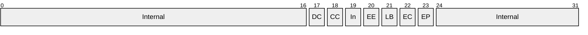

All bits marked Internal (or In) MUST NOT be interpreted by clients. (To modify any of the non-Internal bits in this bit field, as specified in section [3.2.4.5](#Section_3.2.4.5), clients are expected to first read the value of the bit field, construct a value with the non-Internal bits modified, and then write the result back to the server.) The server's use of these bits is implementation-specific as it does not affect interoperability.

- **MustRunInDefaultContext (DC):** For full configuration entries, a BooleanBitProperty that indicates whether the ORB is to restrict activation of the component such that it can only be activated in a default environment.<77> The definition of the default environment is ORB-specific.
- **MustRunInClientContext (CC):** For full configuration entries, a BooleanBitProperty that indicates whether the ORB is to restrict activation of the component such that it can only be activated in the client's environment. If an application requires this behavior for its component, it can set this property.<78>
- **EnableEvents (EE):** For full configuration entries, a BooleanBitProperty that indicates whether the ORB is to collect activity statistics for component instances.<79>
- **LoadBalancingSupported (LB):** For full configuration entries, a BooleanBitProperty that indicates whether the ORB is to provide [**instance load balancing**](#gt_instance-load-balancing) for the component.<80>
- **EnableConstruction (EC):** For full configuration entries, a BooleanBitProperty that indicates whether the ORB is to provide a configurable initialization for components during activation.<81>
- **EnablePooling (EP):** For full configuration entries, a BooleanBitProperty that indicates whether or not the ORB is to provide instance pooling for the component.<82>
**Reserved2:** A PlaceholderIntegerProperty.

**ExceptionClass:** For full configuration entries, an [ORBSpecificExceptionClassProperty (section 2.2.2.13.1)](#Section_2.2.2.13.1) to be used in creating an exception-handling object if an error condition occurs while the ORB is servicing method calls to the component.<83> For component entries, a PlaceholderStringProperty.

**IsEventClass:** For full configuration entries, a BooleanProperty that indicates whether the component is an [**event class**](#gt_event-class) that can be used in a [**publisher-subscriber framework**](#gt_publisher-subscriber-framework).<84> For component entries, a PlaceholderIntegerProperty.

**PublisherID:** For full configuration entries, a [NameProperty](#Section_2.2.2.6) (section 2.2.2.2) providing a unique identifier for a [**publisher**](#gt_publisher) in a publisher-subscriber framework provided by the ORB, or null to indicate that the configuration is not a publisher.<85> If not null, IsEventClass must have the value TRUE (0x00000001). For component entries, a PlaceholderStringProperty.

**MultiInterfacePublisherFilterCLSID:** For full configuration entries, a CLSID of a component that provides filtering for [**events**](#gt_event) in a publisher-subscriber framework provided by the ORB, or GUID_NULL to indicate that the configuration does not use such a filter component.<86> If not GUID_NULL, PublisherID MUST NOT be null. For component entries, a PlaceholderGuidProperty (section 2.2.2.1.2).

**AllowInprocSubscribers:** For full configuration entries, a BooleanProperty that indicates whether a publisher allows [**subscriber**](#gt_subscriber) components to be instantiated in its process.<87> This property is only meaningful if IsEventClass has the value TRUE. For component entries, a PlaceholderIntegerProperty.

**FireInParallel:** For full configuration entries, a BooleanProperty that indicates whether subscribers will be notified of events from this event class in parallel (as opposed to serially).<88> This property has no meaning if the component is not an event class. If TRUE, IsEventClass MUST have the value TRUE. For component entries, a PlaceholderIntegerProperty.

**TransactionTimeout:** For full configuration entries, a LongTimeoutInSecondsProperty indicating how long the ORB is to allow the component to run with a specific transaction before it is forcibly aborted.<89> For component entries, a PlaceholderIntegerProperty.

**IsEnabled:** For full configuration entries, a BooleanProperty that indicates whether the ORB is to enable instantiation of the component.<90> For component entries, a PlaceholderIntegerProperty.

**TransactionIsolationLevel:** For full configuration entries, a [TransactionIsolationLevelProperty (section 2.2.2.14)](#Section_2.2.2.14) the ORB is use when managing atomic transactions for the component (or component bitness).<91> For component entries, a PlaceholderIntegerProperty.

**IsPrivateComponent:** For full configuration entries, a BooleanProperty that indicates whether or not instantiation of the component is to be scoped by the ORB so that only components in the same conglomeration can instantiate it.<92> For component entries, a PlaceholderIntegerProperty.

**SoapAssemblyName:** For full configuration entries, an [ORBSpecificModuleIdentifierProperty (section 2.2.2.13.2)](#Section_2.2.2.13.2) for a module to be used by the ORB to expose the component as a SOAP [[SOAP1.1]](https://go.microsoft.com/fwlink/?LinkId=90520) [**endpoint**](#gt_endpoint). In order to provide such a feature, an ORB MAY need a module to interpret calls from SOAP to the component. If an application wishes to use this feature, it can set this property.<93> This property has no meaning if not specified in conjunction with **SoapTypeName** field. For component entries, a PlaceholderStringProperty.

**SoapTypeName:** For full configuration entries, an [ORBSpecificTypeIdentifierProperty (section 2.2.2.13.3)](#Section_2.2.2.13.3) for the type name used by the ORB to locate an entity in the module specified by the SoapAssemblyName, to be used by the ORB to expose the component as a SOAP [SOAP1.1] endpoint. If an application wishes to use this feature, it can set this property.<94> This property has no meaning if not specified in conjunction with the SoapAssemblyName property. For component entries, a PlaceholderStringProperty.

<a id="Section_3.1.1.3.2"></a>
##### 3.1.1.3.2 ComponentFullConfigurationsReadOnly Table

The entries in the ComponentFullConfigurationsReadOnly table represent [**component full configurations**](#gt_component-full-configuration-entry). This table contains copies of component full configuration properties from entries in the ComponentsAndFullConfigurations table. It MUST be read-only.

**Table identifier:** {6E38D3CA-C2A7-11D1-8DEC-00C04FC2E0C7}

**AuxiliaryGuid:** None.

**Defined in catalog version:** All [**catalog**](#gt_catalog) versions.

**Prerequisites:** None.

**Hidden bitness property:** No.

**Supported query templates:**

| Cell 1 |
| --- |
| ConglomerationIdentifier equals <A> |

**Primary key:**

| Catalog version | Primary key properties |
| --- | --- |
| 3.00 | [**CLSID**](#gt_class-identifier-clsid) |
| 4.00/5.00 | Hidden component [**bitness**](#gt_bitness) property, CLSID, PartitionIdentifier, Reserved1, ConfigurationBitness |

**Other referential constraints:** For each entry, there MUST exist an entry in the ComponentsAndFullConfigurationsTable for which the values of all common properties (indicated by the same property name) have identical values.

**Write restrictions:** No writes supported.

**Cascade:** N/A.

**Populate:** N/A.

**Properties:**

| Bit Range | Field | Description |
| --- | --- | --- |
| Variable | 0 | 0 CLSID eDT_GUID 16 0x00000003 RO |
| Variable | - | 1 PartitionIdentifier eDT_GUID 16 0x00000003 RO |
| Variable | - | 2 Reserved1 eDT_GUID 16 0x00000003 RO |
| Variable | - | 3 ConfigurationBitness eDT_ULONG 4 0x00000003 RO |
| Variable | 1 | 4 ConglomerationIdentifier eDT_GUID 16 0x00000000 RO |
| Variable | 2 | 5 Internal2 eDT_GUID 16 0x00000000 RO, IN |
| Variable | 3 | 6 VersionMajor eDT_ULONG 4 0x00000002 RO |
| Variable | 4 | 7 VersionMinor eDT_ULONG 4 0x00000002 RO |
| Variable | 5 | 8 VersionBuild eDT_ULONG 4 0x00000002 RO |
| Variable | 6 | 9 VersionSubBuild eDT_ULONG 4 0x00000002 RO |
| Variable | 7 | 10 Internal3 eDT_ULONG 4 0x00000002 RO, IN |
| Variable | 8 | 11 ServerInitializer eDT_ULONG 4 0x00000002 RO |
| Variable | 9 | 12 Transaction eDT_ULONG 4 0x00000002 RO |
| Variable | 10 | 13 Synchronization eDT_ULONG 4 0x00000002 RO |
| Variable | 11 | 14 Internal4 eDT_ULONG 4 0x00000002 RO, IN |
| Variable | 12 | 15 FlowWebServerProperties eDT_ULONG 4 0x00000002 RO |
| Variable | 13 | 16 FlowTransactionIntegratorProperties eDT_ULONG 4 0x00000002 RO |
| Variable | 14 | 17 JustInTimeActivation eDT_ULONG 4 0x00000002 RO |
| Variable | 15 | 18 ComponentAccessChecksEnabled eDT_ULONG 4 0x00000002 RO |
| Variable | 16 | 19 Internal5 eDT_BYTES variable 0x00000000 RO, IN |
| Variable | 17 | 20 Internal6 eDT_GUID 16 0x00000000 RO, IN |
| Variable | 18 | 21 MinPoolSize eDT_ULONG 4 0x00000002 RO |
| Variable | 19 | 22 MaxPoolSize eDT_ULONG 4 0x00000002 RO |
| Variable | 20 | 23 CreationTimeout eDT_ULONG 4 0x00000002 RO |
| Variable | 21 | 24 ConstructorString eDT_LPWSTR variable 0x00000000 RO |
| Variable | 22 | 25 ConfigurationFlags eDT_ULONG 4 0x00000002 RO |
| Variable | 23 | 26 Internal7 eDT_GUID 16 0x00000000 RO, IN |
| Variable | 24 | 27 Reserved2 eDT_ULONG 4 0x00000002 RO |
| Variable | 25 | 28 Internal8 eDT_LPWSTR variable 0x00000000 RO, IN |
| Variable | 26 | 29 Internal9 eDT_GUID 16 0x00000000 RO, IN |
| Variable | 27 | 30 ExceptionClass eDT_LPWSTR variable 0x00000000 RO |
| Variable | 28 | 31 Internal10 eDT_ULONG 4 0x00000002 RO, IN |
| Variable | 29 | 32 Internal11 eDT_LPWSTR variable 0x00000000 RO, IN |
| Variable | 30 | 33 Internal12 eDT_ULONG 4 0x00000002 RO, IN |
| Variable | 31 | 34 Internal13 eDT_LPWSTR variable 0x00000020 RO, IN |
| Variable | 32 | 35 Internal14 eDT_LPWSTR variable 0x00000000 RO, IN |
| Variable | 33 | 36 Internal15 eDT_LPWSTR variable 0x00000020 RO, IN |
| Variable | 34 | 37 Internal16 eDT_ULONG 4 0x00000002 RO, IN |
| Variable | 35 | 38 IsEventClass eDT_ULONG 4 0x00000002 RO |
| Variable | 36 | 39 PublisherID eDT_LPWSTR variable 0x00000000 RO |
| Variable | 37 | 40 MultiInterfacePublisherFilterCLSID eDT_GUID 16 0x00000000 RO |
| Variable | 38 | 41 AllowInprocSubscribers eDT_ULONG 4 0x00000002 RO |
| Variable | 39 | 42 FireInParallel eDT_ULONG 4 0x00000002 RO |
| Variable | 40 | 43 Internal17 eDT_ULONG 4 0x00000002 RO, IN |
| Variable | 41 | 44 Internal18 eDT_LPWSTR variable 0x00000000 RO, IN |
| Variable | 42 | 45 TransactionTimeout eDT_ULONG 4 0x00000002 RO |
| Variable | 43 | 46 Internal19 eDT_ULONG 4 0x00000002 RO, IN |
| Variable | - | 47 IsEnabled eDT_ULONG 4 0x00000002 RO |
| Variable | - | 48 TransactionIsolationLevel eDT_ULONG 4 0x00000002 RO |
| Variable | - | 49 IsPrivateComponent eDT_ULONG 4 0x00000002 RO |
| Variable | - | 50 SoapAssemblyName eDT_LPWSTR variable 0x00000000 RO |
| Variable | - | 51 SoapTypeName eDT_LPWSTR variable 0x00000000 RO |

In the previous table, internal properties (marked with IN in the Meta column) MUST NOT be written to or interpreted by the client. The server's use of these properties is implementation-specific because it does not affect interoperability.

<a id="Section_3.1.1.3.3"></a>
##### 3.1.1.3.3 ComponentLegacyConfigurations Table

The entries in the ComponentLegacyConfigurations table represent [**component legacy configurations**](#gt_component-legacy-configuration-entry).

**Table identifier:** {09487519-892D-4CA0-A00B-58EEB1662A68}

**AuxiliaryGuid:** None.

**Present in catalog version:** 4.00 and 5.00.

**Prerequisites:** None.

**Hidden bitness property:** No.

**Supported query templates:**

| Cell 1 |
| --- |
| ConglomerationIdentifier equals <A> |

**Primary key:** [**CLSID**](#gt_class-identifier-clsid), ConfigurationBitness.

**Other referential constraints:** There MUST NOT exist an entry in the ComponentsAndFullConfigurations table with identical values for CLSID and ConfigurationBitness properties.

**Write restrictions:** Add MUST NOT be supported.

Update and remove MUST be supported if and only if:

- The [**conglomeration**](#gt_conglomeration) identified by ConglomerationIdentifier has the value "Y" for Changeable.
- The conglomeration identified by ConglomerationIdentifier has the value "N" for IsSystem.
**Cascade:** None.

**Populate:** N/A.

**Properties:**

| Bit Range | Field | Description |
| --- | --- | --- |
| Variable | 0 | CLSID eDT_GUID 16 0x00000001 RO |
| Variable | 1 | ConfigurationBitness eDT_ULONG 4 0x00000003 RO |
| Variable | 2 | Description eDT_LPWSTR variable 0x00000000 - |
| Variable | 3 | ProgID eDT_LPWSTR variable 0x00000000 RO |
| Variable | 4 | InprocServerPath eDT_LPWSTR variable 0x00000000 RO |
| Variable | 5 | InprocHandlerPath eDT_LPWSTR variable 0x00000000 RO |
| Variable | 6 | ThreadingModel eDT_LPWSTR variable 0x00000000 RO |
| Variable | 7 | LocalServerPath eDT_LPWSTR variable 0x00000000 RO |
| Variable | 8 | IsEnabled eDT_ULONG 4 0x00000002 - |
| Variable | 9 | ConglomerationIdentifier eDT_GUID 16 0x00000000 RO |
| Variable | 10 | Internal1 eDT_ULONG 4 0x00000000 IN |
| Variable | 11 | LegacyConglomerationIdentifier eDT_GUID 16 0x00000000 RO |
| Variable | 12 | Name eDT_LPWSTR variable 0x00000000 RO |
| Variable | 13 | RemoteServerName eDT_LPWSTR variable 0x00000000 - |
| Variable | 14 | ServiceName eDT_LPWSTR variable 0x00000000 - |
| Variable | 15 | ServiceParameters eDT_LPWSTR variable 0x00000000 - |
| Variable | 16 | SurrogatePath eDT_LPWSTR variable 0x00000000 - |
| Variable | 17 | RunAs eDT_LPWSTR variable 0x00000000 - |
| Variable | 18 | Password eDT_LPWSTR variable 0x00000000 - |
| Variable | 19 | ActivateAtStorage eDT_LPWSTR 4 0x00000004 - |
| Variable | 20 | LaunchPermissions eDT_BYTES variable 0x00000000 - |
| Variable | 21 | AccessPermissions eDT_BYTES variable 0x00000000 - |
| Variable | 22 | AuthenticationLevel eDT_ULONG 4 0x00000000 - |
| Variable | 23 | SRPLevel eDT_ULONG 4 0x00000000 - |

In the previous table, internal properties (marked with IN in the Meta column) MUST NOT be written to or interpreted by the client. The server's use of these properties is implementation-specific because it does not affect interoperability.

**CLSID:** The CLSID of the [**component**](#gt_component).<95>

**ConfigurationBitness:** A [BitnessProperty (section 2.2.2.5)](#Section_2.2.2.5) representing the [**bitness**](#gt_bitness) configured for the component.<96>

**Description:** A [DescriptionProperty (section 2.2.2.7)](#Section_2.2.2.7) providing a human-readable description of the component.<97>

**ProgID:** If not null, a [ScriptingProgramIdProperty (section 2.2.2.4)](#Section_2.2.2.4) of the component (or component bitness).<98>

**InprocServerPath:** If not null, an [ImplementationSpecificPathProperty (section 2.2.2.2)](#Section_2.2.2.2) providing a path to a module of the component that is supported for full configuration.<99>

**InprocHandlerPath:** If not null, an ImplementationSpecificPathProperty providing a path to an alternate module of the component, which is not supported for full configuration.<100>

**ThreadingModel:** A [ThreadingModelStringProperty (section 2.2.2.3.2)](#Section_2.2.2.3.2) representing the restrictions, if any, that the [**ORB**](#gt_object-request-broker-orb) is to place on the types of threads on which the instantiations of the component (or component bitness) will be hosted. <101>

**LocalServerPath:** If not null, an ImplementationSpecificPathProperty providing a path to an alternate module of the component, which is not supported for full configuration.<102> The character length of this field MUST be between 1 and 260.

**IsEnabled:** A [BooleanProperty (section 2.2.2.9)](#Section_2.2.2.9) that indicates whether the server is to enable instantiation of the component by the ORB.<103>

**ConglomerationIdentifier:** The [**conglomeration identifier**](#gt_conglomeration-identifier) of the conglomeration containing the configuration.

**LegacyConglomerationIdentifier:** An ORB for historical reasons can provide a facility to specify a conglomeration stored in some alternate store on the server by means of another unique identifier. This identifier is given through this property.<104>

**Name:** If not null, a [NameProperty](#Section_2.2.2.6) (section 2.2.2.6) providing a human-readable name of the component.<105>

**RemoteServerName:** If not null, a [ComputerNameOrAddressProperty (section 2.2.2.16)](#Section_2.2.2.16) indicating the remote server on which the ORB is to attempt to instantiate the component.<106>

**ServiceName:** If not null, an [ORBSpecificAlternateLaunchNameProperty (section 2.2.2.13.4)](#Section_2.2.2.6) for use in an alternate launch mechanism, which the ORB is to use when instantiating the component.<107>

**ServiceParameters:** If not null, an [ORBSpecificAlternateLaunchParametersProperty (section 2.2.2.13.5)](#Section_2.2.2.13.5) providing additional parameters an ORB is to use when using an alternate launch mechanism for the component.<108>

**SurrogatePath:** If not null, an ImplementationSpecificPathProperty providing a path to a file that the ORB is to use to host the module specified in InprocServer.<109>

**RunAs:** If not null, a [SecurityPrincipalNameProperty (section 2.2.2.17)](#Section_2.2.2.6) indicating the security principal to be used by the ORB for the process hosting the component.<110>

**Password:** If not null, a [PasswordProperty (section 2.2.2.18)](#Section_2.2.2.18) indicating the password for the [**security principal**](#gt_security-principal) specified in the RunAs property.<111> Although for historical reasons, this property does not have the fPROPERTY_NOTPERSISTABLE (section [2.2.1.7](#Section_2.2.1.7)) flag, it MUST NOT be persisted in plaintext or returned to the client.

**ActivateAtStorage:** An ORB can provide a facility to activate a component based on the location of a file.<112> The specification and details of how the file path is given is ORB-specific. This property is a [LegacyYesNoProperty](#Section_2.2.2.20) (section 2.2.2.20) that indicates whether this feature is to be used.

**AccessPermissions:** If not null, a [SecurityDescriptorProperty (section 2.2.2.21)](#Section_5) indicating the access permissions to be used by the ORB to authorize clients to call methods on the [**component instance**](#gt_component-instance).<113>

**LaunchPermissions:** If not null, a SecurityDescriptorProperty indicating the access permissions used by the ORB to allow clients to launch instantiate collections for the component.<114>

**AuthenticationLevel:** A [DefaultAuthenticationLevelProperty (section 2.2.2.22)](#Section_2.2.2.22) indicating the [**authentication level**](#gt_authentication-level) the ORB is to use for instances of the component. <115>

**SRPLevel:** A [TrustLevelProperty (section 2.2.2.24)](#Section_2.2.2.24) indicating he [**trust level**](#gt_trust-level) that is to be used by the ORB in an ORB-specific manner to control instantiation of the component <116>

<a id="Section_3.1.1.3.4"></a>
##### 3.1.1.3.4 ComponentNativeBitness Table

The entries in the ComponentNativeBitness table represent native [**bitnesses**](#gt_bitness) of [**unconfigured components**](#gt_unconfigured-component).

**Table identifier:** {39344B1F-EFE8-4286-9DB8-AC0A3D791FF2}

**Defined in catalog version:** 4.00 and 5.00.

**Prerequisites:** None.

**Hidden bitness property:** No.

**Supported query templates:** Empty query.

**Primary key:** [**CLSID**](#gt_class-identifier-clsid).

**Other referential constraints:** There MUST NOT exist an entry in either the ComponentsAndFullConfigurations table or the LegacyConfigurations table with an identical value for CLSID property and ConfigurationBitness property equal to the native bitness.

**Write restrictions:** No writes supported.

**Cascade:** N/A.

**Populate:** N/A.

**Properties:**

| Bit Range | Field | Description |
| --- | --- | --- |
| Variable | 0 | CLSID eDT_GUID 16 0x00000001 RO |
| Variable | 1 | Internal1 eDT_LPWSTR variable 0x00000000 RO, IN |
| Variable | 2 | Internal2 eDT_GUID 16 0x00000000 RO, IN |
| Variable | 3 | Internal3 eDT_LPWSTR variable 0x00000000 RO, IN |
| Variable | 4 | InprocServerPath eDT_LPWSTR variable 0x00000000 RO |
| Variable | 5 | Internal4 eDT_LPWSTR variable 0x00000000 RO, IN |
| Variable | 6 | LocalServerPath eDT_LPWSTR variable 0x00000000 RO |
| Variable | 7 | ProgID eDT_LPWSTR variable 0x00000000 RO |

In the previous table, internal properties (marked with IN in the Meta column) MUST NOT be written to or interpreted by the client. The server's use of these properties is implementation-specific because it does not affect interoperability.

**CLSID:** The CLSID of the [**component**](#gt_component).<117>

**InprocServerPath:** If not null, an [ImplementationSpecificPathProperty (section 2.2.2.2)](#Section_2.2.2.2) providing a path to a module of the component for the native bitness that is supported for full configuration.<118>

**LocalServerPath:** If not null, an ImplementationSpecificPathProperty providing a path to an alternate module of the component for the native bitness, which is not supported for full configuration.<119>

**ProgID:** If not null, a [ScriptingProgramIdProperty (section 2.2.2.4)](#Section_2.2.2.4) for the component's native bitness.<120>

<a id="Section_3.1.1.3.5"></a>
##### 3.1.1.3.5 ComponentNonNativeBitness Table

The entries in the ComponentNonNativeBitness table represent non-native [**bitness**](#gt_bitness) [**components**](#gt_component).

**Table identifier:** {96EC9BF1-063B-4ABF-8B90-42C878D9033E}

**Present in catalog version:** 4.00 and 5.00.

**Prerequisites:** Multiple-bitness capability supported.

**Hidden bitness property:** No.

**Supported query templates:** Empty query.

**Primary key:** [**CLSID**](#gt_class-identifier-clsid).

**Other referential constraints:** There MUST NOT exist an entry in either the ComponentsAndFullConfigurations table or the LegacyConfigurations table with an identical value for CLSID property and ConfigurationBitness property equal to the non-native bitness.

**Write restrictions:** No writes supported.

**Cascade:** N/A.

**Populate:** N/A.

**Properties:**

| Bit Range | Field | Description |
| --- | --- | --- |
| Variable | 0 | CLSID eDT_GUID 16 0x00000001 RO |
| Variable | 1 | Internal1 eDT_LPWSTR variable 0x00000000 RO, IN |
| Variable | 2 | Internal2 eDT_GUID 16 0x00000000 RO, IN |
| Variable | 3 | Internal3 eDT_LPWSTR variable 0x00000000 RO, IN |
| Variable | 4 | InprocServerPath eDT_LPWSTR variable 0x00000000 RO |
| Variable | 5 | Internal4 eDT_LPWSTR variable 0x00000000 RO, IN |
| Variable | 6 | LocalServerPath eDT_LPWSTR variable 0x00000000 RO |
| Variable | 7 | ProgID eDT_LPWSTR variable 0x00000000 RO |

In the previous table, internal properties (marked with IN in the Meta column) MUST NOT be written to or interpreted by the client. The server's use of these properties is implementation-specific because it does not affect interoperability.

**CLSID:** The CLSID of the component.<121>

**InprocServerPath:** If not null, an [ImplementationSpecificPathProperty (section 2.2.2.2)](#Section_2.2.2.2) providing a path to a module of the component for the non-native bitness that is supported for full configuration.<122>

**LocalServerPath:** If not null, an ImplementationSpecificPathProperty providing a path to an alternate module of the component for the non-native bitness, which is not supported for full configuration.<123>

**ProgID:** If not null, a [ScriptingProgramIdProperty (section 2.2.2.4)](#Section_2.2.2.4) for the component's non-native bitness.<124> The character length of this field MUST be between 1 and 39.

<a id="Section_3.1.1.3.6"></a>
##### 3.1.1.3.6 Conglomerations Table

The entries in the Conglomerations table represent [**conglomerations**](#gt_conglomeration).

**Table identifier:** {D495F321-AF37-11D1-8B7E-00C04FD7A924}

**AuxiliaryGuid:** None.

**Defined in catalog version:** All [**catalog**](#gt_catalog) versions.

**Prerequisites:** None.

**Hidden bitness property:** No.

**Supported query templates:**

Catalog version 3.00: Empty query.

Catalog version 4.00 and catalog version 5.00:

| Cell 1 |
| --- |
| PartitionIdentifier equals <A> |

**Primary key:** ConglomerationIdentifier

**Other referential constraints:**

Catalog version 3.00: None.

Catalog version 4.00 and catalog version 5.00: There MUST exist an entry in the Partitions table with identical value for the PartitionIdentifier property.

**Write restrictions:** Add MUST be supported if and only if:

- Catalog version 4.00 and catalog version 5.00: The [**partition**](#gt_partition) identified by the PartitionIdentifier property of the new entry has the Changeable property set to TRUE (0x00000001).
Update MUST be supported if and only if:

- Changeable has the value "Y" or only Changeable and/or Deleteable are updated.
- IsSystem has the value "N".
- IsProxyApp has the value FALSE (0x00000000), or no properties designated read-only for proxies are updated.
- The conglomeration is not a [**protected conglomeration**](#gt_protected-conglomeration).<125> For historical reasons, there is no general mechanism for a client to determine if a conglomeration is protected except to attempt updating the Changeable property. However, so that clients can avoid making calls that would update a protected conglomeration, the following [**container identifiers**](#gt_container-identifier) are reserved for protected conglomerations: {01885945-612C-4A53-A479-E97507453926}, {9EB3B62C-79A2-11D2-9891-00C04F79AF51}, and {6B97138E-3C20-48D1-945F-81AE63282DEE}.
- Catalog version 4.00 and catalog version 5.00: The partition identified by the PartitionIdentifier property of the new entry has the Changeable property set to TRUE (0x00000001).
Remove MUST be supported if and only if:

- Deleteable has the value "Y".
- IsSystem has value "N".
- Catalog version 4.00 and catalog version 5.00: The partition identified by the PartitionIdentifier property of the new entry has the Changeable property set to TRUE (0x00000001).
**Cascade:** On removal of an entry, all entries in the [ComponentsAndFullConfigurations (section 3.1.1.3.1)](#Section_3.1.1.3.19), [ComponentLegacyConfigurations (section 3.1.1.3.3)](#Section_3.1.1.3.3), and [Roles (section 3.1.1.3.9)](#Section_3.1.1.3.9) table with identical values for ConglomerationIdentifier property MUST be removed.

**Populate:** None.

**Properties:**

| Bit Range | Field | Description |
| --- | --- | --- |
| Variable | 0 | 0 ConglomerationIdentifier eDT_GUID 16 0x00000003 RO |
| Variable | 1 | 1 Name eDT_LPWSTR variable 0x00000002 - |
| Variable | 2 | 2 Internal1 eDT_ULONG 4 0x00000002 IN |
| Variable | 3 | 3 ServerName eDT_LPWSTR variable 0x00000000 - |
| Variable | 4 | 4 Internal2 eDT_ULONG 4 0x00000002 IN |
| Variable | 5 | 5 CommandLine eDT_LPWSTR variable 0x00000000 TR |
| Variable | 6 | 6 ServiceName eDT_LPWSTR variable 0x00000000 - |
| Variable | 7 | 7 Internal3 eDT_ULONG 4 0x00000002 IN |
| Variable | 8 | 8 RunAsUser eDT_LPWSTR variable 0x00000000 - |
| Variable | 9 | 9 Internal4 eDT_BYTES variable 0x00000000 IN |
| Variable | 10 | 10 Description eDT_LPWSTR variable 0x00000000 - |
| Variable | 11 | 11 IsSystem eDT_LPWSTR 4 0x00000006 RO |
| Variable | 12 | 12 Authentication eDT_ULONG 4 0x00000002 - |
| Variable | 13 | 13 ShutdownAfter eDT_ULONG 4 0x00000002 TR |
| Variable | 14 | 14 RunForever eDT_LPWSTR 4 0x00000006 TR |
| Variable | 15 | 15 Password eDT_LPWSTR variable 0x00000008 - |
| Variable | 16 | 16 Activation eDT_LPWSTR variable 0x00000000 TR |
| Variable | 17 | 17 Changeable eDT_LPWSTR 4 0x00000004 - |
| Variable | 18 | 18 Deleteable eDT_LPWSTR 4 0x00000004 - |
| Variable | 19 | 19 CreatedBy eDT_LPWSTR variable 0x00000000 - |
| Variable | 20 | 20 Internal5 eDT_BYTES variable 0x00000000 IN |
| Variable | 21 | 21 Internal6 eDT_ULONG 4 0x00000002 IN |
| Variable | 22 | 22 RoleBasedSecurityEnabled eDT_ULONG 4 0x00000002 TR |
| Variable | 23 | 23 Internal7 eDT_BYTES variable 0x00000000 IN, NT |
| Variable | 24 | 24 ImpersonationLevel eDT_ULONG 4 0x00000002 - |
| Variable | 25 | 25 ORBSecuritySettings eDT_ULONG 4 0x00000002 - |
| Variable | 26 | 26 CRMEnabled eDT_ULONG 4 0x00000002 TR |
| Variable | 27 | 27 Enable3GigSupport eDT_ULONG 4 0x00000002 TR |
| Variable | 28 | 28 IsQueued eDT_ULONG 4 0x00000002 TR |
| Variable | 29 | 29 QCListenerEnabled eDT_LPWSTR 4 0x00000006 TR |
| Variable | 30 | 30 EventsEnabled eDT_ULONG 4 0x00000002 TR |
| Variable | 31 | 31 Internal8 eDT_ULONG 4 0x00000002 IN |
| Variable | 32 | 32 Internal9 eDT_ULONG 4 0x00000002 IN |
| Variable | 33 | 33 IsProxyApp eDT_ULONG 4 0x00000002 RO |
| Variable | 34 | 34 CRMLogFile eDT_LPWSTR variable 0x00000000 TR |
| Variable | - | 35 DumpEnabled eDT_ULONG 4 0x00000002 TR |
| Variable | - | 36 DumpOnException eDT_ULONG 4 0x00000002 TR |
| Variable | - | 37 DumpOnFailFast eDT_ULONG 4 0x00000002 TR |
| Variable | - | 38 MaxDumpCount eDT_ULONG 4 0x00000002 TR |
| Variable | - | 39 DumpPath eDT_LPWSTR variable 0x00000000 TR |
| Variable | - | 40 IsEnabled eDT_ULONG 4 0x00000002 - |
| Variable | - | 41 PartitionIdentifier eDT_GUID 16 0x00000002 RO |
| Variable | - | 42 ConcurrentApps eDT_ULONG 4 0x00000002 TR |
| Variable | - | 43 RecycleLifetimeLimit eDT_ULONG 4 0x00000002 TR |
| Variable | - | 44 RecycleCallLimit eDT_ULONG 4 0x00000002 TR |
| Variable | - | 45 RecycleActivationLimit eDT_ULONG 4 0x00000002 TR |
| Variable | - | 46 RecycleMemoryLimit eDT_ULONG 4 0x00000002 TR |
| Variable | - | 47 RecycleExpirationTimeout eDT_ULONG 4 0x00000002 TR |
| Variable | - | 48 QCListenerMaxThreads eDT_ULONG 4 0x00000002 TR |
| Variable | - | 49 QCAuthenticateMsgs eDT_ULONG 4 0x00000002 TR |
| Variable | - | 50 ApplicationDirectory eDT_LPWSTR variable 0x00000000 - |
| Variable | - | 51 SRPTrustLevel eDT_ULONG 4 0x00000002 TR |
| Variable | - | 52 SRPEnabled eDT_ULONG 4 0x00000002 TR |
| Variable | - | 53 SoapActivated eDT_ULONG 4 0x00000002 TR |
| Variable | - | 54 SoapVRoot eDT_LPWSTR variable 0x00000000 TR |
| Variable | - | 55 SoapMailTo eDT_LPWSTR variable 0x00000000 TR |
| Variable | - | 56 SoapBaseUrl eDT_LPWSTR variable 0x00000000 TR |
| Variable | - | 57 Replicable eDT_ULONG 4 0x00000002 TR |

In the previous table, internal properties (marked with IN in the Meta column) MUST NOT be written to or interpreted by the client. The server's use of these properties is implementation-specific because it does not affect interoperability.

**ConglomerationIdentifier:** The [**conglomeration identifier**](#gt_conglomeration-identifier) for the conglomeration.<126>

**Name:** A [NameProperty (section 2.2.2.6)](#Section_2.2.2.6) providing a human-readable name of the conglomeration.<127> This property MUST be read-only if IsProxyApp is TRUE (0x00000001).

**ServerName:** A [ComputerNameOrAddressProperty (section 2.2.2.16)](#Section_2.2.2.16) indicating the remote server on which the [**ORB**](#gt_object-request-broker-orb) is to attempt to instantiate the [**components**](#gt_component) in the conglomeration, if the conglomeration is a [**Configured Proxy**](#gt_configured-proxy) (section [3.1.1.1.7](#Section_3.1.1.1.7)).<128> The ServerName property must be null if IsProxyApp is FALSE (0x00000000).

**CommandLine:** If not null, an [ORBSpecificCommandLineProperty (section 2.2.2.13.6)](#Section_2.2.2.13.6) containing command that is to be executed by the ORB to host [**instance containers**](#gt_instance-container) for the conglomeration.<129>This property MUST be read-only if IsProxyApp is TRUE (0x00000001).

**ServiceName:** If not null, an [ORBSpecificAlternateLaunchNameProperty (section 2.2.2.13.4)](#Section_2.2.2.6) corresponding to the AlternateLaunchName property of the alternate launch configuration (section [3.1.1.4](#Section_3.1.1.4)) to be used by the ORB to perform an alternate launch for the conglomeration.<130> This property MUST be read-only if IsProxyApp is TRUE (0x00000001).

**RunAsUser**: If not null, a [SecurityPrincipalNameProperty (section 2.2.2.17)](#Section_2.2.2.6) indicating the [**security principal**](#gt_security-principal) to be used by the ORB when creating instance containers for the conglomeration.<131> This property MUST be read-only if IsProxyApp is TRUE (0x00000001).

**Description:** A [DescriptionProperty (section 2.2.2.7)](#Section_2.2.2.7) providing a human-readable description of the conglomeration.<132>

**IsSystem:** A [YesNoProperty (section 2.2.2.19)](#Section_2.2.2.19) that indicates whether or not a conglomeration is distinguished by the COMA server.<133> A distinguished conglomeration is handled much like one for which Changeable is "N", except that [**role members**](#gt_role-member) for its [**roles**](#gt_role) can be added or removed (see write restrictions for this and other tables for a more formal specification). The criteria for determining whether or not a conglomeration is distinguished are implementation-specific.

**Authentication:** A [DefaultAuthenticationLevelProperty (section 2.2.2.22)](#Section_2.2.2.22) that, when configured for a conglomeration with Activation set to "Local", indicates the [**authentication level**](#gt_authentication-level) the ORB is to use for instance containers associated with the conglomeration. <134> The meaning of this property when Activation is set to "Inproc" is ORB-specific. <135> This property MUST be read-only if IsProxyApp is TRUE (0x00000001).

**ShutdownAfter:** A [ShortTimeoutInMinutesProperty (section 2.2.2.11.4)](#Section_2.2.2.11.4) indicating the time that the ORB is to allow an instance container to run until it is forcibly shut down.<136> The ORB is to trigger the timer for this time out once it has determined that the instance collection is idle. The criteria for determining that an instance container is idle are ORB-specific. This property is to be ignored by the ORB if RunForever is "Y". This property MUST be read-only if IsProxyApp is TRUE (0x00000001).

**RunForever:** A YesNoProperty that indicates whether or not the ORB is to ignore the ShutdownAfter property.<137> This property MUST be read-only if IsProxyApp is TRUE (0x00000001).

**Password:** If not null, a [PasswordProperty (section 2.2.2.18)](#Section_2.2.2.18) indicating the password for the security principal specified by the RunAsUser property.<138> This property MUST be read-only if IsProxyApp is TRUE (0x00000001).

**Activation:** An [ActivationTypeProperty (section 2.2.2.23)](#Section_2.2.2.23) that indicates whether the ORB is to host instance containers associated with the conglomeration in a new [**process**](#gt_process) or the creator's process, for local instantiation.<139> This property MUST be read-only if IsProxyApp is TRUE (0x00000001).

**Changeable:** A YesNoProperty that indicates whether or not the conglomeration and its contained objects are changeable (see write restrictions for this and other tables for a more formal specification).<140> MUST be "N" for a protected conglomeration.

**Deleteable:** A YesNoProperty that indicates whether or not the conglomeration is deleteable (see write restrictions for this table for a more formal specification).<141> MUST be "N" for a protected conglomeration.

**CreatedBy:** If not null, a NameProperty providing an informational name of the user who created the conglomeration.<142>

**RoleBasedSecurityEnabled:** A [BooleanProperty (section 2.2.2.9)](#Section_2.2.2.9) that indicates whether the ORB is to enable role-based security for the conglomeration.<143> This property MUST be read-only if IsProxyApp is TRUE (0x00000001).

**ImpersonationLevel:** A [DefaultImpersonationLevelProperty (section 2.2.2.25)](#Section_2.2.2.25) indicating the impersonation level to be used by the ORB as the default for outgoing DCOM calls that are made from instance containers associated with the conglomeration.<144> This property MUST be read-only if IsProxyApp is TRUE (0x00000001).

**ORBSecuritySettings:** An [ORBSecuritySettingsProperty (section 2.2.2.26)](#Section_5) indicating security settings to be used by the ORB for instance containers associated with the conglomeration.<145> This property MUST be read-only if IsProxyApp is TRUE (0x00000001).

**CRMEnabled:** A BooleanProperty that indicates whether or not the ORB is to provide a compensating resource manager for each instance container associated with the conglomeration.<146> This property MUST be read-only if IsProxyApp is TRUE (0x00000001).

**Enable3GigSupport:** A BooleanProperty that indicates whether or not the ORB is to provide large address space support to instance containers associated with the conglomeration.<147> This property MUST be read-only if IsProxyApp is TRUE (0x00000001).

**IsQueued:** A BooleanProperty that indicates whether or not the ORB is to enable a [**queuing**](#gt_queuing) transport (see section [3.1.1.1.5](#Section_3.1.1.1.5)) for components configured in the conglomeration.<148> This property MUST be read-only if IsProxyApp is TRUE (0x00000001).

**QCListenerEnabled:** A YesNoProperty that indicates whether or not the ORB is to provide a [**queue listener**](#gt_queue-listener) for each instance container associated with the conglomeration.<149> If "Y", the IsQueued property MUST be TRUE. This property MUST be read-only if IsProxyApp is TRUE (0x00000001).

**EventsEnabled:** A BooleanProperty that indicates whether or not the ORB is to collect activity statistics for instance containers associated with the conglomeration.<150> This property MUST be read-only if IsProxyApp is TRUE (0x00000001).

**IsProxyApp:** A BooleanProperty that indicates whether or not the conglomeration is a Configured Proxy.<151> If TRUE (0x00000001), this indicates that instance containers for this conglomeration are to be hosted by a different ORB, located on the machine identified by ServerMachine.

**CRMLogFile:** An [ImplementationSpecificPathProperty (section 2.2.2.2)](#Section_2.2.2.2) providing the path to a log file, to be used by compensating resource managers provided by the ORB for the conglomeration.<152> This property MUST be read-only if IsProxyApp is TRUE (0x00000001).

**DumpEnabled:** A BooleanProperty that indicates whether or not the ORB is to collect debugging data for an instance container that encounters an exceptional condition.<153> If TRUE, property DumpPath SHOULD be non-NULL. This property MUST be read-only if IsProxyApp is TRUE (0x00000001).

**DumpOnException:** A BooleanProperty that indicates whether or not the ORB is to collect debugging data when a critical application-specific error occurs.<154> If TRUE, DumpEnabled MUST be TRUE. This property MUST be read-only if IsProxyApp is TRUE (0x00000001).

**DumpOnFailFast:** A BooleanProperty that indicates whether or not the ORB is to collect debugging data when a critical ORB-specific error occurs.<155> This property is only meaningful if DumpEnabled has the value TRUE. This property MUST be read-only if IsProxyApp is TRUE (0x00000001).

**MaxDumpCount:** A [MaxDumpCountProperty (section 2.2.2.27)](#Section_2.2.2.27) indicating the maximum count of debugging data files the ORB is to collect for the conglomeration.<156> This property is only meaningful if DumpEnabled has the value TRUE. This property MUST be read-only if IsProxyApp is TRUE (0x00000001).

**DumpPath:** If not null, an ImplementationSpecificPathProperty providing a location where the ORB is to create debugging data files.<157> This property is only meaningful if DumpEnabled has the value TRUE. This property MUST be read-only if IsProxyApp is TRUE (0x00000001).

**IsEnabled:** A BooleanProperty indicating whether or not the ORB is to allow instantiation of components configured in the conglomeration.<158> This property MUST be read-only if IsProxyApp is TRUE (0x00000001).

**PartitionIdentifier:** The [**partition identifier**](#gt_partition-identifier) of the partition containing the conglomeration.

**ConcurrentApps:** A [ConcurrentAppsProperty (section 2.2.2.28)](#Section_2.2.2.28) indicating the maximum number of instance containers the ORB is to create for the conglomeration at any given time.<159> This property MUST be read-only if IsProxyApp is TRUE (0x00000001).

**RecycleLifetimeLimit:** A [LongTimeoutInMinutesProperty (section 2.2.2.11.3)](#Section_2.2.2.11.3) indicating the time that the ORB is to allow an instance container to run before it is recycled.<160> A value of zero indicates that [**recycling**](#gt_recycling) based on instance container lifetime is to be disabled. This property MUST be read-only if IsProxyApp is TRUE (0x00000001).

**RecycleCallLimit:** A [RecyclingCriterionLimitProperty (section 2.2.2.29)](#Section_2.2.2.29) indicating the maximum number of calls to component instances in an instance container that the ORB is to allow before it is recycled.<161> This property MUST be read-only if IsProxyApp is TRUE (0x00000001).

**RecycleActivationLimit:** A RecyclingCriterionLimitProperty indicating the maximum number of [**activations**](#gt_activation) of components in an instance container that the ORB is to allow before it is recycled.<162> This property MUST be read-only if IsProxyApp is TRUE (0x00000001).

**RecycleMemoryLimit:** A RecyclingCriterionLimitProperty indicating the maximum memory in kilobytes consumed by an instance container that the ORB is to allow before it is recycled.<163> This property MUST be read-only if IsProxyApp is TRUE (0x00000001).

**RecycleExpirationTimeout:** A ShortTimeoutInMinutesProperty (section 2.2.2.11.4) indicating the time that the ORB is to wait after recycling an instance container before forcibly shutting it down.<164> This property MUST be read-only if IsProxyApp is TRUE (0x00000001).

**QCListenerMaxThreads:** A [MaxThreadsProperty (section 2.2.2.30)](#Section_2.2.2.30) indicating the maximum number of threads the ORB-provided queue listener (section 3.1.1.1.5) is to use in a given instance container.<165> If nonzero, QCListenerEnabled MUST be "Y". This property MUST be read-only if IsProxyApp is TRUE (0x00000001).

**QCAuthenticateMsgs:** A BooleanProperty indicating whether the ORB is to authenticate messages in an enabled queuing protocol (section 3.1.1.1.5).<166> If TRUE, EnableQueueing MUST be TRUE. This property MUST be read-only if IsProxyApp is TRUE (0x00000001).

**ApplicationDirectory:** If not null, an ImplementationSpecificPathProperty providing a path that the ORB is to use to locate additional ORB-specific files containing application-specified configuration.<167> This property MUST be read-only if IsProxyApp is TRUE (0x00000001).

**SRPTrustLevel:** If SRPEnabled is TRUE, a [TrustLevelProperty (section 2.2.2.24)](#Section_2.2.2.24) indicating the [**trust level**](#gt_trust-level) that is to be used by the ORB in an ORB-specific manner to control instantiation of components configured in the conglomeration.<168> Otherwise, this property has no meaning. This property MUST be read-only if IsProxyApp is TRUE (0x00000001).

**SRPEnabled:** A BooleanProperty that indicates whether or not the ORB is to enforce its software restriction policy (section [3.1.1.1.9](#Section_3.1.1.1.9)) for the conglomeration.<169> This property MUST be read-only if IsProxyApp is TRUE (0x00000001).

**SoapActivated:** A BooleanProperty that indicates whether or not the ORB is to expose components configured in the conglomeration as SOAP [[SOAP1.1]](https://go.microsoft.com/fwlink/?LinkId=90520) [**endpoints**](#gt_endpoint).<170> This property MUST be read-only if IsProxyApp is TRUE (0x00000001).

**SoapVRoot:** If not null, an [ORBSpecificWebServerVirtualDirectoryProperty (section 2.2.2.13.7)](#Section_2.2.2.13.7) providing a path to a virtual directory in a web server that the ORB is to use as the SOAP [SOAP1.1] endpoint for components in the conglomeration.<171> If not null, SoapActivated MUST be TRUE. This property MUST be read-only if IsProxyApp is TRUE (0x00000001).

**SoapMailTo:** If not null, a Simple Mail Transfer Protocol (SMTP), as specified in [[RFC821]](https://go.microsoft.com/fwlink/?LinkId=90496), mailing address that the ORB is to use as the SOAP, as specified in [SOAP1.1], endpoint for components in the conglomeration.<172> If not null, SoapActivated MUST be TRUE. This property MUST be read-only if IsProxyApp is TRUE (0x00000001).

**SoapBaseUrl:** If not null, a [**URL**](#gt_uniform-resource-locator-url) that the ORB is to use as the SOAP, as specified in [SOAP1.1], endpoint for components in the conglomeration.<173> If not null, SoapActivated MUST be TRUE. This property MUST be read-only if IsProxyApp is TRUE (0x00000001).

**Replicable:** A BooleanProperty indicating to [**replication client applications**](#gt_replication-client-application) whether or not a conglomeration is to be copied during [**replication**](#gt_replication) in which this COMA server is the [**replication source**](#gt_replication-source).<174> This value is advisory and intended for interpretation only by replication client applications.<175>

<a id="Section_3.1.1.3.7"></a>
##### 3.1.1.3.7 Partitions Table

The entries in the Partitions table represent [**partitions**](#gt_partition).

**Table identifier:** {E4AD9FD6-D435-4CF5-95AD-20AD9AC6B59F}

**AuxiliaryGuid:** None.

**Defined in catalog version:** 4.00 and 5.00.

**Hidden bitness property:** No.

**Supported query templates:** Empty query.

**Primary key:** PartitionIdentifier.

**Other referential constraints:** There MUST be exactly one entry if the server does not support multiple partitions. For catalog version 5.00, there MUST be exactly one entry if the PartitionsEnabled property in MachineSettings (section [3.1.1.3.8](#Section_3.1.1.3.8)) has a value of FALSE (0x00000000).

**Write restrictions:** Add MUST be supported if and only if:

- Server supports multiple partitions.
- Catalog version 5.00: PartitionsEnabled in MachineSettings (section 3.1.1.3.8) has a value of TRUE (0x00000001).
Update to the Changeable and Deleteable properties MUST be supported.

Update to properties other than Changeable and Deleteable MUST be supported if and only if the Changeable property has a value of TRUE (0x00000001).

Remove MUST be supported if and only if:

- Deleteable has a value of TRUE (0x00000001).
- PartitionIdentifier is not the [**partition identifier**](#gt_partition-identifier) of the [**global partition**](#gt_global-partition) (section [1.9](#Section_1.9)).
- There is no entry in the [PartitionUsers Table (section 3.1.1.3.16)](#Section_3.1.1.3.16) with an identical value of the PartitionIdentifier property.
**Cascade:** On removal of an entry, all entries in the Conglomerations (section [3.1.1.3.6](#Section_3.1.1.3.6)) and PartitionRoles (section [3.1.1.3.17](#Section_3.1.1.3.17)) with an identical value of PartitionIdentifier property MUST be removed.

**Populate:** On addition of an entry, a server MAY<176> add an implementation-specific number of entries to the PartitionRoles (section 3.1.1.3.17) table with PartitionIdentifier property set to the partition identifier of the new partition.

**Properties:**

| Bit Range | Field | Description |
| --- | --- | --- |
| Variable | 0 | PartitionIdentifier eDT_GUID 16 0x00000003 RO |
| Variable | 1 | Name eDT_LPWSTR variable 0x00000002 - |
| Variable | 2 | Description eDT_LPWSTR variable 0x00000000 - |
| Variable | 3 | Changeable eDT_LPWSTR 4 0x00000006 - |
| Variable | 4 | Deleteable eDT_LPWSTR 4 0x00000006 - |

**PartitionIdentifier:** The partition identifier for the partition.<177>

**Name:** A [NameProperty (section 2.2.2.6)](#Section_2.2.2.6) providing a human-readable name for the partition.<178>

**Description:** A [DescriptionProperty (section 2.2.2.7)](#Section_2.2.2.7) providing a human-readable description for the partition.<179>

**Changeable:** A [YesNoProperty (section 2.2.2.19)](#Section_2.2.2.19) indicating whether or not the partition and its contained objects are changeable (see write restrictions for this and other tables for a more formal specification).<180>

**Deleteable:** A YesNoProperty indicating whether or not the partition is deleteable (see write restrictions for this table for a more formal specification).<181>

<a id="Section_3.1.1.3.8"></a>
##### 3.1.1.3.8 MachineSettings Table

The single entry in the MachineSettings table represents the singleton machine settings object. The properties of this object are server-wide configurations.

**Table identifier:** {61436562-EE01-11D1-BFE4-00C04FB9988E}

**AuxiliaryGuid:** None.

**Defined in catalog version:** All [**catalog**](#gt_catalog) versions.

**Prerequisites:** None.

**Hidden bitness property:** No.

**Supported query templates:** Empty query.

**Primary key:** Name

**Other referential constraints:** There MUST be exactly one entry.

**Write restrictions:** Update MUST be supported, add and remove MUST NOT be supported.

**Cascade:** N/A.

**Populate:** N/A.

**Properties:**

| Bit Range | Field | Description |
| --- | --- | --- |
| Variable | 0 | 0 0 Name eDT_LPWSTR variable 0x00000001 RO |
| Variable | 1 | 1 1 Description eDT_LPWSTR variable 0x00000000 - |
| Variable | 2 | 2 2 TransactionTimeout eDT_ULONG 4 0x00000002 - |
| Variable | 3 | 3 3 Internal2 eDT_LPWSTR variable 0x00000000 IN |
| Variable | 4 | 4 4 ResourcePoolingEnabled eDT_LPWSTR variable 0x00000000 - |
| Variable | 5 | 5 5 Internal3 eDT_LPWSTR variable 0x00000000 IN |
| Variable | 6 | 6 6 RemoteServerName eDT_LPWSTR variable 0x00000000 - |
| Variable | 7 | 7 7 Internal4 eDT_ULONG 4 0x00000002 IN |
| Variable | 8 | 8 8 Internal5 eDT_ULONG 4 0x00000002 IN |
| Variable | 9 | 9 9 Internal6 eDT_LPWSTR variable 0x00000000 IN |
| Variable | 10 | 10 10 IsRouter eDT_LPWSTR variable 0x00000000 - |
| Variable | 11 | 11 11 EnableDCOM eDT_LPWSTR variable 0x00000000 - |
| Variable | 12 | 12 12 DefaultAuthenticationLevel eDT_ULONG 4 0x00000002 - |
| Variable | 13 | 13 13 DefaultImpersonationLevel eDT_ULONG 4 0x00000002 - |
| Variable | 14 | 14 14 EnableSecurityTracking eDT_LPWSTR variable 0x00000000 - |
| Variable | 15 | 15 15 EnableCIS eDT_LPWSTR variable 0x00000000 - |
| Variable | 16 | 16 16 EnableSecureReferences eDT_LPWSTR variable 0x00000000 - |
| Variable | 17 | 17 17 PortsInternetAvailable eDT_LPWSTR variable 0x00000000 - |
| Variable | 18 | 18 18 UseInternetPorts eDT_LPWSTR variable 0x00000000 - |
| Variable | 19 | 19 19 Ports eDT_LPWSTR variable 0x00000000 - |
| Variable | 20 | 20 20 Internal7 eDT_BYTES variable 0x00000000 IN |
| Variable | 21 | 21 21 Internal8 eDT_BYTES variable 0x00000000 IN |
| Variable | 22 | 22 22 Internal9 eDT_LPWSTR variable 0x00000000 IN |
| Variable | - | 23 23 LocalPartitionLookupEnabled eDT_LPWSTR variable 0x00000000 - |
| Variable | - | 24 24 DSPartitionLookupEnabled eDT_LPWSTR variable 0x00000000 - |
| Variable | 23 | 25 25 RpcProxyEnabled eDT_ULONG 4 0x00000002 - |
| Variable | 24 | 26 26 OperatingSystem eDT_ULONG 4 0x00000002 - |
| Variable | 25 | 27 27 LoadBalancingCLSID eDT_GUID 16 0x00000000 - |
| Variable | - | 28 28 SaferRunningObjectChecks eDT_LPWSTR variable 0x00000000 - |
| Variable | - | 29 29 SaferActivateAsActivatorChecks eDT_LPWSTR variable 0x00000000 - |
| Variable | - | 30 30 Internal10 eDT_LPWSTR variable 0x00000000 IN |
| Variable | - | - 31 PartitionsEnabled eDT_LPWSTR variable 0x00000002 - |

In the previous table, internal properties (marked with IN in the Meta column) MUST NOT be written to or interpreted by the client. The server's use of these properties is implementation-specific because it does not affect interoperability.

**Name:** A [ComputerNameProperty (section 2.2.2.15)](#Section_2.2.2.6) representing the **computer name** of the server.

**Description:** A [DescriptionProperty (section 2.2.2.7)](#Section_2.2.2.7) providing a human-readable description of the server machine with respect to COMA.<182>

**TransactionTimeout:** A [ShortTimeoutInSecondsProperty (section 2.2.2.11.2)](#Section_2.2.2.11.2) indicating the [**ORB**](#gt_object-request-broker-orb)-global default timeout for [**components**](#gt_component) running in transactions.<183>

**ResourcePoolingEnabled:** A [YesNoProperty (section 2.2.2.19)](#Section_2.2.2.19) that indicates whether the ORB is to enable a mechanism for pooling database connections.<184>

**RemoteServerName:** A [ComputerNameOrAddressProperty (section 2.2.2.16)](#Section_2.2.2.16) indicating the ORB-global default remote computer name for configured proxies.

**IsRouter:** A YesNoProperty that indicates whether or not the ORB is configured as an [**instance load balancing router**](#gt_instance-load-balancing-router).<185>

**EnableDCOM:** A YesNoProperty that indicates whether or not DCOM is to be enabled as a transport for the ORB.<186> Note that if the COMA server is a component on the ORB, disabling this property will make the COMA server inaccessible.

**DefaultAuthenticationLevel:** A [DefaultAuthenticationLevelProperty (section 2.2.2.22)](#Section_2.2.2.22) indicating the [**authentication level**](#gt_authentication-level) that the ORB is to use as a machine-wide default for [**processes**](#gt_process) that are not explicitly configured to use a specific level.<187>

**DefaultImpersonationLevel:** A [DefaultImpersonationLevelProperty (section 2.2.2.25)](#Section_2.2.2.25) indicating the default impersonation level the ORB is to use for DCOM.<188>

**EnableSecurityTracking:** A YesNoProperty that indicates whether the ORB is to perform ORB-specific security tracking.<189>

**EnabledCIS:** A YesNoProperty that indicates whether the ORB is to enable DCOM over Internet protocols.<190>

**EnableSecureReferences:** A YesNoProperty that indicates whether the ORB is to perform ORB-specific security tracking.<191>

**PortsInternetAvailable:** A YesNoProperty that indicates whether the ORB is to configure DCOM on the server to use ports specified in the Ports property of this table for Internet (when "Y") or for intranet (when "N").<192>

**UseInternetPorts:** A YesNoProperty that indicates whether the ORB is to configure DCOM on the server to use Internet ports (when "Y") or Intranet ports (when "N").<193>

**Ports:** A [PortsListProperty (section 2.2.2.31)](#Section_2.2.2.31) describing the port ranges to be used by the server for DCOM.<194>

**LocalPartitionLookupEnabled:** A YesNoProperty (section 2.2.2.19) that indicates whether the ORB only allows [**partition**](#gt_partition) lookups locally.

**DSPartitionLookupEnabled:** A YesNoProperty that indicates whether the ORB only allows partitions from an active directory.<195>

**RpcProxyEnabled:** A YesNoProperty that indicates whether the ORB will enable [**RPC**](#gt_remote-procedure-call-rpc) proxy for the web server such that RPC calls can be accepted over HTTP.<196>

**OperatingSystem:** The implementation-specific version number of the operating system version the server is running.<197>

**LoadBalancingCLSID:** The ORB-specific [**CLSID**](#gt_class-identifier-clsid) of the DCOM object that is to be used for performing [**instance load balancing**](#gt_instance-load-balancing) on the server.<198>

**SaferRunningObjectChecks:** A YesNoProperty that indicates whether the ORB is to perform [**trust level**](#gt_trust-level) checks for DCOM objects hosted on the server.<199>

**SaferActivateAsActivatorChecks:** A YesNoProperty that indicates whether the ORB is to perform trust level checks for DCOM [**activations**](#gt_activation) on the server.<200>

**PartitionsEnabled:** A YesNoProperty that indicates whether multiple-partition support is enabled on the server.<201>

<a id="Section_3.1.1.3.9"></a>
##### 3.1.1.3.9 Roles Table

The entries in the Roles table represent [**roles**](#gt_role).

**Table identifier:** {CD331D11-C739-11D1-9D35-006008B0E5CA}

**AuxiliaryGuid:** None.

**Defined in catalog version:** All [**catalog**](#gt_catalog) versions.

**Prerequisites:** None.

**Hidden bitness property:** No.

**Supported query templates:**

| Cell 1 |
| --- |
| ConglomerationIdentifier equals <A> |

**Primary key:** ConglomerationIdentifier, RoleName.

**Other referential constraints:** There MUST exist a [**conglomeration**](#gt_conglomeration) with the [**conglomeration identifier**](#gt_conglomeration-identifier) specified in ConglomerationIdentifier.

**Write restrictions:** Add, update, and remove MUST be supported if and only if:

- The conglomeration identified by ConglomerationIdentifier has the value "Y" for Changeable.
- The conglomeration identified by ConglomerationIdentifier has the value "N" for IsSystem.
- Catalog version 4.00 and catalog version 5.00: The [**partition**](#gt_partition) containing the conglomeration identified by ConglomerationIdentifier has the value "Y" for Changeable.
**Cascade:** On removal of an entry, all entries in the [RoleMembers (section 3.1.1.3.10)](#Section_3.1.1.3.10), [RolesForComponent (section 3.1.1.3.13)](#Section_3.1.1.3.13), [RolesForInterface (section 3.1.1.3.14)](#Section_3.1.1.3.14), and [RolesForMethod (section 3.1.1.3.15)](#Section_3.1.1.3.15) tables with identical values for ConglomerationIdentifier and RoleName properties MUST be removed.

**Populate:** None.

**Properties:**

| Bit Range | Field | Description |
| --- | --- | --- |
| Variable | 0 | ConglomerationIdentifier eDT_GUID 16 0x00000003 RO |
| Variable | 1 | RoleName eDT_LPWSTR variable 0x00000003 RO |
| Variable | 2 | Description eDT_LPWSTR variable 0x00000000 IN |

**ConglomerationIdentifier:** The conglomeration associated with the role. There MUST be an entry for this ID in the conglomeration table.

**RoleName:** A [NameProperty (section 2.2.2.6)](#Section_2.2.2.6) providing a human-readable name for the role.<202> The RoleName MUST be unique for a given conglomerationID specified in the ConglomerationIdentifier property.

**Description:** A [DescriptionProperty (section 2.2.2.7)](#Section_2.2.2.7) providing a human-readable description for the role.<203>

<a id="Section_3.1.1.3.10"></a>
##### 3.1.1.3.10 RoleMembers Table

The entries in the RoleMembers table represent [**role members**](#gt_role-member).

**Table identifier:** {CD331D10-C739-11D1-9D35-006008B0E5CA}

**AuxiliaryGuid:** None.

**Defined in catalog version:** All [**catalog**](#gt_catalog) versions.

**Prerequisites:** None.

**Hidden bitness property:** No.

**Supported query templates:**

| Cell 1 | Cell 2 |
| --- | --- |
| ConglomerationIdentifier equals <A>. | RoleName equals <B>. |

**Primary key:** ConglomerationIdentifier, RoleName, RoleMemberName.

**Other referential constraints:** There MUST exist a [**role**](#gt_role) with identical values for ConglomerationIdentifier and RoleName.

**Write restrictions:** Update MUST NOT be supported.

Add and remove MUST be supported if and only if:

- The [**conglomeration**](#gt_conglomeration) identified by ConglomerationIdentifier has the value "Y" for Changeable.
- Catalog version 4.00 and catalog version 5.00: The [**partition**](#gt_partition) containing the conglomeration identified by ConglomerationIdentifier has the value "Y" for Changeable.
**Cascade:** None.

**Populate:** None.

**Properties:**

| Bit Range | Field | Description |
| --- | --- | --- |
| Variable | 0 | ConglomerationIdentifier eDT_GUID 16 0x00000003 RO |
| Variable | 1 | RoleName eDT_LPWSTR variable 0x00000003 RO |
| Variable | 2 | RoleMemberName eDT_LPWSTR variable 0x00000003 RO |
| Variable | 3 | Internal1 eDT_BYTES 43 0x00000000 IN |

In the previous table, internal property (marked with IN in the Meta column) MUST NOT be written to or interpreted by the client. The server's use of this property is implementation-specific because it does not affect interoperability.

**ConglomerationIdentifier:** The [**conglomeration identifier**](#gt_conglomeration-identifier) of the conglomeration associated with the role to which this role member belongs.

**RoleName:** A [NameProperty (section 2.2.2.6)](#Section_2.2.2.6) providing the human-readable name of the role to which this role member belongs.

**RoleMemberName:** A [SecurityPrincipalNameProperty (section 2.2.2.17)](#Section_2.2.2.6) identifying the [**security principal**](#gt_security-principal) of the role member.<204>

<a id="Section_3.1.1.3.11"></a>
##### 3.1.1.3.11 ConfiguredInterfaces Table

The entries in the ConfiguredInterfaces table represent [**configured interfaces**](#gt_configured-interface).

**Table identifier:** {D13B72C6-C426-11D1-8507-006008B0E79D}

**AuxiliaryGuid:** None.

**Defined in catalog version:** All [**catalog**](#gt_catalog) versions.

**Prerequisites:** None.

**Hidden bitness property:** No.

**Supported query templates:**

- Catalog version 3.00:
| Cell 1 |
| --- |
| [**CLSID**](#gt_class-identifier-clsid) equals <A>. |

- Catalog version 4.00 and catalog version 5.00:
| Cell 1 | Cell 2 | Cell 3 |
| --- | --- | --- |
| CLSID equals <A>. | PartitionIdentifier equals <B>. | ConfigurationBitness equals <C>. |

**Primary key:**

- Catalog version 3.00: CLSID, IID
- Catalog version 4.00 and catalog version 5.00: CLSID, PartitionIdentifier, Reserved, IID, ConfigurationBitness
**Other referential constraints:**

- Catalog version 3.00: There MUST exist a [**component full configuration**](#gt_component-full-configuration-entry) entry in [ComponentsAndFullConfigurations (section 3.1.1.3.1)](#Section_3.1.1.3.19) with an identical value for CLSID.
- Catalog version 4.00 and catalog version 5.00: There MUST exist a component full configuration entry in ComponentsAndFullConfigurations (section 3.1.1.3.1) with identical values for CLSID, PartitionIdentifier, and ConfigurationBitness.
**Write restrictions:** Add and remove MUST NOT be supported.

Update MUST be supported if and only if:

- The [**conglomeration**](#gt_conglomeration) in which the component full configuration associated with this [**interface**](#gt_interface) is configured has the value "Y" for Changeable.
- The conglomeration in which the component full configuration associated with this interface is configured has the value "N" for IsSystem.
- Catalog version 4.00 and catalog version 5.00: The [**partition**](#gt_partition) identified by PartitionIdentifier has the value "Y" for Changeable.
**Cascade:** On removal of an entry, all entries in the [ConfiguredMethods (section 3.1.1.3.12)](#Section_3.1.1.3.12) and [RolesForInterface (section 3.1.1.3.14)](#Section_3.1.1.3.14) tables with identical values of CLSID, PartitionIdentifier, and ConfigurationBitness properties MUST be removed.

**Populate:** None.

**Properties:**

| Bit Range | Field | Description |
| --- | --- | --- |
| Variable | 0 | 0 CLSID eDT_GUID 16 0x00000003 RO |
| Variable | - | 1 PartitionIdentifier eDT_GUID 16 0x00000003 RO |
| Variable | - | 2 Reserved eDT_GUID 16 0x00000003 RO |
| Variable | 1 | 3 IID eDT_GUID 16 0x00000003 RO |
| Variable | - | 4 ConfigurationBitness eDT_ULONG 4 0x00000003 RO |
| Variable | - | 5 Name eDT_LPWSTR variable 0x00000002 RO |
| Variable | 2 | 6 Internal1 eDT_BYTES variable 0x00000000 IN |
| Variable | 3 | 7 Internal2 eDT_GUID 16 0x00000000 IN |
| Variable | 4 | 8 Internal3 eDT_ULONG 4 0x00000002 IN |
| Variable | 5 | 9 IsQueueable eDT_ULONG 4 0x00000002 - |
| Variable | 6 | 10 IsQueuingSupported eDT_ULONG 4 0x00000002 RO |
| Variable | 7 | 11 Description eDT_LPWSTR variable 0x00000000 - |

In the previous table, internal properties (marked with IN in the Meta column) MUST NOT be written to or interpreted by the client. The server's use of these properties is implementation-specific because it does not affect interoperability.

**CLSID:** The CLSID of the [**component configuration**](#gt_component-configuration) associated with the interface.

**PartitionIdentifier:** The partition in which the [**component**](#gt_component) associated with this interface resides.

**Reserved:** [PlaceholderGuidProperty (section 2.2.2.1.2)](#Section_2.2.2.1.2).

**IID:** The IID of the interface.<205>

**ConfigurationBitness:** A [BitnessProperty (section 2.2.2.5)](#Section_2.2.2.5) indicating the [**bitness**](#gt_bitness) of the component configuration associated with the interface.

**Name:** A [NameProperty (section 2.2.2.6)](#Section_2.2.2.6) providing a human readable name of the interface.<206>

**IsQueueable:** A [BooleanProperty (section 2.2.2.9)](#Section_2.2.2.9) that indicates whether the interface is enabled for [**queuing**](#gt_queuing) (section [3.1.1.1.5](#Section_3.1.1.1.5)).<207> If TRUE, IsQueuingSupported MUST be TRUE.

**IsQueuingSupported:** A BooleanProperty that indicates whether or not queuing is possible for the interface.<208>

**Description:** A [DescriptionProperty (section 2.2.2.7)](#Section_2.2.2.7) providing a human readable description of the interface.<209>

<a id="Section_3.1.1.3.12"></a>
##### 3.1.1.3.12 ConfiguredMethods Table

The entries in the ConfiguredMethods table represent [**configured methods**](#gt_configured-method).

**Table identifier:** {D13B72C4-C426-11D1-8507-006008B0E79D}

**AuxiliaryGuid:** None.

**Defined in catalog version:** All [**catalog**](#gt_catalog) versions.

**Prerequisites:** None.

**Hidden bitness property:** No.

**Supported query templates:**

- Catalog version 3.00:
| Cell 1 | Cell 2 |
| --- | --- |
| [**CLSID**](#gt_class-identifier-clsid) equals <A>. | IID equals <B>. |

- Catalog version 4.00 and catalog version 5.00:
| Cell 1 | Cell 2 | Cell 3 | Cell 4 |
| --- | --- | --- | --- |
| CLSID equals <A>. | PartitionIdentifier equals <B>. | ConfigurationBitness equals <C>. | IID equals <D>. |

**Primary key:**

- Catalog version 3.00: CLSID, IID, [**Opnum**](#gt_opnum)
- Catalog version 4.00 and catalog version 5.00: CLSID, PartitionIdentifier, Reserved, IID, Opnum, ConfigurationBitness
**Other referential constraints:**

- Catalog version 3.00: There MUST exist a [**configured interface**](#gt_configured-interface) with identical values for CLSID and IID properties.
- Catalog version 4.00 and catalog version 5.00: There MUST exist a configured interface with identical values for CLSID, PartitionIdentifier, IID, and ConfigurationBitness properties.
**Write restrictions:** Add and remove MUST NOT be supported.

Update MUST be supported if and only if:

- The [**conglomeration**](#gt_conglomeration) in which the [**component full configuration**](#gt_component-full-configuration-entry) associated with this [**interface**](#gt_interface) is configured has the value "Y" for Changeable.
- The conglomeration in which the component full configuration associated with this interface is configured has the value "N" for IsSystem.
- Catalog version 4.00 and catalog version 5.00: The [**partition**](#gt_partition) identified by PartitionIdentifier has the value "Y" for Changeable.
**Cascade:** None.

**Populate:** None.

**Properties:**

| Bit Range | Field | Description |
| --- | --- | --- |
| Variable | 0 | 0 CLSID eDT_GUID 16 0x00000003 RO |
| Variable | - | 1 PartitionIdentifier eDT_GUID 16 0x00000003 RO |
| Variable | - | 2 Reserved eDT_GUID 16 0x00000003 RO |
| Variable | 1 | 3 IID eDT_GUID 16 0x00000003 RO |
| Variable | 2 | 4 Opnum eDT_ULONG 4 0x00000003 RO |
| Variable | - | 5 ConfigurationBitness eDT_ULONG 4 0x00000003 RO |
| Variable | 3 | 6 Internal1 eDT_BYTES variable 0x00000000 IN |
| Variable | 4 | 7 Internal2 eDT_GUID 16 0x00000000 IN |
| Variable | 5 | 8 Name eDT_LPWSTR variable 0x00000002 RO |
| Variable | 6 | 9 Internal3 eDT_ULONG 4 0x00000002 IN |
| Variable | 7 | 10 Internal4 eDT_ULONG 4 0x00000002 IN |
| Variable | 8 | 11 AutoComplete eDT_ULONG 4 0x00000002 - |
| Variable | 9 | 12 Description eDT_LPWSTR variable 0x00000000 - |

In the previous table, internal properties (marked with IN in the Meta column) MUST NOT be written to or interpreted by the client. The server's use of these properties is implementation-specific because it does not affect interoperability.

**CLSID:** The CLSID of the [**component configuration**](#gt_component-configuration) associated with the method.<210>

**PartitionIdentifier:** The [**partition identifier**](#gt_partition-identifier) of the partition in which the component configuration associated with the method resides.

**Reserved:** [PlaceholderGuidProperty (section 2.2.2.1.2)](#Section_2.2.2.1.2).

**IID:** The Interface Identifier (IID) of the interface associated with the method.<211>

**Opnum:** The index of the method.<212>

**ConfigurationBitness:** A [BitnessProperty (section 2.2.2.5)](#Section_2.2.2.5) indicating the [**bitness**](#gt_bitness) of the component configuration associated with the method.

**Name:** A [NameProperty](#Section_2.2.2.6) (section 2.2.2.6) providing a human-readable name of the method.<213>

**AutoComplete:** A [BooleanProperty (section 2.2.2.9)](#Section_2.2.2.9) indicating that a [**component instance**](#gt_component-instance) is to be deactivated by the [**ORB**](#gt_object-request-broker-orb) once a call to this method completes.<214>

**Description:** A [DescriptionProperty (section 2.2.2.7)](#Section_2.2.2.7) providing a human-readable description of the method.<215>

<a id="Section_3.1.1.3.13"></a>
##### 3.1.1.3.13 RolesForComponent Table

The entries in the RolesForComponent table represent associations of [**roles**](#gt_role) and configured [**components**](#gt_component).

**Table identifier:** {CD331D12-C739-11D1-9D35-006008B0E5CA}

**AuxiliaryGuid:** None.

**Defined in catalog version:** All [**catalog**](#gt_catalog) versions.

**Prerequisites:** None.

**Hidden bitness property:** No.

**Supported query templates:**

- Catalog version 3.00.
| Cell 1 |
| --- |
| [**CLSID**](#gt_class-identifier-clsid) equals <A>. |

- Catalog version 4.00 and catalog version 5.00.
| Cell 1 | Cell 2 | Cell 3 |
| --- | --- | --- |
| CLSID equals <A>. | PartitionIdentifier equals <B>. | ConfigurationBitness equals <C>. |

**Primary key:**

- Catalog version 3.00: CLSID, Rolename
- Catalog version 4.00 and catalog version 5.00: CLSID, PartitionIdentifier, ConfigurationBitness, RoleName
**Other referential constraints:**

| Catalog version | Constraints |
| --- | --- |
| 3.00 | There MUST exist a [**component full configuration**](#gt_component-full-configuration-entry) entry with an identical value of CLSID. There MUST exist a role with an identical value of RoleName in the [**conglomeration**](#gt_conglomeration) containing the component full configuration associated with this entry. |
| 4.00/5.00 | There MUST exist a component full configuration entry with identical values of CLSID, PartitionIdentifier, and ConfigurationBitness. There MUST exist a role with an identical value of RoleName in the conglomeration containing the component full configuration associated with this entry. |

**Write restrictions:** Update MUST NOT be supported.

Add and remove MUST be supported if and only if:

- The conglomeration in which the component full configuration associated with this entry is configured has the value "Y" for Changeable.
- The conglomeration in which the component full configuration associated with this entry is configured has the value "N" for IsSystem.
- Catalog version 4.00 and catalog version 5.00: The [**partition**](#gt_partition) identified by PartitionIdentifier has the value "Y" for Changeable.
**Cascade:** None.

**Populate:** None.

**Properties:**

| Bit Range | Field | Description |
| --- | --- | --- |
| Variable | 0 | 0 CLSID eDT_GUID 16 0x00000003 RO |
| Variable | - | 1 PartitionIdentifier eDT_GUID 16 0x00000003 RO |
| Variable | - | 2 Reserved eDT_GUID 16 0x00000003 RO |
| Variable | - | 3 ConfigurationBitness eDT_ULONG 4 0x00000003 RO |
| Variable | 1 | 4 RoleName eDT_LPWSTR 510 0x00000000 RO |

**CLSID:** The CLSID property of the component full configuration.

**PartitionIdentifier:** The PartitionIdentifier property of the component full configuration.

**Reserved:** A [PlaceholderGuidProperty (section 2.2.2.1.2)](#Section_2.2.2.1.2).

**ConfigurationBitness:** The ConfigurationBitness property of the component full configuration.

**RoleName:** The RoleName property of the role.<216>

<a id="Section_3.1.1.3.14"></a>
##### 3.1.1.3.14 RolesForInterface Table

The entries in the RolesForInterface table represent associations of [**roles**](#gt_role) and [**configured interfaces**](#gt_configured-interface).

**Table identifier:** {CD331D13-C739-11D1-9D35-006008B0E5CA}

**AuxiliaryGuid:** None.

**Defined in catalog version:** All [**catalog**](#gt_catalog) versions.

**Prerequisites:** None.

**Hidden bitness property:** No.

**Supported query templates:**

- Catalog version 3.00.
| Cell 1 | Cell 2 |
| --- | --- |
| [**CLSID**](#gt_class-identifier-clsid) equals <A>. | IID equals <B>. |

- Catalog version 4.00 and catalog version 5.00.
| Cell 1 | Cell 2 | Cell 3 | Cell 4 |
| --- | --- | --- | --- |
| CLSID equals <A>. | IID equals <B>. | PartitionIdentifier equals <C>. | ConfigurationBitness equals <D>. |

**Primary key:**

- Catalog version 3.00: CLSID, IID, Rolename
- Catalog version 4.00 and catalog version 5.00: CLSID, PartitionIdentifier, Reserved, IID, ConfigurationBitness, RoleName
**Other referential constraints:**

| Catalog version | Constraints |
| --- | --- |
| 3.00 | There MUST exist a configured interface with identical values of CLSID and IID. There MUST exist a role with an identical value of RoleName to this entry and an identical value of ConglomerationIdentifier to the [**component full configuration**](#gt_component-full-configuration-entry) identified by CLSID. |
| 4.00/5.00 | There MUST exist a configured interface with identical values of CLSID, PartitionIdentifier, IID, and ConfigurationBitness. There MUST exist a role with an identical value of RoleName to this entry and an identical value of ConglomerationIdentifier to the component full configuration identified by CLSID, PartitionIdentifier, and ConfigurationBitness. |

**Write restrictions:** Update MUST NOT be supported.

Add and remove MUST be supported if and only if:

- The [**conglomeration**](#gt_conglomeration) containing the component full configuration identified by CLSID (and in catalog version 4.00 and catalog version 5.00, PartitionIdentifier and ConfigurationBitness) has the value "Y" for Changeable.
- The conglomeration containing the component full configuration identified by CLSID (and in catalog version 4.00 and catalog version 5.00, PartitionIdentifier and ConfigurationBitness) has the value "N" for IsSystem.
- Catalog version 4.00 and catalog version 5.00: The [**partition**](#gt_partition) identified by PartitionIdentifier has the value "Y" for Changeable.
**Cascade:** None.

**Populate:** None.

**Properties:**

| Bit Range | Field | Description |
| --- | --- | --- |
| Variable | 0 | 0 CLSID eDT_GUID 16 0x00000003 RO |
| Variable | - | 1 PartitionIdentifier eDT_GUID 16 0x00000003 RO |
| Variable | - | 2 Reserved eDT_GUID 16 0x00000003 RO |
| Variable | 1 | 3 IID eDT_GUID 16 0x00000003 RO |
| Variable | - | 4 ConfigurationBitness eDT_ULONG 4 0x00000003 RO |
| Variable | 2 | 5 RoleName eDT_LPWSTR 510 0x00000000 RO |

**CLSID:** The CLSID property of the configured interface.

**PartitionIdentifier:** The PartitionIdentifier property of the configured interface.

**Reserved:** A [PlaceholderGuidProperty (section 2.2.2.1.2)](#Section_2.2.2.1.2).

**ConfigurationBitness:** The ConfigurationBitness property of the configured interface.

**IID:** The IID property of the configured interface.

**RoleName:** The RoleName property of the role.<217>

<a id="Section_3.1.1.3.15"></a>
##### 3.1.1.3.15 RolesForMethod Table

The entries in the RolesForMethod table represent associations of [**roles**](#gt_role) and methods.

**Table identifier:** {CD331D14-C739-11D1-9D35-006008B0E5CA}

**AuxiliaryGuid:** None.

**Defined in catalog version:** All [**catalog**](#gt_catalog) versions.

**Prerequisites:** None.

**Hidden bitness property:** No.

**Supported query templates:**

- Catalog version 3.00:
| Cell 1 | Cell 2 | Cell 3 |
| --- | --- | --- |
| CLSID equals <A>. | IID equals <B>. | Opnum equals <C>. |

- Catalog version 4.00 and catalog version 5.00:
| Cell 1 | Cell 2 | Cell 3 | Cell 4 | Cell 5 |
| --- | --- | --- | --- | --- |
| CLSID equals <A>. | IID equals <B>. | Opnum equals <C>. | PartitionIdentifier equals <D>. | ConfigurationBitness equals <E>. |

**Primary key:**

- Catalog version 3.00: [**CLSID**](#gt_class-identifier-clsid), IID, Opnum, RoleName
- Catalog version 4.00 and catalog version 5.00: CLSID, PartitionIdentifier, Reserved, IID, Opnum, ConfigurationBitness, RoleName
**Other referential constraints:**

| Catalog version | Constraints |
| --- | --- |
| 3.00 | There MUST exist a [**configured method**](#gt_configured-method) with identical values of CLSID, IID, Opnum, and MethodName. There MUST exist a role with an identical value of RoleName to this entry and an identical value of ConglomerationIdentifier to the [**component full configuration**](#gt_component-full-configuration-entry) identified by CLSID. |
| 4.00/5.00 | There MUST exist a configured method with identical values of CLSID, PartitionIdentifier, IID, Opnum, ConfigurationBitness, and MethodName. There MUST exist a role with an identical value of RoleName to this entry and an identical value of ConglomerationIdentifier to the component full configuration identified by CLSID, PartitionIdentifier, and ConfigurationBitness. |

**Write restrictions:** Update MUST NOT be supported.

Add and remove MUST be supported if and only if:

- The [**conglomeration**](#gt_conglomeration) containing the component full configuration identified by CLSID (and in catalog version 4.00 and catalog version 5.00, PartitionIdentifier and ConfigurationBitness) has the value "Y" for Changeable.
- The conglomeration containing the component full configuration identified by CLSID (and in catalog version 4.00 and catalog version 5.00, PartitionIdentifier and ConfigurationBitness) has the value "N" for IsSystem.
- Catalog version 4.00 and catalog version 5.00: The [**partition**](#gt_partition) identified by PartitionIdentifier has the value "Y" for Changeable.
**Cascade:** None.

**Populate:** None.

**Properties:**

| Bit Range | Field | Description |
| --- | --- | --- |
| Variable | 0 | 0 CLSID eDT_GUID 16 0x00000003 RO |
| Variable | - | 1 PartitionIdentifier eDT_GUID 16 0x00000003 RO |
| Variable | - | 2 Reserved eDT_GUID 16 0x00000003 RO |
| Variable | 1 | 3 IID eDT_GUID 16 0x00000003 RO |
| Variable | 2 | 4 Opnum eDT_ULONG 4 0x00000003 RO |
| Variable | - | 5 ConfigurationBitness eDT_ULONG 4 0x00000003 RO |
| Variable | 3 | 6 MethodName eDT_LPWSTR 510 0x00000000 RO |
| Variable | 4 | 7 Internal1 eDT_ULONG 4 0x00000000 IN |
| Variable | 5 | 8 RoleName eDT_LPWSTR 510 0x00000000 RO |

In the previous table, the internal property (marked with IN in the Meta column) MUST NOT be written to or interpreted by the client. The server's use of this property is implementation-specific because it does not affect interoperability.

**CLSID:** The CLSID property of the configured method.

**PartitionIdentifier:** The PartitionIdentifier property of the configured method.

**Reserved:** A [PlaceholderGuidProperty (section 2.2.2.1.2)](#Section_2.2.2.1.2).

**ConfigurationBitness:** The ConfigurationBitness property of the configured method.

**IID:** The IID property of the configured method.

**MethodName:** The MethodName property of the configured method.

**RoleName:** The RoleName property of the role.<218>

<a id="Section_3.1.1.3.16"></a>
##### 3.1.1.3.16 PartitionUsers Table

The entries in the PartitionUsers table represent associations of [**partitions**](#gt_partition) and user accounts.

**Table identifier:** {0AF55FDC-30B5-4B6E-B258-A9DE4B64818C}

**AuxiliaryGuid:** None.

**Defined in catalog version:** 4.00 and 5.00.

**Prerequisites:** None.

**Hidden bitness property:** No.

**Supported query templates:** Empty query.

**Primary key:** UserName

**Other referential constraints:** There MUST exist a partition with an identical value of PartitionIdentifier.

**Write restrictions:** Update MUST NOT be supported.

Add and remove MUST be supported if and only if the partition identified by PartitionIdentifier has the value "Y" for Changeable.

**Cascade:** None.

**Populate:** None.

**Properties:**

| Bit Range | Field | Description |
| --- | --- | --- |
| Variable | 0 | UserName eDT_LPWSTR variable 0x00000003 RO |
| Variable | 1 | Internal1 eDT_BYTES variable 0x00000000 IN |
| Variable | 2 | PartitionIdentifier eDT_GUID 16 0x00000002 - |

In the previous table, the internal property (marked with IN in the Meta column) MUST NOT be written to or interpreted by the client. The server's use of this property is implementation-specific as it does not affect interoperability.

**UserName:** A [SecurityPrincipalNameProperty (section 2.2.2.17)](#Section_2.2.2.6) identifying the user.<219>

**PartitionIdentifier:** The [**partition identifier**](#gt_partition-identifier) of the partition.<220>

<a id="Section_3.1.1.3.17"></a>
##### 3.1.1.3.17 PartitionRoles Table

The entries in the PartitionRoles table represent [**partition**](#gt_partition) [**roles**](#gt_role), which are implementation-specific collections of users that can be associated with partitions.

**Table identifier:** {9D29E285-E24D-4096-98E1-44DBB2EAF7F0}

**AuxiliaryGuid:** None.

**Defined in catalog version:** 4.00 and 5.00.

**Hidden bitness property:** No.

**Supported query templates:**

| Cell 1 |
| --- |
| PartitionIdentifier equals <A>. |

**Primary key:** PartitionIdentifier, RoleName.

**Other referential constraints:** There MUST exist a partition with an identical value of PartitionIdentifier.

**Write restrictions:** Add and remove MUST NOT be supported.

Update MUST be supported if and only if the partition identified by PartitionIdentifier has the value "Y" for Changeable.

**Cascade:** On removal of an entry, all entries in PartitionRoleMembers (section [3.1.1.3.18](#Section_3.1.1.3.18)) table with identical values of PartitionIdentifier and RoleName MUST be removed.

**Populate:** None.

**Properties:**

| Bit Range | Field | Description |
| --- | --- | --- |
| Variable | 0 | PartitionIdentifier eDT_GUID 16 0x00000003 RO |
| Variable | 1 | RoleName eDT_LPWSTR variable 0x00000003 RO |
| Variable | 2 | Description eDT_LPWSTR variable 0x00000000 RO |

**PartitionIdentifier:** The PartitionIdentifier of the partition associated with the role.

**RoleName:** A [NameProperty (section 2.2.2.6)](#Section_2.2.2.6) providing a human-readable name for the role.<221>

**Description:** If not null, a [DescriptionProperty (section 2.2.2.7)](#Section_2.2.2.7) providing a human-readable description of the role.<222>

<a id="Section_3.1.1.3.18"></a>
##### 3.1.1.3.18 PartitionRoleMembers Table

The entries in the PartitionRoleMembers table represent [**partition**](#gt_partition) [**role members**](#gt_role-member).

**Table identifier:** {352131CD-E0FF-4C46-9675-C3808B249F69}

**AuxiliaryGuid:** None.

**Defined in catalog version:** 4.00 and 5.00.

**Hidden bitness property:** No.

**Supported query templates:**

| Cell 1 | Cell 2 |
| --- | --- |
| PartitionIdentifier equals <A>. | RoleName equals <B>. |

**Primary key:** PartitionIdentifier, RoleName, RoleMember.

**Other referential constraints:** There MUST exist a partition [**role**](#gt_role) with identical values of PartitionIdentifier and RoleName.

**Write restrictions:** Update MUST NOT be supported.

Add and remove MUST be supported if and only if the partition identified by PartitionIdentifier has the value "Y" for Changeable.

**Cascade:** None.

**Populate:** None.

**Properties:**

| Bit Range | Field | Description |
| --- | --- | --- |
| Variable | 0 | PartitionIdentifier eDT_GUID 16 0x00000003 RO |
| Variable | 1 | RoleName eDT_LPWSTR variable 0x00000003 RO |
| Variable | 2 | RoleMember eDT_LPWSTR variable 0x00000003 RO |

**PartitionIdentifier:** The PartitionIdentifier property of the partition role.

**RoleName:** The RoleName property of the partition role.

**RoleMemberName:** A [SecurityPrincipalNameProperty (section 2.2.2.17)](#Section_2.2.2.6) identifying the name of the [**security principal**](#gt_security-principal) associated with the partition role identified by PartitionIdentifier and RoleName.<223>

<a id="Section_3.1.1.3.19"></a>
##### 3.1.1.3.19 InstanceLoadBalancingTargets Table

The entries in the InstanceLoadBalancingTargets table represent [**instance load balancing targets**](#gt_instance-load-balancing-target) that participate in [**instance load balancing**](#gt_instance-load-balancing) with the [**target ORB**](#gt_target-object-request-broker-target-orb).

**Table identifier:** {B7EEEA91-B3B9-11D1-8B7E-00C04FD7A924}

**AuxiliaryGuid:** None.

**Defined in catalog version:** All [**catalog**](#gt_catalog) versions.

**Prerequisites:** Instance load balancing support is installed on the server. See [ICapabilitySupport::IsInstalled (section 3.1.4.19.3)](#Section_3.1.4.19).

**Hidden bitness property:** No.

**Supported query templates:** Empty query.

**Primary key:** MachineName.

**Other referential constraints:** None.

**Write restrictions:** Update MUST NOT be supported.

Add and remove MUST always be supported.

**Cascade:** None.

**Populate:** None.

**Properties:**

| Bit Range | Field | Description |
| --- | --- | --- |
| Variable | 0 | MachineName eDT_LPWSTR variable 0x00000003 RO |

**MachineName:** A [ComputerNameOrAddressProperty (section 2.2.2.16)](#Section_2.2.2.16) identifying the instance load balancing target.<224>

<a id="Section_3.1.1.3.20"></a>
##### 3.1.1.3.20 ServerList Table

The entries in the ServerList table represent machines. This table is used by the COMA server for implementation-specific<225> purposes not related to [**component**](#gt_component) or [**conglomeration**](#gt_conglomeration) configurations on the server.

**Table identifier:** {2DAF1D50-BD53-11D1-8280-00A0C9231C29}

**AuxiliaryGuid:** None.

**Defined in catalog version:** All [**catalog**](#gt_catalog) versions.

**Prerequisites:** None.

**Hidden bitness property:** No.

**Supported query templates:** Empty query.

**Primary key:** MachineName.

**Other referential constraints:** None.

**Write restrictions:** Update MUST NOT be supported.

Add and remove MUST be supported.

**Cascade:** None.

**Populate:** None.

**Properties:**

| Bit Range | Field | Description |
| --- | --- | --- |
| Variable | 0 | MachineName eDT_LPWSTR variable 0x00000003 RO |

**MachineName:** A [ComputerNameOrAddressProperty (section 2.2.2.16)](#Section_2.2.2.16) identifying a machine.<226>

<a id="Section_3.1.1.3.21"></a>
##### 3.1.1.3.21 InstanceContainers Table

The entries in the InstanceContainers table represent [**instance container**](#gt_instance-container). Unlike the other tables in the [**catalog**](#gt_catalog), this table represents runtime state and can change between reads, even in the same session.

**Table identifier:** {DF2FCC47-B7B7-4CB9-8B40-0B3D1E59E7DD}

**AuxiliaryGuid:** None.

**Defined in catalog version:** 4.00 and 5.00.

**Prerequisites:** None.

**Hidden bitness property:** No.

**Supported query templates:**

| Cell 1 | Cell 2 |
| --- | --- |
| ConglomerationIdentifier equals <A>. | PartitionIdentifier equals <B>. |

**Primary key:** ContainerIdentifier.

**Other referential constraints:** There MUST exist a [**conglomeration**](#gt_conglomeration) identified by ConglomerationIdentifier in the [**partition**](#gt_partition) identified by PartitionIdentifier.

**Write restrictions:** No writes supported.

**Cascade:** N/A.

**Populate:** N/A.

**Properties:**

| Bit Range | Field | Description |
| --- | --- | --- |
| Variable | 0 | ContainerIdentifier eDT_GUID 16 0x00000003 RO |
| Variable | 1 | ConglomerationIdentifier eDT_GUID 16 0x00000002 RO |
| Variable | 2 | PartitionIdentifier eDT_GUID 16 0x00000002 RO |
| Variable | 3 | ProcessIdentifier eDT_ULONG 4 0x00000002 RO |
| Variable | 4 | Paused eDT_ULONG 4 0x00000002 RO |
| Variable | 5 | Recycled eDT_ULONG 4 0x00000002 RO |

**ContainerIdentifier:** The [**container identifier**](#gt_container-identifier) of the instance container.<227>

**ConglomerationIdentifier:** The [**conglomeration identifier**](#gt_conglomeration-identifier) of the conglomeration associated with the instance container.<228>

**PartitionIdentifier:** The [**partition identifier**](#gt_partition-identifier) of the partition containing the conglomeration associated with the instance container.<229>

**ProcessIdentifier:** The process hosting the instance collection.<230>

**Paused:** A [BooleanProperty (section 2.2.2.9)](#Section_2.2.2.9) that indicates whether or not the instance container is paused.<231>

**Recycled:** A BooleanProperty that indicates whether or not the instance container has been recycled.<232>

<a id="Section_3.1.1.3.22"></a>
##### 3.1.1.3.22 EventClasses Table

The entries in the EventClasses table represent [**component full configurations**](#gt_component-full-configuration-entry) of [**components**](#gt_component) that are [**event classes**](#gt_event-class).

**Table identifier:** {E12539AD-CDE0-4E46-9211-916018B8C4D2}

**AuxiliaryGuid:** None.

**Defined in catalog version:** 4.00 and 5.00.

**Prerequisites:** None.

**Hidden bitness property:** No.

**Supported query templates:**

- Catalog version 3.00: Empty query.
| Cell 1 |
| --- |
| IID equals. |

- Catalog version 4.00 and catalog version 5.00.
| Cell 1 | Cell 2 |
| --- | --- |
| PartitionIdentifier equals <B>. | IID equals null. |
| PartitionIdentifier equals <B>. | IID equals <A>. |

**Primary key:** [**CLSID**](#gt_class-identifier-clsid), ConglomerationIdentifier, PartitionIdentifier, ConfigurationBitness.

**Other referential constraints:** A component full configuration entry MUST exist in the [ComponentsAndFullConfigurations (section 3.1.1.3.1)](#Section_3.1.1.3.19) table with identical values for all common properties (identified by identical property names), and for which the IsEventClass property has the value TRUE (0x00000001).

**Write restrictions:** No writes supported.

**Cascade:** N/A.

**Populate:** N/A.

**Properties:**

| Bit Range | Field | Description |
| --- | --- | --- |
| Variable | 0 | 0 CLSID eDT_GUID 16 0x00000003 RO |
| Variable | 1 | 1 ConglomerationIdentifier eDT_GUID 16 0x00000003 RO |
| Variable | - | 2 PartitionIdentifier eDT_GUID 16 0x00000003 RO |
| Variable | - | 3 ConfigurationBitness eDT_ULONG 4 0x00000003 RO |
| Variable | 2 | 4 ProgID eDT_LPWSTR variable 0x00000000 RO |
| Variable | 3 | 5 Description eDT_LPWSTR variable 0x00000000 RO |
| Variable | - | 6 IsPrivate eDT_ULONG 4 0x00000002 RO |
| Variable | 4 | 7 IID eDT_GUID 16 0x00000002 RO |

**CLSID:** The CLSID of the event class.

**ConglomerationIdentifier:** The [**conglomeration**](#gt_conglomeration) in which the event class is configured.<233>

**PartitionIdentifier:** The PartitionIdentifier of the corresponding component full configuration entry.

**ConfigurationBitness:** A [BitnessProperty (section 2.2.2.5)](#Section_2.2.2.5) indicating the [**bitness**](#gt_bitness) for which the event class is configured.<234>

**ProgID:** The ProgID property of the corresponding component full configuration entry.<235>

**Description:** The Description property of the corresponding component full configuration entry.<236>

**IsPrivate:** The value of the IsPrivate property of the corresponding component full configuration entry.<237>

**IID:** The IID associated with the event class.

<a id="Section_3.1.1.3.23"></a>
##### 3.1.1.3.23 Subscriptions Table

The entries in the Subscriptions table represent [**subscriptions**](#gt_subscription) to [**event classes**](#gt_event-class) in a [**publisher-subscriber framework**](#gt_publisher-subscriber-framework).

**Table identifier:** {5A84E823-7277-11D2-9029-3078302C2030}

**AuxiliaryGuid:** None.

**Defined in catalog version:** All [**catalog**](#gt_catalog) versions.

**Prerequisites:** None.

**Hidden bitness property:** No.

**Supported query templates:**

| Cell 1 | Cell 2 |
| --- | --- |
| SubscriberConglomerationIdentifier equals <A>. | SubscriberCLSID equals <B>. |

**Primary key:** SubscriptionIdentifier

**Other referential constraints:**

There MUST be an entry in the ComponentsAndFullConfigurations table for which the values of the [**CLSID**](#gt_class-identifier-clsid), PublisherID, and ConglomerationIdentifier (and for catalog version 4.00 and catalog version 5.00 the PartitionIdentifier) properties are identical to this entry's EventClassID, PublisherIdentifier, and EventClassConglomerationIdentifier (and EventClassPartitionIdentifier) properties, respectively.

**Write restrictions:** No restrictions.

**Cascade:**

On removal of an entry, all entries in the SubscriptionPublisherProperties and SubscriptionSubscriberProperties with an identical value for SubscriptionIdentifier MUST be removed.

**Populate:** None.

**Properties:**

| Bit Range | Field | Description |
| --- | --- | --- |
| Variable | 0 | 0 SubscriptionIdentifier eDT_GUID 16 0x00000003 RO |
| Variable | 1 | 1 Name eDT_LPWSTR variable 0x00000002 - |
| Variable | 2 | 2 EventClassId eDT_GUID 16 0x00000000 RO |
| Variable | 3 | 3 MethodName eDT_LPWSTR variable 0x00000000 - |
| Variable | 4 | 4 SubscriberCLSID eDT_GUID 16 0x00000000 - |
| Variable | 5 | 5 PerUser eDT_ULONG 4 0x00000000 - |
| Variable | 6 | 6 UserName eDT_LPWSTR variable 0x00000000 - |
| Variable | 7 | 7 Enabled eDT_ULONG 4 0x00000000 - |
| Variable | 8 | 8 Description eDT_LPWSTR variable 0x00000000 - |
| Variable | 9 | 9 MachineName eDT_LPWSTR variable 0x00000000 - |
| Variable | 10 | 10 PublisherIdentifier eDT_LPWSTR variable 0x00000000 RO |
| Variable | 11 | 11 IID eDT_GUID 16 0x00000000 - |
| Variable | 12 | 12 FilterCriteria eDT_LPWSTR variable 0x00000000 - |
| Variable | 13 | 13 Internal1 eDT_LPWSTR variable 0x00000000 IN |
| Variable | 14 | 14 SubscriberMoniker eDT_LPWSTR variable 0x00000000 TR |
| Variable | 15 | 15 Queued eDT_ULONG 4 0x00000000 - |
| Variable | 16 | 16 Internal2 eDT_BYTES 4 or 8 0x00000000 IN |
| Variable | - | 17 EventClassPartitionIdentifier eDT_GUID 16 0x00000000 - |
| Variable | - | 18 EventClassConglomerationIdentifier eDT_GUID 16 0x00000000 - |
| Variable | - | 19 SubscriberPartitionIdentifier eDT_GUID 16 0x00000000 RO |
| Variable | - | 20 SubscriberConglomerationIdentifier eDT_GUID 16 0x00000000 - |

In the previous table, the internal property (marked with IN in the Meta column) MUST NOT be written to or interpreted by the client. The server's use of this property is implementation-specific, because it does not affect interoperability.

Internal1 can legally have a maximum size of 4 or 8, at the option of the server implementation.<238> Note, however, that because this is a nonfixed size eDT_BYTES property, the actual size of its value will always be explicitly given in its wire representation (see [TableDataFixed (section 2.2.1.10)](#Section_2.2.1.10)).

**SubscriptionIdentifier:** This specifies the identity of the subscription.<239>

**Name:** A [NameProperty (section 2.2.2.6)](#Section_2.2.2.6) providing a human-readable name for the subscription.<240>

**EventClassId:** The CLSID of the EventClass associated with the subscription.<241>

**MethodName:** If not null, a NameProperty that provides the name of the [**event**](#gt_event) method for which the [**subscriber**](#gt_subscriber) application wishes to receive events.<242>

**SubscriberCLSID:** The CLSID of the component that is the subscriber to the subscription.

**PerUser:** A [BooleanProperty (section 2.2.2.9)](#Section_2.2.2.9) that indicates whether or not the subscription is to be bound to a user identity.<243>

**UserName:** A [SecurityPrincipalNameProperty (section 2.2.2.17)](#Section_2.2.2.6) identifying the [**security principal**](#gt_security-principal) that created the subscription.<244>

**Enabled:** A BooleanProperty that indicates whether or not the subscription is enabled such that the [**publisher**](#gt_publisher) applications can publish events to it.<245>

**Description:** A [DescriptionProperty (section 2.2.2.7)](#Section_2.2.2.7) providing a human-readable description of the subscription.<246>

**MachineName:** A [ComputerNameOrAddressProperty (section 2.2.2.16)](#Section_2.2.2.16) identifying the server on which the subscriber [**component**](#gt_component) is hosted.<247>

**PublisherIdentifier:** If not null, a NameProperty identifying the publisher application for which the subscription accepts events.<248>

**IID:** The IID of the event [**interface**](#gt_interface) for which the subscription is created.<249>

**FilterCriteria:** An [ORBSpecificSubscriptionFilterCriteriaProperty (section 2.2.2.13.8)](#Section_2.2.2.13.8) representing application provided criteria specified as a string in an [**ORB**](#gt_object-request-broker-orb)-specific syntax to filter events for the subscription.<250>

**SubscriberMoniker:** An [ORBSpecificAlternateActivationProperty (section 2.2.2.13.9)](#Section_2.2.2.13.9) providing an ORB-specific string used for [**activation**](#gt_activation) of the subscriber component.<251>

**Queued:** A BooleanProperty that indicates whether or not the ORB is to deliver the event to the subscriber using a [**queuing**](#gt_queuing) protocol.<252>

**EventClassPartitionIdentifier:** The [**partition identifier**](#gt_partition-identifier) of the [**partition**](#gt_partition) in which the configuration of the event class resides.<253>

**EventClassConglomerationIdentifier:** The [**conglomeration identifier**](#gt_conglomeration-identifier) of the [**conglomeration**](#gt_conglomeration) in which the event class is configured.

**SubscriberPartitionIdentifier:** The partition identifier of the partition in which the subscriber resides.<254>

**SubscriberConglomerationIdentifier:** The conglomeration identifier of the conglomeration in which the subscriber is configured.

<a id="Section_3.1.1.3.24"></a>
##### 3.1.1.3.24 SubscriptionPublisherProperties Table

The entries in the SubscriptionPublisherProperties table represent properties associated with the [**publisher**](#gt_publisher) for a [**subscription**](#gt_subscription) in a [**publisher-subscriber framework**](#gt_publisher-subscriber-framework).

**Table identifier:** {5A84E824-7277-11D2-9029-3078302C2030}

**AuxiliaryGuid:** {EB56EAE8-BA51-11D2-B121-00805FC73204}

**Defined in catalog version:** All [**catalog**](#gt_catalog) versions.

**Prerequisites:** None.

**Hidden bitness property:** No.

**Supported query templates:**

Catalog version 3.00.

| Cell 1 |
| --- |
| SubscriptionIdentifier equals <A>. |

Catalog version 4.00 and catalog version 5.00.

| Cell 1 | Cell 2 | Cell 3 |
| --- | --- | --- |
| SubscriberConglomerationIdentifier equals <A>. | SubscriberPartitionIdentifier equals <B>. | SubscriptionIdentifier equals <C> |

**Primary key:**

Catalog version 3.00: SubscriptionIdentifier, Name

Catalog version 4.00 and catalog version 5.00: SubscriptionIdentifier, SubscriberPartitionIdentifier, SubscriberConglomerationIdentifier, Name

**Other referential constraints:**

Catalog version 3.00: There MUST exist an entry in the Subscriptions table with an identical value of SubscriptionIdentifier.

Catalog version 4.00 and catalog version 5.00: There MUST exist an entry in the Subscriptions table with identical values of SubscriptionIdentifier, SubscriberPartitionIdentifier, and SubscriberConglomerationIdentifier.

**Write restrictions:** No restrictions.

**Cascade:** None.

**Populate:** None.

**Properties:**

| Bit Range | Field | Description |
| --- | --- | --- |
| Variable | 0 | 0 SubscriptionIdentifier eDT_GUID 16 0x00000003 RO |
| Variable | - | 1 SubscriberPartitionIdentifier eDT_GUID 16 0x00000003 RO |
| Variable | - | 2 SubscriberConglomerationIdentifier eDT_GUID 16 0x00000003 RO |
| Variable | 1 | 3 Name eDT_LPWSTR variable 0x00000003 RO |
| Variable | 2 | 4 Type eDT_ULONG 4 0x00000002 - |
| Variable | 3 | 5 Value eDT_BYTES variable 0x00000000 - |

**SubscriptionIdentifier:** The SubscriptionIdentifier property of the subscription.

**SubscriberPartitionIdentifier:** The SubscriptionPartitionIdentifier property of the subscription.

**SubscriberConglomerationIdentifier:** The SubscriberConglomerationIdentifier property of the subscription.

**Name:** A [NameProperty (section 2.2.2.6)](#Section_2.2.2.6) providing a human-readable name of the application-specific publisher property.<255>

**Type:** A [SubscriptionPropertyTypeProperty (section 2.2.2.32.1)](#Section_2.2.2.32.1) identifying the type of the application-specific publisher property.

**Value:** A [SubscriptionPropertyValueProperty (section 2.2.2.32.2)](#Section_2.2.2.32.2) containing an encoding of the subscription property's value according to the type specified by the Type property.<256>

<a id="Section_3.1.1.3.25"></a>
##### 3.1.1.3.25 SubscriptionSubscriberProperties Table

The entries in the SubscriptionSubscriberProperties table represent properties associated with the [**subscriber**](#gt_subscriber) for a persistent [**subscription**](#gt_subscription) in a [**publisher-subscriber framework**](#gt_publisher-subscriber-framework).

**Table identifier:** {5A84E825-7277-11D2-9029-3078302C2030}

**AuxiliaryGuid:** {EB56EAE8-BA51-11D2-B121-00805FC73204}

**Defined in catalog version:** All [**catalog**](#gt_catalog) versions.

**Prerequisites:** None.

**Hidden bitness property:** No.

**Supported query templates:**

- Catalog version 3.00.
| Cell 1 |
| --- |
| SubscriptionIdentifier equals <A>. |

- Catalog version 4.00 and catalog version 5.00.
| Cell 1 | Cell 2 | Cell 3 |
| --- | --- | --- |
| SubscriberConglomerationIdentifier equals <A>. | SubscriberPartitionIdentifier equals <B>. | SubscriptionIdentifier equals <C>. |

**Primary key:**

- Catalog version 3.00: SubscriptionIdentifier, Name
- Catalog version 4.00 and catalog version 5.00: SubscriptionIdentifier, SubscriberPartitionIdentifier, SubscriberConglomerationIdentifier, Name
**Other referential constraints:**

- Catalog version 3.00: There MUST exist an entry in the Subscriptions table with an identical value of SubscriptionIdentifier.
- Catalog version 4.00 and catalog version 5.00: There MUST exist an entry in the Subscriptions table with identical values of SubscriptionIdentifier, SubscriberPartitionIdentifier, and SubscriberConglomerationIdentifier.
**Write restrictions:** No restrictions.

**Cascade:** None.

**Populate:** None.

**Properties:**

| Bit Range | Field | Description |
| --- | --- | --- |
| Variable | 0 | 0 SubscriptionIdentifier eDT_GUID 16 0x00000003 RO |
| Variable | - | 1 SubscriptionPartitionIdentifier eDT_GUID 16 0x00000003 RO |
| Variable | - | 2 SubscriptionConglomerationIdentifier eDT_GUID 16 0x00000003 RO |
| Variable | 1 | 3 Name eDT_LPWSTR variable 0x00000003 RO |
| Variable | 2 | 4 Type eDT_ULONG 4 0x00000002 - |
| Variable | 3 | 5 Value eDT_BYTES variable 0x00000000 - |

**SubscriptionIdentifier:** The SubscriptionIdentifier property of the subscription.

**SubscriberPartitionIdentifier:** The [**partition**](#gt_partition) of the Subscriber [**component**](#gt_component).

**SubscriberConglomerationIdentifier:** The application of the Subscriber component.

**Name:** A [NameProperty (section 2.2.2.6)](#Section_2.2.2.6) providing a human-readable name of application-specific subscriber property.<257>

**Type:** A [SubscriptionPropertyTypeProperty (section 2.2.2.32.1)](#Section_2.2.2.32.1) identifying the type of the application-specific subscriber property.

**Value:** A [SubscriptionPropertyValueProperty (section 2.2.2.32.2)](#Section_2.2.2.32.2) containing an encoding of the subscriber property's value according to the type specified by the Type property.<258>

<a id="Section_3.1.1.3.26"></a>
##### 3.1.1.3.26 Protocols Table

The entries in the Protocols table represent transport protocols supported for [**components**](#gt_component) by the COMA server.

**Table identifier:** {61436563-EE01-11D1-BFE4-00C04FB9988E}

**AuxiliaryGuid:** None.

**Defined in catalog version:** All [**catalog**](#gt_catalog) versions.

**Prerequisites:** None.

**Hidden bitness property:** No.

**Supported query templates:** Empty query.

**Primary key:** Code.

**Other referential constraints:** None.

**Write restrictions:** No restrictions.

**Cascade:** None.

**Populate:** None.

**Properties:**

| Bit Range | Field | Description |
| --- | --- | --- |
| Variable | 0 | Code eDT_LPWSTR variable 0x00000001 RO |
| Variable | 1 | Order eDT_ULONG 4 0x00000002 - |
| Variable | 2 | Name eDT_LPWSTR variable 0x00000000 RO |

**Code:** An [ORBSpecificProtocolSequenceMnemonicProperty (section 2.2.2.13.10)](#Section_2.2.2.13.10) representing the [**RPC protocol sequence**](#gt_rpc-protocol-sequence) for use by the [**ORB**](#gt_object-request-broker-orb) to configure DCOM.<259>

**Order:** The preference order of the protocol that the ORB will use when choosing a DCOM protocol,<260> where 0 means that the protocol will be given highest preference.

**Name:** A [NameProperty (section 2.2.2.6)](#Section_2.2.2.6) providing the human-readable name for the protocol.<261>

<a id="Section_3.1.1.3.27"></a>
##### 3.1.1.3.27 FilesForImport Table

The entries in the FilesForImport table represent [**conglomerations**](#gt_conglomeration) in [**installer package files**](#gt_installer-package-file) available for [**import**](#gt_import) on the COMA server.

**Table identifier:** {E4053366-BF8F-4E84-B4B2-72B3C2626CC9}

**AuxiliaryGuid:** None.

**Defined in catalog version:** 4.00 and 5.00.

**Prerequisites:** None.

**Hidden bitness property:** No.

**Supported query templates:**

| Cell 1 |
| --- |
| InstallerPackageFileName equals <A>. |

**Primary key:** InstallerPackageFileName, FileName.

**Other referential constraints:** None.

**Write restrictions:** No writes supported.

**Cascade:** N/A.

**Populate:** N/A.

**Properties:**

| Bit Range | Field | Description |
| --- | --- | --- |
| Variable | 0 | InstallerPackageFileName eDT_LPWSTR variable 0x00000003 RO |
| Variable | 1 | FileName eDT_LPWSTR variable 0x00000003 RO |
| Variable | 2 | ConglomerationName eDT_LPWSTR variable 0x00000000 RO |
| Variable | 3 | ConglomerationDescription eDT_LPWSTR variable 0x00000000 RO |
| Variable | 4 | HasUsers eDT_ULONG 4 0x00000002 RO |
| Variable | 5 | IsProxyApp eDT_ULONG 4 0x00000002 RO |
| Variable | 6 | IsAlternateLaunch eDT_ULONG 4 0x00000002 RO |
| Variable | 7 | PartitionName eDT_LPWSTR variable 0x00000000 RO |
| Variable | 8 | PartitionDescription eDT_LPWSTR variable 0x00000000 RO |
| Variable | 9 | PartitionIdentifier eDT_GUID 16 0x00000000 RO |

**InstallerPackageFileName:** An [ImplementationSpecificPathProperty (section 2.2.2.2)](#Section_2.2.2.2) representing the path to an installer package file containing the conglomeration configuration.<262>

**FileName:** An ImplementationSpecificPathProperty representing the file name of a [**module**](#gt_module) for the conglomeration that is stored in the installer package file.<263>

**ConglomerationName:** A [NameProperty (section 2.2.2.6)](#Section_2.2.2.6) providing the human-readable name for the conglomeration.<264>

**ConglomerationDescription:** A [DescriptionProperty (section 2.2.2.7)](#Section_2.2.2.7) providing the human-readable description of the conglomeration.<265>

**HasUsers:** A [BooleanProperty (section 2.2.2.9)](#Section_2.2.2.9) indicating whether the conglomeration contains user [**roles**](#gt_role).<266>

**IsProxyApp:** A BooleanProperty indicating whether the conglomeration is a [**configured proxy**](#gt_configured-proxy) (see section [3.1.1.1.7](#Section_3.1.1.1.7)).<267>

**IsAlternateLaunch:** A BooleanProperty indicating whether the conglomeration has an alternate launch configuration.<268>

**PartitionName:** If not null, a NameProperty providing the human-readable name of the partition associated with the conglomeration contained in the file if this information was included when the conglomeration was [**exported**](#gt_export).<269>

**PartitionDescription:** A DescriptionProperty providing the human-readable description of the partition associated with the conglomeration contained in the file, if this information was included when the conglomeration was exported.<270>

**PartitionIdentifier:** The [**partition identifier**](#gt_partition-identifier) of the partition associated with the conglomeration contained in the file, if this information was included when the conglomeration was exported.<271>

<a id="Section_3.1.1.4"></a>
#### 3.1.1.4 Alternate Launch Configurations

A server that supports the [IAlternateLaunch (section 3.1.4.16)](#Section_3.1.4.16) [**interface**](#gt_interface) enables clients to create alternate launch configurations for [**conglomerations**](#gt_conglomeration). The meaning of such a configuration is implementation-specific.<272>

An alternate launch configuration consists of the following properties, which are associated with the conglomeration for which the alternate launch configuration was created.

| Property name | Type | Notes |
| --- | --- | --- |
| AlternateLaunchName | string | A unique identifier for alternate launch configurations. |
| StartType | 32-bit unsigned integer | An implementation-specific<273> value that indicates how the [**ORB**](#gt_object-request-broker-orb) is to create [**instance containers**](#gt_instance-container) for the conglomeration. |
| ErrorControl | 32-bit unsigned integer | An implementation-specific<274> value that indicates how the ORB is to handle serious errors for [**components**](#gt_component) in the conglomeration. |
| Dependencies | string | An implementation-specific<275> value that represents dependencies that the ORB is to ensure are met before creating an instance container for the conglomeration. |
| AlternateLaunchRunAs | string | The [**security principal**](#gt_security-principal) to be used by the ORB when performing an alternate launch.<276> Clients that configure alternate launch configurations SHOULD set the [RunAsUser](#Section_3.1.1.3.6) property of the conglomeration to the same value as AlternateLaunchRunAs. |
| AlternateLaunchPassword | string | The password for the security principal specified by the AlternateLaunchRunAs property.<277> Clients that configure alternate launch configurations SHOULD set the [Password](#Section_3.1.1.3.3) property of the conglomeration to the same value as AlternateLaunchPassword. |
| DesktopOk | boolean | Indicates whether or not the ORB is to perform an alternate launch in such a way that the components in the conglomeration are able to interact with users interactively.<278> |

Except for the AlternateLaunchName property, this configuration is not exposed in any of the tables in the [**catalog**](#gt_catalog). However, if the server also supports [**exporting**](#gt_export) and [**importing**](#gt_import) conglomerations, the additional properties StartType, Dependencies, and DesktopOk SHOULD be represented in [**installer package files**](#gt_installer-package-file) that the server creates for conglomerations with alternate launch configurations, so that a round trip of export and import results in an equivalent alternate launch configuration. For more details on round-trip consistency, see [IImport::ImportFromFile (section 3.1.4.12.1)](#Section_3.1.4.12.1).

Alternate launch configurations are persistent; that is, they retain their state between sessions.

<a id="Section_3.1.1.5"></a>
#### 3.1.1.5 Per-Session State

A COMA server maintains the following state information per session. It is not retained between sessions.

**Negotiated catalog version:** The [**catalog**](#gt_catalog) version that has been negotiated for the session, as specified in section [3.1.4.1](#Section_3.1.4.1), if this negotiation has already been performed. In each session, the initial value is a sentinel indicating that negotiation has not yet been performed.

**Import target partition identifier:** A [**GUID**](#gt_globally-unique-identifier-guid) property, set via [IImport2::SetPartition (section 3.1.4.13.1)](#Section_3.1.4.13), that affects the behavior of the [IImport::ImportFromFile (section 3.1.4.12.1)](#Section_3.1.4.12.1) method. In each session, the initial value is the [**partition identifier**](#gt_partition-identifier) of the [**global partition**](#gt_global-partition).

<a id="Section_3.1.1.6"></a>
#### 3.1.1.6 Replication Directories

A COMA server that provides additional support for [**replication**](#gt_replication) scenarios by implementing the [IReplicationUtil](#Section_3.1.4.22) [**interface**](#gt_interface) enables the creation of [**directories**](#gt_directory) (as in local file systems) to back up replication file shares. Such a server has the following additional server-wide property:

**Base replication directory path:** An [ImplementationSpecificPathProperty (section 2.2.2.2)](#Section_2.2.2.2), not set via COMA, representing the base path from which paths to replication directories are to be derived by a [**replication client application**](#gt_replication-client-application). Permitted derivations are specified in [IReplicationUtil::CreateShare](#Section_1.3.12) (section 3.1.4.22.1) and [IReplicationUtil::CreateEmptyDir](#Section_1.3.12) (section 3.1.4.22.2). This property is returned by the [IReplicationUtil::CreateReplicationDir](#Section_1.3.12) (section 3.1.4.22.6) method.

<a id="Section_3.1.2"></a>
### 3.1.2 Timers

None.

<a id="Section_3.1.3"></a>
### 3.1.3 Initialization

None.

<a id="Section_3.1.4"></a>
### 3.1.4 Message Processing Events and Sequencing Rules

This section specifies the capability negotiation mechanisms and each of the [**interfaces**](#gt_interface) used by COMA.

All COMA servers MUST support the following interfaces:

- [ICatalogSession (section 3.1.4.5)](#Section_3.1.4.5)
- [ICatalogTableInfo (section 3.1.4.7)](#Section_3.1.4.7)
- [ICatalogTableRead (section 3.1.4.8)](#Section_3.1.4.8)
- [ICatalogTableWrite (section 3.1.4.9)](#Section_3.1.4.9)
- [ICatalogUtils (section 3.1.4.17)](#Section_3.1.4.17)
A COMA server MAY<279> additionally support one or more of the following interfaces:

- [ICatalog64BitSupport (section 3.1.4.6)](#Section_3.1.4.6)
- [IRegister (section 3.1.4.10)](#Section_3.1.4.10)
- [IRegister2 (section 3.1.4.11)](#Section_3.1.4.11)
- [IImport (section 3.1.4.12)](#Section_3.1.4.12)
- [IImport2 (section 3.1.4.13)](#Section_3.1.4.13)
- [IExport (section 3.1.4.14)](#Section_3.1.4.14)
- [IExport2 (section 3.1.4.15)](#Section_3.1.4.15)
- [IAlternateLaunch (section 3.1.4.16)](#Section_3.1.4.16)
- [ICatalogUtils2 (section 3.1.4.18)](#Section_3.1.4.18)
- [ICapabilitySupport (section 3.1.4.19)](#Section_3.1.4.19)
- [IContainerControl (section 3.1.4.20)](#Section_3.1.4.20)
- [IContainerControl2 (section 3.1.4.21)](#Section_3.1.4.20)
- [IReplicationUtil (section 3.1.4.22)](#Section_3.1.4.22)
Except where otherwise stated, if a server supports an interface, it MUST implement all of the methods specified for the interface.

<a id="Section_3.1.4.1"></a>
#### 3.1.4.1 Catalog Version Negotiation

All COMA servers MUST support [**catalog**](#gt_catalog) version negotiation. Catalog version negotiation is initiated by the client and is performed as follows:

- The client sends the server the lowest and highest catalog version number it supports in a call to [ICatalogSession::InitializeSession (section 3.1.4.5.1)](#Section_3.1.4.5).
- The server selects the negotiated catalog version and returns this catalog version in the response to ICatalogSession::InitializeSession.
Each COMA server supports an implementation-specific range of catalog versions.<280> However, not all possible supported ranges are recommended. In particular, the differences in the configuration state models between catalog version 3.00 and version 4.00 are large enough such that no standard mapping between these state models is defined. In addition, catalog version 4.00 does not provide a reliable mechanism for clients to determine whether multiple-partition support (see section [3.1.4.3](#Section_3.2.4.3)) is enabled on the server. If the catalog server supports multiple [**partitions**](#gt_partition), supporting both catalog version 4.00 and version 5.00 is recommended for maximum interoperability.

In summary, a server's supported range of catalog versions SHOULD be one of the following combinations.

| Versions | Comments |
| --- | --- |
| 3.00 | - |
| 4.00 | Not recommended for servers that are capable of supporting multiple partitions. |
| 4.00, 5.00 | - |

<a id="Section_3.1.4.2"></a>
#### 3.1.4.2 64-Bit QueryCell Marshaling Format Capability Negotiation

A COMA server MAY<281> support capability negotiation for the 64-bit [QueryCell](#Section_2.2.1.4) marshaling format (as specified in section 2.2.1.4) capability. If the server supports this capability negotiation and it is performed, the results determine the format that the server MUST accept for QueryCell structures in subsequent calls to the [ICatalogTableInfo::GetClientTableInfo](#Section_3.1.4.7.1) (section 3.1.4.7.1), [ICatalogTableRead::ReadTable](#Section_3.1.4.8) (section 3.1.4.8.1), and [ICatalogTableWrite::WriteTable](#Section_3.1.4.9) (section 3.1.4.9.1) methods.

This capability negotiation is initiated by the COMA client and is performed as follows:

- The client sends the server a value indicating whether it supports the 64-bit QueryCell marshaling format in a call to [ICatalog64BitSupport::Initialize64BitQueryCellSupport (section 3.1.4.6.2)](#Section_2.2.1.4).
- The server returns a value indicating whether it supports the 64-bit QueryCell marshaling format in the response to ICatalog64BitSupport::Initialize64BitQueryCellSupport.
If both client and server support the 64-bit QueryCell marshaling format, then the 64-bit format MUST be used, as specified in section 2.2.1.4.

<a id="Section_3.1.4.3"></a>
#### 3.1.4.3 Multiple-Partition Support Capability Negotiation

A COMA server MAY<282> support capability negotiation for the multiple-partition support capability.

This capability negotiation is initiated by the COMA client and is performed as follows:

- The client calls the [ICatalogSession::GetServerInformation](#Section_3.1.4.5) (section 3.1.4.5.2) method.
- The server returns a value indicating whether it is capable of multiple-partition support in the response to ICatalogSession::GetServerInformation.
<a id="Section_3.1.4.4"></a>
#### 3.1.4.4 Multiple-Bitness Capability Negotiation

A COMA server MAY<283> support capability negotiation for the multiple-bitness capability.

This capability negotiation is initiated by the COMA client and is performed as follows:

- The client calls the [ICatalog64BitSupport::SupportsMultipleBitness (section 3.1.4.6.1)](#Section_3.1.4.6) method.
- The server returns a value indicating whether it supports the multiple-bitness capability in the response to ICatalog64BitSupport::SupportsMultipleBitness.
<a id="Section_3.1.4.5"></a>
#### 3.1.4.5 ICatalogSession

The ICatalogSession [**interface**](#gt_interface) provides methods for [Catalog Version Negotiation (section 3.1.4.1)](#Section_3.1.4.1) and for [Multiple-partition Support Capability Negotiation (section 3.1.4.3)](#Section_3.2.4.3). This interface inherits from IUnknown, as specified in [MS-DCOM](../MS-DCOM/MS-DCOM.md) section 3.1.1.5.8.

To receive incoming remote calls for this interface, the server MUST implement a DCOM Object Class with the [**CLSID**](#gt_class-identifier-clsid) CLSID_COMAServer (see section [1.9](#Section_1.9)) using the [**UUID**](#gt_universally-unique-identifier-uuid) {182C40FA-32E4-11D0-818B-00A0C9231C29} for this interface.

Besides the methods of IUnknown, this interface includes the following methods.

Methods in RPC Opnum Order

| Method | Description |
| --- | --- |
| Opnum3NotUsedOnWire | Reserved for local use. Opnum: 3 |
| Opnum4NotUsedOnWire | Reserved for local use. Opnum: 4 |
| Opnum5NotUsedOnWire | Reserved for local use. Opnum: 5 |
| Opnum6NotUsedOnWire | Reserved for local use. Opnum: 6 |
| [InitializeSession](#Section_3.1.4.5) | Performs [**catalog**](#gt_catalog) version negotiation. Opnum: 7 |
| [GetServerInformation](#Section_3.1.4.5) | Performs capability negotiation for the multiple-partition support capability. Opnum: 8 |

In the previous table, the phrase "Reserved for local use" means that the client MUST NOT send the [**opnum**](#gt_opnum), and the server behavior is undefined because it does not affect interoperability.<284>

All methods MUST NOT throw exceptions.

<a id="Section_3.1.4.5.1"></a>
##### 3.1.4.5.1 InitializeSession (Opnum 7)

This method is called by a client to perform [Catalog Version Negotiation (section 3.1.4.1)](#Section_3.1.4.1).

HRESULT InitializeSession(

[in] float flVerLower,

[in] float flVerUpper,

[in] long reserved,

[out] float* pflVerSession

);

**flVerLower:** The lowest [**catalog**](#gt_catalog) version supported by the client.

**flVerUpper:** The highest catalog version supported by the client.

**reserved:** MUST be set to zero when sent and MUST be ignored on receipt.

**pflVerSession:** A pointer to a variable that, upon successful completion, MUST be set to the negotiated catalog version.

**Return Values:** This method MUST return S_OK (0x00000000) on success and a failure result, as specified in [MS-ERREF](../MS-ERREF/MS-ERREF.md) section 2.1 on failure. All failure results MUST be treated identically.

Upon receiving a call to this method, the server MUST verify that *flVerLower* is less than or equal to *flVerUpper*, and fail the call if not.

The server then MUST calculate the negotiated catalog version as the highest catalog version number supported by both the client and the server, if such a catalog version exists, and store the value as part of the session state (see section [3.1.1.5](#Section_3.1.1.5)). If there is no catalog version supported by both the client and the server, the server MUST fail the call.

The server then MUST set the value referenced by *pflVerSession* to the negotiated catalog version and return S_OK (0x00000000).

<a id="Section_3.1.4.5.2"></a>
##### 3.1.4.5.2 GetServerInformation (Opnum 8)

This method is called by a client to perform capability negotiation for the [Multiple-partition Support Capability Negotiation (section 3.1.4.3)](#Section_3.2.4.3).

HRESULT GetServerInformation(

[out] long* plReserved1,

[out] long* plReserved2,

[out] long* plReserved3,

[out] long* plMultiplePartitionSupport,

[out] long* plReserved4,

[out] long* plReserved5

);

**plReserved1:** A pointer to a variable that is set to any arbitrary value when sent by the server and MUST be ignored on receipt by the client.

**plReserved2:** A pointer to a variable that is set to any arbitrary value when sent by the server and MUST be ignored on receipt by the client.

**plReserved3:** A pointer to a variable that is set to any arbitrary value when sent by the server and MUST be ignored on receipt by the client.

**plMultiplePartitionSupport:** A pointer to a value that, upon successful completion, MUST be set to one of the following values indicating support of multiple [**partitions**](#gt_partition).

| Value | Meaning |
| --- | --- |
| 1 | The server does not support multiple partitions. |
| 2 | The server supports multiple partitions. |
| 3 | The server supports multiple partitions and is also capable of managing the domain-controlled [PartitionRoles (section 3.1.1.3.17)](#Section_3.1.1.3.17), [PartitionRoleMembers (section 3.1.1.3.18)](#Section_3.1.1.3.18), and [PartitionUsers (section 3.1.1.3.16)](#Section_3.1.1.3.16) tables for other servers. This value SHOULD be treated the same as 2, because it does not affect interoperability. |

**plReserved4:** A pointer to a variable that is set to any arbitrary value when sent by the server and MUST be ignored on receipt by the client.

**plReserved5:** A pointer to a variable that is set to any arbitrary value when sent by the server and MUST be ignored on receipt by the client.

**Return Values:** This method MUST return S_OK (0x00000000) on success and a failure result, as specified in [MS-ERREF](../MS-ERREF/MS-ERREF.md) section 2.1, on failure. All failure results MUST be treated identically.

A server that does not support catalog version 4.00 or catalog version 5.00 SHOULD immediately return E_NOTIMPL (0x80004001) instead of implementing this method.

Otherwise, the server MUST attempt to set the value referenced by *plMultiplePartitionSupport* to the previously specified value that indicates its support of multiple partitions, and fail the call if it cannot set the value.

<a id="Section_3.1.4.6"></a>
#### 3.1.4.6 ICatalog64BitSupport

The ICatalog64BitSupport [**interface**](#gt_interface) provides methods for capability negotiation for the multiple-bitness capability, as specified in section [3.1.4.4](#Section_3.2.4.4), and the 64-bit [QueryCell](#Section_2.2.1.4) marshaling format capability, as specified in section [3.1.4.2](#Section_3.1.4.2). This interface inherits from IUnknown, as specified in [MS-DCOM](../MS-DCOM/MS-DCOM.md) section 3.1.1.5.8.

To receive incoming remote calls for this interface, the server MUST implement a DCOM Object Class with the [**CLSID**](#gt_class-identifier-clsid) CLSID_COMAServer, as specified in section [1.9](#Section_1.9), using the [**UUID**](#gt_universally-unique-identifier-uuid) {1D118904-94B3-4A64-9FA6-ED432666A7B9} for this interface.

This interface includes the following methods beyond those of IUnknown.

Methods in RPC Opnum Order

| Method | Description |
| --- | --- |
| [SupportsMultipleBitness](#Section_3.1.4.6) | Performs capability negotiation for the multiple-bitness capability. Opnum: 3 |
| [Initialize64BitQueryCellSupport](#Section_2.2.1.4) | Performs capability negotiation for the 64-bit QueryCell marshaling format capability. Opnum: 4 |

All methods MUST NOT throw exceptions.

<a id="Section_3.1.4.6.1"></a>
##### 3.1.4.6.1 SupportsMultipleBitness (Opnum 3)

This method is called by a client to perform capability negotiation for the [Multiple-Bitness Capability (section 3.1.4.4)](#Section_3.2.4.4).

HRESULT SupportsMultipleBitness(

[out] BOOL* pbSupportsMultipleBitness

);

**pbSupportsMultipleBitness:** A pointer to a value that, upon successful completion, indicates whether the server supports the multiple-bitness capability.

**Return Values:** This method MUST return S_OK (0x00000000) on success and a failure result, as specified in [MS-ERREF](../MS-ERREF/MS-ERREF.md) section 2.1, on failure. All failure results MUST be treated identically.

Upon receiving a call to this method, the server MUST attempt to set the value referenced by *pbSupportsMultipleBitness* to indicate whether it supports the multiple-bitness capability, and fail the call if it cannot set the value.

<a id="Section_3.1.4.6.2"></a>
##### 3.1.4.6.2 Initialize64BitQueryCellSupport (Opnum 4)

This method is called by a client to perform capability negotiation for the 64-bit QueryCell Marshaling Format Capability (section [3.1.4.2)](#Section_3.1.4.2).

HRESULT Initialize64BitQueryCellSupport(

[in] BOOL bClientSupports64BitQueryCells,

[out] BOOL* pbServerSupports64BitQueryCells

);

**bClientSupports64BitQueryCells:** A BOOL value that indicates whether the client supports the 64-bit QueryCell Marshaling Format.

**pbServerSupports64BitQueryCells:** A pointer to a BOOL value that, upon successful completion, indicates whether the server supports the 64-bit QueryCell Marshaling Format.

**Return Values:** This method MUST return S_OK (0x00000000) on success and a failure result, as specified in [MS-ERREF](../MS-ERREF/MS-ERREF.md) section 2.1, on failure. All failure results MUST be treated identically.

Upon receiving a call to this method, the server MUST attempt to set the value referenced by *pbServerSupports64BitQueryCells* to indicate whether it supports the 64-bit QueryCell marshaling format, and fail the call if it cannot set the value.

<a id="Section_3.1.4.7"></a>
#### 3.1.4.7 ICatalogTableInfo

The ICatalogTableInfo [**interface**](#gt_interface) provides a method to retrieve table metadata, as specified in section [3.1.1.2.1](#Section_3.1.1.2.1), for a [**catalog**](#gt_catalog) table. This interface inherits from IUnknown, as specified in [MS-DCOM](../MS-DCOM/MS-DCOM.md) section 3.1.1.5.8.

To receive incoming remote calls for this interface, the server MUST implement a DCOM Object Class with the [**CLSID**](#gt_class-identifier-clsid) CLSID_COMAServer, as specified in section [1.9](#Section_1.9), using the [**UUID**](#gt_universally-unique-identifier-uuid) {A8927A41-D3CE-11D1-8472-006008B0E5CA} for this interface.

This interface includes the following methods beyond those of IUnknown.

Methods in RPC Opnum Order

| Method | Description |
| --- | --- |
| [GetClientTableInfo](#Section_3.1.4.7.1) | Returns metadata for a table. Opnum: 3 |

All methods MUST NOT throw exceptions.

<a id="Section_3.1.4.7.1"></a>
##### 3.1.4.7.1 GetClientTableInfo (Opnum 3)

This method is called by a client to retrieve the [table metadata (section 3.1.1.2.1)](#Section_3.1.1.2.1) for a [**catalog**](#gt_catalog) table.

HRESULT GetClientTableInfo(

[in] GUID* pCatalogIdentifier,

[in] GUID* pTableIdentifier,

[in] DWORD tableFlags,

[in, size_is(cbQueryCellArray), unique]

char* pQueryCellArray,

[in] ULONG cbQueryCellArray,

[in, size_is(cbQueryComparison), unique]

char* pQueryComparison,

[in] ULONG cbQueryComparison,

[in] DWORD eQueryFormat,

[out] GUID* pRequiredFixedGuid,

[out, size_is(, *pcbReserved1)]

char** ppReserved1,

[out] ULONG* pcbReserved1,

[out, size_is(, *pcAuxiliaryGuid)]

GUID** ppAuxiliaryGuid,

[out] ULONG* pcAuxiliaryGuid,

[out, size_is(, *pcProperties)]

PropertyMeta** ppPropertyMeta,

[out] ULONG* pcProperties,

[out] IID* piid,

[out, iid_is(piid)] void** pItf,

[out, size_is( , *pcbReserved2)]

char** ppReserved2,

[out] ULONG* pcbReserved2

);

**pCatalogIdentifier:** The catalog identifier of the COMA catalog. MUST be set to {6E38D3C4-C2A7-11D1-8DEC-00C04FC2E0C7}.

**pTableIdentifier:** The table identifier for one of the tables defined in section [3.1.1.3](#Section_3.1.1.3) for the negotiated catalog version.

**tableFlags:** An [fTableFlags (section 2.2.1.1)](#Section_2.2.1.1) value supported by the table identified by *pTableIdentifier*.

**pQueryCellArray:** A [QueryCellArray (section 2.2.1.5)](#Section_2.2.1.4) structure, marshaled in the negotiated format, as specified in section 2.2.1.5, for a supported query (see section [3.1.1.2](#Section_3.1.1.2)) on the table identified by *pTableIdentifier*.

**cbQueryCellArray:** The size in bytes of *pQueryCellArray*.

**pQueryComparison:** A [QueryComparisonData (section 2.2.1.6)](#Section_2.2.1.6) structure for a supported query (see section 3.1.1.2) on the table identified by *pTableIdentifier*.

**cbQueryComparison:** The size in bytes of *pQueryComparison*.

**eQueryFormat:** MUST be set to eQUERYFORMAT_1 (0x00000001).

**pRequiredFixedGuid:** A pointer to a variable that, upon successful completion, MUST be set to {92AD68AB-17E0-11D1-B230-00C04FB9473F} and SHOULD<285> be ignored on receipt.

**ppReserved1:** A pointer to a variable that, upon successful completion, MUST be set either to NULL or to the location of an empty string and MUST be ignored on receipt.

**pcbReserved1:** A pointer to a variable that, upon successful completion, MUST be set to two if ppReserved1 points to an empty string, or to zero if ppReserved1 points to NULL, and MUST be ignored on receipt.

**ppAuxiliaryGuid:** A pointer to a variable that, upon successful completion, MUST be set to the AuxiliaryGuid value specified in the definition of the table identified by *pTableIdentifier*, and NULL if the table definition specifies no such value. This value SHOULD<286> be ignored on receipt.

**pcAuxiliaryGuid:** A pointer to a variable that, upon successful completion, MUST be the number of elements in *ppAuxiliaryGuids* (zero or one).

**ppPropertyMeta:** A pointer to a variable that, upon successful completion, MUST be set to an array of [PropertyMeta (section 2.2.1.7)](#Section_2.2.1.7) structures representing the schema (see section [3.1.1.1](#Section_1.3)) for the table identified by *pTableIdentifier* in the negotiated catalog version.

**pcProperties:** A pointer to a variable that, upon successful completion, MUST be set to the length of the array returned in *ppPropertyMeta*.

**piid:** A pointer to a variable that, upon successful completion, MUST be set to IID_ICatalogTableRead (see section [1.9](#Section_1.9)).

**pItf:** A pointer to a variable that, upon successful completion, MUST be set to the [ICatalogTableRead (section 3.1.4.8)](#Section_3.1.4.8) [**interface**](#gt_interface) of the server.

**ppReserved2:** A pointer to a variable that, upon successful completion, MUST be set to NULL.

**pcbReserved2:** A pointer to a variable that, upon successful completion, MUST be set to zero.

**Return Values:** This method MUST return S_OK (0x00000000) on success and a failure result, as specified in [MS-ERREF](../MS-ERREF/MS-ERREF.md) section 2.1, on failure. All failure results MUST be treated identically.

Upon receiving a call to this method, the server MUST verify that catalog version negotiation has been performed by checking the negotiated catalog version (see section [3.1.1.5](#Section_3.1.1.5)), and fail the call if not.

The server then MUST perform parameter validation as follows:

- The server SHOULD<287> verify that the value referenced by *pCatalogIdentifier* is the catalog identifier of the COMA catalog, {6E38D3C4-C2A7-11D1-8DEC-00C04FC2E0C7}, and fail the call if not.
- The server SHOULD<288> verify that the value reference by *pTableIdentifier* is the table identifier of a Table (section 3.1.1.3) defined in section 3.1.1.3 for the negotiated catalog version, and fail the call if not.
- The server SHOULD <289> verify that *tableFlags* is a supported table flags value (see section [3.1.1.2.3](#Section_3.1.1.2.3)) for the table identified by *pTableIdentifier*, and fail the call if not.
- The server SHOULD<290> verify that the query represented by the parameters *pQueryCellArray*, *cbQueryCellArray*, *pQueryComparison*, and *cbQueryComparison* is a supported query (see section 3.1.1.2) on the table identified by *pTableIdentifier*, and fail the call if not.
- The server MUST verify that all other parameters meet the constraints previously specified.
The server then MUST set the values referenced by the out parameters as follows:

- The values referenced *ppAuxiliaryGuid*, *pcAuxiliaryGuid*, *ppPropertyMeta*, and *pcProperties* MUST be set to the values specified in the table definition (see section 3.1.1.3) of the table identified by *pTableIdentifier* for the negotiated catalog version, and fail if it cannot.
<a id="Section_3.1.4.8"></a>
#### 3.1.4.8 ICatalogTableRead

The ICatalogTableRead [**interface**](#gt_interface) provides a method to read entries from a [**catalog**](#gt_catalog) table. This interface inherits from IUnknown, as specified in [MS-DCOM](../MS-DCOM/MS-DCOM.md) section 3.1.1.5.8.

To receive incoming remote calls for this interface, the server MUST implement a DCOM Object Class with the [**CLSID**](#gt_class-identifier-clsid) CLSID_COMAServer, as specified in section [1.9](#Section_1.9), using the [**UUID**](#gt_universally-unique-identifier-uuid) {0E3D6630-B46B-11D1-9D2D-006008B0E5CA} for this interface.

This interface includes the following methods beyond those of IUnknown.

Methods in RPC Opnum Order

| Method | Description |
| --- | --- |
| [ReadTable](#Section_3.1.4.8) | Reads entries from a table. Opnum: 3 |

All methods MUST NOT throw exceptions.

<a id="Section_3.1.4.8.1"></a>
##### 3.1.4.8.1 ReadTable (Opnum 3)

This method is called by a client to read entries from a [**catalog**](#gt_catalog) table according to a query.

HRESULT ReadTable(

[in] GUID* pCatalogIdentifier,

[in] GUID* pTableIdentifier,

[in] DWORD tableFlags,

[in, size_is(cbQueryCellArray), unique]

char* pQueryCellArray,

[in] ULONG cbQueryCellArray,

[in, size_is(cbQueryComparison), unique]

char* pQueryComparison,

[in] ULONG cbQueryComparison,

[in] DWORD eQueryFormat,

[out, size_is(, *pcbTableDataFixed)]

char** ppTableDataFixed,

[out] ULONG* pcbTableDataFixed,

[out, size_is(, *pcbTableDataVariable)]

char** ppTableDataVariable,

[out] ULONG* pcbTableDataVariable,

[out, size_is(, *pcbTableDetailedErrors)]

char** ppTableDetailedErrors,

[out] ULONG* pcbTableDetailedErrors,

[out, size_is(, *pcbReserved1)]

char** ppReserved1,

[out] ULONG* pcbReserved1,

[out, size_is(, *pcbReserved2)]

char** ppReserved2,

[out] ULONG* pcbReserved2

);

**pCatalogIdentifier:** The catalog identifier of the COMA catalog. MUST be set to {6E38D3C4-C2A7-11D1-8DEC-00C04FC2E0C7}.

**pTableIdentifier:** The table identifier for one of the tables defined in section [3.1.1.3](#Section_3.1.1.3) for the negotiated catalog version.

**tableFlags:** An [fTableFlags (section 2.2.1.1)](#Section_2.2.1.1) value supported (see section [3.1.1.2.3](#Section_3.1.1.2.3)) by the table identified by *pTableIdentifier*.

**pQueryCellArray:** A [QueryCellArray](#Section_2.2.1.4) structure, marshaled in the negotiated format as specified in section 2.2.1.5, for a supported query (see section [3.1.1.2.2](#Section_3.1.1.2.2)) on the table identified by *pTableIdentifier*.

**cbQueryCellArray:** The size in bytes of *pQueryCellArray*.

**pQueryComparison:** A [QueryComparisonData (section 2.2.1.6)](#Section_2.2.1.6) structure for a supported query (see section 3.1.1.2.2) on the table identified by *pTableIdentifier*.

**cbQueryComparison:** The size in bytes of *pQueryComparison*.

**eQueryFormat:** MUST be set to eQUERYFORMAT_1 (0x00000001).

**ppTableDataFixed:** A pointer to a variable that, upon successful completion, MUST be set to a [TableDataFixed](#Section_2.2.1.10) structure, marshaled as specified in section 2.2.1.10.

**pcbTableDataFixed:** A pointer to a value that, upon successful completion, MUST be set to the length in bytes of the TableDataFixed structure returned in *ppTableDataFixed*.

**ppTableDataVariable:** A pointer to a pointer variable that, upon successful completion, MUST be set to a [TableDataVariable](#Section_2.2.1.15) structure, marshaled as specified in section 2.2.1.15.

**pcbTableDataVariable:** A pointer to a value that, upon successful completion, MUST be the length in bytes of the TableDataVariable structure returned in *ppTableDataVariable*.

**ppTableDetailedErrors:** A pointer to a variable that, upon successful completion, MUST be set to NULL, and that upon partial failure MAY<291> be set to a [TableDetailedErrorArray](#Section_2.2.1.17) structure, marshaled as specified in section 2.2.1.17.

**pcbTableDetailedErrors:** A pointer to a pointer variable that, upon completion, MUST be set to the length in bytes of the TableDetailedErrorArray structure returned in *ppTableDetailedErrors* if such a structure was returned, and MUST be set to zero otherwise.

**ppReserved1:** A pointer to a pointer variable that, upon successful completion, MUST be set to NULL when sent by the server and MUST be ignored on receipt by the client.

**pcbReserved1:** A pointer to a variable that, upon successful completion, MUST be set to zero when sent by the server and MUST be ignored on receipt by the client.

**ppReserved2:** A pointer to a pointer variable that, upon successful completion, MUST be set to NULL when sent by the server and MUST be ignored on receipt by the client.

**pcbReserved2:** A pointer to a variable that, upon successful completion, MUST be set to zero when sent by the server and MUST be ignored on receipt by the client.

**Return Values:** This method MUST return S_OK (0x00000000) on success, and a failure result, as specified in [MS-ERREF](../MS-ERREF/MS-ERREF.md) section 2.1, on failure. All failure results MUST be treated identically, with the exception of E_DETAILEDERRORS (0x80110802).

Upon receiving a call to this method, the server MUST verify that catalog version negotiation has been performed by checking the negotiated catalog version (see section [3.2.1.1](#Section_3.1.1.5)), and fail the call if not.

The server then MUST perform parameter validation as follows:

- The server SHOULD<292> verify that the value referenced by *pCatalogIdentifier* is the catalog identifier of the COMA catalog {6E38D3C4-C2A7-11D1-8DEC-00C04FC2E0C7}, and fail the call if not.
- The server SHOULD<293> verify that the value referenced by *pTableIdentifier* is the table identifier of a table defined in section 3.1.1.3 for the negotiated catalog version, and fail the call if not.
- The server SHOULD<294> verify that *tableFlags* is a supported table flags value (see section 3.1.1.2.3) for the table identified by *pTableIdentifier*, and fail the call if not.
- The server SHOULD<295> verify that the query represented by the parameters *pQueryCellArray*, *cbQueryCellArray*, *pQueryComparison*, and *cbQueryComparison* is a supported query (see section 3.1.1.2.2) on the table identified by *pTableIdentifier*, and fail the call if not.
- The server MUST verify that all other parameters meet the preceding constraints specified.
The server then MUST select from the entries in the table identified by *pTableIdentifier* the subset of entries that match the query, as specified here. This conceptual procedure describes a possible procedure for selection, provided to facilitate the explanation of how the protocol behaves. This document does not mandate that implementations perform the procedure as described as long as their external behavior is consistent with that described here.

Starting with the full set of entries in the table as the result set, the server MUST perform the following:

- If the table as defined in section 3.1.1.3 is specified to use table flags as a constraint on a hidden property (see section 3.1.1.2.3), the server MUST remove from the result set all entries that do not conform to this constraint.
- For each [QueryCell (section 2.2.1.4)](#Section_2.2.1.4) structure and its corresponding comparison value (together known as a query element) in the query represented by the parameters *pQueryCellArray*, *cbQueryCellArray*, *pQueryComparison*, and *cbQueryComparison*, the server MUST perform the following:
- If the **IndexOrOption** field of the QueryCell structure is a special query option value (indicated by a value greater than or equal to 0xF00000000), the query element represents a special option rather than a constraint. If this value is eSQO_OPTHINT (see section [2.2.1.3](#Section_2.2.1.3)), this option is an optimization hint and MUST NOT affect the results of this selection procedure. Behavior of the server on receipt of special options other than eSQO_OPTHINT is undefined, because clients MUST NOT send these values, and they do not affect interoperability.<296>
- If the **IndexOrOption** field of the QueryCell structure is an index of a property in the table (indicated by a value strictly less than 0xF00000000), the query element represents a constraint on the property. The server MUST remove from the result set all entries that do not conform to this constraint.
Having selected from the table the result set, the server then MUST construct the structures to be returned in the values referenced by *ppTableDataFixed*, *pcbTableDataFixed*, *ppTableDataVariable*, and *pcbTableDataVariable*. An empty result set MUST NOT be considered a failure.

The server MUST perform the following:

- The server MUST arbitrarily order the entries in the result set, assigning to each a unique, zero-based index. These indices MUST be assigned consecutively.
- For each entry in the result set, in order by index, the server MUST perform the following:
- For each property in the table, in order by index, the server MUST perform the following:
- If the property is a non-fixed length property for which the value is non-NULL, the server MUST add a field to the variable-length results as specified for the [TableEntryVariable (section 2.2.1.14)](#Section_2.2.1.14) structure.
- The server MUST set the appropriate fields in the fixed-length results as specified for the [TableEntryFixed (section 2.2.1.9)](#Section_2.2.1.9) structure.
- If for any reason the server was unable to retrieve the value of the property from its data store, it MUST either fail the call immediately, setting no results and returning an implementation-specific failure result, or replace the property value in the results with an implementation-specific default value and continue. If the server does the latter, it MUST add a [TableDetailedError (section 2.2.1.16)](#Section_2.2.1.16) record to the detailed error results, using the zero-based index of the entry and the zero-based index of the property to indicate to the client that the value of that property might not be accurate.
- The server then MUST append the fixed-length and variable-length results for the entry to the TableDataFixed (section 2.2.1.10) and TableDataVariable (section 2.2.1.15) structures.
The server MUST then set the values referenced by the out parameters as follows:

- The server then MUST set the values referenced by *ppTableDataFixed*, *pcbTableDataFixed*, *ppTableDataVariable*, and *pcbTableDataVariable* to the constructed TableDataFixed and TableDataVariable structures.
- If the server generated any TableDetailedError records, it MUST set the values referenced by *ppTableDetailedErrors* and *pcbDetailedErrors* to the constructed TableDetailedErrorArray structure. Otherwise, it MUST set the value referenced by *ppTableDetailedErrors* to NULL and the value referenced by *pcbDetailedErrors* to zero.
Upon success, the server MUST return S_OK (0x00000000). Upon partial failure (indicated by returning detailed error results), the server MUST return E_DETAILEDERRORS (0x80110802).

<a id="Section_3.1.4.9"></a>
#### 3.1.4.9 ICatalogTableWrite

The ICatalogTableWrite [**interface**](#gt_interface) provides a method to write entries to a [**catalog**](#gt_catalog) table. This interface inherits from IUnknown, as specified in [MS-DCOM](../MS-DCOM/MS-DCOM.md) section 3.1.1.5.8.

To receive incoming remote calls for this interface, the server MUST implement a DCOM Object Class with the [**CLSID**](#gt_class-identifier-clsid) CLSID_COMAServer, as specified in section [1.9](#Section_1.9), using the [**UUID**](#gt_universally-unique-identifier-uuid) {0E3D6631-B46B-11D1-9D2D-006008B0E5CA} for this interface.

This interface includes the following methods beyond those of IUnknown.

Methods in RPC Opnum Order

| Method | Description |
| --- | --- |
| [WriteTable](#Section_3.1.4.9) | Writes entries to a table. Opnum: 3 |

All methods MUST NOT throw exceptions.

<a id="Section_3.1.4.9.1"></a>
##### 3.1.4.9.1 WriteTable (Opnum 3)

This method is called by a client to write entries to a [**catalog**](#gt_catalog) table.

HRESULT WriteTable(

[in] GUID* pCatalogIdentifier,

[in] GUID* pTableIdentifier,

[in] DWORD tableFlags,

[in, size_is(cbQueryCellArray), unique]

char* pQueryCellArray,

[in] ULONG cbQueryCellArray,

[in, size_is(cbQueryComparison), unique]

char* pQueryComparison,

[in] ULONG cbQueryComparison,

[in] DWORD eQueryFormat,

[in, size_is(cbTableDataFixedWrite)]

char* pTableDataFixedWrite,

[in] ULONG cbTableDataFixedWrite,

[in, size_is(cbTableDataVariable)]

char* pTableDataVariable,

[in] ULONG cbTableDataVariable,

[in, size_is(cbReserved1)] char* pReserved1,

[in] ULONG cbReserved1,

[in, size_is(cbReserved2)] char* pReserved2,

[in] ULONG cbReserved2,

[in, size_is(cbReserved3)] char* pReserved3,

[in] ULONG cbReserved3,

[out, size_is(, *pcbTableDetailedErrors)]

char** ppTableDetailedErrors,

[out] ULONG* pcbTableDetailedErrors

);

**pCatalogIdentifier:** The catalog identifier of the COMA catalog. MUST be {6E38D3C4-C2A7-11D1-8DEC-00C04FC2E0C7}.

**pTableIdentifier:** The table identifier for one of the tables defined in section [3.1.1.3](#Section_3.1.1.3) for the negotiated catalog version.

**tableFlags:** An [fTableFlags (section 2.2.1.1)](#Section_2.2.1.1) value supported (see section [3.1.1.2.3](#Section_3.1.1.2.3)) by the table identified by *pTableIdentifier*.

**pQueryCellArray:** A [QueryCellArray](#Section_2.2.1.4) structure, marshaled in the negotiated format as specified in section 2.2.1.5, for a supported query (see section [3.1.1.2.2](#Section_3.1.1.2.2)) on the table identified by *pTableIdentifier*.

**cbQueryCellArray:** The size in bytes of *pQueryCellArray*.

**pQueryComparison:** A [QueryComparisonData (section 2.2.1.6)](#Section_2.2.1.6) structure for a supported query (see section [3.1.1.2](#Section_3.1.1.2)) on the table identified by *pTableIdentifier*.

**cbQueryComparison:** The size in bytes of *pQueryComparison*.

**eQueryFormat:** MUST be set to eQUERYFORMAT_1 (0x00000001).

**pTableDataFixedWrite:** A [TableDataFixedWrite](#Section_2.2.1.13) structure, marshaled as specified in section 2.2.1.13.

**cbTableDataFixedWrite:** The length in bytes of the TableDataFixedWrite structure passed in *pTableDataFixedWrite*.

**pTableDataVariable:** A [TableDataVariable](#Section_2.2.1.15) structure, marshaled as specified in section 2.2.1.15.

**cbTableDataVariable:** The length in bytes of the TableDataVariable structure passed in *pTableDataVariable*.

**pReserved1:** MUST be set to NULL when sent and MUST be ignored on receipt.

**cbReserved1:** MUST be set to zero when sent and MUST be ignored on receipt.

**pReserved2:** MUST be set to NULL when sent and MUST be ignored on receipt.

**cbReserved2:** MUST be set to zero when sent and MUST be ignored on receipt.

**pReserved3:** MUST be set to NULL when sent and MUST be ignored on receipt.

**cbReserved3:** MUST be set to zero when sent and MUST be ignored on receipt.

**ppTableDetailedErrors:** A pointer to a variable that, upon successful completion, MUST be set to NULL, and that, upon partial failure, MAY<297> be set to a [TableDetailedErrorArray](#Section_2.2.1.17) structure, marshaled as specified in section 2.2.1.17.

**pcbTableDetailedErrors:** A pointer to a variable that, upon completion, MUST be set to the length in bytes of the TableDetailedErrorArray structure returned in *ppTableDetailedErrors* if such a structure was returned and MUST be set to zero otherwise.

**Return Values:** This method MUST return S_OK (0x00000000) on success, and a failure result, as specified in [MS-ERREF](../MS-ERREF/MS-ERREF.md) section 2.1, on failure. All failure results MUST be treated identically, with the exception of E_DETAILEDERRORS (0x80110802).

Upon receiving a call to this method, the server MUST verify that catalog version negotiation has been performed by checking the negotiated catalog version (see section [3.1.1.5](#Section_3.1.1.5)), and fail the call if not.

The server then MUST perform parameter validation as follows:

- The server SHOULD<298> verify that the value referenced by *pCatalogIdentifier* is the catalog identifier of the COMA catalog {6E38D3C4-C2A7-11D1-8DEC-00C04FC2E0C7}, and fail the call if not.
- The server SHOULD<299> verify that the value referenced by *pTableIdentifier* is the table identifier of a table defined in section 3.1.1.3 for the negotiated catalog version, and fail the call if not.
- The server SHOULD<300> verify that *tableFlags* is a supported table flags value (see section 3.1.1.2.3) for the table identified by *pTableIdentifier*, and fail the call if not.
- The server SHOULD<301> verify that the query represented by the parameters *pQueryCellArray*, *cbQueryCellArray*, *pQueryComparison*, and *cbQueryComparison* are a supported query (see section 3.1.1.2.2) on the table identified by *pTableIdentifier*, and fail the call if not.
- The server MUST verify that all other parameters meet the preceding constraints.
The server then SHOULD verify that the client is authorized to write to the table identified by *pTableIdentifier*. Authorization MAY<302> be determined differently for different tables.

The server then MAY verify that previously in the session, [ICatalogTableRead::ReadTable (section 3.1.4.8.1)](#Section_3.1.4.8) was called for the same table and with an identical query.

The parameters *pTableDataFixedWrite*, *cbTableDataFixedWrite*, *pTableDataVariable*, and *cbTableDataVariable* specify writes to zero or more entries in the table identified by *pTableIdentifier*. Each [TableEntryFixedWrite (section 2.2.1.12)](#Section_2.2.1.9) structure and the corresponding [TableEntryVariable (section 2.2.1.14)](#Section_2.2.1.14) together specify a write to a single entry, known as an *entry write*. The server MUST verify that these parameters are a properly formatted representation of zero entry writes for the table and fail the call if not. A call to WriteTable specifying zero entry writes is explicitly legal, although it results in no changes to the catalog. If a server receives a call specifying zero entry writes, it MUST NOT make any changes to the catalog and MUST return S_OK (0x00000000).

The server MUST validate and attempt to perform the specified entry writes, as described later in this section. If validation fails for any of the entry writes (for example, if performing the entry write would result in the constraints for one or more of the properties in the table being violated), the server MAY<303> add one or more [TableDetailedError (section 2.2.1.16)](#Section_2.2.1.16) records to the detailed error results, using the zero-based index of the entry write and the zero-based index of a property to indicate to the client which specific change caused the failure. Additionally, if the server fails to perform an entry write (for example, if the server is unable to write a property value to its data store), the server MAY add one or more TableDetailedError records. Whether the server returns immediately upon generating a TableDetailedError or continues to validate entry writes in order to generate a more complete record of the reason for failure is implementation-specific.<304>

For the following description, each entry write is an *add*, *update*, or *remove*, indicated by the value of the **Action** field of the TableEntryFixedWrite structure for the entry write, taken from the [eTableEntryAction (section 2.2.1.11)](#Section_2.2.1.11) enumeration.

The server MUST validate the entry writes and, for updates and removes, select a target from the existing entries in the table, as follows:

- If one or more adds are specified, the server SHOULD<305> verify that adds are supported for the table, as specified in the table's definition (as specified in section 3.1.1.3), and fail the call if not.
- If one or more updates are specified, the server SHOULD<306> verify that updates are supported for the table, as specified in the table's definition (as specified in section 3.1.1.3), and fail the call if not.
- If one or more removes are specified, the server SHOULD<307> verify that removes are supported for the table, as specified in the table's definition (as specified in section 3.1.1.3), and fail the call if not.
- For each entry write, the server MUST perform the following:
- For each [QueryCell (section 2.2.1.4)](#Section_2.2.1.4) structure and its corresponding comparison value (together known as a *query element*) in the query represented by the parameters *pQueryCellArray*, *cbQueryCellArray*, *pQueryComparison*, and *cbQueryComparison*, the server MUST perform the following:
- If the **IndexOrOption** field of the QueryCell structure is a special query option value (indicated by a value greater than or equal to 0xF00000000), the query element represents a special option rather than a constraint. If this value is eSQO_OPTHINT (see section [2.2.1.3](#Section_2.2.1.3)), this option is an optimization hint and MUST NOT affect the results of validation. Behavior of the server on receipt of special options other than eSQO_OPTHINT is undefined, because clients MUST NOT send these values, and they do not affect interoperability.<308>
- If the **IndexOrOption** field of the QueryCell structure is an index of a property in the table (indicated by a value strictly less than 0xF00000000), the query element represents a constraint on the property. The server MUST verify that the value of this property in the entry write conforms to the constraint specified by the query element, and fail the call if not.
- The server MUST make a *preliminary selection* of zero or one existing entries in the table for the entry write based on the primary key properties specified in the table's definition (as specified in section 3.1.1.3), as follows:
- If there exists an existing entry in the table for which the values of each primary key property are equal to the values specified for the properties in the entry write, the server MUST preliminarily select that entry for the entry write (note that due to the primary key constraints on the table, it is guaranteed that there will be at most one such entry).
- Otherwise, the server MUST preliminarily select no entry for that entry write.
- The server then MUST verify that each existing entry was preliminarily selected for at most one entry write, and fail the call if not.
- For each add, the server MUST perform the following:
- The server MUST verify that no entry was preliminarily selected for the entry write, and fail the call if not.
- For each primary key property and for each property constrained in the query (note that these sets of properties will possibly overlap), the server MUST perform the following:
- The server MUST verify that the Changed bit (see section [2.2.1.8](#Section_2.2.1.8)) is set in the **Status** field for the property in the entry write, and fail the call if not.
- The server SHOULD<309> perform validation of constraints that are specified as a server validation requirement in the definition of the property and its type and fail the call if any constraint enforced by the server is violated.
- For each update or remove, the server MUST perform the following:
- The server MUST verify that an existing entry was preliminarily selected for the entry write, and fail the call if not. This entry is now said to be *selected* for the entry write.
- For each primary key property and for each property constrained in the query (note that these sets of properties will possibly overlap), the server MUST perform the following:
- The server MUST verify that the Changed bit (see section 2.2.1.8) is cleared in the **Status** field for the property in the entry write, and fail the call if not.
- The server SHOULD<310> perform validation of constraints that are specified as a server validation requirement in the definition of the property and its type and fail the call if any constraint enforced by the server is violated.
The remainder of the protocol behavior specified for this method SHOULD be performed as an [**atomic transaction**](#gt_atomic-transaction); that is, either the operation SHOULD fully succeed or the server SHOULD make no changes to the catalog. This described behavior is provided to facilitate the explanation of how the protocol behaves. This document does not mandate that implementations adhere to this model as long as their external behavior is consistent with that described in this document.

The server MUST attempt to perform each of the entry writes, specified as follows for each type of entry write, in an order arbitrarily selected by the server.

For each add, the server MUST perform the following:

- The server MUST attempt to create a new entry in the table, and fail if it cannot.
- For each property in the table, in a trigger-consistent order (see section [3.1.1.2.8](#Section_3.1.1.2.8)) arbitrarily selected by the server, the server MUST then perform the following:
- If the Changed bit (see section 2.2.1.8) is set in the **Status** field for the property in the entry write, the server MUST perform the following:
- If the property is a read-only property (see section 3.1.1.2.8), the server SHOULD<311> fail the call. If the server does not fail the call, the server's behavior is undefined as this does not affect interoperability.
- If the property is an internal property (see section [3.1.1.2.7](#Section_3.1.1.2.7)), the server's behavior is undefined as this does not affect interoperability. In particular, the server MAY fail the call.
- If the property is neither a read-only property nor an internal property, the server MUST attempt to set the value of the property in the newly created entry to the value specified in the entry write, and fail the call if it cannot.
- If the server has a trigger (see section 3.1.1.2.8) for the property, the server MUST attempt to perform the trigger, and fail the call if it cannot.
- If the Changed bit (see section 2.2.1.8) is cleared in the Status field for the property, the server MUST attempt to set the value of the property in the newly created entry to an implementation-specific default value (see section [3.1.1.2.6](#Section_3.1.1.2.6)), and fail the call if it cannot.
- The server MUST verify that the newly created entry conforms to the constraints specified in the table definition and any implementation-specific additional constraints (see section [3.1.1.2.5](#Section_3.1.1.2.5)), and fail the call if not.
- The server MUST verify that the newly created entry conforms to the add restrictions specified in the table definition, and fail the call if not.
- If the table definition specifies an optional populate (see section [3.1.1.2.11](#Section_3.1.1.2.11)), the server MAY<312> attempt to perform this populate as specified in the table definition. If the server attempts to perform a populate and is unable to do so, it SHOULD fail the call.
For each update, the server MUST perform the following:

- The server MUST verify that the selected entry conforms to the update restrictions specified in the table definition, and fail the call if not.
- For each property in the table, in a trigger-consistent order (see section 3.1.1.2.8) arbitrarily selected by the server, the server MUST then perform the following:
- If the Changed bit (see section 2.2.1.8) is set in the Status field for the property in the entry write, the server MUST perform the following:
- If the property is a read-only property (see section 3.1.1.2.8), the server SHOULD<313> fail the call. If the server does not fail the call, the server's behavior is undefined as this does not affect interoperability.
- If the property is an internal property (see section 3.1.1.2.7), the server's behavior is undefined, because this does not affect interoperability. In particular, the server MAY fail the call.
- If the property is neither a read-only property nor an internal property, the server MUST attempt to set the value of the property in the entry prototype to the value specified in the entry write, and fail the call if it cannot.
- If the server has a trigger (see section 3.1.1.2.8) for the property, the server MUST attempt to perform the trigger, and fail the call if it cannot.
- The server MUST verify that the entry represented by the **Entry** field of the TableEntryFixedWrite structure and the TableEntryVariable structure conforms to the query specified in *pQueryCellArray*, *cbQueryCellArray*, *pQueryComparison*, and *cbQueryComparison*.
- The server MUST verify that there currently exists in the table an entry for which the values of the primary key properties, as specified in the table's definition (as specified in section 3.1.1.3), are equal to the values specified for these properties in the write entry.
- The server MUST verify that the existing entry allows updates, according to properties of the entry and possibly properties of entries in other tables, as specified in the table's definition (as specified in section 3.1.1.3).
- The server then MUST make changes to the entry as follows:
- Each property for which the Changed bit (see section 2.2.1.8) is set in the corresponding Status subfield in the **Entry** field of the TableEntryFixedWrite structure is said to be marked for update. For each property marked for update, the server MUST perform the following:
- The server SHOULD<314> verify that the property supports updates, as specified in the table's definition, as specified in section 3.1.1.3.
- The server MUST attempt to set the value of the property in the entry to the value specified in the write, and fail the call if it cannot.
- If an add/update trigger is specified for the property in the table's definition, as specified in section 3.1.1.3, the server MUST attempt to modify the entry as specified for that trigger, based on the value of the property, and fail the call if it cannot.
- The server MUST verify that the modified entry conforms to the constraints specified for the table in its definition, as specified in section 3.1.1.3.
For each remove, the server MUST perform the following:

- The server MUST verify that the selected entry conforms to the remove restrictions specified in the table definition, and fail the call if not.
- The server MUST attempt to remove the selected entry from the table and fail the call if it cannot.
- If a cascade (see section [3.1.1.2.10](#Section_3.1.1.2.10)) is specified for the table in its definition, as specified in section 3.1.1.3, the server MUST attempt to perform the cascade, and fail the call if not.
The server MUST then set the values referenced by the out parameters as follows:

- If the server generated any TableDetailedError (section 2.2.1.16) records, it MUST set the values referenced by *ppTableDetailedErrors* and *pcbDetailedErrors* to the constructed TableDetailedErrorArray (section 2.2.1.17) structure. Otherwise, it MUST set the value referenced by *ppTableDetailedErrors* to NULL and the value referenced by *pcbDetailedErrors* to zero.
Upon success, before returning from the call, the server SHOULD guarantee that the changes will be written to its data store. However, the server MAY<315> actually write changes to the data store asynchronously after returning. For example, a server might write changes to a temporary store and integrate these changes with its main data store asynchronously. In this case, it is possible for the changes not to be visible to the client immediately. For more details about synchronization, see section [3.1.4.17.2](#Section_3.1.4.17.2).

Upon success, the server MUST return S_OK (0x00000000). Upon failure in which detailed error results are returned, the server MUST return E_DETAILEDERRORS (0x80110802).

<a id="Section_3.1.4.10"></a>
#### 3.1.4.10 IRegister

The IRegister [**interface**](#gt_interface) provides a method for [**registration**](#gt_registration), as specified in section [1.3.6](#Section_1.3.6). This interface inherits from IUnknown, as specified in [MS-DCOM](../MS-DCOM/MS-DCOM.md) section 3.1.1.5.8.

To receive incoming remote calls for this interface, the server MUST implement a DCOM Object Class with the [**CLSID**](#gt_class-identifier-clsid) CLSID_COMAServer, as specified in section [1.9](#Section_1.9), using the [**UUID**](#gt_universally-unique-identifier-uuid) {8DB2180E-BD29-11D1-8B7E-00C04FD7A924} for this interface.

This interface includes the following methods beyond those of IUnknown.

Methods in RPC Opnum Order

| Method | Description |
| --- | --- |
| [RegisterModule](#Section_3.1.4.10) | Registers the [**components**](#gt_component) in one or more [**modules**](#gt_module). Opnum: 3 |
| Opnum4NotUsedOnWire | Reserved for local use. Opnum: 4 |

In the previous table, the phrase "Reserved for local use" means that the client MUST NOT send the [**opnum**](#gt_opnum) and the server behavior is undefined because it does not affect interoperability.<316>

<a id="Section_3.1.4.10.1"></a>
##### 3.1.4.10.1 RegisterModule (Opnum 3)

This method is called by a client to [**register**](#gt_registration) the [**components**](#gt_component) in one or more [**modules**](#gt_module) and to create [**component full configurations**](#gt_component-full-configuration-entry) for those modules in an existing [**conglomeration**](#gt_conglomeration). This method supports conglomerations in the [**global partition**](#gt_global-partition) only.

Alternatively, this method can be called to verify modules without actually registering the components. As a side effect, this method returns implementation-specific detailed results of the registration or verification operation for informational purposes.

HRESULT RegisterModule(

[in] GUID ConglomerationIdentifier,

[in, string, size_is(cModules,)]

LPWSTR* ppModules,

[in] DWORD cModules,

[in] DWORD dwFlags,

[in, size_is(cRequested), unique]

GUID* pRequestedCLSIDs,

[in] DWORD cRequested,

[out, size_is(,cModules)] DWORD** ppModuleFlags,

[out] DWORD* pcResults,

[out, size_is(,*pcResults)] GUID** ppResultCLSIDs,

[out, string, size_is(,*pcResults)]

LPWSTR** ppResultNames,

[out, size_is(,*pcResults)] DWORD** ppResultFlags,

[out, size_is(,*pcResults)] LONG** ppResultHRs

);

**ConglomerationIdentifier:** The [**conglomeration identifier**](#gt_conglomeration-identifier) of an existing conglomeration on the server, in which the component full configurations are to be created or against which the modules are to be verified (as specified later).

**ppModules:** An array of one or more strings, each of which is a path in [**UNC**](#gt_universal-naming-convention-unc) to a file that the server will recognize as a module.

**cModules:** The number of elements in *ppModules*.

**dwFlags:** A combination of zero or more of the following flags.

| Value | Meaning |
| --- | --- |
| fREGISTER_VERIFYONLY 0x00000020 | The server SHOULD verify the modules but MUST NOT actually register any components. |
| fREGISTER_EVENTCLASSES 0x00000400 | The server MUST configure the components registered by this operation as [**event classes**](#gt_event-class). |

**pRequestedCLSIDs:** Either an array of one or more [**CLSIDs**](#gt_class-identifier-clsid) of components to be registered (or verified), or NULL to specify that all components in the modules are to be registered (or verified).

**cRequested:** The number of elements in *pRequestedCLSIDs*.

**ppModuleFlags:** A pointer to a variable that, upon successful completion, SHOULD be set to an array of [fModuleStatus (section 2.2.3)](#Section_2.2.3) values that represent the detailed results of registration for the modules located by the paths in *ppModules*, in the same order.

**pcResults:** A pointer to a variable that, upon successful completion, MUST be set to the number of result items, as specified later.

**ppResultCLSIDs:** A pointer to a variable that, upon successful completion, MUST be set to an array of [**GUID**](#gt_globally-unique-identifier-guid) values, each being the CLSID of a result item, as specified later.

**ppResultNames:** A pointer to a variable that, upon successful completion, MUST be set to an array of string values, each being an implementation-specific<317> name of a result item, as specified later, in the same order as *ppResultClsids*.

**ppResultFlags:** A pointer to a variable that upon successful completion, MUST be set to an array of [fComponentStatus (section 2.2.4)](#Section_2.2.4) values, each representing implementation-specific detailed results for a result item, as specified later, in the same order as *ppResultClsids*.

**ppResultHRs:** A pointer to a variable that, upon successful completion, MUST be set to an array of LONG values, each representing an HRESULT ([MS-ERREF](../MS-ERREF/MS-ERREF.md) section 2.1) for a result item, as specified later, in the same order as *ppResultClsids*.

**Return Values:** This method MUST return S_OK (0x00000000) on success, and a failure result, as specified in [MS-ERREF] section 2.1, on failure. All failure results MUST be treated identically.

Upon receiving a call to this method, the server MUST verify that [**catalog**](#gt_catalog) version negotiation has been performed by checking the negotiated catalog version (section [3.1.1.5](#Section_3.1.1.5)), and fail the call if not.

The server then MUST perform parameter validation as follows:

- The server MUST verify that *cModules* is not 0, and fail the call if not.
- For each element of *ppModules*, the server MUST verify that its value is not NULL, and fail the call if not.
- The server SHOULD<318> verify that *dwFlags* is a valid combination of the flags specified previously, and fail the call if not.
A server MAY legally reject a call with a nonzero number of elements in *pRequestedCLSIDs* as unsupported, returning a failure result immediately. A server also MAY<319> support a nonzero number of elements in *pRequestedCLSIDs* for only a subset of the types of modules it supports, returning a failure result after it has analyzed the modules.

If the fREGISTER_VERIFYONLY flag is not set in the *dwFlags* parameter, the server MUST verify that there exists a conglomeration in the global partition with the conglomeration identifier specified in *ConglomerationIdentifier* and fail the call if not. The registration procedure specified later MUST be performed with this conglomeration as the target conglomeration.

If the fREGISTER_VERIFYONLY flag is set in the *dwFlags* parameter, the server MUST determine whether there exists a conglomeration in the global partition with the conglomeration identifier specified in *ConglomerationIdentifier*. If there exists such a conglomeration, the verification procedure MUST be performed as a *targeted verification*, as specified later, with this conglomeration as the target conglomeration. If not, the verification procedure MUST be performed as an *untargeted verification*, as specified later.

The remainder of the protocol behavior specified for this method SHOULD<320> be performed as an [**atomic transaction**](#gt_atomic-transaction); in other words, either the operation SHOULD fully succeed or the server SHOULD make no changes to the catalog. This described behavior is provided to facilitate the explanation of how the protocol behaves. This document does not mandate that implementations adhere to this model as long as their external behavior is consistent with that described in this document.

The server MUST process each element of *ppModules* as specified later, in an arbitrary order selected by the server. Any failure point below that specifies the server *fail for the module* indicates that the server MAY<321> tolerate the failure and continue to the next element of *ppModules*. If the server tolerates failures, and this failure tolerance results in the call returning S_OK (0x00000000), the server MUST set the flags in the results returned in *ppModuleFlags* for each module as specified later, so that the client can determine which elements succeeded and which elements failed.

As the server processes the elements of *ppModules*, it MUST construct a *processed CLSIDs set*, starting with an empty set, which is used to determine the overall success or failure of the call once all modules have been process.

For each element of *ppModules*, the server MUST perform the following:

- The server SHOULD<322> verify that the value of the element is a path in UNC, and fail for the module if it cannot.
- The server then MUST determine whether the file located by the path exists and is accessible via some implementation-specific mechanism, and fail for the module if it cannot.
- The server then MUST determine whether it recognizes the file as a module, and fail for the module if it cannot.
- The server then MUST, using an implementation-specific mechanism, attempt to determine the set of components contained in the module, and fail for the module if it cannot.
- If the client specified a list of CLSIDs in *pRequestedCLSIDs*, the server MUST select as the set of *processed CLSIDs for the module* the intersection of the set of CLSIDs of the components contained in the module and the set of CLSIDs in *pRequestedCLSIDs*. Otherwise, the server MUST select as the set of processed CLSIDs for the module the set of CLSIDs of the components contained in the module.
- If the fREGISTER_VERIFYONLY flag is set in the *dwFlags* parameter, the server MUST perform the following:
- For each CLSID in the set of processed CLSIDs for the module, the server MUST perform the following:
- If the server is performing a targeted verification, the server MUST verify that there is not an existing component with this CLSID configured in the target conglomeration, and fail for the module if the component exists. If the server is performing an untargeted verification, then this requirement does not apply.
- The server MUST verify that there is not an existing component with this CLSID that has an existing [**component legacy configuration**](#gt_component-legacy-configuration-entry), and fail the module if there is.
- If the fREGISTER_VERIFYONLY flag is not set in the *dwFlags* parameter, the server MUST perform the following:
- For each CLSID in the set of processed CLSIDs for the module, the server MUST perform the following:
- The server MUST, via an implementation-specific mechanism, attempt to register the component in the module with this CLSID, and fail for the module if it cannot. Whether or not it is considered a failure to attempt to register a component that has the same CLSID as a component that already exists is implementation-specific.
- The server MUST verify that it is possible, according to the constraints specified for [**component configurations**](#gt_component-configuration-entry) in sections [3.1.1.3.1](#Section_3.1.1.3.19) and [3.1.1.3.3](#Section_3.1.1.3.3), to create a component full configuration for the newly registered component in the target conglomeration, and fail if not.
- The server MUST attempt to create a component full configuration for that component in the target conglomeration, using implementation-specific default values (see section [3.1.1.2.6](#Section_3.1.1.2.6)) for properties except (IsEventClass (section 3.1.1.3.1), and fail for the module if it cannot.
- If the fREGISTER_EVENTCLASSES flag is set in the *dwFlags* parameter, the server MUST attempt to set the IsEventClass property of the newly created component full configuration to the value TRUE (0x00000001), and fail for the module if it cannot.
- If the flag fREGISTER_EVENTCLASSES is not set in the *dwFlags* parameter, the server MUST attempt to set the IsEventClass property of the newly created component full configuration to the value FALSE (0x00000000), and fail for the module if it cannot.
- The server MAY<323> attempt to create [**configured interface**](#gt_configured-interface) and [**configured method**](#gt_configured-method) entries for the [**interfaces**](#gt_interface) supported by the registered component, using implementation-specific default values (see section 3.1.1.2.6) for properties, in the newly created component full configuration, and fail for the module if it cannot.
- The server then MUST attempt to add the set of processed CLSIDs for the module to the set of processed CLSIDs, and fail for the module if it cannot. Collisions SHOULD be tolerated for an untargeted verification and SHOULD NOT be tolerated for a targeted verification. Note that collisions are not possible for registration due to the constraints on component configurations.
Having processed all of the modules, the server MUST determine the success of the call as follows:

- If the client specified a list of CLSIDs in *pRequestedCLSIDs*, the server MUST verify that the set of process CLSIDs is identical to the set of CLSIDs in *pRequestedCLSIDs*, and fail the call if not.
Upon successful completion of the call, the server SHOULD construct the detailed results to return to the client, as specified later. Upon successful completion in which the server failed for any modules, the server MUST do so. If the server constructs detailed results, this MUST be performed as follows:

- For each processed CLSID, the server MUST perform the following:
- The server SHOULD select an implementation-specific name string for the CLSID. If the CLSID is the CLSID of a successfully registered component, this SHOULD be the value of the ProgID (section 3.1.1.3.1) property of the component.
- The server SHOULD select an fModuleStatus (section 2.2.3) value that represents detailed results of the registration or verification attempt for the CLSID for informational purposes.
- The server MUST select an HRESULT value representing the result of the registration or verification attempt for the CLSID. This MUST be S_OK (0x00000000) to represent success, or a failure result, as specified in [MS-ERREF] section 2.1, to represent failure.
The server then MUST set the values referenced by the out parameters as follows:

- The server MUST set the value referenced by *ppModuleFlags* to an array of DWORD values, each of which MUST use the flags specified previously with their indicated meaning.
- If the server constructed detailed results, it MUST set the values referenced by *pcResults*, *pcResultCLSIDs*, *pcResultNames*, *pcResultFlags*, and *pcResultHRs* to represent the detailed results. Otherwise, the server MUST set the value referenced by *pcResults* to zero and the values referenced by *pcResultCLSIDs*, *pcResultNames*,*pcResultFlags*, and *pcResultHRs* to NULL.
The server then MUST return S_OK (0x00000000) on successful completion, and an implementation-specific failure result, as specified in [MS-ERREF] section 2.1, on failure.

<a id="Section_3.1.4.11"></a>
#### 3.1.4.11 IRegister2

The IRegister2 [**interface**](#gt_interface) provides methods for [**registration**](#gt_registration), as specified in section [1.3.6](#Section_1.3.6), and creating [**component configurations**](#gt_component-configuration-entry). This interface inherits from IUnknown, as specified in [MS-DCOM](../MS-DCOM/MS-DCOM.md) section 3.1.1.5.8.

To receive incoming remote calls for this interface, the server MUST implement a DCOM Object Class with the [**CLSID**](#gt_class-identifier-clsid) CLSID_COMAServer, as specified in section [1.9](#Section_1.9), using the [**UUID**](#gt_universally-unique-identifier-uuid) {971668DC-C3FE-4EA1-9643-0C7230F494A1} for this interface.

This interface includes the following methods beyond those of IUnknown.

Methods in RPC Opnum Order

| Method | Description |
| --- | --- |
| [CreateFullConfiguration](#Section_3.1.4.11) | Creates a [**component full configuration**](#gt_component-full-configuration-entry) for an existing component. Opnum: 3 |
| [CreateLegacyConfiguration](#Section_3.1.4.11) | Creates a [**component legacy configuration**](#gt_component-legacy-configuration-entry) for an existing component. Opnum: 4 |
| [PromoteLegacyConfiguration](#Section_3.1.4.11) | Converts a component legacy configuration into a component full configuration. Opnum: 5 |
| Opnum6NotUsedOnWire | Reserved for local use. Opnum: 6 |
| Opnum7NotUsedOnWire | Reserved for local use. Opnum: 7 |
| [RegisterModule2](#Section_3.1.4.11) | Registers the [**components**](#gt_component) in one or more [**modules**](#gt_module). Opnum: 8 |
| Opnum9NotUsedOnWire | Reserved for local use. Opnum: 9 |

In the previous table, the phrase "Reserved for local use" means that the client MUST NOT send the [**opnum**](#gt_opnum), and the server behavior is undefined since it does not affect interoperability.<324>

All methods MUST NOT throw exceptions.

<a id="Section_3.1.4.11.1"></a>
##### 3.1.4.11.1 CreateFullConfiguration (Opnum 3)

This method is called by a client to create a [**component full configuration**](#gt_component-full-configuration-entry) for an existing [**component**](#gt_component) in an existing [**conglomeration**](#gt_conglomeration) in the [**global partition**](#gt_global-partition).

HRESULT CreateFullConfiguration(

[in, string] LPCWSTR pwszConglomerationIdOrName,

[in, string] LPCWSTR pwszCLSIDOrProgId,

[in] eComponentType ctComponentType

);

**pwszConglomerationIdOrName:** A string containing either the Curly Braced GUID String Syntax ([MS-DTYP](../MS-DTYP/MS-DTYP.md) section 2.3.4.3) representation of a [**conglomeration identifier**](#gt_conglomeration-identifier) or the Name property (see section [3.1.1.3.3](#Section_3.1.1.3.3)) of a conglomeration.

**pwszCLSIDOrProgId:** A string containing either the Curly Braced GUID String Syntax ([MS-DTYP] section 2.3.4.3) representation of a [**CLSID**](#gt_class-identifier-clsid) or the ProgID property (see section [3.1.1.3.1](#Section_3.1.1.3.19)) of a component.

**ctComponentType:** An [eComponentType (section 2.2.5)](#Section_2.2.5) value to select the [**bitness**](#gt_bitness) of the component, when there might be multiple bitnesses.

**Return Values:** This method MUST return S_OK (0x00000000) on success, and a failure result, as specified in [MS-ERREF](../MS-ERREF/MS-ERREF.md) section 2.1, on failure. All failure results MUST be treated identically.

Upon receiving a call to this method, the server MUST verify that [**catalog**](#gt_catalog) version negotiation has been performed by checking the negotiated catalog version (see section [3.1.1.5](#Section_3.1.1.5)), and fail the call if not.

The server then MUST perform parameter validation as follows:

- The server MUST verify that *ctComponentType* is a valid eComponentType (section 2.2.5) value and that it represents a bitness that is supported by the server.
The server then MUST select a target conglomeration based on the value of *pwszConglomerationIdOrName* as follows:

- If *pwszConglomerationIdOrName* is in Curly Braced GUID String Syntax ([MS-DTYP] section 2.3.4.3), the server MUST do the following:
- The server MUST convert this string to a [**GUID**](#gt_globally-unique-identifier-guid).
- If this GUID is the conglomeration identifier of a conglomeration that exists on the server, the server MUST select that conglomeration. Otherwise, the server MUST return a failure result, as specified in [MS-ERREF] section 2.1.
- If *pwszConglomerationIdOrName* is not in Curly Braced GUID String Syntax ([MS-DTYP] section 2.3.4.3), the server MUST verify that there exists a conglomeration with the value *pwszConglomerationIdOrName* for the Name property (see section 3.1.1.3.3). If so, the server MUST select that conglomeration.
The server then MUST verify that the target conglomeration is contained in the global partition.

The server then MUST select a component and bitness to configure, based on the value of *pwszCLSIDOrProgId* as follows:

- If the server supports the [Multiple-bitness Capability Negotiation](#Section_3.2.4.4) (section 3.1.4.4) and the value of *ctComponentType* is eCT_UNKNOWN (0x00000000), the server MUST perform the following:
- If there exists a component that has a native bitness and for which the value of the ProgID (see section 3.1.1.3.1) property of the native bitness is *pwszCLSIDOrProgId*, the server MUST select that component and the native bitness.
- Otherwise, if *pwszCLSIDOrProgId* is in Curly Braced GUID String Syntax ([MS-DTYP] section 2.3.4.3), and there exists a component with the CLSID represented by *pwszCLSIDOrProgId* that has a native bitness, the server MUST select that component and the native bitness.
- Otherwise, if there exists a component that has a non-native bitness and for which the value of the ProgID (see section 3.1.1.3.1) property of the non-native bitness is *pwszCLSIDOrProgId*, the server MUST select that component and the non-native bitness.
- Otherwise, if *pwszCLSIDOrProgId* is in Curly Braced GUID String Syntax ([MS-DTYP] section 2.3.4.3), and there exists a component with the CLSID represented by *pwszCLSIDOrProgId* that has a non-native bitness, the server MUST select that component and the non-native bitness.
- Otherwise, the server MUST return a failure result, as specified in [MS-ERREF] section 2.1.
- If the server does not support the multiple-bitness capability negotiation, as specified in section 3.1.4.4, or the value of *ctComponentType* specifies the bitness, the server MUST perform the following:
- If there exists a component that has the specified bitness and for which the value of the ProgID (see section 3.1.1.3.1) property of the non-native bitness is *pwszCLSIDOrProgId*, the server MUST select that component and the specified bitness.
- Otherwise, if *pwszCLSIDOrProgId* is in Curly Braced GUID String Syntax ([MS-DTYP] section 2.3.4.3), and there exists a component with the CLSID represented by *pwszCLSIDOrProgId* that has the specified bitness, the server MUST select that component and the specified bitness.
- Otherwise, the server MUST return a failure result (as specified in [MS-ERREF] section 2.1).
The server then MUST verify that creating a component full configuration for the selected component and bitness in the selected conglomeration would not violate the constraints specified for [**component configurations**](#gt_component-configuration-entry) in sections 3.1.1.3.1 and 3.1.1.3.3.

The server then MUST attempt to create a component full configuration for the selected component and bitness in the selected conglomeration, using implementation-specific default values for the properties, and fail the call if it cannot.

<a id="Section_3.1.4.11.2"></a>
##### 3.1.4.11.2 CreateLegacyConfiguration (Opnum 4)

This method is called by a client to create a [**component legacy configuration**](#gt_component-legacy-configuration-entry) for an existing [**component**](#gt_component) in an existing [**conglomeration**](#gt_conglomeration) in the [**global partition**](#gt_global-partition).

HRESULT CreateLegacyConfiguration(

[in, string] LPCWSTR pwszConglomerationIdOrName,

[in, string] LPCWSTR pwszCLSIDOrProgId,

[in] eComponentType ctComponentType

);

**pwszConglomerationIdOrName:** A string containing either the Curly Braced GUID String Syntax ([MS-DTYP](../MS-DTYP/MS-DTYP.md) section 2.3.4.3) representation of a [**conglomeration identifier**](#gt_conglomeration-identifier) or the Name property (see section [3.1.1.3.3](#Section_3.1.1.3.3)) of a conglomeration.

**pwszCLSIDOrProgId:** A string containing either the Curly Braced GUID String Syntax ([MS-DTYP] section 2.3.4.3) representation of a [**CLSID**](#gt_class-identifier-clsid) or the ProgID property (see section [3.1.1.3.1](#Section_3.1.1.3.19)) of a component.

**ctComponentType:** An [eComponentType (section 2.2.5)](#Section_2.2.5) value to select the [**bitness**](#gt_bitness) of the component when there might be multiple bitnesses. This value MUST NOT be eCT_UNKNOWN or eCT_ANY.

**Return Values:** This method MUST return S_OK (0x00000000) on success and a failure result, as specified in [MS-ERREF](../MS-ERREF/MS-ERREF.md) section 2.1, on failure. All failure results MUST be treated identically.

Upon receiving a call to this method, the server MUST verify that [**catalog**](#gt_catalog) version negotiation has been performed by checking the negotiated catalog version (see section [3.1.1.5](#Section_3.1.1.5)), and fail the call if not.

The server then MUST perform parameter validation as follows:

- The server MUST verify that *ctComponentType* is a valid eComponentType (section 2.2.5) value and that it represents a bitness that is supported by the server.
The server then MUST select a target conglomeration based on the value of *pwszConglomerationIdOrName* as follows:

- If *pwszConglomerationIdOrName* is in Curly Braced GUID String Syntax ([MS-DTYP] section 2.3.4.3), the server MUST do the following:
- The server MUST convert this string to a [**GUID**](#gt_globally-unique-identifier-guid).
- If this GUID is the conglomeration identifier of a conglomeration that exists on the server, the server MUST select that conglomeration. Otherwise, the server MUST return a failure result. as specified in [MS-ERREF] section 2.1.
- If *pwszConglomerationIdOrName* is not in Curly Braced GUID String Syntax ([MS-DTYP] section 2.3.4.3), the server MUST verify that there exists a conglomeration with the value *pwszConglomerationIdOrName* for the Name property (see section 3.1.1.3.3). If so, the server MUST select that conglomeration.
The server then MUST verify that the target conglomeration is contained in the global partition.

The server then MUST select a component and bitness to configure, based on the value of *pwszCLSIDOrProgId* as follows:

- If the server does not support the [multiple-bitness capability](#Section_3.2.4.4) (section 3.1.4.4) or the value of *ctComponentType* specifies the bitness, the server MUST perform the following:
- If the first character of *pwszCLSIDOrProgId* is not "{", the server MUST determine whether or not there exists a component that has the specified bitness and for which the value of the ProgID (see section 3.1.1.3.1) property of the non-native bitness is *pwszCLSIDOrProgId*. If such a component exists, the server MUST select that component and the specified bitness. If no such component exists, the server MUST return a failure result (as specified in [MS-ERREF] (section 2.1)).
- If the first character of *pwszCLSIDOrProgId* is "{", the server MUST verify that *pwszCLSIDOrProgId* is in Curly Braced GUID String Syntax ([MS-DTYP] section 2.3.4.3). The server then MUST determine whether or not there exists a component with the CLSID represented by *pwszCLSIDOrProgId* that has the specified bitness. If such a component exists, the server MUST select that component and the specified bitness. If no such component exists, the server MUST return a failure result, as specified in [MS-ERREF] section 2.1.
The server then MUST verify that creating a component legacy configuration for the selected component and bitness in the selected conglomeration would not violate the constraints specified for [**component configurations**](#gt_component-configuration-entry) in sections 3.1.1.3.1 and 3.1.1.3.3.

The server then MUST attempt to create a component legacy configuration for the selected component and bitness in the selected conglomeration, using implementation-specific default values for the properties, and fail the call if it cannot.

<a id="Section_3.1.4.11.3"></a>
##### 3.1.4.11.3 PromoteLegacyConfiguration (Opnum 5)

This method is called by a client to convert an existing [**component legacy configuration**](#gt_component-legacy-configuration-entry) for a [**component**](#gt_component) into a [**component full configuration**](#gt_component-full-configuration-entry) for that component.

HRESULT PromoteLegacyConfiguration(

[in, string] LPCWSTR pwszConglomerationIdOrName,

[in, string] LPCWSTR pwszCLSIDOrProgId,

[in] eComponentType ctComponentType

);

**pwszConglomerationIdOrName:** A string containing either the Curly Braced GUID String Syntax ([MS-DTYP](../MS-DTYP/MS-DTYP.md) section 2.3.4.3) representation of a [**conglomeration identifier**](#gt_conglomeration-identifier) or the Name property (see section [3.1.1.3.3](#Section_3.1.1.3.3)) of a [**conglomeration**](#gt_conglomeration).

**pwszCLSIDOrProgId:** A string containing either the Curly Braced GUID String Syntax ([MS-DTYP] section 2.3.4.3) representation of a [**CLSID**](#gt_class-identifier-clsid) or the ProgID property (see section [3.1.1.3.1](#Section_3.1.1.3.19)) of a component.

**ctComponentType:** An [eComponentType (section 2.2.5)](#Section_2.2.5) value to select the [**bitness**](#gt_bitness) of the component, when there might be multiple bitnesses.

**Return Values:** This method MUST return S_OK (0x00000000) on success, and a failure result (as specified in [MS-ERREF](../MS-ERREF/MS-ERREF.md) section 2.1) on failure. All failure results MUST be treated identically.

Upon receiving a call to this method, the server MUST verify that [**catalog**](#gt_catalog) version negotiation has been performed by checking the negotiated catalog version (see section [3.1.1.5](#Section_3.1.1.5)), and fail the call if not.

The server then MUST perform parameter validation as follows:

- The server MUST verify that *ctComponentType* is a valid eComponentType value, that it is not eCT_UNKNOWN, and that it represents a bitness that is supported by the server.
The server then MUST select a target conglomeration based on the value of *pwszConglomerationIdOrName* as follows:

- If *pwszConglomerationIdOrName* is in Curly Braced GUID String Syntax ([MS-DTYP] section 2.3.4.3), the server MUST do the following:
- The server MUST convert this string to a [**GUID**](#gt_globally-unique-identifier-guid).
- If this GUID is the conglomeration identifier of a conglomeration that exists on the server, then the server MUST select that conglomeration. Otherwise, the server MUST return a failure result, as specified in [MS-ERREF] section 2.1.
- If *pwszConglomerationIdOrName* is not in Curly Braced GUID String Syntax ([MS-DTYP] section 2.3.4.3), the server MUST verify that there exists a conglomeration with the value *pwszConglomerationIdOrName* for the Name property (see section 3.1.1.3.3). If so, the server MUST select that conglomeration.
The server then MUST verify that the target conglomeration is contained in the [**global partition**](#gt_global-partition).

The server then MUST select a component to configure, based on the value of *pwszCLSIDOrProgId* as follows:

- If the first character of *pwszCLSIDOrProgId* is not "{", the server MUST determine whether or not there exists a component legacy configuration in the selected conglomeration for which the value of the ProgID (see section 3.1.1.3.1) property is *pwszCLSIDOrProgId*. If such a component exists, then the server MUST select that component. If no such component exists, the server MUST return a failure result (as specified in [MS-ERREF] (section 2.1)).
- If the first character of *pwszCLSIDOrProgId* is "{", the server MUST verify that *pwszCLSIDOrProgId* is in Curly Braced GUID String Syntax ([MS-DTYP] section 2.3.4.3). The server then MUST determine whether or not there exists a component legacy configuration in the selected conglomeration with the CLSID represented by *pwszCLSIDOrProgId*. If such a component exists, then the server MUST select that component. If no such component exists, the server MUST return a failure result, as specified in [MS-ERREF] section 2.1.
The server then MUST verify that the existing component legacy configuration for the selected component has the component full configuration specified by *ctComponentType*.

The server then MUST attempt to remove the existing component legacy configuration for the selected component and create a component full configuration for the selected component and component full configuration in the same conglomeration, using implementation-specific default values for the properties, and fail the call if it cannot.

<a id="Section_3.1.4.11.4"></a>
##### 3.1.4.11.4 RegisterModule2 (Opnum 8)

This method is called by a client to [**register**](#gt_registration) the [**components**](#gt_component) in one or more [**modules**](#gt_module) and to create [**component full configurations**](#gt_component-full-configuration-entry) for those modules in an existing [**conglomeration**](#gt_conglomeration). This method supports conglomerations in any [**partition**](#gt_partition).

Alternatively, this method can be called to verify modules without actually registering the components. As a side effect, this method returns implementation-specific detailed results of the registration or verification operation for informational purposes.

HRESULT RegisterModule2(

[in] GUID ConglomerationIdentifier,

[in] GUID PartitionIdentifier,

[in, string, size_is(cModules,)]

LPWSTR* ppModules,

[in] DWORD cModules,

[in] DWORD dwFlags,

[in, size_is(cRequested), unique]

GUID* pRequestedCLSIDs,

[in] DWORD cRequested,

[out, size_is(,cModules)] DWORD** ppModuleFlags,

[out] DWORD* pcResults,

[out, size_is(,*pcResults)] GUID** ppResultCLSIDs,

[out, string, size_is(,*pcResults)]

LPWSTR** ppResultNames,

[out, size_is(,*pcResults)] DWORD** ppResultFlags,

[out, size_is(,*pcResults)] LONG** ppResultHRs

);

**ConglomerationIdentifier:** The [**conglomeration identifier**](#gt_conglomeration-identifier) of an existing conglomeration on the server, in which the component full configurations are to be created, or against which the modules are to be verified.

**PartitionIdentifier:** The [**partition identifier**](#gt_partition-identifier) of the partition in which the conglomeration identified by *ConglomerationIdentifier* is contained, or against which the modules are to be verified.

**ppModules:** An array of one or more strings, each of which is a path in [**UNC**](#gt_universal-naming-convention-unc) to a file that the server will recognize as a module.

**cModules:** The number of elements in *ppModules*.

**dwFlags:** A combination of zero or more of the following flags.

| Flag | Meaning |
| --- | --- |
| fREGISTER_VERIFYONLY 0x00000020 | The server SHOULD verify the modules, but MUST NOT actually register any components. |
| fREGISTER_EVENTCLASSES 0x00000400 | The server MUST configure the components registered by this operation as [**event classes**](#gt_event-class). |

**pRequestedCLSIDs:** Either an array of one or more [**CLSIDs**](#gt_class-identifier-clsid) of components to be registered (or verified), or NULL to specify that all components in the modules are to be registered (or verified).

**cRequested:** The number of elements in *pRequestedCLSIDs*.

**ppModuleFlags:** A pointer to a variable that, upon successful completion, SHOULD be set to an array of [fModuleStatus (section 2.2.3)](#Section_2.2.3) values representing the detailed results of registration for the modules located by the paths in *ppModules*, in the same order.

**pcResults:** A pointer to a variable that, upon successful completion, MUST be set to the number of result items, as specified later.

**ppResultCLSIDs:** A pointer to a variable that, upon successful completion, MUST be set to an array of [**GUID**](#gt_globally-unique-identifier-guid) values, each being the CLSID of a result item, as specified later.

**ppResultNames:** A pointer to a variable that, upon successful completion, MUST be set to an array of string values, each being an implementation-specific<325> name of a result item, as specified later, in the same order as *ppResultCLSIDs*.

**ppResultFlags:** A pointer to a variable that, upon successful completion, MUST be set to an array of [fComponentStatus (section 2.2.4)](#Section_2.2.4) values, each representing detailed results for a result item, as specified later, in the same order as *ppResultCLSIDs*.

**ppResultHRs:** A pointer to a variable that, upon successful completion, MUST be set to an array of values, each representing an HRESULT ([MS-ERREF](../MS-ERREF/MS-ERREF.md) section 2.1) for a result item, as specified later, in the same order as *ppResultCLSIDs*.

**Return Values:** This method MUST return S_OK (0x00000000) on success, and a failure result, as specified in [MS-ERREF] section 2.1, on failure. All failure results MUST be treated identically.

Upon receiving a call to this method, the server MUST verify that [**catalog**](#gt_catalog) version negotiation has been performed by checking the negotiated catalog version (see section [3.1.1.5](#Section_3.1.1.5)), and fail the call if not.

The server then MUST perform parameter validation as follows:

- If *cModules* is zero, the server MUST fail the call.
- For each element of *ppModules*, the server MUST verify that its value is not NULL. If *ppModules* is NULL, the server MUST fail the call.
- The server SHOULD<326> verify that *dwFlags* is a valid combination of the flags specified previously, and fail the call if not.
A server MAY legally reject a call with a nonzero number of elements in *pRequestedCLSIDs* as unsupported, returning a failure result immediately. A server also MAY<327> support a nonzero number of elements in *pRequestedCLSIDs* for only a subset of the types of modules it supports, returning a failure result after it has analyzed the modules.

If the fREGISTER_VERIFYONLY flag is not set in the *dwFlags* parameter, the server MUST verify that there exists a partition with the partition identifier specified in *PartitionIdentifier*, and that there exists a conglomeration in this partition with the conglomeration identifier specified in *ConglomerationIdentifier*, and fail the call if not. The registration procedure specified later MUST be performed with this conglomeration as the target conglomeration.

If the fREGISTER_VERIFYONLY flag is set in the *dwFlags* parameter, the server MUST determine whether there exists a partition with the partition identifier specified in *PartitionIdentifier* and, if so, whether there exists a conglomeration in this partition with the conglomeration identifier specified in *ConglomerationIdentifier*. If there exists such a conglomeration, the verification procedure MUST be performed as a *targeted verification*, as specified later, with this conglomeration as the target conglomeration. If not, the verification procedure MUST be performed as an *untargeted verification*, as specified later.

The remainder of the protocol behavior specified for this method SHOULD<328> be performed as an [**atomic transaction**](#gt_atomic-transaction); in other words, either the operation SHOULD fully succeed or the server SHOULD make no changes to the catalog. This described behavior is provided to facilitate the explanation of how the protocol behaves. This document does not mandate that implementations adhere to this model as long as their external behavior is consistent with that described in this document.

The server MUST process each element of *ppModules* as specified later, in an arbitrary order selected by the server. Any failure point that follows in this section that specifies the server *fail for the module* indicates that the server MAY<329> tolerate the failure and continue to the next element of *ppModules*. If the server tolerates failures, and this failure tolerance results in the call returning S_OK (0x00000000), the server MUST set the flags in the results returned in *ppModuleFlags* for each module as specified later, so that the client can determine which elements succeeded and which elements failed.

As the server processes the elements of *ppModules*, it MUST construct a *processed CLSIDs set*, starting with an empty set, which is used to determine the overall success or failure of the call once all modules have been process.

For each element of *ppModules*, the server MUST perform the following:

- The server SHOULD<330> verify that the value of the element is a path in UNC, and fail for the module if not.
- The server then SHOULD<331> determine whether the file located by the path exists and is accessible via some implementation-specific mechanism, and fail for the module if not.
- If the file does exist, the server then SHOULD<332> determine whether it recognizes the file as a module, and fail for the module if not.
- If the file is recognized as a module, the server then MUST, by using an implementation-specific mechanism, attempt to determine the set of components contained in the module, and fail for the module if it cannot.
- If the client specified a list of CLSIDs in *pRequestedCLSIDs*, the server MUST select as the set of *processed CLSIDs for the module* the intersection of the set of CLSIDs of the components contained in the module and the set of CLSIDs in *pRequestedCLSIDs*. Otherwise, the server MUST select as the set of processed CLSIDs for the module the set of CLSIDs of the components contained in the module.
- If the fREGISTER_VERIFYONLY flag is set in the *dwFlags* parameter, the server MUST perform the following:
- For each CLSID in the set of processed CLSIDs for the module, the server MUST perform the following:
- If the server is performing a targeted verification, the server MUST verify that there is not an existing component with this CLSID configured in the target conglomeration, and fail for the module if so. If the server is performing an untargeted verification, then this requirement does not apply.
- The server MUST verify that there is not an existing component with this CLSID that has an existing [**component legacy configuration**](#gt_component-legacy-configuration-entry), and fail the module if there is.
- If the fREGISTER_VERIFYONLY flag is not set in the *dwFlags* parameter, the server MUST perform the following:
- For each CLSID in the set of processed CLSIDs for the module, the server MUST perform the following:
- The server MUST, via an implementation-specific mechanism, attempt to register the component in the module with this CLSID, and fail for the module if it cannot. Whether or not it is considered a failure to attempt to register a component that has the same CLSID as a component that already exists is implementation-specific.
- The server MUST verify that it is possible, according to the constraints specified for [**component configurations**](#gt_component-configuration-entry) in sections [3.1.1.3.1](#Section_3.1.1.3.19) and [3.1.1.3.3](#Section_3.1.1.3.3), to create a component full configuration for the newly registered component in the target conglomeration, and fail if not.
- The server MUST attempt to create a component full configuration for that component in the target conglomeration, using implementation-specific default values (see section [3.1.1.2.6](#Section_3.1.1.2.6)) for properties except IsEventClass (section 3.1.1.3.1), and fail for the module if it cannot.
- If the fREGISTER_EVENTCLASSES flag is set in the *dwFlags* parameter, the server MUST attempt to set the IsEventClass property of the newly created component full configuration to the value TRUE (0x00000001), and fail for the module if it cannot.
- If the flag fREGISTER_EVENTCLASSES is not set in the *dwFlags* parameter, the server MUST attempt to set the IsEventClass property of the newly created component full configuration to the value FALSE (0x00000000), and fail for the module if it cannot.
- The server MAY<333> attempt to create [**configured interface**](#gt_configured-interface) and [**configured method**](#gt_configured-method) entries for the [**interfaces**](#gt_interface) supported by the registered component, using implementation-specific default values (see section 3.1.1.2.6) for properties, in the newly created component full configuration, and fail for the module if it cannot.
- The server then MUST attempt to add the set of processed CLSIDs for the module to the set of processed CLSIDs, and fail for the module if it cannot. Collisions SHOULD be tolerated for an untargeted verification and SHOULD NOT be tolerated for a targeted verification. Note that collisions are not possible for registration due to the constraints on component configurations.
Having processed all of the modules, the server MUST determine the success of the call as follows:

- If the client specified a list of CLSIDs in *pRequestedCLSIDs*, the server MUST verify that the set of process CLSIDs is identical to the set of CLSIDs in *pRequestedCLSIDs*, and fail the call if not.
Upon successful completion of the call, the server SHOULD construct the detailed results to return to the client, as specified later. Upon successful completion in which the server failed for any modules, the server MUST do so. If the server constructs detailed results, this MUST be performed as follows:

- For each processed CLSID, the server MUST perform the following:
- The server SHOULD select an implementation-specific name string for the CLSID. If the CLSID is the CLSID of a successfully registered component, this SHOULD be the value of the ProgID (see section 3.1.1.3.1) property of the component.
- The server SHOULD select an fModuleStatus (section 2.2.3) value that representing the detailed results of the registration or verification attempt for the CLSID for informational purposes.
- The server MUST select an HRESULT value representing the result of the registration or verification attempt for the CLSID. This MUST be S_OK (0x00000000) to represent success, or a failure result, as specified in [MS-ERREF] section 2.1, to represent failure.
The server then MUST set the values referenced by the out parameters as follows:

- The server MUST set the value referenced by *ppModuleFlags* to an array of DWORD values, each of which MUST use the flags specified previously with their indicated meaning.
- If the server constructed detailed results, it MUST set the values referenced by *pcResults*, *pcResultCLSIDs*, *pcResultNames*, *pcResultFlags*, and *pcResultHRs* to represent the detailed results. Otherwise, the server MUST set the value referenced by *pcResults* to zero and the values referenced by *pcResultCLSIDs*, *pcResultNames*, *pcResultFlags*, and *pcResultHRs* to NULL.
The server MUST then return S_OK (0x00000000) on successful completion, and an implementation-specific failure result, as specified in [MS-ERREF] section 2.1, on failure.

<a id="Section_3.1.4.12"></a>
#### 3.1.4.12 IImport

The IImport [**interface**](#gt_interface) provides methods for [**importing**](#gt_import), as specified in [Export and Import (section 1.3.7)](#Section_1.3.7), [**conglomerations**](#gt_conglomeration) and [**partitions**](#gt_partition) from [**installer package files**](#gt_installer-package-file) and returning information about installer package files. This interface inherits from IUnknown, as specified in [MS-DCOM](../MS-DCOM/MS-DCOM.md) section 3.1.1.5.8.

To receive incoming remote calls for this interface, the server MUST implement a DCOM Object Class with the [**CLSID**](#gt_class-identifier-clsid) CLSID_COMAServer (see section [1.9](#Section_1.9)) using the [**UUID**](#gt_universally-unique-identifier-uuid) {C2BE6970-DF9E-11D1-8B87-00C04FD7A924} for this interface.

This interface includes the following methods beyond those of IUnknown.

Methods in RPC Opnum Order

| Method | Description |
| --- | --- |
| [ImportFromFile](#Section_3.1.4.12.1) | Imports a conglomeration from a file. Opnum: 3 |
| [QueryFile](#Section_3.1.4.12.2) | Returns information about an installer package file. Opnum: 4 |
| Opnum5NotUsedOnWire | Reserved for local use. Opnum: 5 |
| Opnum6NotUsedOnWire | Reserved for local use. Opnum: 6 |

In the previous table, the phrase "Reserved for local use" means that the client MUST NOT send the [**opnum**](#gt_opnum) and the server behavior is undefined since it does not affect interoperability.<334>

All methods MUST NOT throw exceptions.

<a id="Section_3.1.4.12.1"></a>
##### 3.1.4.12.1 ImportFromFile (Opnum 3)

This method is called by a client to [**import**](#gt_import) one or more [**conglomerations**](#gt_conglomeration) from an [**installer package file**](#gt_installer-package-file). Importing a conglomeration from an installer package file conceptually consists of installation of [**modules**](#gt_module), including the [**registration**](#gt_registration) of the [**components**](#gt_component) in those modules, and creating a conglomeration and component configurations equivalent to the conglomeration and the component configurations that were [**exported**](#gt_export) to create the installer package file. As a side effect, this method returns implementation-specific detailed results of the registration operation for informational purposes.

HRESULT ImportFromFile(

[in, string, unique] WCHAR* pwszModuleDestination,

[in, string] WCHAR* pwszInstallerPackage,

[in, string, unique] WCHAR* pwszUser,

[in, string, unique] WCHAR* pwszPassword,

[in, string, unique] WCHAR* pwszRemoteServerName,

[in] DWORD dwFlags,

[in] GUID* reserved1,

[in] DWORD reserved2,

[out] DWORD* pcModules,

[out, size_is(,*pcModules)] DWORD** ppModuleFlags,

[out, string, size_is(,*pcModules)]

LPWSTR** ppModules,

[out] DWORD* pcComponents,

[out, size_is(,*pcComponents)] GUID** ppResultCLSIDs,

[out, string, size_is(,*pcComponents)]

LPWSTR** ppResultNames,

[out, size_is(,*pcComponents)] DWORD** ppResultFlags,

[out, size_is(,*pcComponents)] LONG** ppResultHRs

);

**pwszModuleDestination:** Either a path in [**UNC**](#gt_universal-naming-convention-unc) to a directory that is to be used as the installation target location for modules and other files, or NULL to indicate that a directory is to be selected by the server.

**pwszInstallerPackage:** A path in UNC to a file that the server will recognize as an installer package file.

**pwszUser:** Either a user account name to be used as the RunAsUser property (see section [3.1.1.3.6](#Section_3.1.1.3.6)) for the newly created conglomerations, or NULL to specify that the RunAsUser property for each conglomeration represented in the installer package file is to be used.

**pwszPassword:** Either a password to be used as the Password property (see section [3.1.1.3.3](#Section_3.1.1.3.3)) for the newly created conglomerations, or NULL to specify that the Password property is to be set to NULL.

**pwszRemoteServerName:** Either a remote server name to be used as the ServerName property (see section 3.1.1.3.6) for the newly created conglomerations if the conglomerations represented in the installer package file are proxy conglomerations; that is, if they have the IsProxyApp property (see section [3.1.1.3.27](#Section_3.1.1.3.27)) set to TRUE (0x00000001)), or NULL for nonproxy conglomerations.

**dwFlags:** MUST be a combination of zero or more of the following flags.

| Flag | Meaning |
| --- | --- |
| fIMPORT_OVERWRITE 0x00000001 | The server is requested to overwrite existing files when installing modules. |
| fIMPORT_WITHUSERS 0x00000010 | The server is requested to create the [**role members**](#gt_role-member) represented in the installer package file. |

**reserved1:** A pointer to a GUID value that MUST be [**GUID_NULL**](#gt_guid_null) and MUST be ignored on receipt.

**reserved2:** MUST be set to zero when sent and MUST be ignored on receipt.

**pcModules:** A pointer to a variable that, upon successful completion, MUST be set to the number of modules installed from the installer package file.

**ppModuleFlags:** A pointer to a variable that upon successful completion, MUST be set to an array of [fModuleStatus (section 2.2.3)](#Section_2.2.3) values representing the detailed results of registration for the modules in *ppModules*, in the same order.

**ppModules:** A pointer to a variable that, upon successful completion, MUST be set to an array of strings representing file names of modules installed from the installer package file.

**pcComponents:** A pointer to a variable that, upon successful completion, MUST be set to the number of components that the server registered or attempted to register.

**ppResultCLSIDs:** A pointer to a variable that, upon successful completion, MUST be set to an array of [**GUID**](#gt_globally-unique-identifier-guid) values, each being the [**CLSID**](#gt_class-identifier-clsid) of a component that the server registered or attempted to register.

**ppResultNames:** A pointer to a variable that, upon successful completion, SHOULD be set to an array of string values, each being an implementation-specific name of a component that the server registered or attempted to register, in the same order as *ppResultClsids*.

**ppResultFlags:** A pointer to a variable that, upon successful completion, SHOULD be set to an array of [fComponentStatus (section 2.2.4)](#Section_2.2.4) values, each representing detailed results for a component that the server registered or attempted to register, in the same order as *ppResultClsids*.

**ppResultHRs:** A pointer to a variable that, upon successful completion, SHOULD be set to an array of LONG values, each representing an HRESULT ([MS-ERREF](../MS-ERREF/MS-ERREF.md) section 2.1) for a component that the server registered or attempted to register, in the same order as *ppResultClsids*.

**Return Values:** This method MUST return S_OK (0x00000000) on success, and a failure result, as specified in [MS-ERREF] section 2.1, on failure. All failure results MUST be treated identically.

| Return value/code | Description |
| --- | --- |
| 0x00000000 S_OK | The call was successful. |

Upon receiving a call to this method, the server MUST verify that [**catalog**](#gt_catalog) version negotiation has been performed by checking the negotiated catalog version (see section [3.1.1.5](#Section_3.1.1.5)), and fail the call if not.

The server then MUST perform parameter validation as follows:

- If *pwszModuleDestination* is not NULL, the server SHOULD<335> verify that it is a path in UNC, and fail the call if not.
- The server SHOULD<336> verify that *pwszInstallerPackage* is a path in UNC, and fail the call if not.
- The server SHOULD<337> verify that *dwFlags* is a valid combination of the flags specified previously, and fail the call if not.
The server then MUST verify that the file located by the path exists and is accessible, and that the server recognizes the file as an installer package file, and fail the call if not.

The server then MUST select a GUID to use as the [**partition identifier**](#gt_partition-identifier) for the target partition, as follows:

- If the **import target partition identifier** (section 3.1.1.5) is not the partition identifier of the [**global partition**](#gt_global-partition), the server MUST select the **import target partition identifier**. This behavior enables clients to explicitly specify a target partition.
- If the client did not explicitly specify a target partition by setting the import target partition identifier, but the installer package file was created by a call to IExport2::ExportPartition (opnum 3) (section [3.1.4.15.1)](#Section_03d02da11d0545358d96810022c613d3), the server MUST select the partition identifier of the exported [**partition**](#gt_partition).
- If the target partition is not explicitly specified by the client or by an installer package file created by a call to, the server MUST select the partition identifier of the global partition.
The remainder of the protocol behavior specified for this method SHOULD be performed as an [**atomic transaction**](#gt_atomic-transaction), in other words either the operation fully succeeds or the server makes no changes to the catalog. This described behavior is provided to facilitate the explanation of how the protocol behaves. This document does not mandate that implementations adhere to this model as long as their external behavior is consistent with that described in this document.

The server MUST select an existing partition as the target partition, or create a new partition, which will be the target partition, as follows:

- If the GUID selected previously is the partition identifier of an existing partition on the server, the server MUST perform the following:
- If the value of the Changeable property (see section 3.1.1.3.6) of the partition is TRUE (0x00000001), the server MUST select the partition as the target partition.
- Otherwise, the server MUST fail the call.
- If the GUID selected previously is not the partition identifier of an existing partition, the server MUST perform the following:
- If the server does not support the multiple-partition capability, as specified in section [3.1.4.3](#Section_3.2.4.3), the server MUST fail the call.
- If the value of the PartitionsEnabled property (see section [3.1.1.3.8](#Section_3.1.1.3.8)) of the machine settings is FALSE (0x00000000), the server MUST fail the call.
- Otherwise, the server MUST attempt to create a new partition with the selected GUID as the partition identifier and implementation-specific default values for the rest of the properties, and fail the call if it cannot.
Having selected a target partition, the server then MUST select a GUID to be used as the [**conglomeration identifier**](#gt_conglomeration-identifier) for each conglomeration represented in the installer package file as follows:

- For each conglomeration represented in the installer package file, the server MUST perform the following:
- If the conglomeration identifier of the conglomeration represented in the installer package file is equal to the conglomeration identifier of an existing conglomeration on the server, the server MUST perform the following:
- If the existing conglomeration is in the target partition, the server MUST fail the call.
- Otherwise, the server MUST attempt to generate a GUID using the mechanism as specified in [[C706]](https://go.microsoft.com/fwlink/?LinkId=89824) section A.2.5, and fail the call if it cannot.
- Otherwise, the server MUST select the conglomeration identifier of the conglomeration represented in the installer package file.
For each conglomeration represented in the installer package file, the server then MUST attempt to perform an implementation-specific import procedure, and fail the call if it cannot. This document does not specify how this procedure is performed, except that the implementation's export and import procedures SHOULD have round-trip consistency, defined as follows:

- If a conglomeration on a server is successfully exported to an installer package file by a call to either IExport::ExportConglomeration (opnum 3) (section [3.1.4.14.1)](#Section_6fd01e9b3cec421a9307b4f5973d8b65) or a call to IExport2::ExportPartition (opnum 3)), and the conglomeration is then successfully imported onto a second server, identical to the first except that the conglomeration possibly does not exist on the second server, then the newly created conglomeration on the second server SHOULD have identical configuration as visible via COMA, with the following exceptions:
- The partition in which the conglomeration is created MUST be selected as specified previously.
- The conglomeration identifier of the newly created conglomeration MUST be selected as specified previously.
- The locations of the files, including modules, created as part of the import operation SHOULD be the location specified by *pwszModuleDestination* if so specified, and an implementation-specific location if not. Those properties of the entries created that represent paths to files (properties of type ImplementationSpecificPathProperty) SHOULD therefore be based on this destination regardless of their original values on the first server.
- Files that already exist at the location specified above SHOULD be overwritten only if at least one of the following is true:
- The fIMPORT_OVERWRITE flag is set in the dwFlags parameter.
- The installer package file contains an overwrite directive taht was set by a call to IExport::ExportConglomeration (opnum 3) with fEXPORT_OVERWRITE passed in its dwFlags Parameter
- If neither of the previous conditions is true, and if the import requires that existing files be overwritten, then the server SHOULD fail the call.
- The RunAsUser property (see section 3.1.1.3.6) SHOULD be the value specified by *pwszUser* if not NULL.
- The Password property (see section 3.1.1.3.3) SHOULD be the value specified by *pwszPassword*.
- If the exported conglomeration was created as a proxy (see sections 3.1.4.14.1 and 3.1.4.15.1) the IsProxyApp property SHOULD be set to TRUE (0x00000001).
- The ServerName property (see section 3.1.1.3.6) SHOULD be the value specified by *pwszRemoteServerName*.
- If the fIMPORT_WITHUSERS (0x00000010) flag is not set in *dwFlags*, or if the installer package file was created without exporting user account information (see sections 3.1.4.14.1 and 3.1.4.15.1), each of the newly created conglomeration's [**roles**](#gt_role) SHOULD be empty.
The server then SHOULD construct detailed results to return to the client for informational purposes. If the server constructs detailed results, this MUST be performed as follows:

- If the import was a success, the server MUST select as the set of *processed CLSIDs* the set of CLSIDs of components that were registered as part of the import. Otherwise, the set of processed CLSIDs SHOULD represent the components that the server attempted to register as part of the import.
- For each component, the server MUST perform the following:
- The server SHOULD select an implementation-specific name string for the CLSID. If the CLSID is the CLSID of a successfully registered component, this SHOULD be the value of the ProgID (see section [3.1.1.3.1](#Section_3.1.1.3.19)) property of the component.
- The server SHOULD select an implementation-specific DWORD value representing detailed results of the registration or verification attempt for the CLSID for informational purposes.
- The server MUST select an HRESULT value representing the result of the registration or verification attempt for the CLSID. This MUST be S_OK (0x00000000) to represent success, or a failure result, as specified in [MS-ERREF] section 2.1, to represent failure.
The server then MUST set the values referenced by the out parameters as follows:

- The server SHOULD set the value reference by *ppModules* to an array of strings representing file names of modules in the import package file.
- The server SHOULD set the value referenced by *ppModuleFlags* to an array of fModuleStatus values, each of which represents the detailed results of the registration or attempt to register a module. If the server constructed detailed results, it MUST set the values referenced by *pcResults*, *pcResultCLSIDs*, *pcResultNames*,*pcResultFlags*, and *pcResultHRs* to represent the detailed results. Otherwise, the server MUST set the value referenced by *pcResults* to zero and the values referenced by *pcResultCLSIDs*, *pcResultNames*,*pcResultFlags*, and *pcResultHRs* to NULL.
The server MUST then return S_OK (0x00000000) on successful completion, and an implementation-specific failure result, as specified in [MS-ERREF] section 2.1, on failure.

<a id="Section_3.1.4.12.2"></a>
##### 3.1.4.12.2 QueryFile (Opnum 4)

This method is called by a client to retrieve information about an [**installer package file**](#gt_installer-package-file).

HRESULT QueryFile(

[in, string] WCHAR* pwszInstallerPackage,

[out] DWORD* pdwConglomerations,

[out, string, size_is(, *pdwConglomerations)]

LPWSTR** ppNames,

[out, string, size_is(, *pdwConglomerations)]

LPWSTR** ppDescriptions,

[out] DWORD* pdwUsers,

[out] DWORD* pdwIsProxy,

[out] DWORD* pcModules,

[out, string, size_is(, *pcModules)]

LPWSTR** ppModules

);

**pwszInstallerPackage:** A path in [**UNC**](#gt_universal-naming-convention-unc) to a file that the server will recognize as an installer package file.

**pdwConglomerations:** A pointer to a variable that, upon successful completion, MUST be set to the number of [**conglomerations**](#gt_conglomeration) represented in the installer package file.

**ppNames:** A pointer to a variable that, upon successful completion, MUST be set to an array of string values, each of which is the value of the Name property (see section [3.1.1.3.3](#Section_3.1.1.3.3)) of a conglomeration represented in the installer package file.

**ppDescriptions:** A pointer to a variable that, upon successful completion, MUST be set to an array of string values, each of which is the value of the Description property (see section [3.1.1.3.1](#Section_3.1.1.3.19) ) of a conglomeration represented in the installer package file.

**pdwUsers:** A pointer to a variable that, upon successful completion, MUST be set to the value TRUE (0x00000001) if the installer package file contains configuration for user accounts, and FALSE (0x00000000) otherwise.

**pdwIsProxy:** A pointer to a variable that, upon successful completion, MUST be set to the value TRUE (0x00000001) if the installer package file contains a proxy conglomeration, and FALSE (0x00000000) otherwise.

**pcModules:** A pointer to a variable that, upon successful completion, MUST be set to the number of [**module**](#gt_module) contained in the installer package file.

**ppModules:** A pointer to a variable that, upon successful completion, MUST be set to an array of strings, one for each module contained in the installer package file, each representing a file name for the module.

**Return Values:** This method MUST return S_OK (0x00000000) on success, and a failure result, as specified in [MS-ERREF](../MS-ERREF/MS-ERREF.md) section 2.1, on failure. All failure results MUST be treated identically.

| Return value/code | Description |
| --- | --- |
| 0x00000000 S_OK | The call was successful. |

Upon receiving a call to this method, the server MUST verify that [**catalog**](#gt_catalog) version negotiation has been performed by checking the negotiated catalog version (see section [3.1.1.5](#Section_3.1.1.5)), and fail the call if not.

The server MUST then perform parameter validation as follows:

- The server SHOULD<338> verify that *pwszInstallerPackage* is a path in UNC and fail the call if not.
The server MUST then verify that the file located by the path exists and is accessible, and that the server recognizes the file as an installer package file, and fail the call if not.

The server MUST then attempt to determine the following information about the installer package file and set the values referenced by the out parameters, failing the call if it cannot:

- The server MUST set the value referenced by *pdwConglomerations* to the number of conglomerations in the installer package file, and the values referenced by *ppNames* and *ppDescriptions* to arrays of Name and Description properties of these conglomerations.
- The server MUST set the values referenced by *pdwUsers* to indicate whether or not the installer package file contains configuration for user accounts, and *pdwIsProxy* to indicate whether any of the conglomerations are proxy conglomerations; in other words, the IsProxyApp property is set to TRUE (0x00000001).
- The server MUST set the value referenced by *pcModules* to the number of modules contained in the installer package file, and *ppModules* to strings representing file names for these modules.
<a id="Section_3.1.4.13"></a>
#### 3.1.4.13 IImport2

The IImport2 [**interface**](#gt_interface) provides a method for setting the [**import**](#gt_import) target [**partition**](#gt_partition), as specified in [Per-Session State (section 3.1.1.5)](#Section_3.1.1.5). This interface inherits from IUnknown, as specified in [MS-DCOM](../MS-DCOM/MS-DCOM.md) section 3.1.1.5.8.

To receive incoming remote calls for this interface, the server MUST implement a DCOM Object Class with the [**CLSID**](#gt_class-identifier-clsid) CLSID_COMAServer, as specified in section [1.9](#Section_1.9), using the [**UUID**](#gt_universally-unique-identifier-uuid) {1F7B1697-ECB2-4CBB-8A0E-75C427F4A6F0} for this interface.

This interface includes the following methods beyond those of IUnknown.

Methods in RPC Opnum Order

| Method | Description |
| --- | --- |
| [SetPartition](#Section_3.1.4.13) | Sets the partition into which [**conglomerations**](#gt_conglomeration) will be imported. Opnum: 3 |
| Opnum4NotUsedOnWire | Reserved for local use. Opnum: 4 |
| Opnum5NotUsedOnWire | Reserved for local use. Opnum: 5 |

In the previous table, the phrase "Reserved for local use" means that the client MUST NOT send the [**opnum**](#gt_opnum), and the server behavior is undefined because it does not affect interoperability.<339>

All methods MUST NOT throw exceptions.

<a id="Section_3.1.4.13.1"></a>
##### 3.1.4.13.1 SetPartition (Opnum 3)

This method is called by a client to set the [**import**](#gt_import) target [**partition**](#gt_partition) (as specified in section [3.1.1.5](#Section_3.1.1.5)).

HRESULT SetPartition(

[in] GUID* pPartitionIdentifier,

[out] GUID* pReserved

);

**pPartitionIdentifier:** A pointer to a variable containing a GUID to be used as the [**partition identifier**](#gt_partition-identifier) for the import target partition.

**pReserved:** A pointer to a variable that is set to any arbitrary value when sent by the server and MUST be ignored on receipt by the client.

**Return Values:** This method MUST return S_OK (0x00000000) on success, and a failure result (as specified in [MS-ERREF](../MS-ERREF/MS-ERREF.md), section 2.1) on failure. All failure results MUST be treated identically.

| Return value/code | Description |
| --- | --- |
| 0x00000000 S_OK | The call was successful. |

Upon receiving a call to this method, the server MUST attempt to set the import target partition identifier (as specified in section 3.1.1.5) to the value specified in *pPartitionIdentifier*, and fail the call if it cannot.

<a id="Section_3.1.4.14"></a>
#### 3.1.4.14 IExport

The IExport [**interface**](#gt_interface) provides a method for [**exporting**](#gt_export), as specified in [Export and Import](#Section_1.3.7) section 1.3.7, a [**conglomeration**](#gt_conglomeration) to an [**installer package file**](#gt_installer-package-file). This interface inherits from IUnknown, as specified in [MS-DCOM](../MS-DCOM/MS-DCOM.md) section 3.1.1.5.8.

To receive incoming remote calls for this interface, the server MUST implement a DCOM Object Class with the [**CLSID**](#gt_class-identifier-clsid) CLSID_COMAServer, as specified in section [1.9](#Section_1.9), using the [**UUID**](#gt_universally-unique-identifier-uuid) {CFADAC84-E12C-11D1-B34C-00C04F990D54} for this interface.

This interface includes the following methods beyond those of IUnknown.

Methods in RPC Opnum Order

| Method | Description |
| --- | --- |
| [ExportConglomeration](#Section_3.1.4.14.1) | Exports a conglomeration to an installer package file. Opnum: 3 |
| Opnum4NotUsedOnWire | Reserved for local use. Opnum: 4 |
| Opnum5NotUsedOnWire | Reserved for local use. Opnum: 5 |
| Opnum6NotUsedOnWire | Reserved for local use. Opnum: 6 |

In the previous table, the phrase "Reserved for local use" means that the client MUST NOT send the [**opnum**](#gt_opnum) and the server behavior is undefined because it does not affect interoperability.<340>

All methods MUST NOT throw exceptions.

<a id="Section_3.1.4.14.1"></a>
##### 3.1.4.14.1 ExportConglomeration (Opnum 3)

This method is called by a client to [**export**](#gt_export) a [**conglomeration**](#gt_conglomeration) to an [**installer package file**](#gt_installer-package-file).

HRESULT ExportConglomeration(

[in] GUID* pConglomerationIdentifier,

[in] LPCWSTR pwszInstallerPackage,

[in] LPCWSTR pwszReserved,

[in] DWORD dwFlags

);

pConglomerationIdentifier: The [**conglomeration identifier**](#gt_conglomeration-identifier) of a conglomeration on the server.

pwszInstallerPackage: A path in [**UNC**](#gt_universal-naming-convention-unc) that is to be used as the location for the server to create an installer package file.

pwszReserved: MUST be an empty (zero-length) string.

dwFlags: MUST be a combination of zero or more of the following flags.

| Flag | Meaning |
| --- | --- |
| fEXPORT_OVERWRITE 0x00000001 | The server SHOULD mark the installer package file with a directive that existing files be overwritten on import (section [3.1.4.12.1](#Section_3.1.4.12.1)). |
| fEXPORT_WITHUSERS 0x00000010 | The server SHOULD include user account information in the installer package file. |
| fEXPORT_PROXY 0x00000020 | The server SHOULD mark the exported conglomeration as a proxy conglomeration by setting the IsProxyApp property to TRUE (0x00000001). |
| fEXPORT_CATVER300 0x00000080 | The server SHOULD only include configuration that is defined in catalog version 3.00. |

**Return Values:** This method MUST return S_OK (0x00000000) on success, and a failure result, as specified in [MS-ERREF](../MS-ERREF/MS-ERREF.md) section 2.1, on failure. All failure results MUST be treated identically.

| Return value/code | Description |
| --- | --- |
| 0x00000000 S_OK | The call was successful. |

Upon receiving a call to this method, the server MUST verify that [**catalog**](#gt_catalog) version negotiation has been performed by checking the negotiated catalog version (as specified in section [3.1.1.5](#Section_3.1.1.5)), and fail the call if not.

The server MUST then attempt to perform an implementation-specific<341>export procedure that creates an installer package file that the server will recognize. This document does not specify the contents of this file, except that it SHOULD contain enough information to make round-trip consistent [**import**](#gt_import) (see section 3.1.4.12.1) possible.

<a id="Section_3.1.4.15"></a>
#### 3.1.4.15 IExport2

The IExport2 [**interface**](#gt_interface) provides a method for [**exporting**](#gt_export), as specified in [Export and Import (section 1.3.7)](#Section_1.3.7), a [**partition**](#gt_partition) to an [**installer package file**](#gt_installer-package-file). This interface inherits from IUnknown, as specified in [MS-DCOM](../MS-DCOM/MS-DCOM.md) section 3.1.1.5.8.

To receive incoming remote calls for this interface, the server MUST implement a DCOM Object Class with the [**CLSID**](#gt_class-identifier-clsid) CLSID_COMAServer, as specified in section [1.9](#Section_1.9), using the [**UUID**](#gt_universally-unique-identifier-uuid) {F131EA3E-B7BE-480E-A60D-51CB2785779E} for this interface.

This interface includes the following methods beyond those of IUnknown.

Methods in RPC Opnum Order

| Method | Description |
| --- | --- |
| [ExportPartition](#Section_3.1.4.15.1) | Exports a partition to an installer package file. Opnum: 3 |

All methods MUST NOT throw exceptions.

<a id="Section_3.1.4.15.1"></a>
##### 3.1.4.15.1 ExportPartition (Opnum 3)

This method is called by a client to [**export**](#gt_export) all [**conglomerations**](#gt_conglomeration) in a [**partition**](#gt_partition) at once to an [**installer package file**](#gt_installer-package-file).

HRESULT ExportPartition(

[in] GUID* pPartitionIdentifier,

[in] LPCWSTR pwszInstallerPackage,

[in] LPCWSTR pwszReserved,

[in] DWORD dwFlags

);

**pPartitionIdentifier:** The [**partition identifier**](#gt_partition-identifier) of a partition other than the [**global partition**](#gt_global-partition) on the server.

**pwszInstallerPackage:** A path in [**UNC**](#gt_universal-naming-convention-unc) that is to be used as the location for the server to create an installer package file.

**pwszReserved:** MUST be an empty (zero-length) string.

**dwFlags:** MUST be a combination of zero or more of the following flags.

| Flag | Meaning |
| --- | --- |
| fEXPORT_OVERWRITE 0x00000001 | The server SHOULD mark the installer package file with a directive that existing files be overwritten on import (section [3.1.4.12.1](#Section_3.1.4.12.1)). |
| fEXPORT_WITHUSERS 0x00000010 | The server SHOULD include user account information in the installer package file. |
| fEXPORT_PROXY 0x00000020 | The server SHOULD mark the exported conglomeration as a proxy conglomeration by setting the IsProxyApp property is set to TRUE (0x00000001). |

**Return Values:** This method MUST return S_OK (0x00000000) on success, and a failure result, as specified in [MS-ERREF](../MS-ERREF/MS-ERREF.md), section 2.1, on failure. All failure results MUST be treated identically.

| Return value/code | Description |
| --- | --- |
| 0x00000000 S_OK | The call was successful. |

Upon receiving a call to this method, the server MUST verify that [**catalog**](#gt_catalog) version negotiation has been performed by checking the negotiated catalog version, as specified in section [3.1.1.5](#Section_3.1.1.5), and fail the call if not.

The server MUST then attempt to perform an implementation-specific<342>export procedure that creates an installer package file that the server will recognize. This document does not specify the contents of this file, except that it SHOULD contain enough information to make round-trip consistent [**import**](#gt_import) (see section 3.1.4.12.1) possible.

<a id="Section_3.1.4.16"></a>
#### 3.1.4.16 IAlternateLaunch

The IAlternateLaunch [**interface**](#gt_interface) provides methods for creating and deleting [Alternate launch configurations](#Section_3.1.1.4) (section 3.1.1.4). This interface inherits from IUnknown, as specified in [MS-DCOM](../MS-DCOM/MS-DCOM.md) section 3.1.1.5.8.

To receive incoming remote calls for this interface, the server MUST implement a DCOM Object Class with the [**CLSID**](#gt_class-identifier-clsid) CLSID_COMAServer, as specified in section [1.9](#Section_1.9), using the [**UUID**](#gt_universally-unique-identifier-uuid) {7F43B400-1A0E-4D57-BBC9-6B0C65F7A889} for this interface.

Methods in RPC Opnum Order

| Method | Description |
| --- | --- |
| [CreateConfiguration](#Section_3.1.4.16.1) | Creates an alternate launch configuration for a [**conglomeration**](#gt_conglomeration). Opnum: 3 |
| [DeleteConfiguration](#Section_3.1.4.16.2) | Removes an alternative launch configuration for a conglomeration. Opnum: 4 |

All methods MUST NOT throw exceptions.

<a id="Section_3.1.4.16.1"></a>
##### 3.1.4.16.1 CreateConfiguration (Opnum 3)

This method is called by a client to create an alternate launch configuration, as specified in section [3.1.1.4](#Section_3.1.1.4), for a [**conglomeration**](#gt_conglomeration).

HRESULT CreateConfiguration(

[in] GUID ConglomerationIdentifier,

[in] BSTR bstrConfigurationName,

[in] DWORD dwStartType,

[in] DWORD dwErrorControl,

[in] BSTR bstrDependencies,

[in] BSTR bstrRunAs,

[in] BSTR bstrPassword,

[in] VARIANT_BOOL bDesktopOk

);

**ConglomerationIdentifier:** The [**conglomeration identifier**](#gt_conglomeration-identifier) of a conglomeration on the server.

**bstrConfigurationName:** A value to be used as the AlternateLaunchName property of the alternate launch configuration.

**dwStartType:** A value to be used as the StartType property of the alternate launch configuration.

**dwErrorControl:** A value to be used as the ErrorControl property of the alternate launch configuration.

**bstrDependencies:** A value to be used as the Dependencies property of the alternate launch configuration.

**bstrRunAs:** A value to be used as the AlternateLaunchRunAs property of the alternate launch configuration.

**bstrPassword:** A value to be used as the AlternateLaunchPassword property of the alternate launch configuration.

**bDesktopOk:** A value to be used as the DesktopOk property of the alternate launch configuration.

**Return Values:** This method MUST return S_OK (0x00000000) on success, and a failure result, as specified in [MS-ERREF](../MS-ERREF/MS-ERREF.md), section 2.1, on failure. All failure results MUST be treated identically.

| Return value/code | Description |
| --- | --- |
| 0x00000000 S_OK | The call was successful. |

Upon receiving a call to this method, the server MUST verify that [**catalog**](#gt_catalog) version negotiation has been performed by checking the negotiated catalog version, as specified in section [3.1.1.5](#Section_3.1.1.5), and fail the call if not.

The server then MUST verify that there exists in the Conglomerations Table a conglomeration identified by *ConglomerationIdentifier*, that this conglomeration allows updates, and that this conglomeration does not have an alternate launch configuration, failing the call if not.

The server then MUST attempt to create an alternate launch configuration for the conglomeration, using the values specified for the properties, and fail the call if it cannot.

<a id="Section_3.1.4.16.2"></a>
##### 3.1.4.16.2 DeleteConfiguration (Opnum 4)

This method is called by a client to delete an alternate launch configuration (see section [3.1.1.4](#Section_3.1.1.4)) for a [**conglomeration**](#gt_conglomeration).

HRESULT DeleteConfiguration(

[in] GUID ConglomerationIdentifier

);

**ConglomerationIdentifier:** The [**conglomeration identifier**](#gt_conglomeration-identifier) of a conglomeration on the server.

**Return Values:** This method MUST return S_OK (0x00000000) on success, and a failure result, as specified in [MS-ERREF](../MS-ERREF/MS-ERREF.md) section 2.1, on failure. All failure results MUST be treated identically.

| Return value/code | Description |
| --- | --- |
| 0x00000000 S_OK | The call was successful. |

Upon receiving a call to this method, the server MUST verify that [**catalog**](#gt_catalog) version negotiation has been performed by checking the negotiated catalog version (see section [3.1.1.5](#Section_3.1.1.5)), and fail the call if not.

The server then MUST verify that there exists in the Conglomerations Table a conglomeration identified by *ConglomerationIdentifier*, that this conglomeration allows updates, and that this conglomeration has an alternate launch configuration, failing the call if not.

The server then MUST attempt to remove the alternate launch configuration for the conglomeration, and fail the call if it cannot.

<a id="Section_3.1.4.17"></a>
#### 3.1.4.17 ICatalogUtils

The ICatalogUtils [**interface**](#gt_interface) is a miscellaneous utility interface. This interface inherits from IUnknown, as specified in [MS-DCOM](../MS-DCOM/MS-DCOM.md) section 3.1.1.5.8.

To receive incoming remote calls for this interface, the server MUST implement a DCOM Object Class with the [**CLSID**](#gt_class-identifier-clsid) CLSID_COMAServer, as specified in section [1.9](#Section_1.9), using the [**UUID**](#gt_universally-unique-identifier-uuid) {456129E2-1078-11D2-B0F9-00805FC73204} for this interface.

This interface includes the following methods beyond those of IUnknown.

Methods in RPC Opnum Order

| Method | Description |
| --- | --- |
| [ValidateUser](#Section_3.1.4.17.1) | Verifies a user account name and password. Opnum: 3 |
| [WaitForEndWrites](#Section_3.1.4.17.2) | Waits for writes to the [**catalog**](#gt_catalog) to complete. Opnum: 4 |
| [GetEventClassesForIID](#Section_3.1.4.17.3) | Returns the [**event classes**](#gt_event-class) associated with an interface identifier (IID). Opnum: 5 |

All methods MUST NOT throw exceptions.

<a id="Section_3.1.4.17.1"></a>
##### 3.1.4.17.1 ValidateUser (Opnum 3)

This method is called by a client to verify that a user account and password are valid.

HRESULT ValidateUser(

[in, string, unique] LPWSTR pwszPrincipalName,

[in, string, unique] LPWSTR pwszPassword

);

**pwszPrincipalName:** The principal name of the user account.

**pwszPassword:** A password for the user account.

**Return Values:** This method MUST return a value in the table below on success, or a failure result, as specified in [MS-ERREF](../MS-ERREF/MS-ERREF.md) section 2.1, on failure. All failure results MUST be treated identically.

| Return value/code | Description |
| --- | --- |
| 0x00000000 S_OK | The user account and password are valid. |
| 0x00000001 S_FALSE | The user account was not found or the password was invalid. |

Upon receiving a call to this method, a server MUST attempt to verify that the principal name identifies a user account and that the password specified is valid for that account, and fail the call if not.

The server MUST then return S_OK if the user account and password are valid, or S_FALSE if not.

<a id="Section_3.1.4.17.2"></a>
##### 3.1.4.17.2 WaitForEndWrites (Opnum 4)

This method is called by a COMA client to synchronize with the server after performing a write operation.

HRESULT WaitForEndWrites();

This method has no parameters.

**Return Values:** This method MUST return S_OK (0x00000000) on success, and a failure result, as specified in [MS-ERREF](../MS-ERREF/MS-ERREF.md) section 2.1, on failure. All failure results MUST be treated identically.

| Return value/code | Description |
| --- | --- |
| 0x00000000 S_OK | The call was successful. |

Upon receiving a call to this method, the server MUST attempt to wait until it can guarantee that the state of the [**catalog**](#gt_catalog) for subsequent reads from and writes to the catalog will reflect all previous writes, and fail if it cannot.

If the server makes this guarantee on return from [ICatalogTableWrite::WriteTable (section 3.1.4.9.1)](#Section_3.1.4.9), the server SHOULD immediately return S_OK (0x00000000).

<a id="Section_3.1.4.17.3"></a>
##### 3.1.4.17.3 GetEventClassesForIID (Opnum 5)

This method is called by a client to get information about the [**event classes**](#gt_event-class) associated with an IID that are configured in the Global Partition.

HRESULT GetEventClassesForIID(

[in, string, unique] LPWSTR wszIID,

[out] DWORD* pcClasses,

[out, string, size_is(, *pcClasses)]

LPWSTR** pawszCLSIDs,

[out, string, size_is(, *pcClasses)]

LPWSTR** pawszProgIDs,

[out, string, size_is(, *pcClasses)]

LPWSTR** pawszDescriptions

);

**wszIID:** The Curly Braced GUID String Syntax ([MS-DTYP](../MS-DTYP/MS-DTYP.md) section 2.3.4.3) representation of an IID for which event classes will be retrieved, or NULL for an empty (zero-length) string to indicate all event classes.

**pcClasses:** A pointer to a value that, upon successful completion, MUST be set to the number of event classes for which information was returned.

**pawszCLSIDs:** A pointer to a value that, upon successful completion, MUST be set to an array of Curly Braced GUID String Syntax ([MS-DTYP] section 2.3.4.3) representations of [**CLSIDs**](#gt_class-identifier-clsid) of event classes.

**pawszProgIDs:** A pointer to a value that, upon successful completion, MUST be set to an array of ProgIDs of event classes, in the same order as *pawszCLSIDs*.

**pawszDescriptions:** A pointer to a value that, upon successful completion, MUST be set to an array of descriptions of event classes, in the same order as *pawszCLSIDs*.

**Return Values:** This method MUST return S_OK (0x00000000) on success, and a failure result, as specified in [MS-ERREF](../MS-ERREF/MS-ERREF.md) section 2.1, on failure. All failure results MUST be treated identically.

| Return value/code | Description |
| --- | --- |
| 0x00000000 S_OK | The call was successful. |

Upon receiving a call to this method, the server MUST verify that [**catalog**](#gt_catalog) version negotiation has been performed by checking the negotiated catalog version (see section [3.1.1.5](#Section_3.1.1.5)), and fail the call if not.

Upon receiving this method, the server MUST verify that all parameters conform to the preceding specifications, and fail the call if not.

The server then MUST perform the following:

- If *wszIID* is NULL or an empty string, the server MUST attempt to retrieve from its catalog the values of the CLSID, ProgID, and Description properties of all entries in the [EventClasses table (section 3.1.1.3.22)](#Section_3.1.1.3.22) for which the PartitionIdentifier property is equal to the partition identifier of the Global partition, and fail the call if it cannot.
- Otherwise, the server then MUST attempt to select all entries from the EventClasses table (section 3.1.1.3.22) for which the IID property is equal to that specified in *wszIID*, and for which the PartitionIdentifier property is equal to the partition identifier of the Global Partition, and for those entries retrieve the values of the CLSID, ProgID, and Description properties, and fail the call if it cannot.
The server then MUST attempt to set the values referenced by the out parameters as follows:

- The server MUST attempt to set the value referenced by *pcClasses* to the number of event classes selected, and the values referenced by *pawszCLSIDs*, *pawszProgIDs*, and *pawszDescriptions* to arrays of values for the CLSID, ProgID, and Descriptions properties for the selected event classes, and fail the call if it cannot.
<a id="Section_3.1.4.18"></a>
#### 3.1.4.18 ICatalogUtils2

The ICatalogUtils2 [**interface**](#gt_interface) is a miscellaneous utility interface. This interface inherits from IUnknown, as specified in [MS-DCOM](../MS-DCOM/MS-DCOM.md) section 3.1.1.5.8.

To receive incoming remote calls for this interface, the server MUST implement a DCOM Object Class with the [**CLSID**](#gt_class-identifier-clsid) CLSID_COMAServer, as specified in section [1.9](#Section_1.9), using the [**UUID**](#gt_universally-unique-identifier-uuid) {C726744E-5735-4F08-8286-C510EE638FB6} for this interface.

This interface includes the following methods beyond those of IUnknown.

Methods in RPC Opnum Order

| Method | Description |
| --- | --- |
| [CopyConglomerations](#Section_3.1.4.18.1) | Copies one or more [**conglomerations**](#gt_conglomeration) from one [**partition**](#gt_partition) into another partition. Opnum: 3 |
| [CopyComponentConfiguration](#Section_3.1.4.18.2) | Copies a [**component configuration**](#gt_component-configuration) from one conglomeration into another conglomeration. Opnum: 4 |
| [AliasComponent](#Section_3.1.4.18.3) | Creates an alias component configuration. Opnum: 5 |
| [MoveComponentConfiguration](#Section_3.1.4.18.4) | Moves a component configuration from one conglomeration into another conglomeration. Opnum: 6 |
| [GetEventClassesForIID2](#Section_3.1.4.18.5) | Returns the [**event classes**](#gt_event-class) associated with an interface identifier (IID). Opnum: 7 |
| [IsSafeToDelete](#Section_3.1.4.18) | Determines whether it is safe to delete a file. Opnum: 8 |
| [FlushPartitionCache](#Section_3.1.4.18) | Flushes a server's local cache of partition user information. Opnum: 9 |
| [EnumerateSRPLevels](#Section_3.1.4.17) | Returns a list of software restriction policy levels supported by the server. Opnum: 10 |
| [GetComponentVersions](#Section_3.1.4.18.9) | Returns a list of [**component configurations**](#gt_component-configuration-entry) for a [**component**](#gt_component). Opnum: 11 |

All methods MUST NOT throw exceptions.

<a id="Section_3.1.4.18.1"></a>
##### 3.1.4.18.1 CopyConglomerations (Opnum 3)

This method is called by a client to copy one or more [**conglomerations**](#gt_conglomeration) from one [**partition**](#gt_partition) to another.

HRESULT CopyConglomerations(

[in, string] LPCWSTR pwszSourcePartition,

[in, string] LPCWSTR pwszDestPartition,

[in] DWORD cConglomerations,

[in, string, size_is(cConglomerations,)]

LPCWSTR* ppwszConglomerationNamesOrIds

);

**pwszSourcePartition:** Either the Curly Braced GUID String Syntax ([MS-DTYP](../MS-DTYP/MS-DTYP.md) section 2.3.4.3) representation of the [**partition identifier**](#gt_partition-identifier) or the Name property of a partition, from which conglomerations are to be copied.

**pwszDestPartition:** Either the Curly Braced GUID String Syntax ([MS-DTYP] section 2.3.4.3) representation of the partition identifier or the Name property of a partition, to which conglomerations are to be copied.

**cConglomerations:** The number of elements in *ppwszConglomerationNamesOrIds*.

**ppwszConglomerationNamesOrIds:** An array of values, each of which is either the Curly Braced GUID String Syntax ([MS-DTYP] section 2.3.4.3) representation of the [**conglomeration identifier**](#gt_conglomeration-identifier) or the Name property of a conglomeration to be copied.

**Return Values:** This method MUST return S_OK (0x00000000) on success, and a failure result, as specified in [MS-ERREF](../MS-ERREF/MS-ERREF.md) section 2.1, on failure. All failure results MUST be treated identically.

Upon receiving a call to this method, the server MUST verify that [**catalog**](#gt_catalog) version negotiation has been performed by checking the negotiated catalog version (see section [3.1.1.5](#Section_3.1.1.5)), and fail the call if not.

The server then MUST select the source partition as follows:

- If *pwszSourcePartition* is in Curly Braced GUID String Syntax ([MS-DTYP] section 2.3.4.3), the server MUST select the partition with partition identifier equal to the GUID represented, and fail the call if no such partition exists.
- Otherwise, the server MUST select the partition with the Name property equal to *pwszSourcePartition*, and fail the call if no such partition exists.
The server then MUST select the destination partition as follows:

- If *pwszDestPartition* is in Curly Braced GUID String Syntax ([MS-DTYP] section 2.3.4.3), the server MUST select the partition with the partition identifier equal to the GUID represented, and fail the call if no such partition exists.
- Otherwise, the server MUST select the partition with the Name property equal to *pwszDestPartition*, and fail the call if no such partition exists.
For each element of *ppwszConglomerationNamesOrIds*, the server then MUST select the conglomeration to copy as follows:

- If the value of the element is in Curly Braced GUID String Syntax ([MS-DTYP] section 2.3.4.3), the server MUST select the conglomeration with the conglomeration identifier equal to the GUID represented, and fail the call if no such conglomeration exists.
- Otherwise, the server MUST select the conglomeration with the Name property equal to the value of the element, and fail the call if no such conglomeration exists.
The server then MUST verify that the specified copy operation is valid, as follows:

- The server MUST verify that the destination partition is changeable, in other words, the Changeable property is equal to TRUE (0x00000001), and fail the call if not.
- For each conglomeration selected, the server MUST perform the following:
- The server MUST verify that the conglomeration is contained in the source partition, and fail the call if not.
- The server MUST verify that the conglomeration does not contain any [**component legacy configurations**](#gt_component-legacy-configuration-entry), and fail the call if not.
- For each [**component full configuration**](#gt_component-full-configuration-entry) in the conglomeration, the server MUST verify that there does not already exist in the destination partition a [**component configuration**](#gt_component-configuration) for the same [**component**](#gt_component), and fail the call if not.
The remainder of the protocol behavior specified for this method SHOULD be performed as an [**atomic transaction**](#gt_atomic-transaction), in other words, either the operation SHOULD fully succeed or the server SHOULD make no changes to the catalog. This described behavior is provided to facilitate the explanation of how the protocol behaves. This document does not mandate that implementations adhere to this model as long as their external behavior is consistent with that described in this document.

For each conglomeration, the server then MUST attempt to perform a copy operation, as follows:

- The server MUST attempt to generate a GUID, using the mechanism specified in [[C706]](https://go.microsoft.com/fwlink/?LinkId=89824) section 3, to be the conglomeration identifier of the copy, and fail if it cannot.
- The server then MUST attempt to create a new conglomeration in the destination partition with the generated GUID as its conglomeration identifier, and fail the call if it cannot.
- The server then MUST attempt to copy the properties, other than PartitionIdentifier and ConglomerationIdentifier, of the conglomeration into the copy, and fail the call if it cannot.
- For each component full configuration in the conglomeration, the server then MUST attempt to create a new component full configuration in the conglomeration copy, copying all properties other than PartitionIdentifier and ConglomerationIdentifier from the original component full configuration, and fail the call if it cannot.
<a id="Section_3.1.4.18.2"></a>
##### 3.1.4.18.2 CopyComponentConfiguration (Opnum 4)

This method is called by a client to copy a [**component full configuration**](#gt_component-full-configuration-entry) from one [**conglomeration**](#gt_conglomeration) to another.

HRESULT CopyComponentConfiguration(

[in, string] LPCWSTR pwszSourceConglomeration,

[in, string] LPCWSTR pwszComponent,

[in, string] LPCWSTR pwszDestConglomeration

);

**pwszSourceConglomeration:** The Curly Braced GUID String Syntax ([MS-DTYP](../MS-DTYP/MS-DTYP.md) section 2.3.4.3) representation of the [**conglomeration identifier**](#gt_conglomeration-identifier) or the Name property of a conglomeration from which the [**component configuration**](#gt_component-configuration) is to be copied.

**pwszComponent:** The Curly Braced GUID String Syntax ([MS-DTYP] section 2.3.4.3) representation of the [**CLSID**](#gt_class-identifier-clsid) or the ProgID property of a [**component**](#gt_component) configured in the conglomeration specified by *pwszSourceConglomeration*.

**pwszDestConglomeration:** The Curly Braced GUID String Syntax ([MS-DTYP] section 2.3.4.3) representation of the conglomeration identifier or the Name property of a conglomeration into which the component configuration is to be copied.

**Return Values:** This method MUST return S_OK (0x00000000) on success, and a failure result, as specified in [MS-ERREF](../MS-ERREF/MS-ERREF.md) section 2.1, on failure. All failure results MUST be treated identically.

Upon receiving a call to this method, the server MUST verify that [**catalog**](#gt_catalog) version negotiation has been performed by checking the negotiated catalog version (see section [3.1.1.5](#Section_3.1.1.5)), and fail the call if not.

The server then MUST select the source conglomeration as follows:

- If *pwszSourceConglomeration* is in Curly Braced GUID String Syntax ([MS-DTYP] section 2.3.4.3), the server MUST select the conglomeration with a conglomeration identifier equal to the [**GUID**](#gt_globally-unique-identifier-guid) represented, and fail the call if no such conglomeration exists.
- Otherwise, the server MUST select the conglomeration with a Name property equal to *pwszSourceConglomeration*, and fail the call if no such conglomeration exists.
The server then MUST select the destination conglomeration as follows:

- If *pwszDestConglomeration* is in Curly Braced GUID String Syntax ([MS-DTYP] section 2.3.4.3), the server MUST select the conglomeration with a conglomeration identifier equal to the GUID represented, and fail the call if no such conglomeration exists.
- Otherwise, the server MUST select the conglomeration with a Name property equal to *pwszDestConglomeration*, and fail the call if no such conglomeration exists.
The server then MUST select the component configuration to be copied as follows:

- If *pwszComponent* is in Curly Braced GUID String Syntax ([MS-DTYP] section 2.3.4.3), the server MUST select the component with a CLSID equal to the GUID represented, and fail the call if no such component exists.
- Otherwise, the server MUST select the component with a ProgID property equal to *pwszComponent*, and fail the call if no such component exists.
- The server then MUST select the component full configuration for the selected component in the source conglomeration, and fail the call if no such component full configuration exists.
The server then MUST verify that the copy operation specified is valid as follows:

- The server MUST verify that the source conglomeration and the destination conglomeration are not contained in the same [**partition**](#gt_partition), and fail the call if not.
- The server MUST verify that the component of the component configuration to be copied is not already configured in the destination conglomeration, and fail the call if this is already configured.
- The server MUST verify that the Changeable property (see section [3.1.1.3.6](#Section_3.1.1.3.6)) of the destination conglomeration is set to TRUE (0x00000001), and fail the call if not.
The remainder of the protocol behavior specified for this method SHOULD be performed as an [**atomic transaction**](#gt_atomic-transaction), in other words, either the operation SHOULD fully succeed or the server SHOULD make no changes to the catalog. This described behavior is provided to facilitate the explanation of how the protocol behaves. This document does not mandate that implementations adhere to this model as long as their external behavior is consistent with that described in this document.

The server MUST attempt to create a new component full configuration for the component in the destination conglomeration, copying all properties other than PartitionIdentifier and ConglomerationIdentifier from the original component full configuration, and fail the call if it cannot.

<a id="Section_3.1.4.18.3"></a>
##### 3.1.4.18.3 AliasComponent (Opnum 5)

This method is called by a client to create an alias [**component full configuration**](#gt_component-full-configuration-entry), a component full configuration of a virtual *aliased component* equivalent to the original [**component**](#gt_component) except in [**CLSID**](#gt_class-identifier-clsid) and ProgID.

HRESULT AliasComponent(

[in, string] LPCWSTR pwszSourceConglomeration,

[in, string] LPCWSTR pwszComponent,

[in, string] LPCWSTR pwszDestConglomeration,

[in] GUID* pNewCLSID,

[in, string] LPCWSTR pwszNewProgID

);

**pwszSourceConglomeration:** The Curly Braced GUID String Syntax ([MS-DTYP](../MS-DTYP/MS-DTYP.md) section 2.3.4.3) representation of the [**conglomeration identifier**](#gt_conglomeration-identifier) or the Name property of a [**conglomeration**](#gt_conglomeration) from which the [**component configuration**](#gt_component-configuration) is to be copied.

**pwszComponent:** The Curly Braced GUID String Syntax ([MS-DTYP] section 2.3.4.3) representation of the CLSID or the ProgID property of a component configured in the specified by *pwszSourceConglomeration*.

**pwszDestConglomeration:** The Curly Braced GUID String Syntax ([MS-DTYP] section 2.3.4.3) representation of the conglomeration identifier or the Name property of a conglomeration into which the component configuration is to be copied.

**pNewCLSID:** A GUID to use as the CLSID of the aliased component.

**pwszNewProgID:** A string to be used as the ProgID of the aliased component.

**Return Values:** This method MUST return S_OK (0x00000000) on success, and a failure result, as specified in [MS-ERREF](../MS-ERREF/MS-ERREF.md) section 2.1, on failure. All failure results MUST be treated identically.

Upon receiving a call to this method, the server MUST verify that [**catalog**](#gt_catalog) version negotiation has been performed by checking the negotiated catalog version (see section [3.1.1.5](#Section_3.1.1.5)), and fail the call if not.

The server then MUST select the source conglomeration as follows:

- If *pwszSourceConglomeration* is in Curly Braced GUID String Syntax ([MS-DTYP] section 2.3.4.3), the server MUST select the conglomeration with a conglomeration identifier equal to the GUID represented, and fail the call if no such conglomeration exists.
- Otherwise, the server MUST select the conglomeration with a Name property equal to *pwszSourceConglomeration*, and fail the call if no such conglomeration exists.
The server then MUST select the destination conglomeration as follows:

- If *pwszDestConglomeration* is in Curly Braced GUID String Syntax ([MS-DTYP] section 2.3.4.3), the server MUST select the conglomeration with a conglomeration identifier equal to the GUID represented, and fail the call if no such conglomeration exists.
- Otherwise, the server MUST select the conglomeration with a Name property equal to *pwszDestConglomeration*, and fail the call if no such conglomeration exists.
The server then MUST select the component configuration to be aliased as follows:

- If *pwszComponent* is in Curly Braced GUID String Syntax ([MS-DTYP] section 2.3.4.3), the server MUST select the component with a CLSID equal to the GUID represented, and fail the call if no such component exists.
- Otherwise, the server MUST select the component with a ProgID property equal to *pwszComponent*, and fail the call if no such component exists.
- The server then MUST select the component full configuration for the selected component in the source conglomeration, and fail the call if no such component full configuration exists.<343>
The server then MUST verify that the alias operation specified is valid as follows:

- The server MUST verify that the source conglomeration and the destination conglomeration are contained in the same [**partition**](#gt_partition), and fail the call if not.
- The server MUST verify that there does not exist a component with the CLSID specified in *pNewCLSID*, and fail the call if this component does exist.
- The server MUST verify that there does not exist a component with the ProgID specified in *pwszNewProgID*, and fail the call if this component does exist.
- The server MUST verify that the Changeable property (see section [3.1.1.3.6](#Section_3.1.1.3.6)) of the destination conglomeration is set to TRUE (0x00000001), and fail the call if not.
The remainder of the protocol behavior specified for this method SHOULD be performed as an [**atomic transaction**](#gt_atomic-transaction), in other words, either the operation SHOULD fully succeed or the server SHOULD make no changes to the catalog. This described behavior is provided to facilitate the explanation of how the protocol behaves. This document does not mandate that implementations adhere to this model as long as their external behavior is consistent with that described in this document.

The server MUST attempt to create a new component full configuration for an implementation-specific<344> aliased component in the destination conglomeration, copying all properties other than CLSID, ProgID, PartitionIdentifier, and ConglomerationIdentifier from the original component full configuration, and fail the call if it cannot.

<a id="Section_3.1.4.18.4"></a>
##### 3.1.4.18.4 MoveComponentConfiguration (Opnum 6)

This method is called by a client to move a [**component configuration**](#gt_component-configuration) from one [**conglomeration**](#gt_conglomeration) to another.

HRESULT MoveComponentConfiguration(

[in, string] LPCWSTR pwszSourceConglomeration,

[in, string] LPCWSTR pwszComponent,

[in, string] LPCWSTR pwszDestinationConglomeration

);

**pwszSourceConglomeration:** The Curly Braced GUID String Syntax ([MS-DTYP](../MS-DTYP/MS-DTYP.md) section 2.3.4.3) representation of the [**conglomeration identifier**](#gt_conglomeration-identifier) or the Name property of a conglomeration from which the component configuration is to be moved.

**pwszComponent:** The Curly Braced GUID String Syntax ([MS-DTYP] section 2.3.4.3) representation of the [**CLSID**](#gt_class-identifier-clsid) or the ProgID property of a [**component**](#gt_component) configured in the conglomeration specified by *pwszSourceConglomeration*.

**pwszDestinationConglomeration:** The Curly Braced GUID String Syntax ([MS-DTYP] section 2.3.4.3) representation of the conglomeration identifier or the Name property of a conglomeration into which the component configuration is to be moved.

**Return Values:** This method MUST return S_OK (0x00000000) on success, and a failure result, as specified in [MS-ERREF](../MS-ERREF/MS-ERREF.md) section 2.1, on failure. All failure results MUST be treated identically.

Upon receiving a call to this method, the server MUST verify that [**catalog**](#gt_catalog) version negotiation has been performed by checking the negotiated catalog version (see section [3.1.1.5](#Section_3.1.1.5)), and fail the call if not.

The server then MUST select the source conglomeration as follows:

- If *pwszSourceConglomeration* is in Curly Braced GUID String Syntax ([MS-DTYP] section 2.3.4.3), the server MUST select the conglomeration with a conglomeration identifier equal to the GUID represented, and fail the call if no such conglomeration exists.
- Otherwise, the server MUST select the conglomeration with a Name property equal to *pwszSourceConglomeration*, and fail the call if no such conglomeration exists.
The server then MUST select the destination conglomeration as follows:

- If *pwszDestConglomeration* is in Curly Braced GUID String Syntax ([MS-DTYP] section 2.3.4.3), the server MUST select the conglomeration with a conglomeration identifier equal to the GUID represented, and fail the call if no such conglomeration exists.
- Otherwise, the server MUST select the conglomeration with a Name property equal to *pwszDestConglomeration*, and fail the call if no such conglomeration exists.
The server then MUST select the component configuration to be moved as follows:

- If *pwszComponent* is in Curly Braced GUID String Syntax ([MS-DTYP] section 2.3.4.3), the server MUST select the component with a CLSID equal to the GUID represented, and fail the call if no such component exists.
- Otherwise, the server MUST select the component with a ProgID property equal to *pwszComponent*, and fail the call if no such component exists.
- The server then MUST select the [**component full configuration**](#gt_component-full-configuration-entry) for the selected component in the source conglomeration, and fail the call if no such component full configuration exists.
The server then MUST verify that the move operation specified is valid as follows:

- The server MUST verify that the component of the component configuration to be moved is not already configured in the destination conglomeration, and fail the call if this is already configured.
- The server MUST verify that the Changeable property (section [3.1.1.3.6](#Section_3.1.1.3.6)) of the source conglomeration is set to TRUE (0x00000001), and fail the call if not.
- The server MUST verify that the Changeable property (section 3.1.1.3.6) of the destination conglomeration is set to TRUE (0x00000001), and fail the call if not.
The remainder of the protocol behavior specified for this method SHOULD be performed as an [**atomic transaction**](#gt_atomic-transaction), in other words, either the operation SHOULD fully succeed or the server SHOULD make no changes to the catalog. This described behavior is provided to facilitate the explanation of how the protocol behaves. This document does not mandate that implementations adhere to this model as long as their external behavior is consistent with that described in this document.

The server MUST attempt to create a new component full configuration for the component in the destination conglomeration, copying all properties other than PartitionIdentifier and ConglomerationIdentifier from the original component full configuration, and fail the call if it cannot.

The server then MUST attempt to remove the original component full configuration, and fail the call if it cannot.

<a id="Section_3.1.4.18.5"></a>
##### 3.1.4.18.5 GetEventClassesForIID2 (Opnum 7)

This method is called by a client to get information about the [**event classes**](#gt_event-class) associated with an IID that are configured in a specified [**partition**](#gt_partition).

HRESULT GetEventClassesForIID2(

[in, string, unique] LPWSTR wszIID,

[in] GUID* PartitionId,

[out] DWORD* pcClasses,

[out, string, size_is(, *pcClasses)]

LPWSTR** pawszCLSIDs,

[out, string, size_is(, *pcClasses)]

LPWSTR** pawszProgIDs,

[out, string, size_is(, *pcClasses)]

LPWSTR** pawszDescriptions,

[out, string, size_is(, *pcClasses)]

LPWSTR** pawszConglomerationIDs,

[out, size_is(, *pcClasses)] DWORD** padwIsPrivate

);

**wszIID:** The Curly Braced GUID String Syntax ([MS-DTYP](../MS-DTYP/MS-DTYP.md) section 2.3.4.3) representation of the IID for which event classes will be retrieved, or NULL or an empty (zero-length) string to indicate all event classes.

**PartitionId:** The [**partition identifier**](#gt_partition-identifier) of a partition within which to limit the selection of configurations of event classes.

**pcClasses:** A pointer to a value that, upon successful completion, MUST be set to the number of event classes for which information was returned.

**pawszCLSIDs:** A pointer to a value that, upon successful completion, MUST be set to an array of Curly Braced GUID String Syntax ([MS-DTYP] section 2.3.4.3) representations of [**CLSIDs**](#gt_class-identifier-clsid) of event classes.

**pawszProgIDs:** A pointer to a value that, upon successful completion, MUST be set to an array of ProgIDs of event classes, in the same order as *pawszCLSIDs*.

**pawszDescriptions:** A pointer to a value that, upon successful completion, MUST be set to an array of descriptions of event classes, in the same order as *pawszCLSIDs*.

**pawszConglomerationIDs:** A pointer to a value that, upon successful completion, MUST be set to an array of Curly Braced GUID String Syntax ([MS-DTYP] section 2.3.4.3) representations of the [**conglomerations**](#gt_conglomeration) in which the event classes are configuration, in the same order as *pawszCLSIDs*.

**padwIsPrivate:** A pointer to a value that, upon successful completion, MUST be set to an array of value indicating whether the configurations are private, in other words the IsPrivate property has the value TRUE (0x000000001), in the same order as *pawszCLSIDs*.

**Return Values:** This method MUST return S_OK (0x00000000) on success, and a failure result, as specified in [MS-ERREF](../MS-ERREF/MS-ERREF.md) section 2.1, on failure. All failure results MUST be treated identically.

Upon receiving a call to this method, the server MUST verify that [**catalog**](#gt_catalog) version negotiation has been performed by checking the negotiated catalog version (see section [3.1.1.5](#Section_3.1.1.5)), and fail the call if not.

Upon receiving this method, the server MUST verify that all parameters conform to the preceding specifications, and fail the call if not.

The server then MUST perform the following:

- If *wszIID* is NULL or an empty string, the server MUST attempt to select from its catalog all entries in the [EventClasses table (section 3.1.1.3.22)](#Section_3.1.1.3.22), and fail the call if it cannot.
- Otherwise, the server then MUST attempt to select all entries from the EventClasses table for which the IID property is equal to that specified in *wszIID*, and Description properties, and fail the call if it cannot.
The server then MUST remove from the selection all event classes that do not have a [**component configuration**](#gt_component-configuration) in the partition specified in *PartitionId*, and for the remaining event classes select the component configuration of the event class in that partition, and fail the call if it cannot.

The server then MUST attempt to set the values referenced by the out parameters as follows:

- The server MUST attempt to set the value referenced by *pcClasses* to the number of configured event classes selected, and the values referenced by *pawszCLSIDs*, *pawszProgIDs*, *pawszDescriptions*, *pawszConglomerationIDs*, and *padwIsPrivate* to arrays of values for the CLSID, ProgID, Description, ConglomerationIdentifier, and IsPrivate properties for the selected [**component configurations**](#gt_component-configuration-entry), and fail the call if it cannot.
<a id="Section_3.1.4.18.6"></a>
##### 3.1.4.18.6 IsSafeToDelete (Opnum 8)

This method is called by a client application to determine if a file is safe to delete. For historical reasons, the results of this method are likely to be interpreted by a client application or user as a guarantee that deleting a file will not cause problems on a server. Because it is usually impossible for a server to reliably make such a determination, a server SHOULD simply ignore the file name specified and return a result that indicates the file is not safe to delete.

HRESULT IsSafeToDelete(

[in] BSTR bstrFile,

[out, retval] long* pInUse

);

**bstrFile:** MUST be a path to a file in a format the server will understand, which SHOULD<345> be ignored on receipt.

**pInUse:** A pointer to a value that, upon successful completion, MUST be set to one of the values in the following table.

| Value | Meaning |
| --- | --- |
| 0x00000000 | The file is safe to delete. |
| 0x00000001 | The file is not safe to delete because it is referenced in the [**catalog**](#gt_catalog), or it is not possible to determine whether the file is safe to delete. |
| 0x00000002 | The server determined that the file is not safe to delete, but was unable to determine the reason. |
| 0x00000003 | The file is not safe to delete because it contains support code for communication between [**components**](#gt_component). |
| 0x00000004 | The file is not safe to delete because a type library in the file is in use. |
| 0x00000005 | The file is not safe to delete because it is referenced by a system resource. |

**Return Values:** This method MUST return S_OK (0x00000000) on success, and a failure result, as specified in [MS-ERREF](../MS-ERREF/MS-ERREF.md) section 2.1, on failure. All failure results MUST be treated identically.

Upon receiving a call to this method, the server SHOULD<346> immediately set the value referenced by *pInUse* to 1 to indicate that the file is not safe to delete, and return S_OK (0x00000000).

A server MAY<347> instead, by some implementation-specific mechanism, attempt to determine if the file is safe to delete, and fail the call if it cannot.

The server then MUST set the value referenced by *pInUse* to the value previously specified that indicates whether the file is safe to delete, and if not, the reason the file is not safe to delete.

<a id="Section_3.1.4.18.7"></a>
##### 3.1.4.18.7 FlushPartitionCache (Opnum 9)

This method is called by a client to request that the server clear its local cache of the entries in domain-controlled [PartitionRoles (section 3.1.1.3.17)](#Section_3.1.1.3.17), [PartitionRoleMembers (section 3.1.1.3.18)](#Section_3.1.1.3.18), and [PartitionUsers (section 3.1.1.3.16)](#Section_3.1.1.3.16) tables, if the server does such lookups with an active directory.

HRESULT FlushPartitionCache();

This method has no parameters.

**Return Values:** This method MUST return S_OK (0x00000000) on success, and a failure result, as specified in [MS-ERREF](../MS-ERREF/MS-ERREF.md) section 2.1, on failure. All failure results MUST be treated identically.

Upon receiving a call to this method, if the server is not configured to use active directory lookups for these tables (see the DSPartitionLookupEnabled property in the table in section [3.1.1.3.8](#Section_3.1.1.3.8)), it SHOULD immediately return S_OK.

Otherwise, the server SHOULD remove all entries from its cache, and fail if it cannot do so.

<a id="Section_3.1.4.18.8"></a>
##### 3.1.4.18.8 EnumerateSRPLevels (Opnum 10)

This method is called by a client to get an enumeration of software restriction policy (see section [3.1.1.1.9](#Section_3.1.1.1.9)) [**trust levels**](#gt_trust-level) supported by the server.

HRESULT EnumerateSRPLevels(

[in] LCID Locale,

[out] int* cLevels,

[out, size_is(,*cLevels)] SRPLevelInfo** aSRPLevels

);

**Locale:** The language code identifier, as specified in [MS-LCID](../MS-LCID/MS-LCID.md), for the language into which the descriptive strings for each level are to be translated, if possible.

**cLevels:** A pointer to a variable that, upon successful completion, MUST be set to the number of elements in *aSRPLevels*.

**aSRPLevels:** A pointer to a variable that, upon successful completion, MUST be set to an array of [SRPLevelInfo (section 2.2.6)](#Section_2.2.6) structures representing the software restriction policy levels that the server defines.

**Return Values:** This method MUST return S_OK (0x00000000) on success, and a failure result, as specified in [MS-ERREF](../MS-ERREF/MS-ERREF.md) section 2.1, on failure. All failure results MUST be treated identically.

The server SHOULD, by some implementation-specific mechanism, attempt to translate the names of the software restriction policy levels it supports to the language specified by *Locale*, and SHOULD fall back to a default language if it cannot.

The server then MUST attempt to set the values referenced by the out parameters as follows: The server MUST attempt to set the value referenced by *cLevels* to the number of software restriction policy levels the server supports, and the value referenced by *aSRPLevels* to an array of SRPLevelInfo structures, each of which describes a software restriction policy level, and fail the call if it cannot.

<a id="Section_3.1.4.18.9"></a>
##### 3.1.4.18.9 GetComponentVersions (Opnum 11)

This method is called by a client to get a list of [**component full configurations**](#gt_component-full-configuration-entry) for a [**component**](#gt_component).

HRESULT GetComponentVersions(

[in] LPCWSTR pwszClsidOrProgId,

[out] DWORD* pdwVersions,

[out, size_is(, *pdwVersions)] GUID** ppPartitionIDs,

[out, size_is(, *pdwVersions)] GUID** ppConglomerationIDs,

[out, size_is(, *pdwVersions)] BOOL** ppIsPrivate,

[out, size_is(, *pdwVersions)] LONG** ppBitness

);

**pwszClsidOrProgId:** A string containing either the Curly Braced GUID String Syntax ([MS-DTYP](../MS-DTYP/MS-DTYP.md) section 2.3.4.3) representation of a [**CLSID**](#gt_class-identifier-clsid) or the ProgID property of a component.

**pdwVersions:** A pointer to a variable that, upon successful completion, MUST be set to the number of component full configurations that exist for the component.

**ppPartitionIDs:** A pointer to a variable that, upon successful completion, MUST be set to an array of [**partition identifiers**](#gt_partition-identifier) of the [**partitions**](#gt_partition) in which the component full configurations reside.

**ppConglomerationIDs:** A pointer to a variable that, upon successful completion, MUST be set to an array of [**conglomeration identifiers**](#gt_conglomeration-identifier) of the [**conglomerations**](#gt_conglomeration) containing the component full configurations, in the same order as *ppPartitionIDs*.

**ppIsPrivate:** A pointer to a variable that, upon successful completion, MUST be set to an array of the values of the IsPrivate (see section [3.1.1.3.1](#Section_3.1.1.3.19)) property of the component full configurations, in the same order as *ppPartitionIDs*.

**ppBitness:** A pointer to a variable that, upon successful completion, MUST be set to an array of the values of the ConfigurationBitness (see section 3.1.1.3.1) property of the component full configurations, in the same order as *ppPartitionIDs*.

**Return Values:** This method MUST return S_OK (0x00000000) on success, and a failure result, as specified in [MS-ERREF](../MS-ERREF/MS-ERREF.md) section 2.1, on failure. All failure results MUST be treated identically.

Upon receiving a call to this method, the server MUST verify that [**catalog**](#gt_catalog) version negotiation has been performed by checking the negotiated catalog version (see section [3.1.1.5](#Section_3.1.1.5)), and fail the call if not.

The server then MUST select the component as follows:

- If *pwszComponent* is in Curly Braced GUID String Syntax ([MS-DTYP] section 2.3.4.3), the server MUST select the component with CLSID equal to the [**GUID**](#gt_globally-unique-identifier-guid) represented, and fail the call if no such component exists.
- Otherwise, the server MUST select the component with ProgID property equal to *pwszComponent*, and fail the call if no such component exists.
The server then MUST verify that the component has at least one component full configuration, and fail the call if not.

The server then MUST attempt to set the values referenced by the out parameters as follows:

- The server MUST attempt to set the value referenced by *pdwVersions* to the number of component full configurations that exist for the component, and the values referenced by *ppPartitionIDs*, *ppConglomerationIDs*, *ppIsPrivate*, and *ppBitness* to arrays of the values of the PartitionIdentifier, ConglomerationIdentifier, IsPrivate, and ConfigurationBitness properties, respectively, of the component full configurations, and fail the call if it cannot.
<a id="Section_3.1.4.19"></a>
#### 3.1.4.19 ICapabilitySupport

The ICapabilitySupport [**interface**](#gt_interface) provides methods for starting and stopping optional, dynamically controllable, catalog-related capabilities of a COMA server. This version of COMA defines one such capability, [instance load balancing (section 1.3.9)](#Section_1.3.9). This interface inherits from IUnknown, as specified in [MS-DCOM](../MS-DCOM/MS-DCOM.md) section 3.1.1.5.8.

To receive incoming remote calls for this interface, the server MUST implement a DCOM Object Class with the [**CLSID**](#gt_class-identifier-clsid) CLSID_COMAServer, specified in section [1.9](#Section_1.9), using the [**UUID**](#gt_universally-unique-identifier-uuid) {47CDE9A1-0BF6-11D2-8016-00C04FB9988E} for this interface.

This interface includes the following methods beyond those of IUnknown.

Methods in RPC Opnum Order

| Method | Description |
| --- | --- |
| [Start](#Section_3.1.4.19.1) | Starts [**instance load balancing**](#gt_instance-load-balancing). Opnum: 3 |
| [Stop](#Section_3.1.4.19.2) | Stops instance load balancing. Opnum: 4 |
| Opnum5NotUsedOnWire | Reserved for local use. Opnum: 5 |
| Opnum6NotUsedOnWire | Reserved for local use. Opnum: 6 |
| [IsInstalled](#Section_3.1.4.19) | Determines whether instance load balancing support is installed. Opnum: 7 |
| [IsRunning](#Section_3.1.4.19.4) | Determines whether instance load balancing is running. Opnum: 8 |
| Opnum9NotUsedOnWire | Reserved for local use. Opnum: 9 |

In the previous table, the phrase "Reserved for local use" means that the client MUST NOT send the [**opnum**](#gt_opnum), and the server behavior is undefined since it does not affect interoperability.<348>

All methods MUST NOT throw exceptions.

<a id="Section_3.1.4.19.1"></a>
##### 3.1.4.19.1 Start (Opnum 3)

This method is called by a client to start [**instance load balancing**](#gt_instance-load-balancing).

HRESULT Start(

[in] CatSrvServices i_css

);

**i_css:** MUST be set to css_lb (see section [2.2.7](#Section_2.2.7)).

**Return Values:** This method MUST return S_OK (0x00000000) on success, and a failure result, as specified in [MS-ERREF](../MS-ERREF/MS-ERREF.md) section 2.1, on failure. All failure results MUST be treated identically.

Upon receiving a call to this method, the server MUST verify that the parameters are valid, as specified previously, and fail the call if not.

If the server does not support instance load balancing, or if instance load balancing support is not installed, the server MUST immediately fail the call.

Otherwise, the server MUST attempt to determine if instance load balancing support is running, and fail the call if it cannot.

If instance load balancing support is already running, the server MUST return S_OK (0x00000000).

Otherwise, the server MUST attempt to start instance load balancing support, and fail the call if it cannot.

<a id="Section_3.1.4.19.2"></a>
##### 3.1.4.19.2 Stop (Opnum 4)

This method is called by a client to stop [**instance load balancing**](#gt_instance-load-balancing).

HRESULT Stop(

[in] CatSrvServices i_css

);

**i_css:** MUST be set to css_lb (see section [2.2.7](#Section_2.2.7)).

**Return Values:** This method MUST return S_OK (0x00000000) on success, and a failure result, as specified in [MS-ERREF](../MS-ERREF/MS-ERREF.md) section 2.1, on failure. All failure results MUST be treated identically.

Upon receiving a call to this method, the server MUST verify that the parameters are valid, as specified previously, and fail the call if not.

If the server does not support instance load balancing, the server MUST immediately fail the call.

Otherwise, the server MUST attempt to determine if instance load balancing support is running, and fail the call if it cannot.

If instance load balancing support is not running, the server MUST return S_OK (0x00000000).

Otherwise, the server MUST attempt to stop instance load balancing support, and fail the call if it cannot.

<a id="Section_3.1.4.19.3"></a>
##### 3.1.4.19.3 IsInstalled (Opnum 7)

This method is called by a client to determine whether [**instance load balancing**](#gt_instance-load-balancing) is installed.

HRESULT IsInstalled(

[in] CatSrvServices i_css,

[out] ULONG* pulStatus

);

**i_css:** MUST be set to css_lb (see section [2.2.7](#Section_2.2.7)).

**pulStatus:** A pointer to a variable that, upon a successful return, MUST be set to TRUE (0x00000001) or FALSE (0x000000000) to indicate whether [**component**](#gt_component) load balancing support is installed.

**Return Values:** This method MUST return S_OK (0x00000000) on success, and a failure result, as specified in [MS-ERREF](../MS-ERREF/MS-ERREF.md) section 2.1, on failure. All failure results MUST be treated identically.

Upon receiving a call to this method, the server MUST verify that the parameters are valid, as specified previously, and fail the call if not.

If the server does not support instance load balancing, the server MUST immediately fail the call.

Otherwise, the server MUST attempt to determine whether instance load balancing support is already installed, and fail the call if it cannot.

The server then MUST set the value referenced by *pulStatus* to indicate whether instance load balancing support is installed.

<a id="Section_3.1.4.19.4"></a>
##### 3.1.4.19.4 IsRunning (Opnum 8)

This method is called by a client to determine whether [**instance load balancing**](#gt_instance-load-balancing) is running.

HRESULT IsRunning(

[in] CatSrvServices i_css,

[out] CatSrvServiceState* pulStates

);

**i_css:** MUST be set to css_lb (see section [2.2.7](#Section_2.2.7)).

**pulStates:** A pointer to a variable that, upon a successful return, MUST be set to the [CatSrvServiceState (section 2.2.8)](#Section_2.2.8) value that indicates the current running state of instance load balancing.

**Return Values:** This method MUST return S_OK (0x00000000) on success, and a failure result, as specified in [MS-ERREF](../MS-ERREF/MS-ERREF.md) section 2.1, on failure. All failure results MUST be treated identically.

Upon receiving a call to this method, the server MUST verify that the parameters are valid, as specified previously, and fail the call if not.

If the server does not support instance load balancing, the server MUST immediately fail the call.

Otherwise, the server MUST attempt to determine whether instance load balancing support is installed. If the server is unable to determine whether instance load balancing support is installed, or if support is not installed, the server SHOULD set the value referenced by *pulStatus* to css_serviceUnknownState (see section 2.2.8) and return S_OK (0x00000000).

Otherwise, the server MUST attempt to determine if instancing load balancing support is running and, if so, what state it is in. If the server is unable to do so, it SHOULD set the value referenced by *pulStatus* to css_serviceUnknownState (section 2.2.8) and return S_OK (0x00000000).

Otherwise, the server MUST set the value referenced by *pulStates* to the CatSrvServiceState (section 2.2.8) value that indicates the current running state of instance load balancing.

<a id="Section_3.1.4.20"></a>
#### 3.1.4.20 IContainerControl

The IContainerControl [**interface**](#gt_interface) provides methods for creating and controlling an [InstanceContainer (section 2.2.9)](#Section_2.2.9). This interface inherits from IUnknown, as specified in [MS-DCOM](../MS-DCOM/MS-DCOM.md) section 3.1.1.5.8.

To receive incoming remote calls for this interface, the server MUST implement a DCOM object class with the [**CLSID**](#gt_class-identifier-clsid) CLSID_COMAServer, as specified in section [1.9](#Section_1.9), using the [**UUID**](#gt_universally-unique-identifier-uuid) {3F3B1B86-DBBE-11D1-9DA6-00805F85CFE3} for this interface.

This interface includes the following methods beyond those of IUnknown.

Methods in RPC Opnum Order

| Method | Description |
| --- | --- |
| [CreateContainer](#Section_3.1.4.20.1) | Creates an [**instance container**](#gt_instance-container) for a [**conglomeration**](#gt_conglomeration). Opnum: 3 |
| [ShutdownContainers](#Section_3.1.4.20.2) | Shuts down all instance containers for a conglomeration. Opnum: 4 |
| [RefreshComponents](#Section_3.1.4.20.3) | Performs implementation-specific repairs to the [**catalog**](#gt_catalog). Opnum: 5 |

All methods MUST NOT throw exceptions.

<a id="Section_3.1.4.20.1"></a>
##### 3.1.4.20.1 CreateContainer (Opnum 3)

This method is called by a client to create an [**instance container**](#gt_instance-container) for a [**conglomeration**](#gt_conglomeration).

HRESULT CreateContainer(

[in] GUID* pConglomerationIdentifier

);

**pConglomerationIdentifier:** The [**conglomeration identifier**](#gt_conglomeration-identifier) of a conglomeration.

**Return Values:** This method MUST return S_OK (0x00000000) on success, and a failure result, as specified in [MS-ERREF](../MS-ERREF/MS-ERREF.md) section 2.1, on failure. All failure results MUST be treated identically.

| Return value/code | Description |
| --- | --- |
| 0x00000000 S_OK | The call was successful. |

Upon receiving a call to this method, the server MUST verify that there exists a conglomeration with the conglomeration identifier specified in *pConglomerationIdentifier*, and fail the call if not.

The server then MUST attempt to create a new instance container for the conglomeration, and fail the call if it cannot.

<a id="Section_3.1.4.20.2"></a>
##### 3.1.4.20.2 ShutdownContainers (Opnum 4)

This method is called by a client to shut down all [**instance containers**](#gt_instance-container) for a [**conglomeration**](#gt_conglomeration).

HRESULT ShutdownContainers(

[in] GUID* pConglomerationIdentifier

);

**pConglomerationIdentifier:** The [**conglomeration identifier**](#gt_conglomeration-identifier) of a conglomeration.

**Return Values:** This method MUST return S_OK (0x00000000) on success, and a failure result, as specified in [MS-ERREF](../MS-ERREF/MS-ERREF.md) section 2.1, on failure. All failure results MUST be treated identically.

Upon receiving a call to this method, the server MUST verify that there exists a conglomeration with the conglomeration identifier specified in *pConglomerationIdentifier*, and fail the call if not.

The server then MUST attempt to shut down all instance containers for that conglomeration, and fail the call if it cannot.

<a id="Section_3.1.4.20.3"></a>
##### 3.1.4.20.3 RefreshComponents (Opnum 5)

This method is called by a client to perform implementation-specific repairs on the server's [**catalog**](#gt_catalog).

HRESULT RefreshComponents();

This method has no parameters.

**Return Values:** This method MUST return S_OK (0x00000000) on success, and a failure result, as specified in [MS-ERREF](../MS-ERREF/MS-ERREF.md) section 2.1, on failure. All failure results MUST be treated identically.

Upon receiving the call, if the server does not need to perform any repairs on its catalog, it SHOULD immediately return S_OK (0x00000000).

Otherwise, the server MUST attempt to perform implementation-specific<349> repairs on its catalog, and fail if it cannot.

<a id="Section_3.1.4.21"></a>
#### 3.1.4.21 IContainerControl2

The IContainerControl2 [**interface**](#gt_interface) provides methods for controlling [InstanceContainers (section 2.2.9)](#Section_2.2.9). This interface inherits from IUnknown, as specified in [MS-DCOM](../MS-DCOM/MS-DCOM.md) section 3.1.1.5.8.

To receive incoming remote calls for this interface, the server MUST implement a DCOM Object Class with the [**CLSID**](#gt_class-identifier-clsid) CLSID_COMAServer, specified in section [1.9](#Section_1.9), using the [**UUID**](#gt_universally-unique-identifier-uuid) {6C935649-30A6-4211-8687-C4C83E5FE1C7} for this interface.

This interface includes the following methods beyond those of IUnknown.

Methods in RPC Opnum Order

| Method | Description |
| --- | --- |
| [ShutdownContainer](#Section_3.1.4.21.1) | Shuts down an [**instance container**](#gt_instance-container). Opnum: 3 |
| [PauseContainer](#Section_3.1.4.21.2) | Pauses an instance container. Opnum: 4 |
| [ResumeContainer](#Section_3.1.4.21.3) | Resumes a paused instance container. Opnum: 5 |
| [IsContainerPaused](#Section_3.1.4.21.4) | Determines whether an instance container is paused. Opnum: 6 |
| [GetRunningContainers](#Section_3.1.4.21.5) | Returns a list of running instance containers for a [**conglomeration**](#gt_conglomeration). Opnum: 7 |
| [GetContainerIDFromProcessID](#Section_3.1.4.21.6) | Returns the instance container identifier corresponding to a process identifier. Opnum: 8 |
| [RecycleContainer](#Section_3.1.4.21.7) | Forces an instance container to be recycled. Opnum: 9 |
| [GetContainerIDFromConglomerationID](#Section_3.1.4.21.8) | Returns the instance [**container identifier**](#gt_container-identifier) of an instance container for a conglomeration. Opnum: 10 |

All methods MUST NOT throw exceptions.

<a id="Section_3.1.4.21.1"></a>
##### 3.1.4.21.1 ShutdownContainer (Opnum 3)

This method is called by a client to shut down an [**instance container**](#gt_instance-container).

HRESULT ShutdownContainer(

[in] GUID* ContainerIdentifier

);

**ContainerIdentifier:** The [**container identifier**](#gt_container-identifier) of an instance container.

**Return Values:** This method MUST return S_OK (0x00000000) on success, and a failure result, as specified in [MS-ERREF](../MS-ERREF/MS-ERREF.md) section 2.1, on failure. All failure results MUST be treated identically.

Upon receiving a call to this method, the server MUST verify that there exists an instance container with the container identifier specified in *ContainerIdentifier*, and fail the call if not.

The server then MUST attempt to shut down the instance container, and fail the call if it cannot.

<a id="Section_3.1.4.21.2"></a>
##### 3.1.4.21.2 PauseContainer (Opnum 4)

This method is called by a client to pause an [**instance container**](#gt_instance-container).

HRESULT PauseContainer(

[in] GUID* ContainerIdentifier

);

**ContainerIdentifier:** The [**container identifier**](#gt_container-identifier) of an instance container.

**Return Values:** This method MUST return S_OK (0x00000000) on success, and a failure result, as specified in [MS-ERREF](../MS-ERREF/MS-ERREF.md) section 2.1, on failure. All failure results MUST be treated identically.

Upon receiving a call to this method, the server MUST verify that there exists an instance container with the container identifier specified in *ContainerIdentifier*, and fail the call if not.

The server then MUST attempt to pause the instance container, and fail the call if it cannot.

<a id="Section_3.1.4.21.3"></a>
##### 3.1.4.21.3 ResumeContainer (Opnum 5)

This method is called by a client to resume a paused [**instance container**](#gt_instance-container).

HRESULT ResumeContainer(

[in] GUID* ContainerIdentifier

);

**ContainerIdentifier:** The [**container identifier**](#gt_container-identifier) of an instance container.

**Return Values:** This method MUST return S_OK (0x00000000) on success, and a failure result, as specified in [MS-ERREF](../MS-ERREF/MS-ERREF.md) section 2.1, on failure. All failure results MUST be treated identically.

Upon receiving a call to this method, the server MUST verify that there exists an instance container with the container identifier specified in *ContainerIdentifier*, and fail the call if not.

The server then MUST attempt to resume the instance container, and fail the call if it cannot.

<a id="Section_3.1.4.21.4"></a>
##### 3.1.4.21.4 IsContainerPaused (Opnum 6)

This method is called by a client to determine if an [**instance container**](#gt_instance-container) is paused.

HRESULT IsContainerPaused(

[in] GUID* ContainerIdentifier,

[out] BOOL* bPaused

);

**ContainerIdentifier:** The [**container identifier**](#gt_container-identifier) of an instance container.

**bPaused:** A pointer to a variable that, upon successful completion, MUST be set to indicate whether or not the instance container is paused.

**Return Values:** This method MUST return S_OK (0x00000000) on success, and a failure result, as specified in [MS-ERREF](../MS-ERREF/MS-ERREF.md) section 2.1, on failure. All failure results MUST be treated identically.

Upon receiving a call to this method, the server MUST verify that there exists an instance container with the container identifier specified in *ContainerIdentifier*, and fail the call if not.<350>

The server then MUST attempt to determine if the instance container is paused, and fail the call if it cannot.

The server then MUST set the value referenced by *bPaused* to indicate whether the instance container is paused.

<a id="Section_3.1.4.21.5"></a>
##### 3.1.4.21.5 GetRunningContainers (Opnum 7)

This method is called by a client to get a list of [**instance containers**](#gt_instance-container) for a [**conglomeration**](#gt_conglomeration), or to get a list of all running instance containers.

HRESULT GetRunningContainers(

[in] GUID* PartitionId,

[in] GUID* ConglomerationId,

[out] DWORD* pdwNumContainers,

[out, size_is(,*pdwNumContainers)]

InstanceContainer** ppContainers

);

**PartitionId:** The [**partition identifier**](#gt_partition-identifier) of a [**partition**](#gt_partition).

**ConglomerationId:** The [**conglomeration identifier**](#gt_conglomeration-identifier) of a conglomeration, or [**GUID_NULL**](#gt_guid_null) for all instance containers.

**pdwNumContainers:** A pointer to a variable that, upon successful completion, MUST be set to the number of elements in *ppContainers*.

**ppContainers:** An array of [InstanceContainer (section 2.2.9)](#Section_2.2.9) structures, each of which represents an instance container for the conglomeration specified in *ConglomerationId*.

**Return Values:** This method MUST return S_OK (0x00000000) on success, and a failure result, as specified in [MS-ERREF](../MS-ERREF/MS-ERREF.md) section 2.1, on failure. All failure results MUST be treated identically.

Upon receiving a call to this method, the server MUST attempt to select instance containers as follows:

- If *ConglomerationId* is GUID_NULL, the server MUST attempt to select all instance containers, and fail if it cannot.
- If *ConglomerationId* is not GUID_NULL, the server MAY verify that there exists a conglomeration with the conglomeration identifier specified in *ConglomerationId* in the partition identified by *PartitionId*, and fail the call if not.
- If *ConglomerationId* is not GUID_NULL, the server MUST attempt to select all instance containers for the conglomeration identifier specified in *ConglomerationId*, and fail the call if it cannot.
If no such instance containers exist, the server SHOULD set the value referenced by *pdwNum* to 0 and the value referenced by *ppContainers* to NULL, and return S_OK (0x00000000). In particular, the server MUST NOT fail the call because there are no such instance containers.

Otherwise, the server MUST attempt to construct an array of InstanceContainer (section 2.2.9) structures for the instance containers, and fail the call if it cannot.

The server then MUST set the value referenced by *pdwNum* to the number of instance containers, and the value referenced by *ppContainers* to the constructed InstanceContainer structures.

<a id="Section_3.1.4.21.6"></a>
##### 3.1.4.21.6 GetContainerIDFromProcessID (Opnum 8)

This method is called by a client to find the [**instance container**](#gt_instance-container) for a process ID.

HRESULT GetContainerIDFromProcessID(

[in] DWORD dwPID,

[out, retval] BSTR* pbstrContainerID

);

**dwPID:** The ProcessIdentifier (see section [3.1.1.3.21](#Section_3.1.1.3.21)) of an instance container.

**pbstrContainerID:** A pointer to a value that, upon successful completion, MUST be set to the Curly Braced GUID String Syntax ([MS-DTYP](../MS-DTYP/MS-DTYP.md) section 2.3.4.3) representation of the [**container identifier**](#gt_container-identifier) of an instance container.

**Return Values:** This method MUST return S_OK (0x00000000) on success, and a failure result, as specified in [MS-ERREF](../MS-ERREF/MS-ERREF.md) section 2.1, on failure. All failure results MUST be treated identically.

Upon receiving a call to this method, the server MUST verify that there exists an instance container with the value *dwPID* for the ProcessIdentifier property (see section 3.1.1.3.21), and fail the call if not.

The server then MUST attempt to set the value referenced by *pbstrContainerID* to the Curly Braced GUID String Syntax ([MS-DTYP] section 2.3.4.3) representation of the container identifier of the instance container, and fail the call if it cannot.

<a id="Section_3.1.4.21.7"></a>
##### 3.1.4.21.7 RecycleContainer (Opnum 9)

This method is called by a client to recycle an [**instance container**](#gt_instance-container).

HRESULT RecycleContainer(

[in] GUID* ContainerIdentifier,

[in] long lReasonCode

);

**ContainerIdentifier:** The [**container identifier**](#gt_container-identifier) of an instance container.

**lReasonCode:** A value representing an application-specific informational reason code for why the instance container is being recycled.

**Return Values:** This method MUST return S_OK (0x00000000) on success, and a failure result, as specified in [MS-ERREF](../MS-ERREF/MS-ERREF.md) section 2.1, on failure. All failure results MUST be treated identically.

Upon receiving a call to this method, the server MUST verify that there exists an instance container with the container identifier specified in *ContainerIdentifier*, and fail the call if not.

The server then MUST attempt to recycle the instance container, and fail the call if it cannot.

The server SHOULD produce an implementation-specific<351> log record of the instance container being recycled, including *lReasonCode* in the log record.

<a id="Section_3.1.4.21.8"></a>
##### 3.1.4.21.8 GetContainerIDFromConglomerationID (Opnum 10)

This method is called by a client to find the [**container identifier**](#gt_container-identifier) for the single [**instance container**](#gt_instance-container) for a [**conglomeration**](#gt_conglomeration).

HRESULT GetContainerIDFromConglomerationID(

[in] GUID* ConglomerationIdentifier,

[out] GUID* ContainerIdentifier

);

**ConglomerationIdentifier:** The [**conglomeration identifier**](#gt_conglomeration-identifier) of a conglomeration.

**ContainerIdentifier:** A pointer to a variable that, upon successful completion, MUST be set to the container identifier of the single instance container for the conglomeration specified in *ConglomerationIdentifier*.

**Return Values:** This method MUST return S_OK (0x00000000) on success, and a failure result, as specified in [MS-ERREF](../MS-ERREF/MS-ERREF.md) section 2.1, on failure. All failure results MUST be treated identically.

Upon receiving a call to this method, the server MUST verify that there exists a conglomeration with the conglomeration identifier specified in *ConglomerationIdentifier*, and fail the call if not.

The server then MUST verify that there exists exactly one instance container for the conglomeration, and fail the call if not.

The server then MUST attempt to set the value referenced by *ContainerIdentifier* to the container identifier of the single instance container for the conglomeration, and fail if it cannot.

<a id="Section_3.1.4.22"></a>
#### 3.1.4.22 IReplicationUtil

The IReplicationUtil [**interface**](#gt_interface) provides methods for miscellaneous tasks specific to replication scenarios. This interface inherits from IUnknown, as specified in [MS-DCOM](../MS-DCOM/MS-DCOM.md) section 3.1.1.5.8.

To receive incoming remote calls for this interface, the server MUST implement a DCOM object class with the [**CLSID**](#gt_class-identifier-clsid) CLSID_COMAServer, as specified in section [1.9](#Section_1.9), using the UUID {98315903-7BE5-11D2-ADC1-00A02463D6E7} for this interface.

This interface includes the following methods beyond those of IUnknown:

Methods in RPC Opnum Order

| Method | Description |
| --- | --- |
| [CreateShare](#Section_1.3.12) | Creates a file share for copying installer package files. Opnum: 3 |
| [CreateEmptyDir](#Section_1.3.12) | Creates an empty directory. Opnum: 4 |
| [RemoveShare](#Section_3.1.4.22.3) | Removes a previously created file share. Opnum: 5 |
| [BeginReplicationAsTarget](#Section_1.3.12) | Creates the file share for a new replication operation, optionally managing replication history information and/or backup state. Opnum: 6 |
| [QueryConglomerationPassword](#Section_3.1.4.22.5) | Returns the **Password** property of a [**conglomeration**](#gt_conglomeration). Opnum: 7 |
| [CreateReplicationDir](#Section_1.3.12) | Ensures that the base replication directory exists, and returns its path. Opnum: 8 |

All methods MUST NOT throw exceptions.

<a id="Section_3.1.4.22.1"></a>
##### 3.1.4.22.1 CreateShare (Opnum 3)

This method is called by a replication client application to create a Common Internet File System (CIFS) [MS-CIFS](../MS-CIFS/MS-CIFS.md) file share for copying installer package files.

HRESULT CreateShare(

[in] LPCWSTR pwszShareName,

[in] LPCWSTR pwszPath

);

**pwszShareName:** The share name (as specified for a path in [**UNC**](#gt_universal-naming-convention-unc) syntax) of the file share to create. This MUST be a SourceShareName or TargetNewShareName, according to the following ABNF syntax, as specified in [[RFC4234]](https://go.microsoft.com/fwlink/?LinkId=90462).

SourceShareName = "ReplicaSource" CurlyBracedGuidString

TargetNewShareName = "ReplicaTargetNew" CurlyBracedGuidString

Where `CurlyBracedGuidString` is in Curly Braced GUID String Syntax ([MS-DTYP](../MS-DTYP/MS-DTYP.md) section 2.3.4.3).

These formats have the following usage.

| Format | Usage |
| --- | --- |
| SourceShareName | Used when the server is a replication source. |
| TargetNewShareName | Used when the server is a replication target. |

**pwszPath:** An [ImplementationSpecificPathProperty](#Section_2.2.2.2) (section 2.2.2.2) representing the path to the directory that is to back the file share. This MUST be derived from the server's base replication directory path by appending one of the following strings.

| Value | Meaning |
| --- | --- |
| "\ReplicaSource" | The server is a replication source. |
| "\ReplicaNew" | The server is a replication target. |

**Return Values:** This method MUST return S_OK (0x00000000) on success, and a failure result, as specified in [MS-ERREF](../MS-ERREF/MS-ERREF.md) section 2.1, on failure. All failure results MUST be treated identically.

Upon receiving a call to this method, the server MAY verify that *pwszShareName* and *pwszPath* are valid, and fail the call if they are not valid.

The server then MUST verify that the directory represented by *pwszPath* exists, and fail the call if does not exist.

The server then MUST attempt to create a CIFS file share with the provided name and back it by the directory represented by *pwszPath*, ensuring that the COMA client's user identity is granted read and write access, and fail the call if it cannot.

The server MUST then return success.

<a id="Section_3.1.4.22.2"></a>
##### 3.1.4.22.2 CreateEmptyDir (Opnum 4)

This method is called by a replication client application to create an empty directory to back up a replication file share.

HRESULT CreateEmptyDir(

[in] LPCWSTR pwszPath

);

**pwszPath:** An [ImplementationSpecificPathProperty](#Section_2.2.2.2) (section 2.2.2.2) representing the path to the directory that is to be created by the server. This MUST be derived from the server’s base replication directory path by appending one of the following strings.

| Value | Meaning |
| --- | --- |
| "\ReplicaSource" | The server is a replication source. |
| "\ReplicaNew" | The server is a replication target. |

**Return Values:** This method MUST return S_OK (0x00000000) on success, and a failure result, as specified in [MS-ERREF](../MS-ERREF/MS-ERREF.md) section 2.1, on failure. All failure results MUST be treated identically.

Upon receiving a call to this method, the server MAY verify that *pwszPath* is valid, and fail the call if not.

If there already exists a directory with the provided path, the server MUST attempt to delete the contents of this directory, and fail the call if it cannot. Otherwise, the server MUST attempt to create a directory with the provided path, and fail the call if it cannot.

The server MUST then return success.

<a id="Section_3.1.4.22.3"></a>
##### 3.1.4.22.3 RemoveShare (Opnum 5)

This method is called by a replication client application to remove a file share that was used during replication and is no longer needed.

HRESULT RemoveShare(

[in] LPCWSTR pwszShareName

);

**pwszShareName:** The share name (as specified for a path in [**UNC**](#gt_universal-naming-convention-unc) syntax) of the file share to remove. This MUST be a SourceShareName, TargetNewShareName, or TargetCurrentShareName, according to the following Augmented Backus-Naur Form (ABNF) syntax, as specified in [[RFC4234]](https://go.microsoft.com/fwlink/?LinkId=90462).

SourceShareName = "ReplicaSource" CurlyBracedGuidString

TargetNewShareName = "ReplicaTargetNew" CurlyBracedGuidString

TargetCurrentShareName = "ReplicaTargetCurrent"

Where `CurlyBracedGuidString` is in Curly Braced GUID String Syntax ([MS-DTYP](../MS-DTYP/MS-DTYP.md) section 2.3.4.3).

These formats have the following usage.

| Format | Usage |
| --- | --- |
| SourceShareName | Used when the server is a replication source and the replication client application is finished copying files from the server. |
| TargetNewShareName | Used when the server is a replication target and the replication client application is finished copying files to the server. |
| TargetCurrentShareName | Used when the server is a replication target and the replication client application is finished importing conglomerations from the share. |

**Return Values:** This method MUST return S_OK (0x00000000) on success, and a failure result, as specified in [MS-ERREF](../MS-ERREF/MS-ERREF.md) section 2.1, on failure. All failure results MUST be treated identically.

Upon receiving a call to this method, the server MAY verify that *pwszShareName* is valid, and fail the call if not.

The server then MUST attempt to remove the file share with the provided name, and fail the call if it cannot.

If *pwszShareName* is the TargetCurrentShareName, the server MAY infer that a replication operation has concluded and perform implementation-specific local actions to manage replication history and/or backup state accordingly.

The server MUST then return success.

<a id="Section_3.1.4.22.4"></a>
##### 3.1.4.22.4 BeginReplicationAsTarget (Opnum 6)

This method is called by a replication client application to request that a server perform the actions necessary to begin a replication operation in which the server is a replication target. This typically happens after the application has copied import package files for the conglomerations to be copied to a replication target file share on the server. As part of the handling of the method, the server sets up a replication working directory and file share. The server's handling of the method might also include management of replication history and backup state.

HRESULT BeginReplicationAsTarget(

[in] LPCWSTR pwszBaseReplicationDir

);

**pwszBaseReplicationDir:** The server's base replication directory path.

**Return Values:** This method MUST return S_OK (0x00000000) on success, and a failure result, as specified in [MS-ERREF](../MS-ERREF/MS-ERREF.md) section 2.1, on failure. All failure results MUST be treated identically.

Upon receiving a call to this method, the server MAY verify that *pwszBaseReplicationDir* is the server's base replication directory path, and fail the call if not.

The server then MAY<352> attempt to perform implementation-specific management of replication history and/or backup state, and fail the call if it cannot do so.

The server then MUST attempt to set up a replication working directory as described in the following steps. This described behavior is provided to facilitate the explanation of how the protocol behaves. This document does not mandate that implementations adhere to this model as long as their external behavior is consistent with that described in this document:

- If there already exists a directory whose path is derived from the base replication directory path by appending "\ReplicaCurrent", the server MUST attempt to either remove or rename this directory, and fail the call if it cannot.
- The server then MUST attempt to rename the directory whose path is derived from the base replication directory path by appending "\ReplicaNew" (the directory that previously backed the replication target share) such that its new path is derived from the base replication directory by appending "\ReplicaCurrent", and fail the call if it cannot.
The server then MUST attempt to create a CIFS file share with the name "ReplicaTargetCurrent", backed by the replication working directory, and ensure that the COMA client's user identity is granted at least read access, and fail the call if it cannot. Upon failure at this point in the server's handling of the method call, it is implementation-specific<353> whether the server attempts to perform any cleanup of the actions already performed.

The server MUST then return success.

<a id="Section_3.1.4.22.5"></a>
##### 3.1.4.22.5 QueryConglomerationPassword (Opnum 7)

This method is called by a replication client application to obtain the value of the **Password** property of a conglomeration.

HRESULT QueryConglomerationPassword(

[in] REFGUID ConglomerationId,

[out, size_is(, *pcbPassword)] char** ppvPassword,

[out] ULONG* pcbPassword

);

**ConglomerationId:** The conglomeration identifier of the conglomeration whose **Password** property is requested.

**ppvPassword:** A pointer to a variable that, upon successful completion, MUST be set to an array of bytes containing a null-terminated array of wchar_t in little-endian byte order.

**pcbPassword:** A pointer to a variable that, upon successful completion, MUST be set to the length of *ppvPassword*.

**Return Values:** This method MUST return S_OK (0x00000000) on success, and a failure result, as specified in [MS-ERREF](../MS-ERREF/MS-ERREF.md) section 2.1, on failure. All failure results MUST be treated identically.

Upon receiving a call to this method, the server SHOULD<354> verify that there exists a conglomeration with the conglomeration identifier specified in *ConglomerationId*, and fail the call if not.

The server then MUST attempt to retrieve the value of the conglomeration's **Password** property, possibly by accessing an encrypted secret store, and fail the call if it cannot.

The server then MUST set *ppvPassword* to this value and return success.

<a id="Section_3.1.4.22.6"></a>
##### 3.1.4.22.6 CreateReplicationDir (Opnum 8)

This method is called by a replication client application to ensure that the server's base replication directory exists and to get its path.

HRESULT CreateReplicationDir(

[out] LPWSTR* ppwszBaseReplicationDir

);

**ppwszBaseReplicationDir:** A pointer to a variable that, upon successful completion, MUST contain the server's base replication directory path.

**Return Values:** This method MUST return S_OK (0x00000000) on success, and a failure result, as specified in [MS-ERREF](../MS-ERREF/MS-ERREF.md) section 2.1, on failure. All failure results MUST be treated identically.

Upon receiving a call to this method, the server MUST verify that its base replication directory exists. If not, it MUST attempt to create this directory, and fail the call if it cannot.

The server then MUST set *ppwszBaseReplicationDir* to the path of this directory and return success.

<a id="Section_3.1.5"></a>
### 3.1.5 Timer Events

None.

<a id="Section_3.1.6"></a>
### 3.1.6 Other Local Events

None.

<a id="Section_3.2"></a>
## 3.2 Client Details

<a id="Section_3.2.1"></a>
### 3.2.1 Abstract Data Model

This section describes a conceptual model of possible data organization that an implementation maintains to participate in this protocol. The described organization is provided to facilitate the explanation of how the protocol behaves. This document does not mandate that implementations adhere to this model as long as their external behavior is consistent with that described in this document.

<a id="Section_3.2.1.1"></a>
#### 3.2.1.1 Per-Session State

A COMA client maintains the following state information per session. This information is not retained between sessions.

**Negotiated catalog version:** The [**catalog**](#gt_catalog) version that has been negotiated for the session, as specified in section [3.1.4.1](#Section_3.1.4.1), if this negotiation has already been performed. In each session, the initial value is a sentinel indicating that negotiation has not yet been performed.

**64-bit QueryCell format:** A value that indicates whether the 64-bit [QueryCell (section 2.2.1.4)](#Section_2.2.1.4) marshaling format capability negotiation has been performed and, if so, whether the 64-bit format is to be used. In each session, the initial value is a sentinel indicating that negotiation has not yet been performed.

**Server supports multiple partitions**: A value that indicates whether multiple-partition support capability negotiation has been performed and, if so, whether the server supports multiple [**partitions**](#gt_partition). In each session, the initial value is a sentinel indicating that negotiation has not yet been performed.

**Partitions enabled on server**: A value that indicates whether multiple partition support is enabled on the server. In each session, the initial value is a sentinel indicating that the COMA client has not yet determined this information.

**Server supports multiple bitnesses**: A value that indicates whether multiple-bitness capability negotiation has been performed and, if so, whether the server supports multiple [**bitnesses**](#gt_bitness). In each session, the initial value is a sentinel indicating that negotiation has not yet been performed.

<a id="Section_3.2.2"></a>
### 3.2.2 Timers

None.

<a id="Section_3.2.3"></a>
### 3.2.3 Initialization

None.

<a id="Section_3.2.4"></a>
### 3.2.4 Message Processing Events and Sequencing Rules

A COMA client MUST provide an implementation-specific mechanism by which a client application can request that it perform implementation-defined configuration tasks by making one or more calls to a COMA server. Additionally, it SHOULD provide a mechanism by which a client application can separately request that it establish a session. Establishing a session, whether implicit in a request to perform configuration tasks, or as an explicit request from the client application, consists of DCOM activation of the COMA server, optionally [**catalog**](#gt_catalog) version negotiation (see section [3.2.4.1](#Section_3.1.4.1) for a list of methods that do not require this), and optionally capability negotiation.

A COMA client also MUST provide an implementation-specific mechanism by which a client application can request that it end a session (by releasing all references to the COMA server's [**interfaces**](#gt_interface)). This mechanism might be implicit, for example destroying the COMA client object if the COMA client provides an object-oriented interface for client applications.

This section covers sequencing rules for method calls made by a COMA client, including catalog version and capability negotiation.

<a id="Section_3.2.4.1"></a>
#### 3.2.4.1 Catalog Version Negotiation

Before making any calls to the server, a COMA server MUST ensure that it has performed [**catalog**](#gt_catalog) version negotiation, by checking the value of the negotiated catalog version for the session, as specified in section [3.2.1.1](#Section_3.1.1.5), with the following exceptions.

| Exception | Notes |
| --- | --- |
| [ICatalogSession::InitializeSession](#Section_3.1.4.5) | Used for catalog version negotiation. |
| [ICatalogSession::GetServerInformation](#Section_3.1.4.5) | Used for capability negotiation. |
| [ICatalog64BitSupport::SupportsMultipleBitness](#Section_3.1.4.6) | Used for capability negotiation. |
| [ICatalog64BitSupport::Initialize64BitQueryCellSupport](#Section_2.2.1.4) | Used for capability negotiation. |
| [IImport2::SetPartition](#Section_3.1.4.13) | Sets the [**import**](#gt_import) target [**partition identifier**](#gt_partition-identifier), as specified in section [3.1.1.5](#Section_3.1.1.5). |
| [ICatalogUtils::ValidateUser](#Section_3.1.4.17) | Used to validate a user account name and password. |
| [ICatalogUtils::WaitForEndWrites](#Section_3.1.4.17.2) | Used to synchronize with the server. |
| [ICatalogUtils2::IsSafeToDelete](#Section_3.1.4.18) | Used to determine if a file is safe to delete. |
| [ICatalogUtils2::FlushPartitionCache](#Section_3.1.4.18) | Used to flush the server's local cache of partition user information. |
| [ICatalogUtils2::EnumerateSRPLevels](#Section_3.1.4.17) | Used to get a list of software restriction policy levels supported by the server. |
| [ICatalogUtils2::GetComponentVersions](#Section_3.1.4.17) | Used to get a list of [**component configurations**](#gt_component-configuration-entry) for a [**component**](#gt_component). |
| [ICapabilitySupport::Start](#Section_3.1.4.19) | Used to control [**instance load balancing**](#gt_instance-load-balancing). |
| [ICapabilitySupport::Stop](#Section_3.1.4.19) | Used to control instance load balancing. |
| [ICapabilitySupport::IsInstalled](#Section_3.1.4.19) | Used to control instance load balancing. |
| [ICapabilitySupport::IsRunning](#Section_3.1.4.19) | Used to control instance load balancing. |
| [IContainerControl::CreateContainer](#Section_3.1.4.20) | Used to obtain information about and control [**instance containers**](#gt_instance-container). |
| [IContainerControl::ShutdownContainers](#Section_3.1.4.20) | Used to obtain information about and control instance containers. |
| [IContainerControl::RefreshComponents](#Section_3.1.4.20) | Used to obtain information about and control instance containers. |
| [IContainerControl2::ShutdownContainer](#Section_3.1.4.20) | Used to obtain information about and control instance containers. |
| [IContainerControl2::PauseContainer](#Section_3.1.4.20) | Used to obtain information about and control instance containers. |
| [IContainerControl2::ResumeContainer](#Section_3.1.4.20) | Used to obtain information about and control instance containers. |
| [IContainerControl2::IsContainerPaused](#Section_3.1.4.20) | Used to obtain information about and control instance containers. |
| [IContainerControl2::GetRunningContainers](#Section_3.1.4.20) | Used to obtain information about and control instance containers. |
| [IContainerControl2::GetContainerIDFromProcessID](#Section_3.1.4.20) | Used to obtain information about and control instance containers. |
| [IContainerControl2::RecycleContainer](#Section_3.1.4.20) | Used to obtain information about and control instance containers. |
| [IContainerControl2::GetContainerIDFromConglomerationID](#Section_3.1.4.20) | Used to obtain information about and control instance containers. |
| [IReplicationUtil::CreateShare](#Section_1.3.12) | Specific to [**replication**](#gt_replication). |
| [IReplicationUtil::CreateEmptyDir](#Section_1.3.12) | Specific to replication. |
| [IReplicationUtil::RemoveShare](#Section_3.1.4.22) | Specific to replication. |
| [IReplicationUtil::BeginReplicationAsTarget](#Section_1.3.12) | Specific to replication. |
| [IReplicationUtil::QueryConglomerationPassword](#Section_3.1.4.22) | Specific to replication. |
| [IReplicationUtil::CreateReplicationDir](#Section_1.3.12) | Specific to replication. |

Catalog version negotiation is described in more detail in section [3.1.4.1](#Section_3.1.4.1). On successful completion, the client MUST set the negotiated catalog version for the session in its per-session state.

Each COMA client supports an implementation-specific range of catalog versions.<355> However, not all possible supported ranges are recommended.

For the client, maximum interoperability is provided by supporting multiple catalog versions. In particular, supporting both catalog versions 4.00 and 5.00 enables configuration of servers that support catalog version 4.00 only, and enables configuration of multiple-partition support on servers that support catalog version 5.00.

In summary, a client's supported range of catalog versions SHOULD be one of the following combinations.

| Versions | Comments |
| --- | --- |
| 3.00 | - |
| 3.00, 4.00 | Not recommended for clients that configure multiple [**partitions**](#gt_partition) on a server.<356> |
| 3.00, 4.00, 5.00 | - |
| 4.00 | Not recommended for clients that configure multiple partitions on a server. |
| 4.00, 5.00 | - |

<a id="Section_3.2.4.2"></a>
#### 3.2.4.2 64-Bit QueryCell Marshaling Format Capability Negotiation

A COMA client MAY<357> attempt to perform capability negotiation for the 64-bit [QueryCell](#Section_2.2.1.4) marshaling format capability, as specified in section 2.2.1.4. If this capability negotiation is successfully performed, the results determine the format that the client MUST use for QueryCell structures in subsequent calls to the [ICatalogTableInfo::GetClientTableInfo (section 3.1.4.7.1)](#Section_3.1.4.7.1), [ICatalogTableRead::ReadTable (section 3.1.4.8.1)](#Section_3.1.4.8)), and [ICatalogTableWrite::WriteTable (section 3.1.4.9.1)](#Section_3.1.4.9) methods. The 64-bit QueryCell marshaling format capability negotiation is described in more detail in section [3.1.4.2](#Section_3.1.4.2).

On successful completion of 64-bit QueryCell marshaling format capability negotiation, the client MUST set the 64-bit QueryCell format value in its per-session state to indicate the results of the negotiation.

If this capability negotiation fails because the COMA server does not implement the [ICatalog64BitSupport](#Section_3.1.4.6) [**interface**](#gt_interface), the COMA client SHOULD tolerate this failure and set the 64-bit QueryCell format value in its per-session state to false. The COMA client MUST make any subsequent calls as if the capability negotiation was not attempted, using the default 32-bit QueryCell marshaling format.

<a id="Section_3.2.4.3"></a>
#### 3.2.4.3 Multiple-Partition Support Capability Negotiation

A COMA client MAY<358> attempt to perform capability negotiation for the multiple-partition support capability. This negotiation MUST be performed before the client attempts to change the configuration of [**partitions**](#gt_partition) other than the [**global partition**](#gt_global-partition). Multiple-partition support capability negotiation is specified in section [3.1.4.3](#Section_3.2.4.3).

On successful completion of multiple-partition support capability negotiation, the client SHOULD set the "server supports multiple partitions" value in its per-session state to indicate the results of the negotiation.

If the COMA server is not capable of multiple-partition support, or if capability negotiation fails because the server returns a failure result from the call to [ICatalogSession::GetServerInformation (section 3.1.4.5.2)](#Section_3.1.4.5), the client MUST NOT attempt to change the configuration of partitions other than the global partition.

It is important to note that a server that is capable of multiple-partition support does not necessarily have multiple-partition support enabled.

In [**catalog**](#gt_catalog) version 5.00, multiple-partition support enabled is indicated by the PartitionsEnabled property of the machine settings. If the negotiated catalog version is 5.00, the COMA client MAY attempt to determine whether multiple-partition support is enabled by reading this property by calling the ICatalogSession::GetServerInformation method, before attempting to change the configuration of partitions other than the global partition, and MAY set the partitions enabled on server value in its per session state.

If multiple-partition support is disabled on the server and a client application requests to change the configuration of partitions other than the global partition, the COMA client MAY attempt to enable multiple-partition support on the server by setting this property before attempting these configuration changes and SHOULD NOT attempt these configuration changes if it fails to do so.

<a id="Section_3.2.4.4"></a>
#### 3.2.4.4 Multiple-Bitness Capability Negotiation

A COMA client MAY<359> attempt to perform capability negotiation for the multiple-bitness capability.

This negotiation MUST be performed before the client attempts to change the configuration of the non-native [**bitness**](#gt_bitness) of any [**component**](#gt_component). Multiple-bitness capability negotiation is described in more detail in section [3.1.4.4](#Section_3.2.4.4).

On successful completion of multiple-partition support capability negotiation, the client SHOULD indicate the results of the negotiation by setting the "server supports multiple bitnesses" value in its per-session state.

If the COMA server does not support the multiple-bitness capability, or if capability negotiation fails because the server does not implement the [ICatalog64BitSupport (section 3.1.4.6)](#Section_3.1.4.6) [**interface**](#gt_interface), the client MUST NOT attempt to change the configuration of the non-native bitness of any component.

<a id="Section_3.2.4.5"></a>
#### 3.2.4.5 Reads and Writes

Before writing to a table via [ICatalogTableWrite::WriteTable (section 3.1.4.9.1)](#Section_3.1.4.9) that includes updates to any entries, a COMA client SHOULD first make a call to [ICatalogTableRead::ReadTable (section 3.1.4.8.1)](#Section_3.1.4.8) for the same table and with the same query, to minimize the chances that the write might overwrite recently changed property values when this was not intended by the client application. However, COMA provides no guarantees whatsoever that such overwriting won't happen.

<a id="Section_3.2.4.6"></a>
#### 3.2.4.6 Write Validation

For historical reasons, COMA does not require server implementations to validate all constraints on property values, putting some of the responsibility instead on COMA clients. Property type specifications include client validation requirements in addition to validity constraints. COMA clients that call [ICatalogTableWrite::WriteTable (section 3.1.4.9.1)](#Section_3.1.4.9) MUST perform the validation specified in these client validation requirements, even if performing writes on behalf of a client application that might request invalid values to be written.

<a id="Section_3.2.4.7"></a>
#### 3.2.4.7 Write Synchronization

After making a successful call to [ICatalogTableWrite::WriteTable (section 3.1.4.9.1)](#Section_3.1.4.9), a COMA client SHOULD call [ICatalogUtils::WaitForEndWrites (section 3.1.4.17.2)](#Section_3.1.4.17.2) to synchronize with the server.

<a id="Section_3.2.4.8"></a>
#### 3.2.4.8 IsSafeToDelete

The server method [ICatalogUtils2::IsSafeToDelete (section 3.1.4.18.6)](#Section_3.1.4.18) can be used to determine if a file is safe to delete, but it is usually impossible for a server to reliably make such a determination.

A COMA client MUST NOT call the ICatalogUtils2::IsSafeToDelete method unless it receives an explicit request from a client application to do so, and MUST return the results of the call unaltered to the client application.

<a id="Section_3.2.5"></a>
### 3.2.5 Timer Events

None.

<a id="Section_3.2.6"></a>
### 3.2.6 Other Local Events

None.

<a id="Section_4"></a>
# 4 Protocol Examples

<a id="Section_4.1"></a>
## 4.1 Catalog Session and Capabilities Initialization

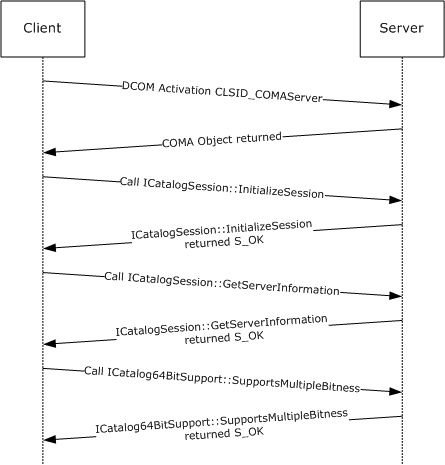

Figure 6: Session and capabilities negotiation

The preceding figure shows the sequence for a COMA client (that supports catalog versions 3.00 to 5.00) initializing a session with the COMA server (that supports catalog version 5.00) and determining its capabilities, on behalf of a client application that requested the COMA client to establish a session with the COMA server.

- The COMA client starts by performing DCOM [**activation**](#gt_activation) for the COMA server object on the server by using the [**CLSID**](#gt_class-identifier-clsid) CLSID_COMAServer.
- The COMA client calls [ICatalogSession::InitializeSession (section 3.1.4.5.1)](#Section_3.1.4.5) method on the COMA server DCOM object.
HRESULT

ICatalogSession::InitializeSession(

[in] float flVerLower = 3.0,

[in] float flVerUpper = 5.0,

[in] long reserved = 0x00000000,

[out] float* pflVerSession =

{pointer to uninitialized memory});

- The server checks to see if it supports any version in the range 3.0 and 5.0. In this case, it does support version 5.0; thus, it sets the *pflVerSession* parameter to 5.0 and returns S_OK.
HRESULT = S_OK

ICatalogSession::InitializeSession(

[in] float flVerLower = {unchanged},

[in] float flVerUpper = {unchanged},

[in] long reserved = {unchanged},

[out] float* pflVerSession = 5.0);

- The COMA client stores the version number of the server and ensures that for further communication with the server it will use the schema for catalog version 5.00.
- The COMA client then tries to determine the capabilities of the server by calling the [ICatalogSession::GetServerInformation (section 3.1.4.5.2)](#Section_3.1.4.5) method on the COMA server DCOM object.
HRESULT

ICatalogSession::GetServerInformation(

[out] long * plReserved1 = NULL,

[out] long * plReserved1 = NULL,

[out] long * plReserved1 = NULL,

[out] long * plMultiplePartitionSupport =

{pointer to uninitialized memory},

[out] long * plReserved1 = NULL,

[out] long * plReserved1 = NULL);

- The COMA server determines if it supports multiple [**partitions**](#gt_partition). In this case, it does, so it sets *plMultiplePartitionSupport* = 0x00000002 and returns S_OK.
HRESULT = S_OK

ICatalogSession::GetServerInformation(

[out] long * plReserved1 = {unchanged},

[out] long * plReserved1 = {unchanged},

[out] long * plReserved1 = {unchanged},

[out] long * plMultiplePartitionSupport = 0x00000002,

[out] long * plReserved1 = {unchanged},

[out] long * plReserved1 = {unchanged});

- The COMA client now checks to see if the COMA server supports non-native [**bitness**](#gt_bitness). It does so by calling the [ICatalog64BitSupport::SupportsMultipleBitness](#Section_3.1.4.6) method on the COMA server DCOM object.
ICatalog64BitSupport::SupportsMultipleBitness(

[out] int * pbSupportsMultipleBitness = {pointer to

uninitialized memory for the returned bitness value});

- The COMA server determines whether it supports non-native bitness. In this case, it does not, so it sets *pbSupportsMultipleBitness* to 0x00000000 and returns S_OK.
HRESULT = S_OK

ICatalog64BitSupport::SupportsMultipleBitness(

[out] int * pbSupportsMultipleBitness = 0x00000000);

- The COMA client remembers that the server does not support multiple bitnesses.
<a id="Section_4.2"></a>
## 4.2 Reading a Table

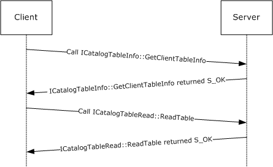

Figure 7: Reading a table

The preceding figure shows the sequence for a COMA client (which has already initialized a session with the COMA server) trying to read the [Partitions table (section 3.1.1.3.7)](#Section_3.1.1.3.7) from a COMA server on behalf of a client application that requested this information. During this phase, it has already determined that the COMA server supports multiple [**partitions**](#gt_partition).

- The COMA client calls [IClientTableInfo::GetClientTableInfo](#Section_3.1.4.7.1) to determine the metadata for the table. Before making the call, the client performs the following steps:
- The client passes in the [**catalog**](#gt_catalog) identifier for the COMA catalog (section [1.9](#Section_1.9)).
- The client determines the [**GUID**](#gt_globally-unique-identifier-guid) for the table that it wants to query. In this case, it is the Partitions table.
- The client then determines the appropriate query to pass in order to retrieve all rows in the Partitions table.
- The client ensures that it passes in eQUERYFORMAT_1 for the *eQueryFormat* parameter.
HRESULT

IClientTableInfo::GetClientTableInfo(

[in] GUID* pCatalogIdentifier = {

6e38d3c4-c2a7-11d1-8dec-00c04fc2e0c7},

[in] GUID* pTableIdentifier = {

e4ad9fd6-d435-4cf5-95ad-20ad9ac6b59f},

[in] DWORD tableFlags = 0x00000000,

[in, size_is(cbQueryCellArray), unique]

char* pQueryCellArray = NULL,

[in] ULONG cbQueryCellArray = 0x00000000,

[in, size_is(cbQueryComparison), unique]

char* pQueryComparison = NULL,

[in] ULONG cbQueryComparison = 0x00000000,

[in] DWORD eQueryFormat = 0x00000001,

[out] GUID* pRequiredFixedGuid =

{pointer to uninitialized memory for the GUID},

[out, size_is( , *pcbReserved1)] char** ppReserved1 =

{pointer to uninitialized memory},

[out] ULONG* pcbReserved1 =

{pointer to uninitialized memory},

[out, size_is( , *pcAuxiliaryGuid)] GUID** ppAuxiliaryGuid =

{pointer to uninitialized memory

to receive a pointer to an array of GUIDs},

[out] ULONG* pcAuxiliaryGuid =

{pointer to uninitialized memory to receive

the count of number of elements in ppAuxiliaryGuid},

[out, size_is( , *pcProperties)]

PropertyMeta** ppPropertyMeta =

{pointer to uninitialized memory to receive

a pointer to an array of PropertyMeta},

[out] ULONG* pcProperties =

{pointer to uninitialized memory to

receive a count of elements in ppPropertyMeta},

[out] IID* piid =

{pointer to uninitialized memory to receive

the IID of the interface returned by pItf},

[out, iid_is(o_piid)] void** pItf =

{pointer to the memory to receive

the interface to read the table},

[out, size_is( , *pcbReserved)] char** ppReserved2 =

{pointer to uninitialized memory},

[out] ULONG* pcbReserved2 =

{pointer to uninitialized memory});

- The server performs the following verification steps:
- The server verifies that the arguments conform to the syntax specified in section 3.1.4.7.1.
- The server then verifies that *pTableIdentifier* matches the tables it supports. In this case, it is the table identifier for the Partitions table.
- The server further verifies that the passed-in value for *tableFlags* is supported for the Partitions table.
- It then verifies that the queries specified by *pQueryCellArray* and *pQueryComparision* array are indeed supported for the Partitions table.
- After verification, the server performs the following steps:
- The server determines that no auxiliary GUID needs to be passed back to the client for this table, so it zeros out the *ppAuxiliaryGuid* and *pcAuxiliaryGuid* parameters.
- The server then determines the metadata for the Partitions table and populates *pcProperties* and *ppProperties*. The following is the tabular listing of the data filled into the array.
| Bit Range | Field | Description |
| --- | --- | --- |
| Variable | eDT_GUID | 0x10 fPROPERTY_PRIMARYKEY \ fPROPERTY_NOTNULLABLE |
| Variable | eDT_LPWSTR | Variable size fPROPERTY_NOTNULLABLE |
| Variable | eDT_LPWSTR | Variable size No constraints. |
| Variable | eDT_LPWSTR | 4 fPROPERTY_FIXEDLENGTH \ fPROPERTY_NOTNULLABLE |
| Variable | eDT_LPWSTR | 4 fPROPERTY_FIXEDLENGTH \ fPROPERTY_NOTNULLABLE |

- The server finally sets *pItf* to the [**interface**](#gt_interface) pointer to the object implementing [ICatalogTableRead](#Section_3.1.4.8) for the client to use for reading the table.
- The server then returns S_OK.
HRESULT = S_OK

IClientTableInfo::GetClientTableInfo(

[in] GUID* pCatalogIdentifier = {unchanged},

[in] GUID* pTableIdentifier = {unchanged},

[in] DWORD tableFlags = {unchanged},

[in, size_is(cbQueryCellArray), unique]

char* pQueryCellArray = {unchanged},

[in] ULONG cbQueryCellArray = {unchanged},

[in, size_is(cbQueryComparison), unique]

char* pQueryComparison = {unchanged},

[in] ULONG cbQueryComparison = {unchanged},

[in] DWORD eQueryFormat = {unchanged},

[out] GUID* pRequiredFixedGuid =

{92AD68AB-17E0-11D1-B230-00C04FB9473F},

[out, size_is( , *pcbReserved1)]

char** ppReserved1 = NULL,

[out] ULONG* pcbReserved1 = 0x00000000,

[out, size_is( , *pcAuxiliaryGuid)]

GUID** ppAuxiliaryGuid = NULL,

[out] ULONG* pcAuxiliaryGuid = 0x00000000,

[out, size_is( , *pcProperties)]

PropertyMeta** ppPropertyMeta =

{an array of PropertyMeta, see above for details},

[out] ULONG* pcProperties = 0x00000005,

[out] IID* piid = {0e3d6630-b46b-11d1-9d2d-006008b0e5ca},

[out, iid_is(o_piid)] void** pItf =

{ICatalogTableRead interface pointer},

[out, size_is( , *pcbReserved)] char** ppReserved2 = NULL,

[out] ULONG* pcbReserved2 = 0x00000000);

- The COMA client remembers the column metadata passed back to it through an array of [PropertyMeta](#Section_2.2.1.7).
- The client then calls [ICatalogTableRead::ReadTable (section 3.1.4.8.1)](#Section_3.1.4.8) using the interface pointer that it received previously through IClientTableInfo::GetClientTableInfo, using a query for the Partitions table to get all rows appropriately, such that the query is one of the queries allowed for the Partitions table.
HRESULT

ICatalogTableRead::ReadTable(

[in] GUID* pCatalogIdentifier =

{6e38d3c4-c2a7-11d1-8dec-00c04fc2e0c7},

[in] GUID* pTableIdentifier =

{e4ad9fd6-d435-4cf5-95ad-20ad9ac6b59f},

[in] DWORD tableFlags = 0x00000000,

[in, size_is(cbQueryCellArray), unique]

char* pQueryCellArray = NULL,

[in] ULONG cbQueryCellArray = 0x0000000,

[in, size_is(cbQueryComparison), unique]

char* pQueryComparison = NULL,

[in] ULONG cbQueryComparison = 0x00000000,

[in] DWORD eQueryFormat = 0x00000001,

[out, size_is( , *pcbTableDataFixed)]

char** ppTableDataFixed = {pointer to

uninitialized memory for fixed size table data},

[out] ULONG* pcbTableDataFixed = {pointer to uninitialized

memory for size of fixed size table data},

[out, size_is( , *pcbTableDataVariable)]

char** ppTableDataVariable = {pointer to

uninitialized memory for variable size table data},

[out] ULONG* pcbTableDataVariable = {pointer to uninitialized

memory for size of variable size table data},

[out, size_is( , *pcbTableDetailedErrors)]

char** ppTableDetailedErrors = {pointer to

uninitialized memory for detailed query errors},

[out] ULONG* pcbTableDetailedErrors =

{pointer to uninitialized memory for size

of detailed query errors},

[out, size_is( , *pcbReserved1)] char** ppReserved1 =

{pointer to uninitialized memory},

[out] ULONG* pcbReserved1 =

{pointer to uninitialized memory},

[out, size_is( , *pcbReserved2)] char** ppReserved2 =

{pointer to uninitialized memory},

[out] ULONG* pcbReserved2 =

{pointer to uninitialized memory});

- The server receives the call and verifies that all the parameters are correct. For details, see the previous example.
- The server then proceeds to process the query. If no error occurs during processing, then the query used in this example gets all the rows from the Partitions table. In this case, these rows in tabular form are the following.
| PartitionIdentifier | Name | Description | Changeable | Deleteable |
| --- | --- | --- | --- | --- |
| {41e90f3e-56c1-4633-81c3-6e8bac8bdd70} | "Base Application Partition" | "" | "Y" | "N" |

- The server then marshals the values appropriately, as specified by their metadata description agreed upon with the client through a previous call to IClientTableInfo::GetClientTableInfo.
- After successfully marshaling the data into *ppTableDataFixed* and *ppTableDataVariable*, the server returns S_OK.
HRESULT = S_OK

ICatalogTableRead::ReadTable(

[in] GUID* pCatalogIdentifier = {unchanged},

[in] GUID* pTableIdentifier = {unchanged},

[in] DWORD tableFlags = {unchanged},

[in, size_is(cbQueryCellArray), unique]

char* pQueryCellArray = {unchanged},

[in] ULONG cbQueryCellArray = {unchanged},

[in, size_is(cbQueryComparison), unique] char*

pQueryComparison = {unchanged},

[in] ULONG cbQueryComparison = {unchanged},

[in] DWORD eQueryFormat = {unchanged},

[out, size_is( , *pcbTableDataFixed)]

char** ppTableDataFixed =

{pointer to fixed size data of the partition table},

[out] ULONG* pcbTableDataFixed = 0x00000028,

[out, size_is( , *pcbTableDataVariable)]

char** ppTableDataVariable = {pointer to variable

size data of the partition table},

[out] ULONG* pcbTableDataVariable = 0x0000003c,

[out, size_is( , *pcbTableDetailedErrors)]

char** ppTableDetailedErrors = NULL,

[out] ULONG* pcbTableDetailedErrors = 0x00000000,

[out, size_is( , *pcbReserved1)] char** ppReserved1 = NULL,

[out] ULONG* pcbReserved1 = 0x00000000,

[out, size_is( , *pcbReserved2)] char** ppReserved2 = NULL,

[out] ULONG* pcbReserved2 = 0x00000000);

- The client on return of the call processes the *ppTableDataFixed* and *ppTableDataVariable* buffers.
- The following is the layout of the *ppTableDataFixed* buffer received by the client.
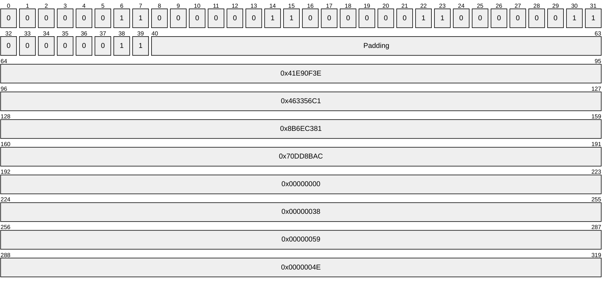

- The first 5 bytes represent the status bit field for each field. The client determined the type and count of these fields from the previous call to IClientTableInfo::GetClientTableInfo.
- The client uses the first 5 bytes to parse through each fStatusProperty bit field (section [2.2.1.8](#Section_2.2.1.8)) for each property. These map out to the following.
| Property | Status Value | Meaning | Column 4 | Column 5 | Column 6 | Column 7 | Column 8 | Column 9 | Column 10 |
| --- | --- | --- | --- | --- | --- | --- | --- | --- | --- |
| PartitionIdentifier | 0 | 0 | 0 | 0 | 0 | 0 | 1 | 1 | Changed/Non-null |
| Name | 0 | 0 | 0 | 0 | 0 | 0 | 1 | 1 | Changed/Non-null |
| Description | 0 | 0 | 0 | 0 | 0 | 0 | 1 | 1 | Changed/Non-null |
| Deleteable | 0 | 0 | 0 | 0 | 0 | 0 | 1 | 1 | Changed/Non-null |
| Changeable | 0 | 0 | 0 | 0 | 0 | 0 | 1 | 1 | Changed/Non-null |

- Because the table does not contain any variable-size properties that require size specification, no size information follows the status bit fields.
- Because the client has detected the metadata for the Partitions table properties, it determines that the *ppTableFixedSize* buffer does not contain any size specifications for any properties. Therefore, the client interprets the rest of the data as defined by the following table.
| Bit Range | Field | Description |
| --- | --- | --- |
| {41e90f3e-56c1-4633-81c3-6e8bac8bdd70} | PartitionIdentifier | - |
| Variable | Name | - 0x00 |
| Variable | Description | - 0x38 |
| Variable | Deleteable | "Y" - |
| Variable | Changeable | "N" - |

- The client now has enough information to extract name and description properties from the *ppTableVariableSize* buffer.
|  | 00 | 01 | 02 | 03 | 04 | 05 | 06 | 07 | 08 | 09 | 0a | 0b | 0c | 0d | 0e | 0f |
| --- | --- | --- | --- | --- | --- | --- | --- | --- | --- | --- | --- | --- | --- | --- | --- | --- |
| 00 | B | a | s | e | - | A | p | p | - | - | - | - | - | - | - | - |
| 10 | L | i | c | a | t | i | o | n | - | - | - | - | - | - | - | - |
| 20 | - | P | a | r | t | i | t | i | - | - | - | - | - | - | - | - |
| 30 | O | n | \0 | \0 | \0 | - | - | - | - | - | - | - | - | - | - | - |

- The COMA client extracts the Name property by scanning from its offset (0x00) until it reaches the terminating null character at offset 0x34, reading the string "Base Application Partition".
- The COMA client extracts the Description property by scanning from its offset (0x38) until it reaches the terminating null character, which it finds immediately at offset 0x38. It reads an empty string, "".
- This completes the client query of the table.
<a id="Section_4.3"></a>
## 4.3 Writing to a Table

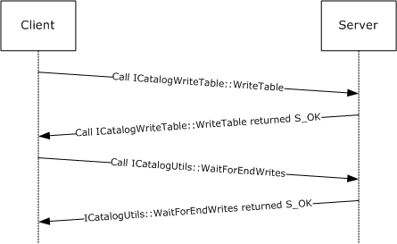

Figure 8: Writing to a table

The preceding figure shows the sequence for a COMA client that attempts to update a description of the [**partition**](#gt_partition) in the [Partitions table](#Section_3.1.1.3.7) on behalf of a client application that requests to make this change. The COMA client has already performed the initialization and read table steps, as shown in section [4.1](#Section_3.1.3) and section [4.2](#Section_4.2). It is after performing these steps that the client is now attempting a table write operation.

- The client calls the [ICatalogTableWrite::WriteTable (section 3.1.4.9.1)](#Section_3.1.4.9) method by setting the parameters, as follows:
- The client determines the query appropriate to do an update. In this case, **pQueryCellArray** is set to NULL with its size **cbQueryCellArray** set to zero.
- The client sets **pQueryComparision** to NULL and sets its size **cbQueryComparision** to 0.
- The client first determines the property that it wishes to modify. In this case this is the **Description** field of the Partitions table (section 3.1.1.3.7). The old values and the new values of the field are given in the following table.
| Property | Old value | New value |
| --- | --- | --- |
| PartitionIdentifier | {41e90f3e-56c1-4633-81c3-6e8bac8bdd70} | {41e90f3e-56c1-4633-81c3-6e8bac8bdd70} |
| Name | "Base Application Partition" | "Base Application Partition" |
| Description | "" | "The base application partition" |
| Deleteable | "Y" | "Y" |
| Changeable | "N" | "N" |

- As the client is only changing the **Description** field, it sets up the [fPropertyStatus (section 2.2.1.8)](#Section_2.2.1.8) values for the *ppTableDataFixedWriteBuffer*, as follows.
| Property | fPropertyStatus | Meaning |
| --- | --- | --- |
| PartitionIdentifier | 0x01 | Not null |
| Name | 0x01 | Not null |
| Description | 0x03 | Not null and changed |
| Deleteable | 0x01 | Not null |
| Changeable | 0x01 | Not null |

- This is all the information the client needs to prepare the *ppTableDataFixedWriteBuffer* buffer, which it does in the following way.
```mermaid
packet-beta
  0-0: "0"
  1-1: "0"
  2-2: "0"
  3-3: "0"
  4-4: "0"
  5-5: "0"
  6-6: "0"
  7-7: "1"
  8-8: "0"
  9-9: "0"
  10-10: "0"
  11-11: "0"
  12-12: "0"
  13-13: "0"
  14-14: "0"
  15-15: "1"
  16-16: "0"
  17-17: "0"
  18-18: "0"
  19-19: "0"
  20-20: "0"
  21-21: "0"
  22-22: "1"
  23-23: "1"
  24-24: "0"
  25-25: "0"
  26-26: "0"
  27-27: "0"
  28-28: "0"
  29-29: "0"
  30-30: "0"
  31-31: "1"
  32-32: "0"
  33-33: "0"
  34-34: "0"
  35-35: "0"
  36-36: "0"
  37-37: "0"
  38-38: "0"
  39-39: "1"
  40-63: "Padding"
  64-95: "0x41E90F3E"
  96-127: "0x463356C1"
  128-159: "0x8B6EC381"
  160-191: "0x70DD8BAC"
  192-223: "0x00000000"
  224-255: "0x00000038"
  256-287: "0x00000059"
  288-319: "0x0000004E"
```

- The client now prepares the *ppTableDataVariable* buffer.
|  | 00 | 01 | 02 | 03 | 04 | 05 | 06 | 07 | 08 | 09 | 0a | 0b | 0c | 0d | 0e | 0f |
| --- | --- | --- | --- | --- | --- | --- | --- | --- | --- | --- | --- | --- | --- | --- | --- | --- |
| 00 | B | a | s | e | - | A | p | p | - | - | - | - | - | - | - | - |
| 10 | l | I | c | a | t | I | o | n | - | - | - | - | - | - | - | - |
| 20 | - | P | a | r | t | I | t | I | - | - | - | - | - | - | - | - |
| 30 | o | n | \0 | \0 | T | h | e | - | - | - | - | - | - | - | - | - |
| 40 | b | a | s | e | - | a | p | p | - | - | - | - | - | - | - | - |
| 50 | l | I | c | a | t | I | o | n | - | - | - | - | - | - | - | - |
| 60 | - | P | a | r | t | I | t | I | - | - | - | - | - | - | - | - |
| 70 | o | n | \0 | \0 | - | - | - | - | - | - | - | - | - | - | - | - |

- The client sets the reserved parameters *pReserved1*, *pReserved2*, and *pReserved3* to NULL.
- The client then makes the call.
HRESULT ICatalogTableWrite::WriteTable(

[in] GUID* pCatalogIdentifier = {

6e38d3c4-c2a7-11d1-8dec-00c04fc2e0c7},

[in] GUID* pTableIdentifier = {

e4ad9fd6-d435-4cf5-95ad-20ad9ac6b59f},

[in] DWORD tableFlags = 0x00000000,

[in, size_is(cbQueryCellArray), unique] char* pQueryCellArray =

NULL,

[in] ULONG cbQueryCellArray = 0x00000000,

[in, size_is(cbQueryComparison), unique] char* pQueryComparison =

{ Pointer to zero sized buffer},

[in] ULONG cbQueryComparison = 0x00000000,

[in] DWORD eQueryFormat = 0x00000001,

[in, size_is(cbTableDataFixedWrite)] char* pTableDataFixedWrite =

{ Buffer containing the fixed size data},

[in] ULONG cbTableDataFixedWrite = ,

[in, size_is(cbTableDataVariable)] char* pTableDataVariable = {

Buffer containing the variable size data},

[in] ULONG cbTableDataVariable = ,

[in, size_is(cbReserved1)] char* pReserved1 = NULL,

[in] ULONG cbReserved1 = 0x00000000,

[in, size_is(cbReserved2)] char* pReserved2 = NULL,

[in] ULONG cbReserved2 = 0x00000000,

[in, size_is(cbReserved3)] char* pReserved3 = NULL,

[in] ULONG cbReserved3 = 0x00000000,

[out, size_is( , *pcbTableDetailedErrors)] char**

ppTableDetailedErrors = {Pointer to receive the

buffer for detailed errors},

[out] ULONG* pcbTableDetailedErrors = {Pointer to receive the

size of ppTableDetailedErrors}

);

- The server receives the call and performs the following verification steps:
- It verifies that the arguments conform to the syntax specified in section 3.1.4.9.1.
- It verifies that the *pTableIdentifier* matches a table that it supports. In this case, it matches the Partitions table.
- It verifies that the tableFlags are supported for the Partitions table.
- It verifies that the query passed in is supported for the Partitions table.
- It verifies the query specified is indeed allowed for the Partitions table.
The server then unmarshals the *pTableDataFixedWrite* and *pTableDataVariable* buffers to get the updates. It appropriately updates its store. Since in this case everything succeeds, the server returns S_OK.

HRESULT = S_OK.

ICatalogTableWrite::WriteTable(

[in] GUID* pCatalogIdentifier = {unchanged},

[in] GUID* pTableIdentifier = {unchanged},

[in] DWORD tableFlags = {unchanged},

[in, size_is(cbQueryCellArray), unique] char*

pQueryCellArray = {unchanged},

[in] ULONG cbQueryCellArray = {unchanged},

[in, size_is(cbQueryComparison), unique] char*

pQueryComparison = {unchanged},

[in] ULONG cbQueryComparison = {unchanged},

[in] DWORD eQueryFormat = {unchanged},

[in, size_is(cbTableDataFixedWrite)] char*

pTableDataFixedWrite = {unchanged},

[in] ULONG cbTableDataFixedWrite = {unchanged},

[in, size_is(cbTableDataVariable)] char*

pTableDataVariable = {unchanged},

[in] ULONG cbTableDataVariable = {unchanged},

[in, size_is(cbReserved1)] char* pReserved1 = {

unchanged},

[in] ULONG cbReserved1 = {

unchanged},

[in, size_is(cbReserved2)] char* pReserved2 = {

unchanged},

[in] ULONG cbReserved2 = {unchanged},

[in, size_is(cbReserved3)] char* pReserved3 = {

unchanged},

[in] ULONG cbReserved3 = {unchanged},

[out, size_is( , *pcbTableDetailedErrors)] char**

ppTableDetailedErrors = NULL,

[out] ULONG* pcbTableDetailedErrors = 0x00000000

);

- The COMA client, on successful completion of the call, now calls [ICatalogUtils::WaitForEndWrites (section 3.1.4.17.2)](#Section_3.1.4.17.2).
- The server receives the call and ensures that all pending writes on its store are completed. The server then returns S_OK.
<a id="Section_4.4"></a>
## 4.4 Registration

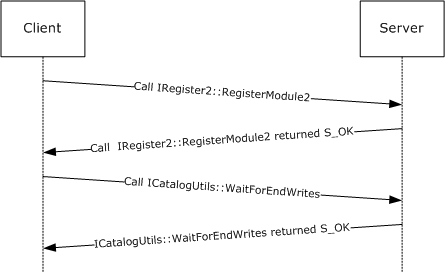

Figure 9: Registration

The preceding figure shows the sequence for a COMA client that attempts [**registration**](#gt_registration) of a [**component**](#gt_component) on a COMA server, on behalf of a client application. The client has already performed session and capability negotiation, as shown in example [4.1](#Section_3.1.3). It is assumed that the COMA server has a [**partition**](#gt_partition) {41e90f3e-56c1-4633-81c3-6e8bac8bdd70} with [**conglomeration**](#gt_conglomeration) {3fe02b83-6551-410b-a58a-b231fd7c0c2e}. It is also assumed that the client knows about the partition and the conglomeration on the COMA server by means of a query on a COMA server or by some other way. It is also assumed that the module file path is something that a COMA client acquired beforehand by its own custom means. For example, the client application might be an administrative tool, and an administrative user provided the path when requesting registration.

- The client calls [IRegister2::RegisterModule2 (section 3.1.4.11.4)](#Section_3.1.4.11) as follows:
- The client sets the *ConglomerationIdentifier* and the *PartitionIdentifier* parameters to specify the conglomeration of the component belonging to the [**module**](#gt_module).
- The client passes in an array of string to specify the path of the module for the COMA server in **ppModules**. Since in this case there is only one module, the client puts it in an array of 1 element. It sets **cModules** to 1.
- No special flags are needed for this registration. Thus the client sets **dwFlags** to 0.
- The client wants to register all the components in the module, so it does not specify any requested [**CLSIDs**](#gt_class-identifier-clsid) using the *pRequestedCLSID* and *cRequested* parameter.
- The client passes in buffers for the rest of the parameters to receive data from the server.
The client initiates the call.

HRESULT RegisterModule2(

[in] GUID ConglomerationIdentifier = {

3fe02b83-6551-410b-a58a-b231fd7c0c2e},

[in] GUID PartitionIdentifier = {

41e90f3e-56c1-4633-81c3-6e8bac8bdd70},

[in, string, size_is(cModules,)] LPWSTR* ppModules =

{"SomeModule.dll"},

[in] DWORD cModules = 0x0000001,

[in] DWORD dwFlags = 0x00000000,

[in, size_is(cRequested), unique] GUID* pRequestedCLSIDs = NULL,

[in] DWORD cRequested = 0x00000000,

[out, size_is(,cModules)] DWORD** ppModuleFlags = {Pointer to

uninitialized memory to hold a pointer to an

array of Module Flags},

[out] DWORD* pcResults = {Pointer to uninitialized memory to hold the

count of

components registered},

[out, size_is(,*pcResults)] GUID** ppResultCLSIDs = {Pointer to

uninitialized memory to hold an array of CLSIDs of

the registered components},

[out, string, size_is(,*pcResults)] LPWSTR** ppResultNames = {

Pointer to uninitialized memory to hold an array of

names of the registered components},

[out, size_is(,*pcResults)] DWORD** ppResultFlags = {Pointer to

uninitialized memory to hold an array of

implementation-specific flags

relating to the registered components},

[out, size_is(,*pcResults)] LONG** ppResultHRs = {Pointer to

uninitialized memory to hold an array of HRESULT

for registration success or failure of the

components}

);

The server receives the call and performs the following validation steps:

- It validates that both the conglomeration and the partition exist, and that the conglomeration specified is associated with the partition.
- It verifies that the path to the modules given is valid and that they are compatible with the COMA server implementation.
- The server then proceeds with the registration process as follows:
- It creates the entry for the components in the module in the component full configuration table.
- It creates entries for the [**interfaces**](#gt_interface) for each component in the module into the interfaces table.
- It makes entries for each of the methods in the interfaces to the methods table.
- The server populates the *ppModule* flags to fMODULE_LOADED as the module was successfully loaded by it.
- The server then gathers the CLSID, names of the components, implementation-specific settings associated with the components, and the individual HRESULT associated with their registration. It populates these values into *ppRequestCLSIDs*, *ppResultNames*, *ppResultFlags*, and *ppResultHRs* arrays.
- The server returns S_OK.
HRESULT = S_OK

RegisterModule2(

[in] GUID ConglomerationIdentifier = {unchanged},

[in] GUID PartitionIdentifier = {unchanged},

[in, string, size_is(cModules,)] LPWSTR* ppModules = {unchanged},

[in] DWORD cModules = {unchanged},

[in] DWORD dwFlags = {unchanged},

[in, size_is(cRequested), unique] GUID* pRequestedCLSIDs = {

unchanged},

[in] DWORD cRequested = {unchanged},

[out, size_is(,cModules)] DWORD** ppModuleFlags = {fMODULE_LOADED},

[out] DWORD* pcResults = 0x00000001,

[out, size_is(,*pcResults)] GUID** ppResultCLSIDs = {{

463575e4-a992-11d2-a8e2-0000f805c6d2}},

[out, string, size_is(,*pcResults)] LPWSTR** ppResultNames ={

"SomeComponent"} ,

[out, size_is(,*pcResults)] DWORD** ppResultFlags = {

Implementation-specific flag},

[out, size_is(,*pcResults)] LONG** ppResultHRs = {{S_OK}}

);

- The client, on successful completion of the call, now calls [ICatalogUtils::WaitForEndWrites (section 3.1.4.17.2)](#Section_3.1.4.17.2)).
- The server receives the call and ensures that all pending writes on its store are completed. If all goes well, which it does in this case, the server returns S_OK.
<a id="Section_5"></a>
# 5 Security

<a id="Section_5.1"></a>
## 5.1 Security Considerations for Implementers

Implementers need to ensure that authorization checks exist on the COMA [**catalog**](#gt_catalog) stores.

Since COMA passes sensitive data (including passwords) on the wire, all COMA messages use an encrypted transport, as specified in section [2.1](#Section_2.1).

The Changeable and Deleteable properties specified for the [**conglomerations**](#gt_conglomeration) table (section [3.1.1.3.6](#Section_3.1.1.3.6)) and [**partitions**](#gt_partition) table (section [3.1.1.3.7](#Section_3.1.1.3.7)) are not usable as security measures.

Table properties marked with fPROPERTY_NOTPERSISTABLE need to be treated as secrets and stored in an encrypted store.

<a id="Section_5.2"></a>
## 5.2 Index of Security Parameters

COMA uses the following security parameters.

| Security parameter | Section |
| --- | --- |
| AuthenticationLevel | [3.1.1.3.3](#Section_3.1.1.3.3) |

This protocol also configures a number of security parameters used by other protocols.

| Security parameter | Section |
| --- | --- |
| AccessPermissions | 3.1.1.3.3 |
| Authentication | [3.1.1.3.6](#Section_3.1.1.3.6) |
| AuthenticationCapability | 3.1.1.3.6 |
| AuthenticationLevel | 3.1.1.3.3 |
| DefaultAuthenticationLevel | [3.1.1.3.8](#Section_3.1.1.3.8) |
| DefaultImpersonationLevel | 3.1.1.3.8 |
| EnableSecureReferences | 3.1.1.3.8 |
| EnableSecurityTracking | 3.1.1.3.8 |
| ImpersonationLevel | 3.1.1.3.6 |
| LaunchPermissions | 3.1.1.3.3 |
| Password (for security principal specified in **RunAs**) | 3.1.1.3.3 |
| Password (for security principal specified in **RunAsUser**) | 3.1.1.3.6 |
| pwszPassword | [3.1.4.17.1](#Section_3.1.4.17.1) |
| ppvPassword | [3.1.4.22.5](#Section_3.1.4.22.5) |
| QCAuthenticateMsgs | 3.1.1.3.6 |
| RoleBasedSecurityEnabled | 3.1.1.3.6 |
| RoleMemberName | [3.1.1.3.10](#Section_3.1.1.3.10) |
| RunAs | 3.1.1.3.3 |
| RunAsUser | 3.1.1.3.6 |
| SaferActivateAsActivatorChecks | 3.1.1.3.8 |
| SaferRunningObjectChecks | 3.1.1.3.8 |
| SRPEnabled | 3.1.1.3.6 |
| SRPLevel | 3.1.1.3.3 |
| SRPTrustLevel | 3.1.1.3.6 |

<a id="Section_6"></a>
# 6 Appendix A: Full IDL

For ease of implementation, the full [**Interface Definition Language (IDL)**](#gt_interface-definition-language-idl) is provided below, where "ms-dtyp.idl" refers to the IDL found in [MS-DTYP](../MS-DTYP/MS-DTYP.md) Appendix A, and "ms-oaut.idl" refers to the IDL found in [MS-OAUT](../MS-OAUT/MS-OAUT.md) Appendix A.

The syntax uses the IDL syntax extensions defined in [MS-RPCE](../MS-RPCE/MS-RPCE.md) sections 2.2.4 and 3.1.1.5. For example, as noted in [MS-RPCE] section 2.2.4.8, a pointer_default declaration is not required and pointer_default(unique) is assumed.

import "ms-dtyp.idl";

import "ms-oaut.idl";

typedef struct

{

DWORD dataType;

ULONG cbSize;

DWORD flags;

} PropertyMeta;

typedef enum

{

eCT_UNKNOWN = 0x00000000,

eCT_32BIT = 0x00000001,

eCT_64BIT = 0x00000002,

eCT_NATIVE = 0x00001000

} eComponentType;

typedef struct

{

DWORD dwSRPLevel;

[string] WCHAR* wszFriendlyName;

} SRPLevelInfo;

typedef enum

{

css_lb = 1

} CatSrvServices;

typedef enum

{

css_serviceStopped = 0,

css_serviceStartPending = 1,

css_serviceStopPending = 2,

css_serviceRunning = 3,

css_serviceContinuePending = 4,

css_servicePausePending = 5,

css_servicePaused = 6,

css_serviceUnknownState = 7

} CatSrvServiceState;

typedef struct

{

GUID ConglomerationID;

GUID PartitionID;

GUID ContainerID;

DWORD dwProcessID;

BOOL bPaused;

BOOL bRecycled;

} InstanceContainer;

[

object,

uuid(182C40FA-32E4-11D0-818B-00A0C9231C29),

pointer_default(unique)

]

interface ICatalogSession: IUnknown

{

HRESULT Opnum3NotUsedOnWire();

HRESULT Opnum4NotUsedOnWire();

HRESULT Opnum5NotUsedOnWire();

HRESULT Opnum6NotUsedOnWire();

HRESULT InitializeSession(

[in] float flVerLower,

[in] float flVerUpper,

[in] long reserved,

[out] float* pflVerSession

);

HRESULT GetServerInformation(

[out] long* plReserved1,

[out] long* plReserved2,

[out] long* plReserved3,

[out] long* plMultiplePartitionSupport,

[out] long* plReserved4,

[out] long* plReserved5

);

};

[

object,

uuid(1D118904-94B3-4A64-9FA6-ED432666A7B9),

pointer_default(unique)

]

interface ICatalog64BitSupport: IUnknown

{

HRESULT SupportsMultipleBitness(

[out] BOOL* pbSupportsMultipleBitness

);

HRESULT Initialize64BitQueryCellSupport(

[in] BOOL bClientSupports64BitQueryCells,

[out] BOOL* pbServerSupports64BitQueryCells

);

};

[

object,

uuid(A8927A41-D3CE-11D1-8472-006008B0E5CA),

pointer_default(unique)

]

interface ICatalogTableInfo: IUnknown

{

HRESULT GetClientTableInfo(

[in] GUID* pCatalogIdentifier,

[in] GUID* pTableIdentifier,

[in] DWORD tableFlags,

[in, size_is(cbQueryCellArray), unique] char* pQueryCellArray,

[in] ULONG cbQueryCellArray,

[in, size_is(cbQueryComparison), unique] char* pQueryComparison,

[in] ULONG cbQueryComparison,

[in] DWORD eQueryFormat,

[out] GUID* pRequiredFixedGuid,

[out, size_is( , *pcbReserved1)] char** ppReserved1,

[out] ULONG* pcbReserved1,

[out, size_is( , *pcAuxiliaryGuid)] GUID** ppAuxiliaryGuid,

[out] ULONG* pcAuxiliaryGuid,

[out, size_is( , *pcProperties)] PropertyMeta** ppPropertyMeta,

[out] ULONG* pcProperties,

[out] IID* piid,

[out, iid_is(piid)] void** pItf,

[out, size_is( , *pcbReserved2)] char** ppReserved2,

[out] ULONG* pcbReserved2

);

};

[

object,

uuid(0E3D6630-B46B-11D1-9D2D-006008B0E5CA),

pointer_default(unique)

]

interface ICatalogTableRead: IUnknown

{

HRESULT ReadTable(

[in] GUID* pCatalogIdentifier,

[in] GUID* pTableIdentifier,

[in] DWORD tableFlags,

[in, size_is(cbQueryCellArray), unique] char* pQueryCellArray,

[in] ULONG cbQueryCellArray,

[in, size_is(cbQueryComparison), unique] char* pQueryComparison,

[in] ULONG cbQueryComparison,

[in] DWORD eQueryFormat,

[out, size_is( , *pcbTableDataFixed)] char** ppTableDataFixed,

[out] ULONG* pcbTableDataFixed,

[out, size_is( , *pcbTableDataVariable)] char** ppTableDataVariable,

[out] ULONG* pcbTableDataVariable,

[out, size_is( , *pcbTableDetailedErrors)] char** ppTableDetailedErrors,

[out] ULONG* pcbTableDetailedErrors,

[out, size_is( , *pcbReserved1)] char** ppReserved1,

[out] ULONG* pcbReserved1,

[out, size_is( , *pcbReserved2)] char** ppReserved2,

[out] ULONG* pcbReserved2

);

};

[

object,

uuid(0E3D6631-B46B-11D1-9D2D-006008B0E5CA),

pointer_default(unique)

]

interface ICatalogTableWrite: IUnknown

{

HRESULT WriteTable(

[in] GUID* pCatalogIdentifier,

[in] GUID* pTableIdentifier,

[in] DWORD tableFlags,

[in, size_is(cbQueryCellArray), unique] char* pQueryCellArray,

[in] ULONG cbQueryCellArray,

[in, size_is(cbQueryComparison), unique] char* pQueryComparison,

[in] ULONG cbQueryComparison,

[in] DWORD eQueryFormat,

[in, size_is(cbTableDataFixedWrite)] char* pTableDataFixedWrite,

[in] ULONG cbTableDataFixedWrite,

[in, size_is(cbTableDataVariable)] char* pTableDataVariable,

[in] ULONG cbTableDataVariable,

[in, size_is(cbReserved1)] char* pReserved1,

[in] ULONG cbReserved1,

[in, size_is(cbReserved2)] char* pReserved2,

[in] ULONG cbReserved2,

[in, size_is(cbReserved3)] char* pReserved3,

[in] ULONG cbReserved3,

[out, size_is( , *pcbTableDetailedErrors)] char** ppTableDetailedErrors,

[out] ULONG* pcbTableDetailedErrors

);

};

[

object,

uuid(8DB2180E-BD29-11D1-8B7E-00C04FD7A924),

pointer_default(unique)

]

interface IRegister: IUnknown

{

HRESULT RegisterModule(

[in] GUID ConglomerationIdentifier,

[in, string, size_is(cModules,)] LPWSTR* ppModules,

[in] DWORD cModules,

[in] DWORD dwFlags,

[in, size_is(cRequested), unique] GUID* pRequestedCLSIDs,

[in] DWORD cRequested,

[out, size_is(,cModules)] DWORD** ppModuleFlags,

[out] DWORD* pcResults,

[out, size_is(,*pcResults)] GUID** ppResultCLSIDs,

[out, string, size_is(,*pcResults)] LPWSTR** ppResultNames,

[out, size_is(,*pcResults)] DWORD** ppResultFlags,

[out, size_is(,*pcResults)] LONG** ppResultHRs

);

HRESULT Opnum4NotUsedOnWire();

};

[

object,

uuid(971668DC-C3FE-4EA1-9643-0C7230F494A1),

pointer_default(unique)

]

interface IRegister2: IUnknown

{

HRESULT CreateFullConfiguration(

[in, string] LPCWSTR pwszConglomerationIdOrName,

[in, string] LPCWSTR pwszCLSIDOrProgId,

[in] eComponentType ctComponentType

);

HRESULT CreateLegacyConfiguration(

[in, string] LPCWSTR pwszConglomerationIdOrName,

[in, string] LPCWSTR pwszCLSIDOrProgId,

[in] eComponentType ctComponentType

);

HRESULT PromoteLegacyConfiguration(

[in, string] LPCWSTR pwszConglomerationIdOrName,

[in, string] LPCWSTR pwszCLSIDOrProgId,

[in] eComponentType ctComponentType

);

HRESULT Opnum6NotUsedOnWire();

HRESULT Opnum7NotUsedOnWire();

HRESULT RegisterModule2(

[in] GUID ConglomerationIdentifier,

[in] GUID PartitionIdentifier,

[in, string, size_is(cModules,)] LPWSTR* ppModules,

[in] DWORD cModules,

[in] DWORD dwFlags,

[in, size_is(cRequested), unique] GUID* pRequestedCLSIDs,

[in] DWORD cRequested,

[out, size_is(,cModules)] DWORD** ppModuleFlags,

[out] DWORD* pcResults,

[out, size_is(,*pcResults)] GUID** ppResultCLSIDs,

[out, string, size_is(,*pcResults)] LPWSTR** ppResultNames,

[out, size_is(,*pcResults)] DWORD** ppResultFlags,

[out, size_is(,*pcResults)] LONG** ppResultHRs

);

HRESULT Opnum9NotUsedOnWire();

};

[

object,

uuid(C2BE6970-DF9E-11D1-8B87-00C04FD7A924),

pointer_default(unique)

]

interface IImport: IUnknown

{

HRESULT ImportFromFile(

[in, string, unique] WCHAR* pwszModuleDestination,

[in, string] WCHAR* pwszInstallerPackage,

[in, string, unique] WCHAR* pwszUser,

[in, string, unique] WCHAR* pwszPassword,

[in, string, unique] WCHAR* pwszRemoteServerName,

[in] DWORD dwFlags,

[in] GUID* reserved1,

[in] DWORD reserved2,

[out] DWORD* pcModules,

[out, size_is(,*pcModules)] DWORD** ppModuleFlags,

[out, string, size_is(,*pcModules)] LPWSTR** ppModules,

[out] DWORD* pcComponents,

[out, size_is(,*pcComponents)] GUID** ppResultCLSIDs,

[out, string, size_is(,*pcComponents)] LPWSTR** ppResultNames,

[out, size_is(,*pcComponents)] DWORD** ppResultFlags,

[out, size_is(,*pcComponents)] LONG** ppResultHRs

);

HRESULT QueryFile(

[in, string] WCHAR* pwszInstallerPackage,

[out] DWORD* pdwConglomerations,

[out, string, size_is(, *pdwConglomerations)] LPWSTR** ppNames,

[out, string, size_is(, *pdwConglomerations)] LPWSTR** ppDescriptions,

[out] DWORD* pdwUsers,

[out] DWORD* pdwIsProxy,

[out] DWORD* pcModules,

[out, string, size_is(,*pcModules)] LPWSTR** ppModules

);

HRESULT Opnum5NotUsedOnWire();

HRESULT Opnum6NotUsedOnWire();

};

[

object,

uuid(1F7B1697-ECB2-4CBB-8A0E-75C427F4A6F0),

pointer_default(unique)

]

interface IImport2: IUnknown

{

HRESULT SetPartition(

[in] GUID* pPartitionIdentifier,

[out] GUID* pReserved

);

HRESULT Opnum4NotUsedOnWire();

HRESULT Opnum5NotUsedOnWire();

};

[

object,

uuid(CFADAC84-E12C-11D1-B34C-00C04F990D54),

pointer_default(unique)

]

interface IExport: IUnknown

{

HRESULT ExportConglomeration(

[in] GUID* pConglomerationIdentifier,

[in] LPCWSTR pwszInstallerPackage,

[in] LPCWSTR pwszReserved,

[in] DWORD dwFlags

);

HRESULT Opnum4NotUsedOnWire();

HRESULT Opnum5NotUsedOnWire();

HRESULT Opnum6NotUsedOnWire();

};

[

object,

uuid(F131EA3E-B7BE-480E-A60D-51CB2785779E),

pointer_default(unique)

]

interface IExport2: IUnknown

{

HRESULT ExportPartition(

[in] GUID* pPartitionIdentifier,

[in] LPCWSTR pwszInstallerPackage,

[in] LPCWSTR pwszReserved,

[in] DWORD dwFlags

);

};

[

object,

uuid(7F43B400-1A0E-4D57-BBC9-6B0C65F7A889),

pointer_default(unique)

]

interface IAlternateLaunch: IUnknown

{

HRESULT CreateConfiguration(

[in] GUID ConglomerationIdentifier,

[in] BSTR bstrConfigurationName,

[in] DWORD dwStartType,

[in] DWORD dwErrorControl,

[in] BSTR bstrDependencies,

[in] BSTR bstrRunAs,

[in] BSTR bstrPassword,

[in] VARIANT_BOOL bDesktopOk

);

HRESULT DeleteConfiguration(

[in] GUID ConglomerationIdentifier

);

};

[

object,

uuid(456129E2-1078-11D2-B0F9-00805FC73204),

pointer_default(unique)

]

interface ICatalogUtils: IUnknown

{

HRESULT ValidateUser(

[in, string, unique] LPWSTR pwszPrincipalName,

[in, string, unique] LPWSTR pwszPassword

);

HRESULT WaitForEndWrites();

HRESULT GetEventClassesForIID(

[in, string, unique] LPWSTR wszIID,

[out] DWORD* pcClasses,

[out, string, size_is(, *pcClasses)] LPWSTR** pawszCLSIDs,

[out, string, size_is(, *pcClasses)] LPWSTR** pawszProgIDs,

[out, string, size_is(, *pcClasses)] LPWSTR** pawszDescriptions

);

};

[

object,

uuid(C726744E-5735-4F08-8286-C510EE638FB6),

pointer_default(unique)

]

interface ICatalogUtils2: IUnknown

{

HRESULT CopyConglomerations(

[in, string] LPCWSTR pwszSourcePartition,

[in, string] LPCWSTR pwszDestPartition,

[in] DWORD cConglomerations,

[in, string, size_is(cConglomerations,)] LPCWSTR* ppwszConglomerationNamesOrIds

);

HRESULT CopyComponentConfiguration(

[in, string] LPCWSTR pwszSourceConglomeration,

[in, string] LPCWSTR pwszComponent,

[in, string] LPCWSTR pwszDestConglomeration

);

HRESULT AliasComponent(

[in, string] LPCWSTR pwszSourceConglomeration,

[in, string] LPCWSTR pwszComponent,

[in, string] LPCWSTR pwszDestConglomeration,

[in] GUID* pNewCLSID,

[in, string] LPCWSTR pwszNewProgID

);

HRESULT MoveComponentConfiguration(

[in, string] LPCWSTR pwszSourceConglomeration,

[in, string] LPCWSTR pwszComponent,

[in, string] LPCWSTR pwszDestinationConglomeration

);

HRESULT GetEventClassesForIID2(

[in, string, unique] LPWSTR wszIID,

[in] GUID* PartitionId,

[out] DWORD* pcClasses,

[out, string, size_is(, *pcClasses)] LPWSTR** pawszCLSIDs,

[out, string, size_is(, *pcClasses)] LPWSTR** pawszProgIDs,

[out, string, size_is(, *pcClasses)] LPWSTR** pawszDescriptions,

[out, string, size_is(, *pcClasses)] LPWSTR** pawszConglomerationIDs,

[out, size_is(, *pcClasses)] DWORD** padwIsPrivate

);

HRESULT IsSafeToDelete(

[in] BSTR bstrFile,

[out, retval] long* pInUse

);

HRESULT FlushPartitionCache();

HRESULT EnumerateSRPLevels(

[in] LCID Locale,

[out] int *cLevels,

[out, size_is(,*cLevels)] SRPLevelInfo **aSRPLevels

);

HRESULT GetComponentVersions(

[in] LPCWSTR pwszClsidOrProgId,

[out] DWORD* pdwVersions,

[out, size_is(, *pdwVersions)] GUID** ppPartitionIDs,

[out, size_is(, *pdwVersions)] GUID** ppConglomerationIDs,

[out, size_is(, *pdwVersions)] BOOL** ppIsPrivate,

[out, size_is(, *pdwVersions)] LONG** ppBitness

);

};

[

object,

uuid(47CDE9A1-0BF6-11D2-8016-00C04FB9988E),

pointer_default(unique)

]

interface ICapabilitySupport: IUnknown

{

HRESULT Start(

[in] CatSrvServices i_css

);

HRESULT Stop(

[in] CatSrvServices i_css

);

HRESULT Opnum5NotUsedOnWire();

HRESULT Opnum6NotUsedOnWire();

HRESULT IsInstalled(

[in] CatSrvServices i_css,

[out] ULONG* pulStatus

);

HRESULT IsRunning(

[in] CatSrvServices i_css,

[out] CatSrvServiceState* pulStates

);

HRESULT Opnum9NotUsedOnWire();

};

[

object,

uuid(3F3B1B86-DBBE-11D1-9DA6-00805F85CFE3),

pointer_default(unique)

]

interface IContainerControl: IUnknown

{

HRESULT CreateContainer(

[in] GUID* pConglomerationIdentifier

);

HRESULT ShutdownContainers(

[in] GUID* pConglomerationIdentifier

);

HRESULT RefreshComponents();

};

[

object,

uuid(6C935649-30A6-4211-8687-C4C83E5FE1C7),

pointer_default(unique)

]

interface IContainerControl2: IUnknown

{

HRESULT ShutdownContainer(

[in] GUID* ContainerIdentifier

);

HRESULT PauseContainer(

[in] GUID* ContainerIdentifier

);

HRESULT ResumeContainer(

[in] GUID* ContainerIdentifier

);

HRESULT IsContainerPaused(

[in] GUID* ContainerIdentifier,

[out] BOOL* bPaused

);

HRESULT GetRunningContainers(

[in] GUID* PartitionId,

[in] GUID* ConglomerationId,

[out] DWORD* pdwNumContainers,

[out, size_is(,*pdwNumContainers)] InstanceContainer** ppContainers

);

HRESULT GetContainerIDFromProcessID(

[in] DWORD dwPID,

[out, retval] BSTR* pbstrContainerID

);

HRESULT RecycleContainer(

[in] GUID* ContainerIdentifier,

[in] long lReasonCode

);

HRESULT GetContainerIDFromConglomerationID(

[in] GUID* ConglomerationIdentifier,

[out] GUID* ContainerIdentifier

);

};

[

object,

uuid(98315903-7BE5-11D2-ADC1-00A02463D6E7),

pointer_default(unique)

]

interface IReplicationUtil: IUnknown

{

HRESULT CreateShare(

[in] LPCWSTR pwszShareName,

[in] LPCWSTR pwszPath

);

HRESULT CreateEmptyDir(

[in] LPCWSTR pwszPath

);

HRESULT RemoveShare(

[in] LPCWSTR pwszShareName

);

HRESULT BeginReplicationAsTarget(

[in] LPCWSTR pwszBaseReplicationDir

);

HRESULT QueryConglomerationPassword(

[in] REFGUID ConglomerationId,

[out, size_is( , *pcbPassword)] char** ppvPassword,

[out] ULONG* pcbPassword

);

HRESULT CreateReplicationDir(

[out] LPWSTR* ppwszBaseReplicationDir

);

};

<a id="Section_7"></a>
# 7 Appendix B: Product Behavior

The information in this specification is applicable to the following Microsoft products or supplemental software. References to product versions include updates to those products.

The terms "earlier" and "later", when used with a product version, refer to either all preceding versions or all subsequent versions, respectively. The term "through" refers to the inclusive range of versions. Applicable Microsoft products are listed chronologically in this section.

**Windows Client**

- Windows 2000 Professional operating system
- Windows XP operating system
- Windows Vista operating system
- Windows 7 operating system
- Windows 8 operating system
- Windows 8.1 operating system
- Windows 10 operating system
- Windows 11 operating system
**Windows Server**

- Windows 2000 Server operating system
- Windows Server 2003 operating system
- Windows Server 2008 operating system
- Windows Server 2008 R2 operating system
- Windows Server 2012 operating system
- Windows Server 2012 R2 operating system
- Windows Server 2016 operating system
- Windows Server operating system
- Windows Server 2019 operating system
- Windows Server 2022 operating system
- Windows Server 2025 operating system
Exceptions, if any, are noted in this section. If an update version, service pack or Knowledge Base (KB) number appears with a product name, the behavior changed in that update. The new behavior also applies to subsequent updates unless otherwise specified. If a product edition appears with the product version, behavior is different in that product edition.

Unless otherwise specified, any statement of optional behavior in this specification that is prescribed using the terms "SHOULD" or "SHOULD NOT" implies product behavior in accordance with the SHOULD or SHOULD NOT prescription. Unless otherwise specified, the term "MAY" implies that the product does not follow the prescription.

<1> Section 2.1: Windows clients attempt to use RPC_C_IMP_LEVEL_DELEGATE, as specified in [MS-RPCE](../MS-RPCE/MS-RPCE.md) section 2.2.1.1.9, and if that fails, attempt to use RPC_C_IMP_LEVEL_IMPERSONATE, as specified in [MS-RPCE] section 2.2.1.1.9.

<2> Section 2.1: Windows 2000 operating system and Windows XP clients first attempt to use Kerberos (for more information, see [MS-KILE](../MS-KILE/MS-KILE.md)) and, failing that, attempt to use NTLM (for more information, see [MS-NLMP](../MS-NLMP/MS-NLMP.md).

<3> Section 2.2.1.3: Applicable Windows Server releases internally maintain some of the tables in the [**catalog**](#gt_catalog) as a relational join of multiple internal tables. The amount of time that it takes to perform read operations on these tables can be greatly affected by the order in which the join is computed. Applicable Windows Server releases interpret the presence of this special option as a hint that the join should be computed in a particular order. Applicable Windows Server releases accept comparison values other than 1 for this special option, intended for local use only. These additional values are never sent by Windows clients.

<4> Section 2.2.1.4: The following versions of Windows support the 64-bit [QueryCell](#Section_2.2.1.4) marshaling format: Windows XP (x64 and Itanium Editions), Windows Server 2003 (x64 and Itanium Editions), Windows Vista (x64 Editions), Windows Server 2008 (x64 and Itanium Editions), Windows 7 (x64 Editions), Windows Server 2008 R2 operating system (x64 and Itanium Editions), Windows 8 (x64 Editions), and Windows Server 2012 (x64 and Itanium Editions).

<5> Section 2.2.1.8: The Windows 10 and earlier and Windows Server 2016 and earlier do not set the Write bit in cases that do not strictly require it.

<6> Section 2.2.1.8: Rather than ignoring the Read and Write bits, Windows 10 and earlier and Windows Server 2016 and earlier rely on them as hints when extracting data from these structures.

<7> Section 2.2.1.8: Windows 10 and earlier and Windows Server 2016 and earlier do not set the Read bit in cases that do not strictly require it.

<8> Section 2.2.1.8: Rather than ignoring the Read and Write bits, Windows 10 and earlier and Windows Server 2016 and earlier rely on them as hints when extracting data from these structures.

<9> Section 2.2.1.9: Windows uses this field as scratch space when constructing or processing [TableDataFixed](#Section_2.2.1.10) and [TableDataFixedWrite](#Section_2.2.1.13) structures, and in some cases sends these structures with this field set to a nonzero value for a null-valued property. This field is always ignored on receipt for a null-valued property.

<10> Section 2.2.1.9: Windows uses this field as scratch space when constructing or processing TableDataFixed and TableDataFixedWrite structures, and in some cases sends these structures with this field set to a nonzero value for a null-valued property. This field is always ignored on receipt for a null-valued property.

<11> Section 2.2.2.2: Windows also accepts local paths.

<12> Section 2.2.2.3: For more information on how the thread is selected for calls to MTA-hosted [**component instances**](#gt_component-instance) on Windows, see [[MSDN-ThreadMDLS]](https://go.microsoft.com/fwlink/?LinkId=136556).

<13> Section 2.2.2.3: For more information on how the thread is selected for calls to neutral-hosted component instances on Windows, see [MSDN-ThreadMDLS].

<14> Section 2.2.2.3.1: For more information on how Windows selects an STA thread to host the component instance, see [MSDN-ThreadMDLS].

<15> Section 2.2.2.13.1: On Windows, an [ORBSpecificExceptionClassProperty](#Section_2.2.2.13.1) is a Curly Braced GUID String Syntax ([MS-DTYP](../MS-DTYP/MS-DTYP.md), section 2.3.4.3) representation of a [**CLSID**](#gt_class-identifier-clsid), a ProgId, or a COM moniker (for more information, see [[MSDN-COMMonikers]](https://go.microsoft.com/fwlink/?LinkId=92755)).

<16> Section 2.2.2.13.2: On Windows, an [ORBSpecificModuleIdentifierProperty](#Section_2.2.2.13.2) type is an assembly name for a managed assembly (for more information, see [[MSDN-Assemblies]](https://go.microsoft.com/fwlink/?LinkId=94412)).

<17> Section 2.2.2.13.3: On Windows, an [ORBSpecificTypeIdentifierProperty](#Section_2.2.2.13.3) type is a class name of a class in a managed assembly (for more information, see [MSDN-Assemblies]).

<18> Section 2.2.2.13.4: On Windows, an [ORBSpecificAlternateLaunchNameProperty](#Section_2.2.2.6) is the service name of a Windows service (for more information, see [[MSDN-WINSVC]](https://go.microsoft.com/fwlink/?LinkId=90701)).

<19> Section 2.2.2.13.5: On Windows, an [ORBSpecificAlternateLaunchParametersProperty](#Section_2.2.2.13.5) is service-specific command line string passed to a Windows service when starting it (for more information, see [MSDN-WINSVC]).

<20> Section 2.2.2.13.6: On Windows, an [ORBSpecificCommandLineProperty](#Section_2.2.2.13.6) is the *lpCommandLine* parameter of CreateProcess (for more information, see [[MSDN-CreateProcess]](https://go.microsoft.com/fwlink/?LinkId=136553)). This property is intended to be used for debugging purposes, where the command line is modified to a value that runs the original system-provided command line under a debugger. Any other value produces undefined results.

<21> Section 2.2.2.13.7: On Windows, an [ORBSpecificWebServerVirtualDirectoryProperty](#Section_2.2.2.13.7) type is an Internet Information Services (IIS) virtual root (for more information, see [[MSDN-IIS]](https://go.microsoft.com/fwlink/?LinkId=93379)).

<22> Section 2.2.2.13.8: On Windows, an [ORBSpecificSubscriptionFilterCriteriaProperty](#Section_2.2.2.13.8) type is a COM+ Event System filter criteria query (for more information, see [MS-COMEV](../MS-COMEV/MS-COMEV.md) section 2.2.1).

<23> Section 2.2.2.13.9: On Windows, an [ORBSpecificAlternateActivationProperty](#Section_2.2.2.13.9) is a COM moniker (for more information, see [MSDN-COMMonikers]).

<24> Section 2.2.2.13.10: On Windows, an [ORBSpecificProtocolSequenceMnemonicProperty](#Section_2.2.2.13.10) type MUST be one of the values in the following table. The set of values considered valid by the COMA server on Windows is version-specific. The set of values representing [**RPC protocol sequences**](#gt_rpc-protocol-sequence) that are supported transports for DCOM on Windows is also version-specific and is not necessarily equal to the set of values considered valid by the COMA server. Those values that do not correspond to a supported RPC protocol sequences are simply ignored as possible transports by the DCOM protocol implementation on Windows.

| Value | Description | Versions considered valid by COMA server | Versions supported protocol sequence for DCOM |
| --- | --- | --- | --- |
| * | Default System Protocols | Windows 2000 Windows XP Windows Server 2003 Windows Vista Windows Server 2008 Windows 7 Windows Server 2008 R2 Windows 8 Windows Server 2012 Windows 8.1 Windows Server 2012 R2 Windows 10 Windows Server 2016 | None. For historical reasons, the COMA server on Windows accepts this as a valid value but it does not correspond to a valid [**RPC**](#gt_remote-procedure-call-rpc) protocol sequence. |
| ncacn_ip_tcp | Connection-oriented TCP/IP | Windows 2000 Windows XP Windows Server 2003 Windows Vista Windows Server 2008 Windows 7 Windows Server 2008 R2 Windows 8 Windows Server 2012 Windows 8.1 Windows Server 2012 R2 Windows 10 Windows Server 2016 | Windows 2000 Windows XP Windows Server 2003 Windows Vista Windows Server 2008 Windows 7 Windows Server 2008 R2 Windows 8 Windows Server 2012 Windows 8.1 Windows Server 2012 R2 Windows 10 Windows Server 2016 |
| ncacn_http | Tunneling TCP/IP | Windows 2000 Windows XP Windows Server 2003 Windows Vista Windows Server 2008 Windows 7 Windows Server 2008 R2 Windows 8 Windows Server 2012 Windows 8.1 Windows Server 2012 R2 Windows 10 Windows Server 2016 | Windows 2000 Windows XP Windows Server 2003 Windows Vista Windows Server 2008 Windows 7 Windows Server 2008 R2 Windows 8 Windows Server 2012 Windows 8.1 Windows Server 2012 R2 Windows 10 Windows Server 2016 |
| ncacn_nb_tcp | Connection-oriented NetBIOS over TCP | Windows 2000 Windows XP Windows Server 2003 | Windows 2000 |
| ncacn_nb_ipx | Connection-oriented NetBIOS over IPX | Windows 2000 Windows XP Windows Server 2003 | Windows 2000 |
| ncacn_nb_nb | Connection-oriented NetBEUI | Windows 2000 Windows XP Windows Server 2003 | Windows 2000 |
| ncacn_np | Connection-oriented named pipes | Windows 2000 Windows XP Windows Server 2003 | Windows 2000 Windows XP Windows Server 2003 |
| ncacn_spx | Connection-oriented SPX | Windows 2000 Windows XP Windows Server 2003 | Windows 2000 Windows Server 2003 (x86 editions) |
| ncacn_dnet_nsp | Connection-oriented DECnet transport | Windows 2000 Windows XP Windows Server 2003 | Windows 2000 Windows XP Windows Server 2003 |
| ncacn_at_dsp | AppleTalk DSP | Windows 2000 Windows XP Windows Server 2003 | Windows 2000 Windows XP Windows Server 2003 |
| ncacn_vnns_spp | Connection-oriented Vines SPP transport | Windows 2000 Windows XP Windows Server 2003 | None. For historical reasons, the COMA server on Windows 2000, Windows XP, and Windows Server 2003 accepts this value to represent Banyan Vines SPP instead of the value "ncacn_vns_spp" used by the RPC and DCOM protocol implementations on Windows. It does not represent a valid RPC protocol sequence. |
| ncadg_ip_udp | Datagram UDP/IP | Windows 2000 Windows XP Windows Server 2003 | None. |
| ncadg_ipx | Datagram IPX | Windows 2000 Windows XP Windows Server 2003 | None. |

<25> Section 2.2.2.21.4: Windows XP operating system Service Pack 2 (SP2), Windows XP operating system Service Pack 3 (SP3), Windows Server 2003 operating system with Service Pack 1 (SP1), Windows Server 2003 operating system with Service Pack 2 (SP2), Windows Vista through Windows 10 and Windows Server 2008 through Windows Server 2016 interpret [NewVersionComponentDACLs](#Section_2.2.2.21.3.2).

<26> Section 2.2.2.21.4: Windows Vista through Windows 10 and Windows Server 2008 through Windows Server 2016 interpret [ComponentSACLs](#Section_2.2.2.21.3.3).

<27> Section 2.2.2.22: Applicable Windows Server releases do not enforce constraints on values of type DefaultAuthenticationLevelProperty. Windows clients never pass invalid values of this type.

<28> Section 2.2.2.23: Applicable Windows Server releases do not enforce constraints on values of type ActivationTypeProperty. Windows clients never pass invalid values of this type.

<29> Section 2.2.2.24: For more information about the software restriction property on Windows, see [[MSDN-SOFTWRSTRPOLICY]](https://go.microsoft.com/fwlink/?LinkID=94413).

<30> Section 2.2.2.25: Applicable Windows Server releases do not enforce constraints on values of type DefaultImpersonationLevelProperty. Windows clients never pass invalid values of this type.

<31> Section 2.2.3: On Windows, "DllGetClassObject".

<32> Section 2.2.3: On Windows, a proxy/stub DLL. For more information about proxies and stubs on Windows, see [[MSDN-MarshalDetails]](https://go.microsoft.com/fwlink/?LinkId=93841).

<33> Section 2.2.3: For information about type libraries on Windows, see [[MSDN-TypeLibraries]](https://go.microsoft.com/fwlink/?LinkID=93842).

<34> Section 2.2.3: On Windows, "DllRegisterServer".

<35> Section 2.2.3: On Windows, "DllUnregisterServer".

<36> Section 2.2.4: For information about type libraries on Windows, see [MSDN-TypeLibraries].

<37> Section 3: In Windows, if an [**activation**](#gt_activation) request for the COMA server object class is received in which the client context contains a transaction context property (see [MS-COM](../MS-COM/MS-COM.md) section 2.2.2.1), the transaction will propagate to the COMA server object's client context. Windows clients never send such an activation request. To avoid inadvertently causing a situation in which the COMA server terminates a client application's transaction, it is recommended that COMA clients never send an activation request in which the client context contains a transaction context property.

<38> Section 3.1.1.1: In Windows, the COMA server configures COM+, also known as Component Services, on the server machine. For more information, see [[MSDN-COM+]](https://go.microsoft.com/fwlink/?LinkId=92752).

<39> Section 3.1.1.1.1: In Windows, this is the transactional functionality of the COM+ protocol. For more information, see [MS-COM].

<40> Section 3.1.1.1.1: Windows provides this facility. For more information, see [MSDN-COM+].

<41> Section 3.1.1.1.2: Windows provides this facility, known as application pooling. For more information, see [MSDN-COM+].

<42> Section 3.1.1.1.2: Windows provides this facility, known as object pooling. For more information, see [MSDN-COM+].

<43> Section 3.1.1.1.3: Windows provides this facility. For more information, see [MSDN-COM+].

<44> Section 3.1.1.1.4: Windows provides this facility, known as COM+ [**events**](#gt_event). For more information, see [MSDN-COM+].

<45> Section 3.1.1.1.5: Windows provides this facility. For more information, see [MSDN-COM+].

<46> Section 3.1.1.1.5: Windows provides this facility. For more information, see [MSDN-COM+].

<47> Section 3.1.1.1.6: Windows does not provide this facility natively, but supports this configuration for the Component Load Balancing feature of Microsoft Application Center. Note that Microsoft Application Center 2000 is only supported in Windows 2000, Windows XP, and Windows Server 2003.

<48> Section 3.1.1.1.7: Windows provides this facility. For more information, see [MSDN-COM+].

<49> Section 3.1.1.2.3: The following versions of Windows support the multiple-bitness capability:

- Windows XP (x64 and Itanium Editions)
- Windows Server 2003 (x64 and Itanium Editions)
- Windows Vista (x64 Editions)
- Windows Server 2008 (x64 and Itanium Editions)
- Windows 7 (x64 Editions)
- Windows Server 2008 R2 (x64 and Itanium Editions)
- Windows 8 (x64 Editions)
- Windows Server 2012 (x64 and Itanium Editions)
- Windows 8.1
- Windows Server 2012 R2
- Windows 10
- Windows Server 2016
<50> Section 3.1.1.2.7: Windows does this.

<51> Section 3.1.1.2.7: Windows does not enforce this for all internal properties.

<52> Section 3.1.1.2.9: Windows does this.

<53> Section 3.1.1.2.9: Windows does this.

<54> Section 3.1.1.2.9: Windows does this.

<55> Section 3.1.1.2.11: Windows does this.

<56> Section 3.1.1.3.1: On Windows platforms, this is the "CLSID" property of the [**components**](#gt_component) collection; see [[MSDN-COMADMIN]](https://go.microsoft.com/fwlink/?LinkId=93840).

<57> Section 3.1.1.3.1: On Windows platforms, this is the "DLL" property of the components collection; see [MSDN-COMADMIN].

<58> Section 3.1.1.3.1: On Windows platforms, this is the "ThreadingModel" property of the components collection; see [MSDN-COMADMIN].

<59> Section 3.1.1.3.1: On Windows platforms, this is the "Name" property of the components collection; see [MSDN-COMADMIN].

<60> Section 3.1.1.3.1: On Windows platforms, this is the "Description" property of the components collection; see [MSDN-COMADMIN].

<61> Section 3.1.1.3.1: On Windows platforms, this is the "Bitness" property of the components collection; see [MSDN-COMADMIN].

<62> Section 3.1.1.3.1: On Windows platforms, this is the "VersionMajor" property of the components collection; see [MSDN-COMADMIN].

<63> Section 3.1.1.3.1: On Windows platforms, this is the "VersionMinor" property of the components collection; see [MSDN-COMADMIN].

<64> Section 3.1.1.3.1: On Windows platforms, this is the "VersionBuild" property of the components collection; see [MSDN-COMADMIN].

<65> Section 3.1.1.3.1: On Windows platforms, this is the "VersionSubBuild" property of the components collection; see [MSDN-COMADMIN].

<66> Section 3.1.1.3.1: On Windows platforms, this is the "InitializesServerApplication" property of the components collection; see [MSDN-COMADMIN].

<67> Section 3.1.1.3.1: On Windows platforms, this is the "Transaction" property of the components collection; see [MSDN-COMADMIN].

<68> Section 3.1.1.3.1: On Windows platforms, this is the "Synchronization" property of the components collection; see [MSDN-COMADMIN].

<69> Section 3.1.1.3.1: On Windows platforms, this is the "IISIntrinsics" property of the components collection; see [MSDN-COMADMIN].

<70> Section 3.1.1.3.1: On Windows platforms, this is the "COMTIIntrinsics" property of the components collection; see [MSDN-COMADMIN].

<71> Section 3.1.1.3.1: On Windows platforms, this is the "JustInTimeActivation" property of the components collection; see [MSDN-COMADMIN].

<72> Section 3.1.1.3.1: On Windows platforms, this is the "ComponentAccessChecksEnabled" property of the components collection; see [MSDN-COMADMIN].

<73> Section 3.1.1.3.1: On Windows platforms, this is the "MinPoolSize" property of the components collection; see [MSDN-COMADMIN].

<74> Section 3.1.1.3.1: On Windows platforms, this is the "MaxPoolSize" property of the components collection; see [MSDN-COMADMIN].

<75> Section 3.1.1.3.1: On Windows platforms, this is the "CreationTimeout" property of the components collection; see [MSDN-COMADMIN].

<76> Section 3.1.1.3.1: On Windows platforms, this is the "ConstructorString" property of the components collection; see [MSDN-COMADMIN].

<77> Section 3.1.1.3.1: On Windows platforms, this is the "MustRunInDefaultContext" property of the components collection; see [MSDN-COMADMIN].

<78> Section 3.1.1.3.1: On Windows platforms, this is the "MustRunInClientContext" property of the components collection; see [MSDN-COMADMIN].

<79> Section 3.1.1.3.1: On Windows platforms, this is the "EventTrackingEnabled" property of the components collection; see [MSDN-COMADMIN]. The activity statistics collected for the component can be retrieved by a client via the COM+ Tracking Service (COMT) Protocol. For more information; see [MS-COMT](../MS-COMT/MS-COMT.md).

<80> Section 3.1.1.3.1: On Windows platforms, this is the "LoadBalancingSupported" property of the components collection; see [MSDN-COMADMIN].

<81> Section 3.1.1.3.1: On Windows platforms, this is the "ConstructionEnabled" property of the components collection; see [MSDN-COMADMIN].

<82> Section 3.1.1.3.1: On Windows platforms, this is the "ObjectPoolingEnabled" property of the components collection; see [MSDN-COMADMIN].

<83> Section 3.1.1.3.1: On Windows platforms, this is the "ExceptionClass" property of the components collection; see [MSDN-COMADMIN].

<84> Section 3.1.1.3.1: On Windows platforms, this is the "IsEventClass" property of the components collection; see [[MSDN-COMADMIN].

<85> Section 3.1.1.3.1: On Windows platforms, this is the "PublisherID" property of the components collection; see [MSDN-COMADMIN].

<86> Section 3.1.1.3.1: On Windows platforms, this is the "MultiInterfacePublisherFilterCLSID" property of the components collection; see [MSDN-COMADMIN].

<87> Section 3.1.1.3.1: On Windows platforms, this is the "AllowInprocSubscribers" property of the components collection; see [MSDN-COMADMIN].

<88> Section 3.1.1.3.1: On Windows platforms, this is the "FireInParallel" property of the components collection; see [MSDN-COMADMIN].

<89> Section 3.1.1.3.1: On Windows platforms, this is the "TransactionTimeout" property of the components collection; see [MSDN-COMADMIN]. This is used to configure the timeout of COM+ transactions on a per-component basis. For more information, see [MS-COM] section 1.3.2.

<90> Section 3.1.1.3.1: On Windows platforms, this is the "IsEnabled" property of the components collection; see [MSDN-COMADMIN].

<91> Section 3.1.1.3.1: On Windows platforms, this is the "TxIsolationLevel" property of the components collection; see [MSDN-COMADMIN].

<92> Section 3.1.1.3.1: On Windows platforms, this is the "IsPrivateComponent" property of the components collection; see [MSDN-COMADMIN].

<93> Section 3.1.1.3.1: On Windows platforms, this is the "SoapAssemblyName" property of the components collection; see [MSDN-COMADMIN].

<94> Section 3.1.1.3.1: On Windows platforms, this is the "SoapTypeName" property of the components collection; see [MSDN-COMADMIN].

<95> Section 3.1.1.3.3: On Windows platforms, this is the "CLSID" property of the legacy components collection; see [MSDN-COMADMIN].

<96> Section 3.1.1.3.3: On Windows platforms, this is the "Bitness" property of the legacy collection; see [MSDN-COMADMIN].

<97> Section 3.1.1.3.3: On Windows platforms, this is the "Description" property of the legacy components collection; see [MSDN-COMADMIN].

<98> Section 3.1.1.3.3: On Windows platforms, this is the "ProgID" property of the legacy components collection; see [MSDN-COMADMIN].

<99> Section 3.1.1.3.3: On Windows platforms, this is the "InprocServer32" property of the legacy components collection; see [MSDN-COMADMIN].

<100> Section 3.1.1.3.3: On Windows platforms, this is the "InprocHandler32" property of the legacy components collection; see [MSDN-COMADMIN].

<101> Section 3.1.1.3.3: On Windows platforms, this is the "ThreadingModel" property of the legacy components collection; see [MSDN-COMADMIN].

<102> Section 3.1.1.3.3: On Windows platforms, this is the "DLL" property of the components collection; see [MSDN-COMADMIN].

<103> Section 3.1.1.3.3: On Windows platforms this is the "LocalServer32" property of the legacy components collection, see [MSDN-COMADMIN].

<104> Section 3.1.1.3.3: On Windows platforms, this is the "AppID" property of the legacy components collection; see [MSDN-COMADMIN].

<105> Section 3.1.1.3.3: On Windows platforms, this is the "ClassName" property of the legacy components collection; see [MSDN-COMADMIN].

<106> Section 3.1.1.3.3: On Windows platforms, this is the "RemoteServer" property of the legacy components collection; see [MSDN-COMADMIN].

<107> Section 3.1.1.3.3: On Windows platforms, this is the "LocalService" property of the legacy components collection; see [MSDN-COMADMIN].

<108> Section 3.1.1.3.3: On Windows platforms, this is the "ServiceParameters" property of the legacy components collection; see [MSDN-COMADMIN].

<109> Section 3.1.1.3.3: On Windows platforms, this is the "DllSurrogate" property of the legacy components collection; see [MSDN-COMADMIN].

<110> Section 3.1.1.3.3: On Windows platforms, this is the "RunAs" property of the legacy components collection; see [MSDN-COMADMIN].

<111> Section 3.1.1.3.3: On Windows platforms, this is the "Password" property of the legacy components collection; see [MSDN-COMADMIN].

<112> Section 3.1.1.3.3: On Windows platforms, this is the "ActivateAtStorage" property of the legacy components collection; see [MSDN-COMADMIN].

<113> Section 3.1.1.3.3: On Windows platforms, this is the "AccessPermissions" property of the legacy components collection; see [MSDN-COMADMIN].

<114> Section 3.1.1.3.3: On Windows platforms, this is the "LaunchPermissions" property of the legacy components collection; see [MSDN-COMADMIN].

<115> Section 3.1.1.3.3: On Windows platforms, this is the "AuthenticationLevel" property of the legacy components collection; see [MSDN-COMADMIN].

<116> Section 3.1.1.3.3: On Windows platforms, this is the "SRPTrustLevel" property of the legacy components collection; see [MSDN-COMADMIN].

<117> Section 3.1.1.3.4: On Windows platforms, this is the "CLSID" property of the WowInprocServers, WowLegacyServers, InprocServers, or LegacyServers collection; see [MSDN-COMADMIN].

<118> Section 3.1.1.3.4: On Windows platforms, this is the "InprocServer32" property of the WowInprocServers, WowLegacyServers, InprocServers, or LegacyServers collection; see [MSDN-COMADMIN].

<119> Section 3.1.1.3.4: On Windows platforms, this is the "LocalServer32" property of the WowLegacyServers or LegacyServers collection; see [MSDN-COMADMIN].

<120> Section 3.1.1.3.4: On Windows platforms, this is the "ProgID" property of the WowInprocServers, WowLegacyServers, InprocServers, or LegacyServers collection; see [MSDN-COMADMIN].

<121> Section 3.1.1.3.5: On Windows platforms, this is the "CLSID" property of the WowInprocServers, WowLegacyServers, InprocServers, or LegacyServers collection; see [MSDN-COMADMIN].

<122> Section 3.1.1.3.5: On Windows platforms, this is the "InprocServer32" property of the WowInprocServers, WowLegacyServers, InprocServers, or LegacyServers collection; see [MSDN-COMADMIN].

<123> Section 3.1.1.3.5: On Windows platforms, this is the "LocalServer32" property of the WowLegacyServers or LegacyServers collection; see [MSDN-COMADMIN].

<124> Section 3.1.1.3.5: On Windows platforms, this is the "ProgID" property of the WowInprocServers, WowLegacyServers, InprocServers, or LegacyServers collection; see [MSDN-COMADMIN].

<125> Section 3.1.1.3.6: Windows uses only the reserved [**container identifiers**](#gt_container-identifier) for [**protected conglomeration**](#gt_protected-conglomeration).

<126> Section 3.1.1.3.6: On Windows platforms, this is the "ID" property of the Applications collection; see [MSDN-COMADMIN].

<127> Section 3.1.1.3.6: On Windows platforms, this is the "Name" property of the Applications collection; see [MSDN-COMADMIN].

<128> Section 3.1.1.3.6: On Windows platforms, this is the "ApplicationProxyServerName" property of the Applications collection; see [MSDN-COMADMIN].

<129> Section 3.1.1.3.6: On Windows platforms, this is the "CommandLine" property of the Applications collection; see [MSDN-COMADMIN].

<130> Section 3.1.1.3.6: On Windows platforms, this is the "SeviceName" property of the Applications collection; see [MSDN-COMADMIN].

<131> Section 3.1.1.3.6: On Windows platforms, this is the "Identity" property of the Applications collection; see [MSDN-COMADMIN].

<132> Section 3.1.1.3.6: On Windows platforms, this is the "Description" property of the Applications collection; see [MSDN-COMADMIN].

<133> Section 3.1.1.3.6: On Windows platforms, this is the "IsSystem" property of the Applications collection; see [MSDN-COMADMIN].

<134> Section 3.1.1.3.6: On Windows platforms, this is the "Authentication" property of the Applications collection; see [MSDN-COMADMIN].

<135> Section 3.1.1.3.6: On Windows platforms, for [**conglomerations**](#gt_conglomeration) with Activation set to "Inproc", the Authentication property is constrained to the following values and has the special meanings described below.

| Value | Special meaning for Activation set to FALSE |
| --- | --- |
| RPC_C_AUTHN_LEVEL_DEFAULT | Windows applies the creating [**process's**](#gt_process) [**authentication level**](#gt_authentication-level) for both incoming DCOM calls to and outgoing DCOM calls from [**instance containers**](#gt_instance-container) associated with the conglomeration. |
| RPC_C_AUTHN_LEVEL_NONE | Windows applies the creating process's authentication level for outgoing DCOM calls from instance containers associated with the conglomeration. Windows accepts incoming DCOM calls to these instance containers at any authentication level. Furthermore, Windows allows calls to these instance containers to bypass the access check normally applied to incoming DCOM calls to the process. |

<136> Section 3.1.1.3.6: On Windows platforms, this is the "ShutdownAfter" property of the Applications collection; see [MSDN-COMADMIN].

<137> Section 3.1.1.3.6: On Windows platforms, this is the "RunForever" property of the Applications collection; see [MSDN-COMADMIN].

<138> Section 3.1.1.3.6: On Windows platforms, this is the "Password" property of the Applications collection; see [MSDN-COMADMIN].

<139> Section 3.1.1.3.6: On Windows platforms, this is the "Activation" property of the Applications collection; see [MSDN-COMADMIN].

<140> Section 3.1.1.3.6: On Windows platforms, this is the "Changeable" property of the Applications collection; see [MSDN-COMADMIN].

<141> Section 3.1.1.3.6: On Windows platforms, this is the "Deleteable" property of the Applications collection; see [MSDN-COMADMIN].

<142> Section 3.1.1.3.6: On Windows platforms, this is the "CreatedBy" property of the Applications collection; see [MSDN-COMADMIN].

<143> Section 3.1.1.3.6: On Windows platforms, this is the "ApplicationAccessChecksEnabled" property of the Applications collection; see [MSDN-COMADMIN].

<144> Section 3.1.1.3.6: On Windows platforms, this is the "ImpersonationLevel" property of the Applications collection; see [MSDN-COMADMIN].

<145> Section 3.1.1.3.6: On Windows platforms, this is the "AuthenticationCapabilities" property of the Applications collection; see [MSDN-COMADMIN].

<146> Section 3.1.1.3.6: On Windows platforms, this is the "CRMEnabled" property of the Applications collection; see [MSDN-COMADMIN].

<147> Section 3.1.1.3.6: On Windows platforms, this is the "3GigSupportEnabled" property of the Applications collection; see [MSDN-COMADMIN].

<148> Section 3.1.1.3.6: On Windows platforms, this is the "QueuingEnabled" property of the Applications collection; see [MSDN-COMADMIN].

<149> Section 3.1.1.3.6: On Windows platforms, this is the "QCListenerEnabled" property of the Applications collection; see [MSDN-COMADMIN].

<150> Section 3.1.1.3.6: On Windows platforms, this is the "EnableEvents" property of the Applications collection; see [MSDN-COMADMIN].

<151> Section 3.1.1.3.6: On Windows platforms, this is the "ApplicationProxy" property of the Applications collection; see [MSDN-COMADMIN].

<152> Section 3.1.1.3.6: On Windows platforms, this is the "CRMLogFile" property of the Applications collection; see [MSDN-COMADMIN].

<153> Section 3.1.1.3.6: On Windows platforms, this is the "DumpEnabled" property of the Applications collection; see [MSDN-COMADMIN].

<154> Section 3.1.1.3.6: On Windows platforms, this is the "DumpOnException" property of the Applications collection; see [MSDN-COMADMIN].

<155> Section 3.1.1.3.6: On Windows platforms, this is the "DumpOnFailFast" property of the Applications collection; see [MSDN-COMADMIN].

<156> Section 3.1.1.3.6: On Windows platforms, this is the "MaxDumpCount" property of the Applications collection; see [MSDN-COMADMIN].

<157> Section 3.1.1.3.6: On Windows platforms, this is the "DumpPath" property of the Applications collection; see [MSDN-COMADMIN].

<158> Section 3.1.1.3.6: On Windows platforms, this is the "IsEnabled" property of the Applications collection; see [MSDN-COMADMIN].

<159> Section 3.1.1.3.6: On Windows platforms, this is the "ConcurrentApps" property of the Applications collection; see [MSDN-COMADMIN].

<160> Section 3.1.1.3.6: On Windows platforms, this is the "RecyclingLifetimeLimit" property of the Applications collection; see [MSDN-COMADMIN].

<161> Section 3.1.1.3.6: On Windows platforms, this is the "RecycleCallLimit" property of the Applications collection; see [MSDN-COMADMIN].

<162> Section 3.1.1.3.6: On Windows platforms, this is the "RecycleActivationLimit" property of the Applications collection; see [MSDN-COMADMIN].

<163> Section 3.1.1.3.6: On Windows platforms, this is the "RecycleMemoryLimit" property of the Applications collection; see [MSDN-COMADMIN].

<164> Section 3.1.1.3.6: On Windows platforms, this is the "RecycleExpirationTimeout" property of the Applications collection; see [MSDN-COMADMIN].

<165> Section 3.1.1.3.6: On Windows platforms, this is the "QCListenerEnabled" property of the Applications collection; see [MSDN-COMADMIN].

<166> Section 3.1.1.3.6: On Windows platforms, this is the "QcAuthenticateMsgs" property of the Applications collection; see [MSDN-COMADMIN].

<167> Section 3.1.1.3.6: On Windows platforms, this is the "ApplicationDirectory" property of the legacy components collection; see [MSDN-COMADMIN].

<168> Section 3.1.1.3.6: On Windows platforms, this is the "SRPTrustLevel" property of the legacy components collection; see [MSDN-COMADMIN].

<169> Section 3.1.1.3.6: On Windows platforms, this is the "SRPEnabled" property of the legacy components collection; see [MSDN-COMADMIN].

<170> Section 3.1.1.3.6: On Windows platforms, this is the "SoapActivated" property of the legacy components collection; see [MSDN-COMADMIN].

<171> Section 3.1.1.3.6: On Windows platforms, this is the "SoapVRoot" property of the legacy components collection; see [MSDN-COMADMIN].

<172> Section 3.1.1.3.6: On Windows platforms, this is the "SoapMailTo" property of the legacy components collection; see [MSDN-COMADMIN].

<173> Section 3.1.1.3.6: On Windows platforms, this is the "SoapBaseUrl" property of the legacy components collection; see [MSDN-COMADMIN].

<174> Section 3.1.1.3.6: On Windows platforms, this is the "Replicable" property of the legacy components collection; see [MSDN-COMADMIN].

<175> Section 3.1.1.3.6: The [**replication client applications**](#gt_replication-client-application) provided with Windows platforms do not replicate conglomerations whose Replicable property has a value of FALSE (0x00000000).

<176> Section 3.1.1.3.7: Windows adds a single entry with the Name property "Activators" to the PartitionRoles table for each [**partition**](#gt_partition) created.

<177> Section 3.1.1.3.7: On Windows platforms, this is the "ID" property of the Partitions collection; see [MSDN-COMADMIN].

<178> Section 3.1.1.3.7: On Windows platforms, this is the "Name" property of the Partitions collection; see [MSDN-COMADMIN].

<179> Section 3.1.1.3.7: On Windows platforms, this is the "Description" property of the Partitions collection; see [MSDN-COMADMIN].

<180> Section 3.1.1.3.7: On Windows platforms, this is the "Changeable" property of the Partitions collection; see [MSDN-COMADMIN].

<181> Section 3.1.1.3.7: On Windows platforms, this is the "Deleteable" property of the Partitions collection; see [MSDN-COMADMIN].

<182> Section 3.1.1.3.8: On Windows platforms, this is the "Description" property of the LocalComputer collection; see [MSDN-COMADMIN].

<183> Section 3.1.1.3.8: On Windows platforms, this is the "TransactionTimeout" property of the LocalComputer collection; see [MSDN-COMADMIN].

<184> Section 3.1.1.3.8: On Windows platforms, this is the "ResourcePoolingEnabled" property of the LocalComputer collection; see [MSDN-COMADMIN].

<185> Section 3.1.1.3.8: On Windows platforms, this is the "IsRouter" property of the LocalComputer collection; see [MSDN-COMADMIN].

<186> Section 3.1.1.3.8: On Windows platforms, this is the "EnableDCOM" property of the LocalComputer collection; see [MSDN-COMADMIN].

<187> Section 3.1.1.3.8: On Windows platforms, this is the "DefaultAuthenticationLevel" property of the LocalComputer collection; see [MSDN-COMADMIN].

<188> Section 3.1.1.3.8: On Windows platforms, this is the "DefaultImpersonationLevel" property of the LocalComputer collection; see [MSDN-COMADMIN].

<189> Section 3.1.1.3.8: On Windows platforms, this is the "SecurityTrackingEnabled" property of the LocalComputer collection; see [MSDN-COMADMIN].

<190> Section 3.1.1.3.8: On Windows platforms, this is the "CISEnabled" property of the LocalComputer collection; see [MSDN-COMADMIN].

<191> Section 3.1.1.3.8: On Windows platforms, this is the "SecureReferenceEnabled" property of the LocalComputer collection; see [MSDN-COMADMIN].

<192> Section 3.1.1.3.8: On Windows platforms, this is the "InternetPortsListed" property of the LocalComputer collection; see [MSDN-COMADMIN].

<193> Section 3.1.1.3.8: On Windows platforms, this is the "DefaultToInternetPorts" property of the LocalComputer collection; see [MSDN-COMADMIN].

<194> Section 3.1.1.3.8: On Windows platforms, this is the "Ports" property of the LocalComputer collection; see [MSDN-COMADMIN].

<195> Section 3.1.1.3.8: On Windows platforms, this is the "DSPartitionLookupEnabled" property of the LocalComputer collection; see [MSDN-COMADMIN].

<196> Section 3.1.1.3.8: On Windows platforms, this is the "RpcProxyEnabled" property of the LocalComputer collection; see [MSDN-COMADMIN].

<197> Section 3.1.1.3.8: On Windows platforms, this is the "OperatingSystem" property of the LocalComputer collection; see [MSDN-COMADMIN].

<198> Section 3.1.1.3.8: On Windows platforms, this is the "LoadBalancingCLSID" property of the LocalComputer collection; see [MSDN-COMADMIN].

<199> Section 3.1.1.3.8: On Windows platforms, this is the "SRPRunningObjectChecks" property of the LocalComputer collection; see [MSDN-COMADMIN].

<200> Section 3.1.1.3.8: On Windows platforms, this is the "SRPActivateAsActivatorChecks" property of the LocalComputer collection; see [MSDN-COMADMIN].

<201> Section 3.1.1.3.8: On Windows platforms, this is the "PartitionsEnabled" property of the LocalComputer collection; see [MSDN-COMADMIN].

<202> Section 3.1.1.3.9: On Windows platforms, this is the "Name" property of the Roles collection; see [MSDN-COMADMIN].

<203> Section 3.1.1.3.9: On Windows platforms, this is the "Description" property of the Roles collection; see [MSDN-COMADMIN].

<204> Section 3.1.1.3.10: On Windows platforms, this is the "User" property of the UserInRole collection; see [MSDN-COMADMIN].

<205> Section 3.1.1.3.11: On Windows platforms, this is the "IID" property of the InterfacesForComponent collection; see [MSDN-COMADMIN].

<206> Section 3.1.1.3.11: On Windows platforms, this is the "Name" property of the InterfacesForComponent collection; see [MSDN-COMADMIN].

<207> Section 3.1.1.3.11: On Windows platforms, this is the "QueuingEnabled" property of the InterfacesForComponent collection; see [MSDN-COMADMIN].

<208> Section 3.1.1.3.11: On Windows platforms, this is the "QueuingSupported" property of the InterfacesForComponent collection; see [MSDN-COMADMIN].

<209> Section 3.1.1.3.11: On Windows platforms, this is the "Description" property of the InterfacesForComponent collection; see [MSDN-COMADMIN].

<210> Section 3.1.1.3.12: On Windows platforms, this is the "CLSID" property of the MethodsForInterface collection; see [MSDN-COMADMIN].

<211> Section 3.1.1.3.12: On Windows platforms, this is the "IID" property of the MethodsForInterface collection; see [MSDN-COMADMIN].

<212> Section 3.1.1.3.12: On Windows platforms, this is the "Index" property of the MethodsForInterface collection; see [MSDN-COMADMIN].

<213> Section 3.1.1.3.12: On Windows platforms, this is the "Name" property of the MethodsForInterface collection; see [MSDN-COMADMIN].

<214> Section 3.1.1.3.12: On Windows platforms, this is the "AutoComplete" property of the MethodsForInterface collection; see [MSDN-COMADMIN].

<215> Section 3.1.1.3.12: On Windows platforms, this is the "Description" property of the MethodsForInterface collection; see [MSDN-COMADMIN].

<216> Section 3.1.1.3.13: On Windows platforms, this is the "Name" property of the RolesForComponent collection; see [MSDN-COMADMIN].

<217> Section 3.1.1.3.14: On Windows platforms, this is the "Name" property of the RolesForInterface collection; see [MSDN-COMADMIN].

<218> Section 3.1.1.3.15: On Windows platforms, this is the "Name" property of the RolesForMethod collection; see [MSDN-COMADMIN].

<219> Section 3.1.1.3.16: On Windows platforms, this is the "AccountName" property of the PartitionUsers collection; see [MSDN-COMADMIN].

<220> Section 3.1.1.3.16: On Windows platforms, this is the "DefaultPartitionID" property of the PartitionUsers collection; see [MSDN-COMADMIN].

<221> Section 3.1.1.3.17: On Windows platforms, this is the "Name" property of the RolesForPartition collection; see [MSDN-COMADMIN].

<222> Section 3.1.1.3.17: On Windows platforms, this is the "Description" property of the RolesForPartition collection; see [MSDN-COMADMIN].

<223> Section 3.1.1.3.18: On Windows platforms, this is the "User" property of the UserInPartitionRole collection; see [MSDN-COMADMIN].

<224> Section 3.1.1.3.19: On Windows platforms, this is the "Name" property of the ApplicationCluster collection; see [MSDN-COMADMIN].

<225> Section 3.1.1.3.20: On Windows, this table is used to provide the list of server machines displayed in the Component Services MMC snap-in on the local machine.

<226> Section 3.1.1.3.20: On Windows platforms, this is the "Name" property of the ComputerList collection; see [MSDN-COMADMIN].

<227> Section 3.1.1.3.21: On Windows platforms, this is the "InstanceID" property of the ApplicationInstances collection; see [MSDN-COMADMIN].

<228> Section 3.1.1.3.21: On Windows platforms, this is the "Application" property of the ApplicationInstances collection; see [MSDN-COMADMIN].

<229> Section 3.1.1.3.21: On Windows platforms, this is the "PartitionID" property of the ApplicationInstances collection; see [MSDN-COMADMIN].

<230> Section 3.1.1.3.21: On Windows platforms, this is the "ProcessID" property of the ApplicationInstances collection; see [MSDN-COMADMIN].

<231> Section 3.1.1.3.21: On Windows platforms, this is the "IsPaused" property of the ApplicationInstances collection; see [MSDN-COMADMIN].

<232> Section 3.1.1.3.21: On Windows platforms, this is the "HasRecycled" property of the ApplicationInstances collection; see [MSDN-COMADMIN].

<233> Section 3.1.1.3.22: On Windows platforms, this is the "Application" property of the EventClassesForIID collection; see [MSDN-COMADMIN].

<234> Section 3.1.1.3.22: On Windows platforms, this is the "Bitness" property of the EventClassesForIID collection; see [MSDN-COMADMIN].

<235> Section 3.1.1.3.22: On Windows platforms, this is the "Name" property of the EventClassesForIID collection; see [MSDN-COMADMIN].

<236> Section 3.1.1.3.22: On Windows platforms, this is the "Description" property of the EventClassesForIID collection; see [MSDN-COMADMIN].

<237> Section 3.1.1.3.22: On Windows platforms, this is the "IsPrivateComponent" property of the EventClassesForIID collection; see [MSDN-COMADMIN].

<238> Section 3.1.1.3.23: The size of the Internal1 property is given as follows for different versions of Windows.

| Bit Range | Field | Description |
| --- | --- | --- |
| Variable | Windows 2000 | 4 |
| Variable | Windows XP (x86 Editions) | 4 |
| Variable | Windows XP (x64 and Itanium Editions) | 8 |
| Variable | Windows Server 2003 (x86 Editions) | 4 |
| Variable | Windows Server 2003 (x64 and Itanium Editions) | 8 |
| Variable | Windows Vista (x86 Editions) | 4 |
| Variable | Windows Vista (x64 Editions) | 8 |
| Variable | Windows Server 2008 (x86 Editions) | 4 |
| Variable | Windows Server 2008 (x64 and Itanium Editions) | 8 |
| Variable | Windows 7 (x86 Editions) | 4 |
| Variable | Windows 7 (x64 Editions) | 8 |
| Variable | Windows Server 2008 R2 (x86 Editions) | 4 |
| Variable | Windows Server 2008 R2 (x64 and Itanium Editions) | 8 |
| Variable | Windows 8 (x86 Editions) | 4 |
| Variable | Windows 8 (x64 Editions) | 8 |
| Variable | Windows Server 2012 (x86 Editions) | 4 |
| Variable | Windows Server 2012 (x64 and Itanium Editions) | 8 |
| Variable | Windows 8.1 | 4 |
| Variable | Windows Server 2012 R2 | 8 |
| Variable | Windows 10 | 4 |
| Variable | Windows Server 2016 | 8 |

<239> Section 3.1.1.3.23: On Windows platforms, this is the "ID" property of the SubscriptionsForComponent collection; see [MSDN-COMADMIN].

<240> Section 3.1.1.3.23: On Windows platforms, this is the "Name" property of the SubscriptionsForComponent collection; see [MSDN-COMADMIN].

<241> Section 3.1.1.3.23: On Windows platforms, this is the "EventCLSID" property of the SubscriptionsForComponent collection; see [MSDN-COMADMIN].

<242> Section 3.1.1.3.23: On Windows platforms, this is the "MethodName" property of the SubscriptionsForComponent collection; see [MSDN-COMADMIN].

<243> Section 3.1.1.3.23: On Windows platforms, this is the "PerUser" property of the SubscriptionsForComponent collection; see [MSDN-COMADMIN].

<244> Section 3.1.1.3.23: On Windows platforms, this is the "UserName" property of the SubscriptionsForComponent collection; see [MSDN-COMADMIN].

<245> Section 3.1.1.3.23: On Windows platforms, this is the "Enabled" property of the SubscriptionsForComponent collection; see [MSDN-COMADMIN].

<246> Section 3.1.1.3.23: On Windows platforms, this is the "Description" property of the SubscriptionsForComponent collection; see [MSDN-COMADMIN].

<247> Section 3.1.1.3.23: On Windows platforms, this is the "MachineName" property of the SubscriptionsForComponent collection; see [MSDN-COMADMIN].

<248> Section 3.1.1.3.23: On Windows platforms, this is the "PublisherID" property of the SubscriptionsForComponent collection; see [MSDN-COMADMIN].

<249> Section 3.1.1.3.23: On Windows platforms, this is the "InterfaceID" property of the SubscriptionsForComponent collection; see [MSDN-COMADMIN].

<250> Section 3.1.1.3.23: On Windows platforms, this is the "FilterCriteria" property of the SubscriptionsForComponent collection; see [MSDN-COMADMIN].

<251> Section 3.1.1.3.23: On Windows platforms, this is the "SubscriberMoniker" property of the SubscriptionsForComponent collection; see [MSDN-COMADMIN].

<252> Section 3.1.1.3.23: On Windows platforms, this is the "Queued" property of the SubscriptionsForComponent collection; see [MSDN-COMADMIN].

<253> Section 3.1.1.3.23: On Windows platforms, this is the "EventClassPartitionID" property of the SubscriptionsForComponent collection; see [MSDN-COMADMIN].

<254> Section 3.1.1.3.23: On Windows platforms, this is the "SubscriberPartitionID" property of the SubscriptionsForComponent collection; see [MSDN-COMADMIN].

<255> Section 3.1.1.3.24: On Windows platforms, this is the "Name" property of the PublisherProperties collection; see [MSDN-COMADMIN].

<256> Section 3.1.1.3.24: On Windows platforms, this is the "Value" property of the PublisherProperties collection; see [MSDN-COMADMIN].

<257> Section 3.1.1.3.25: On Windows platforms, this is the "Name" property of the SubscriberProperties collection, see [MSDN-COMADMIN].

<258> Section 3.1.1.3.25: On Windows platforms, this is the "Value" property of the SubscriberProperties collection, see [MSDN-COMADMIN].

<259> Section 3.1.1.3.26: On Windows platforms, this is the "ProtocolCode" property of the DCOM Protocols collection; see [MSDN-COMADMIN].

<260> Section 3.1.1.3.26: On Windows platforms, this is the "Order" property of the DCOMProtocols collection; see [MSDN-COMADMIN].

<261> Section 3.1.1.3.26: On Windows platforms, this is the "Name" property of the DCOM Protocols collection; see [MSDN-COMADMIN].

<262> Section 3.1.1.3.27: On Windows platforms, this is the "ApplicationFileName" property of the FilesForImport collection; see [MSDN-COMADMIN].

<263> Section 3.1.1.3.27: On Windows platform, this is the "FileName" property of the FilesForImport collection; see [MSDN-COMADMIN].

<264> Section 3.1.1.3.27: On Windows platforms, this is the "ApplicationName" property of the FilesForImport collection; see [MSDN-COMADMIN].

<265> Section 3.1.1.3.27: On Windows platforms, this is the "Description" property of the FilesForImport collection; see [MSDN-COMADMIN].

<266> Section 3.1.1.3.27: On Windows platforms, this is the "HasUsers" property of the FilesForImport collection; see [MSDN-COMADMIN].

<267> Section 3.1.1.3.27: On Windows platforms, this is the "IsProxy" property of the FilesForImport collection; see [MSDN-COMADMIN].

<268> Section 3.1.1.3.27: On Windows platforms, this is the "IsService" property of the FilesForImport collection; see [MSDN-COMADMIN].

<269> Section 3.1.1.3.27: On Windows platforms ,this is the "PartitionName" property of the FilesForImport collection; see [MSDN-COMADMIN].

<270> Section 3.1.1.3.27: On Windows platforms, this is the "PartitionDescription" property of the FilesForImport collection; see [MSDN-COMADMIN].

<271> Section 3.1.1.3.27: On Windows platforms, this is the "PartitionID" property of the FilesForImport collection; see [MSDN-COMADMIN].

<272> Section 3.1.1.4: On Windows, an alternate launch configuration is used to configure a Windows service.

<273> Section 3.1.1.4: On Windows, this maps to the **dwStartType** field of the QUERY_SERVICE_CONFIGW structure as specified in [MS-SCMR](../MS-SCMR/MS-SCMR.md) section 2.2.15.

<274> Section 3.1.1.4: On Windows, this maps to the **dwErrorControl** field of the QUERY_SERVICE_CONFIGW structure as specified in [MS-SCMR] section 2.2.15.

<275> Section 3.1.1.4: On Windows, this maps to the **lpDependencies** field of the QUERY_SERVICE_CONFIGW structure as specified in [MS-SCMR] section 2.2.15.

<276> Section 3.1.1.4: On Windows, this maps to the **ObjectName** field for a service as specified in [MS-SCMR] section 3.1.1.

<277> Section 3.1.1.4: On Windows, this maps to the **Password** field for a service as specified in [MS-SCMR] section 3.1.1.

<278> Section 3.1.1.4: On Windows, this maps to the SERVICE_INTERACTIVE_PROCESS flag for the **dwServiceType** field of the QUERY_SERVICE_CONFIGW structure as specified in [MS-SCMR] section 2.2.15.

<279> Section 3.1.4: Different versions of Windows support the COMA [**interfaces**](#gt_interface) as follows:

|  | Windows 2000 | Windows XP | Windows Server 2003 | Windows Vista | Windows Server 2008 | Windows 7 | Windows Server 2008 R2 | Windows 8 | Windows Server 2012 | Windows 8.1 | Windows Server 2012 R2 | Windows 10 | Windows Server 2016 |
| --- | --- | --- | --- | --- | --- | --- | --- | --- | --- | --- | --- | --- | --- |
| [ICatalogSession](#Section_3.1.4.5) | X | X | X | X | X | X | X | X | X | X | X | X | X |
| [ICatalog64BitSupport](#Section_3.1.4.6) | - | X | X | X | X | X | X | X | X | X | X | X | X |
| [ICatalogTableInfo](#Section_3.1.4.7) | X | X | X | X | X | X | X | X | X | X | X | X | X |
| [ICatalogTableRead](#Section_3.1.4.8) | X | X | X | X | X | X | X | X | X | X | X | X | X |
| [ICatalogTableWrite](#Section_3.1.4.9) | X | X | X | X | X | X | X | X | X | X | X | X | X |
| [IRegister](#Section_3.1.4.10) | X | X | X | X | X | X | X | X | X | X | X | X | X |
| [IRegister2](#Section_3.1.4.11) | - | X | X | X | X | X | X | X | X | X | X | X | X |
| [IImport](#Section_3.1.4.12) | X | X | X | X | X | X | X | X | X | X | X | X | X |
| [IImport2](#Section_3.1.4.13) | - | X | X | X | X | X | X | X | X | X | X | X | X |
| [IExport](#Section_3.1.4.14) | X | X | X | X | X | X | X | X | X | X | X | X | X |
| [IExport2](#Section_3.1.4.15) | - | X | X | X | X | X | X | X | X | X | X | X | X |
| [IAlternateLaunch](#Section_3.1.4.16) | X | X | X | X | X | X | X | X | X | X | X | X | X |
| [ICatalogUtils](#Section_3.1.4.17) | X | X | X | X | X | X | X | X | X | X | X | X | X |
| [ICatalogUtils2](#Section_3.1.4.18) | - | X | X | X | X | X | X | X | X | X | X | X | X |
| [ICapabilitySupport](#Section_3.1.4.19) | X | X | X | X | X | X | X | X | X | X | X | X | X |
| [IContainerControl](#Section_3.1.4.20) | X | X | X | X | X | X | X | X | X | X | X | X | X |
| [IContainerControl2](#Section_3.1.4.20) | - | X | X | X | X | X | X | X | X | X | X | X | X |
| [IReplicationUtil](#Section_3.1.4.22) | X | X | X | X | X | X | X | X | X | X | X | X | X |

<280> Section 3.1.4.1: Applicable Windows Server releases support the following catalog versions.

| Windows version | Catalog versions |
| --- | --- |
| Windows 2000 | 3.00 |
| Windows XP (x86 Editions) | 4.00 |
| Windows XP (x64 and Itanium Editions) | 4.00, 5.00 |
| Windows Server 2003 | 4.00, 5.00 |
| Windows Vista | 4.00, 5.00 |
| Windows Server 2008 | 4.00, 5.00 |
| Windows 7 | 4.00, 5.00 |
| Windows Server 2008 R2 | 4.00, 5.00 |
| Windows 8 | 4.00, 5.00 |
| Windows Server 2012 | 4.00, 5.00 |
| Windows 8.1 | 4.00, 5.00 |
| Windows Server 2012 R2 | 4.00, 5.00 |
| Windows 10 | 4.00, 5.00 |
| Windows Server 2016 | 4.00, 5.00 |

<281> Section 3.1.4.2: For Windows XP through Windows 10 and Windows Server 2003 through Windows Server 2016, the server supports capability negotiation for the 64-bit QueryCell (section 2.2.1.4) marshaling format capability.

<282> Section 3.1.4.3: On Windows XP through Windows 10 and Windows Server 2003 through Windows Server 2016, the client initiates, and the server supports, capability negotiation for the multiple-partition support capability.

<283> Section 3.1.4.4: On Windows XP through Windows 10 and Windows Server 2003 through Windows Server 2016, the client initiates, and the server supports, capability negotiation for the multiple-bitness support capability.

<284> Section 3.1.4.5: **Opnums** reserved for local use apply to Windows as follows:

| Opnum | Description |
| --- | --- |
| 3 | Not used by Windows |
| 4 | Not used by Windows |
| 5 | Not used by Windows |
| 6 | Not used by Windows |

<285> Section 3.1.4.7.1: Windows clients interpret this value as the CLSID of the [**COM class**](#gt_com-class) providing functionality appropriate for processing the table.

<286> Section 3.1.4.7.1: Windows clients interpret this value as the CLSID of the COM class providing functionality appropriate for processing the table.

<287> Section 3.1.4.7.1: Applicable Windows Server releases allow additional values for this parameter, intended for local use only. These additional values are never sent by Windows clients.

<288> Section 3.1.4.7.1: Applicable Windows Server releases allow additional values for this parameter, intended for local use only. These additional values are never sent by Windows clients.

<289> Section 3.1.4.7.1: Applicable Windows Server releases allow additional values for this parameter, intended for local use only. These additional values are never sent by Windows clients.

<290> Section 3.1.4.7.1: Applicable Windows Server releases allow additional queries for some tables, intended for local use only. These additional queries are never sent by Windows clients.

<291> Section 3.1.4.8.1: Windows COMA servers use multiple stores for the catalog. If these stores become out of sync with each other (for example, due to changes to one of the stores unrelated to this protocol) and the server detects such an error while performing a read, it provides additional error information about which property is mismatched.

<292> Section 3.1.4.8.1: Applicable Windows Server releases allow additional values for this parameter, intended for local use only. These additional values are never sent by Windows clients.

<293> Section 3.1.4.8.1: Applicable Windows Server releases allow additional values for this parameter, intended for local use only. These additional values are never sent by Windows clients.

<294> Section 3.1.4.8.1: Applicable Windows Server releases allow additional values for this parameter, intended for local use only. These additional values are never sent by Windows clients.

<295> Section 3.1.4.8.1: Applicable Windows Server releases allow additional queries for some tables, intended for local use only. These additional queries are never sent by Windows clients.

<296> Section 3.1.4.8.1: Applicable Windows Server releases accept additional special option values, intended for local use only. These additional special option values are never sent by Windows clients.

<297> Section 3.1.4.9.1: If a client attempts to make an invalid write (for example, attempts to move a component configuration into or out of a non-changeable conglomeration), Windows COMA servers provide additional information, when available, about which property write is invalid. In addition, Windows COMA servers use multiple stores for the catalog. If these stores become out of sync with each other (for example, due to changes to one of the stores unrelated to this protocol) and the server detects such an error while performing a write, it provides additional error information about which property is mismatched.

<298> Section 3.1.4.9.1: Applicable Windows Server releases do not enforce that no adds are written to tables that do not support adds, although these invalid writes might fail during subsequent processing. Windows clients never send these invalid writes.

<299> Section 3.1.4.9.1: Applicable Windows Server releases do not enforce that no adds are written to tables that do not support adds, although these invalid writes might fail during subsequent processing. Windows clients never send these invalid writes.

<300> Section 3.1.4.9.1: Applicable Windows Server releases do not enforce that no adds are written to tables that do not support adds, although these invalid writes might fail during subsequent processing. Windows clients never send these invalid writes.

<301> Section 3.1.4.9.1: Applicable Windows Server releases allow additional queries for some tables, intended for local use only. These additional queries are never sent by Windows clients.

<302> Section 3.1.4.9.1: Applicable Windows Server releases use role-based security configuration for the System Application to determine authorization for writes to tables as follows.

| Table | Allowed roles |
| --- | --- |
| ServerList table | "Administrator", "Reader" |
| All other tables | "Administrator" |

<303> Section 3.1.4.9.1: If a client attempts to make an invalid write (for example, attempts to move a component configuration into or out of a non-changeable conglomeration), Windows COMA servers provide additional information, when available, about which property write is invalid. In addition, Windows COMA servers use multiple stores for the catalog. If these stores become out of sync with each other (for example, due to changes to one of the stores unrelated to this protocol) and the server detects such an error while performing a write, it provides additional error information about which property is mismatched.

<304> Section 3.1.4.9.1: Applicable Windows Server releases are able to generate multiple detailed errors, but do not guarantee that the detailed error results are complete.

<305> Section 3.1.4.9.1: Applicable Windows Server releases do not enforce that no adds are written to tables that do not support adds, although these invalid writes might fail during subsequent processing. Windows clients never send these invalid writes.

<306> Section 3.1.4.9.1: Applicable Windows Server releases do not enforce that no updates are written to tables that do not support updates, although these invalid writes might fail during subsequent processing. Windows clients never send these invalid writes.

<307> Section 3.1.4.9.1: Applicable Windows Server releases do not enforce that no removes are written to tables that do not support removes, although these invalid writes might fail during subsequent processing. Windows clients never send these invalid writes.

<308> Section 3.1.4.9.1: Applicable Windows Server releases accept additional special option values, intended for local use only. These additional special option values are never sent by Windows clients.

<309> Section 3.1.4.9.1: Applicable Windows Server releases do not enforce restrictions on the values of properties written to the tables. Applicable Windows Server releases do not enforce restrictions on the values of properties written to the tables. Windows clients never send these invalid writes. Windows clients never send these invalid writes.

<310> Section 3.1.4.9.1: Applicable Windows Server releases do not enforce restrictions on the values of properties written to the tables. Applicable Windows Server releases do not enforce restrictions on the values of properties written to the tables. Windows clients never send these invalid writes. Windows clients never send these invalid writes.

<311> Section 3.1.4.9.1: Applicable Windows Server releases do not enforce the restriction that read-only properties must not be written. Windows clients never send these invalid writes.

<312> Section 3.1.4.9.1: Windows does this for the Partitions table.

<313> Section 3.1.4.9.1: Applicable Windows Server releases do not enforce the restriction that read-only properties must not be written. Windows clients never send these invalid writes.

<314> Section 3.1.4.9.1: Applicable Windows Server releases do not enforce the restriction that read-only properties must not be written. Windows clients never send these invalid writes.

<315> Section 3.1.4.9.1: Applicable Windows Server releases do this.

<316> Section 3.1.4.10: Opnums reserved for local use apply to Windows as follows.

| opnum | Description |
| --- | --- |
| 4 | Just returns E_NOTIMPL. It is never used. |

<317> Section 3.1.4.10.1: Applicable Windows Server releases return the ProgID of the component if it was able to determine this. Otherwise, they return the Curly Braced GUID String Syntax ([MS-DTYP] section 2.3.4.3) representation of the CLSID.

<318> Section 3.1.4.10.1: Applicable Windows Server releases allow additional values for this parameter, intended for local use only. These additional values are never sent by Windows clients.

<319> Section 3.1.4.10.1: Windows does not support a nonzero number of elements if any of the [**modules**](#gt_module) are managed (.NET) assemblies (for more information, see [MSDN-Assemblies]).

<320> Section 3.1.4.10.1: If any of the modules are managed (.NET) assemblies (for more information, see [MSDN-Assemblies]), Windows performs the [**registration**](#gt_registration) procedure separately for each managed assembly as a separate transaction, failing the call if any of these operations fail. The remainder of the modules are then registered in a separate transaction, according to the transactional semantics specified.

<321> Section 3.1.4.10.1: Windows does this when a verification is being performed and one of the modules cannot be found.

<322> Section 3.1.4.10.1: Windows also allows local paths, intended for local use. Applicable Windows Server releases always send [**UNC**](#gt_universal-naming-convention-unc) paths.

<323> Section 3.1.4.10.1: Windows also allows local paths, intended for local use. Applicable Windows Server releases always send Universal Naming Convention paths.

<324> Section 3.1.4.11: Opnums reserved for local use apply to Windows as follows.

| opnum | Description |
| --- | --- |
| 6 | Not used by Windows. |
| 7 | Not used by Windows. |
| 9 | Just returns E_NOTIMPL. It is never used. |

<325> Section 3.1.4.11.4: Applicable Windows Server releases return the ProgID of the component if it was able to determine this. Otherwise, they return the Curly Braced GUID String Syntax ([MS-DTYP] section 2.3.4.3) representation of the CLSID.

<326> Section 3.1.4.11.4: Applicable Windows Server releases allow additional values for this parameter, intended for local use only. These additional values are never sent by Windows clients.

<327> Section 3.1.4.11.4: Windows does not support a nonzero number of elements if any of the modules are managed (.NET) assemblies (for more information, see [MSDN-Assemblies]).

<328> Section 3.1.4.11.4: If any of the modules are managed (.NET) assemblies (for more information, see [MSDN-Assemblies]), Windows performs the registration procedure separately for each managed assembly as a separate transaction, failing the call if any of these operations fail. The remainder of the modules are then registered in a separate transaction, according to the transactional semantics specified.

<329> Section 3.1.4.11.4: Windows does this when a verification is being performed and one of the modules cannot be found.

<330> Section 3.1.4.11.4: Windows also allows local paths, intended for local use. Applicable Windows Server releases always send UNC paths.

<331> Section 3.1.4.11.4: Applicable Windows Server releases do not enforce this restriction when fREGISTER_VERIFYONLY is set in the *dwFlags* parameter. Windows clients do not pass names of non-existent files when calling this method.

<332> Section 3.1.4.11.4: Applicable Windows Server releases do not enforce this restriction when fREGISTER_VERIFYONLY is set in the *dwFlags* parameter. Applicable Windows Server releases use internal means to convey to Windows clients that a give file is not recognized as a module.

<333> Section 3.1.4.11.4: Windows also allows local paths, intended for local use. Applicable Windows Server releases always send UNC paths.

<334> Section 3.1.4.12: Opnums reserved for local use apply to Windows as follows:

| opnum | Description |
| --- | --- |
| 5 | Not used by Windows. |
| 6 | Not used by Windows. |

<335> Section 3.1.4.12.1: Windows also allows local paths, intended for local use. Applicable Windows Server releases always send UNC paths.

<336> Section 3.1.4.12.1: Windows also allows local paths, intended for local use. Applicable Windows Server releases always send the UNC paths.

<337> Section 3.1.4.12.1: Applicable Windows Server releases allow additional values for this parameter, intended for local use only. These additional values are never sent by Windows clients.

<338> Section 3.1.4.12.2: Windows also allows local paths, intended for local use. Applicable Windows Server releases always send UNC paths.

<339> Section 3.1.4.13: Opnums reserved for local use apply to Windows as follows.

| opnum | Description |
| --- | --- |
| 4 | Not used by Windows. |
| 5 | Not used by Windows. |

<340> Section 3.1.4.14: Opnums reserved for local use apply to Windows as follows.

| opnum | Description |
| --- | --- |
| 4 | Not used by Windows. |
| 5 | Not used by Windows. |
| 6 | Not used by Windows. |

<341> Section 3.1.4.14.1: Applicable Windows Server releases [**export**](#gt_export) conglomerations to a Windows Installer [[MSDN-WindowsInstaller]](https://go.microsoft.com/fwlink/?LinkId=93843) format, also known as MSI.

<342> Section 3.1.4.15.1: Applicable Windows Server releases export conglomerations to a Windows Installer [MSDN-WindowsInstaller] format, also known as MSI.

<343> Section 3.1.4.18.3: For Windows XP and later and Windows Server 2003 and later, servers do not verify that the source component is configured in the source conglomeration.

A call to [AliasComponent](#Section_3.1.4.18.3) in which the source component is configured in a conglomeration other than the specified source conglomeration has undefined behavior on these versions of Windows.

Windows COMA clients act as a pass-through and do not validate this requirement. It is the responsibility of Windows client applications to provide valid parameters when making such a request.

<344> Section 3.1.4.18.3: Windows uses an internal property in the [ComponentsAndFullConfigurations](#Section_3.1.1.3.19) table to associate the new CLSID with the original component.

<345> Section 3.1.4.18.6: Windows XP does not ignore this parameter.

<346> Section 3.1.4.18.6: Windows XP does not do this.

<347> Section 3.1.4.18.6: Windows XP does this.

<348> Section 3.1.4.19: Opnums reserved for local use apply to Windows as follows.

| opnum | Description |
| --- | --- |
| 5 | Only used locally by Windows, never remotely. |
| 6 | Only used locally by Windows, never remotely. |
| 9 | Only used locally by Windows, never remotely. |

<349> Section 3.1.4.20.3: Applicable Windows Server releases fix broken CLSID references from the [**component configuration**](#gt_component-configuration). This is to support development of components locally on the server using Microsoft Visual Basic, which regenerates CLSIDs each time they are compiled.

<350> Section 3.1.4.21.4: For Windows XP and later and Windows Server 2003 and later, servers do not enforce this requirement; that is, a server will not fail the call if a client passes it an invalid/unknown container identifier.

Windows COMA clients act as a pass-through and do not validate this requirement. It is the responsibility of Windows client applications to provide valid parameters when making such a request.

<351> Section 3.1.4.21.7: Applicable Windows Server releases use the system event log.

<352> Section 3.1.4.22.4: Applicable Windows Server releases keep a local backup of files copied to target replication shares by replication client applications for the two most recent replications in which the server is a replication target. (This action also serves to provide a limited record of replication history). For the purposes of this backup, a replication begins with a call to [**IReplicationUtil::BeginReplicationAsTarget**](#Section_1.3.12). If a replication client application either fails to call **IReplicationUtil::BeginReplicationAsTarget** or copies conglomerations to the server in any other manner except by copying the installer package files to a target replication share, backups might not provide an accurate record of replication history, and some files might not be in the location expected by client applications or administrators. However, this has no direct effect on COMA protocol behavior.

<353> Section 3.1.4.22.4: Applicable Windows Server releases do not attempt to perform any cleanup.

<354> Section 3.1.4.22.5: For Windows 2000 Professional and later and Windows 2000 Server and later, the COMA server does not fail the call if the conglomeration does not exist.

Instead, they return a null value for *ppvPassword*. Windows clients never call this method with a *ConglomerationId* that was not previously verified to exist by reading the [Conglomerations Table (section 3.1.1.3.6)](#Section_3.1.1.3.6).

<355> Section 3.2.4.1: Windows clients support the following catalog versions.

| Windows version | Catalog versions |
| --- | --- |
| Windows 2000 | 3.00 |
| Windows XP (x86 Editions) | 3.00, 4.00 |
| Windows XP (x64 and Itanium Editions) | 3.00, 4.00, 5.00 |
| Windows Server 2003 | 3.00, 4.00, 5.00 |
| Windows Vista | 3.00, 4.00, 5.00 |
| Windows Server 2008 | 3.00, 4.00, 5.00 |
| Windows 7 | 3.00, 4.00, 5.00 |
| Windows Server 2008 R2 | 3.00, 4.00, 5.00 |
| Windows 8 | 3.00, 4.00, 5.00 |
| Windows Server 2012 | 3.00, 4.00, 5.00 |
| Windows 8.1 | 3.00, 4.00, 5.00 |
| Windows Server 2012 R2 | 3.00, 4.00, 5.00 |

<356> Section 3.2.4.1: Windows XP clients support this range of catalog versions and enable configuration of multiple partitions on a server.

<357> Section 3.2.4.2: For Windows XP and later and Windows Server 2003 and later, the client attempts to perform capability negotiation for the 64-bit QueryCell marshaling format capability.

<358> Section 3.2.4.3: For Windows XP and later and Windows Server 2003 and later, the client initiates, and the server supports, capability negotiation for the multiple-partition support capability.

<359> Section 3.2.4.4: For Windows XP and later and Windows Server 2003 and later, the client initiates, and the server supports, capability negotiation for the multiple-partition support capability.

<a id="Section_8"></a>
# 8 Change Tracking

This section identifies changes that were made to this document since the last release. Changes are classified as Major, Minor, or None.

The revision class **Major** means that the technical content in the document was significantly revised. Major changes affect protocol interoperability or implementation. Examples of major changes are:

- A document revision that incorporates changes to interoperability requirements.
- A document revision that captures changes to protocol functionality.
The revision class **Minor** means that the meaning of the technical content was clarified. Minor changes do not affect protocol interoperability or implementation. Examples of minor changes are updates to clarify ambiguity at the sentence, paragraph, or table level.

The revision class **None** means that no new technical changes were introduced. Minor editorial and formatting changes may have been made, but the relevant technical content is identical to the last released version.

The changes made to this document are listed in the following table. For more information, please contact [dochelp@microsoft.com](mailto:dochelp@microsoft.com).

| Section | Description | Revision class |
| --- | --- | --- |
| [7](#Section_7) Appendix B: Product Behavior | Added Windows Server 2025 to the list of applicable products. | Major |

<a id="revision-history"></a>

## Revision History

| Date | Version | Revision Class | Comments |
| --- | --- | --- | --- |
| 7/20/2007 | 0.1 | Major | MCPP Milestone 5 Initial Availability |
| 9/28/2007 | 0.1.1 | Editorial | Changed language and formatting in the technical content. |
| 10/23/2007 | 0.1.2 | Editorial | Changed language and formatting in the technical content. |
| 11/30/2007 | 0.1.3 | Editorial | Changed language and formatting in the technical content. |
| 1/25/2008 | 0.1.4 | Editorial | Changed language and formatting in the technical content. |
| 3/14/2008 | 0.1.5 | Editorial | Changed language and formatting in the technical content. |
| 5/16/2008 | 0.1.6 | Editorial | Changed language and formatting in the technical content. |
| 6/20/2008 | 1.0 | Major | Updated and revised the technical content. |
| 7/25/2008 | 1.0.1 | Editorial | Changed language and formatting in the technical content. |
| 8/29/2008 | 1.0.2 | Editorial | Changed language and formatting in the technical content. |
| 10/24/2008 | 1.1 | Minor | Clarified the meaning of the technical content. |
| 12/5/2008 | 1.2 | Minor | Clarified the meaning of the technical content. |
| 1/16/2009 | 2.0 | Major | Updated and revised the technical content. |
| 2/27/2009 | 2.1 | Minor | Clarified the meaning of the technical content. |
| 4/10/2009 | 2.2 | Minor | Clarified the meaning of the technical content. |
| 5/22/2009 | 2.2.1 | Editorial | Changed language and formatting in the technical content. |
| 7/2/2009 | 2.2.2 | Editorial | Changed language and formatting in the technical content. |
| 8/14/2009 | 2.2.3 | Editorial | Changed language and formatting in the technical content. |
| 9/25/2009 | 2.3 | Minor | Clarified the meaning of the technical content. |
| 11/6/2009 | 2.3.1 | Editorial | Changed language and formatting in the technical content. |
| 12/18/2009 | 2.3.2 | Editorial | Changed language and formatting in the technical content. |
| 1/29/2010 | 2.4 | Minor | Clarified the meaning of the technical content. |
| 3/12/2010 | 2.5 | Minor | Clarified the meaning of the technical content. |
| 4/23/2010 | 3.0 | Major | Updated and revised the technical content. |
| 6/4/2010 | 4.0 | Major | Updated and revised the technical content. |
| 7/16/2010 | 4.0 | None | No changes to the meaning, language, or formatting of the technical content. |
| 8/27/2010 | 5.0 | Major | Updated and revised the technical content. |
| 10/8/2010 | 6.0 | Major | Updated and revised the technical content. |
| 11/19/2010 | 6.0 | None | No changes to the meaning, language, or formatting of the technical content. |
| 1/7/2011 | 6.0 | None | No changes to the meaning, language, or formatting of the technical content. |
| 2/11/2011 | 6.0 | None | No changes to the meaning, language, or formatting of the technical content. |
| 3/25/2011 | 6.0 | None | No changes to the meaning, language, or formatting of the technical content. |
| 5/6/2011 | 6.0 | None | No changes to the meaning, language, or formatting of the technical content. |
| 6/17/2011 | 6.1 | Minor | Clarified the meaning of the technical content. |
| 9/23/2011 | 7.0 | Major | Updated and revised the technical content. |
| 12/16/2011 | 8.0 | Major | Updated and revised the technical content. |
| 3/30/2012 | 8.0 | None | No changes to the meaning, language, or formatting of the technical content. |
| 7/12/2012 | 8.0 | None | No changes to the meaning, language, or formatting of the technical content. |
| 10/25/2012 | 8.0 | None | No changes to the meaning, language, or formatting of the technical content. |
| 1/31/2013 | 8.0 | None | No changes to the meaning, language, or formatting of the technical content. |
| 8/8/2013 | 8.1 | Minor | Clarified the meaning of the technical content. |
| 11/14/2013 | 8.1 | None | No changes to the meaning, language, or formatting of the technical content. |
| 2/13/2014 | 8.1 | None | No changes to the meaning, language, or formatting of the technical content. |
| 5/15/2014 | 8.1 | None | No changes to the meaning, language, or formatting of the technical content. |
| 6/30/2015 | 9.0 | Major | Significantly changed the technical content. |
| 10/16/2015 | 9.0 | None | No changes to the meaning, language, or formatting of the technical content. |
| 7/14/2016 | 9.0 | None | No changes to the meaning, language, or formatting of the technical content. |
| 6/1/2017 | 10.0 | Major | Significantly changed the technical content. |
| 9/15/2017 | 11.0 | Major | Significantly changed the technical content. |
| 12/1/2017 | 11.0 | None | No changes to the meaning, language, or formatting of the technical content. |
| 9/12/2018 | 12.0 | Major | Significantly changed the technical content. |
| 4/7/2021 | 13.0 | Major | Significantly changed the technical content. |
| 6/25/2021 | 14.0 | Major | Significantly changed the technical content. |
| 4/23/2024 | 15.0 | Major | Significantly changed the technical content. |
