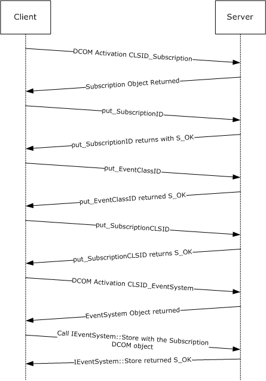
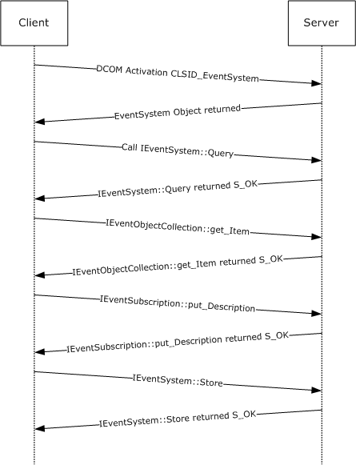
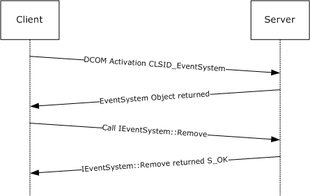

# [MS-COMEV]: Component Object Model Plus (COM+) Event System Protocol

Table of Contents

1 Introduction

- [1 Introduction](#Section_1)
  - [1.1 Glossary](#Section_1.1)
  - [1.2 References](#Section_1.2)
    - [1.2.1 Normative References](#Section_1.2.1)
    - [1.2.2 Informative References](#Section_1.2.2)
  - [1.3 Overview](#Section_1.3)
    - [1.3.1 Background](#Section_1.3.1)
    - [1.3.2 Component Object Model Plus (COM+) Event System Protocol](#Section_1.3.2)
  - [1.4 Relationship to Other Protocols](#Section_1.4)
  - [1.5 Prerequisites/Preconditions](#Section_1.5)
  - [1.6 Applicability Statement](#Section_1.6)
  - [1.7 Versioning and Capability Negotiation](#Section_1.7)
  - [1.8 Vendor-Extensible Fields](#Section_1.8)
  - [1.9 Standards Assignments](#Section_1.9)

2 Messages

- [2 Messages](#Section_2)
  - [2.1 Transport](#Section_2.1)
  - [2.2 Common Data Types](#Section_2.2)
    - [2.2.1 Query Strings](#Section_2.2.1)
    - [2.2.2 Application-Specific Properties](#Section_2.2.2)
      - [2.2.2.1 Property Names](#Section_2.2.2.1)
      - [2.2.2.2 Property Value Types](#Section_2.2.2.2)
    - [2.2.3 Curly-Braced GUID Strings](#Section_2.2.3)
    - [2.2.4 Entity Name String](#Section_2.2.4)
    - [2.2.5 ImplementationSpecificPathProperty](#Section_2.2.5)
    - [2.2.6 EventClassCollectionIdentifier](#Section_2.2.6)
    - [2.2.7 SubscriptionCollectionIdentifier](#Section_2.2.7)

3 Protocol Details

- [3 Protocol Details](#Section_3)
  - [3.1 Server Details](#Section_3.1)
    - [3.1.1 Abstract Data Model](#Section_3.1.1)
      - [3.1.1.1 Event Classes](#Section_3.1.1.1)
      - [3.1.1.2 Subscriptions](#Section_3.1.1.2)
      - [3.1.1.3 Event System](#Section_3.1.1.3)
    - [3.1.2 Timers](#Section_3.1.2)
    - [3.1.3 Initialization](#Section_3.1.3)
    - [3.1.4 Message Processing Events and Sequencing Rules](#Section_3.1.4)
      - [3.1.4.1 IEventSystem](#Section_3.1.4.1)
        - [3.1.4.1.1 Query (Opnum 7)](#Section_3.1.4.1.1)
        - [3.1.4.1.2 Store (Opnum 8)](#Section_3.1.4.1.2)
        - [3.1.4.1.3 Remove (Opnum 9)](#Section_3.1.4.1.3)
        - [3.1.4.1.4 get_EventObjectChangeEventClassID (Opnum 10)](#Section_3.1.4.1.4)
        - [3.1.4.1.5 QueryS (Opnum 11)](#Section_3.1.4.1.5)
        - [3.1.4.1.6 RemoveS (Opnum 12)](#Section_3.1.4.1.6)
      - [3.1.4.2 IEventClass](#Section_3.1.4.2)
        - [3.1.4.2.1 get_EventClassID (Opnum 7)](#Section_3.1.4.2.1)
        - [3.1.4.2.2 put_EventClassID (Opnum 8)](#Section_3.1.4.2.2)
        - [3.1.4.2.3 get_EventClassName (Opnum 9)](#Section_3.1.4.2.3)
        - [3.1.4.2.4 put_EventClassName (Opnum 10)](#Section_3.1.4.2.4)
        - [3.1.4.2.5 get_OwnerSID (Opnum 11)](#Section_3.1.4.2.5)
        - [3.1.4.2.6 put_OwnerSID (Opnum 12)](#Section_3.1.4.2.6)
        - [3.1.4.2.7 get_FiringInterfaceID (Opnum 13)](#Section_3.1.4.2.7)
        - [3.1.4.2.8 put_FiringInterfaceID (Opnum 14)](#Section_3.1.4.2.8)
        - [3.1.4.2.9 get_Description (Opnum 15)](#Section_3.1.4.2.9)
        - [3.1.4.2.10 put_Description (Opnum 16)](#Section_3.1.4.2.10)
        - [3.1.4.2.11 get_TypeLib (Opnum 19)](#Section_3.1.4.2.11)
        - [3.1.4.2.12 put_TypeLib (Opnum 20)](#Section_3.1.4.2.12)
      - [3.1.4.3 IEventClass2](#Section_3.1.4.3)
        - [3.1.4.3.1 get_PublisherID (Opnum 21)](#Section_3.1.4.3.1)
        - [3.1.4.3.2 put_PublisherID (Opnum 22)](#Section_3.1.4.3.2)
        - [3.1.4.3.3 get_MultiInterfacePublisherFilterCLSID (Opnum 23)](#Section_3.1.4.3.3)
        - [3.1.4.3.4 put_MultiInterfacePublisherFilterCLSID (Opnum 24)](#Section_3.1.4.3.4)
        - [3.1.4.3.5 get_AllowInprocActivation (Opnum 25)](#Section_3.1.4.3.5)
        - [3.1.4.3.6 put_AllowInprocActivation (Opnum 26)](#Section_3.1.4.3.6)
        - [3.1.4.3.7 get_FireInParallel (Opnum 27)](#Section_3.1.4.3.7)
        - [3.1.4.3.8 put_FireInParallel (Opnum 28)](#Section_3.1.4.3.8)
      - [3.1.4.4 IEventSubscription](#Section_3.1.4.4)
        - [3.1.4.4.1 get_SubscriptionID (Opnum 7)](#Section_3.1.4.4.1)
        - [3.1.4.4.2 put_SubscriptionID (Opnum 8)](#Section_3.1.4.4.2)
        - [3.1.4.4.3 get_SubscriptionName (Opnum 9)](#Section_3.1.4.4.3)
        - [3.1.4.4.4 put_SubscriptionName (Opnum 10)](#Section_3.1.4.4.4)
        - [3.1.4.4.5 get_PublisherID (Opnum 11)](#Section_3.1.4.4.5)
        - [3.1.4.4.6 put_PublisherID (Opnum 12)](#Section_3.1.4.4.6)
        - [3.1.4.4.7 get_EventClassID (Opnum 13)](#Section_3.1.4.4.7)
        - [3.1.4.4.8 put_EventClassID (Opnum 14)](#Section_3.1.4.4.8)
        - [3.1.4.4.9 get_MethodName (Opnum 15)](#Section_3.1.4.4.9)
        - [3.1.4.4.10 put_MethodName (Opnum 16)](#Section_3.1.4.4.10)
        - [3.1.4.4.11 get_SubscriberCLSID (Opnum 17)](#Section_3.1.4.4.11)
        - [3.1.4.4.12 put_SubscriberCLSID (Opnum 18)](#Section_3.1.4.4.12)
        - [3.1.4.4.13 get_SubscriberInterface (Opnum 19)](#Section_3.1.4.4.13)
        - [3.1.4.4.14 put_SubscriberInterface (Opnum 20)](#Section_3.1.4.4.14)
        - [3.1.4.4.15 get_PerUser (Opnum 21)](#Section_3.1.4.4.15)
        - [3.1.4.4.16 put_PerUser (Opnum 22)](#Section_3.1.4.4.16)
        - [3.1.4.4.17 get_OwnerSID (Opnum 23)](#Section_3.1.4.4.17)
        - [3.1.4.4.18 put_OwnerSID (Opnum 24)](#Section_3.1.4.4.18)
        - [3.1.4.4.19 get_Enabled (Opnum 25)](#Section_3.1.4.4.19)
        - [3.1.4.4.20 put_Enabled (Opnum 26)](#Section_3.1.4.4.20)
        - [3.1.4.4.21 get_Description (Opnum 27)](#Section_3.1.4.4.21)
        - [3.1.4.4.22 put_Description (Opnum 28)](#Section_3.1.4.4.22)
        - [3.1.4.4.23 get_MachineName (Opnum 29)](#Section_3.1.4.4.23)
        - [3.1.4.4.24 put_MachineName (Opnum 30)](#Section_3.1.4.4.24)
        - [3.1.4.4.25 GetPublisherProperty (Opnum 31)](#Section_3.1.4.4.25)
        - [3.1.4.4.26 PutPublisherProperty (Opnum 32)](#Section_3.1.4.4.26)
        - [3.1.4.4.27 RemovePublisherProperty (Opnum 33)](#Section_3.1.4.4.27)
        - [3.1.4.4.28 GetPublisherPropertyCollection (Opnum 34)](#Section_3.1.4.4.28)
        - [3.1.4.4.29 GetSubscriberProperty (Opnum 35)](#Section_3.1.4.4.29)
        - [3.1.4.4.30 PutSubscriberProperty (Opnum 36)](#Section_3.1.4.4.30)
        - [3.1.4.4.31 RemoveSubscriberProperty (Opnum 37)](#Section_3.1.4.4.31)
        - [3.1.4.4.32 GetSubscriberPropertyCollection (Opnum 38)](#Section_3.1.4.4.32)
        - [3.1.4.4.33 get_InterfaceID (Opnum 39)](#Section_3.1.4.4.33)
        - [3.1.4.4.34 put_InterfaceID (Opnum 40)](#Section_3.1.4.4.34)
      - [3.1.4.5 IEnumEventObject](#Section_3.1.4.5)
        - [3.1.4.5.1 Clone (Opnum 3)](#Section_3.1.4.5.1)
        - [3.1.4.5.2 Next (Opnum 4)](#Section_3.1.4.5.2)
        - [3.1.4.5.3 Reset (Opnum 5)](#Section_3.1.4.5.3)
        - [3.1.4.5.4 Skip (Opnum 6)](#Section_3.1.4.5.4)
      - [3.1.4.6 IEventObjectCollection](#Section_3.1.4.6)
        - [3.1.4.6.1 get__NewEnum (Opnum 7)](#Section_3.1.4.6.1)
        - [3.1.4.6.2 get_Item (Opnum 8)](#Section_3.1.4.6.2)
        - [3.1.4.6.3 get_NewEnum (Opnum 9)](#Section_3.1.4.6.3)
        - [3.1.4.6.4 get_Count (Opnum 10)](#Section_3.1.4.6.4)
        - [3.1.4.6.5 Add (Opnum 11)](#Section_3.1.4.6.5)
        - [3.1.4.6.6 Remove (Opnum 12)](#Section_3.1.4.6.6)
      - [3.1.4.7 IEventClass3](#Section_3.1.4.7)
        - [3.1.4.7.1 get_EventClassPartitionID (Opnum 29)](#Section_3.1.4.7.1)
        - [3.1.4.7.2 put_EventClassPartitionID (Opnum 30)](#Section_3.1.4.7.2)
        - [3.1.4.7.3 get_EventClassApplicationID (Opnum 31)](#Section_3.1.4.7.3)
        - [3.1.4.7.4 put_EventClassApplicationID (Opnum 32)](#Section_3.1.4.7.4)
      - [3.1.4.8 IEventSubscription2](#Section_3.1.4.8)
        - [3.1.4.8.1 get_FilterCriteria (Opnum 41)](#Section_3.1.4.8.1)
        - [3.1.4.8.2 put_FilterCriteria (Opnum 42)](#Section_3.1.4.8.2)
        - [3.1.4.8.3 get_SubscriberMoniker (Opnum 43)](#Section_3.1.4.8.3)
        - [3.1.4.8.4 put_SubscriberMoniker (Opnum 44)](#Section_3.1.4.8.4)
      - [3.1.4.9 IEventSubscription3](#Section_3.1.4.9)
        - [3.1.4.9.1 get_EventClassPartitionID (Opnum 45)](#Section_3.1.4.9.1)
        - [3.1.4.9.2 put_EventClassPartitionID (Opnum 46)](#Section_3.1.4.9.2)
        - [3.1.4.9.3 get_EventClassApplicationID (Opnum 47)](#Section_3.1.4.9.3)
        - [3.1.4.9.4 put_EventClassApplicationID (Opnum 48)](#Section_3.1.4.9.4)
        - [3.1.4.9.5 get_SubscriberPartitionID (Opnum 49)](#Section_3.1.4.9.5)
        - [3.1.4.9.6 put_SubscriberPartitionID (Opnum 50)](#Section_3.1.4.9.6)
        - [3.1.4.9.7 get_SubscriberApplicationID (Opnum 51)](#Section_3.1.4.9.7)
        - [3.1.4.9.8 put_SubscriberApplicationID (Opnum 52)](#Section_3.1.4.9.8)
      - [3.1.4.10 IEventSystem2](#Section_3.1.4.10)
        - [3.1.4.10.1 GetVersion (Opnum 13)](#Section_3.1.4.10.1)
        - [3.1.4.10.2 VerifyTransientSubscribers (Opnum 14)](#Section_3.1.4.10.2)
      - [3.1.4.11 IEventSystemInitialize](#Section_3.1.4.11)
        - [3.1.4.11.1 SetCOMCatalogBehaviour (Opnum 3)](#Section_3.1.4.11.1)
    - [3.1.5 Timer Events](#Section_3.1.5)
    - [3.1.6 Other Local Events](#Section_3.1.6)

4 Protocol Examples

- [4 Protocol Examples](#Section_4)
  - [4.1 Creating an Event Class](#Section_4.1)
  - [4.2 Creating a Subscription](#Section_4.2)
  - [4.3 Updating a Subscription](#Section_4.3)
  - [4.4 Removing a Subscription](#Section_4.4)

5 Security

- [5 Security](#Section_5)
  - [5.1 Security Considerations for Implementers](#Section_5.1)
  - [5.2 Index of Security Parameters](#Section_5.2)

6 Appendix A: Full IDL

- [6 Appendix A: Full IDL](#Section_6)

7 Appendix B: Product Behavior

- [7 Appendix B: Product Behavior](#Section_7)

8 Change Tracking

- [8 Change Tracking](#Section_8)

For the legal notice and IP terms, see [LEGAL.md](../LEGAL.md).
Last updated: 9/9/2025.
See [Revision History](#revision-history) for full version history.

# 1 Introduction

This document specifies the behavior of the Component Object Model Plus (COM+) Event System Protocol.

The COM+ Event System Protocol is a protocol that exposes DCOM interfaces for storing and managing configuration data for [**publishers**](#gt_publisher) of [**events**](#gt_event) and their respective [**subscribers**](#gt_subscriber) on remote computers. This protocol also specifies how to get specific information about a publisher and its subscribers.

Sections 1.5, 1.8, 1.9, 2, and 3 of this specification are normative. All other sections and examples in this specification are informative.

## 1.1 Glossary

This document uses the following terms:

**activation**: In the DCOM protocol, a mechanism by which a client provides the [**CLSID**](#gt_class-identifier-clsid) of an [**object class**](#gt_object-class) and obtains an [**object**](#gt_object), either from that [**object class**](#gt_object-class) or a class factory that is able to create such objects. For more information, see [MS-DCOM](../MS-DCOM/MS-DCOM.md).

**class identifier (CLSID)**: A [**GUID**](#gt_globally-unique-identifier-guid) that identifies a software component; for instance, a DCOM [**object class**](#gt_object-class) or a COM class.

**client**: A computer on which the remote procedure call (RPC) client is executing.

**computer name**: The DNS or NetBIOS name.

**conglomeration**: A collection of [**event classes**](#gt_event-class) and [**subscriptions**](#gt_subscription) together with independent configuration data that is conceptually shared by the both the [**event classes**](#gt_event-class) and [**subscriptions**](#gt_subscription). A conglomeration is identified by a conglomeration identifier.

**event**: A discrete unit of historical data that an application exposes that can be relevant to other applications. An example of an event would be a particular user logging on to the computer.

**event class**: A collection of historical data grouped together using criteria specified by the publishing application.

**event interface**: A collection of [**event methods**](#gt_event-method). An [**event class**](#gt_event-class) contains one or more [**event interfaces**](#gt_event-interface).

**event method**: A method called by the [**publisher-subscriber framework**](#gt_publisher-subscriber-framework) when the [**publisher**](#gt_publisher) application generates an [**event**](#gt_event).

**filtering criteria**: A set of rules specified by a [**subscriber**](#gt_subscriber) as part of a [**subscription**](#gt_subscription) to define the type of historical data it wants to receive.

**globally unique identifier (GUID)**: A term used interchangeably with [**universally unique identifier (UUID)**](#gt_universally-unique-identifier-uuid) in Microsoft protocol technical documents (TDs). Interchanging the usage of these terms does not imply or require a specific algorithm or mechanism to generate the value. Specifically, the use of this term does not imply or require that the algorithms described in [[RFC4122]](https://go.microsoft.com/fwlink/?LinkId=90460) or [[C706]](https://go.microsoft.com/fwlink/?LinkId=89824) have to be used for generating the GUID. See also universally unique identifier (UUID).

**GUID_NULL**: A [**GUID**](#gt_globally-unique-identifier-guid) that has the value "{00000000-0000-0000-0000-000000000000}".

**interface pointer**: A pointer to an interface that is implemented by an [MS-DCOM] [**object**](#gt_object).

**object**: In the DCOM protocol, a software entity that implements one or more object remote protocol (ORPC) interfaces and which is uniquely identified, within the scope of an object exporter, by an object identifier (OID). For more information, see [MS-DCOM].

**object class**: In the DCOM protocol, a category of [**objects**](#gt_object) identified by a [**CLSID**](#gt_class-identifier-clsid), members of which can be obtained through [**activation**](#gt_activation) of the [**CLSID**](#gt_class-identifier-clsid). An [**object class**](#gt_object-class) is typically associated with a common set of interfaces that are implemented by all [**objects**](#gt_object) in the [**object class**](#gt_object-class).

**opnum**: An operation number or numeric identifier that is used to identify a specific [**remote procedure call (RPC)**](#gt_remote-procedure-call-rpc) method or a method in an interface. For more information, see [C706] section 12.5.2.12 or [MS-RPCE](../MS-RPCE/MS-RPCE.md).

**partition**: A container for a specific configuration of a COM+ [**object class**](#gt_object-class).

**partition identifier**: A GUID that identifies a partition.

**path**: When referring to a file path on a file system, a hierarchical sequence of folders. When referring to a connection to a storage device, a connection through which a machine can communicate with the storage device.

**persistent subscription**: A [**subscription**](#gt_subscription) in which the [**subscriber**](#gt_subscriber) supplies the data necessary to obtain an object that will receive historical data.

**publisher**: An application that needs to publish historical data that could be of interest to other applications.

**publisher-subscriber framework**: An application framework that allows applications to expose historical data to other applications that might receive this data.

**remote procedure call (RPC)**: A communication protocol used primarily between client and server. The term has three definitions that are often used interchangeably: a runtime environment providing for communication facilities between computers (the RPC runtime); a set of request-and-response message exchanges between computers (the RPC exchange); and the single message from an RPC exchange (the RPC message). For more information, see [C706].

**security identifier (SID)**: An identifier for [**security principals**](#gt_security-principal) that is used to identify an account or a group. Conceptually, the [**SID**](#gt_security-identifier-sid) is composed of an account authority portion (typically a domain) and a smaller integer representing an identity relative to the account authority, termed the relative identifier (RID). The [**SID**](#gt_security-identifier-sid) format is specified in [MS-DTYP](../MS-DTYP/MS-DTYP.md) section 2.4.2; a string representation of [**SIDs**](#gt_security-identifier-sid) is specified in [MS-DTYP] section 2.4.2 and [MS-AZOD](../MS-AZOD/MS-AZOD.md) section 1.1.1.2.

**security principal**: A unique entity that is identifiable through cryptographic means by at least one key. It frequently corresponds to a human user, but also can be a service that offers a resource to other security principals. Also referred to as principal.

**server**: A computer on which the [**remote procedure call (RPC)**](#gt_remote-procedure-call-rpc) server is executing.

**subscriber**: An application that needs to receive events that are published by another application.

**subscription**: A registration performed by a [**subscriber**](#gt_subscriber) to specify a requirement to receive events, future messages, or historical data.

**transient subscription**: A [**subscription**](#gt_subscription) in which the [**subscriber**](#gt_subscriber) supplies the object that will receive historical data.

**type library**: A type collection which defines an [**event class**](#gt_event-class) in terms of its [**event interfaces**](#gt_event-interface). A type library is specified by using a [**type library file**](#gt_type-library-file).

**type library file**: A [**path**](#gt_path) name that identifies a [**type library**](#gt_type-library).

**Universal Naming Convention (UNC)**: A string format that specifies the location of a resource. For more information, see [MS-DTYP] section 2.2.57.

**universally unique identifier (UUID)**: A 128-bit value. UUIDs can be used for multiple purposes, from tagging objects with an extremely short lifetime, to reliably identifying very persistent objects in cross-process communication such as client and server interfaces, manager entry-point vectors, and [**RPC**](#gt_remote-procedure-call-rpc) objects. UUIDs are highly likely to be unique. UUIDs are also known as [**globally unique identifiers (GUIDs)**](#gt_globally-unique-identifier-guid) and these terms are used interchangeably in the Microsoft protocol technical documents (TDs). Interchanging the usage of these terms does not imply or require a specific algorithm or mechanism to generate the UUID. Specifically, the use of this term does not imply or require that the algorithms described in [RFC4122] or [C706] has to be used for generating the UUID.

**MAY, SHOULD, MUST, SHOULD NOT, MUST NOT:** These terms (in all caps) are used as defined in [[RFC2119]](https://go.microsoft.com/fwlink/?LinkId=90317). All statements of optional behavior use either MAY, SHOULD, or SHOULD NOT.

## 1.2 References

Links to a document in the Microsoft Open Specifications library point to the correct section in the most recently published version of the referenced document. However, because individual documents in the library are not updated at the same time, the section numbers in the documents may not match. You can confirm the correct section numbering by checking the [Errata](https://go.microsoft.com/fwlink/?linkid=850906).

### 1.2.1 Normative References

We conduct frequent surveys of the normative references to assure their continued availability. If you have any issue with finding a normative reference, please contact [dochelp@microsoft.com](mailto:dochelp@microsoft.com). We will assist you in finding the relevant information.

[C706] The Open Group, "DCE 1.1: Remote Procedure Call", C706, August 1997, [https://publications.opengroup.org/c706](https://go.microsoft.com/fwlink/?LinkId=89824)

**Note** Registration is required to download the document.

[MS-DCOM] Microsoft Corporation, "[Distributed Component Object Model (DCOM) Remote Protocol](../MS-DCOM/MS-DCOM.md)".

[MS-DTYP] Microsoft Corporation, "[Windows Data Types](../MS-DTYP/MS-DTYP.md)".

[MS-ERREF] Microsoft Corporation, "[Windows Error Codes](../MS-ERREF/MS-ERREF.md)".

[MS-OAUT] Microsoft Corporation, "[OLE Automation Protocol](../MS-OAUT/MS-OAUT.md)".

[RFC2119] Bradner, S., "Key words for use in RFCs to Indicate Requirement Levels", BCP 14, RFC 2119, March 1997, [https://www.rfc-editor.org/info/rfc2119](https://go.microsoft.com/fwlink/?LinkId=90317)

[RFC4122] Leach, P., Mealling, M., and Salz, R., "A Universally Unique Identifier (UUID) URN Namespace", RFC 4122, July 2005, [https://www.rfc-editor.org/info/rfc4122](https://go.microsoft.com/fwlink/?LinkId=90460)

[RFC4234] Crocker, D., Ed., and Overell, P., "Augmented BNF for Syntax Specifications: ABNF", RFC 4234, October 2005, [https://www.rfc-editor.org/info/rfc4234](https://go.microsoft.com/fwlink/?LinkId=90462)

### 1.2.2 Informative References

[MS-COMA] Microsoft Corporation, "[Component Object Model Plus (COM+) Remote Administration Protocol](../MS-COMA/MS-COMA.md)".

[MSDN-COM+Events] Microsoft Corporation, "COM+ Events", [http://msdn.microsoft.com/en-us/library/ms679237.aspx](https://go.microsoft.com/fwlink/?LinkId=92754)

[MSDN-COM+] Microsoft Corporation, "COM+ (Component Services)", [http://msdn.microsoft.com/en-us/library/ms685978.aspx](https://go.microsoft.com/fwlink/?LinkId=92752)

[MSDN-ITypeLib] Microsoft Corporation, "ITypeLib", [http://msdn.microsoft.com/en-us/library/ms890643.aspx](https://go.microsoft.com/fwlink/?LinkId=90031)

## 1.3 Overview

### 1.3.1 Background

A [**publisher-subscriber framework**](#gt_publisher-subscriber-framework) allows applications to publish historical information that might be of interest to other applications. The applications publishing the information are called [**publishers**](#gt_publisher), while the applications subscribing to the information are called [**subscribers**](#gt_subscriber). A publisher specifies this information in discrete sets called [**events**](#gt_event). Similarly, a subscriber can subscribe to an event by creating a [**subscription**](#gt_subscription) for it.

### 1.3.2 Component Object Model Plus (COM+) Event System Protocol

The COM+ Event System Protocol provides a way to manage [**events**](#gt_event) and their respective [**subscriptions**](#gt_subscription) on a remote machine. The protocol is exposed as a set of DCOM [MS-DCOM](../MS-DCOM/MS-DCOM.md) interfaces.

Using the protocol a [**publisher**](#gt_publisher) can publish, update, or delete an event on a remote machine. Similarly, a [**subscriber**](#gt_subscriber) can use the protocol to create a subscription for an event on a remote machine. It can also modify, query, or delete subscriptions for an event on the remote machine.

A subscriber can specify that it wishes to receive a specific type of event or a collection of events. This is defined by specifying [**filtering criteria**](#gt_filtering-criteria).

## 1.4 Relationship to Other Protocols

The COM+ Event System Protocol uses DCOM [MS-DCOM](../MS-DCOM/MS-DCOM.md) to communicate over the wire and authenticate all requests issued against the infrastructure. Along with DCOM, this protocol also uses the OLE Automation Protocol [MS-OAUT](../MS-OAUT/MS-OAUT.md) by using datatypes BSTR and VARIANT from the IDispatch interface.

The protocol described in [MS-COMA](../MS-COMA/MS-COMA.md) can be used to perform the registration of [**type libraries**](#gt_type-library) for [**event classes**](#gt_event-class) and [**subscriber**](#gt_subscriber) DCOM components used by the COM+ Event System Protocol. It can also be used to discover subscriber DCOM components registered on the [**server**](#gt_server) to create [**subscriptions**](#gt_subscription).

## 1.5 Prerequisites/Preconditions

This protocol assumes that the [**client**](#gt_client) is in possession of valid credentials recognized by the [**server**](#gt_server) accepting the client requests.

## 1.6 Applicability Statement

The COM+ Event System Protocol is applicable to managing a store for [**publisher/subscriber**](#gt_publisher-subscriber-framework) [**events**](#gt_event) and [**subscriptions**](#gt_subscription) for scenarios where scalability requirements are minimal. It is not intended for scenarios where the type of events and their [**subscribers**](#gt_subscriber) are more than 100. Also, the protocol is intended for scenarios where access to the event store resulting from adding, reading, updating, and deleting subscriptions and events are on the order of once every few minutes.

## 1.7 Versioning and Capability Negotiation

This document covers versioning issues in the following areas:

- **Protocol Versions**: This protocol has multiple interfaces, supported by different versions of the [**server**](#gt_server). The [**client**](#gt_client) of this protocol can determine the version of the server by calling [GetVersion](#Section_3.1.4.10.1) method (section 3.1.4.10.1).

## 1.8 Vendor-Extensible Fields

This protocol uses HRESULTs as defined in [MS-ERREF](../MS-ERREF/MS-ERREF.md). Vendors are free to choose their own values for this field, as long as the C bit (0x20000000) is set, indicating it is a customer code.

## 1.9 Standards Assignments

The following is a table of well-known GUIDs (generated using the mechanism specified in [[C706]](https://go.microsoft.com/fwlink/?LinkId=89824) section A.2.5) in this protocol.

| Parameter | Meaning | Value |
| --- | --- | --- |
| CLSID_EventSystem | [**CLSID**](#gt_class-identifier-clsid) for EventSystem | {4E14FBA2-2E22-11D1-9964-00C04FBBB345} |
| CLSID_EventClass | CLSID for EventClass | {cdbec9c0-7a68-11d1-88f9-0080c7d771bf} |
| CLSID_EventSubscription | CLSID for [**Subscription**](#gt_subscription) | {7542e960-79c7-11d1-88f9-0080c7d771bf} |
| GUID_DefaultAppPartition | GUID for default partition | {41E90F3E-56C1-4633-81C3-6E8BAC8BDD70} |

# 2 Messages

## 2.1 Transport

All the protocol messages MUST be transported using DCOM [MS-DCOM](../MS-DCOM/MS-DCOM.md). The protocol uses the dynamic endpoints allocated and managed by the DCOM infrastructure.

## 2.2 Common Data Types

In addition to [**RPC**](#gt_remote-procedure-call-rpc) base types and definitions specified in [[C706]](https://go.microsoft.com/fwlink/?LinkId=89824) and [MS-DTYP](../MS-DTYP/MS-DTYP.md), additional data types are defined in the following sections.

### 2.2.1 Query Strings

The query string in the protocol is used for querying for [**subscriptions**](#gt_subscription), querying for [**events**](#gt_event), and specifying [**filtering criteria**](#gt_filtering-criteria). The following is the Augmented Backus-Naur Form (ABNF) [[RFC4234]](https://go.microsoft.com/fwlink/?LinkId=90462) syntax for the protocol query string.

QUERY = "ALL" / (OREXPRESSION)

OREXPRESSION = (ANDEXPRESSION OREXPRTAIL) / (ANDEXPRESSION)

OREXPRTAIL = (OROPERATOR ANDEXPRESSION OREXPRTAIL) / (OROPERATOR ANDEXPRESSION)

ANDEXPRESSION = (UNARYEXPRESSION ANDEXPRTAIL) / (UNARYEXPRESSION)

ANDEXPRTAIL = (ANDOPERATOR UNARYEXPRESSION ANDEXPRTAIL) / (ANDOPERATOR UNARYEXPRESSION)

ANDOPERATOR = "&" / "AND"

OROPERATOR = "|" / "OR"

UNARYEXPRESSION =(NOTOPERATOR UNARYEXPRESSION) / (COMPARISONEXPRESSION)

NOTOPERATOR = "!" / "~" / "NOT"

COMPARISONEXPRESSION = (COLUMNID COMPARISONOPERATOR COMPERAND) / ("("OREXPRESSION")")

COMPARISONOPERATOR = "=" / "==" / "!=" / "~=" / "<>"

COMPERAND = (CONSTANT) / (OPENPAREN CHOICE CLOSEPAREN)

CHOICE = (CONSTANT MORECHOICES) / (CONSTANT)

MORECHOICES = (ANDOROPERATOR CONSTANT MORECHOICES) / (ANDOROPERATOR CONSTANT)

ANDOROPERATOR = (ANDOPERATOR) / (OROPERATOR)

CONSTANT = (SINGLEQUOTE STRINGVALUE SINGLEQUOTE)/ (DQUOTE STRINGVALUE DQUOTE) /

(OPENCURLY UUID CLOSECURLY) / (INTEGERVALUE) / "TRUE" / "FALSE" / "NULL"

STRINGVALUE= 1*ALPHA

INTEGERVALUE = ["-" / "+"] 1*DIGIT

COLUMNID = KNOWNCOLUMNID / 1*ALPHA

KNOWNCOLUMNID = "EVENTCLASSID" / "EVENTCLASSNAME" / "OWNERSID" /

"FIRINGINTERFACEIID" / "CUSTOMCONFIGCLASSID" / "DESCRIPTION" / "TYPELIB" /

"MULTIINTERFACEPUBLISHERFILTERCLSID" / "ALLOWINPROCACTIVATION" / "FIREINPARALLEL" /

"EVENTCLASSPARTITIONID" / "EVENTCLASSAPPLICATIONID" / "SUBSCRIPTIONID" /

"SUBSCRIPTIONNAME" / "PUBLISHERID" / "SUBSCRIBERCLSID" / "PERUSER" / "OWNERSID" /

"ENABLED" / "MACHINENAME" / "INTERFACEID" / "FILTERCRITERIA" /

"SUBSCRIBERMONIKER" / "SUBSCRIBERPARTITIONID" / SUBSCRIBERAPPLICATIONID"

OPENPAREN = "("

CLOSEPAREN = ")"

SINGLEQUOTE = "'"

OPENCURLY = "{"

CLOSECURLY = "}"

DIGIT, DQUOTE, and ALPHA are as specified in [RFC4234] appendix B.

[**UUID**](#gt_universally-unique-identifier-uuid) represents the string form of a UUID as specified in [[RFC4122]](https://go.microsoft.com/fwlink/?LinkId=90460) section 3.

Each KNOWNCOLUMNID maps to a property of an [**event class**](#gt_event-class) or a subscription property.<1> These are specified in section [3.1.1.1](#Section_3.1.1.1) and section [3.1.1.2](#Section_3.1.4.4).

### 2.2.2 Application-Specific Properties

The protocol allows applications to associate custom properties with its [**objects**](#gt_object). Each property is identified by means of a unique name, and has a value.

#### 2.2.2.1 Property Names

The following is the ABNF [[RFC4234]](https://go.microsoft.com/fwlink/?LinkId=90462) syntax for these names.

APPPROPERTYNAME = 1*255ALPHA

#### 2.2.2.2 Property Value Types

These are of VARIANT type as specified in [MS-OAUT](../MS-OAUT/MS-OAUT.md) section 2.2.29.2. The VARIANT type MUST be one of the following: VT_BSTR, VT_I4, VT_I8, VT_I2, or VT_UNKNOWN as specified in [MS-OAUT] section 2.2.7.

### 2.2.3 Curly-Braced GUID Strings

This type is a string representation of the [**GUID**](#gt_globally-unique-identifier-guid) type, as specified in [MS-DTYP](../MS-DTYP/MS-DTYP.md) section 2.3.4. The following is the ABNF [[RFC4234]](https://go.microsoft.com/fwlink/?LinkId=90462) syntax for this representation.

CurlyBraceGuidString = "{" UUID "}"

[**UUID**](#gt_universally-unique-identifier-uuid) represents the string form of a UUID as specified in [[RFC4122]](https://go.microsoft.com/fwlink/?LinkId=90460) section 3.

### 2.2.4 Entity Name String

The following is the ABNF [[RFC4234]](https://go.microsoft.com/fwlink/?LinkId=90462) syntax for these names.

APPPROPERTYNAME = 1*255ALPHA

### 2.2.5 ImplementationSpecificPathProperty

The ImplementationSpecificPathProperty represents a path to a resource in a format that is specific to a COMEV server implementation. For writes to properties of this type, a server SHOULD accept a path in [**Universal Naming Convention (UNC)**](#gt_universal-naming-convention-unc) and MAY<2> accept additional formats (for example, a path in a local namespace to a local resource).

Properties of this type MUST be specified as a BSTR and MUST have a character length of at least 1 and at most 260.

### 2.2.6 EventClassCollectionIdentifier

The EventClassCollectionIdentifier is used to identify an [event class](#Section_3.1.1.1) in an event collection (see section [3.1.4.6.2](#Section_3.1.4.6.2)). The format of the identifier depends on the protocol version that is implemented by the server (see section [3.1.4.10.1](#Section_3.1.4.10.1)).

The following is the ABNF syntax [[RFC4234]](https://go.microsoft.com/fwlink/?LinkId=90462) for these identifiers on servers that implement protocol version 1.

EventClassCollectionIdentifier = EventClassID

EventClassID = CurlyBraceGuidString

The following is the ABNF syntax for these identifiers on servers that implement protocol version 2.

EventClassCollectionIdentifier = EventClassID "-" PartitionID "-" ApplicationID

EventClassID = CurlyBraceGuidString

PartitionID = CurlyBraceGuidString

ApplicationID = CurlyBraceGuidString

### 2.2.7 SubscriptionCollectionIdentifier

The SubscriptionCollectionIdentifier is used to identify a [subscription](#Section_3.1.4.4) in a subscription collection (see section [3.1.4.6.2](#Section_3.1.4.6.2)). The format of the identifier depends on the version of the protocol that is implemented by the server (see section [3.1.4.10.1](#Section_3.1.4.10.1)).

The following is the ABNF syntax [[RFC4234]](https://go.microsoft.com/fwlink/?LinkId=90462) for these identifiers on servers that implement protocol version 1.

SubscriptionCollectionIdentifier = SubscriptionID

SubscriptionID = CurlyBraceGuidString

The following is the ABNF syntax for these identifiers on servers that implement protocol version 2.

SubscriptionCollectionIdentifier = SubscriptionID "-" PartitionID "-" ApplicationID

SubscriptionID = CurlyBraceGuidString

PartitionID = CurlyBraceGuidString

ApplicationID = CurlyBraceGuidString

# 3 Protocol Details

The [**client**](#gt_client) application initiates the conversation with the [**server**](#gt_server) by performing DCOM [**activation**](#gt_activation) (as specified in [MS-DCOM](../MS-DCOM/MS-DCOM.md) section 3.2.4.1.1) of one of the [**class identifiers (CLSIDs)**](#gt_class-identifier-clsid) specified in section [1.9](#Section_1.9). After getting the [**interface pointer**](#gt_interface-pointer) to the DCOM [**object**](#gt_object) as a result of the activation, the client application works with the object by making calls on the DCOM interface it supports. Once done, the client application releases the interface pointer.

## 3.1 Server Details

### 3.1.1 Abstract Data Model

This section describes a conceptual model of possible data organization that an implementation maintains to participate in this protocol. The described organization is provided to facilitate the explanation of how the protocol behaves. This document does not mandate that implementations adhere to this model as long as their external behavior is consistent with that described in this document.

#### 3.1.1.1 Event Classes

A collection of [**event interfaces**](#gt_event-interface) is grouped into an [**event class**](#gt_event-class). An event class manifests as a DCOM [**object**](#gt_object) that supports each of the event interfaces that are part of the event class. This is known as the event class object. The [**publisher**](#gt_publisher) application publishes [**events**](#gt_event) by activating the event class object and calling [**event methods**](#gt_event-method) on it to publish events.

The [**server**](#gt_server) maintains a table of event classes. Each event class has the following properties:

**EventClassName:** An application-specific name for the event class. The KNOWNCOLUMNID for this property is "EVENTCLASSNAME".

**EventClassID:** The DCOM [**CLSID**](#gt_class-identifier-clsid) for the event class object. The KNOWNCOLUMNID for this property is "EVENTCLASSID".

**OwnerSID:** An application-specific identity of the [**security principal**](#gt_security-principal) that owns the event class. The KNOWNCOLUMNID for this property is "OWNERSID".

**FiringInterfaceID:** An application-specific [**UUID**](#gt_universally-unique-identifier-uuid) that identifies the event interface. The KNOWNCOLUMNID for this property is "FIRINGINTERFACEID".

**Description:** An application-specific description for the event class. The KNOWNCOLUMNID for this property is "DESCRIPTION".

**Typelib:** A [**type library file**](#gt_type-library-file) [**path**](#gt_path) as specified in [ImplementationSpecificPathProperty](#Section_2.2.5) for the [**type library**](#gt_type-library) that contains the event class. The KNOWNCOLUMNID for this property is "TYPELIB".<3>

**PublisherID:** An application-specific UUID that uniquely identifies the publisher application. The KNOWNCOLUMNID for this property is "PUBLISHERID".

**MultiInterfacePublisherFilterCLSID:** The publisher application can choose to filter [**subscribers**](#gt_subscriber) for the event class. The publisher application uses a DCOM component for this purpose. It uses this property to specify the CLSID of this component. This DCOM component is given the opportunity to filter on subscribers when an event gets fired. The KNOWNCOLUMNID for this property is "MULTIINTERFACEPUBLISHERFILTERCLSID".<4>

**AllowInprocActivation:** An application-specific Boolean value for controlling the type of [**activation**](#gt_activation) for the subscriber application DCOM component. A value of TRUE indicates that the subscriber application DCOM component wants to be activated in the publisher application. A value of FALSE indicates that it wants to be activated in a separate process. The KNOWNCOLUMNID for this property is "ALLOWINPROCACTIVATION".

**FireInParallel:** An application-specific Boolean value for controlling the way to fire the events for delivery to the subscribers. A value of FALSE indicates that the publisher delivers the events to each subscriber one at a time in any order. A value of TRUE indicates that each subscriber is notified in parallel. The KNOWNCOLUMNID for this property is "FIREINPARALLEL".

**EventClassPartitionID:** The UUID of the [**partition**](#gt_partition) of the event class object. This is used in addition to EventClassID and EventClassApplicationID. The KNOWNCOLUMNID for this property is "EVENTCLASSPARTITIONID".<5>

**EventClassApplicationID:** The UUID of the [**conglomeration**](#gt_conglomeration) of the event class object. This is used in addition to EventClassID and EventClassPartitionID. The KNOWNCOLUMNID for this property is "EVENTCLASSAPPLICATIONID". This property always has the value [**GUID_NULL**](#gt_guid_null).<6>

#### 3.1.1.2 Subscriptions

The [**server**](#gt_server) also maintains a table of [**subscriptions**](#gt_subscription). As with [**event classes**](#gt_event-class), subscriptions have a set of properties. Some of the properties can also be specified as part of the query (as specified in section [2.2.1](#Section_2.2.1)). The following properties are specific to a subscription.

**SubscriptionID:** A [**UUID**](#gt_universally-unique-identifier-uuid) that uniquely identifies the subscription. The KNOWNCOLUMNID for this property is "SUBSCRIPTIONID".

**SubscriptionName:** An application-specific name for the [**subscriber**](#gt_subscriber). The KNOWNCOLUMNID for this property is "SUBSCRIPTIONNAME".

**PublisherID:** The UUID of the [**publisher**](#gt_publisher) for which the subscriber application is to receive [**events**](#gt_event). The publisher identity is defined on the event class by specifying its publisher identity property. The KNOWNCOLUMNID for this property is "PUBLISHERID".

**EventClassID:** The [**CLSID**](#gt_class-identifier-clsid) of the event class for which the subscription is created. The KNOWNCOLUMNID for this property is "EVENTCLASSID".

**MethodName:** The name of the [**event method**](#gt_event-method) for the specific [**event interface**](#gt_event-interface) defined for the specific event class for which the application is creating a subscription.

**SubscriberCLSID:** The CLSID for the subscriber application's DCOM [**object**](#gt_object), which can be activated and then called by the publisher application after the event occurs. This MUST be mutually exclusive with the SubscriberInterface property. A subscription can have both SubscriberCLSID and SubscriberMoniker properties. A subscription with this property is a [**persistent subscription**](#gt_persistent-subscription). The KNOWNCOLUMNID for this property is "SUBSCRIBERCLSID".

**SubscriberInterface:** The DCOM object [**interface pointer**](#gt_interface-pointer) for the subscriber application that receives the notification as a method call when the event occurs. This MUST be mutually exclusive with the SubscriberCLSID and SubscriberMoniker properties. A subscription with this property is a [**transient subscription**](#gt_transient-subscription).

**PerUser:** A Boolean that is set to "True" when the subscription is associated with a logon session; otherwise, it is set to "False". The KNOWNCOLUMNID for this property is "PERUSER".

**OwnerSID:** The owner security identity for the subscription. The KNOWNCOLUMNID for this property is "OWNERSID".

**Enabled:** A Boolean value that specifies whether the subscription is enabled or disabled. If a subscription is enabled, the value of this property is TRUE and the subscribing application receives a notification when the publisher fires an event. If the subscription is disabled, the value of this property is FALSE and the subscribing application does not receive any notification when the publisher application fires the event. The KNOWNCOLUMNID for this property is "ENABLED".

**Description:** An application-specific description for the subscription. The KNOWNCOLUMNID for this property is "DESCRIPTION".

**MachineName:** The [**computer name**](#gt_computer-name) of the server machine where the subscriber application component resides. The KNOWNCOLUMNID for this property is "MACHINENAME".

**InterfaceID:** The UUID that identifies the event interface for the event class for which the subscriber is going to receive an event. The KNOWNCOLUMNID for this property is "INTERFACEID".

**FilterCriteria:** The [**filtering criteria**](#gt_filtering-criteria) for the subscription. The KNOWNCOLUMNID for this property is "FILTERCRITERIA".<7>

**SubscriberMoniker:** A string that identifies the subscriber component. This MUST be mutually exclusive with the SubscriberInterface property. A subscription can have both SubscriberCLSID and SubscriberMoniker properties. A subscription with this property is a persistent subscription. The KNOWNCOLUMNID for this property is "SUBSCRIBERMONIKER".

**EventClassPartitionID:** The UUID of the [**partition**](#gt_partition) of the event class. The KNOWNCOLUMNID for this property is "EVENTCLASSPARTITIONID".

**EventClassApplicationID:** The UUID of the [**conglomeration**](#gt_conglomeration) of the event class. The KNOWNCOLUMNID for this property is "EVENTCLASSAPPLICATIONID". This property always has the value [**GUID_NULL**](#gt_guid_null).

**SubscriberPartitionID:** The UUID of the partition of the subscriber. It is used in addition to the SubscriberCLSID and SubscriberApplicationID properties to uniquely identify the subscriber component. The KNOWNCOLUMNID for this property is "SUBSCRIBERPARTITIONID".

**SubscriberApplicationID:** The UUID of the conglomeration of the subscriber. It is used in addition to the SubscriberCLSID and SubscriberPartitionID properties to uniquely identify the subscriber component. The KNOWNCOLUMNID for this property is "SUBSCRIBERAPPLICATIONID".

**PublisherProperties:** A set of application-specific properties that are associated with the subscription that pertains to the publisher, as specified in section [2.2.2](#Section_2.2.2).

**SubscriberProperties:** A set of application-specific properties that are associated with the subscription that pertains to the subscriber, as specified in section 2.2.2.

#### 3.1.1.3 Event System

The server has two state variables that affect the behavior of the [Store](#Section_3.1.4.1.2), [Remove](#Section_3.1.4.1.3), and [RemoveS](#Section_3.1.4.1.6) methods of the [IEventSystem](#Section_3.1.4.1) interface. The sections describing each method provide more detail. To control these variables, the [SetCOMCatalogBehavior](#Section_17bed20c7841436ba4c33924864828a6) method of the [IEventSystemInitialize](#Section_3.1.4.11) interface is used.

**CatalogMode**: When this Boolean variable is TRUE, the server is in catalog mode. In this mode, the only objects that can be modified are [**transient subscriptions**](#gt_transient-subscription). By default, this variable is FALSE and the server is in non-catalog mode.

**RetainSubKeys**: This Boolean variable can be TRUE only if the server is in catalog mode. This variable affects the behavior of the Store method of the IEventSystem interface. If this variable is TRUE, any properties within the [PublisherProperties](#Section_3.1.4.4) or SubscriberProperties of the existing object are retained and are not deleted, even if they do not exist within the new object. When the variable is FALSE, the PublisherProperties and SubscriberProperties of the new object replace the PublisherProperties and SubscriberProperties of the existing object.

### 3.1.2 Timers

None.

### 3.1.3 Initialization

When the Component Object Model Plus (COM+) Event System Protocol [**server**](#gt_server) starts up, the server MUST begin listening for DCOM [**activation**](#gt_activation) (as specified in [MS-DCOM](../MS-DCOM/MS-DCOM.md) section 3.2.4.1.1) for the [**CLSIDs**](#gt_class-identifier-clsid) specified in section [1.9](#Section_1.9).

### 3.1.4 Message Processing Events and Sequencing Rules

Interfaces described in this section are accessed through DCOM. Therefore, any method call can return DCOM error codes, as specified in [MS-DCOM](../MS-DCOM/MS-DCOM.md) and [MS-ERREF](../MS-ERREF/MS-ERREF.md), in addition to the COM+ Event method-specific codes described in this document.

#### 3.1.4.1 IEventSystem

The IEventSystem interface provides methods to create, query, delete, and update [**event classes**](#gt_event-class) and [**subscriptions**](#gt_subscription). The interface inherits opnums 0 through 6 from IDispatch as specified in [MS-OAUT](../MS-OAUT/MS-OAUT.md) section 3.1.4. The version for this interface is 0.0.

To receive incoming remote calls for this interface, the [**server**](#gt_server) MUST implement a DCOM [**object class**](#gt_object-class) with the [**CLSID**](#gt_class-identifier-clsid) CLSID_EventSystem (see section [1.9](#Section_1.9)) using the [**UUID**](#gt_universally-unique-identifier-uuid) {4E14FB9F-2E22-11D1-9964-00C04FBBB345} for this interface.

The interface includes the following methods beyond those in IDispatch.

Methods in RPC Opnum Order

| Method | Description |
| --- | --- |
| [Query](#Section_3.1.4.1.1) | Queries for a collection of event classes or subscriptions based on a query string. Opnum: 7 |
| [Store](#Section_3.1.4.1.2) | Stores an event class or subscription. Opnum: 8 |
| [Remove](#Section_3.1.4.1.3) | Removes a collection of event classes or subscriptions based on a query. Opnum: 9 |
| [get_EventObjectChangeEventClassID](#Section_3.1.4.1.4) | Returns the CLSID for the event class that notifies when a subscription or an event class has changed. Opnum: 10 |
| [QueryS](#Section_3.1.4.1.5) | Queries for a single event class or subscription based on a query string. Opnum: 11 |
| [RemoveS](#Section_3.1.4.1.6) | Removes a single event class or subscription based on a query. Opnum: 12 |

##### 3.1.4.1.1 Query (Opnum 7)

The Query method is called by a [**client**](#gt_client) to query a collection for a collection of [event classes](#Section_3.1.1.1) or [subscriptions](#Section_3.1.4.4).

[id(1), helpstring("method Query")] HRESULT Query(

[in] BSTR progID,

[in] BSTR queryCriteria,

[out] int* errorIndex,

[out, retval] IUnknown** ppInterface

);

**progID:** A string that identifies the type of collection. The value MUST be one of the following.

| Value | Meaning |
| --- | --- |
| "EventSystem.EventClassCollection" | The store for [**event classes**](#gt_event-class) (as specified in section 3.1.1.1). |
| "EventSystem.EventSubscriptionCollection" | The store for [**subscriptions**](#gt_subscription) (as specified in section 3.1.1.2). |

**queryCriteria:** The actual query string. The syntax for this string MUST conform to section [2.2.1](#Section_2.2.1).

**errorIndex:** The zero-based character index in the *queryCriteria* parameter where an error has occurred. This can occur if the syntax of the query string is incorrect, in which case *errorIndex* specifies the index at which the problematic syntax is present in the *queryCriteria* parameter.

**ppInterface:** If the method returns a success HRESULT, this MUST contain an [**interface pointer**](#gt_interface-pointer) that represents the collection of the event classes or subscriptions based on the criteria specified in the *queryCriteria* parameter.

**Return Values:** An HRESULT that specifies success or failure. All success codes MUST be treated the same, and all failure codes other than EVENT_E_QUERYSYNTAX and EVENT_E_QUERYFIELD MUST be treated the same.

| Return value/code | Description |
| --- | --- |
| 0x80040203 EVENT_E_QUERYSYNTAX | A syntax error occurred while trying to evaluate a query string. |
| 0x80040204 EVENT_E_QUERYFIELD | An invalid field name was used in a query string. |

When this method is called, the [**server**](#gt_server) MUST use the *progID* parameter value to determine the store against which the query needs to be executed and validate the query. If the specified collection is not valid or if the specified query is not valid, the server MUST fail the call and return a failure HRESULT back to the client. Otherwise, the server MUST attempt to use the *queryCriteria* parameter to retrieve a collection of event classes or subscriptions based on the value of the *progID* parameter and fail the call if it cannot. Each of the [**objects**](#gt_object) in the collection MUST be wrapped by a DCOM object that MUST support the [IEventClass](#Section_3.1.4.2) and [IEventClass2](#Section_3.1.4.3) interfaces and MAY<8> support the [IEventClass3](#Section_3.1.4.7) interface if the object is an event class. It MUST support [IEventSubscription](#Section_3.1.4.4) and [IEventSubscription2](#Section_3.1.4.8), and MAY<9> support [IEventSubscription3](#Section_3.1.4.9) if it is a subscription object. These DCOM objects MUST be encapsulated into a collection-based DCOM object that supports the [IEventObjectCollection](#Section_3.1.4.6) interface. This object MUST be returned through the *ppInterface* parameter.

##### 3.1.4.1.2 Store (Opnum 8)

The Store method is called by a [**client**](#gt_client) to store either an [event class](#Section_3.1.1.1) or a [subscription](#Section_3.1.4.4).

[id(2), helpstring("method Store")] HRESULT Store(

[in] BSTR ProgID,

[in] IUnknown* pInterface

);

**ProgID:** A string that uniquely identifies the kind of [**object**](#gt_object) that the client is trying to store. It MUST be one of the following values.

| Value | Meaning |
| --- | --- |
| "EventSystem.EventClass" | The store for [**event classes**](#gt_event-class), as specified in section 3.1.1.1. |
| "EventSystem.EventSubscription" | The store for [**subscriptions**](#gt_subscription), as specified in section 3.1.1.2. |

**pInterface:** An [**interface pointer**](#gt_interface-pointer) to a DCOM object that was created by performing DCOM [**activation**](#gt_activation) on the [**server**](#gt_server) by the client by using either the CLSID_EventClass (as specified in section [1.9](#Section_1.9)), which represents the [**CLSID**](#gt_class-identifier-clsid) for event class, or CLSID_Subscription (as specified in section 1.9), which represents the [**subscriber**](#gt_subscriber).

**Return Values:** An HRESULT that specifies success or failure. All success codes MUST be treated the same, and all failure codes other than EVENT_E_INVALID_PER_USER_SID MUST be treated the same.

| Return value/code | Description |
| --- | --- |
| 0x80040207 EVENT_E_INVALID_PER_USER_SID | The owner [**SID**](#gt_security-identifier-sid), as defined in [MS-DTYP](../MS-DTYP/MS-DTYP.md) section 2.4.2, on a per-user subscription does not exist. |

When this method is called, the server MUST verify that all the required properties of the event class or of the subscription (properties of the DCOM object that is passed in as part of the *pInterface* parameter) are specified and are correct.

If this DCOM object is an event class, the server MUST set the EventClassID property to an internally generated value if it has not already been set, it MUST verify that the EventClassName property is set, and it MUST verify that either the Typelib or the FiringInterfaceID property is set. If these verifications fail, the server MUST fail the call and return an HRESULT to the client.

If this DCOM object is a subscription, the server MUST set the SubscriptionID property to an internally generated value if it has not already been set; it MUST verify that the SubscriptionName property is set; it MUST verify that either the EventClassID, the PublisherID, or the InterfaceID property is set; and it MUST verify that the subscription is either transient or persistent. A [**transient subscription**](#gt_transient-subscription) has the SubscriberInterface property set but neither the SubscriberCLSID nor the SubscriberMoniker property set. A [**persistent subscription**](#gt_persistent-subscription) has one or both of the SubscriberCLSID and SubscriberMoniker properties set, but the SubscriberInterface property is not set. If these verifications fail, the server MUST fail the call and return an HRESULT to the client.

Otherwise, it MUST take the individual properties of the event class or the subscription, based on the type of store requested, MUST attempt to store these properties in its internal store and MUST fail the call if it cannot. If an entry already exists in the store for the particular object that is represented by the DCOM object instance, the server MUST update its internal store entry with the new values of the subscription or the event class, as specified in the DCOM object instance. If the *RetainSubKeys* state variable is TRUE, any PublisherProperties or SubscriberProperties within the existing entry that do not exist within the new object instance MUST NOT be deleted by the server. If the *RetainSubKeys* state variable is FALSE, all PublisherProperties or SubscriberProperties in the existing entry MUST be deleted and replaced by the values in the new object instance. The *RetainSubKeys* state variable MUST have no effect on entries that do not already exist in the store.

Additional verifications might be required depending on the protocol version and the state of the *CatalogMode* variable. See the individual cases below for details.

- **Protocol version is 1; CatalogMode is TRUE**
The DCOM object MUST be a transient subscription, meaning that it has the SubscriberInterface property set and neither the SubscriberCLSID nor the SubscriberMoniker property set. If not, the server MAY fail the call, returning a failure HRESULT to the client. If the server does not fail the call, the server behavior is undefined.

- **Protocol version is 1; CatalogMode is FALSE**
No additional verification.

- **Protocol version is 2; CatalogMode is TRUE**
The DCOM object MUST be a transient subscription, meaning that it has the SubscriberInterface property set and neither the SubscriberCLSID nor the SubscriberMoniker property set. If not, the server MAY fail the call, returning a failure HRESULT to the client. If the server does not fail the call, the server behavior is undefined.

If the PartitionID property of the object is equal to [**GUID_NULL**](#gt_guid_null) or has not been set, the server MUST treat the PartitionID property as if it were set to the default [**partition identifier**](#gt_partition-identifier) value {41E90F3E-56C1-4633-81C3-6E8BAC8BDD70}.

- **Protocol version is 2; CatalogMode is FALSE**
The DCOM object MUST have a PartitionID property equal to GUID_NULL. If not, the server SHOULD fail the call, returning a failure HRESULT to the client.

##### 3.1.4.1.3 Remove (Opnum 9)

The Remove method is called by a [**client**](#gt_client) to remove a collection of [event classes](#Section_3.1.1.1) or [subscriptions](#Section_3.1.4.4) by criteria represented by a query string in the *queryCriteria* parameter.

[id(3), helpstring("method Remove")] HRESULT Remove(

[in] BSTR progID,

[in] BSTR queryCriteria,

[out] int* errorIndex

);

**progID:** A string that uniquely identifies the type of collection. The value MUST be one of the following.

| Value | Meaning |
| --- | --- |
| "EventSystem.EventClassCollection" | The store for [**event classes**](#gt_event-class) (as specified in section 3.1.1.1). |
| "EventSystem.EventSubscriptionCollection" | The store for [**subscriptions**](#gt_subscription) (as specified in section 3.1.1.2). |

**queryCriteria:** The actual query string. The syntax for this string MUST conform to section [2.2.1](#Section_2.2.1).

**errorIndex:** The zero-based character index in the *queryCriteria* parameter where an error has occurred. This can occur if the syntax of the query string is incorrect, in which case the *errorIndex* specifies the index at which the problematic syntax is present in the *queryCriteria* parameter.

**Return Values:** An HRESULT specifying success or failure. All success codes MUST be treated the same, and all failure codes other than EVENT_E_QUERYSYNTAX, EVENT_E_QUERYFIELD, and EVENT_E_NOT_ALL_REMOVED MUST be treated the same.

| Return value/code | Description |
| --- | --- |
| 0x80040203 EVENT_E_QUERYSYNTAX | A syntax error occurred while trying to evaluate a query string. |
| 0x80040204 EVENT_E_QUERYFIELD | An invalid field name was used in a query string. |
| 0x8004020B EVENT_E_NOT_ALL_REMOVED | Not all of the requested objects could be removed. |

When this method is called, the [**server**](#gt_server) MUST use the *progID* parameter value to determine the store against which the query needs to be executed and validate the query. If the specified collection is not valid or the specified query is not valid, the server MUST fail the call, returning a failure HRESULT to the client.

Otherwise, if they are valid, the server MUST use the *queryCriteria* parameter to determine the event classes or subscriptions that need to be removed. If none of the entries in the internal store matched the query criteria, the server MUST fail the call.

Otherwise, the server will validate the entries in the query according to the following verification cases:

- **Protocol version is 1; CatalogMode is TRUE**
If the query includes anything other than subscriptions with the SubscriberInterface property set ([**transient subscriptions**](#gt_transient-subscription)), the server MAY fail the call, returning a failure HRESULT to the client. If the server does not fail the call, the server behavior is undefined.

- **Protocol version is 1; CatalogMode is FALSE**
No additional verification.

- **Protocol version is 2; CatalogMode is TRUE**
If the query includes anything other than subscriptions with the PartitionID property not equal to [**GUID_NULL**](#gt_guid_null) and with the SubscriberInterface property set (transient subscriptions), the server MAY fail the call, returning a failure HRESULT to the client. If the server does not fail the call, the server behavior is undefined.

- **Protocol version is 2; CatalogMode is FALSE**
If the query includes anything other than event classes and subscriptions with the PartitionID property equal to GUID_NULL, the server SHOULD fail the call, returning a failure HRESULT to the client.

If the verification succeeds, the server MUST attempt to remove the event classes or subscriptions from its internal collection and fail the call if it cannot.

##### 3.1.4.1.4 get_EventObjectChangeEventClassID (Opnum 10)

The get_EventObjectChangeEventClassID method extracts the server-specific [EventClassID](#Section_3.1.1.1) for server-specific event class or [subscription](#Section_3.1.4.4) change notifications.

[id(4), propget, helpstring("method get_EventObjectChangeEventClassID")] HRESULT EventObjectChangeEventClassID(

[out, retval] BSTR* pbstrEventClassID

);

**pbstrEventClassID:** If the method call returns a success HRESULT, this MUST contain the returned unique identifier representing the EventClassID for the [**server**](#gt_server) specific EventClass/Subscription change notifications. This MUST be a [**GUID**](#gt_globally-unique-identifier-guid) specified as a string as specified in section [2.2.3](#Section_2.2.3).

**Return Values:** An HRESULT specifying success or failure. All success codes MUST be treated the same, and all failure codes MUST be treated the same.

When this method is called, a server SHOULD return the EventClassID of an event class supporting notifications of changes to the server’s [**event class**](#gt_event-class) store and [**subscriber**](#gt_subscriber) store. The server MAY instead fail the method call if it does not support such an event class.

##### 3.1.4.1.5 QueryS (Opnum 11)

The QueryS method is called by the [**client**](#gt_client) to query a specific [event class](#Section_3.1.1.1) or [subscription](#Section_3.1.4.4).

[id(5), helpstring("method QueryS")] HRESULT QueryS(

[in] BSTR progID,

[in] BSTR queryCriteria,

[out, retval] IUnknown** ppInterface

);

**progID:** A string that uniquely identifies the type of collection. The value MUST be one of the following.

| Value | Meaning |
| --- | --- |
| "EventSystem.EventClassCollection" | The store for [**event classes**](#gt_event-class) (as specified in section 3.1.1.1). |
| "EventSystem.EventSubscriptionCollection" | The store for [**subscriptions**](#gt_subscription) (as specified in section 3.1.1.2). |

**queryCriteria:** The actual query string. The syntax for this string MUST conform to section [2.2.1](#Section_2.2.1).

**ppInterface:** If the method returns success, this MUST contain an [**interface pointer**](#gt_interface-pointer) that represents the collection of the event classes or subscriptions based on the criteria specified in the *queryCriteria* parameter.

**Return Values:** An HRESULT that specifies success or failure. All success codes MUST be treated the same, and all failure codes other than EVENT_E_QUERYSYNTAX and EVENT_E_QUERYFIELD MUST be treated the same.

| Return value/code | Description |
| --- | --- |
| 0x80040203 EVENT_E_QUERYSYNTAX | A syntax error occurred while trying to evaluate a query string. |
| 0x80040204 EVENT_E_QUERYFIELD | An invalid field name was used in a query string. |

When this method is invoked, the [**server**](#gt_server) MUST use the *progID* parameter value to determine the store against which the query needs to be executed and validate the query. If the specified collection is not valid or the specified query is not valid, the server MUST fail the call and return a failure HRESULT back to the client. Otherwise, the server MUST use the query criteria to attempt to return the first [**object**](#gt_object) that matches the criteria, and fail the call if it cannot. The object MUST be a DCOM object that MUST support the [IEventClass](#Section_3.1.4.2) and [IEventClass2](#Section_3.1.4.3) interfaces and MAY<10> support the [IEventClass3](#Section_3.1.4.7) interface if the object is an event class. It MUST support [IEventSubscription](#Section_3.1.4.4) and [IEventSubscription2](#Section_3.1.4.8) and MAY<11> support [IEventSubscription3](#Section_3.1.4.9) if it is a subscription object. This object MUST be stored in a collection-based DCOM object supporting [IEventObjectCollection](#Section_3.1.4.6) which MUST be returned through the *ppInterface* parameter.

##### 3.1.4.1.6 RemoveS (Opnum 12)

The RemoveS method is called by the [**client**](#gt_client) to remove an [event class](#Section_3.1.1.1) or [subscription](#Section_3.1.4.4).

[id(6), helpstring("method RemoveS")] HRESULT RemoveS(

[in] BSTR progID,

[in] BSTR queryCriteria

);

**progID:** A string that uniquely identifies the type of collection. The value MUST be one of the following.

| Value | Meaning |
| --- | --- |
| "EventSystem.EventClassCollection" | The store for [**event classes**](#gt_event-class) (as specified in section 3.1.1.1). |
| "EventSystem.EventSubscriptionCollection" | The store for [**subscriptions**](#gt_subscription) (as specified in section 3.1.1.2). |

**queryCriteria:** The actual query string. The syntax for this string MUST conform to section [2.2.1](#Section_2.2.1).

**Return Values:** An HRESULT specifying success or failure. All success codes MUST be treated the same, and all failure codes other than EVENT_E_QUERYSYNTAX, EVENT_E_QUERYFIELD, and EVENT_E_NOT_ALL_REMOVED MUST be treated the same.

| Return value/code | Description |
| --- | --- |
| 0x80040203 EVENT_E_QUERYSYNTAX | A syntax error occurred while trying to evaluate a query string. |
| 0x80040204 EVENT_E_QUERYFIELD | An invalid field name was used in a query string. |
| 0x8004020B EVENT_E_NOT_ALL_REMOVED | Not all of the requested objects could be removed. |

When this method is called, the [**server**](#gt_server) MUST use the *progID* parameter value to determine the store against which the query needs to be executed, and validate the query. If the specified collection is not valid or the specified query is not valid, the server MUST fail the call, returning a failure HRESULT to the client.

If they are valid, the server MUST use the *queryCriteria* value to determine the event classes or subscriptions that need to be removed. If none of the entries in the internal store matched the *queryCriteria*, the server MUST fail the call.

Otherwise, the server will validate the entries in the query according to the following verification cases:

- **Protocol version is 1; CatalogMode is TRUE**
If the query includes anything other than subscriptions with the SubscriberInterface property set ([**transient subscriptions**](#gt_transient-subscription)), the server MAY fail the call, returning a failure HRESULT to the client. If the server does not fail the call, the server behavior is undefined.

- **Protocol version is 1; CatalogMode is FALSE**
No additional verification.

- **Protocol version is 2; CatalogMode is TRUE**
If the query includes anything other than subscriptions with the PartitionID property not equal to [**GUID_NULL**](#gt_guid_null) and with the SubscriberInterface property set (transient subscriptions), the server MAY fail the call, returning a failure HRESULT to the client. If the server does not fail the call, the server behavior is undefined.

- **Protocol version is 2; CatalogMode is FALSE**
If the query includes anything other than event classes and subscriptions with the PartitionID property equal to GUID_NULL, the server SHOULD fail the call, returning a failure HRESULT to the client.

If the verification succeeds, the server MUST attempt to remove the event classes or subscriptions from its internal collection and fail the call if it cannot.

#### 3.1.4.2 IEventClass

The IEventClass interface provides methods that are used by the [**client**](#gt_client) to manipulate an [**event class**](#gt_event-class) on the [**server**](#gt_server). The interface inherits Opnums 0 to 6 from IDispatch as specified in [MS-OAUT](../MS-OAUT/MS-OAUT.md) section 3.1.4. The version for this interface is 0.0.

To receive incoming remote calls for this interface, the server MUST implement a DCOM [**object class**](#gt_object-class) with the [**class ID**](#gt_class-identifier-clsid) CLSID_EventClass (see section [1.9](#Section_1.9)) using the [**UUID**](#gt_universally-unique-identifier-uuid) {fb2b72a0-7a68-11d1-88f9-0080c7d771bf} for this interface.

The interface includes the following methods beyond those in IDispatch.

Methods in RPC Opnum Order

| Method | Description |
| --- | --- |
| [EventClassID](#Section_82c146e4e53d45d3ad1efdb104629b5e) | Gets the EventClassID property for the event class. Opnum: 7 |
| [EventClassID](#Section_a5bc490cba284bf9832ba5824ee08d1a) | Sets the EventClassID property for the event class. Opnum: 8 |
| [EventClassName](#Section_99013cfa95574546a964298761e2cc49) | Gets the EventClassName property of the event class. Opnum: 9 |
| [EventClassName](#Section_3.1.4.2.4) | Sets the EventClassName property of the event class. Opnum: 10 |
| [OwnerSID](#Section_112d985303c947d7b19811216ef468fc) | Gets the OwnerSID property of the event class. Opnum: 11 |
| [OwnerSID](#Section_079f4f42e91e41f3b23b302fa1ff3853) | Sets the OwnerSID property of the event class. Opnum: 12 |
| [FiringInterfaceID](#Section_3ac9d28aab384e22b4278806da241146) | Gets the FiringInterfaceID property for the event class. Opnum: 13 |
| [FiringInterfaceID](#Section_5eb1cad274d141acb46d785de2b6e39e) | Sets the FiringInterfaceID property for the event class. Opnum: 14 |
| [Description](#Section_772dbd27f327483d8c9d72c44036ab85) | Gets the Description property for the event class. Opnum: 15 |
| [Description](#Section_3.1.4.2.10) | Sets the Description property for the event class. Opnum: 16 |
| Opnum17NotUsedOnWire | Reserved for local use. Opnum: 17 |
| Opnum18NotUsedOnWire | Reserved for local use. Opnum: 18 |
| [TypeLib](#Section_bd5228bdf44a49b4b5117655adba82e0) | Gets the Typelib property of the event class. Opnum: 19 |
| [TypeLib](#Section_3.1.4.2.12) | Sets the Typelib property of the event class. Opnum: 20 |

In the preceding table, the term "Reserved for local use" means that the client MUST NOT send the [**opnum**](#gt_opnum), and the server behavior is undefined<12> because it does not affect interoperability.

##### 3.1.4.2.1 get_EventClassID (Opnum 7)

The get_EventClassID method is used to get the [EventClassID](#Section_3.1.1.1) property of the event class.

[propget, id(1), helpstring("property EventClassID")] HRESULT EventClassID(

[out, retval] BSTR* pbstrEventClassID

);

**pbstrEventClassID:** If the method returns a success HRESULT, it MUST contain the value of the EventClassID property of the event class, as specified in section 3.1.1.1. The value MUST conform to the format specified in section [2.2.3](#Section_2.2.3).

**Return Values:** An HRESULT specifying success or failure. All success codes MUST be treated the same, and all failure codes MUST be treated the same.

When this method is invoked, the [**server**](#gt_server) MUST verify that this value was previously set on this DCOM [**object**](#gt_object) instance servicing this method call. If not, the server MUST fail the call, returning a failure HRESULT back to the client. Otherwise, the server MUST return the value of the EventClassID property.

##### 3.1.4.2.2 put_EventClassID (Opnum 8)

The put_EventClassID method sets the [EventClassID](#Section_3.1.1.1) property of the event class.

[propput, id(1), helpstring("property EventClassID")] HRESULT EventClassID(

[in] BSTR bstrEventClassID

);

**bstrEventClassID:** The EventClassID property of the event class, as specified in section 3.1.1.1. The value MUST conform to the format specified in section [2.2.3](#Section_2.2.3).

**Return Values:** An HRESULT specifying success or failure. All success codes MUST be treated the same, and all failure codes MUST be treated the same.

When this method is invoked, the [**server**](#gt_server) MUST validate the new value of the property for syntax. If validation fails, the server MUST fail the method call. Otherwise, the server MUST attempt to update the state of the DCOM [**object**](#gt_object) servicing this method with the new value of the EventClassID property, and fail the call, returning a failure HRESULT back to the client if it cannot. Otherwise, it MUST override any previous value that was set for this DCOM object instance servicing this method call.

##### 3.1.4.2.3 get_EventClassName (Opnum 9)

The get_EventClassName method gets the [EventClassName](#Section_3.1.1.1) property of the event class.

[propget, id(2), helpstring("property EventClassName")] HRESULT EventClassName(

[out, retval] BSTR* pbstrEventClassName

);

**pbstrEventClassName:** If the method returns a success HRESULT, this MUST contain the value of the EventClassName property of the event class, as specified in section 3.1.1.1. The value MUST conform to the format specified in section [2.2.4](#Section_2.2.4).

**Return Values:** An HRESULT specifying success or failure. All success codes MUST be treated the same, and all failure codes MUST be treated the same.

When this method is invoked, the [**server**](#gt_server) MUST verify that this value was previously set on this DCOM [**object**](#gt_object) instance servicing this method call. If not, the server MUST fail the call, returning a failure HRESULT back to the client. Otherwise, the server MUST return the value of the EventClassName property.

##### 3.1.4.2.4 put_EventClassName (Opnum 10)

The put_EventClassName method sets the [EventClassName](#Section_3.1.1.1) property of the event class.

[propput, id(2), helpstring("property EventClassName")] HRESULT EventClassName(

[in] BSTR bstrEventClassName

);

**bstrEventClassName:** The EventClassName property of the event class, as specified in section 3.1.1.1. The value MUST conform to the format specified in section [2.2.4](#Section_2.2.4).

**Return Values:** An HRESULT specifying success or failure. All success codes MUST be treated the same, and all failure codes MUST be treated the same.

When this method is invoked, the [**server**](#gt_server) MUST validate the new value of the property for syntax. If validation fails, the server MUST fail the method call. Otherwise, the server MUST attempt to update the state of the DCOM [**object**](#gt_object) servicing this method with the new value of the EventClassName property, and fail the call, returning a failure HRESULT back to the client if it cannot. Otherwise, it MUST override any previous value that was set for this DCOM object instance servicing this method call.

##### 3.1.4.2.5 get_OwnerSID (Opnum 11)

The get_OwnerSID method gets the [OwnerSID](#Section_3.1.1.1) property of the event class.

[propget, id(3), helpstring("property OwnerSID")] HRESULT OwnerSID(

[out, retval] BSTR* pbstrOwnerSID

);

**pbstrOwnerSID:** If the method returns a success HRESULT, this MUST contain the OwnerSID property of the event class, as specified in section 3.1.1.1. The value MUST be specified in the Security Descriptor Description Language specified in [MS-DTYP](../MS-DTYP/MS-DTYP.md) section 2.5.1.

**Return Values:** An HRESULT specifying success or failure. All success codes MUST be treated the same, and all failure codes MUST be treated the same.

When this method is invoked, the [**server**](#gt_server) MUST verify that this value was previously set on this DCOM [**object**](#gt_object) instance servicing this method call. If not, the server MUST fail the call, returning a failure HRESULT back to the client. Otherwise, the server MUST return the value of the OwnerSID property.

##### 3.1.4.2.6 put_OwnerSID (Opnum 12)

The put_OwnerSID method sets the [OwnerSID](#Section_3.1.1.1) property of the event class.

[propput, id(3), helpstring("property OwnerSID")] HRESULT OwnerSID(

[in] BSTR bstrOwnerSID

);

**bstrOwnerSID:** The OwnerSID property of the event class, as specified in section 3.1.1.1. The value MUST be specified in the Security Descriptor Description Language specified in [MS-DTYP](../MS-DTYP/MS-DTYP.md) section 2.5.1.

**Return Values:** An HRESULT specifying success or failure. All success codes MUST be treated the same, and all failure codes MUST be treated the same.

When this method is invoked, the [**server**](#gt_server) MUST validate the new value of the property for syntax. If validation fails, the server MUST fail the method call. Otherwise, the server MUST attempt to update the state of the DCOM [**object**](#gt_object) servicing this method with the new value of the OwnerSID property, and fail the call, returning a failure HRESULT back to the client if it cannot. Otherwise, it MUST override any previous value that was set for this DCOM object instance servicing this method call.

##### 3.1.4.2.7 get_FiringInterfaceID (Opnum 13)

The get_FiringInterfaceID method gets the [FiringInterfaceID](#Section_3.1.1.1) property of the event class.

[propget, id(4), helpstring("property FiringInterfaceID")] HRESULT FiringInterfaceID(

[out, retval] BSTR* pbstrFiringInterfaceID

);

**pbstrFiringInterfaceID:** If the method returns a success HRESULT, it MUST contain the FiringInterfaceID property of the event class, as specified in section 3.1.1.1. The value MUST conform to the format specified in section [2.2.3](#Section_2.2.3).

**Return Values:** An HRESULT specifying success or failure. All success codes MUST be treated the same, and all failure codes MUST be treated the same.

When this method is invoked, the [**server**](#gt_server) MUST verify that this value was previously set on this DCOM [**object**](#gt_object) instance servicing this method call. If not, the server MUST fail the call, returning a failure HRESULT back to the client. Otherwise, the server MUST return the value of the FiringInterfaceID property.

##### 3.1.4.2.8 put_FiringInterfaceID (Opnum 14)

The put_FiringInterfaceID method sets the [FiringInterfaceID](#Section_3.1.1.1) property of the event class.

[propput, id(4), helpstring("property FiringInterfaceID")] HRESULT FiringInterfaceID(

[in] BSTR bstrFiringInterfaceID

);

**bstrFiringInterfaceID:** The value of the FiringInterfaceID property of the event class, as specified in section 3.1.1.1. The value MUST conform to the format specified in section [2.2.3](#Section_2.2.3).

**Return Values:** An HRESULT specifying success or failure. All success codes MUST be treated the same, and all failure codes MUST be treated the same.

When this method is invoked, the [**server**](#gt_server) MUST validate the new value of the property for syntax. If validation fails, the server MUST fail the method call. Otherwise, the server MUST attempt to update the state of the DCOM [**object**](#gt_object) servicing this method with the new value of the FiringInterfaceID property, and fail the call, returning a failure HRESULT back to the client if it cannot. Otherwise, it MUST override any previous value that was set for this DCOM object instance servicing this method call.

##### 3.1.4.2.9 get_Description (Opnum 15)

The get_Description method gets the [Description](#Section_3.1.1.1) property of the event class.

[propget, id(5), helpstring("property Description")] HRESULT Description(

[out, retval] BSTR* pbstrDescription

);

**pbstrDescription:** If the method returns a success HRESULT, this MUST contain the Description property of the event class, as specified in section 3.1.1.1. The string value MUST be of length less than or equal to 255.

**Return Values:** An HRESULT specifying success or failure. All success codes MUST be treated the same, and all failure codes MUST be treated the same.

When this method is invoked, the [**server**](#gt_server) MUST verify that this value was previously set on this DCOM [**object**](#gt_object) instance servicing this method call. If not, the server MUST fail the call, returning a failure HRESULT back to the client. Otherwise, the server MUST return the value of the Description property.

##### 3.1.4.2.10 put_Description (Opnum 16)

The put_Description method sets the [Description](#Section_3.1.1.1) property of the event class.

[propput, id(5), helpstring("property Description")] HRESULT Description(

[in] BSTR bstrDescription

);

**bstrDescription:** The Description property of the event class, as specified in section 3.1.1.1. The string value MUST be of length less than or equal to 255.

**Return Values:** An HRESULT specifying success or failure. All success codes MUST be treated the same, and all failure codes MUST be treated the same.

When this method is invoked, the [**server**](#gt_server) MUST validate the new value of the property for syntax. If validation fails, the server MUST fail the method call. Otherwise, the server MUST attempt to update the state of the DCOM [**object**](#gt_object) servicing this method with the new value of the Description property, and fail the call, returning a failure HRESULT back to the client if it cannot. Otherwise, it MUST override any previous value that was set for this DCOM object instance servicing this method call

##### 3.1.4.2.11 get_TypeLib (Opnum 19)

The get_TypeLib method gets the [Typelib](#Section_3.1.1.1) property of the event class.

[propget, id(7), helpstring("property TypeLib")] HRESULT TypeLib(

[out, retval] BSTR* pbstrTypeLib

);

**pbstrTypeLib:** If the method returns a success HRESULT, this MUST contain the Typelib property of the event class, as specified in section 3.1.1.1. The value MUST conform to the format specified in section [2.2.5](#Section_2.2.5).

**Return Values:** An HRESULT specifying success or failure. All success codes MUST be treated the same, and all failure codes MUST be treated the same.

When this method is invoked, the [**server**](#gt_server) MUST verify that this value was previously set on this DCOM [**object**](#gt_object) instance servicing this method call. If not, the server MUST fail the call, returning a failure HRESULT back to the client. Otherwise, the server MUST return the value of the Typelib property.

##### 3.1.4.2.12 put_TypeLib (Opnum 20)

The put_TypeLib method sets the [Typelib](#Section_3.1.1.1) property of the event class.

[propput, id(7), helpstring("property TypeLib")] HRESULT TypeLib(

[in] BSTR bstrTypeLib

);

**bstrTypeLib:** The Typelib property of the event class, as specified in section 3.1.1.1. The value MUST conform to the format specified in section [2.2.5](#Section_2.2.5).

**Return Values:** An HRESULT specifying success or failure. All success codes MUST be treated the same, and all failure codes MUST be treated the same.

When this method is invoked, the [**server**](#gt_server) MUST validate the new value of the property for syntax. If validation fails, the server MUST fail the method call. Otherwise, the server MUST attempt to update the state of the DCOM [**object**](#gt_object) servicing this method with the new value of the Typelib property, and fail the call, returning a failure HRESULT back to the client if it cannot. Otherwise, it MUST override any previous value that was set for this DCOM object instance servicing this method call.

#### 3.1.4.3 IEventClass2

The IEventClass2 interface provides additional methods that are used by the [**client**](#gt_client) to manipulate [**event class**](#gt_event-class) properties on the [**server**](#gt_server). This interface inherits opnums 0 through 20 from [IEventClass](#Section_3.1.4.2) as specified in section 3.1.4.2. The version for this interface is 0.0.

To receive incoming remote calls for this interface, the server MUST implement a DCOM [**object class**](#gt_object-class) with the [**class ID**](#gt_class-identifier-clsid) CLSID_EventClass (see section [1.9](#Section_1.9)) using the [**UUID**](#gt_universally-unique-identifier-uuid) {fb2b72a1-7a68-11d1-88f9-0080c7d771bf} for this interface.

This interface includes the following methods beyond those in IEventClass.

Methods in RPC Opnum Order

| Method | Description |
| --- | --- |
| [get_PublisherID](#Section_3.1.4.3.1) | Gets the PublisherID property of the event class. Opnum: 21 |
| [put_PublisherID](#Section_3.1.4.3.2) | Sets the PublisherID property of the event class. Opnum: 22 |
| [get_MultiInterfacePublisherFilterCLSID](#Section_3.1.4.3.3) | Gets the MultiInterfacePublisherFilterCLSID property of the event class. Opnum: 23 |
| [put_MultiInterfacePublisherFilterCLSID](#Section_3.1.4.3.4) | Sets the MultiInterfacePublisherFilterCLSID property of the event class. Opnum: 24 |
| [get_AllowInprocActivation](#Section_3.1.4.3.5) | Gets the AllowInprocActivation property of the event class. Opnum: 25 |
| [put_AllowInprocActivation](#Section_3.1.4.3.5) | Sets the AllowInprocActivation property of the event class. Opnum: 26 |
| [get_FireInParallel](#Section_3.1.4.3.7) | Gets the FireInParallel property of the event class. Opnum: 27 |
| [put_FireInParallel](#Section_3.1.4.3.8) | Sets the FireInParallel property of the event class. Opnum: 28 |

##### 3.1.4.3.1 get_PublisherID (Opnum 21)

The get_PublisherID method gets the [PublisherID](#Section_3.1.1.1) property of the event class.

[id(8), propget, helpstring("property PublisherID")] HRESULT PublisherID(

[out, retval] BSTR* pbstrPublisherID

);

**pbstrPublisherID:** If the method returns a success HRESULT, this MUST contain the PublisherID property of the event class, as specified in section 3.1.1.1. The value MUST conform to the format specified in section [2.2.3](#Section_2.2.3).

**Return Values:** An HRESULT specifying success or failure. All success codes MUST be treated the same, and all failure codes MUST be treated the same.

When this method is invoked, the [**server**](#gt_server) MUST verify that this value was previously set on this DCOM [**object**](#gt_object) instance servicing this method call. If not, the server MUST fail the call, returning a failure HRESULT back to the client. Otherwise, the server MUST return the value of the PublisherID property.

##### 3.1.4.3.2 put_PublisherID (Opnum 22)

The put_PublisherID method sets the [PublisherID](#Section_3.1.1.1) property of the event class.

[id(8), propput, helpstring("property PublisherID")] HRESULT PublisherID(

[in] BSTR bstrPublisherID

);

**bstrPublisherID:** The PublisherID property of the event class, as specified in section 3.1.1.1. The value MUST conform to the format specified in section [2.2.3](#Section_2.2.3).

**Return Values:** An HRESULT specifying success or failure. All success codes MUST be treated the same, and all failure codes MUST be treated the same.

When this method is invoked, the [**server**](#gt_server) MUST validate the new value of the property for syntax. If validation fails, the server MUST fail the method call. Otherwise, the server MUST attempt to update the state of the DCOM [**object**](#gt_object) servicing this method with the new value of the PublisherID property, and fail the call, returning a failure HRESULT back to the client if it cannot. Otherwise, it MUST override any previous value that was set for this DCOM object instance servicing this method call.

##### 3.1.4.3.3 get_MultiInterfacePublisherFilterCLSID (Opnum 23)

The get_MultiInterfacePublisherFilterCLSID method gets the [MultiInterfacePublisherFilterCLSID](#Section_3.1.1.1) property of the event class.

[id(9), propget, helpstring("property MultiInterfacePublisherFilterCLSID")] HRESULT MultiInterfacePublisherFilterCLSID(

[out, retval] BSTR* pbstrPubFilCLSID

);

**pbstrPubFilCLSID:** If the method returns a success HRESULT, this MUST contain the MultiInterfacePublisherFilterCLSID property of the event class, as specified in section 3.1.1.1. The value MUST conform to the format specified in section [2.2.3](#Section_2.2.3).

**Return Values:** An HRESULT specifying success or failure. All success codes MUST be treated the same, and all failure codes MUST be treated the same.

When this method is invoked, the [**server**](#gt_server) MUST verify that this value was previously set on this DCOM [**object**](#gt_object) instance servicing this method call. If not, the server MUST fail the call, returning a failure HRESULT back to the client. Otherwise, the server MUST return the value of the MultiInterfacePublisherFilterCLSID property.

##### 3.1.4.3.4 put_MultiInterfacePublisherFilterCLSID (Opnum 24)

The put_MultiInterfacePublisherFilterCLSID method sets the [MultiInterfacePublisherFilterCLSID](#Section_3.1.1.1) property of the event class.

[id(9), propput, helpstring("property MultiInterfacePublisherFilterCLSID")] HRESULT MultiInterfacePublisherFilterCLSID(

[in] BSTR bstrPubFilCLSID

);

**bstrPubFilCLSID:** The MultiInterfacePublisherFilterCLSID property of the event class, as specified in section 3.1.1.1. The value MUST conform to the format specified in section [2.2.3](#Section_2.2.3).

**Return Values:** An HRESULT specifying success or failure. All success codes MUST be treated the same, and all failure codes MUST be treated the same.

When this method is invoked, the [**server**](#gt_server) MUST validate the new value of the property for syntax. If validation fails, the server MUST fail the method call. Otherwise, the server MUST attempt to update the state of the DCOM [**object**](#gt_object) servicing this method with the new value of the MultiInterfacePublisherFilterCLSID property, and fail the call, returning a failure HRESULT back to the client if it cannot. Otherwise, it MUST override any previous value that was set for this DCOM object instance servicing this method call.

##### 3.1.4.3.5 get_AllowInprocActivation (Opnum 25)

The [get_AllowInprocActivation](#Section_3.1.4.3.5) method gets the [AllowInprocActivation](#Section_3.1.1.1) property of the event class.

[id(10), propget, helpstring("property AllowInprocActivation")] HRESULT AllowInprocActivation(

[out, retval] BOOL* pfAllowInprocActivation

);

**pfAllowInprocActivation:** If the method returns a success HRESULT, this MUST contain the AllowInprocActivation property of the event class, as specified in section 3.1.1.1.

**Return Values:** An HRESULT specifying success or failure. All success codes MUST be treated the same, and all failure codes MUST be treated the same.

When this method is invoked, the [**server**](#gt_server) MUST verify that this value was previously set on this DCOM [**object**](#gt_object) instance servicing this method call. If not, the server MUST fail the call, returning a failure HRESULT back to the client. Otherwise, the server MUST return the value of the AllowInprocActivation property.

##### 3.1.4.3.6 put_AllowInprocActivation (Opnum 26)

The put_AllowInprocActivation method sets the [AllowInprocActivation](#Section_3.1.1.1) property of the event class.

[id(10), propput, helpstring("property AllowInprocActivation")] HRESULT AllowInprocActivation(

[in] BOOL fAllowInprocActivation

);

**fAllowInprocActivation:** The value of the AllowInprocActivation property of the event class, as specified in section 3.1.1.1.

**Return Values:** An HRESULT specifying success or failure. All success codes MUST be treated the same, and all failure codes MUST be treated the same.

When this method is invoked, the [**server**](#gt_server) MUST validate the new value of the property for syntax. If validation fails, the server MUST fail the method call. Otherwise, the server MUST attempt to update the state of the DCOM [**object**](#gt_object) servicing this method with the new value of the AllowInprocActivation property, and fail the call, returning a failure HRESULT back to the client if it cannot. Otherwise, it MUST override any previous value that was set for this DCOM object instance servicing this method call.

##### 3.1.4.3.7 get_FireInParallel (Opnum 27)

The get_FireInParallel method gets the [FireInParallel](#Section_3.1.1.1) property of the event class.

[id(11), propget, helpstring("property FireInParallel")] HRESULT FireInParallel(

[out, retval] BOOL* pfFireInParallel

);

**pfFireInParallel:** If the method returns a success HRESULT, this MUST contain the value of the FireInParallel property of the event class, as specified in section 3.1.1.1.

**Return Values:** An HRESULT specifying success or failure. All success codes MUST be treated the same, and all failure codes MUST be treated the same.

When this method is invoked, the [**server**](#gt_server) MUST verify that this value was previously set on this DCOM [**object**](#gt_object) instance servicing this method call. If not, the server MUST fail the call, returning a failure HRESULT back to the client. Otherwise, the server MUST return the value of the FireInParallel property.

##### 3.1.4.3.8 put_FireInParallel (Opnum 28)

The put_FireInParallel method sets the value of the [FireInParallel](#Section_3.1.1.1) property of the event class.

[id(11), propput, helpstring("property FireInParallel")] HRESULT FireInParallel(

[in] BOOL fFireInParallel

);

**fFireInParallel:** The value of the FireInParallel property of the event class, as specified in section 3.1.1.1.

**Return Values:** An HRESULT specifying success or failure. All success codes MUST be treated the same, and all failure codes MUST be treated the same.

When this method is invoked, the [**server**](#gt_server) MUST validate the new value of the property for syntax. If validation fails, the server MUST fail the method call. Otherwise, the server MUST attempt to update the state of the DCOM [**object**](#gt_object) servicing this method with the new value of the FireInParallel property, and fail the call, returning a failure HRESULT back to the client if it cannot. Otherwise, it MUST override any previous value that was set for this DCOM object instance servicing this method call.

#### 3.1.4.4 IEventSubscription

The IEventSubscription interface provides methods to get and set the properties of a [**subscription**](#gt_subscription). This interface inherits opnums 0 through 6 from [MS-OAUT](../MS-OAUT/MS-OAUT.md) IDispatch as specified in [MS-OAUT] section 3.1.4. The version for this interface is 0.0.

To receive incoming remote calls for this interface, the [**server**](#gt_server) MUST implement a DCOM [MS-DCOM](../MS-DCOM/MS-DCOM.md) [**object class**](#gt_object-class) with the [**class ID**](#gt_class-identifier-clsid) CLSID_Subscription (see section [1.9](#Section_1.9)) using the [**UUID**](#gt_universally-unique-identifier-uuid) {4A6B0E15-2E38-11D1-9965-00C04FBBB345} for this interface.

The interface includes the following methods beyond those in IDispatch.

Methods in RPC Opnum Order

| Method | Description |
| --- | --- |
| [get_SubscriptionID](#Section_3.1.4.4.1) | Gets the SubscriptionID property of the subscription. Opnum: 7 |
| [put_SubscriptionID](#Section_3.1.4.4.2) | Sets the SubscriptionID property of the subscription. Opnum: 8 |
| [get_SubscriptionName](#Section_3.1.4.4.3) | Gets the SubscriptionName property of the subscription. Opnum: 9 |
| [put_SubscriptionName](#Section_3.1.4.4.4) | Sets the SubscriptionName property of the subscription. Opnum: 10 |
| [get_PublisherID](#Section_3.1.4.3.1) | Gets the PublisherID property of the subscription. Opnum: 11 |
| [put_PublisherID](#Section_3.1.4.3.2) | Sets the PublisherID property of the subscription. Opnum: 12 |
| [get_EventClassID](#Section_3.1.4.2.1) | Gets the EventClassID property of the subscription. Opnum: 13 |
| [put_EventClassID](#Section_3.1.4.4.8) | Sets the EventClassID property of the subscription. Opnum: 14 |
| [get_MethodName](#Section_3.1.4.4.9) | Gets the MethodName property of the subscription. Opnum: 15 |
| [put_MethodName](#Section_3.1.4.4.10) | Sets the MethodName property of the subscription. Opnum: 16 |
| [get_SubscriberCLSID](#Section_3.1.4.4.11) | Gets the SubscriberCLSID property of the subscription. Opnum: 17 |
| [put_SubscriberCLSID](#Section_3.1.4.4.12) | Sets the SubscriberCLSID property of the subscription. Opnum: 18 |
| [get_SubscriberInterface](#Section_3.1.4.4.13) | Gets the SubscriberInterface property of the subscription. Opnum: 19 |
| [put_SubscriberInterface](#Section_3.1.4.4.14) | Sets the SubscriberInterface property of the subscription. Opnum: 20 |
| [get_PerUser](#Section_3.1.4.4.15) | Gets the PerUser property of the subscription. Opnum: 21 |
| [put_PerUser](#Section_3.1.4.4.16) | Sets the PerUser property of the subscription. Opnum: 22 |
| [get_OwnerSID](#Section_3.1.4.2.5) | Gets the OwnerSID property of the subscription. Opnum: 23 |
| [put_OwnerSID](#Section_3.1.4.2.6) | Sets the OwnerSID property of the subscription. Opnum: 24 |
| [get_Enabled](#Section_3.1.4.4.19) | Gets the Enabled property of the subscription. Opnum: 25 |
| [put_Enabled](#Section_3.1.4.4.20) | Sets the Enabled property of the subscription. Opnum: 26 |
| [get_Description](#Section_3.1.4.2.9) | Gets the Description property of the subscription. Opnum: 27 |
| [put_Description](#Section_3.1.4.2.10) | Sets the Description property of the subscription. Opnum: 28 |
| [get_MachineName](#Section_3.1.4.4.23) | Gets the MachineName property of the subscription. Opnum: 29 |
| [put_MachineName](#Section_3.1.4.4.24) | Sets the MachineName property of the subscription. Opnum: 30 |
| [GetPublisherProperty](#Section_3.1.4.4.25) | Gets the application-specific [**publisher**](#gt_publisher) property for the subscription. Opnum: 31 |
| [PutPublisherProperty](#Section_3.1.4.4.26) | Sets the application-specific publisher property for the subscription. Opnum: 32 |
| [RemovePublisherProperty](#Section_3.1.4.4.27) | Removes an application-specific publisher property for the subscription. Opnum: 33 |
| [GetPublisherPropertyCollection](#Section_3.1.4.4.28) | Gets an application-specific publisher properties collection for the subscription. Opnum: 34 |
| [GetSubscriberProperty](#Section_3.1.4.4.29) | Gets an application-specific subscription property for the subscription. Opnum: 35 |
| [PutSubscriberProperty](#Section_3.1.4.4.30) | Sets an application-specific subscription property for the subscription. Opnum: 36 |
| [RemoveSubscriberProperty](#Section_3.1.4.4.31) | Removes an application-specific subscription property for the subscription. Opnum: 37 |
| [GetSubscriberPropertyCollection](#Section_3.1.4.4.32) | Gets the application-specific subscription properties for the subscription as a collection. Opnum: 38 |
| [get_InterfaceID](#Section_3.1.4.4.33) | Gets the InterfaceID property for the subscription. Opnum: 39 |
| [put_InterfaceID](#Section_3.1.4.4.34) | Sets the InterfaceID property for the subscription. Opnum: 40 |

##### 3.1.4.4.1 get_SubscriptionID (Opnum 7)

The get_SubscriptionID method gets the [SubscriptionID](#Section_3.1.4.4) property for the subscription.

[propget, id(1), helpstring("property SubscriptionID")] HRESULT SubscriptionID(

[out, retval] BSTR* pbstrSubscriptionID

);

**pbstrSubscriptionID:** If the method returns a success HRESULT, this MUST contain the SubscriptionID property of the subscription, as specified in section 3.1.1.2. The value MUST conform to the format as specified in section [2.2.3](#Section_2.2.3).

**Return Values:** An HRESULT specifying success or failure. All success codes MUST be treated the same, and all failure codes MUST be treated the same.

When this method is invoked, the [**server**](#gt_server) MUST verify that this value was previously set on this DCOM [**object**](#gt_object) instance servicing this method call. If not, the server MUST fail the call, returning a failure HRESULT back to the client. Otherwise, the server MUST return the value of the SubscriptionID property.

##### 3.1.4.4.2 put_SubscriptionID (Opnum 8)

The put_SubscriptionID method sets the [SubscriptionID](#Section_3.1.4.4) property of the subscription.

[propput, id(1), helpstring("property SubscriptionID")] HRESULT SubscriptionID(

[in] BSTR bstrSubscriptionID

);

**bstrSubscriptionID:** A [**UUID**](#gt_universally-unique-identifier-uuid) uniquely identifying the [**subscription**](#gt_subscription), in the string format specified in section [2.2.3](#Section_2.2.3). This MUST be a UUID generated by the [**client**](#gt_client), as specified in [[C706]](https://go.microsoft.com/fwlink/?LinkId=89824) section A.2.5.

**Return Values:** An HRESULT specifying success or failure. All success codes MUST be treated the same, and all failure codes MUST be treated the same.

When this method is invoked, the [**server**](#gt_server) MUST validate the new value of the property for syntax. If validation fails, the server MUST fail the call, returning a failure HRESULT back to the client. Otherwise, the server MUST attempt to update the state of the DCOM [**object**](#gt_object) servicing this method with the new value of the SubscriptionID property, and fail the call if it cannot. Otherwise, it MUST override any previous value that was set for this DCOM object instance servicing this method call.

##### 3.1.4.4.3 get_SubscriptionName (Opnum 9)

The get_SubscriptionName method gets the [SubscriptionName](#Section_3.1.4.4) property of the subscription.

[propget, id(2), helpstring("property SubscriptionName")] HRESULT SubscriptionName(

[out, retval] BSTR* pbstrSubscriptionName

);

**pbstrSubscriptionName:** If the method returns a success HRESULT, this MUST contain the SubscriptionName property of the subscription, as specified in section 3.1.1.2. The value MUST conform to the format as specified in section [2.2.4](#Section_2.2.4).

**Return Values:** An HRESULT specifying success or failure. All success codes MUST be treated the same, and all failure codes MUST be treated the same.

When this method is invoked, the [**server**](#gt_server) MUST verify that this value was previously set on this DCOM [**object**](#gt_object) instance servicing this method call. If not, the server MUST fail the call, returning a failure HRESULT back to the client. Otherwise, the server MUST return the value of the SubscriptionName property.

##### 3.1.4.4.4 put_SubscriptionName (Opnum 10)

The put_SubscriptionName method sets the [SubscriptionName](#Section_3.1.4.4) property of the subscription.

[propput, id(2), helpstring("property SubscriptionName")] HRESULT SubscriptionName(

[in] BSTR bstrSubscriptionName

);

**bstrSubscriptionName:** The SubscriptionName property of the subscription, as specified in section 3.1.1.2. The value MUST conform to the format as specified in section [2.2.4](#Section_2.2.4).

**Return Values:** An HRESULT specifying success or failure. All success codes MUST be treated the same, and all failure codes MUST be treated the same.

When this method is invoked, the [**server**](#gt_server) MUST validate the new value of the property for syntax. If validation fails, the server MUST fail the call, returning a failure HRESULT back to the client. Otherwise, the server MUST attempt to update the state of the DCOM [**object**](#gt_object) servicing this method with the new value of the SubscriptionName property, and fail the call if it cannot. Otherwise, it MUST override any previous value that was set for this DCOM object instance servicing this method call.

##### 3.1.4.4.5 get_PublisherID (Opnum 11)

The get_PublisherID method gets the [PublisherID](#Section_3.1.4.4) property of the subscription.

[propget, id(3), helpstring("property PublisherID")] HRESULT PublisherID(

[out, retval] BSTR* pbstrPublisherID

);

**pbstrPublisherID:** If the method returns a success HRESULT, this MUST contain the PublisherID property of the subscription, as specified in section 3.1.1.2. The value MUST conform to the format as specified in section [2.2.4](#Section_2.2.4).

**Return Values:** An HRESULT specifying success or failure. All success codes MUST be treated the same, and all failure codes MUST be treated the same.

When this method is invoked, the [**server**](#gt_server) MUST verify that this value was previously set on this DCOM [**object**](#gt_object) instance servicing this method call. If not, the server MUST fail the call, returning a failure HRESULT back to the client. Otherwise, the server MUST return the value of the PublisherID property.

##### 3.1.4.4.6 put_PublisherID (Opnum 12)

The put_PublisherID method sets the [PublisherID](#Section_3.1.4.4) property of the subscription.

[propput, id(3), helpstring("property PublisherID")] HRESULT PublisherID(

[in] BSTR bstrPublisherID

);

**bstrPublisherID:** The PublisherID property of the subscription, as specified in section 3.1.1.2. The value MUST conform to the format as specified in section [2.2.4](#Section_2.2.4).

**Return Values:** An HRESULT specifying success or failure. All success codes MUST be treated the same, and all failure codes MUST be treated the same.

When this method is invoked, the [**server**](#gt_server) MUST validate the new value of the property for syntax. If validation fails, the server MUST fail the call, returning a failure HRESULT back to the client. Otherwise, the server MUST attempt to update the state of the DCOM [**object**](#gt_object) servicing this method with the new value of the PublisherID property, and fail the call if it cannot. Otherwise, it MUST override any previous value that was set for this DCOM object instance servicing this method call.

##### 3.1.4.4.7 get_EventClassID (Opnum 13)

The get_EventClassID method gets the [EventClassID](#Section_3.1.4.4) property of the subscription.

[propget, id(4), helpstring("property EventClassID")] HRESULT EventClassID(

[out, retval] BSTR* pbstrEventClassID

);

**pbstrEventClassID:** If the method returns a success HRESULT, this MUST contain the EventClassID property of the subscription, as specified in section 3.1.1.2. The value MUST conform to the format as specified in section [2.2.4](#Section_2.2.4).

**Return Values:** An HRESULT specifying success or failure. All success codes MUST be treated the same, and all failure codes MUST be treated the same.

When this method is invoked, the [**server**](#gt_server) MUST verify that this value was previously set on this DCOM [**object**](#gt_object) instance servicing this method call. If not, the server MUST fail the call, returning a failure HRESULT back to the client. Otherwise, the server MUST return the value of the EventClassID property.

##### 3.1.4.4.8 put_EventClassID (Opnum 14)

The put_EventClassID method sets the [EventClassID](#Section_3.1.4.4) property of the subscription.

[propput, id(4), helpstring("property EventClassID")] HRESULT EventClassID(

[in] BSTR bstrEventClassID

);

**bstrEventClassID:** The EventClassID property of the subscription, as specified in section 3.1.1.2. The value MUST conform to the format as specified in section [2.2.4](#Section_2.2.4).

**Return Values:** An HRESULT specifying success or failure. All success codes MUST be treated the same, and all failure codes MUST be treated the same.

When this method is invoked, the [**server**](#gt_server) MUST validate the new value of the property for syntax. If validation fails, the server MUST fail the call, returning a failure HRESULT back to the client. Otherwise, the server MUST attempt to update the state of the DCOM [**object**](#gt_object) servicing this method with the new value of the EventClassID property, and fail the call if it cannot. Otherwise, it MUST override any previous value that was set for this DCOM object instance servicing this method call.

##### 3.1.4.4.9 get_MethodName (Opnum 15)

The get_MethodName method gets the [MethodName](#Section_3.1.4.4) property of the subscription.

[propget, id(5), helpstring("property MethodName")] HRESULT MethodName(

[out, retval] BSTR* pbstrMethodName

);

**pbstrMethodName:** If the method returns a success HRESULT, this MUST contain the MethodName property of the subscription, as specified in section 3.1.1.2. The value MUST conform to the format as specified in section [2.2.4](#Section_2.2.4).

**Return Values:** An HRESULT specifying success or failure. All success codes MUST be treated the same, and all failure codes MUST be treated the same.

When this method is invoked, the [**server**](#gt_server) MUST verify that this value was previously set on this DCOM [**object**](#gt_object) instance servicing this method call. If not, the server MUST fail the call, returning a failure HRESULT back to the client. Otherwise, the server MUST return the value of the MethodName property.

##### 3.1.4.4.10 put_MethodName (Opnum 16)

The put_MethodName method sets the [MethodName](#Section_3.1.4.4) property of the subscription.

[propput, id(5), helpstring("property MethodName")] HRESULT MethodName(

[in] BSTR bstrMethodName

);

**bstrMethodName:** The MethodName property of the subscription, as specified in section 3.1.1.2. The value MUST conform to the format as specified in section [2.2.4](#Section_2.2.4).

**Return Values:** An HRESULT specifying success or failure. All success codes MUST be treated the same, and all failure codes MUST be treated the same.

When this method is invoked, the [**server**](#gt_server) MUST validate the new value of the property for syntax. If validation fails, the server MUST fail the call, returning a failure HRESULT back to the client. Otherwise, the server MUST attempt to update the state of the DCOM [**object**](#gt_object) servicing this method with the new value of the MethodName property, and fail the call if it cannot. Otherwise, it MUST override any previous value that was set for this DCOM object instance servicing this method call.

##### 3.1.4.4.11 get_SubscriberCLSID (Opnum 17)

The get_SubscriberCLSID method gets the [SubscriberCLSID](#Section_3.1.4.4) property of the subscription.

[propget, id(6), helpstring("property SubscriberCLSID")] HRESULT SubscriberCLSID(

[out, retval] BSTR* pbstrSubscriberCLSID

);

**pbstrSubscriberCLSID:** If the method returns a success HRESULT, this MUST contain the SubscriberCLSID property of the subscription, as specified in section 3.1.1.2. The value MUST conform to the format as specified in section [2.2.3](#Section_2.2.3).

**Return Values:** An HRESULT specifying success or failure. All success codes MUST be treated the same, and all failure codes MUST be treated the same.

When this method is invoked, the [**server**](#gt_server) MUST verify that this value was previously set on this DCOM [**object**](#gt_object) instance servicing this method call. If not, the server MUST fail the call, returning a failure HRESULT back to the client. Otherwise, the server MUST return the value of the SubscriberCLSID property.

##### 3.1.4.4.12 put_SubscriberCLSID (Opnum 18)

The put_SubscriberCLSID method sets the [SubscriberCLSID](#Section_3.1.4.4) property of the subscription.

[propput, id(6), helpstring("property SubscriberCLSID")] HRESULT SubscriberCLSID(

[in] BSTR bstrSubscriberCLSID

);

**bstrSubscriberCLSID:** The SubscriberCLSID property of the subscription, as specified in section 3.1.1.2. The value MUST conform to the format as specified in section [2.2.3](#Section_2.2.3).

**Return Values:** An HRESULT specifying success or failure. All success codes MUST be treated the same, and all failure codes MUST be treated the same.

When this method is invoked, the [**server**](#gt_server) MUST validate the new value of the property for syntax. If validation fails, the server MUST fail the call, returning a failure HRESULT back to the client. Otherwise, the server MUST attempt to update the state of the DCOM [**object**](#gt_object) servicing this method with the new value of the SubscriberCLSID property, and fail the call if it cannot. Otherwise, it MUST override any previous value that was set for this DCOM object instance servicing this method call.

##### 3.1.4.4.13 get_SubscriberInterface (Opnum 19)

The get_SubscriberInterface method gets the [SubscriberInterface](#Section_3.1.4.4) property of the subscription.

[propget, id(7), helpstring("property SubscriberInterface")] HRESULT SubscriberInterface(

[out, retval] IUnknown** ppSubscriberInterface

);

**ppSubscriberInterface:** If the method returns a success HRESULT, this MUST contain the SubscriberInterface property of the subscription, as specified in section 3.1.1.2.

**Return Values:** An HRESULT specifying success or failure. All success codes MUST be treated the same, and all failure codes MUST be treated the same.

When this method is invoked, the [**server**](#gt_server) MUST verify that this value was previously set on this DCOM [**object**](#gt_object) instance servicing this method call. If not, the server MUST fail the call, returning a failure HRESULT back to the client. Otherwise, the server MUST return the value of the SubscriberInterface property.

##### 3.1.4.4.14 put_SubscriberInterface (Opnum 20)

The put_SubscriberInterface method sets the [SubscriberInterface](#Section_3.1.4.4) property of the subscription.

[propput, id(7), helpstring("property SubscriberInterface")] HRESULT SubscriberInterface(

[in] IUnknown* pSubscriberInterface

);

**pSubscriberInterface:** The SubscriberInterface property of the subscription, as specified in section 3.1.1.2.

**Return Values:** An HRESULT specifying success or failure. All success codes MUST be treated the same, and all failure codes MUST be treated the same.

When this method is invoked, the [**server**](#gt_server) MUST validate the new value of the property for syntax. If validation fails, the server MUST fail the method call. Otherwise, the server MUST attempt to update the state of the DCOM [**object**](#gt_object) servicing this method with the new value of the SubscriberInterface property, and fail the call if it cannot. Otherwise, it MUST override any previous value that was set for this DCOM object instance servicing this method call.

##### 3.1.4.4.15 get_PerUser (Opnum 21)

The get_PerUser method gets the [PerUser](#Section_3.1.4.4) property of the subscription.

[propget, id(8), helpstring("property PerUser")] HRESULT PerUser(

[out, retval] BOOL* pfPerUser

);

**pfPerUser:** If the method returns a success HRESULT, this MUST contain the value of the PerUser property of the subscription, as specified in section 3.1.1.2.

**Return Values:** An HRESULT specifying success or failure. All success codes MUST be treated the same, and all failure codes MUST be treated the same.

When this method is invoked, the [**server**](#gt_server) MUST verify that this value was previously set on this DCOM [**object**](#gt_object) instance servicing this method call. If not, the server MUST fail the call, returning a failure HRESULT back to the client. Otherwise, the server MUST return the value of the PerUser property.

##### 3.1.4.4.16 put_PerUser (Opnum 22)

The put_PerUser method sets the [PerUser](#Section_3.1.4.4) property of the subscription.

[propput, id(8), helpstring("property PerUser")] HRESULT PerUser(

[in] BOOL fPerUser

);

**fPerUser:** This is the PerUser property of the subscription, as specified in section 3.1.1.2.

**Return Values:** An HRESULT specifying success or failure. All success codes MUST be treated the same, and all failure codes MUST be treated the same.

When this method is invoked, the [**server**](#gt_server) MUST validate the new value of the property for syntax. If validation fails, the server MUST fail the call, returning a failure HRESULT back to the client. Otherwise, the server MUST attempt to update the state of the DCOM [**object**](#gt_object) servicing this method with the new value of the PerUser property, and fail the call if it cannot. Otherwise, it MUST override any previous value that was set for this DCOM object instance servicing this method call.

##### 3.1.4.4.17 get_OwnerSID (Opnum 23)

The get_OwnerSID method gets the [OwnerSID](#Section_3.1.4.4) property of the subscription.

[propget, id(9), helpstring("property OwnerSID")] HRESULT OwnerSID(

[out, retval] BSTR* pbstrOwnerSID

);

**pbstrOwnerSID:** If the method returns a success HRESULT, this MUST contain the value of the OwnerSID property of the subscription, as specified in section 3.1.1.2. The value MUST be specified in the Security Descriptor Description Language specified in [MS-DTYP](../MS-DTYP/MS-DTYP.md) section 2.5.1.

**Return Values:** An HRESULT specifying success or failure. All success codes MUST be treated the same, and all failure codes MUST be treated the same.

When this method is invoked, the [**server**](#gt_server) MUST verify that this value was previously set on this DCOM [**object**](#gt_object) instance servicing this method call. If not, the server MUST fail the call, returning a failure HRESULT back to the client. Otherwise, the server MUST return the value of the OwnerSID property.

##### 3.1.4.4.18 put_OwnerSID (Opnum 24)

The put_OwnerSID method sets the [OwnerSID](#Section_3.1.4.4) property of the subscription

[propput, id(9), helpstring("property OwnerSID")] HRESULT OwnerSID(

[in] BSTR bstrOwnerSID

);

**bstrOwnerSID:** The OwnerSID property of the subscription, as specified in section 3.1.1.2. The value MUST be specified in the Security Descriptor Description Language specified in [MS-DTYP](../MS-DTYP/MS-DTYP.md) section 2.5.1.

**Return Values:** An HRESULT specifying success or failure. All success codes MUST be treated the same, and all failure codes MUST be treated the same.

When this method is invoked, the [**server**](#gt_server) MUST validate the new value of the property for syntax. If validation fails, the server MUST fail the call, returning a failure HRESULT back to the client. Otherwise, the server MUST attempt to update the state of the DCOM [**object**](#gt_object) servicing this method with the new value of the OwnerSID property, and fail the call if it cannot. Otherwise, it MUST override any previous value that was set for this DCOM object instance servicing this method call.

##### 3.1.4.4.19 get_Enabled (Opnum 25)

The get_Enabled method gets the [Enabled](#Section_3.1.4.4) property of the subscription.

[propget, id(10), helpstring("property Enabled")] HRESULT Enabled(

[out, retval] BOOL* pfEnabled

);

**pfEnabled:** If the method returns a success HRESULT, this MUST contain the value of the Enabled property of the subscription, as specified in section 3.1.1.2.

**Return Values:** An HRESULT specifying success or failure. All success codes MUST be treated the same, and all failure codes MUST be treated the same.

When this method is invoked, the [**server**](#gt_server) MUST verify that this value was previously set on this DCOM [**object**](#gt_object) instance servicing this method call. If not, the server MUST fail the call, returning a failure HRESULT back to the client. Otherwise, the server MUST return the value of the Enabled property.

##### 3.1.4.4.20 put_Enabled (Opnum 26)

The put_Enabled method sets the [Enabled](#Section_3.1.4.4) property of the subscription.

[propput, id(10), helpstring("property Enabled")] HRESULT Enabled(

[in] BOOL fEnabled

);

**fEnabled:** The new value of the Enabled property of the subscription, as specified in section 3.1.1.2.

**Return Values:** An HRESULT specifying success or failure. All success codes MUST be treated the same, and all failure codes MUST be treated the same.

When this method is invoked, the [**server**](#gt_server) MUST validate the new value of the property for syntax. If validation fails, the server MUST fail the call, returning a failure HRESULT back to the client. Otherwise, the server MUST attempt to update the state of the DCOM [**object**](#gt_object) servicing this method with the new value of the Enabled property, and fail the call if it cannot. Otherwise, it MUST override any previous value that was set for this DCOM object instance servicing this method call.

##### 3.1.4.4.21 get_Description (Opnum 27)

The get_Description method gets the [Description](#Section_3.1.4.4) property of the subscription.

[propget, id(11), helpstring("property Description")] HRESULT Description(

[out, retval] BSTR* pbstrDescription

);

**pbstrDescription:** If the method returns a success HRESULT, this MUST contain the value of the Description property of the subscription, as specified in section 3.1.1.2. This MUST be a string of character length less than or equal to 255.

**Return Values:** An HRESULT specifying success or failure. All success codes MUST be treated the same, and all failure codes MUST be treated the same.

When this method is invoked, the [**server**](#gt_server) MUST verify that this value was previously set on this DCOM [**object**](#gt_object) instance servicing this method call. If not, the server MUST fail the call, returning a failure HRESULT back to the client. Otherwise, the server MUST return the value of the Description property.

##### 3.1.4.4.22 put_Description (Opnum 28)

The put_Description method sets the [Description](#Section_3.1.4.4) property of the subscription.

[propput, id(11), helpstring("property Description")] HRESULT Description(

[in] BSTR bstrDescription

);

**bstrDescription:** The Description property of the subscription, as specified in section 3.1.1.2. This MUST be a string of character length less than or equal to 255.

**Return Values:** An HRESULT specifying success or failure. All success codes MUST be treated the same, and all failure codes MUST be treated the same.

When this method is invoked, the [**server**](#gt_server) MUST validate the new value of the property for syntax. If validation fails, the server MUST fail the call, returning a failure HRESULT back to the client. Otherwise, the server MUST attempt to update the state of the DCOM [**object**](#gt_object) servicing this method with the new value of the Description property, and fail the call if it cannot. Otherwise, it MUST override any previous value that was set for this DCOM object instance servicing this method call.

##### 3.1.4.4.23 get_MachineName (Opnum 29)

The get_MachineName method gets the [MachineName](#Section_3.1.4.4) property of the subscription.

[propget, id(12), helpstring("property MachineName")] HRESULT MachineName(

[out, retval] BSTR* pbstrMachineName

);

**pbstrMachineName:** If the method returns a success HRESULT, this MUST contain the value of the MachineName property of the subscription, as specified in section 3.1.1.2. This MUST be a string of character length less than or equal to 255.

**Return Values:** An HRESULT specifying success or failure. All success codes MUST be treated the same, and all failure codes MUST be treated the same.

When this method is invoked, the [**server**](#gt_server) MUST verify that this value was previously set on this DCOM [**object**](#gt_object) instance servicing this method call. If not, the server MUST fail the call, returning a failure HRESULT back to the client. Otherwise, the server MUST return the value of the MachineName property.

##### 3.1.4.4.24 put_MachineName (Opnum 30)

The put_MachineName method sets the [MachineName](#Section_3.1.4.4) property of the subscription.

[propput, id(12), helpstring("property MachineName")] HRESULT MachineName(

[in] BSTR bstrMachineName

);

**bstrMachineName:** The MachineName property of the subscription, as specified in section 3.1.1.2. This MUST be a string of character length less than or equal to 255.

**Return Values:** An HRESULT specifying success or failure. All success codes MUST be treated the same, and all failure codes MUST be treated the same.

When this method is invoked, the [**server**](#gt_server) MUST validate the new value of the property for syntax. If validation fails, the server MUST fail the call, returning a failure HRESULT back to the client. Otherwise, the server MUST attempt to update the state of the DCOM [**object**](#gt_object) servicing this method with the new value of the MachineName property, and fail the call if it cannot. Otherwise, it MUST override any previous value that was set for this DCOM object instance servicing this method call.

##### 3.1.4.4.25 GetPublisherProperty (Opnum 31)

The GetPublisherProperty method gets the application-specific [**publisher**](#gt_publisher) property of the [subscription](#Section_3.1.4.4). See publisher properties in section 3.1.1.2.

[id(13), helpstring("method GetPublisherProperty")] HRESULT GetPublisherProperty(

[in] BSTR bstrPropertyName,

[out, retval] VARIANT* propertyValue

);

**bstrPropertyName:** The application-specific name for publisher property. The format for the publisher property name MUST adhere to the format specified in section [2.2.2.1](#Section_2.2.2.1).

**propertyValue:** If the function returns a success HRESULT, this MUST contain the application-specific publisher property value which MUST be of the type specified in [2.2.2.2](#Section_2.2.2.2).

**Return Values:** An HRESULT specifying success or failure. All success codes MUST be treated the same, and all failure codes MUST be treated the same.

When this method is invoked, the [**server**](#gt_server) MUST validate the *bstrPropertyName* parameter. If validation fails, the server MUST fail the call, returning a failure HRESULT back to the client. The server MUST then check to see if the value for this property is associated with the state of the instance of the DCOM [**object**](#gt_object) servicing this call specific to publisher properties. The server MUST verify that the value was previously set on this DCOM object instance servicing this method call. If not, the server MUST fail the call. Otherwise, the server MUST return the value of the property.

##### 3.1.4.4.26 PutPublisherProperty (Opnum 32)

The PutPublisherProperty method sets the application-specific [**publisher**](#gt_publisher) property of the [subscription](#Section_3.1.4.4). If the [**subscription**](#gt_subscription) does not already have a publisher property, this method will add it to the publisher property collection. If the same name property exists, it would be overwritten by the new value provided as part of this method. See publisher properties in section 3.1.1.2.

[id(14), helpstring("method PutPublisherProperty")] HRESULT PutPublisherProperty(

[in] BSTR bstrPropertyName,

[in] VARIANT* propertyValue

);

**bstrPropertyName:** The application-specific name for publisher property. The format for the publisher property name MUST adhere to the format specified in section [2.2.2.1](#Section_2.2.2.1).

**propertyValue:** The application-specific publisher property value which MUST be of the type specified in [2.2.2.2](#Section_2.2.2.2).

**Return Values:** An HRESULT specifying success or failure. All success codes MUST be treated the same, and all failure codes MUST be treated the same.

When this method is invoked, the [**server**](#gt_server) MUST validate both the *bstrPropertyName* and *propertyValue* parameter. If the validation fails, the server MUST fail the call, returning a failure HRESULT back to the client. Otherwise, the server MUST attempt to store the value into the state of the DCOM [**object**](#gt_object) instance servicing this call specific to publisher properties, and fail the call if it cannot. Otherwise, the server MUST override any previously associated value with this property name.

##### 3.1.4.4.27 RemovePublisherProperty (Opnum 33)

The RemovePublisherProperty method removes the specified application-specific [**publisher**](#gt_publisher) property for the [subscription](#Section_3.1.4.4). See publisher properties in section 3.1.1.2.

[id(15), helpstring("method RemovePublisherProperty")] HRESULT RemovePublisherProperty(

[in] BSTR bstrPropertyName

);

**bstrPropertyName:** The application-specific name for the publisher property. The format for the publisher property name MUST adhere to the format specified in section [2.2.2.1](#Section_2.2.2.1).

**Return Values:** An HRESULT specifying success or failure. All success codes MUST be treated the same, and all failure codes MUST be treated the same.

When this method is invoked, the [**server**](#gt_server) MUST validate the syntax for the *bstrPropertyName* parameter. If validation fails, the server MUST fail the call, returning a failure HRESULT back to the client. Otherwise, the server MUST verify that the value for the property name is associated with the state of the DCOM [**object**](#gt_object) servicing this call specific to publisher properties. If not, the server MUST fail the call. Otherwise, the server MUST remove any state specific to this property name associated with the state of the DCOM object servicing this call specific to publisher properties.

##### 3.1.4.4.28 GetPublisherPropertyCollection (Opnum 34)

The GetPublisherPropertyCollection method gets all the application-specific [**publisher**](#gt_publisher) properties as a collection of the [subscription](#Section_3.1.4.4). See publisher properties in section 3.1.1.2.

[id(16), helpstring("method GetPublisherPropertyCollection")] HRESULT GetPublisherPropertyCollection(

[out, retval] IEventObjectCollection** collection

);

**collection:** If the function returns a success HRESULT, this MUST return an instance of DCOM [**object**](#gt_object) supporting the [IEventObjectCollection](#Section_3.1.4.6) which MUST contain a collection of application-specific publisher properties. These properties MUST conform to the specification given in section [2.2.2](#Section_2.2.2).

**Return Values:** An HRESULT specifying success or failure. All success codes MUST be treated the same, and all failure codes MUST be treated the same.

When this method is invoked, the [**server**](#gt_server) MUST enumerate all publisher properties associated with the instance of the DCOM object servicing this call. It MUST attempt to store these in a collection DCOM object supporting IEventObjectCollection interface and fail the call, returning a failure HRESULT back to the client if it cannot. It MUST then return this DCOM object instance through the *collection* parameter.

##### 3.1.4.4.29 GetSubscriberProperty (Opnum 35)

The GetSubscriberProperty method gets the value of an application-specific [**subscriber**](#gt_subscriber) property of the [subscription](#Section_3.1.4.4), as specified in section 3.1.1.2.

[id(17), helpstring("method GetSubscriberProperty")] HRESULT GetSubscriberProperty(

[in] BSTR bstrPropertyName,

[out, retval] VARIANT* propertyValue

);

**bstrPropertyName:** The application-specific name for the subscriber property. The format for the subscriber property name MUST adhere to the format specified in section [2.2.2.1](#Section_2.2.2.1).

**propertyValue:** If the function returns a success HRESULT, this MUST contain the application-specific subscriber property value which MUST be of the type specified in [2.2.2.2](#Section_2.2.2.2).

**Return Values:** An HRESULT specifying success or failure. All success codes MUST be treated the same, and all failure codes MUST be treated the same.

When this method is invoked, the [**server**](#gt_server) MUST validate both instances of bstrPropertyName. If validation fails, the server MUST fail the call, returning a failure HRESULT back to the client. The server MUST then check to see if the value for this property is associated with the state of the instance of the DCOM [**object**](#gt_object) servicing this call specific to subscriber properties. The server MUST verify that the value was previously set on this DCOM object instance servicing this method call. If not, the server MUST fail the call. Otherwise, the server MUST return the value of the property.

##### 3.1.4.4.30 PutSubscriberProperty (Opnum 36)

The PutSubscriberProperty method sets the value of an application-specific [**subscriber**](#gt_subscriber) property of the [subscription](#Section_3.1.4.4), as specified in section 3.1.1.2.

[id(18), helpstring("method PutSubscriberProperty")] HRESULT PutSubscriberProperty(

[in] BSTR bstrPropertyName,

[in] VARIANT* propertyValue

);

**bstrPropertyName:** The application-specific name for the subscriber property. The format for the subscriber property name MUST adhere to the format specified in section [2.2.2.1](#Section_2.2.2.1).

**propertyValue:** The application-specific subscriber property value which MUST be of the type specified in [2.2.2.2](#Section_2.2.2.2).

**Return Values:** An HRESULT specifying success or failure. All success codes MUST be treated the same, and all failure codes MUST be treated the same.

When this method is invoked, the [**server**](#gt_server) MUST validate both the *bstrPropertyName* and *propertyValue* parameter. If the validation fails, the server MUST fail the call, returning a failure HRESULT back to the client. Otherwise, the server MUST attempt to store the value into the state of the DCOM [**object**](#gt_object) instance servicing this call specific to the subscriber properties, and fail the call if it cannot. The server MUST override any previously associated value with this property name.

##### 3.1.4.4.31 RemoveSubscriberProperty (Opnum 37)

The RemoveSubscriberProperty method removes the specified application-specific [**subscriber**](#gt_subscriber) property for the [subscription](#Section_3.1.4.4), as specified in section 3.1.1.2.

[id(19), helpstring("method RemoveSubscriberProperty")] HRESULT RemoveSubscriberProperty(

[in] BSTR bstrPropertyName

);

**bstrPropertyName:** The application-specific name for the subscriber property. The format for the subscriber property name MUST adhere to the format specified in section [2.2.2.1](#Section_2.2.2.1).

**Return Values:** An HRESULT specifying success or failure. All success codes MUST be treated the same, and all failure codes MUST be treated the same.

When this method is invoked, the [**server**](#gt_server) MUST validate the syntax for the *bstrPropertyName* parameter. If validation fails, the server MUST fail the call, returning a failure HRESULT back to the client. Otherwise, the server MUST verify that the value for the property name is associated with the state of the DCOM [**object**](#gt_object) servicing this call specific to the subscriber properties. If not, the server MUST fail the call. Otherwise, the server MUST attempt to remove any state specific to this property name associated with the state of the DCOM object servicing this call specific to subscriber properties, and fail the call if it cannot.

##### 3.1.4.4.32 GetSubscriberPropertyCollection (Opnum 38)

The GetSubscriberPropertyCollection method gets the collection of all the application-specific [**subscriber**](#gt_subscriber) properties for the [subscription](#Section_3.1.4.4), as specified in section 3.1.1.2.

[id(20), helpstring("method GetSubscriberPropertyCollection")] HRESULT GetSubscriberPropertyCollection(

[out, retval] IEventObjectCollection** collection

);

**collection:** If the function returns a success HRESULT, this MUST return an instance of a DCOM [**object**](#gt_object) supporting the [IEventObjectCollection](#Section_3.1.4.6) which MUST contain a collection of application-specific subscriber properties. These properties MUST conform to the specification given in section [2.2.2](#Section_2.2.2).

**Return Values:** An HRESULT specifying success or failure. All success codes MUST be treated the same, and all failure codes MUST be treated the same.

When this method is invoked, the [**server**](#gt_server) MUST enumerate all subscriber properties associated with the instance of the DCOM object servicing this call. It MUST attempt to store these in a collection DCOM object supporting IEventObjectCollection interface, and fail the call, returning a failure HRESULT back to the client if it cannot. It MUST then return this DCOM object instance through the *collection* parameter and fail the call if it cannot.

##### 3.1.4.4.33 get_InterfaceID (Opnum 39)

The get_InterfaceID method gets the [InterfaceID](#Section_3.1.4.4) property for the subscription.

[id(21), propget, helpstring("property InterfaceID")] HRESULT InterfaceID(

[out, retval] BSTR* pbstrInterfaceID

);

**pbstrInterfaceID:** If the method returns a success HRESULT, this MUST contain the value of the InterfaceID property of the subscription, as specified in section 3.1.1.2. The value MUST conform to the format as specified in section [2.2.3](#Section_2.2.3).

**Return Values:** An HRESULT specifying success or failure. All success codes MUST be treated the same, and all failure codes MUST be treated the same.

When this method is invoked, the [**server**](#gt_server) MUST verify that this value was previously set on this DCOM [**object**](#gt_object) instance servicing this method call. If not, the server MUST fail the call, returning a failure HRESULT back to the client. Otherwise, the server MUST return the value of the InterfaceID property.

##### 3.1.4.4.34 put_InterfaceID (Opnum 40)

The put_InterfaceID method sets the [InterfaceID](#Section_3.1.4.4) property for the subscription.

[id(21), propput, helpstring("property InterfaceID")] HRESULT InterfaceID(

[in] BSTR bstrInterfaceID

);

**bstrInterfaceID:** This is the InterfaceID property of the subscription, as specified in section 3.1.1.2. The value MUST conform to the format as specified in section [2.2.3](#Section_2.2.3).

**Return Values:** An HRESULT specifying success or failure. All success codes MUST be treated the same, and all failure codes MUST be treated the same.

When this method is invoked, the [**server**](#gt_server) MUST validate the new value of the property for syntax. If validation fails, the server MUST fail the call, returning a failure HRESULT back to the client. Otherwise, the server MUST attempt to update the state of the DCOM [**object**](#gt_object) servicing this method with the new value of the InterfaceID property, and fail the call if it cannot. Otherwise, it MUST override any previous value that was set for this DCOM object instance servicing this method call.

#### 3.1.4.5 IEnumEventObject

The IEnumEventObject interface provides methods that are used to enumerate a collection of [**event classes**](#gt_event-class) or [**subscriptions**](#gt_subscription). The version for this interface is 0.0.

A [**client**](#gt_client) gets this interface by means of the get_NewEnum (Opnum 9) (section [3.1.4.6.3)](../MS-DCOM/MS-DCOM.md) method of the [IEventObjectCollection](#Section_3.1.4.6). As this is a DCOM interface, opnums 0 through 2 are IUnknown methods, which MUST be implemented by means of IRemUnknown, as specified in [MS-DCOM](../MS-DCOM/MS-DCOM.md) section 3.1.1.5.6. The DCOM [**object**](#gt_object) implementing this interface MUST use the [**UUID**](#gt_universally-unique-identifier-uuid) {F4A07D63-2E25-11D1-9964-00C04FBBB345}.

This interface includes the following methods beyond those of IUnknown.

Methods in RPC Opnum Order

| Method | Description |
| --- | --- |
| [Clone](#Section_3.1.4.5.1) | Clones the collection into another IEnumEventObject-based DCOM object. Opnum: 3 |
| [Next](#Section_3.1.4.5.2) | Returns the next elements and iterates over them. Opnum: 4 |
| [Reset](#Section_3.1.4.5.3) | Resets the enumerating object back to the first element. Opnum: 5 |
| [Skip](#Section_3.1.4.5.4) | Skips ahead in the collection. Opnum: 6 |

##### 3.1.4.5.1 Clone (Opnum 3)

The Clone method clones the underlying collection into another DCOM [**object**](#gt_object) implementing the [IEnumEventObject](#Section_3.1.4.5) interface.

[id(1), helpstring("method Clone")] HRESULT Clone(

[out] IEnumEventObject** ppInterface

);

**ppInterface:** If the function returns a success HRESULT, this MUST contain the [**interface pointer**](#gt_interface-pointer) of the clone DCOM object supporting the IEnumEventObject interface.

**Return Values:** An HRESULT specifying success or failure. All success codes MUST be treated the same, and all failure codes MUST be treated the same.

When this method is invoked, the [**server**](#gt_server) MUST attempt to clone the underlying collection into another DCOM object implementing the IEnumEventObject interface, and return the result.

##### 3.1.4.5.2 Next (Opnum 4)

The Next method gets up to a specified number of items from the collection, if they are available, starting at the current enumerator position.

[id(3), helpstring("method Next")] HRESULT Next(

[in] ULONG cReqElem,

[out, size_is(cReqElem), length_is(*cRetElem)]

IUnknown** ppInterface,

[out] ULONG* cRetElem

);

**cReqElem:** The number of elements requested by the [**client**](#gt_client) to return from the collection.

**ppInterface:** If the function returns a success HRESULT, this MUST contain an array of [**interface pointers**](#gt_interface-pointer) of size *cRetElem*. Each element in the array MUST be either a DCOM [**object**](#gt_object) supporting the [IEventClass2](#Section_3.1.4.3) interface if the underlying collection is of EventClasses or the element MUST be a DCOM object supporting [IEventSubscription](#Section_3.1.4.4) DCOM interface if the underlying collection is of [**subscriptions**](#gt_subscription).

**cRetElem:** If the function returns a success HRESULT, this MUST contain a number of items returned in the array contained in *ppInterface*.

**Return Values:** An HRESULT specifying success or failure. All success codes other than S_FALSE MUST be treated the same, and all failure codes MUST be treated the same.

| Return value/code | Description |
| --- | --- |
| 0x00000001 S_FALSE | End of the collection. |

When this method is invoked, the [**server**](#gt_server) MUST attempt to return items from the current position of the enumerator on the collection, and move the enumerator ahead in the collection by the value of *cRetElem*. If the number of elements in the collection is less than *cReqElem*, the function MUST return S_FALSE for failure.

##### 3.1.4.5.3 Reset (Opnum 5)

The Reset method resets the enumerator back to the first element in the collection.

[id(4), helpstring("method Reset")] HRESULT Reset();

This method has no parameters.

**Return Values:** An HRESULT specifying success or failure. All success codes other than S_FALSE MUST be treated the same, and all failure codes MUST be treated the same.

| Return value/code | Description |
| --- | --- |
| 0x00000001 S_FALSE | The enumeration sequence was reset, but there are no items in the enumerator. |

When this method is invoked, the [**server**](#gt_server) MUST attempt to reset the enumerator back to the first element in the collection, and fail the call, returning a failure HRESULT back to the client if it cannot. If there are no elements in this collection, the function MUST return a success.

##### 3.1.4.5.4 Skip (Opnum 6)

The Skip method skips ahead in the collection by the number of elements specified.

[id(5), helpstring("method Skip")] HRESULT Skip(

[in] ULONG cSkipElem

);

**cSkipElem:** The number of elements to skip ahead in the collection.

**Return Values:** An HRESULT specifying success or failure. All success codes other than S_FALSE MUST be treated the same, and all failure codes MUST be treated the same.

| Return value/code | Description |
| --- | --- |
| 0x00000001 S_FALSE | The number of elements skipped was not the same as the number requested. |

When this method is invoked, the [**server**](#gt_server) MUST attempt to skip ahead *cSkipElem* elements in the enumerator from its current location, and fail the call, returning a failure HRESULT back to the client if it cannot. If the number of elements in the enumerator from its current location is less than the count specified in *cSkipElem*, the server MUST return S_FALSE as a success HRESULT.

#### 3.1.4.6 IEventObjectCollection

The IEventObjectCollection interface provides methods that manage and enumerate over a collection of [**objects**](#gt_object). The interface inherits opnums 0 through 6 from IDispatch as specified in [MS-OAUT](../MS-OAUT/MS-OAUT.md) section 3.1.4. The version for this interface is 0.0.

The [**server**](#gt_server) returns a DCOM object implementing this interface with [**UUID**](#gt_universally-unique-identifier-uuid) {f89ac270-d4eb-11d1-b682-00805fc79216} from the following methods:

- Query (Opnum 7) (section [3.1.4.1.1)](#Section_2929ddac3b084976be20876189da05b3)
- GetPublisherPropertyCollection (Opnum 34) (section [3.1.4.4.28)](#Section_9d995cc75efa47bc9429d4c9d2d6d087)
- GetSubscriberPropertyCollection (Opnum 38) (section [3.1.4.4.32)](#Section_7b3c746c9ce34027a5fa64c0701fdaf7)
This interface includes the following methods beyond those of IDispatch.

Methods in RPC Opnum Order

| Method | Description |
| --- | --- |
| [get__NewEnum](#Section_3.1.4.6.1) | Returns an enumerator DCOM object. Opnum: 7 |
| [get_Item](#Section_3.1.4.6.2) | Gets the item in the collection based on an ID. Opnum: 8 |
| [get_NewEnum](#Section_3.1.4.6.3) | Gets the [IEnumEventObject](#Section_3.1.4.5) supporting the DCOM based object instance for the underlying collection. Opnum: 9 |
| [get_Count](#Section_3.1.4.6.4) | Gets the number of items in the collection. Opnum: 10 |
| [Add](#Section_3.1.4.6.5) | Adds an item to the collection. Opnum: 11 |
| [Remove](#Section_3.1.4.1.3) | Removes an item from the collection. Opnum: 12 |

##### 3.1.4.6.1 get__NewEnum (Opnum 7)

The get__NewEnum method gets a DCOM [**object**](#gt_object) for enumerating the underlying collection.

[id(DISPID_NEWENUM), propget, restricted, helpstring("Create new IEnumVARIANT")] HRESULT _NewEnum(

[out, retval] IUnknown** ppUnkEnum

);

**ppUnkEnum:** If the function returns a success HRESULT, this MUST contain a DCOM object which implements the [IEnumEventObject](#Section_3.1.4.5) interface.

**Return Values:** An HRESULT specifying success or failure. All success codes MUST be treated the same, and all failure codes MUST be treated the same.

When this method is invoked, the [**server**](#gt_server) MUST attempt to create a collection-based DCOM object which supports the IEnumEventObject interface, and fail the call, returning a failure HRESULT back to the client if it cannot. The underlying collection MUST be the same collection that is being enumerated by the DCOM object instance servicing this call. The created collection DCOM object MUST be returned through the ppUnkEnum interface.

##### 3.1.4.6.2 get_Item (Opnum 8)

The get_Item method gets the item in the collection with a specified ID.

[id(DISPID_VALUE), propget] HRESULT Item(

[in] BSTR objectID,

[out, retval] VARIANT* pItem

);

**objectID:** The name of the [**object**](#gt_object) to get from the collection. If the underlying collection is of the [**publisher**](#gt_publisher) or [**subscriber**](#gt_subscriber) application-specific [**subscription**](#gt_subscription) properties, this name MUST conform to the specification of application-specific property names, as specified in section [2.2.2.1](#Section_2.2.2.1). If the underlying collection is [event classes](#Section_3.1.1.1), this MUST conform to the specification of [EventClassCollectionIdentifier](#Section_2.2.6), as specified in section 2.2.6. If the underlying collection is [subscriptions](#Section_3.1.4.4), this MUST conform to the specification of [SubscriptionCollectionIdentifier](#Section_2.2.7), as specified in section 2.2.7.

**pItem:** If the function returns a successful HRESULT, this MUST contain an application-specific [**publisher/subscriber**](#gt_publisher-subscriber-framework) property, as specified in section [2.2.2.2](#Section_2.2.2.2), if the underlying collection is of publisher/subscriber application-specific subscriptions properties. If the underlying collection is event classes, this MUST contain a VT_UNKNOWN for the DCOM object that supports the [IEventClass2](#Section_3.1.4.3) DCOM interface. If the underlying collection is subscriptions, this MUST contain a VT_UNKNOWN for the DCOM object that supports the [IEventSubscription](#Section_3.1.4.4) DCOM interface.

**Return Values:** An HRESULT that specifies success or failure. All success codes MUST be treated the same, and all failure codes MUST be treated the same.

When this method is invoked, the [**server**](#gt_server) MUST validate the objectID parameter for syntax. If the validation fails, the server MUST fail the call and return a failure HRESULT back to the client. Otherwise, the server MUST enumerate the collection and match the objectID to the individual objects in the collection. If an object is found that has a matching objectID, it MUST be returned through the *pItem* parameter. Otherwise, the server MUST fail the call.

##### 3.1.4.6.3 get_NewEnum (Opnum 9)

The get_NewEnum method gets an [IEnumEventObject](#Section_3.1.4.5)-based [**object**](#gt_object) for enumerating the underlying collection.

[id(1), propget, helpstring("Create new IEnumEventObject")] HRESULT NewEnum(

[out, retval] IEnumEventObject** ppEnum

);

**ppEnum:** If the function returns a success HRESULT, this MUST contain a DCOM object supporting the IEnumEventObject interface. Note this method is supported only if the underlying collection is of [event classes](#Section_3.1.1.1) or [subscriptions](#Section_3.1.4.4).

**Return Values:** An HRESULT specifying success or failure. All success codes MUST be treated the same, and all failure codes MUST be treated the same.

When this method is invoked, the [**server**](#gt_server) MUST attempt to create a collection-based DCOM object which supports the IEnumEventObject interface, and fail the call, returning a failure HRESULT back to the client if it cannot. The underlying collection MUST be the same collection that is being enumerated by the DCOM object instance servicing this call. The created collection DCOM object MUST be returned through the ppEnum interface.

##### 3.1.4.6.4 get_Count (Opnum 10)

The get_Count method gets the count of the number of items in the collection contained by the enumerator.

[id(2), propget, helpstring("Number of items in the collection")] HRESULT Count(

[out, retval] long* pCount

);

**pCount:** If the function returns a success HRESULT, this MUST contain the number specifying the number of elements in the underlying collection.

**Return Values:** An HRESULT specifying success or failure. All success codes MUST be treated the same, and all failure codes MUST be treated the same.

When this method is invoked, the [**server**](#gt_server) MUST attempt to return the count of the number of elements in the collection. If the server is not able to return the count, it MUST fail the call, returning a failure HRESULT back to the client.

##### 3.1.4.6.5 Add (Opnum 11)

The Add method adds an item to the underlying collection of the enumerator; if the item is already present in the collection, it is replaced by the one being passed to this method.

[id(3), helpstring("Add an item to the collection")] HRESULT Add(

[in] VARIANT* item,

[in] BSTR objectID

);

**item:** If the underlying collection is of application-specific [**publisher/subscriber**](#gt_publisher-subscriber-framework) [**subscription**](#gt_subscription) properties, this MUST conform to the application-specific property values as specified in section [2.2.2.2](#Section_2.2.2.2). If the underlying collection is of [event classes](#Section_3.1.1.1), the type of the VARIANT MUST be VT_UNKNOWN and MUST contain a DCOM [**object**](#gt_object) supporting the [IEventClass2](#Section_3.1.4.3) interface. If the underlying collection is of [subscriptions](#Section_3.1.4.4), the type of the VARIANT MUST be VT_UNKNOWN and MUST contain a DCOM object supporting the [IEventSubscription](#Section_3.1.4.4) interface.

**objectID:** The identity of the object. If the underlying collection is of the application-specific publisher/subscriber subscription properties, this MUST conform to the application-specific property names as specified in [2.2.2.1](#Section_2.2.2.1). If the underlying collection is of event classes, this MUST conform to the EventClassID property of the event class as specified in section 3.1.1.1. If the underlying collection is of subscriptions, this MUST conform to the SubscriptionID property of the subscription as specified in section 3.1.1.2.

**Return Values:** An HRESULT specifying success or failure. All success codes MUST be treated the same, and all failure codes MUST be treated the same.

When this method is invoked, the [**server**](#gt_server) MUST validate the *item* and the *objectID* parameters. If the validation fails, the server MUST fail the call, returning a failure HRESULT back to the client. Otherwise, the server MUST attempt to add this item to the collection of the enumerator DCOM object servicing this call, and fail the call if it cannot. If the object in the collection already has the *objectID* specified in the call, the server MUST fail the call.

##### 3.1.4.6.6 Remove (Opnum 12)

The Remove method removes an item from the underlying collection of the enumerator.

[id(4), helpstring("Remove an item from the collection")] HRESULT Remove(

[in] BSTR objectID

);

**objectID:** The identity of the [**object**](#gt_object). If the underlying collection is of the application-specific [**publisher/subscriber**](#gt_publisher-subscriber-framework) [**subscription**](#gt_subscription) properties, this MUST conform to the application-specific property names as specified in [2.2.2.1](#Section_2.2.2.1). If the underlying collection is of [event classes](#Section_3.1.1.1), this MUST conform to the EventClassID property of the event class as specified in section 3.1.1.1. If the underlying collection is of [subscriptions](#Section_3.1.4.4), this MUST conform to the SubscriptionID property of the subscription as specified in section 3.1.1.2.

**Return Values:** An HRESULT specifying success or failure. All success codes MUST be treated the same, and all failure codes MUST be treated the same.

When this method is invoked, the [**server**](#gt_server) MUST validate the syntax of the objectID. If the validation fails, the server MUST fail the call, returning a failure HRESULT back to the client. Otherwise, the server MUST enumerate through the collection and remove the object matching the given objectID. If the object matching the objectID is not found in the collection, the server MUST fail the call.

#### 3.1.4.7 IEventClass3

The IEventClass3 interface provides additional methods that are used by the [**client**](#gt_client) to manipulate an [**event class**](#gt_event-class) on the [**server**](#gt_server). This interface inherits opnums 0 through 28 from the [IEventClass2](#Section_3.1.4.3) interface, as specified in section 3.1.4.3. The version for this interface is 0.0.

The server SHOULD support this interface.<13> To receive incoming remote calls for this interface, the server MUST implement a DCOM [**object class**](#gt_object-class) with the [**class ID**](#gt_class-identifier-clsid) CLSID_EventClass (see section [1.9](#Section_1.9)) using the [**UUID**](#gt_universally-unique-identifier-uuid) {7FB7EA43-2D76-4ea8-8CD9-3DECC270295E} for this interface.

The interface contains the following methods beyond the ones that are defined for IEventClass2.

Methods in RPC Opnum Order

| Method | Description |
| --- | --- |
| [get_EventClassPartitionID](#Section_3.1.4.7.1) | Gets the EventClassPartitionID property of the event class. Opnum: 29 |
| [put_EventClassPartitionID](#Section_3.1.4.7.2) | Sets the EventClassPartitionID property of the event class. Opnum: 30 |
| [get_EventClassApplicationID](#Section_3.1.4.7.3) | Gets the EventClassApplicationID property of the event class. Opnum: 31 |
| [put_EventClassApplicationID](#Section_3.1.4.7.4) | Has no effect. Opnum: 32 |

##### 3.1.4.7.1 get_EventClassPartitionID (Opnum 29)

The get_EventClassPartitionID method gets the [EventClassPartitionID](#Section_3.1.1.1) property of the event class.

[id(12), propget, helpstring("property EventClassPartitionID")] HRESULT EventClassPartitionID(

[out, retval] BSTR* pbstrEventClassPartitionID

);

**pbstrEventClassPartitionID:** If the function returns a success HRESULT, this MUST contain the EventClassPartitionID property of the event class as specified in section 3.1.1.1. The value MUST conform to the format as specified in section [2.2.3](#Section_2.2.3).

**Return Values:** An HRESULT specifying success or failure. All success codes MUST be treated the same, and all failure codes MUST be treated the same.

When this method is invoked, the [**server**](#gt_server) MUST verify that this value was previously set on this DCOM [**object**](#gt_object) instance servicing this method call. If not, the server MUST fail the call, returning a failure HRESULT back to the client. Otherwise, the server MUST return the value of the EventClassPartitionID property.

##### 3.1.4.7.2 put_EventClassPartitionID (Opnum 30)

The put_EventClassPartitionID method sets the [EventClassPartitionID](#Section_3.1.1.1) property for the event class.

[id(12), propput, helpstring("property EventClassPartitionID")] HRESULT EventClassPartitionID(

[in] BSTR bstrEventClassPartitionID

);

**bstrEventClassPartitionID:** The value of the EventClassPartitionID property of the event class as specified in section 3.1.1.1. The value MUST conform to the format as specified in section [2.2.3](#Section_2.2.3).

**Return Values:** An HRESULT specifying success or failure. All success codes MUST be treated the same, and all failure codes MUST be treated the same.

When this method is invoked, the [**server**](#gt_server) MUST validate the new value of the property for syntax. If validation fails, the server MUST fail the method call. Otherwise, the server MUST attempt to update the state of the DCOM [**object**](#gt_object) servicing this method with the new value of the EventClassPartitionID property, and fail the call, returning a failure HRESULT back to the client if it cannot. Otherwise, it MUST override any previous value that was set for this DCOM object instance servicing this method call.

##### 3.1.4.7.3 get_EventClassApplicationID (Opnum 31)

The get_EventClassApplicationID method gets the [EventClassApplicationID](#Section_3.1.1.1) property of the event class.

[id(13), propget, helpstring("property EventClassApplicationID")] HRESULT EventClassApplicationID(

[out, retval] BSTR* pbstrEventClassApplicationID

);

**pbstrEventClassApplicationID:** If the function returns a success HRESULT, this MUST contain the EventClassApplicationID property of the event class as specified in section 3.1.1.1. The value MUST conform to the format as specified in section [2.2.3](#Section_2.2.3).

**Return Values:** An HRESULT that specifies success or failure. All success codes MUST be treated the same, and all failure codes MUST be treated the same.

When this method is invoked, the [**server**](#gt_server) MUST return the value of the EventClassApplicationID property. The value of this property is always [**GUID_NULL**](#gt_guid_null).

##### 3.1.4.7.4 put_EventClassApplicationID (Opnum 32)

The put_EventClassApplicationID method has no effect.

[id(13), propput, helpstring("property EventClassApplicationID")] HRESULT EventClassApplicationID(

[in] BSTR bstrEventClassApplicationID

);

**bstrEventClassApplicationID:** Has no effect.

**Return Values:** An HRESULT that specifies success or failure. All success codes MUST be treated the same, and all failure codes MUST be treated the same.

When this method is invoked, the [**server**](#gt_server) MUST do nothing, that is, this method has no effect.

#### 3.1.4.8 IEventSubscription2

The IEventSubscription2 interface provides methods to get and set the properties of a [**subscription**](#gt_subscription). This interface inherits opnums 0 through 40 from [IEventSubscription](#Section_3.1.4.4) as specified in section 3.1.4.4. The version for this interface is 0.0.

To receive incoming remote calls for this interface, the [**server**](#gt_server) MUST implement a DCOM [MS-DCOM](../MS-DCOM/MS-DCOM.md) [**object class**](#gt_object-class) with the [**class ID**](#gt_class-identifier-clsid) CLSID_Subscription (see section [1.9](#Section_1.9)) using the [**UUID**](#gt_universally-unique-identifier-uuid) {4A6B0E16-2E38-11D1-9965-00C04FBBB345} for this interface.

The interface contains the following methods beyond the ones for IEventSubscription.

Methods in RPC Opnum Order

| Method | Description |
| --- | --- |
| [get_FilterCriteria](#Section_3.1.4.8.1) | Gets the FilterCriteria property of the subscription. Opnum: 41 |
| [put_FilterCriteria](#Section_3.1.4.8.2) | Sets the FilterCriteria property of the subscription. Opnum: 42 |
| [get_SubscriberMoniker](#Section_3.1.4.8.3) | Gets the SubscriberMoniker property of the subscription. Opnum: 43 |
| [put_SubscriberMoniker](#Section_3.1.4.8.4) | Sets the SubscriberMoniker property of the subscription. Opnum: 44 |

##### 3.1.4.8.1 get_FilterCriteria (Opnum 41)

The get_FilterCriteria method gets the [FilterCriteria](#Section_3.1.4.4) property for the subscription.

[propget, id(22), helpstring("property FilterCriteria")] HRESULT FilterCriteria(

[out, retval] BSTR* pbstrFilterCriteria

);

**pbstrFilterCriteria:** If the method returns a success HRESULT, this MUST contain the value of the FilterCriteria property of the subscription, as specified in section 3.1.1.2. The syntax for this string is specified in section [2.2.1](#Section_2.2.1).

**Return Values:** An HRESULT specifying success or failure. All success codes MUST be treated the same, and all failure codes MUST be treated the same.

When this method is invoked, the [**server**](#gt_server) MUST verify that this value was previously set on this DCOM [**object**](#gt_object) instance servicing this method call. If not, the server MUST fail the call, returning a failure HRESULT back to the client. Otherwise, the server MUST return the value of the FilterCriteria property.

##### 3.1.4.8.2 put_FilterCriteria (Opnum 42)

The put_FilterCriteria method sets the value of the [FilterCriteria](#Section_3.1.4.4) property of the subscription.

[propput, id(22), helpstring("property FilterCriteria")] HRESULT FilterCriteria(

[in] BSTR bstrFilterCriteria

);

**bstrFilterCriteria:** The FilterCriteria property of the subscription, as specified in section 3.1.1.2. The syntax for this string is specified in section [2.2.1](#Section_2.2.1).

**Return Values:** An HRESULT specifying success or failure. All success codes MUST be treated the same, and all failure codes MUST be treated the same.

When this method is invoked, the [**server**](#gt_server) MUST validate the new value of the property for syntax. If validation fails, the server MUST fail the call, returning a failure HRESULT back to the client. Otherwise, the server MUST attempt to update the state of the DCOM [**object**](#gt_object) servicing this method with the new value of the FilterCriteria property, and fail the call if it cannot. Otherwise, it MUST override any previous value that was set for this DCOM object instance servicing this method call.

##### 3.1.4.8.3 get_SubscriberMoniker (Opnum 43)

The get_SubscriberMoniker method gets the [SubscriberMoniker](#Section_3.1.4.4) property of the subscription.

[propget, id(23), helpstring("property SubscriberMoniker")] HRESULT SubscriberMoniker(

[out, retval] BSTR* pbstrMoniker

);

**pbstrMoniker:** If the method returns a success HRESULT, this MUST contain the value of the SubscriberMoniker property of the subscription, as specified in section 3.1.1.2. This MUST be a string of character length less than or equal to 255.

**Return Values:** An HRESULT specifying success or failure. All success codes MUST be treated the same, and all failure codes MUST be treated the same.

When this method is invoked, the [**server**](#gt_server) MUST verify that this value was previously set on this DCOM [**object**](#gt_object) instance servicing this method call. If not, the server MUST fail the call, returning a failure HRESULT back to the client. Otherwise, the server MUST return the value of the SubscriberMoniker property.

##### 3.1.4.8.4 put_SubscriberMoniker (Opnum 44)

The put_SubscriberMoniker method sets the [SubscriberMoniker](#Section_3.1.4.4) property of the subscription.

[propput, id(23), helpstring("property SubscriberMoniker")] HRESULT SubscriberMoniker(

[in] BSTR bstrMoniker

);

**bstrMoniker:** The SubscriberMoniker property of the subscription, as specified in section 3.1.1.2. This MUST be a string of character length less than or equal to 255.

**Return Values:** An HRESULT specifying success or failure. All success codes MUST be treated the same, and all failure codes MUST be treated the same.

When this method is invoked, the [**server**](#gt_server) MUST validate the new value of the property for syntax. If validation fails, the server MUST fail the method call. Otherwise, the server MUST attempt to update the state of the DCOM [**object**](#gt_object) servicing this method with the new value of the SubscriberMoniker property, and fail the call if it cannot. Otherwise, it MUST override any previous value that was set for this DCOM object instance servicing this method call.

#### 3.1.4.9 IEventSubscription3

The IEventSubscription3 interface provides methods to get or set the properties of a [**subscription**](#gt_subscription).<14> This interface inherits opnums 0 through 44 from [IEventSubscription2](#Section_3.1.4.8), as specified in section 3.1.4.8. The version for this interface is 0.0.

To receive incoming remote calls for this interface, the [**server**](#gt_server) MUST implement a DCOM [MS-DCOM](../MS-DCOM/MS-DCOM.md) [**object class**](#gt_object-class) with the [**class ID**](#gt_class-identifier-clsid) CLSID_Subscription (see section [1.9](#Section_1.9)) using the [**UUID**](#gt_universally-unique-identifier-uuid) {FBC1D17D-C498-43a0-81AF-423DDD530AF6} for this interface.

The interface contains the following methods beyond those of IEventSubscription2.

Methods in RPC Opnum Order

| Method | Description |
| --- | --- |
| [get_EventClassPartitionID](#Section_3.1.4.7.1) | Gets the EventClassPartitionID property of the subscription. Opnum: 45 |
| [put_EventClassPartitionID](#Section_3.1.4.7.2) | Sets the EventClassPartitionID property of the subscription. Opnum: 46 |
| [get_EventClassApplicationID](#Section_3.1.4.7.3) | Gets the EventClassApplicationID property of the subscription. Opnum: 47 |
| [put_EventClassApplicationID](#Section_3.1.4.7.4) | Has no effect. Opnum: 48 |
| [get_SubscriberPartitionID](#Section_3.1.4.9.5) | Gets the SubscriberPartitionID property of the subscription. Opnum: 49 |
| [put_SubscriberPartitionID](#Section_3.1.4.9.6) | Sets the SubscriberPartitionID property of the subscription. Opnum: 50 |
| [get_SubscriberApplicationID](#Section_3.1.4.9.7) | Gets the SubscriberApplicationID property of the subscription. Opnum: 51 |
| [put_SubscriberApplicationID](#Section_3.1.4.9.8) | Sets the SubscriberApplicationID property of the subscription. Opnum: 52 |

##### 3.1.4.9.1 get_EventClassPartitionID (Opnum 45)

The get_EventClassPartitionID gets the [EventClassPartitionID](#Section_3.1.4.4) property for the subscription.

[propget, id(24), helpstring("property EventClassPartitionID")] HRESULT EventClassPartitionID(

[out, retval] BSTR* pbstrEventClassPartitionID

);

**pbstrEventClassPartitionID:** If the method returns a success HRESULT, this MUST contain the EventClassPartitionID property of the subscription, as specified in section 3.1.1.2. The value MUST conform to the format as specified in section [2.2.3](#Section_2.2.3).

**Return Values:** An HRESULT specifying success or failure. All success codes MUST be treated the same, and all failure codes MUST be treated the same.

When this method is invoked, the [**server**](#gt_server) MUST verify that this value was previously set on this DCOM [**object**](#gt_object) instance servicing this method call. If not, the server MUST fail the call, returning a failure HRESULT back to the client. Otherwise, the server MUST return the value of the EventClassPartitionID property.

##### 3.1.4.9.2 put_EventClassPartitionID (Opnum 46)

The put_EventClassPartitionID method sets the [EventClassPartitionID](#Section_3.1.4.4) property for the subscription.

[propput, id(24), helpstring("property EventClassPartitionID")] HRESULT EventClassPartitionID(

[in] BSTR bstrEventClassPartitionID

);

**bstrEventClassPartitionID:** The EventClassPartitionID property of the subscription, as specified in section 3.1.1.2. The value MUST conform to the format as specified in section [2.2.3](#Section_2.2.3).

**Return Values:** An HRESULT specifying success or failure. All success codes MUST be treated the same, and all failure codes MUST be treated the same.

When this method is invoked, the [**server**](#gt_server) MUST validate the new value of the property for syntax. If validation fails the server MUST fail the call, returning a failure HRESULT back to the client. Otherwise the server MUST attempt to update the state of the DCOM [**object**](#gt_object) servicing this method with the new value of the EventClassPartitionID property, and fail the call if it cannot. Otherwise, it MUST override any previous value that was set for this DCOM object instance servicing this method call.

##### 3.1.4.9.3 get_EventClassApplicationID (Opnum 47)

The get_EventClassApplicationID method gets the [EventClassApplicationID](#Section_3.1.4.4) property for the subscription.

[propget, id(25), helpstring("property EventClassApplicationID")] HRESULT EventClassApplicationID(

[out, retval] BSTR* pbstrEventClassApplicationID

);

**pbstrEventClassApplicationID:** If the method returns a success HRESULT, this MUST contain the EventClassApplicationID property of the subscription, as specified in section 3.1.1.2. The value MUST conform to the format as specified in section [2.2.3](#Section_2.2.3).

**Return Values:** An HRESULT that specifies success or failure. All success codes MUST be treated the same, and all failure codes MUST be treated the same.

When this method is invoked, the [**server**](#gt_server) MUST return the value of the EventClassApplicationID property. The value of this property is always [**GUID_NULL**](#gt_guid_null).

##### 3.1.4.9.4 put_EventClassApplicationID (Opnum 48)

The put_EventClassApplicationID method has no effect.

[propput, id(25), helpstring("property EventClassApplicationID")] HRESULT EventClassApplicationID(

[in] BSTR bstrEventClassApplicationID

);

**bstrEventClassApplicationID:** Has no effect.

**Return Values:** An HRESULT that specifies success or failure. All success codes MUST be treated the same, and all failure codes MUST be treated the same.

When this method is invoked, the [**server**](#gt_server) MUST do nothing, that is, this method has no effect.

##### 3.1.4.9.5 get_SubscriberPartitionID (Opnum 49)

The get_SubscriberPartitionID method gets the [SubscriberPartitionID](#Section_3.1.4.4) for the subscription.

[propget, id(26), helpstring("property SubscriberPartitionID")] HRESULT SubscriberPartitionID(

[out, retval] BSTR* pbstrSubscriberPartitionID

);

**pbstrSubscriberPartitionID:** If the method returns a success HRESULT, this MUST contain the SubscriberPartitionID property of the subscription, as specified in section 3.1.1.2. The value MUST conform to the format as specified in section [2.2.3](#Section_2.2.3).

**Return Values:** An HRESULT specifying success or failure. All success codes MUST be treated the same, and all failure codes MUST be treated the same.

When this method is invoked, the [**server**](#gt_server) MUST verify that this value was previously set on this DCOM [**object**](#gt_object) instance servicing this method call. If not, the server MUST fail the call, returning a failure HRESULT back to the client. Otherwise, the server MUST return the value of the SubscriberPartitionID property.

##### 3.1.4.9.6 put_SubscriberPartitionID (Opnum 50)

The put_SubscriberPartitionID method sets the [SubscriberPartitionID](#Section_3.1.4.4) property for the subscription.

[propput, id(26), helpstring("property SubscriberPartitionID")] HRESULT SubscriberPartitionID(

[in] BSTR bstrSubscriberPartitionID

);

**bstrSubscriberPartitionID:** The SubscriberPartitionID property of the subscription, as specified in section 3.1.1.2. The value MUST conform to the format as specified in section [2.2.3](#Section_2.2.3).

**Return Values:** An HRESULT specifying success or failure. All success codes MUST be treated the same, and all failure codes MUST be treated the same.

When this method is invoked, the [**server**](#gt_server) MUST validate the new value of the property for syntax. If validation fails, the server MUST fail the method call. Otherwise, the server MUST attempt to update the state of the DCOM [**object**](#gt_object) servicing this method with the new value of the SubscriberPartitionID property, and fail the call, returning a failure HRESULT back to the client if it cannot. Otherwise, it MUST override any previous value that was set for this DCOM object instance servicing this method call.

##### 3.1.4.9.7 get_SubscriberApplicationID (Opnum 51)

The get_SubscriberApplicationID method gets the [SubscriberApplicationID](#Section_3.1.4.4) property for the subscription.

[propget, id(27), helpstring("property SubscriberApplicationID")] HRESULT SubscriberApplicationID(

[out, retval] BSTR* pbstrSubscriberApplicationID

);

**pbstrSubscriberApplicationID:** If the method returns a success HRESULT, this MUST contain the SubscriberApplicationID property of the subscription, as specified in section 3.1.1.2. The value MUST conform to the format as specified in section [2.2.3](#Section_2.2.3).

**Return Values:** An HRESULT specifying success or failure. All success codes MUST be treated the same, and all failure codes MUST be treated the same.

When this method is invoked, the [**server**](#gt_server) MUST verify that this value was previously set on this DCOM [**object**](#gt_object) instance servicing this method call. If not, the server MUST fail the call, returning a failure HRESULT back to the client. Otherwise, the server MUST return the value of the SubscriberApplicationID property.

##### 3.1.4.9.8 put_SubscriberApplicationID (Opnum 52)

The put_SubscriberApplicationID method sets the [SubscriberApplicationID](#Section_3.1.4.4) property for the subscription.

[propput, id(27), helpstring("property SubscriberApplicationID")] HRESULT SubscriberApplicationID(

[in] BSTR bstrSubscriberApplicationID

);

**bstrSubscriberApplicationID:** The SubscriberApplicationID property of the subscription, as specified in section 3.1.1.2. The value MUST conform to the format as specified in section [2.2.3](#Section_2.2.3).

**Return Values:** An HRESULT specifying success or failure. All success codes MUST be treated the same, and all failure codes MUST be treated the same.

When this method is invoked, the [**server**](#gt_server) MUST validate the new value of the property for syntax. If validation fails, the server MUST fail the call, returning a failure HRESULT back to the client. Otherwise the server MUST attempt to update the state of the DCOM [**object**](#gt_object) servicing this method with the new value of the SubscriberApplicationID property, and fail the call if it cannot. Otherwise, it MUST override any previous value that was set for this DCOM object instance servicing this method call.

#### 3.1.4.10 IEventSystem2

This interface is used to perform version checking and transient [**subscription**](#gt_subscription) verifications on the [**server**](#gt_server) by the [**client**](#gt_client). IEventSystem2 inherits opnums 0 through 12 from the [IEventSystem](#Section_3.1.4.1) interface, as specified in section 3.1.4.1. The version for this interface is 0.0.

The server SHOULD support this interface.<15> To receive incoming remote calls for this interface, the server MUST implement a DCOM [**object class**](#gt_object-class) with the [**CLSID**](#gt_class-identifier-clsid) CLSID_EventSystem (see section [1.9](#Section_1.9)) using the [**UUID**](#gt_universally-unique-identifier-uuid) {99CC098F-A48A-4e9c-8E58-965C0AFC19D5}for this interface.

The interface contains the following methods beyond those of IEventSystem.

Methods in RPC Opnum Order

| Method | Description |
| --- | --- |
| [GetVersion](#Section_3.1.4.10.1) | Gets the version of the [**event**](#gt_event) system implementation. Opnum: 13 |
| [VerifyTransientSubscribers](#Section_3.1.4.10.2) | Verifies the state of the transient [**subscribers**](#gt_subscriber). Opnum: 14 |

##### 3.1.4.10.1 GetVersion (Opnum 13)

The GetVersion method retrieves the version of the [**server**](#gt_server) implementation of the protocol.

[id(7), helpstring("method GetVersion")] HRESULT GetVersion(

[out] int* pnVersion

);

**pnVersion:** If the function returns a success HRESULT, it MUST contain one of the following:

| Value | Meaning |
| --- | --- |
| 0x00000001 | The server does not support the [IEventSubscription3](#Section_3.1.4.9) and [IEventClass3](#Section_3.1.4.7) interfaces, nor does it support the PartitionID and ApplicationID properties on the [subscription](#Section_3.1.4.4) (section 3.1.1.2) and [event class](#Section_3.1.1.1) (section 3.1.1.1) [**objects**](#gt_object). |
| 0x00000002 | The server supports the IEventSubscription3 and IEventClass3 interfaces. It also supports the PartitionID and ApplicationID properties on the subscription (section 3.1.1.2) and event class (section 3.1.1.1) objects. |

**Return Values:** An HRESULT specifying success or failure. All success codes MUST be treated the same, and all failure codes MUST be treated the same.

When this method is invoked, the server MUST attempt to return the pnVersion value corresponding to the interfaces it supports, and fail the call, returning a failure HRESULT back to the client if it cannot.

##### 3.1.4.10.2 VerifyTransientSubscribers (Opnum 14)

The VerifyTransientSubscribers method verifies the state of the transient [**subscribers**](#gt_subscriber).

[id(8), helpstring("method VerifyTransientSubscribers")] HRESULT VerifyTransientSubscribers();

This method has no parameters.

**Return Values:** This function MUST return S_OK.

When this method is invoked, the [**server**](#gt_server) MUST verify that, for all transient subscribers, the server is able to make a method call on them successfully. If any transient [**subscription**](#gt_subscription) fails this test, the server MUST remove the subscription from its internal store for subscriptions.

#### 3.1.4.11 IEventSystemInitialize

The IEventSystemInitialize interface is used to initialize the [**server**](#gt_server) implementing this protocol. As this is a DCOM interface, Opnum 0 to Opnum 2 are IUnknown methods, which MUST be implemented by means of IRemUnknown, as specified in [MS-DCOM](../MS-DCOM/MS-DCOM.md) section 3.1.1.5.6. The version for this interface is 0.0.

To receive incoming remote calls for this interface, the server MUST implement a DCOM [**object class**](#gt_object-class) with the [**CLSID**](#gt_class-identifier-clsid) CLSID_EventSystem (see section [1.9](#Section_1.9)) using the [**UUID**](#gt_universally-unique-identifier-uuid) {a0e8f27a-888c-11d1-b763-00c04fb926af} for this interface .

The interface contains the following methods beyond those of IUnknown.

Methods in RPC Opnum Order

| Method | Description |
| --- | --- |
| [SetCOMCatalogBehaviour](#Section_3.1.4.11.1) | Initializes the server. Opnum: 3 |

##### 3.1.4.11.1 SetCOMCatalogBehaviour (Opnum 3)

The SetCOMCatalogBehaviour method controls the event system CatalogMode and RetainSubKeys state variables.

HRESULT SetCOMCatalogBehaviour(

[in] BOOL bRetainSubKeys

);

**bRetainSubKeys:** This value is copied to the RetainSubKeys state variable (see section [3.1.1.3](#Section_3.1.1.3)) of the event system.

**Return Values:** The [**server**](#gt_server) MUST return S_OK.

After this method is called, the event system CatalogMode state variable will be true (server in catalog mode) and the RetainSubKeys variable will be set based on the *bRetainSubKeys* parameter. If the [**client**](#gt_client) does not call this method, the server will be in non-catalog mode. The [Store](#Section_3.1.4.1.2), [Remove](#Section_3.1.4.1.3), and [RemoveS](#Section_3.1.4.1.6) methods of [IEventSystem](#Section_3.1.4.1) will have different behavior when the server is in catalog mode. See section 3.1.1.3 for more details.

### 3.1.5 Timer Events

None.

### 3.1.6 Other Local Events

None.

# 4 Protocol Examples

The following examples build on the examples given in [MS-DCOM](../MS-DCOM/MS-DCOM.md) section 4.1.

## 4.1 Creating an Event Class

Figure 1: Creating an event class

The previous figure shows the sequence for a [**client**](#gt_client) [**publisher**](#gt_publisher) application that is creating an [**event**](#gt_event) on the [**server**](#gt_server). It assumes that the client already knows that the [**type library**](#gt_type-library) ID for the EventClass is 3BFF4039-03C2-410f-B6A6-F4EBC250C2CC.

To set up an event class:

- The client application starts by performing a DCOM [**activation**](#gt_activation) for the [**event class**](#gt_event-class) [**object**](#gt_object) on the server by using the [**class ID**](#gt_class-identifier-clsid) CLSID_EventClass.
- The client application dynamically generates a [**UUID**](#gt_universally-unique-identifier-uuid) (in this example, DF01D194-D694-41e5-BA79-8DEDE00ED0EA) according to [[C706]](https://go.microsoft.com/fwlink/?LinkId=89824) section A.2.5. It converts the UUID to a string using the format that is specified in section [2.2.3](#Section_2.2.3). Using the string, the client calls [put_EventClassID](#Section_3.1.4.4.8) on the event class object to set the [EventClassID](#Section_3.1.1.1) property.
HRESULT

put_EventClassID(

[in] BSTR bstrEventClassID ="{DF01D194-D694-41e5-BA79-8DEDE00ED0EA}"

);

- The server stores the EventClassID and returns S_OK.
- It then sets the Typelib property of the event class by calling the [put_TypeLib](#Section_3.1.4.2.12) method.
HRESULT

put_TypeLib(

[in] BSTR bstrTypeLib ="TypelibFileName.tlb"

);

- The server stores the TypeLib property and returns S_OK.
- The client chooses a human-readable name for the event class (in this example, "TestEventClass"). It then uses this name to set the EventClassName property by calling the [put_EventClassName](#Section_3.1.4.2.4) method.
HRESULT

put_EventClassName(

[in] BSTR bstrEventClassName = "TestEventClass");

- The server stores the EventClassName and returns S_OK.
To store an event class:

- The client activates the class ID CLSID_EventSystem to get the EventSystem DCOM object on the server.
- The client calls [Store](#Section_3.1.4.1.2) on the EventSystem DCOM object with the "EventSystem.EventClass".
HRESULT

Store([in] BSTR ProgID = "EventSystem.EventClass",

[in] IUnknown* pInterface = {pointer to CLSID_EventClass

interface created above}

);

- The server verifies the values that are specified in the event class object. In this example, it verifies that the EventClassID is not already in its event class store. If it were, the server would update the current entry with a new value for the properties and return S_OK. However, in this example, it is not already in the store, and so the server creates an entry for the event class in its store and returns S_OK.

## 4.2 Creating a Subscription

Figure 2: Creating a subscription

The previous figure shows the sequence when a [**client**](#gt_client) application creates a [**subscription**](#gt_subscription) on the [**server**](#gt_server) for the [**event class**](#gt_event-class) that has the [**UUID**](#gt_universally-unique-identifier-uuid) DF01D194-D694-41e5-BA79-8DEDE00ED0EA. It assumes that the client application already knows the [**subscriber**](#gt_subscriber) application DCOM [**object**](#gt_object) [**CLSID**](#gt_class-identifier-clsid), which is 19D10A70-1B07-4b76-87B6-99F58DEE37E7.

To set up the subscription:

- The client starts by performing a DCOM [**activation**](#gt_activation) for the subscription DCOM object on the server by using the class ID CLSID_EventSubscription.
- The server returns an object reference to the subscription DCOM object.
- The client generates a UUID (for example, B7E3D561-3BB1-46df-B47F-51DF3B307EC9) according to [[C706]](https://go.microsoft.com/fwlink/?LinkId=89824) section A.2.5. It converts the UUID to a string using the format specified in section [2.2.3](#Section_2.2.3). Using the string, the client calls [put_SubscriptionID](#Section_3.1.4.4.2) on the subscription DCOM object to set the [SubscriptionID](#Section_3.1.4.4) property for the subscription.
HRESULT

put_SubscriptionID(

[in] BSTR bstrSubscriptionID ="{B7E3D561-3BB1-46df-B47F-51DF3B307EC9}");

- The server stores the SubscriptionID and returns S_OK.
- The client then sets the [EventClassID](#Section_3.1.1.1) property, which identifies the event class for which it is creating the subscription by calling [put_EventClassID](#Section_3.1.4.4.8).
HRESULT

put_EventClassID(

[in] BSTR bstrEventClassID ="{DF01D194-D694-41e5-BA79-8DEDE00ED0EA}");

- The server stores the EventClassID and returns S_OK.
- It then puts the SubscriberCLSID property by calling the [put_SubscriberCLSID](#Section_3.1.4.4.12) method.
HRESULT

put_SubscriberCLSID(

BSTR bstrSubscriberCLSID ="{19D10A70-1B07-4b76-87B6-99F58DEE37E7}");

- The server stores the SubscriberCLSID and returns S_OK.
The CLSID_Subscription object is just a place holder; no verification of the data is done at this point.

To store the subscription:

- The client performs DCOM activation for CLSID_EventSystem on the server for the EventSystem DCOM object.
- The server returns an object reference to the EventSystem DCOM object.
- The client calls [Store](#Section_3.1.4.1.2) on the EventSystem DCOM object with the string "EventSystem.EventSubscription".
HRESULT

Store(

[in] BSTR ProgID = "EventSystem.EventSubscription",

[in] IUnknown* pInterface = {pointer to CLSID_Subscription

interface created above}

);

- The server now verifies the values that are specified in the subscription object. In this example it verifies that the EventClassID is in its event class store. It then checks whether the SubscriberID matches any existing subscription. Because it does not, the server creates a subscription and returns S_OK.

## 4.3 Updating a Subscription

Figure 3: Updating a subscription

The previous figure shows the sequence of a [**client**](#gt_client) application as it updates its [**subscription**](#gt_subscription). From before, the client knows that its SubscriptionID is B7E3D561-3BB1-46df-B47F-51DF3B307EC9 and its SubscriberCLSID is 19D10A70-1B07-4b76-87B6-99F58DEE37E7.

- The client activates the [**class ID**](#gt_class-identifier-clsid) CLSID_EventSystem to get the EventSystem DCOM [**object**](#gt_object) on the [**server**](#gt_server).
- The client calls a [Query](#Section_3.1.4.1.1) with the subscriptions collection.
HRESULT

HRESULT Query(

[in] BSTR progID= "EventSystem.EventSubscriptionCollection",

[in] BSTR queryCriteria = "SubscriberCLSID='{19D10A70-1B07-4b76-87B6-99F58DEE37E7}'",

[out] int* errorIndex = {uninitialized},

[out, retval] IUnknown** ppInterface = {uninitialized}

);

- The server looks in its internal store of subscriptions for a subscription that has the SubscriberCLSID property set to "{19D10A70-1B07-4b76-87B6-99F58DEE37E7}". After the server finds the subscription that has the matching SubscriberCLSID property, it creates a DCOM object for the subscription and populates its state with the subscription properties. The DCOM object is then stored in a collection-based DCOM object that supports the [IEventObjectCollection](#Section_3.1.4.6) interface. The server returns S_OK with *ppInterface*, which contains the collection DCOM object.
HRESULT = S_OK

Query(

[in] BSTR progID = {unchanged},

[in] BSTR queryCriteria = {unchanged},

[out] int* errorIndex = 0,

[out, retval] IUnknown** ppInterface = {DCOM object supporting

IEventObjectCollection interface}

);

- The client calls the [get_Item](#Section_3.1.4.6.2) method to get the particular subscription for its [SubscriptionID](#Section_3.1.4.4). In this example the format of the *objectID* is correct for a server that implements version 2 of the protocol. Because the client did not explicitly set the PartitionID and ApplicationID properties when it created the subscription, the example uses the default values for these properties.
HRESULT

Item(

[in] BSTR objectID = "{B7E3D561-3BB1-46df-B47F-51DF3B307EC9}-{00000000-

0000-0000-0000-000000000000}-{00000000-0000-0000-0000-000000000000}",

[out,retval] VARIANT* pItem = {uninitialized)

);

- The server looks in the underlying collection for the subscription DCOM object that has the SubscriptionID property set to "{B7E3D561-3BB1-46df-B47F-51DF3B307EC9}". After the server successfully finds the object, it embeds it in a VARIANT in the **punk** field, sets the VT_TYPE on the VARIANT to VT_UNKNOWN, and returns S_OK.
HRESULT = S_OK

Item(

[in] BSTR objectID = {unchanged},

[out,retval] VARIANT* pItem = {vt = VT_UNKNOWN,punk = {DCOM object that supports

IEventSubscrption interface}

);

- The client calls [put_Description](#Section_3.1.4.2.10) to update the description of the item.
HRESULT

put_Description(

[in] BSTR* pbstrDescription = "A custom subscription"

);

- The server stores the description and returns S_OK.
- The client calls [Store](#Section_3.1.4.1.2) on the EventSystem DCOM object with the "EventSystem.EventSubscription" string.
HRESULT

Store(

[in] BSTR ProgID = "EventSystem.EventSubscription",

[in] IUnknown* pInterface = {interface pointer to subscription

object updated above}

);

- The server verifies that the description is 255 characters or less, updates the description of the subscription in its local state, and returns S_OK.
Note that the same set of operations can be performed by the client to update an [**event class**](#gt_event-class).

## 4.4 Removing a Subscription

Figure 4: Removing a subscription

The previous figure shows the sequence of a [**client**](#gt_client) application that submits a request to a [**server**](#gt_server) to remove all [**subscriptions**](#gt_subscription) with its [**subscriber**](#gt_subscriber) [**CLSID**](#gt_class-identifier-clsid). From before, the client knows that its SubscriberCLSID is 19D10A70-1B07-4b76-87B6-99F58DEE37E7.

- The client activates the class ID CLSID_EventSystem to get the EventSystem DCOM [**object**](#gt_object) on the server.
- The client calls the [Remove](#Section_3.1.4.1.3) method with the appropriate collection name for subscriptions (that is, "EventSystem.EventSubscriptionCollection"), along with the criteria for removing it.
HRESULT

Remove(

[in] BSTR progID = "EventSystem.EventSubscriptionCollection",

[in] BSTR queryCriteria = "SubscriberCLSID='{19D10A70-1B07-4b76-87B6-99F58DEE37E7}'",

[out] int* errorIndex = (uninitialized)

);

As a result of this method call, the server finds all the subscriptions with that subscriber CLSID, removes them, and returns the following.

HRESULT = S_OK

Remove(

[in] BSTR progID = {unchanged},

[in] BSTR queryCriteria = {unchanged},

[out] int* errorIndex = 0

);

Note that the same set of operations can be performed by the client application to remove an [**event class**](#gt_event-class).

# 5 Security

## 5.1 Security Considerations for Implementers

Implementers need to ensure that authorization checks exist on the [**event class**](#gt_event-class) and [**subscription**](#gt_subscription) stores.

## 5.2 Index of Security Parameters

None.

# 6 Appendix A: Full IDL

For ease of implementation, the full IDL is provided below, where "ms-oaut.idl" is the IDL found in [MS-OAUT](../MS-OAUT/MS-OAUT.md) Appendix A.

import "ms-oaut.idl";

interface IEventObjectCollection;

[

object,

uuid(4E14FB9F-2E22-11D1-9964-00C04FBBB345),

dual,

helpstring("IEventSystem Interface"),

pointer_default(unique)

]

interface IEventSystem : IDispatch

{

[id(1), helpstring("method Query")]

HRESULT Query([in] BSTR progID,

[in] BSTR queryCriteria,

[out] int* errorIndex,

[out,retval] IUnknown** ppInterface);

[id(2), helpstring("method Store")]

HRESULT Store([in] BSTR ProgID,

[in] IUnknown* pInterface);

[id(3), helpstring("method Remove")]

HRESULT Remove([in] BSTR progID,

[in] BSTR queryCriteria,

[out] int* errorIndex);

[id(4), propget, helpstring("method get_EventObjectChangeEventClassID")]

HRESULT EventObjectChangeEventClassID([out,retval] BSTR* pbstrEventClassID);

[id(5), helpstring("method QueryS")]

HRESULT QueryS([in] BSTR progID,

[in] BSTR queryCriteria,

[out,retval] IUnknown** ppInterface);

[id(6), helpstring("method RemoveS")]

HRESULT RemoveS([in] BSTR progID,

[in] BSTR queryCriteria);

};

[

object,

uuid(fb2b72a0-7a68-11d1-88f9-0080c7d771bf),

dual,

helpstring("IEventClass Interface"),

pointer_default(unique)

]

interface IEventClass : IDispatch

{

[propget, id(1), helpstring("property EventClassID")]

HRESULT EventClassID([out,retval] BSTR* pbstrEventClassID);

[propput, id(1), helpstring("property EventClassID")]

HRESULT EventClassID([in] BSTR bstrEventClassID);

[propget, id(2), helpstring("property EventClassName")]

HRESULT EventClassName([out,retval] BSTR* pbstrEventClassName);

[propput, id(2), helpstring("property EventClassName")]

HRESULT EventClassName([in] BSTR bstrEventClassName);

[propget, id(3), helpstring("property OwnerSID")]

HRESULT OwnerSID([out,retval] BSTR* pbstrOwnerSID);

[propput, id(3), helpstring("property OwnerSID")]

HRESULT OwnerSID([in] BSTR bstrOwnerSID);

[propget, id(4), helpstring("property FiringInterfaceID")]

HRESULT FiringInterfaceID([out,retval] BSTR* pbstrFiringInterfaceID);

[propput, id(4), helpstring("property FiringInterfaceID")]

HRESULT FiringInterfaceID([in] BSTR bstrFiringInterfaceID);

[propget, id(5), helpstring("property Description")]

HRESULT Description([out,retval] BSTR* pbstrDescription);

[propput, id(5), helpstring("property Description")]

HRESULT Description([in] BSTR bstrDescription);

// Local only

HRESULT Opnum17NotUsedOnWire(void);

// Local only

HRESULT Opnum18NotUsedOnWire(void);

[propget, id(7), helpstring("property TypeLib")]

HRESULT TypeLib([out,retval] BSTR* pbstrTypeLib);

[propput, id(7), helpstring("property TypeLib")]

HRESULT TypeLib([in] BSTR bstrTypeLib);

};

[

object,

uuid(fb2b72a1-7a68-11d1-88f9-0080c7d771bf),

dual,

helpstring("IEventClass2 Interface"),

pointer_default(unique)

]

interface IEventClass2 : IEventClass

{

[id(8), propget, helpstring("property PublisherID")]

HRESULT PublisherID([out,retval] BSTR* pbstrPublisherID);

[id(8), propput, helpstring("property PublisherID")]

HRESULT PublisherID([in] BSTR bstrPublisherID);

[id(9), propget, helpstring("property MultiInterfacePublisherFilterCLSID")]

HRESULT MultiInterfacePublisherFilterCLSID([out,retval] BSTR* pbstrPubFilCLSID);

[id(9), propput, helpstring("property MultiInterfacePublisherFilterCLSID")]

HRESULT MultiInterfacePublisherFilterCLSID([in] BSTR bstrPubFilCLSID);

[id(10), propget, helpstring("property AllowInprocActivation")]

HRESULT AllowInprocActivation([out,retval]BOOL* pfAllowInprocActivation);

[id(10), propput, helpstring("property AllowInprocActivation")]

HRESULT AllowInprocActivation([in]BOOL fAllowInprocActivation);

[id(11), propget, helpstring("property FireInParallel")]

HRESULT FireInParallel([out,retval]BOOL* pfFireInParallel);

[id(11), propput, helpstring("property FireInParallel")]

HRESULT FireInParallel([in]BOOL fFireInParallel);

}

[

object,

uuid(F4A07D63-2E25-11D1-9964-00C04FBBB345),

helpstring("IEnumEventObject Interface"),

pointer_default(unique)

]

interface IEnumEventObject : IUnknown

{

[id(1), helpstring("method Clone")]

HRESULT Clone([out] IEnumEventObject** ppInterface);

[id(3), helpstring("method Next")]

HRESULT Next([in] ULONG cReqElem,

[out,size_is(cReqElem), length_is(*cRetElem)] IUnknown** ppInterface,

[out] ULONG* cRetElem);

[id(4), helpstring("method Reset")]

HRESULT Reset();

[id(5), helpstring("method Skip")]

HRESULT Skip([in] ULONG cSkipElem);

};

[

object,

uuid(f89ac270-d4eb-11d1-b682-00805fc79216),

dual,

helpstring("IEventObjectCollection Interface"),

pointer_default(unique)

]

interface IEventObjectCollection : IDispatch

{

[id(DISPID_NEWENUM), propget, restricted, helpstring("Create new IEnumVARIANT")]

HRESULT _NewEnum([out,retval] IUnknown** ppUnkEnum);

[id(DISPID_VALUE), propget]

HRESULT Item([in] BSTR objectID, [out,retval] VARIANT* pItem);

[id(1), propget, helpstring("Create new IEnumEventObject")]

HRESULT NewEnum([out,retval] IEnumEventObject** ppEnum);

[id(2), propget, helpstring("Number of items in the collection")]

HRESULT Count([out,retval] long* pCount);

[id(3), helpstring("Add an item to the collection")]

HRESULT Add([in] VARIANT* item, [in] BSTR objectID);

[id(4), helpstring("Remove an item from the collection")]

HRESULT Remove([in] BSTR objectID);

}

[

object,

uuid(4A6B0E15-2E38-11D1-9965-00C04FBBB345),

dual,

helpstring("IEventSubscription Interface"),

pointer_default(unique)

]

interface IEventSubscription : IDispatch

{

[propget, id(1), helpstring("property SubscriptionID")]

HRESULT SubscriptionID([out,retval] BSTR* pbstrSubscriptionID);

[propput, id(1), helpstring("property SubscriptionID")]

HRESULT SubscriptionID([in] BSTR bstrSubscriptionID);

[propget, id(2), helpstring("property SubscriptionName")]

HRESULT SubscriptionName([out,retval] BSTR* pbstrSubscriptionName);

[propput, id(2), helpstring("property SubscriptionName")]

HRESULT SubscriptionName([in] BSTR bstrSubscriptionName);

[propget, id(3), helpstring("property PublisherID")]

HRESULT PublisherID([out,retval] BSTR* pbstrPublisherID);

[propput, id(3), helpstring("property PublisherID")]

HRESULT PublisherID([in] BSTR bstrPublisherID);

[propget, id(4), helpstring("property EventClassID")]

HRESULT EventClassID([out,retval] BSTR* pbstrEventClassID);

[propput, id(4), helpstring("property EventClassID")]

HRESULT EventClassID([in] BSTR bstrEventClassID);

[propget, id(5), helpstring("property MethodName")]

HRESULT MethodName([out,retval] BSTR* pbstrMethodName);

[propput, id(5), helpstring("property MethodName")]

HRESULT MethodName([in] BSTR bstrMethodName);

[propget, id(6), helpstring("property SubscriberCLSID")]

HRESULT SubscriberCLSID([out,retval] BSTR* pbstrSubscriberCLSID);

[propput, id(6), helpstring("property SubscriberCLSID")]

HRESULT SubscriberCLSID([in] BSTR bstrSubscriberCLSID);

[propget, id(7), helpstring("property SubscriberInterface")]

HRESULT SubscriberInterface([out,retval] IUnknown** ppSubscriberInterface);

[propput, id(7), helpstring("property SubscriberInterface")]

HRESULT SubscriberInterface([in] IUnknown* pSubscriberInterface);

[propget, id(8), helpstring("property PerUser")]

HRESULT PerUser([out,retval] BOOL* pfPerUser);

[propput, id(8), helpstring("property PerUser")]

HRESULT PerUser([in] BOOL fPerUser);

[propget, id(9), helpstring("property OwnerSID")]

HRESULT OwnerSID([out,retval] BSTR* pbstrOwnerSID);

[propput, id(9), helpstring("property OwnerSID")]

HRESULT OwnerSID([in] BSTR bstrOwnerSID);

[propget, id(10), helpstring("property Enabled")]

HRESULT Enabled([out,retval] BOOL* pfEnabled);

[propput, id(10), helpstring("property Enabled")]

HRESULT Enabled([in] BOOL fEnabled);

[propget, id(11), helpstring("property Description")]

HRESULT Description([out,retval] BSTR* pbstrDescription);

[propput, id(11), helpstring("property Description")]

HRESULT Description([in] BSTR bstrDescription);

[propget, id(12), helpstring("property MachineName")]

HRESULT MachineName([out,retval] BSTR* pbstrMachineName);

[propput, id(12), helpstring("property MachineName")]

HRESULT MachineName([in] BSTR bstrMachineName);

[id(13), helpstring("method GetPublisherProperty")]

HRESULT GetPublisherProperty([in] BSTR bstrPropertyName,

[out,retval] VARIANT* propertyValue);

[id(14), helpstring("method PutPublisherProperty")]

HRESULT PutPublisherProperty([in] BSTR bstrPropertyName,

[in] VARIANT* propertyValue);

[id(15), helpstring("method RemovePublisherProperty")]

HRESULT RemovePublisherProperty([in] BSTR bstrPropertyName);

[id(16), helpstring("method GetPublisherPropertyCollection")]

HRESULT GetPublisherPropertyCollection([out,retval] IEventObjectCollection** collection);

[id(17), helpstring("method GetSubscriberProperty")]

HRESULT GetSubscriberProperty([in] BSTR bstrPropertyName,

[out,retval] VARIANT* propertyValue);

[id(18), helpstring("method PutSubscriberProperty")]

HRESULT PutSubscriberProperty([in] BSTR bstrPropertyName,

[in] VARIANT* propertyValue);

[id(19), helpstring("method RemoveSubscriberProperty")]

HRESULT RemoveSubscriberProperty([in] BSTR bstrPropertyName);

[id(20), helpstring("method GetSubscriberPropertyCollection")]

HRESULT GetSubscriberPropertyCollection([out,retval] IEventObjectCollection** collection);

[id(21), propget, helpstring("property InterfaceID")]

HRESULT InterfaceID([out,retval] BSTR* pbstrInterfaceID);

[id(21), propput, helpstring("property InterfaceID")]

HRESULT InterfaceID([in] BSTR bstrInterfaceID);

};

[

object,

uuid(4A6B0E16-2E38-11D1-9965-00C04FBBB345),

dual,

helpstring("IEventSubscription2 Interface"),

pointer_default(unique)

]

interface IEventSubscription2 : IEventSubscription

{

[propget, id(22), helpstring("property FilterCriteria")]

HRESULT FilterCriteria([out,retval] BSTR* pbstrFilterCriteria);

[propput, id(22), helpstring("property FilterCriteria")]

HRESULT FilterCriteria([in] BSTR bstrFilterCriteria);

[propget, id(23), helpstring("property SubscriberMoniker")]

HRESULT SubscriberMoniker([out,retval] BSTR* pbstrMoniker);

[propput, id(23), helpstring("property SubscriberMoniker")]

HRESULT SubscriberMoniker([in] BSTR bstrMoniker);

}

[

object,

uuid(7FB7EA43-2D76-4ea8-8CD9-3DECC270295E),

dual,

helpstring("IEventClass3 Interface"),

pointer_default(unique)

]

interface IEventClass3 : IEventClass2

{

[id(12), propget, helpstring("property EventClassPartitionID")]

HRESULT EventClassPartitionID([out,retval] BSTR* pbstrEventClassPartitionID);

[id(12), propput, helpstring("property EventClassPartitionID")]

HRESULT EventClassPartitionID([in] BSTR bstrEventClassPartitionID);

[id(13), propget, helpstring("property EventClassApplicationID")]

HRESULT EventClassApplicationID([out,retval] BSTR* pbstrEventClassApplicationID);

[id(13), propput, helpstring("property EventClassApplicationID")]

HRESULT EventClassApplicationID([in] BSTR bstrEventClassApplicationID);

}

[

object,

uuid(FBC1D17D-C498-43a0-81AF-423DDD530AF6),

dual,

helpstring("IEventSubscription3 Interface"),

pointer_default(unique)

]

interface IEventSubscription3 : IEventSubscription2

{

[propget, id(24), helpstring("property EventClassPartitionID")]

HRESULT EventClassPartitionID([out,retval] BSTR* pbstrEventClassPartitionID);

[propput, id(24), helpstring("property EventClassPartitionID")]

HRESULT EventClassPartitionID([in] BSTR bstrEventClassPartitionID);

[propget, id(25), helpstring("property EventClassApplicationID")]

HRESULT EventClassApplicationID([out,retval] BSTR* pbstrEventClassApplicationID);

[propput, id(25), helpstring("property EventClassApplicationID")]

HRESULT EventClassApplicationID([in] BSTR bstrEventClassApplicationID);

[propget, id(26), helpstring("property SubscriberPartitionID")]

HRESULT SubscriberPartitionID([out,retval] BSTR* pbstrSubscriberPartitionID);

[propput, id(26), helpstring("property SubscriberPartitionID")]

HRESULT SubscriberPartitionID([in] BSTR bstrSubscriberPartitionID);

[propget, id(27), helpstring("property SubscriberApplicationID")]

HRESULT SubscriberApplicationID([out,retval] BSTR* pbstrSubscriberApplicationID);

[propput, id(27), helpstring("property SubscriberApplicationID")]

HRESULT SubscriberApplicationID([in] BSTR bstrSubscriberApplicationID);

};

[

object,

uuid(99CC098F-A48A-4e9c-8E58-965C0AFC19D5),

dual,

helpstring("IEventSystem2 Interface"),

pointer_default(unique)

]

interface IEventSystem2 : IEventSystem

{

[id(7), helpstring("method GetVersion")]

HRESULT GetVersion([out] int* pnVersion);

[id(8), helpstring("method VerifyTransientSubscribers")]

HRESULT VerifyTransientSubscribers();

}

[

uuid(a0e8f27a-888c-11d1-b763-00c04fb926af),

pointer_default(unique)

]

interface IEventSystemInitialize : IUnknown

{

HRESULT SetCOMCatalogBehaviour([in] BOOL bRetainSubKeys);

};

# 7 Appendix B: Product Behavior

The information in this specification is applicable to the following Microsoft products or supplemental software. References to product versions include updates to those products.

**Windows Releases**

- Windows 2000 operating system
- Windows XP operating system
- Windows Server 2003 operating system
- Windows Vista operating system
- Windows Server 2008 operating system
- Windows 7 operating system
- Windows Server 2008 R2 operating system
- Windows 8 operating system
- Windows Server 2012 operating system
- Windows 8.1 operating system
- Windows Server 2012 R2 operating system
- Windows 10 operating system
- Windows Server 2016 operating system
- Windows Server operating system
- Windows Server 2019 operating system
- Windows Server 2022 operating system
- Windows 11 operating system
- Windows Server 2025 operating system
Exceptions, if any, are noted in this section. If an update version, service pack or Knowledge Base (KB) number appears with a product name, the behavior changed in that update. The new behavior also applies to subsequent updates unless otherwise specified. If a product edition appears with the product version, behavior is different in that product edition.

Unless otherwise specified, any statement of optional behavior in this specification that is prescribed using the terms "SHOULD" or "SHOULD NOT" implies product behavior in accordance with the SHOULD or SHOULD NOT prescription. Unless otherwise specified, the term "MAY" implies that the product does not follow the prescription.

<1> Section 2.2.1: Windows platforms do not use FIRINGINTERFACEIID or CUSTOMCONFIGCLASSID.

<2> Section 2.2.5: Windows platforms also accepts local paths.

<3> Section 3.1.1.1: On Windows platforms, TypeLibrary specifies a registered OLE automation [**type library**](#gt_type-library). For more information about type libraries, see [[MSDN-ITypeLib]](https://go.microsoft.com/fwlink/?LinkId=90031).

<4> Section 3.1.1.1: On Windows platforms, see [[MSDN-COM+Events]](https://go.microsoft.com/fwlink/?LinkId=92754) under "Event Filtering" for more information about the MultiInterfacePublisherFilterCLSID property of [**event classes**](#gt_event-class).

<5> Section 3.1.1.1: EventClassPartitionID specifies a COM+ [**partition**](#gt_partition). For more information about COM+ partitions, see [[MSDN-COM+]](https://go.microsoft.com/fwlink/?LinkId=92752). This property is not available in Windows 2000.

<6> Section 3.1.1.1: EventClassApplicationID specifies a COM+ Application. For more information about COM+ applications, see [MSDN-COM+]. This property is not available in Windows 2000.

<7> Section 3.1.1.2: On Windows platforms, see [MSDN-COM+Events] under "Event Filtering" for more information about the FilterCriteria property of [**subscriptions**](#gt_subscription).

<8> Section 3.1.4.1.1: IEventClass3 is not supported in Windows 2000.

<9> Section 3.1.4.1.1: IEventSubscription3 is not supported in Windows 2000.

<10> Section 3.1.4.1.5: IEventClass3 is not supported in Windows 2000.

<11> Section 3.1.4.1.5: IEventSubscription3 is not supported in Windows 2000.

<12> Section 3.1.4.2: Opnums that are reserved for local use apply to Windows, as shown in the following table.

| Opnum | Description |
| --- | --- |
| 17-18 | Returns ERROR_NOT_IMPLEMENTED. It is never used. |

<13> Section 3.1.4.7: IEventClass3 is not supported in Windows 2000.

<14> Section 3.1.4.9: IEventSubscription3 is not supported in Windows 2000.

<15> Section 3.1.4.10: IEventSystem2 is not supported on Windows 2000.

# 8 Change Tracking

This section identifies changes that were made to this document since the last release. Changes are classified as Major, Minor, or None.

The revision class **Major** means that the technical content in the document was significantly revised. Major changes affect protocol interoperability or implementation. Examples of major changes are:

- A document revision that incorporates changes to interoperability requirements.
- A document revision that captures changes to protocol functionality.
The revision class **Minor** means that the meaning of the technical content was clarified. Minor changes do not affect protocol interoperability or implementation. Examples of minor changes are updates to clarify ambiguity at the sentence, paragraph, or table level.

The revision class **None** means that no new technical changes were introduced. Minor editorial and formatting changes may have been made, but the relevant technical content is identical to the last released version.

The changes made to this document are listed in the following table. For more information, please contact [dochelp@microsoft.com](mailto:dochelp@microsoft.com).

| Section | Description | Revision class |
| --- | --- | --- |
| [3.1.4.11.1](#Section_3.1.4.11.1) SetCOMCatalogBehaviour (Opnum 3) | 30462 : Added the [in] attribute to bRetainSubKeys parameter. | Major |
| [6](#Section_6) Appendix A: Full IDL | 30462 : Added the [in] attribute to bRetainSubKeys parameter. | Major |

## Revision History

| Date | Version | Revision Class | Comments |
| --- | --- | --- | --- |
| 7/20/2007 | 0.1 | Major | MCPP Milestone 5 Initial Availability |
| 9/28/2007 | 0.2 | Minor | Clarified the meaning of the technical content. |
| 10/23/2007 | 0.3 | Minor | Clarified the meaning of the technical content. |
| 11/30/2007 | 0.3.1 | Editorial | Changed language and formatting in the technical content. |
| 1/25/2008 | 0.3.2 | Editorial | Changed language and formatting in the technical content. |
| 3/14/2008 | 0.3.3 | Editorial | Changed language and formatting in the technical content. |
| 5/16/2008 | 0.3.4 | Editorial | Changed language and formatting in the technical content. |
| 6/20/2008 | 0.4 | Minor | Clarified the meaning of the technical content. |
| 7/25/2008 | 0.5 | Minor | Clarified the meaning of the technical content. |
| 8/29/2008 | 0.6 | Minor | Clarified the meaning of the technical content. |
| 10/24/2008 | 0.7 | Minor | Clarified the meaning of the technical content. |
| 12/5/2008 | 0.8 | Minor | Clarified the meaning of the technical content. |
| 1/16/2009 | 0.9 | Minor | Clarified the meaning of the technical content. |
| 2/27/2009 | 1.0 | Major | Updated and revised the technical content. |
| 4/10/2009 | 1.1 | Minor | Clarified the meaning of the technical content. |
| 5/22/2009 | 1.2 | Minor | Clarified the meaning of the technical content. |
| 7/2/2009 | 1.2.1 | Editorial | Changed language and formatting in the technical content. |
| 8/14/2009 | 1.2.2 | Editorial | Changed language and formatting in the technical content. |
| 9/25/2009 | 1.3 | Minor | Clarified the meaning of the technical content. |
| 11/6/2009 | 1.3.1 | Editorial | Changed language and formatting in the technical content. |
| 12/18/2009 | 1.3.2 | Editorial | Changed language and formatting in the technical content. |
| 1/29/2010 | 1.4 | Minor | Clarified the meaning of the technical content. |
| 3/12/2010 | 1.4.1 | Editorial | Changed language and formatting in the technical content. |
| 4/23/2010 | 1.4.2 | Editorial | Changed language and formatting in the technical content. |
| 6/4/2010 | 1.4.3 | Editorial | Changed language and formatting in the technical content. |
| 7/16/2010 | 1.5 | Minor | Clarified the meaning of the technical content. |
| 8/27/2010 | 1.5 | None | No changes to the meaning, language, or formatting of the technical content. |
| 10/8/2010 | 1.5 | None | No changes to the meaning, language, or formatting of the technical content. |
| 11/19/2010 | 1.5 | None | No changes to the meaning, language, or formatting of the technical content. |
| 1/7/2011 | 1.5 | None | No changes to the meaning, language, or formatting of the technical content. |
| 2/11/2011 | 1.5 | None | No changes to the meaning, language, or formatting of the technical content. |
| 3/25/2011 | 1.5 | None | No changes to the meaning, language, or formatting of the technical content. |
| 5/6/2011 | 1.5 | None | No changes to the meaning, language, or formatting of the technical content. |
| 6/17/2011 | 1.6 | Minor | Clarified the meaning of the technical content. |
| 9/23/2011 | 1.7 | Minor | Clarified the meaning of the technical content. |
| 12/16/2011 | 2.0 | Major | Updated and revised the technical content. |
| 3/30/2012 | 2.0 | None | No changes to the meaning, language, or formatting of the technical content. |
| 7/12/2012 | 2.0 | None | No changes to the meaning, language, or formatting of the technical content. |
| 10/25/2012 | 2.0 | None | No changes to the meaning, language, or formatting of the technical content. |
| 1/31/2013 | 2.0 | None | No changes to the meaning, language, or formatting of the technical content. |
| 8/8/2013 | 2.1 | Minor | Clarified the meaning of the technical content. |
| 11/14/2013 | 2.1 | None | No changes to the meaning, language, or formatting of the technical content. |
| 2/13/2014 | 2.1 | None | No changes to the meaning, language, or formatting of the technical content. |
| 5/15/2014 | 2.1 | None | No changes to the meaning, language, or formatting of the technical content. |
| 6/30/2015 | 3.0 | Major | Significantly changed the technical content. |
| 10/16/2015 | 3.0 | None | No changes to the meaning, language, or formatting of the technical content. |
| 7/14/2016 | 3.0 | None | No changes to the meaning, language, or formatting of the technical content. |
| 6/1/2017 | 3.0 | None | No changes to the meaning, language, or formatting of the technical content. |
| 9/15/2017 | 4.0 | Major | Significantly changed the technical content. |
| 9/12/2018 | 5.0 | Major | Significantly changed the technical content. |
| 4/7/2021 | 6.0 | Major | Significantly changed the technical content. |
| 6/25/2021 | 7.0 | Major | Significantly changed the technical content. |
| 4/23/2024 | 8.0 | Major | Significantly changed the technical content. |
| 9/9/2025 | 9.0 | Major | Significantly changed the technical content. |
