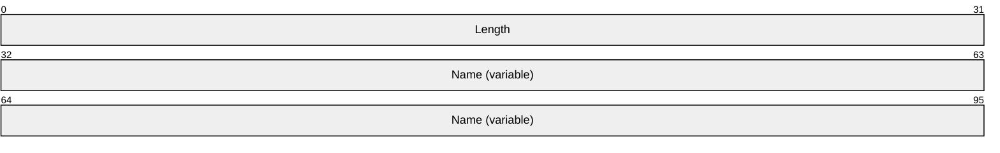
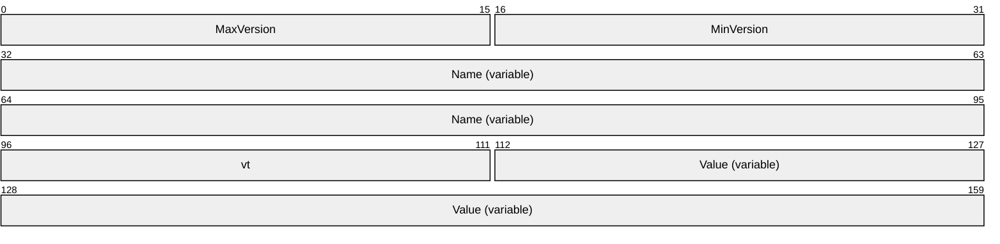
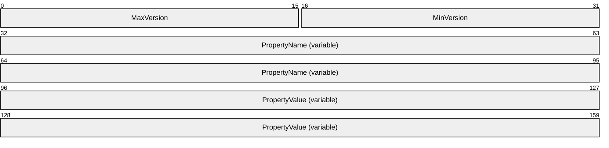
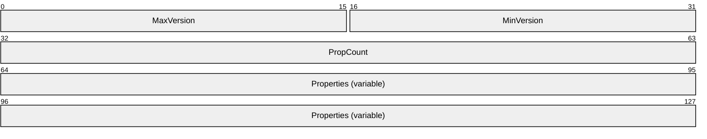
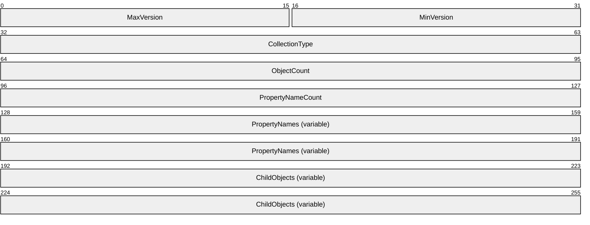

# [MS-COMT]: Component Object Model Plus (COM+) Tracker Service Protocol

Table of Contents

1 Introduction

- [1 Introduction](#Section_1)
  - [1.1 Glossary](#Section_1.1)
  - [1.2 References](#Section_1.2)
    - [1.2.1 Normative References](#Section_1.2.1)
    - [1.2.2 Informative References](#Section_1.2.2)
  - [1.3 Overview](#Section_1.3)
    - [1.3.1 Background](#Section_1.3.1)
    - [1.3.2 Instantiation Concepts](#Section_1.3.2)
    - [1.3.3 Pooling](#Section_1.3.3)
    - [1.3.4 Recycling and Pausing](#Section_1.3.4)
    - [1.3.5 Activity Statistics](#Section_1.3.5)
    - [1.3.6 Polling and Tracker Events](#Section_1.3.6)
    - [1.3.7 Process Dump](#Section_1.3.7)
  - [1.4 Relationship to Other Protocols](#Section_1.4)
  - [1.5 Prerequisites/Preconditions](#Section_1.5)
  - [1.6 Applicability Statement](#Section_1.6)
  - [1.7 Versioning and Capability Negotiation](#Section_1.7)
  - [1.8 Vendor-Extensible Fields](#Section_1.8)
  - [1.9 Standards Assignments](#Section_1.9)

2 Messages

- [2 Messages](#Section_2)
  - [2.1 Transport](#Section_2.1)
  - [2.2 Common Data Types](#Section_2.2)
    - [2.2.1 CurlyBraceGuidString](#Section_2.2.1)
    - [2.2.2 ContainerStatistics](#Section_2.2.2)
    - [2.2.3 ContainerData](#Section_2.2.3)
    - [2.2.4 ComponentData](#Section_2.2.4)
    - [2.2.5 TrackingInfo Formats](#Section_2.2.5)
      - [2.2.5.1 LengthPrefixedName](#Section_2.2.5.1)
      - [2.2.5.2 TrackingInfoPropertyValue](#Section_2.2.5.2)
      - [2.2.5.3 TrackingInfoProperty](#Section_2.2.5.3)
      - [2.2.5.4 TrackingInfoObject OBJREF_CUSTOM](#Section_2.2.5.4)
      - [2.2.5.5 TrackingInfoCollection OBJREF_CUSTOM](#Section_2.2.5.5)

3 Protocol Details

- [3 Protocol Details](#Section_3)
  - [3.1 Server Details](#Section_3.1)
    - [3.1.1 Abstract Data Model](#Section_3.1.1)
    - [3.1.2 Timers](#Section_3.1.2)
    - [3.1.3 Initialization](#Section_3.1.3)
    - [3.1.4 Message Processing Events and Sequencing Rules](#Section_3.1.4)
      - [3.1.4.1 IGetTrackingData](#Section_3.1.4.1)
        - [3.1.4.1.1 GetContainerData (Opnum 4)](#Section_3.1.4.1.1)
        - [3.1.4.1.2 GetComponentDataByContainer (Opnum 5)](#Section_3.1.4.1.2)
        - [3.1.4.1.3 GetComponentDataByContainerAndCLSID (Opnum 6)](#Section_3.1.4.1.3)
      - [3.1.4.2 IProcessDump](#Section_3.1.4.2)
        - [3.1.4.2.1 IsSupported (Opnum 7)](#Section_3.1.4.2.1)
        - [3.1.4.2.2 DumpProcess (Opnum 8)](#Section_3.1.4.2.2)
    - [3.1.5 Timer Events](#Section_3.1.5)
    - [3.1.6 Other Local Events](#Section_3.1.6)
  - [3.2 Client Details](#Section_3.2)
    - [3.2.1 Abstract Data Model](#Section_3.2.1)
    - [3.2.2 Timers](#Section_3.2.2)
    - [3.2.3 Initialization](#Section_3.2.3)
    - [3.2.4 Higher-Layer Triggered Events](#Section_3.2.4)
    - [3.2.5 Message Processing Events and Sequencing Rules](#Section_3.2.5)
      - [3.2.5.1 IComTrackingInfoEvents](#Section_3.2.5.1)
        - [3.2.5.1.1 OnNewTrackingInfo (Opnum 3)](#Section_3.2.5.1.1)
    - [3.2.6 Timer Events](#Section_3.2.6)
    - [3.2.7 Other Local Events](#Section_3.2.7)

4 Protocol Examples

- [4 Protocol Examples](#Section_4)
  - [4.1 Polling for Tracking Data](#Section_4.1)
  - [4.2 Receiving a Tracker Event](#Section_4.2)

5 Security

- [5 Security](#Section_5)
  - [5.1 Security Considerations for Implementers](#Section_5.1)
  - [5.2 Index of Security Parameters](#Section_5.2)

6 Appendix A: Full IDL

- [6 Appendix A: Full IDL](#Section_6)

7 Appendix B: Product Behavior

- [7 Appendix B: Product Behavior](#Section_7)

8 Change Tracking

- [8 Change Tracking](#Section_8)

For the legal notice and IP terms, see [LEGAL.md](../LEGAL.md).
Last updated: 4/23/2024.
See [Revision History](#revision-history) for full version history.

# 1 Introduction

This document specifies the Component Object Model Plus (COM+) Tracker Service Protocol (COMT), which allows clients to monitor running instances of [**components**](#gt_component).

Sections 1.5, 1.8, 1.9, 2, and 3 of this specification are normative. All other sections and examples in this specification are informative.

## 1.1 Glossary

This document uses the following terms:

**activation**: In the DCOM protocol, a mechanism by which a client provides the [**CLSID**](#gt_class-identifier-clsid) of an object class and obtains an object, either from that object class or a class factory that is able to create such objects. For more information, see [MS-DCOM](../MS-DCOM/MS-DCOM.md).

**class identifier (CLSID)**: A [**GUID**](#gt_globally-unique-identifier-guid) that identifies a software component; for instance, a DCOM object class or a COM class.

**component**: A representation of a constituent transport address if a candidate consists of a set of transport addresses. For example, media streams that are based on the Real-Time Transfer Protocol (RTP) have two components, one for RTP and another for the Real-Time Transfer Control Protocol (RTCP).

**component configuration**: A particular [**component**](#gt_component) configuration.

**component configuration entry**: An entry in the catalog that represents a particular configuration of a component.

**component instance**: An instantiation of a component.

**conglomeration**: A collection of [**component configuration entries**](#gt_670903d8-6f25-4b7e-b038-a09194865d4a), together with a component-independent configuration that is conceptually shared by the [**component configuration entries**](#gt_670903d8-6f25-4b7e-b038-a09194865d4a). A conglomeration is identified by a [**conglomeration identifier**](#gt_conglomeration-identifier).

**conglomeration identifier**: A [**GUID**](#gt_globally-unique-identifier-guid) that identifies a [**conglomeration**](#gt_conglomeration).

**container identifier**: A GUID that identifies an instance container.

**container legacy identifier**: A nonzero integer that identifies an [**instance container**](#gt_instance-container).

**container pooling**: Enabling a conglomeration to support multiple concurrent instance containers.

**distinguished container**: The first [**instance container**](#gt_instance-container) that is created in a given [**process**](#gt_process).

**dynamic endpoint**: A network-specific server address that is requested and assigned at run time. For more information, see [[C706]](https://go.microsoft.com/fwlink/?LinkId=89824).

**globally unique identifier (GUID)**: A term used interchangeably with [**universally unique identifier (UUID)**](#gt_universally-unique-identifier-uuid) in Microsoft protocol technical documents (TDs). Interchanging the usage of these terms does not imply or require a specific algorithm or mechanism to generate the value. Specifically, the use of this term does not imply or require that the algorithms described in [[RFC4122]](https://go.microsoft.com/fwlink/?LinkId=90460) or [C706] must be used for generating the [**GUID**](#gt_globally-unique-identifier-guid). See also [**universally unique identifier (UUID)**](#gt_universally-unique-identifier-uuid).

**Instance container**: A container for the instantiation of components that are configured in a single conglomeration.

**instance pooling**: The act of enabling component instances that are no longer active to return to a pool for reuse.

**interface**: A specification in a Component Object Model (COM) server that describes how to access the methods of a class. For more information, see [MS-DCOM].

**Interface Definition Language (IDL)**: The International Standards Organization (ISO) standard language for specifying the [**interface**](#gt_interface) for remote procedure calls. For more information, see [C706] section 4.

**little-endian**: Multiple-byte values that are byte-ordered with the least significant byte stored in the memory location with the lowest address.

**method call**: The act of a [**component instance**](#gt_component-instance) executing a method as a result of a specific request from an external entity.

**opnum**: An operation number or numeric identifier that is used to identify a specific remote procedure call (RPC) method or a method in an interface. For more information, see [C706] section 12.5.2.12 or [MS-RPCE](../MS-RPCE/MS-RPCE.md).

**paused**: A service that is not available because it has been placed in a suspended state, usually as a result of explicit administrative action.

**pausing**: Temporarily disabling the creation of new component instances in an instance container.

**process**: A context in which an instance container can be created, consisting of one or more threads of execution with a shared memory address space and shared security properties. A process is identified by a process identifier.

**process dump**: A mechanism for automatically gathering debugging data for a [**process**](#gt_process) into a file.

**process identifier (PID)**: A nonzero integer used by some operating systems (for example, Windows and UNIX) to uniquely identify a process. For more information, see [[PROCESS]](https://go.microsoft.com/fwlink/?LinkId=90251).

**recycling**: To permanently disable the creation of new component instances in an instance container.

**release**: The process of calling the third IUnknown method (IUnknown::Release()) on an object.

**tracker event**: A notification that a COM+ Tracker Service Protocol server sends to a client that contains relevant information about the status of [**component instances**](#gt_component-instance) and [**instance containers**](#gt_instance-container) on the server.

**Unicode**: A character encoding standard developed by the Unicode Consortium that represents almost all of the written languages of the world. The [**Unicode**](#gt_unicode) standard [[UNICODE5.0.0/2007]](https://go.microsoft.com/fwlink/?LinkId=154659) provides three forms (UTF-8, UTF-16, and UTF-32) and seven schemes (UTF-8, UTF-16, UTF-16 BE, UTF-16 LE, UTF-32, UTF-32 LE, and UTF-32 BE).

**Universal Naming Convention (UNC)**: A string format that specifies the location of a resource. For more information, see [MS-DTYP](../MS-DTYP/MS-DTYP.md) section 2.2.57.

**universally unique identifier (UUID)**: A 128-bit value. UUIDs can be used for multiple purposes, from tagging objects with an extremely short lifetime, to reliably identifying very persistent objects in cross-process communication such as client and server interfaces, manager entry-point vectors, and RPC objects. UUIDs are highly likely to be unique. UUIDs are also known as [**globally unique identifiers (GUIDs)**](#gt_globally-unique-identifier-guid) and these terms are used interchangeably in the Microsoft protocol technical documents (TDs). Interchanging the usage of these terms does not imply or require a specific algorithm or mechanism to generate the UUID. Specifically, the use of this term does not imply or require that the algorithms described in [RFC4122] or [C706] must be used for generating the UUID.

**MAY, SHOULD, MUST, SHOULD NOT, MUST NOT:** These terms (in all caps) are used as defined in [[RFC2119]](https://go.microsoft.com/fwlink/?LinkId=90317). All statements of optional behavior use either MAY, SHOULD, or SHOULD NOT.

## 1.2 References

Links to a document in the Microsoft Open Specifications library point to the correct section in the most recently published version of the referenced document. However, because individual documents in the library are not updated at the same time, the section numbers in the documents may not match. You can confirm the correct section numbering by checking the [Errata](https://go.microsoft.com/fwlink/?linkid=850906).

### 1.2.1 Normative References

We conduct frequent surveys of the normative references to assure their continued availability. If you have any issue with finding a normative reference, please contact [dochelp@microsoft.com](mailto:dochelp@microsoft.com). We will assist you in finding the relevant information.

[C706] The Open Group, "DCE 1.1: Remote Procedure Call", C706, August 1997, [https://publications.opengroup.org/c706](https://go.microsoft.com/fwlink/?LinkId=89824)

**Note** Registration is required to download the document.

[MS-DCOM] Microsoft Corporation, "[Distributed Component Object Model (DCOM) Remote Protocol](../MS-DCOM/MS-DCOM.md)".

[MS-DTYP] Microsoft Corporation, "[Windows Data Types](../MS-DTYP/MS-DTYP.md)".

[MS-ERREF] Microsoft Corporation, "[Windows Error Codes](../MS-ERREF/MS-ERREF.md)".

[MS-OAUT] Microsoft Corporation, "[OLE Automation Protocol](../MS-OAUT/MS-OAUT.md)".

[MS-RPCE] Microsoft Corporation, "[Remote Procedure Call Protocol Extensions](../MS-RPCE/MS-RPCE.md)".

[RFC2119] Bradner, S., "Key words for use in RFCs to Indicate Requirement Levels", BCP 14, RFC 2119, March 1997, [https://www.rfc-editor.org/info/rfc2119](https://go.microsoft.com/fwlink/?LinkId=90317)

[RFC2781] Hoffman, P., and Yergeau, F., "UTF-16, an encoding of ISO 10646", RFC 2781, February 2000, [https://www.rfc-editor.org/info/rfc2781](https://go.microsoft.com/fwlink/?LinkId=90380)

[RFC4122] Leach, P., Mealling, M., and Salz, R., "A Universally Unique Identifier (UUID) URN Namespace", RFC 4122, July 2005, [https://www.rfc-editor.org/info/rfc4122](https://go.microsoft.com/fwlink/?LinkId=90460)

[RFC4234] Crocker, D., Ed., and Overell, P., "Augmented BNF for Syntax Specifications: ABNF", RFC 4234, October 2005, [https://www.rfc-editor.org/info/rfc4234](https://go.microsoft.com/fwlink/?LinkId=90462)

### 1.2.2 Informative References

[MS-COMA] Microsoft Corporation, "[Component Object Model Plus (COM+) Remote Administration Protocol](../MS-COMA/MS-COMA.md)".

[MS-COMEV] Microsoft Corporation, "[Component Object Model Plus (COM+) Event System Protocol](../MS-COMEV/MS-COMEV.md)".

[MSDN-Applications] Microsoft Corporation, "Applications (COM+)", [http://msdn.microsoft.com/en-us/library/ms686107.aspx](https://go.microsoft.com/fwlink/?LinkId=93766)

[MSDN-COM] Microsoft Corporation, "Component Object Model", [http://msdn.microsoft.com/en-us/library/aa286559.aspx](https://go.microsoft.com/fwlink/?LinkId=89977)

[MSDN-FILE] Microsoft Corporation, "Naming Files, Paths, and Namespaces", [https://learn.microsoft.com/en-us/windows/desktop/FileIO/naming-a-file](https://go.microsoft.com/fwlink/?LinkId=90004)

[MSDN-MDWD] Microsoft Corporation, "MiniDumpWriteDump function (Windows)", [http://msdn.microsoft.com/en-us/library/ms680360(VS.85).aspx](https://go.microsoft.com/fwlink/?LinkId=120636)

[MSDN-Partitions] Microsoft Corporation, "Partitions", [http://msdn.microsoft.com/en-us/library/ms679480.aspx](https://go.microsoft.com/fwlink/?LinkId=93767)

[UML] Object Management Group, "Unified Modeling Language", [http://www.omg.org/spec/UML/](https://go.microsoft.com/fwlink/?LinkId=93768)

## 1.3 Overview

The COM+ Tracker Service Protocol enables remote clients to monitor instances of [**components**](#gt_component) running on a server. The server end of the protocol tracks the status of [**component instances**](#gt_component-instance) and [**instance containers**](#gt_instance-container) on the server and implements an interface that clients can use to poll for this status. It also optionally includes an event-driven notification system in which the client can supply (via another protocol) a callback interface for receiving [**tracker events**](#gt_tracker-event). The server then calls the client's callback interface whenever new tracking data is available, for example, as a result of local events on the server.

### 1.3.1 Background

A [**component**](#gt_component) is an indivisible unit of software functionality. Examples of components include Distributed Component Object Model (DCOM) Remote Protocol object classes, as specified in [MS-DCOM](../MS-DCOM/MS-DCOM.md), and COM+ Event System Protocol event classes, as specified in [MS-COMEV](../MS-COMEV/MS-COMEV.md). Each component known to the server is identified by a [**GUID**](#gt_globally-unique-identifier-guid), known as the [**class identifier (CLSID)**](#gt_class-identifier-clsid).

A [**component configuration**](#gt_component-configuration) is a particular configuration of a component. Each component configuration tracked by a COMT server is associated with a [**conglomeration**](#gt_conglomeration), a set of related [**component configurations**](#gt_component-configuration) that is identified by a GUID known as the [**conglomeration identifier**](#gt_conglomeration-identifier). In general, it is possible for a component to have more than one component configuration on a server. However, a component can have only one component configuration in any given conglomeration. A component configuration can be identified by the conglomeration identifier and the component CLSID.

A conglomeration is a set of related component configurations and is identified by a GUID, known as the conglomeration identifier. A component that has a component configuration in a conglomeration is said to be configured in that conglomeration.

### 1.3.2 Instantiation Concepts

A server typically provides local or remote mechanisms by which [**components**](#gt_component) can be instantiated. An example of a remote instantiation mechanism is DCOM [**activation**](#gt_activation) (as specified in [MS-DCOM](../MS-DCOM/MS-DCOM.md) section 1.3.1). An instantiation of a component is known as a [**component instance**](#gt_component-instance). Although the instantiation details can vary, the following conceptual steps are part of any instantiation that is tracked in the COM+ Tracker Service Protocol.

Through an implementation-specific mechanism, the COMT Protocol server associates the instantiation with a [**component configuration**](#gt_component-configuration), which is associated with a [**conglomeration**](#gt_conglomeration) as described in section [1.3.1](#Section_1.3.1).

The COMT Protocol server finds an existing [**instance container**](#gt_instance-container) for the conglomeration or creates a new instance container and then associates it with the conglomeration. An instance container is a conceptual container in which components that are configured in a single conglomeration can be instantiated.

The COMT Protocol server creates the component instances in the selected instance container.

An instance container is identified by a [**GUID**](#gt_globally-unique-identifier-guid), known as the [**container identifier**](#gt_container-identifier). For historical reasons, an instance container can also be identified by a nonzero integer, known as the [**container legacy identifier**](#gt_container-legacy-identifier).

A [**process**](#gt_process) is a conceptual context for the creation of instance containers. Instance containers for multiple conglomerations can be created within a process. However, a conglomeration can have only one instance container in any given process. The first instance container created in any given process is known as the [**distinguished container**](#gt_distinguished-container) for that process. A process is identified by a nonzero integer, known as the [**process identifier**](#gt_process-identifier-pid).

The following Unified Modeling Language (UML) static structure diagram summarizes the relationships between components, [**component configurations**](#gt_component-configuration), conglomerations, component instances, instance containers, and processes. For more information about UML, see [[UML]](https://go.microsoft.com/fwlink/?LinkId=93768).

Figure 1: Relationships between static and run-time objects

### 1.3.3 Pooling

A server might provide, a single [**instance container**](#gt_instance-container), at most, for a [**conglomeration**](#gt_conglomeration) at any given time, or it might have the capability to provide multiple instance containers. Enabling a conglomeration to support multiple concurrent instance containers is known as [**container pooling**](#gt_container-pooling). A typical use of container pooling is to increase scalability when contention for system resources within a single instance container is a limiting factor.

For historical reasons, parts of COMT are designed around the assumption that there is a one-to-one correspondence between conglomerations and instance containers and, therefore, the tracker cannot enable information about individual instance containers to be exchanged in cases where container pooling is in use.

[**Instance pooling**](#gt_instance-pooling) refers to enabling [**component instances**](#gt_component-instance) that are no longer active to return to a pool for reuse. A typical use of instance pooling is to reduce the performance penalty for the creation and destruction of short-lived component instances. A COMT server that enables instance pooling might track pooling behavior and expose separate statistics for pooled and active component instances.

### 1.3.4 Recycling and Pausing

[**Recycling**](#gt_recycling) refers to permanently disabling the creation of new [**component instances**](#gt_component-instance) in an [**instance container**](#gt_instance-container). An instance container that is recycled shuts down as soon as the existing component instances in the container are destroyed. Recycling enables a problematic instance container to gradually drain its component instances, rather than being immediately and forcibly shut down. COMT enables clients to determine whether an instance container is being recycled.

[**Pausing**](#gt_pausing) refers to temporarily disabling the creation of new component instances in an instance container. COMT enables clients to determine whether an instance container is [**paused**](#gt_paused).

### 1.3.5 Activity Statistics

A COMT server optionally collects run-time activity statistics about [**component instances**](#gt_component-instance) and [**instance containers**](#gt_instance-container).

Individual [**components**](#gt_component) define operations that component instances are able to execute at the request of external entities. A [**method call**](#gt_method-call) is the act of a component instance executing such an operation as a result of a specific request from an external entity. An example of a method call is a DCOM method call, as specified in [MS-DCOM](../MS-DCOM/MS-DCOM.md). COMT enables a client to obtain method call statistics for the components instantiated in an instance container, such as the number of successful method calls or the average time to complete a method call.

Servers that use a reference counting mechanism for component instances optionally collect statistics on the number of references to a component instance. The meaning of a reference is implementation-specific, but this information could be useful to administrators. The COMT enables a client to obtain reference statistics for the components that are instantiated in an instance container.

### 1.3.6 Polling and Tracker Events

The COMT enables two mechanisms by which clients can obtain tracking data: a push model and a pull model.

In the pull model, the COMT client invokes methods on the server interface to poll for tracking data. The pull model is most appropriate when tracking data is expected to change frequently, or when the client needs control over the frequency of communication.

In the push model, the client application implements a callback interface to receive [**tracker events**](#gt_tracker-event). The push model is most appropriate when tracking data is expected to change infrequently, or when the server needs control over the frequency of communication. The COM+ Tracker Service Protocol does not provide a mechanism to register the callback interface with the server; it only defines the interface that the client registers. Hence, COMT requires that client applications use another protocol, such as the COM+ Event System Protocol [MS-COMEV](../MS-COMEV/MS-COMEV.md), to register the COMT callback interface. For example, if a COMT server exposes tracker events as a COM+ Event System Protocol event class (as specified in [MS-COMEV] section 3.1.1.1), a client application could create a subscription (as specified in [MS-COMEV] section 3.1.1.2) to the event class and set the SubscriberInterface property to its callback interface (for more information, see **IEventSubscription::put_SubscriberInterface**, [MS-COMEV] section 3.1.4.4.14).

### 1.3.7 Process Dump

If tracking data received by an administrator or administration client application indicates that there might be a problem with the [**instance containers**](#gt_instance-container) in a particular [**process**](#gt_process), the administrator or application might want to collect additional debugging data to investigate this problem. A mechanism for automatically gathering additional debugging data for a process into a file is known as a [**process dump**](#gt_process-dump).

COMT enables clients to request a process dump for the process containing an instance container on the COMT server. The file format to be used for a process dump, as well as the nature and extent of the debugging data collected, are implementation-specific. However, typical data included in a process dump might be full or partial contents of the process's address space, information on the process's usage of system resources, and history of exceptional events that have occurred.

## 1.4 Relationship to Other Protocols

COMT is built on top of DCOM [MS-DCOM](../MS-DCOM/MS-DCOM.md).

The COM+ Remote Administration Protocol [MS-COMA](../MS-COMA/MS-COMA.md) also provides functionality for obtaining run-time information about [**instance containers**](#gt_instance-container). COMT makes this functionality obsolete by enabling clients to obtain a richer set of information, and by providing a push model.

Client applications that want to receive notifications via the push model also need to use another protocol, such as the Component Object Model Plus (COM+) Event System Protocol [MS-COMEV](../MS-COMEV/MS-COMEV.md), to first register the COMT callback interface.

## 1.5 Prerequisites/Preconditions

COMT assumes that a client application that wants to receive [**tracker events**](#gt_tracker-event) by using the push model has previously registered a callback interface to the server by using some other mechanism; for example, the Component Object Model Plus (COM+) Event System Protocol, as specified in [MS-COMEV](../MS-COMEV/MS-COMEV.md).

COMT assumes that a client application or administrator that wants to request a [**process dump**](#gt_process-dump) to be written in a location other than the COMT server's default location recognizes the convention for paths in the COMT server's file system.

COMT assumes that a client application or administrator that wants to interpret debugging data from a process dump recognizes the file format in which this data will be written.

## 1.6 Applicability Statement

The COM+ Tracker Service Protocol is most appropriate for monitoring running instances of [**components**](#gt_component) when the tracking information is used for informational purposes. It is not appropriate when this information is required for correct behavior of a client application.

## 1.7 Versioning and Capability Negotiation

The COM+ Tracker Service Protocol has no versioning and capability negotiation functionality.

## 1.8 Vendor-Extensible Fields

The COM+ Tracker Service Protocol uses HRESULT values, as specified in [MS-ERREF](../MS-ERREF/MS-ERREF.md) section 2.1. Vendors can define their own HRESULT values, provided that they set the C bit (0x20000000) for each vendor-defined value to indicate that the value is a customer code.

## 1.9 Standards Assignments

The following table lists well-known [**GUIDs**](#gt_globally-unique-identifier-guid) in the COMT Protocol. These GUIDs were generated using the mechanism specified in [[C706]](https://go.microsoft.com/fwlink/?LinkId=89824) section A.2.5.

| Parameter | Value |
| --- | --- |
| DCOM [**CLSID**](#gt_class-identifier-clsid) for tracker service (CLSID_TrackerService) | {ECABAFB9-7F19-11D2-978E-0000F8757E2A} |
| DCOM CLSID for [**process dump**](#gt_process-dump) service (CLSID_ProcessDump) | {ECABB0C4-7F19-11D2-978E-0000F8757E2A} |
| RPC Interface Identifier (IID) for IGetTrackingData interface | {B60040E0-BCF3-11D1-861D-0080C729264D} |
| RPC Interface Identifier (IID) for IComTrackingInfoEvents interface | {4E6CDCC9-FB25-4FD5-9CC5-C9F4B6559CEC} |
| RPC Interface Identifier (IID) for IProcessDump interface | {23C9DD26-2355-4FE2-84DE-F779A238ADBD} |
| OBJREF_CUSTOM unmarshaler CLSID for TrackingInfoCollection (CLSID_TrkInfoCollUnmarshal) | {ECABAFCD-7f19-11D2-978E-0000F8757E2A} |
| OBJREF_CUSTOM unmarshaler CLSID for TrackingInfoObject (CLSID_TrkInfoObjUnmarshal) | {ECABAFCE-7f19-11D2-978E-0000F8757E2A} |

# 2 Messages

The following sections specify how COM+ Tracker Service Protocol messages are transported as well as COMT Protocol message syntax.

## 2.1 Transport

All COM+ Tracker Service Protocol messages are transported via DCOM, as specified in [MS-DCOM](../MS-DCOM/MS-DCOM.md). COMT uses the [**dynamic endpoints**](#gt_dynamic-endpoint) allocated and managed by the DCOM infrastructure.

## 2.2 Common Data Types

In addition to remote procedure call (RPC) base types and definitions specified in [[C706]](https://go.microsoft.com/fwlink/?LinkId=89824) and [MS-RPCE](../MS-RPCE/MS-RPCE.md), the following table defines additional data types.

Field types in packet diagrams are defined by the packet diagram and the field descriptions. All fields in packet diagrams use [**little-endian**](#gt_little-endian) byte ordering, unless otherwise stated.

All extra padding bytes MUST be zero, unless otherwise stated, and MUST be ignored upon receipt.

This protocol uses the following types, as specified in [MS-DTYP](../MS-DTYP/MS-DTYP.md) and [MS-OAUT](../MS-OAUT/MS-OAUT.md).

| Type | Reference |
| --- | --- |
| DWORD | As specified in [MS-DTYP] section 2.2.9 |
| GUID | As specified in [MS-DTYP] section 2.3.4 |
| HRESULT | As specified in [MS-DTYP] section 2.2.18 |
| WCHAR | As specified in [MS-DTYP] section 2.2.60 |
| BSTR | As specified in [MS-OAUT] section 2.2.23 |

### 2.2.1 CurlyBraceGuidString

The CurlyBraceGuidString type is a string representation of the [**GUID**](#gt_globally-unique-identifier-guid) type, as specified in [MS-DTYP](../MS-DTYP/MS-DTYP.md) section 2.3.4.3. The following is the Augmented Backus-Naur Form (ABNF) syntax, as referenced in [[RFC4234]](https://go.microsoft.com/fwlink/?LinkId=90462), for this representation.

CurlyBraceGuidString = "{" UUID "}"

[**UUID**](#gt_universally-unique-identifier-uuid) represents the string form of a UUID, as specified in [[RFC4122]](https://go.microsoft.com/fwlink/?LinkId=90460) section 3.

### 2.2.2 ContainerStatistics

The ContainerStatistics type represents activity statistics for an [**instance container**](#gt_instance-container).

typedef struct {

DWORD cCalls;

DWORD cComponentInstances;

DWORD cComponents;

DWORD cCallsPerSecond;

} ContainerStatistics;

**cCalls:** The number of [**method calls**](#gt_method-call) that the [**component instances**](#gt_component-instance) perform in an instance container.

**cComponentInstances:** The number of component instances in an instance container.

**cComponents:** The number of distinct [**components**](#gt_component) currently instantiated in an instance container.

**cCallsPerSecond:** This SHOULD be set to a running average, over an implementation-specific time period,<1> of the number of method calls per second received by an instance container. Alternatively, an implementation MAY instead simply set this field to zero.

### 2.2.3 ContainerData

The ContainerData type represents run-time information for a [**conglomeration**](#gt_conglomeration) that has one or more [**instance containers**](#gt_instance-container) on the server. The meanings of the fields in this structure depend on the number of instance containers that exist on the server for the conglomeration represented, as specified in the following section.

typedef struct {

DWORD dwLegacyId;

WCHAR wszApplicationIdentifier[40];

DWORD dwProcessId;

ContainerStatistics statistics;

} ContainerData;

**dwLegacyId:** The [**container legacy identifier**](#gt_container-legacy-identifier) of one of the instance containers, arbitrarily selected by the server, that exist for the conglomeration represented.

**wszApplicationIdentifier:** A null-terminated [**Unicode**](#gt_unicode) string that MUST contain the [CurlyBraceGuidString (section 2.2.1)](#Section_2.2.1) representation of a [**conglomeration identifier**](#gt_conglomeration-identifier). Note that a null-terminated CurlyBraceGuidString is 39 Unicode characters, including the null character, and this field is 40 characters long. The final element in this array is unused. It SHOULD be set to 0 and MUST be ignored upon receipt.

**dwProcessId:** The [**process identifier**](#gt_process-identifier-pid) of the [**process**](#gt_process) that contains one of the instance containers, arbitrarily selected by the server, that exist for the conglomeration represented.

**statistics:** A [ContainerStatistics (section 2.2.2)](#Section_2.2.2) structure with fields that contain statistics averaged across all instance containers that exist for the conglomeration represented.

### 2.2.4 ComponentData

This type represents activity statistics for a [**component**](#gt_component) that has one or more [**component instances**](#gt_component-instance) in an [**instance container**](#gt_instance-container).

typedef struct {

GUID clsid;

DWORD cTotalReferences;

DWORD cBoundReferences;

DWORD cPooledInstances;

DWORD cInstancesInCall;

DWORD dwResponseTime;

DWORD cCallsCompleted;

DWORD cCallsFailed;

} ComponentData;

**clsid:** The [**CLSID**](#gt_class-identifier-clsid) of the component.

**cTotalReferences:** An implementation-specific<2> count of the number of references to all component instances of the component. This MUST be set to 0xffffffff if the server does not track this information.<3>

**cBoundReferences:** The number of references to all active (not pooled) component instances of the component. This MUST be set to 0xffffffff if the server does not track this information.<4>

**cPooledInstances:** The number of pooled component instances of the component, if the server enables [**instance pooling**](#gt_instance-pooling). This MUST be set to 0xffffffff if the server does not track this information.<5>

**cInstancesInCall:** The number of component instances of the component that are currently performing a [**method call**](#gt_method-call). This MUST be set to 0xffffffff if the server does not track this information.<6>

**dwResponseTime:** A value that indicates the average time, in milliseconds, it takes to complete method calls to component instances of the component. Calculation of this value is implementation-specific.<7> This MUST be set to 0xffffffff if the server does not track this information.<8>

**cCallsCompleted:** The number of method calls to component instances of the component that were successfully completed in an implementation-specific<9> time period. Whether a server considers a method call successfully completed is implementation-specific.<10> This MUST be set to 0xffffffff if the server does not track this information.<11>

**cCallsFailed:** The number of method calls to component instances of the component that failed in an implementation-specific<12> time period. Whether a server considers a method call to have failed is implementation-specific.<13> This MUST be set to 0xffffffff if the server does not track this information.<14>

### 2.2.5 TrackingInfo Formats

The following sections specify the formats of structures related to the IComTrackingInfoCollection::OnNewTrackingInfo method (as specified in section [3.2.5.1.1](#Section_3.2.5.1.1)).

#### 2.2.5.1 LengthPrefixedName

The LengthPrefixedName type specifies an array of [**Unicode**](#gt_unicode) characters prefixed by the array length in characters.

**Length (4 bytes):** An unsigned long that MUST contain the number of Unicode characters in the **Name** field and MUST NOT be zero.

**Name (variable):** This MUST contain an array of Unicode characters in UTF-16 encoding, as specified in [[RFC2781]](https://go.microsoft.com/fwlink/?LinkId=90380)); the array SHOULD NOT end in a NULL terminator.

#### 2.2.5.2 TrackingInfoPropertyValue

The TrackingInfoPropertyValue structure defines a single name/value pair.

**MaxVersion (2 bytes):** The major version number for this format; this field MUST be set to 0x0001.

**MinVersion (2 bytes):** The minor version number for this format; this field MUST be set to 0x0001.

**Name (variable):** A [LengthPrefixedName (section 2.2.5.1)](#Section_2.2.5.1) that contains the name of the UserProperty.

**vt (2 bytes):** The type of data contained in **Value**. It MUST be set to one of the following values.

| Value | Meaning |
| --- | --- |
| 0x0008 | LengthPrefixedName (section 2.2.5.1) |
| 0x000D | [TrackingInfoCollection OBJREF_CUSTOM (section 2.2.5.5)](#Section_2.2.5.5) |
| 0x0013 | An unsigned long integer. |

**Value (variable):** The data for this name/value pair. The type of this field is specified by the **vt** field.

#### 2.2.5.3 TrackingInfoProperty

The TrackingInfoProperty defines a structure for representing a property name/value pair.

**MaxVersion (2 bytes):** The major version of this marshaled format; this MUST be set to 0x0001.

**MinVersion (2 bytes):** The minor version of this marshaled format; this MUST be set to 0x0001.

**PropertyName (variable):** A [LengthPrefixedName (section 2.2.5.1)](#Section_2.2.5.1) that contains the name of this property.

**PropertyValue (variable):** A [TrackingInfoPropertyValue (section 2.2.5.2)](#Section_2.2.5.2) that contains the value of this property.

#### 2.2.5.4 TrackingInfoObject OBJREF_CUSTOM

The TrackingInfoObject MUST be marshaled using the OBJREF_CUSTOM format (as specified in [MS-DCOM](../MS-DCOM/MS-DCOM.md) section 2.2.18.6). The **CLSID** field of the OBJREF_CUSTOM instance MUST be set to {ECABAFCE-7f19-11D2-978E-0000F8757E2A} (CLSID_TrkInfoObjUnmarshal). The format of the OBJREF_CUSTOM.pObjectData buffer for CLSID_TrkInfoObjUnmarshal is as follows.

**MaxVersion (2 bytes):** The major version of this marshaled format; this MUST be set to 0x0001.

**MinVersion (2 bytes):** The minor version of this marshaled format; this MUST be set to 0x0001.

**PropCount (4 bytes):** The (unsigned) number of elements in the **Properties** field.

**Properties (variable):** An array of [TrackingInfoProperty (section 2.2.5.3)](#Section_2.2.5.3) structures.

#### 2.2.5.5 TrackingInfoCollection OBJREF_CUSTOM

The TrackingInfoCollection MUST be marshaled using the OBJREF_CUSTOM format (as specified in [MS-DCOM](../MS-DCOM/MS-DCOM.md) section 2.2.18.6). The **CLSID** field of the OBJREF_CUSTOM instance MUST be set to {ECABAFCD-7f19-11D2-978E-0000F8757E2A} (CLSID_TrkInfoCollUnmarshal). The format of the OBJREF_CUSTOM.pObjectData buffer for CLSID_TrkInfoCollUnmarshal is as follows.

**MaxVersion (2 bytes):** The major version of this marshaled format; this MUST be set to 0x0001.

**MinVersion (2 bytes):** The minor version of this marshaled format; this MUST be set to 0x0001.

**CollectionType (4 bytes):** The type of collection; this MUST be one of the following values:

| Value | Meaning |
| --- | --- |
| TRKCOLL_PROCESSES 0x00000000 | A collection of [**processes**](#gt_process). |
| TRKCOLL_CONTAINERS 0x00000001 | A collection of [**instance containers**](#gt_instance-container). |
| TRKCOLL_COMPONENTS 0x00000002 | A collection of [**components**](#gt_component). |

**ObjectCount (4 bytes):** The (unsigned) number of elements in the **ChildObjects** field.

**PropertyNameCount (4 bytes):** The (unsigned) number of elements in the **Properties** field.

**PropertyNames (variable):** An array of [LengthPrefixedName (section 2.2.5.1)](#Section_2.2.5.1) that contains the descriptive names for the elements in the **ChildObjects** field.

**ChildObjects (variable):** An array of [TrackingInfoObject (section 2.2.5.4)](#Section_2.2.5.4) structures.

# 3 Protocol Details

The client side of this protocol is a pass-through. That is, no additional timers or other state is required on the client side of this protocol. Calls made by the higher-layer protocol or application are passed directly to the transport, and the results that the transport returns are passed directly back to the higher-layer protocol or application.

A client application initiates a conversation with a COM+ Tracker Service Protocol server in one of three ways:

- If the client application wants to poll for tracking information, it performs DCOM [**activation**](#gt_activation) (as specified in [MS-DCOM](../MS-DCOM/MS-DCOM.md), section 3.2.4.1.1) of the tracker service [**CLSID**](#gt_class-identifier-clsid) (CLSID_TrackerService), as specified in section [1.9](#Section_1.9). After getting the interface pointer to the DCOM object as a result of the activation, the client application works with the object by making calls on the DCOM interface that it supports. When complete, the client application performs a [**release**](#gt_release) on the interface pointer.
- If the client application wants to receive [**tracker events**](#gt_tracker-event), it uses any implementation-specific mechanism<15> to supply an [IComTrackingInfoEvents (section 3.2.5.1)](#Section_3.2.5.1) callback interface to the server. Thereafter, the COMT server sends tracker events as a result of implementation-specific local events, and the client application receives these events in the form of DCOM calls to [OnNewTrackingInfo()](#Section_3.2.5.1.1) on the client application's IComTrackingInfoEvents interface. The credentials that are used for these calls are COMT server implementation-specific.<16> The conversation can be terminated by either the client application or the COMT server.
- If the client application wants to request a [**process dump**](#gt_process-dump), it performs a DCOM activation ([MS-DCOM] section 3.2.4.1.1) of the process dump service CLSID (CLSID_ProcessDump) as specified in section 1.9. Depending on the behavior of the underlying DCOM client implementation, the client application might need to override the default impersonation level to use RPC_C_IMPL_LEVEL_IMPERSONATE (as specified in [MS-RPCE](../MS-RPCE/MS-RPCE.md) section 2.2.1.1.9). After getting the interface pointer to the DCOM object as a result of the activation, the client application works with the object by making calls on the DCOM interface that it supports. When done, the client application performs a release operation on the interface pointer.
When the client application no longer wants to receive tracker events, the client application uses any implementation-specific mechanism<17> to request that the server stop sending events and release the client's IComTrackingInfoEvents interface.

When the server no longer has to send tracker events, it performs a release on the interface pointer to IComTrackingInfoEvents.

## 3.1 Server Details

### 3.1.1 Abstract Data Model

This section describes a conceptual model of possible data organization that an implementation maintains to participate in this protocol. The described organization is provided to facilitate the explanation of how the protocol behaves. This document does not mandate that implementations adhere to this model as long as their external behavior is consistent with that described in this document.

- **Conglomeration Table:** A table of [**conglomerations**](#gt_conglomeration). Each entry has the following fields.
- **Conglomeration Identifier:** The [**conglomeration identifier**](#gt_conglomeration-identifier).
- **Partition ID:** An implementation-specific [**GUID**](#gt_globally-unique-identifier-guid) that identifies a conceptual group (or type) of conglomerations to which this conglomeration belongs.<18>
- **Instance Container Table:** A table of [**instance containers**](#gt_instance-container) that exist for the conglomeration. Each entry has the following fields.
- **Container Identifier:** The [**container identifier**](#gt_container-identifier).
- **Container Legacy Identifier:** The [**container legacy identifier**](#gt_container-legacy-identifier).
- **Process Identifier:** The [**process identifier**](#gt_process-identifier-pid) that contains the instance container.
- **Container Statistics:** The container statistics, as specified in section [2.2.2](#Section_2.2.2).
- **Component Table:** A table of [**components**](#gt_component) that are instantiated in the container. Each component entry has the following field.
- **Component Data:** The component data, as specified in section [2.2.4](#Section_2.2.4).

### 3.1.2 Timers

None.

### 3.1.3 Initialization

None.

### 3.1.4 Message Processing Events and Sequencing Rules

#### 3.1.4.1 IGetTrackingData

The IGetTrackingData interface provides methods for a client to poll for tracking information. This interface inherits from IUnknown, as specified in [MS-DCOM](../MS-DCOM/MS-DCOM.md) section 3.1.1.5.8. The version for this interface is 0.0.

To receive incoming remote calls for this interface, the server MUST implement a DCOM object class with the [**CLSID**](#gt_class-identifier-clsid) CLSID_TrackerService (as specified in section [1.9](#Section_1.9)) by using the [**UUID**](#gt_universally-unique-identifier-uuid) {B60040E0-BCF3-11D1-861D-0080C729264D} for this interface.

The IGetTrackingData interface includes the following methods beyond those of IUnknown.

Methods in RPC Opnum Order

| Method | Description |
| --- | --- |
| Opnum3NotUsedOnWire | Reserved for local use. Opnum: 3 |
| [GetContainerData](#Section_3.1.4.1.1) | Returns tracking information for [**instance containers**](#gt_instance-container). Opnum: 4 |
| [GetComponentDataByContainer](#Section_3.1.4.1.2) | Returns tracking information for [**components**](#gt_component) by instance container. Opnum: 5 |
| [GetComponentDataByContainerAndCLSID](#Section_3.1.4.1.3) | Returns tracking information for a component by instance container and CLSID. Opnum: 6 |
| Opnum7NotUsedOnWire | Reserved for local use. Opnum: 7 |

In the preceding table, the phrase "Reserved for local use" means that the client MUST NOT send the [**opnum**](#gt_opnum) and that the server behavior is undefined<19> because it does not affect interoperability.

All methods MUST NOT throw exceptions.

##### 3.1.4.1.1 GetContainerData (Opnum 4)

A client calls this method to obtain tracking information for [**instance containers**](#gt_instance-container) across all [**conglomerations**](#gt_conglomeration).

HRESULT GetContainerData(

[out] DWORD* nContainers,

[out, size_is(,(*nContainers))]

ContainerData** aContainerData

);

**nContainers:** A pointer to a variable that, upon successful completion, MUST contain the number of elements in *aContainerData*.

**aContainerData:** A pointer to a variable that, upon successful completion, MUST contain an array of zero or more [ContainerData (section 2.2.3)](#Section_2.2.3) structures. An array with zero elements MUST be represented by null.

**Return Values:** This method MUST return S_OK (0x00000000) on success and a failure result (as specified in [MS-ERREF](../MS-ERREF/MS-ERREF.md) section 2.1) on failure.

When this method is invoked, the server MUST attempt to return an array of ContainerData structures, one for each instance container tracked by the server, or fail the call if it cannot.

##### 3.1.4.1.2 GetComponentDataByContainer (Opnum 5)

A client calls this method to obtain tracking information for [**components**](#gt_component) that have one or more [**component instances**](#gt_component-instance) in a given [**instance container**](#gt_instance-container).

HRESULT GetComponentDataByContainer(

[in] DWORD idContainer,

[out] DWORD* nComponents,

[out, size_is(,*nComponents)] ComponentData** aComponentData

);

**idContainer:** The [**container legacy identifier**](#gt_container-legacy-identifier) of an instance container.

**nComponents:** A pointer to a variable that, upon successful completion, MUST contain the number of elements in *aComponentData*.

**aComponentData:** A pointer to a variable that, upon successful completion, MUST contain an array of zero or more [ComponentData (section 2.2.4)](#Section_2.2.4) structures. An array with zero elements MUST be represented by null.

**Return Values:** This method MUST return S_OK (0x00000000) on success and a failure result (as specified in [MS-ERREF](../MS-ERREF/MS-ERREF.md) section 2.1) on failure.

When this method is invoked, the server MUST verify that the *idContainer* parameter identifies a tracked instance container and fail the call if not. The server then MUST attempt to return an array of zero or more ComponentData structures, one for each distinct component instance instantiated in the instance container, and fail the call if it cannot.

##### 3.1.4.1.3 GetComponentDataByContainerAndCLSID (Opnum 6)

A client calls this method to obtain tracking information for a single [**component**](#gt_component) that has [**component instances**](#gt_component-instance) in an [**instance container**](#gt_instance-container).

HRESULT GetComponentDataByContainerAndCLSID(

[in] DWORD idContainer,

[in] GUID clsid,

[out] ComponentData** ppComponentData

);

**idContainer:** The [**container legacy identifier**](#gt_container-legacy-identifier) of an instance container.

**clsid:** A pointer to the [**CLSID**](#gt_class-identifier-clsid) of a component.

**ppComponentData:** A pointer to a variable that, upon successful completion, MUST contain a pointer to a single [ComponentData (section 2.2.4)](#Section_2.2.4) structure.

**Return Values:** This method MUST return S_OK (0x00000000) on success and a failure result (as specified in [MS-ERREF](../MS-ERREF/MS-ERREF.md) section 2.1) on failure.

When this method is invoked, the server MUST verify that the *idContainer* parameter identifies a tracked instance container and that the CLSID received in the *clsid* parameter identifies a component that is instantiated in that instance container. If not, the server MUST fail the call; otherwise, the server MUST return a single ComponentData structure that represents the component instantiated in the instance container and return success.

#### 3.1.4.2 IProcessDump

The IProcessDump interface provides methods for a client to request a [**process dump**](#gt_process-dump) of a process containing an instance container on the COMT server. This interface inherits from IDispatch, as specified in [MS-OAUT](../MS-OAUT/MS-OAUT.md) section 3.1.4. The version for this interface is 0.0.

To receive incoming remote calls for this interface, the server MUST implement a DCOM object class with the [**CLSID**](#gt_class-identifier-clsid) CLSID_ProcessDump (as specified in section [1.9](#Section_1.9)) by using the [**UUID**](#gt_universally-unique-identifier-uuid) {23C9DD26-2355-4FE2-84DE-F779A238ADBD} for this interface.

This [**interface**](#gt_interface) includes the following methods beyond those of IDispatch.

Methods in RPC Opnum Order

| Method | Description |
| --- | --- |
| [IsSupported](#Section_3.1.4.2.1) | Returns a result indicating whether or not process dump is supported. Opnum: 7 |
| [DumpProcess](#Section_3.1.4.2.2) | Requests a process dump. Opnum: 8 |

All methods MUST NOT throw exceptions.

##### 3.1.4.2.1 IsSupported (Opnum 7)

This method is called by a client to determine whether or not the COMT server supports [**process dump**](#gt_process-dump).

[id(1)] HRESULT IsSupported();

This method has no parameters.

**Return Values:** This method returns S_OK (0x00000000) if the COMT server supports process dump, and MUST return S_FALSE (0x00000001) if not.

##### 3.1.4.2.2 DumpProcess (Opnum 8)

This method is called by a client to request a [**process dump**](#gt_process-dump) for the process containing a particular [**instance container**](#gt_instance-container).

[id(2)] HRESULT DumpProcess(

[in] BSTR bstrContainerID,

[in] BSTR bstrDirectory,

[in] DWORD dwMaxFiles,

[out, retval] BSTR* pbstrDumpFile

);

**bstrContainerID:** The [CurlyBraceGuidString](#Section_2.2.1) (section 2.2.1) representation of a container identifier for a distinguished container.

**bstrDirectory:** Either a path, in the convention of the server's file system, to a location in which the file produced by process dump is to be written, or NULL to indicate that the client wants the COMT server to write the file to an implementation-specific default location.

**dwMaxFiles:** The maximum number of process dump files associated with the [**conglomeration**](#gt_conglomeration) of the instance container identified by the *bstrContainerID* parameter that the client requests the COMT server to leave in the location specified by the *bstrDirectory* parameter before the server begins deleting previously written files. A value of 0x00000000 indicates that the COMT server is to use an implementation-specific default limit.

**pbstrDumpFile:** A pointer to a variable that, upon successful completion, contains a fully qualified path, in the convention of the server's file system, to the process dump file written.

**Return Values:** This method MUST return S_OK (0x00000000) on success and a failure result (as specified in [MS-ERREF](../MS-ERREF/MS-ERREF.md) section 2.1) on failure.

When this method is invoked, if the server does not support process dump, it MUST simply return E_NOTIMPL (0x80004001). Otherwise, the server MUST verify that the *bstrContainerID* parameter identifies a tracked instance container, and that this instance container is a [**distinguished container**](#gt_distinguished-container), and fail the call if not.

The server then MUST verify that the *bstrDirectory* parameter, if not NULL, is in a file path syntax supported<20> by the server and fail the call if not. If *bstrDirectory* is not NULL, the server MUST select the location specified by this parameter as the dump file location, the use of which is described later in this section. Otherwise, the server MUST select an implementation-specific <21> default location.

The server then MUST select the dump file limit, the use of which is described later in this section, as the value specified by the *dwMaxFiles* parameter if this parameter is nonzero, and an implementation-specific <22> default limit if this parameter is zero.

The server SHOULD<23> impersonate the client while performing any file access specified in the remainder of the method behavior.

The server then SHOULD attempt to determine the number of previously written process dump files that are associated with the conglomeration of the instance container identified in *bstrContainerID* in the dump file location, and MAY fail the call if it cannot do so. If the number of previously written files is greater than or equal to the dump file limit, the server SHOULD attempt to delete at least one of the previously written files, and MAY fail the call if it cannot do so. If more than one previously written file exists, the server SHOULD attempt to determine which of these files was written least recently, and SHOULD select that file for deletion.

The server then MUST attempt to perform an implementation-specific <24> process dump procedure by writing a file to the dump file location, and fail the call if it cannot.

The server then MUST set the *pbstrDumpFile* parameter to the fully qualified path to the file written, and return success.

### 3.1.5 Timer Events

None.

### 3.1.6 Other Local Events

None.

## 3.2 Client Details

A client that uses only the polling capabilities that [IGetTrackingData (section 3.1.4.1)](#Section_3.1.4.1) provides is simply a pass-through.

A client that is to receive [**tracker events**](#gt_tracker-event) MUST implement the [IComTrackingInfoEvents (section 3.2.5.1)](#Section_3.2.5.1) interface.

### 3.2.1 Abstract Data Model

None.

### 3.2.2 Timers

None.

### 3.2.3 Initialization

None.

### 3.2.4 Higher-Layer Triggered Events

Calls that the higher-layer protocol or application make MUST be passed directly to the transport, and the results that the transport returns MUST be passed directly back to the higher-layer protocol or application.

### 3.2.5 Message Processing Events and Sequencing Rules

#### 3.2.5.1 IComTrackingInfoEvents

The IComTrackingInfoEvents interface provides a method for a server to send the client [**tracker events**](#gt_tracker-event). This interface inherits from IUnknown, as specified in [MS-DCOM](../MS-DCOM/MS-DCOM.md) section 3.1.1.5.8. The version for this interface is 0.0.

This interface includes the following method beyond those of IUnknown.

Methods in RPC Opnum Order

| Method | Description |
| --- | --- |
| [OnNewTrackingInfo](#Section_3.2.5.1.1) | Handles new tracking info. Opnum: 3 |

This method MUST NOT throw exceptions.

##### 3.2.5.1.1 OnNewTrackingInfo (Opnum 3)

The OnNewTrackingInfo method handles a [**tracker event**](#gt_tracker-event) from the server.

HRESULT OnNewTrackingInfo(

[in] IUnknown* pToplevelCollection

);

**pToplevelCollection:** An interface pointer of a DCOM object. This MUST be a [TrackingInfoCollection OBJREF_CUSTOM (section 2.2.5.5)](#Section_2.2.5.5). This collection SHOULD be of type TRKCOLL_PROCESSES (as specified in section 2.2.5.5), and each TrackingInfoObject in the collection SHOULD represent a [**process**](#gt_process) on the server. Each process TrackingInfoObject structure SHOULD have the following properties.

| Property name | vt value | Meaning |
| --- | --- | --- |
| ProcessID | 0x00000013 | The [**process identifier**](#gt_process-identifier-pid). |
| ExeName | 0x00000008 | Implementation-specific identifier of the type of process.<25> |
| Paused | 0x00000013 | TRUE (0x00000001) if the [**distinguished container**](#gt_distinguished-container) for the process is [**paused**](#gt_paused); otherwise, FALSE (0x00000000). |
| [**Recycling**](#gt_recycling) | 0x00000013 | TRUE (0x00000001) if the distinguished [**instance container**](#gt_instance-container) for the process is recycled; otherwise, FALSE (0x00000000). |
| IsService | 0x00000013 | TRUE (0x00000001) if the process is a system service; otherwise, FALSE (0x00000000). The definition of system service is implementation-specific.<26> |
| Applications | 0x0000000D | A TrackingInfoCollection (section 2.2.5.5) of type TRKCOLL_CONTAINERS that represents the instance containers in the process. |

Each instance container TrackingInfoObject SHOULD have the following properties.

| Property name | vt value | Meaning |
| --- | --- | --- |
| ApplicationID | 0x00000008 | The [CurlyBraceGuidString (section 2.2.1)](#Section_2.2.1) representation of the [**conglomeration identifier**](#gt_conglomeration-identifier) of the [**conglomeration**](#gt_conglomeration) that is associated with the instance container. |
| ApplInstanceID | 0x00000008 | The CurlyBraceGuidString (section 2.2.1) representation of the [**container identifier**](#gt_container-identifier) of the instance container. |
| ApplicationType | 0x00000013 | An implementation-specific<27> integer that identifies the type of instance container. |
| PartitionID | 0x00000008 | The CurlyBraceGuidString (section 2.2.1) representation of the Partition ID of the conglomeration. |
| Name | 0x00000008 | An implementation-specific<28> [**Unicode**](#gt_unicode) string that provides a human-readable name for the conglomeration that is associated with the instance container. |
| Components | 0x0000000D | A TrackingInfoCollection (section 2.2.5.5) of type TRKCOLL_COMPONENTS that represents the [**components**](#gt_component) instantiated in the instance container. |

Each component TrackingInfoObject SHOULD have the following properties:

| Property name | vt value | Meaning |
| --- | --- | --- |
| [**CLSID**](#gt_class-identifier-clsid) | 0x00000008 | The CurlyBraceGuidString (section 2.2.1) representation of the CLSID of the component. |
| Objects | 0x00000013 | The number of [**component instances**](#gt_component-instance) for the component in an instance container. |
| Activated | 0x00000013 | The number of active component instances for the component in an instance container. |
| Pooled | 0x00000013 | The number of pooled component instances for the component in an instance container. |
| InCall | 0x00000013 | The number of component instances for the component in an instance container that are currently performing a [**method call**](#gt_method-call). |
| CallTime | 0x00000013 | A value that indicates the average amount of time, in milliseconds, that it takes to complete method calls to component instances for the component. The calculation of this value is implementation-specific.<29> |
| Name | 0x00000008 | An implementation-specific Unicode string that provides a human-readable name for the component.<30> |

**Return Values:** The OnNewTrackingInfo method MUST return S_OK (0x00000000) on success and a failure result (as specified in [MS-ERREF](../MS-ERREF/MS-ERREF.md) section 2.1) on failure.

Upon receiving a call to the OnNewTrackingInfo method, the client MUST attempt to unmarshal the TrackingInfoCollection OBJREF_CUSTOM received in *pToplevelCollection* and fail the call if it cannot. The client SHOULD then return before performing any further actions. Any further implementation-specific processing SHOULD be done asynchronously.

### 3.2.6 Timer Events

None.

### 3.2.7 Other Local Events

None.

# 4 Protocol Examples

The following examples build on the examples in [MS-DCOM](../MS-DCOM/MS-DCOM.md) section 4.1.

## 4.1 Polling for Tracking Data

Figure 2: Polling for tracking data

This example shows a client application polling for tracking data on [**instance containers**](#gt_instance-container) and the [**components**](#gt_component) instantiated in a particular instance container.

- The client first performs a DCOM [**activation**](#gt_activation) for the tracker service DCOM object on the server by using the [**CLSID**](#gt_class-identifier-clsid) CLSID_TrackerService.
- The server returns an object reference to the tracker service DCOM object.
- Using the tracker service DCOM object, the client retrieves tracking data for all instance containers on the server.
- The server returns an array of [ContainerData (section 2.2.3)](#Section_2.2.3) structures in *aContainerData* and returns S_OK.
- The client then finds the [**container legacy identifier**](#gt_container-legacy-identifier) (such as, 0x00000173) for an instance container of interest in one of the ContainerData structures and uses it to retrieve tracking data for all components instantiated in that instance container.
HRESULT GetComponentDataByContainer(

[in] DWORD idContainer = 0x00000173,

[out] DWORD* nComponents,

[out, size_is(,*nComponents)] ComponentData** aComponentData

);

- The server returns an array of [ComponentData (section 2.2.4)](#Section_2.2.4) structures in *aComponentData* and returns S_OK.

## 4.2 Receiving a Tracker Event

Figure 3: Receiving a tracker event

This example shows a client application that receives a [**tracker event**](#gt_tracker-event). For this example, the client role acts as a DCOM server and the server role acts as a DCOM client.

This example assumes that the client has already sent its callback interface to the server.

- The server creates a [TrackingInfoCollection OBJREF_CUSTOM (section 2.2.5.5)](#Section_2.2.5.5) that represents the tracker event and sends it to the client.
- The client unmarshals the TrackingInfoCollection OBJREF_CUSTOM and returns S_OK.

# 5 Security

## 5.1 Security Considerations for Implementers

Implementers are advised to review the security considerations described in [MS-DCOM](../MS-DCOM/MS-DCOM.md) section 5.1 because these are also valid for the COM+ Tracker Service Protocol.

## 5.2 Index of Security Parameters

None.

# 6 Appendix A: Full IDL

For ease of implementation, the full [**IDL**](#gt_interface-definition-language-idl) is provided as follows, where "ms-dcom.idl" refers to the IDL found in [MS-DCOM](../MS-DCOM/MS-DCOM.md) Appendix A, "ms-dtyp.idl" refers to the IDL found in [MS-DTYP](../MS-DTYP/MS-DTYP.md) Appendix A, and "ms-oaut.idl" refers to the IDL found in [MS-OAUT](../MS-OAUT/MS-OAUT.md) Appendix A.

The syntax uses the IDL syntax extensions, as specified in [MS-RPCE](../MS-RPCE/MS-RPCE.md) sections 2.2.4 and 3.1.1.5.1, and the Automation IDL syntax extensions specified in [MS-OAUT] section 2.2.49. For example, as noted in [MS-RPCE] section 2.2.4.9, a pointer_default declaration is not required and pointer_default(unique) is assumed.

import "ms-dcom.idl";

import "ms-dtyp.idl";

import "ms-oaut.idl";

typedef struct {

DWORD cCalls;

DWORD cComponentInstances;

DWORD cComponents;

DWORD cCallsPerSecond;

} ContainerStatistics;

typedef struct {

DWORD dwLegacyId;

WCHAR wszApplicationIdentifier[40];

DWORD dwProcessId;

ContainerStatistics statistics;

} ContainerData;

typedef struct {

GUID clsid;

DWORD cTotalReferences;

DWORD cBoundReferences;

DWORD cPooledInstances;

DWORD cInstancesInCall;

DWORD dwResponseTime;

DWORD cCallsCompleted;

DWORD cCallsFailed;

} ComponentData;

[

object,

uuid(B60040E0-BCF3-11D1-861D-0080C729264D),

pointer_default(unique)

]

interface IGetTrackingData: IUnknown

{

HRESULT Opnum3NotUsedOnWire();

HRESULT GetContainerData(

[out] DWORD* nContainers,

[out, size_is(,(*nContainers))]

ContainerData** aContainerData

);

HRESULT GetComponentDataByContainer(

[in] DWORD idContainer,

[out] DWORD* nComponents,

[out, size_is(,*nComponents)]

ComponentData** aComponentData

);

HRESULT GetComponentDataByContainerAndCLSID(

[in] DWORD idContainer,

[in] GUID clsid,

[out] ComponentData** ppComponentData

);

HRESULT Opnum7NotUsedOnWire();

};

[

object,

uuid(4E6CDCC9-FB25-4FD5-9CC5-C9F4B6559CEC),

pointer_default(unique)

]

interface IComTrackingInfoEvents: IUnknown

{

HRESULT OnNewTrackingInfo(

[in] IUnknown* pToplevelCollection

);

};

[

object,

uuid(23C9DD26-2355-4FE2-84DE-F779A238ADBD),

dual

]

interface IProcessDump: IDispatch

{

[id(1)]

HRESULT IsSupported();

[id(2)]

HRESULT DumpProcess(

[in] BSTR bstrContainerID,

[in] BSTR bstrDirectory,

[in] DWORD dwMaxFiles,

[out,retval] BSTR* pbstrDumpFile

);

};

# 7 Appendix B: Product Behavior

The information in this specification is applicable to the following Microsoft products or supplemental software. References to product versions include updates to those products.

The terms "earlier" and "later", when used with a product version, refer to either all preceding versions or all subsequent versions, respectively. The term "through" refers to the inclusive range of versions. Applicable Microsoft products are listed chronologically in this section.

**Windows Client**

- Windows 2000 Professional operating system
- Windows XP operating system
- Windows Vista operating system
- Windows 7 operating system
- Windows 8 operating system
- Windows 8.1 operating system
- Windows 10 operating system
- Windows 11 operating system
**Windows Server**

- Windows 2000 Server operating system
- Windows Server 2003 operating system
- Windows Server 2008 operating system
- Windows Server 2008 R2 operating system
- Windows Server 2012 operating system
- Windows Server 2012 R2 operating system
- Windows Server 2016 operating system
- Windows Server operating system
- Windows Server 2019 operating system
- Windows Server 2022 operating system
- Windows Server 2025 operating system
Exceptions, if any, are noted in this section. If an update version, service pack or Knowledge Base (KB) number appears with a product name, the behavior changed in that update. The new behavior also applies to subsequent updates unless otherwise specified. If a product edition appears with the product version, behavior is different in that product edition.

Unless otherwise specified, any statement of optional behavior in this specification that is prescribed using the terms "SHOULD" or "SHOULD NOT" implies product behavior in accordance with the SHOULD or SHOULD NOT prescription. Unless otherwise specified, the term "MAY" implies that the product does not follow the prescription.

<1> Section 2.2.2: Windows collects [**method call**](#gt_method-call) statistics in 1-second intervals and calculates the statistics over the four most recent intervals.

<2> Section 2.2.4: On Windows, the COM+ Tracker Service Protocol server tracks out-of-[**process**](#gt_process) COM references (for more information, see [[MSDN-COM]](https://go.microsoft.com/fwlink/?LinkId=89977)).

<3> Section 2.2.4: On Windows, reference-count statistics are collected for tracked conglomerations. Windows determines whether or not to track a conglomeration based on its per-[**conglomeration**](#gt_conglomeration) configuration, which can be modified by using the COM+ Remote Administration Protocol EventsEnabled property. For more information about this property, see the Conglomerations Table in [MS-COMA](../MS-COMA/MS-COMA.md) section 3.1.1.3.6.

<4> Section 2.2.4: On Windows, reference-count statistics are collected for tracked conglomerations. Windows determines whether or not to track a conglomeration based on its per-conglomeration configuration, which can be modified by using the COM+ Remote Administration Protocol EventsEnabled property. For more information about this property, see the Conglomerations Table in [MS-COMA] section 3.1.1.3.6.

<5> Section 2.2.4: On Windows, pooling statistics are collected for tracked conglomerations. Windows determines whether or not to track a conglomeration based on its per-conglomeration configuration, which can be modified by using the COM+ Remote Administration Protocol EventsEnabled property. For more information about this property, see the Conglomerations Table in [MS-COMA] section 3.1.1.3.6.

<6> Section 2.2.4: On Windows, method call statistics are collected for tracked conglomerations. Windows determines whether or not to track a conglomeration based on its per-conglomeration configuration, which can be modified by using the COM+ Remote Administration Protocol EventsEnabled property. For more information about this property, see the Conglomerations Table in [MS-COMA] section 3.1.1.3.6.

<7> Section 2.2.4: Windows collects method call statistics in 1-second intervals and calculates the statistics over the four most recent intervals. The average response time for a [**component**](#gt_component) is calculated as the slowest average response time over all [**component instances**](#gt_component-instance) in the [**instance container**](#gt_instance-container).

<8> Section 2.2.4: On Windows, method call statistics are collected for tracked conglomerations. Windows determines whether or not to track a conglomeration based on its per-conglomeration configuration, which can be modified by using the COM+ Remote Administration Protocol EventsEnabled property. For more information about this property, see the Conglomerations Table in [MS-COMA] section 3.1.1.3.6.

<9> Section 2.2.4: Windows collects method call statistics in 1-second intervals and calculates the statistics over the four most recent intervals.

<10> Section 2.2.4: Windows considers a method call successful if it returns a success result, as specified in [MS-ERREF](../MS-ERREF/MS-ERREF.md) section 2.1.

<11> Section 2.2.4: On Windows, method call statistics are collected for tracked conglomerations. Windows determines whether or not to track a conglomeration based on its per-conglomeration configuration, which can be modified by using the COM+ Remote Administration Protocol EventsEnabled property. For more information about this property, see the Conglomerations Table in [MS-COMA] section 3.1.1.3.6.

<12> Section 2.2.4: Windows collects method call statistics in 1-second intervals and calculates the statistics over the four most recent intervals.

<13> Section 2.2.4: Windows considers a method call failed if it returns a failure result, as specified in [MS-ERREF] section 2.1.

<14> Section 2.2.4: On Windows, method call statistics are collected for tracked conglomerations. Windows determines whether or not to track a conglomeration based on its per-conglomeration configuration, which can be modified by using the EventsEnabled property described in [MS-COMA]. For more information about this property, see the Conglomerations Table in [MS-COMA] section 3.1.1.3.6.

<15> Section 3: For Windows XP and later and Windows Server 2003 and later, the COMT server exposes [**tracker events**](#gt_tracker-event) as a COM+ Event System Protocol event class (for more information, see [MS-COMEV](../MS-COMEV/MS-COMEV.md) section 3.1.1.1) with the EventClassID {ECABB0C3-7F19-11D2-978E-0000F8757E2A}.

To receive tracker events from applicable Windows Server releases, a client application creates a COM+ Event System Protocol subscription object (for more information, see [MS-COMEV] section 3.1.1.2) with the following properties:

| Property | Value |
| --- | --- |
| EventClassID | {ECABB0C3-7F19-11D2-978E-0000F8757E2A} |
| InterfaceID | {4E6CDCC9-FB25-4FD5-9CC5-C9F4B6559CEC} |

The client application can set other subscription properties to values that are appropriate to the application. The client application then stores the subscription by calling the **IEventSystem::Store** method (for more information, see [MS-COMEV] section 3.1.4.1.2).

Note that the COMEV server on Windows might be unable to create a subscription if the subscriber interface is located on an object server that does not accept anonymous incoming calls. See [MS-COMEV] Appendix B Windows Behavior (section 7) for more information.

On Windows 2000 operating system, the COMT server does not support tracker events.

For Windows XP and later and Windows Server 2003 and later, the Component Services administrative tool creates such a subscription, setting the SubscriberInterface property to its implementation of IComTrackingInfoEvents by calling IEventSubscription::put_SubscriberInterface (for more information, see [MS-COMEV] section 3.1.4.4.14).

On Windows 2000, the Component Services administrative tool does not create a subscription to tracker events.

<16> Section 3: WindowsCOMT servers make calls to the IComTrackingInfoEvents interface as the machine account of the server.

<17> Section 3: For Windows XP and later and Windows Server 2003 and later, the COMT server stops sending tracker events to a client application when that application removes the subscription object it created.

A client application can do this by calling either the **IEventSystem::Remove** method or the **IEventSystem::RemoveS** method (for more information, see [MS-COMEV] sections 3.1.4.1.3 and 3.1.4.1.6, respectively).

On Windows 2000, the COMT server does not support tracker events.

For Windows XP and later and Windows Server 2003 and later, the Component Services administrative tool removes the subscription it created by calling **IEventSystem::Remove**:

On Windows 2000, the Component Services administrative tool does not create a subscription to tracker events.

<18> Section 3.1.1: On Windows, the Partition ID property is the ID property of the Partition (for more information, see [[MSDN-Partitions]](https://go.microsoft.com/fwlink/?LinkId=93767)) for the COM+ application (for more information, see [[MSDN-Applications]](https://go.microsoft.com/fwlink/?LinkId=93766)).

<19> Section 3.1.4.1: **Opnums** reserved for local use apply to Windows as follows:

| opnum | Description |
| --- | --- |
| 3 | Returns E_NOTIMPL only. It is never used. |
| 7 | Returns E_NOTIMPL only. It is never used. |

<20> Section 3.1.4.2.2: Windows COMT servers accept a value for the *bstrDirectory* parameter that is a path to a directory in the server’s local file system (for more information, see [[MSDN-FILE]](https://go.microsoft.com/fwlink/?LinkId=90004)) or in [**Universal Naming Convention (UNC)**](#gt_universal-naming-convention-unc) representing a local or remote path. In addition, Windows COMT servers require paths to have a maximum length of 260 (MAX_PATH) [**Unicode**](#gt_unicode) characters.

<21> Section 3.1.4.2.2: Windows COMT servers enable the default dump file location to be configured for a conglomeration via the COMA protocol [MS-COMA]. This location is the conglomeration's **DumpPath** property as specified in [MS-COMA] section 3.1.1.3.6.

<22> Section 3.1.4.2.2: Windows COMT servers enable the default dump file limit to be configured for a conglomeration via the COMA protocol [MS-COMA]. This location is the conglomeration's **MaxDumpCount** property as specified in 3.1.1.3.6.

<23> Section 3.1.4.2.2: Windows COMT servers do not impersonate the client when attempting to determine the number of previously written dump files or when deleting a previously written dump file. Windows COMT servers do impersonate the client when writing the dump file.

<24> Section 3.1.4.2.2: Windows COMT servers write user-mode mini-dumps (for more information, see [[MSDN-MDWD]](https://go.microsoft.com/fwlink/?LinkId=120636)). The file name used for these mini-dumps is of the form "ConglomerationIdentifier-YYYY_MM_DD_HH_mm_ss", where ConglomerationIdentifier is the [CurlyBraceGuidString](#Section_2.2.1) representation of the conglomeration identifier of the conglomeration corresponding to the specified instance container, and the remaining fields represent the date and time when the [**process dump**](#gt_process-dump) was requested.

<25> Section 3.2.5.1.1: On Windows, a process is a Windows process. The ExeName property is the executable image file name.

<26> Section 3.2.5.1.1: The IsService property is TRUE (0x00000001) or FALSE (0x000000000) to indicate whether the process is a Windows service.

<27> Section 3.2.5.1.1: On Windows, an instance container is an instance of a COM+ application (for more information, see [MSDN-Applications]). The ApplicationType property is one of the following values:

| Value | Meaning |
| --- | --- |
| 0 | A COM+ library application. |
| 1 | A COM+ server application. |
| 2 | Services without components. |

<28> Section 3.2.5.1.1: On Windows, the Name property is the COM+ application name (for more information, see [MSDN-Applications]).

<29> Section 3.2.5.1.1: Windows collects method call statistics in 1-second intervals and calculates the statistics over the four most recent intervals. The average response time for a component is calculated as the slowest average response time over all component instances in the instance container.

<30> Section 3.2.5.1.1: On Windows, the Name property is the ProgId of the component (for more information, see [MSDN-COM]).

# 8 Change Tracking

This section identifies changes that were made to this document since the last release. Changes are classified as Major, Minor, or None.

The revision class **Major** means that the technical content in the document was significantly revised. Major changes affect protocol interoperability or implementation. Examples of major changes are:

- A document revision that incorporates changes to interoperability requirements.
- A document revision that captures changes to protocol functionality.
The revision class **Minor** means that the meaning of the technical content was clarified. Minor changes do not affect protocol interoperability or implementation. Examples of minor changes are updates to clarify ambiguity at the sentence, paragraph, or table level.

The revision class **None** means that no new technical changes were introduced. Minor editorial and formatting changes may have been made, but the relevant technical content is identical to the last released version.

The changes made to this document are listed in the following table. For more information, please contact [dochelp@microsoft.com](mailto:dochelp@microsoft.com).

| Section | Description | Revision class |
| --- | --- | --- |
| [7](#Section_7) Appendix B: Product Behavior | Added Windows Server 2025 to the list of applicable products. | Major |

## Revision History

| Date | Version | Revision Class | Comments |
| --- | --- | --- | --- |
| 7/20/2007 | 0.1 | Major | MCPP Milestone 5 Initial Availability |
| 9/28/2007 | 0.1.1 | Editorial | Changed language and formatting in the technical content. |
| 10/23/2007 | 0.2 | Minor | Clarified the meaning of the technical content. |
| 11/30/2007 | 0.2.1 | Editorial | Changed language and formatting in the technical content. |
| 1/25/2008 | 0.2.2 | Editorial | Changed language and formatting in the technical content. |
| 3/14/2008 | 0.2.3 | Editorial | Changed language and formatting in the technical content. |
| 5/16/2008 | 0.2.4 | Editorial | Changed language and formatting in the technical content. |
| 6/20/2008 | 1.0 | Major | Updated and revised the technical content. |
| 7/25/2008 | 1.1 | Minor | Clarified the meaning of the technical content. |
| 8/29/2008 | 1.2 | Minor | Clarified the meaning of the technical content. |
| 10/24/2008 | 1.3 | Minor | Clarified the meaning of the technical content. |
| 12/5/2008 | 1.4 | Minor | Clarified the meaning of the technical content. |
| 1/16/2009 | 1.4.1 | Editorial | Changed language and formatting in the technical content. |
| 2/27/2009 | 2.0 | Major | Updated and revised the technical content. |
| 4/10/2009 | 2.1 | Minor | Clarified the meaning of the technical content. |
| 5/22/2009 | 2.1.1 | Editorial | Changed language and formatting in the technical content. |
| 7/2/2009 | 2.1.2 | Editorial | Changed language and formatting in the technical content. |
| 8/14/2009 | 2.1.3 | Editorial | Changed language and formatting in the technical content. |
| 9/25/2009 | 2.2 | Minor | Clarified the meaning of the technical content. |
| 11/6/2009 | 2.2.1 | Editorial | Changed language and formatting in the technical content. |
| 12/18/2009 | 2.2.2 | Editorial | Changed language and formatting in the technical content. |
| 1/29/2010 | 2.2.3 | Editorial | Changed language and formatting in the technical content. |
| 3/12/2010 | 2.2.4 | Editorial | Changed language and formatting in the technical content. |
| 4/23/2010 | 2.2.5 | Editorial | Changed language and formatting in the technical content. |
| 6/4/2010 | 2.2.6 | Editorial | Changed language and formatting in the technical content. |
| 7/16/2010 | 2.2.6 | None | No changes to the meaning, language, or formatting of the technical content. |
| 8/27/2010 | 2.2.6 | None | No changes to the meaning, language, or formatting of the technical content. |
| 10/8/2010 | 2.2.6 | None | No changes to the meaning, language, or formatting of the technical content. |
| 11/19/2010 | 2.2.6 | None | No changes to the meaning, language, or formatting of the technical content. |
| 1/7/2011 | 2.2.6 | None | No changes to the meaning, language, or formatting of the technical content. |
| 2/11/2011 | 2.2.6 | None | No changes to the meaning, language, or formatting of the technical content. |
| 3/25/2011 | 2.2.6 | None | No changes to the meaning, language, or formatting of the technical content. |
| 5/6/2011 | 2.2.6 | None | No changes to the meaning, language, or formatting of the technical content. |
| 6/17/2011 | 2.3 | Minor | Clarified the meaning of the technical content. |
| 9/23/2011 | 3.0 | Major | Updated and revised the technical content. |
| 12/16/2011 | 4.0 | Major | Updated and revised the technical content. |
| 3/30/2012 | 4.0 | None | No changes to the meaning, language, or formatting of the technical content. |
| 7/12/2012 | 4.0 | None | No changes to the meaning, language, or formatting of the technical content. |
| 10/25/2012 | 4.0 | None | No changes to the meaning, language, or formatting of the technical content. |
| 1/31/2013 | 4.0 | None | No changes to the meaning, language, or formatting of the technical content. |
| 8/8/2013 | 4.1 | Minor | Clarified the meaning of the technical content. |
| 11/14/2013 | 4.1 | None | No changes to the meaning, language, or formatting of the technical content. |
| 2/13/2014 | 4.1 | None | No changes to the meaning, language, or formatting of the technical content. |
| 5/15/2014 | 4.1 | None | No changes to the meaning, language, or formatting of the technical content. |
| 6/30/2015 | 5.0 | Major | Significantly changed the technical content. |
| 10/16/2015 | 5.0 | None | No changes to the meaning, language, or formatting of the technical content. |
| 7/14/2016 | 5.0 | None | No changes to the meaning, language, or formatting of the technical content. |
| 6/1/2017 | 5.0 | None | No changes to the meaning, language, or formatting of the technical content. |
| 9/15/2017 | 6.0 | Major | Significantly changed the technical content. |
| 9/12/2018 | 7.0 | Major | Significantly changed the technical content. |
| 4/7/2021 | 8.0 | Major | Significantly changed the technical content. |
| 6/25/2021 | 9.0 | Major | Significantly changed the technical content. |
| 4/23/2024 | 10.0 | Major | Significantly changed the technical content. |
