# [MS-CSRA]: Certificate Services Remote Administration Protocol

Table of Contents

1 Introduction

- [1 Introduction](#Section_1)
  - [1.1 Glossary](#Section_1.1)
  - [1.2 References](#Section_1.2)
    - [1.2.1 Normative References](#Section_1.2.1)
    - [1.2.2 Informative References](#Section_1.2.2)
  - [1.3 Overview](#Section_1.3)
    - [1.3.1 Concepts](#Section_1.3.1)
      - [1.3.1.1 Number Annotation](#Section_1.3.1.1)
      - [1.3.1.2 Object Identifiers](#Section_1.3.1.2)
      - [1.3.1.3 CA Databases](#Section_1.3.1.3)
      - [1.3.1.4 CA Roles and Officer Rights](#Section_1.3.1.4)
      - [1.3.1.5 Certificate Templates](#Section_1.3.1.5)
      - [1.3.1.6 Sanitizing Common Names](#Section_1.3.1.6)
  - [1.4 Relationship to Other Protocols](#Section_1.4)
  - [1.5 Prerequisites/Preconditions](#Section_1.5)
    - [1.5.1 Certificate Template](#Section_1.5.1)
    - [1.5.2 CA Name](#Section_1.5.2)
    - [1.5.3 Signing Certificate](#Section_1.5.3)
    - [1.5.4 Database](#Section_1.5.4)
    - [1.5.5 Configuration](#Section_1.5.5)
  - [1.6 Applicability Statement](#Section_1.6)
  - [1.7 Versioning and Capability Negotiation](#Section_1.7)
  - [1.8 Vendor-Extensible Fields](#Section_1.8)
  - [1.9 Standards Assignments](#Section_1.9)

2 Messages

- [2 Messages](#Section_2)
  - [2.1 Transport](#Section_2.1)
  - [2.2 Common Data Types](#Section_2.2)
    - [2.2.1 Common Structures](#Section_2.2.1)
      - [2.2.1.1 BYTE](#Section_2.2.1.1)
      - [2.2.1.2 VARIANT](#Section_2.2.1.2)
      - [2.2.1.3 CERTVIEWRESTRICTION](#Section_2.2.1.3)
      - [2.2.1.4 CERTTRANSBLOB](#Section_2.2.1.4)
      - [2.2.1.5 CATRANSPROP](#Section_2.2.1.5)
      - [2.2.1.6 CAINFO](#Section_2.2.1.6)
      - [2.2.1.7 CERTTRANSDBCOLUMN](#Section_2.2.1.7)
        - [2.2.1.7.1 CERTTRANSDBCOLUMN Marshaling Format](#Section_2.2.1.7.1)
      - [2.2.1.8 CERTTRANSDBATTRIBUTE](#Section_2.2.1.8)
        - [2.2.1.8.1 CERTTRANSDBATTRIBUTE Marshaling Format](#Section_2.2.1.8.1)
      - [2.2.1.9 CERTTRANSDBEXTENSION](#Section_2.2.1.9)
        - [2.2.1.9.1 CERTTRANSDBEXTENSION Marshaling Format](#Section_2.2.1.9.1)
      - [2.2.1.10 CERTTRANSDBRESULTCOLUMN](#Section_2.2.1.10)
        - [2.2.1.10.1 CERTTRANSDBRESULTCOLUMN Marshaling Format](#Section_2.2.1.10.1)
      - [2.2.1.11 Officer and Enrollment Agent Access Rights](#Section_2.2.1.11)
        - [2.2.1.11.1 Marshaling Format for Officer and Enrollment Agent Rights](#Section_2.2.1.11.1)
      - [2.2.1.12 CERTTIME](#Section_2.2.1.12)
    - [2.2.2 Certificate Requirements](#Section_2.2.2)
      - [2.2.2.1 CA Exchange Certificate](#Section_2.2.2.1)
      - [2.2.2.2 Key Recovery Certificate](#Section_2.2.2.2)
    - [2.2.3 CERTTRANSDBRESULTROW](#Section_2.2.3)
      - [2.2.3.1 CERTTRANSDBRESULTROW Marshaling Format](#Section_2.2.3.1)
    - [2.2.4 Database File Name Structure](#Section_2.2.4)
    - [2.2.5 Common Error Codes](#Section_2.2.5)
  - [2.3 Directory Service Schema Elements](#Section_2.3)

3 Protocol Details

- [3 Protocol Details](#Section_3)
  - [3.1 Server Details](#Section_3.1)
    - [3.1.1 Abstract Data Model](#Section_3.1.1)
      - [3.1.1.1 Request Table](#Section_3.1.1.1)
        - [3.1.1.1.1 Request Table Required Data Elements](#Section_3.1.1.1.1)
        - [3.1.1.1.2 Request Table Optional Data Elements](#Section_3.1.1.1.2)
      - [3.1.1.2 Attribute Table](#Section_3.1.1.2)
      - [3.1.1.3 Extension Table](#Section_3.1.1.3)
      - [3.1.1.4 Certificate Revocation List (CRL) Table](#Section_3.1.1.4)
        - [3.1.1.4.1 CRL Table Required Data Elements](#Section_3.1.1.4.1)
        - [3.1.1.4.2 CRL Table Recommended Data Elements](#Section_3.1.1.4.2)
      - [3.1.1.5 Schema Table](#Section_3.1.1.5)
      - [3.1.1.6 Datum - DB View](#Section_3.1.1.6)
      - [3.1.1.7 Permissions](#Section_3.1.1.7)
      - [3.1.1.8 CRL Publishing Locations](#Section_3.1.1.8)
      - [3.1.1.9 CRL Validity Period](#Section_3.1.1.9)
      - [3.1.1.10 Configuration Data](#Section_3.1.1.10)
      - [3.1.1.11 Signing_Cert Table](#Section_3.1.1.11)
      - [3.1.1.12 CA Exchange Certificates](#Section_3.1.1.12)
      - [3.1.1.13 Client User Identity Token](#Section_3.1.1.13)
    - [3.1.2 Timers](#Section_3.1.2)
      - [3.1.2.1 CRL Next Publish Timers](#Section_3.1.2.1)
        - [3.1.2.1.1 Base CRL Next Publish Timer](#Section_3.1.2.1.1)
        - [3.1.2.1.2 Delta CRL Next Publish Timer](#Section_3.1.2.1.2)
      - [3.1.2.2 CRL Publication Retry Timer](#Section_3.1.2.2)
    - [3.1.3 Initialization](#Section_3.1.3)
    - [3.1.4 Message Processing Events and Sequencing Rules](#Section_3.1.4)
      - [3.1.4.1 Processing Rules for ICertAdminD](#Section_3.1.4.1)
        - [3.1.4.1.1 ICertAdminD::SetExtension (Opnum 3)](#Section_3.1.4.1.1)
        - [3.1.4.1.2 ICertAdminD::SetAttributes (Opnum 4)](#Section_3.1.4.1.2)
        - [3.1.4.1.3 ICertAdminD::ResubmitRequest (Opnum 5)](#Section_3.1.4.1.3)
        - [3.1.4.1.4 ICertAdminD::DenyRequest (Opnum 6)](#Section_3.1.4.1.4)
        - [3.1.4.1.5 ICertAdminD::IsValidCertificate (Opnum 7)](#Section_3.1.4.1.5)
        - [3.1.4.1.6 ICertAdminD::PublishCRL (Opnum 8)](#Section_3.1.4.1.6)
        - [3.1.4.1.7 ICertAdminD::GetCRL (Opnum 9)](#Section_3.1.4.1.7)
        - [3.1.4.1.8 ICertAdminD::RevokeCertificate (Opnum 10)](#Section_3.1.4.1.8)
        - [3.1.4.1.9 ICertAdminD::EnumViewColumn (Opnum 11)](#Section_3.1.4.1.9)
        - [3.1.4.1.10 ICertAdminD::GetViewDefaultColumnSet (Opnum 12)](#Section_3.1.4.1.10)
        - [3.1.4.1.11 ICertAdminD::EnumAttributesOrExtensions (Opnum 13)](#Section_3.1.4.1.11)
        - [3.1.4.1.12 ICertAdminD::OpenView (Opnum 14)](#Section_3.1.4.1.12)
        - [3.1.4.1.13 ICertAdminD::EnumView (Opnum 15)](#Section_3.1.4.1.13)
        - [3.1.4.1.14 ICertAdminD::CloseView (Opnum 16)](#Section_3.1.4.1.14)
        - [3.1.4.1.15 ICertAdminD::ServerControl (Opnum 17)](#Section_3.1.4.1.15)
        - [3.1.4.1.16 ICertAdminD::Ping (Opnum 18)](#Section_3.1.4.1.16)
        - [3.1.4.1.17 ICertAdminD::GetServerState (Opnum 19)](#Section_3.1.4.1.17)
        - [3.1.4.1.18 ICertAdminD::BackupPrepare (Opnum 20)](#Section_3.1.4.1.18)
        - [3.1.4.1.19 ICertAdminD::BackupEnd (Opnum 21)](#Section_3.1.4.1.19)
        - [3.1.4.1.20 ICertAdminD::BackupGetAttachmentInformation (Opnum 22)](#Section_3.1.4.1.20)
        - [3.1.4.1.21 ICertAdminD::BackupGetBackupLogs (Opnum 23)](#Section_3.1.4.1.21)
        - [3.1.4.1.22 ICertAdminD::BackupOpenFile (Opnum 24)](#Section_3.1.4.1.22)
        - [3.1.4.1.23 ICertAdminD::BackupReadFile (Opnum 25)](#Section_3.1.4.1.23)
        - [3.1.4.1.24 ICertAdminD::BackupCloseFile (Opnum 26)](#Section_3.1.4.1.24)
        - [3.1.4.1.25 ICertAdminD::BackupTruncateLogs (Opnum 27)](#Section_3.1.4.1.25)
        - [3.1.4.1.26 ICertAdminD::ImportCertificate (Opnum 28)](#Section_3.1.4.1.26)
        - [3.1.4.1.27 ICertAdminD::BackupGetDynamicFiles (Opnum 29)](#Section_3.1.4.1.27)
        - [3.1.4.1.28 ICertAdminD::RestoreGetDatabaseLocations (Opnum 30)](#Section_3.1.4.1.28)
      - [3.1.4.2 Processing Rules for ICertAdminD2](#Section_3.1.4.2)
        - [3.1.4.2.1 ICertAdminD2::PublishCRLs (Opnum 31)](#Section_3.1.4.2.1)
        - [3.1.4.2.2 ICertAdminD2::GetCAProperty (Opnum 32)](#Section_3.1.4.2.2)
        - [3.1.4.2.3 ICertAdminD2::SetCAProperty (Opnum 33)](#Section_3.1.4.2.3)
        - [3.1.4.2.4 ICertAdminD2::GetCAPropertyInfo (Opnum 34)](#Section_3.1.4.2.4)
        - [3.1.4.2.5 ICertAdminD2::EnumViewColumnTable (Opnum 35)](#Section_3.1.4.2.5)
        - [3.1.4.2.6 ICertAdminD2::GetCASecurity (Opnum 36)](#Section_3.1.4.2.6)
        - [3.1.4.2.7 ICertAdminD2::SetCASecurity (Opnum 37)](#Section_3.1.4.2.7)
        - [3.1.4.2.8 ICertAdminD2::Ping2 (Opnum 38)](#Section_3.1.4.2.8)
        - [3.1.4.2.9 ICertAdminD2::GetArchivedKey (Opnum 39)](#Section_3.1.4.2.9)
        - [3.1.4.2.10 ICertAdminD2::GetAuditFilter (Opnum 40)](#Section_3.1.4.2.10)
        - [3.1.4.2.11 ICertAdminD2::SetAuditFilter (Opnum 41)](#Section_3.1.4.2.11)
        - [3.1.4.2.12 ICertAdminD2::GetOfficerRights (Opnum 42)](#Section_3.1.4.2.12)
        - [3.1.4.2.13 ICertAdminD2::SetOfficerRights (Opnum 43)](#Section_3.1.4.2.13)
        - [3.1.4.2.14 ICertAdminD2::GetConfigEntry (Opnum 44)](#Section_3.1.4.2.14)
        - [3.1.4.2.15 ICertAdminD2::SetConfigEntry (Opnum 45)](#Section_3.1.4.2.15)
        - [3.1.4.2.16 ICertAdminD2::ImportKey (Opnum 46)](#Section_3.1.4.2.16)
        - [3.1.4.2.17 ICertAdminD2::GetMyRoles (Opnum 47)](#Section_3.1.4.2.17)
        - [3.1.4.2.18 ICertAdminD2::DeleteRow (Opnum 48)](#Section_3.1.4.2.18)
    - [3.1.5 Timer Events](#Section_3.1.5)
      - [3.1.5.1 CRL Next Publish Timer Events](#Section_3.1.5.1)
      - [3.1.5.2 CRL Publication Retry Timer Events](#Section_3.1.5.2)
    - [3.1.6 Other Local Events](#Section_3.1.6)
  - [3.2 Client Details](#Section_3.2)
    - [3.2.1 Abstract Data Model](#Section_3.2.1)
    - [3.2.2 Timers](#Section_3.2.2)
    - [3.2.3 Initialization](#Section_3.2.3)
    - [3.2.4 Message Processing Events and Sequencing Rules](#Section_3.2.4)
      - [3.2.4.1 Processing Rules for ICertAdminD](#Section_3.2.4.1)
        - [3.2.4.1.1 ICertAdminD::SetExtension (Opnum 3)](#Section_3.2.4.1.1)
        - [3.2.4.1.2 ICertAdminD::SetAttributes (Opnum 4)](#Section_3.2.4.1.2)
        - [3.2.4.1.3 ICertAdminD::ResubmitRequest (Opnum 5)](#Section_3.2.4.1.3)
        - [3.2.4.1.4 ICertAdminD::DenyRequest (Opnum 6)](#Section_3.2.4.1.4)
        - [3.2.4.1.5 ICertAdminD::IsValidCertificate (Opnum 7)](#Section_3.2.4.1.5)
        - [3.2.4.1.6 ICertAdminD::PublishCRL (Opnum 8)](#Section_3.2.4.1.6)
        - [3.2.4.1.7 ICertAdminD::GetCRL (Opnum 9)](#Section_3.2.4.1.7)
        - [3.2.4.1.8 ICertAdminD::RevokeCertificate (Opnum 10)](#Section_3.2.4.1.8)
        - [3.2.4.1.9 ICertAdminD::EnumViewColumn (Opnum 11)](#Section_3.2.4.1.9)
        - [3.2.4.1.10 ICertAdminD::GetViewDefaultColumnSet (Opnum 12)](#Section_3.2.4.1.10)
        - [3.2.4.1.11 ICertAdminD::EnumAttributesOrExtensions (Opnum 13)](#Section_3.2.4.1.11)
        - [3.2.4.1.12 ICertAdminD::OpenView (Opnum 14)](#Section_3.2.4.1.12)
        - [3.2.4.1.13 ICertAdminD::EnumView (Opnum 15)](#Section_3.2.4.1.13)
        - [3.2.4.1.14 ICertAdminD::CloseView (Opnum 16)](#Section_3.2.4.1.14)
        - [3.2.4.1.15 ICertAdminD::ServerControl (Opnum 17)](#Section_3.2.4.1.15)
        - [3.2.4.1.16 ICertAdminD::Ping (Opnum 18)](#Section_3.2.4.1.16)
        - [3.2.4.1.17 ICertAdminD::GetServerState (Opnum 19)](#Section_3.2.4.1.17)
        - [3.2.4.1.18 ICertAdminD::BackupPrepare (Opnum 20)](#Section_3.2.4.1.18)
        - [3.2.4.1.19 ICertAdminD::BackupEnd (Opnum 21)](#Section_3.2.4.1.19)
        - [3.2.4.1.20 ICertAdminD::BackupGetAttachmentInformation (Opnum 22)](#Section_3.2.4.1.20)
        - [3.2.4.1.21 ICertAdminD::BackupGetBackupLogs (Opnum 23)](#Section_3.2.4.1.21)
        - [3.2.4.1.22 ICertAdminD::BackupOpenFile (Opnum 24)](#Section_3.2.4.1.22)
        - [3.2.4.1.23 ICertAdminD::BackupReadFile (Opnum 25)](#Section_3.2.4.1.23)
        - [3.2.4.1.24 ICertAdminD::BackupCloseFile (Opnum 26)](#Section_3.2.4.1.24)
        - [3.2.4.1.25 ICertAdminD::BackupTruncateLogs (Opnum 27)](#Section_3.2.4.1.25)
        - [3.2.4.1.26 ICertAdminD::ImportCertificate (Opnum 28)](#Section_3.2.4.1.26)
        - [3.2.4.1.27 ICertAdminD::BackupGetDynamicFiles (Opnum 29)](#Section_3.2.4.1.27)
        - [3.2.4.1.28 ICertAdminD::RestoreGetDatabaseLocations (Opnum 30)](#Section_3.2.4.1.28)
      - [3.2.4.2 Processing Rules for ICertAdminD2](#Section_3.2.4.2)
        - [3.2.4.2.1 ICertAdminD2:: PublishCRLs (Opnum 31)](#Section_3.2.4.2.1)
        - [3.2.4.2.2 ICertAdminD2::GetCAProperty (Opnum 32)](#Section_3.2.4.2.2)
        - [3.2.4.2.3 ICertAdminD2::SetCAProperty (Opnum 33)](#Section_3.2.4.2.3)
        - [3.2.4.2.4 ICertAdminD2::GetCAPropertyInfo (Opnum 34)](#Section_3.2.4.2.4)
        - [3.2.4.2.5 ICertAdminD2::EnumViewColumnTable (Opnum 35)](#Section_3.2.4.2.5)
        - [3.2.4.2.6 ICertAdminD2::GetCASecurity (Opnum 36)](#Section_3.2.4.2.6)
        - [3.2.4.2.7 ICertAdminD2::SetCASecurity (Opnum 37)](#Section_3.2.4.2.7)
        - [3.2.4.2.8 ICertAdminD2::Ping2 (Opnum 38)](#Section_3.2.4.2.8)
        - [3.2.4.2.9 ICertAdminD2::GetArchivedKey (Opnum 39)](#Section_3.2.4.2.9)
        - [3.2.4.2.10 ICertAdminD2::GetAuditFilter (Opnum 40)](#Section_3.2.4.2.10)
        - [3.2.4.2.11 ICertAdminD2::SetAuditFilter (Opnum 41)](#Section_3.2.4.2.11)
        - [3.2.4.2.12 ICertAdminD2::GetOfficerRights (Opnum 42)](#Section_3.2.4.2.12)
        - [3.2.4.2.13 ICertAdminD2::SetOfficerRights (Opnum 43)](#Section_3.2.4.2.13)
        - [3.2.4.2.14 ICertAdminD2::GetConfigEntry (Opnum 44)](#Section_3.2.4.2.14)
        - [3.2.4.2.15 ICertAdminD2::SetConfigEntry (Opnum 45)](#Section_3.2.4.2.15)
        - [3.2.4.2.16 ICertAdminD2::ImportKey (Opnum 46)](#Section_3.2.4.2.16)
        - [3.2.4.2.17 ICertAdminD2::GetMyRoles (Opnum 47)](#Section_3.2.4.2.17)
        - [3.2.4.2.18 ICertAdminD2::DeleteRow (Opnum 48)](#Section_3.2.4.2.18)
    - [3.2.5 Timer Events](#Section_3.2.5)
    - [3.2.6 Other Local Events](#Section_3.2.6)

4 Protocol Examples

- [4 Protocol Examples](#Section_4)

5 Security

- [5 Security](#Section_5)
  - [5.1 Security Considerations for Implementers](#Section_5.1)
    - [5.1.1 Strong Administrator Authentication](#Section_5.1.1)
    - [5.1.2 KDC Security](#Section_5.1.2)
    - [5.1.3 Administrator Console Security](#Section_5.1.3)
    - [5.1.4 Administrator Credential Issuance](#Section_5.1.4)
  - [5.2 Index of Security Parameters](#Section_5.2)

6 Appendix A: Full IDL

- [6 Appendix A: Full IDL](#Section_6)

7 Appendix B: Product Behavior

- [7 Appendix B: Product Behavior](#Section_7)

8 Change Tracking

- [8 Change Tracking](#Section_8)

For the legal notice and IP terms, see [LEGAL.md](../LEGAL.md).
Last updated: 1/13/2026.
See [Revision History](#revision-history) for full version history.

# 1 Introduction

The Certificate Services Remote Administration Protocol consists of a set of [**Distributed Component Object Model (DCOM)**](#gt_distributed-component-object-model-dcom) interfaces, as specified in [MS-DCOM](../MS-DCOM/MS-DCOM.md), that allow administrative tools to configure the state and policy of a [**certification authority (CA)**](#gt_certification-authority-ca) on a server.

For a complete understanding of this protocol, familiarity with [**public key infrastructure (PKI)**](#gt_public-key-infrastructure-pki) concepts such as asymmetric and symmetric cryptography, asymmetric and [**symmetric encryption**](#gt_symmetric-encryption) techniques, digital certificate concepts, and cryptographic [**key**](#gt_key) establishment is required. A comprehensive understanding of the X.509 standard, as specified in [[X509]](https://go.microsoft.com/fwlink/?LinkId=90590), is also required.

The Handbook of Applied Cryptography provides an excellent introduction to cryptography and PKI concepts. For more information, see [[CRYPTO]](https://go.microsoft.com/fwlink/?LinkId=89841). The X.509 standard, as specified in [X509], provides an excellent introduction to PKI and [**certificate**](#gt_certificate) concepts. [**Certificate revocation**](#gt_certificate-revocation) and status checking provides an excellent introduction to [**certificate revocation lists (CRLs)**](#gt_certificate-revocation-list-crl) and [**revocation**](#gt_revocation) concepts. For more information, see [[MSFT-CRL]](https://go.microsoft.com/fwlink/?LinkId=90181).

Sections 1.5, 1.8, 1.9, 2, and 3 of this specification are normative. All other sections and examples in this specification are informative.

## 1.1 Glossary

This document uses the following terms:

**access control entry (ACE)**: An entry in an [**access control list (ACL)**](#gt_access-control-list-acl) that contains a set of user rights and a security identifier (SID) that identifies a principal for whom the rights are allowed, denied, or audited.

**access control list (ACL)**: A list of [**access control entries (ACEs)**](#gt_access-control-entry-ace) that collectively describe the security rules for authorizing access to some resource; for example, an object or set of objects.

**Active Directory**: The Windows implementation of a general-purpose [**directory service**](#gt_directory-service-ds), which uses [**LDAP**](#gt_lightweight-directory-access-protocol-ldap) as its primary access protocol. Active Directory stores information about a variety of [**objects**](#gt_object) in the network such as user accounts, computer accounts, groups, and all related credential information used by Kerberos [MS-KILE](../MS-KILE/MS-KILE.md). Active Directory is either deployed as Active Directory Domain Services (AD DS) or Active Directory Lightweight Directory Services (AD LDS), which are both described in [MS-ADOD](../MS-ADOD/MS-ADOD.md): Active Directory Protocols Overview.

**attestation**: A process of establishing some property of a computer platform or of a [**trusted platform module (TPM)**](#gt_trusted-platform-module-tpm) key, in part through TPM cryptographic operations.

**attribute**: A characteristic of some [**object**](#gt_object) or entity, typically encoded as a name/value pair.

**CA policy algorithm**: An algorithm that determines whether to issue a certificate for a specified certificate request and defines how that certificate is constructed.

**CA policy module**: The Microsoft [**CA**](#gt_certification-authority-ca) implements policy algorithms with policy modules. The policy module can be configured as described in [[MSFT-MODULES]](https://go.microsoft.com/fwlink/?LinkId=100631). It can also be replaced as described in [[MSDN-ICERTPOLICY2]](https://go.microsoft.com/fwlink/?LinkId=110409).

**certificate**: A certificate is a collection of [**attributes**](#gt_attribute) and extensions that can be stored persistently. The set of attributes in a certificate can vary depending on the intended usage of the certificate. A certificate securely binds a public key to the entity that holds the corresponding private key. A certificate is commonly used for authentication and secure exchange of information on open networks, such as the Internet, extranets, and intranets. Certificates are digitally signed by the issuing [**certification authority (CA)**](#gt_certification-authority-ca) and can be issued for a user, a computer, or a service. The most widely accepted format for certificates is defined by the ITU-T X.509 version 3 international standards. For more information about attributes and extensions, see [[RFC3280]](https://go.microsoft.com/fwlink/?LinkId=90414) and [[X509]](https://go.microsoft.com/fwlink/?LinkId=90590) sections 7 and 8.

**certificate authority (CA) roles**: A list of administrator-defined rights or [**access control lists (ACLs)**](#gt_access-control-list-acl) that define the capability of a particular [**principal**](#gt_principal) on a [**certificate authority (CA)**](#gt_certification-authority-ca). CA Roles are specified in [[CIMC-PP]](https://go.microsoft.com/fwlink/?LinkId=89839) section 5.2, and include administrator, operator, officer, and auditor.

**certificate enrollment**: The process of acquiring a digital certificate from a [**certificate authority (CA)**](#gt_certification-authority-ca), which typically requires an end entity to first makes itself known to the CA (either directly, or through a registration authority). This certificate and its associated [**private key**](#gt_private-key) establish a trusted identity for an entity that is using the [**public key**](#gt_public-key)–based services and applications. Also referred to as simply "enrollment".

**certificate issuance**: The granting of a digital certificate to an end entity by a [**certificate authority (CA)**](#gt_certification-authority-ca) as part of the certification process. Sometimes referred to as simply "issuance".

**certificate revocation**: The process of invalidating a [**certificate**](#gt_certificate). For more information, see [RFC3280] section 3.3.

**certificate revocation list (CRL)**: A list of [**certificates**](#gt_certificate) that have been revoked by the [**certification authority (CA)**](#gt_certification-authority-ca) that issued them (that have not yet expired of their own accord). The list has to be cryptographically signed by the CA that issues it. Typically, the certificates are identified by serial number. In addition to the serial number for the revoked certificates, the CRL contains the revocation reason for each certificate and the time the certificate was revoked. As described in [RFC3280], two types of CRLs commonly exist in the industry. Base CRLs keep a complete list of revoked certificates, while delta CRLs maintain only those certificates that have been revoked since the last issuance of a base CRL. For more information, see [X509] section 7.3, [[MSFT-CRL]](https://go.microsoft.com/fwlink/?LinkId=90181), and [RFC3280] section 5.

**certificate services**: The Microsoft implementation of a [**certification authority (CA)**](#gt_certification-authority-ca) that is part of the server operating system. [**Certificate services**](#gt_certificate-services) include tools to manage issued [**certificates**](#gt_certificate), publish [**CA**](#gt_certification-authority-ca) [**certificates**](#gt_certificate) and [**CRLs**](#gt_certificate-revocation-list-crl), configure [**CAs**](#gt_certification-authority-ca), import and export [**certificates**](#gt_certificate) and keys, and recover archived [**private keys**](#gt_private-key).

**certificate template**: A list of attributes that define a blueprint for creating an X.509 [**certificate**](#gt_certificate). It is often referred to in non-Microsoft documentation as a "certificate profile". A [**certificate template**](#gt_certificate-template) is used to define the content and purpose of a digital certificate, including issuance requirements (certificate policies), implemented X.509 extensions such as application policies, key usage, or extended key usage as specified in [X509], and enrollment permissions. Enrollment permissions define the rules by which a [**certification authority (CA)**](#gt_certification-authority-ca) will issue or deny certificate requests. In Windows environments, [**certificate templates**](#gt_certificate-template) are stored as [**objects**](#gt_object) in the [**Active Directory**](#gt_active-directory) and used by Microsoft enterprise [**CAs**](#gt_certification-authority-ca).

**certification authority (CA)**: A third party that issues [**public key**](#gt_public-key) [**certificates**](#gt_certificate). Certificates serve to bind public keys to a user identity. Each user and certification authority (CA) can decide whether to trust another user or CA for a specific purpose, and whether this trust is to be transitive. For more information, see [RFC3280].

**client**: A computer on which the remote procedure call (RPC) client is executing.

**common name (CN)**: A string attribute of a [**certificate**](#gt_certificate) that is one component of a distinguished name (DN). In Microsoft Enterprise uses, a CN has to be unique within the forest where it is defined and any forests that share trust with the defining forest. The website or email address of the certificate owner is often used as a common name. Client applications often refer to a [**certification authority (CA)**](#gt_certification-authority-ca) by the CN of its signing certificate.

**container**: An [**object**](#gt_object) in the directory that can serve as the parent for other [**objects**](#gt_object). In the absence of schema constraints, all [**objects**](#gt_object) would be [**containers**](#gt_container). The schema allows only [**objects**](#gt_object) of specific classes to be [**containers**](#gt_container).

**Coordinated Universal Time (UTC)**: A high-precision atomic time standard that approximately tracks Universal Time (UT). It is the basis for legal, civil time all over the Earth. Time zones around the world are expressed as positive and negative offsets from UTC. In this role, it is also referred to as Zulu time (Z) and Greenwich Mean Time (GMT). In these specifications, all references to UTC refer to the time at UTC-0 (or GMT).

**Cryptographic Application Programming Interface (CAPI) or CryptoAPI**: The Microsoft cryptographic application programming interface (API). An API that enables application developers to add authentication, encoding, and encryption to Windows-based applications.

**cryptographic service provider (CSP)**: A software module that implements cryptographic functions for calling applications that generates digital signatures. Multiple CSPs can be installed. A CSP is identified by a name represented by a NULL-terminated Unicode string.

**Cryptography API: Next Generation (CNG)**: The second generation of the [**CryptoAPI**](#gt_7ddf051d-9105-430a-8a89-f551dd4dd0ee) and its long-term replacement. [**CNG**](#gt_cryptography-api-next-generation-cng) allows the implementer to replace existing algorithm providers with the implementer's own providers and to add new algorithms as they become available. [**CNG**](#gt_cryptography-api-next-generation-cng) also allows the same APIs to be used from user and kernel mode applications.

**directory service (DS)**: An entity that maintains a collection of objects. These objects can be remotely manipulated either by the Message Queuing (MSMQ): Directory Service Protocol, as specified in [MS-MQDS](../MS-MQDS/MS-MQDS.md), or by the Lightweight Directory Access Protocol (v3), as specified in [[RFC2251]](https://go.microsoft.com/fwlink/?LinkId=90325).

**discretionary access control list (DACL)**: An [**access control list (ACL)**](#gt_access-control-list-acl) that is controlled by the owner of an object and that specifies the access particular users or groups can have to the object.

**distinguished name (DN)**: In [**Lightweight Directory Access Protocol (LDAP)**](#gt_lightweight-directory-access-protocol-ldap), an LDAP Distinguished Name, as described in [RFC2251] section 4.1.3. The DN of an object is the DN of its parent, preceded by the RDN of the object. For example: CN=David Thompson, OU=Users, DC=Microsoft, DC=COM. For definitions of CN and OU, see [[RFC2256]](https://go.microsoft.com/fwlink/?LinkId=91339) sections 5.4 and 5.12, respectively.

**Distributed Component Object Model (DCOM)**: The Microsoft Component Object Model (COM) specification that defines how components communicate over networks, as specified in [MS-DCOM](../MS-DCOM/MS-DCOM.md).

**domain**: A set of users and computers sharing a common namespace and management infrastructure. At least one computer member of the set has to act as a [**domain controller (DC)**](#gt_domain-controller-dc) and host a member list that identifies all members of the domain, as well as optionally hosting the [**Active Directory**](#gt_active-directory) service. The domain controller provides authentication of members, creating a unit of trust for its members. Each domain has an identifier that is shared among its members. For more information, see [MS-AUTHSOD](../MS-AUTHSOD/MS-AUTHSOD.md) section 1.1.1.5 and [MS-ADTS](../MS-ADTS/MS-ADTS.md).

**domain controller (DC)**: The service, running on a server, that implements [**Active Directory**](#gt_active-directory), or the server hosting this service. The service hosts the data store for [**objects**](#gt_object) and interoperates with other [**DCs**](#gt_domain-controller-dc) to ensure that a local change to an [**object**](#gt_object) replicates correctly across all [**DCs**](#gt_domain-controller-dc). When [**Active Directory**](#gt_active-directory) is operating as Active Directory Domain Services (AD DS), the [**DC**](#gt_domain-controller-dc) contains full NC replicas of the configuration naming context (config NC), schema naming context (schema NC), and one of the domain NCs in its [**forest**](#gt_forest). If the AD DS [**DC**](#gt_domain-controller-dc) is a global catalog server (GC server), it contains partial NC replicas of the remaining domain NCs in its [**forest**](#gt_forest). For more information, see [MS-AUTHSOD] section 1.1.1.5.2 and [MS-ADTS]. When [**Active Directory**](#gt_active-directory) is operating as Active Directory Lightweight Directory Services (AD LDS), several AD LDS [**DCs**](#gt_domain-controller-dc) can run on one server. When [**Active Directory**](#gt_active-directory) is operating as AD DS, only one AD DS [**DC**](#gt_domain-controller-dc) can run on one server. However, several AD LDS [**DCs**](#gt_domain-controller-dc) can coexist with one AD DS [**DC**](#gt_domain-controller-dc) on one server. The AD LDS [**DC**](#gt_domain-controller-dc) contains full NC replicas of the config NC and the schema NC in its [**forest**](#gt_forest). The domain controller is the server side of Authentication Protocol Domain Support [MS-APDS](../MS-APDS/MS-APDS.md).

**encryption**: In cryptography, the process of obscuring information to make it unreadable without special knowledge.

**Enrollment Agent rights**: A list of administrator-defined rights or [**ACLs**](#gt_access-control-list-acl) that define the capability of a particular [**principal**](#gt_principal) to obtain a [**certificate**](#gt_certificate), with subject information pertaining to a different [**principal**](#gt_principal), from a [**CA**](#gt_certification-authority-ca). Enrollment Agent is not one of the roles defined in [CIMC-PP].

**enterprise certificate authority (enterprise CA)**: A [**certificate authority (CA)**](#gt_certification-authority-ca) that is a member of a [**domain**](#gt_domain) and that uses the [**domain's**](#gt_domain) [**Active Directory**](#gt_active-directory) service to store policy, authentication, and other information related to the operation of the [**CA**](#gt_certification-authority-ca). Specifically, the enterprise CA is a server implementation of the Windows Client Certificate Enrollment Protocol that uses the certificate template data structure (see [MS-CRTD](#Section_1.5.1)) in its [**CA policy algorithm**](#gt_ca-policy-algorithm) implementation.

**exchange certificate**: A [**certificate**](#gt_certificate) that can be used for [**encryption**](#gt_encryption) purposes. This [**certificate**](#gt_certificate) can be used by [**clients**](#gt_client) to encrypt their private keys as part of their [**certificate**](#gt_certificate) request. In Windows environments, an enterprise [**certificate authority (CA)**](#gt_certification-authority-ca) creates an [**exchange certificate**](#gt_exchange-certificate) periodically (by default, weekly), and returns the [**exchange certificate**](#gt_exchange-certificate) upon request of a [**client**](#gt_client). For more information, see [[MSFT-ARCHIVE]](https://go.microsoft.com/fwlink/?LinkId=90177).

**execution context**: A context that is established when a process or thread is started. [**Execution context**](#gt_execution-context) establishes the identity against which permissions to execute statements or perform actions are checked and is represented by a pair of security tokens: a primary token and an impersonation token.

**forest**: In the [**Active Directory**](#gt_active-directory) directory service, a [**forest**](#gt_forest) is a set of naming contexts (NCs) consisting of one schema NC, one config NC, and one or more domain NCs. Because a set of NCs can be arranged into a tree structure, a [**forest**](#gt_forest) is also a set of one or several trees of NCs.

**fully qualified domain name (FQDN)**: An unambiguous domain name that gives an absolute location in the Domain Name System's (DNS) hierarchy tree, as defined in [[RFC1035]](https://go.microsoft.com/fwlink/?LinkId=90264) section 3.1 and [[RFC2181]](https://go.microsoft.com/fwlink/?LinkId=127732) section 11.

**hardware certificate**: An X.509 certificate that could be an endorsement certificate or an attestation identity key certificate.

**hardware key**: An asymmetric key pair that could be an endorsement key or an attestation identity key.

**index**: A data structure that is used to quickly locate data in a [**table**](#gt_table). For more information, see [GRAY].

**key**: In cryptography, a generic term used to refer to cryptographic data that is used to initialize a cryptographic algorithm. [**Keys**](#gt_key) are also sometimes referred to as keying material.

**key archival**: The process by which the entity requesting the [**certificate**](#gt_certificate) also submits the [**private key**](#gt_private-key) during the process. The [**private key**](#gt_private-key) is encrypted such that only a [**key recovery agent**](#gt_key-recovery-agent-kra) can obtain it, preventing accidental disclosure, but preserving a copy in case the entity is unable or unwilling to decrypt data.

**Key Distribution Center (KDC)**: The Kerberos service that implements the authentication and ticket granting services specified in the Kerberos protocol. The service runs on computers selected by the administrator of the realm or domain; it is not present on every machine on the network. It has to have access to an account database for the realm that it serves. KDCs are integrated into the [**domain controller**](#gt_domain-controller-dc) role. It is a network service that supplies tickets to [**clients**](#gt_client) for use in authenticating to services.

**key recovery agent (KRA)**: A user, machine, or registration authority that has enrolled and obtained a [**key recovery certificate**](#gt_key-recovery-certificate). A [**KRA**](#gt_key-recovery-agent-kra) is any entity that possesses a [**KRA**](#gt_key-recovery-agent-kra) [**private key**](#gt_private-key) and [**certificate**](#gt_certificate). For more information on [**KRAs**](#gt_key-recovery-agent-kra) and the archival process, see [MSFT-ARCHIVE].

**key recovery certificate**: A [**certificate**](#gt_certificate) with the unique [**object identifier (OID)**](#gt_object-identifier-oid) in the extended key usage extension for [**key archival**](#gt_key-archival). Also known as key archival certificate.

**Lightweight Directory Access Protocol (LDAP)**: The primary access protocol for [**Active Directory**](#gt_active-directory). Lightweight Directory Access Protocol (LDAP) is an industry-standard protocol, established by the Internet Engineering Task Force (IETF), which allows users to query and update information in a [**directory service (DS)**](#gt_directory-service-ds), as described in [MS-ADTS]. The Lightweight Directory Access Protocol can be either version 2 [[RFC1777]](https://go.microsoft.com/fwlink/?LinkId=90290) or version 3 [[RFC3377]](https://go.microsoft.com/fwlink/?LinkID=91337).

**little-endian**: Multiple-byte values that are byte-ordered with the least significant byte stored in the memory location with the lowest address.

**log files**: The server can keep a log of data value and structure changes in a database. The log is stored in stable storage and is used by the database to restore the last committed values of data items (for more information, see [GRAY]). A representation of the history of Windows behavior: Windows Server 2003 operating system stores request submissions and [**certificate revocations**](#gt_certificate-revocation) that have occurred since the last [**log file**](#gt_log-files) truncation or backup. [**Log file**](#gt_log-files) volume increases as database activity occurs. The [**log files**](#gt_log-files) can be decreased in size by performing a backup and then calling BackupTruncateLogs as specified in section 2.2.2.1.

**object**: In [**Active Directory**](#gt_active-directory), an entity consisting of a set of attributes, each attribute with a set of associated values. For more information, see [MS-ADTS]. See also directory object.

**object identifier (OID)**: (1) In the context of a directory service, a number identifying an object class or attribute. Object identifiers are issued by the ITU and form a hierarchy. An OID is represented as a dotted decimal string (for example, "1.2.3.4"). For more information on OIDs, see [[X660]](https://go.microsoft.com/fwlink/?LinkId=90592) and [RFC3280] Appendix A. OIDs are used to uniquely identify certificate templates available to the [**certification authority (CA)**](#gt_certification-authority-ca). Within a [**certificate**](#gt_certificate), OIDs are used to identify standard extensions, as described in [RFC3280] section 4.2.1.x, as well as non-standard extensions.

(2) In the Lightweight Directory Access Protocol (LDAP), a sequence of numbers in a format described by [[RFC1778]](https://go.microsoft.com/fwlink/?LinkId=90291). In many LDAP directory implementations, an OID is the standard internal representation of an attribute. In the directory model used in this specification, the more familiar ldapDisplayName represents an attribute.

**object remote procedure call (ORPC)**: A remote procedure call whose target is an interface on an object. The target interface (and therefore the object) is identified by an interface pointer identifier (IPID).

**Officer rights**: A list of administrator-defined rights or [**access control lists (ACLs)**](#gt_access-control-list-acl) that define the capability of a specified officer (one of the roles specified in [CIMC-PP]) to approve the certificate requests that are associated with a specific set of principals. [**Officer rights**](#gt_officer-rights), as specified in [CIMC-PP], are locally configured and stored on a [**CA**](#gt_certification-authority-ca) and enforced by the [**CA**](#gt_certification-authority-ca).

**principal**: A unique entity identifiable by a security identifier (SID) that is typically the requester of access to securable [**objects**](#gt_object) or resources. It often corresponds to a human user but can also be a computer or service. It is sometimes referred to as a security principal.

**private key**: One of a pair of keys used in public-key cryptography. The private key is kept secret and is used to decrypt data that has been encrypted with the corresponding public key. For an introduction to this concept, see [[CRYPTO]](https://go.microsoft.com/fwlink/?LinkId=89841) section 1.8 and [[IEEE1363]](https://go.microsoft.com/fwlink/?LinkId=89899) section 3.1.

**public key**: One of a pair of keys used in public-key cryptography. The public key is distributed freely and published as part of a digital certificate. For an introduction to this concept, see [CRYPTO] section 1.8 and [IEEE1363] section 3.1.

**public key infrastructure (PKI)**: The laws, policies, standards, and software that regulate or manipulate certificates and public and private keys. In practice, it is a system of digital certificates, [**certificate authorities (CAs)**](#gt_certification-authority-ca), and other registration authorities that verify and authenticate the validity of each party involved in an electronic transaction. For more information, see [X509] section 6.

**release from hold**: To change the status of a certificate with Request.Disposition "certificate revoked" and Request.Revoked.Reason "certificateHold" to Request.Disposition "certificate issued", using the RevokeCertificate method. As detailed in this document in the server processing rules for the RevokeCertificate method, only a certificate with Request.Disposition set to "certificate revoked" and Request.Revoked.Reason set to "certificateHold" can be [**released from hold**](#gt_release-from-hold).

**remote procedure call (RPC)**: A communication protocol used primarily between client and server. The term has three definitions that are often used interchangeably: a runtime environment providing for communication facilities between computers (the RPC runtime); a set of request-and-response message exchanges between computers (the RPC exchange); and the single message from an RPC exchange (the RPC message). For more information, see [[C706]](https://go.microsoft.com/fwlink/?LinkId=89824).

**revocation**: The process of invalidating a certificate. For more details, see [RFC3280] section 3.3.

**role separation**: The concept of using a [**certificate authority (CA)**](#gt_certification-authority-ca) to enhance security by allowing a user to be assigned a single role such as auditor, backup manager, administrator, or certificate manager. Role separation ensures that a user does not possess multiple roles at one time. Role separation is a common criteria requirement for the Certificate Issuing and Management Components (CIMC) protection profile. For more information, see [CIMC-PP]. Not all CAs support role separation.

**root CA**: A type of [**certificate authority (CA)**](#gt_certification-authority-ca) that is directly trusted by an end entity, including a relying party; that is, securely acquiring the value of a root CA public key requires some out-of-band steps. This term is not meant to imply that a root CA is necessarily at the top of any hierarchy, simply that the CA in question is trusted directly (as specified in [[RFC2510]](https://go.microsoft.com/fwlink/?LinkId=90362)). A root CA is implemented in software and in Windows, is the topmost CA in a CA hierarchy, and is the trust point for all certificates that are issued by the CAs in the CA hierarchy. If a user, computer, or service trusts a root CA, it implicitly trusts all certificates that are issued by all other CAs in the CA hierarchy. For more information, see [RFC3280].

**sanitized name**: The form of a [**certification authority (CA)**](#gt_certification-authority-ca) name that is used in file names (such as for a [**certificate revocation list (CRL)**](#gt_certificate-revocation-list-crl); see [MSFT-CRL] for more information) and in other contexts where character sets are restricted. The process of sanitizing the [**CA**](#gt_certification-authority-ca) name is necessary to remove characters that are illegal for file names, registry key names, or [**distinguished name (DN)**](#gt_distinguished-name-dn) values, or that are illegal for technology-specific reasons.

**schema**: The set of [**attributes**](#gt_attribute) and object classes that govern the creation and update of [**objects**](#gt_object).

**SHA-1 hash**: A hashing algorithm as specified in [[FIPS180-2]](https://go.microsoft.com/fwlink/?LinkId=89868) that was developed by the National Institute of Standards and Technology (NIST) and the National Security Agency (NSA).

**SHA-2 hash**: A hashing algorithm specified in [[FIPS180-4]](https://go.microsoft.com/fwlink/?LinkId=298918) that was developed by the National Institute of Standards and Technology (NIST) and the National Security Agency (NSA).

**signing certificates**: The [**certificate**](#gt_certificate) that represents the identity of an entity (for example, a [**certification authority (CA)**](#gt_certification-authority-ca), a web server or an S/MIME mail author) and is used to verify signatures made by the [**private key**](#gt_private-key) of that entity. For more information, see [RFC3280].

**social engineering**: The class of attacks in which the attacker uses human-to-human interactions to improperly gain user rights.

**standalone CA**: A [**certification authority (CA)**](#gt_certification-authority-ca) that is not a member of a [**domain**](#gt_domain). For more information, see [[MSFT-PKI]](https://go.microsoft.com/fwlink/?LinkId=90202).

**subordinate CA**: A type of [**CA**](#gt_certification-authority-ca) that is not a [**root CA**](#gt_root-ca) for a relying party (RP) or for a client. A [**subordinate CA**](#gt_subordinate-ca) is a [**CA**](#gt_certification-authority-ca) whose [**certificate**](#gt_certificate) is signed by some other [**CA**](#gt_certification-authority-ca), as specified in [RFC2510].

**symmetric encryption**: An [**encryption**](#gt_encryption) method that uses the same cryptographic [**key**](#gt_key) to encrypt and decrypt a given message.

**table**: A set of data elements that is organized into a predefined format of rows and columns. For more information, see [GRAY].

**trusted platform module (TPM)**: A component of a trusted computing platform. The TPM stores keys, passwords, and digital certificates. See [[TCG-Architect]](https://go.microsoft.com/fwlink/?LinkId=301944) for more information.

**Uniform Resource Identifier (URI)**: A string that identifies a resource. The URI is an addressing mechanism defined in Internet Engineering Task Force (IETF) Uniform Resource Identifier (URI): Generic Syntax [[RFC3986]](https://go.microsoft.com/fwlink/?LinkId=90453).

**Uniform Resource Locator (URL)**: A string of characters in a standardized format that identifies a document or resource on the World Wide Web. The format is as specified in [[RFC1738]](https://go.microsoft.com/fwlink/?LinkId=90287).

**Universal Naming Convention (UNC)**: A string format that specifies the location of a resource. For more information, see [MS-DTYP](../MS-DTYP/MS-DTYP.md) section 2.2.57.

**universally unique identifier (UUID)**: A 128-bit value. UUIDs can be used for multiple purposes, from tagging objects with an extremely short lifetime, to reliably identifying very persistent objects in cross-process communication such as client and server interfaces, manager entry-point vectors, and [**RPC**](#gt_remote-procedure-call-rpc) objects. UUIDs are highly likely to be unique. UUIDs are also known as globally unique identifiers (GUIDs) and these terms are used interchangeably in the Microsoft protocol technical documents (TDs). Interchanging the usage of these terms does not imply or require a specific algorithm or mechanism to generate the UUID. Specifically, the use of this term does not imply or require that the algorithms described in [[RFC4122]](https://go.microsoft.com/fwlink/?LinkId=90460) or [C706] has to be used for generating the UUID.

**MAY, SHOULD, MUST, SHOULD NOT, MUST NOT:** These terms (in all caps) are used as defined in [[RFC2119]](https://go.microsoft.com/fwlink/?LinkId=90317). All statements of optional behavior use either MAY, SHOULD, or SHOULD NOT.

## 1.2 References

Links to a document in the Microsoft Open Specifications library point to the correct section in the most recently published version of the referenced document. However, because individual documents in the library are not updated at the same time, the section numbers in the documents may not match. You can confirm the correct section numbering by checking the [Errata](https://go.microsoft.com/fwlink/?linkid=850906).

### 1.2.1 Normative References

We conduct frequent surveys of the normative references to assure their continued availability. If you have any issue with finding a normative reference, please contact [dochelp@microsoft.com](mailto:dochelp@microsoft.com). We will assist you in finding the relevant information.

[CIMC-PP] National Security Agency (NSA), "Certificate Issuing and Management Components Family of Protection Profiles", Version 1.0, October 2001, [https://www.commoncriteriaportal.org/files/ppfiles/PP_CIMCPP_SL1-4_V1.0.pdf](https://go.microsoft.com/fwlink/?LinkId=89839)

[ITUX690] ITU-T, "ASN.1 Encoding Rules: Specification of Basic Encoding Rules (BER), Canonical Encoding Rules (CER) and Distinguished Encoding Rules (DER)", Recommendation X.690, July 2002, [http://www.itu.int/ITU-T/studygroups/com17/languages/X.690-0207.pdf](https://go.microsoft.com/fwlink/?LinkId=89924)

[MS-ADA1] Microsoft Corporation, "[Active Directory Schema Attributes A-L](../MS-ADA1/MS-ADA1.md)".

[MS-ADA2] Microsoft Corporation, "[Active Directory Schema Attributes M](../MS-ADA2/MS-ADA2.md)".

[MS-ADA3] Microsoft Corporation, "[Active Directory Schema Attributes N-Z](../MS-ADA3/MS-ADA3.md)".

[MS-ADSC] Microsoft Corporation, "[Active Directory Schema Classes](../MS-ADSC/MS-ADSC.md)".

[MS-ADTS] Microsoft Corporation, "[Active Directory Technical Specification](../MS-ADTS/MS-ADTS.md)".

[MS-CRTD] Microsoft Corporation, "[Certificate Templates Structure](#Section_1.5.1)".

[MS-DCOM] Microsoft Corporation, "[Distributed Component Object Model (DCOM) Remote Protocol](../MS-DCOM/MS-DCOM.md)".

[MS-DTYP] Microsoft Corporation, "[Windows Data Types](../MS-DTYP/MS-DTYP.md)".

[MS-ERREF] Microsoft Corporation, "[Windows Error Codes](../MS-ERREF/MS-ERREF.md)".

[MS-ICPR] Microsoft Corporation, "[ICertPassage Remote Protocol](../MS-ICPR/MS-ICPR.md)".

[MS-KILE] Microsoft Corporation, "[Kerberos Protocol Extensions](../MS-KILE/MS-KILE.md)".

[MS-LSAD] Microsoft Corporation, "[Local Security Authority (Domain Policy) Remote Protocol](#Section_5)".

[MS-LSAT] Microsoft Corporation, "[Local Security Authority (Translation Methods) Remote Protocol](#Section_5)".

[MS-NLMP] Microsoft Corporation, "[NT LAN Manager (NTLM) Authentication Protocol](../MS-NLMP/MS-NLMP.md)".

[MS-NRPC] Microsoft Corporation, "[Netlogon Remote Protocol](../MS-NRPC/MS-NRPC.md)".

[MS-OAUT] Microsoft Corporation, "[OLE Automation Protocol](../MS-OAUT/MS-OAUT.md)".

[MS-RPCE] Microsoft Corporation, "[Remote Procedure Call Protocol Extensions](../MS-RPCE/MS-RPCE.md)".

[MS-RRP] Microsoft Corporation, "[Windows Remote Registry Protocol](../MS-RRP/MS-RRP.md)".

[MS-WCCE] Microsoft Corporation, "[Windows Client Certificate Enrollment Protocol](../MS-WCCE/MS-WCCE.md)".

[RFC2119] Bradner, S., "Key words for use in RFCs to Indicate Requirement Levels", BCP 14, RFC 2119, March 1997, [https://www.rfc-editor.org/info/rfc2119](https://go.microsoft.com/fwlink/?LinkId=90317)

[RFC2251] Wahl, M., Howes, T., and Kille, S., "Lightweight Directory Access Protocol (v3)", RFC 2251, December 1997, [https://www.rfc-editor.org/info/rfc2251](https://go.microsoft.com/fwlink/?LinkId=90325)

[RFC2315] Kaliski, B., "PKCS #7: Cryptographic Message Syntax Version 1.5", RFC 2315, March 1998, [https://www.rfc-editor.org/info/rfc2315](https://go.microsoft.com/fwlink/?LinkId=90334)

[RFC2478] Baize, E. and Pinkas, D., "The Simple and Protected GSS-API Negotiation Mechanism", RFC 2478, December 1998, [https://www.rfc-editor.org/info/rfc2478](https://go.microsoft.com/fwlink/?LinkId=90360)

[RFC2559] Boeyen, S., Howes, T., and Richard, P., "Internet X.509 Public Key Infrastructure Operational Protocols - LDAPv2", RFC 2559, April 1999, [https://www.rfc-editor.org/info/rfc2559](https://go.microsoft.com/fwlink/?LinkId=90368)

[RFC2797] Myers, M., Liu, X., Schaad, J., and Weinstein, J., "Certificate Management Messages Over CMS", RFC 2797, April 2000, [http://www.rfc-editor.org/info/rfc2797](https://go.microsoft.com/fwlink/?LinkId=90382)

[RFC2986] Nystrom, M. and Kaliski, B., "PKCS#10: Certificate Request Syntax Specification", RFC 2986, November 2000, [http://www.rfc-editor.org/info/rfc2986](https://go.microsoft.com/fwlink/?LinkId=90401)

[RFC3279] Polk, W., Housley, R., and Bassham, L., "Algorithms and Identifiers for the Internet X.509 Public Key Infrastructure Certificate and Certificate Revocation List (CRL) Profile", RFC 3279, April 2002, [https://www.rfc-editor.org/info/rfc3279](https://go.microsoft.com/fwlink/?LinkId=123851)

[RFC3280] Housley, R., Polk, W., Ford, W., and Solo, D., "Internet X.509 Public Key Infrastructure Certificate and Certificate Revocation List (CRL) Profile", RFC 3280, April 2002, [http://www.rfc-editor.org/info/rfc3280](https://go.microsoft.com/fwlink/?LinkId=90414)

[RFC4120] Neuman, C., Yu, T., Hartman, S., and Raeburn, K., "The Kerberos Network Authentication Service (V5)", RFC 4120, July 2005, [https://www.rfc-editor.org/rfc/rfc4120](https://go.microsoft.com/fwlink/?LinkId=90458)

[RFC4523] Zeilenga, K., "Lightweight Directory Access Protocol (LDAP) Schema Definitions for X.509 Certificates", RFC 4523, June 2006, [https://www.rfc-editor.org/info/rfc4523](https://go.microsoft.com/fwlink/?LinkId=90479)

[RFC5280] Cooper, D., Santesson, S., Farrell, S., et al., "Internet X.509 Public Key Infrastructure Certificate and Certificate Revocation List (CRL) Profile", RFC 5280, May 2008, [https://www.rfc-editor.org/info/rfc5280](https://go.microsoft.com/fwlink/?LinkId=131034)

[RFC6962] Laurie, B., Langley, A., and Kasper, E., "Certificate Transparency", [https://www.rfc-editor.org/info/rfc6962](https://go.microsoft.com/fwlink/?linkid=867272)

[RFC822] Crocker, D.H., "Standard for ARPA Internet Text Messages", STD 11, RFC 822, August 1982, [https://www.rfc-editor.org/info/rfc822](https://go.microsoft.com/fwlink/?LinkId=90497)

[X509] ITU-T, "Information Technology - Open Systems Interconnection - The Directory: Public-Key and Attribute Certificate Frameworks", Recommendation X.509, August 2005, [http://www.itu.int/rec/T-REC-X.509/en](https://go.microsoft.com/fwlink/?LinkId=90590)

[X660] ITU-T, "Information Technology - Open Systems Interconnection - Procedures for the Operation of OSI Registration Authorities: General Procedures and Top Arcs of the ASN.1 Object Identifier Tree", Recommendation X.660, August 2004, [http://www.itu.int/rec/T-REC-X.660/en](https://go.microsoft.com/fwlink/?LinkId=90592)

[X680] ITU-T, "Abstract Syntax Notation One (ASN.1): Specification of Basic Notation", Recommendation X.680, July 2002, [http://www.itu.int/rec/T-REC-X.680/en](https://go.microsoft.com/fwlink/?LinkId=90594)

[X690] ITU-T, "Information Technology - ASN.1 Encoding Rules: Specification of Basic Encoding Rules (BER), Canonical Encoding Rules (CER) and Distinguished Encoding Rules (DER)", Recommendation X.690, July 2002, [http://www.itu.int/rec/T-REC-X.690/en](https://go.microsoft.com/fwlink/?LinkId=90593)

### 1.2.2 Informative References

[CRYPTO] Menezes, A., Vanstone, S., and Oorschot, P., "Handbook of Applied Cryptography", 1997, [https://cacr.uwaterloo.ca/hac/](https://go.microsoft.com/fwlink/?LinkId=89841)

[GRAY] Gray, J., and Reuter, A., "Transaction Processing: Concepts and Techniques", The Morgan Kaufmann Series in Data Management Systems, San Francisco: Morgan Kaufmann Publishers, 1992, Hardcover ISBN: 9781558601901.

[MS-FASOD] Microsoft Corporation, "[File Access Services Protocols Overview](#Section_1.3)".

[MSFT-ARCHIVE] Microsoft Corporation, "Key Archival and Management in Windows Server 2003", December 2004, [http://technet.microsoft.com/en-us/library/cc755395(v=ws.10).aspx](https://go.microsoft.com/fwlink/?LinkId=90177)

[MSFT-CRL] Microsoft Corporation, "Windows XP: Certificate Status and Revocation Checking", June 2017, [https://social.technet.microsoft.com/wiki/contents/articles/4954.windows-xp-certificate-status-and-revocation-checking.aspx](https://go.microsoft.com/fwlink/?LinkId=90181)

[MSFT-CVE-2022-37976] Microsoft Corporation, "Active Directory Certificate Services Elevation of Privilege Vulnerability", CVE-2022-37976, [https://msrc.microsoft.com/update-guide/vulnerability/CVE-2022-37976](https://go.microsoft.com/fwlink/?linkid=2219940)

[MSFT-TEMPLATES] Microsoft Corporation, "Implementing and Administering Certificate Templates in Windows Server 2003", July 2004, [http://technet.microsoft.com/en-us/library/c25f57b0-5459-4c17-bb3f-2f657bd23f78](https://go.microsoft.com/fwlink/?LinkId=90209)

[MSKB-3013769] Microsoft Corporation, "December 2014 update rollup for Windows RT 8.1, Windows 8.1, and Windows Server 2012 R2", December 2014, [http://support.microsoft.com/kb/3013769](https://go.microsoft.com/fwlink/?LinkId=526497)

## 1.3 Overview

The Certificate Services Remote Administration Protocol consists of a set of [**DCOM**](#gt_distributed-component-object-model-dcom) interfaces, as specified in [MS-DCOM](../MS-DCOM/MS-DCOM.md), that allow administrative tools to configure the state and policy of a [**CA**](#gt_certification-authority-ca) on a server. The administrative tools can perform such functions as getting or setting properties on a CA, retrieving data, revoking [**certificates**](#gt_certificate), or retrieving escrowed [**private keys**](#gt_private-key) from a CA.

The following figure reflects only CA administration, not the normal operation of the CA. The protocol for the normal operation of the Microsoft CA is specified in [MS-WCCE](../MS-WCCE/MS-WCCE.md).

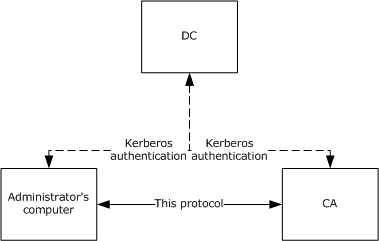

Figure 1: Machines involved in remote administration

In the preceding figure, the principal components are:

- CA: The certification authority (CA) that receives configuration and administration tasks. The remote administration protocol that is defined in this document covers the interactions that are shown as a solid line in this figure.
- Administrator's computer: A client to the CA that performs remote configuration or administration tasks.
- [**DC**](#gt_domain-controller-dc): An [**Active Directory**](#gt_active-directory) domain controller (DC) includes a [**Key Distribution Center (KDC)**](#gt_key-distribution-center-kdc) as specified in [MS-KILE](../MS-KILE/MS-KILE.md). In most cases, a Kerberos KDC is used to authenticate the parties for authenticated DCOM messages. The protocol that is documented here is built on top of authenticated DCOM messages. Interactions with the DC are shown in the figure as dashed lines. DCOM is documented as specified in [MS-DCOM], which in turn references interactions with the DC.
The protocol uses two DCOM interfaces: [ICertAdminD (section 3.1.4.1)](#Section_3.2.4.1.5) and [ICertAdminD2 (section 3.1.4.2)](#Section_3.1.4.2.2), which offer additional methods. The two interfaces define a total of 46 methods.

The methods of the Certificate Services Remote Administration Protocol fall into the following categories:

- Managing pending certificate requests: A certificate request can be fulfilled immediately or can be held for human administrator approval or other action. When a request is pending human approval, there are ICertAdminD methods that allow the human's administrative console to interact with the CA to query and modify pending requests. For additional information on pending requests, see section [3.1.1.1.1](#Section_3.1.1.1.1) and also [MS-WCCE].
- Configuring or retrieving data from CA databases: For purposes of this protocol, a CA is built around a logical database, as specified in section [1.3.1.3](#Section_1.3.1.3). A number of methods in this protocol deal with configuration or data retrieval of particular rows or columns of [**tables**](#gt_table) in the logical database.
- Managing [**revocation**](#gt_revocation): This protocol includes methods to tell the CA to revoke a certificate, to query the validity of a certificate, and to deal with the mechanics of publication of [**CRLs**](#gt_certificate-revocation-list-crl).
- Managing audit: This protocol includes methods that allow the administrator to learn and specify which classes of events generate audit trail entries.
- Archived [**key**](#gt_key) retrieval: This protocol defines one method for retrieving a private key that was archived as part of a certificate request.
- Miscellaneous administrative actions: This protocol includes a number of methods for miscellaneous administrative actions such as determining if the CA is responsive, determining what kinds of rights the caller has, telling the CA to go offline, or querying and editing various CA state variables. For details, see the descriptions in sections 3.1.4.1 and 3.1.4.2.

### 1.3.1 Concepts

The sections that follow define concepts and technologies used by the Certificate Services Remote Administration Protocol.

#### 1.3.1.1 Number Annotation

Numbers expressed in the format 0xXXXX are to be interpreted as hexadecimal. Otherwise, all numbers are to be interpreted as decimal.

#### 1.3.1.2 Object Identifiers

The protocol uses [**object identifiers (OIDs) (1)**](#gt_object-identifier-oid) as unique identifiers for several classes of [**objects**](#gt_object), as specified in [[X660]](https://go.microsoft.com/fwlink/?LinkId=90592) and [[RFC3280]](https://go.microsoft.com/fwlink/?LinkId=90414) Appendix A. OIDs (1) are used to uniquely identify [**certificate templates**](#gt_certificate-template) that are available to the [**CA**](#gt_certification-authority-ca). Within a [**certificate**](#gt_certificate), OIDs (1) are used to identify standard extensions, as specified in [RFC3280] section 4.2.1, and some nonstandard extensions.

#### 1.3.1.3 CA Databases

This protocol refers to four databases as [**tables**](#gt_table), each table with rows and columns hosted by the [**CA**](#gt_certification-authority-ca). There are two main tables: one for requests and one for [**CRLs**](#gt_certificate-revocation-list-crl). The Request table has two auxiliary tables: one for a list of [**attributes**](#gt_attribute) for a particular request, and one for a list of extensions for a particular request.

The following list contains additional details about the four tables:

- Request table: The Request table holds the history of all requests to the CA, both completed and pending, one row per request.
- Attribute table: The Attribute table holds the attributes, as specified in [[RFC2986]](https://go.microsoft.com/fwlink/?LinkId=90401), that are contained within a specified [**certificate**](#gt_certificate) request.
- Extension table: The Extension table holds the X.509 extensions, as specified in [[X509]](https://go.microsoft.com/fwlink/?LinkId=90590), that are contained within a specified certificate request.
- CRL table: The CRL table holds the [**revocation**](#gt_revocation) data and status for the CA. The CA maintains a CRL database in the form of a table that holds all CRLs (both base and delta, as defined in [[RFC3280]](https://go.microsoft.com/fwlink/?LinkId=90414) section 5) that have been issued.
Methods of this protocol refer to the preceding four tables, which are specified in section [3.1.1](#Section_3.1.1).

#### 1.3.1.4 CA Roles and Officer Rights

The Certificate Services Remote Administration Protocol includes methods to get and set [**certificate authority (CA) roles**](#gt_certificate-authority-ca-roles) and [**Officer rights**](#gt_officer-rights) (as specified in sections [3.1.4.2.6](#Section_3.1.4.2.6), [3.1.4.2.7](#Section_3.1.4.2.7), [3.1.4.2.12](#Section_3.1.4.2.12), and [3.1.4.2.13](#Section_3.1.4.2.13)). CA roles are as specified in [[CIMC-PP]](https://go.microsoft.com/fwlink/?LinkId=89839) section 5.2, and include administrator, operator, officer, and auditor. In addition, this protocol contains methods to assign [**Enrollment Agent rights**](#gt_enrollment-agent-rights) on the [**CA**](#gt_certification-authority-ca). While "Enrollment Agent" can be considered a role, it is not one of the CA roles specified in [CIMC-PP].

#### 1.3.1.5 Certificate Templates

An [**enterprise certificate authority (enterprise CA)**](#gt_enterprise-certificate-authority-enterprise-ca) has to use [**certificate templates**](#gt_certificate-template) that are configured locally in order to support [**certificate**](#gt_certificate) [**enrollment**](#gt_3edb3c30-bb82-4782-9777-19c5006965ef) requests, as specified in [MS-WCCE](../MS-WCCE/MS-WCCE.md). The complete definition of certificate templates, including the list of [**attributes**](#gt_attribute), flags, and extensions that have been implemented in applicable Windows Server releases , is specified in [MS-CRTD](#Section_1.5.1) and [MS-WCCE].

#### 1.3.1.6 Sanitizing Common Names

The [**common names (CNs)**](#gt_common-name-cn) of [**Active Directory**](#gt_active-directory) [**objects**](#gt_object), as specified in [MS-ADTS](../MS-ADTS/MS-ADTS.md), that are used by the [**enrollment**](#gt_3edb3c30-bb82-4782-9777-19c5006965ef) protocol are created by sanitizing the names of other objects and shortening the [**sanitized name**](#gt_sanitized-name) so that it does not exceed 57 characters, including spaces. Objects are defined as a collection of [**Lightweight Directory Access Protocol (LDAP)**](#gt_lightweight-directory-access-protocol-ldap) [**attributes**](#gt_attribute). Attributes are defined as LDAP data types, as specified in [[RFC2251]](https://go.microsoft.com/fwlink/?LinkId=90325) and [[RFC4523]](https://go.microsoft.com/fwlink/?LinkId=90479).

The sanitized name must not exceed 57 characters (bytes) in length. A name is sanitized by replacing the disallowed characters with an exclamation point ("!") that is followed by four hexadecimal digits, together which form one value that represents the 16-bit character being replaced.

In the following example, the opening parenthesis ("(") is replaced with !0028, the number sign ("#") is replaced with !0023, the percent sign ("%") is replaced with !0025, and the caret ("^") is replaced with !005e.

Original Name:

'LongCAName(WithSpeci@#$%^Characters'

Sanitized Name:

'LongCAName!0028WithSpeci@!0023$!0025!005eCharacters'

The algorithm for creating a sanitized name is specified in [MS-WCCE](../MS-WCCE/MS-WCCE.md) section 3.1.1.4.1.1.

## 1.4 Relationship to Other Protocols

The Certificate Services Remote Administration Protocol depends on the Distributed Component Object Model (DCOM) Remote Protocol, as specified in [MS-DCOM](../MS-DCOM/MS-DCOM.md). The DCOM Remote Protocol is built on top of the Remote Procedure Call Protocol Extensions (RPCE), as specified in [MS-RPCE](../MS-RPCE/MS-RPCE.md), and this protocol accesses RPCE directly to obtain certain security settings for the client-to-server connections.

This protocol uses the DCOM Remote Protocol to create and use [**DCOM**](#gt_distributed-component-object-model-dcom) [**object**](#gt_object) references to server objects as described in section [2.1](#Section_2.1) and [MS-DCOM] section 3.2.4.1. This protocol also uses the DCOM Remote Protocol to select authentication settings. The specific parameters passed from the Certificate Services Remote Administration Protocol to the DCOM Remote Protocol are specified in section 2.1.

Using input from a higher-layer protocol or application, the DCOM Remote Protocol negotiates its authentication method and settings by using the Generic Security Service Application Programming Interface (GSS-API), as specified in [[RFC2478]](https://go.microsoft.com/fwlink/?LinkId=90360). These settings are in turn passed to the activation request and [**object remote procedure call (ORPC)**](#gt_object-remote-procedure-call-orpc) calls made by the DCOM client to the DCOM server, as specified in [MS-DCOM] sections 3.2.4.1.1.2 and 3.2.4.2.

This protocol depends on the Netlogon Remote Protocol Specification, as specified in [MS-NRPC](../MS-NRPC/MS-NRPC.md), for locating the [**domain controller**](#gt_domain-controller-dc).

No other Windows protocol directly depends on the Certificate Services Remote Administration Protocol. However, this protocol is designed to manage a server that implements the Windows Client Certificate Enrollment Protocol, as specified in [MS-WCCE](../MS-WCCE/MS-WCCE.md) as well as the ICertPassage Remote Protocol, as specified in [MS-ICPR](../MS-ICPR/MS-ICPR.md). Certificate Services Remote Administration Protocol shares an ADM with the ICertPassage Remote Protocol and the Windows Client Certificate Enrollment Protocol, as specified in sections [3.1.1.10](#Section_3.1.1.10), [3.1.3](#Section_3.2.3), [3.1.4](#Section_3.1.4), and [3.1.5](#Section_3.2.5). The Certificate Services Remote Administration Protocol, the Windows Client Certificate Enrollment Protocol, and the ICertPassage Remote Protocol use a common list of configuration data elements, defined in sections [3.1.1.6](../MS-WCCE/MS-WCCE.md), [3.1.1.7](../MS-WCCE/MS-WCCE.md), [3.1.1.8](../MS-WCCE/MS-WCCE.md), [3.1.1.9](../MS-WCCE/MS-WCCE.md), and 3.1.1.10.

The following diagram illustrates the layering of the protocol in this section with other protocols in its stack.

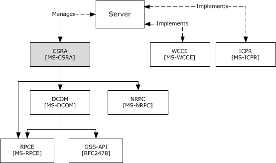

Figure 2: Relationship to other protocols

## 1.5 Prerequisites/Preconditions

### 1.5.1 Certificate Template

The Certificate Services Remote Administration Protocol enables the configuration, setting, and retrieval of properties on a [**CA**](#gt_certification-authority-ca). A CA can use templates in support of the Windows Certificate Services Enrollment Protocol, as specified in [MS-WCCE](../MS-WCCE/MS-WCCE.md). An [**enterprise CA**](#gt_enterprise-certificate-authority-enterprise-ca) requires valid templates that are configured on the CA. Information about [**certificate templates**](#gt_certificate-template) can be found in [[MSFT-TEMPLATES]](https://go.microsoft.com/fwlink/?LinkId=90209).

### 1.5.2 CA Name

The Certificate Services Remote Administration Protocol assumes that the client knows the name of the [**CA**](#gt_certification-authority-ca) server that implements the [**DCOM**](#gt_distributed-component-object-model-dcom) interfaces specified in section [3.2.4](#Section_3.1.4). Windows-based clients discover Microsoft CAs by reading the [**certificate**](#gt_certificate) [**enrollment**](#gt_3edb3c30-bb82-4782-9777-19c5006965ef) [**object**](#gt_object) in [**Active Directory**](#gt_active-directory) (as specified by [MS-ADTS](../MS-ADTS/MS-ADTS.md)) and by using [**LDAP**](#gt_lightweight-directory-access-protocol-ldap) (as specified in [[RFC2559]](https://go.microsoft.com/fwlink/?LinkId=90368)).

The enrollment object that defines the names of the CAs is located under the CN=Enrollment Services, CN=Public Key Services, CN=Services, CN=Configuration, DC=ForestRootDomain [**container**](#gt_container) of Active Directory. Each CA has an entry with a class of pKIEnrollmentService, as specified in [MS-ADSC](../MS-ADSC/MS-ADSC.md) section 2.223.

The **cn** [**attribute**](#gt_attribute) of pKIEnrollmentService is the CA name. The **dNSHostName** attribute ([MS-ADA1](../MS-ADA1/MS-ADA1.md) section 2.185) of pKIEnrollmentService contains the machine name that hosts the CA service.

### 1.5.3 Signing Certificate

The [**CA**](#gt_certification-authority-ca) MUST have access to the entire [Signing_Cert Table](#Section_3.1.1.11), including each CA [**signing certificate**](#gt_signing-certificates), defined in [MS-WCCE](../MS-WCCE/MS-WCCE.md) section 3.2.1.1.2, and to the [**private key**](#gt_private-key) associated with the CA Exchange Certificate in the Current_CA_Exchange_Cert element, defined in [MS-WCCE] section 3.2.1.1.4.

### 1.5.4 Database

The [**tables**](#gt_table) and fields defined in section [3.1.1](#Section_3.1.1) are available.

### 1.5.5 Configuration

The configuration elements defined in section [3.1.1.10](#Section_3.1.1.10) are available. Each element defined in section 3.1.1.10 as "{Config_Element_Name}" has been initialized from its corresponding data element "OnNextRestart_{Config_Element_Name}" upon [**CA**](#gt_certification-authority-ca) startup.

Certificate Services Remote Administration Protocol server implementations that also implement the Windows Client Certificate Enrollment Protocol or the ICertPassage Remote Protocol use the same configuration data elements for those implementations as those defined in sections [3.1.1.6](#Section_3.1.1.6), [3.1.1.7](#Section_3.1.1.7), [3.1.1.8](#Section_3.1.1.8), [3.1.1.9](#Section_3.1.1.9), and 3.1.1.10.

## 1.6 Applicability Statement

The Certificate Services Remote Administration Protocol provides clients with the capability to interact with [**CA**](#gt_certification-authority-ca) for the purpose of managing X.509 [**certificates**](#gt_certificate), as specified in [[X509]](https://go.microsoft.com/fwlink/?LinkId=90590), or a CA configuration.

## 1.7 Versioning and Capability Negotiation

The Certificate Services Remote Administration Protocol is based on [**DCOM**](#gt_distributed-component-object-model-dcom) technology, as specified in [MS-DCOM](../MS-DCOM/MS-DCOM.md), which provides capabilities to query for interface versions. [**Clients**](#gt_client) use the IUnknown.QueryInterface method to determine the supported server interface version. If [**Certificate Services**](#gt_certificate-services) supports [ICertAdminD2](#Section_3.1.4.2.2), then ICertAdminD2 is used; otherwise, [ICertAdminD](#Section_3.2.4.1.5) is used.

## 1.8 Vendor-Extensible Fields

This protocol uses HRESULT values as defined in [MS-ERREF](../MS-ERREF/MS-ERREF.md) section 2.1.1. Vendors can define their own HRESULT values, provided they set the C bit (0x20000000) for each vendor-defined value, indicating the value is a customer code.

## 1.9 Standards Assignments

No standards assignments have been received for the Certificate Services Remote Administration Protocol described in this document.

All values used in these extensions are in private ranges. The following [**table**](#gt_table) contains the [**remote procedure call (RPC)**](#gt_remote-procedure-call-rpc) interface [**universally unique identifiers (UUIDs)**](#gt_universally-unique-identifier-uuid) for all the interfaces that are part of the Certificate Services Remote Administration Protocol object model.

| Constant/value | Description |
| --- | --- |
| d99e6e71-fc88-11d0-b498-00a0c90312f3 | UUID for the ICertAdminD interface |
| 7fe0d935-dda6-443f-85d0-1cfb58fe41dd | UUID for the ICertAdminD2 interface |

# 2 Messages

## 2.1 Transport

[**DCOM**](#gt_distributed-component-object-model-dcom), as specified in [MS-DCOM](../MS-DCOM/MS-DCOM.md), is used as the transport protocol.

This protocol uses the DCOM Remote Protocol, to create and use DCOM [**object**](#gt_object) references to server objects.

Certificate Services Remote Administration Protocol clients initialize a connection to the Certificate Services Remote Administration server by creating and executing a DCOM activation request. As a result of this DCOM activation, the Certificate Services Remote Administration client can use the DCOM client to call the methods specified in this document. The activation process is detailed in [MS-DCOM] section 3.2.4.

The [**RPC**](#gt_remote-procedure-call-rpc) version number for all interfaces MUST be 0.0.

[MS-DCOM] section 3.2.4.1 specifies the various elements that a DCOM-using application passes to the DCOM client as part of the initial activation request. Below are the values the Certificate Services Remote Administration Protocol client sends to the DCOM layer.

General DCOM settings:

- Remote server name, which is the application-supplied remote server name as specified in [MS-DCOM] section 3.2.4.1. The Certificate Services Remote Administration Protocol client sends the name of the [**CA**](#gt_certification-authority-ca) server.
- Class identifier (CLSID) of the object requested. This value is d99e6e73-fc88-11d0-b498-00a0c90312f3.
- Interface identifier(s) (IID) of interface(s) requested.
- ICertAdminD: d99e6e71-fc88-11d0-b498-00a0c90312f3
- ICertAdminD2: 7fe0d935-dda6-443f-85d0-1cfb58fe41dd<1>
Security settings ([MS-DCOM] section 3.2.4.1.1.2)

- Security provider: RPC_C_AUTHN_GSS_NEGOTIATE (9)
- Authentication level: RPC_C_AUTHN_LEVEL_PKT_PRIVACY (6).
As a result of the security provider and authentication level used, there is a negotiation between the client and server security providers that results in either NTLM, as specified in [MS-NLMP](../MS-NLMP/MS-NLMP.md), or Kerberos, as specified in [[RFC4120]](https://go.microsoft.com/fwlink/?LinkId=90458) and [MS-KILE](../MS-KILE/MS-KILE.md), being used as the authentication method.

- Impersonation level: RPC_C_IMP_LEVEL_IMPERSONATE (3).
This means the server can use the client's security context while acting on behalf of the client, to access local resources such as files on the server.

- Authentication identity and credentials: NULL.
Passing NULL authentication identity and credentials for the RPC_C_AUTHN_GSS_NEGOTIATE security provider means that the OPRC call uses the identity and credentials of the higher-layer application.<2>

Default values, as specified in [MS-DCOM], are used for all DCOM inputs not specified above, such as Security Principal Name (SPN), and client and prototype context property buffers and their context property identifiers.

## 2.2 Common Data Types

### 2.2.1 Common Structures

This section defines the structures used by the Certificate Services Remote Administration Protocol. These structures are used when performing various operations (using interface methods specified in section [3.1.4](#Section_3.1.4)) on the server and as part of the server's response. This protocol shares a number of structures with the Windows Client Certificate Enrollment Protocol (as specified in [MS-WCCE](../MS-WCCE/MS-WCCE.md)), which are specified in the following sections.

#### 2.2.1.1 BYTE

The BYTE type specifies an 8-bit data item that corresponds to a single octet in a network protocol.

This type is declared as follows:

typedef byte BYTE;

#### 2.2.1.2 VARIANT

The VARIANT type is implemented as specified in [MS-OAUT](../MS-OAUT/MS-OAUT.md) section 2.2.29.

#### 2.2.1.3 CERTVIEWRESTRICTION

The CERTVIEWRESTRICTION structure is used to restrict the data set that is returned by the [**CA**](#gt_certification-authority-ca) server during calls to the OpenView method for the ICertAdminD interface.

This structure is passed by [**RPC**](#gt_remote-procedure-call-rpc) technology, as specified in [MS-RPCE](../MS-RPCE/MS-RPCE.md), and does not need special marshaling.

typedef struct _CERTVIEWRESTRICTION {

DWORD ColumnIndex;

LONG SeekOperator;

LONG SortOrder;

[size_is(cbValue), unique] BYTE* pbValue;

DWORD cbValue;

} CERTVIEWRESTRICTION;

**ColumnIndex:** An unsigned integer value that specifies the identifier for the database column that is receiving the restriction.

**SeekOperator:** An integer value that specifies the logical operator of the data-query qualifier for the column. This parameter MUST be set to one of the following values.

| Value | Meaning |
| --- | --- |
| 0x00000001 | Equal to |
| 0x00000002 | Less than |
| 0x00000004 | Less than or equal to |
| 0x00000008 | Greater than or equal to |
| 0x00000010 | Greater than |

**SortOrder:** An integer value that specifies the sort order for the column. This parameter MUST be set to one of the following values.

| Value | Meaning |
| --- | --- |
| 0x00000000 | No sort order |
| 0x00000001 | Ascending |
| 0x00000002 | Descending |

**pbValue:** A pointer to a byte array that specifies the value against which the value in the corresponding column (specified by **ColumnIndex**) is compared, using SeekOperator.

**cbValue:** An unsigned integer value that specifies the length of the byte array that is pointed to by the **pbValue** field.

#### 2.2.1.4 CERTTRANSBLOB

The CERTTRANSBLOB structure defines a byte buffer that is used to store and request [**certificates**](#gt_certificate), transmit responses, manipulate Unicode strings, and marshal property values.

typedef struct _CERTTRANSBLOB {

ULONG cb;

[size_is(cb), unique] BYTE* pb;

} CERTTRANSBLOB;

**cb:** An unsigned integer value that MUST contain the length, in bytes, of the buffer that is pointed to by **pb**.

**pb:** The [BYTE](#Section_2.2.1.1) buffer that contains the binary contents being transported in this CERTTRANSBLOB. That content consists of any of the following entities:

- A certificate.
- A certificate request.
- [**CA**](#gt_certification-authority-ca) properties.
- Any common structure that is defined in section [2.2.1](#Section_2.2.1) other than [VARIANT](#Section_2.2.1.2) or [CERTVIEWRESTRICTION](#Section_2.2.1.3).
- Any common structure that is defined in [MS-WCCE](../MS-WCCE/MS-WCCE.md) section 2.2.2.
The CERTTRANSBLOB structure is empty when **cb** is set to 0 and **pb** is set to NULL.

The marshaling of other structures that can be passed in the **pb** byte buffer of CERTTRANSBLOB is defined in [MS-WCCE] section 2.2.2.

All instances of CERTTRANSBLOB that are used by this protocol MUST use the marshaling rules that are described in the following sections or in [MS-WCCE] section 2.2.2.

#### 2.2.1.5 CATRANSPROP

The CATRANSPROP structure encapsulates information about a [**CA**](#gt_certification-authority-ca) property. The CATRANSPROP structure and the marshaling of one or more CATRANSPROP structures into a [CERTTRANSBLOB](#Section_2.2.1.4) structure is specified in [MS-WCCE](../MS-WCCE/MS-WCCE.md) section 2.2.2.3.

#### 2.2.1.6 CAINFO

Defines a basic informational block describing a [**CA**](#gt_certification-authority-ca). The structure of CAINFO is specified in [MS-WCCE](../MS-WCCE/MS-WCCE.md) section 2.2.2.4. The marshaling of CAINFO into a [CERTTRANSBLOB](#Section_2.2.1.4) structure is specified in [MS-WCCE] section 2.2.2.2.5.

#### 2.2.1.7 CERTTRANSDBCOLUMN

The CERTTRANSDBCOLUMN structure is encoded within a [CERTTRANSBLOB](#Section_2.2.1.4) structure. The CERTTRANSDBCOLUMN structure contains [**schema**](#gt_schema) information about a particular database column that is associated with a specific [**table**](#gt_table) to the client. This associated table is invoked when the client queries the [EnumViewColumn](#Section_3.2.4.2.5) or [EnumViewColumnTable](#Section_3.2.4.2.5) method of the [ICertAdminD](#Section_3.2.4.1.5) and [ICertAdminD2](#Section_3.1.4.2.2) interfaces, respectively.

typedef struct _CERTTRANSDBCOLUMN {

DWORD Type;

DWORD Index;

DWORD cbMax;

ULONG obwszName;

ULONG obwszDisplayName;

} CERTTRANSDBCOLUMN;

**Type:** This field describes the column. It consists of two WORDs, a high WORD and a low WORD, which are used separately.

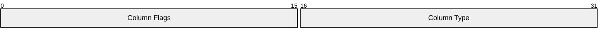

**Column Flags**: This is the high WORD of the **Type** field. It is a 16-bit field where only bit 15 is used, as shown in the following bit diagram.

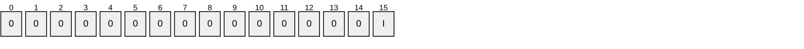

**I**: If set to 1, this bit indicates that the column is indexed for lookup purposes.

All other bits are reserved and MUST be set to 0.

**Column Type**: This is the low WORD of the **Type** field. It is divided into two bytes:

- The high byte of the low WORD MUST be set to 0, and MUST be ignored by the server on receipt.
- The low byte of the low WORD MUST specify the value type for the column that is associated with a specific table by using one of the following values.
| Value | Meaning |
| --- | --- |
| 0x01 | The Column type is a signed integer. |
| 0x02 | The Column type is a date. |
| 0x03 | The Column type is binary data. |
| 0x04 | The Column type is a string. |

**Index:** An unsigned integer value that specifies the identifier for the column in the server database.

**cbMax:** An unsigned integer value that specifies the maximum data size, in bytes, that this column can contain.

**obwszName:** An integer that contains the offset from the beginning of the byte array buffer that is pointed to by the **pb** member in the containing CERTTRANSBLOB structure, to where the string that contains the name of this column can be found. The string format is a null-terminated UNICODE string. The offset MUST be divisible by 4.

**obwszDisplayName:** An integer that contains the offset from the beginning of the byte array buffer that is pointed to by the **pb** member in the containing CERTTRANSBLOB structure, to where the string that contains the display name of this column can be found. The string format is a null-terminated UNICODE string. The offset MUST be divisible by 4.

##### 2.2.1.7.1 CERTTRANSDBCOLUMN Marshaling Format

The [CERTTRANSDBCOLUMN](#Section_2.2.1.7) structure (section 2.2.1.7) is encoded within the byte array that is referenced by the **pb** member of a [CERTTRANSBLOB](#Section_2.2.1.4) structure (section 2.2.1.4).

The packet that contains an array of some number, "N", of CERTTRANSDBCOLUMN structures is specified in the following packet diagrams. The actual value of "N" is a separate return parameter for the [EnumViewColumn](#Section_3.2.4.2.5) (section 3.1.4.1.9) and [EnumViewColumnTable](#Section_3.2.4.2.5) (section 3.2.4.2.5) methods.

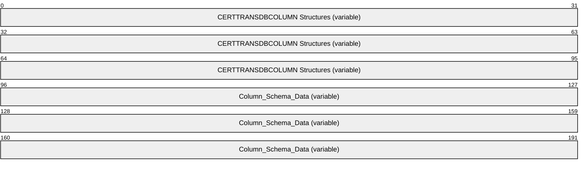

**CERTTRANSDBCOLUMN Structures (variable):** An array of **CERTTRANSDBCOLUMN** structures. These structures MUST be contiguous and MUST NOT be padded. All structures MUST appear prior to any information about the column [**schema**](#gt_schema) data, which appears in the **Column_Schema_Data** byte array at the end of the packet.

Each of the structures is marshaled in the following manner. The fields in the following diagram correspond to the similarly named members of the **CERTTRANSDBCOLUMN** structure.

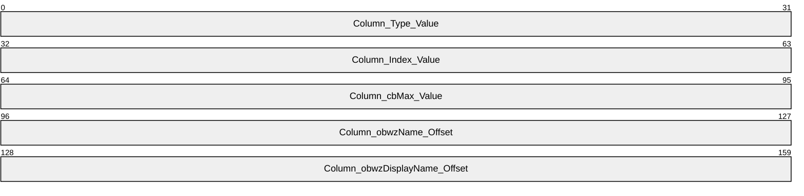

**Column_Type_Value (4 bytes):** The value indicating the type for the column. The value MUST be [**little-endian**](#gt_little-endian) encoded.

**Column_Index_Value (4 bytes):** The value indicating the ID for the column. The value MUST be little-endian encoded.

**Column_cbMax_Value (4 bytes):** The maximum length of data that this column can contain. The value MUST be little-endian encoded.

**Column_obwzName_Offset (4 bytes):** The offset from the beginning of the byte array buffer that is pointed to by the **pb** member in the containing CERTTRANSBLOB structure to where the string that contains the name of this column can be found. The format is a null-terminated Unicode string. The offset MUST be divisible by 4. The offset value MUST be little-endian encoded.

**Column_obwzDisplayName_Offset (4 bytes):** The offset from the beginning of the byte array buffer that is pointed to by the **pb** member in the containing CERTTRANSBLOB structure to where the string that contains the display name of this column can be found. The format is a null-terminated Unicode string. The offset MUST be divisible by 4. The offset value MUST be little-endian encoded.

**Column_Schema_Data (variable):** Contains the schema data for all columns that are referenced by the obwzName and obwszDisplayName fields of the CERTTRANSDBCOLUMN structures. Schema data for an individual column MUST NOT overlap with any other data. Arbitrary padding can be inserted between data values. Schema data MUST be little-endian encoded for each character of the null-terminated UNICODE string.

#### 2.2.1.8 CERTTRANSDBATTRIBUTE

The CERTTRANSDBATTRIBUTE structure is encoded within a [CERTTRANSBLOB](#Section_2.2.1.4) structure. The CERTTRANSDBATTRIBUTE structure is used by the server to return [**attribute**](#gt_attribute) information that is associated with a request to the client (upon the client's query via invocation of the [EnumAttributesOrExtensions](#Section_3.2.4.1.11) method of the [ICertAdminD](#Section_3.2.4.1.5) interface).

typedef struct _CERTTRANSDBATTRIBUTE {

ULONG obwszName;

ULONG obwszValue;

} CERTTRANSDBATTRIBUTE;

**obwszName:** An integer that contains the offset from the beginning of the byte array buffer that is pointed to by the **pb** member in the containing CERTTRANSBLOB structure to where the string that contains the name of this attribute can be found. The format is a null-terminated UNICODE string. The offset MUST be divisible by 4.

**obwszValue:** An integer that contains the offset from the beginning of the byte array buffer that is pointed to by the **pb** member in the containing CERTTRANSBLOB structure to where the string that contains the value of this attribute can be found. The format is a null-terminated UNICODE string. The offset MUST be divisible by 4.

##### 2.2.1.8.1 CERTTRANSDBATTRIBUTE Marshaling Format

The packet containing an array of some number, "N", of [CERTTRANSDBATTRIBUTE](#Section_2.2.1.8) structures (section 2.2.1.8) is specified in the following packet diagrams. The actual value of "N" is a separate return parameter for the [EnumAttributesOrExtensions](#Section_3.2.4.1.11) method (section 3.1.4.1.11).

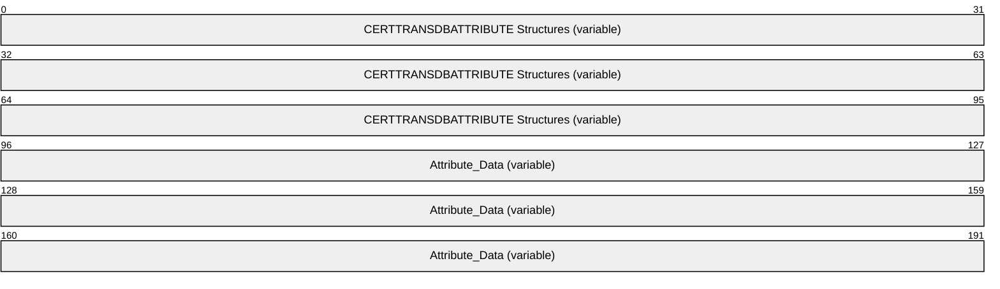

**CERTTRANSDBATTRIBUTE Structures (variable):** An array of **CERTTRANSDBATTRIBUTE** structures. These structures MUST be contiguous and MUST NOT be padded. All [**attribute**](#gt_attribute) headers MUST appear prior to any attribute data, which appears in the attribute data byte array at the end of the packet.

Each of the structures is marshaled in the following manner. The fields in the following diagram correspond to the similarly named members of the **CERTTRANSDBATTRIBUTE** structure.

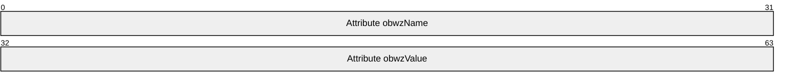

**Attribute obwzName (4 bytes):** The offset from the beginning of the byte array buffer that is pointed to by the **pb** member in the containing [CERTTRANSBLOB](#Section_2.2.1.4) structure (section 2.2.1.4) to where the string that contains the name of this attribute can be found. The format is a null-terminated UNICODE string. The offset MUST be divisible by 4. The offset MUST be [**little-endian**](#gt_little-endian) encoded.

**Attribute obwzValue (4 bytes):** The offset from the beginning of the byte array buffer that is pointed to by the **pb** member in the containing CERTTRANSBLOB structure to where the string that contains the value of this attribute can be found. The format is a null-terminated UNICODE string. The offset MUST be divisible by 4. The offset MUST be little-endian encoded.

**Attribute_Data (variable):** Contains the data for all attributes. Data for individual attributes MUST NOT overlap with any other attribute data. Attribute name and value are string type. The data MUST use little-endian encoding format for a null-terminated UNICODE string.

#### 2.2.1.9 CERTTRANSDBEXTENSION

The CERTTRANSDBEXTENSION structure is encoded within a [CERTTRANSBLOB](#Section_2.2.1.4) structure. The CERTTRANSDBEXTENSION structure is used by the server to return [**certificate**](#gt_certificate) extension information, as specified in [[RFC3280]](https://go.microsoft.com/fwlink/?LinkId=90414) section 4, that is associated with a request. This associated request to the client occurs when the client performs a query by invoking the [EnumAttributesOrExtensions](#Section_3.2.4.1.11) method of the [ICertAdminD](#Section_3.2.4.1.5) interface.

typedef struct _CERTTRANSDBEXTENSION {

ULONG obwszName;

LONG ExtFlags;

DWORD cbValue;

ULONG obValue;

} CERTTRANSDBEXTENSION;

**obwszName:** An unsigned integer that contains the offset from the beginning of the byte array buffer that is pointed to by the **pb** member in the containing CERTTRANSBLOB structure to the string representation of an [**OID (1)**](#gt_object-identifier-oid) of this extension (as specified in [[X680]](https://go.microsoft.com/fwlink/?LinkId=90594)). The string format is a null-terminated UNICODE string. The offset MUST be divisible by 4.

**ExtFlags:** An integer value that specifies the flags that are associated with the extension. The following diagram shows its contents.

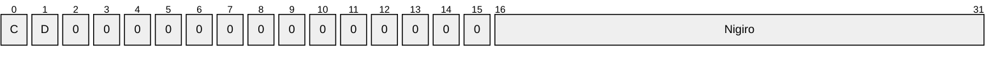

**C (1 bit):** C is the ExtensionCriticalFlag, as defined in section [3.1.1.3](#Section_2.2.1.9), the **Extension_Flags** ADM element. A value of 0 means the extension is not critical. A value of 1 means the extension is critical.

**D (1 bit):** D is the ExtensionDisabledFlag, as defined in section 3.1.1.3, the **Extension_Flags** ADM element. A value of 0 means the extension is not disabled. A value of 1 means the extension is disabled.

**Nigiro (2 bytes):** The **Nigiro** field is defined as follows:

| Bit Range | Field | Description |
| --- | --- | --- |
| Variable | 0x8000 | The extension comes from the request. |
| The extension was added by the [**CA**](#gt_certification-authority-ca). The CA assigns a value of 2 if the extension was added by the policy module of the CA. | 0x4000 | - |
| Variable | 0xC000 | The extension was added by the CA. The CA assigns a value of 3 if the extension was added interactively by a human administrator of the CA. |
| Variable | 0x2000 | The extension was added by the CA. The CA assigns a value of 4 if the extension was added by the certificate server engine and not the policy module component of the CA. |
| Variable | 0xA000 | The extension was in the preceding certificate, which might occur, for example, when a certificate is renewed. |
| Variable | 0x6000 | The extension comes from an imported certificate (a certificate that was imported into the CA database). |
| Variable | 0xE000 | The extension comes from a PKCS7 request. |
| Variable | 0x1000 | The extension comes from a CMC request. |
| The extension comes from the current CA [**signing certificate**](#gt_signing-certificates). | 0x9000 | - |

**cbValue:** An unsigned integer value that contains the length, in bytes, of data that is referenced by the *obValue* parameter.

**obValue:** An unsigned integer that contains the offset from the beginning of the byte array buffer that is pointed to by the **pb** member in the containing CERTTRANSBLOB structure to where the value for this extension can be found. The length of the value is specified in the **cbValue** field. The value is in ASN.1 Distinguished Encoding Rules (DER) format for the extension, as specified in [[X660]](https://go.microsoft.com/fwlink/?LinkId=90592). The offset MUST be divisible by 4.

##### 2.2.1.9.1 CERTTRANSDBEXTENSION Marshaling Format

The packet containing an array of some number, "N", of [CERTTRANSDBEXTENSION](#Section_2.2.1.9) structures (section 2.2.1.9) is specified in the following packet diagrams. The actual value of "N" is a separate return parameter for the [EnumAttributesOrExtensions](#Section_3.2.4.1.11) method (3.2.4.1.11).

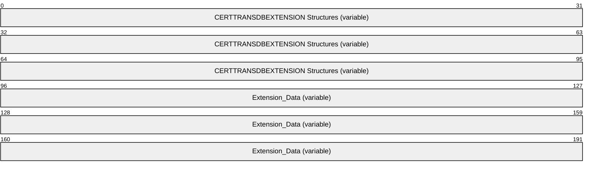

**CERTTRANSDBEXTENSION Structures (variable):** An array of **CERTTRANSDBEXTENSION** structures. These structures MUST be contiguous and MUST NOT be padded. All extension headers MUST appear prior to any extension data, which appears in the **Extension_Data** byte array at the end of the packet.

Each of the structures is marshaled in the following manner. The fields in the following diagram correspond to the similarly named members of the **CERTTRANSDBEXTENSION** structure.

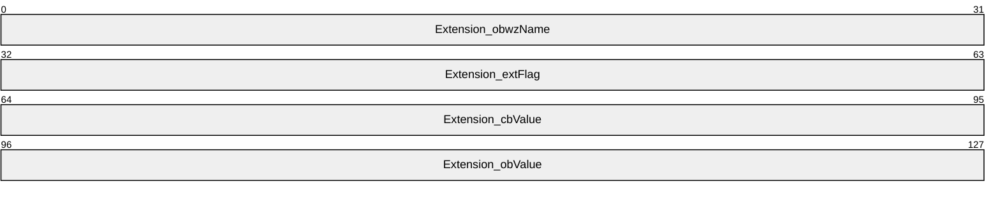

**Extension_obwzName (4 bytes):** The offset from the beginning of the byte array buffer that is pointed to by the **pb** member in the containing [CERTTRANSBLOB](#Section_2.2.1.4) structure (section 2.2.1.4) to the string that contains the name of this CERTTRANSDBEXTENSION. The offset MUST be [**little-endian**](#gt_little-endian) encoded. The offset MUST be divisible by 4.

**Extension_extFlag (4 bytes):** An integer value that specifies the flags that is associated with this extension. The value MUST be little-endian encoded.

**Extension_cbValue (4 bytes):** The length of the data in this extension referenced by **obValue** (offset). The value MUST be little-endian encoded.

**Extension_obValue (4 bytes):** The offset from the beginning of the byte array buffer that is pointed to by the **pb** member in the containing CERTTRANSBLOB structure to where the value for this extension can be found. The offset MUST be divisible by 4. The offset value MUST be little-endian encoded.

**Extension_Data (variable):** Contains the data for all extensions. Data for individual extensions MUST NOT overlap with any other extension data. An extension name data MUST use little-endian encoding format for a null-terminated UNICODE string. An extension value data is a byte array.

#### 2.2.1.10 CERTTRANSDBRESULTCOLUMN

The CERTTRANSDBRESULTCOLUMN structure is encoded within a [CERTTRANSBLOB](#Section_2.2.1.4) structure. The CERTTRANSDBRESULTCOLUMN structure is used by the server to return the result of a [**CA**](#gt_certification-authority-ca) database query that is done by the client (upon the client's query via invocation of the [OpenView](#Section_3.1.4.1.12) or [EnumView](#Section_3.2.4.1.13) method of the [ICertAdminD](#Section_3.2.4.1.5) interface).

The OpenView and EnumView methods return data in the form of a CERTTRANSBLOB structure whose **pb** member points to an array of one or more [CERTTRANSDBRESULTROW](#Section_2.2.3) structures. Each CERTTRANSDBRESULTROW structure contains one or more CERTTRANSDBRESULTCOLUMN structures.

The CERTTRANSDBRESULTCOLUMN structure contains data for a specific column in a specific row.

typedef struct _CERTTRANSDBRESULTCOLUMN {

DWORD Type;

DWORD Index;

ULONG obValue;

DWORD cbValue;

} CERTTRANSDBRESULTCOLUMN;

**Type:** This field describes the column. It consists of two WORDs, a high WORD and a low WORD, which are used separately.

**Column Flags**: This is the high WORD of the **Type** field. It is a 16-bit field where only bit 15 is used, as shown in the following bit diagram.

**I**: If set to 1, it indicates that the column is indexed for lookup purposes.

All other bits are reserved and MUST be set to 0.

**Column Type**: This is the low WORD of the **Type** field. It is divided into two bytes:

- The high byte of the low WORD MUST be set to 0, and MUST be ignored by the server on receipt.
- The low byte of the low WORD MUST specify the value type for the column that is associated with a specific [**table**](#gt_table) by using one of the following values.
| Value | Meaning |
| --- | --- |
| 0x01 | The Column type is a signed integer. |
| 0x02 | The Column type is a date. |
| 0x03 | The Column type is binary data. |
| 0x04 | The Column type is a string. |

**Index:** An unsigned integer value that specifies the identifier for the column in the relevant table.

**obValue:** An unsigned integer that contains the offset from the beginning of the corresponding CERTTRANSDBRESULTROW structure to where the value for this column can be found. The length of the value is specified in the **cbValue** field. The offset MUST be DWORD aligned.

**cbValue:** An unsigned integer value that specifies the length, in bytes, of the value for the specific column.

##### 2.2.1.10.1 CERTTRANSDBRESULTCOLUMN Marshaling Format

The [CERTTRANSDBRESULTCOLUMN](#Section_2.2.1.10) structure (section 2.2.1.10) is encoded within a [CERTTRANSBLOB](#Section_2.2.1.4) structure (section 2.2.1.4) such that the **pb** member of the CERTTRANSBLOB points to the beginning of an array of one or more [CERTTRANSDBRESULTROW](#Section_2.2.3) structures (section 2.2.3), each of which contains one or more CERTTRANSDBRESULTCOLUMN structures.

The packet containing an array of some number, "N", of CERTTRANSDBRESULTCOLUMN structures is specified in the following packet diagrams. The actual value of "N" is the value of the corresponding **ccol** member of CERTTRANSDBRESULTROW.

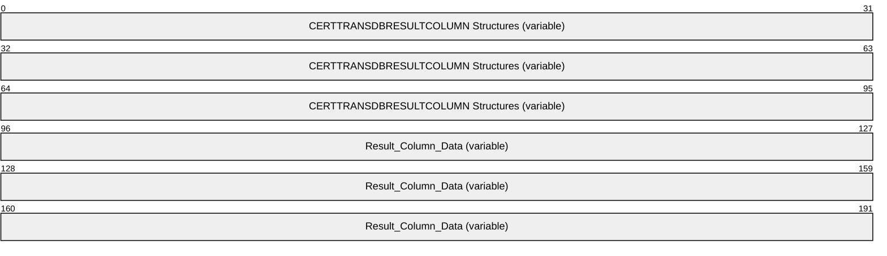

**CERTTRANSDBRESULTCOLUMN Structures (variable):** An array of **CERTTRANSDBRESULTCOLUMN** structures.

Each of the structures is marshaled in the following manner. The fields in the following diagram correspond to the similarly-named members of the **CERTTRANSDBRESULTCOLUMN** structure.

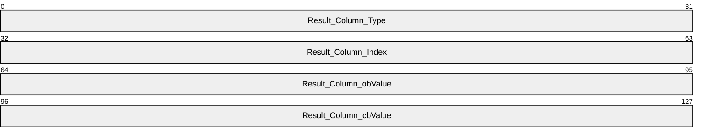

**Result_Column_Type (4 bytes):** The value indicating the type for the column. The value MUST be [**little-endian**](#gt_little-endian) encoded.

**Result_Column_Index (4 bytes):** The value indicating the ID for the column. The value MUST be little-endian encoded.

**Result_Column_obValue (4 bytes):** The offset from the start of the corresponding CERTTRANSDBRESULTROW structure to the column data. The offset MUST be little-endian encoded. The offset MUST be divisible by 4.

**Result_Column_cbValue (4 bytes):** The length of the data in the column referenced by **obValue** (offset). The length value MUST be little-endian encoded.

**Result_Column_Data (variable):** Contains the data for all columns. Data for individual columns MUST NOT overlap with any other column data. Arbitrary padding can be inserted between data values. Based on the value of the **Type** field, the data value for the column MUST be encoded as follows.

| Bit Range | Field | Description |
| --- | --- | --- |
| Variable | 0x01 | Integer MUST use little-endian encoding format. |
| Variable | 0x02 | Date MUST use little-endian encoding format. |
| Variable | 0x03 | Binary - |
| Variable | 0x04 | String MUST use little-endian encoding format for each character of the null-terminated UNICODE string. |

#### 2.2.1.11 Officer and Enrollment Agent Access Rights

Officer and Enrollment Agent access rights structures are used by the server to return the results of a client query; for example, the client's invocation of the **GetOfficerRights** method (section [3.1.4.2.12](#Section_3.1.4.2.12)) of the **ICertAdminD2** interface (sections [3.1.4.2](#Section_3.1.4.2.2) and [3.2.4.2](#Section_3.1.4.2.2)).

[**Officer rights**](#gt_officer-rights) and [**Enrollment Agent rights**](#gt_enrollment-agent-rights) are security descriptors. Security descriptor structures are defined in [MS-DTYP](../MS-DTYP/MS-DTYP.md) section 2.4.6 and can contain **SID** structures ([MS-DTYP] section 2.4.2). Officer rights and Enrollment Agent rights security descriptors have the following properties:

- Each [**access control entry (ACE)**](#gt_access-control-entry-ace) in the [**discretionary access control list (DACL)**](#gt_discretionary-access-control-list-dacl) MUST have:
- Either the AceType 0x9 (ACCESS_ALLOWED_CALLBACK_ACE_TYPE for the ACCESS_ALLOWED_CALLBACK_ACE, [MS-DTYP] section 2.4.4.6) or the AceType 0x0A (ACCESS_DENIED_CALLBACK_ACE_TYPE for the ACCESS_DENIED_CALLBACK_ACE, [MS-DTYP] section 2.4.4.7).
- AccessMask 0x00010000.
- The ACE contains additional application data following the SID.
The format for the additional application data is as follows.

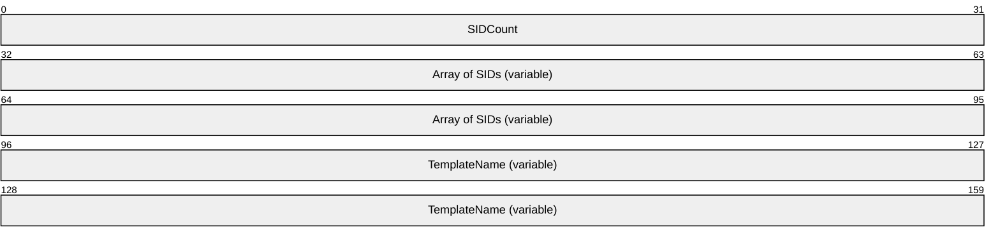

**SIDCount (4 bytes):** A [**little-endian**](#gt_little-endian) encoded DWORD that contains the count of the SID structures following it.

**Array of SIDs (variable):** An array of SID structures marshaled in packet representation ([MS-DTYP] section 2.4.2.2) that identify either (i) [**principals**](#gt_principal) for whom the officer can approve requests; or (ii) principals on whose behalf the [**enrollment**](#gt_3edb3c30-bb82-4782-9777-19c5006965ef) agent can obtain [**certificates**](#gt_certificate). For an Officer rights security descriptor, case (i) applies. For an Enrollment Agent rights security descriptor, case (ii) applies.

**TemplateName (variable):** A little-endian encoded Unicode and null-terminated string that identifies the [**common name (CN)**](#gt_common-name-cn) of the template (as defined in [MS-CRTD](#Section_1.5.1)) for which the officer is authorized to approve requests.

##### 2.2.1.11.1 Marshaling Format for Officer and Enrollment Agent Rights

The marshaling of [**Officer rights**](#gt_officer-rights) and [**Enrollment Agent rights**](#gt_enrollment-agent-rights) into a **CERTTRANSBLOB** structure depends on whether the server supports Enrollment Agent rights. [**CA**](#gt_certification-authority-ca) implementers can determine whether to support Enrollment Agent rights; there is no requirement to support them.

If Enrollment Agent rights are not supported by the server, the **pb** member of the **CERTTRANSBLOB** structure refers to the Officer rights security descriptor (as defined in [MS-DTYP](../MS-DTYP/MS-DTYP.md) section 2.4.6), and the **cb** member contains the length of the marshaled data.

If Enrollment Agent rights are supported by the server, the **CERTTRANSBLOB** structure is created as follows:

- If Officer rights are enabled and Enrollment Agent rights are disabled, the **pb** member of the **CERTTRANSBLOB** structure refers to the following marshaled structure.
struct {

SECURITY_DESCRIPTOR OfficerRights;

DWORD bEARightDisabled;

};

| Member | Value |
| --- | --- |
| **OfficerRights** | - |
| **bEARightsDisabled** | (0x00000000) |

**OfficerRights**: A marshaled security descriptor for Officer rights.

**bEARightsDisabled**: A [**little-endian**](#gt_little-endian) encoded DWORD. This value MUST be 0x00000000.

There is no padding or DWORD boundary requirement.

- If Officer rights are disabled and Enrollment Agent rights are disabled, the **pb** member of the **CERTTRANSBLOB** structure refers to the following marshaled structure.
struct {

DWORD bEARightDisabled;

};

| Member | Value |
| --- | --- |
| **bEARightsDisabled** | (0x00000000) |

**bEARightsDisabled**: A little-endian encoded DWORD. This value MUST be 0x00000000.

There is no padding or DWORD boundary requirement.

- If Officer rights are disabled and Enrollment Agent rights are enabled, the **pb** member of the **CERTTRANSBLOB** structure refers to the following marshaled structure.
struct {

DWORD bEARightEnabled;

SECURITY_DESCRIPTOR EnrollmentAgentRights;

};

| Member | Value |
| --- | --- |
| **bEARightsEnabled** | Must be nonzero. |
| **EnrollAgentRights** | - |

**bEARightsEnabled**: A little-endian encoded DWORD. This value MUST be nonzero.

**Enrollment Agent Rights**: A marshaled security descriptor for Enrollment Agent rights.

There is no padding or DWORD boundary requirement.

- If Officer rights are enabled and Enrollment Agent rights are enabled, the **pb** member of the **CERTTRANSBLOB** structure refers to the following marshaled structure.
struct {

SECURITY_DESCRIPTOR OfficerRights;

DWORD bEARightEnabled;

SECURITY_DESCRIPTOR EnrollmentAgentRights;

};

| Member | Value |
| --- | --- |
| **OfficerRights** | - |
| **bEARightsEnabled** | Must be nonzero. |
| **EnrollAgentRights** | - |

**OfficerRights**: A marshaled security descriptor for Officer rights.

**bEARightsEnabled**: A little-endian encoded DWORD. The value MUST be nonzero.

**Enrollment Agent Rights**: A marshaled security descriptor for Enrollment Agent rights.

There is no padding or DWORD boundary requirement.

#### 2.2.1.12 CERTTIME

The CERTTIME type consists of a 64-bit value that represents the number of 100-nanosecond intervals since January 1, 1601 (the start of the Gregorian calendar), according to [**Coordinated Universal Time (UTC)**](#gt_coordinated-universal-time-utc).

### 2.2.2 Certificate Requirements

#### 2.2.2.1 CA Exchange Certificate

The Certificate Services Enrollment Protocol requires that the [**CA**](#gt_certification-authority-ca) provide a CA [**exchange certificate**](#gt_exchange-certificate) for the purpose of client private [**key archival**](#gt_key-archival) during the [**certificate**](#gt_certificate) [**enrollment**](#gt_3edb3c30-bb82-4782-9777-19c5006965ef) process. A CA exchange certificate must be provided in the form of an X.509 digital certificate.

#### 2.2.2.2 Key Recovery Certificate

A key recovery certificate is a prerequisite for [**certificate**](#gt_certificate) [**enrollment**](#gt_3edb3c30-bb82-4782-9777-19c5006965ef) that encapsulates a [**private key**](#gt_private-key) for the purposes of key escrow (also referred to as [**key archival**](#gt_key-archival)) to a [**CA**](#gt_certification-authority-ca).<3> A CA MAY use one or more locally configured and specified [**key recovery certificates**](#gt_key-recovery-certificate) to encrypt the private key of a client submitted to the CA encapsulated in a certificate enrollment request.

A key recovery certificate contains the following X.509v1 fields:

- Version
- Serial Number
- Signature Algorithm
- Valid From
- Valid To
- Subject
- Issuer
- Public Key
A key recovery certificate contains the following X.509v3 extensions identified in section 4.2.1 of [[RFC3280]](https://go.microsoft.com/fwlink/?LinkId=90414):

- Authority Key Identifier
- Subject Key Identifier
- Authority Information Access
- Key Usage (Key Encipherment = 0x20)
- Subject Alternative Name
- CDP ([**CRL**](#gt_certificate-revocation-list-crl) Distribution Point)
- Extended Key Usage (Key Recovery OID = 1.3.6.1.4.1.311.21.6)

### 2.2.3 CERTTRANSDBRESULTROW

The CERTTRANSDBRESULTROW structure is encoded within a [CERTTRANSBLOB](#Section_2.2.1.4) structure. The CERTTRANSDBRESULTROW structure is used by the server to return the result of the database query done by the client (upon the client's query via invocation of [OpenView](#Section_3.1.4.1.12) or [EnumView](#Section_3.2.4.1.13) methods of the [ICertAdminD](#Section_3.2.4.1.5) interface). This structure contains data for a specific row.

typedef struct _CERTTRANSDBRESULTROW {

DWORD rowid;

DWORD ccol;

ULONG cbrow;

} CERTTRANSDBRESULTROW;

**rowid:** Unsigned integer value that specifies the identifier for the row.

**ccol:** Unsigned integer value that specifies the count of [CERTTRANSDBRESULTCOLUMN](#Section_2.2.1.10) structures. Each structure contains the value of a specific column in the row identified by **rowid**.

**cbrow:** Unsigned integer value that specifies the total size of row data (in bytes). This is the sum of the size of CERTTRANSDBRESULTROW structure, size of each CERTTRANSDBRESULTCOLUMN structure for the row (the count of which is specified by ccol), and the DWORD-rounded-up size of each column value.

#### 2.2.3.1 CERTTRANSDBRESULTROW Marshaling Format

The **CERTTRANSDBRESULTROW** packet is specified as follows.

The Row header includes the **rowid**, **ccol**, and **cbrow** fields of the **CERTTRANSDBRESULTROW** structure (section [2.2.3](#Section_2.2.3)), implemented as similarly-named fields in the packet diagram shown below. A complete Row header MUST appear prior to any row data, which appears in the row data byte array at the end of the packet. Row data is composed of one or more **CERTTRANSDBRESULTCOLUMN** structures. The count of structures is specified in the **ccol** field value.

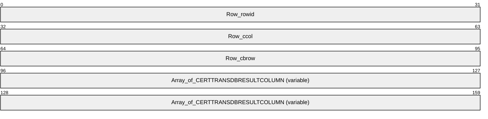

**Row_rowid (4 bytes):** The value identifying this particular row. The value MUST be [**little-endian**](#gt_little-endian) encoded.

**Row_ccol (4 bytes):** The value indicating the number of columns in this particular row. The value MUST be little-endian encoded.

**Row_cbrow (4 bytes):** The total length, in bytes, of the data for this particular row. The length value MUST be little-endian encoded.

**Array_of_CERTTRANSDBRESULTCOLUMN (variable):** An array of **CERTTRANSDBRESULTCOLUMN** structures, as specified in section [2.2.1.10](#Section_2.2.1.10).

### 2.2.4 Database File Name Structure

A specific format is used for representing the names of the database files with this protocol. The string is defined as follows.

db-filename = file-type-code UNC-path

file-type-code = "!" / "D"

UNC-path = path as specified by [**Universal Naming Convention (UNC)**](#gt_universal-naming-convention-unc)

The file name strings MUST be null-terminated Unicode strings. The file-type-code is specified as follows.

| Value | Meaning | Example |
| --- | --- | --- |
| 'D' | Database files | "D\\server\sharepoint\...path..." |
| '!' | Database [**log files**](#gt_log-files) | "!\\server\sharepoint\...path..." |

### 2.2.5 Common Error Codes

The following error codes are used by this protocol to indicate specific error conditions. Other error values are possible and are implementation-specific.

**Note** Error names in this [**table**](#gt_table) that also appear in [MS-ERREF](../MS-ERREF/MS-ERREF.md) have been redefined for use when implementing this protocol.

| Return value/code | Description |
| --- | --- |
| 0x80070057 ERROR_INVALID_PARAMETER | The parameter is incorrect. |
| 0x80070006 ERROR_INVALID_HANDLE | The handle is invalid. |
| 0x8000FFFF ERROR_UNEXPECTED_ERROR | An unexpected error occurred. |
| 0x80071392 ERROR_OBJECT_EXISTS | An [**object**](#gt_object) already exists. |
| 0x00000001 ERROR_ARITHMETIC_OVERFLOW | Arithmetic overflow. |
| 0xc800042D ERROR_OUT_OF_MEMORY | Out of memory. |

## 2.3 Directory Service Schema Elements

This protocol accesses the directory service [**schema**](#gt_schema) classes and [**attributes**](#gt_attribute) that are listed in the following [**table**](#gt_table). For the syntactic specifications of the following class or class/attribute pairs, refer to [**Active Directory**](#gt_active-directory) Domain Services (AD DS) in [MS-ADA1](../MS-ADA1/MS-ADA1.md), [MS-ADA2](../MS-ADA2/MS-ADA2.md), [MS-ADA3](../MS-ADA3/MS-ADA3.md), and [MS-ADSC](../MS-ADSC/MS-ADSC.md).

| Class | Attribute |
| --- | --- |
| cRLDistributionPoint | certificateRevocationList deltaRevocationList |
| pKIEnrollmentService | certificateTemplate |

# 3 Protocol Details

The Certificate Services Remote Administration Protocol is a request-response protocol. The client performs a server method invocation and the server responds with the requested data or a detailed disposition value. The primary usage of this protocol is [**CA**](#gt_certification-authority-ca) management. Except where specified in the following section the protocol is a single message followed by a single reply.

## 3.1 Server Details

### 3.1.1 Abstract Data Model

This section details the data that is maintained by the [**CA**](#gt_certification-authority-ca). The [Request](#Section_3.1.1.1) [**table**](#gt_table), [Attribute](#Section_3.1.4.1.2) table, [Extension](#Section_2.2.1.9) table, and [CRL](#Section_3.1.1.4.1) table data elements are implemented in the form of tables with columns. Each column has a numerical column identifier that is unique across all the data tables and is stored as an unsigned integer. Each column has a column name that is identified in the following sections.<4>

#### 3.1.1.1 Request Table

The Request table holds the history of all [**CA**](#gt_certification-authority-ca) requests, both completed and pending, with one row per request.

##### 3.1.1.1.1 Request Table Required Data Elements

Values for the following elements are required in the Request [**table**](#gt_table):

**Request_Request_ID:** Column name "Request.RequestID". A field that is used to uniquely identify the request in the table and to link to the [Attribute](#Section_3.1.4.1.2) and [Extension](#Section_2.2.1.9) tables. This field MUST have a positive value.

**Request_Raw_Request:** Column name "Request.RawRequest". The raw request, as delivered by ICertRequestD or ICertRequestD2, as specified in [MS-WCCE](../MS-WCCE/MS-WCCE.md) section 2.2.2.6.

**Request_Disposition:** Column name "Request.Disposition". Identifies the [**certificate**](#gt_certificate) status.

Possible values are listed as follows. This specification refers to these abstract values as these strings. An implementation is free to use any representation for these values.<5>

| Value | Description |
| --- | --- |
| Request failed | A certificate was never issued in response to the certificate request. The request cannot be resubmitted. |
| Request denied | A certificate was never issued in response to the certificate request. The request can be resubmitted by using the ResubmitRequest method. |
| Request pending | The request is in a state in which the decision whether to issue a certificate has not yet been made. The request can be denied by using the DenyRequest method. The request can be submitted again for [**issuance**](#gt_71f399e7-7026-46bb-b7c2-8fd4872b900f) by using the ResubmitRequest method. |
| Certificate issued | A certificate was issued in response to the certificate request. |
| Certificate revoked | A certificate was issued, and subsequently the RevokeCertificate function was called, specifying the serial number of the certificate, in such a way that server processing rule #6 of the RevokeCertificate function was executed. |
| Foreign certificate | A certificate was issued by a different [**CA**](#gt_certification-authority-ca) and then imported into the CA by using the [ImportCertificate](#Section_ed01d4b2b77f496e8fb18f9a0432c592) method. |

**Raw_Certificate:** Column name "RawCertificate". The certificate that was issued for a request (if a certificate was issued).

**Request_Raw_Archived_Key:** Column name "Request.RawArchivedKey". Any [**private key**](#gt_private-key) that is archived as part of a certificate request. Archived keys are generally encrypted with a [**key recovery agent (KRA)**](#gt_key-recovery-agent-kra) [**key**](#gt_key). The format for the encrypted private key is specified in [MS-WCCE] section 3.1.1.4.3.6.

**Request_Revocation_Date:** Column name "Request.RevokedEffectiveWhen". This [CERTTIME](#Section_2.2.1.12) field is used as the revocationDate for a certificate in a [**CRL**](#gt_certificate-revocation-list-crl) (CRL as specified in [[RFC3280]](https://go.microsoft.com/fwlink/?LinkId=90414) section 5.1). This field is initialized as NULL and updated by the [RevokeCertificate](#Section_3.1.4.1.8) method. The CA does not put a certificate serial number in a base or delta certificate revocation list (CRL) until the time specified in the Request_Revocation_Date has passed for that certificate.

The Request_Revocation_Date field does not follow all the **revocationDate** rules that are defined in [RFC3280] because the Certificate Services Remote Administration Protocol client can specify and change this field when necessary. This flexibility is achieved by client calls to the **RevokeCertificate** functionality of the server, which is described in this protocol specification.

Certificates can be retroactively revoked; they can be revoked again by specifying any [**revocation**](#gt_revocation) date. They can also be changed to a state in which applications that verify revocation do not recognize the certificate as revoked. This state is achieved by specifying a future date for the revocation, including future dates that are subsequent to the expiry date that is recorded in the certificate.

Multiple requirements of [RFC3280] can be violated by the preceding behaviors. The Request_Revocation_Date can differ from the "date on which the revocation occurred..." (referenced in [RFC3280] section 5.1.2.6) or can differ from "...the date at which the CA processed the revocation" (referenced in [RFC3280] section 5.3.3). Changing revocation to a future date that is beyond the date of the next CRL violates the requirements of [RFC3280] section 3.3. This section states in part, "An entry MUST NOT be removed from the CRL until it appears on one regularly scheduled CRL issued beyond the revoked certificate's validity period". Note that a CRL cannot list a certificate that is not yet revoked, as determined by its revocation date. Retroactive revocation - that is, using a revocation date that is prior to the issuance of one or more existing CRLs-violates the rule that the "revocation date SHOULD NOT precede the date of issue of earlier CRLs", as defined in [RFC3280] section 5.3.3.

**Request_Revoked_Reason:** Column name "Request.RevokedReason". When a certificate has been revoked, this element provides the reason for the revocation.

The Request_Revoked_Reason is similar to the reasonCode that is specified in [RFC3280] section 5.3.1, except that the protocol supports only a subset of the values that the RFC defines, and it supports one additional value, as shown in the following table.

| Revocation reason | Value |
| --- | --- |
| unspecified | 0x00000000 |
| keyCompromise | 0x00000001 |
| cACompromise | 0x00000002 |
| affiliationChanged | 0x00000003 |
| superseded | 0x00000004 |
| cessationOfOperation | 0x00000005 |
| certificateHold | 0x00000006 |
| removeFromCRL | 0x00000008 |
| [**Release from hold**](#gt_release-from-hold) | 0xffffffff |

**Serial_Number:** Column name "SerialNumber". The issued certificate serial number.

**Publish_Expired_Cert_In_CRL:** Column name "PublishExpiredCertInCRL". This Request table column specifies whether the certificate whose serial number is identified in Serial_Number is to be included in CRLs if the certificate is revoked, even after it has expired.

This Request table column is a Boolean value, as shown in the following table.

| Value | Description |
| --- | --- |
| 1 | The certificate whose serial number is identified in Serial_Number is to be included in CRLs if it is revoked, even after the certificate has expired. |
| 0 | The revoked certificate must not be included in CRLs after it has expired. |

##### 3.1.1.1.2 Request Table Optional Data Elements

Values for the following elements of the Request [**table**](#gt_table) SHOULD be maintained by the [**CA**](#gt_certification-authority-ca):

**Request_Key_Recovery_Hashes:** Column name "Request.KeyRecoveryHashes". Unique identifiers of the [**key recovery agent (KRA)**](#gt_key-recovery-agent-kra) [**certificates**](#gt_certificate) that are required to retrieve an archived [**private key**](#gt_private-key).

**Request_Raw_Old_Certificate:** Column name "Request.RawOldCertificate". In the case of a renewal, the preceding certificate.

**Request_Request_Attributes:** Column name "Request.RequestAttributes". The certificate request [**attributes**](#gt_attribute) as defined in [MS-WCCE](../MS-WCCE/MS-WCCE.md).

**Request_Request_Type:** Column name "Request.RequestType". The type or format of a certificate request, such as PKCS#10 or the Cryptographic Message Syntax (CMS) standard with Common Messaging Calls (CMC) as specified in [[RFC2797]](https://go.microsoft.com/fwlink/?LinkId=90382).

**Request_Request_Flags:** Column name "Request.RequestFlags". Additional certificate request information.

The following are examples of request flag values. These flag values can be used in any combination.

| Name | Value | Description |
| --- | --- | --- |
| CR_FLG_FORCETELETEX | 0x00000001 | For encoding of the subject information in the certificate, a T61String type is used for elements that contain a Unicode character in the value. |
| CR_FLG_RENEWAL | 0x00000002 | The certificate request is a renewal request. |
| CR_FLG_FORCEUTF8 | 0x00000004 | For encoding of the subject information in the certificate, a UTF8String type is used for elements that contain a Unicode character in the value. |
| CR_FLG_CAXCHGCERT | 0x00000008 | The certificate is the [**exchange certificate**](#gt_exchange-certificate) of the CA. |
| CR_FLG_ENROLLONBEHALFOF | 0x00000010 | The certificate request is an Enroll-on-behalf-of request. |
| CR_FLG_SUBJECTUNMODIFIED | 0x00000020 | The subject information in the certificate is an unmodified binary copy of the subject information from the certificate request. |
| CR_FLG_VALIDENCRYPTEDKEYHASH | 0x00000040 | For a certificate request with [**key archival**](#gt_key-archival), the CMC Full response includes the szOID_ENCRYPTED_KEY_HASH attribute. |
| CR_FLG_CACROSSCERT | 0x00000080 | The certificate is the cross certificate of the CA. |
| CR_FLG_ENFORCEUTF8 | 0x00000100 | For encoding of the subject information in the certificate, a UTF8String type is used for directory string elements. |
| CR_FLG_DEFINEDCACERT | 0x00000200 | The certificate request contains an Authority Key Identifier extension that identifies the desired CA signing [**key**](#gt_key) for the certificate. |
| CR_FLG_CHALLENGEPENDING * | 0x00000400 | An [**attestation**](#gt_attestation) challenge ([MS-WCCE] section 3.2.2.6.2.1.2.6) for the corresponding certificate request has been sent to the client, and the server is waiting for a response. |
| CR_FLG_CHALLENGESATISFIED * | 0x00000800 | The client responded correctly to the attestation challenge for the corresponding certificate request ([MS-WCCE] section 3.2.2.6.2.1.2.7). |
| CR_FLG_TRUSTONUSE * | 0x00001000 | Verification of the requester's credentials for key attestation has succeeded ([MS-WCCE] section 3.2.2.6.2.1.2.5). |
| CR_FLG_TRUSTEKCERT * | 0x00002000 | Verification of the client's [**TPM**](#gt_trusted-platform-module-tpm) [**hardware certificate**](#gt_hardware-certificate) for key attestation has succeeded ([MS-WCCE] section 3.2.2.6.2.1.2.5). |
| CR_FLG_TRUSTEKKEY * | 0x00004000 | Verification of the [**public key**](#gt_public-key) of the client's TPM's [**hardware key**](#gt_hardware-key) pair for key attestation has succeeded ([MS-WCCE] section 3.2.2.6.2.1.2.5). |
| CR_FLG_PUBLISHERROR | 0x80000000 | The CA had difficulty publishing the certificate to the directory that is specified in the **userCertificate** attribute of the entity. |

* Support for these flags is specified in the following product behavior note.<6>

**Request_Status_Code:** Column name "Request.StatusCode". Indicates whether the request was successful.

The value is 0 if the request processed successfully. Otherwise, this field contains an error code that results from request processing. Error codes are as specified in section [2.2.5](#Section_2.2.5) of this document and in [MS-ERREF](../MS-ERREF/MS-ERREF.md).

**Request_Disposition_Message:** Column name "Request.DispositionMessage". The text description of Request_Disposition. Request_Disposition_Message is for presentation to a user and can contain any text string, including NULL, that the implementer considers informative.

**Request_Submitted_When:** Column name "Request.SubmittedWhen". The [CERTTIME](#Section_2.2.1.12) that a request was received by the CA.

**Request_Resolved_When:** Column name "Request.ResolvedWhen". The CERTTIME that the CA completed request processing (whether successfully or unsuccessfully).

**Request_Revoked_When:** Column name "Request.RevokedWhen". The CERTTIME that the CA processed a call to the [ICertAdminD::RevokeCertificate](#Section_3.1.4.1.8) function. This field is initialized as NULL and updated by the ICertAdminD::RevokeCertificate function.

**Request_Requester_Name:** Column name "Request.RequesterName". The RequesterName that is included in the certificate request.

**Request_Caller_Name:** Column name "Request.CallerName". The user or machine context that submitted the certificate request to the CA.

**Request_Signer_Policies:** Column name "Request.SignerPolicies". The list of valid certificate policy [**OIDs (1)**](#gt_object-identifier-oid) for each signer certificate from the certificate request.

**Request_Signer_Application_Policies:** Column name "Request.SignerApplicationPolicies". The list of valid Extended Key Usage OIDs (1) for each signer certificate from the certificate request.

**Request_Officer:** Column name "Request.Officer". Indicates whether the caller is the certificate manager of the entity that corresponds to the Request_Requester_Name.

**Request_Distinguished_Name:** Column name "Request.DistinguishedName". The [**distinguished name (DN)**](#gt_distinguished-name-dn) from the Subject attribute of the certificate request (string representation).

**Request_Raw_Name:** Column name "Request.RawName". Subject information from the certificate request (ASN.1 DER encoded).

**Request_Country:** Column name "Request.Country". The country attribute of the DN from the Subject of the certificate request.

**Request_Organization:** Column name "Request.Organization". The organization attribute of the DN from the Subject of the certificate request.

**Request_Org_Unit:** Column name "Request.OrgUnit". The organizational-unit attribute of the DN from the Subject of the certificate request.

**Request_Common_Name:** Column name "Request.CommonName". The [**common name**](#gt_common-name-cn) attribute of the DN from the Subject of the certificate request.

**Request_Locality:** Column name "Request.Locality". The locality attribute of the DN from the Subject of the certificate request.

**Request_State:** Column name "Request.State". The state or province name attribute of the DN from the Subject of the certificate request.

**Request_Title:** Column name "Request.Title". The title attribute of the DN from the Subject of the certificate request.

**Request_Given_Name:** Column name "Request.GivenName". The given name (also called first name) attribute of the DN from the Subject of the certificate request.

**Request_Initials:** Column name "Request.Initials". The initials attribute of the DN from the Subject of the certificate request.

**Request_SurName:** Column name "Request.SurName". The surname attribute of the DN from the Subject of the certificate request.

**Request_Domain_Component:** Column name "Request.DomainComponent". The domainComponent attribute of the DN from the Subject of the certificate request.

**Request_Email:** Column name "Request.EMail". The EmailAddress attribute of the DN from the Subject of the certificate request.

**Request_Street_Address:** Column name "Request.StreetAddress". The street address attribute of the DN from the Subject of the certificate request.

**Request_Unstructured_Name:** Column name "Request.UnstructuredName". The unstructured name attribute of the DN from the Subject of the certificate request.

**Request_Unstructured_Address:** Column name "Request.UnstructuredAddress". The unstructured address attribute of the DN from the Subject of the certificate request.

**Request_Device_Serial_Number:** Column name "Request.DeviceSerialNumber". The device serial number attribute of the DN from the Subject of the certificate request.

**Request_RequesterName_From_Old_Certificate:** Column name "Request.RequesterNameFromOldCertificate". For a renewal request that is signed by the previously issued certificate, the subject name of the old certificate.<7>

**Request_Attestation_Challenge:** Column name "Request.AttestationChallenge". The secret passed to the client in the attestation challenge message, encrypted with the CA exchange certificate.

**Request_Endorsement_Key_Hash:** Column name "Request.EndorsementKeyHash". The [**SHA-2 hash**](#gt_sha-2-hash) of the hardware key that was used to TPM-attest the request.

**Request_Endorsement_Certificate_Hash:** Column name "Request.EndorsementCertificateHash". The SHA2 hash of the hardware certificate used to TPM-attest the request.

**Request_Raw_Precertificate:** Column name "Request.RawPrecertificate". The precertificate returned to the client as specified in [MS-WCCE] section 3.2.1.4.2.1.4.3.1.<8>

**Request_CRL_Partition_Index:** Column name "Request.CRLPartitionIndex". The CRL partition index to which the request has been assigned as specified in section [3.1.4.1.6](#Section_3.1.4.1.6) and [MS-WCCE] sections 3.2.1.4.2.1.2, 3.2.1.4.2.1.4.4, 3.2.1.4.2.1.4.7.<9>

**Request_Binary_Linter_Certificate:** Column name "Request.LinterCertificate". The pre-signed certificate that was returned to the client. See section [3.1.4.1.3](#Section_3.1.4.1.3) and [MS-WCCE] section 3.2.1.4.2.1.4.8.1.<10>

**Request_ID:** Column name "RequestID". The RequestID that corresponds to an issued certificate.

**Certificate_Hash:** Column name "CertificateHash". The [**SHA-1 hash**](#gt_sha-1-hash) over the value of the Raw_Certificate column.

**Certificate_Template:** Column name "CertificateTemplate". extnValue of extension with OID (1) 1.3.6.1.4.1.311.20.2 of issued certificate.

**Enrollment_Flags:** Column name "EnrollmentFlags". The values that are defined in "EnrollmentFlags" from [MS-CRTD](#Section_1.5.1).

**General_Flags:** Column name "GeneralFlags". The values that are defined in "GeneralFlags" from [MS-CRTD].

**Issuer_Name_Id:** Column name "IssuerNameId". A sequential number that indicates which CA key signed the issued certificate.

**Not_Before:** Column name "NotBefore". The CERTTIME that provides the value for the Validity->notBefore field ([[RFC3280]](https://go.microsoft.com/fwlink/?LinkId=90414) section 4.1.2.5) of the issued certificate.

**Not_After:** Column name "NotAfter". The CERTTIME that provides the value for the Validity->notAfter field ([RFC3280] section 4.1.2.5) of the issued certificate.

**Subject_Key_Identifier:** Column name "SubjectKeyIdentifier". The SubjectKeyIdentifier extension ([RFC3280] section 4.2.1.2) of the issued certificate.

**Raw_Public_Key:** Column name "RawPublicKey". The SubjectPublicKeyInfo->subjectPublicKey field [RFC3280] of the issued certificate.

**Public_Key_Length:** Column name "PublicKeyLength". The length of the SubjectPublicKeyInfo->subjectPublicKey field of the issued certificate.

**Public_Key_Algorithm:** Column name "PublicKeyAlgorithm". The SubjectPublicKeyInfo->algorithm->algorithm field of the issued certificate.

**Raw_Public_Key_Algorithm_Parameters:** Column name "RawPublicKeyAlgorithmParameters". The SubjectPublicKeyInfo->algorithm->parameters field of the issued certificate.

**UPN:** Column name "UPN". The UPN alternate name entry from the SubjectAltName extension in the certificate.

**Distinguished_Name:** Column name "DistinguishedName". The Subject field ([RFC3280] section 4.1.2.6) of the issued certificate (string representation).

**Raw_Name:** Column name "RawName". The Subject information of the issued certificate (ASN.1 DER encoded).

**Country:** Column name "Country". The country attribute of the certificate Subject.

**Organization:** Column name "Organization". The organization attribute of the certificate Subject.

**Org_Unit:** Column name "OrgUnit". The organizational-unit attribute of the certificate Subject.

**Common_Name:** Column name "CommonName". The common name attribute of the certificate Subject.

**Locality:** Column name "Locality". The locality attribute of the certificate Subject.

**State:** Column name "State". The state or province name attribute of the certificate Subject.

**Title:** Column name "Title". The title attribute of the certificate Subject.

**Given_Name:** Column name "GivenName". The given name attribute of the certificate Subject.

**Initials:** Column name "Initials". The initials attribute of the certificate Subject.

**SurName:** Column name "SurName". The surname attribute of the certificate Subject.

**Domain_Component:** Column name "DomainComponent". The domainComponent attribute of the certificate Subject.

**Email:** Column name "EMail". The [[RFC822]](https://go.microsoft.com/fwlink/?LinkId=90497) Name attribute from the Subject Alternative Name of the issued certificate.

**Street_Address:** Column name "StreetAddress". The street address attribute of the certificate Subject.

**Unstructured_Name:** Column name "UnstructuredName". The unstructured name attribute of the certificate Subject.

**Unstructured_Address:** Column name "UnstructuredAddress". The unstructured address attribute of the certificate Subject.

**Device_Serial_Number:** Column name "DeviceSerialNumber". The serial number attribute of the certificate Subject.

#### 3.1.1.2 Attribute Table

A request includes an arbitrary number of [**attributes**](#gt_attribute), as specified in [MS-WCCE](../MS-WCCE/MS-WCCE.md) section 2.2.2.7, that are parsed and listed in the Attribute [**table**](#gt_table).

Each entry in the table represents an attribute that is associated with a request and has the following required data elements:

**Attribute_Request_ID:** Column name "AttributeRequestId". This is the same unique identifier as the Request_Request_ID that is associated with a request in the [Request](#Section_3.1.1.1) table.

**Attribute_Name:** Column name "AttributeName". Contains the name of the attribute.

For any rows that have the same Attribute_Request_ID, the Attribute_Name MUST be unique for those rows within the table.

**Attribute_Value:** Column name "AttributeValue". Contains the value of the attribute.

#### 3.1.1.3 Extension Table

A request includes an arbitrary number of X.509v3 extensions, as specified in [[X509]](https://go.microsoft.com/fwlink/?LinkId=90590). These extensions are parsed and listed in the Extension [**table**](#gt_table).

Each entry in the table represents an extension that is associated with a request and has the following required data elements:

**Extension_Request_ID:** Column name "ExtensionRequestId". This is the same unique identifier as the Request_Request_ID that is associated with a request in the [Request](#Section_3.1.1.1) table.

**Extension_Name:** Column name "ExtensionName". An [**OID (1)**](#gt_object-identifier-oid), as specified in [[X680]](https://go.microsoft.com/fwlink/?LinkId=90594), that contains the name of the extension. The Extension_Name must be the string representation of the OID (1) that is associated with the extension. If two rows have the same value in the Extension_Name field, they MUST NOT have the same value in the Request_ID field.

**Extension_Value:** Column name "ExtensionValue". The value of the extension.

The value of the extension is in ASN.1 DER format (as specified in [[X660]](https://go.microsoft.com/fwlink/?LinkId=90592) and [[X690]](https://go.microsoft.com/fwlink/?LinkId=90593)).

**Extension_Raw_Value:** Column name "ExtensionRawValue". The value of the extension.

**Extension_Flags:** Column name "ExtensionFlags". A flag that indicates the following:

- Whether the specified extension is to be marked critical.
- Whether this extension is enabled.

#### 3.1.1.4 Certificate Revocation List (CRL) Table

**CRL_Local:** A multi-valued element that contains one or more [**CRLs**](#gt_certificate-revocation-list-crl).

The [**CA**](#gt_certification-authority-ca) MUST also maintain a data element called **CRL_Local** that can contain one or more CRLs. This element is read and populated by the processing rules detailed in section [3.1.4.1.6](#Section_3.1.4.1.6). The **CRL_Local** data element is stored in the default local registry location specified in section [3.1.1.8](#Section_3.1.1.8) for the elements **Config_CA_CDP_Publish_To_Base** and **Config_CA_CDP_Publish_To_Delta**.<11>

Each entry in the [**table**](#gt_table) represents a CRL and has associated properties, which are described in the following sections.

##### 3.1.1.4.1 CRL Table Required Data Elements

If the [**CA**](#gt_certification-authority-ca) maintains a [CRL table](#Section_3.1.1.4.1), values for the following elements of the CRL table MUST be maintained:

**CRL_Row_Id:** Column name "CRLRowId". The unique identifier for the [**CRL**](#gt_certificate-revocation-list-crl) in the [**table**](#gt_table).

**CRL_Name_Id:** Column name "CRLNameId". The sequential number that indicates which CA [**key**](#gt_key) the CRL is for. For example, if a CA [**certificate**](#gt_certificate) has been renewed with a new key three times and the CA issues a CRL for each key, the **CRL_Name_Id** field can be used to distinguish each of the four issued CRLs.

**CRL_Raw_CRL:** Column name "CRLRawCRL". The CRL that was issued.

**CRL_Min_Base:** Column name "CRLMinBase". The CRL_Number of the CRL, complete for a given scope, that was used as the starting point in the generation of this delta CRL.

If the value is 0, the CRL is a base CRL.

If the value is not 0, the CRL is a delta CRL.

**CRL_Publish_Status_Code:** Column name "CRLPublishStatusCode". An informational field that identifies whether the CA was able to publish the CRL to locations external to the CA server.

If the CRL was published successfully, this field contains 0. Otherwise, the field contains the return code from the first CRL publishing location to which publishing failed, following the last publishing attempt for the CRL. Common error codes are as specified in section [2.2.5](#Section_2.2.5); other error values are specified in [MS-ERREF](../MS-ERREF/MS-ERREF.md).

**CRL_This_Publish:** Column name "CRLThisPublish". The [CERTTIME](#Section_2.2.1.12) at which a CRL is first created and published.

**CRL_Propagation_Complete:** Column name "CRLPropagationComplete". The estimated CERTTIME when the CRL is expected to have propagated to all servers after publishing. This data element is updated when a CRL is created and is used when creating a delta CRL. The delta CRL is based on the last base CRL that completely propagated.

**CRL_Number:** Column name "CRLNumber". The sequential number that is incremented each time a new base CRL is created. If the CA creates a single base CRL for multiple CA keys, the CRLs for all the associated CA keys have the same CRL number.

**CRL_Count:** Column name "CRLCount". The count of CRL entries in the CRL.

**CRL_This_Update:** Column name "CRLThisUpdate". The CERTTIME that provides the value of the thisUpdate field of the CRL. This value is also used to restrict the selection of revoked certificates whose serial numbers will be included on a delta CRL as specified in section [3.1.4.1.6](#Section_3.1.4.1.6).

**CRL_Next_Update:** Column name "CRLNextUpdate". The CERTTIME that provides the value of the nextUpdate field of the CRL.

**CRL_Next_Publish:** Column name "CRLNextPublish". The CERTTIME that provides the value of the nextPublish extension of the CRL.

**CRL_Publish_Flags:** Column name "CRLPublishFlags". Additional CRL information that was sent to the PublishCRLs method or returned from attempts to publish CRLs.

For the CRL_Publish_Flags element, the following values are defined:

| Flag | Value |
| --- | --- |
| CPF_BASE | 0x1 – A base CRL. |
| CPF_DELTA | 0x2 – A delta CRL. |
| CPF_COMPLETE | 0x4 – The CRL published successfully. |
| CPF_MANUAL | 0x40 – The caller who initiated the generation of the CRL (via the [PublishCRLs](#Section_3.1.4.2.14) method) was running as an interactive user and was not launched by a timer on the CA. |
| CPF_SHADOW | 0x8 – A blank delta CRL with new delta CRL indicator extension (CRL_Min_Base value). When delta CRLs have just been disabled (Config_Delta_CRL_Validity_Period has just been set to 0), the CA publishes this type of CRL to force clients to retrieve a new base CRL. |
| CPF_BADURL_ERROR | 0x20 – A [**URI**](#gt_uniform-resource-identifier-uri) that does not meet the format requirements specified in section [3.1.1.8](#Section_3.1.1.8) for Config_CA_CDP_Publish_To_Base and Config_CA_CDP_Publish_To_Delta was encountered during publishing of the CRL. |
| CPF_FILE_ERROR | 0x200 – A file URI that does not meet the format requirements specified in section 3.1.1.8 for Config_CA_CDP_Publish_To_Base and Config_CA_CDP_Publish_To_Delta for a file location was encountered during publishing of the CRL, or the CA encountered an error trying to write the CRL to a file location. |
| CPF_HTTP_ERROR | 0x800 – An HTTP URI was encountered during publishing of the CRL. The Windows CA does not write to http:// locations, so any http:// CRL publish attempt will cause this flag. |
| CPF_FTP_ERROR | 0x400 – An FTP URI was encountered during publishing of the CRL. The Windows CA does not write to ftp:// locations, so any ftp:// CRL publish attempt will cause this flag. |
| CPF_LDAP_ERROR | 0x100 –The CA encountered an error trying to write the CRL to an [**LDAP**](#gt_lightweight-directory-access-protocol-ldap) location. |
| CPF_POSTPONED_BASE_LDAP_ERROR | 0x1000 – Postponed publishing a delta CRL due to a failure in publishing a base CRL to an ldap:/// location. For example, the Microsoft CA sends this flag with a call to publish a delta CRL when the corresponding base CRL could not be published to an LDAP location because of an error. |
| CPF_POSTPONED_BASE_FILE_ERROR | 0x2000 – Postponed publishing a delta CRL due to a failure in publishing a base CRL to a file:// location. For example, the Microsoft CA sends this flag with a call to publish a delta CRL when the corresponding base CRL could not be published to a FILE location because of an error. |
| CPF_SIGNATURE_ERROR | 0x80 – An error occurred when verifying the signature of the generated CRL prior to attempting to publish the CRL. |
| CPF_CASTORE_ERROR | 0x10 – An error occurred when publishing the generated CRL to the default local registry location. |

##### 3.1.1.4.2 CRL Table Recommended Data Elements

If the [**CA**](#gt_certification-authority-ca) maintains a [CRL table](#Section_3.1.1.4.1), values for the following elements of the CRL table SHOULD be maintained by the CA:

**CRL_Effective:** Column name "CRLEffective". The [CERTTIME](#Section_2.2.1.12) at which the validity period of the [**CRL**](#gt_certificate-revocation-list-crl) identified by CRL_Min_Base began. Used only for delta CRLs.

**CRL_Publish_Attempts:** Column name "CRLPublishAttempts". The number of times an attempt to publish the CRL was made.

**CRL_Last_Published:** Column name "CRLLastPublish". The CERTTIME at which the CRL was last published, or the last attempt to publish the CRL was made.

**CRL_Publish_Error:** Column name "CRLPublishError". CRL_Publish_Error contains the user name(s) in whose context the CRLs was published and any CRLs publishing location(s) to which the CRLs could not successfully be published.

**CRL_Partition_Index:** Column name "CRLPartitionIndex". The CRL partition index for which the CRL entry was created as specified in section [3.1.4.1.6](#Section_3.1.4.1.6).<12>

#### 3.1.1.5 Schema Table

The Schema [**table**](#gt_table) contains information about the data elements and their properties, which were defined in the preceding sections, and information about any vendor-defined elements.

The Schema table has the following required elements:

**Schema_Column_Name:** The internal name of the column. An abstract data model (ADM) element name or another unique name can be used.

**Schema_Column_Display_Name:** The display name of the column.

**Schema_Column_ID:** The database unique numeric identifier of the column.

**Schema_Column_Type:** The data type in the column.

This data element has four possible values, as shown in the following table.

| Value | Data type |
| --- | --- |
| 1 | Integer |
| 2 | Date |
| 3 | Binary |
| 4 | String |

**Schema_Column_Type_Index:** The indexing type, that is, whether the column is indexed.

This data element has two values.

| Value | Description |
| --- | --- |
| 0 | The column is not indexed. |
| 1 | The column is indexed. |

**Schema_Column_Type_Max_Value:** The maximum size, in bytes, of the data that the column can contain.

**Schema_Column_In_View:** The views (or "default column sets") the column is in.

This data element can have any of the following values in any combination:

- **Issued certificates**
- **Pending requests**
- **Failed requests**
- **Extensions**
- **Attributes**
- [**Certificate revocation lists (CRLs)**](#gt_certificate-revocation-list-crl)
- **Revoked certificates**

#### 3.1.1.6 Datum - DB View

Every [**CA**](#gt_certification-authority-ca) that conforms to this specification MUST maintain a datum called **Config_Database_View_Open**, which is shared from the Config_Database_View_Open Boolean defined in [MS-WCCE](../MS-WCCE/MS-WCCE.md) section 3.2.1.1.4, for each [**DCOM**](#gt_distributed-component-object-model-dcom) instance.

Certificate Services Remote Administration Protocol server implementations that also implement the Windows Client Certificate Enrollment Protocol or the ICertPassage Remote Protocol use the same data element for those implementations.

The Config_Database_View_Open datum indicates whether a caller has opened a view to the database. This datum has two possible values:

- **False**
- **True**
Every CA that conforms to this specification MUST initialize the value of Config_Database_View_Open to the default value of **False**.

#### 3.1.1.7 Permissions

The [**CA**](#gt_certification-authority-ca) SHOULD store the following sets of permissions. Certificate Services Remote Administration Protocol server implementations that also implement the Windows Client Certificate Enrollment Protocol or the ICertPassage Remote Protocol use the same configuration data element, defined here, for those implementations:

**Config_Permissions_CA_Security:** A list, shared from the Config_Permissions_CA_Security list defined in [MS-WCCE](../MS-WCCE/MS-WCCE.md) section 3.2.1.1.4.

**Config_Permissions_Officer_Rights:** A list, shared from the Config_Permissions_Officer_Rights list defined in [MS-WCCE] section 3.2.1.1.4.

**Config_Permissions_Enrollment_Agent_Rights:** A list, shared from the Config_Permissions_Enrollment_Agent_Rights list defined in [MS-WCCE] section 3.2.1.1.4.

The permissions are used to enforce that the caller has particular permissions for any method specified in section [3.1.4](#Section_3.1.4).

On Windows, the CA defines six permissions: Enroll, Read, Officer, Administrator, Operator, and Auditor.<13>

For CA security (GetCASecurity, SetCASecurity, and GetMyRoles), the Microsoft CA assigns permissions to [**principals**](#gt_principal) (identified by the [**access control entry (ACE)**](#gt_access-control-entry-ace)) in the following manner.

| Bit Range | Field | Description |
| --- | --- | --- |
| Variable | Read | 0x00000100 |
| Variable | Enroll | 0x00000200 |
| Variable | Officer | 0x00000002 |
| Variable | Administrator | 0x00000001 |
| Variable | Auditor | 0x00000004 |
| Variable | Operator | 0x00000008 |

If a principal has Enroll, Officer, or Administrator permission, Read permission is implied and does not need to be explicitly set.

For the CA Operator role that is defined in [[CIMC-PP]](https://go.microsoft.com/fwlink/?LinkId=89839), a principal must have Read permission (implicit or explicit) and must also have the SeBackupPrivilege, as specified in [MS-LSAD](#Section_5) section 3.1.1.2.1.

For the CA Auditor role that is defined in [CIMC-PP], a principal must have Read permission (implicit or explicit) and must also have the SeSecurityPrivilege, as specified in [MS-LSAD] section 3.1.1.2.1.

The following [**table**](#gt_table) specifies the method name and the list of permissions required by the caller. With the exception of where mentioned, the caller only needs to possess at least one of these access permissions for the call to be allowed by the CA.

| Method name | Permissions required |
| --- | --- |
| ICertRequestD::Request | Enroll |
| ICertRequestD:GetCACert | Enroll |
| ICertRequestD2::Request2 | Enroll |
| ICertRequestD2::GetCAProperty | Enroll |
| ICertRequestD2::GetCAPropertyInfo | Enroll |
| ICertAdminD::GetCRL | Administrator, Officer, Read |
| ICertAdminD2::GetCAProperty | Administrator, Officer, Read |
| ICertAdminD2::GetCAPropertyInfo | Administrator, Officer, Read |
| ICertAdminD::GetViewDefaultColumnSet | Administrator, Officer, Read |
| ICertAdminD::EnumAttributesOrExtensions | Administrator, Officer, Read |
| ICertAdminD::OpenView | Administrator, Officer, Read |
| ICertAdminD::IsValidCertificate | Administrator, Officer, Read |
| ICertAdminD::GetServerState | None required |
| ICertAdminD2::GetCASecurity | Administrator, Officer, Read |
| ICertAdminD2::GetAuditFilter | Administrator, Officer, Read |
| ICertAdminD2::GetOfficerRights | Administrator, Officer, Read |
| ICertAdminD2::GetConfigEntry | Administrator, Officer, Read |
| ICertAdminD2::EnumViewColumnTable | Administrator, Officer, Read |
| ICertAdminD2::GetMyRoles | Administrator, Officer, Read |
| ICertAdminD2::GetArchivedKey | Officer |
| ICertAdminD::SetExtension | Officer |
| ICertAdminD::SetAttributes | Officer |
| ICertAdminD::DenyRequest | Officer |
| ICertAdminD::ReSubmitRequest | Officer |
| ICertAdminD::RevokeCertificate | Officer |
| ICertAdminD::ImportCertificate | Officer |
| ICertAdmin:D2:ImportKey | Officer |
| ICertAdminD2::PublishCRLs | Administrator |
| ICertAdminD::ServerControl | Administrator, Operator |
| ICertAdminD::Ping | Administrator |
| ICertAdminD::Ping2 | Administrator |
| ICertAdminD2::SetCASecurity | Administrator |
| ICertAdminD2::SetCAProperty | Administrator |
| ICertAdminD2::SetAuditFilter | Administrator, Auditor (either of these is checked based on a CA setting that denotes the permissions to check for SetAuditFilter) |
| ICertAdminD2::SetOfficerRights | Administrator |
| ICertAdminD2::SetConfigEntry | Administrator |
| ICertAdminD2::DeleteRow | Both Administrator and Officer must be present. |
| ICertAdminD::PublishCRL | Administrator |
| ICertAdminD::BackupPrepare | Operator |
| ICertAdminD::BackupEnd | Operator |
| ICertAdminD::RestoreGetDatabaseLocations | Operator |
| ICertAdminD::BackupGetAttachedInformation | Operator |
| ICertAdminD::BackupGetBackupLogs | Operator |
| ICertAdminD::BackupGetDynamicFiles | Operator |
| ICertAdminD::BackupOpenFile | Operator |
| ICertAdminD::BackupReadFile | Operator |
| ICertAdminD::BackupCloseFile | Operator |
| ICertAdminD::BackupTruncateLogs | Operator |

The CA SHOULD enforce [**Officer rights**](#gt_officer-rights) for any of the following methods:

- ICertAdminD2::GetArchivedKey
- ICertAdminD::SetExtension
- ICertAdminD::SetAttributes
- ICertAdminD::DenyRequest
- ICertAdminD::ReSubmitRequest
- ICertAdminD::RevokeCertificate
The CA SHOULD enforce the [**Enrollment Agent rights**](#gt_enrollment-agent-rights) for ICertRequestD::Request

#### 3.1.1.8 CRL Publishing Locations

These data elements each contain a list of one or more [**CRL**](#gt_certificate-revocation-list-crl) publishing locations, as defined in [MS-WCCE](../MS-WCCE/MS-WCCE.md) section 3.2.1.1.4.

Certificate Services Remote Administration Protocol server implementations that also implement the Windows Client Certificate Enrollment Protocol or the ICertPassage Remote Protocol use the same configuration data elements, defined here, for those implementations.

Each of the following elements is used in the **PublishCRL** and **PublishCRLs** methods:

- Config_CA_CDP_Publish_To_Base
This element is initialized to contain a local registry location:

HKEY_LOCAL_MACHINE\SOFTWARE\Microsoft\SystemCertificates\CA\CRLs\

- Config_CA_CDP_Publish_To_Delta
This element is initialized to contain a local registry location:

HKEY_LOCAL_MACHINE\SOFTWARE\Microsoft\SystemCertificates\CA\CRLs\

- Config_CA_CDP_Include_In_CRL_Publish_Locations_Extension
- Config_CA_CDP_Include_In_CRL_Freshest_CRL_Extension
- Config_CA_CDP_Include_In_CRL_IDP_Extension
CRL publishing locations MUST be in the following format:

Config_CA_CDP_Publish_To_Base and Config_CA_CDP_Publish_To_Delta

For a file location, a valid local file path starting with a single-letter drive designator (for example, "D:"), a [**UNC**](#gt_universal-naming-convention-unc) network file path, or a [**Uniform Resource Identifier (URI)**](#gt_uniform-resource-identifier-uri) in one of the following formats:

file://{DriveLetter}:\{Path}\{Filename}

file:///{DriveLetter}:\{Path}\{Filename}

file://\\{HostName}\{Path}\{Filename}

file:///\\{HostName}\{Path}\{Filename}

where

- DriveLetter is a single-letter drive designator on the local machine.
- HostName is the [**fully qualified domain name (FQDN)**](#gt_fully-qualified-domain-name-fqdn) or NetBIOS name of a host on the network.
- Path is a file path that is available on the drive DriveLetter on the local machine or on the host HostName over the network.
For an [**LDAP**](#gt_lightweight-directory-access-protocol-ldap) location, a path that starts with "ldap:"

- The Config_CA_CDP_Include_In_CRL_Publish_Locations_Extension MUST start with "ldap:".
- The Config_CA_CDP_Include_In_CRL_Freshest_CRL_Extension CRL publishing location MUST be a valid UNC network path or start with "http:", "ftp:", "ldap:", or "file:".
- The Config_CA_CDP_Include_In_CRL_IDP_Extension CRL publishing location MUST start with "http:", "ftp:", or "ldap:".
Each CRL publishing location that references a directory path or other hierarchical location MUST specify a file name or [**attribute**](#gt_attribute) name in addition to a directory path or [**schema**](#gt_schema) location.<14>

- **CRL_Publish_AD_Connection**: An ADConnection handle as defined in [MS-ADTS](../MS-ADTS/MS-ADTS.md) section 7.3. This element is used each time the [**CA**](#gt_certification-authority-ca) establishes an [**Active Directory**](#gt_active-directory) connection to publish a CRL to an ldap: location.

#### 3.1.1.9 CRL Validity Period

If the [**CA**](#gt_certification-authority-ca) implements [**revocation**](#gt_revocation) via a [**CRL**](#gt_certificate-revocation-list-crl), the CA SHOULD maintain a list of the following data elements to describe validity periods for CRLs.

Certificate Services Remote Administration Protocol server implementations that also implement the Windows Client Certificate Enrollment Protocol or the ICertPassage Remote Protocol use the same configuration data elements, defined here, for those implementations.

**Config_Base_CRL_Validity_Period:** A period of time, shared from the Config_Base_CRL_Validity_Period defined in [MS-WCCE](../MS-WCCE/MS-WCCE.md) section 3.2.1.1.4.

**Config_Base_CRL_Overlap_Period:** A period of time, shared from the Config_Base_CRL_Overlap_Period defined in [MS-WCCE] section 3.2.1.1.4.

**Config_Delta_CRL_Validity_Period:** A period of time, shared from the Config_Delta_CRL_Validity_Period defined in [MS-WCCE] section 3.2.1.1.4.

**Previous_Delta_CRL_Validity_Period:** A period of time that expresses the validity period of the previous delta CRL.

**Config_Delta_CRL_Overlap_Period:** A period of time, shared from the Config_Delta_CRL_Overlap_Period defined in [MS-WCCE] section 3.2.1.1.4.

**Config_CA_Clock_Skew_Minutes:** A period of time, shared from the Config_CA_Clock_Skew_Minutes defined in [MS-WCCE] section 3.2.1.1.4.

#### 3.1.1.10 Configuration Data

The [**CA**](#gt_certification-authority-ca) MUST maintain the following ADM elements.<15> Certificate Services Remote Administration Protocol server implementations that also implement the Windows Client Certificate Enrollment Protocol or the ICertPassage Remote Protocol use the same configuration data elements, defined here, for those implementations. If either Windows Client Certificate Enrollment Protocol or ICertPassage Remote Protocol or both are also implemented, access to the configuration data elements from either or both of these protocols SHOULD be serialized.

**Config_CA_KRA_Cert_List:** An indexed list of KRA [**certificates**](#gt_certificate) shared from the Config_CA_KRA_Cert_List list as defined in [MS-WCCE](../MS-WCCE/MS-WCCE.md) section 3.2.1.1.4.

**Config_CA_KRA_Cert_Count:** A numeral shared from the Config_CA_KRA_Cert_Count element defined in [MS-WCCE] section 3.2.1.1.4.

**Config_Configuration_Directory:** A [**UNC**](#gt_universal-naming-convention-unc) path shared from the Config_Configuration_Directory path defined in [MS-WCCE] section 3.2.1.1.4.

**Config_CA_Parent_DNS:** An [**FQDN**](#gt_fully-qualified-domain-name-fqdn) of the parent CA, shared from the Config_CA_Parent_DNS element defined in [MS-WCCE] section 3.2.1.1.4.

**Config_CA_Role_Separation:** An indicator of [**role separation**](#gt_role-separation) state, shared from the Config_CA_Role_Separation element defined in [MS-WCCE] section 3.2.1.1.4.

**Config_CA_Exchange_Cert:** A list of [**SHA-1 hash**](#gt_sha-1-hash) values of all currently valid CA [**exchange certificates**](#gt_exchange-certificate), shared from the Config_CA_Exchange_Cert element defined in [MS-WCCE] section 3.2.1.1.4.

**Config_CA_CDP_Publish_To_Base:** A list of one or more [**CRL**](#gt_certificate-revocation-list-crl) publishing locations, shared from the list Config_CA_CDP_Publish_To_Base [MS-WCCE] section 3.2.1.1.4. The format requirements for each list value are specified in section [3.1.1.8](../MS-WCCE/MS-WCCE.md).

**Config_CA_CDP_Publish_To_Delta:** A list of one or more delta CRL publishing locations, shared from the list Config_CA_CDP_Publish_To_Delta defined in [MS-WCCE] section 3.2.1.1.4. The format requirements for each list value are specified in section 3.1.1.8.

**Config_CA_CDP_Include_In_CRL_Publish_Locations_Extension:** A list of one or more CRL publishing locations, shared from the list Config_CA_CDP_Include_In_CRL_Publish_Locations_Extension defined in [MS-WCCE] section 3.2.1.1.4. The format requirements for each list value are specified in section 3.1.1.8.

**Config_CA_CDP_Include_In_CRL_Freshest_CRL_Extension:** A list of one or more delta CRL publishing locations, shared from the list Config_CA_CDP_Include_In_CRL_Freshest_CRL_Extension defined in [MS-WCCE] section 3.2.1.1.4. The format requirements for each list value are specified in section 3.1.1.8.

**Config_CA_CDP_Include_In_CRL_IDP_Extension:** A list of one or more CRL publishing locations, shared from the list Config_CA_CDP_Include_In_CRL_IDP_Extension defined in [MS-WCCE] section 3.2.1.1.4. The format requirements for each list value are specified in section 3.1.1.8.

**Config_CA_CDP_Include_In_Cert:** A list shared from the Config_CA_CDP_Include_In_Cert list defined in [MS-WCCE] section 3.2.1.1.4.

**Config_CA_AIA_Include_In_Cert:** A list shared from the Config_CA_CDP_Include_In_Cert list defined in [MS-WCCE] section 3.2.1.1.4.

**Config_CA_OCSP_Include_In_Cert:** A list shared from the Config_CA_OCSP_Include_In_Cert list defined in [MS-WCCE] section 3.2.1.1.4.

**Config_CA_Policy_Algorithm_Implementation:** The name of the policy algorithm, shared from the Config_CA_Policy_Algorithm_Implementation element defined in [MS-WCCE] section 3.2.1.1.4.

**Config_CA_Exit_Algorithm_Implementation_List:** A list of names of the exit algorithms, shared from the list Config_CA_Exit_Algorithm_Implementation_List defined in [MS-WCCE] section 3.2.1.1.4.

**Config_CA_Exit_Count:** A numeral shared from the Config_CA_Exit_Count element defined in [MS-WCCE] section 3.2.1.1.4.

**Config_CA_Accept_Request_Attributes_ValidityTime:** A Boolean value shared from the Config_CA_Accept_Request_Attributes_ValidityTime element defined in [MS-WCCE] section 3.2.1.1.4.

**Config_CA_Accept_Request_Attributes_Extensions:** A Boolean value shared from the Config_CA_Accept_Request_Attributes_Extensions element defined in [MS-WCCE] section 3.2.1.1.4.

**Config_CA_Accept_Request_Attributes_SAN:** A Boolean value shared from the Config_CA_Accept_Request_Attributes_SAN element defined in [MS-WCCE] section 3.2.1.1.4.

**Config_CA_Accept_Request_Attributes_Other:** A Boolean value shared from the Config_CA_Accept_Request_Attributes_Other element defined in [MS-WCCE] section 3.2.1.1.4.

**Config_CA_Accept_Request_Attributes_CertPath:** A Boolean value shared from the Config_CA_Accept_Request_Attributes_CertPath element defined in [MS-WCCE] section 3.2.1.1.4.

**Config_CA_Allow_RenewOnBehalfOf_Requests:** A Boolean value shared from the Config_CA_Allow_RenewOnBehalfOf_Requests element defined in [MS-WCCE] section 3.2.1.1.4,<16>

**Config_CA_Requests_Disposition:** A 4-byte integer value shared from the Config_CA_Requests_Disposition element defined in [MS-WCCE] section 3.2.1.1.4.

**Config_CA_Audit_Filter:** The list of, at most, 32 events for which the CA server will create local security audit log entries. Filter values are defined in [3.1.4.2.10](#Section_3.1.4.2.10).

**Config_CA_CACert_Publish_To:** The list of locations to which the CA will publish its own certificate.

**Config_CA_Common_Name:** A null-terminated UNICODE string that contains the name of the CA.

**Config_CA_Interface_Flags:** A set of flags, shared from the Config_CA_Interface_Flags element defined in [MS-WCCE] section 3.2.1.1.4.

**Config_CA_KRA_Flags:** A set of flags that implementers can use to affect server behavior.

**Config_Product_Version:** A numeral or series of numerals, shared with the Config_Product_Version element defined in [MS-WCCE] section 3.2.1.1.4.

**Config_CA_Type:** A CA type as defined in [MS-WCCE] section 2.2.2.4 as CAType.

**Config_CA_Use_DS:** A numeral that indicates whether the CA uses [**Active Directory**](#gt_active-directory) for CRL publishing or not. A value of 1 or greater means Active Directory is used. A value of 0 means it is not used.

**Config_CSP_CNG_Hash_Algorithm:** A string that contains the name of the Hash algorithm used by the CA.

**Config_CSP_Hash_Algorithm:** A numeral that identifies the Hash algorithm used by the CA.

**Config_CSP_Provider:** The name of the [**cryptographic service provider (CSP)**](#gt_cryptographic-service-provider-csp) used by the CA.

**Config_CSP_ProviderType:** A numeral that indicates the type of CSP used by the CA.

**Config_Setup_Status:** A numeral that indicates the current status of the CA installation, for example whether it is complete.

**Config_CA_DN_Order_String:** A string, shared from the Config_CA_DN_Order_String element defined in [MS-WCCE] section 3.2.1.1.4.

**Config_CA_CRL_Next_Publish:** The [CERTTIME](#Section_2.2.1.12) value of the timer specified in section [3.1.2.1.1](#Section_3.1.2.1.1) that indicates the next time the CA will publish base CRLs. This element is updated by the **PublishCRL** and **PublishCRLs** methods.

**Config_CA_CRL_Delta_Next_Publish:** The CERTTIME value of the timer specified in section [3.1.2.1.2](#Section_3.1.2.1.2) that indicates the next time the CA will publish delta CRLs. This element is updated by the **PublishCRL** and **PublishCRLs** methods.

**Config_CA_CRL_Attempt_Republish:** This data element is a non-negative integer that, by its value, indicates:

Whether or not the server will attempt to republish CRLs.

If the value is 0 or is greater than or equal to 10, no retries will happen. If the value is greater than 0 and less than 10, then retries will happen.

How many previous unsuccessful attempts to publish CRLs have occurred since the last regularly scheduled CRL publishing attempt (including the last regularly scheduled publishing attempt, if that attempt was unsuccessful).

**Config_CRLPartition_Enabled:** A flag that indicates whether CRL partitioning is enabled at the server. Defaults to FALSE.<17>

**Config_CRLPartition_PartitionZero_Exclusive:** A flag that indicates whether the partition zero CRL must be treated as exclusive, meaning it contains only the serial numbers of certificates assigned to partition zero. If the flag is set to FALSE, the partition zero CRL includes the serial numbers of all certificates revoked at the CA, regardless of their assigned partition. Defaults to False.<18>

**Config_CA_CRL_Max_Partitions**: A 4-byte integer that indicates the maximum number of CRL partitions configured at the server. Defaults to zero.<19>

**Config_CA_CRL_Suspended_Partitions:** A 4-byte integer that indicates the CRL partition number up to and including which all partitions starting from zero are suspended. Defaults to zero. This value MUST be less than or equal to Config_CA_CRL_Max_Partitions.<20>

**Config_CA_CRL_Current_Partition:** A 4-byte integer that specifies the starting CRL partition for round-robin partition selection, as specified in [MS-WCCE] section 3.2.1.4.2.1.4.4, when configured. This setting is not configured by default.<21>

**Config_CA_LDAP_Flags:** This data element has two possible values:

0 means that port 389 will be used when opening an Active Directory connection to publish CRLs to ldap:/// locations.

1 means that port 636 will be used when opening an Active Directory connection to publish CRLs to ldap:/// locations.

**Config_High_Serial_Number:** A 4-byte integer, shared with the Config_High_Serial_Number element defined in [MS-WCCE] section 3.2.1.1.4, that is used in generating certificate serial numbers.

**Config_High_Serial_String:** A string value, shared with the Config_High_Serial_String element defined in [MS-WCCE] section 3.2.1.1.4 that is used in generating certificate serial numbers.

**Config_Max_Number_Of_AD_Connections:** A 4-byte integer that indicates the maximum number of cached **ADConnection** handles.

**Config_AD_Connection_Referral:** A flag that indicates whether referral option for **ADConnection** is set to TRUE.

**Config_Hardware_Key_List_Directories:** A list of strings, each one a UNC or local file path to a folder that contains empty files. Each file name is the SHA2 hash, as a hexadecimal string with no spaces, of a [**hardware key**](#gt_hardware-key) trusted by the CA for [**key**](#gt_key) [**attestation**](#gt_attestation) by [**public key**](#gt_public-key). The CA has read access to this location.

**Config_CertificateTransparency_Enabled:** A flag that indicates whether Certificate Transparency processing is enabled at the server. Defaults to **False**.<22>

**Config_CertificateTransparency_Disable_SCTList_Validation:** A flag that indicates whether syntactical validation of the SignedCertificateTimestampList is performed at the server. Defaults to **False**.

**Config_CertificateTransparency_Max_SCTList_Size:** A 4-byte integer that indicates the maximum size of the SignedCertificateTimestampList in bytes. Defaults to **1024**.

**Config_CertificateTransparency_Info_Extension_Oid:** A string value that the CA sets for the SignedCertificateTimestampList extension in the issued certificate. Defaults to [**OID (2)**](#gt_object-identifier-oid) szOID_CT_CERT_SCTLIST (1.3.6.1.4.1.11129.2.4.2) [[RFC6962]](https://go.microsoft.com/fwlink/?linkid=867272).

Each element defined below as "OnNextRestart_Config_Element_Name" will lend its value to the corresponding data element "Config_Element_Name" upon next CA restart.

The "OnNextRestart_..." element's value is available to the method GetConfigEntry at any time, regardless of CA restart.

Any configuration elements defined above that do not have corresponding values defined below always have equivalent on-disk values (available to GetConfigEntry) and in-memory values (used by CA).

**OnNextRestart_Config_Max_Number_Of_AD_Connections:** The value the Config_Max_Number_Of_AD_Connections data element will attain on next CA restart.

**OnNextRestart_Config_AD_Connection_Referral:** The value the Config_AD_Connection_Referral data element will attain on next CA restart.

**OnNextRestart_Config_Permissions_CA_Security:** The value the Config_Permissions_CA_Security data element will attain on next CA restart.

**OnNextRestart_Config_Setup_Status:** The value the Config_Setup_Status data element will attain on next CA restart.

**OnNextRestart_Config_CA_Use_DS:** The value the Config_CA_Use_DS data element will attain on next CA restart.

**OnNextRestart_Config_CA_Type:** The value the Config_CA_Type data element will attain on next CA restart.

**OnNextRestart_Config_CA_KRA_Flags:** The value the Config_CA_KRA_Flags data element will attain on next CA restart.

**OnNextRestart_Config_Product_Version:** The value the Config_Product_Version data element will attain on next CA restart.

**OnNextRestart_Config_CA_Common_Name:** The value the Config_CA_Common_Name data element will attain on next CA restart.

**OnNextRestart_Config_CA_Interface_Flags:** The value the Config_CA_Interface_Flags data element will attain on next CA restart.

**OnNextRestart_Config_CSP_Provider:** The value the Config_CSP_Provider data element will attain on next CA restart.

**OnNextRestart_Config_CSP_ProviderType:** The value the Config_CSP_ProviderType data element will attain on next CA restart.

**OnNextRestart_Config_CSP_Hash_Algorithm:** The value the Config_CSP_Hash_Algorithm data element will attain on next CA restart.

**OnNextRestart_Config_CSP_CNG_Hash_Algorithm:** The value the Config_CSP_CNG_Hash_Algorithm data element will attain on next CA restart.

**OnNextRestart_Config_CA_CRL_Next_Publish:** The value the Config_CA_CRL_Next_Publish data element will attain upon next CA restart. This element is updated by, but not read by, the CA's PublishCRL and PublishCRLs methods.

**OnNextRestart_Config_CA_CRL_Delta_Next_Publish:** The value the Config_CA_CRL_Delta_Next_Publish data element will attain on next CA restart. This element is updated by, but not read by, the CA's PublishCRL and PublishCRLs methods.

**OnNextRestart_Config_CA_Audit_Filter:** The value the Config_CA_Audit_Filter data element will attain on next CA restart.

**OnNextRestart_Config_CA_Policy_Algorithm_Implementation:** The value the Config_CA_Policy_Algorithm_Implementation data element will attain on next CA restart.

**OnNextRestart_Config_CA_Exit_Algorithm_Implementation_List:** The value the Config_CA_Exit_Algorithm_Implementation_List data element will attain on next CA restart.

**OnNextRestart_Config_CA_CDP_Publish_To_Base:** The value the Config_CA_CDP_Publish_To_Base data element will attain on next CA restart.

**OnNextRestart_Config_CA_CDP_Publish_To_Delta:** The value the Config_CA_CDP_Publish_To_Delta data element will attain on next CA restart.

**OnNextRestart_Config_CA_CDP_Include_In_Cert:** The value the Config_CA_CDP_Include_In_Cert data element will attain on next CA restart.

**OnNextRestart_Config_CA_CDP_Include_In_CRL_Publish_Locations_Extension:** The value the Config_CA_CDP_Include_In_CRL_Publish_Locations_Extension data element will attain on next CA restart.

**OnNextRestart_Config_CA_CDP_Include_In_CRL_Freshest_CRL_Extension**: The value the Config_CA_CDP_Include_In_CRL_Freshest_CRL_Extension data element will attain on next CA restart.

**OnNextRestart_Config_CA_CDP_Include_In_CRL_IDP_Extension:** The value the Config_CA_CDP_Include_In_CRL_IDP_Extension data element will attain on next CA restart.

**OnNextRestart_Config_CA_AIA_Include_In_Cert:** The value the Config_CA_AIA_Include_In_Cert data element will attain on next CA restart.

**OnNextRestart_Config_CA_CACert_Publish_To:** The value the Config_CA_CACert_Publish_To data element will attain on next CA restart.

**OnNextRestart_Config_CA_OCSP_Include_In_Cert:** The value the Config_CA_OCSP_Include_In_Cert data element will attain on next CA restart.

**OnNextRestart_Config_CA_LDAP_Flags:** The value that the Config_CA_LDAP_Flags data element will attain on next CA restart.

**OnNextRestart_Config_High_Serial_Number:** The value the Config_High_Serial_Number data element will attain on next CA restart.

**OnNextRestart_Config_High_Serial_String:** The value the Config_High_Serial_String data element will attain on next CA restart.

**OnNextRestart_Config_CA_CRL_Attempt_Republish:** The value the Config_CA_CRL_Attempt_Republish data element will attain on next CA restart.

**OnNextRestart_Config_CA_Requests_Disposition:** The value of the Config_CA_Requests_Disposition data element will attain on next CA restart.

#### 3.1.1.11 Signing_Cert Table

**Signing_Cert Table:** An ordered list of [**CA**](#gt_certification-authority-ca) [**private key**](#gt_private-key) and associated other data, including [**public key**](#gt_public-key) [**certificates**](#gt_certificate), shared from the Signing_Cert Table defined in [MS-WCCE](../MS-WCCE/MS-WCCE.md) section 3.2.1.1.2.

The **Signing_Cert_Certificate** in the last row of the Signing_Cert [**table**](#gt_table) is the current CA [**signing certificate**](#gt_signing-certificates).

#### 3.1.1.12 CA Exchange Certificates

**Current_CA_Exchange_Cert:** An X.509 [**certificate**](#gt_certificate) shared from the Current_CA_Exchange_Cert element defined in [MS-WCCE](../MS-WCCE/MS-WCCE.md) section 3.2.1.1.4.

**Store_CA_Exchange_Cert:** A list of X.509 certificates shared from the Store_CA_Exchange_Cert element defined in [MS-WCCE] section 3.2.1.1.4.

#### 3.1.1.13 Client User Identity Token

**uToken**: An identity token of the type "**Token/AuthorizationContext**" as specified by [MS-DTYP](../MS-DTYP/MS-DTYP.md) section 2.5.2

The initial value is NULL.

### 3.1.2 Timers

#### 3.1.2.1 CRL Next Publish Timers

Each time a base or delta [**CRL**](#gt_certificate-revocation-list-crl) is generated and published to all CRL publishing locations, either by an invocation of ICertAdminD::PublishCRL, an invocation of ICertAdminD2::PublishCRLs, or as a result of automatic invocation via another timer, a timer's value is set to time out at the next CRL publishing time. There is one timer for base CRLs and one timer for delta CRLs.

CRL creation and/or publishing that results in a nonzero CRL_Publish_Status_Code results in an additional timer setting. In this case, the timers for base or delta CRLs are set as described in section [3.1.2.2](#Section_3.1.2.2).

##### 3.1.2.1.1 Base CRL Next Publish Timer

This timer represents the next time the [**CA**](#gt_certification-authority-ca) will wake up and publish a base [**CRL**](#gt_certificate-revocation-list-crl) again. The next timeout value for the Base CRL Next Publish Timer is contained in the configuration data element Config_CA_CRL_Next_Publish, which is updated at base CRL creation time.

For details about how the CA computes the Config_CA_CRL_Next_Publish value upon base CRL creation, see the server processing rules for the PublishCRL method (section [3.1.4.1.6](#Section_3.1.4.1.6)) or the PublishCRLs method (section [3.1.4.2.1](#Section_3.1.4.2.14)).

##### 3.1.2.1.2 Delta CRL Next Publish Timer

This timer represents the next time the [**CA**](#gt_certification-authority-ca) will wake up and publish a delta again. The next timeout value for the Delta CRL Next Publish Timer is contained in the configuration data element Config_CA_CRL_Delta_Next_Publish, which is updated at delta [**CRL**](#gt_certificate-revocation-list-crl) creation time.

For details about how the CA computes the Config_CA_CRL_Delta_Next_Publish value upon delta CRL creation, see the server processing rules for the PublishCRL method (section [3.1.4.1.6](#Section_3.1.4.1.6)) or the PublishCRLs method (section [3.1.4.2.1](#Section_3.1.4.2.14)).

#### 3.1.2.2 CRL Publication Retry Timer

If a [**CRL**](#gt_certificate-revocation-list-crl) publishing attempt, either by invocation of ICertAdminD::PublishCRL or ICertAdminD2::PublishCRLs, or as a result of automatic invocation via another timer, does not return "0", then the [**CA**](#gt_certification-authority-ca) MUST set this retry timer to an interval of 10 minutes.

For each subsequent invocation of ICertAdminD::PublishCRL or ICertAdminD2::PublishCRLs that does not return "0", and for each subsequent CRL publishing retry attempt that does not result in a CRL_Publish_Status_Code of "0" for all CRLs, the CA MUST update the CRL Publication Retry Timer's next timeout value.

The logic that is executed when the timer reaches its next timeout value is specified in section [3.1.5.2](#Section_3.1.5.2).

### 3.1.3 Initialization

Interface Initialization: On startup, the [**CA**](#gt_certification-authority-ca) MUST ensure that remote clients have permissions to activate and call [**DCOM**](#gt_distributed-component-object-model-dcom) [**objects**](#gt_object) on the CA. Subsequently, DCOM object and interface initialization is performed by the DCOM object exporter in response to an activation request from the DCOM client. The Certificate Services Remote Administration Protocol client calls the DCOM client to initiate the activation request to the server. As a result, the DCOM server returns an object reference to the DCOM client, and the Certificate Services Remote Administration Protocol client can use this client object reference to make calls to the Certificate Services Remote Administration Protocol server methods specified in this document. The details of DCOM object initialization on the server, in response to client activation requests and [**ORPC**](#gt_object-remote-procedure-call-orpc) calls, are specified in [MS-DCOM](../MS-DCOM/MS-DCOM.md) sections 3.1.1.3, 3.1.1.5.1, and 3.1.1.5.4.<23>

Cryptographic Initialization: The CA MUST validate each of the CA [signing certificate(s)](#Section_1.5.3) represented by the **Signing_Cert_Certificate** column in the [Signing_Cert Table (section 3.1.1.11)](#Section_3.1.1.11). The [**certificates**](#gt_certificate) are validated in the order in which they occur in the Signing_Cert Table from first to last, with the latest Signing_Cert entry evaluated last.

The certificate path validation MUST be performed in accordance with the algorithm specified in [[RFC3280]](https://go.microsoft.com/fwlink/?LinkId=90414) section 6.1. To invoke this algorithm, the CA MUST use the following inputs as defined in [RFC3280] section 6.1.1.

- Prospective certification path: This is the path from the CA [**signing certificate**](#gt_signing-certificates) (**Signing_Cert_Certificate** column from the Signing_Cert Table) to a root certificate. The path is passed in to the algorithm. Certificates needed to build this path SHOULD be obtained either from the location specified in the Authority Information Access extension (as specified in [RFC3280] section 4.2.2.1) in the signing certificate, or from local storage, if certificates have previously been cached as described in [RFC3280] section 3.1.
- For every certificate in the path starting with the signing certificate, its issuer certificate is determined either by matching its Authority Key Identifier (as specified in [RFC3280] section 4.2.1.1) with the Subject Key Identifier (as specified in [RFC3280] section 4.2.1.2) of the issuer certificate, or by matching its issuer field (as specified in [RFC3280] section 4.1.2.4) with the subject field (as specified in [RFC3280] section 4.1.2.6) of the issuer certificate.
- Current date and time: This is the current system date and time.
- User-initial-policy set: The user-initial-policy-set contains the value any-policy.
- Trust Anchors: The set of root certificates that are passed in to the algorithm from implementation-specific local storage.
- Initial-policy-mapping-inhibit: This input parameter is not set.
- Initial-explicit-policy: This input parameter is not set.
- Initial-any-policy-inhibit: This input parameter is not set.
Based on the above inputs, the algorithm is followed as specified in the other subsections of section 6.1 of [RFC3280]. The Microsoft CA does not check for optional certificate extensions such as the policy mapping extension, which is consistent with the standard specified in section 6.1 of [RFC3280].

If none of the CA signing certificates in the Signing_Cert [**table**](#gt_table) passes Certificate Path Validation (see [RFC3280] section 6) based on any of the trust anchors, the CA MUST NOT start processing messages. For example:

- If there are six certificates and only one passes, the CA starts.
- If there are six certificates and five pass, the CA starts.
- If there are six certificates and none of them passes, the CA MUST NOT start processing messages.
Database Initialization: The CA MUST ensure that the database is available for use and that the tables and fields that are defined in section [3.1.1](#Section_3.1.1) exist. If the database is not available, the CA MUST NOT start processing messages.

Configuration Initialization: The CA MUST initialize the configuration data elements defined in section [3.1.1.10](#Section_3.1.1.10). Each element defined in section 3.1.1.10 as "OnNextRestart_{Config_Element_Name}" will be used to initialize the corresponding data element "{Config_Element_Name}" upon CA startup. <24>

If the CA fails to complete any of the initialization steps, the CA MUST NOT start.

### 3.1.4 Message Processing Events and Sequencing Rules

The Certificate Services Remote Administration Protocol defines the following interfaces.

| Interface | Description |
| --- | --- |
| ICertAdminD | Defines methods that enable a client to manage a [**CA**](#gt_certification-authority-ca). |
| ICertAdminD2 | Extends the [ICertAdminD](#Section_3.2.4.1.5) interface. |

#### 3.1.4.1 Processing Rules for ICertAdminD

The ICertAdminD interface provides an application programming interface for a client<25> to manage a [**certificate**](#gt_certificate) authority.

The ICertAdminD interface inherits the IUnknown interface.

The version number for IUnknown is 1.0. The [**universally unique identifier (UUID)**](#gt_universally-unique-identifier-uuid) for the ICertAdminD interface is "d99e6e71-fc88-11d0-b498-00a0c90312f3". Method opnum field values start with 3; opnum values 0 through 2 represent the IUnknown methods: QueryInterface, AddRef, and Release methods, respectively, as specified in [MS-DCOM](../MS-DCOM/MS-DCOM.md).

Methods in RPC Opnum Order

| Method | Description |
| --- | --- |
| [SetExtension](#Section_3.1.4.1.19) | The SetExtension method allows adding, modifying, or disabling extensions, as specified in [[RFC3280]](https://go.microsoft.com/fwlink/?LinkId=90414); a [**CA**](#gt_certification-authority-ca) can include an extension in an issued certificate for a particular pending request. Opnum: 3 |
| [SetAttributes](#Section_68df1cdfc5544734b7b83ffc4faa305b) | The SetAttributes method sets [**attributes**](#gt_attribute) in the specified pending certificate request. Opnum: 4 |
| [ResubmitRequest](#Section_3.1.4.1.3) | The ResubmitRequest method resubmits a specific pending or denied certificate request to the CA. Opnum: 5 |
| [DenyRequest](#Section_3.1.4.1.4) | The DenyRequest method denies a specific certificate request that is pending. Opnum: 6 |
| [IsValidCertificate](#Section_626483e2a5444f42a5e8c0a3e429b23a) | The IsValidCertificate method verifies the certificate against the CA [**key**](#gt_key) and checks that the certificate has not been revoked. Opnum: 7 |
| [PublishCRL](#Section_3.1.4.1.6) | The PublishCRL method sends a request to the CA server to publish a new [**CRL**](#gt_certificate-revocation-list-crl), as specified in [RFC3280] section 5. Opnum: 8 |
| [GetCRL](#Section_098c286c873e45a585049691a6c5cd6c) | The GetCRL method retrieves the current CRL for the CA server. Opnum: 9 |
| [RevokeCertificate](#Section_3.1.4.1.8) | The RevokeCertificate method revokes a certificate either immediately or on a specified date. Opnum: 10 |
| [EnumViewColumn](#Section_3.2.4.2.5) | The EnumViewColumn method returns an array of column information. Opnum: 11 |
| [GetViewDefaultColumnSet](#Section_105e87c4161a483b99ca237a77105bf9) | The GetViewDefaultColumnSet method returns an array of the column set identifiers associated with a specific view. Opnum: 12 |
| [EnumAttributesOrExtensions](#Section_3.2.4.1.11) | The EnumAttributesOrExtensions method is used to access sets of attributes or extensions for a particular row ID. Opnum: 13 |
| [OpenView](#Section_3.1.4.1.12) | The OpenView method opens a view into the database and returns a set of resultant rows data. Opnum: 14 |
| [EnumView](#Section_3.2.4.1.13) | The EnumView method returns a set of resultant rows data for the opened view. Opnum: 15 |
| [CloseView](#Section_3.1.4.1.14) | The CloseView method closes a view previously opened with the OpenView method call. Opnum: 16 |
| [ServerControl](#Section_f2f0e4b8b4fe441a819178caec425585) | The ServerControl method is used to force the CA server to unregister the ICertAdminD and ICertAdminD2 interfaces. Opnum: 17 |
| [Ping](#Section_83e0f43de45c4821a66d578855bb62d0) | The Ping method is used to test whether the Certificate server is alive. Opnum: 18 |
| [GetServerState](#Section_babc0fb84cbc4527ae093c4433c300a9) | The GetServerState method is used to validate "Read". Opnum: 19 |
| [BackupPrepare](#Section_3.1.4.1.18) | The BackupPrepare method is used to prepare the database for performing further backup operations. Opnum: 20 |
| [BackupEnd](#Section_3.2.4.1.19) | The BackupEnd method completes the backup process started via a call to ICertAdminD::BackupPrepare. Opnum: 21 |
| [BackupGetAttachmentInformation](#Section_3.2.4.1.20) | The BackupGetAttachmentInformation method is used to query the CA for the names of database files that are to become part of the backup file set. Opnum: 22 |
| [BackupGetBackupLogs](#Section_3.2.4.1.21) | The BackupGetBackupLogs method queries the CA for the names of database transaction [**log files**](#gt_log-files) that are to become part of the backup file set. Opnum: 23 |
| [BackupOpenFile](#Section_3.1.4.1.22) | The BackupOpenFile method opens a file for backup. Opnum: 24 |
| [BackupReadFile](#Section_3.1.4.1.23) | The BackupReadFile method reads the database file and loads the content into the buffer provided. Opnum: 25 |
| [BackupCloseFile](#Section_3.2.4.1.24) | The BackupCloseFile method closes the database file that was initialized by a prior call to BackupOpenFile. Opnum: 26 |
| [BackupTruncateLogs](#Section_3.2.4.1.25) | The BackupTruncateLogs method function eliminates redundant records from the log files and reduces the disk storage space used by log files. Opnum: 27 |
| [ImportCertificate](#Section_ed01d4b2b77f496e8fb18f9a0432c592) | The ImportCertificate method imports a certificate into the CA database. Opnum: 28 |
| [BackupGetDynamicFiles](#Section_17bf1cb086a746a1afd0f983d9a96b2c) | The BackupGetDynamicFiles method retrieves the list of CA dynamic file names that need to be backed up. Opnum: 29 |
| [RestoreGetDatabaseLocations](#Section_1.5.4) | The RestoreGetDatabaseLocation method retrieves the list of CA server database location names for all the database files being restored. Opnum: 30 |

All methods MUST NOT throw exceptions.

The CA MUST execute the following processing rules for each invocation of each of the methods listed below in this section. Then the CA MUST proceed to execute the processing rules listed for each individual method below.

The CA MUST obtain the SID in the RPC_SID form of the caller from the value of the element **uToken.Sids[uToken.UserIndex]**. The ADM element **uToken** is initialized by retrieving the identity token for the current [**execution context**](#gt_execution-context) by calling the abstract interface **GetRpcImpersonationAccessToken()** as specified in [MS-RPCE](../MS-RPCE/MS-RPCE.md) section 3.3.3.4.3.1. The value of the **uToken.Sids** array element indexed at **uToken.UserIndex** is the SID of the caller. If the caller cannot be identified (**uToken.Sids[uToken.UserIndex]** is NULL), the CA MUST refuse to establish a connection, returning an error.<26>

If Config_CA_Interface_Flags contains the value IF_ENFORCEENCRYPTICERTADMIN (section [3.1.4.2.14](#Section_3.1.4.2.14)) and the RPC_C_AUTHN_LEVEL_PKT_PRIVACY authentication level, as defined in [MS-RPCE] section 2.2.1.1.8, is not specified on the RPC connection from the client, the CA MUST refuse to establish a connection with the client by returning an error.<27><28>

If Config_CA_Interface_Flags contains the value IF_NOREMOTEICERTADMIN, the CA SHOULD return an error for any of the methods listed in this section.<29>

##### 3.1.4.1.1 ICertAdminD::SetExtension (Opnum 3)

The SetExtension method allows adding, modifying, or disabling of extensions, as specified in [[RFC3280]](https://go.microsoft.com/fwlink/?LinkId=90414). A [**CA**](#gt_certification-authority-ca) can include an extension in an issued [**certificate**](#gt_certificate) for a particular pending request.

HRESULT SetExtension(

[in, string, unique] wchar_t const* pwszAuthority,

[in] DWORD dwRequestId,

[in, string, unique] wchar_t const* pwszExtensionName,

[in] DWORD dwType,

[in] DWORD dwFlags,

[in, ref] CERTTRANSBLOB* pctbValue

);

**pwszAuthority:** A null-terminated Unicode string that contains the name of the certificate server. The pwszAuthority is a Unicode string in the form of a [**distinguished name (DN)**](#gt_distinguished-name-dn) value, such as "CAName", where CAName MUST be the full [**common name (CN)**](#gt_common-name-cn) or [**sanitized name**](#gt_sanitized-name) of the CA, as specified in [MS-WCCE](../MS-WCCE/MS-WCCE.md) section 3.1.1.4.1.1.

**dwRequestId:** A 32-bit nonzero unsigned integer value that specifies the ID of the certificate request.

**pwszExtensionName:** A null-terminated Unicode string that specifies the [**OID (1)**](#gt_object-identifier-oid) for the extension to set, as specified in [[X680]](https://go.microsoft.com/fwlink/?LinkId=90594). The string MUST be 31 or fewer characters in length and the characters MUST NOT be NULL.

**dwType:** An unsigned integer value that specifies the type of extension being set. The *dwType* parameter MUST agree with the data type of the pb member of the *pctbValue* parameter. This parameter can be one of the following values.

| Value | Meaning |
| --- | --- |
| 0x00000001 | Unsigned long data |
| 0x00000002 | Date/time |
| 0x00000003 | Binary data |
| 0x00000004 | Unicode |

**dwFlags:** An unsigned integer value that specifies the flags for the extension being set. This parameter can be one of the following values.

| Value | Meaning |
| --- | --- |
| 1 | This is a critical extension. |
| 2 | The extension MUST NOT be used on issued certificates. |

**pctbValue:** A pointer to a [CERTTRANSBLOB](#Section_2.2.1.4) structure. The **pb** member MUST point to the binary data for the extension and the **cb** member MUST contain the length, in bytes, of the value. Depending on the value of the *dwType* parameter, the format of the binary data that is pointed to by the **pb** member is shown in the following [**table**](#gt_table).

| Value of dwType | Meaning |
| --- | --- |
| 0x00000001 | The CERTTRANSBLOB structure **pb** member MUST point to an unsigned long data value in [**little-endian**](#gt_little-endian) format. |
| 0x00000002 | The CERTTRANSBLOB structure **pb** member MUST point to data using little-endian encoding format. |
| 0x00000003 | The CERTTRANSBLOB structure **pb** member MUST point to an array of bytes that are not in need of endian forcing. |
| 0x00000004 | The CERTTRANSBLOB structure **pb** member MUST point to a null-terminated Unicode string in little-endian format. |

This method instructs the CA to add, modify, or disable an extension that is associated with a previously submitted certificate request that is in a pending state, as specified in [MS-WCCE] section 3.2.1.4.2.1.3. If the certificate request does not contain an extension with the name specified in *pwszExtensionName*, then the extension is added to the certificate request. If the request already contains an extension of that name, then the extension specified in the SetExtension call will replace the old one, hence modifying the contents. To disable an extension, a value of 2 can be specified in *dwFlags* parameter, described above, when calling SetExtension.

The following processing rules apply:

- The CA MUST look up the request based on the provided *dwRequestId* parameter in the request table. If the request is not found, the CA MUST fail the request.
- If the request is found in the CA database, the CA MUST verify that the value of the Request_Disposition column is "request pending". If the value of the Request_Disposition column is not "request pending", the CA MUST fail the request.
- The CA MUST verify if the *pwszExtensionName* parameter contains a valid OID (1), as specified in [X680]. If the OID (1) is not valid, the CA MUST fail the request.
- The CA MUST associate the specified extension and flags with the pending request, for possible inclusion later in the issued certificate, by adding the entry to the Extension table:
- If dwType is 1 (PROPTYPE_LONG), the CA MUST encode the LONG value into an ASN.1 integer, as specified in [[X660]](https://go.microsoft.com/fwlink/?LinkId=90592), and save the encoded value as the extension value.
- If dwType is 2 (PROPTYPE_DATE), the CA MUST encode the FILETIME value into an ASN.1 Choice-of-Time, as specified in [X660], and save the encoded value as the extension value.
- If dwType is 3 (PROPTYPE_BINARY), the CA MUST save the specified value as the extension value.
- If dwType is 4 (PROPTYPE_STRING), the CA MUST encode the Unicode string value into an IA5String, as specified in [X660], and save the encoded value as the extension value.
- If dwType is any other value, the CA MUST fail the request. The error code SHOULD be ERROR_INVALID_PARAMETER (0x80070057).

##### 3.1.4.1.2 ICertAdminD::SetAttributes (Opnum 4)

The SetAttributes method sets [**attributes**](#gt_attribute) in the specified pending [**certificate**](#gt_certificate) request.

HRESULT SetAttributes(

[in, string, unique] wchar_t const* pwszAuthority,

[in] DWORD dwRequestId,

[in, string, unique] wchar_t const* pwszAttributes

);

**pwszAuthority:** See the *pwszAuthority* definition in [ICertAdminD::SetExtension (section 3.1.4.1.1)](#Section_3.1.4.1.19).

**dwRequestId:** A 32-bit nonzero unsigned integer value that specifies the ID of the certificate request.

**pwszAttributes:** A null-terminated Unicode string. The value of the string MUST have the same format as specified in [MS-WCCE](../MS-WCCE/MS-WCCE.md) section 3.2.1.4.2.1.2.

This method instructs the [**CA**](#gt_certification-authority-ca) to add or modify a name-value pair that is associated with a previously submitted certificate request that is in a pending state. Information about a pending certificate request is specified in section [3.1.1.1.1](#Section_3.1.1.1.1).

The following processing rules apply:

- The CA MUST look up the request based on the provided *dwRequestId* parameter in the Request [**table**](#gt_table). If the request is not found, the CA MUST fail the request.
- If the request is found in the CA database, the CA MUST verify that the value of the Request_Disposition column is "request pending". If the value of the Request_Disposition column is not "request pending", the CA MUST fail the request.
- The CA MUST parse the **pwszAttributes** string, as is done for the ICertRequestD::Request and ICertRequestD2::Request2 methods as specified in [MS-WCCE] section 3.2.1.4.3.
- The CA MUST ignore invalid name-value pair entries.
- The CA MUST associate the valid name-value pair entries with the pending requests, for possible later impact on the issued certificate, by adding the entries in the [Attribute table](#Section_3.1.4.1.2).

##### 3.1.4.1.3 ICertAdminD::ResubmitRequest (Opnum 5)

The ResubmitRequest method resubmits a specific pending or denied [**certificate**](#gt_certificate) request to the [**CA**](#gt_certification-authority-ca).

HRESULT ResubmitRequest(

[in, string, unique] wchar_t const* pwszAuthority,

[in] DWORD dwRequestId,

[out] DWORD* pdwDisposition

);

**pwszAuthority:** See the *pwszAuthority* definition in [ICertAdminD::SetExtension (section 3.1.4.1.1)](#Section_3.1.4.1.19).

**dwRequestId:** A 32-bit nonzero unsigned integer value that specifies the ID of the certificate request.

**pdwDisposition:** A pointer to an unsigned integer value that receives the disposition status of the certificate (upon resubmission).

This method instructs the CA to try again to process a previously submitted certificate request, which is in a pending or denied state.

The following processing rules apply:

- The CA MUST validate that the Unicode string referenced by *pwszAuthority* matches (case-insensitive) the full [**CN**](#gt_common-name-cn) or the sanitized name of the CA. [**Sanitized name**](#gt_sanitized-name) is defined in [MS-WCCE](../MS-WCCE/MS-WCCE.md) sections 1.3.2.5 and 3.1.1.4.1.1. If the value does not match, the server MUST fail the request. The error code SHOULD be 0x80070057.
- The CA MUST look up the request based on the provided *dwRequestId* parameter in the request [**table**](#gt_table):
- If the request is not found, the CA MUST place 0x80094004 in the *pdwDisposition* parameter and return successfully.<30>
- If the request is found in the CA database, the row is referred to as the identified row in the following processing rules.
- The CA MUST verify that the value of the Request_Disposition column in the identified row is "request pending" or "request denied".
- If the value of the Request_Disposition column in the identified row is not "request pending" or "request denied", the CA MUST place 0x80094003 in the *pdwDisposition* parameter and return successfully.
- If the value of the Request_Disposition column in the identified row is "request denied" and the invoker of the method is not the CA administrator, the CA MUST place 0x80094003 in the *pdwDisposition* parameter and return successfully.
- The CA MUST try to process the request as if it is a new request, as specified in [MS-WCCE] section 3.2.1.4.2.1.4, ignoring step one in [MS-WCCE] section 3.2.1.4.2.1.4.5.
- If the request processing results in the CA issuing the certificate, then:
- If the Config_PreSignCert_Enabled ([MS-WCCE] section 3.2.1.1.4) is set to FALSE or the corresponding row in the Attribute table has no attribute with the name "LintCertificate", the CA MUST place a 3 in the *pdwDisposition* parameter and return successfully.<31>
- If the corresponding row in Attribute table has the attribute "LintCertificate" with its value set to TRUE:
- The CA MUST use Signing_Dummy_Private_Key ([MS-WCCE] section 3.2.1.1.4) to sign the prepared certificate and store it in the **Request_Binary_Linter_Certificate** column of the identified row in the Request table. The CA MUST update the **Request_Disposition** column of the identified row to "Request pending", MUST place a 5 in the *pdwDisposition* parameter, and return successfully.
- If the corresponding row in the Attribute table has the attribute LintCertificate with value set to FALSE:
- The CA MUST compare the TBSCertificate ([[RFC5280]](https://go.microsoft.com/fwlink/?LinkId=131034), section 4.1.2) of the value stored in the **Request_Binary_Linter_Certificate** column with the TBSCertificate of the certificate to be issued excluding the AuthorityKeyIdentifier (AKI) extension. If the comparison succeeds, the CA MUST place a 3 in the *pdwDisposition* parameter and return successfully. If the comparison fails, the CA MUST set the **Request_Disposition** column of the identified row to "request denied", MUST place an error code that is not equal to 2, 3, or 5 in the *pdwDisposition* parameter, and MUST return successfully. Error codes are specified in [MS-ERREF]. All nonzero values of *pdwDisposition* other than 2, 3, or 5 SHOULD be treated equivalently by the client.
- If the request processing results in the denial of the certificate by the [**CA policy algorithm**](#gt_ca-policy-algorithm), the CA MUST set the Request_Disposition column of the identified row to "request denied", place a nonzero-zero error code in the *pdwDisposition* parameter, and MUST return successfully. Error codes are specified in [MS-ERREF](../MS-ERREF/MS-ERREF.md). All nonzero values of *pdwDisposition* SHOULD be treated equivalently by the client.
- If the request processing results in the CA pending the certificate, the CA MUST place a 5 in the *pdwDisposition* parameter and return successfully.
- If the request processing results in an error on the CA or in the policy algorithm, the CA MUST set the Request_Disposition column of the identified row to "request failed", MUST place an error code that is not equal to 2, 3, or 5 in the *pdwDisposition* parameter, and MUST return successfully. Error codes are specified in [MS-ERREF]. All nonzero values of *pdwDisposition* other than 2, 3, or 5 SHOULD be treated equivalently by the client.
- The CA SHOULD set the Request_Disposition_Message column of the identified row to any value the implementer considers informative for presentation to a human reader.
All disposition messages contain text in the system language of the server.

The disposition message provides additional information, if available, about the reason for the assignment of a particular disposition value or the details of the certificate disposition:

If the return value is Error (30), the disposition messages will include one or more of the following:

Error archiving [**private key**](#gt_private-key). - This occurs if the CA encountered an error or was otherwise unable to archive a private key sent with the request.

Error parsing request. - This occurs if the request is malformed.

Error verifying request signature or signing certificate. - This occurs if the signature signing the request or the signature on a request signing certificate could not be verified.

Resubmitted by {domain\name}, where {domain\name} is replaced with the user name of the caller if the request was submitted by using the ResubmitRequest method of this protocol.

If the return value is Denied (31), the disposition messages will include one or more of the following:

- Denied by {domain\name}, where {domain\name} is replaced with the user name of the caller if the request was submitted by using the [DenyRequest](#Section_3.1.4.1.4) method of this protocol.
- Denied by policy module. - This occurs if the policy module processing failed one or more of the checks required to issue a certificate.
- Denied by policy module, combined with a descriptive error message. - This occurs when the policy module processing failed one or more of the checks required to issue a certificate and an additional error code was generated. Other Windows error messages are as documented in [MS-ERREF].
- Requested by {domain\name}, where {domain\name} is replaced with the user name of the caller if the request was formerly in a pending state and was issued by using the ResubmitRequest method of this protocol.
If the return value is Issued (20), the disposition messages include the following:

- Requested by {domain\name}, where {domain\name} is replaced with the user name of the caller.
- Issued. - This occurs if the certificate was issued and no additional information is required.
- Issued, combined with a descriptive informational message from the policy algorithm. - This occurs if additional information relevant to the certificate [**issuance**](#gt_71f399e7-7026-46bb-b7c2-8fd4872b900f) is available, for example, if a certificate validity period was truncated from the requested length.
- Resubmitted by {domain\name}, where {domain\name} is replaced with the user name of the caller if the request was formerly in a pending state and was issued by using the ResubmitRequest method of this protocol.
If the return value is Pending (9), the disposition messages include the following:

Taken under submission. - This occurs if the CA or the [**certificate template**](#gt_certificate-template) is configured to require manager approval for certificate issuance. Prior to manager approval, the certificate will be in a pending or "taken under submission" disposition.

##### 3.1.4.1.4 ICertAdminD::DenyRequest (Opnum 6)

The DenyRequest method denies a specific [**certificate**](#gt_certificate) request that is pending.

HRESULT DenyRequest(

[in, string, unique] wchar_t const* pwszAuthority,

[in] DWORD dwRequestId

);

**pwszAuthority:** See the *pwszAuthority* definition in [ICertAdminD::SetExtension (section 3.1.4.1.1)](#Section_3.1.4.1.19).

**dwRequestId:** A 32-bit nonzero unsigned integer value that specifies the ID of the certificate request.

The following processing rules apply:

- The [**CA**](#gt_certification-authority-ca) MUST look up the request based on the provided *dwRequestId* parameter in the Request [**table**](#gt_table). If the request is not found, the CA MUST fail the request. If the request is found, the selected row is referred to as the identified row in the following processing rules.
- If the value of the Request_Disposition column in the identified row is not "request pending", the CA MUST fail the request.
- If the value of the Request_Disposition column in the identified row is "request pending":
- The CA MUST set the value of the Request_Disposition column in the identified row to "request denied", and set the Request_Status_Code to 0x80094014 (CERTSRV_E_ADMIN_DENIED_REQUEST).<32>
- The CA SHOULD set the value of the Request_Disposition_Message column in the identified row to any value that the implementer considers human-readable. The Microsoft CA sets Request_Disposition_Message in this case to "Denied by {username}" where "{username}" is replaced with the user name of the caller.

##### 3.1.4.1.5 ICertAdminD::IsValidCertificate (Opnum 7)

The IsValidCertificate method verifies the [**certificate**](#gt_certificate) against the [**CA**](#gt_certification-authority-ca) [**key**](#gt_key) and verifies that the certificate has not been revoked.

HRESULT IsValidCertificate(

[in, string, unique] wchar_t const* pwszAuthority,

[in, string, unique] wchar_t const* pSerialNumber,

[out] LONG* pRevocationReason,

[out] LONG* pDisposition

);

**pwszAuthority:** See the *pwszAuthority* definition in [ICertAdminD::SetExtension (section 3.1.4.1.1)](#Section_3.1.4.1.19).

**pSerialNumber:** A null-terminated Unicode string specifying a serial number that identifies the certificate to be reviewed. The string MUST specify the serial number as an even number of hexadecimal digits. If necessary, a zero can be prefixed to the number to produce an even number of digits. The string MUST NOT contain more than one leading zero. Information about the serial number is as specified in [[RFC3280]](https://go.microsoft.com/fwlink/?LinkId=90414) section 4.1.2.2.

**pRevocationReason:** A pointer to a LONG value that receives the [**revocation**](#gt_revocation) reason code. The revocation reason code MUST be one of the following values that are defined for CRLReason, as specified in [RFC3280] section 5.3.1.

| Value | Meaning |
| --- | --- |
| 0 | unspecified |
| 1 | keyCompromise |
| 2 | cACompromise |
| 3 | affiliationChanged |
| 4 | superseded |
| 5 | cessationOfOperation |
| 6 | certificateHold |

**pDisposition:** A pointer to a LONG that receives the disposition status of the request. This parameter MUST be one of the following values.

| Value | Meaning |
| --- | --- |
| 0x00000002 | The certificate has been revoked. |
| 0x00000003 | The certificate is still valid. |
| 0x00000004 | The certificate was never issued. |

The following processing rules apply:

- Unless otherwise specified in the processing rules that follow, the value that is returned as pRevocationReason SHOULD be 0.
- The CA MUST look up a row in the Request [**table**](#gt_table) where the value of the Serial_Number column is identical to the value that is provided in the *pSerialNumber* parameter:
- If a row is not found, the CA MUST return 4 in the *pDisposition* parameter.
- If a row is found, this row is referred to as the identified row in the following processing rules.
- The CA MUST inspect the value of the Request_Disposition column in the identified row and apply the following rules:
- If the value is "certificate issued", the CA MUST return 3 in the *pDisposition* parameter.
- If the value is "certificate revoked" and the value in Request_Revocation_Date is greater than the current time, the CA MUST return 3 in the *pDisposition* parameter.
- If the value is "certificate revoked" and the value in Request_Revocation_Date contains a value that is less than or equal to the current time, the CA MUST return 2 in the pDisposition parameter, read the Request_Revoked_Reason property from the [Request table](#Section_3.1.1.1), and return the value as the pRevocationReason argument.

##### 3.1.4.1.6 ICertAdminD::PublishCRL (Opnum 8)

The **PublishCRL** method sends a request to the [**CA**](#gt_certification-authority-ca) server to publish a new [**CRL**](#gt_certificate-revocation-list-crl).

HRESULT PublishCRL(

[in, string, unique] wchar_t const* pwszAuthority,

[in] FILETIME FileTime

);

**pwszAuthority:** See the *pwszAuthority* definition in [ICertAdminD::SetExtension (section 3.1.4.1.1)](#Section_3.1.4.1.19).

**FileTime:** Contains a 64-bit value that represents the number of 100-nanosecond intervals since January 1, 1601, according to [**Coordinated Universal Time (UTC)**](#gt_coordinated-universal-time-utc). This is used to calculate the nextUpdate value of the CRL as specified in [[RFC3280]](https://go.microsoft.com/fwlink/?LinkId=90414) section 5 in UTC-Greenwich Mean Time.

The following processing rules apply:

**Note** Although [RFC3280] specifies that [**revocation**](#gt_revocation) is a requirement, this protocol differs from that requirement.

**Note** When Config_CRLPartition_Enabled is set to TRUE, there will be one base and/or one delta CRL generated for each partition and for each CA Signing_Private_Key in the Signing_Cert Table, wherever the processing rule specifies creating a new base and/or delta CRL.

- When this method is invoked, the CA SHOULD create a new base and/or delta CRL for each CA Signing_Private_Key in the [Signing_Cert Table](#Section_3.1.1.11) and for each partition when **Config_CRLPartition_Enabled** is set to TRUE, as specified in the following steps. The type of CRL to create (base, delta, or both) for each CA [**key**](#gt_key) and partition is determined as follows:<33>
The CA SHOULD create a new base CRL for each CA key and partition.

If the CA has enabled delta CRLs, as indicated by a nonzero Config_Delta_CRL_Validity_Period value, the CA MUST create a new delta CRL in addition to a new base CRL for each CA key and partition.

If delta CRLs are currently disabled (Config_Delta_CRL_Validity_Period is 0) and were enabled previously (Previous_Delta_CRL_Validity_Period is not equal to zero), the CA MUST create a new delta CRL in addition to a new base CRL for each CA key and partition.

- The CA server MUST check the [Request Table](#Section_3.1.1.1) to determine which [**certificates**](#gt_certificate) to include in a CRL. If Request_Revocation_Date is not NULL and is in the past:
- If the Request_Disposition is not "certificate revoked", do not include the certificate Serial_Number in the CRL.
An implication of this rule is that, if a previously revoked certificate is both released from hold and expires between the publishing times of two successive regularly published CRLs, the serial number of the certificate does not appear in the latter CRL. This outcome does not comply with [RFC3280] section 3.3, which specifies: "An entry MUST NOT be removed from the CRL until it appears on one regularly scheduled CRL issued beyond the revoked certificate's validity period."

- If the Request_Disposition is "certificate revoked":
- If **Config_CRLPartition_Enabled** is set to TRUE and the partition index for which the CRL is being created does not match the **Request_CRL_Partition_Index** value, do not include the certificate's Serial_Number in the CRL. However, this rule does not apply if the CRL for partition zero is being created and Config_CRLPartition_PartitionZero_Exclusive is set to false.
- For a delta CRL, exclude certificates whose value for the **Request_Revoked_When** field is before the CRL_This_Update of the oldest unexpired base CRL.
- If the Publish_Expired_Cert_In_CRL column is set to 1, the certificate Serial_Number MUST be included in CRLs regardless of the certificate's **NotAfter** time.
- If the Publish_Expired_Cert_in_CRL column is not set to 1:
- If the certificate's **NotAfter** time is before the CRL_This_Publish of the last CRL, do not include the certificate's Serial_Number in the CRL.
- If the certificate's **NotAfter** time is after or equal to the CRL_This_Publish of the last CRL, include the certificate's Serial_Number in the CRL.
- At CRL creation time, the CA SHOULD create a new [CRL table](#Section_3.1.1.4.1) entry for each type of CRL (base, and if enabled, delta) for each CA key and for each partition. For each CRL table entry it creates, the CA MUST use the following rules to populate the individual data elements:<34>
- **CRL_Number:** The CA MUST set this value to the CRL_Number of the last CRL created plus one. The same CRL_Number MUST be set on the CRLs generated for each CA key and type (base or delta). Similarly, the same CRL_Number MUST be set on the CRLs generated for each CA key, partition and type (base or delta).
- **CRL_Name_Id:** The CA MUST set this value to the number that uniquely identifies the CA key for which the CRL is being created.
- **CRL_Min_Base:** (only for a delta CRL). If all of the following conditions are true:
- A delta CRL is being published.
- Delta CRLs are disabled (Config_Delta_CRL_Validity_Period is 0).
- Delta CRLs were enabled previously (Previous_Delta_CRL_Validity_Period is not equal to zero).
The CA MUST set this value to the CRL_Number of the most recent base CRL (identified by selecting the CRL_Number from the CRL database row with CRL_Min_Base = 0, CRL_Name_ID matching the current row, and the highest CRL_Number).

If the three conditions listed above are not all true, the CA MUST set this value to the CRL_Number of the latest fully propagated base CRL, selected based on a **CRL_Propagation_Complete** value that is in the past and the most recent CRL_This_Update value. If there are no fully propagated CRLs available, use the oldest unexpired base CRL as the CRL_Min_Base.

- **CRL_Effective:** (only for a delta CRL): If this element is present, the CA MUST set its value to the CRL_This_Update value of the CRL table row corresponding to the base CRL whose CRL_Number is equal to the current delta CRL's CRL_Min_Base value.
- **CRL_Count:** The CA MUST set this value to the number of serial numbers that will be included on the CRL.
- **CRL_This_Publish:** The CA MUST set this value to the current time.
- **CRL_This_Update:** The CA MUST set this value to the current time minus Config_CA_Clock_Skew_Minutes.<35> The value of CRL_This_Update MUST NOT be less than the NotBefore date of the current CA [**signing certificate**](#gt_signing-certificates). If the calculated value of CRL_This_Update is less than the NotBefore date of the current CA signing certificate, the CA MUST replace the CRL_This_Update value with the NotBefore date of the current CA signing certificate.
- **CRL_Next_Publish:** The CA MUST set this data element to the current time plus Config_Base_CRL_Validity_Period for a base CRL or plus Config_Delta_CRL_Validity_Period for a delta CRL.
- **CRL_Propagation_Complete:** The CA MUST set this data element to the current time plus the overlap period.
The Microsoft CA computes the overlap period based on Config_Base_CRL_Overlap_Period for a base CRL and Config_Delta_CRL_Overlap_Period for a delta CRL as follows:

- If the registry value for Config_Base_CRL_Overlap_Period is configured and valid (valid means the units are correct and the value is present), this value is used as is. Similarly, if a valid Config_Delta_CRL_Overlap_Period exists, it is used as is.<36>
- If either of these values is not present or not valid, the CA uses the following algorithms to determine a value:
For a base CRL:

- Interim_Base_CRL_Overlap_Period = MinimumOf(0.1*(Registry_Base_CRL_Validity_Period), 12Hours)
- Interim_Base_CRL_Overlap_Period = GreaterOf(Interim_Base_CRL_Overlap_Period, 1.5*(Config_CA_Clock_Skew_Minutes))
- Interim_Base_CRL_Overlap_Period = MinimumOf(Interim_Base_CRL_Overlap_Period, Registry_Base_CRL_Validity_Period)
- Config_Base_CRL_Overlap_Period = Interim_Base_CRL_Overlap_Period + Config_CA_Clock_Skew_Minutes
For a delta CRL:

- Interim_Delta_CRL_Overlap_Period = MinimumOf(Registry_Delta_CRL_Validity_Period, 12Hours)
- Interim_Delta_CRL_Overlap_Period = GreaterOf(Interim_Delta_CRL_Overlap_Period, 1.5*(Config_CA_Clock_Skew_Minutes))
- Interim_Delta_CRL_Overlap_Period = MinimumOf(Interim_Delta_CRL_Overlap_Period, Registry_Base_CRL_Validity_Period)
- Config_Delta_CRL_Overlap_Period = Interim_Delta_CRL_Overlap_Period + Config_CA_Clock_Skew_Minutes
- If a file time is provided, which is indicated by a nonzero *FileTime* parameter value, the CA MUST use it in the following manner:
- If the *FileTime* value is less than the current time, the CA MUST fail with an error code ERROR_INVALID_PARAMETER.
- Otherwise, the CA MUST use the value that is provided in the *FileTime* parameter, add overlap period plus the clock skew to it, and set it as the CRL_Next_Update.
- If a file time is not provided, the CA MUST set CRL_Next_Update to the current time plus Config_Base_CRL_Validity_Period for a base CRL or Config_Delta_CRL_Validity_Period for a delta CRL plus overlap period.
The CA SHOULD add a clock skew.<37>

- **CRL_Publish_Flags**: The CA MUST update this data element with a bitwise OR of all values from the list below that apply, based on their descriptions in section [3.1.1.4.1](#Section_3.1.1.4.1).
- CPF_BASE: Set this value for a base CRL.
- CPF_DELTA: Set this value for a delta CRL.
- CPF_MANUAL: Set this value if the **uToken.Sids[uToken.UserIndex]** is not NULL. This means that the identity of the caller who initiated the generation of the CRL is available.
- CPF_SHADOW: If a delta CRL is being published, delta CRLs are disabled (Config_Delta_CRL_Validity_Period is 0), and if they were enabled previously (Previous_Delta_CRL_Validity_Period is not equal to zero), the CA MUST set this value.
- **CRL_Partition_Index**: The CA MUST update this data element with the partition index for which the CRL is being generated.
- For each type of CRL (base and/or delta) required, and for each CA key and partition, the CA MUST create a CRL and sign it with the corresponding Signing_Private_Key. The CA MUST allocate data to the various CRL fields whose structure and syntax are defined in [RFC3280] section 5.1, to the CRL extensions whose structure and syntax are defined in [RFC3280] section 5.2, and to the CRL entry extensions whose structure and syntax are defined in [RFC3280] section 5.3:
- The signatureAlgorithm value is based on the [**public key**](#gt_public-key) and hash algorithm of the CA key and is derived from and has the syntax as specified in [RFC3280] section 5.1.1.2.
- As specified in [RFC3280] section 5.1.1.3, a digital signature that is computed by using the ASN.1 DER–encoded tbsCertList MUST be used as the **signatureValue** field. The tbsCertList value is composed of the fields specified in the following list.
- "V2" MUST be used for the version field (within the TBSCertList field), and its syntax is as specified in [RFC3280] section 5.1.
- The same value previously used for signatureAlgorithm MUST be used for the signature field (within the TBSCertList field).
- The [**distinguished name (DN)**](#gt_distinguished-name-dn) of the CA MUST be used for the issuer field (within the TBSCertList field). This is the same value as the value that is contained in the Issuer field in the CA certificate associated with the signing key. The syntax is as specified in [RFC3280] section 5.1.2.3.
- CRL_This_Update MUST be used for the **thisUpdate** field of the CRL, and its syntax is as specified in [RFC3280] section 5.1.2.4.
- CRL_Next_Update MUST be used for the **nextUpdate** field of the CRL, and its syntax is as specified in [RFC3280] section 5.1.2.5.
- For each certificate that is determined in the preceding rule 3 to be included in the CRL, an entry in the revokedCertificates list MUST be created using the following logic:
- If Request_Revoked_Reason is [**release from hold**](#gt_release-from-hold) (0xffffffff) and a base CRL is being constructed, the certificate MUST NOT be included as an entry in the revokedCertificates list.
- If Request_Revoked_Reason is release from hold (0xffffffff) and a delta CRL is being constructed, 8 MUST be used for the reasonCode CRL entry extension.
- Serial_Number MUST be used for the userCertificate field.
- Request_Revocation_Date MUST be used as the revocationDate field.
- If Request_Revoked_Reason is not 0, it MUST be used for the reasonCode CRL entry extension.
- The fields and CRL entry extensions within revokedCertificates have the ASN syntax as defined in [RFC3280] section 5.1.
- The subject key identifier field of the CA certificate for which the CRL is being generated MUST be used for the AuthorityKeyIdentifier (AKI) CRL extension. The syntax is as defined in [RFC3280] section 5.2.1 (which in turn points to section 4.2.1.1 of the same RFC).
- The CRL_Number SHOULD be used for the CRL number extension, which has the syntax that is defined in [RFC3280] section 5.2.3.<38>
- For a delta CRL only, CRL_Min_Base MUST be used for the delta CRL indicator extension, which has the syntax that is defined in [RFC3280] section 5.2.3.<39>
- The issuing distribution point is a CRL extension that MUST be populated with all entries in the Config_CA_CDP_Include_In_CRL_IDP_Extension element that is defined in [MS-WCCE](../MS-WCCE/MS-WCCE.md) section 3.2.1.1.4. If Config_CRLPartition_Enabled is set to TRUE, the first occurrence of the substring "<CRLPartitionIndex>" in each entry of the Config_CA_CDP_Include_In_CRL_IDP_Extension data MUST be replaced with "_PartitionXXXXX" where "XXXXX" is the zero padded, 5-digit decimal representation of the CRL partition for which the CRL is being generated. If the value of CRL partition is zero, the substring <CRLPartitionIndex> MUST be removed completely. For example, if the CRL partition is 11, then "<CRLPartitionIndex>" will be replaced with "_Partition00011". This CRL extension has the syntax that is defined in [RFC3280] section 5.2.5.
- The freshest CRL extension (also known as the delta CRL distribution point) MUST be populated with all entries in the Config_CA_CDP_Include_In_CRL_Freshest_CRL_Extension element, as defined in [MS-WCCE] section 3.2.1.1.4. If Config_CRLPartition_Enabled is set to TRUE, the first occurrence of the substring "<CRLPartitionIndex>" in each entry of the Config_CA_CDP_Include_In_CRL_Freshest_CRL_Extension data MUST be replaced with "_PartitionXXXXX" where "XXXXX" is the zero padded, 5-digit decimal representation of the CRL partition for which the CRL is being generated. If the value of CRL partition is zero, the substring <CRLPartitionIndex> MUST be removed completely. This CRL extension has the syntax that is defined in [RFC3280] section 5.2.6.
- In addition to the preceding extensions, the following custom extensions MUST be added to the CRL.
- CRL_Next_Publish MUST be used for the CRL Next Publish custom extension, which is defined as follows:
The [**OID (1)**](#gt_object-identifier-oid) of the CRL Next Publish extension is 1.3.6.1.4.1.311.21.4.

The extension value is DER-encoded and is defined in ASN.1 [[X509]](https://go.microsoft.com/fwlink/?LinkId=90590) as the following:

CHOICE {

utcTime UTCTime,

generalTime GeneralizedTime

}

If the time is after 1950 and before 2050, it is UTC time encoded with a two-digit year. Otherwise, it is Generalized time that is encoded with a four-digit year. The date is precise to seconds.

- The CA Version extension MUST be populated with the value "{Signing_Cert_Version_ID}{Signing_Private_Key_Version_ID}" where Signing_Cert_Version_ID and Signing_Private_Key_Version_ID are replaced with their values as defined in [MS-WCCE] section 3.2.1.1.2.
The OID (1) of the CA Version extension is 1.3.6.1.4.1.311.21.1.

This extension MUST NOT be marked critical.

The extension value is DER-encoded and is defined in ASN.1 [X509] as INTEGER.

- The Published CRL Locations extension (an [**Active Directory**](#gt_active-directory) path) MUST be populated with all entries from the **Config_CA_CDP_Include_In_CRL_Publish_Locations_Extension** ADM element, as defined in [MS-WCCE] section 3.2.1.1.4.
The OID (1) of the Published CRL Locations extension is 1.3.6.1.4.1.311.21.14.

This extension MUST NOT be marked critical.

The extension value is DER-encoded and is defined in ASN.1 [X509] with the same syntax as the CRL distribution points certificate extension, as defined in [RFC3280] section 4.2.1.14.

- After each CRL is created, the CA MUST save it to the **CRL_Raw_CRL** data element of the corresponding CRL table entry.
- For each CRL created, immediately prior to publishing, the CA MUST verify the signature in the **signatureValue** field of the CRL. The inputs to signature verification are as follows:
- The signature value itself.
- The original message that was signed (in this case the CRL tbsCertList as defined in [RFC3280] section 5.1.1.1).
- The CA public key (from the Subject Public Key Information field of the Signing_Cert_Certificate corresponding to the Signing_Private_Key the CA used to sign the CRL).
- The signature algorithm, as identified in the **signatureAlgorithm** field of the CRL.
The detailed signature verification process depends on the algorithm. Algorithms for signing CRLs are described in [[RFC3279]](https://go.microsoft.com/fwlink/?LinkId=123851) section 2.2. If the verification is not successful, the CA MUST skip to step 8 below and use 0x80090006 for the error code.

- The CA MUST then consult the **Config_CA_CDP_Publish_To_Base** and **Config_CA_CDP_Publish_To_Delta** ADM elements and attempt to publish base CRLs and delta CRLs to all of the locations identified in the respective elements, including the local registry location defined in section [3.1.1.8](../MS-RRP/MS-RRP.md), noting the success or failure of each publish attempt. If Config_CRLPartition_Enabled is set to TRUE, the first occurrence of the substring "<CRLPartitionIndex>" in each entry of the Config_CA_CDP_Publish_To_Base and Config_CA_CDP_Publish_To_Delta ADM elements MUST be replaced with "_PartitionXXXXX" where "XXXXX" is the zero padded, 5-digit decimal representation of the CRL partition for which the CRL is being generated. If the value of CRL partition is zero, the substring <CRLPartitionIndex> MUST be removed completely. For example, if the CRL partition is 11, then "<CRLPartitionIndex>" will be replaced with "_Partition00011". In the case of failure to publish, the CA MUST note the error code generated by the CA or returned from the lower layer system for each publishing attempt. Steps 8 and 9 of this section are performed once for each CRL and location combination. When writing to the local registry location, the server uses methods consistent with the communications specified in the Windows Remote Registry Protocol (see [MS-RRP](../MS-RRP/MS-RRP.md) section 4.2) to write a new registry value. The operations to write a new registry value are as follows:
- First, read all CRLs in the **CRL_Local** element to determine whether a CRL of the same type (base or delta), same partition and signed by the Signing_Private_Key that signed the CRL being published exists already. If one is found, compare its content to that of the current CRL being published. If the content is identical, do nothing. If not, delete the existing CRL from **CRL_Local**. When all CRLs signed by the CRL being published have been evaluated, if no exact match was found, add the current CRL to **CRL_Local** as follows:
- Obtain a handle to the root key HKEY_LOCAL_MACHINE by using the OpenLocalMachine method [MS-RRP] section 3.1.5.3.
Open the HKEY_LOCAL_MACHINE root key with the following input:

samDesired: 0x6

- Use the handle returned from OpenLocalMachine with the BaseRegOpenKey method ([MS-RRP] section 3.1.5.15) to open a subkey. The BaseRegOpenKey method returns a handle to the subkey.
- Open the subkey with the following input:
dwOptions: 0 (nonvolatile)

samDesired: 0x6

- Use the handle to the subkey returned from BaseRegOpenKey with the BaseRegCreateKey method ([MS-RRP] section 3.1.5.7) to create a new subkey.
- Create the new subkey with the following input:
lpSubKey: The [**SHA-1 hash**](#gt_sha-1-hash) of the DER encoded CRL, including tbsCertList and appended signature (the 20 bytes of binary data output from the hash algorithm are converted to a string of 40 hexadecimal ASCII digits).

lpClass: NULL

dwOptions: 0 (nonvolatile)

samDesired: 0x6

- Use the handle to a subkey returned from BaseRegCreateKey to write values under the subkey by using the BaseRegSetValue ([MS-RRP] section 3.1.5.22) method.
- Create the new value with the following input:
lpValueName: "Blob"

dwType: 3 (binary)

lpData: Points to a buffer containing the DER encoded CRL. The buffer is constructed as follows: The first 12 bytes contain the values represented in hexadecimal as 03 00 00 00 01 00 00 00 14 00 00 00, followed by the 20-byte SHA-1 hash value used above. The SHA-1 hash value is followed by 8 bytes that contain the value represented in hexadecimal as 21 00 00 00 01 00 00 00, then 4 bytes that contain the value of the length of the CRL, followed by the DER encoded CRL.

cbData: The length, in bytes, of the data referenced by lpdata.

- After all required keys and values have been created and written, the client closes the open handles by using the BaseRegCloseKey method [MS-RRP] section 3.1.5.6.
If a nonzero return value is returned from any of the above methods, the CA continues to attempt to publish CRLs as follows, and the CPF_CASTORE_ERROR flag is set in step 9 below.

For each combination of new CRL table entry (created in preceding rule 3) and CDP location, there will be a publishing attempt, in which the CA attempts to write the CRL file to the location specified. Specifically, the publishing attempts are done as follows: <40>

- If, for a delta CRL and a location that begins with "file://", the CPF_FILE_ERROR flag value was set for the corresponding base CRL, do not attempt to publish the delta CRL to the file:// location. The CA MUST generate a nonzero error code instead. The CA SHOULD use the error code E_ABORT (0x80004004). The server will mark the CPF_POSTPONED_BASE_FILE_ERROR flag when it updates the corresponding CRL table entry below. The CA MUST then preserve this error code and skip to step 9.
- If, for a delta CRL and a location that begins with "ldap:///", the CPF_LDAP_ERROR flag value was set for the corresponding base CRL, do not attempt to publish the delta CRL to the ldap:/// location. The CA MUST generate a nonzero error code instead. The CA SHOULD use the error code E_ABORT (0x80004004). The server will mark the CPF_POSTPONED_BASE_LDAP_ERROR flag when it updates the corresponding CRL table entry below. The CA MUST then preserve this error code and skip to step 9.
- If any CRL Publishing Locations that have the invalid prefix "ftp:", "http:", or any locations with a prefix other than "file:" that consists of 2, 3, or 4 characters followed by a colon (":"), are encountered, the CA MUST generate a nonzero error code. The CA SHOULD use the error code ERROR_BAD_PATHNAME (0x800700a1). The CA MUST then preserve this error code and skip to step 9.
- When writing to a local file path, [**UNC**](#gt_universal-naming-convention-unc) path, or file:// location, a file system is invoked to write the CRL as a DER-encoded binary file to the path and file name specified. When the CRL publishing location starts with the prefix "file://", but the remaining portion of the location is not a path starting with "\\", the entire location is passed to the file system. When the location starts with the prefix "file://", and the remaining portion is a path starting with "\\", only the remaining portion is passed to the file system. When the location starts with "{DriveLetter}:" or with "\\", it is passed as is to the file system. A status or Win32 error code, when one was returned from the file system, is returned to the invoker (the CA). When a Win32 error code is returned from the file system, the server SHOULD convert this error code to a 4-byte HRESULT value using the pattern 0x8007XXXX, where XXXX is the first two bytes of the Win32 hex value 0x0000XXXX. Then, the server SHOULD preserve this HRESULT value, and go to step 9 (where the CA will set the CPF_FILE_ERROR publishing flag). For more information on writing remote files, see [MS-FASOD](#Section_1.3).<41>
- For any ldap:/// locations identified, within the [**object**](#gt_object) and [**attribute**](#gt_attribute) specified, the CRL is DER encoded. The steps the CA uses are as follows:
- If the value of the **CRL_Publish_AD_Connection** is not NULL, then a previous Active Directory connection exists. Go to step 4 and use that Active Directory connection for publishing the CRLs.
Otherwise, invoke the task "Initialize an ADConnection", as defined in [MS-ADTS](../MS-ADTS/MS-ADTS.md) section 7.6.1.1, with the following parameters:

- TaskInputTargetName: NULL.
- **TaskInputPortNumber**: If the value of **Config_CA_LDAP_Flags** is 0, use 389; if it is 1, use port 636.
- Store the new TaskReturnADConnection returned from the task as CRL_Publish_AD_Connection.
- Invoke the task "Setting an LDAP Option on an ADConnection", as defined in [MS-ADTS] section 7.6.1.2, on the Active Directory connection **CRL_Publish_AD_Connection**. Invoke the task one time for each of the following options. For each of these, the *TaskInputAdConnection* parameter is **CRL_Publish_AD_Connection**.
- **TaskInputOptionName**: LDAP_OPT_GETDSNAME_FLAGS
- **TaskInputOptionValue**: Bit R as defined by [MS-NRPC](../MS-NRPC/MS-NRPC.md) section 3.5.4.3.1
- **TaskInputOptionName:** LDAP_OPT_SIGN
- **TaskInputOptionValue:** TRUE
- **TaskInputOptionName**: LDAP_OPT_DNSDOMAIN_NAME
- **TaskInputOptionValue**: Set to the [**domain**](#gt_domain) DNS name of the joined domain.
- After the Active Directory connection is initialized and the options are set, the CA invokes the "Performing an LDAP Bind on an ADConnection" task, as specified in [MS-ADTS] section 7.6.1.4, on the connection **CRL_Publish_AD_Connection**, with the following parameters:
**TaskInputADConnection: CRL_Publish_AD_Connection**

If the **TaskReturnStatus** returned is not 0, skip to the error processing logic in step 5 below. Otherwise, continue.

- The CA invokes the "Performing an LDAP Operation on an ADConnection" task, as specified in [MS-ADTS] section 7.6.1.6, with the following parameters:
- TaskInputADConnection: CRL_Publish_AD_Connection
- TaskInputRequestMessage: protocolOp is set to modifyRequest ([[RFC2251]](https://go.microsoft.com/fwlink/?LinkId=90325) section 4.6)
The parameters of the ModifyRequest are set as follows:

- The **object** field contains the Config_CA_CDP_Publish_To_Base or Config_CA_CDP_Publish_To_Delta entry that specifies an [**LDAP**](#gt_lightweight-directory-access-protocol-ldap) location (without the "ldap:///" prefix)
- The modification sequence has one list entry whose **operation** field has the value "replace" and whose **modification** field contains the following:
- The **type** field contains either "certificateRevocationList", for a base CRL, or "deltaRevocationList" for a delta CRL.
- The **vals** field contains the CRL. <42>
**TaskOutputResultMessages**: A task output parameter that is a list of **LDAPMessage**, as specified in [MS-ADTS] section 7.6.1.6, that contains the response from the directory server. The result of a modify request is a modify response, which, as specified in [RFC2251], is an **LDAPResult**, which contains a **resultCode** and an **errorMessage**.

If the **TaskReturnStatus** returned is not 0, perform to the error processing logic in step 5 below. Otherwise, skip step 5 and continue with step 9 below.

- When invoking an LDAP higher layer triggered event, a status or error code, when one was returned from the lower layer system, is returned to the invoker (the CA).
- If a nonzero **TaskReturnStatus** is returned from step 3 above (while attempting to bind to the ADConnection), the CA SHOULD close the Active Directory connection by invoking the "Performing an LDAP Unbind on an ADConnection" task defined in [MS-ADTS] section 7.6.1.5, convert the **TaskReturnStatus** (an LDAP **resultCode**) that was returned from step 3 to a 4-byte HRESULT value as specified in the Conversion of LDAP results at the end of this step. Then, preserve this HRESULT value, clear the **CRL_Publish_AD_Connection** element, and go to step 9 below.
- If a nonzero **TaskOutputResultMessages.resultCode** value is returned from step 4 above (the LDAP modify operation), that indicates that the Active Directory server is down, unavailable, or that there is a timeout, the CA MUST close the Active Directory connection by invoking the "Performing an LDAP Unbind on an ADConnection" task defined in [MS-ADTS] section 7.6.1.5, clear the **CRL_Publish_AD_Connection** element, and re-attempt one time to execute steps 1-4 above. If a nonzero **TaskReturnStatus** is returned from step 3 or 4 upon this single retry, the CA MUST close the Active Directory connection by invoking the "Performing an LDAP Unbind on an ADConnection" task defined in [MS-ADTS] section 7.6.1.5, convert the returned **TaskReturnStatus** from step 3 (in the case of a failure upon bind) or **TaskOutputResultMessages.errorMessage** from step 4 (in the case of a failure upon modify) to a 4-byte HRESULT value as specified in the Conversion of LDAP results at the end of this step, preserve this HRESULT value, clear the CRL_Publish_AD_Connection element, and go to step 9.<43>
- If any other nonzero **TaskOutputResultMessages.resultCode** value is returned from step 4 above (the LDAP modify operation), the server MUST convert the returned **TaskOutputResultMessages.errorMessage** to a 4-byte HRESULT value, as specified in the Conversion of LDAP results at the end of this step, preserve this HRESULT value, and go to step 9.
Conversion of LDAP results (**TaskReturnStatus** or **TaskOutputResultMessages**) to HRESULT is as follows:

- If TaskOutputResultMessages.errorMessage is at least 8 bytes long:
- If each of the first 8 bytes is between '0' and '9' inclusive, or between 'a' and 'f' inclusive, or between 'A' and 'F' inclusive, then use this value as the hexadecimal representation of a Win32 error, which will be the input to the following HRESULT conversion.
- If each of the first 8 bytes is 0, use ERROR_DS_GENERIC_ERROR (defined in [MS-ERREF](../MS-ERREF/MS-ERREF.md) section 2.2, "Win32 Error Codes") as the Win32 error that will be input to the following HRESULT conversion.
- Otherwise, use **TaskOutputResultMessages.resultCode**. Convert it to a Win32 error using the conversion specified in [MS-ERREF] section 2.4, "LDAP Error to Win32 Error Mapping", and use this value as the Win32 error, which will be the input to the following HRESULT conversion.
- If there is no **TaskOutputResultMessages** (as in the case of the Bind task), use **TaskReturnStatus** (which is an LDAP resultCode). Convert this value to a Win32 error using the conversion specified in [MS-ERREF] section 2.4, "LDAP Error to Win32 Error Mapping", and use this value as input to the following HRESULT conversion.
- Convert the Win32 obtained above to an HRESULT using the pattern 0x8007XXXX, where XXXX is the first two bytes of the Win32 hex value 0x0000XXXX.
- After each attempt to publish a CRL (that is, each combination of CRL and publishing location), the CA SHOULD update the corresponding CRL table row. For each row updated, the CA MUST use the following rules to update the individual data elements:<44>
- **CRL_Publish_Error:** If this element is present, populate CRL_Publish_Error with the user name associated with the caller identity, in the form "Published by {domain\UserName}", where:
- Domain is replaced with the domain name of the domain in which the user account exists.
- UserName is the user name associated with the caller identity.
The domain and UserName are found as follows:

- Call LsarOpenPolicy [MS-LSAT](#Section_5) section 3.1.4.2 with the following inputs:
- SystemName: NULL
- DesiredAccess: contains the bit value 0x00000800 for POLICY_LOOKUP_NAMES
- Call LsarLookupSids [MS-LSAT] section 3.1.4.11 on the returned PolicyHandle.
- PolicyHandle: the PolicyHandle returned from LsarOpenPolicy above.
- SidEnumBuffer: contains the SID from the ADM element **uToken.Sids[UserIndex]**.
The return values from the LsarLookupSIDs are as follows:

- ReferencedDomains list: the domain name is found in the **Name** field of the Domains structure of the list entry whose [**index**](#gt_index) matches the DomainIndex of the Names structure of the entry in the TranslatedNames list that corresponds to the SID in question.
- TranslatedNames contains the UserName in the **Name** field of the Names structure of the entry in the list corresponding to the SID in question (from the SidEnumBuffer input list).
The Microsoft CA uses "–" instead of "Published by" for publish attempts made in the CA machine context, such as automatically scheduled CRL publishing attempts.

If step 8 resulted in an error code or nonzero HRESULT, the caller identity information SHOULD be followed by the CRL publishing location to which the CRL could not successfully be published. The Microsoft CA appends the username information with a space, two hyphens, a space, and an integer. The integer indicates the index (in the list of CRL publishing locations that is written to the same data element) of the location to which publishing failed. If more than one location fails for one CRL table entry, then the index of each failed location is appended to this line, separated by spaces. This is followed by two line feed characters, followed by the path of each CRL publishing location to which the CRL could not successfully be published, separated by newline characters.

- **CRL_Publish_Flags:** The CA MUST update this data element with a bitwise OR of its existing value and all values from the list below that apply, based on their descriptions in section 3.1.1.4.1:
- CPF_BADURL_ERROR: Set this value if a [**Uniform Resource Locator (URL)**](#gt_uniform-resource-locator-url) that does not meet the format requirements specified in section 3.1.1.8 for Config_CA_CDP_Publish_To_Base and Config_CA_CDP_Publish_To_Delta was encountered during publishing of the CRL.
- CPF_FILE_ERROR: Set this value if a local file path, UNC path, or file:// [**URI**](#gt_uniform-resource-identifier-uri) that does not meet the format requirements specified in section 3.1.1.8 for Config_CA_CDP_Publish_To_Base and Config_CA_CDP_Publish_To_Delta for a file location, was encountered during publishing of the CRL, or if step 8 resulted in an error code or nonzero HRESULT as a result of the publishing attempt to a file location.
- CPF_HTTP_ERROR: Set this value if an HTTP URI (a URI with the prefix "http:") was encountered during publishing of the CRL.
- CPF_FTP_ERROR: Set this value if an FTP URI (a URI with the prefix "ftp:") was encountered during publishing of the CRL.
- CPF_LDAP_ERROR: Set this value if step 8 resulted in an error code or nonzero HRESULT as a result of the publishing attempt to an LDAP location.
- CPF_POSTPONED_BASE_LDAP_ERROR: Set this value if the server postponed publishing a delta CRL due to a failure in publishing a base CRL to an ldap:/// location (see rule 7 above), for example, when the corresponding base CRL could not be published to an LDAP location because of an error.
- CPF_POSTPONED_BASE_FILE_ERROR: Set this value if the server postponed publishing a delta CRL due to a failure in publishing a base CRL to a file:// location (see rule 7 above), for example, when the corresponding base CRL could not be published to a FILE location because of an error.
- CPF_SIGNATURE_ERROR: Set this value if an error occurred when verifying the signature of the generated CRL prior to attempting to publish the CRL.
- CPF_CASTORE_ERROR: Set this value if an error occurred when publishing the generated CRL to the default local registry location.
- After publishing attempts have been made for all CRL publishing locations for a given CRL, the CA MUST use the following rules to update the following CRL table data elements in the corresponding CRL table row:
- CRL_Publish_Status_Code:
- If an error code or nonzero HRESULT value was generated by the CA or returned from a lower layer system upon any of the previous attempts to publish the CRL (steps 8 and 9 above), the CA MUST set this value to the value generated or returned. If more than one error was generated or returned, the CA SHOULD set this value to the error code that resulted from the first unsuccessful publishing attempt. Error codes are specified in [MS-ERREF].
- Otherwise, the CA MUST set this value to 0.
- CRL_Publish_Flags:
- CPF_COMPLETE: The CA MUST set this value if the CRL published successfully to all locations (that is, the CRL_Publish_Status_Code was set to 0).
- **CRL_Last_Published** (for a base CRL only): If this element is present, the CA MUST set its value to the current time.
- **CRL_Publish_Attempts**: If this element is present, the CA MUST set its value to 1 to indicate the publish attempt for the newly created CRL.
- After all publishing attempts have completed (for all base and delta CRLs for all CA keys and all partitions to all locations), the CA MUST update the Config_CA_CRL_Next_Publish, OnNextRestart_Config_CA_CRL_Next_Publish, Config_CA_CRL_Delta_Next_Publish, and OnNextRestart_Config_CA_CRL_Delta_Next_Publish data elements. The CA MUST update the Config_CA_CRL_Next_Publish and OnNextRestart_Config_CA_CRL_Next_Publish configuration data elements with the value that was calculated for CRL_Next_Publish for the base CRL(s) (the current time plus Config_Base_CRL_Validity_Period), and the CA MUST update the Config_CA_CRL_Delta_Next_Publish and OnNextRestart_Config_CA_CRL_Delta_Next_Publish configuration data elements with the value that was calculated for CRL_Next_Publish for any delta CRL(s)created above (the current time plus Config_Delta_CRL_Validity_Period for a delta CRL).
- If steps 8 or 9 above resulted in an error code or nonzero HRESULT value from any attempt to publish any of the CRLs, set the value of the ADM elements **Config_CA_CRL_Attempt_Republish** and **OnNextRestart_Config_CA_CRL_Attempt_Republish** to "1" and set the timer documented in section [3.1.2.2](#Section_3.1.2.2). If none of the attempts to publish the CRLs failed, reset the ADM elements **Config_CA_CRL_Attempt_Republish** and **OnNextRestart_Config_CA_CRL_Attempt_Republish** to "0".
- The CA MUST then set the value of Previous_Delta_CRL_Validity_Period to the current value of Config_Delta_CRL_Validity_Period.
Return value: The method returns the first error code returned from the first CRL write attempt that failed or that was aborted. If none of the CRL write attempts failed, the method returns 0.

##### 3.1.4.1.7 ICertAdminD::GetCRL (Opnum 9)

The GetCRL method instructs the [**CA**](#gt_certification-authority-ca) to return the current base [**CRL**](#gt_certificate-revocation-list-crl) for the current CA [**key**](#gt_key).

HRESULT GetCRL(

[in, string, unique] wchar_t const* pwszAuthority,

[out, ref] CERTTRANSBLOB* pctbCRL

);

**pwszAuthority:** See the *pwszAuthority* definition in section [3.1.4.1.1](#Section_3.1.4.1.19).

**pctbCRL:** If the function succeeds, this method MUST return a [CERTTRANSBLOB](#Section_2.2.1.4) structure that contains the ASN.1 DER (as specified in [[X660]](https://go.microsoft.com/fwlink/?LinkId=90592) and [[X690]](https://go.microsoft.com/fwlink/?LinkId=90593)) encoded CRL (CRLRawCRL) for the CA server's current [**signing certificate**](#gt_signing-certificates).

The GetCRL method instructs the CA to return the recent base CRL, which is signed with the current CA key to the caller. If a CRL cannot be found, the CA MUST return ERROR_FILE_NOT_FOUND, as specified in [MS-ERREF](../MS-ERREF/MS-ERREF.md).<45>

If both **Config_CRLPartition_Enabled** and **Config_CRLPartition_PartitionZero_Exclusive** are set to TRUE, the CA MUST return E_INVALIDARG, as specified in [MS-ERREF].

##### 3.1.4.1.8 ICertAdminD::RevokeCertificate (Opnum 10)

The RevokeCertificate method revokes a [**certificate**](#gt_certificate) either immediately or on a specified date. It instructs the [**CA**](#gt_certification-authority-ca) to revoke a certificate based on the certificate's serial number and reason code.

HRESULT RevokeCertificate(

[in, string, unique] wchar_t const* pwszAuthority,

[in, string, unique] wchar_t const* pwszSerialNumber,

[in] DWORD Reason,

[in] FILETIME FileTime

);

**pwszAuthority:** See the *pwszAuthority* definition in [ICertAdminD::SetExtension (section 3.1.4.1.1)](#Section_3.1.4.1.19).

**pwszSerialNumber:** A null-terminated Unicode string that specifies a serial number that identifies the certificate to be revoked. The string MUST specify the serial number as plain hexadecimal digits (no leading 0x) as specified in [[RFC3280]](https://go.microsoft.com/fwlink/?LinkId=90414) section 4.1.2.2.<46>

**Reason:** An unsigned integer value that specifies the [**revocation**](#gt_revocation) reason code. The revocation reason code MUST be either one of the values listed in the following [**table**](#gt_table) (and specified in [RFC3280] section 5.3.1), or one of the following values: 0xfffffffd, 0xfffffffe, or 0xffffffff.

| Value | Meaning |
| --- | --- |
| 0 | unspecified |
| 1 | keyCompromise |
| 2 | cACompromise |
| 3 | affiliationChanged |
| 4 | superseded |
| 5 | cessationOfOperation |
| 6 | certificateHold |
| 8 | removeFromCRL |
| 0xfffffffd | See processing rules, beginning with rule 2. |
| 0xfffffffe | See processing rules, beginning with rule 3. |
| 0xffffffff | [**Released from hold**](#gt_release-from-hold). (See processing rules, beginning with rule 4.) |

**FileTime:** Contains a 64-bit value that represents the number of 100-nanosecond intervals since January 1, 1601 ([**UTC**](#gt_coordinated-universal-time-utc)). This value specifies the date, according to Greenwich Mean Time, when the certificate became invalid. The *FileTime* corresponds to the Request_Revocation_Date that is defined in section [3.1.1.1](#Section_3.1.1.1).

The following processing rules apply:

- The CA MUST find a row in the request table that contains the certificate that needs to be revoked in this method invocation. The CA finds the row by comparing the value of the *pwszSerialNumber* parameter to the values of the Serial_Number column in the request table. This is a case-sensitive string comparison. If none of the rows in the Request table have a Serial_Number value that is identical to the value that is passed in the *pwszSerialNumber* parameter, the CA MUST fail the request. The error returned SHOULD be 0x80070057. When a row that has an identical serial number, as previously specified, is found, the CA SHOULD continue with the following processing rules.
**Note** These processing rules refer to this row as the identified row.

- If the *Reason* parameter is 0xfffffffd, the CA MUST set the Publish_Expired_Cert_In_CRL column of the identified row to 0 and return successfully.<47>
- If the *Reason* parameter is 0xfffffffe, the CA MUST set the Publish_Expired_Cert_In_CRL column of the identified row to 1 and return successfully.<48>
- If the value for the *Reason* parameter is 0xffffffff and the value of the Request_Revoked_Reason column in the identified row is not "certificateHold", the CA MUST fail the request, and the error code SHOULD be ERROR_INVALID_DATA.
- If the *Reason* parameter is not 0, 1, 2, 3, 4, 5, 6, 8, 0xfffffffd, 0xfffffffe, or 0xffffffff, the CA MUST fail the request. The error code SHOULD be E_INVALIDARG (0x80070057), as specified in [MS-ERREF](../MS-ERREF/MS-ERREF.md) section 2.1. Otherwise, the CA MUST continue with the following processing rules. The Windows mnemonic for reason code 6 is CRL_REASON_CERTIFICATE_HOLD.
- If the Request_Disposition column of the identified row equals "certificate issued", the CA MUST set the Request_Disposition column of the identified row to "certificate revoked", and the CA SHOULD set the value of the Request_Disposition_Message column in the identified row to any value that the implementer considers informative for presentation to a human. In this case, the Microsoft CA sets Request_Disposition_Message to "Revoked by *{username}*" where "*{username}*" is replaced with the user name of the caller.
- If the Request_Disposition column of the identified row equals "certificate revoked":
- If the Request_Revoked_Reason column of the identified row equals "certificateHold":
- If the *Reason* parameter is 0xffffffff, the CA MUST set the Request_Disposition column to "certificate issued", and the CA SHOULD set the value of the Request_Disposition_Message column in the identified row to any value the implementer considers informative for presentation to a human. In this case, the Microsoft CA sets Request_Disposition_Message to "Revoked by *{username}*" where "*{username}*" is replaced with the user name of the caller.
- The CA MUST continue with processing, following rules 9 and 10.
- If the Request_Revoked_Reason column of the identified row does not equal "certificateHold":
- If the *Reason* parameter is 0xffffffff, the CA MUST fail the request, as specified in the preceding rule 4.
- If the *Reason* parameter is "certificateHold", the CA MUST fail the request. The error code SHOULD be ERROR_INVALID_DATA (0x8007000D), as specified in [MS-ERREF] section 2.1.
- If the *Reason* parameter does not equal 0xffffffff and does not equal "certificateHold", the CA MUST continue with processing, following rules 9 and 10.
One implication of this rule is that the Windows CA allows updating of the Request_Revoked_Reason and Request_Revocation_Date values of a certificate that has already been revoked. Although [RFC3280] section 5.3.3 describes revocationDate as the "date at which the CA processed the revocation", the Windows CA allows a different date to be used.

- If the Request_Disposition column of the identified row does not equal "certificate issued" and the Request_Disposition column of the identified row does not equal "certificate revoked", the CA MUST fail the request. The error code SHOULD be ERROR_INVALID_DATA, as specified in [MS-ERREF] section 2.1.
- The CA MUST set the Request_Revoked_Reason column of the identified row to the value passed in the *Reason* parameter.
- The CA MUST set the Request_Revocation_Date column of the identified row to the value passed in the *FileTime* parameter.
- The CA MUST set the Request_Revoked_When column of the identified row to the current time.

##### 3.1.4.1.9 ICertAdminD::EnumViewColumn (Opnum 11)

The EnumViewColumn method returns an array of column information.

HRESULT EnumViewColumn(

[in, string, unique] wchar_t const* pwszAuthority,

[in] DWORD iColumn,

[in] DWORD cColumn,

[out] DWORD* pcColumn,

[out, ref] CERTTRANSBLOB* pctbColumnInfo

);

**pwszAuthority:** See the definition of the *pwszAuthority* parameter in [ICertAdminD::SetExtension (section 3.1.4.1.1)](#Section_3.1.4.1.19).

**iColumn:** An unsigned integer that specifies the identifier of the column with which to begin the enumeration. Valid values are from 0 to one less than the maximum number of columns for the [Request](#Section_3.1.1.1) [**table**](#gt_table).

**cColumn:** An unsigned integer that specifies the requested number of columns to return.

**pcColumn:** A pointer to an unsigned integer that receives the actual number of [CERTTRANSDBCOLUMN](#Section_2.2.1.7) structures returned by the server in the *pctbColumnInfo* parameter.

**pctbColumnInfo:** A pointer to a [CERTTRANSBLOB](#Section_2.2.1.4) structure. Upon return, the **pb** member of this structure points to an array of the marshaled CERTTRANSDBCOLUMN structures as described in section 2.2.1.7.

The [EnumViewColumn](#Section_3.2.4.2.5) method returns information about the columns that are associated with the Request table to the client. The processing rules for this method are the same as for the EnumViewColumnTable method with the *iTable* parameter set to 0x00000000.

##### 3.1.4.1.10 ICertAdminD::GetViewDefaultColumnSet (Opnum 12)

The GetViewDefaultColumnSet method returns an array of column identifiers that are associated with a specific view.

HRESULT GetViewDefaultColumnSet(

[in, string, unique] wchar_t const* pwszAuthority,

[in] DWORD iColumnSetDefault,

[out] DWORD* pcColumn,

[out, ref] CERTTRANSBLOB* pctbColumnInfo

);

**pwszAuthority:** See the definition of the *pwszAuthority* parameter in [ICertAdminD::SetExtension (section 3.1.4.1.1)](#Section_3.1.4.1.19).

**iColumnSetDefault:** An unsigned integer value that specifies the requested default column set to get. The value MUST be one of the values in the following table. If a value other than one of the listed values is used, the error E_INVALIDARG is returned.

| Value | Meaning |
| --- | --- |
| 0xFFFFFFFF | The caller attempts to retrieve the list of column identifiers that are useful for viewing pending requests. |
| 0xFFFFFFFE | The caller attempts to retrieve the list of column identifiers that are useful for viewing issued [**certificates**](#gt_certificate). |
| 0xFFFFFFFD | The caller attempts to retrieve the list of column identifiers that are useful for viewing failed requests. |
| 0xFFFFFFFC | The caller attempts to retrieve the list of column identifiers that are useful for viewing extensions. |
| 0xFFFFFFFB | The caller attempts to retrieve the list of column identifiers that are useful for viewing [**attributes**](#gt_attribute). |
| 0xFFFFFFFA | The caller attempts to retrieve the list of column identifiers that are useful for viewing [**CRLs**](#gt_certificate-revocation-list-crl). |
| 0xFFFFFFF9 | The caller attempts to retrieve the list of column identifiers that are useful for viewing revoked certificates. |

**pcColumn:** A pointer to the unsigned integer that receives the count of Column identifiers that are returned by the server in the *pctbColumnInfo* parameter.

**pctbColumnInfo:** A pointer to a [CERTTRANSBLOB](#Section_2.2.1.4) structure. Its **cb** member MUST contain the length, in bytes, of the array that is referenced by the **pb** member. The **pb** member MUST point to an array of DWORDs, where each DWORD value represents the identifier for a column. Each DWORD in the array is marshaled by using [**little-endian**](#gt_little-endian) format.

The [**CA**](#gt_certification-authority-ca) server MUST return the array of associated column identifiers in the following manner.

| Value of the iColumnSetDefault parameter | Processing rule |
| --- | --- |
| 0xFFFFFFFF | The CA MUST return a subset of column identifiers for a pending request view from the [Request table](#Section_3.1.1.1).<49> |
| 0xFFFFFFFE | The CA MUST return a subset of column identifiers for issued and revoked certificate views and failed request view from the Request table.<50> |
| 0xFFFFFFFD | The CA MUST return a subset of column identifiers for a failed request view from the Request table.<51> |
| 0xFFFFFFFC | The CA MUST return a subset of column identifiers for an extension view from the [Extension table](#Section_2.2.1.9).<52> |
| 0xFFFFFFFB | The CA MUST return a subset of column identifiers for an attribute view from the [Attribute table](#Section_3.1.4.1.2).<53> |
| 0xFFFFFFFA | The CA MUST return a subset of column identifiers for a CRL view from the [CRL table](#Section_3.1.1.4.1).<54> |
| 0xFFFFFFF9 | The CA MUST return a subset of column identifiers for a revoked certificate view from the Request table.<55> |

##### 3.1.4.1.11 ICertAdminD::EnumAttributesOrExtensions (Opnum 13)

The EnumAttributesOrExtensions method is used to access sets of [**attributes**](#gt_attribute) or extensions for a particular row ID.

HRESULT EnumAttributesOrExtensions(

[in, string, unique] wchar_t const* pwszAuthority,

[in] DWORD RowId,

[in] DWORD Flags,

[in, string, unique] wchar_t const* pwszLast,

[in] DWORD celt,

[out] DWORD* pceltFetched,

[out, ref] CERTTRANSBLOB* pctbOut

);

**pwszAuthority:** See the *pwszAuthority* definition in section [ICertAdminD::SetExtension (section 3.1.4.1.1)](#Section_3.1.4.1.19).

**RowId:** An unsigned integer that specifies the **RequestID** value of the row to retrieve attributes or extensions.

**Flags:** An unsigned integer value that MUST take either of the following values.

| Value | Meaning |
| --- | --- |
| 0x00000000 | Enumerate attributes |
| 0x00000001 | Enumerate extensions |

**pwszLast:** A pointer to a null-terminated UNICODE string that specifies the name of the attribute or extension beyond which the data is requested. If the value of **Flags** is 1, the name MUST be an [**OID (1)**](#gt_object-identifier-oid) string as specified in [[X680]](https://go.microsoft.com/fwlink/?LinkId=90594).

**celt:** An unsigned integer value that specifies the requested count of attributes ([CERTTRANSDBATTRIBUTE](#Section_2.2.1.8)) or extensions ([CERTTRANSDBEXTENSION](#Section_2.2.1.9)) structures to be returned to the client.

**pceltFetched:** A pointer to the unsigned integer that receives the actual count of the attributes (CERTTRANSDBATTRIBUTE) or extensions (CERTTRANSDBEXTENSION) structure data returned by the server in the *pctbOut* parameter.

**pctbOut:** A pointer to the [CERTTRANSBLOB](#Section_2.2.1.4) structure. The data returned is marshaled CERTTRANSDBATTRIBUTE or CERTTRANSDBEXTENSION structure array as described in CERTTRANSDBATTRIBUTE and CERTTRANSDBEXTENSION.

The EnumAttributesOrExtensions method obtains information about the attributes or extensions (as specified in [MS-WCCE](../MS-WCCE/MS-WCCE.md) section 2.2.2.7) that are associated with a specific request in the Request [**table**](#gt_table).

The [**CA**](#gt_certification-authority-ca) server MUST apply the following ordered processing rules. If an error is encountered, the CA SHOULD return the specified error and terminate the processing of the method:

- The CA server MUST enforce that the *Flags* parameter is either 0 or 1; otherwise, it MUST return an error. The error SHOULD be ERROR_INVALID_PARAMETER.
- The CA server MUST enforce that the *RowId* parameter value is greater than 0 and that a row exists in the Request table with the specified *RowId* in the Request_Request_ID column. Otherwise, the CA Server MUST return an error code. If the *RowId* parameter value is not greater than 0, the error code SHOULD be ERROR_INVALID_PARAMETER. If the row does not exist, the error SHOULD be 0x80094004.
- If the value of the *Flags* parameter is 0x00000000, the CA MUST compute the set of rows from the Attribute table, where each row MUST have the same value in its Request_ID_Attribute column as the *RowId* parameter value. If the *pwszLast* parameter is not NULL, the CA MUST find the row in the set that has the same value in the AttributeName as the value of the *pwszLast* parameter (case-insensitive comparison). If the row is not found, the CA MUST fail. The error code SHOULD be 0x80094004. If the row is found, the CA MUST remove the rows prior to this row (including this row) from the set of rows to return to the client.
**Note** The computed set of rows from this step is referred to as the "resultant set" in steps 5 and 7.

- If the value of the *Flags* parameter is 0x00000001, the CA MUST compute the set of rows from the Extension table, where each row MUST have the same value in its Request_ID_Extension column as the *RowId* parameter value. If the *pwszLast* parameter is not NULL, the CA MUST find the row in the set that has the same value in the ExtensionName as the value of the *pwszLast* parameter (case-insensitive comparison). If the row is not found, the CA MUST fail. The error code SHOULD be ERROR_INVALID_PARAMETER. If the row is found, the CA MUST remove the rows prior to this row (including this row) from the set of rows to return to the client.
**Note** The computed set of rows from this step is referred to as the resultant set in steps 5 and 7.

- The value of the *celt* parameter is referred to as RequestedRows. If RequestedRows is smaller than the number of the rows in the resultant set, the CA MUST return in step 7 only the first RequestedRows rows in the sorted resultant set, and remove the rest of the rows from the resultant set.
- The value of the **pceltFetched* parameter MUST be set to the number of the rows in the resultant rows set returned in step 7.
- The CA MUST return the resultant set in the *pctbOut* parameter. The format and marshaling for the value of *pctbOut* is described in CERTTRANSDBATTRIBUTE and CERTTRANSDBEXTENSION.

##### 3.1.4.1.12 ICertAdminD::OpenView (Opnum 14)

The OpenView method opens a view into the database and returns a set of resultant row data.

HRESULT OpenView(

[in, string, unique] wchar_t const* pwszAuthority,

[in] DWORD ccvr,

[in, size_is(ccvr)] CERTVIEWRESTRICTION const* acvr,

[in] DWORD ccolOut,

[in, size_is(ccolOut)] DWORD const* acolOut,

[in] DWORD ielt,

[in] DWORD celt,

[out] DWORD* pceltFetched,

[out, ref] CERTTRANSBLOB* pctbResultRows

);

**pwszAuthority:** See the definition of the *pwszAuthority* parameter in section [3.1.4.1.1](#Section_3.1.4.1.19).

**ccvr:** An unsigned integer value that specifies the count of a [CERTVIEWRESTRICTION](#Section_2.2.1.3) structure array that is pointed to by the *acvr* parameter.

**acvr:** A pointer to an array of CERTVIEWRESTRICTION structures. For more information, see section 2.2.1.3.

**ccolOut:** An unsigned integer value that specifies the count of a DWORD array that is pointed to by the *acolOut* parameter.

**acolOut:** A pointer to an array of DWORDs. Each DWORD value specifies the column identifier for the resultant set of rows.

**ielt:** An unsigned integer value that specifies the identifier of the first row to return from the resultant set of rows.

**celt:** An unsigned integer value that specifies the requested count of the row data to be returned from the resultant set of rows.

**pceltFetched:** A pointer to an unsigned integer value that receives the actual count of row data that is returned by the server in the *pctbResultRows* parameter.

**pctbResultRows:** A pointer to a [CERTTRANSBLOB](#Section_2.2.1.4) structure. The *pb* byte array of the CERTTRANSBLOB structure MUST contain (on successful return) an array of *n* marshaled [CERTTRANSDBRESULTROW](#Section_2.2.3) structures (section 2.2.3), where *n* is the value returned in *pceltFetched*. Each CERTTRANSDBRESULTROW contains one or more [CERTTRANSDBRESULTCOLUMN](#Section_2.2.1.10) structures (section 2.2.1.10).

The OpenView method opens a view into the database and returns a set of resultant row data.

The [**CA**](#gt_certification-authority-ca) server MUST enforce the following sequencing rules:

- If the OpenView method is called when the value of Config_Database_View_Open is **False**, the server MUST set Config_Database_View_Open to **True** and continue processing by using the following rules.
- If the OpenView method is called when the value of Config_Database_View_Open is **True**, the server MUST return an error. The error code SHOULD be ERROR_UNEXPECTED_ERROR.
The CA server MUST apply the following processing rules:

- The CA server MUST ensure that sortOrder is specified in only one of the restrictions that are specified in the *acvr* parameter. If more than one column specifies sort order, the server MUST reject the request by using the error ERROR_INVALID_PARAMETER.
- The CA server MUST also ensure that all the column identifiers that are specified in the restrictions and the *acolOut* parameter are valid and associated with only one database [**table**](#gt_table). The table MUST be either the [Request table (section 3.1.1.1)](#Section_3.1.1.1) or the [CRL table (section 3.1.1.4)](#Section_3.1.1.4.1). If the table is not the Request table or the CRL table, the CA MUST return ERROR_INVALID_PARAMETER.
- The CA server MUST compute the resultant set of rows to return, after applying the restrictions on the row set that is associated with the table and sorting the resultant rows based on the restriction information. If no sort ordering is provided in the restriction set, the sorting MUST be done based on the primary [**index**](#gt_index) column of the table. If no restriction set is given, the resultant set of rows to return is the entire row set that is associated with the table.
Each restriction MUST be processed in the following manner:

- Based on the value type of the column, which is identified by the *columnIndex* parameter, the pbValue MUST be decoded. The value MUST be in the format and encoded as specified in section 2.2.1.3; otherwise, the CA server MUST fail with the error ERROR_INVALID_PARAMETER.
- Based on the seek operator that is specified in the restriction, the value for the associated column in each row of the resultant set MUST satisfy the rules that follow.
- For each row in the resultant set (after sorting), only the columns that are identified by column identifiers in the acolOut array MUST be retained. The rest of the columns MUST be removed from the resultant set.
- See section [3.1.4.1.13](#Section_3.2.4.1.13) for the processing of the *ielt* and *celt* parameters and the data returned via the *pceltFetched* and *pctbResultRows* out parameters.
- The value for the associated column in each row of the resultant set MUST be compared, based on the seek operator, to the value specified in the restriction. If the comparison fails, the row MUST be removed from the resultant set. For column type 3 (BINARY), the seek operator MUST be 0x00000001; otherwise, the call MUST fail with error ERROR_INVALID_PARAMETER.

##### 3.1.4.1.13 ICertAdminD::EnumView (Opnum 15)

The EnumView method returns a set of resultant row data for the opened view.

HRESULT EnumView(

[in, string, unique] wchar_t const* pwszAuthority,

[in] DWORD ielt,

[in] DWORD celt,

[out] DWORD* pceltFetched,

[out, ref] CERTTRANSBLOB* pctbResultRows

);

**pwszAuthority:** See the definition of the *pwszAuthority* parameter in section [3.1.4.1.1](#Section_3.1.4.1.19).

**ielt:** An unsigned integer value that specifies the identifier of the first row to return from the resultant set of rows.

**celt:** An unsigned integer value that specifies the requested count of the row data to be returned from the resultant set of rows.

**pceltFetched:** A pointer to an unsigned integer value that receives the actual count of row data that is returned by the server in the *pctbResultRows* parameter.

**pctbResultRows:** A pointer to a [CERTTRANSBLOB](#Section_2.2.1.4) structure. The *pb* byte array of the CERTTRANSBLOB structure MUST contain (on successful return) an array of *n* marshaled [CERTTRANSDBRESULTROW](#Section_2.2.3) structures (section 2.2.3), where *n* is the value returned in *pceltFetched*. Each CERTTRANSDBRESULTROW contains one or more [CERTTRANSDBRESULTCOLUMN](#Section_2.2.1.10) structures (section 2.2.1.10). In addition, an extra CERTTRANSDBRESULTROW structure is included in the array when the server encounters the end of the enumeration, as described in the following rules.

The [**CA**](#gt_certification-authority-ca) server MUST enforce the following sequencing rules:

- If the EnumView method is called when the value of Config_Database_View_Open is **False**, the server MUST return an error. The error code SHOULD be ERROR_INVALID_HANDLE.
- If the EnumView method is called when the value of Config_Database_View_Open is **True**, the server MUST continue with the following processing rules.
- The CA server MUST use the resultant set of rows as obtained via the [OpenView](#Section_3.1.4.1.12) method call.
- The CA server MUST use the value of *ielt* as an [**index**](#gt_index) to this resultant set of rows.
- The number of resultant rows returned MUST be a minimum of the *celt* parameter value and the remaining number of rows in the set (starting from *ielt*). The value of the **pceltFetched* parameter MUST be set to the number of resultant rows returned.
- When the server encounters the end of the enumeration, the server MUST add an extra CERTTRANSDBRESULTROW structure at the end of the array.
- The count returned in *pceltFetched* MUST NOT include the extra CERTTRANSDBRESULTROW structure. The **rowid** field for the extra CERTTRANSDBRESULTROW structure MUST be set to the total row count, and the **ccol** field MUST be set to its bitwise inverse.
- The rules for marshaling a CERTTRANSDBRESULTROW into a CERTTRANSBLOB are described in section [2.2.3.1](#Section_2.2.3). The rules for marshaling a CERTTRANSDBRESULTCOLUMN into a CERTTRANSBLOB are described in section [2.2.1.10.1](#Section_2.2.1.10.1).

##### 3.1.4.1.14 ICertAdminD::CloseView (Opnum 16)

The CloseView method closes a view that was previously opened by using the [OpenView](#Section_3.1.4.1.12) method call.

HRESULT CloseView(

[in, string, unique] wchar_t const* pwszAuthority

);

**pwszAuthority:** See the *pwszAuthority* definition in section [3.1.4.1.1](#Section_3.1.4.1.19).

The [**CA**](#gt_certification-authority-ca) server MUST release the resources associated with storing the resultant set of rows obtained via the OpenView method call. If the [**DCOM**](#gt_distributed-component-object-model-dcom) connection to a Windows CA on which OpenView was called is terminated before a call to CloseView is made, DCOM eventually releases the resources, but might not release the resources immediately.

The CA server MUST enforce the following sequencing rules:

- If the CloseView method is called when the value of Config_Database_View_Open is **False**, the server MUST return an error. The error code SHOULD be ERROR_INVALID_HANDLE.
- If the CloseView method is called when the value of Config_Database_View_Open is **True**, the server MUST set the value of Config_Database_View_Open to **False**.

##### 3.1.4.1.15 ICertAdminD::ServerControl (Opnum 17)

The ServerControl method is used to force the [**CA**](#gt_certification-authority-ca) server to unregister the ICertAdminD and ICertAdminD2 interfaces.

HRESULT ServerControl(

[in, string, unique] wchar_t const* pwszAuthority,

[in] DWORD dwControlFlags,

[out, ref] CERTTRANSBLOB* pctbOut

);

**pwszAuthority:** See the *pwszAuthority* definition in section [3.1.4.1.1](#Section_3.1.4.1.19).

**dwControlFlags:** An unsigned integer value that specifies the control to be sent to the [**certificate**](#gt_certificate) server. It MUST take one of the following values.

| Value | Meaning |
| --- | --- |
| 0x000000001 | Request unregister for [**DCOM**](#gt_distributed-component-object-model-dcom) interfaces for the certificate server. |
| 0x000000002 | Not currently used. |
| 0x000000003 | Not currently used. |

**pctbOut:** All fields of this parameter MUST be set to 0 on return.

The following processing rules apply.

The CA MUST check the control flags and MUST take the following action:

- If the value of the *dwControlFlags* parameter is 1, the CA MUST unregister the ICertAdminD and ICertAdminD2 interfaces.
- If the value of the *dwControlFlags* parameter is 2 or 3, the CA returns successfully.
- If the value of the *dwControlFlags* parameter is not 1, 2, or 3, the CA MUST return an error. The error code SHOULD be "0x80070057".

##### 3.1.4.1.16 ICertAdminD::Ping (Opnum 18)

The Ping method is used to test whether the [**certificate**](#gt_certificate) server is alive.

HRESULT Ping(

[in, string, unique] wchar_t const* pwszAuthority

);

**pwszAuthority:** See the *pwszAuthority* definition in section [3.1.4.1.1](#Section_3.1.4.1.19).

Windows formats return values per the definition of HRESULT as specified in [MS-ERREF](../MS-ERREF/MS-ERREF.md). Negative values indicate errors, positive values indicate success. Specific values are as specified in [MS-ERREF].

The ICertAdminD::Ping method is as specified in [MS-WCCE](../MS-WCCE/MS-WCCE.md) section 3.2.1.4.2.3.

##### 3.1.4.1.17 ICertAdminD::GetServerState (Opnum 19)

The GetServerState method is used to validate that the caller has permission to read the [**CA**](#gt_certification-authority-ca) database.

HRESULT GetServerState(

[in, string, unique] wchar_t const* pwszAuthority,

[out] DWORD* pdwState

);

**pwszAuthority:** See the *pwszAuthority* definition in section [3.1.4.1.1](#Section_3.1.4.1.19).

**pdwState:** A pointer to an unsigned integer value that specifies whether the caller has permission to read from the CA database.

The CA MUST return 1 for *pdwState* if the caller has permission to read from the CA database. Otherwise, the CA MUST return 0.

##### 3.1.4.1.18 ICertAdminD::BackupPrepare (Opnum 20)

The BackupPrepare method is used to prepare the database for performing further backup operations, such as [BackupEnd](#Section_3.2.4.1.19), [BackupGetAttachmentInformation](#Section_3.2.4.1.20), [BackupGetBackupLogs](#Section_3.2.4.1.21), [BackupOpenFile](#Section_3.1.4.1.22), [BackupReadFile](#Section_3.1.4.1.23), [BackupCloseFile](#Section_3.2.4.1.24), and [BackupTruncateLogs](#Section_3.2.4.1.25).

HRESULT BackupPrepare(

[in, string, unique] wchar_t const* pwszAuthority,

[in] unsigned long grbitJet,

[in] unsigned long dwBackupFlags,

[in] WCHAR const * pwszBackupAnnotation,

[in] DWORD dwClientIdentifier

);

**pwszAuthority:** See the *pwszAuthority* definition in section [3.1.4.1.1](#Section_3.1.4.1.19).

**grbitJet:** An unsigned long value. This MUST be one of the following values.

| Value | Meaning |
| --- | --- |
| 0x00000000 | Prepare for full backup of the [**CA**](#gt_certification-authority-ca) database. |
| 0x00000001 | Prepare for an incremental backup as opposed to a full backup. This means that only the [**log files**](#gt_log-files) since the last full or incremental backup will be backed up. |

**dwBackupFlags:** An unsigned long value. MUST be 0. MUST be ignored on receipt.

**pwszBackupAnnotation:** Not Used. Can be set to any arbitrary value, and MUST be ignored on receipt.

**dwClientIdentifier:** An unsigned long value. Not used. MUST be 0. MUST be ignored on receipt.

If Config_CA_Interface_Flags contains the value IF_NOREMOTEICERTADMINBACKUP, the server SHOULD return an error.<56>

The CA server MUST enforce the following sequencing rules:<57>

- Before a CA backup can occur, BackupPrepare MUST be called by the client to notify the CA that a backup of the CA is about to happen:
- If BackupGetAttachmentInformation is called without a previous call to BackupPrepare with the *grbitJet* parameter set to 0 (for a full backup), the CA MUST fail. The error code SHOULD be 0xc8000209.
- If BackupPrepare is not called, the remaining database backup-related APIs (BackupGetAttachmentInformation, BackupGetBackupLogs, BackupOpenFile/BackupReadFile, BackupCloseFile, and BackupEnd) MUST fail.
- If BackupPrepare is called again by the same client (before calling BackupEnd), the CA MUST fail.
- If BackupReadFile is called before BackupOpenFile, the CA MUST fail.
- If BackupCloseFile is called before BackupOpenFile, the CA MUST fail.
- If BackupOpenFile is called again (before calling BackupCloseFile), the CA MUST fail.
- BackupReadFile MUST be called after BackupOpenFile and before BackupCloseFile; otherwise, the CA MUST fail.
- BackupEnd MUST be the final API for a backup session.
- If BackupTruncateLogs is called before all the log files returned by BackupGetBackupLogs and all of the database files returned by BackupGetAttachmentInformation are backed up, the CA MUST fail.
If the preceding sequencing rules are not met, the server MUST return ERROR_UNEXPECTED_ERROR.

The CA server MUST take into account the *grbitJet* value to account for an incremental backup versus a full backup. If a full backup has not taken place, the CA MUST return failure if the method is invoked for an incremental backup (*grbitJet* parameter value 1).

##### 3.1.4.1.19 ICertAdminD::BackupEnd (Opnum 21)

The BackupEnd method completes the backup process that is started via a call to [ICertAdminD::BackupPrepare](#Section_3.1.4.1.18).

HRESULT BackupEnd();

This method has no parameters.

If Config_CA_Interface_Flags contains the value IF_NOREMOTEICERTADMINBACKUP, the server SHOULD return an error.<58>

The [**CA**](#gt_certification-authority-ca) server MUST enforce the sequencing rules for BackupEnd as specified in section 3.1.4.1.18.<59>

##### 3.1.4.1.20 ICertAdminD::BackupGetAttachmentInformation (Opnum 22)

The BackupGetAttachmentInformation method is used to query the [**CA**](#gt_certification-authority-ca) for the names of database files that should become part of the backup file set.

HRESULT BackupGetAttachmentInformation(

[out, size_is(, *pcwcDBFiles)] WCHAR** ppwszzDBFiles,

[out] LONG* pcwcDBFiles

);

**ppwszzDBFiles:** A pointer to a WCHAR pointer that will receive the list of null-terminated database file names. Detailed information on database file name structure formatting is specified in section [2.2.4](#Section_2.2.4).

**pcwcDBFiles:** A pointer to an integer value that contains the total length, in characters, of all strings (including a NULL-terminator character) returned in *ppwszzDBFiles*.

The CA server MUST enforce the sequencing rules for BackupGetAttachmentInformation as specified in section [3.1.4.1.18](#Section_3.1.4.1.18).<60>

The CA server MUST apply the following processing rules:

- If Config_CA_Interface_Flags contains the value IF_NOREMOTEICERTADMINBACKUP, the server SHOULD return an error. <61>
- The CA server MUST return a list of file names associated with the CA database data files required for backup. The files corresponding to the names that are returned MUST be accessible to the CA. Each file name MUST be in [**UNC**](#gt_universal-naming-convention-unc) format and MUST be prefixed with the "D" character. If there are no database files, the CA MUST set the value of the *pcwcDBFiles* parameter to 0 and return successfully.

##### 3.1.4.1.21 ICertAdminD::BackupGetBackupLogs (Opnum 23)

The BackupGetBackupLogs method queries the [**CA**](#gt_certification-authority-ca) for the names of database transaction [**log files**](#gt_log-files) that should become part of the backup file set.

HRESULT BackupGetBackupLogs(

[out, size_is(, *pcwcLogFiles)]

WCHAR** ppwszzLogFiles,

[out] LONG* pcwcLogFiles

);

**ppwszzLogFiles:** A pointer to the WCHAR pointer that receives the list of null-terminated log file names. Detailed information about database file name structure formatting is specified in section [2.2.4](#Section_2.2.4).

**pcwcLogFiles:** A pointer to an integer value that contains the total length, in characters, of all strings (including the NULL terminator character) returned in *ppwszzLogFiles*.

The CA server MUST enforce the sequencing rules for BackupGetBackupLogs, as specified in section [3.1.4.1.18](#Section_3.1.4.1.18).<62>

The CA server MUST apply the following processing rules:

- If Config_CA_Interface_Flags contains the value IF_NOREMOTEICERTADMINBACKUP, the server SHOULD return an error. <63>
- The CA server MUST return a list of file names associated with the databases log files required for backup. The list of files MUST be accessible to the CA. Each file name MUST be in [**UNC**](#gt_universal-naming-convention-unc) format and MUST be prefixed with an exclamation point "!". If there are no database log files, the CA MUST set 0 as the value of the **pcwcLogFiles* parameter and return successfully.

##### 3.1.4.1.22 ICertAdminD::BackupOpenFile (Opnum 24)

The BackupOpenFile method opens a file for backup.

HRESULT BackupOpenFile(

[in, string, unique] wchar_t const* pwszPath,

[out] unsigned hyper* pliLength

);

**pwszPath:** A null-terminated UNICODE string that specifies the path to the targeted file. The file name MUST be [**UNC**](#gt_universal-naming-convention-unc) form, for example: "\\server\sharepoint\...path...\filename.ext".

**pliLength:** A pointer to a signed 64-bit integer that receives the size, in bytes, of the targeted file.

The [**CA**](#gt_certification-authority-ca) server MUST enforce the sequencing rules for BackupOpenFile as specified in section [3.1.4.1.18](#Section_3.1.4.1.18).<64>

The CA server MUST apply the following processing rules:

- If Config_CA_Interface_Flags contains the value IF_NOREMOTEICERTADMINBACKUP, the server SHOULD return an error.<65>
- The CA server MUST enforce that FileName is one of the file names (without the prefix) that could be returned via a call to [BackupGetAttachmentInformation](#Section_3.2.4.1.20) or [BackupGetBackupLogs](#Section_3.2.4.1.21).
- The CA server MUST enforce that the file corresponding to FileName is accessible to the CA.
- Upon successful return, the CA MUST return the size, in bytes, of the file content in the **pliLength* parameter.

##### 3.1.4.1.23 ICertAdminD::BackupReadFile (Opnum 25)

The BackupReadFile method reads the database file and loads the contents into the buffer that is provided. The file MUST be initialized by a prior call to [BackupOpenFile](#Section_3.1.4.1.22).

HRESULT BackupReadFile(

[ref, out, size_is(cbBuffer)] BYTE* pbBuffer,

[in] LONG cbBuffer,

[out] LONG* pcbRead

);

**pbBuffer:** A pointer to the buffer that receives the read data.

**cbBuffer:** The size, in bytes, of the preceding buffer. This parameter MUST be a multiple of the page size of the operating system.

**pcbRead:** A pointer to an integer that receives the actual number of bytes read.

The [**CA**](#gt_certification-authority-ca) server MUST enforce the sequencing rules for the BackupReadFile, as specified in section [3.1.4.1.18](#Section_3.1.4.1.18).<66>

The CA server MUST apply the following processing rules:

- If Config_CA_Interface_Flags contains the value IF_NOREMOTEICERTADMINBACKUP, the server SHOULD return an error. <67>
- If the BackupReadFile is called for the first time after the BackupOpenFile, the CA MUST read the content, in bytes, from the start of the file up to, at maximum, the value of the *cbBuffer* parameter.
- Upon a subsequent call to the BackupReadFile, the CA MUST read the content, starting from a 1-byte offset of the last byte read in the previous call to the BackupReadFile.
- If the CA has already reached end-of-file, the call MUST succeed with 0 as the value of **pcbRead*; otherwise, **pcbRead* MUST contain the actual number of bytes read from the file.

##### 3.1.4.1.24 ICertAdminD::BackupCloseFile (Opnum 26)

The BackupCloseFile method closes the database file that was initialized by a prior call to the [BackupOpenFile](#Section_3.1.4.1.22).

HRESULT BackupCloseFile();

This method has no parameters.

If Config_CA_Interface_Flags contains the value IF_NOREMOTEICERTADMINBACKUP, the server SHOULD return an error.<68>

The [**CA**](#gt_certification-authority-ca) server MUST enforce the sequencing rules for the BackupCloseFile, as specified in section [3.1.4.1.18](#Section_3.1.4.1.18).

##### 3.1.4.1.25 ICertAdminD::BackupTruncateLogs (Opnum 27)

The BackupTruncateLogs method function eliminates redundant records from the [**log files**](#gt_log-files) and reduces the disk storage space that is used by log files.

HRESULT BackupTruncateLogs();

This method has no parameters.

If Config_CA_Interface_Flags contains the value IF_NOREMOTEICERTADMINBACKUP, the server SHOULD return an error.<69>

The [**CA**](#gt_certification-authority-ca) server MUST enforce the sequencing rules for BackupTruncateLogs as specified in section [3.1.4.1.18](#Section_3.1.4.1.18).

The CA server MUST remove the redundant records in the log files (records that are present in the database also are defined as redundant), thereby decreasing the disk space used to store the log files.<70>

##### 3.1.4.1.26 ICertAdminD::ImportCertificate (Opnum 28)

The ImportCertificate method imports a [**certificate**](#gt_certificate) into the [**CA**](#gt_certification-authority-ca) database.

HRESULT ImportCertificate(

[in, string, unique] wchar_t const* pwszAuthority,

[in, ref] CERTTRANSBLOB* pctbCertificate,

[in] LONG dwFlags,

[out] LONG* pdwRequestId

);

**pwszAuthority:** See the *pwszAuthority* definition in section [3.1.4.1.1](#Section_3.1.4.1.19).

**pctbCertificate:** A [CERTTRANSBLOB](#Section_2.2.1.4) that contains an ASN.1 DER–encoded (as specified in [[X660]](https://go.microsoft.com/fwlink/?LinkId=90592) and [[X690]](https://go.microsoft.com/fwlink/?LinkId=90593)) certificate that is inserted into the CA database.

**dwFlags:** A LONG value that MUST take one of the following values.

| Value | Meaning |
| --- | --- |
| 0 | If this value is set, the CA server does not allow certificates that are not issued by it to be imported into its database. |
| FLAG_ALLOW_IMPORT_FOREIGN 0x00010000 | A request to the CA server to allow certificates that are not issued by it to be imported into its database. |
| ICF_EXISTINGROW 0x00020000 | A request to the CA to associate the imported certificates with an existing request row. |

**pdwRequestId:** Returns the request ID for the imported certificate. This is used to refer to the certificate after it is imported into the database.

ImportCertificate imports a certificate into the CA database Request table.

The CA server MUST apply the following processing rules:

- If **Config_CRLPartition_Enabled** is set to TRUE, CA MUST return E_NOTIMPL error.
- The CA server MUST enforce that the *pctbCertificate* parameter value represents an ASN.1 DER–encoded certificate (as specified in [X660]). If not, it MUST fail with the error ERROR_INVALID_DATA (0x8007000D).
- The CA server MUST validate the signature on the certificate by using the [**public key**](#gt_public-key) that is associated with the CA's [**signing certificates**](#gt_signing-certificates).
- If the ICF_EXISTINGROW flag is not passed as the value of *dwFlags*, if the signature validation succeeds (at step 2), and if the certificate does not already exist in the Request table (this is checked by searching on the Serial_Number in the certificate in the database), the certificate MUST be added to the Request table as a new row and the CA MUST return the resulting Request_Request_ID to the client. For processing rules for each data element in the Request table, see the ImportCertificate data element in the following table.
- If the ICF_EXISTINGROW flag is not passed as the value of *dwFlags*, if the signature validation succeeds (at step 2), and if the certificate is already present in the Request table, the CA MUST fail with the error ERROR_OBJECT_EXISTS.
- If the ICF_EXISTINGROW flag is passed as the value of *dwFlags*, if the signature validation succeeds (at step 2), and if the certificate does not already exist in the Request table (this is checked by searching on the Serial_Number in the certificate in the database):
The CA MUST locate an entry in the Request table whose Request_Disposition is "request pending" and whose Request_ID has an entry in the Extensions table with a Subject Key Identifier equal to the SubjectKeyIdentifier extension of the certificate that is passed as pctbCertificate.

- If the entry is found in the Request Table, the CA MUST update the fields from the information in the certificate. For processing rules for each data element in the Request table, see the ImportCertificate processing rules in the following table. The CA MUST return the Request_Request_ID of the updated Request table row as the *pdwRequestId* parameter.
- If the entry is not found in the Request table, the CA MUST fail with the error 0x80092009 (CRYPT_E_NO_MATCH).
- If the signature validation fails (at step 2) and FLAG_ALLOW_IMPORT_FOREIGN is not passed as a value of *dwFlags*, the CA MUST fail with the error 0x800b0107, according to the ImportCertificate data element processing rules in the following table.
- If the signature validation fails (at step 2) and FLAG_ALLOW_IMPORT_FOREIGN is passed as value of *dwFlags* and the certificate is already present in the Request table, the CA SHOULD return the resulting Request_Request_ID to the client. For processing rules for each data element in the Request table, see the ImportCertificate processing rules in the following table.<71>
- If the signature validation fails (at step 2), if FLAG_ALLOW_IMPORT_FOREIGN is passed as the value of *dwFlags*, and if the certificate is not already present in the Request table, the certificate SHOULD be added to the Request table as a new row and the CA SHOULD return the resulting Request_Request_ID to the client. For processing rules for each data element in the Request table, see the ImportCertificate data element in the following table.<72>
The certificate fields and extensions SHOULD be processed and stored in individual Request table fields according to the rules in the following table.

| Bit Range | Field | Description |
| --- | --- | --- |
| Variable | 0x10001 long indexed | 4 bytes Request_Request_ID The next sequential number after Request_Request_ID of the last database row. |
| Variable | 0x1 long | 4 bytes "Request_Status_Code" If the import is successful, the CA SHOULD set this value to 0. |
| Variable | 0x10001 long indexed | 4 bytes "Request_Disposition" If the certificate being imported was issued by a foreign CA, set Request_Disposition to "foreign certificate". The Microsoft CA uses a DB_DISP_FOREIGN value that is equal to decimal 12 for "foreign certificate". Otherwise, set to "certificate issued". |
| Variable | 0x4 string | 8192 bytes "Request_Disposition_Message" The CA SHOULD set the value of the Request_Disposition_Message column to any value the implementer considers informative for presentation to a human. The Microsoft CA sets Request_Disposition_Message in this case to "certificate issued". |
| Variable | 0x10002 date indexed | 8 bytes "Request_Submitted_When" The time when the method is invoked. |
| Variable | 0x10002 date indexed | 8 bytes "Request_Resolved_When" The time when the method is invoked. |
| Variable | 0x10004 string indexed | 2048 bytes "Request_Requester_Name" The identity of the caller invoking the method. |
| Variable | 0x10004 string indexed | 2048 bytes "Request_Caller_Name" The identity of the caller invoking the method. |
| Variable | 0x3 bin | 4096 bytes "Request_Raw_Name" The raw subject information from the certificate. |
| The country [**attribute**](#gt_attribute) of the certificate Subject. | 0x4 string | 8192 bytes "Request_Country" |
| Variable | 0x4 string | 8192 bytes "Request_Organization" The organization attribute of the certificate Subject. |
| Variable | 0x4 string | 8192 bytes "Request_Org_Unit" The organizational-unit attribute of the certificate Subject. |
| Variable | 0x4 string | 8192 bytes "Request_Common_Name" The [**common name**](#gt_common-name-cn) attribute of the certificate Subject. |
| Variable | 0x4 string | 8192 bytes "Request_Locality" The locality attribute of the certificate Subject. |
| Variable | 0x4 string | 8192 bytes "Request_State" The state or province name attribute of the certificate Subject. |
| Variable | 0x4 string | 8192 bytes "Request_Title" The title attribute of the certificate Subject. |
| Variable | 0x4 string | 8192 bytes "Request_Given_Name" The given name attribute of the certificate Subject. |
| Variable | 0x4 string | 8192 bytes "Request_Initials" The initials attribute of the certificate Subject. |
| Variable | 0x4 string | 8192 bytes "Request_SurName" The surname attribute of the certificate Subject. |
| Variable | 0x4 string | 8192 bytes "Request_Domain_Component" The domainComponent attribute of the certificate Subject. |
| Variable | 0x4 string | 8192 bytes "Request_EMail" The [[RFC822]](https://go.microsoft.com/fwlink/?LinkId=90497) Name from Subject Alternative Name. |
| Variable | 0x4 string | 8192 bytes "Request_Device_Serial_Number" The serial number attribute of the certificate Subject. |
| Variable | 0x10001 long indexed | 4 bytes "Request_ID" The next sequential number after Request_Request_ID of the last database row. |
| The byte stream that is pointed to in the parameter *pctbCertificate* ->pb member. | 0x3 bin | 16384 bytes "Raw_Certificate" |
| The [**SHA-1 hash**](#gt_sha-1-hash) over the value of "Raw_Certificate". | 0x10004 string indexed | 128 bytes "Certificate_Hash" |
| Variable | 0x10004 string indexed | 254 bytes "Certificate_Template" The extnValue of extension with [**OID (1)**](#gt_object-identifier-oid) 1.3.6.1.4.1.311.20.2. |
| Variable | 0x10004 string indexed | 128 bytes "Serial_Number" The serial number ([[RFC3280]](https://go.microsoft.com/fwlink/?LinkId=90414) section 4.1.2.2) of the certificate. |
| Variable | 0x2 date | 8 bytes "Not_Before" The Validity::notBefore ([RFC3280] section 4.1.2.5) field of the certificate. |
| Variable | 0x10002 date indexed | 8 bytes "Not_After" The Validity::notAfter ([RFC3280] section 4.1.2.5) field of the certificate. |
| Variable | 0x4 string | 128 bytes "Subject_Key_Identifier" The Value of the SubjectKeyIdentifier ([RFC3280] section 4.2.1.2) extension of the certificate. |
| Variable | 0x3 bin | 4096 bytes "Raw_Public_Key" The raw value of the public key that is associated with the certificate. (SubjectPublicKeyInfo->subjectPublicKey). |
| Variable | 0x1 long | 4 bytes "Public_Key_Length" The length, in bits, of the public key that is associated with the certificate (SubjectPublicKeyInfo->subjectPublicKey). |
| Variable | 0x4 string | 254 bytes "Public_Key_Algorithm" The name of the algorithm that is associated with the public key of the certificate (SubjectPublicKeyInfo->algorithm->algorithm). |
| Variable | 0x3 bin | 4096 bytes "Raw_Public_Key_Algorithm_Parameters" The raw value of the parameters that are associated with the public key of the certificate (SubjectPublicKeyInfo->algorithm->parameters). |
| Variable | 0x4 string | 8192 bytes "Distinguished_Name" The Subject ([RFC3280] section 4.1.2.6) field of the certificate. |
| Variable | 0x4 string | 8192 bytes "Country" The country attribute of the certificate Subject. |
| Variable | 0x4 string | 8192 bytes "Organization" The organization attribute of the certificate Subject. |
| Variable | 0x4 string | 8192 bytes "OrgUnit" The organizational-unit attribute of the certificate Subject. |
| Variable | 0x10004 string indexed | 8192 bytes "Common_Name" The common name (CN) attribute of the certificate Subject. |
| Variable | 0x4 string | 8192 bytes "Locality" The locality attribute of the certificate Subject. |
| Variable | 0x4 string | 8192 bytes "State" The state or province name attribute of the certificate Subject. |
| Variable | 0x4 string | 8192 bytes "Title" The title attribute of the certificate Subject. |
| Variable | 0x4 string | 8192 bytes "Given_Name" The given name attribute of the certificate Subject. |
| Variable | 0x4 string | 8192 bytes "Initials" The initials attribute of the certificate Subject. |
| Variable | 0x4 string | 8192 bytes "SurName" The surname attribute of the certificate Subject. |
| Variable | 0x4 string | 8192 bytes "Domain_Component" The DomainComponent attribute of the certificate Subject. |
| Variable | 0x4 string | 8192 bytes "EMail" The [RFC822] Name from Subject Alternative Name. |
| Variable | 0x4 string | 8192 bytes "Device_Serial_Number" The serial number attribute of the certificate Subject. |

##### 3.1.4.1.27 ICertAdminD::BackupGetDynamicFiles (Opnum 29)

The BackupGetDynamicFiles method retrieves the list of [**CA**](#gt_certification-authority-ca) dynamic file names that need to be backed up. The dynamic files are those that are not included in the CA database backup and are created dynamically by the CA, for example: [**CRL**](#gt_certificate-revocation-list-crl) files created by the CA. Note that [BackupOpenFile](#Section_3.1.4.1.22) and [BackupReadFile](#Section_3.1.4.1.23) cannot be used to open and read the dynamic files whose names are returned by this method. Dynamic files must be backed up by means outside this protocol.

HRESULT BackupGetDynamicFiles(

[out, size_is(, *pcwcFiles)] WCHAR** ppwszzFiles,

[out] LONG* pcwcFiles

);

**ppwszzFiles:** A pointer to a WCHAR pointer that receives the list of null-terminated dynamic file names that are used by a CA.

**pcwcFiles:** A pointer to the LONG value that specifies the number of characters in *ppwszzFiles*.

The CA server MUST apply the following processing rules:

- If Config_CA_Interface_Flags contains the value IF_NOREMOTEICERTADMINBACKUP, the server SHOULD return an error.<73>
- The CA server MUST return a list of file names that are not part of the database but which the CA deems necessary to be part of backup. An example of a CA dynamic file is the CRL. The files MUST be accessible to the CA. Each file name MUST be in [**UNC**](#gt_universal-naming-convention-unc) format. If no files are deemed necessary, the CA MUST set 0 as the value of the **pcwcFiles* parameter and return successfully.

##### 3.1.4.1.28 ICertAdminD::RestoreGetDatabaseLocations (Opnum 30)

The RestoreGetDatabaseLocation method retrieves the list of [**CA**](#gt_certification-authority-ca) server database location names for all the database files being restored.

HRESULT RestoreGetDatabaseLocations(

[out, size_is(, *pcwcPaths)] WCHAR** ppwszzDatabaseLocations,

[out] LONG* pcwcPaths

);

**ppwszzDatabaseLocations:** A pointer to a WCHAR pointer that will receive the list of null-terminated database location names and the log directory name. Detailed information about database file name structure formatting is specified in section [2.2.4](#Section_2.2.4).

**pcwcPaths:** A pointer to the LONG value that specifies the number of characters in *ppwszzDatabaseLocations*.

The CA server MUST apply the following processing rules:

- If Config_CA_Interface_Flags contains the value IF_NOREMOTEICERTADMINBACKUP, the server SHOULD return an error.<74>
- The CA server MUST return a list that includes the CA database file name and the locations to which the CA log and system files will be restored. The locations MUST be accessible to the CA. The database file name MUST be in [**UNC**](#gt_universal-naming-convention-unc) format and MUST be prefixed with "D". The log file location MUST be in UNC format and prefixed with a character whose value is 130. The system file location MUST be in UNC format and prefixed with a character whose value is 131.

#### 3.1.4.2 Processing Rules for ICertAdminD2

The ICertAdminD2 interface extends the [ICertAdminD](#Section_3.2.4.1.5) interface described in the preceding section.<75>

The version number for this interface is "1.0". The [**UUID**](#gt_universally-unique-identifier-uuid) for this interface is: "7fe0d935-dda6-443f-85d0-1cfb58fe41dd".

Opnum values start with the value subsequent to the last opnum value in the last inherited method. Therefore, opnum for this interface starts with 31.

Methods in RPC Opnum Order

| Method | Description |
| --- | --- |
| [PublishCRLs](#Section_3.1.4.2.14) | The PublishCRLs method forces a [**CA**](#gt_certification-authority-ca) to publish [**CRLs**](#gt_certificate-revocation-list-crl) and delta CRLs. Opnum: 31 |
| [GetCAProperty](#Section_cf0c39e4ca1442bc9df5fbb7b2b02ae9) | The GetCAProperty method is used to retrieve a given property's value from the CA. Opnum: 32 |
| [SetCAProperty](#Section_fcafda53673a4332b9433f5ba7fb8eeb) | The SetCAProperty method is used to set CA properties. Opnum: 33 |
| [GetCAPropertyInfo](#Section_85a1e57d3f1246c5956cdb68eb31ec7d) | The GetCAPropertyInfo method is used to retrieve information about a property on the CA, such as its type and length. Opnum: 34 |
| [EnumViewColumnTable](#Section_3.2.4.2.5) | The EnumViewColumnTable method retrieves information about one or more columns from the specified CA database [**table**](#gt_table). Opnum: 35 |
| [GetCASecurity](#Section_3.1.4.2.6) | The GetCASecurity method is used to retrieve CA server's security descriptor. Opnum: 36 |
| [SetCASecurity](#Section_3.1.4.2.7) | The SetCASecurity method is used to set CA server's security descriptor. Opnum: 37 |
| [Ping2](#Section_26463dce4b5d4f4da2a95561f8af1f77) | The Ping2 method is used to determine whether the CA service is started and responding. Opnum: 38 |
| [GetArchivedKey](#Section_da20043a2b5f44fcbda9fdc35d24bcc2) | The GetArchivedKey method is used to retrieve an archived [**private key**](#gt_private-key) and the associated [**certificate**](#gt_certificate). Opnum: 39 |
| [GetAuditFilter](#Section_3.1.4.2.10) | The GetAuditFilter method retrieves the list of events for which the CA server is currently set to create security audit events, as specified in [[CIMC-PP]](https://go.microsoft.com/fwlink/?LinkId=89839). Opnum: 40 |
| [SetAuditFilter](#Section_3.2.4.2.11) | The SetAuditFilter method sets the list of events that the CA server MUST create security audit events, as specified in [CIMC-PP]. Opnum: 41 |
| [GetOfficerRights](#Section_3.1.4.2.12) | The GetOfficerRights method is used to retrieve the [**Officer rights**](#gt_officer-rights), as specified in [CIMC-PP]. Opnum: 42 |
| [SetOfficerRights](#Section_3.1.4.2.13) | The SetOfficerRights method is used to set the Officer rights. Opnum: 43 |
| [GetConfigEntry](#Section_3.1.4.2.14) | The GetConfigEntry method retrieves the CA configuration data. Opnum: 44 |
| [SetConfigEntry](#Section_a31ea036eaec4b35a50dc4fe11843a4b) | The SetConfigEntry method is used to set the configuration information for the Certificate server. Opnum: 45 |
| [ImportKey](#Section_b4bf8093e02e4ce2b26380a3c4039e91) | The ImportKey method adds an encrypted [**key**](#gt_key) set to an item in the CA database. Opnum: 46 |
| [GetMyRoles](#Section_da0d6e983d774994a8771813d5839503) | The GetMyRoles method retrieves the roles, as specified in [CIMC-PP], assigned to the user who calls the method. Opnum: 47 |
| [DeleteRow](#Section_2942b36a1ccf44d88f8c259aa940299f) | The DeleteRow method deletes a row or set of rows from a database table. Opnum: 48 |

All methods MUST NOT throw exceptions.

The CA MUST execute the following processing rules for each invocation of the methods listed below in this section. Then the CA MUST proceed to execute the processing rules listed for each method.

The CA MUST determine the identity of the caller by checking the value of the element **uToken.Sids[uToken.UserIndex]**. The ADM element **uToken** is initialized by retrieving the identity token for the current [**execution context**](#gt_execution-context) by calling the abstract interface **GetRpcImpersonationAccessToken()** as specified in [MS-RPCE](../MS-RPCE/MS-RPCE.md) section 3.3.3.4.3.1. The SID of the caller is the value of the **uToken.Sids** array element indexed at **uToken.UserIndex**. If the caller cannot be identified, the CA MUST refuse to establish a connection, returning an error.<76>

If Config_CA_Interface_Flags contains the value IF_ENFORCEENCRYPTICERTADMIN (section 3.1.4.2.14) and the RPC_C_AUTHN_LEVEL_PKT_PRIVACY authentication level, as defined in [MS-RPCE] section 2.2.1.1.8, is not specified on the RPC connection from the client, the CA MUST refuse to establish a connection with the client by returning an error. In Windows the error is E_ACCESSDENIED (0x80070005).<77>

If Config_CA_Interface_Flags contains the value IF_NOREMOTEICERTADMIN, the CA SHOULD return an error for any of the methods listed in this section.<78>

##### 3.1.4.2.1 ICertAdminD2::PublishCRLs (Opnum 31)

The PublishCRLs method instructs a [**CA**](#gt_certification-authority-ca) to publish [**CRLs**](#gt_certificate-revocation-list-crl) and delta CRLs. This call can either cause the republishing of the current CRLs or cause the CA to create and publish new CRLs.

HRESULT PublishCRLs(

[in, string, unique] wchar_t const* pwszAuthority,

[in] FILETIME FileTime,

[in] DWORD Flags

);

**pwszAuthority:** See the definition of the *pwszAuthority* parameter in section [3.1.4.1.1](#Section_3.1.4.1.19).

**FileTime:** Contains a 64-bit value that represents the number of 100-nanosecond intervals since January 1, 1601 ([**UTC**](#gt_coordinated-universal-time-utc)). Specifies the nextUpdate value of the CRL, as specified in [[RFC3280]](https://go.microsoft.com/fwlink/?LinkId=90414) section 5.1.2.5, in Greenwich Mean Time.

**Flags:** An unsigned integer value that specifies the type of CRL to publish and the publishing parameters. This parameter MUST be set to a combination of the following values. *Flags* uses B as the least-significant bit. It uses B, D and F as shown in the following table.

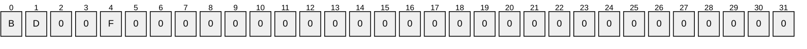

| Value | Description |
| --- | --- |
| B | If 1, the CA MUST publish a base CRL. |
| D | If 1, the CA MUST publish a delta CRL. |
| F | If 1, the CA MUST republish the existing CRLs. |

The CA server MUST apply the following processing rules:

- If the F bit is set in *Flags*, the *FileTime* parameter is ignored and the following MUST occur:
- If the B bit is set in *Flags*, the CA MUST republish the most recent base CRL (the CRL identified by the CRL [**table**](#gt_table) row with CRL_Min_Base of 0 and the highest CRL_Number) for each valid CA [**key**](#gt_key) (CRL_Name_ID) and for each partition to the locations that are identified in Config_CA_CDP_Publish_To_Base using the logic in section [3.1.5.2](#Section_3.1.5.2), rules 2 and 3 only.<79>
- If the D bit is set in *Flags*, the CA MUST publish the most recent delta CRL (the CRL identified by the CRL table row with CRL_Min_Base not equal to 0 and the highest CRL_Number) for each valid CA key (CRL_Name_ID) and for each partition to the locations that are identified in Config_CA_CDP_Publish_To_Delta using the logic in section 3.1.5.2, rules 2 and 3 only.<80>
- If neither the B bit nor the D bit is set in *Flags*, the CA MUST return an error. The error SHOULD be ERROR_INVALID_PARAMETER.
- If the F bit is NOT set in *Flags*, the following SHOULD occur:
The CA MUST create a CRL for each valid CA key and for each partition using the logic in section [3.1.4.1.6](#Section_3.1.4.1.6), rules 2 through 7. The CRL type is determined as follows:

- If the B bit is set in *Flags*, the type of CRL that the CA creates for each valid CA key and each partition MUST be a new base CRL and, if delta CRLs are enabled, a delta CRL.
- If the D bit is set in *Flags*, the type of CRL that the CA creates for each valid CA key and each partition MUST be a new delta CRL.
- If neither the B bit nor the D bit is set in *Flags*, the CA MUST return an error. The error SHOULD be ERROR_INVALID_PARAMETER.
- The CA MUST then publish the CRLs using the logic in section 3.1.4.1.6, rules 8 through 13.
Return value: The method returns the first error code returned from the first CRL write operation that failed or was aborted. If none of the CRL write operations failed, the method returns 0.

##### 3.1.4.2.2 ICertAdminD2::GetCAProperty (Opnum 32)

The GetCAProperty method is used to retrieve the value of a specific property from the [**CA**](#gt_certification-authority-ca).

HRESULT GetCAProperty(

[in, string, unique] wchar_t const* pwszAuthority,

[in] LONG PropId,

[in] LONG PropIndex,

[in] LONG PropType,

[out, ref] CERTTRANSBLOB* pctbPropertyValue

);

**pwszAuthority:** See the *pwszAuthority* definition in section [3.1.4.1.1](#Section_3.1.4.1.19).

**PropId:** An integer value specifying the property to be returned. The *PropID* value MUST be one of the values in the table labeled PropId in [MS-WCCE](../MS-WCCE/MS-WCCE.md) section 3.2.1.4.3.2. If a value other than one of the listed values is used, the error E_INVALIDARG is returned.

**PropIndex:** Some of these properties (the ones labeled "indexed" in the table in [MS-WCCE] section 3.2.1.4.3.2) have arrays of values. This parameter MUST be used as the [**index**](#gt_index) into such an array. For properties that are not arrays, this parameter MUST be ignored.

**PropType:** An integer value that specifies the property data type.

| Value | Meaning |
| --- | --- |
| PROPTYPE_LONG 0x00000001 | The property type is a signed long integer or a byte array. |
| PROPTYPE_BINARY 0x00000003 | The property type is binary data. |
| PROPTYPE_STRING 0x00000004 | The property type is a Unicode string. |

**pctbPropertyValue:** If the function succeeds, this method MUST return a [CERTTRANSBLOB](#Section_2.2.1.4) structure that contains the property value. If the function fails, the contents are undefined.

**Note** The numeric values for the constants listed in this topic are defined in the [**table**](#gt_table) for the *PropID* parameter.

The data type of the value returned depends on the value specified in the *PropType* parameter and the property specified in the *PropID* parameter:

- If PROPTYPE_STRING is specified in the *PropType* parameter, pctbPropertyValue MUST be a pointer to a CERTTRANSBLOB structure. The **pb** member of the structure points to the [**little-endian**](#gt_little-endian) encoded Unicode string. The length, in bytes, of the string MUST be contained in the **cb** member.
- If PROPTYPE_LONG is specified in the *PropType* parameter, there are two possible return types depending on the *PropID*. The first type is the return of a CAINFO structure (as specified in [MS-WCCE] section 2.2.2.4) and the second type is for the return of a BYTE array:
- If the value passed in *PropId* maps to one of the following properties, *pctbPropertyValue* is a pointer to a CERTTRANSBLOB structure, and the **pb** member of that structure MUST contain a pointer to a CAINFO structure that contains the values of the properties listed as follows. The marshaling rules for a CAINFO structure in a CERTTRANSBLOB are specified in [MS-WCCE] section 2.2.2.2.5:
- CR_PROP_CATYPE
- CR_PROP_CASIGCERTCOUNT
- CR_PROP_CAXCHGCERTCOUNT
- CR_PROP_EXITCOUNT
- CR_PROP_CAPROPIDMAX
- CR_PROP_KRACERTUSEDCOUNT
- CR_PROP_ROLESEPARATIONENABLED
- CR_PROP_KRACERTCOUNT
- CR_PROP_ADVANCEDSERVER
- If the value passed in *PropId* maps to one of the following properties, *pctbPropertyValue* is a pointer to a CERTTRANSBLOB structure, and the **pb** member of the structure points to a byte array containing the value for the requested property. The marshaling rules for each property are specified in the subsection of [MS-WCCE] section 3.2.1.4.3.2 that corresponds to the property name. The **cb** member contains the length of the byte array:
- CR_PROP_CACERTSTATE
- CR_PROP_CRLSTATE
- CR_PROP_KRACERTSTATE
- CR_PROP_CRLPARTITIONCOUNT<81>
- CR_PROP_BASECRLPUBLISHSTATUS
- CR_PROP_PARTITIONED_BASECRLPUBLISHSTATUS<82>
- CR_PROP_DELTACRLPUBLISHSTATUS
- CR_PROP_PARTITIONED_DELTACRLPUBLISHSTATUS<83>
- CR_PROP_CACERTSTATUSCODE
- CR_PROP_CAFORWARDCROSSCERTSTATE
- CR_PROP_CABACKWARDCROSSCERTSTATE
- If PROPTYPE_BINARY is specified in the *PropType* parameter, *pctbPropertyValue* MUST be a pointer to a CERTTRANSBLOB structure. The **pb** member of the structure points to the requested binary large object (BLOB).
Based on the property identifier passed in *PropId*, the binary data pointed to by the **pb** member MUST be populated as follows:

- CR_PROP_CASIGCERT: MUST be an X.509 [**certificate**](#gt_certificate) encoded using DER, as specified in [[X660]](https://go.microsoft.com/fwlink/?LinkId=90592).
- CR_PROP_BASECRL: MUST be a X.509 [**CRL**](#gt_certificate-revocation-list-crl) encoded using DER, as specified in [X660].
- CR_PROP_PARTITIONED_BASECRL: MUST be a X.509 CRL encoded using DER, as specified in [X660].
- CR_PROP_CAFORWARDCROSSCERT: MUST be a X.509 certificate encoded using DER, as specified in [X660].
- CR_PROP_CABACKWARDCROSSCERT: MUST be a X.509 certificate encoded using DER, as specified in [X660].
- CR_PROP_CAXCHGCERT: MUST be a X.509 certificate encoded using DER, as specified in [X660].
The CA MUST execute the processing rules specified in [MS-WCCE] section 3.2.1.4.3.2.15, "PropID = 0x0000000F (CR_PROP_CAXCHGCERT) "CA Exchange Certificate"".

- CR_PROP_CAXCHGCERTCHAIN: MUST be a CMS message, as specified in [[RFC2797]](https://go.microsoft.com/fwlink/?LinkId=90382)encoded using DER, as specified in [X660].
The CA MUST execute the processing rules specified in [MS-WCCE] section 3.2.1.4.3.2.16, "PropID = 0x00000010 (CR_PROP_CAXCHGCERTCHAIN) "CA Exchange Certificate Chain"".

- CR_PROP_CASIGCERTCHAIN: MUST be a CMS message [RFC2797] encoded using DER. [X660].
- CR_PROP_CASIGCERTCRLCHAIN: MUST be a CMS message, as specified in [RFC2797], encoded using DER, as specified in [X660].
- CR_PROP_CASIGCERTCRLCHAIN: MUST be a CMS message, as specified in [RFC2797], encoded using DER, as specified in [X660].
- CR_PROP_CAXCHGCERTCRLCHAIN: CR_PROP_CASIGCERTCRLCHAIN: MUST be a CMS message, as specified in [RFC2797], encoded using DER, as specified in [X660].
The CA MUST execute the processing rules specified in [MS-WCCE] section 3.2.1.4.3.2.33, "PropID = 0x00000021 (CR_PROP_CAXCHGCERTCRLCHAIN) "CA Exchange Certificate Chain and CRL"".

- CR_PROP_DELTACRL: MUST be a X.509 CRL encoded using DER [X660].
- CR_PROP_PARTITIONED_DELTACRL: MUST be a X.509 CRL encoded using DER [X660].
- CR_PROP_KRACERT: MUST be a X.509 CRL encoded using DER, as specified in [X660].
The marshaling rules for each of the preceding properties into a CERTTRANSBLOB are specified in [MS-WCCE] sections 2.2.2.2.2 (for X.509 certificate), 2.2.2.2.3 (X.509 CRL), and 2.2.2.2.4 (CMS message).

##### 3.1.4.2.3 ICertAdminD2::SetCAProperty (Opnum 33)

The SetCAProperty method is used to set [**CA**](#gt_certification-authority-ca) properties.

HRESULT SetCAProperty(

[in, string, unique] wchar_t const* pwszAuthority,

[in] LONG PropId,

[in] LONG PropIndex,

[in] LONG PropType,

[in] CERTTRANSBLOB* pctbPropertyValue

);

**pwszAuthority:** See *pwszAuthority* definition in section [3.1.4.1.1](#Section_3.1.4.1.19).

**PropId:** A LONG value that specifies one and exactly one of the following property identifiers. The use of PropIds, is as specified in [MS-WCCE](../MS-WCCE/MS-WCCE.md) section 3.2.1.4.3.2. If a value other than one of the listed values is used, the error E_INVALIDARG is returned.

| Value | Meaning |
| --- | --- |
| 0x0000001a | A binary [**object**](#gt_object) that contains the CA's [**key recovery agent (KRA)**](#gt_key-recovery-agent-kra) [**certificate**](#gt_certificate) to be added at the [**index**](#gt_index) specified by *PropIndex* parameter. |
| 0x00000019 | The maximum number of KRA certificates available on the CA. |
| 0x00000018 | The minimum number of KRAs to use when archiving a [**private key**](#gt_private-key). For more information on KRA usage, see [[MSFT-ARCHIVE]](https://go.microsoft.com/fwlink/?LinkId=90177). |
| 0x0000001d | A collection of name and [**OID (1)**](#gt_object-identifier-oid) pairs that identify the templates supported by a CA. |

**PropIndex:** A LONG value for the index of the KRA certificate to set when the provided *PropId* is 0x1a. For other *PropId* values, it MUST be 0.

**PropType:** A LONG value that specifies the type of the property. This parameter MUST be one of the following values.

| Value | Meaning |
| --- | --- |
| PROPTYPE_LONG 0x00000001 | Signed LONG data |
| PROPTYPE_BINARY 0x00000003 | Binary data |
| PROPTYPE_STRING 0x00000004 | Unicode String data |

**pctbPropertyValue:** A pointer to [CERTTRANSBLOB](#Section_2.2.1.4) that specifies the new property value. The format for the value contained in CERTTRANSBLOB is specific to the *PropId* defined as follows.

| Value of PropID | Format for values in CERTTRANSBLOB |
| --- | --- |
| CR_PROP_KRACERTUSEDCOUNT 0x00000018 | The **pb** member of CERTTRANSBLOB MUST point to an unsigned integer value ([**little-endian**](#gt_little-endian) format) and the **cb** member of CERTTRANSBLOB MUST contain the length of the bytes containing the value. |
| CR_PROP_KRACERTCOUNT 0x00000019 | The **pb** member of CERTTRANSBLOB MUST point to an unsigned integer value (little-endian format) and the **cb** member of CERTTRANSBLOB MUST contain the length of the bytes containing the value. |
| CR_PROP_KRACERT 0x0000001a | The **pb** member of CERTTRANSBLOB MUST point to an ASN.1 DER (as specified in [[ITUX690]](https://go.microsoft.com/fwlink/?LinkId=89924)) encoded byte array of **Certificate**. The **cb** member of CERTTRANSBLOB MUST contain the length of the array. |
| CR_PROP_TEMPLATES 0x0000001d | As specified in [MS-WCCE] section 3.2.1.4.3.2.29. |

The following table defines the values that MUST be set for **PropIndex** and **PropType** for each one of the property values passed via *PropID*.

| PropID value | PropIndex MUST be | PropType MUST be |
| --- | --- | --- |
| 0x0000001a | The minimum index is 0. | 0x00000003 |
| 0x00000019 | 0x00000000 | 0x00000001 |
| 0x00000018 | 0x00000000 | 0x00000001 |
| 0x0000001d | 0x00000000 | 0x00000004 |

When processing the SetCAProperty method, the server determines its behavior based on the requested property ID (*PropID* parameter). All valid property IDs are listed in the preceding table. The CA MUST return the error value ERROR_INVALID_PARAMETER if any of the following conditions are met:

- The value of *PropID* is not listed in the preceding table, or
- For a given *PropID* value the *PropIndex* value does not match the required values defined in the preceding table, or
- For a given *PropID* value the *PropType* value does not match the required values defined in the preceding table.
The CA server MUST use the property values to modify the data (as specified in Abstract Data Model in [MS-WCCE] section 3.2.1.1) maintained by CA as part of the configuration.

The CA server MUST apply the following processing rules:

- The value of CR_PROP_KRACERTUSEDCOUNT MUST be between 1 and the current configured value of CR_PROP_KRACERTCOUNT property. The initial value for CR_PROP_KRACERTCOUNT property MUST be 0.
- The value to which the CR_PROP_KRACERTCOUNT property is being set MUST be less than the currently configured value of CR_PROP_KRACERTCOUNT.
- If the *PropIndex* is greater than or equal to the property CR_PROP_KRACERTCOUNT, then the CA must increase the value of CR_PROP_KRACERTCOUNT to the value of *PropIndex* plus 1 each time SetCAProperty (CR_PROP_KRACERT) is called. Else, if the *PropIndex* is less than CR_PROP_KRACERTCOUNT, then the value of CR_PROP_KRACERTCOUNT is not changed.
- When SetCAProperty(CR_PROP_TEMPLATES) is called, the CA MUST apply the following processing rules:
- If the pctbPropertyValue, **pb** member doesn't have at least two separators identified by '\n', the CA MUST fail the request. The error code SHOULD be E_INVALIDARG (0x80070057), as specified in [MS-ERREF](../MS-ERREF/MS-ERREF.md) section 2.1. Otherwise, the CA MUST continue with the following processing rules.
- The pctbPropertyValue, **pb** member contains the following string:"TemplateName1\nTemplateOID1\nTemplateName2\nTemplateOID2\... ", where
- TemplateName1 is one of the values of the **cn** [**attribute**](#gt_attribute) of the [**certificate template**](#gt_certificate-template) object that is stored in the Certificate_Template column.
- TemplateOID1 is the value of the msPKI-Template-Cert-Template-OID attribute of the certificate template stored in the Certificate_Template column.
**Note** The CA MUST ignore the TemplateOID values specified above.

- The [**enrollment**](#gt_3edb3c30-bb82-4782-9777-19c5006965ef) services [**container**](#gt_container) identified in [MS-WCCE] section 2.2.2.11.2 is modified with the following attribute:
- **certificateTemplates** attribute: The CA MUST set this attribute with the list of template names specified in step 4.2 above.

##### 3.1.4.2.4 ICertAdminD2::GetCAPropertyInfo (Opnum 34)

The GetCAPropertyInfo method is used to retrieve information about a property on the [**CA**](#gt_certification-authority-ca), such as its type and length.

HRESULT GetCAPropertyInfo(

[in, string, unique] wchar_t const* pwszAuthority,

[out] LONG* pcProperty,

[out, ref] CERTTRANSBLOB* pctbPropInfo

);

**pwszAuthority:** See the *pwszAuthority* definition in [ICertAdminD::SetExtension](#Section_3.1.4.1.19).

**pcProperty:** An integer value containing the number of property structures returned.

**pctbPropInfo:** A [CERTTRANSBLOB](#Section_2.2.1.4) structure containing zero or more CATRANSPROP structures. For more information on CERTTRANSBLOB and CATRANSPROP structures, see section [2.2.1](#Section_2.2.1).

The processing of the ICertAdminD2::GetCAPropertyInfo method is the same as that specified in [MS-WCCE](../MS-WCCE/MS-WCCE.md) section 3.2.1.4.3.3.

##### 3.1.4.2.5 ICertAdminD2::EnumViewColumnTable (Opnum 35)

The EnumViewColumnTable method retrieves information about one or more columns from the specified [**CA**](#gt_certification-authority-ca) database [**table**](#gt_table).

HRESULT EnumViewColumnTable(

[in, string, unique] wchar_t const* pwszAuthority,

[in] DWORD iTable,

[in] DWORD iColumn,

[in] DWORD cColumn,

[out] DWORD* pcColumn,

[out, ref] CERTTRANSBLOB* pctbColumnInfo

);

**pwszAuthority:** See the definition of the *pwszAuthority* parameter in section [3.1.4.1.1](#Section_3.1.4.1.19).

**iTable:** An unsigned integer that specifies the database table to be used for the enumeration. This MUST be set from the following values.

| Value | Meaning |
| --- | --- |
| 0x00000000 | [Request](#Section_3.1.1.1) table |
| 0x00003000 | [Extension](#Section_2.2.1.9) table |
| 0x00004000 | [Attribute](#Section_3.1.4.1.2) table |
| 0x00005000 | [CRL](#Section_3.1.1.4.1) table |

**iColumn:** An unsigned integer that specifies the column number with which to begin the enumeration. Valid values are from 0 to one less than the maximum number of columns for the table.

**cColumn:** An unsigned integer that specifies the requested number of columns to return.

**pcColumn:** A pointer to an unsigned integer that receives the actual number of [CERTTRANSDBCOLUMN](#Section_2.2.1.7) structures returned.

**pctbColumnInfo:** A pointer to a [CERTTRANSBLOB](#Section_2.2.1.4) structure. Upon return, the **pb** member of this structure points to an array of the marshaled CERTTRANSDBCOLUMN structures. The format and marshaling for the value of *pctbColumnInfo* MUST be as specified in section 2.2.1.7.

The EnumViewColumnTable method returns information to the client about columns that are associated with a specific table. The CA server MUST enforce the following processing rules:

- The CA server MUST enforce that the *iTable* parameter has a value as specified in the previous table; otherwise, it MUST fail with the error ERROR_INVALID_PARAMETER.
- The CA server MUST enforce that *iColumn* is less than the number of columns associated with the table; otherwise, it MUST fail with the error ERROR_ARITHMETIC_OVERFLOW.
- The CA server MUST enforce that *cColumn* is greater than 0; otherwise, it MUST fail with the error ERROR_INVALID_PARAMETER.<84>
- The CA server MUST use the value of **iColumn** to identify the column identifier that is associated with the table (identified by the value of the *iTable* parameter).
- The number of column information returned MUST be a minimum of the **cColumn** value and the remaining number of columns in the table (starting from **iColumn**). The value of *pcColumn MUST be set to the number of the column information returned.

##### 3.1.4.2.6 ICertAdminD2::GetCASecurity (Opnum 36)

The GetCASecurity method is used to retrieve [**CA**](#gt_certification-authority-ca) security, as defined in [Abstract Data Model (section 3.1.1)](#Section_3.1.1).

HRESULT GetCASecurity(

[in, string, unique] wchar_t const* pwszAuthority,

[out, ref] CERTTRANSBLOB* pctbSD

);

**pwszAuthority:** See the *pwszAuthority* definition in section [3.1.4.1.1](#Section_3.1.4.1.19).

**pctbSD:** A pointer to a [CERTTRANSBLOB](#Section_2.2.1.4) data structure that contains the CA's security descriptor. Security descriptors are specified in [MS-DTYP](../MS-DTYP/MS-DTYP.md) section 2.4.6.

##### 3.1.4.2.7 ICertAdminD2::SetCASecurity (Opnum 37)

The SetCASecurity method is used to set the [**CA**](#gt_certification-authority-ca) security, as defined in the [Abstract Data Model (section 3.1.1)](#Section_3.1.1).

HRESULT SetCASecurity(

[in, string, unique] wchar_t const* pwszAuthority,

[in, ref] CERTTRANSBLOB* pctbSD

);

**pwszAuthority:** See the *pwszAuthority* definition in section [3.1.4.1.1](#Section_3.1.4.1.19).

**pctbSD:** A pointer to a [CERTTRANSBLOB](#Section_2.2.1.4) data structure that holds the security descriptor. Security descriptors are specified in [MS-DTYP](../MS-DTYP/MS-DTYP.md) section 2.4.6.

The CA SHOULD use the permissions set in **pctbSD** to deny and allow permissions to CA functionality. Microsoft CA permissions are defined in section [3.1.1.7](#Section_3.1.1.7).

##### 3.1.4.2.8 ICertAdminD2::Ping2 (Opnum 38)

The Ping2 method is used to determine if the [**CA**](#gt_certification-authority-ca) service is started and responding.

HRESULT Ping2(

[in, string, unique] wchar_t const* pwszAuthority

);

**pwszAuthority:** See the *pwszAuthority* definition in section [3.1.4.1.1](#Section_3.1.4.1.19).

ICertAdminD2::Ping2 is as specified in [MS-WCCE](../MS-WCCE/MS-WCCE.md) section 3.2.1.4.3.4.

##### 3.1.4.2.9 ICertAdminD2::GetArchivedKey (Opnum 39)

The GetArchivedKey method is used to retrieve an archived [**private key**](#gt_private-key) and the associated [**certificate**](#gt_certificate).

HRESULT GetArchivedKey(

[in, string, unique] wchar_t const* pwszAuthority,

[in] DWORD dwRequestId,

[out, ref] CERTTRANSBLOB* pctbArchivedKey

);

**pwszAuthority:** See the *pwszAuthority* definition in section [3.1.4.1.1](#Section_3.1.4.1.19).

**dwRequestId:** An unsigned integer value that specifies the RequestId of the certificate request for which the archived private key and associated certificate are being requested.

**pctbArchivedKey:** A pointer to a [CERTTRANSBLOB](#Section_2.2.1.4) structure that MUST contain, on successful response, the archived private key and associated certificate.

ArchivedKey Property Value Processing and Format

The [**CA**](#gt_certification-authority-ca) server MUST create the ArchivedKey property value by using the following processing rules:

- The server MUST read the value from the Request_Raw_Archived_Key column of the Request table where the value of the Request_Request_ID column matches the value of the *dwRequestId* parameter. If no such record exists or the value of the Request_Raw_Archived_Key column is empty, the CA MUST return a nonzero error to the client.
- The server MUST construct a PKCS #7 with the following requirements:
- ContentInfo: This field MUST have the following values:
- ContentType: This field MUST be SignedData (1.2.840.113549.1.7.2 PKCS#7 Signed).
- Content: This field MUST be the value that was read in step 1 from the Request_Raw_Archived_Key column.
- Certificates: This field MUST include the current CA [**signing certificate**](#gt_signing-certificates) that is used to verify this PKCS#7 message.
- SignerInfos: The first SignerInfo in the SignerInfos collection MUST use the [**key**](#gt_key) that is associated with the current CA signing certificate.
- The ASN.1 DER–encoded PKCS#7 signed data that was created in step 2 MUST be the value of the ArchivedKey property in the request table (see section [3.1.1](#Section_3.1.1)).
The GetArchivedKey method is used to retrieve the archived private key and issued certificate from the CA's database.

The CA server MUST enforce the following processing rules:

- The CA MUST look up the request based on the provided *dwRequestId* parameter in the CA database Request table.
- If the request is not found, the CA MUST fail the request with the error CERTSRV_E_PROPERTY_EMPTY.
- If the request is found, the CA MUST ensure that the value of the Request.Disposition column in the identified row is "certificate issued".
- The CA MUST also ensure that the identified request has the ArchivedKey property value. Otherwise, the CA server MUST fail with the error CERTSRV_E_PROPERTY_EMPTY.
- The **pb** member of the *pctbArchivedBlob* parameter MUST reference the value of the ArchivedKey property, and the **cb** member of the *pctbArchivedBlob* parameter MUST contain the length, in bytes, of the ArchivedKey property value.

##### 3.1.4.2.10 ICertAdminD2::GetAuditFilter (Opnum 40)

The GetAuditFilter method retrieves the list of events for which the [**CA**](#gt_certification-authority-ca) server is currently set to create security audit events, as specified in [[CIMC-PP]](https://go.microsoft.com/fwlink/?LinkId=89839).

HRESULT GetAuditFilter(

[in, string, unique] wchar_t const* pwszAuthority,

[out] DWORD* pdwFilter

);

**pwszAuthority:** See *pwszAuthority* definition in section [3.1.4.1.1](#Section_3.1.4.1.19).

**pdwFilter:** An unsigned integer that specifies the current audit settings. This is a bitwise-OR combination of zero or more of the following values.

| Value | Meaning |
| --- | --- |
| 0x00000001 | Audit CA server for the following events: ServerControl Registration of the [ICertAdminD](#Section_3.2.4.1.5) interface. Unregistration of the ICertAdminD interface. |
| 0x00000002 | Audit CA server for the following method calls: BackupPrepare BackupEnd |
| 0x00000004 | Audit CA server for the following method calls: ICertRequestD::Request ResubmitRequest DenyRequest SetAttributes SetExtensions ImportCertificate DeleteRow |
| 0x00000008 | Audit CA server for the following method calls: RevokeCertificate PublishCRL PublishCRLs |
| 0x00000010 | Audit CA server for the following method calls: SetCASecurity SetOfficerRights |
| 0x00000020 | Audit CA server for the following method calls: GetArchivedKey ImportKey |
| 0x00000040 | Audit CA server for the following method calls: SetCAProperty SetConfigEntry |

The GetAuditFilter method is used to retrieve the audit filter currently in use (initialize to 0 during the registration of the interfaces and can be modified by a call to the [SetAuditFilter](#Section_3.2.4.2.11) method).

##### 3.1.4.2.11 ICertAdminD2::SetAuditFilter (Opnum 41)

The SetAuditFilter method sets the list of events for which the [**CA**](#gt_certification-authority-ca) server MUST create security audit events, as specified in [[CIMC-PP]](https://go.microsoft.com/fwlink/?LinkId=89839).

HRESULT SetAuditFilter(

[in, string, unique] wchar_t const* pwszAuthority,

[in] DWORD dwFilter

);

**pwszAuthority:** See the *pwszAuthority* definition in section [3.1.4.1.1](#Section_3.1.4.1.19).

**dwFilter:** An unsigned integer that specifies the events to be audited by the CA. For possible values, see section [3.1.4.2.10](#Section_3.1.4.2.10).

The SetAuditFilter method is used to set the audit filter value that is passed in by the client. The audit filter value is used to determine which actions are audited.

The CA server MUST start auditing the methods based on the value of the *dwFilter* parameter. The list of methods for the value is specified in section 3.1.4.2.10. The CA server SHOULD enforce that the *dwFilter* parameter contains only bitwise OR combinations of the values specified in section 3.1.4.2.10; otherwise, it SHOULD return a suitable error.

If Config_CA_Interface_Flags contains the value IF_ENABLEADMINASAUDITOR and the caller does not have administrator permissions (as defined in section [3.1.1.7](#Section_3.1.1.7)), the server MUST return an error. In Windows, the error is E_ACCESSDENIED (0x80070005).

##### 3.1.4.2.12 ICertAdminD2::GetOfficerRights (Opnum 42)

The GetOfficerRights method is used to retrieve the [**Officer rights**](#gt_officer-rights), as specified in [[CIMC-PP]](https://go.microsoft.com/fwlink/?LinkId=89839).

HRESULT GetOfficerRights(

[in, string, unique] wchar_t const* pwszAuthority,

[out] BOOL* pfEnabled,

[out, ref] CERTTRANSBLOB* pctbSD

);

**pwszAuthority:** See the *pwszAuthority* definition in section [3.1.4.1.1](#Section_3.1.4.1.19).

**pfEnabled:** A pointer to a Boolean value.

**pctbSD:** A pointer to the [CERTTRANSBLOB](#Section_2.2.1.4) structure that contains the marshaled information specified in section [2.2.1.11.1](#Section_2.2.1.11.1).

The following processing rules apply:

- If the [**CA**](#gt_certification-authority-ca) server does not support [**Enrollment Agent rights**](#gt_enrollment-agent-rights):
- If no Officer rights are configured, the server MUST set the value of **pfEnabled* to 0, the **pb** member of *pctbSD* to NULL, and the **cb** member to 0.
- If Officer rights are configured on the CA server, the server MUST set the value of **pfEnabled* to nonzero and return the marshaled data specified in section 2.2.1.11.1 in pctbSD.
- If the CA server supports Enrollment Agent rights:
- If no Officer rights are configured (Config_Permissions_Officer_Rights) and no Enrollment Agent rights (Config_Permissions_Enrollment_Agent_Rights) are configured on the CA server, then the server MUST set the value of **pfEnabled* to 0 and the **pb** member of *pctbSD* MUST contain the marshaled data specified in section 2.2.1.11.1.
- If no Officer rights are configured, but Enrollment Agent rights are configured on the CA server, then the server MUST set the value of **pfEnabled* to 0 and *pctbSD* MUST contain the marshaled data specified in section 2.2.1.11.1.
- If Officer rights are configured, but no Enrollment Agent rights are configured on the CA server, then the server MUST set the value of **pfEnabled* to nonzero and the **pb** member of *pctbSD* MUST contain the marshaled data specified in section 2.2.1.11.1.
- If Officer rights are configured and Enrollment Agent rights are configured on the CA server, then the server MUST set the value of **pfEnabled* to nonzero and *pctbSD* MUST contain the marshaled data specified in section 2.2.1.11.1.

##### 3.1.4.2.13 ICertAdminD2::SetOfficerRights (Opnum 43)

The SetOfficerRights method is used to set [**Officer rights**](#gt_officer-rights) or [**Enrollment Agent rights**](#gt_enrollment-agent-rights). Information on [**role separation**](#gt_role-separation) is specified in [[CIMC-PP]](https://go.microsoft.com/fwlink/?LinkId=89839).

HRESULT SetOfficerRights(

[in, string, unique] wchar_t const* pwszAuthority,

[in] BOOL fEnable,

[in, ref] CERTTRANSBLOB* pctbSD

);

**pwszAuthority:** See the *pwszAuthority* definition in section [3.1.4.1.1](#Section_3.1.4.1.19).

**fEnable:** A 32-bit BOOL parameter composed of two 16-bit fields. Each of these fields can be set to zero or to a nonzero value as follows.

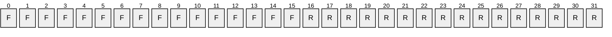

**F - fRightsEnable:** If bits 0 through 15 are 0, then disable access rights (**officer** or **enrollment agent**) and ignore the value of *pctbSD*.

**R - RightsType:** If bits 16 through 31 are 0, then the security descriptor in the *pctbSD* parameter is for **officer rights**.

If bits 16 through 31 are nonzero, the security descriptor in the *pctbSD* is for the **enrollment agents**.

**pctbSD:** A pointer to the [CERTTRANSBLOB](#Section_2.2.1.4) structure that holds the marshaled security descriptor, as specified in [MS-DTYP](../MS-DTYP/MS-DTYP.md) section 2.4.6.

The following processing rules apply:

- If fRightsEnable is 0 and RightsType is 0, the server MUST disable Officer access rights (Config_Permissions_Officer_Rights) and ignore the value of *pctbSD*.
- If fRightsEnable is 0 and RightsType is nonzero, the server MUST disable Enrollment Agent access rights (Config_Permissions_Enrollment_Agent_Rights) and ignore the value of *pctbSD*.
- If fRightsEnable is nonzero and RightsType is 0, the server MUST set the security descriptor specified in *pctbSD* as officer access rights.
- If fRightsEnable is nonzero and RightsType is nonzero, the server MUST set the security descriptor specified in *pctbSD* as **enrollment agent** access rights.

##### 3.1.4.2.14 ICertAdminD2::GetConfigEntry (Opnum 44)

The GetConfigEntry method retrieves the [**CAs**](#gt_certification-authority-ca) that persisted the configuration data listed in section [3.1.1.10](#Section_3.1.1.10). Configuration data is represented as a hierarchical data structure with the following format: [\pwszAuthority][\pwszNodePath][\pwszEntry].

HRESULT GetConfigEntry(

[in, string, unique] wchar_t const* pwszAuthority,

[in, string, unique] wchar_t const* pwszNodePath,

[in, string, ref] wchar_t const* pwszEntry,

[out, ref] VARIANT* pVariant

);

**pwszAuthority:** See the *pwszAuthority* definition in section [3.1.4.1.1](#Section_3.1.4.1.19).

**pwszNodePath:** A string value that represents the node path for the configuration information. This parameter can be an empty string and MUST NOT be NULL.<85>

**pwszEntry:** A string value that represents the name of the leaf entry whose information is being retrieved. This value can be an EMPTY string and MUST NOT be NULL.<86>

**pVariant:** A pointer to a [VARIANT](#Section_2.2.1.2) that receives the requested information.

On Windows, the CA uses these datatypes to set the data that it stores in the registry:

REG_BINARY – The vt member of VARIANT is set to VT_ARRAY|VT_UI1 and the **pArray** member references a single dimension SAFEARRAY the binary data. The number of elements of the SAFEARRAY reference by **pArray** is equal to the length of binary data.

REG_DWORD – The vt member of VARIANT is set to VT_I4 and the lVal member is the registry value.

REG_SZ – The vt member of VARIANT is set to VT_BSTR and the bstrVal member is set to BSTR for Unicode string in the registry value.

REG_MULTI_SZ – The vt member of VARIANT is set to VT_ARRAY|VT_BSTR and the **pArray** member references a single dimension SAFEARRAY. The number of elements of the SAFEARRAY referenced by pArray is equal to the number of the strings in the registry value. For each string, there is an element in the SAFEARRAY referenced by pArray containing the BSTR for Unicode string value in the registry.

The GetConfigEntry method retrieves the CA configuration data or configuration data hierarchy information.

The following processing rules apply:

- If *pwszAuthority* parameter is EMPTY and *pwszNodePath* parameter is EMPTY and *pwszNodeEntry* is EMPTY, the CA MUST return all available leaf properties' names that exist in the configuration's root node as a VARIANT array.
- If *pwszAuthority* is EMPTY and *pwszNodePath* is EMPTY and *pwszNodeEntry* is not EMPTY, the CA must return the leaf property value identified by *pwszNodeEntry* that exists under the Configuration root node as a VARIANT.
- If *pwszAuthority* is EMPTY and *pwszNodePath* is not EMPTY, for any value of *pwszNodeEntry* the CA MUST fail the call with an error code of 0x80070057.
- If *pwszAuthority* parameter is not EMPTY and *pwszNodePath* is EMPTY and *pwszNodeEntry* is EMPTY, the CA MUST return all available leaf properties' names that exist under the *pwszAuthority* node as a VARIANT array.
- If *pwszAuthority* parameter is not EMPTY and *pwszNodePath* is EMPTY and *pwszNodeEntry* is not EMPTY, the CA MUST return the leaf property value identified by *pwszNodeEntry* that exists under the *pwszAuthority* node as a VARIANT array.
- If *pwszAuthority* parameter is not EMPTY and *pwszNodePath* is not EMPTY and *pwszEntry* is EMPTY, the CA MUST return all available leaf properties' names that exist under the *pwszNodePath* node as a VARIANT array.
- If *pwszAuthority* parameter is not EMPTY and *pwszNodePath* is not EMPTY and *pwszEntry* is not EMPTY, the CA MUST return the leaf property value identified by *pwszNodeEntry* that exists under the *pwszNodePath* node as a VARIANT array.
- For each input in the left column of the table below, the CA MUST perform the processing rules in the corresponding cell in the right column.
| Input Parameters | Processing rule for pVariant |
| --- | --- |
| pwszNodePath is EMPTY and pwszEntry is "Security" | The CA MUST return the value of the OnNextRestart_Config_Permissions_CA_Security ADM element as a VARIANT. The vt member of VARIANT MUST be set to VT_ARRAY\|VT_UI1 and the pArray member MUST reference a single dimension safearray. The number of elements of the safearray reference by pArray MUST be equal to the length of marshaled Security Descriptor. Security Descriptor is as specified in [MS-DTYP](../MS-DTYP/MS-DTYP.md) section 2.4.6. |
| pwszAuthority is EMPTY and pwszNodePath is EMPTY and pwszEntry is "SetupStatus" | The CA MUST return the value of the OnNextRestart_Config_Setup_Status ADM element as a VARIANT. The vt member of the VARIANT MUST be set to VT_I4 and the lVal member MUST be either 0 or a bitwise OR of the following values: 0x00000001 – server installed 0x00000002 – client installed 0x00000004 – incomplete installation 0x00000008 – new cert requested 0x00000010 – requested online 0x00000020 – request denied 0x00000040 – create a new DB 0x00000080 – try to create vroots 0x00000100 – force new [**CRLs**](#gt_certificate-revocation-list-crl) to be generated 0x00000200 – add server type to the CA [**DS**](#gt_directory-service-ds) object ‘flags’ attribute 0x00000400 – server was upgraded 0x00000800 – still need to upgrade security from Windows 2000 operating system 0x00001000 – permissions changed while the CA was down and the CA will need to update the directory service when it restarts 0x00002000 – global DCOM security has been fixed (in Windows 2000 operating system Service Pack 1 (SP1)) 0x00004000 – server is up-to-date |
| pwszNodePath is EMPTY and pwszEntry is "UseDS" | The CA MUST return the value of the OnNextRestart_Config_CA_Use_DS ADM element as a VARIANT. The vt member of the VARIANT MUST be set to VT_I4 and the lVal member MUST be set to one of the following values: 0 – The CA is not using [**Active Directory**](#gt_active-directory) for CRL publication Any nonzero value: The CA is using AD for CRL publication |
| pwszNodePath is EMPTY and pwszEntry is "CAType" | The CA MUST return the value of the OnNextRestart_Config_CA_Type ADM element as a VARIANT. The vt member of the VARIANT MUST be set to VT_I4 and the lVal member MUST be set to one of the CAType values specified in [MS-WCCE](../MS-WCCE/MS-WCCE.md) section 2.2.2.4. |
| pwszNodePath is EMPTY and pwszEntry is "KRAFlags" | The CA MUST return the value of the OnNextRestart_Config_CA_KRA_Flags ADM element as a VARIANT. The vt member of the VARIANT MUST be set to VT_I4 and the lVal member MUST be one the following values: 0 0x00000001 – allow foreign [**certificate**](#gt_certificate) [**key archival**](#gt_key-archival) |
| pwszAuthority is EMPTY and pwszNodePath is EMPTY and pwszEntry is "Version" | The CA MUST return the value of the OnNextRestart_Config_Product_Version ADM element as a VARIANT. The vt member of the VARIANT MUST be set to VT_I4 and the lVal member MUST be set to the one of the following values: 0x00010001 – Server is Windows 2000 Server operating system 0x00020002 – Server is Windows Server 2003 operating system 0x00030001 – Server is Windows Server 2008 operating system 0x00040001 – Server is Windows Server 2008 R2 operating system 0x00050001 – Server is Windows Server 2012 operating system 0x00060001 – Server is Windows Server 2012 R2 operating system <87> 0x00070001 – Server is Windows Server 2016 operating system or Windows Server 2019 operating system |
| pwszNodePath is EMPTY and pwszEntry is "CommonName" | The CA MUST return the value of the **OnNextRestart_Config_CA_Common_Name** ADM element as a VARIANT. The vt member of the VARIANT MUST be set to VT_BSTR and the bstrVal member MUST be BSTR for the Unicode string value of the [**common name**](#gt_common-name-cn) of the CA. |
| pwszNodePath is EMPTY and pwszEntry is "InterfaceFlags" | The CA MUST return the value of the **OnNextRestart_Config_CA_Interface_Flags** ADM element as a VARIANT. The vt member of the VARIANT MUST be set to VT_I4 and the lVal member MUST be either 0 or a bitwise-OR of the following values: IF_LOCKICERTREQUEST = 0x1 This value has no effect. IF_NOREMOTEICERTREQUEST = 0x2 The CA will not issue any certificates or hold pending any requests for remote users. IF_NOLOCALICERTREQUEST = 0x4 The CA will not issue any certificates or hold pending any requests for local users. IF_NORPCICERTREQUEST = 0x8 The CA will not issue any certificates or hold pending any requests for callers using the ICertPassage interface. IF_NOREMOTEICERTADMIN = 0x10 (16) No access to Certificate Services Remote Administration Protocol methods for remote callers. IF_NOLOCALICERTADMIN = 0x20 (32) No access to Certificate Services Remote Administration Protocol methods for local callers. IF_NOREMOTEICERTADMINBACKUP = 0x40 (64) The CA restricts access to the backup-related methods of this protocol for remote callers. IF_NOLOCALICERTADMINBACKUP = 0x80 (128) The CA restricts access to the backup-related methods of this protocol for local callers. IF_NOSNAPSHOTBACKUP = 0x100 (256) The database files cannot be backed up using a mechanism other than the methods of this interface. IF_ENFORCEENCRYPTICERTREQUEST = 0x200 (512) RPC_C_AUTHN_LEVEL_PKT_PRIVACY, as defined in [MS-RPCE](../MS-RPCE/MS-RPCE.md) section 2.2.1.1.8, must be defined for all RPC connections to the server for certificate-request operations. IF_ENFORCEENCRYPTICERTADMIN = 0x400 (1024) RPC_C_AUTHN_LEVEL_PKT_PRIVACY, as defined in [MS-RPCE] section 2.2.1.1.8, must be defined for all RPC connections to the server for certificate administrative operations (the methods defined in this interface). IF_ENABLEEXITKEYRETRIEVAL = 0x800 (2048) Enables an exit algorithm to retrieve the Encrypted private-Key Blob. IF_ENABLEADMINASAUDITOR = 0x1000 (4096) Only CA administrators can update the CA audit filter settings. |
| pwszNodePath is EMPTY and pwszEntry is "HighSerial" | If the value of the OnNextRestart_Config_High_Serial_String is not empty, the CA MUST return the value of the OnNextRestart_Config_High_Serial_String. Otherwise, the CA MUST return the value of the OnNextRestart_Config_High_Serial_Number. |
| pwszEntry is "Provider" and pwszNodePath is "CSP" | The CA MUST return the value of the **OnNextRestart_Config_CSP_Provider** ADM element as a VARIANT. The vt member of the VARIANT MUST be set to VT_BSTR and the bstrVal member MUST be BSTR for the Unicode string value of the provider. |
| pwszEntry is "ProviderType" and pwszNodePath is "CSP" | The CA MUST return the value of the **OnNextRestart_Config_CSP_ProviderType** ADM element as a VARIANT. The vt member of VARIANT MUST be set to VT_I4 and the lVal member MUST be set to the provider type. |
| pwszEntry is "HashAlgorithm" and pwszNodePath is "CSP" | The CA MUST return the value of the **OnNextRestart_Config_CSP_Hash_Algorithm** ADM element as a VARIANT. The vt member of the VARIANT MUST be set to VT_I4 and the lVal member MUST be set to the algid (algorithm identifier) that corresponds to the hash algorithm used by the CA. |
| pwszEntry is "CNGHashAlgorithm" and pwszNodePath is "CSP" | The CA MUST return the value of the **OnNextRestart_Config_CSP_CNG_Hash_Algorithm** ADM element as a VARIANT. The vt member of the VARIANT MUST be set to VT_BSTR and the bstrVal member MUST be BSTR for the Unicode string value of the name of the CNG hash algorithm used by the CA. |
| pwszNodePath is EMPTY and pwszEntry is "CRLPeriodUnits" | The CA MUST return the numeric value of the **Config_Base_CRL_Validity_Period** ADM element as a VARIANT. The vt member of the VARIANT MUST be set to VT_I4 and the lVal member MUST be set to the CRL publication period value. A value of 0 means CRL publishing is disabled. |
| pwszNodePath is EMPTY and pwszEntry is "CRLPeriod" | The CA MUST return the value of the units of time with which the Config_Base_CRL_Validity_Period ADM element is counted as a VARIANT. The vt member of the VARIANT MUST be set to VT_BSTR and the bstrVal member MUST be BSTR for the Unicode string value of one of following: Years Months Weeks Days Hours Minutes Seconds |
| pwszNodePath is EMPTY and pwszEntry is "CRLDeltaPeriodUnits" | The CA MUST return the numeric value of the Config_Delta_CRL_Validity_Period ADM element as a VARIANT. The vt member of the VARIANT MUST be set to VT_I4 and the lVal member MUST be set to the delta CRL publication period. A value of 0 for means Delta CRL publishing is disabled. |
| pwszNodePath is EMPTY and pwszEntry is "CRLDeltaPeriod" | The CA MUST return the value of the units of time with which the Config_Delta_CRL_Validity_Period ADM element is counted as a VARIANT. The vt member of the VARIANT MUST be set to VT_BSTR and the bstrVal member MUST be BSTR for the Unicode string value of one of following: Years Months Weeks Days Hours Minutes Seconds |
| pwszNodePath is EMPTY and pwszEntry is "CRLNextPublish" | The CA MUST return the value of the ADM element OnNextRestart_Config_CA_CRL_Next_Publish as a VARIANT. The vt member of the VARIANT MUST be set to VT_ARRAY\|VT_UI1 and the pArray member MUST reference a single dimension safearray. The number of elements of the safearray reference by pArray SHOULD be equal to 8 bytes. The value of the bytes must contain a 64-bit value that represents the number of 100-nanosecond intervals since January 1, 1601, according to [**Coordinated Universal Time (UTC)**](#gt_coordinated-universal-time-utc) (encoded in little endian). |
| pwszNodePath is EMPTY and pwszEntry is "CRLDeltaNextPublish" | The CA MUST return the value of the ADM element OnNextRestart_Config_CA_CRL_Delta_Next_Publish as a VARIANT. The vt member of the VARIANT MUST be set to VT_ARRAY\|VT_UI1 and the pArray member MUST reference a single dimension safearray. The number of elements of the safearray reference by pArray SHOULD be equal to 8 bytes. The value of the bytes must contain a 64-bit value that represents the number of 100-nanosecond intervals since January 1, 1601, according to Coordinated Universal Time (UTC) (encoded in little endian). |
| pwszNodePath is EMPTY and pwszEntry is "AuditFilter" | The CA MUST return the value of the OnNextRestart_Config_CA_Audit_Filter ADM element as a VARIANT. The vt member of VARIANT MUST be set to VT_I4 and the lVal member MUST be either 0 or bitwise OR of the following values. 0x00000001 – Audit start/stop of the service. 0x00000002 – Audit operations associated with backup/restore of the CA database. 0x00000004 – Audit operations associated with certificate [**issuance**](#gt_71f399e7-7026-46bb-b7c2-8fd4872b900f). 0x00000008 – Audit operations associated with [**certificate revocation**](#gt_certificate-revocation). 0x00000010 – Audit changes to the security settings on the Certificate Authority Service. 0x00000020 – Audit operations associated with Key Recovery. 0x00000040 – Audit operations associated with Changes in CA configuration. |
| pwszEntry is "Active" and pwszNodePath is "PolicyModules" | The CA MUST return the value of the OnNextRestart_Config_CA_Policy_Algorithm_Implementation ADM element as a VARIANT. The vt member of the VARIANT MUST be set to VT_BSTR and the bstrVal member MUST be BSTR for the Unicode string value of the name (progid) of the policy algorithm By default the Microsoft CA uses a policy module called "CertificateAuthority_MicrosoftDefault.Policy" as the policy algorithm. For more information on the policy algorithm, see [MS-WCCE] section 3.2.1.4.2.1.4.5. |
| pwszEntry is "Active" and pwszNodePath is "ExitModules" | The CA MUST return the value of the OnNextRestart_Config_CA_Exit_Algorithm_Implementation_List ADM element as a VARIANT. The vt member of the VARIANT MUST be set to VT_ARRAY\|VT_BSTR and the pArray member MUST reference a single dimension safearray. The number of elements of the safearray referenced by pArray MUST be equal to the number of active exit algorithms on the CA. For each exit algorithm, there MUST be an element in the safearray referenced by pArray containing the BSTR for the Unicode string value of the name (progid) of the exit algorithm. By default, the Microsoft CA uses an exit module called "CertificateAuthority_MicrosoftDefault.Exit" as the default active exit algorithm. For more information on the exit algorithm, see [MS-WCCE] section 3.2.1.4.2.1.4.9. |
| pwszNodePath is EMPTY and pwszEntry is "CRLPublicationURLs" | The CA MUST use the values of the following ADM elements to create the VARIANT returned: **OnNextRestart_Config_CA_CDP_Publish_To_Base** **OnNextRestart_Config_CA_CDP_Publish_To_Delta** **OnNextRestart_Config_CA_CDP_Include_In_Cert** **OnNextRestart_Config_CA_CDP_Include_In_CRL_Publish_Locations_Extension** **OnNextRestart_Config_CA_CDP_Include_In_CRL_Freshest_CRL_Extension** **OnNextRestart_Config_CA_CDP_Include_In_CRL_IDP_Extension** The vt member of the VARIANT MUST be set to VT_ARRAY \| VT_BSTR and the pArray member MUST reference a single dimension safearray. The number of elements of the safearray referenced by pArray MUST be equal to the number of [**URLs**](#gt_uniform-resource-locator-url). For each URL, there MUST be an element in the safearray referenced by pArray containing the BSTR for the Unicode string value of the [**URI**](#gt_uniform-resource-identifier-uri). Each URI is of the format "NumericPrefix:URI", where NumericPrefix is the decimal value corresponding to the combination of following flags: 0x00000001 – The CA must publish the CRL to the URI (OnNextRestart_Config_CA_CDP_Publish_To_Base). 0x00000002 – The URI is to be added in the CDP extension of the certificate issued by the CA (OnNextRestart_Config_CA_CDP_Include_In_Cert). 0x00000004 – The URI is to be added in the FreshestCRL extension of the CRL issued by the CA (OnNextRestart_Config_CA_CDP_Include_In_CRL_Freshest_CRL_Extension). 0x00000008 – The URI is to be added in the CDP extension of the CRL issued by the CA (OnNextRestart_Config_CA_CDP_Include_In_CRL_Publish_Locations_Extension). 0x00000010 – Not Used. 0x00000040 – The CA must publish the Delta CRL to the URI (OnNextRestart_Config_CA_CDP_Publish_To_Delta). 0x00000080 – The URI is to be added in the IDP extension of the CRL issued by the CA (OnNextRestart_Config_CA_CDP_Include_In_CRL_IDP_Extension). |
| pwszNodePath is EMPTY and pwszEntry is "CACertPublicationURLs" | The CA MUST use the values of the following ADM elements to create the VARIANT returned: **OnNextRestart_Config_CA_AIA_Include_In_Cert** **OnNextRestart_Config_CA_CACert_Publish_To** The vt member of the VARIANT MUST be set to VT_ARRAY \| VT_BSTR and the pArray member MUST reference a single dimension safearray. The number of elements of the safearray referenced by pArray MUST be equal to the number of URLs. For each URL, there MUST be an element in the safearray referenced by pArray containing the BSTR for the Unicode string value of the URI. Each URI is of the format "NumericPrefix:URI", where NumericPrefix is the decimal value corresponding to the combination of following flags: 0x00000001 – The CA must publish the CA certificate(s) to the URI (OnNextRestart_Config_CA_CACert_Publish_To). 0x00000002 – The URI is to be added in the AIA extension of the certificates issued by the CA (OnNextRestart_Config_CA_AIA_Include_In_Cert). |
| pwszNodePath is "PolicyModules\CertificateAuthority_MicrosoftDefault.Policy" and pwszEntry is "RequestDisposition" | The CA MUST return the value of the **OnNextRestart_Config_CA_Requests_Disposition** as a VARIANT. The vt member of VARIANT MUST be set to VT_I4 and the lVal member MUST be the value of the **OnNextRestart_Config_CA_Requests_Disposition** ADM element. The value of this ADM element determines whether the CA sets all requests to pending, accepts all requests, or denies all requests. |

##### 3.1.4.2.15 ICertAdminD2::SetConfigEntry (Opnum 45)

The SetConfigEntry method is used to set the [**CA's**](#gt_certification-authority-ca) persisted configuration data that is listed in section [3.1.1.10](#Section_3.1.1.10).

HRESULT SetConfigEntry(

[in, string, unique] wchar_t const* pwszAuthority,

[in, string, unique] wchar_t const* pwszNodePath,

[in, string, ref] wchar_t const* pwszEntry,

[in, ref] VARIANT* pVariant

);

**pwszAuthority:** See the *pwszAuthority* definition in section [3.1.4.1.1](#Section_3.1.4.1.19).

**pwszNodePath:** A string value that represents the node path for the configuration information. This parameter can be an EMPTY string and MUST NOT be NULL.

**pwszEntry:** A string value that represents the name of the leaf entry whose information is being set. This value can be an EMPTY string and MUST NOT be NULL.

**pVariant:** A pointer to [VARIANT](#Section_2.2.1.2) that specifies the information to set. If this value is EMPTY, the indicated entry MUST be deleted.

The following processing rules apply:

- If all arguments are provided, the CA MUST update the configuration with the value provided.
- If the configuration value parameter passed in is empty, the indicated configuration entry MUST be deleted.
- For each input in the left column of the table below, the CA MUST perform the processing rules in the corresponding cell in the right column. Unless otherwise specified below, changes to these ADM elements made through this method require a CA restart to take effect.
| Input | Store information as ADM element |
| --- | --- |
| pwszNodePath is EMPTY and pwszEntry is "Security" | OnNextRestart_Config_Permissions_CA_Security |
| pwszAuthority is EMPTY and pwszNodePath is EMPTY and pwszEntry is "SetupStatus" | OnNextRestart_Config_Setup_Status |
| pwszNodePath is EMPTY and pwszEntry is "UseDS" | OnNextRestart_Config_CA_Use_DS |
| pwszNodePath is EMPTY and pwszEntry is "CAType" | OnNextRestart_Config_CA_Type |
| pwszNodePath is EMPTY and pwszEntry is "KRAFlags" | OnNextRestart_Config_CA_KRA_Flags |
| pwszAuthority is EMPTY and pwszNodePath is EMPTY and pwszEntry is "Version" | OnNextRestart_Config_Product_Version |
| pwszNodePath is EMPTY and pwszEntry is "CommonName" | OnNextRestart_Config_CA_Common_Name |
| pwszNodePath is EMPTY and pwszEntry is "InterfaceFlags" | OnNextRestart_Config_CA_Interface_Flags |
| pwszEntry is "Provider" and pwszNodePath is "CSP" | OnNextRestart_Config_CSP_Provider |
| pwszEntry is "ProviderType" and pwszNodePath is "CSP" | OnNextRestart_Config_CSP_ProviderType |
| pwszEntry is "HashAlgorithm" and pwszNodePath is "CSP" | OnNextRestart_Config_CSP_Hash_Algorithm |
| pwszEntry is "CNGHashAlgorithm" and pwszNodePath is "CSP" | OnNextRestart_Config_CSP_CNG_Hash_Algorithm |
| pwszNodePath is EMPTY and pwszEntry is "CRLPeriodUnits" | The numeric value of the Config_Base_CRL_Validity_Period ADM element. Changing the value with this method MUST affect the validity period of published base [**CRLs**](#gt_certificate-revocation-list-crl) (the use of this ADM element in sections [3.1.4.1.6](#Section_3.1.4.1.6) and [3.1.4.2.1](#Section_3.1.4.2.14)) immediately, without a CA restart. |
| pwszNodePath is EMPTY and pwszEntry is "CRLPeriod" | The units of time with which the Config_Base_CRL_Validity_Period ADM element is counted. Changing the value with this method MUST affect the validity period of published base CRLs (the use of this ADM element in sections 3.1.4.1.6 and 3.1.4.2.1) immediately, without a CA restart. |
| pwszNodePath is EMPTY and pwszEntry is "CRLDeltaPeriodUnits" | The numeric value of the Config_Delta_CRL_Validity_Period ADM element. Changing the value with this method MUST affect the validity period of published delta CRLs (the use of this ADM element in sections 3.1.4.1.6 and 3.1.4.2.1) immediately, without a CA restart. |
| pwszNodePath is EMPTY and pwszEntry is "CRLDeltaPeriod" | The units of time with which the Config_Delta_CRL_Validity_Period ADM element is counted. Changing the value with this method MUST affect the validity period of published delta CRLs (the use of this ADM element in sections 3.1.4.1.6 and 3.1.4.2.1) immediately, without a CA restart. |
| pwszNodePath is EMPTY and pwszEntry is "CRLNextPublish" | OnNextRestart_Config_CA_CRL_Next_Publish |
| pwszNodePath is EMPTY and pwszEntry is "CRLDeltaNextPublish" | OnNextRestart_Config_CA_CRL_Delta_Next_Publish |
| pwszNodePath is EMPTY and pwszEntry is "AuditFilter" | OnNextRestart_Config_CA_Audit_Filter |
| pwszEntry is "Active" and pwszNodePath is "PolicyModules" | OnNextRestart_Config_CA_Policy_Algorithm_Implementation |
| pwszEntry is "Active" and pwszNodePath is "ExitModules" | OnNextRestart_Config_CA_Exit_Algorithm_Implementation_List |
| pwszNodePath is EMPTY and pwszEntry is "CRLPublicationURLs" | OnNextRestart_Config_CA_CDP_Publish_To_Base OnNextRestart_Config_CA_CDP_Publish_To_Delta OnNextRestart_Config_CA_CDP_Include_In_Cert OnNextRestart_Config_CA_CDP_Include_In_CRL_Publish_Locations_Extension OnNextRestart_Config_CA_CDP_Include_In_CRL_Freshest_CRL_Extension OnNextRestart_Config_CA_CDP_Include_In_CRL_IDP_Extension |
| pwszNodePath is EMPTY and pwszEntry is "CACertPublicationURLs" | OnNextRestart_Config_CA_AIA_Include_In_Cert OnNextRestart_Config_CA_CACert_Publish_To |
| pwszNodePath is EMPTY and pwszEntry is "CRLAttemptRepublish" | OnNextRestart_Config_CA_CRL_Attempt_Republish |
| pwszNodePath is "PolicyModules\CertificateAuthority_MicrosoftDefault.Policy" and pwszEntry is "RequestDisposition" | OnNextRestart_Config_CA_Requests_Disposition |

##### 3.1.4.2.16 ICertAdminD2::ImportKey (Opnum 46)

The ImportKey method adds an encrypted [**key**](#gt_key) set to an item in the [**CA**](#gt_certification-authority-ca) database.

HRESULT ImportKey(

[in, string, unique] wchar_t const* pwszAuthority,

[in] DWORD dwRequestId,

[in, string, unique] wchar_t const* pwszCertHash,

[in] DWORD dwFlags,

[in, ref] CERTTRANSBLOB* pctbKey

);

**pwszAuthority:** See the *pwszAuthority* definition in section [3.1.4.1.1](#Section_3.1.4.1.19).

**dwRequestId:** An unsigned integer value that represents the [**certificate**](#gt_certificate) request ID in the CA database.

**pwszCertHash:** A null-terminated Unicode string value that represents the [**SHA-1 hash**](#gt_sha-1-hash) of the ASN.1 DER–encoded certificate data (as specified in [[X660]](https://go.microsoft.com/fwlink/?LinkId=90592)) and that is formatted as a hexadecimal string.

**dwFlags:** An unsigned integer that specifies the optional flags for this method.

| Value | Meaning |
| --- | --- |
| 0x00010000 | Overwrite the existing archived key, if present. |

**pctbKey:** A [CERTTRANSBLOB](#Section_2.2.1.4) structure that contains the ASN.1 DER–encoded (as specified in [X660] and [[X690]](https://go.microsoft.com/fwlink/?LinkId=90593)) **PKCS#7** message (as specified in [[RFC2315]](https://go.microsoft.com/fwlink/?LinkId=90334)) that contains the [**private key**](#gt_private-key) to be archived. The content of the enveloped PKCS#7 is as specified in [MS-WCCE](../MS-WCCE/MS-WCCE.md) section 3.2.1.4.2.1.4.

The following processing rules apply:

- The CA MUST process the enveloped PKCS#7 in the *pctbKey* parameter as specified in [MS-WCCE] section 3.2.1.4.2.1.4.
- If the Request ID is 0 or 4294967295 and *pwszCertHash* is null, the CA server MUST fail with the error ERROR_INVALID_PARAMETER.
- If *pwszCertHash* is non-null, the CA MUST look up the request based on the provided *pwszCertHash* parameter value in the CA Request table by computing the SHA-1 hash of each issued certificate in the Request table and comparing the hexadecimal string form of it with the value that is specified in *pwszCertHash*.
- If the request is not found, the CA server MUST fail the request with the error ERROR_INVALID_PARAMETER.
- If the request is found, the CA MUST verify that the private key (decrypted in step 1) is cryptographically related to the [**public key**](#gt_public-key) in the certificate. If the keys are not related, the method MUST fail with the error ERROR_INVALID_PARAMETER.
- If *pwszCertHash* is null, the CA MUST look up the request based on the provided *dwRequestId* parameter in the CA database Request table:
- If the request is not found, the method MUST fail with the error CERTSRV_E_PROPERTY_EMPTY.
- If the request is found, the CA MUST verify that the private key (decrypted in step 1) is cryptographically related to the public key in the private key. If the keys are not related, the method MUST fail with the error ERROR_INVALID_PARAMETER.
- If the request is found, has an encrypted private key associated with it, and the value of *dwFlags* is not 0x00010000, the CA MUST fail with the error ERROR_INVALID_PARAMETER.
- If the request is found, has an encrypted private key associated with it, and the value of *dwFlags* is 0x00010000, the CA MUST replace the encrypted private key (in the request stored in the Request table) with the encrypted private key that is specified in the *pctbKey* parameter.
- If the request is found and does not have an encrypted private key that is associated with it, the CA MUST replace the encrypted private key (in the request that is stored in the Request table) with the encrypted private key that is specified in the *pctbKey* parameter.

##### 3.1.4.2.17 ICertAdminD2::GetMyRoles (Opnum 47)

The GetMyRoles method retrieves the [**CA roles**](#gt_certificate-authority-ca-roles), as specified in [[CIMC-PP]](https://go.microsoft.com/fwlink/?LinkId=89839), assigned to the user who calls the method.

HRESULT GetMyRoles(

[in, string, unique] wchar_t const* pwszAuthority,

[out] LONG* pdwRoles

);

**pwszAuthority:** See the *pwszAuthority* definition in section [3.1.4.1.1](#Section_3.1.4.1.19).

**pdwRoles:** A bitwise-OR combination of zero or more [**CA**](#gt_certification-authority-ca) security values based on the CA implementation. Microsoft CA permissions are defined in section [3.1.1.7](#Section_3.1.1.7).

For *pdwRoles*, the server MUST return a signed integer that represents the CA roles assigned to the caller.

##### 3.1.4.2.18 ICertAdminD2::DeleteRow (Opnum 48)

The DeleteRow method deletes a row or set of rows from a database [**table**](#gt_table).

HRESULT DeleteRow(

[in, string, unique] wchar_t const* pwszAuthority,

[in] DWORD dwFlags,

[in] FILETIME FileTime,

[in] DWORD dwTable,

[in] DWORD dwRowId,

[out, retval] LONG* pcDeleted

);

**pwszAuthority:** See the definition of the *pwszAuthority* parameter in section [3.1.4.1.1](#Section_3.1.4.1.19).

**dwFlags:** An unsigned integer value that specifies the type of rows to be deleted. This parameter can be one of the following values.

| Value | Meaning |
| --- | --- |
| 0x00000000 | Delete the individual row. |
| 0x00000001 | Delete the rows that contain expired [**certificates**](#gt_certificate). |
| 0x00000002 | Delete the rows that contain pending or failed requests. |

**FileTime:** Contains a 64-bit value that represents the number of 100-nanosecond intervals since January 1, 1601 ([**UTC**](#gt_coordinated-universal-time-utc)). The value is used to query for multiple rows to be deleted. It MUST contain all zeros if the *dwRowId* parameter is nonzero.

**dwTable:** An unsigned integer value that specifies the table in which to delete rows. This parameter can be one of the following values.

| Value | Meaning |
| --- | --- |
| 0x00000000 | Delete the [Request table](#Section_3.1.1.1) rows. |
| 0x00003000 | Delete the [Extension table](#Section_2.2.1.9) rows. |
| 0x00004000 | Delete the [Attribute table](#Section_3.1.4.1.2) rows. |
| 0x00005000 | Delete the [CRL table](#Section_3.1.1.4.1) rows. |

**dwRowId:** An unsigned integer value that represents the row identifier in the [**CA**](#gt_certification-authority-ca) data table. MUST be set to 0 if *FileTime* is nonzero.

**pcDeleted:** Returns the count of successfully deleted table rows.

The DeleteRow method is used to instruct the CA to delete rows from the specified table.

The following processing rules apply:

- The CA MUST verify that exactly one of *dwRowId* or *FileTime* is zero. If both are zero or if neither is zero, the CA MUST fail the request with error code E_INVALIDARG (0x80070057).
- The CA MUST verify that *dwTable* is set to one of the values defined for the *dwTable* parameter. If set to any other value, the CA MUST fail the request with error code E_INVALIDARG (0x80070057).
- If dwTable is set to 0x00000000:
- If the *dwFlags* parameter is nonzero and not set to 0X00000001 or 0x00000002, the CA MUST fail the request.
- If the *dwRowId* parameter is nonzero:
- If *dwRowId* is not a valid **RequestId**, the CA MUST pass the request and return 0 in the *pcDeleted* parameter.
- The CA MUST delete the corresponding rows in the Request table and also delete all the associated rows in the Extension table and Attribute table.
- If *FileTime* is nonzero:
- The CA MUST delete all the rows in the Request table that match the following criteria and also delete all associated rows in the Extension table and Attribute table:
- If the *dwFlags* parameter is set to 0x00000001:
- Delete all rows that contain issued and revoked certificates that expire before *FileTime* and do not contain archived [**private keys**](#gt_private-key) in the Request_Raw_Archived_Key datum.
- If *dwFlags* is set to 0x00000002:
- Delete all rows that contain pending and failed requests that were last acted upon before *FileTime* and do not contain archived private keys in the Request_Raw_Archived_Key datum.
- If *dwTable* is set to 0x00003000:
- If *dwRowId* is zero, the CA MUST fail the request.
- If *dwFlags* is nonzero, the CA MUST fail the request.
- The CA MUST delete the corresponding Extension table row.
- If dwTable is set to 0x00004000:
- If *dwRowId* is zero, the CA MUST fail the request.
- If *dwFlags* is nonzero, the CA MUST fail the request.
- The CA MUST delete the corresponding Attribute table row.
- If *dwTable* is set to 0x00005000:
- If *dwFlags* is nonzero and not set to 0x00000001, the CA MUST fail the request.
- If *dwFlags* is set to 0x00000000 or 0x00000001:
- If *dwRowId* is nonzero:
- If *dwRowId* is not a valid CRL table CRL_RowId, the CA MUST pass the request and return 0 in the *pcDeleted* parameter.
- The CA MUST delete the corresponding CRL table row.
- If *FileTime* is nonzero:
- The CA MUST delete all CRL table rows that contain [**CRLs**](#gt_certificate-revocation-list-crl) for which the value in the CRL_Next_Update column occurs before *FileTime*.
- The CA MUST count all deleted rows and return that count in *pcDeleted. If the Windows CA fails to delete all rows that match a date restriction as previously specified, it returns an HRESULT value of ERROR_OUT_OF_MEMORY to indicate to the client that more rows matching the criteria might remain.

### 3.1.5 Timer Events

#### 3.1.5.1 CRL Next Publish Timer Events

When either the Base or Delta CRL Next Publish Timer reaches its next timeout value, the [**CA**](#gt_certification-authority-ca) SHOULD stop all republishing attempts that might be in progress as a result of the [CRL Publication Retry Timer](#Section_3.1.2.2) and rebuild and republish [**CRLs**](#gt_certificate-revocation-list-crl) using the processing rules in ICertAdminD2::PublishCRLs (Opnum 31) (section [3.1.4.2.1)](#Section_3.1.4.2.14), with the following input values:

- Filetime: This parameter is set to 0.
- Flags: In this parameter, the F bit is not set. If the [Base CRL Next Publish Timer (section 3.1.2.1.1)](#Section_3.1.2.1.1) has been reached, the B bit is set. If the [Delta CRL Next Publish Timer (section 3.1.2.1.2)](#Section_3.1.2.1.2) has been reached, the D bit is set.

#### 3.1.5.2 CRL Publication Retry Timer Events

When the [CRL Publication Retry Timer](#Section_3.1.2.2) reaches its timeout value, the [**CA**](#gt_certification-authority-ca) MUST attempt to republish [**CRLs**](#gt_certificate-revocation-list-crl) using the following steps.

- The CA evaluates the ADM element **OnNextRestart_Config_CA_CRL_Attempt_Republish**, and if its value equals or exceeds 10, the CA does not execute the logic in this section. Rather, CRL creation and publishing will occur again when either the [Base CRL Next Publish Timer (section 3.1.2.1.1)](#Section_3.1.2.1.1) or the [Delta CRL Next Publish Timer (section 3.1.2.1.2)](#Section_3.1.2.1.2) reaches its next timeout value, whichever occurs first.
- The CA increments the ADM elements Config_CA_CRL_Attempt_Republish and OnNextRestart_Config_CA_CRL_Attempt_Republish by 1.
- The CA examines the CRL [**table**](#gt_table) row(s) corresponding to the most recent base and, if enabled, delta CRLs, for all CA [**keys**](#gt_key) and for all partitions. For each found CRL table row:
- The CA reattempts publishing of that CRL to all Config_CA_CDP_Publish_To_Base or Config_CA_CDP_Publish_To_Delta CRL publishing locations as applicable, and, following this attempt, update the following data elements in the corresponding CRL table row:
- CRL_Publish_Status_Code: Use the same logic as in section [3.1.4.1.6](#Section_3.1.4.1.6), rule 11.
- **CRL_Publish_Error**: If this element is present, update it as follows: If the retry is not successful, preserve the existing username and CRL location information in the data element and append username and CRL location information for the current failed retry. If the retry is successful, preserve the username information, append the username information for the current, successful retry, and remove the CRL location information for previous failed publishing attempts.
Once publishing is successful, the Microsoft CA removes any existing CRL publishing location indices from each line of username information. If republishing is not successful, the Microsoft CA preserves the existing username and CRL location [**index**](#gt_index) information, up to and including the line feed after the last line of user information, and adds a new line containing user name followed by a space, two hyphens, and the numeric index of the CRL publishing location to which publication failed upon the current retry. If more than one location fails for one CRL table entry upon retry, then the index of each failed location is appended to this line, separated by spaces.

The example following illustrates the contents of CRL_Publish_Error on a Microsoft CA after three publishing attempts, the first and second of which failed when writing to an [**LDAP**](#gt_lightweight-directory-access-protocol-ldap) path, and the third was successful. The first attempt was initiated in the user context of Administrator, and in the second and third attempts in the context of the CA:

"Published by CORP\Administrator -- 0*{linefeed}*

- -- 0{linefeed}

-{linefeed}

{linefeed}

ldap:///CN=CA1,CN=host1,CN=CDP,CN=Public Key Services,CN=Services,CN=Configuration,DC=corp,DC=contoso,DC=com"

- **CRL_Publish_Attempts**: If this element is present, increment its value by 1.
- **CRL_Last_Published**: If this element is present, update its value to the current time.
- If all CRL publishing retry attempts are successful, the CA resets the data elements **Config_CA_CRL_Attempt_Republish** and **OnNextRestart_Config_CA_CRL_Attempt_Republish** back to 0 and set the Base and Delta CRL Next Publish Timers as follows: set the Base CRL Next Publish Timer to the value of the CRL_Next_Publish of the base CRL that was just published, and set the Delta CRL Next Publish Timer to the value of the CRL_Next_Publish of the delta CRL that was just published. Otherwise, reset the value of the CRL Publication Retry Timer specified in section 3.1.2.2.

### 3.1.6 Other Local Events

No other local events.

## 3.2 Client Details

### 3.2.1 Abstract Data Model

None.

### 3.2.2 Timers

The Certificate Services Remote Administration Protocol client contains no timers.

### 3.2.3 Initialization

The Certificate Services Remote Administration Protocol depends on [**DCOM**](#gt_distributed-component-object-model-dcom) for authentication, as specified in [MS-DCOM](../MS-DCOM/MS-DCOM.md).

### 3.2.4 Message Processing Events and Sequencing Rules

The Certificate Services Remote Administration Protocol client invokes [**DCOM**](#gt_distributed-component-object-model-dcom) methods based on operator requests for the different methods available. The Certificate Services Remote Administration Protocol client invokes the DCOM client to establish a connection to the server as specified in section [2.1](#Section_2.1), initialize the server DCOM [**objects**](#gt_object) and interfaces, and enable the client to make subsequent calls to the methods defined in this document. Windows provides Certificate Services Remote Administration Protocol client functionality through the use of Microsoft Management Console (MMC) and through the use of command-line tools (certutil.exe).

Upon receiving a reply from the server in response to a method call, the client MUST validate the return code. Return codes from all method calls are of type HRESULT. If the HRESULT indicates success (0), the client can assume that any output parameters are present and valid. For any other return code (HRESULT is nonzero), the client MUST assume the method call failed. Unless redefined locally within this document, return codes are as specified in [MS-ERREF](../MS-ERREF/MS-ERREF.md).

#### 3.2.4.1 Processing Rules for ICertAdminD

##### 3.2.4.1.1 ICertAdminD::SetExtension (Opnum 3)

No specific processing rules.

##### 3.2.4.1.2 ICertAdminD::SetAttributes (Opnum 4)

No specific processing rules.

##### 3.2.4.1.3 ICertAdminD::ResubmitRequest (Opnum 5)

Upon successful return from the ICertAdminD::ResubmitRequest method invocation, the client receives the *pdwDisposition* parameter as an output value.

If this value is 3, the [**CA**](#gt_certification-authority-ca) issued the [**certificate**](#gt_certificate).

If this value is 2, the CA denied the certificate request.

The value of 5 will not be assigned to the *pdwDisposition* parameter if the default [**CA policy module**](#gt_ca-policy-module) is used. If a custom CA policy module is used, then it is possible to have the *pdwDisposition* parameter set to a value of 5. See [MS-WCCE](../MS-WCCE/MS-WCCE.md) sections 3.1.1.4.3.7 and 3.1.1.6.1 for information about how to retrieve pending requests from a CA.

If the value is any other nonzero value, the server has encountered an error.

The client SHOULD NOT rely on any specific value for its processing rules.

##### 3.2.4.1.4 ICertAdminD::DenyRequest (Opnum 6)

No specific processing rules.

##### 3.2.4.1.5 ICertAdminD::IsValidCertificate (Opnum 7)

No specific processing rules.

##### 3.2.4.1.6 ICertAdminD::PublishCRL (Opnum 8)

No specific processing rules.

##### 3.2.4.1.7 ICertAdminD::GetCRL (Opnum 9)

No specific processing rules.

##### 3.2.4.1.8 ICertAdminD::RevokeCertificate (Opnum 10)

No specific processing rules.

##### 3.2.4.1.9 ICertAdminD::EnumViewColumn (Opnum 11)

See [ICertAdminD2::EnumViewColumnTable](#Section_3.2.4.2.5).

##### 3.2.4.1.10 ICertAdminD::GetViewDefaultColumnSet (Opnum 12)

No specific processing rules.

##### 3.2.4.1.11 ICertAdminD::EnumAttributesOrExtensions (Opnum 13)

No specific processing rules.

##### 3.2.4.1.12 ICertAdminD::OpenView (Opnum 14)

The OpenView method obtains the column values for rows associated with a particular resultant set of rows from a [**table**](#gt_table):

- *pwszAuthority*: See the *pwszAuthority* definition in section [3.1.4.1.1](#Section_3.1.4.1.19).
- *acvr*: Each structure in the array MUST contain the information for individual restrictions on a specific column to be applied to the associated table data before the resultant data is returned by the [**CA**](#gt_certification-authority-ca). The array of restrictions MUST be encoded as specified in [CERTVIEWRESTRICTION](#Section_2.2.1.3).
- *acolOut*: Each DWORD value specifies the column identifier for the output. Column identifiers MUST be obtained by using one of the following methods: [EnumViewColumn](#Section_3.2.4.2.5), [EnumViewColumnTable](#Section_3.2.4.2.5), or [GetViewDefaultColumnSet](#Section_3.2.4.1.10).
If the marshaled data buffer returned in *pctbResultRows* includes space for an extra [CERTTRANSDBRESULTROW](#Section_2.2.3) structure in addition to the row count returned in *pcelt, and if the extra CERTTRANSDBRESULTROW structure's **rowid** and **ccol** fields are bitwise inverses of each other, then the field can be relied upon by the client as the total number of rows in the currently active view.

The client SHOULD invoke calls to OpenView, [EnumView](#Section_3.2.4.1.13), and [CloseView](#Section_3.2.4.1.14) in the proper sequence, defined as the sequence enforced by the server and documented in sequencing rules in sections [3.1.4.1.12](#Section_3.1.4.1.12), [3.1.4.1.13](#Section_3.2.4.1.13), and [3.1.4.1.14](#Section_3.1.4.1.14).

If the sequence is not followed, the server responds as documented in the server processing rules in section 3.1.4.1.12, 3.1.4.1.13, and 3.1.4.1.14.

##### 3.2.4.1.13 ICertAdminD::EnumView (Opnum 15)

See section [3.1.4.1.12](#Section_3.1.4.1.12) for sequencing rules.

See [ICertAdminD::OpenView](#Section_3.1.4.1.12) for client processing rules.

##### 3.2.4.1.14 ICertAdminD::CloseView (Opnum 16)

See section [3.1.4.1.12](#Section_3.1.4.1.12) for sequencing rules.

##### 3.2.4.1.15 ICertAdminD::ServerControl (Opnum 17)

No specific processing rules.

##### 3.2.4.1.16 ICertAdminD::Ping (Opnum 18)

The ICertAdminD::Ping method is as specified in [MS-WCCE](../MS-WCCE/MS-WCCE.md) section 3.1.1.4.5.

##### 3.2.4.1.17 ICertAdminD::GetServerState (Opnum 19)

No specific processing rules.

##### 3.2.4.1.18 ICertAdminD::BackupPrepare (Opnum 20)

Sequencing rules are as follows:

- Before a [**certificate services**](#gt_certificate-services) backup can occur, a call to BackupPrepare MUST be made to notify the [**CA**](#gt_certification-authority-ca) that a backup of the CA is about to happen.
- The functions [BackupGetAttachmentInformation](#Section_3.2.4.1.20) and [BackupGetBackupLogs](#Section_3.2.4.1.21) are used after BackupPrepare to retrieve the certificate services list of database file names and database [**log file**](#gt_log-files) names.
- To open a file for backup purposes, [BackupOpenFile](#Section_3.1.4.1.22) MUST be used before [BackupReadFile](#Section_3.1.4.1.23) or [BackupCloseFile](#Section_3.2.4.1.24).
- After opening the file for backup purposes (using BackupOpenFile), BackupReadFile is used to retrieve the contents of the file and call an application-specific routine to write the contents to a backup medium.
- Before reading another file, BackupCloseFile MUST be called to close the already read file.
- When the backup session is completed, [BackupEnd](#Section_3.2.4.1.19) MUST be invoked.
The client MUST follow the preceding sequencing rules. If BackupPrepare returns a failure, the client MUST NOT make any further method calls related to backup. If the sequencing rules are not met, the server returns [ERROR_UNEXPECTED_ERROR](#Section_2.2.5).

The client application MUST ensure that a full backup (*grbit* parameter with value 0) has already happened before calling the server for incremental backup (*grbit* parameter with value 1).

##### 3.2.4.1.19 ICertAdminD::BackupEnd (Opnum 21)

The client MUST enforce the sequencing rules as specified in [BackupPrepare (section 3.2.4.1.18)](#Section_3.1.4.1.18).

##### 3.2.4.1.20 ICertAdminD::BackupGetAttachmentInformation (Opnum 22)

The client MUST enforce the sequencing rules as described in [BackupPrepare (section 3.2.4.1.18)](#Section_3.1.4.1.18). After a call to BackupPrepare, the client MUST call BackupGetAttachmentInformation to obtain the list of database file names.

##### 3.2.4.1.21 ICertAdminD::BackupGetBackupLogs (Opnum 23)

The client MUST enforce the sequencing rules as described in [BackupPrepare (section 3.2.4.1.18)](#Section_3.1.4.1.18). After a call to BackupPrepare, the client MUST call BackupGetBackupLogs to obtain the list of database [**log file**](#gt_log-files) names.

##### 3.2.4.1.22 ICertAdminD::BackupOpenFile (Opnum 24)

The client MUST enforce the sequencing rules as described in [BackupPrepare (section 3.2.4.1.18)](#Section_3.1.4.1.18). The client MUST call this with the file names obtained from one of the following methods: [BackupGetAttachmentInformation](#Section_3.2.4.1.20), [BackupGetBackupLogs](#Section_3.2.4.1.21), or [BackupGetDynamicFiles](#Section_3.2.4.1.27).

The client MUST remove the prefix "D" and "!" from the file names obtained through the method calls to BackupGetAttachmentInformation or BackupGetBackupLogs.

##### 3.2.4.1.23 ICertAdminD::BackupReadFile (Opnum 25)

The client MUST enforce the sequencing rules as described in [BackupPrepare (section 3.2.4.1.18)](#Section_3.1.4.1.18). After opening the file for backup purposes (by using [BackupOpenFile](#Section_3.1.4.1.22)), the client MUST call BackupReadFile to retrieve the contents of the file and call an application-specific routine to write the contents to a backup medium. The client can call this API multiple times to read the entire content of the file. Upon successful return, if the value of **pcbRead* is less than *cbRead* or is 0, the client MUST assume that the entire contents of the file has been read and MUST call [BackupCloseFile](#Section_3.2.4.1.24).

##### 3.2.4.1.24 ICertAdminD::BackupCloseFile (Opnum 26)

The client MUST enforce the sequencing rules as described in [BackupPrepare (section 3.2.4.1.18)](#Section_3.1.4.1.18). The client MUST call BackupCloseFile for each corresponding [BackupOpenFile](#Section_3.1.4.1.22) (and after [BackupReadFile](#Section_3.1.4.1.23) is done).

##### 3.2.4.1.25 ICertAdminD::BackupTruncateLogs (Opnum 27)

The client MUST enforce the sequencing rules as described in [BackupPrepare (section 3.2.4.1.18)](#Section_3.1.4.1.18). The client can call BackupTruncateLogs to truncate the [**log files**](#gt_log-files) and reduce the disk space occupied by the database files on the [**CA**](#gt_certification-authority-ca) machine. Microsoft clients call the BackupTruncateLogs method after performing full backup operation.

##### 3.2.4.1.26 ICertAdminD::ImportCertificate (Opnum 28)

No specific processing rules.

##### 3.2.4.1.27 ICertAdminD::BackupGetDynamicFiles (Opnum 29)

The client MUST retrieve a list of file names that are not part of the database but are deemed necessary as part of the backup by the [**CA**](#gt_certification-authority-ca). An example of a CA dynamic file is the [**certificate revocation list (CRL)**](#gt_certificate-revocation-list-crl).

##### 3.2.4.1.28 ICertAdminD::RestoreGetDatabaseLocations (Opnum 30)

Before performing restoration of the database, the client MUST retrieve the location where the database files have to be placed. To do so, the client MUST call RestoreGetDatabaseLocations. The location names prefixed with "D" MUST be used to restore the database files. The location names prefixed with "!" MUST be used to restore the database [**log files**](#gt_log-files).

#### 3.2.4.2 Processing Rules for ICertAdminD2

##### 3.2.4.2.1 ICertAdminD2:: PublishCRLs (Opnum 31)

No specific processing rules.

##### 3.2.4.2.2 ICertAdminD2::GetCAProperty (Opnum 32)

The ICertAdminD2::GetCAProperty method is as specified in [MS-WCCE](../MS-WCCE/MS-WCCE.md) section 3.1.1.4.6.

##### 3.2.4.2.3 ICertAdminD2::SetCAProperty (Opnum 33)

No specific processing rules.

##### 3.2.4.2.4 ICertAdminD2::GetCAPropertyInfo (Opnum 34)

The ICertAdminD2::GetCAPropertyInfo method is as specified in [MS-WCCE](../MS-WCCE/MS-WCCE.md) section 3.1.1.4.7.

##### 3.2.4.2.5 ICertAdminD2::EnumViewColumnTable (Opnum 35)

No specific processing rules.

##### 3.2.4.2.6 ICertAdminD2::GetCASecurity (Opnum 36)

No specific processing rules.

##### 3.2.4.2.7 ICertAdminD2::SetCASecurity (Opnum 37)

No specific processing rules.

##### 3.2.4.2.8 ICertAdminD2::Ping2 (Opnum 38)

The ICertAdminD2::Ping2 method is as specified in [MS-WCCE](../MS-WCCE/MS-WCCE.md) section 3.1.1.4.5.

##### 3.2.4.2.9 ICertAdminD2::GetArchivedKey (Opnum 39)

No specific processing rules.

##### 3.2.4.2.10 ICertAdminD2::GetAuditFilter (Opnum 40)

No specific processing rules.

##### 3.2.4.2.11 ICertAdminD2::SetAuditFilter (Opnum 41)

No specific processing rules.

##### 3.2.4.2.12 ICertAdminD2::GetOfficerRights (Opnum 42)

No specific processing rules.

##### 3.2.4.2.13 ICertAdminD2::SetOfficerRights (Opnum 43)

No specific processing rules.

##### 3.2.4.2.14 ICertAdminD2::GetConfigEntry (Opnum 44)

No specific processing rules.

##### 3.2.4.2.15 ICertAdminD2::SetConfigEntry (Opnum 45)

No specific processing rules.

##### 3.2.4.2.16 ICertAdminD2::ImportKey (Opnum 46)

For the *pctbKey* parameter, the client MUST create the encrypted [**private key**](#gt_private-key) as specified in [MS-WCCE](../MS-WCCE/MS-WCCE.md) section 3.1.1.4.3.6.

##### 3.2.4.2.17 ICertAdminD2::GetMyRoles (Opnum 47)

No specific processing rules.

##### 3.2.4.2.18 ICertAdminD2::DeleteRow (Opnum 48)

No specific processing rules.

### 3.2.5 Timer Events

No client timers.

### 3.2.6 Other Local Events

None.

# 4 Protocol Examples

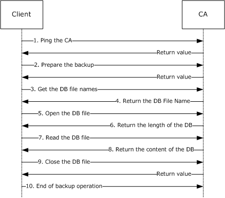

Figure 3: Backing up a CA database

A client determines that it is necessary to back up a [**CA**](#gt_certification-authority-ca) database. To do so, the client needs to obtain the name of the CA to be backed up.

For this example, the CA name is "[**RootCA**](#gt_root-ca)".

The following sequence of events needs to occur:

- The client pings the CA and verifies that the CA service is online. The client calls the method Ping with the following parameters.
ICertAdminD::Ping(L"RootCA")

The client verifies that the return value from this method is S_OK (0).

- The client sends a request to the CA to start a backup process. The client calls the [BackupPrepare](#Section_3.1.4.1.18) method with the following parameters.
ICertAdminD::BackupPrepare( L"RootCA", 0, 0, NULL, 0 )

The client verifies that the return value from this method is S_OK (0).

- The client retrieves the database file names. The client calls the [BackupGetAttachmentInformation](#Section_3.2.4.1.20) method with the following parameters.
ICertAdminD::BackupGetAttachmentInformation

(&pwszFileList,&cwList)

- The server returns the number of database and [**log files**](#gt_log-files) by setting the out cwList parameter (in this example, it is set to 1) and pwszFileList parameter (in this example, it is set to L"\\servername\e$\winnt\system32\certlog\rootca.edb").
- The client opens the specific database file returned in the preceding step. The client needs to learn the length of the file. The client calls the [BackupOpenFile](#Section_3.1.4.1.22) method with the following parameters.
ICertAdminD::BackupOpenFile

(L"\\servername\e$\winnt\system32\certlog\rootca.edb",&Length)

- The server returns the length of the requested file in the *Length* parameter. In this example, the length is 123456.
- The client allocated the required buffer and reads the content of the DB file. The client calls the [BackupReadFile](#Section_3.1.4.1.23) method with the following parameters.
ICertAdminD::BackupReadFile(pbData,123456,&Read)

- The server copies the content of the requested file to the *pbData* parameter and sets the length of the actual read operation into the *Read* parameter.
- The client closes the DB file. The client calls [BackupCloseFile](#Section_3.2.4.1.24) with no parameters. The client verifies that the return value from this method is S_OK (0).
- The client ends the backup operation by calling the [BackupEnd](#Section_3.2.4.1.19) method with no parameters.

# 5 Security

The Certificate Services Remote Administration Protocol allows an administrator to manipulate the [**CA**](#gt_certification-authority-ca) in various ways.

The two most security-sensitive tasks that an administrator can apply to a CA are as follows:

- Manually approve [**issuance**](#gt_71f399e7-7026-46bb-b7c2-8fd4872b900f) of a [**certificate**](#gt_certificate).
- Recover an archived [**private key**](#gt_private-key).
The CA has its own security requirements for preventing information tampering and keeping cryptographic [**keys**](#gt_key) secret, as specified in [MS-WCCE](../MS-WCCE/MS-WCCE.md) section 5. All those requirements apply to an implementation of the CA. In addition, this protocol exposes a risk if the administrator is not authenticated properly, and this section lists only additional requirements about that function.

## 5.1 Security Considerations for Implementers

### 5.1.1 Strong Administrator Authentication

An administrator of the [**CA**](#gt_certification-authority-ca) must authenticate strongly. This task can be accomplished by using a high-entropy password or some multiple-factor authentication method (such as a smart card). It is recommended that the CA administrator use a login account that functions only for CA administration and not for any other purpose. The use of the same credentials on a vulnerable computer while performing some other task exposes them to capture and misuse.

### 5.1.2 KDC Security

Because authentication of the administrator is by Kerberos, in this protocol, the [**KDC**](#gt_key-distribution-center-kdc) must itself be kept secure; that is, free from tampering and free from vulnerabilities that would allow privilege-elevation penetrations.

### 5.1.3 Administrator Console Security

The administrator console includes the applications that the administrator uses to run the client side of this protocol and the operating system in which that functionality runs. The administrator console must be kept secure from penetrations that would allow an attacker to act as the administrator.

### 5.1.4 Administrator Credential Issuance

The procedures used by a human [**CA**](#gt_certification-authority-ca) administrator to control access must be kept free from penetration and human error. These procedures include the following:

- Assign a name to the CA administrator. Kerberos [**domains**](#gt_domain) assign a name to each CA administrator.
- Add the name of the new CA administrator to a named group of administrators.
- Add the named group of administrators to the [**ACL**](#gt_access-control-list-acl) that is used by the CA.
The following list provides a few examples of security risks:

- Penetration: [**Social engineering**](#gt_social-engineering)
- Human error: Misspellings
- Human error: Unwarranted assumptions

## 5.2 Index of Security Parameters

Security settings for this protocol are described in section [2.1](#Section_2.1).

# 6 Appendix A: Full IDL

For ease of implementation, the full IDL is provided, where "ms-dtyp.idl" refers to the IDL found in [MS-DTYP](../MS-DTYP/MS-DTYP.md) Appendix A, and "ms-oaut.idl" is the IDL found in [MS-OAUT](../MS-OAUT/MS-OAUT.md) Appendix A.

import "ms-dtyp.idl";

import "ms-oaut.idl";

typedef byte BYTE;

typedef struct _CERTTRANSBLOB

{

ULONG cb;

[size_is(cb), unique] BYTE *pb;

} CERTTRANSBLOB;

typedef struct _CATRANSPROP {

LONG lPropID;

BYTE propType;

BYTE Reserved;

USHORT propFlags;

ULONG obwszDisplayName;

} CATRANSPROP;

typedef struct _CERTTRANSDBATTRIBUTE

{

ULONG obwszName;

ULONG obwszValue;

} CERTTRANSDBATTRIBUTE;

typedef struct _CERTTRANSDBEXTENSION

{

ULONG obwszName;

LONG ExtFlags;

DWORD cbValue;

ULONG obValue;

} CERTTRANSDBEXTENSION;

typedef struct _CERTTRANSDBCOLUMN

{

DWORD Type;

DWORD Index;

DWORD cbMax;

ULONG obwszName;

ULONG obwszDisplayName;

} CERTTRANSDBCOLUMN;

typedef struct _CERTTRANSDBRESULTCOLUMN

{

DWORD Type;

DWORD Index;

ULONG obValue;

DWORD cbValue;

} CERTTRANSDBRESULTCOLUMN;

typedef struct _CERTTRANSDBRESULTROW // Marshaled form

{

DWORD rowid;

DWORD ccol;

ULONG cbrow;

} CERTTRANSDBRESULTROW;

typedef struct _CERTVIEWRESTRICTION

{

DWORD ColumnIndex;

LONG SeekOperator;

LONG SortOrder;

[size_is(cbValue), unique] BYTE *pbValue;

DWORD cbValue;

} CERTVIEWRESTRICTION;

/* Interface ICertAdminD */

[

object,

uuid(d99e6e71-fc88-11d0-b498-00a0c90312f3),

helpstring("ICertAdmin DCOM Interface"),

pointer_default(unique)

]

interface ICertAdminD: IUnknown

{

HRESULT SetExtension(

[in, string, unique] wchar_t const *pwszAuthority,

[in] DWORD dwRequestId,

[in, string, unique] wchar_t const *pwszExtensionName,

[in] DWORD dwType,

[in] DWORD dwFlags,

[in, ref] CERTTRANSBLOB *pctbValue

);

HRESULT SetAttributes(

[in, string, unique] wchar_t const *pwszAuthority,

[in] DWORD dwRequestId,

[in, string, unique] wchar_t const *pwszAttributes

);

HRESULT ResubmitRequest(

[in, string, unique] wchar_t const *pwszAuthority,

[in] DWORD dwRequestId,

[out] DWORD *pdwDisposition

);

HRESULT DenyRequest(

[in, string, unique] wchar_t const *pwszAuthority,

[in] DWORD dwRequestId

);

HRESULT IsValidCertificate(

[in, string, unique] wchar_t const *pwszAuthority,

[in, string, unique] wchar_t const *pSerialNumber,

[out] LONG *pRevocationReason,

[out] LONG *pDisposition

);

HRESULT PublishCRL(

[in, string, unique] wchar_t const *pwszAuthority,

[in] FILETIME FileTime

);

HRESULT GetCRL(

[in, string, unique] wchar_t const *pwszAuthority,

[out, ref] CERTTRANSBLOB *pctbCRL

);

HRESULT RevokeCertificate(

[in, string, unique] wchar_t const *pwszAuthority,

[in, string, unique] wchar_t const *pwszSerialNumber,

[in] DWORD Reason,

[in] FILETIME FileTime

);

HRESULT EnumViewColumn(

[in, string, unique] wchar_t const *pwszAuthority,

[in] DWORD iColumn,

[in] DWORD cColumn,

[out] DWORD *pcColumn,

[out, ref] CERTTRANSBLOB *pctbColumnInfo

);

HRESULT GetViewDefaultColumnSet(

[in, string, unique] wchar_t const *pwszAuthority,

[in] DWORD iColumnSetDefault,

[out] DWORD *pcColumn,

[out, ref] CERTTRANSBLOB *pctbColumnInfo

);

HRESULT EnumAttributesOrExtensions(

[in, string, unique] wchar_t const *pwszAuthority,

[in] DWORD RowId,

[in] DWORD Flags,

[in, string, unique] wchar_t const *pwszLast,

[in] DWORD celt,

[out] DWORD *pceltFetched,

[out, ref] CERTTRANSBLOB *pctbOut

);

HRESULT OpenView(

[in, string, unique] wchar_t const *pwszAuthority,

[in] DWORD ccvr,

[in, size_is(ccvr)] CERTVIEWRESTRICTION const *acvr,

[in] DWORD ccolOut,

[in, size_is(ccolOut)] DWORD const *acolOut,

[in] DWORD ielt,

[in] DWORD celt,

[out] DWORD *pceltFetched,

[out, ref] CERTTRANSBLOB *pctbResultRows

);

HRESULT EnumView(

[in, string, unique] wchar_t const *pwszAuthority,

[in] DWORD ielt,

[in] DWORD celt,

[out] DWORD *pceltFetched,

[out, ref] CERTTRANSBLOB *pctbResultRows

);

HRESULT CloseView(

[in, string, unique] wchar_t const *pwszAuthority

);

HRESULT ServerControl(

[in, string, unique] wchar_t const *pwszAuthority,

[in] DWORD dwControlFlags,

[out, ref] CERTTRANSBLOB *pctbOut

);

/* this is a test function */

HRESULT Ping(

[in, string, unique] wchar_t const *pwszAuthority

);

HRESULT GetServerState(

[in, string, unique] wchar_t const *pwszAuthority,

[out] DWORD *pdwState

);

HRESULT BackupPrepare(

[in, string, unique] wchar_t const *pwszAuthority,

[in] unsigned long grbitJet,

[in] unsigned long dwBackupFlags,

[in] WCHAR const *pwszBackupAnnotation,

[in] DWORD dwClientIdentifier

);

HRESULT BackupEnd(

);

HRESULT BackupGetAttachmentInformation(

[out, size_is( , *pcwcDBFiles)] WCHAR **ppwszzDBFiles,

[out] LONG *pcwcDBFiles

);

HRESULT BackupGetBackupLogs(

[out, size_is( , *pcwcLogFiles)] WCHAR **ppwszzLogFiles,

[out] LONG *pcwcLogFiles

);

HRESULT BackupOpenFile(

[in, string, unique] wchar_t const *pwszPath,

[out] unsigned hyper *pliLength

);

HRESULT BackupReadFile(

[ref, out, size_is(cbBuffer)] BYTE *pbBuffer,

[in] LONG cbBuffer,

[out] LONG *pcbRead

);

HRESULT BackupCloseFile(

);

HRESULT BackupTruncateLogs(

);

HRESULT ImportCertificate(

[in, string, unique] wchar_t const *pwszAuthority,

[in, ref] CERTTRANSBLOB *pctbCertificate,

[in] LONG dwFlags,

[out] LONG *pdwRequestId

);

HRESULT BackupGetDynamicFiles(

[out, size_is( , *pcwcFiles)] WCHAR **ppwszzFiles,

[out] LONG *pcwcFiles

);

HRESULT RestoreGetDatabaseLocations(

[out, size_is( , *pcwcPaths)] WCHAR

**ppwszzDatabaseLocations,

[out] LONG *pcwcPaths

);

};

/* Interface ICertAdminD2 */

[

object,

uuid(7fe0d935-dda6-443f-85d0-1cfb58fe41dd),

helpstring("ICertAdmin2 DCOM Interface"),

pointer_default(unique)

]

interface ICertAdminD2: ICertAdminD

{

HRESULT PublishCRLs(

[in, string, unique] wchar_t const *pwszAuthority,

[in] FILETIME FileTime,

[in] DWORD Flags

);

HRESULT GetCAProperty(

[in, string, unique] wchar_t const *pwszAuthority,

[in] LONG PropId,

[in] LONG PropIndex,

[in] LONG PropType,

[out, ref] CERTTRANSBLOB *pctbPropertyValue

);

HRESULT SetCAProperty(

[in, string, unique] wchar_t const *pwszAuthority,

[in] LONG PropId,

[in] LONG PropIndex,

[in] LONG PropType,

[in] CERTTRANSBLOB *pctbPropertyValue

);

HRESULT GetCAPropertyInfo(

[in, string, unique] wchar_t const *pwszAuthority,

[out] LONG *pcProperty,

[out, ref] CERTTRANSBLOB *pctbPropInfo

);

HRESULT EnumViewColumnTable(

[in, string, unique] wchar_t const *pwszAuthority,

[in] DWORD iTable,

[in] DWORD iColumn,

[in] DWORD cColumn,

[out] DWORD *pcColumn,

[out, ref] CERTTRANSBLOB *pctbColumnInfo

);

HRESULT GetCASecurity(

[in, string, unique] wchar_t const *pwszAuthority,

[out, ref] CERTTRANSBLOB *pctbSD

);

HRESULT SetCASecurity(

[in, string, unique] wchar_t const *pwszAuthority,

[in, ref] CERTTRANSBLOB *pctbSD

);

/* this is a test function */

HRESULT Ping2(

[in, string, unique] wchar_t const *pwszAuthority

);

HRESULT GetArchivedKey(

[in, string, unique] wchar_t const *pwszAuthority,

[in] DWORD dwRequestId,

[out, ref] CERTTRANSBLOB *pctbArchivedKey

);

HRESULT GetAuditFilter(

[in, string, unique] wchar_t const *pwszAuthority,

[out] DWORD *pdwFilter

);

HRESULT SetAuditFilter(

[in, string, unique] wchar_t const *pwszAuthority,

[in] DWORD dwFilter

);

HRESULT GetOfficerRights(

[in, string, unique] wchar_t const *pwszAuthority,

[out] BOOL *pfEnabled,

[out, ref] CERTTRANSBLOB *pctbSD

);

HRESULT SetOfficerRights(

[in, string, unique] wchar_t const *pwszAuthority,

[in] BOOL fEnable,

[in, ref] CERTTRANSBLOB *pctbSD

);

HRESULT GetConfigEntry(

[in, string, unique] wchar_t const *pwszAuthority,

[in, string, unique] wchar_t const *pwszNodePath,

[in, string, ref] wchar_t const *pwszEntry,

[out, ref] VARIANT *pVariant

);

HRESULT SetConfigEntry(

[in, string, unique] wchar_t const *pwszAuthority,

[in, string, unique] wchar_t const *pwszNodePath,

[in, string, ref] wchar_t const *pwszEntry,

[in, ref] VARIANT *pVariant

);

HRESULT ImportKey(

[in, string, unique] wchar_t const *pwszAuthority,

[in] DWORD dwRequestId,

[in, string, unique] wchar_t const *pwszCertHash,

[in] DWORD dwFlags,

[in, ref] CERTTRANSBLOB *pctbKey

);

HRESULT GetMyRoles(

[in, string, unique] wchar_t const *pwszAuthority,

[out] LONG *pdwRoles

);

HRESULT DeleteRow(

[in, string, unique] wchar_t const *pwszAuthority,

[in] DWORD dwFlags,

[in] FILETIME FileTime,

[in] DWORD dwTable,

[in] DWORD dwRowId,

[out, retval] LONG *pcDeleted

);

}

# 7 Appendix B: Product Behavior

The information in this specification is applicable to the following Microsoft products or supplemental software. References to product versions include updates to those products.

The terms "earlier" and "later", when used with a product version, refer to either all preceding versions or all subsequent versions, respectively. The term "through" refers to the inclusive range of versions. Applicable Microsoft products are listed chronologically in this section.

The following tables show the relationships between Microsoft product versions or supplemental software and the roles they perform.

| Windows Client Releases | Server Role | Client Role |
| --- | --- | --- |
| Windows 2000 Professional operating system | No | Yes |
| Windows XP operating system | No | Yes |
| Windows Vista operating system | No | Yes |
| Windows 7 operating system | No | Yes |
| Windows 8 operating system | No | Yes |
| Windows 8.1 operating system | No | Yes |
| Windows 10 operating system | No | Yes |
| Windows 11 operating system | No | Yes |

| Windows Server Releases | Server Role | Client Role |
| --- | --- | --- |
| Windows 2000 Server operating system | Yes | Yes |
| Windows Server 2003 operating system | Yes | Yes |
| Windows Server 2008 operating system | Yes | Yes |
| Windows Server 2008 R2 operating system | Yes | Yes |
| Windows Server 2012 operating system | Yes | Yes |
| Windows Server 2012 R2 operating system | Yes | Yes |
| Windows Server 2016 operating system | Yes | Yes |
| Windows Server 2019 operating system | Yes | Yes |
| Windows Server 2022 operating system | Yes | Yes |
| Windows Server 2025 operating system | Yes | Yes |

Exceptions, if any, are noted in this section. If an update version, service pack or Knowledge Base (KB) number appears with a product name, the behavior changed in that update. The new behavior also applies to subsequent updates unless otherwise specified. If a product edition appears with the product version, behavior is different in that product edition.

Unless otherwise specified, any statement of optional behavior in this specification that is prescribed using the terms "SHOULD" or "SHOULD NOT" implies product behavior in accordance with the SHOULD or SHOULD NOT prescription. Unless otherwise specified, the term "MAY" implies that the product does not follow the prescription.

<1> Section 2.1: The following values are used by the Certificate Services Remote Administration Protocol client and server.

| Constant/value | Description |
| --- | --- |
| d99e6e71-fc88-11d0-b498-00a0c90312f3 | [**UUID**](#gt_universally-unique-identifier-uuid) for the ICertAdminD interface |
| 7fe0d935-dda6-443f-85d0-1cfb58fe41dd | UUID for the ICertAdminD2 interface |

<2> Section 2.1: On a Windows computer, if NULL authentication identity and credentials is passed, the RPC_C_AUTHN_GSS_NEGOTIATE security provider uses the identity and credentials from the process token of the process in which the higher layer application is running. This means the account on which the Certificate Services Remote Administration Protocol client is running is the account whose identity will be sent as the identity of the [**ORPC**](#gt_object-remote-procedure-call-orpc) call.

<3> Section 2.2.2.2: Windows Server 2003 uses [**key recovery certificates**](#gt_key-recovery-certificate) that contain the following X.509v3 extensions specific to Windows:

- Application Policies (Policy Identifier = Key Recovery Agent)
- Certificate Template Information
Key recovery certificates, when issued by a Windows [**enterprise CA**](#gt_enterprise-certificate-authority-enterprise-ca), are automatically written to the configuration [**container**](#gt_container) of [**Active Directory**](#gt_active-directory). The actual [**certificates**](#gt_certificate) are published to the userCertificate [**attribute**](#gt_attribute) (as specified in [[RFC4523]](https://go.microsoft.com/fwlink/?LinkId=90479)) of the [**key recovery agent (KRA)**](#gt_key-recovery-agent-kra) [**object**](#gt_object) when issued to a member of the [**domain**](#gt_domain) administrators group in Active Directory.

<4> Section 3.1.1: Windows implements the version-specific [Request](#Section_3.1.1.1), [Attribute](#Section_3.1.4.1.2), [Extension](#Section_2.2.1.9), and [CRL](#Section_3.1.1.4.1) database [**tables**](#gt_table) as detailed in the following tables.

**Request Tables**

The following table details the Request table for Windows 2000 Server.

| Bit Range | Field | Description |
| --- | --- | --- |
| Variable | 0x1000 | 0x10001 4 bytes "Request.RequestID" (Request_Request_ID) "Request ID" |
| Variable | 0x1001 | 0x3 65536 bytes "Request.RawRequest" (Request_Raw_Request) "Binary Request" |
| Variable | 0x1002 | 0x3 16384 bytes "Request.RawOldCertificate" "Old Certificate" |
| Variable | 0x1003 | 0x4 32768 bytes "Request.RequestAttributes" (Request_Request_Attributes) "Request Attributes" |
| Variable | 0x1004 | 0x1 4 bytes "Request.RequestType" (Request_Request_Type) "Request Type" |
| Variable | 0x1005 | 0x1 4 bytes "Request.RequestFlags" (Request_Request_Flags) "Request Flags" |
| Variable | 0x1006 | 0x1 4 bytes "Request.Status" "Request Status" |
| Variable | 0x1007 | 0x1 4 bytes "Request.StatusCode" (Request_Status_Code) "Request Status Code" |
| Variable | 0x1008 | 0x10001 4 bytes "Request.Disposition" (Request_Disposition) "Request Disposition" |
| Variable | 0x1009 | 0x4 8192 bytes "Request.DispositionMessage" (Request_Disposition_Message) "Request Disposition Message" |
| Variable | 0x100a | 0x2 8 bytes "Request.SubmittedWhen" (Request_Submitted_When) "Request Submission Date" |
| Variable | 0x100b | 0x2 8 bytes "Request.ResolvedWhen" (Request_Resolved_When) "Request Resolution Date" |
| Variable | 0x100c | 0x2 8 bytes "Request.RevokedWhen" (Request_Revoked_When) "Revocation Date" |
| Variable | 0x100d | 0x2 8 bytes "Request.RevokedEffectiveWhen" (Request_Revocation_Date) "Effective Revocation Date" |
| Variable | 0x100e | 0x1 4 bytes "Request.RevokedReason" (Request_Revoked_Reason) "Revocation Reason" |
| Variable | 0x100f | 0x4 2048 bytes "Request.RequesterName" (Request_Requester_Name) "Requester Name" |
| Variable | 0x1010 | 0x4 2048 bytes "Request.RequesterAddress" "Requester Address" |
| Variable | 0x1011 | 0x4 8192 bytes "Request.DistinguishedName" (Request_Distinguished_Name) "Request Distinguished Name" |
| Variable | 0x1012 | 0x3 4096 bytes "Request.RawName" (Request_Raw_Name) "Request Binary Name" |
| Variable | 0x1013 | 0x1 4 bytes "Request.NameType" "Request Name Type" |
| Variable | 0x1014 | 0x4 8192 bytes "Request.Country" (Request_Country) "Request Country/Region" |
| Variable | 0x1015 | 0x4 8192 bytes "Request.Organization" (Request_Organization) "Request Organization" |
| Variable | 0x1016 | 0x4 8192 bytes "Request.OrgUnit" (Request_Org_Unit) "Request Organization Unit" |
| Variable | 0x1017 | 0x4 8192 bytes "Request.CommonName" (Request_Common_Name) "Request Common Name" |
| Variable | 0x1018 | 0x4 8192 bytes "Request.Locality" (Request_Locality) "Request City" |
| Variable | 0x1019 | 0x4 8192 bytes "Request.State" (Request_State) "Request State" |
| Variable | 0x101a | 0x4 8192 bytes "Request.Title" (Request_Title) "Request Title" |
| Variable | 0x101b | 0x4 8192 bytes "Request.GivenName" (Request_Given_Name) "Request First Name" |
| Variable | 0x101c | 0x4 8192 bytes "Request.Initials" (Request_Initials) "Request Initials" |
| Variable | 0x101d | 0x4 8192 bytes "Request.SurName" (Request_SurName) "Request Last Name" |
| Variable | 0x101e | 0x4 8192 bytes "Request.DomainComponent" (Request_Domain_Component) "Request Domain Component" |
| Variable | 0x101f | 0x4 8192 bytes "Request.EMail" (Request_Email) "Request Email Address" |
| Variable | 0x1020 | 0x4 8192 bytes "Request.StreetAddress" (Request_Street_Address) "Request Street Address" |
| Variable | 0x1021 | 0x4 8192 bytes "Request.UnstructuredName" (Request_Unstructured_Name) "Request Unstructured Name" |
| Variable | 0x1022 | 0x4 8192 bytes "Request.UnstructuredAddress" (Request_Unstructured_Address) "Request Unstructured Address" |
| Variable | 0x1023 | 0x4 8192 bytes "Request.DeviceSerialNumber" (Request_Device_Serial_Number) "Request Device Serial Number" |
| Variable | 0x2000 | 0x10001 4 bytes "RequestID" (Request_ID) "Issued Request ID" |
| Variable | 0x2001 | 0x3 16384 bytes "RawCertificate" (Raw_Certificate) "Binary Certificate" |
| Variable | 0x2002 | 0x4 128 bytes "CertificateHash" (Certificate_Hash) "Certificate Hash" |
| Variable | 0x2003 | 0x4 254 bytes "CertificateType" (Certificate_Template) "Certificate Type" |
| Variable | 0x2004 | 0x10004 128 bytes "SerialNumber" (Serial_Number) "Serial Number" |
| Variable | 0x2005 | 0x1 4 bytes "IssuerNameId" (Issuer_Name_Id) "Issuer Name ID" |
| Variable | 0x2006 | 0x2 8 bytes "NotBefore" (Not_Before) "Certificate Effective Date" |
| Variable | 0x2007 | 0x10002 8 bytes "NotAfter" (Not_After) "Certificate Expiration Date" |
| Variable | 0x2008 | 0x3 4096 bytes "RawPublicKey" (Raw_Public_Key) "Binary Public Key" |
| Variable | 0x2009 | 0x4 254 bytes "PublicKeyAlgorithm" (Public_Key_Algorithm) "Public Key Algorithm" |
| Variable | 0x200a | 0x3 4096 bytes "RawPublicKeyAlgorithmParameters" (Raw_Public_Key_Algorithm_Parameters) "Public Key Algorithm Parameters" |
| Variable | 0x200b | 0x4 8192 bytes "DistinguishedName" (Distinguished_Name) "Issued Distinguished Name" |
| Variable | 0x200c | 0x3 4096bytes "RawName" (Raw_Name) "Issued Binary Name" |
| Variable | 0x200d | 0x1 4 bytes "NameType" "Issued Name Type" |
| Variable | 0x200e | 0x4 8192 bytes "Country" (Country) "Issued Country/Region" |
| Variable | 0x200f | 0x4 8192 bytes "Organization" (Organization) "Issued Organization" |
| Variable | 0x2010 | 0x4 8192 bytes "OrgUnit" (Org_Unit) "Issued Organization Unit" |
| Variable | 0x2011 | 0x10004 8192 bytes "CommonName" (Common_Name) "Issued Common Name" |
| Variable | 0x2012 | 0x4 8192 bytes "Locality" (Locality) "Issued City" |
| Variable | 0x2013 | 0x4 8192 bytes "State" (State) "Issued State" |
| Variable | 0x2014 | 0x4 8192 bytes "Title" (Title) "Issued Title" |
| Variable | 0x2015 | 0x4 8192 bytes "GivenName" (Given_Name) "Issued First Name" |
| Variable | 0x2016 | 0x4 8192 bytes "Initials" (Initials) "Issued Initials" |
| Variable | 0x2017 | 0x4 8192 bytes "SurName" (SurName) "Issued Last Name" |
| Variable | 0x2018 | 0x4 8192 bytes "DomainComponent" (Domain_Component) "Issued Domain Component" |
| Variable | 0x2019 | 0x4 8192 bytes "EMail" (Email) "Issued Email address" |
| Variable | 0x201a | 0x4 8192 bytes "StreetAddress" (Street_Address) "Issued Street Address" |
| Variable | 0x201b | 0x4 8192 bytes "UnstructuredName" (Unstructured_Name) "Issued Unstructured Name" |
| Variable | 0x201c | 0x4 8192 bytes "UnstructuredAddress" (Unstructured_Address) "Issued Unstructured Address" |
| Variable | 0x201d | 0x4 8192 bytes "DeviceSerialNumber" (Device_Serial_Number) "Issued Device Serial Number" |
| Variable | 0x201e | 0x3 16384 bytes "RawSMIMECapabilities" "Issued SMIME Capabilities" |

* Not all database columns have associated ADM elements.

The following table details the Request table for Windows Server 2003.

| Bit Range | Field | Description |
| --- | --- | --- |
| Variable | 0x1000 | 0x10001 4 bytes "Request.RequestID" (Request_Request_ID) "Request ID" |
| Variable | 0x1001 | 0x3 65536 bytes "Request.RawRequest" (Request_Raw_Request) "Binary Request" |
| Variable | 0x1002 | 0x3 65536 bytes "Request.RawArchivedKey" (Request_Raw_ArchivedKey) "Archived Key" |
| Variable | 0x1003 | 0x4 8192 bytes "Request.KeyRecoveryHashes" (Request_Key_Recovery_Hashes) "Key Recovery Agent Hashes" |
| Variable | 0x1004 | 0x3 16384 bytes "Request.RawOldCertificate" (Request_Raw_Old_Certificate) "Old Certificate" |
| Variable | 0x1005 | 0x4 32768 bytes "Request.RequestAttributes" (Request_Request_Attributes) "Request Attributes" |
| Variable | 0x1006 | 0x1 4 bytes "Request.RequestType" (Request_Request_Type) "Request Type" |
| Variable | 0x1007 | 0x1 4 bytes "Request.RequestFlags" (Request_Request_Flags) "Request Flags" |
| Variable | 0x1008 | 0x1 4 bytes "Request.StatusCode" (Request_Status_Code) "Request Status Code" |
| Variable | 0x1009 | 0x10001 4 bytes "Request.Disposition" (Request_Disposition) "Request Disposition" |
| Variable | 0x100a | 0x4 8192 bytes "Request.DispositionMessage" (Request_Disposition_Message) "Request Disposition Message" |
| Variable | 0x100b | 0x10002 8 bytes "Request.SubmittedWhen" (Request_Submitted_When) "Request Submission Date" |
| Variable | 0x100c | 0x10002 8 bytes "Request.ResolvedWhen" (Request_Resolved_When) "Request Resolution Date" |
| Variable | 0x100d | 0x2 8 bytes "Request.RevokedWhen" (Request_Revoked_When) "Revocation Date" |
| Variable | 0x100e | 0x10002 8 bytes "Request.RevokedEffectiveWhen" (Request_Revocation_Date) "Effective Revocation Date" |
| Variable | 0x100f | 0x1 4 bytes "Request.RevokedReason" (Request_Revoked_Reason) "Revocation Reason" |
| Variable | 0x1010 | 0x10004 2048 bytes "Request.RequesterName" (Request_Requester_Name) "Requester Name" |
| Variable | 0x1011 | 0x10004 2048 bytes "Request.CallerName" (Request_Caller_Name) "Caller Name" |
| Variable | 0x1012 | 0x4 8192 bytes "Request.SignerPolicies" (Request_Signer_Policies) "Signer Policies" |
| Variable | 0x1013 | 0x4 8192 bytes "Request.SignerApplicationPolicies" (Request_Signer_Application_Policies) "Signer Application Policies" |
| Variable | 0x1014 | 0x1 4 bytes "Request.Officer" (Request_Officer) "Officer" |
| Variable | 0x1015 | 0x4 8192 bytes "Request.DistinguishedName" (Request_Distinguished_Name) "Request Distinguished Name" |
| Variable | 0x1016 | 0x3 4096 bytes "Request.RawName" (Request_Raw_Name) "Request Binary Name" |
| Variable | 0x1017 | 0x4 8192 bytes "Request.Country" (Request_Country) "Request Country/Region" |
| Variable | 0x1018 | 0x4 8192 bytes "Request.Organization" (Request_Organization) "Request Organization" |
| Variable | 0x1019 | 0x4 8192 bytes "Request.OrgUnit" (Request_Org_Unit) "Request Organization Unit" |
| Variable | 0x101a | 0x4 8192 bytes "Request.CommonName" (Request_Common_Name) "Request Common Name" |
| Variable | 0x101b | 0x4 8192 bytes "Request.Locality" (Request_Locality) "Request City" |
| Variable | 0x101c | 0x4 8192 bytes "Request.State" (Request_State) "Request State" |
| Variable | 0x101d | 0x4 8192 bytes "Request.Title" (Request_Title) "Request Title" |
| Variable | 0x101e | 0x4 8192 bytes "Request.GivenName" (Request_Given_Name) "Request First Name" |
| Variable | 0x101f | 0x4 8192 bytes "Request.Initials" (Request_Initials) "Request Initials" |
| Variable | 0x1020 | 0x4 8192 bytes "Request.SurName" (Request_SurName) "Request Last Name" |
| Variable | 0x1021 | 0x4 8192 bytes "Request.DomainComponent" (Request_Domain_Component) "Request Domain Component" |
| Variable | 0x1022 | 0x4 8192 bytes "Request.EMail" (Request_Email) "Request Email Address" |
| Variable | 0x1023 | 0x4 8192 bytes "Request.StreetAddress" (Request_Street_Address) "Request Street Address" |
| Variable | 0x1024 | 0x4 8192 bytes "Request.UnstructuredName" (Request_Unstructured_Name) "Request Unstructured Name" |
| Variable | 0x1025 | 0x4 8192 bytes "Request.UnstructuredAddress" (Request_Unstructured_Address) "Request Unstructured Address" |
| Variable | 0x1026 | 0x4 8192 bytes "Request.DeviceSerialNumber" (Request_Device_Serial_Number) "Request Device Serial Number" |
| Variable | 0x2000 | 0x10001 4 bytes "RequestID" (Request_ID) "Issued Request ID" |
| Variable | 0x2001 | 0x3 16384 bytes "RawCertificate" (Raw_Certificate) "Binary Certificate" |
| Variable | 0x2002 | 0x10004 128 bytes "CertificateHash" (Certificate_Hash) "Certificate Hash" |
| Variable | 0x2003 | 0x10004 254 bytes "CertificateTemplate" (Certificate_Template) "Certificate Template" |
| Variable | 0x2004 | 0x1 4 bytes "EnrollmentFlags" (Enrollment_Flags) "Template Enrollment Flags" |
| Variable | 0x2005 | 0x1 4 bytes "GeneralFlags" (General_Flags) "Template General Flags" |
| Variable | 0x2006 | 0x10004 128 bytes "SerialNumber" (Serial_Number) "Serial Number" |
| Variable | 0x2007 | 0x1 4 bytes "IssuerNameId" (Issuer_Name_Id) "Issuer Name ID" |
| Variable | 0x2008 | 0x2 8 bytes "NotBefore" (Not_Before) "Certificate Effective Date" |
| Variable | 0x2009 | 0x10002 8 bytes "NotAfter" (Not_After) "Certificate Expiration Date" |
| Variable | 0x200a | 0x4 128 bytes "SubjectKeyIdentifier" (Subject_Key_Identifier) "Issued Subject Key Identifier" |
| Variable | 0x200b | 0x3 4096 bytes "RawPublicKey" (Raw_Public_Key) "Binary Public Key" |
| Variable | 0x200c | 0x1 4 bytes "PublicKeyLength" (Public_Key_Length) "Public Key Length" |
| Variable | 0x200d | 0x4 254 bytes "PublicKeyAlgorithm" (Public_Key_Algorithm) "Public Key Algorithm" |
| Variable | 0x200e | 0x3 4096 bytes "RawPublicKeyAlgorithmParameters" (Raw_Public_Key_Algorithm_Parameters) "Public Key Algorithm Parameters" |
| Variable | 0x200f | 0x10004 2048 bytes "UPN" (UPN) "User Principal Name" |
| Variable | 0x2010 | 0x4 8192 bytes "DistinguishedName" (Distinguished_Name) "Issued Distinguished Name" |
| Variable | 0x2011 | 0x3 4096 bytes "RawName" (Raw_Name) "Issued Binary Name" |
| Variable | 0x2012 | 0x4 8192 bytes "Country" (Country) "Issued Country/Region" |
| Variable | 0x2013 | 0x4 8192 bytes "Organization" (Organization) "Issued Organization" |
| Variable | 0x2014 | 0x4 8192 bytes "OrgUnit" (Org_Unit) "Issued Organization Unit" |
| Variable | 0x2015 | 0x10004 8192 bytes "CommonName" (Common_Name) "Issued Common Name" |
| Variable | 0x2016 | 0x4 8192 bytes "Locality" (Locality) "Issued City" |
| Variable | 0x2017 | 0x4 8192 bytes "State" (State) "Issued State" |
| Variable | 0x2018 | 0x4 8192 bytes "Title" (Title) "Issued Title" |
| Variable | 0x2019 | 0x4 8192 bytes "GivenName" (Given_Name) "Issued First Name" |
| Variable | 0x201a | 0x4 8192 bytes "Initials" (Initials) "Issued Initials" |
| Variable | 0x201b | 0x4 8192 bytes "SurName" (SurName) "Issued Last Name" |
| Variable | 0x201c | 0x4 8192 bytes "DomainComponent" (Domain_Component) "Issued Domain Component" |
| Variable | 0x201d | 0x4 8192 bytes "EMail" (Email) "Issued Email address" |
| Variable | 0x201e | 0x4 8192 bytes "StreetAddress" (Street_Address) "Issued Street Address" |
| Variable | 0x201f | 0x4 8192 bytes "UnstructuredName" (Unstructured_Name) "Issued Unstructured Name" |
| Variable | 0x2020 | 0x4 8192 bytes "UnstructuredAddress" (Unstructured_Address) "Issued Unstructured Address" |
| Variable | 0x2021 | 0x4 8192 bytes "DeviceSerialNumber" (Device_Serial_Number) "Issued Device Serial Number" |

The following table details the Request table for Windows Server 2008 and Windows Server 2008 R2.

| Bit Range | Field | Description |
| --- | --- | --- |
| Variable | 0x1000 | 0x10001 4 bytes Request.RequestID (Request_Request_ID) "Request ID" |
| Variable | 0x1001 | 0x3 65536 bytes "Request.RawRequest" (Request_Raw_Request) "Binary Request" |
| Variable | 0x1002 | 0x3 65536 bytes "Request.RawArchivedKey" (Request_Raw_Archived_Key) "Archived Key" |
| Variable | 0x1003 | 0x4 8192 bytes "Request.KeyRecoveryHashes" (Request_Key_Recovery_Hashes) "Key Recovery Agent Hashes" |
| Variable | 0x1004 | 0x3 16384 bytes "Request.RawOldCertificate" (Request_Raw_Old_Certificate) "Old Certificate" |
| Variable | 0x1005 | 0x4 32768 bytes "Request.RequestAttributes" (Request_Request_Attributes) "Request Attributes" |
| Variable | 0x1006 | 0x1 4 bytes "Request.RequestType" (Request_Request_Type) "Request Type" |
| Variable | 0x1007 | 0x1 4 bytes "Request.RequestFlags" (Request_Request_Flags) "Request Flags" |
| Variable | 0x1008 | 0x1 4 bytes "Request.StatusCode" (Request_Status_Code) "Request Status Code" |
| Variable | 0x1009 | 0x10001 4 bytes "Request.Disposition" (Request_Disposition) "Request Disposition" |
| Variable | 0x100a | 0x4 8192 bytes "Request.DispositionMessage" (Request_Disposition_Message) "Request Disposition Message" |
| Variable | 0x100b | 0x10002 8 bytes "Request.SubmittedWhen" (Request_Submitted_When) "Request Submission Date" |
| Variable | 0x100c | 0x10002 8 bytes "Request.ResolvedWhen" (Request_Resolved_When) "Request Resolution Date" |
| Variable | 0x100d | 0x2 8 bytes "Request.RevokedWhen" (Request_Revoked_When) "Revocation Date" |
| Variable | 0x100e | 0x10002 8 bytes "Request.RevokedEffectiveWhen" (Request_Revocation_Date) "Effective Revocation Date" |
| Variable | 0x100f | 0x1 4 bytes "Request.RevokedReason" (Request_Revoked_Reason) "Revocation Reason" |
| Variable | 0x1010 | 0x10004 2048 bytes "Request.RequesterName" (Request_Requester_Name) "Requester Name" |
| Variable | 0x1011 | 0x10004 2048 bytes "Request.CallerName" (Request_Caller_Name) "Caller Name" |
| Variable | 0x1012 | 0x4 8192 bytes "Request.SignerPolicies" (Request_Signer_Policies) "Signer Policies" |
| Variable | 0x1013 | 0x4 8192 bytes "Request.SignerApplicationPolicies" (Request_Signer_Application_Policies) "Signer Application Policies" |
| Variable | 0x1014 | 0x1 4 bytes "Request.Officer" (Request_Officer) "Officer" |
| Variable | 0x1015 | 0x4 8192 bytes "Request.DistinguishedName" (Request_Distinguished_Name) "Request Distinguished Name" |
| Variable | 0x1016 | 0x3 4096 bytes "Request.RawName" (Request_Raw_Name) "Request Binary Name" |
| Variable | 0x1017 | 0x4 8192 bytes "Request.Country" (Request_Country) "Request Country/Region" |
| Variable | 0x1018 | 0x4 8192 bytes "Request.Organization" (Request_Organization) "Request Organization" |
| Variable | 0x1019 | 0x4 8192 bytes "Request.OrgUnit" (Request_Org_Unit) "Request Organization Unit" |
| Variable | 0x101a | 0x4 8192 bytes "Request.CommonName" (Request_Common_Name) "Request Common Name" |
| Variable | 0x101b | 0x4 8192 bytes "Request.Locality" (Request_Locality) "Request City" |
| Variable | 0x101c | 0x4 8192 bytes "Request.State" (Request_State) "Request State" |
| Variable | 0x101d | 0x4 8192 bytes "Request.Title" (Request_Title) "Request Title" |
| Variable | 0x101e | 0x4 8192 bytes "Request.GivenName" (Request_Given_Name) "Request First Name" |
| Variable | 0x101f | 0x4 8192 bytes "Request.Initials" (Request_Initials) "Request Initials" |
| Variable | 0x1020 | 0x4 8192 bytes "Request.SurName" (Request_SurName) "Request Last Name" |
| Variable | 0x1021 | 0x4 8192 bytes "Request.DomainComponent" (Request_Domain_Component) "Request Domain Component" |
| Variable | 0x1022 | 0x4 8192 bytes "Request.EMail" (Request_Email) "Request Email Address" |
| Variable | 0x1023 | 0x4 8192 bytes "Request.StreetAddress" (Request_Street_Address) "Request Street Address" |
| Variable | 0x1024 | 0x4 8192 bytes "Request.UnstructuredName" (Request_Unstructured_Name) "Request Unstructured Name" |
| Variable | 0x1025 | 0x4 8192 bytes "Request.UnstructuredAddress" (Request_Unstructured_Address) "Request Unstructured Address" |
| Variable | 0x1026 | 0x4 8192 bytes "Request.DeviceSerialNumber" (Request_Device_Serial_Number) "Request Device Serial Number" |
| Variable | 0x2000 | 0x10001 4 bytes "RequestID" (Request_ID) "Issued Request ID" |
| Variable | 0x2001 | 0x3 16384 bytes "RawCertificate" (Raw_Certificate) "Binary Certificate" |
| Variable | 0x2002 | 0x10004 128 bytes "CertificateHash" (Certificate_Hash) "Certificate Hash" |
| Variable | 0x2003 | 0x10004 254 bytes "CertificateTemplate" (Certificate_Template) "Certificate Template" |
| Variable | 0x2004 | 0x1 4 bytes "EnrollmentFlags" (Enrollment_Flags) "Template Enrollment Flags" |
| Variable | 0x2005 | 0x1 4 bytes "GeneralFlags" (General_Flags) "Template General Flags" |
| Variable | 0x2006 | 0x10004 128 bytes "SerialNumber" (Serial_Number) "Serial Number" |
| Variable | 0x2007 | 0x1 4 bytes "IssuerNameId" (Issuer_Name_Id) "Issuer Name ID" |
| Variable | 0x2008 | 0x2 8 bytes "NotBefore" (Not_Before) "Certificate Effective Date" |
| Variable | 0x2009 | 0x10002 8 bytes "NotAfter" (Not_After) "Certificate Expiration Date" |
| Variable | 0x200a | 0x4 128 bytes "SubjectKeyIdentifier" (Subject_Key_Identifier) "Issued Subject Key Identifier" |
| Variable | 0x200b | 0x3 4096 bytes "RawPublicKey" (Raw_Public_Key) "Binary Public Key" |
| Variable | 0x200c | 0x1 4 bytes "PublicKeyLength" (Public_Key_Length) "Public Key Length" |
| Variable | 0x200d | 0x4 254 bytes "PublicKeyAlgorithm" (Public_Key_Algorithm) "Public Key Algorithm" |
| Variable | 0x200e | 0x3 4096 bytes "RawPublicKeyAlgorithmParameters" (Raw_Public_Key_Algorithm_Parameters) "Public Key Algorithm Parameters" |
| Variable | 0x200f | 0x1 4 bytes "PublishExpiredCertInCRL" (Publish_Expired_Cert_In_CRL) "Publish Expired Certificate in CRL" |
| Variable | 0x2010 | 0x10004 2048 bytes "UPN" (UPN) "User Principal Name" |
| Variable | 0x2011 | 0x4 8192 bytes "DistinguishedName" (Distinguished_Name) "Issued Distinguished Name" |
| Variable | 0x2012 | 0x3 4096 bytes "RawName" (Raw_Name) "Issued Binary Name" |
| Variable | 0x2013 | 0x4 8192 bytes "Country" (Country) "Issued Country/Region" |
| Variable | 0x2014 | 0x4 8192 bytes "Organization" (Organization) "Issued Organization" |
| Variable | 0x2015 | 0x4 8192 bytes "OrgUnit" (Org_Unit) "Issued Organization Unit" |
| Variable | 0x2016 | 0x10004 8192 bytes "CommonName" (Common_Name) "Issued Common Name" |
| Variable | 0x2017 | 0x4 8192 bytes "Locality" (Locality) "Issued City" |
| Variable | 0x2018 | 0x4 8192 bytes "State" (State) "Issued State" |
| Variable | 0x2019 | 0x4 8192 bytes "Title" (Title) "Issued Title" |
| Variable | 0x201a | 0x4 8192 bytes "GivenName" (Given_Name) "Issued First Name" |
| Variable | 0x201b | 0x4 8192 bytes "Initials" (Initials) "Issued Initials" |
| Variable | 0x201c | 0x4 8192 bytes "SurName" (SurName) "Issued Last Name" |
| Variable | 0x201d | 0x4 8192 bytes "DomainComponent" (Domain_Component) "Issued Domain Component" |
| Variable | 0x201e | 0x4 8192 bytes "EMail" (Email) "Issued Email address" |
| Variable | 0x201f | 0x4 8192 bytes "StreetAddress" (Street_Address) "Issued Street Address" |
| Variable | 0x2020 | 0x4 8192 bytes "UnstructuredName" (Unstructured_Name) "Issued Unstructured Name" |
| Variable | 0x2021 | 0x4 8192 bytes "UnstructuredAddress" (Unstructured_Address) "Issued Unstructured Address" |
| Variable | 0x2022 | 0x4 8192 bytes "DeviceSerialNumber" (Device_Serial_Number) "Issued Device Serial Number" |

The following table details the Request table for Windows Server 2012 and later.

| Bit Range | Field | Description |
| --- | --- | --- |
| Variable | 0x1000 | 0x10001 4 bytes Request.RequestID (Request_Request_ID) "Request ID" |
| Variable | 0x1001 | 0x3 65536 bytes "Request.RawRequest" (Request_Raw_Request) "Binary Request" |
| Variable | 0x1002 | 0x3 65536 bytes "Request.RawArchivedKey" (Request_Raw_Archived_Key) "Archived Key" |
| Variable | 0x1003 | 0x4 8192 bytes "Request.KeyRecoveryHashes" (Request_Key_Recovery_Hashes) "Key Recovery Agent Hashes" |
| Variable | 0x1004 | 0x3 16384 bytes "Request.RawOldCertificate" (Request_Raw_Old_Certificate) "Old Certificate" |
| Variable | 0x1005 | 0x4 32768 bytes "Request.RequestAttributes" (Request_Request_Attributes) "Request Attributes" |
| Variable | 0x1006 | 0x1 4 bytes "Request.RequestType" (Request_Request_Type) "Request Type" |
| Variable | 0x1007 | 0x1 4 bytes "Request.RequestFlags" (Request_Request_Flags) "Request Flags" |
| Variable | 0x1008 | 0x1 4 bytes "Request.StatusCode" (Request_Status_Code) "Request Status Code" |
| Variable | 0x1009 | 0x10001 4 bytes "Request.Disposition" (Request_Disposition) "Request Disposition" |
| Variable | 0x100a | 0x4 8192 bytes "Request.DispositionMessage" (Request_Disposition_Message) "Request Disposition Message" |
| Variable | 0x100b | 0x10002 8 bytes "Request.SubmittedWhen" (Request_Submitted_When) "Request Submission Date" |
| Variable | 0x100c | 0x10002 8 bytes "Request.ResolvedWhen" (Request_Resolved_When) "Request Resolution Date" |
| Variable | 0x100d | 0x2 8 bytes "Request.RevokedWhen" (Request_Revoked_When) "Revocation Date" |
| Variable | 0x100e | 0x10002 8 bytes "Request.RevokedEffectiveWhen" (Request_Revocation_Date) "Effective Revocation Date" |
| Variable | 0x100f | 0x1 4 bytes "Request.RevokedReason" (Request_Revoked_Reason) "Revocation Reason" |
| Variable | 0x1010 | 0x10004 2048 bytes "Request.RequesterName" (Request_Requester_Name) "Requester Name" |
| Variable | 0x1011 | 0x10004 2048 bytes "Request.CallerName" (Request_Caller_Name) "Caller Name" |
| Variable | 0x1012 | 0x4 8192 bytes "Request.SignerPolicies" (Request_Signer_Policies) "Signer Policies" |
| Variable | 0x1013 | 0x4 8192 bytes "Request.SignerApplicationPolicies" (Request_Signer_Application_Policies) "Signer Application Policies" |
| Variable | 0x1014 | 0x1 4 bytes "Request.Officer" (Request_Officer) "Officer" |
| Variable | 0x1015 | 0x4 8192 bytes "Request.DistinguishedName" (Request_Distinguished_Name) "Request Distinguished Name" |
| Variable | 0x1016 | 0x3 4096 bytes "Request.RawName" (Request_Raw_Name) "Request Binary Name" |
| Variable | 0x1017 | 0x4 8192 bytes "Request.Country" (Request_Country) "Request Country/Region" |
| Variable | 0x1018 | 0x4 8192 bytes "Request.Organization" (Request_Organization) "Request Organization" |
| Variable | 0x1019 | 0x4 8192 bytes "Request.OrgUnit" (Request_Org_Unit) "Request Organization Unit" |
| Variable | 0x101a | 0x4 8192 bytes "Request.CommonName" (Request_Common_Name) "Request Common Name" |
| Variable | 0x101b | 0x4 8192 bytes "Request.Locality" (Request_Locality) "Request City" |
| Variable | 0x101c | 0x4 8192 bytes "Request.State" (Request_State) "Request State" |
| Variable | 0x101d | 0x4 8192 bytes "Request.Title" (Request_Title) "Request Title" |
| Variable | 0x101e | 0x4 8192 bytes "Request.GivenName" (Request_Given_Name) "Request First Name" |
| Variable | 0x101f | 0x4 8192 bytes "Request.Initials" (Request_Initials) "Request Initials" |
| Variable | 0x1020 | 0x4 8192 bytes "Request.SurName" (Request_SurName) "Request Last Name" |
| Variable | 0x1021 | 0x4 8192 bytes "Request.DomainComponent" (Request_Domain_Component) "Request Domain Component" |
| Variable | 0x1022 | 0x4 8192 bytes "Request.EMail" (Request_Email) "Request Email Address" |
| Variable | 0x1023 | 0x4 8192 bytes "Request.StreetAddress" (Request_Street_Address) "Request Street Address" |
| Variable | 0x1024 | 0x4 8192 bytes "Request.UnstructuredName" (Request_Unstructured_Name) "Request Unstructured Name" |
| Variable | 0x1025 | 0x4 8192 bytes "Request.UnstructuredAddress" (Request_Unstructured_Address) "Request Unstructured Address" |
| Variable | 0x1026 | 0x4 8192 bytes "Request.DeviceSerialNumber" (Request_Device_Serial_Number) "Request Device Serial Number" |
| Variable | 0x1027 * | 0x3 4096 bytes "Request.AttestationChallenge" (Request_Attestation_Challenge) "Attestation Challenge" |
| Variable | 0x1028 * | 0x4 144 bytes "Request.EndorsementKeyHash" (Request_Endorsement_Key_Hash) "Endorsement Key Hash" |
| Variable | 0x1029 * | 0x4 144 bytes "Request.EndorsementCertificateHash" (Request_Endorsement_Certificate_Hash) "Endorsement Certificate Hash" |
| Variable | 0x102a ** | 0x3 16384 bytes "Request.RawPrecertificate" (Request_Raw_Precertificate) "Binary Precertificate" |
| Variable | 0x102b *** | 0x1 4 bytes "Request.CRLPartitionIndex" (Request_CRL_Partiton.Index) "CRL Partition Index" |
| Variable | 0x102c **** | 0x3 16384 bytes "Request.LinterCertificate" (Request_Binary_Linter_Certificate) "Binary Linter Certificate" |
| Variable | 0x2000 | 0x10001 4 bytes "RequestID" (Request_ID) "Issued Request ID" |
| Variable | 0x2001 | 0x3 16384 bytes "RawCertificate" (Raw_Certificate) "Binary Certificate" |
| Variable | 0x2002 | 0x10004 128 bytes "CertificateHash" (Certificate_Hash) "Certificate Hash" |
| Variable | 0x2003 | 0x10004 254 bytes "CertificateTemplate" (Certificate_Template) "Certificate Template" |
| Variable | 0x2004 | 0x1 4 bytes "EnrollmentFlags" (Enrollment_Flags) "Template Enrollment Flags" |
| Variable | 0x2005 | 0x1 4 bytes "GeneralFlags" (General_Flags) "Template General Flags" |
| Variable | 0x2006 | 0x1 4 bytes "PrivateKeyFlags" (PrivateKey_Flags) "Private Key Flags" |
| Variable | 0x2007 | 0x10004 128 bytes "SerialNumber" (Serial_Number) "Serial Number" |
| Variable | 0x2008 | 0x1 4 bytes "IssuerNameId" (Issuer_Name_Id) "Issuer Name ID" |
| Variable | 0x2009 | 0x2 8 bytes "NotBefore" (Not_Before) "Certificate Effective Date" |
| Variable | 0x200a | 0x10002 8 bytes "NotAfter" (Not_After) "Certificate Expiration Date" |
| Variable | 0x200b | 0x4 128 bytes "SubjectKeyIdentifier" (Subject_Key_Identifier) "Issued Subject Key Identifier" |
| Variable | 0x200c | 0x3 4096 bytes "RawPublicKey" (Raw_Public_Key) "Binary Public Key" |
| Variable | 0x200d | 0x1 4 bytes "PublicKeyLength" (Public_Key_Length) "Public Key Length" |
| Variable | 0x200e | 0x4 254 bytes "PublicKeyAlgorithm" (Public_Key_Algorithm) "Public Key Algorithm" |
| Variable | 0x200f | 0x3 4096 bytes "RawPublicKeyAlgorithmParameters" (Raw_Public_Key_Algorithm_Parameters) "Public Key Algorithm Parameters" |
| Variable | 0x2010 | 0x1 4 bytes "PublishExpiredCertInCRL" (Publish_Expired_Cert_In_CRL) "Publish Expired Certificate in CRL" |
| Variable | 0x2011 | 0x10004 2048 bytes "UPN" (UPN) "User Principal Name" |
| Variable | 0x2012 | 0x4 8192 bytes "DistinguishedName" (Distinguished_Name) "Issued Distinguished Name" |
| Variable | 0x2013 | 0x3 4096 bytes "RawName" (Raw_Name) "Issued Binary Name" |
| Variable | 0x2014 | 0x4 8192 bytes "Country" (Country) "Issued Country/Region" |
| Variable | 0x2015 | 0x4 8192 bytes "Organization" (Organization) "Issued Organization" |
| Variable | 0x2016 | 0x4 8192 bytes "OrgUnit" (Org_Unit) "Issued Organization Unit" |
| Variable | 0x2017 | 0x10004 8192 bytes "CommonName" (Common_Name) "Issued Common Name" |
| Variable | 0x2018 | 0x4 8192 bytes "Locality" (Locality) "Issued City" |
| Variable | 0x2019 | 0x4 8192 bytes "State" (State) "Issued State" |
| Variable | 0x201a | 0x4 8192 bytes "Title" (Title) "Issued Title" |
| Variable | 0x201b | 0x4 8192 bytes "GivenName" (Given_Name) "Issued First Name" |
| Variable | 0x201c | 0x4 8192 bytes "Initials" (Initials) "Issued Initials" |
| Variable | 0x201d | 0x4 8192 bytes "SurName" (SurName) "Issued Last Name" |
| Variable | 0x201e | 0x4 8192 bytes "DomainComponent" (Domain_Component) "Issued Domain Component" |
| Variable | 0x201f | 0x4 8192 bytes "EMail" (Email) "Issued Email address" |
| Variable | 0x2020 | 0x4 8192 bytes "StreetAddress" (Street_Address) "Issued Street Address" |
| Variable | 0x2021 | 0x4 8192 bytes "UnstructuredName" (Unstructured_Name) "Issued Unstructured Name" |
| Variable | 0x2022 | 0x4 8192 bytes "UnstructuredAddress" (Unstructured_Address) "Issued Unstructured Address" |
| Variable | 0x2023 | 0x4 8192 bytes "DeviceSerialNumber" (Device_Serial_Number) "Issued Device Serial Number" |

* These database columns are available in Windows Server 2012 R2 and later.

** These database columns are available in Windows Server 2016 and later.

*** These database columns are available in Windows Server 2019 and later.

**** These database columns are available in Windows Server 2022 and later.

**Extension Tables**

The following table details the Extension table for Windows 2000 Server and later.

| Bit Range | Field | Description |
| --- | --- | --- |
| Variable | 0x4000 | 0x1001 4 bytes "ExtensionRequestId" (Extension_Request_ID) "Extension Request Id" |
| Variable | 0x4001 | 0x4 254 bytes "ExtensionName" (Extension_Name) "Extension Name" |
| Variable | 0x4002 | 0x1 4 bytes "ExtensionFlags" (Extension_Flags) "Extension Flags" |
| Variable | 0x4003 | 0x3 4096 bytes "ExtensionRawValue" (Extension_Raw_Value) "Extension Raw Value" |

**Attribute Tables**

The following table details the Attribute table for Windows 2000 Server and later.

| Bit Range | Field | Description |
| --- | --- | --- |
| Variable | 0x3000 | 0x10001 4 bytes "AttributeRequestId" (Attribute_Request_ID) "Attribute Request Id" |
| Variable | 0x3001 | 0x4 254 bytes "AttributeName" (Attribute_Name) "Attribute Name" |
| Variable | 0x3002 | 0x4 8192 bytes "AttributeValue" (Attribute_Value) "Attribute Value" |

**CRL Tables**

The following table details the CRL table for Windows Server 2003 and later. (Windows 2000 Server does not have a CRL table.)

| Bit Range | Field | Description |
| --- | --- | --- |
| Variable | 0x5000 | 0x10001 4 bytes CRLRowId (CRL_Row_ID) "CRL Row ID" |
| Variable | 0x5001 | 0x10001 4 bytes "CRLNumber" (CRL_Number) "CRL Number" |
| Variable | 0x5002 | 0x1 4 bytes "CRLMinBase" (CRL_Min_Base) "CRL Minimum Base" |
| Variable | 0x5003 | 0x1 4 bytes "CRLNameId" (CRL_Name_Id) "CRL Name ID" |
| Variable | 0x5004 | 0x1 4 bytes "CRLCount" (CRL_Count) "CRL Count" |
| Variable | 0x5005 | 0x2 8 bytes "CRLThisUpdate" (CRL_This_Update) "CRL This Update" |
| Variable | 0x5006 | 0x10002 8 bytes "CRLNextUpdate" (CRL_Next_Update) "CRL Next Update" |
| Variable | 0x5007 | 0x2 8 bytes "CRLThisPublish" (CRL_This_Publish) "CRL This Publish" |
| Variable | 0x5008 | 0x10002 8 bytes "CRLNextPublish" (CRL_Next_Publish) "CRL Next Publish" |
| Variable | 0x5009 | 0x2 8 bytes "CRLEffective" (CRL_Effective) "CRL Effective" |
| Variable | 0x500a | 0x10002 8 bytes "CRLPropagationComplete" (CRL_Propagation_Complete) "CRL Propagation Complete" |
| Variable | 0x500b | 0x10002 8 bytes "CRLLastPublish" (CRL_Last_Published) "CRL Last Published" |
| Variable | 0x500c | 0x10001 4 bytes "CRLPublishAttempts" (CRL_Publish_Attempts) "CRL Publish Attempts" |
| Variable | 0x500d | 0x1 4 bytes "CRLPublishFlags" (CRL_Publish_Flags) "CRL Publish Flags" |
| Variable | 0x500e | 0x10001 4 bytes "CRLPublishStatusCode" (CRL_Publish_Status_Code) "CRL Publish Status Code" |
| Variable | 0x500f | 0x4 8192 bytes "CRLPublishError" (CRL_Publish_Error) "CRL Publish Error Information" |
| Variable | 0x5010 | 0x3 536870912 bytes "CRLRawCRL" (CRL_Raw_CRL) "CRL Raw CRL" |
| Variable | 0x5011 *** | 0x1 4 bytes "CRLPartitionIndex" (CRL_Partition_Index) "CRL Partition Index" |

*** These database columns are available in Windows Server 2019 and later.

<5> Section 3.1.1.1.1: Windows uses a DWORD number to represent these values. The following table shows how Windows internal values correspond to the preceding string representations.

| Windows value | Abstract data model value |
| --- | --- |
| CR_DISP_ERROR 0x00000001 | Request failed |
| CR_DISP_DENIED 0x00000002 | Request denied |
| CR_DISP_ISSUED 0x00000003 | Certificate issued |
| CR_DISP_UNDER_SUBMISSION 0x00000005 | Request pending |
| CR_DISP_REVOKED 0x00000006 | Certificate revoked |

<6> Section 3.1.1.1.2: These flags are supported in Windows Server 2012 R2 and later.

<7> Section 3.1.1.1.2: Request_RequesterName_From_Old_Certificate is supported in Windows Server 2008 R2 and later.

<8> Section 3.1.1.1.2: This column and the associated functionality are available starting with Windows Server 2016 and later versions of the Windows OS.

<9> Section 3.1.1.1.2: This column and the associated functionality are available in Windows Server 2019 and later versions of the Windows OS after installing the September (9B) Windows update.

<10> Section 3.1.1.1.2: This functionality is available in Windows Server 2022 and later OS versions after installing the August (8B) Windows update. However, the fix is currently disabled and will be enabled starting with the November (11B) or later Windows updates.

<11> Section 3.1.1.4: Windows 2000 Server and later [**CAs**](#gt_certification-authority-ca) store this CRL in the registry location **HKEY_LOCAL_MACHINE\SOFTWARE\Microsoft\SystemCertificates\CA\CRLs.**

<12> Section 3.1.1.4.2: This configuration and the associated functionality are available in Windows Server 2019 and later versions of the Windows OS after installing the September (9B) Windows update.

<13> Section 3.1.1.7: The permissions of Officer, Operator, and Auditor are supported on Windows Server 2003 Enterprise Edition operating system, Windows Server 2003 Datacenter Edition operating system, Windows Server 2008 Enterprise operating system, Windows Server 2008 Datacenter operating system, Windows Server 2008 R2 Enterprise Edition, Windows Server 2008 R2 Datacenter Edition, and Windows Server 2012 and later.

<14> Section 3.1.1.8: The Microsoft CA keeps all [**CRL**](#gt_certificate-revocation-list-crl) publishing locations in a registry multistring value.

HKLM\SYSTEM\CurrentControlSet\Services\CertSvc\Configuration\

{CA Name}\CRLPublicationURLs

The Microsoft CA uses a numeric prefix that is stored with each entry of the CRL publishing location list in order to indicate which of the ADM elements the [**URL**](#gt_uniform-resource-locator-url) belongs to, as shown in the following table.

| Numeric prefix value | ADM element |
| --- | --- |
| 0x00000001 | Config_CA_CDP_Publish_To_Base |
| 0x00000040 | Config_CA_CDP_Publish_To_Delta |
| 0x00000008 | Config_CA_CDP_Include_In_CRL_Publish_Locations_Extension |
| 0x00000004 | Config_CA_CDP_Include_In_CRL_Freshest_CRL_Extension |
| 0x00000080 | Config_CA_CDP_Include_In_CRL_IDP_Extension |

Calling the ICertAdminD2::SetConfigEntry method with the pwszNodePath as an EMPTY string, the pwszEntry "CRLPublicationURLs", and the pVariant data that contains the required URLs allows manipulation of this list.

Also, the usual registry manipulation tools that are specified in [MS-RRP](../MS-RRP/MS-RRP.md) can be used to update these values.

For Config_CA_CDP_Publish_To_Base and Config_CA_CDP_Publish_To_Delta, the default values that are used by the Microsoft CA are a local path on the CA machine,

{SYSTEM}\CertSrv\CertEnroll\{CATruncatedName}{CRLNameSuffix}

{DeltaIndicator}.crl

a local path in the registry,

HKEY_LOCAL_MACHINE\SOFTWARE\Microsoft\SystemCertificates\CA\CRLs\

and the Active Directory path,

ldap: ///CN={CATruncatedName}{CRLNameSuffix},CN={CAServerShortName},

CN=CDP,CN=Public Key

Services,CN=Services,CN=Configuration,DC={contoso},DC=com{CDPObjectClass}

where:

- "{**SYSTEM**}" is replaced with the system directory of the CA machine, such as "C:\Windows\System32".
- "{**CATruncatedName**}" is replaced with the [**sanitized name**](#gt_sanitized-name) of the CA, as defined in [MS-WCCE](../MS-WCCE/MS-WCCE.md) sections 1.3.2.5 and 3.1.1.4.1.1.
- "{**DeltaIndicator**}" is replaced with NULL for a base CRL and "+" for a delta CRL.
- "{**CRLNameSuffix**}" is replaced with NULL if the CRL is signed by the first CA [**key**](#gt_key) (a CA key that has a key [**index**](#gt_index) of 0) and by "(n)" if the CRL is signed by any subsequent CA key.
Where "(n)" is replaced with an integer that is equal to the identifier Signing_Private_Key_Version_ID, as defined in [MS-WCCE] section 3.2.1.1.2 and in the example in [MS-WCCE] section 3.2.1.4.3.2.34.

- "{**CAServerShortName**}" is replaced with the name of the host on which the CA is running.
- "**DC={contoso},DC=com**" is replaced by the [**distinguished name (DN)**](#gt_distinguished-name-dn) of the [**forest**](#gt_forest) root domain naming context (NC) of the Active Directory forest in which the Microsoft CA is installed.
- The forest root domain NC is defined in [MS-ADTS](../MS-ADTS/MS-ADTS.md) section 1.1.
- For example, the DN of the forest root domain NC of a forest called "corp.contoso.com" would be "DC=corp,DC=contoso,DC=com".
- "{**CDPObjectClass**}" is replaced with "?certificateRevocationList?base?objectClass=cRLDistributionPoint" for a base CRL and with "?deltaRevocationList?base?objectClass=cRLDistributionPoint" for a delta CRL.
- The object class cRLDistributionPoint is as defined in [MS-ADSC](../MS-ADSC/MS-ADSC.md).
- The attribute certificateRevocationList is defined in [MS-ADA1](../MS-ADA1/MS-ADA1.md).
- The attribute deltaRevocationList is defined in [MS-ADA1].
The deltaRevocationList attribute is not used by the Windows 2000 operating system version of the CA. The Windows Server 2003 and later versions of the CA use both base CRL and delta CRL attributes.

Within the certificateRevocationList or deltaRevocationList attribute, the CRL is encoded by using Distinguished Encoding Rules (DER).

<15> Section 3.1.1.10: Microsoft CAs persist only a subset of the configuration data. They store the configuration data in the registry in the following locations:

Values under

HKEY_LOCAL_MACHINE\SYSTEM\CurrentControlSet\Services\CertSvc\Configuration\

**DBSessionCount**

**ADM Datum:** Config_Max_Number_Of_AD_Connections and OnNextRestart_Config_Max_Number_Of_AD_Connections.

**Registry Value Type:** REG_DWORD

**Default Value:** 20

**Registry Value Mapping to ADM:** The value in the registry equals the ADM datum value. The minimum value for this registry is 4 and the maximum value is 1024.

**No Value Semantics:** The value always exists.

**LDAPFlags**

**ADM Datum:** Config_CA_LDAP_Flags and OnNextRestart_Config_CA_LDAP_Flags.

**Registry Value Type:** REG_DWORD

**Default Value:** 0

**Registry Value Mapping to ADM:** The value in the registry equals the ADM datum value.

**No Value Semantics:** The value always exists.

**Version**

**ADM Datum:** Config_Product_Version and OnNextRestart_Config_Product_Version

**Registry Value Type:** REG_DWORD

**Default Value:** By default, the value depends on the Windows version:

- 0x00010001: Windows 2000 Server
- 0x00020002: Windows Server 2003
- 0x00030001: Windows Server 2008
- 0x00040001: Windows Server 2008 R2
- 0x00050001: Windows Server 2012
- 0x00050001: Windows Server 2012 R2 without [[MSKB-3013769]](https://go.microsoft.com/fwlink/?LinkId=526497)
- 0x00060001: Windows Server 2012 R2 with [MSKB-3013769]
- 0x00070001: Windows Server 2016 or Windows Server 2019
**Registry Value Mapping to ADM:** The value in the registry equals the ADM datum value.

**No Value Semantics:** The value always exists.

Values under

HKEY_LOCAL_MACHINE\SYSTEM\CurrentControlSet\Services\CertSvc\Configuration\<CA_CN>

where <CA_CN> is replaced with the [**common name (CN)**](#gt_common-name-cn) of the CA. The values are as follows:

**ConfigurationDirectory**

**ADM Datum:** Config_Configuration_Directory (defined in [MS-WCCE]).

**Registry Value Type:** REG_SZ

**Default Value:** By default, the value does not exist.

**Registry Value Mapping to ADM:** The value in the registry equals the ADM datum value.

**No Value Semantics:** The CA does not implement Config_Configuration_Directory datum (for details, see section 3.2.1.4.3.2.8).

**ParentCAMachine**

**ADM Datum:** Config_CA_Parent_DNS (defined in [MS-WCCE]).

**Registry Value Type:** REG_SZ

**Default Value:** By default, the value does not exist for the [**root CA**](#gt_root-ca). For the [**subordinate CA**](#gt_subordinate-ca), the value is set to the [**FQDN**](#gt_fully-qualified-domain-name-fqdn) of the machine where the parent CA is installed.

**Registry Value Mapping to ADM:** The value in the registry equals the ADM datum value.

**No Value Semantics:** The CA does not have a parent CA.

**RoleSeparationEnabled**

**ADM Datum:** Config_CA_Role_Separation (defined in [MS-WCCE]).

**Registry Value Type:** REG_DWORD

**Default Value:** The value does not exist by default.

**Registry Value Mapping to ADM:** If the value in the registry is zero, the ADM datum is set to false. For any nonzero registry value, ADM datum is set to true.

**No Value Semantics:** Same as setting the value to zero.

**CAXchgCertHash**

**ADM Datum:** Config_CA_Exchange_Cert (defined in [MS-WCCE]).

**Registry Value Type:** REG_MULTI_SZ

**Default Value:** None.

**Registry Value Mapping to ADM:** Each value is an [**SHA-1 hash**](#gt_sha-1-hash) of the corresponding CA [**exchange certificate**](#gt_exchange-certificate). The actual exchange certificates are stored in the Request table.

**No Value Semantics:** There are no CA exchange certificates configured on the server.

**CACertPublicationURLs**

**ADM Datum:** Multiple, see Registry Value Mapping to ADM.

**Registry Value Type:** REG_MULTI_SZ

**Default Value:**

1:C:\Windows\system32\CertSrv\CertEnroll\%1_%3%4.crt

3:ldap:///CN=%7,CN=AIA,CN=Public Key Services,CN=Services,%6%11

2:http://%1/CertEnroll/%1_%3%4.crt

0:file://%1/CertEnroll/%1_%3%4.crt

**Registry Value Mapping to ADM**: The string format for each string in the list is

<Numeric Prefix Value>:<Some Path>

Where the <Numeric Prefix Value> is a binary OR of the values in the following table and is represented as a decimal value. And where <Some Path> is a string that is composed of literal strings and wild cards, that is defined in the following tables, and that represents an HTTP, FILE, or [**LDAP**](#gt_lightweight-directory-access-protocol-ldap) URL), or a [**UNC**](#gt_universal-naming-convention-unc) path.

| Numeric prefix value | ADM element |
| --- | --- |
| 0x00000001 | Config_CA_CACert_Publish_To and OnNextRestart_Config_CA_CACert_Publish_To. The CA publishes its signing certificate to this location. |
| 0x00000002 | Config_CA_AIA_Include_In_Cert and OnNextRestart_Config_CA_AIA_Include_In_Cert. |
| 0x00000020 | Config_CA_OCSP_Include_In_Cert and OnNextRestart_Config_CA_OCSP_Include_In_Cert. |

| Wild card | Meaning |
| --- | --- |
| %1 | The NetBIOS name of the server on which the CA is installed. |
| %2 | The FQDN of the server on which the CA is installed. |
| %3 | The name of the CA. |
| %4 | The certificate file name suffix that corresponds to the key index for the CA signing key. |
| %6 | The DN name of the configuration container. |
| %7 | The truncated name of the CA. |
| %11 | The class name for the AD object of the CA. |

**No Value Semantics**: The ADMs that correspond to the prefixes are empty.

**CRLPublicationURLs**

**ADM Datum:** Multiple, see Registry Value Mapping to ADM.

**Registry Value Type:** REG_MULTI_SZ

**Default Value:**

65:E:\Windows\system32\CertSrv\CertEnroll\%3%8%9.crl

79:ldap:///CN=%7%8,CN=%2,CN=CDP,CN=Public Key Services,CN=Services,%6%10

6:http://%1/CertEnroll/%3%8%9.crl

0:file://%1/CertEnroll/%3%8%9.crl

**Registry Value Mapping to ADM**: The string format for each string in the list is:

<Numeric Prefix Value>:<Some Path>

Where the <Numeric Prefix Value> is a binary OR of the values in the following table and is represented as a decimal value. And <Some Path> is a string that is composed of literal strings and wild cards, that is defined in the following tables, and that represents an HTTP, FILE, or LDAP URL, or a UNC path.

| Numeric prefix value | ADM element |
| --- | --- |
| 0x00000001 | Config_CA_CDP_Publish_To_Base and OnNextRestart_Config_CA_CDP_Publish_To_Base |
| 0x00000002 | Config_CA_CDP_Include_In_Cert and OnNextRestart_Config_CA_CDP_Include_In_Cert |
| 0x00000040 | Config_CA_CDP_Publish_To_Delta and OnNextRestart_Config_CA_CDP_Publish_To_Delta |
| 0x00000008 | Config_CA_CDP_Include_In_CRL_Publish_Locations_Extension and OnNextRestart_Config_CA_CDP_Include_In_CRL_Publish_Locations_Extension |
| 0x00000004 | Config_CA_CDP_Include_In_CRL_Freshest_CRL_Extension and OnNextRestart_Config_CA_CDP_Include_In_CRL_Freshest_CRL_Extension |
| 0x00000080 | Config_CA_CDP_Include_In_CRL_IDP_Extension and OnNextRestart_Config_CA_CDP_Include_In_CRL_IDP_Extension |

| Wild card | Meaning |
| --- | --- |
| %1 | The FQDN of the server on which the CA is installed. |
| %2 | The NetBIOS name of the server on which the CA is installed. |
| %3 | The name of the CA. |
| %4 | The certificate name. |
| %6 | The DN name of the configuration container. |
| %7 | The truncated name of the CA. |
| %8 | The signing key identifier, which is enclosed in (), of the CA. |
| %9 | Append + character suffix. |
| %10 | The AD CRL and delta CRL object class. |
| %11 | The class name for the AD object of the CA. |

**EnrollmentAgentRights**

**ADM Datum**: Config_Permissions_Enrollment_Agent_Rights (defined in [MS-WCCE]).

**Registry Value Type:** REG_BINARY

**Default Value:** None.

**Registry Value Mapping to ADM**: A binary security descriptor that is defined in section [2.2.1.11](#Section_2.2.1.11).

**No Value Semantics**: No Enrollment Agent permissions are defined.

**OfficerRights**

**ADM Datum**: Config_Permissions_Officer_Rights (defined in [MS-WCCE]).

**Registry Value Type:** REG_BINARY

**Default Value:** None.

**Registry Value Mapping to ADM**: A binary security descriptor that is defined in section 2.2.1.11.

**No Value Semantics**: No Officer permissions are defined.

**Security**

**ADM Datum:** Config_Permissions_CA_Security (defined in [MS-WCCE]), and OnNextRestart_Config_Permissions_CA_Security

**Registry Value Type:** REG_BINARY

**Default Value:**

- [**Standalone CA**](#gt_standalone-ca)
- Builtin Administrators – Owner, Group, Administrator, Officer
- Everyone: Enroll
- Enterprise CA
- Builtin Administrators – Owner, Group, Administrator, Officer
- Domain Administrators – Administrator, Officer
- Enterprise Administrators – Administrator, Officer
- Authenticated Users – Enroll
**Registry Value Mapping to ADM:** A binary security descriptor with permissions that are defined as follows.

| Bit Range | Field | Description |
| --- | --- | --- |
| Variable | Read | 0x00000100 |
| Variable | Enroll | 0x00000200 |
| Variable | Officer | 0x00000002 |
| Variable | Administrator | 0x00000001 |
| Variable | Auditor | 0x00000004 |
| Variable | Operator | 0x00000008 |

**No Value Semantics:** None defined.

**AuditFilter**

**ADM Datum:** Config_CA_Audit_Filter and OnNextRestart_Config_CA_Audit_Filter

**Registry Value Type:** REG_DWORD

**Default Value:** None.

**Registry Value Mapping to ADM:** Specified in section [3.1.4.2.10](#Section_3.1.4.2.10).

**No Value Semantics:** No auditing occurs.

**CAType**

**ADM Datum:** Config_CA_Type and OnNextRestart_Config_CA_Type

**Registry Value Type:** REG_DWORD

**Default Value:** None.

**Provisioning:** Populated by the CA installation, based upon a selection made by the administrator.

**Registry Value Mapping to ADM:**

- ENUM_ENTERPRISE_ROOTCA = 0x00000000
- ENUM_ENTERPRISE_SUBCA = 0x00000001
- ENUM_STANDALONE_ROOTCA = 0x00000003
- ENUM_STANDALONE_SUBCA = 0x00000004
**No Value Semantics:** Value always present.

**CommonName**

**ADM Datum:** Config_CA_Common_Name and OnNextRestart_Config_CA_Common_Name

**Registry Value Type:** REG_SZ

**Default Value:** None.

**Provisioning:** Populated by the CA installation, based upon a selection made by the administrator.

**Registry Value Mapping to ADM:** Value is set to installed CA name.

**No Value Semantics:** Value always present.

**CRLDeltaNextPublish**

**ADM Datum:** Config_CA_CRL_Delta_Next_Publish and OnNextRestart_Config_CA_CRL_Delta_Next_Publish

**Registry Value Type:** REG_BINARY

**Default Value:** Installed filetime plus 1 day.

**Registry Value Mapping to ADM:** Specified in section [3.1.4.2.14](#Section_3.1.4.2.14).

**No Value Semantics:** Value always present is re-created based on calculations specified in section [3.1.4.1.6](#Section_3.1.4.1.6).

**CRLNextPublish**

**ADM Datum:** Config_CA_CRL_Next_Publish and OnNextRestart_Config_CA_CRL_Next_Publish

**Registry Value Type:** REG_BINARY

**Default Value:** Installed filetime plus 1 week.

**Registry Value Mapping to ADM:** Specified in section 3.1.4.2.14.

**No Value Semantics:** Value is re-created based on calculations specified in section 3.1.4.1.6.

**CRLDeltaPeriod and CRLDeltaPeriodUnits**

**ADM Datum:** Config_Delta_CRL_Validity_Period

**Registry Value Type:** CRLDeltaPeriod is REG_SZ, and CRLDeltaPeriodUnits is REG_DWORD

**Default Value:** CRLDeltaPeriodUnits = 1; CRLDeltaPeriod = "Days"

**Registry Value Mapping to ADM:** CRLDeltaPeriod contains the string representation of the "periods of time" in which the Config_Delta_CRL_Validity_Period is expressed. Valid values are Seconds, Minutes, Hours, Days, Weeks, or Months. CRLDeltaPeriodUnits contains the number of those periods of time. For example, see "Default Value" above.

**No Value Semantics:** Hardcoded default values equal to "Default Value", above, are used

**CRLPeriod and CRLPeriodUnits**

**ADM Datum:** Config_Base_CRL_Validity_Period

**Registry Value Type:** CRLPeriod is REG_SZ, and CRLPeriodUnits is REG_DWORD.

**Default Value:** CRLPeriodUnits = 1; CRLPeriod = "Weeks".

**Registry Value Mapping to ADM:** CRLPeriod contains the string representation of the "periods of time" in which the Config_Base_CRL_Validity_Period is expressed. Valid values are Seconds, Minutes, Hours, Days, Weeks, or Months. CRLPeriodUnits contains the number of those periods of time. For example, see "Default Value" above.

**No Value Semantics:** Hardcoded default values equal to "Default Value" above, are used.

**HighSerial**

**ADM Datum:** Config_High_Serial_Number, Config_High_Serial_String, OnNextRestart_Config_High_Serial_Number, and OnNextRestart_Config_High_Serial_String

**Registry Value Type:** REG_DWORD

**Default Value:** The value does not exist by default. It is created manually using registry methods.

**Registry Value Mapping to ADM:** Defined in [MS-WCCE] section 3.2.1.4.2.1.4.6.

**No Value Semantics:** Same as registry value of 0.

**InterfaceFlags**

**ADM Datum:** Config_CA_Interface_Flags and OnNextRestart_Config_CA_Interface_Flags.

**Registry Value Type:** REG_DWORD

**Default Value:** 0x41

**Registry Value Mapping to ADM:** Defined in section 3.1.4.2.14.

**No Value Semantics:** No interface flags in effect.

**KRAFlags**

**ADM Datum:** Config_CA_KRA_Flags and OnNextRestart_Config_CA_KRA_Flags.

**Registry Value Type:** REG_DWORD

**Default Value:** 0

**Registry Value Mapping to ADM:** Defined in section 3.1.4.2.14.

**No Value Semantics:** No KRA flags in effect.

**SetupStatus**

**ADM Datum:** Config_Setup_Status and OnNextRestart_Config_Setup_Status.

**Registry Value Type:** REG_DWORD

**Default Value:** By default, for a complete CA installation, the value is 1.

**Registry Value Mapping to ADM:** The value in the registry equals the ADM datum value.

**No Value Semantics:** Value always present.

**SubjectTemplate**

**ADM Datum:** Config_CA_DN_Order_String

**Registry Value Type:** REG_MULTI_SZ

**Default Value:** Email

CommonName

OrganizationalUnit

Organization

Locality

State

DomainComponent

Country

**Registry Value Mapping to ADM:** The value in the registry equals the ADM datum value.

**No Value Semantics:** Value always present.

**CRLDeltaOverlapPeriod and CRLDeltaOverlapUnits**

**ADM Datum:** Config_Delta_CRL_Overlap_Period

**Registry Value Type:** CRLDeltaOverlapPeriod is REG_SZ, and CRLDeltaOverlapUnits is REG_DWORD.

**Default Value:** CRLDeltaOverlapUnits = 0; CRLDeltaOverlapPeriod = "Minutes".

**Registry Value Mapping to ADM:** CRLDeltaOverlapPeriod contains the string representation of the "periods of time" in which the Config_Delta_CRL_Overlap_Period is expressed. Valid values are Seconds, Minutes, Hours, Days, Weeks, or Months. CRLDeltaOverlapUnits contains the number of those periods of time. For example, see "Default Value" above.

**No Value Semantics:** Hardcoded default values equal to "Default Value", above, are used.

**CRLOverlapPeriod and CRLOverlapUnits**

**ADM Datum:** Config_Base_CRL_Overlap_Period

**Registry Value Type:** CRLOverlapPeriod is REG_SZ, and CRLOverlapUnits is REG_DWORD.

**Default Value:** CRLOverlapUnits = 0; CRLOverlapPeriod = "Hours"

**Registry Value Mapping to ADM:** CRLOverlapPeriod contains the string representation of the "periods of time" in which the Config_Base_CRL_Overlap_Period is expressed. Valid values are Seconds, Minutes, Hours, Days, Weeks, or Months. CRLOverlapUnits contains the number of those periods of time. For example, see "Default Value" above.

**No Value Semantics:** Hardcoded default values equal to "Default Value", above, are used.

**CRLAttemptRepublish**

**ADM Datum:** OnNextRestart_Config_CA_CRL_Attempt_Republish

**Registry Value Type:** REG_DWORD

**Default Value:** By default the element is absent. Windows instantiates the value upon the first unsuccessful CRL publishing attempt per the processing rules in section 3.1.4.1.6.

**Registry Value Mapping to ADM:** The value in the registry equals the ADM datum value.

**No Value Semantics:** Same as value of 0.

**Maximum Value:** 10

**KRACertCount**

**ADM Datum:** Config_CA_KRA_Cert_Count

**Registry Value Type:** REG_DWORD

**Default Value:** 0

**Registry Value Mapping to ADM:** The value in the registry equals the ADM datum value.

**No Value Semantics:** No KRA certificates available for [**encryption**](#gt_encryption).

**KRACertHash**

**ADM Datum:** Config_CA_KRA_Cert_List

**Registry Value Type:** REG_MULTI_SZ

**Default Value:** Empty by default.

**Registry Value Mapping to ADM:** Each of the multiple values in the registry is the hash of one of the KRA certificates in the list.

**No Value Semantics:** No KRA certificates available for encryption.

**UseDS**

**ADM Datum:** Config_CA_Use_DS and OnNextRestart_Config_CA_Use_DS

**Registry Value Type:** REG_DWORD

**Default Value:** For an enterprise CA (Config_CA_Type of 0 or 1), the value is 1. For a standalone CA (Config_CA_Type of 3 or 4), the value is 0.

**Registry Value Mapping to ADM:** The value in the registry equals the ADM datum value.

**No Value Semantics:** Value always present.

**CNGHashAlgorithm**

**ADM Datum:** Config_CSP_CNG_Hash_Algorithm and OnNextRestart_Config_CSP_CNG_Hash_Algorithm

**Registry Value Type:** REG_SZ

**Default Value:** None

**Provisioning:** If the administrator has selected a [**CNG**](#gt_cryptography-api-next-generation-cng) provider as the Config_CSP_Provider, this value is populated by the CA installation, based upon another selection made by the administrator. If the administrator has selected a [**CryptoAPI**](#gt_7ddf051d-9105-430a-8a89-f551dd4dd0ee) [**CSP**](#gt_cryptographic-service-provider-csp) as the Config_CSP_Provider, this value is provisioned with no value (null).

**Registry Value Mapping to ADM:** The value in the registry equals the ADM datum value.

**No Value Semantics:** If there is no Config_CSP_CNG_Hash_Algorithm value, then this means the CA uses a CryptoAPI CSP and not a CNG provider. In this case, Config_CSP_Hash_Algorithm will contain the identifier of the CA hash algorithm.

**HashAlgorithm**

**ADM Datum:** Config_CSP_Hash_Algorithm and OnNextRestart_Config_CSP_Hash_Algorithm

**Registry Value Type:** REG_DWORD

**Default Value:** None

**Provisioning:** If the administrator has selected a CryptoAPI CSP as the Config_CSP_Provider, this value is populated by the CA installation, based upon another selection made by the administrator. If the administrator has not selected a CryptoAPI CSP as the Config_CSP_Provider, this value is initialized to 0xffffffff.

**Registry Value Mapping to ADM:** The value in the registry is either 0xffffffff or the algid (algorithm identifier) that corresponds to the hash algorithm used by the CA.

0xffffffff – no value. The CA has been installed with a CNG provider, so Config_CSP_CNG_Hash_Algorithm contains the name of the CA hash algorithm.

Algids of supported hash algorithms are as follows:

MD2 0x8001

MD5 0x8003

SHA1 0x8004

SHA256 0x8012

SHA384 0x8013

SHA512 0x8014

**No Value Semantics:** The element always exists.

**Provider**

**ADM Datum:** Config_CSP_Provider and OnNextRestart_Config_CSP_Provider

**Registry Value Type:** REG_SZ

**Default Value:** Populated by the CA installation, based upon a selection made by the administrator.

**Registry Value Mapping to ADM:** The value in the registry equals the ADM datum value.

**No Value Semantics:** Element always exists.

Values under:

HKEY_LOCAL_MACHINE\SYSTEM\CurrentControlSet\Services\CertSvc\Configuration\<CA_CN>\PolicyModules\CertificateAuthority_MicrosoftDefault.Policy\RequestDisposition

where <CA_CN> is replaced with the common name (CN) of the CA. The values are as follows:

**RequestDisposition**

**ADM Datum:** OnNextRestart_Config_CA_Requests_Disposition

**Registry Value Type:** REG_DWORD

**Default Value:** For an enterprise CA (Config_CA_Type of 0 or 1), the value is 0x00000001. For a standalone CA (Config_CA_Type of 3 or 4), the value is 0x00000101.

**Registry Value Mapping to ADM:** The value of the registry equals the value of the OnNextRestart_Config_CA_Requests_Disposition datum.

**No Value Semantics:** The OnNextRestart_Config_CA_Requests_Disposition datum value is set to 0x00000101 (REQDISP_PENDINGFIRST | REQDISP_ISSUE).

**ProviderType**

**ADM Datum:** Config_CSP_ProviderType and OnNextRestart_Config_CSP_ProviderType

**Registry Value Type:** REG_DWORD

**Default Value:** Populated by the CA installation based upon the selection of Provider made by the administrator. A value of 0 means the provider is a CNG provider. A nonzero value means the provider is a legacy CryptoAPI CSP.

**Registry Value Mapping to ADM:** The value in the registry equals the ADM datum value.

**No Value Semantics:** Element always exists.

Values under:

HKEY_LOCAL_MACHINE\SYSTEM\CurrentControlSet\Services\CertSvc\Configuration\<CA_CN>\PolicyModules\CertificateAuthority_MicrosoftDefault.Policy\EditFlags

where <CA_CN> is replaced with the CN of the CA. The values are as follows:

**EditFlags**

**ADM Datum:** Multiple, see **Registry Value Mapping to ADM**.

**Registry Value Type:** REG_DWORD

**Default Value:** The flags that are defined here for this value are not set by default.

**Registry Value Mapping to ADM:** 0x00000020 – If this bit is set, Config_CA_Accept_Request_Attributes_ValidityTime (defined in [MS-WCCE]) is set to true. Otherwise, it is set to false.

0x00008000 – If this bit is set, Config_CA_Accept_Request_Attributes_Extensions (defined in [MS-WCCE]) is set to true. Otherwise, it is set to false.

0x00040000 – If this bit is set, Config_CA_Accept_Request_Attributes_SAN (defined in [MS-WCCE]) is set to true. Otherwise, it is set to false.

0x00080000 – If this bit is set, Config_AD_Connection_Referral (defined in [MS-WCCE]) is set to true. Otherwise, it is set to false

0x02000000 – If this bit is set, Config_CA_Allow_RenewOnBehalfOf_Requests is set to true.

**No Value Semantics:** All ADM elements that are controlled by this value are set to false.

Values under:

HKEY_LOCAL_MACHINE\SYSTEM\CurrentControlSet\Services\CertSvc\Configuration\<CA_CN>\CRLFlags

where <CA_CN> is replaced with the CN of the CA. The values are as follows:

**CRLFlags**

**ADM Datum:** Multiple. See **Registry Value Mapping to ADM**.

**Registry Value Type:** REG_DWORD

**Default Value:** The flags that are defined here for this value are not set by default.

**Registry Value Mapping to ADM:** There are several possible values:

0x00010000 – If this bit is set, Config_CA_Accept_Request_Attributes_Other (defined in [MS-WCCE]) is set to TRUE. Otherwise, it is set to FALSE.

0x00400000 – If this bit is set, Config_CRLPartition_Enabled is set to TRUE. Otherwise, it is set to FALSE. This functionality is available in Windows Server 2019 and later versions of the Windows OS after installing the September (9B) Windows update.

0x00800000 – If this bit is set, Config_CRLPartition_PartitionZero_Exclusive is set to TRUE. Otherwise, it is set to FALSE. This functionality is available in Windows Server 2019 and later versions of the Windows OS after installing the September (9B) Windows update.

0x01000000 – If this bit is set, Config_CA_Set_OnlyContainsCACerts_In_CRL_IDP_Extension (defined in [MS-WCCE]) is set to TRUE. Otherwise, it is set to FALSE. This functionality is available in Windows Server 2022 OS version after installing the August (8B) Windows update. However, the fix is currently disabled and will be enabled starting with the November (11B) or later Windows updates.

0x02000000 – If this bit is set, Config_CA_Set_OnlyContainsUserCerts_In_CRL_IDP_Extension (defined in [MS-WCCE]) is set to TRUE. Otherwise, it is set to FALSE. This functionality is available in Windows Server 2022 OS version after installing the August (8B) Windows update. However, the fix is currently disabled and will be enabled starting with the November (11B) or later Windows updates.

**No Value Semantics:** All ADM elements that are controlled by this value are set to false.

Values under:

HKEY_LOCAL_MACHINE\SYSTEM\CurrentControlSet\Services\CertSvc\Configuration\<CA_CN>\ExitModules\CertificateAuthority_MicrosoftDefault.Exit\PublishCertFlags

where <CA_CN> is replaced with the CN of the CA. The values are as follows:

**PublishCertFlags**

**ADM Datum:** Config_CA_Accept_Request_Attributes_CertPath (defined in [MS-WCCE])

**Registry Value Type:** REG_DWORD

**Default Value:** The flags that are defined here for this value are not set by default.

**Registry Value Mapping to ADM:** 0x00000001 – If this bit is set, Config_CA_Accept_Request_Attributes_CertPath (defined in [MS-WCCE]) is set to true. Otherwise, it is set to false.

**No Value Semantics:** All ADM elements that are controlled by this value are set to false.

Values under:

HKEY_LOCAL_MACHINE\SYSTEM\CurrentControlSet\Services\CertSvc\Configuration\<CA_CN>\ExitModules

where <CA_CN> is replaced with the CN of the CA. The values are as follows:

**Active**

**ADM Datum:** See "Registry Value Mapping to ADM."

**Registry Value Type:** REG_MULTI_SZ

**Default Value:** CertificateAuthority_MicrosoftDefault.Exit

**Registry Value Mapping to ADM:** The names of the COM classes implementing the ICertExit interface and used as exit algorithms on the CA comprise Config_CA_Exit_Algorithm_Implementation_List and OnNextRestart_Config_CA_Exit_Algorithm_Implementation_List.

The number of entries in this value sets the Config_CA_Exit_Count.

**No Value Semantics:** No exit algorithms are installed on the CA.

Values under:

HKEY_LOCAL_MACHINE\SYSTEM\CurrentControlSet\Services\CertSvc\Configuration\<CA_CN>\PolicyModules

where <CA_CN> is replaced with the CN of the CA. The values are as follows:

**Active**

**ADM Datum:** Config_CA_Policy_Algorithm_Implementation and OnNextRestart_Config_CA_Policy_Algorithm_Implementation

**Registry Value Type:** REG_SZ

**Default Value:** CertificateAuthority_MicrosoftDefault.Policy

**Registry Value Mapping to ADM:** The registry value contains the name of the COM class that implements the ICertPolicy interface and is used at the policy algorithm on the CA.

**No Value Semantics:** Unsupported; a Windows CA always has at least one policy module.

<16> Section 3.1.1.10: **Config_CA_Allow_RenewOnBehalfOf_Requests** is supported by applicable Windows Server releases except Windows 2000 Server, Windows Server 2003, and Windows Server 2008.

<17> Section 3.1.1.10: This configuration and the associated functionality are available in Windows Server 2019 and later versions of the Windows OS after installing the September (9B) Windows update.

<18> Section 3.1.1.10: This configuration and the associated functionality are available in Windows Server 2019 and later versions of the Windows OS after installing the September (9B) Windows update.

<19> Section 3.1.1.10: This configuration and the associated functionality are available in Windows Server 2019 and later versions of the Windows OS after installing the September (9B) Windows update.

<20> Section 3.1.1.10: This configuration and the associated functionality are available in Windows Server 2019 and later versions of the Windows OS after installing the September (9B) Windows update.

<21> Section 3.1.1.10: This configuration and the associated functionality are available in Windows Server 2019 and later versions of the Windows OS after installing the September (9B) Windows update.

<22> Section 3.1.1.10: Added the four new ADM elements that support Certificate Transparency to the Configuration table for Windows Server 2019 and later: Config_CertificateTransparency_Enabled, Config_CertificateTransparency_Disable_SCTList_Validation, Config_CertificateTransparency_Max_SCTList_Size, and Config_CertificateTransparency_Info_Extension_Oid.

<23> Section 3.1.3: The [**DCOM**](#gt_distributed-component-object-model-dcom) security descriptor is accessed from the registry location HKLM\SOFTWARE\Microsoft\Ole\:

- Value: MachineAccessRestriction
- Values added
- COM_RIGHTS_EXECUTE | COM_RIGHTS_EXECUTE_LOCAL | COM_RIGHTS_EXECUTE_REMOTE
- and
- Value: MachineLaunchRestriction
- Values added
- COM_RIGHTS_EXECUTE | COM_RIGHTS_ACTIVATE_LOCAL | COM_RIGHTS_ACTIVATE_REMOTE
- where
- COM_RIGHTS_EXECUTE maps to the value of 1
- COM_RIGHTS_EXECUTE_LOCAL maps to the value of 2
- COM_RIGHTS_EXECUTE_REMOTE maps to the value of 4
- COM_RIGHTS_ACTIVATE_LOCAL maps to the value of 8
- COM_RIGHTS_ACTIVATE_REMOTE maps to the value of 16
<24> Section 3.1.3: Upon service startup, the Windows CA reads the configuration values from the registry location "HKLM\SYSTEM\CurrentControlSet\Services\CertSvc\".

<25> Section 3.1.4.1: The supported clients are Windows 2000 Professional, Windows XP, Windows Vista with Admin Pack, and Windows 7 and later. The supported servers are Windows 2000 Server and later.

<26> Section 3.1.4.1: In Windows 2000 Server and later, the error is E_ACCESSDENIED (0x80070005).

<27> Section 3.1.4.1: In applicable Windows Server releases, except Windows 2000 Server, the error is E_ACCESSDENIED (0x80070005). Windows 2000 Server does not return an error.

<28> Section 3.1.4.1: The operating systems specified in [[MSFT-CVE-2022-37976]](https://go.microsoft.com/fwlink/?linkid=2219940), each with their related KB article download installed, and the Active Directory Certificate Services elevation of privilege vulnerability mitigation described therein, requires that clients MUST connect with the RPC_C_AUTHN_LEVEL_PKT_PRIVACY authentication level or the connection to the CA server will be denied, regardless of the IF_ENFORCEENCRYPTICERTADMIN (section 3.1.4.2.14) setting.

<29> Section 3.1.4.1: In applicable Windows Server releases, except Windows 2000 Server, the error is E_ACCESSDENIED (0x80070005). Windows 2000 Server does not return an error.

<30> Section 3.1.4.1.3: In Windows Server 2003, the CA places 0x80094004 in the *pdwDisposition* parameter and returns successfully. In Windows Server 2008 and later, the CAs place 0 in the *pdwDisposition* parameter and return 0x80094004 as the error code.

<31> Section 3.1.4.1.3: This functionality is available in Windows Server 2022 and later OS versions after installing the August (8B) Windows update. However, the fix is currently disabled and will be enabled starting with the November (11B) or later Windows updates.

<32> Section 3.1.4.1.4: Windows 2000, Windows XP, Windows Server 2003, Windows Vista, and Windows Server 2008 set the Request_Status_Code to 0x0 (S_OK).

<33> Section 3.1.4.1.6: In a Windows 2000 CA, CRL creation can be disabled by setting the Config_Base_CRL_Validity_Period to 0. In a Windows 2000 CA, if the Microsoft default exit module "CertificateAuthority_MicrosoftDefault.Exit" is not active (that is, not included in the ADM element **Config_CA_Exit_Algorithm_Implementation_List**), then no CRLs are published. The setting Config_CA_Exit_Algorithm_Implementation_List has no effect on PublishCRL behavior in Windows Server 2003 and later. If CRLs are disabled, certificates issued by the CA cannot be used for applications that require CRL–based [**revocation**](#gt_revocation) checking.

<34> Section 3.1.4.1.6: The Windows 2000 CA does not have a CRL table; therefore, it does not create or update a CRL table entry.

<35> Section 3.1.4.1.6: The Windows CA uses a default clock skew (Config_CA_Clock_Skew_Minutes) of 10 minutes. The Windows CA defines this value in the registry as follows:

HKEY_LOCAL_MACHINE\SYSTEM\CurrentControlSet\services

\CertSvc\Configuration{CA Name}\ClockSkewMinutes (REG_DWORD)

<36> Section 3.1.4.1.6: By default, the Config_Base_CRL_Overlap_Period and Config_Delta_CRL_Overlap_Period values are not defined. The Windows CA keeps these overlap periods in the following registry values:

HKLM\SYSTEM\CurrentControlSet\Services\CertSvc\Configuration\{CA Name}\

REG_SZ CRLOverlapPeriod

REG_DWORD CRLOverlapPeriodUnits

REG_SZ CRLDeltaOverlapPeriod

REG_DWORD CRLDeltaOverlapPeriodUnits

<37> Section 3.1.4.1.6: The Windows CA for uses a default clock skew (Config_CA_Clock_Skew_Minutes) of 10 minutes. The Windows CA defines this value in the registry as follows:

HKEY_LOCAL_MACHINE\SYSTEM\CurrentControlSet\services\CertSvc\Configuration{CA Name}\ClockSkewMinutes (REG_DWORD)

<38> Section 3.1.4.1.6: Differing from [[RFC3280]](https://go.microsoft.com/fwlink/?LinkId=90414) section 5, a Windows 2000 CA does not populate the CRL number extension.

<39> Section 3.1.4.1.6: A Windows 2000 CA does not create delta CRLs.

<40> Section 3.1.4.1.6: The Windows CA keeps this list of CDP locations in a registry multistring value.

HKLM\SYSTEM\CurrentControlSet\Services\CertSvc\Configuration\

{CA Name}\CRLPublicationURLs

A specific protocol method does not exist to manipulate this list. Instead, the Windows CA uses the typical registry manipulation tools.

The default values used by the Windows CA are a local path on the CA machine,

{SYSTEM}\CertSrv\CertEnroll\

a local path in the registry,

HKEY_LOCAL_MACHINE\SOFTWARE\Microsoft\SystemCertificates\CA\CRLs\

and the Active Directory path,

ldap: ///CN={CAName}{CRLNameSuffix},CN={CAServerName},CN=CDP,CN=Public Key Services,CN=Services,CN=Configuration,DC={contoso},DC=com

where:

- **SYSTEM** is replaced with the system directory of the CA machine, such as "C:\Windows\System32".
- **CAName** is replaced with the sanitized name of the CA, as defined in [MS-WCCE] sections 1.3.2.5 and 3.1.1.4.1.1.
- **{CRLNameSuffix}** is replaced with NULL if the CRL is signed by the first CA key (CA key with key index 0) and by "(n)" if the CRL is signed by any subsequent CA key, with {n} being an integer equal to the identifier (Signing_Private_Key_Version_ID, as defined in [MS-WCCE] section 3.2.1.1.3) of the CA certificate [**private key**](#gt_private-key).
- **CAServerName** is replaced with the name of the host on which the CA is running.
- **DC={contoso},DC=com** is replaced with the name space of the Active Directory domain in which the Windows CA is installed.
<41> Section 3.1.4.1.6: For the Windows CA, the error code will be in the form of a 2-byte WIN32 error code (as specified in [MS-ERREF](../MS-ERREF/MS-ERREF.md) section 2.2), such as 0x2098, which means "Insufficient access rights to perform the operation". This will then be converted to an HRESULT (4 byte) error code (as specified in [MS-ERREF] section 2.1), such as 0x80072098. Note that the first 2 bytes, the "0x8007" portion of the HRESULT value, have nothing to do with the error condition and are determined by the Severity and Facility bits, as defined in [MS-ERREF] section 2.1.

<42> Section 3.1.4.1.6: The Windows CA publishes CRLs to LDAP paths in Active Directory as follows:

The path the server expects is

ldap: ///CN={CAName}{CRLNameSuffix},CN={CAServerShortName},CN=CDP,CN=Public Key Services,CN=Services,CN=Configuration,DC={contoso},DC=com{CDPObjectClass}

where:

"{CAName}" is replaced with the sanitized name of the CA, as defined in [MS-WCCE] sections 1.3.2.5 and 3.1.1.4.1.1.

"{DeltaIndicator}" is replaced with NULL for a base CRL and "+" for a delta CRL.

"{CRLNameSuffix}" is replaced with NULL if the CRL is signed by the first CA key (CA key with key index 0) and by "(n)" if the CRL is signed by any subsequent CA key.

where "n" is replaced with an integer equal to the identifier (Signing_Private_Key_Version_ID, as defined in [MS-WCCE] section 3.2.1.1.2) of the CA certificate private key.

"{CAServerName}" is replaced with the name of the host on which the CA is running.

"DC={contoso},DC=com" is replaced with the DN of the forest root domain naming context (NC) of the Active Directory forest in which the Microsoft CA is installed.

The forest root domain NC is defined in section 1.1 of [MS-ADTS].

For example, the DN of the forest root domain NC of a forest called "corp.contoso.com" is "DC=corp,DC=contoso,DC=com".

{CDPObjectClass} is replaced with "?certificateRevocationList?base?objectClass=cRLDistributionPoint" for a base CRL and with "?deltaRevocationList?base?objectClass=cRLDistributionPoint" for a delta CRL.

The object class cRLDistributionPoint is as defined in [MS-ADSC]. The attribute certificateRevocationList is defined in [MS-ADA1].

The attribute deltaRevocationList is defined in [MS-ADA1].

The deltaRevocationList attribute is not used by the Windows 2000 version of the CA. The Windows Server 2003 and later versions of the CA use both base CRL and delta CRL attributes.

Within the certificateRevocationList or deltaRevocationList attribute, the CRL is encoded by using DER.

For any ldap:/// write operation, if the LDAP write operation returns an error that indicates the LDAP server is down or otherwise unavailable, CAs on all applicable Windows Server releases, except in the case of Windows 2000 Server, will attempt to rebind (create a new LDAP handle) and retry another LDAP write. The Windows CA in Windows 2000 does not perform LDAP handle caching and a single retry with a new LDAP handle.

<43> Section 3.1.4.1.6: CAs on applicable Windows Server releases, with the exception of a Windows 2000 CA, will perform this one-time retry logic for LDAP if the LDAP call returns one of the following ldap error codes: LDAP_SERVER_DOWN (0x51), or LDAP_UNAVAILABLE (0x34), or LDAP_TIMEOUT (0x55). The Windows 2000 CA does not perform this one-time LDAP retry logic.

<44> Section 3.1.4.1.6: The Windows 2000 CA does not have a CRL table. Therefore, it does not create or update data elements for a CRL table.

<45> Section 3.1.4.1.7: The Windows 2000 CA retrieves the most recent base CRL from the registry location HKEY_LOCAL_MACHINE\SOFTWARE\Microsoft\SystemCertificates\CA\CRLs\. The Windows Server 2003 and later versions of the CA retrieve the most recent base CRL (CRLRawCRL) from the CRL table.

<46> Section 3.1.4.1.8: Windows allows serial numbers longer than 20 octets.

<47> Section 3.1.4.1.8: The parameter value 0xfffffffd is valid for CAs on applicable Windows Server releases, with the exception of Windows 2000 Server and Windows Server 2003. If this value is used on a Windows Server 2003 CA, the CA fails with return code ERROR_INVALID_PARAMETER (0x80070057).

<48> Section 3.1.4.1.8: The parameter value 0xfffffffe is valid for CAs on applicable Windows Server releases, with the exception of Windows 2000 Server and Windows Server 2003. If this value is used on a Windows Server 2003 CA, the CA fails with return code ERROR_INVALID_PARAMETER (0x80070057).

<49> Section 3.1.4.1.10: All applicable Windows Server releases, with the exception of Windows 2000 Server, send the column identifiers as the following DWORD array.

{0x00001000, 0x00001010, 0x0000100b, 0x00001008, 0x0000100a,

0x00002003, 0x0000101a, 0x00001022, 0x00001019, 0x00001018,

0x0000101b,0x0000101c, 0x00001017, 0x00001001}

These identifiers correspond to the following columns in the Request table:

"Request.RequestID", "Request.RequesterName", "Request.SubmittedWhen", "Request.StatusCode", "Request.DispositionMessage", "CertificateTemplate", "Request.CommonName", "Request.EMail", "Request.OrgUnit", "Request.Organization", "Request.Locality", "Request.State", "Request.Country", "Request.RawRequest"

Windows 2000 Server sends the column identifiers as the following DWORD array.

{0x00001000, 0x0000100f, 0x00002004, 0x00002006, 0x00002007,

0x00002011, 0x00002019, 0x00002010, 0x0000200f, 0x00002012

0x00002013, 0x0000200e, 0x00002001}

These identifiers correspond to the following columns in the Request table:

"Request.RequestID", "Request.RequesterName", "SerialNumber", "NotBefore", "NotAfter", "CommonName", "EMail", "OrgUnit", "Organization", "Locality", "State", "Country", "RawCertificate"

<50> Section 3.1.4.1.10: All applicable Windows Server releases, with the exception of Windows 2000 Server, send the column identifiers as the following DWORD array.

{0x00001000, 0x00001010, 0x00002006, 0x00002008, 0x00002009,

0x00002003, 0x00002016, 0x0000201e, 0x00002015, 0x00002014,

0x00002017, 0x00002018, 0x00002013, 0x00002001}

These identifiers correspond to the following columns in the Request table:

"Request.RequestID", "Request.RequesterName", "SerialNumber", "NotBefore", "NotAfter", "CertificateTemplate", "CommonName", "EMail", "OrgUnit","Organization", "Locality", "State", "Country", "RawCertificate"

Windows 2000 Server sends the column identifiers as the following DWORD array.

{0x00001000, 0x0000100f, 0x00002004, 0x00002006, 0x00002007,

0x00002011, 0x00002019, 0x00002010, 0x0000200f, 0x00002012,

0x00002013, 0x0000200e, 0x00002001}

These identifiers correspond to the following columns in the Request table:

"Request.RequestID", "Request.RequesterName", "SerialNumber", "NotBefore", "NotAfter", "CommonName", "EMail", "OrgUnit","Organization", "Locality", "State", "Country", "RawCertificate"

<51> Section 3.1.4.1.10: All applicable Windows Server releases, with the exception of Windows 2000 Server, send the column identifiers as the following DWORD array.

{0x00001000, 0x00001010, 0x0000100b, 0x00001008, 0x0000100a,

0x00002003, 0x0000101a, 0x00001022, 0x00001019, 0x00001018,

0x0000101b, 0x0000101c, 0x00001017, 0x00001001, }

These identifiers correspond to the following columns in the Request table:

"Request.RequestID", "Request.RequesterName", "Request.SubmittedWhen", "Request.StatusCode", "Request.DispositionMessage", "CertificateTemplate", "Request.CommonName", "Request.EMail", "Request.OrgUnit", "Request.Organization", "Request.Locality", "Request.State", "Request.Country", "Request.RawRequest"

Windows 2000 Server sends the column identifiers as the following DWORD array.

{0x00001000, 0x0000100f, 0x0000100a, 0x00001009, 0x00001017,

0x0000101f, 0x00001016, 0x00001015, 0x00001018, 0x00001019,

0x00001014, 0x00001001}

These identifiers correspond to the following columns in the Request table:

"Request.RequestID", "Request.RequesterName", "Request.SubmittedWhen", "Request.DispositionMessage", "Request.CommonName", "Request.EMail", "Request.OrgUnit", "Request.Organization", "Request.Locality", "Request.State", "Request.Country", "Request.RawRequest"

<52> Section 3.1.4.1.10: All applicable Windows Server releases, with the exception of Windows 2000 Server, send the column identifiers as the following DWORD array.

{0x00004000, 0x00004001, 0x00004002, 0x00004003}

These identifiers correspond to the following columns in the Extension table:

"ExtensionRequestId", "ExtensionName", "ExtensionFlags", "ExtensionRawValue"

Windows 2000 Server returns E_INVALIDARG for this value of the *iColumnSetDefault* parameter.

<53> Section 3.1.4.1.10: All applicable Windows Server releases, with the exception of Windows 2000 Server, send the column identifiers as the following DWORD array.

{0x00003000, 0x00003001, 0x00003002}

These identifiers correspond to the following columns in the Attribute table:

"AttributeRequestId", "AttributeName", "AttributeValue"

Windows 2000 Server returns E_INVALIDARG for this value of the *iColumnSetDefault* parameter.

<54> Section 3.1.4.1.10: All applicable Windows Server releases, with the exception of Windows 2000 Server, send the column identifiers as the following DWORD array.

{0x00005000, 0x00005001, 0x00005002, 0x00005003, 0x00005004,

0x00005005, 0x00005006, 0x00005007, 0x00005008, 0x00005009,

0x0000500a, 0x0000500b, 0x0000500c, 0x0000500d, 0x0000500e,

0x0000500f, 0x00005010}

These identifiers correspond to the following columns in the CRL table:

"CRLRowId", "CRLNumber", "CrlMinBase", "CRLNameId", "CrlCount", "CRLThisUpdate", "CRLNextUpdate", "CRLThisPublish", "CRLNextPublish", "CRLEffective", "CRLPropagationComplete", "CRLLastPublish", "CRLPublishAttempts", "CRLPublishFlags", "CRLPublishStatusCode", "CRLPublishError", "CRLRawCRL"

Windows 2000 Server returns E_INVALIDARG for this value of the *iColumnSetDefault* parameter.

<55> Section 3.1.4.1.10: All applicable Windows Server releases, with the exception of Windows 2000 Server, send the column identifiers as the following DWORD array.

{0x00001000, 0x00001010, 0x00002006, 0x00002008, 0x00002009,

0x00002003, 0x00002016, 0x0000201e, 0x00002015,

0x00002014, 0x00002017, 0x00002018, 0x00002013, 0x00002001,

0x0000100d, 0x0000100e, 0x0000100f}

These identifiers correspond to the following columns in the Request table:

"Request.RequestID", "Request.RequesterName", "SerialNumber", "NotBefore", "NotAfter", "CertificateTemplate", "OrgUnit", "DomainComponent", "Organization", "Country", "CommonName", "Locality", "RawName", "RawCertificate", "Request.RevokedWhen", "Request.RevokedEffectiveWhen", "Request.RevokedReason"

Windows 2000 Server returns E_INVALIDARG for this value of the *iColumnSetDefault* parameter.

<56> Section 3.1.4.1.18: In all applicable Windows Server releases, with the exception of Windows 2000 Server, the error is E_ACCESSDENIED (0x80070005). Windows 2000 does not return an error.

<57> Section 3.1.4.1.18: In all applicable Windows Server releases, with the exception of Windows 2000 Server, the CA defines local configuration to restrict programmatic access to some backup-related methods from a remote computer.

The Windows CA enforces this restriction based on the value of the following registry key: **HKEY_LOCAL_MACHINE\SYSTEM\CurrentControlSet\Services\CertSvc\Configuration\{CA Name}\InterfaceFlags**

| Value | Meaning |
| --- | --- |
| 0x00000000 | The CA does not restrict access to the methods listed for the following servers. |
| 0x00000040 | The CA restricts access to the methods listed for the following servers. |

<58> Section 3.1.4.1.19: In all applicable Windows Server releases, with the exception of Windows 2000 Server, the error is E_ACCESSDENIED (0x80070005). Windows 2000 does not return an error.

<59> Section 3.1.4.1.19: In all applicable Windows Server releases, with the exception of Windows 2000 Server, the CA defines local configuration to restrict programmatic access to some backup-related methods from a remote computer.

On Windows, the CA enforces this restriction based on the value of the following registry key: **HKEY_LOCAL_MACHINE\SYSTEM\CurrentControlSet\Services\CertSvc\Configuration\{CA Name}\InterfaceFlags**

| Value | Meaning |
| --- | --- |
| 0x00000000 | The CA does not restrict access to the methods listed for the following servers. |
| 0x00000040 | The CA restricts access to the methods listed for the following servers. |

<60> Section 3.1.4.1.20: In applicable Windows Server releases, the Windows CA defines local configuration to restrict programmatic access to some backup-related methods from a remote computer.

On Windows, the CA enforces this restriction based on the value of the following registry key: **HKEY_LOCAL_MACHINE\SYSTEM\CurrentControlSet\Services\CertSvc\Configuration\{CA Name}\InterfaceFlags**

| Value | Meaning |
| --- | --- |
| 0x00000000 | The CA does not restrict access to the methods listed for the following servers. |
| 0x00000040 | The CA restricts access to the methods listed for the following servers. |

<61> Section 3.1.4.1.20: In Windows Server 2003 the error is ERROR_UNEXPECTED_ERROR (0x8000FFFF). In Windows Server 2008 and later, the error is E_ACCESSDENIED (0x80070005). Windows 2000 does not return an error.

<62> Section 3.1.4.1.21: In all applicable Windows Server releases, with the exception of Windows 2000 Server, the CA defines local configuration to restrict programmatic access to some backup-related methods from a remote computer.

On Windows, the CA enforces this restriction based on the value of the following registry key: **HKEY_LOCAL_MACHINE\SYSTEM\CurrentControlSet\Services\CertSvc\Configuration\{CA Name}\InterfaceFlags**

| Value | Meaning |
| --- | --- |
| 0x00000000 | The CA does not restrict access to the methods listed for the following servers. |
| 0x00000040 | The CA does restrict access to the methods listed for the following servers. |

<63> Section 3.1.4.1.21: In Windows Server 2003, the error is ERROR_UNEXPECTED_ERROR (0x8000FFFF). In Windows Server 2008 and later, the error is E_ACCESSDENIED (0x80070005). Windows 2000 does not return an error.

<64> Section 3.1.4.1.22: In all applicable Windows Server releases, with the exception of Windows 2000 Server, the CA defines local configuration to restrict programmatic access to some backup-related methods from a remote computer.

On Windows, the CA enforces this restriction based upon the value of the following registry key: **HKEY_LOCAL_MACHINE\SYSTEM\CurrentControlSet\Services\CertSvc\Configuration\{CA Name}\InterfaceFlags**

| Value | Meaning |
| --- | --- |
| 0x00000000 | The CA does not restrict access to the methods listed for the following servers. |
| 0x00000040 | The CA restricts access to the methods listed for the following servers. |

<65> Section 3.1.4.1.22: In Windows Server 2003, the error is ERROR_UNEXPECTED_ERROR (0x8000FFFF). In Windows Server 2008 and later, the error is E_ACCESSDENIED (0x80070005). Windows 2000 does not return an error.

<66> Section 3.1.4.1.23: In all applicable Windows Server releases, with the exception of Windows 2000 Server, the CA defines local configuration to restrict programmatic access to some backup-related methods from a remote computer.

On Windows, the CA enforces this restriction based on the value of the following registry key: **HKEY_LOCAL_MACHINE\SYSTEM\CurrentControlSet\Services\CertSvc\Configuration\{CA Name}\InterfaceFlags**

| Value | Meaning |
| --- | --- |
| 0x00000000 | The CA does not restrict access to the methods listed for the following servers. |
| 0x00000040 | The CA restricts access to the methods listed for the following servers. |

<67> Section 3.1.4.1.23: In Windows Server 2003, the error is ERROR_UNEXPECTED_ERROR (0x8000FFFF). In Windows Server 2008 and later, the error is E_ACCESSDENIED (0x80070005). Windows 2000 does not return an error.

<68> Section 3.1.4.1.24: In Windows Server 2008 and later, the error is E_ACCESSDENIED (0x80070005). Windows Server 2003 and Windows 2000 do not return an error.

<69> Section 3.1.4.1.25: In Windows Server 2003, the error is ERROR_UNEXPECTED_ERROR (0x8000FFFF). In Windows Server 2008 and later, the error is E_ACCESSDENIED (0x80070005). Windows 2000 does not return an error.

<70> Section 3.1.4.1.25: In all applicable Windows Server releases, with the exception of Windows 2000 Server, the CA defines local configuration to restrict programmatic access to some backup-related methods from a remote computer.

On Windows, the CA enforces this restriction based upon the value of the following registry key:**HKEY_LOCAL_MACHINE\SYSTEM\CurrentControlSet\Services\CertSvc\Configuration\{CA Name}\InterfaceFlags**

| Value | Meaning |
| --- | --- |
| 0x00000000 | The CA does not restrict access to the methods listed for the following servers. |
| 0x00000040 | The CA restricts access to the methods listed for the following servers. |

<71> Section 3.1.4.1.26: On Windows, the CA maintains local configuration to allow or prevent the importing of foreign certificates, regardless of the value of *dwFlags*. The configuration is stored in the registry at the location that is specified in the following code example. If the registry value is set to 1, the ImportCertificate method works as documented. If it is set to 0, the FLAG_ALLOW_IMPORT_FOREIGN flag that is passed as a parameter has no effect, and 0x800b0107 is returned.

HKLM\SYSTEM\CurrentControlSet\Services\CertSvc\Configuration\{CA Name}

\KRAFlags (REG_DWORD)

<72> Section 3.1.4.1.26: On Windows, the CA maintains local configuration to allow or prevent the importing of foreign certificates regardless of the value of *dwFlags*. The configuration is stored in the registry at the location specified in the following code example. If the registry value is set to 1, the ImportCertificate method works as documented. If it is set to 0, the FLAG_ALLOW_IMPORT_FOREIGN flag that is passed as a parameter does not have an effect, and 0x800b0107 is returned.

HKLM\SYSTEM\CurrentControlSet\Services\CertSvc\Configuration\{CA Name}

\KRAFlags (REG_DWORD)

<73> Section 3.1.4.1.27: In Windows Server 2008 and later, the error is E_ACCESSDENIED (0x80070005). Windows Server 2003 and Windows 2000 do not return an error.

<74> Section 3.1.4.1.28: In Windows Server 2008 and later, the error is E_ACCESSDENIED (0x80070005). Windows Server 2003 and Windows 2000 do not return an error.

<75> Section 3.1.4.2: All Windows client releases are supported with the exception of Windows 2000 Professional. All applicable Windows Server releases are supported, with the exception of Windows 2000 Server.

<76> Section 3.1.4.2: In Windows 2000 and later, the error is E_ACCESSDENIED (0x80070005).

<77> Section 3.1.4.2: The operating systems specified in [MSFT-CVE-2022-37976], each with their related KB article download installed, and the Active Directory Certificate Services elevation of privilege vulnerability mitigation described therein, requires that clients MUST connect with the RPC_C_AUTHN_LEVEL_PKT_PRIVACY authentication level or the connection to the CA server will be denied, regardless of the IF_ENFORCEENCRYPTICERTADMIN (section 3.1.4.2.14) setting.

<78> Section 3.1.4.2: In Windows Server 2003 and later, the error is E_ACCESSDENIED (0x80070005). Windows 2000 does not return an error.

<79> Section 3.1.4.2.1: On Windows, the CA keeps this list in a registry multistring value.

HKLM\SYSTEM\CurrentControlSet\Services\CertSvc\Configuration\

{CA Name}\CRLPublicationURLs

A specific protocol method does not exist to manipulate this list. Instead, the Microsoft CA uses typical registry manipulation tools.

The default values that are used by the Microsoft CA are a local path on the CA machine,

{SYSTEM}\CertSrv\CertEnroll\

a local path in the registry,

HKEY_LOCAL_MACHINE\SOFTWARE\Microsoft\SystemCertificates\CA\CRLs\

and the Active Directory path,

ldap: ///CN={CAName}{index},CN={CAServerName},CN=CDP,

CN=Public Key Services,CN=Services,CN=Configuration,DC={contoso},DC=com

where:

- **SYSTEM** is replaced with the system directory of the CA machine, such as "C:\Windows\System32".
- **CAName** is replaced with the sanitized name of the CA, as defined in [MS-WCCE] sections 1.3.2.5 and 3.1.1.4.1.1.
- **{CRLNameSuffix}** is replaced with NULL if the CRL is signed by the first CA key (the CA key that has a key index 0) and by "(n)" if the CRL is signed by any subsequent CA key, with {n} being an integer equal to the identifier (Signing_Private_Key_Version_ID, as defined in [MS-WCCE] section 3.2.1.1.3) of the CA certificate private key.
- **CAServerName** is replaced with the name of the host on which the CA is running.
- **DC={contoso},DC=com** is replaced with the namespace of the Active Directory domain in which the Microsoft CA is installed.
<80> Section 3.1.4.2.1: On Windows, the CA keeps this list in the following registry multistring value. Note that the value is the same as that specified in the preceding product behavior note.

HKLM\SYSTEM\CurrentControlSet\Services\CertSvc\Configuration\

{CA Name}\CRLPublicationURLs

<81> Section 3.1.4.2.2: This property and the associated functionality are available in Windows Server 2019 and later versions of the Windows OS after installing the September (9B) Windows update.

<82> Section 3.1.4.2.2: This property and the associated functionality are available in Windows Server 2019 and later versions of the Windows OS after installing the September (9B) Windows update.

<83> Section 3.1.4.2.2: This property and the associated functionality are available in Windows Server 2019 and later versions of the Windows OS after installing the September (9B) Windows update.

<84> Section 3.1.4.2.5: This rule applies to a Windows Server 2008 or later CA. In Windows 2000 and Windows Server 2003, a CA will not enforce that *cColumn* is greater than 0. Rather, when *cColumn* is equal to zero, it will set *pcColumn* equal to zero, *pctbColumnInfo->cb* equal to 0, *pctbColumnInfo->pb* will point to a zero-length item, and the function will return successfully.

<85> Section 3.1.4.2.14: On Windows, the CA uses subkeys that use the following key as a node path:

HKEY_LOCAL_MACHINE\SYSTEM\CurrentControlSet\Services\CertSvc\Configuration\<CA_

CN>

where <CA_CN> is replaced with the CN of the CA.

<86> Section 3.1.4.2.14: On Windows, the CA uses a registry value name under the registry key that is composed by adding the value of the pwszNodePath parameter to the registry key:

HKEY_LOCAL_MACHINE\SYSTEM\CurrentControlSet\Services\CertSvc\Configuration\<CA_

CN>

where <CA_CN> is replaced with the CA's common name (CN).

<87> Section 3.1.4.2.14: Windows Server 2012 R2 without [MSKB-3013769] sends 0x00050001, whereas Windows Server 2012 R2 with [MSKB-3013769] sends 0x00060001.

# 8 Change Tracking

This section identifies changes that were made to this document since the last release. Changes are classified as Major, Minor, or None.

The revision class **Major** means that the technical content in the document was significantly revised. Major changes affect protocol interoperability or implementation. Examples of major changes are:

- A document revision that incorporates changes to interoperability requirements.
- A document revision that captures changes to protocol functionality.
The revision class **Minor** means that the meaning of the technical content was clarified. Minor changes do not affect protocol interoperability or implementation. Examples of minor changes are updates to clarify ambiguity at the sentence, paragraph, or table level.

The revision class **None** means that no new technical changes were introduced. Minor editorial and formatting changes may have been made, but the relevant technical content is identical to the last released version.

The changes made to this document are listed in the following table. For more information, please contact [dochelp@microsoft.com](mailto:dochelp@microsoft.com).

| Section | Description | Revision class |
| --- | --- | --- |
| [3.1.4.1.2](#Section_3.1.4.1.2) ICertAdminD::SetAttributes (Opnum 4) | Updated hyperlink to MS-WCCE. | Minor |

## Revision History

| Date | Version | Revision Class | Comments |
| --- | --- | --- | --- |
| 12/18/2006 | 0.1 | New | Version 0.1 release |
| 3/2/2007 | 1.0 | Major | Version 1.0 release |
| 4/3/2007 | 1.1 | Minor | Version 1.1 release |
| 5/11/2007 | 1.2 | Minor | Version 1.2 release |
| 6/1/2007 | 2.0 | Major | Updated and revised the technical content. |
| 7/3/2007 | 2.1 | Minor | Updates for minor issues. |
| 7/20/2007 | 2.2 | Minor | Updates for minor issues. |
| 8/10/2007 | 2.2.1 | Editorial | Changed language and formatting in the technical content. |
| 9/28/2007 | 2.3 | Minor | Clarified the meaning of the technical content. |
| 10/23/2007 | 3.0 | Major | Updated and revised the technical content. |
| 11/30/2007 | 4.0 | Major | Updated and revised the technical content. |
| 1/25/2008 | 5.0 | Major | Updated and revised the technical content. |
| 3/14/2008 | 6.0 | Major | Updated and revised the technical content. |
| 5/16/2008 | 7.0 | Major | Updated and revised the technical content. |
| 6/20/2008 | 8.0 | Major | Updated and revised the technical content. |
| 7/25/2008 | 8.0.1 | Editorial | Changed language and formatting in the technical content. |
| 8/29/2008 | 8.1 | Minor | Clarified the meaning of the technical content. |
| 10/24/2008 | 8.2 | Minor | Clarified the meaning of the technical content. |
| 12/5/2008 | 8.3 | Minor | Clarified the meaning of the technical content. |
| 1/16/2009 | 8.4 | Minor | Clarified the meaning of the technical content. |
| 2/27/2009 | 8.5 | Minor | Clarified the meaning of the technical content. |
| 4/10/2009 | 9.0 | Major | Updated and revised the technical content. |
| 5/22/2009 | 10.0 | Major | Updated and revised the technical content. |
| 7/2/2009 | 11.0 | Major | Updated and revised the technical content. |
| 8/14/2009 | 12.0 | Major | Updated and revised the technical content. |
| 9/25/2009 | 13.0 | Major | Updated and revised the technical content. |
| 11/6/2009 | 14.0 | Major | Updated and revised the technical content. |
| 12/18/2009 | 15.0 | Major | Updated and revised the technical content. |
| 1/29/2010 | 16.0 | Major | Updated and revised the technical content. |
| 3/12/2010 | 17.0 | Major | Updated and revised the technical content. |
| 4/23/2010 | 18.0 | Major | Updated and revised the technical content. |
| 6/4/2010 | 19.0 | Major | Updated and revised the technical content. |
| 7/16/2010 | 20.0 | Major | Updated and revised the technical content. |
| 8/27/2010 | 21.0 | Major | Updated and revised the technical content. |
| 10/8/2010 | 22.0 | Major | Updated and revised the technical content. |
| 11/19/2010 | 23.0 | Major | Updated and revised the technical content. |
| 1/7/2011 | 24.0 | Major | Updated and revised the technical content. |
| 2/11/2011 | 24.0 | None | No changes to the meaning, language, or formatting of the technical content. |
| 3/25/2011 | 25.0 | Major | Updated and revised the technical content. |
| 5/6/2011 | 26.0 | Major | Updated and revised the technical content. |
| 6/17/2011 | 27.0 | Major | Updated and revised the technical content. |
| 9/23/2011 | 27.0 | None | No changes to the meaning, language, or formatting of the technical content. |
| 12/16/2011 | 28.0 | Major | Updated and revised the technical content. |
| 3/30/2012 | 28.0 | None | No changes to the meaning, language, or formatting of the technical content. |
| 7/12/2012 | 29.0 | Major | Updated and revised the technical content. |
| 10/25/2012 | 29.0 | None | No changes to the meaning, language, or formatting of the technical content. |
| 1/31/2013 | 29.0 | None | No changes to the meaning, language, or formatting of the technical content. |
| 8/8/2013 | 30.0 | Major | Updated and revised the technical content. |
| 11/14/2013 | 31.0 | Major | Updated and revised the technical content. |
| 2/13/2014 | 32.0 | Major | Updated and revised the technical content. |
| 5/15/2014 | 33.0 | Major | Updated and revised the technical content. |
| 6/30/2015 | 34.0 | Major | Significantly changed the technical content. |
| 10/16/2015 | 34.0 | None | No changes to the meaning, language, or formatting of the technical content. |
| 7/14/2016 | 35.0 | Major | Significantly changed the technical content. |
| 6/1/2017 | 35.0 | None | No changes to the meaning, language, or formatting of the technical content. |
| 9/15/2017 | 36.0 | Major | Significantly changed the technical content. |
| 12/1/2017 | 36.0 | None | No changes to the meaning, language, or formatting of the technical content. |
| 3/16/2018 | 37.0 | Major | Significantly changed the technical content. |
| 9/12/2018 | 38.0 | Major | Significantly changed the technical content. |
| 10/1/2020 | 39.0 | Major | Significantly changed the technical content. |
| 4/7/2021 | 40.0 | Major | Significantly changed the technical content. |
| 6/25/2021 | 41.0 | Major | Significantly changed the technical content. |
| 9/20/2023 | 42.0 | Major | Significantly changed the technical content. |
| 4/23/2024 | 43.0 | Major | Significantly changed the technical content. |
| 5/12/2025 | 44.0 | Major | Significantly changed the technical content. |
| 7/28/2025 | 44.0 | None | No changes to the meaning, language, or formatting of the technical content. |
| 8/11/2025 | 45.0 | Major | Significantly changed the technical content. |
| 8/25/2025 | 46.0 | Major | Significantly changed the technical content. |
| 1/13/2026 | 46.1 | Minor | Clarified the meaning of the technical content. |
