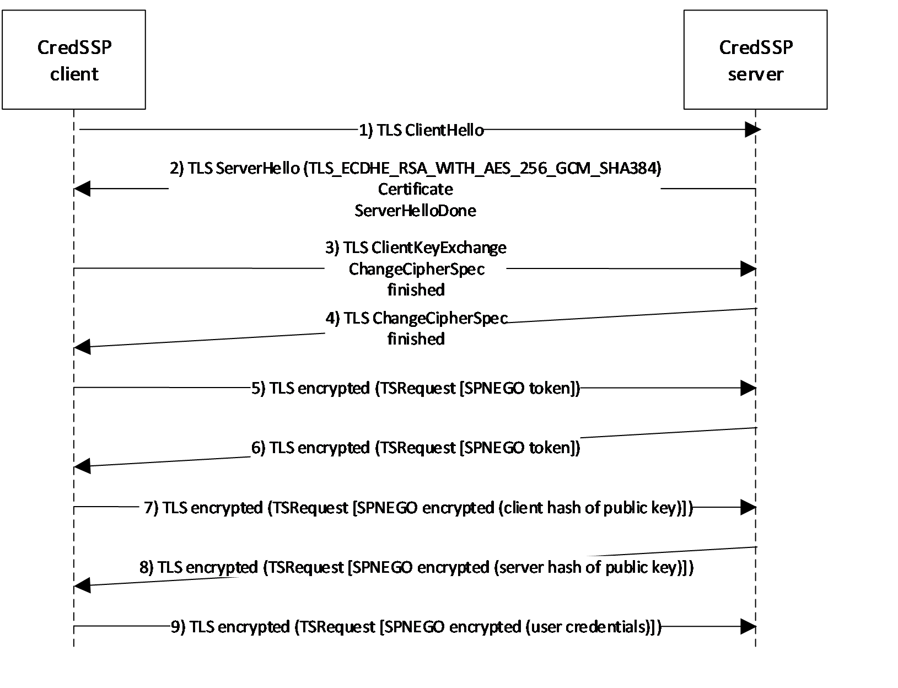
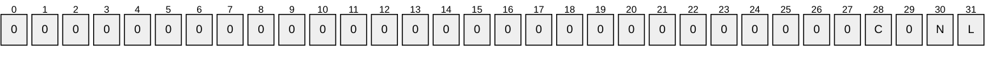

# [MS-CSSP]: Credential Security Support Provider (CredSSP) Protocol

Table of Contents

1 Introduction

- [1 Introduction](#Section_1)
  - [1.1 Glossary](#Section_1.1)
  - [1.2 References](#Section_1.2)
    - [1.2.1 Normative References](#Section_1.2.1)
    - [1.2.2 Informative References](#Section_1.2.2)
  - [1.3 Overview](#Section_1.3)
  - [1.4 Relationship to Other Protocols](#Section_1.4)
  - [1.5 Prerequisites/Preconditions](#Section_1.5)
  - [1.6 Applicability Statement](#Section_1.6)
  - [1.7 Versioning and Capability Negotiation](#Section_1.7)
  - [1.8 Vendor-Extensible Fields](#Section_1.8)
  - [1.9 Standards Assignments](#Section_1.9)

2 Messages

- [2 Messages](#Section_2)
  - [2.1 Transport](#Section_2.1)
  - [2.2 Message Syntax](#Section_2.2)
    - [2.2.1 TSRequest](#Section_2.2.1)
      - [2.2.1.1 NegoData](#Section_2.2.1.1)
      - [2.2.1.2 TSCredentials](#Section_2.2.1.2)
        - [2.2.1.2.1 TSPasswordCreds](#Section_2.2.1.2.1)
        - [2.2.1.2.2 TSSmartCardCreds](#Section_2.2.1.2.2)
          - [2.2.1.2.2.1 TSCspDataDetail](#Section_2.2.1.2.2.1)
        - [2.2.1.2.3 TSRemoteGuardCreds](#Section_2.2.1.2.3)
          - [2.2.1.2.3.1 TSRemoteGuardPackageCred](#Section_2.2.1.2.3.1)

3 Protocol Details

- [3 Protocol Details](#Section_3)
  - [3.1 Common Details](#Section_3.1)
    - [3.1.1 Abstract Data Model](#Section_3.1.1)
    - [3.1.2 Timers](#Section_3.1.2)
    - [3.1.3 Initialization](#Section_3.1.3)
    - [3.1.4 Higher-Layer Triggered Events](#Section_3.1.4)
    - [3.1.5 Processing Events and Sequencing Rules](#Section_3.1.5)
    - [3.1.6 Timer Events](#Section_3.1.6)
    - [3.1.7 Other Local Events](#Section_3.1.7)

4 Protocol Examples

- [4 Protocol Examples](#Section_4)

5 Security

- [5 Security](#Section_5)
  - [5.1 Security Considerations for Implementors](#Section_5.1)
  - [5.2 Index of Security Parameters](#Section_5.2)

6 Appendix A: Product Behavior

- [6 Appendix A: Product Behavior](#Section_6)

7 Change Tracking

- [7 Change Tracking](#Section_7)

For the legal notice and IP terms, see [LEGAL.md](../LEGAL.md).
Last updated: 4/23/2024.
See [Revision History](#revision-history) for full version history.

# 1 Introduction

The Credential Security Support Provider (CredSSP) Protocol enables an application to securely delegate a user's [**credentials**](#gt_credentials) from a client to a target server. This protocol first establishes an encrypted channel between the client and the target server by using [**Transport Layer Security (TLS)**](#gt_transport-layer-security-tls) (as specified in [[RFC2246]](https://go.microsoft.com/fwlink/?LinkId=90324)). The CredSSP Protocol uses TLS as an encrypted pipe; it does not rely on the client/server authentication services that are available in TLS. The CredSSP Protocol then uses the protocol extensions described in [MS-SPNG](../MS-SPNG/MS-SPNG.md) to negotiate a [**Generic Security Services (GSS)**](#gt_generic-security-services-gss) mechanism that performs [**mutual authentication**](#gt_mutual-authentication) and GSS confidentiality services to securely bind to the TLS channel and encrypt the credentials for the target server. All GSS security tokens are sent over the encrypted TLS channel.

Sections 1.5, 1.8, 1.9, 2, and 3 of this specification are normative. All other sections and examples in this specification are informative.

## 1.1 Glossary

This document uses the following terms:

**application protocol**: A network protocol that operates in the application layer at the top of the OSI model. It visibly accomplishes the task that the user or other agent wants to perform. This is distinguished from all manner of support protocols: from Ethernet or IP at the bottom to security and routing protocols. While necessary, these are not always visible to the user. Application protocols include, for instance, HTTP and Server Message Block (SMB).

**certification authority (CA)**: A third party that issues public key certificates. Certificates serve to bind public keys to a user identity. Each user and certification authority (CA) can decide whether to trust another user or CA for a specific purpose, and whether this trust is to be transitive. For more information, see [[RFC3280]](https://go.microsoft.com/fwlink/?LinkId=90414).

**credential**: Previously established, authentication data that is used by a security principal to establish its own identity. When used in reference to the Netlogon Protocol, it is the data that is stored in the NETLOGON_CREDENTIAL structure.

**CredSSP client**: Any application that executes the role of the client to authenticate the identity of a user at the network layer to the server by using the CredSSP Protocol.

**CredSSP server**: Any application that executes the role of the server to authenticate the identity of a user at the network layer to the server by using the CredSSP Protocol.

**domain**: A set of users and computers sharing a common namespace and management infrastructure. At least one computer member of the set has to act as a domain controller (DC) and host a member list that identifies all members of the domain, as well as optionally hosting the Active Directory service. The domain controller provides authentication of members, creating a unit of trust for its members. Each domain has an identifier that is shared among its members. For more information, see [MS-AUTHSOD](../MS-AUTHSOD/MS-AUTHSOD.md) section 1.1.1.5 and [MS-ADTS](../MS-ADTS/MS-ADTS.md).

**Generic Security Services (GSS)**: An Internet standard, as described in [[RFC2743]](https://go.microsoft.com/fwlink/?LinkId=90378), for providing security services to applications. It consists of an application programming interface (GSS-API) set, as well as standards that describe the structure of the security data.

**Kerberos**: An authentication system that enables two parties to exchange private information across an otherwise open network by assigning a unique key (called a ticket) to each user that logs on to the network and then embedding these tickets into messages sent by the users. For more information, see [MS-KILE](../MS-KILE/MS-KILE.md).

**man in the middle (MITM)**: An attack that deceives a server or client into accepting an unauthorized upstream host as the actual legitimate host. Instead, the upstream host is an attacker's host that is manipulating the network so that the attacker's host appears to be the desired destination. This enables the attacker to decrypt and access all network traffic that would go to the legitimate host. The attacker is able to read, insert, and modify at-will messages between two hosts without either party knowing that the link between them is compromised.

**mutual authentication**: A mode in which each party verifies the identity of the other party, as described in [[RFC3748]](https://go.microsoft.com/fwlink/?LinkId=90444) section 7.2.1.

**NT LAN Manager (NTLM) Authentication Protocol**: A protocol using a challenge-response mechanism for authentication in which clients are able to verify their identities without sending a password to the server. It consists of three messages, commonly referred to as Type 1 (negotiation), Type 2 (challenge) and Type 3 (authentication).

**NTOWF**: In the context of an NTLM authentication, a NT LAN Manager (NT) one-way function (OWF) used to create a hash based on the user's password to generate a principal's secret key. The NTLM hash superseded the LAN Manager (LM) hash.

**OCTET STRING**: An ASN.1 variable-length sequence of 8-bit values to which a variety of data types and formats can be encoded for transmission. The encoding rules follow Basic Encoding Rules (BER), and optional Canonical Encoding Rules (CER) or Distinguished Encoding Rules (DER) restrictions on BER. Values have 2 possible forms: binary or hexadecimal. The representation in octets of values of identifiers, lengths, and contents of integers shown in hexadecimal have two hexadecimal digits per octet. The values of the contents of character strings shown in hexadecimal have one character per octet.

**public key infrastructure (PKI)**: The laws, policies, standards, and software that regulate or manipulate certificates and public and private keys. In practice, it is a system of digital certificates, [**certificate authorities (CAs)**](#gt_certification-authority-ca), and other registration authorities that verify and authenticate the validity of each party involved in an electronic transaction. For more information, see [[X509]](https://go.microsoft.com/fwlink/?LinkId=90590) section 6.

**security protocol**: A protocol that performs authentication and possibly additional security services on a network.

**service principal name (SPN)**: The name a client uses to identify a service for mutual authentication. (For more information, see [[RFC1964]](https://go.microsoft.com/fwlink/?LinkId=90304) section 2.1.1.) An [**SPN**](#gt_service-principal-name-spn) consists of either two parts or three parts, each separated by a forward slash ('/'). The first part is the service class, the second part is the host name, and the third part (if present) is the service name. For example, "ldap/dc-01.fabrikam.com/fabrikam.com" is a three-part [**SPN**](#gt_service-principal-name-spn) where "ldap" is the service class name, "dc-01.fabrikam.com" is the host name, and "fabrikam.com" is the service name. See [[SPNNAMES]](https://go.microsoft.com/fwlink/?LinkId=90532) for more information about [**SPN**](#gt_service-principal-name-spn) format and composing a unique [**SPN**](#gt_service-principal-name-spn).

**Simple and Protected GSS-API Negotiation Mechanism (SPNEGO)**: An authentication mechanism that allows [**Generic Security Services (GSS)**](#gt_generic-security-services-gss) peers to determine whether their credentials support a common set of GSS-API security mechanisms, to negotiate different options within a given security mechanism or different options from several security mechanisms, to select a service, and to establish a security context among themselves using that service. [**SPNEGO**](#gt_simple-and-protected-gss-api-negotiation-mechanism-spnego) is specified in [[RFC4178]](https://go.microsoft.com/fwlink/?LinkId=90461).

**Transport Layer Security (TLS)**: A security protocol that supports confidentiality and integrity of messages in client and server applications communicating over open networks. TLS supports server and, optionally, client authentication by using X.509 certificates (as specified in [X509]). TLS is standardized in the IETF TLS working group.

**trust**: To accept another authority's statements for the purposes of authentication and authorization, especially in the case of a relationship between two domains. If [**domain**](#gt_domain) A trusts [**domain**](#gt_domain) B, [**domain**](#gt_domain) A accepts [**domain**](#gt_domain) B's authentication and authorization statements for principals represented by security principal objects in [**domain**](#gt_domain) B; for example, the list of groups to which a particular user belongs. As a noun, a [**trust**](#gt_trust) is the relationship between two [**domains**](#gt_domain) described in the previous sentence.

**Unicode string**: A Unicode 8-bit string is an ordered sequence of 8-bit units, a Unicode 16-bit string is an ordered sequence of 16-bit code units, and a Unicode 32-bit string is an ordered sequence of 32-bit code units. In some cases, it could be acceptable not to terminate with a terminating null character. Unless otherwise specified, all [**Unicode strings**](#gt_unicode-string) follow the UTF-16LE encoding scheme with no Byte Order Mark (BOM).

**MAY, SHOULD, MUST, SHOULD NOT, MUST NOT:** These terms (in all caps) are used as defined in [[RFC2119]](https://go.microsoft.com/fwlink/?LinkId=90317). All statements of optional behavior use either MAY, SHOULD, or SHOULD NOT.

## 1.2 References

Links to a document in the Microsoft Open Specifications library point to the correct section in the most recently published version of the referenced document. However, because individual documents in the library are not updated at the same time, the section numbers in the documents may not match. You can confirm the correct section numbering by checking the [Errata](https://go.microsoft.com/fwlink/?linkid=850906).

### 1.2.1 Normative References

We conduct frequent surveys of the normative references to assure their continued availability. If you have any issue with finding a normative reference, please contact [dochelp@microsoft.com](mailto:dochelp@microsoft.com). We will assist you in finding the relevant information.

[MS-ERREF] Microsoft Corporation, "[Windows Error Codes](../MS-ERREF/MS-ERREF.md)".

[MS-KILE] Microsoft Corporation, "[Kerberos Protocol Extensions](../MS-KILE/MS-KILE.md)".

[MS-NLMP] Microsoft Corporation, "[NT LAN Manager (NTLM) Authentication Protocol](../MS-NLMP/MS-NLMP.md)".

[MS-RDPEAR] Microsoft Corporation, "[Remote Desktop Protocol Authentication Redirection Virtual Channel](../MS-RDPEAR/MS-RDPEAR.md)".

[MS-SPNG] Microsoft Corporation, "[Simple and Protected GSS-API Negotiation Mechanism (SPNEGO) Extension](../MS-SPNG/MS-SPNG.md)".

[RFC2078] Linn, J., "Generic Security Service Application Program Interface, Version 2", RFC 2078, January 1997, [https://www.rfc-editor.org/info/rfc2078](https://go.microsoft.com/fwlink/?LinkId=90312)

[RFC2119] Bradner, S., "Key words for use in RFCs to Indicate Requirement Levels", BCP 14, RFC 2119, March 1997, [https://www.rfc-editor.org/info/rfc2119](https://go.microsoft.com/fwlink/?LinkId=90317)

[RFC2246] Dierks, T., and Allen, C., "The TLS Protocol Version 1.0", RFC 2246, January 1999, [https://www.rfc-editor.org/info/rfc2246](https://go.microsoft.com/fwlink/?LinkId=90324)

[RFC3280] Housley, R., Polk, W., Ford, W., and Solo, D., "Internet X.509 Public Key Infrastructure Certificate and Certificate Revocation List (CRL) Profile", RFC 3280, April 2002, [http://www.rfc-editor.org/info/rfc3280](https://go.microsoft.com/fwlink/?LinkId=90414)

[RFC4120] Neuman, C., Yu, T., Hartman, S., and Raeburn, K., "The Kerberos Network Authentication Service (V5)", RFC 4120, July 2005, [https://www.rfc-editor.org/rfc/rfc4120](https://go.microsoft.com/fwlink/?LinkId=90458)

[RFC4178] Zhu, L., Leach, P., Jaganathan, K., and Ingersoll, W., "The Simple and Protected Generic Security Service Application Program Interface (GSS-API) Negotiation Mechanism", RFC 4178, October 2005, [https://www.rfc-editor.org/info/rfc4178](https://go.microsoft.com/fwlink/?LinkId=90461)

[RFC793] Postel, J., Ed., "Transmission Control Protocol: DARPA Internet Program Protocol Specification", RFC 793, September 1981, [https://www.rfc-editor.org/info/rfc793](https://go.microsoft.com/fwlink/?LinkId=150872)

[X690] ITU-T, "Information Technology - ASN.1 Encoding Rules: Specification of Basic Encoding Rules (BER), Canonical Encoding Rules (CER) and Distinguished Encoding Rules (DER)", Recommendation X.690, July 2002, [http://www.itu.int/rec/T-REC-X.690/en](https://go.microsoft.com/fwlink/?LinkId=90593)

### 1.2.2 Informative References

[KERB-TICKET-LOGON] Microsoft Corporation, "KERB_TICKET_LOGON structure", [https://msdn.microsoft.com/en-us/library/windows/desktop/aa378143(v=vs.85).aspx](https://go.microsoft.com/fwlink/?LinkId=808713)

[MS-DTYP] Microsoft Corporation, "[Windows Data Types](../MS-DTYP/MS-DTYP.md)".

[MSDOCS-UNICODE_STRING] Microsoft Corporation, "UNICODE_STRING structure", [https://learn.microsoft.com/en-us/windows/win32/api/ntdef/ns-ntdef-_unicode_string](https://go.microsoft.com/fwlink/?linkid=2132846)

[MSKB-4088776] Microsoft Corporation, "March 13, 2018 - KB4088776", [http://www.catalog.update.microsoft.com/Search.aspx?q=4088776](https://go.microsoft.com/fwlink/?linkid=869250)

[RFC2898] Kaliski, B., "PKCS #5: Password-Based Cryptography Specification Version 2.0", RFC 2898, September 2000, [https://www.rfc-editor.org/info/rfc2898](https://go.microsoft.com/fwlink/?LinkId=119708)

## 1.3 Overview

The Credential Security Support Provider (CredSSP) Protocol enables an application to securely delegate a user's [**credentials**](#gt_credentials) from a client to a target server. For example, the Microsoft Terminal Server uses the CredSSP Protocol to securely delegate the user's password or smart card PIN from the client to the server to remotely log on the user and establish a terminal services session.

Policy settings control whether a client delegates the user's credentials in order to assure that the user's credentials are not delegated to an unauthorized server (a computer under the administrative control of an attacker). Although [**trust**](#gt_trust) might exist to facilitate authentication between the client and server, it does not mean that the target server is trusted with the user's credentials. For example, trust might be based on the [**Kerberos**](#gt_kerberos) Protocol [[RFC4120]](https://go.microsoft.com/fwlink/?LinkId=90458) or [**NTLM**](#gt_fff710f9-e3d1-4991-99a2-009768d57585) [MS-NLMP](../MS-NLMP/MS-NLMP.md).

The CredSSP Protocol is a composite protocol that relies on other standards-based [**security protocols**](#gt_security-protocol). It first uses the [**Transport Layer Security (TLS) Protocol**](#gt_transport-layer-security-tls) to establish an encrypted channel between the [**CredSSP client**](#gt_credssp-client) and the [**CredSSP server**](#gt_credssp-server). (The client is anonymous at this point; the client and the server might have no common trusted [**certification authority (CA)**](#gt_certification-authority-ca) root.)

All subsequent messages are sent over this channel. The CredSSP Protocol then uses the Simple and Protected Generic Security Service Application Program Interface Negotiation Mechanism ([**SPNEGO**](#gt_simple-and-protected-gss-api-negotiation-mechanism-spnego)) to authenticate the user and server in the encrypted TLS session. (SPNEGO is specified in [MS-SPNG](../MS-SPNG/MS-SPNG.md).)

SPNEGO provides a framework for two parties that are engaged in authentication to select from a set of possible authentication mechanisms. This framework provides selection in a manner that preserves the opaque nature of the security protocols to the [**application protocol**](#gt_application-protocol) that uses SPNEGO. In this case, the CredSSP Protocol is the application protocol that uses SPNEGO.

The CredSSP Protocol uses SPNEGO to mutually authenticate the CredSSP client and CredSSP server. It then uses the encryption key that is established under SPNEGO to securely bind to the TLS session (the process by which the server's public key that is used in the TLS handshake is authenticated). The client encrypts a hash of the server's public key by using the encryption key that is established under SPNEGO and sends it to the server. The server verifies that it is the same public key that was used in the TLS handshake and sends an acknowledgment (also encrypted under the SPNEGO encryption key) back to the client. (For more information about this step, see section [3.1.1](#Section_3.1.1).) Lastly, the client sends the user's credentials, which are encrypted under the SPNEGO encryption key, to the server.

All subsequent data that is sent between the client and server application by using the CredSSP Protocol is encrypted under TLS. The only new on-the-wire formats that are introduced by the CredSSP Protocol are the encapsulation of the SPNEGO tokens sent over the TLS channel, the binding between the TLS and SPNEGO protocols, and the format of the user credentials.

## 1.4 Relationship to Other Protocols

The CredSSP Protocol uses the [**TLS**](#gt_transport-layer-security-tls) Protocol, as specified in [[RFC2246]](https://go.microsoft.com/fwlink/?LinkId=90324), to encrypt all traffic between the [**CredSSP client**](#gt_credssp-client) and the [**CredSSP server**](#gt_credssp-server). The TLS Protocol requires a reliable transport, such as TCP (as specified in [[RFC793]](https://go.microsoft.com/fwlink/?LinkId=150872)), for all messages that are exchanged between the client and the server.

The CredSSP Protocol typically uses [**SPNEGO**](#gt_simple-and-protected-gss-api-negotiation-mechanism-spnego) [MS-SPNG](../MS-SPNG/MS-SPNG.md) for [**mutual authentication**](#gt_mutual-authentication) between the CredSSP client and CredSSP server and can use [**Kerberos**](#gt_kerberos) [MS-KILE](../MS-KILE/MS-KILE.md) and [**NTLM**](#gt_fff710f9-e3d1-4991-99a2-009768d57585) [MS-NLMP](../MS-NLMP/MS-NLMP.md). SPNEGO requires that at least one other authentication protocol be present that is compatible with [**Generic Security Services (GSS)**](#gt_generic-security-services-gss) [[RFC2078]](https://go.microsoft.com/fwlink/?LinkId=90312) (in addition to SPNEGO itself); otherwise, SPNEGO will not work. SPNEGO has no dependence on any specific GSS-compatible protocols; however, the Kerberos Protocol [MS-KILE] is typically used.<1>

The Remote Desktop Protocol (RDP) uses the CredSSP Protocol to delegate [**credentials**](#gt_credentials) from the RDP client to the RDP server and to encrypt all data that follows by using the TLS channel that is established as part of the CredSSP Protocol.

## 1.5 Prerequisites/Preconditions

The CredSSP Protocol assumes the following:

- The [**CredSSP client**](#gt_credssp-client) has access to the user's [**credentials**](#gt_credentials) (the CredSSP Protocol delegates these credentials to the [**CredSSP server**](#gt_credssp-server)).<2>
- A source of cryptographically useful random numbers MUST be available on the client and server for generating a nonce that is used by the [**TLS**](#gt_transport-layer-security-tls) Protocol as well as the client/server identity validation.
- The CredSSP server has an X.509 certificate (as specified in [[RFC3280]](https://go.microsoft.com/fwlink/?LinkId=90414)) for use in TLS. The certificate can be self-signed or issued by a third-party [**certification authority**](#gt_certification-authority-ca). The CredSSP Protocol does not assume a common certification authority root between the client and the server.
- The CredSSP Protocol uses the [**SPNEGO**](#gt_simple-and-protected-gss-api-negotiation-mechanism-spnego) protocol for mutual client/server authentication; at least one other GSS-compatible authentication protocol, in addition to the CredSSP Protocol, MUST be present for it to work.<3>

## 1.6 Applicability Statement

The CredSSP protocol delegates the user's [**credentials**](#gt_credentials) from a client to a server over a [**mutually authenticated**](#gt_mutual-authentication) encrypted channel. To avoid revealing the user credentials to unauthorized hosts, the [**CredSSP client**](#gt_credssp-client) delegates only to [**trusted**](#gt_trust) servers, as expressed through the security policy that governs the client's computer. The CredSSP protocol was designed to enable the server to impersonate the client across a number of different applications that require the user's long-lived credentials (password).

## 1.7 Versioning and Capability Negotiation

Versioning and capability negotiation are supported in the CredSSP Protocol as follows:

- Protocol versions: The CredSSP Protocol supports versioning (the version field of the TSRequest structure, section [2.2.1](#Section_2.2.1)).
- Security and authentication methods: The CredSSP Protocol uses the [**SPNEGO**](#gt_simple-and-protected-gss-api-negotiation-mechanism-spnego) protocol to negotiate the underlying authentication mechanism. Similarly, the CredSSP Protocol relies on the [**TLS**](#gt_transport-layer-security-tls) Protocol to negotiate the cryptographic algorithms that are used for channel confidentiality and integrity.
- Localization: The CredSSP Protocol is not localization dependent.

## 1.8 Vendor-Extensible Fields

The CredSSP Protocol does not have any vendor-extensible fields.

## 1.9 Standards Assignments

The CredSSP Protocol does not have any standards assignments. Standards assignments for the [**Simple and Protected GSS-API Negotiation Mechanism (SPNEGO)**](#gt_simple-and-protected-gss-api-negotiation-mechanism-spnego), [**Kerberos**](#gt_kerberos), [**NTLM**](#gt_fff710f9-e3d1-4991-99a2-009768d57585), and [**TLS**](#gt_transport-layer-security-tls) Protocols are specified in [MS-SPNG](../MS-SPNG/MS-SPNG.md) section 1.9, [MS-KILE](../MS-KILE/MS-KILE.md) section 1.9, [MS-NLMP](../MS-NLMP/MS-NLMP.md) section 1.9, and [[RFC2246]](https://go.microsoft.com/fwlink/?LinkId=90324) section G, respectively.

# 2 Messages

## 2.1 Transport

Because the CredSSP Protocol uses TLS, all messages exchanged between the client and server SHOULD<4> be transmitted over a reliable transport protocol, such as TCP (as specified in [[RFC793]](https://go.microsoft.com/fwlink/?LinkId=150872)).

## 2.2 Message Syntax

The CredSSP Protocol introduces the **TSRequest** message, section [2.2.1](#Section_2.2.1). The client and server use this message to encapsulate the [**SPNEGO**](#gt_simple-and-protected-gss-api-negotiation-mechanism-spnego) tokens and **TSCredentials** message, section [2.2.1.2](#Section_2.2.1.2), that the client SHOULD<5> use to delegate the user's [**credentials**](#gt_credentials) to the [**CredSSP server**](#gt_credssp-server) over a [**TLS**](#gt_transport-layer-security-tls) connection. These messages are encoded by using ASN.1 (as specified in [[X690]](https://go.microsoft.com/fwlink/?LinkId=90593)) and Distinguished Encoding Rules (DER).<6>

### 2.2.1 TSRequest

The **TSRequest** structure is the top-most structure used by the [**CredSSP client**](#gt_credssp-client) and [**CredSSP server**](#gt_credssp-server). It contains the [**SPNEGO**](#gt_simple-and-protected-gss-api-negotiation-mechanism-spnego) tokens and MAY<7> contain [**Kerberos**](#gt_kerberos)/[**NTLM**](#gt_fff710f9-e3d1-4991-99a2-009768d57585) messages that are passed between the client and server, and either the public key authentication messages that are used to bind to the [**TLS**](#gt_transport-layer-security-tls) session or the client [**credentials**](#gt_credentials) that are delegated to the server. The **TSRequest** message is always sent over the TLS-encrypted channel between the client and server in a CredSSP Protocol exchange (see step 1 in section [3.1.5](#Section_3.1.5)).<8><9>

TSRequest ::= SEQUENCE {

version [0] INTEGER,

negoTokens [1] NegoData OPTIONAL,

authInfo [2] OCTET STRING OPTIONAL,

pubKeyAuth [3] OCTET STRING OPTIONAL,

errorCode [4] INTEGER OPTIONAL,

clientNonce [5] OCTET STRING OPTIONAL

}

**version:** An unsigned integer encoded as an ASN.1 INTEGER that specifies the supported version of the CredSSP Protocol. Valid values for this field are 2, 3, 4, 5, and 6.<10> If the version received is greater than the implementation understands, treat the peer as one that is compatible with the version of the CredSSP Protocol that the implementation understands.

**negoTokens:** A **NegoData** structure, as defined in section [2.2.1.1](#Section_2.2.1.1), that contains the SPNEGO tokens or Kerberos/NTLM messages that are passed between the client and server.

**authInfo:** A **TSCredentials** structure, as defined in section [2.2.1.2](#Section_2.2.1.2), encoded as an ASN.1 [**OCTET STRING**](#gt_octet-string) that contains the user's credentials that are delegated to the server. The **authInfo** field MUST be encrypted under the encryption key that is negotiated under the SPNEGO package. The **authInfo** field carries the message signature and then the encrypted data.

**pubKeyAuth:** An encrypted public key encoded as an ASN.1 OCTET STRING. This field is used to assure that the public key that is used by the server during the TLS handshake belongs to the target server and not to a [**man-in-the-middle**](#gt_9918372c-45a0-4f70-b53f-06972f29318e). This TLS session-binding is specified in section 3.1.5. After the client completes the SPNEGO phase of the CredSSP Protocol, it uses **GSS_WrapEx()** for the negotiated protocol to encrypt the server's public key. With version 4 or lower, the **pubKeyAuth** field carries the message signature and then the encrypted public key to the server. In response, the server uses the **pubKeyAuth** field to transmit to the client a modified version of the public key (as specified in section 3.1.5) that is encrypted under the encryption key that is negotiated under SPNEGO. In version 5 or higher, this field stores a computed hash of the public key.<11>

**errorCode**: A 32-bit value encoded as an ASN.1 INTEGER. If the negotiated protocol version is 3, 4, or 6, and the SPNEGO exchange fails on the server, this field SHOULD<12> be used to send the NTSTATUS failure code ([MS-ERREF](../MS-ERREF/MS-ERREF.md) section 2.3) to the client so that it knows what failed and be able to display a descriptive error to the user.

**clientNonce**: A 32-byte array of cryptographically random bytes encoded as an ASN.1 OCTET STRING used to provide sufficient entropy during hash computation. This value is only used in version 5 or higher of this protocol.

#### 2.2.1.1 NegoData

The **NegoData** structure contains the [**SPNEGO**](#gt_simple-and-protected-gss-api-negotiation-mechanism-spnego) tokens ([MS-SPNG](../MS-SPNG/MS-SPNG.md) section 2), the [**Kerberos**](#gt_kerberos) messages ([MS-KILE](../MS-KILE/MS-KILE.md) section 2), or the [**NTLM**](#gt_fff710f9-e3d1-4991-99a2-009768d57585) messages ([MS-NLMP](../MS-NLMP/MS-NLMP.md) section 2).<13>

NegoData ::= SEQUENCE OF SEQUENCE {

negoToken [0] OCTET STRING

}

**negoToken:** An ASN.1 [**OCTET STRING**](#gt_octet-string) that contains one or more SPNEGO tokens and all Kerberos or NTLM messages, as negotiated by SPNEGO.

#### 2.2.1.2 TSCredentials

The **TSCredentials** structure contains both the user's [**credentials**](#gt_credentials) that are delegated to the server and their type.<14>

TSCredentials ::= SEQUENCE {

credType [0] INTEGER,

credentials [1] OCTET STRING

}

**credType:** An unsigned integer encoded as an ASN.1 INTEGER that defines the type of credentials that are carried in the **credentials** field. The **credType** field MUST be one of the following values.

| Value | Meaning |
| --- | --- |
| 1 | **credentials** contains a **TSPasswordCreds** structure (section [2.2.1.2.1](#Section_2.2.1.2.1)) that defines the user's password credentials. |
| 2 | **credentials** contains a **TSSmartCardCreds** structure (section [2.2.1.2.2](#Section_2.2.1.2.2)) that defines the user's smart card credentials. |
| 6 | **credentials** contains a **TSRemoteGuardCreds** structure (section [2.2.1.2.3](#Section_2.2.1.2.3)) that defines the user's redirected credentials. |

**credentials**: An ASN.1 [**OCTET STRING**](#gt_octet-string) that contains the user's password, smart card credentials, or Remote Credential Guard credentials in a TSPasswordCreds structure, a TSSmartCardCreds structure, or a TSRemoteGuardCreds structure, respectively.

##### 2.2.1.2.1 TSPasswordCreds

The **TSPasswordCreds** structure contains the user's password [**credentials**](#gt_credentials) that are delegated to the server.<15>

TSPasswordCreds ::= SEQUENCE {

domainName [0] OCTET STRING,

userName [1] OCTET STRING,

password [2] OCTET STRING

}

**domainName:** An ASN.1 [**OCTET STRING**](#gt_octet-string) that contains the name of the user's account [**domain**](#gt_domain).

**userName:** An ASN.1 OCTET STRING that contains the user's account name.

**password:** An ASN.1OCTET STRING that contains the user's account password.

##### 2.2.1.2.2 TSSmartCardCreds

The **TSSmartCardCreds** structure contains the user's smart card [**credentials**](#gt_credentials) that are delegated to the server.<16>

TSSmartCardCreds ::= SEQUENCE {

pin [0] OCTET STRING,

cspData [1] TSCspDataDetail,

userHint [2] OCTET STRING OPTIONAL,

domainHint [3] OCTET STRING OPTIONAL

}

**pin:** An ASN.1 [**OCTET STRING**](#gt_octet-string) that contains the user's smart card PIN.

**cspData:** A **TSCspDataDetail** structure, section [2.2.1.2.2.1](#Section_2.2.1.2.2.1) that contains information about the cryptographic service provider (CSP).

**userHint:** An ASN.1 OCTET STRING that contains the user's account hint.

**domainHint:** An ASN.1 OCTET STRING that contains the user's [**domain**](#gt_domain) name to which the user's account belongs. This name could be entered by the user when the user is first prompted for the PIN.

###### 2.2.1.2.2.1 TSCspDataDetail

The **TSCspDataDetail** structure contains CSP information used during smart card logon.<17>

TSCspDataDetail ::= SEQUENCE {

keySpec [0] INTEGER,

cardName [1] OCTET STRING OPTIONAL,

readerName [2] OCTET STRING OPTIONAL,

containerName [3] OCTET STRING OPTIONAL,

cspName [4] OCTET STRING OPTIONAL

}

**keySpec:** An unsigned integer encoded as an ASN.1 INTEGER that defines the specification of the user's smart card.

**cardName:** An ASN.1 [**OCTET STRING**](#gt_octet-string) that specifies the name of the smart card.

**readerName:** An ASN.1 OCTET STRING that specifies the name of the smart card reader.

**containerName:** An ASN.1 OCTET STRING that specifies the name of the certificate container.

**cspName:** An ASN.1 OCTET STRING that specifies the name of the CSP.

##### 2.2.1.2.3 TSRemoteGuardCreds

The **TSRemoteGuardCreds** structure SHOULD<18> contain a logon credential and supplemental credentials provided by security packages. The format of the individual credentials depends on the package that provided them.<19> The logon credential is passed to the **Negotiate** package, which in turn passes the credential to the default authentication package.

TSRemoteGuardCreds ::= SEQUENCE{

logonCred [0] TSRemoteGuardPackageCred,

supplementalCreds [1] SEQUENCE OF TSRemoteGuardPackageCred OPTIONAL,

}

**logonCred:** A **TSRemoteGuardPackageCred** structure, section [2.2.1.2.3.1](#Section_2.2.1.2.3.1), that contains a logon credential for the user.

**supplementalCreds:** An ASN.1 SEQUENCE OF type that contains an array of **TSRemoteGuardPackageCred** structures that contains supplemental credentials for other security packages.

###### 2.2.1.2.3.1 TSRemoteGuardPackageCred

The **TSRemoteGuardPackageCred** structure contains credentials for a specific security package.<20>

TSRemoteGuardPackageCred ::= SEQUENCE{

packageName [0] OCTET STRING,

credBuffer [1] OCTET STRING,

}

**packageName:** An ASN.1 [**OCTET STRING**](#gt_octet-string) that contains the name of the package for which these credentials are intended.<21>

**credBuffer:** An ASN.1 OCTET STRING byte buffer that contains the credentials in a format that SHOULD<22> be specified by the CredSSP server operating system for the package that provided them.

# 3 Protocol Details

## 3.1 Common Details

### 3.1.1 Abstract Data Model

This section describes a conceptual model of possible data organization that an implementation maintains to participate in this protocol. The described organization is provided to facilitate the explanation of how the protocol behaves. This document does not mandate that implementations adhere to this model as long as their external behavior is consistent with that described in this document.

The CredSSP Protocol SHOULD<23> require the client to perform a policy check to verify that the target server is [**trusted**](#gt_trust) to receive the user's [**credentials**](#gt_credentials).

### 3.1.2 Timers

None.

### 3.1.3 Initialization

There are no changes to the initialization of [**TLS**](#gt_transport-layer-security-tls), [**Kerberos**](#gt_kerberos), [**NTLM**](#gt_fff710f9-e3d1-4991-99a2-009768d57585), and [**SPNEGO**](#gt_simple-and-protected-gss-api-negotiation-mechanism-spnego), as specified in [[RFC2246]](https://go.microsoft.com/fwlink/?LinkId=90324), [MS-KILE](../MS-KILE/MS-KILE.md), [MS-NLMP](../MS-NLMP/MS-NLMP.md), and [MS-SPNG](../MS-SPNG/MS-SPNG.md), respectively.

### 3.1.4 Higher-Layer Triggered Events

The CredSSP Protocol is triggered by a higher-layer [**application protocol**](#gt_application-protocol), such as RDP, for delegating the user's [**credentials**](#gt_credentials) to the target server.

### 3.1.5 Processing Events and Sequencing Rules

The CredSSP Protocol is carried out in the following sequence and is subject to the protocol rules that are described in the following steps:

- The [**CredSSP client**](#gt_credssp-client) and [**CredSSP server**](#gt_credssp-server) first complete the [**TLS**](#gt_transport-layer-security-tls) handshake, as specified in [[RFC2246]](https://go.microsoft.com/fwlink/?LinkId=90324). After the handshake is complete, all subsequent CredSSP Protocol messages are encrypted by the TLS channel. The CredSSP Protocol does not extend the TLS wire protocol. TLS session resumption is not supported. As part of the TLS handshake, the CredSSP server does not request the client's X.509 certificate (thus far, the client is anonymous). Also, the CredSSP Protocol does not require the client to have a commonly [**trusted**](#gt_trust) [**certification authority**](#gt_certification-authority-ca) root with the CredSSP server. Thus, the CredSSP server SHOULD<24> use an X.509 certificate that is either based on a commonly trusted certificate authority (CA) root or on a self-signed X.509 certificate.
- Over the encrypted TLS channel, the [**SPNEGO**](#gt_simple-and-protected-gss-api-negotiation-mechanism-spnego), [**Kerberos**](#gt_kerberos), or [**NTLM**](#gt_fff710f9-e3d1-4991-99a2-009768d57585) handshake between the client and server completes authentication and establishes an encryption key that is used by the SPNEGO confidentiality services, as specified in [[RFC4178]](https://go.microsoft.com/fwlink/?LinkId=90461). All SPNEGO tokens or Kerberos/NTLM messages as well as the underlying encryption algorithms are opaque to the calling application (the CredSSP client and CredSSP server). The wire protocol for SPNEGO, Kerberos, and NTLM is specified in [MS-SPNG](../MS-SPNG/MS-SPNG.md), [MS-KILE](../MS-KILE/MS-KILE.md), and [MS-NLMP](../MS-NLMP/MS-NLMP.md), respectively.
The SPNEGO tokens or Kerberos/NTLM messages exchanged between the client and the server are encapsulated in the **negoTokens** field of the [TSRequest](#Section_2.2.1) structure (section 2.2.1). Both the client and the server use this structure as many times as necessary to complete the authentication exchange. The Kerberos or NTLM authentication package is negotiated by SPNEGO. Therefore, the encryption key that is established under SPNEGO is either a Kerberos subsession key or an NTLM session key that is shared by both sides upon completion of the SPNEGO exchange.

**Note** During this phase of the protocol, the OPTIONAL **authInfo** field is omitted from the TSRequest structure by the client and server; the OPTIONAL **pubKeyAuth** field is omitted by the client unless the client is sending the last SPNEGO token or Kerberos/NTLM message. If the client is sending the last SPNEGO token or Kerberos/NTLM message, the TSRequest structure MUST have both the **negoTokens** and the **pubKeyAuth** fields filled in.

**Note** If the SPNEGO handshake fails on the server side and the client sent a version of 3 or greater, the server SHOULD send a TSRequest structure back to the client for which the **errorCode** field is populated with an unsuccessful NTSTATUS code ([MS-ERREF](../MS-ERREF/MS-ERREF.md) section 2.3). The NTSTATUS code indicates the reason for the failure to the client. If the client receives a TSRequest message with the **errorCode** present, it MUST immediately fail with the provided status code and cease all further processing.

- This step is version-dependent as follows:
**Version 5 or 6**

The client SHOULD<25> generate a cryptographically random 32-byte value and set the nonce field of the TSRequest structure to this value. It then computes a SHA256 hash of the ASN.1 encoded SubjectPublicKey concatenated with the bytes of the well-known string “CredSSP Client-To-Server Binding Hash” and the generated nonce. The hash is then encrypted using the confidentiality support of the authentication protocol.

The process is defined as:

Set ClientServerHashMagic to "CredSSP Client-To-Server Binding Hash"

**Set ClientServerHash to SHA256(ClientServerHashMagic, Nonce, SubjectPublicKey)**

Set TSRequest.pubKeyAuth to Encrypt(ClientServerHash)

**Note** The hash MUST include the null terminator (\0) of the string.

**Version 2, 3, 4**:

The client encrypts the public key it received from the server (contained in the X.509 certificate) in the TLS handshake from step 1, by using the confidentiality support of the authentication protocol. The public key that is encrypted is the ASN.1-encoded SubjectPublicKey sub-field of SubjectPublicKeyInfo from the X.509 certificate, as specified in [[RFC3280]](https://go.microsoft.com/fwlink/?LinkId=90414) section 4.1.

**All Versions:**

The encrypted key is encapsulated in the **pubKeyAuth** field of the TSRequest structure and is sent over the TLS channel to the server.

**Note** During this phase of the protocol, the OPTIONAL **authInfo** field is omitted from the TSRequest structure; the client MUST send its last SPNEGO token or Kerberos/NTLM message to the server in the **negoTokens** field (see step 2) along with the encrypted public key in the **pubKeyAuth** field.

- This step is version-dependent as follows:
**Version 5 and 6**

After the server receives the **TSRequest** structure from step 3, it verifies the hash by computing the hash using the **Nonce** field from the request and the ASN.1-encoded public key used as part of the TLS handshake in step 1. If the hash matches, the server generates its own SHA256 hash of the **SubjectPublicKey** concatenated with the bytes of the well-known string "CredSSP Server-To-Client Binding Hash" and the provided nonce, and encrypts the binary result using the authentication protocol's encryption services.

The process is defined as:

Set ServerClientHashMagic to "CredSSP Server-To-Client Binding Hash"

Set ServerClientHash to SHA256(ServerClientHashMagic, Nonce, SubjectPublicKey)

Set TSRequest.pubKeyAuth to Encrypt(ServerClientHash)

**Note** The hash MUST include the null terminator (\0) of the string.

**Version 2, 3, and 4**

After the server receives the public key in step 3, it first verifies that it has the same public key that it used as part of the TLS handshake in step 1. The server then adds 1 to the first byte representing the public key (the ASN.1 structure corresponding to the **SubjectPublicKey** field, as described in step 3) and encrypts the binary result by using the authentication protocol's encryption services. Due to the addition of 1 to the binary data, and encryption of the data as a binary structure, the resulting value might not be valid ASN.1-encoded values. The addition of 1 to the first byte of the public key is performed so that the client-generated **pubKeyAuth** message cannot be replayed back to the client by an attacker.

**All versions:**

The encrypted binary data is encapsulated in the **pubKeyAuth** field of the TSRequest structure and is sent over the encrypted TLS channel to the client.

**Note** The server SHOULD set the errorCode to **STATUS_NOT_SUPPORTED** if the server does not support the requested version.

**Note** During this phase of the protocol, the OPTIONAL **authInfo** and **negoTokens** fields are omitted from the TSRequest structure.

- The client validates the server authenticity by generating and comparing the server hash if using version 5, or higher. Otherwise, it performs a binary comparison of the data from step 4 to that of the data representing the public key from the server's X.509 certificate (as specified in [RFC3280], section 4.1). Once it successfully validates the server authenticity, it encrypts the user's [**credentials**](#gt_credentials) (either password or smart card PIN) by using the authentication protocol's encryption services. The resulting value is encapsulated in the **authInfo** field of the TSRequest structure and sent over the encrypted TLS channel to the server.
The [TSCredentials](#Section_2.2.1.2) structure within the **authInfo** field of the TSRequest structure MUST NOT contain more than one of the following structures: [TSPasswordCreds](#Section_2.2.1.2.1), [TSSmartCardCreds](#Section_2.2.1.2.2), or [TSRemoteGuardCreds](#Section_2.2.1.2.3) structures.

**Note** During this phase of the protocol, the OPTIONAL **pubKeyAuth** and **negoTokens** fields are omitted from the TSRequest structure.

**Note** If the credentials were of type TSRemoteGuardCreds, the TLS channel continues to be used for redirected authentication requests, as specified in [MS-RDPEAR](../MS-RDPEAR/MS-RDPEAR.md).

### 3.1.6 Timer Events

There are no timer events for the CredSSP Protocol.

### 3.1.7 Other Local Events

There are no other local events that impact the operation of this protocol.

# 4 Protocol Examples

Figure 1: CredSSP negotiation sequence using SPNEGO

Steps 1 through 4: The [**CredSSP client**](#gt_credssp-client) and [**CredSSP server**](#gt_credssp-server) complete the [**TLS**](#gt_transport-layer-security-tls) handshake. When the handshake is complete, all subsequent CredSSP Protocol messages are encrypted by the TLS channel, as specified in [[RFC2246]](https://go.microsoft.com/fwlink/?LinkId=90324). As part of the TLS handshake, the CredSSP server does not request the client's X.509 certificate (thus far, the client is anonymous). Furthermore, the CredSSP Protocol does not require the client to have a commonly [**trusted**](#gt_trust) [**certification authority**](#gt_certification-authority-ca) root with the CredSSP server.

Steps 5 and 6: Over the encrypted TLS channel, the [**SPNEGO**](#gt_simple-and-protected-gss-api-negotiation-mechanism-spnego) handshake between the client and server completes [**mutual authentication**](#gt_mutual-authentication) and establishes an encryption key.

Steps 7 and 8: The public key from the server's X.509 certificate in the TLS handshake is verified that it belongs to the server (and not to a man-in-the-middle attacker).

Step 9: The client sends its [**credentials**](#gt_credentials) to the target server that is protected under SPNEGO and TLS encryption. A sample of an unencrypted (ASN.1DER encoded) **TSRequest.authInfo** structure follows. This is encrypted on the wire.

30 82 01 0f a0 03 02 01-02 a1 82 01 06 04 82 01 0...............

02 30 81 ff a0 1a 04 18-62 00 62 00 62 00 62 00 .0......b.b.b.b.

62 00 62 00 62 00 62 00-62 00 62 00 62 00 62 00 b.b.b.b.b.b.b.b.

a1 81 e0 30 81 dd a0 03-02 01 01 a2 2e 04 2c 4f ...0..........,O

00 4d 00 4e 00 49 00 4b-00 45 00 59 00 20 00 43 .M.N.I.K.E.Y. .C

00 61 00 72 00 64 00 4d-00 61 00 6e 00 20 00 33 .a.r.d.M.a.n. .3

00 78 00 32 00 31 00 20-00 30 00 a3 50 04 4e 6c .x.2.1. .0..P.Nl

00 65 00 2d 00 4d 00 53-00 53 00 6d 00 61 00 72 .e.-.M.S.S.m.a.r

00 74 00 63 00 61 00 72-00 64 00 55 00 73 00 65 .t.c.a.r.d.U.s.e

00 72 00 2d 00 38 00 62-00 64 00 61 00 30 00 31 .r.-.8.b.d.a.0.1

00 39 00 66 00 2d 00 31-00 32 00 36 00 36 00 2d .9.f.-.1.2.6.6.-

00 2d 00 35 00 33 00 32-00 36 00 38 00 a4 54 04 .-.5.3.2.6.8..T.

52 4d 00 69 00 63 00 72-00 6f 00 73 00 6f 00 66 RM.i.c.r.o.s.o.f

00 74 00 20 00 42 00 61-00 73 00 65 00 20 00 53 .t. .B.a.s.e. .S

00 6d 00 61 00 72 00 74-00 20 00 43 00 61 00 72 .m.a.r.t. .C.a.r

00 64 00 20 00 43 00 72-00 79 00 70 00 74 00 6f .d. .C.r.y.p.t.o

00 20 00 50 00 72 00 6f-00 76 00 69 00 64 00 65 . .P.r.o.v.i.d.e

00 72 00

The transformed **TSRequest.authinfo** structure is as follows:

Total Size: 275

- - - - - - - - - - - TSCredentials - - - - - - - - - - - - - - -

tscredentials_len: 0X10F=271

credType: 0X2=2

creds_len: 0X106=262

- - - - - - - - - - - TSSmartCardCreds - - - - - - - - - - - - - - -

pin: [bbbbbbbbbbbb]

csp_len: 0XE0=224

- - - - - - - - - - - TSCspDataDetail - - - - - - - - - - - - - - -

keySpec: 0X1=1

cardName not present

readerName: [OMNIKEY CardMan 3x21 0]

containerName: [le-MSSmartcardUser-8bda019f-1266--53268]

cspName: [Microsoft Base Smart Card Crypto Provider]

- - - - - - - - - - - TSSmartCardCreds ctd - - - - - - - - - - - - - - -

userHint not present

domainHint not present

Bytes Remaining: 275-275=0

# 5 Security

## 5.1 Security Considerations for Implementors

The purpose of the CredSSP Protocol is to delegate a user's clear text password or pin from the [**CredSSP client**](#gt_credssp-client) to a [**CredSSP server**](#gt_credssp-server), and it is important to make certain that the server receiving the [**credentials**](#gt_credentials) does not fall under an attacker's control. Although [**trust**](#gt_trust) can be facilitated via [**public key infrastructure (PKI)**](#gt_public-key-infrastructure-pki), the [**Kerberos**](#gt_kerberos) protocol, or [**NTLM**](#gt_fff710f9-e3d1-4991-99a2-009768d57585), this does not mean that the target server is trusted with the user's credentials, and additional policy settings should be considered.

Additional policy settings can include defining the servers that are trusted with the user's credentials, the security strength of the authentication mechanisms allowed to be negotiated under [**SPNEGO**](#gt_simple-and-protected-gss-api-negotiation-mechanism-spnego) [MS-SPNG](../MS-SPNG/MS-SPNG.md), and the allowed methods by which the CredSSP client can obtain the user's credentials.

A major revision has been applied to the protocol in version 5 for improved security. Implementors are advised to support version 5 or higher only.

## 5.2 Index of Security Parameters

There are no security parameters in the CredSSP Protocol.

# 6 Appendix A: Product Behavior

The information in this specification is applicable to the following Microsoft products or supplemental software. References to product versions include updates to those products.

The terms "earlier" and "later", when used with a product version, refer to either all preceding versions or all subsequent versions, respectively. The term "through" refers to the inclusive range of versions. Applicable Microsoft products are listed chronologically in this section.

- Windows XP operating system Service Pack 3 (SP3)
- Windows Vista operating system
- Windows Server 2008 operating system
- Windows 7 operating system
- Windows Server 2008 R2 operating system
- Windows 8 operating system
- Windows Server 2012 operating system
- Windows 8.1 operating system
- Windows Server 2012 R2 operating system
- Windows 10 operating system
- Windows Server 2016 operating system
- Windows Server operating system
- Windows Server 2019 operating system
- Windows Server 2022 operating system
- Windows 11 operating system
- Windows Server 2025 operating system
Exceptions, if any, are noted in this section. If an update version, service pack or Knowledge Base (KB) number appears with a product name, the behavior changed in that update. The new behavior also applies to subsequent updates unless otherwise specified. If a product edition appears with the product version, behavior is different in that product edition.

Unless otherwise specified, any statement of optional behavior in this specification that is prescribed using the terms "SHOULD" or "SHOULD NOT" implies product behavior in accordance with the SHOULD or SHOULD NOT prescription. Unless otherwise specified, the term "MAY" implies that the product does not follow the prescription.

<1> Section 1.4: By default, [**SPNEGO**](#gt_simple-and-protected-gss-api-negotiation-mechanism-spnego) has the [**Kerberos**](#gt_kerberos) Protocol and [**NTLM**](#gt_fff710f9-e3d1-4991-99a2-009768d57585) ([MS-NLMP](../MS-NLMP/MS-NLMP.md)) available. With the exception of Windows XP SP3, the interface for authentication protocols is open and extensible.

<2> Section 1.5: In Windows, the [**CredSSP client**](#gt_credssp-client) first checks whether the user's [**credentials**](#gt_credentials) were passed in by the calling application. If so, these credentials are used by the client. If no credentials were passed in by the calling application, the CredSSP Protocol uses credentials that are stored locally in the credentials manager that is associated with the target server. If no credentials are available for the target server, the CredSSP client uses the user's default credentials, which are entered when the user first logs on to the operating system.

<3> Section 1.5: In Windows, the SPNEGO client negotiates Kerberos or NTLM. The Kerberos Protocol is always preferred over NTLM. NTLM is negotiated only if one or both parties do not support the Kerberos Protocol, as specified in [MS-NLMP] section 1.5 and in [MS-KILE](../MS-KILE/MS-KILE.md).

<4> Section 2.1: The Windows component that implements the CredSSP Protocol is transport-independent—it simply returns opaque CredSSP data back to the calling application. It is up to the calling application to send this CredSSP Protocol data over a reliable transport to its CredSSP Protocol peer.

<5> Section 2.2: The [**CredSSP server**](#gt_credssp-server) is not supported on Windows XP SP3.

<6> Section 2.2: Where data is a text string, Windows uses a [**Unicode string**](#gt_unicode-string) defined by a **UNICODE_STRING** structure to encode to ASN.1 [**OCTET STRING**](#gt_octet-string) format. For more information see [[MSDOCS-UNICODE_STRING]](https://go.microsoft.com/fwlink/?linkid=2132846). For a description of Octet String see [MS-DTYP](../MS-DTYP/MS-DTYP.md) and [[X690]](https://go.microsoft.com/fwlink/?LinkId=90593).

<7> Section 2.2.1: Windows CredSSP clients never send Kerberos.

<8> Section 2.2.1: The CredSSP standard requires that a TLS encrypted message fragment contain an entire ASN.1 message. CredSSP expects the entire first tag and length to fall in the initial block of decrypted data and for the client to encrypt **TSRequest** messages as single blocks subject only to fragmentation at TLS’s maximum message length. The CredSSP server expects a TLS encryption of an entire **TSRequest** message without fragmentation. Otherwise, the server returns an error.

<9> Section 2.2.1: Where data is a text string, Windows uses a Unicode string defined by a **UNICODE_STRING** structure to encode to ASN.1 OCTET STRING format. For more information see [MSDOCS-UNICODE_STRING]. For a description of Octet String see [MS-DTYP] and [X690].

<10> Section 2.2.1: In Windows XP SP3, Windows Vista, Windows Server 2008, Windows 7, Windows Server 2008 R2, Windows 8, and Windows Server 2012, only version 2 of the CredSSP Protocol is supported.

<11> Section 2.2.1: Windows Group Policy determines which minimum protocol version is accepted by the client.

<12> Section 2.2.1: Windows XP SP3, Windows Vista, Windows Server 2008, Windows 7, Windows Server 2008 R2, Windows 8, and Windows Server 2012 do not implement the **errorCode** field.

<13> Section 2.2.1.1: Where data is a text string, Windows uses a Unicode string defined by a **UNICODE_STRING** structure to encode to ASN.1 OCTET STRING format. For more information see [MSDOCS-UNICODE_STRING]. For a description of Octet String see [MS-DTYP] and [X690].

<14> Section 2.2.1.2: Where data is a text string, Windows uses a Unicode string defined by a **UNICODE_STRING** structure to encode to ASN.1 OCTET STRING format. For more information see [MSDOCS-UNICODE_STRING]. For a description of Octet String see [MS-DTYP] and [X690].

<15> Section 2.2.1.2.1: Where data is a text string, Windows uses a Unicode string defined by a **UNICODE_STRING** structure to encode to ASN.1 OCTET STRING format. For more information see [MSDOCS-UNICODE_STRING]. For a description of Octet String see [MS-DTYP] and [X690].

<16> Section 2.2.1.2.2: Where data is a text string, Windows uses a Unicode string defined by a **UNICODE_STRING** structure to encode to ASN.1 OCTET STRING format. For more information see [MSDOCS-UNICODE_STRING]. For a description of Octet String see [MS-DTYP] and [X690].

<17> Section 2.2.1.2.2.1: Where data is a text string, Windows uses a Unicode string defined by a **UNICODE_STRING** structure to encode to ASN.1 OCTET STRING format. For more information see [MSDOCS-UNICODE_STRING]. For a description of Octet String see [MS-DTYP] and [X690].

<18> Section 2.2.1.2.3: The **TSRemoteGuardCreds** structure is only supported on Windows 10 v1607 operating system client version and on Windows Server 2016 server version and later.

<19> Section 2.2.1.2.3: Where data is a text string, Windows uses a Unicode string defined by a **UNICODE_STRING** structure to encode to ASN.1 OCTET STRING format. For more information see [MSDOCS-UNICODE_STRING]. For a description of Octet String see [MS-DTYP] and [X690].

<20> Section 2.2.1.2.3.1: Where data is a text string, Windows uses a Unicode string defined by a **UNICODE_STRING** structure to encode to ASN.1 OCTET STRING format. For more information see [MSDOCS-UNICODE_STRING]. For a description of Octet String see [MS-DTYP] and [X690].

<21> Section 2.2.1.2.3.1: Windows CredSSP servers use authentication packages provided by Microsoft.

<22> Section 2.2.1.2.3.1: In Windows, the logon credentials that are in the **logonCred** field of **TSRemoteGuardCreds** structure are required to be in a **KERB_TICKET_LOGON** structure ([[KERB-TICKET-LOGON]](https://go.microsoft.com/fwlink/?LinkId=808713)). The **TicketGrantingTicket** member within the **KERB_TICKET_LOGON** structure is an ASN.1-encoded **KRB_CRED** message ([[RFC4120]](https://go.microsoft.com/fwlink/?LinkId=90458), section 5.8.1). The **EncryptionKey** in **KrbCredInfo** ([RFC4120], section 5.8.1) is required to be in a **KERB_RPC_ENCRYPTION_KEY** structure ([MS-RDPEAR](../MS-RDPEAR/MS-RDPEAR.md) section 2.2.1.2.8). The **ServiceTicket** member within the **KERB_TICKET_LOGON** structure is a ticket to the computer account. Windows CredSSP clients do not use Kerberos User to User tickets ([RFC4120], section 2.9.2) as the **ServiceTicket,** but can if necessary; the server does not enforce this. The session key of the **ServiceTicket** is used to encrypt the **EncryptedData** in the **KRB_CRED** message.

Supplemental credentials that are in the **supplementalCreds** field of **TSRemoteGuardCreds** structure are required in the following structure:

typedef struct _NTLM_REMOTE_SUPPLEMENTAL_CREDENTIAL {

ULONG Version;

ULONG Flags;

MSV1_0_CREDENTIAL_KEY CredentialKey;

MSV1_0_CREDENTIAL_KEY_TYPE CredentialKeyType;

ULONG reservedsize;

[size_is(reservedSize)] UCHAR* reserved;

} NTLM_REMOTE_SUPPLEMENTAL_CREDENTIAL;

**Version**: A 32-bit unsigned integer that defines the credential version. This field is 0xFFFF0002.

**Flags**: A 32-bit unsigned integer containing flags that define the credential options. At least one of the following values is required.

Where the bits are defined as follows.

| Value | Description |
| --- | --- |
| L | Indicates that the **LM OWF** member is present and valid. |
| N | Indicates that the **NT OWF** member is present and valid. |
| C | Indicates that the reserved credential key is present and valid ([MS-RDPEAR] section 2.2.1.3.5). |

All other bits are set to zero and ignored on receipt.

**CredentialKey**: An **MSV1_0_CREDENTIAL_KEY** structure, see **reserved5** field in [MS-RDPEAR] section 2.2.1.3.6. The credential key is a 20-byte length unsigned char (UCHAR [MS-DTYP] section 2.2.45) array and is calculated from the user’s password as follows:

- The [**NTOWF**](#gt_ntowf) of the user is calculated from the password as described in [MS-NLMP] section 3.3.1.
- The previous NTOWF result is then used to obtain a 32-byte length intermediate key using the PBKDF2 function ([[RFC2898]](https://go.microsoft.com/fwlink/?LinkId=119708) section 5.2) with the NTOWF as the password, the SID of the user in UNICODE_STRING format as the salt, SHA256 as the hash algorithm, and an iteration count of 10,000.
- The final 16-byte key is calculated by running one iteration of PBKDF2 with the intermediate key as the password, the SID of the user in UNICODE_STRING format as the salt, and SHA256 as the hash algorithm. The last four bytes MUST be zeroed.
**CredentialKeyType**: A 32-bit unsigned integer. This MUST be 2. The DomainUserCredKey value from the **MSV1_0_CREDENTIAL_KEY_TYPE** enum, see **reserved4** field in [MS-RDPEAR] section 2.2.1.3.6 **MSV1_0_REMOTE_ENCRYPTED_SECRETS**.

**reservedsize:** A ULONG that contains the size of the reserved field. See [MS-RDPEAR] section 2.2.1.3.6.

**reserved:** A pointer to a UCHAR, an array of characters that contains the credential. See **reserved6** field in [MS-RDPEAR] section 2.2.1.3.6 **MSV1_0_REMOTE_ENCRYPTED_SECRETS** structure.

<23> Section 3.1.1: In Windows, the policy settings for the CredSSP client are expressed in terms of [**service principal names (SPNs)**](#gt_service-principal-name-spn), which define the servers to which the client is allowed to send the user's credentials.

<24> Section 3.1.5: With the exception of Windows XP SP3, the CredSSP server can be configured by using any X.509 certificate that is [**trusted**](#gt_trust) by the client based on a commonly trusted [**certificate authority (CA)**](#gt_certification-authority-ca) root or by using a self-signed certificate.

<25> Section 3.1.5: Version 5 of the protocol is available in Windows Server v1803 operating system and later, and by downloading a version-specific update from [[MSKB-4088776]](https://go.microsoft.com/fwlink/?linkid=869250). Group Policy determines which minimum protocol version is accepted by the client.

# 7 Change Tracking

This section identifies changes that were made to this document since the last release. Changes are classified as Major, Minor, or None.

The revision class **Major** means that the technical content in the document was significantly revised. Major changes affect protocol interoperability or implementation. Examples of major changes are:

- A document revision that incorporates changes to interoperability requirements.
- A document revision that captures changes to protocol functionality.
The revision class **Minor** means that the meaning of the technical content was clarified. Minor changes do not affect protocol interoperability or implementation. Examples of minor changes are updates to clarify ambiguity at the sentence, paragraph, or table level.

The revision class **None** means that no new technical changes were introduced. Minor editorial and formatting changes may have been made, but the relevant technical content is identical to the last released version.

The changes made to this document are listed in the following table. For more information, please contact [dochelp@microsoft.com](mailto:dochelp@microsoft.com).

| Section | Description | Revision class |
| --- | --- | --- |
| [2.2.1.2.3.1](#Section_2.2.1.2.3.1) TSRemoteGuardPackageCred | 11168 : Adjusted supplemental credential code arrangement and added C bit flag for the credential key being present. | Major |
| 2.2.1.2.3.1 TSRemoteGuardPackageCred | 11200 : Changed credBuffer: Windows CredSSP usage of Kerberos User to User tickets. | Major |
| 2.2.1.2.3.1 TSRemoteGuardPackageCred | 11676 : In the credBuffer behavior note the NTLM_REMOTE_SUPPLEMENTAL_CREDENTIAL structure, defined last 4 fields: CredentialKey with processing, CredentialKeyType, reservedsize, and reserved. | Major |
| [6](#Section_6) Appendix A: Product Behavior | Added Windows Server 2025 to the list of applicable products. | Major |

## Revision History

| Date | Version | Revision Class | Comments |
| --- | --- | --- | --- |
| 12/18/2006 | 0.1 | New | Version 0.1 release |
| 3/2/2007 | 1.0 | Major | Version 1.0 release |
| 4/3/2007 | 1.1 | Minor | Version 1.1 release |
| 5/11/2007 | 1.2 | Minor | Version 1.2 release |
| 6/1/2007 | 1.2.1 | Editorial | Changed language and formatting in the technical content. |
| 7/3/2007 | 1.2.2 | Editorial | Changed language and formatting in the technical content. |
| 7/20/2007 | 1.2.3 | Editorial | Changed language and formatting in the technical content. |
| 8/10/2007 | 1.2.4 | Editorial | Changed language and formatting in the technical content. |
| 9/28/2007 | 1.2.5 | Editorial | Changed language and formatting in the technical content. |
| 10/23/2007 | 1.3 | Minor | Clarified the meaning of the technical content. |
| 11/30/2007 | 1.3.1 | Editorial | Changed language and formatting in the technical content. |
| 1/25/2008 | 1.3.2 | Editorial | Changed language and formatting in the technical content. |
| 3/14/2008 | 1.3.3 | Editorial | Changed language and formatting in the technical content. |
| 5/16/2008 | 1.3.4 | Editorial | Changed language and formatting in the technical content. |
| 6/20/2008 | 1.3.5 | Editorial | Changed language and formatting in the technical content. |
| 7/25/2008 | 1.3.6 | Editorial | Changed language and formatting in the technical content. |
| 8/29/2008 | 1.3.7 | Editorial | Changed language and formatting in the technical content. |
| 10/24/2008 | 1.3.8 | Editorial | Changed language and formatting in the technical content. |
| 12/5/2008 | 2.0 | Major | Updated and revised the technical content. |
| 1/16/2009 | 2.0.1 | Editorial | Changed language and formatting in the technical content. |
| 2/27/2009 | 2.0.2 | Editorial | Changed language and formatting in the technical content. |
| 4/10/2009 | 2.0.3 | Editorial | Changed language and formatting in the technical content. |
| 5/22/2009 | 3.0 | Major | Updated and revised the technical content. |
| 7/2/2009 | 3.0.1 | Editorial | Changed language and formatting in the technical content. |
| 8/14/2009 | 3.0.2 | Editorial | Changed language and formatting in the technical content. |
| 9/25/2009 | 3.1 | Minor | Clarified the meaning of the technical content. |
| 11/6/2009 | 4.0 | Major | Updated and revised the technical content. |
| 12/18/2009 | 4.0.1 | Editorial | Changed language and formatting in the technical content. |
| 1/29/2010 | 5.0 | Major | Updated and revised the technical content. |
| 3/12/2010 | 5.0.1 | Editorial | Changed language and formatting in the technical content. |
| 4/23/2010 | 6.0 | Major | Updated and revised the technical content. |
| 6/4/2010 | 6.0.1 | Editorial | Changed language and formatting in the technical content. |
| 7/16/2010 | 6.0.1 | None | No changes to the meaning, language, or formatting of the technical content. |
| 8/27/2010 | 6.0.1 | None | No changes to the meaning, language, or formatting of the technical content. |
| 10/8/2010 | 6.0.1 | None | No changes to the meaning, language, or formatting of the technical content. |
| 11/19/2010 | 6.0.1 | None | No changes to the meaning, language, or formatting of the technical content. |
| 1/7/2011 | 6.0.1 | None | No changes to the meaning, language, or formatting of the technical content. |
| 2/11/2011 | 6.0.1 | None | No changes to the meaning, language, or formatting of the technical content. |
| 3/25/2011 | 6.0.1 | None | No changes to the meaning, language, or formatting of the technical content. |
| 5/6/2011 | 6.0.1 | None | No changes to the meaning, language, or formatting of the technical content. |
| 6/17/2011 | 6.1 | Minor | Clarified the meaning of the technical content. |
| 9/23/2011 | 6.1 | None | No changes to the meaning, language, or formatting of the technical content. |
| 12/16/2011 | 7.0 | Major | Updated and revised the technical content. |
| 3/30/2012 | 7.0 | None | No changes to the meaning, language, or formatting of the technical content. |
| 7/12/2012 | 7.0 | None | No changes to the meaning, language, or formatting of the technical content. |
| 10/25/2012 | 7.0 | None | No changes to the meaning, language, or formatting of the technical content. |
| 1/31/2013 | 8.0 | Major | Updated and revised the technical content. |
| 8/8/2013 | 9.0 | Major | Updated and revised the technical content. |
| 11/14/2013 | 9.0 | None | No changes to the meaning, language, or formatting of the technical content. |
| 2/13/2014 | 10.0 | Major | Updated and revised the technical content. |
| 5/15/2014 | 11.0 | Major | Updated and revised the technical content. |
| 6/30/2015 | 12.0 | Major | Significantly changed the technical content. |
| 10/16/2015 | 12.0 | None | No changes to the meaning, language, or formatting of the technical content. |
| 7/14/2016 | 13.0 | Major | Significantly changed the technical content. |
| 6/1/2017 | 14.0 | Major | Significantly changed the technical content. |
| 9/15/2017 | 15.0 | Major | Significantly changed the technical content. |
| 12/1/2017 | 15.0 | None | No changes to the meaning, language, or formatting of the technical content. |
| 3/16/2018 | 16.0 | Major | Significantly changed the technical content. |
| 9/12/2018 | 17.0 | Major | Significantly changed the technical content. |
| 10/1/2020 | 18.0 | Major | Significantly changed the technical content. |
| 4/7/2021 | 19.0 | Major | Significantly changed the technical content. |
| 6/25/2021 | 20.0 | Major | Significantly changed the technical content. |
| 4/23/2024 | 21.0 | Major | Significantly changed the technical content. |
