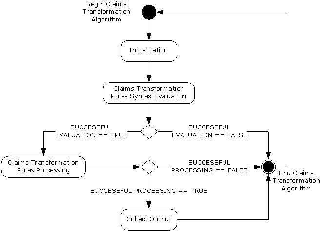
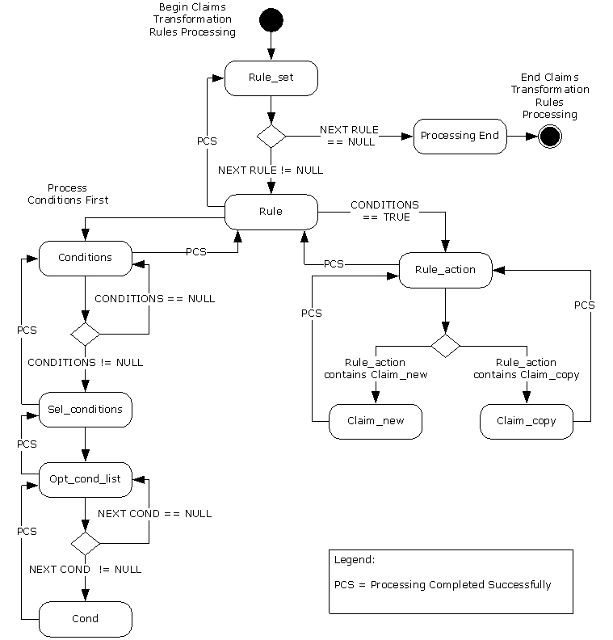

# [MS-CTA]: Claims Transformation Algorithm

Table of Contents

1 Introduction

- [1 Introduction](#Section_1)
  - [1.1 Glossary](#Section_1.1)
  - [1.2 References](#Section_1.2)
    - [1.2.1 Normative References](#Section_1.2.1)
    - [1.2.2 Informative References](#Section_1.2.2)
  - [1.3 Overview](#Section_1.3)
  - [1.4 Relationship to Protocols and Other Algorithms](#Section_1.4)
  - [1.5 Applicability Statement](#Section_1.5)
  - [1.6 Standards Assignments](#Section_1.6)

2 Algorithm Details

- [2 Algorithm Details](#Section_2)
  - [2.1 Claims Transformation Algorithm Details](#Section_2.1)
    - [2.1.1 Abstract Data Model](#Section_2.1.1)
    - [2.1.2 Data Structures](#Section_2.1.2)
    - [2.1.3 Initialization](#Section_2.1.3)
    - [2.1.4 Processing Rules](#Section_2.1.4)
      - [2.1.4.1 Claims Transformation Rules Language Syntax](#Section_2.1.4.1)
        - [2.1.4.1.1 Language Terminals](#Section_2.1.4.1.1)
        - [2.1.4.1.2 Language Syntax](#Section_2.1.4.1.2)
      - [2.1.4.2 Claims Transformation Rules Syntax Evaluation](#Section_2.1.4.2)
      - [2.1.4.3 Claims Transformation Rules Processing](#Section_2.1.4.3)
        - [2.1.4.3.1 Rule-set](#Section_2.1.4.3.1)
        - [2.1.4.3.2 Rule](#Section_2.1.4.3.2)
        - [2.1.4.3.3 Conditions](#Section_2.1.4.3.3)
        - [2.1.4.3.4 Sel-condition](#Section_2.1.4.3.4)
        - [2.1.4.3.5 Opt-cond-list](#Section_2.1.4.3.5)
        - [2.1.4.3.6 Cond](#Section_2.1.4.3.6)
        - [2.1.4.3.7 Rule-action](#Section_2.1.4.3.7)
        - [2.1.4.3.8 Claim-copy](#Section_2.1.4.3.8)
        - [2.1.4.3.9 Claim-new](#Section_2.1.4.3.9)
        - [2.1.4.3.10 Processing End](#Section_2.1.4.3.10)

3 Algorithm Examples

- [3 Algorithm Examples](#Section_3)
  - [3.1 Processing "Allow All Claims" Rule](#Section_3.1)
  - [3.2 Processing "Deny Some Claims" Rule](#Section_3.2)
  - [3.3 Processing "Issue always" Rule](#Section_3.3)
  - [3.4 Processing an Invalid Rule](#Section_3.4)

4 Security

- [4 Security](#Section_4)
  - [4.1 Security Considerations for Implementers](#Section_4.1)
  - [4.2 Index of Security Parameters](#Section_4.2)

5 Appendix A: Product Behavior

- [5 Appendix A: Product Behavior](#Section_5)

6 Change Tracking

- [6 Change Tracking](#Section_6)

For the legal notice and IP terms, see [LEGAL.md](../LEGAL.md).
Last updated: 4/23/2024.
See [Revision History](#revision-history) for full version history.

# 1 Introduction

This document specifies the Claims Transformation Algorithm, which is an algorithm to transform [**claims**](#gt_claim) based on rules written in the claims [**transformation rules**](#gt_transformation-rules) language, which is defined in this document as well.

Sections 1.6 and 2 of this specification are normative. All other sections and examples in this specification are informative.

## 1.1 Glossary

This document uses the following terms:

**Augmented Backus-Naur Form (ABNF)**: A modified version of Backus-Naur Form (BNF), commonly used by Internet specifications. ABNF notation balances compactness and simplicity with reasonable representational power. ABNF differs from standard BNF in its definitions and uses of naming rules, repetition, alternatives, order-independence, and value ranges. For more information, see [[RFC5234]](https://go.microsoft.com/fwlink/?LinkId=123096).

**claim**: An assertion about a security principal expressed as the n-tuple {Identifier, ValueType, m Value(s) of type ValueType} where m is greater than or equal to 1. A claim with only one Value in the n-tuple is called a [**single-valued claim**](#gt_single-valued-claim); a claim with more than one Value is called a multi-valued claim.

**claims transformation**: The process of converting one set of claims by analyzing and filtering the claims and by adding new claims in order to generate a new set of claims.

**claims transformation rules language syntax**: The context-free grammar expressed in ABNF that specifies the language used to describe the rules used in the Claims Transformation Algorithm.

**input claims**: The set of claims provided as input to the Claims Transformation Algorithm.

**production**: An individual ABNF rule in the claims transformation rules language.

**production name**: The name on the left side of the production.

**single-valued claim**: A [**claim**](#gt_claim) with only one Value in the n-tuple {Identifier, ValueType, m Value(s) of type ValueType}.

**tag**: A production name or a terminal from the claims transformation rules language syntax that is used to identify a portion of the given transformation rules.

**terminal**: A basic element of the claims transformation rules language syntax.

**transformation rules**: A set of rules defined according to the claims transformation rules language syntax that specifies how claims are transformed when the Claims Transformation Algorithm is invoked.

**UTF-16**: A standard for encoding Unicode characters, defined in the Unicode standard, in which the most commonly used characters are defined as double-byte characters. Unless specified otherwise, this term refers to the UTF-16 encoding form specified in [[UNICODE5.0.0/2007]](https://go.microsoft.com/fwlink/?LinkId=154659) section 3.9.

**MAY, SHOULD, MUST, SHOULD NOT, MUST NOT:** These terms (in all caps) are used as defined in [[RFC2119]](https://go.microsoft.com/fwlink/?LinkId=90317). All statements of optional behavior use either MAY, SHOULD, or SHOULD NOT.

## 1.2 References

Links to a document in the Microsoft Open Specifications library point to the correct section in the most recently published version of the referenced document. However, because individual documents in the library are not updated at the same time, the section numbers in the documents may not match. You can confirm the correct section numbering by checking the [Errata](https://go.microsoft.com/fwlink/?linkid=850906).

### 1.2.1 Normative References

We conduct frequent surveys of the normative references to assure their continued availability. If you have any issue with finding a normative reference, please contact [dochelp@microsoft.com](mailto:dochelp@microsoft.com). We will assist you in finding the relevant information.

[ISO/IEC-9899] International Organization for Standardization, "Programming Languages - C", ISO/IEC 9899:TC2, May 2005, [http://www.open-std.org/jtc1/sc22/wg14/www/docs/n1124.pdf](https://go.microsoft.com/fwlink/?LinkId=89921)

[RFC2119] Bradner, S., "Key words for use in RFCs to Indicate Requirement Levels", BCP 14, RFC 2119, March 1997, [https://www.rfc-editor.org/info/rfc2119](https://go.microsoft.com/fwlink/?LinkId=90317)

### 1.2.2 Informative References

None.

## 1.3 Overview

This document defines the Claims Transformation Algorithm, which enables parsing, filtering, issuance and transformation of a set of [**input claims**](#gt_input-claims) based on the input [**transformation rules**](#gt_transformation-rules).

The [**claims transformation rules language syntax**](#gt_claims-transformation-rules-language-syntax) specified in this document defines the syntax for transformation rules.

The Claims Transformation Algorithm essentially is a programmable transformation of [**claims**](#gt_claim).

This algorithm can be summarized at a high level as follows: Validate the transformation rules using the claims transformation rules language syntax and transform the input claims using the transformation rules based on the [**claims transformation**](#gt_claims-transformation) processing rules.

## 1.4 Relationship to Protocols and Other Algorithms

This algorithm does not depend on any other protocols or algorithms.

## 1.5 Applicability Statement

This algorithm is applicable when programmable [**claims transformation**](#gt_claims-transformation) needs to be performed on [**claims**](#gt_claim).

## 1.6 Standards Assignments

None.

# 2 Algorithm Details

## 2.1 Claims Transformation Algorithm Details

The Claims Transformation Algorithm is illustrated in the following state machine diagram, which consists of the following states:

- Initialization: Initializing the internal state (section [2.1.3](#Section_2.1.3)).
- Claims Transformation Rules Syntax Evaluation: Validating that the given [**transformation rules**](#gt_transformation-rules) text conforms to the [**claims transformation rules language syntax**](#gt_claims-transformation-rules-language-syntax) and generating transformation rules (section [2.1.4.2](#Section_2.1.4.2)).
- Claims Transformation Rules Processing: Transforming [**input claims**](#gt_input-claims) to output [**claims**](#gt_claim) using transformation rules (section [2.1.4.3](#Section_2.1.4.3)).
- Collect Output: Collecting the output claims from the transformation process.

Figure 1: Claims Transformation Algorithm state machine

The Claims Transformation Algorithm depends only on the given input per invocation and does not use any other state for its functioning. It maintains state only on a per-invocation basis and only for the duration of the invocation and does not preserve state beyond that scope.

See the following sections for more details on the various states of the state machine.

### 2.1.1 Abstract Data Model

None.

### 2.1.2 Data Structures

The following data structure definitions are applicable to the current document:

**Claim:** A [**claim**](#gt_claim) is defined as the 3-tuple of following values:

- TYPE: The type or identifier of the claim, represented as a [**UTF-16**](#gt_utf-16) string.
- VALUE_TYPE: The value type of the claim VALUE, represented as a UTF-16 string.
- VALUE: A single claim value; its type depends on the VALUE_TYPE.
This Claim is a [**single-valued claim**](#gt_single-valued-claim).

**VALUE_TYPE:** The VALUE_TYPE field in a claim MUST have one of the following UTF-16 values or a case variation thereof:

- "uint64"
- "int64"
- "string"
- "boolean"

### 2.1.3 Initialization

The Claims Transformation Algorithm MUST be invoked by passing in the following parameters:

**InputClaims**: A set of zero or more [**claims**](#gt_claim) (section [2.1.2](#Section_2.1.2)) that need to be transformed.

**InputTransformationRulesText**: A set of [**transformation rules**](#gt_transformation-rules) in [**UTF-16**](#gt_utf-16) format that define the transformation based on the language defined in Claims Transformation Rules Language Syntax (section [2.1.4.1](#Section_2.1.4.1)).

The Claims Transformation Algorithm MUST generate the following output variables:

**OutputClaims**: This is a list of zero or more claims (section 2.1.2) returned by the Claims Transformation Algorithm when it finishes processing the given input.

**ReturnValue**: This variable holds the resulting value returned by this algorithm. The possible values are SUCCESS to indicate successful processing and FAILURE to indicate an error during the processing.

The Claims Transformation Algorithm MUST maintain state during processing in the following variables:

- **InternalTransformationRules**: This is the representation of **InputTransformationRulesText** generated for Claims Transformation Rules Processing. This representation MUST contain the following:
- **InputTransformationRulesText**
- An ordered, hierarchical list of [**tags**](#gt_tag) from the [**claims transformation rules language syntax**](#gt_claims-transformation-rules-language-syntax) that are arranged to match the given **InputTransformationRulesText** and the corresponding matching portion of **InputTransformationRulesText** for each tag.
- **InternalEvaluationContext**: A list of claims on which the claims transformation rules processing operates.
- **InternalOutputContext**: A list of claims that collects the output of claims transformation rules processing.
The Claims Transformation Algorithm MUST be initialized as follows:

- **InternalTransformationRules** MUST be initialized by clearing it.
- **InternalEvaluationContext** MUST be initialized by clearing it and then adding all **InputClaims** to it.
- **InternalOutputContext** MUST be initialized by clearing it.
- **OutputClaims** MUST be initialized by clearing it.
- **ReturnValue** MUST be set to SUCCESS.

### 2.1.4 Processing Rules

The Claims Transformation Algorithm is invoked by a caller by providing InputClaims and the InputTransformationRulesText as indicated in Initialization (section [2.1.3](#Section_2.1.3)). This algorithm continues processing until an error occurs or until successful completion.

The Claims Transformation Algorithm consists of the following processing steps.

- Parse **InputTransformationRulesText** to validate the syntax against the [**claims transformation rules language syntax**](#gt_claims-transformation-rules-language-syntax) and generate **InternalTransformationRules** (section [2.1.4.2](#Section_2.1.4.2)).
- If evaluation in the previous step fails, set **ReturnValue** to FAILURE and **OutputClaims** to an empty list and exit this algorithm.
- Perform processing steps detailed in Claims Transformation Rules Processing (section [2.1.4.3](#Section_2.1.4.3)) on **InternalEvaluationContext** using **InternalTransformationRules**.
- If an error occurs in the previous processing, set **ReturnValue** to FAILURE and **OutputClaims** to an empty list and exit this algorithm.
- Set **ReturnValue** to SUCCESS, copy all the [**claims**](#gt_claim) from the **InternalOutputContext** to **OutputClaims**, and exit this algorithm.

#### 2.1.4.1 Claims Transformation Rules Language Syntax

The [**claims**](#gt_claim) [**transformation rules**](#gt_transformation-rules) language is a context-free language defined following, using tokens and [**ABNF**](#gt_augmented-backus-naur-form-abnf).

##### 2.1.4.1.1 Language Terminals

The following table lists the complete set of [**terminal**](#gt_terminal) strings and associated language terminals used in the [**claims**](#gt_claim) [**transformation rules**](#gt_transformation-rules) language. These definitions MUST be treated as case insensitive. The terminal strings MUST be encoded in [**UTF-16**](#gt_utf-16).

| String | Terminal |
| --- | --- |
| "=>" | IMPLY |
| ";" | SEMICOLON |
| ":" | COLON |
| "," | COMMA |
| "." | DOT |
| "[" | O-SQ-BRACKET |
| "]" | C-SQ-BRACKET |
| "(" | O-BRACKET |
| ")" | C-BRACKET |
| "==" | EQ |
| "!=" | NEQ |
| "=~" | REGEXP-MATCH |
| "!~" | REGEXP-NOT-MATCH |
| "=" | ASSIGN |
| "&&" | AND |
| "issue" | ISSUE |
| "type" | TYPE |
| "value" | VALUE |
| "valuetype" | VALUE-TYPE |
| "claim" | CLAIM |
| "[_A-Za-z][_A-Za-z0-9]*" | IDENTIFIER |
| "\"[^\"\n]*\"" | STRING |
| "uint64" | UINT64-TYPE |
| "int64" | INT64-TYPE |
| "string" | STRING-TYPE |
| "boolean" | BOOLEAN-TYPE |
| - | NULL |

##### 2.1.4.1.2 Language Syntax

The [**claims**](#gt_claim) [**transformation rules**](#gt_transformation-rules) language is specified here in [**ABNF**](#gt_augmented-backus-naur-form-abnf) form. This definition uses the terminals specified in the previous section as well as new ABNF [**productions**](#gt_production) defined here. The rules MUST be encoded in [**UTF-16**](#gt_utf-16). The string comparisons MUST be treated as case insensitive.

*Rule-set = NULL*

*/ Rules*

*Rules = Rule*

*/ Rule Rules*

*Rule = Rule-body*

*Rule-body = (Conditions IMPLY Rule-action SEMICOLON)*

*Conditions = NULL*

*/ Sel-condition-list*

*Sel-condition-list = Sel-condition*

*/ (Sel-condition-list AND Sel-condition)*

*Sel-condition = Sel-condition-body*

*/ (IDENTIFIER COLON Sel-condition-body)*

*Sel-condition-body = O-SQ-BRACKET Opt-cond-list C-SQ-BRACKET*

*Opt-cond-list = NULL*

*/ Cond-list*

*Cond-list = Cond*

*/ (Cond-list COMMA Cond)*

*Cond = Value-cond*

*/ Type-cond*

*Type-cond = TYPE Cond-oper Literal-expr*

*Value-cond = (Val-cond COMMA Val-type-cond)*

*/(Val-type-cond COMMA Val-cond)*

*Val-cond = VALUE Cond-oper Literal-expr*

*Val-type-cond = VALUE-TYPE Cond-oper Value-type-literal*

*Claim-prop = TYPE*

*/ VALUE*

*Cond-oper = EQ-*

*/ NEQ*

*/ REGEXP-MATCH*

*/ REGEXP-NOT-MATCH*

*Literal-expr = Literal*

*/ Value-type-literal*

*Expr = Literal*

*/ Value-type-expr*

*/ (IDENTIFIER DOT Claim-prop)*

*Value-type-expr = Value-type-literal*

*/(IDENTIFIER DOT VALUE-TYPE)*

*Value-type-literal = INT64-TYPE*

*/ UINT64-TYPE*

*/ STRING-TYPE*

*/ BOOLEAN-TYPE*

*Literal = STRING*

*Rule-action = ISSUE O-BRACKET Issue-params C-BRACKET*

*Issue-params = Claim-copy*

*/ Claim-new*

*Claim-copy = CLAIM ASSIGN IDENTIFIER*

*Claim-new = Claim-prop-assign-list*

*Claim-prop-assign-list = (Claim-value-assign COMMA Claim-type-assign)*

*/(Claim-type-assign COMMA Claim-value-assign)*

*Claim-value-assign = (Claim-val-assign COMMA Claim-val-type-assign)*

*/(Claim-val-type-assign COMMA Claim-val-assign)*

*Claim-val-assign = VALUE ASSIGN Expr*

*Claim-val-type-assign = VALUE-TYPE ASSIGN Value-type-expr*

*Claim-type-assign = TYPE ASSIGN Expr*

#### 2.1.4.2 Claims Transformation Rules Syntax Evaluation

Syntax evaluation MUST perform the following processing:

- **InputTransformationRulesText** MUST be validated against the [**ABNF**](#gt_augmented-backus-naur-form-abnf) syntax definition of the [**claims**](#gt_claim) [**transformation rules**](#gt_transformation-rules) language to ensure conformity. Any failure MUST be considered an error, **ReturnValue** MUST be set to FAILURE, and the algorithm MUST exit.
- The following validation MUST be performed on **InputTransformationRulesText**.
- Each *Sel-condition* in *Sel-condition-list* either MUST use an IDENTIFIER unique among all IDENTIFIERS in the *Sel-condition-list* or MUST use no IDENTIFIER.
- If *Rule-action* contains one or more IDENTIFIERs, then each of the IDENTIFIERs MUST have an identical matching IDENTIFIER in the *Condition* in the same *Rule*.
- If either of the preceding validation steps fails, it MUST be considered an error. **ReturnValue** MUST be set to FAILURE, and the algorithm MUST exit.
- The **InternalTransformationRules** variable MUST be populated with **InputTransformationRulesText**.
- The **InternalTransformationRules** variable MUST be populated in a depth-first fashion with [**tags**](#gt_tag) ([**production names**](#gt_production-name) and terminals) and the matching portion of **InputTransformationRulesText**.

#### 2.1.4.3 Claims Transformation Rules Processing

Claims transformation rules processing requires the **InternalTransformationRules** variable to be populated using **InputTransformationRulesText** and requires all other variables to be initialized (see section [2.1.3](#Section_2.1.3) and section [2.1.4.2](#Section_2.1.4.2)).

Claims transformation rules processing uses an additional variable called **InternalMatchingClaimsList** to store temporary data during processing. Each **InternalMatchingClaimsList** is a list of [**claims**](#gt_claim) that matches a *Sel-condition* (section [2.1.4.3.4](#Section_2.1.4.3.4)). **InternalMatchingClaimsList**s are created dynamically on a per-Rule (section [2.1.4.3.2](#Section_2.1.4.3.2)) basis.

The following state diagram illustrates the logical processing flow, with error handling excluded. Any error encountered during the claims [**transformation rules**](#gt_transformation-rules) processing MUST set **ReturnValue** to FAILURE, and the processing MUST immediately continue from the Processing End (section [2.1.4.3.10](#Section_2.1.4.3.10)) state.

Figure 2: Claims transformation state machine

For the purposes of this section, processing is defined as **InternalTransformationRules** evaluation on the **InternalEvaluationContext** or **InternalTransformationRules** action taken using Matching Claims.

The processing MUST begin at the first [**tag**](#gt_tag) in **InternalTransformationRules** and MUST proceed depth-first in the order in which the tags are placed.

The processing steps for the critical tags are specified in the following subsections. Those tags not listed MUST be treated as if they have no processing steps and MUST be ignored during processing.

##### 2.1.4.3.1 Rule-set

- Set ReturnValue to SUCCESS.
- If the *Rule-set* is NULL, go to Processing End (section [2.1.4.3.10](#Section_2.1.4.3.10)).
- Process each *Rule* in the *Rule-set*.
- Go to Processing End (section 2.1.4.3.10).

##### 2.1.4.3.2 Rule

- Processing a *Rule* MUST perform the necessary operations using the **InternalEvaluationContext** variable.
- Create as many **InternalMatchingClaimsList** variables as there are *Sel-condition*s in this *Rule*, and initialize them by clearing them.
- Process the *Conditions* [**tag**](#gt_tag) in this *Rule*.
- If the *Conditions* evaluates to TRUE, the *Rule-action* in this *Rule* MUST be processed using all the n-tuples of [**claims**](#gt_claim) generated by the *Conditions.*

##### 2.1.4.3.3 Conditions

- This processing step MUST evaluate to TRUE or FALSE.
- When *Conditions* evaluates to TRUE, a list of zero or more matching n-tuples of [**claims**](#gt_claim), where n is the number of *Sel-condition*s in the *Conditions,* MUST be returned.
- If the *Conditions* is NULL, the processing of this [**production**](#gt_production) must stop and the evaluation result MUST be returned as TRUE with no entries in the matching n-tuples.
- The following processing applies when *Conditions* is not NULL:
- When all *Sel-condition*s in the *Conditions* evaluate to TRUE, the *Conditions* MUST evaluate to TRUE; else the *Conditions* MUST evaluate to FALSE.
- Each *Sel-condition* MUST evaluate to TRUE when at least one claim in the **InternalEvaluationContext** matches it.
- The process of matching each *Sel-condition* MUST determine all claims in the **InternalEvaluationContext** that match it. The resulting list of matching claims MUST be stored in the **InternalMatchingClaimsList** corresponding to that *Sel-condition*.
- If *Conditions* evaluates to TRUE, there MUST exist an n-tuple of claims from the **InternalEvaluationContext** that matches each of the constituent "n" *Sel-condition*s. The n-tuple can contain duplicate claims; that is, one claim can match one or more *Sel-condition*s.
- Evaluation of *Conditions* MUST determine all possible unique n-tuples of claims from the **InternalEvaluationContext** that match each of the constituent "n" *Sel-condition*s.
- Return the list of n-tuples of claims.

##### 2.1.4.3.4 Sel-condition

- This processing step MUST fill one **InternalMatchingClaimsList** with zero or more [**claims**](#gt_claim) from the **InternalEvaluationContext**. If an IDENTIFIER is used in the *Sel-condition*, the **InternalMatchingClaimsList** MUST be tagged by the string represented by the IDENTIFIER.
- **InternalMatchingClaimsList** is filled by evaluating *Opt-cond-list.*
- If the **InternalMatchingClaimsList** contains zero claims, the returned evaluation result MUST be FALSE; else it MUST be TRUE.

##### 2.1.4.3.5 Opt-cond-list

- If *Opt-cond-list* is NULL, the **InternalMatchingClaimsList** MUST be filled with all the [**claims**](#gt_claim) in the **InternalEvaluationContext**. The processing of this [**production**](#gt_production) MUST stop, and **InternalMatchingClaimsList** must be returned as the evaluation result.
- The following processing rules apply when *Opt-cond-list* is not NULL:
- The following processing MUST start from the first claim in the **InternalEvaluationContext,** and all the claims MUST be processed.
- If all the *Conds* in this *Opt-cond-list* evaluate to TRUE for a claim in the **InternalEvaluationContext**, the claim MUST be added to the **InternalMatchingClaimsList**.
Return the **InternalMatchingClaimsList** as the evaluation result.

##### 2.1.4.3.6 Cond

- This processing step MUST return TRUE if a given [**claim**](#gt_claim) matches the current *Cond*, and FALSE otherwise.
- The TYPE, VALUE, and VALUE-TYPE in a Cond MUST be replaced by the current claim's TYPE, VALUE, and VALUE-TYPE, respectively (section [2.1.2](#Section_2.1.2)). The current claim's TYPE and VALUE-TYPE MUST always be treated as STRING-TYPE. The current claim's VALUE MUST be interpreted based on its VALUE-TYPE.
- The right side of *Cond-oper* in the *Cond* MUST be convertible to the same type as the operand on the left side of the *Cond-oper*; otherwise, the *Cond* MUST return the evaluation result as FALSE. Converting STRING-TYPE variables to other types MUST be performed as specified in [[ISO/IEC-9899]](https://go.microsoft.com/fwlink/?LinkId=89921) section 7.20.1.4.
- The *Cond-oper* in the *Cond* MUST be interpreted based upon the type of the operand on the left side of the *Cond-oper*, as shown in the following table.
|  | INT64_TYPE | UINT64_TYPE | BOOLEAN_TYPE | STRING_TYPE |
| --- | --- | --- | --- | --- |
| EQ | Signed integer equality comparison. | Unsigned integer equality comparison. | BOOLEAN equality comparison. Unsigned integers MUST be interpreted as BOOLEAN values as follows: 0 == FALSE (!0) == TRUE | Case-insensitive, NULL terminated Unicode-string comparison, excluding terminating NULLs for equality. |
| NEQ | Negation of EQ comparison. | Negation of EQ comparison. | Negation of EQ comparison. | Negation of EQ comparison. |
| REGEXP-MATCH | Not valid. | Not valid. | Not valid. | Regular expression match of NULL terminated Unicode strings. |
| REGEXP-NOT-MATCH | Not valid. | Not valid. | Not valid. | Negation of REGEXP-MATCH. |

- If the current processing encounters a *Cond-oper* and the type combination is identified as "Not Valid" in the preceding table, the processing MUST return the result of the evaluation as FALSE.
- Return the result of the evaluation of *Cond*, comparing the operands based on interpretation of the *Cond-oper* from the preceding table.

##### 2.1.4.3.7 Rule-action

- Successful processing of this step MUST result in creation of one or more [**claims**](#gt_claim).
- *Rule-action* acts on each of the n-tuples generated by *Conditions* in the same *Rule*.
- If this *Rule-action* contains a *Claim-copy* sub tag, *Claim-copy* (section [2.1.4.3.8](#Section_2.1.4.3.8)) MUST be processed using the matching n-tuples as input and the resulting claims collected as output.
- If this *Rule-action* contains a *Claim-new* sub tag, *Claim-new* (section [2.1.4.3.9](#Section_2.1.4.3.9)) MUST be processed using the matching n-tuples as input and the resulting claims collected as output.
The above processing MUST generate one or more claims. The generated claims MUST be appended to the **InternalEvaluationContext** and the **InternalOutputContext**.

##### 2.1.4.3.8 Claim-copy

- This processing step MUST create one [**claim**](#gt_claim) per matching n-tuple.
- The new claim MUST be a copy of the claim in the matching n-tuple indicated by the IDENTIFIER reference.

##### 2.1.4.3.9 Claim-new

- Successful processing of this step MUST create one or more [**claims**](#gt_claim).
- If no matching n-tuples are presented to this processing step, the contained assignments MUST have only *Literals* and MUST NOT have any IDENTIFIER references. In this case, only one claim is generated.
- If matching n-tuples are presented, this processing step MUST create one claim per matching n-tuple, using *Literals* and/or IDENTIFIER references to the matching n-tuple.
- Assignments to TYPE, VALUE, and VALUE-TYPE MUST be interpreted as assignments to TYPE, VALUE and VALUE-TYPE, respectively, of each of the newly created Claims; see section [2.1.2](#Section_2.1.2).
- If the *Expr* on the right side of the *ASSIGN* is a *Literal*, it MUST be interpreted based on the type on the left side of *ASSIGN.* When the left side of the *Expr* is not STRING-TYPE, the *Literal* MUST be converted in accordance with the rules specified in [[ISO/IEC-9899]](https://go.microsoft.com/fwlink/?LinkId=89921) section 7.20.1.4. If the right side of the *Assign* is not a *Literal,* type conversion MUST NOT be performed.
- Each newly created claim MUST adhere to the definition in section 2.1.2; else it MUST be considered invalid.
- If any type mismatches or errors in type conversions are encountered by *ASSIGN,* or if an invalid claim is generated, processing MUST stop, and a processing error MUST be indicated.

##### 2.1.4.3.10 Processing End

- If **ReturnValue** is set to SUCCESS, copy the [**claims**](#gt_claim) in the **InternalOutputContext** to **OutputClaims** and exit the algorithm.
- If **ReturnValue** is set to FAILURE, clear **OutputClaims** and exit the algorithm.

# 3 Algorithm Examples

This section contains some examples of the Claims Transformation Algorithm.

## 3.1 Processing "Allow All Claims" Rule

Input:

InputTransformationRulesText: C1:[]=> ISSUE(Claim=C1);

InputClaims: {(TYPE = "type1", VALUE = 5, VALUE-TYPE = "int64"),

(TYPE = "type2", VALUE = "example", VALUE-TYPE = "string") }

Output:

OutputClaims: {(TYPE = "type1", VALUE = 5, VALUE-TYPE = "int64"),

(TYPE = "type2", VALUE = "example", VALUE-TYPE = "string") }

ReturnValue: SUCCESS.

## 3.2 Processing "Deny Some Claims" Rule

Input:

InputTransformationRulesText: C1:[type != "Type1"] => ISSUE (Claim = C1);

InputClaims: {(TYPE = "type1", VALUE = 5, VALUE-TYPE = "uint64"),

(TYPE = "type2", VALUE = "example", VALUE-TYPE = "string"),

(TYPE = "type3", VALUE = -33, VALUE-TYPE = "int64")}

Output:

OutputClaims: { (TYPE = "type2", VALUE = "example", VALUE-TYPE = "string"),

(TYPE = "type3", VALUE = -33, VALUE-TYPE = "int64")}

ReturnValue: SUCCESS.

## 3.3 Processing "Issue always" Rule

Input:

InputTransformationRulesText: => ISSUE (type="type1", VALUE=false, VALUE-TYPE="boolean");

InputClaims: {}

Output:

OutputClaims: {(TYPE = "type1", VALUE = false, VALUE-TYPE = "boolean")}

ReturnValue: SUCCESS.

## 3.4 Processing an Invalid Rule

Input:

InputTransformationRulesText: C1:[type] => ISSUE (Claim = C1);

InputClaims: {(TYPE = "type1", VALUE = 5, VALUE-TYPE = "uint64"),

(TYPE = "type2", VALUE = "example", VALUE-TYPE = "string")}

Output:

OutputClaims: {}

ReturnValue: FAILURE.

# 4 Security

## 4.1 Security Considerations for Implementers

None.

## 4.2 Index of Security Parameters

None.

# 5 Appendix A: Product Behavior

The information in this specification is applicable to the following Microsoft products or supplemental software. References to product versions include updates to those products.

- Windows Server 2012 operating system
- Windows Server 2012 R2 operating system
- Windows Server 2016 operating system
- Windows Server operating system
- Windows Server 2019 operating system
- Windows Server 2022 operating system
- Windows Server 2025 operating system
Exceptions, if any, are noted in this section. If an update version, service pack or Knowledge Base (KB) number appears with a product name, the behavior changed in that update. The new behavior also applies to subsequent updates unless otherwise specified. If a product edition appears with the product version, behavior is different in that product edition.

Unless otherwise specified, any statement of optional behavior in this specification that is prescribed using the terms "SHOULD" or "SHOULD NOT" implies product behavior in accordance with the SHOULD or SHOULD NOT prescription. Unless otherwise specified, the term "MAY" implies that the product does not follow the prescription.

# 6 Change Tracking

This section identifies changes that were made to this document since the last release. Changes are classified as Major, Minor, or None.

The revision class **Major** means that the technical content in the document was significantly revised. Major changes affect protocol interoperability or implementation. Examples of major changes are:

- A document revision that incorporates changes to interoperability requirements.
- A document revision that captures changes to protocol functionality.
The revision class **Minor** means that the meaning of the technical content was clarified. Minor changes do not affect protocol interoperability or implementation. Examples of minor changes are updates to clarify ambiguity at the sentence, paragraph, or table level.

The revision class **None** means that no new technical changes were introduced. Minor editorial and formatting changes may have been made, but the relevant technical content is identical to the last released version.

The changes made to this document are listed in the following table. For more information, please contact [dochelp@microsoft.com](mailto:dochelp@microsoft.com).

| Section | Description | Revision class |
| --- | --- | --- |
| [5](#Section_5) Appendix A: Product Behavior | Added Windows Server 2025 to the list of applicable products. | Major |

## Revision History

| Date | Version | Revision Class | Comments |
| --- | --- | --- | --- |
| 12/16/2011 | 1.0 | New | Released new document. |
| 3/30/2012 | 1.0 | None | No changes to the meaning, language, or formatting of the technical content. |
| 7/12/2012 | 1.0 | None | No changes to the meaning, language, or formatting of the technical content. |
| 10/25/2012 | 1.0 | None | No changes to the meaning, language, or formatting of the technical content. |
| 1/31/2013 | 2.0 | Major | Significantly changed the technical content. |
| 8/8/2013 | 3.0 | Major | Significantly changed the technical content. |
| 11/14/2013 | 3.0 | None | No changes to the meaning, language, or formatting of the technical content. |
| 2/13/2014 | 3.0 | None | No changes to the meaning, language, or formatting of the technical content. |
| 5/15/2014 | 3.0 | None | No changes to the meaning, language, or formatting of the technical content. |
| 6/30/2015 | 4.0 | Major | Significantly changed the technical content. |
| 7/14/2016 | 4.0 | None | No changes to the meaning, language, or formatting of the technical content. |
| 6/1/2017 | 4.0 | None | No changes to the meaning, language, or formatting of the technical content. |
| 9/15/2017 | 5.0 | Major | Significantly changed the technical content. |
| 9/12/2018 | 6.0 | Major | Significantly changed the technical content. |
| 3/15/2019 | 6.1 | Minor | Clarified the meaning of the technical content. |
| 4/7/2021 | 7.0 | Major | Significantly changed the technical content. |
| 4/23/2024 | 8.0 | Major | Significantly changed the technical content. |
