# [MS-DCOM]: Distributed Component Object Model (DCOM) Remote Protocol

Table of Contents

1 Introduction

- [1 Introduction](#Section_1)
  - [1.1 Glossary](#Section_1.1)
  - [1.2 References](#Section_1.2)
    - [1.2.1 Normative References](#Section_1.2.1)
    - [1.2.2 Informative References](#Section_1.2.2)
  - [1.3 Overview](#Section_1.3)
    - [1.3.1 Activation](#Section_1.3.1)
    - [1.3.2 Object References](#Section_1.3.2)
    - [1.3.3 Object Exporter](#Section_1.3.3)
    - [1.3.4 ORPC Calls](#Section_1.3.4)
    - [1.3.5 Causality Identifiers](#Section_1.3.5)
    - [1.3.6 Reference Counts](#Section_1.3.6)
    - [1.3.7 Object Resolver Service](#Section_1.3.7)
  - [1.4 Relationship to Other Protocols](#Section_1.4)
  - [1.5 Prerequisites/Preconditions](#Section_1.5)
  - [1.6 Applicability Statement](#Section_1.6)
  - [1.7 Versioning and Capability Negotiation](#Section_1.7)
  - [1.8 Vendor-Extensible Fields](#Section_1.8)
  - [1.9 Standards Assignments](#Section_1.9)

2 Messages

- [2 Messages](#Section_2)
  - [2.1 Transport](#Section_2.1)
  - [2.2 Common Data Types](#Section_2.2)
    - [2.2.1 OID](#Section_2.2.1)
    - [2.2.2 SETID](#Section_2.2.2)
    - [2.2.3 HRESULT](#Section_2.2.3)
    - [2.2.4 error_status_t](#Section_2.2.4)
    - [2.2.5 GUID](#Section_2.2.5)
    - [2.2.6 CID](#Section_2.2.6)
    - [2.2.7 CLSID](#Section_2.2.7)
    - [2.2.8 IID](#Section_2.2.8)
    - [2.2.9 IPID](#Section_2.2.9)
    - [2.2.10 OXID](#Section_2.2.10)
    - [2.2.11 COMVERSION](#Section_2.2.11)
    - [2.2.12 object IDL Attribute](#Section_2.2.12)
    - [2.2.13 ORPCTHIS and ORPCTHAT](#Section_2.2.13)
      - [2.2.13.1 ORPC_EXTENT](#Section_2.2.13.1)
      - [2.2.13.2 ORPC_EXTENT_ARRAY](#Section_2.2.13.2)
      - [2.2.13.3 ORPCTHIS](#Section_2.2.13.3)
      - [2.2.13.4 ORPCTHAT](#Section_2.2.13.4)
    - [2.2.14 MInterfacePointer](#Section_2.2.14)
    - [2.2.15 PMInterfacePointerInternal](#Section_2.2.15)
    - [2.2.16 PMInterfacePointer](#Section_2.2.16)
    - [2.2.17 iid_is IDL Attribute](#Section_2.2.17)
    - [2.2.18 OBJREF](#Section_2.2.18)
      - [2.2.18.1 STDOBJREF](#Section_2.2.18.1)
      - [2.2.18.2 STDOBJREF (Packet Version)](#Section_2.2.18.2)
      - [2.2.18.3 STDOBJREF (IDL Version)](#Section_2.2.18.3)
      - [2.2.18.4 OBJREF_STANDARD](#Section_2.2.18.4)
      - [2.2.18.5 OBJREF_HANDLER](#Section_2.2.18.5)
      - [2.2.18.6 OBJREF_CUSTOM](#Section_2.2.18.6)
      - [2.2.18.7 OBJREF_EXTENDED](#Section_2.2.18.7)
      - [2.2.18.8 DATAELEMENT](#Section_2.2.18.8)
    - [2.2.19 DUALSTRINGARRAY](#Section_2.2.19)
      - [2.2.19.1 DUALSTRINGARRAY (Packet Version)](#Section_2.2.19.1)
      - [2.2.19.2 DUALSTRINGARRAY (IDL Version)](#Section_2.2.19.2)
      - [2.2.19.3 STRINGBINDING](#Section_2.2.19.3)
      - [2.2.19.4 SECURITYBINDING](#Section_2.2.19.4)
    - [2.2.20 Context](#Section_2.2.20)
      - [2.2.20.1 PROPMARSHALHEADER](#Section_2.2.20.1)
    - [2.2.21 ORPC Extensions](#Section_2.2.21)
      - [2.2.21.1 Error Information ORPC Extension](#Section_2.2.21.1)
      - [2.2.21.2 Custom-Marshaled Error Information Format](#Section_2.2.21.2)
      - [2.2.21.3 ErrorInfoString](#Section_2.2.21.3)
      - [2.2.21.4 Context ORPC Extension](#Section_2.2.21.4)
      - [2.2.21.5 EntryHeader](#Section_2.2.21.5)
    - [2.2.22 Activation Properties BLOB](#Section_2.2.22)
      - [2.2.22.1 CustomHeader](#Section_2.2.22.1)
      - [2.2.22.2 Activation Properties](#Section_2.2.22.2)
        - [2.2.22.2.1 InstantiationInfoData](#Section_2.2.22.2.1)
        - [2.2.22.2.2 SpecialPropertiesData](#Section_2.2.22.2.2)
        - [2.2.22.2.3 InstanceInfoData](#Section_2.2.22.2.3)
        - [2.2.22.2.4 ScmRequestInfoData](#Section_2.2.22.2.4)
          - [2.2.22.2.4.1 customREMOTE_REQUEST_SCM_INFO](#Section_2.2.22.2.4.1)
        - [2.2.22.2.5 ActivationContextInfoData](#Section_2.2.22.2.5)
        - [2.2.22.2.6 LocationInfoData](#Section_2.2.22.2.6)
        - [2.2.22.2.7 SecurityInfoData](#Section_2.2.22.2.7)
          - [2.2.22.2.7.1 COSERVERINFO](#Section_2.2.22.2.7.1)
        - [2.2.22.2.8 ScmReplyInfoData](#Section_2.2.22.2.8)
          - [2.2.22.2.8.1 customREMOTE_REPLY_SCM_INFO](#Section_2.2.22.2.8.1)
        - [2.2.22.2.9 PropsOutInfo](#Section_2.2.22.2.9)
    - [2.2.23 REMINTERFACEREF](#Section_2.2.23)
    - [2.2.24 REMQIRESULT](#Section_2.2.24)
    - [2.2.25 PREMQIRESULT](#Section_2.2.25)
    - [2.2.26 REFIPID](#Section_2.2.26)
    - [2.2.27 Local IDL Attribute](#Section_2.2.27)
    - [2.2.28 Constant Definitions](#Section_2.2.28)
      - [2.2.28.1 IDL Range Constants](#Section_2.2.28.1)

3 Protocol Details

- [3 Protocol Details](#Section_3)
  - [3.1 Server Details](#Section_3.1)
    - [3.1.1 Object Exporter Details](#Section_3.1.1)
      - [3.1.1.1 Abstract Data Model](#Section_3.1.1.1)
      - [3.1.1.2 Timers](#Section_3.1.1.2)
      - [3.1.1.3 Initialization](#Section_3.1.1.3)
      - [3.1.1.4 Higher-Layer Triggered Events](#Section_3.1.1.4)
      - [3.1.1.5 Message Processing Events and Sequencing Rules](#Section_3.1.1.5)
        - [3.1.1.5.1 Marshaling an Object](#Section_3.1.1.5.1)
        - [3.1.1.5.2 Marshaling an Object Reference](#Section_3.1.1.5.2)
        - [3.1.1.5.3 Unmarshaling an Object Reference](#Section_3.1.1.5.3)
        - [3.1.1.5.4 ORPC Invocations](#Section_3.1.1.5.4)
        - [3.1.1.5.5 Lazy Protocol Registration](#Section_3.1.1.5.5)
        - [3.1.1.5.6 IRemUnknown Interface](#Section_3.1.1.5.6)
          - [3.1.1.5.6.1 IRemUnknown Methods](#Section_3.1.1.5.6.1)
            - [3.1.1.5.6.1.1 IRemUnknown::RemQueryInterface (Opnum 3)](#Section_3.1.1.5.6.1.1)
            - [3.1.1.5.6.1.2 IRemUnknown::RemAddRef (Opnum 4 )](#Section_3.1.1.5.6.1.2)
            - [3.1.1.5.6.1.3 IRemUnknown::RemRelease (Opnum 5)](#Section_3.1.1.5.6.1.3)
        - [3.1.1.5.7 IRemUnknown2 Interface](#Section_3.1.1.5.7)
          - [3.1.1.5.7.1 IRemUnknown2 Methods](#Section_3.1.1.5.7.1)
            - [3.1.1.5.7.1.1 IRemUnknown2::RemQueryInterface2 (Opnum 6)](#Section_3.1.1.5.7.1.1)
        - [3.1.1.5.8 IUnknown Interface](#Section_3.1.1.5.8)
      - [3.1.1.6 Timer Events](#Section_3.1.1.6)
        - [3.1.1.6.1 Pinging](#Section_3.1.1.6.1)
        - [3.1.1.6.2 Object Reclamation](#Section_3.1.1.6.2)
      - [3.1.1.7 Other Local Events](#Section_3.1.1.7)
    - [3.1.2 Object Resolver Details](#Section_3.1.2)
      - [3.1.2.1 Abstract Data Model](#Section_3.1.2.1)
      - [3.1.2.2 Timers](#Section_3.1.2.2)
      - [3.1.2.3 Initialization](#Section_3.1.2.3)
      - [3.1.2.4 Higher-Layer Triggered Events](#Section_3.1.2.4)
      - [3.1.2.5 Message Processing Events and Sequencing Rules](#Section_3.1.2.5)
        - [3.1.2.5.1 IObjectExporter Methods](#Section_3.1.2.5.1)
          - [3.1.2.5.1.1 IObjectExporter::ResolveOxid (Opnum 0)](#Section_3.1.2.5.1.1)
          - [3.1.2.5.1.2 IObjectExporter::SimplePing (Opnum 1)](#Section_3.1.2.5.1.2)
          - [3.1.2.5.1.3 IObjectExporter::ComplexPing (Opnum 2)](#Section_3.1.2.5.1.3)
          - [3.1.2.5.1.4 IObjectExporter::ServerAlive (Opnum 3)](#Section_3.1.2.5.1.4)
          - [3.1.2.5.1.5 IObjectExporter::ResolveOxid2 (Opnum 4)](#Section_3.1.2.5.1.5)
          - [3.1.2.5.1.6 IObjectExporter::ServerAlive2 (Opnum 5)](#Section_3.1.2.5.1.6)
          - [3.1.2.5.1.7 Allocating and Deleting OID Entries](#Section_3.1.2.5.1.7)
          - [3.1.2.5.1.8 Allocating OXID Entries](#Section_3.1.2.5.1.8)
        - [3.1.2.5.2 IActivation and IRemoteSCMActivator Methods](#Section_3.1.2.5.2)
          - [3.1.2.5.2.1 IActivation Methods](#Section_3.1.2.5.2.1)
          - [3.1.2.5.2.2 IRemoteSCMActivator Methods](#Section_3.1.2.5.2.2)
          - [3.1.2.5.2.3 IActivation::RemoteActivation, IRemoteSCMActivator::RemoteGetClassObject, IRemoteSCMActivator::RemoteCreateInstance](#Section_3.1.2.5.2.3)
            - [3.1.2.5.2.3.1 IActivation:: RemoteActivation (Opnum 0)](#Section_3.1.2.5.2.3.1)
            - [3.1.2.5.2.3.2 IRemoteSCMActivator:: RemoteGetClassObject (Opnum 3)](#Section_3.1.2.5.2.3.2)
            - [3.1.2.5.2.3.3 IRemoteSCMActivator::RemoteCreateInstance (Opnum 4)](#Section_3.1.2.5.2.3.3)
      - [3.1.2.6 Timer Events](#Section_3.1.2.6)
      - [3.1.2.7 Other Local Events](#Section_3.1.2.7)
  - [3.2 Client Details](#Section_3.2)
    - [3.2.1 Abstract Data Model](#Section_3.2.1)
    - [3.2.2 Timers](#Section_3.2.2)
    - [3.2.3 Initialization](#Section_3.2.3)
    - [3.2.4 Higher-Layer Triggered Events](#Section_3.2.4)
      - [3.2.4.1 Creating Object References](#Section_3.2.4.1)
        - [3.2.4.1.1 Activation](#Section_3.2.4.1.1)
          - [3.2.4.1.1.1 Determining RPC Binding Information for Activation](#Section_3.2.4.1.1.1)
          - [3.2.4.1.1.2 Issuing the Activation Request](#Section_3.2.4.1.1.2)
          - [3.2.4.1.1.3 Updating the Client OXID Table after Activation](#Section_3.2.4.1.1.3)
        - [3.2.4.1.2 Unmarshaling an Object Reference](#Section_3.2.4.1.2)
          - [3.2.4.1.2.1 Determining RPC Binding Information for OXID Resolution](#Section_3.2.4.1.2.1)
          - [3.2.4.1.2.2 Issuing the OXID Resolution Request](#Section_3.2.4.1.2.2)
          - [3.2.4.1.2.3 Updating Client Tables After Unmarshaling](#Section_3.2.4.1.2.3)
            - [3.2.4.1.2.3.1 Updating the OXID Table After Unmarshaling](#Section_3.2.4.1.2.3.1)
            - [3.2.4.1.2.3.2 Updating the OID/IPID/Resolver Tables After Unmarshaling](#Section_3.2.4.1.2.3.2)
      - [3.2.4.2 ORPC Invocations](#Section_3.2.4.2)
      - [3.2.4.3 Marshaling an Object Reference](#Section_3.2.4.3)
      - [3.2.4.4 Managing Object Lifetime](#Section_3.2.4.4)
        - [3.2.4.4.1 Requesting Reference Counts on an Interface](#Section_3.2.4.4.1)
        - [3.2.4.4.2 Releasing Reference Counts on an Interface](#Section_3.2.4.4.2)
        - [3.2.4.4.3 Acquiring Additional Interfaces on the Object](#Section_3.2.4.4.3)
    - [3.2.5 Message Processing Events and Sequencing Rules](#Section_3.2.5)
    - [3.2.6 Timer Events](#Section_3.2.6)
      - [3.2.6.1 Pinging](#Section_3.2.6.1)
    - [3.2.7 Other Local Events](#Section_3.2.7)

4 Protocol Examples

- [4 Protocol Examples](#Section_4)
  - [4.1 Object Activation + ORPC Call + Release Sequence](#Section_4.1)
  - [4.2 QueryInterface + ORPC Call + Release Sequence](#Section_4.2)
  - [4.3 Pinging Sequence](#Section_4.3)
  - [4.4 OXID Resolution Sequence](#Section_4.4)
  - [4.5 IDL Correlation Example for iid_is](#Section_4.5)

5 Security

- [5 Security](#Section_5)
  - [5.1 Security Considerations for Implementers](#Section_5.1)
  - [5.2 Index of Security Parameters](#Section_5.2)

6 Appendix A: Full IDL

- [6 Appendix A: Full IDL](#Section_6)

7 Appendix B: Product Behavior

- [7 Appendix B: Product Behavior](#Section_7)

8 Change Tracking

- [8 Change Tracking](#Section_8)

For the legal notice and IP terms, see [LEGAL.md](../LEGAL.md).
Last updated: 9/16/2024.
See [Revision History](#revision-history) for full version history.

# 1 Introduction

The Distributed Component Object Model (DCOM) Remote Protocol is a protocol for exposing application objects by way of remote procedure calls (RPCs). The protocol consists of a set of extensions layered on Microsoft Remote Procedure Call Protocol Extensions as specified in [MS-RPCE](../MS-RPCE/MS-RPCE.md).

Sections 1.5, 1.8, 1.9, 2, and 3 of this specification are normative. All other sections and examples in this specification are informative.

## 1.1 Glossary

This document uses the following terms:

**activation**: In the [**DCOM**](#gt_distributed-component-object-model-dcom) protocol, a mechanism by which a client provides the [**CLSID**](#gt_class-identifier-clsid) of an [**object class**](#gt_object-class) and obtains an [**object**](#gt_object), either from that [**object class**](#gt_object-class) or a [**class factory**](#gt_class-factory) that is able to create such objects. For more information, see [MS-DCOM](#Section_4a893f3dbd2948cd9f43d9777a4415b0).

**authentication level**: A numeric value indicating the level of authentication or message protection that [**remote procedure call (RPC)**](#gt_remote-procedure-call-rpc) will apply to a specific message exchange. For more information, see [[C706]](https://go.microsoft.com/fwlink/?LinkId=89824) section 13.1.2.1 and [MS-RPCE](../MS-RPCE/MS-RPCE.md).

**causality identifier (CID)**: A [**GUID**](#gt_globally-unique-identifier-guid) that is passed as part of an [**ORPC**](#gt_object-remote-procedure-call-orpc) call to identify a chain of calls that are causally related.

**class factory**: An object (3 or 4) whose purpose is to create objects (3 or 4) from a specific object class (3 or 4).

**class identifier (CLSID)**: A [**GUID**](#gt_globally-unique-identifier-guid) that identifies a software component; for instance, a DCOM [**object class**](#gt_object-class) or a COM class.

**client**: A computer on which the remote procedure call (RPC) client is executing.

**client context**: A context describing an execution environment from which an activation request has originated.

**Component Object Model (COM)**: An object-oriented programming model that defines how objects interact within a single process or between processes. In [**COM**](#gt_component-object-model-com), clients have access to an object through interfaces implemented on the object. For more information, see [MS-DCOM].

**context**: (1) A collection of context properties that describe an execution environment.

(2) An abstract concept that represents an association between a resource and a set of messages that are exchanged between a [**client**](#gt_client) and a server. A context is uniquely identified by a [**context identifier**](#gt_context-identifier).

**context identifier**: A [**GUID**](#gt_globally-unique-identifier-guid) that identifies a [**context**](#gt_context).

**context property**: An attribute of an execution environment.

**context property identifier**: A [**GUID**](#gt_globally-unique-identifier-guid) that identifies a [**context property**](#gt_context-property).

**Distributed Component Object Model (DCOM)**: The Microsoft Component Object Model (COM) specification that defines how components communicate over networks, as specified in [MS-DCOM].

**dynamic endpoint**: A network-specific server address that is requested and assigned at run time. For more information, see [C706].

**endpoint**: A network-specific address of a remote procedure call (RPC) server process for remote procedure calls. The actual name and type of the endpoint depends on the [**RPC**](#gt_remote-procedure-call-rpc) protocol sequence that is being used. For example, for RPC over TCP (RPC Protocol Sequence ncacn_ip_tcp), an endpoint might be TCP port 1025. For RPC over Server Message Block (RPC Protocol Sequence ncacn_np), an endpoint might be the name of a named pipe. For more information, see [C706].

**envoy context**: A context that is marshaled and returned to a [**client**](#gt_client) as a result of obtaining an object reference.

**fully qualified domain name (FQDN)**: An unambiguous domain name that gives an absolute location in the Domain Name System's (DNS) hierarchy tree, as defined in [[RFC1035]](https://go.microsoft.com/fwlink/?LinkId=90264) section 3.1 and [[RFC2181]](https://go.microsoft.com/fwlink/?LinkId=127732) section 11.

**garbage collection**: The process of identifying logically deleted [**objects**](#gt_object) (also known as tombstones) and link values that have passed their tombstone lifetime, and then permanently removing these [**objects**](#gt_object) from a naming context (NC) replica. [**Garbage collection**](#gt_garbage-collection) does not generate replication traffic.

**globally unique identifier (GUID)**: A term used interchangeably with [**universally unique identifier (UUID)**](#gt_universally-unique-identifier-uuid) in Microsoft protocol technical documents (TDs). Interchanging the usage of these terms does not imply or require a specific algorithm or mechanism to generate the value. Specifically, the use of this term does not imply or require that the algorithms described in [[RFC4122]](https://go.microsoft.com/fwlink/?LinkId=90460) or [C706] have to be used for generating the GUID. See also universally unique identifier (UUID).

**interface**: A specification in a [**Component Object Model (COM)**](#gt_component-object-model-com) server that describes how to access the methods of a class. For more information, see [MS-DCOM].

**Interface Definition Language (IDL)**: The International Standards Organization (ISO) standard language for specifying the [**interface**](#gt_interface) for remote procedure calls. For more information, see [C706] section 4.

**interface identifier (IID)**: A [**GUID**](#gt_globally-unique-identifier-guid) that identifies an [**interface**](#gt_interface).

**interface pointer identifier (IPID)**: A 128-bit number that uniquely identifies an [**interface**](#gt_interface) on an [**object**](#gt_object) within an object exporter.

**little-endian**: Multiple-byte values that are byte-ordered with the least significant byte stored in the memory location with the lowest address.

**NetBIOS name**: A 16-byte address that is used to identify a NetBIOS resource on the network. For more information, see [[RFC1001]](https://go.microsoft.com/fwlink/?LinkId=90260) and [[RFC1002]](https://go.microsoft.com/fwlink/?LinkId=90261).

**Network Data Representation (NDR)**: A specification that defines a mapping from [**Interface Definition Language (IDL)**](#gt_interface-definition-language-idl) data types onto octet streams. [**NDR**](#gt_network-data-representation-ndr) also refers to the runtime environment that implements the mapping facilities (for example, data provided to [**NDR**](#gt_network-data-representation-ndr)). For more information, see [MS-RPCE] and [C706] section 14.

**object**: In the [**DCOM**](#gt_distributed-component-object-model-dcom) protocol, a software entity that implements one or more object remote protocol (ORPC) interfaces and which is uniquely identified, within the scope of an [**object exporter**](#gt_object-exporter), by an [**object identifier (OID)**](#gt_object-identifier-oid). For more information, see [MS-DCOM].

**object class**: In the [**DCOM**](#gt_distributed-component-object-model-dcom) protocol, a category of [**objects**](#gt_object) identified by a [**CLSID**](#gt_class-identifier-clsid), members of which can be obtained through [**activation**](#gt_activation) of the [**CLSID**](#gt_class-identifier-clsid). An [**object class**](#gt_object-class) is typically associated with a common set of interfaces that are implemented by all [**objects**](#gt_object) in the [**object class**](#gt_object-class).

**object exporter**: An object container (for example, process, machine, thread) in an object server. [**Object exporters**](#gt_object-exporter) are callable using RPC interfaces, and they are responsible for dispatching calls to the objects they contain.

**object exporter identifier (OXID)**: A 64-bit number that uniquely identifies an [**object exporter**](#gt_object-exporter) within an object server.

**object identifier (OID)**: In the context of an object server, a 64-bit number that uniquely identifies an object.

**object reference**: In the [**DCOM**](#gt_distributed-component-object-model-dcom) protocol, a reference to an [**object**](#gt_object), represented on the wire as an [**OBJREF**](#gt_objref). An [**object reference**](#gt_object-reference) enables the [**object**](#gt_object) to be reached by entities outside the [**object's**](#gt_object) [**object exporter**](#gt_object-exporter).

**object remote procedure call (ORPC)**: A remote procedure call whose target is an interface on an object. The target interface (and therefore the object) is identified by an [**interface pointer identifier (IPID)**](#gt_interface-pointer-identifier-ipid).

**object resolver**: A service in an object server that supports instantiating objects, obtaining remote procedure call (RPC) binding information for object exporters, and managing object lifetimes. [**Object resolvers**](#gt_object-resolver) can be reachable via well-known or dynamic RPC endpoints.

**object server**: An execution environment that contains a particular object resolver service and its associated object exporters.

**object UUID**: A [**UUID**](#gt_universally-unique-identifier-uuid) that is used to represent a resource available on the remote procedure call (RPC) servers. For more information, see [C706].

**OBJREF**: The marshaled form of an object reference.

**opnum**: An operation number or numeric identifier that is used to identify a specific [**remote procedure call (RPC)**](#gt_remote-procedure-call-rpc) method or a method in an interface. For more information, see [C706] section 12.5.2.12 or [MS-RPCE].

**ORPC extension**: An out-of-band (not part of the explicit method signature), [**GUID**](#gt_globally-unique-identifier-guid)-tagged binary large object (BLOB) of data that is sent or received in an object remote procedure call (ORPC) call.

**OXID resolution**: The process of obtaining the remote procedure call (RPC) binding information that is required to communicate with the object exporter.

**ping**: In the Domain Controller (DC) Locator Protocol, a client sends a ping request to a DC to determine its responsiveness. When a client is actively soliciting the attention of a DC, it is said to be pinging the DC.

**ping set**: A set of DCOM objects on a particular object server in use by a particular client. The set is grouped in order to maintain the lifetimes of object references collectively for the set rather than individually for each object.

**ping set identifier (SETID)**: A 64-bit number that uniquely identifies a ping set within an object server.

**pinging**: The process by which a client periodically contacts an object server to maintain the lifetime of its references to objects on that object server.

**protocol sequence identifier**: A numeric value that uniquely identifies an RPC transport protocol when describing a protocol in the context of a protocol tower. For more details, see [C706] Appendix I.

**prototype context**: A context that is sent as part of an activation request.

**reference count**: An integer value that is used to keep track of a Component Object Model (COM) object. When an object is created, its reference count is set to 1. Every time an interface is bound to the object, its reference count is incremented; when the interface connection is destroyed, the reference count is decremented. The object is destroyed when the reference count reaches zero. All interfaces to that object are then invalid.

**remote procedure call (RPC)**: A communication protocol used primarily between client and server. The term has three definitions that are often used interchangeably: a runtime environment providing for communication facilities between computers (the RPC runtime); a set of request-and-response message exchanges between computers (the RPC exchange); and the single message from an RPC exchange (the RPC message). For more information, see [C706].

**remote server name**: A null-terminated Unicode string, supplied by an application, which in conjunction with an RPC protocol sequence is used to initiate communication with an object server.

**remote unknown**: An object exporter's remotely accessible implementation of the IUnknown interface. Each object exporter has exactly one such remotely accessible IUnknown implementation, which is responsible for handling all IUnknown invocations from clients.

**RPC endpoint**: A network-specific address of a server process for remote procedure calls (RPCs). The actual name of the RPC endpoint depends on the RPC protocol sequence being used. For example, for the NCACN_IP_TCP RPC protocol sequence an RPC endpoint might be TCP port 1025. For more information, see [C706].

**RPC protocol sequence**: A character string that represents a valid combination of a [**remote procedure call (RPC)**](#gt_remote-procedure-call-rpc) protocol, a network layer protocol, and a transport layer protocol, as described in [C706] and [MS-RPCE].

**RPC transport**: The underlying network services used by the remote procedure call (RPC) runtime for communications between network nodes. For more information, see [C706] section 2.

**security provider**: A pluggable security module that is specified by the protocol layer above the [**remote procedure call (RPC)**](#gt_remote-procedure-call-rpc) layer, and will cause the [**RPC**](#gt_remote-procedure-call-rpc) layer to use this module to secure messages in a communication session with the server. The security provider is sometimes referred to as an authentication service. For more information, see [C706] and [MS-RPCE].

**service principal name (SPN)**: The name a client uses to identify a service for mutual authentication. (For more information, see [[RFC1964]](https://go.microsoft.com/fwlink/?LinkId=90304) section 2.1.1.) An [**SPN**](#gt_service-principal-name-spn) consists of either two parts or three parts, each separated by a forward slash ('/'). The first part is the service class, the second part is the host name, and the third part (if present) is the service name. For example, "ldap/dc-01.fabrikam.com/fabrikam.com" is a three-part [**SPN**](#gt_service-principal-name-spn) where "ldap" is the service class name, "dc-01.fabrikam.com" is the host name, and "fabrikam.com" is the service name. See [[SPNNAMES]](https://go.microsoft.com/fwlink/?LinkId=90532) for more information about [**SPN**](#gt_service-principal-name-spn) format and composing a unique [**SPN**](#gt_service-principal-name-spn).

**universally unique identifier (UUID)**: A 128-bit value. UUIDs can be used for multiple purposes, from tagging objects with an extremely short lifetime, to reliably identifying very persistent objects in cross-process communication such as client and server interfaces, manager entry-point vectors, and [**RPC**](#gt_remote-procedure-call-rpc) objects. UUIDs are highly likely to be unique. UUIDs are also known as [**globally unique identifiers (GUIDs)**](#gt_globally-unique-identifier-guid) and these terms are used interchangeably in the Microsoft protocol technical documents (TDs). Interchanging the usage of these terms does not imply or require a specific algorithm or mechanism to generate the UUID. Specifically, the use of this term does not imply or require that the algorithms described in [RFC4122] or [C706] has to be used for generating the UUID.

**well-known endpoint**: A preassigned, network-specific, stable address for a particular client/server instance. For more information, see [C706].

**MAY, SHOULD, MUST, SHOULD NOT, MUST NOT:** These terms (in all caps) are used as defined in [[RFC2119]](https://go.microsoft.com/fwlink/?LinkId=90317). All statements of optional behavior use either MAY, SHOULD, or SHOULD NOT.

## 1.2 References

Links to a document in the Microsoft Open Specifications library point to the correct section in the most recently published version of the referenced document. However, because individual documents in the library are not updated at the same time, the section numbers in the documents may not match. You can confirm the correct section numbering by checking the [Errata](https://go.microsoft.com/fwlink/?linkid=850906).

### 1.2.1 Normative References

We conduct frequent surveys of the normative references to assure their continued availability. If you have any issue with finding a normative reference, please contact [dochelp@microsoft.com](mailto:dochelp@microsoft.com). We will assist you in finding the relevant information.

[C706] The Open Group, "DCE 1.1: Remote Procedure Call", C706, August 1997, [https://publications.opengroup.org/c706](https://go.microsoft.com/fwlink/?LinkId=89824)

**Note** Registration is required to download the document.

[MS-DTYP] Microsoft Corporation, "[Windows Data Types](../MS-DTYP/MS-DTYP.md)".

[MS-ERREF] Microsoft Corporation, "[Windows Error Codes](../MS-ERREF/MS-ERREF.md)".

[MS-RPCE] Microsoft Corporation, "[Remote Procedure Call Protocol Extensions](../MS-RPCE/MS-RPCE.md)".

[RFC1123] Braden, R., "Requirements for Internet Hosts - Application and Support", RFC 1123, October 1989, [https://www.rfc-editor.org/info/rfc1123](https://go.microsoft.com/fwlink/?LinkId=90268)

[RFC2119] Bradner, S., "Key words for use in RFCs to Indicate Requirement Levels", BCP 14, RFC 2119, March 1997, [https://www.rfc-editor.org/info/rfc2119](https://go.microsoft.com/fwlink/?LinkId=90317)

[RFC4291] Hinden, R. and Deering, S., "IP Version 6 Addressing Architecture", RFC 4291, February 2006, [https://www.rfc-editor.org/info/rfc4291](https://go.microsoft.com/fwlink/?LinkId=90464)

### 1.2.2 Informative References

[MS-COM] Microsoft Corporation, "[Component Object Model Plus (COM+) Protocol](../MS-COM/MS-COM.md)".

[MS-DMRP] Microsoft Corporation, "[Disk Management Remote Protocol](../MS-DMRP/MS-DMRP.md)".

[MS-OAUT] Microsoft Corporation, "[OLE Automation Protocol](../MS-OAUT/MS-OAUT.md)".

[MS-VDS] Microsoft Corporation, "[Virtual Disk Service (VDS) Protocol](../MS-VDS/MS-VDS.md)".

[MS-WCCE] Microsoft Corporation, "[Windows Client Certificate Enrollment Protocol](../MS-WCCE/MS-WCCE.md)".

[MS-WMI] Microsoft Corporation, "[Windows Management Instrumentation Remote Protocol](../MS-WMI/MS-WMI.md)".

[MSDN-AccPerms] Microsoft Corporation, "AccessPermission", [http://msdn.microsoft.com/en-us/library/ms688679.aspx](https://go.microsoft.com/fwlink/?LinkId=117279)

[MSDN-CI] Microsoft Corporation, "Client Impersonation", [http://msdn.microsoft.com/en-us/library/aa376391.aspx](https://go.microsoft.com/fwlink/?LinkId=89969)

[MSDN-CLSCTX] Microsoft Corporation, "CLSCTX enumeration", [http://msdn.microsoft.com/en-us/library/ms693716.aspx](https://go.microsoft.com/fwlink/?LinkId=89972)

[MSDN-CoGetInstanceFromFile] Microsoft Corporation, "CoGetInstanceFromFile function", [http://msdn.microsoft.com/en-us/library/ms694473.aspx](https://go.microsoft.com/fwlink/?LinkId=89975)

[MSDN-CoGetInstanceFromIStorage] Microsoft Corporation, "CoGetInstanceFromIStorage function", [http://msdn.microsoft.com/en-us/library/ms686574.aspx](https://go.microsoft.com/fwlink/?LinkId=89976)

[MSDN-CoMarshalInterface] Microsoft Corporation, "CoMarshalInterface function", [http://msdn.microsoft.com/en-us/library/ms678428.aspx](https://go.microsoft.com/fwlink/?LinkId=89978)

[MSDN-COM] Microsoft Corporation, "Component Object Model", [http://msdn.microsoft.com/en-us/library/aa286559.aspx](https://go.microsoft.com/fwlink/?LinkId=89977)

[MSDN-DefAccPerms] Microsoft Corporation, "DefaultAccessPermission", [http://msdn.microsoft.com/en-us/library/ms678417(VS.85).aspx](https://go.microsoft.com/fwlink/?LinkId=117280)

[MSDN-DefLnchPerms] Microsoft Corporation, "DefaultLaunchPermission", [http://msdn.microsoft.com/en-us/library/ms680050(VS.85).aspx](https://go.microsoft.com/fwlink/?LinkId=117281)

[MSDN-EOLE_AUTHENTICATION_CAPABILITIES] Microsoft Corporation, "EOLE_AUTHENTICATION_CAPABILITIES enumeration", [http://msdn.microsoft.com/en-us/library/ms693368.aspx](https://go.microsoft.com/fwlink/?LinkId=89997)

[MSDN-IERRORINFO] Microsoft Corporation, "Component Automation IErrorInfo Interface", [http://msdn.microsoft.com/en-us/library/ms221233.aspx](https://go.microsoft.com/fwlink/?LinkId=90019)

[MSDN-IMarshal] Microsoft Corporation, "IMarshal interface", [http://msdn.microsoft.com/en-us/library/ms688712.aspx](https://go.microsoft.com/fwlink/?LinkId=90021)

[MSDN-IMessageFilter] Microsoft Corporation, "IMessageFilter interface", [http://msdn.microsoft.com/en-us/library/ms693740.aspx](https://go.microsoft.com/fwlink/?LinkId=90022)

[MSDN-IPersistFile] Microsoft Corporation, "IPersistFile inteface", [http://msdn.microsoft.com/en-us/library/ms687223.aspx](https://go.microsoft.com/fwlink/?LinkId=90026)

[MSDN-LaunchPerms] Microsoft Corporation, "LaunchPermission", [http://msdn.microsoft.com/en-us/library/ms687202(VS.85).aspx](https://go.microsoft.com/fwlink/?LinkId=117282)

[MSDN-LegAuthLevel] Microsoft Corporation, "LegacyAuthenticationLevel", [http://msdn.microsoft.com/en-us/library/ms693741(VS.85).aspx](https://go.microsoft.com/fwlink/?LinkId=120110)

[MSDN-LegIMPERSLVL] Microsoft Corporation, "LegacyImpersonationLevel", [http://msdn.microsoft.com/en-us/library/ms680736.aspx](https://go.microsoft.com/fwlink/?LinkId=120128)

[MSDN-MachAccRstr] Microsoft Corporation, "MachineAccessRestriction", [http://msdn.microsoft.com/en-us/library/ms691274(VS.85).aspx](https://go.microsoft.com/fwlink/?LinkId=117283)

[MSDN-MachLnchRstr] Microsoft Corporation, "MachineLaunchRestriction", [http://msdn.microsoft.com/en-us/library/ms680073(VS.85).aspx](https://go.microsoft.com/fwlink/?LinkId=117284)

[MSDN-MSHCTX] Microsoft Corporation, "MSHCTX enumeration", [http://msdn.microsoft.com/en-us/library/ms693446.aspx](https://go.microsoft.com/fwlink/?LinkId=90045)

[MSDN-MSHLFLAGS] Microsoft Corporation, "MSHLFLAGS enumeration", [http://msdn.microsoft.com/en-us/library/ms680759.aspx](https://go.microsoft.com/fwlink/?LinkId=90046)

[MSDN-RunAs] Microsoft Corporation, "RunAs", [http://msdn.microsoft.com/en-us/library/ms680046.aspx](https://go.microsoft.com/fwlink/?LinkId=117329)

[MSDN-SS] Microsoft Corporation, "Structured Storage", [http://msdn.microsoft.com/en-us/library/aa380369.aspx](https://go.microsoft.com/fwlink/?LinkId=90136)

[MSDN-STGMC] Microsoft Corporation, "STGM Constants", [http://msdn.microsoft.com/en-us/library/aa380337.aspx](https://go.microsoft.com/fwlink/?LinkId=90140)

[MSFT-CVE-2022-37978] Microsoft Corporation, "Windows Active Directory Certificate Services Security Feature Bypass", CVE-2022-37978, October 11, 2022, [https://msrc.microsoft.com/update-guide/vulnerability/CVE-2022-37978](https://go.microsoft.com/fwlink/?linkid=2211355)

[RFC3493] Gilligan, R., Thomson, S., Bound, J., McCann, J., and Stevens, W., "Basic Socket Interface Extensions for IPv6", RFC 3493, February 2003, [https://www.rfc-editor.org/info/rfc3493](https://go.microsoft.com/fwlink/?LinkId=90425)

## 1.3 Overview

The Distributed Component Object Model (DCOM) Remote Protocol extends the [**Component Object Model (COM)**](#gt_component-object-model-com) over a network by providing facilities for creating and activating objects, and for managing object references, [**object**](#gt_object) lifetimes, and object [**interface**](#gt_interface) queries. The DCOM Remote Protocol is built on top of Remote Procedure Call Protocol Extensions, as specified in [MS-RPCE](../MS-RPCE/MS-RPCE.md), and relies on its authentication, authorization, and message integrity capabilities. The DCOM Remote Protocol is also referred to as [**Object RPC**](#gt_object-remote-procedure-call-orpc) or ORPC. The following diagram shows the layering of the protocol stack.

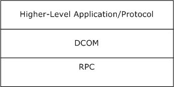

Figure 1: DCOM protocol stack

The following diagram presents an overview of the protocol.

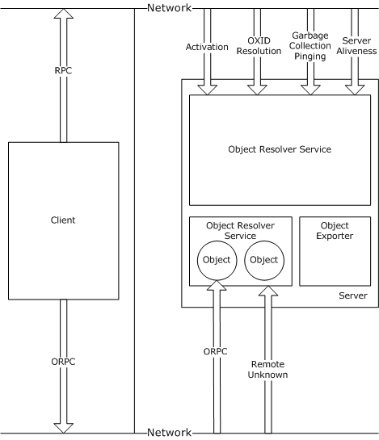

Figure 2: DCOM protocol overview

Higher-level applications use the DCOM [**client**](#gt_client) to obtain object references and make ORPC calls on the object. The DCOM client in turn uses the Remote Procedure Call Protocol Extensions, as specified in [MS-RPCE], to communicate with the [**object server**](#gt_object-server).

The object server constitutes an [**object resolver**](#gt_object-resolver) service and one or more [**object exporters**](#gt_object-exporter). Objects are contained in object exporters. Objects are the target of the ORPC calls from the client.

### 1.3.1 Activation

[**Activation**](#gt_activation) is a generic term used to describe the act of creating (or sometimes finding) an existing DCOM [**object**](#gt_object) or [**class factory**](#gt_class-factory). Two [**RPC**](#gt_remote-procedure-call-rpc) [**interfaces**](#gt_interface) in the DCOM Remote Protocol are used to activate objects: [IActivation](#Section_3.1.2.5.2) methods and [IRemoteSCMActivator](#Section_3.1.2.5.2) methods. At a rudimentary level, activation consists of sending the following to the object activation service on the remote machine:

- A class identifier ([**CLSID**](#gt_class-identifier-clsid))
- One or more [**IIDs**](#gt_interface-identifier-iid)
- Optionally, an initialization storage reference
The CLSID identifies the class of the object to be created. The IIDs identify the interfaces on the newly created object that the [**client**](#gt_client) is asking for and, if specified, the storage reference identifies some persistent store with which the newly created object is to be initialized after creation.

Activation returns object references to the client application. The client application can also send or receive object references as part of [**ORPC**](#gt_object-remote-procedure-call-orpc) calls.

### 1.3.2 Object References

[**Object References**](#gt_object-reference) are marshaled as [**OBJREF**](#gt_objref) types. When an OBJREF type is marshaled in the DCOM Remote Protocol, [**Network Data Representation (NDR)**](#gt_network-data-representation-ndr) instructs the DCOM runtime to write out an OBJREF wrapped inside an [MInterfacePointer](#Section_2.2.14) into the request/response protocol data unit (PDU) stream. The marshaled data contains the information required by the client to create the [**RPC**](#gt_remote-procedure-call-rpc) binding back to the [**object**](#gt_object). Similarly, when an OBJREF type is unmarshaled in the DCOM Remote Protocol, NDR instructs the DCOM runtime to construct the object reference using the marshaled data contained in the stream. The DCOM Remote Protocol returns the object reference to the application.

### 1.3.3 Object Exporter

An [**object exporter**](#gt_object-exporter) is a conceptual container where objects are created, called, and released. An [**object**](#gt_object) is required to be contained within a single object exporter and is required to not span multiple object exporters. The protocol is intentionally vague about what an object exporter actually entails. An object exporter can be a thread, a process, or a machine. It is recommended that clients not assume implementation details about object exporters. For example, if two objects belong to the same object exporter, it is recommended that clients not assume that both of the objects reside in the same thread, process, or machine.

An object exporter listens on the network by way of [**RPC**](#gt_remote-procedure-call-rpc) protocols.

An object exporter contains a [**remote unknown**](#gt_remote-unknown) object, which supports the following [**ORPC**](#gt_object-remote-procedure-call-orpc) [**interfaces**](#gt_interface):

[IRemUnknown](#Section_3.1.1.5.7) interface: An ORPC interface that contains methods used to call QueryInterface, AddRef, and Release on remote objects.

[IRemUnknown2](#Section_3.1.1.5.7) interface: An ORPC interface that extends the functionality of IRemUnknown.

The [**client**](#gt_client) uses the AddRef and Release methods to manage the lifetime of objects contained in the object exporter. The client uses the QueryInterface method to obtain [**object references**](#gt_object-reference) for additional interface types implemented by an object.

An object exporter is identified by its object exporter identifier ([**OXID**](#gt_object-exporter-identifier-oxid)). When a client receives an OXID as part of an object reference, it needs to determine the RPC binding information required to communicate with the remote unknown object of the object exporter. The client uses the [**OXID resolution**](#gt_oxid-resolution) (see section [3.2.4.1.2.2](#Section_3.2.4.1.2.2)) mechanism to achieve this.

### 1.3.4 ORPC Calls

An [**ORPC**](#gt_object-remote-procedure-call-orpc) call is equivalent to, and possesses a one-to-one correspondence with, [**RPC**](#gt_remote-procedure-call-rpc) calls. ORPC calls are distinguished from RPC calls by the contents of the [**Object**](#gt_object) [**UUID**](#gt_universally-unique-identifier-uuid) field of the RPC header, as specified in [[C706]](https://go.microsoft.com/fwlink/?LinkId=89824) section 12.5.2.6. In the DCOM Remote Protocol, the Object UUID field carries an [**interface pointer identifier (IPID)**](#gt_interface-pointer-identifier-ipid) specifying the [**interface**](#gt_interface) targeted by a given ORPC call on an object.

ORPC calls are further distinguished from RPC calls in that the former will always have implicit additional parameters present within the request and response buffers for each call. These additional parameters are referred to as ORPCTHIS and ORPCTHAT, respectively (see section [2.2.12](#Section_2.2.12)). The ORPCTHIS and ORPCTHAT parameters are conceptually and syntactically placed ahead of all other values in the RPC PDU body (as specified in [C706] section 12.1).

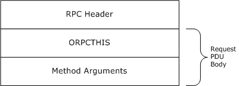

Figure 3: Object RPC calls and the PDU body request

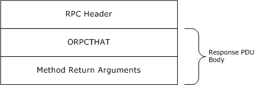

Figure 4: Object RPC calls and the PDU body response

The ORPCTHIS and ORPCTHAT arguments are used to provide versioning, causality information, and the capability to send application-specific out-of-band data.

### 1.3.5 Causality Identifiers

Each [**ORPC**](#gt_object-remote-procedure-call-orpc) call carries with it, within the [ORPCTHIS](#Section_2.2.13.3) structure, a [**GUID**](#gt_globally-unique-identifier-guid) known as the [**causality identifier (CID)**](#gt_causality-identifier-cid). The CID connects a chain of ORPC calls that are causally related. [**Object exporters**](#gt_object-exporter) can use the CID to provide synchronization around ORPC calls. They can also use the CID to prevent deadlocks within ORPC calls.

If a new ORPC call is made from a client that is already executing an ORPC call, the new call is required to be assigned the same CID as the existing call. If a new ORPC call is made from a client that is not already executing an ORPC call, then a new CID is required to be allocated for it. For more information, see section [3.2.4.2](#Section_3.2.4.2).

An object exporter needs to use the CID of an incoming ORPC call to detect whether it belongs to the same causality chain as that of a currently executing outgoing ORPC. If the incoming and outgoing CIDs are not the same, the object exporter might not process the incoming ORPC until the outgoing ORPC completes. However, if they are the same, the object exporter needs to process the incoming ORPC; otherwise, a deadlock occurs. For details, see section [3.1.1.5.4](#Section_3.1.1.5.4).

### 1.3.6 Reference Counts

The DCOM Remote Protocol uses [**reference counts**](#gt_reference-count) to manage [**object**](#gt_object) lifetimes. Each [**interface**](#gt_interface) on an object has an associated reference count that governs its lifetime. There are two types of reference counts associated with an interface: public references and private references. The sole distinction between public and private references is that private references can be released only by the client identity that requested them.

To ensure that object resources are recovered in the event of machine failures or network failures, the DCOM Remote Protocol incorporates a [**garbage collection**](#gt_garbage-collection) mechanism. The mechanism is based on keep-alive [**pinging**](#gt_pinging), which allows a client to maintain the lifetimes of its [**object references**](#gt_object-reference). If an [**object server**](#gt_object-server) fails to receive pings for an object, then eventually the object server reclaims the object. For details, see sections [3.2.6.1](#Section_3.2.6.1), [3.1.1.6.2](#Section_3.1.1.6.2), and [3.1.2.6](#Section_3.1.1.6).

### 1.3.7 Object Resolver Service

The [**object resolver**](#gt_object-resolver) service is the part of the DCOM Remote Protocol that performs [**activation**](#gt_activation) (see section [3.2.4.1.1](#Section_3.2.4.1.1.2)), [**OXID resolution**](#gt_oxid-resolution) (see section [3.1.2.5.1.1](#Section_3.1.2.5.1.1)), [**garbage collection**](#gt_garbage-collection) (see sections [3.1.1.6.2](#Section_3.1.1.6.2) and [3.1.2.6](#Section_3.1.1.6)), and server aliveness tests (see section [3.1.2.5.1.6](#Section_3.1.2.5.1.6)). The object resolver service can be reached as specified in sections [1.9](#Section_1.9) and [3.1.2.3](#Section_3.1.2). The object resolver service implements the following [**RPC**](#gt_remote-procedure-call-rpc) [**interfaces**](#gt_interface):

[IObjectExporter](#Section_3.1.2.5.1) methods.

[IActivation](#Section_3.1.2.5.2): Contains a method used to create objects and [**class factories**](#gt_class-factory).

[IRemoteSCMActivator](#Section_3.1.2.5.2): Contains more methods used to create objects and class factories.

## 1.4 Relationship to Other Protocols

The DCOM Remote Protocol is built on top of Remote Procedure Call Protocol Extensions, as specified in [MS-RPCE](../MS-RPCE/MS-RPCE.md). As described in section [2.1](#Section_2.1), the DCOM Remote Protocol uses additional buffer space at the beginning of the [**RPC**](#gt_remote-procedure-call-rpc) PDU body for passing out-of-band data that is not part of the method call signature.

The following protocols are layered above the DCOM Remote Protocol:

- Windows Client Certificate Enrollment Protocol (as specified in [MS-WCCE](../MS-WCCE/MS-WCCE.md)).
- Component Object Model Plus (COM+) Protocol (as specified in [MS-COM](../MS-COM/MS-COM.md)).
- Disk Management Remote Protocol (as specified in [MS-DMRP](../MS-DMRP/MS-DMRP.md)).
- Virtual Disk Service (VDS) Protocol (as specified in [MS-VDS](../MS-VDS/MS-VDS.md)).
- Windows Management Instrumentation Remote Protocol (as specified in [MS-WMI](../MS-WMI/MS-WMI.md)).

## 1.5 Prerequisites/Preconditions

The DCOM Remote Protocol requires that both client and [**object servers**](#gt_object-server) possess implementations of Remote Procedure Call Protocol Extensions, as specified in [MS-RPCE](../MS-RPCE/MS-RPCE.md). In addition, on the server, the [**object resolver**](#gt_object-resolver) must be running and reachable, as specified in section [3.1.2.3](#Section_3.1.2).

## 1.6 Applicability Statement

The DCOM Remote Protocol is useful and appropriate when a distributed object-based architecture is required. The DCOM Remote Protocol is supported on Windows-based platforms starting with Windows NT operating system.

## 1.7 Versioning and Capability Negotiation

This document covers versioning issues in the following areas:

- Supported transports: The DCOM Remote Protocol needs to be implemented on top of at least one of the [**RPC transports**](#gt_rpc-transport) described in section [2.1](#Section_2.1).
- Protocol versions: The DCOM Remote Protocol needs to use an [**RPC**](#gt_remote-procedure-call-rpc) version of 0.0 for all RPC and [**ORPC**](#gt_object-remote-procedure-call-orpc) interfaces. At the DCOM Remote Protocol level, a major and minor version numbering scheme is maintained (see section [2.2.11](#Section_2.2.11)). The major version needs to be 5. The minor version needs to be one of the following: 1, 2, 4, 6, or 7. A minor version of 3 or 5 is unused and is required not to appear in any capability negotiation. The minor versions signify the addition of various capabilities to the protocol. For example, minor version 2 signifies the addition of the ResolveOXID2 method to the IObjectExporter [**interface**](#gt_interface) (see section [3.1.2.5.1.5](#Section_3.1.2.5.1.5)).
- Security and authentication methods: It is recommended that the DCOM Remote Protocol use the underlying security and authentication services provided by RPC.
- Capability negotiation: The protocol needs to perform explicit capability negotiation, as specified in this section.
The DCOM Remote Protocol implements version negotiation through the following two mechanisms:

- By the availability of an RPC method or interface on the server; the unavailability of that method or interface implies a certain version to the client, which then undertakes a fallback action as appropriate.
- By use of the COMVERSION structure, which is passed between client and server, clients and servers associate specific version numbers with specific capabilities and behaviors.
The first mechanism is used at the initiation of the protocol, when the client has no knowledge of the capabilities of the server. The second mechanism is used within the operation of the protocol when the COMVERSION can be sent or received.

A client detects the version of a server using one of the following mechanisms:

- By calling either the IObjectExporter::ServerAlive2 (Opnum 5) method or the IObjectExporter::ResolveOxid2 method on the [**object resolver**](#gt_object-resolver). If the server does not support either of these methods, the client assumes that the server supports [**COM**](#gt_component-object-model-com) version 5.1. Otherwise, the server returns its version explicitly as a return argument during the method call.
- During an [**activation**](#gt_activation), a server returns its version to the client either as a return argument from the IActivation:: RemoteActivation (Opnum 0) method, or as a field of the custom REMOTE_REPLY_SCM_INFO structure contained in the [ScmReplyInfoData](#Section_2.2.22.2.8) property returned by either IRemoteSCMActivator:: RemoteGetClassObject (Opnum 3) or IRemoteSCMActivator::RemoteCreateInstance (Opnum 4).
Clients are required not to call servers with nonmatching major versions. Clients need to compute the lower of the client and the server minor versions and need to pass this computed version as the client minor version when making activation or ORPC calls. For example, if the client minor version is 7 and the server minor version is 4, the client needs to specify 4 as its minor version when making activation or ORPC calls.

Servers need to reject activation requests or ORPC calls from clients with nonmatching major versions or higher minor versions.

For more information on the capabilities introduced in each [**DCOM**](#gt_distributed-component-object-model-dcom) version, see section 2.2.11.

## 1.8 Vendor-Extensible Fields

The DCOM Remote Protocol uses HRESULTs, which are vendor-extensible. Vendors are free to choose their own values for this field, as long as the C bit (0x20000000) is set, indicating that it is a customer code, as specified in [MS-ERREF](../MS-ERREF/MS-ERREF.md) section 2.1.

The **error_status_t** return values used by this protocol are Win32 error codes as specified in [MS-ERREF] section 2.2. Vendors SHOULD reuse those values with their indicated meanings. If vendors choose any other value, they run the risk of a future collision.<1>

## 1.9 Standards Assignments

The DCOM Remote Protocol [**object resolver**](#gt_object-resolver) service either needs to use the same [**well-known endpoints**](#gt_well-known-endpoint) as the [**RPC endpoint**](#gt_rpc-endpoint) mapper (as specified in [MS-RPCE](../MS-RPCE/MS-RPCE.md) section 2.1), or it needs to register its interfaces with the RPC endpoint mapper service.<2>

The following table presents well-known [**GUIDs**](#gt_globally-unique-identifier-guid) in the DCOM Remote Protocol.

| Name | GUID | Purpose | Section |
| --- | --- | --- | --- |
| CLSID_ActivationContextInfo | {000001a5-0000-0000-c000-000000000046} | Activation property [**CLSID**](#gt_class-identifier-clsid) for ActivationContextInfoData | [2.2.22.2.5](#Section_2.2.22.2.5) |
| CLSID_ActivationPropertiesIn | {00000338-0000-0000-c000-000000000046} | OBJREF_CUSTOM unmarshaler CLSID for ActivationPropertiesIn | [3.1.2.5.2.3.2](#Section_3.1.2.5.2.3) [3.1.2.5.2.3.3](#Section_3.1.2.5.2.3) |
| CLSID_ActivationPropertiesOut | {00000339-0000-0000-c000-000000000046} | OBJREF_CUSTOM unmarshaler CLSID for ActivationPropertiesOut | 3.1.2.5.2.3.2 3.1.2.5.2.3.3 |
| CLSID_CONTEXT_EXTENSION | {00000334-0000-0000-c000-000000000046} | ORPC_EXTENT identifier for [**context (2)**](#gt_context) [**ORPC**](#gt_object-remote-procedure-call-orpc) extension | [2.2.21.4](#Section_2.2.21.4) |
| CLSID_ContextMarshaler | {0000033b-0000-0000-c000-000000000046} | OBJREF_CUSTOM unmarshaler CLSID for contexts (2) | [2.2.20](#Section_2.2.20) |
| CLSID_ERROR_EXTENSION | {0000031c-0000-0000-c000-000000000046} | ORPC_EXTENT identifier for Error information ORPC extension | [2.2.21.1](#Section_2.2.21.1) |
| CLSID_ErrorObject | {0000031b-0000-0000-c000-000000000046} | OBJREF_CUSTOM unmarshaler CLSID for error information | [2.2.21.2](#Section_2.2.21.2) |
| CLSID_InstanceInfo | {000001ad-0000-0000-c000-000000000046} | Activation property CLSID for InstanceInfoData | [2.2.22.2.3](#Section_2.2.22.2.3) |
| CLSID_InstantiationInfo | {000001ab-0000-0000-c000-000000000046} | Activation property CLSID for InstantiationInfoData | [2.2.22.2.1](#Section_2.2.22.2.1) |
| CLSID_PropsOutInfo | {00000339-0000-0000-c000-000000000046} | Activation property CLSID for PropsOutInfo | [2.2.22.2.9](#Section_2.2.22.2.9) |
| CLSID_ScmReplyInfo | {000001b6-0000-0000-c000-000000000046} | Activation property CLSID for ScmReplyInfoData | [2.2.22.2.8](#Section_2.2.22.2.8) |
| CLSID_ScmRequestInfo | {000001aa-0000-0000-c000-000000000046} | Activation property CLSID for ScmRequestInfoData | [2.2.22.2.4](#Section_2.2.22.2.4) |
| CLSID_SecurityInfo | {000001a6-0000-0000-c000-000000000046} | Activation property CLSID for SecurityInfoData | [2.2.22.2.7](#Section_2.2.22.2.7) |
| CLSID_ServerLocationInfo | {000001a4-0000-0000-c000-000000000046} | Activation property CLSID for LocationInfoData | [2.2.22.2.6](#Section_2.2.22.2.6) |
| CLSID_SpecialSystemProperties | {000001b9-0000-0000-c000-000000000046} | Activation property CLSID for SpecialPropertiesData | [2.2.22.2.2](#Section_2.2.22.2.2) |
| IID_IActivation | {4d9f4ab8-7d1c-11cf-861e-0020af6e7c57} | [**RPC**](#gt_remote-procedure-call-rpc) [**interface**](#gt_interface) [**UUID**](#gt_universally-unique-identifier-uuid) for IActivation | [3.1.2.5.2.1](#Section_3.1.2.5.2) |
| IID_IActivationPropertiesIn | {000001A2-0000-0000-C000-000000000046} | The value of the **iid** field of the *pActProperties* [OBJREF](#Section_2.2.18) structure | 3.1.2.5.2.3.2 3.1.2.5.2.3.3 |
| IID_IActivationPropertiesOut | {000001A3-0000-0000-C000-000000000046} | The value of the **iid** field of the *ppActProperties* OBJREF structure | 3.1.2.5.2.3.2 3.1.2.5.2.3.3 |
| IID_IContext | {000001c0-0000-0000-C000-000000000046} | The value of the **iid** field of the Context structure. | 2.2.20 |
| IID_IObjectExporter | {99fcfec4-5260-101b-bbcb-00aa0021347a} | RPC interface UUID for IObjectExporter | [3.1.2.5.1](#Section_3.1.2.5.1) |
| IID_IRemoteSCMActivator | {000001A0-0000-0000-C000-000000000046} | RPC interface UUID for IRemoteSCMActivator | [3.1.2.5.2.2](#Section_3.1.2.5.2) |
| IID_IRemUnknown | {00000131-0000-0000-C000-000000000046} | RPC interface UUID for IRemUnknown | [3.1.1.5.6](#Section_3.1.1.5.7) |
| IID_IRemUnknown2 | {00000143-0000-0000-C000-000000000046} | RPC interface UUID for IRemUnknown2 | [3.1.1.5.7.1](#Section_3.1.1.5.7.1) |
| IID_IUnknown | {00000000-0000-0000-C000-000000000046} | RPC interface UUID for IUnknown | [3.1.1.5.8](#Section_3.1.1.5.8) |

# 2 Messages

## 2.1 Transport

DCOM is based on [**RPC**](#gt_remote-procedure-call-rpc), and implementations SHOULD support the use of any [**RPC protocol sequence**](#gt_rpc-protocol-sequence) available in the underlying RPC implementation. The client SHOULD discover an initial working RPC protocol by calling the [**object resolver**](#gt_object-resolver) on multiple protocols. IObjectExporter::ServerAlive2 (Opnum 5) SHOULD be used for this purpose, and then any RPC protocol to which the object resolver responds SHOULD be used.

The object resolver and any given [**object exporter**](#gt_object-exporter) MUST indicate their supported RPC protocols through an array of STRINGBINDING structures contained in the [DUALSTRINGARRAY](#Section_2.2.19) structure. The DUALSTRINGARRAY structure is returned from the server to the client through various methods in the protocol.

The object resolver service MUST be reachable at either [**well-known endpoints**](#gt_well-known-endpoint) or through the [**RPC endpoint**](#gt_rpc-endpoint) mapper, as specified in section [1.9](#Section_1.9).

Object resolvers and object exporters MUST always support the [**OXID resolution**](#gt_oxid-resolution) mechanism specified in section [3.2.4.1.2.2](#Section_3.2.4.1.2.2), even if the object exporters use well-known endpoints. Object resolvers and object exporters MUST NOT rely on clients to know the [**endpoint**](#gt_endpoint) other than obtaining it through the protocol.

The interface version of all object ([**ORPC**](#gt_object-remote-procedure-call-orpc)) interfaces MUST be 0.0. DCOM does not support versioning of ORPC interfaces through the RPC interface versioning mechanism. Instead, all DCOM interfaces MUST be immutable once defined.

The interface version of all native (nonobject) RPC interfaces used in the protocol MUST be 0.0.

ORPC calls are equivalent to, and possess a one-to-one correspondence with, RPC calls. ORPC calls are distinguished from RPC calls by the contents of the [**Object UUID**](#gt_object-uuid) field of the RPC header, as specified in [[C706]](https://go.microsoft.com/fwlink/?LinkId=89824) section 12.5.2.6. In DCOM, the Object UUID field carries an [**IPID**](#gt_interface-pointer-identifier-ipid) specifying the interface targeted by a given ORPC call on an object.

ORPC calls are further distinguished from RPC calls in that the former will always have implicit additional parameters present within the request and response buffers for each call. These additional parameters are referred to as [ORPCTHIS](#Section_2.2.13.3) and [ORPCTHAT](#Section_2.2.13.4) respectively; see section [2.2.12](#Section_2.2.12). The ORPCTHIS and ORPCTHAT values are conceptually and syntactically placed ahead of all other values in the RPC PDU body (as specified in [C706] section 12.1).

RPC PDU types other than Request and Response PDUs (as specified in [C706] section 12) are used by DCOM without extension or modification and are therefore not discussed further in this specification.

DCOM uses security, as described in [MS-RPCE](../MS-RPCE/MS-RPCE.md) section 1.7.

The server SHOULD register one or more [**security providers**](#gt_security-provider) specified in [MS-RPCE] section 2.2.1.1.7; the choice of security provider is implementation-dependent.<3>

## 2.2 Common Data Types

All structures are defined in the [**Interface Definition Language (IDL)**](#gt_interface-definition-language-idl) syntax and are marshaled as specified in [[C706]](https://go.microsoft.com/fwlink/?LinkId=89824) Part 3. The IDL is documented in section [6](#Section_6).

Field types in packet diagrams are defined by the packet diagram and the field descriptions. All fields in packet diagrams are marshaled using little-endian byte ordering, unless otherwise specified.

Unless otherwise specified, all extra padding bytes MUST be set to zero (0x00) when sent and MUST be ignored upon receipt.

Note that LPWSTR or WCHAR* types specified in an IDL structure that are annotated with the [string] attribute MUST be null-terminated, as specified in [C706] section 14.3.4.

This protocol MUST indicate to the remote procedure call (RPC) runtime that it is to support the NDR transfer syntax only, as specified in [C706] Part 4. In addition to RPC base types and definitions specified in [C706] and [MS-RPCE](../MS-RPCE/MS-RPCE.md), additional data types are defined in this section.

### 2.2.1 OID

The OID type specifies an [**object identifier (OID)**](#gt_object-identifier-oid).

This type is declared as follows:

typedef unsigned hyper OID;

### 2.2.2 SETID

The SETID type specifies a [**ping set identifier (SETID)**](#gt_ping-set-identifier-setid).

This type is declared as follows:

typedef unsigned hyper SETID;

### 2.2.3 HRESULT

This specification uses the HRESULT type, as specified in [MS-DTYP](../MS-DTYP/MS-DTYP.md) section 2.2.18.

### 2.2.4 error_status_t

This specification uses the error_status_t type, as specified in [[C706]](https://go.microsoft.com/fwlink/?LinkId=89824) section 4.2.26 and in section [1.8](#Section_1.8) of this protocol specification.

### 2.2.5 GUID

The GUID type specifies a [**GUID**](#gt_globally-unique-identifier-guid), as specified in [MS-DTYP](../MS-DTYP/MS-DTYP.md) section 2.3.4.

### 2.2.6 CID

The CID type specifies a CID.

This type is declared as follows:

typedef GUID CID;

### 2.2.7 CLSID

The CLSID type specifies a [**CLSID**](#gt_class-identifier-clsid) for a [**GUID**](#gt_globally-unique-identifier-guid) that identifies an [**object class**](#gt_object-class).

This type is declared as follows:

typedef GUID CLSID;

### 2.2.8 IID

The IID type specifies an [**IID**](#gt_interface-identifier-iid).

This type is declared as follows:

typedef GUID IID;

### 2.2.9 IPID

The IPID type specifies an [**IPID**](#gt_interface-pointer-identifier-ipid).

This type is declared as follows:

typedef GUID IPID;

### 2.2.10 OXID

The OXID type specifies an [**OXID**](#gt_object-exporter-identifier-oxid).

This type is declared as follows:

typedef unsigned hyper OXID;

### 2.2.11 COMVERSION

The COMVERSION structure is used to specify the major and minor version of either the client or the server DCOM Remote Protocol implementation.

typedef struct tagCOMVERSION {

unsigned short MajorVersion;

unsigned short MinorVersion;

} COMVERSION;

**MajorVersion:** This MUST contain the major version of the DCOM Remote Protocol.

**MinorVersion:** This MUST contain the minor version of the DCOM Remote Protocol.

The following table specifies the capabilities introduced in each [**DCOM**](#gt_distributed-component-object-model-dcom) version.<4>

| Version | Change |
| --- | --- |
| 5.1 | Initial DCOM Remote Protocol release. |
| 5.2 | Added ResolveOxid2 to the IObjectExporter interface; see section [3.1.2.5.1.5](#Section_3.1.2.5.1.5). |
| 5.3 | MUST NOT be used. |
| 5.4 | Update in the marshaling of arrays of interface pointers. Update in the marshaling of conformant embedded structures. |
| 5.5 | Unused. This is to avoid having a DCOM version with matching major and minor version numbers. |
| 5.6 | Added [OBJREF_HANDLER](#Section_2.2.18.5) and [OBJREF_EXTENDED](#Section_2.2.18.7) to the [**OBJREF**](#gt_objref) type. Added IRemoteSCMActivator interface methods (see section [3.1.2.5.2.2](#Section_3.1.2.5.2)). Added IObjectExporter::ServerAlive2 (Opnum 5) method to IObjectExporter interface. Added [IRemUnknown2](#Section_3.1.1.5.7) interface. |
| 5.7 | No DCOM changes from 5.6.<5> |

### 2.2.12 object IDL Attribute

The object IDL Attribute is an [**IDL**](#gt_interface-definition-language-idl) extension to the interface attributes specified in [[C706]](https://go.microsoft.com/fwlink/?LinkId=89824) section 4.2.4.

This IDL extension specifies that calls on methods in the attributed interface MUST be [**ORPC**](#gt_object-remote-procedure-call-orpc) calls.

### 2.2.13 ORPCTHIS and ORPCTHAT

The [ORPCTHIS](#Section_2.2.13.3) and [ORPCTHAT](#Section_2.2.13.4) structures MUST be marshaled using the [**NDR**](#gt_network-data-representation-ndr) Transfer Syntax whose identifier is specified in [MS-RPCE](../MS-RPCE/MS-RPCE.md) section 2.2.4.12.

#### 2.2.13.1 ORPC_EXTENT

ORPC_EXTENT is a binary large object (BLOB) of data whose format is identified by a [**GUID**](#gt_globally-unique-identifier-guid). It is used on DCOM Remote Protocol calls to pass arbitrary out-of-band data that is not part of the explicit method signature. Unless otherwise specified, clients and servers MUST ignore ORPC_EXTENTs whose format they do not recognize.<6>

typedef struct tagORPC_EXTENT {

GUID id;

unsigned long size;

[size_is((size+7) & ~7)] byte data[];

} ORPC_EXTENT;

**id:** This MUST contain a GUID that identifies the format of the opaque data in the data field.

**size:** This MUST specify the size, in bytes, in the data field excluding any padding bytes that were added to round the array size to a multiple of 8.

**data:** This MUST contain an array of bytes that form the extent data. The array size MUST be a multiple of 8 for alignment reasons.

#### 2.2.13.2 ORPC_EXTENT_ARRAY

ORPC_EXTENT_ARRAY is an array of [ORPC_EXTENT](#Section_2.2.13.1) structures.

typedef struct tagORPC_EXTENT_ARRAY {

unsigned long size;

unsigned long reserved;

[size_is((size+1)&~1,), unique]

ORPC_EXTENT** extent;

} ORPC_EXTENT_ARRAY;

**size:** This MUST specify the number of non-NULL elements in the extent field.

**reserved:** This MUST be set to zero when sent and MUST be ignored on receipt.

**extent:** This MUST be an array of ORPC_EXTENTs. The array size MUST be a multiple of 2 for alignment reasons.

#### 2.2.13.3 ORPCTHIS

The ORPCTHIS structure is the first (implicit) argument sent in an [**ORPC**](#gt_object-remote-procedure-call-orpc) request PDU and is used to send [**ORPC extension**](#gt_orpc-extension) data to the server. The ORPCTHIS structure is also sent as an explicit argument in [**activation**](#gt_activation) [**RPC**](#gt_remote-procedure-call-rpc) requests.

typedef struct tagORPCTHIS {

COMVERSION version;

unsigned long flags;

unsigned long reserved1;

CID cid;

[unique] ORPC_EXTENT_ARRAY* extensions;

} ORPCTHIS;

**version:** A [COMVERSION](#Section_2.2.11) structure that MUST contain the version number of the client. For details, see section 2.2.11.

**flags:** When the ORPCTHIS structure is used as a parameter in ORPC invocations (as specified in section [3.2.4.2](#Section_3.2.4.2)), this MUST be set to 0x00000000. When the ORPCTHIS structure is used as a parameter in IActivation::RemoteActivation, IRemoteSCMActivator::RemoteGetClassObject and IRemoteSCMActivator::RemoteCreateInstance methods (section [3.1.2.5.2.3](#Section_3.1.2.5.2.3)), this can be set to any arbitrary value when sent and MUST be ignored on receipt.

**reserved1:** This MUST be set to zero when sent and MUST be ignored on receipt.

**cid:** This MUST contain a CID for the ORPC call. For details, see section [1.3.5](#Section_1.3.5).

**extensions:** If non-NULL, this MUST be a pointer to an [ORPC_EXTENT_ARRAY](#Section_2.2.13.2) structure.

#### 2.2.13.4 ORPCTHAT

The ORPCTHAT structure is the first (implicit) argument returned in an [**ORPC**](#gt_object-remote-procedure-call-orpc) response PDU, and is used to return [**ORPC extension**](#gt_orpc-extension) data to the client. The ORPCTHAT structure is also returned as an explicit argument from an [**activation**](#gt_activation) request.

typedef struct tagORPCTHAT {

unsigned long flags;

[unique] ORPC_EXTENT_ARRAY* extensions;

} ORPCTHAT;

**flags:** This can be set to any arbitrary value and MUST be ignored on receipt.

**extensions:** If non-NULL, this field MUST contain an [ORPC_EXTENT_ARRAY](#Section_2.2.13.2).

### 2.2.14 MInterfacePointer

MInterfacePointer is an NDR-marshaled structure that MUST contain a hand-marshaled [OBJREF](#Section_2.2.18).

typedef struct tagMInterfacePointer {

unsigned long ulCntData;

[size_is(ulCntData)] byte abData[];

} MInterfacePointer;

**ulCntData:** This MUST specify the size, in bytes, of the *abData* parameter.

**abData:** An array of bytes that MUST contain an OBJREF.

### 2.2.15 PMInterfacePointerInternal

The PMInterfacePointerInternal type specifies a pointer to an [MInterfacePointer](#Section_2.2.14) structure.

This type is declared as follows:

typedef [disable_consistency_check] MInterfacePointer* PMInterfacePointerInternal;

where **disable_consistency_check** is as specified in [MS-RPCE](../MS-RPCE/MS-RPCE.md) section 2.2.4.17.

### 2.2.16 PMInterfacePointer

The PMInterfacePointer type specifies a pointer to an [MInterfacePointer (section 2.2.14)](#Section_2.2.14) structure. Interface pointers specified in DCOM-based protocols are marshaled and unmarshaled as the PMInterfacePointer type.

This type is declared as follows:

typedef [unique] MInterfacePointer* PMInterfacePointer;

### 2.2.17 iid_is IDL Attribute

iid_is IDL Attribute is an [**IDL**](#gt_interface-definition-language-idl) extension that specifies the uuid ([[C706]](https://go.microsoft.com/fwlink/?LinkId=89824) section 4.2.4.1) of an interface type method parameter.

An interface type parameter attributed with iid_is MUST be marshaled as an [MInterfacePointer](#Section_2.2.14) containing an [OBJREF](#Section_2.2.18) instance with its iid field set to the value of uuid.

When unmarshaling an interface type parameter attributed with iid_is, the implementation of target level 5.0 Correlation Validation extensions, as specified in [MS-RPCE](../MS-RPCE/MS-RPCE.md) section 3.1.1.5.3.2, SHOULD validate that the iid specified in the OBJREF is equal to the uuid specified by the iid_is attribute. If different, the implementation MUST indicate that the octet stream is invalid, as specified in [MS-RPCE] section 3.1.2.5.1 and [MS-RPCE] section 3.1.3.5.2.

See the following for an example.

HRESULT CreateInstance([in]REFIID riid,

[out, iid_is(riid)]Iunknown** ppUnknown);

In this example, the client MUST pass the uuid of the interface parameter, *ppUnknown*, in the *riid* parameter. When returning a successful result, the server MUST marshal the *ppUnknown* parameter as an MInterfacePointer containing an OBJREF instance with its iid field set to the value of riid.

### 2.2.18 OBJREF

[**OBJREF**](#gt_objref) is the marshaled format for a DCOM Remote Protocol [**object reference**](#gt_object-reference). There are four different formats for an OBJREF, which are specified by different definitions of the **u_objref** field. This section defines the initial header information. The following sections define substructures found in the **u_objref** field.

**signature (4 bytes):** This MUST be set to the value 0x574f454d.

**flags (4 bytes):** This MUST be set to ONE of the following values.

| Value | Meaning |
| --- | --- |
| OBJREF_STANDARD 0x00000001 | **u_objref** MUST contain an [OBJREF_STANDARD](#Section_2.2.18.4). |
| OBJREF_HANDLER 0x00000002 | **u_objref** MUST contain an [OBJREF_HANDLER](#Section_2.2.18.5). |
| OBJREF_CUSTOM 0x00000004 | **u_objref** MUST contain an [OBJREF_CUSTOM](#Section_2.2.18.6). |
| OBJREF_EXTENDED 0x00000008 | **u_objref** MUST contain an [OBJREF_EXTENDED](#Section_2.2.18.7). |

**iid (16 bytes):** The [**IID**](#gt_interface-identifier-iid) for which this OBJREF was marshaled; this MUST NOT be set to GUID_NULL.

The iid MUST be specified either by the uuid [**IDL**](#gt_interface-definition-language-idl) attribute (as specified in [[C706]](https://go.microsoft.com/fwlink/?LinkId=89824) section 4.2.4.1) of the interface type method parameter, or it MUST be specified using the [iid_is IDL Attribute](#Section_2.2.17).

**u_objref (variable):** A structure specified by the value of the preceding **flags**.

#### 2.2.18.1 STDOBJREF

STDOBJREF is a supporting structure for three of the four different [OBJREF](#Section_2.2.18) formats. It is used to specify standard information about an [**object reference**](#gt_object-reference): number of [**reference counts**](#gt_reference-count) and the identifying [**IPID**](#gt_interface-pointer-identifier-ipid), [**OXID**](#gt_object-exporter-identifier-oxid), and [**OID**](#gt_object-identifier-oid).

The STDOBJREF structure is marshaled by the protocol either as a byte array (for example, when it is marshaled as part of an OBJREF) or in the NDR format (for example, when it is returned as part of a [REMQIRESULT](#Section_2.2.24) from [IRemUnknown::RemQueryInterface](#Section_3.1.1.5.6.1.1)). The field definitions and meanings are identical in both cases. When the STDOBJREF structure is marshaled as a byte array, all of its fields MUST be marshaled in [**little-endian**](#gt_little-endian) order.

#### 2.2.18.2 STDOBJREF (Packet Version)

**flags (4 bytes):** This can be one of the following values. Any other value MUST be ignored by the client.

| Value | Meaning |
| --- | --- |
| 0x00000000 | The client is requested to perform [**garbage collection**](#gt_garbage-collection) [**pinging**](#gt_pinging) (see section [3.2.6.1](#Section_3.2.6.1)) for this [**object identifier (OID)**](#gt_object-identifier-oid). |
| SORF_NOPING 0x00001000 | The client is requested to not perform garbage collection pinging (see section 3.2.6.1) for this object identifier (OID).<7> |

**cPublicRefs (4 bytes):** The number of public references on the server object, which MUST be released later. For more information, see section [3.2.4.4.2](#Section_3.2.4.4.2).

**oxid (8 bytes):** This MUST be an [**OXID**](#gt_object-exporter-identifier-oxid) identifying the [**object exporter**](#gt_object-exporter) that contains the object.

**oid (8 bytes):** This MUST be an OID identifying the object.

**ipid (16 bytes):** This MUST be an [**IPID**](#gt_interface-pointer-identifier-ipid) identifying a specific interface on the object.

#### 2.2.18.3 STDOBJREF (IDL Version)

The parameter meanings for this structure are identical to those defined in section [2.2.18.2](#Section_2.2.18.2).

typedef struct tagSTDOBJREF {

unsigned long flags;

unsigned long cPublicRefs;

OXID oxid;

OID oid;

IPID ipid;

} STDOBJREF;

#### 2.2.18.4 OBJREF_STANDARD

This form of [**OBJREF**](#gt_objref) is the simplest, combining an [STDOBJREF](#Section_2.2.18.1) structure with a [DUALSTRINGARRAY](#Section_2.2.19) structure. It is used when there is no need to utilize the extra fields offered by the other OBJREF formats.

**std (40 bytes):** This MUST be an STDOBJREF.

**saResAddr (variable):** A DUALSTRINGARRAY that MUST contain the network and security bindings for the [**object resolver**](#gt_object-resolver) service on the server.

#### 2.2.18.5 OBJREF_HANDLER

This form of [**OBJREF**](#gt_objref) is used by the server object to provide an identifier for a helper object on the client, which the client can use as a proxy for the server object.

**std (40 bytes):** This MUST specify an [STDOBJREF](#Section_2.2.18.1).

**clsid (16 bytes):** This MUST specify a [**CLSID**](#gt_class-identifier-clsid) identifying an [**object class**](#gt_object-class) on the client that the client uses as a handler for the interface identified by the iid field of the containing OBJREF.

**saResAddr (variable):** This MUST specify a [DUALSTRINGARRAY](#Section_2.2.19) that MUST contain the network and security bindings for the [**object resolver**](#gt_object-resolver) service on the server.

#### 2.2.18.6 OBJREF_CUSTOM

This form of [**OBJREF**](#gt_objref) is used by a server object to marshal itself into an opaque BLOB using a custom marshaler. The custom marshaler is a COM object that can marshal and unmarshal the data contained in the BLOB. The [**CLSID**](#gt_class-identifier-clsid) of the custom marshaler object's [**object class**](#gt_object-class) is specified within the OBJREF.

If the interface specified by the **iid** field of the OBJREF structure contained in the OBJREF_CUSTOM has the local [**IDL**](#gt_interface-definition-language-idl) attribute (section [2.2.27](#Section_2.2.27)), the OBJREF_CUSTOM MUST represent an object that is local to the client that unmarshals the object.

**clsid (16 bytes):** This MUST specify a CLSID, supplied by an application or higher-layer protocol, identifying an object class associated with the data in the **pObjectData** field.<8>

**cbExtension (4 bytes):** This MUST be set to zero when sent and MUST be ignored on receipt.

**reserved (4 bytes):** Unused. This can be set to any arbitrary value when sent and MUST be ignored on receipt.

**pObjectData (variable):** This MUST be an array of bytes containing data supplied by an application or higher-layer protocol.

#### 2.2.18.7 OBJREF_EXTENDED

The OBJREF_EXTENDED format is used when the server returns a marshaled [**envoy context**](#gt_envoy-context) to the client.

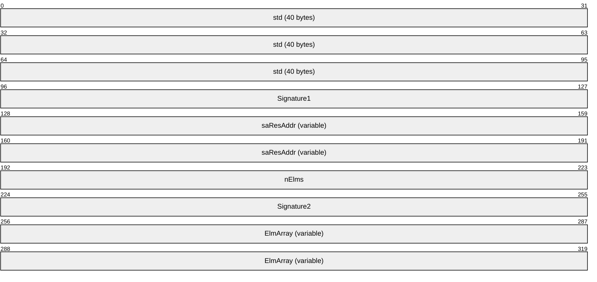

**std (40 bytes):** This MUST contain an [STDOBJREF](#Section_2.2.18.1) structure.

**Signature1 (4 bytes):** This MUST be set to 0x4E535956.

**saResAddr (variable):** This MUST contain a [DUALSTRINGARRAY](#Section_2.2.19) structure containing network and security bindings for the [**object resolver**](#gt_object-resolver) service on the server.

**nElms (4 bytes):** The number of elements in the **ElmArray** field. This field MUST be set to 0x00000001. (Note that while this protocol supports only a single element, for historical reasons the protocol uses an array of one element.)

**Signature2 (4 bytes):** This MUST be set to 0x4E535956.

**ElmArray (variable):** This MUST be a [DATAELEMENT](#Section_2.2.18.8) entry.

#### 2.2.18.8 DATAELEMENT

The DATAELEMENT structure is used to identify and marshal an [**envoy context**](#gt_envoy-context) as part of a larger [OBJREF_EXTENDED](#Section_2.2.18.7) structure.

**dataID (16 bytes):** This MUST specify a [**context identifier**](#gt_context-identifier) for the marshaled [**context (1)**](#gt_context). This MUST NOT be set to GUID_NULL.

**cbSize (4 bytes):** The unsigned number of bytes present in the **Data** field, excluding any padding bytes at the end of the **Data** field that were added to round the array size to an integral multiple of eight bytes. This MUST NOT be 0.

**cbRounded (4 bytes):** The unsigned size, in bytes, of the **Data** field. The **cbRounded** value MUST equal the **cbSize** value, rounded up to a multiple of eight.

**Data (variable):** An array of **cbRounded** bytes that MUST contain a marshaled envoy context; see section [2.2.20](#Section_2.2.20).

### 2.2.19 DUALSTRINGARRAY

The DUALSTRINGARRAY structure contains an array of string bindings and an array of security bindings. The protocol uses this structure as a fundamental means of specifying [**RPC**](#gt_remote-procedure-call-rpc) addressability and security information for either an [**object resolver**](#gt_object-resolver) or an [**object exporter**](#gt_object-exporter).

#### 2.2.19.1 DUALSTRINGARRAY (Packet Version)

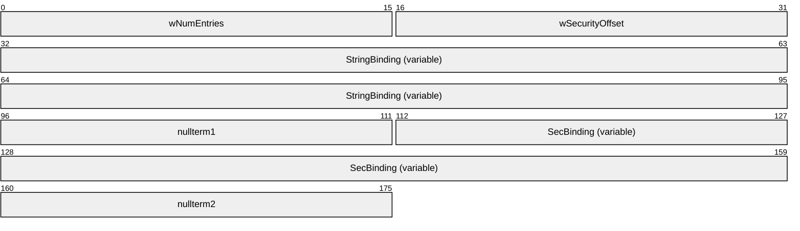

**wNumEntries (2 bytes):** The (unsigned) number of unsigned shorts (that is, 2-octet units) from the first entry in the **StringBinding** array to the end of the buffer.

**wSecurityOffset (2 bytes):** The (unsigned) number of unsigned shorts from the first entry in the StringBinding array to the first entry in the **SecBinding** array.

**StringBinding (variable):** An array of one or more [STRINGBINDING](#Section_2.2.19.3) structures that SHOULD be ordered in decreasing order of preference by the [**object server**](#gt_object-server).<9>

**nullterm1 (2 bytes):** This MUST contain zero to denote the end of the array of STRINGBINDING entries.

**SecBinding (variable):** An array of one or more [SECURITYBINDING](#Section_2.2.19.4) structures that SHOULD be ordered in decreasing order of preference by the object server.

**nullterm2 (2 bytes):** This MUST contain zero to denote the end of the array of SECURITYBINDING entries.

The smallest possible DUALSTRINGARRAY structure consists of wNumEntries=0x0004 and wSecurityOffset=0x0002 followed by an array of 4 unsigned shorts. Each array element has a value 0x0000.

#### 2.2.19.2 DUALSTRINGARRAY (IDL Version)

In certain cases in the DCOM Remote Protocol, a DUALSTRINGARRAY is passed or returned as a parameter in an [**RPC**](#gt_remote-procedure-call-rpc) call. For example, see section [3.1.2.5.2.3.1](#Section_3.1.2.5.2.3). In all such cases, the [**IDL**](#gt_interface-definition-language-idl) definition that the DCOM Remote Protocol uses is as follows.

typedef struct tagDUALSTRINGARRAY {

unsigned short wNumEntries;

unsigned short wSecurityOffset;

[size_is(wNumEntries)] unsigned short aStringArray[];

} DUALSTRINGARRAY;

**wNumEntries:** This MUST be set to the number of unsigned shorts in the **aStringArray** field.

**wSecurityOffset:** This MUST be set to the number of unsigned shorts from the beginning of the aStringArray array to the beginning of the first security binding within the array. For details, see section [2.2.19.1](#Section_2.2.19.1).

**aStringArray:** This MUST be an array of wNumEntries unsigned shorts. This field MUST be interpreted to contain a sequence of [STRINGBINDING](#Section_2.2.19.3) entries followed by a sequence of [SECURITYBINDING](#Section_2.2.19.4) entries, in the same syntax as defined in section 2.2.19.1.

#### 2.2.19.3 STRINGBINDING

The STRINGBINDING structure describes an [**RPC**](#gt_remote-procedure-call-rpc) protocol, a network address, and, optionally, an [**RPC endpoint**](#gt_rpc-endpoint) for the RPC protocol that a client can use to communicate with either an [**object resolver**](#gt_object-resolver) or an [**object exporter**](#gt_object-exporter).

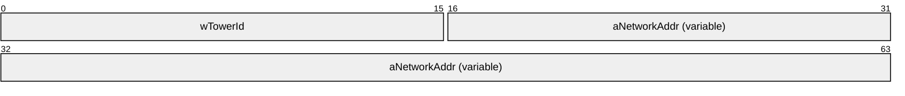

**wTowerId (2 bytes):** An unsigned short that MUST contain an RPC [**protocol sequence identifier**](#gt_protocol-sequence-identifier) constant that identifies the protocol to be used in RPC calls to the server named in the **aNetworkAddr** field, as specified in [[C706]](https://go.microsoft.com/fwlink/?LinkId=89824) table I-2 Appendix I. Additionally, if this field is zero, the **aNetworkAddr** field MUST NOT be present. If this field is not zero, the **aNetworkAddr** field MUST be present.<10>

**aNetworkAddr (variable):** An optional null-terminated Unicode string that, if present, MUST contain a network address and, optionally, RPC endpoint information. This field MUST use one of the two following formats:

The first format is "servername", where "servername" MUST be one of the following:

- A [**NetBIOS Name**](#gt_netbios-name).
- A [**fully qualified domain name (FQDN)**](#gt_fully-qualified-domain-name-fqdn).
- An IPv4 address that MUST be sent in the dotted-decimal form specified in [[RFC1123]](https://go.microsoft.com/fwlink/?LinkId=90268) section 2.1, and SHOULD be validated on receipt.<11>
- An IPv6 address as specified in [[RFC4291]](https://go.microsoft.com/fwlink/?LinkId=90464) section 2.2
- A network address usable by another protocol sequence as specified in [MS-RPCE](../MS-RPCE/MS-RPCE.md) section 2.1.
This is the format used when a [DUALSTRINGARRAY](#Section_2.2.19) containing object resolver bindings is returned from [IObjectExporter::ServerAlive2](#Section_3.1.2.5.1.6), for example, or in an [OBJREF](#Section_2.2.18). [**Endpoint**](#gt_endpoint) information is omitted, as this information is assumed, as specified in [MS-RPCE] section 2.1.

The second format is "servername[endpoint]", for example, "10.0.0.1[5000]", where "servername" is as specified above and "endpoint" MUST be an endpoint as specified in [MS-RPCE] section 2.1. This is the format used when a DUALSTRINGARRAY containing object exporter bindings is returned; for example, from [IObjectExporter::ResolveOxid2](#Section_3.1.2.5.1.5) or [IActivation::RemoteActivation](#Section_3.1.2.5.2.3). The content of endpoint is RPC protocol-specific ([C706] section 6.2.2).

An empty STRINGBINDING structure contains a wTowerId whose value is zero.

#### 2.2.19.4 SECURITYBINDING

The SECURITYBINDING structure describes an [**RPC**](#gt_remote-procedure-call-rpc) [**security provider**](#gt_security-provider) and a [**service principal name (SPN)**](#gt_service-principal-name-spn). A client uses these to communicate with either an [**object resolver**](#gt_object-resolver) or an [**object exporter**](#gt_object-exporter).

**wAuthnSvc (2 bytes):** An RPC security provider constant, as specified in [MS-RPCE](../MS-RPCE/MS-RPCE.md) section 2.2.1.1.7. This field MUST NOT contain the value RPC_C_AUTHN_DEFAULT. Additionally, if this field is RPC_C_AUTHN_NONE, the **Reserved** and **aPrincName** fields MUST NOT be present, and this indicates that the client MUST NOT use any security on the ORPC invocations (see section [3.2.4.2](../MS-RPCE/MS-RPCE.md)). If this field is not RPC_C_AUTHN_NONE, the **Reserved** and **aPrincName** fields MUST be present.

**Reserved (2 bytes):** If present, MUST be set to 0xffff when sent and MUST be ignored on receipt.

**aPrincName (variable):** An optional null-terminated Unicode string that, if present, MUST contain an SPN. An empty null-terminated Unicode string in this field indicates that no SPN is specified, and the client MUST NOT use an SPN for the ORPC invocations (see section 3.2.4.2).

### 2.2.20 Context

This is the marshaled representation of a [**context (1)**](#gt_context). It contains an array of marshaled [**context properties**](#gt_context-property), each of which is represented by a [PROPMARSHALHEADER](#Section_2.2.20.1).

There are three types of context (1) structures:

- A [**client context**](#gt_client-context). This type of context (1) is sent in an activation request in the **pIFDClientCtx** field of the [ActivationContextInfoData](#Section_2.2.22.2.5) structure (section 2.2.22.2.5). The context (1) structure MUST be marshaled into an [OBJREF_CUSTOM](#Section_2.2.18.6) structure (section 2.2.18.6) whose **clsid** field is set to CLSID_ContextMarshaler (section [1.9](#Section_1.9)). The **iid** field of the [OBJREF](#Section_2.2.18) portion of the OBJREF_CUSTOM structure MUST be set to IID_IContext (section 1.9). An implementation MAY use this value as the [**IID**](#gt_interface-identifier-iid) of an interface with the local IDL attribute (section [2.2.27](#Section_2.2.27)).<12>
- A [**prototype context**](#gt_prototype-context). An application or a higher-layer protocol can instruct a DCOM client to send this type of context (1) in an activation request. The prototype context is sent in the **pIFDPrototypeCtx** field of the ActivationContextInfoData structure (section 2.2.22.2.5). The context (1) structure MUST be marshaled into an OBJREF_CUSTOM structure (section 2.2.18.6) whose **clsid** field is set to CLSID_ContextMarshaler (section 1.9). The **iid** field of the OBJREF portion of the OBJREF_CUSTOM structure MUST be set to IID_IContext (see section 1.9). An implementation MAY use this value as the IID of an interface with the local IDL attribute (section 2.2.27).<13>
- An [**envoy context**](#gt_envoy-context). An application or a higher-layer protocol can instruct a DCOM server to send this type of context (1) when marshaling an object. The envoy context is sent in the **Data** field of the **ElmArray** field (section [2.2.18.8](#Section_2.2.18.8)) of an [OBJREF_EXTENDED](#Section_2.2.18.7) structure (section 2.2.18.7).
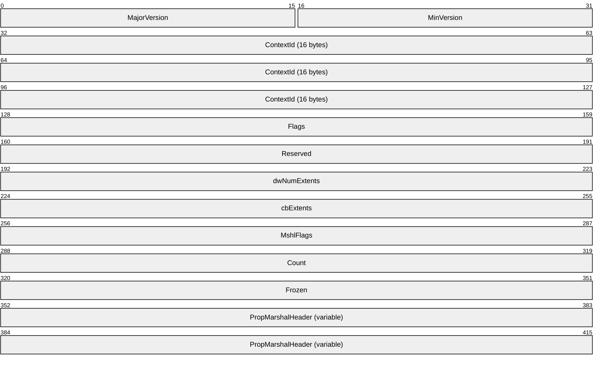

**MajorVersion (2 bytes):** The major version of this context marshaled format. This MUST be set to 0x0001.

**MinVersion (2 bytes):** The minor version of this context (1) marshaled format. This MUST be set to 0x0001.

**ContextId (16 bytes):** A [**GUID**](#gt_globally-unique-identifier-guid) identifying the marshaled context (1).

**Flags (4 bytes):** This MUST be set to the following value.

| Value | Meaning |
| --- | --- |
| CTXMSHLFLAGS_BYVAL 0x00000002 | The context is marshaled by value (this is the only representation that is valid on the wire). |

**Reserved (4 bytes):** This MUST be set to 0x00000000 and MUST be ignored on receipt.

**dwNumExtents (4 bytes):** This MUST be set to 0x00000000.

**cbExtents (4 bytes):** This MUST be set to 0x00000000.

**MshlFlags (4 bytes):** This MUST contain an implementation-specific value that MUST be ignored on receipt.<14>

**Count (4 bytes):** The unsigned number of elements in the **PropMarshalHeader** array.

**Frozen (4 bytes):** A Boolean that MUST be set to TRUE (0x00000001) and that MUST be ignored on receipt.

**PropMarshalHeader (variable):** This MUST be an array of PROPMARSHALHEADER entries.

#### 2.2.20.1 PROPMARSHALHEADER

PROPMARSHALHEADER is the marshaled representation of a [**context property**](#gt_context-property). It contains a [**context property identifier**](#gt_context-property-identifier) and a context property data buffer supplied by an application or higher-layer protocol. The data buffer contains either an [**OBJREF**](#gt_objref) that can be of any valid OBJREF format representing a client or prototype context property, or it contains opaque data representing an envoy context property.

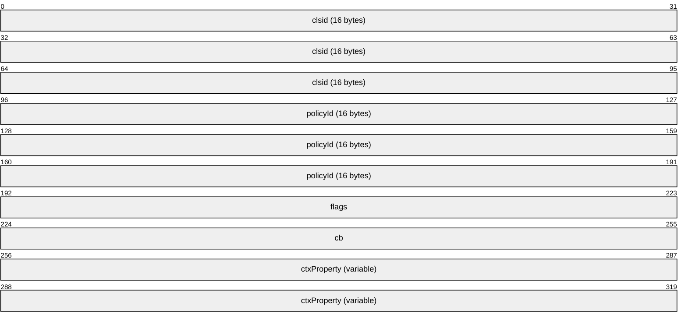

**clsid (16 bytes):** This field MUST be either GUID_NULL or a [**CLSID**](#gt_class-identifier-clsid) supplied by the application or higher-layer protocol identifying an [**object class**](#gt_object-class) associated with the data in the **ctxProperty** field. If this field is GUID_NULL, **ctxProperty** MUST contain an OBJREF representing the marshaled client or prototype context property; otherwise, **ctxProperty** MUST contain opaque data representing the marshaled envoy context property.

**policyId (16 bytes):** A [**GUID**](#gt_globally-unique-identifier-guid) supplied by the application or higher-layer protocol containing a context property identifier for the marshaled context property in ctxProperty.

**flags (4 bytes):** This MUST be set to one of the following values.

| Value | Meaning |
| --- | --- |
| CPFLAG_PROPAGATE 0x00000001 | This context property is part of a [**prototype context**](#gt_prototype-context). |
| CPFLAG_EXPOSE 0x00000002 | This context property is part of a [**client context**](#gt_client-context). |
| CPFLAG_ENVOY 0x00000004 | This context property is part of an [**envoy context**](#gt_envoy-context). |

**cb (4 bytes):** The unsigned size, in bytes, of the **ctxProperty** field.

**ctxProperty (variable):** A buffer of cb bytes supplied by the application or higher-layer protocol. This buffer MUST contain an OBJREF representing the marshaled client or prototype context property if **clsid** is GUID_NULL; otherwise, it MUST contain opaque data representing the marshaled envoy context property.

### 2.2.21 ORPC Extensions

This section defines the format for well-known [**ORPC extensions**](#gt_orpc-extension) used in the DCOM Remote Protocol. They are well-known as these extensions are defined by the DCOM Remote Protocol itself and can be used by applications or higher-layer protocols without additional specification. These ORPC extensions are sent by applications or higher-layer protocols within the data field of [ORPC_EXTENT](#Section_2.2.13.1) structures as part of [**ORPC**](#gt_object-remote-procedure-call-orpc) calls. Each extension has a well-known identifying [**GUID**](#gt_globally-unique-identifier-guid) that is sent within the id field of the ORPC_EXTENT.

#### 2.2.21.1 Error Information ORPC Extension

The purpose of this [**ORPC extension**](#gt_orpc-extension) is to provide a means of passing extended error information between clients and servers.

CLSID_ERROR_EXTENSION (see section [1.9](#Section_1.9)) is the identifying [**GUID**](#gt_globally-unique-identifier-guid) for this ORPC extension. This ORPC extension MUST be marshaled into the data field of an [ORPC_EXTENT](#Section_2.2.13.1) as an [OBJREF](#Section_2.2.18).<15>

#### 2.2.21.2 Custom-Marshaled Error Information Format

This section defines the format of an [OBJREF_CUSTOM](#Section_2.2.18.6) that, depending on the use of the DCOM Remote Protocol by an application or a higher-layer protocol, MAY be passed as an error information [**ORPC extension**](#gt_orpc-extension) (see section [2.2.21.1](#Section_2.2.21.1)). CLSID_ErrorObject (see section [1.9](#Section_1.9)) is the unmarshaler [**CLSID**](#gt_class-identifier-clsid) for this OBJREF_CUSTOM. The format of the **pObjectData** field of the OBJREF_CUSTOM for this CLSID is as follows.

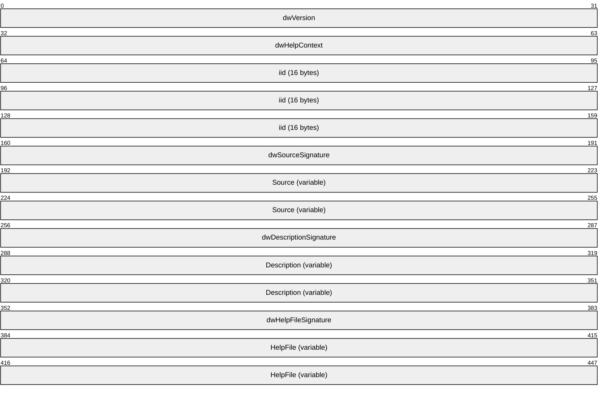

**dwVersion (4 bytes):** This MUST be set to 0x00000000.

**dwHelpContext (4 bytes):** An implementation-specific value that SHOULD be ignored on receipt.<16>

**iid (16 bytes):** An [**IID**](#gt_interface-identifier-iid) that MUST be the IID of the interface returning the error.

**dwSourceSignature (4 bytes):** This MUST be set to 0xFFFFFFFF if the **Source** field is present and MUST be set to 0x00000000 if the **Source** field is not present.

**Source (variable):** This MUST contain an ErrorInfoString (see [ErrorInfoString (section 2.2.21.3)](#Section_2.2.21.3)) if the **dwSourceSignature** field is set to 0xFFFFFFFF and MUST NOT be present if the **dwSourceSignature** field is set to 0x00000000.<17>

**dwDescriptionSignature (4 bytes):** This MUST be set to 0xFFFFFFFF if the **Description** field is present and that MUST be set to 0x00000000 if the **Description** field is not present.

**Description (variable):** This MUST contain an ErrorInfoString (see ErrorInfoString (section 2.2.21.3)) if the **dwDescriptionSignature** field is set to 0xFFFFFFFF and MUST NOT be present if the **dwDescriptionSignature** field is set to 0x00000000.<18>

**dwHelpFileSignature (4 bytes):** This MUST be set to 0xFFFFFFFF if the **HelpFile** field is present and MUST be set to 0x00000000 if the **HelpFile** field is not present.

**HelpFile (variable):** This MUST contain an ErrorInfoString (see ErrorInfoString (section 2.2.21.3)) if the **dwHelpFileSignature** field is set to 0xFFFFFFFF and MUST NOT be present if the **dwHelpFileSignature** field is set to 0x00000000.<19>

#### 2.2.21.3 ErrorInfoString

This packet specifies the format of the string data that is contained in a [Custom-Marshaled Error Info Format (section 2.2.21.2)](#Section_2.2.21.2) packet.

**dwMax (4 bytes):** The unsigned number of Unicode characters in the **Name** array including the NULL terminator.

**dwOffSet (4 bytes):** This MUST be set to zero.

**dwActual (4 bytes):** This MUST be set to the value of the **dwMax** field.

**Name (variable):** This MUST contain an implementation-specific NULL-terminated Unicode string and SHOULD be ignored on receipt.

#### 2.2.21.4 Context ORPC Extension

CLSID_CONTEXT_EXTENSION is the identifying [**GUID**](#gt_globally-unique-identifier-guid) for this [**ORPC extension**](#gt_orpc-extension), which is marshaled into the data field of an [ORPC_EXTENT](#Section_2.2.13.1) using the structure format that follows.

A context ORPC extension is used when a client or server passes data associated with a [**context property**](#gt_context-property) along with and in response to an [**ORPC**](#gt_object-remote-procedure-call-orpc) call.

All fields MUST be marshaled with the same endianness as the encompassing [**RPC**](#gt_remote-procedure-call-rpc) PDU.

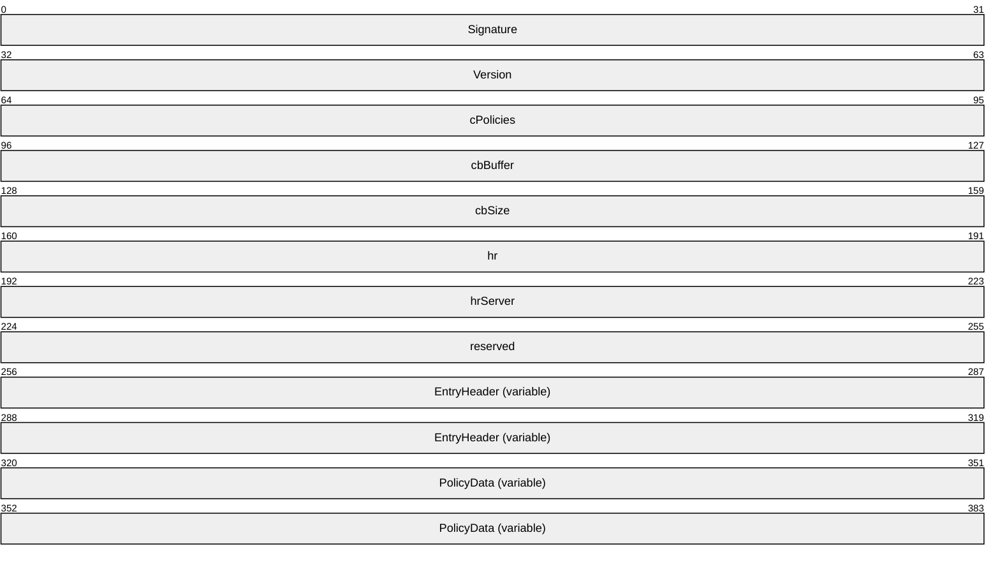

**Signature (4 bytes):** This MUST be set to 0x414E554B.

**Version (4 bytes):** This MUST be set to 0x00010000.

**cPolicies (4 bytes):** The unsigned number of elements in the **EntryHeader** array. This MUST also be equal to the number of elements in the **PolicyData** array.

**cbBuffer (4 bytes):** An implementation-specific value that MUST be ignored on receipt.<20>

**cbSize (4 bytes):** The unsigned size (in bytes) from the beginning of this structure to the end of the last **EntryHeader**.

**hr (4 bytes):** An HRESULT that MUST be set to zero and MUST be ignored on receipt.

**hrServer (4 bytes):** An HRESULT that MUST be set to zero when sent from client to server and MUST be ignored on receipt. When sent from server to client, this field MAY contain an implementation-specific error value.<21>

**reserved (4 bytes):** This MUST be set to zero and MUST be ignored on receipt.

**EntryHeader (variable):** An array of [EntryHeader](#Section_2.2.21.5) structures. The number of elements in the array MUST be specified in cPolicies.

**PolicyData (variable):** An array of byte arrays. The number of elements in the outer array MUST be specified in cPolicies. The number of elements in the byte array MUST be specified in the **cbEHBuffer** field (see section 2.2.21.5) in the corresponding element in the EntryHeader array.

Both the EntryHeader and PolicyData arrays MUST have sizes that are integral multiples of eight, and all padding bytes MUST be initialized to zero and MUST be ignored on receipt.

#### 2.2.21.5 EntryHeader

The EntryHeader structure is used to describe an opaque array of bytes associated with a [**context property**](#gt_context-property) within the context [**ORPC extension**](#gt_orpc-extension).

All fields MUST be marshaled with the same endianness as the encompassing [**RPC**](#gt_remote-procedure-call-rpc) PDU.

**Signature (4 bytes):** This MUST be set to 0x494E414E.

**cbEHBuffer (4 bytes):** The unsigned size (in bytes) of the opaque policy data buffer corresponding to this EntryHeader. This MUST NOT be zero.

**cbSize (4 bytes):** The unsigned size (in bytes) of the offset from the beginning of the context ORPC extension buffer to the beginning of the opaque policy data buffer corresponding to this EntryHeader.

**reserved (4 bytes):** This MUST be set to 0x00000000 and MUST be ignored on receipt.

**policyID (16 bytes):** A [**GUID**](#gt_globally-unique-identifier-guid) that MUST contain a [**context property identifier**](#gt_context-property-identifier).

### 2.2.22 Activation Properties BLOB

Activation properties constitute a BLOB of data that contains information used to specify the parameters of activation, or to return the results of activation. Activation properties BLOBs are passed as [in] and [out] parameters of the [IRemoteSCMActivator](#Section_3.1.2.5.2) methods.

**dwSize (4 bytes):** The unsigned total size (in bytes) from the beginning of the **CustomHeader** field to the end of the last entry in the **Property** array.

**dwReserved (4 bytes):** This MUST be set to zero and MUST be ignored on receipt.

**CustomHeader (variable):** This MUST contain a [CustomHeader](#Section_2.2.22.1) marshaled using the [**NDR**](#gt_network-data-representation-ndr) Type Serialization 1 engine (as specified in [MS-RPCE](../MS-RPCE/MS-RPCE.md) section 2.2.6).

**Property (variable):** This MUST contain an array of structures listed in section [2.2.22.2](#Section_2.2.22.2.3) marshaled using the NDR Type Serialization 1 engine (as specified in [MS-RPCE] section 2.2.6). The format of the Nth element in the array is identified by the [**CLSID**](#gt_class-identifier-clsid) specified in the Nth entry of the pclsid array in the CustomHeader field. The number of elements in the array MUST be specified by the **cIfs** field of the CustomHeader and MUST NOT be zero.

#### 2.2.22.1 CustomHeader

The CustomHeader structure is used to identify the format and ordering of the properties in the activation properties BLOB.

typedef struct tagCustomHeader {

DWORD totalSize;

DWORD headerSize;

DWORD dwReserved;

DWORD destCtx;

[range(MIN_ACTPROP_LIMIT, MAX_ACTPROP_LIMIT)]

DWORD cIfs;

CLSID classInfoClsid;

[size_is(cIfs)] CLSID* pclsid;

[size_is(cIfs)] DWORD* pSizes;

DWORD* pdwReserved;

} CustomHeader;

**totalSize:** This MUST be the total size (in bytes) from the beginning of the CustomHeader to the end of the last entry in the subsequent Property array of the activation properties BLOB.

**headerSize:** This MUST be the total size (in bytes) of the CustomHeader as marshaled by the [**NDR**](#gt_network-data-representation-ndr) Type Serialization 1 engine (as specified in [MS-RPCE](../MS-RPCE/MS-RPCE.md) section 2.2.6).

**dwReserved:** This MUST be set to zero and MUST be ignored on receipt.

**destCtx:** This MUST contain an implementation-specific value that SHOULD be ignored on receipt.<22>

**cIfs:** This MUST be the total number of entries in the subsequent Property array of the activation properties BLOB. The value MUST be between MIN_ACTPROP_LIMIT and MAX_ACTPROP_LIMIT (see section [2.2.28.1](#Section_2.2.28.1)).

**classInfoClsid:** This MUST be set to GUID_NULL.

**pclsid:** This MUST specify an array of cIfs [**CLSIDs**](#gt_class-identifier-clsid); the Nth entry identifies the Nth entry in the Property array of the activation properties BLOB. Each CLSID is used to uniquely identify an activation property. The valid CLSID values are defined in section [1.9](#Section_1.9).

**pSizes:** This MUST specify an array of cIfs DWORDs, each containing the size (in bytes) of the corresponding property following the CustomHeader in the buffer.

**pdwReserved:** This MUST be set to NULL and MUST be ignored on receipt.

#### 2.2.22.2 Activation Properties

This section documents the list of properties that MAY appear in the Property array of the [Activation Properties BLOB](#Section_2.2.22) structure.

##### 2.2.22.2.1 InstantiationInfoData

The client uses this structure to specify basic details of the object to be activated, including the identifying object [**CLSID**](#gt_class-identifier-clsid) and one or more requested object interfaces.

CLSID_InstantiationInfo (section [1.9](#Section_1.9)) is used to identify this property in the [CustomHeader](#Section_2.2.22.1).**pclsid** array.

typedef struct tagInstantiationInfoData {

CLSID classId;

DWORD classCtx;

DWORD actvflags;

long fIsSurrogate;

[range(1, MAX_REQUESTED_INTERFACES)]

DWORD cIID;

DWORD instFlag;

[size_is(cIID)] IID* pIID;

DWORD thisSize;

COMVERSION clientCOMVersion;

} InstantiationInfoData;

**classId:** The CLSID of the [**COM**](#gt_component-object-model-com) [**object class**](#gt_object-class) that the client activates.

**classCtx:** An implementation-specific value that SHOULD be ignored on receipt.<23>

**actvflags:** 0x00000000 or any combination of the following bit values.

| Value | Meaning |
| --- | --- |
| ACTVFLAGS_DISABLE_AAA 0x00000002 | The [**object resolver**](#gt_object-resolver) is requested to not execute the [**object exporter**](#gt_object-exporter) under the client's identity. |
| ACTVFLAGS_ACTIVATE_32_BIT_SERVER 0x00000004 | The object resolver is requested to execute the object exporter in the 32-bit address space. |
| ACTVFLAGS_ACTIVATE_64_BIT_SERVER 0x00000008 | The object resolver is requested to execute the object exporter in the 64-bit address space. |
| ACTVFLAGS_NO_FAILURE_LOG 0x00000020 | The object resolver is requested to not log an error if a failure occurs during the activation request. |

**fIsSurrogate:** This MUST be set to FALSE (0x00000000) and MUST be ignored on receipt.

**cIID:** The number of interfaces in the pIID array. This value MUST be between 1 and MAX_REQUESTED_INTERFACES (see section [2.2.28.1](#Section_2.2.28.1)).

**instFlag:** This MUST be set to zero and MUST be ignored on receipt.

**pIID:** An array of [**IIDs**](#gt_interface-identifier-iid) identifying the interfaces that the client requests from the server.

**thisSize:** The size (in bytes) of this structure, as marshaled by the [**NDR**](#gt_network-data-representation-ndr) Type Serialization 1 engine (as specified in [MS-RPCE](../MS-RPCE/MS-RPCE.md) section 2.2.6). It SHOULD be ignored on receipt.

**clientCOMVersion:** The [COMVERSION](#Section_2.2.11) of the client. This MUST be ignored on receipt.

##### 2.2.22.2.2 SpecialPropertiesData

The SpecialPropertiesData structure contains miscellaneous parameters specified by the client for an activation request.

CLSID_SpecialSystemProperties (see section [1.9](#Section_1.9)) is used to identify this property in the CustomHeader.pclsid array.

typedef struct tagSpecialPropertiesData {

unsigned long dwSessionId;

long fRemoteThisSessionId;

long fClientImpersonating;

long fPartitionIDPresent;

DWORD dwDefaultAuthnLvl;

GUID guidPartition;

DWORD dwPRTFlags;

DWORD dwOrigClsctx;

DWORD dwFlags;

DWORD Reserved1;

unsigned __int64 Reserved2;

DWORD Reserved3[5];

} SpecialPropertiesData;

**dwSessionId:** A value that uniquely identifies a logon session on the server. The value 0xFFFFFFFF indicates that any logon session is acceptable to the client.

**fRemoteThisSessionId:** This MUST be set to TRUE (0x00000001) if **dwSessionId** is not 0xFFFFFFFF; otherwise this MUST be set to FALSE (0x00000000). This field MUST be ignored on receipt.

**fClientImpersonating:** This SHOULD be set to FALSE (0x00000000) and MUST be ignored on receipt.<24>

**fPartitionIDPresent:** This MUST contain an implementation-specific value and MAY be ignored on receipt.<25>

**dwDefaultAuthnLvl:** This MUST contain an implementation-specific value and MUST be ignored on receipt.<26>

**guidPartition:** This MUST contain an implementation-specific value specified by higher-layer protocols and MAY be ignored on receipt.<27>

**dwPRTFlags:** This MUST be set to zero and MUST be ignored on receipt.

**dwOrigClsctx:** This MUST contain an implementation-specific value and SHOULD be ignored on receipt.<28>

**dwFlags:** This is a set of bitflags, defined as follows.

| Value | Meaning |
| --- | --- |
| SPD_FLAG_USE_CONSOLE_SESSION 0x00000001 | If this bit is set, the [**object resolver**](#gt_object-resolver) is requested to create the [**object exporter**](#gt_object-exporter) in the console logon session. If this bit is not set, the object resolver is requested to create the object exporter in the logon session specified in the **dwSessionID** field. |

Object resolvers MUST ignore any other bits that are set in the **dwFlags** field.

**Reserved1:** This MUST be set to zero when sent and MUST be ignored on receipt.

**Reserved2:** This MUST be set to zero when sent and MUST be ignored on receipt.

**Reserved3:** This can contain arbitrary values and MUST be ignored on receipt.

This structure has an alternate definition that is specified as follows.

typedef struct tagSpecialPropertiesData_Alternate {

unsigned long dwSessionId;

long fRemoteThisSessionId;

long fClientImpersonating;

long fPartitionIDPresent;

DWORD dwDefaultAuthnLvl;

GUID guidPartition;

DWORD dwPRTFlags;

DWORD dwOrigClsctx;

DWORD dwFlags;

DWORD Reserved3[8];

} SpecialPropertiesData_Alternate;

All the fields have the same meaning as the corresponding fields in the first structure. A DCOM server MUST accept as valid both definitions. A DCOM client SHOULD<29> use **SpecialPropertiesData** in activation requests.

##### 2.2.22.2.3 InstanceInfoData

The InstanceInfoData structure contains data related to persistent activations; that is, object activations in which the newly created object is immediately initialized with state from a previously persisted instance of the object. For more information, see [[MSDN-COM]](https://go.microsoft.com/fwlink/?LinkId=89977), [[MSDN-SS]](https://go.microsoft.com/fwlink/?LinkId=90136), and [[MSDN-IPersistFile]](https://go.microsoft.com/fwlink/?LinkId=90026).

CLSID_InstanceInfo (see section [1.9](#Section_1.9)) is used to identify this property in the CustomHeader.pclsid array.

typedef struct tagInstanceInfoData {

[string] wchar_t* fileName;

DWORD mode;

MInterfacePointer* ifdROT;

MInterfacePointer* ifdStg;

} InstanceInfoData;

**fileName:** This MAY contain a string to be used to initialize the object.<30>

**mode:** This MUST contain an implementation-specific value and MAY be ignored on receipt.<31>

**ifdROT:** The pointer MUST be set to NULL and MUST be ignored on receipt.

**ifdStg:** This MAY contain a marshaled [**OBJREF**](#gt_objref) to be used to initialize the object.<32>

##### 2.2.22.2.4 ScmRequestInfoData

The ScmRequestInfoData structure contains a [customREMOTE_REQUEST_SCM_INFO](#Section_2.2.22.2.4.1) structure.

CLSID_ScmRequestInfo (see section [1.9](#Section_1.9)) is used to identify this property in the CustomHeader.pclsid array.

typedef struct tagScmRequestInfoData {

DWORD* pdwReserved;

customREMOTE_REQUEST_SCM_INFO* remoteRequest;

} ScmRequestInfoData;

**pdwReserved:** This MUST be set to NULL and MUST be ignored on receipt.

**remoteRequest:** This MUST specify a customREMOTE_REQUEST_SCM_INFO structure. This field MUST NOT be NULL.

###### 2.2.22.2.4.1 customREMOTE_REQUEST_SCM_INFO

The customREMOTE_REQUEST_SCM_INFO structure specifies the [**protocol sequence identifiers**](#gt_protocol-sequence-identifier) supported by the client.

typedef struct _customREMOTE_REQUEST_SCM_INFO {

DWORD ClientImpLevel;

[range(0, MAX_REQUESTED_PROTSEQS)]

unsigned short cRequestedProtseqs;

[size_is(cRequestedProtseqs)] unsigned short* pRequestedProtseqs;

} customREMOTE_REQUEST_SCM_INFO;

**ClientImpLevel:** This MUST contain an implementation-specific value that MUST be ignored on receipt.<33>

**cRequestedProtseqs:** This MUST contain the number of elements in the **pRequestedProtseqs** array and SHOULD be at least 1.

MAX_REQUESTED_PROTSEQS (see section [2.2.28.1](#Section_2.2.28.1)) specifies the upper bound for the range of permissible values in cRequestedProtseqs.

**pRequestedProtseqs:** This MUST contain an array of [**RPC**](#gt_remote-procedure-call-rpc) protocol sequence identifiers supported by the client.

##### 2.2.22.2.5 ActivationContextInfoData

The ActivationContextInfoData structure passes a [**client context**](#gt_client-context) and optionally a [**prototype context**](#gt_prototype-context) to the server as part of an activation request.

CLSID_ActivationContextInfo (see section [1.9](#Section_1.9)) is used to identify this property in the CustomHeader.pclsid array.

typedef struct tagActivationContextInfoData {

long clientOK;

long bReserved1;

DWORD dwReserved1;

DWORD dwReserved2;

MInterfacePointer* pIFDClientCtx;

MInterfacePointer* pIFDPrototypeCtx;

} ActivationContextInfoData;

**clientOK:** This MUST be set to FALSE (0x00000000) and MUST be ignored on receipt.

**bReserved1:** This MUST be set to FALSE (0x00000000) and MUST be ignored on receipt.

**dwReserved1:** This MUST be set to zero and MUST be ignored on receipt.

**dwReserved2:** This MUST be set to zero and MUST be ignored on receipt.

**pIFDClientCtx:** This MUST contain an [**OBJREF**](#gt_objref) specifying a marshaled client context as specified in section [2.2.20](#Section_2.2.20). The server MUST return RPC_E_INVALID_OBJREF (as specified in [MS-ERREF](../MS-ERREF/MS-ERREF.md) section 2.1) if the OBJREF is NULL or invalid.

**pIFDPrototypeCtx:** If an application or a higher-layer protocol instructs the client to send prototype context properties, this MUST contain an [OBJREF](#Section_2.2.18) specifying a marshaled prototype context as specified in section 2.2.20. Otherwise, this MUST be set to NULL.

##### 2.2.22.2.6 LocationInfoData

The LocationInfoData structure MUST be present in the [Activation Properties BLOB](#Section_2.2.22) structure. The server MUST ignore this structure.

CLSID_ServerLocationInfo (see section [1.9](#Section_1.9)) is used to identify this property in the CustomHeader.pclsid array.

typedef struct tagLocationInfoData {

[string] wchar_t* machineName;

DWORD processId;

DWORD apartmentId;

DWORD contextId;

} LocationInfoData;

**machineName:** This MUST be set to NULL and MUST be ignored on receipt.

**processId:** This MUST be set to 0 and MUST be ignored on receipt.

**apartmentId:** This MUST be set to 0 and MUST be ignored on receipt.

**contextId:** This MUST be set to 0 and MUST be ignored on receipt.

##### 2.2.22.2.7 SecurityInfoData

The SecurityInfoData structure SHOULD NOT be sent and MUST be ignored on receipt.<34>

CLSID_SecurityInfo (see section [1.9](#Section_1.9)) is used to identify this property in the CustomHeader.pclsid array.

typedef struct tagSecurityInfoData {

DWORD dwAuthnFlags;

COSERVERINFO* pServerInfo;

DWORD* pdwReserved;

} SecurityInfoData;

**dwAuthnFlags:** This MUST be set to zero and MUST be ignored on receipt.

**pServerInfo:** This SHOULD be NULL and MUST be ignored on receipt. For details, see section [2.2.22.2.7.1](#Section_2.2.22.2.7.1).<35>

**pdwReserved:** This MUST be set to NULL and MUST be ignored on receipt.

###### 2.2.22.2.7.1 COSERVERINFO

The COSERVERINFO structure SHOULD NOT be sent and MUST be ignored on receipt.

typedef struct _COSERVERINFO {

DWORD dwReserved1;

[string] wchar_t* pwszName;

DWORD* pdwReserved;

DWORD dwReserved2;

} COSERVERINFO;

**dwReserved1:** This MUST be set to zero and MUST be ignored on receipt.

**pwszName:** This SHOULD be set to NULL and MUST be ignored by servers.<36>

**pdwReserved:** This MUST be set to NULL and MUST be ignored on receipt.

**dwReserved2:** This MUST be set to zero and MUST be ignored on receipt.

##### 2.2.22.2.8 ScmReplyInfoData

The ScmReplyInfoData structure contains a [customREMOTE_REPLY_SCM_INFO](#Section_2.2.22.2.8.1) structure.

CLSID_ScmReplyInfo (see section [1.9](#Section_1.9)) is used to identify this property in the CustomHeader.pclsid array.

typedef struct tagScmReplyInfoData {

DWORD* pdwReserved;

customREMOTE_REPLY_SCM_INFO* remoteReply;

} ScmReplyInfoData;

**pdwReserved:** This MUST be set to NULL and MUST be ignored on receipt.

**remoteReply:** This MUST specify the customREMOTE_REPLY_SCM_INFO for the [**object exporter**](#gt_object-exporter) of the server object.

###### 2.2.22.2.8.1 customREMOTE_REPLY_SCM_INFO

The customREMOTE_REPLY_SCM_INFO structure is used to return information about the [**object exporter**](#gt_object-exporter), specifically the [**OXID**](#gt_object-exporter-identifier-oxid), [**RPC**](#gt_remote-procedure-call-rpc) bindings, [COMVERSION](#Section_2.2.11), and [**IPID**](#gt_interface-pointer-identifier-ipid) of the IRemUnknown interface and the authentication hint of the object exporter.

typedef struct _customREMOTE_REPLY_SCM_INFO {

OXID Oxid;

DUALSTRINGARRAY* pdsaOxidBindings;

IPID ipidRemUnknown;

DWORD authnHint;

COMVERSION serverVersion;

} customREMOTE_REPLY_SCM_INFO;

**Oxid:** This MUST contain the OXID identifier for the object exporter.

**pdsaOxidBindings:** This MUST specify the string and security bindings supported by the object exporter and MUST NOT be NULL. The returned string bindings SHOULD contain endpoints.

**ipidRemUnknown:** This MUST specify the IPID of the object exporter's [**Remote Unknown**](#gt_remote-unknown) object.

**authnHint:** This SHOULD contain an RPC [**authentication level**](#gt_authentication-level) (see [MS-RPCE](../MS-RPCE/MS-RPCE.md) section 2.2.1.1.8) that denotes the minimum authentication level supported by the object exporter. This field MAY be ignored by the client.<37>

**serverVersion:** This MUST contain the COMVERSION of the server.

##### 2.2.22.2.9 PropsOutInfo

The PropsOutInfo structure represents a collection of interfaces that the object implements and that are returned to the client. If the object does not support a particular interface requested by the client, it also sends an error back using this structure.

CLSID_PropsOutInfo (see section [1.9](#Section_1.9)) is used to identify this property in the CustomHeader.pclsid array.

typedef struct tagPropsOutInfo {

[range(1, MAX_REQUESTED_INTERFACES)]

DWORD cIfs;

[size_is(cIfs)] IID* piid;

[size_is(cIfs)] HRESULT* phresults;

[size_is(cIfs)] MInterfacePointer** ppIntfData;

} PropsOutInfo;

**cIfs:** This MUST contain the number of interfaces being returned by the server. This value MUST be between 1 and MAX_REQUESTED_INTERFACES (see section [2.2.28.1](#Section_2.2.28.1)).

**piid:** This MUST be an array of [**IIDs**](#gt_interface-identifier-iid) identifying the interfaces returned by the server.

**phresults:** This MUST be an array of status codes indicating the success or failure of each attempt to return an interface requested by the client. For each array location containing a zero value, a non-NULL MInterfacePointer pointer MUST be present in the corresponding location in the ppIntfData array. For each array location containing a negative value, a NULL MUST be present in the corresponding location in the ppIntfData array.

**ppIntfData:** This MUST be an array of MInterfacePointer pointers containing the [**OBJREFs**](#gt_objref) for the interfaces returned by the server.

### 2.2.23 REMINTERFACEREF

The REMINTERFACEREF structure is passed as a parameter to either IRemUnknown::RemAddRef (Opnum 4) or IRemUnknown::RemRelease (Opnum 5). It specifies the number and type of references that the client requests to be added to (or subtracted from) an interface [**reference count**](#gt_reference-count).

typedef struct tagREMINTERFACEREF {

IPID ipid;

unsigned long cPublicRefs;

unsigned long cPrivateRefs;

} REMINTERFACEREF;

**ipid:** This MUST be the [**IPID**](#gt_interface-pointer-identifier-ipid) of the interface reference count to be modified.

**cPublicRefs:** This MUST be the number of public references (see section [1.3.6](#Section_1.3.6)) on the interface identified by IPID being requested by the client.

**cPrivateRefs:** This MUST be the number of private references (see section 1.3.6) on the interface identified by IPID being requested by the client.

### 2.2.24 REMQIRESULT

The REMQIRESULT structure is passed as an output parameter from [IRemUnknown::RemQueryInterface](#Section_3.1.1.5.6.1.1). It contains the result of the RemQueryInterface and the [STDOBJREF](#Section_2.2.18.1) containing the [**object reference**](#gt_object-reference) for the queried interface.

typedef struct tagREMQIRESULT {

HRESULT hResult;

STDOBJREF std;

} REMQIRESULT;

**hResult:** This MUST contain zero if the QueryInterface operation was successful. Otherwise, this MUST contain a negative value to indicate failure; see section 3.1.1.5.6.1.1.

**std:** If hResult is zero, this MUST contain a STDOBJREF instance that the client can unmarshal and use to make calls on the interface. If hResult contains an error value, this field MUST be ignored.

### 2.2.25 PREMQIRESULT

The PREMQIRESULT type specifies a pointer to a [REMQIRESULT](#Section_2.2.24) structure.

This type is declared as follows:

typedef [disable_consistency_check] REMQIRESULT* PREMQIRESULT;

where **disable_consistency_check** is as specified in [MS-RPCE](../MS-RPCE/MS-RPCE.md) section 2.2.4.17

### 2.2.26 REFIPID

The REFIPID type specifies a pointer to a const GUID structure.

This type is declared as follows:

typedef const GUID* REFIPID;

### 2.2.27 Local IDL Attribute

The local [**IDL**](#gt_interface-definition-language-idl) attribute is an IDL extension to the interface attributes specified in [C706] section 4.2.4.

The local IDL attribute specifies that the methods of the interface cannot be invoked from a remote machine using the Remote Procedure Call Protocol Extensions as specified in [MS-RPCE](../MS-RPCE/MS-RPCE.md).

### 2.2.28 Constant Definitions

#### 2.2.28.1 IDL Range Constants

The following table lists the constants used to specify lower and upper limits for various parameters.

| Constant/value | Description |
| --- | --- |
| MAX_REQUESTED_INTERFACES 0x8000 | Maximum number of interfaces sent or returned. |
| MAX_REQUESTED_PROTSEQS 0x8000 | Maximum value of cRequestedProtseqs |
| MIN_ACTPROP_LIMIT 1 | Minimum value of cIfs. |
| MAX_ACTPROP_LIMIT 10 | Maximum value of cIfs. |

# 3 Protocol Details

This section specifies the DCOM Remote Protocol using two roles: the client role and the server role. Implementations MUST support the client role and MAY support the server role.<38>

In this section, the term [**object reference**](#gt_object-reference) MUST be regarded as one whose marshaled representation is an [OBJREF](#Section_2.2.18) that contains a [STDOBJREF](#Section_2.2.18.1), unless otherwise specified by an application or a higher-layer protocol.

## 3.1 Server Details

An [**object server**](#gt_object-server) MUST contain exactly one [**object resolver**](#gt_object-resolver) and zero or more [**object exporters**](#gt_object-exporter). The object resolver and the object exporters communicate by way of an implementation-specific mechanism.

### 3.1.1 Object Exporter Details

#### 3.1.1.1 Abstract Data Model

This section describes a conceptual model of possible data organization that an implementation maintains to participate in this protocol. The organization is provided to explain how the protocol behaves. This document does not mandate that implementations adhere to this model as long as their external behavior is consistent with that specified in this document.

[**Object exporters**](#gt_object-exporter) MUST maintain the following data elements:

**Authentication level**: The [**authentication level**](#gt_authentication-level) of the object exporter.

**Permissions**: An implementation-specific set of permissions that determine who can access the object exporter.

**IPID table**: A table of entries to interfaces on objects, keyed by [**IPID**](#gt_interface-pointer-identifier-ipid) or [**IID**](#gt_interface-identifier-iid). Each entry MUST contain:

- The IPID of the interface.
- The IID of the interface.
- The [**OID**](#gt_object-identifier-oid) of the object.
- The [**OXID**](#gt_object-exporter-identifier-oxid) of the object exporter.
- The public [**reference counts**](#gt_reference-count) of the [**object reference**](#gt_object-reference).
- A list of private reference counts, one per client identity.
- A pointer to an application defined state for the object's implementation of the interface.
**OID table**: A table information about objects referenced by the client, keyed by OID or object pointer. Each entry MUST contain:

- The OID of the object.
- The OXID of the object exporter.
- A list of IPIDs of the interfaces on the object.
- The time of the last [**ORPC**](#gt_object-remote-procedure-call-orpc) invocation on the OID.
- An object pointer to an implementation-specific application state that represents the object.
- An implementation-defined hash of the [STRINGBINDING](#Section_2.2.19.3) of the **saResAddr** field contained in the [STDOBJREF](#Section_2.2.18.1).
- A Boolean garbage_collection flag that MUST be set to True if the object participates in [**pinging**](#gt_pinging); see the SORF_NOPING flag in section [2.2.18.2](#Section_2.2.18.2).
**Resolver table**: See section [3.2.1](#Section_3.1.1.1).

**SETID table**: See section 3.2.1.

**OXID table**: See section 3.2.1.

#### 3.1.1.2 Timers

Each object exporter instance MUST maintain a global timer for [**pinging**](#gt_pinging), similar to those maintained by clients; see section [3.2.2](#Section_3.2.2).

#### 3.1.1.3 Initialization

[**Object exporters**](#gt_object-exporter) MUST listen by way of [**RPC**](#gt_remote-procedure-call-rpc) protocols described in section [3.1.2.3](#Section_3.1.2) and as specified in [[C706]](https://go.microsoft.com/fwlink/?LinkId=89824) section 3.1.20 (rpc_server_use_protseq). Because listening is potentially expensive, such initialization SHOULD be delayed until an [**object reference**](#gt_object-reference) is marshaled from the object exporter.

The object exporter MUST listen on an RPC protocol before returning the object exporter bindings that specify that RPC [**protocol sequence identifier**](#gt_protocol-sequence-identifier) in the response to the activation or [**OXID resolution**](#gt_oxid-resolution) requests.

The object exporter MUST obtain its [**OXID**](#gt_object-exporter-identifier-oxid) from the resolver.

The object exporter MUST obtain the [**OID**](#gt_object-identifier-oid) of the [**Remote Unknown**](#gt_remote-unknown) object from the resolver.

The object exporter MUST obtain the ping period from the resolver; for details, see section [3.1.2.2](#Section_3.2.2).

Each object exporter instance MUST create an [**IPID**](#gt_interface-pointer-identifier-ipid) entry for its [IRemUnknown](#Section_3.1.1.5.7) interface. If an object exporter instance is at [COMVERSION](#Section_2.2.11) 5.6 or above, it MUST also create an IPID entry for the [IRemUnknown2](#Section_3.1.1.5.7) interface. An object exporter instance MUST create its IPID entry as follows:

- It MUST allocate an IPID and set it in the IPID entry.
- It MUST set the IID in the IPID entry to the IID for the IRemUnknown interface or the IRemUnknown2 interface.
- It MUST instruct RPC to listen on the IRemUnknown interface or the IRemUnknown2 interface, as specified in [C706] section 3.1.20 (rpc_server_register_if).
- It MUST set the object pointer in the entry to the object pointer of the object exporter's implementation of the IRemUnknown interface or the IRemUnknown2 interface.
- It MUST set the OID and the OXID in the IPID entry to the corresponding values obtained from the resolver.
- It MUST add the IPID entry to the IPID table.

#### 3.1.1.4 Higher-Layer Triggered Events

When a higher-layer protocol or an application specifies the values of the authentication level and the permissions needed to access the object exporter, the object server MUST store them in the corresponding fields specified in section [3.1.1.1](#Section_1.3.3). It is the responsibility of the specification of the application or the higher-layer protocol to state such requirements, if any.

#### 3.1.1.5 Message Processing Events and Sequencing Rules

##### 3.1.1.5.1 Marshaling an Object

The [**object exporter**](#gt_object-exporter) MUST perform the following operations to marshal an object into an [**OBJREF**](#gt_objref) of OBJREF_STANDARD type when returning from an [**ORPC**](#gt_object-remote-procedure-call-orpc). In this case, the application or higher-layer protocol MUST supply an object pointer and an [**IID**](#gt_interface-identifier-iid); see section [4.5](#Section_4.5).

- The object exporter MUST look up the [**OID**](#gt_object-identifier-oid) entry in the OID table using the object pointer.
- If the OID entry is not found, the object exporter MUST create an entry as follows:
- The object exporter MUST contact the [**object resolver**](#gt_object-resolver) to allocate an OID and set it in the OID entry.
- The object exporter MUST initialize the [**IPID**](#gt_interface-pointer-identifier-ipid) list in the OID entry to NULL.
- The object exporter MUST set the object pointer in the OID entry to the object pointer supplied by the application.
- The object exporter MUST look up the IPID entry in the IPID list of the OID entry using the IID specified by the application:
- If the IPID entry is not found, the object exporter MUST create an IPID entry as follows:
- The object exporter MUST allocate an IPID and set it in the IPID entry.
- The object exporter MUST set the OID in the IPID entry to the OID obtained from the object resolver.
- The object exporter MUST set the [**OXID**](#gt_object-exporter-identifier-oxid) in the IPID entry to the OXID of the object exporter.
- The object exporter MUST set the IID in the IPID entry to the IID specified by the application; see section 4.5.
- The object exporter MUST set the public [**reference count**](#gt_reference-count) in the IPID entry to an initial value. The initial value MUST be 0 or more and SHOULD be 5.
- The object exporter MUST set the private reference count to 0.
- The object exporter MUST instruct [**RPC**](#gt_remote-procedure-call-rpc) to listen on the interface designated by the IID, as specified in [[C706]](https://go.microsoft.com/fwlink/?LinkId=89824) section 3.1.20 (rpc_server_register_if).
- Set the object pointer in the IPID entry to the object pointer of the application's state that implements the interface specified by the IID. The application state is implementation-specific.
- The object exporter MUST add the IPID to the IPID list of the OID entry.
- Otherwise, the object exporter MUST increment the public reference count in the IPID entry by the initial value.
- The object exporter MUST set the last ORPC invocation time in the OID entry to the current time.
- The object exporter MUST construct a [STDOBJREF](#Section_2.2.18.1) instance for the object as follows:
- The object exporter SHOULD set the flags field to 0.<39>
- The object exporter MUST set cPublicRefs to the initial value.
- The object exporter MUST set the IPID and the OID from the respective IPID and OID entries.
- The object exporter MUST set the OXID to the OXID of the object exporter.
- The object exporter MUST create an OBJREF_STANDARD instance as follows:
- The object exporter MUST set the **std** field to the constructed STDOBJREF instance.
- The object exporter MUST set the **saResAddr** field to the DUALSTRING array of the object resolver.
- The object exporter MUST create an OBJREF instance as follows:
- The object exporter MUST set the **signature** field to 0x574f454d.
- The object exporter MUST set the **flags** field to OBJREF_STANDARD.
- The object exporter MUST set the **iid** field to the IID supplied by the application.
- The object exporter MUST set the **u_objref** field to the OBJREF_STANDARD instance.
- The object exporter MUST use [**NDR**](#gt_network-data-representation-ndr) to marshal the OBJREF into an [MInterfacePointer](#Section_2.2.14) that is placed in the RPC PDU body.
Applications or higher-layer protocols can also instruct the object exporter to marshal OBJREF instances of type [OBJREF_HANDLER](#Section_2.2.18.5), [OBJREF_EXTENDED](#Section_2.2.18.7), and [OBJREF_CUSTOM](#Section_2.2.18.6). In this case, the object exporter MUST create an OBJREF, as specified previously, with the exception that it MUST set the flags field to the corresponding flag type of the OBJREF, and the **u_objref** field to the corresponding OBJREF instance.

An application or higher-layer protocol can instruct the object exporter to return envoy [**context properties**](#gt_context-property) when marshaling an object. In this case, the object exporter MUST create an OBJREF_EXTENDED structure (see section 2.2.18.7) with an **ElmArray** (see section [2.2.18.8](#Section_2.2.18.8)) whose **Data** field contains a [Context](#Section_2.2.20) structure (see section 2.2.20). The object exporter MUST create the Context structure as follows:

- It MUST set the **Count** field of the Context structure to the number of envoy context properties supplied by the application or higher-layer protocol.
- For each envoy context property, it MUST create a **PropMarshalHeader** array element as follows:
- It MUST set the **clsid** field to the CLSID supplied by the application or higher-layer protocol.
- It MUST set the **policyId** field to the [**context property identifier**](#gt_context-property-identifier) supplied by the application or higher layer protocol.
- It MUST set the **flags** field to CPFLAG_ENVOY.
- It MUST set the **cb** field to the size of the buffer supplied by the application or the higher-layer protocol.
- It MUST set the **ctxPropery** field to the buffer supplied by the application or higher-layer protocol.

##### 3.1.1.5.2 Marshaling an Object Reference

The [**object exporter**](#gt_object-exporter) MUST perform the following operations to marshal an [**object reference**](#gt_object-reference) when returning from an [**ORPC**](#gt_object-remote-procedure-call-orpc) invocation. In this case, the application or higher-layer protocol MUST supply the [**IPID**](#gt_interface-pointer-identifier-ipid) of the object reference:

- The object exporter MUST proceed as a client to marshal the object reference. Specifically, it MUST follow the steps specified in section [3.2.4.3](#Section_1.3.2) to marshal the object reference.

##### 3.1.1.5.3 Unmarshaling an Object Reference

The [**object exporter**](#gt_object-exporter) MUST perform the following operations to unmarshal an object reference when receiving an [**ORPC**](#gt_object-remote-procedure-call-orpc) invocation. The object exporter MUST use [**NDR**](#gt_network-data-representation-ndr) to unmarshal an [**OBJREF**](#gt_objref) from a [MInterfacePointer](#Section_2.2.14) in the [**RPC**](#gt_remote-procedure-call-rpc) PDU body. The unmarshaling mechanism consists of the following sequence of operations:

- If the flags field specifies [OBJREF_STANDARD](#Section_2.2.18.4), the object exporter MUST extract the [**IID**](#gt_interface-identifier-iid) and the OBJREF_STANDARD instance from the OBJREF instance.
- Next, the object exporter MUST extract the [STDOBJREF](#Section_2.2.18.1) instance and the [DUALSTRINGARRAY](#Section_2.2.19) instance from the OBJREF_STANDARD instance.
- The object exporter MUST compare the [**OXID**](#gt_object-exporter-identifier-oxid) in the STDOBJREF with the OXID of the object exporter. If they are the same, it MUST do the following:
- The object exporter MUST look up the [**IPID**](#gt_interface-pointer-identifier-ipid) entry in the IPID table.
- If the IPID entry is not found, the object exporter MUST return E_NOINTERFACE (as specified in [MS-ERREF](../MS-ERREF/MS-ERREF.md) section 2.1).
- If the IPID entry is found, the object exporter MUST decrement the public [**reference count**](#gt_reference-count) in the IPID entry by the cPublicRefs in the STDOBJREF. If the public reference count in the IPID entry becomes zero, the object exporter MUST remove the IPID entry from the IPID table.
- The object exporter MUST look up the OID entry using the OID in the STDOBJREF.
- The object exporter MUST return the object pointer in the OID entry to the application.
- Otherwise, the object exporter MUST proceed as a client. To unmarshal the object reference, see section [3.2.4.1.2](#Section_3.2.4.1.2.2).

##### 3.1.1.5.4 ORPC Invocations

[**Object exporters**](#gt_object-exporter) MUST process [**ORPC**](#gt_object-remote-procedure-call-orpc) invocations. An ORPC invocation is the receipt of an [**RPC**](#gt_remote-procedure-call-rpc) request with an object [**UUID**](#gt_universally-unique-identifier-uuid) field set to a non-GUID_NULL value, which is interpreted as an [**IPID**](#gt_interface-pointer-identifier-ipid). The ORPC invocation specifies a method number ([**opnum**](#gt_opnum)), an [ORPCTHIS](#Section_2.2.13.3), and a list of arguments to the method.

Upon receipt of an ORPC request, the object exporter MUST perform the following:

- It MUST perform capability negotiation as discussed in section [1.7](#Section_1.7); specifically, it MUST return RPC_E_VERSION_MISMATCH (as specified in [MS-ERREF](../MS-ERREF/MS-ERREF.md) section 2.1) if the client has a higher [**COM**](#gt_component-object-model-com) minor version or a different COM major version.
- If the object exporter requires security on the incoming ORPC, the object exporter MUST check the security settings on the incoming ORPC as follows:
- If the [**authentication level**](#gt_authentication-level) of the incoming ORPC is lower than the authentication level of the object exporter, the object exporter MUST return E_ACCESSDENIED or ERROR_ACCESS_DENIED. The return error code is chosen in an implementation-specific manner.<40>
- The authentication level of the object exporter MUST be the value specified by the application or the higher-level protocol (see section [3.1.1.4](#Section_1.3.3)). If the value is not specified by the application or higher-level protocol, it MUST be the default value obtained in an implementation-specific manner.<41>
- The object exporter MUST check if the client has the permissions to make the ORPC request. If the permissions are not granted, the object exporter MUST return E_ACCESSDENIED or ERROR_ACCESS_DENIED. The return code is chosen in an implementation-specific manner.<42>
- The permissions of the object exporter MUST be the value specified by the application or the higher-level protocol (see section 3.1.1.4). If the value is not specified by the application or the higher-level protocol, it MUST be the default value obtained in an implementation-specific manner.<43>
- If the flags field of the ORPCTHIS parameter contains a value other than 0x00000000, the object exporter MUST return RPC_E_INVALID_HEADER.
- It MUST use the **cid** field of the ORPCTHIS parameter to determine if the incoming ORPC belongs to the same causality chain as that of a currently executing outgoing ORPC (see section [1.3.5](#Section_1.3.5)).
- If yes, the object exporter MUST process the incoming ORPC.
- Otherwise, the object exporter MAY delay the processing of the incoming ORPC until the currently executing outgoing ORPC completes. It might do this to prevent re-entrancy in the application.<44>
- It MAY process the extensions fields in the ORPCTHIS implicit input parameter.<45>
- It MUST look up the IPID entry identified by the IPID in the RPC UUID field. If the IPID entry is not found, the object exporter MUST return RPC_E_DISCONNECTED (as specified in [MS-ERREF] section 2.1).
- It MUST unmarshal input parameters that are object reference types, as specified in section [3.1.1.5.3](#Section_3.1.1.5.3).
- It MUST invoke the application-specified state in the IPID entry using the opnum and *input* parameters specified in the RPC request.
- It MUST return the output parameters from the application in the RPC response.
- It MUST look up the OID entry and set the last ORPC invocation time to the current time.
- It MAY return the **extensions** field in the [ORPCTHAT](#Section_2.2.13.4) implicit output parameter.<46>
- If an object is returned as a parameter from the ORPC, the object exporter MUST marshal the object (see section [3.1.1.5.1](#Section_3.1.1.5.1)).
- If an object reference is returned as a parameter from the ORPC, the object exporter MUST marshal the object reference (see section [3.1.1.5.2](#Section_3.1.1.5.2)).<47>

##### 3.1.1.5.5 Lazy Protocol Registration

If the [**object exporter**](#gt_object-exporter) delays [**RPC**](#gt_remote-procedure-call-rpc) protocol initialization, the object exporter MUST respond to requests from the [**object resolver**](#gt_object-resolver) to listen on RPC protocols, as specified in [[C706]](https://go.microsoft.com/fwlink/?LinkId=89824) section 3.1.20 (rpc_server_use_protseq), as part of activation and [**OXID resolution**](#gt_oxid-resolution) requests.

##### 3.1.1.5.6 IRemUnknown Interface

[**Object exporters**](#gt_object-exporter) MUST implement the IRemUnknown interface. The IRemUnknown interface is used by clients to manage object lifetime and to acquire additional references on the object.

Methods in RPC Opnum Order

| Method | Description |
| --- | --- |
| [RemQueryInterface](#Section_11fd5e3af5ef41ccb94345217efdb054) | Acquires standard object references to additional interfaces on the object. Opnum: 3 |
| [RemAddRef](#Section_a844e835c5d94431a04cfcd9c3c07f83) | Requests that a specified number of [**reference counts**](#gt_reference-count) be incremented on a specified number of interfaces on the object. Opnum: 4 |
| [RemRelease](#Section_4383e2aaae3c4da6a09430233ac4b285) | Requests that a specified number of reference counts be decremented on a specified number of interfaces on an object. Opnum: 5 |

The methods MUST NOT throw exceptions.

###### 3.1.1.5.6.1 IRemUnknown Methods

All [**object exporters**](#gt_object-exporter) MUST implement a [**Remote Unknown**](#gt_remote-unknown) object that supports the [IRemUnknown](#Section_3.1.1.5.7) interface. Clients MUST check for the RPC_S_UNKNOWN_IF error (as specified in [MS-ERREF](../MS-ERREF/MS-ERREF.md) section 2.2) to determine if the object exporter supports the IRemUnknown interface.

This is an [**ORPC**](#gt_object-remote-procedure-call-orpc) interface, not a native [**RPC**](#gt_remote-procedure-call-rpc) interface.

IRemUnknown::RemQueryInterface (Opnum 3)

This RemQueryInterface (Opnum 3) method acquires standard object references (see section [2.2.18.1](#Section_2.2.18.1)) to additional interfaces on the object.

HRESULT RemQueryInterface(

[in] REFIPID ripid,

[in] unsigned long cRefs,

[in] unsigned short cIids,

[in, size_is(cIids)] IID* iids,

[out, size_is(,cIids)] PREMQIRESULT* ppQIResults

);

**ripid:** This MUST specify an [**IPID**](#gt_interface-pointer-identifier-ipid) that identifies the interface on the object to be queried for more interfaces.

**cRefs:** This MUST specify the number of public [**reference counts**](#gt_reference-count) requested on the new interfaces.

**cIids:** This MUST specify the number of [**IIDs**](#gt_interface-identifier-iid) supplied in the *iids* parameter and returned in the *ppQIResults* parameter.

**iids:** This MUST specify an array of IIDs for which the client requests object references.

**ppQIResults:** This MUST contain an array of [REMQIRESULT](#Section_2.2.24) structures containing the results of the QueryInterface on the identified object.

When processing this [**ORPC**](#gt_object-remote-procedure-call-orpc) call, the [**object exporter**](#gt_object-exporter) MUST do the following:

- It MUST look up the IPID entry of the interface specified by the *ripid* parameter. If the IPID entry is not found, it MUST return RPC_E_INVALID_OBJECT as specified in [MS-ERREF](../MS-ERREF/MS-ERREF.md) section 2.1.
- It MUST look up the OID entry for the IPID.
- It MUST set the last ORPC invocation time in the OID entry to the current time.
- For each IID requested by the client in the iids array:
- It MUST find the IPID of the IID in the IPID list in the OID entry.
- If the entry is found, it MUST increment the public reference counts by cRefs, the number of references requested by the client.
- If the entry is not found, it MUST use the application-defined state to determine, in an implementation-specific manner, if the object supports the requested IID. If it does not, it MUST set E_NOINTERFACE (as specified in [MS-ERREF] section 2.1) in the **hResult** field of the corresponding REMQIRESULT array.
If the object implements the requested IID, the object exporter MUST create an IPID entry as follows:

- It MUST allocate an IPID and set it in the IPID entry.
- It MUST set the IID in the entry to the IID specified by the client.
- It MUST set the OID in the IPID entry to the OID in the OID entry.
- It MUST set the public reference count to cRefs, the number of references requested by the client.
- It MUST set the private reference count to 0.
- It MUST instruct RPC to listen on the interface designated by the IID, as specified in [[C706]](https://go.microsoft.com/fwlink/?LinkId=89824) section 3.1.20 (rpc_server_register_if).
- It MUST set the object pointer in the entry to the object pointer of the application's state that implements the interface specified by the IID.
- It MUST add the IPID entry to the IPID list in the OID.
- It MUST add the IPID entry to the IPID table.
- The object exporter MUST return the STDOBJREF representing the object reference in the corresponding REMQIRESULT array element as follows:
- It MUST set the **flags** field to 0.
- It MUST set the **cPublicRefs** field to cRefs.
- It MUST set the IPID and the OID from the IPID and OID entries.
- It MUST set the OXID to the OXID of the object exporter.
- The object exporter MUST set the corresponding HRESULT field to a success code of zero.

IRemUnknown::RemAddRef (Opnum 4 )

The RemAddRef (Opnum 4) method requests that a specified number of [**reference counts**](#gt_reference-count) be incremented on a specified number of interfaces on the object.

HRESULT RemAddRef(

[in] unsigned short cInterfaceRefs,

[in, size_is(cInterfaceRefs)] REMINTERFACEREF InterfaceRefs[],

[out, size_is(cInterfaceRefs)] HRESULT* pResults

);

**cInterfaceRefs:** This MUST specify the number of elements sent in the *InterfaceRefs* parameter and returned in the *pResults* parameter.

**InterfaceRefs:** This MUST specify an array of [REMINTERFACEREF](#Section_2.2.23) structures, each of which specifies the number of public and private references to be added to the interface identified by the [**IPID**](#gt_interface-pointer-identifier-ipid).

**pResults:** This MUST contain an array of HRESULTs specifying the respective success or failure of the RemAddRef operation for each REMINTERFACEREF element.

When processing this [**ORPC**](#gt_object-remote-procedure-call-orpc) call, the [**object exporter**](#gt_object-exporter) MUST do the following:

For each REMINTERFACEREF element in the InterfaceRefs array argument:

- It MUST look up **REMINTERFACEREF.ipid** in the IPID table to find the IPID entry. If the entry is not found, it MUST set the return code in the corresponding pResults array to CO_E_OBJNOTREG (as specified in [MS-ERREF](../MS-ERREF/MS-ERREF.md) section 2.1).
- If the entry is found, the object exporter MUST do the following:
- It MUST increment the public reference count in the IPID entry by **REMINTERFACEREF.cPublicRefs**.
- It MUST increment the private reference count in the IPID entry by **REMINTERFACEREF.cPrivateRefs**.
- It SHOULD associate the private reference counts exclusively for use by the client.
- It MUST set the return code in the corresponding pResults array to a success code of zero.<48>

IRemUnknown::RemRelease (Opnum 5)

The RemRelease (Opnum 5) method requests that a specified number of [**reference counts**](#gt_reference-count) be decremented on a specified number of interfaces on an object.

HRESULT RemRelease(

[in] unsigned short cInterfaceRefs,

[in, size_is(cInterfaceRefs)] REMINTERFACEREF InterfaceRefs[]

);

**cInterfaceRefs:** This MUST specify the number of elements in the *InterfaceRefs* parameter.

**InterfaceRefs:** This MUST specify an array of [REMINTERFACEREF](#Section_2.2.23) structures, each of which specifies the number of public and private references to be released on the interface identified by the [**IPID**](#gt_interface-pointer-identifier-ipid).

When processing this [**ORPC**](#gt_object-remote-procedure-call-orpc) call, the [**object exporter**](#gt_object-exporter) MUST do the following:

For each REMINTERFACEREF element in the *InterfaceRefs* array argument:

- The object exporter MUST look up **REMINTERFACEREF.ipid** in the IPID table to find the IPID entry. If the entry is found, the object exporter MUST do the following:
- It MUST decrement the public reference count in the IPID entry by **REMINTERFACEREF.cPublicRefs**. If **REMINTERFACEREF.cPublicRefs** is greater than the public reference count in the IPID entry, the object exporter MUST set the public reference count in the IPID entry to 0.
- It MUST decrement the private reference count associated with the client in the IPID entry by **REMINTERFACEREF.cPrivateRefs**. If **REMINTERFACEREF.cPrivateRefs** is greater than the private reference count in the IPID entry, the object exporter MUST set the private reference count in the IPID entry to 0.<49>
- If the public and private reference counts are zero, the object exporter MUST do the following:
- It MUST remove the IPID entry from the IPID table.
- It MUST remove the IPID from the list of IPIDs in the OID table.
- It MUST remove the application-specific state of the object that implements the interface from the IPID entry.
- It MUST instruct RPC to stop listening on the interface, as specified in [[C706]](https://go.microsoft.com/fwlink/?LinkId=89824) section 3.1.20 (rpc_server_unregister_if).
- If the list of IPIDs in the OID entry is empty, it MUST remove the OID entry from the OID table.
- It MUST remove the application-specific state of the object from the OID entry.
- It MUST contact the [**object resolver**](#gt_object-resolver) to release the OID.

##### 3.1.1.5.7 IRemUnknown2 Interface

If the server reports a [**COM**](#gt_component-object-model-com) version of 5.6 or greater, the [**object exporter**](#gt_object-exporter) [**Remote Unknown**](#gt_remote-unknown) object MUST support the IRemUnknown2 interface. Clients MUST check for the RPC_S_UNKNOWN_IF error (as specified in [MS-ERREF](../MS-ERREF/MS-ERREF.md) section 2.2) to determine if the object exporter supports the IRemUnknown2 interface.

This is an [**ORPC**](#gt_object-remote-procedure-call-orpc) interface, not a native [**RPC**](#gt_remote-procedure-call-rpc) interface.

Methods in RPC Opnum Order

| Method | Description |
| --- | --- |
| [RemQueryInterface2](#Section_14463c6a1ae34e9bbe1b278183c5f562) | Acquires standard object references (see section [2.2.18.1](#Section_2.2.18.1)) to additional interfaces on the object, marshaled as [MInterfacePointer](#Section_2.2.14). Opnum: 6 |

The method listed earlier MUST NOT throw an exception.

###### 3.1.1.5.7.1 IRemUnknown2 Methods

IRemUnknown2::RemQueryInterface2 (Opnum 6)

The RemQueryInterface2 (Opnum 6) method acquires standard object references (see section [2.2.18.1](#Section_2.2.18.1)) to additional interfaces on the object, marshaled as an [MInterfacePointer](#Section_2.2.14) structure.

HRESULT RemQueryInterface2(

[in] REFIPID ripid,

[in] unsigned short cIids,

[in, size_is(cIids)] IID* iids,

[out, size_is(cIids)] HRESULT* phr,

[out, size_is(cIids)] PMInterfacePointerInternal* ppMIF

);

**ripid:** This MUST specify an [**IPID**](#gt_interface-pointer-identifier-ipid) that identifies the interface on the object in the [**object exporter**](#gt_object-exporter) that is queried for more interfaces.

**cIids:** This MUST specify the number of elements in the *iids*, *phr*, and *ppMIF* parameters.

**iids:** This MUST specify an array of [**IIDs**](#gt_interface-identifier-iid) for which the client requests object references.

**phr:** This MUST contain an array of HRESULTs specifying the respective success or failure of each query operation.

**ppMIF:** This MUST contain an array of MInterfacePointer structures containing the results of each query operation.

When processing this [**ORPC**](#gt_object-remote-procedure-call-orpc) call, the object exporter MUST perform the same operations as it does for [IRemUnknown::RemQueryInterface](#Section_3.1.1.5.6.1.1), except that it MUST return an [**OBJREF**](#gt_objref) for each object reference in the MInterfacePointer array instead of an STDOBJREF.

##### 3.1.1.5.8 IUnknown Interface

The IUnknown interface enables clients to retrieve pointers to other interfaces on a given object through the **QueryInterface** method, and to manage the existence of the object through the **IUnknown::AddRef** and **IUnknown::Release** methods. All other [**COM**](#gt_component-object-model-com) interfaces are inherited, directly or indirectly, from IUnknown. Therefore, the three methods in IUnknown reserve [**opnums**](#gt_opnum) 0 through 2, inclusive, for every interface.

The IUnknown interface has the local IDL attribute (section [2.2.27](#Section_2.2.27)).

The [**UUID**](#gt_universally-unique-identifier-uuid) for this interface is {00000000-0000-0000-C000-000000000046}.

Methods in RPC Opnum Order

| Method | Description |
| --- | --- |
| Opnum0NotUsedOnWire | QueryInterface Reserved for local use. Opnum: 0 |
| Opnum1NotUsedOnWire | AddRef Reserved for local use. Opnum: 1 |
| Opnum2NotUsedOnWire | Release Reserved for local use. Opnum: 2 |

In the preceding table, the term "Reserved for local use" means that the client MUST NOT send the opnum, and the server behavior is undefined<50> since it does not affect interoperability.

All methods MUST NOT throw exceptions.

#### 3.1.1.6 Timer Events

##### 3.1.1.6.1 Pinging

When the global timer expires, the [**object exporter**](#gt_object-exporter) MUST make [**ping**](#gt_ping) calls, as specified in section [3.2.6.1](#Section_3.2.6.1).

##### 3.1.1.6.2 Object Reclamation

The [**object exporter**](#gt_object-exporter) MUST respond to object reclamation requests from the [**object resolver**](#gt_object-resolver) when the object resolver determines, by the [**pinging**](#gt_pinging) mechanism, that the client of the object is dead or unreachable; see section [3.1.2.6](#Section_3.1.1.6). When processing this request, the object exporter MUST do the following:

- It MUST look up the OID entry for the object. If found:
- It MUST check the last [**ORPC**](#gt_object-remote-procedure-call-orpc) invocation time to see if an ORPC request has arrived in the last ping period.
- If yes, the object exporter SHOULD perform no further action.
- If not, it MUST do the following:
- For each [**IPID**](#gt_interface-pointer-identifier-ipid) in the IPID list in the OID entry:
- It MUST remove the IPID entry from the IPID table.
- It MUST remove the IPID from the list of IPIDs in the OID table.
- It MUST remove the application-specific state of the object that implements the interface from the IPID entry.
- It MUST instruct RPC to stop listening on the interface, as specified in [[C706]](https://go.microsoft.com/fwlink/?LinkId=89824) section 3.1.20 (rpc_server_unregister_if).
- It MUST remove the application-specific state of the object in the OID entry.
- It MUST remove the OID from the OID entry.
- It MUST contact the object resolver to release the OID.

#### 3.1.1.7 Other Local Events

Not applicable to [**object exporters**](#gt_object-exporter).

### 3.1.2 Object Resolver Details

#### 3.1.2.1 Abstract Data Model

This section describes a conceptual model of possible data organization that an implementation maintains to participate in this protocol. The organization is provided to explain how the protocol behaves.

This document does not mandate that an implementation adhere to this model, as long as its external behavior is consistent with that specified in this document.

[**Object resolvers**](#gt_object-resolver) MUST maintain the following data elements:

[**CLSID**](#gt_class-identifier-clsid) table: A table of entries to [**object exporters**](#gt_object-exporter) managed by the resolver, keyed by CLSID. Each entry MUST contain:

- The CLSID of the [**object class**](#gt_object-class).
- A pointer to an application-defined state for implementation of a [**class factory**](#gt_class-factory) interface.
- The [**OXID**](#gt_object-exporter-identifier-oxid) entry of the object exporter of the object class.
- Application identifier: An optional value that, if present, identifies a specific application or higher-layer protocol that is associated with the object class.
OXID table: A table of entries to object exporters managed by the resolver, keyed by OXID. Each entry MUST contain:

- The OXID of the object exporter.
- The [**RPC**](#gt_remote-procedure-call-rpc) binding information for the object exporter.
- The [**IPID**](#gt_interface-pointer-identifier-ipid) of the [IRemUnknown](#Section_3.1.1.5.7) interface of the object exporter.
- An [**authentication-level**](#gt_authentication-level) hint for the object exporter.
- The [COMVERSION](#Section_2.2.11) of the object exporter.
[**SETID**](#gt_ping-set-identifier-setid) table: A table of [**ping set**](#gt_ping-set) entries allocated by the resolver, keyed by SETID. Each entry MUST contain:

- The SETID of the ping set.
- A list of [**OIDs**](#gt_object-identifier-oid) that are in the ping set.
- A sequence number.
- A ping set timer.
OID table: A table of OID entries allocated by the resolver, keyed by OID. Each entry MUST contain:

- An OID.
- A count of the number of SETID entries that reference the OID entry.
- The OXID of the object exporter of the OID.

#### 3.1.2.2 Timers

[**Object resolvers**](#gt_object-resolver) MUST maintain the following timers:

- A [**ping set**](#gt_ping-set). The resolver MUST maintain a timer for each ping set whose [**SETID**](#gt_ping-set-identifier-setid) it returns to clients. The ping set timer period MUST be at least three times the ping period and SHOULD be exactly three times the ping period. The ping period MUST be at most 2 minutes and SHOULD be exactly 2 minutes.

#### 3.1.2.3 Initialization

The DCOM Remote Protocol assumes that the [**object resolver**](#gt_object-resolver) is running and reachable (see section [1.9](#Section_1.9)) before the protocol is used. The object resolver MAY listen on a variety of RPC protocols.<51>

#### 3.1.2.4 Higher-Layer Triggered Events

Not applicable to [**object resolvers**](#gt_object-resolver).

#### 3.1.2.5 Message Processing Events and Sequencing Rules

##### 3.1.2.5.1 IObjectExporter Methods

IObjectExporter is the interface used for [**OXID resolution**](#gt_oxid-resolution), [**pinging**](#gt_pinging), and server aliveness tests. All [**object resolvers**](#gt_object-resolver) MUST support the IObjectExporter interface. Clients MUST check for the RPC_S_UNKNOWN_IF error (as specified in [MS-ERREF](../MS-ERREF/MS-ERREF.md) section 2.2) to determine if the object resolver supports the IObjectExporter interface.

This is a native [**RPC**](#gt_remote-procedure-call-rpc) interface, not an [**ORPC**](#gt_object-remote-procedure-call-orpc) interface.

Methods in RPC Opnum Order

| Method | Description |
| --- | --- |
| [ResolveOxid](#Section_3.1.2.5.1.1) | Returns the bindings and [**Remote Unknown**](#gt_remote-unknown) [**IPID**](#gt_interface-pointer-identifier-ipid) for an [**object exporter**](#gt_object-exporter). Opnum: 0 |
| [SimplePing](#Section_3.1.2.5.1.2) | Performs a ping of a previously allocated [**ping set**](#gt_ping-set) to maintain the [**reference counts**](#gt_reference-count) on the objects referred to by the set. Opnum: 1 |
| [ComplexPing](#Section_3.1.2.5.1.3) | Invoked to create or modify a ping set, to [**ping**](#gt_ping) a ping set, or to perform a combination of these operations in one invocation. Opnum: 2 |
| [ServerAlive](#Section_3.1.2.5.1.4) | Invoked by clients to test the aliveness of a server using a given RPC protocol. Opnum: 3 |
| [ResolveOxid2](#Section_3.1.2.5.1.5) | Returns the bindings and Remote Unknown IPID for an object exporter, and the [COMVERSION](#Section_2.2.11) of the object server. Opnum: 4 |
| [ServerAlive2](#Section_3.1.2.5.1.6) | Introduced with version 5.6 of the DCOM Remote Protocol. Extends the ServerAlive method and returns string and security bindings for the object resolver. Opnum: 5 |

The methods MUST NOT throw exceptions.

###### 3.1.2.5.1.1 IObjectExporter::ResolveOxid (Opnum 0)

The ResolveOxid method returns the bindings and [**Remote Unknown**](#gt_remote-unknown) [**IPID**](#gt_interface-pointer-identifier-ipid) for an [**object exporter**](#gt_object-exporter).

[idempotent] error_status_t ResolveOxid(

[in] handle_t hRpc,

[in] OXID* pOxid,

[in] unsigned short cRequestedProtseqs,

[in, ref, size_is(cRequestedProtseqs)]

unsigned short arRequestedProtseqs[],

[out, ref] DUALSTRINGARRAY** ppdsaOxidBindings,

[out, ref] IPID* pipidRemUnknown,

[out, ref] DWORD* pAuthnHint

);

**hRpc:** This MUST specify an [**RPC**](#gt_remote-procedure-call-rpc) binding handle, as specified in [MS-RPCE](../MS-RPCE/MS-RPCE.md) section 3.2.2.3.1.

**pOxid:** This MUST specify an [**OXID**](#gt_object-exporter-identifier-oxid) identifying an object exporter.

**cRequestedProtseqs:** This MUST contain the number of elements in the arRequestedProtseqs array.

**arRequestedProtseqs:** This MUST contain an array of RPC [**protocol sequence identifiers**](#gt_protocol-sequence-identifier) supported by the client.

**ppdsaOxidBindings:** This MUST contain the string and security bindings supported by the object exporter and MUST NOT be NULL. The returned string bindings SHOULD contain endpoints.

**pipidRemUnknown:** This MUST contain the IPID of the object exporter Remote Unknown object.

**pAuthnHint:** This SHOULD contain an RPC [**authentication level**](#gt_authentication-level) (see [MS-RPCE] section 2.2.1.1.8) that indicates the minimum authentication level supported by the object exporter, which MAY be ignored by the client.<52>

When processing this call:

- The [**object resolver**](#gt_object-resolver) MAY compare the client's credentials against a set of implementation-specific permissions.<53> If the permissions do not allow access to the client credentials, the object resolver MUST return ERROR_ACCESS_DENIED (as specified in [MS-ERREF](../MS-ERREF/MS-ERREF.md) section 2.2).
- The object resolver MUST look up the OXID entry using the OXID specified by the client. If the entry is not found, it MUST return OR_INVALID_OXID (as specified in [MS-ERREF] section 2.2).
- If the entry is found and the RPC binding information in the entry is not present or does not contain the [**RPC protocol sequence**](#gt_rpc-protocol-sequence) that the client specified, the object resolver MUST instruct the object exporter to listen on the RPC protocol, as specified in [[C706]](https://go.microsoft.com/fwlink/?LinkId=89824) section 3.1.20 (rpc_server_use_protseq), and set the RPC binding string of the object exporter in the OXID entry.
- The object resolver MUST return the following information to the client:
- The RPC binding strings of the object exporter.
- The authentication hint of the object exporter.
- The IPID of the [IRemUnknown](#Section_3.1.1.5.7) interface of the object exporter.

###### 3.1.2.5.1.2 IObjectExporter::SimplePing (Opnum 1)

The SimplePing method performs a ping of a previously allocated [**ping set**](#gt_ping-set) to maintain the [**reference counts**](#gt_reference-count) on the objects referred to by the set.

[idempotent] error_status_t SimplePing(

[in] handle_t hRpc,

[in] SETID* pSetId

);

**hRpc:** This MUST specify an [**RPC**](#gt_remote-procedure-call-rpc) binding handle as specified in [MS-RPCE](../MS-RPCE/MS-RPCE.md) section 3.2.2.3.1.

**pSetId:** MUST specify a [**SETID**](#gt_ping-set-identifier-setid) of the ping set to ping. This parameter MUST specify a SETID previously returned from a call to [IObjectExporter::ComplexPing](#Section_3.1.2.5.1.3).

When processing this call:

- The [**object resolver**](#gt_object-resolver) MAY compare the client's credentials against a set of implementation-specific permissions.<54> If the permissions do not allow access to the client credentials, the object resolver MUST return ERROR_ACCESS_DENIED (as specified in [MS-ERREF](../MS-ERREF/MS-ERREF.md) section 2.2).
- The object resolver MUST look up the SETID entry of the SETID designated by the client. If the entry is not found, it returns OR_INVALID_SET (as specified in [MS-ERREF] section 2.2).
- If the entry is found, the object resolver MUST reset the ping set timer for the SETID entry.

###### 3.1.2.5.1.3 IObjectExporter::ComplexPing (Opnum 2)

The ComplexPing (Opnum 2) method is invoked to create or modify a [**ping set**](#gt_ping-set), to [**ping**](#gt_ping) a ping set, or to perform a combination of these operations in one invocation.

[idempotent] error_status_t ComplexPing(

[in] handle_t hRpc,

[in, out] SETID* pSetId,

[in] unsigned short SequenceNum,

[in] unsigned short cAddToSet,

[in] unsigned short cDelFromSet,

[in, unique, size_is(cAddToSet)]

OID AddToSet[],

[in, unique, size_is(cDelFromSet)]

OID DelFromSet[],

[out] unsigned short* pPingBackoffFactor

);

**hRpc:** This MUST specify an [**RPC**](#gt_remote-procedure-call-rpc) binding handle as specified in [MS-RPCE](../MS-RPCE/MS-RPCE.md) section 3.2.2.3.1.

**pSetId:** This MUST specify the [**SETID**](#gt_ping-set-identifier-setid) of the ping set to ping. If the SETID specified by the client is zero, the [**object resolver**](#gt_object-resolver) MUST return the SETID of a new ping set containing the [**OIDs**](#gt_object-identifier-oid) specified in AddToSet. If the SETID specified by the client is not zero, the [**object exporter**](#gt_object-exporter) MUST not change the SETID.

**SequenceNum:** This MUST specify a sequence number shared between the client and the object resolver.

**cAddToSet:** This MUST specify the number of OIDs in the AddToSet array.

**cDelFromSet:** This MUST specify the number of OIDs in the DelFromSet array.

**AddToSet:** This MUST specify an array of OIDs to add to the set.

**DelFromSet:** This MUST specify an array of OIDs to remove from the set.

**pPingBackoffFactor:** This MUST contain a hint to reduce ping load on the server. Servers MAY set the hint to an implementation-specific value. Clients MAY choose to treat this as zero always.<55>

When processing this call:

- The object resolver MAY compare the client's credentials against a set of implementation-specific permissions.<56> If the permissions do not allow access to the client credentials, the object resolver MUST return ERROR_ACCESS_DENIED (as specified in [MS-ERREF](../MS-ERREF/MS-ERREF.md) section 2.2).
- If the client specifies a nonzero SETID, the object resolver MUST look up the SETID entry for the SETID. If the entry is not found, the object resolver MUST return OR_INVALID_SET (as specified in [MS-ERREF] section 2.2).
- If the entry is found, and if it has a sequence number greater than that specified by the client, the object resolver MUST take no further action and return success.
- Otherwise, the object resolver MUST do the following:
- For each OID in the AddToSet list:
- It MUST look up the OID in the OID list in the SETID entry.
- If not found:
- It MUST look up the OID entry in the OID table. If found:
- It MUST increment the [**reference count**](#gt_reference-count) in the OID entry.
- It MUST add the OID to the OID list in the SETID entry.
- If the OID entry is not found, it MUST return OR_INVALID_OID ([MS-ERREF] section 2.2).
- For each OID in the DelFromSet list:
- It MUST look up the OID in the OID list in the SETID entry.
- If found:
- It MUST look up the OID entry in the OID table. If found:
- It MUST decrement the reference count in the OID entry.
- If the OID entry is not found, it MUST proceed to the following step.
- It MUST remove the OID from the OID list in the SETID entry.
- It MUST reset the ping timer in the SETID entry.
- It MUST set the sequence number to the value specified by the client.
- If the client specifies a NULL SETID, it MUST add a new SETID entry as follows:
- It MUST allocate a SETID.
- It MUST set the sequence number to the value specified by the client.
- For each OID in the AddToSet list, it MUST do the following:
- It MUST look up the OID entry. If the entry is found:
- It MUST increment the reference count in the OID entry.
- It MUST add the OID to the OID list in the SETID entry.
- It MUST start the ping set timer. It MUST initialize the timer, as specified in section [3.1.2.2](#Section_3.2.2).
- It MUST return the SETID to the client.

###### 3.1.2.5.1.4 IObjectExporter::ServerAlive (Opnum 3)

The ServerAlive (Opnum 3) method is used by clients to test the aliveness of the server using a given [**RPC**](#gt_remote-procedure-call-rpc) protocol. If it returns without an error, the server is assumed to be reachable.

[idempotent] error_status_t ServerAlive(

[in] handle_t hRpc

);

**hRpc:** This MUST specify an RPC binding handle as specified in [MS-RPCE](../MS-RPCE/MS-RPCE.md) section 3.2.2.3.1 .

When processing this call:

- The [**object resolver**](#gt_object-resolver) MUST NOT check if the client has the permissions to make this call.
- The object resolver MUST return an RPC success code of 0.

###### 3.1.2.5.1.5 IObjectExporter::ResolveOxid2 (Opnum 4)

The ResolveOxid2 method returns the bindings and [**Remote Unknown**](#gt_remote-unknown) [**IPID**](#gt_interface-pointer-identifier-ipid) for an [**object exporter**](#gt_object-exporter), and the [COMVERSION](#Section_2.2.11) of the [**object server**](#gt_object-server). This method was introduced with version 5.2 of the DCOM Remote Protocol.

[idempotent] error_status_t ResolveOxid2(

[in] handle_t hRpc,

[in] OXID* pOxid,

[in] unsigned short cRequestedProtseqs,

[in, ref, size_is(cRequestedProtseqs)]

unsigned short arRequestedProtseqs[],

[out, ref] DUALSTRINGARRAY** ppdsaOxidBindings,

[out, ref] IPID* pipidRemUnknown,

[out, ref] DWORD* pAuthnHint,

[out, ref] COMVERSION* pComVersion

);

**hRpc:** This MUST specify an [**RPC**](#gt_remote-procedure-call-rpc) binding handle as specified in [MS-RPCE](../MS-RPCE/MS-RPCE.md) section 3.2.2.3.1.

**pOxid:** This MUST specify an [**OXID**](#gt_object-exporter-identifier-oxid) identifying an object exporter.

**cRequestedProtseqs:** This MUST contain the number of elements in the arRequestedProtseqs array.

**arRequestedProtseqs:** This MUST contain an array of RPC [**protocol sequence identifiers**](#gt_protocol-sequence-identifier) supported by the client.

**ppdsaOxidBindings:** This MUST contain the string and security bindings supported by the object exporter and MUST NOT be NULL. The returned string bindings SHOULD contain endpoints.

**pipidRemUnknown:** This MUST contain the IPID of the object exporter Remote Unknown object.

**pAuthnHint:** This SHOULD contain an RPC [**authentication level**](#gt_authentication-level) (see [MS-RPCE] section 2.2.1.1.8) that denotes the minimum authentication level supported by the object exporter.<57>

**pComVersion:** This MUST contain the COMVERSION of the object exporter. For details, see section 2.2.11.

When processing this call, the [**object resolver**](#gt_object-resolver) MUST perform the same operations that it does for the [IObjectExporter::ResolveOxid](#Section_3.1.2.5.1.1) method. It MUST also return the object exporter's COMVERSION from the OXID entry of the object exporter.

###### 3.1.2.5.1.6 IObjectExporter::ServerAlive2 (Opnum 5)

The ServerAlive2 (Opnum 5) method was introduced with version 5.6 of the DCOM Remote Protocol. This method extends the **ServerAlive** method. It returns string and security bindings for the [**object resolver**](#gt_object-resolver), which allows the client to choose the most appropriate, mutually compatible settings.

[idempotent] error_status_t ServerAlive2(

[in] handle_t hRpc,

[out, ref] COMVERSION* pComVersion,

[out, ref] DUALSTRINGARRAY** ppdsaOrBindings,

[out, ref] DWORD* pReserved

);

**hRpc:** This MUST specify an [**RPC**](#gt_remote-procedure-call-rpc) binding handle as specified in [MS-RPCE](../MS-RPCE/MS-RPCE.md) section 3.2.2.3.1.

**pComVersion:** This MUST contain the [COMVERSION](#Section_2.2.11) of the object resolver; see section 2.2.11.

**ppdsaOrBindings:** MUST contain the string and security bindings of the object resolver. The returned string bindings MUST NOT contain endpoints.

**pReserved:** MUST contain zero and MUST be ignored by the recipient.

When processing this call:

- The object resolver MUST NOT check if the client has the permissions to make this call.
- The object resolver MUST return the object resolver COMVERSION and the [DUALSTRINGARRAY](#Section_2.2.19) containing its RPC bindings to the client.

###### 3.1.2.5.1.7 Allocating and Deleting OID Entries

When the [**object exporter**](#gt_object-exporter) contacts the [**object resolver**](#gt_object-resolver) to allocate an OID (section [3.1.1.5.1](#Section_3.1.1.5.1)), the object resolver MUST allocate an OID entry as follows:

- It MUST allocate an OID and set it in the OID entry.
- It MUST set the [**OXID**](#gt_object-exporter-identifier-oxid) of the object exporter in the OID entry.
- It MUST set the [**SETID**](#gt_ping-set-identifier-setid) [**reference count**](#gt_reference-count) to 0.
- It MUST add the OID entry to the OID table.
When the object exporter contacts the object resolver to remove an OID entry from the OID table (section [3.1.1.5.6.1.3](#Section_3.1.1.5.6.1.3)), the object resolver MUST schedule the entry for removal. The scheduled removal SHOULD occur immediately, but MAY instead be delayed for an implementation-specific<58> period of time.

###### 3.1.2.5.1.8 Allocating OXID Entries

When the [**object exporter**](#gt_object-exporter) contacts the [**object resolver**](#gt_object-resolver) to allocate an [**OXID**](#gt_object-exporter-identifier-oxid) (see section [3.1.1.3](#Section_1.3.3)), the object resolver MUST allocate an OXID entry as follows:

- It MUST allocate an OXID and set in the entry.
- It MUST set the [**RPC**](#gt_remote-procedure-call-rpc) binding of the object exporter to NULL.
- It MUST set the [COMVERSION](#Section_2.2.11) to that of the object exporter.
- It MUST set the [**authentication level**](#gt_authentication-level) hint to that of the object exporter.

##### 3.1.2.5.2 IActivation and IRemoteSCMActivator Methods

These interfaces MUST use the [**NDR**](#gt_network-data-representation-ndr) Transfer Syntax whose identifier is specified in [MS-RPCE](../MS-RPCE/MS-RPCE.md) section 2.2.4.12.

###### 3.1.2.5.2.1 IActivation Methods

IActivation is the DCOM Remote Protocol remote activation interface supported on all versions of the DCOM Remote Protocol. All [**object resolvers**](#gt_object-resolver) MUST support the IActivation interface.

This is a native [**RPC**](#gt_remote-procedure-call-rpc) interface, not an [**ORPC**](#gt_object-remote-procedure-call-orpc) interface.

Methods in RPC Opnum Order

| Method | Description |
| --- | --- |
| [RemoteActivation](#Section_3.1.2.5.2.3) | Used by clients to request the activation of an object. Opnum: 0 |

The preceding method MUST NOT throw an exception.

###### 3.1.2.5.2.2 IRemoteSCMActivator Methods

IRemoteSCMActivator is another remote activation interface of the DCOM Remote Protocol. All [**object exporters**](#gt_object-exporter) that report a [COMVERSION](#Section_2.2.11) of 5.6 or greater MUST support this interface.

This is a native [**RPC**](#gt_remote-procedure-call-rpc) interface, not an [**ORPC**](#gt_object-remote-procedure-call-orpc) interface.

Methods in RPC Opnum Order

| Method | Description |
| --- | --- |
| Opnum0NotUsedOnWire | Reserved for local use. Opnum: 0 |
| Opnum1NotUsedOnWire | Reserved for local use. Opnum: 1 |
| Opnum2NotUsedOnWire | Reserved for local use. Opnum: 2 |
| [RemoteGetClassObject](#Section_3.1.2.5.2.3) | Used by clients to create an object reference for the [**class factory**](#gt_class-factory) object. Opnum: 3 |
| [RemoteCreateInstance](#Section_3.1.2.5.2.3) | Used by clients to create an object reference for the actual object. Opnum: 4 |

In the table above, the term "Reserved for local use" means that the client MUST NOT send the opnum, and the server behavior is undefined<59> since it does not affect interoperability.

The methods MUST NOT throw exceptions.

###### 3.1.2.5.2.3 IActivation::RemoteActivation, IRemoteSCMActivator::RemoteGetClassObject, IRemoteSCMActivator::RemoteCreateInstance

These three methods all perform the same conceptual operations and so are specified here together.

When processing any of these three method calls:

- The [**object resolver**](#gt_object-resolver) MAY compare the client's credentials against a set of implementation-specific permissions.<60> If the permissions do not allow access to the client credentials, the object resolver MUST return E_ACCESSDENIED or ERROR_ACCESS_DENIED. The return error code is chosen in an implementation-specific manner.<61>
- The object resolver MUST use the [COMVERSION](#Section_2.2.11) of the client specified in the [ORPCTHIS](#Section_2.2.13.3) parameter to perform capability negotiation as described in section [1.7](#Section_1.7). In particular, the object resolver MUST return RPC_E_VERSION_MISMATCH (as specified in [MS-ERREF](../MS-ERREF/MS-ERREF.md) section 2.1) if the client has a higher minor [**COM**](#gt_component-object-model-com) version or a different COM major version.
- The object resolver MUST look up the [**CLSID**](#gt_class-identifier-clsid) entry for the CLSID specified by the client. If the entry is not found:
- The object resolver MUST start an [**object exporter**](#gt_object-exporter) for the CLSID using an implementation-specific mechanism.
- The object resolver MUST create the CLSID entry specifying the CLSID, the [**OXID**](#gt_object-exporter-identifier-oxid) entry of the exporter and the application-specific state of the [**class factory**](#gt_class-factory) interface for the CLSID.
- The object resolver MUST invoke the application-specific state of the class factory interface, in an implementation-specific manner, to create the object in its object exporter and marshal an object reference (see section [3.2.4.3](#Section_1.3.2)) for each [**IID**](#gt_interface-identifier-iid) specified by the client.
- If the [**RPC**](#gt_remote-procedure-call-rpc) binding information in the OXID entry of the object exporter of the object is not present or does not contain the [**RPC protocol sequence**](#gt_rpc-protocol-sequence) that the client specified, the object resolver MUST instruct the object exporter to listen on the RPC protocol, as specified in [[C706]](https://go.microsoft.com/fwlink/?LinkId=89824) section 3.1.20 (rpc_server_use_protseq).
When processing the [IRemoteSCMActivator::RemoteGetClassObject](#Section_3.1.2.5.2.3) or the [IRemoteSCMActivator::RemoteCreateInstance](#Section_3.1.2.5.2.3) method calls, the object resolver MUST additionally perform all of the following checks before creating the object exporter:

- If the SPD_FLAG _USE_CONSOLE_SESSION flag is not set in the **dwFlags** field of the [SpecialPropertiesData](#Section_2.2.22.2.2) structure (section 2.2.22.2.2) and if the **dwSessionID** field of the SpecialPropertiesData structure does not contain 0xFFFFFFFF, the object resolver SHOULD<62> attempt to create the object exporter in the logon session whose identifier is specified in the dwSessionID field. If the object resolver cannot meet this requirement, it MUST return CO_E_RUNAS_LOGON_FAILURE. If the **dwSessionID** field contains 0xFFFFFFFF, the object resolver SHOULD attempt to create the object exporter in any logon session.
- If the SPD_FLAG_USE_CONSOLE_SESSION flag is set in the **dwFlags** field of the SpecialPropertiesData structure (section 2.2.22.2.2), the object resolver SHOULD<63> attempt to create the object exporter in the console logon session. If the object resolver cannot meet this requirement, it MUST return CO_E_RUNAS_LOGON_FAILURE.
- If the ACTVFLAGS_DISABLE_AAA flag is set in the **actvFlags** field of the [InstantiationInfoData](#Section_2.2.22.2.1) structure (section 2.2.22.2.1), the object resolver MUST return E_ACCESSDENIED if the object exporter is configured to run under the client's identity. The object resolver determines the configuration of the identity of the object exporter in an implementation-specific manner.<64>
- If the ACTVFLAGS_ACTIVATE_32_BIT_SERVER flag is set in the **actvFlags** field of the InstantiationInfoData structure (section 2.2.22.2.1), the object resolver SHOULD<65> create the object exporter in the 32-bit address space and MUST return REGDB_E_CLASSNOTREG if it cannot meet this requirement.
If the ACTVFLAGS_ACTIVATE_64_BIT_SERVER flag is set in the **actvFlags** field of the InstantiationInfoData structure (section 2.2.22.2.1), the object resolver SHOULD<66> create the object exporter in the 64-bit address space and MUST return REGDB_E_CLASSNOTREG if it cannot meet this requirement.

- If the ACTVFLAGS_NO_FAILURE_LOG flag is set in the **actvFlags** field of the InstantiationInfoData structure (section 2.2.22.2.1), the object resolver SHOULD NOT<67> log any errors that occur during the activation.
- If the object class has an application identifier (section [3.1.2.1](#Section_3.1.2)), the object resolver MUST do the following:
- The object resolver MUST read the [Context](#Section_2.2.20) structure (section 2.2.20) contained in **pIFDClientCtx** field.
- If the **dwNumExtents** field or the **cbExtents** field of the Context structure is not set to 0x00000000, the object resolver MUST return RPC_E_INVALID_OBJREF.
- The object resolver MUST supply the [**client context**](#gt_client-context) properties contained in the [PROPMARSHALHEADER](#Section_2.2.20.1) array (section 2.2.20.1) contained in the Context structure (section 2.2.20) to the application or the higher-layer protocol specified by the application identifier of the object class.
- If the **pIFDPrototypeCtx** field contained in the [ActivationContextInfoData](#Section_2.2.22.2.5) structure (section 2.2.22.2.5) is not NULL, the object resolver MUST read the Context structure (section 2.2.20) contained in **pIFDPrototypeCtx** field.
- If the **dwNumExtents** field or the **cbExtents** field of the Context structure is not set to 0x00000000, the object resolver MUST return RPC_E_INVALID_OBJREF.
- The object resolver MUST supply the [**prototype context**](#gt_prototype-context) properties contained in the PROPMARSHALHEADER array (section 2.2.20.1) contained in the Context structure (section 2.2.20) to the application or the higher-layer protocol specified by the application identifier of the object class.
- The object resolver MUST return the following:
- An array of object references, one for each IID.
- The [**IPID**](#gt_interface-pointer-identifier-ipid) of the [IRemUnknown](#Section_3.1.1.5.7) interface of the object exporter.
- The COMVERSION of the object exporter.
- The RPC bindings of the object exporter.

IActivation:: RemoteActivation (Opnum 0)

The RemoteActivation (Opnum 0) method is used by clients to request the activation of an object. It returns the bindings, the [**IPID**](#gt_interface-pointer-identifier-ipid) for the [**Remote Unknown**](#gt_remote-unknown), and the [COMVERSION](#Section_2.2.11) of the [**object exporter**](#gt_object-exporter) that hosts the object.

error_status_t RemoteActivation(

[in] handle_t hRpc,

[in] ORPCTHIS* ORPCthis,

[out] ORPCTHAT* ORPCthat,

[in] GUID* Clsid,

[in, string, unique] wchar_t* pwszObjectName,

[in, unique] MInterfacePointer* pObjectStorage,

[in] DWORD ClientImpLevel,

[in] DWORD Mode,

[in, range(1, MAX_REQUESTED_INTERFACES)]

DWORD Interfaces,

[in, unique, size_is(Interfaces)]

IID* pIIDs,

[in, range(0, MAX_REQUESTED_PROTSEQS)]

unsigned short cRequestedProtseqs,

[in, size_is(cRequestedProtseqs)]

unsigned short aRequestedProtseqs[],

[out] OXID* pOxid,

[out] DUALSTRINGARRAY** ppdsaOxidBindings,

[out] IPID* pipidRemUnknown,

[out] DWORD* pAuthnHint,

[out] COMVERSION* pServerVersion,

[out] HRESULT* phr,

[out, size_is(Interfaces), disable_consistency_check]

MInterfacePointer** ppInterfaceData,

[out, size_is(Interfaces), disable_consistency_check]

HRESULT* pResults

);

**hRpc:** This MUST specify an [**RPC**](#gt_remote-procedure-call-rpc) binding handle as specified in [MS-RPCE](../MS-RPCE/MS-RPCE.md) section 3.2.2.3.1 .

**ORPCthis:** This MUST specify an ORPCTHIS. The COMVERSION field SHOULD contain the negotiated version, as described in section [1.7](#Section_1.7). The extensions field MUST be set to NULL.

**ORPCthat:** This MUST contain an [ORPCTHAT](#Section_2.2.13.4). The extensions field MUST be set to NULL.

**Clsid:** This MUST specify the [**CLSID**](#gt_class-identifier-clsid) of the object to be created.

**pwszObjectName:** This MAY contain a string to be used to initialize the object.<68>

**pObjectStorage:** This MAY contain a marshaled [**OBJREF**](#gt_objref) to be used to initialize the object.<69>

**ClientImpLevel:** This MUST contain an implementation-specific value that MUST be ignored on receipt.<70>

**Mode:** If the activation is for a [**class factory**](#gt_class-factory) reference, this parameter MUST be 0xFFFFFFFF. Otherwise, it MUST be 0, except when the client specifies an initialization string in pwszObjectName. If it does, this field MAY contain an implementation-specific value.<71>

**Interfaces:** This MUST contain the number of elements in pIIDs. This value MUST be between 1 and MAX_REQUESTED_INTERFACES; see section [2.2.28.1](#Section_2.2.28.1).

**pIIDs:** This MUST be an array of requested [**IIDs**](#gt_interface-identifier-iid) on the object to be created.

**cRequestedProtseqs:** This MUST contain the number of elements in aRequestedProtseqs. This value MUST be between 1 and MAX_REQUESTED_PROTSEQS (see section 2.2.28.1).

**aRequestedProtseqs:** This MUST specify an array of RPC [**protocol sequence identifiers**](#gt_protocol-sequence-identifier) that the client supports.

**pOxid:** This MUST contain an [**OXID**](#gt_object-exporter-identifier-oxid) value identifying the object exporter containing this object.

**ppdsaOxidBindings:** This MUST contain the string and security bindings supported by the object exporter and MUST NOT be NULL. The returned string bindings SHOULD contain endpoints.

**pipidRemUnknown:** This MUST contain the IPID of the object exporter Remote Unknown object.

**pAuthnHint:** This SHOULD contain an RPC [**authentication level**](#gt_authentication-level) (see [MS-RPCE] section 2.2.1.1.8) that denotes the minimum authentication level supported by the server. This MAY be ignored by the client.<72>

**pServerVersion:** This MUST contain the COMVERSION of the object exporter. For details, see section 2.2.11.

**phr:** An HRESULT that indicates the result of the activation. Success codes other than 0x00000000 MUST NOT be used.

**ppInterfaceData:** This MUST contain an array of [MInterfacePointer](#Section_2.2.14) structures containing the results for each requested interface.

**pResults:** If the *phr* parameter contains 0x00000000, this MUST contain an array of HRESULTs containing the results of querying the object for each interface in *pIIDs*. Success codes other than 0x00000000 MUST NOT be used in the results array. If the *phr* parameter contains a failure value, this MUST contain an array of 0x00000000 values, one for each interface in *pIIDs*.

When processing this call, the [**object resolver**](#gt_object-resolver) MUST perform the operations specified in section [3.1.2.5.2.3](#Section_3.1.2.5.2.3).

IRemoteSCMActivator:: RemoteGetClassObject (Opnum 3)

The RemoteGetClassObject (Opnum 3) method is used by clients to create an object reference for the [**class factory**](#gt_class-factory) object.

HRESULT RemoteGetClassObject(

[in] handle_t rpc,

[in] ORPCTHIS* orpcthis,

[out] ORPCTHAT* orpcthat,

[in, unique] MInterfacePointer* pActProperties,

[out] MInterfacePointer** ppActProperties

);

**rpc:** This MUST specify an [**RPC**](#gt_remote-procedure-call-rpc) binding handle as specified in [MS-RPCE](../MS-RPCE/MS-RPCE.md) section 3.2.2.3.1.

**orpcthis:** This MUST specify an ORPCTHIS. The [COMVERSION](#Section_2.2.11) field SHOULD contain the negotiated version as specified in section 2.2.11. The extensions field MUST be set to NULL.

**orpcthat:** This MUST contain an ORPCTHAT. The extensions field MUST be set to NULL.

**pActProperties:** This MUST specify an [MInterfacePointer](#Section_2.2.14) that MUST contain an [OBJREF_CUSTOM](#Section_2.2.18.6) with a [**CLSID**](#gt_class-identifier-clsid) field set to CLSID_ActivationPropertiesIn (section [1.9](#Section_1.9)) and a **pObjectData** field that MUST contain an activation properties BLOB (section [2.2.22](#Section_2.2.22)). The **iid** field of the [OBJREF](#Section_2.2.18) portion of the structure MUST be set to IID_IActivationPropertiesIn (see section 1.9). An implementation MAY use this value as the [**IID**](#gt_interface-identifier-iid) of an interface with the local IDL attribute (section [2.2.27](#Section_2.2.27)).<73>

The activation properties BLOB MUST contain properties marked Required in the following table and MAY contain properties marked Optional.

| Property Name | Section | Required or Optional |
| --- | --- | --- |
| InstantiationInfoData | [2.2.22.2.1](#Section_2.2.22.2.1) | Required |
| ScmRequestInfoData | [2.2.22.2.4](#Section_2.2.22.2.4) | Required |
| LocationInfoData | [2.2.22.2.6](#Section_2.2.22.2.6) | Required |
| SecurityInfoData | [2.2.22.2.7](#Section_2.2.22.2.7) | Optional |
| ActivationContextInfoData | [2.2.22.2.5](#Section_2.2.22.2.5) | Optional |
| InstanceInfoData | [2.2.22.2.3](#Section_2.2.22.2.3) | Optional |
| SpecialPropertiesData | [2.2.22.2.2](#Section_2.2.22.2.2) | Optional |

Servers SHOULD ignore properties that they do not recognize.<74>

**ppActProperties:** This MUST contain an MInterfacePointer that MUST contain an OBJREF_CUSTOM with a CLSID field set to CLSID_ActivationPropertiesOut (section 1.9) and a **pObjectData** field that MUST contain an activation properties BLOB (section 2.2.22). The **iid** field of the OBJREF portion of the structure MUST be set to IID_ IActivationPropertiesOut (see section 1.9). An implementation MAY use this value as the IID of an interface with the local IDL attribute (section 2.2.27).<75>

The activation properties BLOB MUST contain all properties listed in the following table. Clients SHOULD ignore properties that they do not recognize.

| Property Name | Section | Required or Optional |
| --- | --- | --- |
| ScmReplyInfoData | [2.2.22.2.8](#Section_2.2.22.2.8) | Required |
| PropsOutInfo | [2.2.22.2.9](#Section_2.2.22.2.9) | Required |

When processing this call, the [**object resolver**](#gt_object-resolver) MUST perform the operations specified in section [3.1.2.5.2.3](#Section_3.1.2.5.2.3).

IRemoteSCMActivator::RemoteCreateInstance (Opnum 4)

The RemoteCreateInstance (Opnum 4) method is used by clients to create an object reference for the actual object.

HRESULT RemoteCreateInstance(

[in] handle_t rpc,

[in] ORPCTHIS* orpcthis,

[out] ORPCTHAT* orpcthat,

[in, unique] MInterfacePointer* pUnkOuter,

[in, unique] MInterfacePointer* pActProperties,

[out] MInterfacePointer** ppActProperties

);

**rpc:** This MUST specify an [**RPC**](#gt_remote-procedure-call-rpc) binding handle as specified in [MS-RPCE](../MS-RPCE/MS-RPCE.md) section 3.2.2.3.1.

**orpcthis:** This MUST specify an ORPCTHIS. The [COMVERSION](#Section_2.2.11) field SHOULD contain the negotiated version as defined in section [1.7](#Section_1.7). The extensions field MUST be set to NULL.

**orpcthat:** This MUST contain an ORPCTHAT. The extensions field MUST be set to NULL.

**pUnkOuter:** This MUST be NULL and MUST be ignored by the recipient.

**pActProperties:** This MUST specify an [MInterfacePointer](#Section_2.2.14) that MUST contain an OBJREF_CUSTOM with a [**CLSID**](#gt_class-identifier-clsid) field set to CLSID_ActivationPropertiesIn (see section [1.9](#Section_1.9)) and a **pObjectData** field that MUST contain an activation properties BLOB (see section [2.2.22](#Section_2.2.22)). The **iid** field of the [OBJREF](#Section_2.2.18) portion of the structure MUST be set to IID_IActivationPropertiesIn (see section 1.9). An implementation MAY use this value as the [**IID**](#gt_interface-identifier-iid) of an interface with the local IDL attribute (section [2.2.27](#Section_2.2.27)).<76>

The activation properties BLOB MUST contain properties that are marked Required in the following table and MAY contain properties that are marked Optional.

| Property name | Section | Required or optional |
| --- | --- | --- |
| InstantiationInfoData | [2.2.22.2.1](#Section_2.2.22.2.1) | Required |
| ScmRequestInfoData | [2.2.22.2.4](#Section_2.2.22.2.4) | Required |
| LocationInfoData | [2.2.22.2.6](#Section_2.2.22.2.6) | Required |
| SecurityInfoData | [2.2.22.2.7](#Section_2.2.22.2.7) | Optional |
| ActivationContextInfoData | [2.2.22.2.5](#Section_2.2.22.2.5) | Optional |
| InstanceInfoData | [2.2.22.2.3](#Section_2.2.22.2.3) | Optional |
| SpecialPropertiesData | [2.2.22.2.2](#Section_2.2.22.2.2) | Optional |

Servers SHOULD ignore properties that they do not recognize.<77>

**ppActProperties:** This MUST contain an MInterfacePointer that MUST contain an OBJREF_CUSTOM with a CLSID field set to CLSID_ActivationPropertiesOut (see section 1.9) and a **pObjectData** field that MUST contain an activation properties BLOB (see section 2.2.22). The **iid** field of the OBJREF portion of the structure MUST be set to IID_IActivationPropertiesOut (see section 1.9). An implementation MAY use this value as the IID of an interface with the local IDL attribute (section 2.2.27).<78>

The activation properties BLOB MUST contain all properties listed in the following table. Clients SHOULD ignore properties that they do not recognize.

| Property name | Section | Required or optional |
| --- | --- | --- |
| ScmReplyInfoData | [2.2.22.2.8](#Section_2.2.22.2.8) | Required |
| PropsOutInfo | [2.2.22.2.9](#Section_2.2.22.2.9) | Required |

When processing this call, the [**object resolver**](#gt_object-resolver) MUST perform the operations specified in section [3.1.2.5.2.3](#Section_3.1.2.5.2.3).

#### 3.1.2.6 Timer Events

When the [**ping set**](#gt_ping-set) timer expires, the [**object resolver**](#gt_object-resolver) SHOULD assume that the client is either dead or is unreachable and MUST perform the following:

- For each OID in the ping set entry:
- It MUST look up the OID entry.
- It MUST decrement the [**reference count**](#gt_reference-count) of the OID entry held by the [**SETID**](#gt_ping-set-identifier-setid) entry.
- If the reference count drops to zero:
- It MUST remove the OID entry.
- It MUST instruct the [**object exporter**](#gt_object-exporter) of the OID to reclaim the object.
- It MUST remove the ping set entry from the SETID table.

#### 3.1.2.7 Other Local Events

Not applicable to [**object resolvers**](#gt_object-resolver).

## 3.2 Client Details

Clients SHOULD support version 5.7 of the DCOM Remote Protocol.<79>

### 3.2.1 Abstract Data Model

This section describes a conceptual model of possible data organization that an implementation maintains to participate in this protocol. The organization is provided to explain how the protocol behaves. This document does not mandate that implementations adhere to this model as long as their external behavior is consistent with that specified in this document.

Clients MUST maintain the following data elements:

[**IPID**](#gt_interface-pointer-identifier-ipid) table: A table of entries to interfaces on objects keyed by IPID. Each entry MUST contain:

- The IPID of the interface.
- The [**IID**](#gt_interface-identifier-iid) of the interface.
- The OID of the object.
- The [**OXID**](#gt_object-exporter-identifier-oxid) of the [**object exporter**](#gt_object-exporter).
- The public [**reference counts**](#gt_reference-count) of the object reference.
- The private reference counts of the object reference.
OXID table: A table of entries to object exporters known by the client, keyed by OXID. Each entry MUST contain:

- The OXID of the object exporter.
- The RPC binding information for the object exporter.
- The IPID of the IRemUnknown interface of the object exporter.
- The [**Authentication level**](#gt_authentication-level) hint for the object exporter.
- The [COMVERSION](#Section_2.2.11) of the exporter.
OID table: A table of entries to objects known by the client, keyed by OID. Each entry MUST contain:

- The OID of the object.
- A list of IPIDs of the interfaces on the object.
- The OXID of the object exporter.
- An implementation-defined hash of the STRINGBINDING of the saResAddr field contained in the [STDOBJREF](#Section_2.2.18.1).
- A Boolean garbage_collection flag that MUST be set to True if the object participates in [**pinging**](#gt_pinging); see the SORF_NOPING flag in section [2.2.18.2](#Section_2.2.18.2).
Resolver table: A table of entries to [**object resolvers**](#gt_object-resolver) known by the client, keyed by a STRINGBINDING hash. Each entry MUST contain:

- A STRINGBINDING hash.
- The DUALSTRINGARRAY of the object resolver.
- The [**SETID**](#gt_ping-set-identifier-setid) containing the ping set identifier of the object resolver.
- The RPC binding information for the object resolver.
SETID table: A table of entries to [**ping sets**](#gt_ping-set) referenced by the client, keyed by SETID. Each entry MUST contain:

- The SETID of the ping set.
- A list of [**OIDs**](#gt_object-identifier-oid) that are in the ping set.
- A sequence number.

### 3.2.2 Timers

Clients MUST maintain the following timers:

- Global timer: The client SHOULD maintain a global timer for [**garbage collection**](#gt_garbage-collection) pings. The timer period MUST be at most 2 minutes and SHOULD be exactly 2 minutes.

### 3.2.3 Initialization

There are no protocol initialization steps required on the client beyond the initialization required for all RPC-based protocols, as specified in [MS-RPCE](../MS-RPCE/MS-RPCE.md).

### 3.2.4 Higher-Layer Triggered Events

The operation of DCOM is initiated and subsequently driven by the following higher-layer triggered events:

- A higher-layer protocol or an application creates an object reference.
- The application uses the object reference to make [**ORPC**](#gt_object-remote-procedure-call-orpc) calls.
- The application acquires and uses object references for additional interfaces on the object.
- The application marshals an object reference.
- The application releases an object reference.

#### 3.2.4.1 Creating Object References

The DCOM client MUST support the following DCOM mechanisms for creating and resolving object references:

- [**Activation**](#gt_activation). To use the activation mechanism, the higher-layer protocol or application supplies to the DCOM client a remote server name, the [**CLSID**](#gt_class-identifier-clsid) of the [**object class**](#gt_object-class), and one or more [**IIDs**](#gt_interface-identifier-iid) of interfaces for which it requires references. The higher-layer protocol or application can also supply nondefault values for [**security provider**](#gt_security-provider), [**authentication level**](#gt_authentication-level), impersonation level, [**SPN**](#gt_service-principal-name-spn), and credentials settings. In addition, the higher-layer protocol or application can also supply client and prototype context property buffers and their context property identifiers to be sent in the activation request. It is the responsibility of the specification of the application or higher-layer protocol to state such requirements, if any.
- [**OXID resolution**](#gt_oxid-resolution). To use the OXID resolution mechanism, the higher-layer application or protocol supplies to the DCOM client an object reference obtained during unmarshaling parameters during an [**ORPC**](#gt_object-remote-procedure-call-orpc) call, and the IID of the interface for which it requires a reference.

##### 3.2.4.1.1 Activation

The [**activation**](#gt_activation) mechanism consists of the following sequence of operations:

- First, the client MUST use the application-supplied [**remote server name**](#gt_remote-server-name) to determine the [**RPC**](#gt_remote-procedure-call-rpc) binding information to be used for the activation request. The client MUST also perform capability negotiation with the server (see section [1.7](#Section_1.7)).
- Then the client MUST issue the activation request using the application-supplied [**CLSID**](#gt_class-identifier-clsid) and the RPC binding information obtained in the first step.
- Next, the client MUST update the [**OXID**](#gt_object-exporter-identifier-oxid) table.
- Finally, the client MUST unmarshal the object references returned from the activation request.

###### 3.2.4.1.1.1 Determining RPC Binding Information for Activation

The client MUST call the [IObjectExporter::ServerAlive2](#Section_3.1.2.5.1.6) method using the first [**RPC protocol sequence**](#gt_rpc-protocol-sequence) listed in section [3.1.2.3](#Section_3.1.2), unless the client [COMVERSION](#Section_2.2.11) is less than 5.6, in which case the client MUST call the [IObjectExporter::ServerAlive](#Section_3.1.2.5.1.4) method. The client MUST specify the [**RPC endpoint**](#gt_rpc-endpoint) information to contain the [**remote server name**](#gt_remote-server-name) on which the application wants to activate the object and the [**well-known endpoint**](#gt_well-known-endpoint) of the [**object resolver**](#gt_object-resolver).

The client MUST NOT specify security on the call.

If the IObjectExporter::ServerAlive2/IObjectExporter::ServerAlive call fails with the RPC_S_UNKNOWN_IF error (as specified in [MS-ERREF](../MS-ERREF/MS-ERREF.md) section 2.2) indicating that the interface is not registered with the endpoint mapper of the server:

- The client MUST perform [**dynamic endpoint**](#gt_dynamic-endpoint) resolution as specified in [[C706]](https://go.microsoft.com/fwlink/?LinkId=89824) section 2.2.3.
- The client MUST call the IObjectExporter::ServerAlive2 and IObjectExporter::ServerAlive methods again.
If the client calls the IObjectExporter::ServerAlive2 method, and if the call fails with the RPC_S_PROCNUM_OUT_OF_RANGE error (as specified in [MS-ERREF] section 2.2) indicating that the [**opnum**](#gt_opnum) is not in range:

- The client MUST pick the [**RPC**](#gt_remote-procedure-call-rpc) binding information used for the current IObjectExporter::ServerAlive2 call to be used for the activation request.
- The client MUST assume a server COMVERSION of 5.1.
- The client SHOULD proceed to issue the activation request, as described in section [3.2.4.1.1.2](#Section_3.2.4.1.1.2).
Otherwise, if the call fails with any other RPC error:

- The client MUST pick the next RPC protocol sequence listed in section 3.1.2.3.
- The client MUST call the IObjectExporter::ServerAlive2 and IObjectExporter::ServerAlive methods again and MUST treat RPC_S_UNKNOWN_IF and RPC_S_PROCNUM_OUT_OF_RANGE errors as specified previously.
If the call succeeds:

- The client MUST pick the RPC binding information used for the current ServerAlive/ServerAlive2 call to be used for the activation request.
- The client SHOULD proceed to issue the activation request as described in section 3.2.4.1.1.2.
If the client cannot determine the RPC binding information to be used for the activation request after using all the RPC protocol sequences listed in section 3.1.2.3, the client MUST fail the activation request from the DCOM application and SHOULD return RPC_S_SERVER_UNAVAILABLE (as specified in [MS-ERREF] section 2.2).

When the call completes, the client MUST perform capability negotiation as described in section [1.7](#Section_1.7). For the server's COM version, the client MUST use the COMVERSION obtained from the IObjectExporter::ServerAlive2 method. If the IObjectExporter::ServerAlive2 method failed with the RPC_S_PROCNUM_OUT_OF_RANGE error (as specified in [MS-ERREF] section 2.2), or, if the client used the IObjectExporter::ServerAlive method, the client MUST use 5.1 as the server's COM version.

###### 3.2.4.1.1.2 Issuing the Activation Request

The client MUST proceed to issue an activation request by:

- Selecting the security parameters.
- Selecting the activation interface.
- Selecting the activation request parameters.
The client SHOULD specify security on the activation call. The client SHOULD use the [SECURITYBINDING](#Section_2.2.19.4) contained in the [DUALSTRINGARRAY](#Section_2.2.19) returned from the [IObjectExporter::ServerAlive2](#Section_3.1.2.5.1.6) method to pick a [**security provider**](#gt_security-provider) that is common to both the client and the [**object resolver**](#gt_object-resolver), and that meets the client's security requirements.

The client MUST specify the default values for the following security settings:

The client MUST specify the credentials requested by the application, if supplied; otherwise, it MUST specify the credentials of the security principal of the application that is issuing the activation request as the default credentials for the activation call.

The client MUST specify the [**authentication level**](#gt_authentication-level) at least as high as what is requested by the application, that is, if one is requested. However, note that the client MAY raise the authentication level<80>. Otherwise, the client MUST specify a default authentication level that is obtained in an implementation-specific manner.<81>

The client MUST specify the impersonation level requested by the application, if one was supplied; otherwise, it MUST specify a default impersonation level of at least RPC_C_IMPL_LEVEL_IMPERSONATE (see [MS-RPCE](../MS-RPCE/MS-RPCE.md) section 2.2.1.1.9).<82>

When using Kerberos and SPNEGO security providers, the client MUST specify the [**SPN**](#gt_service-principal-name-spn) requested by the application, if one was supplied; otherwise, it MUST specify an SPN of "RPCSS/<remote server name>", where <remote server name> is replaced by the remote server name passed by the higher-layer application or protocol to the activation request.

The client MUST select the interface used to make the activation request as follows:

- If the server's COM version, as determined in section [3.2.4.1.1.1](#Section_3.2.4.1.1.1), is less than 5.6, the client MUST select the IActivation interface.
- Otherwise, the client MUST select the IRemoteSCMActivator interface if the client requires the additional activation capabilities supported by the IRemoteSCMActivator interface over the IActivation interface.
- Otherwise, the client MUST select the IActivation interface.
If the client selects the IActivation interface, it MUST specify the Mode parameter of the [RemoteActivation](#Section_3.1.2.5.2.3) method as follows:

- If the DCOM application requires an interface on the [**class factory**](#gt_class-factory) object, the client MUST set the Mode parameter to -1.
- Otherwise, the client MUST set the Mode parameter to 0.
If the client selects the IRemoteSCMActivator interface, it MUST pick an Activation method as follows:

- If the DCOM application requires an interface on the class factory object, the client MUST call the [RemoteGetClassObject](#Section_3.1.2.5.2.3) method.
- Otherwise, the client MUST call the [RemoteCreateInstance](#Section_3.1.2.5.2.3) method.
- It MUST set the **pIFDClientCtx** field of the ActivationContextInfoData structure (see section [2.2.22.2.5](#Section_2.2.22.2.5)) to an [OBJREF](#Section_2.2.18) containing a marshaled Context structure (see section [2.2.20](#Section_2.2.20)). It MUST create the Context structure as follows:
- It MUST set the **Count** field of the Context structure to the number of client [**context properties**](#gt_context-property) supplied by the application or higher-layer protocol.
- For each client context property, it MUST create a **PropMarshalHeader** array element as follows:
- It MUST set the **clsid** field to GUID_NULL.
- It MUST set the **policyId** field to the [**context property identifier**](#gt_context-property-identifier) supplied by the application or higher-layer protocol.
- It MUST set the **flags** field to CPFLAGS_EXPOSE.
- It MUST set the **cb** field to the size of the buffer supplied by the application or the higher-layer protocol.
- It MUST set the **ctxPropery** field to the buffer supplied by the application or higher-layer protocol.
- If the application or higher-layer protocol supplies no prototype context properties, the client MUST set the **pIFDPrototypeCtx** field of the ActivationContextInfoData structure (see section 2.2.22.2.5) to NULL. Otherwise, it MUST set the **pIFDPrototypeCtx** field to an OBJREF containing a marshaled Context structure (see section 2.2.20). It MUST create the Context structure as follows:
- It MUST set the **Count** field of the Context structure to the number of prototype context properties supplied by the application or higher-layer protocol.
- For each prototype context property, it MUST create a **PropMarshalHeader** array element as follows:
- It MUST set the **clsid** field to GUID_NULL.
- It MUST set the **policyId** field to the context property identifier supplied by the application or higher-layer protocol.
- It MUST set the **flags** field to CPFLAGS_PROPAGATE.
- It MUST set the **cb** field to the size of the buffer supplied by the application or the higher-layer protocol.
- It MUST set the **ctxPropery** field to the buffer supplied by the application or higher-layer protocol.
The client MUST specify the remaining parameters common to both interfaces as follows:

- The client MUST set the [COMVERSION](#Section_2.2.11) in the [ORPCTHIS](#Section_2.2.13.3) parameter to the value negotiated while determining the [**RPC**](#gt_remote-procedure-call-rpc) binding information (see section 3.2.4.1.1.1).
- The client MUST specify the [**CLSID**](#gt_class-identifier-clsid) supplied by the DCOM application.
- The client MUST supply an array of RPC [**Protocol Sequence Identifiers**](#gt_protocol-sequence-identifier) that the client's object resolver listens on, as specified in section [3.1.2.3](#Section_3.1.2). The array SHOULD contain all such identifiers (as opposed to only a subset of them).
- The client MUST specify an array of [**IIDs**](#gt_interface-identifier-iid) supplied by the DCOM application.
When the activation call returns successfully, the following data MUST be returned to the client:

- An [HRESULT](#Section_2.2.3) indicating the overall result of the activation. If this is not success, the client MUST return the HRESULT to the DCOM application.
- The [**OXID**](#gt_object-exporter-identifier-oxid) and the RPC bindings of the [**object exporter**](#gt_object-exporter).
- The [**IPID**](#gt_interface-pointer-identifier-ipid) of the [IRemUnknown](#Section_3.1.1.5.7) interface of the object exporter.
- The COMVERSION of the server.
- An authentication hint for use in subsequent [**ORPCs**](#gt_object-remote-procedure-call-orpc) to the object.
- An array of HRESULTS, one for each interface, that the client requested. If an element of this array is not S_OK, the client MUST consider that the object reference for the corresponding interface is not obtained.
- An array of object references to the interfaces on the object.

###### 3.2.4.1.1.3 Updating the Client OXID Table after Activation

The client MUST proceed to update its [**OXID**](#gt_object-exporter-identifier-oxid) table as follows:

- The client MUST look up the OXID entry in the OXID table using the OXID value returned from the activation request. If the OXID entry is not found, the client MUST add an entry to the OXID table as follows:
- The client MUST set the OXID, [**RPC**](#gt_remote-procedure-call-rpc) bindings, [**IPID**](#gt_interface-pointer-identifier-ipid), [**authentication level**](#gt_authentication-level) hint, and the [COMVERSION](#Section_2.2.11) of the OXID entry to the corresponding values returned from the activation request.
For each object reference returned from the activation request for which the corresponding status code indicates success, the client MUST unmarshal the object reference, as specified in the next section.

##### 3.2.4.1.2 Unmarshaling an Object Reference

The client MUST use [**NDR**](#gt_network-data-representation-ndr) to unmarshal an [OBJREF](#Section_2.2.18) from a [MInterfacePointer](#Section_2.2.14) in the [**RPC**](#gt_remote-procedure-call-rpc) PDU body. The unmarshaling mechanism consists of the following sequence of operations:

- If the **signature** field of the OBJREF structure (section 2.2.18) is not set to 0x574f454d, the client MUST return RPC_E_INVALID_OBJREF.
- If the **flags** field of the OBJREF structure (section 2.2.18) is not set to only one of [OBJREF_STANDARD](#Section_2.2.18.4), [OBJREF_HANDLER](#Section_2.2.18.5), [OBJREF_CUSTOM](#Section_2.2.18.6) or [OBJREF_EXTENDED](#Section_2.2.18.7) values, the client MUST return RPC_E_INVALID_OBJREF.
- If the OBJREF_STANDARD flag is set in the **flags** field of the OBJREF structure (section 2.2.18), the client MUST do the following:
- The client MUST extract the [**IID**](#gt_interface-identifier-iid) and the OBJREF_STANDARD from the OBJREF if the **flags** field specifies OBJREF_STANDARD.
- Next, the client MUST extract the [STDOBJREF](#Section_2.2.18.1) and the [DUALSTRINGARRAY](#Section_2.2.19) from the OBJREF_STANDARD.
- Next, the client MUST look up the [**OXID**](#gt_object-exporter-identifier-oxid) entry in the OXID table using the OXID from the STDOBJREF. If the table entry is not found:
- The client MUST determine the RPC binding information to be used for the [**OXID resolution**](#gt_oxid-resolution) request, as specified in section [3.2.4.1.2.1](#Section_3.2.4.1.2.1).
- Next, the client MUST issue the OXID resolution request to obtain the RPC binding information of the [**object exporter**](#gt_object-exporter), as specified in section [3.2.4.1.2.2](#Section_3.2.4.1.2.2).
- Next, the client MUST update its tables, as specified in section [3.2.4.1.2.3](#Section_3.2.4.1.2.3).
- Finally, the client MUST compare the IID in the OBJREF with the IID specified by the application when unmarshaling the object reference (see section [4.5](#Section_4.5)). If the IIDs are not equal:
- First, the client SHOULD acquire an object reference of the IID specified by the application; see section [3.2.4.4.3](#Section_3.2.4.4.3). The client MAY instead report an error to the application.<83>
- Next, the client MUST release the object reference unmarshaled from the OBJREF (see section [3.2.4.4.2](#Section_3.2.4.4.2)).
- Otherwise, if the OBJREF_EXTENDED flag is set in the **flags** field of the OBJREF structure (section 2.2.18), the client MUST do the following:
- The client MUST read the [Context](#Section_2.2.20) structure (section 2.2.20) contained in the **Data** field of the DATAELEMENT structure (section [2.2.18.8](#Section_2.2.18.8)) contained in the **ElmArray** field of the OBJREF_EXTENDED structure (section 2.2.18.7) contained in the OBJREF structure (section 2.2.18).
- If the **dwNumExtents** field or the **cbExtents** field of the Context structure is not set to 0x00000000, the client MUST return RPC_E_INVALID_OBJREF.
- Otherwise, the client MUST supply the context properties contained in the PROPMARSHALHEADER array (section [2.2.20.1](#Section_2.2.20.1)) contained in the Context structure (section 2.2.20) to the application or the higher-layer protocol.
- Otherwise, if the OBJREF_HANDLER or the OBJREF_CUSTOM flag is set in the **flags** field of the OBJREF structure (section 2.2.18), the client MUST supply the OBJREF to the application or higher-layer protocol to unmarshal the OBJREF_HANDLER (section 2.2.18.5) or the OBJREF_CUSTOM (section 2.2.18.6) OBJREF types respectively.

###### 3.2.4.1.2.1 Determining RPC Binding Information for OXID Resolution

The client MUST call the [IObjectExporter::ServerAlive2](#Section_3.1.2.5.1.6) method as follows, unless the client COMVERSION is less than 5.6, in which case the client MUST call the [IObjectExporter::ServerAlive](#Section_3.1.2.5.1.4) method:

- The client MUST specify the [**RPC protocol sequence**](#gt_rpc-protocol-sequence) corresponding to the wTowerId in the first STRINGBINDING of the saResAddr contained in the STDOBJREF of the object reference.
- The client MUST specify the [**RPC endpoint**](#gt_rpc-endpoint) information to contain the aNetworkAddr in the first STRINGBINDING of the saResAddr contained in the STDOBJREF of the object reference and the [**well-known endpoint**](#gt_well-known-endpoint) of the [**object resolver**](#gt_object-resolver).
- The client MUST NOT specify security on the call.
If the IObjectExporter::ServerAlive2/IObjectExporter::ServerAlive call fails with the RPC_S_UNKNOWN_IF error (as specified in [MS-ERREF](../MS-ERREF/MS-ERREF.md) section 2.2) indicating that the interface is not registered with the endpoint mapper:

- The client MUST perform [**dynamic endpoint**](#gt_dynamic-endpoint) resolution as specified in [[C706]](https://go.microsoft.com/fwlink/?LinkId=89824) section 2.2.3.
- The client MUST call the IObjectExporter::ServerAlive2 and IObjectExporter::ServerAlive methods again.
If the client calls the IObjectExporter::ServerAlive2 method, and if the call fails with the RPC_S_PROCNUM_OUT_OF_RANGE error (as specified in [MS-ERREF] section 2.2) indicating that the [**opnum**](#gt_opnum) is not in range:

- The client MUST pick the [**RPC**](#gt_remote-procedure-call-rpc) binding information used for the current IObjectExporter::ServerAlive2 call to be used for the [**OXID resolution**](#gt_oxid-resolution) request.
- The client SHOULD proceed to issue the OXID resolution as specified in section [3.2.4.1.2.2](#Section_3.2.4.1.2.2).
Otherwise, if the call fails with any other RPC error:

- The client MUST specify the RPC protocol sequence corresponding to the wTowerId in the next STRINGBINDING of the saResAddr contained in the STDOBJREF of the object reference.
- The client MUST specify the RPC endpoint information to contain the aNetworkAddr in the next STRINGBINDING of the saResAddr contained in the STDOBJREF of the object reference and the well-known endpoint of the object resolver.
- The client MUST make the IObjectExporter::ServerAlive2/IObjectExporter::ServerAlive call again, and MUST treat RPC_S_UNKNOWN_IF and RPC_S_PROCNUM_OUT_OF_RANGE errors as specified previously.
Otherwise, if the call succeeds:

- The client MUST pick the RPC binding information used for the current IObjectExporter::ServerAlive2 call to be used for the OXID resolution request.
- The client SHOULD proceed to issue the OXID resolution, as specified in section 3.2.4.1.2.2.
If the client cannot determine the RPC binding information to be used for OXID resolution after using all the RPC protocol sequences available in the [STRINGBINDING](#Section_2.2.19.3) structure contained in the saResAddr field, the client MUST fail the unmarshaling of the object reference and SHOULD return OR_INVALID_OXID (as specified in [MS-ERREF] section 2.2) to the DCOM application.

###### 3.2.4.1.2.2 Issuing the OXID Resolution Request

The client MUST proceed to issue an [**OXID resolution**](#gt_oxid-resolution) request by:

- Selecting the security parameters.
- Selecting the OXID resolution request parameters.
The client SHOULD specify security on the OXID resolution request. The client SHOULD use the [SECURITYBINDING](#Section_2.2.19.4) structure contained in the **saResAddr** field of the [**OBJREF**](#gt_objref) to pick a [**security provider**](#gt_security-provider) that is common to both the client and the [**object resolver**](#gt_object-resolver), and that meets the client's security requirements.

The client MUST specify the values for the following security settings:

The client MUST specify the credentials of the security principal of the application or higher-level protocol that is issuing the OXID resolution request as the credentials for the call.

The client MUST specify an [**authentication level**](#gt_authentication-level) of at least RPC_C_AUTHN_LEVEL_PKT_INTEGRITY (see [MS-RPCE](../MS-RPCE/MS-RPCE.md) section 2.2.1.1.8).<84>

The client MUST specify an impersonation level of at least RPC_C_IMPL_LEVEL_IDENTIFY (see [MS-RPCE] section 2.2.1.1.9).<85>

When using Kerberos and SPNEGO security providers, the client MUST specify an [**SPN**](#gt_service-principal-name-spn) of "RPCSS/<remote server name>", where <remote server name> is the network address used to create the RPC binding information, as specified in section [3.2.4.1.2.1](#Section_3.2.4.1.2.1).

The client MUST call the [ResolveOxid2](#Section_3.1.2.5.1.5) method of the [IObjectExporter](#Section_3.1.2.5.1) interface to make the OXID resolution request.

If the ResolveOxid2 method fails with the RPC_S_PROCNUM_OUT_OF_RANGE error (as specified in [MS-ERREF](../MS-ERREF/MS-ERREF.md) section 2.2), the client MUST retry by calling the [ResolveOxid](#Section_3.1.2.5.1.1) method. In this case, it MUST assume that the [COMVERSION](#Section_2.2.11) structure of the server specifies version 5.1.

The client MUST specify parameters to the OXID resolution request as follows:

- The client MUST specify the [**OXID**](#gt_object-exporter-identifier-oxid) of the [**object exporter**](#gt_object-exporter) contained in the object reference supplied by the DCOM application.
- The client MUST supply an array of [**RPC**](#gt_remote-procedure-call-rpc) [**protocol sequence identifiers**](#gt_protocol-sequence-identifier) that the client's object resolver listens on, as specified in section [3.1.2.3](#Section_3.1.2). The array SHOULD contain all such identifiers (as opposed to only a subset of them).
When OXID resolution completes successfully, the following data MUST be returned to the client:

- The OXID bindings of the object exporter.
- [**IPID**](#gt_interface-pointer-identifier-ipid) of the [IRemUnknown](#Section_3.1.1.5.7) interface of the object exporter.
- The COMVERSION of the server in the case of ResolveOxid2.
- An authentication hint for use in subsequent [**ORPCs**](#gt_object-remote-procedure-call-orpc) to the server.

###### 3.2.4.1.2.3 Updating Client Tables After Unmarshaling

Updating the OXID Table After Unmarshaling

The client MUST proceed to update its tables in the following sequence:

- The client MUST look up the [**OXID**](#gt_object-exporter-identifier-oxid) entry in the OXID table using the OXID in the [STDOBJREF](#Section_2.2.18.1) of the object reference. If the OXID entry is not found, the client MUST add an entry to the OXID table as follows:
- The client MUST set the OXID to the OXID in the STDOBJREF of the object reference.
- The client MUST set the [**RPC**](#gt_remote-procedure-call-rpc) bindings, [**IPID**](#gt_interface-pointer-identifier-ipid), [**authentication-level**](#gt_authentication-level) hint, and the [COMVERSION](#Section_2.2.11) of the OXID entry to the corresponding values returned from the activation request.

Updating the OID/IPID/Resolver Tables After Unmarshaling

- The client MUST look up the [**IPID**](#gt_interface-pointer-identifier-ipid) entry in the IPID table using the IPID contained in the [STDOBJREF](#Section_2.2.18.1) of the object reference.
- If the entry is found, the client MUST add the public [**reference count**](#gt_reference-count) from the STDOBJREF to the public reference count in the IPID entry.
- If the STDOBJREF contains a public reference count of 0, the client MUST obtain additional references on the interface using the steps specified in section [3.2.4.4.1](#Section_3.2.4.4.1).
- If the entry is not found, the client MUST add an entry to the IPID table as follows:
- The client MUST set the IPID, [**OXID**](#gt_object-exporter-identifier-oxid), and OID in the IPID entry to the corresponding values contained in the STDOBJREF.
- The client MUST set the [**IID**](#gt_interface-identifier-iid) to the IID in the [**OBJREF**](#gt_objref).
- The client MUST set the public reference count to that contained in the STDOBJREF.
- If the STDOBJREF contains a public reference count of zero, the client MUST obtain additional references on the interface using the steps specified in section 3.2.4.4.1.
- The client MUST set the private reference counts to zero.
- The client MUST look up the OID entry in the OID table using the OID contained in the STDOBJREF of the object reference.
- If the OID entry is found, and if the IPID is not present in the IPID list of the OID entry, the client MUST add the IPID to the IPID list of the OID entry.
- If the OID entry is not found, the client MUST add an entry to the OID table as follows:
- The client MUST set the OID to the value of the OID contained in the STDOBJREF of the object reference.
- The client MUST add the IPID contained in the STDOBJREF of the object reference to the IPID list.
- The client MUST set the garbage_collection flag to True if STDOBJREF does not contain the SORF_NOPING flag.
- The client MUST store the [STRINGBINDING](#Section_2.2.19.3) hash of the **saResAddr** field in the STDOBJREF to the OID entry.
- The client MUST look up the STRINGBINDING hash in the Resolver table. If the table entry is not found, the client MUST add an entry to the Resolver table, including the hash key and the [**RPC**](#gt_remote-procedure-call-rpc) binding information used for the activation request or the [**OXID resolution**](#gt_oxid-resolution) request. The client MUST set the [**SETID**](#gt_ping-set-identifier-setid) to 0 in the Resolver table entry.

#### 3.2.4.2 ORPC Invocations

To make an [**ORPC**](#gt_object-remote-procedure-call-orpc) call, a DCOM application supplies to the DCOM client an [**IPID**](#gt_interface-pointer-identifier-ipid) to reference a specific interface on an object, a method number ([**opnum**](#gt_opnum)), and a list of arguments to the method. The DCOM application can also supply nondefault values for [**security provider**](#gt_security-provider), [**authentication level**](#gt_authentication-level), impersonation level, [**SPN**](#gt_service-principal-name-spn), and credentials settings. It is the responsibility of the specification of the higher-layer protocol to state such requirements, if any.

When an ORPC call is made, the DCOM client MUST perform the following sequence:

- It MUST look up the [**object exporter**](#gt_object-exporter) information in the client tables.
- It MUST perform capability negotiation.
- It MUST specify security settings for the ORPC.
- It MUST make the ORPC request.
The client MUST use the IPID specified by the client application to look up the IPID entry in the IPID table. The client MUST then look up the [**OXID**](#gt_object-exporter-identifier-oxid) entry to obtain the [DUALSTRINGARRAY](#Section_2.2.19) that contains the [**RPC**](#gt_remote-procedure-call-rpc) binding information, the [COMVERSION](#Section_2.2.11), and the authentication-level hint of the object exporter.

The client MUST perform capability negotiation using the COMVERSION of the server, as specified in section [1.7](#Section_1.7).

If the client specifies security on the call, it MUST specify the default values for the following security settings:

- The client MUST specify the security provider requested by the application. If the security provider requested by the application is RPC_C_AUTHN_DEFAULT or if the application does not quest a security provider, the client MUST pick the first security provider contained in the **wAuthnSvc** field of the [SECURITYBINDING](#Section_2.2.19.4) array which is supported by the client. If the SECURITYBINDING structure is empty, the client MUST NOT specify any security on the call.
- The client MUST specify the authentication level requested by the application, if one was supplied; otherwise, it MUST specify a value that is the higher value of the client's authentication level value, obtained in an implementation-specific manner, and the authentication-level hint of the object exporter.<86>
- The client MUST specify the impersonation level requested by the application, if one was supplied; otherwise, it MUST specify a default impersonation level that is obtained in an implementation-specific manner.<87>
- The client MUST specify the SPN requested by the application, if one was supplied; otherwise, it MUST specify the **aPrincName** field in the SECURITYBINDING packet contained in the DUALSTRINGARRAY of the object exporter bindings, if the **aPrincName** field is nonempty; otherwise, if the **aPrincName** field is empty, the client MUST NOT specify an SPN.
The client MUST initiate the ORPC as follows:

- The client MUST specify the IID from the IPID entry in the RPC interface [**UUID**](#gt_universally-unique-identifier-uuid) field.
- The client MUST specify the RPC interface version as 0.0.
- The client MUST specify the application-supplied RPC opnum of the method on the interface.
- The client MUST specify the application-supplied IPID in the object UUID field.
- The client MUST specify the [ORPCTHIS](#Section_2.2.13.3) as the first implicit parameter in the ORPC request. In particular:
- The client MUST set the COMVERSION to the negotiated version from activation or [**OXID resolution**](#gt_oxid-resolution).
- The client MUST set the **cid** to the CID of the current ORPC. If the client is currently executing an incoming ORPC, the client MUST set the **cid** of the outgoing ORPC to be the same as the **cid** in the ORPCTHIS of the incoming ORPC. If the client is not executing an incoming ORPC, the client MUST specify a new CID. For details, see section [1.3.5](#Section_1.3.5).
- The client MAY specify the **extensions** field if it needs to send out-of-band data to the object.<88>
- The client MUST marshal ORPC parameters of object reference types; see section [3.2.4.3](#Section_1.3.2).
On Windows 2000 operating system, Windows XP operating system, Windows XP operating system Service Pack 1 (SP1), Windows XP operating system Service Pack 2 (SP2), Windows Server 2003 operating system, and Windows Server 2003 operating system with Service Pack 1 (SP1), DCOM clients optionally append extra data to the end of an ORPC request. This is due to a coding error and the extra data, if present, has no meaning and is ignored by Windows recipients. Whether the data is sent or not does not affect interoperability, and the protocol functions correctly.<89>

The client MUST process the ORPC response as follows:

- The [ORPCTHAT](#Section_2.2.13.4) structure will be returned as the first implicit parameter of the ORPC response. In particular:
- The client MAY process the **extensions** field if it needs to receive out-of-band data from the object.<90>
- If an object reference is returned as a parameter from the ORPC, the client MUST unmarshal it; see section [3.2.4.1.2](#Section_3.2.4.1.2.2).

#### 3.2.4.3 Marshaling an Object Reference

When a DCOM application sends an object reference in an [**ORPC**](#gt_object-remote-procedure-call-orpc) invocation, it MUST supply the [**IPID**](#gt_interface-pointer-identifier-ipid). To marshal the object reference, the client MUST do the following:

- It MUST look up the IPID entry using the IPID.
- It MUST look up the OID entry using the OID from the IPID entry.
- It MUST look up the Resolver table entry using the [STRINGBINDING](#Section_2.2.19.3) hash from the OID entry.
- It MUST create an [STDOBJREF](#Section_2.2.18.1) instance as follows:
- It MUST set the flags field to SORF_NOPING if the garbage_collection flag in the OID entry is True. Otherwise, it MUST set the flags field to 0.
- If the IPID entry contains more than one public [**reference count**](#gt_reference-count), it SHOULD decrement the public reference count of the IPID entry and set cPublicRefs to 1.
- Otherwise, it MUST request additional reference counts for the object reference, as specified in section [3.2.4.4.1](#Section_3.2.4.4.1).
- It MUST set the oxid field in the STDOBJREF instance to the value of the [**OXID**](#gt_object-exporter-identifier-oxid) from the IPID entry.
- It MUST set the oid field in the STDOBJREF instance to the value of the OID from the IPID entry.
- It MUST set the ipid field in the STDOBJREF instance to the value of the IPID specified by the DCOM application.
- It MUST create an OBJREF_STANDARD instance as follows:
- It MUST set the std field to the STDOBJREF instance created previously.
- It MUST set the saResAddr field to the [DUALSTRINGARRAY](#Section_2.2.19) from the Resolver table entry.
- It MUST create an [**OBJREF**](#gt_objref) instance as follows:
- It MUST set the signature field to 0x574f454d.
- It MUST set the flags field to OBJREF_STANDARD.
- It MUST set the iid field to the [**IID**](#gt_interface-identifier-iid) from the IPID entry.
- It MUST set the u_objref to the OBJREF_STANDARD created previously.
- It MUST use [**NDR**](#gt_network-data-representation-ndr) to marshal the OBJREF into a [MInterfacePointer](#Section_2.2.14) that is placed in the [**RPC**](#gt_remote-procedure-call-rpc) PDU body.

#### 3.2.4.4 Managing Object Lifetime

If the client unmarshals an [STDOBJREF](#Section_2.2.18.1) instance that has a public [**reference count**](#gt_reference-count) of 0, the client MUST request additional reference counts for the object reference, as specified in section [3.2.4.4.1](#Section_3.2.4.4.1), to keep the object alive.

##### 3.2.4.4.1 Requesting Reference Counts on an Interface

To request additional [**reference counts**](#gt_reference-count), the client MUST perform the following sequence of operations:

- It MUST look up the [**OXID**](#gt_object-exporter-identifier-oxid) entry for the OXID specified in the [STDOBJREF](#Section_2.2.18.1) instance.
- It MUST use the [**IPID**](#gt_interface-pointer-identifier-ipid) of the [IRemUnknown](#Section_3.1.1.5.7) interface of the [**object exporter**](#gt_object-exporter) contained in the OXID entry to issue an [**ORPC**](#gt_object-remote-procedure-call-orpc) call (see section [3.2.4.2](#Section_3.2.4.2)) on the [RemAddRef](#Section_a844e835c5d94431a04cfcd9c3c07f83) method of the IRemUnknown interface.
The client MUST specify the following when making the call:

- An [REMINTERFACEREF](#Section_2.2.23) structure containing:
- The IPID contained in the STDOBJREF.
- The public reference count that the client requires.
- The client MAY specify a private reference count if the application requires exclusive references.<91>
When the call returns successfully, the client MUST do the following:

- It MUST increment the public reference count in the IPID entry for the IPID contained in the STDOBJREF.
- It MUST increment the private reference count in the IPID entry for the IPID contained in the STDOBJREF, if the client requested private reference counts.

##### 3.2.4.4.2 Releasing Reference Counts on an Interface

When the DCOM application is finished using the object reference, the client MUST perform the following sequence of operations:

- It MUST look up the [**IPID**](#gt_interface-pointer-identifier-ipid) entry for the IPID specified by the application.
- Using the [**OXID**](#gt_object-exporter-identifier-oxid) contained in the IPID entry, it MUST look up the OXID entry.
- Using the OID contained in the IPID entry, it MUST look up the OID entry.
- It MUST use the IPID of the [IRemUnknown](#Section_3.1.1.5.7) interface of the [**object exporter**](#gt_object-exporter) contained in the OXID entry to issue an [**ORPC**](#gt_object-remote-procedure-call-orpc) call, see section [3.2.4.2](#Section_3.2.4.2), on the [RemRelease](#Section_4383e2aaae3c4da6a09430233ac4b285) method of the IRemUnknown interface.
The client MUST specify the following when making the call:

- A [REMINTERFACEREF](#Section_2.2.23) structure containing:
- The IPID specified by the application.
- The number of public [**reference counts**](#gt_reference-count) contained in the IPID entry.
- The number of private reference counts contained in the IPID entry.<92>
When the call returns successfully, the client MUST perform the following:

- It MUST remove the IPID entry from the IPID table.
- It MUST remove the IPID from the IPID list in the OID entry.
- If the IPID list of the OID entry is empty, it MUST remove the OID entry from the OID table.

##### 3.2.4.4.3 Acquiring Additional Interfaces on the Object

When the DCOM application requests references to additional interfaces on the object, the client MUST perform the following sequence of operations:

- It MUST look up the [**IPID**](#gt_interface-pointer-identifier-ipid) entry for the IPID specified by the application.
- It MUST look up the [**OXID**](#gt_object-exporter-identifier-oxid) entry for the OXID specified in the [STDOBJREF](#Section_2.2.18.1) instance.
- It MUST use the IPID of the [IRemUnknown](#Section_3.1.1.5.7) interface of the [**object exporter**](#gt_object-exporter) contained in the OXID entry to issue an [**ORPC**](#gt_object-remote-procedure-call-orpc) call (see section [3.2.4.2](#Section_3.2.4.2)) on the [RemQueryInterface](#Section_11fd5e3af5ef41ccb94345217efdb054) method of the IRemUnknown interface.
The client MUST specify the following information when making the call:

- The IPID specified by the application.
- An array of [**IIDs**](#gt_interface-identifier-iid) supplied by the client application.
- The number of public [**reference counts**](#gt_reference-count) requested on the new interfaces.
When the call returns successfully, the client MUST perform the following for each entry in the [REMQIRESULT](#Section_2.2.24) array:

- If the status code contains zero, the client MUST unmarshal the corresponding STDOBJREF and return the object reference to the DCOM application (see section [3.2.4.1.2](#Section_3.2.4.1.2.2)).

### 3.2.5 Message Processing Events and Sequencing Rules

Not applicable for clients.

### 3.2.6 Timer Events

When the global timer expires, the client MUST make [**ping**](#gt_ping) calls.

#### 3.2.6.1 Pinging

For each entry in the Resolver table:

- If the [**SETID**](#gt_ping-set-identifier-setid) is 0, the client MUST add a SETID entry as follows:
- It MUST search the OID table and form a list of [**OIDs**](#gt_object-identifier-oid) with the same [STRINGBINDING](#Section_2.2.19.3) hash as the Resolver table entry and add the list to the SETID entry. If the garbage_collection flag (see the SORF_NOPING flag in section [2.2.18.2](#Section_2.2.18.2)) is set to FALSE in the OID entry, the OID MUST not be added to the list.
- It MUST set the sequence number to 1.
- It MUST call the [ComplexPing](#Section_3.1.2.5.1.3) method of the [IObjectExporter](#Section_3.1.2.5.1) using the [**RPC**](#gt_remote-procedure-call-rpc) binding information in the Resolver table entry. The client MUST specify:
- The SETID as 0.
- The sequence number as 1.
- The OID list as the *AddToSet* parameter.
- The *DelFromSet* parameter as NULL.
- When the call completes, the client MUST do the following:
- It MUST set the SETID returned from the call in the SETID entry.
- It MUST increment the sequence number in the SETID entry.
- It MUST set the SETID in the Resolver table entry.
- If the SETID is not NULL, the client MUST do the following:
- It MUST look up the SETID entry using the SETID from the Resolver table entry. If the entry is found:
- It MUST search the OID table and form a list of OIDs with the same STRINGBINDING hash as the Resolver table entry and compare the list to the OID list in the SETID entry.
- If the sets are the same, the client SHOULD call the [SimplePing](#Section_3.1.2.5.1.2) method of the IObjectExporter interface using the RPC binding information from the Resolver table entry. The client MUST specify the SETID in the call.
- If the sets are NOT the same, the client MUST do the following:
- It MUST increment the sequence number.
- It MUST call the ComplexPing method of the IObjectExporter interface using the RPC binding information from the Resolver table entry. The client MUST specify:
- The SETID from the SETID entry.
- The OIDs added since the last ping period in the *AddToSet* parameter.
- The OIDs removed since the last ping period in the *DelFromSet* parameter.
- The sequence number from the SETID entry.
- When the call completes, the client MUST store the new OID set in the SETID entry.
- If the new OID set is empty, the client MUST do the following:
- It MUST remove the SETID entry from the SETID table.
- It MUST remove Resolver table entry.
For both the SimplePing and the ComplexPing calls, the client MUST specify the values of the following security settings:

- The client MUST specify the [**security provider**](#gt_security-provider) associated with the RPC Binding stored in the Resolver table.
- The client MUST specify the credentials of the security principal of the application or higher-level protocol that is issuing the ping request as the credentials for the call.
- The client MUST specify an [**authentication level**](#gt_authentication-level) of at least RPC_C_AUTHN_LEVEL_PKT_INTEGRITY (see [MS-RPCE](../MS-RPCE/MS-RPCE.md) section 2.2.1.1.8).<93>
- The client MUST specify an impersonation level of at least RPC_C_IMPL_LEVEL_IDENTIFY (see [MS-RPCE] section 2.2.1.1.9).<94>
When using Kerberos and SPNEGO security providers, the client MUST specify an [**SPN**](#gt_service-principal-name-spn) of "RPCSS/<remote server name>", where <remote server name> is the network address used to create the RPC binding information stored in the Resolver table (see section [3.2.4.1.2.3.2](#Section_3.2.4.1.2.3.2)).

### 3.2.7 Other Local Events

Not applicable for clients.

# 4 Protocol Examples

## 4.1 Object Activation + ORPC Call + Release Sequence

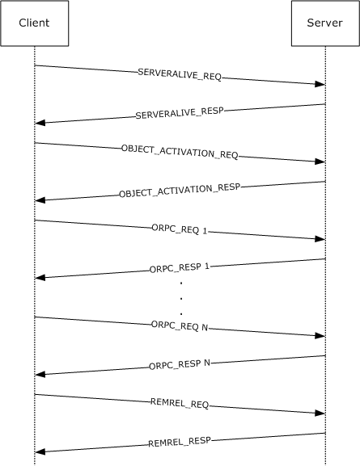

Figure 5: Object activation + ORPC call + release sequence

This example shows a sequence for a client requesting an object activation from a server, making a series of ORPC calls on the object, and then releasing the reference.

SERVERALIVE_REQ: Represents one or more RPC calls to the [IObjectExporter::ServerAlive](#Section_3.1.2.5.1.4) method or the [IObjectExporter::ServerAlive2](#Section_3.1.2.5.1.6) method to determine server aliveness and suitable protocols. The client connects to the remote server name specified by the application or by a higher-layer protocol.

OBJECTACTIVATION_REQ: An RPC call to the object resolver service using the [IActivation](#Section_3.1.2.5.2.3) or the IRemoteSCMActivator interface; the object resolver finds or creates an object exporter for the object.

ORPC_REQ: An ORPC call to the object exporter on the interface identified by the IPID.

REMREL_REQ: An ORPC call to the [IRemUnknown::RemRelease](#Section_3.1.1.5.6.1.3) method on the Remote Unknown of the object exporter containing the existing object reference.

## 4.2 QueryInterface + ORPC Call + Release Sequence

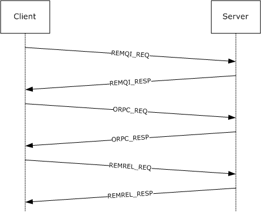

Figure 6: QueryInterface + ORPC call + release sequence

This example shows a sequence for a client requesting a new interface on an existing object reference, making an ORPC call on the new interface, and then releasing the interface.

REMQI_REQ: An ORPC call to the [IRemUnknown::RemQueryInterface](#Section_3.1.1.5.6.1.1) or [IRemUnknown2::RemQueryInterface2](#Section_3.1.1.5.7.1.1) method on the Remote Unknown of the object exporter containing the existing object reference.

ORPC_REQ: An ORPC call to the object exporter on the new interface identified by the IPID.

REMREL_REQ: An ORPC call to the [IRemUnknown::RemRelease](#Section_3.1.1.5.6.1.3) method of the object exporter containing the existing object reference.

## 4.3 Pinging Sequence

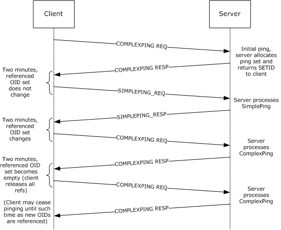

Figure 7: Client-to-server pinging sequence

This example shows a sequence for a client that pings the server to maintain object lifetimes.

COMPLEXPING_REQ: Represents one or more RPC calls to the [IObjectExporter::ComplexPing](#Section_3.1.2.5.1.3) method on the object resolver to allocate a new ping set or to add/remove one or more objects from an existing ping set.

SIMPLEPING_REQ: Represents one or more RPC calls to the [IObjectExporter::SimplePing](#Section_3.1.2.5.1.2) method on the object resolver to ping an existing ping set.

## 4.4 OXID Resolution Sequence

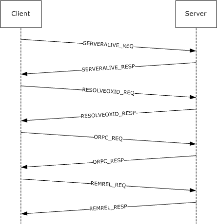

Figure 8: OXID resolution sequence

There is no requirement for the client to receive an [**OBJREF**](#gt_objref) via one of the object activation interfaces: [IActivation](#Section_3.1.2.5.2) and [IRemoteSCMActivator](#Section_3.1.2.5.2.3). However, if the client receives an OBJREF via some other mechanism, the OBJREF does not contain sufficient information to make [**ORPC**](#gt_object-remote-procedure-call-orpc) calls to the object exporter. In particular, the RPC endpoint information for the object exporter is obtainable only through the [IObjectExporter::ResolveOxid](#Section_3.1.2.5.1.1) method or the [IObjectExporter::ResolveOxid2](#Section_3.1.2.5.1.5) method.

This example shows a sequence for a client that has received an OBJREF via some undefined mechanism and needs to retrieve the RPC endpoint for the object exporter.

SERVERALIVE_REQ: Represents one or more RPC calls to the [IObjectExporter::ServerAlive](#Section_3.1.2.5.1.4) method or the [IObjectExporter::ServerAlive2](#Section_3.1.2.5.1.6) method to determine server aliveness and suitable protocols. The server addresses used by the client were contained within the saResAddr field of [OBJREF_STANDARD](#Section_2.2.18.4) contained in the OBJREF.

RESOLVEOXID_REQ: An RPC call to the IObjectExporter::ResolveOxid method or the IObjectExporter::ResolveOxid2 method on the object resolver to retrieve the RPC binding information for the object exporter.

ORPC_REQ: An ORPC call to the object exporter on the interface identified by the [**IPID**](#gt_interface-pointer-identifier-ipid).

REMREL_REQ: An ORPC call to the [IRemUnknown::RemRelease](#Section_3.1.1.5.6.1.3) method on the [**Remote Unknown**](#gt_remote-unknown) of the object exporter containing the existing object reference.

## 4.5 IDL Correlation Example for iid_is

iid_is is an [**IDL**](#gt_interface-definition-language-idl) language extension that allows clients or servers to specify how an interface passed as a parameter is marshaled at run time, as opposed to being statically defined at compile time. See the following example.

HRESULT CreateInstance([in]REFIID riid,

[out, iid_is(riid)]Iunknown** ppUnknown);

In this example, the client calls the method, passing the interface to be invoked via the *riid* parameter. When returning a successful result, the server is required to marshal the *ppUnknown* parameter as a [MInterfacePointer](#Section_2.2.14) containing an [OBJREF](#Section_2.2.18) instance with its **iid** field set to the value of riid.

# 5 Security

## 5.1 Security Considerations for Implementers

Implementations can decide to enforce security (as specified in [[C706]](https://go.microsoft.com/fwlink/?LinkId=89824) section 2.7) as needed on the processes and operations defined in this specification.<95>

It is recommended that implementers review the security considerations as specified in [MS-RPCE](../MS-RPCE/MS-RPCE.md) section 5.1, as these are also valid for the DCOM Remote Protocol and protocols based on the DCOM Remote Protocol.

## 5.2 Index of Security Parameters

None.

# 6 Appendix A: Full IDL

For ease of implementation, the full [**IDL**](#gt_interface-definition-language-idl) is provided.

import "ms-dtyp.idl";

typedef GUID CLSID;

typedef GUID IID;

typedef unsigned hyper ID;

typedef unsigned hyper OXID;

typedef unsigned hyper OID;

typedef unsigned hyper SETID;

typedef GUID IPID;

typedef GUID CID;

#define REFGUID const GUID *

#define REFIID const IID *

typedef REFGUID REFIPID;

typedef struct tagCOMVERSION

{

unsigned short MajorVersion;

unsigned short MinorVersion;

} COMVERSION;

typedef struct tagORPC_EXTENT

{

GUID id;

unsigned long size;

[size_is((size+7)&~7)] byte data[];

} ORPC_EXTENT;

typedef struct tagORPC_EXTENT_ARRAY

{

unsigned long size;

unsigned long reserved;

[size_is((size+1)&~1,), unique] ORPC_EXTENT **extent;

} ORPC_EXTENT_ARRAY;

typedef struct tagORPCTHIS

{

COMVERSION version;

unsigned long flags;

unsigned long reserved1;

CID cid;

[unique] ORPC_EXTENT_ARRAY *extensions;

} ORPCTHIS;

typedef struct tagORPCTHAT

{

unsigned long flags;

[unique] ORPC_EXTENT_ARRAY *extensions;

} ORPCTHAT;

typedef struct tagDUALSTRINGARRAY

{

unsigned short wNumEntries;

unsigned short wSecurityOffset;

[size_is(wNumEntries)] unsigned short aStringArray[];

} DUALSTRINGARRAY;

enum tagCPFLAGS

{

CPFLAG_PROPAGATE = 0x1,

CPFLAG_EXPOSE = 0x2,

CPFLAG_ENVOY = 0x4,

};

typedef struct tagMInterfacePointer

{

unsigned long ulCntData;

[size_is(ulCntData)] byte abData[];

} MInterfacePointer;

typedef [unique] MInterfacePointer * PMInterfacePointer;

typedef struct tagErrorObjectData

{

DWORD dwVersion;

DWORD dwHelpContext;

IID iid;

[unique,string]wchar_t* pszSource;

[unique,string]wchar_t* pszDescription;

[unique,string]wchar_t* pszHelpFile;

} ErrorObjectData;

[

uuid(4d9f4ab8-7d1c-11cf-861e-0020af6e7c57),

pointer_default(unique)

]

interface IActivation

{

const unsigned long MAX_REQUESTED_INTERFACES = 0x8000;

const unsigned long MAX_REQUESTED_PROTSEQS = 0x8000;

error_status_t RemoteActivation(

[in] handle_t hRpc,

[in] ORPCTHIS *ORPCthis,

[out] ORPCTHAT *ORPCthat,

[in] GUID *Clsid,

[in, string, unique] wchar_t *pwszObjectName,

[in, unique] MInterfacePointer *pObjectStorage,

[in] DWORD ClientImpLevel,

[in] DWORD Mode,

[in,range(1,MAX_REQUESTED_INTERFACES)]DWORD Interfaces,

[in,unique,size_is(Interfaces)] IID *pIIDs,

[in,range(0,MAX_REQUESTED_PROTSEQS)]

unsigned short cRequestedProtseqs,

[in, size_is(cRequestedProtseqs)]

unsigned short aRequestedProtseqs[],

[out] OXID *pOxid,

[out] DUALSTRINGARRAY **ppdsaOxidBindings,

[out] IPID *pipidRemUnknown,

[out] DWORD *pAuthnHint,

[out] COMVERSION *pServerVersion,

[out] HRESULT *phr,

[out,size_is(Interfaces), disable_consistency_check]

MInterfacePointer **ppInterfaceData,

[out,size_is(Interfaces), disable_consistency_check]

HRESULT *pResults

);

}

[

uuid(000001A0-0000-0000-C000-000000000046),

pointer_default(unique)

]

interface IRemoteSCMActivator

{

void Opnum0NotUsedOnWire(void);

void Opnum1NotUsedOnWire(void);

void Opnum2NotUsedOnWire(void);

HRESULT RemoteGetClassObject(

[in] handle_t rpc,

[in] ORPCTHIS *orpcthis,

[out] ORPCTHAT *orpcthat,

[in,unique] MInterfacePointer *pActProperties,

[out] MInterfacePointer **ppActProperties

);

HRESULT RemoteCreateInstance(

[in] handle_t rpc,

[in] ORPCTHIS *orpcthis,

[out] ORPCTHAT *orpcthat,

[in,unique] MInterfacePointer *pUnkOuter,

[in,unique] MInterfacePointer *pActProperties,

[out] MInterfacePointer **ppActProperties

);

}

[

uuid(99fcfec4-5260-101b-bbcb-00aa0021347a),

pointer_default(unique)

]

interface IObjectExporter

{

[idempotent] error_status_t ResolveOxid

(

[in] handle_t hRpc,

[in] OXID *pOxid,

[in] unsigned short cRequestedProtseqs,

[in, ref, size_is(cRequestedProtseqs)]

unsigned short arRequestedProtseqs[],

[out, ref] DUALSTRINGARRAY **ppdsaOxidBindings,

[out, ref] IPID *pipidRemUnknown,

[out, ref] DWORD *pAuthnHint

);

[idempotent] error_status_t SimplePing

(

[in] handle_t hRpc,

[in] SETID *pSetId

);

[idempotent] error_status_t ComplexPing

(

[in] handle_t hRpc,

[in, out] SETID *pSetId,

[in] unsigned short SequenceNum,

[in] unsigned short cAddToSet,

[in] unsigned short cDelFromSet,

[in, unique, size_is(cAddToSet)] OID AddToSet[],

[in, unique, size_is(cDelFromSet)] OID DelFromSet[],

[out] unsigned short *pPingBackoffFactor

);

[idempotent] error_status_t ServerAlive

(

[in] handle_t hRpc

);

[idempotent] error_status_t ResolveOxid2

(

[in] handle_t hRpc,

[in] OXID *pOxid,

[in] unsigned short cRequestedProtseqs,

[in, ref, size_is(cRequestedProtseqs)]

unsigned short arRequestedProtseqs[],

[out, ref] DUALSTRINGARRAY **ppdsaOxidBindings,

[out, ref] IPID *pipidRemUnknown,

[out, ref] DWORD *pAuthnHint,

[out, ref] COMVERSION *pComVersion

);

[idempotent] error_status_t ServerAlive2

(

[in] handle_t hRpc,

[out, ref] COMVERSION *pComVersion,

[out, ref] DUALSTRINGARRAY **ppdsaOrBindings,

[out, ref] DWORD *pReserved

);

}

typedef struct tagSTDOBJREF

{

unsigned long flags;

unsigned long cPublicRefs;

OXID oxid;

OID oid;

IPID ipid;

} STDOBJREF;

typedef struct tagREMQIRESULT

{

HRESULT hResult;

STDOBJREF std;

} REMQIRESULT;

typedef struct tagREMINTERFACEREF

{

IPID ipid;

unsigned long cPublicRefs;

unsigned long cPrivateRefs;

} REMINTERFACEREF;

typedef [disable_consistency_check] REMQIRESULT* PREMQIRESULT;

typedef [disable_consistency_check] MInterfacePointer*

PMInterfacePointerInternal;

[

object,

uuid(00000000-0000-0000-C000-000000000046),

pointer_default(unique)

]

interface IUnknown

{

HRESULT Opnum0NotUsedOnWire(void);

HRESULT Opnum1NotUsedOnWire(void);

HRESULT Opnum2NotUsedOnWire(void);

};

[

object,

uuid(00000131-0000-0000-C000-000000000046)

]

interface IRemUnknown : IUnknown

{

HRESULT RemQueryInterface

(

[in] REFIPID ripid,

[in] unsigned long cRefs,

[in] unsigned short cIids,

[in, size_is(cIids)] IID *iids,

[out, size_is(,cIids)] PREMQIRESULT *ppQIResults

);

HRESULT RemAddRef

(

[in] unsigned short cInterfaceRefs,

[in, size_is(cInterfaceRefs)] REMINTERFACEREF

InterfaceRefs[],

[out, size_is(cInterfaceRefs)] HRESULT *pResults

);

HRESULT RemRelease

(

[in] unsigned short cInterfaceRefs,

[in, size_is(cInterfaceRefs)] REMINTERFACEREF

InterfaceRefs[]

);

}

[

object,

uuid(00000143-0000-0000-C000-000000000046)

]

interface IRemUnknown2 : IRemUnknown

{

HRESULT RemQueryInterface2

(

[in] REFIPID ripid,

[in] unsigned short cIids,

[in, size_is(cIids)] IID *iids,

[out, size_is(cIids)] HRESULT *phr,

[out, size_is(cIids)] PMInterfacePointerInternal *ppMIF

);

}

const unsigned long MIN_ACTPROP_LIMIT = 1;

const unsigned long MAX_ACTPROP_LIMIT = 10;

typedef struct _COSERVERINFO

{

DWORD dwReserved1;

[string ] wchar_t* pwszName;

DWORD * pdwReserved;

DWORD dwReserved2;

} COSERVERINFO;

typedef struct _customREMOTE_REQUEST_SCM_INFO

{

DWORD ClientImpLevel;

[range (0, MAX_REQUESTED_PROTSEQS)] unsigned short

cRequestedProtseqs;

[size_is(cRequestedProtseqs)]

unsigned short *pRequestedProtseqs;

} customREMOTE_REQUEST_SCM_INFO;

typedef struct _customREMOTE_REPLY_SCM_INFO

{

OXID Oxid;

DUALSTRINGARRAY *pdsaOxidBindings;

IPID ipidRemUnknown;

DWORD authnHint;

COMVERSION serverVersion;

} customREMOTE_REPLY_SCM_INFO;

typedef struct tagInstantiationInfoData

{

CLSID classId;

DWORD classCtx;

DWORD actvflags;

long fIsSurrogate;

[range (1,MAX_REQUESTED_INTERFACES)] DWORD cIID;

DWORD instFlag;

[size_is(cIID)] IID *pIID;

DWORD thisSize;

COMVERSION clientCOMVersion;

} InstantiationInfoData;

typedef struct tagLocationInfoData

{

[string] wchar_t *machineName;

DWORD processId;

DWORD apartmentId;

DWORD contextId;

} LocationInfoData;

typedef struct tagActivationContextInfoData

{

long clientOK;

long bReserved1;

DWORD dwReserved1;

DWORD dwReserved2;

MInterfacePointer *pIFDClientCtx;

MInterfacePointer *pIFDPrototypeCtx;

} ActivationContextInfoData;

typedef struct tagCustomHeader

{

DWORD totalSize;

DWORD headerSize;

DWORD dwReserved;

DWORD destCtx;

[range (MIN_ACTPROP_LIMIT, MAX_ACTPROP_LIMIT)] DWORD cIfs;

CLSID classInfoClsid;

[size_is(cIfs)] CLSID *pclsid;

[size_is(cIfs)] DWORD *pSizes;

DWORD *pdwReserved;

} CustomHeader;

typedef struct tagPropsOutInfo

{

[range (1, MAX_REQUESTED_INTERFACES)] DWORD cIfs;

[size_is(cIfs)] IID *piid;

[size_is(cIfs)] HRESULT *phresults;

[size_is(cIfs)] MInterfacePointer **ppIntfData;

} PropsOutInfo;

typedef struct tagSecurityInfoData

{

DWORD dwAuthnFlags;

COSERVERINFO *pServerInfo;

DWORD *pdwReserved;

} SecurityInfoData;

typedef struct tagScmRequestInfoData

{

DWORD *pdwReserved;

customREMOTE_REQUEST_SCM_INFO *remoteRequest;

} ScmRequestInfoData;

typedef struct tagScmReplyInfoData

{

DWORD *pdwReserved;

customREMOTE_REPLY_SCM_INFO *remoteReply;

} ScmReplyInfoData;

typedef struct tagInstanceInfoData

{

[string] wchar_t *fileName;

DWORD mode;

MInterfacePointer *ifdROT;

MInterfacePointer *ifdStg;

} InstanceInfoData;

typedef enum

{

SPD_FLAG_USE_CONSOLE_SESSION = 0x00000001,

SPD_FLAG_USE_DEFAULT_AUTHN_LVL = 0x00000002,

} SPD_FLAGS;

typedef struct tagSpecialPropertiesData

{

unsigned long dwSessionId;

long fRemoteThisSessionId;

long fClientImpersonating;

long fPartitionIDPresent;

DWORD dwDefaultAuthnLvl;

GUID guidPartition;

DWORD dwPRTFlags;

DWORD dwOrigClsctx;

DWORD dwFlags;

DWORD Reserved1;

unsigned __int64 Reserved2;

DWORD Reserved3[5];

} SpecialPropertiesData;

typedef struct tagSpecialPropertiesData_Alternate

{

unsigned long dwSessionId;

long fRemoteThisSessionId;

long fClientImpersonating;

long fPartitionIDPresent;

DWORD dwDefaultAuthnLvl;

GUID guidPartition;

DWORD dwPRTFlags;

DWORD dwOrigClsctx;

DWORD dwFlags;

DWORD Reserved3[8];

} SpecialPropertiesData_Alternate;

# 7 Appendix B: Product Behavior

The information in this specification is applicable to the following Microsoft products or supplemental software. References to product versions include updates to those products.

The terms "earlier" and "later", when used with a product version, refer to either all preceding versions or all subsequent versions, respectively. The term "through" refers to the inclusive range of versions. Applicable Microsoft products are listed chronologically in this section.

**Windows Client**

- Windows NT Workstation operating system
- Windows 2000 Professional operating system
- Windows XP operating system
- Windows Vista operating system
- Windows 7 operating system
- Windows 8 operating system
- Windows 8.1 operating system
- Windows 10 operating system
- Windows 11 operating system
**Windows Server**

- Windows NT Server operating system
- Windows 2000 Server operating system
- Windows Server 2003 operating system
- Windows Server 2008 operating system
- Windows Server 2008 R2 operating system
- Windows Server 2012 operating system
- Windows Server 2012 R2 operating system
- Windows Server 2016 operating system
- Windows Server operating system
- Windows Server 2019 operating system
- Windows Server 2022 operating system
- Windows Server 2025 operating system
Exceptions, if any, are noted in this section. If an update version, service pack or Knowledge Base (KB) number appears with a product name, the behavior changed in that update. The new behavior also applies to subsequent updates unless otherwise specified. If a product edition appears with the product version, behavior is different in that product edition.

Unless otherwise specified, any statement of optional behavior in this specification that is prescribed using the terms "SHOULD" or "SHOULD NOT" implies product behavior in accordance with the SHOULD or SHOULD NOT prescription. Unless otherwise specified, the term "MAY" implies that the product does not follow the prescription.

<1> Section 1.8: Windows only uses the values in [MS-ERREF](../MS-ERREF/MS-ERREF.md) section 2.2.

<2> Section 1.9: Windows [**object resolver**](#gt_object-resolver) services always use the [**well-known endpoints**](#gt_well-known-endpoint) specified in [MS-RPCE](../MS-RPCE/MS-RPCE.md) section 2.1, and will never register their interfaces with the [**RPC**](#gt_remote-procedure-call-rpc) endpoint mapper. On Windows, DCOM clients correctly interoperate with a server whose object resolver service registers its interfaces with the RPC endpoint mapper.

<3> Section 2.1: On Windows, DCOM servers register all the [**security providers**](#gt_security-provider) supported by the server.

<4> Section 2.2.11: The [**DCOM**](#gt_distributed-component-object-model-dcom) versions supported by different platforms are:

| Operating System | DCOM version |
| --- | --- |
| Windows NT operating system | 5.4 |
| Windows 95 operating system | 5.4 |
| Windows 98 operating system | 5.4 |
| Windows 2000 operating system | 5.6 |
| Windows XP and later | 5.7 |
| Windows Server 2003 and later | 5.7 |

<5> Section 2.2.11: Windows uses version 5.7, not to indicate any change in DCOM, but rather in the marshaling of the UDT type specified in [MS-OAUT](../MS-OAUT/MS-OAUT.md) section 2.2.28.1.

<6> Section 2.2.13.1: This specification defines two formats for the [ORPC_EXTENT](#Section_2.2.13.1) structure. See section [2.2.21](#Section_2.2.21).

<7> Section 2.2.18.2: Windows will not perform [**garbage collection**](#gt_garbage-collection) [**pinging**](#gt_pinging) for objects unmarshaled with SORF_NOPING.

<8> Section 2.2.18.6: Windows treats this field as the [**CLSID**](#gt_class-identifier-clsid) for an object that both implements the IMarshal [**interface**](#gt_interface) and is capable of unmarshaling the **pObjectData** field. For more information, see [[MSDN-IMarshal]](https://go.microsoft.com/fwlink/?LinkId=90021).

<9> Section 2.2.19.1: Windows does not order the [STRINGBINDING](#Section_2.2.19.3) structures in the decreasing order of preference. They are passed in an arbitrary order.

<10> Section 2.2.19.3: Windows supports a subset of the constants. For details, see section [3.1.2.3](#Section_3.1.2).

<11> Section 2.2.19.3: Applicable Windows Server releases accept other forms of the IPv4 address that are accepted by inet_addr as specified in [[RFC3493]](https://go.microsoft.com/fwlink/?LinkId=90425) section 6.3.

<12> Section 2.2.20: Windows uses IID_IContext as the [**IID**](#gt_interface-identifier-iid) of an interface with the local IDL attribute.

<13> Section 2.2.20: Windows uses IID_IContext as the IID of an interface with the local IDL attribute.

<14> Section 2.2.20: On Windows, DCOM clients set this field to a value from the MSHLFLAGS enumeration. For more information, see [[MSDN-MSHLFLAGS]](https://go.microsoft.com/fwlink/?LinkId=90046).

<15> Section 2.2.21.1: On Windows, DCOM clients and servers process the [OBJREF](#Section_2.2.18) supplied in the data field of this [**ORPC extension**](#gt_orpc-extension) as a reference to an object that supports the IErrorInfo interface. For more information, see [[MSDN-IERRORINFO]](https://go.microsoft.com/fwlink/?LinkId=90019).

<16> Section 2.2.21.2: Optionally specifies the index for a help topic in the help file specified by the **HelpFile** field.

<17> Section 2.2.21.2: Optionally specifies a human-readable string containing the name of the component returning the error.

<18> Section 2.2.21.2: Optionally specifies a human-readable string containing a description of the error.

<19> Section 2.2.21.2: Optionally specifies a path to a Windows Help file containing a Help topic that provides further information for the error.

<20> Section 2.2.21.4: On Windows, DCOM clients set this value to the size (in bytes) of the body of the RPC PDU containing this structure.

<21> Section 2.2.21.4: This field is used by applications or higher-layer protocols. On Windows, DCOM clients and servers ignore this field.

<22> Section 2.2.22.1: On Windows, DCOM clients set this field to MSHCTX_DIFFERENTMACHINE (0x00000002), which is a value from the MSHCTX enumeration. For more information, see [[MSDN-MSHCTX]](https://go.microsoft.com/fwlink/?LinkId=90045).

<23> Section 2.2.22.2.1: On Windows, DCOM clients set this field to one or more values from the CLSCTX enumeration. For more information, see [[MSDN-CLSCTX]](https://go.microsoft.com/fwlink/?LinkId=89972).

<24> Section 2.2.22.2.2: On Windows, DCOM clients set this field to TRUE if the client was impersonating when the activation request was originated, and to FALSE otherwise. On Windows, DCOM servers ignore this field. For more information, see [[MSDN-CI]](https://go.microsoft.com/fwlink/?LinkId=89969).

<25> Section 2.2.22.2.2: On Windows, DCOM clients set this field to FALSE (0x00000000) if **guidPartition** is not set, and to TRUE (0x00000001) otherwise. On Windows, DCOM servers use the **guidPartition** field if **fPartitionIDPresent** is set to TRUE.

<26> Section 2.2.22.2.2: On Windows, DCOM clients set this field to an RPC authentication constant (see [MS-RPCE] section 2.2.1.1.8).

<27> Section 2.2.22.2.2: The value contains a [**GUID**](#gt_globally-unique-identifier-guid) used by applications or higher-layer protocols.

<28> Section 2.2.22.2.2: On Windows, DCOM clients set this field to the unmodified CLSCTX value specified by the client when the activation request was originated. For more information, see [MSDN-CLSCTX].

<29> Section 2.2.22.2.2: Windows 2000, Windows XP and Windows Server 2003 use **SpecialPropertiesData_Alternate**.

<30> Section 2.2.22.2.3: On Windows, DCOM clients set this to a file name passed to the CoGetInstanceFromFile API. For more information, see [[MSDN-CoGetInstanceFromFile]](https://go.microsoft.com/fwlink/?LinkId=89975).

<31> Section 2.2.22.2.3: On Windows, DCOM clients set this field to the unmodified STGM constant. For more information, see [[MSDN-STGMC]](https://go.microsoft.com/fwlink/?LinkId=90140).

<32> Section 2.2.22.2.3: On Windows, DCOM clients set this to the IStorage reference passed to the CoGetInstanceFromIStorage API. For more information, see [[MSDN-CoGetInstanceFromIStorage]](https://go.microsoft.com/fwlink/?LinkId=89976).

<33> Section 2.2.22.2.4.1: On Windows, DCOM clients set this field to the value 2.

<34> Section 2.2.22.2.7: On Windows, DCOM clients include this structure; On Windows, DCOM servers ignore it.

<35> Section 2.2.22.2.7: On Windows, DCOM clients send a [COSERVERINFO](#Section_2.2.22.2.7.1) structure in this field as specified. On Windows, DCOM servers ignore this field.

<36> Section 2.2.22.2.7.1: On Windows, DCOM clients set **pwszName** to the [**remote server name**](#gt_remote-server-name) specified by the client when requesting the activation. On Windows, DCOM servers ignore this field.

<37> Section 2.2.22.2.8.1: On Windows, DCOM servers return an RPC [**authentication level**](#gt_authentication-level) that denotes the minimum authentication level at which the [**object exporter**](#gt_object-exporter) can be called. On Windows, DCOM clients make calls to object exporters at an authentication level that is at least as high as the **authnHint** value returned from the [**object server**](#gt_object-server), or the RPC_C_AUTHN_LEVEL_PKT_INTEGRITY level, whichever is greater. Including the RPC_C_AUTHN_LEVEL_PKT_INTEGRITY authentication level in this evaluation is supported by the operating systems specified in [[MSFT-CVE-2022-37978]](https://go.microsoft.com/fwlink/?linkid=2211355), each with its related KB article download installed.

<38> Section 3: On Windows, all implementations support both roles simultaneously.

<39> Section 3.1.1.5.1: On Windows, servers will set the SORF_NOPING flag if the application specifies the MSHLFLAGS_NOPING flag in the *mshlflags* parameter to the CoMarshalInterface API. For more information, see [[MSDN-CoMarshalInterface]](https://go.microsoft.com/fwlink/?LinkId=89978).

<40> Section 3.1.1.5.4: Windows XP operating system Service Pack 2 (SP2), Windows Server 2003 operating system with Service Pack 1 (SP1), Windows Vista and later, and Windows Server 2008 and later DCOM servers return E_ACCESSDENIED if the [**ORPC**](#gt_object-remote-procedure-call-orpc) invocation is for the [IRemUnknown (section 3.1.1.5.6)](#Section_3.1.1.5.7) interface or the [IRemUnknown2 (section 3.1.1.5.7)](#Section_3.1.1.5.7) interface. They return ERROR_ACCESS_DENIED for all other interfaces. On Windows NT 4.0 operating system, Windows 2000, Windows XP, Windows XP operating system Service Pack 1 (SP1), and Windows Server 2003, DCOM servers return E_ACCESSDENIED for all interfaces.

<41> Section 3.1.1.5.4: On Windows, DCOM servers use the LegacyAuthenticationLevel value (see [[MSDN-LegAuthLevel]](https://go.microsoft.com/fwlink/?LinkId=120110) for more information) as the object exporter's default authentication level setting.

<42> Section 3.1.1.5.4: On Windows XP SP2, Windows Server 2003 with SP1, Windows Vista and later, and Windows Server 2008 and later, DCOM servers return E_ACCESSDENIED if the ORPC invocation is for the IRemUnknown (section 3.1.1.5.6) interface or the IRemUnknown2 (section 3.1.1.5.7) interface and if the MachineAccessRestriction (see [[MSDN-MachAccRstr]](https://go.microsoft.com/fwlink/?LinkId=117283) for more information) allows anonymous clients. They return ERROR_ACCESS_DENIED for all other interfaces or if the MachineAccessRestriction does not allow anonymous clients. On Windows NT 4.0, Windows 2000, Windows XP, Windows XP SP1, and Windows Server 2003, DCOM servers return E_ACCESSDENIED for all interfaces.

<43> Section 3.1.1.5.4: On Windows NT, Windows 2000, Windows XP, Windows XP SP1, and Windows Server 2003, DCOM servers use the DefaultAccessPermission (see [[MSDN-DefAccPerms]](https://go.microsoft.com/fwlink/?LinkId=117280) for more information) or the AccessPermission of the object exporter (see [[MSDN-AccPerms]](https://go.microsoft.com/fwlink/?LinkId=117279) for more information) as the default value of the permissions.

On Windows XP SP2, Windows Server 2003 with SP1, Windows Vista and later, and Windows Server 2008 and later the default value of the permissions for DCOM servers consists of both:

- The MachineAccessRestriction (see [MSDN-MachAccRstr] for more information).
- The DefaultAccessPermission (see [MSDN-DefAccPerms] for more information) or the AccessPermission that is specific to the object exporter (see [MSDN-AccPerms] for more information).
<44> Section 3.1.1.5.4: Windows object exporters use an application-specified message filter. For more information, see [[MSDN-IMessageFilter]](https://go.microsoft.com/fwlink/?LinkId=90022).

<45> Section 3.1.1.5.4: On Windows, DCOM server object exporters supply the well-known ORPC extensions (see section 2.2.21), if present, to applications and higher-layer protocols.

<46> Section 3.1.1.5.4: On Windows, DCOM server object exporters return the **extensions** field supplied by the well-known ORPC extensions (see section 2.2.21), if present.

<47> Section 3.1.1.5.4: On Windows 2000, Windows XP, Windows XP SP1, Windows XP SP2, Windows Server 2003, and Windows Server 2003 with SP1, DCOM servers optionally append extra data to the end of an ORPC response. This is due to a coding error and the extra data, if present, has no meaning and is ignored by Windows recipients. Whether the data is sent or not does not affect interoperability, and the protocol functions correctly. On Windows XP operating system Service Pack 3 (SP3), Windows Server 2003 operating system with Service Pack 2 (SP2), Windows Vista and later, and Windows Server 2008 and later, DCOM servers do not have this coding error and do not append extra data.

<48> Section 3.1.1.5.6.1.2: On Windows, DCOM server object exporters require security on a RemAddRef call that specifies private [**reference counts**](#gt_reference-count). They will associate the private reference counts with the security identity of the client that makes the RemAddRef call.

<49> Section 3.1.1.5.6.1.3: On Windows, DCOM server object exporters require security on a RemRelease call that specifies private reference counts. They will verify that the security identity of the client that makes the RemRelease call has previously allocated at least that many private reference counts in the IPID entry.

<50> Section 3.1.1.5.8: **Opnums** reserved for local use apply to Windows as follows.

| opnum | Description |
| --- | --- |
| 0-2 | Not used by Windows. Returns a failure if called. |

Windows clients internally map the three IUnknown interface methods to the three methods of the IRemUnknown interface.

<51> Section 3.1.2.3: By default, Windows object resolvers listen by way of the following RPC protocols.

| Operating System | ncacn_ip_tcp | ncacn_spx | ncacn_nb_nb | ncacn_nb_ipx | ncadg_ip_udp | ncadg_ipx |
| --- | --- | --- | --- | --- | --- | --- |
| Windows NT | X | X | X | X | X | X |
| Windows 2000 | X | X | X | X | - | - |
| Windows XP | X | X | X | X | - | - |
| Windows Server 2003 and later | X | - | - | - | - | - |
| Windows Vista and later | X | - | - | - | - | - |

<52> Section 3.1.2.5.1.1: On Windows, DCOM servers return the minimum accepted authentication level of the object exporter in this field. On Windows, DCOM clients by default make calls to the object exporter, at least at this level of authentication.

<53> Section 3.1.2.5.1.1: On Windows NT, Windows 2000, Windows XP, Windows XP SP1, and Windows Server 2003, DCOM servers do not check permissions when processing this call.

On Windows XP SP2, Windows Server 2003 with SP1, Windows Vista and later, and Windows Server 2008 and later, DCOM servers check permissions when processing this call. They use the MachineAccessRestriction (see [MSDN-MachAccRstr] for more information) as the default value of the permissions.

<54> Section 3.1.2.5.1.2: On Windows NT, Windows 2000, Windows XP, Windows XP SP1, and Windows Server 2003, DCOM servers do not check permissions when processing this call.

On Windows XP SP2, Windows Server 2003 with SP1, Windows Vista and later, and Windows Server 2008 and later, DCOM servers check permissions when processing this call. They use the MachineAccessRestriction (see [MSDN-MachAccRstr] for more information) as the default value of the permissions.

<55> Section 3.1.2.5.1.3: On Windows, DCOM servers return a PingBackoffFactor of zero; On Windows, DCOM clients ignore any value returned by the server.

<56> Section 3.1.2.5.1.3: On Windows NT, Windows 2000, Windows XP, Windows XP SP1, and Windows Server 2003, DCOM servers do not check permissions when processing this call.

On Windows XP SP2, Windows Server 2003 with SP1, Windows Vista and later, and Windows Server 2008 and later, DCOM servers check permissions when processing this call. They use the MachineAccessRestriction (see [MSDN-MachAccRstr] for more information) as the default value of the permissions.

<57> Section 3.1.2.5.1.5: On Windows, DCOM servers return the minimum accepted authentication level of the object exporter in this field. On Windows, DCOM clients by default make calls to the object exporter, at least at this level of authentication.

<58> Section 3.1.2.5.1.7: Windows object resolvers wait for up to 14 minutes before removing the OID entry from the OID table.

<59> Section 3.1.2.5.2.2: Opnums reserved for local use apply to Windows as follows.

| opnum | Description |
| --- | --- |
| 0-2 | Not used by Windows. Returns a failure if called. |

<60> Section 3.1.2.5.2.3: All server versions of the DCOM protocol for Windows NT, Windows 2000, Windows XP, Windows XP SP1, and Windows Server 2003 use the DefaultLaunchPermission (see [[MSDN-DefLnchPerms]](https://go.microsoft.com/fwlink/?LinkId=117281) for more information) or the LaunchPermission that is specific to the object exporter (see [[MSDN-LaunchPerms]](https://go.microsoft.com/fwlink/?LinkId=117282) for more information) as the default value of the permissions.

For Windows XP SP2, Windows Server 2003 with SP1, Windows Vista and later, and Windows Server 2008 and later versions of the DCOM protocol, the default value of the permissions consists of the following:

- The MachineAccessRestriction (see [MSDN-MachAccRstr] for more information).
- The MachineLaunchRestriction (see [[MSDN-MachLnchRstr]](https://go.microsoft.com/fwlink/?LinkId=117284) for more information).
- The DefaultLaunchPermission (see [MSDN-DefLnchPerms] for more information) or the LaunchPermission that is specific to the object exporter (see [MSDN-LaunchPerms] for more information).
<61> Section 3.1.2.5.2.3: On Windows XP SP2, Windows Server 2003 with SP1, Windows Vista and later, and Windows Server 2008 later, DCOM servers return ERROR_ACCESS_DENIED if the MachineLaunchRestriction or the MachineAccessRestriction does not allow access to the client's credentials.

On Windows NT 4.0, Windows 2000, Windows XP, Windows XP SP1, and Windows Server 2003, DCOM servers return E_ACCESSDENIED if the DefaultLaunchPermission or the LaunchPermission that is specific to the object exporter does not allow access to the client's credentials.

<62> Section 3.1.2.5.2.3: Windows 2000 object resolvers ignore the SPD_FLAG_USE_CONSOLE_SESSION flag and create the object exporter in the logon session specified in the **dwSessionID** field, if it is not 0xFFFFFFFF. If the **dwSessionID** field contains 0xFFFFFFFF, then object resolvers create the object exporter in any logon session.

<63> Section 3.1.2.5.2.3: Windows 2000 object resolvers ignore the SPD_FLAG_USE_CONSOLE_SESSION flag and create the object exporter in the logon session specified in the **dwSessionID** field, if it is not 0xFFFFFFFF. If the **dwSessionID** field contains 0xFFFFFFFF, then object resolvers create the object exporter in any logon session.

<64> Section 3.1.2.5.2.3: Windows object resolvers determine the configuration of the identity of the object exporter as described in [[MSDN-RunAs]](https://go.microsoft.com/fwlink/?LinkId=117329).

<65> Section 3.1.2.5.2.3: Windows 2000 and Windows XP object resolvers ignore the ACTVFLAGS_ACTIVATE_32_BIT_SERVER and the ACTVFLAGS_ACTIVATE_64_BIT_SERVER flags and create the object exporter in the 32-bit address space.

<66> Section 3.1.2.5.2.3: Windows 2000 and Windows XP object resolvers ignore the ACTVFLAGS_ACTIVATE_32_BIT_SERVER and the ACTVFLAGS_ACTIVATE_64_BIT_SERVER flags and create the object exporter in the 32-bit address space.

<67> Section 3.1.2.5.2.3: Windows 2000, Windows XP, and Windows Server 2003 object resolvers ignore the ACTVFLAGS_NO_FAILURE_LOG flag and log errors during activation. Windows Vista and later and Windows Server 2008 and later object resolvers log only permission failure errors when the ACTVFLAGS_NO_FAILURE_LOG flag is set and do not log any other errors.

<68> Section 3.1.2.5.2.3.1: On Windows, DCOM clients set this to a file name passed to the CoGetInstanceFromFile API. For more information, see [MSDN-CoGetInstanceFromFile].

<69> Section 3.1.2.5.2.3.1: On Windows, DCOM clients set this to the IStorage reference passed to the CoGetInstanceFromIStorage API. For more information, see [MSDN-CoGetInstanceFromIStorage].

<70> Section 3.1.2.5.2.3.1: On Windows, DCOM clients set this field to the value 2.

<71> Section 3.1.2.5.2.3.1: If the DCOM application passes a file name to the CoGetInstanceFromFile API. For more information, see [MSDN-CoGetInstanceFromFile].

<72> Section 3.1.2.5.2.3.1: On Windows, DCOM servers return the minimum accepted authentication level of the object exporter in this field. On Windows, DCOM clients by default make calls to the object exporter at least at this level of authentication.

<73> Section 3.1.2.5.2.3.2: Windows uses IID_IActivationPropertiesIn as the IID of an interface with the local IDL attribute.

<74> Section 3.1.2.5.2.3.2: On Windows, DCOM clients send all the properties (including optional properties) listed in the following table, except InstanceInfoData. InstanceInfoData is sent only when the DCOM application makes a persistent activation request.

| Property Name | Section | Required or Optional |
| --- | --- | --- |
| InstantiationInfoData | [2.2.22.2.1](#Section_2.2.22.2.1) | Required |
| ScmRequestInfoData | [2.2.22.2.4](#Section_2.2.22.2.4) | Required |
| LocationInfoData | [2.2.22.2.6](#Section_2.2.22.2.6) | Required |
| SecurityInfoData | [2.2.22.2.7](#Section_2.2.22.2.7) | Optional |
| ActivationContextInfoData | [2.2.22.2.5](#Section_2.2.22.2.5) | Optional |
| InstanceInfoData | [2.2.22.2.3](#Section_2.2.22.2.3) | Optional |
| SpecialPropertiesData | [2.2.22.2.2](#Section_2.2.22.2.2) | Optional |

<75> Section 3.1.2.5.2.3.2: Windows uses IID_IActivationPropertiesOut as the IID of an interface with the local IDL attribute.

<76> Section 3.1.2.5.2.3.3: Windows uses IID_IActivationPropertiesIn as the IID of an interface with the local IDL attribute.

<77> Section 3.1.2.5.2.3.3: On Windows, DCOM clients send all the properties (including Optional properties) listed in the following table, except InstanceInfoData. InstanceInfoData is sent only when the DCOM application makes a persistent activation request.

| Property name | Section | Required or optional |
| --- | --- | --- |
| InstantiationInfoData | 2.2.22.2.1 | Required |
| ScmRequestInfoData | 2.2.22.2.4 | Required |
| LocationInfoData | 2.2.22.2.6 | Required |
| SecurityInfoData | 2.2.22.2.7 | Optional |
| ActivationContextInfoData | 2.2.22.2.5 | Optional |
| InstanceInfoData | 2.2.22.2.3 | Optional |
| SpecialPropertiesData | 2.2.22.2.2 | Optional |

<78> Section 3.1.2.5.2.3.3: Windows uses IID_IActivationPropertiesOut as the IID of an interface with the local IDL attribute.

<79> Section 3.2: For details on which versions of Windows support which version of the DCOM Remote Protocol, see section [2.2.11](#Section_2.2.11).

<80> Section 3.2.4.1.1.2: On Windows, the authentication level requested by the application is raised to RPC_C_AUTHN_LEVEL_PKT_INTEGRITY ([MS-RPCE] section 2.2.1.1.8), if it is less than that. This behavior is supported in the following operating systems with its related KB article download installed: Windows 7 operating system with Service Pack 1 (SP1) and later and Windows Server 2008 operating system with Service Pack 2 (SP2) and later.

<81> Section 3.2.4.1.1.2: On Windows NT, Windows 2000, Windows XP, Windows XP SP1, and Windows Server 2003, DCOM clients specify RPC_C_AUTHN_LEVEL_CONNECT ([MS-RPCE] section 2.2.1.1.8) as the default authentication level value for the call.

On Windows XP SP2 and Windows Server 2003 with SP1, DCOM clients specify the higher of the LegacyAuthenticationLevel value ([MSDN-LegAuthLevel]) or RPC_C_AUTHN_LEVEL_CONNECT as the default authentication level value for the call.

On Windows Vista and later and Windows Server 2008 and later, DCOM clients specify the higher of the LegacyAuthenticationLevel value or RPC_C_AUTHN_LEVEL_PKT_INTEGRITY ([MS-RPCE] section 2.2.1.1.8) as the default authentication level value for the call.

The default activation authentication level is raised to RPC_C_AUTHN_LEVEL_PKT_INTEGRITY level on client side for Windows 7 SP1 and later and the required activation authentication level needs to be at least at RPC_C_AUTHN_LEVEL_PKT_INTEGRITY level for authenticated activation on the server side for Windows Server 2008 R2 Service Pack 1 (SP1) and later to which this change has been backported.

<82> Section 3.2.4.1.1.2: On Windows, DCOM clients specify RPC_C_IMPL_LEVEL_IMPERSONATE (see [MS-RPCE] section 2.2.1.1.9) as the default impersonation level value for the call.

<83> Section 3.2.4.1.2: On Windows, clients will acquire an object reference for the IID specified by the application.

<84> Section 3.2.4.1.2.2: On Windows, DCOM clients specify RPC_C_AUTHN_LEVEL_PKT_INTEGRITY (see [MS-RPCE] section 2.2.1.1.8) as the authentication level for the call.

<85> Section 3.2.4.1.2.2: On Windows, DCOM clients specify RPC_C_IMPL_LEVEL_IDENTIFY (see [MS-RPCE] section 2.2.1.1.9) as the impersonation level for the call.

<86> Section 3.2.4.2: On Windows, DCOM clients use the LegacyAuthenticationLevel value (see [MSDN-LegAuthLevel] for more information) as the client's authentication level value.

<87> Section 3.2.4.2: On Windows, DCOM clients use the LegacyImpersonationLevel value (see [[MSDN-LegIMPERSLVL]](https://go.microsoft.com/fwlink/?LinkId=120128) for more information) as the default impersonation level value.

<88> Section 3.2.4.2: On Windows, DCOM clients specify the **extensions** field if well-known ORPC Extensions (section 2.2.21) are supplied by the application.

<89> Section 3.2.4.2: On Windows XP SP3, Windows Server 2003 SP2, Windows Vista and later, and Windows Server 2008 and later, DCOM clients do not have this coding error and do not append extra data.

<90> Section 3.2.4.2: On Windows, DCOM clients return the extensions field to the application if well-known ORPC Extensions are present in the [ORPCTHAT](#Section_2.2.13.4) structure.

<91> Section 3.2.4.4.1: On Windows, DCOM clients use private references when the secure reference counting feature is enabled in the DCOM application using the EOAC_SECURE_REFS capability. For more information, see [[MSDN-EOLE_AUTHENTICATION_CAPABILITIES]](https://go.microsoft.com/fwlink/?LinkId=89997)).

<92> Section 3.2.4.4.2: On Windows, DCOM clients use private reference counts when the secure reference counting feature is enabled using the EOAC_SECURE_REFS capability. For more information, see [MSDN-EOLE_AUTHENTICATION_CAPABILITIES]).

<93> Section 3.2.6.1: On Windows, DCOM clients specify RPC_C_AUTHN_LEVEL_PKT_INTEGRITY (see [MS-RPCE] section 2.2.1.1.8) as the authentication level for the call.

<94> Section 3.2.6.1: On Windows, DCOM clients specify RPC_C_IMPL_LEVEL_IDENTIFY (see [MS-RPCE] section 2.2.1.1.9) as the impersonation level for the call.

<95> Section 5.1: If the application enables the EOAC_SECURE_REFS capability. For more information, see [MSDN-EOLE_AUTHENTICATION_CAPABILITIES]. The default Windows security configuration requires the client to specify security on the activation requests and ORPC requests.

# 8 Change Tracking

No table of changes is available. The document is either new or has had no changes since its last release.

## Revision History

| Date | Version | Revision Class | Comments |
| --- | --- | --- | --- |
| 12/18/2006 | 0.01 | New | Version 0.01 release |
| 3/2/2007 | 1.0 | Major | Version 1.0 release |
| 4/3/2007 | 1.1 | Minor | Version 1.1 release |
| 5/11/2007 | 1.2 | Minor | Version 1.2 release |
| 6/1/2007 | 1.3 | Minor | Clarified the meaning of the technical content. |
| 7/3/2007 | 1.3.1 | Editorial | Changed language and formatting in the technical content. |
| 7/20/2007 | 2.0 | Major | Updated and revised the technical content. |
| 8/10/2007 | 2.0.1 | Editorial | Changed language and formatting in the technical content. |
| 9/28/2007 | 3.0 | Major | Added an interface. |
| 10/23/2007 | 3.0.1 | Editorial | Changed language and formatting in the technical content. |
| 11/30/2007 | 4.0 | Major | Updated and revised the technical content. |
| 1/25/2008 | 4.0.1 | Editorial | Changed language and formatting in the technical content. |
| 3/14/2008 | 4.1 | Minor | Clarified the meaning of the technical content. |
| 5/16/2008 | 5.0 | Major | Updated and revised the technical content. |
| 6/20/2008 | 6.0 | Major | Updated and revised the technical content. |
| 7/25/2008 | 6.1 | Minor | Clarified the meaning of the technical content. |
| 8/29/2008 | 7.0 | Major | Updated and revised the technical content. |
| 10/24/2008 | 7.1 | Minor | Clarified the meaning of the technical content. |
| 12/5/2008 | 7.1.1 | Editorial | Changed language and formatting in the technical content. |
| 1/16/2009 | 7.1.2 | Editorial | Changed language and formatting in the technical content. |
| 2/27/2009 | 8.0 | Major | Updated and revised the technical content. |
| 4/10/2009 | 9.0 | Major | Updated and revised the technical content. |
| 5/22/2009 | 9.0.1 | Editorial | Changed language and formatting in the technical content. |
| 7/2/2009 | 10.0 | Major | Updated and revised the technical content. |
| 8/14/2009 | 10.0.1 | Editorial | Changed language and formatting in the technical content. |
| 9/25/2009 | 10.1 | Minor | Clarified the meaning of the technical content. |
| 11/6/2009 | 10.1.1 | Editorial | Changed language and formatting in the technical content. |
| 12/18/2009 | 11.0 | Major | Updated and revised the technical content. |
| 1/29/2010 | 11.1 | Minor | Clarified the meaning of the technical content. |
| 3/12/2010 | 11.1.1 | Editorial | Changed language and formatting in the technical content. |
| 4/23/2010 | 12.0 | Major | Updated and revised the technical content. |
| 6/4/2010 | 12.0.1 | Editorial | Changed language and formatting in the technical content. |
| 7/16/2010 | 12.0.1 | None | No changes to the meaning, language, or formatting of the technical content. |
| 8/27/2010 | 12.0.1 | None | No changes to the meaning, language, or formatting of the technical content. |
| 10/8/2010 | 12.0.1 | None | No changes to the meaning, language, or formatting of the technical content. |
| 11/19/2010 | 12.0.1 | None | No changes to the meaning, language, or formatting of the technical content. |
| 1/7/2011 | 12.0.1 | None | No changes to the meaning, language, or formatting of the technical content. |
| 2/11/2011 | 12.0.1 | None | No changes to the meaning, language, or formatting of the technical content. |
| 3/25/2011 | 12.0.1 | None | No changes to the meaning, language, or formatting of the technical content. |
| 5/6/2011 | 12.0.1 | None | No changes to the meaning, language, or formatting of the technical content. |
| 6/17/2011 | 12.1 | Minor | Clarified the meaning of the technical content. |
| 9/23/2011 | 13.0 | Major | Updated and revised the technical content. |
| 12/16/2011 | 14.0 | Major | Updated and revised the technical content. |
| 3/30/2012 | 14.0 | None | No changes to the meaning, language, or formatting of the technical content. |
| 7/12/2012 | 15.0 | Major | Updated and revised the technical content. |
| 10/25/2012 | 15.1 | Minor | Clarified the meaning of the technical content. |
| 1/31/2013 | 15.1 | None | No changes to the meaning, language, or formatting of the technical content. |
| 8/8/2013 | 16.0 | Major | Updated and revised the technical content. |
| 11/14/2013 | 16.0 | None | No changes to the meaning, language, or formatting of the technical content. |
| 2/13/2014 | 16.0 | None | No changes to the meaning, language, or formatting of the technical content. |
| 5/15/2014 | 16.0 | None | No changes to the meaning, language, or formatting of the technical content. |
| 6/30/2015 | 17.0 | Major | Significantly changed the technical content. |
| 10/16/2015 | 18.0 | Major | Significantly changed the technical content. |
| 7/14/2016 | 19.0 | Major | Significantly changed the technical content. |
| 6/1/2017 | 19.0 | None | No changes to the meaning, language, or formatting of the technical content. |
| 9/15/2017 | 20.0 | Major | Significantly changed the technical content. |
| 12/1/2017 | 20.0 | None | No changes to the meaning, language, or formatting of the technical content. |
| 9/12/2018 | 21.0 | Major | Significantly changed the technical content. |
| 4/7/2021 | 22.0 | Major | Significantly changed the technical content. |
| 6/25/2021 | 23.0 | Major | Significantly changed the technical content. |
| 9/20/2023 | 24.0 | Major | Significantly changed the technical content. |
| 4/23/2024 | 25.0 | Major | Significantly changed the technical content. |
| 9/16/2024 | 25.0 | None | No changes to the meaning, language, or formatting of the technical content. |
