# [MS-DFSC]: Distributed File System (DFS): Referral Protocol

Table of Contents

1 Introduction

- [1 Introduction](#Section_1)
  - [1.1 Glossary](#Section_1.1)
  - [1.2 References](#Section_1.2)
    - [1.2.1 Normative References](#Section_1.2.1)
    - [1.2.2 Informative References](#Section_1.2.2)
  - [1.3 Overview](#Section_1.3)
  - [1.4 Relationship to Other Protocols](#Section_1.4)
  - [1.5 Prerequisites/Preconditions](#Section_1.5)
    - [1.5.1 Common Requirements](#Section_1.5.1)
    - [1.5.2 Client](#Section_1.5.2)
    - [1.5.3 DC or DFS Root Target Server](#Section_1.5.3)
  - [1.6 Applicability Statement](#Section_1.6)
  - [1.7 Versioning and Capability Negotiation](#Section_1.7)
  - [1.8 Vendor-Extensible Fields](#Section_1.8)
  - [1.9 Standards Assignments](#Section_1.9)

2 Messages

- [2 Messages](#Section_2)
  - [2.1 Transport](#Section_2.1)
  - [2.2 Message Syntax](#Section_2.2)
    - [2.2.1 Common Conventions](#Section_2.2.1)
      - [2.2.1.1 Host Name](#Section_2.2.1.1)
      - [2.2.1.2 Share Name](#Section_2.2.1.2)
      - [2.2.1.3 UNC Path](#Section_2.2.1.3)
      - [2.2.1.4 DFS Root](#Section_2.2.1.4)
      - [2.2.1.5 DFS Link](#Section_2.2.1.5)
      - [2.2.1.6 DFS Root Target](#Section_2.2.1.6)
      - [2.2.1.7 DFS Target](#Section_2.2.1.7)
    - [2.2.2 REQ_GET_DFS_REFERRAL](#Section_2.2.2)
    - [2.2.3 REQ_GET_DFS_REFERRAL_EX](#Section_2.2.3)
      - [2.2.3.1 RequestData](#Section_2.2.3.1)
    - [2.2.4 RESP_GET_DFS_REFERRAL](#Section_2.2.4)
    - [2.2.5 Referral Entry Types](#Section_2.2.5)
      - [2.2.5.1 DFS_REFERRAL_V1](#Section_2.2.5.1)
      - [2.2.5.2 DFS_REFERRAL_V2](#Section_2.2.5.2)
      - [2.2.5.3 DFS_REFERRAL_V3](#Section_2.2.5.3)
        - [2.2.5.3.1 NameListReferral Flag Set to 0](#Section_2.2.5.3.1)
        - [2.2.5.3.2 NameListReferral Flag Set to 1](#Section_2.2.5.3.2)
      - [2.2.5.4 DFS_REFERRAL_V4](#Section_2.2.5.4)

3 Protocol Details

- [3 Protocol Details](#Section_3)
  - [3.1 DFS Client Details](#Section_3.1)
    - [3.1.1 Abstract Data Model](#Section_3.1.1)
    - [3.1.2 Timers](#Section_3.1.2)
    - [3.1.3 Initialization](#Section_3.1.3)
    - [3.1.4 Higher-Layer Triggered Events](#Section_3.1.4)
      - [3.1.4.1 User/Application Initiated I/O Operation on a UNC Path](#Section_3.1.4.1)
      - [3.1.4.2 Sending a DFS Referral Request to the Server](#Section_3.1.4.2)
    - [3.1.5 Message Processing Events and Sequencing Rules](#Section_3.1.5)
      - [3.1.5.1 I/O Operation to Target Fails with STATUS_PATH_NOT_COVERED](#Section_3.1.5.1)
      - [3.1.5.2 I/O Operation to Target Fails with an Error Other Than STATUS_PATH_NOT_COVERED](#Section_3.1.5.2)
      - [3.1.5.3 I/O Operation to a DFS Root Target or DFS Link Target Succeeds](#Section_3.1.5.3)
      - [3.1.5.4 Receiving a Referral Response](#Section_3.1.5.4)
        - [3.1.5.4.1 Receiving a Domain Referral Response](#Section_3.1.5.4.1)
        - [3.1.5.4.2 Receiving a DC Referral Response](#Section_3.1.5.4.2)
        - [3.1.5.4.3 Receiving a Root Referral Response or Link Referral Response](#Section_3.1.5.4.3)
        - [3.1.5.4.4 Receiving a sysvol Referral Response](#Section_3.1.5.4.4)
        - [3.1.5.4.5 Determining Whether a Referral Response is an Interlink](#Section_3.1.5.4.5)
    - [3.1.6 Timer Events](#Section_3.1.6)
    - [3.1.7 Other Local Events](#Section_3.1.7)
  - [3.2 DFS Root Target Server Details](#Section_3.2)
    - [3.2.1 Abstract Data Model](#Section_3.2.1)
      - [3.2.1.1 Algorithm for sorting target sites in referral response based on site location](#Section_3.2.1.1)
      - [3.2.1.2 Algorithm for sorting target sites in referral response based on site cost](#Section_3.2.1.2)
    - [3.2.2 Timers](#Section_3.2.2)
    - [3.2.3 Initialization](#Section_3.2.3)
    - [3.2.4 Higher-Layer Triggered Events](#Section_3.2.4)
      - [3.2.4.1 Handling a Path Normalization Request](#Section_3.2.4.1)
      - [3.2.4.2 Handling a DFS Referral Request](#Section_3.2.4.2)
    - [3.2.5 Message Processing Events and Sequencing Rules](#Section_3.2.5)
      - [3.2.5.1 Receiving a DFS Referral Request](#Section_3.2.5.1)
      - [3.2.5.2 Receiving a Domain Referral Request](#Section_3.2.5.2)
      - [3.2.5.3 Receiving a DC Referral Request](#Section_3.2.5.3)
      - [3.2.5.4 Receiving a sysvol Referral Request](#Section_3.2.5.4)
      - [3.2.5.5 Receiving a Root Referral Request or Link Referral Request](#Section_3.2.5.5)
    - [3.2.6 Timer Events](#Section_3.2.6)
    - [3.2.7 Other Local Events](#Section_3.2.7)
  - [3.3 Domain Controller Details](#Section_3.3)
    - [3.3.1 Abstract Data Model](#Section_3.3.1)
    - [3.3.2 Timers](#Section_3.3.2)
    - [3.3.3 Initialization](#Section_3.3.3)
    - [3.3.4 Higher-Layer Triggered Events](#Section_3.3.4)
    - [3.3.5 Message Processing Events and Sequencing Rules](#Section_3.3.5)
      - [3.3.5.1 Receiving a DFS Referral Request](#Section_3.3.5.1)
      - [3.3.5.2 Receiving a Domain Referral Request](#Section_3.3.5.2)
      - [3.3.5.3 Receiving a DC Referral Request](#Section_3.3.5.3)
      - [3.3.5.4 Receiving a sysvol Referral Request](#Section_3.3.5.4)
      - [3.3.5.5 Receiving a Root Referral Request or Link Referral Request](#Section_3.3.5.5)
    - [3.3.6 Timer Events](#Section_3.3.6)
    - [3.3.7 Other Local Events](#Section_3.3.7)

4 Protocol Examples

- [4 Protocol Examples](#Section_4)
  - [4.1 Domain Referral](#Section_4.1)
  - [4.2 DC Referral](#Section_4.2)
  - [4.3 Domain-Based DFS Root Referral](#Section_4.3)
  - [4.4 Domain-Based DFS Link Referral](#Section_4.4)
  - [4.5 Domain-Based DFS Root Referral Packet Trace](#Section_4.5)
  - [4.6 Standalone DFS Root Referral](#Section_4.6)

5 Security

- [5 Security](#Section_5)
  - [5.1 Security Considerations for Implementers](#Section_5.1)
  - [5.2 Index of Security Parameters](#Section_5.2)

6 Appendix A: Product Behavior

- [6 Appendix A: Product Behavior](#Section_6)

7 Change Tracking

- [7 Change Tracking](#Section_7)

For the legal notice and IP terms, see [LEGAL.md](../LEGAL.md).
Last updated: 9/16/2024.
See [Revision History](#revision-history) for full version history.

# 1 Introduction

The Distributed File System (DFS): Namespace Referral Protocol allows file system clients to resolve names from a namespace distributed across many servers and geographies into local names on specific file servers. After names have been resolved, clients can directly access files on the identified servers by using file system protocols such as the Server Message Block (SMB) Version 1.0 Protocol (as specified in [MS-SMB](../MS-SMB/MS-SMB.md)), Network File System (NFS) (for more information, see [[RFC3530]](https://go.microsoft.com/fwlink/?LinkId=90430)), and NetWare Core Protocol (NCP) (for more information, see [NOVELL]).

Sections 1.5, 1.8, 1.9, 2, and 3 of this specification are normative. All other sections and examples in this specification are informative.

## 1.1 Glossary

This document uses the following terms:

**8.3 name**: A file name string restricted in length to 12 characters that includes a base name of up to eight characters, one character for a period, and up to three characters for a file name extension. For more information on 8.3 file names, see [MS-CIFS](../MS-CIFS/MS-CIFS.md) section 2.2.1.1.1.

**DFS namespace name**: The second path component of a [**DFS path**](#gt_151c87db-05a4-40c3-99bd-4b682530d210). In the [**DFS path**](#gt_151c87db-05a4-40c3-99bd-4b682530d210) \\MyDomain\MyDfs\MyDir, the DFS namespace name is MyDfs.

**DFS server**: A server computer that runs the [**DFS**](#gt_distributed-file-system-dfs) service required to respond to [**DFS referral**](#gt_c6f2eabf-2138-4f97-a788-5d6a41a27bdd) requests. Also interchangeably used to refer to the [**DFS**](#gt_distributed-file-system-dfs) service itself.

**DFS target**: Either a [**DFS root target**](#gt_ac90b498-3ba4-48d6-bcd6-5495f1654671) server or a [**DFS link target**](#gt_44e2f830-c28b-41e3-8c3c-d0bb576ed9fb) server.

**Distributed File System (DFS)**: A file system that logically groups physical shared folders located on different servers by transparently connecting them to one or more hierarchical namespaces. [**DFS**](#gt_distributed-file-system-dfs) also provides fault-tolerance and load-sharing capabilities.

**Distributed File System (DFS) client**: A computer that is used to access a [**DFS**](#gt_distributed-file-system-dfs) namespace. It also can refer to the [**DFS**](#gt_distributed-file-system-dfs) software on a client that accesses the [**DFS**](#gt_distributed-file-system-dfs) namespace.

**Distributed File System (DFS) client target failback**: An optional feature that, when enabled, permits a [**DFS**](#gt_distributed-file-system-dfs) client to revert to a more optimal DFS target at an appropriate time after a [**DFS client target failover**](#gt_a8f123fe-166f-488c-861a-a1e28e6fed52). The term "failback" refers to [**DFS client target failback**](#gt_506d8850-6fcd-469a-b837-da4aaadf7ec6). The DFS Referral Protocol, as specified in [MS-DFSC](#Section_3109f4be2dbb42c99b8e0b34f7a2135e), describes the mechanisms by which a DFS server provides a list of DFS targets in decreasing order of optimality to the client.

**Distributed File System (DFS) client target failover**: When a [**DFS referral**](#gt_c6f2eabf-2138-4f97-a788-5d6a41a27bdd) response has multiple targets, a [**DFS client**](#gt_c2787719-60e0-4b69-8efe-c33edf9b40b2) attempts to find the first target that is both available and accessible. If the first DFS target in the list is not available or accessible, the [**DFS client**](#gt_c2787719-60e0-4b69-8efe-c33edf9b40b2) determines whether the next target in the list is available and accessible. The client repeats this process until an available and accessible target is found or no more targets are left in the list of targets. [**DFS clients**](#gt_c2787719-60e0-4b69-8efe-c33edf9b40b2) support [**DFS client target failover**](#gt_a8f123fe-166f-488c-861a-a1e28e6fed52) only for operations involving pathnames. The term "failover" refers to [**DFS client target failover**](#gt_a8f123fe-166f-488c-861a-a1e28e6fed52). The DFS Referral Protocol, as specified in [MS-DFSC], describes the mechanisms by which a DFS server provides a list of DFS targets in decreasing order of optimality to the client.

**Distributed File System (DFS) in-site referral mode**: A mode in which [**DFS root**](#gt_639b7503-b879-4ef7-98a8-14adf85bc16d) or [**DFS link**](#gt_0611e93d-f0e7-42ee-a591-d77ebcbb6619) referral requests to a DFS server result in [**DFS referral**](#gt_c6f2eabf-2138-4f97-a788-5d6a41a27bdd) responses with only those DFS targets in the same Active Directory Domain Services (AD DS) site as the [**DFS client**](#gt_c2787719-60e0-4b69-8efe-c33edf9b40b2) requesting the DFS referral. When this mode is disabled, there is no restriction on the AD DS site of the targets returned in the referral response. This can be enabled per [**DFS namespace**](#gt_6a3f0be9-b9b4-49df-9d1c-a3b89e4e9890). If there are no DFS targets in the same AD DS site as the client, the DFS referral response could be empty.

**Distributed File System (DFS) interlink**: A special form of [**DFS link**](#gt_0611e93d-f0e7-42ee-a591-d77ebcbb6619) whose link target is a DFS domain-based namespace.

**Distributed File System (DFS) link**: A component in a [**DFS path**](#gt_151c87db-05a4-40c3-99bd-4b682530d210) that lies below the [**DFS root**](#gt_639b7503-b879-4ef7-98a8-14adf85bc16d) and maps to one or more [**DFS link targets**](#gt_44e2f830-c28b-41e3-8c3c-d0bb576ed9fb). Also interchangeably used to refer to a [**DFS path**](#gt_151c87db-05a4-40c3-99bd-4b682530d210) that contains the [**DFS link**](#gt_0611e93d-f0e7-42ee-a591-d77ebcbb6619).

**Distributed File System (DFS) link target**: The mapping destination of a link. A link target can be any [**Universal Naming Convention (UNC)**](#gt_universal-naming-convention-unc) path. For example, a link target could be a share or another [**Distributed File System (DFS)**](#gt_distributed-file-system-dfs) path.

**Distributed File System (DFS) metadata**: Information about a [**Distributed File System (DFS)**](#gt_distributed-file-system-dfs) namespace such as namespace name, [**DFS**](#gt_distributed-file-system-dfs) links, [**DFS**](#gt_distributed-file-system-dfs) link targets, and so on, that is maintained by a [**DFS**](#gt_distributed-file-system-dfs) server. For domain-based [**DFS**](#gt_distributed-file-system-dfs), the metadata is stored in an Active Directory Domain Services (AD DS) object corresponding to the [**DFS**](#gt_distributed-file-system-dfs) namespace. For a stand-alone [**DFS namespace**](#gt_6a3f0be9-b9b4-49df-9d1c-a3b89e4e9890), the [**DFS root target**](#gt_ac90b498-3ba4-48d6-bcd6-5495f1654671) stores the [**DFS metadata**](#gt_e8de88fd-d760-46fa-ad77-76961fa20aea) in an implementation-defined manner; for example, in the registry.

**Distributed File System (DFS) namespace**: A virtual view of shares on different servers as provided by [**DFS**](#gt_distributed-file-system-dfs). Each file in the namespace has a logical name and a corresponding address (path). A [**DFS namespace**](#gt_6a3f0be9-b9b4-49df-9d1c-a3b89e4e9890) consists of a root and many links and targets. The namespace starts with a root that maps to one or more root targets. Below the root are links that map to their own targets.

**Distributed File System (DFS) namespace, domain-based**: A [**DFS namespace**](#gt_6a3f0be9-b9b4-49df-9d1c-a3b89e4e9890) that has configuration information stored in the Active Directory directory service. The DFS namespace can span over a distributed system that is organized hierarchically into logical domains, each with a [**domain controller (DC)**](#gt_domain-controller-dc). The path to access the root or a link starts with the host domain name. A domain-based [**DFS root**](#gt_639b7503-b879-4ef7-98a8-14adf85bc16d) can have multiple root targets, which offers fault tolerance and load sharing at the root level.

**Distributed File System (DFS) namespace, standalone**: A [**DFS namespace**](#gt_6a3f0be9-b9b4-49df-9d1c-a3b89e4e9890) that has metadata stored locally on the host server. The path to access the root or a link starts with the host server name. A stand-alone [**DFS root**](#gt_639b7503-b879-4ef7-98a8-14adf85bc16d) has only one root target. Stand-alone roots are not fault-tolerant; when the root target is unavailable, the entire [**DFS namespace**](#gt_6a3f0be9-b9b4-49df-9d1c-a3b89e4e9890) is inaccessible. Stand-alone [**DFS roots**](#gt_639b7503-b879-4ef7-98a8-14adf85bc16d) can be made fault tolerant by creating them on clustered file servers.

**Distributed File System (DFS) path**: Any [**Universal Naming Convention (UNC)**](#gt_universal-naming-convention-unc) path that starts with a [**DFS root**](#gt_639b7503-b879-4ef7-98a8-14adf85bc16d) and is used for accessing a file or directory in a [**DFS namespace**](#gt_6a3f0be9-b9b4-49df-9d1c-a3b89e4e9890).

**Distributed File System (DFS) referral**: A [**DFS client**](#gt_c2787719-60e0-4b69-8efe-c33edf9b40b2) issues a [**DFS referral**](#gt_c6f2eabf-2138-4f97-a788-5d6a41a27bdd) request to a [**DFS root target**](#gt_ac90b498-3ba4-48d6-bcd6-5495f1654671) or a [**DC**](#gt_domain-controller-dc), depending on the [**DFS path**](#gt_151c87db-05a4-40c3-99bd-4b682530d210) accessed, to resolve a [**DFS root**](#gt_639b7503-b879-4ef7-98a8-14adf85bc16d) to a set of [**DFS root targets**](#gt_ac90b498-3ba4-48d6-bcd6-5495f1654671), or a [**DFS link**](#gt_0611e93d-f0e7-42ee-a591-d77ebcbb6619) to a set of [**DFS link targets**](#gt_44e2f830-c28b-41e3-8c3c-d0bb576ed9fb). The [**DFS client**](#gt_c2787719-60e0-4b69-8efe-c33edf9b40b2) uses the referral request process as needed to finally identify the actual [**share**](#gt_share) on a server that has accessed the leaf component of the [**DFS path**](#gt_151c87db-05a4-40c3-99bd-4b682530d210). The request for a [**DFS referral**](#gt_c6f2eabf-2138-4f97-a788-5d6a41a27bdd) is referred to as DFS referral request, and the response for such a request is referred to as DFS referral response.

**Distributed File System (DFS) referral site costing**: When appropriately enabled for a [**DFS namespace**](#gt_6a3f0be9-b9b4-49df-9d1c-a3b89e4e9890), an optional feature that results in a [**DFS referral**](#gt_c6f2eabf-2138-4f97-a788-5d6a41a27bdd) response. In the referral response, targets are grouped into sets based on increasing Active Directory Domain Services (AD DS) site cost from the [**DFS client**](#gt_c2787719-60e0-4b69-8efe-c33edf9b40b2) that is requesting the referral to the [**DFS**](#gt_distributed-file-system-dfs) target server. When this feature is disabled, the referral response consists of at most two target sets: one set consisting of all [**DFS**](#gt_distributed-file-system-dfs) targets in the same AD DS site as the [**DFS client**](#gt_c2787719-60e0-4b69-8efe-c33edf9b40b2), and the other set consisting of [**DFS**](#gt_distributed-file-system-dfs) targets that are not in the same AD DS site as the [**DFS client**](#gt_c2787719-60e0-4b69-8efe-c33edf9b40b2).

**Distributed File System (DFS) root**: The starting point of the [**DFS namespace**](#gt_6a3f0be9-b9b4-49df-9d1c-a3b89e4e9890). The root is often used to refer to the namespace as a whole. A [**DFS root**](#gt_639b7503-b879-4ef7-98a8-14adf85bc16d) maps to one or more root targets, each of which corresponds to a share on a separate server. A DFS root has one of the following formats "\\<ServerName>\<RootName>" or "\\<DomainName>\<RootName>". Where <ServerName> is the name of the root target server hosting the DFS namespace; <DomainName> is the name of the domain that hosts the DFS root; and <RootName> is the name of the root of a domain-based [**DFS**](#gt_distributed-file-system-dfs). The DFS root has to reside on an NTFS volume.

**Distributed File System (DFS) root target**: A server that hosts a [**DFS root**](#gt_639b7503-b879-4ef7-98a8-14adf85bc16d) of a [**DFS namespace**](#gt_6a3f0be9-b9b4-49df-9d1c-a3b89e4e9890). A domain-based DFS namespace can have multiple [**DFS root targets**](#gt_ac90b498-3ba4-48d6-bcd6-5495f1654671); a standalone DFS namespace can have only one [**DFS root target**](#gt_ac90b498-3ba4-48d6-bcd6-5495f1654671).

**domain**: A set of users and computers sharing a common namespace and management infrastructure. At least one computer member of the set has to act as a [**domain controller (DC)**](#gt_domain-controller-dc) and host a member list that identifies all members of the domain, as well as optionally hosting the Active Directory service. The domain controller provides authentication of members, creating a unit of trust for its members. Each domain has an identifier that is shared among its members. For more information, see [MS-AUTHSOD](../MS-AUTHSOD/MS-AUTHSOD.md) section 1.1.1.5 and [MS-ADTS](../MS-ADTS/MS-ADTS.md).

**domain controller (DC)**: The service, running on a server, that implements Active Directory, or the server hosting this service. The service hosts the data store for objects and interoperates with other [**DCs**](#gt_domain-controller-dc) to ensure that a local change to an object replicates correctly across all [**DCs**](#gt_domain-controller-dc). When Active Directory is operating as Active Directory Domain Services (AD DS), the [**DC**](#gt_domain-controller-dc) contains full NC replicas of the configuration naming context (config NC), schema naming context (schema NC), and one of the domain NCs in its [**forest**](#gt_forest). If the AD DS [**DC**](#gt_domain-controller-dc) is a global catalog server (GC server), it contains partial NC replicas of the remaining domain NCs in its [**forest**](#gt_forest). For more information, see [MS-AUTHSOD] section 1.1.1.5.2 and [MS-ADTS]. When Active Directory is operating as Active Directory Lightweight Directory Services (AD LDS), several AD LDS [**DCs**](#gt_domain-controller-dc) can run on one server. When Active Directory is operating as AD DS, only one AD DS [**DC**](#gt_domain-controller-dc) can run on one server. However, several AD LDS [**DCs**](#gt_domain-controller-dc) can coexist with one AD DS [**DC**](#gt_domain-controller-dc) on one server. The AD LDS [**DC**](#gt_domain-controller-dc) contains full NC replicas of the config NC and the schema NC in its [**forest**](#gt_forest). The domain controller is the server side of Authentication Protocol Domain Support [MS-APDS](../MS-APDS/MS-APDS.md).

**domain name**: A name with a structure indicated by dots.

**domain-based DFS namespace**: A [**DFS namespace**](#gt_6a3f0be9-b9b4-49df-9d1c-a3b89e4e9890) that has configuration information stored in domain services. The [**DFS namespace**](#gt_6a3f0be9-b9b4-49df-9d1c-a3b89e4e9890) can span a distributed system that is organized hierarchically into logical domains. The path to access a [**domain-based DFS namespace**](#gt_domain-based-dfs-namespace) starts with the host domain name. A [**domain-based DFS namespace**](#gt_domain-based-dfs-namespace) can have multiple [**DFS root targets**](#gt_ac90b498-3ba4-48d6-bcd6-5495f1654671), which offers high availability and load sharing at the [**DFS root**](#gt_639b7503-b879-4ef7-98a8-14adf85bc16d) level.

**forest**: One or more [**domains**](#gt_domain) that share a common schema and trust each other transitively. An organization can have multiple [**forests**](#gt_forest). A [**forest**](#gt_forest) establishes the security and administrative boundary for all the objects that reside within the [**domains**](#gt_domain) that belong to the [**forest**](#gt_forest). In contrast, a [**domain**](#gt_domain) establishes the administrative boundary for managing objects, such as users, groups, and computers. In addition, each [**domain**](#gt_domain) has individual security policies and trust relationships with other [**domains**](#gt_domain).

**host name**: The name of a host on a network that is used for identification and access purposes by humans and other computers on the network.

**Server Message Block (SMB)**: A protocol that is used to request file and print services from server systems over a network. The SMB protocol extends the CIFS protocol with additional security, file, and disk management support. For more information, see [[CIFS]](https://go.microsoft.com/fwlink/?linkid=2109334) and [MS-SMB](../MS-SMB/MS-SMB.md).

**share**: A resource offered by a Common Internet File System (CIFS) server for access by CIFS clients over the network. A share typically represents a directory tree and its included files (referred to commonly as a "disk share" or "file share") or a printer (a "print share"). If the information about the share is saved in persistent store (for example, Windows registry) and reloaded when a file server is restarted, then the share is referred to as a "sticky share". Some share names are reserved for specific functions and are referred to as special shares: IPC$, reserved for interprocess communication, ADMIN$, reserved for remote administration, and A$, B$, C$ (and other local disk names followed by a dollar sign), assigned to local disk devices.

**share name**: The name of a [**share**](#gt_share).

**site**: A collection of one or more well-connected (reliable and fast) TCP/IP subnets. By defining [**sites**](#gt_site) (represented by site objects) an administrator can optimize both Active Directory access and Active Directory replication with respect to the physical network. When users log in, Active Directory clients find [**domain controllers (DCs)**](#gt_domain-controller-dc) that are in the same site as the user, or near the same site if there is no [**DC**](#gt_domain-controller-dc) in the site. See also Knowledge Consistency Checker (KCC). For more information, see [MS-ADTS].

**site cost**: An administrator-defined numerical value meant to indicate the bandwidth or actual monetary cost of transmitting data between two [**sites**](#gt_site). Only a comparison between two site cost values is meaningful, with a lower [**site**](#gt_site) preferred to a higher site cost.

**stand-alone DFS namespace**: A [**DFS namespace**](#gt_6a3f0be9-b9b4-49df-9d1c-a3b89e4e9890) that has [**DFS metadata**](#gt_e8de88fd-d760-46fa-ad77-76961fa20aea) stored locally on the host server. The path to access the [**DFS root**](#gt_639b7503-b879-4ef7-98a8-14adf85bc16d) or a [**DFS link**](#gt_0611e93d-f0e7-42ee-a591-d77ebcbb6619) starts with the [**DFS root target**](#gt_ac90b498-3ba4-48d6-bcd6-5495f1654671) [**host name**](#gt_host-name). A [**stand-alone DFS namespace**](#gt_stand-alone-dfs-namespace) has only one [**DFS root target**](#gt_ac90b498-3ba4-48d6-bcd6-5495f1654671). Stand-alone [**DFS roots**](#gt_639b7503-b879-4ef7-98a8-14adf85bc16d) are not fault-tolerant; when the [**DFS root target**](#gt_ac90b498-3ba4-48d6-bcd6-5495f1654671) is unavailable, the entire [**DFS namespace**](#gt_6a3f0be9-b9b4-49df-9d1c-a3b89e4e9890) is inaccessible. Stand-alone [**DFS roots**](#gt_639b7503-b879-4ef7-98a8-14adf85bc16d) can be made fault-tolerant by being created on clustered file servers.

**target set**: A consecutive list of referral entries. A [**DFS referral**](#gt_c6f2eabf-2138-4f97-a788-5d6a41a27bdd) response consists of [**DFS targets**](#gt_dfs-target) that are grouped into sets based on various policies. One policy groups [**DFS targets**](#gt_dfs-target) into two sets: one consisting of all [**DFS targets**](#gt_dfs-target) in the same [**site**](#gt_site) as the [**DFS client**](#gt_c2787719-60e0-4b69-8efe-c33edf9b40b2), and the other consisting of all remaining [**DFS targets**](#gt_dfs-target). Another policy creates [**DFS target**](#gt_dfs-target) sets, where each set contains [**DFS targets**](#gt_dfs-target) that have the same [**site cost**](#gt_site-cost) from the [**DFS client's**](#gt_c2787719-60e0-4b69-8efe-c33edf9b40b2) perspective, in increasing order of cost. By assigning non-default priorities to [**DFS targets**](#gt_dfs-target), other policies are possible. For more information, see [[MSDFS]](https://go.microsoft.com/fwlink/?LinkId=89945).

**Unicode**: A character encoding standard developed by the Unicode Consortium that represents almost all of the written languages of the world. The [**Unicode**](#gt_unicode) standard [[UNICODE5.0.0/2007]](https://go.microsoft.com/fwlink/?LinkId=154659) provides three forms (UTF-8, UTF-16, and UTF-32) and seven schemes (UTF-8, UTF-16, UTF-16 BE, UTF-16 LE, UTF-32, UTF-32 LE, and UTF-32 BE).

**Universal Naming Convention (UNC)**: A string format that specifies the location of a resource. For more information, see [MS-DTYP](../MS-DTYP/MS-DTYP.md) section 2.2.57.

**MAY, SHOULD, MUST, SHOULD NOT, MUST NOT:** These terms (in all caps) are used as defined in [[RFC2119]](https://go.microsoft.com/fwlink/?LinkId=90317). All statements of optional behavior use either MAY, SHOULD, or SHOULD NOT.

## 1.2 References

Links to a document in the Microsoft Open Specifications library point to the correct section in the most recently published version of the referenced document. However, because individual documents in the library are not updated at the same time, the section numbers in the documents may not match. You can confirm the correct section numbering by checking the [Errata](https://go.microsoft.com/fwlink/?linkid=850906).

### 1.2.1 Normative References

We conduct frequent surveys of the normative references to assure their continued availability. If you have any issue with finding a normative reference, please contact [dochelp@microsoft.com](mailto:dochelp@microsoft.com). We will assist you in finding the relevant information.

[MS-CIFS] Microsoft Corporation, "[Common Internet File System (CIFS) Protocol](../MS-CIFS/MS-CIFS.md)".

[MS-DFSNM] Microsoft Corporation, "[Distributed File System (DFS): Namespace Management Protocol](../MS-DFSNM/MS-DFSNM.md)".

[MS-DRSR] Microsoft Corporation, "[Directory Replication Service (DRS) Remote Protocol](../MS-DRSR/MS-DRSR.md)".

[MS-ERREF] Microsoft Corporation, "[Windows Error Codes](../MS-ERREF/MS-ERREF.md)".

[MS-NRPC] Microsoft Corporation, "[Netlogon Remote Protocol](../MS-NRPC/MS-NRPC.md)".

[MS-SMB2] Microsoft Corporation, "[Server Message Block (SMB) Protocol Versions 2 and 3](../MS-SMB2/MS-SMB2.md)".

[MS-SMB] Microsoft Corporation, "[Server Message Block (SMB) Protocol](../MS-SMB/MS-SMB.md)".

[MS-SRVS] Microsoft Corporation, "[Server Service Remote Protocol](../MS-SRVS/MS-SRVS.md)".

[RFC2119] Bradner, S., "Key words for use in RFCs to Indicate Requirement Levels", BCP 14, RFC 2119, March 1997, [https://www.rfc-editor.org/info/rfc2119](https://go.microsoft.com/fwlink/?LinkId=90317)

[UNICODE] The Unicode Consortium, "The Unicode Consortium Home Page", [http://www.unicode.org/](https://go.microsoft.com/fwlink/?LinkId=90550)

### 1.2.2 Informative References

[KB831201] Microsoft Corporation, "An update for Windows Server 2003 and Windows 2000 Server makes it possible to put the logon server at the top of the DFS referrals list", November 2007, [https://mskb.pkisolutions.com/kb/831201](https://go.microsoft.com/fwlink/?LinkId=193454)

[MSDFS] Microsoft Corporation, "How DFS Works", March 2003, [http://technet.microsoft.com/en-us/library/cc782417%28WS.10%29.aspx](https://go.microsoft.com/fwlink/?LinkId=89945)

[NOVELL] Chappell, L.A. and Hakes, D.E., "Novell's Guide to NetWare LAN Analysis, 2nd Edition", Novell Press, June 1994, ISBN: 0782113621.

[RFC3530] Shepler, S., et al., "Network File System (NFS) version 4 Protocol", RFC 3530, April 2003, [http://www.ietf.org/rfc/rfc3530.txt](https://go.microsoft.com/fwlink/?LinkId=90430)

## 1.3 Overview

The Distributed File System (DFS) enables file system clients to access remote file [**shares**](#gt_share) by using a [**DFS path**](#gt_151c87db-05a4-40c3-99bd-4b682530d210) (or virtual name) for the share, which is then transparently resolved to an actual [**share name**](#gt_share-name) on an actual file server. There is quite a bit of flexibility in this mapping. For example, [**DFS**](#gt_distributed-file-system-dfs) can enable the grouping of a set of shares located on different file servers into a unified namespace. DFS name resolution can also be used to transparently recover from a file server failure and to resolve a share to a geographically optimal file server for the specific client that is requesting access. Without DFS, users of a network file system, such as [**Server Message Block (SMB)**](#gt_server-message-block-smb), are required to know the names of all file servers, and shares that reside on those file servers, for which they require access. With DFS, users can navigate a unified namespace to access files and folders without knowledge of the names of individual file servers and shares that host the data. For more information about DFS, including DFS terminology, usage models, and the Microsoft DFS implementation, see [[MSDFS]](https://go.microsoft.com/fwlink/?LinkId=89945).

After the DFS path has been resolved to an actual path, clients can directly access files on the identified servers by using standard remote file system protocols, such as the Server Message Block (SMB) Protocol (as specified in [MS-SMB](../MS-SMB/MS-SMB.md)), Server Message Block (SMB) Version 2 Protocol (as specified in [MS-SMB2](../MS-SMB2/MS-SMB2.md)), Network File System (NFS) (as specified in [[RFC3530]](https://go.microsoft.com/fwlink/?LinkId=90430)), and NCP, as specified in [NOVELL].

The DFS: Referral Protocol supports two types of namespaces: [**domain-based namespaces**](#gt_c37de1c8-4bd3-406f-ad8c-50c877666f91), which offer high availability and load balancing, and stand-alone namespaces, which reside on a single [**DFS root target**](#gt_ac90b498-3ba4-48d6-bcd6-5495f1654671) server and do not require [**domain**](#gt_domain) infrastructure. In [**stand-alone DFS namespaces**](#gt_stand-alone-dfs-namespace), clients issue root referral requests and link referral requests directly to the DFS root target server.

For domain-based namespaces, clients issue [**DFS referral**](#gt_c6f2eabf-2138-4f97-a788-5d6a41a27bdd) requests to [**domain controllers (DCs)**](#gt_domain-controller-dc) to discover the existence of domains and the existence of [**DFS namespaces**](#gt_6a3f0be9-b9b4-49df-9d1c-a3b89e4e9890). Clients issue referral requests to DCs in order to discover the DFS root target servers hosting specific DFS namespaces. Clients can also issue referral requests to DFS root target servers to discover other DFS root target servers that host a DFS namespace. Clients issue referral requests to DFS root target servers to discover the locations of [**DFS link targets**](#gt_44e2f830-c28b-41e3-8c3c-d0bb576ed9fb) (shares on file servers). After the components of a DFS path have been resolved to specific targets, clients then issue file system requests directly to file servers, using the appropriate remote file system protocol for that server.

In crossing DFS namespaces, clients can attempt to issue file system requests against [**DFS links**](#gt_0611e93d-f0e7-42ee-a591-d77ebcbb6619). File servers can notify the client of the requirement for name resolution by using designated error messages in file system protocols. Clients then issue referral requests to resolve DFS links into DFS link targets, as specified in section [3.1.5.1](#Section_3.1.5.1). With newly resolved paths, clients then reissue file system requests directly to the appropriate file servers. The DFS links in a DFS namespace can also include paths that point to other DFS namespaces. A DFS link that points to another DFS namespace is called a [**DFS interlink**](#gt_ebaa4758-1010-49c9-b924-7fec6e4f2306). For DFS interlinks, if the target is a domain-based DFS namespace, there cannot be more than one target for the link. However, multiple stand-alone DFS namespace targets are supported as DFS interlink targets.

The DFS: Referral Protocol is a command/acknowledge protocol that sends out a sequence of referral requests to eventually resolve the DFS path to an actual path. There are five types of referral requests, as specified in section [2.2.2](#Section_2.2.2):

- Domain referrals, which identify the domains in the [**forest**](#gt_forest) to which the [**DFS client**](#gt_c2787719-60e0-4b69-8efe-c33edf9b40b2) is joined and the domains in other forests, which are part of a trust relationship with the DFS client's forest.
- DC referrals, which identify the DCs of a specific domain.
- Root referrals, which identify the DFS root targets of a specific DFS namespace.
- Link referrals, which identity the DFS link targets of a specific link in a DFS namespace.
- Sysvol referrals, which identify the DCs that host a domain's SYSVOL or NETLOGON shares.
Domain-joined clients issue all five types of referral requests, while non-domain-joined clients issue only [**DFS root**](#gt_639b7503-b879-4ef7-98a8-14adf85bc16d) and DFS link referral requests. Optionally, clients can also be used to administer DFS namespaces (see [MS-DFSNM](../MS-DFSNM/MS-DFSNM.md)).

Clients can maintain local caches of information that are received through referral requests to avoid future referral requests and to improve the performance of DFS resource access, as specified in section [3.1.1](#Section_1.5.2).

## 1.4 Relationship to Other Protocols

The DFS: Referral Protocol relies on the Server Message Block (SMB) Protocol, (as specified in [MS-SMB](../MS-SMB/MS-SMB.md)) or the Server Message Block (SMB) Version 2 Protocol (as specified in [MS-SMB2](../MS-SMB2/MS-SMB2.md)), or the Common Internet File System Protocol (as specified in [MS-CIFS](../MS-CIFS/MS-CIFS.md)) as its transport layer.

The [**DFS**](#gt_distributed-file-system-dfs) topology and configuration of [**DFS namespaces**](#gt_6a3f0be9-b9b4-49df-9d1c-a3b89e4e9890) named by referral requests are maintained by the Distributed File System (DFS): Namespace Management Protocol (as specified in [MS-DFSNM](../MS-DFSNM/MS-DFSNM.md)).

The DFS: Referral protocol depends on the Netlogon Remote Protocol Specification (as specified in [MS-NRPC](../MS-NRPC/MS-NRPC.md)) to determine the [**site**](#gt_site) of the client from the IP address.

The DFS: Referral Protocol allows [**SMB**](#gt_server-message-block-smb) (as specified in [MS-SMB] and [MS-SMB2]) file system clients to resolve names from a namespace distributed across many servers and geographies into local names on specific file servers. After names have been resolved, clients can directly access files on the identified servers by using file system protocols, such as the SMB Protocol, the SMB Version 2.0 Protocol, the Common Internet File System Protocol, NFS (as specified in [[RFC3530]](https://go.microsoft.com/fwlink/?LinkId=90430)), and NCP (as specified in [NOVELL]).

The DFS: Referral Protocol does not specify a replication protocol for file and directory content between [**DFS root targets**](#gt_ac90b498-3ba4-48d6-bcd6-5495f1654671) or [**DFS link targets**](#gt_44e2f830-c28b-41e3-8c3c-d0bb576ed9fb), nor does it interact with any such protocol. While replication can be used in a deployment of the DFS: Referral Protocol, it is equally reasonable for the respective targets to have differing content. Enforcing appropriate consistency for file and directory content is a deployment-specific consideration.

All protocols that use SMB to access files on remote machines depend on DFS if those files are located on [**shares**](#gt_share) in a DFS namespace.

## 1.5 Prerequisites/Preconditions

### 1.5.1 Common Requirements

The [**SMB**](#gt_server-message-block-smb) [**DFS referral**](#gt_c6f2eabf-2138-4f97-a788-5d6a41a27bdd) request uses the TRANS2_GET_DFS_REFERRAL SMB message, as specified in [MS-SMB](../MS-SMB/MS-SMB.md). This is available only in SMB versions beginning with NT LAN Manager 0.12. The SMB2 DFS referral request uses the FSCTL_DFS_GET_REFERRALS IOCTL or the FSCTL_DFS_GET_REFERRALS_EX IOCTL, as specified in [MS-SMB2](../MS-SMB2/MS-SMB2.md).

The DFS: Namespace Referral Protocol requires that the [**DFS namespace**](#gt_6a3f0be9-b9b4-49df-9d1c-a3b89e4e9890), which is accessed by both the [**DFS client**](#gt_c2787719-60e0-4b69-8efe-c33edf9b40b2) and the [**DFS metadata**](#gt_e8de88fd-d760-46fa-ad77-76961fa20aea) that this protocol uses, has already been set up, possibly through the Distributed File System (DFS): Namespace Management Protocol as specified in [MS-DFSNM](../MS-DFSNM/MS-DFSNM.md). The protocol also requires that the shares are already set up for a DFS namespace's DFS root and link targets, along with SYSVOL/NETLOGON referral targets when used in domain environments. These shares can be set up as specified in [MS-SRVS](../MS-SRVS/MS-SRVS.md).

The DFS: Namespace Referral Protocol defines no security parameters beyond those of its SMB transport.

### 1.5.2 Client

[**DFS clients**](#gt_c2787719-60e0-4b69-8efe-c33edf9b40b2) that issue referral requests might or might not be joined to a [**domain**](#gt_domain). [**DFS namespaces**](#gt_6a3f0be9-b9b4-49df-9d1c-a3b89e4e9890) accessed by the DFS client can be [**domain-based DFS namespaces**](#gt_domain-based-dfs-namespace) or [**stand-alone DFS namespaces**](#gt_stand-alone-dfs-namespace).

### 1.5.3 DC or DFS Root Target Server

To permit the [**DFS targets**](#gt_dfs-target) in the referral response to be ordered on the basis of [**site cost**](#gt_site-cost) between the client [**site**](#gt_site) and a DFS target site, a server joined to a [**domain**](#gt_domain) is required to determine the site cost of a client from the client's IP address, as specified in [MS-NRPC](../MS-NRPC/MS-NRPC.md) section 3.5.4.3.8. If the server intends to support [**DFS referral site costing**](#gt_distributed-file-system-dfs-referral-site-costing), it is required to have the ability to perform the site cost queries between the client and the DFS targets, as specified in as specified in [MS-DRSR](../MS-DRSR/MS-DRSR.md) section 4.1.16.

The [**DFS server**](#gt_dfs-server) uses the [**DFS metadata**](#gt_e8de88fd-d760-46fa-ad77-76961fa20aea) of a [**DFS namespace**](#gt_6a3f0be9-b9b4-49df-9d1c-a3b89e4e9890) to process referral requests. For [**domain-based DFS namespaces**](#gt_domain-based-dfs-namespace), the server is required to access the DFS metadata stored in the object of the DFS namespace. Location and format of the DFS metadata is specified in [MS-DFSNM](../MS-DFSNM/MS-DFSNM.md) section 2.3.

## 1.6 Applicability Statement

The DFS: Referral Protocol is applicable for scenarios in which files that are stored across one or more [**shares**](#gt_share)— possibly including one or more file servers—and the share administrator would like to provide one or more of the following capabilities.

- A unified namespace across multiple shares, such that from a client's perspective there is no need to know about individual share namespaces.
- A fault-tolerant namespace, such that failure of a share causes the client to fail over to an alternate share.
- A geographically optimized namespace, such that the client will automatically access the share that contains the geographically "lowest cost" copy of the files.
- A [**share name**](#gt_share-name) that is logically independent of the file server or the actual name of the share on the file server.

## 1.7 Versioning and Capability Negotiation

A client specifies the highest [**DFS referral**](#gt_c6f2eabf-2138-4f97-a788-5d6a41a27bdd) version supported in the **MaxReferralLevel** field of the [REQ_GET_DFS_REFERRAL (section 2.2.2)](#Section_2.2.2) message.

A server responds with the highest DFS referral version supported by both the client and the server in the **VersionNumber** field of each referral entry, as specified in section [2.2.5](#Section_2.2.5).

## 1.8 Vendor-Extensible Fields

There are no vendor-extensible fields defined in the DFS: Referral Protocol.

This protocol uses NTSTATUS values taken from the NTSTATUS number space, as specified in [MS-ERREF](../MS-ERREF/MS-ERREF.md). Vendors SHOULD<1> reuse those values with their indicated meaning. Choosing any other value runs the risk of a collision in the future.

## 1.9 Standards Assignments

None.

# 2 Messages

## 2.1 Transport

The DFS: Referral Protocol uses the Server Message Block (SMB) protocol family as its transport. The specific version of the SMB protocol used for the transport is chosen in the SMB layer. For more information, see [MS-CIFS](../MS-CIFS/MS-CIFS.md) section 3.4.4.9.

When the SMB protocol (version 1, as specified in [MS-CIFS] or [MS-SMB](../MS-SMB/MS-SMB.md)) is used as the transport, the referral request is sent in the form of a REQ_GET_DFS_REFERRAL structure in the Trans2_Parameters block of the TRANS2_GET_DFS_REFERRAL request within an SMB_COM_TRANSACTION2 message, and the referral response is received in a TRANS2_GET_DFS_REFERRAL response within an SMB_COM_TRANSACTION2 response. The TRANS2_GET_DFS_REFERRAL request and response messages are specified in [MS-CIFS] sections 2.2.6.16.1 and 2.2.6.16.2. The SMB_COM_TRANSACTION2 message is specified in [MS-SMB] section 2.2.4.4.

The underlying [**SMB**](#gt_server-message-block-smb) protocol implementation MUST support the [**DFS**](#gt_distributed-file-system-dfs) flags in SMB packets as specified in [MS-SMB]. The assignments used by the SMB Protocol that are relevant to the DFS: Referral Protocol are as follows.

| Parameter | Value | Reference |
| --- | --- | --- |
| TRANS2_GET_DFS_REFERRAL subcommand type for the SMB_COM_TRANSACTION2 packet. | 0x0010 | [MS-SMB] section 2.2.4.4 and [MS-CIFS] section 2.2.6.16.1 |
| CAP_DFS bit in the SMB_COM_NEGOTIATE Server Response extension. | 0x00001000 | [MS-SMB] section 2.2.4.5.2.1 |
| SMB_SHARE_IS_IN_DFS bit in the **OptionalSupport** field of the SMB_COM_TREE_CONNECT_ANDX response. | 0x0002 | [MS-SMB] section 2.2.4.7.2 |
| SMB_FLAGS2_DFS bit in the **Flags2** field of the SMB header. | 0x1000 | [MS-SMB] section 2.2.3.1 |

When the SMB Version 2.0 Protocol is used as the transport, the referral request is sent as an SMB2 IOCTL request message. To respond to a referral request, the DFS: Referral Protocol server provides a buffer to the SMB Version 2.0 Protocol as a response, and the SMB Version 2.0 Protocol implementation MUST transfer it using the IOCTL response message. The SMB2 IOCTL request message is specified in [MS-SMB2](../MS-SMB2/MS-SMB2.md) section 2.2.31 and the SMB2 IOCTL response message is specified in [MS-SMB2] section 2.2.32.

## 2.2 Message Syntax

This section describes the contents of the two [**SMB**](#gt_server-message-block-smb) messages used by the DFS: Referral Protocol. These messages are [REQ_GET_DFS_REFERRAL (section 2.2.2)](#Section_2.2.2) and [RESP_GET_DFS_REFERRAL (section 2.2.4)](#Section_2.2.4).

### 2.2.1 Common Conventions

All paths in [REQ_GET_DFS_REFERRAL](#Section_2.2.2) and [RESP_GET_DFS_REFERRAL](#Section_2.2.4) messages MUST be encoded with exactly one leading backslash, not two leading backslashes as is common to user-visible [**UNC**](#gt_universal-naming-convention-unc) paths. For example, the UNC path "\\server\namespace\directory\subdirectory\file" would be encoded as "\server\namespace\directory\subdirectory\file".

All strings in REQ_GET_DFS_REFERRAL (section 2.2.2) and RESP_GET_DFS_REFERRAL (section 2.2.4) messages MUST be encoded as null-terminated strings of UTF-16 characters, as specified in [[UNICODE]](https://go.microsoft.com/fwlink/?LinkId=90550). Constructs of the form "<value>" in strings are placeholders to be replaced with client or server-specified values. For example, the string description "\<domain>\<namespace>" would take the form "\contoso\templates" when populated with the values "contoso" for the <domain> placeholder and "templates" for the <namespace> placeholder.

All 16-bit and 32-bit integers in REQ_GET_DFS_REFERRAL and RESP_GET_DFS_REFERRAL messages MUST be encoded as unsigned little-endian values.

#### 2.2.1.1 Host Name

"Host name" refers to the <servername> component of the UNC Path specified in section [2.2.1.3](#Section_1.3).

#### 2.2.1.2 Share Name

"Share name" refers to the <share> component of the UNC Path specified in section [2.2.1.3](#Section_1.3).

#### 2.2.1.3 UNC Path

A [**UNC**](#gt_universal-naming-convention-unc) path can be used to access network resources, and MUST be in the format specified by the Universal Naming Convention.

<servername>, <share> and <filename> are referred to as "pathname components" or "path components". A valid UNC path MUST contain two or more path components. <servername> is referred to as the "first pathname component", <share> as the "second pathname component", and so on. The last component of the path is also referred to as the "leaf component".

The size and valid characters for a path component are defined by the protocol used to access the resource and the type of resource being accessed. The only limitation placed on path components by [**DFS**](#gt_distributed-file-system-dfs) is that path components MUST be at least one character in length and MUST NOT contain a backslash (\) or a null.

#### 2.2.1.4 DFS Root

A [**DFS root**](#gt_639b7503-b879-4ef7-98a8-14adf85bc16d) MUST be in one of the following [**UNC**](#gt_universal-naming-convention-unc) path formats.

- \\<ServerName>\<DFSName>
- \\<DomainName>\<DFSName>
<ServerName > is the [**host name**](#gt_host-name) (as specified in section [2.2.1.1](#Section_2.2.1.1)) of a [**DFS root target**](#gt_ac90b498-3ba4-48d6-bcd6-5495f1654671) (as specified in section [2.2.1.6](#Section_2.2.1.3)) of the [**DFS namespace**](#gt_6a3f0be9-b9b4-49df-9d1c-a3b89e4e9890); <DomainName> is the [**domain name**](#gt_domain-name) of the [**domain**](#gt_domain) that hosts the [**domain-based DFS namespace**](#gt_domain-based-dfs-namespace); and <DFSName> is the [**DFS namespace name**](#gt_dfs-namespace-name). [**Stand-alone DFS namespaces**](#gt_stand-alone-dfs-namespace) MUST be referred to only by the first path format; [**domain-based DFS namespaces**](#gt_domain-based-dfs-namespace) MUST be referred to in either format, although the second format is preferred.

#### 2.2.1.5 DFS Link

A [**DFS link**](#gt_0611e93d-f0e7-42ee-a591-d77ebcbb6619) MUST be in one of the following [**UNC**](#gt_universal-naming-convention-unc) path formats.

- \\<ServerName>\<DFSName>\<LinkPath>
<ServerName> is the host name of a DFS root target of the DFS namespace. Used for stand-alone or domain-based DFS namespaces.

- \\<DomainName>\<DFSName>\<LinkPath>
<DomainName> is the [**domain name**](#gt_domain-name) of the [**domain**](#gt_domain) that hosts the [**domain-based DFS namespace**](#gt_domain-based-dfs-namespace). Used only for domain-based DFS namespaces.

In both examples, <DFSName> is the [**DFS namespace name**](#gt_dfs-namespace-name), and <LinkPath> is the path of the DFS link relative to the [**DFS root target**](#gt_ac90b498-3ba4-48d6-bcd6-5495f1654671) [**share**](#gt_share). For example, if the full path used to access a DFS-based resource is \\contoso\share1\x\y, the DFS root target share is \\contoso\share1 and the DFS link path is x\y.

#### 2.2.1.6 DFS Root Target

A [**DFS root target**](#gt_ac90b498-3ba4-48d6-bcd6-5495f1654671) is a [**UNC**](#gt_universal-naming-convention-unc) path that MUST be in the following format.

- \\<servername>\<sharename>
<servername> is the [**host name**](#gt_host-name) of a DFS root target server and <sharename> is the [**sharename**](#gt_share-name) corresponding to a [**DFS namespace**](#gt_6a3f0be9-b9b4-49df-9d1c-a3b89e4e9890) on the DFS root target server.

#### 2.2.1.7 DFS Target

A [**DFS target**](#gt_dfs-target) is either a [**DFS root target**](#gt_ac90b498-3ba4-48d6-bcd6-5495f1654671) or a [**DFS link target**](#gt_44e2f830-c28b-41e3-8c3c-d0bb576ed9fb).

### 2.2.2 REQ_GET_DFS_REFERRAL

[**DFS referral**](#gt_c6f2eabf-2138-4f97-a788-5d6a41a27bdd) requests are sent in the form of an REQ_GET_DFS_REFERRAL message, by using an appropriate transport as specified in section [2.1](#Section_2.1).

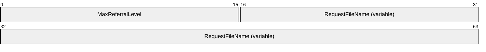

**MaxReferralLevel (2 bytes):** A 16-bit integer that indicates the highest DFS referral version understood by the client. The DFS referral versions specified by this document are 1 through 4 inclusive. A [**DFS client**](#gt_c2787719-60e0-4b69-8efe-c33edf9b40b2) MUST support DFS referral version 1 through the version number set in this field. The referral response messages are referral version dependent and are specified in sections [2.2.5.1](#Section_2.2.5.1) through [2.2.5.4](#Section_2.2.5.4).

**RequestFileName (variable):** A null-terminated [**Unicode**](#gt_unicode) string specifying the path to be resolved. The specified path MUST NOT be case-sensitive. Its format depends on the type of referral request, as specified in section [3.1.4.2](#Section_3.1.4.2).

### 2.2.3 REQ_GET_DFS_REFERRAL_EX

DFS referral requests sent in the form of an REQ_GET_DFS_REFERRAL_EX message take the following format:

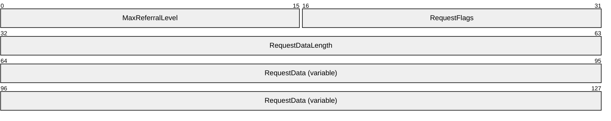

**MaxReferralLevel (2 bytes):** A 16-bit integer that indicates the highest DFS referral version understood by the client. The DFS referral versions specified by this document are 1 through 4 inclusive. A DFS client MUST support DFS referral version 1 through the version number set in this field. The referral response messages are referral version dependent and are specified in section [2.2.5](#Section_2.2.5).

**RequestFlags (2 bytes):** This field MUST contain zero or more of the following values:

| Value | Meaning |
| --- | --- |
| SiteName 0x00000001 | SiteName present: The SiteName bit MUST be set to 1 if the packet contains the site name of the client. |

If the SiteName flag is set in the RequestFlags field, then the RequestData buffer MUST contain both SiteNameLength and SiteName data.

**RequestDataLength (4 bytes):** A 32-bit integer that specifies the length of the **RequestData** field.

**RequestData (variable):** The format for RequestData is given in section [2.2.3.1](#Section_2.2.3.1).

#### 2.2.3.1 RequestData

RequestData is part of the REQ_GET_DFS_REFERRAL_EX message (section [2.2.3](#Section_2.2.3)).

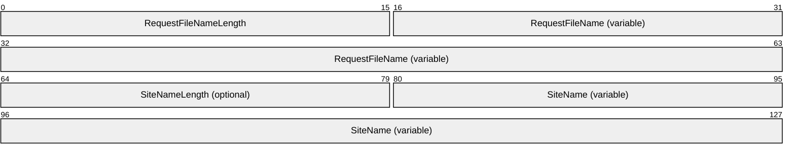

**RequestFileNameLength (2 bytes):** A 16-bit integer value that specifies the length of the RequestFileName string in the referral request.

**RequestFileName (variable):** A Unicode string specifying the path to be resolved. The specified path MUST be interpreted in a case-insensitive manner. Its format depends on the type of referral request, as specified in section [3.1.4.2](#Section_3.1.4.2).

The following fields are optional and used only when the SiteName flag in **RequestFlags** is set.

**SiteNameLength (2 bytes):** A 16-bit integer value that specifies the length of the SiteName string in the referral request.

**SiteName (variable):** A Unicode string specifying the name of the site to which the DFS client computer belongs. The length of this string is determined by the value of the SiteNameLength field.

### 2.2.4 RESP_GET_DFS_REFERRAL

A [**DFS server**](#gt_dfs-server) responds to a [**DFS client**](#gt_c2787719-60e0-4b69-8efe-c33edf9b40b2) referral request with the RESP_GET_DFS_REFERRAL message. The fixed-length portion of this message is referred to as the "referral header" in this document. The format of this message is as follows.

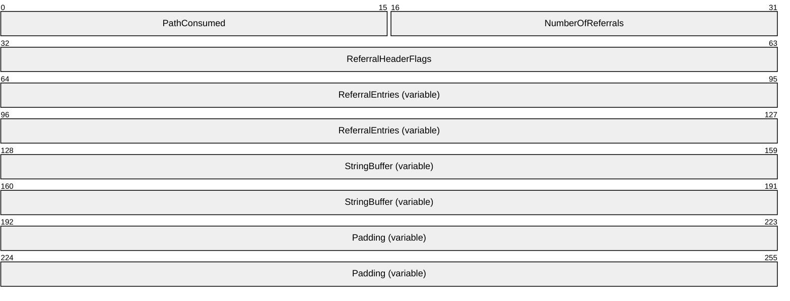

**PathConsumed (2 bytes):** A 16-bit integer indicating the number of bytes—not characters—in the prefix of the referral request path that is matched in the referral response.

**NumberOfReferrals (2 bytes):** A 16-bit integer indicating the number of referral entries immediately following the referral header.

**ReferralHeaderFlags (4 bytes):** A 32-bit field representing a series of flags that are combined by using the bitwise OR operation. Only the R, S, and T bits are defined and used. The other bits MUST be set to 0 by the server and ignored upon receipt by the client.

| Value | Meaning |
| --- | --- |
| R 0x00000001 | R (ReferralServers): The R bit indicates whether all of the targets in the referral entries returned are [**DFS root targets**](#gt_ac90b498-3ba4-48d6-bcd6-5495f1654671) capable of handling [**DFS referral**](#gt_c6f2eabf-2138-4f97-a788-5d6a41a27bdd) requests. |
| S 0x00000002 | S (StorageServers): The S bit indicates whether all of the targets in the referral response can be accessed without requiring further referral requests. |
| T 0x00000004 | T (TargetFailback): The T bit indicates whether [**DFS client target failback**](#gt_506d8850-6fcd-469a-b837-da4aaadf7ec6) is enabled for all targets in this referral response. This value MUST be set to 0 by the server and ignored by the client for all DFS referral versions except DFS referral version 4. |

**ReferralEntries (variable):** As many [DFS_REFERRAL_V1](#Section_2.2.5.1), [DFS_REFERRAL_V2](#Section_2.2.5.2), [DFS_REFERRAL_V3](#Section_2.2.5.3), or [DFS_REFERRAL_V4](#Section_2.2.5.4) structures as indicated by the **NumberOfReferrals** field.

**StringBuffer (variable):** A list of zero or more null-terminated Unicode character strings.

**Padding (variable):** The server MAY<2> insert a variable number of padding bytes.

### 2.2.5 Referral Entry Types

The DFS: Referral Protocol defines four structures used to encode referral entries: [DFS_REFERRAL_V1 (section 2.2.5.1)](#Section_2.2.5.1), [DFS_REFERRAL_V2 (section 2.2.5.2)](#Section_2.2.5.2), [DFS_REFERRAL_V3 (section 2.2.5.3)](#Section_2.2.5.3), and [DFS_REFERRAL_V4 (section 2.2.5.4)](#Section_2.2.5.4).

All referral entries in a [RESP_GET_DFS_REFERRAL](#Section_2.2.4) message MUST use the same referral entry structure. As a consequence, all referral entries in a RESP_GET_DFS_REFERRAL message MUST have the same value in their respective **VersionNumber** fields. The **VersionNumber** field defines the version number of the entire referral response.

The **VersionNumber** field also provides a more descriptive name to a referral entry or referral response. It is conventional to refer to a "version *N*" referral entry or a "version *N*" referral response, meaning a referral entry with a VersionNumber of *N* (of type DFS_REFERRAL_V*N*) or a referral response containing entries with a VersionNumber of *N*, respectively.

Each referral entry structure has a 16-bit **Size** field. The **Size** field indicates the total size, in bytes, of the referral entry. Clients MUST add the value of the **Size** field in a referral entry to the offset of that referral entry to find the offset of the next referral entry in the RESP_GET_DFS_REFERRAL message.

The DFS_REFERRAL_V2, DFS_REFERRAL_V3, and DFS_REFERRAL_V4 structures contain fields with offsets to strings. Clients MUST add the string offset to the offset of the beginning of the referral entry to find the offset of the string in the RESP_GET_DFS_REFERRAL message. The strings referenced from the fields of a referral entry MUST follow the last referral entry in the RESP_GET_DFS_REFERRAL message.

Examples of referral response packets of [**DFS referral**](#gt_c6f2eabf-2138-4f97-a788-5d6a41a27bdd) versions 2 and 3 are specified in section [4](#Section_4).

#### 2.2.5.1 DFS_REFERRAL_V1

The format of the version 1 referral entry is as follows.

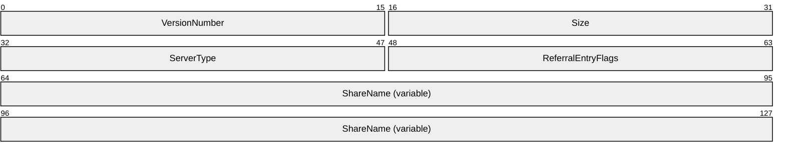

**VersionNumber (2 bytes):** A 16-bit integer indicating the version number of the referral entry. MUST always be 0x0001 for DFS_REFERRAL_V1.

**Size (2 bytes):** A 16-bit integer indicating the total size of the referral entry in bytes.

**ServerType (2 bytes):** A 16-bit integer indicating the type of server hosting the target.

| Value | Meaning |
| --- | --- |
| 0x0000 | Non-root targets returned. |
| 0x0001 | Root targets returned. |

**ReferralEntryFlags (2 bytes):** A series of bit flags. MUST be set to 0x0000 and ignored on receipt.

**ShareName (variable):** A null-terminated [**Unicode**](#gt_unicode) character string that specifies a [**DFS target**](#gt_dfs-target).

#### 2.2.5.2 DFS_REFERRAL_V2

The format of the version 2 referral entry is as follows.

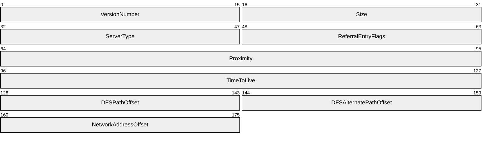

**VersionNumber (2 bytes):** A 16-bit integer indicating the version number of the referral entry. MUST always be 0x0002 for DFS_REFERRAL_V2.

**Size (2 bytes):** A 16-bit integer indicating the total size of the referral entry in bytes.

**ServerType (2 bytes):** A 16-bit integer indicating the type of server hosting the target.

| Value | Meaning |
| --- | --- |
| 0x0000 | Non-root targets returned. |
| 0x0001 | Root targets returned. |

**ReferralEntryFlags (2 bytes):** MUST be set to 0x0000 by the server and ignored on receipt by the client.

**Proximity (4 bytes):** MUST be set to 0x00000000 by the server and ignored by the client.

**TimeToLive (4 bytes):** A 32-bit integer indicating the time-out value, in seconds, of the [**DFS root**](#gt_639b7503-b879-4ef7-98a8-14adf85bc16d) or [**DFS link**](#gt_0611e93d-f0e7-42ee-a591-d77ebcbb6619).

**DFSPathOffset (2 bytes):** A 16-bit integer indicating the offset, in bytes, from the beginning of this referral entry to the [**DFS path**](#gt_151c87db-05a4-40c3-99bd-4b682530d210) that corresponds to the DFS root or the DFS link for which target information is returned.

**DFSAlternatePathOffset (2 bytes):** A 16-bit integer indicating the offset, in bytes, from the beginning of this referral entry to the DFS path that corresponds to the DFS root or the DFS link for which target information is returned.

**NetworkAddressOffset (2 bytes):** A 16-bit integer indicating the offset, in bytes, from the beginning of this referral entry to the network address of the [**DFS target**](#gt_dfs-target) that corresponds to this entry.

#### 2.2.5.3 DFS_REFERRAL_V3

The format of the common elements of a version 3 referral entry is as follows. The entry continues in section [2.2.5.3.1](#Section_2.2.5.3.1) or [2.2.5.3.2](#Section_2.2.5.3.2), dependent on the value of the NameListReferral flag in the **ReferralEntryFlags** field.

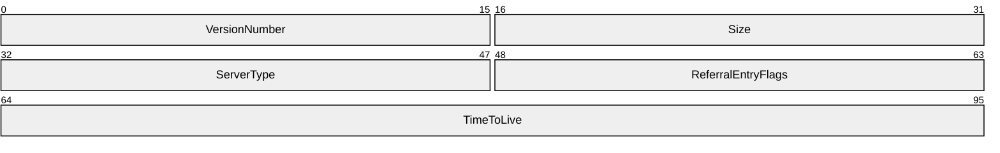

**VersionNumber (2 bytes):** A 16-bit integer indicating the version number of the referral entry. MUST be set to 0x0003, specifying DFS_REFERRAL_V3.

**Size (2 bytes):** A 16-bit integer indicating the total size of the referral entry, in bytes.

**ServerType (2 bytes):** A 16-bit integer indicating the type of server hosting the target.

| Value | Meaning |
| --- | --- |
| 0x0000 | Non-root targets returned. |
| 0x0001 | Root targets returned. |

**ReferralEntryFlags (2 bytes):** A 16-bit field representing a series of flags that are combined by using the bitwise OR operation. Only the NameListReferral bit is defined for DFS_REFERRAL_V3. The other bits MUST be set to zero by the server.

| Value | Meaning |
| --- | --- |
| NameListReferral 0x0002 | MUST be set for a domain referral response or a DC referral response. |

**TimeToLive (4 bytes):** A 32-bit integer indicating the time-out value, in seconds, of the DFS root or DFS link.

The following subsections define the remainder of the structure, which is dependent on whether the NameListReferral flag in the **ReferralEntryFlags** field has a value of 0 or 1 in.

##### 2.2.5.3.1 NameListReferral Flag Set to 0

When the NameListReferral flag in the **ReferralEntryFlags** field is 0, the remainder of the version 3 referral entry MUST be formatted as follows.

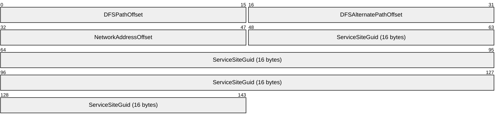

**DFSPathOffset (2 bytes):** A 16-bit integer indicating the offset, in bytes, from the beginning of this referral entry to the [**DFS path**](#gt_151c87db-05a4-40c3-99bd-4b682530d210) that corresponds to the [**DFS root**](#gt_639b7503-b879-4ef7-98a8-14adf85bc16d) or [**DFS link**](#gt_0611e93d-f0e7-42ee-a591-d77ebcbb6619) for which target information is returned. The DFS path MUST be a null-terminated string.

**DFSAlternatePathOffset (2 bytes):** A 16-bit integer indicating the offset, in bytes, from the beginning of this referral entry to the DFS path that corresponds to the DFS root or DFS link for which target information is returned.

**NetworkAddressOffset (2 bytes):** A 16-bit integer indicating the offset, in bytes, from the beginning of this referral entry to the network address of the [**DFS target**](#gt_dfs-target) that corresponds to this entry. The DFS path MUST be a null-terminated string.

**ServiceSiteGuid (16 bytes):** These 16 bytes MUST always be set to 0 by the server and ignored by the client. For historical reasons, this field was defined in early implementations but never used.

##### 2.2.5.3.2 NameListReferral Flag Set to 1

When the NameListReferral flag in the **ReferralEntryFlags** field is 1, the remainder of the version 3 referral entry MUST be formatted as follows.

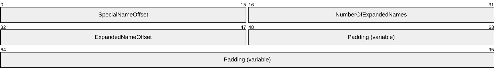

**SpecialNameOffset (2 bytes):** A 16-bit integer indicating the offset, in bytes, from the beginning of the referral entry to a [**domain name**](#gt_domain-name).

**NumberOfExpandedNames (2 bytes):** A 16-bit integer indicating the number of [**DCs**](#gt_domain-controller-dc) being returned for a DC referral request. MUST be set to 0 for a [**domain**](#gt_domain) referral response.

**ExpandedNameOffset (2 bytes):** A 16-bit integer indicating the offset, in bytes, from the beginning of this referral entry to the first DC name string returned in response to a DC referral request.

**Padding (variable):** The server MAY insert zero or 16 padding bytes that MUST be ignored by the client.<3>

#### 2.2.5.4 DFS_REFERRAL_V4

The format of the version 4 referral entry MUST be exactly the same as the format of the [DFS_REFERRAL_V3](#Section_2.2.5.3) referral entry, with two exceptions.

The value of the **VersionNumber** field MUST be 0x0004 for DFS_REFERRAL_V4.

The **ReferralEntryFlags** field contains an additional flag that can be set as follows.

| Value | Meaning |
| --- | --- |
| T 0x0004 | T (TargetSetBoundary): This bit is set if the target corresponding to this referral entry is the first target of a [**target set**](#gt_target-set). The first referral entry MUST have this bit set in a DFS version 4 referral response. |

The other bits of the **ReferralEntryFlags** field MUST be set to 0 by the server and ignored upon receipt by the client.

# 3 Protocol Details

The following sections specify details of the Distributed File System (DFS): Namespace Referral Protocol, including abstract data models, higher-layer triggered events, and message processing events and sequencing rules.

## 3.1 DFS Client Details

In this section, unless stated otherwise, the term "client" refers to a [**DFS client**](#gt_c2787719-60e0-4b69-8efe-c33edf9b40b2).

### 3.1.1 Abstract Data Model

This section describes a conceptual model of possible data organization that an implementation maintains to participate in this protocol. The organization is provided to explain how the protocol behaves. This document does not mandate that implementations adhere to this model as long as their external behavior is consistent with that described in this document.

Because the [**DFS clients**](#gt_c2787719-60e0-4b69-8efe-c33edf9b40b2) effectively block an application from accessing a specific file [**share**](#gt_share) until the DFS: Referral Protocol can map the [**DFS root**](#gt_639b7503-b879-4ef7-98a8-14adf85bc16d) name to an actual file server path, it is advantageous to cache [**DFS referral**](#gt_c6f2eabf-2138-4f97-a788-5d6a41a27bdd) responses. Because of this, clients SHOULD maintain local caches of information received through referral requests to avoid future referral requests and to improve the performance of [**DFS**](#gt_distributed-file-system-dfs) resource access.

- **BootstrapDC:** Applicable only for a computer joined to a [**domain**](#gt_domain). This contains the name of a [**DC**](#gt_domain-controller-dc) from which the DFS client will obtain a list of domain referral entries, in addition to a list of DC [**host names**](#gt_host-name) for a domain.
- **DomainCache:** Applicable only for a computer joined to a domain. This cache contains a list of trusted domains in both NetBIOS and fully qualified domain name forms, in addition to a list of DC host names for each domain. Conceptually, this is an array of tuples of the form <DomainName, DCHint, DCList>. Cache lookup involves finding a DomainCache entry with a matching DomainName. This can be used to check for a valid domain name or to find a DC host name for a given domain name. DCHint identifies a DC host name from DCList that is the DC that was last successfully used by the DFS client.
- **ReferralCache:** This cache contains root, link, and sysvol referral responses. A hit on a ReferralCache entry indicates that the path in a name resolution operation is a DFS Root, [**DFS link**](#gt_0611e93d-f0e7-42ee-a591-d77ebcbb6619), or a SYSVOL/NETLOGON share.
A ReferralCache entry conceptually contains entries indexed by a [**DFS path**](#gt_151c87db-05a4-40c3-99bd-4b682530d210) prefix, DFSPathPrefix. An entry is a tuple of the form <DFSPathPrefix, RootOrLink, Interlink, TTL, TargetFailback, TargetHint, TargetList>.

DFSPathPrefix is the DFS path that corresponds to a DFS root or a DFS link, and is the same as the string pointed to by the **DFSPathOffset** of a [DFS_REFERRAL_V2](#Section_2.2.5.2), [DFS_REFERRAL_V3](#Section_2.2.5.3) or [DFS_REFERRAL_V4](#Section_2.2.5.4) referral entry.

RootOrLink identifies whether the entry contains [**DFS root targets**](#gt_ac90b498-3ba4-48d6-bcd6-5495f1654671) or [**DFS link targets**](#gt_44e2f830-c28b-41e3-8c3c-d0bb576ed9fb). It reflects the value from the **ServerType** field of a referral entry (as specified in sections [2.2.5.1](#Section_2.2.5.1), 2.2.5.2, 2.2.5.3, and 2.2.5.4).

Interlink identifies whether the entry contains a target in another DFS namespace, as determined by the test in section [3.1.5.4.5](#Section_3.1.5.4.5).

TargetFailback is used only for DFS_REFERRAL_V4 and contains the value from the TargetFailback bit of the referral header (as specified in section [2.2.4](#Section_2.2.4)).

TTL contains a value derived from the **TimeToLive** field of a referral entry (as specified in sections 2.2.5.1, 2.2.5.2, 2.2.5.3, and 2.2.5.4). This is the time stamp at which a ReferralCache entry is considered to be expired. An implementation is free to come up with soft and hard time-outs based on the **TimeToLive** field of the referral entry, for example. The soft time-out can be used to initiate a ReferralCache entry refresh operation while permitting the use of the ReferralCache entry; the hard time-out limit can be used to fail any operation using the ReferralCache entry if all attempts to refresh it fail.<4>

TargetHint identifies a target in TargetList that was last successfully used by the DFS client. TargetList consists of tuples of the form <TargetPath, TargetSetBoundary>, where TargetPath is the string pointed to by the **NetworkAddressOffset** field (as specified in sections 2.2.5.2, 2.2.5.3, and 2.2.5.4). TargetSetBoundary is only present in V4 referrals and reflects the value from the TargetSetBoundary of the referral entry (as specified in section 2.2.5.4).

### 3.1.2 Timers

**BootstrapDCTimer:** This timer is applicable only to a domain-joined client. This timer is used to regularly update the value of BootstrapDC with the name of the [**domain controller (DC)**](#gt_domain-controller-dc) in the domain of the client.

### 3.1.3 Initialization

A client MUST initialize BootstrapDC and BootstrapDCTimer after joining a domain.<5>

### 3.1.4 Higher-Layer Triggered Events

#### 3.1.4.1 User/Application Initiated I/O Operation on a UNC Path

The calling application provides:

- Implementation-specific information on the I/O operation to be performed.
- **Path** indicating the UNC path on which the I/O operation is to be performed.
- **UserCredentials** to be used for performing I/O operation on the UNC path.
- **MaxOutputSize** indicating the maximum output buffer size, in bytes.
When the [**DFS client**](#gt_c2787719-60e0-4b69-8efe-c33edf9b40b2) receives an I/O operation with a [**UNC**](#gt_universal-naming-convention-unc) path, it MUST normalize the UNC path to the protocol format with one leading backslash (as specified in section [2.2.1](#Section_2.2.1)) and perform a name resolution. See the following flowcharts for an illustration of the process. In some cases, individual steps have a description of the condition at entry of the step inside square brackets [like this].

The following flowcharts show the steps taken by a DFS client to resolve a [**DFS path**](#gt_151c87db-05a4-40c3-99bd-4b682530d210).

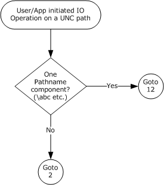

Figure 1: DFS path resolution – initial steps

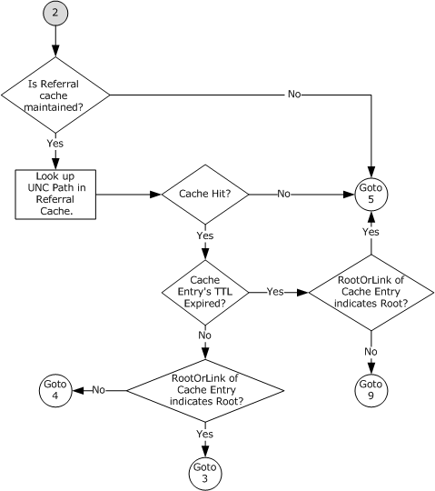

Figure 2: DFS path resolution – connection 2

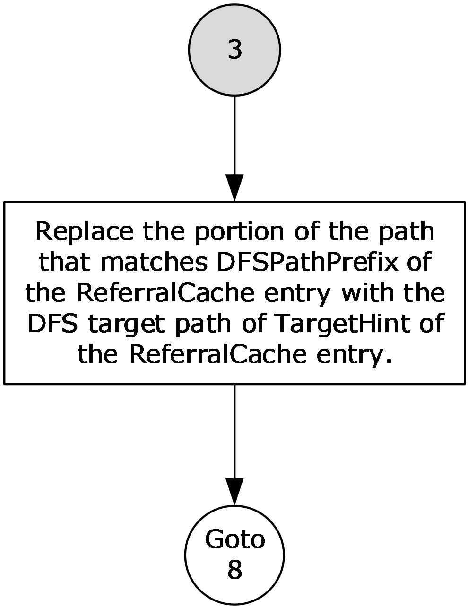

Figure 3: DFS path resolution - connection 3

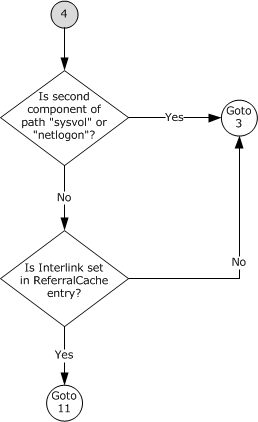

Figure 4: DFS path resolution - connection 4

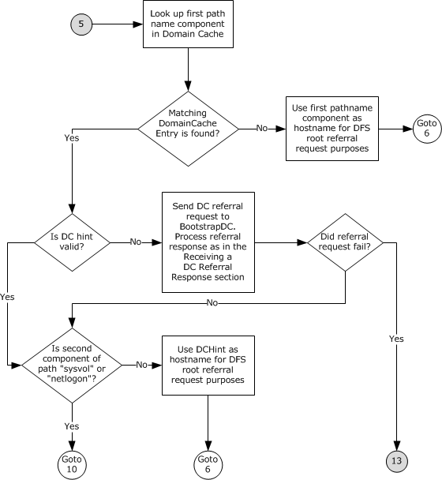

Figure 5: DFS path resolution - connection 5

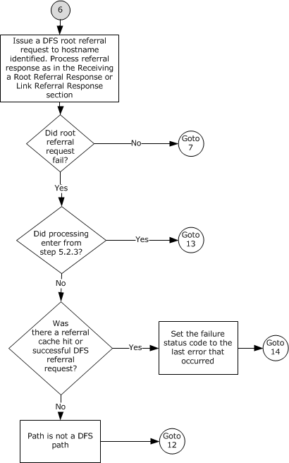

Figure 6: DFS path resolution - connection 6

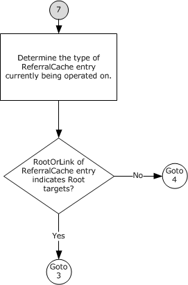

Figure 7: DFS path resolution - connection 7

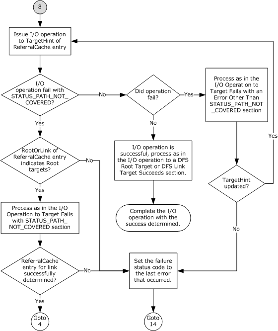

Figure 8: DFS path resolution - connection 8

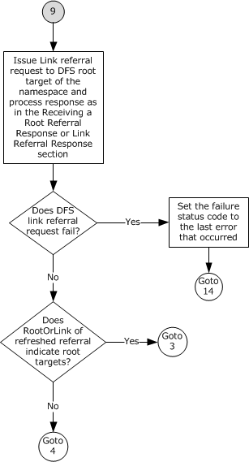

Figure 9: DFS path resolution - connection 9

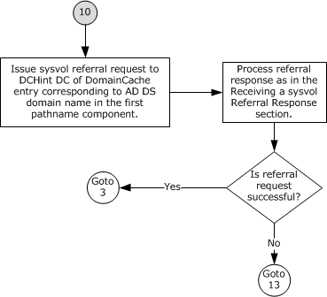

Figure 10: DFS path resolution - connection 10

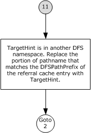

Figure 11: DFS path resolution - connection 11

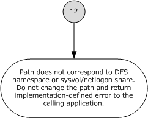

Figure 12: DFS path resolution - connection 12

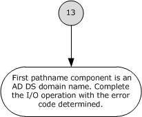

Figure 13: DFS path resolution - connection 13

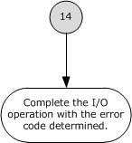

Figure 14: DFS path resolution - connection 14

The following procedure specifies a possible implementation for resolving a UNC path. This example uses a cache to avoid repeated referral requests, thereby improving the performance of the DFS client. A lookup in ReferralCache involves searching for an entry with DFSPathPrefix that is a complete prefix of the path being looked up. Whole path components are used in the match. Also, the ReferralCache entry with the longest match is used. For the lookup path of \MyDomain\MyDfs\MyDir\file1, if there are two ReferralCache entries, one for \MyDomain\MyDfs and another for \MyDomain\MyDfs\MyDir, the latter is the longest match. This document does not mandate that implementations adhere to this model, as long as their external behavior is consistent with the behavior described.

- If the path has only one path component (for example, \abc), go to step 12; otherwise, go to step 2.
- Look up the path in ReferralCache if a cache is being maintained. If no cache is being maintained, go to step 5.
- If no matching entry is found in ReferralCache, go to step 5.
- If an entry's TTL has expired:
- If RootOrLink indicates [**DFS root targets**](#gt_ac90b498-3ba4-48d6-bcd6-5495f1654671), go to step 5.
- If RootOrLink indicates [**DFS link targets**](#gt_44e2f830-c28b-41e3-8c3c-d0bb576ed9fb), go to step 9.
- If an entry contains DFS link targets as indicated by RootOrLink, go to step 4; otherwise, go to step 3.
- [ReferralCache hit, unexpired TTL] Replace the portion of the path that matches DFSPathPrefix of the ReferralCache entry with the [**DFS target**](#gt_dfs-target) path of TargetHint of the ReferralCache entry. For example, if the path is \MyDomain\MyDfs\MyDir and the ReferralCache entry contains \MyDomain\MyDfs with a DFS target path of \someserver\someshare\somepath, the effective path becomes \someserver\someshare\somepath\MyDir. Go to step 8.
- [ReferralCache hit, unexpired TTL, RootOrLink=link]
- If the second component of the path is "SYSVOL" or "NETLOGON" go to step 3.
- Check the Interlink element of the ReferralCache entry.
- If Interlink is set in the ReferralCache entry, then the TargetHint is in another [**DFS namespace**](#gt_6a3f0be9-b9b4-49df-9d1c-a3b89e4e9890). Go to step 11.
- If Interlink is not set in the ReferralCache entry then the TargetHint is not in another DFS namespace. Go to step 3.
- [ReferralCache miss] [ReferralCache hit, expired TTL, RootOrLink=root] Look up the first path component in DomainCache.
- If no matching DomainCache entry is found, use the first path component as the [**host name**](#gt_host-name) for [**DFS root**](#gt_639b7503-b879-4ef7-98a8-14adf85bc16d) referral request purposes. Go to step 6.
- If a matching DomainCache entry is found:
- If DCHint is not valid, send [**DC**](#gt_domain-controller-dc) referral request, as specified in section [3.1.4.2](#Section_3.1.4.2), providing "DC", **BootstrapDC**, **UserCredentials**, **MaxOutputSizeff**, and **Path** as parameters. The processing of the referral response is specified in section [3.1.5.4.2](#Section_3.1.5.4.2). If the referral request fails, go to step 13.
- If the second path component is "SYSVOL" or "NETLOGON", go to step 10.
- Use DCHint as host name for DFS root referral request purposes.
- [DFS Root referral request] Issue a DFS root referral request, as specified in section 3.1.4.2, providing "ROOT", the first path component, **UserCredentials**, **MaxOutputSize**, and **Path** as parameters. The processing of the referral response and/or error is as specified in section [3.1.5.4.3](#Section_3.1.5.4.3), which will update the ReferralCache on success. On DFS root referral request success, go to step 7. On DFS root referral request failure:
- If the immediately preceding processing step was step 5, this is a domain name or path. Go to step 13.
- If processing of this I/O request encountered a ReferralCache hit, or one of its [**DFS referral**](#gt_c6f2eabf-2138-4f97-a788-5d6a41a27bdd) requests succeeded (as would have occurred in the case of a previous Interlink - see step 11 - or a domain root referral, when entering from step 5), the path is in a DFS namespace. Go to step 14.
- The path is not a DFS path and no further processing is required. Go to step 12.
- [DFS root referral success] If the current ReferralCache entry's RootOrLink indicates root targets, go to step 3; otherwise, go to step 4.
- [I/O request, path fully resolved] Issue I/O operation to TargetHint of ReferralCache entry.
- If the I/O operation fails with STATUS_PATH_NOT_COVERED.
- If the RootOrLink of ReferralCache entry indicates link targets, set the failure status to the last error that occurred and go to step 14.
- If the RootOrLink of ReferralCache entry indicates root targets, the process is as specified in section [3.1.5.1](#Section_3.1.5.1). If this processing does not successfully determine a ReferralCache entry to traverse the link, set the failure status to the last error that occurred and go to step 14.
- ReferralCache entry for the link determined successfully. Go to step 4.
- If the I/O operation fails with an error other than STATUS_PATH_NOT_COVERED, then the process is as specified in section [3.1.5.2](#Section_3.1.5.2). If the processing of that section specifies a new TargetHint, repeat step 8. Otherwise, set the failure status to the last error that occurred and go to step 14.
- If the I/O operation is successful, the process is as specified in section [3.1.5.3](#Section_3.1.5.3). Complete the I/O operation and user/application-initiated I/O request with success.
- [ReferralCache hit, expired TTL, RootOrLink=link] The link referral request is issued to a DFS root target of the namespace. Find the root ReferralCache entry corresponding to the first two path components, noting that this will already be in the cache due to processing that resulted in acquiring the expired link ReferralCache entry. Issue a [**DFS link**](#gt_0611e93d-f0e7-42ee-a591-d77ebcbb6619) referral request, as specified in section 3.1.4.2, providing "LINK", **TargetHint** of the root ReferralCache entry, **UserCredentials**, **MaxOutputSize**, and **Pathf** as parameters, and process the DFS referral response and/or error as specified in section 3.1.5.4.3, which will update the ReferralCache on success. If the DFS Link referral request fails, set the failure status to the last error that occurred and go to step 14. Otherwise:
- If the RootOrLink of the refreshed ReferralCache entry indicates DFS root targets, go to step 3.
- If the RootOrLink of the refreshed ReferralCache entry indicates DFS link targets, go to step 4.
- [sysvol referral request] Issue a sysvol referral request, as specified in section 3.1.4.2, providing 'SYSVOL', the DCHint DC of the DomainCache entry that corresponds to the domain name in the first path component, **UserCredentials**, **MaxOutputSize**, and **Path** as parameters. The processing of the referral response and/or error is as specified in section [3.1.5.4.4](#Section_3.1.5.4.4), which will update the ReferralCache on success. If the referral request is successful, go to step 3; otherwise, go to step 13.
- [interlink] Replace the portion of the path that matches the DFSPathPrefix of the ReferralCache entry with TargetHint. For example, if the path is \MyDomain\MyDfs\MyLink\MyDir and the referral entry contains \MyDomain\MyDfs\MyLink with a DFS target path of \someserver\someshare\somepath, the effective path becomes \someserver\someshare\somepath\MyDir. Go to step 2.
- [not DFS] The path does not correspond to a DFS namespace or a SYSVOL/NETLOGON [**share**](#gt_share). Do not change the path, and return an implementation-defined error.<6> The user/application initiated I/O request is handled by the local operating system.
- [Cannot get DC for [**domain**](#gt_domain)] The first path component is a domain name. Fail the I/O operation and user/application-initiated I/O request with the last error code that occurred before the jump to this step.
- [DFS path] The path is known to be in a DFS namespace, but the DFS root referral request or DFS Link referral request has failed. Complete the user/application-initiated I/O request with the error code that occurred before the jump to this step.

#### 3.1.4.2 Sending a DFS Referral Request to the Server

This interface is only used internally by the DFS client to send a DFS referral request to a specific server. The caller provides the following:

- **Type**: A string identifying the type of the referral request.
- **HostName**: The name of the server from which to query referrals.
- **UserCredentials**: An opaque implementation-specific entity that identifies the credentials to be used when authenticating to the remote server.
- **MaxOutputSize**: The maximum output buffer response size, in bytes.
- **Path**: The path for which referral information is to be queried.
The client MUST initiate a server session with the SMB server, as specified in [MS-CIFS](../MS-CIFS/MS-CIFS.md) section 3.4.4.7, by passing **HostName** and **UserCredentials** as input parameters and receiving an opaque **ClientGenericContext**, as specified in [MS-CIFS] section 3.4.

The client MUST verify the local configuration on extended referrals in an implementation-specific manner<7>, and MUST also query the server's extended referral capability by invoking the event as specified in [MS-CIFS] section 3.4.4.12.

If both the tests return TRUE, the client MUST construct the **REQ_GET_DFS_REFERRAL_EX** request, as specified in section [2.2.3](#Section_2.2.3), with the following parameters:

- MaxReferralLevel is set to the corresponding Type as specified in the following table.
- RequestFlags is set to 1.
- RequestFileName is set to **Path**.
- SiteName is set in an implementation-specific manner.<8>
If any of the tests return FALSE, the client MUST construct a **REQ_GET_DFS_REFERRAL** request, as specified in section [2.2.2](#Section_2.2.2), with the following parameters:

- MaxReferralLevel is set to the corresponding Type as specified in the following table.
- RequestFileName is set to **Path**.
The client MUST query the DFS referral, as specified in [MS-CIFS] section 3.4.4.9, by passing ClientGenericContext, HostName, UserCredentials, MaxOutputSize, the **REQ_GET_DFS_REFERRAL_EX** or **REQ_GET_DFS_REFERRAL** structure as the input buffer, and the FSCTL code set to FSCTL_DFS_GET_REFERRALS, if the input buffer is an **REQ_GET_DFS_REFERRAL,** or FSCTL_DFS_GET_REFERRALS_EX, if the input buffer is an **REQ_GET_DFS_REFERRAL_EX**.

| Type | RequestFileName | MaxReferralLevel |
| --- | --- | --- |
| DOMAIN | An empty string (containing just the null terminator). | 3 or higher |
| DC | "\<domain>" or "<domain>", where <domain> is a domain name that can be in either NetBIOS or fully qualified domain name forms. | 3 or higher |
| SYSVOL | Either "\<domain>\SYSVOL" or "\<domain>\NETLOGON", where <domain> is a domain name that can be in either NetBIOS or fully qualified domain name forms. | No restriction |
| ROOT | Of the form either "\<domain>\<dfsname>" or "\<server>\<dfsname>", where <domain> is the name of the domain that hosts the DFS namespace, <dfsname> is the name of a DFS namespace, and <server> is a DFS root target host name. | No restriction |
| LINK | Of the form either "\<domain>\<dfsname>\<linkpath>" or "\<server>\<dfsname>\<linkpath>", where <domain> is the name of the domain that hosts the DFS namespace, <dfsname> is the name of a DFS namespace, <server> is a DFS root target host name, <linkpath> is a path that can have a DFS link. | No restriction |

The client MUST wait synchronously for the completion of the referral request and pass the referral response received from the server to the caller. If the request fails with STATUS_DFS_UNAVAILABLE, the client MUST return the same error code to the caller.

The client MUST validate that the returned referral response is properly formed, (section [2.2.5](#Section_2.2.5)). If the response is ill-formed, the client MUST fail the referral request and return the error code STATUS_INVALID_NETWORK_RESPONSE to the caller.

### 3.1.5 Message Processing Events and Sequencing Rules

#### 3.1.5.1 I/O Operation to Target Fails with STATUS_PATH_NOT_COVERED

When an I/O operation that is issued to a link target fails with STATUS_PATH_NOT_COVERED (0xC0000257), the client MUST fail the original I/O request.

When an I/O operation issued to a [**DFS root target**](#gt_ac90b498-3ba4-48d6-bcd6-5495f1654671) server in step 8 of section [3.1.4.1](#Section_2.2.1.3) fails with STATUS_PATH_NOT_COVERED (0xC0000257), it indicates that the portion of the [**DFS namespace**](#gt_6a3f0be9-b9b4-49df-9d1c-a3b89e4e9890) accessed by the client is not contained in the DFS root target server.

To identify the [**DFS link targets**](#gt_44e2f830-c28b-41e3-8c3c-d0bb576ed9fb) that contain the required portion of the DFS namespace, the client MUST look up the path used for the I/O operation in ReferralCache. On a cache hit, the resulting ReferralCache entry MUST be used in further processing.

Otherwise, the client MUST obtain the file attributes of the DFS link as specified in [MS-CIFS](../MS-CIFS/MS-CIFS.md) section 3.2.4.12 or [MS-SMB2](../MS-SMB2/MS-SMB2.md) section 3.2.4.8 based on the protocol transport.

If the file attributes include FILE_ATTRIBUTE_REPARSE_POINT, the client MUST issue a DFS link referral request, as specified in section [3.1.4.2](#Section_3.1.4.2), providing as parameters "LINK", the DFS root target server specified by the TargetHint of the ReferralCache entry corresponding to the DFS namespace, **UserCredentials**, **MaxOutputSize**, and **Path**. The **Path** parameter MUST be set to the path in the I/O operation issued to the DFS root target in step 8 of section 3.1.4.1. The client MUST process the DFS referral response as specified in section [3.1.5.4.3](#Section_3.1.5.4.3), which will update the ReferralCache.<9> The resulting ReferralCache entry, if any, MUST be used in further processing.

#### 3.1.5.2 I/O Operation to Target Fails with an Error Other Than STATUS_PATH_NOT_COVERED

When an I/O operation issued to the target server identified by the TargetHint of the ReferralCache entry used returns an NTSTATUS value with the **Sev** field set to 2 or 3, as specified in [MS-ERREF](../MS-ERREF/MS-ERREF.md) section 2.3, and the NTSTATUS value is not equal to STATUS_PATH_NOT_COVERED (0xC0000257), the next target, if any, from TargetList of ReferralCache entry MAY<10> be selected. When the next target is not selected, or there are no additional targets in the ReferralCache entry, the client MUST fail the user/application-initiated I/O operation and return the same NTSTATUS value that was returned to the client.

If a new target was selected from the TargetList, the TargetHint of the selected ReferralCache entry MUST have its value set to the selected target. This is a performance optimization for future operations that use the same ReferralCache entry, and is a case of "[**DFS client target failover**](#gt_a8f123fe-166f-488c-861a-a1e28e6fed52)".

#### 3.1.5.3 I/O Operation to a DFS Root Target or DFS Link Target Succeeds

When the operation issued to a [**DFS root target**](#gt_ac90b498-3ba4-48d6-bcd6-5495f1654671) or [**DFS link target**](#gt_44e2f830-c28b-41e3-8c3c-d0bb576ed9fb) returns an NTSTATUS value with the **Sev** field set to 0 or 1, as specified in [MS-ERREF](../MS-ERREF/MS-ERREF.md) section 2.3, the [**DFS client**](#gt_c2787719-60e0-4b69-8efe-c33edf9b40b2) MUST complete the user/application-initiated I/O operation with the NTSTATUS value that was returned to the client.

#### 3.1.5.4 Receiving a Referral Response

The [**DFS client**](#gt_c2787719-60e0-4b69-8efe-c33edf9b40b2) receives the referral response in the form of [RESP_GET_DFS_REFERRAL (section 2.2.4)](#Section_2.2.4). If the **NumberOfReferrals** field is at least 1, the client MUST determine the version number of the referral response by accessing the **VersionNumber** field of the first referral entry immediately following the referral header and interpreting the referral entry as specified in section [2.2.5](#Section_2.2.5).

The **NumberOfReferrals** field in the referral header contains the number of referral entries in the response. The first referral entry immediately follows the referral header in the RESP_GET_DFS_REFERRAL message (section 2.2.4). From a given referral entry, the next referral entry is accessed by adding the **Size** field of the referral entry to the address of the given referral entry. The client MUST ignore the Padding field if present.

When a [**DFS path**](#gt_151c87db-05a4-40c3-99bd-4b682530d210) resolves to multiple referral entries, and the client supplies a buffer insufficiently large to hold the entries, the client can experience a non-deterministic server response.

If a [**DFS referral**](#gt_c6f2eabf-2138-4f97-a788-5d6a41a27bdd) request fails with STATUS_BUFFER_OVERFLOW (0x80000005), the client SHOULD retry the referral request with a bigger buffer size.<11> Response data buffer size is determined as specified in section [3.2.5.1](#Section_3.3.5.1).

##### 3.1.5.4.1 Receiving a Domain Referral Response

This is applicable only to a domain-joined computer. The client receives this response for the domain referral request that it issued to BootstrapDC (as specified in section [3.1.6](#Section_3.1.6)). The domain referral response MUST be version 3 or later; otherwise, the client MUST ignore the referral response.

The client MUST discard referral responses that do not have the NameListReferral bit of each referral entry set. The other bits of **ReferralEntryFlags** in the referral entry MUST be ignored. The client can access the null-terminated [**Unicode**](#gt_unicode) [**domain name**](#gt_domain-name) contained in a referral entry by adding the value in the **SpecialNameOffset** field of the referral entry to the address of the referral entry.

The client MUST add the domain names received in the referral response to DomainCache, if empty. If DomainCache already has domain names, the client MUST add only those domain names to DomainCache that are not already in it. The client MAY remove those domain names from DomainCache that are not in the referral response.<12>

The [**DFS client**](#gt_c2787719-60e0-4b69-8efe-c33edf9b40b2) MUST NOT modify the DomainCache on a domain referral failure.

##### 3.1.5.4.2 Receiving a DC Referral Response

This is applicable only to a domain-joined computer. The [**DFS client**](#gt_c2787719-60e0-4b69-8efe-c33edf9b40b2) receives this referral response for the [**DC**](#gt_domain-controller-dc) referral request that it sent in step 5.2 of section [3.1.4.1](#Section_2.2.1.3). The DC referral response MUST be version 3 or later; otherwise, the client MUST ignore the referral response.

The client MUST verify that the **NumberOfReferrals** field of the referral header is 1 and that the NameListReferral bit is set in the referral entry. The other bits of **ReferralEntryFlags** in the referral entry MUST be ignored. The **NumberOfExpandedNames** in the referral entry contains the number of DC names returned. The client MUST use the value in the **NumberOfExpandedNames** field to determine how many names are present in the list at **ExpandedNameOffset**. The client can access the first null-terminated [**Unicode**](#gt_unicode) DC name string that is returned by adding the value in the **ExpandedNameOffset** field to the address of the referral entry. Immediately following the null termination of a DC name is the next DC name returned. The client can access the null-terminated Unicode [**domain name**](#gt_domain-name) that corresponds to the referral response by adding the value in the **SpecialNameOffset** to the address of the referral entry.

The client MUST add the list of DCs determined for a domain name to DCList of the DomainCache entry that corresponds to the domain name. If the DomainCache entry's DCList is not empty, the client MUST replace it with the DC list from the referral response and set DCHint to the first DC in the new DCList.

##### 3.1.5.4.3 Receiving a Root Referral Response or Link Referral Response

This section describes the processing that occurs when the client gets a referral response after sending a [**DFS root**](#gt_639b7503-b879-4ef7-98a8-14adf85bc16d) referral request in step 6 of section [3.1.4.1](#Section_2.2.1.3) or a link referral request in either step 9 of section 3.1.4.1 or in section [3.1.5.1](#Section_3.1.5.1).

If the referral request is successful, but the **NumberOfReferrals** field in the referral header (as specified in section [2.2.4](#Section_2.2.4)) is 0, the [**DFS server**](#gt_dfs-server) could not find suitable targets to return to the client. In this case, the client MUST fail the original I/O operation with STATUS_OBJECT_PATH_NOT_FOUND.

If the referral request returns an NTSTATUS value with the Sev field set to 2 or 3, as specified in [MS-ERREF](../MS-ERREF/MS-ERREF.md) section 2.3, process as follows:

- In the case of a referral request sent to a [**DC**](#gt_domain-controller-dc) (steps 5.4 and 6 of section 3.1.4.1), the client MAY<13> issue a root referral request to the next DC from the DCList of the DomainCache entry, as in step 6 of section 3.1.4.1. If all DCs from the DCList have been tried, the [**DFS client**](#gt_c2787719-60e0-4b69-8efe-c33edf9b40b2) MUST fail the user/application–initiated I/O operation with STATUS_OBJECT_PATH_NOT_FOUND.
When the root referral request sent to a DC is successful, the client SHOULD set the DCHint of the DomainCache entry used to that DC. The DCHint serves as a performance optimization for future operations.

- In the case of a link referral request: the client MAY<14> issue a link referral request to the next target from the TargetList of the ReferralCache entry, as in section [3.1.5.2](#Section_3.1.5.2). If all the targets in ReferralCache entry have been tried, the client MUST fail the user/application-initiated I/O operation and return the same NTSTATUS value that was returned to the client.
When the link referral request sent to a root target is successful, the client SHOULD set the TargetHint of the ReferralCache entry to that root target. The TargetHint serves as a performance optimization for future operations.

- In any other case: the DFS client MUST fail the user/application-initiated I/O operation and return the same NTSTATUS value.
If the client sends a DFS root referral request and receives a referral response with the **ServerType** field of the referral response entry (as specified in section [2.2.5](#Section_2.2.5)) set to 0x0000, a link referral response is being returned. <15>

The client can access the null-terminated [**Unicode**](#gt_unicode) [**DFS target**](#gt_dfs-target) path contained in a referral entry by adding the value in the **NetworkAddressOffset** field (as specified in section 2.2.4) of the referral entry to the address of the referral entry. The client can access the null-terminated Unicode DFS root or link path that corresponds to the referral response by adding the value in the **DFSPathOffset** field (as specified in section 2.2.4) of the referral entry to the address of the referral entry.

If this response is due to a referral request that was sent in step 6 of section 3.1.4.1 or section 3.1.5.1 on a ReferralCache miss, the client MUST create a new ReferralCache entry from the referral response and set TargetHint to the first target in TargetList. For a [**DFS referral**](#gt_c6f2eabf-2138-4f97-a788-5d6a41a27bdd) version 4 response, the client MUST set TargetSetBoundary of each target in TargetList to the value of the TargetSetBoundary bit of the referral entry (see section [2.2.5.4](#Section_2.2.5.4)). The client MUST set the value of RootOrLink in ReferralCache entry based on the **ServerType** field of the referral entry. The client MUST set the value of the Interlink flag based on the test in section [3.1.5.4.5](#Section_3.1.5.4.5).

If this response is due to a referral request that was sent in step 2.2 in section 3.1.4.1 to refresh an existing but expired ReferralCache entry, the client MUST perform the following steps:

- Update the TargetList of the ReferralCache entry from the referral response, unless the following condition holds: if the targets contained in the TargetList of the ReferralCache entry and those returned in the referral response are equivalent, the client MUST NOT update the TargetList in the ReferralCache entry. The equivalence check operation is specified as follows:
- DFS referral version 4 response: The number of [**target sets**](#gt_target-set) is the same, and each target set in the ReferralCache entry and the referral response contain the same targets, independent of their order with the target set.
- DFS referral version 1, 2, or 3 response: The ReferralCache entry and the referral response contain the same targets, independent of their order.
- Update the TTL and TargetFailback in the ReferralCache entry from the referral response.
- Update the Interlink flag from the referral response, based on the test in section 3.1.5.4.5.
- If the target specified by the TargetHint is not present in the referral response, set the TargetHint to point to the first target of the TargetList in ReferralCache.
- If the TargetFailback is set in the ReferralCache entry, and if the TargetHint is not in the first target set of the TargetList, set the TargetHint to point to the first target in the first target set of the TargetList. This is referred to as a [**DFS client target failback**](#gt_506d8850-6fcd-469a-b837-da4aaadf7ec6). Target failback can also be performed at instances other than just at ReferralCache entry refresh time based on an implementation-defined policy.
If an attempt to refresh an existing but expired ReferralCache entry fails, an implementation-defined error behavior MAY be used. For example, the client can initiate ReferralCache entry refresh at the end of a soft time-out period (as specified in section [3.1.1](#Section_1.5.2)) while permitting the use of the entry and either discard it at the end of a hard time-out period (as specified in section 3.1.1) or fail the I/O operations that use the ReferralCache entry.<16>

##### 3.1.5.4.4 Receiving a sysvol Referral Response

The client receives this referral response for the sysvol referral request that it sent in step 10 of section [3.1.4.1](#Section_2.2.1.3).

This referral response MUST be handled in the same manner as that of a ROOT referral response, as specified in section [3.1.5.4.3](#Section_3.1.5.4.3).

##### 3.1.5.4.5 Determining Whether a Referral Response is an Interlink

A referral response is an Interlink if either of the following two conditions holds:

- If the ReferralServers and StorageServers bits of the **ReferralHeaderFlags** field in the referral header (as specified in section [2.2.4](#Section_2.2.4)) are set to 1 and 0 respectively.
- If the TargetList has one entry, and a lookup of the first path component of the TargetList entry against the DomainCache results in a cache hit, indicating that the path refers to a domain namespace.

### 3.1.6 Timer Events

**BootstrapDCTimer:** When this timer expires, the [**DFS client**](#gt_c2787719-60e0-4b69-8efe-c33edf9b40b2) MUST update BootstrapDC with the name of a [**DC**](#gt_domain-controller-dc) in the [**domain**](#gt_domain) of the client. It MUST then issue a domain referral (as specified in section [2.2.2](#Section_2.2.2)) to the Bootstrap DC and process the response as specified in section [3.1.5.4.1](#Section_3.1.5.4.1). It MUST then restart the timer.

### 3.1.7 Other Local Events

On joining a [**domain**](#gt_domain), the client updates its BootstrapDC, issues a domain referral to the BootstrapDC, and enables the BootstrapDCTimer, as specified in section [3.1.6](#Section_3.1.6). On leaving a domain to join a workgroup, the client disables the BootstrapDCTimer.

## 3.2 DFS Root Target Server Details

A [**DFS root target**](#gt_ac90b498-3ba4-48d6-bcd6-5495f1654671) server hosts the [**DFS root**](#gt_639b7503-b879-4ef7-98a8-14adf85bc16d) of a [**DFS namespace**](#gt_6a3f0be9-b9b4-49df-9d1c-a3b89e4e9890). This section specifies how a DFS root target server processes and responds to [**DFS referral**](#gt_c6f2eabf-2138-4f97-a788-5d6a41a27bdd) requests from [**DFS clients**](#gt_c2787719-60e0-4b69-8efe-c33edf9b40b2). If the server is also a [**DC**](#gt_domain-controller-dc), it MUST also conform to the specification in section [3.3](#Section_1.3).

DFS root target servers respond to DFS root referral requests and [**DFS link**](#gt_0611e93d-f0e7-42ee-a591-d77ebcbb6619) referral requests.<17>

### 3.2.1 Abstract Data Model

This section describes a conceptual model of possible data organization that an implementation maintains to participate in this protocol. The organization is provided to explain how the protocol behaves. This document does not mandate that implementations adhere to this model as long as their external behavior is consistent with that described in this document. The following state MUST be maintained at the [**DFS Server**](#gt_dfs-server):

**HomeDomain:** Applicable only for a computer joined to a [**domain**](#gt_domain). MUST be the name of a domain to which the computer is joined. Maintained both in NetBIOS and fully qualified domain name forms. This is used to access the [**DFS metadata**](#gt_e8de88fd-d760-46fa-ad77-76961fa20aea) of a [**domain-based DFS namespace**](#gt_domain-based-dfs-namespace) hosted by the server.

**DFSNamespaceList:** MUST be a list of [**domain-based**](#gt_c37de1c8-4bd3-406f-ad8c-50c877666f91) and stand-alone [**DFS root targets**](#gt_ac90b498-3ba4-48d6-bcd6-5495f1654671) hosted by the server. Used while processing [**DFS referral**](#gt_c6f2eabf-2138-4f97-a788-5d6a41a27bdd) requests from [**DFS clients**](#gt_c2787719-60e0-4b69-8efe-c33edf9b40b2).

**DFSMetadataCache:** Cache that MUST contain the DFS metadata of [**DFS namespaces**](#gt_6a3f0be9-b9b4-49df-9d1c-a3b89e4e9890) for which the server is a root target. The cache MUST be maintained as specified in [MS-DFSNM](../MS-DFSNM/MS-DFSNM.md) section 3.1.

#### 3.2.1.1 Algorithm for sorting target sites in referral response based on site location

The DFS server places the target servers in the referral response in the following order:

- Targets in the same site as the client are listed at the top of the referral response in random order.
- Targets outside the client's site are appended to the response in random order.

#### 3.2.1.2 Algorithm for sorting target sites in referral response based on site cost

The server performs the following actions:

- Partition the targets into target sets, based on targets of equal site cost relative to the client.
- Sort the target sets from lowest to highest site cost.
- Place the targets within each target set in a random order.

### 3.2.2 Timers

None.

### 3.2.3 Initialization

When the [**DFS server**](#gt_dfs-server) is started:

- It MUST notify the [**SMB**](#gt_server-message-block-smb) server for reasons as specified in [MS-CIFS](../MS-CIFS/MS-CIFS.md) section 3.3.4.3 and [MS-SMB2](../MS-SMB2/MS-SMB2.md) section 3.3.4.8. The exact means of how this is accomplished is outside the scope of this specification.
- It MUST initialize HomeDomain with the domain name of the [**domain**](#gt_domain) to which it is joined, if any.
- It MUST initialize DFSNamespaceList to the list of [**domain-based**](#gt_c37de1c8-4bd3-406f-ad8c-50c877666f91) and stand-alone DFS namespaces that it hosts. This list can be obtained from [**DFS metadata**](#gt_e8de88fd-d760-46fa-ad77-76961fa20aea) (as specified in [MS-DFSNM](../MS-DFSNM/MS-DFSNM.md)), a configuration file, a configuration store, or from other implementation-defined means.

### 3.2.4 Higher-Layer Triggered Events

#### 3.2.4.1 Handling a Path Normalization Request

As specified in [MS-SMB2](../MS-SMB2/MS-SMB2.md) section 3.3.5.9 and [MS-SMB](../MS-SMB/MS-SMB.md) section 3.3.5.5, the SMB server invokes the [**DFS**](#gt_distributed-file-system-dfs) server to normalize the path name.

- If the [**DFS namespace**](#gt_6a3f0be9-b9b4-49df-9d1c-a3b89e4e9890) initialization (as specified in section [3.2.3](#Section_3.2)) corresponding to the share in the path is not yet complete, the DFS server MUST fail the path normalization request with STATUS_DFS_UNAVAILABLE.
- Otherwise, the DFS server matches the path name against [**DFS metadata**](#gt_e8de88fd-d760-46fa-ad77-76961fa20aea). If the path matches or contains a [**DFS link**](#gt_0611e93d-f0e7-42ee-a591-d77ebcbb6619), the DFS server MUST respond to the path normalization request with STATUS_PATH_NOT_COVERED, indicating to the client to resolve the path by using a DFS link referral request. Otherwise, the DFS server MUST change the path name to a path relative to the root of the namespace and return STATUS_SUCCESS. For example, if the path name is "\MyDomain\MyDfs\MyDir\file1", then the DFS server MUST change the path name to "MyDir\file1".

#### 3.2.4.2 Handling a DFS Referral Request

The caller provides the following:

**IpAddress**: The IP address of the client.

**Buffer**: The buffer containing one of the DFS referral request packets as specified in sections [2.2.2](#Section_2.2.2) and [2.2.3](#Section_2.2.3).

**IsExtendedReferral**: A Boolean value that, if set, indicates the referral request contained in the Buffer parameter is of the form REQ_GET_DFS_REFERRAL_EX, as specified in section 2.2.3.

**MaxOutputResponse**: The maximum response buffer size that the calling application will accept.

The server processes this request as specified in section [3.2.5.1](#Section_3.3.5.1).

### 3.2.5 Message Processing Events and Sequencing Rules

#### 3.2.5.1 Receiving a DFS Referral Request

The server receives [**DFS referral**](#gt_c6f2eabf-2138-4f97-a788-5d6a41a27bdd) requests from clients when they need to resolve [**DFS**](#gt_distributed-file-system-dfs) paths into file server paths.

The **MaxReferralLevel** field of the [REQ_GET_DFS_REFERRAL (section 2.2.2)](#Section_2.2.2) or [REQ_GET_DFS_REFERRAL_EX (section 2.2.3)](#Section_2.2.3) message contains the highest DFS referral version understood by the client. The server MUST respond with a version number less than or equal to the value specified by the client in the request. It SHOULD respond with the highest version number that it supports that can meet this constraint.<18>

The server MUST determine the maximum response data buffer size specified by the client. The source of this information depends on the transport protocol used by the client, as follows:

- If the transport protocol is SMB [MS-SMB](../MS-SMB/MS-SMB.md), the TRANS2_GET_DFS_REFERRAL SMB packet, as specified in [MS-CIFS](../MS-CIFS/MS-CIFS.md) section 2.2.6.16.1, contains this information. It is passed to the DFS server as specified in [MS-CIFS] section 3.3.5.38.
- If the transport protocol is SMB2 [MS-SMB2](../MS-SMB2/MS-SMB2.md), the SMB2 I/O control (IOCTL) request packet, as specified in [MS-SMB2] section 2.2.31, contains this information. It is passed to the DFS server as specified in [MS-SMB2] section 3.3.5.15.2.
The server MUST restrict the referral response to the response data buffer size. It MUST NOT return partial referral entries. If the response data buffer size does not permit at least one complete referral entry, the server MUST fail the referral request with STATUS_BUFFER_OVERFLOW (0x80000005). The server MAY<19> set the **Padding** field with a variable number of padding bytes.

Processing of individual referral requests is explained in the following sections.

#### 3.2.5.2 Receiving a Domain Referral Request

A server that is not running on a [**DC**](#gt_domain-controller-dc) MUST fail this request with a STATUS_INVALID_PARAMETER (0xC000000D) return code.

#### 3.2.5.3 Receiving a DC Referral Request

A server that is not running on a [**DC**](#gt_domain-controller-dc) MUST fail this request with a STATUS_INVALID_PARAMETER (0xC000000D) return code.

#### 3.2.5.4 Receiving a sysvol Referral Request

A server that is not running on a [**DC**](#gt_domain-controller-dc) MUST fail this request with a STATUS_NOT_FOUND (0xC0000225) return code.<20>

#### 3.2.5.5 Receiving a Root Referral Request or Link Referral Request

If the [**DFS namespace**](#gt_6a3f0be9-b9b4-49df-9d1c-a3b89e4e9890) for which referral is sought, as identified by the second path component, is not present in DFSNamespaceList, for a stand-alone namespace the server SHOULD<21> fail the referral request with a STATUS_NOT_FOUND (0xC0000225) return code, and for a domain-based DFS namespace the server SHOULD<22> fail the referral request with a STATUS_DFS_UNAVAILABLE (0xC000026D) return code.

If the [**DFS referral**](#gt_c6f2eabf-2138-4f97-a788-5d6a41a27bdd) request path has more than two components, the server MUST attempt to find a [**DFS link**](#gt_0611e93d-f0e7-42ee-a591-d77ebcbb6619) in the DFSNamespaceList, which is a prefix match starting with the DFS Namespace root name of the DFS referral request path. For example, if the DFS referral request path is "\MyServer\MyDfs\dir1\link1\dir2", the DFS link "\MyDfs\dir1\link1" is a prefix match starting with the DFS Namespace root name of the DFS referral request path. On the other hand, the same DFS link is not a prefix match starting with the DFS Namespace root name of the DFS referral request path "\MyServer\MyDfs\dir1\link2\dir2". The server MUST do the comparison in a case-insensitive manner, taking into account the situation of a DFS referral request path whose first path component is in the fully qualified domain name form when the [**DFS root**](#gt_639b7503-b879-4ef7-98a8-14adf85bc16d) or DFS link's first path component is in the NetBIOS form (or vice versa). NetBIOS and fully qualified domain names MUST be supported for a DFS referral request path.

If a DFS link that is a prefix match starting with the DFS Namespace root name of the DFS referral request path is identified, the server MUST return a DFS link referral response; otherwise, if it has a match for the DFS root, it MUST return a root referral response.

For a [**domain-based DFS namespace**](#gt_domain-based-dfs-namespace), the server MUST use the [**DFS metadata**](#gt_e8de88fd-d760-46fa-ad77-76961fa20aea) in the object of the DFS namespace (as specified in [MS-DFSNM](../MS-DFSNM/MS-DFSNM.md) section 2.3) to respond to the DFS referral request. The DFS metadata is set as specified in [MS-DFSNM] section 3.1.4.1. When the server maintains DFSMetadataCache, it MAY use the cached information to respond to referral requests. The relevant fields in the DFS metadata for a domain-based DFS namespace are as follows:

- The DFSNamespaceRootBLOB contains DFS root information.
- The DFSNamespaceLinkBLOB contains DFS link information.
- The **Prefix** and **ShortPrefix** fields of a [**DFS**](#gt_distributed-file-system-dfs) DFSRootOrLinkIDBLOB MUST contain a DFS root or a DFS link name.
- The **ReferralTTL** field of a DFSNamespaceRootBLOB or a DFSNamespaceLinkBLOB MUST contain the time-out associated with the DFS root or link.
- The DFSTargetListBLOB of a DFSNamespaceRootBLOB or a DFSNamespaceLinkBLOB MUST contain DFS root or [**DFS link target**](#gt_44e2f830-c28b-41e3-8c3c-d0bb576ed9fb) information.
- The PKT_ENTRY_TYPE_COST_BASED_SITE_SELECTION bit in the **Type** field of a DFSRootOrLinkIDBLOB of a DFSNamespaceRootBLOB MUST be set to indicate that the [**DFS referral site costing**](#gt_distributed-file-system-dfs-referral-site-costing) is enabled for the DFS namespace.
- The PKT_ENTRY_TYPE_TARGET_FAILBACK and PKT_ENTRY_TYPE_INSITE_ONLY bits in the **Type** field of a DFSRootOrLinkIDBLOB of a DFSNamespaceRootBLOB or a DFSnamespaceLinkBLOB MUST be set to indicate that the [**DFS client target failback**](#gt_506d8850-6fcd-469a-b837-da4aaadf7ec6) and [**DFS in-site referral mode**](#gt_8f645116-42be-407e-b3bd-1b72babb0c37) are enabled for the DFS root or DFS link.
- The PKT_ENTRY_TYPE_OUTSIDE_MY_DOM bit of the **Type** field in a DFSRootOrLinkIDBLOB of a DFSnamespaceLinkBLOB MUST be set for a [**DFS interlink**](#gt_ebaa4758-1010-49c9-b924-7fec6e4f2306).
- When not used as a time stamp, the **TargetTimeStamp** field of a TargetEntryBLOB MUST contain the DFS root or DFS link target priority information. The **PriorityClass** and **PriorityRank** fields in such a **TargetTimeStamp** field MUST contain the priority class and priority rank of the target respectively.
The server SHOULD do the following once it has identified the [**DFS root targets**](#gt_ac90b498-3ba4-48d6-bcd6-5495f1654671) or DFS link targets that correspond to the DFS root or DFS link to be used for the DFS referral response.

- From the IP address of the client, determine the [**site**](#gt_site) of the client as specified in [MS-NRPC](../MS-NRPC/MS-NRPC.md) section 3.5.4.3.8.
- Determine the site of each target. For a domain-based DFS namespace, the server SHOULD NOT use the SiteInformationBLOB in the DFS metadata. The site of a [**DFS target**](#gt_dfs-target) SHOULD instead be determined from the IP address of the DFS target as specified in [MS-NRPC] section 3.5.4.3.8. The server MUST use the [**host name**](#gt_host-name) of the target-the first component in the path - to determine the IP address of the target.<23>
- If the server supports DFS referral site costing, and site costing is enabled for the DFS namespace, determine the [**site cost**](#gt_site-cost) from the client's site (3) to the target's site as specified in [MS-DRSR](../MS-DRSR/MS-DRSR.md) section 4.1.16.<24>
If the server does not support DFS target priority as specified in [MS-DFSNM] section 2.2.2.7 or if all the targets have the default priority, the server MUST proceed as follows:

- If DFS referral site costing is disabled or not supported, sort the targets based on the site location as specified in section [3.2.1.1](#Section_3.2.1.1).
- If DFS referral site costing is enabled, sort the targets based on the site cost as specified in section [3.2.1.2](#Section_3.2.1.2).
- If the DFS_PROPERTY_FLAG_INSITE_REFERRALS flag in **NameSpaceElement.Properties** (as specified in [MS-DFSNM] section 3.1.1.3) is set for the root of DFS namespace, the root and link referrals SHOULD<25> return only targets that are in the same site as the client. If no root or link targets exist in the same site as the client, then no referral is returned and the client cannot access that portion of the namespace.
- If the DFS_PROPERTY_FLAG_INSITE_REFERRALS flag is not set in **NameSpaceElement.Properties** for the root of DFS namespace but is set for a link, then the link referrals MUST return only targets that are in the same site as the client. If no link targets exist in the same site as the client, then no referral is returned and the client cannot access the link.
A server that supports DFS referral version 4 MUST also support DFS target priority.

If the server supports DFS target priority and if at least one DFS target has a nondefault priority, the server MUST perform the following:

- At a coarse-grained level, lay out the targets into 3 groups based on the priority class. For more information on priority class, see [MS-DFSNM] section 2.2.2.7.
- Targets in the DfsGlobalHighPriorityClass priority class. This will be referred to as group 1 for identification purposes.
- Targets in the DfsSiteCostHighPriorityClass, DfsSiteCostNormalPriorityClass, and DfsSiteCostLowPriorityClass priority classes. This will be referred to as group 2 for identification purposes.
- Targets in the DfsGlobalLowPriorityClass priority class. This will be referred to as group 3 for identification purposes.
- If DFS referral site costing is enabled, sort the targets within each group based on the site cost as specified in section 3.2.1.2.
- If DFS in-site referral mode is enabled for the DFS namespace, the server MUST remove all targets that are not in the same site of the client from group 2.
- Further sort targets having the same site cost in group 2 on the basis of priority class in the order of DfsSiteCostHighPriorityClass first, followed by DfsSiteCostNormalPriorityClass, and finally DfsSiteCostLowPriorityClass.
- Within each of the three groups, further sort targets that have the same site cost and priority class in order of decreasing priority rank, with 0 (0x0000) being the highest priority rank and 31 (0x001F) being the lowest priority rank. The server SHOULD create [**target sets**](#gt_target-set) that consist of targets that have the same site cost, priority class, and priority rank.
- The server SHOULD randomly reorder targets in each target set on a per-DFS referral response basis, to enable load-sharing across the targets.
Because there are three dimensions available for the sorting of targets—site cost, priority class and priority rank-additional implementation defined sorting policies MAY be used within each of the three groups previously specified.<26>

After the sorted list of targets is available, noting that the list can be empty due to DFS in-site referral mode, the server still MUST initialize the RESP_GET_DFS_REFERRAL referral header as follows:

- For a DFS root referral response, the **PathConsumed** field MUST be set to the length, in bytes, of the first two path components in the referral request. For a DFS link referral response, **PathConsumed** MUST be set to the length, in bytes, of the DFS referral request path prefix that matches the DFS link. This field MUST consist of the length of the whole path components in their entirety. For example, if the referral request path is "\MyDomain\MyDfs\dir1\link1\dir2\file1" and "\MyDomain\MyDfs\dir\link1" is a DFS link, **PathConsumed** is 50 (2 bytes for each of the 25 characters).
- **NumberOfReferrals** MUST be set to the number of complete DFS referral entries that can be returned in the response buffer provided by the DFS referral request. The server MAY silently drop targets that will not fit in the buffer. However, if the buffer size is insufficient to return even one referral entry, the server MUST fail the referral request, as specified in section [3.2.5.1](#Section_3.3.5.1).<27>
- If DFS root targets are returned or if a DFS interlink is returned, the ReferralServers bit of the referral entry MUST be set to 1. In all other cases, it MUST be set to 0.
- If DFS root targets are returned or if DFS link targets are returned, the StorageServers bit of the referral entry MUST be set to 1. In all other cases, it MUST be set to 0.
- For a DFS referral version 1, the ReferralServers and StorageServers bits of the referral entry MUST be set to 1.
- For a DFS referral version 4 response, the **TargetFailback** field MUST be set to 0x0001 in a DFS root referral response if DFS client target failback is enabled for the DFS root. For link referrals, the **TargetFailback** field MUST be set to 0x0001 if DFS client target failback is enabled either for the link itself or for the DFS root. In all other cases, the **TargetFailback** field MUST be set to 0x0000.
- All other fields are reserved and SHOULD be set to 0.<28>
The server MUST add one referral entry structure for each target returned and initialize each referral entry as follows:

- The **VersionNumber** field MUST be set to the minimum of the highest DFS referral version supported by the server and the value specified in the **MaxReferralLevel** field of [REQ_GET_DFS_REFERRAL](#Section_2.2.2).
- The **Size** field MUST be set to the total size of the referral entry, in bytes. The **Size** field of a referral entry structure MUST include the size, in bytes, of all immediately following strings so that a client can find the next referral entry in the message. The **Size** field of a referral entry structure MUST NOT include the size of referenced strings located after the last referral entry in the message.
- The **ServerType** field MUST be set to 0x0001 if root targets are returned. In all other cases, the **ServerType** field MUST be set to 0x0000.
- The **NameListReferral** field MUST be set to 0.
- For DFS referral version 4 responses, the TargetSetBoundary bit MUST be set to 1 for each target that is the first target in a target set, and MUST be set to 0 for all other targets.
- The **TimeToLive** field MUST be set to the time-out value associated with the DFS root or DFS link. When there is more than one referral entry, the **TimeToLive** field of each referral entry MUST be the same.
- For a DFS root referral response:
- The **DFSPathOffset** field MUST be set to the offset, in bytes, from the beginning of the referral entry to a string that contains the first two path components of the DFS referral request path.
- For a link referral response:
- The **DFSPathOffset** field MUST be set to the offset, in bytes, from the beginning of the referral entry to a string that contains the DFS referral request path prefix that matches a DFS link.
- The **DFSAlternatePathOffset** field MUST be set as specified in section [2.2.5.3.1](#Section_2.2.5.3.1). This path MAY either be the same as the path as pointed to by the **DFSPathOffset** field or be an [**8.3 name**](#gt_83-name). In the former case, the string referenced MAY be the same as that in **DFSPathOffset** or a duplicate copy. <29>
- The **NetworkAddressOffset** field MUST be set to the offset, in bytes, from the beginning of the referral entry to a string that contains the DFS target for the entry.
- All other fields are reserved and MUST be set to 0.
Servers SHOULD<30> return fully qualified DNS host names of targets in responses to root referral requests and link referral requests.

### 3.2.6 Timer Events

None.

### 3.2.7 Other Local Events

None.

## 3.3 Domain Controller Details

This section specifies how a [**DFS server**](#gt_dfs-server) on a [**DC**](#gt_domain-controller-dc) processes and responds to [**DFS referral**](#gt_c6f2eabf-2138-4f97-a788-5d6a41a27bdd) requests from [**DFS clients**](#gt_c2787719-60e0-4b69-8efe-c33edf9b40b2). It is applicable only to DFS servers running on DCs.<31>

A DFS server on a DC MUST respond to [**domain**](#gt_domain), DC, sysvol, root, and link-referral requests.

If that DFS server is also hosting [**DFS root targets**](#gt_ac90b498-3ba4-48d6-bcd6-5495f1654671), then in addition to the requirements in this section, it MUST also conform to the requirements in section [3.2](#Section_2.2.1.6) while processing referral requests for those DFS root targets.

### 3.3.1 Abstract Data Model

This section describes a conceptual model of possible data organization that an implementation maintains to participate in this protocol. The organization is provided to explain how the protocol behaves. This document does not mandate that implementations adhere to this model as long as their external behavior is consistent with that described in this document. The following state MUST be maintained at the [**DFS server**](#gt_dfs-server) running on a [**DC**](#gt_domain-controller-dc):

**SelfFirst**: Indicates whether or not this DC returns itself as the first target in DC and sysvol referrals made to it. The default is false (the DC does not return itself as the first target).

### 3.3.2 Timers

None.

### 3.3.3 Initialization

**SelfFirst** MUST be initialized with the setting on the [**domain controller (DC)**](#gt_domain-controller-dc) that indicates whether it returns itself as the first target in DC and sysvol referrals made to it.<32>

### 3.3.4 Higher-Layer Triggered Events

Servers receive and act upon [**DFS referral**](#gt_c6f2eabf-2138-4f97-a788-5d6a41a27bdd) requests. No other higher-layer triggered events are used.

### 3.3.5 Message Processing Events and Sequencing Rules

#### 3.3.5.1 Receiving a DFS Referral Request

For more information about [**DFS referral**](#gt_c6f2eabf-2138-4f97-a788-5d6a41a27bdd) requests, see section [3.2.5.1](#Section_3.3.5.1). The processing of individual referral requests is explained in the following sections.

#### 3.3.5.2 Receiving a Domain Referral Request

The server MUST return a list of domains, for the forest in which the [**DC**](#gt_domain-controller-dc) exists, in both NetBIOS and fully qualified [**domain name**](#gt_domain-name) forms. It SHOULD include the domains in other forests, which are part of a trust relationship with the DFS client's forest.<33>

To process a domain referral, the client MUST support DFS referral version 3 or DFS referral version 4. If the requested DFS referral version is less than 3, the server SHOULD fail the referral with the STATUS_UNSUCCESSFUL (0xC0000001) return code.<34>

Because there is no difference between DFS referral versions 3 and 4 for a domain referral response, a server that supports DFS referral version 4 MUST return a DFS referral version 3 response even if the [**DFS client**](#gt_c2787719-60e0-4b69-8efe-c33edf9b40b2) specified DFS referral version 4.

When the number of domains is more than can fit in the response buffer and the response buffer is less than 56 KB, the following sequence of messages MUST occur:

- The server fails the referral request with STATUS_BUFFER_OVERFLOW (0x80000005).
- The client retries by doubling the buffer size up to a maximum of 56 KB.
Otherwise the server fills the response buffer as follows:

- MUST return both the NetBIOS and fully qualified names of a domain or return no entry for the [**domain**](#gt_domain).
- MUST include the NetBIOS and fully qualified name of the local domain to which it is joined. This ensures that a client in the same domain as the server will always be able to access SYSVOL and NETLOGON paths correctly. SHOULD include all other domains.<35>
- MUST return only complete names and not truncate a name to fit in the response buffer.
- MUST return the data equal to the requested buffer size or 56 KB of data, whichever is less.
- Entries in the referral response can be in random order.
The server MUST initialize the [RESP_GET_DFS_REFERRAL](#Section_2.2.4) referral header for the response as follows:

- **PathConsumed** MUST be set to 0.
- **NumberOfReferrals** MUST be set to the number of complete referral entries that can fit in the response buffer provided by the DFS referral request. The server MAY discard excess referral response entries and MAY return a STATUS_BUFFER_OVERFLOW (0x80000005) error if the response buffer is too small.
- The **ReferralServers** and **StorageServers** fields are set to 0.
The server MUST add one referral entry structure for each of the NetBIOS and fully qualified domain names returned and initialize each referral entry as follows:

- The **VersionNumber** field MUST be set to 0x0003.
- The **Size** field MUST be set to the total size of the referral entry in bytes, including any padding at the end of the structure. The **Size** field of a referral entry structure MUST include the size, in bytes, of all immediately following strings so that a client can find the next referral entry in the message. The **Size** field of a referral entry structure MUST NOT include the size of referenced strings located after the last referral entry in the message.
- The **NameListReferral** bit of the **ReferralEntryFlags** field MUST be set to 1.
- The **TimeToLive** field MAY be set to a non-zero cache time-out value in seconds.<36> When there is more than one referral entry, the **TimeToLive** field of each referral entry MUST be the same.
- The **SpecialNameOffset** field MUST be set to the offset in bytes from the beginning of the referral entry to the string that contains the domain name for the entry. The domain name MUST be a null-terminated string of the form "\<domain>", where <domain> MUST be the domain name that corresponds to the referral entry.
- The **ExpandedNameOffset** field MUST be set to 0.
- All other fields SHOULD be set to 0.

#### 3.3.5.3 Receiving a DC Referral Request

The [**domain name**](#gt_domain-name) in the referral request MUST be either a [**domain**](#gt_domain) in the current forest or a domain in a trusted forest. The server MUST fail [**DC**](#gt_domain-controller-dc) referral requests for other domain names with a STATUS_INVALID_PARAMETER (0xC000000D) return code.

DC referrals require that the [**DFS referral**](#gt_c6f2eabf-2138-4f97-a788-5d6a41a27bdd) version be 3 or higher, as specified in section [3.1.4.2](#Section_3.1.4.2). If the requested DFS referral version is less than 3, the server SHOULD<37> fail the referral request with the STATUS_UNSUCCESSFUL (0xC0000001) return code.

Because there is no difference between DFS referral versions 3 and 4 for a DC referral response, a server that supports DFS referral version 4 MUST return a DFS referral version 3 response even if the [**DFS client**](#gt_c2787719-60e0-4b69-8efe-c33edf9b40b2) specified DFS referral version 4.

For a valid domain name, the server MUST return as many complete DC names as can fit in the response buffer. The format of the DC names returned MUST correspond to the format of the domain name in the referral request.

- If the request contains a fully qualified domain name, the response MUST contain a fully qualified DC [**host name**](#gt_host-name).
- If the request contains a NetBIOS domain name, the response MUST contain a NetBIOS DC host name.
The server MUST initialize the [RESP_GET_DFS_REFERRAL](#Section_2.2.4) referral header for the response as follows:

- The **PathConsumed** field MUST be set to 0.
- The **NumberOfReferrals** field MUST be set to 1, independent of the number of DC names returned.
- The ReferralServers and StorageServers bits MUST be set to 0.
The server MUST place exactly one referral entry structure in the referral response. The server MUST initialize this referral entry as follows:

- The **VersionNumber** field MUST be set to 0x0003.
- The **Size** field MUST be set to the total size of the referral entry in bytes, including any padding at the end of the structure. The **Size** field of a referral entry structure MUST NOT include the size of referenced strings located after the referral entry in the message.
- The **NameListReferral** bit of the **ReferralEntryFlags** field MUST be set to 1.
- The **TimeToLive** field MAY be set to a nonzero cache time-out value in seconds.<38> When there is more than one referral entry, the **TimeToLive** field of each referral entry MUST be the same.
- The **SpecialNameOffset** field MUST be set to the offset in bytes from the beginning of the referral entry to the string that contains the domain name for the referral response. The domain name MUST be a null-terminated string of the form "\<domain>", where <domain> MUST be the domain name specified in the DC referral request.
- The **NumberOfExpandedNames** field MUST be set to the number of DCs returned.
- The **ExpandedNameOffset** field MUST be set to the offset in bytes from the beginning of the referral entry to the first null-terminated DC [**Unicode**](#gt_unicode) string. If multiple DC name strings are being returned in response to a DC referral request, each DC name immediately follows its null-terminated predecessor without any padding and MUST be prefixed with a backslash character ("\"). The total number of consecutive name strings MUST be equal to the value of the NumberOfExpandedNames field.
- All other fields SHOULD be set to 0.
The server MUST sort the targets as follows:

- If [**Distributed File System (DFS) referral site costing**](#gt_distributed-file-system-dfs-referral-site-costing) is disabled or not supported, sort the targets based on the site location, as specified in section [3.2.1.1](#Section_3.2.1.1).
- If DFS referral site costing is enabled, sort the targets based on the [**site cost**](#gt_site-cost), as specified in section [3.2.1.2](#Section_3.2.1.2).<39>
If **SelfFirst** is enabled, the server MUST place itself at the top of the DC referral response.

#### 3.3.5.4 Receiving a sysvol Referral Request

The [**domain name**](#gt_domain-name) in the referral request MUST be either a [**domain**](#gt_domain) in the current forest or a domain in another trusted forest. The [**DFS server**](#gt_dfs-server) MUST fail sysvol referral requests with other domain names with a STATUS_NOT_FOUND (0xC0000225) return code.

The DFS server MUST determine the list of [**DCs**](#gt_domain-controller-dc) for the domain name specified in the sysvol referral request from directory services and then generate a list of DCs to return in the referral response that MUST be in either of the following forms, where <dcname> is a DC in the domain specified in the first path component of the referral request:

- "\<dcname>\SYSVOL" if the second component of referral request path is "SYSVOL".
- "\<dcname>\NETLOGON" if the second component of referral request path is "NETLOGON".
The format of the <dcname> returned MUST correspond to the format of the domain name in the referral request.

- If the request contains a fully qualified domain name, the response MUST contain fully qualified DC host names.
- If the request contains a NetBIOS domain name, the response MUST contain NetBIOS DC host names.
A server MUST fail referral requests with more than two path components with a STATUS_NOT_FOUND (0xC0000225) return code.

Servers MAY support [**DFS referral site costing**](#gt_distributed-file-system-dfs-referral-site-costing) for sysvol referral requests.<40>

After the candidate list of targets is available, the server SHOULD do the following:

- From the IP address of the client, determine the [**site**](#gt_site) of the client, as specified in [MS-NRPC](../MS-NRPC/MS-NRPC.md), section 3.5.4.3.8.
- From the first path component of a target (the [**host name**](#gt_host-name)), determine its site via its IP address, as specified in [MS-NRPC] section 3.5.4.3.8.
- If the server supports DFS referral site costing, and site costing is enabled for the [**DFS namespace**](#gt_6a3f0be9-b9b4-49df-9d1c-a3b89e4e9890), determine the [**site cost**](#gt_site-cost) from the client's site to the target's site as specified in [MS-DRSR](../MS-DRSR/MS-DRSR.md) section 4.1.16 <41>
The server MUST sort the targets as follows:

- If DFS referral site costing is disabled or not supported, sort the targets based on the site location as specified in section [3.2.1.1](#Section_3.2.1.1).
- If DFS referral site costing is enabled<42>, sort the targets based on the site cost as specified in section [3.2.1.2](#Section_3.2.1.2).
If **SelfFirst** is enabled, the server MUST place itself at the top of the sysvol referral response.

The server MUST initialize the [RESP_GET_DFS_REFERRAL](#Section_2.2.4) referral header as follows for the response.

- The **PathConsumed** field MUST be set to length in bytes of the [**DFS referral**](#gt_c6f2eabf-2138-4f97-a788-5d6a41a27bdd) request path.
- The **NumberOfReferrals** field MUST be set to the number of complete DFS referral entries that can be returned in the response buffer provided by the DFS referral request. The server MAY silently drop targets that will not fit in the buffer. However, if the buffer size is insufficient to return even one referral entry, the server MUST fail the request with STATUS_BUFFER_OVERFLOW (0x80000005).
- If the **MaxReferralLevel** field in the request is 1, the **ReferralServers** and **StorageServers** fields MUST be set to 1. Otherwise, the **ReferralServers** field MUST be set to 0 and the **StorageServers** field MUST be set to 1.
- For DFS referral version 3 responses, the **TargetFailback** field MUST be set to 0. For DFS referral version 4 responses, the **TargetFailback** field MAY be set to 1.<43>
- All other fields SHOULD be set to 0.
The server MUST add one referral entry structure for each target returned. The server MUST initialize each referral entry as follows:

- The **VersionNumber** field MUST be set to the minimum of the highest DFS referral version supported by the server and the value specified in the **MaxReferralLevel** field of REQ_GET_DFS_REFERRAL.
- The **Size** field MUST be set to the total size of the referral entry in bytes. The **Size** field of a referral entry structure MUST include the size, in bytes, of all immediately following strings so that a client can find the next referral entry in the message. The **Size** field of a referral entry structure MUST NOT include the size of referenced strings located after the last referral entry in the message.
- The **NameListReferral** field MUST be set to 0.
- For a version 4 DFS referral response, the **TargetSetBoundary** MUST be set to 1 if the target is the first target of a [**target set**](#gt_target-set), and MUST be set to 0 if the target is other than the first target of a target set.
- The **TimeToLive** field SHOULD be set to a nonzero time-out value in seconds.<44> When there is more than one referral entry, the **TimeToLive** field of each referral entry MUST be the same.
- The **DFSPathOffset** field MUST be set to the offset in bytes from the beginning of the referral entry to the string that contains the DFS referral request path.
- The **DFSAlternatePathOffset** field MUST be set to the offset in bytes from the beginning of the referral entry to the string that contains the DFS referral request path. This path MAY either be the same as the path as pointed to by the **DFSPathOffset** field or be an [**8.3 name**](#gt_83-name). In the former case, the string that is referenced MAY be the same as that in the **DFSPathOffset** field or a duplicate copy.<45>.
- The **NetworkAddressOffset** field MUST be set to the offset in bytes from the beginning of the referral entry to the string that contains the target.
- All other fields MUST be set to 0.

#### 3.3.5.5 Receiving a Root Referral Request or Link Referral Request

Root referral requests and link referral requests MUST be handled as specified in section [3.2.5.5](#Section_3.3.5.5), with the following exception: a [**DC**](#gt_domain-controller-dc) MUST process root referral requests and link referral requests for [**domain-based DFS namespaces**](#gt_domain-based-dfs-namespace) in the [**domain**](#gt_domain) for which it is a DC. The name of the [**DFS namespace**](#gt_6a3f0be9-b9b4-49df-9d1c-a3b89e4e9890) in the second component of the DFS root referral request path MUST be validated against the domain-based DFS namespaces in the domain of the DC and if the namespace does not exist, the DFS server SHOULD fail the root referral request with a STATUS_NO_SUCH_FILE (0xC000000F) return code.<46> This MUST be done by searching the name attribute in the objects under the [**DFS**](#gt_distributed-file-system-dfs) configuration container of the directory service. A DC MUST fail the link referral request with STATUS_NOT_FOUND, if it’s not the DFS root target for the DFS namespace specified in the link referral request.

### 3.3.6 Timer Events

None.

### 3.3.7 Other Local Events

None.

# 4 Protocol Examples

## 4.1 Domain Referral

The following sequence diagram shows a domain referral.

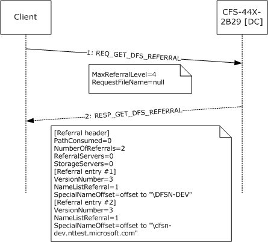

Figure 15: Domain referral sequence

- The client sends a [REQ_GET_DFS_REFERRAL (section 2.2.2)](#Section_2.2.2) to CFS-44X-2B29, a [**DC**](#gt_domain-controller-dc) in the DFSN-DEV.NTTEST.MICROSOFT.COM [**domain**](#gt_domain). The highest [**DFS referral**](#gt_c6f2eabf-2138-4f97-a788-5d6a41a27bdd) version understood by the client is 4, as indicated by the **MaxReferralLevel** field of REQ_GET_DFS_REFERRAL. The [**DFS path**](#gt_151c87db-05a4-40c3-99bd-4b682530d210) specified in the DFS referral request is a 0-length string, indicating a domain referral. To illustrate the effect of a client specifying a referral version that is later than what the server supports, the client's referral version is shown as 4 in this example.
- The DC's response has two referral entries, PathConsumed is 0, ReferralServers and StorageServers bits are set to 0. Each referral entry has the **VersionNumber** field set to 3. While the client's referral version in the request was 4, the server has replied with version 3. The NameListReferral bit is set to 1 in each referral entry. The strings pointed to by the **SpecialNameOffset** field of the individual referral entries are domain names.

## 4.2 DC Referral

The following sequence diagram shows a [**DC**](#gt_domain-controller-dc) referral.

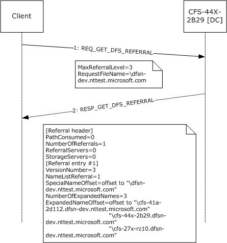

Figure 16: Domain controller referral

- The client sends a [REQ_GET_DFS_REFERRAL (section 2.2.2)](#Section_2.2.2) to CFS-44X-2B29, a DC in the DFSN-DEV domain. The highest [**DFS referral**](#gt_c6f2eabf-2138-4f97-a788-5d6a41a27bdd) version understood by the client is 3, as indicated by the **MaxReferralLevel** field of REQ_GET_DFS_REFERRAL. The [**DFS path**](#gt_151c87db-05a4-40c3-99bd-4b682530d210) specified in the DFS referral request is the string \dfsn-dev.nttest.microsoft.com, indicating a DC referral.
- The DC's response has one referral entry, PathConsumed is 0, ReferralServers and StorageServers bits are set to 0. The referral entry has the **VersionNumber** field set to 3. The NameListReferral bit is set to 1 in the referral entry. The string pointed to by the **SpecialNameOffset** field of the referral entry is the domain name for which the DC list returned. The **NumberOfExpandedNames** field is set to 3, indicating that there are three DCs in the DC list returned. The **ExpandedNameOffset** field in the referral entry points to a sequence of three strings, each of which is a DC name. The DC names returned are in fully qualified domain name format, because the domain name in the request is also in the fully qualified domain name format.

## 4.3 Domain-Based DFS Root Referral

The following sequence diagram shows a root referral for a [**domain-based DFS namespace**](#gt_domain-based-dfs-namespace).

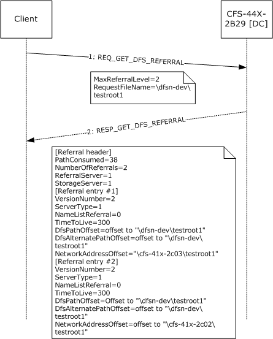

Figure 17: Domain-based DFS root referral

- The client sends a [REQ_GET_DFS_REFERRAL (section 2.2.2)](#Section_2.2.2) to CFS-44X-2B29, a [**DC**](#gt_domain-controller-dc) in the DFSN-DEV [**domain**](#gt_domain). The highest [**DFS referral**](#gt_c6f2eabf-2138-4f97-a788-5d6a41a27bdd) version understood by the client is 2, as indicated by the **MaxReferralLevel** field of REQ_GET_DFS_REFERRAL. The [**DFS path**](#gt_151c87db-05a4-40c3-99bd-4b682530d210) specified in the DFS referral request is \dfsn-dev\testroot1, a domain-based DFS namespace in the DFSN-DEV domain.
- The DC's referral response contains two referral entries, each having referral version 2. The ReferralServers and StorageServers bits are set to 1 and the **ServerType** field is set to 1 in the response since [**DFS root targets**](#gt_ac90b498-3ba4-48d6-bcd6-5495f1654671) are returned. The strings pointed to by the **NetworkAddressOffset** field of the individual referral entries are the DFS root targets for the domain-based DFS namespace.

## 4.4 Domain-Based DFS Link Referral

The following sequence diagram shows a [**DFS link**](#gt_0611e93d-f0e7-42ee-a591-d77ebcbb6619) referral for a [**domain-based DFS namespace**](#gt_domain-based-dfs-namespace).

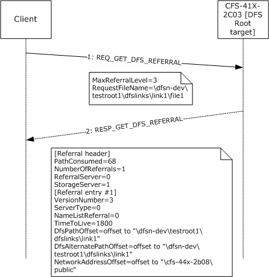

Figure 18: Domain-based DFS link referral

- The client sends a [REQ_GET_DFS_REFERRAL (section 2.2.2)](#Section_2.2.2) to CFS-41X-2C03, a [**DFS root target**](#gt_ac90b498-3ba4-48d6-bcd6-5495f1654671) for the domain-based DFS namespace \\dfsn-dev\testroot1 in the DFSN-DEV [**domain**](#gt_domain). The highest [**DFS referral**](#gt_c6f2eabf-2138-4f97-a788-5d6a41a27bdd) version understood by the client is 3, as indicated by the **MaxReferralLevel** field of REQ_GET_DFS_REFERRAL. The [**DFS path**](#gt_151c87db-05a4-40c3-99bd-4b682530d210) specified in the DFS referral request is \dfsn-dev\testroot1\dfslinks\link1\file1, a path to a file in the [**DFS namespace**](#gt_6a3f0be9-b9b4-49df-9d1c-a3b89e4e9890).
- The DFS root target's referral response contains one referral entry having referral version 3. The ReferralServers bit is set to 0 and StorageServers bit is set to 1 indicating that the target is not another [**DFS root**](#gt_639b7503-b879-4ef7-98a8-14adf85bc16d). The **ServerType** field is set to 0 in the response because a [**DFS link target**](#gt_44e2f830-c28b-41e3-8c3c-d0bb576ed9fb) is returned. The string pointed to by the **NetworkAddressOffset** field of the referral entry is the DFS link target.

## 4.5 Domain-Based DFS Root Referral Packet Trace

The following figure shows the network packet trace of a domain-based [**DFS root**](#gt_639b7503-b879-4ef7-98a8-14adf85bc16d) referral request. The [REQ_DFS_GET_REFERRAL](#Section_2.2.2) structure is at offset 0x7E in the hexadecimal dump shown. **MaxReferralLevel** field is at offset 0x7E (=3) and **RequestFileName** is at offset 0x80 (=\dfsn-dev\testroot1).

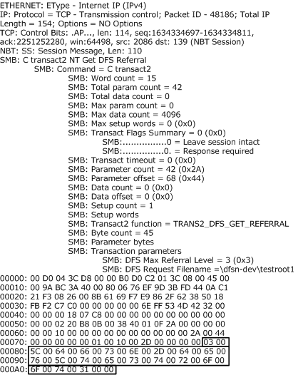

Figure 19: REQ_DFS_GET_REFERRAL packet trace

The following figure shows the network packet dump of a domain-based DFS root referral response. The referral response consists of the [**DFS referral**](#gt_c6f2eabf-2138-4f97-a788-5d6a41a27bdd) header, [RESP_GET_DFS_REFERRAL](#Section_2.2.4) at offset 0x72 in the hexadecimal dump. The **PathConsumed** field is at offset 0x72 (=0x26) and the **NumberOfReferrals** field is at offset 0x74 (=2). The first referral entry, of type [DFS_REFERRAL_V3](#Section_2.2.5.3), starts at 0x7A and the second referral entry, also of type DFS_REFERRAL_V3, starts at offset 0x9C. The referral header and the first referral entry have been marked in the hexadecimal dump for identification purposes. The hexadecimal dump shows that the two referral entries immediately follow one another and all the strings referenced in the referral entries are at the end of all the referral entries, starting at offset 0xBE in the hexadecimal dump.

The **NetworkAddressOffset** field of the first referral entry, containing the offset of the [**DFS root target**](#gt_ac90b498-3ba4-48d6-bcd6-5495f1654671) from the start of the referral entry, is at offset 0x8A. It contains 0x94. The first referral entry is at offset 0x7A. Hence, the DFS root target that corresponds to the first referral entry is at offset 0x7A+0x94=0x10E. The null-terminated [**Unicode**](#gt_unicode) string at offset 0x10E in the hexadecimal dump is \cfs-41x-2c03\testroot1, one of the DFS root targets of the [**domain-based DFS namespace**](#gt_domain-based-dfs-namespace) \\dfsn-dev\testroot1.

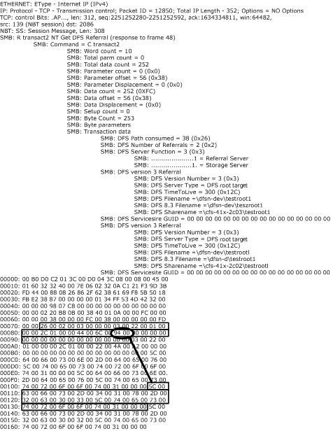

Figure 20: RESP_GET_DFS_REFERRAL packet trace

## 4.6 Standalone DFS Root Referral

The following sequence diagram shows a root referral for a [**stand-alone DFS namespace**](#gt_stand-alone-dfs-namespace).

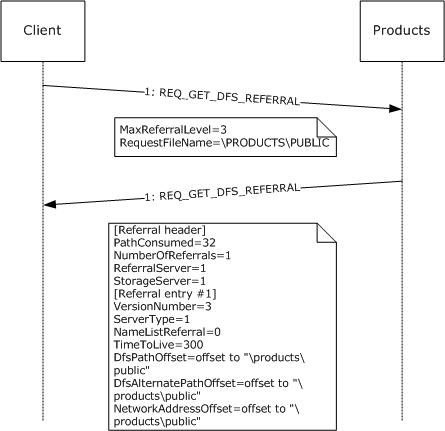

Figure 21: DFS root referral between client and server

The client sends a [REQ_GET_DFS_REFERRAL](#Section_2.2.2) to PRODUCTS. The latest [**DFS referral**](#gt_c6f2eabf-2138-4f97-a788-5d6a41a27bdd) version understood by the client is 3, as indicated by the **MaxReferralLevel** field of REQ_GET_DFS_REFERRAL. The [**DFS path**](#gt_151c87db-05a4-40c3-99bd-4b682530d210) specified in the DFS referral request is \PRODUCTS\PUBLIC, a stand-alone DFS namespace.

The referral response contains one referral entry having a referral version 3. The ReferralServers and StorageServers bits are set to 1, and the **ServerType** field is set to 1 in the response since [**DFS root targets**](#gt_ac90b498-3ba4-48d6-bcd6-5495f1654671) are returned. The strings pointed to by the **NetworkAddressOffset** field of the referral entry is the DFS root target for the stand-alone DFS namespace.

# 5 Security

## 5.1 Security Considerations for Implementers

None.

## 5.2 Index of Security Parameters

None.

# 6 Appendix A: Product Behavior

The information in this specification is applicable to the following Microsoft products or supplemental software. References to product versions include updates to those products.

The terms "earlier" and "later", when used with a product version, refer to either all preceding versions or all subsequent versions, respectively. The term "through" refers to the inclusive range of versions. Applicable Microsoft products are listed chronologically in this section.

- Windows NT Workstation 4.0 operating system
- Windows NT Server 4.0 operating system
- Windows 98 operating system
- Windows 2000 operating system
- Windows Millennium Edition operating system
- Windows XP operating system
- Windows Server 2003 operating system
- Windows Vista operating system
- Windows Server 2008 operating system
- Windows 7 operating system
- Windows Server 2008 R2 operating system
- Windows 8 operating system
- Windows Server 2012 operating system
- Windows 8.1 operating system
- Windows Server 2012 R2 operating system
- Windows 10 operating system
- Windows Server 2016 operating system
- Windows Server operating system
- Windows Server 2019 operating system
- Windows Server 2022 operating system
- Windows 11 operating system
- Windows Server 2025 operating system
Exceptions, if any, are noted in this section. If an update version, service pack or Knowledge Base (KB) number appears with a product name, the behavior changed in that update. The new behavior also applies to subsequent updates unless otherwise specified. If a product edition appears with the product version, behavior is different in that product edition.

Unless otherwise specified, any statement of optional behavior in this specification that is prescribed using the terms "SHOULD" or "SHOULD NOT" implies product behavior in accordance with the SHOULD or SHOULD NOT prescription. Unless otherwise specified, the term "MAY" implies that the product does not follow the prescription.

<1> Section 1.8: Windows uses only the values specified in [MS-ERREF](../MS-ERREF/MS-ERREF.md).

<2> Section 2.2.4: Windows NT Server 4.0, Windows 2000, and Windows Server 2003 insert a variable number of padding bytes.

<3> Section 2.2.5.3.2: Windows 2000 Server operating system and Windows Server 2003 will add 16 bytes of padding after [DFS_REFERRAL_V3](#Section_2.2.5.3) structures in all namelist referral responses. Windows Server 2008 and Windows Server 2008 R2 will add 16 bytes of padding for DFS_REFERRAL_V3 structures in DC referral responses.

<4> Section 3.1.1: The default **TimeToLive** value for root referrals is 300 seconds and the default **TimeToLive** value for link referrals is 1,800 seconds.

<5> Section 3.1.3: Windows clients (Windows 2000 operating system and later, Windows XP operating system and later) use 15 minutes as the default BootstrapDCTimer period. The interval is configurable in Windows by the HKEY_LOCAL_MACHINE\Software\Policies\Microsoft\System\DFSClient\DfsDcNameDelay registry setting.

<6> Section 3.1.4.1: The Windows client returns STATUS_MORE_PROCESSING_REQUIRED to the calling application to indicate that the path does not correspond to a DFS Namespace or a SYSVOL/NETLOGON share, and that the I/O operation is not complete.

<7> Section 3.1.4.2: Windows 8 operating system and later, Windows Server 2012 operating system and later verify the value of UseDcLocatorSiteName under the following registry key. If the value is 1, the test returns TRUE; otherwise, it returns FALSE:

HKLM\SYSTEM\CurrentControlSet\Services\ DfsC\Parameters

All other versions of Windows always return FALSE for this test.

<8> Section 3.1.4.2: Windows 8 and later clients obtain the site name from the SiteName registry value under the following registry key:

HKLM\SYSTEM\CurrentControlSet\Services\ Netlogon\Parameters

<9> Section 3.1.5.1: Except for Windows Millennium Edition, [**DFS link**](#gt_0611e93d-f0e7-42ee-a591-d77ebcbb6619) referral requests to the [**DFS root target**](#gt_ac90b498-3ba4-48d6-bcd6-5495f1654671) server are issued by all Windows operating systems. Windows 98 [**DFS clients**](#gt_c2787719-60e0-4b69-8efe-c33edf9b40b2) issue DFS link referral requests to [**DCs**](#gt_domain-controller-dc) when accessing a [**domain-based DFS namespace**](#gt_domain-based-dfs-namespace).

<10> Section 3.1.5.2: If an I/O operation to a target fails with one of the following error codes, as specified per version of Windows, the client proceeds to the next target. Unless otherwise noted, the code is used in Windows NT 4.0 operating system Service Pack 2 (SP2), Windows 2000 operating system and later, Windows XP operating system and later.

| Status Code | Support Notes |
| --- | --- |
| STATUS_BAD_NETWORK_NAME | - |
| STATUS_BAD_NETWORK_PATH | - |
| STATUS_CONNECTION_DISCONNECTED | Not used in Windows NT 4.0 SP2. |
| STATUS_CONNECTION_REFUSED | Used in Windows Vista operating system and later, Windows Server 2008 operating system and later. |
| STATUS_CONNECTION_RESET | Used in Windows 7 operating system and later, Windows Server 2008 R2 operating system and later. |
| STATUS_DEVICE_OFF_LINE | - |
| STATUS_DFS_UNAVAILABLE | Not used in Windows NT 4.0 SP2. |
| STATUS_DISK_OPERATION_FAILED | - |
| STATUS_DUPLICATE_NAME | Used in Windows Vista operating system and later, Windows Server 2008 operating system and later. |
| STATUS_FS_DRIVER_REQUIRED | Used in Windows 7, Windows Server 2008 R2, Windows 8, Windows Server 2012. |
| STATUS_HOST_UNREACHABLE | Used in Windows Vista, Windows Server 2008, Windows 7, and Windows Server 2008 R2, Windows 8, and Windows Server 2012. |
| STATUS_INSUFFICIENT_RESOURCES | Not used in Windows NT 4.0 SP2. |
| STATUS_INVALID_NETWORK_RESPONSE | - |
| STATUS_IO_REPARSE_TAG_NOT_HANDLED | Used in Windows 7 operating system and later, Windows Server 2008 R2 operating system and later. |
| STATUS_IO_TIMEOUT | - |
| STATUS_NETLOGON_NOT_STARTED | Not used in Windows NT 4.0 SP2. |
| STATUS_NETWORK_BUSY | - |
| STATUS_NETWORK_NAME_DELETED | - |
| STATUS_NETWORK_UNREACHABLE | Not used in Windows NT 4.0 SP2. |
| STATUS_NO_SUCH_DEVICE | - |
| STATUS_NO_SUCH_LOGON_SESSION | Not used in Windows NT 4.0 SP2, Windows 2000, and Windows XP RTM. |
| STATUS_REMOTE_NOT_LISTENING | - |
| STATUS_REQUEST_NOT_ACCEPTED | - |
| STATUS_SHARING_PAUSED | Not used in Windows NT 4.0 SP2. |
| STATUS_UNEXPECTED_NETWORK_ERROR | - |
| STATUS_UNMAPPABLE_CHARACTER | Not used in Windows NT 4.0 SP2. |
| STATUS_USER_SESSION_DELETED | Not used in Windows NT 4.0 SP2 and Windows 2000. |
| STATUS_VIRTUAL_CIRCUIT_CLOSED | - |

<11> Section 3.1.5.4: The initial buffer size used by Windows DFS clients for all DFS referral requests (domain, DC, DFS root, DFS link, and SYSVOL) is 4 KB. Windows DFS clients retry the referral request by doubling the buffer size, up to a maximum of 56 KB.

<12> Section 3.1.5.4.1: Windows clients do not remove an existing [**domain name**](#gt_domain-name) from DomainCache.

<13> Section 3.1.5.4.3: If a referral request to a domain controller fails with one of the following error codes (as specified per version of Windows), the client proceeds to the next target. Unless otherwise noted, the code is used in Windows 2000 operating system and later, Windows XP operating system and later. Note that domain support was not added until Windows 2000, so Windows NT 4.0 SP2 does not apply.

| Status Code | Support Notes |
| --- | --- |
| STATUS_BAD_NETWORK_NAME | Not used. |
| STATUS_BAD_NETWORK_PATH | - |
| STATUS_CONNECTION_DISCONNECTED | - |
| STATUS_CONNECTION_REFUSED | Used in Windows Vista operating system and later, Windows Server 2008 operating system and later. |
| STATUS_CONNECTION_RESET | Used in Windows 7 operating system and later, Windows Server 2008 R2 operating system and later. |
| STATUS_DEVICE_OFF_LINE | - |
| STATUS_DFS_UNAVAILABLE | - |
| STATUS_DISK_OPERATION_FAILED | - |
| STATUS_DUPLICATE_NAME | Used in Windows Vista operating system and later, Windows Server 2008 operating system and later. |
| STATUS_FS_DRIVER_REQUIRED | Used in Windows 7 operating system and later, Windows Server 2008 R2 operating system and later. |
| STATUS_HOST_UNREACHABLE | Used in Windows Vista operating system and later, Windows Server 2008 operating system and later. |
| STATUS_INSUFFICIENT_RESOURCES | - |
| STATUS_INVALID_NETWORK_RESPONSE | - |
| STATUS_IO_REPARSE_TAG_NOT_HANDLED | Used in Windows 7 operating system and later, Windows Server 2008 R2 operating system and later. |
| STATUS_IO_TIMEOUT | - |
| STATUS_NETLOGON_NOT_STARTED | - |
| STATUS_NETWORK_BUSY | - |
| STATUS_NETWORK_NAME_DELETED | - |
| STATUS_NETWORK_UNREACHABLE | - |
| STATUS_NO_SUCH_DEVICE | Not used in Windows 2000 through Windows Server 2003 inclusive. |
| STATUS_NO_SUCH_LOGON_SESSION | Not used in Windows 2000 through Windows Server 2003 inclusive. |
| STATUS_REMOTE_NOT_LISTENING | - |
| STATUS_REQUEST_NOT_ACCEPTED | - |
| STATUS_SHARING_PAUSED | - |
| STATUS_UNEXPECTED_NETWORK_ERROR | - |
| STATUS_UNMAPPABLE_CHARACTER | Not used in Windows 2000 through Windows Server 2003 inclusive. |
| STATUS_USER_SESSION_DELETED | Not used in Windows 2000 through Windows Server 2003 inclusive. |
| STATUS_VIRTUAL_CIRCUIT_CLOSED | - |

<14> Section 3.1.5.4.3: If an I/O operation to a target fails with one of the following error codes, as specified per version of Windows, the client proceeds to the next target. Unless otherwise noted, the code is used in Windows NT 4.0 SP2, Windows 2000 operating system and later, Windows XP operating system and later.

| Status Code | Support Notes |
| --- | --- |
| STATUS_BAD_NETWORK_NAME | Not used. |
| STATUS_BAD_NETWORK_PATH | - |
| STATUS_CONNECTION_DISCONNECTED | Not used in Windows NT 4.0 SP2. |
| STATUS_CONNECTION_REFUSED | Used in Windows Vista operating system and later, Windows Server 2008 operating system and later. |
| STATUS_CONNECTION_RESET | Used in Windows 7 operating system and later, Windows Server 2008 R2 operating system and later. |
| STATUS_DEVICE_OFF_LINE | - |
| STATUS_DFS_UNAVAILABLE | Not used in Windows NT 4.0 SP2. |
| STATUS_DISK_OPERATION_FAILED | - |
| STATUS_DUPLICATE_NAME | Used in Windows Vista operating system and later, Windows Server 2008 operating system and later. |
| STATUS_FS_DRIVER_REQUIRED | Used in Windows 7 operating system and later, Windows Server 2008 R2 operating system and later. |
| STATUS_HOST_UNREACHABLE | Used in Windows Vista operating system and later, Windows Server 2008 operating system and later. |
| STATUS_INSUFFICIENT_RESOURCES | Not used in Windows NT 4.0 SP2. |
| STATUS_INVALID_NETWORK_RESPONSE | - |
| STATUS_IO_REPARSE_TAG_NOT_HANDLED | Used in Windows 7 operating system and later, Windows Server 2008 R2 operating system and later. |
| STATUS_IO_TIMEOUT | - |
| STATUS_NETLOGON_NOT_STARTED | Not used in Windows NT 4.0 SP2. |
| STATUS_NETWORK_BUSY | - |
| STATUS_NETWORK_NAME_DELETED | - |
| STATUS_NETWORK_UNREACHABLE | Not used in Windows NT 4.0 SP2. |
| STATUS_NO_SUCH_DEVICE | - |
| STATUS_NO_SUCH_LOGON_SESSION | Not used in Windows NT 4.0 SP2, Windows 2000, and Windows XP RTM. |
| STATUS_REMOTE_NOT_LISTENING | - |
| STATUS_REQUEST_NOT_ACCEPTED | - |
| STATUS_SHARING_PAUSED | Not used in Windows NT 4.0 SP2. |
| STATUS_UNEXPECTED_NETWORK_ERROR | - |
| STATUS_UNMAPPABLE_CHARACTER | Not used in Windows NT 4.0 SP2. |
| STATUS_USER_SESSION_DELETED | Not used in Windows NT 4.0 SP2 and Windows 2000. |
| STATUS_VIRTUAL_CIRCUIT_CLOSED | - |

<15> Section 3.1.5.4.3: This can happen when the server accessed has been consolidated using DFSN Root Consolidation. The Windows client handles this response in the same way that it handles link referrals that it receives in response to link referral requests.

<16> Section 3.1.5.4.3: Windows Server 2003 and Windows XP DFS clients fail the I/O operation if the ReferralCache entry refresh fails. Windows Vista operating system and later, Windows Server 2008 operating system and later DFS clients use a soft time-out equal to the TTL and a hard time-out equal to 4*TTL.

<17> Section 3.2: **DFS server** functionality is available only Windows NT Server 4.0 operating system with Service Pack 2 (SP2), Windows 2000 Server operating system and later.

Windows client operating systems, such as Windows NT 4.0 operating system Professional, Windows 98 operating system and later do not implement the DFS server functionality.

<18> Section 3.2.5.1: The highest [**DFS referral**](#gt_c6f2eabf-2138-4f97-a788-5d6a41a27bdd) version supported by each version of Windows on which DFS server functionality is implemented is as follows.

| Windows server version | Highest DFS referral version |
| --- | --- |
| Windows NT 4.0 | 2 |
| Windows 2000 Server | 3 |
| Windows Server 2003 | 3 |
| Windows Server 2003 operating system with Service Pack 1 (SP1) | 4 |
| Windows Server 2008 | 4 |
| Windows Server 2008 R2 | 4 |
| Windows Server 2012 | 4 |
| Windows Server 2012 R2 | 4 |
| Windows Server 2016 | 4 |
| Windows Server 2019 | 4 |
| Windows Server 2022 and later | 4 |

<19> Section 3.2.5.1: Windows NT 4.0 SP2, Windows 2000, and Windows Server 2003 insert a variable number of padding bytes.

<20> Section 3.2.5.4: Windows NT Server 4.0, Windows 2000, and Windows Server 2003 fail the referral request with a STATUS_NO_SUCH_DEVICE (0xC000000E) return code.

<21> Section 3.2.5.5: Windows 2000 Server fails the referral request with a STATUS_NO_SUCH_DEVICE (0xC000000E) return code.

<22> Section 3.2.5.5: Windows NT Server 4.0, Windows 2000, Windows Server 2003, Windows Server 2003 R2 operating system, Windows Server 2008, and Windows Server 2008 R2 fail the referral request with a STATUS_NOT_FOUND (0xC0000225) return code.

<23> Section 3.2.5.5: Windows 2000 Server uses the SiteInformationBLOB in the [**DFS metadata**](#gt_e8de88fd-d760-46fa-ad77-76961fa20aea) of a domain-based DFS namespace to determine the site of a [**DFS target**](#gt_dfs-target). Windows Server 2003 operating system and later use the IP address of a DFS target to determine its site.

For interlinks, if the target is a domain-based DFS namespace, there cannot be more than one target for the link. Multiple [**stand-alone DFS namespace**](#gt_stand-alone-dfs-namespace) targets are supported as interlink targets. Therefore, there is no special handling for interlink targets. A referral response returns only the immediate interlink targets, not the targets of the domain-based DFS namespace interlink target itself.

<24> Section 3.2.5.5: Windows 2000 Server does not support [**DFS referral site costing**](#gt_distributed-file-system-dfs-referral-site-costing). Windows Server 2003 operating system and later support DFS referral site costing.

<25> Section 3.2.5.5: **DFS in-site referral mode** is applied only to [**DFS link targets**](#gt_44e2f830-c28b-41e3-8c3c-d0bb576ed9fb) and not to DFS root targets in Windows 2000 Server. DFS in-site referral mode is applied to all targets in Windows Server 2003 operating system and later.

Windows 2000 Server does not support DFS referral site costing. Only Windows Server 2003 operating system and later support DFS referral site costing.

Windows-based servers randomize the order of targets within each [**target set**](#gt_target-set) to spread client load across the targets on a per DFS referral response basis.

<26> Section 3.2.5.5: Windows Server 2003 with SP1, Windows Server 2008 operating system and later, sort targets have non-default priorities as described previously.

<27> Section 3.2.5.5: Windows will silently drop targets that do not fit in the response buffer.

<28> Section 3.2.5.5: Windows Server 2003 with SP1 operating system and later set all other fields to 0. The earlier versions of Windows (Windows NT 4.0 SP2, Windows 2000, Windows Server 2003) allow the other fields to be any value.

<29> Section 3.2.5.5: In Windows NT 4.0 SP2 and Windows 2000, set the **DFSAlternatePathOffset** field to point to an 8.3 string representation of the string pointed to by **DFSPathOffset** if it is not a legal 8.3 string. Otherwise, if **DFSPathOffset** points to a legal 8.3 string, **DFSAlternatePathOffset** points to a separate copy of the same string. Windows Server 2003 operating system and later set the **DFSPathOffset** field and the **DFSAlternatePathOffset** field to point to separate copies of the identical string.

<30> Section 3.2.5.5: By default, Windows Server 2003, Windows Server 2008, Windows Server 2008 R2, Windows Server 2012, and Windows Server 2012 R2 return DNS [**host names**](#gt_host-name) that are not fully qualified for targets.

<31> Section 3.3: DCs are supported only on Windows 2000 Server operating system and later.

<32> Section 3.3.3: On Windows-based domain controllers, preferred logon is enabled with the PreferLogonDC registry setting (see [[KB831201]](https://go.microsoft.com/fwlink/?LinkId=193454)).

<33> Section 3.3.5.2: Windows-based servers have a server-side limit of 56 KB on the maximum size of a domain referral response. Within that limit, the server attempts to return all the domain names that it has. If the size of the domain referral entries is greater than 56 KB, it retains only 56 KB.

<34> Section 3.3.5.2: Windows Server 2008 operating system and later fail the DFS referral request when the value received in the **MaxReferralLevel** field of [REQ_GET_DFS_REFERRAL (section 2.2.2)](#Section_2.2.2) is less than 3. The earlier versions of Windows (Windows NT 4.0 SP2, Windows 2000, Windows Server 2003) return the referral formatted in the requested version.

<35> Section 3.3.5.2: Windows-based servers have a server-side limit of 56 KB on the maximum size of a domain referral response. Within that limit, the server attempts to return all the domain names that it has. If the size of the domain referral entries is greater than 56 KB, it retains only 56 KB.

<36> Section 3.3.5.2: Windows returns a fixed value of 600 seconds.

<37> Section 3.3.5.3: Windows NT Server 4.0 SP2, Windows 2000, and Windows Server 2003 do not fail the request if the **MaxReferralLevel** field of REQ_GET_DFS_REFERRAL (section 2.2.2) is less than 3, and the referral response is returned formatted appropriately for the requested version.

<38> Section 3.3.5.3: Windows returns a fixed value of 600 seconds.

<39> Section 3.3.5.3: On Windows-based domain controllers, Distributed File System (DFS) referral site costing is enabled by setting the SiteCostedReferrals value in the registry key HKEY_LOCAL_MACHINE\SYSTEM\CurrentControlSet\Services\Dfs\Parameters\ to 1.

<40> Section 3.3.5.4: Windows 2000 Server does not support DFS referral site costing for sysvol referral responses. Windows Server 2003 and subsequent versions, including Windows Server 2008 operating system and later can be configured to support DFS referral site costing for sysvol referral responses. DFS referral site costing is disabled by default in Windows Server 2003 and enabled by default in Windows Server 2008 operating system and later. Set the registry value SiteCostedReferrals under the registry key HKEY_LOCAL_MACHINE\System\CurrentControlSet-\Services-\Dfs\Parameters to 1 at service startup to enable DFS referral site costing for sysvol referral responses in Windows Server 2003 versions.

<41> Section 3.3.5.4: Windows 2000 Server does not support DFS referral site costing. Windows Server 2003 operating system and later support DFS referral site costing.

<42> Section 3.3.5.4: On Windows-based domain controllers, DFS referral site costing is enabled by setting the SiteCostedReferrals value in the registry key HKEY_LOCAL_MACHINE\SYSTEM\CurrentControlSet\Services\Dfs\Parameters\ to 1.

<43> Section 3.3.5.4: In Windows Server 2003 with SP1 and subsequent versions, the registry value SysvolNetlogonTargetFailback under the registry key HKEY_LOCAL_MACHINE\System\CurrentControlSet\Services\Dfs\Parameters controls target failback for sysvol referrals.

<44> Section 3.3.5.4: Windows sets the **TimeToLive** field to a fixed value of 900 seconds.

<45> Section 3.3.5.4: In Windows NT 4.0 SP2 and Windows 2000, set the **DFSAlternatePathOffset** field to point to an 8.3 string representation of the string pointed to by **DFSPathOffset** if it is not a legal 8.3 string. Otherwise, if **DFSPathOffset** points to a legal 8.3 string, **DFSAlternatePathOffset** points to a separate copy of the same string. Windows Server 2003 operating system and later set the **DFSPathOffset** field and the **DFSAlternatePathOffset** field to point to separate copies of the identical string.

<46> Section 3.3.5.5: Windows 2000 Server fails the referral request with a STATUS_NO_SUCH_DEVICE (0xC000000E) return code. Windows Server 2003 fails the referral request with a STATUS_UNSUCCESSFUL (0xC0000001) return code.

# 7 Change Tracking

No table of changes is available. The document is either new or has had no changes since its last release.

## Revision History

| Date | Version | Revision Class | Comments |
| --- | --- | --- | --- |
| 3/2/2007 | 0.01 | New | Version 0.01 release |
| 6/1/2007 | 1.0 | Major | Updated and revised the technical content. |
| 7/3/2007 | 1.0.1 | Editorial | Changed language and formatting in the technical content. |
| 7/20/2007 | 2.0 | Major | Updated and revised the technical content. |
| 8/10/2007 | 3.0 | Major | Updated and revised the technical content. |
| 9/28/2007 | 3.0.1 | Editorial | Changed language and formatting in the technical content. |
| 10/23/2007 | 3.1 | Minor | Clarified the meaning of the technical content. |
| 11/30/2007 | 3.1.1 | Editorial | Changed language and formatting in the technical content. |
| 1/25/2008 | 3.1.2 | Editorial | Changed language and formatting in the technical content. |
| 3/14/2008 | 3.1.3 | Editorial | Changed language and formatting in the technical content. |
| 5/16/2008 | 3.1.4 | Editorial | Changed language and formatting in the technical content. |
| 6/20/2008 | 3.1.5 | Editorial | Changed language and formatting in the technical content. |
| 7/25/2008 | 4.0 | Major | Updated and revised the technical content. |
| 8/29/2008 | 5.0 | Major | Updated and revised the technical content. |
| 10/24/2008 | 5.0.1 | Editorial | Changed language and formatting in the technical content. |
| 12/5/2008 | 6.0 | Major | Updated and revised the technical content. |
| 1/16/2009 | 7.0 | Major | Updated and revised the technical content. |
| 2/27/2009 | 8.0 | Major | Updated and revised the technical content. |
| 4/10/2009 | 8.0.1 | Editorial | Changed language and formatting in the technical content. |
| 5/22/2009 | 9.0 | Major | Updated and revised the technical content. |
| 7/2/2009 | 9.0.1 | Editorial | Changed language and formatting in the technical content. |
| 8/14/2009 | 9.0.2 | Editorial | Changed language and formatting in the technical content. |
| 9/25/2009 | 9.1 | Minor | Clarified the meaning of the technical content. |
| 11/6/2009 | 9.1.1 | Editorial | Changed language and formatting in the technical content. |
| 12/18/2009 | 10.0 | Major | Updated and revised the technical content. |
| 1/29/2010 | 11.0 | Major | Updated and revised the technical content. |
| 3/12/2010 | 12.0 | Major | Updated and revised the technical content. |
| 4/23/2010 | 12.0.1 | Editorial | Changed language and formatting in the technical content. |
| 6/4/2010 | 13.0 | Major | Updated and revised the technical content. |
| 7/16/2010 | 13.1 | Minor | Clarified the meaning of the technical content. |
| 8/27/2010 | 13.2 | Minor | Clarified the meaning of the technical content. |
| 10/8/2010 | 13.2 | None | No changes to the meaning, language, or formatting of the technical content. |
| 11/19/2010 | 14.0 | Major | Updated and revised the technical content. |
| 1/7/2011 | 15.0 | Major | Updated and revised the technical content. |
| 2/11/2011 | 16.0 | Major | Updated and revised the technical content. |
| 3/25/2011 | 17.0 | Major | Updated and revised the technical content. |
| 5/6/2011 | 17.0 | None | No changes to the meaning, language, or formatting of the technical content. |
| 6/17/2011 | 17.1 | Minor | Clarified the meaning of the technical content. |
| 9/23/2011 | 17.1 | None | No changes to the meaning, language, or formatting of the technical content. |
| 12/16/2011 | 18.0 | Major | Updated and revised the technical content. |
| 3/30/2012 | 18.0 | None | No changes to the meaning, language, or formatting of the technical content. |
| 7/12/2012 | 19.0 | Major | Updated and revised the technical content. |
| 10/25/2012 | 20.0 | Major | Updated and revised the technical content. |
| 1/31/2013 | 21.0 | Major | Updated and revised the technical content. |
| 8/8/2013 | 22.0 | Major | Updated and revised the technical content. |
| 11/14/2013 | 23.0 | Major | Updated and revised the technical content. |
| 2/13/2014 | 24.0 | Major | Updated and revised the technical content. |
| 5/15/2014 | 24.0 | None | No changes to the meaning, language, or formatting of the technical content. |
| 6/30/2015 | 25.0 | Major | Significantly changed the technical content. |
| 10/16/2015 | 25.0 | None | No changes to the meaning, language, or formatting of the technical content. |
| 7/14/2016 | 25.0 | None | No changes to the meaning, language, or formatting of the technical content. |
| 6/1/2017 | 26.0 | Major | Significantly changed the technical content. |
| 9/15/2017 | 27.0 | Major | Significantly changed the technical content. |
| 12/1/2017 | 27.0 | None | No changes to the meaning, language, or formatting of the technical content. |
| 9/12/2018 | 28.0 | Major | Significantly changed the technical content. |
| 4/7/2021 | 29.0 | Major | Significantly changed the technical content. |
| 6/25/2021 | 30.0 | Major | Significantly changed the technical content. |
| 4/23/2024 | 31.0 | Major | Significantly changed the technical content. |
| 9/16/2024 | 31.0 | None | No changes to the meaning, language, or formatting of the technical content. |
