# [MS-DFSNM]: Distributed File System (DFS): Namespace Management Protocol

Table of Contents

1 Introduction

- [1 Introduction](#Section_1)
  - [1.1 Glossary](#Section_1.1)
  - [1.2 References](#Section_1.2)
    - [1.2.1 Normative References](#Section_1.2.1)
    - [1.2.2 Informative References](#Section_1.2.2)
  - [1.3 Overview](#Section_1.3)
  - [1.4 Relationship to Other Protocols](#Section_1.4)
  - [1.5 Prerequisites/Preconditions](#Section_1.5)
  - [1.6 Applicability Statement](#Section_1.6)
  - [1.7 Versioning and Capability Negotiation](#Section_1.7)
  - [1.8 Vendor-Extensible Fields](#Section_1.8)
  - [1.9 Standards Assignments](#Section_1.9)

2 Messages

- [2 Messages](#Section_2)
  - [2.1 Transport](#Section_2.1)
  - [2.2 Common Data Types](#Section_2.2)
    - [2.2.1 Common Conventions](#Section_2.2.1)
      - [2.2.1.1 Host Name](#Section_2.2.1.1)
      - [2.2.1.2 Share Name](#Section_2.2.1.2)
      - [2.2.1.3 Domain Name](#Section_2.2.1.3)
      - [2.2.1.4 UNC Path](#Section_2.2.1.4)
      - [2.2.1.5 DFS Root](#Section_2.2.1.5)
      - [2.2.1.6 DFS Link](#Section_2.2.1.6)
      - [2.2.1.7 DFS Root Target](#Section_2.2.1.7)
      - [2.2.1.8 DFS Link Target](#Section_2.2.1.8)
      - [2.2.1.9 DFS Target](#Section_2.2.1.9)
    - [2.2.2 Common Data Types](#Section_2.2.2)
      - [2.2.2.1 NET_API_STATUS](#Section_2.2.2.1)
      - [2.2.2.2 NETDFS_SERVER_OR_DOMAIN_HANDLE](#Section_2.2.2.2)
      - [2.2.2.3 DFS_INFO_STRUCT](#Section_2.2.2.3)
      - [2.2.2.4 DFS_INFO_ENUM_STRUCT](#Section_2.2.2.4)
      - [2.2.2.5 DFS_STORAGE_INFO](#Section_2.2.2.5)
      - [2.2.2.6 DFS_STORAGE_INFO_1](#Section_2.2.2.6)
      - [2.2.2.7 DFS_TARGET_PRIORITY](#Section_2.2.2.7)
      - [2.2.2.8 DFS_TARGET_PRIORITY_CLASS](#Section_2.2.2.8)
      - [2.2.2.9 DFSM_ROOT_LIST](#Section_2.2.2.9)
      - [2.2.2.10 DFSM_ROOT_LIST_ENTRY](#Section_2.2.2.10)
      - [2.2.2.11 DFS_NAMESPACE_VERSION_ORIGIN](#Section_2.2.2.11)
      - [2.2.2.12 DFS_SUPPORTED_NAMESPACE_VERSION_INFO](#Section_2.2.2.12)
      - [2.2.2.13 DFS Volume State](#Section_2.2.2.13)
    - [2.2.3 Get Info Data Types](#Section_2.2.3)
      - [2.2.3.1 DFS_INFO_1](#Section_2.2.3.1)
      - [2.2.3.2 DFS_INFO_2](#Section_2.2.3.2)
      - [2.2.3.3 DFS_INFO_3](#Section_2.2.3.3)
      - [2.2.3.4 DFS_INFO_4](#Section_2.2.3.4)
      - [2.2.3.5 DFS_INFO_5](#Section_2.2.3.5)
      - [2.2.3.6 DFS_INFO_6](#Section_2.2.3.6)
      - [2.2.3.7 DFS_INFO_7](#Section_2.2.3.7)
      - [2.2.3.8 DFS_INFO_8](#Section_2.2.3.8)
      - [2.2.3.9 DFS_INFO_9](#Section_2.2.3.9)
      - [2.2.3.10 DFS_INFO_50](#Section_2.2.3.10)
    - [2.2.4 Set Info Data Types](#Section_2.2.4)
      - [2.2.4.1 DFS_INFO_101](#Section_2.2.4.1)
      - [2.2.4.2 DFS_INFO_102](#Section_2.2.4.2)
      - [2.2.4.3 DFS_INFO_103](#Section_2.2.4.3)
      - [2.2.4.4 DFS_INFO_104](#Section_2.2.4.4)
      - [2.2.4.5 DFS_INFO_105](#Section_2.2.4.5)
      - [2.2.4.6 DFS_INFO_106](#Section_2.2.4.6)
      - [2.2.4.7 DFS_INFO_107](#Section_2.2.4.7)
    - [2.2.5 Special Info Data Types](#Section_2.2.5)
      - [2.2.5.1 DFS_INFO_100](#Section_2.2.5.1)
      - [2.2.5.2 DFS_INFO_150](#Section_2.2.5.2)
      - [2.2.5.3 DFS_INFO_200](#Section_2.2.5.3)
      - [2.2.5.4 DFS_INFO_300](#Section_2.2.5.4)
    - [2.2.6 Enum Info Data Types](#Section_2.2.6)
      - [2.2.6.1 DFS_INFO_1_CONTAINER](#Section_2.2.6.1)
      - [2.2.6.2 DFS_INFO_2_CONTAINER](#Section_2.2.6.2)
      - [2.2.6.3 DFS_INFO_3_CONTAINER](#Section_2.2.6.3)
      - [2.2.6.4 DFS_INFO_4_CONTAINER](#Section_2.2.6.4)
      - [2.2.6.5 DFS_INFO_5_CONTAINER](#Section_2.2.6.5)
      - [2.2.6.6 DFS_INFO_6_CONTAINER](#Section_2.2.6.6)
      - [2.2.6.7 DFS_INFO_8_CONTAINER](#Section_2.2.6.7)
      - [2.2.6.8 DFS_INFO_9_CONTAINER](#Section_2.2.6.8)
      - [2.2.6.9 DFS_INFO_200_CONTAINER](#Section_2.2.6.9)
      - [2.2.6.10 DFS_INFO_300_CONTAINER](#Section_2.2.6.10)
  - [2.3 Directory Service Schema Elements](#Section_2.3)
    - [2.3.1 DFS Configuration Container](#Section_2.3.1)
    - [2.3.2 LDAP Entries for Domain-Based DFS Namespaces](#Section_2.3.2)
    - [2.3.3 DFS Namespace Object for Domainv1-Based DFS Namespace](#Section_2.3.3)
      - [2.3.3.1 pKT Attribute Contents (Metadata for Domainv1-Based Namespace)](#Section_2.3.3.1)
        - [2.3.3.1.1 DFSNamespaceElementBLOB](#Section_2.3.3.1.1)
          - [2.3.3.1.1.1 DFSNamespaceRootBLOB or DFSNamespaceLinkBLOB](#Section_2.3.3.1.1.1)
          - [2.3.3.1.1.2 DFSRootOrLinkIDBLOB](#Section_2.3.3.1.1.2)
          - [2.3.3.1.1.3 DFSTargetListBLOB](#Section_2.3.3.1.1.3)
            - [2.3.3.1.1.3.1 TargetEntryBLOB](#Section_2.3.3.1.1.3.1)
          - [2.3.3.1.1.4 SiteInformationBLOB](#Section_2.3.3.1.1.4)
            - [2.3.3.1.1.4.1 SiteEntryBLOB](#Section_2.3.3.1.1.4.1)
              - [2.3.3.1.1.4.1.1 SiteNameInfoBLOB](#Section_2.3.3.1.1.4.1.1)
    - [2.3.4 Schema for Domainv2-Based DFS Namespace](#Section_2.3.4)
      - [2.3.4.1 LDAP Entry for Domainv2-Based DFS Namespace Anchor](#Section_2.3.4.1)
      - [2.3.4.2 LDAP Entry for Domainv2-Based DFS Namespace](#Section_2.3.4.2)
      - [2.3.4.3 LDAP Entry for Domainv2-Based DFS Link](#Section_2.3.4.3)
      - [2.3.4.4 LDAP Entry for Domainv2-Based Deleted Link](#Section_2.3.4.4)

3 Protocol Details

- [3 Protocol Details](#Section_3)
  - [3.1 Server Details](#Section_3.1)
    - [3.1.1 Abstract Data Model](#Section_3.1.1)
      - [3.1.1.1 Global](#Section_3.1.1.1)
      - [3.1.1.2 Per Namespace](#Section_3.1.1.2)
      - [3.1.1.3 Per NamespaceElement](#Section_3.1.1.3)
      - [3.1.1.4 Per TargetsList](#Section_3.1.1.4)
      - [3.1.1.5 Per Target](#Section_3.1.1.5)
    - [3.1.2 Timers](#Section_3.1.2)
    - [3.1.3 Initialization](#Section_3.1.3)
    - [3.1.4 Message Processing Events and Sequencing Rules](#Section_3.1.4)
      - [3.1.4.1 Basic Methods](#Section_3.1.4.1)
        - [3.1.4.1.1 NetrDfsManagerInitialize (Opnum 14)](#Section_3.1.4.1.1)
        - [3.1.4.1.2 NetrDfsManagerGetVersion (Opnum 0)](#Section_3.1.4.1.2)
        - [3.1.4.1.3 NetrDfsAdd (Opnum 1)](#Section_3.1.4.1.3)
        - [3.1.4.1.4 NetrDfsRemove (Opnum 2)](#Section_3.1.4.1.4)
        - [3.1.4.1.5 NetrDfsSetInfo (Opnum 3)](#Section_3.1.4.1.5)
        - [3.1.4.1.6 NetrDfsGetInfo (Opnum 4)](#Section_3.1.4.1.6)
        - [3.1.4.1.7 NetrDfsEnum (Opnum 5)](#Section_3.1.4.1.7)
        - [3.1.4.1.8 NetrDfsMove (Opnum 6)](#Section_3.1.4.1.8)
        - [3.1.4.1.9 NetrDfsAddRootTarget (Opnum 23)](#Section_3.1.4.1.9)
        - [3.1.4.1.10 NetrDfsRemoveRootTarget (Opnum 24)](#Section_3.1.4.1.10)
        - [3.1.4.1.11 NetrDfsGetSupportedNamespaceVersion (Opnum 25)](#Section_3.1.4.1.11)
      - [3.1.4.2 Extended Methods](#Section_3.1.4.2)
        - [3.1.4.2.1 NetrDfsAdd2 (Opnum 19)](#Section_3.1.4.2.1)
        - [3.1.4.2.2 NetrDfsRemove2 (Opnum 20)](#Section_3.1.4.2.2)
        - [3.1.4.2.3 NetrDfsEnumEx (Opnum 21)](#Section_3.1.4.2.3)
        - [3.1.4.2.4 NetrDfsSetInfo2 (Opnum 22)](#Section_3.1.4.2.4)
      - [3.1.4.3 Root Target Methods](#Section_3.1.4.3)
        - [3.1.4.3.1 NetrDfsAddFtRoot (Opnum 10)](#Section_3.1.4.3.1)
        - [3.1.4.3.2 NetrDfsRemoveFtRoot (Opnum 11)](#Section_3.1.4.3.2)
        - [3.1.4.3.3 NetrDfsFlushFtTable (Opnum 18)](#Section_3.1.4.3.3)
      - [3.1.4.4 Stand-Alone Namespace Methods](#Section_3.1.4.4)
        - [3.1.4.4.1 NetrDfsAddStdRoot (Opnum 12)](#Section_3.1.4.4.1)
        - [3.1.4.4.2 NetrDfsRemoveStdRoot (Opnum 13)](#Section_3.1.4.4.2)
        - [3.1.4.4.3 NetrDfsAddStdRootForced (Opnum 15)](#Section_3.1.4.4.3)
      - [3.1.4.5 Domain-Based Namespace Methods](#Section_3.1.4.5)
        - [3.1.4.5.1 NetrDfsGetDcAddress (Opnum 16)](#Section_3.1.4.5.1)
        - [3.1.4.5.2 NetrDfsSetDcAddress (Opnum 17)](#Section_3.1.4.5.2)
    - [3.1.5 Timer Events](#Section_3.1.5)
    - [3.1.6 Other Local Events](#Section_3.1.6)
  - [3.2 Client Details](#Section_3.2)
    - [3.2.1 Abstract Data Model](#Section_3.2.1)
    - [3.2.2 Timers](#Section_3.2.2)
    - [3.2.3 Initialization](#Section_3.2.3)
    - [3.2.4 Message Processing Events and Sequencing Rules](#Section_3.2.4)
      - [3.2.4.1 Basic Methods](#Section_3.2.4.1)
        - [3.2.4.1.1 NetrDfsAdd (Opnum 1)](#Section_3.2.4.1.1)
        - [3.2.4.1.2 NetrDfsRemove (Opnum 2)](#Section_3.2.4.1.2)
        - [3.2.4.1.3 NetrDfsSetInfo (Opnum 3)](#Section_3.2.4.1.3)
        - [3.2.4.1.4 NetrDfsEnum (Opnum 5) and NetrDfsEnumEx (Opnum 21)](#Section_3.2.4.1.4)
      - [3.2.4.2 Extended Methods](#Section_3.2.4.2)
        - [3.2.4.2.1 NetrDfsAdd2 (Opnum 19)](#Section_3.2.4.2.1)
        - [3.2.4.2.2 NetrDfsRemove2 (Opnum 20)](#Section_3.2.4.2.2)
        - [3.2.4.2.3 NetrDfsSetInfo2 (Opnum 22)](#Section_3.2.4.2.3)
      - [3.2.4.3 Root Target Methods](#Section_3.2.4.3)
        - [3.2.4.3.1 NetrDfsAddFtRoot (Opnum 10)](#Section_3.2.4.3.1)
        - [3.2.4.3.2 NetrDfsRemoveFtRoot (Opnum 11)](#Section_3.2.4.3.2)
    - [3.2.5 Timer Events](#Section_3.2.5)
    - [3.2.6 Other Local Events](#Section_3.2.6)
  - [3.3 Domain Controller Details](#Section_3.3)
    - [3.3.1 Abstract Data Model](#Section_3.3.1)
    - [3.3.2 Timers](#Section_3.3.2)
    - [3.3.3 Initialization](#Section_3.3.3)
    - [3.3.4 Message Processing Events and Sequencing Rules](#Section_3.3.4)
      - [3.3.4.1 Basic Methods](#Section_3.3.4.1)
        - [3.3.4.1.1 NetrDfsRemoveRootTarget (Opnum 24)](#Section_3.3.4.1.1)
      - [3.3.4.2 Extended Methods](#Section_3.3.4.2)
        - [3.3.4.2.1 NetrDfsEnumEx (Opnum 21)](#Section_3.3.4.2.1)
      - [3.3.4.3 Root Target Methods](#Section_3.3.4.3)
        - [3.3.4.3.1 NetrDfsRemoveFtRoot (Opnum 11)](#Section_3.3.4.3.1)
        - [3.3.4.3.2 NetrDfsFlushFtTable (Opnum 18)](#Section_3.3.4.3.2)
    - [3.3.5 Timer Events](#Section_3.3.5)
    - [3.3.6 Other Local Events](#Section_3.3.6)

4 Protocol Examples

- [4 Protocol Examples](#Section_4)
  - [4.1 Creating a New Domainv1-Based DFS Namespace](#Section_4.1)
  - [4.2 Adding a Root Target to an Existing Domainv1-Based DFS Namespace](#Section_4.2)
  - [4.3 Adding a New Link to a Domain-Based DFS Namespace](#Section_4.3)
  - [4.4 Creating a New Domainv2-Based DFS Namespace](#Section_4.4)
  - [4.5 Adding a Root Target to an Existing Domainv2-Based DFS Namespace](#Section_4.5)
  - [4.6 Adding a New Link to a Domainv2-Based DFS Namespace](#Section_4.6)
  - [4.7 Enumerating DFS Links in a Domain-Based DFS Namespace](#Section_4.7)
  - [4.8 DFS Metadata of a Domainv1-Based DFS Namespace](#Section_4.8)

5 Security

- [5 Security](#Section_5)
  - [5.1 Security Considerations for Implementers](#Section_5.1)
  - [5.2 Index of Security Parameters](#Section_5.2)

6 Appendix A: Full IDL

- [6 Appendix A: Full IDL](#Section_6)

7 Appendix B: Product Behavior

- [7 Appendix B: Product Behavior](#Section_7)

8 Appendix C: XML Schema of XML Document Stored in msDFS-TargetListv2 Attribute

- [8 Appendix C: XML Schema of XML Document Stored in msDFS-TargetListv2 Attribute](#Section_8)

9 Change Tracking

- [9 Change Tracking](#Section_9)

For the legal notice and IP terms, see [LEGAL.md](../LEGAL.md).
Last updated: 4/23/2024.
See [Revision History](#revision-history) for full version history.

# 1 Introduction

The Distributed File System (DFS): Namespace Management Protocol provides a [**remote procedure call (RPC)**](#gt_remote-procedure-call-rpc) interface for administering [**DFS**](#gt_distributed-file-system-dfs) configurations. The client is an application that issues method calls on the RPC interface to administer DFS. The server is a DFS service that implements support for this RPC interface for administering DFS.

Sections 1.5, 1.8, 1.9, 2, and 3 of this specification are normative. All other sections and examples in this specification are informative.

## 1.1 Glossary

This document uses the following terms:

**8.3 name**: A file name string restricted in length to 12 characters that includes a base name of up to eight characters, one character for a period, and up to three characters for a file name extension. For more information on 8.3 file names, see [MS-CIFS](../MS-CIFS/MS-CIFS.md) section 2.2.1.1.1.

**Access Based Directory Enumeration (ABDE) mode**: A mode where the server filters directory entries according to the access permissions of the client. In a [**DFS**](#gt_distributed-file-system-dfs) scenario, ABDE mode is enabled on the [**DFS root target**](#gt_ac90b498-3ba4-48d6-bcd6-5495f1654671) [**share**](#gt_share) to prevent a user from seeing another user's home directory. The [**DFS namespace**](#gt_6a3f0be9-b9b4-49df-9d1c-a3b89e4e9890) administrator can create a [**DFS link**](#gt_0611e93d-f0e7-42ee-a591-d77ebcbb6619) for a user (or user group), and a user is granted appropriate rights to the [**DFS link**](#gt_0611e93d-f0e7-42ee-a591-d77ebcbb6619).

**access control list (ACL)**: A list of access control entries (ACEs) that collectively describe the security rules for authorizing access to some resource; for example, an object or set of objects.

**Active Directory**: The Windows implementation of a general-purpose [**directory service**](#gt_directory-service-ds), which uses [**LDAP**](#gt_lightweight-directory-access-protocol-ldap) as its primary access protocol. [**Active Directory**](#gt_active-directory) stores information about a variety of [**objects**](#gt_object) in the network such as user accounts, computer accounts, groups, and all related credential information used by Kerberos [MS-KILE](../MS-KILE/MS-KILE.md). [**Active Directory**](#gt_active-directory) is either deployed as [**Active Directory Domain Services (AD DS)**](#gt_active-directory-domain-services-ad-ds) or Active Directory Lightweight Directory Services (AD LDS), which are both described in [MS-ADOD](../MS-ADOD/MS-ADOD.md): Active Directory Protocols Overview.

**Active Directory Domain Services (AD DS)**: A [**directory service (DS)**](#gt_directory-service-ds) implemented by a [**domain controller (DC)**](#gt_domain-controller-dc). The [**DS**](#gt_directory-service-ds) provides a data store for [**objects**](#gt_object) that is distributed across multiple [**DCs**](#gt_domain-controller-dc). The [**DCs**](#gt_domain-controller-dc) interoperate as peers to ensure that a local change to an [**object**](#gt_object) replicates correctly across [**DCs**](#gt_domain-controller-dc). AD DS is a deployment of [**Active Directory**](#gt_active-directory) [MS-ADTS](../MS-ADTS/MS-ADTS.md).

**authentication level**: A numeric value indicating the level of authentication or message protection that [**remote procedure call (RPC)**](#gt_remote-procedure-call-rpc) will apply to a specific message exchange. For more information, see [[C706]](https://go.microsoft.com/fwlink/?LinkId=89824) section 13.1.2.1 and [MS-RPCE](../MS-RPCE/MS-RPCE.md).

**binary large object (BLOB)**: A discrete packet of data that is stored in a database and is treated as a sequence of uninterpreted bytes.

**clustered DFS namespace**: A [**stand-alone DFS namespace**](#gt_stand-alone-dfs-namespace) that is hosted on a file server cluster.

**Coordinated Universal Time (UTC)**: A high-precision atomic time standard that approximately tracks Universal Time (UT). It is the basis for legal, civil time all over the Earth. Time zones around the world are expressed as positive and negative offsets from UTC. In this role, it is also referred to as Zulu time (Z) and Greenwich Mean Time (GMT). In these specifications, all references to UTC refer to the time at UTC-0 (or GMT).

**DFS namespace name**: The second path component of a [**DFS path**](#gt_151c87db-05a4-40c3-99bd-4b682530d210). In the [**DFS path**](#gt_151c87db-05a4-40c3-99bd-4b682530d210) \\MyDomain\MyDfs\MyDir, the DFS namespace name is MyDfs.

**DFS server**: A server computer that runs the [**DFS**](#gt_distributed-file-system-dfs) service required to respond to [**DFS referral**](#gt_c6f2eabf-2138-4f97-a788-5d6a41a27bdd) requests. Also interchangeably used to refer to the [**DFS**](#gt_distributed-file-system-dfs) service itself.

**DFS target**: Either a [**DFS root target**](#gt_ac90b498-3ba4-48d6-bcd6-5495f1654671) server or a [**DFS link target**](#gt_44e2f830-c28b-41e3-8c3c-d0bb576ed9fb) server.

**directory service (DS)**: A service that stores and organizes information about a computer network's users and network shares, and that allows network administrators to manage users' access to the shares. See also [**Active Directory**](#gt_active-directory).

**distinguished name (DN)**: A name that uniquely identifies an object by using the [**relative distinguished name (RDN)**](#gt_relative-distinguished-name-rdn) for the object, and the names of container objects and domains that contain the object. The distinguished name (DN) identifies the object and its location in a tree.

**Distributed File System (DFS)**: A file system that logically groups physical shared folders located on different servers by transparently connecting them to one or more hierarchical namespaces. [**DFS**](#gt_distributed-file-system-dfs) also provides fault-tolerance and load-sharing capabilities.

**Distributed File System (DFS) client**: A computer that is used to access a [**DFS**](#gt_distributed-file-system-dfs) namespace. It also can refer to the [**DFS**](#gt_distributed-file-system-dfs) software on a client that accesses the [**DFS**](#gt_distributed-file-system-dfs) namespace.

**Distributed File System (DFS) client target failback**: An optional feature that, when enabled, permits a [**DFS**](#gt_distributed-file-system-dfs) client to revert to a more optimal DFS target at an appropriate time after a DFS client target failover. The term "failback" refers to [**DFS client target failback**](#gt_506d8850-6fcd-469a-b837-da4aaadf7ec6). The DFS Referral Protocol, as specified in [MS-DFSC](../MS-DFSC/MS-DFSC.md), describes the mechanisms by which a DFS server provides a list of DFS targets in decreasing order of optimality to the client.

**Distributed File System (DFS) in-site referral mode**: A mode in which [**DFS root**](#gt_639b7503-b879-4ef7-98a8-14adf85bc16d) or [**DFS link**](#gt_0611e93d-f0e7-42ee-a591-d77ebcbb6619) referral requests to a DFS server result in [**DFS referral**](#gt_c6f2eabf-2138-4f97-a788-5d6a41a27bdd) responses with only those DFS targets in the same [**Active Directory Domain Services (AD DS)**](#gt_active-directory-domain-services-ad-ds) site as the [**DFS client**](#gt_c2787719-60e0-4b69-8efe-c33edf9b40b2) requesting the DFS referral. When this mode is disabled, there is no restriction on the AD DS site of the targets returned in the referral response. This can be enabled per [**DFS namespace**](#gt_6a3f0be9-b9b4-49df-9d1c-a3b89e4e9890). If there are no DFS targets in the same AD DS site as the client, the DFS referral response could be empty.

**Distributed File System (DFS) interlink**: A special form of [**DFS link**](#gt_0611e93d-f0e7-42ee-a591-d77ebcbb6619) whose link target is a DFS domain-based namespace.

**Distributed File System (DFS) link**: A component in a [**DFS path**](#gt_151c87db-05a4-40c3-99bd-4b682530d210) that lies below the [**DFS root**](#gt_639b7503-b879-4ef7-98a8-14adf85bc16d) and maps to one or more [**DFS link targets**](#gt_44e2f830-c28b-41e3-8c3c-d0bb576ed9fb). Also interchangeably used to refer to a [**DFS path**](#gt_151c87db-05a4-40c3-99bd-4b682530d210) that contains the [**DFS link**](#gt_0611e93d-f0e7-42ee-a591-d77ebcbb6619).

**Distributed File System (DFS) link target**: The mapping destination of a link. A link target can be any [**Universal Naming Convention (UNC)**](#gt_universal-naming-convention-unc) path. For example, a link target could be a share or another [**Distributed File System (DFS)**](#gt_distributed-file-system-dfs) path.

**Distributed File System (DFS) metadata**: Information about a [**Distributed File System (DFS)**](#gt_distributed-file-system-dfs) namespace such as namespace name, [**DFS**](#gt_distributed-file-system-dfs) links, [**DFS**](#gt_distributed-file-system-dfs) link targets, and so on, that is maintained by a [**DFS**](#gt_distributed-file-system-dfs) server. For domain-based [**DFS**](#gt_distributed-file-system-dfs), the metadata is stored in an [**Active Directory Domain Services (AD DS)**](#gt_active-directory-domain-services-ad-ds) object corresponding to the [**DFS**](#gt_distributed-file-system-dfs) namespace. For a stand-alone [**DFS namespace**](#gt_6a3f0be9-b9b4-49df-9d1c-a3b89e4e9890), the [**DFS root target**](#gt_ac90b498-3ba4-48d6-bcd6-5495f1654671) stores the [**DFS metadata**](#gt_e8de88fd-d760-46fa-ad77-76961fa20aea) in an implementation-defined manner; for example, in the registry.

**Distributed File System (DFS) namespace**: A virtual view of shares on different servers as provided by [**DFS**](#gt_distributed-file-system-dfs). Each file in the namespace has a logical name and a corresponding address (path). A [**DFS namespace**](#gt_6a3f0be9-b9b4-49df-9d1c-a3b89e4e9890) consists of a root and many links and targets. The namespace starts with a root that maps to one or more root targets. Below the root are links that map to their own targets.

**Distributed File System (DFS) namespace, domain-based**: A [**DFS namespace**](#gt_6a3f0be9-b9b4-49df-9d1c-a3b89e4e9890) that has configuration information stored in the [**Active Directory**](#gt_active-directory) directory service. The DFS namespace can span over a distributed system that is organized hierarchically into logical domains, each with a [**domain controller (DC)**](#gt_domain-controller-dc). The path to access the root or a link starts with the host domain name. A domain-based [**DFS root**](#gt_639b7503-b879-4ef7-98a8-14adf85bc16d) can have multiple root targets, which offers fault tolerance and load sharing at the root level.

**Distributed File System (DFS) namespace, standalone**: A [**DFS namespace**](#gt_6a3f0be9-b9b4-49df-9d1c-a3b89e4e9890) that has metadata stored locally on the host server. The path to access the root or a link starts with the host server name. A stand-alone [**DFS root**](#gt_639b7503-b879-4ef7-98a8-14adf85bc16d) has only one root target. Stand-alone roots are not fault-tolerant; when the root target is unavailable, the entire [**DFS namespace**](#gt_6a3f0be9-b9b4-49df-9d1c-a3b89e4e9890) is inaccessible. Stand-alone [**DFS roots**](#gt_639b7503-b879-4ef7-98a8-14adf85bc16d) can be made fault tolerant by creating them on clustered file servers.

**Distributed File System (DFS) path**: Any [**Universal Naming Convention (UNC)**](#gt_universal-naming-convention-unc) path that starts with a [**DFS root**](#gt_639b7503-b879-4ef7-98a8-14adf85bc16d) and is used for accessing a file or directory in a [**DFS namespace**](#gt_6a3f0be9-b9b4-49df-9d1c-a3b89e4e9890).

**Distributed File System (DFS) referral**: A [**DFS client**](#gt_c2787719-60e0-4b69-8efe-c33edf9b40b2) issues a [**DFS referral**](#gt_c6f2eabf-2138-4f97-a788-5d6a41a27bdd) request to a [**DFS root target**](#gt_ac90b498-3ba4-48d6-bcd6-5495f1654671) or a [**DC**](#gt_domain-controller-dc), depending on the [**DFS path**](#gt_151c87db-05a4-40c3-99bd-4b682530d210) accessed, to resolve a [**DFS root**](#gt_639b7503-b879-4ef7-98a8-14adf85bc16d) to a set of [**DFS root targets**](#gt_ac90b498-3ba4-48d6-bcd6-5495f1654671), or a [**DFS link**](#gt_0611e93d-f0e7-42ee-a591-d77ebcbb6619) to a set of [**DFS link targets**](#gt_44e2f830-c28b-41e3-8c3c-d0bb576ed9fb). The [**DFS client**](#gt_c2787719-60e0-4b69-8efe-c33edf9b40b2) uses the referral request process as needed to finally identify the actual [**share**](#gt_share) on a server that has accessed the leaf component of the [**DFS path**](#gt_151c87db-05a4-40c3-99bd-4b682530d210). The request for a [**DFS referral**](#gt_c6f2eabf-2138-4f97-a788-5d6a41a27bdd) is referred to as DFS referral request, and the response for such a request is referred to as DFS referral response.

**Distributed File System (DFS) referral site costing**: When appropriately enabled for a [**DFS namespace**](#gt_6a3f0be9-b9b4-49df-9d1c-a3b89e4e9890), an optional feature that results in a [**DFS referral**](#gt_c6f2eabf-2138-4f97-a788-5d6a41a27bdd) response. In the referral response, targets are grouped into sets based on increasing [**Active Directory Domain Services (AD DS)**](#gt_active-directory-domain-services-ad-ds) site cost from the [**DFS client**](#gt_c2787719-60e0-4b69-8efe-c33edf9b40b2) that is requesting the referral to the [**DFS**](#gt_distributed-file-system-dfs) target server. When this feature is disabled, the referral response consists of at most two target sets: one set consisting of all [**DFS**](#gt_distributed-file-system-dfs) targets in the same [**AD DS**](#gt_active-directory-domain-services-ad-ds) site as the [**DFS client**](#gt_c2787719-60e0-4b69-8efe-c33edf9b40b2), and the other set consisting of [**DFS**](#gt_distributed-file-system-dfs) targets that are not in the same [**AD DS**](#gt_active-directory-domain-services-ad-ds) site as the [**DFS client**](#gt_c2787719-60e0-4b69-8efe-c33edf9b40b2).

**Distributed File System (DFS) root**: The starting point of the [**DFS namespace**](#gt_6a3f0be9-b9b4-49df-9d1c-a3b89e4e9890). The root is often used to refer to the namespace as a whole. A [**DFS root**](#gt_639b7503-b879-4ef7-98a8-14adf85bc16d) maps to one or more root targets, each of which corresponds to a share on a separate server. A DFS root has one of the following formats "\\<ServerName>\<RootName>" or "\\<DomainName>\<RootName>". Where <ServerName> is the name of the root target server hosting the DFS namespace; <DomainName> is the name of the domain that hosts the DFS root; and <RootName> is the name of the root of a domain-based [**DFS**](#gt_distributed-file-system-dfs). The DFS root has to reside on an NTFS volume.

**Distributed File System (DFS) root scalability mode**: Domain-based [**DFS root**](#gt_639b7503-b879-4ef7-98a8-14adf85bc16d) targets normally poll the [**primary domain controller (PDC)**](#gt_primary-domain-controller-pdc) to check for any change in the [**DFS metadata**](#gt_e8de88fd-d760-46fa-ad77-76961fa20aea) of a [**DFS namespace**](#gt_6a3f0be9-b9b4-49df-9d1c-a3b89e4e9890). When the [**DFS**](#gt_distributed-file-system-dfs) server on a [**DFS root**](#gt_639b7503-b879-4ef7-98a8-14adf85bc16d) target supports this mode, and it is enabled for a [**DFS namespace**](#gt_6a3f0be9-b9b4-49df-9d1c-a3b89e4e9890), the [**DFS**](#gt_distributed-file-system-dfs) server instead polls a [**domain controller (DC)**](#gt_domain-controller-dc) closer to it in terms of [**Active Directory Domain Services (AD DS)**](#gt_active-directory-domain-services-ad-ds) site cost.

**Distributed File System (DFS) root target**: A server that hosts a [**DFS root**](#gt_639b7503-b879-4ef7-98a8-14adf85bc16d) of a [**DFS namespace**](#gt_6a3f0be9-b9b4-49df-9d1c-a3b89e4e9890). A domain-based DFS namespace can have multiple [**DFS root targets**](#gt_ac90b498-3ba4-48d6-bcd6-5495f1654671); a standalone DFS namespace can have only one [**DFS root target**](#gt_ac90b498-3ba4-48d6-bcd6-5495f1654671).

**Distributed File System (DFS) server**: A server computer running the [**DFS**](#gt_distributed-file-system-dfs) service that responds to [**DFS referral**](#gt_c6f2eabf-2138-4f97-a788-5d6a41a27bdd) requests, as specified in [MS-DFSC], as well as to the DFS: Namespace Management Protocol. Also used interchangeably to refer to the [**DFS**](#gt_distributed-file-system-dfs) service itself.

**domain**: A set of users and computers sharing a common namespace and management infrastructure. At least one computer member of the set has to act as a [**domain controller (DC)**](#gt_domain-controller-dc) and host a member list that identifies all members of the domain, as well as optionally hosting the [**Active Directory**](#gt_active-directory) service. The domain controller provides authentication of members, creating a unit of trust for its members. Each domain has an identifier that is shared among its members. For more information, see [MS-AUTHSOD](../MS-AUTHSOD/MS-AUTHSOD.md) section 1.1.1.5 and [MS-ADTS].

**domain controller (DC)**: The service, running on a server, that implements [**Active Directory**](#gt_active-directory), or the server hosting this service. The service hosts the data store for [**objects**](#gt_object) and interoperates with other [**DCs**](#gt_domain-controller-dc) to ensure that a local change to an [**object**](#gt_object) replicates correctly across all [**DCs**](#gt_domain-controller-dc). When [**Active Directory**](#gt_active-directory) is operating as [**Active Directory Domain Services (AD DS)**](#gt_active-directory-domain-services-ad-ds), the [**DC**](#gt_domain-controller-dc) contains full NC replicas of the configuration naming context (config NC), schema naming context (schema NC), and one of the domain NCs in its [**forest**](#gt_forest). If the [**AD DS**](#gt_active-directory-domain-services-ad-ds) [**DC**](#gt_domain-controller-dc) is a global catalog server (GC server), it contains partial NC replicas of the remaining domain NCs in its [**forest**](#gt_forest). For more information, see [MS-AUTHSOD] section 1.1.1.5.2 and [MS-ADTS]. When [**Active Directory**](#gt_active-directory) is operating as Active Directory Lightweight Directory Services (AD LDS), several AD LDS [**DCs**](#gt_domain-controller-dc) can run on one server. When [**Active Directory**](#gt_active-directory) is operating as [**AD DS**](#gt_active-directory-domain-services-ad-ds), only one [**AD DS**](#gt_active-directory-domain-services-ad-ds) [**DC**](#gt_domain-controller-dc) can run on one server. However, several AD LDS [**DCs**](#gt_domain-controller-dc) can coexist with one [**AD DS**](#gt_active-directory-domain-services-ad-ds) [**DC**](#gt_domain-controller-dc) on one server. The AD LDS [**DC**](#gt_domain-controller-dc) contains full NC replicas of the config NC and the schema NC in its [**forest**](#gt_forest). The domain controller is the server side of Authentication Protocol Domain Support [MS-APDS](../MS-APDS/MS-APDS.md).

**domain-based DFS namespace**: A [**DFS namespace**](#gt_6a3f0be9-b9b4-49df-9d1c-a3b89e4e9890) that has configuration information stored in domain services. The [**DFS namespace**](#gt_6a3f0be9-b9b4-49df-9d1c-a3b89e4e9890) can span a distributed system that is organized hierarchically into logical domains. The path to access a [**domain-based DFS namespace**](#gt_domain-based-dfs-namespace) starts with the host domain name. A [**domain-based DFS namespace**](#gt_domain-based-dfs-namespace) can have multiple [**DFS root targets**](#gt_ac90b498-3ba4-48d6-bcd6-5495f1654671), which offers high availability and load sharing at the [**DFS root**](#gt_639b7503-b879-4ef7-98a8-14adf85bc16d) level.

**domainv1-based DFS namespace**: A type of [**domain-based DFS namespace**](#gt_domain-based-dfs-namespace) that has its [**DFS metadata**](#gt_e8de88fd-d760-46fa-ad77-76961fa20aea) stored in directory services as an ftDfs type [**object**](#gt_object).

**domainv2-based DFS namespace**: A type of [**domain-based DFS namespace**](#gt_domain-based-dfs-namespace) that has its [**DFS metadata**](#gt_e8de88fd-d760-46fa-ad77-76961fa20aea) stored in the form of individual [**LDAP**](#gt_lightweight-directory-access-protocol-ldap) entries, with one [**LDAP**](#gt_lightweight-directory-access-protocol-ldap) entry per [**DFS link**](#gt_0611e93d-f0e7-42ee-a591-d77ebcbb6619). Each [**LDAP**](#gt_lightweight-directory-access-protocol-ldap) entry contains the [**DFS metadata**](#gt_e8de88fd-d760-46fa-ad77-76961fa20aea) (such as targets, properties, and other information) that corresponds to that entity.

**dynamic object**: An object with a time-to-die (attribute msDS-Entry-Time-To-Die). The directory service garbage-collects a [**dynamic object**](#gt_dynamic-object) immediately after its time-to-die has passed. The constructed attribute entryTTL gives a [**dynamic object's**](#gt_dynamic-object) current time-to-live, that is, the difference between the current time and msDS-Entry-Time-To-Die. For more information, see [[RFC2589]](https://go.microsoft.com/fwlink/?LinkId=90370).

**endpoint**: A network-specific address of a remote procedure call (RPC) server process for remote procedure calls. The actual name and type of the endpoint depends on the [**RPC**](#gt_remote-procedure-call-rpc) protocol sequence that is being used. For example, for RPC over TCP (RPC Protocol Sequence ncacn_ip_tcp), an endpoint might be TCP port 1025. For RPC over Server Message Block (RPC Protocol Sequence ncacn_np), an endpoint might be the name of a named pipe. For more information, see [C706].

**file system**: A system that enables applications to store and retrieve files on storage devices. Files are placed in a hierarchical structure. The file system specifies naming conventions for files and the format for specifying the path to a file in the tree structure. Each file system consists of one or more drivers and DLLs that define the data formats and features of the file system. File systems can exist on the following storage devices: diskettes, hard disks, jukeboxes, removable optical disks, and tape backup units.

**forest**: One or more [**domains**](#gt_domain) that share a common schema and trust each other transitively. An organization can have multiple [**forests**](#gt_forest). A [**forest**](#gt_forest) establishes the security and administrative boundary for all the [**objects**](#gt_object) that reside within the [**domains**](#gt_domain) that belong to the [**forest**](#gt_forest). In contrast, a [**domain**](#gt_domain) establishes the administrative boundary for managing [**objects**](#gt_object), such as users, groups, and computers. In addition, each [**domain**](#gt_domain) has individual security policies and trust relationships with other [**domains**](#gt_domain).

**globally unique identifier (GUID)**: A term used interchangeably with [**universally unique identifier (UUID)**](#gt_universally-unique-identifier-uuid) in Microsoft protocol technical documents (TDs). Interchanging the usage of these terms does not imply or require a specific algorithm or mechanism to generate the value. Specifically, the use of this term does not imply or require that the algorithms described in [[RFC4122]](https://go.microsoft.com/fwlink/?LinkId=90460) or [C706] must be used for generating the [**GUID**](#gt_globally-unique-identifier-guid). See also [**universally unique identifier (UUID)**](#gt_universally-unique-identifier-uuid).

**host name**: The name of a host on a network that is used for identification and access purposes by humans and other computers on the network.

**Interface Definition Language (IDL)**: The International Standards Organization (ISO) standard language for specifying the interface for remote procedure calls. For more information, see [C706] section 4.

**Lightweight Directory Access Protocol (LDAP)**: The primary access protocol for [**Active Directory**](#gt_active-directory). Lightweight Directory Access Protocol (LDAP) is an industry-standard protocol, established by the Internet Engineering Task Force (IETF), which allows users to query and update information in a [**directory service (DS)**](#gt_directory-service-ds), as described in [MS-ADTS]. The Lightweight Directory Access Protocol can be either version 2 [[RFC1777]](https://go.microsoft.com/fwlink/?LinkId=90290) or version 3 [[RFC3377]](https://go.microsoft.com/fwlink/?LinkID=91337).

**little-endian**: Multiple-byte values that are byte-ordered with the least significant byte stored in the memory location with the lowest address.

**member server**: A server that is joined to a domain and is not acting as an [**Active Directory**](#gt_active-directory) [**domain controller (DC)**](#gt_domain-controller-dc). Member servers typically function as file servers, application servers, and so on and defer user authentication to the domain controller.

**Microsoft Interface Definition Language (MIDL)**: The Microsoft implementation and extension of the OSF-DCE [**Interface Definition Language (IDL)**](#gt_interface-definition-language-idl). [**MIDL**](#gt_microsoft-interface-definition-language-midl) can also mean the [**Interface Definition Language (IDL)**](#gt_interface-definition-language-idl) compiler provided by Microsoft. For more information, see [MS-RPCE].

**NetBIOS host name**: The NetBIOS name of a host (as described in [[RFC1001]](https://go.microsoft.com/fwlink/?LinkId=90260) section 14 and [[RFC1002]](https://go.microsoft.com/fwlink/?LinkId=90261) section 4), with the extensions described in [MS-NBTE](../MS-NBTE/MS-NBTE.md).

**object**: A set of attributes, each with its associated values. Two attributes of an object have special significance: an identifying attribute and a parent-identifying attribute. An identifying attribute is a designated single-valued attribute that appears on every object; the value of this attribute identifies the object. For the set of objects in a replica, the values of the identifying attribute are distinct. A parent-identifying attribute is a designated single-valued attribute that appears on every object; the value of this attribute identifies the object's parent. That is, this attribute contains the value of the parent's identifying attribute, or a reserved value identifying no object. For the set of objects in a replica, the values of this parent-identifying attribute define a tree with objects as vertices and child-parent references as directed edges with the child as an edge's tail and the parent as an edge's head. Note that an object is a value, not a variable; a replica is a variable. The process of adding, modifying, or deleting an object in a replica replaces the entire value of the replica with a new value. As the word replica suggests, it is often the case that two replicas contain "the same objects". In this usage, objects in two replicas are considered the same if they have the same value of the identifying attribute and if there is a process in place (replication) to converge the values of the remaining attributes. When the members of a set of replicas are considered to be the same, it is common to say "an object" as shorthand referring to the set of corresponding objects in the replicas.

**object store**: A system that provides the ability to create, query, modify, or apply policy to a local resource on behalf of a remote client. The object store is backed by a file system, a named pipe, or a print job that is accessed as a file.

**opnum**: An operation number or numeric identifier that is used to identify a specific [**remote procedure call (RPC)**](#gt_remote-procedure-call-rpc) method or a method in an interface. For more information, see [C706] section 12.5.2.12 or [MS-RPCE].

**primary domain controller (PDC)**: A [**domain controller (DC)**](#gt_domain-controller-dc) designated to track changes made to the accounts of all computers on a [**domain**](#gt_domain). It is the only computer to receive these changes directly, and is specialized so as to ensure consistency and to eliminate the potential for conflicting entries in the [**Active Directory**](#gt_active-directory) database. A [**domain**](#gt_domain) has only one [**PDC**](#gt_primary-domain-controller-pdc).

**relative distinguished name (RDN)**: An attribute-value pair used in the distinguished name of an object. For more information, see [[RFC2251]](https://go.microsoft.com/fwlink/?LinkId=90325).

**remote procedure call (RPC)**: A communication protocol used primarily between client and server. The term has three definitions that are often used interchangeably: a runtime environment providing for communication facilities between computers (the RPC runtime); a set of request-and-response message exchanges between computers (the RPC exchange); and the single message from an RPC exchange (the RPC message). For more information, see [C706].

**reparse point**: An attribute that can be added to a file to store a collection of user-defined data that is opaque to NTFS or ReFS. If a file that has a reparse point is opened, the open will normally fail with STATUS_REPARSE, so that the relevant file system filter driver can detect the open of a file associated with (owned by) this reparse point. At that point, each installed filter driver can check to see if it is the owner of the reparse point, and, if so, perform any special processing required for a file with that reparse point. The format of this data is understood by the application that stores the data and the file system filter that interprets the data and processes the file. For example, an encryption filter that is marked as the owner of a file's reparse point could look up the encryption key for that file. A file can have (at most) 1 reparse point associated with it. For more information, see [MS-FSCC](../MS-FSCC/MS-FSCC.md).

**RPC transport**: The underlying network services used by the remote procedure call (RPC) runtime for communications between network nodes. For more information, see [C706] section 2.

**Server Message Block (SMB)**: A protocol that is used to request file and print services from server systems over a network. The SMB protocol extends the CIFS protocol with additional security, file, and disk management support. For more information, see [[CIFS]](https://go.microsoft.com/fwlink/?linkid=2109334) and [MS-SMB](../MS-SMB/MS-SMB.md).

**share**: A resource offered by a Common Internet File System (CIFS) server for access by CIFS clients over the network. A [**share**](#gt_share) typically represents a directory tree and its included files (referred to commonly as a "disk share" or "file share") or a printer (a "print share"). If the information about the [**share**](#gt_share) is saved in persistent store (for example, Windows registry) and reloaded when a file server is restarted, then the [**share**](#gt_share) is referred to as a "sticky share". Some [**share**](#gt_share) names are reserved for specific functions and are referred to as special [**shares**](#gt_share): IPC$, reserved for interprocess communication, ADMIN$, reserved for remote administration, and A$, B$, C$ (and other local disk names followed by a dollar sign), assigned to local disk devices.

**share name**: The name of a [**share**](#gt_share).

**site**: A collection of one or more well-connected (reliable and fast) TCP/IP subnets. By defining [**sites**](#gt_site) (represented by site objects) an administrator can optimize both [**Active Directory**](#gt_active-directory) access and Active Directory replication with respect to the physical network. When users log in, Active Directory clients find [**domain controllers (DCs)**](#gt_domain-controller-dc) that are in the same site as the user, or near the same site if there is no [**DC**](#gt_domain-controller-dc) in the site. See also Knowledge Consistency Checker (KCC). For more information, see [MS-ADTS].

**site cost**: An administrator-defined numerical value meant to indicate the bandwidth or actual monetary cost of transmitting data between two [**sites**](#gt_site). Only a comparison between two site cost values is meaningful, with a lower [**site**](#gt_site) preferred to a higher site cost.

**stand-alone DFS namespace**: A [**DFS namespace**](#gt_6a3f0be9-b9b4-49df-9d1c-a3b89e4e9890) that has [**DFS metadata**](#gt_e8de88fd-d760-46fa-ad77-76961fa20aea) stored locally on the host server. The path to access the [**DFS root**](#gt_639b7503-b879-4ef7-98a8-14adf85bc16d) or a [**DFS link**](#gt_0611e93d-f0e7-42ee-a591-d77ebcbb6619) starts with the [**DFS root target**](#gt_ac90b498-3ba4-48d6-bcd6-5495f1654671) [**host name**](#gt_host-name). A [**stand-alone DFS namespace**](#gt_stand-alone-dfs-namespace) has only one [**DFS root target**](#gt_ac90b498-3ba4-48d6-bcd6-5495f1654671). Stand-alone [**DFS roots**](#gt_639b7503-b879-4ef7-98a8-14adf85bc16d) are not fault-tolerant; when the [**DFS root target**](#gt_ac90b498-3ba4-48d6-bcd6-5495f1654671) is unavailable, the entire [**DFS namespace**](#gt_6a3f0be9-b9b4-49df-9d1c-a3b89e4e9890) is inaccessible. Stand-alone [**DFS roots**](#gt_639b7503-b879-4ef7-98a8-14adf85bc16d) can be made fault-tolerant by being created on clustered file servers.

**system access control list (SACL)**: An [**access control list (ACL)**](#gt_access-control-list-acl) that controls the generation of audit messages for attempts to access a securable object. The ability to get or set an object's [**SACL**](#gt_system-access-control-list-sacl) is controlled by a privilege typically held only by system administrators.

**Unicode**: A character encoding standard developed by the Unicode Consortium that represents almost all of the written languages of the world. The [**Unicode**](#gt_unicode) standard [[UNICODE5.0.0/2007]](https://go.microsoft.com/fwlink/?LinkId=154659) provides three forms (UTF-8, UTF-16, and UTF-32) and seven schemes (UTF-8, UTF-16, UTF-16 BE, UTF-16 LE, UTF-32, UTF-32 LE, and UTF-32 BE).

**Universal Naming Convention (UNC)**: A string format that specifies the location of a resource. For more information, see [MS-DTYP](../MS-DTYP/MS-DTYP.md) section 2.2.57.

**universally unique identifier (UUID)**: A 128-bit value. UUIDs can be used for multiple purposes, from tagging objects with an extremely short lifetime, to reliably identifying very persistent objects in cross-process communication such as client and server interfaces, manager entry-point vectors, and [**RPC**](#gt_remote-procedure-call-rpc) objects. UUIDs are highly likely to be unique. UUIDs are also known as [**globally unique identifiers (GUIDs)**](#gt_globally-unique-identifier-guid) and these terms are used interchangeably in the Microsoft protocol technical documents (TDs). Interchanging the usage of these terms does not imply or require a specific algorithm or mechanism to generate the UUID. Specifically, the use of this term does not imply or require that the algorithms described in [RFC4122] or [C706] must be used for generating the UUID.

**well-known endpoint**: A preassigned, network-specific, stable address for a particular client/server instance. For more information, see [C706].

**MAY, SHOULD, MUST, SHOULD NOT, MUST NOT:** These terms (in all caps) are used as defined in [[RFC2119]](https://go.microsoft.com/fwlink/?LinkId=90317). All statements of optional behavior use either MAY, SHOULD, or SHOULD NOT.

## 1.2 References

Links to a document in the Microsoft Open Specifications library point to the correct section in the most recently published version of the referenced document. However, because individual documents in the library are not updated at the same time, the section numbers in the documents may not match. You can confirm the correct section numbering by checking the [Errata](https://go.microsoft.com/fwlink/?linkid=850906).

### 1.2.1 Normative References

We conduct frequent surveys of the normative references to assure their continued availability. If you have any issue with finding a normative reference, please contact [dochelp@microsoft.com](mailto:dochelp@microsoft.com). We will assist you in finding the relevant information.

[C706] The Open Group, "DCE 1.1: Remote Procedure Call", C706, August 1997, [https://publications.opengroup.org/c706](https://go.microsoft.com/fwlink/?LinkId=89824)

**Note** Registration is required to download the document.

[MS-ADA2] Microsoft Corporation, "[Active Directory Schema Attributes M](../MS-ADA2/MS-ADA2.md)".

[MS-ADA3] Microsoft Corporation, "[Active Directory Schema Attributes N-Z](../MS-ADA3/MS-ADA3.md)".

[MS-ADSC] Microsoft Corporation, "[Active Directory Schema Classes](../MS-ADSC/MS-ADSC.md)".

[MS-ADTS] Microsoft Corporation, "[Active Directory Technical Specification](../MS-ADTS/MS-ADTS.md)".

[MS-DFSC] Microsoft Corporation, "[Distributed File System (DFS): Referral Protocol](../MS-DFSC/MS-DFSC.md)".

[MS-DTYP] Microsoft Corporation, "[Windows Data Types](../MS-DTYP/MS-DTYP.md)".

[MS-ERREF] Microsoft Corporation, "[Windows Error Codes](../MS-ERREF/MS-ERREF.md)".

[MS-RPCE] Microsoft Corporation, "[Remote Procedure Call Protocol Extensions](../MS-RPCE/MS-RPCE.md)".

[MS-SMB2] Microsoft Corporation, "[Server Message Block (SMB) Protocol Versions 2 and 3](../MS-SMB2/MS-SMB2.md)".

[MS-SMB] Microsoft Corporation, "[Server Message Block (SMB) Protocol](../MS-SMB/MS-SMB.md)".

[MS-SRVS] Microsoft Corporation, "[Server Service Remote Protocol](../MS-SRVS/MS-SRVS.md)".

[RFC2119] Bradner, S., "Key words for use in RFCs to Indicate Requirement Levels", BCP 14, RFC 2119, March 1997, [https://www.rfc-editor.org/info/rfc2119](https://go.microsoft.com/fwlink/?LinkId=90317)

[RFC2251] Wahl, M., Howes, T., and Kille, S., "Lightweight Directory Access Protocol (v3)", RFC 2251, December 1997, [https://www.rfc-editor.org/info/rfc2251](https://go.microsoft.com/fwlink/?LinkId=90325)

[RFC4122] Leach, P., Mealling, M., and Salz, R., "A Universally Unique Identifier (UUID) URN Namespace", RFC 4122, July 2005, [https://www.rfc-editor.org/info/rfc4122](https://go.microsoft.com/fwlink/?LinkId=90460)

[UNICODE] The Unicode Consortium, "The Unicode Consortium Home Page", [http://www.unicode.org/](https://go.microsoft.com/fwlink/?LinkId=90550)

[X680] ITU-T, "Abstract Syntax Notation One (ASN.1): Specification of Basic Notation", Recommendation X.680, July 2002, [http://www.itu.int/rec/T-REC-X.680/en](https://go.microsoft.com/fwlink/?LinkId=90594)

[XMLSCHEMA] World Wide Web Consortium, "XML Schema", September 2005, [http://www.w3.org/2001/XMLSchema](https://go.microsoft.com/fwlink/?LinkId=90603)

[XML] World Wide Web Consortium, "Extensible Markup Language (XML) 1.0 (Fourth Edition)", W3C Recommendation 16 August 2006, edited in place 29 September 2006, [http://www.w3.org/TR/2006/REC-xml-20060816/](https://go.microsoft.com/fwlink/?LinkId=90598)

### 1.2.2 Informative References

[MSDFS] Microsoft Corporation, "How DFS Works", March 2003, [http://technet.microsoft.com/en-us/library/cc782417%28WS.10%29.aspx](https://go.microsoft.com/fwlink/?LinkId=89945)

[RFC1034] Mockapetris, P., "Domain Names - Concepts and Facilities", STD 13, RFC 1034, November 1987, [https://www.rfc-edit.org/info/rfc1034](https://go.microsoft.com/fwlink/?LinkId=90263)

[RFC2165] Veizades, J., Guttman, E., Perkins, C., and Kaplan, S., "Service Location Protocol", RFC 2165, June 1997, [http://www.ietf.org/rfc/rfc2165.txt](https://go.microsoft.com/fwlink/?LinkId=90320)

[RFC2518] Goland, Y., Whitehead, E., Faizi, A., et al., "HTTP Extensions for Distributed Authoring - WebDAV", RFC 2518, February 1999, [http://www.ietf.org/rfc/rfc2518.txt](https://go.microsoft.com/fwlink/?LinkId=90363)

[RFC3530] Shepler, S., et al., "Network File System (NFS) version 4 Protocol", RFC 3530, April 2003, [http://www.ietf.org/rfc/rfc3530.txt](https://go.microsoft.com/fwlink/?LinkId=90430)

## 1.3 Overview

The DFS: Namespace Management Protocol is one of a collection of protocols that group shares that are located on different servers by combining various storage media into a single logical namespace. The [**DFS namespace**](#gt_6a3f0be9-b9b4-49df-9d1c-a3b89e4e9890) is a virtual view of the [**share**](#gt_share). When a user views the namespace, the directories and files in it appear to reside on a single share. Users can navigate the namespace without needing to know the server names or shares hosting the data. [**DFS**](#gt_distributed-file-system-dfs) also provides redundancy of namespace service.

Access to a DFS namespace requires the [**DFS client**](#gt_c2787719-60e0-4b69-8efe-c33edf9b40b2). The DFS client uses the [**DFS Referral**](#gt_c6f2eabf-2138-4f97-a788-5d6a41a27bdd) Protocol, as specified in [MS-DFSC](../MS-DFSC/MS-DFSC.md), to ascertain the existence of the DFS namespace and to determine the shares to access on servers that participate in the DFS namespace. The DFS Referral Protocol navigates through the DFS namespace by appropriately issuing referral requests to a [**domain controller (DC)**](#gt_domain-controller-dc) or to a [**DFS root target**](#gt_ac90b498-3ba4-48d6-bcd6-5495f1654671) server to resolve the original path to a share on a server that contains the data being accessed. For more information on DFS and the DFS client, see [[MSDFS]](https://go.microsoft.com/fwlink/?LinkId=89945). For more information on how the DFS Referral Protocol operates within the context of the [**Server Message Block (SMB)**](#gt_server-message-block-smb) Protocol, as specified in [MS-SMB](../MS-SMB/MS-SMB.md), which is the transport for DFS referrals, see [MS-DFSC] section 2.

DFS namespace information, such as name, [**DFS link**](#gt_0611e93d-f0e7-42ee-a591-d77ebcbb6619) name, [**DFS link target**](#gt_44e2f830-c28b-41e3-8c3c-d0bb576ed9fb), and so on, is stored in the [**DFS metadata**](#gt_e8de88fd-d760-46fa-ad77-76961fa20aea) of the namespace. Depending on where the DFS metadata is stored, the DFS namespace is "domain-based" or "stand-alone".

- [**Domain-Based DFS Namespace**](#gt_domain-based-dfs-namespace): A well-known container in the domain directory, known as the DFS configuration container, holds the DFS metadata for a domain-based DFS namespace. An [**object**](#gt_object) exists for each domain-based DFS namespace in the DFS configuration container. DFS metadata of a domain-based DFS namespace is stored as a [**binary large object (BLOB)**](#gt_binary-large-object-blob) in an attribute of the DFS namespace object. A domain-based DFS namespace can have multiple DFS root targets, which offer high availability and load sharing at the DFS root level. The [**DFS root**](#gt_639b7503-b879-4ef7-98a8-14adf85bc16d) name of a domain-based DFS namespace has the [**domain**](#gt_domain) as its first component. A DFS client issues a referral request to a DC in order to identify the DFS root targets of the DFS namespace.
- [**Stand-Alone DFS Namespace**](#gt_stand-alone-dfs-namespace): DFS metadata is stored in an implementation-specific format on the DFS root target server itself. A stand-alone DFS namespace supports only one DFS root target. The DFS root name of a stand-alone DFS namespace has a [**host name**](#gt_host-name) as its first component. A DFS client issues referral requests to the DFS root target server to access the DFS namespace. A stand-alone DFS namespace can be clustered to provide high availability of the DFS namespace.<1> The server hosting a stand-alone DFS namespace can be promoted to a Domain Controller, but the namespace cannot be converted to a domain-based namespace, and it will continue as a stand-alone namespace.
A server cannot host both domain-based and stand-alone namespace roots with the same name.

The DFS: Namespace Management Protocol is used to configure DFS services. This protocol is used primarily by administrative applications that run on client computers to connect and configure [**Distributed File System (DFS) servers**](#gt_distributed-file-system-dfs-server). It consists of the [**RPC**](#gt_remote-procedure-call-rpc) methods that can be issued from an administrative client computer to the protocol server on a DC or a Distributed File System (DFS) root target server. An administrator can use this protocol to perform various Distributed File System (DFS) namespace administration operations, such as creating or deleting a DFS namespace, adding or removing DFS root targets, adding or removing DFS links, and adding or removing targets to an existing link. The DFS: Namespace Management Protocol includes the following:

- Eleven basic methods for configuring [**stand-alone DFS namespaces**](#gt_stand-alone-dfs-namespace) and [**domain-based DFS namespaces**](#gt_domain-based-dfs-namespace), as specified in section [3.1.4.1](#Section_3.1.4.1).
- Four methods that support extended access to configurations of a DFS namespace, as specified in section [3.1.4.2](#Section_3.1.4.2).
- Three methods for configuring root targets in a [**domainv1-based DFS namespace**](#gt_domainv1-based-dfs-namespace), as specified in section [3.1.4.3](#Section_3.1.4.3).
- Three methods for configuring a stand-alone DFS namespace, as specified in section [3.1.4.4](#Section_3.1.4.4).
- Two methods relating to the association between a [**DFS server**](#gt_dfs-server) and the DC used by a domain-based DFS namespace, as specified in section [3.1.4.5](#Section_3.1.4.5).
Much of the configuration information that is communicated through this protocol is marshaled through two unions: [DFS_INFO_STRUCT](#Section_2.2.2.3) and [DFS_INFO_ENUM_STRUCT](#Section_2.2.2.4). The usage model of these unions is for the client to specify a *Level* parameter to determine which union case to use. Each level corresponds to a specific DFS_INFO_*n* structure, where *n* is the level number. Arrays of DFS_INFO_*n* structures are marshaled using DFS_INFO_*n*_CONTAINER structures. Levels 1, 2, 3, 4, 5, 6, 8, and 9 are common, and are shared across both the DFS_INFO_STRUCT and DFS_INFO_ENUM_STRUCT unions. Levels 7, 50, 100, 101, 102, 103, 104, 105, 106, 107, and 150 are unique to the DFS_INFO_STRUCT union, and Levels 200 and 300 are unique to the DFS_INFO_ENUM_STRUCT union.

While a number of methods use the common configuration information structures, not all methods support all levels. The following table lists the levels used in the DFS_INFO_STRUCT and DFS_INFO_ENUM_STRUCT unions, their singleton and array structures, and the methods with which the level can be used.

| Level | Structure | Array structure | NetrDfs GetInfo | NetrDfs Enum | NetrDfs SetInfo | NetrDfs SetInfo2 | NetrDfs EnumEx |
| --- | --- | --- | --- | --- | --- | --- | --- |
| 1 | DFS_INFO_1 | DFS_INFO_1_ CONTAINER | X | X | - | - | X |
| 2 | DFS_INFO_2 | DFS_INFO_2_ CONTAINER | X | X | - | - | X |
| 3 | DFS_INFO_3 | DFS_INFO_3_ CONTAINER | X | X | - | - | X |
| 4 | DFS_INFO_4 | DFS_INFO_4_ CONTAINER | X | X | - | - | X |
| 5 | DFS_INFO_5 | DFS_INFO_5_ CONTAINER | X | X | - | - | X |
| 6 | DFS_INFO_6 | DFS_INFO_6_ CONTAINER | X | X | - | - | X |
| 7 | DFS_INFO_7 | N/A | X | - | - | - | - |
| 8 | DFS_INFO_8 | DFS_INFO_8_ CONTAINER | X | X | - | - | X |
| 9 | DFS_INFO_9 | DFS_INFO_9_ CONTAINER | X | X | - | - | X |
| 50 | DFS_INFO_50 | N/A | X | - | - | - | - |
| 100 | DFS_INFO_100 | N/A | X | - | X | X | - |
| 101 | DFS_INFO_101 | N/A | - | - | X | X | - |
| 102 | DFS_INFO_102 | N/A | - | - | X | X | - |
| 103 | DFS_INFO_103 | N/A | - | - | X | X | - |
| 104 | DFS_INFO_104 | N/A | - | - | X | X | - |
| 105 | DFS_INFO_105 | N/A | - | - | X | X | - |
| 106 | DFS_INFO_106 | N/A | - | - | X | X | - |
| 107 | DFS_INFO_107 | N/A | - | - | X | X | - |
| 150 | DFS_INFO_150 | N/A | X | - | X | X | - |
| 200 | DFS_INFO_200 | DFS_INFO_200_ CONTAINER | - | - | - | - | X |
| 300 | DFS_INFO_300 | DFS_INFO_300_ CONTAINER | - | X | - | - | X |

## 1.4 Relationship to Other Protocols

The DFS: Namespace Management Protocol is used to configure and administer [**DFS namespaces**](#gt_6a3f0be9-b9b4-49df-9d1c-a3b89e4e9890). It depends on [**RPC**](#gt_remote-procedure-call-rpc) for its transport.

The DFS: Namespace Management Protocol is the recommended method of performing DFS namespace operations. This protocol is used in many operations (for example, creating a new DFS namespace or adding or removing [**DFS links**](#gt_0611e93d-f0e7-42ee-a591-d77ebcbb6619) or [**DFS link targets**](#gt_44e2f830-c28b-41e3-8c3c-d0bb576ed9fb)). All of these operations require updating the [**DFS metadata**](#gt_e8de88fd-d760-46fa-ad77-76961fa20aea) of a DFS namespace.

The [**DFS Referral**](#gt_c6f2eabf-2138-4f97-a788-5d6a41a27bdd) Protocol, as specified in [MS-DFSC](../MS-DFSC/MS-DFSC.md), accesses the DFS metadata of a DFS namespace for providing DFS referral responses. The [**DFS clients**](#gt_c2787719-60e0-4b69-8efe-c33edf9b40b2) issue DFS referral requests to verify the existence of a DFS namespace and to identify the targets of a [**DFS path**](#gt_151c87db-05a4-40c3-99bd-4b682530d210), as specified in [MS-DFSC]. The DFS Referral Protocol permits DFS clients to navigate the DFS namespace and to locate the [**share**](#gt_share) on a server that contains the required data. The DFS Referral Protocol is implemented as a set of [**SMB**](#gt_server-message-block-smb) Protocol extensions to commands, such as TRANS2_GET_DFS_REFERRAL to request DFS referrals from [**DCs**](#gt_domain-controller-dc), as specified in [MS-SMB](../MS-SMB/MS-SMB.md).

After a DFS path is resolved to a [**DFS target**](#gt_dfs-target) by using the DFS Referral Protocol, a client accesses resources on the server identified by the DFS target by using a resource access protocol, such as the following:

- SMB, as specified in [MS-SMB].
- SMB2, as specified in [MS-SMB2](../MS-SMB2/MS-SMB2.md).
- Network File System (NFS), as specified in [[RFC3530]](https://go.microsoft.com/fwlink/?LinkId=90430).
- Network Control Protocol (NCP), as specified in [NOVELL].
- Web Distributed Authoring and Versioning (WebDAV), as specified in [[RFC2518]](https://go.microsoft.com/fwlink/?LinkId=90363).
A resource access protocol implementation uses name resolution protocols, such as DNS (as specified in [[RFC1034]](https://go.microsoft.com/fwlink/?LinkId=90263)) or SLP (as specified in [[RFC2165]](https://go.microsoft.com/fwlink/?LinkId=90320)), to resolve DFS target host names.

The DFS metadata of a [**domain-based DFS namespace**](#gt_domain-based-dfs-namespace) is stored in Directory Services. A [**DFS server**](#gt_dfs-server) uses the [**Lightweight Directory Access Protocol (LDAP)**](#gt_lightweight-directory-access-protocol-ldap), as specified in [[RFC2251]](https://go.microsoft.com/fwlink/?LinkId=90325), to access the DFS metadata from the DS for use with both the DFS: Namespace Management Protocol and the DFS Referral Protocol.

## 1.5 Prerequisites/Preconditions

The DFS: Namespace Management Protocol is an [**RPC**](#gt_remote-procedure-call-rpc) interface and, as a result, has prerequisites common to RPC interfaces. These prerequisites are specified in [MS-RPCE](../MS-RPCE/MS-RPCE.md).

Before a client invokes this protocol, it obtains the name of a server that supports [**DFS**](#gt_distributed-file-system-dfs) services and RPC.

To avoid conflicts between updates to [**DFS metadata**](#gt_e8de88fd-d760-46fa-ad77-76961fa20aea):

- At most, one client can modify the metadata for a given [**DFS namespace**](#gt_6a3f0be9-b9b4-49df-9d1c-a3b89e4e9890) at a time.
- A domain-based [**DFS server**](#gt_dfs-server) performs all DFS metadata updates to the [**primary domain controller (PDC)**](#gt_primary-domain-controller-pdc) independently of the [**DFS root scalability mode**](#gt_cf94d206-f71c-4ca1-891a-24c83f533e45) setting of the DFS namespace.<2>

## 1.6 Applicability Statement

The DFS: Namespace Management Protocol is appropriate for managing a [**domain-based DFS namespace**](#gt_domain-based-dfs-namespace) or a [**stand-alone DFS namespace**](#gt_stand-alone-dfs-namespace).

## 1.7 Versioning and Capability Negotiation

This document covers versioning issues in the following areas:

- Supported transports: The DFS: Namespace Management Protocol uses [**RPC**](#gt_remote-procedure-call-rpc) over SMB1.*x* or SMB2 as its only supported transport. For more information on transport specifications, see section [2.1](#Section_2.1).
- Protocol versions: The RPC interface for this protocol has a single version number of 3.0. This protocol can be extended without altering the version number by adding RPC methods to the interface, with [**opnums**](#gt_opnum) positioned numerically beyond those defined in this specification. A client determines whether such methods are supported by attempting to invoke the method; if the method is not supported, the RPC server returns an "opnum out of range" error. RPC versioning and capacity negotiation in this situation is specified in [[C706]](https://go.microsoft.com/fwlink/?LinkId=89824) and [MS-RPCE](../MS-RPCE/MS-RPCE.md).<3>
- Security and authentication methods: As specified in [MS-RPCE].
- Capability negotiation: None.

## 1.8 Vendor-Extensible Fields

None.

## 1.9 Standards Assignments

No standards assignments have been received for the [**RPC**](#gt_remote-procedure-call-rpc) interface [**UUID**](#gt_universally-unique-identifier-uuid) or for the well-known pipe name described in this document. All values used in these extensions are in private ranges, as specified in [MS-RPCE](../MS-RPCE/MS-RPCE.md) and [MS-SMB](../MS-SMB/MS-SMB.md).

# 2 Messages

## 2.1 Transport

The [**DFS root target**](#gt_ac90b498-3ba4-48d6-bcd6-5495f1654671) MUST reside on a server that is accessible through [**SMB**](#gt_server-message-block-smb) (as specified in [MS-SMB](../MS-SMB/MS-SMB.md)) or SMB2 (as specified in [MS-SMB2](../MS-SMB2/MS-SMB2.md)). A link target can reside on a server that is accessible through any resource access protocol for which appropriate client-side software exists.

The DFS: Namespace Management Protocol uses [**RPC**](#gt_remote-procedure-call-rpc) over SMB, as specified in [MS-RPCE](../MS-RPCE/MS-RPCE.md).

This protocol uses a [**well-known endpoint**](#gt_well-known-endpoint), `\\PIPE\NETDFS`, for RPC over SMB. The RPC interface uses transport-level authentication, as specified in [MS-RPCE]. [**DFS**](#gt_distributed-file-system-dfs) is not directly involved in authentication; however, the DFS service MUST verify whether the user has administrator privileges to the namespace. The authenticated RPC interface allows RPC to negotiate the use of authentication and the [**authentication level**](#gt_authentication-level) on behalf of the client and server, as specified in [MS-RPCE] section 3.3.1.5.2. The server MUST find the security context indicated by the auth_context_id in the sec_trailer of the request, and it MUST ask the security provider that created the security context to retrieve the client identity.

This protocol MUST use the [**universally unique identifier (UUID)**](#gt_universally-unique-identifier-uuid) 4FC742E0-4A10-11CF-8273-00AA004AE673. The RPC version number is 3.0.

This protocol allows any user to establish a connection to a [**DFS server**](#gt_dfs-server). It uses the underlying RPC protocol to retrieve the identity of the caller that made the request, as specified in [MS-RPCE] section 3.3.3.4.3. The RPC server SHOULD use this identity to verify method-specific access.

## 2.2 Common Data Types

### 2.2.1 Common Conventions

Unless otherwise specified, all strings in this protocol are null-terminated strings of UTF-16, as specified in [[UNICODE]](https://go.microsoft.com/fwlink/?LinkId=90550) characters. Backslashes (\) in string descriptions are literal characters.

Constructs of the form "<value>" in strings are placeholders to be replaced with client-specified or server-specified values. For example, the string description "\\<servername>\<share>" would take the form "\\myserver\myshare" when populated with the values "myserver" for the <servername> placeholder and "myshare" for the <share> placeholder.

A number of string formats are common to many of the data types and methods in this protocol. To avoid repetition, this section describes the specific formats.

#### 2.2.1.1 Host Name

A host name represents the host name of a server or the domain name of a domain hosting resource as specified in [MS-DTYP](../MS-DTYP/MS-DTYP.md) section 2.2.57.

#### 2.2.1.2 Share Name

Unless specified otherwise, a [**share name**](#gt_share-name) is a null-terminated [**Unicode**](#gt_unicode) character string whose format depends on the actual file server protocol used to access the [**share**](#gt_share) as specified in [MS-DTYP](../MS-DTYP/MS-DTYP.md) section 2.2.57.

#### 2.2.1.3 Domain Name

Unless specified otherwise, a domain name is a null-terminated [**Unicode**](#gt_unicode) character string consisting of the name of a Directory Service domain. For more details, see [MS-DTYP](../MS-DTYP/MS-DTYP.md) section 2.2.57.

#### 2.2.1.4 UNC Path

A Universal Naming Convention (UNC) path, as specified in [MS-DTYP](../MS-DTYP/MS-DTYP.md) section 2.2.57, can be used to access network resources.

#### 2.2.1.5 DFS Root

A [**DFS root**](#gt_639b7503-b879-4ef7-98a8-14adf85bc16d) has one of the following [**UNC**](#gt_universal-naming-convention-unc) path formats.

\\<ServerName>\<DFSName>

\\<DomainName>\<DFSName>

where:

- <ServerName> is the host name (as specified in section [2.2.1.1](#Section_2.2.1.1)) of a [**DFS root target**](#gt_ac90b498-3ba4-48d6-bcd6-5495f1654671) (as specified in section [2.2.1.7](#Section_2.2.1.7)) of the [**DFS namespace**](#gt_6a3f0be9-b9b4-49df-9d1c-a3b89e4e9890).
- <DomainName> is the domain name (as specified in section [2.2.1.3](#Section_2.2.1.3)) of the domain hosting the [**domain-based DFS namespace**](#gt_domain-based-dfs-namespace).
- <DFSName> is the [**DFS namespace name**](#gt_dfs-namespace-name). A [**stand-alone DFS namespace**](#gt_stand-alone-dfs-namespace) can be referred to only by the first format. A domain-based DFS namespace can be referred to in either format, with the second format preferred.

#### 2.2.1.6 DFS Link

A [**DFS link**](#gt_0611e93d-f0e7-42ee-a591-d77ebcbb6619) has one of the following [**UNC**](#gt_universal-naming-convention-unc) path formats.

\\<ServerName>\<DFSName>\<LinkPath>

\\<DomainName>\<DFSName>\<LinkPath>

where:

- <ServerName> is the [**host name**](#gt_host-name) of a [**DFS root target**](#gt_ac90b498-3ba4-48d6-bcd6-5495f1654671) of the [**DFS namespace**](#gt_6a3f0be9-b9b4-49df-9d1c-a3b89e4e9890).
- <DomainName> is the domain name of the domain hosting the [**domain-based DFS namespace**](#gt_domain-based-dfs-namespace).
- <DFSName> is the DFS namespace name.
- <LinkPath> is the path of the DFS link relative to the DFS root target [**share**](#gt_share). A [**stand-alone DFS namespace**](#gt_stand-alone-dfs-namespace) can be referred to only by the first format. A domain-based DFS namespace can be referred to in either format, with the second format preferred.

#### 2.2.1.7 DFS Root Target

A [**DFS root target**](#gt_ac90b498-3ba4-48d6-bcd6-5495f1654671) is a [**UNC**](#gt_universal-naming-convention-unc) path with the following format.

`\\<servername>\<sharename>`

where:

- <servername> is the [**host name**](#gt_host-name) of a DFS root target server.
- <sharename> is the [**share name**](#gt_share-name) corresponding to a [**DFS namespace**](#gt_6a3f0be9-b9b4-49df-9d1c-a3b89e4e9890) on the DFS root target server.

#### 2.2.1.8 DFS Link Target

A [**DFS link target**](#gt_44e2f830-c28b-41e3-8c3c-d0bb576ed9fb) is any [**UNC**](#gt_universal-naming-convention-unc) path that resolves to a directory.

#### 2.2.1.9 DFS Target

A [**DFS target**](#gt_dfs-target) is either a [**DFS root target**](#gt_ac90b498-3ba4-48d6-bcd6-5495f1654671) or a [**DFS link target**](#gt_44e2f830-c28b-41e3-8c3c-d0bb576ed9fb).

### 2.2.2 Common Data Types

In addition to [**RPC**](#gt_remote-procedure-call-rpc) base types and definitions, as specified in [[C706]](https://go.microsoft.com/fwlink/?LinkId=89824) and [MS-RPCE](../MS-RPCE/MS-RPCE.md), the following sections use the definitions of DWORD, [**GUID**](#gt_globally-unique-identifier-guid), and WCHAR, as specified in [MS-DTYP](../MS-DTYP/MS-DTYP.md) DWORD section 2.2.9, GUID section 2.3.4.2, and WCHAR section 2.2.60. Any remaining data types in this section are defined in the [**Interface Definition Language (IDL)**](#gt_interface-definition-language-idl) specification for this RPC interface.

This protocol MUST enable the ms_union extension as specified in [MS-RPCE], section 2.2.4.

#### 2.2.2.1 NET_API_STATUS

The NET_API_STATUS type is an unsigned, 32-bit integer value representing the return code from an [**RPC**](#gt_remote-procedure-call-rpc) method.

This type is declared as follows:

typedef DWORD NET_API_STATUS;

This protocol uses Microsoft Win32 error codes. The values are taken from the Windows error number space, as specified in [MS-ERREF](../MS-ERREF/MS-ERREF.md). Vendors SHOULD reuse those values with their indicated meanings. Choosing any other value creates the risk of collisions in the future.

#### 2.2.2.2 NETDFS_SERVER_OR_DOMAIN_HANDLE

The NETDFS_SERVER_OR_DOMAIN_HANDLE is a pointer to a [**Unicode**](#gt_unicode) string representing a [**host name**](#gt_host-name) for an [**RPC**](#gt_remote-procedure-call-rpc) method.

This type is declared as follows:

typedef WCHAR* NETDFS_SERVER_OR_DOMAIN_HANDLE;

#### 2.2.2.3 DFS_INFO_STRUCT

The DFS_INFO_STRUCT union relates to the [NetrDfsGetInfo](#Section_3.1.4.1.6), [NetrDfsSetInfo](#Section_3.1.4.1.5), and [NetrDfsSetInfo2](#Section_3.1.4.2.4) methods when used to retrieve or set the configuration of the [**DFS server**](#gt_dfs-server). The usage model of this union is for the client to specify a *Level* parameter to determine which case of the DFS_INFO_STRUCT to use.

The DFS_INFO_STRUCT union has the following format.

typedef

[switch_type(unsigned long)]

union _DFS_INFO_STRUCT {

[case(1)]

DFS_INFO_1* DfsInfo1;

[case(2)]

DFS_INFO_2* DfsInfo2;

[case(3)]

DFS_INFO_3* DfsInfo3;

[case(4)]

DFS_INFO_4* DfsInfo4;

[case(5)]

DFS_INFO_5* DfsInfo5;

[case(6)]

DFS_INFO_6* DfsInfo6;

[case(7)]

DFS_INFO_7* DfsInfo7;

[case(8)]

DFS_INFO_8* DfsInfo8;

[case(9)]

DFS_INFO_9* DfsInfo9;

[case(50)]

DFS_INFO_50* DfsInfo50;

[case(100)]

DFS_INFO_100* DfsInfo100;

[case(101)]

DFS_INFO_101* DfsInfo101;

[case(102)]

DFS_INFO_102* DfsInfo102;

[case(103)]

DFS_INFO_103* DfsInfo103;

[case(104)]

DFS_INFO_104* DfsInfo104;

[case(105)]

DFS_INFO_105* DfsInfo105;

[case(106)]

DFS_INFO_106* DfsInfo106;

[case(107)]

DFS_INFO_107* DfsInfo107;

[case(150)]

DFS_INFO_150* DfsInfo150;

[default] ;

} DFS_INFO_STRUCT;

**DfsInfo1:** The [DFS_INFO_1](#Section_2.2.3.1) structure contains the name of a [**DFS root**](#gt_639b7503-b879-4ef7-98a8-14adf85bc16d) or [**DFS link**](#gt_0611e93d-f0e7-42ee-a591-d77ebcbb6619). For more information on the specifications, see section 2.2.3.1.

**DfsInfo2:** The [DFS_INFO_2](#Section_2.2.3.2) structure contains information for a DFS root or DFS link. For more information on specifications, see section 2.2.3.2.

**DfsInfo3:** The [DFS_INFO_3](#Section_2.2.3.3) structure contains information for a DFS root or DFS link. For more information on specifications, see section 2.2.3.3.

**DfsInfo4:** The [DFS_INFO_4](#Section_2.2.3.4) structure contains information for a DFS root or DFS link. For more information on specifications, see section 2.2.3.4.

**DfsInfo5:** The [DFS_INFO_5](#Section_2.2.3.5) structure contains information for a DFS root or DFS link. For more information on specifications, see section 2.2.3.5.

**DfsInfo6:** The [DFS_INFO_6](#Section_2.2.3.6) structure contains information for a DFS root or DFS link. For more information on specifications, see section 2.2.3.6.

**DfsInfo7:** The [DFS_INFO_7](#Section_2.2.3.7) structure contains information about a DFS root or DFS link. For more information on specifications, see section 2.2.3.7.

**DfsInfo8:** The [DFS_INFO_8](#Section_2.2.3.8) structure contains information about a DFS root or DFS link. For more information on specifications, see section 2.2.3.8.

**DfsInfo9:** The [DFS_INFO_9](#Section_2.2.3.9) structure contains information about a DFS root or DFS link. For more information on specifications, see section 2.2.3.9.

**DfsInfo50:** The [DFS_INFO_50](#Section_2.2.3.10) structure contains information about a DFS root or DFS link. For more information on specifications, see section 2.2.3.10.

**DfsInfo100:** The [DFS_INFO_100](#Section_2.2.5.1) structure contains a comment associated with a DFS root or DFS link. For more information on specifications, see section 2.2.5.1.

**DfsInfo101:** The [DFS_INFO_101](#Section_2.2.4.1) structure describes the storage state on a DFS root, DFS link, [**DFS root target**](#gt_ac90b498-3ba4-48d6-bcd6-5495f1654671), or [**DFS link target**](#gt_44e2f830-c28b-41e3-8c3c-d0bb576ed9fb). For more information on specifications, see section 2.2.4.1.

**DfsInfo102:** The [DFS_INFO_102](#Section_2.2.4.2) structure contains a time-out value for a DFS root or DFS link. For more information on specifications, see section 2.2.4.2.

**DfsInfo103:** The [DFS_INFO_103](#Section_2.2.4.3) structure contains properties that set specific behaviors for a DFS root or DFS link. For more information on specifications, see section 2.2.4.3.

**DfsInfo104:** The [DFS_INFO_104](#Section_2.2.4.4) structure contains the priority of a DFS root target or DFS link target. For more information on specifications, see section 2.2.4.4.

**DfsInfo105:** The [DFS_INFO_105](#Section_2.2.4.5) structure contains information about a DFS root or DFS link, including comment, state, time-out, and [**DFS**](#gt_distributed-file-system-dfs) behaviors that property flags specify. For more information on specifications, see section 2.2.4.5.

**DfsInfo106:** The [DFS_INFO_106](#Section_2.2.4.6) structure contains the storage state and priority for a DFS root target or DFS link target. For more information on specifications, see section 2.2.4.6.

**DfsInfo107:** The [DFS_INFO_107](#Section_2.2.4.7) structure contains the storage state and priority for a DFS root target or DFS link target. For more information on specifications, see section 2.2.4.7.

**DfsInfo150:** The [DFS_INFO_150](#Section_2.2.5.2) structure contains the self-relative security descriptor associated with the DFS link. For more information on specifications, see section 2.2.5.2.

#### 2.2.2.4 DFS_INFO_ENUM_STRUCT

The DFS_INFO_ENUM_STRUCT union relates to the [NetrDfsEnum](#Section_3.1.4.1.7) and [NetrDfsEnumEx](#Section_3.1.4.2.3) methods when used to enumerate the configuration of the [**DFS server**](#gt_dfs-server).

The DFS_INFO_ENUM_STRUCT union structure has the following format.

typedef struct _DFS_INFO_ENUM_STRUCT {

DWORD Level;

[switch_is(Level)] union {

[case(1)]

DFS_INFO_1_CONTAINER* DfsInfo1Container;

[case(2)]

DFS_INFO_2_CONTAINER* DfsInfo2Container;

[case(3)]

DFS_INFO_3_CONTAINER* DfsInfo3Container;

[case(4)]

DFS_INFO_4_CONTAINER* DfsInfo4Container;

[case(5)]

DFS_INFO_5_CONTAINER* DfsInfo5Container;

[case(6)]

DFS_INFO_6_CONTAINER* DfsInfo6Container;

[case(8)]

DFS_INFO_8_CONTAINER* DfsInfo8Container;

[case(9)]

DFS_INFO_9_CONTAINER* DfsInfo9Container;

[case(200)]

DFS_INFO_200_CONTAINER* DfsInfo200Container;

[case(300)]

DFS_INFO_300_CONTAINER* DfsInfo300Container;

} DfsInfoContainer;

} DFS_INFO_ENUM_STRUCT;

**Level:** Specifies the case of the **DfsInfoContainer** union.

**DfsInfoContainer:** Union of the possible enumeration containers.

**DfsInfo1Container:** The [DFS_INFO_1_CONTAINER](#Section_2.2.6.1) structure contains an array of the names of [**DFS roots**](#gt_639b7503-b879-4ef7-98a8-14adf85bc16d) or [**DFS links**](#gt_0611e93d-f0e7-42ee-a591-d77ebcbb6619). For more information, see section 2.2.6.1.

**DfsInfo2Container:** The [DFS_INFO_2_CONTAINER](#Section_2.2.6.2) structure contains an array of information for DFS roots or DFS links. For more information, see section 2.2.6.2.

**DfsInfo3Container:** The [DFS_INFO_3_CONTAINER](#Section_2.2.6.3) structure contains an array of information for DFS roots or DFS links. For more information, see section 2.2.6.3.

**DfsInfo4Container:** The [DFS_INFO_4_CONTAINER](#Section_2.2.6.4) structure contains an array of information for DFS roots or DFS links. For more information, see section 2.2.6.4.

**DfsInfo5Container:** The [DFS_INFO_5_CONTAINER](#Section_2.2.6.5) structure contains an array of information for DFS roots or DFS links. For more information, see section 2.2.6.5.

**DfsInfo6Container:** The [DFS_INFO_6_CONTAINER](#Section_2.2.6.6) structure contains an array of information for DFS roots or DFS links. For more information, see section 2.2.6.6.

**DfsInfo8Container:** The [DFS_INFO_8_CONTAINER](#Section_2.2.6.7) structure contains an array of information for DFS roots or DFS links. For more information, see section 2.2.6.7.

**DfsInfo9Container:** The [DFS_INFO_9_CONTAINER](#Section_2.2.6.8) structure contains an array of information for DFS roots or DFS links. For more information, see section 2.2.6.8.

**DfsInfo200Container:** The [DFS_INFO_200_CONTAINER](#Section_2.2.6.9) structure contains an array of the names of [**domain-based DFS namespaces**](#gt_domain-based-dfs-namespace) in a domain-based [**DFS**](#gt_distributed-file-system-dfs). For more information, see section 2.2.6.9.

**DfsInfo300Container:** The [DFS_INFO_300_CONTAINER](#Section_2.2.6.10) structure contains an array of the DFS roots hosted on a server. For more information, see section 2.2.6.10.

#### 2.2.2.5 DFS_STORAGE_INFO

The DFS_STORAGE_INFO structure relates to the [NetrDfsEnum](#Section_3.1.4.1.7), [NetrDfsEnumEx](#Section_3.1.4.2.3), and [NetrDfsGetInfo](#Section_3.1.4.1.6) methods when used to enumerate [**DFS links**](#gt_0611e93d-f0e7-42ee-a591-d77ebcbb6619) and [**DFS targets**](#gt_dfs-target) in a namespace or to get information about a DFS link. The structure contains information about the target of a [**DFS root**](#gt_639b7503-b879-4ef7-98a8-14adf85bc16d) or DFS link.

The DFS_STORAGE_INFO structure has the following format.

typedef struct _DFS_STORAGE_INFO {

unsigned long State;

[string] WCHAR* ServerName;

[string] WCHAR* ShareName;

} DFS_STORAGE_INFO;

**State:** Refers to the **State** field of [DFS_INFO_106](#Section_2.2.4.6). For more information, see section 2.2.4.6.

**ServerName:** The pointer to a null-terminated [**Unicode**](#gt_unicode) string containing the DFS target [**host name**](#gt_host-name).

**ShareName:** The pointer to a null-terminated Unicode string containing the DFS target [**share name**](#gt_share-name).

[DFS_INFO_3](#Section_2.2.3.3) and [DFS_INFO_4](#Section_2.2.3.4) structures contain one or more DFS_STORAGE_INFO structures, one for each DFS target.

#### 2.2.2.6 DFS_STORAGE_INFO_1

The DFS_STORAGE_INFO_1 structure relates to the [NetrDfsEnum](#Section_3.1.4.1.7), [NetrDfsEnumEx](#Section_3.1.4.2.3), and [NetrDfsGetInfo](#Section_3.1.4.1.6) methods when used to enumerate [**DFS links**](#gt_0611e93d-f0e7-42ee-a591-d77ebcbb6619) and targets in a namespace or to get information about a DFS link. The structure contains data about a [**DFS target**](#gt_dfs-target), including the host name and [**share name**](#gt_share-name), as well as the target state and priority. For more information on prioritization, see section [2.2.2.7](#Section_2.2.2.7).

The DFS_STORAGE_INFO_1 structure has the following format.

typedef struct _DFS_STORAGE_INFO_1 {

unsigned long State;

[string] WCHAR* ServerName;

[string] WCHAR* ShareName;

DFS_TARGET_PRIORITY TargetPriority;

} DFS_STORAGE_INFO_1,

*PDFS_STORAGE_INFO_1,

*LPDFS_STORAGE_INFO_1;

**State:** Refers to the State field of [DFS_INFO_106](#Section_2.2.4.6). For more information, see section 2.2.4.6.

**ServerName:** A pointer to a null-terminated [**Unicode**](#gt_unicode) string containing the DFS target host name.

**ShareName:** A pointer to a null-terminated Unicode string containing the DFS target share name.

**TargetPriority:** A DFS_TARGET_PRIORITY structure containing the priority class and priority rank.

#### 2.2.2.7 DFS_TARGET_PRIORITY

The DFS_TARGET_PRIORITY structure relates to the [NetrDfsSetInfo](#Section_3.1.4.1.5) and [NetrDfsSetInfo2](#Section_3.1.4.2.4) methods when used to set the priority of a [**DFS target**](#gt_dfs-target) in referrals from a server. It also relates to the [DFS_STORAGE_INFO_1](#Section_2.2.2.6) structure that the [NetrDfsEnum](#Section_3.1.4.1.7), [NetrDfsEnumEx](#Section_3.1.4.2.3), and [NetrDfsGetInfo](#Section_3.1.4.1.6) methods return. The structure defines the priority of a DFS target. The DFS targets can be prioritized independently of [**site cost**](#gt_site-cost). The DFS target priority is manually assigned to link targets and root targets and allows for load balancing of clients.

The DFS_TARGET_PRIORITY structure has the following format.

typedef struct _DFS_TARGET_PRIORITY {

DFS_TARGET_PRIORITY_CLASS TargetPriorityClass;

unsigned short TargetPriorityRank;

unsigned short Reserved;

} DFS_TARGET_PRIORITY;

**TargetPriorityClass:** The [DFS_TARGET_PRIORITY_CLASS](#Section_2.2.2.8) enumeration value that specifies the priority class of the target. For more information, see section 2.2.2.8.

**TargetPriorityRank:** The priority rank of the target, ranging in value from 0x0000 to 0x001F, where 0x0000 is the highest rank. Priority ranks apply only within a priority class, not across priority classes.

**Reserved:** MUST be set to 0 by the sender and ignored by the receiver.

#### 2.2.2.8 DFS_TARGET_PRIORITY_CLASS

The DFS_TARGET_PRIORITY_CLASS enumeration relates to the [NetrDfsSetInfo](#Section_3.1.4.1.5) and [NetrDfsSetInfo2](#Section_3.1.4.2.4) methods when used to set the priority of [**DFS targets**](#gt_dfs-target) in referrals from a server. For more information on prioritization, see section [2.2.2.7](#Section_2.2.2.7). The enumeration defines five possible DFS target priority class settings.

typedef [v1_enum] enum _DFS_TARGET_PRIORITY_CLASS

{

DfsInvalidPriorityClass = -1,

DfsSiteCostNormalPriorityClass = 0,

DfsGlobalHighPriorityClass = 1,

DfsSiteCostHighPriorityClass = 2,

DfsSiteCostLowPriorityClass = 3,

DfsGlobalLowPriorityClass = 4

} DFS_TARGET_PRIORITY_CLASS;

**DfsInvalidPriorityClass:** This is not a valid priority class.

**DfsSiteCostNormalPriorityClass:** The default or "normal" [**site cost**](#gt_site-cost) priority class for a DFS target.

**DfsGlobalHighPriorityClass:** The highest priority class for a DFS target. Targets assigned to this class receive global preference.

**DfsSiteCostHighPriorityClass:** The highest site cost priority class for a DFS target. Targets assigned to this class receive the highest preference among targets of the same site cost for a given [**DFS client**](#gt_c2787719-60e0-4b69-8efe-c33edf9b40b2).

**DfsSiteCostLowPriorityClass:** The lowest site cost priority class for a DFS target. Targets assigned to this class receive the least preference among targets of the same site cost for a given DFS client.

**DfsGlobalLowPriorityClass:** The lowest priority class level for a DFS target. Targets assigned to this class receive the least preference globally.

The underlying data type of this enumeration is long integer.

The order of priority classes, from highest to lowest, is as follows:

- DfsGlobalHighPriorityClass
- DfsSiteCostHighPriorityClass
- DfsSiteCostNormalPriorityClass
- DfsSiteCostLowPriorityClass
- DfsGlobalLowPriorityClass
Server targets are initially grouped into global high-priority, normal-priority, and global low-priority classes. The normal-priority class is then subdivided, based on site cost, into site cost high-priority, site cost normal-priority, and site-cost low-priority classes.

For example, all server targets with a site cost value of 0 are grouped into site cost high-priority, normal-priority, and low-priority classes. Then, all server targets with higher site costs are likewise separated into site cost high-priority, normal-priority, and low-priority classes. Thus, a server target with a site cost value of 0 and a site cost low-priority class is still ranked higher than a server target with a site cost value of 1 and a site cost high-priority class.

Be aware that the value for a "normal-priority class" is set to 0 even though it is lower in priority than DfsGlobalHighPriorityClass and DfsSiteCostHighPriorityClass. This is the default priority class setting. For added granularity, priority rank can be used to discriminate within a priority class.

#### 2.2.2.9 DFSM_ROOT_LIST

The DFSM_ROOT_LIST structure relates to the [NetrDfsAdd2](#Section_3.1.4.2.1), [NetrDfsAddFtRoot](#Section_3.1.4.3.1), and [NetrDfsSetInfo2](#Section_3.1.4.2.4) methods when used to add a [**DFS link**](#gt_0611e93d-f0e7-42ee-a591-d77ebcbb6619) or a [**DFS root target**](#gt_ac90b498-3ba4-48d6-bcd6-5495f1654671), or to modify the configuration of a [**domain-based DFS namespace**](#gt_domain-based-dfs-namespace). The structure contains an array of [DFSM_ROOT_LIST_ENTRY](#Section_2.2.2.10) structures, each of which contains information about a DFS root target.

The DFSM_ROOT_LIST structure has the following format.

typedef struct _DFSM_ROOT_LIST {

DWORD cEntries;

[size_is(cEntries)] DFSM_ROOT_LIST_ENTRY Entry[];

} DFSM_ROOT_LIST;

**cEntries:** The number of [**DFS targets**](#gt_dfs-target). The value of this member indicates the size of the array in the Entry member.

**Entry:** An array of DFSM_ROOT_LIST_ENTRY structures. Each structure provides information about one DFS target. For more information, see section 2.2.2.10.

#### 2.2.2.10 DFSM_ROOT_LIST_ENTRY

The DFSM_ROOT_LIST_ENTRY structure relates to the [NetrDfsAdd2](#Section_3.1.4.2.1), [NetrDfsAddFtRoot](#Section_3.1.4.3.1), and [NetrDfsSetInfo2](#Section_3.1.4.2.4) methods when used to add a [**DFS link**](#gt_0611e93d-f0e7-42ee-a591-d77ebcbb6619) or a [**DFS root target**](#gt_ac90b498-3ba4-48d6-bcd6-5495f1654671), or to modify the configuration of a [**domain-based DFS namespace**](#gt_domain-based-dfs-namespace). The structure contains information about a DFS root target.

The DFSM_ROOT_LIST_ENTRY structure has the following format.

typedef struct _DFSM_ROOT_LIST_ENTRY {

[string, unique] WCHAR* ServerShare;

} DFSM_ROOT_LIST_ENTRY;

**ServerShare:** Specifies a DFS root target.

#### 2.2.2.11 DFS_NAMESPACE_VERSION_ORIGIN

The DFS_NAMESPACE_VERSION_ORIGIN is an enumeration that relates to the [NetrDfsGetSupportedNamespaceVersion](#Section_3.1.4.1.11) method when used to determine the supported [**DFS metadata**](#gt_e8de88fd-d760-46fa-ad77-76961fa20aea) version number.

The DFS_NAMESPACE_VERSION_ORIGIN enumeration has the following format.

typedef enum

{

DFS_NAMESPACE_VERSION_ORIGIN_COMBINED = 0,

DFS_NAMESPACE_VERSION_ORIGIN_SERVER,

DFS_NAMESPACE_VERSION_ORIGIN_DOMAIN

} DFS_NAMESPACE_VERSION_ORIGIN;

**DFS_NAMESPACE_VERSION_ORIGIN_COMBINED:** This value is not used in communication.

**DFS_NAMESPACE_VERSION_ORIGIN_SERVER:** The maximum version that a server can support.

**DFS_NAMESPACE_VERSION_ORIGIN_DOMAIN:** The maximum version that the [**domain**](#gt_domain) can support.

#### 2.2.2.12 DFS_SUPPORTED_NAMESPACE_VERSION_INFO

The DFS_SUPPORTED_NAMESPACE_VERSION_INFO structure relates to the [NetrDfsGetSupportedNamespaceVersion](#Section_3.1.4.1.11) method when used to determine the domain-based or standalone-based [**DFS**](#gt_distributed-file-system-dfs) major and minor version information.

The DFS_SUPPORTED_NAMESPACE_VERSION_INFO structure has the following format.

typedef struct _DFS_SUPPORTED_NAMESPACE_VERSION_INFO {

unsigned long DomainDfsMajorVersion;

unsigned long DomainDfsMinorVersion;

ULONGLONG DomainDfsCapabilities;

unsigned long StandaloneDfsMajorVersion;

unsigned long StandaloneDfsMinorVersion;

ULONGLONG StandaloneDfsCapabilities;

} DFS_SUPPORTED_NAMESPACE_VERSION_INFO,

*PDFS_SUPPORTED_NAMESPACE_VERSION_INFO;

**DomainDfsMajorVersion:** A value containing the major version number of the [**DFS metadata**](#gt_e8de88fd-d760-46fa-ad77-76961fa20aea) format supported by a [**domain-based DFS namespace**](#gt_domain-based-dfs-namespace).

**DomainDfsMinorVersion:** A value containing the minor version number of the DFS metadata format supported by a domain-based DFS namespace.

**DomainDfsCapabilities:** A value containing the capability information of a domain-based DFS namespace.

**StandaloneDfsMajorVersion:** A value containing the major version number of a [**stand-alone DFS namespace**](#gt_stand-alone-dfs-namespace).

**StandaloneDfsMinorVersion:** A value containing the minor version number of a stand-alone DFS namespace.

**StandaloneDfsCapabilities:** A value containing the capability information of a stand-alone DFS namespace.

**DomainDfsCapabilities** and **StandaloneDfsCapabilities** are bit fields with the following defined value.

| Value | Meaning |
| --- | --- |
| DFS_NAMESPACE_CAPABILITY_ABDE 0x0000000000000001 | This specifies support for Access Based Directory Enumeration (ABDE) mode.<4> |

When this structure is used for communication, all undefined bit fields MUST be set to zero. A client SHOULD ignore all bit fields it does not understand.

#### 2.2.2.13 DFS Volume State

The following table lists the valid states for a DFS root or a DFS link, and it relates to the **State** field of the **DFS_INFO_2**, **DFS_INFO_4**, **DFS_INFO_5**, **DFS_INFO_6**, and **DFS_INFO_8** structures. The bitmask DFS_VOLUME_STATES (0x0000000F) MUST be used to extract the state of a DFS root or a DFS link from the **State** field.

| Value | Meaning |
| --- | --- |
| DFS_VOLUME_STATE_OK 0x00000001 | The DFS root or DFS link is initialized to this state. In this state the DFS root or link is available for referral request. This state is persisted to the DFS metadata. |
| RESERVED 0x00000002 | This value is reserved and MUST NOT be used. |
| DFS_VOLUME_STATE_OFFLINE 0x00000003 | The DFS link is offline, and none of the DFS targets will be included in referral response. This flag is valid only for a DFS link and cannot be set on a DFS root. This state is persisted to the DFS metadata. |
| DFS_VOLUME_STATE_ONLINE 0x00000004 | The DFS link is online and available for referral request. This flag is valid only for a DFS link and cannot be set on a DFS root. This state is persisted to the DFS metadata. |

### 2.2.3 Get Info Data Types

The structures in this section relate to the [NetrDfsGetInfo](#Section_3.1.4.1.6), [NetrDfsEnum](#Section_3.1.4.1.7), and [NetrDfsEnumEx](#Section_3.1.4.2.3) methods when used to retrieve information about the [**DFS server**](#gt_dfs-server) configuration. The usage model of these structures is for the client to specify a *Level* parameter to indicate which case of the [DFS_INFO_STRUCT](#Section_2.2.2.3) to use.

#### 2.2.3.1 DFS_INFO_1

The DFS_INFO_1 structure contains the name of a [**DFS root**](#gt_639b7503-b879-4ef7-98a8-14adf85bc16d) or [**DFS link**](#gt_0611e93d-f0e7-42ee-a591-d77ebcbb6619).

The DFS_INFO_1 structure has the following format.

typedef struct _DFS_INFO_1 {

[string] WCHAR* EntryPath;

} DFS_INFO_1;

**EntryPath:** The pointer to a DFS root or a DFS link path.

#### 2.2.3.2 DFS_INFO_2

The DFS_INFO_2 structure contains information for a [**DFS root**](#gt_639b7503-b879-4ef7-98a8-14adf85bc16d) or [**DFS link**](#gt_0611e93d-f0e7-42ee-a591-d77ebcbb6619).

The DFS_INFO_2 structure has the following format.

typedef struct _DFS_INFO_2 {

[string] WCHAR* EntryPath;

[string] WCHAR* Comment;

DWORD State;

DWORD NumberOfStorages;

} DFS_INFO_2;

**EntryPath:** A pointer to a DFS root or a DFS link path.

**Comment:** A pointer to a null-terminated [**Unicode**](#gt_unicode) string containing a comment that is used for informational purposes and is associated with the DFS root or DFS link. This string has no protocol-specified restrictions on length or content. The comment is meant for human consumption and does not affect server functionality.

**State:** This field has the state of the DFS root or DFS link. For a DFS root, this field also specifies whether the [**DFS namespace**](#gt_6a3f0be9-b9b4-49df-9d1c-a3b89e4e9890) is [**stand-alone**](#gt_stand-alone-dfs-namespace) or [**domain-based**](#gt_c37de1c8-4bd3-406f-ad8c-50c877666f91).

The DFS_VOLUME_STATES bitmask (0x0000000F) MUST be used to extract the following DFS root or DFS link state from this field. For more information about some of these states, see section [2.2.2.13](#Section_2.2.2.13).

| Value | Meaning |
| --- | --- |
| DFS_VOLUME_STATE_OK 0x00000001 | The specified DFS root or DFS link is in the normal state. |
| RESERVED 0x00000002 | This value is reserved and MUST NOT be used. |
| DFS_VOLUME_STATE_OFFLINE 0x00000003 | The DFS link is offline, and none of the [**DFS targets**](#gt_dfs-target) will be included in the referral response. This flag is valid only for a DFS link and cannot be set on a DFS root. This state is persisted to the DFS metadata. |
| DFS_VOLUME_STATE_ONLINE 0x00000004 | The DFS link is online and available for referral request. This flag is valid only for a DFS link and cannot be set on a DFS root. This state is persisted to the DFS metadata. |

The DFS_VOLUME_FLAVORS bitmask (0x00000300) MUST be used to extract the following DFS namespace flavor from this field.

| Value | Meaning |
| --- | --- |
| DFS_VOLUME_FLAVOR_STANDALONE 0x00000100 | Stand-alone DFS namespace. |
| DFS_VOLUME_FLAVOR_AD_BLOB 0x00000200 | [**domainv1-based**](#gt_domainv1-based-dfs-namespace) or [**domainv2-based DFS namespace**](#gt_domainv2-based-dfs-namespace). |

**NumberOfStorages:** Number of DFS targets for the root or link.

#### 2.2.3.3 DFS_INFO_3

The DFS_INFO_3 structure contains information for a [**DFS root**](#gt_639b7503-b879-4ef7-98a8-14adf85bc16d) or a [**DFS link**](#gt_0611e93d-f0e7-42ee-a591-d77ebcbb6619).

The DFS_INFO_3 structure has the following format.

typedef struct _DFS_INFO_3 {

[string] WCHAR* EntryPath;

[string] WCHAR* Comment;

DWORD State;

DWORD NumberOfStorages;

[size_is(NumberOfStorages)] DFS_STORAGE_INFO* Storage;

} DFS_INFO_3;

**EntryPath:** Pointer to a DFS root or DFS link path.

**Comment:** A pointer to a null-terminated [**Unicode**](#gt_unicode) string containing a comment associated with the DFS root or DFS link that is for informational purposes. This string has no protocol-specified restrictions on length or content. The comment is meant for human consumption and does not affect server functionality.

**State:** Refers to the State field of [DFS_INFO_2](#Section_2.2.3.2). For more information, see section 2.2.3.2.

**NumberOfStorages:** The number of [**DFS targets**](#gt_dfs-target) for this root or link.

**Storage:** A pointer to an array of [DFS_STORAGE_INFO](#Section_2.2.2.5) structures containing information about each target. (For more information, see section 2.2.2.5). The NumberOfStorages member specifies the number of structures within this storage array.

#### 2.2.3.4 DFS_INFO_4

The DFS_INFO_4 structure contains information for a [**DFS root**](#gt_639b7503-b879-4ef7-98a8-14adf85bc16d) or a [**DFS link**](#gt_0611e93d-f0e7-42ee-a591-d77ebcbb6619).

The DFS_INFO_4 structure has the following format.

typedef struct _DFS_INFO_4 {

[string] WCHAR* EntryPath;

[string] WCHAR* Comment;

DWORD State;

unsigned long Timeout;

GUID Guid;

DWORD NumberOfStorages;

[size_is(NumberOfStorages)] DFS_STORAGE_INFO* Storage;

} DFS_INFO_4;

**EntryPath:** A pointer to a DFS root or a DFS link path.

**Comment:** A pointer to a null-terminated [**Unicode**](#gt_unicode) string containing a comment associated with the DFS root or DFS link that is for informational purposes. This string has no protocol-specified restrictions on length or content. The comment is meant for human consumption and does not affect server functionality.

**State:** Refers to the State field of [DFS_INFO_2](#Section_2.2.3.2). For more information, see section 2.2.3.2.

**Timeout:** The time-out, in seconds, associated with the root or link and used in a [**DFS referral**](#gt_c6f2eabf-2138-4f97-a788-5d6a41a27bdd) response to a [**DFS client**](#gt_c2787719-60e0-4b69-8efe-c33edf9b40b2).

**Guid:** The [**GUID**](#gt_globally-unique-identifier-guid) of this root or link.

**NumberOfStorages:** The number of [**DFS targets**](#gt_dfs-target) for this root or link. There are no protocol-specified restrictions on the number of targets for a root or link.

**Storage:** A pointer to an array of [DFS_STORAGE_INFO](#Section_2.2.2.5) structures containing information about each target. (For more information, see section 2.2.2.5). The NumberOfStorages member specifies the number of structures within this storage array.

#### 2.2.3.5 DFS_INFO_5

The DFS_INFO_5 structure contains information for a [**DFS root**](#gt_639b7503-b879-4ef7-98a8-14adf85bc16d) or a [**DFS link**](#gt_0611e93d-f0e7-42ee-a591-d77ebcbb6619).

The DFS_INFO_5 structure has the following format.

typedef struct _DFS_INFO_5 {

[string] WCHAR* EntryPath;

[string] WCHAR* Comment;

DWORD State;

unsigned long Timeout;

GUID Guid;

unsigned long PropertyFlags;

unsigned long MetadataSize;

DWORD NumberOfStorages;

} DFS_INFO_5;

**EntryPath:** A pointer to a DFS root or a DFS link path.

**Comment:** A pointer to a null-terminated [**Unicode**](#gt_unicode) string containing a comment associated with the DFS root or DFS link that is for informational purposes. This string has no protocol-specified restrictions on length or content. The comment is meant for human consumption and does not affect server functionality.

**State:** Refers to the State field of [DFS_INFO_2](#Section_2.2.3.2). For more information, see section 2.2.3.2.

**Timeout:** The time-out, in seconds, associated with the root or link and used in a [**DFS referral**](#gt_c6f2eabf-2138-4f97-a788-5d6a41a27bdd) response to a [**DFS client**](#gt_c2787719-60e0-4b69-8efe-c33edf9b40b2).

**Guid:** The [**GUID**](#gt_globally-unique-identifier-guid) of this root or link.

**PropertyFlags:** A bit field in which each bit is responsible for a specific property applicable to the entire [**DFS namespace**](#gt_6a3f0be9-b9b4-49df-9d1c-a3b89e4e9890), the DFS root, or an individual DFS link, depending on the actual property. Any combination of bits is allowed, unless indicated otherwise. The following are valid bit definitions for this field.

| Value | Meaning |
| --- | --- |
| DFS_PROPERTY_FLAG_INSITE_REFERRALS 0x00000001 | When set, indicates that [**DFS in-site referral mode**](#gt_8f645116-42be-407e-b3bd-1b72babb0c37) is enabled. |
| DFS_PROPERTY_FLAG_ROOT_SCALABILITY 0x00000002 | When set, indicates [**DFS root scalability mode**](#gt_cf94d206-f71c-4ca1-891a-24c83f533e45) is enabled. This flag is valid only for the DFS root of a [**domain-based DFS namespace**](#gt_domain-based-dfs-namespace). |
| DFS_PROPERTY_FLAG_SITE_COSTING 0x00000004 | When set, indicates [**DFS referral site costing**](#gt_2ea2b8ff-5099-4b7d-86fc-d14a506fc14b) is enabled. This flag is valid only for a DFS root. |
| DFS_PROPERTY_FLAG_TARGET_FAILBACK 0x00000008 | When set, indicates [**DFS client target failback**](#gt_506d8850-6fcd-469a-b837-da4aaadf7ec6) is enabled. |
| DFS_PROPERTY_FLAG_CLUSTER_ENABLED 0x00000010 | When set, indicates [**clustered DFS namespace**](#gt_clustered-dfs-namespace) is enabled. |
| DFS_PROPERTY_FLAG_ABDE 0x00000020 | When set, enables [**Access Based Directory Enumeration (ABDE) mode**](#gt_access-based-directory-enumeration-abde-mode) on a [**domainv2-based DFS namespace**](#gt_domainv2-based-dfs-namespace) or a [**stand-alone DFS namespace**](#gt_stand-alone-dfs-namespace).<5>This flag is not supported on domainv1-based namespaces. |

**MetadataSize:** The size, in bytes, of the [**DFS metadata**](#gt_e8de88fd-d760-46fa-ad77-76961fa20aea) of the DFS namespace. For a DFS link, this MUST be 0.

**NumberOfStorages:** The number of [**DFS targets**](#gt_dfs-target) for this root or link.

#### 2.2.3.6 DFS_INFO_6

The DFS_INFO_6 structure contains information for a [**DFS root**](#gt_639b7503-b879-4ef7-98a8-14adf85bc16d) or a [**DFS link**](#gt_0611e93d-f0e7-42ee-a591-d77ebcbb6619).

The DFS_INFO_6 structure has the following format.

typedef struct _DFS_INFO_6 {

[string] WCHAR* EntryPath;

[string] WCHAR* Comment;

DWORD State;

unsigned long Timeout;

GUID Guid;

unsigned long PropertyFlags;

unsigned long MetadataSize;

DWORD NumberOfStorages;

[size_is(NumberOfStorages)] DFS_STORAGE_INFO_1* Storage;

} DFS_INFO_6;

**EntryPath:** A pointer to a DFS root or a DFS link path.

**Comment:** A pointer to a null-terminated [**Unicode**](#gt_unicode) string containing a comment associated with the DFS root or DFS link that is for informational purposes. This string has no protocol-specified restrictions on length or content. The comment is meant for human consumption and does not affect server functionality.

**State:** Refers to the State field of [DFS_INFO_2](#Section_2.2.3.2). For more information, see section 2.2.3.2.

**Timeout:** The time-out, in seconds, associated with the root or link and used in a [**DFS referral**](#gt_c6f2eabf-2138-4f97-a788-5d6a41a27bdd) response to a [**DFS client**](#gt_c2787719-60e0-4b69-8efe-c33edf9b40b2).

**Guid:** The [**GUID**](#gt_globally-unique-identifier-guid) of this root or link.

**PropertyFlags:** Refers to the PropertyFlags field of [DFS_INFO_5](#Section_2.2.3.5). For more information, see section 2.2.3.5.

**MetadataSize:** The size of the [**DFS metadata**](#gt_e8de88fd-d760-46fa-ad77-76961fa20aea) of the [**DFS namespace**](#gt_6a3f0be9-b9b4-49df-9d1c-a3b89e4e9890). This MUST be 0 for a DFS link.

**NumberOfStorages:** The number of [**DFS targets**](#gt_dfs-target) for this root or link. The protocol imposes no restrictions on the number of roots or links.

**Storage:** A pointer to an array of [DFS_STORAGE_INFO_1](#Section_2.2.2.6) structures containing information about each target. The NumberOfStorages member specifies the number of structures within this storage array.

#### 2.2.3.7 DFS_INFO_7

The DFS_INFO_7 structure contains information about a [**DFS root**](#gt_639b7503-b879-4ef7-98a8-14adf85bc16d).

The DFS_INFO_7 structure has the following format.

typedef struct _DFS_INFO_7 {

GUID GenerationGuid;

} DFS_INFO_7;

**GenerationGuid:** This [**GUID**](#gt_globally-unique-identifier-guid) is modified each time [**DFS metadata**](#gt_e8de88fd-d760-46fa-ad77-76961fa20aea) is updated.

This data type is used to detect when the metadata of a [**DFS namespace**](#gt_6a3f0be9-b9b4-49df-9d1c-a3b89e4e9890) has changed. It MUST be supported for [**domain-based DFS namespaces**](#gt_domain-based-dfs-namespace). It MAY be supported for [**stand-alone DFS namespaces**](#gt_stand-alone-dfs-namespace); a null GUID (all 128-bits are 0) MUST be returned if this is not supported.<6>

#### 2.2.3.8 DFS_INFO_8

The DFS_INFO_8 structure contains information for a [**DFS root**](#gt_639b7503-b879-4ef7-98a8-14adf85bc16d) or a [**DFS link**](#gt_0611e93d-f0e7-42ee-a591-d77ebcbb6619).

The DFS_INFO_8 structure has the following format.

typedef struct _DFS_INFO_8 {

[string] WCHAR* EntryPath;

[string] WCHAR* Comment;

DWORD State;

unsigned long Timeout;

GUID Guid;

unsigned long PropertyFlags;

unsigned long MetadataSize;

ULONG SecurityDescriptorLength;

[size_is(SecurityDescriptorLength)]

PUCHAR pSecurityDescriptor;

DWORD NumberOfStorages;

} DFS_INFO_8,

*LPDFS_INFO_8;

**EntryPath:** A pointer to a DFS root or a DFS link path.

**Comment:** A pointer to a null-terminated [**Unicode**](#gt_unicode) string containing a comment associated with the DFS root or DFS link that is for informational purposes. This string has no protocol-specified restrictions on length or content. The comment is meant for human consumption and does not affect server functionality.

**State:** Refers to the State field of [DFS_INFO_2](#Section_2.2.3.2). For more information, see section 2.2.3.2.

**Timeout:** The time-out, in seconds, associated with the root or link and used in a [**DFS referral**](#gt_c6f2eabf-2138-4f97-a788-5d6a41a27bdd) response to a [**DFS client**](#gt_c2787719-60e0-4b69-8efe-c33edf9b40b2).

**Guid:** The [**GUID**](#gt_globally-unique-identifier-guid) of this root or link.

**PropertyFlags:** Refers to the PropertyFlags field of [DFS_INFO_5](#Section_2.2.3.5). For more information, see section 2.2.3.5.

**MetadataSize:** The size, in bytes, of the [**DFS metadata**](#gt_e8de88fd-d760-46fa-ad77-76961fa20aea) of the [**DFS namespace**](#gt_6a3f0be9-b9b4-49df-9d1c-a3b89e4e9890). For a DFS link, this MUST be 0.

**SecurityDescriptorLength:** The length, in bytes, of the buffer that the **pSecurityDescriptor** field points to.

**pSecurityDescriptor:** A self-relative security descriptor to be associated with a DFS link. For more information on security descriptors, see [MS-DTYP](../MS-DTYP/MS-DTYP.md) section 2.4.6.

**NumberOfStorages:** The number of [**DFS targets**](#gt_dfs-target) for this root or link. The protocol imposes no restrictions on the number of roots or links.

#### 2.2.3.9 DFS_INFO_9

The DFS_INFO_9 structure contains information for a [**DFS root**](#gt_639b7503-b879-4ef7-98a8-14adf85bc16d) or a [**DFS link**](#gt_0611e93d-f0e7-42ee-a591-d77ebcbb6619).

The DFS_INFO_9 structure has the following format.

typedef struct _DFS_INFO_9 {

[string] WCHAR* EntryPath;

[string] WCHAR* Comment;

DWORD State;

unsigned long Timeout;

GUID Guid;

unsigned long PropertyFlags;

unsigned long MetadataSize;

ULONG SecurityDescriptorLength;

[size_is(SecurityDescriptorLength)]

PUCHAR pSecurityDescriptor;

DWORD NumberOfStorages;

[size_is(NumberOfStorages)] LPDFS_STORAGE_INFO_1 Storage;

} DFS_INFO_9,

*LPDFS_INFO_9;

**EntryPath:** A pointer to a DFS root or a DFS link path.

**Comment:** Pointer to a null-terminated [**Unicode**](#gt_unicode) string containing a comment associated with the DFS root or DFS link that is for informational purposes. There are no protocol-specified restrictions on the length or content of this string. The comment is meant for human readability and has no effect on server functionality.

**State:** Refers to the State field of [DFS_INFO_2](#Section_2.2.3.2). For more information, see section 2.2.3.2.

**Timeout:** The time-out, in seconds, associated with the root or link and used in a [**DFS referral**](#gt_c6f2eabf-2138-4f97-a788-5d6a41a27bdd) response to a [**DFS client**](#gt_c2787719-60e0-4b69-8efe-c33edf9b40b2).

**Guid:** The [**GUID**](#gt_globally-unique-identifier-guid) of this root or link.

**PropertyFlags:** Refers to the PropertyFlags field of [DFS_INFO_5](#Section_2.2.3.5). For more information, see section 2.2.3.5.

**MetadataSize:** The size, in bytes, of the [**DFS metadata**](#gt_e8de88fd-d760-46fa-ad77-76961fa20aea) of the [**DFS namespace**](#gt_6a3f0be9-b9b4-49df-9d1c-a3b89e4e9890). For a DFS link, this MUST be 0.

**SecurityDescriptorLength:** The length, in bytes, of the buffer that the **pSecurityDescriptor** field points to.

**pSecurityDescriptor:** A self-relative security descriptor to be associated with a DFS link. For more information on security descriptors, see [MS-DTYP](../MS-DTYP/MS-DTYP.md) section 2.4.6.

**NumberOfStorages:** The number of [**DFS targets**](#gt_dfs-target) for this root or link. The protocol imposes no restrictions on the number of roots or links.

**Storage:** A pointer to an array of [DFS_STORAGE_INFO_1](#Section_2.2.2.6) structures containing information about each target. The NumberOfStorages member specifies the number of structures within this storage array.

For information on target priority rank and class information, see section 2.2.2.6.

#### 2.2.3.10 DFS_INFO_50

The DFS_INFO_50 structure is used to get the [**DFS metadata**](#gt_e8de88fd-d760-46fa-ad77-76961fa20aea) version and the capability information of an existing [**DFS namespace**](#gt_6a3f0be9-b9b4-49df-9d1c-a3b89e4e9890).

The DFS_INFO_50 structure has the following format.

typedef struct _DFS_INFO_50 {

unsigned long NamespaceMajorVersion;

unsigned long NamespaceMinorVersion;

unsigned __int64 NamespaceCapabilities;

} DFS_INFO_50;

**NamespaceMajorVersion:** A value containing the major version number used to determine the DFS metadata format supported in a [**domain-based DFS namespace**](#gt_domain-based-dfs-namespace) or a [**stand-alone DFS namespace**](#gt_stand-alone-dfs-namespace).<7>

**NamespaceMinorVersion:** A value containing the minor version number used to determine the DFS metadata format supported in a domain-based DFS namespace or stand-alone DFS namespace.<8>

**NamespaceCapabilities:** A value containing the capability information of a DFS namespace.

| Value | Meaning |
| --- | --- |
| DFS__NAMESPACE_CAPABILITY_ABDE 0x0000000000000001 | The specified [**DFS root**](#gt_639b7503-b879-4ef7-98a8-14adf85bc16d) supports using [**Access Based Directory Enumeration (ABDE) mode**](#gt_access-based-directory-enumeration-abde-mode).<9> |

### 2.2.4 Set Info Data Types

The structures in this section relate to the [NetrDfsSetInfo](#Section_3.1.4.1.5) and [NetrDfsSetInfo2](#Section_3.1.4.2.4) methods when used to retrieve or set the configuration of the [**DFS server**](#gt_dfs-server). The usage model of these structures is for the client to specify a *Level* parameter to indicate which [DFS_INFO_STRUCT](#Section_2.2.2.3) case to use.

#### 2.2.4.1 DFS_INFO_101

The DFS_INFO_101 structure describes the storage state on a root, link, root target, or link target.

The DFS_INFO_101 structure has the following format.

typedef struct _DFS_INFO_101 {

unsigned long State;

} DFS_INFO_101;

**State:** The state of the root, link, root target, or link target.

The following table lists the valid states that can be set for a root or a link. Some of these states are used to perform a server operation and are not persisted to the DFS metadata, as specified below. For more information about some of these states, see section [2.2.2.13](#Section_2.2.2.13).

| Value | Meaning |
| --- | --- |
| DFS_VOLUME_STATE_OK 0x00000001 | The specified DFS root or DFS link is in the normal state. |
| DFS_VOLUME_STATE_OFFLINE 0x00000003 | The specified DFS link is offline or unavailable. This flag is valid only for a DFS link. This state is persisted to the DFS metadata. |
| DFS_VOLUME_STATE_ONLINE 0x00000004 | The specified DFS link is available. This flag is valid only for a DFS link. This state is persisted to the DFS metadata. |
| DFS_VOLUME_STATE_RESYNCHRONIZE 0x00000010 | Forces a resynchronization on the DFS root. This flag is valid only for a DFS root. This operation is an incremental synchronization that picks up only changed objects in the metadata. This state is used to perform a server operation. It is not persisted to the DFS metadata. |
| DFS_VOLUME_STATE_STANDBY 0x00000020 | Sets a root volume to standby mode. This flag is valid only for a clustered DFS root. This state is used to perform a server operation. It is not persisted to the DFS metadata. |
| DFS_VOLUME_STATE_FORCE_SYNC 0x00000040 | Forces a full resynchronization operation on the DFS root target of a specified [**domainv2-based DFS namespace**](#gt_domainv2-based-dfs-namespace) or [**stand-alone DFS namespace**](#gt_stand-alone-dfs-namespace) to identify DFS links that have been added or deleted. This is not supported on a [**domainv1-based DFS namespace**](#gt_domainv1-based-dfs-namespace). DFS links MUST NOT be specified. This state is used to perform a server operation. It is not persisted to the DFS metadata. |

DFS_VOLUME_STATES (0x0000000F) is not relevant here, because it is a mask used when reading the volume state, not for setting it.

The following table lists the valid states that can be set for a root target or a link target.

| Value | Meaning |
| --- | --- |
| DFS_STORAGE_STATE_OFFLINE 0x00000001 | This target is offline and unavailable for use. |
| DFS_STORAGE_STATE_ONLINE 0x00000002 | This target is online and available for use. |

#### 2.2.4.2 DFS_INFO_102

The DFS_INFO_102 structure contains a time-out value for a [**DFS root**](#gt_639b7503-b879-4ef7-98a8-14adf85bc16d) or a [**DFS link**](#gt_0611e93d-f0e7-42ee-a591-d77ebcbb6619).

The DFS_INFO_102 structure has the following format.

typedef struct _DFS_INFO_102 {

unsigned long Timeout;

} DFS_INFO_102;

**Timeout:** The time-out, in seconds, associated with the root or link and used in a [**DFS referral**](#gt_c6f2eabf-2138-4f97-a788-5d6a41a27bdd) response to a [**DFS client**](#gt_c2787719-60e0-4b69-8efe-c33edf9b40b2).

#### 2.2.4.3 DFS_INFO_103

The DFS_INFO_103 structure contains properties that set specific behaviors for a [**DFS root**](#gt_639b7503-b879-4ef7-98a8-14adf85bc16d) or a [**DFS link**](#gt_0611e93d-f0e7-42ee-a591-d77ebcbb6619).

The DFS_INFO_103 structure has the following format.

typedef struct _DFS_INFO_103 {

unsigned long PropertyFlagMask;

unsigned long PropertyFlags;

} DFS_INFO_103;

**PropertyFlagMask:** Indicates which bits in the **PropertyFlags** field are considered for modification of DFS namespace root or link properties.

| Value | Meaning |
| --- | --- |
| DFS_PROPERTY_FLAG_INSITE_REFERRALS 0x00000001 | Valid for domain and stand-alone DFS roots and links. |
| DFS_PROPERTY_FLAG_ROOT_SCALABILITY 0x00000002 | This flag is valid only for the DFS root of a domain-based DFS namespace. |
| DFS_PROPERTY_FLAG_SITE_COSTING 0x00000004 | This flag is valid only for a DFS root. |
| DFS_PROPERTY_FLAG_TARGET_FAILBACK 0x00000008 | Valid for domain and stand-alone DFS roots and links. |
| DFS_PROPERTY_FLAG_ABDE 0x00000020 | Valid only for a domainv2-based DFS namespace or stand-alone DFS namespace root.<10> This flag is not supported on domainv1-based namespaces. |

**PropertyFlags:** A bit field in which each bit is responsible for a specific property applicable to the whole [**DFS namespace**](#gt_6a3f0be9-b9b4-49df-9d1c-a3b89e4e9890), the DFS root, or an individual DFS link, depending on the actual property. Any combination of bits is allowed, unless indicated otherwise. The server considers the bits in this field only when the corresponding bit in the **PropertyFlagMask** field is set. The following table lists the valid bits for this field and describes the actions taken when each bit is set or not set in the request.

| Value | Meaning |
| --- | --- |
| DFS_PROPERTY_FLAG_INSITE_REFERRALS 0x00000001 | When set, enables [**DFS in-site referral mode**](#gt_8f645116-42be-407e-b3bd-1b72babb0c37). When not set, disables DFS in-site referral mode. |
| DFS_PROPERTY_FLAG_ROOT_SCALABILITY 0x00000002 | When set, enables [**DFS root scalability mode**](#gt_cf94d206-f71c-4ca1-891a-24c83f533e45). When not set, disables DFS root scalability mode. |
| DFS_PROPERTY_FLAG_SITE_COSTING 0x00000004 | When set, enables [**DFS referral site costing**](#gt_2ea2b8ff-5099-4b7d-86fc-d14a506fc14b). When not set, disables DFS referral site costing. |
| DFS_PROPERTY_FLAG_TARGET_FAILBACK 0x00000008 | When set, enables [**DFS client target failback**](#gt_506d8850-6fcd-469a-b837-da4aaadf7ec6). When not set, disables DFS client target failback. |
| DFS_PROPERTY_FLAG_ABDE 0x00000020 | When set, enables [**ABDE mode**](#gt_6e5829b2-eaaf-4afc-9afd-31c74b49f803) on a [**domainv2-based DFS namespace**](#gt_domainv2-based-dfs-namespace) or [**stand-alone DFS namespace**](#gt_stand-alone-dfs-namespace). When not set, disables ABDE mode on a domainv2-based DFS namespace or stand-alone DFS namespace. |

#### 2.2.4.4 DFS_INFO_104

The DFS_INFO_104 structure contains the priority of a [**DFS root target**](#gt_ac90b498-3ba4-48d6-bcd6-5495f1654671) or a [**DFS link target**](#gt_44e2f830-c28b-41e3-8c3c-d0bb576ed9fb).

The DFS_INFO_104 structure has the following format.

typedef struct _DFS_INFO_104 {

DFS_TARGET_PRIORITY TargetPriority;

} DFS_INFO_104;

**TargetPriority:** A [DFS_TARGET_PRIORITY](#Section_2.2.2.7) structure that indicates the priority rank and priority class of a target. For more information on prioritization, see section 2.2.2.7.

#### 2.2.4.5 DFS_INFO_105

The DFS_INFO_105 structure contains information about a [**DFS root**](#gt_639b7503-b879-4ef7-98a8-14adf85bc16d) or [**DFS link**](#gt_0611e93d-f0e7-42ee-a591-d77ebcbb6619), including comment, state, time-out, and [**DFS**](#gt_distributed-file-system-dfs) behaviors specified by property flags.

The DFS_INFO_105 structure has the following format.

typedef struct _DFS_INFO_105 {

[string] WCHAR* Comment;

DWORD State;

unsigned long Timeout;

unsigned long PropertyFlagMask;

unsigned long PropertyFlags;

} DFS_INFO_105;

**Comment:** A pointer to a null-terminated [**Unicode**](#gt_unicode) string containing a comment associated with the DFS root or DFS link that is for informational purposes. This string has no protocol-specified restrictions on length or content. The comment is meant for human consumption and does not affect server functionality.

**State:** The following table lists the valid states that can be set for links. All other values are reserved and MUST NOT be used. For more information about some of these states, see section [2.2.2.13](#Section_2.2.2.13).

| Value | Meaning |
| --- | --- |
| 0x00000000 | Indicates that the existing state MUST NOT be changed. |
| DFS_VOLUME_STATE_OFFLINE 0x00000003 | The specified DFS link is offline or unavailable. This flag is valid only for a DFS link. |
| DFS_VOLUME_STATE_ONLINE 0x00000004 | The specified DFS link is available. This flag is valid only for a DFS link. |

**Timeout:** The time-out, in seconds, associated with the root or link and used in a [**DFS referral**](#gt_c6f2eabf-2138-4f97-a788-5d6a41a27bdd) response to a [**DFS client**](#gt_c2787719-60e0-4b69-8efe-c33edf9b40b2).

**PropertyFlagMask:** Indicates which bits in the **PropertyFlags** field are valid.

**PropertyFlags:** Refers to the **PropertyFlags** field of [DFS_INFO_103](#Section_2.2.4.3), as specified in section 2.2.4.3.

#### 2.2.4.6 DFS_INFO_106

The DFS_INFO_106 structure contains the storage state and priority of a [**DFS root target**](#gt_ac90b498-3ba4-48d6-bcd6-5495f1654671) or a [**DFS link target**](#gt_44e2f830-c28b-41e3-8c3c-d0bb576ed9fb). For more information on prioritization, see section [2.2.2.7](#Section_2.2.2.7).

The DFS_INFO_106 structure has the following format.

typedef struct _DFS_INFO_106 {

DWORD State;

DFS_TARGET_PRIORITY TargetPriority;

} DFS_INFO_106;

**State:** The state of the target. Contains one of the following valid state values.

| Value | Meaning |
| --- | --- |
| DFS_STORAGE_STATE_OFFLINE 0x00000001 | This target is offline and unavailable for use. |
| DFS_STORAGE_STATE_ONLINE 0x00000002 | This target is online and available for use. |

**TargetPriority:** A DFS_TARGET_PRIORITY structure that indicates the priority class and rank of the [**DFS target**](#gt_dfs-target).

#### 2.2.4.7 DFS_INFO_107

The DFS_INFO_107 structure contains information about a [**DFS root**](#gt_639b7503-b879-4ef7-98a8-14adf85bc16d) or [**DFS link**](#gt_0611e93d-f0e7-42ee-a591-d77ebcbb6619), including comment, state, time-out, security descriptor, and [**DFS**](#gt_distributed-file-system-dfs) behaviors specified by property flags.

The DFS_INFO_107 structure has the following format.

typedef struct _DFS_INFO_107 {

[string] WCHAR* Comment;

DWORD State;

unsigned long Timeout;

unsigned long PropertyFlagMask;

unsigned long PropertyFlags;

ULONG SecurityDescriptorLength;

[size_is(SecurityDescriptorLength)]

PUCHAR pSecurityDescriptor;

} DFS_INFO_107;

**Comment:** A pointer to a null-terminated [**Unicode**](#gt_unicode) string containing a comment associated with the DFS root or DFS link that is for informational purposes. This string has no protocol-specified restrictions on length or content. The comment is meant for human readability and does not affect server functionality.

**State:** The states that can be set for links. The following table lists such states. All other values are reserved and MUST NOT be used. For more information about some of these states, see section [2.2.2.13](#Section_2.2.2.13).

| Value | Meaning |
| --- | --- |
| 0x00000000 | Indicates that the existing state MUST NOT be changed. |
| DFS_VOLUME_STATE_OFFLINE 0x00000003 | The specified DFS link is offline or unavailable. This flag is valid only for a DFS link. |
| DFS_VOLUME_STATE_ONLINE 0x00000004 | The specified DFS link is available. This flag is valid only for a DFS link. |

**Timeout:** The time-out, in seconds, associated with the root or link and used in a [**DFS referral**](#gt_c6f2eabf-2138-4f97-a788-5d6a41a27bdd) response to a [**DFS client**](#gt_c2787719-60e0-4b69-8efe-c33edf9b40b2).

**PropertyFlagMask:** Indicates which bits in the **PropertyFlags** field are valid.

**PropertyFlags:** Refers to the **PropertyFlags** field of [DFS_INFO_103](#Section_2.2.4.3), as specified in section 2.2.4.3.

**SecurityDescriptorLength:** The length, in bytes, of the buffer that the **pSecurityDescriptor** field points to.

**pSecurityDescriptor:** A self-relative security descriptor to be associated with a DFS link. For more information on security descriptors, see [MS-DTYP](../MS-DTYP/MS-DTYP.md) section 2.4.6.

### 2.2.5 Special Info Data Types

The structures in this section relate to the [NetrDfsEnum](#Section_3.1.4.1.7), NetrDfsEnumEx, [NetrDfsGetInfo](#Section_3.1.4.1.6), [NetrDfsSetInfo](#Section_3.1.4.1.5), and [NetrDfsSetInfo2](#Section_3.1.4.2.4) methods when used to retrieve or set the [**DFS server**](#gt_dfs-server) configuration. The usage model of these structures is for the client to specify a *Level* parameter to indicate which case of the [DFS_INFO_STRUCT](#Section_2.2.2.3) to use.

#### 2.2.5.1 DFS_INFO_100

The DFS_INFO_100 structure relates to the [NetrDfsGetInfo](#Section_3.1.4.1.6), [NetrDfsSetInfo](#Section_3.1.4.1.5), and [NetrDfsSetInfo2](#Section_3.1.4.2.4) methods when used to retrieve or set comment text about a [**DFS root**](#gt_639b7503-b879-4ef7-98a8-14adf85bc16d) or a [**DFS link**](#gt_0611e93d-f0e7-42ee-a591-d77ebcbb6619). The structure contains a comment associated with a DFS root or a DFS link.

The DFS_INFO_100 structure has the following format.

typedef struct _DFS_INFO_100 {

[string] WCHAR* Comment;

} DFS_INFO_100;

**Comment:** A pointer to a null-terminated [**Unicode**](#gt_unicode) string containing a comment associated with the DFS root or DFS link that is for informational purposes. This string has no protocol-specified restrictions on length or content. The comment is meant for human readability and does not affect server functionality.

#### 2.2.5.2 DFS_INFO_150

The DFS_INFO_150 structure relates to the [NetrDfsGetInfo](#Section_3.1.4.1.6), [NetrDfsSetInfo](#Section_3.1.4.1.5), and [NetrDfsSetInfo2](#Section_3.1.4.2.4) methods when used to retrieve or set security descriptors associated with a [**DFS link**](#gt_0611e93d-f0e7-42ee-a591-d77ebcbb6619). The structure contains the self-relative security descriptor associated with a DFS link.

The DFS_INFO_150 structure has the following format.

typedef struct _DFS_INFO_150 {

ULONG SecurityDescriptorLength;

[size_is(SecurityDescriptorLength)]

PUCHAR pSecurityDescriptor;

} DFS_INFO_150;

**SecurityDescriptorLength:** The length, in bytes, of the buffer that the **pSecurityDescriptor** field points to.

**pSecurityDescriptor:** A self-relative security descriptor associated with [**DFS**](#gt_distributed-file-system-dfs). For more information on security descriptors, see [MS-DTYP](../MS-DTYP/MS-DTYP.md) section 2.4.6.

#### 2.2.5.3 DFS_INFO_200

The DFS_INFO_200 structure relates to the [NetrDfsEnumEx](#Section_3.1.4.1.7) method when used to enumerate all of the [**domain-based DFS namespace**](#gt_domain-based-dfs-namespace) in a [**domain**](#gt_domain). The structure contains the name of a domain-based DFS namespace. The DFS_INFO_200 structure has the following format.

typedef struct _DFS_INFO_200 {

[string] WCHAR* FtDfsName;

} DFS_INFO_200;

**FtDfsName:** A pointer to a [**DFS root**](#gt_639b7503-b879-4ef7-98a8-14adf85bc16d) path.

#### 2.2.5.4 DFS_INFO_300

The DFS_INFO_300 structure relates to the [NetrDfsEnum](#Section_3.1.4.1.7) and NetrDfsEnumEx methods when used to enumerate [**DFS roots**](#gt_639b7503-b879-4ef7-98a8-14adf85bc16d) hosted on a server. The structure contains the name and type ([**domain-based**](#gt_c37de1c8-4bd3-406f-ad8c-50c877666f91) or [**stand-alone**](#gt_stand-alone-dfs-namespace)) of a [**DFS namespace**](#gt_6a3f0be9-b9b4-49df-9d1c-a3b89e4e9890). The DFS_INFO_300 structure has the following format.

typedef struct _DFS_INFO_300 {

DWORD Flags;

[string] WCHAR* DfsName;

} DFS_INFO_300;

**Flags:** This value specifies the type of the DFS namespace. This MUST have one of the following two permitted values.

| Value | Meaning |
| --- | --- |
| DFS_VOLUME_FLAVOR_STANDALONE 0x00000100 | Stand-alone DFS namespace. |
| DFS_VOLUME_FLAVOR_AD_BLOB 0x00000200 | [**Domain-based DFS namespace**](#gt_domain-based-dfs-namespace). |

**DfsName:** A pointer to a DFS root path.

### 2.2.6 Enum Info Data Types

The structures in this section relate to the [NetrDfsEnum](#Section_3.1.4.1.7) and NetrDfsEnumEx methods when used to enumerate and retrieve the configuration of the [**DFS server**](#gt_dfs-server). The usage model of these structures is for the client to specify a *Level* parameter to indicate which case of the [DFS_INFO_ENUM_STRUCT](#Section_2.2.2.4) to use.

#### 2.2.6.1 DFS_INFO_1_CONTAINER

The DFS_INFO_1_CONTAINER structure contains an array of [DFS_INFO_1](#Section_2.2.3.1) structures. The DFS_INFO_1_CONTAINER structure has the following format.

typedef struct _DFS_INFO_1_CONTAINER {

DWORD EntriesRead;

[size_is(EntriesRead)] DFS_INFO_1* Buffer;

} DFS_INFO_1_CONTAINER;

**EntriesRead:** The number of elements in the array.

**Buffer:** The array of DFS_INFO_1 structures.

#### 2.2.6.2 DFS_INFO_2_CONTAINER

The DFS_INFO_2_CONTAINER structure contains an array of [DFS_INFO_2](#Section_2.2.3.2) structures. The DFS_INFO_2_CONTAINER structure has the following format.

typedef struct _DFS_INFO_2_CONTAINER {

DWORD EntriesRead;

[size_is(EntriesRead)] DFS_INFO_2* Buffer;

} DFS_INFO_2_CONTAINER;

**EntriesRead:** The number of elements in the array.

**Buffer:** The array of DFS_INFO_2 structures.

#### 2.2.6.3 DFS_INFO_3_CONTAINER

The DFS_INFO_3_CONTAINER structure contains an array of [DFS_INFO_3](#Section_2.2.3.3) structures. The DFS_INFO_3_CONTAINER structure has the following format.

typedef struct _DFS_INFO_3_CONTAINER {

DWORD EntriesRead;

[size_is(EntriesRead)] DFS_INFO_3* Buffer;

} DFS_INFO_3_CONTAINER;

**EntriesRead:** The number of elements in the array.

**Buffer:** The array of DFS_INFO_3 structures.

#### 2.2.6.4 DFS_INFO_4_CONTAINER

The DFS_INFO_4_CONTAINER structure contains an array of [DFS_INFO_4](#Section_2.2.3.4) structures. The DFS_INFO_4_CONTAINER structure has the following format.

typedef struct _DFS_INFO_4_CONTAINER {

DWORD EntriesRead;

[size_is(EntriesRead)] DFS_INFO_4* Buffer;

} DFS_INFO_4_CONTAINER;

**EntriesRead:** The number of elements in the array.

**Buffer:** The array of DFS_INFO_4 structures.

#### 2.2.6.5 DFS_INFO_5_CONTAINER

The DFS_INFO_5_CONTAINER structure contains an array of [DFS_INFO_5](#Section_2.2.3.5) structures. The DFS_INFO_5_CONTAINER structure has the following format.

typedef struct _DFS_INFO_5_CONTAINER {

DWORD EntriesRead;

[size_is(EntriesRead)] DFS_INFO_5* Buffer;

} DFS_INFO_5_CONTAINER;

**EntriesRead:** The number of elements in the array.

**Buffer:** The array of DFS_INFO_5 structures.

#### 2.2.6.6 DFS_INFO_6_CONTAINER

The DFS_INFO_6_CONTAINER structure contains an array of [DFS_INFO_6](#Section_2.2.3.6) structures. The DFS_INFO_6_CONTAINER structure has the following format.

typedef struct _DFS_INFO_6_CONTAINER {

DWORD EntriesRead;

[size_is(EntriesRead)] DFS_INFO_6* Buffer;

} DFS_INFO_6_CONTAINER;

**EntriesRead:** The number of elements in the array.

**Buffer:** The array of DFS_INFO_6 structures.

#### 2.2.6.7 DFS_INFO_8_CONTAINER

The DFS_INFO_8_CONTAINER structure contains an array of [DFS_INFO_8](#Section_2.2.3.8) structures. The DFS_INFO_8_CONTAINER structure has the following format.

typedef struct _DFS_INFO_8_CONTAINER {

DWORD EntriesRead;

[size_is(EntriesRead)] LPDFS_INFO_8 Buffer;

} DFS_INFO_8_CONTAINER,

*LPDFS_INFO_8_CONTAINER;

**EntriesRead:** The number of DFS_INFO_8 elements in the array.

**Buffer:** The array of DFS_INFO_8 structures.

#### 2.2.6.8 DFS_INFO_9_CONTAINER

The DFS_INFO_9_CONTAINER structure contains an array of [DFS_INFO_9](#Section_2.2.3.9) structures. The DFS_INFO_9_CONTAINER structure has the following format.

typedef struct _DFS_INFO_9_CONTAINER {

DWORD EntriesRead;

[size_is(EntriesRead)] LPDFS_INFO_9 Buffer;

} DFS_INFO_9_CONTAINER,

*LPDFS_INFO_9_CONTAINER;

**EntriesRead:** The number of DFS_INFO_9 elements in the array.

**Buffer:** The array of DFS_INFO_9 structures.

#### 2.2.6.9 DFS_INFO_200_CONTAINER

The DFS_INFO_200_CONTAINER structure contains an array of [DFS_INFO_200](#Section_2.2.5.3) structures. The DFS_INFO_200_CONTAINER structure has the following format.

typedef struct _DFS_INFO_200_CONTAINER {

DWORD EntriesRead;

[size_is(EntriesRead)] DFS_INFO_200* Buffer;

} DFS_INFO_200_CONTAINER;

**EntriesRead:** The number of elements in the array.

**Buffer:** The array of DFS_INFO_200 structures.

#### 2.2.6.10 DFS_INFO_300_CONTAINER

The DFS_INFO_300_CONTAINER structure contains an array of [DFS_INFO_300](#Section_2.2.5.4) structures. The DFS_INFO_300_CONTAINER structure has the following format.

typedef struct _DFS_INFO_300_CONTAINER {

DWORD EntriesRead;

[size_is(EntriesRead)] DFS_INFO_300* Buffer;

} DFS_INFO_300_CONTAINER;

**EntriesRead:** The number of elements in the array.

**Buffer:** The array of DFS_INFO_300 structures.

## 2.3 Directory Service Schema Elements

The protocol accesses the following [**Directory Service (DS)**](#gt_directory-service-ds) schema classes and attributes listed in the following table.

For the syntactic specifications of the following <Class> or <Class><Attribute> pairs, or rootDSE attributes, refer either to [**Active Directory Domain Services (AD DS)**](#gt_active-directory-domain-services-ad-ds) ([MS-ADA2](../MS-ADA2/MS-ADA2.md), [MS-ADA3](../MS-ADA3/MS-ADA3.md), and [MS-ADSC](../MS-ADSC/MS-ADSC.md)) or to Active Directory Technical Specification ([MS-ADTS](../MS-ADTS/MS-ADTS.md)).

| Class | Attribute |
| --- | --- |
| attributeSchema | rangeUpper |
| dfsConfiguration | All |
| ftDFS | objectClass pKT pKTGuid remoteServerName |
| msDFS-DeletedLinkv2 | All objectClass |
| msDFS-Linkv2 | All objectClass |
| msDFS-NamespaceAnchor | All |
| msDFS-Namespacev2 | All objectClass |
| rootDSE | domainFunctionality |

This section contains specifications for the [DFS configuration container](#Section_2.3.1), [DFS namespace object](#Section_2.3.3), and [pKT attribute](#Section_2.3.3.1).

### 2.3.1 DFS Configuration Container

The DFS configuration container is a well-known container in the domain directory that is used to hold the [**DFS metadata**](#gt_e8de88fd-d760-46fa-ad77-76961fa20aea) for a [**domain-based DFS namespace**](#gt_domain-based-dfs-namespace). The container has the following [**distinguished name (DN)**](#gt_distinguished-name-dn).

CN=Dfs-Configuration,CN=System,<domain>

where <domain> is the DN of the [**domain**](#gt_domain).

For example, the [**DFS**](#gt_distributed-file-system-dfs) configuration container for the contoso.com domain would be named as follows.

CN=Dfs-Configuration,CN=System,DC=contoso,DC=com

The [**object**](#gt_object) class of this object is dfsConfiguration, and its schema is as specified in [MS-ADSC](../MS-ADSC/MS-ADSC.md).

### 2.3.2 LDAP Entries for Domain-Based DFS Namespaces

[**LDAP**](#gt_lightweight-directory-access-protocol-ldap) entries exist in both [**domainv1-based DFS namespace**](#gt_domainv1-based-dfs-namespace) and [**domainv2-based DFS namespace**](#gt_domainv2-based-dfs-namespace). This relationship is shown in the following figure.

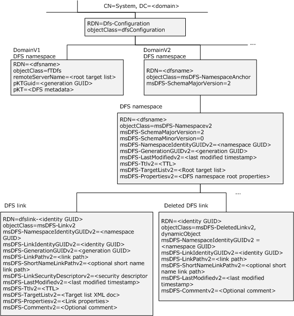

Figure 1: Organization of DFS-related LDAP entries in DFS namespaces

Each domainv1-based DFS namespace has its [**DFS metadata**](#gt_e8de88fd-d760-46fa-ad77-76961fa20aea) stored in the directory service as a [**BLOB**](#gt_binary-large-object-blob) in the **pKT** attribute of an LDAP entry.

Each domainv2-based DFS namespace has one [**DFS namespace**](#gt_6a3f0be9-b9b4-49df-9d1c-a3b89e4e9890) anchor LDAP entry, one DFS namespace LDAP entry below it, and one LDAP entry per [**DFS link**](#gt_0611e93d-f0e7-42ee-a591-d77ebcbb6619) in the namespace under the DFS namespace LDAP entry.

Like the [**relative distinguished name (RDN)**](#gt_relative-distinguished-name-rdn) of a domainv1-based DFS namespace, the relative distinguished name (RDN) of a domainv2-based DFS namespace entry is based on the DFS namespace. Thus, there is no issue of a name collision with a domainv1-based DFS namespace and a domainv2-based DFS namespace having the same name. The directory service will fail an attempt to create such a scenario.

The following sections specify both [**domain-based DFS namespace**](#gt_domain-based-dfs-namespace) formats.

### 2.3.3 DFS Namespace Object for Domainv1-Based DFS Namespace

An [**object**](#gt_object) exists for each [**domainv1-based DFS namespace**](#gt_domainv1-based-dfs-namespace) in the [**DFS**](#gt_distributed-file-system-dfs) configuration container. The following is a [**DN**](#gt_distinguished-name-dn) of the object of a [**domain-based DFS namespace**](#gt_domain-based-dfs-namespace).

CN=<DFSNamespaceName>,CN=Dfs-Configuration,CN=System,<domain>

where:

- <DFSNamespaceName> is the domain-based DFS namespace.
- <domain> is the DN of the [**domain**](#gt_domain).
The following attributes apply to this object.

| Attribute | Description |
| --- | --- |
| name | The [**DFS namespace name**](#gt_dfs-namespace-name). |
| remoteServerName | A multivalued attribute that contains the [**DFS root targets**](#gt_ac90b498-3ba4-48d6-bcd6-5495f1654671) for the [**DFS namespace**](#gt_6a3f0be9-b9b4-49df-9d1c-a3b89e4e9890) with the value "*" as the last attribute. |
| pKTGuid | A [**GUID**](#gt_globally-unique-identifier-guid) used as a generation number to detect changes to the [**DFS metadata**](#gt_e8de88fd-d760-46fa-ad77-76961fa20aea). This MUST be updated whenever the **pKT** attribute is changed. |
| pKT | The [**BLOB**](#gt_binary-large-object-blob) containing the DFS metadata. |

The objectClass of this object is fTDfs, and its schema is specified in [MS-ADSC](../MS-ADSC/MS-ADSC.md). The schema of the attributes name, remoteServerName, pKTGuid, and pKT are specified in [MS-ADA3](../MS-ADA3/MS-ADA3.md).

#### 2.3.3.1 pKT Attribute Contents (Metadata for Domainv1-Based Namespace)

The **pKT** attribute contains the [**DFS metadata**](#gt_e8de88fd-d760-46fa-ad77-76961fa20aea) of the [**domain-based DFS namespace**](#gt_domain-based-dfs-namespace) that the [**object**](#gt_object) represents.

The DFS metadata has the following format.

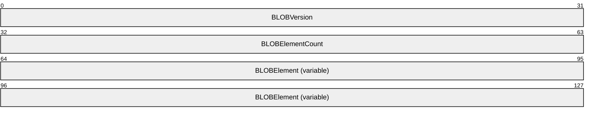

**BLOBVersion (4 bytes):** The DFS metadata format version stored as an unsigned, 32-bit, [**little-endian**](#gt_little-endian) integer. This MUST always be set to 0.

**BLOBElementCount (4 bytes):** The number of <BLOBElement> elements that immediately follow this field in the DFS metadata stored as an unsigned, 32-bit, little-endian integer.

**BLOBElement (variable):** A variable number of [DFSNamespaceElementBLOB](#Section_2.3.3.1.1) structures, which immediately follow the BLOBElementCount. Each DFSNamespaceElementBLOB contains descriptive information about a [**DFS**](#gt_distributed-file-system-dfs) site, root, or link. The format and size of each DFSNamespaceElementBLOB depend on the information contained in it.

##### 2.3.3.1.1 DFSNamespaceElementBLOB

A DFSNamespaceElementBLOB contains information about a [**DFS root**](#gt_639b7503-b879-4ef7-98a8-14adf85bc16d) or a [**DFS link**](#gt_0611e93d-f0e7-42ee-a591-d77ebcbb6619), or for mapping a server to its site name.

The [**DFS metadata**](#gt_e8de88fd-d760-46fa-ad77-76961fa20aea) of a valid [**DFS namespace**](#gt_6a3f0be9-b9b4-49df-9d1c-a3b89e4e9890) MUST consist of one [DFSNamespaceRootBLOB](#Section_2.3.3.1.1.1) for the DFS root and one DFSNamespaceLinkBLOB for each DFS link in the DFS namespace. There MUST no more than one [SiteInformationBLOB](#Section_2.3.3.1.1.4). For more information on SiteInformationBLOB, see section 2.3.3.1.1.4.

No alignment padding requirements exist for any of a BLOB's fields, unless otherwise specified.

Each DFSNamespaceElementBLOB contains the following data elements. The first three fields are standard for all DFSNamespaceElementBLOB structures. Following those fields are additional fields that are specific to the type of DFSNamespaceElementBLOB, in the format of a DFSNamespaceRootBLOB, a DFSNamespaceLinkBLOB, or a SiteInformationBLOB.

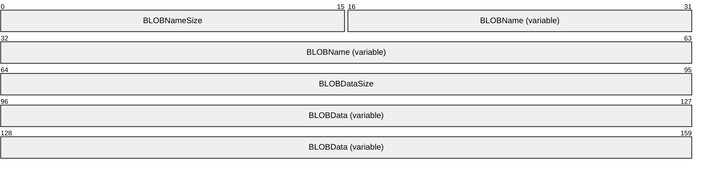

**BLOBNameSize (2 bytes):** The size of the **BLOBName**, in bytes, stored as an unsigned, 16-bit, [**little-endian**](#gt_little-endian) integer.

**BLOBName (variable):** The name of the DFSNamespaceElementBLOB, stored as a string of [**Unicode**](#gt_unicode) characters.

| Value | Meaning |
| --- | --- |
| SiteInformationBLOB "\siteroot" | A string of Unicode characters that forms the literal "\siteroot".<11> |
| DFSNamespaceRootBLOB "\domainroot" | A string of Unicode characters that forms the literal "\domainroot". |
| DFSNamespaceLinkBLOB "\domainroot\<GUIDString>" | A string of Unicode characters that forms the literal "\domainroot\<GUIDString>", where <GUIDString> represents the string form of a [**GUID**](#gt_globally-unique-identifier-guid), as specified in [[RFC4122]](https://go.microsoft.com/fwlink/?LinkId=90460), section 3. The GUID found in the link's ID [**BLOB**](#gt_binary-large-object-blob) MUST be used to create this. |

**BLOBDataSize (4 bytes):** The length of the BLOB in the **BLOBData** field, stored as an unsigned, 32-bit, little-endian integer. The value of this field MUST be used to determine the start of the next DFSNamespaceElementBLOB.

**BLOBData (variable):** Data specific to the type of BLOB described, in the form of a DFSNamespaceRootBLOB, DFSNamespaceLinkBLOB, or SiteInformationBLOB.

The following sections specify the format of the DFSNamespaceRootBLOB, DFSNamespaceLinkBLOB, and SiteInformationBLOB.

###### 2.3.3.1.1.1 DFSNamespaceRootBLOB or DFSNamespaceLinkBLOB

At most, only one DFSNamespaceRootBLOB can contain information about the [**DFS namespace**](#gt_6a3f0be9-b9b4-49df-9d1c-a3b89e4e9890) root. One DFSNamespaceLinkBLOB exists for each [**DFS link**](#gt_0611e93d-f0e7-42ee-a591-d77ebcbb6619) in the namespace.

Each DFSNamespaceRootBLOB or DFSNamespaceLinkBLOB MUST have the following:

- One [**BLOB**](#gt_binary-large-object-blob) containing the name and other information about the DFS namespace root or DFS link. This is the [DFSRootOrLinkIDBLOB](#Section_2.3.3.1.1.2), as specified in section 2.3.3.1.1.2.
- One BLOB containing the [**DFS targets**](#gt_dfs-target) of the [**DFS root**](#gt_639b7503-b879-4ef7-98a8-14adf85bc16d) or DFS link. This is the [DFSTargetListBLOB](#Section_2.3.3.1.1.3), as specified in section 2.3.3.1.1.3.
- One reserved BLOB.
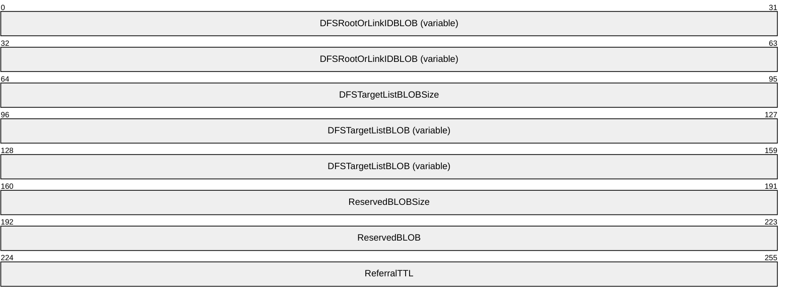

**DFSRootOrLinkIDBLOB (variable):** A BLOB that contains identification and status information for this DFS root or DFS link.

**DFSTargetListBLOBSize (4 bytes):** The size, in bytes, of the BLOB in the **DFSTargetListBLOB** field that immediately follows this field. The DFSTargetListBLOBSize is stored as an unsigned, 32-bit, [**little-endian**](#gt_little-endian) integer.

**DFSTargetListBLOB (variable):** A BLOB that contains the list of targets for the DFS root or DFS link.

**ReservedBLOBSize (4 bytes):** The size, in bytes, of the BLOB in the **ReservedBLOB** field that immediately follows this field. The **ReservedBLOBSize** is stored as an unsigned, 32-bit, little-endian integer and MUST be 4.

**ReservedBLOB (4 bytes):** When creating a new DFSNamespaceRootBLOB or DFSNamespaceLinkBLOB, this **ReservedBLOB** MUST be zero-filled. When updating an existing DFSNamespaceRootBLOB or DFSNamespaceLinkBLOB, the contents of this **ReservedBLOB** MUST be preserved.

**ReferralTTL (4 bytes):** The referral time-out value, in seconds, for the DFS root or DFS link. The **ReferralTTL** is stored as an unsigned, 32-bit, little-endian integer.

###### 2.3.3.1.1.2 DFSRootOrLinkIDBLOB

This [**BLOB**](#gt_binary-large-object-blob) contains name and other information about the [**DFS namespace**](#gt_6a3f0be9-b9b4-49df-9d1c-a3b89e4e9890) root or the [**DFS link**](#gt_0611e93d-f0e7-42ee-a591-d77ebcbb6619).

- If the PKT_ENTRY_TYPE_REFERRAL_SVC (0x00000080) bit is set in the **Type** field, then this BLOB describes the [**DFS root**](#gt_639b7503-b879-4ef7-98a8-14adf85bc16d) and is, hence, part of the [DFSNamespaceRootBLOB](#Section_2.3.3.1.1.1).
- If the PKT_ENTRY_TYPE_REFERRAL_SVC (0x00000080) bit is not set in the **Type** field, then this BLOB describes a link and is, hence, part of the DFSNamespaceLinkBLOB.
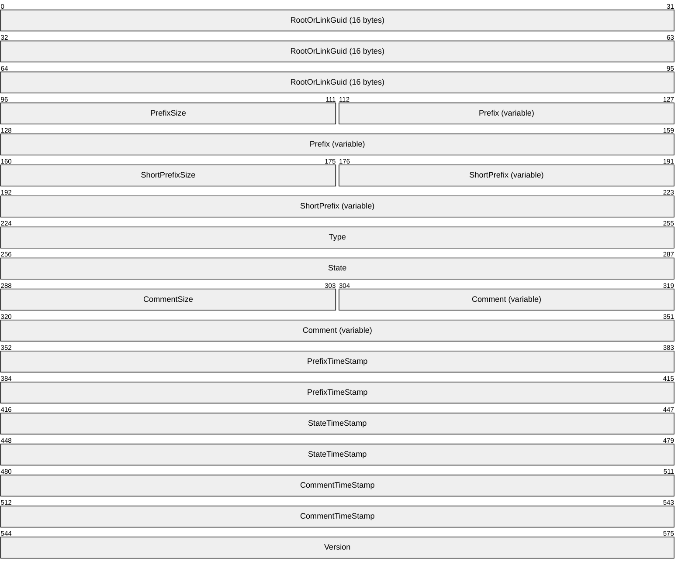

**RootOrLinkGuid (16 bytes):** A [**GUID**](#gt_globally-unique-identifier-guid) that identifies the DFS root or the DFS link. It is used to generate the name "\<domainroot>\<GUIDString>" in the **BLOBName** field of the DFSNamespaceLinkBLOB, where <GUIDString> represents the string form of the GUID, as specified in [[RFC4122]](https://go.microsoft.com/fwlink/?LinkId=90460), section 3.

**PrefixSize (2 bytes):** The size, in bytes, of the **Prefix** field, stored as an unsigned, 16-bit, [**little-endian**](#gt_little-endian) integer.

**Prefix (variable):** The name of the DFS namespace root or the DFS link. The **Prefix** is stored as a string of [**Unicode**](#gt_unicode) characters and MUST be a [**UNC**](#gt_universal-naming-convention-unc) path string with one leading backslash, instead of the usual two, without a null termination.

**ShortPrefixSize (2 bytes):** The size, in bytes, of the **ShortPrefix** field, stored as an unsigned, 16-bit, little-endian integer.

**ShortPrefix (variable):** The name of the DFS namespace root or the DFS link, stored as a string of Unicode characters. This MUST be a UNC path string with one leading backslash, instead of the usual two, without a null termination. The string MAY be the same as that in the **Prefix** field or its [**8.3 name**](#gt_83-name).<12>

**Type (4 bytes):** A bit field, stored as 32-bits in little-endian order, which describes this BLOB.

For domainv1 roots, the **Type** field parallels the functionality of the **msDFS-Propertiesv2** attribute used for [**domainv2-based DFS namespaces**](#gt_domainv2-based-dfs-namespace) (see section [2.3.4.2](#Section_2.3.4.2)) and domainv2-based DFS links (see section [2.3.4.3](#Section_2.3.4.3)).

| Value | Meaning |
| --- | --- |
| PKT_ENTRY_TYPE_DFS 0x00000001 | This value is reserved and the **Type** field MUST always be set with this value. |
| PKT_ENTRY_TYPE_OUTSIDE_MY_DOM 0x00000010 | The [**DFS interlink**](#gt_ebaa4758-1010-49c9-b924-7fec6e4f2306) property. This MUST be set only when at least one [**DFS link target**](#gt_44e2f830-c28b-41e3-8c3c-d0bb576ed9fb) points to another DFS namespace. This MUST NOT be set for a DFS root. |
| PKT_ENTRY_TYPE_INSITE_ONLY 0x00000020 | The [**DFS in-site referral mode**](#gt_8f645116-42be-407e-b3bd-1b72babb0c37) property. When set, instructs the [**DFS server**](#gt_dfs-server) to enable the DFS in-site referral mode. |
| PKT_ENTRY_TYPE_COST_BASED_SITE_SELECTION 0x00000040 | The [**DFS referral site costing**](#gt_2ea2b8ff-5099-4b7d-86fc-d14a506fc14b) property. Enables DFS referral site costing. This SHOULD be supported.<13> |
| PKT_ENTRY_TYPE_REFERRAL_SVC 0x00000080 | This identifies the DFS namespace root. |
| PKT_ENTRY_TYPE_ROOT_SCALABILITY 0x00000200 | The [**DFS root scalability mode**](#gt_cf94d206-f71c-4ca1-891a-24c83f533e45) property. This enables DFS root scalability mode. This SHOULD be supported.<14> |
| PKT_ENTRY_TYPE_TARGET_FAILBACK 0x00008000 | The [**DFS client target failback**](#gt_506d8850-6fcd-469a-b837-da4aaadf7ec6) property. This enables DFS client target failback for targets of this root or link. This SHOULD be supported.<15> |

Undefined bit positions MUST be set to 0 on writes and ignored on reads.

**State (4 bytes):** The status of the DFS root or DFS link stored as an unsigned, 32-bit, little-endian integer. The DFS_VOLUME_STATES bitmask (0x0000000F) MUST be used to access the following DFS root or DFS link state from this field. For more information about some of these states, see section [2.2.2.13](#Section_2.2.2.13).

| Value | Meaning |
| --- | --- |
| DFS_VOLUME_STATE_OK 0x00000001 | The DFS root or DFS link state is okay. |
| RESERVED 0x00000002 | This value is reserved and MUST NOT be used. |
| DFS_VOLUME_STATE_OFFLINE 0x00000003 | The DFS link is offline and not available for use. |
| DFS_VOLUME_STATE_ONLINE 0x00000004 | The DFS link is online and available for use. |

Undefined bit positions of this field MUST be set to 0 on writes and ignored on reads.

**CommentSize (2 bytes):** The size, in bytes, of the **Comment** field and stored as an unsigned, 16-bit, little-endian integer.

**Comment (variable):** A string of Unicode characters whose size in bytes is specified by the **CommentSize** field. The **Comment** field is associated with the namespace root or link and is for informational purposes. The comment is meant for human consumption and does not affect server functionality.

**PrefixTimeStamp (8 bytes):** The time of the last **Prefix** field modification, stored as FILETIME, as specified in [MS-DTYP](../MS-DTYP/MS-DTYP.md) section 2.3.3. This SHOULD be set to the last modification time of this BLOB.

**StateTimeStamp (8 bytes):** The time of the last **State** field modification, stored as FILETIME, as specified in [MS-DTYP] section 2.3.3. This SHOULD be set to the last modification time of this BLOB.

**CommentTimeStamp (8 bytes):** The time of the last **Comment** field modification, stored as FILETIME, as specified in [MS-DTYP] section 2.3.3. This SHOULD be set to the last modification time of this BLOB.

**Version (4 bytes):** The version number of DFSRootOrLinkIDBLOB, stored as an unsigned, 32-bit, little-endian integer. When creating a new DFSRootOrLinkIDBLOB, this MUST be set to 0x00000003. When updating an existing DFSRootOrLinkIDBLOB, the existing value MUST be preserved.

###### 2.3.3.1.1.3 DFSTargetListBLOB

The DFSTargetListBLOB contains information about all of the targets of the [**DFS root**](#gt_639b7503-b879-4ef7-98a8-14adf85bc16d) or [**DFS link**](#gt_0611e93d-f0e7-42ee-a591-d77ebcbb6619).

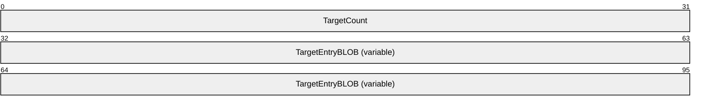

**TargetCount (4 bytes):** The number of [TargetEntryBLOB](#Section_2.3.3.1.1.3.1) fields contained in this [**BLOB**](#gt_binary-large-object-blob), stored as an unsigned, 32-bit, [**little-endian**](#gt_little-endian) integer.

**TargetEntryBLOB (variable):** A BLOB that contains metadata for a [**DFS target**](#gt_dfs-target).

TargetEntryBLOB

The TargetEntryBLOB holds metadata for the [**DFS target**](#gt_dfs-target) of a root or a link.

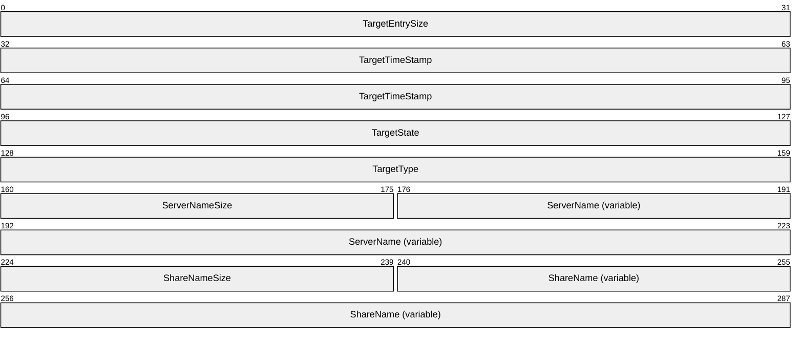

**TargetEntrySize (4 bytes):** The size, in bytes, of this target entry, starting from the **TargetTimeStamp** field, and stored as an unsigned, 32-bit, [**little-endian**](#gt_little-endian) integer.

**TargetTimeStamp (8 bytes):** If bits 9 through 63 contain nonzero values, this field encodes the last modification time of this target entry, stored as FILETIME, as specified in [MS-DTYP](../MS-DTYP/MS-DTYP.md) section 2.3.3. In this case the **PriorityRank** and **PriorityClass** members, discussed below, are considered to logically contain zero if referenced by an implementation.

If bits 9 through 63 are zero, the 64 bits of the **TargetTimeStamp** has the following format:

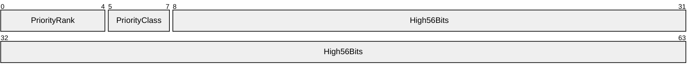

**PriorityRank (5 bits):** The priority rank of a target, ranging in value from 0x00 to 0x1F, where 0x00 is the highest rank.

**PriorityClass (3 bits):** The priority class of a target. One of the following values.

| Value | Meaning |
| --- | --- |
| DFS_TARGET_PRIORITY_CLASS_SITE_COST_NORMAL 0x0 | See DfsSiteCostNormalPriorityClass in section [2.2.2.8](#Section_2.2.2.8). |
| DFS_TARGET_PRIORITY_CLASS_GLOBAL_HIGH 0x1 | See DfsSGlobalHighPriorityClass in section 2.2.2.8. |
| DFS_TARGET_PRIORITY_CLASS_SITE_COST_HIGH 0x2 | See DfsSiteCostHighPriorityClass in section 2.2.2.8 |
| DFS_TARGET_PRIORITY_CLASS_SITE_COST_LOW 0x3 | See DfsSiteCostLowPriorityClass in section 2.2.2.8 |
| DFS_TARGET_PRIORITY_CLASS_GLOBAL_LOW 0x4 | see DfsGlobalLowPriorityClass in section 2.2.2.8 |

**High56Bits (7 bytes):** Set to zero.

**TargetState (4 bytes):** The state of this target, stored as an unsigned, 32-bit, little-endian integer. The mask 0x0000000F is used to extract a bit field that contains one of the following valid state values.

| Value | Meaning |
| --- | --- |
| DFS_STORAGE_STATE_OFFLINE 0x00000001 | This target is offline and unavailable for use. |
| DFS_STORAGE_STATE_ONLINE 0x00000002 | This target is online and available for use. |
| DFS_STORAGE_STATE_ACTIVE 0x00000004 | This target is active. |

**TargetType (**4 bytes): The type of target, stored as an unsigned, 32-bit, little-endian integer bit field. This SHOULD be set to 0x00000002.<16>

**ServerNameSize (2 bytes):** The size, in bytes, of the **ServerName** field, stored as an unsigned 16-bit, little-endian integer.

**ServerName (variable):** An array of [**Unicode**](#gt_unicode) characters that contains the DFS target server [**host name**](#gt_host-name). The size of the array is given in the ServerNameSize field.

**ShareNameSize (2 bytes):** The size, in bytes, of the ShareName, stored as an unsigned, 16-bit, little-endian integer.

**ShareName (variable):** An array of Unicode characters that contains the DFS target [**share name**](#gt_share-name).

###### 2.3.3.1.1.4 SiteInformationBLOB

The SiteInformationBLOB contains the mapping from a [**DFS target**](#gt_dfs-target) [**host name**](#gt_host-name) to its site name. There MUST be no more than one [**BLOB**](#gt_binary-large-object-blob) of this type. This BLOB contains zero or more [SiteEntryBLOBs](#Section_2.3.3.1.1.4.1).

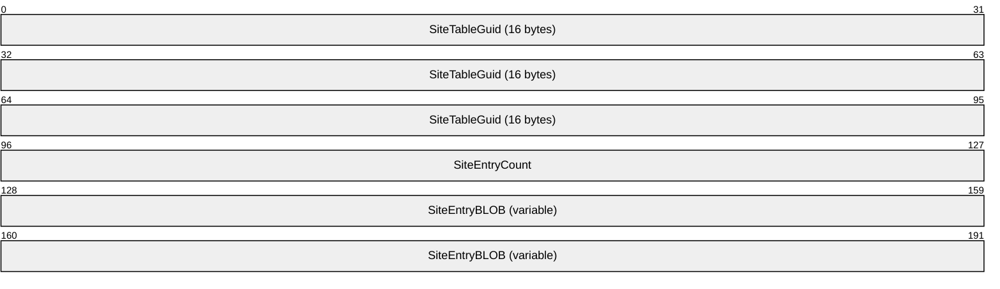

**SiteTableGuid (16 bytes):** The [**GUID**](#gt_globally-unique-identifier-guid) that uniquely identifies the SiteInformationBLOB.

**SiteEntryCount (4 bytes):** The number of SiteEntryBLOBs in the SiteEntryBLOB field, stored as an unsigned, 32-bit, [**little-endian**](#gt_little-endian) integer. This MAY be zero.<17><18>

**SiteEntryBLOB (variable):** Zero or more BLOBs. Each BLOB contains the site of a root target or link target server in the [**DFS namespace**](#gt_6a3f0be9-b9b4-49df-9d1c-a3b89e4e9890).

SiteEntryBLOB

This [**BLOB**](#gt_binary-large-object-blob) contains a [**host name**](#gt_host-name) whose site information is specified by the [SiteNameInfoBLOB](#Section_2.3.3.1.1.4.1.1) (for more information, see section 2.3.3.1.1.4.1.1).

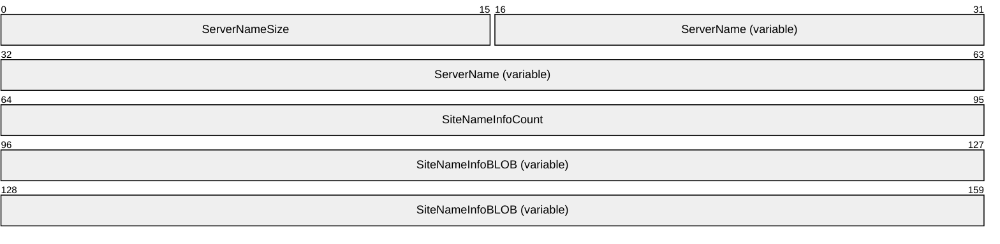

**ServerNameSize (2 bytes):** The size, in bytes, of the **ServerName** field, stored as an unsigned, 16-bit, [**little-endian**](#gt_little-endian) integer.

**ServerName (variable):** A string of [**Unicode**](#gt_unicode) characters representing the [**DFS target**](#gt_dfs-target) host name.

**SiteNameInfoCount (4 bytes):** The number of SiteNameInfoBLOBs in the SiteNameInfoBLOB field, stored as an unsigned, 32-bit, little-endian integer.

**SiteNameInfoBLOB (variable):** The BLOB containing the site name of the server in the SiteEntryBLOB.

SiteNameInfoBLOB

The SiteNameInfoBLOB contains the name of a site to which a server belongs.

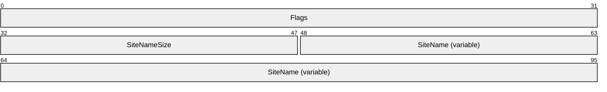

**Flags (4 bytes):** This MUST be set to 0 on write. MUST be ignored on read.

**SiteNameSize (2 bytes):** The size, in bytes, of the **SiteName** field, stored as an unsigned, 16-bit, [**little-endian**](#gt_little-endian) integer.

**SiteName (variable):** A string of [**Unicode**](#gt_unicode) characters representing the directory services site name of the server. The case of the [**site**](#gt_site) name, as provided by directory services, MUST be preserved when storing in this field.

### 2.3.4 Schema for Domainv2-Based DFS Namespace

Each [**domainv2-based DFS namespace**](#gt_domainv2-based-dfs-namespace) has one [**DFS namespace**](#gt_6a3f0be9-b9b4-49df-9d1c-a3b89e4e9890) anchor [**LDAP**](#gt_lightweight-directory-access-protocol-ldap) entry, one DFS namespace LDAP entry below it, and one LDAP entry per [**DFS link**](#gt_0611e93d-f0e7-42ee-a591-d77ebcbb6619) in the namespace under the DFS namespace LDAP entry. The following sections specify the mandatory and optional attributes of the [**object**](#gt_object) classes.

#### 2.3.4.1 LDAP Entry for Domainv2-Based DFS Namespace Anchor

Each [**domainv2-based DFS namespace**](#gt_domainv2-based-dfs-namespace) under the [**DFS**](#gt_distributed-file-system-dfs) configuration container has a [**DFS namespace**](#gt_6a3f0be9-b9b4-49df-9d1c-a3b89e4e9890) anchor [**LDAP**](#gt_lightweight-directory-access-protocol-ldap) entry.

This [**object**](#gt_object) has a single attribute: **msDFS-SchemaMajorVersion**. This attribute is an integer value containing the major version number of the supported [**DFS metadata**](#gt_e8de88fd-d760-46fa-ad77-76961fa20aea) format.

The object class of the LDAP entry corresponding to the domainv2-based DFS namespace anchor is ms-DFS-Namespace-Anchor, and its schema is specified in [MS-ADSC](../MS-ADSC/MS-ADSC.md). The schema of the msDFS-SchemaMajorVersion attribute is specified in [MS-ADA2](../MS-ADA2/MS-ADA2.md). Future revisions of the DFS namespace will retain this LDAP entry to provide the DFS metadata version information of the DFS namespace.

#### 2.3.4.2 LDAP Entry for Domainv2-Based DFS Namespace

A [**DFS namespace**](#gt_6a3f0be9-b9b4-49df-9d1c-a3b89e4e9890) [**LDAP**](#gt_lightweight-directory-access-protocol-ldap) entry exists for each [**domainv2-based DFS namespace**](#gt_domainv2-based-dfs-namespace) under the DFS namespace anchor LDAP entry.

This [**object**](#gt_object) has the following attributes. The schemas for these attributes are specified in [MS-ADA2](../MS-ADA2/MS-ADA2.md).

| Attribute | Description |
| --- | --- |
| msDFS-SchemaMajorVersion | An integer value that contains the major version number of the [**DFS metadata**](#gt_e8de88fd-d760-46fa-ad77-76961fa20aea) format supported. |
| msDFS-SchemaMinorVersion | An integer value that contains the minor version number of the DFS metadata format supported. The **rangeLower** attribute of the attribute schema's LDAP entry contains 0, and the **rangeUpper** attribute of the attribute schema's LDAP entry contains the highest minor version number supported. |
| msDFS-NamespaceIdentityGUIDv2 | This is the time-stable identifier for a DFS namespace. It is a binary value set at DFS namespace creation time whose size is specified by the **rangeLower** and **rangeUpper** attributes. |
| msDFS-GenerationGUIDv2 | A binary value whose size is specified by the **rangeLower** and **rangeUpper** attributes. This time-stable identifier is overwritten anytime the LDAP entry corresponding to the DFS namespace or the [**DFS link**](#gt_0611e93d-f0e7-42ee-a591-d77ebcbb6619) is modified. This is reserved for future use and MUST NOT be currently used. |
| msDFS-LastModifiedv2 | A time string format defined by ASN.1 standards, as specified in [[X680]](https://go.microsoft.com/fwlink/?LinkId=90594). The [**Coordinated Universal Time (UTC)**](#gt_coordinated-universal-time-utc) in the form YYYYMMDDHHMMSS.0Z"0Z" indicates no time differential. This attribute is updated each time the [**DFS root**](#gt_639b7503-b879-4ef7-98a8-14adf85bc16d) is updated. |
| msDFS-Ttlv2 | A 32-bit signed integer that is interpreted as an unsigned referral Time to Live (TTL), in seconds. |
| msDFS-TargetListv2 | This attribute stores the [**DFS target**](#gt_dfs-target) information. The information is stored as an XML document that contains a list of targets for the root as well as attributes associated with each target. The maximum size is 2 MB. For the XML schema of the XML document, see [Appendix C](#Section_8). |
| msDFS-Propertiesv2 | This is a multivalued attribute that contains attributes corresponding to the DFS root. Each attribute is a case-insensitive String(Unicode) (see [MS-ADTS](../MS-ADTS/MS-ADTS.md) section 3.1.1.2.2.2). |
| msDFS-Commentv2 | An optional attribute that contains a comment associated with the DFS namespace root. A String(Unicode) (see [MS-ADTS] section 3.1.1.2.2.2). |

Attribute values for **msDFS-Propertiesv2** are described in the following table. A server MUST ignore unrecognized attribute values when reading the metadata. A server SHOULD<19> preserve unrecognized attribute values when writing the metadata. Note that they are fixed strings. They have a more general appearance, but a string comparison is sufficient to analyze them. The absence of an attribute value in the **msDFS-Propertiesv2** attribute indicates that the corresponding property is not set.

For domainv2-based DFS namespaces, the **msDFS-Propertiesv2** attribute parallels the functionality of the [DFSRootOrLinkIDBLOB](#Section_2.3.3.1.1.2) (section 2.3.3.1.1.2) **Type** field used for domainv1-based namespaces.

| Attribute Value | Description |
| --- | --- |
| ABDE=on | The [**Access Based Directory Enumeration (ABDE) mode**](#gt_access-based-directory-enumeration-abde-mode) property. Enables ABDE mode. |
| InsiteReferral=on | The [**DFS in-site referral mode**](#gt_8f645116-42be-407e-b3bd-1b72babb0c37) property. When set, instructs the [**DFS server**](#gt_dfs-server) to enable the DFS in-site referral mode. |
| ReferralSiteCosting=on | The [**DFS referral site costing**](#gt_2ea2b8ff-5099-4b7d-86fc-d14a506fc14b) property. Enables DFS referral site costing and SHOULD be supported.<20> |
| RootScalability=on | The [**DFS root scalability mode**](#gt_cf94d206-f71c-4ca1-891a-24c83f533e45) property. This enables DFS root scalability mode and SHOULD be supported.<21> |
| TargetFailback=on | The [**DFS client target failback**](#gt_506d8850-6fcd-469a-b837-da4aaadf7ec6) property. This enables DFS client target failback for targets of this root and SHOULD be supported.<22> |
| State=Okay | The DFS root is available for referral requests. |

The following attributes are mandatory: msDFS-SchemaMajorVersion, msDFS-SchemaMinorVersion, msDFS-NamespaceIdentityGUIDv2, msDFS-GenerationGUIDv2, msDFS-LastModifiedv2, msDFS-Ttlv2, msDFS-TargetListv2, and msDFS-Propertiesv2.

The msDFS-Commentv2 attribute is optional.

The object class of the LDAP entry corresponding to the domainv2-based DFS namespace is msDFS-Namespacev2, and its schema is specified in [MS-ADSC](../MS-ADSC/MS-ADSC.md).

#### 2.3.4.3 LDAP Entry for Domainv2-Based DFS Link

One [**LDAP**](#gt_lightweight-directory-access-protocol-ldap) entry exists for each [**DFS link**](#gt_0611e93d-f0e7-42ee-a591-d77ebcbb6619) in the namespace under the [**DFS namespace**](#gt_6a3f0be9-b9b4-49df-9d1c-a3b89e4e9890) LDAP entry.

This [**object**](#gt_object) has the following attributes. The schemas for these attributes are specified in [MS-ADA2](../MS-ADA2/MS-ADA2.md).

| Attribute | Description |
| --- | --- |
| msDFS-NamespaceIdentityGUIDv2 | This is the time-stable identifier for the DFS namespace containing the link, and matches the value specified in the namespace LDAP entry. It is a binary value set at DFS namespace creation time whose size is specified by the **rangeLower** and **rangeUpper** attributes. |
| msDFS-LinkIdentityGUIDv2 | This is the time-stable identifier for a DFS link. It is a binary value set at DFS link creation time whose size is specified by the **rangeLower** and **rangeUpper** attributes. This value is retained in the [**dynamic object**](#gt_dynamic-object) created when the link is deleted. |
| msDFS-GenerationGUIDv2 | A binary value whose size is specified by the **rangeLower** and **rangeUpper** attributes. This time-stable identifier is overwritten anytime the LDAP entry corresponding to the DFS namespace or the DFS link is modified. This is reserved for future use and MUST NOT be currently used. |
| msDFS-LinkPathv2 | A case-insensitive String(Unicode) (see [MS-ADTS](../MS-ADTS/MS-ADTS.md) section 3.1.1.2.2.2) that is the [**DFS root**](#gt_639b7503-b879-4ef7-98a8-14adf85bc16d)-relative path to the DFS link [**reparse point**](#gt_reparse-point). To simplify LDAP searches, path separators are forward slashes (/) instead of backward slashes (\). |
| msDFS-ShortNameLinkPathv2 | A case-insensitive String(Unicode) (see [MS-ADTS] section 3.1.1.2.2.2) that is the DFS namespace root-relative path to the DFS link reparse point in short name form. To simplify LDAP searches, path separators are forward slashes (/) instead of backward slashes (\). This is reserved for future use and MUST NOT be currently used. |
| msDFS-LinkSecurityDescriptorv2 | A self-relative security descriptor associated with a DFS link. This attribute is used for Access Based Directory Enumeration (ABDE) support. |
| msDFS-LastModifiedv2 | A time string format defined by ASN.1 standards. The [**UTC**](#gt_coordinated-universal-time-utc) time in the form YYYYMMDDHHMMSS.0Z"0Z" indicates no time differential. This attribute is updated each time the DFS link is updated. |
| msDFS-Ttlv2 | A 32-bit signed integer that is interpreted as an unsigned referral TTL, in seconds. |
| msDFS-TargetListv2 | This attribute stores the [**DFS target**](#gt_dfs-target) information. The information is stored as an XML document that contains a list of targets for the link as well as attributes associated with each target. The maximum size is 2 MB. For the XML schema of the XML document, see [Appendix C](#Section_8). |
| msDFS-Propertiesv2 | This is a multivalued attribute that contains attributes corresponding to the DFS link (not individual targets). Each attribute is a case-insensitive String(Unicode) (see [MS-ADTS] section 3.1.1.2.2.2). |
| msDFS-Commentv2 | An optional attribute that contains a comment associated with the DFS link. A String(Unicode) (see [MS-ADTS] section 3.1.1.2.2.2). |

Attribute values for **msDFS-Propertiesv2** are described in the following table. A server MUST ignore unrecognized attribute values when reading the metadata. A server SHOULD<23> preserve unrecognized attribute values when writing the metadata. Note that they are fixed strings. While they have a more general appearance, a string comparison is sufficient to analyze them. The absence of an attribute value in the **msDFS-Propertiesv2** attribute indicates that the corresponding property is not set.

For domainv2-based DFS links, the **msDFS-Propertiesv2** attribute parallels the functionality of the [DFSRootOrLinkIDBLOB](#Section_2.3.3.1.1.2) (section 2.3.3.1.1.2) **Type** field used for domainv1-based DFS links.

| Attribute Value | Description |
| --- | --- |
| InsiteReferral=on | The [**DFS in-site referral mode**](#gt_8f645116-42be-407e-b3bd-1b72babb0c37) property. When set, instructs the [**DFS server**](#gt_dfs-server) to enable the DFS in-site referral mode. |
| ReferralSiteCosting=on | The [**DFS referral site costing**](#gt_2ea2b8ff-5099-4b7d-86fc-d14a506fc14b) property. Enables DFS referral site costing. This SHOULD be supported.<24> |
| TargetFailback=on | The [**DFS client target failback**](#gt_506d8850-6fcd-469a-b837-da4aaadf7ec6) property. This enables DFS client target failback for targets of this link. This SHOULD be supported.<25> |
| Interlink=on | The [**DFS interlink**](#gt_ebaa4758-1010-49c9-b924-7fec6e4f2306) property. This MUST be set only when at least one [**DFS link target**](#gt_44e2f830-c28b-41e3-8c3c-d0bb576ed9fb) points to another [**domain-based DFS namespace**](#gt_domain-based-dfs-namespace). |
| State=Okay OR State=Offline OR State=Online | The state of the DFS link. "State=Okay" means that the DFS link is available for referral requests. "State=Offline" means that the DFS link is offline and none of the DFS targets will be included in the referral response. "State=Online" means that the DFS link is online and available for referral requests. |

The following attributes are mandatory: **msDFS-NamespaceIdentityGUIDv2**, **msDFS-LinkIdentityGUIDv2**, **msDFS-GenerationGUIDv2**, **msDFS-LinkPathv2**, **msDFS-LastModifiedv2**, **msDFS-Ttlv2**, **msDFS-TargetListv2**, and **msDFS-Propertiesv2**.

The following attributes are optional: **msDFS-ShortNameLinkPathv2**, **msDFS-LinkSecurityDescriptorv2**, and **msDFS-Commentv2**.

The object class of the LDAP entry corresponding to a DFS link in a [**domainV2-based DFS namespace**](#gt_domainv2-based-dfs-namespace) is msDFS-Linkv2, and its schema is specified in [MS-ADSC](../MS-ADSC/MS-ADSC.md).

#### 2.3.4.4 LDAP Entry for Domainv2-Based Deleted Link

Only one [**LDAP**](#gt_lightweight-directory-access-protocol-ldap) entry corresponds to a deleted link in a [**domainv2-based DFS namespace**](#gt_domainv2-based-dfs-namespace). This is a [**dynamic object**](#gt_dynamic-object).

This [**object**](#gt_object) has the following attributes. The schemas for these attributes are specified in [MS-ADA2](../MS-ADA2/MS-ADA2.md).

| Attribute | Description |
| --- | --- |
| msDFS-NamespaceIdentityGUIDv2 | This is the time-stable identifier for the [**DFS namespace**](#gt_6a3f0be9-b9b4-49df-9d1c-a3b89e4e9890) containing the link, and it matches the value specified in the namespace LDAP entry. It is a binary value set at DFS namespace creation time whose size is specified by the **rangeLower** and **rangeUpper** attributes. |
| msDFS-LinkIdentityGUIDv2 | This is the time-stable identifier for a [**DFS link**](#gt_0611e93d-f0e7-42ee-a591-d77ebcbb6619). It is a binary value set at DFS link creation time whose size is specified by the **rangeLower** and **rangeUpper** attributes. This value is retained in the dynamic object created when the link is deleted. |
| msDFS-LastModifiedv2 | A time string format defined by ASN.1 standards. The [**UTC**](#gt_coordinated-universal-time-utc) time in the form YYYYMMDDHHMMSS.0Z"0Z" indicates no time differential. This attribute is updated each time the DFS link entry is updated. |
| msDFS-LinkPathv2 | A case-insensitive String(Unicode) (see [MS-ADTS](../MS-ADTS/MS-ADTS.md) section 3.1.1.2.2.2) that is the [**DFS root**](#gt_639b7503-b879-4ef7-98a8-14adf85bc16d)-relative path to the DFS link reparse point. To simplify LDAP searches, path separators are forward slashes (/) instead of backward slashes (\). |
| msDFS-Commentv2 | An optional attribute that contains a comment associated with the DFS namespace link. A case-insensitive String(Unicode) (see [MS-ADTS] section 3.1.1.2.2.2). |
| msDFS-ShortNameLinkPathv2 | A case-insensitive String(Unicode) (see [MS-ADTS] section 3.1.1.2.2.2) that is the DFS namespace root-relative path to the DFS link reparse point in short name form. To simplify LDAP searches, path separators are forward slashes (/) instead of backward slashes (\). This is reserved for future use and MUST NOT be currently used. |

The following attributes are mandatory: msDFS-NamespaceIdentityGUIDv2, msDFS-LinkIdentityGUIDv2, msDFS-LastModifiedv2, and msDFS-LinkPathv2.

The following attributes are optional: msDFS-Commentv2 and msDFS-ShortNameLinkPathv2.

The object class of the LDAP entry corresponding to a DFS link in a domainv2-based DFS namespace is msDFS-DeletedLinkv2, and its schema is as specified in [MS-ADSC](../MS-ADSC/MS-ADSC.md).

# 3 Protocol Details

## 3.1 Server Details

### 3.1.1 Abstract Data Model

This section describes a conceptual model of a possible data organization that an implementation could maintain in order to participate in this protocol. This organization is provided to facilitate the explanation of how the protocol behaves. This specification does not mandate that implementations adhere to this model, as long as their external behavior is consistent with that described in this document. The following data items are implemented on the server side and are specific to this protocol:

- **PDCRoleHolder:** For servers of [**domain-based DFS namespaces**](#gt_domain-based-dfs-namespace), this is the [**PDC**](#gt_primary-domain-controller-pdc) corresponding to the server's [**domain**](#gt_domain).
- **DFSMetadataCache:** [**DFS metadata**](#gt_e8de88fd-d760-46fa-ad77-76961fa20aea) of [**DFS namespaces**](#gt_6a3f0be9-b9b4-49df-9d1c-a3b89e4e9890) for which the server is a root target MAY<26> be cached as an optimization.
**Note** The preceding conceptual data can be implemented using a variety of techniques. There are no limitations on data implementation.

#### 3.1.1.1 Global

The following element is global.

**NamespaceList:** A list of namespaces hosted by the server. Each entry is a tuple of <**NamespaceName**, **Namespace**>, indexed by the **NamespaceName**, as specified in section [3.1.1.2](#Section_3.1.1.2).

#### 3.1.1.2 Per Namespace

The following are the elements of a **Namespace** element:

**Namespace.NamespaceName:** The DFS namespace name.

**Namespace.NamespaceType:** Type of the DFS namespace – stand-alone, domainv1-based or domainv2-based.

**Namespace.GenerationGUID:** A GUID used as a generation number to detect changes to the DFS metadata. This MUST be updated whenever the metadata of the DFS namespace is changed.

**Namespace.NamespaceElementsList:** List of the DFS namespace elements as described in section [3.1.1.3](#Section_3.1.1.3).

#### 3.1.1.3 Per NamespaceElement

The **NamespaceElement** represents a DFS root or a DFS link and has the following parameters:

**NamespaceElement.IdentityGUID:** A GUID that identifies the DFS namespace element.

**NamespaceElement.Prefix:** Name of the DFS namespace element.

**NamespaceElement.Properties:** Set of properties that are applicable for the DFS namespace element, as specified for **PropertyFlags** in section [2.2.3.5](#Section_2.2.3.5).

**NamespaceElement.State:** State of the DFS namespace element, as specified for **State** in section [2.2.3.2](#Section_2.2.3.2).

**NamespaceElement.Comment:** Comment associated with the DFS namespace element.

**NamespaceElement.ReferralTTL:** The referral time-out value, in seconds, for the DFS namespace element.

**NamespaceElement.SecurityDescriptor:** SecurityDescriptor to be associated with the DFS namespace element. This is needed only for the DFS link of a stand-alone or domainv2-based DFS namespace.

**NamespaceElement.TargetsList:** List of targets for the DFS namespace element. Each element in the list is as described in section [3.1.1.4](#Section_3.1.1.4).

#### 3.1.1.4 Per TargetsList

The following are the elements of a **TargetsList**.

**TargetsList.TargetCount:** Number of targets for the DFS namespace element.

**TargetsList.Target:** Metadata of the target. This is as described in the section [3.1.1.5](#Section_3.1.1.5).

#### 3.1.1.5 Per Target

The following are the elements of a **Target** element.

**Target.TargetState:** State of the target, as specified for State in section [2.2.4.6](#Section_2.2.4.6).

**Target.PriorityRank:** Priority rank of the target, as specified for TargetPriorityRank in section [2.2.2.7](#Section_2.2.2.7).

**Target.PriorityClass:** Priority class of the target, as specified in section [2.2.2.8](#Section_2.2.2.8).

**Target.ServerName:** The DFS target host name.

**Target.ShareName:** The DFS target share name.

### 3.1.2 Timers

No protocol timers are required beyond those used internally by [**RPC**](#gt_remote-procedure-call-rpc) to implement resiliency to network outages, as specified in [MS-RPCE](../MS-RPCE/MS-RPCE.md).

### 3.1.3 Initialization

The server MUST listen on the [**well-known endpoint**](#gt_well-known-endpoint) defined for this [**RPC**](#gt_remote-procedure-call-rpc) interface, as specified in section [2.1](#Section_2.1).

Information about [**DFS namespaces**](#gt_6a3f0be9-b9b4-49df-9d1c-a3b89e4e9890) that the server hosts SHOULD be obtained from a local information store such as the registry. An entry MUST be created for each namespace in the **NamespaceList**. If the server is hosting any stand-alone namespaces, the metadata for that namespace MUST be initialized into the corresponding **Namespace** in the **NamespaceList**. If the server is joined to a [**domain**](#gt_domain) and is hosting at least one DFS namespace, it MAY<27> determine the [**PDC**](#gt_primary-domain-controller-pdc) for the domain and initialize PDCRoleHolder. As a performance optimization, it MAY<28> preload the DFSMetadataCache with the [**DFS metadata**](#gt_e8de88fd-d760-46fa-ad77-76961fa20aea) of the DFS namespaces for which it is acting as a root target.

### 3.1.4 Message Processing Events and Sequencing Rules

When any RPC method is received for a domain-based DFS namespace that is hosted by the server, the server MUST first check whether the DFS namespace is up-to-date with any changes that have happened on it. This check MUST be done against the PDC. When any changes are detected, the server MUST first bring the namespace it hosts up-to-date and then process the RPC method received. The details of this operation are implementation-specific.

For a [**domainv1-based DFS namespace**](#gt_domainv1-based-dfs-namespace), if the **pKTGuid** value matches the cached value, the server MAY work on a cached copy of the **pKT** attribute. The update operation MUST be committed by issuing [**LDAP**](#gt_lightweight-directory-access-protocol-ldap) writes for both the updated **pKT** attribute and a newly generated **pKTGuid** attribute. Using the same LDAP update operation for both attributes ensures atomicity of the update.

For non-update operations in [**domain-based DFS namespaces**](#gt_domain-based-dfs-namespace), [**DFS servers**](#gt_dfs-server) MAY retrieve [**DFS metadata**](#gt_e8de88fd-d760-46fa-ad77-76961fa20aea) from any [**DC**](#gt_domain-controller-dc) within the domain. For update operations in domain-based DFS namespaces, DFS servers MUST retrieve and store DFS metadata on the [**PDC**](#gt_primary-domain-controller-pdc).

Unless noted otherwise, DFS servers MUST process host names as case-insensitive string literals. The DFS server MUST NOT, for example, consider a DNS-conformant host name (as specified in [[RFC1034]](https://go.microsoft.com/fwlink/?LinkId=90263)) and an IP address as equivalent, even if the host name resolves via DNS to the IP address.

This protocol uses Win32 error codes. These values are taken from the Windows error number space, as specified in [MS-ERREF](../MS-ERREF/MS-ERREF.md). Vendors SHOULD reuse those values with their indicated meanings. Choosing any other value runs the risk of future collisions.<29>

The remainder of this section describes the methods used in the DFS: Namespace Management Protocol. The following table lists [**opnum**](#gt_opnum) values associated with the methods described in this document, as well as the section where each is described.

Methods in RPC Opnum Order

| Method | Description |
| --- | --- |
| [NetrDfsManagerGetVersion](#Section_3.1.4.1.2) | A basic method that returns the version number of the DFS server. Opnum: 0 |
| [NetrDfsAdd](#Section_3.1.4.1.3) | A basic method that creates a new [**DFS link**](#gt_0611e93d-f0e7-42ee-a591-d77ebcbb6619) or that adds a new target to an existing link of a [**DFS namespace**](#gt_6a3f0be9-b9b4-49df-9d1c-a3b89e4e9890). Opnum: 1 |
| [NetrDfsRemove](#Section_3.1.4.1.4) | A basic method that removes a link or a link target from a DFS namespace. Opnum: 2 |
| [NetrDfsSetInfo](#Section_3.1.4.1.5) | A basic method that sets or modifies information relevant to a specific [**DFS root**](#gt_639b7503-b879-4ef7-98a8-14adf85bc16d), [**DFS root target**](#gt_ac90b498-3ba4-48d6-bcd6-5495f1654671), DFS link, or [**DFS link target**](#gt_44e2f830-c28b-41e3-8c3c-d0bb576ed9fb). Opnum: 3 |
| [NetrDfsGetInfo](#Section_3.1.4.1.6) | A basic method that returns information about a DFS root, a DFS link, or a DFS namespace. Opnum: 4 |
| [NetrDfsEnum](#Section_3.1.4.1.7) | A basic method that enumerates the DFS roots hosted on a server or the DFS links of a namespace on the server. Opnum: 5 |
| [NetrDfsMove](#Section_3.1.4.1.8) | A basic method that renames or moves one or more DFS links. <30> Opnum: 6 |
| Opnum7NotUsedOnWire | Reserved for local use. Opnum: 7 |
| Opnum8NotUsedOnWire | Reserved for local use. Opnum: 8 |
| Opnum9NotUsedOnWire | Reserved for local use. Opnum: 9 |
| [NetrDfsAddFtRoot](#Section_3.1.4.3.1) | A root target method that creates a new domainv1-based DFS namespace or that adds a root target to an existing namespace. Opnum: 10 |
| [NetrDfsRemoveFtRoot](#Section_3.1.4.3.2) | A root target method that removes a root target from a [**domain-based DFS namespace**](#gt_domain-based-dfs-namespace) or that removes a domain-based DFS namespace. Opnum: 11 |
| [NetrDfsAddStdRoot](#Section_3.1.4.4.1) | A stand-alone namespace method that creates a new [**stand-alone DFS namespace**](#gt_stand-alone-dfs-namespace). Opnum: 12 |
| [NetrDfsRemoveStdRoot](#Section_3.1.4.4.2) | A stand-alone namespace method that deletes a stand-alone DFS namespace. Opnum: 13 |
| [NetrDfsManagerInitialize](#Section_3.1.4.1.1) | A basic method that instructs the DFS server to discard its current state and to reinitialize itself from its stored configuration settings. Opnum: 14 |
| [NetrDfsAddStdRootForced](#Section_3.1.4.4.3) | A stand-alone namespace method that creates a new stand-alone DFS namespace without verifying the existence of the DFS root target [**share**](#gt_share). Opnum: 15 |
| [NetrDfsGetDcAddress](#Section_3.1.4.5.1) | A domain-based namespace method that returns the [**host name**](#gt_host-name) of the DC for the client to use during the following processes: creating a domain-based DFS namespace, adding a root target to a domain-based DFS namespace, removing a root target from a domain-based DFS namespace, or removing a domain-based DFS namespace. Opnum: 16 |
| [NetrDfsSetDcAddress](#Section_3.1.4.5.2) | A domain-based namespace method that instructs a DFS server to use a specific DC for DFS metadata access in a domain-based DFS namespace. Opnum: 17 |
| [NetrDfsFlushFtTable](#Section_3.3.4.3.2) | A root target method that instructs the DFS server on a DC to purge a domain-based DFS entry from its referral cache. Opnum: 18 |
| [NetrDfsAdd2](#Section_3.1.4.2.1) | An extended method that creates a new DFS link or that adds a new target to an existing link of a DFS namespace. Opnum: 19 |
| [NetrDfsRemove2](#Section_3.1.4.2.2) | An extended method that removes a link or a link target. Opnum: 20 |
| [NetrDfsEnumEx](#Section_3.1.4.2.3) | An extended method that enumerates DFS roots hosted on a machine or DFS links of a namespace. Opnum: 21 |
| [NetrDfsSetInfo2](#Section_3.1.4.2.4) | An extended method that sets or modifies the information that is associated with a DFS root, a DFS root target, a DFS link, or a DFS link target. Opnum: 22 |
| [NetrDfsAddRootTarget](#Section_3.1.4.1.9) | A basic method that creates a stand-alone DFS namespace, a domainv1-based DFS namespace, or a [**domainv2-based DFS namespace**](#gt_domainv2-based-dfs-namespace).<31> Opnum: 23 |
| [NetrDfsRemoveRootTarget](#Section_3.1.4.1.10) | A basic method that deletes a stand-alone DFS namespace, a domainv1-based DFS namespace, or a domainv2-based DFS namespace.<32> Opnum: 24 |
| NetrDfsGetSupportedNamespaceVersion | A basic method that determines the supported DFS metadata version number. This method is useful in determining an appropriate version number to pass to the NetrDfsAddRootTarget() method.<33> Opnum: 25 |

In the preceding table, the term "Reserved for local use" means that the client MUST NOT send the opnum, and the server behavior is undefined<34> because it does not affect interoperability.

#### 3.1.4.1 Basic Methods

##### 3.1.4.1.1 NetrDfsManagerInitialize (Opnum 14)

The NetrDfsManagerInitialize method instructs the [**DFS server**](#gt_dfs-server) to discard its current state and reinitialize itself from its stored configuration settings. The server SHOULD<35> choose to implement this method.

The NetrDfsManagerInitialize method has the following [**Microsoft Interface Definition Language (MIDL)**](#gt_microsoft-interface-definition-language-midl) syntax.

NET_API_STATUS NetrDfsManagerInitialize(

[in, string] WCHAR* ServerName,

[in] DWORD Flags

);

**ServerName:** The pointer to a null-terminated [**Unicode**](#gt_unicode) host name string of the [**DFS root target**](#gt_ac90b498-3ba4-48d6-bcd6-5495f1654671) server or [**DC**](#gt_domain-controller-dc) where the DFS service is to be reinitialized.

**Flags:** This parameter MUST be zero.

**Return Values:** The method MUST return 0 on success and a nonzero error code on failure. The method can return any specific error code value, as specified in [MS-ERREF](../MS-ERREF/MS-ERREF.md) section 2.2. The most common error codes are listed in the following table.

| Return value/code | Description |
| --- | --- |
| 0x00000000 ERROR_SUCCESS | Successful completion. |
| 0x00000005 ERROR_ACCESS_DENIED | Permission to perform the operation was denied. |
| 0x00000032 ERROR_NOT_SUPPORTED | Server does not support the requested operation. |

If this method is implemented, the DFS server SHOULD<36> discard its current state and reinitialize itself from its stored configuration settings.

##### 3.1.4.1.2 NetrDfsManagerGetVersion (Opnum 0)

The NetrDfsManagerGetVersion method returns the version number of the [**DFS server**](#gt_dfs-server) in use on the server.

The NetrDfsManagerGetVersion method has the following [**MIDL**](#gt_microsoft-interface-definition-language-midl) syntax.

DWORD NetrDfsManagerGetVersion();

This method has no parameters.

**Return Values:** This method MUST return one of the following values.

| Return value | Description |
| --- | --- |
| 0x00000001 | The server MUST support [**stand-alone DFS namespaces**](#gt_stand-alone-dfs-namespace) and [**opnums**](#gt_opnum) from 0 through 5, inclusive. The server MAY support [**domain-based DFS namespaces**](#gt_domain-based-dfs-namespace) and other opnums. |
| 0x00000002 | In addition to the preceding, the server MUST support [**domainv1-based DFS namespaces**](#gt_domainv1-based-dfs-namespace) and opnums 10 through 22, inclusive. The server MAY support hosting more than one [**DFS namespace**](#gt_6a3f0be9-b9b4-49df-9d1c-a3b89e4e9890) on the same server. |
| 0x00000004 | In addition to the preceding, the server MUST support hosting more than one DFS namespace on the same server and Level parameter value 200 of the [NetrDfsEnumEx](#Section_3.1.4.1.7) method. It SHOULD support opnum 6. |
| 0x00000006 | In addition to the preceding, the server MUST support [**domainv2-based DFS namespace**](#gt_domainv2-based-dfs-namespace) and opnums 23 through 25, inclusive. |

The clients MAY use the version information to determine the [**RPC**](#gt_remote-procedure-call-rpc) methods that the DFS server supports.<37><38><39><40><41>

##### 3.1.4.1.3 NetrDfsAdd (Opnum 1)

The NetrDfsAdd method creates a new [**DFS link**](#gt_0611e93d-f0e7-42ee-a591-d77ebcbb6619) or adds a new target to an existing link of a [**DFS namespace**](#gt_6a3f0be9-b9b4-49df-9d1c-a3b89e4e9890).

The NetrDfsAdd (Opnum 1) method has the following [**MIDL**](#gt_microsoft-interface-definition-language-midl) syntax.

NET_API_STATUS NetrDfsAdd(

[in, string] WCHAR* DfsEntryPath,

[in, string] WCHAR* ServerName,

[in, unique, string] WCHAR* ShareName,

[in, unique, string] WCHAR* Comment,

[in] DWORD Flags

);

**DfsEntryPath:** The pointer to a DFS link path that contains the name of an existing link when additional link targets are being added or the name of a new link is being created.

**ServerName:** The pointer to a null-terminated [**Unicode**](#gt_unicode) string that specifies the [**DFS link target**](#gt_44e2f830-c28b-41e3-8c3c-d0bb576ed9fb) host name.

**ShareName:** The pointer to a null-terminated Unicode DFS link target [**share name**](#gt_share-name) string. This can also be a share name with a path relative to the [**share**](#gt_share), for example, "share1\mydir1\mydir2". When specified this way, each pathname component MUST be a directory.

**Comment:** The pointer to a null-terminated Unicode string that contains a comment associated with this root or link. This string has no protocol-specified restrictions on length or content. The comment is meant for human consumption and does not affect server functionality. The comment MUST be ignored when adding a target to an existing link.

**Flags:** A value indicating the operation to perform. The following table lists such flags.

| Value | Meaning |
| --- | --- |
| 0x00000000 | Create a new link or adds a new target to an existing link. |
| DFS_ADD_VOLUME 0x00000001 | Create a new link in the DFS namespace if one does not already exist or fails if a link already exists. |
| DFS_RESTORE_VOLUME 0x00000002 | Add a target without verifying its existence. |

If a *Flags* value other than the bitwise-OR of the above values is provided, the server MUST return ERROR_INVALID_PARAMETER (0x00000057).

**Return Values:** The method MUST return 0 on success and a nonzero error code on failure. The method can return any specific error code value, as specified in [MS-ERREF](../MS-ERREF/MS-ERREF.md) section 2.2. The most common error codes are listed in the following table.

| Return value/code | Description |
| --- | --- |
| 0x00000000 ERROR_SUCCESS | Successful completion. |
| 0x00000005 ERROR_ACCESS_DENIED | Permission to perform the operation was denied. |
| 0x00000050 ERROR_FILE_EXISTS | The specified DFS link target already exists. |
| 0x00000057 ERROR_INVALID_PARAMETER | An incorrect parameter was specified. |
| 0x00000490 ERROR_NOT_FOUND | The specified DFS root namespace does not exist. |
| 0x00000032 ERROR_NOT_SUPPORTED | The method does not support a domain-based namespace. |
| 0x00000906 NERR_NetNameNotFound | The DFS link target does not exist. |

The [NetrDfsAdd](#Section_3.1.4.1.3) method SHOULD<42> support a [**domain-based DFS namespace**](#gt_domain-based-dfs-namespace). If it does not support a domain-based DFS namespace it MUST return ERROR_NOT_SUPPORTED.

The server MUST verify the existence of the DFS namespace that the *DfsEntryPath* parameter specifies. If the namespace does not exist, the server MUST return ERROR_NOT_FOUND.

The server MUST verify whether the link to be added overlaps an existing link. If there is a link for which the specified *DfsEntryPath* parameter is a prefix, the server MUST return ERROR_FILE_EXISTS.

If the link to be added already exists, and DFS_ADD_VOLUME is set in the **Flags** field of the request, the server MUST return ERROR_FILE_EXISTS.

If the link to be added already exists, and DFS_ADD_VOLUME is not set in the **Flags** field of the request, the server MUST attempt to add a new link target to the link. If a target with the path specified by *ServerName* and *ShareName* was already added to the link, the server MUST return ERROR_FILE_EXISTS.

If DFS_RESTORE_VOLUME is not specified on the *Flags* parameter, the server MAY<43> choose to verify whether the link target exists. If DFS_RESTORE_VOLUME is specified, the server MUST NOT perform this test. If it performs the test and the link target does not exist, the server MUST fail the call with NERR_NetNameNotFound.

The exact test the server performs to verify link target existence is implementation-defined. A server MAY,<44> for example, assume all link targets are administered through [MS-SRVS](../MS-SRVS/MS-SRVS.md) section 3.1.4.10 and use NetShareGetInfo level 1005 to perform the test. Three reasons not to implement this test are that

- It might not be practical to determine the correct administration interface to query to perform the test.
- A link target server can export a share with a network protocol and administration interface that this server does not understand.
- A secured link target server might not permit this server to contact it.
The *Comment* parameter MUST be ignored when a target is added to an existing link.

The server SHOULD<45> create a new link without requiring the *DFS_ADD_VOLUME Flags* parameter.

The server MUST determine whether the specified link target refers to a domain-based namespace. If it does, this request is creating a [**DFS interlink**](#gt_ebaa4758-1010-49c9-b924-7fec6e4f2306). If it is creating an interlink and the link already exists, the server MUST return an implementation-defined failure value. For domain-based namespaces, the server MUST set the DFS interlink property as appropriate for the link for each type of domain-based namespace. See sections [2.3.3.1.1.2](#Section_2.3.3.1.1.2) and [2.3.4.3](#Section_2.3.4.3).

The server MUST synchronously update the following fields in the DFS metadata for a stand-alone DFS namespace.

| Operation | DFS metadata changes required |
| --- | --- |
| Adding a new link | New **NamespaceElement** in **NamespaceElementsList**. |
| Adding a new target to an existing link | New **Target** in the **TargetsList** of the **NamespaceElement** and an update to the **TargetCount**. |

The server MUST update the following fields in the [**DFS metadata**](#gt_e8de88fd-d760-46fa-ad77-76961fa20aea) for a [**domainv1-based DFS namespace**](#gt_domainv1-based-dfs-namespace).

| Operation | DFS metadata changes required |
| --- | --- |
| Adding a new link | New [DFSNamespaceLinkBLOB](#Section_2.3.3.1.1.1) and BLOBElementCount. |
| Adding a new target to an existing link | New [TargetEntryBLOB](#Section_2.3.3.1.1.3.1) and updated TargetCount in existing [DFSTargetListBLOB](#Section_2.3.3.1.1.3), updated DFSTargetListBLOBSize and BLOBDataSize of DFSNamespaceLinkBLOB. |

The server MUST update the following fields in the DFS metadata for a [**domainv2-based DFS namespace**](#gt_domainv2-based-dfs-namespace).

| Operation | DFS metadata changes required |
| --- | --- |
| Adding a new link | The following mandatory attributes MUST be updated: msDFS-NamespaceIdentityGUIDv2, msDFS-LinkIdentityGUIDv2, msDFS-GenerationGUIDv2, msDFS-LinkPathv2, msDFS-LastModifiedv2, msDFS-TargetListv2, msDFS-Propertiesv2, and msDFS-Ttlv2. The following optional attribute MAY be updated: msDFS-Commentv2.<46> |
| Adding a new target to an existing link | Update **targetCount**, **totalStringLengthInBytes**, **priority**, and **state** attributes in msDFS-TargetListv2. Update msDFS-LastModifiedv2. |

The server MUST synchronously update the DFS metadata of a domain-based DFS namespace.

If [**DFS root scalability mode**](#gt_cf94d206-f71c-4ca1-891a-24c83f533e45) is not enabled for the domain-based DFS namespace, the server MUST notify other [**DFS root targets**](#gt_ac90b498-3ba4-48d6-bcd6-5495f1654671) of the change in DFS metadata by asynchronously issuing a NetrDfsSetInfo (Opnum 3) method with the Level parameter 101, and with the State field of [DFS_INFO_101](#Section_2.2.4.1) set to DFS_VOLUME_STATE_RESYNCHRONIZE.<47><48>

##### 3.1.4.1.4 NetrDfsRemove (Opnum 2)

The NetrDfsRemove method removes a link or a link target from a [**DFS namespace**](#gt_6a3f0be9-b9b4-49df-9d1c-a3b89e4e9890). A link can be removed regardless of the number of targets associated with it.

The NetrDfsRemove method has the following [**MIDL**](#gt_microsoft-interface-definition-language-midl) syntax.

NET_API_STATUS NetrDfsRemove(

[in, string] WCHAR* DfsEntryPath,

[in, unique, string] WCHAR* ServerName,

[in, unique, string] WCHAR* ShareName

);

**DfsEntryPath:** The pointer to the [**DFS link**](#gt_0611e93d-f0e7-42ee-a591-d77ebcbb6619) path that contains the name of an existing link.

**ServerName:** The pointer to a null-terminated [**Unicode**](#gt_unicode) [**DFS link target**](#gt_44e2f830-c28b-41e3-8c3c-d0bb576ed9fb) host name string. Clients MUST set *ServerName* to a NULL pointer in requests to remove the link and all its link targets.

**ShareName:** The pointer to a null-terminated Unicode DFS link target [**share name**](#gt_share-name) string. This can also be a share name with a path relative to the [**share**](#gt_share), for example, "share1\mydir1\mydir2". Clients MUST set *ShareName* to a NULL pointer in requests to remove the link and all its link targets.

**Return Values:** This method MUST return 0 on success and a nonzero error code on failure. The method can return any specific error code value, as specified in [MS-ERREF](../MS-ERREF/MS-ERREF.md) section 2.2. The most common error codes are listed in the following table.

| Return value/code | Description |
| --- | --- |
| 0x00000000 ERROR_SUCCESS | Successful completion. |
| 0x00000002 ERROR_FILE_NOT_FOUND | The specified DFS link target was not found as a target of the specified DFS link. |
| 0x00000005 ERROR_ACCESS_DENIED | Permission to perform the operation was denied. |
| 0x00000057 ERROR_INVALID_PARAMETER | An incorrect parameter was specified. |
| 0x00000032 ERROR_NOT_SUPPORTED | The method does not support a domain-based namespace. |
| 0x00000490 ERROR_NOT_FOUND | The specified DFS namespace or DFS link does not exist. |

The NetrDfsRemove method SHOULD<49> support a [**domain-based DFS namespace**](#gt_domain-based-dfs-namespace). If it does not support a domain-based DFS namespace it MUST return ERROR_NOT_SUPPORTED.

The server MUST verify the existence of the DFS namespace that the *DfsEntryPath* parameter specifies. If the namespace does not exist, the server MUST return ERROR_NOT_FOUND.

The server MUST verify the existence of the DFS link *DfsEntryPath* parameter specifies. If that existence check fails, the server MUST return ERROR_NOT_FOUND.

The server MUST verify the existence of the DFS link target of the DFS link that the *ServerName* and *RootShare* parameters specify. If that existence check fails, the server MUST return ERROR_FILE_NOT_FOUND.

If the *ServerName* and *ShareName* parameters are both NULL, the server MUST remove the link and all its link targets. If the *ServerName* and *ShareName* are not NULL, the server MUST remove the specified link target. If the specific target is the last target of the link, the server MUST remove the link as well. If only one of *ServerName* or *ShareName* is NULL, the server MUST return ERROR_INVALID_PARAMETER.

The server MUST synchronously update the following fields in the DFS metadata for a stand-alone DFS namespace.

| Operation | DFS metadata changes required |
| --- | --- |
| Remove link | Remove corresponding **NamespaceElement** from **NamespaceElementsList**. |
| Remove link target | Remove **Target** from the **TargetsList** of the **NamespaceElement**, and update the **TargetCount**. |

The server MUST update the following fields in the [**DFS metadata**](#gt_e8de88fd-d760-46fa-ad77-76961fa20aea) for a [**domainv1-based DFS namespace**](#gt_domainv1-based-dfs-namespace).

| Operation | DFS metadata changes required |
| --- | --- |
| Remove link | Remove [DFSNamespaceLinkBLOB](#Section_2.3.3.1.1.1); update BLOBElementCount. |
| Remove link target | Update TargetCount in existing DFSTargetListBLOB, remove [TargetEntryBLOB](#Section_2.3.3.1.1.3.1). Update DFSTargetListBLOBSize, update BLOBDataSize of DFSNamespaceLinkBLOB. |

The server MUST update the following fields in the DFS metadata for a [**domainv2-based DFS namespace**](#gt_domainv2-based-dfs-namespace).

| Operation | DFS metadata Changes Required |
| --- | --- |
| Remove link | Remove the DFS link [**object**](#gt_object). |
| Remove link target | Update **TargetCount** and **totalStringLengthInBytes** attributes in msDFS-TargetListv2; update msDFS-LastModifiedv2. |

A remove link operation in a domainv2-based DFS namespace first creates a [**dynamic object**](#gt_dynamic-object) for the entry to be deleted. To create a dynamic object, the server MUST do the following:

- Set the object class to msDFS-DeletedLinkv2; a normal DFS link [**LDAP**](#gt_lightweight-directory-access-protocol-ldap) entry's object class is msDFS-Linkv2.
- Set the deleted DFS link's identity [**GUID**](#gt_globally-unique-identifier-guid).
- Set an updated msDFS-LastModifiedv2 time-stamp attribute.
If the dynamic object is created successfully, the original link LDAP entry is then deleted. If the delete is successful, the dynamic object is left intact; otherwise, the dynamic object is itself deleted. The advantage of using a dynamic object is that directory services perform garbage collection.

The server MUST synchronously update the DFS metadata of a domain-based DFS namespace.

If [**DFS root scalability mode**](#gt_cf94d206-f71c-4ca1-891a-24c83f533e45) is not enabled for the domain-based DFS namespace, the server MUST notify other [**DFS root targets**](#gt_ac90b498-3ba4-48d6-bcd6-5495f1654671) of the change in DFS metadata by asynchronously issuing a [NetrDfsSetInfo](#Section_3.1.4.1.5) method with the *Level* parameter 101, and with the **State** field of [DFS_INFO_101](#Section_2.2.4.1) set to DFS_VOLUME_STATE_RESYNCHRONIZE.<50><51>

##### 3.1.4.1.5 NetrDfsSetInfo (Opnum 3)

The NetrDfsSetInfo method sets or modifies information relevant to a specific [**DFS root**](#gt_639b7503-b879-4ef7-98a8-14adf85bc16d), [**DFS root target**](#gt_ac90b498-3ba4-48d6-bcd6-5495f1654671), [**DFS link**](#gt_0611e93d-f0e7-42ee-a591-d77ebcbb6619), or [**DFS link target**](#gt_44e2f830-c28b-41e3-8c3c-d0bb576ed9fb).

The NetrDfsSetInfo method uses the following [**MIDL**](#gt_microsoft-interface-definition-language-midl) syntax.

NET_API_STATUS NetrDfsSetInfo(

[in, string] WCHAR* DfsEntryPath,

[in, unique, string] WCHAR* ServerName,

[in, unique, string] WCHAR* ShareName,

[in] DWORD Level,

[in, switch_is(Level)] DFS_INFO_STRUCT* DfsInfo

);

**DfsEntryPath:** The pointer to a DFS root or a DFS link path.

**ServerName:** The pointer to a null-terminated [**Unicode**](#gt_unicode) DFS root target or DFS link target host name string. Clients MUST set this to a NULL pointer when the DFS root or DFS link is used and not the DFS root target or DFS link target.

**ShareName:** The pointer to a null-terminated Unicode string DFS root target or DFS link target host name. Clients MUST set this to a NULL pointer when the DFS root or DFS link is used and not the DFS root target or DFS link target.

**Level:** Specifies the information level of the data and, in turn, determines the action the method performs.

| Value | Meaning |
| --- | --- |
| Level_100 0x00000064 | Sets the comment associated with the root or link specified in the *DfsInfo* parameter. The *ServerName* and *ShareName* parameters MUST be NULL. |
| Level_101 0x00000065 | Sets the state associated with the root, link, root target, or link target specified in *DfsInfo*.<52> |
| Level_102 0x00000066 | Sets the time-out value associated with the root or link specified in *DfsInfo*. The *ServerName* and *ShareName* parameters MUST be ignored. |
| Level_103 0x00000067 | Sets the property flags for the root or link specified in *DfsInfo*. The *ServerName* and *ShareName* parameters MUST be NULL. |
| Level_104 0x00000068 | Sets the target priority rank and class for the root target or link target specified in *DfsInfo*. |
| Level_105 0x00000069 | Sets the comment, state, time-out information, and property flags for the namespace root or link specified in *DfsInfo*. Does not apply to a root target or link target. The *ServerName* and *ShareName* parameters MUST be NULL. |
| Level_106 0x0000006A | Sets the target state and priority for the DFS root target or DFS link target specified in *DfsInfo*.<53> This does not apply to the [**DFS namespace**](#gt_6a3f0be9-b9b4-49df-9d1c-a3b89e4e9890) root or link. |
| Level_107 0x0000006B | Sets the comment, state, time-out, security descriptor information, and property flags for the namespace root or link specified in *DfsInfo*. Does not apply to a root target or link target. The *ServerName* and *ShareName* parameters MUST be NULL. The security descriptor MUST NOT have owner, group, or [**SACLs**](#gt_system-access-control-list-sacl) in it. The security descriptor MUST be a NULL, zero length value if used on a namespace root. In this case, note that it is equivalent to using Level_105. |
| Level_150 0x00000096 | Sets the security descriptor associated with a DFS link. Only [**stand-alone DFS namespaces**](#gt_stand-alone-dfs-namespace) and [**domainv2-based DFS namespaces**](#gt_domainv2-based-dfs-namespace) are supported. The *ServerName* and *ShareName* parameters MUST both be NULL. The security descriptor MUST NOT have owner, group, or SACLs in it. |

The server MUST support Level values 100 and 101. The server SHOULD support Level values 102-107 and 150. If the server does not support the provided Level, it MUST fail the call.<54> The server SHOULD return error code ERROR_INVALID_PARAMETER for unsupported level values.<55>

**DfsInfo:** The pointer to a [DFS_INFO_STRUCT](#Section_2.2.2.3) union that contains the specified data. The value of the *Level* parameter selects the case of the union.

**Return Values:** This method MUST return 0 on success and a nonzero error code on failure. The method can return any specific error code value, as specified in [MS-ERREF](../MS-ERREF/MS-ERREF.md), section 2.2. The most common error codes are listed in the following table.

| Return value/code | Description |
| --- | --- |
| 0x00000000 ERROR_SUCCESS | Successful completion. |
| 0x00000002 ERROR_FILE_NOT_FOUND | The specified DFS link target was not found as a target of the specified DFS link. |
| 0x00000005 ERROR_ACCESS_DENIED | Permission to perform the operation was denied. |
| 0x00000032 ERROR_NOT_SUPPORTED | The specified operation is not supported. |
| 0x00000057 ERROR_INVALID_PARAMETER | An incorrect parameter was specified. |
| 0x00000490 ERROR_NOT_FOUND | The specified DFS root namespace or DFS link, or DFS link or root target, does not exist. |

The NetrDfsSetInfo method SHOULD<56> support a [**domain-based DFS namespace**](#gt_domain-based-dfs-namespace). If it does not support a domain-based DFS namespace it MUST return ERROR_NOT_SUPPORTED.

The server MUST verify the existence of the DFS namespace that the *DfsEntryPath* parameter specifies. If the namespace does not exist, the server MUST return ERROR_NOT_FOUND.

The server MUST verify the existence of the DFS link that the *DfsEntryPath* parameter specifies. If that existence check fails, the server MUST return ERROR_NOT_FOUND.

The server MUST verify the existence of the DFS link target of the DFS link that the *ServerName* and *RootShare* parameters specify. If that existence check fails, the server MUST return ERROR_FILE_NOT_FOUND.

The server MUST fail any attempt to set the state of a DFS root, a DFS link, a DFS root target or a DFS link target to a value that is not specified for the *Level* parameter. The server MUST fail any attempt to set the property flags on a DFS link that are defined only for a DFS root.

When the *Level* parameter is 101 and the **State** field in the [DFS_INFO_101](#Section_2.2.4.1) structure is DFS_VOLUME_STATE_RESYNCHRONIZE, the server MUST reload the contents of the DFSMetadataCache for the DFS namespace that the *ShareName* parameter specifies. It MUST then update its local DFS namespace information by comparing this information against the [**DFS metadata**](#gt_e8de88fd-d760-46fa-ad77-76961fa20aea). The details of this update operation are implementation-dependent.

When level 107 is used for a DFS namespace root or for a [**domainv1-based**](#gt_domainv1-based-dfs-namespace) DFS link, the *pSecurityDescriptor* parameter has no meaning because security descriptors cannot be associated with those objects. In these cases, if *pSecurityDescriptor* is not NULL, the server MUST fail with ERROR_NOT_SUPPORTED.

For domainv1-based DFS root, if the **Level** in the **DfsInfo** structure is 103, 105, or 107, and if the **PropertyFlagMask** field has the DFS_PROPERTY_FLAG_ABDE flag set, the server MUST fail the call with ERROR_NOT_SUPPORTED.

If the **Level** in the **DfsInfo** structure is 103, 105, or 107, and if **PropertyFlagMask** field has DFS_PROPERTY_FLAG_CLUSTER_ENABLED flag set, the server MUST fail the call with ERROR_NOT_SUPPORTED.

The server MUST synchronously update the following fields in the DFS metadata for a stand-alone DFS namespace, depending on the value of the *Level* parameter.

| Value | DFS metadata changes required |
| --- | --- |
| 100 (0x00000064) | Update **Comment** in the **NamespaceElement**. |
| 101 (0x00000065) | If a link, update the **State** field of **NamespaceElement**. If a root target or link target, update the **TargetState** field of **Target**. |
| 102 (0x00000066) | Update the **ReferralTTL** field of **NamespaceElement**. |
| 103 (0x00000067) | Update the **Properties** field of **NamespaceElement**. |
| 104 (0x00000068) | Update the **PriorityRank** and **PriorityClass** fields of **Target**. |
| 105 (0x00000069) | Update the **Comment**, **State**, **ReferralTTL**, and **Properties** fields of **NamespaceElement**. |
| 106 (0x0000006A) | Update the **PriorityRank**, **PriorityClass**, and **TargetState** fields of **Target**. |
| 107 (0x0000006B) | Update the **Comment**, **State**, **ReferralTTL**, **SecurityDescriptor**, and **Properties** fields of **NamespaceElement**. |
| 150 (0x00000096) | Update **SecurityDescriptor** of the **NamespaceElement**. |

The server MUST update the following fields in the DFS metadata for a domainv1-based DFS namespace, depending on the value of the *Level* parameter.

| Value | DFS metadata changes required |
| --- | --- |
| 100 (0x00000064) | Update **CommentSize** and **Comment** in [DFSRootOrLinkIDBLOB](#Section_2.3.3.1.1.2) and BLOBDataSize of [DFSNamespaceLinkBLOB](#Section_2.3.3.1.1.1). |
| 101 (0x00000065) | If a link, update the **State** field of DFSRootOrLinkIDBLOB. If a root target or link target, update the **TargetState** field of [TargetEntryBLOB](#Section_2.3.3.1.1.3.1). |
| 102 (0x00000066) | Update the **ReferralTTL** field of DFSNamespaceRootBLOB or DFSNamespaceLinkBLOB. |
| 103 (0x00000067) | Update the **Type** field of DFSRootOrLinkIDBLOB. |
| 104 (0x00000068) | Update the **PriorityRank** and **PriorityClass** fields of TargetEntryBLOB. |
| 105 (0x00000069) | Update **CommentSize** and **Comment** in DFSRootOrLinkIDBLOB, the **State** field of DFSRootOrLinkIDBLOB, the **ReferralTTL** field of DFSNamespaceRootBLOB or DFSNamespaceLinkBLOB, and the **Type** field of DFSRootOrLinkIDBLOB. |
| 106 (0x0000006A) | Update the **PriorityRank**, **PriorityClass**, and **TargetState** fields of TargetEntryBLOB. |
| 107 (0x0000006B) | See 105 (0x00000069). |

If the server does not support levels 104 or 106, it MUST use the FILETIME encoding for the **TargetTimestamp** field of the TargetEntryBLOB and update the field for each modified TargetEntryBLOB, as specified in section 2.3.3.1.1.3.1.

If the server supports levels 104 and 106, it MUST instead use the encoding which provides the **PriorityRank** and **PriorityClass** in the **TargetTimestamp** field.

Note that for interoperability, all root targets of a namespace SHOULD use the same encoding for this **TargetTimestamp** field.

The server MUST update the following fields in the DFS metadata for a domainv2-based DFS namespace, depending on the value of the *Level* parameter. For information about these fields, see section [2.3.4](#Section_2.3.4).

| Value | DFS metadata changes required |
| --- | --- |
| 100 (0x00000064) | Update msDFS-Commentv2. |
| 101 (0x00000065) | **State** field of msDFS-TargetListv2. |
| 102 (0x00000066) | Update msDFS-Ttlv2. |
| 103 (0x00000067) | Update msDFS-Propertiesv2. |
| 104 (0x00000068) | Update the **priorityClass** and **priorityRank** attributes in msDFS-TargetListv2. |
| 105 (0x00000069) | Update msDFS-Commentv2, msDFS-Ttlv2, msDFS-Propertiesv2, and the State field of msDFS-Targetlistv2. |
| 106 (0x0000006A) | Update priorityClass, priorityRank, and the State field of msDFS-TargetListv2. |
| 107 (0x0000006B) | Update msDFS-Commentv2, msDFS-Ttlv2, msDFS-Propertiesv2, msDFS-LinkSecurityDescriptorv2, and the State field of msDFS-TargetListv2. |
| 150 (0x00000096) | Update msDFS-LinkSecurityDescriptorv2. |

The server MUST synchronously update the DFS metadata of a domain-based DFS namespace.

For domainv2-based or standalone DFS root, if the DFS_PROPERTY_FLAG_ABDE flag in **NamespaceElement.Properties** is either set or cleared as a result of this method, the server MUST communicate with the local SMB service to enable (DFS_PROPERTY_FLAG_ABDE set) or disable (DFS_PROPERTY_FLAG_ABDE cleared) the Access-Based Directory Enumeration property on the DFS root target by calling the **NetrShareSetinfo** method using Level 1005 (as specified in [MS-SRVS](../MS-SRVS/MS-SRVS.md) section 3.1.4.11).

If [**DFS root scalability mode**](#gt_cf94d206-f71c-4ca1-891a-24c83f533e45) is not enabled for the domain-based DFS namespace, the server MUST notify other DFS root targets of the change in DFS metadata by asynchronously issuing a NetrDfsSetInfo method with the *Level* parameter 101, and with the **State** field of DFS_INFO_101 set to DFS_VOLUME_STATE_RESYNCHRONIZE.<57>

##### 3.1.4.1.6 NetrDfsGetInfo (Opnum 4)

The NetrDfsGetInfo method returns information about a [**DFS root**](#gt_639b7503-b879-4ef7-98a8-14adf85bc16d) or a [**DFS link**](#gt_0611e93d-f0e7-42ee-a591-d77ebcbb6619) of the specified [**DFS namespace**](#gt_6a3f0be9-b9b4-49df-9d1c-a3b89e4e9890).

The NetrDfsGetInfo method has the following [**MIDL**](#gt_microsoft-interface-definition-language-midl) syntax.

NET_API_STATUS NetrDfsGetInfo(

[in, string] WCHAR* DfsEntryPath,

[in, unique, string] WCHAR* ServerName,

[in, unique, string] WCHAR* ShareName,

[in] DWORD Level,

[out, switch_is(Level)] DFS_INFO_STRUCT* DfsInfo

);

**DfsEntryPath:** The pointer to a DFS root or a DFS link path.

**ServerName:** This parameter MUST be a NULL pointer for Level_50 and MUST be ignored for other levels.

**ShareName:** This parameter MUST be a NULL pointer for Level_50 and MUST be ignored for other levels.

**Level:** This parameter specifies the information level of the data and, in turn, determines the action the method performs.

| Value | Meaning |
| --- | --- |
| Level_1 0x00000001 | Returns the name of the DFS root or the DFS link. |
| Level_2 0x00000002 | Returns the name, comment, state, and number of targets for the DFS root or the DFS link. |
| Level_3 0x00000003 | Returns the name, comment, state, number of targets, and target information for the DFS root or the DFS link. |
| Level_4 0x00000004 | Returns the name, comment, state, time-out, [**GUID**](#gt_globally-unique-identifier-guid), number of targets, and target information for the DFS root or the DFS link. |
| Level_5 0x00000005 | Returns the name, comment, state, time-out, GUID, property flags, metadata size, and number of targets for the DFS root or the DFS link. |
| Level_6 0x00000006 | Returns the name, comment, state, GUID, time-out, property flags, metadata size, number of targets, and target information for the DFS root or the DFS link. |
| Level_7 0x00000007 | Returns the version number GUID of the [**DFS metadata**](#gt_e8de88fd-d760-46fa-ad77-76961fa20aea). This value only applies to the DFS root. |
| Level_8 0x00000008 | Returns the name, comment, state, time-out, GUID, property flags, metadata size, number of targets, and security descriptor associated with the DFS root or the DFS link. Only [**stand-alone DFS namespaces**](#gt_stand-alone-dfs-namespace) and [**domainv2-based DFS namespaces**](#gt_domainv2-based-dfs-namespace) are supported. |
| Level_9 0x00000009 | Returns the name, comment, state, GUID, time-out, property flags, metadata size, number of targets, list of targets, and security descriptor for the DFS root or the DFS link. Only stand-alone DFS namespaces and domainv2-based DFS namespaces are supported. |
| Level_50 0x00000032 | Returns the DFS metadata version and capability information of an existing DFS namespace. This level is valid only for the DFS namespace root, not for DFS links. The *ServerName* and *ShareName* parameters MUST both be NULL.<58> |
| Level_100 0x00000064 | Returns the comment associated with the root or DFS link specified in the *DfsEntryPath* parameter. |
| Level_150 0x00000096 | Returns the security descriptor associated with a DFS link. Only stand-alone DFS namespaces and domainv2-based DFS namespaces are supported. |

The server MUST support Level values 1-3 and 100. The server SHOULD support Level values 4-9, 50 and 150. If the server does not support the provided Level, it MUST fail the call.<59> The server SHOULD return error code ERROR_INVALID_PARAMETER for unsupported Level values.<60>

**DfsInfo:** The pointer to a [DFS_INFO_STRUCT](#Section_2.2.2.3) union to receive the returned information. The case of the union is selected by the value of the *Level* parameter.

**Return Values:** The method MUST return 0 on success and a nonzero error code on failure. The method can return any specific error code value, as specified in [MS-ERREF](../MS-ERREF/MS-ERREF.md) section 2.2. The most common error codes are listed in the following table.

| Return value/code | Description |
| --- | --- |
| 0x00000000 ERROR_SUCCESS | Successful completion. |
| 0x00000032 ERROR_NOT_SUPPORTED | The specified operation is not supported. |
| 0x00000057 ERROR_INVALID_PARAMETER | An incorrect parameter was specified. |
| 0x00000490 ERROR_NOT_FOUND | The specified DFS root or DFS link, or DFS link or root target does not exist. |

The server MUST verify the existence of the DFS namespace that the *DfsEntryPath* parameter specifies. If the namespace does not exist, the server MUST return ERROR_NOT_FOUND.

The server MUST verify the existence of the DFS link that the *DfsEntryPath* parameter specifies. If that existence check fails, the server MUST return ERROR_NOT_FOUND.

| Bit Range | Field | Description |
| --- | --- | --- |
| Variable | 1 (0x00000001) | The **Prefix** field of **NamespaceElement**. |
| Variable | 2 (0x00000002) | In addition to those for Level 1: the **Comment** and **State** fields of **NamespaceElement** and the **TargetCount** field of **TargetsList**. |
| Variable | 3 (0x00000003) | In addition to those for Level 2: **Target** entries in the **TargetsList**. |
| Variable | 4 (0x00000004) | In addition to those for Level 3: the **ReferralTTL** and **IdentityGUID** fields of **NamespaceElement**. |
| Variable | 5 (0x00000005) | In addition to those for Level 4: the **Properties** field of **NamespaceElement**, and the size of the DFS namespace metadata,<61> but excluding **Target** entries. |
| Variable | 6 (0x00000006) | In addition to those for Level 5: **Target** entries in the **TargetsList**. |
| Variable | 7 (0x00000007) | The value of **GenerationGUID** attribute of the **Namespace** object. |
| Variable | 8 (0x00000008) | In addition to those for Level 5: **SecurityDescriptor** of the **NamespaceElement**. |
| Variable | 9 (0x00000009) | In addition to those for Level 6: **SecurityDescriptor** of the **NamespaceElement**. |
| Variable | 50 (0x00000032) | No metadata attribute stores this data. The value returned MUST, however, be one of the values defined in the table in section [2.2.3.10](#Section_2.2.3.10). |
| Variable | 100 (0x00000064) | **Comment** in **NamespaceElement**. |
| Variable | 150 (0x00000096) | **SecurityDescriptor** of the **NamespaceElement**. |

For a standalone DFS namespace, the server MUST identify a consistent GUID for the specified DFS link or DFS root path. This value MUST conform to the expectations of [**UUID**](#gt_universally-unique-identifier-uuid) uniqueness provided by [[RFC4122]](https://go.microsoft.com/fwlink/?LinkId=90460) or [[C706]](https://go.microsoft.com/fwlink/?LinkId=89824), though those specific algorithms are not required. This GUID value MUST be used when responding to calls specifying a *Level* parameter whose corresponding return structure provides the GUID: values of 4, 5, 6, 8, or 9.

The server MUST use the following fields in the DFS metadata for a stand-alone DFS namespace to return the required information, depending on the value of the *Level* parameter.

The server MUST use the following fields in the DFS metadata for a [**domainv1-based DFS namespace**](#gt_domainv1-based-dfs-namespace) to return the required information, depending on the value of the *Level* parameter.

| Bit Range | Field | Description |
| --- | --- | --- |
| Variable | 1 (0x00000001) | The **PrefixSize** and **Prefix** fields of [DFSRootOrLinkIDBLOB](#Section_2.3.3.1.1.2). |
| Variable | 2 (0x00000002) | In addition to those for Level 1: the **CommentSize**, **Comment**, and **State** fields of DFSRootOrLinkIDBLOB and the **TargetCount** field of [DFSTargetListBLOB](#Section_2.3.3.1.1.3). |
| Variable | 3 (0x00000003) | In addition to those for Level 2: [TargetEntryBLOB](#Section_2.3.3.1.1.3.1). |
| Variable | 4 (0x00000004) | In addition to those for Level 3: the **ReferralTTL** field of [DFSNamespaceRootBLOB](#Section_2.3.3.1.1.1) or DFSNamespaceLinkBLOB; the **RootOrLinkGuid** field of DFSRootOrLinkIDBLOB. |
| In addition to those for Level 4: the **RootOrLinkGuid** field of DFSRootOrLinkIDBLOB, the **Type** field of DFSRootOrLinkIDBLOB, and the **Size** field of the value stored in the **pKT** attribute of the DFS namespace's [**object**](#gt_object), but excluding TargetEntryBLOB. | 5 (0x00000005) | - |
| Variable | 6 (0x00000006) | In addition to those for Level 5: TargetEntryBLOB. |
| Variable | 7 (0x00000007) | The Value of **pKTGuid** attribute of the DFS namespace's object. |
| Variable | 50 (0x00000032) | No metadata attribute stores this data. The value returned MUST, however, be one of the values defined in the table in section 2.2.3.10. |
| Variable | 100 (0x00000064) | **CommentSize** and **Comment** in DFSRootOrLinkIDBLOB, and BLOBDataSize of DFSNamespaceLinkBLOB. |

Note that for interoperability, all root targets of a namespace SHOULD use the same encoding for this **TargetTimestamp** field, as specified in section 2.3.3.1.1.3.1.

The server MUST use the following fields in the DFS metadata for a domainv2-based DFS namespace to return the required information, depending on the value of the *Level* parameter.

| Bit Range | Field | Description |
| --- | --- | --- |
| Variable | 1 (0x00000001) | The **msDFS-LinkPathv2** attribute. |
| Variable | 2 (0x00000002) | In addition to those for Level 1: msDFS-Commentv2, msDFS-Propertiesv2, and the **TargetCount** field of msDFS-TargetListv2. |
| Variable | 3 (0x00000003) | In addition to those for Level 2: **msDFS-TargetListv2**. |
| Variable | 4 (0x00000004) | In addition to those for Level 3: msDFS-Ttlv2, msDFS-NamespaceIdentityGUIDv2 for DFS root, and msDFS-LinkIdentityGUIDv2 for DFS link. |
| Variable | 5 (0x00000005) | In addition to those for Level 4: msDFS-Propertiesv2. Excludes msDFS-TargetListv2. |
| Variable | 6 (0x00000006) | In addition to those for Level 4: msDFS-Propertiesv2. |
| Variable | 7 (0x00000007) | The value of the **msDFS-GenerationGUIDv2** attribute of the DFS namespace's object. |
| Variable | 8 (0x00000008) | In addition to those for Level 5: msDFS-LinkSecurityDescriptorv2. |
| Variable | 9 (0x00000009) | In addition to those for Level 6: msDFS-LinkSecurityDescriptorv2. |
| Variable | 50 (0x00000032) | The **msDFS-SchemaMajorVersion** and **msDFS-SchemaMinorVersion** attributes. |
| Variable | 100 (0x00000064) | The **msDFS-Commentv2** attribute. |
| Variable | 150 (0x00000096) | The **msDFS-LinkSecurityDescriptorv2** attribute. |

##### 3.1.4.1.7 NetrDfsEnum (Opnum 5)

The NetrDfsEnum method enumerates the [**DFS root**](#gt_639b7503-b879-4ef7-98a8-14adf85bc16d) hosted on a server or the [**DFS links**](#gt_0611e93d-f0e7-42ee-a591-d77ebcbb6619) of the namespace hosted by a server. Depending on the information level, the targets of the root and links are also displayed.

The NetrDfsEnum method uses the following [**MIDL**](#gt_microsoft-interface-definition-language-midl) syntax.

NET_API_STATUS NetrDfsEnum(

[in] DWORD Level,

[in] DWORD PrefMaxLen,

[in, out, unique] DFS_INFO_ENUM_STRUCT* DfsEnum,

[in, out, unique] DWORD* ResumeHandle

);

**Level:** This parameter specifies the information level of the data and, in turn, determines the action that the method performs. On successful return, the server MUST return an array of the corresponding structures in the buffer pointed to by *DfsEnum*.

| Value | Meaning |
| --- | --- |
| Level_1 0x00000001 | Gets the name of the DFS root and all links beneath it. In this case, on successful return [DfsEnum](#Section_2.2.2.4) MUST point to an array of [DFS_INFO_1](#Section_2.2.3.1) structures. |
| Level_2 0x00000002 | Gets the name, comment, state, and number of targets for the DFS root and all links under the root. In this case, on successful return DfsEnum MUST point to an array of [DFS_INFO_2](#Section_2.2.3.2) structures. |
| Level_3 0x00000003 | Gets the name, comment, state, number of targets, and target information for the DFS root and all links under the root. In this case, on successful return DfsEnum MUST point to an array of [DFS_INFO_3](#Section_2.2.3.3) structures. |
| Level_4 0x00000004 | Gets the name, comment, state, time-out, [**GUID**](#gt_globally-unique-identifier-guid), number of targets, and target information for the DFS root and all links under the root. In this case, on successful return DfsEnum MUST point to an array of [DFS_INFO_4](#Section_2.2.3.4) structures. |
| Level_5 0x00000005 | Gets the name, comment, state, time-out, GUID, property flags, metadata size, and number of targets for a DFS root and all links under the root. In this case, on successful return DfsEnum MUST point to an array of [DFS_INFO_5](#Section_2.2.3.5) structures. |
| Level_6 0x00000006 | Gets the name, comment, state, time-out, GUID, property flags, metadata size, number of targets, and target information for a DFS root or DFS links. In this case, on successful return DfsEnum MUST point to an array of [DFS_INFO_6](#Section_2.2.3.6) structures. |
| Level_8 0x00000008 | Gets the name, comment, state, time-out, GUID, property flags, metadata size, and number of targets for a DFS root and all DFS links under the root. Also returns the security descriptor associated with each of the DFS links. In this case, on successful return DfsEnum MUST point to an array of [DFS_INFO_8](#Section_2.2.3.8) structures. |
| Level_9 0x00000009 | Gets the name, comment, state, time-out, GUID, property flags, metadata size, and number of targets, and target information for a DFS root and all DFS links under the root. Also returns the security descriptor associated with each of the DFS links. In this case, on successful return DfsEnum MUST point to an array of [DFS_INFO_9](#Section_2.2.3.9) structures. |

The server MUST support **Level** values 1, 2 and 3. The server SHOULD support Level values 5, 6, 8, 9, and 300. The server on a DC SHOULD support Level value 200. If the server does not support the provided **Level**, it MUST fail the call.<62> The server SHOULD return error code ERROR_INVALID_PARAMETER for unsupported Level values.<63>

**PrefMaxLen:** This parameter specifies restrictions on the number of elements returned. A value of 0xFFFFFFFF means there are no restrictions, in which case all entries MUST be returned.<64>

**DfsEnum:** A pointer to a DFS_INFO_ENUM_STRUCT union to receive the returned information. The client SHOULD set the **Level** member to the same value as the method's *Level* parameter, and MUST set the **DfsInfoContainer** union member to a pointer to the corresponding container structure as specified in section [2.2.6](#Section_2.2.6). The client MUST initialize the container structure's **EntriesRead** member to zero and **Buffer** member to a NULL pointer. The value of the **Level** member determines the case of the union.

**ResumeHandle:** This parameter is used to continue an enumeration when more data is available than can be returned in a single invocation of this method.

- If this parameter is not a NULL pointer, and the method returns ERROR_SUCCESS, this parameter receives an implementation-specific nonzero value that can be passed in subsequent calls to this method to continue the enumeration.
- If this parameter is a NULL pointer or points to a 0 value, it indicates that this is an initial enumeration request.
- If this parameter is not a NULL pointer and points to a nonzero value returned in *ResumeHandle* by an earlier invocation of this method, the server will attempt to continue a previous enumeration, but MAY produce incomplete or inconsistent results due to the possibility of concurrent updates to the [**DFS namespace**](#gt_6a3f0be9-b9b4-49df-9d1c-a3b89e4e9890).<65>
**Return Values:** The method MUST return 0 on success and a nonzero error code on failure. The method can return any specific error code value, as specified in [MS-ERREF](../MS-ERREF/MS-ERREF.md) section 2.2. The most common error codes are listed in the following table.

| Return value/code | Description |
| --- | --- |
| 0x00000000 ERROR_SUCCESS | Successful completion. |
| 0x00000057 ERROR_INVALID_PARAMETER | An incorrect parameter was specified. |
| 0x00000103 ERROR_NO_MORE_ITEMS | There is no data to return. |
| 0x00000490 ERROR_NOT_FOUND | The specified DFS root namespace does not exist. |
| 0x000010DF ERROR_DEVICE_NOT_AVAILABLE | The server hosts more than one root. |

A server MAY<66> implement this method.

The server MUST verify that it hosts a DFS namespace. If that check fails, the server MUST return ERROR_NOT_FOUND.

The server MUST return ERROR_NO_MORE_ITEMS (0x00000103) if there is no data to return.

The server MUST return ERROR_DEVICE_NOT_AVAILABLE if the server hosts more than one root.

Each member of the DFS_INFO_ENUM_STRUCT return buffer MUST be constructed according to the rules of section [3.1.4.1.6](#Section_3.1.4.1.6) (NetrDfsGetInfo) for the specified value of the *Level* parameter.<67>

If the requested *Level* is 1 through 9 and *ResumeHandle* indicates initial enumeration, the server MUST return the DFS root entry as the first member of the DFS_INFO_ENUM_STRUCT return buffer followed by DFS links in implementation-specific order.

If the requested *Level* is 1 through 9 and *ResumeHandle* does not indicate initial enumeration, the server MUST NOT return the DFS root entry and all the entries of the DFS_INFO_ENUM_STRUCT return buffer MUST be DFS links in implementation-specific order.

##### 3.1.4.1.8 NetrDfsMove (Opnum 6)

The NetrDfsMove (Opnum 6) method renames or moves a [**DFS link**](#gt_0611e93d-f0e7-42ee-a591-d77ebcbb6619). This method has the following [**MIDL**](#gt_microsoft-interface-definition-language-midl) syntax.

NET_API_STATUS NetrDfsMove(

[in, string] WCHAR* DfsEntryPath,

[in, string] WCHAR* NewDfsEntryPath,

[in] unsigned long Flags

);

**DfsEntryPath:** The pointer to a [**DFS path**](#gt_151c87db-05a4-40c3-99bd-4b682530d210), this parameter specifies the source path for the move operation. This MUST be a DFS link or the path prefix of any DFS link in the [**DFS namespace**](#gt_6a3f0be9-b9b4-49df-9d1c-a3b89e4e9890).

**NewDfsEntryPath:** The pointer to a DFS path, this parameter specifies the destination DFS path for the move operation. This MUST be a path or a DFS link in the same DFS namespace.

**Flags:** A bit field specifying additional actions to take.

| Value | Meaning |
| --- | --- |
| DFS_MOVE_FLAG_REPLACE_IF_EXISTS 0x00000001 | If the destination path is an existing link, replace it as part of the move operation. |

All other bits are reserved and MUST NOT be used. If reserved bits are specified, the server SHOULD fail the call with ERROR_INVALID_PARAMETER (0x00000057) .

**Return Values:** The method MUST return 0 on success and a nonzero error code on failure. The method can return any specific error code value, as specified in [MS-ERREF](../MS-ERREF/MS-ERREF.md) section 2.2. The most common error codes are listed in the following table.

| Return value/code | Description |
| --- | --- |
| 0x00000000 ERROR_SUCCESS | Successful completion. |
| 0x00000005 ERROR_ACCESS_DENIED | Permission to perform the operation was denied. |
| 0x00000032 ERROR_NOT_SUPPORTED | The specified operation is not supported. |
| 0x00000050 ERROR_FILE_EXISTS | The destination path specifies an existing link. |
| 0x00000057 ERROR_INVALID_PARAMETER | An incorrect parameter was specified. |
| 0x00000490 ERROR_NOT_FOUND | A specified DFS root namespace does not exist, or no links were matched. |

The server MUST verify the existence of the DFS namespaces that the *DfsEntryPath* and *NewDfsEntryPath* parameters specify. If the existence check fails, the server MUST return ERROR_NOT_FOUND.

The server MUST validate that the source and destination paths are

- In the same DFS namespace.
- Below the root of the namespace.
Otherwise, the server MUST return ERROR_NOT_SUPPORTED.

The server MUST return ERROR_NOT_FOUND if the *DfsEntryPath* parameter does not match any DFS links in the namespace, as specified below.

The server MUST validate that the source and destination paths do not specify illegal characters or path elements. If either path is illegal, the server MUST return ERROR_INVALID_NAME.<68>

The server SHOULD perform DFS link move operations atomically. That is, either all of the constituent operations are performed as part of the move and the call succeeds, or no changes are made to the DFS namespace and the call fails.<69>

When the source and destination are both paths in the DFS namespace and not links themselves, all DFS links in the DFS namespace that have the source path as their prefix MUST be converted to DFS links with the destination path as the prefix. In effect, each DFS link that has the prefix specified by the source path is removed, and new DFS links that have exactly the same targets and target properties are added, but with the prefix specified by the destination path. For example, with a source path of "\\MyServer\MyDfs\dir1" and a destination path of "\\MyServer\MyDfs\dir2", the DFS link "\\MyServer\MyDfs\dir1\link1" becomes "\\MyServer\MyDfs\dir2\link1", while the DFS link "\\MyServer\MyDfs\link2" is unaffected by the move operation.

If a DFS link already exists at the destination path, unless the *Flags* parameter is DFS_MOVE_FLAG_REPLACE_IF_EXISTS, the server MUST fail the call with ERROR_FILE_EXISTS. This MUST be enforced only if the destination is an existing link, not if the destination is an existing file or directory. In the preceding example, if a DFS link "\\MyServer\MyDfs\dir2\link1" already exists, the move operation will fail unless the DFS_MOVE_FLAG_REPLACE_IF_EXISTS flags parameter is specified. If the DFS_MOVE_FLAG_REPLACE_IF_EXISTS flags parameter is specified, the DFS link at the destination path is removed and replaced by the moved DFS link. If "\\MySever\MyDfs\dir2\link1" is an existing directory and not a link, the operation does not require the DFS_MOVE_FLAG_REPLACE_IF_EXISTS flags parameter to be specified.

[**DFS servers**](#gt_dfs-server) SHOULD support the case in which intermediate or leaf pathname components in the destination path are files; for example, the case of a source path being "\\MyServer\MyDfs\dir1\link1", a destination path being "\\MyServer\MyDfs\comp1\link1", and "\\MyServer\MyDfs\comp1" being a file.<70>

If intermediate directories in the pathname of a source DFS link are empty, they SHOULD be removed, as required, after a move operation. For example, if "\\MyServer\MyDfs\dir1\dir2\link1" is moved to "\\MyServer\MyDfs\link1", the dir1 and dir2 directories are removed if they are empty.<71>

If the move operation results in a source DFS link becoming the prefix of an existing destination DFS link, the move operation MUST be failed. For example, if the source is a DFS link "\\MyServer\MyDfs\dir1\link1", the destination DFS link specified is "\\MyServer\MyDfs\dir2", and if a DFS link "\\MyServer\MyDfs\dir2\link2" already exists, the server MUST fail the call with ERROR_FILE_EXISTS.

For a [**domainv1-based DFS namespace**](#gt_domainv1-based-dfs-namespace) and [**stand-alone DFS namespaces**](#gt_stand-alone-dfs-namespace), the link's identity is changed. Thus, to another [**DFS root target**](#gt_ac90b498-3ba4-48d6-bcd6-5495f1654671) of the same domainv1-based DFS namespace, one link is deleted and then another link is created instead of an existing link being moved.

The server MUST synchronously update the following fields in the DFS metadata for a stand-alone DFS namespace.

| Operation | DFS metadata changes required |
| --- | --- |
| Remove link | Remove **NamespaceElement** from **NamespaceElementsList**. |
| Add link | Add **NamespaceElement** in **NamespaceElementsList**. |

The server MUST update the following fields in the [**DFS metadata**](#gt_e8de88fd-d760-46fa-ad77-76961fa20aea) for a domainv1-based DFS namespace.

| Operation | DFS metadata changes required |
| --- | --- |
| Remove link | Remove [DFSNamespaceLinkBLOB](#Section_2.3.3.1.1.1) and update BLOBElementCount. |
| Add link | Add DFSNamespaceLinkBLOB and update BLOBElementCount. |

In contrast, for a [**domainv2-based DFS namespace**](#gt_domainv2-based-dfs-namespace), the link's identity is not changed. Instead, the **msDFS-LinkPathv2**, **msDFS-LastModifiedv2**, and **msDFS-GenerationGUIDv2** attributes of a DFS link's [**LDAP**](#gt_lightweight-directory-access-protocol-ldap) entry are updated during a move operation. When a destination link is deleted, the required local state changes (on-disk, in-memory) are performed on the DFS root target server performing the move operation as well.

The server MUST update the following fields in the DFS metadata for a domainv2-based DFS namespace.

| Operation | DFS metadata changes required |
| --- | --- |
| Remove link | Update **msDFS-LinkPathv2**, **msDFS-LastModifiedv2**, and **msDFS-GenerationGUIDv2**. |
| Add link | Update **msDFS-LinkPathv2**, **msDFS-LastModifiedv2**, and **msDFS-GenerationGUIDv2**. |

The server MUST synchronously update the DFS metadata of a [**domain-based DFS namespace**](#gt_domain-based-dfs-namespace).

If [**DFS root scalability mode**](#gt_cf94d206-f71c-4ca1-891a-24c83f533e45) is not enabled for the domain-based DFS namespace, the server MUST notify other DFS root targets of the change in DFS metadata by asynchronously issuing a NetrDfsSetInfo (Opnum 3) method with the *Level* parameter 101 and with the **State** field of [DFS_INFO_101](#Section_2.2.4.1) set to DFS_VOLUME_STATE_RESYNCHRONIZE.<72>

The move operation on a [**stand-alone DFS namespace**](#gt_stand-alone-dfs-namespace) or a domainv2-based DFS namespace also correctly applies to any security descriptor that is associated with the DFS link, to the new reparse point created after the move operation.

##### 3.1.4.1.9 NetrDfsAddRootTarget (Opnum 23)

The NetrDfsAddRootTarget method is used to create a [**stand-alone DFS namespace**](#gt_stand-alone-dfs-namespace), a [**domainv1-based DFS namespace**](#gt_domainv1-based-dfs-namespace), or a [**domainv2-based DFS namespace**](#gt_domainv2-based-dfs-namespace).<73>

The NetrDfsAddRootTarget method uses the following [**MIDL**](#gt_microsoft-interface-definition-language-midl) syntax.

NET_API_STATUS NetrDfsAddRootTarget(

[in, unique, string] LPWSTR pDfsPath,

[in, unique, string] LPWSTR pTargetPath,

[in] ULONG MajorVersion,

[in, unique, string] LPWSTR pComment,

[in] BOOLEAN NewNamespace,

[in] ULONG Flags

);

**pDfsPath:** The pointer to a null-terminated [**Unicode**](#gt_unicode) string. This MUST be `\\<domain>\<dfsname>` for domain-based [**DFS**](#gt_distributed-file-system-dfs) or `\\<server>\<share>` for stand-alone DFS.

**pTargetPath:** The pointer to a null-terminated Unicode string. This MUST be `\\<server>\<share>[\<path>]` for domain-based DFS or NULL for stand-alone DFS. The latter restriction is required to ensure that a typographic error in the domain name, while attempting to create a domain-based DFS, does not result in a stand-alone DFS namespace being created on the [**DFS root target**](#gt_ac90b498-3ba4-48d6-bcd6-5495f1654671) server, if the first pathname component of the *pDfsPath* parameter is used to detect whether a [**domain-based DFS namespace**](#gt_domain-based-dfs-namespace) or stand-alone DFS namespace is being created. When *pTargetPath* is not NULL, the <server> MUST be used as the host name of the new DFS root target in the metadata.

**MajorVersion:** The [**DFS metadata**](#gt_e8de88fd-d760-46fa-ad77-76961fa20aea) version to use to create the [**DFS namespace**](#gt_6a3f0be9-b9b4-49df-9d1c-a3b89e4e9890). When adding a DFS root target to an existing DFS namespace, *MajorVersion* MUST be either 0 or the major version number of the existing DFS namespace. Otherwise, the call MUST fail.

**pComment:** The pointer to a null-terminated Unicode string that contains a comment associated with this root or link. This string has no protocol-specified restrictions on length or content. The comment is meant for human consumption and does not affect server functionality. The comment MUST be ignored when adding a target to an existing link.

**NewNamespace:** A Boolean value that, if TRUE, indicates a request to create a new root. If FALSE, this value indicates a request to add a new root target to an existing root.

**Flags:** This parameter MUST be zero for a domain-based DFS namespace and MUST be ignored for a stand-alone DFS namespace.

**Return Values:** The method MUST return 0 on success and a nonzero error code on failure. The method can return any specific error code value, as specified in [MS-ERREF](../MS-ERREF/MS-ERREF.md) section 2.2. The most common error codes are listed in the following table.

| Return value/code | Description |
| --- | --- |
| 0x00000000 ERROR_SUCCESS | Successful completion. |
| 0x00000005 ERROR_ACCESS_DENIED | Permission to perform the operation was denied. |
| 0x000000B7 ERROR_ALREADY_EXISTS | The specified namespace already exists on this server. |
| 0x00000906 NERR_NetNameNotFound | The share that the TargetPath parameter specifies does not already exist. |

The following table summarizes the various actions that the NetrDfsAddRootTarget method takes based on the parameter values.

| pDfsPath parameter | pTargetPath parameter | MajorVersion parameter | Explanation |
| --- | --- | --- | --- |
| \\<domain>\<dfsname> | \\<server>\<share> | 1 | Creates a new domainv1-based DFS namespace or adds a new root target to an existing domainv1-based DFS namespace. If a DFS namespace already exists, the version specified MUST match the DFS namespace; otherwise, the call fails. |
| \\<domain>\<dfsname> | \\<server>\<share> | 2 | Creates a new domainv2-based DFS namespace or adds a new root target to an existing domainv2-based DFS namespace. If a DFS namespace already exists, the version specified MUST match the DFS namespace; otherwise, the call fails. |
| \\<domain>\<dfsname> | \\<server>\<share> | 0 | Adds a new root target to an existing domain-based DFS namespace or a domainv2-based DFS namespace. If a DFS namespace does not already exist, the call fails. |
| \\<server>\<share> | NULL | 1 | Creates a new stand-alone DFS namespace. |

The following scheme is used to create a new domainv2-based DFS namespace:

- [NetrDfsGetSupportedNamespaceVersion](#Section_3.1.4.1.11) is called to determine an appropriate version number to pass to the NetrDfsAddRootTarget() method.
- The client-side method creates a DFS metadata, format-independent [**LDAP**](#gt_lightweight-directory-access-protocol-ldap) entry called the DFS namespace anchor. It contains only the DFS metadata major version number.
- Updates the [**access control list (ACL)**](#gt_access-control-list-acl) on the [**object**](#gt_object) of the DFS namespace to permit read/write access by the DFS root target server.
- The client-side method then issues an [**RPC**](#gt_remote-procedure-call-rpc) call to the DFS root target server.
- The [**DFS server**](#gt_dfs-server) creates a new DFS namespace LDAP entry with the DFS namespace anchor LDAP entry as its parent.
- All [**DFS links**](#gt_0611e93d-f0e7-42ee-a591-d77ebcbb6619) are created with the DFS namespace LDAP entry as the parent. For more information, see section [2.3.2](#Section_2.3.2).
This results in two LDAP entries in domainv2 corresponding to the single LDAP entry in domainv1.

If the domain-based DFS namespace already exists, and the *ServerName* and **RootShare** parameters are a root target, the server MUST fail with ERROR_ALREADY_EXISTS.

If the share that the *pTargetPath* parameter specifies does not already exist, the RPC method MUST fail with NERR_NetNameNotFound (0x00000906).

The server MUST synchronously update the following fields in the stand-alone DFS metadata.

| Operation | DFS metadata changes required. |
| --- | --- |
| Adding a new namespace | Creates a new **Namespace** object for the namespace, and inserts the object into **NamespaceList**. |

The server MUST update the following fields in the domainv1-based DFS metadata.

| Operation | DFS metadata changes required |
| --- | --- |
| Adding a new namespace | Creates new DFS metadata. |
| Adding a new root target | Updates the TargetCount field of the DFSTargetListBLOB, creates a new TargetEntryBLOB, updates the DFSTargetListBLOBSize, updates the BLOBDataSize of the DFSNamespaceRootBLOB, and adds the DFSRootTarget to the remoteServerName attribute in the object. |

The server MUST update the following fields in the domainv2-based DFS metadata.

| Operation | DFS metadata changes required |
| --- | --- |
| Adding a new namespace | Creates new DFS namespace LDAP entry with the DFS namespace anchor LDAP as its parent. |
| Adding a new root target | Updates the msDFS-TargetListv2 attribute, which is stored as an XML document, by adding *server* into the list of root targets. |

The server MUST synchronously update the DFS metadata of a domain-based DFS namespace.

If [**DFS root scalability mode**](#gt_cf94d206-f71c-4ca1-891a-24c83f533e45) is not enabled for the domain-based DFS namespace, the server MUST notify other DFS root targets of the change in DFS metadata by asynchronously issuing a NetrDfsSetInfo (Opnum 3) method with the Level parameter 101 and with the **State** field of [DFS_INFO_101](#Section_2.2.4.1) set to DFS_VOLUME_STATE_RESYNCHRONIZE.

##### 3.1.4.1.10 NetrDfsRemoveRootTarget (Opnum 24)

The NetrDfsRemoveRootTarget (Opnum 24) method is the unified [**DFS namespace**](#gt_6a3f0be9-b9b4-49df-9d1c-a3b89e4e9890) deletion method. It deletes [**stand-alone DFS namespaces**](#gt_stand-alone-dfs-namespace), [**domainv1-based DFS namespaces**](#gt_domainv1-based-dfs-namespace), or [**domainv2-based DFS namespaces**](#gt_domainv2-based-dfs-namespace) based on parameters specified.<74>

The NetrDfsRemoveRootTarget (Opnum 24) method has the following [**MIDL**](#gt_microsoft-interface-definition-language-midl) syntax.

NET_API_STATUS NetrDfsRemoveRootTarget(

[in, unique, string] LPWSTR pDfsPath,

[in, unique, string] LPWSTR pTargetPath,

[in] ULONG Flags

);

**pDfsPath:** The pointer to a null-terminated [**Unicode**](#gt_unicode) string. This MUST be `\\<domain>\<dfsname>` for domain-based [**DFS**](#gt_distributed-file-system-dfs) or `\\<server>\<share>` for stand-alone DFS.

**pTargetPath:** The pointer to a null-terminated Unicode string. This MUST be `\\<server>\<share>[\<path>]` for domain-based DFS or NULL for stand-alone DFS.

**Flags:** A bit field specifying the type of removal operation. For a standalone namespace, this bit-field parameter MUST be zero. For a [**domain-based DFS namespace**](#gt_domain-based-dfs-namespace), it can be zero or the following value. Zero indicates a normal removal operation.

| Value | Meaning |
| --- | --- |
| DFS_FORCE_REMOVE 0x80000000 | Specifying this flag for a domain-based DFS namespace removes the root target even if it is not accessible. |

All other bits are reserved and MUST NOT be used. If reserved bits are specified, the server SHOULD fail the call with an implementation-dependent failure value.<75>

**Return Values:** The method MUST return 0 on success and a nonzero error code on failure. The method can return any specific error code value, as specified in [MS-ERREF](../MS-ERREF/MS-ERREF.md) section 2.2. The most common error codes are listed in the following table.

| Return value/code | Description |
| --- | --- |
| 0x00000000 ERROR_SUCCESS | Successful completion. |
| 0x00000002 ERROR_FILE_NOT_FOUND | The specified DFS root target was not found as a target of the specified DFS namespace. |
| 0x00000005 ERROR_ACCESS_DENIED | Permission to perform the operation was denied. |
| 0x00000057 ERROR_INVALID_PARAMETER | An incorrect parameter was specified. |
| 0x00000490 ERROR_NOT_FOUND | The specified DFS root namespace does not exist. |

The server MUST verify the existence of the DFS namespace that the *pDfsPath* parameter specifies. If that existence check fails, the server MUST return ERROR_NOT_FOUND.

The server MUST verify the existence of the DFS root target of the DFS namespace that the *pTargetPath* parameter specifies. If that existence check fails, the server MUST return ERROR_FILE_NOT_FOUND.

The server MUST support deleting a DFS namespace without first requiring removal of all the [**DFS links**](#gt_0611e93d-f0e7-42ee-a591-d77ebcbb6619) in it.

The client-side method is responsible for deleting the DFS namespace anchor [**LDAP**](#gt_lightweight-directory-access-protocol-ldap) entry corresponding to a domainv2-based DFS namespace.

The server MAY support DFS_FORCE_REMOVE on [**member servers**](#gt_member-server).<76> If it is not supported and DFS_FORCE_REMOVE is specified, the server MUST return a failure.

If DFS_FORCE_REMOVE is not specified and it is a domain-based DFS namespace, the server MUST verify it is the host specified by the *pTargetPath* parameter. If it is not, the server MUST return ERROR_FILE_NOT_FOUND.

If DFS_FORCE_REMOVE is not specified, the server SHOULD<77> also remove any local information related to hosting the removed root target. If DFS_FORCE_REMOVE is specified, the server MUST NOT do so.

The effect of DFS_FORCE_REMOVE is to clean up after the named root target has become nonfunctional and is unable to remove itself from the namespace.

The server MUST synchronously update the [**DFS metadata**](#gt_e8de88fd-d760-46fa-ad77-76961fa20aea) of a domain-based DFS namespace.

The server SHOULD remove any intermediate directories and reparse points that were part of the namespace.

If [**DFS root scalability mode**](#gt_cf94d206-f71c-4ca1-891a-24c83f533e45) is not enabled for the domain-based DFS namespace, the server MUST notify other [**DFS root targets**](#gt_ac90b498-3ba4-48d6-bcd6-5495f1654671) of the change in DFS metadata by asynchronously issuing a NetrDfsSetInfo (Opnum 3) method with the Level parameter 101 and with the **State** field of [DFS_INFO_101](#Section_2.2.4.1) set to DFS_VOLUME_STATE_RESYNCHRONIZE.

The following table summarizes the various actions that the NetrDfsRemoveRootTarget method takes based on the parameter values.

| pDfsPath parameter | pTargetPath parameter | Explanation |
| --- | --- | --- |
| \\<domain>\<dfsname> | \\<server>\<share> | Deletes a domain-based DFS root target. If the DFS root target that is removed is the last one for the DFS namespace, then it removes the DFS namespace itself. This parameter can be used for either a domainv1-based DFS namespace or a domainv2-based DFS namespace. |
| \\<server>\<dfsname> | NULL | Deletes a [**stand-alone DFS namespace**](#gt_stand-alone-dfs-namespace). |

##### 3.1.4.1.11 NetrDfsGetSupportedNamespaceVersion (Opnum 25)

The NetrDfsGetSupportedNamespaceVersion (Opnum 25) method is used to determine the supported [**DFS metadata**](#gt_e8de88fd-d760-46fa-ad77-76961fa20aea) version number.<78>

The NetrDfsGetSupportedNamespaceVersion (Opnum 25) method has the following [**MIDL**](#gt_microsoft-interface-definition-language-midl) syntax.

NET_API_STATUS NetrDfsGetSupportedNamespaceVersion(

[in] DFS_NAMESPACE_VERSION_ORIGIN Origin,

[in, unique, string] NETDFS_SERVER_OR_DOMAIN_HANDLE pName,

[out] PDFS_SUPPORTED_NAMESPACE_VERSION_INFO pVersionInfo

);

**Origin:** This parameter specifies the version information requested.

| Value | Meaning |
| --- | --- |
| DFS_NAMESPACE_VERSION_ORIGIN_SERVER 0x0001 | This specifies that the returned information MUST reflect the metadata versions supported by the server. Versions supported by the server can be higher (or lower) than those supported by the domain. |
| DFS_NAMESPACE_VERSION_ORIGIN_DOMAIN 0x0002 | This specifies that the returned information MUST reflect the metadata versions supported by the domain schema of the domain to which the server is joined. Versions supported by the domain schema can be higher (or lower) than those supported by the server. |

**pName:** The pointer to a null-terminated [**Unicode**](#gt_unicode) string. The server MUST ignore the *pName* parameter.

**pVersionInfo:** The pointer to a [DFS_SUPPORTED_NAMESPACE_VERSION_INFO](#Section_2.2.2.12) structure to receive the DFS metadata version number determined.

**Return Values:** The method MUST return 0 on success and a nonzero error code on failure. The method can return any specific error code value, as specified in [MS-ERREF](../MS-ERREF/MS-ERREF.md) section 2.2. The most common error codes are listed in the following table.

| Return value/code | Description |
| --- | --- |
| 0x00000000 ERROR_SUCCESS | Successful completion. |

The standalone namespace version supported by a server can be unaffected by the domain metadata schema. If this is the case, the server MUST return a standalone DFS major and minor version of zero for the DFS_NAMESPACE_VERSION_ORIGIN_DOMAIN query. In this case, the standalone DFS capability field has no meaning and MUST also be zero.

The version number of the DFS metadata that can be used for a new [**DFS namespace**](#gt_6a3f0be9-b9b4-49df-9d1c-a3b89e4e9890) depends on the following:

- For [**domain-based DFS namespaces**](#gt_domain-based-dfs-namespace), the version supported by the DFS metadata schema in use in the server's [**domain**](#gt_domain).
- The version supported by the server that is to host the [**DFS root target**](#gt_ac90b498-3ba4-48d6-bcd6-5495f1654671).
Thus, the version that can be used for creating a new DFS namespace is the minimum version that the domain and the server support.

This method is useful in determining an appropriate version number to pass to the [NetrDfsAddRootTarget](#Section_3.1.4.1.9) method.

#### 3.1.4.2 Extended Methods

##### 3.1.4.2.1 NetrDfsAdd2 (Opnum 19)

The NetrDfsAdd2 (Opnum 19) method creates a new [**DFS link**](#gt_0611e93d-f0e7-42ee-a591-d77ebcbb6619) or adds a new target to an existing link of a [**DFS namespace**](#gt_6a3f0be9-b9b4-49df-9d1c-a3b89e4e9890).

The NetrDfsAdd2 method has the following [**MIDL**](#gt_microsoft-interface-definition-language-midl) syntax.

NET_API_STATUS NetrDfsAdd2(

[in, string] WCHAR* DfsEntryPath,

[in, string] WCHAR* DcName,

[in, string] WCHAR* ServerName,

[in, unique, string] WCHAR* ShareName,

[in, unique, string] WCHAR* Comment,

[in] DWORD Flags,

[in, out, unique] DFSM_ROOT_LIST** ppRootList

);

**DfsEntryPath:** A pointer to a DFS link path that contains the name of an existing link when additional link targets are added or the name of a new link is created.

**DcName:** A pointer to a null-terminated [**Unicode**](#gt_unicode) string. For a [**domain-based DFS namespace**](#gt_domain-based-dfs-namespace), this is the [**host name**](#gt_host-name) of the [**DC**](#gt_domain-controller-dc) that the [**DFS root target**](#gt_ac90b498-3ba4-48d6-bcd6-5495f1654671) uses to get or update [**DFS metadata**](#gt_e8de88fd-d760-46fa-ad77-76961fa20aea) for the DFS namespace. This parameter MAY be a NULL pointer; otherwise, it MUST be the host name of the [**PDC**](#gt_primary-domain-controller-pdc) for the [**domain**](#gt_domain) of the DFS namespace.<79>

**ServerName:** A pointer to a null-terminated Unicode string that specifies the [**DFS link target**](#gt_44e2f830-c28b-41e3-8c3c-d0bb576ed9fb) host name.

**ShareName:** A pointer to a null-terminated Unicode DFS link target [**share name**](#gt_share-name) string. This can also be a share name with a path relative to the [**share**](#gt_share) (for example, `share1\mydir1\mydir2`). When specified in this manner, each pathname component MUST be a directory.

**Comment:** A pointer to a null-terminated, human-readable Unicode string description associated with this root or link. This string is not subject to protocol-specified restrictions on length or content and does not affect server functionality. The description MUST be ignored when adding a target to an existing link.

**Flags:** The flag that indicates the operation to perform. The following table lists the possible values.

| Value | Meaning |
| --- | --- |
| 0x00000000 | Create a new link or add a new target to an existing link. |
| DFS_ADD_VOLUME 0x00000001 | Create a new link in the DFS namespace if one does not already exist or fail if it exists. |
| DFS_RESTORE_VOLUME 0x00000002 | Add a target without verifying its existence. |

If the *Flags* value is not a bitwise OR of the values above, the server MUST return ERROR_INVALID_PARAMETER (0x00000057).

**ppRootList:** On success, returns a list of DFS root targets in the domain-based DFS namespace that the client will be responsible for notifying of the change in the DFS namespace. See section [3.2.4.2.1](#Section_3.2.4.2.1). This list MAY be empty if the server performs the notification.<80>

**Return Values:** The method MUST return 0 on success and a nonzero error code on failure. The method can return any specific error code value, as specified in [MS-ERREF](../MS-ERREF/MS-ERREF.md) section 2.2. The most common error codes are listed in the following table.

| Return value/code | Description |
| --- | --- |
| 0x00000000 ERROR_SUCCESS | The operation completed successfully. |
| 0x00000005 ERROR_ACCESS_DENIED | Permission to perform the operation was denied. |
| 0x00000050 ERROR_FILE_EXISTS | The specified DFS link target already exists. |
| 0x00000057 ERROR_INVALID_PARAMETER | An incorrect parameter was specified. |
| 0x00000490 ERROR_NOT_FOUND | The specified DFS namespace does not exist. |
| 0x00000906 NERR_NetNameNotFound | The DFS link target does not exist. |

A server MAY<81> implement this method.

If the NetrDfsAdd (Opnum 1) method on a server does not support a domain-based namespace, the server SHOULD support a domain-based namespace in the NetrDfsAdd2 (Opnum 19) method. <82><83>

The server MUST verify the existence of the DFS namespace that the *DfsEntryPath* parameter specifies. If the namespace does not exist, the server MUST return ERROR_NOT_FOUND.

The server MUST verify whether the link to be added overlaps an existing link. If there is a link for which the specified DfsEntryPath parameter is a prefix, the server MUST return ERROR_FILE_EXISTS.

If the link to be added already exists, and DFS_ADD_VOLUME is set in the **Flags** field of the request, the server MUST return ERROR_FILE_EXISTS.

If the link to be added already exists, and DFS_ADD_VOLUME is not set in the **Flags** field of the request, the server MUST attempt to add a new link target to the link. If a target with the path specified by *ServerName* and *ShareName* was already added to the link, the server MUST return ERROR_FILE_EXISTS.

If DFS_RESTORE_VOLUME is not specified on the Flags parameter, the server MAY<84> choose to verify whether the link target exists. If DFS_RESTORE_VOLUME is specified, the server MUST NOT perform this test. If it performs the test and the link target does not exist, the server MUST fail the call with NERR_NetNameNotFound.

The exact test the server performs to verify link target existence is implementation-defined. A server MAY,<85> for example, be implemented with the expectation that all link targets are administered through [MS-SRVS](../MS-SRVS/MS-SRVS.md) section 3.1.4.10 and use NetShareGetInfo level 1005 to perform the test. Reasons not to implement this test include:

- It might not be practical to determine the correct administration interface to query to perform the test.
- A link target server can export a share with a network protocol and administration interface that this server does not understand.
- A secured link target server might not permit this server to contact it.
The *Comment* parameter MUST be ignored when adding a target to an existing link.

The server SHOULD<86> create a new link without requiring the DFS_ADD_VOLUME *Flags* parameter.

The server MUST update the same fields in the DFS metadata for a domain-based DFS namespace as in the [NetrDfsAdd](#Section_3.1.4.1.3) method, as specified in section 3.1.4.1.3.

The server MUST synchronously update the DFS metadata of a domain-based DFS namespace.

If [**DFS root scalability mode**](#gt_cf94d206-f71c-4ca1-891a-24c83f533e45) is not enabled for the domain-based DFS namespace, the server MUST do one of the following:

- Notify other DFS root targets of the change in DFS metadata by asynchronously issuing a [NetrDfsSetInfo](#Section_3.1.4.1.5) method with the *Level* parameter 101 and with the **State** field of [DFS_INFO_101](#Section_2.2.4.1) set to DFS_VOLUME_STATE_RESYNCHRONIZE. The returned *ppRootList* parameter MUST be empty.
- Perform no notification of the other root targets, returning a list of DFS root targets to the client in the *ppRootList* parameter.

##### 3.1.4.2.2 NetrDfsRemove2 (Opnum 20)

The NetrDfsRemove2 (Opnum 20) method removes the specified link or link target.

The NetrDfsRemove2 method uses the following [**MIDL**](#gt_microsoft-interface-definition-language-midl) syntax.

NET_API_STATUS NetrDfsRemove2(

[in, string] WCHAR* DfsEntryPath,

[in, string] WCHAR* DcName,

[in, unique, string] WCHAR* ServerName,

[in, unique, string] WCHAR* ShareName,

[in, out, unique] DFSM_ROOT_LIST** ppRootList

);

**DfsEntryPath:** The pointer to a [**DFS link**](#gt_0611e93d-f0e7-42ee-a591-d77ebcbb6619) path that contains the name of the DFS link to remove.

**DcName:** The pointer to a null-terminated [**Unicode**](#gt_unicode) string. For a [**domain-based DFS namespace**](#gt_domain-based-dfs-namespace), this string contains the [**host name**](#gt_host-name) of the [**DC**](#gt_domain-controller-dc) to be used by the [**DFS root target**](#gt_ac90b498-3ba4-48d6-bcd6-5495f1654671) that is removing the DFS link. This parameter MAY be a NULL pointer; otherwise, it MUST be the [**PDC**](#gt_primary-domain-controller-pdc) for the [**domain**](#gt_domain) of the [**DFS namespace**](#gt_6a3f0be9-b9b4-49df-9d1c-a3b89e4e9890).<87>

**ServerName:** The pointer to a null-terminated Unicode [**DFS link target**](#gt_44e2f830-c28b-41e3-8c3c-d0bb576ed9fb) host name string. This MUST be a NULL pointer when the link and all of the link targets are to be removed.

**ShareName:** The pointer to a null-terminated Unicode DFS link target [**share name**](#gt_share-name) string. This MUST be a NULL pointer when the link and all of the link targets are to be removed.

**ppRootList:** On success, returns a list of DFS root targets in the domain-based DFS namespace that the client will be responsible for notifying of the change in the DFS namespace. See section [3.2.4.2.2](#Section_3.2.4.2.2). This list MAY be empty if the server has performed the notification.<88>

**Return Values:** The method MUST return 0 on success and a nonzero error code on failure. The method can return any specific error code value, as specified in [MS-ERREF](../MS-ERREF/MS-ERREF.md) section 2.2. The most common error codes are listed in the following table.

| Return value/code | Description |
| --- | --- |
| 0x00000000 ERROR_SUCCESS | Successful completion. |
| 0x00000002 ERROR_FILE_NOT_FOUND | The specified DFS link target was not found as a target of the specified DFS link. |
| 0x00000005 ERROR_ACCESS_DENIED | Permission to perform the operation was denied. |
| 0x00000057 ERROR_INVALID_PARAMETER | An incorrect parameter was specified. |
| 0x00000490 ERROR_NOT_FOUND | The specified DFS namespace or DFS link does not exist. |

The server MAY<89> implement this method.

If the NetrDfsRemove (Opnum 2) method on a server does not support a domain-based namespace, the server SHOULD support a domain-based namespace in the NetrDfsRemove2 (Opnum 20) method.<90><91>

The server MUST verify the existence of the DFS namespace that the *DfsEntryPath* parameter specifies. If the namespace does not exist, the server MUST return ERROR_NOT_FOUND.

The server MUST verify the existence of the DFS link *DfsEntryPath* parameter specifies. If that existence check fails, the server MUST return ERROR_NOT_FOUND.

The server MUST verify the existence of the DFS link target of the DFS link that the *ServerName* and *RootShare* parameters specify. If that existence check fails, the server MUST return ERROR_FILE_NOT_FOUND.

If the *ServerName* and *ShareName* parameters are both NULL, the server MUST remove the link and all its link targets. If the *ServerName* and *ShareName* are not NULL, the server MUST remove the specified link target. If the specific target is the last target of the link, the server MUST remove the link as well. If only one of *ServerName* or *ShareName* is NULL, the server MUST return ERROR_INVALID_PARAMETER.

The server MUST update the same fields in the [**DFS metadata**](#gt_e8de88fd-d760-46fa-ad77-76961fa20aea) for a domain-based DFS namespace, as specified in the [NetrDfsRemove](#Section_3.1.4.1.4) method.

The server MUST synchronously update the DFS metadata of a domain-based DFS namespace.

If [**DFS root scalability mode**](#gt_cf94d206-f71c-4ca1-891a-24c83f533e45) is not enabled for the domain-based DFS namespace, the server MUST do one of the following:

- Notify other DFS root targets of the change in DFS metadata by asynchronously issuing a [NetrDfsSetInfo](#Section_3.1.4.1.5) method with the *Level* parameter 101, and with the **State** field of [DFS_INFO_101](#Section_2.2.4.1) set to DFS_VOLUME_STATE_RESYNCHRONIZE. The returned *ppRootList* parameter MUST be empty.
- Perform no notification of the other root targets, returning a list of DFS root targets to the client in the *ppRootList* parameter.

##### 3.1.4.2.3 NetrDfsEnumEx (Opnum 21)

The NetrDfsEnumEx (Opnum 21) method enumerates the [**DFS roots**](#gt_639b7503-b879-4ef7-98a8-14adf85bc16d) hosted on a server, or [**DFS links**](#gt_0611e93d-f0e7-42ee-a591-d77ebcbb6619) of a namespace hosted by the server.<92><93> Depending on the information level, the targets associated with the roots and links are also displayed.

The NetrDfsEnumEx method uses the following [**MIDL**](#gt_microsoft-interface-definition-language-midl) syntax.

NET_API_STATUS NetrDfsEnumEx(

[in, string] WCHAR* DfsEntryPath,

[in] DWORD Level,

[in] DWORD PrefMaxLen,

[in, out, unique] DFS_INFO_ENUM_STRUCT* DfsEnum,

[in, out, unique] DWORD* ResumeHandle

);

**DfsEntryPath:** The pointer to a [**domain**](#gt_domain) name, a host name, or a [**DFS path**](#gt_151c87db-05a4-40c3-99bd-4b682530d210), depending on the *Level* parameter.

- A domain name MUST be a null-terminated [**Unicode**](#gt_unicode) string in the following forms:
<DomainName> or \<DomainName> or \\<DomainName>

where <DomainName> is the domain name to use for the enumeration.

- A host name MUST be a null-terminated Unicode string in the following formats:
<ServerName> or \<ServerName> or \\<ServerName>

where <ServerName> is a host name.

- A DFS root or a DFS link path.
When *DfsEntryPath* points to a DFS link path, the remaining path after the DFS namespace name MUST be ignored.

**Level:** This parameter specifies the information level of the data and in turn determines the action the method performs. On successful return, the server MUST return an array of the corresponding structures in the buffer pointed to by [DfsEnum](#Section_2.2.2.4).

| Value | Meaning |
| --- | --- |
| Level_1 0x00000001 | Gets the name of the DFS root and all links beneath it. In this case, on successful return DfsEnum MUST point to an array of [DFS_INFO_1](#Section_2.2.3.1) structures. |
| Level_2 0x00000002 | Gets the name, comment, state, and number of targets for the DFS root and all links under the root. In this case, on successful return DfsEnum MUST point to an array of [DFS_INFO_2](#Section_2.2.3.2) structures. |
| Level_3 0x00000003 | Gets the name, comment, state, number of targets, and information about each target for the DFS root and all links under the root. In this case, on successful return DfsEnum MUST point to an array of [DFS_INFO_3](#Section_2.2.3.3) structures. |
| Level_4 0x00000004 | Gets the name, comment, state, time-out, [**GUID**](#gt_globally-unique-identifier-guid), number of targets, and information about each target for the DFS root and all links under the root. In this case, on successful return DfsEnum MUST point to an array of [DFS_INFO_4](#Section_2.2.3.4) structures. |
| Level_5 0x00000005 | Gets the name, comment, state, time-out, GUID, property flags, metadata size, and number of targets for a DFS root and all links under the root. In this case, on successful return DfsEnum MUST point to an array of [DFS_INFO_5](#Section_2.2.3.5) structures. |
| Level_6 0x00000006 | Gets the name, comment, state, time-out, GUID, property flags, metadata size, number of targets, and target information for a root or link. In this case, on successful return DfsEnum MUST point to an array of [DFS_INFO_6](#Section_2.2.3.6) structures. |
| Level_8 0x00000008 | Gets the name, comment, state, time-out, GUID, property flags, metadata size, and number of targets for a DFS root and all links under the root. Also returns the security descriptor associated with each of the DFS links. In this case, on successful return DfsEnum MUST point to an array of [DFS_INFO_8](#Section_2.2.3.8) structures. |
| Level_9 0x00000009 | Gets the name, comment, state, time-out, GUID, property flags, metadata size, and number of targets and target information for a DFS root and all links under the root. Also returns the security descriptor associated with each of the DFS links. In this case, on successful return DfsEnum MUST point to an array of [DFS_INFO_9](#Section_2.2.3.9) structures. |
| Level_200 0x000000C8 | Enumerates all of the [**domain-based DFS namespace**](#gt_domain-based-dfs-namespace) in the specified domain. In this case, on successful return DfsEnum MUST point to an array of [DFS_INFO_200](#Section_2.2.5.3) structures. |
| Level_300 0x0000012C | Enumerates the stand-alone and domain-based DFS roots that the server hosts. In this case, on successful return DfsEnum MUST point to an array of [DFS_INFO_300](#Section_2.2.5.4) structures. |

The server MUST support Level values 1, 2 and 3. The server SHOULD support Level values 5, 6, 8, 9, and 300. The server on a DC SHOULD support Level value 200.<94> If the server does not support the provided Level, it MUST fail the call. The server SHOULD return error code ERROR_INVALID_PARAMETER for unsupported Level values.<95>

**PrefMaxLen:** This parameter specifies restrictions on the number of elements returned. A value of 0xFFFFFFFF means there are no restrictions, in which case all entries MUST be returned.<96>

**DfsEnum:** A pointer to a DFS_INFO_ENUM_STRUCT union to receive the returned information. The client SHOULD set the **Level** member to the same value as the method's *Level* parameter, and MUST set the **DfsInfoContainer** union member to a pointer to the corresponding container structure as specified in section [2.2.6](#Section_2.2.6). The client MUST initialize the container structure's **EntriesRead** member to zero and the **Buffer** member to a NULL pointer. The value of the **Level** member determines the case of the union.

**ResumeHandle:** This parameter is used to continue an enumeration when more data is available than can be returned in a single invocation of this method.

- If this parameter is not a NULL pointer, and the method returns ERROR_SUCCESS, this parameter receives an implementation-specific nonzero value that can be passed in subsequent calls to this method to continue the enumeration.
- If this parameter is a NULL pointer, or it points to a zero value, it indicates that this is an initial enumeration.
- If this parameter is not a NULL pointer, and it points to a nonzero value returned in *ResumeHandle* by an earlier invocation of this method, the server will attempt to continue a previous enumeration.<97>
**Return Values:** The method MUST return 0 on success and a nonzero error code on failure. The method can return any specific error code value, as specified in [MS-ERREF](../MS-ERREF/MS-ERREF.md), section 2.2. The most common error codes are listed in the following table.

| Return value/code | Description |
| --- | --- |
| 0x00000000 ERROR_SUCCESS | Successful completion. |
| 0x00000057 ERROR_INVALID_PARAMETER | An incorrect parameter was specified. |
| 0x00000103 ERROR_NO_MORE_ITEMS | There is no data to return. |
| 0x00000490 ERROR_NOT_FOUND | The specified DFS root namespace does not exist. |

The server MUST verify the existence of the DFS namespace that the *DfsEntryPath* parameter specifies. If that existence check fails, the server MUST return ERROR_NOT_FOUND.

The server MUST return ERROR_NO_MORE_ITEMS (0x00000103) if there is no data to return.

Unlike the [NetrDfsEnum](#Section_3.1.4.1.7) method, this method can be used even when the server is hosting more than one DFS root.

If the server hosts exactly one DFS namespace, the requested Level is 1 through 9, and the DfsEntryPath does not specify a DFS namespace name, the server MAY enumerate the namespace it hosts.<98>

Each member of the DFS_INFO_ENUM_STRUCT return buffer MUST be constructed according to the rules of section [3.1.4.1.6](#Section_3.1.4.1.6) (NetrDfsGetInfo) for the specified value of the *Level* parameter.

If the requested *Level* is 1 through 9 and *ResumeHandle* indicates initial enumeration, the server MUST return the DFS root entry as the first member of the DFS_INFO_ENUM_STRUCT return buffer followed by DFS links in implementation-specific order.

If the requested *Level* is 1 through 9 and *ResumeHandle* does not indicate initial enumeration, the server MUST NOT return the DFS root entry and all the entries of the DFS_INFO_ENUM_STRUCT return buffer MUST be DFS links in implementation-specific order.

##### 3.1.4.2.4 NetrDfsSetInfo2 (Opnum 22)

The NetrDfsSetInfo2 (Opnum 22) method sets or modifies the information associated with a [**DFS root**](#gt_639b7503-b879-4ef7-98a8-14adf85bc16d), a [**DFS root target**](#gt_ac90b498-3ba4-48d6-bcd6-5495f1654671), a [**DFS link**](#gt_0611e93d-f0e7-42ee-a591-d77ebcbb6619), or a [**DFS link target**](#gt_44e2f830-c28b-41e3-8c3c-d0bb576ed9fb).

The NetrDfsSetInfo2 method has the following [**MIDL**](#gt_microsoft-interface-definition-language-midl) syntax.

NET_API_STATUS NetrDfsSetInfo2(

[in, string] WCHAR* DfsEntryPath,

[in, string] WCHAR* DcName,

[in, unique, string] WCHAR* ServerName,

[in, unique, string] WCHAR* ShareName,

[in] DWORD Level,

[in, switch_is(Level)] DFS_INFO_STRUCT* pDfsInfo,

[in, out, unique] DFSM_ROOT_LIST** ppRootList

);

**DfsEntryPath:** The pointer to a DFS root path or a DFS link path that contains the name of a DFS root or DFS link name.

**DcName:** The pointer to a null-terminated [**Unicode**](#gt_unicode) string. It MUST be ignored for a [**stand-alone DFS namespace**](#gt_stand-alone-dfs-namespace). For a [**domain-based DFS namespace**](#gt_domain-based-dfs-namespace), this string contains the host name of the [**DC**](#gt_domain-controller-dc) that the DFS root target uses to get or update [**DFS metadata**](#gt_e8de88fd-d760-46fa-ad77-76961fa20aea) for the [**DFS namespace**](#gt_6a3f0be9-b9b4-49df-9d1c-a3b89e4e9890). This parameter MAY be a NULL pointer; otherwise, it MUST be the [**PDC**](#gt_primary-domain-controller-pdc) for the [**domain**](#gt_domain) of the DFS namespace.<99>

**ServerName:** The pointer to a null-terminated Unicode DFS root target or a DFS link target host name string. This parameter MUST be a NULL pointer if the operation is intended for a DFS root or a DFS link and not for targets.

**ShareName:** The pointer to a null-terminated Unicode DFS root target or a DFS link target [**share name**](#gt_share-name) string. This parameter MUST be a NULL pointer if the operation is intended for a DFS root or a DFS link and not for targets.

**Level:** This parameter specifies the information level of the data and, in turn, determines the action the method performs.

| Value | Meaning |
| --- | --- |
| Level_100 0x00000064 | Sets the comment associated with the root or link that specified in *DfsInfo*. |
| Level_101 0x00000065 | Sets the storage state associated with the root, link, root target, or link target specified in *DfsInfo*.<100> |
| Level_102 0x00000066 | Sets the time-out value associated with the root or link specified in *DfsInfo*. |
| Level_103 0x00000067 | Sets the property flags for the root or link specified in *DfsInfo*. |
| Level_104 0x00000068 | Sets the target priority rank and class for the root target or link target specified in *DfsInfo*. |
| Level_105 0x00000069 | Sets the comment, state, time-out information, and property flags for the root or link specified in *DfsInfo*. This does not apply to a root target or link target. |
| Level_106 0x0000006A | Sets the target state and priority for the root target or link target specified in *DfsInfo*. This does not apply to the DFS namespace root or link.<101> |
| Level_107 0x0000006B | Sets the comment, state, time-out, security descriptor information, and property flags for the root or link specified in *DfsInfo*. Does not apply to a root target or link target. The *ServerName* and *ShareName* parameters MUST be NULL. The security descriptor MUST NOT have an owner, group, or [**SACLs**](#gt_system-access-control-list-sacl) in it. The security descriptor MUST be a NULL, zero length value if used on a namespace root. In this case, note that it is equivalent to using Level_105. |
| Level_150 0x00000096 | Sets the security descriptor associated with a link. Only [**stand-alone DFS namespaces**](#gt_stand-alone-dfs-namespace) and [**domainv2-based DFS namespaces**](#gt_domainv2-based-dfs-namespace) are supported. The *ServerName* and *ShareName* parameters MUST both be NULL. The security descriptor MUST NOT have an owner, group, or SACLs in it. |

The server MUST support Level values 100 and 101. The server SHOULD support Level values 102-107 and 150. If the server does not support the provided Level, it MUST fail the call.<102> The server SHOULD return error code ERROR_INVALID_PARAMETER for unsupported Level values.<103>

**pDfsInfo:** The pointer to a [DFS_INFO_STRUCT](#Section_2.2.2.3) union that contains the specified data. The *Level* parameter value determines the case of the union.

**ppRootList:** On success, returns a list of DFS root targets in the domain-based DFS namespace which the client will be responsible for notifying about the change in the DFS namespace. See section [3.2.4.2.3](#Section_3.2.4.2.3). This list MAY be empty if the server has performed the notification.<104>

**Return Values:** The method MUST return 0 on success and a nonzero error code on failure. The method can return any specific error code value, as specified in [MS-ERREF](../MS-ERREF/MS-ERREF.md) section 2.2. The most common error codes are listed in the following table.

| Return value/code | Description |
| --- | --- |
| 0x00000000 ERROR_SUCCESS | Successful completion. |
| 0x00000002 ERROR_FILE_NOT_FOUND | The specified DFS link target was not found as a target of the specified DFS link. |
| 0x00000005 ERROR_ACCESS_DENIED | Permission to perform the operation was denied. |
| 0x00000032 ERROR_NOT_SUPPORTED | The specified operation is not supported. |
| 0x00000057 ERROR_INVALID_PARAMETER | An incorrect parameter was specified. |
| 0x00000490 ERROR_NOT_FOUND | The specified DFS root, DFS link, or DFS link or root target does not exist. |

The server MAY<105> implement this method.

If the NetrDfsSetInfo (Opnum 3) method on a server does not support a domain-based namespace, the server SHOULD support a domain-based namespace in the NetrDfsSetInfo2 (Opnum 22) method.<106><107>

The server MUST verify the existence of the DFS namespace that the *DfsEntryPath* parameter specifies. If the namespace does not exist, the server MUST return ERROR_NOT_FOUND.

The server MUST verify the existence of the DFS link that the *DfsEntryPath* parameter specifies. If that existence check fails, the server MUST return ERROR_NOT_FOUND.

The server MUST verify the existence of the DFS link target of the DFS link that the *ServerName* and *RootShare* parameters specify. If that existence check fails, the server MUST return ERROR_FILE_NOT_FOUND.

If the *DcName* parameter is not NULL, it MUST be the PDC for the domain of the domain-based DFS namespace.

The server MUST fail any attempt to set the state of a DFS root, a DFS link, a DFS root target, or a DFS link target to a value that is not specified. The server MUST fail any attempt to set the property flags on a DFS link that are defined only for a DFS root.

With the *Level* parameter 101 and the **State** field in the [DFS_INFO_101](#Section_2.2.4.1) structure as DFS_VOLUME_STATE_RESYNCHRONIZE, the server MUST reload the contents of the DFSMetadataCache, if maintained, for the domain-based DFS namespace that the *ShareName* parameter specifies. In the case of both [**domain-based DFS namespaces**](#gt_domain-based-dfs-namespace) and stand-alone DFS namespaces, the server MUST check the DFS namespace it hosts locally with the DFS metadata and perform any required modifications.

With the *Level* parameter 101 and the **State** field in the DFS_INFO_101 structure as DFS_VOLUME_STATE_FORCE_SYNC, the server MUST perform a full synchronization instead of an incremental synchronization to reload the contents of the DFSMetadataCache and to identify added or deleted DFS links. This **State** field is supported on domainv2-based DFS namespaces and stand-alone DFS namespaces.

When *level* parameter 107 is used for a DFS namespace root or for a domainv1-based DFS link, the *pSecurityDescriptor* parameter has no meaning because security descriptors cannot be associated with those objects. In these cases, if pSecurityDescriptor is not NULL, the server MUST fail with ERROR_NOT_SUPPORTED.

The server MUST update the same fields in the DFS metadata for a [**domain-basedv1 DFS namespace**](#gt_domainv1-based-dfs-namespace) as for the NetrDfsSetInfo (Opnum 3) method, as specified in section [3.1.4.1.5](#Section_3.1.4.1.5).

The server MUST synchronously update the DFS metadata of a domain-based DFS namespace.

If [**DFS root scalability mode**](#gt_cf94d206-f71c-4ca1-891a-24c83f533e45) is not enabled for the domain-based DFS namespace, the server MUST do one of the following:

- Notify other DFS root targets of the change in DFS metadata by asynchronously issuing a NetrDfsSetInfo (Opnum 3) method with the *Level* parameter 101 and with the **State** field of [DFS_INFO_101](#Section_2.2.3.1) set to DFS_VOLUME_STATE_RESYNCHRONIZE. The returned *ppRootList* parameter MUST be empty.
- Perform no notification of the other root targets, returning a list of DFS root targets to the client in the *ppRootList* parameter.

#### 3.1.4.3 Root Target Methods

##### 3.1.4.3.1 NetrDfsAddFtRoot (Opnum 10)

The NetrDfsAddFtRoot (Opnum 10) method creates a new [**domainv1-based DFS namespace**](#gt_domainv1-based-dfs-namespace) or adds a root target to an existing namespace.

The NetrDfsAddFtRoot method uses the following [**MIDL**](#gt_microsoft-interface-definition-language-midl) syntax.

NET_API_STATUS NetrDfsAddFtRoot(

[in, string] WCHAR* ServerName,

[in, string] WCHAR* DcName,

[in, string] WCHAR* RootShare,

[in, string] WCHAR* FtDfsName,

[in, string] WCHAR* Comment,

[in, string] WCHAR* ConfigDN,

[in] BOOLEAN NewFtDfs,

[in] DWORD ApiFlags,

[in, out, unique] DFSM_ROOT_LIST** ppRootList

);

**ServerName:** The pointer to a null-terminated [**Unicode**](#gt_unicode) string. This MUST be used as the host name of the new DFS root target in the metadata.<108>

**DcName:** The pointer to a null-terminated Unicode string. For a domainv1-based DFS namespace, this string contains the host name of the [**DC**](#gt_domain-controller-dc) that the new [**DFS root target**](#gt_ac90b498-3ba4-48d6-bcd6-5495f1654671) is to use to get or update [**DFS metadata**](#gt_e8de88fd-d760-46fa-ad77-76961fa20aea) for the [**DFS namespace**](#gt_6a3f0be9-b9b4-49df-9d1c-a3b89e4e9890). This parameter MAY be a NULL pointer, otherwise, it MUST be the [**PDC**](#gt_primary-domain-controller-pdc) for the [**domain**](#gt_domain) of the DFS namespace.

**RootShare:** The pointer to a null-terminated Unicode string. This is the new DFS root target [**share name**](#gt_share-name). This can be different from the *FtDfsName* parameter. The [**share**](#gt_share) MUST already exist.

**FtDfsName:** The pointer to a null-terminated Unicode string. This is the name of the new or existing [**domain-based DFS namespace**](#gt_domain-based-dfs-namespace).

**Comment:** The pointer to a null-terminated Unicode string that contains a comment associated with the DFS namespace. Used for informational purposes, this string has no protocol-specified restrictions on length or content. The comment is meant for human consumption and does not affect server functionality. This parameter MAY be NULL.

**ConfigDN:** The pointer to a null-terminated Unicode string. This string MUST be the path of the DFS namespace object entry in the DFS Configuration Container (see section [2.3.3](#Section_2.3.3)).<109>

**NewFtDfs:** A Boolean value that, if TRUE, indicates a request to create a new root. If FALSE, then this value indicates a request to add a new root target to an existing root.

**ApiFlags:** This parameter MUST be 0.

**ppRootList:** On success, returns a list of DFS root targets in the domain-based DFS namespace that the client will be responsible for notifying of the change in the DFS namespace. See section [3.2.4.3.1](#Section_3.2.4.3.1). The list MAY be empty if the server has performed the notification.<110>

**Return Values:** The method MUST return 0 on success and a nonzero error code on failure. The method can return any specific error code value, as specified in [MS-ERREF](../MS-ERREF/MS-ERREF.md) section 2.2. The most common error codes are listed in the following table.

| Return value/code | Description |
| --- | --- |
| 0x00000000 ERROR_SUCCESS | Successful completion. |
| 0x00000005 ERROR_ACCESS_DENIED | Permission to perform the operation was denied. |
| 0x00000057 ERROR_INVALID_PARAMETER | An incorrect parameter was specified. |
| 0x000000B7 ERROR_ALREADY_EXISTS | A namespace of the specified name already exists on the server. |
| 0x00000906 NERR_NetNameNotFound | The share that the RootShare parameter specifies does not already exist. |

The share that the *RootShare* parameter specifies MUST already exist on the server.

If the *DcName* parameter is not NULL, the server assumes that this is the PDC for the domain in which the DFS namespace is to be created.

If the domain-based DFS namespace already exists, and the *ServerName* and *RootShare* parameters are a root target, the server MUST fail with ERROR_ALREADY_EXISTS.

If the share that the *RootShare* parameter specifies does not already exist, the RPC method MUST fail with NERR_NetNameNotFound (0x00000906).

The server MUST update the following fields in the domainv1-based DFS metadata.

| Operation | DFS metadata changes required |
| --- | --- |
| Adding a new namespace | Creates new DFS metadata. |
| Adding a new root target | Updates the **TargetCount** field of the [DFSTargetListBLOB](#Section_2.3.3.1.1.3), creates a new [TargetEntryBLOB](#Section_2.3.3.1.1.3.1), updates the DFSTargetListBLOBSize, updates the BLOBDataSize of the [DFSNamespaceRootBLOB](#Section_2.3.3.1.1.1), and adds the DFSRootTarget to the **remoteServerName** attribute in the [**object**](#gt_object). |

The server MUST synchronously update the DFS metadata.

The server MUST return a list of DFS root targets to the client in the *ppRootList* parameter.<111>

##### 3.1.4.3.2 NetrDfsRemoveFtRoot (Opnum 11)

The NetrDfsRemoveFtRoot (Opnum 11) method removes the specified root target from a [**domainv1-based DFS namespace**](#gt_domainv1-based-dfs-namespace).<112> If the target is the last one associated with the [**DFS namespace**](#gt_6a3f0be9-b9b4-49df-9d1c-a3b89e4e9890), then this method also deletes the DFS namespace. The DFS namespace can be removed without first removing all of the links in it.

If a client tries to use this method on a [**domainv2-based DFS namespace**](#gt_domainv2-based-dfs-namespace) target, then the server MUST fail with the return value of ERROR_NOT_SUPPORTED.

The NetrDfsRemoveFtRoot method uses the following [**MIDL**](#gt_microsoft-interface-definition-language-midl) syntax.

NET_API_STATUS NetrDfsRemoveFtRoot(

[in, string] WCHAR* ServerName,

[in, string] WCHAR* DcName,

[in, string] WCHAR* RootShare,

[in, string] WCHAR* FtDfsName,

[in] DWORD ApiFlags,

[in, out, unique] DFSM_ROOT_LIST** ppRootList

);

**ServerName:** The pointer to a null-terminated [**Unicode**](#gt_unicode) string. This is the host name [**DFS root target**](#gt_ac90b498-3ba4-48d6-bcd6-5495f1654671) to be removed.

**DcName:** The pointer to a null-terminated Unicode string. For a domainv1-based DFS namespace, this string contains the host name of the [**DC**](#gt_domain-controller-dc) to be used by the DFS root targets being removed for getting or updating [**DFS metadata**](#gt_e8de88fd-d760-46fa-ad77-76961fa20aea) for the DFS namespace. This parameter MAY be a NULL pointer; otherwise, it MUST be the [**PDC**](#gt_primary-domain-controller-pdc) for the [**domain**](#gt_domain) of the DFS namespace.

**RootShare:** The pointer to a null-terminated Unicode DFS root target [**share name**](#gt_share-name) string. The [**share**](#gt_share) is not removed automatically when the method is successful; it MUST be removed explicitly as needed.

**FtDfsName:** The pointer to a null-terminated Unicode string that contains the DFS namespace in which the operation is to be performed. It MAY be different from the *RootShare*.

**ApiFlags:** The only supported bit in the *ApiFlags* parameter is DFS_FORCE_REMOVE.

| Value | Meaning |
| --- | --- |
| DFS_FORCE_REMOVE 0x80000000 | Removes the named DFS root target from the namespace's directory service metadata only. |

All other bits are reserved and MUST NOT be used. If reserved bits are specified, the server SHOULD<113> fail the call.

**ppRootList:** On success, returns a list of DFS root targets in the [**domain-based DFS namespace**](#gt_domain-based-dfs-namespace) which the client will be responsible for notifying about the change in the DFS namespace. See section [3.2.4.3.2](#Section_3.2.4.3.2). The list MAY be empty if the server has performed the notification.<114>

**Return Values:** The method MUST return 0 on success and a nonzero error code on failure. The method can return any specific error code value, as specified in [MS-ERREF](../MS-ERREF/MS-ERREF.md) section 2.2.The most common error codes are listed in the following table.

| Return value/code | Description |
| --- | --- |
| 0x00000000 ERROR_SUCCESS | Successful completion. |
| 0x00000002 ERROR_FILE_NOT_FOUND | The specified DFS root target was not found as a target of the specified DFS namespace. |
| 0x00000005 ERROR_ACCESS_DENIED | Permission to perform the operation was denied. |
| 0x00000057 ERROR_INVALID_PARAMETER | An incorrect parameter was specified. |
| 0x00000490 ERROR_NOT_FOUND | The specified DFS rootnamespace does not exist. |

The server MUST verify the existence of the DFS namespace that the *FtDfsName* parameter specifies. If that existence check fails, the server MUST return ERROR_NOT_FOUND.

The server MUST verify the existence of the DFS root target of the DFS namespace that the *ServerName* and *RootShare* parameters specify. If that existence check fails, the server MUST return ERROR_FILE_NOT_FOUND.

The server MUST support deleting a DFS namespace without first requiring removal of all the [**DFS links**](#gt_0611e93d-f0e7-42ee-a591-d77ebcbb6619) in it.

If the *DcName* parameter is not NULL, then it MUST be the PDC for the domain of the DFS namespace.

The server MAY support DFS_FORCE_REMOVE on [**member servers**](#gt_member-server).<115> If it is not supported and DFS_FORCE_REMOVE is specified, the server MUST return a failure.

If DFS_FORCE_REMOVE is not specified, the server MUST verify it is the host specified by the *ServerName* and *RootShare* parameters. If it is not, the server MUST return ERROR_NOT_FOUND.

If DFS_FORCE_REMOVE is not specified, the server SHOULD<116> also remove any local information related to hosting the removed root target. If DFS_FORCE_REMOVE is specified, the server MUST NOT do so.

The effect of DFS_FORCE_REMOVE is to clean up after the named root target has become nonfunctional and is unable to remove itself from the namespace.

The server MUST remove the root target of the domain-based DFS namespace specified by the *ServerName* and *RootShare* parameters by updating the **remoteServerName** attribute of the namespace's [**object**](#gt_object) (as specified in section [2.3.3](#Section_2.3.3)) in the root target. If the last DFS root target is being removed, then the server SHOULD NOT remove the object of the namespace; the client invoking the method MUST do this.<117>

The server SHOULD remove any intermediate directories and reparse points that were part of the namespace.

The server MUST update the following fields in the domainv1-based DFS metadata.

| Operation | DFS metadata changes required |
| --- | --- |
| Remove a namespace. | Removes the object of DFS namespace. |
| Remove a root target. | Updates the **TargetCount** in the existing [DFSTargetListBLOB](#Section_2.3.3.1.1.3), removes the [TargetEntryBLOB](#Section_2.3.3.1.1.3.1), updates the DFSTargetListBLOBSize, updates the BLOBDataSize of the [DFSNamespaceRootBLOB](#Section_2.3.3.1.1.1), and removes the root target from the **remoteServerName** attribute in the object. |

The server MUST synchronously update the DFS metadata of the namespace.

If [**DFS root scalability mode**](#gt_cf94d206-f71c-4ca1-891a-24c83f533e45) is not enabled, then the server MUST do one of the following:

- Notify other DFS root targets of the change in DFS metadata by asynchronously issuing a NetrDfsSetInfo (Opnum 3) method with the *Level* parameter 101 and with the **State** field of [DFS_INFO_101](#Section_2.2.4.1) set to DFS_VOLUME_STATE_RESYNCHRONIZE. The returned *ppRootList* parameter MUST be empty.
- Perform no notification of the other root targets, returning a list of DFS root targets to the client in the *ppRootList* parameter.

##### 3.1.4.3.3 NetrDfsFlushFtTable (Opnum 18)

For information about this method, see [3.3.4.3.2](#Section_3.3.4.3.2).

#### 3.1.4.4 Stand-Alone Namespace Methods

##### 3.1.4.4.1 NetrDfsAddStdRoot (Opnum 12)

The NetrDfsAddStdRoot (Opnum 12) method creates a new [**stand-alone DFS namespace**](#gt_stand-alone-dfs-namespace).<118><119>

The NetrDfsAddStdRoot method uses the following [**MIDL**](#gt_microsoft-interface-definition-language-midl) syntax.

NET_API_STATUS NetrDfsAddStdRoot(

[in, string] WCHAR* ServerName,

[in, string] WCHAR* RootShare,

[in, string] WCHAR* Comment,

[in] DWORD ApiFlags

);

**ServerName:** The pointer to a null-terminated [**Unicode**](#gt_unicode) string. This is the host name of the new [**DFS root target**](#gt_ac90b498-3ba4-48d6-bcd6-5495f1654671).

**RootShare:** The pointer to a null-terminated Unicode string. This is the new DFS root target [**share name**](#gt_share-name) as well as the [**DFS namespace name**](#gt_dfs-namespace-name). The [**share**](#gt_share) MUST already exist.

**Comment:** The pointer to a null-terminated Unicode string that contains a comment associated with the [**DFS namespace**](#gt_6a3f0be9-b9b4-49df-9d1c-a3b89e4e9890). Used for informational purposes, this string has no protocol-specified restrictions on length or content. The comment is meant for human consumption and does not affect server functionality. This parameter MAY be a NULL pointer.

**ApiFlags:** This parameter is reserved for future use and is ignored by the server.

**Return Values:** The method MUST return 0 on success and a nonzero error code on failure. The method can return any specific error code value, as specified in [MS-ERREF](../MS-ERREF/MS-ERREF.md) section 2.2. The most common error codes are listed in the following table.

| Return value/code | Description |
| --- | --- |
| 0x00000000 ERROR_SUCCESS | Successful completion. |
| 0x00000005 ERROR_ACCESS_DENIED | Permission to perform the operation was denied. |
| 0x00000050 ERROR_FILE_EXISTS | The DFS namespace that the *ServerName* and *RootShare* parameters specify already exists.<120> |
| 0x000000B7 ERROR_ALREADY_EXISTS | The DFS namespace that the *ServerName* and *RootShare* parameters specify already exists.<121> |
| 0x00000906 NERR_NetNameNotFound | The share that the *RootShare* parameter specifies does not already exist. |

On receiving this method, the server MUST do the following:

- If there is any entry in the **NamespaceList** with the **NamespaceName** matching *RootShare*, then the [**RPC**](#gt_remote-procedure-call-rpc) method MUST fail with either ERROR_FILE_EXISTS (0x00000050) or ERROR_ALREADY_EXISTS (0x000000B7).
- If the share that the *RootShare* parameter specifies does not already exist, the RPC method MUST fail with NERR_NetNameNotFound (0x00000906).
- Create the **Namespace** object, and insert it into the **NamespaceList**. The **Namespace** object MUST be initialized as follows.
- **Namespace.NamespaceName** is set to *RootShare*.
- **Namespace.NamespaceType** is set to stand-alone.
- **Namespace.GenerationGUID** is set with a GUID.
- Create a **NamespaceElement** object and insert it into **Namespace.NamespaceElementsList**.
- **NamespaceElementsList.NamespaceElement** is initialized as follows.
- **NamespaceElement.Properties** is set to 0.
- **NamespaceElement.State** is set to DFS_VOLUME_STATE_OK.
- **NamespaceElement.Comment** is set to **Comment**.
- **NamespaceElement.ReferralTTL** is set to 300 seconds.
- **NamespaceElement.SecurityDescriptor** is set to none.
- Create a **Target** object, insert it into **NamespaceElement.TargetsList** and update **TargetsList.TargetCount** to 1.
- **TargetsList.Target** object is initialized as follows.
- **Target.PriorityRank** is set to 0.
- **Target.PriorityClass** is set to DfsSiteCostNormalPriorityClass.
- **Target.State** is set to DFS_STORAGE_STATE_ONLINE.
- **Target.ServerName** is set to *ServerName*.
- **Target.ShareName** is set to *RootShare*.
- The server MUST synchronously insert the **Namespace** object into the local information store.

##### 3.1.4.4.2 NetrDfsRemoveStdRoot (Opnum 13)

The NetrDfsRemoveStdRoot (Opnum 13) method deletes the specified [**stand-alone DFS namespace**](#gt_stand-alone-dfs-namespace).<122> The [**DFS namespace**](#gt_6a3f0be9-b9b4-49df-9d1c-a3b89e4e9890) can be removed without first removing all of the links in it.

The NetrDfsRemoveStdRoot method uses the following [**MIDL**](#gt_microsoft-interface-definition-language-midl) syntax.

NET_API_STATUS NetrDfsRemoveStdRoot(

[in, string] WCHAR* ServerName,

[in, string] WCHAR* RootShare,

[in] DWORD ApiFlags

);

**ServerName:** The pointer to a null-terminated [**Unicode**](#gt_unicode) string. This is the host name of the [**DFS root target**](#gt_ac90b498-3ba4-48d6-bcd6-5495f1654671) to be removed.

**RootShare:** The pointer to a null-terminated Unicode DFS root target [**share name**](#gt_share-name) string. This is also the [**DFS namespace name**](#gt_dfs-namespace-name). The [**share**](#gt_share) is not removed automatically when the method is successful; it MUST be removed explicitly, as needed.

**ApiFlags:** This parameter is reserved for future use and is ignored by the server.

**Return Values:** The method MUST return 0 on success and a nonzero error code on failure. The method can return any specific error code value, as specified in [MS-ERREF](../MS-ERREF/MS-ERREF.md) section 2.2. The most common error codes are listed in the following table.

| Return value/code | Description |
| --- | --- |
| 0x00000000 ERROR_SUCCESS | Successful completion. |
| 0x00000005 ERROR_ACCESS_DENIED | Permission to perform the operation was denied. |
| 0x00000490 ERROR_NOT_FOUND | The DFS namespace that the *ServerName* and *RootShare* parameters specify does not already exist. |

The server MUST support the removal of a DFS namespace without requiring that all of the [**DFS links**](#gt_0611e93d-f0e7-42ee-a591-d77ebcbb6619) be removed first.

On receiving this method, the server MUST do the following:

- If there is no entry in the **NamespaceList** with the **NamespaceName** matching *RootShare*, then the [**RPC**](#gt_remote-procedure-call-rpc) method MUST fail with ERROR_NOT_FOUND (0x00000490).
- Remove the **Namespace** object corresponding to the *RootShare* from the **NamespaceList**.
- Remove the **Namespace** object from the local information store.
The server SHOULD remove any intermediate directories and reparse points that were part of the namespace.

##### 3.1.4.4.3 NetrDfsAddStdRootForced (Opnum 15)

The NetrDfsAddStdRootForced (Opnum 15) method creates a new [**stand-alone DFS namespace**](#gt_stand-alone-dfs-namespace) without checking for the availability and accessibility of the specified [**share**](#gt_share).<123><124><125>

The NetrDfsAddStdRootForced method uses the following [**MIDL**](#gt_microsoft-interface-definition-language-midl) syntax.

NET_API_STATUS NetrDfsAddStdRootForced(

[in, string] WCHAR* ServerName,

[in, string] WCHAR* RootShare,

[in, string] WCHAR* Comment,

[in, string] WCHAR* Share

);

**ServerName:** The pointer to a null-terminated [**Unicode**](#gt_unicode) string. This is the host name of the new [**DFS root target**](#gt_ac90b498-3ba4-48d6-bcd6-5495f1654671).

**RootShare:** The pointer to a null-terminated Unicode DFS root target [**share name**](#gt_share-name) string. This is also the [**DFS namespace name**](#gt_dfs-namespace-name). This method does not create the share; it MUST be created separately.

**Comment:** The pointer to a null-terminated Unicode string that contains a comment associated with the [**DFS namespace**](#gt_6a3f0be9-b9b4-49df-9d1c-a3b89e4e9890). Used for informational purposes, this string has no protocol-specified restrictions on length or content. The comment is meant for human consumption and does not affect server functionality. This parameter MAY be a NULL pointer.

**Share:** The pointer to a null-terminated Unicode string that contains the local [**file system**](#gt_file-system) path corresponding to the share on the server receiving the [**RPC**](#gt_remote-procedure-call-rpc) method, in the following form:

<X>:\<path>

where *<X>* is a drive letter (a single character from A to Z) and *<path>* is a file system path whose leaf component is a directory.

**Return Values:** The method MUST return 0 on success and a nonzero error code on failure. The method can return any specific error code value, as specified in [MS-ERREF](../MS-ERREF/MS-ERREF.md) section 2.2. The most common error codes are listed in the following table.

| Return value/code | Description |
| --- | --- |
| 0x00000000 ERROR_SUCCESS | Successful completion. |
| 0x00000005 ERROR_ACCESS_DENIED | Permission to perform the operation was denied. |
| 0x000000B7 ERROR_ALREADY_EXISTS | The DFS namespace that the *ServerName* and *RootShare* parameters specify already exists. |

The support for this method is optional. If supported, then the server MUST support the ability to create a DFS namespace even when the share that the *RootShare* parameter specifies is not available or accessible.

On receiving this method, the server MUST do the following.

- If there is any entry in the **NamespaceList** with the **NamespaceName** matching *RootShare*, then the RPC method MUST fail with ERROR_ALREADY_EXISTS (0x000000B7).
- Create and initialize the **Namespace** object, as specified in section [3.1.4.4.1](#Section_3.1.4.4.1), and insert it into the **NamespaceList**.
- The server MUST synchronously insert the **Namespace** object into the local information store.

#### 3.1.4.5 Domain-Based Namespace Methods

##### 3.1.4.5.1 NetrDfsGetDcAddress (Opnum 16)

The NetrDfsGetDcAddress (Opnum 16) method returns the [**DC**](#gt_domain-controller-dc) host name that is used by the [**DFS server**](#gt_dfs-server) to which the [**RPC**](#gt_remote-procedure-call-rpc) method is issued.<126> The client MUST use this DC to create a [**domain-based DFS namespace**](#gt_domain-based-dfs-namespace), add a root target to a domain-based DFS namespace, remove a root target from a domain-based DFS namespace, or remove a domain-based DFS namespace.

The NetrDfsGetDcAddress method uses the following [**MIDL**](#gt_microsoft-interface-definition-language-midl) syntax.

NET_API_STATUS NetrDfsGetDcAddress(

[in, string] WCHAR* ServerName,

[in, out, string] WCHAR** DcName,

[in, out] BOOLEAN* IsRoot,

[in, out] unsigned long* Timeout

);

**ServerName:** A pointer to a null-terminated [**Unicode**](#gt_unicode) string. This is the [**host name**](#gt_host-name) of the server to which the RPC method is issued.<127>

**DcName:** A null-terminated Unicode string that contains the DC host name when the NetrDfsGetDcAddress method is successful.<128>

**IsRoot:** A pointer to a Boolean value, set to TRUE on return if the server hosts any [**DFS root target**](#gt_ac90b498-3ba4-48d6-bcd6-5495f1654671), and FALSE otherwise.<129>

**Timeout:** A pointer to an unsigned 32-bit integer value indicating the count of seconds for which the server will use the DC that is returned to access [**DFS metadata**](#gt_e8de88fd-d760-46fa-ad77-76961fa20aea).<130>

**Return Values:** The method MUST return 0 on success and a nonzero error code on failure. The method can return any specific error code value, as specified in [MS-ERREF](../MS-ERREF/MS-ERREF.md) section 2.2. The most common error codes are listed in the following table.

| Return value/code | Description |
| --- | --- |
| 0x00000000 ERROR_SUCCESS | Successful completion. |

A server MAY<131> implement this method if it supports [**domain-based DFS namespaces**](#gt_domain-based-dfs-namespace).

In the *DcName* parameter, the server SHOULD return the host name of the DC it is using to access DFS metadata for any domain-based DFS namespace that the server is hosting. If the server is not currently using a DC, it MUST determine a DC and return its name.

The server SHOULD also return a time-out value, in seconds, that is equal to the length of time that the server will be using the DC in the *Timeout* parameter, assuming that another RPC method does not change it.

The server uses the *IsRoot* parameter to specify whether it supports the ability to host more than one [**DFS namespace**](#gt_6a3f0be9-b9b4-49df-9d1c-a3b89e4e9890), and to indicate whether it is currently hosting a DFS namespace. If the server supports the ability to host more than one DFS namespace, it MUST return a value of FALSE in the *IsRoot* parameter, regardless of whether it is actually hosting a DFS namespace. If the server does not support the ability to host more than one DFS namespace, and if it currently hosts a DFS namespace, it SHOULD return a value of TRUE in the *IsRoot* parameter; otherwise, it SHOULD return FALSE.

##### 3.1.4.5.2 NetrDfsSetDcAddress (Opnum 17)

The NetrDfsSetDcAddress (Opnum 17) method instructs the server receiving the [**RPC**](#gt_remote-procedure-call-rpc) method to use the specified [**DC**](#gt_domain-controller-dc) for [**DFS metadata**](#gt_e8de88fd-d760-46fa-ad77-76961fa20aea) accesses for [**domain-based DFS namespaces**](#gt_domain-based-dfs-namespace).<132>

The NetrDfsSetDcAddress method uses the following [**MIDL**](#gt_microsoft-interface-definition-language-midl) syntax.

NET_API_STATUS NetrDfsSetDcAddress(

[in, string] WCHAR* ServerName,

[in, string] WCHAR* DcName,

[in] DWORD Timeout,

[in] DWORD Flags

);

**ServerName:** The pointer to a null-terminated [**Unicode**](#gt_unicode) string. This is the [**host name**](#gt_host-name) of the server to which the RPC method is issued.

**DcName:** The pointer to a null-terminated Unicode DC host name string.

**Timeout:** The time period, in seconds, that the server uses the specified DC when storing and retrieving domain-based DFS metadata. This is valid only when the NET_DFS_SETDC_TIMEOUT bit of the *Flags* parameter is set.

**Flags:** The bit field specifying additional operations to perform. Possible values are as follows.

| Value | Meaning |
| --- | --- |
| NET_DFS_SETDC_FLAGS 0x00000000 | Indicates that no additional operation is requested. |
| NET_DFS_SETDC_TIMEOUT 0x00000001 | Sets the time-out value based on the *Timeout* parameter. |
| NET_DFS_SETDC_INIT_PKT 0x00000002 | Instructs the called server to reload its DFS metadata from the specified DC. |

All other bits are reserved and MUST NOT be used. If reserved bits are specified, the server MAY fail the call with an implementation-defined failure value.<133>

**Return Values:** The method MUST return 0 on success and a nonzero error code on failure. The method can return any specific error code value, as specified in [MS-ERREF](../MS-ERREF/MS-ERREF.md) section 2.2. The most common error codes are listed in the following table.

| Return value/code | Description |
| --- | --- |
| 0x00000000 ERROR_SUCCESS | Successful completion. |
| 0x00000005 ERROR_ACCESS_DENIED | Permission to perform the operation was denied. |

Servers MAY choose not to implement this method or implement it as a method with no effect that returns ERROR_SUCCESS.<134>

Otherwise, the server MUST update the DC it uses for accessing DFS metadata for the [**domain-based DFS namespace**](#gt_domain-based-dfs-namespace) it is hosting with the specified DC. If no time-out is specified in the *Timeout* parameter (NET_DFS_SETDC_TIMEOUT is not set in the *Flags* parameter), the server MUST use its default time-out. The DC the server uses at the end of this time-out is implementation-defined.

When NET_DFS_SETDC_INIT_PKT is set in the *Flags* parameter, the server SHOULD initiate a background synchronization of the domain-based DFS namespace it is hosting with either the DC specified by this method or the default DC the server is using. This MUST be treated as functionally equivalent to receiving a NetrDfsSetInfo (Opnum 3) method with the *Level* parameter value 101 and the **State** field of [DFS_INFO_101](#Section_2.2.4.1) set to DFS_VOLUME_STATE_RESYNCHRONIZE.<135>

### 3.1.5 Timer Events

No protocol timer events are required on the client beyond the timers required in the underlying [**RPC transport**](#gt_rpc-transport).

### 3.1.6 Other Local Events

No additional local events are used on the client beyond the events maintained in the underlying [**RPC transport**](#gt_rpc-transport).

## 3.2 Client Details

### 3.2.1 Abstract Data Model

None.

### 3.2.2 Timers

No protocol timers are required beyond those used internally by the [**RPC**](#gt_remote-procedure-call-rpc) method to implement resiliency to network outages, as specified in [MS-RPCE](../MS-RPCE/MS-RPCE.md).

### 3.2.3 Initialization

The client creates an [**RPC**](#gt_remote-procedure-call-rpc) binding handle to the server RPC method [**endpoint**](#gt_endpoint) when an RPC method is called. For more information on binding handles, see [[C706]](https://go.microsoft.com/fwlink/?LinkId=89824). The client MAY create a separate binding handle for each method invocation, or it MAY reuse a binding handle for multiple invocations. The client MUST create an authenticated RPC binding handle.<136>

### 3.2.4 Message Processing Events and Sequencing Rules

The client MUST pass any error received from the invocation of an [**RPC**](#gt_remote-procedure-call-rpc) method to the application that issued the RPC call.

On successful completion of methods returning lists of servers to notify ([NetrDfsAdd2](#Section_3.2.4.2.1), [NetrDfsRemove2](#Section_3.2.4.2.2), and [NetrDfsSetInfo2](#Section_3.1.4.2.4)), the application SHOULD notify the servers that the namespace metadata has been updated. This is done by issuing the [NetrDfsSetDcAddress](#Section_3.1.4.5.2) method to each server, specifying NET_DFS_SETDC_INITPKT on the *Flags* parameter.

As specified in section 3.1.4.5.2 and its references, issuing the NetrDfsSetDcAddress method will cause the targeted server to update the cached copy of the metadata it holds. If this notification is not delivered, the specified servers could be unaware of the namespace metadata update for an indeterminate period of time. Such a failure to deliver the notification is normal, however, and can be due to client or application failure (for example a crash or a power or network outage).

The server recovers from notification failure because of the updating requirement in section [3.1.4](#Section_3.1.4). The updating requirement states the preconditions that a server MUST satisfy before processing an RPC method.

#### 3.2.4.1 Basic Methods

##### 3.2.4.1.1 NetrDfsAdd (Opnum 1)

If a NetrDfsAdd call to the [**DFS root target**](#gt_ac90b498-3ba4-48d6-bcd6-5495f1654671) fails with ERROR_NOT_SUPPORTED (0x00000032), an application can use this as an indication to issue the [NetrDfsAdd2](#Section_3.2.4.2.1) method instead.<137>

##### 3.2.4.1.2 NetrDfsRemove (Opnum 2)

If a NetrDfsRemove call fails with ERROR_NOT_SUPPORTED (0x00000032), an application can use this as an indication to issue the [NetrDfsRemove2](#Section_3.2.4.2.2) method.<138>

##### 3.2.4.1.3 NetrDfsSetInfo (Opnum 3)

If a NetrDfsSetInfo call fails with ERROR_NOT_SUPPORTED (0x00000032), an application can use this as an indication to issue the [NetrDfsSetInfo2](#Section_3.1.4.2.4) method instead.<139>

##### 3.2.4.1.4 NetrDfsEnum (Opnum 5) and NetrDfsEnumEx (Opnum 21)

An application can use either the NetrDfsEnum or the NetrDfsEnumEx method to enumerate roots and links. The application can use the value that [NetrDfsManagerGetVersion](#Section_3.1.4.1.2) returns, to determine the enumeration method to use.<140><141>

Due to the possibility of concurrent updates to the [**DFS namespace**](#gt_6a3f0be9-b9b4-49df-9d1c-a3b89e4e9890), an application SHOULD NOT assume completeness or uniqueness of the results returned when resuming an enumeration (for more information on NetrDfsEnum, see section [3.1.4.1.7](#Section_3.1.4.1.7)).<142>

#### 3.2.4.2 Extended Methods

##### 3.2.4.2.1 NetrDfsAdd2 (Opnum 19)

An application MUST determine the [**PDC**](#gt_primary-domain-controller-pdc) of a [**DFS root target**](#gt_ac90b498-3ba4-48d6-bcd6-5495f1654671) server of the [**DFS namespace**](#gt_6a3f0be9-b9b4-49df-9d1c-a3b89e4e9890) specified by the *DfsEntryPath* parameter and invoke the [NetrDfsAdd2](#Section_3.1.4.2.1) method specifying the PDC.

If successful, the application SHOULD issue notifications to each server returned in the *ppRootList* parameter, as specified in section [3.2.4](#Section_3.2.4).

##### 3.2.4.2.2 NetrDfsRemove2 (Opnum 20)

An application MUST determine the [**PDC**](#gt_primary-domain-controller-pdc) of a [**DFS root target**](#gt_ac90b498-3ba4-48d6-bcd6-5495f1654671) server of the [**DFS namespace**](#gt_6a3f0be9-b9b4-49df-9d1c-a3b89e4e9890) specified by the *DfsEntryPath* parameter and invoke the NetrDfsRemove2 method specifying the PDC.

If successful, the application SHOULD issue notifications to each server returned in the *ppRootList* parameter, as specified in section [3.2.4](#Section_3.2.4).

##### 3.2.4.2.3 NetrDfsSetInfo2 (Opnum 22)

An application MUST determine the [**PDC**](#gt_primary-domain-controller-pdc) of a [**DFS root target**](#gt_ac90b498-3ba4-48d6-bcd6-5495f1654671) server of the [**DFS namespace**](#gt_6a3f0be9-b9b4-49df-9d1c-a3b89e4e9890) specified by the *DfsEntryPath* parameter and invoke the NetrDfsSetInfo2 method specifying the PDC.

If successful, the application SHOULD issue notifications to each server returned in the *ppRootList* parameter, as specified in section [3.2.4](#Section_3.2.4).

#### 3.2.4.3 Root Target Methods

##### 3.2.4.3.1 NetrDfsAddFtRoot (Opnum 10)

The NetrDfsAddFtRoot method is supported only for a [**domainv1-based DFS namespace**](#gt_domainv1-based-dfs-namespace) scenario.

An application MUST perform the following steps before invoking the NetrDfsAddFtRoot method:

- Determine the [**PDC**](#gt_primary-domain-controller-pdc) of the [**domain**](#gt_domain) of the [**DFS root target**](#gt_ac90b498-3ba4-48d6-bcd6-5495f1654671) server that the *ServerName* parameter specifies.
- If an [**object**](#gt_object) of type *fTDfs* with the name of the [**domain-based DFS namespace**](#gt_domain-based-dfs-namespace) does not already exist in the **DFS Configuration Container**, create a new object for the domain-based DFS namespace, as specified in section [2.3.3](#Section_2.3.3).
- Update the [**ACL**](#gt_access-control-list-acl) on the object of the [**DFS namespace**](#gt_6a3f0be9-b9b4-49df-9d1c-a3b89e4e9890) to permit read/write access by the DFS root target server.
- Call the [NetrDfsFlushFtTable](#Section_3.1.4.3.3) method on the PDC, specifying the DFS namespace name.
- If all prior steps succeeded without error, then the client MUST issue the NetrDfsSetDcAddress (Opnum 17) method to each server that the *ppRootList* parameter returns.<143><144>

##### 3.2.4.3.2 NetrDfsRemoveFtRoot (Opnum 11)

An application MUST determine the [**PDC**](#gt_primary-domain-controller-pdc) of the [**domain**](#gt_domain) of the [**DFS root target**](#gt_ac90b498-3ba4-48d6-bcd6-5495f1654671) server that the *ServerName* parameter specifies.<145> If the *ApiFlags* parameter is not DFS_FORCE_REMOVE, the application MUST issue the [**RPC**](#gt_remote-procedure-call-rpc) method to the DFS root target server that the *ServerName* parameter specifies; otherwise, the application MUST issue the RPC method to the PDC.

This method is supported only for a [**domainv1-based DFS namespace**](#gt_domainv1-based-dfs-namespace) scenario. If a client application attempts to use it on a [**domainv2-based DFS namespace**](#gt_domainv2-based-dfs-namespace) or target, the server MUST fail with a return value of ERROR_NOT_SUPPORTED.

If all prior steps succeeded without error, then the application MUST perform the following steps:

- Invoke the [NetrDfsSetDcAddress](#Section_3.1.4.5.2) method to each server returned in the *ppRootList* parameter.<146>
- Update the [**ACL**](#gt_access-control-list-acl) on the [**object**](#gt_object) (as specified in section [2.3.3](#Section_2.3.3)) of the [**DFS namespace**](#gt_6a3f0be9-b9b4-49df-9d1c-a3b89e4e9890) to remove read/write access by the DFS root target server.
- Remove the object itself if the **remoteServerName** attribute of the DFS namespace object (as specified in section 2.3.3) has exactly one value in it.
- Call the [NetrDfsFlushFtTable](#Section_3.1.4.3.3) method on the PDC, specifying the [**DFS namespace name**](#gt_dfs-namespace-name).

### 3.2.5 Timer Events

No protocol timer events are required on the client beyond those required in the underlying [**RPC**](#gt_remote-procedure-call-rpc) call transport.

### 3.2.6 Other Local Events

No additional local events are used on the client beyond those maintained in the underlying [**RPC transport**](#gt_rpc-transport).

## 3.3 Domain Controller Details

A [**DC**](#gt_domain-controller-dc) hosting a [**DFS root target**](#gt_ac90b498-3ba4-48d6-bcd6-5495f1654671) MUST conform to the specification in section [3.1](#Section_3.1).

In addition, the [**DFS server**](#gt_dfs-server) on a DC MUST do the following:

- Receive and respond to [**DFS root**](#gt_639b7503-b879-4ef7-98a8-14adf85bc16d) and [**DFS link**](#gt_0611e93d-f0e7-42ee-a591-d77ebcbb6619) referral requests for any [**domain-based DFS namespace**](#gt_domain-based-dfs-namespace) in the [**domain**](#gt_domain). The DC need not be a DFS root target for the domain-based DFS namespace identified in the referral request.
- Receive and respond to the [**RPC**](#gt_remote-procedure-call-rpc) methods, as specified in section [3.3.4](#Section_3.3.4).

### 3.3.1 Abstract Data Model

A [**DFS server**](#gt_dfs-server) on a [**DC**](#gt_domain-controller-dc) MAY maintain the following data item:

- **ReferralCache:** A referral cache that is used when distributing referrals for [**domain-based DFS namespaces**](#gt_domain-based-dfs-namespace). This is for use by the [**DFS Referral**](#gt_c6f2eabf-2138-4f97-a788-5d6a41a27bdd) Protocol, as specified in [MS-DFSC](../MS-DFSC/MS-DFSC.md).

### 3.3.2 Timers

No protocol timers are required beyond those used internally by [**RPC**](#gt_remote-procedure-call-rpc) to implement resiliency to network outages, as specified in [MS-RPCE](../MS-RPCE/MS-RPCE.md).

### 3.3.3 Initialization

No initialization is required beyond that used internally by [**RPC**](#gt_remote-procedure-call-rpc), as specified in [MS-RPCE](../MS-RPCE/MS-RPCE.md).

### 3.3.4 Message Processing Events and Sequencing Rules

A [**DC**](#gt_domain-controller-dc) MAY<147> itself be a [**DFS root target**](#gt_ac90b498-3ba4-48d6-bcd6-5495f1654671). In such cases, it MUST process [**RPC**](#gt_remote-procedure-call-rpc) methods, as specified in section [3.1](#Section_3.1). In addition, some methods SHOULD be specially supported, as specified in the following topics.

#### 3.3.4.1 Basic Methods

##### 3.3.4.1.1 NetrDfsRemoveRootTarget (Opnum 24)

A [**DFS server**](#gt_dfs-server) on a [**DC**](#gt_domain-controller-dc) MUST support the DFS_FORCE_REMOVE value (0x80000000) for the *ApiFlags* parameter. DFS_FORCE_REMOVE value is used to delete a [**domain-based DFS namespace**](#gt_domain-based-dfs-namespace) when the root target servers of the namespace are no longer available (for example, they have been decommissioned).

#### 3.3.4.2 Extended Methods

##### 3.3.4.2.1 NetrDfsEnumEx (Opnum 21)

A [**DFS server**](#gt_dfs-server) on a [**DC**](#gt_domain-controller-dc) SHOULD support the *Level* parameter 200. The DFS server MUST validate the *DfsEntryPath* parameter against the name of the [**domain**](#gt_domain) to which the DC is joined, and fail with ERROR_INVALID_NAME (0x0000007B) if it does not match. The DFS server then returns the list of [**domain-based DFS namespaces**](#gt_domain-based-dfs-namespace) in the domain. This MUST be returned by performing an [**LDAP**](#gt_lightweight-directory-access-protocol-ldap) search for objects on the domain controller under the container. The container has the following [**DN**](#gt_distinguished-name-dn):

CN=Dfs-Configuration,CN=System,<domain>

where *<domain>* is the DN of the domain. For details and more information, see section [2.3.1](#Section_2.3.1).<148>

#### 3.3.4.3 Root Target Methods

##### 3.3.4.3.1 NetrDfsRemoveFtRoot (Opnum 11)

A [**DFS server**](#gt_dfs-server) on a [**DC**](#gt_domain-controller-dc) MUST support the DFS_FORCE_REMOVE value (0x80000000) for the *ApiFlags* parameter. The DFS_FORCE_REMOVE value is used to delete a [**domain-based DFS namespace**](#gt_domain-based-dfs-namespace) when the root target servers of the namespace are no longer available (for example, decommissioned).

##### 3.3.4.3.2 NetrDfsFlushFtTable (Opnum 18)

The NetrDfsFlushFtTable method instructs the [**DFS**](#gt_distributed-file-system-dfs) server on a [**DC**](#gt_domain-controller-dc) to purge the specified domainv1-based DFS entry from any DFS root referral cache it might have.

**Note** This method MUST fail on non-DC servers, as specified in this section.

The NetrDfsFlushFtTable method uses the following [**MIDL**](#gt_microsoft-interface-definition-language-midl) syntax.

NET_API_STATUS NetrDfsFlushFtTable(

[in, string] WCHAR* DcName,

[in, string] WCHAR* wszFtDfsName

);

**DcName:** The pointer to a null-terminated [**Unicode**](#gt_unicode) string that contains the [**host name**](#gt_host-name) of the DC to which the [**RPC**](#gt_remote-procedure-call-rpc) method is issued.

**wszFtDfsName:** The pointer to a null-terminated Unicode string that contains the name of the [**domain-based DFS namespace**](#gt_domain-based-dfs-namespace).

**Return Values:** This method MUST return 0 on success and a nonzero error code on failure. The values transmitted in this field are implementation-specific. For protocol purposes, all nonzero values MUST be treated as equivalent failures.

**Note** This method MUST return ERROR_NOT_SUPPORTED on non-DC servers.

| Return value/code | Description |
| --- | --- |
| 0x00000000 ERROR_SUCCESS | Successful completion. |
| 0x00000032 ERROR_NOT_SUPPORTED | Operation not supported. This MUST be returned if the server does not implement the method. |

The server MAY choose not to implement this method.<149> If it does, ERROR_NOT_SUPPORTED MUST be returned.

### 3.3.5 Timer Events

No protocol timer events are required on the client beyond the timers required in the underlying [**RPC transport**](#gt_rpc-transport).

### 3.3.6 Other Local Events

No additional local events are used on the client beyond the events maintained in the underlying [**RPC transport**](#gt_rpc-transport).

# 4 Protocol Examples

The following examples for domainv1 are in a Windows Server 2003 operating system [**domain**](#gt_domain); the client used is Windows XP operating system Service Pack 2 (SP2). The [**member servers**](#gt_member-server) and [**domain controllers**](#gt_domain-controller-dc) used in the example are all Windows Server 2003 operating system with Service Pack 1 (SP1).

For domainv2, the client is Windows Vista operating system. The member servers and domain controllers in this scenario are all Windows Server 2008 operating system.

## 4.1 Creating a New Domainv1-Based DFS Namespace

The following example describes the steps used to create a new [**domainv1-based DFS namespace**](#gt_domainv1-based-dfs-namespace). The namespace name is testroot1, to be created on a server named CFS-41X-2C02 within the dfsn-dev.microsoft.com domain.

- A client determines whether a new domainv1-based DFS namespace is being created, or a new [**DFS root target**](#gt_ac90b498-3ba4-48d6-bcd6-5495f1654671) is being added to an existing [**domain-based DFS namespace**](#gt_domain-based-dfs-namespace), by issuing an [**LDAP**](#gt_lightweight-directory-access-protocol-ldap) search for the [**object**](#gt_object) corresponding to the domainv1-based DFS namespace. The following illustration shows the LDAP search parameters that do this.
- Because the domainv1-based DFS namespace does not already exist, the [**DC**](#gt_domain-controller-dc) fails the LDAP search with LDAP_NO_SUCH_OBJECT.
- The client creates an object for the new domainv1-based DFS namespace.
- Object creation is successful.
- The client updates the [**ACL**](#gt_access-control-list-acl) on the object to permit the new DFS root target to update the object.
- The ACL change on the object is successful.
- The client issues a [NetrDfsAddFtRoot](#Section_3.2.4.3.1) method to the DFS root target server.
- The DFS root target creates the [**DFS metadata**](#gt_e8de88fd-d760-46fa-ad77-76961fa20aea) required for the new domainv1-based DFS namespace and updates the DFS metadata in the object corresponding to the [**DFS namespace**](#gt_6a3f0be9-b9b4-49df-9d1c-a3b89e4e9890). This is shown as an LDAP modify operation to the [**PDC**](#gt_primary-domain-controller-pdc) for the [**domain**](#gt_domain). The following illustration shows the LDAP modify parameters that do this.
- The DFS metadata write is successful.
- The DFS root target completes the [NetrDfsAddFtRoot](#Section_3.1.4.3.1) method to the client.
The following illustration shows the sequence of events.

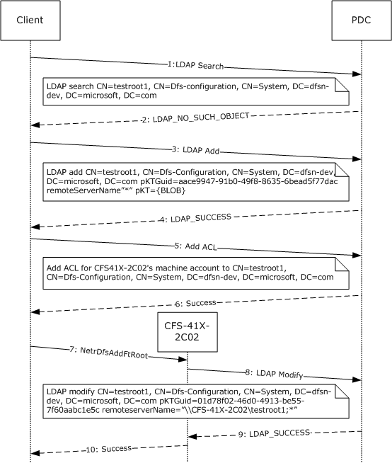

Figure 2: Creating a new domainv1-based DFS namespace

## 4.2 Adding a Root Target to an Existing Domainv1-Based DFS Namespace

The following example describes the steps used to create a new root target in an existing [**domainv1-based DFS namespace**](#gt_domainv1-based-dfs-namespace).

- The client determines whether a new domainv1-based DFS namespace is being created or a new [**DFS root target**](#gt_ac90b498-3ba4-48d6-bcd6-5495f1654671) is being added to an existing domainv1-based DFS namespace, by issuing an [**LDAP**](#gt_lightweight-directory-access-protocol-ldap) search for the [**object**](#gt_object) corresponding to the domainv1-based DFS namespace to the [**PDC**](#gt_primary-domain-controller-pdc).
- Because the domainv1-based DFS namespace already exists, the LDAP search is successful.
- The client updates the [**ACL**](#gt_access-control-list-acl) on the object to permit the new DFS root target CFS-41X-2C03 to update the object.
- The ACL change on the object is successful.
- The client issues a [NetrDfsAddFtRoot](#Section_3.2.4.3.1) method to the new DFS root target server CFS-41X-2C03.
- The DFS root target server CFS-41X-2C03 creates the [**DFS metadata**](#gt_e8de88fd-d760-46fa-ad77-76961fa20aea) required for the new domainv1-based DFS namespace and writes it to the PDC for the [**domain**](#gt_domain). The following illustration shows the LDAP modify parameters that do this.
- The DFS metadata write is successful.
- The DFS root target CFS-41X-2C03 completes the [NetrDfsAddFtRoot](#Section_3.1.4.3.1) method to the client.
The following illustration shows the sequence of events.

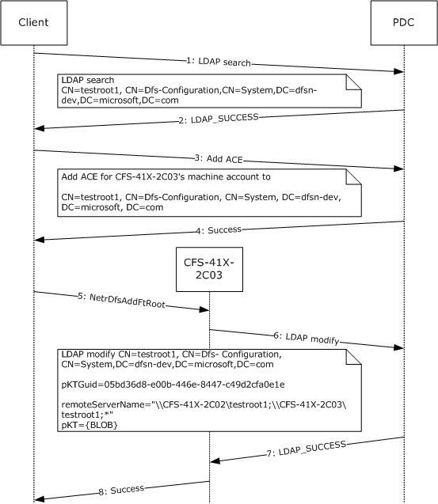

Figure 3: Adding a root target to an existing domainv1-based DFS namespace

## 4.3 Adding a New Link to a Domain-Based DFS Namespace

The following example describes the steps for adding a new [**DFS link**](#gt_0611e93d-f0e7-42ee-a591-d77ebcbb6619) to an existing [**domainv1-based DFS namespace**](#gt_domainv1-based-dfs-namespace) that has two root targets. The illustration in this example also shows how the [**DFS root target**](#gt_ac90b498-3ba4-48d6-bcd6-5495f1654671) uses [NetrDfsSetInfo](#Section_3.1.4.1.5), *Level* parameter 101, and DFS_VOLUME_STATE_RESYNCHRONIZE to update the [**DFS metadata**](#gt_e8de88fd-d760-46fa-ad77-76961fa20aea) of the [**domain-based DFS namespace**](#gt_domain-based-dfs-namespace) with the new DFS link information, and then notifies the other root targets.

- A client issues a [NetrDfsAdd](#Section_3.1.4.1.3) [**RPC**](#gt_remote-procedure-call-rpc) method to the DFS root target CFS-41X-2C02 for the domainv1-based DFS namespace.
- The DFS root target CFS-41X-2C02 issues an [**LDAP**](#gt_lightweight-directory-access-protocol-ldap) search operation to retrieve the **pKTGuid** attribute in the [**object**](#gt_object) for the domainv1-based DFS namespace to the [**PDC**](#gt_primary-domain-controller-pdc) for the [**domain**](#gt_domain). The following illustration shows the [**DN**](#gt_distinguished-name-dn) of the object and the attribute searched.
- The LDAP search is successful, and the value of the **PktGuid** attribute is returned.
- The DFS root target CFS-41X-2C02 determines that the DFS metadata in its cache is up-to-date and determines whether the new link target is already in another [**DFS namespace**](#gt_6a3f0be9-b9b4-49df-9d1c-a3b89e4e9890). This is done by issuing the **NetrShareGetInfo** method, as specified in [MS-SRVS](../MS-SRVS/MS-SRVS.md), specifying a *Level* parameter 1005 to the [**DFS link target**](#gt_44e2f830-c28b-41e3-8c3c-d0bb576ed9fb) CFS-44X-2B08 to check the link target share's properties. For more information on the **NetrShareGetInfo** method, see [MS-SRVS].
- The **NetrShareGetInfo** RPC method returns an indication that the DFS link target [**share**](#gt_share) is not a DFS namespace. This information is used to determine the value of the PKT_ENTRY_TYPE_OUTSIDE_MY_DOM bit of the **Type** field of the [DFSRootOrLinkIDBLOB](#Section_2.3.3.1.1.2) (for more information, see section 2.3.3.1.1.2) for the DFS link. For this example, the bit is set to 0.
- DFS link target CFS-41X-2C02 issues an LDAP modify operation to the PDC with a new **pKTGuid** value and the updated DFS metadata containing the new DFS link information.
- The LDAP modify operation is successful.
- The [NetrDfsAdd](#Section_3.1.4.1.3) method invoked by the client completes successfully.
- The DFS root target, which updated the DFS metadata, issues the NetrDfsSetInfo method with the *Level* parameter 101 and the **State** field of [DFS_INFO_101](#Section_2.2.3.1) set to DFS_VOLUME_STATE_RESYNCHRONIZE to all of the other root targets. CFS-41X-2C02, in this example, is notifying CFS-41X-2C03.
- On receiving the NetrDfsSetInfo method, *Level* parameter 101, and DFS_VOLUME_STATE_RESYNCHRONIZE, CFS-41X-2C03 issues an LDAP search to the PDC to verify whether the DFS metadata in its cache is up-to-date.
- The LDAP search operation is successful and contains the **pKTGuid** attribute's value.
- CFS-41X-2C03 determines that the cached DFS metadata it has needs to be refreshed. It then issues an LDAP search operation to retrieve the value of the **pKT** attribute, which contains the actual DFS metadata.
- The LDAP search is successful and contains the DFS metadata in the reply.
- In this example, CFS-41X-2C03 performs the required changes to its local state by adding the new DFS link. The NetrDfsSetInfo method that CFS-41X-2C02 issued is then completed.
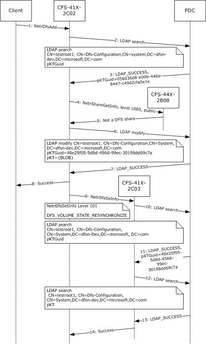

Figure 4: Adding a new link to a domainv1-based DFS namespace

## 4.4 Creating a New Domainv2-Based DFS Namespace

The following example describes the steps used to create a new [**domainv2-based DFS namespace**](#gt_domainv2-based-dfs-namespace).

- A client determines whether a new domainv2-based DFS namespace is being created or a new [**DFS root target**](#gt_ac90b498-3ba4-48d6-bcd6-5495f1654671) is being added to an existing domainv2-based DFS namespace, by issuing an [**LDAP**](#gt_lightweight-directory-access-protocol-ldap) search for the [**object**](#gt_object) corresponding to the domainv2-based DFS namespace. The following illustration shows the LDAP search parameters that do this.
- Because the domainv2-based DFS namespace does not already exist, the [**DC**](#gt_domain-controller-dc) fails the LDAP search with LDAP_NO_SUCH_OBJECT.
- The client creates an object for the new domainv2-based DFS namespace.
- Object creation is successful.
- The client updates the [**ACL**](#gt_access-control-list-acl) on the object to permit the new DFS root target CFS-41X-2C02 to update the object.
- The ACL change on the object is successful.
- The client issues a [NetrDfsAddRootTarget](#Section_3.1.4.1.9) method to the DFS root target server.
- The DFS root target server creates a new [**DFS namespace**](#gt_6a3f0be9-b9b4-49df-9d1c-a3b89e4e9890) LDAP entry with the DFS namespace anchor LDAP entry as its parent. The server also creates the [**DFS metadata**](#gt_e8de88fd-d760-46fa-ad77-76961fa20aea) required for the new domainv2-based DFS namespace and updates the DFS metadata in the object corresponding to the DFS namespace. This appears as an LDAP modify operation to the [**PDC**](#gt_primary-domain-controller-pdc) for the [**domain**](#gt_domain). The following illustration shows the LDAP modify parameters that do this.
- The DFS metadata write is successful.
- The DFS root target completes the NetrDfsAddRootTarget method to the client.
The following illustration shows this sequence of events.

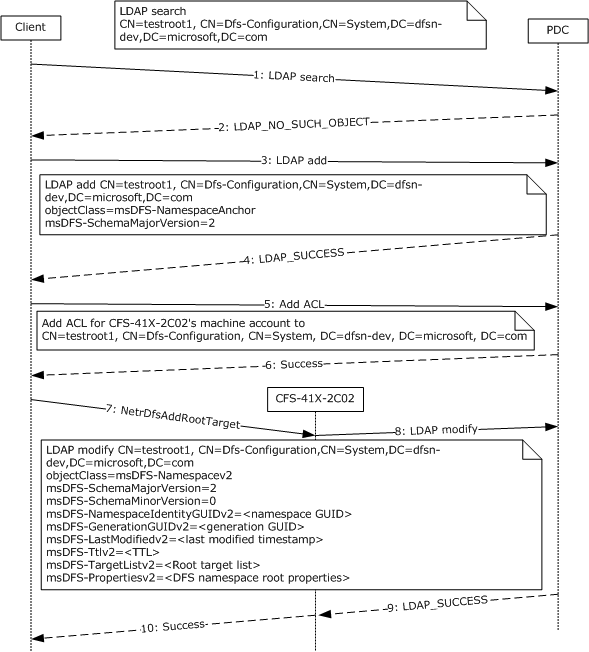

Figure 5: Creating a new domainv2-based DFS namespace

## 4.5 Adding a Root Target to an Existing Domainv2-Based DFS Namespace

The following example describes the steps used to create a new root target in an existing [**domainv2-based DFS namespace**](#gt_domainv2-based-dfs-namespace).

- The client determines whether a new domainv2-based DFS namespace is being created, or a new [**DFS root target**](#gt_ac90b498-3ba4-48d6-bcd6-5495f1654671) is being added to an existing domainv2-based DFS namespace, by issuing an [**LDAP**](#gt_lightweight-directory-access-protocol-ldap) search for the [**object**](#gt_object) corresponding to the domainv2-based DFS namespace to the [**PDC**](#gt_primary-domain-controller-pdc).
- Because the domainv2-based DFS namespace already exists, the LDAP search is successful.
- The client updates the [**ACL**](#gt_access-control-list-acl) on the object to permit the new DFS root target CFS-41X-2C03 to update the object.
- The ACL change on the object is successful.
- The client issues a [NetrDfsAddRootTarget](#Section_3.1.4.1.9) method to the new DFS root target server CFS-41X-2C03.
- The DFS root target server CFS-41X-2C03 creates the [**DFS metadata**](#gt_e8de88fd-d760-46fa-ad77-76961fa20aea) required for the new domainv2-based DFS namespace and writes it to the PDC for the [**domain**](#gt_domain). The following illustration shows the LDAP modify parameters that do this.
- The DFS metadata write is successful.
- The DFS root target CFS-41X-2C03 completes the NetrDfsAddRootTarget method to the client.
The following illustration shows the sequence of events.

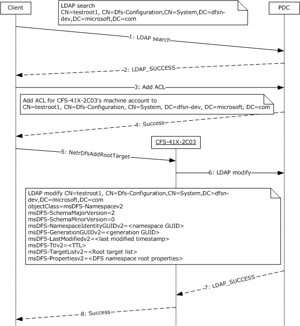

Figure 6: Adding a root target to an existing domainv2-based DFS namespace

## 4.6 Adding a New Link to a Domainv2-Based DFS Namespace

The following example describes the steps used to add a new [**DFS link**](#gt_0611e93d-f0e7-42ee-a591-d77ebcbb6619) to an existing [**domainv2-based DFS namespace**](#gt_domainv2-based-dfs-namespace) with two root targets. The illustration in this example also shows how the [**DFS root target**](#gt_ac90b498-3ba4-48d6-bcd6-5495f1654671) uses [NetrDfsSetInfo](#Section_3.1.4.1.5), *Level* parameter 101, and DFS_VOLUME_STATE_RESYNCHRONIZE, to update the [**DFS metadata**](#gt_e8de88fd-d760-46fa-ad77-76961fa20aea) of the [**domain-based DFS namespace**](#gt_domain-based-dfs-namespace) with the new DFS link information, and then notifies the other root targets.

- A client issues a [NetrDfsAdd](#Section_3.1.4.1.3) [**RPC**](#gt_remote-procedure-call-rpc) method to the DFS root target CFS-41X-2C02 for the domainv2-based DFS namespace.
- The DFS root target CFS-41X-2C02 performs either a full synchronization or an incremental synchronization. A full synchronization is performed if the DFS root target server is switching to a new [**PDC**](#gt_primary-domain-controller-pdc) or if the [**DC**](#gt_domain-controller-dc) that the synchronization operation is currently using is different from that in the <uSNChanged, DC invocation ID> tuple that was saved at the start of a previous full synchronization for the [**DFS namespace**](#gt_6a3f0be9-b9b4-49df-9d1c-a3b89e4e9890). An incremental synchronization is performed if the DFS root target server is already syncing with the PDC.
- An incremental synchronization is done by issuing an [**LDAP**](#gt_lightweight-directory-access-protocol-ldap) search operation for the DFS namespace LDAP entry subtree to determine whether in any of the [**object**](#gt_object) classes of msDFS-Namespacev2, msDFS-Linkv2, or msDFS-DeletedLinkv2 the uSNChanged is greater than the saveduSNChanged value, where saveduSNChanged is the uSNChanged value from the tuple <uSNChanged, DC invocation ID> that was saved previously.
- The DFS root target CFS-41X-2C02 determines that the DFS metadata in its cache is up-to-date and whether the new link points to another DFS namespace.
- [**DFS link target**](#gt_44e2f830-c28b-41e3-8c3c-d0bb576ed9fb) CFS-41X-2C02 issues an LDAP modify operation to the PDC with a new identity [**GUID**](#gt_globally-unique-identifier-guid) (msDFS-LinkIdentityGUID) value and the updated DFS metadata that contains the new DFS link information. The link identity GUID is set at DFS link creation time and does not change for the lifetime of the LDAP entry. It is used to locate the in-memory data structure that corresponds to the DFS link in the DFS metadata cache.
- The LDAP modify operation is successful.
- The NetrDfsAdd method invoked by the client completes successfully.
- To perform a full synchronization to ensure that this is propagated to all other root targets, the DFS root target, which updated the DFS metadata, issues the NetrDfsSetInfo method, with the *Level* parameter 101 and the **State** field of [DFS_INFO_101](#Section_2.2.4.1) set to DFS_VOLUME_STATE_RESYNCHRONIZE, to all of the other root targets. This is used to identify added or deleted DFS links. In this example, CFS-41X-2C02 is notifying CFS-41X-2C03.
- On receiving the NetrDfsSetInfo method with *Level* parameter 101 and DFS_VOLUME_STATE_RESYNCHRONIZE, CFS-41X-2C03 issues an LDAP search to the PDC to verify whether the DFS metadata in its cache is up-to-date. A different uSNChanged value from the <uSNChanged, DC invocation ID> tuple saved at the start of a previous full sync would indicate what has changed, and it would subsequently perform an incremental sync to propagate any DFS metadata change.
- CFS-41X-2C03 determines that the cached DFS metadata it has needs to be refreshed. It then issues an LDAP search operation to retrieve the attributes associated with the msDFS-Linkv2 class, which contains the actual DFS metadata.
- The LDAP search is successful and contains the DFS metadata in the reply.
- In this example, CFS-41X-2C03 performs the required changes to its local state by adding the new DFS link. The NetrDfsSetInfo method that CFS-41X-2C02 issued is then completed.
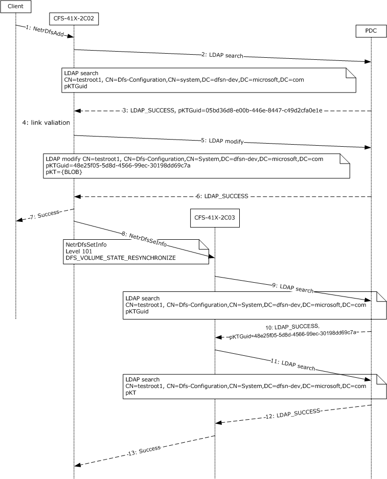

Figure 7: Adding a new link to a domainv2-based DFS namespace

## 4.7 Enumerating DFS Links in a Domain-Based DFS Namespace

The following example describes the sequence of an interactive administration application that enumerates all [**domain-based DFS namespaces**](#gt_domain-based-dfs-namespace) in a [**domain**](#gt_domain) and all [**DFS links**](#gt_0611e93d-f0e7-42ee-a591-d77ebcbb6619) of a [**domain-based DFS namespace**](#gt_domain-based-dfs-namespace).

- To enumerate all of the domain-based DFS namespaces in the dfsn-dev domain, the administration application issues the [NetrDfsEnumEx](#Section_3.1.4.2.3) [**RPC**](#gt_remote-procedure-call-rpc) method with the *DfsEntryPath* parameter `\\dfsn-dev` and *Level* parameter 200. This method is issued to the [**DC**](#gt_domain-controller-dc).
- The DC returns two domain-based DFS namespaces in the domain: `\\dfsn-dev\testroot1` and `\\dfsn-dev\testroot2`.
- The user decides to view information about the domain-based DFS namespace `\\dfsn-dev\testroot1`. Before the administering application can issue the RPC method to obtain information about that [**DFS namespace**](#gt_6a3f0be9-b9b4-49df-9d1c-a3b89e4e9890), it determines which [**DFS root target**](#gt_ac90b498-3ba4-48d6-bcd6-5495f1654671) it will issue the RPC method to. This is done by issuing a [**DFS root**](#gt_639b7503-b879-4ef7-98a8-14adf85bc16d) referral request to the DC, as specified in [[MSDFS]](https://go.microsoft.com/fwlink/?LinkId=89945).
- The DC responds to the DFS root referral request with the two DFS root targets: `\\cfs-41x-2c02\testroot1` and `\\cfs-41x-2c03\testroot1`.
- The NetrDfsEnumEx RPC method to obtain information about the DFS namespace `\\dfsn-dev\testroot1` is then issued to the root target `cfs-41x-2c02`.
- The root target returns the DFS root and one DFS link in the domain-based DFS namespace.
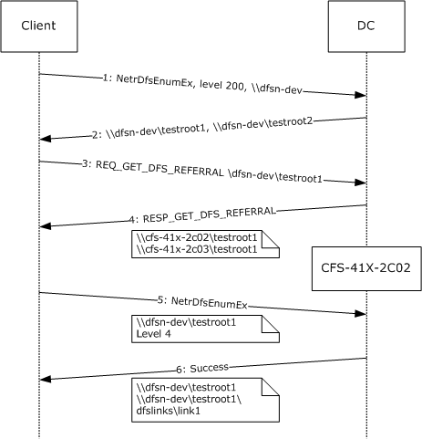

Figure 8: Enumerating DFS links in a domainv1-based DFS namespace

## 4.8 DFS Metadata of a Domainv1-Based DFS Namespace

This example uses the following [**domainv1-based DFS namespaces**](#gt_domainv1-based-dfs-namespace):

- [**DFS root**](#gt_639b7503-b879-4ef7-98a8-14adf85bc16d): `\\dfsn-dev\testroot1`
- [**DFS root targets**](#gt_ac90b498-3ba4-48d6-bcd6-5495f1654671): `\\cfs-41x-2c02\testroot1` and `\\cfs-41x-2c03\testroot1`
- [**DFS link**](#gt_0611e93d-f0e7-42ee-a591-d77ebcbb6619): `\\dfsn-dev\testroot1\dfslinks\link1`
- [**DFS link target**](#gt_44e2f830-c28b-41e3-8c3c-d0bb576ed9fb) `\\cfs-44x-2b08\public`
The following illustration shows the hexadecimal dump of the [**DFS metadata**](#gt_e8de88fd-d760-46fa-ad77-76961fa20aea) for this domainv1-based DFS namespace. The offsets in the hexadecimal dump are used to explain the dump.

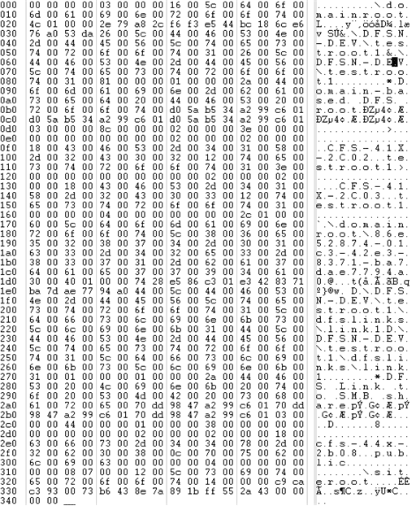

Figure 9: Hexadecimal dump of the DFS metadata for a domainv1-based DFS namespace

The following table lists elements of the hexadecimal dump.

| Bit Range | Field | Description |
| --- | --- | --- |
| Variable | 0x000 | 00 00 00 00 BLOBVersion: 0 |
| Variable | 0x004 | 03 00 00 00 BLOBElementCount: 3 |
| Variable | 0x008 | - [DFSNamespaceElementBLOB](#Section_2.3.3.1.1) #1 |
| Variable | 0x008 | 16 00 BLOBNameSize: 0x0016 (22) |
| Variable | 0x00A | 5C 00 64 00 6F 00 6D 00 61 00 69 00 6E 00 72 00 6F 00 6F 00 74 00 BLOBName: \domainroot |
| Variable | 0x020 | 4C 01 00 00 BLOBDataSize: 0x0000014c (332) |
| Variable | 0x024 | - [DFSNamespaceRootBLOB](#Section_2.3.3.1.1.1) |
| Variable | 0x024 | - [DFSRootOrLinkIDBLOB](#Section_2.3.3.1.1.2) |
| RootOrLinkGuid: 2ca8792e-f3f6-44e5-bc18-6ce676a053da | 0x024 | 2E 79 A8 2C F6 F3 E5 44 BC 18 6C E6 76 A0 53 DA |
| Variable | 0x034 | 26 00 PrefixSize: 0x0026 (38) |
| Variable | 0x036 | 5C 00 44 00 46 00 53 00 4E 00 2D 00 44 00 45 00 56 00 5C 00 74 00 65 00 73 00 74 00 72 00 6F 00 6F 00 74 00 31 00 Prefix: \DFSN-DEV\testroot1 |
| Variable | 0x05C | 26 00 ShortPrefixSize: 0x0026 (38) |
| Variable | 0x05E | 5C 00 44 00 46 00 53 00 4E 00 2D 00 44 00 45 00 56 00 5C 00 74 00 65 00 73 00 74 00 72 00 6F 00 6F 00 74 00 31 00 Short prefix: \DFSN-DEV\testroot1 |
| Variable | 0x084 | 81 00 00 00 Type: 0x00000081 |
| Variable | 0x088 | 01 00 00 00 State: 0x00000001 |
| Variable | 0x08C | 2A 00 CommentSize: 0x002A (42) |
| Variable | 0x08E | 44 00 6F 00 6D 00 61 00 69 00 6E 00 2D 00 62 00 61 00 73 00 65 00 64 00 20 00 44 00 46 00 53 00 20 00 72 00 6F 00 6F 00 74 00 Comment: Domain-based DFS root |
| PrefixTimeStamp: June 26, 2006 21:28:57 | 0x0B8 | D0 5A B5 34 A2 99 C6 01 |
| StateTimeStamp: June 26, 2006 21:28:57 | 0x0C0 | D0 5A B5 34 A2 99 C6 01 |
| CommentTimeStamp: June 26, 2006 21:28:57 | 0x0C8 | D0 5A B5 34 A2 99 C6 01 |
| Variable | 0x0D0 | 03 00 00 00 Version: 0x0000003 |
| Variable | 0x0D4 | 8C 00 00 00 DFSTargetListBLOBSize: 0x0000008C (140) |
| Variable | 0x0D8 | - DFSTargetListBLOB |
| Variable | 0x0D8 | 02 00 00 00 TargetCount: 0x00000002 |
| Variable | 0x0DC | - TargetEntryBLOB |
| Variable | 0x0DC | 3E 00 00 00 TargetEntrySize: 0x0000003E (62) |
| Variable | 0x0E0 | 00 00 00 00 00 00 00 00 TargetTimeStamp: 0 |
| Variable | 0x0E8 | 02 00 00 00 TargetState: 0x00000002 |
| Variable | 0x0EC | 02 00 00 00 TargetType: 0x00000002 |
| Variable | 0x0F0 | 18 00 ServerNameSize: 0x0018 (24) |
| Variable | 0x0F2 | 43 00 46 00 53 00 2D 00 34 00 31 00 58 00 2D 00 32 00 43 00 30 00 32 00 ServerName: CFS-41X-2C02 |
| Variable | 0x10A | 12 00 ShareNameSize: 0x0012 (18) |
| Variable | 0x10C | 74 00 65 00 73 00 74 00 72 00 6F 00 6F 00 74 00 31 00 ShareName: testroot1 |
| Variable | 0x11E | - [TargetEntryBLOB](#Section_2.3.3.1.1.3.1) |
| Variable | 0x11E | 3E 00 00 00 TargetEntrySize: 0x0000003E (62) |
| Variable | 0x122 | 00 00 00 00 00 00 00 00 TargetTimeStamp: 0 |
| Variable | 0x12A | 02 00 00 00 TargetState: 0x00000002 |
| Variable | 0x12E | 02 00 00 00 TargetType: 0x00000002 |
| Variable | 0x132 | 18 00 ServerNameSize: 0x0018 (24) |
| Variable | 0x134 | 43 00 46 00 53 00 2D 00 34 00 31 00 58 00 2D 00 32 00 43 00 30 00 33 00 ServerName: CFS-41X-2C03 |
| Variable | 0x14C | 12 00 ShareNameSize: 0x0012 (18) |
| Variable | 0x14E | 74 00 65 00 73 00 74 00 72 00 6F 00 6F 00 74 00 31 00 ShareName: testroot1 |
| Variable | 0x160 | 00 00 00 00 Padding |
| Variable | 0x164 | 04 00 00 00 ReservedBLOBSize: 0x00000004 |
| Variable | 0x168 | 00 00 00 00 ReservedBLOB: 0x00000000 |
| Variable | 0x16C | 2C 01 00 00 TTL: 0x0000012C (300 Seconds) |
| Variable | 0x170 | 60 00 BLOBNameSize: 0x0060 (96) |
| BLOBName: \domainroot\86e52874-01c3-42e3-8371-ba7dae7794a0 | 0x172 | 5C 00 64 00 6F 00 6D 00 61 00 69 00 6E 00 72 00 6F 00 6F 00 74 00 5C 00 38 00 36 00 65 00 35 00 32 00 38 00 37 00 34 00 2D 00 30 00 31 00 63 00 33 00 2D 00 34 00 32 00 65 00 33 00 2D 00 38 00 33 00 37 00 31 00 2D 00 62 00 61 00 37 00 64 00 61 00 65 00 37 00 37 00 39 00 34 00 61 00 30 00 |
| Variable | 0x1D2 | 40 01 00 00 BLOBDataSize: 0x00000140 (320) |
| Variable | 0x1D6 | - DFSNamespaceLinkBLOB |
| Variable | 0x1D6 | - DFSRootOrLinkIDBLOB |
| RootOrLinkGuid: 86e52874-1c3-42e3-8371-ba7dae7794a0 | 0x1D6 | 74 28 E5 86 C3 01 E3 42 83 71 BA 7D AE 77 94 A0 |
| Variable | 0x1E6 | 44 00 PrefixSize: 0x0044 (68) |
| Variable | 0x1E8 | 5C 00 44 00 46 00 53 00 4E 00 2D 00 44 00 45 00 56 00 5C 00 74 00 65 00 73 00 74 00 72 00 6F 00 6F 00 74 00 31 00 5C 00 64 00 66 00 73 00 6C 00 69 00 6E 00 6B 00 73 00 5C 00 6C 00 69 00 6E 00 6B 00 31 00 Prefix: \DFSN-DEV\testroot1\dfslinks\link1 |
| Variable | 0x22C | 44 00 ShortPrefixSize: 0x0044 (68) |
| Variable | 0x22E | 5C 00 44 00 46 00 53 00 4E 00 2D 00 44 00 45 00 56 00 5C 00 74 00 65 00 73 00 74 00 72 00 6F 00 6F 00 74 00 31 00 5C 00 64 00 66 00 73 00 6C 00 69 00 6E 00 6B 00 73 00 5C 00 6C 00 69 00 6E 00 6B 00 31 00 Short prefix: \DFSN-DEV\testroot1\dfslinks\link1 |
| Variable | 0x272 | 01 00 00 00 Type: 0x00000001 |
| Variable | 0x276 | 01 00 00 00 State: 0x00000001 |
| Variable | 0x27A | 2A 00 CommentSize: 0x002A (42) |
| Comment: DFS link to [**SMB**](#gt_server-message-block-smb) [**share**](#gt_share) | 0x27C | 44 00 46 00 53 00 20 00 4C 00 69 00 6E 00 6B 00 20 00 74 00 6F 00 20 00 53 00 4D 00 42 00 20 00 73 00 68 00 61 00 72 00 65 00 |
| PrefixTimeStamp: June 26, 2006 21:29:29 | 0x2A6 | 70 DD 98 47 A2 99 C6 01 |
| StateTimeStamp: June 26, 2006 21:29:29 | 0x2AE | 70 DD 98 47 A2 99 C6 01 |
| CommentTimeStamp: June 26, 2006 21:29:29 | 0x2B6 | 70 DD 98 47 A2 99 C6 01 |
| Variable | 0x2BE | 03 00 00 00 Version: 3 |
| Variable | 0x2C2 | 44 00 00 00 DFSTargetListBLOBSize: 0x00000044 (68) |
| Variable | 0x2C6 | - [DFSTargetListBLOB](#Section_2.3.3.1.1.3) |
| Variable | 0x2C6 | 01 00 00 00 TargetCount: 0x00000001 |
| Variable | 0x2CA | - TargetEntryBLOB |
| Variable | 0x2CA | 38 00 00 00 TargetEntrySize: 0x00000038 (56) |
| Variable | 0x2CE | 00 00 00 00 00 00 00 00 TargetTimeStamp: 0 |
| Variable | 0x2D6 | 02 00 00 00 TargetState: 0x00000002 |
| Variable | 0x2DA | 02 00 00 00 TargetType: 0x00000002 |
| Variable | 0x2DE | 18 00 ServerNameSize: 0x0018 (24) |
| Variable | 0x2E0 | 63 00 66 00 73 00 2D 00 34 00 34 00 78 00 2D 00 32 00 62 00 30 00 38 00 ServerName: cfs-44x-2b08 |
| Variable | 0x2F8 | 0C 00 ShareNameSize: 0x000C (12) |
| Variable | 0x2FA | 70 00 75 00 62 00 6C 00 69 00 63 00 ShareName: public |
| Variable | 0x306 | 00 00 00 00 Padding |
| Variable | 0x30A | 04 00 00 00 ReservedBLOBSize: 0x00000004 |
| Variable | 0x30E | 00 00 00 00 ReservedBLOB |
| Variable | 0x312 | 08 07 00 00 TTL: 0x00000708 (1800 Seconds) |
| Variable | 0x316 | 12 00 BLOBNameSize: 0x0012 (18) |
| Variable | 0x318 | 5C 00 73 00 69 00 74 00 65 00 72 00 6F 00 6F 00 74 00 BLOBName: \siteroot |
| Variable | 0x32A | 14 00 00 00 BLOBDataSize: 0x00000014 (20) |
| Variable | 0x32E | - SiteInformationBLOB |
| SiteTableGuid: 93c3cac9-7300-43b6-8e7a-891bff552a43 | 0x32E | C9 CA C3 93 00 73 B6 43 8E 7A 89 1B FF 55 2A 43 |
| Variable | 0x33E | 00 00 00 00 SiteEntryCount: 0x00000000 |

# 5 Security

## 5.1 Security Considerations for Implementers

The DFS: Namespace Management Protocol allows any user to establish a connection to the [**RPC**](#gt_remote-procedure-call-rpc) server. The protocol uses the underlying RPC Protocol to retrieve the identity of the caller that made the method call, as specified in [MS-RPCE](../MS-RPCE/MS-RPCE.md) section 3.3.3.4.3. Clients SHOULD create an authenticated RPC connection. Servers SHOULD use this identity to perform method-specific access checks.<150>

## 5.2 Index of Security Parameters

The only security parameter is Authentication Protocol, section [2.1](#Section_2.1).

# 6 Appendix A: Full IDL

The DFS: Namespace Management Protocol contains one interface, whose [**IDL**](#gt_interface-definition-language-idl) definition is listed in this section.

import "ms-dtyp.idl";

/* ----- structures and methods described [MS-DFSNM], section 2 and 3 ----- */

[

uuid(4fc742e0-4a10-11cf-8273-00aa004ae673),

version(3.0),

ms_union,

pointer_default(unique)

]

interface netdfs {

typedef DWORD NET_API_STATUS;

typedef WCHAR * NETDFS_SERVER_OR_DOMAIN_HANDLE;

typedef [v1_enum] enum _DFS_TARGET_PRIORITY_CLASS {

DfsInvalidPriorityClass = -1,

DfsSiteCostNormalPriorityClass = 0,

DfsGlobalHighPriorityClass = 1,

DfsSiteCostHighPriorityClass = 2,

DfsSiteCostLowPriorityClass = 3,

DfsGlobalLowPriorityClass = 4

} DFS_TARGET_PRIORITY_CLASS;

typedef struct _DFS_TARGET_PRIORITY {

DFS_TARGET_PRIORITY_CLASS TargetPriorityClass;

unsigned short TargetPriorityRank;

unsigned short Reserved;

} DFS_TARGET_PRIORITY;

typedef struct _DFS_STORAGE_INFO {

unsigned long State;

[string] WCHAR * ServerName;

[string] WCHAR * ShareName;

} DFS_STORAGE_INFO;

typedef struct _DFS_STORAGE_INFO_1 {

unsigned long State;

[string] WCHAR * ServerName;

[string] WCHAR * ShareName;

DFS_TARGET_PRIORITY TargetPriority;

} DFS_STORAGE_INFO_1, *PDFS_STORAGE_INFO_1, *LPDFS_STORAGE_INFO_1;

typedef struct _DFSM_ROOT_LIST_ENTRY {

[string, unique] WCHAR * ServerShare;

} DFSM_ROOT_LIST_ENTRY;

typedef struct _DFSM_ROOT_LIST {

DWORD cEntries;

[size_is(cEntries)] DFSM_ROOT_LIST_ENTRY Entry[];

} DFSM_ROOT_LIST;

typedef enum {

DFS_NAMESPACE_VERSION_ORIGIN_COMBINED = 0,

DFS_NAMESPACE_VERSION_ORIGIN_SERVER,

DFS_NAMESPACE_VERSION_ORIGIN_DOMAIN

} DFS_NAMESPACE_VERSION_ORIGIN;

typedef struct _DFS_SUPPORTED_NAMESPACE_VERSION_INFO {

unsigned long DomainDfsMajorVersion;

unsigned long DomainDfsMinorVersion;

ULONGLONG DomainDfsCapabilities;

unsigned long StandaloneDfsMajorVersion;

unsigned long StandaloneDfsMinorVersion;

ULONGLONG StandaloneDfsCapabilities;

} DFS_SUPPORTED_NAMESPACE_VERSION_INFO,

*PDFS_SUPPORTED_NAMESPACE_VERSION_INFO;

typedef struct _DFS_INFO_1 {

[string] WCHAR * EntryPath;

} DFS_INFO_1;

typedef struct _DFS_INFO_2 {

[string] WCHAR * EntryPath;

[string] WCHAR * Comment;

DWORD State;

DWORD NumberOfStorages;

} DFS_INFO_2;

typedef struct _DFS_INFO_3 {

[string] WCHAR * EntryPath;

[string] WCHAR * Comment;

DWORD State;

DWORD NumberOfStorages;

[size_is(NumberOfStorages)] DFS_STORAGE_INFO * Storage;

} DFS_INFO_3;

typedef struct _DFS_INFO_4 {

[string] WCHAR * EntryPath;

[string] WCHAR * Comment;

DWORD State;

unsigned long Timeout;

GUID Guid;

DWORD NumberOfStorages;

[size_is(NumberOfStorages)] DFS_STORAGE_INFO * Storage;

} DFS_INFO_4;

typedef struct _DFS_INFO_5 {

[string] WCHAR * EntryPath;

[string] WCHAR * Comment;

DWORD State;

unsigned long Timeout;

GUID Guid;

unsigned long PropertyFlags;

unsigned long MetadataSize;

DWORD NumberOfStorages;

} DFS_INFO_5;

typedef struct _DFS_INFO_6 {

[string] WCHAR * EntryPath;

[string] WCHAR * Comment;

DWORD State;

unsigned long Timeout;

GUID Guid;

unsigned long PropertyFlags;

unsigned long MetadataSize;

DWORD NumberOfStorages;

[size_is(NumberOfStorages)] DFS_STORAGE_INFO_1 * Storage;

} DFS_INFO_6;

typedef struct _DFS_INFO_7 {

GUID GenerationGuid;

} DFS_INFO_7;

typedef struct _DFS_INFO_8 {

[string] WCHAR * EntryPath;

[string] WCHAR * Comment;

DWORD State;

unsigned long Timeout;

GUID Guid;

unsigned long PropertyFlags;

unsigned long MetadataSize;

ULONG SecurityDescriptorLength;

[size_is(SecurityDescriptorLength)] PUCHAR pSecurityDescriptor;

DWORD NumberOfStorages;

} DFS_INFO_8,

*LPDFS_INFO_8;

typedef struct _DFS_INFO_9 {

[string] WCHAR * EntryPath;

[string] WCHAR * Comment;

DWORD State;

unsigned long Timeout;

GUID Guid;

unsigned long PropertyFlags;

unsigned long MetadataSize;

ULONG SecurityDescriptorLength;

[size_is(SecurityDescriptorLength)] PUCHAR pSecurityDescriptor;

DWORD NumberOfStorages;

[size_is(NumberOfStorages)] LPDFS_STORAGE_INFO_1 Storage;

} DFS_INFO_9,

*LPDFS_INFO_9;

typedef struct _DFS_INFO_50 {

unsigned long NamespaceMajorVersion;

unsigned long NamespaceMinorVersion;

unsigned __int64 NamespaceCapabilities;

} DFS_INFO_50;

typedef struct _DFS_INFO_100 {

[string] WCHAR * Comment;

} DFS_INFO_100;

typedef struct _DFS_INFO_101 {

unsigned long State;

} DFS_INFO_101;

typedef struct _DFS_INFO_102 {

unsigned long Timeout;

} DFS_INFO_102;

typedef struct _DFS_INFO_103 {

unsigned long PropertyFlagMask;

unsigned long PropertyFlags;

} DFS_INFO_103;

typedef struct _DFS_INFO_104 {

DFS_TARGET_PRIORITY TargetPriority;

} DFS_INFO_104;

typedef struct _DFS_INFO_105 {

[string] WCHAR * Comment;

DWORD State;

unsigned long Timeout;

unsigned long PropertyFlagMask;

unsigned long PropertyFlags;

} DFS_INFO_105;

typedef struct _DFS_INFO_106 {

DWORD State;

DFS_TARGET_PRIORITY TargetPriority;

} DFS_INFO_106;

typedef struct _DFS_INFO_107 {

[string] WCHAR * Comment;

DWORD State;

unsigned long Timeout;

unsigned long PropertyFlagMask;

unsigned long PropertyFlags;

ULONG SecurityDescriptorLength;

[size_is(SecurityDescriptorLength)] PUCHAR pSecurityDescriptor;

} DFS_INFO_107;

typedef struct _DFS_INFO_150 {

ULONG SecurityDescriptorLength;

[size_is(SecurityDescriptorLength)] PUCHAR pSecurityDescriptor;

} DFS_INFO_150;

typedef struct _DFS_INFO_200 {

[string] WCHAR * FtDfsName;

} DFS_INFO_200;

typedef struct _DFS_INFO_300 {

DWORD Flags;

[string] WCHAR * DfsName;

} DFS_INFO_300;

typedef [switch_type(unsigned long)] union _DFS_INFO_STRUCT {

[case(1)]

DFS_INFO_1 * DfsInfo1;

[case(2)]

DFS_INFO_2 * DfsInfo2;

[case(3)]

DFS_INFO_3 * DfsInfo3;

[case(4)]

DFS_INFO_4 * DfsInfo4;

[case(5)]

DFS_INFO_5 * DfsInfo5;

[case(6)]

DFS_INFO_6 * DfsInfo6;

[case(7)]

DFS_INFO_7 * DfsInfo7;

[case(8)]

DFS_INFO_8 * DfsInfo8;

[case(9)]

DFS_INFO_9 * DfsInfo9;

[case(50)]

DFS_INFO_50 * DfsInfo50;

[case(100)]

DFS_INFO_100 * DfsInfo100;

[case(101)]

DFS_INFO_101 * DfsInfo101;

[case(102)]

DFS_INFO_102 * DfsInfo102;

[case(103)]

DFS_INFO_103 * DfsInfo103;

[case(104)]

DFS_INFO_104 * DfsInfo104;

[case(105)]

DFS_INFO_105 * DfsInfo105;

[case(106)]

DFS_INFO_106 * DfsInfo106;

[case(107)]

DFS_INFO_107 * DfsInfo107;

[case(150)]

DFS_INFO_150 * DfsInfo150;

[default]

;

} DFS_INFO_STRUCT;

typedef struct _DFS_INFO_1_CONTAINER {

DWORD EntriesRead;

[size_is(EntriesRead)] DFS_INFO_1 * Buffer;

} DFS_INFO_1_CONTAINER;

typedef struct _DFS_INFO_2_CONTAINER {

DWORD EntriesRead;

[size_is(EntriesRead)] DFS_INFO_2 * Buffer;

} DFS_INFO_2_CONTAINER;

typedef struct _DFS_INFO_3_CONTAINER {

DWORD EntriesRead;

[size_is(EntriesRead)] DFS_INFO_3 * Buffer;

} DFS_INFO_3_CONTAINER;

typedef struct _DFS_INFO_4_CONTAINER {

DWORD EntriesRead;

[size_is(EntriesRead)] DFS_INFO_4 * Buffer;

} DFS_INFO_4_CONTAINER;

typedef struct _DFS_INFO_5_CONTAINER {

DWORD EntriesRead;

[size_is(EntriesRead)] DFS_INFO_5 * Buffer;

} DFS_INFO_5_CONTAINER;

typedef struct _DFS_INFO_6_CONTAINER {

DWORD EntriesRead;

[size_is(EntriesRead)] DFS_INFO_6 * Buffer;

} DFS_INFO_6_CONTAINER;

typedef struct _DFS_INFO_8_CONTAINER {

DWORD EntriesRead;

[size_is(EntriesRead)] LPDFS_INFO_8 Buffer;

} DFS_INFO_8_CONTAINER,

*LPDFS_INFO_8_CONTAINER;

typedef struct _DFS_INFO_9_CONTAINER {

DWORD EntriesRead;

[size_is(EntriesRead)] LPDFS_INFO_9 Buffer;

} DFS_INFO_9_CONTAINER,

*LPDFS_INFO_9_CONTAINER;

typedef struct _DFS_INFO_200_CONTAINER {

DWORD EntriesRead;

[size_is(EntriesRead)] DFS_INFO_200 * Buffer;

} DFS_INFO_200_CONTAINER;

typedef struct _DFS_INFO_300_CONTAINER {

DWORD EntriesRead;

[size_is(EntriesRead)] DFS_INFO_300 * Buffer;

} DFS_INFO_300_CONTAINER;

typedef struct _DFS_INFO_ENUM_STRUCT {

DWORD Level;

[switch_is(Level)] union {

[case(1)]

DFS_INFO_1_CONTAINER * DfsInfo1Container;

[case(2)]

DFS_INFO_2_CONTAINER * DfsInfo2Container;

[case(3)]

DFS_INFO_3_CONTAINER * DfsInfo3Container;

[case(4)]

DFS_INFO_4_CONTAINER * DfsInfo4Container;

[case(5)]

DFS_INFO_5_CONTAINER * DfsInfo5Container;

[case(6)]

DFS_INFO_6_CONTAINER * DfsInfo6Container;

[case(8)]

DFS_INFO_8_CONTAINER * DfsInfo8Container;

[case(9)]

DFS_INFO_9_CONTAINER * DfsInfo9Container;

[case(200)]

DFS_INFO_200_CONTAINER * DfsInfo200Container;

[case(300)]

DFS_INFO_300_CONTAINER * DfsInfo300Container;

} DfsInfoContainer;

} DFS_INFO_ENUM_STRUCT;

DWORD NetrDfsManagerGetVersion();

NET_API_STATUS NetrDfsAdd(

[in,string] WCHAR * DfsEntryPath,

[in,string] WCHAR * ServerName,

[in,unique,string] WCHAR * ShareName,

[in,unique,string] WCHAR * Comment,

[in] DWORD Flags);

NET_API_STATUS NetrDfsRemove(

[in,string] WCHAR * DfsEntryPath,

[in,unique,string] WCHAR * ServerName,

[in,unique,string] WCHAR * ShareName);

NET_API_STATUS NetrDfsSetInfo(

[in,string] WCHAR * DfsEntryPath,

[in,unique,string] WCHAR * ServerName,

[in,unique,string] WCHAR * ShareName,

[in] DWORD Level,

[in,switch_is(Level)] DFS_INFO_STRUCT * DfsInfo);

NET_API_STATUS NetrDfsGetInfo(

[in,string] WCHAR * DfsEntryPath,

[in,unique,string] WCHAR * ServerName,

[in,unique,string] WCHAR * ShareName,

[in] DWORD Level,

[out,switch_is(Level)] DFS_INFO_STRUCT * DfsInfo);

NET_API_STATUS NetrDfsEnum(

[in] DWORD Level,

[in] DWORD PrefMaxLen,

[in,out,unique] DFS_INFO_ENUM_STRUCT * DfsEnum,

[in,out,unique] DWORD * ResumeHandle);

NET_API_STATUS NetrDfsMove(

[in,string] WCHAR * DfsEntryPath,

[in,string] WCHAR * NewDfsEntryPath,

[in] unsigned long Flags);

void Opnum7NotUsedOnWire();

void Opnum8NotUsedOnWire();

void Opnum9NotUsedOnWire();

NET_API_STATUS NetrDfsAddFtRoot(

[in,string] WCHAR * ServerName,

[in,string] WCHAR * DcName,

[in,string] WCHAR * RootShare,

[in,string] WCHAR * FtDfsName,

[in,string] WCHAR * Comment,

[in,string] WCHAR * ConfigDN,

[in] BOOLEAN NewFtDfs,

[in] DWORD ApiFlags,

[in,out,unique] DFSM_ROOT_LIST ** ppRootList);

NET_API_STATUS NetrDfsRemoveFtRoot(

[in,string] WCHAR * ServerName,

[in,string] WCHAR * DcName,

[in,string] WCHAR * RootShare,

[in,string] WCHAR * FtDfsName,

[in] DWORD ApiFlags,

[in,out,unique] DFSM_ROOT_LIST ** ppRootList);

NET_API_STATUS NetrDfsAddStdRoot(

[in,string] WCHAR * ServerName,

[in,string] WCHAR * RootShare,

[in,string] WCHAR * Comment,

[in] DWORD ApiFlags);

NET_API_STATUS NetrDfsRemoveStdRoot(

[in,string] WCHAR * ServerName,

[in,string] WCHAR * RootShare,

[in] DWORD ApiFlags);

NET_API_STATUS NetrDfsManagerInitialize(

[in,string] WCHAR * ServerName,

[in] DWORD Flags);

NET_API_STATUS NetrDfsAddStdRootForced(

[in,string] WCHAR * ServerName,

[in,string] WCHAR * RootShare,

[in,string] WCHAR * Comment,

[in,string] WCHAR * Share);

NET_API_STATUS NetrDfsGetDcAddress(

[in,string] WCHAR * ServerName,

[in,out,string] WCHAR ** DcName,

[in,out] BOOLEAN * IsRoot,

[in,out] unsigned long * Timeout);

NET_API_STATUS NetrDfsSetDcAddress(

[in,string] WCHAR * ServerName,

[in,string] WCHAR * DcName,

[in] DWORD Timeout,

[in] DWORD Flags);

NET_API_STATUS NetrDfsFlushFtTable(

[in,string] WCHAR * DcName,

[in,string] WCHAR * wszFtDfsName);

NET_API_STATUS NetrDfsAdd2(

[in,string] WCHAR * DfsEntryPath,

[in,string] WCHAR * DcName,

[in,string] WCHAR * ServerName,

[in,unique,string] WCHAR * ShareName,

[in,unique,string] WCHAR * Comment,

[in] DWORD Flags,

[in,out,unique] DFSM_ROOT_LIST ** ppRootList);

NET_API_STATUS NetrDfsRemove2(

[in,string] WCHAR * DfsEntryPath,

[in,string] WCHAR * DcName,

[in,unique,string] WCHAR * ServerName,

[in,unique,string] WCHAR * ShareName,

[in,out,unique] DFSM_ROOT_LIST ** ppRootList);

NET_API_STATUS NetrDfsEnumEx(

[in,string] WCHAR * DfsEntryPath,

[in] DWORD Level,

[in] DWORD PrefMaxLen,

[in,out,unique] DFS_INFO_ENUM_STRUCT * DfsEnum,

[in,out,unique] DWORD * ResumeHandle);

NET_API_STATUS NetrDfsSetInfo2(

[in,string] WCHAR * DfsEntryPath,

[in,string] WCHAR * DcName,

[in,unique,string] WCHAR * ServerName,

[in,unique,string] WCHAR * ShareName,

[in] DWORD Level,

[in,switch_is(Level)] DFS_INFO_STRUCT * pDfsInfo,

[in,out,unique] DFSM_ROOT_LIST ** ppRootList);

NET_API_STATUS NetrDfsAddRootTarget(

[in,unique,string] LPWSTR pDfsPath,

[in,unique,string] LPWSTR pTargetPath,

[in] ULONG MajorVersion,

[in,unique,string] LPWSTR pComment,

[in] BOOLEAN NewNamespace,

[in] ULONG Flags);

NET_API_STATUS NetrDfsRemoveRootTarget(

[in,unique,string] LPWSTR pDfsPath,

[in,unique,string] LPWSTR pTargetPath,

[in] ULONG Flags);

NET_API_STATUS NetrDfsGetSupportedNamespaceVersion(

[in] DFS_NAMESPACE_VERSION_ORIGIN Origin,

[in,unique,string] NETDFS_SERVER_OR_DOMAIN_HANDLE pName,

[out] PDFS_SUPPORTED_NAMESPACE_VERSION_INFO pVersionInfo);

}

# 7 Appendix B: Product Behavior

The information in this specification is applicable to the following Microsoft products or supplemental software. References to product versions include updates to those products.

- Windows NT 4.0 operating system
- Windows NT Server 4.0 operating system
- Windows 2000 Server operating system
- Windows XP operating system
- Windows Server 2003 operating system
- Windows Server 2003 R2 operating system
- Windows Vista operating system
- Windows Server 2008 operating system
- Windows 7 operating system
- Windows Server 2008 R2 operating system
- Windows 8 operating system
- Windows Server 2012 operating system
- Windows 8.1 operating system
- Windows Server 2012 R2 operating system
- Windows 10 operating system
- Windows Server 2016 operating system
- Windows Server operating system
- Windows Server 2019 operating system
- Windows Server 2022 operating system
- Windows 11 operating system
- Windows Server 2025 operating system
Exceptions, if any, are noted in this section. If an update version, service pack or Knowledge Base (KB) number appears with a product name, the behavior changed in that update. The new behavior also applies to subsequent updates unless otherwise specified. If a product edition appears with the product version, behavior is different in that product edition.

Unless otherwise specified, any statement of optional behavior in this specification that is prescribed using the terms "SHOULD" or "SHOULD NOT" implies product behavior in accordance with the SHOULD or SHOULD NOT prescription. Unless otherwise specified, the term "MAY" implies that the product does not follow the prescription.

<1> Section 1.3: Windows NT Server 4.0 supports only [**stand-alone DFS namespaces**](#gt_stand-alone-dfs-namespace).

<2> Section 1.5: Windows relies on manual coordination between human operators to ensure that only one [**DFS metadata**](#gt_e8de88fd-d760-46fa-ad77-76961fa20aea) modification is in progress at any time.

<3> Section 1.7: The Windows [**RPC**](#gt_remote-procedure-call-rpc) Protocol returns RPC_S_PROCNUM_OUT_OF_RANGE to notify the client that an RPC method is out of range, as specified in [MS-RPCE](../MS-RPCE/MS-RPCE.md).

<4> Section 2.2.2.12: Only Windows Server 2008 operating system and later support [**ABDE mode**](#gt_6e5829b2-eaaf-4afc-9afd-31c74b49f803).

<5> Section 2.2.3.5: Only Windows Server 2008 operating system and later support ABDE mode.

<6> Section 2.2.3.7: Windows-based servers return a null [**GUID**](#gt_globally-unique-identifier-guid) for stand-alone DFS namespaces.

<7> Section 2.2.3.10: This level is supported only in Windows Server 2008 operating system and later.

To identify the DFS metadata format in use, two mandatory attributes are defined in the schema to hold the major version (ldapDisplayName = msDFS-SchemaMajorVersion) and minor version (ldapDisplayName = msDFS-SchemaMinorVersion) numbers. The **rangeUpper** attribute in the attribute schema for these version number attributes determines the format of the DFS metadata supported in the forest. The value of these attributes determines the DFS metadata format in use for an existing [**DFS namespace**](#gt_6a3f0be9-b9b4-49df-9d1c-a3b89e4e9890). The implementation of a [**domainv2-based DFS namespace**](#gt_domainv2-based-dfs-namespace) has rangeUpper=2, rangeLower=2 for the NamespaceMajorVersion; and rangeUpper=0, rangeLower=0 for the NamespaceMinorVersion.

A change to an existing, or the addition of a new, mandatory attribute increments the major version and sets the minor version to 0. A change to an existing, or the addition of a new, optional attribute increments the minor version without changing the major version.

The NamespaceMajorVersion and NamespaceMinorVersion determine the format of the DFS metadata supported in the forest. The following table applies only to Windows Server 2008 operating system and later.

|  | NamespaceMajorVersion | NamespaceMinorVersion |
| --- | --- | --- |
| Domainv1-based [**DFS**](#gt_distributed-file-system-dfs) | 1 | 1 |
| Domainv2-based DFS | 2 | 0 |
| Stand-alone DFS | 1 | 2 |

<8> Section 2.2.3.10: This level is supported only in Windows Server 2008 operating system and later.

To identify the DFS metadata format in use, two mandatory attributes are defined in the schema to hold the major version (ldapDisplayName = msDFS-SchemaMajorVersion) and minor version (ldapDisplayName = msDFS-SchemaMinorVersion) numbers. The **rangeUpper** attribute in the attribute schema for these version number attributes determines the format of the DFS metadata supported in the [**forest**](#gt_forest). The value of these attributes determines the DFS metadata format in use for an existing DFS namespace. The implementation of a domainv2-based DFS namespace has rangeUpper=2, rangeLower=2 for the NamespaceMajorVersion and rangeUpper=0, rangeLower=0 for the NamespaceMinorVersion.

A change to an existing, or the addition of a new, mandatory attribute increments the major version and sets the minor version to 0. A change to an existing, or the addition of a new, optional attribute increments the minor version without changing the major version.

The NamespaceMajorVersion and NamespaceMinorVersion determine the format of the DFS metadata supported in the forest. The following table applies only to Windows Server 2008 operating system and later.

|  | NamespaceMajorVersion | NamespaceMinorVersion |
| --- | --- | --- |
| Domainv1-based DFS | 1 | 1 |
| Domainv2-based DFS | 2 | 0 |
| Stand-alone DFS | 1 | 2 |

<9> Section 2.2.3.10: Only Windows Server 2008 operating system and later support ABDE mode.

<10> Section 2.2.4.3: Only Windows Server 2008 operating system and later support ABDE mode.

<11> Section 2.3.3.1.1: Windows 2000 Server performs a case-sensitive comparison of the name. Windows Server 2003 operating system and later perform a case-insensitive comparison of the name.

<12> Section 2.3.3.1.1.2: Windows Server 2003 operating system and later use the same name for the **ShortPrefix** field and the **Prefix** field. Windows 2000 Server stores an [**8.3 name**](#gt_83-name) in the **ShortPrefix** field.

<13> Section 2.3.3.1.1.2: Only Windows Server 2003 operating system and later support [**DFS referral site costing**](#gt_2ea2b8ff-5099-4b7d-86fc-d14a506fc14b).

<14> Section 2.3.3.1.1.2: Only Windows Server 2003 operating system and later support [**DFS root scalability mode**](#gt_cf94d206-f71c-4ca1-891a-24c83f533e45).

<15> Section 2.3.3.1.1.2: Only Windows Server 2003 operating system with Service Pack 1 (SP1), Windows Server 2008 operating system and later support [**DFS client target failback**](#gt_506d8850-6fcd-469a-b837-da4aaadf7ec6).

<16> Section 2.3.3.1.1.3.1: Windows Server 2003 operating system and later always set this field to 0x00000002. Windows 2000 Server sets this field to 0x00000001 for [**DFS root targets**](#gt_ac90b498-3ba4-48d6-bcd6-5495f1654671) and to 0x00000002 for [**DFS link targets**](#gt_44e2f830-c28b-41e3-8c3c-d0bb576ed9fb).

<17> Section 2.3.3.1.1.4: Only Windows 2000 Server uses the [SiteInformationBLOB](#Section_2.3.3.1.1.4). Windows Server 2003 operating system and later preserve this [**BLOB**](#gt_binary-large-object-blob) if it already exists. When creating a new DFS namespace, Windows Server 2003 operating system and later create this BLOB with a **SiteEntryCount** of 0 and do not create any [SiteEntryBLOBs](#Section_2.3.3.1.1.4.1).

<18> Section 2.3.3.1.1.4: Windows 2000 Server determines the site of a DFS root target or a DFS link target when it is added to a [**domain-based DFS namespace**](#gt_domain-based-dfs-namespace), and stores the target in this BLOB. The **NetrDfsManagerReportSiteInfo** method, as specified in [MS-SRVS](../MS-SRVS/MS-SRVS.md), is issued to the DFS root target server or the DFS link target server that were added to determine the site information.

<19> Section 2.3.4.2: Windows does not preserve unrecognized values.

<20> Section 2.3.4.2: Only Windows Server 2008 operating system and later support Domainv2.

<21> Section 2.3.4.2: Only Windows Server 2008 operating system and later support Domainv2.

<22> Section 2.3.4.2: Only Windows Server 2008 operating system and later support Domainv2.

<23> Section 2.3.4.3: Windows does not preserve unrecognized values.

<24> Section 2.3.4.3: Only Windows Server 2008 operating system and later support Domainv2.

<25> Section 2.3.4.3: Only Windows Server 2008 operating system and later support Domainv2.

<26> Section 3.1.1: Windows 2000 Server operating system and later cache the DFS metadata as an optimization.

<27> Section 3.1.3: Windows 2000 Server operating system and later determine the [**PDC**](#gt_primary-domain-controller-pdc) for the [**domain**](#gt_domain) and initialize the PDCRoleHolder.

<28> Section 3.1.3: Windows 2000 Server operating system and later cache the DFS metadata as an optimization.

<29> Section 3.1.4: Windows uses only the error code values, as specified in [MS-ERREF](../MS-ERREF/MS-ERREF.md).

<30> Section 3.1.4: This method is not supported in Windows NT Server 4.0 and Windows 2000 Server.

<31> Section 3.1.4: This method is supported only in Windows Server 2008 operating system and later.

<32> Section 3.1.4: This method is supported only in Windows Server 2008 operating system and later.

<33> Section 3.1.4: This method is supported only in Windows Server 2008 operating system and later.

<34> Section 3.1.4: For historical reasons, Windows 2000 Server uses method [**opnums**](#gt_opnum) 7, 8, and 9 for local RPC calls to itself. These methods are never called over the network by Windows clients or servers (to another server).

Opnums reserved for local use apply to Windows as follows: opnums 7-9 are only used locally, never remotely, by Windows 2000 Server and not by any other Windows version.

<35> Section 3.1.4.1.1: This method is not implemented in Windows NT Server 4.0.

<36> Section 3.1.4.1.1: Windows Server 2003 operating system and later return ERROR_NOT_SUPPORTED (0x00000032).

<37> Section 3.1.4.1.2: The following table gives the return value of [NetrDfsManagerGetVersion](#Section_3.1.4.1.2) for different versions of Windows.

| Windows Version | Return Value |
| --- | --- |
| Windows NT Server 4.0 | 0x00000001 |
| Windows 2000 Server | 0x00000002 |
| Windows Server 2003 | 0x00000004 |
| Windows Server 2008 | 0x00000006 |
| Windows Server 2008 R2 | 0x00000006 |
| Windows Server 2012 | 0x00000006 |
| Windows Server 2012 R2 | 0x00000006 |
| Windows Server 2016 | 0x00000006 |
| Windows Server operating system | 0x00000006 |
| Windows Server 2019 | 0x00000006 |
| Windows Server 2022 | 0x00000006 |

<38> Section 3.1.4.1.2: The RPC interface version has remained constant since Windows NT Server 4.0. Windows 2000 Server adds new methods to the same RPC interface. Also, Windows 2000 Server supports hosting of at most one DFS namespace. Hence, applications could potentially handle version differences by using the returned version information.

<39> Section 3.1.4.1.2: A Windows NT Server 4.0 can host at most one DFS namespace. Windows Server 2003, except for Windows Server 2003 Standard Edition operating system, supports hosting of more than one DFS namespace per server. In default configurations, Windows Server 2003 Standard Edition supports hosting of at most one DFS namespace per server.

<40> Section 3.1.4.1.2: Windows clients use the returned value to determine when to call [NetrDfsEnum](#Section_3.1.4.1.7) versus NetrDfsEnumEx. For more information, see section 3.2.4.1.4.

<41> Section 3.1.4.1.2: Windows Server 2003 with SP1, Windows Server 2003 operating system with Service Pack 2 (SP2), Windows Server 2003 R2 operating system and later support NetrDfsMove (Opnum 6).

<42> Section 3.1.4.1.3: Windows 2000 Server does not support a domain-based DFS namespace in the [NetrDfsAdd](#Section_3.1.4.1.3) method.

<43> Section 3.1.4.1.3: Windows Server 2003 operating system and later do not verify whether link targets exist. Windows 2000 operating system and Windows NT 4.0 do verify whether link targets exist unless DFS_RESTORE_VOLUME is specified.

<44> Section 3.1.4.1.3: Windows 2000 and Windows NT 4.0 do use this test.

<45> Section 3.1.4.1.3: Windows 2000 Server requires that the *DFS_ADD_VOLUME* flags parameter be specified when a new link is being created; Windows Server 2003 operating system and later do not require this.

Windows-based servers check whether a folder or a file that has the same name as the link appears in the [**object store**](#gt_object-store) under the root and take the following actions:

- If no folder or file exists, create the link folder.
- If an empty folder with the same name as the link exists, do not create a new link folder.
- If a non-empty folder or a file with the same name as the link exists, rename the non-empty folder or the file to DFS.*GUIDLinkName*, and create a new link folder. An example of a renamed non-empty folder or file is DFS.cf13c05f-5c10-4879-9acb-04ced8f46c7aTemplates, where cf13c05f-5c10-4879-9acb-04ced8f46c7a is the *GUID* and Templates is the *LinkName*.
- Set the reparse point to the leaf folder of the link path. For example, if the link path is HR\Documents, set the reparse point to the Documents folder.
<46> Section 3.1.4.1.3: The **msDFS-Commentv2** field in the Windows Server 2008 operating system and later metadata is updated with the value that is passed on as input.

<47> Section 3.1.4.1.3: NetrDfsAdd in Windows 2000 Server supports only a [**stand-alone DFS namespace**](#gt_stand-alone-dfs-namespace). Windows 2000 Server returns ERROR_NOT_SUPPORTED (0x00000032) if NetrDfsAdd is called on a domain-based DFS namespace.

<48> Section 3.1.4.1.3: In Windows Server 2003 operating system and later, NetrDfsAdd supports both stand-alone and [**domain-based DFS namespaces**](#gt_domain-based-dfs-namespace).

<49> Section 3.1.4.1.4: Windows 2000 Server does not support a domain-based DFS namespace in the [NetrDfsRemove](#Section_3.1.4.1.4) method.

<50> Section 3.1.4.1.4: This method does not support domain-based DFS namespaces in Windows 2000 Server; [NetrDfsRemove2](#Section_3.1.4.2.2) is used instead. Windows 2000 Server will return ERROR_NOT_SUPPORTED (0x00000032) if [NetrDfsRemove](#Section_3.1.4.1.4) is called on a domain-based DFS namespace.

<51> Section 3.1.4.1.4: In Windows Server 2003, the NetrDfsRemove method is functionally equivalent to NetrDfsRemove2.

<52> Section 3.1.4.1.5: Windows 2000, Windows Server 2008 operating system and later allow the target state of a root target or a link target to be set to either DFS_STORAGE_STATE_ONLINE or DFS_STORAGE_STATE_OFFLINE. Windows Server 2003 does not allow the target state of a root target to be set to DFS_STORAGE_STATE_OFFLINE.

Windows 2000 Server does not support DFS_VOLUME_STATE_RESYNCHRONIZE for the **State** field of [DFS_INFO_101](#Section_2.2.4.1) for a **Level** parameter value of 101.

<53> Section 3.1.4.1.5: Windows Server 2008 operating system and later allow setting the target state of a root target or a link target to either DFS_STORAGE_STATE_ONLINE or DFS_STORAGE_STATE_OFFLINE. Windows Server 2003 does not allow setting the target state of a root target to DFS_STORAGE_STATE_OFFLINE.

<54> Section 3.1.4.1.5: A *Level* value of 102 is not supported on Windows NT Server 4.0.

*Level* parameter values 103-106 are not supported on Windows NT Server 4.0, Windows 2000 Server, or Windows Server 2003 RTM.

*Level* parameter values 107 and 150 are not supported in Windows NT Server 4.0, Windows 2000 Server, or Windows Server 2003.

<55> Section 3.1.4.1.5: On Windows NT Server 4.0 and Windows 2000 Server, the server returns error code ERROR_INVALID_LEVEL.

<56> Section 3.1.4.1.5: Windows 2000 Server does not support a domain-based DFS namespace in the [NetrDfsSetInfo](#Section_3.1.4.1.5) method.

<57> Section 3.1.4.1.5: The [NetrDfsSetInfo](#Section_3.1.4.1.5) method supports only the stand-alone DFS namespace on Windows 2000 Server. NetrDfsSetInfo supports both stand-alone and domain-based DFS namespaces on Windows Server 2003 operating system and later. *Level* parameter values 103, 104, 105, and 106 are valid only on Windows Server 2003 with SP1, Windows Server 2003 SP2, Windows Server 2003 R2 operating system and later. *Level* parameter values 107 and 150 are supported only on Windows Server 2008 operating system and later.

<58> Section 3.1.4.1.6: This level is supported only on Windows Server 2008 operating system and later.

<59> Section 3.1.4.1.6: Level 4 is not supported in Windows NT Server 4.0.

Levels 5, 6, and 7 are not supported in Windows NT Server 4.0, Windows 2000 Server, or Windows Server 2003 RTM. Level 7 is supported for domain-based DFS only. It is used to determine whether the DFS metadata of the namespace has changed.

Level 50 and 150 are not supported in Windows NT Server 4.0, Windows 2000 Server, or Windows Server 2003.

<60> Section 3.1.4.1.6: On Windows NT Server 4.0 and Windows 2000 Server, the server returns error code ERROR_INVALID_LEVEL.

<61> Section 3.1.4.1.6: For a stand-alone namespace in Windows, metadata size is the sum of the following:

- Size of the name of all the keys in the namespace (all keys under the DFS root key in registry)
- Size of the values under each key
- Size of the data of each value
<62> Section 3.1.4.1.7: Level 4 is not supported in Windows NT Server 4.0.

Levels 5 and 6 are not supported in Windows NT Server 4.0, Windows 2000 Server, or Windows Server 2003 RTM.

Levels 8 and 9 are not supported in Windows NT Server 4.0, Windows 2000 Server, or Windows Server 2003.

Level 200 is not supported in Windows NT Server 4.0 and is only valid on a domain controller (DC).

Level 300 is not supported in Windows NT Server 4.0, or Windows 2000 Server.

<63> Section 3.1.4.1.7: On Windows NT Server 4.0 and Windows 2000 Server, the server returns error code ERROR_INVALID_LEVEL.

<64> Section 3.1.4.1.7: On return, the DfsEnum's **DfsInfoContainer** member contains an array of information structures specific to the *Level* requested by the caller. In Windows 2000 Server, Windows Server 2003, Windows Server 2008, and Windows Server 2008 R2 operating system, the number of entries to return in the enumeration is calculated by dividing *PrefMaxLen* by the size of the **Level**-specific information structure, using integer division. If the result is zero, one entry is returned.

This calculation is performed on the server by using the native size of the specified information structure on the server's architecture. As all of the **Level**-specific information structures contain pointers, such as the **DFS_INFO_1 EntryPath** member, this condition has an important effect. Because the size of a pointer on a 32-bit architecture differs as compared to a 64-bit architecture, the returned number of entries can be higher or lower than that implied by the native architecture of the client, depending on the native architecture of the server.

<65> Section 3.1.4.1.7: Windows-based servers use the *ResumeHandle* parameter as an index into the collection of enumerable items. Due to intervening or concurrent updates, a resumed enumeration can return non-unique or incomplete results.

<66> Section 3.1.4.1.7: This method is supported only by Windows NT Server 4.0, Windows Server 2003, Windows Server 2008, and Windows Server 2008 R2.

<67> Section 3.1.4.1.7: The [NetrDfsEnum](#Section_3.1.4.1.7) method is used only with Windows 2000 Server because there is no parameter to specify the name of a DFS namespace. In Windows Server 2003, Windows Server 2008, and Windows Server 2008 R2, the [**DFS server**](#gt_dfs-server) can successfully process this method if it is hosting only one DFS namespace root target.

<68> Section 3.1.4.1.8: Windows Server 2003 with SP1, Windows Server 2008 operating system and later do not allow the following:

- The Unicode code points 0x0000 through 0x001F, 0x0022 ("), 0x002A (*), 0x002F (/), 0x003A (:), 0x003C, (<), 0x003E (>), 0x003F (?), or 0x007C (|).
- The relative path elements "." or "..".
<69> Section 3.1.4.1.8: Windows-based servers perform [**DFS link**](#gt_0611e93d-f0e7-42ee-a591-d77ebcbb6619) move operations atomically for [**domainv1-based DFS namespaces**](#gt_domainv1-based-dfs-namespace). Move operations in stand-alone DFS namespaces and domainv2-based DFS namespaces are not atomic.

<70> Section 3.1.4.1.8: If there is a conflict between an existing file and a pathname component in the destination path or DFS link of a move operation, Windows-based servers rename the existing file by appending a ".{GUID}" to the file name, where "{GUID}" is a newly generated GUID.

<71> Section 3.1.4.1.8: Windows-based servers remove intermediate directories in the pathname of a source DFS link if they are empty.

<72> Section 3.1.4.1.8: This method is supported only on Windows Server 2003 with SP1, Windows Server 2003 SP2, Windows Server 2003 R2 operating system and later.

<73> Section 3.1.4.1.9: This method is supported only on Windows Server 2008 operating system and later.

<74> Section 3.1.4.1.10: This method is supported only on Windows Server 2008 operating system and later.

<75> Section 3.1.4.1.10: Windows does not fail calls that specify reserved bits.

<76> Section 3.1.4.1.10: Windows does not support DFS_FORCE_REMOVE on [**member servers**](#gt_member-server).

<77> Section 3.1.4.1.10: Windows removes local information related to the root.

<78> Section 3.1.4.1.11: This method is supported only on Windows Server 2008 operating system and later.

<79> Section 3.1.4.2.1: Windows Server 2003, Windows Server 2008, and Windows Server 2008 R2 ignore the *DcName* parameter.

<80> Section 3.1.4.2.1: The *ppRootList* parameter is not referenced in Windows Server 2003, Windows Server 2008, and Windows Server 2008 R2. On success in Windows 2000, the RPC call returns a list of the remaining root targets of the DFS namespace.

To support down-level compatibility with Windows 2000, Windows clients issue a [NetrDfsSetDcAddress](#Section_3.1.4.5.2) to each root target listed in *ppRootList* by specifying the name of the PDC used for the *DcName* parameter, the NET_DFS_SETDC_INIT_PKT and NET_DFS_SETDC_TIMEOUT flags for the *Flags* parameter, and a value of 0x00001C20 (7,200 seconds or 2 hours) for the *Timeout* parameter.

<81> Section 3.1.4.2.1: This method is supported only by Windows Server 2003, Windows Server 2008, and Windows Server 2008 R2.

<82> Section 3.1.4.2.1: This method supports both stand-alone DFS namespaces and domain-based DFS namespaces in Windows 2000 Server, Windows Server 2003, Windows Server 2008, and Windows Server 2008 R2.

The DFS_RESTORE_VOLUME bit of the *Flags* parameter is used only with Windows 2000 Server.

Windows Server 2003, Windows Server 2008, and Windows Server 2008 R2 ignore the *DcName* and *ppRootList* parameters.

To support down-level compatibility with Windows 2000 Server, Windows clients issue NetrDfsSetDcAddress to each root target listed in *ppRootList*. NetrDfsSetDcAddress specifies the name of the PDC that is used for the *DcName* parameter, and the NET_DFS_SETDC_INIT_PKT and NET_DFS_SETDC_TIMEOUT flags for the *Flags* parameter. NetrDfsSetDcAddress also specifies a value of 0x00001C20 (7,200 seconds or 2 hours) for the *Timeout* parameter.

<83> Section 3.1.4.2.1: Windows NT Server 4.0 does not support this method.

<84> Section 3.1.4.2.1: Windows Server 2003, Windows Server 2008, and Windows Server 2008 R2 do not verify whether link targets exist. Windows 2000 Server and Windows NT 4.0 do verify whether link targets exist, unless DFS_RESTORE_VOLUME is specified.

<85> Section 3.1.4.2.1: Windows 2000 Server and Windows NT 4.0 do use this test.

<86> Section 3.1.4.2.1: Windows 2000 Server requires that the *DFS_ADD_VOLUME Flags* parameter be specified when creating a new link; Windows Server 2003, Windows Server 2008, and Windows Server 2008 R2 do not.

Windows servers check whether a folder or a file that has the same name as the link appears in the object store under the root and take the following actions:

- If no folder or file exists, create the link folder.
- If an empty folder with the same name as the link exists, do not create a new link folder.
- If a non-empty folder or a file with the same name as the link exists, rename the non-empty folder or the file to DFS.*GUIDLinkName*, and create a new link folder. An example of a renamed non-empty folder or file is DFS.cf13c05f-5c10-4879-9acb-04ced8f46c7aTemplates, where cf13c05f-5c10-4879-9acb-04ced8f46c7a is the *GUID* and Templates is the *LinkName*.
- Set the reparse point to the leaf folder of the link path. For example, if the link path is HR\Documents, set the reparse point to the Documents folder.
<87> Section 3.1.4.2.2: Windows Server 2003, Windows Server 2008, and Windows Server 2008 R2 ignore the *DcName* parameter.

<88> Section 3.1.4.2.2: The *ppRootList* parameter is not referenced in Windows Server 2003, Windows Server 2008, and Windows Server 2008 R2. In Windows 2000, a list of remaining root targets of the DFS namespace is returned when the RPC call succeeds.

To support down-level compatibility with Windows 2000, Windows clients issue a NetrDfsSetDcAddress to each root target listed in *ppRootList* by specifying the name of the PDC used for the *DcName* parameter, the NET_DFS_SETDC_INIT_PKT and NET_DFS_SETDC_TIMEOUT flags for the *Flags* parameter, and a value of 0x00001C20 (7,200 seconds or 2 hours) for the *Timeout* parameter.

<89> Section 3.1.4.2.2: This method is supported only by Windows Server 2003, Windows Server 2008, and Windows Server 2008 R2.

<90> Section 3.1.4.2.2: This method supports both stand-alone DFS namespaces and domain-based DFS namespaces in Windows 2000 Server, Windows Server 2003, Windows Server 2008, and Windows Server 2008 R2.

The *ppRootList* parameter is not used in Windows Server 2003, Windows Server 2008, and Windows Server 2008 R2.

To support down-level compatibility with Windows 2000 Server, Windows clients issue a NetrDfsSetDcAddress to each root target listed in *ppRootList* by specifying the name of the PDC used for the *DcName* parameter, the NET_DFS_SETDC_INIT_PKT and NET_DFS_SETDC_TIMEOUT flags for the *Flags* parameter, and a value of 0x00001C20 (7,200 seconds or 2 hours) for the *Timeout* parameter.

<91> Section 3.1.4.2.2: Windows NT Server 4.0 does not support this method.

<92> Section 3.1.4.2.3: While Windows 2000 Server can host at most one root target, Windows Server 2003 operating system and later can host more than one root target on the same server. This precludes meaningful use of the NetrDfsEnum method by Windows Server 2003 and Windows Server 2008 because NetrDfsEnum does not have a parameter to specify the DFS namespace of interest. Hence, the [NetrDfsEnumEx](#Section_3.1.4.2.3) method is used on Windows Server 2003 and Windows Server 2008.

<93> Section 3.1.4.2.3: Windows NT Server 4.0 does not support the NetrDfsEnumEx method.

<94> Section 3.1.4.2.3: Level 4 is not supported in Windows NT Server 4.0.

Levels 5 and 6 are not supported in Windows NT Server 4.0, Windows 2000 Server, or Windows Server 2003.

Levels 8 and 9 are not supported in Windows NT Server 4.0, Windows 2000 Server, or Windows Server 2003.

Level 200 is not supported in Windows NT Server 4.0, and it is only valid on a domain controller (DC).

Level 300 is not supported in Windows NT Server 4.0 or Windows 2000 Server.

<95> Section 3.1.4.2.3: On Windows NT Server 4.0 and Windows 2000 Server, the server returns error code ERROR_INVALID_LEVEL.

<96> Section 3.1.4.2.3: On return, the DfsEnum's **DfsInfoContainer** member contains an array of information structures specific to the *Level* requested by the caller. In Windows 2000 Server operating system and later, the number of entries to return in the enumeration is calculated by dividing *PrefMaxLen* by the size of the **Level**-specific information structure, using integer division. If the result is zero, one entry is returned.

This calculation is performed on the server by using the native size of the given information structure on the server's architecture. As all of the **Level** specific information structures contain pointers, such as the **DFS_INFO_1 EntryPath** member, this condition has an important effect. Because the size of a pointer on a 32-bit architecture differs as compared to a 64-bit architecture, the returned number of entries can be higher or lower than that implied by the native architecture of the client, depending on the native architecture of the server.

<97> Section 3.1.4.2.3: Windows-based servers use the *ResumeHandle* parameter as an index into the collection of enumerable items. Due to intervening or concurrent updates, a resumed enumeration can return non-unique or incomplete results.

<98> Section 3.1.4.2.3: To be backward-compatible with the NetrDfsEnum method, in this case the NetrDfsEnumEx method in Windows Server 2003 operating system and later ignores the <ServerName> in *DfsEntryPath* and returns the required information for the specified Level based on the namespace it hosts.

The NetrDfsEnum method is used only with Windows 2000 Server because there is no parameter to specify the name of a DFS namespace. In Windows Server 2003 operating system and later, the DFS server can successfully process this method if it is hosting only one DFS namespace root target.

<99> Section 3.1.4.2.4: Windows Server 2003, Windows Server 2008, and Windows Server 2008 R2 ignore the *DcName* parameter.

<100> Section 3.1.4.2.4: Windows 2000, Windows Server 2008, and Windows Server 2008 R2 allow the target state of a root target or a link target to be set to either DFS_STORAGE_STATE_ONLINE or to DFS_STORAGE_STATE_OFFLINE. Windows Server 2003 does not allow the target state of a root target to be set to DFS_STORAGE_STATE_OFFLINE.

Windows 2000 Server does not support DFS_VOLUME_STATE_RESYNCHRONIZE for the **State** field of DFS_INFO_101 for a *Level* parameter value of 101.

<101> Section 3.1.4.2.4: Windows Server 2003, Windows Server 2008, and Windows Server 2008 R2 allows the target state of a root target or a link target to be set to either DFS_STORAGE_STATE_ONLINE or to DFS_STORAGE_STATE_OFFLINE. Windows Server 2003 does not allow the target state of a root target to be set to DFS_STORAGE_STATE_OFFLINE.

<102> Section 3.1.4.2.4: Level 102 is not supported in Windows NT Server 4.0.

Levels 103-106 are not supported in Windows NT Server 4.0, Windows 2000 Server or Windows Server 2003 RTM.

Levels 107 and 150 are not supported in Windows NT Server 4.0, Windows 2000 Server or Windows Server 2003.

<103> Section 3.1.4.2.4: On Windows NT Server 4.0 and Windows 2000 Server, the server returns error code ERROR_INVALID_LEVEL.

<104> Section 3.1.4.2.4: The *ppRootList* parameter is not referenced in Windows Server 2003, Windows Server 2008, and Windows Server 2008 R2. In Windows 2000, a list of remaining root targets of the DFS namespace is returned when the RPC call succeeds.

To support down-level compatibility with Windows 2000, Windows clients issue a NetrDfsSetDcAddress to each root target listed in *ppRootList* by specifying the name of the PDC used for the *DcName* parameter, the NET_DFS_SETDC_INIT_PKT and NET_DFS_SETDC_TIMEOUT flags for the *Flags* parameter, and a value of 0x00001C20 (7,200 seconds or 2 hours) for the *Timeout* parameter.

<105> Section 3.1.4.2.4: This method is supported only on Windows Server 2003, Windows Server 2008, and Windows Server 2008 R2.

<106> Section 3.1.4.2.4: Windows 2000, Windows Server 2003, Windows Server 2008, and Windows Server 2008 R2 support both stand-alone and domain-based DFS namespaces for NetrDfsSetInfo2 (Opnum 22).

<107> Section 3.1.4.2.4: Windows NT Server 4.0 does not support this method.

<108> Section 3.1.4.3.1: Windows 2000, Windows Server 2008 operating system and later ignore this parameter and use the local [**NetBIOS host name**](#gt_netbios-host-name) instead.

<109> Section 3.1.4.3.1: Windows Server 2003 operating system and later ignore the *ConfigDN* parameter.

<110> Section 3.1.4.3.1: No information is returned through the *ppRootList* parameter on Windows Server 2003 operating system and later.

To support down-level compatibility with Windows 2000 Server, Windows clients issue a NetrDfsSetDcAddress (Opnum 17) method to each root target listed in *ppRootList* by specifying the name of the PDC used for the *DcName* parameter, the NET_DFS_SETDC_INIT_PKT and NET_DFS_SETDC_TIMEOUT flags for the *Flags* parameter, and a value of 0x00001C20 (7,200 seconds or 2 hours) for the *Timeout* parameter.

Windows NT Server 4.0 does not support this method.

<111> Section 3.1.4.3.1: No information is returned through the *ppRootList* parameter on Windows Server 2003 operating system and later. To support down-level compatibility with Windows 2000, Windows clients issue a NetrDfsSetDcAddress (Opnum 17) method to each root target listed in *ppRootList* specifying the name of the PDC used for the *DcName* parameter, the NET_DFS_SETDC_INIT_PKT and the NET_DFS_SETDC_TIMEOUT flags for the *Flags* parameter, and a value of 0x00001C20 (7,200 seconds or 2 hours) for the **Timeout** parameter. Windows NT 4.0 does not support this method.

<112> Section 3.1.4.3.2: Windows NT Server 4.0 does not support the [NetrDfsRemoveFtRoot](#Section_3.1.4.3.2) method.

<113> Section 3.1.4.3.2: Windows does not fail calls that specify reserved bits.

<114> Section 3.1.4.3.2: The *ppRootList* parameter is not referenced on Windows Server 2003 operating system and later. On Windows 2000, a list of remaining root targets of the DFS namespace is returned when the RPC call succeeds.

To support down-level compatibility with Windows 2000, Windows clients issue a NetrDfsSetDcAddress (Opnum 17) to each root target listed in *ppRootList* by specifying the name of the PDC used for the *DcName* parameter, the NET_DFS_SETDC_INIT_PKT and NET_DFS_SETDC_TIMEOUT flags for the *Flags* parameter, and a value of 0x00001C20 (7,200 seconds or 2 hours) for the *Timeout* parameter.

<115> Section 3.1.4.3.2: Windows does not support DFS_FORCE_REMOVE on member servers.

<116> Section 3.1.4.3.2: Windows does remove local information related to the root.

<117> Section 3.1.4.3.2: Windows-based servers do not remove the [**object**](#gt_object) of a domain-based DFS namespace if the last DFS root target is being removed. Windows clients remove the object of the DFS namespace on successful return from this method.

<118> Section 3.1.4.4.1: The NetrDfsAddStdRoot (Opnum 12) method can also be used for clustered DFS with Windows Server 2003 operating system and later.

<119> Section 3.1.4.4.1: Windows NT Server 4.0 does not support this method.

<120> Section 3.1.4.4.1: Windows Server 2003, Windows Server 2008, and Windows Server 2008 R2 return this error code for the described condition.

<121> Section 3.1.4.4.1: Windows 2000 returns this error code for the described condition.

<122> Section 3.1.4.4.2: Windows NT Server 4.0 does not support the [NetrDfsRemoveStdRoot](#Section_3.1.4.4.2) method.

<123> Section 3.1.4.4.3: The [NetrDfsAddStdRootForced](#Section_3.1.4.4.3) method is used to create a [**clustered DFS namespace**](#gt_clustered-dfs-namespace) in Windows 2000 Server. This call allows an offline [**share**](#gt_share) to host the [**DFS root**](#gt_639b7503-b879-4ef7-98a8-14adf85bc16d).

<124> Section 3.1.4.4.3: Windows Server 2003 operating system and later do not support the NetrDfsAddStdRootForced method. Use the NetrDfsAddStdRoot (Opnum 12) method instead.

<125> Section 3.1.4.4.3: Windows NT Server 4.0 does not support the NetrDfsAddStdRootForced (Opnum 15) method.

<126> Section 3.1.4.5.1: Windows NT Server 4.0 does not support the [NetrDfsGetDcAddress](#Section_3.1.4.5.1) method.

<127> Section 3.1.4.5.1: Windows Server 2003, Windows Server 2008, and Windows Server 2008 R2 ignore the *ServerName* parameter.

<128> Section 3.1.4.5.1: Windows clients ignore the value returned in the *DcName* parameter; Windows Server 2003, Windows Server 2008, and Windows Server 2008 R2 return a blank name.

<129> Section 3.1.4.5.1: Windows Server 2003, Windows Server 2008, and Windows Server 2008 R2 always return FALSE in the *IsRoot* parameter. While Windows Server 2003 Standard Edition supports the ability to host only one DFS namespace, it returns FALSE in the *IsRoot* parameter even when it is hosting a DFS namespace.

The client-side wrapper of the NetrDfsAddFtRoot (Opnum 10) RPC method in Windows 2000 Server, Windows XP, Windows Server 2003, Windows Vista, Windows Server 2008, and Windows Server 2008 R2 uses the NetrDfsGetDcAddress method to determine whether the server to which the RPC is to be issued is already hosting a DFS namespace. If the value returned in the *IsRoot* parameter is TRUE, the [NetrDfsAddFtRoot ()](#Section_3.1.4.3.1) method fails at the client. This is meant for Windows 2000 Server, which supports the ability to host at most one DFS namespace. This is why Windows Server 2003, Windows Server 2008, and Windows Server 2008 R2 always return FALSE for the *IsRoot* parameter.

<130> Section 3.1.4.5.1: In Windows 2000 Server, the default time-out value is 2 hours. This value can be overridden by calling NetrDfsSetDcAddress (Opnum 17).

<131> Section 3.1.4.5.1: This method is supported only by Windows Server 2003, Windows Server 2008, and Windows Server 2008 R2.

<132> Section 3.1.4.5.2: Windows NT Server 4.0 does not support the NetrDfsSetDcAddress method.

<133> Section 3.1.4.5.2: Windows does not fail the call if reserved bits are specified.

<134> Section 3.1.4.5.2: Windows Server 2003, Windows Server 2008, and Windows Server 2008 R2 implement it as a method with no effect that returns ERROR_SUCCESS. Windows Server 2012 operating system and later do not implement this method.

<135> Section 3.1.4.5.2: To support down-level compatibility with Windows 2000 Server, Windows clients issue a NetrDfsSetDcAddress (Opnum 17) to each DFS root target returned in the *ppRootList* parameter from an invocation of NetrDfsAdd2 (Opnum 19), NetrDfsRemove2 (Opnum 20), NetrDfsSetInfo2 (Opnum 22), NetrDfsAddFtRoot (Opnum 10), or NetrDfsRemoveFtRoot (Opnum 11) methods. NetrDfsSetDcAddress (Opnum 17) specifies the name of the PDC used for the *DcName* parameter, the NET_DFS_SETDC_INIT_PKT and the NET_DFS_SETDC_TIMEOUT flags for the *Flags* parameter, and a value of 0x00001C20 (7,200 seconds or 2 hours) for the *Timeout* parameter.

<136> Section 3.2.3: Windows 2000, Windows XP, Windows Server 2003, Windows Vista, Windows Server 2008 R2 operating system and later clients create a separate binding for every method invocation.

<137> Section 3.2.4.1.1: Windows NT 4.0 and Windows 2000 Server never reissue the [NetrDfsAdd2](#Section_3.2.4.2.1) method.

<138> Section 3.2.4.1.2: Windows NT 4.0 and Windows 2000 Server never reissue the NetrDfsRemove2 method.

<139> Section 3.2.4.1.3: Windows NT 4.0 and Windows 2000 Server never reissue the NetrDfsSetInfo2 method.

<140> Section 3.2.4.1.4: For level values other than 200, Windows XP operating system and later and Windows Server 2003 operating system and later clients first call the NetrDfsManagerGetVersion method. If the returned version value is 0x00000004 or greater, the client calls the NetrDfsEnumEx method. If the returned version value is less than 0x00000004, the client calls the NetrDfsEnum method. For level 200, Windows XP operating system and later and Windows Server 2003 operating system and later clients always call the NetrDfsEnumEx method on the PDC.

<141> Section 3.2.4.1.4: The Windows 2000 Server client does not call either NetrDfsEnum or NetrDfsEnumEx for level 200; rather, it determines the list of domain-based DFS namespaces through an [**LDAP**](#gt_lightweight-directory-access-protocol-ldap) query directly on the DFS configuration container.

<142> Section 3.2.4.1.4: Windows clients rely on human operators to detect inconsistent results in displayed output and to request a new enumeration.

<143> Section 3.2.4.3.1: Only Windows 2000 Server returns other existing DFS root targets of the DFS namespace in the *ppRootList* parameter. Windows Server 2003 operating system and later do not return any information in the *ppRootList* parameter.

<144> Section 3.2.4.3.1: Windows clients fail the [NetrDfsAddFtRoot](#Section_3.2.4.3.1) operation on the client if an IP address is given as the *ServerName* parameter. This is because Windows clients attempt to use the *ServerName* parameter as the security principal when updating the [**ACL**](#gt_access-control-list-acl) of the object of a domain-based DFS namespace. Because [**Active Directory**](#gt_active-directory) does not permit an IP address to be used as a security principal, a Windows client will fail on the ACL update before sending the NetrDfsAddFtRoot request message.

<145> Section 3.2.4.3.2: Windows NT Server 4.0 does not support the [NetrDfsRemoveFtRoot](#Section_3.1.4.3.2) method.

<146> Section 3.2.4.3.2: Only Windows 2000 Server returns other existing DFS root targets of the DFS namespace in the *ppRootList* parameter. Windows Server 2003 operating system and later do not return any information in the *ppRootList* parameter.

<147> Section 3.3.4: Windows allows [**DCs**](#gt_domain-controller-dc) to be DFS root targets.

<148> Section 3.3.4.2.1: Level parameter value 200 is not supported in Windows NT 4.0 and only valid on a domain controller (DC).

<149> Section 3.3.4.3.2: Windows Server 2003 operating system and later do not support this method and will fail with ERROR_NOT_SUPPORTED (0x00000032).

On a successful call to the NetrDfsAddFtRoot or NetrDfsRemoveFtRoot methods, Windows clients call the [NetrDfsFlushFtTable](#Section_3.3.4.3.2) method on the PDC of the domain of the DFS root target server. For more information, see sections 3.2.4.3.1 and [3.2.4.3.2](#Section_3.2.4.3.2).

This method is not supported on Windows NT Server 4.0.

<150> Section 5.1: Windows-based servers use the RPC Protocol to retrieve the identity of the caller, as specified in [MS-RPCE] section 3.3.3.4.3. The server uses the underlying Windows security subsystem to determine the permissions for the caller. If the caller does not have the required permissions to execute a specific method, the method call fails with ERROR_ACCESS_DENIED (0x00000005).

# 8 Appendix C: XML Schema of XML Document Stored in msDFS-TargetListv2 Attribute

For more information about XML and XML schemas, see [[XML]](https://go.microsoft.com/fwlink/?LinkId=90598) and [[XMLSCHEMA]](https://go.microsoft.com/fwlink/?LinkId=90603), respectively.

<xsd:schema xmlns:xsd="http://www.w3.org/2001/XMLSchema"

xmlns="http://schemas.microsoft.com/dfs/2007/03"

targetNamespace="http://schemas.microsoft.com/dfs/2007/03"

elementFormDefault="qualified">

<xsd:annotation>

<xsd:documentation xml:lang="en">

Schema document for DFS targets (root or link) for use by the

domainV2 code in the DFS service. An XML document conforming

to this schema is stored as the value of an attribute of the

LDAP entry corresponding to a DFS namespace root or DFS link

and contains the information on the targets of that DFS

namespace root or DFS link.

Conventions:

- There is a target namespace for this schema document.

This means instances instances must also declare the same

namespace for them to be validated using this schema.

- The elementFormDefault attribute is set to qualified so

that an instance conforming to this schema can set this

schema document's namespace as its default namespace and

have all all unqualified element-type names be considered

part of the default namespace.

- Data are in elements, metadata in attributes.

</xsd:documentation>

</xsd:annotation>

<xsd:attributeGroup name="VersionGroup">

<xsd:attribute name="majorVersion" use="required">

<xsd:simpleType>

<xsd:restriction base="xsd:unsignedByte">

<xsd:minInclusive value="2"/>

</xsd:restriction>

</xsd:simpleType>

</xsd:attribute>

<xsd:attribute name="minorVersion" type="xsd:unsignedByte"

use="required"/>

</xsd:attributeGroup>

<xsd:simpleType name="TargetStateType">

<xsd:annotation>

<xsd:documentation xml:lang="en">

Type used for specifying the state of a target.

This is global to support extension or redefinition.

</xsd:documentation>

</xsd:annotation>

<xsd:restriction base="xsd:token">

<xsd:enumeration value="online"/>

<xsd:enumeration value="offline"/>

</xsd:restriction>

</xsd:simpleType>

<xsd:simpleType name="TargetPriorityClassType">

<xsd:annotation>

<xsd:documentation xml:lang="en">

Type used for specifying the priority class of a target.

This is global to support extension or redefinition.

</xsd:documentation>

</xsd:annotation>

<xsd:restriction base="xsd:token">

<xsd:enumeration value="siteCostNormal"/>

<xsd:enumeration value="globalHigh"/>

<xsd:enumeration value="siteCostHigh"/>

<xsd:enumeration value="siteCostLow"/>

<xsd:enumeration value="globalLow"/>

</xsd:restriction>

</xsd:simpleType>

<xsd:simpleType name="TargetPriorityRankType">

<xsd:annotation>

<xsd:documentation xml:lang="en">

Type used for specifying the priority rank of a target.

This is global to support extension or redefinition.

</xsd:documentation>

</xsd:annotation>

<xsd:restriction base="xsd:unsignedByte">

<xsd:maxInclusive value="31"/>

</xsd:restriction>

</xsd:simpleType>

<xsd:element name="targets">

<xsd:complexType>

<xsd:sequence>

<xsd:element name="target" maxOccurs="unbounded">

<xsd:complexType>

<xsd:annotation>

<xsd:documentation xml:lang="en">

This is an anonymous complex type with simple content:

i.e. it allows character data only with no children.

Of course, attributes are allowed.

A pattern restriction is used to ensure a UNC path.

Pathname components cannot have embedded forward

slashes (/).

</xsd:documentation>

</xsd:annotation>

<xsd:simpleContent>

<xsd:restriction base="xsd:anyType">

<xsd:simpleType>

<xsd:restriction base="xsd:string">

<xsd:pattern

value="\\\\([^/\\])+(\\([^/\\])+)+(\\)?"/>

</xsd:restriction>

</xsd:simpleType>

<xsd:attribute name="state" type="TargetStateType"

default="online"/>

<xsd:attribute name="priorityClass"

type="TargetPriorityClassType"

default="siteCostNormal"/>

<xsd:attribute name="priorityRank"

type="TargetPriorityRankType"

default="0"/>

</xsd:restriction>

</xsd:simpleContent>

</xsd:complexType>

</xsd:element>

</xsd:sequence>

<xsd:attributeGroup ref="VersionGroup"/>

<xsd:attribute name="targetCount" use="required">

<xsd:simpleType>

<xsd:restriction base="xsd:unsignedInt">

<xsd:minInclusive value="1"/>

</xsd:restriction>

</xsd:simpleType>

</xsd:attribute>

<xsd:attribute name="totalStringLengthInBytes"

type="xsd:unsignedInt" use="required">

<xsd:annotation>

<xsd:documentation>

To permit a single-pass parsing, this attribute contains

the length (in bytes) of all strings (including NULL

termination) that will be retained in that form in an

in-memory representation.

</xsd:documentation>

</xsd:annotation>

</xsd:attribute>

</xsd:complexType>

</xsd:element>

</xsd:schema>

<!-- Editor settings. DO NOT delete -->

<!-- vi: set ts=2 sw=2 filetype=xml: -->

# 9 Change Tracking

This section identifies changes that were made to this document since the last release. Changes are classified as Major, Minor, or None.

The revision class **Major** means that the technical content in the document was significantly revised. Major changes affect protocol interoperability or implementation. Examples of major changes are:

- A document revision that incorporates changes to interoperability requirements.
- A document revision that captures changes to protocol functionality.
The revision class **Minor** means that the meaning of the technical content was clarified. Minor changes do not affect protocol interoperability or implementation. Examples of minor changes are updates to clarify ambiguity at the sentence, paragraph, or table level.

The revision class **None** means that no new technical changes were introduced. Minor editorial and formatting changes may have been made, but the relevant technical content is identical to the last released version.

The changes made to this document are listed in the following table. For more information, please contact [dochelp@microsoft.com](mailto:dochelp@microsoft.com).

| Section | Description | Revision class |
| --- | --- | --- |
| [7](#Section_7) Appendix B: Product Behavior | Added Windows Server 2025 to the list of applicable products. | Major |

## Revision History

| Date | Version | Revision Class | Comments |
| --- | --- | --- | --- |
| 7/20/2007 | 0.1 | Major | MCPP Milestone 5 Initial Availability |
| 9/28/2007 | 0.2 | Minor | Clarified the meaning of the technical content. |
| 10/23/2007 | 0.2.1 | Editorial | Changed language and formatting in the technical content. |
| 11/30/2007 | 0.2.2 | Editorial | Changed language and formatting in the technical content. |
| 1/25/2008 | 1.0 | Major | Updated and revised the technical content. |
| 3/14/2008 | 2.0 | Major | Updated and revised the technical content. |
| 5/16/2008 | 3.0 | Major | Updated and revised the technical content. |
| 6/20/2008 | 4.0 | Major | Updated and revised the technical content. |
| 7/25/2008 | 5.0 | Major | Updated and revised the technical content. |
| 8/29/2008 | 6.0 | Major | Updated and revised the technical content. |
| 10/24/2008 | 7.0 | Major | Updated and revised the technical content. |
| 12/5/2008 | 8.0 | Major | Updated and revised the technical content. |
| 1/16/2009 | 9.0 | Major | Updated and revised the technical content. |
| 2/27/2009 | 10.0 | Major | Updated and revised the technical content. |
| 4/10/2009 | 10.0.1 | Editorial | Changed language and formatting in the technical content. |
| 5/22/2009 | 10.0.2 | Editorial | Changed language and formatting in the technical content. |
| 7/2/2009 | 11.0 | Major | Updated and revised the technical content. |
| 8/14/2009 | 12.0 | Major | Updated and revised the technical content. |
| 9/25/2009 | 13.0 | Major | Updated and revised the technical content. |
| 11/6/2009 | 14.0 | Major | Updated and revised the technical content. |
| 12/18/2009 | 15.0 | Major | Updated and revised the technical content. |
| 1/29/2010 | 16.0 | Major | Updated and revised the technical content. |
| 3/12/2010 | 16.0.1 | Editorial | Changed language and formatting in the technical content. |
| 4/23/2010 | 17.0 | Major | Updated and revised the technical content. |
| 6/4/2010 | 18.0 | Major | Updated and revised the technical content. |
| 7/16/2010 | 19.0 | Major | Updated and revised the technical content. |
| 8/27/2010 | 20.0 | Major | Updated and revised the technical content. |
| 10/8/2010 | 20.0 | None | No changes to the meaning, language, or formatting of the technical content. |
| 11/19/2010 | 21.0 | Major | Updated and revised the technical content. |
| 1/7/2011 | 21.0 | None | No changes to the meaning, language, or formatting of the technical content. |
| 2/11/2011 | 22.0 | Major | Updated and revised the technical content. |
| 3/25/2011 | 22.1 | Minor | Clarified the meaning of the technical content. |
| 5/6/2011 | 22.1 | None | No changes to the meaning, language, or formatting of the technical content. |
| 6/17/2011 | 22.2 | Minor | Clarified the meaning of the technical content. |
| 9/23/2011 | 22.2 | None | No changes to the meaning, language, or formatting of the technical content. |
| 12/16/2011 | 23.0 | Major | Updated and revised the technical content. |
| 3/30/2012 | 24.0 | Major | Updated and revised the technical content. |
| 7/12/2012 | 25.0 | Major | Updated and revised the technical content. |
| 10/25/2012 | 25.0 | None | No changes to the meaning, language, or formatting of the technical content. |
| 1/31/2013 | 25.0 | None | No changes to the meaning, language, or formatting of the technical content. |
| 8/8/2013 | 26.0 | Major | Updated and revised the technical content. |
| 11/14/2013 | 26.0 | None | No changes to the meaning, language, or formatting of the technical content. |
| 2/13/2014 | 27.0 | Major | Updated and revised the technical content. |
| 5/15/2014 | 27.0 | None | No changes to the meaning, language, or formatting of the technical content. |
| 6/30/2015 | 28.0 | Major | Significantly changed the technical content. |
| 10/16/2015 | 28.0 | None | No changes to the meaning, language, or formatting of the technical content. |
| 7/14/2016 | 28.0 | None | No changes to the meaning, language, or formatting of the technical content. |
| 6/1/2017 | 28.0 | None | No changes to the meaning, language, or formatting of the technical content. |
| 9/15/2017 | 29.0 | Major | Significantly changed the technical content. |
| 9/12/2018 | 30.0 | Major | Significantly changed the technical content. |
| 4/7/2021 | 31.0 | Major | Significantly changed the technical content. |
| 6/25/2021 | 32.0 | Major | Significantly changed the technical content. |
| 4/23/2024 | 33.0 | Major | Significantly changed the technical content. |
