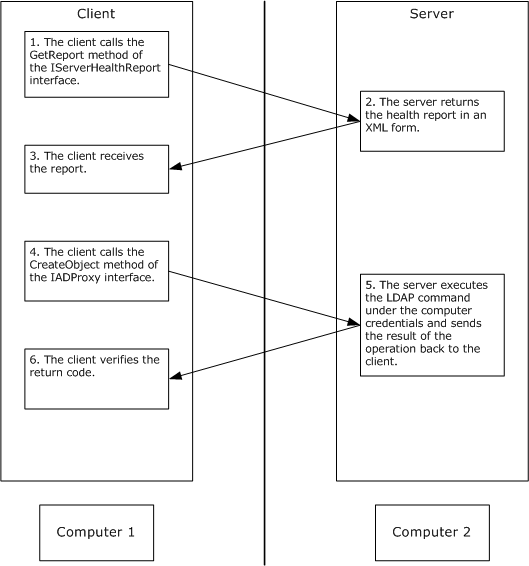

# [MS-DFSRH]: DFS Replication Helper Protocol

Table of Contents

1 Introduction

- [1 Introduction](#Section_1)
  - [1.1 Glossary](#Section_1.1)
  - [1.2 References](#Section_1.2)
    - [1.2.1 Normative References](#Section_1.2.1)
    - [1.2.2 Informative References](#Section_1.2.2)
  - [1.3 Overview](#Section_1.3)
  - [1.4 Relationship to Other Protocols](#Section_1.4)
  - [1.5 Prerequisites/Preconditions](#Section_1.5)
  - [1.6 Applicability Statement](#Section_1.6)
  - [1.7 Versioning and Capability Negotiation](#Section_1.7)
  - [1.8 Vendor-Extensible Fields](#Section_1.8)
  - [1.9 Standards Assignments](#Section_1.9)

2 Messages

- [2 Messages](#Section_2)
  - [2.1 Transport](#Section_2.1)
  - [2.2 Message Syntax](#Section_2.2)
    - [2.2.1 Common Data Types](#Section_2.2.1)
      - [2.2.1.1 DfsrHelperErrorsEnum](#Section_2.2.1.1)
      - [2.2.1.2 DfsrReportingFlags](#Section_2.2.1.2)
      - [2.2.1.3 AdAttributeData](#Section_2.2.1.3)
      - [2.2.1.4 VersionVectorData](#Section_2.2.1.4)
      - [2.2.1.5 Server Health Report XML](#Section_2.2.1.5)
        - [2.2.1.5.1 xs Namespace](#Section_2.2.1.5.1)
        - [2.2.1.5.2 timestamp Element](#Section_2.2.1.5.2)
        - [2.2.1.5.3 folder Element](#Section_2.2.1.5.3)
        - [2.2.1.5.4 dfsrStats Element](#Section_2.2.1.5.4)
        - [2.2.1.5.5 transactions Element](#Section_2.2.1.5.5)
        - [2.2.1.5.6 file Element](#Section_2.2.1.5.6)
        - [2.2.1.5.7 affectedFileSet Element](#Section_2.2.1.5.7)
        - [2.2.1.5.8 set Element](#Section_2.2.1.5.8)
        - [2.2.1.5.9 serviceInfo Element](#Section_2.2.1.5.9)
        - [2.2.1.5.10 server Element](#Section_2.2.1.5.10)
        - [2.2.1.5.11 serverInfo Element](#Section_2.2.1.5.11)
        - [2.2.1.5.12 drive Element](#Section_2.2.1.5.12)
        - [2.2.1.5.13 affectedContentSets Element](#Section_2.2.1.5.13)
        - [2.2.1.5.14 ref Element](#Section_2.2.1.5.14)
        - [2.2.1.5.15 errorReferences Element](#Section_2.2.1.5.15)
        - [2.2.1.5.16 error Element](#Section_2.2.1.5.16)
        - [2.2.1.5.17 Types of DFS Replication Errors](#Section_2.2.1.5.17)
          - [2.2.1.5.17.1 EVENT_DFSR_SERVICE_INTERNAL_ERROR Message](#Section_2.2.1.5.17.1)
          - [2.2.1.5.17.2 EVENT_DFSR_SERVICE_RESUME_FAILED_AFTER_BACKUP_RESTORE Message](#Section_2.2.1.5.17.2)
          - [2.2.1.5.17.3 EVENT_DFSR_SERVICE_FAILED_PROCESSING_RESTORE_VOLUME_LIST Message](#Section_2.2.1.5.17.3)
          - [2.2.1.5.17.4 EVENT_DFSR_SERVICE_DS_UNREACHABLE_ERROR Message](#Section_2.2.1.5.17.4)
          - [2.2.1.5.17.5 EVENT_DFSR_SERVICE_RPC_LISTENER_ERROR Message](#Section_2.2.1.5.17.5)
          - [2.2.1.5.17.6 EVENT_DFSR_SERVICE_DEBUG_LOG_STOP Message](#Section_2.2.1.5.17.6)
          - [2.2.1.5.17.7 EVENT_DFSR_SERVICE_LOG_INITIALIZATION_FAILED Message](#Section_2.2.1.5.17.7)
          - [2.2.1.5.17.8 EVENT_DFSR_VOLUME_ERROR Message](#Section_2.2.1.5.17.8)
          - [2.2.1.5.17.9 EVENT_DFSR_VOLUME_JOURNAL_WRAP Message](#Section_2.2.1.5.17.9)
          - [2.2.1.5.17.10 EVENT_DFSR_VOLUME_DATABASE_ERROR Message](#Section_2.2.1.5.17.10)
          - [2.2.1.5.17.11 EVENT_DFSR_VOLUME_JOURNAL_LOSS Message](#Section_2.2.1.5.17.11)
          - [2.2.1.5.17.12 EVENT_DFSR_VOLUME_JOURNAL_RECOVERY_FAILED Message](#Section_2.2.1.5.17.12)
          - [2.2.1.5.17.13 EVENT_DFSR_CS_ERROR Message](#Section_2.2.1.5.17.13)
          - [2.2.1.5.17.14 EVENT_DFSR_CS_DISABLED Message](#Section_2.2.1.5.17.14)
          - [2.2.1.5.17.15 EVENT_DFSR_CS_STAGE_CLEANUP_STARTED Message](#Section_2.2.1.5.17.15)
          - [2.2.1.5.17.16 EVENT_DFSR_CS_STAGE_CLEANUP_FAILED Message](#Section_2.2.1.5.17.16)
          - [2.2.1.5.17.17 EVENT_DFSR_CS_STAGE_EXCEEDED_SIZE Message](#Section_2.2.1.5.17.17)
          - [2.2.1.5.17.18 EVENT_DFSR_CS_STAGE_INACCESSIBLE Message](#Section_2.2.1.5.17.18)
          - [2.2.1.5.17.19 EVENT_DFSR_CS_SHARING_VIOLATION_LOCAL Message](#Section_2.2.1.5.17.19)
          - [2.2.1.5.17.20 EVENT_DFSR_CS_SHARING_VIOLATION_SERVING Message](#Section_2.2.1.5.17.20)
          - [2.2.1.5.17.21 EVENT_DFSR_CS_SHARING_VIOLATION_WALKING Message](#Section_2.2.1.5.17.21)
          - [2.2.1.5.17.22 EVENT_DFSR_CS_UNSUPPORTED_ENCRYPTED_FILES Message](#Section_2.2.1.5.17.22)
          - [2.2.1.5.17.23 EVENT_DFSR_CS_UNSUPPORTED_REPARSE_TAG Message](#Section_2.2.1.5.17.23)
          - [2.2.1.5.17.24 EVENT_DFSR_CS_DISK_FULL Message](#Section_2.2.1.5.17.24)
          - [2.2.1.5.17.25 EVENT_DFSR_CONNECTION_ERROR Message](#Section_2.2.1.5.17.25)
          - [2.2.1.5.17.26 EVENT_DFSR_CONNECTION_SERVICE_UNREACHABLE Message](#Section_2.2.1.5.17.26)
          - [2.2.1.5.17.27 EVENT_DFSR_CONNECTION_UNRECOGNIZED Message](#Section_2.2.1.5.17.27)
          - [2.2.1.5.17.28 EVENT_DFSR_INCOMPATIBLE_VERSION Message](#Section_2.2.1.5.17.28)
          - [2.2.1.5.17.29 EVENT_DFSR_CONFIG_DS_INVALID_DATA Message](#Section_2.2.1.5.17.29)
          - [2.2.1.5.17.30 EVENT_DFSR_CONFIG_DS_DUPLICATE_DATA Message](#Section_2.2.1.5.17.30)
          - [2.2.1.5.17.31 EVENT_DFSR_CONFIG_DS_INCONSISTENT_DATA Message](#Section_2.2.1.5.17.31)
          - [2.2.1.5.17.32 EVENT_DFSR_CONFIG_INVALID_PARAMETER_ERROR Message](#Section_2.2.1.5.17.32)
          - [2.2.1.5.17.33 EVENT_DFSR_CONFIG_INVALID_PARAMETER_WARNING Message](#Section_2.2.1.5.17.33)
          - [2.2.1.5.17.34 EVENT_DFSR_CONFIG_DS_INVALID_SCHEMA_VERSION Message](#Section_2.2.1.5.17.34)
          - [2.2.1.5.17.35 EVENT_DFSR_CONFIG_DS_UPDATE_FAILED Message](#Section_2.2.1.5.17.35)
          - [2.2.1.5.17.36 EVENT_DFSR_CONFIG_WMI_PROVIDER_REGISTRATION_FAILED Message](#Section_2.2.1.5.17.36)
          - [2.2.1.5.17.37 EVENT_DFSR_CONFIG_VOLUME_NOT_SUPPORTED Message](#Section_2.2.1.5.17.37)
          - [2.2.1.5.17.38 EVENT_DFSR_CS_OVERLAPPING Message](#Section_2.2.1.5.17.38)
          - [2.2.1.5.17.39 EVENT_DFSR_CONFIG_CS_ROOT_INVALID Message](#Section_2.2.1.5.17.39)
          - [2.2.1.5.17.40 EVENT_DFSR_CONFIG_CS_ROOT_STALE Message](#Section_2.2.1.5.17.40)
          - [2.2.1.5.17.41 EVENT_DFSR_CS_OVERLAPPING_WITH_FRS1 Message](#Section_2.2.1.5.17.41)
          - [2.2.1.5.17.42 EVENT_DFSR_CS_OVERLAPPING_WITH_SYSTEM Message](#Section_2.2.1.5.17.42)
          - [2.2.1.5.17.43 EVENT_DFSR_CS_OVERLAPPING_WITH_LOG Message](#Section_2.2.1.5.17.43)
          - [2.2.1.5.17.44 EVENT_DFSR_CONFIG_VOLUME_CONSISTENCY_CHECK_FAILED Message](#Section_2.2.1.5.17.44)
          - [2.2.1.5.17.45 EVENT_DFSR_CONFIG_NO_CONNECTIONS_ENABLED Message](#Section_2.2.1.5.17.45)
          - [2.2.1.5.17.46 EVENT_DFSR_CONFIG_NO_CONNECTIONS_EXIST Message](#Section_2.2.1.5.17.46)
          - [2.2.1.5.17.47 ERROR_WMI_ACCESS_DENIED Message](#Section_2.2.1.5.17.47)
          - [2.2.1.5.17.48 ERROR_WMI_ERROR Message](#Section_2.2.1.5.17.48)
          - [2.2.1.5.17.49 ERROR_WMI_NO_NAMESPACE Message](#Section_2.2.1.5.17.49)
          - [2.2.1.5.17.50 ERROR_WMI_TIMEOUT Message](#Section_2.2.1.5.17.50)
  - [2.3 Directory Service Schema Elements](#Section_2.3)

3 Protocol Details

- [3 Protocol Details](#Section_3)
  - [3.1 Server Role Details](#Section_3.1)
    - [3.1.1 Abstract Data Model](#Section_3.1.1)
    - [3.1.2 Timers](#Section_3.1.2)
    - [3.1.3 Initialization](#Section_3.1.3)
    - [3.1.4 Higher-Layer Triggered Events](#Section_3.1.4)
    - [3.1.5 Message Processing Events and Sequencing Rules](#Section_3.1.5)
      - [3.1.5.1 Methods with Prerequisites](#Section_3.1.5.1)
      - [3.1.5.2 IADProxy Interface](#Section_3.1.5.2)
        - [3.1.5.2.1 CreateObject Method (Opnum 3)](#Section_3.1.5.2.1)
        - [3.1.5.2.2 DeleteObject Method (Opnum 4)](#Section_3.1.5.2.2)
        - [3.1.5.2.3 ModifyObject Method (Opnum 5)](#Section_3.1.5.2.3)
      - [3.1.5.3 IADProxy2 Interface](#Section_3.1.5.3)
        - [3.1.5.3.1 CreateObject Method (Opnum 6)](#Section_3.1.5.3.1)
        - [3.1.5.3.2 DeleteObject Method (Opnum 7)](#Section_3.1.5.3.2)
        - [3.1.5.3.3 ModifyObject Method (Opnum 8)](#Section_3.1.5.3.3)
      - [3.1.5.4 IServerHealthReport Interface](#Section_3.1.5.4)
        - [3.1.5.4.1 GetReport Method (Opnum 3)](#Section_3.1.5.4.1)
        - [3.1.5.4.2 GetCompressedReport Method (Opnum 4)](#Section_3.1.5.4.2)
        - [3.1.5.4.3 GetRawReportEx Method (Opnum 5)](#Section_3.1.5.4.3)
        - [3.1.5.4.4 GetReferenceVersionVectors Method (Opnum 6)](#Section_3.1.5.4.4)
        - [3.1.5.4.5 GetReferenceBacklogCounts Method (Opnum 8)](#Section_3.1.5.4.5)
      - [3.1.5.5 IServerHealthReport2 Interface](#Section_3.1.5.5)
        - [3.1.5.5.1 GetReport Method (Opnum 9)](#Section_3.1.5.5.1)
        - [3.1.5.5.2 GetCompressedReport Method (Opnum 10)](#Section_3.1.5.5.2)
    - [3.1.6 Timer Events](#Section_3.1.6)
    - [3.1.7 Other Local Events](#Section_3.1.7)
  - [3.2 Client Role Details](#Section_3.2)
    - [3.2.1 Abstract Data Model](#Section_3.2.1)
    - [3.2.2 Timers](#Section_3.2.2)
    - [3.2.3 Initialization](#Section_3.2.3)
    - [3.2.4 Higher-Layer Triggered Events](#Section_3.2.4)
    - [3.2.5 Message Processing Events and Sequencing Rules](#Section_3.2.5)
      - [3.2.5.1 Methods with Prerequisites](#Section_3.2.5.1)
    - [3.2.6 Timer Events](#Section_3.2.6)
    - [3.2.7 Other Local Events](#Section_3.2.7)

4 Protocol Examples

- [4 Protocol Examples](#Section_4)
  - [4.1 Example of Messages Between a Client and Server](#Section_4.1)
  - [4.2 Example of the Server Health Report in XML Format](#Section_4.2)

5 Security

- [5 Security](#Section_5)

6 Appendix A: Full IDL

- [6 Appendix A: Full IDL](#Section_6)

7 Appendix B: Product Behavior

- [7 Appendix B: Product Behavior](#Section_7)

8 Change Tracking

- [8 Change Tracking](#Section_8)

For the legal notice and IP terms, see [LEGAL.md](../LEGAL.md).
Last updated: 4/23/2024.
See [Revision History](#revision-history) for full version history.

# 1 Introduction

The Distributed File System: Replication Helper (DFS-R Helper) Protocol is a set of DCOM interfaces for configuring and monitoring the Distributed File System.

Sections 1.5, 1.8, 1.9, 2, and 3 of this specification are normative. All other sections and examples in this specification are informative.

## 1.1 Glossary

This document uses the following terms:

**Active Directory**: The Windows implementation of a general-purpose directory service, which uses [**LDAP**](#gt_lightweight-directory-access-protocol-ldap) as its primary access protocol. [**Active Directory**](#gt_active-directory) stores information about a variety of objects in the network such as user accounts, computer accounts, groups, and all related credential information used by Kerberos [MS-KILE](../MS-KILE/MS-KILE.md). [**Active Directory**](#gt_active-directory) is either deployed as Active Directory Domain Services (AD DS) or Active Directory Lightweight Directory Services (AD LDS), which are both described in [MS-ADOD](../MS-ADOD/MS-ADOD.md): Active Directory Protocols Overview.

**computer object**: An object of class computer. A [**computer object**](#gt_computer-object) is a security principal object; the principal is the operating system running on the computer. The shared secret allows the operating system running on the computer to authenticate itself independently of any user running on the system. See security principal.

**connection**: In DFS-R, a pair of client and server replication partners.

**DFS Replication Health Report, Replication Health Report, or Health Report**: A report that displays information about the operation of the DFS-Replication (DFS-R) service on computers in a [**replication group**](#gt_replication-group). The following information is included in the [**health report**](#gt_ef63771f-5154-47c0-b0df-c88ce2244ccb): file transfer statistics, the number of files in the [**replicated folders**](#gt_replicated-folder), disk space use, and replication errors and warnings.

**DFS-R**: A service that keeps DFS and SYSVOL folders in sync automatically. DFS-R is a state-based, multimaster replication system that supports replication scheduling and bandwidth throttling. This is a rewrite and new version of FRS. For more information, see [MS-FRS2](../MS-FRS2/MS-FRS2.md).

**distinguished name (DN)**: A name that uniquely identifies an object by using the relative distinguished name (RDN) for the object, and the names of container objects and domains that contain the object. The distinguished name (DN) identifies the object and its location in a tree.

**Distributed File System-Replication (DFS-R)**: A file replication technology that is used to replicate files, folders, attributes, and file metadata.

**endpoint**: A network-specific address of a remote procedure call (RPC) server process for remote procedure calls. The actual name and type of the endpoint depends on the RPC protocol sequence that is being used. For example, for RPC over TCP (RPC Protocol Sequence ncacn_ip_tcp), an endpoint might be TCP port 1025. For RPC over Server Message Block (RPC Protocol Sequence ncacn_np), an endpoint might be the name of a named pipe. For more information, see [[C706]](https://go.microsoft.com/fwlink/?LinkId=89824).

**fully qualified domain name (FQDN)**: An unambiguous domain name that gives an absolute location in the Domain Name System's (DNS) hierarchy tree, as defined in [[RFC1035]](https://go.microsoft.com/fwlink/?LinkId=90264) section 3.1 and [[RFC2181]](https://go.microsoft.com/fwlink/?LinkId=127732) section 11.

**globally unique identifier (GUID)**: A term used interchangeably with [**universally unique identifier (UUID)**](#gt_universally-unique-identifier-uuid) in Microsoft protocol technical documents (TDs). Interchanging the usage of these terms does not imply or require a specific algorithm or mechanism to generate the value. Specifically, the use of this term does not imply or require that the algorithms described in [[RFC4122]](https://go.microsoft.com/fwlink/?LinkId=90460) or [C706] must be used for generating the [**GUID**](#gt_globally-unique-identifier-guid). See also [**universally unique identifier (UUID)**](#gt_universally-unique-identifier-uuid).

**Interface Definition Language (IDL)**: The International Standards Organization (ISO) standard language for specifying the interface for remote procedure calls. For more information, see [C706] section 4.

**Lightweight Directory Access Protocol (LDAP)**: The primary access protocol for [**Active Directory**](#gt_active-directory). Lightweight Directory Access Protocol (LDAP) is an industry-standard protocol, established by the Internet Engineering Task Force (IETF), which allows users to query and update information in a directory service (DS), as described in [MS-ADTS](../MS-ADTS/MS-ADTS.md). The Lightweight Directory Access Protocol can be either version 2 [[RFC1777]](https://go.microsoft.com/fwlink/?LinkId=90290) or version 3 [[RFC3377]](https://go.microsoft.com/fwlink/?LinkID=91337).

**machine account**: An account that is associated with individual client or server machines in an [**Active Directory**](#gt_active-directory) domain.

**member (DFS-R)**: In the Distributed File System Replication Protocol, a computer participating in replication.

**NetBIOS name**: A 16-byte address that is used to identify a NetBIOS resource on the network. For more information, see [[RFC1001]](https://go.microsoft.com/fwlink/?LinkId=90260) and [[RFC1002]](https://go.microsoft.com/fwlink/?LinkId=90261).

**opnum**: An operation number or numeric identifier that is used to identify a specific remote procedure call (RPC) method or a method in an interface. For more information, see [C706] section 12.5.2.12 or [MS-RPCE](../MS-RPCE/MS-RPCE.md).

**partner**: A computer that is participating in [**DFS-R**](#gt_member-dfs-r) file replication.

**replicated folder**: The root of a replicated tree. All files and subfolders (recursively) are replicated.

**replication group**: A container for a set of replicated folders sharing the same connections to replication partners.

**replication issue**: A possible error condition that is relevant to the [**health report**](#gt_ef63771f-5154-47c0-b0df-c88ce2244ccb). The possible replication issues are either Sharing (A [**sharing violation**](#gt_sharing-violation) occurred) or Filtered (The file was filtered from replication on the basis of an implementation-specific filter that was set in the [**DFS-R**](#gt_member-dfs-r) service.).

**RPC protocol sequence**: A character string that represents a valid combination of a remote procedure call (RPC) protocol, a network layer protocol, and a transport layer protocol, as described in [C706] and [MS-RPCE].

**RPC transport**: The underlying network services used by the remote procedure call (RPC) runtime for communications between network nodes. For more information, see [C706] section 2.

**sharing violation**: The failure by a process to read, modify, or delete a file because another process holds the file lock for this file.

**Unicode**: A character encoding standard developed by the Unicode Consortium that represents almost all of the written languages of the world. The [**Unicode**](#gt_unicode) standard [[UNICODE5.0.0/2007]](https://go.microsoft.com/fwlink/?LinkId=154659) provides three forms (UTF-8, UTF-16, and UTF-32) and seven schemes (UTF-8, UTF-16, UTF-16 BE, UTF-16 LE, UTF-32, UTF-32 LE, and UTF-32 BE).

**universally unique identifier (UUID)**: A 128-bit value. UUIDs can be used for multiple purposes, from tagging objects with an extremely short lifetime, to reliably identifying very persistent objects in cross-process communication such as client and server interfaces, manager entry-point vectors, and RPC objects. UUIDs are highly likely to be unique. UUIDs are also known as [**globally unique identifiers (GUIDs)**](#gt_globally-unique-identifier-guid) and these terms are used interchangeably in the Microsoft protocol technical documents (TDs). Interchanging the usage of these terms does not imply or require a specific algorithm or mechanism to generate the UUID. Specifically, the use of this term does not imply or require that the algorithms described in [RFC4122] or [C706] must be used for generating the UUID.

**USN journal**: A sequence of USN records. The USN journal can be read as a file on NTFS.

**version vector**: A mapping from machine identifiers to version sequence numbers. The Distributed File System Replication (DFS-R) Protocol uses a generalization of version vectors called version chain vectors.

**volume**: A group of one or more partitions that forms a logical region of storage and the basis for a file system. A [**volume**](#gt_volume) is an area on a storage device that is managed by the file system as a discrete logical storage unit. A partition contains at least one [**volume**](#gt_volume), and a volume can exist on one or more partitions.

**MAY, SHOULD, MUST, SHOULD NOT, MUST NOT:** These terms (in all caps) are used as defined in [[RFC2119]](https://go.microsoft.com/fwlink/?LinkId=90317). All statements of optional behavior use either MAY, SHOULD, or SHOULD NOT.

## 1.2 References

Links to a document in the Microsoft Open Specifications library point to the correct section in the most recently published version of the referenced document. However, because individual documents in the library are not updated at the same time, the section numbers in the documents may not match. You can confirm the correct section numbering by checking the [Errata](https://go.microsoft.com/fwlink/?linkid=850906).

### 1.2.1 Normative References

We conduct frequent surveys of the normative references to assure their continued availability. If you have any issue with finding a normative reference, please contact [dochelp@microsoft.com](mailto:dochelp@microsoft.com). We will assist you in finding the relevant information.

[C706] The Open Group, "DCE 1.1: Remote Procedure Call", C706, August 1997, [https://publications.opengroup.org/c706](https://go.microsoft.com/fwlink/?LinkId=89824)

**Note** Registration is required to download the document.

[MS-ADA1] Microsoft Corporation, "[Active Directory Schema Attributes A-L](../MS-ADA1/MS-ADA1.md)".

[MS-ADA2] Microsoft Corporation, "[Active Directory Schema Attributes M](../MS-ADA2/MS-ADA2.md)".

[MS-ADA3] Microsoft Corporation, "[Active Directory Schema Attributes N-Z](../MS-ADA3/MS-ADA3.md)".

[MS-ADLS] Microsoft Corporation, "[Active Directory Lightweight Directory Services Schema](../MS-ADLS/MS-ADLS.md)".

[MS-ADSC] Microsoft Corporation, "[Active Directory Schema Classes](../MS-ADSC/MS-ADSC.md)".

[MS-ADTS] Microsoft Corporation, "[Active Directory Technical Specification](../MS-ADTS/MS-ADTS.md)".

[MS-DCOM] Microsoft Corporation, "[Distributed Component Object Model (DCOM) Remote Protocol](../MS-DCOM/MS-DCOM.md)".

[MS-DTYP] Microsoft Corporation, "[Windows Data Types](../MS-DTYP/MS-DTYP.md)".

[MS-ERREF] Microsoft Corporation, "[Windows Error Codes](../MS-ERREF/MS-ERREF.md)".

[MS-FRS2] Microsoft Corporation, "[Distributed File System Replication Protocol](../MS-FRS2/MS-FRS2.md)".

[MS-OAUT] Microsoft Corporation, "[OLE Automation Protocol](../MS-OAUT/MS-OAUT.md)".

[MS-RPCE] Microsoft Corporation, "[Remote Procedure Call Protocol Extensions](../MS-RPCE/MS-RPCE.md)".

[RFC2119] Bradner, S., "Key words for use in RFCs to Indicate Requirement Levels", BCP 14, RFC 2119, March 1997, [https://www.rfc-editor.org/info/rfc2119](https://go.microsoft.com/fwlink/?LinkId=90317)

[RFC2251] Wahl, M., Howes, T., and Kille, S., "Lightweight Directory Access Protocol (v3)", RFC 2251, December 1997, [https://www.rfc-editor.org/info/rfc2251](https://go.microsoft.com/fwlink/?LinkId=90325)

[UNICODE4.0] The Unicode Consortium, "Unicode 4.0.0", [http://www.unicode.org/versions/Unicode4.0.0/](https://go.microsoft.com/fwlink/?LinkId=90552)

[XML10] World Wide Web Consortium, "Extensible Markup Language (XML) 1.0 (Third Edition)", February 2004, [http://www.w3.org/TR/2004/REC-xml-20040204/](https://go.microsoft.com/fwlink/?LinkId=90600)

[XMLSCHEMA0] Fallside, D., and Walmsley, P., Eds., "XML Schema Part 0: Primer, Second Edition", W3C Recommendation, October 2004, [http://www.w3.org/TR/2004/REC-xmlschema-0-20041028/](https://go.microsoft.com/fwlink/?LinkId=90604)

[XMLSCHEMA1] Thompson, H., Beech, D., Maloney, M., and Mendelsohn, N., Eds., "XML Schema Part 1: Structures", W3C Recommendation, May 2001, [https://www.w3.org/TR/2001/REC-xmlschema-1-20010502/](https://go.microsoft.com/fwlink/?LinkId=90608)

[XMLSCHEMA2] Biron, P.V., Ed. and Malhotra, A., Ed., "XML Schema Part 2: Datatypes", W3C Recommendation, May 2001, [https://www.w3.org/TR/2001/REC-xmlschema-2-20010502/](https://go.microsoft.com/fwlink/?LinkId=90610)

### 1.2.2 Informative References

[LDAP-ERR] Microsoft Corporation, "Return Values", [http://msdn.microsoft.com/en-us/library/aa367014.aspx](https://go.microsoft.com/fwlink/?LinkId=89933)

[SAFEARRAY] Ames, A., "SAFEARRAYs Made Easier", May 2000, [https://edn.embarcadero.com/el/article/22016](https://go.microsoft.com/fwlink/?LinkId=90504)

[WMI] Microsoft Corporation, "Windows Management Instrumentation (WMI)", [http://msdn.microsoft.com/en-us/library/aa394582.aspx](https://go.microsoft.com/fwlink/?LinkId=90570)

## 1.3 Overview

The Distributed File System: Replication Helper (DFS-R Helper) Protocol provides a set of DCOM interfaces for configuring and monitoring [**Distributed File System–Replication (DFS-R)**](#gt_e210f37a-d573-4389-b295-b7a75d279380) on a server, as specified in [MS-FRS2](../MS-FRS2/MS-FRS2.md). The server end of the protocol is a DCOM service that implements the DCOM interface. The client end of the protocol is an application that invokes methods on the interface to make [**DFS-R**](#gt_member-dfs-r) configuration changes and monitor the status of the DFS-R service on the server.

The first part of the Distributed File System: Replication Helper (DFS-R Helper) Protocol consists of interfaces for creating, modifying, and deleting configuration objects in [**Active Directory**](#gt_active-directory) by using the [**machine account**](#gt_machine-account) of the server.

For all [**replication members**](#gt_5084630d-a50a-4a4b-8cbd-908bbc8856ff), the configuration related to a member is stored in the [**computer object**](#gt_computer-object) for the local machine in Active Directory. It is common for system components that are unrelated to DFS-R to set permissions on the computer object that will prevent modification of the object by some users and still permit modification by using the credentials for the computer. Therefore, a server implementation uses the credentials of the local machine account when it sends commands to update Active Directory objects.

If a user has sufficient privileges to connect to the server that is running the DFS-R Helper Protocol and to invoke methods implemented by the DFS-R Helper Protocol interfaces, the server works as a proxy for making configuration changes on behalf of the client application that is running under the user's account.

The client sends the server information about the Active Directory operation that the client is trying to accomplish. The server then attempts to execute the command by using the machine account and returns information about the status of the operation.

The second part of the Distributed File System: Replication Helper (DFS-R Helper) Protocol is an interface for monitoring DFS-R on the computer and collecting various statistics about the DFS-R operation.

The information that is collected by using the Distributed File System: Replication Helper (DFS-R Helper) Protocol includes, among other types of information, the following statistics:

- Information about replication errors that are encountered by DFS-R on the server.
- The count and size of replicated files on the server.
- Disk use on the server.
- Information about [**replicated folders**](#gt_replicated-folder) on the server.
- Replication backlog—the number of files that are not yet fully replicated.
Sections [2](#Section_2) and [3](#Section_3) specify the Distributed File System: Replication Helper (DFS-R Helper) Protocol and define protocol messages, their parameters, and the XML format of the [**health report**](#gt_ef63771f-5154-47c0-b0df-c88ce2244ccb).

## 1.4 Relationship to Other Protocols

The Distributed File System: Replication Helper (DFS-R Helper) Protocol relies on the Distributed Component Object Model (DCOM) Remote Protocol (as specified in [MS-DCOM](../MS-DCOM/MS-DCOM.md)), which uses RPC as its transport. For more information, see [MS-RPCE](../MS-RPCE/MS-RPCE.md).

## 1.5 Prerequisites/Preconditions

This protocol is implemented over DCOM and RPC. Therefore, it has the prerequisites that are specified in [MS-DCOM](../MS-DCOM/MS-DCOM.md) and [MS-RPCE](../MS-RPCE/MS-RPCE.md) as common to the DCOM and RPC interfaces.

The Distributed File System: Replication Helper (DFS-R Helper) Protocol assumes that a client has obtained the name of a server that supports this protocol suite before the protocol is invoked.

## 1.6 Applicability Statement

This protocol enables a client application to modify the DFS-R configuration using the credentials of the server computer. The client also uses this protocol to get health information for the DFS-R service on the remote server.

## 1.7 Versioning and Capability Negotiation

**Supported Transports:** This protocol uses the Distributed Component Object Model (DCOM) Remote Protocol (as specified in [MS-DCOM](../MS-DCOM/MS-DCOM.md)), which in turn uses RPC over TCP as its only transport, as specified in section [2.1](#Section_2.1).

**Protocol Version:** This protocol includes three DCOM interfaces, all of which are version 0.0. A client uses one or more of the following interfaces when it communicates with a Distributed File System: Replication Helper (DFS-R Helper) Protocol server:

- [IADProxy](#Section_3.1.5.2)
- [IADProxy2](#Section_3.1.5.3)
- [IServerHealthReport](#Section_3.1.5.4)
- [IServerHealthReport2](#Section_3.1.5.5)
The IADProxy2 interface supersedes the IADProxy interface and contains new functionality that is related to server clusters.

**Security and Authentication Methods:** For more information, see [MS-DCOM] and [MS-RPCE](../MS-RPCE/MS-RPCE.md). Administrator rights on the server computer are required to use the IADProxy and the IADProxy2 interfaces.

## 1.8 Vendor-Extensible Fields

This protocol does not define any vendor-extensible fields.

## 1.9 Standards Assignments

The [**Distributed File System: Replication Helper (DFS-R Helper)**](#gt_e210f37a-d573-4389-b295-b7a75d279380) protocol has no standards assignments. It uses the following [**UUIDs**](#gt_universally-unique-identifier-uuid) to identify its interfaces.

| Parameter | Value |
| --- | --- |
| RPC interface UUID for the [IADProxy](#Section_3.1.5.2) interface. | 4BB8AB1D-9EF9-4100-8EB6-DD4B4E418B72 |
| RPC interface UUID for the [IADProxy2](#Section_3.1.5.3) interface. | C4B0C7D9-ABE0-4733-A1E1-9FDEDF260C7A |
| RPC interface UUID for the [IServerHealthReport](#Section_3.1.5.4) interface. | E65E8028-83E8-491b-9AF7-AAF6BD51A0CE |
| RPC interface UUID for the [IServerHealthReport2](#Section_3.1.5.5) interface. | 20D15747-6C48-4254-A358-65039FD8C63C |

# 2 Messages

## 2.1 Transport

This protocol uses RPC Dynamic Endpoints as defined in Part 4 of [[C706]](https://go.microsoft.com/fwlink/?LinkId=89824).

This protocol MUST use the DCOM Remote Protocol, as specified in [MS-DCOM](../MS-DCOM/MS-DCOM.md), as its transport. On its behalf, the DCOM Remote Protocol uses the following [**RPC protocol sequence**](#gt_rpc-protocol-sequence): RPC over TCP, as specified in [MS-RPCE](../MS-RPCE/MS-RPCE.md).

To access an interface, the client MUST request a DCOM connection to its well-known object [**UUID**](#gt_universally-unique-identifier-uuid) [**endpoint**](#gt_endpoint) on the server, as specified in section [1.9](#Section_1.9).

The RPC version number for all interfaces MUST be 0.0.

An implementation of [**DFS Replication**](#gt_e210f37a-d573-4389-b295-b7a75d279380) Helper MAY configure its DCOM implementation or underlying [**RPC transport**](#gt_rpc-transport) with authentication parameters to allow clients to connect, or it MAY choose to not set these parameters. The details of this are implementation-specific.<1>

The DFS Replication Helper interfaces make use of the underlying DCOM security framework, as specified in [MS-DCOM], and rely upon it for access control.<2> DCOM differentiates between launch and access operations and also decides whether to deny or grant access for these operations.

An implementation of DFS Replication Helper SHOULD choose to restrict access to the interfaces.<3>

## 2.2 Message Syntax

In addition to the RPC base types and the definitions that are specified in [[C706]](https://go.microsoft.com/fwlink/?LinkId=89824) and [MS-DTYP](../MS-DTYP/MS-DTYP.md), the sections that follow use the definitions of BSTR, GUID, SAFEARRAY, VARIANT, VARIANT_BOOL, and DWORD, as specified in [MS-DTYP] Appendix A and in [MS-OAUT](../MS-OAUT/MS-OAUT.md). The [IServerHealthReport](#Section_3.1.5.4) and [IServerHealthReport2](#Section_3.1.5.5) interfaces return reports as XML. For more information about XML, see [[XML10]](https://go.microsoft.com/fwlink/?LinkId=90600), [[XMLSCHEMA0]](https://go.microsoft.com/fwlink/?LinkId=90604), [[XMLSCHEMA1]](https://go.microsoft.com/fwlink/?LinkId=90608), and [[XMLSCHEMA2]](https://go.microsoft.com/fwlink/?LinkId=90610).

### 2.2.1 Common Data Types

#### 2.2.1.1 DfsrHelperErrorsEnum

The DfsrHelperErrorsEnum enumeration defines error codes that are specific to the [IADProxy](#Section_3.1.5.2) and [IADProxy2](#Section_3.1.5.3) interfaces.

The [**UUID**](#gt_universally-unique-identifier-uuid) for this enumeration is {9009D654-250B-4e0d-9AB0-ACB63134F69F}.

typedef enum DfsrHelperErrorsEnum

{

dfsrHelperErrorNotLocalAdmin = 0x80042001,

dfsrHelperErrorCreateVerifyServerControl = 0x80042002,

dfsrHelperLdapErrorBase = 0x80043000

} DfsrHelperErrorsEnum;

**dfsrHelperErrorNotLocalAdmin:** Reserved for future use.

**dfsrHelperErrorCreateVerifyServerControl:** Cannot create LDAP_SERVER_VERIFY_NAME_OID control for the [**LDAP**](#gt_lightweight-directory-access-protocol-ldap) command.

For more information about this LDAP control command, see [MS-ADTS](../MS-ADTS/MS-ADTS.md) section 3.1.1.3.4.1.16.

**dfsrHelperLdapErrorBase:** This is the base value for LDAP errors.

#### 2.2.1.2 DfsrReportingFlags

The DfsrReportingFlags enumeration represents the options for generating [**health reports**](#gt_ef63771f-5154-47c0-b0df-c88ce2244ccb), which are used in [IServerHealthReport](#Section_3.1.5.4) and [IServerHealthReport2](#Section_3.1.5.5) interfaces. The [**UUID**](#gt_universally-unique-identifier-uuid) for this enumeration is {CEB5D7B4-3964-4f71-AC17-4BF57A379D87}.

Any bitmask that consists of one, or a combination, of the following enumerated values is supported:

typedef enum DfsrReportingFlags

{

REPORTING_FLAGS_NONE = 0,

REPORTING_FLAGS_BACKLOG = 1,

REPORTING_FLAGS_FILES = 2,

} DfsrReportingFlags;

**REPORTING_FLAGS_NONE:** Default report options.

**REPORTING_FLAGS_BACKLOG:** Return the count of backlog transactions.

**REPORTING_FLAGS_FILES:** Return the count and cumulative size of files in the replicated folders.

#### 2.2.1.3 AdAttributeData

The AdAttributeData structure provides information about an [**Active Directory**](#gt_active-directory) operation. This structure describes the Active Directory operation that is requested by the client. The [**UUID**](#gt_universally-unique-identifier-uuid) for this structure is {D3766938-9FB7-4392-AF2F-2CE8749DBBD0}.

typedef[uuid(D3766938-9FB7-4392-AF2F-2CE8749DBBD0)]

struct AdAttributeData {

long operation;

BSTR attributeName;

BSTR attributeValue;

VARIANT_BOOL isString;

long length;

} _AdAttributeData;

**operation:** Specifies the [**LDAP**](#gt_lightweight-directory-access-protocol-ldap) operation that MUST be executed for the attribute that is specified by the *attributeName* parameter. This value MUST be specified by using rules for the **operation** field of the LDAP ModifyRequest. For information about ModifyRequest, see [[RFC2251]](https://go.microsoft.com/fwlink/?LinkId=90325) section 4.6.

**attributeName:** MUST be the name of the attribute on which to execute the LDAP operation that is specified by the *operation* parameter.

**attributeValue:** The value of the attribute that is specified by the *attributeName* parameter. The value of this parameter MUST be built by using the following rules:

- If the value can be represented as a string, the *attributeValue* field MUST contain the string representation of the value.
- If the value contains raw binary data, the *attributeValue* field MUST contain the binary data encoded in the BSTR according to the following rules:
- The length, in bytes, of the BSTR buffer MUST be greater than or equal to the value of the size of the binary data that is to be encoded.
- The BSTR buffer MUST be filled by the bytes that compose the in-memory representation of the binary data that is being encoded. The part of the buffer between offsets 0 and "length - 1" MUST be passed to the LDAP protocol by the server. The remainder of the BSTR buffer, if any, MUST be ignored by the server.
**isString:** Specifies whether the value that is passed in the *attributeValue* field is a string. The value of this field MUST be VARIANT_FALSE (as specified in [MS-OAUT](../MS-OAUT/MS-OAUT.md) section 2.2.27) if the *attributeValue* field contains a binary value. Otherwise, the value MUST be VARIANT_TRUE.

**length:** For a binary value, the length, in bytes, of the value MUST be provided in this field. For string data, this field MUST be set to the length, in bytes, of the [**Unicode**](#gt_unicode) string (see [[UNICODE4.0]](https://go.microsoft.com/fwlink/?LinkId=90552).

#### 2.2.1.4 VersionVectorData

The VersionVectorData structure provides information about the [**DFS-R**](#gt_member-dfs-r) [**version vector**](#gt_version-vector). The DFS-R version vector is an array of identifiers and versions of modified files in a [**replicated folder**](#gt_replicated-folder). The version vector is specified in [MS-FRS2](../MS-FRS2/MS-FRS2.md) section 2.2.1.4.1. The [**UUID**](#gt_universally-unique-identifier-uuid) for this structure is {7A2323C7-9EBE-494a-A33C-3CC329A18E1D}.

typedef[uuid(7A2323C7-9EBE-494a-A33C-3CC329A18E1D)]

struct VersionVectorData {

long uncompressedSize;

long backlogCount;

BSTR contentSetGuid;

VARIANT versionVector;

} _VersionVectorData;

**uncompressedSize:** MUST be the number of bytes in the uncompressed version vector. The version vector is defined by FRS_ASYNC_VERSION_VECTOR_RESPONSE, as specified in [MS-FRS2] section 2.2.1.4.12.

**backlogCount:** MUST be the number of backlogged transactions for the replicated folder on the server.

**contentSetGuid:** MUST be a string representation of the [**GUID**](#gt_globally-unique-identifier-guid) of the replicated folder.

**versionVector:** MUST be the version vector for the replicated folder whose GUID is specified by the **contentSetGuid** field.

The version vector is either compressed (that is, an encoded field whose format is specified by the DFS-R compression algorithm (as specified in [MS-FRS2] section 3.1.1.1) or uncompressed. The version vector MUST be represented by a VARIANT field that has a VT_BSTR variant type.

The client MUST determine whether the version vector is compressed by applying the following rules:

- If the sum of the number of characters, including the terminating null character in the BSTR, multiplied by the size, in bytes, of a [**Unicode**](#gt_unicode) character (2 bytes) is less than the value of the **uncompressedSize** field, the version vector is sent in compressed form. See [[UNICODE4.0]](https://go.microsoft.com/fwlink/?LinkId=90552).
- Otherwise, the version vector is uncompressed.
The compressed or uncompressed version vector MUST be encoded in a BSTR and passed by using the **versionVector.bstrVal** field.

The compressed or uncompressed version vector buffer MUST be encoded in a BSTR by applying the following rules:

- The length, in bytes, of the BSTR buffer MUST be greater than or equal to the value of the size of the binary data that is to be encoded.
- The part of the BSTR buffer between offsets 0 and "length - 1" MUST be filled by the compressed or uncompressed data, as specified previously. The remainder of the BSTR buffer (if any) MUST be ignored by the server.

#### 2.2.1.5 Server Health Report XML

The server [**health report**](#gt_ef63771f-5154-47c0-b0df-c88ce2244ccb) is an XML document that contains the data that is related to [**DFS-R**](#gt_member-dfs-r) service health and SHOULD contain errors encountered during generation of the report.

##### 2.2.1.5.1 xs Namespace

The xs namespace that is used in subsections of section [2.2.1.5](#Section_2.2.1.5) refers to the XMLSchema namespace that is specified in [[XMLSCHEMA0]](https://go.microsoft.com/fwlink/?LinkId=90604), [[XMLSCHEMA1]](https://go.microsoft.com/fwlink/?LinkId=90608), and [[XMLSCHEMA2]](https://go.microsoft.com/fwlink/?LinkId=90610).

##### 2.2.1.5.2 timestamp Element

The timestamp XML element represents the time in a specific time zone.

<xs:element name="timestamp">

<xs:complexType>

<xs:sequence>

<xs:element name="fileTime"

type="xs:long"

/>

<xs:element name="systemTime"

type="xs:string"

minOccurs="0"

/>

</xs:sequence>

<xs:attribute name="timezone"

type="xs:int"

/>

</xs:complexType>

</xs:element>

Child Elements

| Element | Type | Description |
| --- | --- | --- |
| fileTime | xs:long | MUST be the time, in FILETIME format, as specified in the [MS-DTYP](../MS-DTYP/MS-DTYP.md) Appendix A. Because the FILETIME is provided in Coordinated Universal Time (UTC), the daylight time adjustment MUST NOT be included in this field. Instead, the adjustment MUST be included in the **timezone** field. |
| systemTime | xs:string | An implementation-specific textual representation of the date and time.<4> |

Attributes

| Name | Type | Description |
| --- | --- | --- |
| timezone | xs:int | MUST be the difference, in minutes, between the time in the server time zone and Coordinated Universal Time (UTC). This field SHOULD account for the daylight time adjustment. |

##### 2.2.1.5.3 folder Element

The folder XML element represents a folder on the disk.

<xs:element name="folder">

<xs:complexType>

<xs:sequence>

<xs:element name="path"

type="xs:string"

/>

<xs:element name="fileCount"

type="xs:long"

/>

<xs:element name="folderCount"

type="xs:long"

/>

<xs:element name="size"

type="xs:long"

/>

<xs:element name="configSize"

type="xs:long"

/>

</xs:sequence>

<xs:attribute name="type">

<xs:simpleType>

<xs:restriction

base="xs:string"

>

<xs:enumeration

value="root"

/>

<xs:enumeration

value="conflict"

/>

<xs:enumeration

value="staging"

/>

</xs:restriction>

</xs:simpleType>

</xs:attribute>

</xs:complexType>

</xs:element>

Child Elements

| Element | Type | Description |
| --- | --- | --- |
| path | xs:string | MUST be the path of the folder on the disk. The path format is implementation specific. <5> |
| fileCount | xs:long | MUST be the number of files in the folder and all subfolders, or –1 if the file number information is not included in the report. |
| folderCount | xs:long | MUST be the number of all direct subfolders of the folder, or –1 if the folder number information is not included in the report. |
| size | xs:long | MUST be the cumulative size, in bytes, of all files in the folder and all subfolders, or –1 if the file size information is not included in the report. |
| configSize | xs:long | MUST be the maximum size, in bytes, of the folder if the folder has a type of "conflict" or "staging". The value of this element MUST be –1 for folders of type "root". |

Attributes

| Name | Type | Description |
| --- | --- | --- |
| type | enumeration | The type of the folder. The value of this element MUST be one of the following strings: |

##### 2.2.1.5.4 dfsrStats Element

The dfsrStats XML element represents efficiency statistics for the DFS-R service.

<xs:element name="dfsrStats">

<xs:complexType>

<xs:sequence>

<xs:element name="sizeOfFilesReceived"

type="xs:long"

/>

<xs:element name="totalBytesReceived"

type="xs:long"

/>

</xs:sequence>

</xs:complexType>

</xs:element>

Child Elements

| Element | Type | Description |
| --- | --- | --- |
| sizeOfFilesReceived | xs:long | MUST be the total uncompressed size, in bytes, of all files or partial files that are received by the server from other members since the [**DFS Replication**](#gt_e210f37a-d573-4389-b295-b7a75d279380) service started. <6> |
| totalBytesReceived | xs:long | MUST be the total compressed size, in bytes, of all data that is received by the server from other members that participate in the same [**replication group**](#gt_replication-group) over a network in order to transfer files or partial files. <7> |

##### 2.2.1.5.5 transactions Element

The transactions XML element represents file transfer statistics.

<xs:element name="transactions">

<xs:complexType>

<xs:sequence>

<xs:element name="recvdfiles"

type="xs:long"

/>

<xs:element name="backlogInbound"

type="xs:long"

/>

<xs:element name="backlogOutbound"

type="xs:long"

/>

</xs:sequence>

</xs:complexType>

</xs:element>

Child Elements

| Element | Type | Description |
| --- | --- | --- |
| recvdfiles | xs:long | MUST be the total number of new or updated files that are received by the server from other members since the [**DFS Replication**](#gt_e210f37a-d573-4389-b295-b7a75d279380) service started. |
| backlogInbound | xs:long | MUST be the number of inbound backlogged transactions relative to the [**version vector**](#gt_version-vector) that were provided as a parameter to the server. This number MUST be calculated by comparing the version of each file in the version vector that is sent by the client with the version of the file that exists on this computer. It MUST be calculated by counting the number of files whose version numbers are lower on this computer than on the caller's computer and counting the files that are present in the version vector but not on this computer. The client is responsible for getting the version vector from another server that is participating in the [**replication group**](#gt_replication-group). The client MAY use the [IServerHealthReport::GetReferenceVersionVectors](#Section_3.1.5.4.4) or [IServerHealthReport2::GetReferenceVersionVectors](#Section_3.1.5.5) method to get this version vector from another server or use a different implementation-specific way of getting the version vectors.<8> |
| backlogOutbound | xs:long | MUST be the number of outbound backlogged transactions relative to the reference member. This number MUST be calculated by comparing the version of each file in the version vector that is sent by the caller's computer with the version of the file that exists on this computer. It is calculated by counting the number of files whose version numbers are higher on this computer than on the caller's computer and counting the files that are present on this computer but not in the version vector. The client is responsible for getting the version vector from another server that is participating in the replication group. The client MAY use the IServerHealthReport::GetReferenceVersionVectors or IServerHealthReport2::GetReferenceVersionVectors method to get this version vector from another server or use a different implementation-specific way of getting the version vectors.<9> |

##### 2.2.1.5.6 file Element

The file XML element represents information about a file.

<xs:element name="file">

<xs:complexType>

<xs:sequence>

<xs:element name="name"

type="xs:string"

/>

<xs:element name="path">

<xs:simpleType>

<xs:restriction

base="xs:string"

>

<xs:enumeration

value=""

/>

</xs:restriction>

</xs:simpleType>

</xs:element>

<xs:element name="size"

type="xs:long"

minOccurs="0"

/>

<xs:element

minOccurs="0"

ref="timestamp"

/>

</xs:sequence>

</xs:complexType>

</xs:element>

Child Elements

| Element | Type | Description |
| --- | --- | --- |
| name | xs:string | MUST be the path of the file that is relative to the [**replicated folder**](#gt_replicated-folder) root. The path MUST begin with a folder name, followed by a backslash (\) and then by the name of each folder in the order in which they are opened; the folder names are separated by using a backslash. |
| path | N/A | This element MUST be an empty string. The element SHOULD be ignored by the client. |
| size | xs:long | The server MAY choose to populate this element with the original size, in bytes, of the file; or set this field to 0, which means that the size is not provided in the [**health report**](#gt_ef63771f-5154-47c0-b0df-c88ce2244ccb); or exclude this field from the file element.<10>. |
| timestamp | timestamp | The timestamp is an optional element of the file element. If the timestamp element is present in the file element, the server MAY provide a timestamp value<11> The format of this element is specified in section [2.2.1.5.2](#Section_2.2.1.5.2). |

##### 2.2.1.5.7 affectedFileSet Element

The affectedFileSet XML element represents information about the files that are involved in [**replication issues**](#gt_replication-issue).

<xs:element name="affectedFileSet">

<xs:complexType>

<xs:sequence>

<xs:element

minOccurs="0"

maxOccurs="unbounded"

ref="file"

/>

</xs:sequence>

<xs:attribute name="folder">

<xs:simpleType>

<xs:restriction

base="xs:string"

>

<xs:enumeration

value="sharing"

/>

<xs:enumeration

value="filtered"

/>

</xs:restriction>

</xs:simpleType>

</xs:attribute>

</xs:complexType>

</xs:element>

Child Elements

| Element | Type | Description |
| --- | --- | --- |
| file | file | MUST be the information about the files that are involved in a specific replication issue. The format of this element is specified in [2.2.1.5.6](#Section_2.2.1.5.6). |

Attributes

| Name | Type | Description |
| --- | --- | --- |
| folder | enumeration | The type of replication issue in which the file was involved. The value MUST be one of the values listed in the following table. |

##### 2.2.1.5.8 set Element

The set XML element represents information about a [**replicated folder**](#gt_replicated-folder).

<xs:element name="set">

<xs:complexType>

<xs:sequence>

<xs:element name="status">

<xs:simpleType>

<xs:restriction

base="xs:int"

>

<xs:enumeration

value="0"

/>

<xs:enumeration

value="1"

/>

<xs:enumeration

value="2"

/>

<xs:enumeration

value="3"

/>

<xs:enumeration

value="4"

/>

<xs:enumeration

value="5"

/>

<xs:enumeration

value="6"

/>

<xs:enumeration

value="7"

/>

</xs:restriction>

</xs:simpleType>

</xs:element>

<xs:element name="fileFilter"

type="xs:string"

/>

<xs:element name="directoryFilter"

type="xs:string"

/>

<xs:element

minOccurs="0"

maxOccurs="3"

ref="folder"

/>

<xs:element

minOccurs="0"

ref="dfsrStats"

/>

<xs:element

minOccurs="0"

ref="transactions"

/>

<xs:element

minOccurs="0"

maxOccurs="2"

ref="affectedFileSet"

/>

</xs:sequence>

<xs:attribute name="name"

type="xs:string"

/>

<xs:attribute name="guid"

type="xs:string"

/>

</xs:complexType>

</xs:element>

Child Elements

| Element | Type | Description |
| --- | --- | --- |
| status | N/A | The status of the replicated folder. This MUST be one of the values that are listed in the following table. |
| fileFilter | xs:string | A file filter mask that MUST specify the mask of files that are excluded from replication. The format of the filter mask is specified as msDFSR-FileFilter attribute in [MS-FRS2](../MS-FRS2/MS-FRS2.md) section 2.3.7. |
| directoryFilter | xs:string | A directory filter mask that MUST specify the mask of directories that are excluded from replication. The format of the filter mask is specified in [MS-FRS2]. |
| folder | folder | The set element MAY have zero to three sub-elements of type "folder", one for each of the following folder types: "root", "staging", and "conflict". The format of this element is specified in section [2.2.1.5.3](#Section_2.2.1.5.3).<13> |
| dfsrStats | dfsrStats | MUST be the compression statistics for this replicated folder. The format of this element is specified in section [2.2.1.5.4](#Section_2.2.1.5.4). |
| transactions | transactions | MUST be the file transactions statistics for this replicated folder. The format of this element is specified in section [2.2.1.5.5](#Section_2.2.1.5.5). |
| affectedFileSet | affectedFileSet | Information about the files that experienced [**replication issues**](#gt_replication-issue) that are [**sharing violations**](#gt_sharing-violation) and filtered content, as described below. The server's file system MAY support file-sharing semantics, which would allow denial of shared-read access when opening a file or shared-delete access when deleting a file. There can be 0, 1, or 2 occurrences of this element. If, and only if, sharing violations were detected by the server, the set element MUST contain one [affectedFileSet](#Section_2.2.1.5.7) element with the folder element set to "sharing". If, and only if, filtered content was detected by the server, the set element MUST contain one affectedFileSet element with the folder element set to "filtered". The format of the affectedFileSet element is specified in section 2.2.1.5.7.<14> |

Attributes

| Name | Type | Description |
| --- | --- | --- |
| name | xs:string | MUST be the name of the replicated folder. |
| guid | xs:string | MUST be the unique identifier of the replicated folder. |

##### 2.2.1.5.9 serviceInfo Element

The serviceInfo XML element represents information about the [**DFS Replication**](#gt_e210f37a-d573-4389-b295-b7a75d279380) service on the server.

<xs:element name="serviceInfo">

<xs:complexType>

<xs:sequence>

<xs:element name="state"

type="xs:int"

/>

<xs:element name="version"

type="xs:string"

/>

<xs:element

ref="timestamp"

/>

</xs:sequence>

</xs:complexType>

</xs:element>

Child Elements

| Element | Type | Description |
| --- | --- | --- |
| state | xs:int | The state of the service. This MUST be one of the values listed in the following table. |
| version | xs:string | MUST be the version of the DFS Replication service. The version numbering is implementation specific.<15> |
| timestamp | timestamp | MUST be the date and time when the DFS Replication service starts. The format of this element is specified in section [2.2.1.5.2](#Section_2.2.1.5.2). |

##### 2.2.1.5.10 server Element

The server XML element represents a list of [**replicated folders**](#gt_replicated-folder) that are affected by a particular error.

<xs:element name="server">

<xs:complexType>

<xs:sequence>

<xs:element ref="serviceInfo" minOccurs="0"/>

<xs:element ref="serverInfo" minOccurs="0"/>

<xs:element name="contentSets" minOccurs="0">

<xs:complexType>

<xs:sequence>

<xs:element ref="set" minOccurs="0" maxOccurs="unbounded" />

</xs:sequence>

</xs:complexType>

</xs:element>

<xs:element name="disks" minOccurs="0">

<xs:complexType>

<xs:sequence>

<xs:element ref="drive" minOccurs="0" maxOccurs="unbounded" />

</xs:sequence>

</xs:complexType>

</xs:element>

<xs:element name="serverErrors" minOccurs="0">

<xs:complexType>

<xs:sequence>

<xs:element ref="error" minOccurs="0" maxOccurs="unbounded"/>

</xs:sequence>

</xs:complexType>

</xs:element>

</xs:sequence>

<xs:attribute name="name" type="xs:string" />

<xs:attribute name="dns" type="xs:string" />

<xs:attribute name="domain" type="xs:string" />

<xs:attribute name="ipAddress" type="xs:string" />

<xs:attribute name="site" type="xs:string" />

<xs:attribute name="ServerReportVersion" type="xs:string" />

<xs:attribute name="dfsrHelperVersion" type="xs:string" />

</xs:complexType>

</xs:element>

<xs:element name="server">

<xs:complexType>

<xs:sequence>

<xs:element

minOccurs="0"

ref="serviceInfo"

/>

<xs:element

minOccurs="0"

ref="serverInfo"

/>

<xs:element name="contentSets"

minOccurs="0"

>

<xs:complexType>

<xs:sequence>

<xs:element

minOccurs="0"

maxOccurs="unbounded"

ref="set"

/>

</xs:sequence>

</xs:complexType>

</xs:element>

<xs:element name="disks"

minOccurs="0"

>

<xs:complexType>

<xs:sequence>

<xs:element

minOccurs="0"

maxOccurs="unbounded"

ref="drive"

/>

</xs:sequence>

</xs:complexType>

</xs:element>

<xs:element name="serverErrors"

minOccurs="0"

>

<xs:complexType>

<xs:sequence>

<xs:element

minOccurs="0"

maxOccurs="unbounded"

ref="error"

/>

</xs:sequence>

</xs:complexType>

</xs:element>

</xs:sequence>

<xs:attribute name="name"

type="xs:string"

/>

<xs:attribute name="dns"

type="xs:string"

/>

<xs:attribute name="domain"

type="xs:string"

/>

<xs:attribute name="ipAddress"

type="xs:string"

/>

<xs:attribute name="site"

type="xs:string"

/>

<xs:attribute name="ServerReportVersion"

type="xs:string"

/>

<xs:attribute name="dfsrHelperVersion"

type="xs:string"

/>

</xs:complexType>

</xs:element>

Child Elements

| Element | Type | Description |
| --- | --- | --- |
| serviceInfo | serviceInfo | MUST contain information about the [**DFS Replication**](#gt_e210f37a-d573-4389-b295-b7a75d279380) service on the server. The format of this element is specified in section [2.2.1.5.9](#Section_2.2.1.5.9). |
| serverInfo | serverInfo | MUST contain information about the server. For information about the format of this element, see section [2.2.1.5.11](#Section_2.2.1.5.11). |
| contentSets | N/A | MUST contain information about replicated folders on the server. |
| set | set | MUST contain information about a single replicated folder. The format of this element is specified in section [2.2.1.5.8](#Section_2.2.1.5.8). |
| disks | N/A | MUST contain information about [**volumes**](#gt_volume) on the server. |
| drive | drive | MUST contain information about a single volume. The format of this element is specified in section [2.2.1.5.12](#Section_2.2.1.5.12). |
| serverErrors | N/A | MUST contain information about errors on the server. |
| error | error | MUST contain information about a single error. The format of this element is specified in section [2.2.1.5.16](#Section_2.2.1.5.16). |

Attributes

| Name | Type | Description |
| --- | --- | --- |
| name | xs:string | MUST be the [**NetBIOS name**](#gt_netbios-name) of the server. |
| dns | xs:string | MUST be the [**fully qualified domain name (FQDN)**](#gt_fully-qualified-domain-name-fqdn) of the server. |
| domain | xs:string | MUST be the FQDN of the domain to which the server belongs. |
| ipAddress | xs:string | MUST be the IP addresses of the server. If the server has more than one IP address, the addresses MUST be delimited by "; " (semicolon followed by a space). |
| site | xs:string | MUST be the [**Active Directory**](#gt_active-directory) site of the server, as returned from a domain controller. |
| ServerReportVersion | xs:string | The version of the report schema. This attribute MUST be set to "1.0". |
| dfsrHelperVersion | xs:string | MUST be the version of the DFS-R Helper Protocol server. The version numbering is implementation specific.<16> |

##### 2.2.1.5.11 serverInfo Element

The serverInfo XML element represents information about the server.

<xs:element name="serverInfo">

<xs:complexType>

<xs:sequence>

<xs:element name="referenceDC"

maxOccurs="unbounded"

>

<xs:complexType>

<xs:attribute name="dnsName"

type="xs:string"

/>

<xs:attribute name="domain"

type="xs:string"

/>

</xs:complexType>

</xs:element>

</xs:sequence>

</xs:complexType>

</xs:element>

Child Elements

| Element | Type | Description |
| --- | --- | --- |
| referenceDC | N/A | MUST be the [**FQDN**](#gt_fully-qualified-domain-name-fqdn) of the domain controller that provided the latest configuration information to the server. If the server also is a DNS server, it is possible for the **referenceDC** and **dnsName** fields to contain the same FQDN. |

Attributes

| Name | Type | Description |
| --- | --- | --- |
| dnsName | xs:string | MUST be the FQDN of the server. |
| domain | xs:string | MUST be the name of the domain to which this server belongs. Either the FQDN or the [**NetBIOS name**](#gt_netbios-name) of the domain MAY be used.<17> |

##### 2.2.1.5.12 drive Element

The drive XML element represents information about a [**volume**](#gt_volume) on the server.

<xs:element name="drive">

<xs:complexType>

<xs:sequence>

<xs:element name="totalSpace"

type="xs:long"

/>

<xs:element name="freeSpace"

type="xs:long"

/>

<xs:element name="journalSize"

type="xs:long"

/>

</xs:sequence>

<xs:attribute name="letter"

type="xs:string"

/>

<xs:attribute name="volumeGuid"

type="xs:string"

/>

<xs:attribute name="name"

type="xs:string"

/>

</xs:complexType>

</xs:element>

Child Elements

| Element | Type | Description |
| --- | --- | --- |
| totalSpace | xs:long | MUST be the total space, in bytes, on the volume. |
| freeSpace | xs:long | MUST be the free space, in bytes, on the volume. |
| journalSize | xs:long | MUST be the size, in bytes, of the changes journal on the volume. DFS-R implementations that do not use a change journal MUST report 0.<18> |

Attributes

| Name | Type | Description |
| --- | --- | --- |
| letter | xs:string | MUST be the drive letter of the volume. <19> |
| volumeGuid | xs:string | MUST be the unique identifier of the volume. The identifier format is implementation specific.<20> |
| name | xs:string | MUST be the human-readable name of the volume. The volume name format is implementation specific.<21> |

##### 2.2.1.5.13 affectedContentSets Element

The affectedContentSets XML element represents a list of [**replicated folders**](#gt_replicated-folder) that are affected by a specific error.

<xs:element name="affectedContentSets">

<xs:complexType>

<xs:sequence>

<xs:element name="set"

minOccurs="0"

maxOccurs="unbounded"

>

<xs:complexType>

<xs:attribute name="name"

type="xs:string"

/>

</xs:complexType>

</xs:element>

</xs:sequence>

<xs:attribute name="sets">

<xs:simpleType>

<xs:restriction

base="xs:string"

>

<xs:enumeration

value="all"

/>

</xs:restriction>

</xs:simpleType>

</xs:attribute>

</xs:complexType>

</xs:element>

Child Elements

| Element | Type | Description |
| --- | --- | --- |
| set | N/A | MUST be the element that corresponds to a single replicated folder. |

Attributes

| Name | Type | Description |
| --- | --- | --- |
| name | xs:string | MUST be the name of the replicated folder as defined in the **"cn**" attribute of the "msDFSR-ContentSet" configuration object in [**Active Directory**](#gt_active-directory). The cn of msDFSR-ContentSet object, specified in [MS-ADSC](../MS-ADSC/MS-ADSC.md) section 2.108, defines the name for the replicated folder. |
| sets | enumeration | MUST specify whether the affected content set consists of all replicated folders on the server. If all replicated folders on the server are affected by the problem, the server MUST set the value of this element to "all"; otherwise, this element MUST NOT be present in the affectedContentSets element. |

##### 2.2.1.5.14 ref Element

The ref XML element represents information about an error parameter. Depending on what the error is, specific named parameters MUST be defined. For more information about errors and their mandatory parameters, see section [2.2.1.5.17](#Section_2.2.1.5.17.31).

<xs:element name="ref"

nillable="true"

>

<xs:complexType>

<xs:simpleContent>

<xs:extension

base="xs:string"

>

<xs:attribute name="refId"

type="xs:string"

/>

</xs:extension>

</xs:simpleContent>

</xs:complexType>

</xs:element>

Attributes

| Name | Type | Description |
| --- | --- | --- |
| refId | xs:string | MUST be the name of the error parameter. |

**extension**: MUST be the value of the error parameter that is associated with this refId.

##### 2.2.1.5.15 errorReferences Element

The errorReferences XML element represents information about all parameters of an error.

<xs:element name="errorReferences">

<xs:complexType>

<xs:sequence>

<xs:element ref="ref" maxOccurs="unbounded" />

</xs:sequence>

</xs:complexType>

</xs:element>

<xs:element name="errorReferences">

<xs:complexType>

<xs:sequence>

<xs:element

maxOccurs="unbounded"

ref="ref"

/>

</xs:sequence>

</xs:complexType>

</xs:element>

Child Elements

| Element | Type | Description |
| --- | --- | --- |
| ref | ref | MUST be one or more error references. The format of this element is specified in section [2.2.1.5.14](#Section_2.2.1.5.14). |

##### 2.2.1.5.16 error Element

The error XML element represents information about an error on the server.

<xs:element name="error">

<xs:complexType>

<xs:sequence>

<xs:element

ref="timestamp"

/>

<xs:element

minOccurs="0"

ref="affectedContentSets"

/>

<xs:element

minOccurs="0"

ref="errorReferences"

/>

</xs:sequence>

<xs:attribute name="id"

type="xs:string"

/>

<xs:attribute name="type"

type="xs:string"

/>

</xs:complexType>

</xs:element>

Child Elements

| Element | Type | Description |
| --- | --- | --- |
| timestamp | timestamp | MUST be the time when the error occurred. The format of this element is specified in section [2.2.1.5.2](#Section_2.2.1.5.2). |
| affectedContentSets | affectedContentSets | MUST be information about content sets that are affected by this problem. The type of information contained in this field MUST be as specified in the section [2.2.1.5.13](#Section_2.2.1.5.13). |
| errorReferences | errorReferences | MUST be the error parameters. The format of this element is specified in section [2.2.1.5.15](#Section_2.2.1.5.15). Depending on the error ID, specific named parameters MUST be defined. For more information about errors and their mandatory parameters, see section [2.2.1.5.17](#Section_2.2.1.5.17.31). |

Attributes

| Name | Type | Description |
| --- | --- | --- |
| id | xs:string | MUST be the error identifier. For more information about errors and their identifiers, see section 2.2.1.5.17. |
| type | xs:string | The error type. This element MUST be one of the values listed in the following table. |

##### 2.2.1.5.17 Types of DFS Replication Errors

This section specifies errors that the server SHOULD choose to detect and return to the client as part of the [error](#Section_2.2.1.5.16) XML element. The server MAY also choose to ignore any error condition that is described in this section. The server MUST send a RefID that is defined in one of the following Error Parameters tables.

Some of the error conditions that are specified in this section are specific to the underlying DFSR implementation, and might therefore be inapplicable to other implementations of [**DFS Replication**](#gt_e210f37a-d573-4389-b295-b7a75d279380). If an error is different in another implementation of the DFS Replication service, such an error condition can be mapped to an implementation-specific error. The recommended way is to append the error code to the method name without any processing. If the error condition is inapplicable, the server SHOULD NOT include this error in the [**health report**](#gt_ef63771f-5154-47c0-b0df-c88ce2244ccb).<22>

Some of the errors described in this section include implementation-specific information about a failure in the form of an implementation-specific error code and an implementation-specific error string. The implementation MUST use these parameters to provide more information about the error.<23>

When the server detects any of the errors that are described in this section, it MUST add a new error element to the [server](#Section_2.2.1.5.10) element. The error element MUST have an **id** field that contains the value that is specified in the Error ID section for that error. The format of the error element is specified in section 2.2.1.5.16.

For each error message, the server MUST supply the listed number of parameters. For each parameter, the server MUST add the [errorReferences](#Section_2.2.1.5.15) element to the error element. The value of each parameter MUST be an XML string and SHOULD<24> correspond to that provided in the subsections of Types of DFS Replication Error, as specified in section 2.2.1.5.17. The client MUST NOT make any assumptions about the format of the data within the strings.

###### 2.2.1.5.17.1 EVENT_DFSR_SERVICE_INTERNAL_ERROR Message

Error description: The [**DFS Replication**](#gt_e210f37a-d573-4389-b295-b7a75d279380) service has stopped because of an internal error from which it cannot recover. No content is replicating to or from this server.<25>

Error ID: 1010

Error parameters:

| Ref ID | Meaning |
| --- | --- |
| 1010.1 | The name of the implementation-specific source file where the error occurred. |
| 1010.2 | The implementation-specific line number where the error occurred. |
| 1010.3 | The service restart time. |

###### 2.2.1.5.17.2 EVENT_DFSR_SERVICE_RESUME_FAILED_AFTER_BACKUP_RESTORE Message

Error description: The [**DFS Replication**](#gt_e210f37a-d573-4389-b295-b7a75d279380) service failed to restart after a backup or restore operation.

Error ID: 1106

Error parameters: This error does not have any parameters.

###### 2.2.1.5.17.3 EVENT_DFSR_SERVICE_FAILED_PROCESSING_RESTORE_VOLUME_LIST Message

Error description: The [**DFS Replication**](#gt_e210f37a-d573-4389-b295-b7a75d279380) service failed to process the list of restored [**volumes**](#gt_volume). This failure can occur if the service encounters errors while accessing the list.<26>

Error ID: 1108

Error parameters: This error does not have any parameters.

###### 2.2.1.5.17.4 EVENT_DFSR_SERVICE_DS_UNREACHABLE_ERROR Message

Error description: The [**DFS Replication**](#gt_e210f37a-d573-4389-b295-b7a75d279380) service failed to contact the domain controller to access configuration information. Replication is stopped. The service will try again during the next configuration polling cycle. This event can be caused by TCP/IP connectivity, firewall, [**Active Directory**](#gt_active-directory), or DNS issues.

Error ID: 1202

Error parameters:

| Ref ID | Meaning |
| --- | --- |
| 1202.1 | The domain controller network name, in [**FQDN**](#gt_fully-qualified-domain-name-fqdn) format. This parameter MUST be empty if the domain controller network name is not retrievable. |
| 1202.2 | The domain controller polling interval, in minutes. |

###### 2.2.1.5.17.5 EVENT_DFSR_SERVICE_RPC_LISTENER_ERROR Message

Error description: The [**DFS-R**](#gt_member-dfs-r) service failed to start an RPC listener. Replication is disabled on this computer.

Error ID: 1208

Error parameters:

| Ref ID | Meaning |
| --- | --- |
| 1208.1 | The port. |
| 1208.2 | The implementation-specific error code. |
| 1208.3 | The implementation-specific error string. |

###### 2.2.1.5.17.6 EVENT_DFSR_SERVICE_DEBUG_LOG_STOP Message

Error description: The [**DFS Replication**](#gt_e210f37a-d573-4389-b295-b7a75d279380) service encountered an error while writing to the debug log file. Failure to write to the debug log file can occur because the disk is full, the disk is failing, or a quota limit has been reached for the folder where the logs are written. Logging will be disabled until this error is resolved.

Error ID: 1302

Error parameters:

| Ref ID | Meaning |
| --- | --- |
| 1302.1 | The implementation-specific error code. |
| 1302.2 | The implementation-specific error string. |
| 1302.3 | The path of the debug log file. |
| 1302.4 | The maximum number of debug log files. |
| 1302.5 | The implementation-specific value that specifies how verbose the information in the log is. |
| 1302.6 | The maximum count of debug log messages. |

###### 2.2.1.5.17.7 EVENT_DFSR_SERVICE_LOG_INITIALIZATION_FAILED Message

Error description: The [**DFS Replication**](#gt_e210f37a-d573-4389-b295-b7a75d279380) service encountered errors while configuring the debug log files. Logging is disabled until this error is resolved.

Error ID: 1312

Error parameters:

| Ref ID | Meaning |
| --- | --- |
| 1312.1 | The implementation-specific error code. |
| 1312.2 | The implementation-specific error string. |
| 1312.3 | The path of the debug log file. |

###### 2.2.1.5.17.8 EVENT_DFSR_VOLUME_ERROR Message

Error description: The [**DFS Replication**](#gt_e210f37a-d573-4389-b295-b7a75d279380) service stopped replication on the [**volume**](#gt_volume). This failure can occur because the disk is full, the disk is failing, or a quota limit has been reached. This failure can also occur if the DFS Replication service encounters errors while it is attempting to stage files for a [**replicated folder**](#gt_replicated-folder) on this volume. Replication is disabled until the error is resolved.

Error ID: 2004

Error parameters:

| Ref ID | Meaning |
| --- | --- |
| 2004.1 | The volume [**GUID**](#gt_globally-unique-identifier-guid). |
| 2004.2 | The volume path. |
| 2004.3 | The implementation-specific error code. |
| 2004.4 | The implementation-specific error string. |

###### 2.2.1.5.17.9 EVENT_DFSR_VOLUME_JOURNAL_WRAP Message

Error description: The [**DFS-R**](#gt_member-dfs-r) service has detected a file system change journal wrap error on the [**volume**](#gt_volume).

A journal wrap error occurs only when change journal entries that have not been processed by DFS-R are overwritten with newer entries. This can occur for the following reasons:

- The file system change journal on the volume has been truncated.
- The DFS-R service was not running on this computer for an extended period of time.
- The DFS-R service could not keep up with the rate of file changes on the volume.<27>
Error ID: 2202

Error parameters:

| Ref ID | Meaning |
| --- | --- |
| 2202.1 | The volume [**GUID**](#gt_globally-unique-identifier-guid). |
| 2202.2 | The volume path. |

###### 2.2.1.5.17.10 EVENT_DFSR_VOLUME_DATABASE_ERROR Message

Error description: The [**DFS Replication**](#gt_e210f37a-d573-4389-b295-b7a75d279380) service failed to recover from an internal database error on the [**volume**](#gt_volume). Replication has been stopped for all [**replicated folders**](#gt_replicated-folder) on this volume.

Error ID: 2104

Error parameters:

| Ref ID | Meaning |
| --- | --- |
| 2104.1 | The volume [**GUID**](#gt_globally-unique-identifier-guid). |
| 2104.2 | The volume path. |
| 2104.3 | The implementation-specific error code. |
| 2104.4 | The implementation-specific DFS-R error string. |
| 2104.5 | The implementation-specific database error.<28> |

###### 2.2.1.5.17.11 EVENT_DFSR_VOLUME_JOURNAL_LOSS Message

Error description: The [**DFS Replication**](#gt_e210f37a-d573-4389-b295-b7a75d279380) service has detected a file system change journal loss on the [**volume**](#gt_volume). The service has automatically initiated the journal loss recovery process.<29>

Error ID: 2204

Error parameters:

| Ref ID | Meaning |
| --- | --- |
| 2204.1 | The volume [**GUID**](#gt_globally-unique-identifier-guid). |
| 2204.2 | The volume path. |
| 2204.3 | The number of event occurrences. |

###### 2.2.1.5.17.12 EVENT_DFSR_VOLUME_JOURNAL_RECOVERY_FAILED Message

Error description: The [**DFS Replication**](#gt_e210f37a-d573-4389-b295-b7a75d279380) service failed to recover from a file system change journal wrap or loss on the [**volume**](#gt_volume). Recovery will be attempted periodically.<30>

Error ID: 2208

Error parameters:

| Ref ID | Meaning |
| --- | --- |
| 2208.1 | The volume [**GUID**](#gt_globally-unique-identifier-guid). |
| 2208.2 | The volume path. |
| 2208.3 | The time between retry attempts. |
| 2208.4 | The implementation-specific error code. |
| 2208.5 | The implementation-specific error string. |

###### 2.2.1.5.17.13 EVENT_DFSR_CS_ERROR Message

Error description: The [**DFS Replication**](#gt_e210f37a-d573-4389-b295-b7a75d279380) service stopped replication on the [**replicated folder**](#gt_replicated-folder) because of an error.

Error ID: 4004

Error parameters:

| Ref ID | Meaning |
| --- | --- |
| 4004.1 | The replicated folder [**GUID**](#gt_globally-unique-identifier-guid). |
| 4004.2 | The implementation-specific error context. |
| 4004.3 | The root path of the replicated folder. |
| 4004.4 | The implementation-specific error code. |
| 4004.5 | The implementation-specific error string. |
| 4004.6 | The name of the replicated folder. |
| 4004.7 | The name of the [**replicated group**](#gt_replication-group). |
| 4004.8 | The replicated group GUID. |
| 4004.9 | The member GUID. |

###### 2.2.1.5.17.14 EVENT_DFSR_CS_DISABLED Message

Error description: The [**replicated folder**](#gt_replicated-folder) at the local path was disabled by an administrator. The replicated folder does not participate in replication until it is enabled.

Error ID: 4114

Error parameters:

| Ref ID | Meaning |
| --- | --- |
| 4114.1 | The number of all disabled replicated folders in the [**replication group**](#gt_replication-group). |

###### 2.2.1.5.17.15 EVENT_DFSR_CS_STAGE_CLEANUP_STARTED Message

Error description: The [**DFS Replication**](#gt_e210f37a-d573-4389-b295-b7a75d279380) service has detected that the staging space that is in use for the [**replicated folders**](#gt_replicated-folder) is above the high-water mark. The service attempts to clean up the staging folder. Performance could be affected.<31>

The server MAY choose to use the high-water mark and low-water mark to determine when to start and stop cleanup of the staging space. The high-water mark and low-water mark are implementation-specific values; each is a function of the configured size of the staging folder.<32>

Error ID: 4202

Error parameters:

| Ref ID | Meaning |
| --- | --- |
| 4202.1 | The replicated folder [**GUID**](#gt_globally-unique-identifier-guid). |
| 4202.2 | The root path of the replicated folder. |
| 4202.3 | The staging folder path. |
| 4202.4 | The staging folder configured size. |
| 4202.5 | The space in use in the staging folder. |
| 4202.6 | The staging folder high-water mark. |
| 4202.7 | The staging folder low-water mark. |
| 4202.8 | The replicated folder name. |
| 4202.9 | The [**replication group**](#gt_replication-group) name. |
| 4202.10 | The replication group GUID. |
| 4202.11 | The member GUID. |
| 4202.12 | The number of event occurrences. |

###### 2.2.1.5.17.16 EVENT_DFSR_CS_STAGE_CLEANUP_FAILED Message

Error description: The [**DFS Replication**](#gt_e210f37a-d573-4389-b295-b7a75d279380) service failed to clean up old staging files for the [**replicated folder**](#gt_replicated-folder). The service might fail to replicate some large files, and the replicated folder might get out of synchronization. The service automatically retries to clean up the staging space. The service could start cleanup earlier if it detects that some staging files have been unlocked.

Error ID: 4206

Error parameters:

| Ref ID | Meaning |
| --- | --- |
| 4206.1 | The replicated folder [**GUID**](#gt_globally-unique-identifier-guid). |
| 4206.2 | The root path of the replicated folder. |
| 4206.3 | The staging folder path. |
| 4206.4 | The configured size of the staging folder. |
| 4206.5 | The space in use in the staging folder. |
| 4206.6 | The staging folder high-water mark. |
| 4206.7 | The staging folder low-water mark. |
| 4206.8 | The name of the replicated folder. |
| 4206.9 | The name of the [**replication group**](#gt_replication-group). |
| 4206.10 | The replication group GUID. |
| 4206.11 | The member GUID. |
| 4206.12 | The amount of time, in seconds, between retry attempts. |
| 4206.13 | The number of event occurrences. |

###### 2.2.1.5.17.17 EVENT_DFSR_CS_STAGE_EXCEEDED_SIZE Message

Error description: The [**DFS Replication**](#gt_e210f37a-d573-4389-b295-b7a75d279380) service detected that the staging-space usage is above the staging quota for the [**replicated folder**](#gt_replicated-folder). The service might fail to replicate some large files, and the replicated folder might get out of synchronization. The service automatically attempts to clean up the staging space. <33>

Error ID: 4208

Error parameters:

| Ref ID | Meaning |
| --- | --- |
| 4208.1 | The replicated folder [**GUID**](#gt_globally-unique-identifier-guid). |
| 4208.2 | The root path of the replicated folder. |
| 4208.3 | The staging folder path. |
| 4208.4 | The configured size of the staging folder. |
| 4208.5 | The space in use in the staging folder. |
| 4208.6 | The staging folder high-water mark. |
| 4208.7 | The staging folder low-water mark. |
| 4208.8 | The name of the replicated folder. |
| 4208.9 | The name of the [**replication group**](#gt_replication-group). |
| 4208.10 | The replication group GUID. |
| 4208.11 | The member GUID. |
| 4208.12 | The number of event occurrences. |

###### 2.2.1.5.17.18 EVENT_DFSR_CS_STAGE_INACCESSIBLE Message

Error description: The [**DFS Replication**](#gt_e210f37a-d573-4389-b295-b7a75d279380) service could not replicate the [**replicated folder**](#gt_replicated-folder) because the staging path is invalid or inaccessible.

Error ID: 4212

Error parameters:

| Ref ID | Meaning |
| --- | --- |
| 4212.1 | The replicated folder [**GUID**](#gt_globally-unique-identifier-guid). |
| 4212.2 | The root path of the replicated folder. |
| 4212.3 | The staging folder path. |
| 4212.4 | The name of the replicated folder. |
| 4212.5 | The name of the [**replication group**](#gt_replication-group). |
| 4212.6 | The replication group GUID. |
| 4212.7 | The member GUID. |

###### 2.2.1.5.17.19 EVENT_DFSR_CS_SHARING_VIOLATION_LOCAL Message

Error description: The [**DFS Replication**](#gt_e210f37a-d573-4389-b295-b7a75d279380) service was repeatedly prevented from replicating a file because of consistent [**sharing violations**](#gt_sharing-violation) that were encountered on the file. A local sharing violation occurs when the service fails to receive an updated file because the local file is currently in use.

Error ID: 4302

Error parameters: There are no parameters supplied with this message.

###### 2.2.1.5.17.20 EVENT_DFSR_CS_SHARING_VIOLATION_SERVING Message

Error description: The [**DFS Replication**](#gt_e210f37a-d573-4389-b295-b7a75d279380) service was repeatedly prevented from replicating a file because of consistent [**sharing violations**](#gt_sharing-violation) that were encountered on the file. The service failed to stage a file for replication because of a sharing violation. <34>

Error ID: 4304

Error parameters:

| Ref ID | Meaning |
| --- | --- |
| 4304.1 | The [**replicated folder**](#gt_replicated-folder) [**GUID**](#gt_globally-unique-identifier-guid). |
| 4304.2 | The file path. |
| 4304.3 | The root path of the replicated folder. |
| 4304.4 | The implementation-specific file unique ID. |
| 4304.5 | The name of the replicated folder. |
| 4304.6 | The name of the [**replication group**](#gt_replication-group). |
| 4304.7 | The replication group GUID. |
| 4304.8 | The member GUID. |

###### 2.2.1.5.17.21 EVENT_DFSR_CS_SHARING_VIOLATION_WALKING Message

Error description: The [**DFS Replication**](#gt_e210f37a-d573-4389-b295-b7a75d279380) service failed to get folder information when walking the file system on a journal wrap or loss recovery because of repeated [**sharing violations**](#gt_sharing-violation) that were encountered on a folder. The service cannot replicate the folder and files in that folder until the sharing violation is resolved.

Error ID: 4312

Error parameters:

| Ref ID | Meaning |
| --- | --- |
| 4312.1 | The [**replicated folder**](#gt_replicated-folder) [**GUID**](#gt_globally-unique-identifier-guid). |
| 4312.2 | The folder path. |
| 4312.3 | The root path of the replicated folder. |
| 4312.4 | The implementation-specific folder unique ID. |
| 4312.5 | The name of the replicated folder. |
| 4312.6 | The name of the [**replication group**](#gt_replication-group). |
| 4312.7 | The replication group GUID. |
| 4312.8 | The member GUID. |

###### 2.2.1.5.17.22 EVENT_DFSR_CS_UNSUPPORTED_ENCRYPTED_FILES Message

Error description: The [**DFS Replication**](#gt_e210f37a-d573-4389-b295-b7a75d279380) service encountered an encrypted file.<35>

Error ID: 4402

Error parameters:

| Ref ID | Meaning |
| --- | --- |
| 4402.1 | The [**replicated folder**](#gt_replicated-folder) [**GUID**](#gt_globally-unique-identifier-guid). |
| 4402.2 | The file path. |
| 4402.3 | The root path of the replicated folder. |
| 4402.4 | The name of the replicated folder. |
| 4402.5 | The name of the [**replication group**](#gt_replication-group). |
| 4402.6 | The replication group GUID. |
| 4402.7 | The member GUID. |

###### 2.2.1.5.17.23 EVENT_DFSR_CS_UNSUPPORTED_REPARSE_TAG Message

Error description: The [**DFS Replication**](#gt_e210f37a-d573-4389-b295-b7a75d279380) service encountered an unsupported reparse point in a [**replicated folder**](#gt_replicated-folder). This reparse point will not be replicated because the replication of this type of reparse point is not supported by the DFS Replication service.

Error ID: 4406

Error parameters:

| Ref ID | Meaning |
| --- | --- |
| 4406.1 | The replicated folder [**GUID**](#gt_globally-unique-identifier-guid). |
| 4406.2 | The file path. |
| 4406.3 | The root path of the replicated folder. |
| 4406.4 | The name of the replicated folder. |
| 4406.5 | The name of the [**replication group**](#gt_replication-group). |
| 4406.6 | The replication group GUID. |
| 4406.7 | The member GUID. |

###### 2.2.1.5.17.24 EVENT_DFSR_CS_DISK_FULL Message

Error description: The [**DFS Replication**](#gt_e210f37a-d573-4389-b295-b7a75d279380) service encountered errors when it replicated one or more files because adequate free space was not available on the [**volume**](#gt_volume). This volume contains the [**replicated folder**](#gt_replicated-folder), the staging folder, or both. The service will periodically retry replication.

Error ID: 4502

Error parameters:

| Ref ID | Meaning |
| --- | --- |
| 4502.1 | The replicated folder [**GUID**](#gt_globally-unique-identifier-guid). |
| 4502.2 | The root path of the replicated folder. |
| 4502.3 | The name of the replicated folder. |
| 4502.4 | The name of the [**replication group**](#gt_replication-group). |
| 4502.5 | The replication group GUID. |
| 4502.6 | The member GUID. |
| 4502.7 | The volume GUID. |
| 4502.8 | The volume path. |
| 4502.9 | The path of the staging folder. |

###### 2.2.1.5.17.25 EVENT_DFSR_CONNECTION_ERROR Message

Error description: The [**DFS Replication**](#gt_e210f37a-d573-4389-b295-b7a75d279380) service encountered an error communicating with the [**partner**](#gt_partner) member.

Error ID: 5002

Error parameters:

| Ref ID | Meaning |
| --- | --- |
| 5002.1 | The [**replicated folder**](#gt_replicated-folder) [**GUID**](#gt_globally-unique-identifier-guid). |
| 5002.2 | The name of the partner member. |
| 5002.3 | The name of the [**replication group**](#gt_replication-group). |
| 5002.4 | The full name of the partner. |
| 5002.5 | The short name of the partner (the [**NetBIOS name**](#gt_netbios-name)). |
| 5002.6 | The IP address of the partner. |
| 5002.7 | The implementation-specific error code. |
| 5002.8 | The implementation-specific error string. |
| 5002.9 | The replication group GUID. |

###### 2.2.1.5.17.26 EVENT_DFSR_CONNECTION_SERVICE_UNREACHABLE Message

Error description: The [**DFS Replication**](#gt_e210f37a-d573-4389-b295-b7a75d279380) service failed to communicate with the [**partner**](#gt_partner) for the [**replication group**](#gt_replication-group). This error can occur if the host is unreachable or if the DFS Replication service is not running on the server.

Error ID: 5008

Error parameters:

| Ref ID | Meaning |
| --- | --- |
| 5008.1 | The [**replicated folder**](#gt_replicated-folder) [**GUID**](#gt_globally-unique-identifier-guid). |
| 5008.2 | The name of the partner member. |
| 5008.3 | The name of the replication group. |
| 5008.4 | The full name of the partner. |
| 5008.5 | The short name of the partner (the [**NetBIOS name**](#gt_netbios-name)). |
| 5008.6 | The IP address of the partner. This parameter MUST be empty if the IP address of the partner is not retrievable. |
| 5008.7 | The implementation-specific error code. |
| 5008.8 | The implementation-specific error string. |
| 5008.9 | The replication group GUID. |

###### 2.2.1.5.17.27 EVENT_DFSR_CONNECTION_UNRECOGNIZED Message

Error description: The [**DFS Replication**](#gt_e210f37a-d573-4389-b295-b7a75d279380) service failed to communicate with the replication [**partner**](#gt_partner). The partner did not recognize the [**connection**](#gt_connection) or the [**replication group**](#gt_replication-group) configuration.

Error ID: 5012

Error parameters:

| Ref ID | Meaning |
| --- | --- |
| 5012.1 | The [**replicated folder**](#gt_replicated-folder) [**GUID**](#gt_globally-unique-identifier-guid). |
| 5012.2 | The name of the partner member. |
| 5012.3 | The name of the replicated folder. |
| 5012.4 | The full name of the partner. |
| 5012.5 | The short name of the partner (the [**NetBIOS name**](#gt_netbios-name)). |
| 5012.6 | The IP address of the partner. |
| 5012.7 | The implementation-specific error code. |
| 5012.8 | The implementation-specific error string. |
| 5012.9 | The replication group GUID. |

###### 2.2.1.5.17.28 EVENT_DFSR_INCOMPATIBLE_VERSION Message

Error description: The [**DFS Replication**](#gt_e210f37a-d573-4389-b295-b7a75d279380) service failed to communicate with the [**partner**](#gt_partner). The partner is running a different version of the communication protocol.

Error ID: 5102

Error parameters:

| Ref ID | Meaning |
| --- | --- |
| 5102.1 | The [**replicated folder**](#gt_replicated-folder) [**GUID**](#gt_globally-unique-identifier-guid). |
| 5102.2 | The partner member name. |
| 5102.3 | The [**replication group**](#gt_replication-group) name. |
| 5102.4 | The local minor version. |
| 5102.5 | The local major version. |
| 5102.6 | The remote minor version. |
| 5102.7 | The remote major version. |
| 5102.8 | The replication group GUID. |

###### 2.2.1.5.17.29 EVENT_DFSR_CONFIG_DS_INVALID_DATA Message

Error description: The [**DFS Replication**](#gt_e210f37a-d573-4389-b295-b7a75d279380) service detected object data that is not valid while it was polling for configuration information.

Error ID: 6002

Error parameters:

| Ref ID | Meaning |
| --- | --- |
| 6002.1 | The configuration object type. |
| 6002.2 | The [**distinguished name**](#gt_distinguished-name-dn) of the configuration object. |
| 6002.3 | The attribute name. |
| 6002.4 | The domain controller. |
| 6002.5 | The polling cycle, in minutes. |

###### 2.2.1.5.17.30 EVENT_DFSR_CONFIG_DS_DUPLICATE_DATA Message

Error description: The [**DFS Replication**](#gt_e210f37a-d573-4389-b295-b7a75d279380) service detected a conflict between two or more objects while it was polling for configuration information. The DFS Replication service resolved the conflict by ignoring the duplicated object.

Error ID: 6004

Error parameters:

| Ref ID | Meaning |
| --- | --- |
| 6004.1 | The configuration object type. |
| 6004.2 | The [**distinguished name**](#gt_distinguished-name-dn) of the ignored duplicated object. |
| 6004.3 | The distinguished name of the subscriber. |
| 6004.4 | The domain controller. |
| 6004.5 | The polling cycle, in minutes. |

###### 2.2.1.5.17.31 EVENT_DFSR_CONFIG_DS_INCONSISTENT_DATA Message

Error description: The [**DFS Replication**](#gt_e210f37a-d573-4389-b295-b7a75d279380) service detected an inconsistent object while it was polling for configuration information: an object referenced another object that does not exist.

Error ID: 6006

Error parameters:

| Ref ID | Meaning |
| --- | --- |
| 6006.1 | The configuration object type. |
| 6006.2 | The [**distinguished name**](#gt_distinguished-name-dn) of the first object. |
| 6006.3 | The incorrect reference to the second object that was found in the first object. |
| 6006.4 | The domain controller. |
| 6006.5 | The polling cycle, in minutes. |

###### 2.2.1.5.17.32 EVENT_DFSR_CONFIG_INVALID_PARAMETER_ERROR Message

Error description: The [**DFS Replication**](#gt_e210f37a-d573-4389-b295-b7a75d279380) service detected a bad parameter in the configuration, and the service could recover from this error.

Error ID: 6008

Error parameters:

| Ref ID | Meaning |
| --- | --- |
| 6008.1 | The configuration block name. |
| 6008.2 | The [**GUID**](#gt_globally-unique-identifier-guid) of the object. |
| 6008.3 | The parameter name. |
| 6008.4 | The reason for the error. |
| 6008.5 | The default value of the parameter. |
| 6008.6 | The configuration source name. <36> |

###### 2.2.1.5.17.33 EVENT_DFSR_CONFIG_INVALID_PARAMETER_WARNING Message

Error description: The [**DFS Replication**](#gt_e210f37a-d573-4389-b295-b7a75d279380) service detected a bad parameter in the configuration. The service has ignored the input value and used the default value instead.

Error ID: 6010

Error parameters:

| Ref ID | Meaning |
| --- | --- |
| 6010.1 | The configuration block name. |
| 6010.2 | The [**GUID**](#gt_globally-unique-identifier-guid) of the object. |
| 6010.3 | The parameter name. |
| 6010.4 | The reason for the warning. |
| 6010.5 | The default value of the parameter. |
| 6010.6 | The configuration source name. <37> |

###### 2.2.1.5.17.34 EVENT_DFSR_CONFIG_DS_INVALID_SCHEMA_VERSION Message

Error description: The [**DFS Replication**](#gt_e210f37a-d573-4389-b295-b7a75d279380) service detected an incompatible [**Active Directory**](#gt_active-directory) schema version while it was trying to read configuration objects from the server. The service disconnected from this server and will try again in the next polling cycle.

Error ID: 6012

Error parameters:

| Ref ID | Meaning |
| --- | --- |
| 6012.1 | The domain controller. |
| 6012.2 | The expected version. |
| 6012.3 | The actual version. |
| 6012.4 | The domain controller. Same as parameter 6012.1 |
| 6012.5 | The polling cycle, in minutes. |

###### 2.2.1.5.17.35 EVENT_DFSR_CONFIG_DS_UPDATE_FAILED Message

Error description: The [**DFS Replication**](#gt_e210f37a-d573-4389-b295-b7a75d279380) service failed to update the configuration in [**Active Directory**](#gt_active-directory). The service will retry this operation periodically.<38>

Error ID: 6016

Error parameters:

| Ref ID | Meaning |
| --- | --- |
| 6016.1 | The object class. |
| 6016.2 | The [**distinguished name**](#gt_distinguished-name-dn) of the object. |
| 6016.3 | The implementation-specific error code. |
| 6016.4 | The implementation-specific error string. |
| 6016.5 | The domain controller. |
| 6016.6 | The polling cycle, in minutes. |

###### 2.2.1.5.17.36 EVENT_DFSR_CONFIG_WMI_PROVIDER_REGISTRATION_FAILED Message

Error description: The [**DFS Replication**](#gt_e210f37a-d573-4389-b295-b7a75d279380) service failed to register the WMI provider [[WMI]](https://go.microsoft.com/fwlink/?LinkId=90570).

Error ID: 6104

Error parameters:

| Ref ID | Meaning |
| --- | --- |
| 6104.1 | The implementation-specific error code. |
| 6104.2 | The implementation-specific error string. |

###### 2.2.1.5.17.37 EVENT_DFSR_CONFIG_VOLUME_NOT_SUPPORTED Message

Error description: The [**DFS Replication**](#gt_e210f37a-d573-4389-b295-b7a75d279380) service is unable to start replication on the [**volume**](#gt_volume) because the volume is not supported.<39>

Error ID: 6302

Error parameters:

| Ref ID | Meaning |
| --- | --- |
| 6302.1 | The volume [**GUID**](#gt_globally-unique-identifier-guid). |
| 6302.2 | The volume path. |

###### 2.2.1.5.17.38 EVENT_DFSR_CS_OVERLAPPING Message

Error description: The [**DFS Replication**](#gt_e210f37a-d573-4389-b295-b7a75d279380) service failed to initialize the [**replicated folder**](#gt_replicated-folder) because the service detected that one of its private folders overlaps with an existing File Replication Service (FRS) replica set. This is an unsupported configuration. The condition under which this event is generated is controlled by DFS Replication, as specified in [MS-FRS2](../MS-FRS2/MS-FRS2.md).

Error ID: 6402

Error parameters:

| Ref ID | Meaning |
| --- | --- |
| 6402.1 | The replicated folder [**GUID**](#gt_globally-unique-identifier-guid). |
| 6402.2 | The display path of the replicated folder root. |
| 6402.3 | The overlapped folder. |
| 6402.4 | The replicated folder root. |
| 6402.5 | The replicated folder name. |
| 6402.6 | The [**replication group**](#gt_replication-group) name. |
| 6402.7 | The replication group GUID. |
| 6402.8 | The member GUID. |
| 6402.9 | The FRS folder name. |
| 6402.10 | The FRS subscriber object ID. |
| 6402.11 | The distinguished name of the subscriber. |

###### 2.2.1.5.17.39 EVENT_DFSR_CONFIG_CS_ROOT_INVALID Message

Error description: The [**DFS Replication**](#gt_e210f37a-d573-4389-b295-b7a75d279380) service failed to replicate the [**replicated folder**](#gt_replicated-folder) because the local path is not the fully qualified path name of an existing accessible local folder.

Error ID: 6404

Error parameters:

| Ref ID | Meaning |
| --- | --- |
| 6404.1 | The replicated folder [**GUID**](#gt_globally-unique-identifier-guid). |
| 6404.2 | The replicated folder root. |
| 6404.3 | The replicated folder name. |
| 6404.4 | The [**replication group**](#gt_replication-group) name. |
| 6404.5 | The replication group GUID. |
| 6404.6 | The member GUID. |

###### 2.2.1.5.17.40 EVENT_DFSR_CONFIG_CS_ROOT_STALE Message

Error description: The [**DFS Replication**](#gt_e210f37a-d573-4389-b295-b7a75d279380) service detected that the local path of a [**replicated folder**](#gt_replicated-folder) does not match the newly configured local path of the replicated folder. The service will replicate the new path, and the old replicated folder will no longer be tracked as a replicated folder.

This event is expected if the local path of the replicated folder has been changed.

Error ID: 6406

Error parameters:

| Ref ID | Meaning |
| --- | --- |
| 6406.1 | The replicated folder [**GUID**](#gt_globally-unique-identifier-guid). |
| 6406.2 | The previous path of the folder root. |
| 6406.3 | The new folder root. |
| 6406.4 | The replicated folder name. |
| 6406.5 | The [**replication group**](#gt_replication-group) name. |
| 6406.6 | The replication group GUID. |
| 6406.7 | The member GUID. |

###### 2.2.1.5.17.41 EVENT_DFSR_CS_OVERLAPPING_WITH_FRS1 Message

Error description: The [**DFS Replication**](#gt_e210f37a-d573-4389-b295-b7a75d279380) service failed to initialize the [**replicated folder**](#gt_replicated-folder) because the service detected that one of its folders overlaps with an existing folder that is replicated by using DFS Replication. This is an unsupported configuration.

Error ID: 6408

Error parameters:

| Ref ID | Meaning |
| --- | --- |
| 6408.1 | The replicated folder [**GUID**](#gt_globally-unique-identifier-guid). |
| 6408.2 | The display path of the replicated folder root. |
| 6408.3 | The overlapped folder. |
| 6408.4 | The replicated folder root. |
| 6408.5 | The replicated folder name. |
| 6408.6 | The [**replication group**](#gt_replication-group) name. |
| 6408.7 | The replication group GUID. |
| 6408.8 | The member GUID. |
| 6408.9 | The overlapped folder in another replicated folder. |
| 6408.10 | Another replicated folder root. |
| 6408.11 | Another replicated folder name. |
| 6408.12 | Another replicated folder GUID. |
| 6408.13 | Another replication group name. |
| 6408.14 | Another replication group GUID. |
| 6408.15 | The member GUID. |

###### 2.2.1.5.17.42 EVENT_DFSR_CS_OVERLAPPING_WITH_SYSTEM Message

Error description: The [**DFS Replication**](#gt_e210f37a-d573-4389-b295-b7a75d279380) service failed to initialize the [**replicated folder**](#gt_replicated-folder) because the service detected that one of its working folders overlaps with an operating system folder. This is an unsupported configuration. The condition under which this event is generated is controlled by DFS Replication, as specified in [MS-FRS2](../MS-FRS2/MS-FRS2.md).

Error ID: 6410

Error parameters:

| Ref ID | Meaning |
| --- | --- |
| 6410.1 | The replicated folder [**GUID**](#gt_globally-unique-identifier-guid). |
| 6410.2 | The display path of the replicated folder root. |
| 6410.3 | The overlapped folder. |
| 6410.4 | The replicated folder root. |
| 6410.5 | The replicated folder name. |
| 6410.6 | The [**replication group**](#gt_replication-group) name. |
| 6410.7 | The replication group GUID. |
| 6410.8 | The member GUID. |
| 6410.9 | The system folder path. |

###### 2.2.1.5.17.43 EVENT_DFSR_CS_OVERLAPPING_WITH_LOG Message

Error description: The [**DFS Replication**](#gt_e210f37a-d573-4389-b295-b7a75d279380) service failed to initialize the [**replicated folder**](#gt_replicated-folder) because the service detected that one of its working folders overlaps with the debug log folder. This is an unsupported configuration. The condition under which this event is generated is controlled by DFS Replication, as specified in [MS-FRS2](../MS-FRS2/MS-FRS2.md).

Error ID: 6412

Error parameters:

| Ref ID | Meaning |
| --- | --- |
| 6412.1 | The replicated folder [**GUID**](#gt_globally-unique-identifier-guid). |
| 6412.2 | The display path of the replicated folder root. |
| 6412.3 | The overlapped folder. |
| 6412.4 | The replicated folder root. |
| 6412.5 | The replicated folder name |
| 6412.6 | The [**replication group**](#gt_replication-group) name. |
| 6412.7 | The replication group GUID. |
| 6412.8 | The member GUID. |
| 6412.9 | The log folder path. |

###### 2.2.1.5.17.44 EVENT_DFSR_CONFIG_VOLUME_CONSISTENCY_CHECK_FAILED Message

Error description: The [**DFS Replication**](#gt_e210f37a-d573-4389-b295-b7a75d279380) service detected and discarded an inconsistent [**volume**](#gt_volume) configuration.

Error ID: 6602

Error parameters:

| Ref ID | Meaning |
| --- | --- |
| 6602.1 | The volume [**GUID**](#gt_globally-unique-identifier-guid). |
| 6602.2 | The implementation-specific error code. |
| 6602.3 | The implementation-specific error path. |
| 6602.4 | The volume path. |

###### 2.2.1.5.17.45 EVENT_DFSR_CONFIG_NO_CONNECTIONS_ENABLED Message

Error description: No [**connections**](#gt_connection) are enabled for the [**replication group**](#gt_replication-group).

Error ID: 6802

Error parameters:

| Ref ID | Meaning |
| --- | --- |
| 6802.1 | The replication group [**GUID**](#gt_globally-unique-identifier-guid). |
| 6802.2 | The replication group name. |
| 6802.3 | The member GUID. |

###### 2.2.1.5.17.46 EVENT_DFSR_CONFIG_NO_CONNECTIONS_EXIST Message

Error description: No [**connections**](#gt_connection) are defined for the [**replication group**](#gt_replication-group).

Error ID: 6804

Error parameters:

| Ref ID | Meaning |
| --- | --- |
| 6804.1 | The replication group [**GUID**](#gt_globally-unique-identifier-guid). |
| 6804.2 | The replication group name. |
| 6804.3 | The member GUID . |

###### 2.2.1.5.17.47 ERROR_WMI_ACCESS_DENIED Message

Error description: Caller does not have permission to perform the WMI action [[WMI]](https://go.microsoft.com/fwlink/?LinkId=90570).

Error ID: 10001

Error parameters:

| Ref ID | Meaning |
| --- | --- |
| 10001.1 | The implementation-specific error code. |
| 10001.2 | The implementation-specific error code. |

###### 2.2.1.5.17.48 ERROR_WMI_ERROR Message

Error description: A failure caused by a call to WMI [[WMI]](https://go.microsoft.com/fwlink/?LinkId=90570) excluding failures reported by ERROR_WMI_ACCESS_DENIED, ERROR_WMI_NO_NAMESPACE, and ERROR_WMI_TIMEOUT messages.

Error ID: 10002

Error parameters:

| Ref ID | Meaning |
| --- | --- |
| 10002.1 | The implementation-specific error code. |
| 10002.2 | The implementation-specific error code. |

###### 2.2.1.5.17.49 ERROR_WMI_NO_NAMESPACE Message

Error description: The queried WMI namespace [[WMI]](https://go.microsoft.com/fwlink/?LinkId=90570) cannot be found.

Error ID: 10007

Error parameters:

| Ref ID | Meaning |
| --- | --- |
| 10007.1 | The implementation-specific error code. |
| 10007.2 | The implementation-specific error code. |

###### 2.2.1.5.17.50 ERROR_WMI_TIMEOUT Message

Error description: A WMI provider cannot be loaded or a WMI operation [[WMI]](https://go.microsoft.com/fwlink/?LinkId=90570) timed out.

Error ID: 10008

Error parameters:

| Ref ID | Meaning |
| --- | --- |
| 10008.1 | The implementation-specific error code. |
| 10008.2 | The implementation-specific error code. |

## 2.3 Directory Service Schema Elements

The protocol accesses the following Directory Service schema classes and attributes listed in the following table(s).

For the syntactic specifications of the following <Class> or <Class><Attribute> pairs, refer either to:

Active Directory Domain Services (AD DS) ([MS-ADA1](../MS-ADA1/MS-ADA1.md), [MS-ADA2](../MS-ADA2/MS-ADA2.md), [MS-ADA3](../MS-ADA3/MS-ADA3.md), and [MS-ADSC](../MS-ADSC/MS-ADSC.md)).

Or to:

Active Directory Lightweight Directory Services (AD LDS) ([MS-ADLS](../MS-ADLS/MS-ADLS.md)).

| Class | Attribute |
| --- | --- |
| msDFSR-ContentSet | name |
| msDFSR-ReplicationGroup | objectGUID |

# 3 Protocol Details

## 3.1 Server Role Details

### 3.1.1 Abstract Data Model

None.

### 3.1.2 Timers

None.

### 3.1.3 Initialization

The server MUST be considered to be initialized after a successful activation of one of the three interfaces that are registered with the Distributed Component Object Model (DCOM) Remote Protocol infrastructure, as specified in [MS-DCOM](../MS-DCOM/MS-DCOM.md) section 1.3.6. <40>

### 3.1.4 Higher-Layer Triggered Events

All method invocations are triggered by higher-layer events, such as commands issued within administrative and diagnostic applications. The details of method invocations are provided in the following sections.

The DFSR Helper Protocol also provides interfaces that allow applications to work with failover cluster's VCOs (virtual computer objects). [IADProxy2](#Section_3.1.5.3) interface gets the token for the VCO account and impersonates it to access [**Active Directory**](#gt_active-directory) with VCO credentials. [IServerHealthReport2](#Section_3.1.5.5) interface allows applications to display the VCO's DNS and [**NetBIOS name**](#gt_netbios-name) in the generated health report.

### 3.1.5 Message Processing Events and Sequencing Rules

#### 3.1.5.1 Methods with Prerequisites

The methods of the [IServerHealthReport (section 3.1.5.4)](#Section_3.1.5.4), [IServerHealthReport2 (section 3.1.5.5)](#Section_3.1.5.5), [IADProxy (section 3.1.5.2)](#Section_3.1.5.2), and [IADProxy2 (section 3.1.5.3)](#Section_3.1.5.3) interfaces require no prerequisite calls against the server.<41>

#### 3.1.5.2 IADProxy Interface

The IADProxy interface inherits the IUnknown interface, as specified in [MS-DCOM](../MS-DCOM/MS-DCOM.md) section 3.1.1.5.8. Method [**opnum**](#gt_opnum) field values start with 3; opnum values 0 through 2 represent the IUnknown_QueryInterface, AddRef, and Release methods, respectively.

To receive incoming remote calls for this interface, the server MUST implement a DCOM object that uses the [**UUID**](#gt_universally-unique-identifier-uuid) {4BB8AB1D-9EF9-4100-8EB6-DD4B4E418B72}.

In these methods, some error codes are implementation-specific and are referred to as nonzero implementation-specific error codes.<42>

Methods in RPC Opnum Order

| Method | Description |
| --- | --- |
| [CreateObject](#Section_3.1.5.2.1) | Create an [**Active Directory**](#gt_active-directory) object that has the specified [**distinguished name**](#gt_distinguished-name-dn) and attributes. Opnum: 3 |
| [DeleteObject](#Section_3.1.5.2.2) | Delete an Active Directory object that has the specified distinguished name. Opnum: 4 |
| [ModifyObject](#Section_3.1.5.2.3) | Add, delete, or modify attributes of an Active Directory object that has the specified distinguished name. Opnum: 5 |

##### 3.1.5.2.1 CreateObject Method (Opnum 3)

The CreateObject method MUST execute an [**LDAP**](#gt_lightweight-directory-access-protocol-ldap) command under machine security credentials to create an [**Active Directory**](#gt_active-directory) object that has a specified [**distinguished name**](#gt_distinguished-name-dn) and attributes.<43>

HRESULT CreateObject(

[in] BSTR domainControllerName,

[in] BSTR distinguishedName,

[in] SAFEARRAY (_AdAttributeData)* attributes,

[in] BSTR verifyNameDomainControllerName

);

**domainControllerName:** MUST be the [**FQDN**](#gt_fully-qualified-domain-name-fqdn) of the domain controller to which the method sends the LDAP request.

**distinguishedName:** MUST be the distinguished name of the Active Directory object that is being created. The distinguished name of any object in Active Directory can be used. The format of the distinguished name is specified in [[RFC2251]](https://go.microsoft.com/fwlink/?LinkId=90325) section 4.1.3.

**attributes:** The safe array of attributes that MUST be created for the new object. As an input parameter, the SAFEARRAY is created by the client.

**verifyNameDomainControllerName:** If the attributes of the object refer to an object in another domain, the client MUST specify the domain controller in that domain that will be used to verify the reference. The LDAP_SERVER_VERIFY_NAME_OID control will be added to the LDAP command. If this parameter does not specify a domain controller that can be contacted to validate these references, the method MUST fail and return an LDAP protocol failure.

The LDAP control is specified in [MS-ADTS](../MS-ADTS/MS-ADTS.md) section 3.1.1.3.4.1.16.

**Return Values:** The method MUST return:

- Zero on success.
- For LDAP protocol failures:
- If the LDAP error is LDAP_OPERATIONS_ERROR, dfsrHelperLdapErrorBase + the server-side error code.
- For all other LDAP errors, dfsrHelperLdapErrorBase + the LDAP return code. For more information, see [[LDAP-ERR]](https://go.microsoft.com/fwlink/?LinkId=89933).
- For all other failures, an implementation-specific nonzero HRESULT error code, between 0x80000000 and 0xFFFFFFFF, as specified in [MS-ERREF](../MS-ERREF/MS-ERREF.md) section 2.1. For protocol purposes, all nonzero values MUST be treated as equivalent failures.
When the server receives this message, it MUST check whether the caller has sufficient rights to perform the operation. The implementation MUST perform a check to verify that the rights are appropriate for the creation of Active Directory objects.

If the user does not have sufficient rights, the server MUST fail the operation immediately and return the E_ACCESS_DENIED (0x80070005) error code as its response to the client. <44>

If the server fails to perform this check because of an implementation-specific failure, the server MUST fail the operation immediately and return an appropriate error as its response to the client.

If the check succeeds and the server can verify that the user has sufficient rights, the server MUST proceed to the next steps of the method.

After it receives this message, the server MUST validate the parameters:

- Verify that *domainControllerName* and *distinguishedName* are not NULL and are not empty strings.
- Verify that attributes are not NULL and present a valid one-dimensional safe array. SAFEARRAY is as specified in [MS-OAUT](../MS-OAUT/MS-OAUT.md). For more information, see [[SAFEARRAY]](https://go.microsoft.com/fwlink/?LinkId=90504).
If parameter validation fails, the server MUST immediately fail the operation and return an appropriate error as its response to the client.

If both the security check and the parameter validation succeed, the server MUST create a new LDAP command for creating a new Active Directory object that has the specified distinguished name and attributes.

If the *verifyNameDomainControllerName* parameter is not NULL or is an empty string, the server MUST append the LDAP_SERVER_VERIFY_NAME_OID control to the LDAP command. The value of the *verifyNameDomainControllerName* parameter MUST be passed to this control as a value. If for any reason this control cannot be created or appended to the command, the server MUST fail the operation immediately and return the dfsrHelperErrorCreateVerifyServerControl error code as its response to the client.<45>

Otherwise, the server MUST execute the LDAP command against the domain controller that is specified in *domainControllerName* and check the return value of the LDAP protocol.

If the LDAP protocol returns LDAP_SUCCESS, the server MUST return zero to the caller to indicate the success of the call; otherwise, if the LDAP protocol returned any return code other than LDAP_SUCCESS, the server MUST return the following error code to the caller:

- If the error is LDAP_OPERATIONS_ERROR, the server gets the server-side error code of the LDAP operation and MUST return dfsrHelperLdapErrorBase + the server-side error code to the caller.
- For all other LDAP errors, the server MUST return dfsrHelperLdapErrorBase + the LDAP return code to the caller.

##### 3.1.5.2.2 DeleteObject Method (Opnum 4)

The DeleteObject method MUST execute an [**LDAP**](#gt_lightweight-directory-access-protocol-ldap) command under machine security credentials to delete an [**Active Directory**](#gt_active-directory) object with a specified [**distinguished name**](#gt_distinguished-name-dn).<46>

HRESULT DeleteObject(

[in] BSTR domainControllerName,

[in] BSTR distinguishedName

);

**domainControllerName:** MUST be the [**FQDN**](#gt_fully-qualified-domain-name-fqdn) of the domain controller to which the method sends the LDAP command.

**distinguishedName:** MUST be the distinguished name of the Active Directory object that is being deleted. The distinguished name of any object in Active Directory can be used. The format of the distinguished name is specified in [[RFC2251]](https://go.microsoft.com/fwlink/?LinkId=90325) section 4.1.3.

**Return Values:** The method MUST return:

- A value of 0 when:
- The method call is successful.
- The LDAP error is LDAP_NO_SUCH_OBJECT.
- For other LDAP protocol failures:
- A value of dfsrHelperLdapErrorBase + the server-side error code if the LDAP error is LDAP_OPERATIONS_ERROR.
- A value of dfsrHelperLdapErrorBase + the LDAP return code for all other LDAP errors. For more information, see [[LDAP-ERR]](https://go.microsoft.com/fwlink/?LinkId=89933).
- For all other failures, an implementation-specific nonzero HRESULT error code, as specified in [MS-ERREF](../MS-ERREF/MS-ERREF.md) section 2.1, between 0x80000000 and 0xFFFFFFFF. For protocol purposes, all nonzero values MUST be treated as equivalent failures.
After receiving this message, the server MUST check whether the caller has sufficient rights to perform the operation. The implementation MUST perform a platform-specific check to verify that the rights are appropriate for the deletion of Active Directory objects.

- If the user does not have sufficient rights, the server MUST fail the operation immediately and return the E_ACCESS_DENIED (0x80070005) error code as its response to the client.
- If the server fails to perform this check because of an implementation-specific failure, the server MUST fail the operation immediately and return an appropriate error as its response to the client.<47>
If the check succeeds and the server can verify that the user has sufficient rights, the server MUST proceed to the next steps of the method.

After the server receives this message, it MUST validate the parameters:

- Verify that *domainControllerName* and *distinguishedName* are not NULL and are not empty strings.
- If parameter validation fails, the server MUST fail the operation immediately and return an appropriate error as its response to the client.
If both the security check and the parameter validation succeed, the server MUST create a new LDAP command to delete an existing Active Directory object that has the specified distinguished name.

The server MUST execute this LDAP command against the domain controller that is specified in *domainControllerName* and check the return value of the LDAP protocol.

If the LDAP protocol returns LDAP_SUCCESS, the server MUST return zero to the caller to indicate the success of the call; otherwise, if the LDAP protocol returned any return code other than LDAP_SUCCESS, the server MUST return the following error code to the caller:

- If the error is LDAP_OPERATIONS_ERROR, the server gets the server-side error code of the LDAP operation and MUST return dfsrHelperLdapErrorBase + the server-side error code to the caller.
- For all other LDAP errors, the server MUST return dfsrHelperLdapErrorBase and the LDAP return code to the caller.

##### 3.1.5.2.3 ModifyObject Method (Opnum 5)

The ModifyObject method MUST execute an [**LDAP**](#gt_lightweight-directory-access-protocol-ldap) command under machine security credentials to add, delete, or modify attributes of an [**Active Directory**](#gt_active-directory) object that has a specified [**distinguished name**](#gt_distinguished-name-dn).<48>

HRESULT ModifyObject(

[in] BSTR domainControllerName,

[in] BSTR distinguishedName,

[in] SAFEARRAY (_AdAttributeData)* attributes

);

**domainControllerName:** MUST be the [**FQDN**](#gt_fully-qualified-domain-name-fqdn) of the domain controller to which the method sends the LDAP request. The format of the distinguished name is specified in [[RFC2251]](https://go.microsoft.com/fwlink/?LinkId=90325) section 4.1.3.

**distinguishedName:** MUST be the distinguished name of the Active Directory object being modified. The distinguished name of any object in Active Directory MAY be used. <49>

**attributes:** MUST be the safe array of attributes that are to be added, modified, or deleted.

**Return Values:** The method MUST return:

- Zero on success.
- For LDAP protocol failures:
- If the LDAP error is LDAP_OPERATIONS_ERROR, dfsrHelperLdapErrorBase + the server-side error code.
- For all other LDAP errors, dfsrHelperLdapErrorBase + the LDAP return code. For more information, see [[LDAP-ERR]](https://go.microsoft.com/fwlink/?LinkId=89933).
- For all other failures, an implementation-specific nonzero HRESULT error code, as specified in [MS-ERREF](../MS-ERREF/MS-ERREF.md) section 2.1, between 0x80000000 and 0xFFFFFFFF. For protocol purposes, all nonzero values MUST be treated as equivalent failures.
After the server receives this message, it MUST check whether the caller has sufficient rights to perform the operation. The implementation MUST perform a platform-specific check to verify that the rights are appropriate for the modification of Active Directory objects.

- If the user does not have sufficient rights, the server MUST fail the operation immediately and return the E_ACCESS_DENIED (0x80070005) error code as its response to the client.
- If the server fails to perform this security check because of an implementation-specific failure, the server MUST fail the operation immediately and return an appropriate error as its response to the client.<50>
If the security check succeeds and the server can verify that the user has sufficient rights, the server MUST proceed to the next steps of the method.

When the server receives this message, it MUST validate the parameters:

- Verify that *domainControllerName* and *distinguishedName* are not NULL and are not empty strings.
If parameter validation fails, the server MUST fail the operation immediately and return an appropriate error as its response to the client.

If both the security check and the parameter validation succeed, the server MUST create a new LDAP command for modifying an existing Active Directory object that has the specified distinguished name and attributes.

The server MUST execute this LDAP command against the domain controller that is specified in *domainControllerName* and check the return value of the LDAP protocol.

If the LDAP protocol returns LDAP_SUCCESS, the server MUST return zero to the caller to indicate the success of the call; otherwise, if the LDAP protocol returns any return code other than LDAP_SUCCESS, the server MUST return the following error code to the caller:

- If the error is LDAP_OPERATIONS_ERROR, the server gets the server-side error code of the LDAP operation and MUST return dfsrHelperLdapErrorBase + the server-side error code to the caller.
- For all other LDAP errors, the server MUST return dfsrHelperLdapErrorBase + the LDAP return code to the caller.

#### 3.1.5.3 IADProxy2 Interface

The IADProxy2 interface inherits the [IADProxy](#Section_3.1.5.2) interface, which in turn inherits the IUnknown interface, as specified in [MS-DCOM](../MS-DCOM/MS-DCOM.md) section 3.1.1.5.8. Method [**opnum**](#gt_opnum) field values start with 6. Opnum values 0 through 2 represent the IUnknown::QueryInterface, AddRef, and Release methods, respectively. Opnums 3 through 5 are inherited from IADProxy.

To receive incoming remote calls for this interface, the server MUST implement a DCOM object that uses the [**UUID**](#gt_universally-unique-identifier-uuid) {C4B0C7D9-ABE0-4733-A1E1-9FDEDF260C7A}.

In these methods, some error codes are implementation-specific and are referred to as nonzero implementation-specific error codes.<51>

Methods in RPC Opnum Order

| Method | Description |
| --- | --- |
| [CreateObject](#Section_3.1.5.2.1) | Create an [**Active Directory**](#gt_active-directory) object that has the specified [**distinguished name**](#gt_distinguished-name-dn) and attributes. Opnum: 6 |
| [DeleteObject](#Section_3.1.5.2.2) | Delete an Active Directory object that has the specified distinguished name and attributes. Opnum: 7 |
| [ModifyObject](#Section_3.1.5.2.3) | Add, delete, or modify attributes of the specified Active Directory object. Opnum: 8 |

##### 3.1.5.3.1 CreateObject Method (Opnum 6)

The CreateObject method MUST execute an [**LDAP**](#gt_lightweight-directory-access-protocol-ldap) command under machine security credentials, or for a cluster, under the specified network name credentials in order to create an [**Active Directory**](#gt_active-directory) object that has a specific [**distinguished name**](#gt_distinguished-name-dn) and attributes.<52>

HRESULT CreateObject(

[in] BSTR domainControllerName,

[in] BSTR distinguishedName,

[in] SAFEARRAY (_AdAttributeData)* attributes,

[in] BSTR verifyNameDomainControllerName,

[in] BSTR networkNameResourceName

);

**domainControllerName:** MUST be the [**FQDN**](#gt_fully-qualified-domain-name-fqdn) of the domain controller to which the method sends the LDAP request. The format of the distinguished name MUST be as specified in [[RFC2251]](https://go.microsoft.com/fwlink/?LinkId=90325) section 4.1.3.

**distinguishedName:** MUST be the distinguished name of the Active Directory object that is being created. The distinguished name of any object in Active Directory MAY be used. The format of the distinguished name is specified in [RFC2251] section 4.1.3. <53>

**attributes:** MUST be the safe array of attributes that are to be created for the new object.

**verifyNameDomainControllerName:** If the attributes of the object refer to an object in another domain, the client MUST specify the domain controller in that domain that will be used to verify the reference. The LDAP_SERVER_VERIFY_NAME_OID control MUST be added to the LDAP command. The LDAP_SERVER_VERIFY_NAME_OID control is specified in [MS-ADTS](../MS-ADTS/MS-ADTS.md) section 3.1.1.3.4.1.16. If this parameter does not specify a domain controller that can be contacted to validate these references, the method MUST fail and return an LDAP protocol failure.

**networkNameResourceName:** MUST be the name of the cluster resource (the resource type MUST be "Network Name"). If this parameter is a non-empty string, the server MUST execute the LDAP command under the account that corresponds to this network name. There are no constraints regarding the format of the network name except the requirement that its length MUST NOT be longer than 32,767 characters. Otherwise, if this parameter is NULL or an empty string, the server MUST use the [**machine account**](#gt_machine-account) to execute the LDAP command.

**Return Values:** The method MUST return:

- 0 on success.
- For LDAP protocol failures:
- If the LDAP error is LDAP_OPERATIONS_ERROR, dfsrHelperLdapErrorBase + the server-side error code.
- For all other LDAP errors, dfsrHelperLdapErrorBase + the LDAP return code. For more information, see [[LDAP-ERR]](https://go.microsoft.com/fwlink/?LinkId=89933).
- For all other failures, an implementation-specific nonzero HRESULT error code, as specified in [MS-ERREF](../MS-ERREF/MS-ERREF.md) section 2.1, between 0x80000000 and 0xFFFFFFFF. For protocol purposes, all nonzero values MUST be treated as equivalent failures.
The server MUST handle this message by using the same sequence of steps as for [IADProxy::CreateObject](#Section_67af51f60ed241e4aa725ff1209dff4c) (as specified in section 3.1.5.2.1), with the following additional step:

- The server MUST execute the LDAP command under the credentials that correspond to the network resource name that is supplied in the *networkNameResourceName* parameter.

##### 3.1.5.3.2 DeleteObject Method (Opnum 7)

The DeleteObject method executes an [**LDAP**](#gt_lightweight-directory-access-protocol-ldap) command to delete an [**Active Directory**](#gt_active-directory) object that has a specified [**distinguished name**](#gt_distinguished-name-dn) and attributes. The command MUST be executed under the machine security credentials, or for a cluster, under the specified network name credentials.<54>

HRESULT DeleteObject(

[in] BSTR domainControllerName,

[in] BSTR distinguishedName,

[in] BSTR networkNameResourceName

);

**domainControllerName:** MUST be the [**FQDN**](#gt_fully-qualified-domain-name-fqdn) of the domain controller to which the method sends the LDAP request.

**distinguishedName:** MUST be the distinguished name of the Active Directory object that is being deleted. The distinguished name of any object in Active Directory MAY be used. The format of the distinguished name is specified in [[RFC2251]](https://go.microsoft.com/fwlink/?LinkId=90325) section 4.1.3. <55>

**networkNameResourceName:** MUST be the name of the cluster resource (the resource type MUST be "Network Name"). If this parameter is a non-empty string, the server MUST execute the LDAP command under the account that corresponds to this network name. There are no constraints regarding the format of the network name except the requirement that its length be no more than 32,767 characters. Otherwise, if this parameter is NULL or an empty string, the server MUST use the [**machine account**](#gt_machine-account) to execute the LDAP command.

**Return Values:** The method MUST return:

- A value of 0 on success.
- For LDAP protocol failures:
- A value of dfsrHelperLdapErrorBase + the server-side error code if the LDAP error is LDAP_OPERATIONS_ERROR.
- A value of 0 if the LDAP error is LDAP_NO_SUCH_OBJECT.
- A value of dfsrHelperLdapErrorBase plus the LDAP return code for all other LDAP errors. For more information, see [[LDAP-ERR]](https://go.microsoft.com/fwlink/?LinkId=89933).
- For all other failures, an implementation-specific nonzero error code.
The server MUST handle this message by using the same sequence of steps as for [IADProxy::DeleteObject](#Section_2defd5c726304fe4a222d1d5cb21f539) (as specified in section 3.1.5.2.2), with the following additional step:

- The server MUST execute the LDAP command under the credentials that correspond to the network resource name that is supplied in the *networkNameResourceName* parameter.

##### 3.1.5.3.3 ModifyObject Method (Opnum 8)

The ModifyObject method executes an [**LDAP**](#gt_lightweight-directory-access-protocol-ldap) command to add, delete, or modify attributes of a specified [**Active Directory**](#gt_active-directory) object. The command MUST be executed under machine security credentials, or for a cluster, under the specified network name credentials in order to modify an Active Directory object that has a specific [**distinguished name**](#gt_distinguished-name-dn) and attributes.<56>

HRESULT ModifyObject(

[in] BSTR domainControllerName,

[in] BSTR distinguishedName,

[in] SAFEARRAY (_AdAttributeData)* attributes,

[in] BSTR networkNameResourceName

);

**domainControllerName:** MUST be the [**FQDN**](#gt_fully-qualified-domain-name-fqdn) of the domain controller to which the method sends the LDAP request.

**distinguishedName:** MUST be the distinguished name of the Active Directory object that is being modified. The distinguished name of any object in Active Directory MAY be used. The format of the distinguished name is specified in [[RFC2251]](https://go.microsoft.com/fwlink/?LinkId=90325) section 4.1.3. <57>

**attributes:** MUST be the safe array of attributes that are to be added, modified, or deleted.

**networkNameResourceName:** MUST be the name of the cluster resource (the resource type MUST be "Network Name"). If this parameter is a non-empty string, the server MUST execute the LDAP command under the account that corresponds to this network name. There are no constraints regarding the format of the network name except the requirement that its length be no more than 32,767 characters. Otherwise, if this parameter is NULL or an empty string, the server MUST use the [**machine account**](#gt_machine-account) to execute the LDAP command.

**Return Values:** The method MUST return:

- Zero on success.
- For LDAP protocol failures:
- If the LDAP error is LDAP_OPERATIONS_ERROR, dfsrHelperLdapErrorBase + the server-side error code.
- For all other LDAP errors, dfsrHelperLdapErrorBase + the LDAP return code. For more information, see [[LDAP-ERR]](https://go.microsoft.com/fwlink/?LinkId=89933).
- For all other failures, an implementation-specific nonzero HRESULT error code, as specified in [MS-ERREF](../MS-ERREF/MS-ERREF.md) section 2.1, between 0x80000000 and 0xFFFFFFFF. For protocol purposes, all nonzero values MUST be treated as equivalent failures.
The server MUST handle this message by using the same sequence of steps as for [IADProxy::ModifyObject](#Section_5168b7aec8e944e1b1bc2031f3a93ab1) (as specified in section 3.1.5.2.3), with the following additional step:

- The server MUST execute the LDAP command under the credentials that correspond to the network resource name that is supplied in the *networkNameResourceName* parameter.

#### 3.1.5.4 IServerHealthReport Interface

The IServerHealthReport interface, as specified in [MS-DCOM](../MS-DCOM/MS-DCOM.md), inherits the IUnknown interface. Method [**opnum**](#gt_opnum) field values start with 3; opnum values 0 through 2 represent the IUnknown_QueryInterface, AddRef, and Release methods, respectively.

To receive incoming remote calls for this interface, the server MUST implement a DCOM object with the [**UUID**](#gt_universally-unique-identifier-uuid) {E65E8028-83E8-491b-9AF7-AAF6BD51A0CE}.

Methods in RPC Opnum Order

| Method | Description |
| --- | --- |
| [GetReport](#Section_3.1.5.5.1) | Retrieves health information for the specified [**replication group**](#gt_replication-group) and global health data of the DFS-R service on the server. Opnum: 3 |
| [GetCompressedReport](#Section_3.1.5.4.2) | Gets the health information for the specified replication group and the global health data of the DFS-R service on the server. The server MUST encode the report as a field in the format that is specified by the DFS-R compression algorithm (as specified in [MS-FRS2](../MS-FRS2/MS-FRS2.md) section 3.1.1.1). Opnum: 4 |
| [GetRawReportEx](#Section_3.1.5.4.3) | Not implemented. Opnum: 5 |
| [GetReferenceVersionVectors](#Section_3.1.5.4.4) | Gets the [**version vectors**](#gt_version-vector) for all [**replicated folders**](#gt_replicated-folder) in the specified replication group. Opnum: 6 |
| Opnum7NotUsedOnWire | Local use only. MUST not be called by the client. Opnum: 7 |
| [GetReferenceBacklogCounts](#Section_3.1.5.4.5) | Gets the outbound backlog for a replicated folder on the member, relative to specified version vectors. Opnum: 8 |

##### 3.1.5.4.1 GetReport Method (Opnum 3)

The GetReport method retrieves health information for the specified [**replication group**](#gt_replication-group) that is hosted on the server in addition to the global health data of the DFS-R service on the server.

HRESULT GetReport(

[in] GUID replicationGroupGuid,

[in] BSTR referenceMember,

[in] SAFEARRAY (_VersionVectorData)* referenceVersionVectors,

[in] long flags,

[out] SAFEARRAY (_VersionVectorData)* memberVersionVectors,

[out] BSTR* reportXML

);

**replicationGroupGuid:** MUST be the identifier of the replication group for which the server gets health information. This field corresponds to the **objectGUID** field of the msDFSR-ReplicationGroup configuration object in [**Active Directory**](#gt_active-directory). The msDFSR-ReplicationGroup is specified in [MS-FRS2](../MS-FRS2/MS-FRS2.md) section 2.3.5.

**referenceMember:** MUST be set to NULL.

**referenceVersionVectors:** If the flags parameter has REPORTING_FLAGS_BACKLOG set, the set of [**version vectors**](#gt_version-vector) for [**replicated folders**](#gt_replicated-folder) on the reference member MUST be passed by using this parameter. Otherwise, this parameter MUST be set to NULL. The [VersionVectorData](#Section_2.2.1.4) structure is specified in section 2.2.1.4.

**flags:** Any values of the [DfsrReportingFlags](#Section_2.2.1.2) enumeration MUST be combined together by using a bitwise OR operation. For more information about DfsrReportingFlags, see section 2.2.1.2.

| Value | Meaning |
| --- | --- |
| REPORTING_FLAGS_NONE | When this value is set, the server MUST NOT return any optional information. |
| REPORTING_FLAGS_BACKLOG | In addition to the default reporting information, when this value is set, the server MUST return the count of backlogged transactions. |
| REPORTING_FLAGS_FILES | In addition to the default reporting information, when this value is set, the server MUST return the information about the count and cumulative size of files in the replicated folders. |

**memberVersionVectors:** If the flags parameter has REPORTING_FLAGS_BACKLOG set, the set of version vectors for the replicated folders on the server MUST be returned in this output parameter. The VersionVectorData structure is specified in section 2.2.1.4.

**reportXML:** The report body in the XML format MUST be returned in this output parameter. The report body MUST follow the XML format described in section [2.2.1.5](#Section_2.2.1.5).

**Return Values:** The method MUST return 0 on success; or return an implementation-specific nonzero HRESULT error code, as specified in [MS-ERREF](../MS-ERREF/MS-ERREF.md) section 2.1, between 0x80000000 and 0xFFFFFFFF on failure. For protocol purposes, all nonzero values MUST be treated as equivalent failures.

After receiving this message, the server MUST validate only the following parameters:

- Verify that the *reportXML* pointer is not NULL.
If validation of the reportXML parameter fails, the server MUST fail the operation immediately and return an appropriate error as its response to the client.<58>

If the REPORTING_FLAGS_BACKLOG flag was set in the flags parameter, the server MUST get the member version vector for each enabled replicated folder in the replication group with the [**GUID**](#gt_globally-unique-identifier-guid) that is specified by the replicationGroupGuid parameter. The server MUST save information about the version vectors in the *memberVersionVectors* output parameter.

The server MUST also generate report XML. The server MUST get the following information (for more information, see section 2.2.1.5):

- Information about the configuration of the replicated folder (replicated folder root path, staging folder path, conflict folder path, and configured staging size).
- Information about files that were received from other DFS-R members since the DFS-R service started, which SHOULD occur when the system is booted. The required information is the count and cumulative compressed size of the files received, as well as the cumulative compressed size of the files received from other members.
- Information about available errors that were encountered by the DFS-R service since the server started, as well as errors encountered during report generation while retrieving information about the replication group supplied by the *replicationGroupGuid* parameter. These errors are specified in section [2.2.1.5.17](#Section_2.2.1.5.17.31).
- If the REPORTING_FLAGS_BACKLOG flag was specified in message parameters, the server MUST also get the count of pending incoming changes that are known to the reference member (as specified by the version vectors passed in the method parameters) but that are not yet received on the local member.
- If the REPORTING_FLAGS_FILES flag was specified in message parameters, the server MUST also count the number of files and cumulative file sizes for:
- Files under the replicated folder root that are available for replication. The server MUST NOT count any files that are excluded from replication.
- Files in the conflict folder.
- Files in the staging folder. For the staging folder, the server MUST count only the cumulative size of the files and specify -1 instead of the count of files.
If an error is encountered while the server is getting this information, the server SHOULD choose to proceed with getting other health information and to exclude from the report the information that it was unable to collect. Alternatively, the server MAY choose to abort further processing and return the implementation-specific error to the client. <59>

##### 3.1.5.4.2 GetCompressedReport Method (Opnum 4)

The GetCompressedReport method gets the health information for the specified [**replication group**](#gt_replication-group) and the global health data of the DFS-R service on the server. The server MUST encode the report as a field in the format that is specified by the DFS-R compression algorithm in [MS-FRS2](../MS-FRS2/MS-FRS2.md) section 3.1.1.1.

HRESULT GetCompressedReport(

[in] GUID replicationGroupGuid,

[in] BSTR referenceMember,

[in] SAFEARRAY (_VersionVectorData)* referenceVersionVectors,

[in] long flags,

[out] SAFEARRAY (_VersionVectorData)* memberVersionVectors,

[out] BSTR* reportCompressed,

[out] long* uncompressedReportSize

);

**replicationGroupGuid:** MUST be the identifier of the replication group for which the server gets health information. This field corresponds to the **objectGUID** field of the msDFSR-ReplicationGroup configuration object in [**Active Directory**](#gt_active-directory). The msDFSR-ReplicationGroup is specified in [MS-FRS2] section 2.3.5.

**referenceMember:** MUST be set to NULL.

**referenceVersionVectors:** If the flags parameter has REPORTING_FLAGS_BACKLOG set, the set of [**version vectors**](#gt_version-vector) for [**replicated folders**](#gt_replicated-folder) on the reference member MUST be passed by using this parameter. Otherwise, this parameter MUST be set to NULL. The [VersionVectorData](#Section_2.2.1.4) structure is specified in section 2.2.1.4.

**flags:** MUST be zero or more combinations of values of DfsrReportingFlags enumeration. The DfsrReportingFlags enumeration is specified in section [2.2.1.2](#Section_2.2.1.2).

**memberVersionVectors:** If the flags parameter has REPORTING_FLAGS_BACKLOG set, the set of version vectors for the replicated folders on the server MUST be returned in this output parameter. The VersionVectorData structure is specified in section 2.2.1.4.

**reportCompressed:** The compressed report body in the XML format MUST be returned in this output parameter. The format of the XML MUST be the same as for the *reportXML* member of the [GetReport](#Section_3.1.5.5.1) method. This MUST be an encoded field whose format is specified by the DFS-R compression algorithm (as specified in [MS-FRS2] section 3.1.1.1).

**uncompressedReportSize:** The size, in bytes, of the uncompressed data returned in the *reportCompressed* parameter.

**Return Values:** The method MUST return zero on success, or an implementation-specific nonzero HRESULT error code, as specified in [MS-ERREF](../MS-ERREF/MS-ERREF.md) section 2.1, between 0x80000000 and 0xFFFFFFFF on failure. For protocol purposes, all nonzero values MUST be treated as equivalent failures.

After receiving this message, the server MUST create the IServerHealthReport::GetReport message with the same input parameters and then process this message.

If a nonzero return code was received as a result of processing the IServerHealthReport::GetReport message, the server MUST immediately return this return code to the client.

For a zero error code, the server MUST return the size of the uncompressed report that is returned from IServerHealthReport::GetReport through the *uncompressedReportSize* output parameter. The server MUST also return the information about the version vectors that is returned by IServerHealthReport::GetReport through the *memberVersionVectors* output parameter.

The server MUST encode the report as a field in the format that is specified by the DFS-R compression algorithm (as specified in [MS-FRS2] section 3.1.1.1). After examining the compressed report size:

- If the compressed report size is less than the uncompressed size, the server MUST return the compressed report through the *reportCompressed* output parameter.
- If the compressed report size is greater than or equal to the uncompressed size, the server MUST return the uncompressed report through the *reportCompressed* output parameter.
The server MUST return the response to the client. The response MUST contain the output parameters previously described for this method, and the status of the operation.

##### 3.1.5.4.3 GetRawReportEx Method (Opnum 5)

The GetRawReportEx method is not currently in use and has never been implemented in any version of the DFS-R Helper Protocol. It is reserved for future use.

HRESULT GetRawReportEx(

[in] GUID replicationGroupGuid,

[in] SAFEARRAY (VARIANT)* reportOptions,

[out] SAFEARRAY (VARIANT)* report

);

**replicationGroupGuid:** Not implemented.

**reportOptions:** Not implemented.

**report:** Not implemented.

**Return Values:** The server MUST return the E_NOTIMPL error code (numeric value 0x80004001) and take no action.<60>

| Return value/code | Description |
| --- | --- |
| 0x80004001 E_NOTIMPL | Not implemented. |

##### 3.1.5.4.4 GetReferenceVersionVectors Method (Opnum 6)

The GetReferenceVersionVectors method gets the [**version vectors**](#gt_version-vector) for all [**replicated folders**](#gt_replicated-folder) in the specified [**replication group**](#gt_replication-group).

HRESULT GetReferenceVersionVectors(

[in] GUID replicationGroupGuid,

[out] SAFEARRAY (_VersionVectorData)* referenceVersionVectors

);

**replicationGroupGuid:** MUST be the identifier of the replication group for which the server gets version vectors.

**referenceVersionVectors:** MUST be the array of version vectors for the replicated folders on the server. MUST be returned in this output parameter. For more information, see section [2.2.1.4](#Section_2.2.1.4).

**Return Values:** The method MUST return zero on success or return an implementation-specific nonzero HRESULT error code, as specified in [MS-ERREF](../MS-ERREF/MS-ERREF.md) section 2.1, between 0x80000000 and 0xFFFFFFFF on failure. For protocol purposes, all nonzero values MUST be treated as equivalent failures.

Upon receiving this message, the server MUST get all version vectors for replicated folders in the replication group with the [**GUID**](#gt_globally-unique-identifier-guid) that is specified by *replicationGroupGuid*. <61>

The server MUST save information about these version vectors in the *referenceVersionVectors* output parameter and return zero to indicate success. If failure, the *referenceVersionVectors* output parameter MUST be set to contain a NULL pointer value for the SAFEARRAY and return a failure HRESULT error code in the range (0x80000000 – 0xFFFFFFFF).

The server MUST return the response to the client. The response MUST contain the output parameters previously described for this method, and the status of the operation.

##### 3.1.5.4.5 GetReferenceBacklogCounts Method (Opnum 8)

The GetReferenceBacklogCounts method gets the outbound backlog for a [**replicated folder**](#gt_replicated-folder) on the member, relative to specific [**version vectors**](#gt_version-vector).

HRESULT GetReferenceBacklogCounts(

[in] SAFEARRAY (_VersionVectorData)* flatMemberVersionVectors,

[out] SAFEARRAY (long)* backlogCounts

);

**flatMemberVersionVectors:** MUST be the version vector of the [**replication group**](#gt_replication-group) on another member that is participating in the same replication group. If multiple members are specified in the *flatMemberVersionVectors* array, the *backlogCounts* array contains the backlog counts for each reference vector specified.

**backlogCounts:** The relative backlog for each reference vector in *flatMemberVersionVectors* MUST be returned in this output parameter. The length of the *backlogCounts* array MUST be the same as the length of *flatMemberVersionVectors*. The value on each position in the returned array MUST correspond to the version vector on the same position in the *flatMemberVersionVectors* array.

**Return Values:** The method MUST return 0 on success or return an implementation-specific nonzero HRESULT error code, as specified in [MS-ERREF](../MS-ERREF/MS-ERREF.md) section 2.1, between 0x80000000 and 0xFFFFFFFF on failure. For protocol purposes, all nonzero values MUST be treated as equivalent failures.

After the server receives this message, it MUST get the backlog count for each version vector that is supplied in the message parameters. If the server fails to retrieve a backlog count, it returns a special value in the *backlogCounts* array at an index that corresponds to the index in the *flatMemberVersionVectors* for the entry that was used as input. The overall method MAY still return success (S_OK). <62> These special values are as follows:

- BACKLOG_CONTENT_SET_NOT_PRESENT (0xffffffff): The content set is not present in DFS-R.
- BACKLOG_ERROR_GET_BACKLOG_FAILED (0xfffffffe): Describes one or more of the following conditions:
- Run-time errors or implementation-specific errors that prevent the calculation of the backlog count.
- The flat member version vector could not be decompressed by using DFS-R. The DFS-R decompression algorithm is specified in [MS-FRS2](../MS-FRS2/MS-FRS2.md) section 3.1.1.2.
- The version vector is empty (has a length of zero).
The backlog counts MUST be saved in the *backlogCounts* output parameter.

The server MUST return the response to the client. The response MUST contain the output parameters that were previously mentioned and also the status of the operation.

#### 3.1.5.5 IServerHealthReport2 Interface

The IServerHealthReport2 interface inherits the [IServerHealthReport](#Section_3.1.5.4) interface, which in turn inherits the IUnknown interface, as specified in [MS-DCOM](../MS-DCOM/MS-DCOM.md) section 3.1.1.5.8. Method opnum field values start with 9. Opnum values 0 through 2 represent the IUnknown::QueryInterface, AddRef, and Release methods, respectively. Opnums 3 through 8 are inherited from IServerHealthReport.

To receive incoming remote calls for this interface, the server MUST implement a DCOM object that uses the [**UUID**](#gt_universally-unique-identifier-uuid) {20D15747-6C48-4254-A358-65039FD8C63C}.

Methods in RPC Opnum Order

| Method | Description |
| --- | --- |
| [GetReport](#Section_3.1.5.5.1) | Retrieves health information for the specified [**replication group**](#gt_replication-group) and global health data of the [**DFS-R**](#gt_member-dfs-r) service on the server. Opnum: 9 |
| [GetCompressedReport](../MS-FRS2/MS-FRS2.md) | Gets the health information for the specified replication group and the global health data of the DFS-R service on the server. The server MUST encode the report as a field in the format that is specified by the DFS-R compression algorithm (as specified in [MS-FRS2](../MS-FRS2/MS-FRS2.md) section 3.1.1.1). Opnum: 10 |

**Note** The defined methods have the same names as methods found under other opnums in the IServerHealthReport interface.

##### 3.1.5.5.1 GetReport Method (Opnum 9)

The GetReport method retrieves health information for the specified replication group that is hosted on the server in addition to the global health data of the [**DFS-R**](#gt_member-dfs-r) service on the server.

HRESULT GetReport(

[in] GUID replicationGroupGuid,

[in] BSTR referenceMember,

[in] BSTR serverName,

[in] SAFEARRAY (_VersionVectorData)* referenceVersionVectors,

[in] LONG flags,

[out] SAFEARRAY (_VersionVectorData)* memberVersionVectors,

[out] BSTR* reportXML

);

**replicationGroupGuid:** MUST be the identifier of the [**replication group**](#gt_replication-group) for which the server gets health information. This field corresponds to the **objectGUID** field of the msDFSR-ReplicationGroup configuration object in [**Active Directory**](#gt_active-directory). The msDFSR-ReplicationGroup is specified in [MS-FRS2](../MS-FRS2/MS-FRS2.md) section 2.3.5.

**referenceMember:** MUST be set to NULL.

**serverName:** This field is specified by the DFS-R Helper Protocol client as either a non-empty [**FQDN**](#gt_fully-qualified-domain-name-fqdn) or NULL.

**referenceVersionVectors:** If the flags parameter has REPORTING_FLAGS_BACKLOG set, the set of [**version vectors**](#gt_version-vector) for [**replicated folders**](#gt_replicated-folder) on the reference member MUST be passed by using this parameter. Otherwise, this parameter MUST be set to NULL. The [VersionVectorData](#Section_2.2.1.4) structure is specified in section 2.2.1.4.

**flags:** Any values of the [DfsrReportingFlags](#Section_2.2.1.2) enumeration MUST be combined together by using a bitwise OR operation. For more information about DfsrReportingFlags, see section 2.2.1.2.

| Value | Meaning |
| --- | --- |
| REPORTING_FLAGS_NONE | When this value is set, the server MUST NOT return any optional information. |
| REPORTING_FLAGS_BACKLOG | In addition to the default reporting information, when this value is set, the server MUST return the count of backlogged transactions. |
| REPORTING_FLAGS_FILES | In addition to the default reporting information, when this value is set, the server MUST return the information about the count and cumulative size of files in the replicated folders. |

**memberVersionVectors:** If the flags parameter has REPORTING_FLAGS_BACKLOG set, the set of version vectors for the replicated folders on the server MUST be returned in this output parameter. The VersionVectorData structure is specified in section 2.2.1.4.

**reportXML:** The report body in the XML format MUST be returned in this output parameter. The report MUST follow the XML format defined in section [2.2.1.5](#Section_2.2.1.5).

**Return Values:** The method MUST return 0 on success; or return an implementation-specific nonzero HRESULT error code, as specified in [MS-ERREF](../MS-ERREF/MS-ERREF.md) section 2.1, between 0x80000000 and 0xFFFFFFFF on failure. For protocol purposes, all nonzero values MUST be treated as equivalent failures.

The server MUST also generate report XML. Besides information defined in [3.1.5.4.1](#Section_3.1.5.5.1), the server MUST get the following information:

- If the *serverName* field is an FQDN, the DFS-R Helper Protocol server MUST verify that the FQDN is a valid name on this server. If it is invalid or cannot be resolved, the generated report MUST contain an error description.
- If the *serverName* field is NULL, the generated report MUST contain the DFS-R Helper Protocol server's local DNS and [**NetBIOS names**](#gt_netbios-name).

##### 3.1.5.5.2 GetCompressedReport Method (Opnum 10)

The GetCompressedReport method gets the health information for the specified replication group and the global health data of the [**DFS-R**](#gt_member-dfs-r) service on the server. The server MUST encode the report as a field in the format that is specified by the DFS-R compression algorithm in [MS-FRS2](../MS-FRS2/MS-FRS2.md) section 3.1.1.1.

HRESULT GetCompressedReport(

[in] GUID replicationGroupGuid,

[in] BSTR referenceMember,

[in] BSTR serverName,

[in] SAFEARRAY (_VersionVectorData)* referenceVersionVectors,

[in] LONG flags,

[out] SAFEARRAY (_VersionVectorData)* memberVersionVectors,

[out] BSTR* reportCompressed,

[out] LONG* uncompressedReportSize

);

**replicationGroupGuid:** MUST be the identifier of the [**replication group**](#gt_replication-group) for which the server gets health information. This field corresponds to the **objectGUID** field of the msDFSR-ReplicationGroup configuration object in [**Active Directory**](#gt_active-directory). The msDFSR-ReplicationGroup is specified in [MS-FRS2] section 2.3.5.

**referenceMember:** MUST be set to NULL.

**serverName:** This field is specified by the DFS-R Helper Protocol client as either a non-empty [**FQDN**](#gt_fully-qualified-domain-name-fqdn) or NULL.

**referenceVersionVectors:** If the flags parameter has REPORTING_FLAGS_BACKLOG set, the set of [**version vectors**](#gt_version-vector) for [**replicated folders**](#gt_replicated-folder) on the reference member MUST be passed by using this parameter. Otherwise, this parameter MUST be set to NULL. The [VersionVectorData](#Section_2.2.1.4) structure is specified in section 2.2.1.4.

**flags:** MUST be zero or more combinations of values of DfsrReportingFlags enumeration. The DfsrReportingFlags enumeration is specified in section [2.2.1.2](#Section_2.2.1.2).

**memberVersionVectors:** If the flags parameter has REPORTING_FLAGS_BACKLOG set, the set of version vectors for the replicated folders on the server MUST be returned in this output parameter. The VersionVectorData structure is specified in section 2.2.1.4.

**reportCompressed:** The compressed report body in the XML format MUST be returned in this output parameter. The format of the XML MUST be the same as for the *reportXML* member of the [GetReport](#Section_3.1.5.5.1) method. This MUST be an encoded field whose format is specified by the DFS-R compression algorithm (as specified in [MS-FRS2] section 3.1.1.1.

**uncompressedReportSize:** The size, in bytes, of the uncompressed data returned in the *reportCompressed* parameter.

**Return Values:** The method MUST return 0 on success; or return an implementation-specific nonzero HRESULT error code, as specified in [MS-ERREF](../MS-ERREF/MS-ERREF.md) section 2.1, between 0x80000000 and 0xFFFFFFFF on failure. For protocol purposes, all nonzero values MUST be treated as equivalent failures.

After receiving this message, the server MUST create the [GetReport](#Section_3.1.5.5.1) message with the same input parameters and then process this message. The method's behavior MUST be exactly the same as defined in section [3.1.5.4.2](#Section_3.1.5.4.2), and the server MUST verify the following:

- If the *serverName* field is an FQDN, the DFS-R Helper Protocol server MUST verify that the FQDN is a valid name on this server. If it is invalid or cannot be resolved the generated report MUST contain an error description.
- If the *serverName* field is NULL, the generated report MUST contain the DFS-R Helper Protocol server's local DNS and [**NetBIOS names**](#gt_netbios-name).

### 3.1.6 Timer Events

No timer events are used in the DFS-R Helper Protocol.

### 3.1.7 Other Local Events

No other local events are used in the DFS-R Helper Protocol.

## 3.2 Client Role Details

### 3.2.1 Abstract Data Model

No abstract data model is required.

### 3.2.2 Timers

No timers are required.

### 3.2.3 Initialization

A client MUST initialize by creating an RPC binding handle to one of the interfaces. For more information and a description of how to get a client-side RPC binding handle for an interface, see [MS-DCOM](../MS-DCOM/MS-DCOM.md).

No additional initialization is required. The client can call the method of the interfaces immediately after binding.

### 3.2.4 Higher-Layer Triggered Events

All method invocations are triggered by higher-layer events, such as commands issued in administrative and diagnostic applications.

### 3.2.5 Message Processing Events and Sequencing Rules

The DFS-R Helper Protocol client does not maintain any state. It MUST send to the server the command that is issued by administrative and diagnostic applications. All error codes are returned directly to the application.

#### 3.2.5.1 Methods with Prerequisites

The methods of the [IServerHealthReport](#Section_3.1.5.4), [IServerHealthReport2](#Section_3.1.5.5), [IADProxy](#Section_3.1.5.2), and [IADProxy2](#Section_3.1.5.3) interfaces require no prerequisite calls against the server.

### 3.2.6 Timer Events

No timer events are used in the DFS-R Helper Protocol.

### 3.2.7 Other Local Events

No other local events are used in the DFS-R Helper Protocol.

# 4 Protocol Examples

## 4.1 Example of Messages Between a Client and Server

Figure 1: Example of messages between a client and server

## 4.2 Example of the Server Health Report in XML Format

The following is an example of the server [**health report**](#gt_ef63771f-5154-47c0-b0df-c88ce2244ccb) in XML format.

<server name="REPLICATION001"

dns="replication001.microsoft.com"

domain="microsoft.com"

ipAddress="192.168.0.1"

site="EUROPE"

ServerReportVersion="1.0"

dfsrHelperVersion="5.2.3790.2590">

<serviceInfo>

<state>4</state>

<version>5.2.3790.2075</version>

<timestamp timezone="60">

<fileTime>127831243048498000</fileTime>

<systemTime>Monday, January 30, 2006 20:51:44</systemTime>

</timestamp>

</serviceInfo>

<serverInfo>

<referenceDC dnsName="dc01.microsoft.com"

domain="microsoft.com"/>

</serverInfo>

<contentSets>

<set name="PROGRAMS"

guid="F1E9D5E7-8BB6-4DA5-8EA2-851D48AD3845">

<status>4</status>

<fileFilter>~*, *.bak, *.tmp</fileFilter>

<directoryFilter></directoryFilter>

<folder type="root">

<path>D:\PROGRAMS</path>

<fileCount>100</fileCount>

<folderCount>10</folderCount>

<size>100000000</size>

<configSize>0</configSize>

</folder>

<folder type="conflict">

<path>D:\PROGRAMS\ConflictAndDeleted</path>

<fileCount>10</fileCount>

<folderCount>1</folderCount>

<size>9999</size>

<configSize>50000</configSize>

</folder>

<folder type="staging">

<path>D:\PROGRAMS\DfsrPrivate\Staging</path>

<fileCount>-1</fileCount>

<folderCount>-1</folderCount>

<size>300000</size>

<configSize>15728640000</configSize>

</folder>

<dfsrStats>

<sizeOfFilesReceived>7777</sizeOfFilesReceived>

<totalBytesReceived>1111</totalBytesReceived>

</dfsrStats>

<transactions>

<recvdfiles>15</recvdfiles>

<backlogInbound>1</backlogInbound>

<backlogOutbound>2</backlogOutbound>

</transactions>

</set>

</contentSets>

<disks>

<drive letter="D:"

volumeGuid="7C4BEA43-058E-11D6-B46D-0002A5D5A948"

name="Content">

<totalSpace>109244235776</totalSpace>

<freeSpace>61027024896</freeSpace>

<journalSize>536870912</journalSize>

</drive>

<drive letter="C:"

volumeGuid="9790DAD9-052B-11D6-9DA1-806D6172696F"

name="SYSTEM">

<totalSpace>9262448640</totalSpace>

<freeSpace>1497842688</freeSpace>

<journalSize>0</journalSize>

</drive>

</disks>

<serverErrors>

<error id="5012"

type="warning">

<timestamp timezone="240">

<fileTime>127727764510000000</fileTime>

<systemTime>Monday, October 03, 2005 05:27:31</systemTime>

</timestamp>

<affectedContentSets sets="all" />

<errorReferences>

<ref refId="5012.1">C9E160FE-F285-4DDF-BBD1-E73D7DD33634</ref>

<ref refId="5012.2">SERVER01</ref>

<ref refId="5012.3">PROGRAMS</ref>

<ref refId="5012.4">SERVER01.microsoft.com</ref>

<ref refId="5012.5">server01</ref>

<ref refId="5012.6">192.168.0.100</ref>

<ref refId="5012.7">9027</ref>

<ref refId="5012.8">A failure was reported by the remote partner</ref>

<ref refId="5012.9">D5D8B7F9-C70B-4BF6-B283-199141DEF967</ref>

<ref refId="5012.10">2</ref>

</errorReferences>

</error>

</serverErrors>

</server>

# 5 Security

All security considerations that apply to DCOM interfaces, as specified in [MS-DCOM](../MS-DCOM/MS-DCOM.md) section 5, are also applicable to the DFS-R Helper Protocol.

In addition, the [IADProxy](#Section_3.1.5.2) and [IADProxy2](#Section_3.1.5.3) interfaces expose methods for changing [**Active Directory**](#gt_active-directory) configuration objects. These configuration objects have restricted access, as specified in section [1.3](#Section_1.3). Before processing the methods of IADProxy and IADProxy2, an implementation of the DFS-R Helper Protocol verifies the identity of the caller and verifies that the caller has privileges to change these objects. The details of this check are implementation-specific and depend on the security model of the implementation.<63>

# 6 Appendix A: Full IDL

The DFS-R Helper Protocol contains one interface, whose IDL definition is listed in this section.

For ease of implementation, the full [**IDL**](#gt_interface-definition-language-idl) is provided. The IDL definition for this interface imports "ms-oaut.idl", which in turn imports "ms-dcom.idl" and "ms-dtyp.idl", where "ms-oaut.idl" is the IDL specified in [MS-OAUT](../MS-OAUT/MS-OAUT.md), Appendix A; "ms-dcom.idl" is the IDL specified in [MS-DCOM](../MS-DCOM/MS-DCOM.md), Appendix A; and "ms-dtyp.idl" is the IDL specified in [MS-DTYP](../MS-DTYP/MS-DTYP.md), Appendix A.

import "ms-oaut.idl";

#define SAFEARRAY(datatype) SAFEARRAY*

[

uuid(9009D654-250B-4e0d-9AB0-ACB63134F69F)

]

typedef enum DfsrHelperErrorsEnum

{

dfsrHelperErrorNotLocalAdmin = 0x80042001,

dfsrHelperErrorCreateVerifyServerControl = 0x80042002,

dfsrHelperLdapErrorBase = 0x80043000

} DfsrHelperErrorsEnum;

[

uuid(CEB5D7B4-3964-4f71-AC17-4BF57A379D87)

]

typedef enum DfsrReportingFlags

{

REPORTING_FLAGS_NONE= 0,

REPORTING_FLAGS_BACKLOG = 1,

REPORTING_FLAGS_FILES = 2,

} DfsrReportingFlags;

typedef [uuid(D3766938-9FB7-4392-AF2F-2CE8749DBBD0)]

struct AdAttributeData

{

long operation;

BSTR attributeName;

BSTR attributeValue;

VARIANT_BOOL isString;

long length;

}

_AdAttributeData;

typedef

[uuid(7A2323C7-9EBE-494a-A33C-3CC329A18E1D)]

struct VersionVectorData

{

long uncompressedSize;

long backlogCount;

BSTR contentSetGuid;

VARIANT versionVector;

}

_VersionVectorData;

//----------------------------------------------------------------------------

[

object,

uuid(4BB8AB1D-9EF9-4100-8EB6-DD4B4E418B72),

oleautomation,

helpstring("IADProxy Interface"),

pointer_default(unique)

]

interface IADProxy : IUnknown

{

HRESULT CreateObject(

[in] BSTR domainControllerName,

[in] BSTR distinguishedName,

[in] SAFEARRAY(_AdAttributeData) *attributes,

[in] BSTR verifyNameDomainControllerName);

HRESULT DeleteObject(

[in] BSTR domainControllerName,

[in] BSTR distinguishedName);

HRESULT ModifyObject(

[in] BSTR domainControllerName,

[in] BSTR distinguishedName,

[in] SAFEARRAY(_AdAttributeData) *attributes);

};

//----------------------------------------------------------------------------

[

object,

uuid(C4B0C7D9-ABE0-4733-A1E1-9FDEDF260C7A),

oleautomation,

helpstring("IADProxy2 Interface"),

pointer_default(unique)

]

interface IADProxy2 : IADProxy

{

HRESULT CreateObject(

[in] BSTR domainControllerName,

[in] BSTR distinguishedName,

[in] SAFEARRAY(_AdAttributeData) *attributes,

[in] BSTR verifyNameDomainControllerName,

[in] BSTR networkNameResourceName);

HRESULT DeleteObject(

[in] BSTR domainControllerName,

[in] BSTR distinguishedName,

[in] BSTR networkNameResourceName);

HRESULT ModifyObject(

[in] BSTR domainControllerName,

[in] BSTR distinguishedName,

[in] SAFEARRAY(_AdAttributeData) *attributes,

[in] BSTR networkNameResourceName);

};

//----------------------------------------------------------------------------

[

object,

uuid(E65E8028-83E8-491b-9AF7-AAF6BD51A0CE),

oleautomation,

helpstring("IServerHealthReport Interface"),

pointer_default(unique)

]

interface IServerHealthReport : IUnknown

{

HRESULT GetReport(

[in] GUID replicationGroupGuid,

[in] BSTR referenceMember,

[in] SAFEARRAY(_VersionVectorData) *referenceVersionVectors,

[in] long flags,

[out] SAFEARRAY(_VersionVectorData) *memberVersionVectors,

[out] BSTR *reportXML);

HRESULT GetCompressedReport(

[in] GUID replicationGroupGuid,

[in] BSTR referenceMember,

[in] SAFEARRAY(_VersionVectorData) *referenceVersionVectors,

[in] long flags,

[out] SAFEARRAY(_VersionVectorData) *memberVersionVectors,

[out] BSTR *reportCompressed,

[out] long *uncompressedReportSize);

HRESULT GetRawReportEx(

[in] GUID replicationGroupGuid,

[in] SAFEARRAY(VARIANT) *reportOptions,

[out] SAFEARRAY(VARIANT) *report);

HRESULT GetReferenceVersionVectors(

[in] GUID replicationGroupGuid,

[out] SAFEARRAY(_VersionVectorData) *referenceVersionVectors);

HRESULT Opnum7NotUsedOnWire(void);

HRESULT GetReferenceBacklogCounts(

[in] SAFEARRAY(_VersionVectorData) *flatMemberVersionVectors,

[out] SAFEARRAY(long) *backlogCounts);

}

[

object,

uuid(20D15747-6C48-4254-A358-65039FD8C63C),

oleautomation,

helpstring("IServerHealthReport2 Interface"),

pointer_default(unique)

]

interface IServerHealthReport2 : IServerHealthReport

{

//

// Gets the version of XML report generated with default

// parameters

//

HRESULT GetReport(

[in] GUID replicationGroupGuid,

[in] BSTR referenceMember,

[in] BSTR serverName,

[in] SAFEARRAY(_VersionVectorData) *referenceVersionVectors,

[in] LONG flags,

[out] SAFEARRAY(_VersionVectorData) *memberVersionVectors,

[out] BSTR *reportXML);

//

// Gets the compressed version of XML report generated

// with default parameters

//

HRESULT GetCompressedReport(

[in] GUID replicationGroupGuid,

[in] BSTR referenceMember,

[in] BSTR serverName,

[in] SAFEARRAY(_VersionVectorData) *referenceVersionVectors,

[in] LONG flags,

[out] SAFEARRAY(_VersionVectorData) *memberVersionVectors,

[out] BSTR *reportCompressed,

[out] LONG *uncompressedReportSize); // in bytes

}

# 7 Appendix B: Product Behavior

The information in this specification is applicable to the following Microsoft products or supplemental software. References to product versions include updates to those products.

- Windows Server 2003 R2 operating system
- Windows Server 2008 operating system
- Windows Server 2008 R2 operating system
- Windows Server 2012 operating system
- Windows Server 2012 R2 operating system
- Windows Server 2016 operating system
- Windows Server operating system
- Windows Server 2019 operating system
- Windows Server 2022 operating system
- Windows Server 2025 operating system
Exceptions, if any, are noted in this section. If an update version, service pack or Knowledge Base (KB) number appears with a product name, the behavior changed in that update. The new behavior also applies to subsequent updates unless otherwise specified. If a product edition appears with the product version, behavior is different in that product edition.

Unless otherwise specified, any statement of optional behavior in this specification that is prescribed using the terms "SHOULD" or "SHOULD NOT" implies product behavior in accordance with the SHOULD or SHOULD NOT prescription. Unless otherwise specified, the term "MAY" implies that the product does not follow the prescription.

<1> Section 2.1: Windows does not configure any transport-authentication settings. Instead, Windows relies on activation and access security for limiting access to [**DFS Replication**](#gt_e210f37a-d573-4389-b295-b7a75d279380) Helper.

<2> Section 2.1: Windows requires that the user account under which the client runs be a member of the administrators group on the server computer on which the Distributed File System: Replication Helper (DFS-R Helper) Protocol is running for it to be able to configure DFS-R and monitor the state of the DFS-R service on the computer.

<3> Section 2.1: The [IADProxy](#Section_3.1.5.2) and [IADProxy2](#Section_3.1.5.3) interfaces require the caller to be a member of the administrators security group on the server for both launch and access. Access to the [IServerHealthReport](#Section_3.1.5.4) and [IServerHealthReport2](#Section_3.1.5.5) interfaces is not restricted. However, the implementations of IServerHealthReport and IServerHealthReport2 use the client credentials to access health data of the DFS-R service. Only members of the administrators security group on the server have access to the health data of DFS-R. Therefore, the IServerHealthReport relies on the DFS-R service to make the necessary security checks.

<4> Section 2.2.1.5.2: The format of the systemTime element is {the name, in text, of the day of the week} + " ," + {the name, in text, of the month} + " " + {the day, in numerals, of the month} + "," + {the year, in numerals} + "," + {the hour, in numerals, using time as represented by a 24-hour clock} + ":" + {the minutes, in numerals} + ":" + {the seconds, in numerals; for example: Monday, January 30, 2006, 20:51:44}.

<5> Section 2.2.1.5.3: Windows-based server implementations format paths in the format {drive letter} + ":" + "\" + {path on disk}.

<6> Section 2.2.1.5.4: The Windows Server DFS Replication Helper protocol implementation does not calculate the actual sizes. The files sizes are read from WMI performance counters on the target server. These performance counters are being updated by the Windows DFS Replication service implementation.

<7> Section 2.2.1.5.4: The Windows Server DFS Replication Helper protocol implementation does not calculate the actual sizes. The files sizes are read from WMI performance counters on the target server. These performance counters are being updated by the Windows DFS Replication service implementation.

<8> Section 2.2.1.5.5: A Windows-based client uses the [IServerHealthReport::GetReferenceVersionVectors](#Section_3.1.5.4.4) method to get the [**version vector**](#gt_version-vector) from another server.

<9> Section 2.2.1.5.5: A Windows-based client uses the IServerHealthReport::GetReferenceVersionVectors method to get the version vector from another server.

<10> Section 2.2.1.5.6: The DFS Replication Helper server always sets this field to 0.

<11> Section 2.2.1.5.6: Windows-based server implementations populate the timestamp field with the actual file timestamp.

<12> Section 2.2.1.5.7:

The DFS-R service excludes the following files from replication:

- Files that have a temporary flag.
- Specific types of reparse points that are not supported by DFS-R. (Supported and unsupported reparse points are specified in [MS-FRS2](../MS-FRS2/MS-FRS2.md).)
- Encrypted files.
<13> Section 2.2.1.5.8: For folders where the value of the status field is "6" (disabled [**replicated folders**](#gt_replicated-folder)), the server does not include any [folder](#Section_2.2.1.5.3) elements.

For folders that have any other status, the DFS Replication Helper server adds exactly three folder elements: one "root", one "staging", and one "conflict".

<14> Section 2.2.1.5.8: In Windows Server 2003 R2 and Windows Server 2008 operating system, DFS-R accesses files on the basis of NTFS semantics. This implies respecting NTFS-sharing semantics, which then means that if other applications have files open—effectively denying shared-read access—DFS-R cannot read these files from disk. Similarly, if applications have files open, thereby denying shared delete access, DFS-R cannot update these files.

<15> Section 2.2.1.5.9: The version of the dfsr.exe binary (for example, 5.2.3790.1830). This is the same as the version number of the Windows operating system.

<16> Section 2.2.1.5.10: This is the version number of the DFSRHelper.dll binary that is installed on the server.

<17> Section 2.2.1.5.11: Windows puts the [**FQDN**](#gt_fully-qualified-domain-name-fqdn) of the domain in the **domain** attribute.

<18> Section 2.2.1.5.12: The value of journalSize is [**USN journal**](#gt_usn-journal) size. Windows tracks changes on the [**volume**](#gt_volume) in the USN journal.

<19> Section 2.2.1.5.12: In Windows-based server implementations, the drive letter is in the format {the drive letter} + ":" or the path of the volume mount point, in the format {the drive letter} + ":" + "\" + {the path on disk}.

<20> Section 2.2.1.5.12: The value of this field is the volume [**GUID**](#gt_globally-unique-identifier-guid).

<21> Section 2.2.1.5.12: The value of this field is the volume label.

<22> Section 2.2.1.5.17: In Windows-based server implementations, all error messages that are specified in this section (except the EVENT_DFSR_CONFIG_VOLUME_NOT_SUPPORTED and EVENT_DFSR_CONFIG_VOLUME_CONSISTENCY_CHECK_FAILED error messages) are detected and reported by the DFS Replication Helper server. However, in DFSR Windows-based server implementation, event 1004 acts as a global anti-event for all messages, and as such, only messages logged after the last instance of this event are reported.

<23> Section 2.2.1.5.17: The return code of a failed operation is used as the error code, and the verbose string that describes the operation failure is used as the error string. The error string is in the language of the operating system that is installed on the server; regional language settings are not taken into consideration.

<24> Section 2.2.1.5.17: The values of the error parameters correspond to the specification provided. The error description that is specified for each error corresponds to the event text that is put in the event log when that error is encountered.

<25> Section 2.2.1.5.17.1: By default, the service is restarted by the service control manager. An administrator can configure the DFS Replication service to not restart automatically. The service will restart automatically if configured to do so.

<26> Section 2.2.1.5.17.3: In Windows Server 2008 R2 operating system and later, the event EVENT_DFSR_SERVICE_FAILED_PROCESSING_RESTORE_VOLUME_LIST is not generated or reported by DFSR and DFSRH implementations.

<27> Section 2.2.1.5.17.9: In Windows-based DFS-R implementations, this error is returned if the [**DFS-R**](#gt_member-dfs-r) service detects an NTFS change journal wrap on the volume.

<28> Section 2.2.1.5.17.10: In Windows-based DFS-R implementations, the error string that is returned by the Windows-based DFS-R database implementation.

<29> Section 2.2.1.5.17.11: This error is returned if the DFS Replication service detects an NTFS change journal (USN Journal) loss on the volume.

<30> Section 2.2.1.5.17.12: This error is returned if the DFS Replication service fails to recover from an NTFS change journal (USN Journal) wrap or loss on the volume.

<31> Section 2.2.1.5.17.15: Windows-based server implementations report this error only if the number of its occurrences is equal or greater than 20.

<32> Section 2.2.1.5.17.15: The value of the high-water mark equals 90 percent of the configured size of the staging folder. The value of the low-water mark equals 60 percent of the configured size of the staging folder. The cleanup process for the staging space is triggered when the high-water mark is met for the staging folder. The cleanup process continues to delete staging files on the basis of their last access time until the low-water mark is reached.

<33> Section 2.2.1.5.17.17: Windows-based server implementations report this error only if the number of its occurrences is equal or greater than 10.

<34> Section 2.2.1.5.17.20: In Windows-based server implementations this message is reported as EVENT_DFSR_CS_SHARING_VIOLATION_LOCAL Message. If both EVENT_DFSR_CS_SHARING_VIOLATION_LOCAL and EVENT_DFSR_CS_SHARING_VIOLATION_SERVING are detected for the same replicated folder, only one instance is reported.

<35> Section 2.2.1.5.17.22: This error is raised when the file is encrypted by using the Encrypting File System (EFS) in a replicated folder. This file will not be replicated because the replication of files encrypted by EFS is not supported by the DFS Replication service.

<36> Section 2.2.1.5.17.32: In Windows-based server implementations, the configuration source name is represented by the name of a computer running [**LDAP**](#gt_lightweight-directory-access-protocol-ldap) service that was used as the last configuration source.

<37> Section 2.2.1.5.17.33: In Windows-based server implementations, the configuration source name is represented by the name of a computer running LDAP service that was used as the last configuration source.

<38> Section 2.2.1.5.17.35: The polling cycle is able to be set in the configuration for DFS-R and has a default value of 60. Valid values are from 1 minute to 596.5 hours.

<39> Section 2.2.1.5.17.37: Windows requires that the volume be a non-removable volume that is formatted by using NTFS.

<40> Section 3.1.3: A server that is running Windows Server 2003 R2 operating system and later and the DFS-R Helper Protocol verifies that the calling user account is in the administrators group on that server computer. Windows 2000 operating system, Windows Server 2003 operating system (other than R2), and client operating systems such as Windows XP operating system and Windows Vista operating system do not support the DFS-R Helper Protocol.

<41> Section 3.1.5.1: The IADProxy (section 3.1.5.2) and IServerHealthReport (section 3.1.5.4) interfaces are available on Windows Server 2003 R2 operating system and later.

The IADProxy2 (section 3.1.5.3) interface is available on Windows Server 2008 operating system and later.

The IServerHealthReport2 (section 3.1.5.5) interface is available on Windows Server 2008 R2 operating system and later.

Windows-based server clusters running Windows Server 2008 operating system and later require the use of the IADProxy2 interface. Non-clustered Windows-based servers can optionally use either IADProxy (section 3.1.5.2) or IADProxy2.

<42> Section 3.1.5.2: Windows-based server implementations call several Windows APIs and return the error codes returned by these APIs.

<43> Section 3.1.5.2.1: A Windows-based client uses this method only to create the DFS Replication configuration objects that are specified in [MS-FRS2] section 2.3.5.

<44> Section 3.1.5.2.1: In Windows-based server implementations the sufficient rights check is performed by WindowsDCOM security.

<45> Section 3.1.5.2.1: Return standard Windows HRESULTs and Windows errors mapped for HRESULT (the specific returned code is 0x80042002).

<46> Section 3.1.5.2.2: A Windows-based client uses this method only to delete the DFS Replication configuration objects that are specified in [MS-FRS2] section 2.3.5.

<47> Section 3.1.5.2.2: In Windows-based server implementations the sufficient rights check is performed by Windows DCOM security.

<48> Section 3.1.5.2.3: A Windows-based client uses this method only to modify the DFS Replication configuration objects that are specified in [MS-FRS2] section 2.3.5.

<49> Section 3.1.5.2.3: A Windows-based client only specifies distinguished names of DFS Replication configuration objects that are specified in [MS-FRS2] section 2.3.5.

<50> Section 3.1.5.2.3: In Windows-based server implementations the sufficient rights check is performed by Windows DCOM security.

<51> Section 3.1.5.3: Windows-based server implementations call several Windows APIs and return the error codes returned by these APIs.

<52> Section 3.1.5.3.1: A Windows-based client uses this method only to create the DFS Replication configuration objects that are specified in [MS-FRS2] section 2.3.5.

<53> Section 3.1.5.3.1: A Windows-based client only specifies distinguished names of DFS Replication configuration objects that are specified in [MS-FRS2] section 2.3.5.

<54> Section 3.1.5.3.2: A Windows-based client uses this method only to delete the DFS Replication configuration objects that are specified in [MS-FRS2] section 2.3.5.

<55> Section 3.1.5.3.2: A Windows-based client only specifies distinguished names of DFS Replication configuration objects that are specified in [MS-FRS2] section 2.3.5.

<56> Section 3.1.5.3.3: A Windows-based client uses this method only to modify the DFS Replication configuration objects that are specified in [MS-FRS2] section 2.3.5.

<57> Section 3.1.5.3.3: A Windows-based client only specifies distinguished names of DFS Replication configuration objects that are specified in [MS-FRS2] section 2.3.5.

<58> Section 3.1.5.4.1: Return the standard Windows HRESULT and Windows errors mapped for HRESULT (the specific code returned is 0x80070057).

<59> Section 3.1.5.4.1: The server running the DFS-R Helper Protocol in Windows tries to recover from errors and proceeds with collecting other pieces of diagnostic information. The server excludes from the report all health parameters it was unable to collect.

- The server saves the report XML in the *reportXML* output parameter.
- The server returns a response to the client. The response contains the output parameters previously mentioned and also the status of the operation.
<60> Section 3.1.5.4.3: The [GetRawReportEx](#Section_3.1.5.4.3) method is not implemented in any version of the DFS-R Helper Protocol.

<61> Section 3.1.5.4.4: If the *replicationGroupGuid* parameter is not a valid replication group, Windows-based server implementations return S_OK as the method result.

<62> Section 3.1.5.4.5: Windows-based servers return S_OK as the overall method result even if the server fails to retrieve a backlog count.

<63> Section 5: The server verifies that the caller is a member of the administrators group for that server.

# 8 Change Tracking

This section identifies changes that were made to this document since the last release. Changes are classified as Major, Minor, or None.

The revision class **Major** means that the technical content in the document was significantly revised. Major changes affect protocol interoperability or implementation. Examples of major changes are:

- A document revision that incorporates changes to interoperability requirements.
- A document revision that captures changes to protocol functionality.
The revision class **Minor** means that the meaning of the technical content was clarified. Minor changes do not affect protocol interoperability or implementation. Examples of minor changes are updates to clarify ambiguity at the sentence, paragraph, or table level.

The revision class **None** means that no new technical changes were introduced. Minor editorial and formatting changes may have been made, but the relevant technical content is identical to the last released version.

The changes made to this document are listed in the following table. For more information, please contact [dochelp@microsoft.com](mailto:dochelp@microsoft.com).

| Section | Description | Revision class |
| --- | --- | --- |
| [7](#Section_7) Appendix B: Product Behavior | Added Windows Server 2025 to the list of applicable products. | Major |

## Revision History

| Date | Version | Revision Class | Comments |
| --- | --- | --- | --- |
| 3/2/2007 | 1.0 | Major | Updated and revised the technical content. |
| 4/3/2007 | 1.1 | Minor | Clarified the meaning of the technical content. |
| 5/11/2007 | 1.2 | Minor | Minor edits |
| 6/1/2007 | 1.3 | Minor | Clarified the meaning of the technical content. |
| 7/3/2007 | 1.3.1 | Editorial | Changed language and formatting in the technical content. |
| 8/10/2007 | 1.3.2 | Editorial | Changed language and formatting in the technical content. |
| 9/28/2007 | 1.4 | Minor | Revised IDL to include MS-DTYP content. |
| 10/23/2007 | 2.0 | Major | Revised the technical content in response to Trustee feedback. |
| 1/25/2008 | 2.0.1 | Editorial | Changed language and formatting in the technical content. |
| 3/14/2008 | 3.0 | Major | Updated and revised the technical content. |
| 6/20/2008 | 4.0 | Major | Updated and revised the technical content. |
| 7/25/2008 | 4.0.1 | Editorial | Changed language and formatting in the technical content. |
| 8/29/2008 | 4.0.2 | Editorial | Changed language and formatting in the technical content. |
| 10/24/2008 | 4.0.3 | Editorial | Changed language and formatting in the technical content. |
| 12/5/2008 | 5.0 | Major | Updated and revised the technical content. |
| 1/16/2009 | 6.0 | Major | Updated and revised the technical content. |
| 2/27/2009 | 7.0 | Major | Updated and revised the technical content. |
| 4/10/2009 | 8.0 | Major | Updated and revised the technical content. |
| 5/22/2009 | 9.0 | Major | Updated and revised the technical content. |
| 7/2/2009 | 9.0.1 | Editorial | Changed language and formatting in the technical content. |
| 8/14/2009 | 9.0.2 | Editorial | Changed language and formatting in the technical content. |
| 9/25/2009 | 9.1 | Minor | Clarified the meaning of the technical content. |
| 11/6/2009 | 9.1.1 | Editorial | Changed language and formatting in the technical content. |
| 12/18/2009 | 10.0 | Major | Updated and revised the technical content. |
| 1/29/2010 | 11.0 | Major | Updated and revised the technical content. |
| 3/12/2010 | 11.0.1 | Editorial | Changed language and formatting in the technical content. |
| 4/23/2010 | 11.0.2 | Editorial | Changed language and formatting in the technical content. |
| 6/4/2010 | 11.0.3 | Editorial | Changed language and formatting in the technical content. |
| 7/16/2010 | 11.0.3 | None | No changes to the meaning, language, or formatting of the technical content. |
| 8/27/2010 | 11.0.3 | None | No changes to the meaning, language, or formatting of the technical content. |
| 10/8/2010 | 11.0.3 | None | No changes to the meaning, language, or formatting of the technical content. |
| 11/19/2010 | 11.0.3 | None | No changes to the meaning, language, or formatting of the technical content. |
| 1/7/2011 | 11.0.3 | None | No changes to the meaning, language, or formatting of the technical content. |
| 2/11/2011 | 11.0.3 | None | No changes to the meaning, language, or formatting of the technical content. |
| 3/25/2011 | 11.0.3 | None | No changes to the meaning, language, or formatting of the technical content. |
| 5/6/2011 | 11.0.3 | None | No changes to the meaning, language, or formatting of the technical content. |
| 6/17/2011 | 11.1 | Minor | Clarified the meaning of the technical content. |
| 9/23/2011 | 11.1 | None | No changes to the meaning, language, or formatting of the technical content. |
| 12/16/2011 | 11.1 | None | No changes to the meaning, language, or formatting of the technical content. |
| 3/30/2012 | 11.1 | None | No changes to the meaning, language, or formatting of the technical content. |
| 7/12/2012 | 11.1 | None | No changes to the meaning, language, or formatting of the technical content. |
| 10/25/2012 | 11.1 | None | No changes to the meaning, language, or formatting of the technical content. |
| 1/31/2013 | 11.1 | None | No changes to the meaning, language, or formatting of the technical content. |
| 8/8/2013 | 12.0 | Major | Updated and revised the technical content. |
| 11/14/2013 | 12.0 | None | No changes to the meaning, language, or formatting of the technical content. |
| 2/13/2014 | 12.0 | None | No changes to the meaning, language, or formatting of the technical content. |
| 5/15/2014 | 12.0 | None | No changes to the meaning, language, or formatting of the technical content. |
| 6/30/2015 | 13.0 | Major | Significantly changed the technical content. |
| 7/14/2016 | 13.0 | None | No changes to the meaning, language, or formatting of the technical content. |
| 6/1/2017 | 13.0 | None | No changes to the meaning, language, or formatting of the technical content. |
| 9/15/2017 | 14.0 | Major | Significantly changed the technical content. |
| 9/12/2018 | 15.0 | Major | Significantly changed the technical content. |
| 4/7/2021 | 16.0 | Major | Significantly changed the technical content. |
| 4/23/2024 | 17.0 | Major | Significantly changed the technical content. |
