# [MS-DHCPE]: Dynamic Host Configuration Protocol (DHCP) Extensions

Table of Contents

<details>
<summary>1 Introduction</summary>

- [1 Introduction](#Section_1)
  - [1.1 Glossary](#Section_1.1)
  - [1.2 References](#Section_1.2)
    - [1.2.1 Normative References](#Section_1.2.1)
    - [1.2.2 Informative References](#Section_1.2.2)
  - [1.3 Overview](#Section_1.3)
  - [1.4 Relationship to Other Protocols](#Section_1.4)
  - [1.5 Prerequisites/Preconditions](#Section_1.5)
  - [1.6 Applicability Statement](#Section_1.6)
  - [1.7 Versioning and Capability Negotiation](#Section_1.7)
  - [1.8 Vendor-Extensible Fields](#Section_1.8)
  - [1.9 Standards Assignments](#Section_1.9)
</details>

<details>
<summary>2 Messages</summary>

- [2 Messages](#Section_2)
  - [2.1 Transport](#Section_2.1)
  - [2.2 Message Syntax](#Section_2.2)
    - [2.2.1 DHCPv4 Option Code 12 (0xC) - Host Name Option](#Section_2.2.1)
    - [2.2.2 DHCPv4 Option Code 43 (0x2B) - Vendor-Specific Information Option](#Section_2.2.2)
      - [2.2.2.1 Vendor-Specific Option Code 0x01 - Microsoft Disable NetBIOS Option](#Section_2.2.2.1)
      - [2.2.2.2 Vendor-Specific Option Code 0x02 - Microsoft Release DHCP Lease on Shutdown Option](#Section_2.2.2.2)
      - [2.2.2.3 Vendor-Specific Option Code 0x03 - Microsoft Default Router Metric Base Option](#Section_2.2.2.3)
      - [2.2.2.4 Vendor-Specific Option Code 0x5E - Rogue Detection Request Option](#Section_2.2.2.4)
      - [2.2.2.5 Vendor-Specific Option Code 0x5F – Rogue Detection Reply Option](#Section_2.2.2.5)
      - [2.2.2.6 Vendor-Specific ANDROID_METERED Option](#Section_2.2.2.6)
    - [2.2.3 DHCPv4 Option Code 60 (0x3C) - Vendor Class Identifier Option](#Section_2.2.3)
    - [2.2.4 DHCPv6 Option Code 15 (0x000F) - User Class Option](#Section_2.2.4)
    - [2.2.5 DHCPv6 Option Code 16 (0x0010) - Vendor Class Option](#Section_2.2.5)
    - [2.2.6 DHCPv4 Option Code 77 (0x4D) - User Class Option](#Section_2.2.6)
      - [2.2.6.1 User Class Option Sent by DHCPv4 Client to DHCPv4 Server](#Section_2.2.6.1)
      - [2.2.6.2 User Class Option Sent by DHCPv4 Server to DHCPv4 Client](#Section_2.2.6.2)
    - [2.2.7 DHCPv4 Option Code 81 (0x51) - Client FQDN Option](#Section_2.2.7)
    - [2.2.8 DHCPv4 Option Code 249 (0xF9) - Microsoft Classless Static Route Option](#Section_2.2.8)
    - [2.2.9 DHCPv4 Option Code 250 (0xFA) - Microsoft Encoding Long Options Packet](#Section_2.2.9)
    - [2.2.10 DHCPv6 Option Code 17 (0x0011) - Vendor Specific Information Option](#Section_2.2.10)
      - [2.2.10.1 Vendor-Specific Option Code 0x5E – Rogue Detection Request Option](#Section_2.2.10.1)
      - [2.2.10.2 Vendor-Specific Option Code 0x5F – Rogue Detection Reply Option](#Section_2.2.10.2)
    - [2.2.11 DHCPv4 Option Code 15 (0x000f) - Domain Name Option](#Section_2.2.11)
</details>

<details>
<summary>3 Protocol Details</summary>

- [3 Protocol Details](#Section_3)
  - [3.1 Client Details](#Section_3.1)
    - [3.1.1 Abstract Data Model](#Section_3.1.1)
    - [3.1.2 Timers](#Section_3.1.2)
    - [3.1.3 Initialization](#Section_3.1.3)
    - [3.1.4 Higher-Layer Triggered Events](#Section_3.1.4)
      - [3.1.4.1 Sending a DHCPDISCOVER, DHCPREQUEST, or DHCPINFORM Message](#Section_3.1.4.1)
      - [3.1.4.2 Sending a DHCPv6 Solicit, Request, or Information-request Message](#Section_3.1.4.2)
      - [3.1.4.3 Sending a DHCPv4 Release or DHCPv6 Release Message](#Section_3.1.4.3)
    - [3.1.5 Message Processing Events and Sequencing Rules](#Section_3.1.5)
      - [3.1.5.1 Receiving a DHCPOFFER](#Section_3.1.5.1)
      - [3.1.5.2 Receiving a DHCPACK](#Section_3.1.5.2)
      - [3.1.5.3 Receiving a DHCPv6 Advertise Message](#Section_3.1.5.3)
      - [3.1.5.4 Receiving a DHCPv6 Reply Message](#Section_3.1.5.4)
    - [3.1.6 Timer Events](#Section_3.1.6)
    - [3.1.7 Other Local Events](#Section_3.1.7)
      - [3.1.7.1 DhcpAppendVendorSpecificOption](#Section_3.1.7.1)
      - [3.1.7.2 DhcpExtractVendorSpecificOption](#Section_3.1.7.2)
  - [3.2 Server Details](#Section_3.2)
    - [3.2.1 Abstract Data Model](#Section_3.2.1)
    - [3.2.2 Timers](#Section_3.2.2)
    - [3.2.3 Initialization](#Section_3.2.3)
    - [3.2.4 Higher-Layer Triggered Events](#Section_3.2.4)
    - [3.2.5 Message Processing Events and Sequencing Rules](#Section_3.2.5)
      - [3.2.5.1 Receiving a DHCPDISCOVER Message](#Section_3.2.5.1)
      - [3.2.5.2 Receiving a DHCPREQUEST Message](#Section_3.2.5.2)
      - [3.2.5.3 Receiving a DHCPv6 Message with a Vendor Class Option](#Section_3.2.5.3)
      - [3.2.5.4 Receiving a DHCPINFORM Message](#Section_3.2.5.4)
      - [3.2.5.5 Receiving an Information-request Message](#Section_3.2.5.5)
      - [3.2.5.6 Receiving a DHCP Message with a User Class Option](#Section_3.2.5.6)
      - [3.2.5.7 Receiving a DHCPv4 RELEASE Message](#Section_3.2.5.7)
      - [3.2.5.8 Receiving a DHCPv6 Release Message](#Section_3.2.5.8)
      - [3.2.5.9 Receiving a DHCPDECLINE Message](#Section_3.2.5.9)
      - [3.2.5.10 Receiving a DHCPv6 Solicit Message](#Section_3.2.5.10)
      - [3.2.5.11 Receiving a DHCPv6 Request Message](#Section_3.2.5.11)
      - [3.2.5.12 Receiving a DHCPv6 Confirm Message](#Section_3.2.5.12)
      - [3.2.5.13 Receiving a DHCPv6 Renew Message](#Section_3.2.5.13)
      - [3.2.5.14 Receiving a DHCPv6 Rebind Message](#Section_3.2.5.14)
      - [3.2.5.15 Receiving a DHCPv6 Decline Message](#Section_3.2.5.15)
      - [3.2.5.16 Receiving a MADCAP DISCOVER Message](#Section_3.2.5.16)
      - [3.2.5.17 Receiving a MADCAP REQUEST Message](#Section_3.2.5.17)
      - [3.2.5.18 Receiving a MADCAP RENEW Message](#Section_3.2.5.18)
      - [3.2.5.19 Receiving a MADCAP RELEASE Message](#Section_3.2.5.19)
      - [3.2.5.20 Receiving a MADCAP GETINFO Message](#Section_3.2.5.20)
    - [3.2.6 Timer Events](#Section_3.2.6)
    - [3.2.7 Other Local Events](#Section_3.2.7)
      - [3.2.7.1 DhcpAppendVendorSpecificOption](#Section_3.2.7.1)
      - [3.2.7.2 DhcpAppendCSROption](#Section_3.2.7.2)
      - [3.2.7.3 DhcpExtractVendorSpecificOption](#Section_3.2.7.3)
  - [3.3 Validating Server Details](#Section_3.3)
    - [3.3.1 Abstract Data Model](#Section_3.3.1)
    - [3.3.2 Timers](#Section_3.3.2)
    - [3.3.3 Initialization](#Section_3.3.3)
    - [3.3.4 Higher-Layer Triggered Events](#Section_3.3.4)
      - [3.3.4.1 Sending a DHCPINFORM Message](#Section_3.3.4.1)
      - [3.3.4.2 Sending a DHCPv6 Information-request Message](#Section_3.3.4.2)
    - [3.3.5 Message Processing Events and Sequencing Rules](#Section_3.3.5)
      - [3.3.5.1 Receiving a DHCPACK Message](#Section_3.3.5.1)
      - [3.3.5.2 Receiving a DHCPv6 Reply Message](#Section_3.3.5.2)
    - [3.3.6 Timer Events](#Section_3.3.6)
    - [3.3.7 Other Local Events](#Section_3.3.7)
</details>

<details>
<summary>4 Protocol Examples</summary>

- [4 Protocol Examples](#Section_4)
</details>

<details>
<summary>5 Security</summary>

- [5 Security](#Section_5)
  - [5.1 Security Considerations for Implementers](#Section_5.1)
  - [5.2 Index of Security Parameters](#Section_5.2)
</details>

<details>
<summary>6 Appendix A: Product Behavior</summary>

- [6 Appendix A: Product Behavior](#Section_6)
</details>

<details>
<summary>7 Appendix B: Administrative Authorization of Windows DHCP server</summary>

- [7 Appendix B: Administrative Authorization of Windows DHCP server](#Section_7)
  - [7.1 Windows DHCP Server Authorization in Domain Joined Scenario](#Section_7.1)
  - [7.2 DHCP Server AD DS Path and Objects](#Section_7.2)
  - [7.3 Active Directory Path for dhcpClass Objects](#Section_7.3)
  - [7.4 Mandatory Attribute Values for the DHCPRoot Object](#Section_7.4)
  - [7.5 Mandatory Attribute Values for the <DHCP server> Object](#Section_7.5)
  - [7.6 Unauthorization Filter](#Section_7.6)
  - [7.7 Validation Filter](#Section_7.7)
  - [7.8 Authorizing a DHCP Server in Active Directory Domain Services](#Section_7.8)
  - [7.9 Unauthorizing a DHCP Server from Active Directory Domain Services](#Section_7.9)
  - [7.10 Validating DHCP Server Authorization in Active Directory Domain Services](#Section_7.10)
</details>

<details>
<summary>8 Change Tracking</summary>

- [8 Change Tracking](#Section_8)
</details>

For the legal notice and IP terms, see [LEGAL.md](../LEGAL.md).
Last updated: 4/23/2024.
See [Revision History](#revision-history) for full version history.

<a id="Section_1"></a>
# 1 Introduction

The Dynamic Host Configuration Protocol (DHCP) is an Internet Engineering Task Force (IETF) standard protocol designed to provide a framework for passing configuration information to hosts on a TCP/IP network. See [[RFC2131]](https://go.microsoft.com/fwlink/?LinkId=90318) section 1 for an introduction to this protocol.

This document specifies a set of vendor-specific options, nonstandard options for DHCP, and a set of vendor-specific options, which can be used to authorize a [**DHCP server**](#gt_746786e7-458f-45aa-ab24-5534a94b4fb3).

Sections 1.5, 1.8, 1.9, 2, and 3 of this specification are normative. All other sections and examples in this specification are informative.

<a id="Section_1.1"></a>
## 1.1 Glossary

This document uses the following terms:

<a id="gt_active-directory"></a>
**Active Directory**: The Windows implementation of a general-purpose directory service, which uses [**LDAP**](#gt_lightweight-directory-access-protocol-ldap) as its primary access protocol. [**Active Directory**](#gt_active-directory) stores information about a variety of objects in the network such as user accounts, computer accounts, groups, and all related credential information used by Kerberos [MS-KILE](../MS-KILE/MS-KILE.md). [**Active Directory**](#gt_active-directory) is either deployed as [**Active Directory Domain Services (AD DS)**](#gt_active-directory-domain-services-ad-ds) or Active Directory Lightweight Directory Services (AD LDS), which are both described in [MS-ADOD](../MS-ADOD/MS-ADOD.md): Active Directory Protocols Overview.

<a id="gt_active-directory-domain-services-ad-ds"></a>
**Active Directory Domain Services (AD DS)**: A directory service (DS) implemented by a domain controller (DC). The DS provides a data store for objects that is distributed across multiple DCs. The DCs interoperate as peers to ensure that a local change to an object replicates correctly across DCs. AD DS is a deployment of [**Active Directory**](#gt_active-directory) [MS-ADTS](../MS-ADTS/MS-ADTS.md).

<a id="gt_administratively-authorized-server"></a>
**Administratively Authorized Server**: A [**DHCP**](#gt_dynamic-host-configuration-protocol-dhcp) server that has been explicitly authorized by an administrator.

<a id="gt_adspath"></a>
**ADsPath**: An LDAP string representation of distinguished names.

<a id="gt_canonical-idna"></a>
**canonical IDNA**: A domain name string is said to be encoded in [**canonical IDNA**](#gt_canonical-idna) form when the Unicode string is first encoded in canonical form as described in [[RFC1035]](https://go.microsoft.com/fwlink/?LinkId=90264) section 3 and then the resulting string is converted using IDNA.

<a id="gt_classless-static-route"></a>
**Classless Static Route**: A DHCP option that provides a subnet mask for each entry so that the subnet mask can be other than what would be determined by using the algorithm specified in Internet Protocol STD 5 [[RFC791]](https://go.microsoft.com/fwlink/?LinkId=392659)and Internet Standard Subnetting Procedure STD 5 [[RFC950]](https://go.microsoft.com/fwlink/?LinkId=90501).

<a id="gt_code-page"></a>
**code page**: An ordered set of characters of a specific script in which a numerical index (code-point value) is associated with each character. Code pages are a means of providing support for character sets and keyboard layouts used in different countries. Devices such as the display and keyboard can be configured to use a specific code page and to switch from one code page (such as the United States) to another (such as Portugal) at the user's request.

<a id="gt_dhcp-client"></a>
**DHCP client**: The remote procedure call (RPC) clients that use the Dynamic Host Configuration Protocol Server Management Protocol (DHCPM) to configure, manage, and monitor the Dynamic Host Configuration Protocol (DHCP) server.

<a id="gt_dhcpv4"></a>
**DHCPv4**: A Dynamic Host Configuration Protocol (DHCP) client that runs over the Internet Protocol version 4 (IPv4).

<a id="gt_dhcpv6"></a>
**DHCPv6**: DHCP over IPv6 protocol.

<a id="gt_domain-name-system-dns"></a>
**Domain Name System (DNS)**: A hierarchical, distributed database that contains mappings of domain names to various types of data, such as IP addresses. DNS enables the location of computers and services by user-friendly names, and it also enables the discovery of other information stored in the database.

<a id="gt_dynamic-host-configuration-protocol-dhcp"></a>
**Dynamic Host Configuration Protocol (DHCP)**: A protocol that provides a framework for passing configuration information to hosts on a TCP/IP network, as described in [[RFC2131]](https://go.microsoft.com/fwlink/?LinkId=90318).

<a id="gt_dynamic-host-configuration-protocol-dhcp-client"></a>
**Dynamic Host Configuration Protocol (DHCP) client**: An Internet host using DHCP to obtain configuration parameters such as network addresses.

<a id="gt_dynamic-host-configuration-protocol-dhcp-server"></a>
**Dynamic Host Configuration Protocol (DHCP) server**: A computer running a DHCP service that offers dynamic configuration of IP addresses and related information to DHCP-enabled clients.

<a id="gt_internationalized-domain-names-for-applications-idna"></a>
**Internationalized Domain Names for Applications (IDNA)**: An encoding process that transforms a string of Unicode characters into a smaller, restricted character set. [**IDNA**](#gt_internationalized-domain-names-for-applications-idna) encoding is commonly used for creating domain names that can be represented in the ASCII character set that is supported in the [**Domain Name System (DNS)**](#gt_domain-name-system-dns) of the Internet. [**IDNA**](#gt_internationalized-domain-names-for-applications-idna) uses the Punycode algorithm [[RFC3492]](https://go.microsoft.com/fwlink/?LinkId=144682) and ACE (ASCII-compatible encoding) prefix [[RFC5890]](https://go.microsoft.com/fwlink/?LinkId=324608) for the transformation.

<a id="gt_internet-protocol-version-4-ipv4"></a>
**Internet Protocol version 4 (IPv4)**: An Internet protocol that has 32-bit source and destination addresses. IPv4 is the predecessor of IPv6.

<a id="gt_internet-protocol-version-6-ipv6"></a>
**Internet Protocol version 6 (IPv6)**: A revised version of the Internet Protocol (IP) designed to address growth on the Internet. Improvements include a 128-bit IP address size, expanded routing capabilities, and support for authentication and privacy.

<a id="gt_lightweight-directory-access-protocol-ldap"></a>
**Lightweight Directory Access Protocol (LDAP)**: The primary access protocol for [**Active Directory**](#gt_active-directory). Lightweight Directory Access Protocol (LDAP) is an industry-standard protocol, established by the Internet Engineering Task Force (IETF), which allows users to query and update information in a directory service (DS), as described in [MS-ADTS]. The Lightweight Directory Access Protocol can be either version 2 [[RFC1777]](https://go.microsoft.com/fwlink/?LinkId=90290) or version 3 [[RFC3377]](https://go.microsoft.com/fwlink/?LinkID=91337).

<a id="gt_network-access-protection-nap"></a>
**Network Access Protection (NAP)**: A feature of an operating system that provides a platform for system health-validated access to private networks. [**NAP**](#gt_network-access-protection-nap) provides a way of detecting the health state of a network client that is attempting to connect to or communicate on a network, and limiting the access of the network client until the health policy requirements have been met. [**NAP**](#gt_network-access-protection-nap) is implemented through quarantines and health checks, as specified in [[TNC-IF-TNCCSPBSoH]](https://go.microsoft.com/fwlink/?LinkId=240054).

<a id="gt_network-byte-order"></a>
**network byte order**: The order in which the bytes of a multiple-byte number are transmitted on a network, most significant byte first (in big-endian storage). This may or may not match the order in which numbers are normally stored in memory for a particular processor.

<a id="gt_original-equipment-manufacturer-oem-code-page"></a>
**original equipment manufacturer (OEM) code page**: A code page used to translate between non-Unicode encoded strings and UTF-16 encoded strings.

<a id="gt_rogue-authorized-server"></a>
**Rogue Authorized Server**: A [**DHCP**](#gt_dynamic-host-configuration-protocol-dhcp) server that has been authorized using [**Rogue Detection**](#gt_rogue-detection).

<a id="gt_rogue-aware-server"></a>
**Rogue Aware Server**: A [**DHCP**](#gt_dynamic-host-configuration-protocol-dhcp) server that implements [**Rogue Detection**](#gt_rogue-detection).

<a id="gt_rogue-detection"></a>
**Rogue Detection**: A mechanism that can be used by a [**DHCP**](#gt_dynamic-host-configuration-protocol-dhcp) server to validate whether or not it is authorized to lease out addresses to [**DHCP**](#gt_dynamic-host-configuration-protocol-dhcp) clients.

<a id="gt_tcpip"></a>
**TCP/IP**: A set of networking protocols that is widely used on the Internet and provides communications across interconnected networks of computers with diverse hardware architectures and various operating systems. It includes standards for how computers communicate and conventions for connecting networks and routing traffic.

<a id="gt_unauthorized-server"></a>
**Unauthorized Server**: A [**DHCP**](#gt_dynamic-host-configuration-protocol-dhcp) server that is not authorized either administratively or using [**Rogue Detection**](#gt_rogue-detection). Unauthorized servers do not respond to either DHCPv4 or DHCPv6 messages.

<a id="gt_user-datagram-protocol-udp"></a>
**User Datagram Protocol (UDP)**: The connectionless protocol within TCP/IP that corresponds to the transport layer in the ISO/OSI reference model.

<a id="gt_utf-8"></a>
**UTF-8**: A byte-oriented standard for encoding Unicode characters, defined in the Unicode standard. Unless specified otherwise, this term refers to the UTF-8 encoding form specified in [[UNICODE5.0.0/2007]](https://go.microsoft.com/fwlink/?LinkId=154659) section 3.9.

<a id="gt_validating-server"></a>
**Validating Server**: A [**Rogue Aware Server**](#gt_rogue-aware-server) that is attempting to validate its authorization using [**Rogue Detection**](#gt_rogue-detection).

<a id="gt_web-services-description-language-wsdl"></a>
**Web Services Description Language (WSDL)**: An XML format for describing network services as a set of endpoints that operate on messages that contain either document-oriented or procedure-oriented information. The operations and messages are described abstractly and are bound to a concrete network protocol and message format in order to define an endpoint. Related concrete endpoints are combined into abstract endpoints, which describe a network service. WSDL is extensible, which allows the description of endpoints and their messages regardless of the message formats or network protocols that are used.

**MAY, SHOULD, MUST, SHOULD NOT, MUST NOT:** These terms (in all caps) are used as defined in [[RFC2119]](https://go.microsoft.com/fwlink/?LinkId=90317). All statements of optional behavior use either MAY, SHOULD, or SHOULD NOT.

<a id="Section_1.2"></a>
## 1.2 References

Links to a document in the Microsoft Open Specifications library point to the correct section in the most recently published version of the referenced document. However, because individual documents in the library are not updated at the same time, the section numbers in the documents may not match. You can confirm the correct section numbering by checking the [Errata](https://go.microsoft.com/fwlink/?linkid=850906).

<a id="Section_1.2.1"></a>
### 1.2.1 Normative References

We conduct frequent surveys of the normative references to assure their continued availability. If you have any issue with finding a normative reference, please contact [dochelp@microsoft.com](mailto:dochelp@microsoft.com). We will assist you in finding the relevant information.

[IANA-ENT] Internet Assigned Numbers Authority, "Private Enterprise Numbers", January 2007, [http://www.iana.org/assignments/enterprise-numbers](https://go.microsoft.com/fwlink/?LinkId=89883)

[MS-ADA1] Microsoft Corporation, "[Active Directory Schema Attributes A-L](../MS-ADA1/MS-ADA1.md)".

[MS-ADSC] Microsoft Corporation, "[Active Directory Schema Classes](../MS-ADSC/MS-ADSC.md)".

[MS-ADTS] Microsoft Corporation, "[Active Directory Technical Specification](../MS-ADTS/MS-ADTS.md)".

[MS-DHCPM] Microsoft Corporation, "[Microsoft Dynamic Host Configuration Protocol (DHCP) Server Management Protocol](../MS-DHCPM/MS-DHCPM.md)".

[MS-DHCPN] Microsoft Corporation, "[Dynamic Host Configuration Protocol (DHCP) Extensions for Network Access Protection (NAP)](../MS-DHCPN/MS-DHCPN.md)".

[MS-HNDS] Microsoft Corporation, "[Host Name Data Structure Extension](../MS-HNDS/MS-HNDS.md)".

[RFC1035] Mockapetris, P., "Domain Names - Implementation and Specification", STD 13, RFC 1035, November 1987, [https://www.rfc-editor.org/info/rfc1035](https://go.microsoft.com/fwlink/?LinkId=90264)

[RFC1534] Droms, R., "Interoperation Between DHCP and BOOTP", RFC 1534, October 1993, [https://www.rfc-editor.org/info/rfc1534](https://go.microsoft.com/fwlink/?LinkId=90280)

[RFC1812] Baker, F., Ed., "Requirements for IP Version 4 Routers", RFC 1812, June 1995, [https://www.rfc-editor.org/info/rfc1812](https://go.microsoft.com/fwlink/?LinkId=90293)

[RFC2119] Bradner, S., "Key words for use in RFCs to Indicate Requirement Levels", BCP 14, RFC 2119, March 1997, [https://www.rfc-editor.org/info/rfc2119](https://go.microsoft.com/fwlink/?LinkId=90317)

[RFC2131] Droms, R., "Dynamic Host Configuration Protocol", RFC 2131, March 1997, [https://www.rfc-editor.org/info/rfc2131](https://go.microsoft.com/fwlink/?LinkId=90318)

[RFC2132] Alexander, S., and Droms, R., "DHCP Options and BOOTP Vendor Extensions", RFC 2132, March 1997, [https://www.rfc-editor.org/info/rfc2132](https://go.microsoft.com/fwlink/?LinkId=90319)

[RFC2730] Hanna, S., Patel, B., and Shah, M., "Multicast Address Dynamic Client Allocation Protocol (MADCAP)", RFC 2730, December 1999, [https://www.rfc-editor.org/info/rfc2730](https://go.microsoft.com/fwlink/?LinkId=108313)

[RFC3004] Stump, G., Droms, R., Gu, Y., Vyaghrapuri, R., Demirtjis, A., Beser, B., and Privat, J., "The User Class Option for DHCP", RFC 3004, June 2000, [https://www.rfc-editor.org/info/rfc3004](https://go.microsoft.com/fwlink/?LinkId=90402)

[RFC3315] Droms, R., Bound, J., Volz, B., et al., "Dynamic Host Configuration Protocol for IPv6 (DHCPv6)", RFC 3315, July 2003, [https://www.rfc-editor.org/info/rfc3315](https://go.microsoft.com/fwlink/?LinkId=90417)

[RFC3396] Lemon, T., and Cheshire, S., "Encoding Long Options in the Dynamic Host Configuration Protocol (DHCPv4)", RFC 3396, November 2002, [https://www.rfc-editor.org/info/rfc3396](https://go.microsoft.com/fwlink/?LinkId=90420)

[RFC3442] Lemon, T., Cheshire, S., and Volz, B., "The Classless Static Route Option for Dynamic Host Configuration Protocol (DHCP) Version 4", RFC 3442, December 2002, [https://www.rfc-editor.org/info/rfc3442](https://go.microsoft.com/fwlink/?LinkId=90421)

[RFC3925] Littlefield, J., "Vendor-Identifying Vendor Options for Dynamic Host Configuration Protocol Version 4 (DHCPv4)", RFC 3925, October 2004, [https://www.rfc-editor.org/info/rfc3925](https://go.microsoft.com/fwlink/?LinkId=90447)

[RFC4702] Stapp, M., Volz, B., and Rekhter, Y., "The Dynamic Host Configuration Protocol (DHCP) Client Fully Qualified Domain Name (FQDN) Option", RFC 4702, October 2006, [https://www.rfc-editor.org/info/rfc4702](https://go.microsoft.com/fwlink/?LinkId=162972)

[RFC951] Croft, B., and Gilmore, J., "BOOTSTRAP Protocol (BOOTP)", RFC 951, September 1985, [https://www.rfc-editor.org/info/rfc951](https://go.microsoft.com/fwlink/?LinkId=90502)

[TNC-IF-TNCCSPBSoH] TCG, "TNC IF-TNCCS: Protocol Bindings for SoH", version 1.0, May 2007, [https://trustedcomputinggroup.org/tnc-if-tnccs-protocol-bindings-soh/](https://go.microsoft.com/fwlink/?LinkId=240054)

<a id="Section_1.2.2"></a>
### 1.2.2 Informative References

[MSDN-NAP] Microsoft Corporation, "Network Access Protection", [http://msdn.microsoft.com/en-us/library/aa369712(VS.85).aspx](https://go.microsoft.com/fwlink/?LinkId=90049)

[RFC1001] Network Working Group, "Protocol Standard for a NetBIOS Service on a TCP/UDP Transport: Concepts and Methods", RFC 1001, March 1987, [https://www.rfc-editor.org/info/rfc1001](https://go.microsoft.com/fwlink/?LinkId=90260)

[RFC1002] Network Working Group, "Protocol Standard for a NetBIOS Service on a TCP/UDP Transport: Detailed Specifications", STD 19, RFC 1002, March 1987, [https://www.rfc-editor.org/info/rfc1002](https://go.microsoft.com/fwlink/?LinkId=90261)

<a id="Section_1.3"></a>
## 1.3 Overview

DHCP uses the following basic steps to automatically configure a network address and configuration information on a [**DHCP client**](#gt_dhcp-client). The application of DHCP discussed here is an illustrative example of an [**IPv4**](#gt_internet-protocol-version-4-ipv4) network, where the DHCP client and the [**DHCP server**](#gt_746786e7-458f-45aa-ab24-5534a94b4fb3) are on the same subnet and the client machine has no prior IP address configured on the network interface. DHCP can also be used by a client to obtain configuration parameters (other than the IP address) from the DHCP server. For further details, see section 3.4 of [[RFC2131]](https://go.microsoft.com/fwlink/?LinkId=90318).

- When the [**TCP/IP**](#gt_tcpip) protocol initializes and [**DHCPv4**](#gt_dhcpv4) has been enabled on any of the client machine's interfaces, the DHCPv4 client sends a **DHCPDISCOVER** message to find the DHCPv4 servers on the network and to obtain a valid IPv4 address configuration. The DHCP client includes a Vendor Class Identifier Option that contains "vendor-class identifier" information about the host, such as the operating system version.
- All DHCPv4 servers that receive the **DHCPDISCOVER** message and have been configured with valid IPv4 address configuration for the client send a **DHCPOFFER** message back to the DHCPv4 client. The DHCPv4 servers optionally include other configuration information for the client in the **DHCPOFFER** message, in case the client wants to select the specific configuration information that it desires. If configuration information is included, then based on the vendor class identifier that the client included in the message, the DHCPv4 servers also include any specific standard options or vendor-specific options appropriate to hosts running that operating system version. If no specific standard options or vendor-specific options are defined for hosts running that operating system version, the server ignores the Vendor Class Identifier Option sent by the client.
- The DHCPv4 client selects an IPv4 address configuration to use from the **DHCPOFFER** messages that it receives. The DHCPv4 client then sends a **DHCPREQUEST** message to the selected DHCPv4 server by using the **Server ID** option, requesting the use of the selected configuration. The client again includes its vendor class identifier in the message.
- The **DHCPREQUEST** message identifies the server that sent the offer that the DHCPv4 client selected. The DHCPv4 servers for which the Server Identifier sent by the client in the **DHCPREQUEST** does not match the **Server ID** put the offered IPv4 address back into the available pool of addresses. The selected DHCPv4 server assigns the IPv4 address configuration to the DHCPv4 client and sends a **DHCPACK** (acknowledgment) message to the DHCPv4 client. The DHCPv4 server includes configuration information, including any specific standard options or vendor-specific options based on the vendor class identifier sent by the client in the **DHCPREQUEST** message.
The DHCPv4 client computer completes the TCP/IP initialization. It then repeats the preceding steps for other interfaces, if present, for which DHCP is enabled. (See the following figure.) After this is complete, the client can use all TCP/IP services and applications for normal network communications and connectivity to other IPv4 hosts.

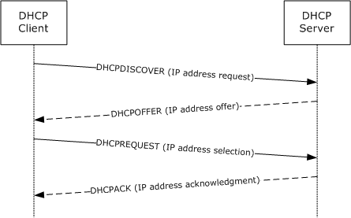

Figure 1: Basic DHCP process

The DHCPv4 client can decline an offer from a DHCPv4 server if it determines that the IP address included in the **DHCPOFFER** message sent by the server is already in use on that network. If so, the DHCPv4 client sends a **DHCPDECLINE** message and restarts the configuration process by sending a **DHCPDISCOVER** message again.

The DHCPv4 server can send a **DHCPNAK** message in response to the client's **DHCPREQUEST** message if one or more of the desired configuration options sent by the client in that message are unacceptable. In this case, the DHCPv4 client restarts the configuration process by sending a **DHCPDISCOVER** message again.

The DHCPv4 client can relinquish its lease on the IP address by sending a **DHCPRELEASE** message to the server.

In some cases, the DHCPv4 client can remember and want to reuse an IP address that was previously allocated by the DHCPv4 server to it. In this case, the client begins the initialization process by sending a **DHCPREQUEST** message to the server containing that network address as the "requested IP address". The DHCPv4 server sends a **DHCPACK** message to the client if it chooses to allow the client to continue to use that IP address. Otherwise, the DHCPv4 server sends a **DHCPNAK** message to the client.

For further details on the DHCP protocol overview, refer to section 3 of [RFC2131].

[**DHCPv6**](#gt_dhcpv6) uses the following basic steps to automatically configure a network address on a DHCPv6 client. The application of DHCPv6 discussed here is an illustrative example of an [**IPv6**](#gt_internet-protocol-version-6-ipv6) network. The DHCPv6 client and the DHCPv6 server are on the same subnet, and the client machine has no prior IPv6 address configured on the network interface. DHCPv6 can also be used by a client to obtain configuration parameters (other than the IP address) from the DHCPv6 server. Details are as specified in [[RFC3315]](https://go.microsoft.com/fwlink/?LinkId=90417) sections 1, 18.1.5, and 18.2.5.

- When the TCP/IP protocol initializes and DHCPv6 has been enabled on any of the client machine's interfaces, the DHCPv6 client sends a DHCPv6 **Solicit** message to the **All_DHCP_Relay_Agents_and_Servers** multicast address specified in [RFC3315] to discover the available DHCPv6 servers. The DHCPv6 client includes a Vendor Class Option that contains information about the host, such as the operating system version.
- All DHCPv6 servers that receive the DHCPv6 **Solicit** message from the client and have been configured with valid IPv6 address configuration information for the client send a DHCPv6 **Advertise** message in response to the DHCPv6 client. The DHCPv6 servers optionally include other configuration information for the client in the DHCPv6 **Advertise** message, in case the client wants to select the specific configuration information it requires. If configuration information is included, then based on the vendor class information that the client included in the message, the DHCPv6 servers also include any specific standard options or vendor-specific options appropriate to hosts running that operating system version. If no specific standard options or vendor-specific options are defined for hosts running that operating system version, the DHCPv6 servers ignore the Vendor Class Option sent by the client.
- The DHCPv6 client selects an IPv6 address configuration to use from the DHCPv6 **Advertise** messages that it receives. The DHCPv6 client then sends a DHCP **Request** message to the selected DHCPv6 server by using the Server Identifier option, requesting the use of the selected configuration. The client again includes a Vendor Class Option in the message.
- The DHCPv6 **Request** message identifies the server that sent the offer that the DHCPv6 client selected. The DHCPv6 servers for which the **Server Identifier** sent by the client in DHCPv6 **Request** does not match the **Server Identifier** put the offered IPv6 address back into the available pool of addresses. The selected DHCPv6 server assigns the IPv6 address configuration to the DHCPv6 client and sends a DHCPv6 **Reply** message with no Status Code option to the DHCPv6 client. The DHCPv6 servers include the configuration information, including any specific standard options or vendor-specific options based on the vendor class information sent by the client in the DHCPv6 **Request** message.
The presence of a Status Code option with any value other than Success in a DHCPv6 message from the server to the client is construed as a failure, and the DHCPv6 client then restarts the initialization process by sending the DHCPv6 **Solicit** message again.

The DHCPv6 client computer completes the TCP/IP initialization as described in the preceding steps. It then repeats the preceding steps for other interfaces, if present, for which DHCPv6 is enabled. (See the following figure.) After this is complete, the client can use all TCP/IP services and applications for normal network communications and connectivity to other IPv6 hosts.

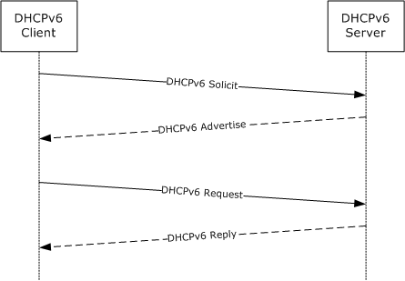

Figure 2: Basic DHCPv6 process

The DHCPv6 client can decline an offer from a DHCPv6 server if it finds that the IPv6 address included in the DHCPv6 **Advertise** message sent by the server is already in use on that network. If so, the DHCPv6 client sends a DHCPv6 **Decline** message and restarts the configuration process by sending a DHCPv6 **Solicit** message again.

The DHCPv6 server can send a DHCPv6 **Reply** message with a Status Code option with a value other than Success in response to the client's DHCPv6 **Request** message if one or more of the desired configuration options sent by the client in that message are unacceptable. In this case, the DHCPv6 client restarts the configuration process by sending a DHCPv6 **Solicit** message again.

The DHCPv6 client can relinquish its lease on the IP address by sending a DHCPv6 **Release** message to the server.

In some cases, the DHCPv6 client can remember and want to reuse an IP address that was previously allocated by the DHCPv6 server to it. In this case, the client begins the initialization process by sending a DHCPv6 **Renew** or **Rebind** message to the server containing that network address as the "requested IP address". The DHCPv6 server sends a DHCPv6 **Reply** message with no Status Code option to the client if it chooses to allow the client to continue to use that IPv6 address. Otherwise, the DHCPv6 server sends a DHCP **Reply** message to the client with a value other than Success.

For further details of the DHCPv6 protocol overview, see section 3 of [RFC3315].

Accidental configuration of multiple DHCP servers on a network might cause misconfiguration of DHCP clients. DHCP servers can implement [**Rogue Detection**](#gt_rogue-detection) to prevent such accidental configurations. A [**Rogue Aware Server**](#gt_rogue-aware-server) periodically checks whether it is authorized.

Rogue Detection can be implemented using **DHCPINFORM** and/or DHCPv6 **Information-request** messages ([RFC3315] section 15.12). The following scenarios are valid for Rogue Detection:

Authorization of a DHCPv4 server using DHCPINFORM.

- A [**Validating Server**](#gt_validating-server) sends a broadcast **DHCPINFORM** message containing a designated vendor-specific option requesting other Rogue Aware Servers on the network to respond.
- A Rogue Aware [**Administratively Authorized Server**](#gt_administratively-authorized-server) replies to the **DHCPINFORM** message by sending a **DHCPACK** message with the corresponding vendor-specific option with a NULL-terminated string in the option data.
- A [**Rogue Authorized Server**](#gt_rogue-authorized-server) on the network replies to the **DHCPINFORM** message by sending a **DHCPACK** message containing the corresponding vendor-specific option with a NULL-terminated string in the option data.
- Any DHCP servers that are not Rogue Aware can reply to the **DHCPINFORM** message by sending a **DHCPACK** message, which does not contain the corresponding vendor-specific option.
- A Rogue Aware [**Unauthorized Server**](#gt_unauthorized-server) on the network will not reply to the **DHCPINFORM** message.
- If a Validating Server receives a **DHCPACK** message from an Administratively Authorized Server, it will consider itself unauthorized.
- If a Validating Server does not receive a **DHCPACK** message from an Administratively Authorized Server within a stipulated time, it retries sending the **DHCPINFORM** message.
- If a Validating Server receives a **DHCPACK** message from a Rogue Authorized Server, or a server which is not Rogue Aware, it retries sending the **DHCPINFORM** message.
- The maximum number of retries is implementation specific. After all retry attempts are exhausted, the Validating Server can consider itself authorized or continue validation using the DHCPv6 **Information-request** message.
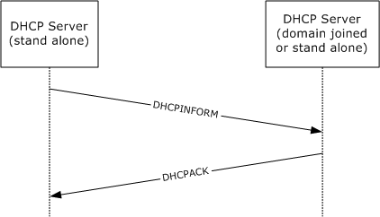

Figure 3: DHCPv4 Server Authorization messages

Authorization of a DHCP server using **Information-request**.

- A Validating Server sends a DHCPv6 **Information-request** message containing a designated vendor specific option requesting other Rogue Aware Servers on the network to respond.
- A Rogue Aware Administratively Authorized Server replies to the DHCPv6 **Information-request** message by sending a DHCPv6 **Reply** message containing the corresponding vendor-specific option with a NULL-terminated string in the option data.
- A Rogue Authorized Server on the network replies to the DHCPv6 **Information-request** message by sending a DHCPv6 **Reply** message containing the corresponding vendor-specific option with a NULL-terminated string in the option data.
- Any DHCP server that is not Rogue Aware can reply to the DHCPv6 **Information-request** message by sending a DHCPv6 **Reply** message that does not contain the corresponding vendor-specific option.
- A Rogue Aware Unauthorized Server on the network will not reply to the DHCPv6 **Information-request** message.
- If a Validating Server receives a DHCPv6 **Reply** message from an Administratively Authorized Server, it will consider itself unauthorized.
- If a Validating Server does not receive a DHCPv6 **Reply** message from an Administratively Authorized Server within a stipulated time, it retries sending the DHCPv6 **Information-request** message.
- If a Validating Server receives a DHCPv6 **Reply** message from a Rogue Authorized Server, or a server which is not Rogue Aware, it retries sending the DHCPv6 **Information-request** message.
- The maximum number of retries is implementation-specific. After all retry attempts are exhausted, the Validating Server will consider itself authorized.
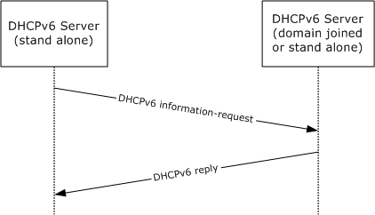

Figure 4: DHCPv6 Server Authorization messages

<a id="Section_1.4"></a>
## 1.4 Relationship to Other Protocols

[**DHCPv4**](#gt_dhcpv4) (as specified in [[RFC2131]](https://go.microsoft.com/fwlink/?LinkId=90318)) is based on the Bootstrap Protocol (BOOTP), as specified in [[RFC951]](https://go.microsoft.com/fwlink/?LinkId=90502). The format of the DHCPv4 messages is based on the format of the BOOTP messages. The relationship between these two protocols is defined in [[RFC1534]](https://go.microsoft.com/fwlink/?LinkId=90280).

The vendor-specific options specified in this document rely on and are transported within DHCPv4.

DHCPv4 can be used as one of the enforcement mechanisms defined for Network Access Protection (NAP), as described in [[MSDN-NAP]](https://go.microsoft.com/fwlink/?LinkId=90049). The vendor-specific options used for DHCPv4-based enforcement of NAP are defined in [MS-DHCPN](../MS-DHCPN/MS-DHCPN.md) section 1. [MS-DHCPN] affects the contents of DHCPv4 messages when NAP is used.

The NetBIOS over [**TCP/IP**](#gt_tcpip) protocol is defined in [[RFC1001]](https://go.microsoft.com/fwlink/?LinkId=90260) and [[RFC1002]](https://go.microsoft.com/fwlink/?LinkId=90261). The vendor-specific option defined in this specification provides the capability to enable or disable the use of the NetBIOS over TCP/IP protocol on client and server machines.

[MS-DHCPM](../MS-DHCPM/MS-DHCPM.md) affects the contents of DHCPv4 messages extended by this protocol by setting or modifying DHCP server configurations.

The following diagram illustrates the layering of the protocol in this section with other protocols in its stack.

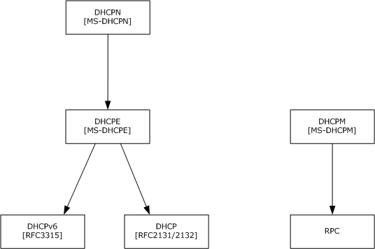

Figure 5: Protocol layering diagram

The following data flow diagram illustrates the interaction of the server implementation of this protocol with those of other protocols in its stack.

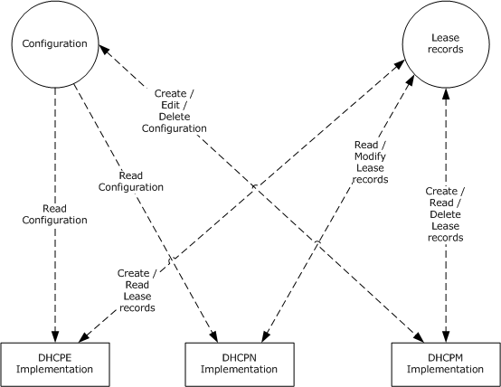

Figure 6: Server-side interaction with related protocols

The following is the relationship between [MS-DHCPM] ADM elements and the elements defined by [RFC2131] and [[RFC3315]](https://go.microsoft.com/fwlink/?LinkId=90417) which are extended by this extension.

- The subnet ([RFC2131] section 2) is represented by the **DHCPv4Scope** element, a shared ADM element (see [MS-DHCPM] section 3.1.1.2). The DHCPv4 server will process an incoming DHCPv4 client message only if there exists a **DHCPv4Scope** object in its configuration that matches either the IP address of the network interface on which it received the message or the IP address of the relay agent in the client message (as specified in [RFC2131] section 4.3.1).
- The **DHCPv4IpRange**, a shared ADM element (see [MS-DHCPM] section 3.1.1.4), restricts the range of available network addresses ([RFC2131] section 3.1 point 2) for allocation within a **DHCPv4Scope**. Once a subnet is selected, the DHCPv4 server identifies a **DHCPv4IpRange** object (we allow only up to 1 object to be configured) in the **DHCPv4Scope** which has available addresses in it. If no range is configured or the range is full, the DHCPv4 server will not respond to the client message. Otherwise the IP address to be assigned will be decided based on the available address in the range.
- The **DHCPv4ExclusionRange**, a shared ADM element (see [MS-DHCPM] section 3.1.1.5), marks a range of address within a subnet as excluded from allocation. The IP addresses within the **DHCPv4ExclusionRange** will not be counted as available network addresses ([RFC2131] section 3.1 point 2). The DHCPv4 server will also check for the existence of **DHCPv4ExclusionRange** objects (these can be multiple). IP addresses will not be assigned from these ranges.
- Manual allocation ([RFC2131] section 1) is achieved by the **DHCPv4Reservation** element, a shared ADM element (see [MS-DHCPM] section 3.1.1.6). The DHCPv4 server also checks for the existence of a **DHCPv4Reservation** object that corresponds to the hardware address in the client message. If a matching reservation exists, the corresponding IP address will be assigned to the client even if it lies outside of the **DHCPv4IpRange** or within a **DHCPv4ExclusionRange**.
- The database of allocated addresses and leases ([RFC2131] section 4) is represented by the **DHCPv4Client** element, a shared ADM element (see [MS-DHCPM] section 3.1.1.7). Whenever a client accepts the IP address assigned to it by the DHCPv4 server, the latter will create a **DHCPv4Client** object and add it to the subnet's client list.
- The **DHCPv4Filter** elements, shared ADM elements (see [MS-DHCPM] section 3.1.1.30), implement DHCPv4 server administrative controls ([RFC2131] section 4.2). The **DHCPv4FiltersList** element, a shared ADM element (see [MS-DHCPM] section 3.1.1.1), defines global allow/deny lists that determine the clients to which the server allocates addresses. The **DHCPv4FilterStatus** element, a shared ADM element (see [MS-DHCPM] section 3.1.1.1), can be used by the administrator to enable/disable enforcement of the allow/deny lists. The enforcement works in the following way:
- If neither DHCPv4FilterStatus.EnforceAllowList nor DHCPv4FilterStatus.EnforceDenyList is set to TRUE, the client message is processed further for the DHCPv4 protocol and no further checking for a DHCPv4 filter element is done.
- If the incoming client message has the client hardware address ([RFC2131] section 2) that matches a **DHCPv4Filter** entry in the **DHCPv4FiltersList** with ListType Deny and the DHCPv4FilterStatus.EnforceDenyList is set to TRUE, then the client message is not processed further or responded to.
- If the incoming client message has the client hardware address ([RFC2131] section 2) that matches a **DHCPv4Filter** entry in the **DHCPv4FiltersList** with ListType Allow and the **DHCPv4FilterStatus.EnforceAllowList** is set to TRUE, then the client message is processed further for the DHCPv4 protocol and no further checking for a DHCPv4 filter element is done.
- If the **DHCPv4FilterStatus.EnforceAllowList** is set to true and the client hardware address ([RFC2131] section 2) does not match any **DHCPv4Filter** entry in the **DHCPv4FiltersList** with ListType Allow, then the client message is not processed further or responded to.
- The **DHCPv4SuperScope** element, a shared ADM element (see [MS-DHCPM] section 3.1.1.3), allows configuration of network architectures with more than one IP subnets assigned to a physical network segment ([RFC2131] section 4.3.1). If the subnet that would be normally chosen by the DHCPv4 server according to the relay agent IP address has exhausted all addresses and happens to have a non-zero **DHCPv4Scope.SuperScopeId**, a shared ADM element (see [MS-DHCPM] section 3.1.1.23.1.1.2), then the server can allocate an address from any other subnet configured with the same **DHCPv4Scope.SuperScopeId**.
- The **DHCPv4ServerOptValueList**, a shared ADM element (see [MS-DHCPM] section 3.1.1.1), the **DHCPv4Scope.DHCPv4ScopeOptValuesList**, a shared ADM element (see [MS-DHCPM] section 3.1.1.2), and the **DHCPv4Reservation. DHCPv4ResvOptValuesList**, a shared ADM element (see [MS-DHCPM] section 3.1.1.6), allow explicit configuration of a default value for parameters requested by the client ([RFC2131] section 4.3.1). The order of selecting a configured default value is:
- **DHCPv4OptionValue** configured in the **DHCPv4Reservation**. **DHCPv4ResvOptValuesList** for a **DHCPv4Reservation** matching the client hardware address ([RFC2131] section 2) / client identifier ([[RFC2132]](https://go.microsoft.com/fwlink/?LinkId=90319) section 9.14).
- **DHCPv4OptionValue** configured in the **DHCPv4Scope.DHCPv4ScopeOptValuesList** for a **DHCPv4Scope** selected as outlined above.
- **DHCPv4OptionValue** configured in the **DHCPv4ServerOptValueList**
- Wherever the client message contains a user class option ([[RFC3004]](https://go.microsoft.com/fwlink/?LinkId=90402)) and there exists a **DHCPv4ClassDef** object, a shared ADM element (see [MS-DHCPM] section 3.1.1.8), whose **DHCPv4ClassDef.ClassData** and **DHCPv4ClassDef.ClassDataLength** match the user class option data then any parameter values configured in **DHCPv4Reservation**. **DHCPv4ResvOptValuesList**, **DHCPv4Scope.DHCPv4ScopeOptValuesList** or **DHCPv4ServerOptValueList** with the corresponding **DHCPv4ClassDef.ClassName** in the **DHCPv4OptionValue.UserClass**, a shared ADM element (see [MS-DHCPM] section 3.1.1.11), will be selected in preference to parameters configured without a ClassName in any list. The overall order of selecting a configured default value is:
- **DHCPv4OptionValue** with matching ClassName configured in the DHCPv4Reservation. DHCPv4ResvOptValuesList for a **DHCPv4Reservation** matching the client hardware address ([RFC2131] section 2) / client identifier ([RFC2132] section 9.14).
- **DHCPv4OptionValue** with matching ClassName configured in the DHCPv4Scope.DHCPv4ScopeOptValuesList for a **DHCPv4Scope** selected as outlined above.
- **DHCPv4OptionValue** with matching ClassName configured in the **DHCPv4ServerOptValueList**
- **DHCPv4OptionValue** with no ClassName configured in the **DHCPv4Reservation**. **DHCPv4ResvOptValuesList** for a **DHCPv4Reservation** matching the client hardware address ([RFC2131] section 2) / client identifier ([RFC2132] section 9.14).
- **DHCPv4OptionValue** with no ClassName configured in the DHCPv4Scope.DHCPv4ScopeOptValuesList for a **DHCPv4Scope** selected as outlined above.
- **DHCPv4OptionValue** with no ClassName configured in the **DHCPv4ServerOptValueList**
- The **DHCPv4ServerMibInfo** element, a shared ADM element (see [MS-DHCPM] section 3.1.1.1), is updated by the server with the counts of various DHCPv4 messages ([RFC2131] section 3.1) processed or sent by it. Specifically, **DHCPv4ServerMibInfo.Discovers**, **DHCPv4ServerMibInfo.Offers**, **DHCPv4ServerMibInfo.Requests**, **DHCPv4ServerMibInfo.Declines** and **DHCPv4ServerMibInfo.Releases** are updated with the counts of **DHCPDISCOVER**, **DHCPOFFER**, **DHCPREQUEST**, **DHCPDECLINE** and **DHCPRELEASE** messages processed by the server respectively. DHCPv4ServerMibInfo.Acks and DHCPv4ServerMibInfo.Naks are updated with the counts of **DHCPACK** and **DHCPNAK** messages sent by the server respectively.
- IPv6 prefixes ([RFC3315] section 4.1) are configured on the server as **DHCPv4Scope** elements, shared ADM elements (see [MS-DHCPM] section 3.1.1.14). IP addresses are selected for assignment to an IA ([RFC3315] section 11) based on the existence in configuration of a prefix corresponding to the address of the interface over which a direct message was received or the address of the forwarding relay agent in the case of relay forwarded messages.
- The **DHCPv6ExclusionRange** element, a shared ADM element (see [MS-DHCPM] section 3.1.1.15), marks a range of address within a subnet as excluded from allocation. While selecting addresses for assignment to an IA ([RFC3315] section 11) the server will not select addresses so excluded from allocation.
- The **DHCPv6Reservation** element, a shared ADM element (see [MS-DHCPM] section 3.1.1.16), implements a manual allocation scheme on par with the one outlined for DHCPv4 processing above.
- The **DHCPv6ClientInfo** element, a shared ADM element ([MS-DHCPM] section 3.1.1.18), represents a DHCPv6 binding which contains information about the identity association ([RFC3315] section 4.2). Whenever a client accepts the IP address assigned to it by the [**DHCPv6**](#gt_dhcpv6) server, the latter will create a **DHCPv6ClientInfo** object and add it to the DHCPv6Scope. DHCPv6ClientInfoList.
- The **DHCPv6ServerClassedOptValueList**, a shared ADM element (see [MS-DHCPM] section 3.1.1.1), **DHCPv6Scope.DHCPv6ScopeClassedOptValueList**, a shared ADM element (see [MS-DHCPM] section 3.1.1.14), and **DHCPv6Reservation.DHCPv6ResvClassedOptValueList**, a shared ADM element (see [MS-DHCPM] section 3.1.1.16), allow the server to be configured to return options to the client as described in ([RFC3315] sections 17.2.2 and 18.2). The order of selecting a configured option is:
- **DHCPv6OptionValue** configured in the **DHCPv6Reservation.DHCPv6ResvClassedOptValueList** for a **DHCPv6Reservation** matching the client identifier and IAID specified in the client message.
- **DHCPv6OptionValue** configured in the **DHCPv6Scope.DHCPv6ScopeClassedOptValueList** for a **DHCPv6Scope** which corresponds to the prefix used in address selection as outlined above.
- **DHCPv6OptionValue** configured in the **DHCPv6ServerClassedOptValueList**
- Wherever the client message contains a user class option ([RFC3315] section 22.15) and there exists a **DHCPv6ClassDef** object, a shared ADM element (see [MS-DHCPM] section 3.1.1.19), whose **DHCPv6ClassDef.ClassData** and **DHCPv6ClassDef.ClassDataLength** match the user class option data then any parameter values configured in **DHCPv6Reservation.DHCPv6ResvClassedOptValueList**, **DHCPv6Scope.DHCPv6ScopeClassedOptValueList** or **DHCPv6ServerClassedOptValueList** with the corresponding **DHCPv6ClassDef.ClassName** in the **DHCPv6OptionValue.UserClass**, a shared ADM element (see [MS-DHCPM] section 3.1.1.21), will be selected in preference to a parameter configured without a ClassName in the corresponding list. The overall order of selecting a configured default value is:
- **DHCPv6OptionValue** with matching ClassName configured in the DHCPv6Reservation.DHCPv6ResvClassedOptValueList for a **DHCPv6Reservation** matching the client identifier and IAID specified in the client message.
- **DHCPv6OptionValue** with no ClassName configured in the DHCPv6Reservation.DHCPv6ResvClassedOptValueList for a **DHCPv6Reservation** matching the client identifier and IAID specified in the client message.
- **DHCPv6OptionValue** with matching ClassName configured in the DHCPv6Scope.DHCPv6ScopeClassedOptValueList for a **DHCPv6Scope** selected as outlined above.
- **DHCPv6OptionValue** with no ClassName configured in the DHCPv6Scope.DHCPv6ScopeClassedOptValueList for a **DHCPv6Scope** selected as outlined above.
- **DHCPv6OptionValue** with matching ClassName configured in the **DHCPv6ServerClassedOptValueList**
- **DHCPv6OptionValue** with no ClassName configured in the **DHCPv6ServerClassedOptValueList**
- The **DHCPv6ServerMibInfo** element, a shared ADM element (see [MS-DHCPM] section 3.1.1.1), is updated by the server with the counts of various DHCPv6 messages ([RFC2131] section 3.1) processed or sent by it. Specifically, **DHCPv6ServerMibInfo.Solicits**, **DHCPv6ServerMibInfo.Requests**, **DHCPv6ServerMibInfo.Renews**, **DHCPv6ServerMibInfo.Rebinds**, **DHCPv6ServerMibInfo.Confirms** and **DHCPv6ServerMibInfo.Declines**, **DHCPv6ServerMibInfo.Releases**, **DHCPv6ServerMibInfo.Informs** are updated with the counts of DHCPv6 Solicit, Request, Renew, Rebind, Confirm, Decline, Release and Inform messages processed by the server respectively. **DHCPv6ServerMibInfo.Advertises** and **DHCPv6ServerMibInfo.Replies** are updated with the counts of DHCPv6 Advertise and Reply messages sent by the server, respectively.
- The **DHCPv4ServerMcastMibInfo** element, a shared ADM element (see [MS-DHCPM] section 3.1.1.1), is updated by the server with the counts of various MADCAP messages ([[RFC2730]](https://go.microsoft.com/fwlink/?LinkId=108313) section 2.2) processed or sent by it.
<a id="Section_1.5"></a>
## 1.5 Prerequisites/Preconditions

None.

<a id="Section_1.6"></a>
## 1.6 Applicability Statement

The use of these DHCP vendor-specific options is applicable in environments where DHCP or DHCPv6 is used.

The optional internationalization extensions specified in section [2.2.7](#Section_2.2.7) are only applicable in homogenous environments where either all machines use ASCII or have the same implementation-specific behavior.

<a id="Section_1.7"></a>
## 1.7 Versioning and Capability Negotiation

The guidelines noted in section 8.4 of [[RFC2132]](https://go.microsoft.com/fwlink/?LinkId=90319) to identify the vendor for the vendor-specific options are applicable to [**DHCPv4**](#gt_dhcpv4).

The Vendor Class Identifier Option defined in [RFC2132] section 9.13 and the Vendor Class Option defined in [[RFC3315]](https://go.microsoft.com/fwlink/?LinkId=90417) section 22.16 contain values used to negotiate which vendor-specific options defined herein are to be sent to the DHCPv6 client.

<a id="Section_1.8"></a>
## 1.8 Vendor-Extensible Fields

[**DHCPv4**](#gt_dhcpv4) (as specified in [[RFC2131]](https://go.microsoft.com/fwlink/?LinkId=90318)) and DHCPv6 (as specified in [[RFC3315]](https://go.microsoft.com/fwlink/?LinkId=90417)) have a provision for vendor-extensible options. These vendor-specific options are used as specified in [[RFC2132]](https://go.microsoft.com/fwlink/?LinkId=90319) and [RFC3315]. The vendor-extensible fields described in this document comply with the provisions defined therein. The vendor-extensible options used by DHCPv4 clients and servers are specified in section [2.2.2](#Section_2.2.2).

<a id="Section_1.9"></a>
## 1.9 Standards Assignments

| Parameter | Value | Reference |
| --- | --- | --- |
| Private Enterprise Number | 311 | [[IANA-ENT]](https://go.microsoft.com/fwlink/?LinkId=89883) |

<a id="Section_2"></a>
# 2 Messages

<a id="Section_2.1"></a>
## 2.1 Transport

All DHCP attributes are transported within DHCP, which is transported over the UDP protocol, as specified in [[RFC2131]](https://go.microsoft.com/fwlink/?LinkId=90318) section 4.1 for DHCPv4 and [[RFC3315]](https://go.microsoft.com/fwlink/?LinkId=90417) section 5.2 for DHCPv6.

| Parameter | Value | Reference |
| --- | --- | --- |
| DHCPv4 server listens for DHCPv4 messages on UDP port. | 0x0043 | [RFC2131] |
| DHCPv4 client listens for DHCPv4 messages on UDP port. | 0x0044 | [RFC2131] |
| DHCPv6 server listens for DHCPv6 messages on UDP port. | 0x0223 | [RFC3315] section 5.2 |
| DHCPv6 clients listen for DHCPv6 messages on UDP port. | 0x0222 | [RFC3315] section 5.2 |

<a id="Section_2.2"></a>
## 2.2 Message Syntax

The following DHCP extensions use the message format for vendor-specific options, as specified in [[RFC2132]](https://go.microsoft.com/fwlink/?LinkId=90319) section 8.4 and in [[RFC3925]](https://go.microsoft.com/fwlink/?LinkId=90447) section 3.

All option fields and values described in this document are sent in [**network byte order**](#gt_network-byte-order) unless indicated otherwise.

<a id="Section_2.2.1"></a>
### 2.2.1 DHCPv4 Option Code 12 (0xC) - Host Name Option

This option, as defined in [[RFC2132]](https://go.microsoft.com/fwlink/?LinkId=90319) section 3.14, specifies the name of the client that MUST follow character set restrictions as specified in [[RFC1035]](https://go.microsoft.com/fwlink/?LinkId=90264). [RFC1035] section 2.3.1 specifies a "preferred" name syntax that uses letters, digits, and hyphens, but does not state whether this is mandatory (for more information, see [MS-HNDS](../MS-HNDS/MS-HNDS.md)). In addition, [RFC1035] does not explain how to ASCII-encode a name if the client has a non-ASCII name, and hence the contents of this option are implementation-specific.<1> It was this ambiguity that led to it being rendered obsolete by DHCPv4 Option Code 81 (section [2.2.7)](#Section_2.2.7).

<a id="Section_2.2.2"></a>
### 2.2.2 DHCPv4 Option Code 43 (0x2B) - Vendor-Specific Information Option

[**DHCPv4**](#gt_dhcpv4) clients request vendor-specific options from the DHCPv4 server by including option code 43 in the Parameter Request List, as specified in [[RFC2132]](https://go.microsoft.com/fwlink/?LinkId=90319) section 8.4.

DHCPv4 clients implementing this specification MUST also include a vendor-class identifier as described in section [2.2.3](#Section_2.2.3) in the DHCPv4. A [**Validating Server**](#gt_validating-server) MAY include a vendor-class identifier when authorizing itself using [**Rogue Detection**](#gt_rogue-detection).

When a DHCPv4 message includes a Vendor Class Identifier with one of the values defined in section 2.2.3, the Vendor-Specific Information Option is defined to use the "Encapsulated vendor-specific options" format specified in [RFC2132] section 8.4. This specification defines the following encapsulated vendor-specific option codes.

| Value | Meaning |
| --- | --- |
| 0x01 | Microsoft Disable NetBIOS Option (section [2.2.2.1](#Section_2.2.2.1)) |
| 0x02 | Microsoft Release DHCP Lease on Shutdown Option (section [2.2.2.2](#Section_2.2.2.2)) |
| 0x03 | Microsoft Default Router Metric Base Option (section [2.2.2.3](#Section_2.2.2.3)) |
| 0x5E | Rogue Detection Request Option (section [2.2.2.4](#Section_2.2.2.4)) |
| 0x5F | Rogue Detection Option (section [2.2.2.5](#Section_2.2.2.5)) |

The ANDROID_METERED option is specified in section [2.2.2.6](#Section_2.2.2.6).<2>

In addition, DHCPv4 clients that support [**NAP**](#gt_network-access-protection-nap) also use DHCPv4 vendor-specific options for exchanging NAP-specific information. For an overview of NAP and for more information, see [MS-DHCPN](../MS-DHCPN/MS-DHCPN.md) and [[TNC-IF-TNCCSPBSoH]](https://go.microsoft.com/fwlink/?LinkId=240054). NAP utilizes vendor-specific options as defined in [MS-DHCPN] section 2.2.1.

For information about the format of DHCP Vendor Extensions, see [RFC2132] section 2 and [[RFC3315]](https://go.microsoft.com/fwlink/?LinkId=90417) section 22.

<a id="Section_2.2.2.1"></a>
#### 2.2.2.1 Vendor-Specific Option Code 0x01 - Microsoft Disable NetBIOS Option

This option is sent by a [**DHCPv4**](#gt_dhcpv4) server to a DHCPv4 client in a **DHCPOFFER** or a **DHCPACK** message.<3> It has no effect on subsequent options in that message or on the **DHCPREQUEST** message sent by the client to the server.

This option can be used to enable or disable the use of NetBIOS over [**TCP/IP**](#gt_tcpip) on the network interface for which the DHCPv4 message was received. DHCPv4 clients SHOULD<4> support this option. If the use of NetBIOS over TCP/IP is disabled on the interface, no NetBIOS over TCP/IP packets can be sent from or received on that interface. If any NetBIOS over TCP/IP packets are sent to the client on that interface, they are silently discarded. This option has no effect on NetBIOS over NetBEUI.

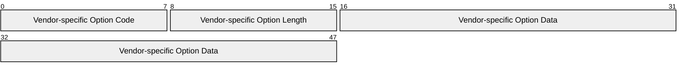

**Vendor-specific Option Code (1 byte):** This MUST be 0x01.

**Vendor-specific Option Length (1 byte):** This MUST be 0x04.

**Vendor-specific Option Data (4 bytes):** Values are as follows.

| Value | Meaning |
| --- | --- |
| 0x00000000 | Enables NetBIOS over TCP/IP (Default Value) for that network interface. |
| 0x00000001 | Ignored (existing behavior unchanged). |
| 0x00000002 | Disables NetBIOS over TCP/IP for that network interface. |
| 0x00000003 — 0xFFFFFFFF | Ignored (existing behavior unchanged). |

<a id="Section_2.2.2.2"></a>
#### 2.2.2.2 Vendor-Specific Option Code 0x02 - Microsoft Release DHCP Lease on Shutdown Option

This option is sent by a [**DHCPv4**](#gt_dhcpv4) server to a DHCPv4 client in a **DHCPOFFER** or a **DHCPACK** message. It has no effect on subsequent options in that message or on the **DHCPREQUEST** message sent by the client to the server.

This option is used in DHCPv4 messages by the DHCPv4 server for directing the clients to send a **DHCPRELEASE** on that network interface when the operating system on the client is shutting down. DHCPv4 clients SHOULD<5> support this option.


**Vendor-specific Option Code (1 byte):** This MUST be 0x02.

**Vendor-specific Option Length (1 byte):** This MUST be 0x04.

**Vendor-specific Option Data (4 bytes):** Values are as follows.

| Value | Meaning |
| --- | --- |
| 0x00000000 | Disables client behavior of sending DHCPRELEASE message on operating system shutdown. |
| 0x00000001 | Enables client behavior of sending DHCPRELEASE message on operating system shutdown. |
| 0x00000002 — 0xFFFFFFFF | Existing behavior of client is unchanged. |

<a id="Section_2.2.2.3"></a>
#### 2.2.2.3 Vendor-Specific Option Code 0x03 - Microsoft Default Router Metric Base Option

This option is sent by the [**DHCPv4**](#gt_dhcpv4) server to the DHCPv4 client in a **DHCPOFFER** or a **DHCPACK** message. It has no effect on subsequent options in that message or on the **DHCPREQUEST** message sent by the client to the server.

This option is used to set the default route metric (as specified in [[RFC1812]](https://go.microsoft.com/fwlink/?LinkId=90293) section 5.2.4.3) for all automatically computed network routes for the network interface on which the DHCPv4 message was received. DHCPv4 clients SHOULD<6> support this option.


**Vendor-specific Option Code (1 byte):** This MUST be 0x03.

**Vendor-specific Option Length (1 byte):** This MUST be 0x04.

**Vendor-specific Option Data (4 bytes):** If zero, clients are to compute a route metric based on link speed. Otherwise, this value overrides the automatically calculated metric for the default route for that network interface.

The automatically calculated metric for the default route for DHCPv4 client computers SHOULD<7> be one of the following values.

| Value | Meaning |
| --- | --- |
| 0x0000000A | Greater than 200 Mbps. |
| 0x00000014 | Greater than 80 Mbps, and less than or equal to 200 Mbps. |
| 0x00000019 | Greater than 20 Mbps, and less than or equal to 80 Mbps. |
| 0x0000001E | Greater than 4 Mbps, and less than or equal to 20 Mbps. |
| 0x00000028 | Greater than 500 Kbps, and less than or equal to 4 Mbps. |
| 0x00000032 | Less than or equal to 500 Kbps. |

<a id="Section_2.2.2.4"></a>
#### 2.2.2.4 Vendor-Specific Option Code 0x5E - Rogue Detection Request Option

This option is sent by a Validating Server to [**DHCPv4**](#gt_dhcpv4) servers on the network in a DHCPINFORM message. It is sent as an encapsulated vendor-specific option in option 43 (section [2.2.2](#Section_2.2.2)).

The DHCPINFORM message does not contain the vendor-class identifier option (section 2.2.2).


**Vendor-Specific Option Code (1 byte):** This MUST be 94 (0x5E).

**Vendor-Specific Option Length (1 byte):** This MUST be 0x00.

<a id="Section_2.2.2.5"></a>
#### 2.2.2.5 Vendor-Specific Option Code 0x5F – Rogue Detection Reply Option

This option is sent by a [**Rogue Aware Server**](#gt_rogue-aware-server) to a [**Validating Server**](#gt_validating-server) in a DHCPACK message. It is sent in response to an authorization message (see section [2.2.2.4](#Section_2.2.2.4)) received in a DHCPINFORM message. It is sent as an encapsulated option in option 43 (section 2.2.2.4).

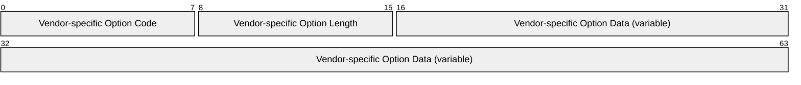

**Vendor-specific Option Code (1 byte):** This MUST be 0x5F.

**Vendor-specific Option Length (1 byte):** The unsigned length, in bytes, of the **Vendor-specific Option Data** field. The maximum length is 255 bytes.

**Vendor-specific Option Data (variable):** This is a null-terminated string of length specified in **Vendor-specific Option Length**.

<a id="Section_2.2.2.6"></a>
#### 2.2.2.6 Vendor-Specific ANDROID_METERED Option

The vendor-specific option data contains the ANDROID_METERED setting when the vendor-specific option data includes the string "ANDROID_METERED".<8> The string is encoded as ASCII octets, does not include the surrounding quotes, may or may not be NULL-terminated, and may be in any position in the vendor-specific option data.

<a id="Section_2.2.3"></a>
### 2.2.3 DHCPv4 Option Code 60 (0x3C) - Vendor Class Identifier Option

A [**DHCPv4**](#gt_dhcpv4) client sends vendor information in all DHCPv4 packets that it sends to the DHCPv4 server to indicate the vendor or the version of the operating system running on the client. This information is sent in the form of a Vendor Class Identifier Option, as specified in [[RFC2132]](https://go.microsoft.com/fwlink/?LinkId=90319) section 9.13.

The DHCPv4 servers implementing this specification use the information contained in this option to determine whether a client implements this specification and whether to send the options defined in this specification. For semantics on the usage of vendor class identifiers, refer to [RFC2132] sections 8.4 and 9.13.

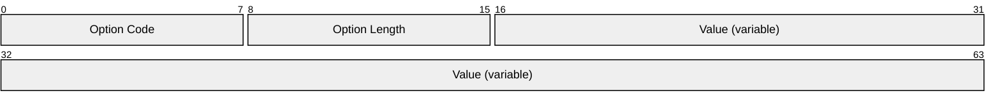

**Option Code (1 byte):** This MUST be 60 (0x3C) (as specified in [RFC2132] section 9.13) to indicate the Vendor Class Identifier Option.

**Option Length (1 byte):** The unsigned length in bytes of the **Value** field.

**Value (variable):** This MUST be set to one of the following values, where the value shown is encoded as a non-NULL-terminated ASCII string.

| Value | Meaning |
| --- | --- |
| "MSFT 98" | The client implements this specification but does not understand any encapsulated vendor-specific options. |
| "MSFT 5.0" | The client implements this specification and understands all encapsulated vendor-specific options defined herein. |
| "MSFT 5.0 XBOX" | The client implements this specification and understands all encapsulated vendor-specific options defined herein and the client claims to be a Microsoft Xbox gaming console. Not all Xbox consoles will use this value, and a client using this value may or may not actually be a Microsoft Xbox gaming console.<9> |

<a id="Section_2.2.4"></a>
### 2.2.4 DHCPv6 Option Code 15 (0x000F) - User Class Option

DHCPv6 clients implementing this specification MUST use the message format and semantics specified in [[RFC3315]](https://go.microsoft.com/fwlink/?LinkId=90417) when sending a User Class Option to a DHCPv6 server. The DHCPv6 client MUST send a maximum of only one User Class Option in a DHCPv6 message. This section describes the message format of User Class Option sent by DHCPv6 servers that implement this specification in response to an Option Request from the DHCPv6 client. The format of this option varies from the implementation described in [RFC3315].

DHCPv6 clients MAY<10> request the user classes configured on the DHCPv6 server by sending an **Information-request** message containing OPTION_ORO (Option 6) with OPTION_USER_CLASS (Option 15) as the ONLY requested option. On receiving the message, the DHCPv6 server SHOULD<11> send a **Reply** message to the DHCPv6 client containing one or more User Class Options (one for each user class configured on the DHCPv6 server) in the format shown as follows. This behavior is an extension of the DHCPv6 protocol defined in [RFC3315]. The DHCPv6 server MUST send the **OPTION_USER_CLASS** with a format described in [RFC3315] when the DHCPv6 server sends the option in response to an OPTION_USER_CLASS received from a DHCPv6 client as described in [RFC3315].

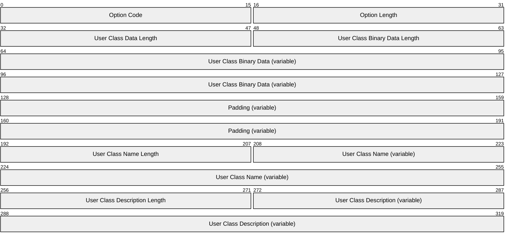

**Option Code (2 bytes):** This MUST be 15 (0x000F) to indicate User Class Option.

**Option Length (2 bytes):** The unsigned length, in bytes, of the User Class Option, not including the **Option Code** and **Option Length** fields.

**User Class Data Length (2 bytes):** Value is variable, depending on the size of **User Class Binary Data**, **User Class Name** and **User Class Description**.

**User Class Binary Data Length (2 bytes):** Size of **User Class Binary Data** in octets.

**User Class Binary Data (variable):** Binary data of a User Class set on the DHCPv6 server.

**Padding (variable):** Padding to align User Class Binary data to 4-byte boundary.

**User Class Name Length (2 bytes):** Size of **User Class Name** in octets.

**User Class Name (variable):** Name of a User Class set on the DHCPv6 server.

**User Class Description Length (2 bytes):** Size of **User Class Description** in octets.

**User Class Description (variable):** Description of a User Class defined on the DHCPv6 server.

<a id="Section_2.2.5"></a>
### 2.2.5 DHCPv6 Option Code 16 (0x0010) - Vendor Class Option

A DHCPv6 client sends vendor information in all DHCPv6 packets to the DHCPv6 server. This information is sent in the form of a vendor class option, as specified in [[RFC3315]](https://go.microsoft.com/fwlink/?LinkId=90417) section 22.16. An implementation that supports DHCPv6 MUST support this option.<12>

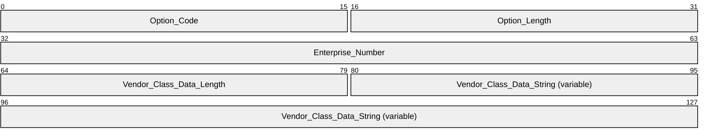

**Option_Code (2 bytes):** As specified in [RFC3315] section 22, this is used to indicate the Vendor Class Option and MUST be 0x0010.

**Option_Length (2 bytes):** MUST be set to 0x000E or 0x0013 (4 + 2 + the size of **Vendor_Class_Data_String**).

**Enterprise_Number (4 bytes):** MUST be set to 0x00000137 (decimal 311), the Internet Assigned Numbers Authority (IANA)–assigned Microsoft Enterprise number [[IANA-ENT]](https://go.microsoft.com/fwlink/?LinkId=89883).

**Vendor_Class_Data_Length (2 bytes):** The length of the **Vendor_Class_Data_String** field MUST be set to 0x0008.

**Vendor_Class_Data_String (variable):** MUST be set to one of the following values, where the value shown is encoded as a non-NULL-terminated ASCII string.

| Value | Meaning |
| --- | --- |
| "MSFT 5.0" | The client implements this specification and understands all encapsulated vendor-specific options defined herein. |
| "MSFT 5.0 XBOX" | The client implements this specification and understands all encapsulated vendor-specific options defined herein and the client claims to be a Microsoft Xbox gaming console. Not all Xbox consoles will use this value, and a client using this value may or may not actually be a Microsoft Xbox gaming console.<13> |

<a id="Section_2.2.6"></a>
### 2.2.6 DHCPv4 Option Code 77 (0x4D) - User Class Option

This section describes the message format of the User Class Option sent by [**DHCPv4**](#gt_dhcpv4) clients and DHCPv4 servers, and the values for this option that are predefined on DHCPv4 servers that implement this specification. The format of this option varies from the implementation described in [[RFC3004]](https://go.microsoft.com/fwlink/?LinkId=90402) in that the User Class Data field format is changed. The use of this alternate format is indicated by the presence of a Vendor Class Identifier Option (section [2.2.3](#Section_2.2.3)), which can occur anywhere in the same message.

<a id="Section_2.2.6.1"></a>
#### 2.2.6.1 User Class Option Sent by DHCPv4 Client to DHCPv4 Server

DHCPv4 clients MAY<14> send a User Class Option in all [**DHCPv4**](#gt_dhcpv4) messages sent by the client with any string configured by the administrator or a string from the User Class Data field. DHCPv4 clients support only one User Class option. For semantics of the usage of DHCPv4 user classes, refer to [[RFC3004]](https://go.microsoft.com/fwlink/?LinkId=90402) section 4.

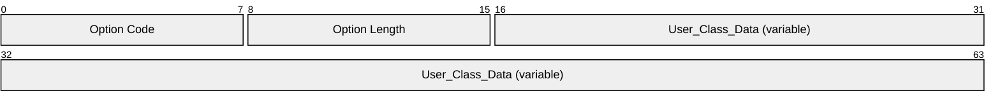

**Option Code (1 byte):** Must be 77 (0x4D) to indicate the User Class Option for DHCP.

**Option Length (1 byte):** Length in octets of the **User Class Data** field.

**User_Class_Data (variable):** The following User Class name is predefined in the DHCPv4 server and is sent by the DHCPv4 client in the specified scenario:

| Value | Meaning |
| --- | --- |
| "RRAS.Microsoft" | This value MUST be used if the DHCPv4 client is sending a User Class Option in a message on a dial-up or VPN network interface. This string is otherwise known as the Default Routing and Remote Access Class. |

<a id="Section_2.2.6.2"></a>
#### 2.2.6.2 User Class Option Sent by DHCPv4 Server to DHCPv4 Client

[**DHCPv4**](#gt_dhcpv4) clients MAY<15> request the user classes configured on the DHCPv4 server by sending a **DHCPINFORM** message containing OPTION_PARAMETER_REQUEST_LIST (Option 55) ([[RFC2132]](https://go.microsoft.com/fwlink/?LinkId=90319) section 9.8) with OPTION_USER_CLASS (Option 77) ([[RFC3004]](https://go.microsoft.com/fwlink/?LinkId=90402) section 4) as one of the requested options. On receiving the message, the DHCPv4 server SHOULD<16> send a **DHCPACK** message to the DHCPv4 client containing one or more User Class Options (one for each user class configured on the DHCPv4 server) in the format shown as follows.

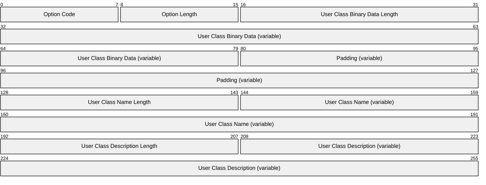

**Option Code (1 byte):** This MUST be 77 (0x4D) to indicate the User Class option for DHCP.

**Option Length (1 byte):** The unsigned length, in bytes, of the User Class Option, not including the **Option Code** and **Option Length** fields.

**User Class Binary Data Length (2 bytes):** Size of the User Class binary data in octets.

**User Class Binary Data (variable):** Binary data of a User Class set on the DHCPv4 server.

**Padding (variable):** Padding to align the User Class binary data to 4-byte boundary.

**User Class Name Length (2 bytes):** Size of the **User Class Name** in octets.

**User Class Name (variable):** Name of a User Class set on the DHCPv4 server.

**User Class Description Length (2 bytes):** Size of the **User Class Description** in octets.

**User Class Description (variable):** Description of a User Class set on the DHCPv4 server.

<a id="Section_2.2.7"></a>
### 2.2.7 DHCPv4 Option Code 81 (0x51) - Client FQDN Option

The client FQDN option is specified in [[RFC4702]](https://go.microsoft.com/fwlink/?LinkId=162972) section 2 that states that setting the E bit to 0 indicates that the name is ASCII-encoded but does not explain how to ASCII encode a name if the client has a non-ASCII name. It then explains that client software may send data intended to be in other character sets but that support for other character sets is not required. This document clarifies that a client with a non-ASCII name MAY<17> set the E bit to 1 but that a client MAY<18> send its host name in an implementation-specific character set. [RFC4702] section 4 states that [**DHCPv4**](#gt_dhcpv4) servers SHOULD ignore the client FQDN option if the client's E bit is set to 0 and the servers do not support ASCII encoding. However, [RFC4702] section 2.3.1 states that client software may send data intended to be in other character sets, but that support for other character sets is not required. This specification clarifies that a DHCPv4 server MAY<19> accept other implementation-dependent character sets when the E bit is set to 0.

<a id="Section_2.2.8"></a>
### 2.2.8 DHCPv4 Option Code 249 (0xF9) - Microsoft Classless Static Route Option

[**DHCPv4**](#gt_dhcpv4) clients and DHCPv4 servers that implement this specification use some nonstandard options in their implementation.

The length and the data format for the Microsoft [**Classless Static Route**](#gt_classless-static-route) Option are exactly the same as those specified for the Classless Static Route Option in [[RFC3442]](https://go.microsoft.com/fwlink/?LinkId=90421); the only difference is that Option Code 249 SHOULD<20> be used instead of or in addition to Option Code 121.

Multiple routes can be sent using the option. Each classless route consists of the Destination descriptor and Router IP address elements. The number of routes included in the option can be determined by processing the option data.

Note that the router IP address is of length 4 bytes, whereas the destination descriptor length is between 1 byte and 5 bytes, depending on the subnet mask. This is described in detail as follows.

This option is sent by the DHCPv4 server to the DHCPv4 client in the DHCPOFFER or the DHCPACK message. It has no effect on subsequent options in that message or in any of the messages sent by the client to the server.

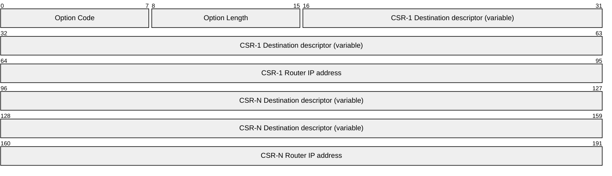

**Option Code (1 byte):** This MUST be 249 (0xF9).

**Option Length (1 byte):** The unsigned length, in bytes, of the option, not including the **Option Code** and **Option Length** fields.

**CSR-1 Destination descriptor (variable):** This is determined in exactly the same way described on the destination descriptor specified on page 4 of [RFC3442].

**CSR-1 Router IP address (4 bytes):** The IPv4 address of the next-hop router that can be used to reach the destination.

**CSR-N Destination descriptor (variable):** This is determined in exactly the same way as the destination descriptor specified on page 4 of [RFC3442].

**CSR-N Router IP address (4 bytes):** The IPv4 address of the next-hop router that can be used to reach the destination.

<a id="Section_2.2.9"></a>
### 2.2.9 DHCPv4 Option Code 250 (0xFA) - Microsoft Encoding Long Options Packet

[**DHCPv4**](#gt_dhcpv4) standard options are constrained to be of maximum size 255 bytes due to the length of the option 8-bit length field that the protocol defines in [[RFC3396]](https://go.microsoft.com/fwlink/?LinkId=90420) section 1.

In the case where the option data for any of the DHCPv4 option values exceeds 255 bytes in length, implementations of this specification do not follow [RFC3396] section 5. Instead, Option Code 250 is used to encode the excess data over 255 bytes. Option Code 250 repeats immediately after the option being encoded as many times as necessary to encode the remaining data.

For instance, if the option data for a given Option Code X is 600 bytes, the DHCPv4 client or DHCPv4 server sends Option X with 255 bytes of data, immediately followed by Option 250 with another 255 bytes of data, and then again Option 250 with the remaining 90 (600 – 255 – 255) bytes of data.

Option 250 is encoded by DHCPv4 clients and DHCPv4 servers in the same format as the following standard DHCPv4 options.

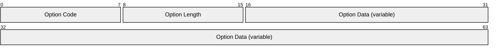

**Option Code (1 byte):** This MUST be 250 (0xFA).

**Option Length (1 byte):** The unsigned length, in bytes, of the option, not including the **Option Code** and **Option Length** fields.

**Option Data (variable):** This field contains the continuation of the data of the previous option, which was too long to be contained in that option.

<a id="Section_2.2.10"></a>
### 2.2.10 DHCPv6 Option Code 17 (0x0011) - Vendor Specific Information Option

A DHCPv6 client and server exchange vendor-specific information between themselves. This information is sent in the form of a vendor-specific information option, as specified in [[RFC3315]](https://go.microsoft.com/fwlink/?LinkId=90417) section 22.17.

A [**Validating Server**](#gt_validating-server) does not need to include a vendor class option (section [2.2.5](#Section_2.2.5)) when authorizing itself using [**Rogue Detection**](#gt_rogue-detection).

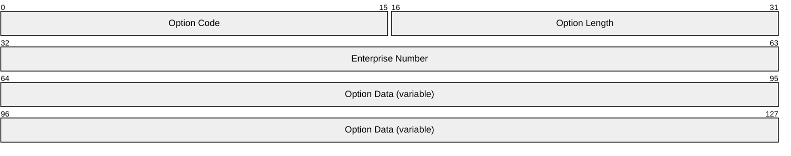

**Option Code (2 bytes):** As specified in [RFC3315] section 22.17, this is used to indicate the Vendor-specific information Option and MUST be 0x0011.

**Option Length (2 bytes):** Set to the size of **Option Data**, in bytes, plus 4.

**Enterprise Number (4 bytes):** MUST be set to 0x00000137 (decimal 311), the Internet Assigned Numbers Authority (IANA)–assigned Microsoft Enterprise number [[IANA-ENT]](https://go.microsoft.com/fwlink/?LinkId=89883).

**Option Data (variable):** This is set to the vendor-specific option data.

When a DHCPv6 message includes a Vendor Class Identifier with the value defined in section 2.2.5, the Vendor-Specific Information Option is defined to use the "Encapsulated vendor-specific options" format specified in [RFC3315] section 22.17. This specification defines the following encapsulated vendor-specific option codes.

| Value | Meaning |
| --- | --- |
| 0x5E | Rogue Detection Request Option |
| 0x5F | Rogue Detection Reply Option |

<a id="Section_2.2.10.1"></a>
#### 2.2.10.1 Vendor-Specific Option Code 0x5E – Rogue Detection Request Option

This option is sent by a [**Validating Server**](#gt_validating-server) to [**DHCPv4**](#gt_dhcpv4) servers on the network in a DHCPv6 **Information-request** message. It is sent as an encapsulated option in option 17 (section [2.2.10](#Section_2.2.10)).

The Validating Server MAY include the vendor class option (section [2.2.5](#Section_2.2.5)) in its DHCPv6 **Information-request** message.

The DHCPv6 server requests option 94 (0x005E) in the DHCPv6 **Information-request** message in the following format.

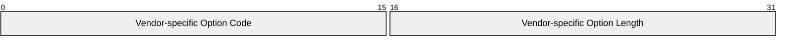

**Vendor-specific Option Code (2 bytes):** This MUST be 94 (0x5E).

**Vendor-specific Option Length (2 bytes):** This MUST be 0x00.

<a id="Section_2.2.10.2"></a>
#### 2.2.10.2 Vendor-Specific Option Code 0x5F – Rogue Detection Reply Option

This option is sent by a [**Rogue Aware Server**](#gt_rogue-aware-server) to a [**Validating Server**](#gt_validating-server) in a DHCPv6 **Reply** message. It is sent in response to option 0x5E (section [2.2.10.1](#Section_2.2.10.1)) received in a DHCPv6 **Information-request** message. It is sent as an encapsulated option in option 17 (section [2.2.10](#Section_2.2.10)).

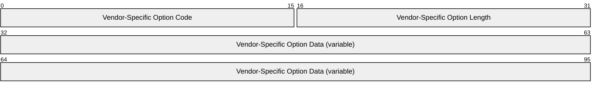

**Vendor-Specific Option Code (2 bytes):** This MUST be 95 (0x5F).

**Vendor-Specific Option Length (2 bytes):** The unsigned length in bytes of the **Vendor-Specific Option Data** field. The maximum length is 255 bytes.

**Vendor-Specific Option Data (variable):** This is a null-terminated string of length specified by **Vendor-Specific Option Length**.

<a id="Section_2.2.11"></a>
### 2.2.11 DHCPv4 Option Code 15 (0x000f) - Domain Name Option

DHCPv4 Option Code 15 is defined in [[RFC2132]](https://go.microsoft.com/fwlink/?LinkId=90319) section 3.17 which specifies the domain name that the client SHOULD use when resolving host names by using the [**DNS**](#gt_domain-name-system-dns). [[RFC1035]](https://go.microsoft.com/fwlink/?LinkId=90264) provides the specification for domain names, but does not explain how to ASCII-encode a name if the client has a non-ASCII name, and hence the contents of this option are implementation-specific.<21>

<a id="Section_3"></a>
# 3 Protocol Details

<a id="Section_3.1"></a>
## 3.1 Client Details

<a id="Section_3.1.1"></a>
### 3.1.1 Abstract Data Model

This section describes a conceptual model of possible data organization that an implementation maintains to participate in this protocol. The described organization is provided to facilitate the explanation of how the protocol behaves. This document does not mandate that implementations adhere to this model as long as their external behavior is consistent with that described in this document.

The following table summarizes the list of [**WSDL**](#gt_web-services-description-language-wsdl) operations as defined by this specification:

These DHCP extensions comply with the data store (as defined in [[RFC2131]](https://go.microsoft.com/fwlink/?LinkId=90318) section 2.1). The state machine and data model for DHCP are defined in [RFC2131] section 4.4. The data model for DHCPv6 is similar and is defined by [[RFC3315]](https://go.microsoft.com/fwlink/?LinkId=90417).

In addition, [**DHCP clients**](#gt_dhcp-client) also maintain the following state per network interface:

**Release DHCP Lease on Shutdown Flag:** This flag indicates whether the client will send a **DHCPRELEASE** when it shuts down.

**Enable NetBIOS Flag:** This flag indicates whether the host has NetBIOS enabled or disabled on the interface.

<a id="Section_3.1.2"></a>
### 3.1.2 Timers

None, except the timers in [[RFC2131]](https://go.microsoft.com/fwlink/?LinkId=90318) and [[RFC3315]](https://go.microsoft.com/fwlink/?LinkId=90417).

The [**DHCPv4**](#gt_dhcpv4) client MUST follow an exponential backoff model for **DHCPDISCOVER** retransmission, as recommended in [RFC2131] section 4.1. However, [RFC2131] does not specify the actual values, so they are specified here. When the DHCPv4 client attempts to allocate a network address as described in [RFC2131] section 3.1, the DHCPv4 client MUST wait for an initial timeout value of 4 seconds for the server to respond. If the server does not respond within the timeout value and the client attempts a retransmission, then for every subsequent retransmission, the client MUST wait double the previous timeout value. For example, on the first transmission the client waits 4 seconds, on the second transmission, 8 seconds, and on the third, 16 seconds. The maximum timeout value allowed for the server to respond SHOULD be 32 seconds. If no response is received to the fourth **DHCPDISCOVER**, the DHCPv4 client MUST wait 5 minutes before repeating the preceding cycle.

DHCPv6 clients implementing this specification adhere to [RFC3315].

<a id="Section_3.1.3"></a>
### 3.1.3 Initialization

[**DHCPv4**](#gt_dhcpv4) client initialization (as specified in [[RFC2131]](https://go.microsoft.com/fwlink/?LinkId=90318)) and DHCPv6 client initialization (as specified in [[RFC3315]](https://go.microsoft.com/fwlink/?LinkId=90417)) are unchanged by the extensions specified in this document.

<a id="Section_3.1.4"></a>
### 3.1.4 Higher-Layer Triggered Events

None.

<a id="Section_3.1.4.1"></a>
#### 3.1.4.1 Sending a DHCPDISCOVER, DHCPREQUEST, or DHCPINFORM Message

When sending a **DHCPDISCOVER**, **DHCPREQUEST**, or **DHCPINFORM** message, DHCPv4 clients implementing this specification SHOULD<22> include a Vendor Class Identifier Option formatted as in section [2.2.3](#Section_2.2.3) and MAY<23> include a User Class Option formatted as in section [2.2.8](#Section_2.2.8). Because this specification supports only one user class value in this packet, the client MUST conform to the guidelines for the user class data defined in section 2.2.8.

When sending a **DHCPINFORM** message, DHCPv4 clients implementing this specification MAY<24> include an OPTION_PARAMETER_REQUEST_LIST (Option 55) ([[RFC2132]](https://go.microsoft.com/fwlink/?LinkId=90319) section 9.8) with OPTION_USER_CLASS (Option 77) ([[RFC3004]](https://go.microsoft.com/fwlink/?LinkId=90402) section 4) as one of the requested options.

<a id="Section_3.1.4.2"></a>
#### 3.1.4.2 Sending a DHCPv6 Solicit, Request, or Information-request Message

When sending a DHCPv6 **Solicit**, **Request**, or **Information-request** message, [**DHCPv6 clients**](#gt_e1d03cee-86a5-42f7-913f-8cf4e50b0d21) implementing this specification SHOULD<25> include a Vendor Class Option formatted as in section [2.2.5](#Section_2.2.5).

When sending an **Information-request** message, DHCPv6 clients implementing this specification MAY<26> include an OPTION_ORO (Option 6) with OPTION_USER_CLASS (Option 15) as the only requested option.

<a id="Section_3.1.4.3"></a>
#### 3.1.4.3 Sending a DHCPv4 Release or DHCPv6 Release Message

The behavior is same as specified in [[RFC2131]](https://go.microsoft.com/fwlink/?LinkId=90318) section 3.1 for the DHCPv4 **Release** message and [[RFC3315]](https://go.microsoft.com/fwlink/?LinkId=90417) section 18.1.6 for the DHCPv6 **Release** message.

<a id="Section_3.1.5"></a>
### 3.1.5 Message Processing Events and Sequencing Rules

[**DHCPv4**](#gt_dhcpv4) clients process DHCPv4 messages as specified in [[RFC2131]](https://go.microsoft.com/fwlink/?LinkId=90318) sections 3 and 4, with additional behavior as specified in this section.

If the length or the data of the field of any of the options in a DHCPv4 message received by clients implementing this specification is inconsistent, the DHCPv4 client MUST silently discard the DHCPv4 message and restart the initialization process.

<a id="Section_3.1.5.1"></a>
#### 3.1.5.1 Receiving a DHCPOFFER

If the **DHCPOFFER** contains any of the options defined in this specification, these options SHOULD be ignored; the client MAY<27> instead use the options to choose among offers in any implementation-specific manner.

When sending a **DHCPREQUEST** in response, the DHCPv4 client SHOULD<28> include a Vendor Class Identifier Option formatted as in section [2.2.3](#Section_2.2.3) and MAY<29> include a User Class Option formatted as in section [2.2.6](#Section_2.2.6.2). Because this specification supports only one user class value in this packet, the client MUST conform to the guidelines for the User Class Data defined in section 2.2.6. The DHCPv4 client SHOULD<30> include both options 121 and 249 in the parameter request list in this message.

<a id="Section_3.1.5.2"></a>
#### 3.1.5.2 Receiving a DHCPACK

When a [**DHCPv4**](#gt_dhcpv4) client implementing this specification receives a **DHCPACK** that contains a Vendor-Specific Information Option, it MUST be processed as follows.

If it contains a **Microsoft Disable NetBIOS Option**, the DHCPv4 client MUST update its NetBIOS Enabled Flag for the interface over which the **DHCPACK** was received, as specified in section [2.2.2.1](#Section_2.2.2.1).

If it contains a **Microsoft Release DHCP Lease on Shutdown Option**, the DHCPv4 client MUST update its Release DHCP Lease on Shutdown Flag for the interface over which the **DHCPACK** was received, as specified in section [2.2.2.2](#Section_2.2.2.2).

If it contains a **Microsoft Default Router Metric Base Option** specified in section [2.2.2.3](#Section_2.2.2.3), the value for this option from the **DHCPACK** message MUST be applied by the client for the default routes on that interface.

If it contains one or more **User Class Options** (77), the client MUST first check whether each option conforms to the syntax specified in section [2.2.6](#Section_2.2.6.2). If the option does not conform to the syntax, the DHCPv4 client MUST silently discard the complete DHCPv4 message and start the initialization process again. Otherwise, the client uses the information in an implementation-specific manner.

If it contains a **Microsoft Classless Static Route Option** (249), the client MUST first check whether the option conforms to the syntax specified in section [2.2.8](#Section_2.2.8). If any of the parameters in this DHCPv4 option are invalid or incomplete, the DHCPv4 client MUST silently discard the complete DHCPv4 message and start the initialization process again. Otherwise, if the DHCPACK does not contain a **Classless Static Route Option** (121), the specified routes MUST be inserted into the routing table in the TCP/IP stack. If it contains both a **Microsoft Classless Static Route Option** (249) and a **Classless Static Route Option** (121) then the client MUST select either set of routes (in any implementation-specific way<31>) as the routes to be added into the routing table in the TCP/IP stack.

If it contains an **ANDROID_METERED Option** specified in section [2.2.2.6](#Section_2.2.2.6), the client SHOULD<32> mark the interface as a metered interface in an implementation-specific manner.

<a id="Section_3.1.5.3"></a>
#### 3.1.5.3 Receiving a DHCPv6 Advertise Message

If the DHCPv6 **Advertise** contains any of the V6 options defined in this specification, the client MAY<33> use the options to choose among advertises in any implementation-specific manner.

<a id="Section_3.1.5.4"></a>
#### 3.1.5.4 Receiving a DHCPv6 Reply Message

When a [**DHCPv6 client**](#gt_e1d03cee-86a5-42f7-913f-8cf4e50b0d21) implementing this specification receives a **Reply** message that contains one or more User Class Options (Option 15), it MUST first check whether the option conforms to the syntax specified in section [2.2.4](#Section_2.2.4). If the option does not conform to the syntax, the DHCPv6 client MUST silently discard the option. Otherwise, the DHCPv6 client uses the information in an implementation-specific manner.

<a id="Section_3.1.6"></a>
### 3.1.6 Timer Events

DHCPv4 extensions defined in this specification adhere to the RFC standards (as specified in [[RFC2131]](https://go.microsoft.com/fwlink/?LinkId=90318) section 4.4 and in [[RFC2132]](https://go.microsoft.com/fwlink/?LinkId=90319)) for timer events.

The DHCPv6 extensions defined in this specification adhere to the RFC standards (as specified in [[RFC3315]](https://go.microsoft.com/fwlink/?LinkId=90417) section 14 and section 18) for timer events.

<a id="Section_3.1.7"></a>
### 3.1.7 Other Local Events

On system shutdown, if its Release DHCP Lease on Shutdown Flag is set, the DHCPv4 client MUST send a **DHCPRELEASE** message for all IP addresses obtained through DHCPv4.

<a id="Section_3.1.7.1"></a>
#### 3.1.7.1 DhcpAppendVendorSpecificOption

The higher-level protocol implementations use this method to append the vendor-specific options in the [**DHCPv4**](#gt_dhcpv4) message packets created in [Sending a DHCPDISCOVER, DHCPREQUEST, or DHCPINFORM Message (section 3.1.4.1)](#Section_3.1.4.1). When the cumulative size of all the vendor-specific options sent in a message exceeds 255 bytes, then the Microsoft Encoding Long Options Packet, specified in section [2.2.9](#Section_2.2.9), MUST be used. The method takes option ID, option data length, and option data as input.

<a id="Section_3.1.7.2"></a>
#### 3.1.7.2 DhcpExtractVendorSpecificOption

The higher-level protocol implementations use this method to extract the vendor-specific options in the [**DHCPv4**](#gt_dhcpv4) message packets received through [Receiving a DHCPOFFER (section 3.1.5.1)](#Section_3.1.5.1) and [Receiving a DHCPACK (section 3.1.5.2)](#Section_3.1.5.2). When the cumulative size of all the vendor-specific options sent in a message exceeds 255 bytes, then the Microsoft Encoding Long Options Packet, specified in section [2.2.9](#Section_2.2.9), MUST be used.

<a id="Section_3.2"></a>
## 3.2 Server Details

<a id="Section_3.2.1"></a>
### 3.2.1 Abstract Data Model

This section describes a conceptual model of possible data organization that an implementation maintains to participate in this protocol. The described organization is provided to facilitate the explanation of how the protocol behaves. This document does not mandate that implementations adhere to this model as long as their external behavior is consistent with that described in this document.

These DHCP extensions comply with the data store (as defined in [[RFC2131]](https://go.microsoft.com/fwlink/?LinkId=90318) section 2.1). The state machine and data model for DHCPv4 are defined in [RFC2131] section 4.4. The data model for DHCPv6 is similar and is defined by [[RFC3315]](https://go.microsoft.com/fwlink/?LinkId=90417). The extensions defined in this specification do not require any change to the state machine or the data model of DHCPv4 or DHCPv6.

This protocol includes the following ADM elements, which are directly accessed from [MS-DHCPM](../MS-DHCPM/MS-DHCPM.md) as specified in [MS-DHCPM] section 3.1.1:

- DHCPv4ClassDef
- DHCPv4Client
- DHCPv4ExclusionRange
- DHCPv4Filter
- DHCPv4FiltersList
- DHCPv4FilterStatus
- DHCPv4IpRange
- DHCPv4OptionValue
- DHCPv4Reservation
- DHCPv4ResvOptValuesList
- DHCPv4Scope
- DHCPv4ServerAttributes
- DHCPv4ServerMibInfo
- DHCPv4ServerOptValueList
- DHCPv4SuperScope
- DHCPv6ClassDef
- DHCPv6ClientInfo
- DHCPv6ExclusionRange
- DHCPv6OptionValue
- DHCPv6Reservation
- DHCPv6ResvClassedOptValueList
- DHCPv6Scope
- DHCPv6ScopeClassedOptValueList
- DHCPv6ServerClassedOptValueList
- DHCPv6ServerMibInfo
- DHCPv6UserClass
<a id="Section_3.2.2"></a>
### 3.2.2 Timers

None beyond those in [[RFC2131]](https://go.microsoft.com/fwlink/?LinkId=90318) and [[RFC3315]](https://go.microsoft.com/fwlink/?LinkId=90417).

<a id="Section_3.2.3"></a>
### 3.2.3 Initialization

DHCPv4/DHCPv6 server initialization (as specified in [[RFC2131]](https://go.microsoft.com/fwlink/?LinkId=90318) and [[RFC3315]](https://go.microsoft.com/fwlink/?LinkId=90417)) is unchanged by extensions specified in this document.

<a id="Section_3.2.4"></a>
### 3.2.4 Higher-Layer Triggered Events

None.

<a id="Section_3.2.5"></a>
### 3.2.5 Message Processing Events and Sequencing Rules

DHCPv4 servers process DHCPv4 messages as specified in [[RFC2131]](https://go.microsoft.com/fwlink/?LinkId=90318) sections 3 and 4. The DHCPv6 server processes messages as specified in [[RFC3315]](https://go.microsoft.com/fwlink/?LinkId=90417). Additional behavior of DHCPv4 and DHCPv6 servers is specified in this section.

A DHCPv4 or DHCPv6 server is considered unauthorized if the **DHCPv4ServerAttributes.IsRogue** element, a shared element (see [MS-DHCPM](../MS-DHCPM/MS-DHCPM.md) section 3.1.1.26), is set to TRUE. An unauthorized DHCPv4 or DHCPv6 server does not process or respond to any of the messages documented in this section.

<a id="Section_3.2.5.1"></a>
#### 3.2.5.1 Receiving a DHCPDISCOVER Message

Increment the **DHCPv4ServerMibInfo.Discovers** element, a shared ADM element (see [MS-DHCPM](../MS-DHCPM/MS-DHCPM.md) section 3.1.1.1), as described in section [1.4](#Section_1.4), point 10.

Evaluate and apply administrative controls as described in section 1.4, point 6.<34>

If the **DHCPDISCOVER** message contains a Vendor Class Identifier Option (section [2.2.3](#Section_2.2.3)) with a value defined in section 2.2.3, the DHCPv4 server SHOULD ignore the Vendor Class Identifier Option and process the message as if the option were not present. The server MAY<35> instead include any standard option or vendor-specific option defined in this specification in its response (if configured to do so by the administrator) in the **DHCPOFFER** message sent to the clients.

If the **DHCPDISCOVER** contains a Client Identifier Option (Option 61) with the field Client-Identifier containing the first four bytes as "RAS", the DHCPv4 server MUST ignore any FQDN Option (Option 81) in the DHCPv4 message and MUST NOT perform DNS registration of A and PTR records on behalf of the DHCPv4 client. For more information, see [[RFC4702]](https://go.microsoft.com/fwlink/?LinkId=162972).

If processing the **DHCPDISCOVER** message results in the server sending a **DHCPOFFER** message to the client, then increment the **DHCPv4ServerMibInfo.Offers** element, a shared ADM element (see [MS-DHCPM] section 3.1.1.1), as described in section 1.4, point 10.

<a id="Section_3.2.5.2"></a>
#### 3.2.5.2 Receiving a DHCPREQUEST Message

Evaluate and apply administrative controls as described in section [1.4](#Section_1.4), point 6.<36>

Increment the **DHCPv4ServerMibInfo.Requests** element, a shared ADM element (see [MS-DHCPM](../MS-DHCPM/MS-DHCPM.md) section 3.1.1.1), as described in section 1.4, point 10.

If the **DHCPREQUEST** message contains a [Vendor Class Identifier Option (section 2.2.3)](#Section_2.2.3) with a value defined in section 2.2.3, the following points illustrate the behavior of the [**DHCPv4**](#gt_dhcpv4) server:

- The DHCPv4 server MUST include the vendor-specific options defined in section [2.2.2](#Section_2.2.2) (if configured to do so by the administrator) in the **DHCPACK** message sent to the clients.
- The DHCPv4 server MUST interpret the User Class Option if it exists<37> in the **DHCPREQUEST** message to contain a single value as defined in section [2.2.6](#Section_2.2.6.2).
When the DHCPv4 server receives a request for Option 249 but not for Option 121 in the Parameter Request List, the [**Classless Static Route**](#gt_classless-static-route) information MUST be returned to the DHCPv4 client in Option 249. If the Parameter Request List contains a request for both Options 121 and 249, the Classless Static Route information SHOULD<38> be returned to the DHCPv4 client in Option 121 only.

The DHCPv4 server MUST format any option values that are longer than 255 bytes, as defined in section [2.2.9](#Section_2.2.9).

If processing of the **DHCPREQUEST** message results in the server sending a **DHCPACK** message to the client, then increment the **DHCPv4ServerMibInfo.Acks** element, a shared ADM element (see [MS-DHCPM] section 3.1.1.1), as described in section 1.4, point 10.

If processing of the DHCPREQUEST message results in the server sending a **DHCPNACK** message to the client, then increment the **DHCPv4ServerMibInfo.Nacks** element, a shared ADM element (see [MS-DHCPM] section 3.1.1.1), as described in section 1.4, point 10.

The remainder of the **DHCPREQUEST** message MUST be processed as specified by [[RFC2131]](https://go.microsoft.com/fwlink/?LinkId=90318) and [[RFC2132]](https://go.microsoft.com/fwlink/?LinkId=90319).

If the **DHCPREQUEST** contains a Client Identifier Option (Option 61) with the field Client-Identifier containing the first four bytes as "RAS ", the DHCPv4 server MUST ignore any FQDN Option (Option 81) in the DHCPv4 message and MUST NOT perform DNS registration of A and PTR records on behalf of the DHCPv4 client. For more information, see [[RFC4702]](https://go.microsoft.com/fwlink/?LinkId=162972).

<a id="Section_3.2.5.3"></a>
#### 3.2.5.3 Receiving a DHCPv6 Message with a Vendor Class Option

[**DHCPv6 servers**](#gt_746786e7-458f-45aa-ab24-5534a94b4fb3) implementing this specification MAY<39> simply ignore the Vendor Class Option sent in the DHCPv6 messages by the client; the server SHOULD instead return the relevant options configured for clients with the specified vendor class information as specified by [[RFC3315]](https://go.microsoft.com/fwlink/?LinkId=90417).

<a id="Section_3.2.5.4"></a>
#### 3.2.5.4 Receiving a DHCPINFORM Message

If the **DHCPINFORM** message does not contain Rogue Detection Request Option (section [2.2.2.4](#Section_2.2.2.4)), evaluate and apply administrative controls as described in section [1.4](#Section_1.4), point 6.<40>

When a DHCPv4 server implementing this specification receives a **DHCPINFORM** message containing an OPTION_PARAMETER_REQUEST_LIST (Option 55) ([[RFC2132]](https://go.microsoft.com/fwlink/?LinkId=90319) section 9.8) with OPTION_USER_CLASS (Option 77) ([[RFC3004]](https://go.microsoft.com/fwlink/?LinkId=90402) section 4) as one of the requested options, the DHCPv4 server SHOULD<41> send a **DHCPACK** message to the DHCPv4 client containing one or more User Class Options (one for each user class configured on the DHCPv4 Server) in the format specified in section [2.2.6](#Section_2.2.6.2). If the option request is received in a message other than **DHCPINFORM** message, the request is silently ignored.

If the **DHCPINFORM** message contains the Rogue Detection Request option (section 2.2.2.4):

- An Administratively Authorized Server<42> that is Rogue Aware SHOULD<43> reply to the **DHCPINFORM** message by sending a **DHCPACK** message containing the Rogue Detection Reply Option (section [2.2.2.5](#Section_2.2.2.5)) with a non-empty NULL-terminated string in the option data.
A Rogue Authorized Server on the network SHOULD<44> reply to the **DHCPINFORM** message by sending a **DHCPACK** message containing the Rogue Detection Reply Option (section 2.2.2.5) with an empty NULL-terminated string in the option data.

<a id="Section_3.2.5.5"></a>
#### 3.2.5.5 Receiving an Information-request Message

Increment the **DHCPv6ServerMibInfo.Informs** element, a shared ADM element (see [MS-DHCPM](../MS-DHCPM/MS-DHCPM.md) section 3.1.1.1), as described in section [1.4](#Section_1.4), point 17.

When a [**DHCPv6 server**](#gt_746786e7-458f-45aa-ab24-5534a94b4fb3) implementing this specification receives an **Information-request** message containing OPTION_ORO (Option 6) with OPTION_USER_CLASS (Option 15) as the only requested option, the DHCPv6 server SHOULD<45> send a **DHCPACK** message to the [**DHCPv6 client**](#gt_e1d03cee-86a5-42f7-913f-8cf4e50b0d21) containing one or more User Class Options (one for each User Class configured on the DHCPv6 server) in the format specified in section [2.2.4](#Section_2.2.4). If other options are also requested in the message, the DHCPv6 server MAY<46>respond to the message. If the message is not an **Information-request** message, the option request MUST be silently discarded.

If the DHCPv6 **Information-request** message contains the Rogue Detection Request option (section [2.2.10.1](#Section_2.2.10.1)):

- An Administratively Authorized Server<47> that is Rogue Aware SHOULD<48> reply to the DHCPv6 **Information-request** message by sending a DHCPv6 **Reply** message containing the Rogue Detection Reply option (section [2.2.10.2](#Section_2.2.10.2)) with a non-empty NULL-terminated string in the option data.
- A Rogue Authorized Server on the network SHOULD<49> reply to the DHCPv6 **Information-request** message by sending a DHCPv6 **Reply** message containing the Rogue Detection Reply option (section 2.2.10.2) with an empty NULL-terminated string in the option data.
If processing of the **Information-request** message results in the server sending a DHCPv6 Reply message to the client, then increment the **DHCPv6ServerMibInfo.Replies** element, a shared ADM element (see [MS-DHCPM] section 3.1.1.1), as described in section 1.4, point 17.

<a id="Section_3.2.5.6"></a>
#### 3.2.5.6 Receiving a DHCP Message with a User Class Option

If the option length or any of the values in the User Class option are inconsistent with the data sent, the [**DHCP servers**](#gt_746786e7-458f-45aa-ab24-5534a94b4fb3) implementing this specification MUST silently discard the DHCP message.

<a id="Section_3.2.5.7"></a>
#### 3.2.5.7 Receiving a DHCPv4 RELEASE Message

Increment the **DHCPv4ServerMibInfo.Releases** element, a shared ADM element (see [MS-DHCPM](../MS-DHCPM/MS-DHCPM.md) section 3.1.1.1), as described in section [1.4](#Section_1.4), point 10.

Subsequent processing is as specified in [[RFC2131]](https://go.microsoft.com/fwlink/?LinkId=90318) section 4.3.4.

<a id="Section_3.2.5.8"></a>
#### 3.2.5.8 Receiving a DHCPv6 Release Message

Increment the **DHCPv6ServerMibInfo.Releases** element, a shared ADM element (see [MS-DHCPM](../MS-DHCPM/MS-DHCPM.md) section 3.1.1.1), as described in section [1.4](#Section_1.4), point 17.

The subsequent processing is as specified in [[RFC3315]](https://go.microsoft.com/fwlink/?LinkId=90417) section 18.2.6.

If processing of the **Information-request** message results in the server sending a DHCPv6 Reply message to the client, then increment the **DHCPv6ServerMibInfo.Replies** element, a shared ADM element (see [MS-DHCPM] section 3.1.1.1), as described in section 1.4, point 17.

<a id="Section_3.2.5.9"></a>
#### 3.2.5.9 Receiving a DHCPDECLINE Message

Increment the **DHCPv4ServerMibInfo.Declines** element, a shared ADM element (see [MS-DHCPM](../MS-DHCPM/MS-DHCPM.md) section 3.1.1.1), as described in section [1.4](#Section_1.4), point 10.

The subsequent processing is as specified in [[RFC2131]](https://go.microsoft.com/fwlink/?LinkId=90318) section 4.3.3.

If processing of the **Information-request** message results in the server sending a DHCPv6 Reply message to the client, then increment the **DHCPv6ServerMibInfo.Replies** element, a shared ADM element (see [MS-DHCPM] section 3.1.1.1), as described in section 1.4, point 17.

<a id="Section_3.2.5.10"></a>
#### 3.2.5.10 Receiving a DHCPv6 Solicit Message

Increment the **DHCPv6ServerMibInfo.Solicits** element, a shared ADM element (see [MS-DHCPM](../MS-DHCPM/MS-DHCPM.md) section 3.1.1.1), as described in section [1.4](#Section_1.4), point 17.

The subsequent processing is as specified in [[RFC3315]](https://go.microsoft.com/fwlink/?LinkId=90417) section 17.2.1.

If processing of the DHCPv6 Solicit message results in the server sending a DHCPv6 Advertise message to the client, then increment the **DHCPv6ServerMibInfo.Offers** element, a shared ADM element (see [MS-DHCPM] section 3.1.1.1), as described in section 1.4, point 17.

<a id="Section_3.2.5.11"></a>
#### 3.2.5.11 Receiving a DHCPv6 Request Message

Increment the **DHCPv6ServerMibInfo.Requests** element, a shared ADM element (see [MS-DHCPM](../MS-DHCPM/MS-DHCPM.md) section 3.1.1.1), as described in section [1.4](#Section_1.4), point 17.

The subsequent processing is as specified in [[RFC3315]](https://go.microsoft.com/fwlink/?LinkId=90417) section 18.2.1.

If processing of the **Information-request** message results in the server sending a DHCPv6 Reply message to the client, then increment the **DHCPv6ServerMibInfo.Replies** element, a shared ADM element (see [MS-DHCPM] section 3.1.1.1), as described in section 1.4, point 17.

<a id="Section_3.2.5.12"></a>
#### 3.2.5.12 Receiving a DHCPv6 Confirm Message

Increment the **DHCPv6ServerMibInfo.Confirms** element, a shared ADM element (see [MS-DHCPM](../MS-DHCPM/MS-DHCPM.md) section 3.1.1.1), as described in section [1.4](#Section_1.4), point 17.

The subsequent processing is as specified in [[RFC3315]](https://go.microsoft.com/fwlink/?LinkId=90417) section 18.2.2.

If processing of the **Information-request** message results in the server sending a DHCPv6 Reply message to the client, then increment the **DHCPv6ServerMibInfo.Replies** element, a shared ADM element (see [MS-DHCPM] section 3.1.1.1), as described in section 1.4, point 17.

<a id="Section_3.2.5.13"></a>
#### 3.2.5.13 Receiving a DHCPv6 Renew Message

Increment the **DHCPv6ServerMibInfo.Renews** element, a shared ADM element (see [MS-DHCPM](../MS-DHCPM/MS-DHCPM.md) section 3.1.1.1), as described in section [1.4](#Section_1.4), point 17.

The subsequent processing is as specified in [[RFC3315]](https://go.microsoft.com/fwlink/?LinkId=90417) section 18.2.3.

If processing of the **Information-request** message results in the server sending a DHCPv6 Reply message to the client, then increment the **DHCPv6ServerMibInfo.Replies** element, a shared ADM element (see [MS-DHCPM] section 3.1.1.1), as described in section 1.4, point 17.

<a id="Section_3.2.5.14"></a>
#### 3.2.5.14 Receiving a DHCPv6 Rebind Message

Increment the **DHCPv6ServerMibInfo.Rebinds** element, a shared ADM element (see [MS-DHCPM](../MS-DHCPM/MS-DHCPM.md) section 3.1.1.1), as described in section [1.4](#Section_1.4), point 17.

The subsequent processing is as specified in [[RFC3315]](https://go.microsoft.com/fwlink/?LinkId=90417) section 18.2.4.

If processing of the **Information-request** message results in the server sending a DHCPv6 Reply message to the client, then increment the **DHCPv6ServerMibInfo.Replies** element, a shared ADM element (see [MS-DHCPM] section 3.1.1.1), as described in section 1.4, point 17.

<a id="Section_3.2.5.15"></a>
#### 3.2.5.15 Receiving a DHCPv6 Decline Message

Increment the **DHCPv6ServerMibInfo.Declines** element, a shared ADM element (see [MS-DHCPM](../MS-DHCPM/MS-DHCPM.md) section 3.1.1.1), as described in section [1.4](#Section_1.4), point 17.

The subsequent processing is as specified in [[RFC3315]](https://go.microsoft.com/fwlink/?LinkId=90417) section 18.2.7.

If processing the **Information-request** message results in the server sending a DHCPv6 Reply message to the client, then increment the **DHCPv6ServerMibInfo.Replies** element, a shared ADM element (see [MS-DHCPM] section 3.1.1.1), as described in section 1.4, point 17.

<a id="Section_3.2.5.16"></a>
#### 3.2.5.16 Receiving a MADCAP DISCOVER Message

Increment the **DHCPv6ServerMibInfo.Declines** element, a shared ADM element (see [MS-DHCPM](../MS-DHCPM/MS-DHCPM.md) section 3.1.1.1), as described in section [1.4](#Section_1.4), item 17.

The subsequent processing is as specified in [[RFC3315]](https://go.microsoft.com/fwlink/?LinkId=90417) section 18.2.7.

If processing the **Information-request** message results in the server sending a DHCPv6 Reply message to the client, then increment the **DHCPv6ServerMibInfo.Replies** element, a shared ADM element (see [MS-DHCPM] section 3.1.1.1), as described in 1.4, item 17.

<a id="Section_3.2.5.17"></a>
#### 3.2.5.17 Receiving a MADCAP REQUEST Message

Increment the **DHCPv4ServerMcastMibInfo.Requests** element, a shared ADM element (see [MS-DHCPM](../MS-DHCPM/MS-DHCPM.md) section 3.1.1.1).

The subsequent processing is as specified in [[RFC2730]](https://go.microsoft.com/fwlink/?LinkId=108313) section 2.2.4.

If processing the REQUEST message results in the server sending a MADCAP ACK message to the client, then increment the **DHCPv4ServerMcastMibInfo.Acks** element, a shared ADM element (see [MS-DHCPM] section 3.1.1.1).

<a id="Section_3.2.5.18"></a>
#### 3.2.5.18 Receiving a MADCAP RENEW Message

Increment the **DHCPv4ServerMcastMibInfo.Renews** element, a shared ADM element (see [MS-DHCPM](../MS-DHCPM/MS-DHCPM.md) section 3.1.1.1).

The subsequent processing is as specified in [[RFC2730]](https://go.microsoft.com/fwlink/?LinkId=108313) section 2.2.7.

If processing the RENEW message results in the server sending a MADCAP ACK message to the client, then increment the DHCPv4ServerMcastMibInfo.Acks element, a shared ADM (see [MS-DHCPM] section 3.1.1.1).

If processing the RELEASE message results in the server sending a MADCAP NAK message to the client, then increment the **DHCPv4ServerMcastMibInfo.Naks** element, a shared ADM element (see [MS-DHCPM] section 3.1.1.1).

<a id="Section_3.2.5.19"></a>
#### 3.2.5.19 Receiving a MADCAP RELEASE Message

Increment the **DHCPv4ServerMcastMibInfo.Releases** element, a shared ADM element (see [MS-DHCPM](../MS-DHCPM/MS-DHCPM.md) section 3.1.1.1).

The subsequent processing is as specified in [[RFC2730]](https://go.microsoft.com/fwlink/?LinkId=108313) section 2.2.8.If processing the RELEASE message results in the server sending a MADCAP ACK message to the client, then increment the DHCPv4ServerMcastMibInfo.Acks element, a shared ADM element (see [MS-DHCPM] section 3.1.1.1).

If processing the RELEASE message results in the server sending a MADCAP NAK message to the client, then increment the **DHCPv4ServerMcastMibInfo.Naks** element, a shared ADM (see [MS-DHCPM] section 3.1.1.1).

<a id="Section_3.2.5.20"></a>
#### 3.2.5.20 Receiving a MADCAP GETINFO Message

Increment the **DHCPv4ServerMcastMibInfo.Informs** element, a shared ADM element (see [MS-DHCPM](../MS-DHCPM/MS-DHCPM.md) section 3.1.1.1).

The subsequent processing is as specified in [[RFC2730]](https://go.microsoft.com/fwlink/?LinkId=108313) section 2.2.1.

If processing the GETINFO message results in the server sending a MADCAP ACK message to the client, then increment the **DHCPv4ServerMcastMibInfo.Acks** element, a shared ADM element (see [MS-DHCPM] section 3.1.1.1).

If processing the GETINFO message results in the server sending a MADCAP NAK message to the client, then increment the **DHCPv4ServerMcastMibInfo.Naks** element, a shared ADM element (see [MS-DHCPM] section 3.1.1.1).

<a id="Section_3.2.6"></a>
### 3.2.6 Timer Events

The DHCPv4 extensions adhere to the RFC standards ([[RFC2131]](https://go.microsoft.com/fwlink/?LinkId=90318) section 4.4 and in [[RFC2132]](https://go.microsoft.com/fwlink/?LinkId=90319)) for timer events.

The DHCPv6 extensions adhere to the RFC standard ([[RFC3315]](https://go.microsoft.com/fwlink/?LinkId=90417) section 14 and 18) for timer events.

<a id="Section_3.2.7"></a>
### 3.2.7 Other Local Events

None.

<a id="Section_3.2.7.1"></a>
#### 3.2.7.1 DhcpAppendVendorSpecificOption

The higher-level protocol implementations use this method to append the vendor-specific options in the DHCPv4 message packets (**DHCPOFFER** and **DHCPACK**) created in [Receiving a DHCPDISCOVER Message (section 3.2.5.1)](#Section_3.2.5.1), [Receiving a DHCPREQUEST Message (section 3.2.5.2)](#Section_3.2.5.2), and [Receiving a DHCPINFORM Message (section 3.2.5.4)](#Section_3.2.5.4). When the cumulative size of all the vendor-specific options being sent in a message exceeds 255 bytes, the Microsoft Encoding Long Options Packet, specified in section [2.2.9](#Section_2.2.9), MUST be used. The method takes option ID, option data length, and option data as input.

<a id="Section_3.2.7.2"></a>
#### 3.2.7.2 DhcpAppendCSROption

The higher-level protocol implementations use this method to append the Classless Static Route Option as specified in section [2.2.8](#Section_2.2.8). This method takes option length and a list of CSR values as input.

<a id="Section_3.2.7.3"></a>
#### 3.2.7.3 DhcpExtractVendorSpecificOption

The higher-level protocol implementations use this method to extract the vendor-specific options in the DHCPv4 message packets received through [Receiving a DHCPDISCOVER Message (section 3.2.5.1)](#Section_3.2.5.1), [Receiving a DHCPREQUEST Message (section 3.2.5.2)](#Section_3.2.5.2), and [Receiving a DHCPINFORM Message (section 3.2.5.4)](#Section_3.2.5.4). When the cumulative size of all the vendor-specific options being sent in a message exceeds 255 bytes, the [Microsoft Encoding Long Options Packet (section 2.2.9)](#Section_2.2.9) MUST be used.

<a id="Section_3.3"></a>
## 3.3 Validating Server Details

A [**DHCP server**](#gt_746786e7-458f-45aa-ab24-5534a94b4fb3) MAY<50> implement the [**Rogue Detection**](#gt_rogue-detection) mechanism. A [**Rogue Aware Server**](#gt_rogue-aware-server) periodically checks whether it is authorized.<51> This check is done irrespective of the DHCP server authorization state. The time interval between checks MAY<52> vary based on the authorization state.

<a id="Section_3.3.1"></a>
### 3.3.1 Abstract Data Model

This section describes a conceptual model of possible data organization that an implementation maintains to participate in this protocol. The described organization is provided to facilitate the explanation of how the protocol behaves. This document does not mandate that implementations adhere to this model as long as their external behavior is consistent with that described in this document.

This protocol includes the following ADM elements, which are shared with and directly accessed by the Dynamic Host Configuration Protocol as specified in [MS-DHCPM](../MS-DHCPM/MS-DHCPM.md) section 3.1.1:

- **DHCPv4ServerAttributes.IsRogue**
<a id="Section_3.3.2"></a>
### 3.3.2 Timers

**DHCPv4 Authorization Retransmission Timer**: This timer is initialized or reset whenever a **DHCPINFORM** message with the Rogue Detection Request Option (section [2.2.2.4](#Section_2.2.2.4)) is broadcast by a Validating Server. This is a periodic timer with a default value of 2 seconds. Unless the timer is stopped, it will expire periodically as specified by the timer interval. This timer MUST be stopped when a **DHCPACK** message is received by the Validating Server.

**DHCPv6 Authorization Retransmission Timer**: This timer is initialized or reset whenever a DHCPv6 **Information-request** message with the Rogue Detection Request Option (section [2.2.10.1](#Section_2.2.10.1)) is multicast by a Validating Server. This is a periodic timer with a default value of 2 seconds. Unless the timer is stopped, it will expire periodically as specified by the timer interval. This timer MUST be stopped when a DHCPv6 **Reply** message is received by the Validating Server.

**Rogue Authorization Recheck Timer**: This timer is initialized or reset whenever a rogue detection check is completed irrespective of the DHCP server authorization state resulting from it. This is a periodic timer with a default value of 1 hour. Unless the timer is stopped, it will expire periodically as specified by the timer interval.

<a id="Section_3.3.3"></a>
### 3.3.3 Initialization

A Validating Server MUST initialize the **DHCPv4ServerAttributes.IsRogue** element, a shared ADM element (see [MS-DHCPM](../MS-DHCPM/MS-DHCPM.md) section 3.1.1.26), to TRUE because it has not yet performed the authorization process.

<a id="Section_3.3.4"></a>
### 3.3.4 Higher-Layer Triggered Events

The higher-layer triggered events relating to server validation are specified in the following sections.

<a id="Section_3.3.4.1"></a>
#### 3.3.4.1 Sending a DHCPINFORM Message

A Validating Server MUST open [**UDP**](#gt_user-datagram-protocol-udp) port 68 on the interfaces bound to the DHCPv4 server. If the server does not contain bound interfaces, the server cannot validate itself.

A Validating Server MUST send a broadcast **DHCPINFORM** message to address 255.255.255.255 with the Rogue Detection Request Option (section [2.2.2.4](#Section_2.2.2.4)) on all the interfaces bound to the DHCPv4 server.

<a id="Section_3.3.4.2"></a>
#### 3.3.4.2 Sending a DHCPv6 Information-request Message

A Validating Server MUST open [**UDP**](#gt_user-datagram-protocol-udp) port 546 on the interfaces bound to the DHCPv6 server. If the Validating Server does not contain bound interfaces, it cannot validate itself.

A Validating Server MUST send a DHCPv6 **Information-request** message with the Rogue Detection Request Option (section [2.2.10.1](#Section_2.2.10.1)) on all the interfaces bound to the DHCPv6 server.

<a id="Section_3.3.5"></a>
### 3.3.5 Message Processing Events and Sequencing Rules

The message processing events and sequencing rules for the messages relating to server validation are specified in the following sections.

<a id="Section_3.3.5.1"></a>
#### 3.3.5.1 Receiving a DHCPACK Message

If a Validating Server receives a **DHCPACK** message containing a non-empty Rogue Detection Reply option (section [2.2.2.5](../MS-DHCPM/MS-DHCPM.md)), it MUST consider itself unauthorized and set the **DHCPv4ServerAttributes.IsRogue** element, a shared ADM element (see [MS-DHCPM](../MS-DHCPM/MS-DHCPM.md) section 3.1.1.26), to TRUE.

If a Validating Server receives a **DHCPACK** message that either does not contain a Rogue Detection Reply option (section 2.2.2.5) or contains an empty one, it retries sending the **DHCPINFORM** message.

The maximum number of retries is implementation-specific.<53> When all attempts are exhausted, the Validating Server MAY<54> consider itself authorized and set the **DHCPv4ServerAttributes.IsRogue** element, a shared ADM element (see [MS-DHCPM] section 3.1.1.26), to FALSE or continue validation using the DHCPv6 **Information-request** message.

<a id="Section_3.3.5.2"></a>
#### 3.3.5.2 Receiving a DHCPv6 Reply Message

If a Validating Server receives a DHCPv6 **Reply** message containing a non-empty Rogue Detection Reply option (section [2.2.10.2](#Section_2.2.10.2)), it will consider itself unauthorized and set the **DHCPv4ServerAttributes.IsRogue** element, a shared ADM element (see [MS-DHCPM](../MS-DHCPM/MS-DHCPM.md) section 3.1.1.26), to TRUE.

If a Validating Server receives a DHCPv6 **Reply** message that either does not contain a Rogue Detection Reply option (section 2.2.10.2) or contains an empty one, it retries sending the DHCPv6 **Information-request** message.

The maximum number of retries is implementation-specific.<55> After all retry attempts are exhausted, the Validating Server MUST consider itself authorized and set the **DHCPv4ServerAttributes.IsRogue** element, a shared ADM element (see [MS-DHCPM] section 3.1.1.26), to FALSE.

<a id="Section_3.3.6"></a>
### 3.3.6 Timer Events

**DHCPv4 Authorization Retransmission Timer**: The expiration of this timer denotes a period during which the Validating Server has broadcast a **DHCPINFORM** message with the Rogue Detection Request Option (section [2.2.2.4](#Section_2.2.2.4)) but has not received a corresponding **DHCPACK** message. The following are the tasks to be performed when this timer expires:

- Retry the message up to an implementation-specific number of attempts.<56>
- If the maximum number of retry attempts has not been reached, retransmit the **DHCPINFORM** message with the Rogue Detection Request Option (section 2.2.2.4).<57>
- When all attempts are exhausted, the Validating Server MAY<58> consider itself authorized and set the **DHCPv4ServerAttributes.IsRogue** element, a shared ADM element (see [MS-DHCPM](../MS-DHCPM/MS-DHCPM.md) section 3.1.1.26), to FALSE or continue validation using the DHCPv6 **Information-request** message.
**DHCPv6 Authorization Retransmission Timer**: The expiration of this timer denotes a period during which the Validating Server has broadcast a DHCPv6 **Information-request** message with the Rogue Detection Request Option (section [2.2.10.1](#Section_2.2.10.1)) but has not received a corresponding DHCPv6 **Reply** message. The following are the tasks to be performed when this timer expires:

- Retry the message up to an implementation-specific number of attempts.<59>
- If the maximum number of retry attempts has not been reached, retransmit the DHCPv6 **Information-request** message with the Rogue Detection Request Option (section 2.2.10.1).<60>
- When all attempts are exhausted, the Validating Server MAY consider itself authorized and set the **DHCPv4ServerAttributes.IsRogue** element, a shared ADM element (see [MS-DHCPM] section 3.1.1.26), to FALSE.
**Rogue Authorization Recheck Timer**: The expiration of this timer denotes that the rogue authorization state of the DHCP server needs to be reestablished. The following are the tasks to be performed when this timer expires:

- Initiate rogue detection using DHCPINFORM messages as specified in section [3.3.5.1](#Section_3.3.5.1).
<a id="Section_3.3.7"></a>
### 3.3.7 Other Local Events

None.

<a id="Section_4"></a>
# 4 Protocol Examples

The message exchanges described for [**DHCPv4**](#gt_dhcpv4) are specified in [[RFC2131]](https://go.microsoft.com/fwlink/?LinkId=90318) section 3. Message exchanges for [**DHCPv6**](#gt_dhcpv6) are specified in [[RFC3315]](https://go.microsoft.com/fwlink/?LinkId=90417). The message sequences and the operation of DHCPv4 (as specified in [RFC2131] section 4.1) and DHCPv6 (as specified in [RFC3315]) are unchanged by this extension.

In this example, an administrator wants to prevent clients from using NetBIOS over [**TCP/IP**](#gt_tcpip) on the local network.

- The administrator configures the DHCPv4 server to send Vendor-specific Option number 1 with option value as 2, as specified in section [2.2.2.1](#Section_2.2.2.1), to the DHCPv4 clients.
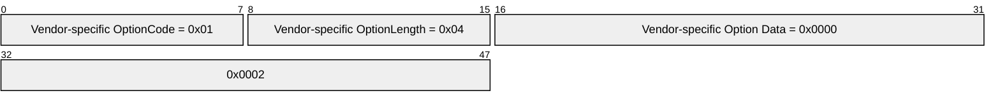

- The DHCPv4 client joins the network and sends a **DHCPDISCOVER** message that includes a Vendor Class Identifier Option. For instance, the DHCPv4 client sends the vendor class as "MSFT 5.0".


- The DHCPv4 server ignores the Vendor Class Identifier Option and responds with a **DHCPOFFER** message. It does not include any option defined in this specification in the **DHCPOFFER** message. The DHCPv4 client accepts the offer by sending a **DHCPREQUEST** message again that includes the Vendor Class Identifier Option as before.
- The DHCPv4 server recognizes the value in the Vendor Class Identifier Option in the DHCPv4 message from the client and sends a **DHCPACK** message that includes Vendor-specific Option number 1 as previously shown.
- The DHCPv4 client will receive this Vendor-specific Option from the DHCPv4 server and disable the use of NetBIOS over TCP/IP.
In another example, an administrator wants DHCPv4 clients on the local network to release the DHCPv4 address lease when the machine is shut down.

- The administrator can configure the DHCPv4 server to send Vendor-specific Option number 2 with value 1, as described in section [2.2.2.2](#Section_2.2.2.2), to the DHCPv4 clients.


- The DHCPv4 client joins the network and sends a **DHCPDISCOVER** message that includes a Vendor Class Identifier Option. For instance, the DHCPv4 client can send the vendor class as "MSFT 5.0".
- The DHCPv4 server ignores the Vendor Class Identifier Option and responds with a **DHCPOFFER** message. It does not include any option defined in this specification in the **DHCPOFFER** message. The DHCPv4 client accepts the offer by sending a **DHCPREQUEST** message again that includes a Vendor Class Identifier Option as before.
- The DHCPv4 server recognizes the value in the Vendor Class Identifier Option in the DHCPv4 message from the client and sends a **DHCPACK** message that includes Vendor-specific Option number 2 as previously shown.
- The DHCPv4 client will receive this Vendor-specific Option from the DHCPv4 server and release its DHCPv4 address lease when the machine is shut down.
In another example, an administrator wants to change the router metric used by DHCPv4 clients connecting to the local network.

- The administrator configures the DHCPv4 server to send Vendor-specific Option number 3 with the desired routing metric (say 10), as specified in section [2.2.2.3](#Section_2.2.2.3), to the DHCPv4 clients.


- The DHCPv4 client joins the network and sends a **DHCPDISCOVER** message that includes a Vendor Class Identifier Option with, for example, the value "MSFT 5.0".
- The DHCPv4 server ignores the Vendor Class Identifier Option and responds with a **DHCPOFFER** message. It does not include any option defined in this specification in the **DHCPOFFER** message. The DHCPv4 client accepts the offer by sending a **DHCPREQUEST** message again that includes a Vendor Class Identifier Option as before.
- The DHCPv4 server recognizes the Vendor Class Identifier Option in the DHCPv4 message from the client and sends a **DHCPACK** message that includes Vendor-specific Option number 3 as shown previously.
- The DHCPv4 client will receive this Vendor-specific Option from the DHCPv4 server and use the appropriate router-metric value (in this example, 10) as specified by the DHCPv4 server on that network interface.
If an administrator wants to send Vendor-specific Information to clients through DHCPv6 on the local network, this can be done based on the vendor class identifier.

- The administrator configures the DHCPv6 server to send the desired information to clients if the vendor-class identifier received from the client is "MSFT 5.0" as described previously.
- The [**DHCPv6 client**](#gt_e1d03cee-86a5-42f7-913f-8cf4e50b0d21) joins the local network and sends a DHCPv6 **Solicit** message that includes a Vendor Class Option (section [2.2.5](#Section_2.2.5)). For instance, the DHCPv6 client sends the vendor-class data as "MSFT 5.0".


- The [**DHCPv6 server**](#gt_746786e7-458f-45aa-ab24-5534a94b4fb3) ignores the Vendor Class Option and responds with a DHCPv6 **Advertise** message. The DHCPv6 client accepts the offer by sending a DHCPv6 **Request** message, again including a Vendor Class Option as before.
- The DHCPv6 server interprets the vendor-class identifier sent by the DHCPv6 client in the DHCPv6 **Request** message and sends the appropriate standard options to the DHCPv6 client in the DHCPv6 **Reply** message. Depending on the DHCPv6 server configuration, the option values selected by the server for inclusion in the **Reply** message are based on the Vendor Class Option value sent by the client in the **Request** message.
- The DHCPv6 client receives and applies the option information sent by the DHCPv6 server.
In another example, an administrator wants to send specific information to DHCPv4 clients on the local network when the administrator sends the DHCPv4 message as a BOOTP message.

- In this case, the administrator can configure the DHCPv4 server to look for the User-Class option containing a User-Class subpacket with the value "BOOTP" (as described in section [2.2.6](#Section_2.2.6.2)) in the DHCPv4 message sent by the DHCPv4 client. If the message contains this user-class subpacket, the DHCPv4 server is configured to respond with the desired information that the administrator wants to send to the DHCPv4 client.
```mermaid
packet-beta
  0-7: "Option Code = 0x4D"
  8-15: "Option Length = 0x06"
  16-23: "Value Length = 0x05"
  24-31: "Value = "B""
  32-47: ""OOTP""
```

- DHCPv4 clients that send a DHCPv4 message as a BOOTP message (see [[RFC1534]](https://go.microsoft.com/fwlink/?LinkId=90280) section 2) will include a User Class Option in the message containing the User Class subpacket with the value "BOOTP" as previously shown. Thus, if the DHCPv4 server is configured as explained previously, the DHCPv4 client will receive the desired information in the response from the server.
As an example of the use of the Microsoft [**Classless Static Route**](#gt_classless-static-route) Option, see the examples on pages 4 and 5 of [[RFC3442]](https://go.microsoft.com/fwlink/?LinkId=90421), with the only difference being that the code used for this option is 249 instead of option code 121, used in [RFC3442].

In another example, say that an administrator wants to send Vendor-specific Information through DHCPv4 to a DHCPv4 client on the local network as DHCPv4 Vendor-Specific Information Option 43 (0x2B). However, this information, when encapsulated in Option 43 as per [[RFC2132]](https://go.microsoft.com/fwlink/?LinkId=90319), is 600 bytes, exceeding the 255-byte limit of a DHCPv4 option length.

- The administrator configures the DHCPv4 server to send Vendor-specific Options to the client.
- The DHCPv4 client joins the network and sends a **DHCPDISCOVER** message that includes a Vendor Class Identifier Option with, for example, the value "MSFT 5.0".
- The DHCPv4 server ignores the Vendor Class Identifier Option and responds with a **DHCPOFFER** message. It does not include any option defined in this specification in the **DHCPOFFER** message. The DHCPv4 client accepts the offer by sending a **DHCPREQUEST** message again, including the Vendor Class Identifier Option as before.
- The DHCPv4 server recognizes the value in the Vendor Class Identifier Option in the DHCPv4 message from the client and sends a **DHCPACK** message that includes the Vendor-Specific Information option with the desired value as configured by the administrator, while formatting it as described in section [2.2.9](#Section_2.2.9), by sending Option 43 (0x2B) of size 255 bytes, followed by Option 250 with the next 255 bytes, and then again Option 250 with the remaining 90 bytes.
```mermaid
packet-beta
  0-7: "DHCPv4 Option Code = 0x2B"
  8-15: "Length = 0xFF"
  16-73: "First 255 bytes of option data"
  74-81: "DHCPv4 Option Code 250 – Long Options Packet = 0x2B"
  82-98: "Length = 0xFF"
  99-180: "Second 255 bytes (bytes 256-510) of option data"
  181-188: "DHCPv4 Option Code 250 – Long Options Packet = 0xFA"
  189-197: "Length = 0x5A"
  198-263: "Last 90 bytes of option data"
```

- DHCPv4 clients on the local network that initiate a DHCPv4 transaction with the preceding server will thus receive the configured Vendor-specific Information that exceeds 255 bytes. Similarly, standard option values that exceed 255 bytes can also be sent to clients by formatting the options as described in section 2.2.9.
The following example demonstrates the use of User Class option when a user wants to see all User Classes configured on DHCPv4 server by an administrator.

- The administrator configures a User Class on the DHCPv4 server with name as "test", description as "desc" and binarydata as "123".
- When a DHCPv4 client gets connected in this network, the client gets the IP and other configuration information from the DHCPv4 server.
- The user instructs the DHCPv4 client in an implementation-specific manner to retrieve all User Classes on the DHCPv4 server. The DHCPv4 client sends a **DHCPINFORM** packet containing the Option 55 to theDHCPv4 server requesting Option 77, shown as follows.
```mermaid
packet-beta
  0-7: "Option Code = 55"
  8-15: "Option Length = 1 byte"
  16-23: "Option Requested = 77"
```

- In the reply to the **DHCPINFORM** packet, the server sends **DHCPACK** with the Option 77 record in it. The format of the option record is as follows.
```mermaid
packet-beta
  0-7: "Option Code = 77"
  8-15: "Option Length = 30 bytes"
  16-31: "User Class Binary Data Length = 3"
  32-39: "'1'"
  40-47: "'2'"
  48-55: "'3'"
  56-63: "'\0' (Padding)"
  64-79: "User Class Name Length = 10 (0x0A)"
  80-87: "'\0'"
  88-95: "'T'"
  96-103: "'\0'"
  104-111: "'E'"
  112-119: "'\0'"
  120-127: "'S'"
  128-135: "'\0'"
  136-143: "'T'"
  144-151: "'\0'"
  152-159: "'\0'"
  160-175: "User Class Description Length = 10 (0x0A)"
  176-183: "'\0'"
  184-191: "'D'"
  192-199: "'\0'"
  200-207: "'E'"
  208-215: "'\0'"
  216-223: "'S'"
  224-231: "'\0'"
  232-239: "'C'"
  240-247: "'\0'"
  248-255: "'\0'"
```

<a id="Section_5"></a>
# 5 Security

<a id="Section_5.1"></a>
## 5.1 Security Considerations for Implementers

All of the security considerations that are applicable to DHCPv4 (as described in [[RFC2131]](https://go.microsoft.com/fwlink/?LinkId=90318) section 7) and DHCPv6 (as described in [[RFC3315]](https://go.microsoft.com/fwlink/?LinkId=90417) section 23) apply to the implementation of this specification.

<a id="Section_5.2"></a>
## 5.2 Index of Security Parameters

None.

<a id="Section_6"></a>
# 6 Appendix A: Product Behavior

The information in this specification is applicable to the following Microsoft products or supplemental software. References to product versions include updates to those products.

The terms "earlier" and "later", when used with a product version, refer to either all preceding versions or all subsequent versions, respectively. The term "through" refers to the inclusive range of versions. Applicable Microsoft products are listed chronologically in this section.

**Windows Client**

- Windows 98 operating system
- Windows 2000 Professional operating system
- Windows Millennium Edition operating system
- Windows XP operating system
- Windows Vista operating system
- Windows 7 operating system
- Windows 8 operating system
- Windows 8.1 operating system
- Windows 10 operating system
- Windows 11 operating system
**Windows Server**

- Windows 2000 Server operating system
- Windows Server 2003 operating system
- Windows Server 2008 operating system
- Windows Server 2008 R2 operating system
- Windows Server 2012 operating system
- Windows Server 2012 R2 operating system
- Windows Server 2016 operating system
- Windows Server operating system
- Windows Server 2019 operating system
- Windows Server 2022 operating system
- Windows Server 2025 operating system
Exceptions, if any, are noted in this section. If an update version, service pack or Knowledge Base (KB) number appears with a product name, the behavior changed in that update. The new behavior also applies to subsequent updates unless otherwise specified. If a product edition appears with the product version, behavior is different in that product edition.

Unless otherwise specified, any statement of optional behavior in this specification that is prescribed using the terms "SHOULD" or "SHOULD NOT" implies product behavior in accordance with the SHOULD or SHOULD NOT prescription. Unless otherwise specified, the term "MAY" implies that the product does not follow the prescription.

<1> Section 2.2.1: In Windows 98, Windows 2000 operating system, Windows Millennium Edition, Windows XP, Windows Server 2003, Windows Vista, Windows Server 2008, Windows 7, and in Windows Server 2008 R2, [**DHCP clients**](#gt_dhcp-client) send the host name encoded using the [**original equipment manufacturer (OEM) code page**](#gt_original-equipment-manufacturer-oem-code-page) that was installed as the current system code page at system boot time in Option 12. In Windows 2000 Server, Windows Server 2003, Windows Server 2008, and in Windows Server 2008 R2, [**DHCP servers**](#gt_746786e7-458f-45aa-ab24-5534a94b4fb3) treat the host name as being encoded using the OEM code page that was installed on the DHCP server as the current system code page at system boot time.

Otherwise, in applicable Windows releases, the [**DHCP client**](#gt_dhcp-client) sends the Host Name Option in the OEM code page in the **DHCPDISCOVER** message (see section [3.1.4.1](#Section_3.1.4.1)). In the **DHCPREQUEST** message (see section 3.1.4.1), if the FQDN Option is sent in [**canonical IDNA**](#gt_canonical-idna) (see section [2.2.7](#Section_2.2.7)), then the Host Name Option is sent in [**IDNA**](#gt_internationalized-domain-names-for-applications-idna) in the same message. If the FQDN Option is not sent in canonical IDNA encoding or if the FQDN Option is not sent in the **DHCPREQUEST**, then the host name is sent in the OEM code page in the same message.

<2> Section 2.2.2: The ANDROID_METERED option is not supported in Windows 10 v1909 operating system or Windows Server v1909 operating system or earlier.

<3> Section 2.2.2.1: Windows DHCPv4 servers send the Disable NetBIOS Option in the **DHCPOFFER** and **DHCPACK** messages, if configured to do so by the administrator.

<4> Section 2.2.2.1: Windows 98 and Windows Millennium Edition DHCPv4 clients do not support the Disable NetBIOS Option.

<5> Section 2.2.2.2: Windows 98 and Windows Millennium Edition DHCPv4 clients do not support the Release DHCP Lease on Shutdown Option.

<6> Section 2.2.2.3: Windows 98 and Windows Millennium Edition DHCPv4 clients do not support the Default Router Metric Base Option.

<7> Section 2.2.2.3: In Windows 98, Windows Millennium Edition, Windows 2000 Professional, Windows XP, and Windows XP operating system Service Pack 1 (SP1) clients by default (if not overridden by this Vendor-Specific Option), the [**TCP/IP**](#gt_tcpip) stack instead computes the route metric based on link speed as follows.

| Metric | Link speed |
| --- | --- |
| 0x0000000A (10) | Greater than 200 Mbps |
| 0x00000014 (20) | Greater than 20 Mbps, and less than or equal to 200 Mbps |
| 0x0000001E (30) | Greater than 4 Mbps, and less than or equal to 20 Mbps |
| 0x00000028 (40) | Greater than 500 Kbps, and less than or equal to 4 Mbps |
| 0x00000032 (50) | Less than or equal to 500 Kbps |

<8> Section 2.2.2.6: The ANDROID_METERED option is not supported in Windows 10 v1909 or Windows Server v1909 or earlier.

<9> Section 2.2.3: The "MSFT 5.0 XBOX" value is not supported in Windows 10 v1909 or Windows Server v1909 or earlier.

<10> Section 2.2.4: In Windows Vista operating system with Service Pack 1 (SP1) and Windows Server 2008, DHCPv6 clients do not support the User Class Option. Otherwise, in applicable Windows releases, DHCPv6 clients request the User Classes defined on the Windows DHCPv6 server whenever a user tries to set the User Class for the DHCPv6 client by executing "Ipconfig /setclassid6" or whenever a user tries to see the User Classes defined on the DHCPv6 server by executing "Ipconfig /showclassid6".

<11> Section 2.2.4: On Windows Server 2008, the DHCPv6 server does not support the User Class Option. Otherwise, in applicable Windows Server releases the server sends one or more User Class Options depending on whether one or more User Classes are configured on the DHCP server.

<12> Section 2.2.5: In Windows 98, Windows 2000 Professional, Windows Millennium Edition, and in Windows Server 2003, DHCPv6 client support is not implemented. In Windows 2000 Server and in Windows Server 2003, DHCPv6 server support is not available.

<13> Section 2.2.5: The "MSFT 5.0 XBOX" value is not supported in Windows 10 v1909 or Windows Server v1909 or earlier.

<14> Section 2.2.6.1: By default, Windows DHCPv4 clients do not send the User Class Option in the DHCPv4 messages. Users can configure any data string value to be sent as the User Class value by the DHCPv4 client to the server.

<15> Section 2.2.6.2: DHCPv4 clients request the User Classes defined on the Windows DHCP server whenever a user tries to set the User Class for the DHCPv4 client by executing "Ipconfig /setclassid" or whenever a user tries to see the User Classes defined on the DHCPv4 server by executing "Ipconfig /showclassid".

<16> Section 2.2.6.2: In applicable Windows Server releases the server sends one or more User Class Options depending on whether one or more User Classes are configured on the DHCPv4 server.

<17> Section 2.2.7: All Windows [**DHCPv4**](#gt_dhcpv4) clients send FQDNs in Option 81 with the E bit set to 0 by default but can be configured to send with the E bit set to 1.

<18> Section 2.2.7: On all Windows DHCPv4 clients, when sending with the E bit set to 0, the host name is encoded using the OEM code page that was installed as the current system code page at system boot time. On Windows 98, Windows 2000, Windows Millennium Edition, Windows Server 2003, Windows Vista, Windows Server 2008, Windows 7, and Windows Server 2008 R2, when sending with the E bit set to 1, the host name is encoded using [**UTF-8**](#gt_utf-8) encoding.

Otherwise, Windows, except Windows 98, Windows 2000, Windows Millennium Edition, Windows Server 2003, Windows Vista, Windows Server 2008, Windows 7, and on Windows Server 2008 R2, reads the registry value "DhcpUseE1" of type REG_DWORD under the registry key HKEY_LOCAL_MACHINE\SYSTEM\CurrentControlSet\Services\Tcpip\Parameters\Interfaces\<GUID of the interface>. If the registry value has a zero value or if it does not exist, then the host name is sent with the E bit set to 0 using the OEM code page. If "DhcpUseE1" has a zero value or if the registry value does not exist, then the registry value "DhcpUseUTF8" of type REG_DWORD under the same registry key is read. If "DhcpUseUTF8" is nonzero, then the host name is encoded using UTF-8 encoding and is sent with the E bit set to 1. If "DhcpUseE1" has a nonzero value, the host name is encoded in canonical IDNA and is sent with the E bit set to 1.

<19> Section 2.2.7: Windows DHCPv4 servers treat FQDNs with the E bit set to 0 in Option 81 as being encoded using the OEM code page that was installed on the DHCPv4 server as the current system code page at system boot time. In Windows 2000 Server, Windows Server 2003, Windows Server 2008, and in Windows Server 2008 R2, DHCPv4 servers treat FQDNs with the E bit set to 1 as being encoded using UTF-8 encoding. Otherwise, in applicable Windows Server releases, the DHCPv4 servers check FQDNs with the E bit set to 1 to determine if the FQDN is encoded in canonical IDNA. If the FQDN is not encoded in that manner, the FQDN is treated as being encoded by using UTF-8 encoding.

<20> Section 2.2.8: Windows XP and Windows Server 2003 DHCPv4 clients and servers use Option Code 249 for requesting and sending [**Classless Static Routes (CSRs)**](#gt_classless-static-route) instead of Option Code 121, as specified in [[RFC3442]](https://go.microsoft.com/fwlink/?LinkId=90421). These clients and servers ignore Option 121 if included in a DHCPv4 message. Otherwise, Windows DHCPv4 clients use both Option 121 and Option 249.

<21> Section 2.2.11: In Windows 2000 Server, Windows Server 2003, Windows Server 2008, and in Windows Server 2008 R2, the DHCP server sends the domain name encoded by using the original equipment manufacturer (OEM) code page that was installed as the current system [**code page**](#gt_code-page) at system boot time. In Windows 98, Windows 2000, Windows Millennium Edition, Windows Server 2003, Windows Vista, Windows Server 2008, Windows 7, and in Windows Server 2008 R2, the DHCP client treats the domain name as though it were encoded using the OEM code page that was installed on the DHCP client as the current system code page at system boot time.

In applicable Windows Server releases, except Windows 2000 Server, Windows Server 2003, Windows Server 2008, and Windows Server 2008 R2, the DHCP server sends the DHCPv4 Option Code 15 in the IDNA encoding in the **DHCPOFFER** message (section [3.1.5.1](#Section_3.1.5.1)). If the client FQDN Option (section 2.2.7) was not sent in the canonical IDNA encoding by the DHCP client in the **DHCPREQUEST** message (section 3.1.4.1), then the domain name is sent in the OEM code page in the **DHCPACK**. If the client FQDN Option was sent in the canonical IDNA encoding by the DHCP client in the **DHCPREQUEST** message, then DHCPv4 Option Code 15 is sent in the IDNA encoding in the **DHCPACK** message (section [3.1.5.2](#Section_3.1.5.2)).

<22> Section 3.1.4.1: All Windows DHCPv4 clients include Vendor Class Identifier Option (Option 60) in **DHCPDISCOVER**, **DHCPREQUEST**, and **DHCPINFORM** messages.

<23> Section 3.1.4.1: By default, Windows DHCPv4 clients do not send the User Class Option in the DHCPv4 messages. Users can configure any data string value to be sent as the User Class value by the DHCPv4 client to the server.

Windows DHCPv4 clients using BOOTP to boot from the network send the Default BOOTP class (as defined in section [2.2.6](#Section_2.2.6.2)) as their User Class.

<24> Section 3.1.4.1: DHCPv4 clients request the User Classes defined on the Windows DHCPv4 server whenever a user tries to set the User Class for the DHCPv4 client by executing "Ipconfig /setclassid" or whenever a user tries to see the User Classes defined on the DHCPv4 server by executing "Ipconfig /showclassid".

<25> Section 3.1.4.2: All Windows DHCPv6 clients include a Vendor Class Option (Option 16) in DHCPv6 **Solicit**, **Request**, and **Information-request** messages.

<26> Section 3.1.4.2: DHCPv6 clients on Windows Vista and Windows Server 2008 do not support the User Class Option. Otherwise, in Windows except Windows 98, Windows 2000, Windows Millennium Edition, Windows Server 2003, Windows Vista, and Windows Server 2008, DHCPv6 clients request the User Classes defined on the Windows DHCPv6 server whenever a user tries to set the User Class for the DHCPv6 client by executing "Ipconfig /setclassid6" or whenever a user tries to see the User Classes defined on the DHCPv6 server by executing "Ipconfig /showclassid6".

<27> Section 3.1.5.1: Windows DHCPv4 clients parse each of the options in the **DHCPOFFER** received and silently discard the message if any of the options do not conform to the syntax. If the DHCPv4 client has requested a specific IP Address, it chooses the **DHCPOFFER** which has an allocated IP address value that is the same as the requested IP address.

<28> Section 3.1.5.1: All Windows DHCPv4 clients include a Vendor Class Identifier Option (Option 60) in **DHCPDISCOVER**, **DHCPREQUEST**, and **DHCPINFORM** messages.

<29> Section 3.1.5.1: By default, Windows DHCPv4 clients do not send the User Class Option in the DHCPv4 messages. Users can configure any data string value to be sent as the User Class value by the DHCPv4 client to the server.

Windows DHCPv4 clients using BOOTP to boot from the network send the Default BOOTP class (as defined in section 2.2.6) as their User Class.

<30> Section 3.1.5.1: Windows XP and Windows Server 2003 DHCPv4 clients request only Option Code 249 in the Parameter Request List. Otherwise, Windows DHCPv4 clients request both Option Code 121 and Option Code 249 in the Parameter Request List.

<31> Section 3.1.5.2: All versions of Windows Vista and Windows Server 2008 and later will insert the last option in the message.

<32> Section 3.1.5.2: The ANDROID_METERED option is not supported in Windows 10 v1909 or Windows Server v1909 or earlier.

<33> Section 3.1.5.3: Windows DHCPv6 clients parse each of the options in the **Advertise** message received and silently discard the message if any of the options do not conform to the syntax.

<34> Section 3.2.5.1: Administrative controls were introduced in Windows Server 2008 R2 DHCPv4 servers.

<35> Section 3.2.5.1: Windows DHCPv4 servers includes all the standard and requested options in the reply.

<36> Section 3.2.5.2: Administrative controls were introduced in Windows Server 2008 R2 DHCPv4 servers.

<37> Section 3.2.5.2: Windows DHCPv4 servers interpret all unrecognized User Classes (including cases where the client sends a User Class option of length zero or where the client does not send the User Class option) to be the Default User Class.

<38> Section 3.2.5.2: Windows 2000 Server and Windows Server 2003 DHCPv4 servers send the Classless Static Route information to clients in Option 249, even if the client requests both Option Code 121 and Option Code 249. Otherwise, in applicable Windows Server releases servers send the Classless Static Route information to clients in Option 121 if the client requests both Option Code 121 and Option Code 249 in the Parameter Request List.

<39> Section 3.2.5.3: Windows DHCP servers ignore the Vendor Class Option.

<40> Section 3.2.5.4: Administrative controls were introduced in Windows Server 2008 R2.

<41> Section 3.2.5.4: In applicable Windows Server releases the server sends one or more User Class options depending on whether one or more User Classes are configured on the DHCPv4 server.

<42> Section 3.2.5.4: In applicable Windows Server releases, a DHCPv4 server can be administratively authorized using the mechanism specified in [Appendix B](#Section_7).

<43> Section 3.2.5.4: In applicable Windows Server releases, DHCPv4 servers do not reply if no subnets are configured on the DHCPv4 server.

<44> Section 3.2.5.4: In applicable Windows Server releases, DHCPv4 servers do not reply if no subnets are configured on the DHCPv4 server.

<45> Section 3.2.5.5: A DHCPv6 server in Windows Server 2008 does not support User Class Option. Otherwise, in applicable Windows Server releases, DHCPv6 servers send one or more User Class Options depending on whether one or more User Classes are configured on the DHCPv6 server.

<46> Section 3.2.5.5: A DHCPv6 server on Windows Server 2008 does not support User Class Option. Otherwise, in applicable Windows Server releases, DHCPv6 servers send one or more User Class Options depending on whether one or more User Classes are configured on the DHCPv6 server.

<47> Section 3.2.5.5: In applicable Windows Server releases, a DHCP server can be administratively authorized using the mechanism specified in Appendix B.

<48> Section 3.2.5.5: In applicable Windows Server releases, DHCP servers reply even if no subnets are configured on the DHCPv6 server.

<49> Section 3.2.5.5: In applicable Windows Server releases, DHCP servers reply even if no subnets are configured on the DHCPv6 server.

<50> Section 3.3: In applicable Windows Server releases, the DHCP server implements [**Rogue Detection**](#gt_rogue-detection).

<51> Section 3.3: In applicable Windows Server releases, an authorization check is performed after each hour by default by the DHCP server. The time interval is configurable, and the minimum time interval is 5 minutes.

<52> Section 3.3: In applicable Windows Server releases, the time interval after which the authorization check is done does not vary based on the authorization state of a DHCP server.

<53> Section 3.3.5.1: In applicable Windows Server releases, the maximum number of retries for sending the **DHCPINFORM** message in the Rogue Detection mechanism is 4 for DHCP servers.

<54> Section 3.3.5.1: In Rogue Detection, after all retry attempts to send the **DHCPINFORM** message are exhausted, DHCP servers on Windows 2000 Server and Windows Server 2003 consider themselves authorized. Otherwise, in applicable Windows Server releases, the DHCP servers continue validation using the DHCPv6 **Information-request** message.

<55> Section 3.3.5.2: In applicable Windows Server releases, the maximum number of retries for sending DHCPv6 **Information-request** messages in Rogue Detection is 4 for DHCP servers.

<56> Section 3.3.6: In applicable Windows Server releases, the maximum number of retries is 4 for DHCP servers.

<57> Section 3.3.6: In applicable Windows Server releases, the server waits 2 seconds after sending a **DHCPINFORM** message to receive **DHCPACK** messages when validating DHCP server authorization using Rogue Detection.

<58> Section 3.3.6: In Rogue Detection, after all retry attempts to send **DHCPINFORM** messages are exhausted, DHCP servers on Windows 2000 Server and Windows Server 2003 consider themselves authorized. Otherwise, in applicable Windows Server releases, the DHCP servers continue validation using DHCPv6 **Information-request** messages.

<59> Section 3.3.6: In applicable Windows Server releases, the maximum number of retries for sending DHCPv6 **Information-request** messages in Rogue Detection is 4 for DHCP servers.

<60> Section 3.3.6: In applicable Windows Server releases, the server waits 2 seconds after sending an **Information-request** message to receive **Reply** messages when validating DHCP server authorization using Rogue Detection.

<a id="Section_7"></a>
# 7 Appendix B: Administrative Authorization of Windows DHCP server

The information in this section is applicable to the following Microsoft products:

- Windows 2000 Server operating system
- Windows Server 2003 operating system
- Windows Server 2008 operating system
- Windows Server 2008 R2 operating system
- Windows Server 2012 operating system
- Windows Server 2012 R2 operating system
- Windows Server 2016 operating system
- Windows Server 2019 operating system
<a id="Section_7.1"></a>
## 7.1 Windows DHCP Server Authorization in Domain Joined Scenario

A domain joined Windows server with [**DHCP**](#gt_dynamic-host-configuration-protocol-dhcp) server deployed can validate itself. Authorization mechanism of a DHCP server in a domain joined scenario is as follows:

- A domain joined DHCP server is authorized by a domain administrator in [**Active Directory Domain Services (AD DS)**](#gt_active-directory-domain-services-ad-ds). Any DHCP server which is domain joined and is required to service DHCP clients needs to have an [**Active Directory**](#gt_active-directory) object in the Active Directory.
- The DHCP server validates its authorization in AD DS every hour. It uses [**LDAP**](#gt_lightweight-directory-access-protocol-ldap) protocol [MS-ADTS](../MS-ADTS/MS-ADTS.md) for the purpose of communicating with the Active Directory and validating whether it is authorized to serve IP addresses.
- When installed in a multiple forest environment, DHCP servers seek authorization from within. Once authorized, DHCP servers in a multiple forest environment lease IP addresses to all reachable clients.
<a id="Section_7.2"></a>
## 7.2 DHCP Server AD DS Path and Objects

A domain joined [**DHCP**](#gt_dynamic-host-configuration-protocol-dhcp) server is authorized in the [**Active Directory Domain Services (AD DS)**](#gt_active-directory-domain-services-ad-ds). The "DhcpRoot" object and <DHCP server name> objects, which are of type "dhcpClass" [MS-ADSC](../MS-ADSC/MS-ADSC.md) are added in the AD DS. The attribute "dhcpServers" and other mandatory attributes of the class "dhcpClass" are also updated in the AD DS. The section below describes the "dHCPClass" objects, their attribute values in different conditions, and the containers in AD DS.

<a id="Section_7.3"></a>
## 7.3 Active Directory Path for dhcpClass Objects

The [**ADsPath**](#gt_adspath) where the dHCPClass [MS-ADSC](../MS-ADSC/MS-ADSC.md) objects are stored is:

"LDAP://<domain name>/CN=NetServices, CN=Services, CN=Configuration [,DC=<domain component1> [,DC=<domain component2>] … ]"

Format of the "dhcpServers" attribute of "dHCPClass"

The "dhcpServers" [MS-ADA1](../MS-ADA1/MS-ADA1.md) attribute of the "dHCPClass" object are updated with the value defined below.

"i<server ip address>$rcn=<relative ADsPath Name>$f<flags>$s<server name>$"

The following table provides the specifics of the string.

| Bit Range | Field | Description |
| --- | --- | --- |
| IPv4 address of the [**DHCP**](#gt_dynamic-host-configuration-protocol-dhcp) server which is being authorized | server ip address | "57.60.41.211" |
| Relative [**LDAP**](#gt_lightweight-directory-access-protocol-ldap) Path name of the object in which the attribute "dhcpServer" is being updated. | relative ADsPath Name | "dhcpserver.contoso.com" |
| Variable | Flags | Unused field. This is set to 0. 0x00000000 |
| Variable | server name | Server name of the DHCP server which is being authorized. "dhcpserver.contoso.com" |

The server ip address field takes an IPv4 address only. In an IPv6 scenario where the IPv4 is uninstalled or disabled, the DHCP server adds itself to the [**AD DS**](#gt_active-directory-domain-services-ad-ds) with the server name of the DHCPv6 server and a fixed IP address of 255.0.0.1.

The following table specifies the characters in the "dhcpServers" attribute value string.

| Value | Meaning |
| --- | --- |
| L'$' | A field separator. |
| L'i' | Precedes an IP address. |
| L'r' | Precedes a relative [**Active Directory**](#gt_active-directory) Path. |
| L'f' | Precedes a flag entry |
| L's' | Precedes a server entry |

<a id="Section_7.4"></a>
## 7.4 Mandatory Attribute Values for the DHCPRoot Object

The mandatory attributes of the "dHCPClass" class need to be updated with values mentioned below when creating a "DhcpRoot" object.

| OBJECT ATTRIBUTES | Value |
| --- | --- |
| dhcpUniqueKey | 0 |
| dhcpType | 0 |
| dhcpIdentification | L"This is a server" |
| dhcpFlags | 0 |
| instanceType | 0x04 |

<a id="Section_7.5"></a>
## 7.5 Mandatory Attribute Values for the <DHCP server> Object

The mandatory attributes of the "dHCPClass" class need to be updated with values mentioned below when creating a <Dhcp server> object.

| OBJECT ATTRIBUTES | Value |
| --- | --- |
| dhcpUniqueKey | 0 |
| dhcpType | 1 |
| dhcpIdentification | L"DHCP Server Object" |
| dhcpFlags | 0 |
| instanceType | 0x04 |

<a id="Section_7.6"></a>
## 7.6 Unauthorization Filter

To unauthorize a [**DHCP**](#gt_dynamic-host-configuration-protocol-dhcp) server, the server object added in [**AD DS**](#gt_active-directory-domain-services-ad-ds) needs to be removed. The server object to be deleted is identified by the "dhcpServers" attribute value. The filter [MS-ADTS](../MS-ADTS/MS-ADTS.md) required to identify the server object corresponding to the specific DHCP server is described below.

"(&(objectCategory=dHCPClass)(&(dhcpServers=i<server ip address>$*)(dhcpServers=*s<server name>$*)))"

<a id="Section_7.7"></a>
## 7.7 Validation Filter

The filter [MS-ADTS](../MS-ADTS/MS-ADTS.md) required to validate [**DHCP**](#gt_dynamic-host-configuration-protocol-dhcp) server authorization in [**AD DS**](#gt_active-directory-domain-services-ad-ds) is described below.

"(&(objectCategory=dHCPClass)(|(dhcpServers=i<server ip address>$*)(dhcpServers=*s<server name>$*)))"

<a id="Section_7.8"></a>
## 7.8 Authorizing a DHCP Server in Active Directory Domain Services

A [**DHCP**](#gt_dynamic-host-configuration-protocol-dhcp) server that is domain joined is authorized by a domain administrator in the [**AD DS**](#gt_active-directory-domain-services-ad-ds).

The authorization first checks to see if a "CN=DhcpRoot" object is present in the AD DS in the [**ADsPath**](#gt_adspath).

If the object is not found, create it in the AD DS using the following:

- Object Relative Distinguished Name: CN= "DhcpRoot"
- Object Class: "dHCPClass" (defined in the AD schema [MS-ADSC](../MS-ADSC/MS-ADSC.md))
When creating "DhcpRoot" object, the "dHCPClass" attributes need to be updated.

Once the object "DhcpRoot" exists, a new object by the name of the DHCP server authorizing itself in AD DS needs to be created.

The [**LDAP**](#gt_lightweight-directory-access-protocol-ldap) ADsPath of the new object is specified using the following:

- Object Distinguished Name = <server name>
- Object Class = "dHCPClass"
When creating the DHCP server object to authorize in AD DS, the "dHCPClass" attributes need to be updated.

The new server object attribute "dhcpServers" needs to be updated.

<a id="Section_7.9"></a>
## 7.9 Unauthorizing a DHCP Server from Active Directory Domain Services

A [**DHCP**](#gt_dynamic-host-configuration-protocol-dhcp) server is unauthorized from [**AD DS**](#gt_active-directory-domain-services-ad-ds) when the "dHCPClass" object corresponding to the server is deleted from the AD DS.

The filter required to unauthorize a DHCP server is based on its IP address and server name as specified in [Unauthorization Filter](#Section_7.6), section 7.6 .

This filter matches a "dHCPClass" object with the "dhcpServers" attribute matching "i<server ip address>$" and "s<server name>$". Only one such object matches the filter. Delete that object from the AD DS.

<a id="Section_7.10"></a>
## 7.10 Validating DHCP Server Authorization in Active Directory Domain Services

A domain joined [**DHCP**](#gt_dynamic-host-configuration-protocol-dhcp) server verifies if it is authorized to service DHCP clients. It validates itself in [**AD DS**](#gt_active-directory-domain-services-ad-ds).

A DHCP server verifies whether the "DhcpRoot" object exists in the AD DS. If the object is not present, the server works as a non-authorized DHCP server. A DHCP server can make a filter query to verify whether it is authorized in the AD DS. If the query succeeds, the DHCP server is authorized, otherwise it is not.

The filter required to validate whether a DHCP server is authorized is based on a server IP address or server name.

This filter matches any "dHCPClass" objects with the "dhcpServers" attribute matching "i<server IP address>$" or "s<server name>$".

<a id="Section_8"></a>
# 8 Change Tracking

This section identifies changes that were made to this document since the last release. Changes are classified as Major, Minor, or None.

The revision class **Major** means that the technical content in the document was significantly revised. Major changes affect protocol interoperability or implementation. Examples of major changes are:

- A document revision that incorporates changes to interoperability requirements.
- A document revision that captures changes to protocol functionality.
The revision class **Minor** means that the meaning of the technical content was clarified. Minor changes do not affect protocol interoperability or implementation. Examples of minor changes are updates to clarify ambiguity at the sentence, paragraph, or table level.

The revision class **None** means that no new technical changes were introduced. Minor editorial and formatting changes may have been made, but the relevant technical content is identical to the last released version.

The changes made to this document are listed in the following table. For more information, please contact [dochelp@microsoft.com](mailto:dochelp@microsoft.com).

| Section | Description | Revision class |
| --- | --- | --- |
| [6](#Section_6) Appendix A: Product Behavior | Added Windows Server 2025 to the list of applicable products. | Major |

<a id="revision-history"></a>

## Revision History

| Date | Version | Revision Class | Comments |
| --- | --- | --- | --- |
| 12/18/2006 | 0.1 | New | Version 0.1 release |
| 3/2/2007 | 1.0 | Major | Version 1.0 release |
| 4/3/2007 | 1.1 | Minor | Version 1.1 release |
| 5/11/2007 | 1.2 | Minor | Version 1.2 release |
| 6/1/2007 | 2.0 | Major | Updated and revised the technical content. |
| 7/3/2007 | 3.0 | Major | Updated and revised the technical content. |
| 7/20/2007 | 4.0 | Major | Updated and revised the technical content. |
| 8/10/2007 | 5.0 | Major | Updated and revised the technical content. |
| 9/28/2007 | 6.0 | Major | Updated and revised the technical content. |
| 10/23/2007 | 7.0 | Major | Updated and revised the technical content. |
| 11/30/2007 | 7.0.1 | Editorial | Changed language and formatting in the technical content. |
| 1/25/2008 | 7.0.2 | Editorial | Changed language and formatting in the technical content. |
| 3/14/2008 | 7.0.3 | Editorial | Changed language and formatting in the technical content. |
| 5/16/2008 | 7.0.4 | Editorial | Changed language and formatting in the technical content. |
| 6/20/2008 | 7.1 | Minor | Clarified the meaning of the technical content. |
| 7/25/2008 | 7.2 | Minor | Clarified the meaning of the technical content. |
| 8/29/2008 | 7.2.1 | Editorial | Changed language and formatting in the technical content. |
| 10/24/2008 | 7.2.2 | Editorial | Changed language and formatting in the technical content. |
| 12/5/2008 | 8.0 | Major | Updated and revised the technical content. |
| 1/16/2009 | 8.1 | Minor | Clarified the meaning of the technical content. |
| 2/27/2009 | 8.1.1 | Editorial | Changed language and formatting in the technical content. |
| 4/10/2009 | 8.2 | Minor | Clarified the meaning of the technical content. |
| 5/22/2009 | 8.2.1 | Editorial | Changed language and formatting in the technical content. |
| 7/2/2009 | 8.3 | Minor | Clarified the meaning of the technical content. |
| 8/14/2009 | 8.4 | Minor | Clarified the meaning of the technical content. |
| 9/25/2009 | 8.5 | Minor | Clarified the meaning of the technical content. |
| 11/6/2009 | 9.0 | Major | Updated and revised the technical content. |
| 12/18/2009 | 10.0 | Major | Updated and revised the technical content. |
| 1/29/2010 | 11.0 | Major | Updated and revised the technical content. |
| 3/12/2010 | 11.0.1 | Editorial | Changed language and formatting in the technical content. |
| 4/23/2010 | 11.0.2 | Editorial | Changed language and formatting in the technical content. |
| 6/4/2010 | 12.0 | Major | Updated and revised the technical content. |
| 7/16/2010 | 13.0 | Major | Updated and revised the technical content. |
| 8/27/2010 | 13.0 | None | No changes to the meaning, language, or formatting of the technical content. |
| 10/8/2010 | 13.0 | None | No changes to the meaning, language, or formatting of the technical content. |
| 11/19/2010 | 14.0 | Major | Updated and revised the technical content. |
| 1/7/2011 | 15.0 | Major | Updated and revised the technical content. |
| 2/11/2011 | 16.0 | Major | Updated and revised the technical content. |
| 3/25/2011 | 16.1 | Minor | Clarified the meaning of the technical content. |
| 5/6/2011 | 16.1 | None | No changes to the meaning, language, or formatting of the technical content. |
| 6/17/2011 | 16.2 | Minor | Clarified the meaning of the technical content. |
| 9/23/2011 | 16.2 | None | No changes to the meaning, language, or formatting of the technical content. |
| 12/16/2011 | 17.0 | Major | Updated and revised the technical content. |
| 3/30/2012 | 17.1 | Minor | Clarified the meaning of the technical content. |
| 7/12/2012 | 18.0 | Major | Updated and revised the technical content. |
| 10/25/2012 | 19.0 | Major | Updated and revised the technical content. |
| 1/31/2013 | 19.0 | None | No changes to the meaning, language, or formatting of the technical content. |
| 8/8/2013 | 20.0 | Major | Updated and revised the technical content. |
| 11/14/2013 | 21.0 | Major | Updated and revised the technical content. |
| 2/13/2014 | 21.0 | None | No changes to the meaning, language, or formatting of the technical content. |
| 5/15/2014 | 21.0 | None | No changes to the meaning, language, or formatting of the technical content. |
| 6/30/2015 | 22.0 | Major | Significantly changed the technical content. |
| 10/16/2015 | 22.0 | None | No changes to the meaning, language, or formatting of the technical content. |
| 7/14/2016 | 22.0 | None | No changes to the meaning, language, or formatting of the technical content. |
| 6/1/2017 | 22.0 | None | No changes to the meaning, language, or formatting of the technical content. |
| 9/15/2017 | 23.0 | Major | Significantly changed the technical content. |
| 9/12/2018 | 24.0 | Major | Significantly changed the technical content. |
| 3/4/2020 | 25.0 | Major | Significantly changed the technical content. |
| 4/7/2021 | 26.0 | Major | Significantly changed the technical content. |
| 6/25/2021 | 27.0 | Major | Significantly changed the technical content. |
| 4/23/2024 | 28.0 | Major | Significantly changed the technical content. |
