# [MS-DHCPF]: DHCP Failover Protocol Extension

Table of Contents

1 Introduction

- [1 Introduction](#Section_1)
  - [1.1 Glossary](#Section_1.1)
  - [1.2 References](#Section_1.2)
    - [1.2.1 Normative References](#Section_1.2.1)
    - [1.2.2 Informative References](#Section_1.2.2)
  - [1.3 Overview](#Section_1.3)
  - [1.4 Relationship to Other Protocols](#Section_1.4)
  - [1.5 Prerequisites/Preconditions](#Section_1.5)
  - [1.6 Applicability Statement](#Section_1.6)
  - [1.7 Versioning and Capability Negotiation](#Section_1.7)
  - [1.8 Vendor-Extensible Fields](#Section_1.8)
  - [1.9 Standards Assignments](#Section_1.9)

2 Messages

- [2 Messages](#Section_2)
  - [2.1 Transport](#Section_2.1)
  - [2.2 Message Syntax](#Section_2.2)
    - [2.2.1 DHCP Failover Option 30 (0x1E) – Scope ID List Option](#Section_2.2.1)
    - [2.2.2 DHCP Failover Option 31 (0x1F) – Client Name Option](#Section_2.2.2)
    - [2.2.3 DHCP Failover Option 32 (0x20) – Client Description Option](#Section_2.2.3)
    - [2.2.4 DHCP Failover Option 33 (0x21) – Client Subnet Mask Option](#Section_2.2.4)
    - [2.2.5 DHCP Failover Option 34 (0x22) – Server IP Option](#Section_2.2.5)
    - [2.2.6 DHCP Failover Option 35 (0x23) – Server Name Option](#Section_2.2.6)
    - [2.2.7 DHCP Failover Option 36 (0x24) – Client Type Option](#Section_2.2.7)
    - [2.2.8 DHCP Failover Option 37 (0x25) – Client NAP Status Option](#Section_2.2.8)
    - [2.2.9 DHCP Failover Option 38 (0x26) – Client NAP Probation Option](#Section_2.2.9)
    - [2.2.10 DHCP Failover Option 39 (0x27) – Client NAP Capable Option](#Section_2.2.10)
    - [2.2.11 DHCP Failover Option 40 (0x28) – Client Matched Policy Option](#Section_2.2.11)
    - [2.2.12 DHCP Failover Option 41 (0x29) - Extended Address State Option](#Section_2.2.12)

3 Protocol Details

- [3 Protocol Details](#Section_3)
  - [3.1 Common Details](#Section_3.1)
    - [3.1.1 Abstract Data Model](#Section_3.1.1)
    - [3.1.2 Timers](#Section_3.1.2)
      - [3.1.2.1 Safe Period Timer](#Section_3.1.2.1)
      - [3.1.2.2 Connect Retry Timer](#Section_3.1.2.2)
      - [3.1.2.3 Startup Timer](#Section_3.1.2.3)
      - [3.1.2.4 tReceive Timer](#Section_3.1.2.4)
      - [3.1.2.5 tSend Timer](#Section_3.1.2.5)
      - [3.1.2.6 Synchronization Timer](#Section_3.1.2.6)
    - [3.1.3 Initialization](#Section_3.1.3)
    - [3.1.4 Higher-Layer Triggered Events](#Section_3.1.4)
      - [3.1.4.1 Adding and Removing Scopes from Failover Configuration](#Section_3.1.4.1)
      - [3.1.4.2 Synchronize Lease Database by Sending DHCP Failover BNDUPD Message](#Section_3.1.4.2)
    - [3.1.5 Processing Events and Sequencing Rules](#Section_3.1.5)
      - [3.1.5.1 Receiving a DHCP Failover STATE Message](#Section_3.1.5.1)
      - [3.1.5.2 Receiving a DHCP Failover BNDUPD Message](#Section_3.1.5.2)
      - [3.1.5.3 Receiving a DHCP Failover BNDACK Message](#Section_3.1.5.3)
      - [3.1.5.4 Receiving a DHCP Failover UPDREQ Message](#Section_3.1.5.4)
      - [3.1.5.5 Receiving a DHCP Failover UPDREQALL Message](#Section_3.1.5.5)
      - [3.1.5.6 Receiving a DHCP Failover UPDDONE Message](#Section_3.1.5.6)
      - [3.1.5.7 Receiving a DHCP Failover CONTACT Message](#Section_3.1.5.7)
      - [3.1.5.8 Receiving a DHCP Failover DISCONNECT Message](#Section_3.1.5.8)
    - [3.1.6 Timer Events](#Section_3.1.6)
      - [3.1.6.1 Safe Period Timer Events](#Section_3.1.6.1)
      - [3.1.6.2 Connect Retry Timer Events](#Section_3.1.6.2)
      - [3.1.6.3 Startup Timer Events](#Section_3.1.6.3)
      - [3.1.6.4 tReceive Timer Events](#Section_3.1.6.4)
      - [3.1.6.5 tSend Timer Events](#Section_3.1.6.5)
      - [3.1.6.6 Synchronization Timer Events](#Section_3.1.6.6)
    - [3.1.7 Other Local Events](#Section_3.1.7)
      - [3.1.7.1 Sending a DHCP Failover UPDREQ Message](#Section_3.1.7.1)
      - [3.1.7.2 Sending a DHCP Failover UPDREQALL Message](#Section_3.1.7.2)
      - [3.1.7.3 Sending a DHCP Failover STATE Message](#Section_3.1.7.3)
  - [3.2 Server Details](#Section_3.2)
    - [3.2.1 Abstract Data Model](#Section_3.2.1)
    - [3.2.2 Timers](#Section_3.2.2)
      - [3.2.2.1 Address Rebalancing Timer](#Section_3.2.2.1)
    - [3.2.3 Initialization](#Section_3.2.3)
    - [3.2.4 Higher-Layer Triggered Events](#Section_3.2.4)
    - [3.2.5 Processing Events and Sequencing Rules](#Section_3.2.5)
      - [3.2.5.1 Receiving a DHCP Failover CONNECTACK Message](#Section_3.2.5.1)
      - [3.2.5.2 Receiving a DHCP Failover POOLREQ Message](#Section_3.2.5.2)
    - [3.2.6 Timer Events](#Section_3.2.6)
    - [3.2.7 Other Local Events](#Section_3.2.7)
      - [3.2.7.1 Establishing the Connection between Failover Partner Servers](#Section_3.2.7.1)
  - [3.3 Client Details](#Section_3.3)
    - [3.3.1 Abstract Data Model](#Section_3.3.1)
    - [3.3.2 Timers](#Section_3.3.2)
    - [3.3.3 Initialization](#Section_3.3.3)
    - [3.3.4 Higher-Layer Triggered Events](#Section_3.3.4)
    - [3.3.5 Processing Events and Sequencing Rules](#Section_3.3.5)
      - [3.3.5.1 Receiving a DHCP Failover CONNECT Message](#Section_3.3.5.1)
      - [3.3.5.2 Receiving a DHCPFailover POOLREQ Message](#Section_3.3.5.2)
    - [3.3.6 Timer Events](#Section_3.3.6)
    - [3.3.7 Other Local Events](#Section_3.3.7)

4 Protocol Examples

- [4 Protocol Examples](#Section_4)
  - [4.1 Adding DHCPv4 Scopes to a Failover Relationship](#Section_4.1)

5 Security

- [5 Security](#Section_5)
  - [5.1 Security Considerations for Implementers](#Section_5.1)
  - [5.2 Index of Security Parameters](#Section_5.2)

6 Appendix A: Product Behavior

- [6 Appendix A: Product Behavior](#Section_6)

7 Change Tracking

- [7 Change Tracking](#Section_7)

For the legal notice and IP terms, see [LEGAL.md](../LEGAL.md).
Last updated: 4/23/2024.
See [Revision History](#revision-history) for full version history.

# 1 Introduction

The Dynamic Host Configuration Protocol (DHCP) is an Internet Engineering Task Force (IETF) standard protocol designed to provide a framework for passing configuration information to hosts on a TCP/IP network. For an introduction to the DHCP Protocol, see [[RFC2131]](https://go.microsoft.com/fwlink/?LinkId=90318) section 1.

DHCP allows for multiple servers to be operating on a single network. For such servers to provide redundancy in case of server failure, the cooperating servers have to maintain a consistent database of lease information. The DHCP Failover Protocol [[IETF-DHCPFOP-12]](https://go.microsoft.com/fwlink/?LinkId=217377) defines a way to synchronize the lease information between two DHCP servers.

This document specifies a set of extensions to the DHCP Failover Protocol.

Sections 1.5, 1.8, 1.9, 2, and 3 of this specification are normative. All other sections and examples in this specification are informative.

## 1.1 Glossary

This document uses the following terms:

**cryptographic hash function**: A function that maps an input of any length to a short output bit string of fixed length, such that finding an input that maps to a particular bit string of the correct output length, or even finding two inputs that map to the same output bit string, is computationally infeasible. For more information, see [[SCHNEIER]](https://go.microsoft.com/fwlink/?LinkId=817338) chapters 2 and 18.

**DHCPv4**: A Dynamic Host Configuration Protocol (DHCP) client that runs over the Internet Protocol version 4 (IPv4).

**Dynamic Host Configuration Protocol (DHCP)**: A protocol that provides a framework for passing configuration information to hosts on a TCP/IP network, as described in [[RFC2131]](https://go.microsoft.com/fwlink/?LinkId=90318).

**failover endpoint**: The IP address of a network interface on which the Dynamic Host Configuration Protocol (DHCP) server is listening for Dynamic Host Configuration Protocol (DHCP) client requests.

**failover relationship**: An association between two DHCPv4 servers, for example, a [**primary server**](#gt_primary-server) and a [**secondary server**](#gt_secondary-server), that provides a resilient and highly available solution to DHCPv4 clients.

**hash function**: A function that takes an arbitrary amount of data and produces a fixed-length result (a "hash") that depends only on the input data. A [**hash function**](#gt_hash-function) is sometimes called a message digest or a digital fingerprint.

**host byte order**: The order in which the bytes of a multiple-byte number are transmitted or received by a host computer. The order of the bytes is dependent on the host computer's processor and can be either most significant byte first (in big-endian storage) or least significant byte first (in little-endian storage).

**Internet Protocol version 4 (IPv4)**: An Internet protocol that has 32-bit source and destination addresses. IPv4 is the predecessor of IPv6.

**lease**: An IP address supplied to a DHCP client that is valid for a certain amount of time.

**maximum client lead time (MCLT)**: The maximum amount of time, in seconds, that one server can extend a lease for a client beyond the lease time known by the [**partner server**](#gt_partner-server).

**network byte order**: The order in which the bytes of a multiple-byte number are transmitted on a network, most significant byte first (in big-endian storage). This may or may not match the order in which numbers are normally stored in memory for a particular processor.

**partner server**: In a DHCPv4 server [**failover relationship**](#gt_failover-relationship), the [**partner server**](#gt_partner-server) is a peer DHCPv4 server. For a [**primary server**](#gt_primary-server), the [**partner server**](#gt_partner-server) is the [**secondary server**](#gt_secondary-server) configured in the [**failover relationship**](#gt_failover-relationship); for a [**secondary server**](#gt_secondary-server), the [**partner server**](#gt_partner-server) is the [**primary server**](#gt_primary-server) configured in the [**failover relationship**](#gt_failover-relationship).

**primary server**: In a DHCPv4 server failover configuration, the [**primary server**](#gt_primary-server) in the [**failover relationship**](#gt_failover-relationship) is the first server that is used when an attempt is made by a DHCP client to obtain an IP address and options. A server is primary in the context of a subnet. However, a [**primary server**](#gt_primary-server) for a given subnet can also be a [**secondary server**](#gt_secondary-server) for another subnet.

**secondary server**: In a DHCPv4 server failover configuration, the [**secondary server**](#gt_secondary-server) in the [**failover relationship**](#gt_failover-relationship) is the server that is used to provide DHCP service when it is unavailable from the primary DHCP server (service might be unavailable because the primary server is down or unreachable). A server is secondary in the context of a subnet. However, a secondary server for a given subnet can also be a [**primary server**](#gt_primary-server) for another subnet.

**Unicode**: A character encoding standard developed by the Unicode Consortium that represents almost all of the written languages of the world. The [**Unicode**](#gt_unicode) standard [[UNICODE5.0.0/2007]](https://go.microsoft.com/fwlink/?LinkId=154659) provides three forms (UTF-8, UTF-16, and UTF-32) and seven schemes (UTF-8, UTF-16, UTF-16 BE, UTF-16 LE, UTF-32, UTF-32 LE, and UTF-32 BE).

**MAY, SHOULD, MUST, SHOULD NOT, MUST NOT:** These terms (in all caps) are used as defined in [[RFC2119]](https://go.microsoft.com/fwlink/?LinkId=90317). All statements of optional behavior use either MAY, SHOULD, or SHOULD NOT.

## 1.2 References

Links to a document in the Microsoft Open Specifications library point to the correct section in the most recently published version of the referenced document. However, because individual documents in the library are not updated at the same time, the section numbers in the documents may not match. You can confirm the correct section numbering by checking the [Errata](https://go.microsoft.com/fwlink/?linkid=850906).

### 1.2.1 Normative References

We conduct frequent surveys of the normative references to assure their continued availability. If you have any issue with finding a normative reference, please contact [dochelp@microsoft.com](mailto:dochelp@microsoft.com). We will assist you in finding the relevant information.

[IETF-DHCPFOP-12] Droms, R., Kinnear, K., Stapp, M., et al., "DHCP Failover Protocol", INTERNET DRAFT, draft-ietf-dhc-failover-12.txt, March 2003, [https://tools.ietf.org/html/draft-ietf-dhc-failover-12](https://go.microsoft.com/fwlink/?LinkId=217377)

[MS-DHCPM] Microsoft Corporation, "[Microsoft Dynamic Host Configuration Protocol (DHCP) Server Management Protocol](../MS-DHCPM/MS-DHCPM.md)".

[RFC1035] Mockapetris, P., "Domain Names - Implementation and Specification", STD 13, RFC 1035, November 1987, [https://www.rfc-editor.org/info/rfc1035](https://go.microsoft.com/fwlink/?LinkId=90264)

[RFC2104] Krawczyk, H., Bellare, M., and Canetti, R., "HMAC: Keyed-Hashing for Message Authentication", RFC 2104, February 1997, [https://www.rfc-editor.org/info/rfc2104](https://go.microsoft.com/fwlink/?LinkId=90314)

[RFC2119] Bradner, S., "Key words for use in RFCs to Indicate Requirement Levels", BCP 14, RFC 2119, March 1997, [https://www.rfc-editor.org/info/rfc2119](https://go.microsoft.com/fwlink/?LinkId=90317)

[RFC4701] Stapp, M., Lemon, T., and Gustafsson, A., "A DNS Resource Record (RR) for Encoding Dynamic Host Configuration Protocol (DHCP) Information (DHCID RR)", RFC 4701, October 2006, [https://www.rfc-editor.org/info/rfc4701](https://go.microsoft.com/fwlink/?LinkId=125431)

### 1.2.2 Informative References

[MS-DHCPE] Microsoft Corporation, "[Dynamic Host Configuration Protocol (DHCP) Extensions](../MS-DHCPE/MS-DHCPE.md)".

[MS-DHCPN] Microsoft Corporation, "[Dynamic Host Configuration Protocol (DHCP) Extensions for Network Access Protection (NAP)](../MS-DHCPN/MS-DHCPN.md)".

[MSDN-NAP] Microsoft Corporation, "Network Access Protection", [http://msdn.microsoft.com/en-us/library/aa369712(VS.85).aspx](https://go.microsoft.com/fwlink/?LinkId=90049)

[RFC2131] Droms, R., "Dynamic Host Configuration Protocol", RFC 2131, March 1997, [https://www.rfc-editor.org/info/rfc2131](https://go.microsoft.com/fwlink/?LinkId=90318)

[RFC793] Postel, J., Ed., "Transmission Control Protocol: DARPA Internet Program Protocol Specification", RFC 793, September 1981, [https://www.rfc-editor.org/info/rfc793](https://go.microsoft.com/fwlink/?LinkId=150872)

## 1.3 Overview

The [**Dynamic Host Configuration Protocol (DHCP)**](#gt_dynamic-host-configuration-protocol-dhcp) protocol inherently supports the rebinding operation described in [[RFC2131]](https://go.microsoft.com/fwlink/?LinkId=90318) section 4.4.5. In this operation, if a DHCP client fails to renew its dynamically allocated address via a unicast **DHCPREQUEST** message directed to the original DHCP server that allocated the address at time T1, the client attempts to renew the request via a broadcast **DHCPREQUEST** message at time T2. Any capable DHCP server on the network can respond to the broadcast **DHCPREQUEST**. This allows a redundant DHCP server to renew the [**lease**](#gt_lease) in the event of failure of the original DHCP server.

For such a setup to work, the lease database on the redundant DHCP server is synchronized with that on the original server. The DHCP Failover Protocol provides a mechanism for a pair of DHCP servers to synchronize lease database information.

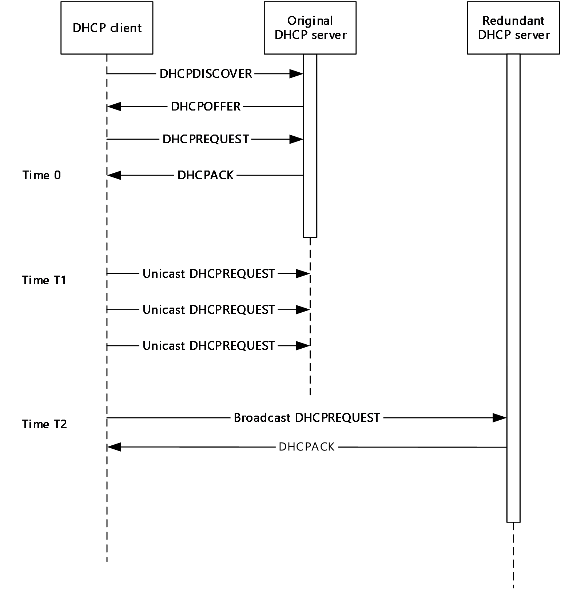

Figure 1: DHCP rebinding operation

The speed of address acquisition and confirmation is a key performance metric for the DHCP protocol and the DHCP Failover Protocol is designed to minimize this impact. To achieve this, the original DHCP server responsible for allocating and renewing the lease to the DHCP client updates its DHCP [**partner server**](#gt_partner-server) after the DHCP server responds to the DHCP client.

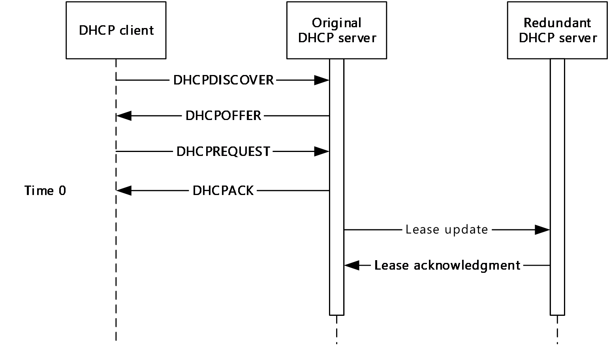

Figure 2: Lease synchronization

The protocol includes provisions that provide robustness when responding to a failure of the original server before the partner server is updated regarding an allocation or a renewal. Either server updates the DHCP client with a lease expiration time that is less than the expiration time communicated to and acknowledged by the partner server, plus a preconfigured duration called the [**maximum client lead time (MCLT)**](#gt_maximum-client-lead-time-mclt). In the case of a fresh allocation, the expiration time acknowledged by the partner is assumed to be 0. Thus, if the partner server has to renew a lease for a client that it had not originally allocated and has determined that its partner is down, the partner server can safely perform the renewal for the time recorded in its lease database (or 0, if the record for this client is missing) plus the MCLT duration. This scheme is detailed in [[IETF-DHCPFOP-12]](https://go.microsoft.com/fwlink/?LinkId=217377) section 5.2.1.

To synchronize lease information, the two partners communicate over TCP by using protocol messages with a fixed-length header and variable-length options. The fixed-length header contains the overall message length and message type that allows messages to be extracted from the TCP data stream.

One of the DHCP servers in the failover pair is designated as the [**primary server**](#gt_primary-server) and the other is designated as the [**secondary server**](#gt_secondary-server). The primary server is responsible for connection establishment and initialization. The pool of IP addresses available for the subnets being serviced by the failover pair is partitioned between the primary and secondary servers where the primary is also responsible for partitioning and allocation of addresses to the secondary.

Communication between the failover servers starts with the primary establishing a TCP connection with the secondary ([IETF-DHCPFOP-12] section 8.2). Once the connection is established, the primary sends the **CONNECT** message to the secondary with the relationship parameters ([IETF-DHCPFOP-12] section 7.8.1). These include message authentication parameters, if so configured by the administrator. The secondary can accept the connection request by responding with a **CONNECTACK** message with no reject reason option, or reject it with a **CONNECTACK** message that includes a reject reason option ([IETF-DHCPFOP-12] section 7.9.1). Upon completing the connection, each server updates its partner regarding its state by sending the **STATE** message ([IETF-DHCPFOP-12] section 7.10).

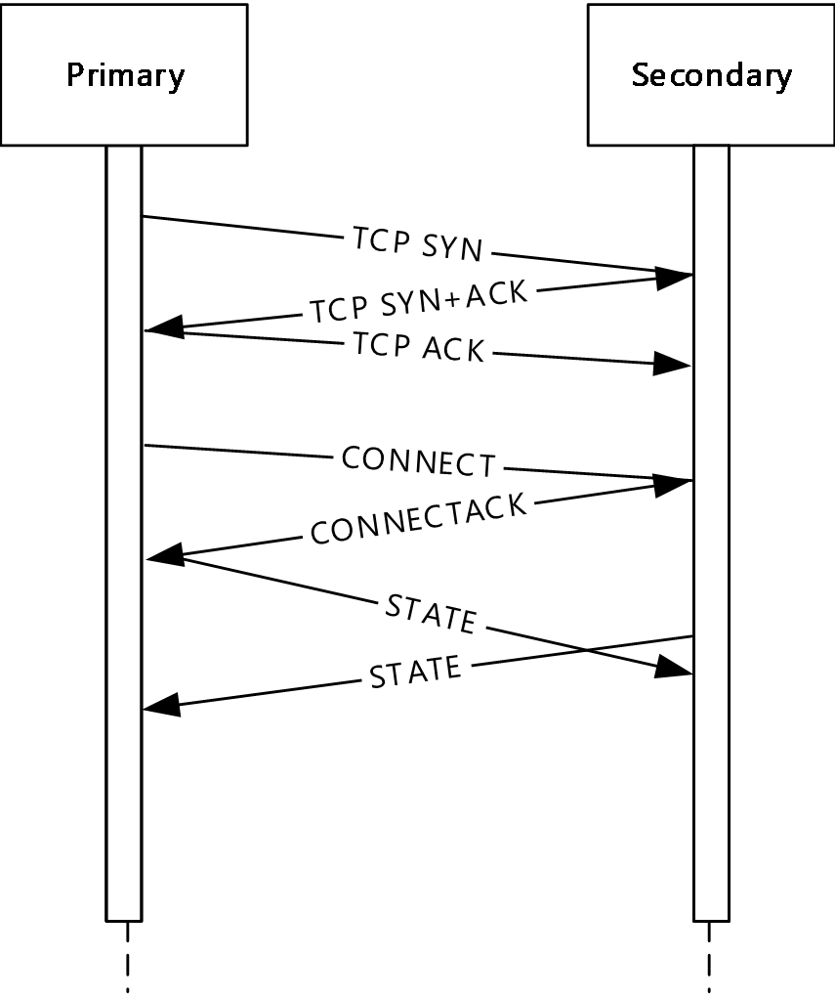

Figure 3: Connection setup

If the servers have been out of communication, either of the servers can request that its partner send it all the binding database information that it has not already received. This task is accomplished by sending an **UPDREQ** message to the partner. This causes the partner to send **BNDUPD** messages to the requesting server which the requesting server acknowledges with **BNDACK** messages. After the partner has sent all **BNDUPD** messages to the requesting server, it sends an **UPDDONE** message to indicate that the original **UPDREQ** was fulfilled ([IETF-DHCPFOP-12] section 7.3 and 7.5). Similarly, an **UPDREQALL** message can be used by a server that is recovering from a total loss of binding information ([IETF-DHCPFOP-12] section 7.4).

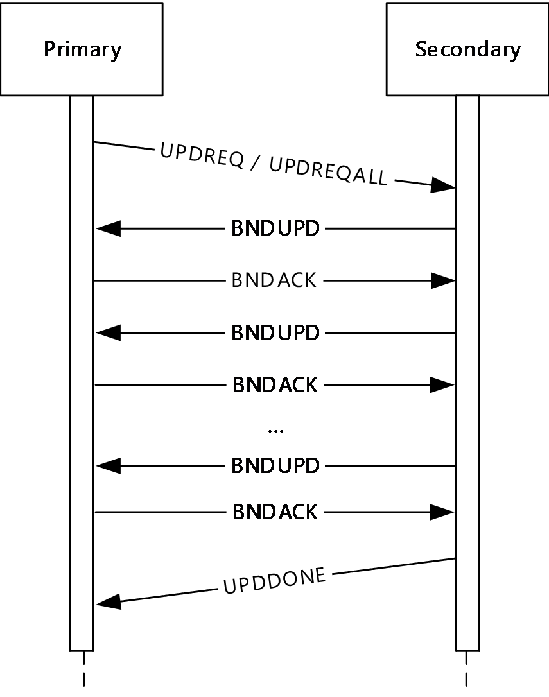

Figure 4: Recovery

Regular binding updates are triggered by the receipt of **BNDUPD** and **BNDACK** messages corresponding to lease allocations or renewals as indicated in Figure 2. These messages are the payload of the DHCP Failover Protocol and all other messages have ancillary functions. The primary server allocates IP addresses from the available pool to the secondary and also uses BNDUPD messages to update the latter about the allocation.

Communication interruption is detected by the loss of the TCP connection. In addition to an active TCP connection, the regular receipt of messages is used to ensure availability of the partner. To ensure that the partner server determines the current server as operational, the current server sends periodic **CONTACT** messages, if other protocol messages are not transmitting on the connection.

For further details on the DHCP Failover Protocol, see [IETF-DHCPFOP-12].

## 1.4 Relationship to Other Protocols

The extension options and messages defined in this document are transported according to the provisions of the DHCP Failover Protocol.

The DHCP Failover Protocol (as specified in [[IETF-DHCPFOP-12]](https://go.microsoft.com/fwlink/?LinkId=217377)) runs over the TCP protocol [[RFC793]](https://go.microsoft.com/fwlink/?LinkId=150872). TCP is used not only for transporting control and data messages, but also for determining the communication status between the primary and secondary servers.

As explained in [IETF-DHCPFOP-12] section 5, the data messages in the DHCP Failover Protocol exchange information about the DHCP client and the IP address assigned to the client between the DHCP servers configured to be failover peers.

DHCP can be used as one of the enforcement mechanisms defined for Network Access Protection (NAP) as described in [[MSDN-NAP]](https://go.microsoft.com/fwlink/?LinkId=90049). The vendor-specific options used for DHCP-based enforcement of NAP are defined by the Dynamic Host Configuration Protocol (DHCP) Extensions for Network Access Protection (NAP) ([MS-DHCPN](../MS-DHCPN/MS-DHCPN.md) section 1). These extensions affect the contents of DHCP messages when NAP is used. Similarly, NAP-related information is stored in the DHCP server [**lease**](#gt_lease) database and has to be synchronized between the two servers. The extensions defined in this document include options for synchronizing NAP information.

The Microsoft Dynamic Host Configuration Protocol (DHCP) Server Management Protocol [MS-DHCPM](../MS-DHCPM/MS-DHCPM.md) affects the contents of failover messages and the behavior of failover peers extended by this protocol by setting or modifying DHCP server configurations. The relationship between the DHCP protocol elements and the shared Abstract Data Model (ADM) elements from the Microsoft Dynamic Host Configuration Protocol (DHCP) Server Management Protocol [MS-DHCPM] (see [MS-DHCPE](../MS-DHCPE/MS-DHCPE.md) section 1.4) also applies to servers that implement DHCP NAP enforcement.

The following diagram illustrates the layering of the protocol described in this document with other protocols in its stack.

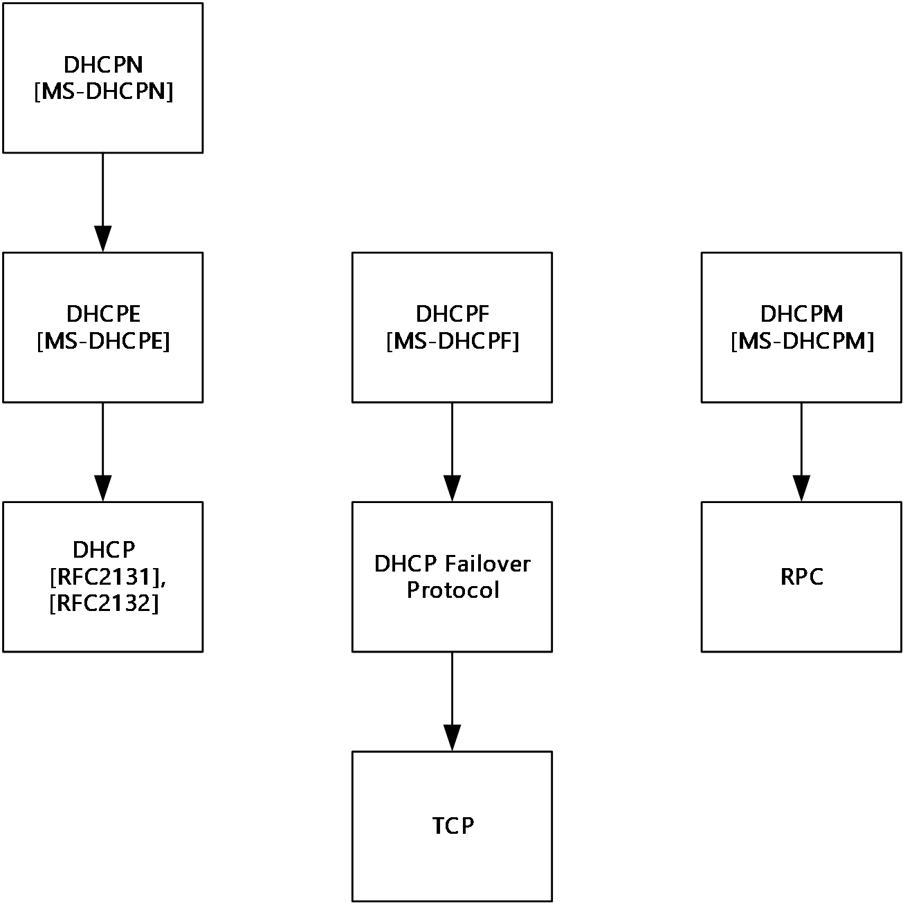

Figure 5: Protocol layering diagram

The following data flow diagram illustrates the interaction of the server implementation of this protocol with those of other protocols in its stack.

Figure 6: Server-side interaction with related protocols

## 1.5 Prerequisites/Preconditions

This protocol requires that the DHCP servers in the failover pair support configuration parameters that conform in structure to the Abstract Data Model described in [MS-DHCPM](../MS-DHCPM/MS-DHCPM.md) section 3.1.1.

The two servers are required to have similar values for all of the fields of the shared **DHCPv4FailoverRelationship** ADM element (see [MS-DHCPM] section 3.1.1.33) except for the **serverType** field which is set to values corresponding to the role of the current DHCP server in the relationship.

[**DHCPv4**](#gt_dhcpv4) scopes configured in the **pScopes** field of the **DHCPv4FailoverRelationship** ADM element are required to correspond to **DHCPv4Scope** objects ([MS-DHCPM] section 3.1.1.2) configured on either DHCP server. The **DHCPv4Scope** objects configured on the two DHCP servers, and all constituent elements are required to have the same values for all fields.

## 1.6 Applicability Statement

The use of the DHCP Failover Protocol Extension is applicable in environments where DHCP is applicable and where high availability of the DHCP service is required.

## 1.7 Versioning and Capability Negotiation

This specification covers versioning issues in the following areas:

- **Supported transports:** This protocol can be implemented on top of TCP as specified by the DHCP Failover Protocol (see [[IETF-DHCPFOP-12]](https://go.microsoft.com/fwlink/?LinkId=217377) section 8).
- **Protocol versions:** The DHCP Failover Protocol supports a protocol-version option ([IETF-DHCPFOP-12] section 12.20) which is only sent in the **CONNECT** and **CONNECT-ACK** messages. The protocol described in this document uses the same value for the protocol-version option specified in [IETF-DHCPFOP-12].
- **Capability negotiation:** The protocol described in this document does not support negotiation of the options or messages that it sends or receives.

## 1.8 Vendor-Extensible Fields

None.

## 1.9 Standards Assignments

None.

# 2 Messages

## 2.1 Transport

All DHCP Failover attributes are transported within the DHCP Failover Protocol, which is transported over the TCP protocol, as specified in [[IETF-DHCPFOP-12]](https://go.microsoft.com/fwlink/?LinkId=217377) section 8.

All DHCP servers implementing failover protocol and operating in a secondary role MUST listen on TCP Port 647.<1>

## 2.2 Message Syntax

The following DHCP Failover extensions use the message format for options, as specified in [[IETF-DHCPFOP-12]](https://go.microsoft.com/fwlink/?LinkId=217377) section 6.2.

All option fields and values described in this document are sent in [**network byte order**](#gt_network-byte-order) unless indicated otherwise.

Messages between the failover partners SHOULD be authenticated through the use of a shared secret. If the message-digest is configured to be authenticated, it MUST be included in every message and SHOULD<2> be calculated based on HMAC [[RFC2104]](https://go.microsoft.com/fwlink/?LinkId=90314) in combination with the SHA-256 interactive [**cryptographic hash function**](#gt_cryptographic-hash-function).

### 2.2.1 DHCP Failover Option 30 (0x1E) – Scope ID List Option

The **Scope ID List** option is used to convey the list of scope IDs configured on the DHCP server for which the binding updates are being requested.

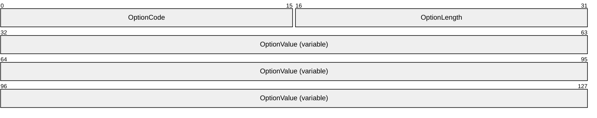

**OptionCode (2 bytes):** This field MUST be set to 30 (0x1E).

**OptionLength (2 bytes):** The unsigned length, in bytes, of the option, excluding the **OptionCode** and **OptionLength** fields.

**OptionValue (variable):** This field contains the list of [**IPv4**](#gt_internet-protocol-version-4-ipv4) addresses containing the scope IDs of the scopes for which the lease database between the two failover partners has to be synchronized. The scope IDs are specified in [**host byte order**](#gt_host-byte-order).

### 2.2.2 DHCP Failover Option 31 (0x1F) – Client Name Option

The **Client Name** option is used to convey the name of the client in the lease update that is being synchronized with the [**partner server**](#gt_partner-server).

**OptionCode (2 bytes):** This field MUST be set to 31 (0x1F).

**OptionLength (2 bytes):** The unsigned length, in bytes, of the option, excluding the **OptionCode** and **OptionLength** fields.

**OptionValue (variable):** This field contains the byte stream representing the [**Unicode**](#gt_unicode) string containing the Internet host name with the terminating NULL character for the DHCPv4 client.

### 2.2.3 DHCP Failover Option 32 (0x20) – Client Description Option

The **Client Description** option is used to convey the client description given to the DHCPv4 client in the lease update that is being synchronized with the [**partner server**](#gt_partner-server).

**OptionCode (2 bytes):** This field MUST be set to 32 (0x20).

**OptionLength (2 bytes):** The unsigned length, in bytes, of the option, excluding the **OptionCode** and **OptionLength** fields.

**OptionValue (variable):** This field contains the byte stream representing the [**Unicode**](#gt_unicode) string containing the description of the client with the terminating NULL character for the DHCPv4 client.

### 2.2.4 DHCP Failover Option 33 (0x21) – Client Subnet Mask Option

The **Client Subnet Mask** option is used to convey the subnet mask of the DHCPv4 client in the lease update that is being synchronized with the partner server.

**OptionCode (2 bytes):** This field MUST be set to 33 (0x21).

**OptionLength (2 bytes):** This field MUST be set to 0x04.

**OptionValue (variable):** This field contains the [**IPv4**](#gt_internet-protocol-version-4-ipv4) addresses in [**network byte order**](#gt_network-byte-order).

### 2.2.5 DHCP Failover Option 34 (0x22) – Server IP Option

The **Server IP** option is used to convey the [**IPv4**](#gt_internet-protocol-version-4-ipv4) address of the server that has leased out the IPv4 address to the client in the lease update that is being synchronized with the partner server.

**OptionCode (2 bytes):** This field MUST be set to 34 (0x22).

**OptionLength (2 bytes):** This field MUST be set to 0x04.

**OptionValue (variable):** This field contains the IPv4 addresses in [**network byte order**](#gt_network-byte-order).

### 2.2.6 DHCP Failover Option 35 (0x23) – Server Name Option

The **Server Name** option is used to convey the host name of the server that has leased out the [**IPv4**](#gt_internet-protocol-version-4-ipv4) address to the client in the lease update that is being synchronized with the partner server.

**OptionCode (2 bytes):** This field MUST be set to 35 (0x23).

**OptionLength (2 bytes):** The unsigned length, in bytes, of the option, excluding the **OptionCode** and **OptionLength** fields.

**OptionValue (variable):** This field contains the byte stream representing the Unicode string containing the server name with the terminating NULL character.

### 2.2.7 DHCP Failover Option 36 (0x24) – Client Type Option

The **Client Type** option is used to convey the type of the DHCPv4 client in the lease update that is being synchronized with the partner server.

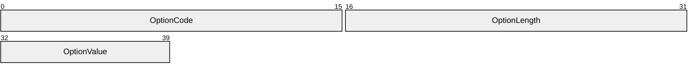

**OptionCode (2 bytes):** This field MUST be set to 36 (0x24).

**OptionLength (2 bytes):** This field MUST be set to 0x01.

**OptionValue (1 byte):** This field contains the byte that identifies the type of the DHCPv4 client and MUST be set to one of the following values:

| Value | Meaning |
| --- | --- |
| CLIENT_TYPE_UNSPECIFIED (0x00) | The DHCPv4 client is of a type that is not defined by a value specified in this table. |
| CLIENT_TYPE_DHCP (0x01) | The DHCPv4 client supports the DHCP protocol. |
| CLIENT_TYPE_BOOTP (0x02) | The DHCPv4 client supports the BOOTP protocol. |
| CLIENT_TYPE_BOTH (0x03) | The DHCPv4 client supports both the DHCPv4 and the BOOTP protocols. |
| CLIENT_TYPE_RESERVATION_FLAG (0x04) | There is an IPv4 reservation created for the DHCPv4 client. |
| CLIENT_TYPE_NONE (0x64) | The DHCPv4 client supports backward compatibility for manual addressing. |

### 2.2.8 DHCP Failover Option 37 (0x25) – Client NAP Status Option

The **Client NAP Status** option is used to convey the health status of the DHCPv4 client in the lease update, as validated by the NAP server.

**OptionCode (2 bytes):** This field MUST be set to 37 (0x25).

**OptionLength (2 bytes):** This field MUST be set to 0x04.

**OptionValue (1 byte):** This field contains the health status of the DHCPv4 client, as validated by the NAP server, and MUST be set to one of the following values: NOQUARANTINE, RESTRICTEDACCESS, DROPPACKET, and PROBATION. For more information about these NAP state values, see [MS-DHCPM](../MS-DHCPM/MS-DHCPM.md):

| Value | Meaning |
| --- | --- |
| NOQUARANTINE | The DHCP client is compliant with the health policies defined by the administrator and has normal access to the network. |
| RESTRICTEDACCESS | The DHCP client is not compliant with the health policies defined by the administrator and is being quarantined with restricted access to the network. |
| DROPPACKET | The DHCP client is not compliant with the health policies defined by the administrator and is being denied access to the network. The DHCP server does not grant an IP address lease to this client. |
| PROBATION | The DHCP client is not compliant with the health policies defined by the administrator and is being granted normal access to the network for a limited time. |

### 2.2.9 DHCP Failover Option 38 (0x26) – Client NAP Probation Option

The **Client NAP Probation** option is used if the client is on probation to convey the probation end time for the DHCPv4 client in the lease update that is being synchronized with the partner server.

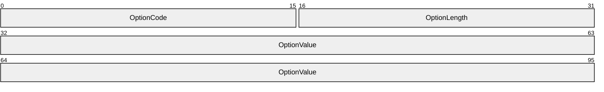

**OptionCode (2 bytes):** This field MUST be set to 38 (0x26).

**OptionLength (2 bytes):** This field MUST be set to 0x04.

**OptionValue (4 bytes):** If the DHCPv4 client is on probation, this field contains the probation end time. The value is specified as an absolute time and represents the number of 100-nanosecond intervals since January 1, 1601 (UTC).

### 2.2.10 DHCP Failover Option 39 (0x27) – Client NAP Capable Option

The **Client NAP Capable** option is used to convey the NAP-capable status of the DHCPv4 client in the lease update that is being synchronized with the partner server.

**OptionCode (2 bytes):** This field MUST be set to 39 (0x27).

**OptionLength (2 bytes):** This field MUST be set to 0x01.

**OptionValue (1 byte):** This field MUST be set to one of the following values:

| Value | Meaning |
| --- | --- |
| TRUE (0x1) | The DHCPv4 client machine is NAP capable. |
| FALSE (0x0) | The DHCPv4 client machine is NAP non-capable. |

### 2.2.11 DHCP Failover Option 40 (0x28) – Client Matched Policy Option

The **Client Matched Policy** option is used to convey the policy name of the policy configured on the DHCP server that determined the **ClientIpAddress** in the lease update that is being synchronized with the partner server.

**OptionCode (2 bytes):** This field MUST be set to 40 (0x28).

**OptionLength (2 bytes):** The unsigned length, in bytes, of the option, excluding the **OptionCode** and **OptionLength** fields.

**OptionValue (variable):** This field contains the binary data representing the Unicode string containing the policy name associated with the client with the terminating NULL character.

### 2.2.12 DHCP Failover Option 41 (0x29) - Extended Address State Option

The **Extended Address State** option is used to send additional address state information associated with the DHCPv4 client.

**OptionCode (2 bytes):** This field MUST be set to 41 (0x29).

**OptionLength (2 bytes):** This field MUST be set to 0x04.

**OptionValue (4 bytes):** This field contains the additional address state information associated with the DHCPv4 client.

# 3 Protocol Details

## 3.1 Common Details

### 3.1.1 Abstract Data Model

This section describes a conceptual model of possible data organization that an implementation maintains to participate in the DHCPF protocol. The described organization is provided to facilitate the explanation of how the protocol behaves. This document does not mandate that implementations adhere to this model as long as their external behavior is consistent with that described in this document.

The following figure shows the state machine for a DHCP [**failover endpoint**](#gt_failover-endpoint).

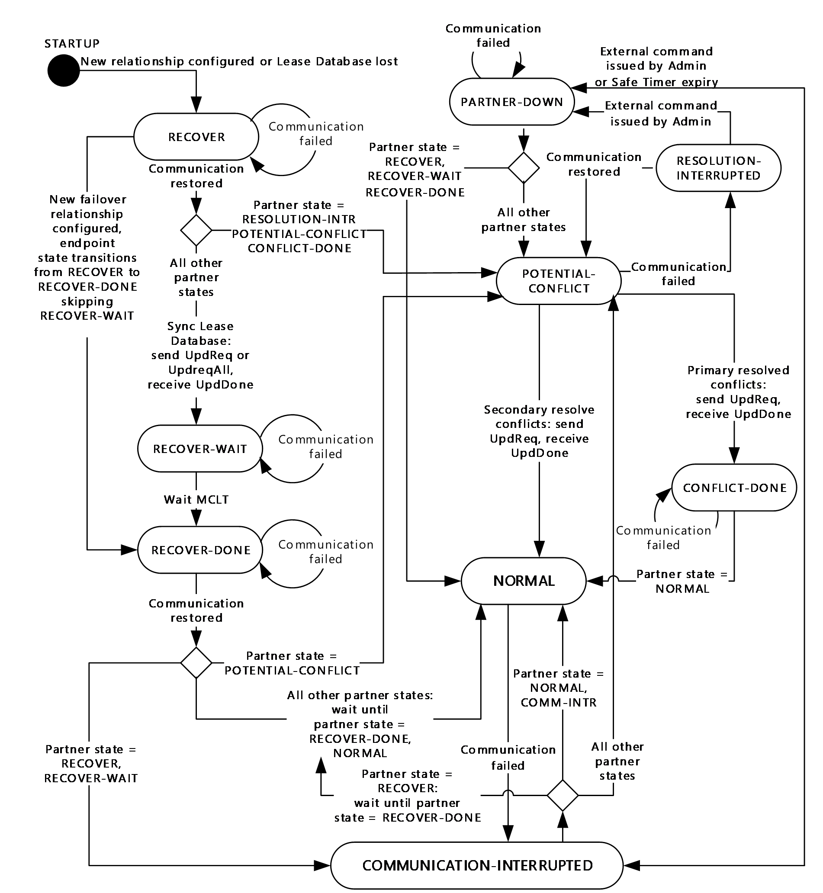

Figure 7: Failover state machine

The Failover state machine has the states described in [[IETF-DHCPFOP-12]](https://go.microsoft.com/fwlink/?LinkId=217377) section 9.

### 3.1.2 Timers

#### 3.1.2.1 Safe Period Timer

The **Safe Period** timer is a configurable timer that is used to automatically transition from the **COMMUNICATION-INTERRUPTED** to **PARTNER-DOWN** state. If configured, this timer is initialized when a new [**failover relationship**](#gt_failover-relationship) is created or when the **Safe Period** timer is enabled for an existing failover relationship by using the **R_DhcpV4FailoverCreateRelationship** method ([MS-DHCPM](../MS-DHCPM/MS-DHCPM.md) section 3.2.4.90) and the **R_DhcpV4FailoverSetRelationship** method ([MS-DHCPM] section 3.2.4.91). This timer is reset whenever the failover relationship transitions to **COMMUNICATION-INTERRUPTED** as specified in the failover state diagram in section [3.1.1](../MS-DHCPM/MS-DHCPM.md). This is a one-time timer with a default value of 60 minutes<3>; that is, unless the timer is stopped, it will expire once at the end of the specified timer interval. This timer value SHOULD be set appropriately, factoring in the time required for administrator intervention. This timer SHOULD be stopped when the communication has been restored between the failover partners or when the administrator has manually set the failover relationship state to the **PARTNER-DOWN** state by calling the **R_DhcpV4FailoverSetRelationship** method ([MS-DHCPM] section 3.2.4.91).

#### 3.1.2.2 Connect Retry Timer

The **Connect Retry** timer is used to trigger periodic connection establishment retry attempts while communication is down between the failover partners. This timer is reset whenever the communication between the failover partners is down. It is a periodic timer with a default value of one minute<4>; that is, unless the timer is stopped, it will expire after every minute. This timer value SHOULD be set appropriately, factoring in the link speed and round-trip time of the TCP connection. This timer has to be stopped when the server establishes connection with its failover partner.

#### 3.1.2.3 Startup Timer

The **Startup** timer is used to transition to the last known state of the [**failover endpoint**](#gt_failover-endpoint) if communication with the failover partner cannot be established. This timer is reset whenever the [**failover relationship**](#gt_failover-relationship) is initialized or the server starts after shutdown. This is a one-time timer with a default value of five minutes<5>; that is, unless the timer is stopped, it will expire after five minutes. This timer value SHOULD be set appropriately, factoring in the time required to synchronize the failover partners when setting up the relationship for the first time. This timer has to be stopped when the server has transitioned from the **STARTUP** state to any other failover state as specified in section [3.1.1](#Section_3.1.1).

#### 3.1.2.4 tReceive Timer

The **tReceive** timer helps to maintain the TCP communication between the failover partners by ensuring that messages are received at regular intervals. This timer is initialized when a connection is set up between the failover partners and is reset whenever any DHCP Failover Message is received from the failover partner. This is a periodic timer with a default value of three minutes<6>; that is, unless the timer is stopped, it will expire after every three minutes. This timer value SHOULD be set appropriately, factoring in the link speed. This timer has to be stopped when the communication between the partners is down.

#### 3.1.2.5 tSend Timer

The **tSend** timer helps to maintain the heartbeat of the connection between the failover partners by triggering the sending of CONTACT messages. This timer is initialized when a connection is set up between the failover partners and is reset whenever any DHCP Failover Message is sent to the failover partner. This is a periodic timer with a default value of one minute<7>; that is, unless the timer is stopped, it will expire after every minute. This timer value SHOULD be set appropriately, factoring in the link speed. This timer has to be stopped when the communication between the partners is down.

#### 3.1.2.6 Synchronization Timer

The **Synchronization** timer is used to ensure that any failure during lease synchronization through **UPDREQ** and **UPDDONE** is detected early. This timer is initialized when a **UPDREQ** or **UPDREQALL** message is sent from one [**failover endpoint**](#gt_failover-endpoint) to its failover partner server. The timer is reset whenever a **BNDUPD** message is received. This is a periodic timer with an implementation-dependent time interval; that is, unless the timer is stopped it will expire after every X minutes, where X is the time interval specified in the timer. This timer value SHOULD be set appropriately, factoring in the link speed. This timer has to be stopped when the **UPDDONE** message is received.<8>

### 3.1.3 Initialization

When the DHCP server is booting after shutdown, or a new [**failover relationship**](#gt_failover-relationship) has been configured between the two failover servers, the state of the failover endpoint MUST be set to **STARTUP** and the **Startup** timer SHOULD be set as specified in section [3.1.2](#Section_3.1.2).

If this is a new failover relationship created between the two servers, after the communication has been established with the partner server, the DHCP server MUST transition both failover endpoints to the **RECOVER** state.

Otherwise, after the communication has been established with the partner server, the failover endpoint MUST transition to the communication-failed state indicated by the **prevState** member of the shared **DHCPv4FailoverRelationship** ADM element ([MS-DHCPM](../MS-DHCPM/MS-DHCPM.md) section 3.1.1.33). The communication failed state is depicted in the Failover state machine figure in section [3.1.1](../MS-DHCPM/MS-DHCPM.md).

### 3.1.4 Higher-Layer Triggered Events

#### 3.1.4.1 Adding and Removing Scopes from Failover Configuration

If one or more existing scopes are added or removed from the failover configuration through the **R_DhcpV4FailoverAddScopeToRelationship** method ([MS-DHCPM](../MS-DHCPM/MS-DHCPM.md) section 3.2.4.95) and the **R_DhcpV4FailoverDeleteScopeFromRelationship** method ([MS-DHCPM] section 3.2.4.96), the DHCP servers implementing this specification MUST synchronize the lease database corresponding to these DHCPv4 subnets by sending an **UPDREQ** message to the partner. The list of IPv4 Scope IDs is included by using the **Scope ID List** option (section [2.2.2](#Section_2.2.2)) in this message.

#### 3.1.4.2 Synchronize Lease Database by Sending DHCP Failover BNDUPD Message

If there is any change in the lease database, the server MUST send the lease update to its failover partner. The DHCP servers implementing this specification MUST send a **BNDUPD** message to its failover partner server as described in [[IETF-DHCPFOP-12]](https://go.microsoft.com/fwlink/?LinkId=217377) section 7.1.1.

If multiple lease updates are packed in a single **BNDUPD** message, the number of lease updates MUST be less than or equal to 16.

The **BNDUPD** message corresponding to an update in the DHCPv4 client lease record contains the IP-Flag option, which is used to convey the current flags for an IP address, and MUST have one of the following combinations of bit values.

| Value | Meaning |
| --- | --- |
| FAILOVER_ADDRESS_DELETED (0x1) | The DHCPv4 client lease record has to be deleted from the DHCP server database. |
| FAILOVER_ADDRESS_RELEASED (0x2) | The DHCPv4 client lease has been released by the client. |
| FAILOVER_DELETED_COMM_DOWN (0x4) | The DHCPv4 client lease record has been deleted while communication with the partner was down. |

The Binding Status option which is used to convey the current state of an IP address does not contain the values specified in [IETF-DHCPFOP-12] section 12.3. Instead, the Binding Status option MUST contain one of the following combinations of bits to indicate the various states of the IP address.

The bits are numbered as follows:

| BIT 7 | BIT 6 | BIT 5 | BIT 4 | BIT 3 | BIT 2 | BIT 1 | BIT 0 |
| --- | --- | --- | --- | --- | --- | --- | --- |

The following tables identify the various bit representation values and their meanings.

BIT 0 and BIT 1 signify the state of the leased IPv4 address, as shown in the following table.

| Value | Meaning |
| --- | --- |
| ADDRESS_STATE_OFFERED (0x0) | The DHCPv4 client is offered this IPv4 address. |
| ADDRESS_STATE_ACTIVE (0x1) | The IPv4 address is active and has an active DHCPv4 client lease record. |
| ADDRESS_STATE_DECLINED (0x2) | The IPv4 address request is declined by the DHCPv4 client; therefore, the specified value is an invalid IPv4 address. |
| ADDRESS_STATE_DOOM (0x3) | The IPv4 address is in the DOOMED state and is marked for deletion. |

BIT 2 and BIT 3 signify information related to Name Protection (section [3.3.3](#Section_3.2.3)) for the leased IPv4 address, as shown in the following table.

| Value | Meaning |
| --- | --- |
| ADDRESS_BIT_NO_DHCID (0x0) | The address is leased to the DHCPv4 client without DHCID ([[RFC4701]](https://go.microsoft.com/fwlink/?LinkId=125431) sections 3 and 3.5). |
| ADDRESS_BIT_DHCID_NO_CLIENTIDOPTION (0x1) | The address is leased to the DHCPv4 client with DHCID as specified in [RFC4701] section 3.5.3. |
| ADDRESS_BIT_DHCID_WITH_CLIENTIDOPTION (0x2) | The address is leased to the DHCPv4 client with DHCID as specified in [RFC4701] section 3.5.2. |
| ADDRESS_BIT_DHCID_WITH_DUID (0x3) | The address is leased to the DHCPv4 client with DHCID as specified in [RFC4701] section 3.5.1. |

BIT 4, BIT 5, BIT 6, and BIT 7 specify information related to DNS, as shown in the following table.

| Value | Meaning |
| --- | --- |
| ADDRESS_BIT_CLEANUP (0x1) | The DNS update for the DHCPv4 client lease record has to be deleted from the DNS server when the lease is deleted. |
| ADDRESS_BIT_BOTH_REC (0x2) | The DNS update has to be sent for both the A and PTR resource records. For more details of DNS A and PTR resource records, see [[RFC1035]](https://go.microsoft.com/fwlink/?LinkId=90264). |
| ADDRESS_BIT_UNREGISTERED (0x4) | The DNS update is not completed for the lease record. |
| ADDRESS_BIT_DELETED (0x8) | The address lease is expired, but the DNS updates for the lease record have not been deleted from the DNS server. |

If a **BNDUPD** message is sent to redistribute the IPv4 address space between the failover partners, the message MUST contain the IP-Flag option with the option value set to 0. The Binding Status option MUST be one of the following values.

| Value | Meaning |
| --- | --- |
| FAILOVER_ADDRESS_FREE (0x1) | The ownership of the IPv4 address is with the [**primary server**](#gt_primary-server). |
| FAILOVER_ADDRESS_BACKUP (0x2) | The ownership of the IPv4 address is with the [**secondary server**](#gt_secondary-server). |
| FAILOVER_ADDRESS_RECONCILE (0x4) | The ownership of the IPv4 address is reclaimed by the primary server from the secondary server. |
| FAILOVER_ADDRESS_FREE_UPDATE (0x5) | In the case of database loss, the update containing the ownership of the IPv4 address by the primary server is sent to the secondary server. |
| FAILOVER_ADDRESS_BACKUP_UPDATE (0x6) | In the case of database loss, the update containing the ownership of the IPv4 address by the secondary server is sent to the secondary server. |

The acceptable values for the Binding Update option specified in the preceding tables are internally mapped to one of the values defined in [IETF-DHCPFOP-12] section 12.3 as follows:

- If the Binding Status option value is FAILOVER_ADDRESS_FREE, FAILOVER_ADDRESS_FREE_UPDATE, or FAILOVER_ADDRESS_RECONCILE, then
- If there is no lease record corresponding to the IP address, mark the IP address state as FREE.
- Otherwise, if the Binding Status option value is FAILOVER_ADDRESS_BACKUP or FAILOVER_ADDRESS_BACKUP_UPDATE, then
- If there is no lease record corresponding to the IP address, mark the IP address state as BACKUP.
- Otherwise, if the IP Flag option value has the FAILOVER_ADDRESS_RELEASED bit set, mark the IP address state as RELEASED.
- Otherwise, if the Binding Status option value has the ADDRESS_STATE_DOOM bit set, mark the IP address state as EXPIRED.
- Otherwise, if the Binding Status option value has the ADDRESS_STATE_DECLINED bit set, mark the IP address state as EXPIRED.
- Otherwise, mark the IP address state as ACTIVE.
The Extended Binding Status option is used to convey additional state information of an IP address. The option is specified as a 4-byte value where the bits are numbered as follows:

| BIT 1 through BIT 31 | BIT 0 |
| --- | --- |

BIT 0 indicates whether the DHCP server skips DNS PTR record registration while performing DNS registration on behalf of the client.

| Value | Meaning |
| --- | --- |
| V5_ADDRESS_EX_BIT_DISABLE_PTR_RR (0x01) | The DHCP server skips DNS PTR record registration while performing DNS registration on behalf of the client. |

BITs 1 through BIT 31 are reserved for future use.

### 3.1.5 Processing Events and Sequencing Rules

If a shared secret is configured for the [**failover relationship**](#gt_failover-relationship), then when any DHCP Failover packet is received, the message digest option is verified. If the option is not present or if the option value does not match the hash value obtained from the [**cryptographic hash function**](#gt_cryptographic-hash-function) of the text by using the shared secret configured on the server, the packet MUST be dropped, and the TCP connection between the failover partners MUST be closed.

When any DHCP Failover packet is received, the time at which it was received SHOULD be compared with the value of the **Time** option in the message header. If the value is greater than the maximum allowed delta time<9> difference between the two failover partners, the TCP connection between the failover partners MUST be closed.

#### 3.1.5.1 Receiving a DHCP Failover STATE Message

The behavior of the server on receiving a **STATE** Message (as specified in [[IETF-DHCPFOP-12]](https://go.microsoft.com/fwlink/?LinkId=217377) section 7.10.2) is unchanged by extensions specified in this document.

#### 3.1.5.2 Receiving a DHCP Failover BNDUPD Message

The **BNDUPD** message MUST be processed to extract all lease updates. Each lease update SHOULD be processed as described in the following table. The table specifies which options are mandatory to include in the **BNDUPD** message corresponding to each IP address state.

| Option | ACTIVE | EXPIRED | RELEASED | FREE/BACKUP | ABANDONED |
| --- | --- | --- | --- | --- | --- |
| Assigned IP Address | MUST | MUST | MUST | MUST | MUST |
| Binding Status | MUST | MUST | MUST | MUST | MUST |
| IP-Flags | MUST | MUST | MUST | MUST | MUST |
| Subnet Mask | MUST | MUST | MUST | MUST | MUST |
| Client Hardware Address | MUST | MUST | MUST | MUST NOT | MUST |
| Client Last Transaction Time | MUST | MUST | MUST | MUST NOT | MAY |
| Lease Expiration Time | MUST | MAY | MAY | MUST NOT | MAY |
| Potential Expiration Time | MUST | MAY | MAY | MUST NOT | MAY |
| DDNS | MAY | MAY | MAY | MUST NOT | MAY |
| Start Time of State | MAY | MAY | MAY | MUST NOT | MAY |
| Client Identifier | MAY | MAY | MAY | MUST NOT | MAY |
| Client Request Options | MAY | MAY | MAY | MUST NOT | MAY |
| Client Reply Options | MAY | MAY | MAY | MUST NOT | MAY |
| Client Name | SHOULD | SHOULD | SHOULD | MUST NOT | SHOULD |
| Client Description | SHOULD | SHOULD | SHOULD | MUST NOT | SHOULD |
| Client Server IP | SHOULD | SHOULD | SHOULD | MUST NOT | SHOULD |
| Client Server Name | SHOULD | SHOULD | SHOULD | MUST NOT | SHOULD |
| Client Type | SHOULD | SHOULD | SHOULD | MUST NOT | SHOULD |
| Client NAP Status | SHOULD | SHOULD | SHOULD | MUST NOT | SHOULD |
| Client NAP Probation Time | SHOULD | SHOULD | SHOULD | MUST NOT | SHOULD |
| Client NAP Capable | SHOULD | SHOULD | SHOULD | MUST NOT | SHOULD |
| Client Policy | SHOULD | SHOULD | SHOULD | MUST NOT | SHOULD |

If the lease update does not contain all of the mandatory options corresponding to the IP Address state as indicated by the Binding Status option of the lease update, the DHCP server MUST reject that lease update with reject reason 3: Missing Binding Information.

When accepting the lease update, the rules specified in [[IETF-DHCPFOP-12]](https://go.microsoft.com/fwlink/?LinkId=217377) section 7.1.2 and the first figure depicted in [IETF-DHCPFOP-12] section 7.1.3 MUST be followed.

The Binding Status option and the IP-Flags option values MUST be interpreted as specified in section [3.1.4.2](#Section_3.1.4.2).

If the IP-Flag option value of the lease update has the FAILOVER_DELETED_COMM_DOWN bit set, the validations specified in the preceding paragraphs are skipped.

When a **BNDUPD** message with an IP address state set to FREE or BACKUP is received, and there exists a **DHCPv4Reservation** ADM element corresponding to that IP address, the DHCP server MUST reject that lease update with reject reason 15: Outdated Binding Information.

In a **BNDUPD** message contains multiple lease updates after processing 16 lease updates, the remaining lease updates are ignored.

The DHCP server MUST send a **BNDACK** message corresponding to the received **BNDUPD** message as described in [IETF-DHCPFOP-12] section 7.2.1. When multiple lease updates are packed in a single **BNDUPD** message, the order of the assigned IP address option in the corresponding **BNDACK** message MUST be the same as the order for that same option in the **BNDUPD** message.

#### 3.1.5.3 Receiving a DHCP Failover BNDACK Message

When a DHCP server implementing this specification receives a **BNDACK** message with multiple lease update responses in a single message, the order of the assigned IP Address option in the **BNDACK** message and the corresponding order in the **BNDUPD** message MUST be validated to be the same. If the order is different, the **BNDACK** message MUST be dropped.

The **BNDACK** message MUST be processed as specified in [[IETF-DHCPFOP-12]](https://go.microsoft.com/fwlink/?LinkId=217377) section 7.2.2.

#### 3.1.5.4 Receiving a DHCP Failover UPDREQ Message

When a DHCP server implementing this specification receives an **UPDREQ** message that contains a **Scope IDs List Option** (section [2.2.2](#Section_2.2.2)), the server MUST send the lease updates of all DHCPv4 clients serviced from the IPv4 subnets included in the **Scope IDs List Option** (section 2.2.2).

If the message does not contain the **Scope IDs List Option** (section 2.2.2), the **UPDREQ** message MUST be processed as specified in [[IETF-DHCPFOP-12]](https://go.microsoft.com/fwlink/?LinkId=217377) section 7.3.2.

When all the pending lease updates have been synchronized with the failover partner server, the **UPDDONE** message MUST be sent as specified in [IETF-DHCPFOP-12] section 7.5.2.

#### 3.1.5.5 Receiving a DHCP Failover UPDREQALL Message

The behavior of a DHCP server upon receipt of an **UPDREQALL** message (as specified in [[IETF-DHCPFOP-12]](https://go.microsoft.com/fwlink/?LinkId=217377) section 7.4.2) is unchanged by the extensions specified in this document.

#### 3.1.5.6 Receiving a DHCP Failover UPDDONE Message

The behavior of a DHCP server upon receipt of an **UPDDONE** message (as specified in [[IETF-DHCPFOP-12]](https://go.microsoft.com/fwlink/?LinkId=217377) section 7.5.2) is unchanged by the extensions specified in this document.

#### 3.1.5.7 Receiving a DHCP Failover CONTACT Message

The behavior of a DHCP server upon receipt of a **CONTACT** message (as specified in [[IETF-DHCPFOP-12]](https://go.microsoft.com/fwlink/?LinkId=217377) section 7.11.2) is unchanged by the extensions specified in this document.

#### 3.1.5.8 Receiving a DHCP Failover DISCONNECT Message

When a DHCP server implementing this specification receives a **DISCONNECT** message, the message MUST be dropped.

### 3.1.6 Timer Events

#### 3.1.6.1 Safe Period Timer Events

When the **Safe Period** timer expires, the state of the [**failover endpoint**](#gt_failover-endpoint) is changed from **COMMUNICATIONS-INTERRUPTED** to **PARTNER-DOWN**.

#### 3.1.6.2 Connect Retry Timer Events

When the **Connect Retry** timer expires, TCP connection establishment between the failover partner servers is reattempted.

#### 3.1.6.3 Startup Timer Events

When the **Startup** timer expires, it denotes a time period wherein the [**failover endpoint**](#gt_failover-endpoint) is in the **STARTUP** state and has been unable to establish communication with the failover partner server. The following are the tasks to be performed when this time expires:

- The **prevState** member of the shared **DHCPv4FailoverRelationship** ADM element ([MS-DHCPM](../MS-DHCPM/MS-DHCPM.md) section 3.1.1.33) MUST be checked to see if it is in the **INIT** or **NO_STATE** state.
- If **DHCPv4FailoverRelationship** is in the **INIT** or **NO_STATE** state, the failover endpoint SHOULD be transitioned to the **COMMUNICATIONS-INTERRUPTED** state.
- Otherwise, the failover endpoint SHOULD be transitioned to the **COMMUNICATION-FAILED** state indicated by the **prevState** member of the shared **DHCPv4FailoverRelationship** ADM element. The **COMMUNICATION-FAILED** state is depicted in the Failover state diagram machine figure in section [3.1.1](#Section_3.1.1).

#### 3.1.6.4 tReceive Timer Events

When the **tRecieve** timer expires, the TCP connection between the failover partner servers is dropped as specified in [[IETF-DHCPFOP-12]](https://go.microsoft.com/fwlink/?LinkId=217377) section 8.3.

#### 3.1.6.5 tSend Timer Events

When the **tSend** timer expires, a **CONTACT** message is sent to the failover partner server as specified in [[IETF-DHCPFOP-12]](https://go.microsoft.com/fwlink/?LinkId=217377) section 7.11.1.

#### 3.1.6.6 Synchronization Timer Events

When the **Synchronization** timer expires, the TCP connection between the failover partner servers is closed.<10>

### 3.1.7 Other Local Events

#### 3.1.7.1 Sending a DHCP Failover UPDREQ Message

When a [**failover endpoint**](#gt_failover-endpoint) transitions to the **RECOVER** or **POTENTIAL-CONFLICT** state as shown in the Failover state machine figure in section [3.1.1](#Section_3.1.1), the failover endpoint MUST send an **UPDREQ** message to its failover partner server. This behavior is as specified in [[IETF-DHCPFOP-12]](https://go.microsoft.com/fwlink/?LinkId=217377) sections 7.3.1, 9.5, and 9.10 and is unchanged by the extensions specified in this document.

#### 3.1.7.2 Sending a DHCP Failover UPDREQALL Message

When a backed-up DHCP database is restored by using the **R_DhcpRestoreDatabase** method ([MS-DHCPM](../MS-DHCPM/MS-DHCPM.md) section 3.2.4.46), the DHCP server implementing this specification MUST transition to the **RECOVER** state (section [3.1.1](../MS-DHCPM/MS-DHCPM.md)) and send an **UPDREQALL** message to its failover partner server.

The behavior of the **UPDREQALL** message (as specified in [[IETF-DHCPFOP-12]](https://go.microsoft.com/fwlink/?LinkId=217377) section 7.4.1) is unchanged by the extensions specified in this document.

#### 3.1.7.3 Sending a DHCP Failover STATE Message

When a **CONNECTACK** message without a reject reason is sent or received, the DHCP server MUST send a **STATE** message to its failover partner server.

When the failover endpoint transitions from one state to another state as shown in the Failover state machine figure in section [3.1.1](#Section_3.1.1), and the communication with the failover partner server is active, a **STATE** message SHOULD be sent to the failover partner server.

The behavior of the **STATE** message ([[IETF-DHCPFOP-12]](https://go.microsoft.com/fwlink/?LinkId=217377) section 7.10.1) is unchanged by the extensions specified in this document.

## 3.2 Server Details

### 3.2.1 Abstract Data Model

None.

### 3.2.2 Timers

#### 3.2.2.1 Address Rebalancing Timer

The purpose of the **Address Rebalancing** timer is to trigger periodic address space redistribution between the failover partners. This timer is initialized when a new [**failover relationship**](#gt_failover-relationship) is created by using the **R_DhcpV4FailoverCreateRelationship** method ([MS-DHCPM](../MS-DHCPM/MS-DHCPM.md) section 3.2.4.90) and reset whenever the failover relationship transitions to the **NORMAL** state as shown in the Failover state machine figure in section [3.1.1](../MS-DHCPM/MS-DHCPM.md)).

This is a periodic timer with a default interval value of 5 minutes<11>; that is, unless the timer is stopped, it will expire periodically as specified by the timer interval. This timer value SHOULD be set appropriately, factoring in the client processing rate of the DHCP server. This timer has to be stopped when the communication between the partners is down.

### 3.2.3 Initialization

The DHCP server operating in the primary role in a failover configuration initialization (as specified in [[IETF-DHCPFOP-12]](https://go.microsoft.com/fwlink/?LinkId=217377)) is unchanged by the extensions specified in this document.

### 3.2.4 Higher-Layer Triggered Events

None.

### 3.2.5 Processing Events and Sequencing Rules

Message authentication, timer synchronization rules, and server behavior as described in section [3.1.5](#Section_3.1.5) remain the same for the DHCP Failover messages specified in the following sections.

#### 3.2.5.1 Receiving a DHCP Failover CONNECTACK Message

If the **CONNECTACK** message contains the **TLS-Reply** option, the option is ignored. The remainder of the message is processed as specified in [[IETF-DHCPFOP-12]](https://go.microsoft.com/fwlink/?LinkId=217377) section 7.9.2.

#### 3.2.5.2 Receiving a DHCP Failover POOLREQ Message

When a DHCP server implementing this specification receives a **POOLREQ** message, the message MUST be dropped.

### 3.2.6 Timer Events

**Address Rebalancing Timer:** When this timer expires, the [**primary server**](#gt_primary-server) examines the possible available IP addresses that can be sent to the partner server and sends them in **BNDUPD** messages.

### 3.2.7 Other Local Events

#### 3.2.7.1 Establishing the Connection between Failover Partner Servers

Whenever a new TCP connection between the failover partner servers is established, each server MUST send a **CONNECT** message to its failover partner. The DHCP server implementing this specification MUST NOT include the TLS-Request option in the sent **CONNECT** message.

## 3.3 Client Details

### 3.3.1 Abstract Data Model

None.

### 3.3.2 Timers

None.

### 3.3.3 Initialization

All DHCP servers implementing the failover protocol and operating in a secondary role MUST listen on TCP Port 647.<12>

### 3.3.4 Higher-Layer Triggered Events

None.

### 3.3.5 Processing Events and Sequencing Rules

Message authentication, timer synchronization rules, and server behavior as described in section [3.1.5](#Section_3.1.5) remain the same for the DHCP Failover messages specified in the following sections.

#### 3.3.5.1 Receiving a DHCP Failover CONNECT Message

When a DHCP server implementing this specification receives a **CONNECT** message, it MUST validate all of the mandatory options as specified in [[IETF-DHCPFOP-12]](https://go.microsoft.com/fwlink/?LinkId=217377) except for the **TLS-Request** option.

The DHCP server MUST NOT use the values provided in the **CONNECT** message corresponding to the **Max Unacked BndUpd**, **Receive timer**, **Vendor Class Identifier**, **MCLT, Protocol Version**, and **Hash Bucket Assignment** options. These values are configurable by the administrator and MUST adhere to the conditions specified in section [1.5](#Section_1.5).

If the **CONNECT** message contains the **TLS-Request** option, the option is ignored. The remainder of the message is processed as specified in [IETF-DHCPFOP-12] section 7.9.1.

In response to the **CONNECT** message, the DHCP server operating in the secondary role in a failover configuration MUST send a **CONNECTACK** message as specified in [IETF-DHCPFOP-12].

#### 3.3.5.2 Receiving a DHCPFailover POOLREQ Message

When a DHCP server implementing this specification receives a POOLRESP message, the message MUST be dropped.

### 3.3.6 Timer Events

None.

### 3.3.7 Other Local Events

None.

# 4 Protocol Examples

## 4.1 Adding DHCPv4 Scopes to a Failover Relationship

In the following example, the following assumptions are made:

- A [**failover relationship**](#gt_failover-relationship) already exists between the primary and secondary DHCP servers in a failover pair.
- The [**DHCPv4**](#gt_dhcpv4) scopes to be added to the failover relationship are already configured symmetrically on both DHCP servers according to the provisions of the DHCP Server Management Protocol [MS-DHCPM](../MS-DHCPM/MS-DHCPM.md).
- The [**primary server**](#gt_primary-server) has the IP address "192.168.1.11".
- The [**secondary server**](#gt_secondary-server) has the IP address "192.168.1.12".
- Two scopes are preconfigured on the servers as follows:
- Scope1: Scope Address "192.168.1.0", Subnet Mask "255.255.255.0"
- Scope2: Scope Address "192.168.2.0", Subnet Mask "255.255.255.0"
- The primary server has leased out the IPv4 address "192.168.1.31" to a NAP non-capable DHCP client with the host name "clnt0.contoso.com".
The sequence of events is as follows:

- The administrator adds Scope1 and Scope2 to the failover relationship on the primary server by using the **R_DhcpV4FailoverAddScopeToRelationship** method ([MS-DHCPM] section 3.2.4.95).
- The primary server sends an UPDREQ message to the secondary server that includes the scope ID List option to request updates for Scope1 and Scope2, if any, from the secondary server.
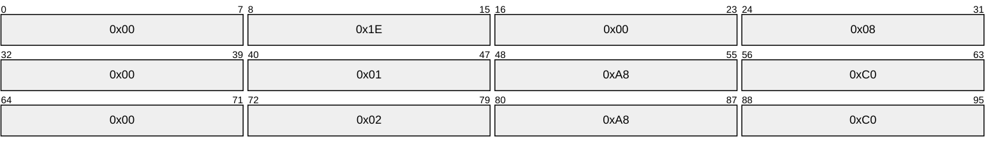

- Because the client had obtained a lease from the primary server and there are no IP addresses in the lease table of the secondary server, the secondary server responds with an UPDDONE message.
The administrator adds Scope1 and Scope2 to the failover relationship on the secondary server using the **R_DhcpV4FailoverAddScopeToRelationship** method ([MS-DHCPM] section 3.2.4.95).

- The secondary server sends an UPDREQ message to the primary server that includes the scope ID List option to request updates for Scope1 and Scope2, if any, from the primary server.
- Because the primary server now has at least one lease record in its database, it sends a BNDUPD message to the secondary server that includes the following options in addition to the one specified by the DHCP Failover Protocol [[IETF-DHCPFOP-12]](https://go.microsoft.com/fwlink/?LinkId=217377):
- Client Name L"clnt0.contoso.com"

- Subnet Mask "255.255.255.0"
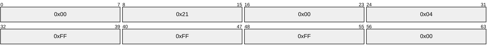

- Client Server IP "192.168.1.11"
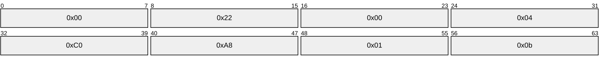

- Client Type – 0x01 (DHCP)

- NAP Status – 0x0 (unassigned)

- NAP Probation – 0x00000000 (unassigned)
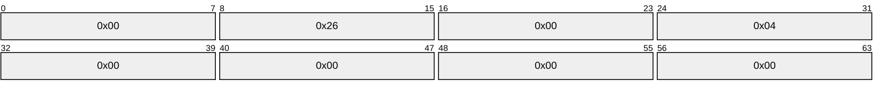

- NAP Capable – 0x0 (NAP non-capable)
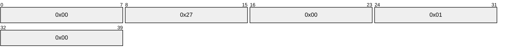

- The secondary server acknowledges receipt of the BNDUPD message with a BNDACK message.
- The primary server responds to the original UPDREQ message from the secondary server with an UPDDONE message.
At this point, the two scopes are synchronized on the secondary server and the operation of adding the scope to the relationship is complete.

# 5 Security

## 5.1 Security Considerations for Implementers

DHCP servers implementing this specification can implement TLS security as described in [[IETF-DHCPFOP-12]](https://go.microsoft.com/fwlink/?LinkId=217377) section 11.2.

DHCP failover messages between the failover partners are authenticated through the use of a shared secret provided to both partners. The message digest calculated by using HMAC [[RFC2104]](https://go.microsoft.com/fwlink/?LinkId=90314) in combination with the SHA-256<13> interactive [**cryptographic hash function**](#gt_cryptographic-hash-function) is included in every message.

If any message is received that does not contain the message digest option, it is dropped and the TCP connection with the partner is closed.

## 5.2 Index of Security Parameters

None.

# 6 Appendix A: Product Behavior

The information in this specification is applicable to the following Microsoft products or supplemental software. References to product versions include updates to those products.

- Windows Server 2012 operating system
- Windows Server 2012 R2 operating system
- Windows Server 2016 operating system
- Windows Server operating system
- Windows Server 2019 operating system
- Windows Server 2022 operating system
- Windows Server 2025 operating system
Exceptions, if any, are noted in this section. If an update version, service pack or Knowledge Base (KB) number appears with a product name, the behavior changed in that update. The new behavior also applies to subsequent updates unless otherwise specified. If a product edition appears with the product version, behavior is different in that product edition.

Unless otherwise specified, any statement of optional behavior in this specification that is prescribed using the terms "SHOULD" or "SHOULD NOT" implies product behavior in accordance with the SHOULD or SHOULD NOT prescription. Unless otherwise specified, the term "MAY" implies that the product does not follow the prescription.

<1> Section 2.1: The Windows DHCP server listens by default on port 647 but allows any port number to be configured by using the registry key "DhcpFailoverPort" under HKLM\SYSTEM\CurrentControlSet\Services\DhcpServer\Parameters.

<2> Section 2.2: The Windows DHCP servers use SHA-256 as the default interactive [**cryptographic hash function**](#gt_cryptographic-hash-function) but allow any [**hash function**](#gt_hash-function) to be configured by using the registry key "DhcpFailoverCryptoAlgorithm" under HKLM\SYSTEM\CurrentControlSet\Services\DhcpServer\Parameters.

<3> Section 3.1.2.1: The Windows DHCP servers configure the **Safe Period** timer interval by using the **R_DhcpV4FailoverCreateRelationship** method ([MS-DHCPM](../MS-DHCPM/MS-DHCPM.md) section 3.2.4.90) and the **R_DhcpV4FailoverSetRelationship** method ([MS-DHCPM] section 3.2.4.91).

<4> Section 3.1.2.2: The Windows DHCP servers configure the **Connect Retry** timer interval by using the registry key "DhcpFailoverConnectionRetryTime" under HKLM\SYSTEM\CurrentControlSet\Services\DhcpServer\Parameters.

<5> Section 3.1.2.3: The Windows DHCP servers configure the **Startup** timer interval by using the registry key "DhcpFailoverStartUpTimer" under HKLM\SYSTEM\CurrentControlSet\Services\DhcpServer\Parameters.

<6> Section 3.1.2.4: The Windows DHCP servers configure the **tReceive** timer interval by using the registry key "DhcpFailoverReceiveTimer" under HKLM\SYSTEM\CurrentControlSet\Services\DhcpServer\Parameters.

<7> Section 3.1.2.5: The Windows DHCP servers configure the **tSend** timer interval to be equal to one-third the interval value for the tReceive timer which is configured by using the registry key "DhcpFailoverReceiveTimer" under HKLM\SYSTEM\CurrentControlSet\Services\DhcpServer\Parameters.

<8> Section 3.1.2.6: The Windows DHCP servers do not implement this timer.

<9> Section 3.1.5: The Windows DHCP server allows a time difference of one minute by default but supports configuration of the interval by using the registry key "DhcpMsgSyncDeltaTime" under HKLM\SYSTEM\CurrentControlSet\Services\DhcpServer\Parameters.

<10> Section 3.1.6.6: The Windows DHCP servers do not implement this timer.

<11> Section 3.2.2.1: The Windows DHCP servers configure the **Address Rebalancing** timer interval by using the registry key "DhcpFailoverAddrRebalacingTimeInt" under HKLM\SYSTEM\CurrentControlSet\Services\DhcpServer\Parameters.

<12> Section 3.3.3: The Windows DHCP server listens by default on port 647 but allows any port number to be configured by using the registry key "DhcpFailoverPort" under HKLM\SYSTEM\CurrentControlSet\Services\DhcpServer\Parameters.

<13> Section 5.1: The Windows DHCP servers use SHA-256 as the default interactive cryptographic hash function but allow any hash function to be configured by using the registry key "DhcpFailoverCryptoAlgorithm" under HKLM\SYSTEM\CurrentControlSet\Services\DhcpServer\Parameters.

# 7 Change Tracking

This section identifies changes that were made to this document since the last release. Changes are classified as Major, Minor, or None.

The revision class **Major** means that the technical content in the document was significantly revised. Major changes affect protocol interoperability or implementation. Examples of major changes are:

- A document revision that incorporates changes to interoperability requirements.
- A document revision that captures changes to protocol functionality.
The revision class **Minor** means that the meaning of the technical content was clarified. Minor changes do not affect protocol interoperability or implementation. Examples of minor changes are updates to clarify ambiguity at the sentence, paragraph, or table level.

The revision class **None** means that no new technical changes were introduced. Minor editorial and formatting changes may have been made, but the relevant technical content is identical to the last released version.

The changes made to this document are listed in the following table. For more information, please contact [dochelp@microsoft.com](mailto:dochelp@microsoft.com).

| Section | Description | Revision class |
| --- | --- | --- |
| [6](#Section_6) Appendix A: Product Behavior | Added Windows Server 2025 to the list of applicable products. | Major |

## Revision History

| Date | Version | Revision Class | Comments |
| --- | --- | --- | --- |
| 3/30/2012 | 1.0 | New | Released new document. |
| 7/12/2012 | 1.0 | None | No changes to the meaning, language, or formatting to the technical content. |
| 10/25/2012 | 1.0 | None | No changes to the meaning, language, or formatting of the technical content. |
| 1/31/2013 | 1.0 | None | No changes to the meaning, language, or formatting of the technical content. |
| 8/8/2013 | 2.0 | Major | Significantly changed the technical content. |
| 11/14/2013 | 2.0 | None | No changes to the meaning, language, or formatting of the technical content. |
| 2/13/2014 | 2.0 | None | No changes to the meaning, language, or formatting of the technical content. |
| 5/15/2014 | 2.0 | None | No changes to the meaning, language, or formatting of the technical content. |
| 6/30/2015 | 2.0 | None | No changes to the meaning, language, or formatting of the technical content. |
| 7/14/2016 | 2.0 | None | No changes to the meaning, language, or formatting of the technical content. |
| 6/1/2017 | 2.0 | None | No changes to the meaning, language, or formatting of the technical content. |
| 9/15/2017 | 3.0 | Major | Significantly changed the technical content. |
| 9/12/2018 | 4.0 | Major | Significantly changed the technical content. |
| 4/7/2021 | 5.0 | Major | Significantly changed the technical content. |
| 4/23/2024 | 6.0 | Major | Significantly changed the technical content. |
