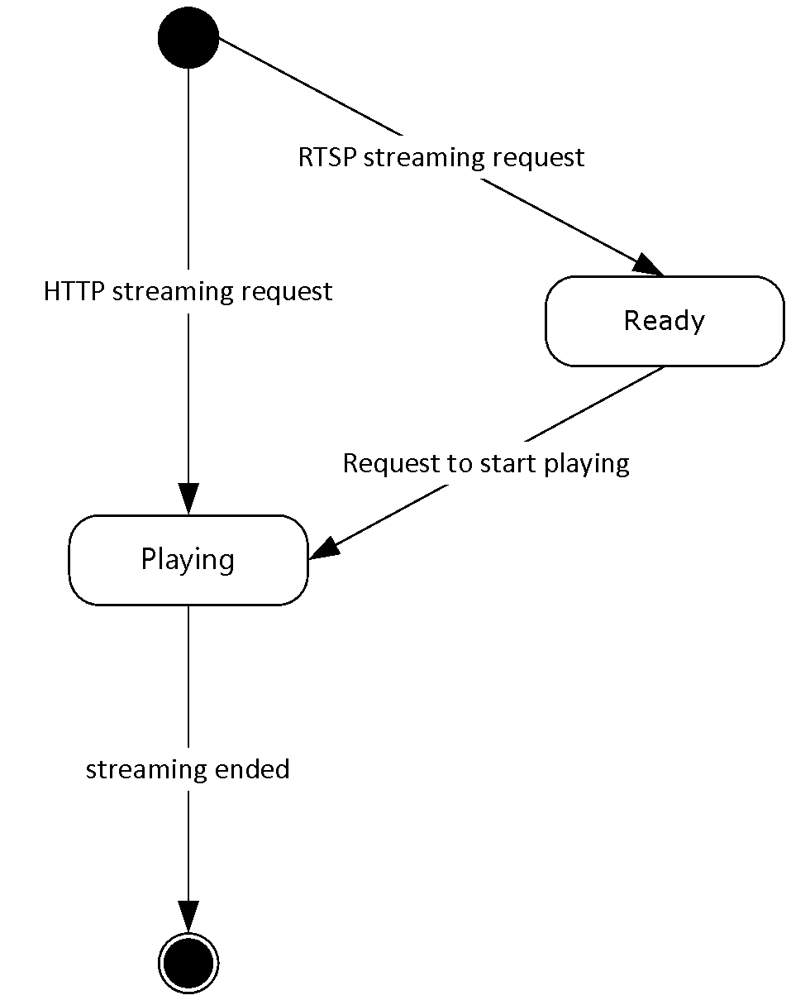
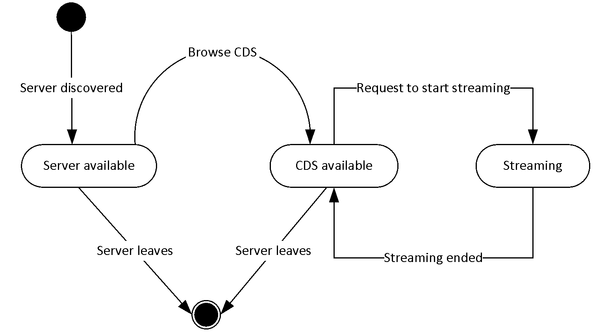
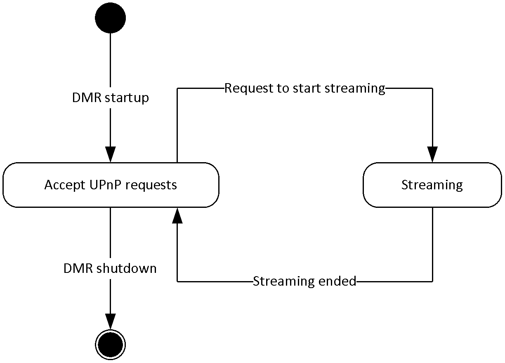
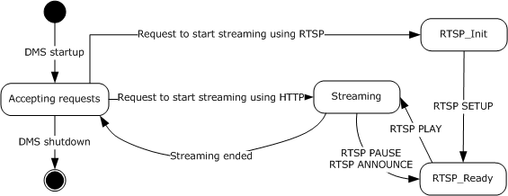
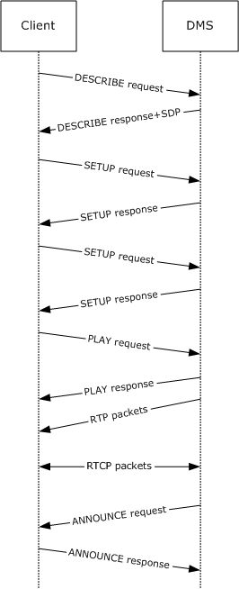

# [MS-DLNHND]: Digital Living Network Alliance (DLNA) Networked Device Interoperability Guidelines: Microsoft Extensions

Table of Contents

1 Introduction

- [1 Introduction](#Section_1)
  - [1.1 Glossary](#Section_1.1)
  - [1.2 References](#Section_1.2)
    - [1.2.1 Normative References](#Section_1.2.1)
    - [1.2.2 Informative References](#Section_1.2.2)
  - [1.3 Overview](#Section_1.3)
  - [1.4 Relationship to Other Protocols](#Section_1.4)
  - [1.5 Prerequisites/Preconditions](#Section_1.5)
  - [1.6 Applicability Statement](#Section_1.6)
  - [1.7 Versioning and Capability Negotiation](#Section_1.7)
  - [1.8 Vendor-Extensible Fields](#Section_1.8)
  - [1.9 Standards Assignments](#Section_1.9)

2 Messages

- [2 Messages](#Section_2)
  - [2.1 Transport](#Section_2.1)
  - [2.2 Message Syntax](#Section_2.2)
    - [2.2.1 Extensions to RTP](#Section_2.2.1)
      - [2.2.1.1 ASF Payload Extension System Extension](#Section_2.2.1.1)
    - [2.2.2 Extensions to SDP](#Section_2.2.2)
      - [2.2.2.1 Bandwidth Modifiers for the b= Field](#Section_2.2.2.1)
        - [2.2.2.1.1 X-AV Bandwidth Modifier](#Section_2.2.2.1.1)
      - [2.2.2.2 Attributes for the a= Field](#Section_2.2.2.2)
        - [2.2.2.2.1 Leaky Bucket Parameters Attribute (a=bucketinfo)](#Section_2.2.2.2.1)
        - [2.2.2.2.2 Buffer Size Attribute (a=bufsize)](#Section_2.2.2.2.2)
        - [2.2.2.2.3 Marker Attribute (a=marker)](#Section_2.2.2.2.3)
        - [2.2.2.2.4 Media Stream Identification Attribute (a=mid)](#Section_2.2.2.2.4)
        - [2.2.2.2.5 Program Parameters URL Attribute (a=pgmpu)](#Section_2.2.2.2.5)
        - [2.2.2.2.6 Type Attribute (a=type)](#Section_2.2.2.2.6)
      - [2.2.2.3 Generic RTP Payload Format](#Section_2.2.2.3)
        - [2.2.2.3.1 VIDEOINFOHEADER](#Section_2.2.2.3.1)
        - [2.2.2.3.2 VIDEOINFOHEADER2](#Section_2.2.2.3.2)
        - [2.2.2.3.3 RECT](#Section_2.2.2.3.3)
      - [2.2.2.4 ASF Payload Extension Systems](#Section_2.2.2.4)
    - [2.2.3 Extensions to RTSP](#Section_2.2.3)
      - [2.2.3.1 Cache-Control](#Section_2.2.3.1)
      - [2.2.3.2 Content-Type](#Section_2.2.3.2)
      - [2.2.3.3 Supported](#Section_2.2.3.3)
        - [2.2.3.3.1 Supported Sent by a Client](#Section_2.2.3.3.1)
        - [2.2.3.3.2 Supported Sent by a Server](#Section_2.2.3.3.2)
      - [2.2.3.4 Transport](#Section_2.2.3.4)
      - [2.2.3.5 User-Agent](#Section_2.2.3.5)
      - [2.2.3.6 X-Accept-Authentication](#Section_2.2.3.6)
      - [2.2.3.7 X-Playlist-Gen-Id](#Section_2.2.3.7)
      - [2.2.3.8 X-Playlist-Seek-Id](#Section_2.2.3.8)
    - [2.2.4 Extensions to HTTP](#Section_2.2.4)
      - [2.2.4.1 User-Agent](#Section_2.2.4.1)
      - [2.2.4.2 X-AvailableSeekRange](#Section_2.2.4.2)
    - [2.2.5 magic packet](#Section_2.2.5)

3 Protocol Details

- [3 Protocol Details](#Section_3)
  - [3.1 Client Details](#Section_3.1)
    - [3.1.1 Abstract Data Model](#Section_3.1.1)
    - [3.1.2 Timers](#Section_3.1.2)
    - [3.1.3 Initialization](#Section_3.1.3)
    - [3.1.4 Higher-Layer Triggered Events](#Section_3.1.4)
      - [3.1.4.1 Request to start streaming using HTTP](#Section_3.1.4.1)
      - [3.1.4.2 Request to start streaming using RTSP](#Section_3.1.4.2)
      - [3.1.4.3 Request to perform DLNA Media Operation using RTSP](#Section_3.1.4.3)
        - [3.1.4.3.1 Common rules for sending RTSP requests](#Section_3.1.4.3.1)
    - [3.1.5 Processing Events and Sequencing Rules](#Section_3.1.5)
      - [3.1.5.1 Receiving an HTTP GET response](#Section_3.1.5.1)
      - [3.1.5.2 Receiving an RTSP DESCRIBE response](#Section_3.1.5.2)
      - [3.1.5.3 Receiving a RTSP response](#Section_3.1.5.3)
      - [3.1.5.4 Receiving an RTP packet](#Section_3.1.5.4)
      - [3.1.5.5 Receiving a RTSP ANNOUNCE request](#Section_3.1.5.5)
    - [3.1.6 Timer Events](#Section_3.1.6)
    - [3.1.7 Other Local Events](#Section_3.1.7)
  - [3.2 Digital Media Player Details](#Section_3.2)
    - [3.2.1 Abstract Data Model](#Section_3.2.1)
    - [3.2.2 Timers](#Section_3.2.2)
    - [3.2.3 Initialization](#Section_3.2.3)
    - [3.2.4 Higher-Layer Triggered Events](#Section_3.2.4)
      - [3.2.4.1 Request to Browse the ContentDirectory Service](#Section_3.2.4.1)
      - [3.2.4.2 Request to Start Streaming](#Section_3.2.4.2)
    - [3.2.5 Processing Events and Sequencing Rules](#Section_3.2.5)
      - [3.2.5.1 Response to the Search or Browse UPnP action is received](#Section_3.2.5.1)
    - [3.2.6 Timer Events](#Section_3.2.6)
    - [3.2.7 Other Local Events](#Section_3.2.7)
      - [3.2.7.1 UPnP Device Discovery notification is received](#Section_3.2.7.1)
      - [3.2.7.2 Notification that streaming has ended](#Section_3.2.7.2)
      - [3.2.7.3 Notification that the Digital Media Server leaves the network](#Section_3.2.7.3)
  - [3.3 Digital Media Renderer Details](#Section_3.3)
    - [3.3.1 Abstract Data Model](#Section_3.3.1)
    - [3.3.2 Timers](#Section_3.3.2)
    - [3.3.3 Initialization](#Section_3.3.3)
    - [3.3.4 Higher-Layer Triggered Events](#Section_3.3.4)
      - [3.3.4.1 Request to initialize the DMR](#Section_3.3.4.1)
      - [3.3.4.2 Request to shut down the DMR](#Section_3.3.4.2)
    - [3.3.5 Processing Events and Sequencing Rules](#Section_3.3.5)
      - [3.3.5.1 Request to start streaming](#Section_3.3.5.1)
    - [3.3.6 Timer Events](#Section_3.3.6)
    - [3.3.7 Other Local Events](#Section_3.3.7)
      - [3.3.7.1 Notification that Streaming Ended](#Section_3.3.7.1)
  - [3.4 Digital Media Server Details](#Section_3.4)
    - [3.4.1 Abstract Data Model](#Section_3.4.1)
    - [3.4.2 Timers](#Section_3.4.2)
    - [3.4.3 Initialization](#Section_3.4.3)
    - [3.4.4 Higher-Layer Triggered Events](#Section_3.4.4)
      - [3.4.4.1 Requesting to Start the DMS](#Section_3.4.4.1)
      - [3.4.4.2 Requesting to Shut Down the DMS](#Section_3.4.4.2)
      - [3.4.4.3 Notification that a RTP or RTCP Packet is Ready to Send](#Section_3.4.4.3)
      - [3.4.4.4 Notification That the Last RTP Packet Has Been Sent](#Section_3.4.4.4)
    - [3.4.5 Processing Events and Sequencing Rules](#Section_3.4.5)
      - [3.4.5.1 Invoking a UPnP Browse or Search Action](#Section_3.4.5.1)
      - [3.4.5.2 Requesting to Start Streaming Using HTTP](#Section_3.4.5.2)
      - [3.4.5.3 Receiving a RTSP DESCRIBE Request](#Section_3.4.5.3)
        - [3.4.5.3.1 Common Rules for Responses to RTSP Requests](#Section_3.4.5.3.1)
      - [3.4.5.4 Receiving a RTSP SETUP Request](#Section_3.4.5.4)
      - [3.4.5.5 Receiving a RTSP PLAY request](#Section_3.4.5.5)
      - [3.4.5.6 Receiving an RTSP PAUSE Request](#Section_3.4.5.6)
      - [3.4.5.7 Receiving an RTSP TEARDOWN Request](#Section_3.4.5.7)
      - [3.4.5.8 Receiving an RTSP OPTIONS Request](#Section_3.4.5.8)
    - [3.4.6 Timer Events](#Section_3.4.6)
    - [3.4.7 Other Local Events](#Section_3.4.7)
      - [3.4.7.1 Receiving a UPnP Device Discovery Notification](#Section_3.4.7.1)
      - [3.4.7.2 Notifying that Streaming Has Ended](#Section_3.4.7.2)

4 Protocol Examples

- [4 Protocol Examples](#Section_4)
  - [4.1 SDP Examples](#Section_4.1)
    - [4.1.1 Generic RTP Payload Format](#Section_4.1.1)
    - [4.1.2 Variable Bit Rate Content](#Section_4.1.2)
  - [4.2 RTSP Playback](#Section_4.2)
  - [4.3 HTTP Playback](#Section_4.3)

5 Security

- [5 Security](#Section_5)
  - [5.1 Security Considerations for Implementers](#Section_5.1)
  - [5.2 Index of Security Parameters](#Section_5.2)

6 Appendix A: Product Behavior

- [6 Appendix A: Product Behavior](#Section_6)

7 Change Tracking

- [7 Change Tracking](#Section_7)

For the legal notice and IP terms, see [LEGAL.md](../LEGAL.md).
Last updated: 4/23/2024.
See [Revision History](#revision-history) for full version history.

# 1 Introduction

This document defines Microsoft Extensions to the Digital Living Network Alliance ([**DLNA**](#gt_digital-living-network-alliance-dlna)) Home Networked Device Interoperability Guidelines, as specified in [[DLNA]](https://go.microsoft.com/fwlink/?LinkId=178990). The [**DLNA Guidelines**](#gt_dlna-guidelines) define protocol extensions to protocols related to [**streaming**](#gt_streaming) of [**content**](#gt_content).

For example, a user has a cable-TV receiver and a PC connected to an IP-based network in his or her home. The PC can discover the presence of the cable-TV receiver by using the Universal Plug and Play ([**UPnP**](#gt_universal-plug-and-play-upnp)) protocols. The PC might then be able to stream content from the cable-TV receiver using the Hyper-Text Transfer Protocol (HTTP), or Real-Time Streaming Protocol (RTSP) protocols. In this scenario, the DLNA Guidelines define restrictions on the protocol parameters used by the UPnP, HTTP and RTSP protocols. Additionally, the DLNA Guidelines extend the UPnP, HTTP and RTSP protocols with new protocol parameters that do not exist in the original specification for those protocols.

Because this document only describes extensions to an existing specification (the DLNA Guidelines), the implementer is expected to already be familiar with the DLNA Guidelines when reading this document, except for section 1.

Sections 1.5, 1.8, 1.9, 2, and 3 of this specification are normative. All other sections and examples in this specification are informative.

## 1.1 Glossary

This document uses the following terms:

**Advanced Systems Format (ASF)**: An extensible file format that is designed to facilitate streaming digital media data over a network. This file format is used by Windows Media.

**content**: Multimedia data. [**content**](#gt_content) is always in [**ASF**](#gt_advanced-systems-format-asf), for example, a single [**ASF**](#gt_advanced-systems-format-asf) music file or a single [**ASF**](#gt_advanced-systems-format-asf) video file. Data in general. A file that an application accesses. Examples of content include web pages and documents stored on either web servers or SMB file servers.

**Digital Living Network Alliance (DLNA)**: A cross-industry organization of leading consumer electronics, computing industry, and mobile device companies, which are focused on delivering interoperability guidelines to allow entertainment devices in the home to operate with each other. DLNA has embraced WMM for its QoS strategy.

**Digital Media Controller (DMC)**: A Device Class defined in the [**DLNA Guidelines**](#gt_dlna-guidelines). A [**DMC**](#gt_digital-media-controller-dmc) is a [**UPnP**](#gt_universal-plug-and-play-upnp) Control Point, which means that it invokes [**UPnP**](#gt_universal-plug-and-play-upnp) actions on [**UPnP**](#gt_universal-plug-and-play-upnp) Devices. The [**DMC**](#gt_digital-media-controller-dmc) is not itself a [**UPnP**](#gt_universal-plug-and-play-upnp) Device. The [**DMC**](#gt_digital-media-controller-dmc) invokes [**UPnP**](#gt_universal-plug-and-play-upnp) actions on a [**DMR**](#gt_digital-media-renderer-dmr), requesting the [**DMR**](#gt_digital-media-renderer-dmr) to start [**streaming**](#gt_streaming) from a [**DMS**](#gt_digital-media-server-dms).

**Digital Media Player (DMP)**: A device class defined in the [**DLNA Guidelines**](#gt_dlna-guidelines). A [**DMP**](#gt_digital-media-player-dmp) is an [**UPnP**](#gt_universal-plug-and-play-upnp) control point, which means that it invokes [**UPnP**](#gt_universal-plug-and-play-upnp) actions on [**UPnP**](#gt_universal-plug-and-play-upnp) devices. The [**DMP**](#gt_digital-media-player-dmp) is not itself a [**UPnP**](#gt_universal-plug-and-play-upnp) Device.

**Digital Media Renderer (DMR)**: A Device Class defined in the [**DLNA Guidelines**](#gt_dlna-guidelines). A [**DMR**](#gt_digital-media-renderer-dmr) is [**UPnP**](#gt_universal-plug-and-play-upnp) Device that implements the [**UPnP**](#gt_universal-plug-and-play-upnp) MediaRenderer Device type.

**Digital Media Server (DMS)**: A device class defined in the [**DLNA Guidelines**](#gt_dlna-guidelines). A [**DMS**](#gt_digital-media-server-dms) is an [**UPnP**](#gt_universal-plug-and-play-upnp) device that implements the [**UPnP**](#gt_universal-plug-and-play-upnp) MediaServer device type.

**DLNA guidelines**: The DLNA Networked Device Interoperability Guidelines [[DLNA]](https://go.microsoft.com/fwlink/?LinkId=178990) consist of three volumes that provide vendors with the information required to build interoperable networked platforms and devices for the digital home, including architecture and protocols, profiles for media formats, and link protection.

**little-endian**: Multiple-byte values that are byte-ordered with the least significant byte stored in the memory location with the lowest address.

**SOAP**: A lightweight protocol for exchanging structured information in a decentralized, distributed environment. [**SOAP**](#gt_soap) uses XML technologies to define an extensible messaging framework, which provides a message construct that can be exchanged over a variety of underlying protocols. The framework has been designed to be independent of any particular programming model and other implementation-specific semantics. SOAP 1.2 supersedes SOAP 1.1. See [[SOAP1.2-1/2003]](https://go.microsoft.com/fwlink/?LinkId=90521).

**streaming**: The act of transferring [**content**](#gt_content) from a sender to a receiver.

**Universal Plug and Play (UPnP)**: A set of computer network protocols, published by the UPnP Forum [[UPnP]](https://go.microsoft.com/fwlink/?LinkId=90553), that allow devices to connect seamlessly and that simplify the implementation of networks in home (data sharing, communications, and entertainment) and corporate environments. UPnP achieves this by defining and publishing UPnP device control protocols built upon open, Internet-based communication standards.

**universally unique identifier (UUID)**: A 128-bit value. UUIDs can be used for multiple purposes, from tagging objects with an extremely short lifetime, to reliably identifying very persistent objects in cross-process communication such as client and server interfaces, manager entry-point vectors, and RPC objects. UUIDs are highly likely to be unique. UUIDs are also known as globally unique identifiers (GUIDs) and these terms are used interchangeably in the Microsoft protocol technical documents (TDs). Interchanging the usage of these terms does not imply or require a specific algorithm or mechanism to generate the UUID. Specifically, the use of this term does not imply or require that the algorithms described in [[RFC4122]](https://go.microsoft.com/fwlink/?LinkId=90460) or [[C706]](https://go.microsoft.com/fwlink/?LinkId=89824) must be used for generating the UUID.

**UTF-8**: A byte-oriented standard for encoding Unicode characters, defined in the Unicode standard. Unless specified otherwise, this term refers to the UTF-8 encoding form specified in [[UNICODE5.0.0/2007]](https://go.microsoft.com/fwlink/?LinkId=154659) section 3.9.

**MAY, SHOULD, MUST, SHOULD NOT, MUST NOT:** These terms (in all caps) are used as defined in [[RFC2119]](https://go.microsoft.com/fwlink/?LinkId=90317). All statements of optional behavior use either MAY, SHOULD, or SHOULD NOT.

## 1.2 References

Links to a document in the Microsoft Open Specifications library point to the correct section in the most recently published version of the referenced document. However, because individual documents in the library are not updated at the same time, the section numbers in the documents may not match. You can confirm the correct section numbering by checking the [Errata](https://go.microsoft.com/fwlink/?linkid=850906).

### 1.2.1 Normative References

We conduct frequent surveys of the normative references to assure their continued availability. If you have any issue with finding a normative reference, please contact [dochelp@microsoft.com](mailto:dochelp@microsoft.com). We will assist you in finding the relevant information.

[ASF] Microsoft Corporation, "Advanced Systems Format Specification", December 2004, [https://download.microsoft.com/download/7/9/0/790fecaa-f64a-4a5e-a430-0bccdab3f1b4/ASF_Specification.doc](https://go.microsoft.com/fwlink/?LinkId=89814)

[DLNA] Digital Living Network Alliance, "The DLNA Networked Device Interoperability Guidelines", [https://spirespark.com/dlna/guidelines](https://go.microsoft.com/fwlink/?LinkId=178990)

**Note** Registration is required to download the document.

[MAGICTP] Advanced Micro Devices, "Magic Packet Technology", Publication 20213, November 1995, [https://www.amd.com/system/files/TechDocs/20213.pdf](https://go.microsoft.com/fwlink/?LinkId=180570)

[MS-DTYP] Microsoft Corporation, "[Windows Data Types](../MS-DTYP/MS-DTYP.md)".

[MS-RTSP] Microsoft Corporation, "[Real-Time Streaming Protocol (RTSP) Windows Media Extensions](../MS-RTSP/MS-RTSP.md)".

[MS-UPMC] Microsoft Corporation, "[UPnP Device and Service Templates: Media Property and Compatibility Extensions](../MS-UPMC/MS-UPMC.md)".

[RFC2119] Bradner, S., "Key words for use in RFCs to Indicate Requirement Levels", BCP 14, RFC 2119, March 1997, [https://www.rfc-editor.org/info/rfc2119](https://go.microsoft.com/fwlink/?LinkId=90317)

[RFC2326] Schulzrinne, H., Rao, A., and Lanphier, R., "Real Time Streaming Protocol (RTSP)", RFC 2326, April 1998, [https://www.rfc-editor.org/info/rfc2326](https://go.microsoft.com/fwlink/?LinkId=90335)

[RFC2361] Fleischman, E., "WAVE and AVI Codec Registries", RFC 2361, June 1998, [https://www.rfc-editor.org/info/rfc2361](https://go.microsoft.com/fwlink/?LinkId=90337)

[RFC2616] Fielding, R., Gettys, J., Mogul, J., et al., "Hypertext Transfer Protocol -- HTTP/1.1", RFC 2616, June 1999, [https://www.rfc-editor.org/info/rfc2616](https://go.microsoft.com/fwlink/?LinkId=90372)

[RFC3388] Camarillo, G., Eriksson, G., Holler, J., et al., "Grouping of Media Lines in the Session Description Protocol (SDP)", RFC 3388, December 2002, [https://www.rfc-editor.org/info/rfc3388](https://go.microsoft.com/fwlink/?LinkID=180572)

[RFC3550] Schulzrinne, H., Casner, S., Frederick, R., and Jacobson, V., "RTP: A Transport Protocol for Real-Time Applications", STD 64, RFC 3550, July 2003, [https://www.rfc-editor.org/info/rfc3550](https://go.microsoft.com/fwlink/?LinkId=90433)

[RFC3556] Casner, S., "Session Description Protocol (SDP) Bandwidth Modifiers for RTP Control Protocol (RTCP) Bandwidth", RFC 3556, July 2003, [https://www.rfc-editor.org/info/rfc3556](https://go.microsoft.com/fwlink/?LinkId=90434)

[RFC3629] Yergeau, F., "UTF-8, A Transformation Format of ISO 10646", STD 63, RFC 3629, November 2003, [https://www.rfc-editor.org/info/rfc3629](https://go.microsoft.com/fwlink/?LinkId=90439)

[RFC3986] Berners-Lee, T., Fielding, R., and Masinter, L., "Uniform Resource Identifier (URI): Generic Syntax", STD 66, RFC 3986, January 2005, [https://www.rfc-editor.org/info/rfc3986](https://go.microsoft.com/fwlink/?LinkId=90453)

[RFC4122] Leach, P., Mealling, M., and Salz, R., "A Universally Unique Identifier (UUID) URN Namespace", RFC 4122, July 2005, [https://www.rfc-editor.org/info/rfc4122](https://go.microsoft.com/fwlink/?LinkId=90460)

[RFC4566] Handley, M., Jacobson, V., and Perkins, C., "SDP: Session Description Protocol", RFC 4566, July 2006, [https://www.rfc-editor.org/info/rfc4566](https://go.microsoft.com/fwlink/?LinkId=90484)

[RFC4588] Rey, J., Leon, D., and Miyazaki, A., "RTP Retransmission Payload Format", RFC 4588, July 2006, [https://www.rfc-editor.org/info/rfc4588](https://go.microsoft.com/fwlink/?LinkId=168570)

[RFC4861] Narten, T., Nordmark, E., Simpson, W., and Soliman, H., "Neighbor Discovery for IP version 6 (IPv6)", RFC 4861, September 2007, [https://www.rfc-editor.org/info/rfc4861](https://go.microsoft.com/fwlink/?LinkId=116156)

[RFC5234] Crocker, D., Ed., and Overell, P., "Augmented BNF for Syntax Specifications: ABNF", STD 68, RFC 5234, January 2008, [https://www.rfc-editor.org/info/rfc5234](https://go.microsoft.com/fwlink/?LinkId=123096)

[RFC826] Plummer, D., "An Ethernet Address Resolution Protocol - or - Converting Network Protocol Addresses to 48.bit Ethernet Address for Transmission on Ethernet Hardware", STD 37, RFC 826, November 1982, [https://www.rfc-editor.org/info/rfc826](https://go.microsoft.com/fwlink/?LinkId=90498)

[UPNPARCH1] UPnP Forum, "UPnP Device Architecture 1.0", October 2008, [http://www.upnp.org/specs/arch/UPnP-arch-DeviceArchitecture-v1.0.pdf](https://go.microsoft.com/fwlink/?LinkId=90554)

[UPnP] UPnP Forum, "Standards", [http://upnp.org/sdcps-and-certification/standards/sdcps/](https://go.microsoft.com/fwlink/?LinkId=90553)

[WMRTP] Microsoft Corporation, "RTP Payload Format for Windows Media Audio and Video", [http://download.microsoft.com/download/5/5/a/55a7b886-b742-4613-8ea8-d8b8b5c27bbc/RTPPayloadFormat_for_WMAandWMV_v1.doc](https://go.microsoft.com/fwlink/?LinkId=180571)

[XML10] World Wide Web Consortium, "Extensible Markup Language (XML) 1.0 (Third Edition)", February 2004, [http://www.w3.org/TR/2004/REC-xml-20040204/](https://go.microsoft.com/fwlink/?LinkId=90600)

### 1.2.2 Informative References

None.

## 1.3 Overview

The [**DLNA Guidelines**](#gt_dlna-guidelines) define a concept called Device Class. A Device Class is a role assumed by an implementation of the DLNA Guidelines. The Microsoft Extensions to the DLNA Guidelines specify extensions to the Digital Media Player ([**DMP**](#gt_digital-media-player-dmp)) role, the Digital Media Renderer ([**DMR**](#gt_digital-media-renderer-dmr)) role, and the Digital Media Server ([**DMS**](#gt_digital-media-server-dms)) role.

The DLNA Guidelines define additional Device Classes, such as the Digital Media Controller ([**DMC**](#gt_digital-media-controller-dmc)), but because there are no Microsoft Extensions to the DMC role, these classes are not covered in this document.

An implementation of the DMS role includes an implementation of the [**UPnP**](#gt_universal-plug-and-play-upnp) MediaServer V1.0 Device Control Protocol as defined in [[UPnP]](https://go.microsoft.com/fwlink/?LinkId=90553) with the extensions defined in the DLNA Guidelines.

The DMS uses the UPnP Device Architecture [[UPNPARCH1]](https://go.microsoft.com/fwlink/?LinkId=90554) with the extensions defined in DLNA Guidelines to discover DMR implementations.

DMP implementations use the UPnP Device Architecture [UPNPARCH1] with the extensions defined in DLNA Guidelines to discover DMS implementations.

DMP implementations also use the UPnP MediaServer V1.0 Device Control Protocol with the extensions defined in [[DLNA]](https://go.microsoft.com/fwlink/?LinkId=178990) to request a list of multimedia [**content**](#gt_content) that is available for [**streaming**](#gt_streaming) from the server. The request and response use [**SOAP**](#gt_soap).

A DMR differs from a DMP in that the DMR does not itself request a list of multimedia content from a DMS. Instead, the DMR receives the list from a DMC. The DMR implements the UPnP MediaRenderer V1.0 Device Control Protocol as defined in [UPnP] with the extensions defined in the DLNA Guidelines to receive instructions from the DMC.

The Microsoft Extensions to the DLNA Guidelines extend the HTTP protocol used in the SOAP requests received by the DMS. An HTTP header extension is defined in this document that allows the requestor to specify parameters that can alter the SOAP response. For example, the requestor can use the HTTP header extension to specify that the size of the SOAP response cannot exceed a certain number of bytes.

Once the DMP or DMR has obtained a URL to content that is available for streaming, the DMP or DMR then uses either HTTP, with extensions defined in [DLNA] or RTSP, with extensions defined in [DLNA], to initiate streaming of the multimedia content.

The Microsoft Extensions to the DLNA Guidelines extend the HTTP protocol used for streaming. An HTTP header extension is defined in this document, which allows the client to determine the available range for seeking, in time units, without having to request that the server seek through the content to a particular time.

## 1.4 Relationship to Other Protocols

The Microsoft Extensions to the [**DLNA Guidelines**](#gt_dlna-guidelines) extend the RTSP protocol [MS-RTSP](../MS-RTSP/MS-RTSP.md), the RTP protocol [[RFC3550]](https://go.microsoft.com/fwlink/?LinkId=90433), and the SDP [[RFC4566]](https://go.microsoft.com/fwlink/?LinkId=90484) syntax used by RTSP. The RTSP extensions do not affect the behavior of the protocol. The SDP extensions include support for describing metadata and for describing extended use of the RTP Payload Format for WMA and WMV [[WMRTP]](https://go.microsoft.com/fwlink/?LinkId=180571). Note that [RFC3550] describes the use of the RTP protocol jointly with a companion protocol known as RTCP. The Microsoft Extensions to the DLNA Guidelines describes the use of RTCP but it does not define extensions to this protocol.

All implementations of this protocol implement the [**UPnP**](#gt_universal-plug-and-play-upnp) Device Architecture [[UPNPARCH1]](https://go.microsoft.com/fwlink/?LinkId=90554) with the extensions defined in [[DLNA]](https://go.microsoft.com/fwlink/?LinkId=178990) section 7.2.

In addition, the [**DMS**](#gt_digital-media-server-dms) role implements the UPnP MediaServer V1.0 Device Control Protocol with the extensions defined in [DLNA] section 7.3, and the [**DMR**](#gt_digital-media-renderer-dmr) role implements the UPnP MediaRenderer V1.0 Device Control Protocol with the extensions defined in [DLNA] section 7.3.

The [**DMP**](#gt_digital-media-player-dmp), DMR and DMS roles implement HTTP with the extensions defined in [DLNA] guideline 7.4.1, and [**DLNA**](#gt_digital-living-network-alliance-dlna) recommends that they also implement RTSP with the extensions defined in [DLNA] guideline 7.4.2.

All implementations of the Microsoft Extensions to the DLNA Guidelines use IPv4 and can also use IPv6.

## 1.5 Prerequisites/Preconditions

The Microsoft Extensions to the [**DLNA Guidelines**](#gt_dlna-guidelines) are for use on home networks. When IPv4 is used, the client and the server are on the same IP subnet. When IPv6 is used, the client and server use IPv6 addresses from the Link Local address scope.

## 1.6 Applicability Statement

The Microsoft Extensions to the [**DLNA Guidelines**](#gt_dlna-guidelines) are only applicable to implementations that use the DLNA Guidelines. Implementation of the Microsoft Extensions is not required in order to interoperate with Windows, as these extensions only enhance the DLNA Guidelines without breaking interoperability.

## 1.7 Versioning and Capability Negotiation

This document covers versioning issues in the following areas:

**Supported Transport**: This protocol is implemented on top of IPv4 and can also be implemented on top of IPv6. **Streaming** uses HTTP and can also use RTSP. For more details, see section [2.1](#Section_2.1).

**Protocol Versions**: Future versions of the [**DLNA Guidelines**](#gt_dlna-guidelines) can be detected using the DLNA-CP-Version token on the HTTP User-Agent header. For more details, see section [2.2.4.1](#Section_2.2.4.1).

**Security and Authentication Methods**: Security and authentication is not supported in the Microsoft Extensions to the DLNA Guidelines.

**Localization**: The Microsoft Extensions to the DLNA Guidelines do not explicitly address localization. However, the Microsoft Extensions include extensions to SDP, and SDP uses the [**UTF-8**](#gt_utf-8) character set, as specified in [[DLNA]](https://go.microsoft.com/fwlink/?LinkId=178990) guideline 7.4.265, in order to support languages other than English.

**Capability Negotiation**: This protocol does explicit capability negotiation as specified later in this section.

A [**DMR**](#gt_digital-media-renderer-dmr) can state its capabilities in two ways: It can include a "microsoft:X_DeviceCaps" XML tag in its [**UPnP**](#gt_universal-plug-and-play-upnp) Device Description Document, and it can include capabilities on the HTTP User-Agent header, as specified in section 2.2.4.1. Section [3.4.5.1](#Section_3.4.5.1) describes how the capabilities affect the behavior of the [**DMS**](#gt_digital-media-server-dms).

A DMS can state that it is incapable of seeking in content, by using the SDP Type attribute, which is defined in section [2.2.2.2.6](#Section_2.2.2.2.6).

The DLNA Guidelines define additional mechanisms for capability negotiation. For more details, see [DLNA]. For example, [DLNA] guideline 7.4.239 specifies how a [**DMP**](#gt_digital-media-player-dmp) or DMR can state which kind of RTP retransmission scheme it supports. The concept of the "4th field of protocolInfo" is widely used throughout the DLNA Guidelines (see [DLNA] guideline 7.3.26) and is used as a mechanism to state which media formats are supported, and if features like seeking are supported. Since the Microsoft Extensions do not extend the protocolInfo token, it is not covered further in this document.

## 1.8 Vendor-Extensible Fields

Vendor-extensible fields are as defined in [[DLNA]](https://go.microsoft.com/fwlink/?LinkId=178990).

## 1.9 Standards Assignments

None.

# 2 Messages

## 2.1 Transport

The Microsoft Extensions to the [**DLNA Guidelines**](#gt_dlna-guidelines) allow the use of IPv6, in addition to the use of IPv4 which is already allowed by the DLNA Guidelines (see [[DLNA]](https://go.microsoft.com/fwlink/?LinkId=178990) guideline 7.1.27). When IPv4 is used, the client and the server IP addresses SHOULD belong to the same IP subnet. When IPv6 is used, IPv6 addresses from the Link Local address scope SHOULD be used.

The DLNA Guidelines require that all content be available for [**streaming**](#gt_streaming) using HTTP. Optionally, content can also be available for streaming using RTSP. HTTP server implementations (that is, the [**DMS**](#gt_digital-media-server-dms) role) **MUST** support version 1.1 of HTTP, as specified in [DLNA] guideline 7.4.23. HTTP client implementations (that is, the [**DMP**](#gt_digital-media-player-dmp) and [**DMR**](#gt_digital-media-renderer-dmr) roles) SHOULD use HTTP version 1.1 but MAY use HTTP version 1.0, as specified in [DLNA] guideline 7.4.42.

For details about transport protocols used by the DLNA Guidelines, see [DLNA] guidelines 7.4.1 and 7.4.2. Note that the terminology used in the DLNA Guidelines for RTSP streaming is "RTP Transport".

## 2.2 Message Syntax

### 2.2.1 Extensions to RTP

#### 2.2.1.1 ASF Payload Extension System Extension

The RTP Payload Format for WMA and WMV [[WMRTP]](https://go.microsoft.com/fwlink/?LinkId=180571) defines a field called **Extension**. This field can contain extensions to the RTP Payload Format. The Microsoft Extensions to the [**DLNA Guidelines**](#gt_dlna-guidelines) define an extension for use in the **Extension** field called the ASF Payload Extension System extension.

The ASF Payload Extension System extension allows any ASF Payload Extensions System data [[ASF]](https://go.microsoft.com/fwlink/?LinkId=89814) that can be present in an [**ASF**](#gt_advanced-systems-format-asf) file to be transmitted to the RTP receiver.

When the ASF Payload Extension System extension is used, the fields in the **Extension** field (see [WMRTP] section 3.6.3) MUST be set as follows.

The value of the **Extension Type** field MUST be set to 0x04.

The value of the **Extension Length** field MUST be set to the size of the **Extension Data** field, in bytes. The valid range for this field is 0x00 to 0xFF, inclusive.

The value of the Extension Data field MUST be set to the ASF Payload Extension System data. If the stream has multiple ASF Payload Extension Systems, then the data for each of the ASF Payload Extension Systems MUST be concatenated in the same order as the ASF Payload Extension Systems are listed in the SDP.

For details about how to list ASF Payload Extension Systems in the SDP, see section [2.2.2.4](#Section_2.2.2.4).

### 2.2.2 Extensions to SDP

#### 2.2.2.1 Bandwidth Modifiers for the b= Field

The **b=** field is specified in [[RFC4566]](https://go.microsoft.com/fwlink/?LinkId=90484) section 5.8 and is augmented with additional bandwidth modifiers in [[RFC3556]](https://go.microsoft.com/fwlink/?LinkId=90434), and in section [2.2.2.1.1](#Section_2.2.2.1.1) of this document.

##### 2.2.2.1.1 X-AV Bandwidth Modifier

The X-AV bandwidth modifier specifies the average bit rate of the stream in kilobits per second.

#### 2.2.2.2 Attributes for the a= Field

##### 2.2.2.2.1 Leaky Bucket Parameters Attribute (a=bucketinfo)

The **bucketinfo** attribute is defined for use at the SDP session level and consists of a list of leaky bucket parameter sets. Each leaky bucket parameter set specifies a streaming bit rate and a recommended minimum buffer size (to be used by a client) when streaming the content at the specified bit rate.

The syntax of the attribute is defined as follows.

bucketinfo = "a=bucketinfo:"

bucket-parameter *( SP bucket-parameter )

bucket-parameter = bitrate ";" buffer-window

bitrate = 1*10DIGIT

buffer-window = 1*10DIGIT

The *bitrate* parameter specifies the rate at which the content is streamed, in bits per second.

The valid numerical range of the *bitrate* parameter is from 0 to 4,294,967,265, inclusive.

The *buffer-window* parameter specifies the amount of data that is required to be buffered by clients if they are receiving the data at the bit rate given by the *bitrate* parameter. The value of the *buffer-window* parameter is expressed in millisecond time units. The valid numerical range of the *buffer-window* parameter is from 0 to 4,294,967,265, inclusive.

##### 2.2.2.2.2 Buffer Size Attribute (a=bufsize)

The **bufsize** attribute is defined for use at the SDP media level. It specifies the buffer window that corresponds to the bit rate specified in the **b=AS** attribute defined in section 5.8 of [[RFC4566]](https://go.microsoft.com/fwlink/?LinkId=90484) when the **b=AS** field is present at the SDP media level.

If there is no **b=AS** field at the SDP media level, then the meaning of the **bufsize** attribute is undefined.

The syntax of the attribute is defined as follows.

bufsize = "a=bufsize:AS=" buffer-window

buffer-window = 1*10DIGIT

The buffer-window parameter specifies the amount of data that is required to be buffered by clients if they are receiving the data at the bit rate given by the **b=AS** field. The value of the *buffer-window* parameter is expressed in millisecond time units. The valid numerical range of the *buffer-window* parameter is from 0 to 4,294,967,265, inclusive.

##### 2.2.2.2.3 Marker Attribute (a=marker)

The **marker** attribute is specified for use at the SDP session level. If the [**content**](#gt_content) is stored in an [**ASF**](#gt_advanced-systems-format-asf) file, the ASF file can contain a Marker Object (defined in [[ASF]](https://go.microsoft.com/fwlink/?LinkId=89814), section 3.7). The purpose of the **marker** attribute is to convey the information in the ASF Marker Object.

The syntax of the attribute is defined as follows:

marker = "a=marker:-" 1*( SP marker-entry )

marker-entry = presentation-time ";" marker-desc

presentation-time = 1*10DIGIT

marker-desc = *ALPHA ; see below for restrictions on this field

Each marker-entry syntax element corresponds to one Marker entry in the ASF Marker Object.

The presentation-time syntax element is equal to the value of the **Presentation Time** field of the ASF Marker entry, subtracted by the value of the **Preroll** field in the ASF File Properties Object (see [ASF], section 3.2). The presentation-time syntax element uses millisecond time units. The valid numerical range of the presentation-time syntax element is 0 to 4294967265, inclusive.

The marker-desc syntax element is equal to the value of the **Marker Description** field of the ASF Marker entry.

Because the **Marker Description** field in the ASF Marker entry is an array of Unicode characters, the mapping of this field to the marker-desc syntax element MUST follow these rules:

- The Unicode characters MUST be converted to [**UTF-8**](#gt_utf-8) characters, as specified in [[RFC3629]](https://go.microsoft.com/fwlink/?LinkId=90439).
- Any UTF-8 characters that cannot be used in a Uniform Resource Identifier (URI) MUST be encoded by using percent-encoding, as specified in [[RFC3986]](https://go.microsoft.com/fwlink/?LinkId=90453) section 2.1. The resulting characters are used as the value of the marker-desc syntax element.

##### 2.2.2.2.4 Media Stream Identification Attribute (a=mid)

The syntax of the **mid** (Media Stream Identification) attribute is defined in section 3 of [[RFC3388]](https://go.microsoft.com/fwlink/?LinkID=180572).

##### 2.2.2.2.5 Program Parameters URL Attribute (a=pgmpu)

The **pgmpu** (program parameters URL) attribute adheres to the syntax defined in section 2.2.5.2.3 of [MS-RTSP](../MS-RTSP/MS-RTSP.md), with the exception that the MIME type "application/x-wms-contentdesc" is the only MIME type allowed for the data URL.

For more details about the usage of "application/x-wms-contentdesc" in the **pgmpu** attribute, see section 2.2.5.2.3.2 of [MS-RTSP].

When the Microsoft Extensions to the [**DLNA Guidelines**](#gt_dlna-guidelines) are used, the **pgmpu** attribute can be used at both at the SDP session level and the SDP media level.

##### 2.2.2.2.6 Type Attribute (a=type)

The **type** attribute is defined for use at the SDP session level. The presence of the attribute indicates that the server does not support the RTSP Scale header (see [[RFC2326]](https://go.microsoft.com/fwlink/?LinkId=90335) section 12.34) for the current [**content**](#gt_content).

The syntax of the attribute is defined as follows.

type = "a=type:notstridable"

#### 2.2.2.3 Generic RTP Payload Format

If the RTP Payload Format for WMA and WMV [[WMRTP]](https://go.microsoft.com/fwlink/?LinkId=180571) is used for audio content that is not encoded using Windows Media Audio, then the RTP Payload Format MUST be identified in SDP by the MIME type "audio/x-wmf-pf".

If the RTP Payload Format for WMA and WMV [WMRTP] is used for video content that is not encoded using Windows Media Video, then the RTP Payload Format MUST be identified in SDP by the MIME type "video/x-wmf-pf".

The RTP clock frequency SHOULD be 1,000 Hz.

The **a=fmtp** field MUST be specified, and the value of the format_specific_parameters syntax element on the **a=fmtp** field (as specified in [[RFC4566]](https://go.microsoft.com/fwlink/?LinkId=90484) section 6) MUST adhere to the following syntax.

format_specific_parameters = Codec-MIME ";config=" AM_MEDIA_FORMAT

AM_MEDIA_FORMAT = MajorType "/"

FixedSizeSamples "/"

TemporalCompression" /"

SampleSize "/"

FormatType "/"

FormatData

MajorType = "73647561-0000-0010-8000-00AA00389B71" /

"73646976-0000-0010-8000-00AA00389B71"

FixedSizeSamples = "0" / "1"

TemporalCompression = "0" / "1"

SampleSize = 1*10DIGIT

FormatType = "05589f81-c356-11ce-bf01-00aa0055595a" /

"05589f80-c356-11ce-bf01-00aa0055595a" /

"F72A76A0-EB0A-11D0-ACE4-0000C0CC16BA"

FormatData = 1 * ( 2HEXDIG )

The value of the *Codec-MIME* parameter is a MIME type identifying the codec, as defined in [[RFC2361]](https://go.microsoft.com/fwlink/?LinkId=90337).

The value of the *MajorType* parameter is set to "73647561-0000-0010-8000-00AA00389B71" for audio streams and is set to "73646976-0000-0010-8000-00AA00389B71" for video streams.

The value of the *FixedSizeSamples* SHOULD be set to 1 if all samples in the stream have a fixed size. For example, for some audio formats, the bit stream can consist of fixed-size audio blocks. Each such block can be considered a sample, and in that case, the value of *FixedSizeSamples* SHOULD be 1.

If the value of *FixedSizeSamples* is 1, the value of the *SampleSize* parameter specifies the size of each sample (in bytes).

The value of *FormatType* is "05589f81-c356-11ce-bf01-00aa0055595a" for audio streams. For video streams, the value of *FormatType* MUST be either "05589f80-c356-11ce-bf01-00aa0055595a" or "F72A76A0-EB0A-11D0-ACE4-0000C0CC16BA".

The value of *FormatData* is a serialized data structure. Each byte in the data structure is written as two hexadecimal digits.

If the value of *FormatType* is "05589f81-c356-11ce-bf01-00aa0055595a" then *FormatData* is a **WAVEFORMATEX** structure, as defined in section 9.1 of [[ASF]](https://go.microsoft.com/fwlink/?LinkId=89814).

If the value of *FormatType* is "05589f80-c356-11ce-bf01-00aa0055595a" then *FormatData* is a **VIDEOINFOHEADER** structure, as defined in section [2.2.2.3.1](#Section_2.2.2.3.1).

If the value of *FormatType* is "F72A76A0-EB0A-11D0-ACE4-0000C0CC16BA" then *FormatData* is a **VIDEOINFOHEADER2** structure, as defined in section [2.2.2.3.2](#Section_2.2.2.3.2).

##### 2.2.2.3.1 VIDEOINFOHEADER

The **VIDEOINFOHEADER** structure is defined as follows.

typedef struct tagVIDEOINFOHEADER {

RECT rcSource;

RECT rcTarget;

DWORD dwBitRate;

DWORD dwBitErrorRate;

QWORD AvgTimePerFrame;

BITMAPINFOHEADER bmiHeader;

} VIDEOINFOHEADER;

The *rcSource* and *rcTarget* parameters both specify the width and height, in pixels, of the video image. The RECT structure is defined in section [2.2.2.3.3](#Section_2.2.2.3.3).

The *dwBitRate* parameter specifies the approximate bit rate of the video stream, in bits per second. A value of 0x00000000 indicates that the bit rate is unknown. The valid range of this parameter is 0x00000000 to 0xFFFFFFFF, inclusive.

The *dwBitErrorRate* MUST be set to 0x00000000.

The *AvgTimePerFrame* parameter specifies the average display time for each video frame, in 100-nanosecond units. The valid range of this parameter is 0x0000000000000001 to0x00000000FFFFFFFF, inclusive.

The *bmiHeader* parameter is a **BITMAPINFOHEADER** structure as defined in section 9.2 of [[ASF]](https://go.microsoft.com/fwlink/?LinkId=89814).

For definitions of the DWORD and QWORD data types, see [MS-DTYP](../MS-DTYP/MS-DTYP.md).

##### 2.2.2.3.2 VIDEOINFOHEADER2

The **VIDEOINFOHEADER2** structure is defined as follows:

typedef struct tagVIDEOINFOHEADER2 {

RECT rcSource;

RECT rcTarget;

DWORD dwBitRate;

DWORD dwBitErrorRate;

QWORD AvgTimePerFrame;

DWORD dwInterlaceFlags;

DWORD dwCopyProtectFlags;

DWORD dwPictAspectRatioX;

DWORD dwPictAspectRatioY;

DWORD dwReserved1;

DWORD dwReserved2;

BITMAPINFOHEADER bmiHeader;

} VIDEOINFOHEADER2;

The parameters *rcSource*, *rcTarget*, *dwBitrate*, *dwBitErrorRate*, *AvgTimePerFrame* and *bmiHeader* are defined the same way as in section [2.2.2.3.1](#Section_2.2.2.3.1).

The *dwInterlaceFlags* parameter MUST be set to 0x00000000.

The *dwCopyProtectFlags* parameter MUST be set to 0x00000000.

The *dwPictAspectRatioX* parameter MUST be set to the X dimension of picture aspect ratio. For example, 0x00000010 for a 16-inch x 9-inch display. The valid range of this parameter is 0x00000001 to 0xFFFFFFFF, inclusive.

The *dwPictAspectRatioY* parameter MUST be set to the Y dimension of picture aspect ratio. For example, 0x00000009 for a 16-inch x 9-inch display. The valid range of this parameter is 0x00000001 to 0xFFFFFFFF, inclusive.

The *dwReserved1* parameter MUST be set to 0x00000000.

The *dwReserved2* parameter MUST be set to 0x00000000.

For a definition of the DWORD data type, see [MS-DTYP](../MS-DTYP/MS-DTYP.md).

##### 2.2.2.3.3 RECT

The RECT structure is defined as follows:

typedef struct _RECT {

LONG left;

LONG top;

LONG right;

LONG bottom;

} RECT;

The values of the parameters *left* and *right* MUST be assigned such that when subtracting the value of *left* from the value of *right*, the absolute value of the result is equal to the width of the video image, in pixels.

The values of the parameters *top* and *bottom* MUST be assigned such that when subtracting the value of *top* from the value of *bottom*, the absolute value of the result is equal to the height of the video image, in pixels.

For a definition of the LONG data type, see [MS-DTYP](../MS-DTYP/MS-DTYP.md).

#### 2.2.2.4 ASF Payload Extension Systems

If the RTP Payload Format for WMA and WMV [[WMRTP]](https://go.microsoft.com/fwlink/?LinkId=180571) is used, or if the Generic RTP Payload Format defined in section [2.2.2.3](#Section_2.2.2.3) is used, then the RTP packets can include the ASF Payload Extension Systems extension defined in section [2.2.1.1](#Section_2.2.1.1). If the ASF Payload Extension Systems extension will be used, then the ASF Payload Extension Systems (see [[ASF]](https://go.microsoft.com/fwlink/?LinkId=89814), section 7.3) MUST be listed on the **a=fmtp** line.

An ASF Payload Extension Systems is listed by appending the *extsys* parameter to the **a=fmtp** line. The *extsys* parameter is defined as follows:

extsys = ";extsys=" ExtensionID

"/" ExtensionLength

[ "/" ExtensionInfo ]

ExtensionLength = ( 1*3DIGIT ) / 65535

ExtensionInfo = 1 * ( 2HEXDIG )

The value of the *ExtensionID* parameter is a [**UUID**](#gt_universally-unique-identifier-uuid), as specified in [[RFC4122]](https://go.microsoft.com/fwlink/?LinkId=90460), section 3, identifying the ASF Extension System. See [ASF] section 10.13 for a list of ASF Extension System IDs.

The value of the **ExtensionLength** field is the number of bytes used by the ASF Extension System data in the RTP packet. If the data is of variable size, this field MUST be set to 65535. If the data is of fixed size, the field MUST be set to a value between 0 and 255, inclusive.

If the value of the **ExtensionSystemInfoLength** field in the definition ASF Payload Extension System is greater than zero, then the **ExtensionInfo** field MUST be present. Otherwise, the **ExtensionInfo** field MUST be omitted. See section 4.1 in [ASF] for details about how to locate the **ExtensionSystemInfoLength** field in the [**ASF**](#gt_advanced-systems-format-asf) file.

If the **ExtensionInfo** field is present, then it MUST be set to the value of the **ExtensionSystemInfo** field from the definition of the ASF Payload Extension System. Each byte in the **ExtensionSystemInfo** field MUST be written as two hexadecimal digits in the **ExtensionInfo** field. See section 4.1 in [ASF] for details about how to locate the **ExtensionSystemInfo** field in the ASF file.

### 2.2.3 Extensions to RTSP

This section defines extensions to RTSP, in addition to the extensions defined in [[DLNA]](https://go.microsoft.com/fwlink/?LinkId=178990).

RTSP headers not defined in this section are defined in [DLNA], [[RFC2326]](https://go.microsoft.com/fwlink/?LinkId=90335) or [[RFC2616]](https://go.microsoft.com/fwlink/?LinkId=90372). In cases where an RTSP header is defined by multiple specifications, the definitions provided by [DLNA] take precedence over definitions in [RFC2326] and [RFC2616]. Definitions in [RFC2326] take precedence over definitions in [RFC2616].

This section defines the syntax of the RTSP headers by using the ABNF syntax, as specified in [[RFC5234]](https://go.microsoft.com/fwlink/?LinkId=123096). Any ABNF syntax rules that are not specified in [RFC5234] use the ABNF extensions that are specified in [RFC2326].

#### 2.2.3.1 Cache-Control

The Cache-Control header is defined for use in responses sent to a client.

The syntax of the header is as follows.

Cache-Control = "Cache-Control: "

"must-revalidate,proxy-revalidate,"

"x-wms-content-size=" content-size

content-size = 1*10DIGIT

The valid numerical range of the content-size parameter is from 0 to 4,294,967,265 inclusive.

#### 2.2.3.2 Content-Type

When the Content-Type header is included in an ANNOUNCE request that is sent to a client in accordance with [[DLNA]](https://go.microsoft.com/fwlink/?LinkId=178990) guideline 7.4.261, then the Content-Type header is defined as follows.

Content-Type = "Content-Type: application/x-wms-extension-cmd"

If the Content-Type header is used in other RTSP requests and responses, or in an ANNOUNCE request for which [DLNA] guideline 7.4.261 does not apply, then the Content-Type header follows the syntax defined in section 12.16 of [[RFC2326]](https://go.microsoft.com/fwlink/?LinkId=90335).

#### 2.2.3.3 Supported

The Supported header is defined in [[DLNA]](https://go.microsoft.com/fwlink/?LinkId=178990) guideline 7.4.223 and is extended by the Microsoft Extensions. The Microsoft Extensions define two variants of the Supported header, one for use in requests sent by a client (section [2.2.3.3.1](#Section_2.2.3.3.1)) and another for responses sent by a server (section [2.2.3.3.2](#Section_2.2.3.3.2)).

##### 2.2.3.3.1 Supported Sent by a Client

When the Supported header is sent by a client, the syntax of the header is defined as follows.

Supported = "Supported: "

"com.microsoft.wm.srvppair, com.microsoft.wm.sswitch, "

"com.microsoft.wm.eosmsg, com.microsoft.wm.predstrm, "

"com.microsoft.wm.fastcache, com.microsoft.wm.locid, "

"com.microsoft.wm.rtp.asf, "

"dlna.announce, dlna.rtx, dlna.rtx-dup, "

"com.microsoft.wm.startupprofile"

##### 2.2.3.3.2 Supported Sent by a Server

When the Supported header is sent by a server, the syntax of the header is defined as follows.

Supported = "Supported: "

"com.microsoft.wm.srvppair, com.microsoft.wm.sswitch, "

"com.microsoft.wm.eosmsg, com.microsoft.wm.predstrm, "

"com.microsoft.wm.fastcache, "

"dlna.announce, dlna.rtx, dlna.rtx-dup, "

"com.microsoft.wmdrm-nd"

#### 2.2.3.4 Transport

The Transport header is defined for use in responses sent to a client. The syntax of the Transport header is as defined in section 12.39 of [[RFC2326]](https://go.microsoft.com/fwlink/?LinkId=90335), with the extensions defined by the [**DLNA Guidelines**](#gt_dlna-guidelines) (see [[DLNA]](https://go.microsoft.com/fwlink/?LinkId=178990) guideline 7.4.241). The Microsoft Extensions define one extra parameter that can be added to the Transport header. The parameter is called *rtcp-fb-ssrc* and specifies the value of the RTP **SSRC** field (see [[RFC3550]](https://go.microsoft.com/fwlink/?LinkId=90433) section 5.1) in RTP packets that are retransmitted using the RTP Retransmission Payload Format, defined in [[RFC4588]](https://go.microsoft.com/fwlink/?LinkId=168570).

The syntax of the Transport header is defined as follows.

Transport = "Transport: "

transport-spec ; defined in [RFC2326] section 12.39

[ ";rtcp-fb-ssrc=" 8HEXDIG ]

*parameter ; defined in [RFC2326] section 12.39

#### 2.2.3.5 User-Agent

The User-Agent header identifies the software product that is sending the RTSP request.

This header is defined only for use in requests sent to a server.

The syntax of the User-Agent header is as follows.

client-guid = "guid/"

UUID ; defined in section 3 of [RFC4122]

user-agent-data = product ; defined in section 3.8 of [RFC2616]

[ SP client-guid ]

*( SP product ) ; defined in section 3.8 of [RFC2616]

User-Agent = "User-Agent: " user-agent-data

The guid-value syntax element specifies an identifier that uniquely identifies the client software installation that originated the request. The identifier SHOULD be identical for all requests belonging to the same streaming session.

#### 2.2.3.6 X-Accept-Authentication

The X-Accept-Authentication is defined for use in requests sent to a server.

The syntax of the header is as follows:

X-Accept-Authentication = "X-Accept-Authentication: Negotiate, NTLM, Digest"

#### 2.2.3.7 X-Playlist-Gen-Id

The X-Playlist-Gen-Id header is defined for use in requests sent to a server and for both requests and responses sent to a client.

The syntax of the header is as follows:

X-Playlist-Gen-Id = "X-Playlist-Gen-Id: 1"

#### 2.2.3.8 X-Playlist-Seek-Id

The X-Playlist-Seek-Id header is defined for use in requests sent to a server.

The syntax of the header is as follows:

X-Playlist-Seek-Id = "X-Playlist-Seek-Id: 1"

### 2.2.4 Extensions to HTTP

This section defines extensions to HTTP, in addition to the extensions defined in [[DLNA]](https://go.microsoft.com/fwlink/?LinkId=178990).

HTTP headers not defined in this section are defined in [DLNA], or [[RFC2616]](https://go.microsoft.com/fwlink/?LinkId=90372). In cases where an HTTP header is defined by multiple specifications, the definitions provided by [DLNA] take precedence over definitions in [RFC2616].

This section defines the syntax of the HTTP headers by using the ABNF syntax, as specified in [[RFC5234]](https://go.microsoft.com/fwlink/?LinkId=123096). Any ABNF syntax rules that are not specified in [RFC5234] use the ABNF extensions that are specified in [[RFC2326]](https://go.microsoft.com/fwlink/?LinkId=90335).

#### 2.2.4.1 User-Agent

The definition of the User-Agent header provided here is only applicable to HTTP requests sent for the purpose of invoking a [**UPnP**](#gt_universal-plug-and-play-upnp) action. For any other HTTP requests, the User-Agent header adheres to the definition in [[DLNA]](https://go.microsoft.com/fwlink/?LinkId=178990) guideline 7.2.32 and section 14.43 of [[RFC2616]](https://go.microsoft.com/fwlink/?LinkId=90372).

The syntax of the header is defined as follows.

User-Agent = "User-Agent: " user-agent-data

user-agent-data = *( SP product ) ; defined in section 3.8 of [RFC2616]

SP DLNA-CP-version ; defined in [DLNA] guideline 7.2.32

devicecaps

devicecaps = SP "(MS-DeviceCaps/" 1*10DIGIT ")"

The numerical value in the devicecaps token is a bitwise-OR combination of the compatibility flags defined in [MS-UPMC](../MS-UPMC/MS-UPMC.md) section 2.2.1.

#### 2.2.4.2 X-AvailableSeekRange

The X-AvailableSeekRange header is defined for use in responses sent to a client.

The header specifies the allowed range that the client can specify when sending an HTTP GET request with the TimeSeekRange.dlna.org HTTP header.

The syntax of the X-AvailableSeekRange header is defined as follows:

X-AvailableSeekRange = "X-AvailableSeekRange: 1 npt=" start "-" stop

start = npt-time ; defined in [DLNA] guideline 7.4.13

stop = npt-time ; defined in [DLNA] guideline 7.4.13

The start token MUST specify an npt-time value that less than or equal to the value of the stop token. The range specified by the X-AvailableSeekRange is an inclusive range. For example, if the range is specified as 0-100, it means that the client can send a GET request with the TimeSeekRange.dlna.org requesting the server to seek to 0, 100, or any value in between.

### 2.2.5 magic packet

The magic packet is a UDP packet that is encapsulated in an IPv4 or IPv6 datagram. The IP datagram is sent as a link layer broadcast packet.

If IPv4 is used, the destination IP address MUST be the IP subnet broadcast address.

If IPv6 is used, the destination IP address MUST be FF02::1.

The payload of the UDP packet MUST adhere to the AMD magic packet specification [[MAGICTP]](https://go.microsoft.com/fwlink/?LinkId=180570).

# 3 Protocol Details

This protocol references commonly used data types as defined in [MS-DTYP](../MS-DTYP/MS-DTYP.md).

## 3.1 Client Details

This section specifies details of the HTTP and RTSP client role. The section is applicable to implementations of the [**DMP**](#gt_digital-media-player-dmp) role and the [**DMR**](#gt_digital-media-renderer-dmr) role.

The Microsoft Extensions to the [**DLNA Guidelines**](#gt_dlna-guidelines) do not introduce any new states, state transitions or timers in the HTTP and RTSP protocols. Consequently, this section does not provide a complete description of the HTTP and RTSP protocols. The state diagram shown in Figure 1 is simplified to show only states and transitions that are relevant to the details of the Microsoft Extensions.

Figure 1: HTTP and RTSP state diagram (client perspective)

Note that support for RTSP is optional. Any normative statements related to RTSP, RTP, or SDP, only apply to clients that actually implement RTSP.

### 3.1.1 Abstract Data Model

This section describes a conceptual model of possible data organization that an implementation maintains to participate in this protocol. The described organization is provided to facilitate the explanation of how the protocol behaves. This document does not mandate that implementations adhere to this model as long as their external behavior is consistent with that described in this document.

**Extension-info**: This variable stores the information related to ASF Extension Systems obtained from the SDP that the client needs in order to parse RTP packets that contain the ASF Payload Extension System extension. For each stream, the variable needs to store the ID of each Extension System and the size of the Extension System data. If the data is of variable size, the variable needs to store this fact. The order in which the Extension Systems will appear in the RTP packet is also significant. The initial state of this variable is that it contains no information.

**Playlist-gen-id**: This is a boolean variable which is set to True if the RTSP DESCRIBE response contains the X-Playlist-Gen-Id header. The default value of this variable is False.

**Ssrc-list**: This variable stores mappings between RTP SSRC field values and streams referenced in RTSP SETUP commands. More than one SSRC value can map to the same stream. The initial state of this variable is that it contains no mappings.

**State**: This variable stores the client's state. Possible values are INIT, READY, and PLAYING. The initial value of this variable is INIT.

### 3.1.2 Timers

The Microsoft Extensions to the client role do not include any timers beyond any prescribed by [[DLNA]](https://go.microsoft.com/fwlink/?LinkId=178990) and [[RFC2326]](https://go.microsoft.com/fwlink/?LinkId=90335).

### 3.1.3 Initialization

Initialization occurs when a higher layer wants to start [**streaming**](#gt_streaming) [**content**](#gt_content) from a server. If the HTTP protocol will be used, this step is specified in section [3.1.4.1](#Section_3.3.5.1). If the RTSP protocol will be used, this step is specified in section [3.1.4.2](#Section_3.1.4.2).

### 3.1.4 Higher-Layer Triggered Events

#### 3.1.4.1 Request to start streaming using HTTP

This event occurs when a higher layer wants to start streaming from a server using HTTP. The event corresponds to one of the Media Operations defined by the [**DLNA Guidelines**](#gt_dlna-guidelines) (see [[DLNA]](https://go.microsoft.com/fwlink/?LinkId=178990), Table 7-17). The client MUST adhere the rules referenced by [DLNA] guideline 7.4.1 that specifies the behavior for the specified Media Operation.

For example, in case of a Play Media Operation, the client MUST adhere to [DLNA] guideline 7.4.56, and for the Seek Media Operation, the client MUST adhere to [DLNA] guideline 7.4.61. For more details about the rules for Media Operations, see the rules referenced by [DLNA] guideline 7.4.1.

If the value of the **State** variable is PLAYING, the [**streaming**](#gt_streaming) SHOULD first be interrupted, by closing the TCP connection used for the GET request. (This is done in order to avoid duplicate streaming of the same content.)

The client MUST set the value of the **State** variable to PLAYING.

The [**DLNA**](#gt_digital-living-network-alliance-dlna) Media Operations specify that the client will send an HTTP GET request to the server. The GET request SHOULD use HTTP version 1.1, but HTTP version 1.0 MAY also be used (see [DLNA] guideline 7.4.42 for details related to HTTP protocol versions.)

Processing for the HTTP GET response is specified in section [3.1.5.1](#Section_3.1.5.1).

#### 3.1.4.2 Request to start streaming using RTSP

This event occurs when a higher layer requests to start streaming from a server using RTSP.

The client MUST set the value of the **State** variable to READY.

As part of the standard operation of the RTSP protocol, the client will send a DESCRIBE request to the server. The client MUST adhere to the rules referenced by [[DLNA]](https://go.microsoft.com/fwlink/?LinkId=178990) guideline 7.4.210 that apply to DESCRIBE requests. In addition, the request SHOULD include the Supported header, as defined in section [2.2.3.3.1](#Section_2.2.3.3.1). The request SHOULD include the X-Accept-Authentication header, as defined in section [2.2.3.6](#Section_2.2.3.6).

The DESCRIBE request SHOULD include the User-Agent header defined in [[RFC2326]](https://go.microsoft.com/fwlink/?LinkId=90335) section 12.41, or MAY include the User-Agent header defined in section [2.2.3.5](#Section_2.2.3.5).<1>

Processing for the RTSP DESCRIBE response is specified in section [3.1.5.2](#Section_3.1.5.2).

#### 3.1.4.3 Request to perform DLNA Media Operation using RTSP

This event occurs when a higher layer wants to start streaming from a server using RTSP. The event can only occur when the client has already received a DESCRIBE response, as specified in section [3.1.5.2](#Section_3.1.5.2).

The event from the higher layer corresponds to one of the Media Operations defined by [[DLNA]](https://go.microsoft.com/fwlink/?LinkId=178990). The client MUST adhere the guidelines in the [**DLNA Guidelines**](#gt_dlna-guidelines) that specifies the behavior for the specified Media Operation. For more details, see [DLNA], guideline 7.4.221.

The client MUST set the value of the **State** variable to PLAYING.

The [**DLNA**](#gt_digital-living-network-alliance-dlna) Media Operation will map to one or more RTSP requests. For example, the DLNA Play Media Operation maps to a RTSP PLAY request, but before a PLAY request can be sent, one or more SETUP requests have to be sent. For more details, see [DLNA] guideline 7.4.210.

For each RTSP request that the client sends, it MUST follow the rules in section [3.1.4.3.1](#Section_3.1.4.3.1).

##### 3.1.4.3.1 Common rules for sending RTSP requests

The client MUST adhere to the rules specified in [[DLNA]](https://go.microsoft.com/fwlink/?LinkId=178990) guideline 7.4.210 that apply to the kind of RTSP request being sent.

All RTSP requests SHOULD include the X-Accept-Authentication header, as defined in section [2.2.3.6](#Section_2.2.3.6).

All RTSP requests SHOULD include the User-Agent header defined in [[RFC2326]](https://go.microsoft.com/fwlink/?LinkId=90335) section 12.41, or MAY include the User-Agent header defined in section [2.2.3.5](#Section_2.2.3.5).<2>

If the **Playlist-gen-id** variable is set to True, then SETUP and TEARDOWN requests SHOULD include the X-Playlist-Gen-Id header, as defined in section [2.2.3.7](#Section_2.2.3.7).

If the **Playlist-gen-id** variable is set to True, then PLAY requests SHOULD include the X-Playlist-Seek-Id header, as defined in section [2.2.3.8](#Section_2.2.3.8).

Processing for the RTSP response is specified in section [3.1.5.3](#Section_3.1.5.3).

### 3.1.5 Processing Events and Sequencing Rules

#### 3.1.5.1 Receiving an HTTP GET response

The client MUST process the HTTP GET response in accordance with the rules referenced by [[DLNA]](https://go.microsoft.com/fwlink/?LinkId=178990) guideline 7.4.1. For example, [DLNA] guidelines 7.4.21, 7.4.22, 7.4.46 specify HTTP processing rules that augment the HTTP standard.

The client SHOULD parse the X-AvailableSeekRange header (section [2.2.4.2](#Section_2.2.4.2)), if it is present in the response. If the X-AvailableSeekRange header is present, but is syntactically incorrect, then it MUST be ignored. The values of the "start" and "stop" tokens on the X-AvailableSeekRange header SHOULD be made available to the higher layer.

The [**content**](#gt_content) received in the GET response SHOULD be made available to the higher layer.

While the client is receiving the content, a higher layer can issue a new request to start streaming. For example, a higher layer can decide to invoke the [**DLNA**](#gt_digital-living-network-alliance-dlna) Seek Media Operation to seek to a different position in the content. Processing for this kind of request is specified in section [3.1.4.1](#Section_3.3.5.1).

If the GET response ends without a new request being issued by a higher layer, the protocol ends. The value of the **State** variable is then set to INIT.

#### 3.1.5.2 Receiving an RTSP DESCRIBE response

The client MUST process the RTSP DESCRIBE response in accordance with the rules in [[DLNA]](https://go.microsoft.com/fwlink/?LinkId=178990) guideline 7.4.210.

The SDP data contained in the DESCRIBE response MUST be parsed in accordance with the rules in section [2.2.2](#Section_2.2.2) and with the rules in [DLNA]. The client MUST support the Generic RTP Payload Format specified in section [2.2.2.3](#Section_2.2.2.3) and SHOULD support the syntax for ASF Extension Systems in SDP, specified in section [2.2.2.4](#Section_2.2.2.4).

If the client supports ASF Extension Systems, and the SDP includes ASF Extension System information, as specified in section 2.2.2.4, then this information MUST be stored in the **Extension-info** variable.

The client SHOULD make the SDP data available to a higher layer.

If the DESCRIBE response includes the X-Playlist-Gen-Id header, as defined in section [2.2.3.7](#Section_2.2.3.7), then the **Playlist-gen-id** variable MUST be set to True. Otherwise, the **Playlist-gen-id** variable MUST be set to False.

If the DESCRIBE response includes the Cache-Control header (section [2.2.3.1](#Section_2.2.3.1)), it MUST be ignored.

If the DESCRIBE response includes the Supported header (section [2.2.3.3.2](#Section_2.2.3.3.2)), it MUST be ignored.

The client MUST wait for a higher layer to request a [**DLNA**](#gt_digital-living-network-alliance-dlna) Media Operation, as specified in section [3.1.4.3](#Section_3.1.4.3).

#### 3.1.5.3 Receiving a RTSP response

The client MUST process the RTSP response in accordance with the rules in [[DLNA]](https://go.microsoft.com/fwlink/?LinkId=178990) guideline 7.4.210.

If the response is to a SETUP request, the Transport header SHOULD be parsed according to section [2.2.3.4](#Section_2.1). The value of the ssrc token on the Transport header SHOULD be added to the **Ssrc-list** variable such that a mapping is established between the ssrc value and the stream referenced in the SETUP request. If the rtcp-fb-ssrc token is present on the Transport header, then the value of that token SHOULD be added to the **Ssrc-list** variable such that a mapping is established between the rtcp-fb-ssrc value and the stream referenced in the SETUP request.

The client MUST now continue with standard RTSP and RTP protocol usage. Standard RTSP and RTP protocol usage involves processing additional RTSP responses, processing ANNOUNCE requests, processing RTP packets and RTCP packets, as specified in [DLNA] and [[RFC2326]](https://go.microsoft.com/fwlink/?LinkId=90335). The following Microsoft Extensions apply:

- For any additional RTSP response that is received, the rules in the current section MUST be followed.
- When RTP packets are received, the rules in section [3.1.5.4](#Section_3.1.5.4) MUST be followed.
- If an ANNOUNCE request is received, the rules in section [3.1.5.5](#Section_3.1.5.5) MUST be followed.
The client MUST also be prepared for a higher layer to request a [**DLNA**](#gt_digital-living-network-alliance-dlna) Media Operation, as specified in section [3.1.4.3](#Section_3.1.4.3).

#### 3.1.5.4 Receiving an RTP packet

The client MUST process the RTP packet in accordance with the rules in [[DLNA]](https://go.microsoft.com/fwlink/?LinkId=178990) guideline 7.4.85.

The **SSRC** field in the RTP packet header SHOULD be mapped to the stream that it belongs to using the mapping provided by the **Ssrc-list** variable. If the value of the **SSRC** field cannot be found in the **Ssrc-list** variable, the RTP packet SHOULD be discarded and no further processing done on the packet.

If an RTP packet contains the ASF Payload Extension System extension specified in section [2.2.1.1](#Section_2.2.1.1) and the **Extension-info** variable contains information pertaining to the same stream that the RTP packet belongs to, then the client SHOULD parse the ASF Payload Extension System extension.

The RTP packet, and any Payload Extension System data extracted from the RTP packet, SHOULD be made available to the higher layer.

The client MUST now continue with standard RTSP and RTP protocol usage. Standard RTSP and RTP protocol usage involves processing additional RTSP responses, processing ANNOUNCE requests, and processing RTP packets and RTCP packets, as specified in [DLNA] and [[RFC2326]](https://go.microsoft.com/fwlink/?LinkId=90335). The following Microsoft Extensions apply:

- For any RTSP response that is received, the rules in section [3.1.5.3](#Section_3.1.5.3) MUST be followed.
- When RTP packets are received, the rules in the current section MUST be followed.
- If an ANNOUNCE request is received, the rules in section [3.1.5.5](#Section_3.1.5.5) MUST be followed.
The client MUST also be prepared for a higher layer to request a [**DLNA**](#gt_digital-living-network-alliance-dlna) Media Operation, as specified in section [3.1.4.3](#Section_3.1.4.3).

#### 3.1.5.5 Receiving a RTSP ANNOUNCE request

The client MUST process the ANNOUNCE request in accordance with the rules in [[DLNA]](https://go.microsoft.com/fwlink/?LinkId=178990) guideline 7.4.261.

If the ANNOUNCE request includes the X-Playlist-Gen-Id header (section [2.2.3.7](#Section_2.2.3.7)), it MUST be ignored.

If the ANNOUNCE request includes the Content-Type header (section [2.2.3.2](#Section_2.2.3.2)), it MUST be ignored.

If the client is used by the [**DMP**](#gt_digital-media-player-dmp) role, then it MUST indicate that streaming has ended, as specified in section [3.2.7.2](#Section_3.2.7.2).

If the client is used by the [**DMR**](#gt_digital-media-renderer-dmr) role, then it MUST indicate that streaming has ended, as specified in section [3.3.7.1](#Section_3.3.7.1).

### 3.1.6 Timer Events

None.

### 3.1.7 Other Local Events

The Microsoft Extensions to the client role do not include any behaviors in response to local events beyond those prescribed by [[DLNA]](https://go.microsoft.com/fwlink/?LinkId=178990) and [[RFC2326]](https://go.microsoft.com/fwlink/?LinkId=90335).

## 3.2 Digital Media Player Details

The Microsoft Extensions to the [**DLNA Guidelines**](#gt_dlna-guidelines) do not introduce any new states, state transitions or timers to [**DMP**](#gt_digital-media-player-dmp) role. Consequently, this section does not provide a complete description of the DMP role. The state diagram shown in the following figure is simplified to show only states and transitions that are relevant to the details of the Microsoft Extensions.

Figure 2: Digital Media Player role

The DMP role incorporates the client role defined in section [3.1](#Section_1.3). This is shown in Figure 2 by means of the state labeled Streaming. The Streaming state corresponds to the client state machine illustrated in Figure 1.

The preceding state diagram only shows interaction with a single [**DMS**](#gt_digital-media-server-dms). Hence, the protocol ends when that DMS leaves the network. DMP implementations SHOULD support interactions with multiple DMSs. This can be accomplished by running multiple instances of the protocol state machine in parallel.

### 3.2.1 Abstract Data Model

This section describes a conceptual model of possible data organization that an implementation maintains to participate in this protocol. The described organization is provided to facilitate the explanation of how the protocol behaves. This document does not mandate that implementations adhere to this model as long as their external behavior is consistent with that described in this document.

**Microsoft-CDS**: This is a Boolean variable which is set to True if the [**DMS**](#gt_digital-media-server-dms) appears to be manufactured by Microsoft. The default value of this variable is False.

**Server-DDD-SDD**: This variable stores the [**UPnP**](#gt_universal-plug-and-play-upnp) Device Description document of the DMS. It also stores Service Description Document of each of the UPnP services exposed by DMS. The initial state of this variable is that it contains no information.

**Server-Link-Address**: This variable stores the Ethernet or IEEE 802.3 address used by the DMS. The address is 48 bits in length. The initial state of this variable is that it contains no address.

**Server-Offline**: This is a Boolean variable which is set to True when a DMS that supports Wake-on-LAN has left the network. The default value of this variable is False.

**State**: This variable stores the [**DMP**](#gt_digital-media-player-dmp)'s state. Possible values are Initialized, Server_Available, CDS_Available and Streaming. The initial value of this variable is Initialized.

**WoL-LastTime**: This variable stores the current time, as known by the DMP, when the DMP last sent a Wake on LAN magic packet. The initial value of this variable is 0.

**WoL-Supported**: This is a Boolean variable which is set to True if the DMS claims to support Wake-on-LAN using a magic packet (specified in section [2.2.5](#Section_2.2.5)) .The default value of this variable is False.

### 3.2.2 Timers

The Microsoft Extensions to the [**DMP**](#gt_digital-media-player-dmp) role do not include any timers beyond any prescribed by [[DLNA]](https://go.microsoft.com/fwlink/?LinkId=178990).

### 3.2.3 Initialization

Initialization occurs when the [**UPnP**](#gt_universal-plug-and-play-upnp) layer notifies the client that a [**DMS**](#gt_digital-media-server-dms) has been discovered, as specified in section [3.2.7.1](#Section_3.2.7.1).

### 3.2.4 Higher-Layer Triggered Events

#### 3.2.4.1 Request to Browse the ContentDirectory Service

This event occurs when a higher layer attempts to obtain a list of [**content**](#gt_content) exposed by the [**DMS**](#gt_digital-media-server-dms). It is a prerequisite for this event that the [**DMP**](#gt_digital-media-player-dmp) MUST already have discovered the DMS, as specified in section [3.2.7.1](#Section_3.2.7.1), and that the value of the **State** variable MUST be either Server_Available or CDS_Available.

If the value of the **Server-Offline** variable is True and the value of the **WoL-LastTime** variable is 0, or if the value of the **Server-Offline** variable is True and the difference between the current time and the value of the **WoL-LastTime** variable is greater than 5 seconds, then the DMP SHOULD send a magic packet, as specified by the rules in section [2.2.5](#Section_2.2.5).

When creating a magic packet, the value of the **Server-Link-Address** variable MUST be used as the IEEE address in the payload of the UDP packet. The DMP SHOULD send the magic packet using the same IP version (IPv4 or IPv6) as used in the URL of the Device Description Document, which it can obtain from the **Server-DDD-SDD** variable. The UDP packet SHOULD be sent to the same port number as used in the URL of the Device Description Document.

If the DMP is sending a magic packet, then the **WoL-LastTime** variable MUST be set to the current time, as known by the DMP.

The DMP SHOULD determine if the [**UPnP**](#gt_universal-plug-and-play-upnp) ContentDirectory service on the DMS supports the search action, by examining the Service Description Document of the ContentDirectory service stored in the **Server-DDD-SDD** variable.

If the DMS supports the search action, then the search action SHOULD be used to search the DMS for music and video content, as well as pictures. If the DMS does not support the search action, then the DMP MUST use the Browse action instead.<3>

If the value of the **Microsoft-CDS** variable is True, then the DMP SHOULD search for playlist containers by invoking the Browse action and specifying "13" as the value for the *ObjectID* parameter.

If the value of the **Microsoft-CDS** variable is False, and the DMS supports the search action, then the DMP SHOULD invoke the search action when searching for playlist containers.

If the value of the **Microsoft-CDS** variable is False, and the DMS does not support the search action, then the DMP MUST use the Browse action when searching for playlist containers.

All UPnP Browse and search action invocations performed by the DMP, SHOULD include a User-Agent header as specified in section [2.2.4.1](#Section_2.2.4.1). The numerical value in the devicecaps token in the User-Agent header SHOULD be 1024.<4>

Processing for the response to the Browse and search actions is specified in section [3.2.5.1](#Section_3.2.5.1).

#### 3.2.4.2 Request to Start Streaming

This event occurs when a higher layer wants the [**DMP**](#gt_digital-media-player-dmp) to start [**streaming**](#gt_streaming) a content item from the DMS. It is a prerequisite for this event that the value of the **State** variable MUST be CDS_Available.

The DMP MUST set the value of the **State** variable to Streaming.

The DMP MUST follow the rules for the client role specified in section [3.1](#Section_1.3). Specifically, if the higher layer is requesting streaming using HTTP, then the client role rules start in section [3.1.4.1](#Section_3.3.5.1), and if the higher layer is requesting streaming using RTSP, then the client role rules start in section [3.1.4.2](#Section_3.1.4.2).

Once streaming has ended, a notification will be received from the client role, as specified in section [3.2.7.2](#Section_3.2.7.2).

### 3.2.5 Processing Events and Sequencing Rules

#### 3.2.5.1 Response to the Search or Browse UPnP action is received

The [**DMP**](#gt_digital-media-player-dmp) MUST process the response to the UPnP Browse and search actions according to the rules in [[DLNA]](https://go.microsoft.com/fwlink/?LinkId=178990) and [[UPnP]](https://go.microsoft.com/fwlink/?LinkId=90553).

If the UPnP action succeeded, then the DMP MUST set the value of the **State** variable to CDS_Available, MUST set the value of the **Server-Offline** variable to False, and MUST set the value of the **WoL-LastTime** variable to 0.

If the UPnP action failed, for example, due to a timeout at the [**UPnP**](#gt_universal-plug-and-play-upnp) layer, then the values of the **State** variable, the **Server-Offline** variable, and the **WoL-LastTime** variable, MUST remain unchanged.

The DMP SHOULD make the contents of the response available to the higher layer. This includes the list of content items, if any, and the HTTP and RTSP URLs that can be used for [**streaming**](#gt_streaming) of each content item.

The DMP MUST be prepared to receive another request from the higher layer to browse the ContentDirectory service of the DMS for additional content items, as specified in section [3.2.4.1](#Section_3.2.4.1).

If the value of the **State** variable is CDS_Available, then the DMP MUST also be prepared to receive a request from a higher layer to start streaming a content item, as specified in section [3.2.4.2](#Section_3.2.4.2).

### 3.2.6 Timer Events

Not applicable to the [**DMP**](#gt_digital-media-player-dmp) role.

### 3.2.7 Other Local Events

#### 3.2.7.1 UPnP Device Discovery notification is received

The [**DMP**](#gt_digital-media-player-dmp) role is initialized when the [**UPnP**](#gt_universal-plug-and-play-upnp) layer reports that UPnP Device has been discovered, and the UPnP Device can be considered to be a [**DMS**](#gt_digital-media-server-dms). The DMP MUST only treat a UPnP Device as a DMS if it satisfies the requirements of [[DLNA]](https://go.microsoft.com/fwlink/?LinkId=178990) guideline 7.3.11.<5>

If the value of the manufacturer XML tag in the UPnP Device Description Document of the DMS contains the word "Microsoft", then the **Microsoft-CDS** variable MUST be set to True.<6>

The Ethernet or IEEE 802.3 address used by the server SHOULD be saved in the **Server-Link-Address** variable.

If the **Server-Link-Address** variable contains an address and the UPnP Device Description Document of the DMS contains the microsoft:magicPacketWakeSupported XML tag, as defined in [MS-UPMC](../MS-UPMC/MS-UPMC.md) section 2.3.1.1, and the value of this tag is 1, then the value of the **WoL-Supported** variable MUST be set to True.

The UPnP Device Description Document, and the UPnP Service Description Document for each UPnP service implemented by the DMS, MUST be saved in the **Server-DDD-SDD** variable.

The DMP MUST set the **State** variable to Server_Available.

The DMP SHOULD notify the higher layer that a [**DLNA**](#gt_digital-living-network-alliance-dlna) DMS has been discovered.

The DMP MUST be prepared to receive a request from a higher layer to browse the ContentDirectory service of the DMS, as specified in section [3.2.4.1](#Section_3.2.4.1).

The DMP MUST also be prepared to receive a notification indicating that the DMS has left the network, as specified in section [3.2.7.3](#Section_3.2.7.3).

#### 3.2.7.2 Notification that streaming has ended

This event occurs when the value of the **State** variable is Streaming and [**streaming**](#gt_streaming) from the [**DMS**](#gt_digital-media-server-dms) has ended.

The [**DMP**](#gt_digital-media-player-dmp) MUST set the value of the **State** variable to CDS_Available.

The DMP MUST be prepared to receive a request from a higher layer to browse the ContentDirectory service of the DMS, as specified in section [3.2.4.1](#Section_3.2.4.1).

The DMP MUST also be prepared to receive a notification indicating that the DMS has left the network, as specified in section [3.2.7.3](#Section_3.2.7.3).

#### 3.2.7.3 Notification that the Digital Media Server leaves the network

This event occurs when the [**UPnP**](#gt_universal-plug-and-play-upnp) layer indicates that the [**DMS**](#gt_digital-media-server-dms) is leaving, or has already left, the network. Such events are accepted when the value of the **State** variable is Server_Available or CDS_Available.

If the value of the **WoL-Supported** variable is True, then the [**DMP**](#gt_digital-media-player-dmp) SHOULD set the value of the **Server-Offline** variable to True.<7>

If the value of the **WoL-Supported** variable is False or if the DMP chose not to set the value of the **Server-Offline** variable to True, then the service exchange ends at this point.

## 3.3 Digital Media Renderer Details

This section specifies details of the Digital Media Renderer ([**DMR**](#gt_digital-media-renderer-dmr)) role.

The Microsoft Extensions to the [**DLNA Guidelines**](#gt_dlna-guidelines) do not introduce any new states, state transitions or timers to DMR role. Consequently, this section does not provide a complete description of the DMR role. The state diagram shown in the following figure is simplified to show only states and transitions that are relevant to the details of the Microsoft Extensions.

Figure 3: Digital Media Renderer role

The DMR role incorporates the client role defined in section [3.1](#Section_1.3). This is shown in the preceding figure by means of the state labeled Streaming. The Streaming state corresponds to the client state machine illustrated in the HTTP and RTSP state diagram (client perspective).

### 3.3.1 Abstract Data Model

An abstract data model has not been defined for the [**DMR**](#gt_digital-media-renderer-dmr) role.

### 3.3.2 Timers

The Microsoft Extensions to the [**DMR**](#gt_digital-media-renderer-dmr) role do not include any timers beyond any prescribed by [[DLNA]](https://go.microsoft.com/fwlink/?LinkId=178990).

### 3.3.3 Initialization

Initialization occurs when a higher layer requests that the [**DMR**](#gt_digital-media-renderer-dmr) be initialized, as specified in section [3.3.4.1](#Section_3.3.4.1).

### 3.3.4 Higher-Layer Triggered Events

#### 3.3.4.1 Request to initialize the DMR

This event occurs when the higher layer wants to initialize the protocol. The higher layer specifies if the [**DMR**](#gt_digital-media-renderer-dmr) will implement a DMR that supports [**streaming**](#gt_streaming) as specified in [[DLNA]](https://go.microsoft.com/fwlink/?LinkId=178990), or a discovery-only DMR. A discovery-only DMR is a [**UPnP**](#gt_universal-plug-and-play-upnp) MediaRenderer device that only implements the UPnP ConnectionManager service, and thus is unable receive a request to start streaming.<8>

If the DMR supports streaming, and the link layer Network Interface Card supports waking the DMR computer if a magic packet (as defined in section [2.2.5](#Section_2.2.5)) is received, then the DMR SHOULD add the microsoft:magicPacketWakeSupported XML tag to its UPnP Device Description Document, and set the value of that tag to 1. For more details about microsoft:magicPacketWakeSupported, see [MS-UPMC](../MS-UPMC/MS-UPMC.md) section 2.3.1.1.

If a higher layer implements a DMP together with the DMR, and the DMP supports sending a magic packet to wake a DMS as specified in section [3.2.4.1](../MS-UPMC/MS-UPMC.md), then the DMR SHOULD add the microsoft:magicPacketSendSupported XML tag to its UPnP Device Description Document, and set the value of that tag to 1. For more details about microsoft:magicPacketSendSupported, see [MS-UPMC] section 2.3.1.2. <9>

If the DMR supports the UPnP AVTransport service, the DMR MUST be prepared to receive a request to start streaming. Such a request will take the form of one or more UPnP action invocations, the details of which are specified in [DLNA]. Processing of a request is to start streaming is specified in section [3.3.5.1](#Section_3.3.5.1).

The DMR MUST also be prepared to receive action invocations for any other UPnP service that it supports, such as the UPnP ConnectionManager service. For more details, see [DLNA]. The DMR MUST also be prepared to receive a request to shut down the DMR, as specified in section [3.3.4.2](#Section_3.3.4.2).

#### 3.3.4.2 Request to shut down the DMR

The protocol ends when a higher layer requests that the [**DMR**](#gt_digital-media-renderer-dmr) be shut down. The DMR MUST be shut down in accordance with [[DLNA]](https://go.microsoft.com/fwlink/?LinkId=178990) and [[UPNPARCH1]](https://go.microsoft.com/fwlink/?LinkId=90554). For more details, see [UPNPARCH1] section 1.1.3.

### 3.3.5 Processing Events and Sequencing Rules

#### 3.3.5.1 Request to start streaming

In order for a Digital Media Controller ([**DMC**](#gt_digital-media-controller-dmc)) to request the [**DMR**](#gt_digital-media-renderer-dmr) to start [**streaming**](#gt_streaming), it needs to invoke one or more UPnP actions on the UPnP services implemented by the DMR. At a minimum, the DMC will invoke the SetAVTransportURI and Play actions of the AVTransportService. For more details about rules for these actions, see the AVTransport:1 specification in [[UPnP]](https://go.microsoft.com/fwlink/?LinkId=90553).

The DMR SHOULD make the values of the CurrentURI and CurrentURIMetaData arguments of the AVTransportService:SetAVTransportURI action available to the higher layer, so that the higher layer can choose the URL that will be used for streaming. If the higher layer does not make a choice, the value of the CurrentURI argument MUST be used as the URL for streaming.

The DMR MUST follow the rules for the client role specified in section [3.1](#Section_1.3). Specifically, if the URL chosen for streaming is an HTTP URL, then the client role rules start in section [3.1.4.1](#Section_3.3.5.1), and if the URL chosen for streaming is a RTSP URL, then the client role rules start in section [3.1.4.2](#Section_3.1.4.2).

Once streaming has ended a notification will be received from the client role, as specified in section [3.3.7.1](#Section_3.3.7.1).

### 3.3.6 Timer Events

None.

### 3.3.7 Other Local Events

#### 3.3.7.1 Notification that Streaming Ended

This event occurs when the client role notifies that the [**DMR**](#gt_digital-media-renderer-dmr) that [**streaming**](#gt_streaming) from the [**DMS**](#gt_digital-media-server-dms) has ended.

The DMR MUST be prepared to receive a new request from the DMC to start streaming, as specified in section [3.3.5.1](#Section_3.3.5.1).

The DMR MUST also be prepared to receive a request from the higher layer to shut down the DMR, as specified in section [3.3.4.2](#Section_3.3.4.2).

## 3.4 Digital Media Server Details

This section specifies details of the Digital Media Server ([**DMS**](#gt_digital-media-server-dms)) role.

The Microsoft Extensions to the [**DLNA Guidelines**](#gt_dlna-guidelines) do not introduce any new states, state transitions or timers to DMS role. Consequently, this section does not provide a complete description of the DMS role. The state diagram shown in the following figure is simplified to show only states and transitions that are relevant to the details of the Microsoft Extensions.

Figure 4: Digital Media Server role

For simplicity, the figure above only shows interaction with a single [**UPnP**](#gt_universal-plug-and-play-upnp) Control Point and a single client. DMS applications SHOULD support streaming to multiple clients and processing UPnP actions from multiple control points concurrently.

Note that support for RTSP is optional. Any normative statements related to RTSP, RTP, or SDP, only apply to a DMS that actually implements RTSP.

### 3.4.1 Abstract Data Model

This section describes a conceptual model of possible data organization that an implementation maintains to participate in this protocol. The described organization is provided to facilitate the explanation of how the protocol behaves. This document does not mandate that implementations adhere to this model as long as their external behavior is consistent with that described in this document.

**CompatFlags**: A bitwise-OR combination of the compatibility flags specified in [MS-UPMC](../MS-UPMC/MS-UPMC.md) section 2.2.1. Each flag is represented as one bit in this variable. The initial value of the variable is 0.

**DeviceShims**: This variable stores mappings between the link layer address used by a [**DMR**](#gt_digital-media-renderer-dmr) and the [**UPnP**](#gt_universal-plug-and-play-upnp) Device Description Document provided by the DMR. There can only be one mapping per link layer address. The initial state of this variable is that it contains no mappings.

**Extension-info**: This variable stores information related to ASF Extension Systems that the [**DMS**](#gt_digital-media-server-dms) specified in the SDP. For each stream, the variable specifies whether or not the RTP packets will contain the ASF Payload Extension System extension. The variable also specifies the order in which each Extension System appears in the RTP packets. The initial state of this variable is that it contains no information.

**State**: This variable stores the DMS's state. Possible values are Uninitialized, Ready, RTSP_Init, RTSP_Ready, and Streaming. The initial value of this variable is Uninitialized.

### 3.4.2 Timers

The Microsoft Extensions to the [**DMS**](#gt_digital-media-server-dms) role do not include any timers beyond any prescribed by [[DLNA]](https://go.microsoft.com/fwlink/?LinkId=178990) and [[RFC2326]](https://go.microsoft.com/fwlink/?LinkId=90335).

### 3.4.3 Initialization

Initialization of the protocol occurs when a higher layer requests that the [**DMS**](#gt_digital-media-server-dms) be started, as specified in section [3.4.4.1](#Section_3.4.4.1).

### 3.4.4 Higher-Layer Triggered Events

#### 3.4.4.1 Requesting to Start the DMS

This event occurs when the higher layer initializes the protocol.

The [**DMS**](#gt_digital-media-server-dms) MUST set the value of the **State** variable to Ready.

The [**UPnP**](#gt_universal-plug-and-play-upnp) Device Description Document MUST follow the syntax defined in [[DLNA]](https://go.microsoft.com/fwlink/?LinkId=178990).<10> (See for example [DLNA] guideline 7.2.10.)

If the link layer Network Interface Card supports waking the DMS computer if a magic packet (as defined in section [2.2.5](#Section_2.2.5)) is received, then the DMS SHOULD add the microsoft:magicPacketWakeSupported XML tag to its UPnP Device Description Document, and set the value of that tag to 1. (For more details about microsoft:magicPacketWakeSupported see [MS-UPMC](../MS-UPMC/MS-UPMC.md) section 2.3.1.1.)

The DMS SHOULD support the X_MS_MediaReceiverRegistrar UPnP service, as defined in [DLNA] volume 3, guideline 9.1.4.3.

The DMS MUST support [**streaming**](#gt_streaming) via HTTP and SHOULD support streaming via RTSP.

The DMS SHOULD ask the UPnP protocol layer to search the network for UPnP MediaRenderer devices. When such a UPnP Device is found, the DMS will be notified by an event, as specified in section [3.4.7.1](#Section_3.2.7.1).

The DMS MUST be prepared to receive a request to start streaming. Such a request will take the form of an HTTP request or an RTSP request (only if the DMS supports RTSP streaming). Processing a request requires the DMS to start streaming , using either HTTP (specified in section [3.4.5.2](#Section_3.3.5.1)), or RTSP (specified in section [3.4.5.3](#Section_3.4.5.3)).

The DMS MUST always be prepared to receive a request to browse the list of [**content**](#gt_content) exposed by the UPnP ContentDirectory service. Such a request takes the form of one or more UPnP browse or search action invocations. Processing these UPnP actions is specified in section [3.4.5.1](#Section_3.4.5.1).

The DMS MUST also always be prepared to receive action invocations for any other UPnP service that it supports, such as the UPnP ConnectionManager service. (For more details, see [DLNA] guideline 7.3.11.1.). The DMS MUST also be prepared to receive a request to shut down the DMS, as specified in section [3.4.4.2](#Section_3.4.4.2).

#### 3.4.4.2 Requesting to Shut Down the DMS

The protocol ends streaming when a higher layer requests that the [**DMS**](#gt_digital-media-server-dms) be shut down. The DMS MUST be shut down in accordance with [[UPNPARCH1]](https://go.microsoft.com/fwlink/?LinkId=90554). For more details, see [UPNPARCH1] section 1.1.3.

#### 3.4.4.3 Notification that a RTP or RTCP Packet is Ready to Send

This event can occur when the value of the **State** variable is Streaming.

The [**DMS**](#gt_digital-media-server-dms) MUST send the RTP or RTCP packet according to the rules in [[DLNA]](https://go.microsoft.com/fwlink/?LinkId=178990) guideline 7.4.85.

The following additional rules apply for RTP packets:

- If the **Extension-info** variable specifies one or more ASF Payload Extension Systems for the stream that the RTP packet belongs to, then the RTP packet MUST include the ASF Payload Extension System extension defined in section [2.2.1.1](#Section_2.2.1.1).
- The Extension Data field in the RTP packet MUST include the ASF Payload Extension System data for each ASF Payload Extension System in the same order as the ASF Payload Extension Systems are listed in the **Extension-info** variable.

#### 3.4.4.4 Notification That the Last RTP Packet Has Been Sent

This notification indicates that the higher layer does not have any more RTP packets to send to the client.

If the value of the **State** variable is Streaming, then the [**DMS**](#gt_digital-media-server-dms) MUST send an ANNOUNCE request to the client, according to the rules in [[DLNA]](https://go.microsoft.com/fwlink/?LinkId=178990) guideline 7.4.261.

The ANNOUNCE request SHOULD include the Content-Type header, as specified in section [2.2.3.2](#Section_2.2.3.2).

The ANNOUNCE request SHOULD include the X-Playlist-Gen-Id header, as specified in section [2.2.3.7](#Section_2.2.3.7).

The DMS MUST process the ANNOUNCE response according to the general rules for RTSP defined in [DLNA] guideline 7.4.210.

If the value of the **State** variable is Streaming, then the DMS MUST set the value of the **State** variable to RTSP_Ready, and the DMS MUST be prepared to receive any of the following requests:

- PLAY: specified in section [3.4.5.5](#Section_3.4.5.5)
- SETUP: specified in section [3.4.5.4](#Section_3.4.5.4)
- TEARDOWN: specified in section [3.4.5.7](#Section_3.4.5.7)
- OPTIONS: specified in section [3.4.5.8](#Section_3.4.5.8)

### 3.4.5 Processing Events and Sequencing Rules

#### 3.4.5.1 Invoking a UPnP Browse or Search Action

This event occurs when a [**UPnP**](#gt_universal-plug-and-play-upnp) Control Point invokes the browse or search action on the UPnP ContentDirectory service. This event can be received in any state except when the value of the **State** variable is uninitialized. The receipt of this event does not alter the state of the [**DMS**](#gt_digital-media-server-dms).

The DMS MUST process Browse and Search UPnP actions according to the MediaServer Requirements table in [[DLNA]](https://go.microsoft.com/fwlink/?LinkId=178990) (the table that starts with guideline 7.3.55 and ends with guideline 7.3.80).

The DMS MUST set the WMC_COMPAT_EXCLUDE_DLNA_1_5 bit (defined in [MS-UPMC](../MS-UPMC/MS-UPMC.md) section 2.2.1.4) in the **CompatFlags** variable to 1 and all other bits in the **CompatFlags** variable MUST be set to 0.

The DMS SHOULD determine the link layer address used by the Control Point using the standardized protocols known as Address Resolution Protocol (ARP) for IPv4 ([[RFC826]](https://go.microsoft.com/fwlink/?LinkId=90498)) or the Neighbor Discovery Protocol (NDP) for IPv6 ([[RFC4861]](https://go.microsoft.com/fwlink/?LinkId=116156)).

If the DMS can determine the link layer address used by the Control Point, then the DMS SHOULD use the link layer address to look up the corresponding UPnP Device Description Document from the **DeviceShims** variable.

If a UPnP Device Description Document was found in the **DeviceShims** variable, and the value of the manufacturer XML tag is "Microsoft" or "Microsoft Corporation", and the value of the modelName XML tag is "Windows Media Player", then the DMS SHOULD set the WMC_COMPAT_EXCLUDE_DLNA_1_5 and WMC_COMPAT_INCLUDE_RTSP_FOR_VIDEO bits (defined in [MS-UPMC] section 2.2.1.7) in the **CompatFlags** variable to 1.<11>

If a UPnP Device Description Document was found in the **DeviceShims** variable, and the value of the manufacturer XML tag is "Microsoft" and the value of modelName XML tag is "Windows Media Player", then the DMS MAY set the WMC_COMPAT_EXCLUDE_DLNA_1_5 bit in the **CompatFlags** variable to 0.<12>

If a UPnP Device Description Document was not found in the **DeviceShims** variable, then the DMS MUST set the WMC_COMPAT_INCLUDE_RTSP_FOR_VIDEO bit in the **CompatFlags** variable to 1.

If the HTTP POST request sent by the Control Point contains a User-Agent header, then the DMS MUST parse the User-Agent header according to the syntax specified in section [2.2.4.1](#Section_2.2.4.1).

If the User-Agent header contains the DLNA-CP-version token and the value of the dlna-version token (defined in [DLNA] guideline 7.2.10.2) is equal to "1.00", then the DMS MUST set the WMC_COMPAT_EXCLUDE_RTSP bit (defined in [MS-UPMC] section 2.2.1.2) in the **CompatFlags** variable to 1.

If the User-Agent header contains the DLNA-CP-version token and the value of the dlna-version token is equal to "1.50", then the DMS MUST set the WMC_COMPAT_EXCLUDE_DLNA_1_5 bit in the **CompatFlags** variable to 0.

If the User-Agent header contains the DLNA-CP-version token and the first character of the dlna-version token is a digit between 2 and 9, inclusive, then the DMS MUST set the WMC_COMPAT_EXCLUDE_DLNA_1_5 bit in the **CompatFlags** variable to 0.

If the User-Agent header contains the devicecaps token, then the DMS SHOULD set the value of the **CompatFlags** variable to the numerical value in the devicecaps token. Alternatively, the DMS MAY ignore the devicecaps token.<13>

If the HTTP POST request sent by the Control Point does not contain a User-Agent header, or if the User-Agent header does not contain the devicecaps token, or if the DMS ignored the devicecaps token, then if a UPnP Device Description Document was found in the **DeviceShims** variable, and the UPnP Device Description Document contains the microsoft:X_DeviceCaps XML tag, then the DMS MUST set the value of the **CompatFlags** variable to the numerical value of the microsoft:X_DeviceCaps XML tag.

For more details about the microsoft:X_DeviceCaps XML tag, see [MS-UPMC] section 2.2.

If the WMC_COMPAT_EXCLUDE_DLNA bit (defined in [MS-UPMC] section 2.2.1.3) in the **CompatFlags** variable is 1, then the DMS MUST set the WMC_COMPAT_EXCLUDE_DLNA_1_5 bit in the **CompatFlags** variable to 1.

If the WMC_COMPAT_EXCLUDE_DLNA_1_5 bit in the **CompatFlags** variable is 1, then the DMS MUST set the WMC_COMPAT_EXCLUDE_RTSP bit and the WMC_COMPAT_DO_NOT_LIMIT_RESPONSE_SIZE bit (defined in [MS-UPMC] section 2.2.1.10) in the **CompatFlags** variable to 1.

If the WMC_COMPAT_EXCLUDE_HTTP bit (defined in [MS-UPMC] section 2.2.1.1) in the **CompatFlags** variable is 1 and the WMC_COMPAT_EXCLUDE_RTSP bit is 1, then the DMS MUST set the WMC_COMPAT_EXCLUDE_HTTP bit in the **CompatFlags** variable to 0.

If the WMC_COMPAT_EXCLUDE_RES_FILTERING bit (defined in [MS-UPMC] section 2.2.1.15) in the **CompatFlags** variable is 1, then the DMS MUST set the following bits in the **CompatFlags** variable to 0: WMC_COMPAT_EXCLUDE_WMALOSSLESS_NONTRANSCODED (defined in [MS-UPMC] section 2.2.1.8), WMC_COMPAT_EXCLUDE_VIDEO_TRANSCODING (defined in [MS-UPMC] section 2.2.1.11), WMC_COMPAT_EXCLUDE_NONPCM_AUDIO_TRANSCODING (defined in [MS-UPMC] section 2.2.1.13), WMC_COMPAT_EXCLUDE_TRANSCODING_TO_MPEG2 (defined in [MS-UPMC] section 2.2.1.14).

If the value of the ObjectID parameter in a Browse action is 13, then the DMS SHOULD treat this is as Browse action for a ContentDirectory service container that contains all playlist containers.

If the value of the WMC_COMPAT_PLAYLIST_FAKECHILDCOUNT bit (defined in [MS-UPMC] section 2.2.1.12), in the **CompatFlags** variable is 1, then the value of the childCount XML attribute on any playlist container objects returned in the response to the browse or search action, SHOULD be set to "1".

If the value of the WMC_COMPAT_EXCLUDE_HTTP bit in the **CompatFlags** variable is 1, then the response to the browse or search action SHOULD NOT contain HTTP URLs for any content items.

If the value of the WMC_COMPAT_EXCLUDE_RTSP bit in the **CompatFlags** variable is 0, then the response to the browse or search action SHOULD contain RTSP URLs for any content that is encapsulated in [**ASF**](#gt_advanced-systems-format-asf), exposed in the MP3 [**DLNA**](#gt_digital-living-network-alliance-dlna) Media Format, or exposed in the LPCM DLNA Media Format.

If the value of the WMC_COMPAT_INCLUDE_RTSP_FOR_VIDEO bit in the **CompatFlags** variable is 1, then the response to the browse or search action SHOULD contain RTSP URLs for any video content that is encapsulated in ASF.

If the value of the WMC_COMPAT_EXCLUDE_DLNA bit in the **CompatFlags** variable is 1, then in the response to the browse or search action the 4th_field token of the **protocolInfo** attribute of every res XML tag SHOULD be set to "*". The 4th_field token is defined in [DLNA] guideline 7.3.30.

If the value of the WMC_COMPAT_EXCLUDE_DLNA_1_5 bit in the **CompatFlags** variable is 1, then the 4th_field token of the **protocolInfo** attribute of every res XML tag SHOULD NOT contain the pn-param token if the pn-value in the pn-param token begins with "WMDRM_". The pn-param and pn-value tokens are defined in [DLNA] guideline 7.3.31.

If the value of the WMC_COMPAT_EXCLUDE_DLNA_1_5 bit in the **CompatFlags** variable is 1, and if the 4th_field token of the **protocolInfo** attribute of a res XML tag will contain the pn-param token, and the value of pn-value is "MP3X", then the value of pn-value SHOULD be set to "MP3".

If the value of the WMC_COMPAT_EXCLUDE_DLNA_1_5 bit in the **CompatFlags** variable is 1, and if the 4th_field token of the **protocolInfo** attribute of a res XML tag contains the pn-param token, and the value of pn-value is "WMVSPLL_BASE" or "WMVSPML_BASE", then the value of pn-value SHOULD be set to "WMVMED_BASE".

If the value of the WMC_COMPAT_EXCLUDE_DLNA_1_5 bit in the **CompatFlags** variable is 1, then in any desc XML tag included in the response, nested XML tags SHOULD be escaped using the XML escaping mechanism defined in [[XML10]](https://go.microsoft.com/fwlink/?LinkId=90600) section 2.4.

If the value of the WMC_COMPAT_EXCLUDE_DLNA_1_5 bit in the **CompatFlags** variable is 1, then in any desc XML tag included in the response, nested XML tags SHOULD NOT be escaped using the XML escaping mechanism defined in [XML10] section 2.4.<14>

If the value of the WMC_COMPAT_EXCLUDE_PCMPARAMS bit (defined in [MS-UPMC] section 2.2.1.5) in the **CompatFlags** variable is 1, and the MIME type res XML tag begins with "audio/L16" or "audio/L8", then the MIME type SHOULD NOT include any additional parameters, such as *channel* or *rate*.

If the value of the WMC_COMPAT_EXCLUDE_WMDRMND bit (defined in [MS-UPMC] section 2.2.1.6) in the **CompatFlags** variable is 1, then the response to the Browse or Search action SHOULD NOT include any res XML tags that require the use of WMDRM-ND to stream the [**content**](#gt_content). For more details about WMDRM-ND, see [DLNA], volume 3, section 9.

If the value of the WMC_COMPAT_EXCLUDE_WMALOSSLESS_NONTRANSCODED bit in the **CompatFlags** variable is 1, then the response to the Browse or Search action SHOULD NOT include any res XML tags for which the media format of the content is WMA Lossless. For more details about WMA Lossless, see [DLNA], volume 2, section 8.13.

If the value of the WMC_COMPAT_EXCLUDE_VIDEO_TRANSCODING bit in the **CompatFlags** variable is 1, then the response to the Browse or Search action SHOULD NOT include any res XML tags where video content is transcoded from its original media format.

If the value of the WMC_COMPAT_EXCLUDE_NONPCM_AUDIO_TRANSCODING bit in the **CompatFlags** variable is 1, then the response to the Browse or Search action SHOULD NOT include any res XML tags where audio content is transcoded from its original media format, except if the audio content is transcoded into LPCM. LPCM is defined in [DLNA], volume 2, section 8.4.

If the value of the WMC_COMPAT_EXCLUDE_TRANSCODING_TO_MPEG2 bit in the **CompatFlags** variable is 1, then the response to the Browse or Search action SHOULD NOT include any res XML tags where video content is transcoded into MPEG-2. For more details about MPEG-2, see [DLNA], volume 2, section 9.2.

If the value of the WMC_COMPAT_DO_NOT_LIMIT_RESPONSE_SIZE bit in the **CompatFlags** variable is 0, then the size of the SOAP response to the Browse or Search action SHOULD NOT exceed 204,800 bytes.<15>

#### 3.4.5.2 Requesting to Start Streaming Using HTTP

The [**DMS**](#gt_digital-media-server-dms) MUST process requests to stream [**content**](#gt_content) using HTTP according to the rules specified in [[DLNA]](https://go.microsoft.com/fwlink/?LinkId=178990) guideline 7.4.1.

If the HTTP response status code is 200 and the DMS supports the [**DLNA**](#gt_digital-living-network-alliance-dlna) Seek Media Operation using the TimeSeekRange.dlna.org HTTP header for the content that the client is requesting, then the DMS SHOULD include the X-AvailableSeekRange header in the response, as specified in section [2.2.4.2](#Section_2.2.4.2). The start and stop tokens on the X-AvailableSeekRange header MUST specify the smallest and largest values, respectively, that the DMS will accept in a TimeSeekRange.dlna.org header, for this content.

If the HTTP response status code is 200, then the DMS MUST set the value of the **State** variable to Streaming.

The message body of the response to the HTTP GET request MUST contain the content being requested, or portions thereof, in accordance with the rules referenced by [DLNA] guideline 7.4.1.

When the DMS has finished sending the HTTP response, it will receive a notification that streaming has ended. Processing of this notification is specified in section [3.4.7.2](#Section_3.4.7.2).

#### 3.4.5.3 Receiving a RTSP DESCRIBE Request

The [**DMS**](#gt_digital-media-server-dms) MUST process the DESCRIBE request according to the rules in [[DLNA]](https://go.microsoft.com/fwlink/?LinkId=178990) guideline 7.4.210.

If the DESCRIBE request includes the User-Agent header (section [2.2.3.5](#Section_2.2.3.5)), it MUST be ignored.

If the DESCRIBE request includes the X-Accept-Authentication header (section [2.2.3.6](#Section_2.2.3.6)), it MUST be ignored.

If the DESCRIBE request includes a Supported header that complies with the syntax in [DLNA], guideline 7.4.223, then it MUST be parsed as specified in [DLNA] guidelines 7.4.239 and 7.4.261.1.

Note that the Supported header defined in section [2.2.3.3.1](#Section_2.2.3.3.1) complies with the syntax defined in [DLNA] guideline 7.4.223, but contains additional feature-tag tokens not defined by the [**DLNA Guidelines**](#gt_dlna-guidelines). These additional feature-tag tokens MUST be ignored.

The DMS MUST include headers in the RTSP response, as specified in section [3.4.5.3.1](#Section_3.4.5.3.1).

The response SHOULD include the Cache-Control header, as specified in section [2.2.3.1](#Section_2.2.3.1). If the size of the content file is known to the DMS, then the value of the content-size parameter on the Cache-Control header SHOULD be set to the file size, in bytes. Otherwise, the value of the *content-size* parameter MUST be set to 0. The process used to determine the size of the content file is implementation-specific.

The message body of the DESCRIBE response MUST be an SDP message, as defined in [DLNA] guideline 7.4.89.

The SDP information for each stream in the content SHOULD have a Media Stream Identification attribute as specified in section [2.2.2.2.4](#Section_2.2.2.2.4).

Metadata information specific to the content SHOULD be included in the SDP using the **a=pgmpu** attribute, as specified in section [2.2.2.2.5](#Section_2.2.2.2.5). This metadata is provided by the higher layer. If the content has no metadata, then the **a=pgmpu** attribute SHOULD NOT be included.

If the content being requested by the client is obtained from an [**ASF**](#gt_advanced-systems-format-asf) file that contains an ASF Marker Object (defined in [[ASF]](https://go.microsoft.com/fwlink/?LinkId=89814), section 3.7), then the information in the ASF Marker Object SHOULD be included in SDP using the **a=marker** attribute, as specified in section [2.2.2.2.3](#Section_2.2.2.2.3).

If the content being requested by the client is obtained from an ASF file that contains an Extended Content Description Object (defined in [ASF], section 3.11) and it provides a ASFLeakyBucketPairs property, then the information in the ASFLeakyBucketPairs property SHOULD be included in SDP using the **a=bucketinfo** attribute, as specified in section [2.2.2.2.1](#Section_2.2.2.2.1). The ASFLeakyBucketPairs property MUST be mapped to the **a=bucketinfo** attribute, as follows: The first two bytes in ASFLeakyBucketPairs MUST be ignored. Each subsequent 8-byte unit MUST be treated as a leaky bucket parameter set. The first 32 bits in each leaky bucket parameter set is a [**little-endian**](#gt_little-endian) unsigned integer, specifying the value to be used for the bitrate token in the **a=bucketinfo** syntax. The second 32 bits in each leaky bucket parameter set is a little-endian unsigned integer, specifying the value to be used for the buffer-window token in the **a=bucketinfo** syntax.

If the DMS does not support the use of the RTSP Range header for seeking to nonzero positions in the content, then the DMS SHOULD include the **a=type** attribute in the SDP, as specified in section [2.2.2.2.6](#Section_2.2.2.2.6).

If the content being requested by the client is obtained from an ASF file, but the [**DLNA**](#gt_digital-living-network-alliance-dlna) Media Formats for WMA or WMV are not applicable for one of the streams, then the SDP information for that stream SHOULD specify use of the Generic RTP Payload Format, as specified in section [2.2.2.3](#Section_2.2.2.3).

If the content being requested by the client is obtained from an ASF file, and any of the streams have an ASF Payload Extension System, then the ASF Payload Extension Systems SHOULD be described in the SDP, as specified in section [2.2.2.4](#Section_2.2.2.4). If the DMS describes ASF Payload Extension Systems in SDP, then the DMS MUST also store this information in the **Extension-info** variable. Specifically, the **Extension-info** variable MUST identify the stream that the ASF Payload Extension System applies to, and the ASF Payload Extension Systems MUST be listed in the same order as they are listed in the SDP.

If a stream (either the audio stream or video stream) has the concept of a peak bit rate which is higher than the average bit rate, then both the peak and average bit rates SHOULD be specified in SDP as follows: The peak bit rate MUST be specified using the **b=** attribute with the AS modifier, as specified in [DLNA] guideline 7.4.280.1, and the average bit rate MUST be specified using the **b=** attribute with the X-AV modifier, as specified in section [2.2.2.1.1](#Section_2.2.2.1.1).

If a stream (either the audio stream or video stream) has a notion of a peak bit rate, which is less than or equal to than the average bit rate, or if a stream only has a single bit rate, then the average bit rate (or single bit rate) SHOULD be specified in SDP using the **b=** attribute with the AS modifier, as specified in [DLNA] guideline 7.4.280.1.

If the DMS includes the **b=** attribute with the AS modifier at the SDP media level, as specified in [DLNA] guideline 7.4.280.1, then the DMS SHOULD include the **a=bufsize** attribute as specified in section [2.2.2.2.2](#Section_2.2.2.2.2). The buffer-window parameter of the *a=bufsize* parameter MUST be set to the minimum amount of data that is required to be buffered by clients if they are receiving the data at the bit rate given by the **b=** attribute with the AS modifier.

If the RTSP response status code is 200, then the DMS MUST set the value of the **State** variable to RTSP_Init.

If the value of the **State** variable is RTSP_Init, then the DMS MUST be prepared to receive any of the following requests:

- DESCRIBE: specified in section 3.4.5.3
- SETUP: specified in section [3.4.5.4](#Section_3.4.5.4)
- OPTIONS: specified in section [3.4.5.8](#Section_3.4.5.8).

##### 3.4.5.3.1 Common Rules for Responses to RTSP Requests

The following rules apply for all RTSP responses sent by the [**DMS**](#gt_digital-media-server-dms), unless specified otherwise.

- The response MUST include the headers required by [[DLNA]](https://go.microsoft.com/fwlink/?LinkId=178990) guideline 7.4.210.
- The response MAY include the Supported header, as specified in section [2.2.3.3.2](#Section_2.2.3.3.2), except in the case of a DESCRIBE request, in which case the response SHOULD include the header.
- The response MAY include the X-Playlist-Gen-Id header, as specified in section [2.2.3.7](#Section_2.2.3.7), except in the case of a DESCRIBE request, in which case the response SHOULD include the header.

#### 3.4.5.4 Receiving a RTSP SETUP Request

The [**DMS**](#gt_digital-media-server-dms) MUST process the SETUP request according to the rules in [[DLNA]](https://go.microsoft.com/fwlink/?LinkId=178990) guideline 7.4.210.

If the SETUP request includes the User-Agent header (section [2.2.3.5](#Section_2.2.3.5)), it MUST be ignored.

If the SETUP request includes the X-Accept-Authentication header (section [2.2.3.6](#Section_2.2.3.6)), it MUST be ignored.

If the SETUP request includes the X-Playlist-Gen-Id header (section [2.2.3.7](#Section_2.2.3.7)), it MUST be ignored.

The DMS MUST include headers in the RTSP response, as specified in section [3.4.5.3.1](#Section_3.4.5.3.1).

The DMS MUST include the *ssrc* parameter on the Transport header (defined in [[RFC2326]](https://go.microsoft.com/fwlink/?LinkId=90335), section 12.39) in the SETUP response.

If the DMS supports retransmitting RTP packets as defined in [DLNA] guideline 7.4.137, then the DMS MUST include the *rtcp-fb-ssrc* parameter on the Transport header, as defined in section [2.2.3.4](#Section_2.1).

If the value of the **State** variable is RTSP_Init and the RTSP response status code is 200, then the DMS MUST set the value of the **State** variable to RTSP_Ready.

If the value of the **State** variable is RTSP_Ready, then the DMS MUST be prepared to receive any of the following requests:

- PLAY: specified in section [3.4.5.5](#Section_3.4.5.5)
- SETUP: specified in section 3.4.5.4
- TEARDOWN: specified in section [3.4.5.7](#Section_3.4.5.7)
- OPTIONS: specified in section [3.4.5.8](#Section_3.4.5.8).
If the RTSP response status code is anything other than 200, then the DMS MUST continue following the rules that are applicable according to the current value of the **State** variable.

#### 3.4.5.5 Receiving a RTSP PLAY request

The [**DMS**](#gt_digital-media-server-dms) MUST process the PLAY request according to the rules in [[DLNA]](https://go.microsoft.com/fwlink/?LinkId=178990) guideline 7.4.210.

If the PLAY request includes the User-Agent header (section [2.2.3.5](#Section_2.2.3.5)), it MUST be ignored.

If the PLAY request includes the X-Accept-Authentication header (section [2.2.3.6](#Section_2.2.3.6)), it MUST be ignored.

If the PLAY request includes the X-Playlist-Seek-Id header (section [2.2.3.8](#Section_2.2.3.8)), it MUST be ignored.

The DMS MUST include headers in the RTSP response, as specified in section [3.4.5.3.1](#Section_3.4.5.3.1).

If the RTSP response status code is 200, then the DMS MUST set the value of the **State** variable to Streaming.

If the value of the **State** variable is equal to Streaming, the higher layer can deliver RTP and RTCP packets that will be sent to the client, as specified in section [3.4.4.3](#Section_3.4.4.3).

If the value of the **State** variable is Streaming, then the DMS MUST be prepared to receive any of the following requests:

- PAUSE: specified in section [3.4.5.6](#Section_3.4.5.6)
- SETUP: specified in section [3.4.5.4](#Section_3.4.5.4)
- TEARDOWN: specified in section [3.4.5.7](#Section_3.4.5.7)
- OPTIONS: specified in section [3.4.5.8](#Section_3.4.5.8).
The DMS MUST also be prepared to handle a notification that the last RTP packet has been sent, as specified in section [3.4.4.4](#Section_3.4.4.4), and a notification that streaming has ended, as specified in section [3.4.7.2](#Section_3.4.7.2).

If the RTSP response status code is anything other than 200, then the DMS MUST continue following the rules that are applicable according to the current value of the **State** variable.

#### 3.4.5.6 Receiving an RTSP PAUSE Request

The [**DMS**](#gt_digital-media-server-dms) MUST process the PAUSE request according to the rules in [[DLNA]](https://go.microsoft.com/fwlink/?LinkId=178990) guideline 7.4.210.

If the PAUSE request includes the User-Agent header (section [2.2.3.5](#Section_2.2.3.5)), it MUST be ignored.

If the PAUSE request includes the X-Accept-Authentication header (section [2.2.3.6](#Section_2.2.3.6)), it MUST be ignored.

The DMS MUST include headers in the RTSP response, as specified in section [3.4.5.3.1](#Section_3.4.5.3.1).

If the RTSP response status code is 200, then the DMS MUST set the value of the **State** variable to RTSP_Ready.

If the value of the **State** variable is RTSP_Ready, then the DMS MUST be prepared to receive any of the following requests:

- PLAY: specified in section [3.4.5.5](#Section_3.4.5.5)
- SETUP: specified in section [3.4.5.4](#Section_3.4.5.4)
- TEARDOWN: specified in section [3.4.5.7](#Section_3.4.5.7)
- OPTIONS: specified in section [3.4.5.8](#Section_3.4.5.8).
If the RTSP response status code is anything other than 200, then the DMS MUST continue following the rules that are applicable according to the current value of the **State** variable.

#### 3.4.5.7 Receiving an RTSP TEARDOWN Request

The [**DMS**](#gt_digital-media-server-dms) MUST process the TEARDOWN request according to the rules in [[DLNA]](https://go.microsoft.com/fwlink/?LinkId=178990) guideline 7.4.210.

If the TEARDOWN request includes the User-Agent header (section [2.2.3.5](#Section_2.2.3.5)), it MUST be ignored.

If the TEARDOWN request includes the X-Accept-Authentication header (section [2.2.3.6](#Section_2.2.3.6)), it MUST be ignored.

If the TEARDOWN request includes the X-Playlist-Gen-Id header (section [2.2.3.7](#Section_2.2.3.7)), it MUST be ignored.

The DMS MUST include headers in the RTSP response, as specified in section [3.4.5.3.1](#Section_3.4.5.3.1).

If the TEARDOWN request results in the [**DLNA**](#gt_digital-living-network-alliance-dlna) Stop Media Operation, as specified in [DLNA] guideline 7.4.264, then the DMS MUST set the value of the **State** variable to RTSP_Ready.

If the value of the **State** variable is RTSP_Ready, then the DMS MUST be prepared to receive any of the following requests:

- PLAY: specified in section [3.4.5.5](#Section_3.4.5.5).
- SETUP: specified in section [3.4.5.4](#Section_3.4.5.4).
- TEARDOWN: specified in section 3.4.5.7.
- OPTIONS: specified in section [3.4.5.8](#Section_3.4.5.8).
If the RTSP response status code is anything other than 200, then the DMS MUST continue following the rules that are applicable according to the current value of the **State** variable.

#### 3.4.5.8 Receiving an RTSP OPTIONS Request

The OPTIONS request can be processed in any RTSP state, and does not cause a state transition.

The [**DMS**](#gt_digital-media-server-dms) MUST process the OPTIONS request according to the rules in [[DLNA]](https://go.microsoft.com/fwlink/?LinkId=178990) guideline 7.4.210.

If the OPTIONS request includes the User-Agent header (section [2.2.3.5](#Section_2.2.3.5)), it MUST be ignored.

If the OPTIONS request includes the X-Accept-Authentication header (section [2.2.3.6](#Section_2.2.3.6)), it MUST be ignored.

The DMS MUST include headers in the RTSP response, as specified in section [3.4.5.3.1](#Section_3.4.5.3.1).

The DMS MUST continue following the rules that are applicable according to the current value of the **State** variable.

### 3.4.6 Timer Events

None.

### 3.4.7 Other Local Events

#### 3.4.7.1 Receiving a UPnP Device Discovery Notification

This event occurs when the [**UPnP**](#gt_universal-plug-and-play-upnp) layer notifies that a UPnP MediaRenderer Device has been discovered. This event can be received in any state except when the value of the **State** variable is Uninitialized. The receipt of this event does not alter the state of the DMS.

The [**DMS**](#gt_digital-media-server-dms) SHOULD determine the link layer address used by the [**DMR**](#gt_digital-media-renderer-dmr) using the standardized protocols known as Address Resolution Protocol (ARP) for IPv4 ([[RFC826]](https://go.microsoft.com/fwlink/?LinkId=90498)) or the Neighbor Discovery Protocol (NDP) for IPv6 ([[RFC4861]](https://go.microsoft.com/fwlink/?LinkId=116156)).

If the DMS has determined the link layer address used by the DMR, then a mapping from the link layer address to the DMR's UPnP Device Description Document MUST be added to the **DeviceShims** variable. The value of the mapping is the DMR's UPnP Device Description Document. Any previously existing mapping for this link layer address MUST be removed.

#### 3.4.7.2 Notifying that Streaming Has Ended

This event can occur when the value of the **State** variable is Streaming. The event is sent by the HTTP or RTSP protocol stack, depending on which [**streaming**](#gt_streaming) protocol is used.

In case of HTTP, the event indicates that the entire message body in the HTTP response was successfully delivered to the client, or that the HTTP connection was terminated prematurely by the client or due an error at the TCP layer.

In the case of RTSP, the event indicates that the RTSP connection was terminated by the client or due to an error at the TCP layer.

The [**DMS**](#gt_digital-media-server-dms) MUST set the value of the **State** variable to Ready.

The DMS MUST be prepared to receive a request to start streaming. Such a request will take the form of an HTTP request or a RTSP request (only if the DMS supports RTSP streaming). Processing a request to start streaming using HTTP is specified in section [3.4.5.2](#Section_3.3.5.1). Processing a request to start streaming using RTSP is specified in section [3.4.5.3](#Section_3.4.5.3).

# 4 Protocol Examples

## 4.1 SDP Examples

### 4.1.1 Generic RTP Payload Format

This example shows the SDP that a [**DMS**](#gt_digital-media-server-dms) can generate when it responds to a RTSP DESCRIBE request, following the rules in section [3.4.5.3](#Section_3.4.5.3).

In this example, the audio stream specifies the use of the RTP Payload Format for WMA, according to the rules in [[DLNA]](https://go.microsoft.com/fwlink/?LinkId=178990) guideline 7.4.156. The video stream specifies the use the Generic RTP Payload Format, defined in section [2.2.2.3](#Section_2.2.2.3).

v=0

o=- 200908032103590221 200908032103590221 IN IP4 0.0.0.0

s=

c=IN IP4 0.0.0.0

b=AS:155

t=0 0

a=control:rtsp://[fe80::54e:c51e:32b9:7063]:554/WMPNSSv4/2225848049/0_ezlGMDUzQ0UzLUNEMEQtNDc3NC04QjIzLTlGNDVENTRBRjIyN30uMC44.asf/

a=range:npt=0-900.570

a=recvonly

a=contentFeatures.dlna.org:DLNA.ORG_OP=10;DLNA.ORG_PS=-20,-10,-5,-3,-2,-1,-1/2,1/2,3/4,9/10,19/20,21/20,11/10,23/20,6/5,13/10,7/5,3/2,7/4,2,5/2,3,5,10,20;DLNA.ORG_FLAGS=83100000000000000000000000000000;DLNA.ORG_MAXSP=5

m=audio 0 RTP/AVP 96

b=AS:8

a=rtpmap:96 wma/1000/1

a=fmtp:96 version=STD;samplesize=16;samplerate=8000;blocksize=64;bitrate=8000;preroll=3551;config=00020000000040000000

a=predecbufsize.dlna.org:3551

a=trans-rate-adapt.dlna.org:1

a=mid:1

a=control:audio

m=video 0 RTP/AVP 97

b=AS:43

a=rtpmap:97 x-wmf-pf/1000

a=fmtp:97 video/vnd.avi;codec="MP43";config=73646976-0000-0010-8000-00AA00389B71/0/1/53760/F72A76A0-EB0A-11D0-ACE4-0000C0CC16BA/0000000000000000000000000000000000000000000000000000000000000000a7a70000000000002b2c0a000000000000000000000000000a00000007000000000000000000000028000000a000000070000000010000004d50343300d2000000000000000000000000000000000000

a=predecbufsize.dlna.org:19050

a=trans-rate-adapt.dlna.org:1

a=mid:8

a=control:stream=8

### 4.1.2 Variable Bit Rate Content

This example shows the SDP that a [**DMS**](#gt_digital-media-server-dms) generates when it responds to a RTSP DESCRIBE request, following the rules in section [3.4.5.3](#Section_3.4.5.3).

In this example, the [**content**](#gt_content) is obtained from an [**ASF**](#gt_advanced-systems-format-asf) file that contains an Extended Content Description Object (defined in [[ASF]](https://go.microsoft.com/fwlink/?LinkId=89814), section 3.11) and it provides a ASFLeakyBucketPairs property. The value of the ASFLeakyBucketPairs property is written to the SDP using the **a=bucketinfo** attribute, which is specified in section [2.2.2.2.1](#Section_2.2.2.2.1).

The example also shows that both the audio stream and the video stream have the notion of a peak bit rate which is different from the average bit rate. This difference can be seen through the inclusion of a "b=" line with the "X-AV" bandwidth modifier, which is specified in section [2.2.2.1.1](#Section_2.2.2.1.1).

Both the audio stream and the video stream also specify a Buffer Size attribute (**a=bufsize**) which specify a buffer window at the peak bit rate. For more information about this attribute, see section [2.2.2.2.2](#Section_2.2.2.2.2).

The example also shows how the **a=pgmpu** attribute is included, both at the SDP session level and the media level. For more information about this attribute, see section [2.2.2.2.5](#Section_2.2.2.2.5).

The video stream uses the WMV RTP Payload Format, as specified in [[DLNA]](https://go.microsoft.com/fwlink/?LinkId=178990) guideline 7.4.147, and as can be seen by the presence of the *extsys=* parameter on the **a=fmtp** line, the WMV RTP Payload Format has been extended with an ASF Payload Extension Systems extension. For more information about how to specify the use of the ASF Payload Extension Systems extension, see section [2.2.2.4](#Section_2.2.2.4).

All other SDP lines shown in this example are defined in either [[RFC2326]](https://go.microsoft.com/fwlink/?LinkId=90335) or [DLNA].

v=0

o=- 200908032101500876 200908032101500876 IN IP4 0.0.0.0

s=

c=IN IP4 0.0.0.0

b=AS:611

t=0 0

a=bucketinfo:24000;336251 30000;264755 45000;169428 58000;126696 115200;53888 240000;15735 350000;4907 500000;1190 730000;65 1000000;39 1400000;18 2100000;11 5000000;4 10000000;2

a=control:rtsp://[fe80::54e:c51e:32b9:7063]:554/WMPNSSv4/2225848049/0_ezQyQzc4N0FBLTQwNDMtNDhGNS1COTc2LUQ0RjZENjUzOThGM30uMC44.wmv/

a=range:npt=0-21.497

a=recvonly

a=pgmpu:data:application/x-wms-contentdesc,8,language,31,5,en-us,14,Buffer%20Average,19,4,2773,5,IsVBR,19,1,1,8,VBR%20Peak,19,6,530928,12,WMFSDKNeeded,31,10,0.0.0.0000,13,WMFSDKVersion,31,12,9.00.00.2769%0d%0a

a=contentFeatures.dlna.org:DLNA.ORG_OP=10;DLNA.ORG_PS=-20,-10,-5,-3,-2,-1,-1/2,1/2,3/4,9/10,19/20,21/20,11/10,23/20,6/5,13/10,7/5,3/2,7/4,2,5/2,3,5,10,20;DLNA.ORG_FLAGS=83100000000000000000000000000000;DLNA.ORG_MAXSP=5

m=audio 0 RTP/AVP 96

b=AS:61

b=X-AV:65

a=rtpmap:96 wma/1000/2

a=fmtp:96 version=STD;samplesize=16;samplerate=44100;blocksize=2973;bitrate=64152;preroll=1485;config=008800000f00752e0000

a=bufsize:AS=1485

a=predecbufsize.dlna.org:3167

a=trans-rate-adapt.dlna.org:1

a=lang:en-us

a=pgmpu:data:application/x-wms-contentdesc,8,language,31,5,en-us,25,DeviceConformanceTemplate,31,54,Complexity%20profile%20%2064%20kbps,%2044%20kHz,%20stereo%202-pass%20VBR,5,IsVBR,19,1,1,25,WM/WMADRCAverageReference,19,4,5516,22,WM/WMADRCPeakReference,19,5,32767%0d%0a

a=mid:1

a=control:audio

m=video 0 RTP/AVP 97

b=AS:531

b=X-AV:177

a=rtpmap:97 wmv/1000

a=fmtp:97 version=WMV3;ts=DTS;bitrate=530928;preroll=3000;width=320;height=240;config=4e291800;extsys=C6BD9450-867F-4907-83A3-C77921B733AD/2

a=framerate:30

a=bufsize:AS=3000

a=predecbufsize.dlna.org:61344

a=trans-rate-adapt.dlna.org:1

a=lang:en-us

a=pgmpu:data:application/x-wms-contentdesc,8,language,31,5,en-us,25,DeviceConformanceTemplate,31,66,Complexity%20profile%20WMV9%20standard%20320x240%2030.00fps%20176976bps%203000ms,5,IsVBR,19,1,1%0d%0a

a=mid:2

a=control:video

## 4.2 RTSP Playback

This example shows the RTSP messages exchanged between a client and a [**DMS**](#gt_digital-media-server-dms) to initiate streaming of video [**content**](#gt_content).

As shown in the figure below, an RTSP command sequence begins when the first request sent by a client to a server is a DESCRIBE request. The client then sends a SETUP request for each stream, followed by a PLAY request. After responding to the PLAY request, the DMS starts sending RTP packets to the client. RTCP packets can flow between the client and DMS in both directions. When the DMS has sent the last RTP packet, it sends an ANNOUNCE request to the client.

Figure 5: Typical RTSP command sequence

The DESCRIBE request and response look like this:

DESCRIBE

rtsp://192.168.2.3:554/WMPNSSv4/2849580144/0_ezA3ODUyNTlFLUJERDUtNEFGQS04MEIwLTQ3MDVBMkQ0NTI0NX0uMC44.wmv RTSP/1.0

User-Agent: WMPlayer/12.00.7600.16385 guid/3300AD50-2C39-46C0-AE0A-39E48EB3C868

Accept: application/sdp

Accept-Charset: UTF-8, *;q=0.1

X-Accept-Authentication: Negotiate, NTLM, Digest

Accept-Language: en-US, *;q=0.1

CSeq: 1

Supported: com.microsoft.wm.srvppair, com.microsoft.wm.sswitch, com.microsoft.wm.eosmsg, com.microsoft.wm.predstrm, com.microsoft.wm.fastcache, com.microsoft.wm.locid, com.microsoft.wm.rtp.asf, dlna.announce, dlna.rtx, dlna.rtx-dup, com.microsoft.wm.startupprofile

RTSP/1.0 200 OK

Content-Base: rtsp://192.168.2.3:554/WMPNSSv4/2849580144/0_ezA3ODUyNTlFLUJERDUtNEFGQS04MEIwLTQ3MDVBMkQ0NTI0NX0uMC44.wmv/

Server: WMPNss/12.00.7233.0000

Last-Modified: Sun, 14 Jun 2009 20:11:50 GMT

Cache-Control: must-revalidate,proxy-revalidate,x-wms-content-size=26246026

Content-Length: 2270

Date: Fri, 04 Sep 2009 19:46:23 GMT

X-Playlist-Gen-Id: 1

Content-Type: application/sdp

CSeq: 1

Supported: com.microsoft.wm.srvppair, com.microsoft.wm.sswitch, com.microsoft.wm.eosmsg, com.microsoft.wm.predstrm, com.microsoft.wm.fastcache, dlna.announce, dlna.rtx, dlna.rtx-dup, com.microsoft.wmdrm-nd

**Note** The SDP *example is omitted for brevity. For* SDP *examples, see section* [4.1](#Section_4.1).

The DESCRIBE request illustrates the use of the User-Agent header (section [2.2.3.5](#Section_2.2.3.5)), X-Accept-Authentication header (section [2.2.3.6](#Section_2.2.3.6)) and Supported header (section [2.2.3.3.1](#Section_2.2.3.3.1)).

The response to the DESCRIBE request sent by the DMS shows the use of the Cache-Control header (section [2.2.3.1](#Section_2.2.3.1)), X-Playlist-Gen-Id header (section [2.2.3.7](#Section_2.2.3.7)), and Supported header (section [2.2.3.3.2](#Section_2.2.3.3.2)).

Next the client sends one or two SETUP requests. The client will send one SETUP request for audio content, and two SETUP requests for video content.

Two SETUP requests for video content and the corresponding responses look like this:

SETUP

rtsp://192.168.2.3:554/WMPNSSv4/2849580144/0_ezA3ODUyNTlFLUJERDUtNEFGQS04MEIwLTQ3MDVBMkQ0NTI0NX0uMC44.wmv/audio RTSP/1.0

User-Agent: WMPlayer/12.00.7600.16385 guid/3300AD50-2C39-46C0-AE0A-39E48EB3C868

Accept-Charset: UTF-8, *;q=0.1

X-Accept-Authentication: Negotiate, NTLM, Digest

Accept-Language: en-US, *;q=0.1

CSeq: 2

X-Playlist-Gen-Id: 1

Transport: RTP/AVPF/UDP;unicast;client_port=59462-59463;ssrc=2a0e3eea;mode=PLAY

Buffer-Info.dlna.org: dejitter=1319264;TD=20000;BFR=0

RTSP/1.0 200 OK

Transport: RTP/AVPF/UDP;unicast;client_port=59462-59463;server_port=5004-5005;ssrc=d2ddf9b1;rtcp-fb-ssrc=56ea5280;mode=PLAY

Server: WMPNss/12.00.7233.0000

Blocksize: 1450

Session: 11626846570809248029

CSeq: 2

SETUP rtsp://192.168.2.3:554/WMPNSSv4/2849580144/0_ezA3ODUyNTlFLUJERDUtNEFGQS04MEIwLTQ3MDVBMkQ0NTI0NX0uMC44.wmv/video RTSP/1.0

User-Agent: WMPlayer/12.00.7600.16385 guid/3300AD50-2C39-46C0-AE0A-39E48EB3C868

Accept-Charset: UTF-8, *;q=0.1

X-Accept-Authentication: Negotiate, NTLM, Digest

Accept-Language: en-US, *;q=0.1

Session: 11626846570809248029

CSeq: 3

X-Playlist-Gen-Id: 1

Transport: RTP/AVPF/UDP;unicast;client_port=59464-59465;ssrc=cd3b20a5;mode=PLAY

Buffer-Info.dlna.org: dejitter=40623775;TD=25996;BFR=0

RTSP/1.0 200 OK

Transport: RTP/AVPF/UDP;unicast;client_port=59464-59465;server_port=5004-5005;ssrc=d79e123a;rtcp-fb-ssrc=033572b1;mode=PLAY

Server: WMPNss/12.00.7233.0000

Blocksize: 1450

Session: 11626846570809248029

CSeq: 3

The response to the SETUP request shows the use of the rtcp-fb-ssrc parameter on the Transport header (section [2.2.3.4](#Section_2.1)).

The client then sends a PLAY request. The PLAY request and response look like this:

PLAY rtsp://192.168.2.3:554/WMPNSSv4/2849580144/0_ezA3ODUyNTlFLUJERDUtNEFGQS04MEIwLTQ3MDVBMkQ0NTI0NX0uMC44.wmv RTSP/1.0

X-Playlist-Seek-Id: 1

User-Agent: WMPlayer/12.00.7600.16385 guid/3300AD50-2C39-46C0-AE0A-39E48EB3C868

Accept-Charset: UTF-8, *;q=0.1

WCT.DLNA.ORG: 1

X-Accept-Authentication: Negotiate, NTLM, Digest

Accept-Language: en-US, *;q=0.1

Session: 11626846570809248029

CSeq: 4

Range: npt=0-

Bandwidth: 2147483647

RTSP/1.0 200 OK

Scale: 1

Range: npt=0-30.093

Server: WMPNss/12.00.7233.0000

Speed: 1

RTP-Info: url=audio;seq=26415;rtptime=25366, url=video;seq=28232;rtptime=31729

Session: 11626846570809248029

CSeq: 4

The PLAY request shows the usage of the X-Playlist-Seek-Id header (section [2.2.3.8](#Section_2.2.3.8)).

After the DMS has finished [**streaming**](#gt_streaming) RTP packets, it sends an ANNOUNCE request to the client.

The ANNOUNCE request and response look like this:

ANNOUNCE rtsp://192.168.2.3:554/WMPNSSv4/2849580144/0_ezA3ODUyNTlFLUJERDUtNEFGQS04MEIwLTQ3MDVBMkQ0NTI0NX0uMC44.wmv/ RTSP/1.0

Server: WMPNss/12.00.7233.0000

RTP-Info: url=audio;seq=27067;rtptime=55412, url=video;seq=46685;rtptime=61775

X-Playlist-Gen-Id: 1

Session: 11626846570809248029

Event-Type.dlna.org: 2000

Content-Type: application/x-wms-extension-cmd

CSeq: 1

RTSP/1.0 200 OK

Server: WMPlayer/12.00.7600.16385 guid/3300AD50-2C39-46C0-AE0A-39E48EB3C868

Session: 11626846570809248029

CSeq: 1

The ANNOUNCE request shows the usage of the Content-Type header (section [2.2.3.2](#Section_2.2.3.2)).

All other RTSP headers shown in this section are defined in either [[RFC2326]](https://go.microsoft.com/fwlink/?LinkId=90335) or [[DLNA]](https://go.microsoft.com/fwlink/?LinkId=178990).

## 4.3 HTTP Playback

This example shows the HTTP messages exchanged between a client and a [**DMS**](#gt_digital-media-server-dms) to initiate [**streaming**](#gt_streaming) of [**content**](#gt_content).

The client initiates streaming by sending an HTTP GET request to the DMS. The GET request and response look like this:

GET /WMPNSSv4/2815481477/0_e0Y0NEVDQ0E3LUVGNEYtNDE3RS05MkMzLTA0NkU2NzYyRDE1MX0uMC40?formatId=20 HTTP/1.1

Accept: */*

User-Agent: Windows-Media-Player/12.0.7600.16415

Accept-Encoding: gzip, deflate

Host: [fe80::51e:cb0a:5743:46a9]:10243

Connection: Keep-Alive

HTTP/1.1 200 OK

Content-Type: audio/L16;rate=44100;channels=2

Server: Microsoft-HTTPAPI/2.0

X-AvailableSeekRange: 1 npt=0-169.691

Accept-Ranges: none

TransferMode.DLNA.ORG: Streaming

Date: Thu, 24 Sep 2009 21:34:59 GMT

Connection: close

*LPCM format data omitted for brevity.*

The response to the GET request illustrates the use of the X-AvailableSeekRange header (section [2.2.4.2](#Section_2.2.4.2)).

All other HTTP headers shown in this section are defined in either [[RFC2616]](https://go.microsoft.com/fwlink/?LinkId=90372) or [[DLNA]](https://go.microsoft.com/fwlink/?LinkId=178990).

# 5 Security

## 5.1 Security Considerations for Implementers

The Microsoft Extensions to the [**DLNA Guidelines**](#gt_dlna-guidelines) do not introduce any changes that affect security. Thus, the same security considerations that apply to the DLNA Guidelines also apply to implementations of the Microsoft Extensions to the DLNA Guidelines.

For details about security considerations for the DLNA Guidelines, see [[RFC2616]](https://go.microsoft.com/fwlink/?LinkId=90372) section 15 and [[RFC2326]](https://go.microsoft.com/fwlink/?LinkId=90335) section 16. Note that [**UPnP**](#gt_universal-plug-and-play-upnp), HTTP and RTSP traffic is sent in cleartext, and the HTTP and RTSP protocols are used without any access authentication. Implementations can be secured to some extent by employing security mechanisms at the network and link layers, such as firewalls and WPA or WEP encryption for Wi-Fi networks, if applicable.

## 5.2 Index of Security Parameters

None.

# 6 Appendix A: Product Behavior

The information in this specification is applicable to the following Microsoft products or supplemental software. References to product versions include updates to those products.

- Windows Vista operating system
- Windows 7 operating system
- Windows Home Server 2011 server software
- Windows 8 operating system
- Windows Server 2012 operating system
- Windows 8.1 operating system
- Windows Server 2012 R2 operating system
- Windows 10 operating system
- Windows Server 2016 operating system
- Windows Server 2019 operating system
- Windows Server 2022 operating system
- Windows 11 operating system
- Windows Server 2025 operating system
Exceptions, if any, are noted in this section. If an update version, service pack or Knowledge Base (KB) number appears with a product name, the behavior changed in that update. The new behavior also applies to subsequent updates unless otherwise specified. If a product edition appears with the product version, behavior is different in that product edition.

Unless otherwise specified, any statement of optional behavior in this specification that is prescribed using the terms "SHOULD" or "SHOULD NOT" implies product behavior in accordance with the SHOULD or SHOULD NOT prescription. Unless otherwise specified, the term "MAY" implies that the product does not follow the prescription.

<1> Section 3.1.4.2: Windows includes the User-Agent header defined in section [2.2.3.5](#Section_2.2.3.5).

<2> Section 3.1.4.3.1: Windows includes the User-Agent header defined in section 2.2.3.5.

<3> Section 3.2.4.1: Windows Vista does not invoke the Browse action when searching for music or video content, or for pictures.

<4> Section 3.2.4.1: Windows Vista does not include the devicecaps token in the User-Agent header.

<5> Section 3.2.7.1: Windows Vista requires the UPnP Device to implement the X_MS_MediaReceiverRegistrar service, as specified in [[DLNA]](https://go.microsoft.com/fwlink/?LinkId=178990), volume 3, guideline 9.1.4.3, in order for it to be accepted as a DMS.

<6> Section 3.2.7.1: Windows Vista sets the value of the **Microsoft-CDS** variable to True.

<7> Section 3.2.7.3: Windows Vista does not set the value of the **Server-Offline** variable to True.

<8> Section 3.3.4.1: The DMR in Windows Vista only supports the UPnP ContentDirectory service and thus only functions as a discovery-only DMR.

<9> Section 3.3.4.1: Windows Vista does not specify the microsoft:magicPacketSendSupported XML tag.

<10> Section 3.4.4.1: The value of the manufacturer XML tag is set to "Microsoft Corporation", only Windows Vista sets the value of the manufacturer XML tag to "Microsoft". All versions of Windows set the value of the modelName XML tag to "Windows Media Player".

<11> Section 3.4.5.1: Windows Vista does not implement this prescription.

<12> Section 3.4.5.1: This prescription is implemented by Windows Vista.

<13> Section 3.4.5.1: Windows Vista ignores the devicecaps token in the User-Agent header.

<14> Section 3.4.5.1: Windows Vista does not implement this prescription.

<15> Section 3.4.5.1: Windows Vista does not limit the size of the SOAP response.

# 7 Change Tracking

This section identifies changes that were made to this document since the last release. Changes are classified as Major, Minor, or None.

The revision class **Major** means that the technical content in the document was significantly revised. Major changes affect protocol interoperability or implementation. Examples of major changes are:

- A document revision that incorporates changes to interoperability requirements.
- A document revision that captures changes to protocol functionality.
The revision class **Minor** means that the meaning of the technical content was clarified. Minor changes do not affect protocol interoperability or implementation. Examples of minor changes are updates to clarify ambiguity at the sentence, paragraph, or table level.

The revision class **None** means that no new technical changes were introduced. Minor editorial and formatting changes may have been made, but the relevant technical content is identical to the last released version.

The changes made to this document are listed in the following table. For more information, please contact [dochelp@microsoft.com](mailto:dochelp@microsoft.com).

| Section | Description | Revision class |
| --- | --- | --- |
| [6](#Section_6) Appendix A: Product Behavior | Added Windows Server 2025 to the list of applicable products. | Major |

## Revision History

| Date | Version | Revision Class | Comments |
| --- | --- | --- | --- |
| 1/29/2010 | 0.1 | Major | First Release. |
| 3/12/2010 | 0.2 | Minor | Clarified the meaning of the technical content. |
| 4/23/2010 | 0.2.1 | Editorial | Changed language and formatting in the technical content. |
| 6/4/2010 | 0.2.2 | Editorial | Changed language and formatting in the technical content. |
| 7/16/2010 | 0.2.2 | None | No changes to the meaning, language, or formatting of the technical content. |
| 8/27/2010 | 1.0 | Major | Updated and revised the technical content. |
| 10/8/2010 | 1.1 | Minor | Clarified the meaning of the technical content. |
| 11/19/2010 | 1.1 | None | No changes to the meaning, language, or formatting of the technical content. |
| 1/7/2011 | 1.2 | Minor | Clarified the meaning of the technical content. |
| 2/11/2011 | 1.2 | None | No changes to the meaning, language, or formatting of the technical content. |
| 3/25/2011 | 1.2 | None | No changes to the meaning, language, or formatting of the technical content. |
| 5/6/2011 | 1.2 | None | No changes to the meaning, language, or formatting of the technical content. |
| 6/17/2011 | 1.3 | Minor | Clarified the meaning of the technical content. |
| 9/23/2011 | 1.3 | None | No changes to the meaning, language, or formatting of the technical content. |
| 12/16/2011 | 2.0 | Major | Updated and revised the technical content. |
| 3/30/2012 | 2.0 | None | No changes to the meaning, language, or formatting of the technical content. |
| 7/12/2012 | 2.0 | None | No changes to the meaning, language, or formatting of the technical content. |
| 10/25/2012 | 2.0 | None | No changes to the meaning, language, or formatting of the technical content. |
| 1/31/2013 | 2.0 | None | No changes to the meaning, language, or formatting of the technical content. |
| 8/8/2013 | 3.0 | Major | Updated and revised the technical content. |
| 11/14/2013 | 3.0 | None | No changes to the meaning, language, or formatting of the technical content. |
| 2/13/2014 | 4.0 | Major | Updated and revised the technical content. |
| 5/15/2014 | 4.0 | None | No changes to the meaning, language, or formatting of the technical content. |
| 6/30/2015 | 5.0 | Major | Significantly changed the technical content. |
| 10/16/2015 | 5.0 | None | No changes to the meaning, language, or formatting of the technical content. |
| 7/14/2016 | 5.0 | None | No changes to the meaning, language, or formatting of the technical content. |
| 6/1/2017 | 5.0 | None | No changes to the meaning, language, or formatting of the technical content. |
| 9/15/2017 | 6.0 | Major | Significantly changed the technical content. |
| 9/12/2018 | 7.0 | Major | Significantly changed the technical content. |
| 4/7/2021 | 8.0 | Major | Significantly changed the technical content. |
| 6/25/2021 | 9.0 | Major | Significantly changed the technical content. |
| 4/23/2024 | 10.0 | Major | Significantly changed the technical content. |
