# [MS-DOCO]: Windows Protocols Documentation Roadmap

Table of Contents

1 Introduction

- [1 Introduction](#Section_1)
  - [1.1 Glossary](#Section_1.1)
  - [1.2 References](#Section_1.2)
  - [1.3 Overview](#Section_1.3)
    - [1.3.1 Product Applicability](#Section_1.3.1)
    - [1.3.2 Relationships Among Documents](#Section_1.3.2)
    - [1.3.3 Naming Conventions](#Section_1.3.3)
    - [1.3.4 Document Versions](#Section_1.3.4)
  - [1.4 Audience](#Section_1.4)
  - [1.5 Localization](#Section_1.5)
  - [1.6 Licensing](#Section_1.6)
  - [1.7 Support](#Section_1.7)

2 Documentation Contents

- [2 Documentation Contents](#Section_2)
  - [2.1 Overview Documents](#Section_2.1)
    - [2.1.1 Windows Protocols Documentation Roadmap](#Section_2.1.1)
    - [2.1.2 Windows Protocols Overview](#Section_2.1.2)
    - [2.1.3 Technology Overviews](#Section_2.1.3)
  - [2.2 Technical Specifications](#Section_2.2)
    - [2.2.1 Normative Content](#Section_2.2.1)
    - [2.2.2 Informative Content](#Section_2.2.2)
    - [2.2.3 Template Types](#Section_2.2.3)
      - [2.2.3.1 Algorithm](#Section_2.2.3.1)
      - [2.2.3.2 Block](#Section_2.2.3.2)
      - [2.2.3.3 Data Structure](#Section_2.2.3.3)
        - [2.2.3.3.1 Active Directory Objects](#Section_2.2.3.3.1)
        - [2.2.3.3.2 Windows Data Types](#Section_2.2.3.3.2)
        - [2.2.3.3.3 Windows Error Codes](#Section_2.2.3.3.3)
        - [2.2.3.3.4 Windows Language Code Identifier (LCID) Reference](#Section_2.2.3.3.4)
      - [2.2.3.4 File Structure](#Section_2.2.3.4)
      - [2.2.3.5 HTTP](#Section_2.2.3.5)
      - [2.2.3.6 RPC](#Section_2.2.3.6)
      - [2.2.3.7 SOAP](#Section_2.2.3.7)
      - [2.2.3.8 Standards Support](#Section_2.2.3.8)
  - [2.3 Reference Documents](#Section_2.3)
    - [2.3.1 Windows Protocols Unicode Reference](#Section_2.3.1)
  - [2.4 External References](#Section_2.4)
    - [2.4.1 Microsoft Corporation](#Section_2.4.1)
    - [2.4.2 Standards Bodies](#Section_2.4.2)
    - [2.4.3 RFCs](#Section_2.4.3)

3 Navigating the Documentation Set

- [3 Navigating the Documentation Set](#Section_3)
  - [3.1 Document Nodes](#Section_3.1)
    - [3.1.1 Windows Protocols](#Section_3.1.1)
      - [3.1.1.1 Overview Documents Landing Page](#Section_3.1.1.1)
        - [3.1.1.1.1 Overview Documents](#Section_3.1.1.1.1)
      - [3.1.1.2 Technical Specifications Landing Page](#Section_3.1.1.2)
        - [3.1.1.2.1 Technical Specifications](#Section_3.1.1.2.1)
      - [3.1.1.3 Reference Documents Landing Page](#Section_3.1.1.3)
        - [3.1.1.3.1 Reference Documents](#Section_3.1.1.3.1)
    - [3.1.2 Windows WordPad Standards Support](#Section_3.1.2)
  - [3.2 Document Types](#Section_3.2)
    - [3.2.1 Windows Protocols](#Section_3.2.1)
      - [3.2.1.1 Overview Documents](#Section_3.2.1.1)
      - [3.2.1.2 Technical Specifications](#Section_3.2.1.2)
      - [3.2.1.3 Reference Documents](#Section_3.2.1.3)
  - [3.3 Document Citations](#Section_3.3)
    - [3.3.1 Normative Citations](#Section_3.3.1)
      - [3.3.1.1 External Normative Citations](#Section_3.3.1.1)
      - [3.3.1.2 Internal Normative Citations](#Section_3.3.1.2)
    - [3.3.2 Informative Citations](#Section_3.3.2)
      - [3.3.2.1 External Informative Citations](#Section_3.3.2.1)
      - [3.3.2.2 Internal Informative Citations](#Section_3.3.2.2)

4 Appendix A: Cross-Reference Matrixes

- [4 Appendix A: Cross-Reference Matrixes](#Section_4)
  - [4.1 Technical Specification Cross-Reference Matrix](#Section_4.1)
  - [4.2 Technical Area Cross-Reference Matrix](#Section_4.2)
  - [4.3 Technology Collection Cross-Reference Matrix](#Section_4.3)

5 Appendix B: Open Specifications Site Map

- [5 Appendix B: Open Specifications Site Map](#Section_5)

6 Change Tracking

- [6 Change Tracking](#Section_6)

For the legal notice and IP terms, see [LEGAL.md](../LEGAL.md).
Last updated: 6/14/2022.
See [Revision History](#revision-history) for full version history.

# 1 Introduction

This document describes the Windows protocols documentation set and provides a roadmap for navigating it. This document set includes detailed technical specifications for Windows protocols and extensions to industry-standard or other published protocols. These protocols and extensions provide a wide variety of services to Windows Workgroup networks.

The Windows protocols documentation set also includes companion overview and reference documents that supplement the technical specifications with conceptual background, descriptions of inter-protocol relationships, and technical reference information, such as common data types and error codes.

A cross-reference of the entire Windows protocols documentation set is provided in section [4](#Section_4).

## 1.1 Glossary

This document uses the following terms:

**Active Directory**: The Windows implementation of a general-purpose [**directory service**](#gt_directory-service-ds), which uses [**LDAP**](#gt_lightweight-directory-access-protocol-ldap) as its primary access protocol. [**Active Directory**](#gt_active-directory) stores information about a variety of objects in the network such as user accounts, computer accounts, groups, and all related credential information used by Kerberos [MS-KILE](../MS-KILE/MS-KILE.md). [**Active Directory**](#gt_active-directory) is either deployed as Active Directory Domain Services (AD DS) or [**Active Directory Lightweight Directory Services (AD LDS)**](#gt_active-directory-lightweight-directory-services-ad-lds), which are both described in [MS-ADOD](../MS-ADOD/MS-ADOD.md): Active Directory Protocols Overview.

**Active Directory Federation Services (AD FS)**: A Microsoft implementation of a federation services provider, which provides a security token service (STS) that can issue security tokens to a caller using various protocols such as WS-Trust, WS-Federation, and Security Assertion Markup Language (SAML) version 2.0.

**Active Directory Lightweight Directory Services (AD LDS)**: A [**directory service (DS)**](#gt_directory-service-ds) implemented by a domain controller (DC). AD LDS is a deployment of [**Active Directory**](#gt_active-directory) [MS-ADTS](../MS-ADTS/MS-ADTS.md). The most significant difference between [**AD LDS**](#gt_active-directory-lightweight-directory-services-ad-lds) and Active Directory Domain Services (AD DS) is that [**AD LDS**](#gt_active-directory-lightweight-directory-services-ad-lds) does not host domain naming contexts (domain NCs). A server can host multiple [**AD LDS**](#gt_active-directory-lightweight-directory-services-ad-lds) DCs. Each DC is an independent [**AD LDS**](#gt_active-directory-lightweight-directory-services-ad-lds) instance, with its own independent state. [**AD LDS**](#gt_active-directory-lightweight-directory-services-ad-lds) can be run as an operating system [**DS**](#gt_directory-service-ds) or as a directory service provided by a standalone application (Active Directory Application Mode (ADAM)).

**American National Standards Institute (ANSI) character set**: A character set defined by a [**code page**](#gt_code-page) approved by the American National Standards Institute (ANSI). The term "ANSI" as used to signify Windows code pages is a historical reference and a misnomer that persists in the Windows community. The source of this misnomer stems from the fact that the Windows code page 1252 was originally based on an ANSI draft, which became International Organization for Standardization (ISO) Standard 8859-1 [[ISO/IEC-8859-1]](https://go.microsoft.com/fwlink/?LinkId=90689). In Windows, the ANSI character set can be any of the following code pages: 1252, 1250, 1251, 1253, 1254, 1255, 1256, 1257, 1258, 874, 932, 936, 949, or 950. For example, "ANSI application" is usually a reference to a non-[**Unicode**](#gt_unicode) or code-page-based application. Therefore, "ANSI character set" is often misused to refer to one of the character sets defined by a Windows code page that can be used as an active system code page; for example, character sets defined by code page 1252 or character sets defined by code page 950. Windows is now based on [**Unicode**](#gt_unicode), so the use of ANSI character sets is strongly discouraged unless they are used to interoperate with legacy applications or legacy data.

**Augmented Backus-Naur Form (ABNF)**: A modified version of Backus-Naur Form (BNF), commonly used by Internet specifications. ABNF notation balances compactness and simplicity with reasonable representational power. ABNF differs from standard BNF in its definitions and uses of naming rules, repetition, alternatives, order-independence, and value ranges. For more information, see [[RFC5234]](https://go.microsoft.com/fwlink/?LinkId=123096).

**authentication**: The ability of one entity to determine the identity of another entity.

**authorization**: The secure computation of roles and accesses granted to an identity.

**certificate**: A certificate is a collection of attributes and extensions that can be stored persistently. The set of attributes in a certificate can vary depending on the intended usage of the certificate. A certificate securely binds a public key to the entity that holds the corresponding private key. A certificate is commonly used for authentication and secure exchange of information on open networks, such as the Internet, extranets, and intranets. Certificates are digitally signed by the issuing [**certification authority (CA)**](#gt_certification-authority-ca) and can be issued for a user, a computer, or a service. The most widely accepted format for certificates is defined by the ITU-T X.509 version 3 international standards. For more information about attributes and extensions, see [[RFC3280]](https://go.microsoft.com/fwlink/?LinkId=90414) and [[X509]](https://go.microsoft.com/fwlink/?LinkId=90590) sections 7 and 8.

**certificate services**: The Microsoft implementation of a [**certification authority (CA)**](#gt_certification-authority-ca) that is part of the server operating system. [**Certificate services**](#gt_certificate-services) include tools to manage issued [**certificates**](#gt_certificate), publish [**CA**](#gt_certification-authority-ca) [**certificates**](#gt_certificate) and CRLs, configure [**CAs**](#gt_certification-authority-ca), import and export [**certificates**](#gt_certificate) and keys, and recover archived private keys.

**certification authority (CA)**: A third party that issues public key [**certificates**](#gt_certificate). Certificates serve to bind public keys to a user identity. Each user and certification authority (CA) can decide whether to trust another user or CA for a specific purpose, and whether this trust should be transitive. For more information, see [[RFC3280]](https://go.microsoft.com/fwlink/?LinkId=90414).

**code page**: An ordered set of characters of a specific script in which a numerical index (code-point value) is associated with each character. Code pages are a means of providing support for character sets and keyboard layouts used in different countries. Devices such as the display and keyboard can be configured to use a specific code page and to switch from one code page (such as the United States) to another (such as Portugal) at the user's request.

**Common Information Model (CIM)**: The Distributed Management Task Force (DMTF) model that describes how to represent real-world computer and network objects. CIM uses an object-oriented paradigm, where managed objects are modeled using the concepts of classes and instances. See [[DMTF-DSP0004]](https://go.microsoft.com/fwlink/?LinkId=89848).

**conceptual schema definition language (CSDL)**: A language that is based on XML and that can be used to define conceptual models that are based on the Entity Data Model (EDM).

**directory service (DS)**: A service that stores and organizes information about a computer network's users and network shares, and that allows network administrators to manage users' access to the shares. See also [**Active Directory**](#gt_active-directory).

**Distributed Component Object Model (DCOM)**: The Microsoft Component Object Model (COM) specification that defines how components communicate over networks, as specified in [MS-DCOM](../MS-DCOM/MS-DCOM.md).

**domain**: A set of users and computers sharing a common namespace and management infrastructure. At least one computer member of the set must act as a domain controller (DC) and host a member list that identifies all members of the domain, as well as optionally hosting the [**Active Directory**](#gt_active-directory) service. The domain controller provides authentication of members, creating a unit of trust for its members. Each domain has an identifier that is shared among its members. For more information, see [MS-AUTHSOD](../MS-AUTHSOD/MS-AUTHSOD.md) section 1.1.1.5 and [MS-ADTS](../MS-ADTS/MS-ADTS.md).

**encryption**: In cryptography, the process of obscuring information to make it unreadable without special knowledge.

**Group Policy**: A mechanism that allows the implementer to specify managed configurations for users and computers in an [**Active Directory**](#gt_active-directory) service environment.

**Hypertext Transfer Protocol (HTTP)**: An application-level protocol for distributed, collaborative, hypermedia information systems (text, graphic images, sound, video, and other multimedia files) on the World Wide Web.

**interface**: A specification in a Component Object Model (COM) server that describes how to access the methods of a class. For more information, see [MS-DCOM](../MS-DCOM/MS-DCOM.md).

**Interface Definition Language (IDL)**: The International Standards Organization (ISO) standard language for specifying the [**interface**](#gt_interface) for remote procedure calls. For more information, see [[C706]](https://go.microsoft.com/fwlink/?LinkId=89824) section 4.

**JavaScript Object Notation (JSON)**: A text-based, data interchange format that is used to transmit structured data, typically in Asynchronous JavaScript + XML (AJAX) web applications, as described in [[RFC7159]](https://go.microsoft.com/fwlink/?linkid=842522). The JSON format is based on the structure of ECMAScript (Jscript, JavaScript) objects.

**Lightweight Directory Access Protocol (LDAP)**: The primary access protocol for [**Active Directory**](#gt_active-directory). Lightweight Directory Access Protocol (LDAP) is an industry-standard protocol, established by the Internet Engineering Task Force (IETF), which allows users to query and update information in a [**directory service (DS)**](#gt_directory-service-ds), as described in [MS-ADTS](../MS-ADTS/MS-ADTS.md). The Lightweight Directory Access Protocol can be either version 2 [[RFC1777]](https://go.microsoft.com/fwlink/?LinkId=90290) or version 3 [[RFC3377]](https://go.microsoft.com/fwlink/?LinkID=91337).

**Microsoft Interface Definition Language (MIDL)**: The Microsoft implementation and extension of the OSF-DCE [**Interface Definition Language (IDL)**](#gt_interface-definition-language-idl). [**MIDL**](#gt_microsoft-interface-definition-language-midl) can also mean the [**Interface Definition Language (IDL)**](#gt_interface-definition-language-idl) compiler provided by Microsoft. For more information, see [MS-RPCE](../MS-RPCE/MS-RPCE.md).

**namespace**: An abstract container that provides context for the items (names, technical terms, or words) that it holds and allows disambiguation of items that have the same name (residing in different [**namespaces**](#gt_namespace)).

**NetBIOS**: A particular network transport that is part of the LAN Manager protocol suite. [**NetBIOS**](#gt_netbios) uses a broadcast communication style that was applicable to early segmented local area networks. A protocol family including name resolution, datagram, and connection services. For more information, see [[RFC1001]](https://go.microsoft.com/fwlink/?LinkId=90260) and [[RFC1002]](https://go.microsoft.com/fwlink/?LinkId=90261).

**Office Open XML (OOXML)**: A family of XML schemas, specified in [[ECMA-376]](https://go.microsoft.com/fwlink/?LinkId=200054), that is used for office productivity applications.

**remote procedure call (RPC)**: A communication protocol used primarily between client and server. The term has three definitions that are often used interchangeably: a runtime environment providing for communication facilities between computers (the RPC runtime); a set of request-and-response message exchanges between computers (the RPC exchange); and the single message from an RPC exchange (the RPC message). For more information, see [[C706]](https://go.microsoft.com/fwlink/?LinkId=89824).

**Representational State Transfer (REST)**: A class of web services that is used to transfer domain-specific data by using [**HTTP**](#gt_hypertext-transfer-protocol-http), without additional messaging layers or session tracking, and returns textual data, such as [**XML**](#gt_xml).

**schema**: The set of attributes and object classes that govern the creation and update of objects.

**security identifier (SID)**: An identifier for security principals that is used to identify an account or a group. Conceptually, the [**SID**](#gt_security-identifier-sid) is composed of an account authority portion (typically a [**domain**](#gt_domain)) and a smaller integer representing an identity relative to the account authority, termed the relative identifier (RID). The [**SID**](#gt_security-identifier-sid) format is specified in [MS-DTYP](../MS-DTYP/MS-DTYP.md) section 2.4.2; a string representation of [**SIDs**](#gt_security-identifier-sid) is specified in [MS-DTYP](../MS-DTYP/MS-DTYP.md) section 2.4.2 and [MS-AZOD](../MS-AZOD/MS-AZOD.md) section 1.1.1.2.

**SOAP**: A lightweight protocol for exchanging structured information in a decentralized, distributed environment. [**SOAP**](#gt_soap) uses [**XML**](#gt_xml) technologies to define an extensible messaging framework, which provides a message construct that can be exchanged over a variety of underlying protocols. The framework has been designed to be independent of any particular programming model and other implementation-specific semantics. SOAP 1.2 supersedes SOAP 1.1. See [[SOAP1.2-1/2003]](https://go.microsoft.com/fwlink/?LinkId=90521).

**Technical Account Manager (TAM)**: Technical Account Managers help Microsoft customers create and maintain efficient and stable business systems. TAMs partner with customers to help design customized services for hosted Microsoft environments, facilitate support services and resources, and provide technical information to IT staff.

**technical area**: A broad categorization of the interoperability technologies that are addressed by the documents of the Windows protocols documentation set (see section 2.0).

**technology collection**: A technology overview and the technical specifications it references (see section 1.3.2).

**terminal server**: A computer on which [**terminal services**](#gt_terminal-services-ts) is running.

**terminal services (TS)**: A service on a server computer that allows delivery of applications, or the desktop itself, to various computing devices. When a user runs an application on a [**terminal server**](#gt_terminal-server), the application execution takes place on the server computer and only keyboard, mouse, and display information is transmitted over the network. Each user sees only his or her individual session, which is managed transparently by the server operating system and is independent of any other client session.

**transaction**: In OleTx, an atomic transaction.

**Unicode**: A character encoding standard developed by the Unicode Consortium that represents almost all of the written languages of the world. The [**Unicode**](#gt_unicode) standard [[UNICODE5.0.0/2007]](https://go.microsoft.com/fwlink/?LinkId=154659) provides three forms (UTF-8, UTF-16, and UTF-32) and seven schemes (UTF-8, UTF-16, UTF-16 BE, UTF-16 LE, UTF-32, UTF-32 LE, and UTF-32 BE).

**Unicode string**: A [**Unicode**](#gt_unicode) 8-bit string is an ordered sequence of 8-bit units, a [**Unicode**](#gt_unicode) 16-bit string is an ordered sequence of 16-bit code units, and a [**Unicode**](#gt_unicode) 32-bit string is an ordered sequence of 32-bit code units. In some cases, it could be acceptable not to terminate with a terminating null character. Unless otherwise specified, all [**Unicode strings**](#gt_unicode-string) follow the UTF-16LE encoding scheme with no Byte Order Mark (BOM).

**Uniform Resource Identifier (URI)**: A string that identifies a resource. The URI is an addressing mechanism defined in Internet Engineering Task Force (IETF) Uniform Resource Identifier (URI): Generic Syntax [[RFC3986]](https://go.microsoft.com/fwlink/?LinkId=90453).

**UTF-16**: A standard for encoding Unicode characters, defined in the Unicode standard, in which the most commonly used characters are defined as double-byte characters. Unless specified otherwise, this term refers to the UTF-16 encoding form specified in [[UNICODE5.0.0/2007]](https://go.microsoft.com/fwlink/?LinkId=154659) section 3.9.

**Web Services Description Language (WSDL)**: An XML format for describing network services as a set of endpoints that operate on messages that contain either document-oriented or procedure-oriented information. The operations and messages are described abstractly and are bound to a concrete network protocol and message format in order to define an endpoint. Related concrete endpoints are combined into abstract endpoints, which describe a network service. WSDL is extensible, which allows the description of endpoints and their messages regardless of the message formats or network protocols that are used.

**Windows registry**: The Windows implementation of the registry.

**WSDL message**: An abstract, typed definition of the data that is communicated during a WSDL operation [[WSDL]](https://go.microsoft.com/fwlink/?LinkId=90577). Also, an element that describes the data being exchanged between web service providers and clients.

**XML**: The Extensible Markup Language, as described in [[XML1.0]](https://go.microsoft.com/fwlink/?LinkId=90599).

**XML schema definition (XSD)**: The World Wide Web Consortium (W3C) standard language that is used in defining XML schemas. Schemas are useful for enforcing structure and constraining the types of data that can be used validly within other XML documents. XML schema definition refers to the fully specified and currently recommended standard for use in authoring XML schemas.

**XSL Transformation (XSLT)**: A declarative, XML-based language that is used to present or transform XML data. It is designed for use as part of the Extensible Stylesheet Language (XSL).

**MAY, SHOULD, MUST, SHOULD NOT, MUST NOT:** These terms (in all caps) are used as defined in [RFC2119]. All statements of optional behavior use either MAY, SHOULD, or SHOULD NOT.

## 1.2 References

Links to a document in the Microsoft Open Specifications library point to the correct section in the most recently published version of the referenced document. However, because individual documents in the library are not updated at the same time, the section numbers in the documents may not match. You can confirm the correct section numbering by checking the [Errata](https://go.microsoft.com/fwlink/?linkid=850906).

[C706] The Open Group, "DCE 1.1: Remote Procedure Call", C706, August 1997, [https://publications.opengroup.org/c706](https://go.microsoft.com/fwlink/?LinkId=89824)

**Note** Registration is required to download the document.

[ECMA-404] Ecma International, "The JSON Data Interchange Format", Standard ECMA-404 1st Edition / October 2013, [http://www.ecma-international.org/publications/files/ECMA-ST-ARCH/ECMA-404%201st%20edition%20October%202013.pdf](https://go.microsoft.com/fwlink/?LinkId=392730)

[JSON-Schema] Internet Engineering Task Force (IETF), "JSON Schema and Hyper-Schema", [http://json-schema.org/](https://go.microsoft.com/fwlink/?LinkId=392822)

[MC-CSDL] Microsoft Corporation, "[Conceptual Schema Definition File Format](../MC-CSDL/MC-CSDL.md)".

[MIDLINF] Microsoft Corporation, "MIDL Language Reference", [https://docs.microsoft.com/en-us/windows/desktop/Midl/midl-language-reference](https://go.microsoft.com/fwlink/?LinkId=89938)

[MS-ADA1] Microsoft Corporation, "[Active Directory Schema Attributes A-L](../MS-ADA1/MS-ADA1.md)".

[MS-ADA2] Microsoft Corporation, "[Active Directory Schema Attributes M](../MS-ADA2/MS-ADA2.md)".

[MS-ADA3] Microsoft Corporation, "[Active Directory Schema Attributes N-Z](../MS-ADA3/MS-ADA3.md)".

[MS-ADLS] Microsoft Corporation, "[Active Directory Lightweight Directory Services Schema](../MS-ADLS/MS-ADLS.md)".

[MS-ADSC] Microsoft Corporation, "[Active Directory Schema Classes](../MS-ADSC/MS-ADSC.md)".

[RFC3986] Berners-Lee, T., Fielding, R., and Masinter, L., "Uniform Resource Identifier (URI): Generic Syntax", STD 66, RFC 3986, January 2005, [http://www.rfc-editor.org/rfc/rfc3986.txt](https://go.microsoft.com/fwlink/?LinkId=90453)

[RFC5234] Crocker, D., Ed., and Overell, P., "Augmented BNF for Syntax Specifications: ABNF", STD 68, RFC 5234, January 2008, [http://www.rfc-editor.org/rfc/rfc5234.txt](https://go.microsoft.com/fwlink/?LinkId=123096)

[RFC7230] Fielding, R., and Reschke, J., Eds., "Hypertext Transfer Protocol (HTTP/1.1): Message Syntax and Routing", RFC 7230, June 2014, [http://www.rfc-editor.org/rfc/rfc7230.txt](https://go.microsoft.com/fwlink/?LinkId=402094)

[RFC7231] Fielding, R., and Reschke, J., Eds., "Hypertext Transfer Protocol -- HTTP/1.1: Semantics and Content", RFC7231, June 2014, [http://www.rfc-editor.org/rfc/rfc7231.txt](https://go.microsoft.com/fwlink/?LinkId=402095)

[RFC7232] Fielding, R., and Reschke, J., Eds., "Hypertext Transfer Protocol -- HTTP/1.1: Conditional Requests", RFC7232, June 2014, [http://www.rfc-editor.org/rfc/rfc7232.txt](https://go.microsoft.com/fwlink/?LinkId=402096)

[RFC7233] Fielding, R., Lafon, Y., Reschke, J., Eds., "Hypertext Transfer Protocol -- HTTP/1.1: Range Requests", RFC7233, June 2014, [http://www.rfc-editor.org/rfc/rfc7233.txt](https://go.microsoft.com/fwlink/?LinkId=402097)

[RFC7234] Fielding, R., Nottingham, M., Reschke, J., Eds., "Hypertext Transfer Protocol -- HTTP/1.1: Caching", RFC 7234, June 2014, [https://www.rfc-editor.org/info/rfc7234](https://go.microsoft.com/fwlink/?LinkId=402098)

[RFC7235] Fielding, R., and Reschke, J., Eds., "Hypertext Transfer Protocol -- HTTP/1.1: Authentication", RFC 7235, June 2014, [https://www.rfc-editor.org/info/rfc7235](https://go.microsoft.com/fwlink/?LinkId=402099)

[RFC7236] J. Reschke, "Initial Hypertext Transfer Protocol (HTTP) Authentication Scheme Registrations", RFC 7236, June 2014, [https://www.rfc-editor.org/info/rfc7236](https://go.microsoft.com/fwlink/?LinkId=525266)

[SOAP1.1] Box, D., Ehnebuske, D., Kakivaya, G., et al., "Simple Object Access Protocol (SOAP) 1.1", W3C Note, May 2000, [https://www.w3.org/TR/2000/NOTE-SOAP-20000508/](https://go.microsoft.com/fwlink/?LinkId=90520)

[SOAP1.2/1] Gudgin, M., Hadley, M., Mendelsohn, N., Moreau, J., and Nielsen, H.F., "SOAP Version 1.2 Part 1: Messaging Framework", W3C Recommendation, June 2003, [http://www.w3.org/TR/2003/REC-soap12-part1-20030624](https://go.microsoft.com/fwlink/?LinkId=90521)

[SOAP1.2/2] Gudgin, M., Hadley, M., Mendelsohn, N., Moreau, J., and Nielsen, H.F., "SOAP Version 1.2 Part 2: Adjuncts", W3C Recommendation, June 2003, [http://www.w3.org/TR/2003/REC-soap12-part2-20030624](https://go.microsoft.com/fwlink/?LinkId=90522)

[WSDL] Christensen, E., Curbera, F., Meredith, G., and Weerawarana, S., "Web Services Description Language (WSDL) 1.1", W3C Note, March 2001, [https://www.w3.org/TR/2001/NOTE-wsdl-20010315](https://go.microsoft.com/fwlink/?LinkId=90577)

[XML10] World Wide Web Consortium, "Extensible Markup Language (XML) 1.0 (Third Edition)", February 2004, [http://www.w3.org/TR/2004/REC-xml-20040204/](https://go.microsoft.com/fwlink/?LinkId=90600)

[XMLINFOSET] Cowan, J., and Tobin, R., Eds., "XML Information Set (Second Edition)", W3C Recommendation, February 2004, [http://www.w3.org/TR/2004/REC-xml-infoset-20040204/](https://go.microsoft.com/fwlink/?LinkId=145519)

[XMLNS] Bray, T., Hollander, D., Layman, A., et al., Eds., "Namespaces in XML 1.0 (Third Edition)", W3C Recommendation, December 2009, [https://www.w3.org/TR/2009/REC-xml-names-20091208/](https://go.microsoft.com/fwlink/?LinkId=191840)

[XMLSCHEMA1/2] Thompson, H., Beech, D., Maloney, M., and Mendelsohn, N., Eds., "XML Schema Part 1: Structures Second Edition", W3C Recommendation, October 2004, [https://www.w3.org/TR/2004/REC-xmlschema-1-20041028/](https://go.microsoft.com/fwlink/?LinkId=90607)

[XMLSCHEMA2/2] Biron, P., and Malhotra, A., Eds., "XML Schema Part 2: Datatypes Second Edition", W3C Recommendation, October 2004, [https://www.w3.org/TR/2004/REC-xmlschema-2-20041028/](https://go.microsoft.com/fwlink/?LinkId=90609)

## 1.3 Overview

The purpose of the Windows Protocols Documentation Roadmap is to provide a useful starting point for obtaining the information needed to create interoperable protocol software. By traversing the links in this document, the reader can navigate the entire Windows protocols documentation set and discover additional helpful technical information that complements the documentation set.

The information in the Windows Protocols Documentation Roadmap is grouped into the following sections.

- Introduction (section [1](#Section_1)): General information about using the documentation set, including licensing and support.
- Documentation Contents (section [2](#Section_2)): A description of the different types of documents, including technical areas.
- Navigating the Documentation Set (section [3](#Section_1.3)): Where to find the various components of documentation set.
- Appendix A: Cross-Reference Matrices (section [4](#Section_4)): Links to all documents in the documentation set, cross-referenced by technical area and technology collection.
- Appendix B: Open Specification Site Map (section [5](#Section_5)): A diagram showing the entire node structure of the documentation set.
It is suggested that the reader become familiar with the classification of the documents and their contents before proceeding to the navigation section, because that knowledge will help clarify the document relationships.

This section provides the following information:

- Windows product versions that apply to the documentation set.
- The relationship of documents to each other in the documentation set.
- Naming conventions used for the documents.
- The system for identifying versions of the documents.

### 1.3.1 Product Applicability

The Windows protocols documentation set supports interoperability with technologies used by various versions of Windows Client operating system and applicable Windows Server releases.

The versions of Windows Client covered in the documentation set include:

- Windows NT 3.1 operating system
- Windows NT 3.5 operating system
- Windows NT 3.51 operating system
- Windows 95 operating system
- Windows NT Workstation 4.0 operating system
- Windows 98 operating system
- Windows 2000 Professional operating system
- Windows Millennium Edition operating system
- Windows XP operating system
- Windows Vista operating system
- Windows 7 operating system
- Windows 8 operating system
- Windows 8.1 operating system
- Windows 10 operating system
- Windows 11 operating system
The versions of applicable Windows Server releases covered in the documentation set include:

- Windows NT Server 3.1 operating system
- Windows NT Server 3.5 operating system
- Windows NT Server 3.51 operating system
- Windows NT Server 4.0 operating system
- Windows 2000 Server operating system
- Windows Server 2003 operating system
- Windows Server 2003 R2 operating system
- Windows Server 2008 operating system
- Windows Server 2008 R2 operating system
- Windows Server 2012 operating system
- Windows Server 2012 R2 operating system
- Windows Server 2016 operating system
- Windows Server operating system
- Windows Server 2019 operating system
- Windows Server 2022 operating system

### 1.3.2 Relationships Among Documents

The Windows protocols documentation set consists of the following types of documents:

- High-level overviews that contain information about the organization and content of the entire documentation set.
- Technology overviews that provide information about groups of related technical specifications.
- Technical specifications that specify the details of specific protocols, structures, algorithms, and so on.
The relationships among these types of documents are shown in the following diagram.

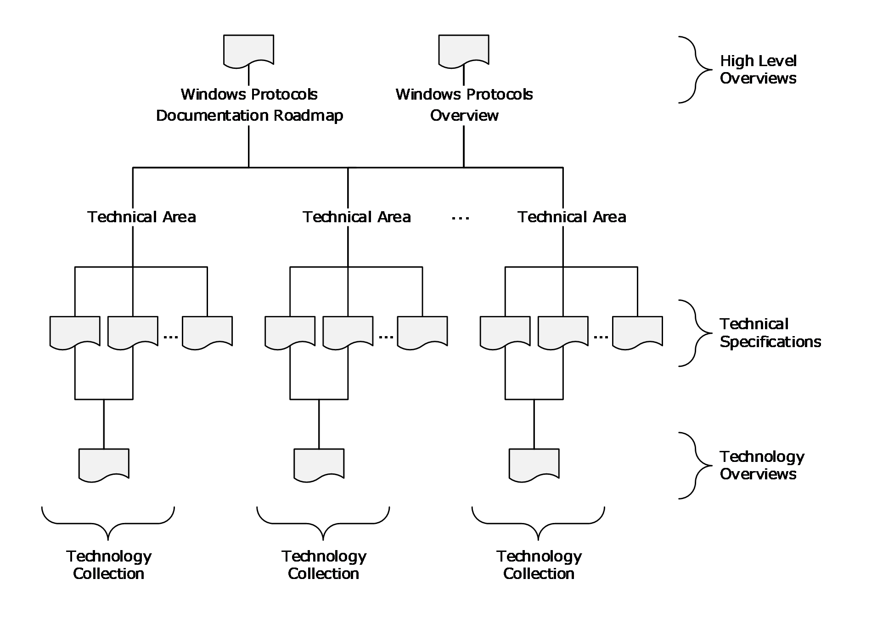

Figure 1: Relationships among documents

As shown in the diagram, the technical specifications of the Windows protocols documentation set are categorized according to [**technical area**](#gt_technical-area). Within a technical area, a technology overview and related technical specifications make up a [**technology collection**](#gt_technology-collection). More than one technology collection can be defined in a technical area. The technical areas and different document types are described in Documentation Contents (section [2](#Section_2)). The technical specifications are listed in the Technical Specification Cross-Reference Matrix (section [4.1](#Section_4.1)); the technical areas are listed in the Technical Area Cross-Reference Matrix (section [4.2](#Section_4.2)); and the technology collections are listed in the Technology Collection Cross-Reference Matrix (section [4.3](#Section_4.3)).

### 1.3.3 Naming Conventions

The Windows protocols documentation set uses the following naming conventions for all overview documents, technical specifications, and reference documents.

- All documents are assigned a short name enclosed in square brackets. The short name is used when citing the document or reference. Examples of short names are "[MS-DOCO]", "[MSFT-WSTS]", and "[RFC2119]".
- All short names for documents in the documentation set have one of the following forms:
- [MC-XXX] was originally used for documents that specify technology that has never shipped with Windows. However, that restriction has been removed, and there is now no distinction between documents with short names prefaced with "MC" and those with short names prefaced with "MS". An example of this type of short name is "[MC-BUP]", where the suffix "BUP" is an abbreviation for "Background Intelligent Transfer Service (BITS) Upload Protocol".
- [MS-XXXOD] is used for technology overviews (section [2.1.3](#Section_4.3)). An example of this type of short name is "[MS-AUTHSOD]", where the suffix "AUTHS" is an abbreviation for "Authentication Services Protocols".
- [MS-XXX] is used for all other overview, technical, and reference documents with short names that do not follow one of the preceding conventions. The suffix "XXX" is an abbreviation that refers to the subject covered by the document. An example of this type of short name is "[MS-WPO]", where "WPO" is an abbreviation for "Windows Protocols Overview". The short name of the current document, "[MS-DOCO]", also falls into this category.
- Short names for reference documents that describe Microsoft technology conform to the following naming conventions:
- [MSFT-XXX] is used for information in Microsoft TechNet articles.
- [KBNNNNN] and [MSFT-KBNNNNN] are used for Knowledge Base articles, where NNNNN is the article number.
- [PRA-XXX] is used for downloadable informative technical documents in PDF format.
- Short names for RFC documents are in the form [RFCNNNN], where NNNN is the RFC number.
- Each document has a title that conforms to the following conventions:
- The titles of technology overviews end with the word "Overview".
- The titles of technical specifications that specify Microsoft extensions to non-Microsoft protocols and structures end with either the word "Extension" or "Extensions".
- The titles of technical specifications that specify algorithms, protocols, and structures end with the word "Specification".
**Note** The titles of [MS-DOCO] and [MS-WPO] are exceptions to these document title conventions.

- Each document has a long name, which is composed of its short name, a colon, and its title. Examples of long names are "[MS-DOCO]: Windows Protocols Documentation Roadmap" and "[MS-RPRN]: Print System Remote Protocol Specification".

### 1.3.4 Document Versions

Documents in the Windows protocols documentation set are assigned a version number that changes each time the document is updated. The title page of each document contains a revision summary table that shows the top-level history of changes to the document. This revision summary table contains the date of each release and the corresponding version number, revision class, and comment that describes the change.

The version number and revision class are correlated as shown in the following table:

| Version number | Revision class | Version number change | Description |
| --- | --- | --- | --- |
| 1.0 | New | Not applicable | First release of the document. |
| 2.0 | Major | Number to the left of the first decimal point | Significantly changed the technical content. |
| 2.1 | Minor | Number to the right of the first decimal point | Clarified the meaning of the technical content. |
| 2.1.1 | Editorial | Number to the right of the second decimal point | Changed language and/or formatting of the technical content. |
| 2.1.1 | None | No change | No change to the meaning, language or formatting of the technical content. |

**Note** Starting with Windows 8, the initial release version number was standardized at 1.0. Documents created prior to Windows 8 can have a different initial release version number, such as 0.1 or 0.01.

Each overview document and technical specification also contains its own more detailed Change Tracking Appendix, which lists the changes made to each section in the latest release.

## 1.4 Audience

The Windows documentation set is intended for use in conjunction with publicly available and standards-based specifications, network programming background material, and Windows distributed systems concepts. It assumes that the reader either is familiar with this material or has immediate access to it.

The documentation set provides the following levels of audience support:

- For implementers: Conceptual and reference information for an implementation of one or more protocol specifications for a given task or scenario.
- For architects: Structural and interoperability information for an implementation of a technology consisting of a group of related protocols.

## 1.5 Localization

The Windows documentation set is not localized, but individual documents can contain locale-specific information.

## 1.6 Licensing

The Windows protocols documentation set is available to view and download from the [Microsoft Developer](https://go.microsoft.com/fwlink/?linkid=2092989) web site at no charge. Some specifications include patented inventions, and others do not. Implementers can benefit from a patent license if using any of the technical specifications covered by Microsoft patents. In addition, patent licensees can receive additional benefits such as:

- Optional [**Technical Account Manager (TAM)**](#gt_technical-account-manager-tam) to help resolve documentation questions
- Optional viewing rights to Windows source code to assist with implementing the protocols
Microsoft makes technical documents available through the following two document programs.

- [Microsoft Interoperability Program (MIP)](https://go.microsoft.com/fwlink/?LinkId=233144): This program facilitates the use and implementation of technical specifications for certain protocols, file formats, standards support, and languages that are used or implemented in certain Microsoft products.
- [Workgroup Server Protocol Program (WSPP)](https://go.microsoft.com/fwlink/?linkid=849906): This program includes technical specifications for communications protocols between Windows Client and applicable Windows Server releases, as well as between applicable Windows Server releases systems, to provide file, print and user and group administration services in a Windows Client network.
**Note** Microsoft is no longer updating this content regularly. Check the [Microsoft Lifecycle Policy](https://go.microsoft.com/fwlink/?linkid=2093075) for information about how these document programs are supported.

For more information about patent license and patent covenant agreements available for Windows, visit [Patent Promises and Patents](http://go.microsoft.com/fwlink/?LinkId=233164).

## 1.7 Support

Many types of support are available for the protocol implementer. Information on the following resources can be found on the [Open Specifications Developer Center](http://go.microsoft.com/fwlink/?LinkId=227092):

- [Interop Dev Events](http://go.microsoft.com/fwlink/?LinkId=227098), providing software developers with an in-person opportunity to learn more about Windows protocols and to test their implementations.
- [Interoperability Test Tools](http://go.microsoft.com/fwlink/?LinkId=227090), including a tool to view and monitor, in real time, specific protocol communications between two products.
- [Development Support](http://go.microsoft.com/fwlink/?LinkId=227091), including forums, blogs, and Microsoft Knowledge Base.
Additional information concerning support is available on the following websites:

- [Microsoft Developer](https://go.microsoft.com/fwlink/?linkid=2092989), providing informative content and resources for Microsoft products and technologies.
- [Open Specification Developer Forums](https://go.microsoft.com/fwlink/?LinkId=227093), providing a selection of forums across various product protocols.
- [TechNet Wiki](http://go.microsoft.com/fwlink/?LinkId=233165), providing community-generated content about Microsoft technologies.

# 2 Documentation Contents

This section describes the documents that are part of the Windows protocols documentation set and the information they contain. The following types of documents are defined:

- Overview documents
- Technical specifications
- Reference documents
The sections that follow contain details of each document type.

As described in [Relationships Among Documents (section 1.3.2)](#Section_1.3.2), the overview documents and technical specifications are associated with various technical areas according to technology. Those relationships are listed in the following sections:

- Technical Specification Cross-Reference Matrix (section [4.1](#Section_4.1))
- Technical Area Cross-Reference Matrix (section [4.2](#Section_4.2))
- Technology Collection Cross-Reference Matrix (section [4.3](#Section_4.3))
The following technical areas are covered by the documentation set:

**Application services:** Application services enable the components of an application to interoperate with components of other applications. These components can involve processes that are running on one or more computers or different operating systems.

**Collaboration and communications:** Collaboration and communications refers to services that facilitate interaction among people and enables client applications to locate each other on a network. The software used for collaboration includes application sharing, email, whiteboarding, sharing a calendar, instant messaging, and text chat. This technical area also includes protocols that enable content to be streamed over the Internet or an intranet and the creation, distribution, and playback of audio and video content.

**Directory services:** Directory services provide functionality for the centralized storage of identity and account information, as well as other forms of data such as group policies and printer location information. The protocols in this technical area make up the client and server behavior of [**Active Directory**](#gt_active-directory), which provides a foundation for authentication services in a domain environment, domain services, and directory replication services in Windows.

**File, fax, and printing services:** File, fax, and printing services refer to services for applications to access, share, manage and replicate files, and for managing and accessing fax and print systems in a distributed environment. This technical area also includes Windows SharePoint Services (WSS), which provide features and technologies that allow users to create, manage, and build their own collaborative websites.

**Home server:** Home server refers to services that enable two or more computers to connect directly to each other in order to communicate and to organize, share, and back up documents over a Home Server network. Home Server is a platform for private residences and small businesses that supports the management of devices within the household or on the Internet.

**Multiplayer games:** Multiplayer games refers to services that provide DirectPlay functionality for playing games over the Internet, including game configuration and connection, game state and event handling, communication between players, and remote configuration.

**Networking:** Networking refers to services that enable the communication of computers with each other over networks including wireless devices and links, IP transports, and client/server transports such as [**remote procedure call (RPC)**](#gt_remote-procedure-call-rpc) and [**DCOM**](#gt_distributed-component-object-model-dcom). This technical area includes protocols that support dynamic configuration of IP addresses, the enforcement of computer health policies, the management of Web services, and wireless service discovery.

**Remote connectivity:** Remote connectivity refers to services that allow users to access applications and data on a remote computer over a network. Remote connectivity includes remote desktop services protocols, which provide secure connections and communication between remote clients and servers and allow clients to use server applications and resources.

**Security and identity management:** Security and identity management refers to services for [**authentication**](#gt_authentication) and [**authorization**](#gt_authorization), certificate management, rights management, and interoperability over the web. This technical area includes protocols that support identity verification, credential validation, and the process of granting a person, computer process, or device access to certain information, services or functionality, the protection and security of digital information, and Web services based on [**XML**](#gt_xml), [**SOAP**](#gt_soap) and [**WSDL**](#gt_web-services-description-language-wsdl).

**Systems management:** Systems management refers to services that support clustering, configuration and administration of client and server computers, content indexing queries, remote device management, [**Group Policy**](#gt_group-policy) enforcement, remote management of computer and network resources, performance monitoring and event logging, deployment and management of storage technologies, system infrastructure functionality, management of [**Common Information Model (CIM)**](#gt_common-information-model-cim) objects, deployment of Microsoft product updates, and Windows name resolution for network basic input/output system ([**NetBIOS**](#gt_netbios)) names.

**Terminal services:** Terminal services provide functionality for communicating remote graphical desktop interaction and display data packets, and sound, file redirection, and print redirection data packets from client applications to a Windows server configured as a [**terminal server**](#gt_terminal-server).

## 2.1 Overview Documents

This section describes the overview documents in the Windows protocols documentation set. In general, overview documents provide information that pertains to groups of documents in the documentation set and about how protocols for specific technologies are related and used together. The following types of overview documents are defined:

- Windows Protocols Documentation Roadmap (section [2.1.1](#Section_2.1.1))
- Windows Protocols Overview (section [2.1.2](#Section_2.1.2))
- Technology Overviews (section [2.1.3](#Section_4.3))

### 2.1.1 Windows Protocols Documentation Roadmap

[MS-DOCO]: Windows Protocols Documentation Roadmap is the starting point for navigating within and understanding all the other documents in the Windows protocols documentation set.

### 2.1.2 Windows Protocols Overview

[[MS-WPO]: Windows Protocols Overview](http://msdn.microsoft.com/en-us/library/c5f54a77-65be-40a0-bb82-9e4181d8ab67/) provides a conceptual overview of Windows protocols, including their functionality, how they interact, and their relationships to Windows technologies. Each technology is further broken down into subsystems with information about the technology overviews (section [2.1.3](#Section_4.3)) and technical specifications (section [2.2](#Section_3.2.1.2)) that pertain to each subsystem. The Windows technologies are grouped into the technical areas described in [Documentation Contents (section 2)](#Section_2).

### 2.1.3 Technology Overviews

Technology overviews provide informative content that describes protocols in a technical area that are functionally related or are commonly used together to accomplish specific goals. Each technology overview and the technical specifications it describes comprise a technology collection. The technology collections in the Windows protocols documentation set are listed in the [Technology Collection Cross-Reference Matrix (section 4.3)](#Section_4.3).

Each technology overview provides the following types of information:

- A conceptual description of the architecture, communication, and relationships among the protocols and with other technology collections.
- The intended users and uses of the technology collection, its environment, and its role within the architecture of Windows.
- Scenarios that illustrate use cases for the technology collection, including common errors, which describe the actors; the actors' intentions and goals; any necessary preconditions; an overall flow of data and events with common alternatives; and typical results.
- The Microsoft products that implement the technology collection, and its versions and capabilities in each Microsoft product.
The technology overviews are listed, grouped according to technical area, in the remainder of this section.

**Application services:**

- [[MS-MQOD]: Message Queuing Protocols Overview](http://msdn.microsoft.com/en-us/library/644be85f-7a78-4bcc-b8a1-389e4b24b2cc/): This document describes the functionality of Microsoft Message Queuing (MSMQ), a communications service that enables reliable and secure asynchronous messaging between applications over a variety of deployment topologies. MSMQ temporarily decouples the sending of a message from the receipt of that message, allowing applications to communicate even if their execution lifetimes do not overlap.
- [[MS-NETOD]: Microsoft .NET Framework Protocols Overview](http://msdn.microsoft.com/en-us/library/bcca8164-da08-43f2-a983-c34ed99171b0/): This document describes the functionality, interrelationships, and protocol layering of the communication protocols implemented in the .NET Remoting and Windows Communication Foundation (WCF) components of the .NET Framework.
- [[MS-TPSOD]: Transaction Processing Services Protocols Overview](http://msdn.microsoft.com/en-us/library/fbbf77ae-bfc8-46ff-876b-ddaee16ece3a/): This document provides an overview of the functionality and relationships of [**transaction**](#gt_transaction) processing protocols. Transaction processing is designed to maintain a computation system in a known, consistent state by allowing multiple individual operations to be linked together as a single, indivisible operation, so that either all of the changes are processed or none of the changes are processed.
**Collaboration and communications:**

- [[MS-MSSOD]: Media Streaming Server Protocols Overview](http://msdn.microsoft.com/en-us/library/8afe7776-f5c9-49ef-82fc-20912f9ed85b/): This document describes the functionality of the media streaming server protocols, which are used to convert both live and prerecorded audio format and to distribute the content over a network or the Internet. Media streaming server technologies support publishing secure content to a media server, streaming content from a media server, and requesting a license from a license server.
**Directory services:**

- [[MS-ADFSOD]: Active Directory Federation Services (AD FS) Protocols Overview](http://msdn.microsoft.com/en-us/library/a11c94b0-3952-412c-8a93-d2412dd063e1/): This document describes the functionality and relationship of the [**Active Directory Federation Services (AD FS)**](#gt_active-directory-federation-services-ad-fs) protocols, which offer a means for distributed identification, authentication, and authorization across organizational and platform boundaries.
- [[MS-ADOD]: Active Directory Protocols Overview](http://msdn.microsoft.com/en-us/library/5ff67bf4-c145-48cb-89cd-4f5482d94664/): This document describes the functionality and relationships of the [**Active Directory**](#gt_active-directory) protocols, which provide directory services for the centralized storage of identity, account information, group policies, and printer location information, a foundation for authentication services in a [**domain**](#gt_domain) environment, domain services, and directory replication services in Windows.
**File, fax, and printing services:**

- [[MS-CCROD]: Content Caching and Retrieval Protocols Overview](http://msdn.microsoft.com/en-us/library/5c1fdcf1-6b60-452a-904c-f650d2edf449/): This document describes the protocols, data structures, and security mechanisms that are required to enable a system of content caching and retrieval to interoperate with Windows systems, and content retrieval scenarios such as accessing content from a file or web server.
- [[MS-FASOD]: File Access Services Protocols Overview](http://msdn.microsoft.com/en-us/library/a8df7cf6-4f73-4441-8319-653618a50da0/): This document describes the use of the protocols for network file access services interoperation with Windows, which allows applications to access and share files located on a file server on a network in a secure and managed environment.
- [[MS-FSMOD]: File Services Management Protocols Overview](http://msdn.microsoft.com/en-us/library/3a373435-adb3-42ad-afa4-ff5cd961a67b/): This document describes the use of the protocols for remote administration and management of file servers that share data within an organization.
- [[MS-PRSOD]: Print Services Protocols Overview](http://msdn.microsoft.com/en-us/library/97fd9728-f83e-48d0-aa2c-79471fd9e00a/): This document describes the distributed system of print servers that manage printers and make them available to print clients.
- [[MS-STOROD]: Storage Services Protocols Overview](http://msdn.microsoft.com/en-us/library/313252b5-9146-40cc-9eb2-8372e108597f/): This document describes the interaction of protocols that provide disk and volume management services, data backup and restore, removable media management, file access control, and file encryption in Windows.
- [[MS-VSOD]: Virtual Storage Protocols Overview](#Section_1.3): This document Provides an overview of the functionality of and relationship among the virtual storage protocols, which provide a means for a client to access, read, and write to virtual storage on a remote server.
**Networking:**

- [[MS-NAPOD]: Network Access Protection Protocols Overview](http://msdn.microsoft.com/en-us/library/a916128b-f9a5-4fa3-80d8-0c8a2bef8b12/): This document describes the functionality to allow client computers to gain access to network resources based on the client's identity and compliance with a corporate governance policy, and how various components work together to promote the health and protection of networked systems.
**Remote connectivity:**

- [[MS-RDSOD]: Remote Desktop Services Protocols Overview](http://msdn.microsoft.com/en-us/library/072543f9-4bd4-4dc6-ab97-9a04bf9d2c6a/): This document describes the [**Terminal Services**](#gt_terminal-services-ts) system, which enables a remote client to display and interact with a desktop or application running on a distant server. Using this technology, a remote client connected to the server can use software and resources available to the server.
**Security and identity management:**

- [[MS-AUTHSOD]: Authentication Services Protocols Overview](http://msdn.microsoft.com/en-us/library/953d700a-57cb-4cf7-b0c3-a64f34581cc9/): This document describes the functionality and relationships of protocols in the identity verification of users, computers, and services through interactive logon and network logon [**authentication**](#gt_authentication) processes.
- [[MS-AZOD]: Authorization Protocols Overview](http://msdn.microsoft.com/en-us/library/5a0a0a3e-c7a7-42e1-b5f2-cc8d8bd9739e/): This document describes the functionality and relationships of the protocols that control the granting of access to resources, once authentication has been accomplished, by using one of several Windows [**authorization**](#gt_authorization) models.
- [[MS-CERSOD]: Certificate Services Protocols Overview](http://msdn.microsoft.com/en-us/library/ec4bb597-9e73-4d2b-a768-621239e21fca/): This document provides an overview of how the [**certificate**](#gt_certificate) enrollment, certificate policy and certificate remote administration protocols are implemented in the [**certificate services**](#gt_certificate-services) system, the standalone and enterprise models of the [**certificate authority (CA)**](#gt_certification-authority-ca), the protocols involved, and how they communicate with each other.
- [[MS-RMSOD]: Rights Management Services Protocols Overview](http://msdn.microsoft.com/en-us/library/e1616df8-c84f-413a-9420-85157d466a10/): This document describes the protocols of the Rights Management Services (RMS) system, which allows individuals and administrators to encrypt and specify access and usage restrictions on various types of data, including documents and email messages.
**Systems management:**

- [[MS-GPOD]: Group Policy Protocols Overview](http://msdn.microsoft.com/en-us/library/6e634939-2ccf-4412-b75f-0035dc05ea67/): This document describes the protocols used for [**Group Policy**](#gt_group-policy), which enables administrators to define and manage required computer configurations or policy settings for a large number of users and computers within an Active Directory environment.
- [[MS-WMOD]: Windows Management Protocols Overview](http://msdn.microsoft.com/en-us/library/6ff3ba22-059d-44f7-9ab1-96c2dc82bf1f/): Provides an overview of the functionality and relationships of the Windows Management protocols, which provide the ability to control settings and collect data for a set of client and server computers, to query another system or computer, and to perform administrative operations to monitor, troubleshoot, and conduct hardware and software inventories in remote computers.
- [[MS-WSUSOD]: Windows Server Update Services Protocols Overview](http://msdn.microsoft.com/en-us/library/8434a301-6445-4b48-a9cc-c098734f0618/): This document describes the Windows Server Update Services system, which enables IT administrators to distribute and manage software updates from a central location to a large number of computers.

## 2.2 Technical Specifications

This section describes the details of protocols, structures and standards that are specified in technical specifications. The goal of the technical specifications is to support interoperability, not to describe the Windows implementations of the technology. For example, many protocols specify client and server roles; for such protocols, the information contained in technical specifications fulfills the three general interoperability cases:

- Implement a client that interoperates with a server implemented in Windows.
- Implement a server that interoperates with a client implemented in Windows.
- Implement a client and a server that interoperate with each other on a non-Windows operating system.
Other types of protocols, as well as structures, algorithms, and so on, are also documented to support interoperability in both Windows and non-Windows operating environments.

Technical specifications consist of both normative and informative content.

### 2.2.1 Normative Content

Normative content refers to technical details that are essential for implementing software that interoperates with Windows. This content is written using the prescriptive language of RFCs as defined in [RFC2119], including the verb forms MAY, MUST, MUST NOT, SHOULD, and SHOULD NOT.

- **MUST and MUST NOT** emphasize behavior that is required or prohibited, respectively, by the technology for interoperability, such as setting a field to zero, using a reply packet, or performing a action when a certain type of packet is received.
In a normative section of a specification, any statement that does not use a prescriptive verb means that the behavior is required, as if a MUST were used explicitly.

- **MAY** means that the behavior is optional. A product behavior note (PBN) is required if the behavior is implemented in at least one applicable Windows version; the absence of a PBN means that no Windows version implements the behavior. PBNs are informative content (section [2.2.2](#Section_2.2.2)).
- **SHOULD** means that the behavior is optional but recommended by the designers of the technology. A PBN is required if the behavior is absent from at least one applicable Windows version; the absence of a PBN means that all product versions implement the behavior.
- **SHOULD NOT** means that the behavior is optional and not recommended by the designers of the technology. An implementer should understand and carefully consider the implications of the behavior before it is implemented. A PBN is required if the behavior is implemented in at least one applicable Windows version; the absence of a PBN means that no Windows version implements the behavior.
For all optional behavior, an implementation that does not do the behavior must be interoperable with one that does, and vice versa.

Normative content includes the following categories of information:

- Classes of functionality (roles)
- Data definitions (constants, enumerations, structures, and so on)
- Encryption
- Message formats and processing
- Method signatures and return values
- Schemas and namespaces
- State transitions
- Timers, events, and event processing
- Transport
- Vendor-extensible fields
Technical specifications that reference [**directory service**](#gt_directory-service-ds) [**schema**](#gt_schema) element class/attribute pairs (section [2.2.3.3.1](#Section_2.2.3.3.1)), cite one or more of the following normative references:

- [[MS-ADA1]: Active Directory Schema Attributes A-L](http://msdn.microsoft.com/en-us/library/19528560-f41e-4623-a406-dabcfff0660f/)
- [[MS-ADA2]: Active Directory Schema Attributes M](http://msdn.microsoft.com/en-us/library/e20ebc4e-5285-40ba-b3bd-ffcb81c2783e/)
- [[MS-ADA3]: Active Directory Schema Attributes N-Z](http://msdn.microsoft.com/en-us/library/4517e835-3ee6-44d4-bb95-a94b6966bfb0/)
- [[MS-ADSC]: Active Directory Schema Classes](http://msdn.microsoft.com/en-us/library/9abb5e97-123d-4da9-9557-b353ab79b830/)
- [[MS-ADLS]: Active Directory Lightweight Directory Services Schema](http://msdn.microsoft.com/en-us/library/94279943-25ab-4c13-9bf2-6d411cc2f796/)
Technical specifications that use common data types (section [2.2.3.3.2](#Section_2.2.3.3.2)) cite the following normative reference:

- [[MS-DTYP]: Windows Data Types](http://msdn.microsoft.com/en-us/library/cca27429-5689-4a16-b2b4-9325d93e4ba2/)
Technical specifications that reference HRESULT, NTStatus, or Win32 error codes (section [2.2.3.3.3](#Section_2.2.3.3.3)) cite the following normative reference:

- [[MS-ERREF]: Windows Error Codes](http://msdn.microsoft.com/en-us/library/1bc92ddf-b79e-413c-bbaa-99a5281a6c90/)
Technical specifications that reference landing code identifiers (LCIDs) (section [2.2.3.3.4](#Section_2.2.3.3.4)) cite the following normative reference:

- [[MS-LCID]: Windows Language Code Identifier (LCID) Reference](http://msdn.microsoft.com/en-us/library/70feba9f-294e-491e-b6eb-56532684c37f/)

### 2.2.2 Informative Content

Content that is not normative in technical specifications is informative, and it is provided only as a helpful guide to the implementer. Informative content is not essential for implementation and includes the following categories of information:

- Abstract data models
- Capability negotiations
- Examples
- Implementation-specific parameters
- Relationships to other protocols
- Security parameters
- Versioning
- Windows-version-specific behaviors
Windows-version-specific behavior is described in footnotes to the main body of a specification. That information is not normative and is provided to support interoperability across multiple versions of Windows Client operating system and applicable Windows Server releases. The following criteria are used to determine whether information is not appropriate in the body of a technical specification and gets placed in a product behavior footnote:

- The information varies by Windows product.
- The information concerns an implementation limit for a data structure; for example, maximum entries or queue size.
- The information concerns a retry interval.
- The information concerns a retry count prior to returning a specified error code.
- The information concerns a specific buffer size choice, when other buffer sizes will work.
- The information concerns loading implementation-specific configuration information from the [**Windows registry**](#gt_windows-registry).

### 2.2.3 Template Types

In general, each technical specification conforms to one of a set of document templates, based on the type of information that is conveyed by the associated protocol or structure:

- Algorithm: Algorithms used in network communication.
- Block: Generic message-based protocols.
- Data Structure: Structures used by one or more algorithms or protocols.
- File Structure: The formats of files used to convey information between systems.
- HTTP: Protocols based on [**HTTP**](#gt_hypertext-transfer-protocol-http) APIs, including RESTful and REST-like protocols.
- RPC: [**Remote procedure call (RPC)**](#gt_remote-procedure-call-rpc) method-based client/server protocols.
- SOAP: Request/response protocols that are defined by using [**Web Services Description Language (WSDL)**](#gt_web-services-description-language-wsdl).
- Standards Support: Microsoft implementation conformance with an external standard.
The following sections provide general descriptions of these document templates. The template used for each technical specification in the Windows protocols documentation set is listed in [Technical Specification Cross-Reference Matrix (section 4.1)](#Section_4.1).

#### 2.2.3.1 Algorithm

An Algorithm technical specification defines an algorithm or extension to an algorithm that is used in network communication. An Algorithm document defines no data structure or data sent over the wire. If the algorithm is associated with a data structure, they are either documented separately in Algorithm and Structure technical specifications or together in a Block technical specification.

A technical specification that specifies a protocol can refer to an Algorithm document, but if the algorithm is specific to the protocol, it can be documented within the protocol document.

If the algorithm inherently has different classes of functionality, or "roles", normative information is provided for each. If enough logic is common between roles that it makes sense to not duplicate it, a section titled "Common Algorithm Details" can be specified. For example, for compression and decompression algorithms, a section for common details might be included with the role-specific sections "Compression Algorithm Details" and "Decompression Algorithm Details".

Algorithm technical specifications can contain the following types of normative information, where applicable:

- Classes of functionality (roles)
- Processing rules
- State transitions

#### 2.2.3.2 Block

A Block technical specification defines a packet-based protocol. The name "Block" is a reference to the block diagrams that are frequently used to express interaction patterns. The Block type of technical specification is also used if no other type of document is appropriate for the protocol or format being specified.

Block technical specifications specify exactly how data is marshaled that is sent or received over a network, which requires a definition of the byte order of packet data. Message syntax is specified by using packet diagrams that are 32-bits wide, with bit 0 on the far left, as shown in the following example.

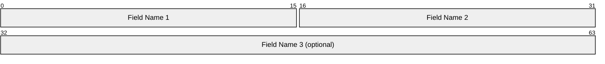

The bit numbering convention that is followed is big-endian; namely, the most significant bit of the first byte to traverse the network is bit 0, and the least significant bit of the last byte to traverse the network is in bit 31. The byte order format can be different in the operating environment, so it is specified in the document for multibyte data fields.

Block technical specifications can contain the following types of normative information, where applicable:

- [**Augmented Backus-Naur Form (ABNF)**](#gt_augmented-backus-naur-form-abnf) syntax [[RFC5234]](https://go.microsoft.com/fwlink/?LinkId=123096)
- Binary packets
- [**Directory service**](#gt_directory-service-ds) [**schema**](#gt_schema) classes and attributes [MS-ADA1](../MS-ADA1/MS-ADA1.md) [MS-ADA2](../MS-ADA2/MS-ADA2.md) [MS-ADA3](../MS-ADA3/MS-ADA3.md) [MS-ADLS](../MS-ADLS/MS-ADLS.md) [MS-ADSC](../MS-ADSC/MS-ADSC.md)
- Data and type definitions (constants, enumerations, structures, and so on)
- [**Encryption**](#gt_encryption) algorithms
- [**Namespaces**](#gt_namespace) [[XMLNS]](https://go.microsoft.com/fwlink/?LinkId=191840)
- Shared state variables
- [**XML schema definitions (XSDs)**](#gt_xml-schema-definition-xsd) [[XML10]](https://go.microsoft.com/fwlink/?LinkId=90600) [[XMLINFOSET]](https://go.microsoft.com/fwlink/?LinkId=145519) [[XMLSCHEMA1/2]](https://go.microsoft.com/fwlink/?LinkId=90607) [[XMLSCHEMA2/2]](https://go.microsoft.com/fwlink/?LinkId=90609)

#### 2.2.3.3 Data Structure

A Data Structure technical specification specifies a common structure or an extension to a common data structure that is used by multiple protocols. The description does not include related behavior. Behavior is defined in the specifications for protocols that use the data structure.

Data Structure technical specifications specify how data is decoded and encoded as it is processed in the specific operating environment. If the data is in XML, the schemas and namespaces are specified.

Data Structure technical specifications can contain the following types of normative information, where applicable:

- [**Augmented Backus-Naur Form (ABNF)**](#gt_augmented-backus-naur-form-abnf) syntax [[RFC5234]](https://go.microsoft.com/fwlink/?LinkId=123096)
- Binary packet structure
- Data and type definitions (constants, enumerations, structures, and so on)
- [**XML schema definitions (XSDs)**](#gt_xml-schema-definition-xsd) [[XML10]](https://go.microsoft.com/fwlink/?LinkId=90600) [[XMLINFOSET]](https://go.microsoft.com/fwlink/?LinkId=145519) [[XMLSCHEMA1/2]](https://go.microsoft.com/fwlink/?LinkId=90607) [[XMLSCHEMA2/2]](https://go.microsoft.com/fwlink/?LinkId=90609)
Specific data structure technical specifications that are cited normatively by other technical specifications are described in the following subsections.

##### 2.2.3.3.1 Active Directory Objects

[**Active Directory**](#gt_active-directory) objects are normative definitions of the objects that exist in the Microsoft Active Directory. The objects of type "attribute" that exist in the Active Directory schema are presented in the following technical specifications:

- [[MS-ADA1]: Active Directory Schema Attributes A-L](http://msdn.microsoft.com/en-us/library/19528560-f41e-4623-a406-dabcfff0660f/)
- [[MS-ADA2]: Active Directory Schema Attributes M](http://msdn.microsoft.com/en-us/library/e20ebc4e-5285-40ba-b3bd-ffcb81c2783e/)
- [[MS-ADA3]: Active Directory Schema Attributes N-Z](http://msdn.microsoft.com/en-us/library/4517e835-3ee6-44d4-bb95-a94b6966bfb0/)
The objects of type "class" that exist in the Active Directory schema are presented in the following technical specification:

- [[MS-ADSC]: Active Directory Schema Classes](http://msdn.microsoft.com/en-us/library/9abb5e97-123d-4da9-9557-b353ab79b830/)
The objects of types "attribute" and "class" that exist in the [**Active Directory Lightweight Directory Services (AD LDS)**](#gt_active-directory-lightweight-directory-services-ad-lds) schema are presented in the following technical specification:

- [[MS-ADLS]: Active Directory Lightweight Directory Services Schema](http://msdn.microsoft.com/en-us/library/94279943-25ab-4c13-9bf2-6d411cc2f796/)
These specifications are not intended to stand on their own; they are intended to serve as appendixes to the Active Directory Technical Specification. For details about the Active Directory schema, see [[MS-ADTS]: Active Directory Technical Specification](http://msdn.microsoft.com/en-us/library/d2435927-0999-4c62-8c6d-13ba31a52e1a/).

##### 2.2.3.3.2 Windows Data Types

Windows data types are common data types that are used in the Windows protocols documentation set. They are presented in the following document:

- [[MS-DTYP]: Windows Data Types](http://msdn.microsoft.com/en-us/library/cca27429-5689-4a16-b2b4-9325d93e4ba2/)
The Windows data types are categorized as follows:

- Common base types: Primitive data types, including [**IDL**](#gt_interface-definition-language-idl) base types, which are natively supported by Microsoft compilers; for example, byte, handle_t, and wchar_t.
- Common data types: Simple data types, including aliases for C/C++ primitive data types, which are frequently used by many protocols; for example, BYTE, DWORD, and WCHAR.
- Common data structures: User-defined data types, including those supporting [**RPC**](#gt_remote-procedure-call-rpc) protocols, which are defined in C/C++ or [**ABNF**](#gt_augmented-backus-naur-form-abnf); for example, FILETIME, GUID, and RPC_UNICODE_STRING.
- Constructed security types: Types used to define structures that are specific to the Windows security model; for example, [**security identifier (SID)**](#gt_security-identifier-sid), and SECURITY_DESCRIPTOR.
- Impersonation abstract interface: Methods for managing the underlying security infrastructure for server roles in Windows.

##### 2.2.3.3.3 Windows Error Codes

Windows error codes are method return values and status codes that are used in the Windows protocols documentation set. They are presented in the following document:

- [[MS-ERREF]: Windows Error Codes](http://msdn.microsoft.com/en-us/library/1bc92ddf-b79e-413c-bbaa-99a5281a6c90/)
The following information is provided in the Windows error codes specification:

- HRESULT: The HRESULT data type is commonly used as a return value from RPC methods. The most significant bit is used to indicate success or failure. The following details about HRESULT are provided:
- The structure of the HRESULT data type.
- Requirements for vendor-specific values.
- Values in a 32-bit numbering space.
- Descriptions of the error conditions returned.
- Parameter substitution in value descriptions.
- The HRESULT from WIN32 error code macro, which converts a Win32 error code to an HRESULT value.
- Win32 error codes: Win32 error codes are 16-bit values extended to 32-bits with zero fill, and they can be returned by methods or in structures. In general, they are not vendor-extendable. The following details about Win32 error codes are provided:
- Success and error values.
- Descriptions of the error conditions returned
- Parameter substitution in value descriptions.
- NTSTATUS: The NTSTATUS data type is a standard, 32-bit structure that is used to communicate system information. The following details about Win32 error codes are provided:
- Identification of levels of severity: Success, Informational, Warning and Error.
- The structure of the NTSTATUS data type.
- Requirements for vendor-specific values.
- Values in a 32-bit numbering space.
- Descriptions of the error conditions returned.
- Parameter substitution in value descriptions.
- LDAP result codes: Windows contains an implementation of the [**LDAP**](#gt_lightweight-directory-access-protocol-ldap) resultCode [[RFC2251]](http://go.microsoft.com/fwlink/?LinkId=90325), which is used by higher-layer protocols to interpret the results of an LDAP operation. Each LDAP error value is mapped to the closest Win32 error value; this mapping is provided.

##### 2.2.3.3.4 Windows Language Code Identifier (LCID) Reference

Windows language code identifiers (LCID) are presented in the following document:

- [[MS-LCID]: Windows Language Code Identifier (LCID) Reference](http://msdn.microsoft.com/en-us/library/70feba9f-294e-491e-b6eb-56532684c37f/)
Also known as culture identifiers, LCID values are used to identify specific languages for the purpose of customizing software for locales and cultures. For example, an LCID value can specify the way dates, times, and numbers are formatted as strings, as well as paper sizes and preferred sort order based on language elements.

The following information is provided in the Windows language code identifier reference:

- The structure of the LCID data type.
- All LCID values that are available in all versions of Windows.
- Locale-specific sort order values.

#### 2.2.3.4 File Structure

A File Structure technical specification specifies the structure and contents of a file that can be sent over the network. Rules for accessing and processing the contents of the file can be specified in this type of technical specification.

File Structure technical specifications specify how data is encoded by the creator and decoded by the consumer as it is passed within the operating environment. If the data is in XML, the schemas and namespaces are specified.

File Structure technical specifications can contain the following types of normative information, where applicable:

- [**Augmented Backus-Naur Form (ABNF)**](#gt_augmented-backus-naur-form-abnf) syntax [[RFC5234]](https://go.microsoft.com/fwlink/?LinkId=123096)
- Binary record structure
- Data and type definitions (constants, enumerations, structures, and so on)
- [**XML schema definitions (XSDs)**](#gt_xml-schema-definition-xsd) [[XML10]](https://go.microsoft.com/fwlink/?LinkId=90600) [[XMLINFOSET]](https://go.microsoft.com/fwlink/?LinkId=145519) [[XMLSCHEMA1/2]](https://go.microsoft.com/fwlink/?LinkId=90607) [[XMLSCHEMA2/2]](https://go.microsoft.com/fwlink/?LinkId=90609)

#### 2.2.3.5 HTTP

An HTTP technical specification defines a protocol that uses an [**HTTP**](#gt_hypertext-transfer-protocol-http)-based API with a simplified set of HTTP functions, such as GET and POST, to make API calls. It can also use a [**Representational State Transfer (REST)**](#gt_representational-state-transfer-rest) client/server architecture in which requests and responses are built around the transfers of resource representations, which are documents that capture the current or intended states of resources. HTTP technical specifications specify the web resources that are accessed and manipulated by the protocol, HTTP operations that can be applied to the resources, and the syntax of request/response payloads.

An HTTP specification can specify either a REST-like or RESTful protocol. In general, "REST-like" refers to a protocol that uses simple URI-based requests to a specific domain over HTTP. "RESTful" refers to a protocol that conforms to certain constraints including a client/server architecture, statelessness, and a uniform interface.

HTTP specifications can contain the following types of normative information, where applicable:

- [**Augmented Backus-Naur Form (ABNF)**](#gt_augmented-backus-naur-form-abnf) syntax [[RFC5234]](https://go.microsoft.com/fwlink/?LinkId=123096)
- [**Conceptual Schema Definition Language (CSDL)**](#gt_conceptual-schema-definition-language-csdl) [MC-CSDL](../MC-CSDL/MC-CSDL.md)
- Data definitions (complex types, simple types, attributes, and so on)
- [**Directory service**](#gt_directory-service-ds) [**schema**](#gt_schema) classes and attributes [MS-ADA1](../MS-ADA1/MS-ADA1.md) [MS-ADA2](../MS-ADA2/MS-ADA2.md) [MS-ADA3](../MS-ADA3/MS-ADA3.md) [MS-ADLS](../MS-ADLS/MS-ADLS.md) [MS-ADSC](../MS-ADSC/MS-ADSC.md)
- HTTP methods and structures [[RFC7230]](https://go.microsoft.com/fwlink/?LinkId=402094) [[RFC7231]](https://go.microsoft.com/fwlink/?LinkId=402095) [[RFC7232]](https://go.microsoft.com/fwlink/?LinkId=402096) [[RFC7233]](https://go.microsoft.com/fwlink/?LinkId=402097) [[RFC7234]](https://go.microsoft.com/fwlink/?LinkId=402098) [[RFC7235]](https://go.microsoft.com/fwlink/?LinkId=402099) [[RFC7236]](https://go.microsoft.com/fwlink/?LinkId=525266)
- [**JavaScript Object Notation (JSON)**](#gt_javascript-object-notation-json) definitions [[ECMA-404]](https://go.microsoft.com/fwlink/?LinkId=392730) [[JSON-Schema]](https://go.microsoft.com/fwlink/?LinkId=392822)
- [**Namespaces**](#gt_namespace) [[XMLNS]](https://go.microsoft.com/fwlink/?LinkId=191840)
- [**URI**](#gt_uniform-resource-identifier-uri) syntax [[RFC3986]](https://go.microsoft.com/fwlink/?LinkId=90453)
- [**XML schema definitions (XSDs)**](#gt_xml-schema-definition-xsd) [[XML10]](https://go.microsoft.com/fwlink/?LinkId=90600) [[XMLINFOSET]](https://go.microsoft.com/fwlink/?LinkId=145519) [[XMLSCHEMA1/2]](https://go.microsoft.com/fwlink/?LinkId=90607) [[XMLSCHEMA2/2]](https://go.microsoft.com/fwlink/?LinkId=90609)

#### 2.2.3.6 RPC

An [**RPC**](#gt_remote-procedure-call-rpc) technical specification defines a method-based protocol, which uses a formal syntax with calls and return codes, and in which a protocol client initiates all communication and a protocol server responds to the protocol client. RPC specifies request/response protocols, in which all arguments come directly from the higher layer, and all return codes, output parameters, and exceptions are passed unmodified.

Some RPC specifications specify protocols that use the [**Distributed Component Object Model (DCOM)**](#gt_distributed-component-object-model-dcom) as their transport, which uses the TCP/IP RPC protocol sequence. Such protocols can use the DCOM security and [**authentication**](#gt_authentication) framework and interface activation.

RPC specifications use [**Interface Definition Language (IDL)**](#gt_interface-definition-language-idl) to specify the syntax of protocol methods and marshaling of protocol data. Such interface definitions can be compiled by using the [**Microsoft Interface Definition Language (MIDL)**](#gt_microsoft-interface-definition-language-midl) compiler with command-line parameters, as follows: "midl /target NT60 /nologo". To avoid duplicating the definitions of common data types, RPC protocol IDL sections can contain one or more import directives for IDL data from other technical specifications, including the following:

- [[MS-DCOM]: Distributed Component Object Model (DCOM) Remote Protocol](http://msdn.microsoft.com/en-us/library/4a893f3d-bd29-48cd-9f43-d9777a4415b0/) Appendix A: Full IDL (section 6)
- [[MS-DTYP]: Windows Data Types](http://msdn.microsoft.com/en-us/library/cca27429-5689-4a16-b2b4-9325d93e4ba2/) Appendix A: Full MS-DTYP IDL (section 5)
- [[MS-OAUT]: OLE Automation Protocol Specification](http://msdn.microsoft.com/en-us/library/bbb05720-f724-45c7-8d17-f83c3d1a3961/) Appendix A: Full IDL (section 6)
RPC specifications can contain the following types of normative information, where applicable.

- [**Augmented Backus-Naur Form (ABNF)**](#gt_augmented-backus-naur-form-abnf) syntax [[RFC5234]](https://go.microsoft.com/fwlink/?LinkId=123096)
- IDL definitions [[MIDLINF]](https://go.microsoft.com/fwlink/?LinkId=89938)
- [**Directory service**](#gt_directory-service-ds) [**schema**](#gt_schema) classes and attributes [MS-ADA1](../MS-ADA1/MS-ADA1.md) [MS-ADA2](../MS-ADA2/MS-ADA2.md) [MS-ADA3](../MS-ADA3/MS-ADA3.md) [MS-ADLS](../MS-ADLS/MS-ADLS.md) [MS-ADSC](../MS-ADSC/MS-ADSC.md)
- RPC [**Interfaces**](#gt_interface) and methods [[C706]](https://go.microsoft.com/fwlink/?LinkId=89824)
- [**Namespaces**](#gt_namespace) [[XMLNS]](https://go.microsoft.com/fwlink/?LinkId=191840)
- [**XML schema definitions (XSDs)**](#gt_xml-schema-definition-xsd) [[XML10]](https://go.microsoft.com/fwlink/?LinkId=90600) [[XMLINFOSET]](https://go.microsoft.com/fwlink/?LinkId=145519) [[XMLSCHEMA1/2]](https://go.microsoft.com/fwlink/?LinkId=90607) [[XMLSCHEMA2/2]](https://go.microsoft.com/fwlink/?LinkId=90609)
RPC specifications include the following normative reference:

- [[MS-RPCE]: Remote Procedure Call Protocol Extensions](http://msdn.microsoft.com/en-us/library/290c38b1-92fe-4229-91e6-4fc376610c15/)
For DCOM-based RPC protocols, the following normative reference is included:

- [[MS-DCOM]: Distributed Component Object Model (DCOM) Remote Protocol Specification](http://msdn.microsoft.com/en-us/library/4a893f3d-bd29-48cd-9f43-d9777a4415b0/)

#### 2.2.3.7 SOAP

A [**Simple Object Access Protocol (SOAP)**](#gt_soap) [[SOAP1.1]](https://go.microsoft.com/fwlink/?LinkId=90520) [[SOAP1.2/1]](https://go.microsoft.com/fwlink/?LinkId=90521) [[SOAP1.2/2]](https://go.microsoft.com/fwlink/?LinkId=90522) technical specification defines a packet-based protocols. Unlike Block technical specifications, SOAP specifies request/response, SOAP-based protocols that use [**Web Services Description Language (WSDL)**](#gt_web-services-description-language-wsdl). SOAP technical specifications typically apply to Web services.

A SOAP technical specification uses the features and mechanisms defined in [**XML**](#gt_xml) and WSDL to define the protocol as closely as those mechanisms allow. SOAP services support the feature of returning XSD and WSDL documents that describe the protocol that the service implements. If the XSD includes character data that follows a grammar that cannot be described in the XSD, the grammar can be defined in the technical specification, or a normative reference to the grammar definition is provided. If the character data has some internal syntax that is not defined in a normative reference, the syntax is specified in the technical specification by using "augmented" BNF (ABNF).

If the XSD includes binary data that follows a grammar that cannot be described in the XSD, the grammar is defined in the technical specification, or a normative reference to the grammar definition is provided. If the grammar is defined in the technical specification, the packet definition format used in Block technical specifications (section [2.2.3.2](#Section_2.2.3.2)) is used.

SOAP technical specifications can contain the following types of normative information, where applicable:

- [**Augmented Backus-Naur Form (ABNF)**](#gt_augmented-backus-naur-form-abnf) syntax [[RFC5234]](https://go.microsoft.com/fwlink/?LinkId=123096)
- [**Directory service**](#gt_directory-service-ds) [**schema**](#gt_schema) classes and attributes [MS-ADA1](../MS-ADA1/MS-ADA1.md) [MS-ADA2](../MS-ADA2/MS-ADA2.md) [MS-ADA3](../MS-ADA3/MS-ADA3.md) [MS-ADLS](../MS-ADLS/MS-ADLS.md) [MS-ADSC](../MS-ADSC/MS-ADSC.md)
- [**Namespaces**](#gt_namespace) [[XMLNS]](https://go.microsoft.com/fwlink/?LinkId=191840)
- [**WSDL messages**](#gt_wsdl-message) [[WSDL]](https://go.microsoft.com/fwlink/?LinkId=90577)
- [**XML schema definitions (XSDs)**](#gt_xml-schema-definition-xsd) [[XML10]](https://go.microsoft.com/fwlink/?LinkId=90600) [[XMLINFOSET]](https://go.microsoft.com/fwlink/?LinkId=145519) [[XMLSCHEMA1/2]](https://go.microsoft.com/fwlink/?LinkId=90607) [[XMLSCHEMA2/2]](https://go.microsoft.com/fwlink/?LinkId=90609)

#### 2.2.3.8 Standards Support

A Standards Support technical specification describes how a Microsoft implementation or set of implementations conform to or vary from an existing specification such as a standard, a third-party specification, or any published specification.

A Standards Support document is essentially an appendix of implementation choices made and information about those choices. For example, a standard might specify that an implementation provides any of seven date/time values. A Standards Support document would indicate which date/time values are supported in the Microsoft implementation. If the implementation provides an eighth value—that is, one not from the standard, that variance from the standard would be defined in a normative section of the Standards Support document.

Standards Support documents can contain the following types of normative information, where applicable:

- Error handling variations from the standard
- Extensions to the standard
- Normative variations from the standard

## 2.3 Reference Documents

This section describes the non-normative information that is found in reference documents in the Windows documentation set. It is supplementary to the overview and technical documents and are generally not specific to a single protocol or technical area. They consolidate related information and are intended to be helpful for understanding and using the documentation set.

Reference documents contain the following categories of information:

- Windows protocols Unicode reference

### 2.3.1 Windows Protocols Unicode Reference

This reference provides related [**Unicode**](#gt_unicode) processing algorithms on the Windows platform, including [**Unicode string**](#gt_unicode-string) comparison and conversion of Unicode to legacy [**code pages**](#gt_code-page). They are presented in the following document:

- [[MS-UCODEREF]: Windows Protocols Unicode Reference](http://msdn.microsoft.com/en-us/library/4a045e08-fc29-4f22-baf4-16f38c2825fb/)
The following information is provided in the Windows protocols Unicode reference:

- [**UTF-16**](#gt_utf-16) string comparison: Provides linguistic-specific comparisons between two Unicode strings and provides the comparison result based on the language and region for a specific user.
- Mapping of UTF-16 strings to earlier [**ANSI**](#gt_100cd8a6-5cb1-4895-9de6-e4a3c224a583) code pages: Converts Unicode strings to strings in the earlier code pages that are used in older versions of Windows and the applications that are written for these earlier code pages.
- The mechanism for the transport of Windows protocols Unicode reference messages.
- Windows protocols Unicode reference message syntax.

## 2.4 External References

This section describes the external references used by the Windows protocols documentation set, including the following:

- Information made available by the Microsoft Corporation
- Documents published by standards bodies.
- RFCs

### 2.4.1 Microsoft Corporation

Microsoft makes available supplementary documentation that can be cited by Windows technical documents to provide helpful information to the implementer, including the following:

- Interoperability documents from other divisions of Microsoft, including [Microsoft Office Protocols](http://go.microsoft.com/fwlink/?LinkId=233153), [Exchange Server Protocols](http://go.microsoft.com/fwlink/?LinkId=233134), [SharePoint Products and Technologies Protocols](http://go.microsoft.com/fwlink/?LinkId=233155), and [Microsoft SQL Server Protocols](http://go.microsoft.com/fwlink/?LinkId=233156).
- [Microsoft Developer](https://go.microsoft.com/fwlink/?linkid=2092989), providing informative content and resources for Microsoft products and technologies.
- [TechNet Wiki](http://go.microsoft.com/fwlink/?LinkId=233165), providing community-generated content about Microsoft technologies.

### 2.4.2 Standards Bodies

Documents from the following non-Microsoft standards bodies are cited normatively and informatively in the Windows protocols documentation set.

[American National Standards Institute (ANSI)](http://go.microsoft.com/fwlink/?LinkId=233586)**:** Represents the U.S. standards and conformity assessment system and oversees the creation and use of norms and guidelines in nearly all business sectors. ANSI also accredits programs that assess conformance to standards and operates the National Standards System Network (NSSN).

[International Committee on Information Technology Standards (INCITS)](http://go.microsoft.com/fwlink/?LinkId=233587)**:** INCITS is part of ANSI. It is the primary U.S. standards group in the field of Information and Communications Technologies (ICT), encompassing storage, processing, transfer, display, management, organization, and retrieval of information. INCITS also serves as ANSI's Technical Advisory Group for ISO/IEC Joint Technical Committee 1. JTC 1 is responsible for international standardization in the field of Information Technology.

[Distributed Management Task Force (DMTF)](http://go.microsoft.com/fwlink/?LinkId=233129)**:** An IT industry organization that facilitates the development, validation, and promotion of systems management standards.

[ECMA International](http://go.microsoft.com/fwlink/?LinkId=233130)**:** Standards organization for communications technology and consumer electronics.

[Federal Information Processing Standards (FIPS)](http://go.microsoft.com/fwlink/?LinkId=233131)**:** Standards and guidelines issued by the National Institute of Standards and Technology (NIST). NIST develops FIPS when there are compelling Federal government requirements such as for security and interoperability and there are no acceptable industry standards or solutions.

[Institute of Electrical and Electronics Engineers (IEEE) Standards Association](http://go.microsoft.com/fwlink/?LinkId=233132)**:** The IEEE-SA helps develop and advance global technologies by creating standards that drive the functionality, capabilities. and interoperability of a wide range of products and services.

[International Organization for Standardization (ISO)](http://go.microsoft.com/fwlink/?LinkID=89915)**:** ISO is a network of the national standards institutes of 161 countries. Member institutions come from both government and the private sector. ISO enables a consensus to be reached on solutions that meet both the requirements of business and the broader needs of society.

[International Telecommunications Union (ITU)](http://go.microsoft.com/fwlink/?LinkId=233133)**:** The United Nations agency for information and communication technology issues, and the global focal point for governments and the private sector in developing networks and services.

[Internet Assigned Numbers Authority (IANA)](http://go.microsoft.com/fwlink/?LinkId=233135)**:** The organization responsible for coordinating some of the key elements that keep the Internet running smoothly. IANA provides technical coordination of key parts of the Internet.

[Internet Engineering Task Force (IETF)](http://go.microsoft.com/fwlink/?LinkID=124593)**:** The IETF helps to make the Internet work better by producing high quality, relevant technical documents that influence the way people design, use, and manage the Internet.

[Internet Society (ISOC)](http://go.microsoft.com/fwlink/?LinkId=233138)**:** The Internet Society (ISOC) is a nonprofit organization that provides leadership in Internet -related standards, education, and policy.

[National Institute of Standards and Technology (NIST)](http://go.microsoft.com/fwlink/?LinkId=233167)**:** An agency of the U.S. Department of Commerce, the mission of [NIST](http://go.microsoft.com/fwlink/?LinkId=233167) is to promote U.S. innovation and industrial competitiveness by advancing measurement science, standards, and technology in ways that enhance economic security and improve our quality of life.

[Organization for the Advancement of Structured Information Standards (OASIS)](http://go.microsoft.com/fwlink/?LinkId=233168)**:** [OASIS](http://go.microsoft.com/fwlink/?LinkId=233168) is a nonprofit consortium that drives the development, convergence and adoption of open standards. OASIS promotes industry consensus and produces worldwide standards for security, cloud computing, SOAP, web services, the Smart Grid, electronic publishing, emergency management, and other areas.

[The Open Group](http://go.microsoft.com/fwlink/?LinkId=233169)**:** The Open Group is a vendor- and technology-neutral consortium that works towards enabling access to integrated information within and between enterprises based on open standards and global interoperability.

[The Unicode Consortium](http://go.microsoft.com/fwlink/?LinkId=90550)**:** The Unicode Consortium is a nonprofit organization that develops standards in the area of internationalization including defining the behavior and relationships between Unicode characters.

[Trusted Computing Group, Trusted Network Connect](http://go.microsoft.com/fwlink/?LinkId=240308)**:** The Trusted Computing Group (TCG) is a nonprofit organization that is focused on developing, defining, and promoting open standards for trusted computing. TCG's Trusted Network Connect (TNC) network security offers interoperable standards for secure guest access, user authentication, endpoint integrity, clientless endpoint management, and coordinated security.

[World Wide Web Consortium (W3C)](http://go.microsoft.com/fwlink/?LinkID=124548)**:** The W3C is an international community that develops standards to ensure the long-term growth of the web. The W3C mission is to develop protocols and guidelines that ensure the long-term growth of the web.

### 2.4.3 RFCs

RFCs constitute a large body of standards and proposed standards describing methods, behaviors, research, and innovations applicable to the working of network-connected systems. Technical specifications in the Windows documentation set make numerous references to RFCs via the [RFC Editor](http://go.microsoft.com/fwlink/?LinkId=233170) website.

# 3 Navigating the Documentation Set

This section describes ways to navigate within the online [Microsoft Docs](http://go.microsoft.com/fwlink/?LinkId=314167) library to find components of the Windows protocols documentation set. The subsections that follow describe the following paths to find documents:

- Document nodes (section [3.1](#Section_3.1)): The structure of the [Open Specifications](http://go.microsoft.com/fwlink/?LinkID=246356) node and the documents within it.
- Document types (section [3.2](#Section_3.2)): Where specific types of documents are located in the [Open Specifications](http://go.microsoft.com/fwlink/?LinkID=246356) nodes.
- Document citations (section [3.3](#Section_3.3)): How documents are linked to each other.
A complete site map of the [Open Specifications](http://go.microsoft.com/fwlink/?LinkID=246356) node tree for the Windows protocols documentation set is presented in [Appendix B: Open Specification Site Map (section 5)](#Section_5).

## 3.1 Document Nodes

This section describes how to navigate to document nodes in the Windows protocols documentation set from the [Open Specifications](http://go.microsoft.com/fwlink/?LinkID=246356) node, which contains the nodes shown in the following diagram.

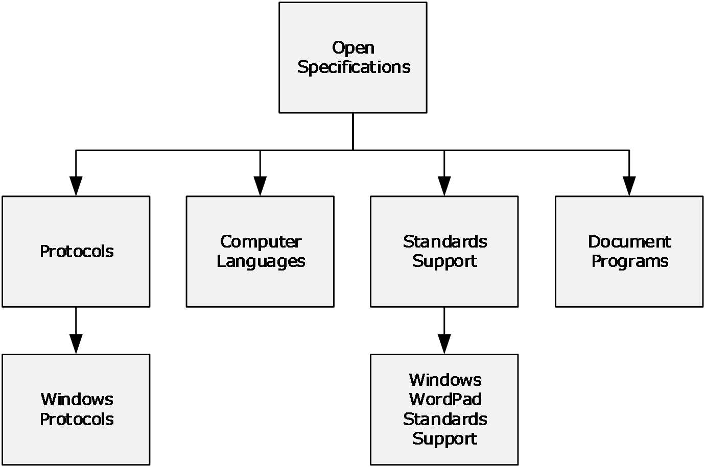

Figure 2: Open Specifications nodes

The nodes shown in the diagram illustrate how the Windows protocols documentation set is organized. Specifically:

[Windows Protocols](http://go.microsoft.com/fwlink/?LinkId=233157): This node provides access to overview documents, Windows protocols, and reference documents, as described in section [3.1.1](#Section_3.1.1).

[Computer Languages](https://go.microsoft.com/fwlink/?linkid=2093320): This node provides access to technical documents for Microsoft general purpose languages and domain-specific languages that are used by Microsoft products.

[Windows WordPad Standards Support](http://go.microsoft.com/fwlink/?LinkId=615949): This node provides access to documents describing support for the standards that are implemented in Windows WordPad, as described in section [3.1.2](#Section_3.1.2).

[Document Programs](http://go.microsoft.com/fwlink/?LinkId=233140): This node describes the technical documents made available in the following document programs; however, Microsoft is no longer updating this content regularly. See section [1.6](#Section_1.6) for more information.

- [Microsoft Interoperability Program (MIP)](https://go.microsoft.com/fwlink/?LinkId=233144)
- [Workgroup Server Protocol Program (WSPP)](https://go.microsoft.com/fwlink/?linkid=849906)

### 3.1.1 Windows Protocols

The [Windows Protocols](http://go.microsoft.com/fwlink/?LinkId=233157) node is reached from the [Open Specifications](http://go.microsoft.com/fwlink/?LinkID=246356) node as shown in section [3.1](#Section_3.1). It is possible to navigate from this node to the nodes shown in the following diagram.

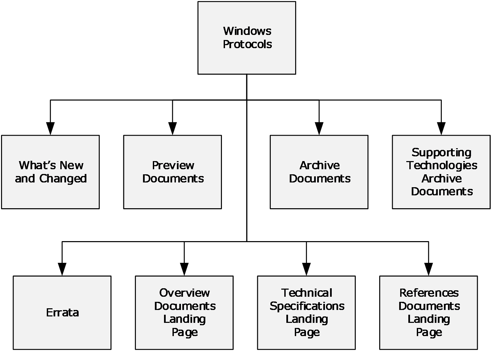

Figure 3: Windows protocols node

These nodes contain links to nodes in the Windows protocols documentation set, as follows:

[What’s New and Changed](https://go.microsoft.com/fwlink/?linkid=2008649): Technical specifications that are new or updated for the last release. It also gives a description of what technical content has been changed in the technical specification.

[Preview Documents](https://go.microsoft.com/fwlink/?linkid=2008648): Prerelease versions of documents for community review and feedback. The differences in the preview document since the last release are identified.

[Archive Documents](https://go.microsoft.com/fwlink/?linkid=2093133): Archived copies of documents that were previously published. They are provided for convenience only and may not be normative.

[Supporting Technologies Archive Documents](https://go.microsoft.com/fwlink/?linkid=2093134): Archived copies of documents that were previously published in the [Open Specifications](http://go.microsoft.com/fwlink/?LinkID=246356) library. They are provided for convenience only and may not be normative.

[Errata](https://go.microsoft.com/fwlink/?linkid=2093132): Content changes in technical specifications, overviews, and reference documents, which could impact an implementation in published versions of documents prior to their next release.

[Overview Documents Landing Page](http://go.microsoft.com/fwlink/?LinkId=266631): The overview documents landing page is described in section [3.1.1.1](#Section_3.1.1.1).

[Technical Specifications Landing Page](http://go.microsoft.com/fwlink/?LinkId=266632): The technical specifications landing page is described in section [3.1.1.2](#Section_3.1.1.2).

[Reference Documents Landing Page](http://go.microsoft.com/fwlink/?LinkId=233163): The reference documents landing page is described in section [3.1.1.3](#Section_3.1.1.3).

#### 3.1.1.1 Overview Documents Landing Page

The [Overview Documents Landing Page](http://go.microsoft.com/fwlink/?LinkId=266631) node can be reached from the [Windows Protocols](http://go.microsoft.com/fwlink/?LinkId=233157) node as shown in section [3.1.1](#Section_3.1.1). From this node it is possible to navigate to the nodes shown in the following diagram.

Figure 4: Overview document landing page nodes

The overview documents landing page node links to the landing pages for all overview documents in the Windows protocols documentation set. It is shown below.

Figure 5: Overview documents landing page

##### 3.1.1.1.1 Overview Documents

Overview Document Landing Page nodes can be reached from the [Overview Documents Landing Page](http://go.microsoft.com/fwlink/?LinkId=266631) node as shown in section [3.1.1.1](#Section_3.1.1.1). A landing page is defined for every overview document in the Windows protocols documentation set. An example is shown below.

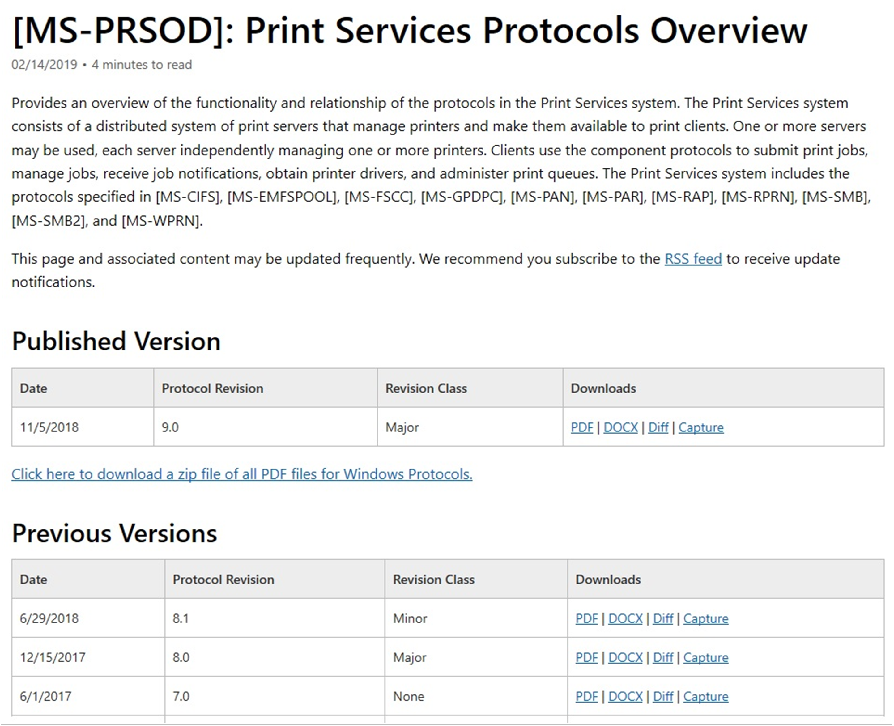

Figure 6: Overview document landing page

The following types of files are available for download from this page:

- PDF: A .pdf file of the overview document.
- DOCX: A .docx file of the overview document.
- Errata: A .pdf file that shows exactly what has changed from the last to the current release for the overview document.
- Diff: A .pdf file of the overview document that uses revision marks to show what has changed from the last to the current release for the overview document.
- Capture: A .zip file of the network captures for the examples described in the overview document.
The structures of overview documents are described in section [2.1](#Section_2.1)

#### 3.1.1.2 Technical Specifications Landing Page

The [Technical Specifications Landing Page](http://go.microsoft.com/fwlink/?LinkId=266632) node can be reached from the [Windows Protocols](http://go.microsoft.com/fwlink/?LinkId=233157) node as shown in section [3.1.1](#Section_3.1.1). From this node it is possible to navigate to the nodes shown in the following diagram.

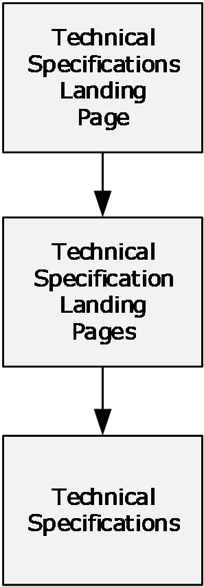

Figure 7: Technical specifications landing page nodes

The technical specifications landing page node links to the landing page nodes for all technical specifications in the Windows protocols documentation set. It is shown below.

Figure 8: Technical specifications landing page

##### 3.1.1.2.1 Technical Specifications

Technical Specification Landing Page nodes can be reached from the [Technical Specifications Landing Page](http://go.microsoft.com/fwlink/?LinkId=266632) node as shown in section [3.1.1.2](#Section_3.1.1.2). A landing page is defined for every technical specification in the Windows protocols documentation set. An example is shown below.

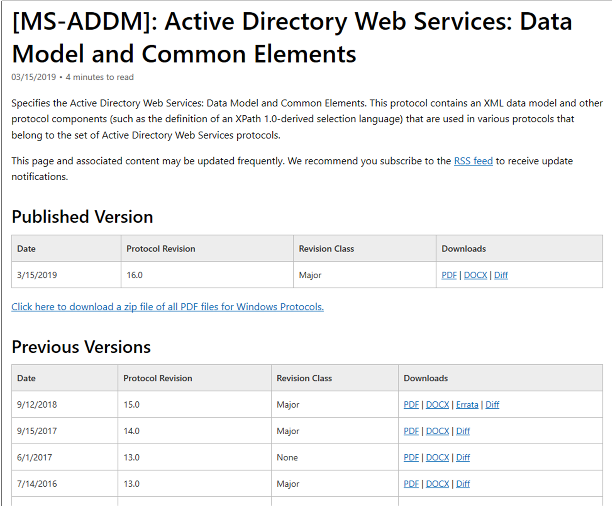

Figure 9: Technical specification landing page

The following types of files are available for download from this page:

- PDF: A .pdf file of the technical specification.
- DOCX: A .docx file of the technical specification.
- Errata: A .pdf file that shows exactly what has changed from the last to the current release for the technical specification.
- Diff: A .pdf file of the technical specification that uses revision marks to show what has changed from the last to the current release for the technical specification.
The structures of technical specifications are described in section [2.2](#Section_3.2.1.2).

#### 3.1.1.3 Reference Documents Landing Page

The [Reference Documents Landing Page](http://go.microsoft.com/fwlink/?LinkId=233163) node can be reached from the [Windows Protocols](http://go.microsoft.com/fwlink/?LinkId=233157) node as shown in section [3.1.1](#Section_3.1.1). From this node it is possible to navigate to the nodes shown in the following diagram.

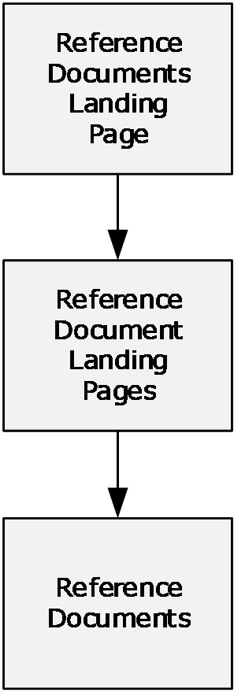

Figure 10: Reference documents landing page nodes

The reference documents landing page node links to the landing pages for all reference documents in the Windows protocols documentation set. It is shown below.

Figure 11: Reference documents landing page

##### 3.1.1.3.1 Reference Documents

Reference Document Landing Page nodes can be reached from the [Reference Documents Landing Page](http://go.microsoft.com/fwlink/?LinkId=233163) node as shown in section [3.1.1.3](#Section_3.1.1.3). A landing page is defined for every reference document in the Windows protocols documentation set. An example is shown below.

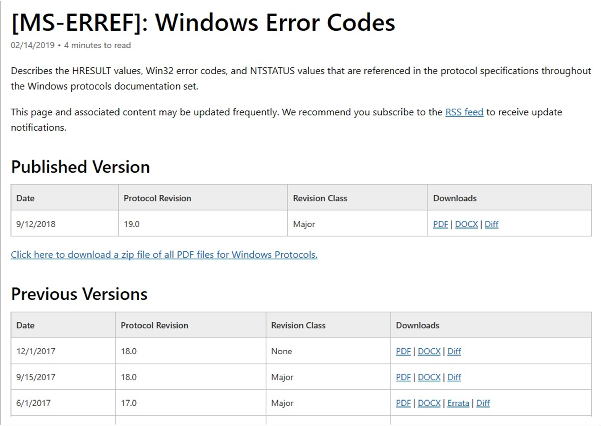

Figure 12: Reference document landing page

The following types of files are available for download from this page:

- PDF: A .pdf file of the reference document.
- DOCX: A .docx file of the reference document.
- Errata: A .pdf file that shows exactly what has changed from the last to the current release for the reference document.
- Diff: A .pdf file of the reference document that uses revision marks to show what has changed from the last to the current release for the reference document.
The structures of reference documents are described in sections [2.2](#Section_3.2.1.2) and [2.3](#Section_3.1.1.3.1).

### 3.1.2 Windows WordPad Standards Support

The [Windows WordPad Standards Support](http://go.microsoft.com/fwlink/?LinkId=615949) node is reached from the [Open Specifications](http://go.microsoft.com/fwlink/?LinkID=246356) node as shown in section [3.1](#Section_3.1). It is possible to navigate from this node to the nodes shown in the following diagram.

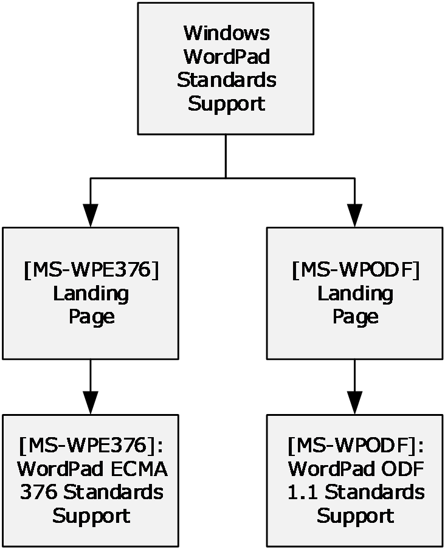

Figure 13: Windows WordPad standards support node

These documents describe support for the following standards, which are implemented in the Windows WordPad application.

- [[ECMA-376] ECMA International, "Office Open XML File Formats"](http://go.microsoft.com/fwlink/?LinkId=200054): A family of [**XML schema definitions (XSDs)**](#gt_xml-schema-definition-xsd) for [**Office Open XML (OOXML)**](#gt_office-open-xml-ooxml), which are used for office productivity applications.
- [[ODF1.1] OASIS Standard, "Open Document Format for Office Applications (OpenDocument) v1.1"](http://go.microsoft.com/fwlink/?LinkId=200424): An XSD with semantics and structures for office documents, which supports transformations using an [**XSL Transformation (XSLT)**](#gt_xsl-transformation-xslt) or similar [**XML**](#gt_xml)-based tools.
The documents on this node are based on the Standards Support template (section [2.2.3.8](#Section_2.2.3.8)).

## 3.2 Document Types

This section describes how to find documents in the Windows protocols documentation set according to the following document types:

- Overview documents (section [2.1](#Section_2.1))
- Technical specifications (section [2.2](#Section_3.2.1.2))
- Reference documents (section [2.3](#Section_3.1.1.3.1))
The navigation to these document types relative to the Open Specifications node are shown in Document Nodes (section [3.1](#Section_3.1)).

### 3.2.1 Windows Protocols

This section describes the documents by type relative to the [Windows Protocols](http://go.microsoft.com/fwlink/?LinkId=233157) node.

#### 3.2.1.1 Overview Documents

Overview documents of the Windows protocols documentation set can be reached from the [Windows Protocols](http://go.microsoft.com/fwlink/?LinkId=233157) node as shown in the following diagram.

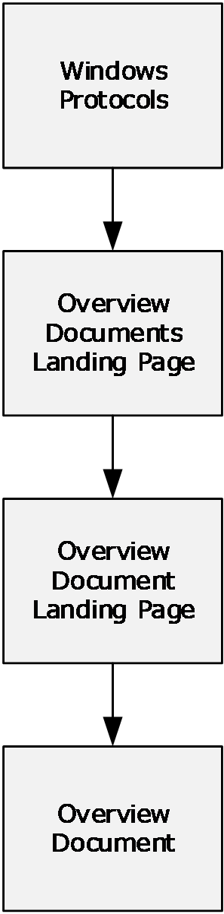

Figure 14: Overview documents

[Overview Documents Landing Page](http://go.microsoft.com/fwlink/?LinkId=266631): This node contains links to the landing pages of individual overview documents, as described in section [3.1.1.1](#Section_3.1.1.1).

#### 3.2.1.2 Technical Specifications

Technical specifications of the Windows protocols documentation set can be reached from the [Windows Protocols](http://go.microsoft.com/fwlink/?LinkId=233157) node as shown in the following diagram.

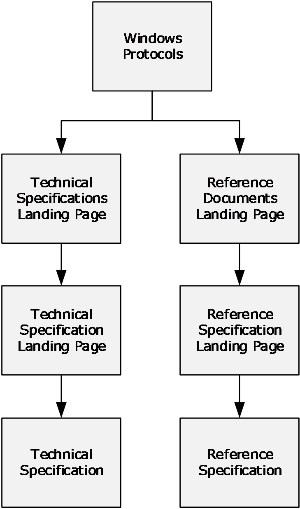

Figure 15: Technical specifications

The nodes shown in the diagram contain links to technical specifications, as follows:

[Technical Specifications Landing Page](http://go.microsoft.com/fwlink/?LinkId=266632): This node contains links to the landing pages of individual technical specifications, as described in section [3.1.1.2](#Section_3.1.1.2), including extensions to industry-standards or other published protocols, which are used by applicable Windows Server releases to interoperate with Windows Client operating system.

[Reference Documents Landing Page](http://go.microsoft.com/fwlink/?LinkId=233163): This node contains links to the landing pages of the following normative reference specifications:

- [[MS-DTYP]: Windows Data Types](http://msdn.microsoft.com/en-us/library/cca27429-5689-4a16-b2b4-9325d93e4ba2/)
- [[MS-ERREF]: Windows Error Codes](http://msdn.microsoft.com/en-us/library/1bc92ddf-b79e-413c-bbaa-99a5281a6c90/)
- [[MS-LCID]: Windows Language Code Identifier (LCID) Reference](http://msdn.microsoft.com/en-us/library/70feba9f-294e-491e-b6eb-56532684c37f/)

#### 3.2.1.3 Reference Documents

Reference documents of the Windows protocols documentation set can be reached from the [Windows Protocols](http://go.microsoft.com/fwlink/?LinkId=233157) node as shown in the following diagram.

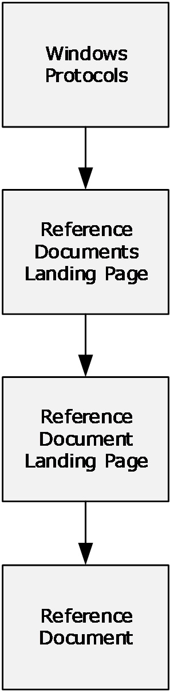

Figure 16: Reference documents

[Reference Documents Landing Page](http://go.microsoft.com/fwlink/?LinkId=233163): This node contains links to the landing page of the following informative reference document:

- [MS-UCODEREF]: Windows Protocols Unicode Reference

## 3.3 Document Citations

This section describes how to navigate from document to document in the Windows protocols documentation set by using links. The following figure shows the hierarchy of citations in the documentation set.

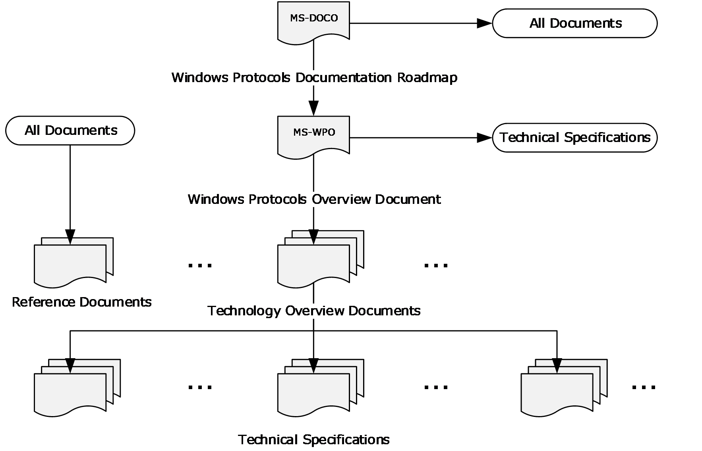

Figure 17: Citations in the Windows protocols documentation set

The connections represented in this figure can be summarized as follows:

- The Windows Protocols Documentation Roadmap contains links to all other types of documents.
- The Windows Protocols Overview contains links to technology overviews, technical specifications, and reference documents.
- Technology overview documents contain links to technical specifications and reference documents.
- Technical specifications contain links to technology overviews and reference documents.
- All documents can contain links to reference documents.
The contents of each type of document shown in the figure are described in Documentation Contents (section [2](#Section_2)).

Each technical specification contains lists of the normative and informative references it cites, with links. References to other Windows documents do not include dates of publication, because the citations always link to the latest version. References to other documents include a publishing year when one is available.

The subsections in this section describe the types of links in the Windows protocols documentation set.

### 3.3.1 Normative Citations

Normative citations refer to information that is required in order to understand or implement the technology defined in a specification or for that technology to work.

Citations to normative content are distinguished by the use of the words "defined", "specified", and "details".

#### 3.3.1.1 External Normative Citations

External citations to normative content include references to any of the following:

- Documents published by standards organizations (section [2.4.2](#Section_2.4.2)).
- RFCs (section [2.4.3](#Section_2.4.3)).
- Normative sections in other Windows technical specifications (section [3.3.1.2](#Section_3.3.1.2)).
All external normative documents are listed in the normative references section of the referencing technical specification.

#### 3.3.1.2 Internal Normative Citations

Internal citations to normative content are references to normative sections within a technical specification. The sections—including their subsections—that contain normative content in a technical specification vary according to the template type, as follows:

Algorithm template:

- 1.6 Standards Assignments
- 2.0 Algorithm Details
Block, HTTP, RPC, and SOAP protocol templates:

- 1.5 Prerequisites and Preconditions
- 1.8 Vendor Extensible Fields
- 1.9 Standards Assignments
- 2.0 Messages
- 3.0 Protocol Details
Data and File Structure templates:

- 1.7 Vendor -Extensible Fields
- 2.0 Structures
For more information about the document templates, see section [2.2](#Section_3.2.1.2).

### 3.3.2 Informative Citations

Informative citations refer to information that is not required in order to understand or implement the technology defined in a specification, such as background or implementation-specific information.

Citations to informative content are distinguished by the use of the words "described" and "information".

#### 3.3.2.1 External Informative Citations

Citations to external informative content include references to any of the following:

- Any content that could qualify as an external normative reference (section [3.3.1.1](#Section_3.3.1.1)).
- [Microsoft Developer](https://go.microsoft.com/fwlink/?linkid=2092989) articles.
- Windows overview documents (section [2.1](#Section_2.1)).
- Informative sections in other Windows technical specifications (section [2.2](#Section_3.2.1.2)).
- Windows reference documents (section [2.3](#Section_3.1.1.3.1)).
All external informative documents are listed in the informative references section of the referencing technical specification.

#### 3.3.2.2 Internal Informative Citations

Internal citations to informative content are references to informative sections within a technical specification. Any content that is not normative is by definition informative, including Windows product behavior. The sections—including their subsections—that contain informative content in a technical specification vary according to the template type.

For more information about the document templates, see section [2.2](#Section_3.2.1.2).

# 4 Appendix A: Cross-Reference Matrixes

## 4.1 Technical Specification Cross-Reference Matrix

This section contains a table that provides, for each technical specification in the Windows protocols documentation set, the following information:

- Link to the document
- Document title
- Template type (section [2.2](#Section_3.2.1.2))
- Technical area (section [2](#Section_2))
- Protocols specified
- Other technical specifications normatively cited
| Document short name | Document title | Template type | Technical area | Protocols specified | Technical specifications cited |
| --- | --- | --- | --- | --- | --- |
| [MC-BUP](../MC-BUP/MC-BUP.md) | Background Intelligent Transfer Service (BITS) Upload Protocol Specification | Block | Systems Management | Background Intelligent Transfer Service (BITS) Upload Protocol | [MS-BPCR](../MS-BPCR/MS-BPCR.md) [MS-ERREF](../MS-ERREF/MS-ERREF.md) [MS-NTHT](../MS-NTHT/MS-NTHT.md) [MS-SMB](../MS-SMB/MS-SMB.md) |
| [MC-CCFG](../MC-CCFG/MC-CCFG.md) | Server Cluster: Configuration (ClusCfg) Protocol Specification | RPC | Systems Management | Server Cluster: Configuration (ClusCfg) Protocol | [MS-CMRP](../MS-CMRP/MS-CMRP.md) [MS-DCOM](../MS-DCOM/MS-DCOM.md) [MS-ERREF](../MS-ERREF/MS-ERREF.md) [MS-OAUT](../MS-OAUT/MS-OAUT.md) [MS-RPCE](../MS-RPCE/MS-RPCE.md) [MS-RRP](../MS-RRP/MS-RRP.md) [MS-SCMR](../MS-SCMR/MS-SCMR.md) |
| [MC-COMQC](../MC-COMQC/MC-COMQC.md) | Component Object Model Plus (COM+) Queued Components Protocol Specification | Block | Application Services | Component Object Model Plus (COM+) Queued Components Protocol | [MS-COM](../MS-COM/MS-COM.md) [MS-DCOM](../MS-DCOM/MS-DCOM.md) [MS-MQDMPR](../MS-MQDMPR/MS-MQDMPR.md) [MS-MQMP](../MS-MQMP/MS-MQMP.md) [MS-MQMQ](../MS-MQMQ/MS-MQMQ.md) [MS-OAUT](../MS-OAUT/MS-OAUT.md) |
| [MC-CSDL](../MC-CSDL/MC-CSDL.md) | Conceptual Schema Definition File Format | Structure | Application Services | Conceptual Schema Definition File Format | None |
| [MC-DPL4CS](../MC-DPL4CS/MC-DPL4CS.md) | DirectPlay 4 Protocol: Core and Service Providers Specification | Block | Multiplayer Games | DirectPlay 4 Protocol: Core and Service Providers | [MC-DPL4R](../MC-DPL4R/MC-DPL4R.md) [MC-DPLVP](../MC-DPLVP/MC-DPLVP.md) [MS-DPDX](../MS-DPDX/MS-DPDX.md) [MS-ERREF](../MS-ERREF/MS-ERREF.md) [MS-NLMP](../MS-NLMP/MS-NLMP.md) |
| [MC-DPL4R](../MC-DPL4R/MC-DPL4R.md) | DirectPlay 4 Protocol: Reliable Specification | Block | Multiplayer Games | DirectPlay 4 Protocol | [MC-DPL4CS](../MC-DPL4CS/MC-DPL4CS.md) [MS-DPDX](../MS-DPDX/MS-DPDX.md) |
| [MC-DPL8CS](../MC-DPL8CS/MC-DPL8CS.md) | DirectPlay 8 Protocol: Core and Service Providers Specification | Block | Multiplayer Games | DirectPlay 8 Protocol: Core and Service Providers | [MC-DPL8R](../MC-DPL8R/MC-DPL8R.md) [MS-DPDX](../MS-DPDX/MS-DPDX.md) [MS-ERREF](../MS-ERREF/MS-ERREF.md) |
| [MC-DPL8R](../MC-DPL8R/MC-DPL8R.md) | DirectPlay 8 Protocol: Reliable Specification | Block | Multiplayer Games | DirectPlay 8 Protocol | [MS-DPDX](../MS-DPDX/MS-DPDX.md) [MS-DTYP](../MS-DTYP/MS-DTYP.md) |
| [MC-DPLHP](../MC-DPLHP/MC-DPLHP.md) | DirectPlay 8 Protocol: Host and Port Enumeration Specification | Block | Multiplayer Games | DirectPlay 8 Protocol: Host and Port Enumeration | [MC-DPL8CS](../MC-DPL8CS/MC-DPL8CS.md) [MC-DPL8R](../MC-DPL8R/MC-DPL8R.md) [MS-DPDX](../MS-DPDX/MS-DPDX.md) [MS-DTYP](../MS-DTYP/MS-DTYP.md) |
| [MC-DPLNAT](../MC-DPLNAT/MC-DPLNAT.md) | DirectPlay 8 Protocol: NAT Locator Specification | Block | Multiplayer Games | DirectPlay 8 Protocol: NAT Locator | [MC-DPL8CS](../MC-DPL8CS/MC-DPL8CS.md) [MC-DPL8R](../MC-DPL8R/MC-DPL8R.md) [MS-DPDX](../MS-DPDX/MS-DPDX.md) [MS-DTYP](../MS-DTYP/MS-DTYP.md) |
| [MC-DPLVP](../MC-DPLVP/MC-DPLVP.md) | DirectPlay Voice Protocol Specification | Block | Multiplayer Games | DirectPlay Voice Protocol | [MC-DPL4CS](../MC-DPL4CS/MC-DPL4CS.md) [MC-DPL8CS](../MC-DPL8CS/MC-DPL8CS.md) [MC-DPL8R](../MC-DPL8R/MC-DPL8R.md) [MS-DPDX](../MS-DPDX/MS-DPDX.md) [MS-DTYP](../MS-DTYP/MS-DTYP.md) [MS-ERREF](../MS-ERREF/MS-ERREF.md) |
| [MC-DRT](../MC-DRT/MC-DRT.md) | Distributed Routing Table (DRT) Version 1.0 Specification | Block | Home Server | Distributed Routing Table (DRT) Version 1.0 | [MS-PNRP](../MS-PNRP/MS-PNRP.md) |
| [MC-DTCXA](../MC-DTCXA/MC-DTCXA.md) | MSDTC Connection Manager: OleTx XA Protocol Specification | Block | Application Services | MSDTC Connection Manager: OleTx XA Protocol | [MS-CMP](../MS-CMP/MS-CMP.md) [MS-CMPO](../MS-CMPO/MS-CMPO.md) [MS-DTCO](../MS-DTCO/MS-DTCO.md) [MS-DTYP](../MS-DTYP/MS-DTYP.md) [MS-ERREF](../MS-ERREF/MS-ERREF.md) |
| [MC-EDMX](../MC-EDMX/MC-EDMX.md) | Entity Data Model for Data Services Packaging Format | Structure | Application Services | Entity Data Model for Data Services Packaging Format | [MC-CSDL](../MC-CSDL/MC-CSDL.md) |
| [MC-IISA](../MC-IISA/MC-IISA.md) | Internet Information Services (IIS) Application Host COM Protocol Specification | RPC | Application Services | Internet Information Services (IIS) Application Host COM Protocol | [MS-DTYP](../MS-DTYP/MS-DTYP.md) [MS-ERREF](../MS-ERREF/MS-ERREF.md) [MS-OAUT](../MS-OAUT/MS-OAUT.md) [MS-RPCE](../MS-RPCE/MS-RPCE.md) |
| [MC-MQAC](../MC-MQAC/MC-MQAC.md) | Message Queuing (MSMQ): ActiveX Client Protocol Specification | RPC | Application Services | Message Queuing (MSMQ): ActiveX Client Protocol | [MS-ADTS](../MS-ADTS/MS-ADTS.md) [MS-COM](../MS-COM/MS-COM.md) [MS-DCOM](../MS-DCOM/MS-DCOM.md) [MS-DTCO](../MS-DTCO/MS-DTCO.md) [MS-DTYP](../MS-DTYP/MS-DTYP.md) [MS-ERREF](../MS-ERREF/MS-ERREF.md) [MS-MQDMPR](../MS-MQDMPR/MS-MQDMPR.md) [MS-MQDSSM](../MS-MQDSSM/MS-MQDSSM.md) [MS-MQMR](../MS-MQMR/MS-MQMR.md) [MS-MQMQ](../MS-MQMQ/MS-MQMQ.md) [MS-MQQB](../MS-MQQB/MS-MQQB.md) [MS-OAUT](../MS-OAUT/MS-OAUT.md) [MS-RPCE](../MS-RPCE/MS-RPCE.md) |
| [MC-MQSRM](../MC-MQSRM/MC-MQSRM.md) | Message Queuing (MSMQ): SOAP Reliable Messaging Protocol (SRMP) Specification | Block | Application Services | Message Queuing (MSMQ): SOAP Reliable Messaging Protocol (SRMP) | [MS-DTYP](../MS-DTYP/MS-DTYP.md) [MS-MQDMPR](../MS-MQDMPR/MS-MQDMPR.md) [MS-MQDSSM](../MS-MQDSSM/MS-MQDSSM.md) [MS-MQMQ](../MS-MQMQ/MS-MQMQ.md) [MS-MQQB](../MS-MQQB/MS-MQQB.md) |
| [MC-NBFS](../MC-NBFS/MC-NBFS.md) | .NET Binary Format: SOAP Data Structure | Structure | Application Services | .NET Binary Format: SOAP Data Structures .NET Binary Format: for XML | [MC-NBFSE](../MC-NBFSE/MC-NBFSE.md) [MC-NBFX](../MC-NBFX/MC-NBFX.md) [MC-NMF](../MC-NMF/MC-NMF.md) |
| [MC-NBFSE](../MC-NBFSE/MC-NBFSE.md) | .NET Binary Format: SOAP Extension | Structure | Application Services | .NET Binary Format: SOAP Extension .NET Binary Format for XML | [MC-NBFS](../MC-NBFS/MC-NBFS.md) [MC-NBFX](../MC-NBFX/MC-NBFX.md) [MC-NMF](../MC-NMF/MC-NMF.md) |
| [MC-NBFX](../MC-NBFX/MC-NBFX.md) | .NET Binary Format: XML Data Structure | Structure | Application Services | .NET Binary Format: XML Data Structure .NET Binary Format: for XML | [MS-OAUT](../MS-OAUT/MS-OAUT.md) |
| [MC-NETCEX](../MC-NETCEX/MC-NETCEX.md) | .NET Context Exchange Protocol Specification | Block | Application Services | .NET Context Exchange Protocol | None |
| [MC-NMF](../MC-NMF/MC-NMF.md) | .NET Message Framing Protocol Specification | Block | Application Services | .NET Message Framing Protocol | [MC-NBFS](../MC-NBFS/MC-NBFS.md) [MC-NBFSE](../MC-NBFSE/MC-NBFSE.md) [MS-DTYP](../MS-DTYP/MS-DTYP.md) [MS-MQMQ](../MS-MQMQ/MS-MQMQ.md) |
| [MC-NPR](../MC-NPR/MC-NPR.md) | .NET Packet Routing Protocol Specification | Block | Application Services | .NET Packet Routing Protocol | None |
| [MC-PRCH](../MC-PRCH/MC-PRCH.md) | Peer Channel Protocol Specification | SOAP | Application Services | Peer Channel Protocol | [MC-NBFS](../MC-NBFS/MC-NBFS.md) [MC-NBFSE](../MC-NBFSE/MC-NBFSE.md) [MC-NMF](../MC-NMF/MC-NMF.md) [MS-DTYP](../MS-DTYP/MS-DTYP.md) [MS-ERREF](../MS-ERREF/MS-ERREF.md) [MS-WSPOL](../MS-WSPOL/MS-WSPOL.md) |
| [MC-PRCR](../MC-PRCR/MC-PRCR.md) | Peer Channel Custom Resolver Protocol Specification | SOAP | Application Services Home Server | Peer Channel Custom Resolver Protocol | [MC-NBFS](../MC-NBFS/MC-NBFS.md) [MC-NBFSE](../MC-NBFSE/MC-NBFSE.md) [MC-NMF](../MC-NMF/MC-NMF.md) [MS-DTYP](../MS-DTYP/MS-DTYP.md) [MS-WSPOL](../MS-WSPOL/MS-WSPOL.md) |
| [MC-SMP](../MC-SMP/MC-SMP.md) | Session Multiplex Protocol Specification | Block | Application Services | Session Multiplex Protocol | [MS-DTYP](../MS-DTYP/MS-DTYP.md) |
| [MC-SQLR](../MC-SQLR/MC-SQLR.md) | SQL Server Resolution Protocol Specification | Block | Application Services | SQL Server Resolution Protocol | None |
| [MS-ABTP](../MS-ABTP/MS-ABTP.md) | Automatic Bluetooth Pairing Protocol | Block | Device-Specific | Automatic Bluetooth Pairing Protocol | None |
| [MS-ADA1](../MS-ADA1/MS-ADA1.md) | Active Directory Schema Attributes A-L | None | Directory Services | Active Directory Schema Attributes A-L | [MS-ADA3](../MS-ADA3/MS-ADA3.md) [MS-ADTS](../MS-ADTS/MS-ADTS.md) [MS-DTYP](../MS-DTYP/MS-DTYP.md) [MS-LSAD](../MS-LSAD/MS-LSAD.md) [MS-SAMR](../MS-SAMR/MS-SAMR.md) |
| [MS-ADA2](../MS-ADA2/MS-ADA2.md) | Active Directory Schema Attributes M | None | Directory Services | Active Directory Schema Attributes M | [MS-ADTS](../MS-ADTS/MS-ADTS.md) [MS-DRSR](../MS-DRSR/MS-DRSR.md) [MS-DTYP](../MS-DTYP/MS-DTYP.md) [MS-LSAD](../MS-LSAD/MS-LSAD.md) [MS-RCMP](../MS-RCMP/MS-RCMP.md) [MS-SAMR](../MS-SAMR/MS-SAMR.md) |
| [MS-ADA3](../MS-ADA3/MS-ADA3.md) | Active Directory Schema Attributes N-Z | None | Directory Services | Active Directory Schema Attributes N-Z | [MS-ADSC](../MS-ADSC/MS-ADSC.md) [MS-ADTS](../MS-ADTS/MS-ADTS.md) [MS-DRSR](../MS-DRSR/MS-DRSR.md) [MS-DTYP](../MS-DTYP/MS-DTYP.md) [MS-LSAD](../MS-LSAD/MS-LSAD.md) [MS-SAMR](../MS-SAMR/MS-SAMR.md) |
| [MS-ADCAP](../MS-ADCAP/MS-ADCAP.md) | Active Directory Web Services: Custom Action Protocol Specification | SOAP | Directory Services | Active Directory Web Services: Custom Action Protocol | [MS-ADA1](../MS-ADA1/MS-ADA1.md) [MS-ADA2](../MS-ADA2/MS-ADA2.md) [MS-ADA3](../MS-ADA3/MS-ADA3.md) [MS-ADDM](../MS-ADDM/MS-ADDM.md) [MS-ADLS](../MS-ADLS/MS-ADLS.md) [MS-ADSC](../MS-ADSC/MS-ADSC.md) [MS-ADTS](../MS-ADTS/MS-ADTS.md) [MS-DRSR](../MS-DRSR/MS-DRSR.md) [MS-DTYP](../MS-DTYP/MS-DTYP.md) [MS-ERREF](../MS-ERREF/MS-ERREF.md) [MS-NNS](../MS-NNS/MS-NNS.md) [MS-SAMR](../MS-SAMR/MS-SAMR.md) [MS-WSDS](../MS-WSDS/MS-WSDS.md) [MS-WSPELD](../MS-WSPELD/MS-WSPELD.md) [MS-WSTIM](../MS-WSTIM/MS-WSTIM.md) |
| [MS-ADDM](../MS-ADDM/MS-ADDM.md) | Active Directory Web Services: Data Model and Common Elements | Structure | Directory Services | Active Directory Web Services: Custom Action Protocol WS-Transfer: Identity Management Operations for Directory Access Protocol Extensions WS-Transfer: Directory Services Protocol Extensions WS-Enumeration: Directory Services Protocol Extensions | [MS-ADCAP](../MS-ADCAP/MS-ADCAP.md) [MS-ADTS](../MS-ADTS/MS-ADTS.md) [MS-DTYP](../MS-DTYP/MS-DTYP.md) [MS-ERREF](../MS-ERREF/MS-ERREF.md) [MS-WSDS](../MS-WSDS/MS-WSDS.md) [MS-WSPELD](../MS-WSPELD/MS-WSPELD.md) [MS-WSTIM](../MS-WSTIM/MS-WSTIM.md) |
| [MS-ADFSOAL](../MS-ADFSOAL/MS-ADFSOAL.md) | Active Directory Federation Services OAuth Authorization Code Lookup Protocol | HTTP | Security and Identity Management | Active Directory Federation Services OAuth Authcode Lookup Protocol | None |
| [MS-ADFSPIP](../MS-ADFSPIP/MS-ADFSPIP.md) | Active Directory Federation Services and Proxy Integration Protocol | HTTP | Security and Identity Management | Active Directory Federation Services Proxy and Web Application Proxy Integration Protocol Active Directory Federation Services and Proxy Configuration Protocol Active Directory Federation Services and Proxy Communication Protocol Federation Service Proxy Protocol | [MS-OAPX](../MS-OAPX/MS-OAPX.md) |
| [MS-ADFSPP](../MS-ADFSPP/MS-ADFSPP.md) | Active Directory Federation Service (AD FS) Proxy Protocol | Block | Security and Identity Management | Federation Service Web Agent Protocol | [MS-MWBF](../MS-MWBF/MS-MWBF.md) |
| [MS-ADFSWAP](../MS-ADFSWAP/MS-ADFSWAP.md) | Active Directory Federation Service (AD FS) Web Agent Protocol | SOAP | Security and Identity Management | Federation Service Web Agent and Proxy Protocol | [MS-ADTS](../MS-ADTS/MS-ADTS.md) [MS-MWBF](../MS-MWBF/MS-MWBF.md) |
| [MS-ADLS](../MS-ADLS/MS-ADLS.md) | Active Directory Lightweight Directory Services Schema | None | Directory Services | Active Directory Lightweight Directory Services Schema | [MS-ADTS](../MS-ADTS/MS-ADTS.md) [MS-DTYP](../MS-DTYP/MS-DTYP.md) |
| [MS-ADSC](../MS-ADSC/MS-ADSC.md) | Active Directory Schema Classes | None | Directory Services | Active Directory Schema Classes | [MS-ADTS](../MS-ADTS/MS-ADTS.md) |
| [MS-ADTG](../MS-ADTG/MS-ADTG.md) | Remote Data Services (RDS) Transport Protocol Specification | Block | Networking | DCOM Interfaces for Remote Data Services Remote Data Services Transport Protocol (RDST) DCOM Interfaces for Remote Data Services Remote Data Services Transport Protocol (RDST) | [MS-DTYP](../MS-DTYP/MS-DTYP.md) [MS-ERREF](../MS-ERREF/MS-ERREF.md) [MS-LCID](../MS-LCID/MS-LCID.md) [MS-OAUT](../MS-OAUT/MS-OAUT.md) |
| [MS-ADTS](../MS-ADTS/MS-ADTS.md) | Active Directory Technical Specification | Block | Directory Services | Lightweight Directory Access Protocol (LDAP) V3: Microsoft Profile Active Directory Lightweight Directory Access Protocol (LDAP) Extensions Active Directory Data Structures Active Directory Algorithms | [MS-ADA1](../MS-ADA1/MS-ADA1.md) [MS-ADA2](../MS-ADA2/MS-ADA2.md) [MS-ADA3](../MS-ADA3/MS-ADA3.md) [MS-ADLS](../MS-ADLS/MS-ADLS.md) [MS-ADSC](../MS-ADSC/MS-ADSC.md) [MS-APDS](../MS-APDS/MS-APDS.md) [MS-DRSR](../MS-DRSR/MS-DRSR.md) [MS-DTYP](../MS-DTYP/MS-DTYP.md) [MS-ERREF](../MS-ERREF/MS-ERREF.md) [MS-FRS1](../MS-FRS1/MS-FRS1.md) [MS-KILE](../MS-KILE/MS-KILE.md) [MS-LSAD](../MS-LSAD/MS-LSAD.md) [MS-MAIL](../MS-MAIL/MS-MAIL.md) [MS-NLMP](../MS-NLMP/MS-NLMP.md) [MS-NRPC](../MS-NRPC/MS-NRPC.md) [MS-PAC](../MS-PAC/MS-PAC.md) [MS-SAMR](../MS-SAMR/MS-SAMR.md) [MS-SFU](../MS-SFU/MS-SFU.md) [MS-SPNG](../MS-SPNG/MS-SPNG.md) [MS-SRPL](../MS-SRPL/MS-SRPL.md) [MS-W32T](../MS-W32T/MS-W32T.md) |
| [MS-AIPS](../MS-AIPS/MS-AIPS.md) | Authenticated Internet Protocol Specification | Block | Security and Identity Management | Authenticated Internet Protocol | [MS-ERREF](../MS-ERREF/MS-ERREF.md) [MS-IKEE](../MS-IKEE/MS-IKEE.md) [MS-KILE](../MS-KILE/MS-KILE.md) [MS-NLMP](../MS-NLMP/MS-NLMP.md) |
| [MS-APDS](../MS-APDS/MS-APDS.md) | Authentication Protocol Domain Support Specification | Block | Security and Identity Management | Authentication Protocol Domain Support (APDS) NetLogon Remote Protocol: Challenge Handshake Authentication Protocol (CHAP)/EAP-MD5 SubAuthentication Extension | [MS-ADA3](../MS-ADA3/MS-ADA3.md) [MS-ADTS](../MS-ADTS/MS-ADTS.md) [MS-DPSP](../MS-DPSP/MS-DPSP.md) [MS-DTYP](../MS-DTYP/MS-DTYP.md) [MS-ERREF](../MS-ERREF/MS-ERREF.md) [MS-KILE](../MS-KILE/MS-KILE.md) [MS-LSAD](../MS-LSAD/MS-LSAD.md) [MS-NLMP](../MS-NLMP/MS-NLMP.md) [MS-NRPC](../MS-NRPC/MS-NRPC.md) [MS-PAC](../MS-PAC/MS-PAC.md) [MS-RCMP](../MS-RCMP/MS-RCMP.md) [MS-RPCE](../MS-RPCE/MS-RPCE.md) [MS-SAMR](../MS-SAMR/MS-SAMR.md) |
| [MS-ASP](../MS-ASP/MS-ASP.md) | ASP.NET State Server Protocol Specification | Block | Application Services | ASP.NET State Server Protocol | None |
| [MS-AZMP](../MS-AZMP/MS-AZMP.md) | Authorization Manager (AzMan) Policy File Format | Structure | Security and Identity Management Application Services | Authorization Manager (AzMan) Policy File Format | None |
| [MS-BDSRR](../MS-BDSRR/MS-BDSRR.md) | Business Document Scanning: Scan Repository Capabilities and Status Retrieval Protocol Specification | SOAP | File, Fax, and Printing Services | Business Document Scanning: Scan Repository Capabilities and Status Retrieval Protocol | None |
| [MS-BGPP](../MS-BGPP/MS-BGPP.md) | Border Gateway Protocol (BGP) Profile | Block | Systems Management | Border Gateway Protocol 4 (BGP-4) | None |
| [MS-BKRP](../MS-BKRP/MS-BKRP.md) | BackupKey Remote Protocol Specification | RPC | Security and Identity Management | BackupKey Remote Protocol | [MS-DTYP](../MS-DTYP/MS-DTYP.md) [MS-ERREF](../MS-ERREF/MS-ERREF.md) [MS-KILE](../MS-KILE/MS-KILE.md) [MS-LSAD](../MS-LSAD/MS-LSAD.md) [MS-NLMP](../MS-NLMP/MS-NLMP.md) [MS-RPCE](../MS-RPCE/MS-RPCE.md) [MS-SMB](../MS-SMB/MS-SMB.md) [MS-SMB2](../MS-SMB2/MS-SMB2.md) [MS-SPNG](../MS-SPNG/MS-SPNG.md) |
| [MS-BKUP](../MS-BKUP/MS-BKUP.md) | Microsoft NT Backup File Structure | Structure | File, Fax, and Printing Services | File Replication Service (FRS) Protocol | [MS-FRS1](../MS-FRS1/MS-FRS1.md) [MS-FRS2](../MS-FRS2/MS-FRS2.md) [MS-FSCC](../MS-FSCC/MS-FSCC.md) |
| [MS-BPAU](../MS-BPAU/MS-BPAU.md) | Background Intelligent Transfer Service (BITS) Peer-Caching: Peer Authentication Protocol Specification | RPC | Systems Management | Background Intelligent Transfer Service (BITS) Peercaching: Peer Authentication Protocol | [MS-DTYP](../MS-DTYP/MS-DTYP.md) [MS-ERREF](../MS-ERREF/MS-ERREF.md) [MS-KILE](../MS-KILE/MS-KILE.md) [MS-RPCE](../MS-RPCE/MS-RPCE.md) |
| [MS-BPCR](../MS-BPCR/MS-BPCR.md) | Background Intelligent Transfer Service (BITS) Peer-Caching: Content Retrieval Protocol Specification | RPC | Systems Management | Background Intelligent Transfer Service (BITS) Peercaching: Content Retrieval Protocol | [MS-BPAU](../MS-BPAU/MS-BPAU.md) [MS-BPDP](../MS-BPDP/MS-BPDP.md) [MS-DTYP](../MS-DTYP/MS-DTYP.md) [MS-ERREF](../MS-ERREF/MS-ERREF.md) |
| [MS-BPDP](../MS-BPDP/MS-BPDP.md) | Background Intelligent Transfer Service (BITS) Peer-Caching: Peer Discovery Protocol Specification | RPC | Systems Management | Background Intelligent Transfer Service (BITS) Peercaching: Peer Discovery Protocol | [MS-DTYP](../MS-DTYP/MS-DTYP.md) |
| [MS-BRWS](../MS-BRWS/MS-BRWS.md) | Common Internet File System (CIFS) Browser Protocol Specification | RPC | File, Fax, and Printing Services | Common Internet File System (CIFS) Browser Protocol | [MS-BRWSA](../MS-BRWSA/MS-BRWSA.md) [MS-ERREF](../MS-ERREF/MS-ERREF.md) [MS-LSAD](../MS-LSAD/MS-LSAD.md) [MS-MAIL](../MS-MAIL/MS-MAIL.md) [MS-NBTE](../MS-NBTE/MS-NBTE.md) [MS-RAP](../MS-RAP/MS-RAP.md) [MS-SAMR](../MS-SAMR/MS-SAMR.md) [MS-SMB](../MS-SMB/MS-SMB.md) [MS-SRVS](../MS-SRVS/MS-SRVS.md) [MS-WKST](../MS-WKST/MS-WKST.md) |
| [MS-BRWSA](../MS-BRWSA/MS-BRWSA.md) | Common Internet File System (CIFS) Browser Auxiliary Protocol Specification | RPC | File, Fax, and Printing Services | Common Internet File System (CIFS) Browser Auxiliary Protocol | [MS-DTYP](../MS-DTYP/MS-DTYP.md) [MS-RPCE](../MS-RPCE/MS-RPCE.md) [MS-SMB](../MS-SMB/MS-SMB.md) |
| [MS-CAPR](../MS-CAPR/MS-CAPR.md) | Central Access Policy Identifier (ID) Retrieval Protocol | RPC | File, Fax, and Printing Services | Central Access Policy ID Retrieval Protocol | [MS-DTYP](../MS-DTYP/MS-DTYP.md) [MS-ERREF](../MS-ERREF/MS-ERREF.md) [MS-LSAT](../MS-LSAT/MS-LSAT.md) [MS-RPCE](../MS-RPCE/MS-RPCE.md) |
| [MS-CBCP](../MS-CBCP/MS-CBCP.md) | Callback Control Protocol Specification | Block | Networking | Callback Control Protocol | [MS-DTYP](../MS-DTYP/MS-DTYP.md) |
| [MS-CDP](../MS-CDP/MS-CDP.md) | Connected Devices Platform Protocol Version 3 | Block | Networking | Connected Devices Platform Service Protocol | [MS-DTYP](../MS-DTYP/MS-DTYP.md) |
| [MS-CER](../MS-CER/MS-CER.md) | Corporate Error Reporting Version 1.0 Protocol Specification | Block | Systems Management | Corporate Error Reporting Version 1.0 Protocol | [MS-SMB](../MS-SMB/MS-SMB.md) |
| [MS-CER2](../MS-CER2/MS-CER2.md) | Corporate Error Reporting V.2 Protocol Specification | Block | Systems Management | Corporate Error Reporting V.2 Protocol Specification | [MS-LCID](../MS-LCID/MS-LCID.md) [MS-NTHT](../MS-NTHT/MS-NTHT.md) |
| [MS-CFB](../MS-CFB/MS-CFB.md) | Compound File Binary File Format | Structure | Networking | Compound File Binary File Format | None |
| [MS-CHAP](../MS-CHAP/MS-CHAP.md) | Extensible Authentication Protocol Method for Microsoft Challenge Handshake Authentication Protocol (CHAP) Specification | RPC | Networking | Extensible Authentication Protocol Method for Microsoft Challenge Handshake Authentication Protocol (CHAP) | None |
| [MS-CIFS](../MS-CIFS/MS-CIFS.md) | Common Internet File System (CIFS) Protocol Specification | Block | File, Fax, and Printing Services | Common Internet File System (CIFS) Protocol | [MS-BRWS](../MS-BRWS/MS-BRWS.md) [MS-DFSC](../MS-DFSC/MS-DFSC.md) [MS-DFSNM](../MS-DFSNM/MS-DFSNM.md) [MS-DTYP](../MS-DTYP/MS-DTYP.md) [MS-ERREF](../MS-ERREF/MS-ERREF.md) [MS-FSCC](../MS-FSCC/MS-FSCC.md) [MS-LSAD](../MS-LSAD/MS-LSAD.md) [MS-MSRP](../MS-MSRP/MS-MSRP.md) [MS-NLMP](../MS-NLMP/MS-NLMP.md) [MS-RAP](../MS-RAP/MS-RAP.md) [MS-RPCE](../MS-RPCE/MS-RPCE.md) [MS-SRVS](../MS-SRVS/MS-SRVS.md) |
| [MS-CMOM](../MS-CMOM/MS-CMOM.md) | MSDTC Connection Manager: OleTx Management Protocol Specification | Block | Application Services | MSDTC Connection Manager: OleTx Management Protocol | [MC-DTCXA](../MC-DTCXA/MC-DTCXA.md) [MS-CMP](../MS-CMP/MS-CMP.md) [MS-CMPO](../MS-CMPO/MS-CMPO.md) [MS-CMRP](../MS-CMRP/MS-CMRP.md) [MS-DTCLU](../MS-DTCLU/MS-DTCLU.md) [MS-DTCM](../MS-DTCM/MS-DTCM.md) [MS-DTCO](../MS-DTCO/MS-DTCO.md) [MS-DTYP](../MS-DTYP/MS-DTYP.md) [MS-RRP](../MS-RRP/MS-RRP.md) [MS-SCMR](../MS-SCMR/MS-SCMR.md) |
| [MS-CMP](../MS-CMP/MS-CMP.md) | MSDTC Connection Manager: OleTx Multiplexing Protocol Specification | Block | Application Services | MSDTC Connection Manager: OleTx Multiplexing Protocol | [MS-CMPO](../MS-CMPO/MS-CMPO.md) [MS-ERREF](../MS-ERREF/MS-ERREF.md) |
| [MS-CMPO](../MS-CMPO/MS-CMPO.md) | MSDTC Connection Manager: OleTx Transports Protocol Specification | RPC | Application Services | MSDTC Connection Manager: OleTx Transports Protocol | [MS-DTYP](../MS-DTYP/MS-DTYP.md) [MS-ERREF](../MS-ERREF/MS-ERREF.md) [MS-RPCE](../MS-RPCE/MS-RPCE.md) |
| [MS-CMRP](../MS-CMRP/MS-CMRP.md) | Failover Cluster: Management API (ClusAPI) Protocol Specification | RPC | Systems Management | Failover Cluster: Management API (ClusAPI) Protocol | [MS-DMRP](../MS-DMRP/MS-DMRP.md) [MS-DTYP](../MS-DTYP/MS-DTYP.md) [MS-ERREF](../MS-ERREF/MS-ERREF.md) [MS-LSAD](../MS-LSAD/MS-LSAD.md) [MS-NLMP](../MS-NLMP/MS-NLMP.md) [MS-RPCE](../MS-RPCE/MS-RPCE.md) [MS-RRP](../MS-RRP/MS-RRP.md) [MS-SCMR](../MS-SCMR/MS-SCMR.md) [MS-SPNG](../MS-SPNG/MS-SPNG.md) |
| [MS-COM](../MS-COM/MS-COM.md) | Component Object Model Plus (COM+) Protocol Specification | RPC | Application Services | Component Object Model Plus (COM+) Protocol | [MS-DCOM](../MS-DCOM/MS-DCOM.md) [MS-DTCO](../MS-DTCO/MS-DTCO.md) [MS-DTYP](../MS-DTYP/MS-DTYP.md) [MS-ERREF](../MS-ERREF/MS-ERREF.md) |
| [MS-COMA](../MS-COMA/MS-COMA.md) | Component Object Model Plus (COM+) Remote Administration Protocol Specification | RPC | Application Services | Component Object Model Plus (COM+) Remote Administration Protocol | [MS-CIFS](../MS-CIFS/MS-CIFS.md) [MS-DCOM](../MS-DCOM/MS-DCOM.md) [MS-DTYP](../MS-DTYP/MS-DTYP.md) [MS-ERREF](../MS-ERREF/MS-ERREF.md) [MS-LCID](../MS-LCID/MS-LCID.md) [MS-OAUT](../MS-OAUT/MS-OAUT.md) [MS-RPCE](../MS-RPCE/MS-RPCE.md) |
| [MS-COMEV](../MS-COMEV/MS-COMEV.md) | Component Object Model Plus (COM+) Event System Protocol Specification | RPC | Application Services | Object Model Plus (COM+) Event System Protocol | [MS-DCOM](../MS-DCOM/MS-DCOM.md) [MS-DTYP](../MS-DTYP/MS-DTYP.md) [MS-ERREF](../MS-ERREF/MS-ERREF.md) [MS-OAUT](../MS-OAUT/MS-OAUT.md) |
| [MS-COMT](../MS-COMT/MS-COMT.md) | Component Object Model Plus (COM+) Tracker Service Protocol Specification | RPC | Application Services | Component Object Model Plus (COM+) Tracker Service Protocol | [MS-DCOM](../MS-DCOM/MS-DCOM.md) [MS-DTYP](../MS-DTYP/MS-DTYP.md) [MS-ERREF](../MS-ERREF/MS-ERREF.md) [MS-OAUT](../MS-OAUT/MS-OAUT.md) [MS-RPCE](../MS-RPCE/MS-RPCE.md) |
| [MS-CPSP](../MS-CPSP/MS-CPSP.md) | Connection Point Services: Phonebook Data Structure | Structure | Networking | Connection Point Services: Phonebook Data Structure | None |
| [MS-CRTD](../MS-CRTD/MS-CRTD.md) | Certificate Templates Structure | Structure | Security and Identity Management | Certificate Templates | [MS-ADA1](../MS-ADA1/MS-ADA1.md) [MS-ADA2](../MS-ADA2/MS-ADA2.md) [MS-ADA3](../MS-ADA3/MS-ADA3.md) [MS-ADTS](../MS-ADTS/MS-ADTS.md) [MS-DTYP](../MS-DTYP/MS-DTYP.md) [MS-WCCE](../MS-WCCE/MS-WCCE.md) |
| [MS-CSRA](../MS-CSRA/MS-CSRA.md) | Certificate Services Remote Administration Protocol Specification | RPC | Security and Identity Management | Certificate Services Remote Administration Protocol | [MS-ADA1](../MS-ADA1/MS-ADA1.md) [MS-ADTS](../MS-ADTS/MS-ADTS.md) [MS-CRTD](../MS-CRTD/MS-CRTD.md) [MS-DCOM](../MS-DCOM/MS-DCOM.md) [MS-DTYP](../MS-DTYP/MS-DTYP.md) [MS-ERREF](../MS-ERREF/MS-ERREF.md) [MS-ICPR](../MS-ICPR/MS-ICPR.md) [MS-KILE](../MS-KILE/MS-KILE.md) [MS-LSAD](../MS-LSAD/MS-LSAD.md) [MS-LSAT](../MS-LSAT/MS-LSAT.md) [MS-NLMP](../MS-NLMP/MS-NLMP.md) [MS-NRPC](../MS-NRPC/MS-NRPC.md) [MS-OAUT](../MS-OAUT/MS-OAUT.md) [MS-RPCE](../MS-RPCE/MS-RPCE.md) [MS-RRP](../MS-RRP/MS-RRP.md) [MS-WCCE](../MS-WCCE/MS-WCCE.md) |
| [MS-CSSP](../MS-CSSP/MS-CSSP.md) | Credential Security Support Provider (CredSSP) Protocol Specification | Block | Security and Identity Management | Certificate Services Remote Administration Protocol | [MS-KILE](../MS-KILE/MS-KILE.md) [MS-NLMP](../MS-NLMP/MS-NLMP.md) [MS-SPNG](../MS-SPNG/MS-SPNG.md) |
| [MS-CSVP](../MS-CSVP/MS-CSVP.md) | Failover Cluster: Setup and Validation Protocol (ClusPrep) Specification | RPC | Systems Management | Failover Cluster: Setup and Validation Protocol (ClusPrep) | [MS-CMRP](../MS-CMRP/MS-CMRP.md) [MS-DCOM](../MS-DCOM/MS-DCOM.md) [MS-DTYP](../MS-DTYP/MS-DTYP.md) [MS-ERREF](../MS-ERREF/MS-ERREF.md) [MS-FASP](../MS-FASP/MS-FASP.md) [MS-OAUT](../MS-OAUT/MS-OAUT.md) [MS-RPCE](../MS-RPCE/MS-RPCE.md) [MS-SMB2](../MS-SMB2/MS-SMB2.md) |
| [MS-CTA](../MS-CTA/MS-CTA.md) | Claims Transformation Algorithm | Algorithm | Security and Identity Management | Claims Transformation Algorithm | None |
| [MS-DCHT](../MS-DCHT/MS-DCHT.md) | Desktop Chat Protocol Specification | Block | Collaboration and Communications | Desktop Chat Protocol | [MS-DTYP](../MS-DTYP/MS-DTYP.md) |
| [MS-DCLB](../MS-DCLB/MS-DCLB.md) | Desktop Clipboard Protocol Specification | Block | Collaboration and Communications | Desktop Clipboard Protocol | [MS-DTYP](../MS-DTYP/MS-DTYP.md) [MS-EMF](../MS-EMF/MS-EMF.md) [MS-WMF](../MS-WMF/MS-WMF.md) |
| [MS-DCOM](../MS-DCOM/MS-DCOM.md) | Distributed Component Object Model (DCOM) Remote Protocol Specification | RPC | Networking | Distributed Component Object Model (DCOM) Remote Protocol | [MS-DTYP](../MS-DTYP/MS-DTYP.md) [MS-ERREF](../MS-ERREF/MS-ERREF.md) [MS-RPCE](../MS-RPCE/MS-RPCE.md) |
| [MS-DFSC](../MS-DFSC/MS-DFSC.md) | Distributed File System (DFS): Referral Protocol Specification | RPC | File, Fax, and Printing Services | Distributed File System (DFS): Namespace Referral Protocol | [MS-ADTS](../MS-ADTS/MS-ADTS.md) [MS-CIFS](../MS-CIFS/MS-CIFS.md) [MS-DFSNM](../MS-DFSNM/MS-DFSNM.md) [MS-DRSR](../MS-DRSR/MS-DRSR.md) [MS-ERREF](../MS-ERREF/MS-ERREF.md) [MS-NRPC](../MS-NRPC/MS-NRPC.md) [MS-SMB](../MS-SMB/MS-SMB.md) [MS-SMB2](../MS-SMB2/MS-SMB2.md) |
| [MS-DFSNM](../MS-DFSNM/MS-DFSNM.md) | Distributed File System (DFS): Namespace Management Protocol Specification | RPC | File, Fax, and Printing Services | Distributed File System (DFS): Namespace Management Protocol | [MS-ADA2](../MS-ADA2/MS-ADA2.md) [MS-ADA3](../MS-ADA3/MS-ADA3.md) [MS-ADSC](../MS-ADSC/MS-ADSC.md) [MS-ADTS](../MS-ADTS/MS-ADTS.md) [MS-DFSC](../MS-DFSC/MS-DFSC.md) [MS-DTYP](../MS-DTYP/MS-DTYP.md) [MS-ERREF](../MS-ERREF/MS-ERREF.md) [MS-RPCE](../MS-RPCE/MS-RPCE.md) [MS-SMB](../MS-SMB/MS-SMB.md) [MS-SMB2](../MS-SMB2/MS-SMB2.md) [MS-SRVS](../MS-SRVS/MS-SRVS.md) |
| [MS-DFSRH](../MS-DFSRH/MS-DFSRH.md) | DFS Replication Helper Protocol Specification | RPC | File, Fax, and Printing Services | Distributed File System: Replication Helper Protocol (DFS-R Helper) | [MS-ADTS](../MS-ADTS/MS-ADTS.md) [MS-DCOM](../MS-DCOM/MS-DCOM.md) [MS-FRS2](../MS-FRS2/MS-FRS2.md) [MS-OAUT](../MS-OAUT/MS-OAUT.md) [MS-RPCE](../MS-RPCE/MS-RPCE.md) |
| [MS-DHA](../MS-DHA/MS-DHA.md) | Device Health Attestation Protocol | HTTP | Networking | Device Health Attestation (DHA) Protocol | [MS-MDM](../MS-MDM/MS-MDM.md) |
| [MS-DHCPE](../MS-DHCPE/MS-DHCPE.md) | Dynamic Host Configuration Protocol (DHCP) Extensions | Block | Networking | Dynamic Host Configuration Protocol (DHCP) Extensions Dynamic Host Configuration Protocol (DHCP): User Class Option Extensions Dynamic Host Configuration Protocol (DHCP): Remote Access Server (RAS) Specific Client Identifier Extensions Dynamic Host Configuration Protocol (DHCP) Server Management: Secondary DHCP Server Delay Response Extensions | [MS-ADA1](../MS-ADA1/MS-ADA1.md) [MS-ADSC](../MS-ADSC/MS-ADSC.md) [MS-ADTS](../MS-ADTS/MS-ADTS.md) [MS-DHCPM](../MS-DHCPM/MS-DHCPM.md) |
| [MS-DHCPF](../MS-DHCPF/MS-DHCPF.md) | DHCP Failover Protocol Extension | Block | Networking | DHCP Failover Protocol Extension | None |
| [MS-DHCPM](../MS-DHCPM/MS-DHCPM.md) | Microsoft Dynamic Host Configuration Protocol (DHCP) Server Management Protocol Specification | Block | Networking | Microsoft Dynamic Host Configuration Protocol (DHCP) Server Management Protocol | [MS-DHCPE](../MS-DHCPE/MS-DHCPE.md) [MS-DHCPN](../MS-DHCPN/MS-DHCPN.md) [MS-DTYP](../MS-DTYP/MS-DTYP.md) [MS-ERREF](../MS-ERREF/MS-ERREF.md) [MS-LSAT](../MS-LSAT/MS-LSAT.md) [MS-RPCE](../MS-RPCE/MS-RPCE.md) [MS-SAMR](../MS-SAMR/MS-SAMR.md) |
| [MS-DHCPN](../MS-DHCPN/MS-DHCPN.md) | Dynamic Host Configuration Protocol (DHCP) Extensions for Network Access Protection (NAP) | Block | Networking | Dynamic Host Configuration Protocol (DHCP) Extensions for Network Access Protection (NAP) | [MS-DHCPE](../MS-DHCPE/MS-DHCPE.md) [MS-RNAP](../MS-RNAP/MS-RNAP.md) |
| [MS-DLNHND](../MS-DLNHND/MS-DLNHND.md) | Digital Living Network Alliance (DLNA) Networked Device Interoperability Guidelines: Microsoft Extensions | Block | Collaboration and Communications | Digital Living Network Alliance (DLNA) Networked Device Interoperability Guidelines: Microsoft Extensions | [MS-DTYP](../MS-DTYP/MS-DTYP.md) [MS-RTSP](../MS-RTSP/MS-RTSP.md) [MS-UPMC](../MS-UPMC/MS-UPMC.md) |
| [MS-DLTCS](../MS-DLTCS/MS-DLTCS.md) | Distributed Link Tracking Central Store Protocol Specification | Block | File, Fax, and Printing Services | Distributed Link Tracking: Central Store Protocol | [MS-ADTS](../MS-ADTS/MS-ADTS.md) [MS-DLTM](../MS-DLTM/MS-DLTM.md) [MS-SMB](../MS-SMB/MS-SMB.md) |
| [MS-DLTM](../MS-DLTM/MS-DLTM.md) | Distributed Link Tracking: Central Manager Protocol Specification | Block | File, Fax, and Printing Services | Distributed Link Tracking: Central Manager Protocol | [MS-ADTS](../MS-ADTS/MS-ADTS.md) [MS-DLTW](../MS-DLTW/MS-DLTW.md) [MS-DTYP](../MS-DTYP/MS-DTYP.md) [MS-ERREF](../MS-ERREF/MS-ERREF.md) [MS-RPCE](../MS-RPCE/MS-RPCE.md) [MS-SAMR](../MS-SAMR/MS-SAMR.md) [MS-SMB](../MS-SMB/MS-SMB.md) [MS-SPNG](../MS-SPNG/MS-SPNG.md) |
| [MS-DLTW](../MS-DLTW/MS-DLTW.md) | Distributed Link Tracking: Workstation Protocol Specification | RPC | File, Fax, and Printing Services | Distributed Link Tracking: Workstation Protocol | [MS-DTYP](../MS-DTYP/MS-DTYP.md) [MS-ERREF](../MS-ERREF/MS-ERREF.md) [MS-FSCC](../MS-FSCC/MS-FSCC.md) [MS-RPCE](../MS-RPCE/MS-RPCE.md) [MS-SMB](../MS-SMB/MS-SMB.md) [MS-SMB2](../MS-SMB2/MS-SMB2.md) |
| [MS-DMCT](../MS-DMCT/MS-DMCT.md) | Device Media Control Protocol Specification | Block | Systems Management | Device Media Control Protocol | [MS-DSLR](../MS-DSLR/MS-DSLR.md) [MS-DTYP](../MS-DTYP/MS-DTYP.md) [MS-RTSP](../MS-RTSP/MS-RTSP.md) |
| [MS-DMRP](../MS-DMRP/MS-DMRP.md) | Disk Management Remote Protocol Specification | RPC | Systems Management | Disk Management Remote Protocol | [MS-DCOM](../MS-DCOM/MS-DCOM.md) [MS-DTYP](../MS-DTYP/MS-DTYP.md) [MS-ERREF](../MS-ERREF/MS-ERREF.md) [MS-RPCE](../MS-RPCE/MS-RPCE.md) |
| [MS-DNSP](../MS-DNSP/MS-DNSP.md) | Domain Name Service (DNS) Server Management Protocol Specification | RPC | Systems Management | Domain Name Service (DNS) Server Management Protocol | [MS-ADA1](../MS-ADA1/MS-ADA1.md) [MS-ADA2](../MS-ADA2/MS-ADA2.md) [MS-ADA3](../MS-ADA3/MS-ADA3.md) [MS-ADSC](../MS-ADSC/MS-ADSC.md) [MS-ADTS](../MS-ADTS/MS-ADTS.md) [MS-DTYP](../MS-DTYP/MS-DTYP.md) [MS-ERREF](../MS-ERREF/MS-ERREF.md) [MS-NRPC](../MS-NRPC/MS-NRPC.md) [MS-RPCE](../MS-RPCE/MS-RPCE.md) |
| [MS-DPDX](../MS-DPDX/MS-DPDX.md) | DirectPlay DXDiag Usage Protocol Specification | Block | Multiplayer Games | DirectPlay DXDiag Usage Protocol | [MS-DTYP](../MS-DTYP/MS-DTYP.md) |
| [MS-DPSP](../MS-DPSP/MS-DPSP.md) | Digest Protocol Extensions | Block | Security and Identity Management | Digest Access Authentication: Microsoft Extensions | None |
| [MS-DPWSRP](../MS-DPWSRP/MS-DPWSRP.md) | Devices Profile for Web Services (DPWS): Shared Resource Publishing Data Structure | Structure | File, Fax, and Printing Services | DPWS: Shared Resource Publishing | [MS-DTYP](../MS-DTYP/MS-DTYP.md) [MS-HGRP](../MS-HGRP/MS-HGRP.md) [MS-SHLLINK](../MS-SHLLINK/MS-SHLLINK.md) |
| [MS-DPWSSN](../MS-DPWSSN/MS-DPWSSN.md) | Devices Profile for Web Services (DPWS): Size Negotiation Extension | SOAP | Systems Management | Devices Profile for Web Services (DPWS): Size Negotiation Extension | None |
| [MS-DRM](../MS-DRM/MS-DRM.md) | Digital Rights Management License Protocol Specification | Block | Collaboration and Communications | Management License Protocol | [MS-DTYP](../MS-DTYP/MS-DTYP.md) [MS-ERREF](../MS-ERREF/MS-ERREF.md) |
| [MS-DRMCD](../MS-DRMCD/MS-DRMCD.md) | Windows Media Digital Rights Management (WMDRM): MTP Command Extension | Block | Collaboration and Communications | WMDRM MTP Command Extension | [MS-DRM](../MS-DRM/MS-DRM.md) |
| [MS-DRMND](../MS-DRMND/MS-DRMND.md) | Windows Media Digital Rights Management (WMDRM): Network Devices Protocol Specification | Block | Collaboration and Communications | WMDRM Network Devices Protocol | [MS-DTYP](../MS-DTYP/MS-DTYP.md) |
| [MS-DRMRI](../MS-DRMRI/MS-DRMRI.md) | Windows Media Digital Rights Management for Network Devices (WMDRM-ND): Registrar Initiation Protocol Specification | Block | Collaboration and Communications | WMDRM-ND: Registrar Initiation Protocol | [MS-DSLR](../MS-DSLR/MS-DSLR.md) [MS-DRMND](../MS-DRMND/MS-DRMND.md) |
| [MS-DRSR](../MS-DRSR/MS-DRSR.md) | Directory Replication Service (DRS) Remote Protocol Specification | RPC | Directory Services | Directory Replication Service Remote Protocol (drsuapi) - Replication Directory Replication Service Remote Protocol (drsuapi) - Management | [MS-ADA1](../MS-ADA1/MS-ADA1.md) [MS-ADA2](../MS-ADA2/MS-ADA2.md) [MS-ADA3](../MS-ADA3/MS-ADA3.md) [MS-ADLS](../MS-ADLS/MS-ADLS.md) [MS-ADSC](../MS-ADSC/MS-ADSC.md) [MS-ADTS](../MS-ADTS/MS-ADTS.md) [MS-DTYP](../MS-DTYP/MS-DTYP.md) [MS-ERREF](../MS-ERREF/MS-ERREF.md) [MS-KILE](../MS-KILE/MS-KILE.md) [MS-LSAD](../MS-LSAD/MS-LSAD.md) [MS-NRPC](../MS-NRPC/MS-NRPC.md) [MS-RPCE](../MS-RPCE/MS-RPCE.md) [MS-SRPL](../MS-SRPL/MS-SRPL.md) |
| [MS-DSCPM](../MS-DSCPM/MS-DSCPM.md) | Desired State Configuration Pull Model Protocol | HTTP | Systems Management | Desired State Configuration Pull Model Protocol | None |
| [MS-DSLR](../MS-DSLR/MS-DSLR.md) | Device Services Lightweight Remoting Protocol Specification | Block | Systems Management | Device Services Lightweight Remoting Protocol | [MS-DTYP](../MS-DTYP/MS-DTYP.md) [MS-ERREF](../MS-ERREF/MS-ERREF.md) |
| [MS-DSML](../MS-DSML/MS-DSML.md) | Directory Services Markup Language (DSML) 2.0 Protocol Extensions | SOAP | Application Services | Directory Services Markup Language (DSML) 2.0 Protocol Extensions Directory Services Markup Language (DSML) 2.0 Protocol Extensions | [MS-ADDM](../MS-ADDM/MS-ADDM.md) |
| [MS-DSMN](../MS-DSMN/MS-DSMN.md) | Device Session Monitoring Protocol Specification | Block | Systems Management | Device Session Monitoring Protocol | [MS-DSLR](../MS-DSLR/MS-DSLR.md) [MS-DTYP](../MS-DTYP/MS-DTYP.md) |
| [MS-DSPA](../MS-DSPA/MS-DSPA.md) | Device Session Property Access Protocol Specification | Block | Systems Management | Device Session Property Access Protocol | [MS-DSLR](../MS-DSLR/MS-DSLR.md) [MS-DTYP](../MS-DTYP/MS-DTYP.md) |
| [MS-DSSP](../MS-DSSP/MS-DSSP.md) | Directory Services Setup Remote Protocol Specification | RPC | Systems Management | Directory Services Setup Remote Protocol | [MS-ADTS](../MS-ADTS/MS-ADTS.md) [MS-DSLR](../MS-DSLR/MS-DSLR.md) [MS-DTYP](../MS-DTYP/MS-DTYP.md) [MS-ERREF](../MS-ERREF/MS-ERREF.md) [MS-RPCE](../MS-RPCE/MS-RPCE.md) [MS-SAMR](../MS-SAMR/MS-SAMR.md) [MS-SMB](../MS-SMB/MS-SMB.md) |
| [MS-DTAG](../MS-DTAG/MS-DTAG.md) | Device Trust Agreement Protocol Specification | SOAP | Security and Identity Management | Device Trust Agreement Protocol | None |
| [MS-DTCLU](../MS-DTCLU/MS-DTCLU.md) | MSDTC Connection Manager: OleTx Transaction Protocol Logical Unit Mainframe Extension | Block | Application Services | MSDTC Connection Manager: OleTx Transaction Protocol Logical Unit Mainframe Extension | [MS-CMP](../MS-CMP/MS-CMP.md) [MS-CMPO](../MS-CMPO/MS-CMPO.md) [MS-DTCO](../MS-DTCO/MS-DTCO.md) |
| [MS-DTCM](../MS-DTCM/MS-DTCM.md) | MSDTC Connection Manager: OleTx Transaction Internet Protocol Specification | Block | Application Services | Connection Manager: OleTx Transaction Internet Protocol | [MS-CMP](../MS-CMP/MS-CMP.md) [MS-CMPO](../MS-CMPO/MS-CMPO.md) [MS-DTCO](../MS-DTCO/MS-DTCO.md) [MS-DTYP](../MS-DTYP/MS-DTYP.md) [MS-RPCE](../MS-RPCE/MS-RPCE.md) |
| [MS-DTCO](../MS-DTCO/MS-DTCO.md) | MSDTC Connection Manager: OleTx Transaction Protocol Specification | Block | Application Services | MSDTC Connection Manager: OleTx Transaction Protocol | [MS-CMOM](../MS-CMOM/MS-CMOM.md) [MS-CMP](../MS-CMP/MS-CMP.md) [MS-CMPO](../MS-CMPO/MS-CMPO.md) [MS-CMRP](../MS-CMRP/MS-CMRP.md) [MS-DTYP](../MS-DTYP/MS-DTYP.md) [MS-RRP](../MS-RRP/MS-RRP.md) [MS-TIPP](../MS-TIPP/MS-TIPP.md) [MS-WSRVCAT](../MS-WSRVCAT/MS-WSRVCAT.md) |
| [MS-DTYP](../MS-DTYP/MS-DTYP.md) | Windows Data Types | Structure | Reference | Windows Data Types | [MS-ADTS](../MS-ADTS/MS-ADTS.md) [MS-APDS](../MS-APDS/MS-APDS.md) [MS-ERREF](../MS-ERREF/MS-ERREF.md) [MS-KILE](../MS-KILE/MS-KILE.md) [MS-LSAD](../MS-LSAD/MS-LSAD.md) [MS-NBTE](../MS-NBTE/MS-NBTE.md) [MS-NLMP](../MS-NLMP/MS-NLMP.md) [MS-RPCE](../MS-RPCE/MS-RPCE.md) [MS-SFU](../MS-SFU/MS-SFU.md) [MS-TLSP](../MS-TLSP/MS-TLSP.md) |
| [MS-DVRD](../MS-DVRD/MS-DVRD.md) | Device Registration Discovery Protocol | HTTP | Device-Specific | Device Registration Discovery Protocol | [MS-DVRE](../MS-DVRE/MS-DVRE.md) |
| [MS-DVRE](../MS-DVRE/MS-DVRE.md) | Device Registration Enrollment Protocol | SOAP | Device-Specific | Device Registration Enrollment Protocol | [MS-ADA1](../MS-ADA1/MS-ADA1.md) [MS-ADA2](../MS-ADA2/MS-ADA2.md) [MS-ADA3](../MS-ADA3/MS-ADA3.md) [MS-ADSC](../MS-ADSC/MS-ADSC.md) [MS-DVRD](../MS-DVRD/MS-DVRD.md) [MS-WSTEP](../MS-WSTEP/MS-WSTEP.md) |
| [MS-DVRJ](../MS-DVRJ/MS-DVRJ.md) | Device Registration Join Protocol | HTTP | Directory Services | Device Registration Join Protocol | [MS-ADA1](../MS-ADA1/MS-ADA1.md) [MS-ADA2](../MS-ADA2/MS-ADA2.md) [MS-ADA3](../MS-ADA3/MS-ADA3.md) [MS-ADSC](../MS-ADSC/MS-ADSC.md) [MS-ADTS](../MS-ADTS/MS-ADTS.md) [MS-DRSR](../MS-DRSR/MS-DRSR.md) |
| [MS-ECS](../MS-ECS/MS-ECS.md) | Enterprise Client Synchronization Protocol | HTTP | Device-Specific | Enterprise Client Synchronization Protocol | [MS-DTYP](../MS-DTYP/MS-DTYP.md) |
| [MS-EERR](../MS-EERR/MS-EERR.md) | Extended Error Remote Data Structure | Structure | Networking | Extended Error Remote Data Structure | [MS-DTYP](../MS-DTYP/MS-DTYP.md) [MS-RPCE](../MS-RPCE/MS-RPCE.md) |
| [MS-EFSR](../MS-EFSR/MS-EFSR.md) | Encrypting File System Remote (EFSRPC) Protocol Specification | RPC | File, Fax, and Printing Services | Encrypting File System Remote Protocol | [MS-ADTS](../MS-ADTS/MS-ADTS.md) [MS-CRTD](../MS-CRTD/MS-CRTD.md) [MS-DTYP](../MS-DTYP/MS-DTYP.md) [MS-ERREF](../MS-ERREF/MS-ERREF.md) [MS-RPCE](../MS-RPCE/MS-RPCE.md) [MS-SMB](../MS-SMB/MS-SMB.md) [MS-SMB2](../MS-SMB2/MS-SMB2.md) [MS-WCCE](../MS-WCCE/MS-WCCE.md) |
| [MS-EMF](../MS-EMF/MS-EMF.md) | Enhanced Metafile Format | Structure | File, Fax, and Printing Services | Enhanced Metafile (EMF) Format | [MS-WMF](../MS-WMF/MS-WMF.md) |
| [MS-EMFPLUS](../MS-EMFPLUS/MS-EMFPLUS.md) | Enhanced Metafile Format Plus Extensions | Structure | File, Fax, and Printing Services | Enhanced Metafile (EMF) Format: Plus Extensions (EMF+) | [MS-EMF](../MS-EMF/MS-EMF.md) [MS-WMF](../MS-WMF/MS-WMF.md) |
| [MS-EMFSPOOL](../MS-EMFSPOOL/MS-EMFSPOOL.md) | Enhanced Metafile Spool Format | Structure | File, Fax, and Printing Services | Enhanced Metafile (EMF) Spool Format | [MS-DTYP](../MS-DTYP/MS-DTYP.md) [MS-EMF](../MS-EMF/MS-EMF.md) [MS-RPRN](../MS-RPRN/MS-RPRN.md) [MS-WMF](../MS-WMF/MS-WMF.md) |
| [MS-ERREF](../MS-ERREF/MS-ERREF.md) | Windows Error Codes | Structure | Reference | Windows Error Codes | None |
| [MS-EVEN](../MS-EVEN/MS-EVEN.md) | EventLog Remoting Protocol Specification | RPC | Systems Management | EventLog Remoting Protocol Version 1.0 | [MS-ADTS](../MS-ADTS/MS-ADTS.md) [MS-DTYP](../MS-DTYP/MS-DTYP.md) [MS-EERR](../MS-EERR/MS-EERR.md) [MS-ERREF](../MS-ERREF/MS-ERREF.md) [MS-LCID](../MS-LCID/MS-LCID.md) [MS-LSAD](../MS-LSAD/MS-LSAD.md) [MS-LSAT](../MS-LSAT/MS-LSAT.md) [MS-RPCE](../MS-RPCE/MS-RPCE.md) [MS-RRP](../MS-RRP/MS-RRP.md) [MS-SMB](../MS-SMB/MS-SMB.md) |
| [MS-EVEN6](../MS-EVEN6/MS-EVEN6.md) | EventLog Remoting Protocol Version 6.0 Specification | RPC | Systems Management | EventLog Remoting Protocol Version 6.0 | [MS-DTYP](../MS-DTYP/MS-DTYP.md) [MS-ERREF](../MS-ERREF/MS-ERREF.md) [MS-EVEN](../MS-EVEN/MS-EVEN.md) [MS-GPSI](../MS-GPSI/MS-GPSI.md) [MS-KILE](../MS-KILE/MS-KILE.md) [MS-LSAD](../MS-LSAD/MS-LSAD.md) [MS-NLMP](../MS-NLMP/MS-NLMP.md) [MS-RPCE](../MS-RPCE/MS-RPCE.md) |
| [MS-FASP](../MS-FASP/MS-FASP.md) | Firewall and Advanced Security Protocol Specification | RPC | Networking | Firewall and Advanced Security Protocol | [MS-AIPS](../MS-AIPS/MS-AIPS.md) [MS-DTYP](../MS-DTYP/MS-DTYP.md) [MS-ERREF](../MS-ERREF/MS-ERREF.md) [MS-GPFAS](../MS-GPFAS/MS-GPFAS.md) [MS-IKEE](../MS-IKEE/MS-IKEE.md) [MS-IPHTTPS](../MS-IPHTTPS/MS-IPHTTPS.md) [MS-KILE](../MS-KILE/MS-KILE.md) [MS-NLMP](../MS-NLMP/MS-NLMP.md) [MS-RPCE](../MS-RPCE/MS-RPCE.md) |
| [MS-FAX](../MS-FAX/MS-FAX.md) | Fax Server and Client Remote Protocol Specification | RPC | File, Fax, and Printing Services | Fax Server and Client Remote Protocol | [MS-DTYP](../MS-DTYP/MS-DTYP.md) [MS-ERREF](../MS-ERREF/MS-ERREF.md) [MS-RPCE](../MS-RPCE/MS-RPCE.md) [MS-SMB](../MS-SMB/MS-SMB.md) |
| [MS-FCIADS](../MS-FCIADS/MS-FCIADS.md) | File Classification Infrastructure Alternate Data Stream (ADS) File Format | Structure | File, Fax, and Printing Services | File Classification Infrastructure ADS File Format | [MS-DTYP](../MS-DTYP/MS-DTYP.md) [MS-FSRM](../MS-FSRM/MS-FSRM.md) |
| [MS-FRS1](../MS-FRS1/MS-FRS1.md) | File Replication Service Protocol Specification | RPC | File, Fax, and Printing Services | File Replication Service (FRS) Protocol | [MS-ADA1](../MS-ADA1/MS-ADA1.md) [MS-ADA2](../MS-ADA2/MS-ADA2.md) [MS-ADA3](../MS-ADA3/MS-ADA3.md) [MS-ADLS](../MS-ADLS/MS-ADLS.md) [MS-ADSC](../MS-ADSC/MS-ADSC.md) [MS-ADTS](../MS-ADTS/MS-ADTS.md) [MS-BKUP](../MS-BKUP/MS-BKUP.md) [MS-DFSC](../MS-DFSC/MS-DFSC.md) [MS-DFSNM](../MS-DFSNM/MS-DFSNM.md) [MS-DFSRH](../MS-DFSRH/MS-DFSRH.md) [MS-DRSR](../MS-DRSR/MS-DRSR.md) [MS-DTYP](../MS-DTYP/MS-DTYP.md) [MS-ERREF](../MS-ERREF/MS-ERREF.md) [MS-FRS2](../MS-FRS2/MS-FRS2.md) [MS-FSCC](../MS-FSCC/MS-FSCC.md) [MS-RPCE](../MS-RPCE/MS-RPCE.md) [MS-RRP](../MS-RRP/MS-RRP.md) |
| [MS-FRS2](../MS-FRS2/MS-FRS2.md) | Distributed File System Replication Protocol Specification | RPC | File, Fax, and Printing Services | Distributed File System: Replication (DFS-R) Protocol | [MS-ADA1](../MS-ADA1/MS-ADA1.md) [MS-ADA2](../MS-ADA2/MS-ADA2.md) [MS-ADA3](../MS-ADA3/MS-ADA3.md) [MS-ADLS](../MS-ADLS/MS-ADLS.md) [MS-ADSC](../MS-ADSC/MS-ADSC.md) [MS-ADTS](../MS-ADTS/MS-ADTS.md) [MS-BKUP](../MS-BKUP/MS-BKUP.md) [MS-DTYP](../MS-DTYP/MS-DTYP.md) [MS-FSCC](../MS-FSCC/MS-FSCC.md) [MS-KILE](../MS-KILE/MS-KILE.md) [MS-LSAD](../MS-LSAD/MS-LSAD.md) [MS-NLMP](../MS-NLMP/MS-NLMP.md) [MS-RDC](../MS-RDC/MS-RDC.md) [MS-RPCE](../MS-RPCE/MS-RPCE.md) |
| [MS-FSA](../MS-FSA/MS-FSA.md) | File System Algorithms | Algorithm | File, Fax, and Printing Services | File System Algorithms | [MS-DTYP](../MS-DTYP/MS-DTYP.md) [MS-ERREF](../MS-ERREF/MS-ERREF.md) [MS-FSCC](../MS-FSCC/MS-FSCC.md) [MS-LSAD](../MS-LSAD/MS-LSAD.md) |
| [MS-FSCC](../MS-FSCC/MS-FSCC.md) | File System Control Codes | Structure | File, Fax, and Printing Services | Server Message Block (SMB) Version 1.0 Protocol Server Message Block (SMB) Version 2 Protocol Common Internet File System (CIFS) Protocol File System Control Codes File Level Trim Data Structure | [MS-DTYP](../MS-DTYP/MS-DTYP.md) [MS-ERREF](../MS-ERREF/MS-ERREF.md) [MS-LSAD](../MS-LSAD/MS-LSAD.md) [MS-SMB](../MS-SMB/MS-SMB.md) [MS-SMB2](../MS-SMB2/MS-SMB2.md) |
| [MS-FSRM](../MS-FSRM/MS-FSRM.md) | File Server Resource Manager Protocol Specification | Block | File, Fax, and Printing Services | File Server Resource Manager Protocol | [MS-ADA1](../MS-ADA1/MS-ADA1.md) [MS-ADA2](../MS-ADA2/MS-ADA2.md) [MS-ADA3](../MS-ADA3/MS-ADA3.md) [MS-ADLS](../MS-ADLS/MS-ADLS.md) [MS-ADSC](../MS-ADSC/MS-ADSC.md) [MS-ADTS](../MS-ADTS/MS-ADTS.md) [MS-DCOM](../MS-DCOM/MS-DCOM.md) [MS-DTYP](../MS-DTYP/MS-DTYP.md) [MS-ERREF](../MS-ERREF/MS-ERREF.md) [MS-OAUT](../MS-OAUT/MS-OAUT.md) [MS-RPCE](../MS-RPCE/MS-RPCE.md) |
| [MS-FSRVP](../MS-FSRVP/MS-FSRVP.md) | File Server Remote VSS Protocol Specification | RPC | File, Fax, and Printing Services | File Server Remote VSS Protocol | [MS-CIFS](../MS-CIFS/MS-CIFS.md) [MS-DTYP](../MS-DTYP/MS-DTYP.md) [MS-ERREF](../MS-ERREF/MS-ERREF.md) [MS-RPCE](../MS-RPCE/MS-RPCE.md) [MS-SMB2](../MS-SMB2/MS-SMB2.md) [MS-SRVS](../MS-SRVS/MS-SRVS.md) |
| [MS-FSVCA](../MS-FSVCA/MS-FSVCA.md) | File Set Version Comparison Algorithms | Algorithm | File, Fax, and Printing Services | File Set Version Comparison Algorithms | [MS-DTYP](../MS-DTYP/MS-DTYP.md) |
| [MS-FTPS](../MS-FTPS/MS-FTPS.md) | File Transfer Protocol over Secure Sockets Layer (FTPS) Specification | Block | File, Fax, and Printing Services | File Transfer Protocol over Secure Sockets Layer (FTPS) | None |
| [MS-GKDI](../MS-GKDI/MS-GKDI.md) | Group Key Distribution Protocol Specification | RPC | Systems Management Security and Identity Management | Group Key Distribution Protocol | [MS-ADA2](../MS-ADA2/MS-ADA2.md) [MS-ADSC](../MS-ADSC/MS-ADSC.md) [MS-ADTS](../MS-ADTS/MS-ADTS.md) [MS-DTYP](../MS-DTYP/MS-DTYP.md) [MS-ERREF](../MS-ERREF/MS-ERREF.md) [MS-NRPC](../MS-NRPC/MS-NRPC.md) [MS-RPCE](../MS-RPCE/MS-RPCE.md) [MS-SPNG](../MS-SPNG/MS-SPNG.md) |
| [MS-GPAC](../MS-GPAC/MS-GPAC.md) | Group Policy: Audit Configuration Extension | Block | Systems Management | Group Policy: Audit Configuration Extension | [MS-DTYP](../MS-DTYP/MS-DTYP.md) [MS-GPOL](../MS-GPOL/MS-GPOL.md) |
| [MS-GPCAP](../MS-GPCAP/MS-GPCAP.md) | Group Policy: Central Access Policies Protocol Extension | Block | Systems Management | Group Policy: Central Access Policies Protocol Extension | [MS-ADA2](../MS-ADA2/MS-ADA2.md) [MS-ADSC](../MS-ADSC/MS-ADSC.md) [MS-ADTS](../MS-ADTS/MS-ADTS.md) [MS-DTYP](../MS-DTYP/MS-DTYP.md) [MS-GPOL](../MS-GPOL/MS-GPOL.md) [MS-SMB](../MS-SMB/MS-SMB.md) [MS-SMB2](../MS-SMB2/MS-SMB2.md) |
| [MS-GPDPC](../MS-GPDPC/MS-GPDPC.md) | Group Policy: Deployed Printer Connections Extension | Block | Systems Management | Group Policy: Deployed Printer Connections Protocol Extension | [MS-ADA3](../MS-ADA3/MS-ADA3.md) [MS-ADSC](../MS-ADSC/MS-ADSC.md) [MS-DTYP](../MS-DTYP/MS-DTYP.md) [MS-GPOL](../MS-GPOL/MS-GPOL.md) [MS-RPRN](../MS-RPRN/MS-RPRN.md) [MS-SPNG](../MS-SPNG/MS-SPNG.md) |
| [MS-GPEF](../MS-GPEF/MS-GPEF.md) | Group Policy: Encrypting File System Extension | Block | Systems Management | Group Policy: Encrypting File System Extension | [MS-DTYP](../MS-DTYP/MS-DTYP.md) [MS-EFSR](../MS-EFSR/MS-EFSR.md) [MS-GPOL](../MS-GPOL/MS-GPOL.md) [MS-GPREG](../MS-GPREG/MS-GPREG.md) |
| [MS-GPFAS](../MS-GPFAS/MS-GPFAS.md) | Group Policy: Firewall and Advanced Security Data Structure | Block | Systems Management | Group Policy: Firewall and Advanced Security Data Structure | [MS-FASP](../MS-FASP/MS-FASP.md) [MS-GPOL](../MS-GPOL/MS-GPOL.md) [MS-GPREG](../MS-GPREG/MS-GPREG.md) |
| [MS-GPFR](../MS-GPFR/MS-GPFR.md) | Group Policy: Folder Redirection Protocol Extension | Block | Systems Management | Group Policy: Folder Redirection Protocol Extension | [MS-DTYP](../MS-DTYP/MS-DTYP.md) [MS-GPOL](../MS-GPOL/MS-GPOL.md) [MS-SMB](../MS-SMB/MS-SMB.md) |
| [MS-GPIE](../MS-GPIE/MS-GPIE.md) | Group Policy: Internet Explorer Maintenance Extension | Block | Systems Management | Group Policy: Internet Explorer Maintenance Extension | [MS-GPOL](../MS-GPOL/MS-GPOL.md) [MS-GPREG](../MS-GPREG/MS-GPREG.md) |
| [MS-GPIPSEC](../MS-GPIPSEC/MS-GPIPSEC.md) | Group Policy: IP Security (IPsec) Protocol Extension | Block | Networking Systems Management | Group Policy: IP Security (IPsec) Protocol Extension | [MS-ADA1](../MS-ADA1/MS-ADA1.md) [MS-ADA2](../MS-ADA2/MS-ADA2.md) [MS-ADA3](../MS-ADA3/MS-ADA3.md) [MS-ADSC](../MS-ADSC/MS-ADSC.md) [MS-DTYP](../MS-DTYP/MS-DTYP.md) [MS-GPOL](../MS-GPOL/MS-GPOL.md) [MS-NRPC](../MS-NRPC/MS-NRPC.md) |
| [MS-GPNAP](../MS-GPNAP/MS-GPNAP.md) | Group Policy: Network Access Protection (NAP) Extension | Structure | Systems Management | Group Policy: Network Access Protection (NAP) Extension | [MS-DHCPN](../MS-DHCPN/MS-DHCPN.md) [MS-DTYP](../MS-DTYP/MS-DTYP.md) [MS-GPOL](../MS-GPOL/MS-GPOL.md) [MS-GPREG](../MS-GPREG/MS-GPREG.md) [MS-HCEP](../MS-HCEP/MS-HCEP.md) [MS-LCID](../MS-LCID/MS-LCID.md) [MS-PEAP](../MS-PEAP/MS-PEAP.md) [MS-TSGU](../MS-TSGU/MS-TSGU.md) [MS-WSH](../MS-WSH/MS-WSH.md) |
| [MS-GPNRPT](../MS-GPNRPT/MS-GPNRPT.md) | Group Policy: Name Resolution Policy Table (NRPT) Data Extension | Block | Systems Management | Group Policy: NRPT Data Extension | [MS-GPOL](../MS-GPOL/MS-GPOL.md) [MS-GPREG](../MS-GPREG/MS-GPREG.md) |
| [MS-GPOL](../MS-GPOL/MS-GPOL.md) | Group Policy: Core Protocol Specification | Block | Systems Management | Group Policy: Core Protocol | [MS-ADA1](../MS-ADA1/MS-ADA1.md) [MS-ADA2](../MS-ADA2/MS-ADA2.md) [MS-ADA3](../MS-ADA3/MS-ADA3.md) [MS-ADLS](../MS-ADLS/MS-ADLS.md) [MS-ADSC](../MS-ADSC/MS-ADSC.md) [MS-ADTS](../MS-ADTS/MS-ADTS.md) [MS-DFSC](../MS-DFSC/MS-DFSC.md) [MS-DRSR](../MS-DRSR/MS-DRSR.md) [MS-DTYP](../MS-DTYP/MS-DTYP.md) [MS-GPFR](../MS-GPFR/MS-GPFR.md) [MS-GPSI](../MS-GPSI/MS-GPSI.md) [MS-GPIPSEC](../MS-GPIPSEC/MS-GPIPSEC.md) [MS-GPREG](../MS-GPREG/MS-GPREG.md) [MS-GPSCR](../MS-GPSCR/MS-GPSCR.md) [MS-KILE](../MS-KILE/MS-KILE.md) [MS-NLMP](../MS-NLMP/MS-NLMP.md) [MS-NRPC](../MS-NRPC/MS-NRPC.md) [MS-SPNG](../MS-SPNG/MS-SPNG.md) [MS-WMI](../MS-WMI/MS-WMI.md) |
| [MS-GPPREF](../MS-GPPREF/MS-GPPREF.md) | Group Policy: Preferences Extension Data Structure | Block | Systems Management | Group Policy: Preferences Extension | [MS-ADA1](../MS-ADA1/MS-ADA1.md) [MS-ADA2](../MS-ADA2/MS-ADA2.md) [MS-ADA3](../MS-ADA3/MS-ADA3.md) [MS-ADLS](../MS-ADLS/MS-ADLS.md) [MS-ADSC](../MS-ADSC/MS-ADSC.md) [MS-ADTS](../MS-ADTS/MS-ADTS.md) [MS-GPOL](../MS-GPOL/MS-GPOL.md) [MS-SMB](../MS-SMB/MS-SMB.md) [MS-SMB2](../MS-SMB2/MS-SMB2.md) |
| [MS-GPREG](../MS-GPREG/MS-GPREG.md) | Group Policy: Registry Extension Encoding | Block | Systems Management | Group Policy: Registry Extension Encoding | [MS-GPOL](../MS-GPOL/MS-GPOL.md) |
| [MS-GPSB](../MS-GPSB/MS-GPSB.md) | Group Policy: Security Protocol Extension | Block | Systems Management | Group Policy: Host Security Configuration | [MS-DTYP](../MS-DTYP/MS-DTYP.md) [MS-GPOL](../MS-GPOL/MS-GPOL.md) [MS-KILE](../MS-KILE/MS-KILE.md) [MS-LSAD](../MS-LSAD/MS-LSAD.md) [MS-SAMR](../MS-SAMR/MS-SAMR.md) [MS-SCMR](../MS-SCMR/MS-SCMR.md) [MS-SMB](../MS-SMB/MS-SMB.md) [MS-SMB2](../MS-SMB2/MS-SMB2.md) [MS-RRP](../MS-RRP/MS-RRP.md) |
| [MS-GPSCR](../MS-GPSCR/MS-GPSCR.md) | Group Policy: Scripts Extension Encoding | Block | Systems Management | Group Policy: Scripts Protocol Extension | [MS-GPOL](../MS-GPOL/MS-GPOL.md) |
| [MS-GPSI](../MS-GPSI/MS-GPSI.md) | Group Policy: Software Installation Protocol Extension | Block | Systems Management | Group Policy: Software Installation Protocol Extension | [MS-ADA1](../MS-ADA1/MS-ADA1.md) [MS-ADA2](../MS-ADA2/MS-ADA2.md) [MS-ADA3](../MS-ADA3/MS-ADA3.md) [MS-ADSC](../MS-ADSC/MS-ADSC.md) [MS-DTYP](../MS-DTYP/MS-DTYP.md) [MS-KILE](../MS-KILE/MS-KILE.md) [MS-LCID](../MS-LCID/MS-LCID.md) [MS-SPNG](../MS-SPNG/MS-SPNG.md) |
| [MS-GPWL](../MS-GPWL/MS-GPWL.md) | Group Policy: Wireless/Wired Protocol Extension | Block | Systems Management | Group Policy: Wireless/Wired Protocol Extension | [MS-ADA2](../MS-ADA2/MS-ADA2.md) [MS-ADSC](../MS-ADSC/MS-ADSC.md) [MS-ADTS](../MS-ADTS/MS-ADTS.md) [MS-CHAP](../MS-CHAP/MS-CHAP.md) [MS-GPOL](../MS-GPOL/MS-GPOL.md) [MS-PEAP](../MS-PEAP/MS-PEAP.md) |
| [MS-GSSA](../MS-GSSA/MS-GSSA.md) | Generic Security Service Algorithm for Secret Key Transaction Authentication for DNS (GSS-TSIG) Protocol Extension | Block | Networking Security and Identity Management | Generic Security Service Algorithm for Secret Key Transaction Authentication for DNS (GSS-TSIG) Protocol Extension | None |
| [MS-H245](../MS-H245/MS-H245.md) | H.245 Protocol: Microsoft Extensions | Block | Collaboration and Communications | Microsoft Extensions to H.245 protocol | None |
| [MS-H26XPF](../MS-H26XPF/MS-H26XPF.md) | Real-Time Transport Protocol (RTP/RTCP): H.261 and H.263 Video Streams Extensions | Block | Collaboration and Communications | RTP/RTCP: H.261 and H.263 Video Streams Extensions | [MS-RTPME](../MS-RTPME/MS-RTPME.md) |
| [MS-HCEP](../MS-HCEP/MS-HCEP.md) | Health Certificate Enrollment Protocol Specification | Block | Networking | Health Certificate Enrollment Protocol | [MS-WCCE](../MS-WCCE/MS-WCCE.md) |
| [MS-HGRP](../MS-HGRP/MS-HGRP.md) | HomeGroup Protocol Specification | Block | File, Fax, and Printing Services Home Server Networking Systems Management | DPWS: Printer Sharing Protocol HomeGroup Credential Distribution Protocol | [MS-DTYP](../MS-DTYP/MS-DTYP.md) [MS-FSCC](../MS-FSCC/MS-FSCC.md) [MS-PPGRH](../MS-PPGRH/MS-PPGRH.md) [MS-PPSEC](../MS-PPSEC/MS-PPSEC.md) [MS-RPRN](../MS-RPRN/MS-RPRN.md) [MS-WMF](../MS-WMF/MS-WMF.md) |
| [MS-HGSA](../MS-HGSA/MS-HGSA.md) | Host Guardian Service: Attestation Protocol | HTTP | Security and Identity Management | Host Guardian Service: Attestation Protocol | [MS-DTYP](../MS-DTYP/MS-DTYP.md) [MS-KPS](../MS-KPS/MS-KPS.md) |
| [MS-HNDS](../MS-HNDS/MS-HNDS.md) | Host Name Data Structure Extension | Structure | Networking | Host Name Data Structure Extension | None |
| [MS-HRL](../MS-HRL/MS-HRL.md) | Hyper-V Replica Log (HRL) File Format | Structure | File, Fax, and Printing Services | Hyper-V Replica Log (HRL) File Format | None |
| [MS-HTTP2E](../MS-HTTP2E/MS-HTTP2E.md) | Hypertext Transfer Protocol Version 2 (HTTP/2) Extension | Block | Networking | Hypertext Transfer Protocol Version 2 (HTTP/2) Extension | None |
| [MS-HTTPE](../MS-HTTPE/MS-HTTPE.md) | Hypertext Transfer Protocol (HTTP) Extensions | Block | Networking | Hypertext Transfer Protocol (HTTP) Extensions | [MS-UCODEREF](../MS-UCODEREF/MS-UCODEREF.md) |
| [MS-HVRS](../MS-HVRS/MS-HVRS.md) | Hyper-V Remote Storage Profile | Standards Support | File, Fax, and Printing Services | Hyper-V Storage over SMB Protocol | [MS-FSA](../MS-FSA/MS-FSA.md) [MS-FSCC](../MS-FSCC/MS-FSCC.md) [MS-FSRVP](../MS-FSRVP/MS-FSRVP.md) [MS-RSVD](../MS-RSVD/MS-RSVD.md) [MS-SMB2](../MS-SMB2/MS-SMB2.md) [MS-SQOS](../MS-SQOS/MS-SQOS.md) |
| [MS-ICPR](../MS-ICPR/MS-ICPR.md) | ICertPassage Remote Protocol Specification | RPC | Security and Identity Management | ICertPassage Remote Protocol | [MS-CRTD](../MS-CRTD/MS-CRTD.md) [MS-DCOM](../MS-DCOM/MS-DCOM.md) [MS-DTYP](../MS-DTYP/MS-DTYP.md) [MS-RPCE](../MS-RPCE/MS-RPCE.md) [MS-WCCE](../MS-WCCE/MS-WCCE.md) |
| [MS-IISS](../MS-IISS/MS-IISS.md) | Internet Information Services (IIS) ServiceControl Protocol Specification | RPC | Application Services | IIS ServiceControl Protocol | [MS-DCOM](../MS-DCOM/MS-DCOM.md) [MS-DTYP](../MS-DTYP/MS-DTYP.md) [MS-ERREF](../MS-ERREF/MS-ERREF.md) [MS-OAUT](../MS-OAUT/MS-OAUT.md) [MS-RPCE](../MS-RPCE/MS-RPCE.md) [MS-SCMR](../MS-SCMR/MS-SCMR.md) |
| [MS-IKEE](../MS-IKEE/MS-IKEE.md) | Internet Key Exchange Protocol Extensions | Block | Security and Identity Management | Internet Key Exchange Protocol Extensions IKE: Fragmentation Extension IKEv2: Negotiation Correlation Extension | [MS-AIPS](../MS-AIPS/MS-AIPS.md) [MS-ERREF](../MS-ERREF/MS-ERREF.md) |
| [MS-IMSA](../MS-IMSA/MS-IMSA.md) | Internet Information Services (IIS) IMSAdminBaseW Remote Protocol Specification | RPC | Application Services | IIS IMSAdminBaseW Remote Protocol | [MS-DCOM](../MS-DCOM/MS-DCOM.md) [MS-DTYP](../MS-DTYP/MS-DTYP.md) [MS-ERREF](../MS-ERREF/MS-ERREF.md) [MS-OAUT](../MS-OAUT/MS-OAUT.md) [MS-RPCE](../MS-RPCE/MS-RPCE.md) |
| [MS-IOI](../MS-IOI/MS-IOI.md) | IManagedObject Interface Protocol Specification | RPC | Application Services | IManagedObject Interface Protocol | [MS-DCOM](../MS-DCOM/MS-DCOM.md) [MS-DTYP](../MS-DTYP/MS-DTYP.md) [MS-ERREF](../MS-ERREF/MS-ERREF.md) [MS-NRBF](../MS-NRBF/MS-NRBF.md) [MS-NRTP](../MS-NRTP/MS-NRTP.md) |
| [MS-IPAMM](../MS-IPAMM/MS-IPAMM.md) | IP Address Management (IPAM) Management Protocol | SOAP | Systems Management | IPAM Management Protocol | [MS-DTYP](../MS-DTYP/MS-DTYP.md) [MS-EVEN6](../MS-EVEN6/MS-EVEN6.md) [MS-NMFTB](../MS-NMFTB/MS-NMFTB.md) [MS-NRTP](../MS-NRTP/MS-NRTP.md) [MS-WSPOL](../MS-WSPOL/MS-WSPOL.md) |
| [MS-IPAMM2](../MS-IPAMM2/MS-IPAMM2.md) | IP Address Management (IPAM) Management ProtocolVersion 2 | SOAP | Networking | IP Address Management (IPAM) Protocol | [MS-DTYP](../MS-DTYP/MS-DTYP.md) [MS-EVEN6](../MS-EVEN6/MS-EVEN6.md) [MS-NMFTB](../MS-NMFTB/MS-NMFTB.md) [MS-IPAMM](../MS-IPAMM/MS-IPAMM.md) [MS-NRTP](../MS-NRTP/MS-NRTP.md) [MS-TDS](../MS-TDS/MS-TDS.md) [MS-WSPOL](../MS-WSPOL/MS-WSPOL.md) |
| [MS-IPHTTPS](../MS-IPHTTPS/MS-IPHTTPS.md) | IP over HTTPS (IP-HTTPS) Tunneling Protocol Specification | Block | Networking | IP over HTTPS (IP-HTTPS) Protocol | None |
| [MS-IRDA](../MS-IRDA/MS-IRDA.md) | IrDA Object Exchange (OBEX) Protocol Profile | Block | Networking | IrDA Object Exchange (OBEX) Protocol | None |
| [MS-IRP](../MS-IRP/MS-IRP.md) | Internet Information Services (IIS) Inetinfo Remote Protocol Specification | RPC | Application Services | IIS Inetinfo Remote Protocol | [MS-DTYP](../MS-DTYP/MS-DTYP.md) [MS-ERREF](../MS-ERREF/MS-ERREF.md) [MS-LCID](../MS-LCID/MS-LCID.md) [MS-RPCE](../MS-RPCE/MS-RPCE.md) |
| [MS-KILE](../MS-KILE/MS-KILE.md) | Kerberos Protocol Extensions | Block | Security and Identity Management | Kerberos Network Authentication Service (V5) Extensions | [MS-ADA1](../MS-ADA1/MS-ADA1.md) [MS-ADA2](../MS-ADA2/MS-ADA2.md) [MS-ADA3](../MS-ADA3/MS-ADA3.md) [MS-ADSC](../MS-ADSC/MS-ADSC.md) [MS-ADTS](../MS-ADTS/MS-ADTS.md) [MS-DRSR](../MS-DRSR/MS-DRSR.md) [MS-DTYP](../MS-DTYP/MS-DTYP.md) [MS-GPSB](../MS-GPSB/MS-GPSB.md) [MS-LSAD](../MS-LSAD/MS-LSAD.md) [MS-PAC](../MS-PAC/MS-PAC.md) [MS-RPCE](../MS-RPCE/MS-RPCE.md) [MS-SAMR](../MS-SAMR/MS-SAMR.md) [MS-SNTP](../MS-SNTP/MS-SNTP.md) [MS-SPNG](../MS-SPNG/MS-SPNG.md) |
| [MS-KKDCP](../MS-KKDCP/MS-KKDCP.md) | Kerberos Key Distribution Center (KDC) Proxy Protocol Specification | Block | Security and Identity Management | Kerberos Key Distribution Center (KDC) Proxy Protocol | [MS-NRPC](../MS-NRPC/MS-NRPC.md) |
| [MS-KPP](../MS-KPP/MS-KPP.md) | Key Provisioning Protocol | HTTP | Directory Services | Key Provisioning Protocol | [MS-ADA2](../MS-ADA2/MS-ADA2.md) [MS-ADA3](../MS-ADA3/MS-ADA3.md) [MS-ADSC](../MS-ADSC/MS-ADSC.md) [MS-ADTS](../MS-ADTS/MS-ADTS.md) [MS-DRSR](../MS-DRSR/MS-DRSR.md) |
| [MS-KPS](../MS-KPS/MS-KPS.md) | Key Protection Service Protocol | HTTP | Security and Identity Management | Key Protection Service Protocol | [MS-HGSA](../MS-HGSA/MS-HGSA.md) |
| [MS-L2TPIE](../MS-L2TPIE/MS-L2TPIE.md) | Layer 2 Tunneling Protocol (L2TP) IPsec Extensions | Block | Networking | L2TP IPsec Extensions | [MS-DTYP](../MS-DTYP/MS-DTYP.md) |
| [MS-LCID](../MS-LCID/MS-LCID.md) | Windows Language Code Identifier (LCID) Reference | Structure | Reference | Windows Language Code Identifier (LCID) Reference | [MS-DTYP](../MS-DTYP/MS-DTYP.md) |
| [MS-LLMNRP](../MS-LLMNRP/MS-LLMNRP.md) | Link Local Multicast Name Resolution (LLMNR) Profile | Block | Networking | Link Local Multicast Name Resolution (LLMNR) Profile | None |
| [MS-LLTD](../MS-LLTD/MS-LLTD.md) | Link Layer Topology Discovery (LLTD) Protocol Specification | Block | Networking | LLTD Protocol | None |
| [MS-LREC](../MS-LREC/MS-LREC.md) | Live Remote Event Capture (LREC) Protocol | Block | Networking | Live Remote Event Capture Control Protocol | [MS-DTYP](../MS-DTYP/MS-DTYP.md) [MS-ERREF](../MS-ERREF/MS-ERREF.md) [MS-EVEN](../MS-EVEN/MS-EVEN.md) [MS-EVEN6](../MS-EVEN6/MS-EVEN6.md) [MS-RPCE](../MS-RPCE/MS-RPCE.md) |
| [MS-LSAD](../MS-LSAD/MS-LSAD.md) | Local Security Authority (Domain Policy) Remote Protocol Specification | RPC | Directory Services Security and Identity Management | Local Security Authority (Domain Policy) Remote Protocol | [MS-ADA1](../MS-ADA1/MS-ADA1.md) [MS-ADA2](../MS-ADA2/MS-ADA2.md) [MS-ADA3](../MS-ADA3/MS-ADA3.md) [MS-ADSC](../MS-ADSC/MS-ADSC.md) [MS-ADTS](../MS-ADTS/MS-ADTS.md) [MS-DTYP](../MS-DTYP/MS-DTYP.md) [MS-ERREF](../MS-ERREF/MS-ERREF.md) [MS-GPEF](../MS-GPEF/MS-GPEF.md) [MS-KILE](../MS-KILE/MS-KILE.md) [MS-LSAT](../MS-LSAT/MS-LSAT.md) [MS-RPCE](../MS-RPCE/MS-RPCE.md) [MS-SAMR](../MS-SAMR/MS-SAMR.md) [MS-SMB](../MS-SMB/MS-SMB.md) [MS-SMB2](../MS-SMB2/MS-SMB2.md) [MS-WKST](../MS-WKST/MS-WKST.md) |
| [MS-LSAT](../MS-LSAT/MS-LSAT.md) | Local Security Authority (Translation Methods) Remote Protocol Specification | RPC | Security and Identity Management | Local Security Authority (Translation Methods) Remote Protocol | [MS-ADA1](../MS-ADA1/MS-ADA1.md) [MS-ADA2](../MS-ADA2/MS-ADA2.md) [MS-ADA3](../MS-ADA3/MS-ADA3.md) [MS-ADSC](../MS-ADSC/MS-ADSC.md) [MS-ADTS](../MS-ADTS/MS-ADTS.md) [MS-DRSR](../MS-DRSR/MS-DRSR.md) [MS-DTYP](../MS-DTYP/MS-DTYP.md) [MS-ERREF](../MS-ERREF/MS-ERREF.md) [MS-LSAD](../MS-LSAD/MS-LSAD.md) [MS-NRPC](../MS-NRPC/MS-NRPC.md) [MS-RPCE](../MS-RPCE/MS-RPCE.md) [MS-SAMR](../MS-SAMR/MS-SAMR.md) [MS-SCMR](../MS-SCMR/MS-SCMR.md) |
| [MS-LWSSP](../MS-LWSSP/MS-LWSSP.md) | Lightweight Web Services Security Profile | Block | Networking Security and Identity Management | Lightweight Web Services Profile | None |
| [MS-MAIL](../MS-MAIL/MS-MAIL.md) | Remote Mailslot Protocol Specification | Block | Networking | Remote Mailslot Protocol | [MS-DTYP](../MS-DTYP/MS-DTYP.md) [MS-SMB](../MS-SMB/MS-SMB.md) |
| [MS-MCIS](../MS-MCIS/MS-MCIS.md) | Content Indexing Services Protocol Specification | Block | Systems Management | Content Indexing Services Protocol | [MS-DTYP](../MS-DTYP/MS-DTYP.md) [MS-ERREF](../MS-ERREF/MS-ERREF.md) [MS-LCID](../MS-LCID/MS-LCID.md) [MS-SMB](../MS-SMB/MS-SMB.md) |
| [MS-MDE](../MS-MDE/MS-MDE.md) | Mobile Device Enrollment Protocol | SOAP | Networking | Mobile Device Management Enrollment Protocol | [MS-MDM](../MS-MDM/MS-MDM.md) [MS-WSTEP](../MS-WSTEP/MS-WSTEP.md) [MS-XCEP](../MS-XCEP/MS-XCEP.md) |
| [MS-MDE2](../MS-MDE2/MS-MDE2.md) | Mobile Device Enrollment Protocol Version 2 | SOAP | Networking | Mobile Device Enrollment Protocol Version 2 | [MS-MDE](../MS-MDE/MS-MDE.md) [MS-MDM](../MS-MDM/MS-MDM.md) [MS-WSTEP](../MS-WSTEP/MS-WSTEP.md) [MS-XCEP](../MS-XCEP/MS-XCEP.md) |
| [MS-MDM](../MS-MDM/MS-MDM.md) | Mobile Device Management Protocol | HTTP | Networking | Mobile Device Management Protocol | [MS-MDE](../MS-MDE/MS-MDE.md) [MS-MDE2](../MS-MDE2/MS-MDE2.md) |
| [MS-MICE](../MS-MICE/MS-MICE.md) | Miracast over Infrastructure Connection Establishment Protocol | Block | Networking | Miracast over Infrastructure Connection Establishment Protocol | None |
| [MS-MMSP](../MS-MMSP/MS-MMSP.md) | Microsoft Media Server (MMS) Protocol Specification | Block | Collaboration and Communications | MMS Protocol | [MS-DTYP](../MS-DTYP/MS-DTYP.md) [MS-ERREF](../MS-ERREF/MS-ERREF.md) [MS-NLMP](../MS-NLMP/MS-NLMP.md) |
| [MS-MNPR](../MS-MNPR/MS-MNPR.md) | Microsoft NetMeeting Protocol Specification | Block | Collaboration and Communications | Microsoft NetMeeting Protocol | [MS-DTYP](../MS-DTYP/MS-DTYP.md) [MS-EMF](../MS-EMF/MS-EMF.md) [MS-H245](../MS-H245/MS-H245.md) [MS-RDPBCGR](../MS-RDPBCGR/MS-RDPBCGR.md) [MS-WMF](../MS-WMF/MS-WMF.md) |
| [MS-MQBR](../MS-MQBR/MS-MQBR.md) | Message Queuing (MSMQ): Binary Reliable Message Routing Algorithm | Block | Application Services | MSMQ: Binary Reliable Message Routing Algorithm | [MS-DTYP](../MS-DTYP/MS-DTYP.md) [MS-MQDMPR](../MS-MQDMPR/MS-MQDMPR.md) [MS-MQDSSM](../MS-MQDSSM/MS-MQDSSM.md) [MS-MQMQ](../MS-MQMQ/MS-MQMQ.md) [MS-MQQB](../MS-MQQB/MS-MQQB.md) |
| [MS-MQCN](../MS-MQCN/MS-MQCN.md) | Message Queuing (MSMQ): Directory Service Change Notification Protocol Specification | Block | Application Services | MSMQ: Directory Service Change Notification Protocol | [MS-ADTS](../MS-ADTS/MS-ADTS.md) [MS-DTYP](../MS-DTYP/MS-DTYP.md) [MS-MQBR](../MS-MQBR/MS-MQBR.md) [MS-MQDMPR](../MS-MQDMPR/MS-MQDMPR.md) [MS-MQDS](../MS-MQDS/MS-MQDS.md) [MS-MQDSSM](../MS-MQDSSM/MS-MQDSSM.md) [MS-MQMQ](../MS-MQMQ/MS-MQMQ.md) [MS-MQQB](../MS-MQQB/MS-MQQB.md) |
| [MS-MQDMPR](../MS-MQDMPR/MS-MQDMPR.md) | Message Queuing (MSMQ): Common Data Model and Processing Rules | Block | Application Services | MSMQ: Common Data Model and Processing Rules | [MS-ADTS](../MS-ADTS/MS-ADTS.md) [MS-DTCO](../MS-DTCO/MS-DTCO.md) [MS-DTYP](../MS-DTYP/MS-DTYP.md) [MS-ERREF](../MS-ERREF/MS-ERREF.md) [MS-LSAD](../MS-LSAD/MS-LSAD.md) [MS-MQDSSM](../MS-MQDSSM/MS-MQDSSM.md) [MS-MQMQ](../MS-MQMQ/MS-MQMQ.md) [MS-MQRR](../MS-MQRR/MS-MQRR.md) |
| [MS-MQDS](../MS-MQDS/MS-MQDS.md) | Message Queuing (MSMQ): Directory Service Protocol Specification | RPC | Application Services | MSMQ: Directory Service Protocol | [MS-ADTS](../MS-ADTS/MS-ADTS.md) [MS-DTYP](../MS-DTYP/MS-DTYP.md) [MS-MQCN](../MS-MQCN/MS-MQCN.md) [MS-MQDMPR](../MS-MQDMPR/MS-MQDMPR.md) [MS-MQDSSM](../MS-MQDSSM/MS-MQDSSM.md) [MS-MQMQ](../MS-MQMQ/MS-MQMQ.md) [MS-RPCE](../MS-RPCE/MS-RPCE.md) [MS-RDPBCGR](../MS-RDPBCGR/MS-RDPBCGR.md) |
| [MS-MQDSSM](../MS-MQDSSM/MS-MQDSSM.md) | Message Queuing (MSMQ): Directory Service Schema Mapping | RPC | Application Services | MSMQ: Directory Service Schema Mapping | [MS-ADA1](../MS-ADA1/MS-ADA1.md) [MS-ADA2](../MS-ADA2/MS-ADA2.md) [MS-ADA3](../MS-ADA3/MS-ADA3.md) [MS-ADSC](../MS-ADSC/MS-ADSC.md) [MS-ADTS](../MS-ADTS/MS-ADTS.md) [MS-DTYP](../MS-DTYP/MS-DTYP.md) [MS-MQDMPR](../MS-MQDMPR/MS-MQDMPR.md) [MS-MQMQ](../MS-MQMQ/MS-MQMQ.md) |
| [MS-MQMP](../MS-MQMP/MS-MQMP.md) | Message Queuing (MSMQ): Queue Manager Client Protocol Specification | RPC | Application Services | MSMQ: Queue Manager Client Protocol | [MS-DTCO](../MS-DTCO/MS-DTCO.md) [MS-DTYP](../MS-DTYP/MS-DTYP.md) [MS-ERREF](../MS-ERREF/MS-ERREF.md) [MS-MQDMPR](../MS-MQDMPR/MS-MQDMPR.md) [MS-MQMQ](../MS-MQMQ/MS-MQMQ.md) [MS-MQQB](../MS-MQQB/MS-MQQB.md) [MS-MQQP](../MS-MQQP/MS-MQQP.md) [MS-MQRR](../MS-MQRR/MS-MQRR.md) [MS-RPCE](../MS-RPCE/MS-RPCE.md) |
| [MS-MQMQ](../MS-MQMQ/MS-MQMQ.md) | Message Queuing (MSMQ): Data Structures | Structure | Application Services | MSMQ: Data Structures | [MS-ADTS](../MS-ADTS/MS-ADTS.md) [MS-DTYP](../MS-DTYP/MS-DTYP.md) [MS-ERREF](../MS-ERREF/MS-ERREF.md) [MS-MQMR](../MS-MQMR/MS-MQMR.md) [MS-MQRR](../MS-MQRR/MS-MQRR.md) [MS-RDPBCGR](../MS-RDPBCGR/MS-RDPBCGR.md) [MS-SAMR](../MS-SAMR/MS-SAMR.md) |
| [MS-MQMR](../MS-MQMR/MS-MQMR.md) | Message Queuing (MSMQ): Queue Manager Management Protocol Specification | RPC | Application Services | MSMQ: Queue Manager Management Protocol | [MS-DTYP](../MS-DTYP/MS-DTYP.md) [MS-ERREF](../MS-ERREF/MS-ERREF.md) [MS-MQDMPR](../MS-MQDMPR/MS-MQDMPR.md) [MS-MQMQ](../MS-MQMQ/MS-MQMQ.md) [MS-MQQB](../MS-MQQB/MS-MQQB.md) [MS-RPCE](../MS-RPCE/MS-RPCE.md) |
| [MS-MQQB](../MS-MQQB/MS-MQQB.md) | Message Queuing (MSMQ): Message Queuing Binary Protocol Specification | Block | Application Services | MSMQ: Message Queuing Binary Protocol | [MS-ADTS](../MS-ADTS/MS-ADTS.md) [MS-DTYP](../MS-DTYP/MS-DTYP.md) [MS-LCID](../MS-LCID/MS-LCID.md) [MS-MQBR](../MS-MQBR/MS-MQBR.md) [MS-MQDMPR](../MS-MQDMPR/MS-MQDMPR.md) [MS-MQDSSM](../MS-MQDSSM/MS-MQDSSM.md) [MS-MQMQ](../MS-MQMQ/MS-MQMQ.md) [MS-PAC](../MS-PAC/MS-PAC.md) [MS-SFU](../MS-SFU/MS-SFU.md) |
| [MS-MQQP](../MS-MQQP/MS-MQQP.md) | Message Queuing (MSMQ): Queue Manager to Queue Manager Protocol Specification | RPC | Application Services | MSMQ: Queue Manager to Queue Manager Protocol | [MS-DTYP](../MS-DTYP/MS-DTYP.md) [MS-ERREF](../MS-ERREF/MS-ERREF.md) [MS-MQDMPR](../MS-MQDMPR/MS-MQDMPR.md) [MS-MQDSSM](../MS-MQDSSM/MS-MQDSSM.md) [MS-MQMQ](../MS-MQMQ/MS-MQMQ.md) [MS-MQMP](../MS-MQMP/MS-MQMP.md) [MS-MQRR](../MS-MQRR/MS-MQRR.md) [MS-RPCE](../MS-RPCE/MS-RPCE.md) |
| [MS-MQRR](../MS-MQRR/MS-MQRR.md) | Message Queuing (MSMQ): Queue Manager Remote Read Protocol Specification | RPC | Application Services | MSMQ: Queue Manager Remote Read Protocol | [MC-MQSRM](../MC-MQSRM/MC-MQSRM.md) [MS-DTCO](../MS-DTCO/MS-DTCO.md) [MS-DTYP](../MS-DTYP/MS-DTYP.md) [MS-ERREF](../MS-ERREF/MS-ERREF.md) [MS-MQBR](../MS-MQBR/MS-MQBR.md) [MS-MQDMPR](../MS-MQDMPR/MS-MQDMPR.md) [MS-MQMQ](../MS-MQMQ/MS-MQMQ.md) [MS-MQQB](../MS-MQQB/MS-MQQB.md) [MS-MQQP](../MS-MQQP/MS-MQQP.md) [MS-RPCE](../MS-RPCE/MS-RPCE.md) |
| [MS-MQSD](../MS-MQSD/MS-MQSD.md) | Message Queuing (MSMQ): Directory Service Discovery Protocol Specification | Block | Application Services | Message Queuing (MSMQ): Directory Service Discovery Protocol | [MS-DTYP](../MS-DTYP/MS-DTYP.md) [MS-MQDMPR](../MS-MQDMPR/MS-MQDMPR.md) [MS-MQMP](../MS-MQMP/MS-MQMP.md) |
| [MS-MSB](../MS-MSB/MS-MSB.md) | Media Stream Broadcast (MSB) Protocol Specification | Block | Collaboration and Communications | Media Stream Broadcast (MSB) Protocol | [MS-DTYP](../MS-DTYP/MS-DTYP.md) [MS-WMLOG](../MS-WMLOG/MS-WMLOG.md) |
| [MS-MSBD](../MS-MSBD/MS-MSBD.md) | Media Stream Broadcast Distribution (MSBD) Protocol Specification | Block | Collaboration and Communications | Media Stream Broadcast Distribution (MSBD) Protocol | [MS-DTYP](../MS-DTYP/MS-DTYP.md) [MS-ERREF](../MS-ERREF/MS-ERREF.md) [MS-MSB](../MS-MSB/MS-MSB.md) |
| [MS-MSRP](../MS-MSRP/MS-MSRP.md) | Messenger Service Remote Protocol Specification | Block | Collaboration and Communications File, Fax, and Printing Services Networking | Messenger Service Name Management Protocol Messenger Service Messaging Protocol | [MS-DTYP](../MS-DTYP/MS-DTYP.md) [MS-ERREF](../MS-ERREF/MS-ERREF.md) [MS-MAIL](../MS-MAIL/MS-MAIL.md) [MS-NBTE](../MS-NBTE/MS-NBTE.md) [MS-RPCE](../MS-RPCE/MS-RPCE.md) [MS-SMB](../MS-SMB/MS-SMB.md) |
| [MS-MWBE](../MS-MWBE/MS-MWBE.md) | Microsoft Web Browser Federated Sign-On Protocol Extensions | Block | Security and Identity Management | WS-Federation: Marshaling and SAML Advice Extensions | [MS-ADA1](../MS-ADA1/MS-ADA1.md) [MS-ADA2](../MS-ADA2/MS-ADA2.md) [MS-DTYP](../MS-DTYP/MS-DTYP.md) [MS-MWBF](../MS-MWBF/MS-MWBF.md) |
| [MS-MWBF](../MS-MWBF/MS-MWBF.md) | Microsoft Web Browser Federated Sign-On Protocol Specification | Block | Security and Identity Management | WS-Federation: Browser Extensions Version 2 WS-Federation: Browser Extensions | [MS-ADA1](../MS-ADA1/MS-ADA1.md) [MS-ADA3](../MS-ADA3/MS-ADA3.md) [MS-ADTS](../MS-ADTS/MS-ADTS.md) [MS-DTYP](../MS-DTYP/MS-DTYP.md) [MS-MWBE](../MS-MWBE/MS-MWBE.md) |
| [MS-N2HT](../MS-N2HT/MS-N2HT.md) | Negotiate and Nego2 HTTP Authentication Protocol Specification | Block | Security and Identity Management | Negotiate and Nego2 HTTP Authentication Protocol | [MS-SPNG](../MS-SPNG/MS-SPNG.md) |
| [MS-NBTE](../MS-NBTE/MS-NBTE.md) | NetBIOS over TCP (NetBT) Extensions | Block | Networking | NetBIOS over TCP (NetBT) Extensions NetBT Name Data Structure Extension | None |
| [MS-NCNBI](../MS-NCNBI/MS-NCNBI.md) | Network Controller Northbound Interface | HTTP | Networking | Network Controller Northbound Interface | None |
| [MS-NCT](../MS-NCT/MS-NCT.md) | Network Cost Transfer Protocol | Block | Networking | Network Cost Transfer Protocol | None |
| [MS-NEGOEX](../MS-NEGOEX/MS-NEGOEX.md) | SPNEGO Extended Negotiation (NEGOEX) Security Mechanism | Block | Security and Identity Management | Simple and Protected GSS-API Negotiation Mechanism (SPNEGO) Extension | [MS-DTYP](../MS-DTYP/MS-DTYP.md) [MS-ERREF](../MS-ERREF/MS-ERREF.md) [MS-SPNG](../MS-SPNG/MS-SPNG.md) |
| [MS-NETTR](../MS-NETTR/MS-NETTR.md) | .NET Tracing Protocol Specification | Block | Application Services | .NET Tracing Protocol | [MS-DTYP](../MS-DTYP/MS-DTYP.md) |
| [MS-NFPB](../MS-NFPB/MS-NFPB.md) | Near Field Proximity: Bidirectional Services Protocol | Block | Networking | Near Field Proximity: Bidirectional Services Protocol | None |
| [MS-NFPS](../MS-NFPS/MS-NFPS.md) | Near Field Proximity: Sharing Protocol | Block | Networking | Near Field Proximity: Sharing Protocol | [MS-NFPB](../MS-NFPB/MS-NFPB.md) |
| [MS-NKPU](../MS-NKPU/MS-NKPU.md) | Network Key Protector Unlock Protocol Specification | Block | Networking | Network Key Protector Unlock (NKPU) Protocol | None |
| [MS-NLMP](../MS-NLMP/MS-NLMP.md) | NT LAN Manager (NTLM) Authentication Protocol Specification | Block | Security and Identity Management | NT LAN Manager (NTLM) Authentication Protocol | [MS-APDS](../MS-APDS/MS-APDS.md) [MS-DTYP](../MS-DTYP/MS-DTYP.md) [MS-RPCE](../MS-RPCE/MS-RPCE.md) [MS-SMB](../MS-SMB/MS-SMB.md) [MS-SPNG](../MS-SPNG/MS-SPNG.md) |
| [MS-NMFMB](../MS-NMFMB/MS-NMFMB.md) | .NET Message Framing MSMQ Binding Protocol Specification | SOAP | Application Services | .NET Message Framing MSMQ Binding Protocol | [MC-NBFS](../MC-NBFS/MC-NBFS.md) [MC-NBFSE](../MC-NBFSE/MC-NBFSE.md) [MC-NMF](../MC-NMF/MC-NMF.md) [MS-MQDMPR](../MS-MQDMPR/MS-MQDMPR.md) [MS-MQMQ](../MS-MQMQ/MS-MQMQ.md) [MS-MQQB](../MS-MQQB/MS-MQQB.md) |
| [MS-NMFTB](../MS-NMFTB/MS-NMFTB.md) | .NET Message Framing TCP Binding Protocol Specification | SOAP | Application Services | .NET Message Framing TCP Binding Protocol | [MC-NBFS](../MC-NBFS/MC-NBFS.md) [MC-NBFSE](../MC-NBFSE/MC-NBFSE.md) [MC-NMF](../MC-NMF/MC-NMF.md) |
| [MS-NNS](../MS-NNS/MS-NNS.md) | .NET NegotiateStream Protocol Specification | Block | Application Services | .NET NegotiateStream Protocol | [MS-ERREF](../MS-ERREF/MS-ERREF.md) [MS-NLMP](../MS-NLMP/MS-NLMP.md) [MS-SPNG](../MS-SPNG/MS-SPNG.md) |
| [MS-NNTP](../MS-NNTP/MS-NNTP.md) | NT LAN Manager (NTLM) Authentication: Network News Transfer Protocol (NNTP) Extension | Block | Collaboration and Communications | NTLM Authentication: Network News Transfer Protocol | [MS-NLMP](../MS-NLMP/MS-NLMP.md) |
| [MS-NRBF](../MS-NRBF/MS-NRBF.md) | .NET Remoting: Binary Format Data Structure | Structure | Application Services | .NET Remoting: Binary Format Data Structure | [MS-DTYP](../MS-DTYP/MS-DTYP.md) [MS-NRTP](../MS-NRTP/MS-NRTP.md) |
| [MS-NRLS](../MS-NRLS/MS-NRLS.md) | .NET Remoting: Lifetime Services Extension | RPC | Application Services | .NET Remoting: Lifetime Services Extension | [MS-NRTP](../MS-NRTP/MS-NRTP.md) |
| [MS-NRPC](../MS-NRPC/MS-NRPC.md) | Netlogon Remote Protocol Specification | RPC | Security and Identity Management | Netlogon Remote Protocol | [MS-ADA1](../MS-ADA1/MS-ADA1.md) [MS-ADA3](../MS-ADA3/MS-ADA3.md) [MS-ADSC](../MS-ADSC/MS-ADSC.md) [MS-ADTS](../MS-ADTS/MS-ADTS.md) [MS-APDS](../MS-APDS/MS-APDS.md) [MS-CIFS](../MS-CIFS/MS-CIFS.md) [MS-DTYP](../MS-DTYP/MS-DTYP.md) [MS-ERREF](../MS-ERREF/MS-ERREF.md) [MS-GPSB](../MS-GPSB/MS-GPSB.md) [MS-LSAD](../MS-LSAD/MS-LSAD.md) [MS-LSAT](../MS-LSAT/MS-LSAT.md) [MS-MAIL](../MS-MAIL/MS-MAIL.md) [MS-NLMP](../MS-NLMP/MS-NLMP.md) [MS-PAC](../MS-PAC/MS-PAC.md) [MS-RCMP](../MS-RCMP/MS-RCMP.md) [MS-RPCE](../MS-RPCE/MS-RPCE.md) [MS-RPRN](../MS-RPRN/MS-RPRN.md) [MS-RRP](../MS-RRP/MS-RRP.md) [MS-SAMR](../MS-SAMR/MS-SAMR.md) [MS-SAMS](../MS-SAMS/MS-SAMS.md) [MS-SMB](../MS-SMB/MS-SMB.md) [MS-SNTP](../MS-SNTP/MS-SNTP.md) |
| [MS-NRTP](../MS-NRTP/MS-NRTP.md) | .NET Remoting: Core Protocol Specification | Block | Application Services | .NET Remoting: Core Protocol | [MS-DTYP](../MS-DTYP/MS-DTYP.md) [MS-NLMP](../MS-NLMP/MS-NLMP.md) [MS-NNS](../MS-NNS/MS-NNS.md) [MS-NRBF](../MS-NRBF/MS-NRBF.md) [MS-NRLS](../MS-NRLS/MS-NRLS.md) [MS-OAUT](../MS-OAUT/MS-OAUT.md) |
| [MS-NSPI](../MS-NSPI/MS-NSPI.md) | Name Service Provider Interface (NSPI) Protocol Specification | Block | Directory Services | Name Service Provider Interface (NSPI) Protocol | [MS-KILE](../MS-KILE/MS-KILE.md) |
| [MS-NTHT](../MS-NTHT/MS-NTHT.md) | NTLM Over HTTP Protocol Specification | Block | Application Services Security and Identity Management | HTTP Authentication: NTLM over HTTP | [MS-NLMP](../MS-NLMP/MS-NLMP.md) [MS-RPCE](../MS-RPCE/MS-RPCE.md) |
| [MS-OAPX](../MS-OAPX/MS-OAPX.md) | OAuth 2.0 Protocol Extensions | HTTP | Security and Identity Management | OAuth 2.0 Protocol Extensions | [MS-WCCE](../MS-WCCE/MS-WCCE.md) |
| [MS-OAPXBC](../MS-OAPXBC/MS-OAPXBC.md) | OAuth 2.0 Protocol Extensions for Broker Clients | HTTP | Security and Identity Management | OAuth 2.0 Protocol Extensions for Broker Clients | [MS-OAPX](../MS-OAPX/MS-OAPX.md) [MS-ADA1](../MS-ADA1/MS-ADA1.md) [MS-ADA2](../MS-ADA2/MS-ADA2.md) [MS-ADSC](../MS-ADSC/MS-ADSC.md) |
| [MS-OAUT](../MS-OAUT/MS-OAUT.md) | OLE Automation Protocol Specification | RPC | Networking | OLE Automation Protocol | [MS-DCOM](../MS-DCOM/MS-DCOM.md) [MS-DTYP](../MS-DTYP/MS-DTYP.md) [MS-ERREF](../MS-ERREF/MS-ERREF.md) [MS-RPCE](../MS-RPCE/MS-RPCE.md) |
| [MS-OCSP](../MS-OCSP/MS-OCSP.md) | Online Certificate Status Protocol (OCSP) Extensions | Block | Security and Identity Management | Online Certificate Status Protocol (OCSP) Extensions | [MS-CSRA](../MS-CSRA/MS-CSRA.md) [MS-OCSPA](../MS-OCSPA/MS-OCSPA.md) |
| [MS-OCSPA](../MS-OCSPA/MS-OCSPA.md) | Microsoft OCSP Administration Protocol Specification | RPC | Security and Identity Management | Microsoft OCSP Administration Protocol | [MS-CRTD](../MS-CRTD/MS-CRTD.md) [MS-DCOM](../MS-DCOM/MS-DCOM.md) [MS-DTYP](../MS-DTYP/MS-DTYP.md) [MS-ERREF](../MS-ERREF/MS-ERREF.md) [MS-KILE](../MS-KILE/MS-KILE.md) [MS-NLMP](../MS-NLMP/MS-NLMP.md) [MS-OAUT](../MS-OAUT/MS-OAUT.md) [MS-OCSP](../MS-OCSP/MS-OCSP.md) [MS-RPCE](../MS-RPCE/MS-RPCE.md) [MS-WCCE](../MS-WCCE/MS-WCCE.md) |
| [MS-ODATA](../MS-ODATA/MS-ODATA.md) | Open Data Protocol (OData) Specification | Block | Application Services | Open Data Protocol (OData) | [MC-CSDL](../MC-CSDL/MC-CSDL.md) [MC-EDMX](../MC-EDMX/MC-EDMX.md) |
| [MS-OIDCE](../MS-OIDCE/MS-OIDCE.md) | OpenID Connect 1.0 Protocol Extensions | HTTP | Security and Identity Management | OpenID Connect 1.0 Protocol Extensions | [MS-OAPX](../MS-OAPX/MS-OAPX.md) |
| [MS-OLEDS](../MS-OLEDS/MS-OLEDS.md) | Object Linking and Embedding (OLE) Data Structures | Structure | Networking | OLE Data Structures | [MS-CFB](../MS-CFB/MS-CFB.md) [MS-DTYP](../MS-DTYP/MS-DTYP.md) [MS-EMF](../MS-EMF/MS-EMF.md) [MS-ERREF](../MS-ERREF/MS-ERREF.md) [MS-RPRN](../MS-RPRN/MS-RPRN.md) [MS-WMF](../MS-WMF/MS-WMF.md) |
| [MS-OLEPS](../MS-OLEPS/MS-OLEPS.md) | Object Linking and Embedding (OLE) Property Set Data Structures | Structure | Networking | Object Linking and Embedding (OLE): Property Set Data Structures | [MS-CFB](../MS-CFB/MS-CFB.md) [MS-OAUT](../MS-OAUT/MS-OAUT.md) |
| [MS-OTPCE](../MS-OTPCE/MS-OTPCE.md) | One-Time Password Certificate Enrollment Protocol Specification | Block | Other | One-Time Password Certificate Enrollment Protocol | [MS-ADTS](../MS-ADTS/MS-ADTS.md) |
| [MS-PAC](../MS-PAC/MS-PAC.md) | Privilege Attribute Certificate Data Structure | Structure | Security and Identity Management | Privilege Attribute Certificate (PAC) Data Structure | [MS-ADA1](../MS-ADA1/MS-ADA1.md) [MS-ADA2](../MS-ADA2/MS-ADA2.md) [MS-ADA3](../MS-ADA3/MS-ADA3.md) [MS-ADTS](../MS-ADTS/MS-ADTS.md) [MS-APDS](../MS-APDS/MS-APDS.md) [MS-DTYP](../MS-DTYP/MS-DTYP.md) [MS-KILE](../MS-KILE/MS-KILE.md) [MS-NLMP](../MS-NLMP/MS-NLMP.md) [MS-NRPC](../MS-NRPC/MS-NRPC.md) [MS-PKCA](../MS-PKCA/MS-PKCA.md) [MS-RCMP](../MS-RCMP/MS-RCMP.md) [MS-RPCE](../MS-RPCE/MS-RPCE.md) [MS-SAMR](../MS-SAMR/MS-SAMR.md) [MS-SFU](../MS-SFU/MS-SFU.md) |
| [MS-PAN](../MS-PAN/MS-PAN.md) | Print System Asynchronous Notification Protocol Specification | RPC | File, Fax, and Printing Services | Print System Asynchronous Notification Protocol | [MS-DTYP](../MS-DTYP/MS-DTYP.md) [MS-ERREF](../MS-ERREF/MS-ERREF.md) [MS-RPCE](../MS-RPCE/MS-RPCE.md) [MS-SPNG](../MS-SPNG/MS-SPNG.md) |
| [MS-PAR](../MS-PAR/MS-PAR.md) | Print System Asynchronous Remote Protocol Specification | RPC | File, Fax, and Printing Services | Print System Asynchronous Remote Protocol | [MS-DTYP](../MS-DTYP/MS-DTYP.md) [MS-ERREF](../MS-ERREF/MS-ERREF.md) [MS-RPCE](../MS-RPCE/MS-RPCE.md) [MS-RPRN](../MS-RPRN/MS-RPRN.md) [MS-SMB2](../MS-SMB2/MS-SMB2.md) [MS-SPNG](../MS-SPNG/MS-SPNG.md) |
| [MS-PASS](../MS-PASS/MS-PASS.md) | Passport Server Side Include (SSI) Version 1.4 Protocol Specification | Block | Security and Identity Management | Server Side Include (SSI) 1.4 Protocol | None |
| [MS-PBSD](../MS-PBSD/MS-PBSD.md) | Publication Services Data Structure | Structure | Home Server | Publication Services Data Structure | [MS-DPWSSN](../MS-DPWSSN/MS-DPWSSN.md) [MS-DTYP](../MS-DTYP/MS-DTYP.md) |
| [MS-PCCRC](../MS-PCCRC/MS-PCCRC.md) | Peer Content Caching and Retrieval: Content Identification | Structure | Networking | Peer Content Caching & Retrieval: Discovery Protocol Peer Content Caching and Retrieval: Hosted Cache Protocol Peer Content Caching & Retrieval: Content Identification Peer Content Caching & Retrieval: Retrieval Protocol | [MS-DTYP](../MS-DTYP/MS-DTYP.md) [MS-PCCRD](../MS-PCCRD/MS-PCCRD.md) [MS-PCCRR](../MS-PCCRR/MS-PCCRR.md) |
| [MS-PCCRD](../MS-PCCRD/MS-PCCRD.md) | Peer Content Caching and Retrieval Discovery Protocol Specification | SOAP | Networking | Peer Content Caching and Retrieval: Discovery Protocol | [MS-PCCRC](../MS-PCCRC/MS-PCCRC.md) [MS-PCCRR](../MS-PCCRR/MS-PCCRR.md) |
| [MS-PCCRR](../MS-PCCRR/MS-PCCRR.md) | Peer Content Caching and Retrieval: Retrieval Protocol Specification | Block | Networking | Peer Content Caching and Retrieval: Retrieval Protocol | [MS-DTYP](../MS-DTYP/MS-DTYP.md) [MS-PCCRC](../MS-PCCRC/MS-PCCRC.md) [MS-PCCRD](../MS-PCCRD/MS-PCCRD.md) |
| [MS-PCCRTP](../MS-PCCRTP/MS-PCCRTP.md) | Peer Content Caching and Retrieval: HTTP Extensions | Block | Networking | Peer Content Caching and Retrieval: Hypertext Transfer Protocol | [MS-PCCRC](../MS-PCCRC/MS-PCCRC.md) |
| [MS-PCHC](../MS-PCHC/MS-PCHC.md) | Peer Content Caching and Retrieval: Hosted Cache Protocol Specification | Block | Networking | Peer Content Caching and Retrieval: Hosted Cache Protocol | [MS-DTYP](../MS-DTYP/MS-DTYP.md) [MS-PCCRC](../MS-PCCRC/MS-PCCRC.md) [MS-PCCRR](../MS-PCCRR/MS-PCCRR.md) [MS-SPNG](../MS-SPNG/MS-SPNG.md) |
| [MS-PCQ](../MS-PCQ/MS-PCQ.md) | Performance Counter Query Protocol Specification | RPC | Systems Management | Performance Counter Query Protocol | [MS-DTYP](../MS-DTYP/MS-DTYP.md) [MS-ERREF](../MS-ERREF/MS-ERREF.md) [MS-LCID](../MS-LCID/MS-LCID.md) [MS-RPCE](../MS-RPCE/MS-RPCE.md) |
| [MS-PEAP](../MS-PEAP/MS-PEAP.md) | Protected Extensible Authentication Protocol (PEAP) Specification | Block | Networking | Protected Extensible Authentication Protocol (PEAP) | [MS-DTYP](../MS-DTYP/MS-DTYP.md) |
| [MS-PKAP](../MS-PKAP/MS-PKAP.md) | Public Key Authentication Protocol | HTTP | Directory Services | Public Key Authentication Protocol | None |
| [MS-PKCA](../MS-PKCA/MS-PKCA.md) | Public Key Cryptography for Initial Authentication (PKINIT) in Kerberos Protocol Specification | Block | Security and Identity Management | Public Key Cryptography for Initial Authentication in Kerberos (PKINIT): Microsoft Extensions | [MS-KILE](../MS-KILE/MS-KILE.md) [MS-NLMP](../MS-NLMP/MS-NLMP.md) [MS-PAC](../MS-PAC/MS-PAC.md) |
| [MS-PLA](../MS-PLA/MS-PLA.md) | Performance Logs and Alerts Protocol Specification | RPC | Systems Management | Performance Logs and Alerts Protocol | [MS-DCOM](../MS-DCOM/MS-DCOM.md) [MS-DTYP](../MS-DTYP/MS-DTYP.md) [MS-ERREF](../MS-ERREF/MS-ERREF.md) [MS-OAUT](../MS-OAUT/MS-OAUT.md) [MS-PCQ](../MS-PCQ/MS-PCQ.md) [MS-RPCE](../MS-RPCE/MS-RPCE.md) [MS-RRP](../MS-RRP/MS-RRP.md) [MS-TSCH](../MS-TSCH/MS-TSCH.md) [MS-WMI](../MS-WMI/MS-WMI.md) |
| [MS-PNRP](../MS-PNRP/MS-PNRP.md) | Peer Name Resolution Protocol (PNRP) Version 4.0 Specification | Block | Application Services Home Server | Peer Name Resolution Protocol (PNRP) Version 4.0 | None |
| [MS-POP3](../MS-POP3/MS-POP3.md) | NT LAN Manager (NTLM) Authentication: Post Office Protocol - Version 3 (POP3) Extension | Block | Networking Security and Identity Management | POP3 Authentication Command Protocol Extension Post Office Protocol - Version 3 Extension | [MS-NLMP](../MS-NLMP/MS-NLMP.md) |
| [MS-PPGRH](../MS-PPGRH/MS-PPGRH.md) | Peer-to-Peer Graphing Protocol Specification | Block | Home Server | Peer-to-Peer Graphing Protocol | None |
| [MS-PPPI](../MS-PPPI/MS-PPPI.md) | PPP Over IrDA Dialup Protocol Specification | Block | Networking | PPP Over IrDA Dialup Protocol | None |
| [MS-PPSEC](../MS-PPSEC/MS-PPSEC.md) | Peer-to-Peer Grouping Security Protocol Specification | Block | Home Server | Peer-to-Peer Grouping Security Protocol | [MS-PNRP](../MS-PNRP/MS-PNRP.md) [MS-PPGRH](../MS-PPGRH/MS-PPGRH.md) |
| [MS-PROPSTORE](../MS-PROPSTORE/MS-PROPSTORE.md) | Property Store Binary File Format | Structure | Other | Property Store Binary File Format | [MS-SHLLINK](../MS-SHLLINK/MS-SHLLINK.md) [MS-OLEPS](../MS-OLEPS/MS-OLEPS.md) |
| [MS-PSDP](../MS-PSDP/MS-PSDP.md) | Proximity Service Discovery Protocol Specification | Block | Networking | Proximity Service Discovery Protocol Specification | None |
| [MS-PSRDP](../MS-PSRDP/MS-PSRDP.md) | PowerShell Remote Debugging Protocol | Block | Systems Management | PowerShell Remote Debugging Protocol | [MS-PSRP](../MS-PSRP/MS-PSRP.md) |
| [MS-PSRP](../MS-PSRP/MS-PSRP.md) | PowerShell Remoting Protocol Specification | Block | Systems Management | PowerShell Remoting Protocol | [MS-NRBF](../MS-NRBF/MS-NRBF.md) [MS-NRTP](../MS-NRTP/MS-NRTP.md) [MS-WSMV](../MS-WSMV/MS-WSMV.md) |
| [MS-PTPT](../MS-PTPT/MS-PTPT.md) | Point-to-Point Tunneling Protocol (PPTP) Profile | Block | Networking | Point-to-Point Tunneling Protocol | None |
| [MS-QDP](../MS-QDP/MS-QDP.md) | Quality Windows Audio/Video Experience (qWave): Wireless Diagnostics Protocol Specification | Block | Networking | Quality Windows Audio/Video Experience (qWave): Wireless Diagnostics Protocol | None |
| [MS-QLPB](../MS-QLPB/MS-QLPB.md) | Quality Windows Audio/Video Experience (qWave): Layer 3 Probing Protocol Specification | Block | Networking | Quality Windows Audio/Video Experience (qWave): Layer 3 Probing Protocol | None |
| [MS-RA](../MS-RA/MS-RA.md) | Remote Assistance Protocol Specification | Block | Systems Management | Remote Assistance Protocol | [MS-DTYP](../MS-DTYP/MS-DTYP.md) [MS-PNRP](../MS-PNRP/MS-PNRP.md) [MS-RAI](../MS-RAI/MS-RAI.md) [MS-RAIOP](../MS-RAIOP/MS-RAIOP.md) [MS-RDPBCGR](../MS-RDPBCGR/MS-RDPBCGR.md) [MS-RDPEGDI](../MS-RDPEGDI/MS-RDPEGDI.md) [MS-RDPEMC](../MS-RDPEMC/MS-RDPEMC.md) |
| [MS-RAA](../MS-RAA/MS-RAA.md) | Remote Authorization API Protocol Specification | RPC | File, Fax, and Printing Services | Remote Authorization API Protocol | [MS-DTYP](../MS-DTYP/MS-DTYP.md) [MS-ERREF](../MS-ERREF/MS-ERREF.md) [MS-KILE](../MS-KILE/MS-KILE.md) [MS-LSAT](../MS-LSAT/MS-LSAT.md) [MS-RPCE](../MS-RPCE/MS-RPCE.md) [MS-SFU](../MS-SFU/MS-SFU.md) |
| [MS-RAI](../MS-RAI/MS-RAI.md) | Remote Assistance Initiation Protocol Specification | RPC | Systems Management | Remote Assistance Initiation Protocol | [MS-DCOM](../MS-DCOM/MS-DCOM.md) [MS-DTYP](../MS-DTYP/MS-DTYP.md) [MS-ERREF](../MS-ERREF/MS-ERREF.md) [MS-OAUT](../MS-OAUT/MS-OAUT.md) [MS-RA](../MS-RA/MS-RA.md) [MS-RDPBCGR](../MS-RDPBCGR/MS-RDPBCGR.md) [MS-RPCE](../MS-RPCE/MS-RPCE.md) |
| [MS-RAIOP](../MS-RAIOP/MS-RAIOP.md) | Remote Assistance Initiation over PNRP Protocol Specification | Block | Systems Management | Remote Assistance Initiation over PNRP Protocol | [MS-PNRP](../MS-PNRP/MS-PNRP.md) [MS-RA](../MS-RA/MS-RA.md) [MS-RAI](../MS-RAI/MS-RAI.md) |
| [MS-RAIW](../MS-RAIW/MS-RAIW.md) | Remote Administrative Interface: WINS Specification | RPC | Systems Management | Remote Administrative Interface: WINS | [MS-DTYP](../MS-DTYP/MS-DTYP.md) [MS-ERREF](../MS-ERREF/MS-ERREF.md) [MS-RPCE](../MS-RPCE/MS-RPCE.md) [MS-WINSRA](../MS-WINSRA/MS-WINSRA.md) |
| [MS-RAP](../MS-RAP/MS-RAP.md) | Remote Administration Protocol Specification | Block | File, Fax, and Printing Services | Remote Administration Protocol (RAP) | [MS-BRWS](../MS-BRWS/MS-BRWS.md) [MS-CIFS](../MS-CIFS/MS-CIFS.md) [MS-ERREF](../MS-ERREF/MS-ERREF.md) [MS-RPRN](../MS-RPRN/MS-RPRN.md) [MS-SAMR](../MS-SAMR/MS-SAMR.md) [MS-SMB](../MS-SMB/MS-SMB.md) [MS-SRVS](../MS-SRVS/MS-SRVS.md) |
| [MS-RASA](../MS-RASA/MS-RASA.md) | Remote Access Server Advertisement (RASADV) Protocol Specification | Block | Networking | Remote Access Server Advertisement (RASADV) Protocol | None |
| [MS-RCMP](../MS-RCMP/MS-RCMP.md) | Remote Certificate Mapping Protocol Specification | Block | Security and Identity Management | Remote Certificate Mapping Protocol | [MS-ADA1](../MS-ADA1/MS-ADA1.md) [MS-ADA3](../MS-ADA3/MS-ADA3.md) [MS-ADTS](../MS-ADTS/MS-ADTS.md) [MS-ERREF](../MS-ERREF/MS-ERREF.md) [MS-KILE](../MS-KILE/MS-KILE.md) [MS-NRPC](../MS-NRPC/MS-NRPC.md) [MS-PAC](../MS-PAC/MS-PAC.md) |
| [MS-RDC](../MS-RDC/MS-RDC.md) | Remote Differential Compression Algorithm Specification | Block | File, Fax, and Printing Services | Remote Differential Compression (RDC) Algorithm | None |
| [MS-RDPADRV](../MS-RDPADRV/MS-RDPADRV.md) | Remote Desktop Protocol: Audio Level and Drive Letter Persistence Virtual Channel Extension | Block | Remote Connectivity | Remote Desktop Protocol: Audio Level and Drive Letter Persistence Virtual Channel Extension | [MS-RDPEDYC](../MS-RDPEDYC/MS-RDPEDYC.md) |
| [MS-RDPBCGR](../MS-RDPBCGR/MS-RDPBCGR.md) | Remote Desktop Protocol: Basic Connectivity and Graphics Remoting Specification | Block | Remote Connectivity | Remote Desktop Protocol: Basic Connectivity and Graphics Remoting | [MS-CSSP](../MS-CSSP/MS-CSSP.md) [MS-DTYP](../MS-DTYP/MS-DTYP.md) [MS-ERREF](../MS-ERREF/MS-ERREF.md) [MS-RDPEA](../MS-RDPEA/MS-RDPEA.md) [MS-RDPEGDI](../MS-RDPEGDI/MS-RDPEGDI.md) [MS-RDPELE](../MS-RDPELE/MS-RDPELE.md) [MS-RDPERP](../MS-RDPERP/MS-RDPERP.md) [MS-RDPNSC](../MS-RDPNSC/MS-RDPNSC.md) [MS-RDPRFX](../MS-RDPRFX/MS-RDPRFX.md) |
| [MS-RDPCR2](../MS-RDPCR2/MS-RDPCR2.md) | Remote Desktop Protocol: Composited Remoting V2 Specification | Block | Remote Connectivity | Remote Desktop Protocol: Composited Remoting V2 | [MS-ERREF](../MS-ERREF/MS-ERREF.md) [MS-RDPBCGR](../MS-RDPBCGR/MS-RDPBCGR.md) [MS-RDPEDC](../MS-RDPEDC/MS-RDPEDC.md) [MS-RDPEDYC](../MS-RDPEDYC/MS-RDPEDYC.md) [MS-RDPEGDI](../MS-RDPEGDI/MS-RDPEGDI.md) |
| [MS-RDPEA](../MS-RDPEA/MS-RDPEA.md) | Remote Desktop Protocol: Audio Output Virtual Channel Extension | Block | Remote Connectivity | Remote Desktop Protocol: Audio Output Virtual Channel Extension | [MS-RDPBCGR](../MS-RDPBCGR/MS-RDPBCGR.md) [MS-RDPEDYC](../MS-RDPEDYC/MS-RDPEDYC.md) |
| [MS-RDPEAI](../MS-RDPEAI/MS-RDPEAI.md) | Remote Desktop Protocol: Audio Input Redirection Virtual Channel Extension | Block | Remote Connectivity | Remote Desktop Protocol: Audio Input Redirection Virtual Channel Extension | [MS-ERREF](../MS-ERREF/MS-ERREF.md) [MS-RDPBCGR](../MS-RDPBCGR/MS-RDPBCGR.md) [MS-RDPEA](../MS-RDPEA/MS-RDPEA.md) [MS-RDPEDYC](../MS-RDPEDYC/MS-RDPEDYC.md) |
| [MS-RDPEAR](../MS-RDPEAR/MS-RDPEAR.md) | Remote Desktop Protocol: Authentication Redirection Virtual Channel Protocol | Block | Remote Connectivity | Remote Desktop Protocol: Authentication Redirection Virtual Channel Protocol | [MS-CSSP](../MS-CSSP/MS-CSSP.md) [MS-KILE](../MS-KILE/MS-KILE.md) [MS-NLMP](../MS-NLMP/MS-NLMP.md) [MS-PAC](../MS-PAC/MS-PAC.md) [MS-RDPEDYC](../MS-RDPEDYC/MS-RDPEDYC.md) [MS-RPCE](../MS-RPCE/MS-RPCE.md) |
| [MS-RDPECAM](../MS-RDPECAM/MS-RDPECAM.md) | Remote Desktop Protocol: Video Capture Virtual Channel Extension | Block | Remote Connectivity | Remote Desktop Protocol: Video Capture Virtual Channel Extension | [MS-RDPBCGR](../MS-RDPBCGR/MS-RDPBCGR.md) [MS-RDPEDYC](../MS-RDPEDYC/MS-RDPEDYC.md) |
| [MS-RDPECLIP](../MS-RDPECLIP/MS-RDPECLIP.md) | Remote Desktop Protocol: Clipboard Virtual Channel Extension | Block | Remote Connectivity | Remote Desktop Protocol: Clipboard Virtual Channel Extension | [MS-RDPBCGR](../MS-RDPBCGR/MS-RDPBCGR.md) [MS-WMF](../MS-WMF/MS-WMF.md) |
| [MS-RDPEDC](../MS-RDPEDC/MS-RDPEDC.md) | Remote Desktop Protocol: Desktop Composition Virtual Channel Extension | Block | Remote Connectivity | Remote Desktop Protocol: Desktop Composition Virtual Channel Extension | [MS-RDPBCGR](../MS-RDPBCGR/MS-RDPBCGR.md) [MS-RDPEGDI](../MS-RDPEGDI/MS-RDPEGDI.md) |
| [MS-RDPEDISP](../MS-RDPEDISP/MS-RDPEDISP.md) | Remote Desktop Protocol: Display Update Virtual Channel Extension | Block | Remote Connectivity | Remote Desktop Protocol: Display Control Virtual Channel Extension | [MS-DTYP](../MS-DTYP/MS-DTYP.md) [MS-RDPBCGR](../MS-RDPBCGR/MS-RDPBCGR.md) [MS-RDPEDYC](../MS-RDPEDYC/MS-RDPEDYC.md) [MS-RDPEGFX](../MS-RDPEGFX/MS-RDPEGFX.md) |
| [MS-RDPEDYC](../MS-RDPEDYC/MS-RDPEDYC.md) | Remote Desktop Protocol: Dynamic Virtual Channel Extension | Block | Remote Connectivity | Remote Desktop Protocol: Dynamic Virtual Channel Extension | [MS-DTYP](../MS-DTYP/MS-DTYP.md) [MS-ERREF](../MS-ERREF/MS-ERREF.md) [MS-RDPBCGR](../MS-RDPBCGR/MS-RDPBCGR.md) |
| [MS-RDPEECO](../MS-RDPEECO/MS-RDPEECO.md) | Remote Desktop Protocol: Virtual Channel Echo Extension | Block | Remote Connectivity | Remote Desktop Protocol: Virtual Channel Echo Extension | [MS-DTYP](../MS-DTYP/MS-DTYP.md) [MS-RDPEDYC](../MS-RDPEDYC/MS-RDPEDYC.md) |
| [MS-RDPEFS](../MS-RDPEFS/MS-RDPEFS.md) | Remote Desktop Protocol: File System Virtual Channel Extension | Block | Remote Connectivity | Remote Desktop Protocol: File System Virtual Channel Extension | [MS-ERREF](../MS-ERREF/MS-ERREF.md) [MS-FSCC](../MS-FSCC/MS-FSCC.md) [MS-RDPBCGR](../MS-RDPBCGR/MS-RDPBCGR.md) [MS-RDPEDC](../MS-RDPEDC/MS-RDPEDC.md) [MS-RDPESC](../MS-RDPESC/MS-RDPESC.md) [MS-RDPESP](../MS-RDPESP/MS-RDPESP.md) [MS-SMB2](../MS-SMB2/MS-SMB2.md) |
| [MS-RDPEGDI](../MS-RDPEGDI/MS-RDPEGDI.md) | Remote Desktop Protocol: Graphics Devices Interfaces (GDI) Acceleration Extension | Block | Remote Connectivity | Remote Desktop Protocol: GDI Acceleration Extensions | [MS-EMFPLUS](../MS-EMFPLUS/MS-EMFPLUS.md) [MS-RDPBCGR](../MS-RDPBCGR/MS-RDPBCGR.md) [MS-RDPEDC](../MS-RDPEDC/MS-RDPEDC.md) [MS-RDPEPC](../MS-RDPEPC/MS-RDPEPC.md) [MS-RDPERP](../MS-RDPERP/MS-RDPERP.md) |
| [MS-RDPEGFX](../MS-RDPEGFX/MS-RDPEGFX.md) | Remote Desktop Protocol: Graphics Pipeline Extension | Block | Remote Connectivity | Remote Desktop Protocol: Graphics Pipeline Extension | [MS-RDPBCGR](../MS-RDPBCGR/MS-RDPBCGR.md) [MS-RDPEDYC](../MS-RDPEDYC/MS-RDPEDYC.md) [MS-RDPEGDI](../MS-RDPEGDI/MS-RDPEGDI.md) [MS-RDPNSC](../MS-RDPNSC/MS-RDPNSC.md) [MS-RDPRFX](../MS-RDPRFX/MS-RDPRFX.md) |
| [MS-RDPEGT](../MS-RDPEGT/MS-RDPEGT.md) | Remote Desktop Protocol: Geometry Tracking Virtual Channel Protocol Extension | Block | Remote Connectivity | Remote Desktop Protocol: Geometry Tracking Virtual Channel Extension | [MS-ERREF](../MS-ERREF/MS-ERREF.md) [MS-RDPBCGR](../MS-RDPBCGR/MS-RDPBCGR.md) [MS-RDPEDYC](../MS-RDPEDYC/MS-RDPEDYC.md) |
| [MS-RDPEI](../MS-RDPEI/MS-RDPEI.md) | Remote Desktop Protocol: Input Virtual Channel Extension | Block | Remote Connectivity | Remote Desktop Protocol: Input Virtual Channel Extension | [MS-RDPBCGR](../MS-RDPBCGR/MS-RDPBCGR.md) [MS-RDPEDYC](../MS-RDPEDYC/MS-RDPEDYC.md) |
| [MS-RDPELE](../MS-RDPELE/MS-RDPELE.md) | Remote Desktop Protocol: Licensing Extension | Block | Remote Connectivity | Remote Desktop Protocol: Licensing Extension | [MS-RDPBCGR](../MS-RDPBCGR/MS-RDPBCGR.md) |
| [MS-RDPEMC](../MS-RDPEMC/MS-RDPEMC.md) | Remote Desktop Protocol: Multiparty Virtual Channel Extension | Block | Remote Connectivity | Remote Desktop Protocol: Multiparty Virtual Channel Extension | [MS-ERREF](../MS-ERREF/MS-ERREF.md) [MS-RDPBCGR](../MS-RDPBCGR/MS-RDPBCGR.md) [MS-RDPEPS](../MS-RDPEPS/MS-RDPEPS.md) |
| [MS-RDPEMT](../MS-RDPEMT/MS-RDPEMT.md) | Remote Desktop Protocol: Multitransport Extension | Block | Remote Connectivity | Remote Desktop Protocol: Multitransport Extension | [MS-ERREF](../MS-ERREF/MS-ERREF.md) [MS-RDPBCGR](../MS-RDPBCGR/MS-RDPBCGR.md) [MS-RDPEUDP](../MS-RDPEUDP/MS-RDPEUDP.md) |
| [MS-RDPEPC](../MS-RDPEPC/MS-RDPEPC.md) | Remote Desktop Protocol: Print Virtual Channel Extension | Block | Remote Connectivity | Remote Desktop Protocol: Print Virtual Channel Extension | [MS-ERREF](../MS-ERREF/MS-ERREF.md) [MS-RDPEFS](../MS-RDPEFS/MS-RDPEFS.md) [MS-RDPESP](../MS-RDPESP/MS-RDPESP.md) |
| [MS-RDPEPNP](../MS-RDPEPNP/MS-RDPEPNP.md) | Remote Desktop Protocol: Plug and Play Devices Virtual Channel Extension | Block | Remote Connectivity | Remote Desktop Protocol: Plug and Play Devices Virtual Channel Extension | [MS-DTYP](../MS-DTYP/MS-DTYP.md) [MS-ERREF](../MS-ERREF/MS-ERREF.md) [MS-RDPBCGR](../MS-RDPBCGR/MS-RDPBCGR.md) [MS-RDPEDYC](../MS-RDPEDYC/MS-RDPEDYC.md) |
| [MS-RDPEPS](../MS-RDPEPS/MS-RDPEPS.md) | Remote Desktop Protocol: Session Selection Extension | Block | Remote Connectivity | Remote Desktop Protocol: Session Selection Extension | [MS-RDPBCGR](../MS-RDPBCGR/MS-RDPBCGR.md) [MS-RAI](../MS-RAI/MS-RAI.md) |
| [MS-RDPERP](../MS-RDPERP/MS-RDPERP.md) | Remote Desktop Protocol: Remote Programs Virtual Channel Extension | Block | Remote Connectivity | Remote Desktop Protocol: Remote Programs Virtual Channel Extension | [MS-DTYP](../MS-DTYP/MS-DTYP.md) [MS-ERREF](../MS-ERREF/MS-ERREF.md) [MS-RDPBCGR](../MS-RDPBCGR/MS-RDPBCGR.md) [MS-RDPEGDI](../MS-RDPEGDI/MS-RDPEGDI.md) |
| [MS-RDPESC](../MS-RDPESC/MS-RDPESC.md) | Remote Desktop Protocol: Smart Card Virtual Channel Extension | RPC | Remote Connectivity | Remote Desktop Protocol: Smart Card Virtual Channel Extension | [MS-DCOM](../MS-DCOM/MS-DCOM.md) [MS-RPCE](../MS-RPCE/MS-RPCE.md) [MS-RDPEFS](../MS-RDPEFS/MS-RDPEFS.md) |
| [MS-RDPESP](../MS-RDPESP/MS-RDPESP.md) | Remote Desktop Protocol: Serial and Parallel Port Virtual Channel Extension | Block | Remote Connectivity | Remote Desktop Protocol: Serial and Parallel Port Virtual Channel Extension | [MS-ERREF](../MS-ERREF/MS-ERREF.md) [MS-RDPBCGR](../MS-RDPBCGR/MS-RDPBCGR.md) [MS-RDPEFS](../MS-RDPEFS/MS-RDPEFS.md) [MS-SMB2](../MS-SMB2/MS-SMB2.md) |
| [MS-RDPET](../MS-RDPET/MS-RDPET.md) | Remote Desktop Protocol: Telemetry Virtual Channel Extension | Block | - | Remote Desktop Protocol: Telemetry Virtual Channel Extension | [MS-RDPBCGR](../MS-RDPBCGR/MS-RDPBCGR.md) [MS-RDPEDYC](../MS-RDPEDYC/MS-RDPEDYC.md) |
| [MS-RDPEUDP](../MS-RDPEUDP/MS-RDPEUDP.md) | Remote Desktop Protocol: UDP Transport Extension | Block | Remote Connectivity | Remote Desktop Protocol: UDP Transport Extension | [MS-DTYP](../MS-DTYP/MS-DTYP.md) |
| [MS-RDPEUDP2](../MS-RDPEUDP2/MS-RDPEUDP2.md) | Remote Desktop Protocol: UDP Transport Extension Version 2 | Block | Remote Connectivity | Remote Desktop Protocol: UDP Transport Extension Version 2 | [MS-RDPEUDP](../MS-RDPEUDP/MS-RDPEUDP.md) |
| [MS-RDPEUSB](../MS-RDPEUSB/MS-RDPEUSB.md) | Remote Desktop Protocol: USB Devices Virtual Channel Extension | Block | Remote Connectivity | Remote Desktop Protocol: USB Devices Virtual Channel Extension | [MS-DTYP](../MS-DTYP/MS-DTYP.md) [MS-ERREF](../MS-ERREF/MS-ERREF.md) [MS-DPEDYC] [MS-RDPEXPS](../MS-RDPEXPS/MS-RDPEXPS.md) |
| [MS-RDPEV](../MS-RDPEV/MS-RDPEV.md) | Remote Desktop Protocol: Video Redirection Virtual Channel Extension | Block | Remote Connectivity | Remote Desktop Protocol: Video Redirection Virtual Channel Extension | [MS-DTYP](../MS-DTYP/MS-DTYP.md) [MS-ERREF](../MS-ERREF/MS-ERREF.md) [MS-RDPBCGR](../MS-RDPBCGR/MS-RDPBCGR.md) [MS-RDPEDYC](../MS-RDPEDYC/MS-RDPEDYC.md) [MS-RDPEXPS](../MS-RDPEXPS/MS-RDPEXPS.md) |
| [MS-RDPEVOR](../MS-RDPEVOR/MS-RDPEVOR.md) | Remote Desktop Protocol: Video Optimized Remoting Virtual Channel Extension | Block | Remote Connectivity | Remote Desktop Protocol: Video Optimized Remoting Virtual Channel Extension | [MS-ERREF](../MS-ERREF/MS-ERREF.md) [MS-RDPBCGR](../MS-RDPBCGR/MS-RDPBCGR.md) [MS-RDPEDYC](../MS-RDPEDYC/MS-RDPEDYC.md) [MS-RDPEGT](../MS-RDPEGT/MS-RDPEGT.md) |
| [MS-RDPEXPS](../MS-RDPEXPS/MS-RDPEXPS.md) | Remote Desktop Protocol: XML Paper Specification (XPS) Print Virtual Channel Extension | Block | Remote Connectivity | Remote Desktop Protocol: XML Paper Specification (XPS) Print Virtual Channel Extension | [MS-DTYP](../MS-DTYP/MS-DTYP.md) [MS-ERREF](../MS-ERREF/MS-ERREF.md) [MS-RDPBCGR](../MS-RDPBCGR/MS-RDPBCGR.md) [MS-RDPEDYC](../MS-RDPEDYC/MS-RDPEDYC.md) [MS-RDPEFS](../MS-RDPEFS/MS-RDPEFS.md) [MS-RDPEPC](../MS-RDPEPC/MS-RDPEPC.md) [MS-RDPERP](../MS-RDPERP/MS-RDPERP.md) |
| [MS-RDPNSC](../MS-RDPNSC/MS-RDPNSC.md) | Remote Desktop Protocol: NSCodec Extension | Block | Remote Connectivity | Remote Desktop Protocol: NSCodec Extension | [MS-RDPBCGR](../MS-RDPBCGR/MS-RDPBCGR.md) [MS-RDPEGDI](../MS-RDPEGDI/MS-RDPEGDI.md) |
| [MS-RDPRFX](../MS-RDPRFX/MS-RDPRFX.md) | Remote Desktop Protocol: RemoteFX Codec Extension | Block | Remote Connectivity | Remote Desktop Protocol: RemoteFX Codec Extension | [MS-RDPBCGR](../MS-RDPBCGR/MS-RDPBCGR.md) |
| [MS-RDWR](../MS-RDWR/MS-RDWR.md) | Remote Desktop Workspace Runtime Protocol Specification | SOAP | Remote Connectivity | Remote Desktop Workspace Runtime Protocol | None |
| [MS-RMPR](../MS-RMPR/MS-RMPR.md) | Rights Management Services (RMS): Client-to-Server Protocol Specification | SOAP | Security and Identity Management | Rights Management Services (RMS): Client-Server Protocol | [MS-ADA1](../MS-ADA1/MS-ADA1.md) [MS-ADA2](../MS-ADA2/MS-ADA2.md) [MS-ADA3](../MS-ADA3/MS-ADA3.md) [MS-ADSC](../MS-ADSC/MS-ADSC.md) [MS-DTYP](../MS-DTYP/MS-DTYP.md) [MS-KILE](../MS-KILE/MS-KILE.md) [MS-MWBE](../MS-MWBE/MS-MWBE.md) [MS-MWBF](../MS-MWBF/MS-MWBF.md) [MS-NLMP](../MS-NLMP/MS-NLMP.md) [MS-NTHT](../MS-NTHT/MS-NTHT.md) [MS-PAC](../MS-PAC/MS-PAC.md) |
| [MS-RMPRS](../MS-RMPRS/MS-RMPRS.md) | Rights Management Services (RMS): Server-to-Server Protocol Specification | SOAP | Security and Identity Management | Rights Management Services (RMS): Server-Server Protocol | [MS-NLMP](../MS-NLMP/MS-NLMP.md) [MS-RMPR](../MS-RMPR/MS-RMPR.md) |
| [MS-RMSI](../MS-RMSI/MS-RMSI.md) | Rights Management Services (RMS): ISV Extension Protocol Specification | SOAP | Security and Identity Management | Rights Management Services (RMS): ISV Extension Protocol | [MS-DTYP](../MS-DTYP/MS-DTYP.md) [MS-MWBF](../MS-MWBF/MS-MWBF.md) [MS-RMPR](../MS-RMPR/MS-RMPR.md) |
| [MS-RNAP](../MS-RNAP/MS-RNAP.md) | Vendor-Specific RADIUS Attributes for Network Access Protection (NAP) Data Structure | Block | Networking | Remote Access Dial In User Service (RADIUS): Network Access Protection (NAP) Attributes Protocol Extensions | [MS-DTYP](../MS-DTYP/MS-DTYP.md) [MS-HCEP](../MS-HCEP/MS-HCEP.md) [MS-MSRP](../MS-MSRP/MS-MSRP.md) |
| [MS-RNAS](../MS-RNAS/MS-RNAS.md) | Vendor-Specific RADIUS Attributes for Network Policy and Access Server Data Structure | Block | Remote Connectivity | Remote Access Dial In User Service (RADIUS) Vendor-Specific Network Access Server (NAS) Attributes Protocol Extensions (NAP is Removed) | [MS-ADA2](../MS-ADA2/MS-ADA2.md) [MS-DTYP](../MS-DTYP/MS-DTYP.md) [MS-SSTP](../MS-SSTP/MS-SSTP.md) |
| [MS-RPCE](../MS-RPCE/MS-RPCE.md) | Remote Procedure Call Protocol Extensions | Block | Networking | Remote Procedure Call Protocol Extensions | [MS-APDS](../MS-APDS/MS-APDS.md) [MS-CIFS](../MS-CIFS/MS-CIFS.md) [MS-DTYP](../MS-DTYP/MS-DTYP.md) [MS-EERR](../MS-EERR/MS-EERR.md) [MS-ERREF](../MS-ERREF/MS-ERREF.md) [MS-KILE](../MS-KILE/MS-KILE.md) [MS-NLMP](../MS-NLMP/MS-NLMP.md) [MS-NRPC](../MS-NRPC/MS-NRPC.md) [MS-RPCH](../MS-RPCH/MS-RPCH.md) [MS-RPCL](../MS-RPCL/MS-RPCL.md) [MS-SPNG](../MS-SPNG/MS-SPNG.md) [MS-TLSP](../MS-TLSP/MS-TLSP.md) |
| [MS-RPCH](../MS-RPCH/MS-RPCH.md) | Remote Procedure Call over HTTP Protocol Specification | Block | Networking | Remote Procedure Call (RPC) over HTTP Protocol | [MS-DTYP](../MS-DTYP/MS-DTYP.md) [MS-EERR](../MS-EERR/MS-EERR.md) [MS-ERREF](../MS-ERREF/MS-ERREF.md) [MS-NTHT](../MS-NTHT/MS-NTHT.md) [MS-RPCE](../MS-RPCE/MS-RPCE.md) |
| [MS-RPCL](../MS-RPCL/MS-RPCL.md) | Remote Procedure Call Location Services Extension | RPC | Networking | Remote Procedure Call Location Services Protocol Extensions | [MS-ADA1](../MS-ADA1/MS-ADA1.md) [MS-ADA3](../MS-ADA3/MS-ADA3.md) [MS-ADSC](../MS-ADSC/MS-ADSC.md) [MS-ADTS](../MS-ADTS/MS-ADTS.md) [MS-DTYP](../MS-DTYP/MS-DTYP.md) [MS-MAIL](../MS-MAIL/MS-MAIL.md) [MS-NRPC](../MS-NRPC/MS-NRPC.md) [MS-RPCE](../MS-RPCE/MS-RPCE.md) [MS-SPNG](../MS-SPNG/MS-SPNG.md) |
| [MS-RPRN](../MS-RPRN/MS-RPRN.md) | Print System Remote Protocol Specification | RPC | File, Fax, and Printing Services | Print System Remote Protocol Print System Asynchronous Remote Protocol | [MS-ADA3](../MS-ADA3/MS-ADA3.md) [MS-ADSC](../MS-ADSC/MS-ADSC.md) [MS-ADTS](../MS-ADTS/MS-ADTS.md) [MS-DRSR](../MS-DRSR/MS-DRSR.md) [MS-DTYP](../MS-DTYP/MS-DTYP.md) [MS-ERREF](../MS-ERREF/MS-ERREF.md) [MS-LCID](../MS-LCID/MS-LCID.md) [MS-PAR](../MS-PAR/MS-PAR.md) [MS-RPCE](../MS-RPCE/MS-RPCE.md) [MS-RRP](../MS-RRP/MS-RRP.md) [MS-SMB](../MS-SMB/MS-SMB.md) [MS-SMB2](../MS-SMB2/MS-SMB2.md) |
| [MS-RRASM](../MS-RRASM/MS-RRASM.md) | Routing and Remote Access Server (RRAS) Management Protocol Specification | RPC | Systems Management | Routing and Remote Access Server (RRAS) Management Protocol | [MS-DTYP](../MS-DTYP/MS-DTYP.md) [MS-ERREF](../MS-ERREF/MS-ERREF.md) [MS-L2TPIE](../MS-L2TPIE/MS-L2TPIE.md) [MS-RNAP](../MS-RNAP/MS-RNAP.md) [MS-RPCE](../MS-RPCE/MS-RPCE.md) [MS-RRP](../MS-RRP/MS-RRP.md) [MS-SSTP](../MS-SSTP/MS-SSTP.md) [MS-TRP](../MS-TRP/MS-TRP.md) |
| [MS-RRP](../MS-RRP/MS-RRP.md) | Windows Remote Registry Protocol Specification | RPC | Systems Management | Windows Remote Registry Protocol | [MS-DTYP](../MS-DTYP/MS-DTYP.md) [MS-ERREF](../MS-ERREF/MS-ERREF.md) [MS-RPCE](../MS-RPCE/MS-RPCE.md) [MS-SMB](../MS-SMB/MS-SMB.md) [MS-SMB2](../MS-SMB2/MS-SMB2.md) |
| [MS-RRSP2](../MS-RRSP2/MS-RRSP2.md) | Remote Rendering Server Protocol Version 2.0 Specification | Block | Collaboration and Communications | Remote Rendering Server Protocol Version 2.0 | [MS-DSPA](../MS-DSPA/MS-DSPA.md) [MS-DTAG](../MS-DTAG/MS-DTAG.md) [MS-RXAD](../MS-RXAD/MS-RXAD.md) |
| [MS-RSMC](../MS-RSMC/MS-RSMC.md) | Remote Session Monitoring and Control Protocol | SOAP | Remote Connectivity | Remote Session Monitoring and Control Protocol | None |
| [MS-RSMP](../MS-RSMP/MS-RSMP.md) | Removable Storage Manager (RSM) Remote Protocol Specification | Block | Systems Management | Removable Storage Manager (RSM) Remote Protocol | [MS-DCOM](../MS-DCOM/MS-DCOM.md) [MS-DTYP](../MS-DTYP/MS-DTYP.md) [MS-RPCE](../MS-RPCE/MS-RPCE.md) |
| [MS-RSP](../MS-RSP/MS-RSP.md) | Remote Shutdown Protocol Specification | RPC | Remote Connectivity | Remote Shutdown Protocol InitShutdown Protocol | [MS-ERREF](../MS-ERREF/MS-ERREF.md) [MS-RPCE](../MS-RPCE/MS-RPCE.md) [MS-RRP](../MS-RRP/MS-RRP.md) [MS-SMB](../MS-SMB/MS-SMB.md) |
| [MS-RSVD](../MS-RSVD/MS-RSVD.md) | Remote Shared Virtual Disk Protocol | Block | Networking | Remote Shared Virtual Disk Protocol | [MS-SMB2](../MS-SMB2/MS-SMB2.md) |
| [MS-RTPDT](../MS-RTPDT/MS-RTPDT.md) | Real-Time Transport Protocol (RTP/RTCP): DTMF Digits, Telephony Tones and Telephony Signals Data Extensions | Block | Collaboration and Communications | RTP/RTCP: DTMF Digits, Telephony Tones and Telephony Signals Data Extensions | [MS-RTPME](../MS-RTPME/MS-RTPME.md) [MS-RTPRAD](../MS-RTPRAD/MS-RTPRAD.md) [MS-SDP](../MS-SDP/MS-SDP.md) |
| [MS-RTPME](../MS-RTPME/MS-RTPME.md) | Real-Time Transport Protocol (RTP/RTCP): Microsoft Extensions | Block | Collaboration and Communications | Real-Time Transport Protocol (RTP/RTCP): Microsoft Extensions | None |
| [MS-RTPRAD](../MS-RTPRAD/MS-RTPRAD.md) | Real-Time Transport Protocol (RTP/RTCP): Redundant Audio Data Extensions | Block | Collaboration and Communications | RTP/RTCP: Redundant Audio Data Extensions | [MS-RTPME](../MS-RTPME/MS-RTPME.md) [MS-SDP](../MS-SDP/MS-SDP.md) |
| [MS-RTSP](../MS-RTSP/MS-RTSP.md) | Real-Time Streaming Protocol (RTSP) Windows Media Extensions | Block | Collaboration and Communications | Real-Time Streaming Protocol (RTSP) Windows Media Extensions | [MS-WMLOG](../MS-WMLOG/MS-WMLOG.md) [MS-WMSP](../MS-WMSP/MS-WMSP.md) |
| [MS-RXAD](../MS-RXAD/MS-RXAD.md) | Remote Experience Advertisement Protocol Specification | SOAP | Systems Management | Remote Experience Advertisement Protocol | None |
| [MS-SAMLPR](../MS-SAMLPR/MS-SAMLPR.md) | Security Assertion Markup Language (SAML) Proxy Request Signing Protocol Specification | SOAP | Security and Identity Management | Security Assertion Markup Language (SAML) Proxy Request Signing Protocol | None |
| [MS-SAMR](../MS-SAMR/MS-SAMR.md) | Security Account Manager (SAM) Remote Protocol Specification (Client-to-Server) | RPC | Security and Identity Management | Security Account Manager (SAM) Remote Protocol (Client-to-Server) | [MS-ADTS](../MS-ADTS/MS-ADTS.md) [MS-DRSR](../MS-DRSR/MS-DRSR.md) [MS-KILE](../MS-KILE/MS-KILE.md) [MS-LSAD](../MS-LSAD/MS-LSAD.md) [MS-LSAT](../MS-LSAT/MS-LSAT.md) [MS-NLMP](../MS-NLMP/MS-NLMP.md) [MS-NRPC](../MS-NRPC/MS-NRPC.md) [MS-PAC](../MS-PAC/MS-PAC.md) [MS-RPCE](../MS-RPCE/MS-RPCE.md) [MS-SMB](../MS-SMB/MS-SMB.md) |
| [MS-SAMS](../MS-SAMS/MS-SAMS.md) | Security Account Manager (SAM) Remote Protocol Specification (Server-to-Server) | Block | Security and Identity Management | Security Account Manager Remote Protocol (Server-to-Server) | [MS-ADTS](../MS-ADTS/MS-ADTS.md) [MS-DRSR](../MS-DRSR/MS-DRSR.md) [MS-KILE](../MS-KILE/MS-KILE.md) [MS-NRPC](../MS-NRPC/MS-NRPC.md) [MS-RPCE](../MS-RPCE/MS-RPCE.md) [MS-SAMR](../MS-SAMR/MS-SAMR.md) |
| [MS-SCMP](../MS-SCMP/MS-SCMP.md) | Shadow Copy Management Protocol Specification | RPC | File, Fax, and Printing Services | Shadow Copy Management Protocol | [MS-DCOM](../MS-DCOM/MS-DCOM.md) [MS-OAUT](../MS-OAUT/MS-OAUT.md) [MS-RPCE](../MS-RPCE/MS-RPCE.md) |
| [MS-SCMR](../MS-SCMR/MS-SCMR.md) | Service Control Manager Remote Protocol Specification | RPC | Systems Management | Service Control Manager Remote Protocol | [MS-CIFS](../MS-CIFS/MS-CIFS.md) [MS-DTYP](../MS-DTYP/MS-DTYP.md) [MS-LSAD](../MS-LSAD/MS-LSAD.md) [MS-RPCE](../MS-RPCE/MS-RPCE.md) |
| [MS-SDP](../MS-SDP/MS-SDP.md) | Session Description Protocol (SDP) Extensions | Block | Collaboration and Communications | Session Description Protocol (SDP) Extensions | [MS-SIP](../MS-SIP/MS-SIP.md) |
| [MS-SFMWA](../MS-SFMWA/MS-SFMWA.md) | Server and File Management Web APIs Protocol | HTTP | Systems Management | Server and File Management Web APIs Protocol | None |
| [MS-SFU](../MS-SFU/MS-SFU.md) | Kerberos Protocol Extensions: Service for User and Constrained Delegation Protocol Specification | Block | Security and Identity Management | Kerberos Network Authentication Service (V5) Service for User (S4U) Extension | [MS-ADA2](../MS-ADA2/MS-ADA2.md) [MS-KILE](../MS-KILE/MS-KILE.md) [MS-PAC](../MS-PAC/MS-PAC.md) |
| [MS-SHLLINK](../MS-SHLLINK/MS-SHLLINK.md) | Shell Link (.LNK) Binary File Format | Structure | File, Fax, and Printing Services | Shell Link Binary File Format | [MS-DFSNM](../MS-DFSNM/MS-DFSNM.md) [MS-DTYP](../MS-DTYP/MS-DTYP.md) [MS-LCID](../MS-LCID/MS-LCID.md) [MS-PROPSTORE](../MS-PROPSTORE/MS-PROPSTORE.md) |
| [MS-SIP](../MS-SIP/MS-SIP.md) | Session Initiation Protocol Extensions | Block | Collaboration and Communications | Session Initiation Protocol | [MS-ADA1](../MS-ADA1/MS-ADA1.md) [MS-ADA2](../MS-ADA2/MS-ADA2.md) [MS-ADA3](../MS-ADA3/MS-ADA3.md) [MS-ADSC](../MS-ADSC/MS-ADSC.md) [MS-KILE](../MS-KILE/MS-KILE.md) [MS-NLMP](../MS-NLMP/MS-NLMP.md) |
| [MS-SMB](../MS-SMB/MS-SMB.md) | Server Message Block (SMB) Protocol Specification | Block | File, Fax, and Printing Services | Server Message Block (SMB) Version 1.0 Protocol | [MS-CIFS](../MS-CIFS/MS-CIFS.md) [MS-DFSC](../MS-DFSC/MS-DFSC.md) [MS-DTYP](../MS-DTYP/MS-DTYP.md) [MS-EFSR](../MS-EFSR/MS-EFSR.md) [MS-FSA](../MS-FSA/MS-FSA.md) [MS-FSCC](../MS-FSCC/MS-FSCC.md) [MS-KILE](../MS-KILE/MS-KILE.md) [MS-NLMP](../MS-NLMP/MS-NLMP.md) [MS-RAP](../MS-RAP/MS-RAP.md) [MS-SPNG](../MS-SPNG/MS-SPNG.md) |
| [MS-SMB2](../MS-SMB2/MS-SMB2.md) | Server Message Block (SMB) Version 2 Protocol Specification | Block | File, Fax, and Printing Services | Server Message Block (SMB) Version 2 Protocol | [MS-CIFS](../MS-CIFS/MS-CIFS.md) [MS-DFSC](../MS-DFSC/MS-DFSC.md) [MS-DTYP](../MS-DTYP/MS-DTYP.md) [MS-ERREF](../MS-ERREF/MS-ERREF.md) [MS-FSCC](../MS-FSCC/MS-FSCC.md) [MS-KILE](../MS-KILE/MS-KILE.md) [MS-NLMP](../MS-NLMP/MS-NLMP.md) [MS-PCCRC](../MS-PCCRC/MS-PCCRC.md) [MS-RPCE](../MS-RPCE/MS-RPCE.md) [MS-SMB](../MS-SMB/MS-SMB.md) [MS-SPNG](../MS-SPNG/MS-SPNG.md) [MS-SRVS](../MS-SRVS/MS-SRVS.md) |
| [MS-SMBD](../MS-SMBD/MS-SMBD.md) | SMB2 Remote Direct Memory Access (RDMA) Transport Protocol Specification | Block | File, Fax, and Printing Services | SMB2 RDMA Transport Protocol | None |
| [MS-SMTPNTLM](../MS-SMTPNTLM/MS-SMTPNTLM.md) | NT LAN Manager (NTLM) Authentication: Simple Mail Transfer Protocol (SMTP) Extension | Block | Collaboration and Communications Security and Identity Management | NTLM Authentication: Simple Mail Transfer Protocol | [MS-NLMP](../MS-NLMP/MS-NLMP.md) |
| [MS-SNID](../MS-SNID/MS-SNID.md) | Server Network Information Discovery Protocol | Block | Networking | Server Network Information Discovery Protocol | None |
| [MS-SNTP](../MS-SNTP/MS-SNTP.md) | Network Time Protocol (NTP) Authentication Extensions | Block | Systems Management | Simple Network Time Protocol (SNTP) Network Time Protocol (NTP) Authentication Extensions | [MS-ADTS](../MS-ADTS/MS-ADTS.md) [MS-NRPC](../MS-NRPC/MS-NRPC.md) [MS-RRP](../MS-RRP/MS-RRP.md) [MS-SCMR](../MS-SCMR/MS-SCMR.md) [MS-W32T](../MS-W32T/MS-W32T.md) |
| [MS-SPNG](../MS-SPNG/MS-SPNG.md) | Simple and Protected GSS-API Negotiation Mechanism (SPNEGO) Extension | Block | Security and Identity Management | Simple and Protected Generic Security Service Application Program Interface Negotiation Mechanism (SPNEGO): Microsoft Extension | None |
| [MS-SQMCS](../MS-SQMCS/MS-SQMCS.md) | Software Quality Metrics (SQM) Client-to-Service Version 1 Protocol Specification | Block | Systems Management | SQM Client-to-Service Protocol Version 1 | [MS-DTYP](../MS-DTYP/MS-DTYP.md) |
| [MS-SQMCS2](../MS-SQMCS2/MS-SQMCS2.md) | Software Quality Metrics (SQM) Client-to-Service Version 2 Protocol Specification | Block | Other | SQM Client-to-Service Protocol Version 2 | [MS-SQMCS](../MS-SQMCS/MS-SQMCS.md) [MS-TPXS](../MS-TPXS/MS-TPXS.md) |
| [MS-SQOS](../MS-SQOS/MS-SQOS.md) | Storage Quality of Service Protocol | Block | File, Fax, and Printing Services | Storage Quality of Service Protocol | [MS-SMB2](../MS-SMB2/MS-SMB2.md) |
| [MS-SRPL](../MS-SRPL/MS-SRPL.md) | Directory Replication Service (DRS) Protocol Extensions for SMTP | Block | Directory Services | SMTP Replication Protocol Extensions | [MS-ADTS](../MS-ADTS/MS-ADTS.md) [MS-DRSR](../MS-DRSR/MS-DRSR.md) [MS-RPCE](../MS-RPCE/MS-RPCE.md) [MS-WCCE](../MS-WCCE/MS-WCCE.md) |
| [MS-SRVS](../MS-SRVS/MS-SRVS.md) | Server Service Remote Protocol Specification | RPC | File, Fax, and Printing Services Systems Management | Server Service Remote Protocol (SRVSVC) | [MS-CIFS](../MS-CIFS/MS-CIFS.md) [MS-DFSC](../MS-DFSC/MS-DFSC.md) [MS-DFSNM](../MS-DFSNM/MS-DFSNM.md) [MS-DTYP](../MS-DTYP/MS-DTYP.md) [MS-EERR](../MS-EERR/MS-EERR.md) [MS-ERREF](../MS-ERREF/MS-ERREF.md) [MS-NRPC](../MS-NRPC/MS-NRPC.md) [MS-RPCE](../MS-RPCE/MS-RPCE.md) [MS-SMB](../MS-SMB/MS-SMB.md) [MS-SMB2](../MS-SMB2/MS-SMB2.md) |
| [MS-SSDP](../MS-SSDP/MS-SSDP.md) | SSDP: Networked Home Entertainment Devices (NHED) Extensions | Block | Systems Management | SSDP: NHED Extensions | None |
| [MS-SSEAN](../MS-SSEAN/MS-SSEAN.md) | Simple Mail Transfer Protocol (SMTP) AUTH Extension for SPNEGO | Block | Collaboration and Communications | Simple Mail Transfer Protocol (SMTP) AUTH Extension for SPNEGO | [MS-SPNG](../MS-SPNG/MS-SPNG.md) |
| [MS-SSTP](../MS-SSTP/MS-SSTP.md) | Secure Socket Tunneling Protocol (SSTP) Specification | Block | Networking | Secure Socket Tunneling Protocol (SSTP) | [MS-DTYP](../MS-DTYP/MS-DTYP.md) [MS-PEAP](../MS-PEAP/MS-PEAP.md) |
| [MS-SSTR](../MS-SSTR/MS-SSTR.md) | Smooth Streaming Protocol Specification | Block | Collaboration and Communications | Smooth Streaming Protocol | None |
| [MS-SWN](../MS-SWN/MS-SWN.md) | Server Message Block Version 2 (SMB2) Witness Protocol Specification | RPC | File, Fax, and Printing Services | SMB2 Witness Protocol | [MS-DTYP](../MS-DTYP/MS-DTYP.md) [MS-ERREF](../MS-ERREF/MS-ERREF.md) [MS-RPCE](../MS-RPCE/MS-RPCE.md) |
| [MS-SWSB](../MS-SWSB/MS-SWSB.md) | SOAP Over WebSocket Protocol Binding Specification | SOAP | Application Services | SOAP Over WebSocket Protocol Binding | None |
| [MS-TAIL](../MS-TAIL/MS-TAIL.md) | Telephony API Internet Locator Service Protocol Specification | Block | Collaboration and Communications | Telephony API Internet Locator Service Protocol | [MS-ADA3](../MS-ADA3/MS-ADA3.md) [MS-ADSC](../MS-ADSC/MS-ADSC.md) [MS-ADTS](../MS-ADTS/MS-ADTS.md) [MS-NLMP](../MS-NLMP/MS-NLMP.md) |
| [MS-TCC](../MS-TCC/MS-TCC.md) | Tethering Control Channel Protocol | Block | Device-Specific | Tethering Control Channel Protocol | None |
| [MS-TDS](../MS-TDS/MS-TDS.md) | Tabular Data Stream Protocol Specification | Block | File, Fax, and Printing Services | Tabular Data Stream (TDS) Protocol | None |
| [MS-THCH](../MS-THCH/MS-THCH.md) | Tracing HTTP Correlation Header Protocol Specification | Block | Application Services | Tracing HTTP Correlation Header | None |
| [MS-TIPP](../MS-TIPP/MS-TIPP.md) | Transaction Internet Protocol (TIP) Extensions | Block | Application Services | TIP Profile Extensions | [MS-DTCO](../MS-DTCO/MS-DTCO.md) |
| [MS-TLSP](../MS-TLSP/MS-TLSP.md) | Transport Layer Security (TLS) Profile | Block | Security and Identity Management | Transport Layer Security (TLS) Profile | None |
| [MS-TNAP](../MS-TNAP/MS-TNAP.md) | Telnet: NT LAN Manager (NTLM) Authentication Protocol Specification | Block | Networking | Telnet: NT LAN Manager (NTLM) Authentication Protocol | [MS-DTYP](../MS-DTYP/MS-DTYP.md) [MS-NLMP](../MS-NLMP/MS-NLMP.md) |
| [MS-TPMVSC](../MS-TPMVSC/MS-TPMVSC.md) | Trusted Platform Module (TPM) Virtual Smart Card Management Protocol Specification | RPC | Systems Management | TPM Virtual Smart Card Device Management Protocol | [MS-DCOM](../MS-DCOM/MS-DCOM.md) [MS-DTYP](../MS-DTYP/MS-DTYP.md) [MS-ERREF](../MS-ERREF/MS-ERREF.md) [MS-RPCE](../MS-RPCE/MS-RPCE.md) [MS-SPNG](../MS-SPNG/MS-SPNG.md) |
| [MS-TPXS](../MS-TPXS/MS-TPXS.md) | Telemetry Protocol XML Schema | Structure | Other | Telemetry Protocol XML Schema | None |
| [MS-TRP](../MS-TRP/MS-TRP.md) | Telephony Remote Protocol Specification | RPC | Collaboration and Communications | Telephony Remote Protocol | [MS-ADA3](../MS-ADA3/MS-ADA3.md) [MS-DTYP](../MS-DTYP/MS-DTYP.md) [MS-ERREF](../MS-ERREF/MS-ERREF.md) [MS-RPCE](../MS-RPCE/MS-RPCE.md) |
| [MS-TSCH](../MS-TSCH/MS-TSCH.md) | Task Scheduler Service Remoting Protocol Specification | RPC | Systems Management | Task Scheduler Service Remoting Protocol | [MS-CIFS](../MS-CIFS/MS-CIFS.md) [MS-DCOM](../MS-DCOM/MS-DCOM.md) [MS-DTYP](../MS-DTYP/MS-DTYP.md) [MS-ERREF](../MS-ERREF/MS-ERREF.md) [MS-EVEN](../MS-EVEN/MS-EVEN.md) [MS-EVEN6](../MS-EVEN6/MS-EVEN6.md) [MS-RPCE](../MS-RPCE/MS-RPCE.md) [MS-RRP](../MS-RRP/MS-RRP.md) [MS-SFU](../MS-SFU/MS-SFU.md) [MS-SMB](../MS-SMB/MS-SMB.md) |
| [MS-TSGU](../MS-TSGU/MS-TSGU.md) | Terminal Services Gateway Server Protocol Specification | RPC | Remote Connectivity | Terminal Services Gateway Server Protocol | [MS-DTYP](../MS-DTYP/MS-DTYP.md) [MS-ERREF](../MS-ERREF/MS-ERREF.md) [MS-RDPBCGR](../MS-RDPBCGR/MS-RDPBCGR.md) [MS-RNAP](../MS-RNAP/MS-RNAP.md) [MS-RPCE](../MS-RPCE/MS-RPCE.md) [MS-RPCH](../MS-RPCH/MS-RPCH.md) |
| [MS-TSRAP](../MS-TSRAP/MS-TSRAP.md) | Telnet Server Remote Administration Protocol Specification | RPC | Networking | Telnet Server Remote Administration Protocol | [MS-DCOM](../MS-DCOM/MS-DCOM.md) [MS-DTYP](../MS-DTYP/MS-DTYP.md) [MS-OAUT](../MS-OAUT/MS-OAUT.md) [MS-RPCE](../MS-RPCE/MS-RPCE.md) |
| [MS-TSTS](../MS-TSTS/MS-TSTS.md) | Terminal Services Terminal Server Runtime Interface Protocol Specification | RPC | Remote Connectivity | Terminal Services Terminal Server Runtime Interface Protocol | [MS-ADA1](../MS-ADA1/MS-ADA1.md) [MS-ADA2](../MS-ADA2/MS-ADA2.md) [MS-ADA3](../MS-ADA3/MS-ADA3.md) [MS-ADSC](../MS-ADSC/MS-ADSC.md) [MS-DTYP](../MS-DTYP/MS-DTYP.md) [MS-ERREF](../MS-ERREF/MS-ERREF.md) [MS-RDPBCGR](../MS-RDPBCGR/MS-RDPBCGR.md) [MS-RDPERP](../MS-RDPERP/MS-RDPERP.md) [MS-RPCE](../MS-RPCE/MS-RPCE.md) [MS-RPCH](../MS-RPCH/MS-RPCH.md) |
| [MS-TSWP](../MS-TSWP/MS-TSWP.md) | Terminal Services Workspace Provisioning Protocol Specification | RPC | Remote Connectivity | Terminal Services Workspace Provisioning Protocol | None |
| [MS-TVTT](../MS-TVTT/MS-TVTT.md) | Telnet: VTNT Terminal Type Format Data Structure | Structure | Remote Connectivity | Telnet: VTNT Terminal Type Format Data Structure | None |
| [MS-UAMG](../MS-UAMG/MS-UAMG.md) | Update Agent Management Protocol Specification | RPC | Systems Management | Update Agent Management Protocol | [MS-DCOM](../MS-DCOM/MS-DCOM.md) [MS-DTYP](../MS-DTYP/MS-DTYP.md) [MS-ERREF](../MS-ERREF/MS-ERREF.md) [MS-OAUT](../MS-OAUT/MS-OAUT.md) [MS-RPCE](../MS-RPCE/MS-RPCE.md) |
| [MS-UCODEREF](../MS-UCODEREF/MS-UCODEREF.md) | Windows Protocols Unicode Reference | Block | Reference | Windows Protocols Unicode Reference | None |
| [MS-UNMP](../MS-UNMP/MS-UNMP.md) | User Name Mapping Protocol Specification | Block | File, Fax, and Printing Services | User Name Mapping (UNM) Protocol | [MS-DTYP](../MS-DTYP/MS-DTYP.md) |
| [MS-UPIGD](../MS-UPIGD/MS-UPIGD.md) | UPnP Device and Service Templates: Internet Gateway Device (IGD) Extensions | Structure | Systems Management | UPnP: Device & Service Templates: Internet Gateway Device (IGD) Extensions | None |
| [MS-UPMC](../MS-UPMC/MS-UPMC.md) | UPnP Device and Service Templates: Media Property and Compatibility Extensions | Structure | Collaboration and Communications | UPnP Device and Service Templates: Media Property and Compatibility Extensions | [MS-DTYP](../MS-DTYP/MS-DTYP.md) |
| [MS-V4OF](../MS-V4OF/MS-V4OF.md) | IPv4 Over IEEE 1394 Protocol Extensions | Block | Networking | IPv4 over IEEE 1394 Protocol Extensions | None |
| [MS-VAPR](../MS-VAPR/MS-VAPR.md) | Virtual Application Publishing and Reporting (App-V) Protocol | HTTP | Application Services | Virtual Application Publishing and Reporting Protocol | [MS-DTYP](../MS-DTYP/MS-DTYP.md) |
| [MS-VDS](../MS-VDS/MS-VDS.md) | Virtual Disk Service (VDS) Protocol Specification | Block | Systems Management | Virtual Disk Service (VDS) Remote Protocol | [MS-CHAP](../MS-CHAP/MS-CHAP.md) [MS-DCOM](../MS-DCOM/MS-DCOM.md) [MS-DMRP](../MS-DMRP/MS-DMRP.md) [MS-DTYP](../MS-DTYP/MS-DTYP.md) [MS-ERREF](../MS-ERREF/MS-ERREF.md) [MS-RPCE](../MS-RPCE/MS-RPCE.md) |
| [MS-VHDX](../MS-VHDX/MS-VHDX.md) | Virtual Hard Disk v2 (VHDX) File Format | Structure | File, Fax, and Printing Services | Virtual Hard Disk v2 (VHDX) File Format | None |
| [MS-VUVP](../MS-VUVP/MS-VUVP.md) | VT-UTF8 and VT100+ Protocols Specification | Block | Networking | VT-UTF8 and VT100+ Protocols | None |
| [MS-W32T](../MS-W32T/MS-W32T.md) | W32Time Remote Protocol Specification | RPC | Systems Management | W32Time Remote Protocol | [MS-ERREF](../MS-ERREF/MS-ERREF.md) [MS-RPCE](../MS-RPCE/MS-RPCE.md) [MS-SMB](../MS-SMB/MS-SMB.md) [MS-SPNG](../MS-SPNG/MS-SPNG.md) |
| [MS-WCCE](../MS-WCCE/MS-WCCE.md) | Windows Client Certificate Enrollment Protocol Specification | RPC | Security and Identity Management | Windows Client Certificate Enrollment Protocol | [MS-ADA1](../MS-ADA1/MS-ADA1.md) [MS-ADA2](../MS-ADA2/MS-ADA2.md) [MS-ADA3](../MS-ADA3/MS-ADA3.md) [MS-ADSC](../MS-ADSC/MS-ADSC.md) [MS-ADTS](../MS-ADTS/MS-ADTS.md) [MS-CRTD](../MS-CRTD/MS-CRTD.md) [MS-CSRA](../MS-CSRA/MS-CSRA.md) [MS-DCOM](../MS-DCOM/MS-DCOM.md) [MS-DTYP](../MS-DTYP/MS-DTYP.md) [MS-ERREF](../MS-ERREF/MS-ERREF.md) [MS-ICPR](../MS-ICPR/MS-ICPR.md) [MS-LSAT](../MS-LSAT/MS-LSAT.md) [MS-NRPC](../MS-NRPC/MS-NRPC.md) [MS-RPCE](../MS-RPCE/MS-RPCE.md) |
| [MS-WCFESAN](../MS-WCFESAN/MS-WCFESAN.md) | WCF-Based Encrypted Server Administration and Notification Protocol | SOAP | Windows - General | WCF-Based Encrypted Server Administration and Notification Protocol | [MS-ADA1](../MS-ADA1/MS-ADA1.md) [MS-KILE](../MS-KILE/MS-KILE.md) [MS-NMFTB](../MS-NMFTB/MS-NMFTB.md) [MS-WSPOL](../MS-WSPOL/MS-WSPOL.md) |
| [MS-WDHCE](../MS-WDHCE/MS-WDHCE.md) | Wi-Fi Display Protocol: Hardware Cursor Extension | Block | Networking | Wi-Fi Display Protocol: Hardware Cursor Extension | [MS-ERREF](../MS-ERREF/MS-ERREF.md) |
| [MS-WDSC](../MS-WDSC/MS-WDSC.md) | Windows Deployment Services Control Protocol Specification | RPC | Networking | Windows Deployment Services Control Protocol | [MS-DTYP](../MS-DTYP/MS-DTYP.md) [MS-ERREF](../MS-ERREF/MS-ERREF.md) [MS-RPCE](../MS-RPCE/MS-RPCE.md) |
| [MS-WDSMA](../MS-WDSMA/MS-WDSMA.md) | Windows Deployment Services Multicast Application Protocol Specification | Block | Networking | Windows Deployment Services Multicast Application Protocol | None |
| [MS-WDSMSI](../MS-WDSMSI/MS-WDSMSI.md) | Windows Deployment Services Multicast Session Initiation Protocol Specification | Block | Networking | Windows Deployment Services Multicast Session Initiation Protocol | [MS-ERREF](../MS-ERREF/MS-ERREF.md) [MS-WDSC](../MS-WDSC/MS-WDSC.md) [MS-WDSMT](../MS-WDSMT/MS-WDSMT.md) |
| [MS-WDSMT](../MS-WDSMT/MS-WDSMT.md) | Windows Deployment Services Multicast Transport Protocol Specification | Block | Networking | Windows Deployment Services Multicast Transport Protocol | [MS-WDSMSI](../MS-WDSMSI/MS-WDSMSI.md) [MS-WDSMA](../MS-WDSMA/MS-WDSMA.md) |
| [MS-WDSOSD](../MS-WDSOSD/MS-WDSOSD.md) | Windows Deployment Services Operation System Deployment Protocol Specification | Block | Networking | Windows Deployment Services Operation System Deployment Protocol | [MS-ADA1](../MS-ADA1/MS-ADA1.md) [MS-ADA2](../MS-ADA2/MS-ADA2.md) [MS-ADA3](../MS-ADA3/MS-ADA3.md) [MS-ADLS](../MS-ADLS/MS-ADLS.md) [MS-ADSC](../MS-ADSC/MS-ADSC.md) [MS-ERREF](../MS-ERREF/MS-ERREF.md) [MS-WDSC](../MS-WDSC/MS-WDSC.md) |
| [MS-WDV](../MS-WDV/MS-WDV.md) | Web Distributed Authoring and Versioning (WebDAV) Protocol: Client Extensions | Block | File, Fax, and Printing Services | Web Distributed Authoring and Versioning (WebDAV) Protocol: Client Extensions | None |
| [MS-WDVSE](../MS-WDVSE/MS-WDVSE.md) | Web Distributed Authoring and Versioning (WebDAV) Protocol: Server Extensions | Block | File, Fax, and Printing Services | Web Distributed Authoring and Versioning (WebDAV) Protocol: Server Extensions | None |
| [MS-WFDAA](../MS-WFDAA/MS-WFDAA.md) | Wi-Fi Direct (WFD) Application to Application Protocol | Block | Device-Specific | Wi-Fi Direct (WFD) Protocol: Proximity Extensions | - |
| [MS-WFDPE](../MS-WFDPE/MS-WFDPE.md) | Wi-Fi Display Protocol Extension | Structure | Collaboration and Communications | Wi-Fi Display Protocol Extension | [MS-ERREF](../MS-ERREF/MS-ERREF.md) |
| [MS-WFIM](../MS-WFIM/MS-WFIM.md) | Workflow Instance Management Protocol Specification | SOAP | Application Services | Workflow Instance Management Protocol | [MS-DTCO](../MS-DTCO/MS-DTCO.md) [MS-DTYP](../MS-DTYP/MS-DTYP.md) [MS-WSPOL](../MS-WSPOL/MS-WSPOL.md) |
| [MS-WINSRA](../MS-WINSRA/MS-WINSRA.md) | Windows Internet Naming Service (WINS) Replication and Autodiscovery Protocol Specification | Block | Networking | Windows Internet Naming Service (WINS) Replication Protocol | [MS-DTYP](../MS-DTYP/MS-DTYP.md) |
| [MS-WKST](../MS-WKST/MS-WKST.md) | Workstation Service Remote Protocol Specification | RPC | File, Fax, and Printing Services | Workstation Service Remote Protocol (WKSSVC) | [MS-ADA1](../MS-ADA1/MS-ADA1.md) [MS-ADA2](../MS-ADA2/MS-ADA2.md) [MS-ADA3](../MS-ADA3/MS-ADA3.md) [MS-ADSC](../MS-ADSC/MS-ADSC.md) [MS-ADTS](../MS-ADTS/MS-ADTS.md) [MS-BRWS](../MS-BRWS/MS-BRWS.md) [MS-BRWSA](../MS-BRWSA/MS-BRWSA.md) [MS-CIFS](../MS-CIFS/MS-CIFS.md) [MS-DTYP](../MS-DTYP/MS-DTYP.md) [MS-ERREF](../MS-ERREF/MS-ERREF.md) [MS-LSAT](../MS-LSAT/MS-LSAT.md) [MS-NLMP](../MS-NLMP/MS-NLMP.md) [MS-NRPC](../MS-NRPC/MS-NRPC.md) [MS-RPCE](../MS-RPCE/MS-RPCE.md) [MS-SMB](../MS-SMB/MS-SMB.md) [MS-SMB2](../MS-SMB2/MS-SMB2.md) [MS-SPNG](../MS-SPNG/MS-SPNG.md) |
| [MS-WMF](../MS-WMF/MS-WMF.md) | Windows Metafile Format | Structure | File, Fax, and Printing Services | Windows Metafile (WMF) Format | [MS-DTYP](../MS-DTYP/MS-DTYP.md) |
| [MS-WMHTTP](../MS-WMHTTP/MS-WMHTTP.md) | Windows Media HTTP Push Distribution Protocol Specification | Block | Collaboration and Communications | Windows Media HTTP Push Distribution Protocol | [MS-DTYP](../MS-DTYP/MS-DTYP.md) [MS-ERREF](../MS-ERREF/MS-ERREF.md) [MS-NLMP](../MS-NLMP/MS-NLMP.md) [MS-NTHT](../MS-NTHT/MS-NTHT.md) [MS-WMSP](../MS-WMSP/MS-WMSP.md) |
| [MS-WMI](../MS-WMI/MS-WMI.md) | Windows Management Instrumentation Remote Protocol Specification | RPC | Systems Management | Windows Management Instrumentation Remote Protocol | [MS-DCOM](../MS-DCOM/MS-DCOM.md) [MS-DTYP](../MS-DTYP/MS-DTYP.md) [MS-ERREF](../MS-ERREF/MS-ERREF.md) [MS-LCID](../MS-LCID/MS-LCID.md) [MS-OAUT](../MS-OAUT/MS-OAUT.md) [MS-RPCE](../MS-RPCE/MS-RPCE.md) [MS-WMIO](../MS-WMIO/MS-WMIO.md) |
| [MS-WMIO](../MS-WMIO/MS-WMIO.md) | Windows Management Instrumentation Encoding Version 1.0 Protocol Specification | Structure | Systems Management | Windows Management Instrumentation Remote Protocol Windows Management Instrumentation Encoding Version 1.0 | [MS-DCOM](../MS-DCOM/MS-DCOM.md) [MS-WMI](../MS-WMI/MS-WMI.md) |
| [MS-WMLOG](../MS-WMLOG/MS-WMLOG.md) | Windows Media Log Data Structure | Structure | Collaboration and Communications | Windows Media Log Data Structure | None |
| [MS-WMSP](../MS-WMSP/MS-WMSP.md) | Windows Media HTTP Streaming Protocol Specification | Block | Collaboration and Communications | Windows Media HTTP Streaming Protocol | [MS-DTYP](../MS-DTYP/MS-DTYP.md) [MS-ERREF](../MS-ERREF/MS-ERREF.md) [MS-NLMP](../MS-NLMP/MS-NLMP.md) [MS-NTHT](../MS-NTHT/MS-NTHT.md) [MS-OAUT](../MS-OAUT/MS-OAUT.md) [MS-RTSP](../MS-RTSP/MS-RTSP.md) [MS-WMLOG](../MS-WMLOG/MS-WMLOG.md) |
| [MS-WPE376](../MS-WPE376/MS-WPE376.md) | WordPad ECMA 376 Standards Support | Standards Support | Other | WordPad ECMA 376 Standards Support | None |
| [MS-WPODF](../MS-WPODF/MS-WPODF.md) | WordPad ODF 1.1 Standards Support | Standards Support | Other | WordPad ODF 1.1 Standards Support | None |
| [MS-WPRN](../MS-WPRN/MS-WPRN.md) | Web Point-and-Print Protocol Specification | Block | File, Fax, and Printing Services | Web Point-and-Print Protocol | [MS-DTYP](../MS-DTYP/MS-DTYP.md) [MS-RPRN](../MS-RPRN/MS-RPRN.md) [MS-RRP](../MS-RRP/MS-RRP.md) |
| [MS-WSDS](../MS-WSDS/MS-WSDS.md) | WS-Enumeration: Directory Services Protocol Extensions | SOAP | Directory Services | WS-Enumeration: Directory Services Protocol Extensions | [MS-ADDM](../MS-ADDM/MS-ADDM.md) [MS-ADTS](../MS-ADTS/MS-ADTS.md) |
| [MS-WSH](../MS-WSH/MS-WSH.md) | Windows Security Health Agent (WSHA) and Windows Security Health Validator (WSHV) Protocol Specification | Block | Networking | Windows Security Health Agent (WSHA) and Windows Security Health Validator (WSHV) Protocol | [MS-DTYP](../MS-DTYP/MS-DTYP.md) |
| [MS-WSMAN](../MS-WSMAN/MS-WSMAN.md) | Web Services Management Protocol Extensions for Windows Server 2003 | SOAP | Systems Management | WS-Management Protocol Extensions | [MS-DTYP](../MS-DTYP/MS-DTYP.md) [MS-WSMV](../MS-WSMV/MS-WSMV.md) |
| [MS-WSMV](../MS-WSMV/MS-WSMV.md) | Web Services Management Protocol Extensions for Windows Vista | SOAP | Systems Management | WS-Management Protocol: Extensions Version 2.0 | [MS-CSSP](../MS-CSSP/MS-CSSP.md) [MS-DTYP](../MS-DTYP/MS-DTYP.md) [MS-WMI](../MS-WMI/MS-WMI.md) |
| [MS-WSP](../MS-WSP/MS-WSP.md) | Windows Search Protocol Specification | Block | File, Fax, and Printing Services | Windows Search Protocol | [MS-DTYP](../MS-DTYP/MS-DTYP.md) [MS-ERREF](../MS-ERREF/MS-ERREF.md) [MS-LCID](../MS-LCID/MS-LCID.md) [MS-SMB](../MS-SMB/MS-SMB.md) [MS-SMB2](../MS-SMB2/MS-SMB2.md) |
| [MS-WSPE](../MS-WSPE/MS-WSPE.md) | WebSocket Protocol Extensions | Block | Networking | WebSocket Protocol | None |
| [MS-WSPELD](../MS-WSPELD/MS-WSPELD.md) | WS-Transfer and WS-Enumeration Protocol Extension for Lightweight Directory Access Protocol v3 Controls Specification | SOAP | Directory Services | WS-Transfer: Lightweight Directory Access Protocol (LDAP) v3 Control Extension | [MS-ADDM](../MS-ADDM/MS-ADDM.md) [MS-ADTS](../MS-ADTS/MS-ADTS.md) [MS-WSDS](../MS-WSDS/MS-WSDS.md) [MS-WSTIM](../MS-WSTIM/MS-WSTIM.md) |
| [MS-WSPOL](../MS-WSPOL/MS-WSPOL.md) | Web Services: Policy Assertions and WSDL Extensions | SOAP | Application Services | Web Services: Policy Assertions and WSDL Extensions | [MC-NBFS](../MC-NBFS/MC-NBFS.md) [MC-NBFSE](../MC-NBFSE/MC-NBFSE.md) [MC-NMF](../MC-NMF/MC-NMF.md) [MC-NPR](../MC-NPR/MC-NPR.md) [MS-NNS](../MS-NNS/MS-NNS.md) [MS-NTHT](../MS-NTHT/MS-NTHT.md) |
| [MS-WSRM](../MS-WSRM/MS-WSRM.md) | Windows System Resource Manager (WSRM) Protocol Specification | RPC | Systems Management | Windows System Resource Manager (WSRM) Protocol | [MS-DCOM](../MS-DCOM/MS-DCOM.md) [MS-DTYP](../MS-DTYP/MS-DTYP.md) [MS-ERREF](../MS-ERREF/MS-ERREF.md) [MS-OAUT](../MS-OAUT/MS-OAUT.md) [MS-RPCE](../MS-RPCE/MS-RPCE.md) |
| [MS-WSRVCAT](../MS-WSRVCAT/MS-WSRVCAT.md) | WS-AtomicTransaction (WS-AT) Version 1.0 Protocol Extensions | Block | Application Services | WS-AtomicTransaction (WS-AT) Version 1.0 Protocol | [MS-CMP](../MS-CMP/MS-CMP.md) [MS-CMPO](../MS-CMPO/MS-CMPO.md) [MS-DTCO](../MS-DTCO/MS-DTCO.md) [MS-DTYP](../MS-DTYP/MS-DTYP.md) |
| [MS-WSRVCRM](../MS-WSRVCRM/MS-WSRVCRM.md) | WS-ReliableMessaging Protocol: Advanced Flow Control Extension | Block | Application Services | WS-ReliableMessaging Protocol: Advanced Flow Control Extension | None |
| [MS-WSRVCRR](../MS-WSRVCRR/MS-WSRVCRR.md) | WS-ReliableMessaging Protocol: Reliable Request-Reply Extension | Block | Application Services | WS-ReliableMessaging Protocol: Reliable Request-Reply Extension | None |
| [MS-WSTC](../MS-WSTC/MS-WSTC.md) | WS-Discovery: Termination Criteria Protocol Extensions | SOAP | Application Services | WS-Discovery: Termination Criteria Protocol | None |
| [MS-WSTEP](../MS-WSTEP/MS-WSTEP.md) | WS-Trust X.509v3 Token Enrollment Extensions | SOAP | Security and Identity Management | WS-Trust X.509v3 Token Enrollment Protocol Extensions | [MS-ADA1](../MS-ADA1/MS-ADA1.md) [MS-ADSC](../MS-ADSC/MS-ADSC.md) [MS-WCCE](../MS-WCCE/MS-WCCE.md) |
| [MS-WSTIM](../MS-WSTIM/MS-WSTIM.md) | WS-Transfer: Identity Management Operations for Directory Access Extensions | SOAP | Security and Identity Management | WS-Transfer: Identity Management Operations for Directory AccessExtensions | [MS-ADA1](../MS-ADA1/MS-ADA1.md) [MS-ADDM](../MS-ADDM/MS-ADDM.md) [MS-ADTS](../MS-ADTS/MS-ADTS.md) |
| [MS-WSUSAR](../MS-WSUSAR/MS-WSUSAR.md) | Windows Server Update Services: Administrative API Remoting Protocol (WSUSAR) | SOAP | Systems Management | Windows Server Update Services: Administrative API Remoting Protocol | [MS-DTYP](../MS-DTYP/MS-DTYP.md) [MS-TDS](../MS-TDS/MS-TDS.md) [MS-WSUSSS](../MS-WSUSSS/MS-WSUSSS.md) [MS-WUSP](../MS-WUSP/MS-WUSP.md) |
| [MS-WSUSSS](../MS-WSUSSS/MS-WSUSSS.md) | Windows Update Services: Server-Server Protocol Specification | SOAP | Systems Management | Windows Server Update Services: Server-Server Protocol | [MS-DRSR](../MS-DRSR/MS-DRSR.md) [MS-LCID](../MS-LCID/MS-LCID.md) [MS-WUSP](../MS-WUSP/MS-WUSP.md) |
| [MS-WUSP](../MS-WUSP/MS-WUSP.md) | Windows Update Services: Client-Server Protocol Specification | SOAP | Systems Management | Windows Server Update Services: Client-Server Protocol | [MS-ERREF](../MS-ERREF/MS-ERREF.md) [MS-GPOL](../MS-GPOL/MS-GPOL.md) [MS-LCID](../MS-LCID/MS-LCID.md) |
| [MS-XCA](../MS-XCA/MS-XCA.md) | Xpress Compression Algorithm | Algorithm | Application Services | Xpress Compression Algorithm | None |
| [MS-XCEP](../MS-XCEP/MS-XCEP.md) | X.509 Certificate Enrollment Policy Protocol Specification | SOAP | Security and Identity Management | X.509 Certificate Enrollment Policy Protocol | [MS-ADLS](../MS-ADLS/MS-ADLS.md) [MS-CRTD](../MS-CRTD/MS-CRTD.md) [MS-WCCE](../MS-WCCE/MS-WCCE.md) [MS-WSTEP](../MS-WSTEP/MS-WSTEP.md) |
| [MS-XOPP](../MS-XOPP/MS-XOPP.md) | XML-binary Optimized Packaging (XOP) Profile | SOAP | Networking Security and Identity Management | Lightweight Web Services Profile | None |

## 4.2 Technical Area Cross-Reference Matrix

This section contains a table that shows, for each [**technical area**](#gt_technical-area), the following information:

- Technology overviews (section [2.1.3](#Section_4.3)) in the technical area
- Technical specifications in the technical area
**Note** The categorization of a technical specification in a technical area does not guarantee that the specification is cited by one of the technology overviews in that technical area. See the [Technology Collection Cross-Reference Matrix (section 4.3)](#Section_4.3) for listings of such citations.

| Technical area | Technology overviews | Technical specifications |
| --- | --- | --- |
| Application Services | [MS-MQOD](../MS-MQOD/MS-MQOD.md) [MS-NETOD](../MS-NETOD/MS-NETOD.md) [MS-TPSOD](../MS-TPSOD/MS-TPSOD.md) | [MC-COMQC](../MC-COMQC/MC-COMQC.md) [MC-CSDL](../MC-CSDL/MC-CSDL.md) [MC-DTCXA](../MC-DTCXA/MC-DTCXA.md) [MC-EDMX](../MC-EDMX/MC-EDMX.md) [MC-IISA](../MC-IISA/MC-IISA.md) [MC-MQAC](../MC-MQAC/MC-MQAC.md) [MC-MQSRM](../MC-MQSRM/MC-MQSRM.md) [MC-NBFS](../MC-NBFS/MC-NBFS.md) [MC-NBFSE](../MC-NBFSE/MC-NBFSE.md) [MC-NBFX](../MC-NBFX/MC-NBFX.md) [MC-NETCEX](../MC-NETCEX/MC-NETCEX.md) [MC-NMF](../MC-NMF/MC-NMF.md) [MC-NPR](../MC-NPR/MC-NPR.md) [MC-PRCH](../MC-PRCH/MC-PRCH.md) [MC-PRCR](../MC-PRCR/MC-PRCR.md) [MS-ASP](../MS-ASP/MS-ASP.md) [MS-CMOM](../MS-CMOM/MS-CMOM.md) [MS-CMP](../MS-CMP/MS-CMP.md) [MS-CMPO](../MS-CMPO/MS-CMPO.md) [MS-COM](../MS-COM/MS-COM.md) [MS-COMA](../MS-COMA/MS-COMA.md) [MS-COMEV](../MS-COMEV/MS-COMEV.md) [MS-COMT](../MS-COMT/MS-COMT.md) [MS-DSML](../MS-DSML/MS-DSML.md) [MS-DTCLU](../MS-DTCLU/MS-DTCLU.md) [MS-DTCM](../MS-DTCM/MS-DTCM.md) [MS-DTCO](../MS-DTCO/MS-DTCO.md) [MS-IISS](../MS-IISS/MS-IISS.md) [MS-IOI](../MS-IOI/MS-IOI.md) [MS-IMSA](../MS-IMSA/MS-IMSA.md) [MS-IRP](../MS-IRP/MS-IRP.md) [MS-MQBR](../MS-MQBR/MS-MQBR.md) [MS-MQCN](../MS-MQCN/MS-MQCN.md) [MS-MQDMPR](../MS-MQDMPR/MS-MQDMPR.md) [MS-MQDS](../MS-MQDS/MS-MQDS.md) [MS-MQDSSM](../MS-MQDSSM/MS-MQDSSM.md) [MS-MQMP](../MS-MQMP/MS-MQMP.md) [MS-MQMQ](../MS-MQMQ/MS-MQMQ.md) [MS-MQMR](../MS-MQMR/MS-MQMR.md) [MS-MQQB](../MS-MQQB/MS-MQQB.md) [MS-MQQP](../MS-MQQP/MS-MQQP.md) [MS-MQRR](../MS-MQRR/MS-MQRR.md) [MS-MQSD](../MS-MQSD/MS-MQSD.md) [MS-NETTR](../MS-NETTR/MS-NETTR.md) [MS-NMFMB](../MS-NMFMB/MS-NMFMB.md) [MS-NMFTB](../MS-NMFTB/MS-NMFTB.md) [MS-NNS](../MS-NNS/MS-NNS.md) [MS-NRBF](../MS-NRBF/MS-NRBF.md) [MS-NRLS](../MS-NRLS/MS-NRLS.md) [MS-NRTP](../MS-NRTP/MS-NRTP.md) [MS-NTHT](../MS-NTHT/MS-NTHT.md) [MS-ODATA](../MS-ODATA/MS-ODATA.md) [MS-PNRP](../MS-PNRP/MS-PNRP.md) [MS-SWSB](../MS-SWSB/MS-SWSB.md) [MS-THCH](../MS-THCH/MS-THCH.md) [MS-TIPP](../MS-TIPP/MS-TIPP.md) [MS-VAPR](../MS-VAPR/MS-VAPR.md) [MS-WFIM](../MS-WFIM/MS-WFIM.md) [MS-WSPOL](../MS-WSPOL/MS-WSPOL.md) [MS-WSRVCAT](../MS-WSRVCAT/MS-WSRVCAT.md) [MS-WSRVCRM](../MS-WSRVCRM/MS-WSRVCRM.md) [MS-WSRVCRR](../MS-WSRVCRR/MS-WSRVCRR.md) [MS-WSTC](../MS-WSTC/MS-WSTC.md) [MS-XCA](../MS-XCA/MS-XCA.md) |
| Collaboration and Communication | [MS-MSSOD](../MS-MSSOD/MS-MSSOD.md) | [MS-DCHT](../MS-DCHT/MS-DCHT.md) [MS-DCLB](../MS-DCLB/MS-DCLB.md) [MS-DLNHND](../MS-DLNHND/MS-DLNHND.md) [MS-DRM](../MS-DRM/MS-DRM.md) [MS-DRMCD](../MS-DRMCD/MS-DRMCD.md) [MS-DRMND](../MS-DRMND/MS-DRMND.md) [MS-DRMRI](../MS-DRMRI/MS-DRMRI.md) [MS-H245](../MS-H245/MS-H245.md) [MS-H26XPF](../MS-H26XPF/MS-H26XPF.md) [MS-MMSP](../MS-MMSP/MS-MMSP.md) [MS-MNPR](../MS-MNPR/MS-MNPR.md) [MS-MSB](../MS-MSB/MS-MSB.md) [MS-MSBD](../MS-MSBD/MS-MSBD.md) [MS-NNTP](../MS-NNTP/MS-NNTP.md) [MS-RRSP2](../MS-RRSP2/MS-RRSP2.md) [MS-RTPDT](../MS-RTPDT/MS-RTPDT.md) [MS-RTPME](../MS-RTPME/MS-RTPME.md) [MS-RTPRAD](../MS-RTPRAD/MS-RTPRAD.md) [MS-RTSP](../MS-RTSP/MS-RTSP.md) [MS-SDP](../MS-SDP/MS-SDP.md) [MS-SIP](../MS-SIP/MS-SIP.md) [MS-SMTPNTLM](../MS-SMTPNTLM/MS-SMTPNTLM.md) [MS-SSEAN](../MS-SSEAN/MS-SSEAN.md) [MS-SSTR](../MS-SSTR/MS-SSTR.md) [MS-TAIL](../MS-TAIL/MS-TAIL.md) [MS-TRP](../MS-TRP/MS-TRP.md) [MS-UPMC](../MS-UPMC/MS-UPMC.md) [MS-WFDPE](../MS-WFDPE/MS-WFDPE.md) |
| Directory Services | [MS-ADFSOD](../MS-ADFSOD/MS-ADFSOD.md) [MS-ADOD](../MS-ADOD/MS-ADOD.md) | [MS-ADA1](../MS-ADA1/MS-ADA1.md) [MS-ADA2](../MS-ADA2/MS-ADA2.md) [MS-ADA3](../MS-ADA3/MS-ADA3.md) [MS-ADCAP](../MS-ADCAP/MS-ADCAP.md) [MS-ADDM](../MS-ADDM/MS-ADDM.md) [MS-ADFSOAL](../MS-ADFSOAL/MS-ADFSOAL.md) [MS-ADFSPIP](../MS-ADFSPIP/MS-ADFSPIP.md) [MS-ADFSPP](../MS-ADFSPP/MS-ADFSPP.md) [MS-ADFSWAP](../MS-ADFSWAP/MS-ADFSWAP.md) [MS-ADLS](../MS-ADLS/MS-ADLS.md) [MS-ADSC](../MS-ADSC/MS-ADSC.md) [MS-ADTS](../MS-ADTS/MS-ADTS.md) [MS-DRSR](../MS-DRSR/MS-DRSR.md) [MS-DSSP](../MS-DSSP/MS-DSSP.md) [MS-DVRD](../MS-DVRD/MS-DVRD.md) [MS-DVRE](../MS-DVRE/MS-DVRE.md) [MS-DVRJ](../MS-DVRJ/MS-DVRJ.md) [MS-KPP](../MS-KPP/MS-KPP.md) [MS-LSAD](../MS-LSAD/MS-LSAD.md) [MS-LSAT](../MS-LSAT/MS-LSAT.md) [MS-MAIL](../MS-MAIL/MS-MAIL.md) [MS-MWBE](../MS-MWBE/MS-MWBE.md) [MS-MWBF](../MS-MWBF/MS-MWBF.md) [MS-NSPI](../MS-NSPI/MS-NSPI.md) [MS-OAPX](../MS-OAPX/MS-OAPX.md) [MS-OAPXBC](../MS-OAPXBC/MS-OAPXBC.md) [MS-PKAP](../MS-PKAP/MS-PKAP.md) [MS-SAMLPR](../MS-SAMLPR/MS-SAMLPR.md) [MS-SAMR](../MS-SAMR/MS-SAMR.md) [MS-SAMS](../MS-SAMS/MS-SAMS.md) [MS-SRPL](../MS-SRPL/MS-SRPL.md) [MS-WSDS](../MS-WSDS/MS-WSDS.md) [MS-WSPELD](../MS-WSPELD/MS-WSPELD.md) [MS-WSTIM](../MS-WSTIM/MS-WSTIM.md) |
| File, Fax, and Printing Services | [MS-CCROD](../MS-CCROD/MS-CCROD.md) [MS-FASOD](../MS-FASOD/MS-FASOD.md) [MS-FSMOD](../MS-FSMOD/MS-FSMOD.md) [MS-PRSOD](../MS-PRSOD/MS-PRSOD.md) [MS-STOROD](../MS-STOROD/MS-STOROD.md) [MS-VSOD](#Section_1.3) | [MC-BUP](../MC-BUP/MC-BUP.md) [MS-BDSRR](../MS-BDSRR/MS-BDSRR.md) [MS-BKUP](../MS-BKUP/MS-BKUP.md) [MS-BPCR](../MS-BPCR/MS-BPCR.md) [MS-BPDP](../MS-BPDP/MS-BPDP.md) [MS-BRWS](../MS-BRWS/MS-BRWS.md) [MS-BRWSA](../MS-BRWSA/MS-BRWSA.md) [MS-CAPR](../MS-CAPR/MS-CAPR.md) [MS-CIFS](../MS-CIFS/MS-CIFS.md) [MS-DFSC](../MS-DFSC/MS-DFSC.md) [MS-DFSNM](../MS-DFSNM/MS-DFSNM.md) [MS-DFSRH](../MS-DFSRH/MS-DFSRH.md) [MS-DLTCS](../MS-DLTCS/MS-DLTCS.md) [MS-DLTM](../MS-DLTM/MS-DLTM.md) [MS-DLTW](../MS-DLTW/MS-DLTW.md) [MS-DMRP](../MS-DMRP/MS-DMRP.md) [MS-DPWSRP](../MS-DPWSRP/MS-DPWSRP.md) [MS-EFSR](../MS-EFSR/MS-EFSR.md) [MS-EMF](../MS-EMF/MS-EMF.md) [MS-EMFPLUS](../MS-EMFPLUS/MS-EMFPLUS.md) [MS-EMFSPOOL](../MS-EMFSPOOL/MS-EMFSPOOL.md) [MS-FAX](../MS-FAX/MS-FAX.md) [MS-FCIADS](../MS-FCIADS/MS-FCIADS.md) [MS-FRS1](../MS-FRS1/MS-FRS1.md) [MS-FRS2](../MS-FRS2/MS-FRS2.md) [MS-FSA](../MS-FSA/MS-FSA.md) [MS-FSCC](../MS-FSCC/MS-FSCC.md) [MS-FSRM](../MS-FSRM/MS-FSRM.md) [MS-FSRVP](../MS-FSRVP/MS-FSRVP.md) [MS-FSVCA](../MS-FSVCA/MS-FSVCA.md) [MS-FTPS](../MS-FTPS/MS-FTPS.md) [MS-HGRP](../MS-HGRP/MS-HGRP.md) [MS-HRL](../MS-HRL/MS-HRL.md) [MS-HVRS](../MS-HVRS/MS-HVRS.md) [MS-PAN](../MS-PAN/MS-PAN.md) [MS-PAR](../MS-PAR/MS-PAR.md) [MS-PCCRC](../MS-PCCRC/MS-PCCRC.md) [MS-PCHC](../MS-PCHC/MS-PCHC.md) [MS-RAA](../MS-RAA/MS-RAA.md) [MS-RAP](../MS-RAP/MS-RAP.md) [MS-RDC](../MS-RDC/MS-RDC.md) [MS-RPRN](../MS-RPRN/MS-RPRN.md) [MS-RSMP](../MS-RSMP/MS-RSMP.md) [MS-SCMP](../MS-SCMP/MS-SCMP.md) [MS-SHLLINK](../MS-SHLLINK/MS-SHLLINK.md) [MS-SMB](../MS-SMB/MS-SMB.md) [MS-SMB2](../MS-SMB2/MS-SMB2.md) [MS-SMBD](../MS-SMBD/MS-SMBD.md) [MS-SQOS](../MS-SQOS/MS-SQOS.md) [MS-SRVS](../MS-SRVS/MS-SRVS.md) [MS-SWN](../MS-SWN/MS-SWN.md) [MS-TDS](../MS-TDS/MS-TDS.md) [MS-UNMP](../MS-UNMP/MS-UNMP.md) [MS-VDS](../MS-VDS/MS-VDS.md) [MS-VHDX](../MS-VHDX/MS-VHDX.md) [MS-WDV](../MS-WDV/MS-WDV.md) [MS-WDVSE](../MS-WDVSE/MS-WDVSE.md) [MS-WKST](../MS-WKST/MS-WKST.md) [MS-WMF](../MS-WMF/MS-WMF.md) [MS-WPE376](../MS-WPE376/MS-WPE376.md) [MS-WPODF](../MS-WPODF/MS-WPODF.md) [MS-WPRN](../MS-WPRN/MS-WPRN.md) [MS-WSP](../MS-WSP/MS-WSP.md) |
| Home Server | - | [MC-DRT](../MC-DRT/MC-DRT.md) [MC-PRCR](../MC-PRCR/MC-PRCR.md) [MS-HGRP](../MS-HGRP/MS-HGRP.md) [MS-PBSD](../MS-PBSD/MS-PBSD.md) [MS-PNRP](../MS-PNRP/MS-PNRP.md) [MS-PPGRH](../MS-PPGRH/MS-PPGRH.md) [MS-PPSEC](../MS-PPSEC/MS-PPSEC.md) |
| Multiplayer Games | - | [MC-DPL4CS](../MC-DPL4CS/MC-DPL4CS.md) [MC-DPL4R](../MC-DPL4R/MC-DPL4R.md) [MC-DPL8CS](../MC-DPL8CS/MC-DPL8CS.md) [MC-DPL8R](../MC-DPL8R/MC-DPL8R.md) [MC-DPLHP](../MC-DPLHP/MC-DPLHP.md) [MC-DPLNAT](../MC-DPLNAT/MC-DPLNAT.md) [MC-DPLVP](../MC-DPLVP/MC-DPLVP.md) [MS-DPDX](../MS-DPDX/MS-DPDX.md) |
| Networking | [MS-NAPOD](../MS-NAPOD/MS-NAPOD.md) | [MS-ADTG](../MS-ADTG/MS-ADTG.md) [MS-CBCP](../MS-CBCP/MS-CBCP.md) [MS-CDP](../MS-CDP/MS-CDP.md) [MS-CFB](../MS-CFB/MS-CFB.md) [MS-CHAP](../MS-CHAP/MS-CHAP.md) [MS-CPSP](../MS-CPSP/MS-CPSP.md) [MS-DHA](../MS-DHA/MS-DHA.md) [MS-DHCPE](../MS-DHCPE/MS-DHCPE.md) [MS-DHCPF](../MS-DHCPF/MS-DHCPF.md) [MS-DHCPM](../MS-DHCPM/MS-DHCPM.md) [MS-DHCPN](../MS-DHCPN/MS-DHCPN.md) [MS-EERR](../MS-EERR/MS-EERR.md) [MS-FASP](../MS-FASP/MS-FASP.md) [MS-HCEP](../MS-HCEP/MS-HCEP.md) [MS-HNDS](../MS-HNDS/MS-HNDS.md) [MS-HTTP2E](../MS-HTTP2E/MS-HTTP2E.md) [MS-IPAMM2](../MS-IPAMM2/MS-IPAMM2.md) [MS-IPHTTPS](../MS-IPHTTPS/MS-IPHTTPS.md) [MS-IRDA](../MS-IRDA/MS-IRDA.md) [MS-L2TPIE](../MS-L2TPIE/MS-L2TPIE.md) [MS-LLMNRP](../MS-LLMNRP/MS-LLMNRP.md) [MS-LLTD](../MS-LLTD/MS-LLTD.md) [MS-LWSSP](../MS-LWSSP/MS-LWSSP.md) [MS-MDE](../MS-MDE/MS-MDE.md) [MS-MDE2](../MS-MDE2/MS-MDE2.md) [MS-MDM](../MS-MDM/MS-MDM.md) [MS-MICE](../MS-MICE/MS-MICE.md) [MS-MSRP](../MS-MSRP/MS-MSRP.md) [MS-NBTE](../MS-NBTE/MS-NBTE.md) [MS-NCNBI](../MS-NCNBI/MS-NCNBI.md) [MS-NCT](../MS-NCT/MS-NCT.md) [MS-NFPB](../MS-NFPB/MS-NFPB.md) [MS-NFPS](../MS-NFPS/MS-NFPS.md) [MS-NKPU](../MS-NKPU/MS-NKPU.md) [MS-OAUT](../MS-OAUT/MS-OAUT.md) [MS-OLEDS](../MS-OLEDS/MS-OLEDS.md) [MS-OLEPS](../MS-OLEPS/MS-OLEPS.md) [MS-PEAP](../MS-PEAP/MS-PEAP.md) [MS-PPPI](../MS-PPPI/MS-PPPI.md) [MS-PSDP](../MS-PSDP/MS-PSDP.md) [MS-PTPT](../MS-PTPT/MS-PTPT.md) [MS-QDP](../MS-QDP/MS-QDP.md) [MS-QLPB](../MS-QLPB/MS-QLPB.md) [MS-RASA](../MS-RASA/MS-RASA.md) [MS-RNAP](../MS-RNAP/MS-RNAP.md) [MS-RPCE](../MS-RPCE/MS-RPCE.md) [MS-RPCH](../MS-RPCH/MS-RPCH.md) [MS-RPCL](../MS-RPCL/MS-RPCL.md) [MS-SNID](../MS-SNID/MS-SNID.md) [MS-SSTP](../MS-SSTP/MS-SSTP.md) [MS-TNAP](../MS-TNAP/MS-TNAP.md) [MS-TSRAP](../MS-TSRAP/MS-TSRAP.md) [MS-V4OF](../MS-V4OF/MS-V4OF.md) [MS-VUVP](../MS-VUVP/MS-VUVP.md) [MS-WDHCE](../MS-WDHCE/MS-WDHCE.md) [MS-WDSC](../MS-WDSC/MS-WDSC.md) [MS-WDSMA](../MS-WDSMA/MS-WDSMA.md) [MS-WDSMSI](../MS-WDSMSI/MS-WDSMSI.md) [MS-WDSMT](../MS-WDSMT/MS-WDSMT.md) [MS-WDSOSD](../MS-WDSOSD/MS-WDSOSD.md) [MS-WINSRA](../MS-WINSRA/MS-WINSRA.md) [MS-WSH](../MS-WSH/MS-WSH.md) [MS-WSPE](../MS-WSPE/MS-WSPE.md) [MS-XOPP](../MS-XOPP/MS-XOPP.md) |
| Remote Connectivity | [MS-RDSOD](../MS-RDSOD/MS-RDSOD.md) | [MS-RDPADRV](../MS-RDPADRV/MS-RDPADRV.md) [MS-RDPBCGR](../MS-RDPBCGR/MS-RDPBCGR.md) [MS-RDPCR2](../MS-RDPCR2/MS-RDPCR2.md) [MS-RDPEA](../MS-RDPEA/MS-RDPEA.md) [MS-RDPEAI](../MS-RDPEAI/MS-RDPEAI.md) [MS-RDPEAR](../MS-RDPEAR/MS-RDPEAR.md) [MS-RDPECAM](../MS-RDPECAM/MS-RDPECAM.md) [MS-RDPECLIP](../MS-RDPECLIP/MS-RDPECLIP.md) [MS-RDPEDC](../MS-RDPEDC/MS-RDPEDC.md) [MS-RDPEDISP](../MS-RDPEDISP/MS-RDPEDISP.md) [MS-RDPEDYC](../MS-RDPEDYC/MS-RDPEDYC.md) [MS-RDPEECO](../MS-RDPEECO/MS-RDPEECO.md) [MS-RDPEFS](../MS-RDPEFS/MS-RDPEFS.md) [MS-RDPEGDI](../MS-RDPEGDI/MS-RDPEGDI.md) [MS-RDPEGFX](../MS-RDPEGFX/MS-RDPEGFX.md) [MS-RDPEGT](../MS-RDPEGT/MS-RDPEGT.md) [MS-RDPEI](../MS-RDPEI/MS-RDPEI.md) [MS-RDPELE](../MS-RDPELE/MS-RDPELE.md) [MS-RDPEMC](../MS-RDPEMC/MS-RDPEMC.md) [MS-RDPEMT](../MS-RDPEMT/MS-RDPEMT.md) [MS-RDPEPC](../MS-RDPEPC/MS-RDPEPC.md) [MS-RDPEPNP](../MS-RDPEPNP/MS-RDPEPNP.md) [MS-RDPEPS](../MS-RDPEPS/MS-RDPEPS.md) [MS-RDPERP](../MS-RDPERP/MS-RDPERP.md) [MS-RDPESC](../MS-RDPESC/MS-RDPESC.md) [MS-RDPESP](../MS-RDPESP/MS-RDPESP.md) [MS-RDPEUDP](../MS-RDPEUDP/MS-RDPEUDP.md) [MS-RDPEUDP2](../MS-RDPEUDP2/MS-RDPEUDP2.md) [MS-RDPEUSB](../MS-RDPEUSB/MS-RDPEUSB.md) [MS-RDPEV](../MS-RDPEV/MS-RDPEV.md) [MS-RDPEVOR](../MS-RDPEVOR/MS-RDPEVOR.md) [MS-RDPEXPS](../MS-RDPEXPS/MS-RDPEXPS.md) [MS-RDPNSC](../MS-RDPNSC/MS-RDPNSC.md) [MS-RDPRFX](../MS-RDPRFX/MS-RDPRFX.md) [MS-RDWR](../MS-RDWR/MS-RDWR.md) [MS-RNAS](../MS-RNAS/MS-RNAS.md) [MS-RSMC](../MS-RSMC/MS-RSMC.md) [MS-RSP](../MS-RSP/MS-RSP.md) [MS-TSGU](../MS-TSGU/MS-TSGU.md) [MS-TSTS](../MS-TSTS/MS-TSTS.md) [MS-TSWP](../MS-TSWP/MS-TSWP.md) [MS-TVTT](../MS-TVTT/MS-TVTT.md) |
| Security and Identity Management | [MS-AUTHSOD](../MS-AUTHSOD/MS-AUTHSOD.md) [MS-AZOD](../MS-AZOD/MS-AZOD.md) [MS-CERSOD](../MS-CERSOD/MS-CERSOD.md) [MS-RMSOD](../MS-RMSOD/MS-RMSOD.md) | [MS-ADA3](../MS-ADA3/MS-ADA3.md) [MS-ADFSOAL](../MS-ADFSOAL/MS-ADFSOAL.md) [MS-ADFSPIP](../MS-ADFSPIP/MS-ADFSPIP.md) [MS-ADFSPP](../MS-ADFSPP/MS-ADFSPP.md) [MS-ADFSWAP](../MS-ADFSWAP/MS-ADFSWAP.md) [MS-ADSC](../MS-ADSC/MS-ADSC.md) [MS-ADTS](../MS-ADTS/MS-ADTS.md) [MS-AIPS](../MS-AIPS/MS-AIPS.md) [MS-APDS](../MS-APDS/MS-APDS.md) [MS-AZMP](../MS-AZMP/MS-AZMP.md) [MS-BKRP](../MS-BKRP/MS-BKRP.md) [MS-CAPR](../MS-CAPR/MS-CAPR.md) [MS-CIFS](../MS-CIFS/MS-CIFS.md) [MS-COMA](../MS-COMA/MS-COMA.md) [MS-CRTD](../MS-CRTD/MS-CRTD.md) [MS-CSRA](../MS-CSRA/MS-CSRA.md) [MS-CSSP](../MS-CSSP/MS-CSSP.md) [MS-CTA](../MS-CTA/MS-CTA.md) [MS-DPSP](../MS-DPSP/MS-DPSP.md) [MS-DTAG](../MS-DTAG/MS-DTAG.md) [MS-DTYP](../MS-DTYP/MS-DTYP.md) [MS-FCIADS](../MS-FCIADS/MS-FCIADS.md) [MS-FSA](../MS-FSA/MS-FSA.md) [MS-FSRM](../MS-FSRM/MS-FSRM.md) [MS-GKDI](../MS-GKDI/MS-GKDI.md) [MS-GPCAP](../MS-GPCAP/MS-GPCAP.md) [MS-GPREG](../MS-GPREG/MS-GPREG.md) [MS-GSSA](../MS-GSSA/MS-GSSA.md) [MS-HGSA](../MS-HGSA/MS-HGSA.md) [MS-ICPR](../MS-ICPR/MS-ICPR.md) [MS-IKEE](../MS-IKEE/MS-IKEE.md) [MS-KILE](../MS-KILE/MS-KILE.md) [MS-KKDCP](../MS-KKDCP/MS-KKDCP.md) [MS-KPS](../MS-KPS/MS-KPS.md) [MS-LSAD](../MS-LSAD/MS-LSAD.md) [MS-LWSSP](../MS-LWSSP/MS-LWSSP.md) [MS-MWBE](../MS-MWBE/MS-MWBE.md) [MS-MWBF](../MS-MWBF/MS-MWBF.md) [MS-N2HT](../MS-N2HT/MS-N2HT.md) [MS-NEGOEX](../MS-NEGOEX/MS-NEGOEX.md) [MS-NLMP](../MS-NLMP/MS-NLMP.md) [MS-NRPC](../MS-NRPC/MS-NRPC.md) [MS-NTHT](http://msdn.microsoft.com/en-us/library/f09cf6e1-529e-403b-a8a5-7368ee096a6a/) [MS-OAPX](../MS-OAPX/MS-OAPX.md) [MS-OAPXBC](../MS-OAPXBC/MS-OAPXBC.md) [MS-OCSP](../MS-OCSP/MS-OCSP.md) [MS-OCSPA](../MS-OCSPA/MS-OCSPA.md) [MS-OIDCE](../MS-OIDCE/MS-OIDCE.md) [MS-PAC](../MS-PAC/MS-PAC.md) [MS-PAN](../MS-PAN/MS-PAN.md) [MS-PASS](../MS-PASS/MS-PASS.md) [MS-PKCA](../MS-PKCA/MS-PKCA.md) [MS-POP3](../MS-POP3/MS-POP3.md) [MS-RAA](../MS-RAA/MS-RAA.md) [MS-RCMP](../MS-RCMP/MS-RCMP.md) [MS-RMPR](../MS-RMPR/MS-RMPR.md) [MS-RMPRS](../MS-RMPRS/MS-RMPRS.md) [MS-RMSI](../MS-RMSI/MS-RMSI.md) [MS-RPRN](../MS-RPRN/MS-RPRN.md) [MS-RRP](../MS-RRP/MS-RRP.md) [MS-SAMLPR](../MS-SAMLPR/MS-SAMLPR.md) [MS-SFU](../MS-SFU/MS-SFU.md) [MS-SMB2](../MS-SMB2/MS-SMB2.md) [MS-SMB](../MS-SMB/MS-SMB.md) [MS-SMTPNTLM](../MS-SMTPNTLM/MS-SMTPNTLM.md) [MS-SPNG](../MS-SPNG/MS-SPNG.md) [MS-TDS](../MS-TDS/MS-TDS.md) [MS-TLSP](../MS-TLSP/MS-TLSP.md) [MS-WCCE](../MS-WCCE/MS-WCCE.md) [MS-WSTEP](../MS-WSTEP/MS-WSTEP.md) [MS-XCEP](../MS-XCEP/MS-XCEP.md) |
| Systems Management | [MS-GPOD](../MS-GPOD/MS-GPOD.md) [MS-WMOD](../MS-WMOD/MS-WMOD.md) [MS-WSUSOD](../MS-WSUSOD/MS-WSUSOD.md) | [MC-CCFG](../MC-CCFG/MC-CCFG.md) [MS-BGPP](../MS-BGPP/MS-BGPP.md) [MS-BPAU](../MS-BPAU/MS-BPAU.md) [MS-CER](../MS-CER/MS-CER.md) [MS-CER2](../MS-CER2/MS-CER2.md) [MS-CMRP](../MS-CMRP/MS-CMRP.md) [MS-CSVP](../MS-CSVP/MS-CSVP.md) [MS-DCOM](../MS-DCOM/MS-DCOM.md) [MS-DMCT](../MS-DMCT/MS-DMCT.md) [MS-DNSP](../MS-DNSP/MS-DNSP.md) [MS-DPWSSN](../MS-DPWSSN/MS-DPWSSN.md) [MS-DSCPM](../MS-DSCPM/MS-DSCPM.md) [MS-DSLR](../MS-DSLR/MS-DSLR.md) [MS-DSMN](../MS-DSMN/MS-DSMN.md) [MS-DSPA](../MS-DSPA/MS-DSPA.md) [MS-EVEN](../MS-EVEN/MS-EVEN.md) [MS-EVEN6](../MS-EVEN6/MS-EVEN6.md) [MS-GPAC](../MS-GPAC/MS-GPAC.md) [MS-GPCAP](../MS-GPCAP/MS-GPCAP.md) [MS-GPDPC](../MS-GPDPC/MS-GPDPC.md) [MS-GPEF](../MS-GPEF/MS-GPEF.md) [MS-GPFAS](../MS-GPFAS/MS-GPFAS.md) [MS-GPFR](../MS-GPFR/MS-GPFR.md) [MS-GPIE](../MS-GPIE/MS-GPIE.md) [MS-GPIPSEC](../MS-GPIPSEC/MS-GPIPSEC.md) [MS-GPNAP](../MS-GPNAP/MS-GPNAP.md) [MS-GPNRPT](../MS-GPNRPT/MS-GPNRPT.md) [MS-GPOL](../MS-GPOL/MS-GPOL.md) [MS-GPPREF](../MS-GPPREF/MS-GPPREF.md) [MS-GPSB](../MS-GPSB/MS-GPSB.md) [MS-GPSCR](../MS-GPSCR/MS-GPSCR.md) [MS-GPSI](../MS-GPSI/MS-GPSI.md) [MS-GPWL](../MS-GPWL/MS-GPWL.md) [MS-HGRP](../MS-HGRP/MS-HGRP.md) [MS-IPAMM](../MS-IPAMM/MS-IPAMM.md) [MS-LREC](../MS-LREC/MS-LREC.md) [MS-MCIS](../MS-MCIS/MS-MCIS.md) [MS-PCQ](../MS-PCQ/MS-PCQ.md) [MS-PLA](../MS-PLA/MS-PLA.md) [MS-PSRDP](../MS-PSRDP/MS-PSRDP.md) [MS-PSRP](../MS-PSRP/MS-PSRP.md) [MS-RA](../MS-RA/MS-RA.md) [MS-RAI](../MS-RAI/MS-RAI.md) [MS-RAIOP](../MS-RAIOP/MS-RAIOP.md) [MS-RAIW](../MS-RAIW/MS-RAIW.md) [MS-RRASM](../MS-RRASM/MS-RRASM.md) [MS-RRP](../MS-RRP/MS-RRP.md) [MS-RXAD](../MS-RXAD/MS-RXAD.md) [MS-SCMR](../MS-SCMR/MS-SCMR.md) [MS-SFMWA](../MS-SFMWA/MS-SFMWA.md) [MS-SNTP](../MS-SNTP/MS-SNTP.md) [MS-SQMCS](../MS-SQMCS/MS-SQMCS.md) [MS-SQMCS2](../MS-SQMCS2/MS-SQMCS2.md) [MS-SSDP](../MS-SSDP/MS-SSDP.md) [MS-TPMVSC](../MS-TPMVSC/MS-TPMVSC.md) [MS-TSCH](../MS-TSCH/MS-TSCH.md) [MS-UAMG](../MS-UAMG/MS-UAMG.md) [MS-UPIGD](../MS-UPIGD/MS-UPIGD.md) [MS-W32T](../MS-W32T/MS-W32T.md) [MS-WMI](../MS-WMI/MS-WMI.md) [MS-WMIO](../MS-WMIO/MS-WMIO.md) [MS-WSMAN](../MS-WSMAN/MS-WSMAN.md) [MS-WSMV](../MS-WSMV/MS-WSMV.md) [MS-WSRM](../MS-WSRM/MS-WSRM.md) [MS-WSUSAR](../MS-WSUSAR/MS-WSUSAR.md) [MS-WSUSSS](../MS-WSUSSS/MS-WSUSSS.md) [MS-WUSP](../MS-WUSP/MS-WUSP.md) |

## 4.3 Technology Collection Cross-Reference Matrix

This section contains a table that shows the [**technology collections**](#gt_technology-collection) in the Windows protocols documentation set. Each technology collection consists of a technology overview (section [2.1.3](#Section_4.3)) in a [**technical area**](#gt_technical-area) (section [2](#Section_2)) and the technical specifications it references.

| Technology overview | Technical area | Technical specifications |
| --- | --- | --- |
| [MS-ADFSOD]: Active Directory Federation Services (AD FS) Protocols Overview | Directory Services | [MS-ADFSOAL](../MS-ADFSOAL/MS-ADFSOAL.md) [MS-ADFSPIP](../MS-ADFSPIP/MS-ADFSPIP.md) [MS-ADFSPP](../MS-ADFSPP/MS-ADFSPP.md) [MS-ADFSWAP](../MS-ADFSWAP/MS-ADFSWAP.md) [MS-DVRJ](../MS-DVRJ/MS-DVRJ.md) [MS-KPP](../MS-KPP/MS-KPP.md) [MS-MWBE](../MS-MWBE/MS-MWBE.md) [MS-MWBF](../MS-MWBF/MS-MWBF.md) [MS-OAPX](../MS-OAPX/MS-OAPX.md) [MS-OAPXBC](../MS-OAPXBC/MS-OAPXBC.md) [MS-SAMLPR](../MS-SAMLPR/MS-SAMLPR.md) |
| [MS-ADOD]: Active Directory Protocols Overview | Directory Services | [MS-ADA1](../MS-ADA1/MS-ADA1.md) [MS-ADA2](../MS-ADA2/MS-ADA2.md) [MS-ADA3](../MS-ADA3/MS-ADA3.md) [MS-ADCAP](../MS-ADCAP/MS-ADCAP.md) [MS-ADDM](../MS-ADDM/MS-ADDM.md) [MS-ADLS](../MS-ADLS/MS-ADLS.md) [MS-ADSC](../MS-ADSC/MS-ADSC.md) [MS-ADTS](../MS-ADTS/MS-ADTS.md) [MS-CIFS](../MS-CIFS/MS-CIFS.md) [MS-DRSR](../MS-DRSR/MS-DRSR.md) [MS-DSSP](../MS-DSSP/MS-DSSP.md) [MS-LSAD](../MS-LSAD/MS-LSAD.md) [MS-LSAT](../MS-LSAT/MS-LSAT.md) [MS-MAIL](../MS-MAIL/MS-MAIL.md) [MS-NRPC](../MS-NRPC/MS-NRPC.md) [MS-RPCE](../MS-RPCE/MS-RPCE.md) [MS-SAMR](../MS-SAMR/MS-SAMR.md) [MS-SAMS](../MS-SAMS/MS-SAMS.md) [MS-SMB](../MS-SMB/MS-SMB.md) [MS-SMB2](../MS-SMB2/MS-SMB2.md) [MS-SNTP](../MS-SNTP/MS-SNTP.md) [MS-SRPL](../MS-SRPL/MS-SRPL.md) [MS-WSDS](../MS-WSDS/MS-WSDS.md) [MS-WSPELD](../MS-WSPELD/MS-WSPELD.md) [MS-WSTIM](../MS-WSTIM/MS-WSTIM.md) |
| [MS-AUTHSOD]: Authentication Services Protocols Overview | Security and Identity Management | [MS-ADTS](../MS-ADTS/MS-ADTS.md) [MS-APDS](../MS-APDS/MS-APDS.md) [MS-CIFS](../MS-CIFS/MS-CIFS.md) [MS-CSSP](../MS-CSSP/MS-CSSP.md) [MS-DPSP](../MS-DPSP/MS-DPSP.md) [MS-DRSR](../MS-DRSR/MS-DRSR.md) [MS-KILE](../MS-KILE/MS-KILE.md) [MS-KKDCP](../MS-KKDCP/MS-KKDCP.md) [MS-NLMP](../MS-NLMP/MS-NLMP.md) [MS-NNTP](../MS-NNTP/MS-NNTP.md) [MS-NRPC](../MS-NRPC/MS-NRPC.md) [MS-PAC](../MS-PAC/MS-PAC.md) [MS-PKCA](../MS-PKCA/MS-PKCA.md) [MS-POP3](../MS-POP3/MS-POP3.md) [MS-RCMP](../MS-RCMP/MS-RCMP.md) [MS-RDPBCGR](../MS-RDPBCGR/MS-RDPBCGR.md) [MS-RPCE](../MS-RPCE/MS-RPCE.md) [MS-SAMR](../MS-SAMR/MS-SAMR.md) [MS-SFU](../MS-SFU/MS-SFU.md) [MS-SMB](../MS-SMB/MS-SMB.md) [MS-SMB2](../MS-SMB2/MS-SMB2.md) [MS-SNTP](../MS-SNTP/MS-SNTP.md) [MS-SPNG](../MS-SPNG/MS-SPNG.md) [MS-TLSP](../MS-TLSP/MS-TLSP.md) [MS-WSMV](../MS-WSMV/MS-WSMV.md) |
| [MS-AZOD]: Authorization Protocols Overview | Security and Identity Management | [MS-ADA3](../MS-ADA3/MS-ADA3.md) [MS-ADSC](../MS-ADSC/MS-ADSC.md) [MS-ADTS](../MS-ADTS/MS-ADTS.md) [MS-APDS](../MS-APDS/MS-APDS.md) [MS-AZMP](../MS-AZMP/MS-AZMP.md) [MS-CAPR](../MS-CAPR/MS-CAPR.md) [MS-CIFS](../MS-CIFS/MS-CIFS.md) [MS-COMA](../MS-COMA/MS-COMA.md) [MS-CTA](../MS-CTA/MS-CTA.md) [MS-DPSP](../MS-DPSP/MS-DPSP.md) [MS-FCIADS](../MS-FCIADS/MS-FCIADS.md) [MS-FSA](../MS-FSA/MS-FSA.md) [MS-FSRM](../MS-FSRM/MS-FSRM.md) [MS-GPCAP](../MS-GPCAP/MS-GPCAP.md) [MS-KILE](../MS-KILE/MS-KILE.md) [MS-LSAD](../MS-LSAD/MS-LSAD.md) [MS-NLMP](../MS-NLMP/MS-NLMP.md) [MS-NRPC](../MS-NRPC/MS-NRPC.md) [MS-PAC](../MS-PAC/MS-PAC.md) [MS-PAN](../MS-PAN/MS-PAN.md) [MS-PKCA](../MS-PKCA/MS-PKCA.md) [MS-RAA](../MS-RAA/MS-RAA.md) [MS-RCMP](../MS-RCMP/MS-RCMP.md) [MS-RPRN](../MS-RPRN/MS-RPRN.md) [MS-RRP](../MS-RRP/MS-RRP.md) [MS-SFU](../MS-SFU/MS-SFU.md) [MS-SMB](../MS-SMB/MS-SMB.md) [MS-SMB2](../MS-SMB2/MS-SMB2.md) [MS-SPNG](../MS-SPNG/MS-SPNG.md) [MS-TDS](../MS-TDS/MS-TDS.md) [MS-TLSP](../MS-TLSP/MS-TLSP.md) |
| [MS-CCROD]: Content Caching and Retrieval Protocols Overview | File, Fax, and Printing Services | [MC-BUP](../MC-BUP/MC-BUP.md) [MS-BPCR](../MS-BPCR/MS-BPCR.md) [MS-BPDP](../MS-BPDP/MS-BPDP.md) [MS-FSA](../MS-FSA/MS-FSA.md) [MS-FSCC](../MS-FSCC/MS-FSCC.md) [MS-KILE](../MS-KILE/MS-KILE.md) [MS-PCCRC](../MS-PCCRC/MS-PCCRC.md) [MS-PCCRD](../MS-PCCRD/MS-PCCRD.md) [MS-PCCRR](../MS-PCCRR/MS-PCCRR.md) [MS-PCCRTP](../MS-PCCRTP/MS-PCCRTP.md) [MS-PCHC](../MS-PCHC/MS-PCHC.md) [MS-SMB2](../MS-SMB2/MS-SMB2.md) [MS-TLSP](../MS-TLSP/MS-TLSP.md) |
| [MS-CERSOD]: Certificate Services Protocols Overview | Security and Identity Management | [MS-ADTS](../MS-ADTS/MS-ADTS.md) [MS-CRTD](../MS-CRTD/MS-CRTD.md) [MS-CSRA](../MS-CSRA/MS-CSRA.md) [MS-DRSR](../MS-DRSR/MS-DRSR.md) [MS-GPREG](../MS-GPREG/MS-GPREG.md) [MS-ICPR](../MS-ICPR/MS-ICPR.md) [MS-WCCE](../MS-WCCE/MS-WCCE.md) [MS-WSTEP](../MS-WSTEP/MS-WSTEP.md) [MS-XCEP](../MS-XCEP/MS-XCEP.md) |
| [MS-FASOD]: File Access Services Protocols Overview | File, Fax, and Printing Services | [MS-BRWS](../MS-BRWS/MS-BRWS.md) [MS-BRWSA](../MS-BRWSA/MS-BRWSA.md) [MS-CIFS](../MS-CIFS/MS-CIFS.md) [MS-DFSC](../MS-DFSC/MS-DFSC.md) [MS-DFSNM](../MS-DFSNM/MS-DFSNM.md) [MS-FSA](../MS-FSA/MS-FSA.md) [MS-FSCC](../MS-FSCC/MS-FSCC.md) [MS-RAP](../MS-RAP/MS-RAP.md) [MS-RPCE](../MS-RPCE/MS-RPCE.md) [MS-SMB](../MS-SMB/MS-SMB.md) [MS-SMB2](../MS-SMB2/MS-SMB2.md) [MS-SMBD](../MS-SMBD/MS-SMBD.md) [MS-SRVS](../MS-SRVS/MS-SRVS.md) [MS-UNMP](../MS-UNMP/MS-UNMP.md) [MS-WDV](../MS-WDV/MS-WDV.md) [MS-WDVSE](../MS-WDVSE/MS-WDVSE.md) [MS-WKST](../MS-WKST/MS-WKST.md) |
| [MS-FSMOD]: File Services Management Protocols Overview | File, Fax, and Printing Services | [MS-BRWS](../MS-BRWS/MS-BRWS.md) [MS-DFSC](../MS-DFSC/MS-DFSC.md) [MS-DFSNM](../MS-DFSNM/MS-DFSNM.md) [MS-DFSRH](../MS-DFSRH/MS-DFSRH.md) [MS-FRS1](../MS-FRS1/MS-FRS1.md) [MS-FRS2](../MS-FRS2/MS-FRS2.md) [MS-FSRM](../MS-FSRM/MS-FSRM.md) [MS-RAP](../MS-RAP/MS-RAP.md) [MS-RDC](../MS-RDC/MS-RDC.md) [MS-RPCE](../MS-RPCE/MS-RPCE.md) [MS-SMB](../MS-SMB/MS-SMB.md) [MS-SRVS](../MS-SRVS/MS-SRVS.md) [MS-WKST](../MS-WKST/MS-WKST.md) |
| [MS-GPOD]: Group Policy Protocols Overview | Systems Management | [MS-ADTS](../MS-ADTS/MS-ADTS.md) [MS-GPAC](../MS-GPAC/MS-GPAC.md) [MS-GPCAP](../MS-GPCAP/MS-GPCAP.md) [MS-GPDPC](../MS-GPDPC/MS-GPDPC.md) [MS-GPEF](../MS-GPEF/MS-GPEF.md) [MS-GPFAS](../MS-GPFAS/MS-GPFAS.md) [MS-GPFR](../MS-GPFR/MS-GPFR.md) [MS-GPIE](../MS-GPIE/MS-GPIE.md) [MS-GPIPSEC](../MS-GPIPSEC/MS-GPIPSEC.md) [MS-GPNAP](../MS-GPNAP/MS-GPNAP.md) [MS-GPNRPT](../MS-GPNRPT/MS-GPNRPT.md) [MS-GPOL](../MS-GPOL/MS-GPOL.md) [MS-GPPREF](../MS-GPPREF/MS-GPPREF.md) [MS-GPREG](../MS-GPREG/MS-GPREG.md) [MS-GPSB](../MS-GPSB/MS-GPSB.md) [MS-GPSCR](../MS-GPSCR/MS-GPSCR.md) [MS-GPSI](../MS-GPSI/MS-GPSI.md) [MS-GPWL](../MS-GPWL/MS-GPWL.md) [MS-KILE](../MS-KILE/MS-KILE.md) [MS-NLMP](../MS-NLMP/MS-NLMP.md) [MS-NRPC](../MS-NRPC/MS-NRPC.md) [MS-SMB](../MS-SMB/MS-SMB.md) [MS-SPNG](../MS-SPNG/MS-SPNG.md) [MS-WMI](../MS-WMI/MS-WMI.md) [MS-WUSP](../MS-WUSP/MS-WUSP.md) |
| [MS-MQOD]: Message Queuing Protocols Overview | Application Services | [MC-COMQC](../MC-COMQC/MC-COMQC.md) [MC-MQAC](../MC-MQAC/MC-MQAC.md) [MC-MQSRM](../MC-MQSRM/MC-MQSRM.md) [MS-ADA2](../MS-ADA2/MS-ADA2.md) [MS-ADTS](../MS-ADTS/MS-ADTS.md) [MS-DTCO](../MS-DTCO/MS-DTCO.md) [MS-MQBR](../MS-MQBR/MS-MQBR.md) [MS-MQCN](../MS-MQCN/MS-MQCN.md) [MS-MQDMPR](../MS-MQDMPR/MS-MQDMPR.md) [MS-MQDS](../MS-MQDS/MS-MQDS.md) [MS-MQDSSM](../MS-MQDSSM/MS-MQDSSM.md) [MS-MQMP](../MS-MQMP/MS-MQMP.md) [MS-MQMQ](../MS-MQMQ/MS-MQMQ.md) [MS-MQMR](../MS-MQMR/MS-MQMR.md) [MS-MQQB](../MS-MQQB/MS-MQQB.md) [MS-MQQP](../MS-MQQP/MS-MQQP.md) [MS-MQRR](../MS-MQRR/MS-MQRR.md) [MS-MQSD](../MS-MQSD/MS-MQSD.md) [MS-RDPBCGR](../MS-RDPBCGR/MS-RDPBCGR.md) |
| [MS-MSSOD]: Media Streaming Server Protocols Overview | Collaboration and Communications | [MS-DRM](../MS-DRM/MS-DRM.md) [MS-MMSP](../MS-MMSP/MS-MMSP.md) [MS-MSB](../MS-MSB/MS-MSB.md) [MS-MSBD](../MS-MSBD/MS-MSBD.md) [MS-NLMP](../MS-NLMP/MS-NLMP.md) [MS-RTSP](../MS-RTSP/MS-RTSP.md) [MS-WMHTTP](../MS-WMHTTP/MS-WMHTTP.md) [MS-WMLOG](../MS-WMLOG/MS-WMLOG.md) [MS-WMSP](../MS-WMSP/MS-WMSP.md) |
| [MS-NAPOD]: Network Access Protection Protocols Overview | Networking | [MS-APDS](../MS-APDS/MS-APDS.md) [MS-DHCPM](../MS-DHCPM/MS-DHCPM.md) [MS-DHCPN](../MS-DHCPN/MS-DHCPN.md) [MS-GPNAP](../MS-GPNAP/MS-GPNAP.md) [MS-HCEP](../MS-HCEP/MS-HCEP.md) [MS-IKEE](../MS-IKEE/MS-IKEE.md) [MS-PEAP](../MS-PEAP/MS-PEAP.md) [MS-PTPT](../MS-PTPT/MS-PTPT.md) [MS-RNAP](../MS-RNAP/MS-RNAP.md) [MS-SNTP](../MS-SNTP/MS-SNTP.md) [MS-TLSP](../MS-TLSP/MS-TLSP.md) [MS-TSGU](../MS-TSGU/MS-TSGU.md) [MS-WCCE](../MS-WCCE/MS-WCCE.md) [MS-WSH](../MS-WSH/MS-WSH.md) |
| [MS-NETOD]: Microsoft .NET Framework Protocols Overview | Application Services | [MC-CSDL](../MC-CSDL/MC-CSDL.md) [MC-EDMX](../MC-EDMX/MC-EDMX.md) [MC-NBFS](../MC-NBFS/MC-NBFS.md) [MC-NBFSE](../MC-NBFSE/MC-NBFSE.md) [MC-NBFX](../MC-NBFX/MC-NBFX.md) [MC-NETCEX](../MC-NETCEX/MC-NETCEX.md) [MC-NMF](../MC-NMF/MC-NMF.md) [MC-NPR](../MC-NPR/MC-NPR.md) [MC-PRCH](../MC-PRCH/MC-PRCH.md) [MC-PRCR](../MC-PRCR/MC-PRCR.md) [MS-ASP](../MS-ASP/MS-ASP.md) [MS-CIFS](../MS-CIFS/MS-CIFS.md) [MS-CMP](../MS-CMP/MS-CMP.md) [MS-CMPO](../MS-CMPO/MS-CMPO.md) [MS-DSML](../MS-DSML/MS-DSML.md) [MS-DTCO](../MS-DTCO/MS-DTCO.md) [MS-IOI](../MS-IOI/MS-IOI.md) [MS-NETTR](../MS-NETTR/MS-NETTR.md) [MS-NLMP](../MS-NLMP/MS-NLMP.md) [MS-NMFMB](../MS-NMFMB/MS-NMFMB.md) [MS-NMFTB](../MS-NMFTB/MS-NMFTB.md) [MS-NNS](../MS-NNS/MS-NNS.md) [MS-NRBF](../MS-NRBF/MS-NRBF.md) [MS-NRLS](../MS-NRLS/MS-NRLS.md) [MS-NRTP](../MS-NRTP/MS-NRTP.md) [MS-NTHT](../MS-NTHT/MS-NTHT.md) [MS-PNRP](../MS-PNRP/MS-PNRP.md) [MS-RPCE](../MS-RPCE/MS-RPCE.md) [MS-SMB2](../MS-SMB2/MS-SMB2.md) [MS-WFIM](../MS-WFIM/MS-WFIM.md) [MS-WSPOL](../MS-WSPOL/MS-WSPOL.md) [MS-WSRVCAT](../MS-WSRVCAT/MS-WSRVCAT.md) [MS-WSRVCRM](../MS-WSRVCRM/MS-WSRVCRM.md) [MS-WSRVCRR](../MS-WSRVCRR/MS-WSRVCRR.md) [MS-WSTC](../MS-WSTC/MS-WSTC.md) |
| [MS-PRSOD]: Print Services Protocols Overview | File, Fax, and Printing Services | [MS-ADLS](../MS-ADLS/MS-ADLS.md) [MS-ADSC](../MS-ADSC/MS-ADSC.md) [MS-BRWS](../MS-BRWS/MS-BRWS.md) [MS-CIFS](../MS-CIFS/MS-CIFS.md) [MS-DRSR](../MS-DRSR/MS-DRSR.md) [MS-EMFSPOOL](../MS-EMFSPOOL/MS-EMFSPOOL.md) [MS-FSCC](../MS-FSCC/MS-FSCC.md) [MS-GPDPC](../MS-GPDPC/MS-GPDPC.md) [MS-GPOL](../MS-GPOL/MS-GPOL.md) [MS-NRPC](../MS-NRPC/MS-NRPC.md) [MS-PAN](../MS-PAN/MS-PAN.md) [MS-PAR](../MS-PAR/MS-PAR.md) [MS-RAP](../MS-RAP/MS-RAP.md) [MS-RPCE](../MS-RPCE/MS-RPCE.md) [MS-RPRN](../MS-RPRN/MS-RPRN.md) [MS-SMB](../MS-SMB/MS-SMB.md) [MS-SMB2](../MS-SMB2/MS-SMB2.md) [MS-SPNG](../MS-SPNG/MS-SPNG.md) [MS-WPRN](../MS-WPRN/MS-WPRN.md) [MS-WUSP](../MS-WUSP/MS-WUSP.md) |
| [MS-RDSOD]: Remote Desktop Services Protocols Overview | Remote Connectivity | [MS-RDPBCGR](../MS-RDPBCGR/MS-RDPBCGR.md) [MS-RDPCR2](../MS-RDPCR2/MS-RDPCR2.md) [MS-RDPEA](../MS-RDPEA/MS-RDPEA.md) [MS-RDPEAI](../MS-RDPEAI/MS-RDPEAI.md) [MS-RDPEAR](../MS-RDPEAR/MS-RDPEAR.md) [MS-RDPECLIP](../MS-RDPECLIP/MS-RDPECLIP.md) [MS-RDPEDC](../MS-RDPEDC/MS-RDPEDC.md) [MS-RDPEDISP](../MS-RDPEDISP/MS-RDPEDISP.md) [MS-RDPEDYC](../MS-RDPEDYC/MS-RDPEDYC.md) [MS-RDPEECO](../MS-RDPEECO/MS-RDPEECO.md) [MS-RDPEFS](../MS-RDPEFS/MS-RDPEFS.md) [MS-RDPEGDI](../MS-RDPEGDI/MS-RDPEGDI.md) [MS-RDPEGFX](../MS-RDPEGFX/MS-RDPEGFX.md) [MS-RDPEI](../MS-RDPEI/MS-RDPEI.md) [MS-RDPELE](../MS-RDPELE/MS-RDPELE.md) [MS-RDPEMC](../MS-RDPEMC/MS-RDPEMC.md) [MS-RDPEMT](../MS-RDPEMT/MS-RDPEMT.md) [MS-RDPEPC](../MS-RDPEPC/MS-RDPEPC.md) [MS-RDPEPNP](../MS-RDPEPNP/MS-RDPEPNP.md) [MS-RDPEPS](../MS-RDPEPS/MS-RDPEPS.md) [MS-RDPERP](../MS-RDPERP/MS-RDPERP.md) [MS-RDPESC](../MS-RDPESC/MS-RDPESC.md) [MS-RDPESP](../MS-RDPESP/MS-RDPESP.md) [MS-RDPEUDP](../MS-RDPEUDP/MS-RDPEUDP.md) [MS-RDPEUSB](../MS-RDPEUSB/MS-RDPEUSB.md) [MS-RDPEV](../MS-RDPEV/MS-RDPEV.md) [MS-RDPEVOR](../MS-RDPEVOR/MS-RDPEVOR.md) [MS-RDPEXPS](../MS-RDPEXPS/MS-RDPEXPS.md) [MS-RDPNSC](../MS-RDPNSC/MS-RDPNSC.md) [MS-RDPRFX](../MS-RDPRFX/MS-RDPRFX.md) [MS-TSGU](../MS-TSGU/MS-TSGU.md) [MS-TSTS](../MS-TSTS/MS-TSTS.md) [MS-TSWP](../MS-TSWP/MS-TSWP.md) |
| [MS-RMSOD]: Rights Management Services Protocols Overview | Security and Identity Management | [MS-MWBE](../MS-MWBE/MS-MWBE.md) [MS-MWBF](../MS-MWBF/MS-MWBF.md) [MS-NTHT](../MS-NTHT/MS-NTHT.md) [MS-RMPR](../MS-RMPR/MS-RMPR.md) [MS-RMPRS](../MS-RMPRS/MS-RMPRS.md) [MS-RMSI](../MS-RMSI/MS-RMSI.md) |
| [MS-STOROD]: Storage Services Protocols Overview | File, Fax, and Printing Services | [MS-ADTS](../MS-ADTS/MS-ADTS.md) [MS-DCOM](../MS-DCOM/MS-DCOM.md) [MS-DMRP](../MS-DMRP/MS-DMRP.md) [MS-EFSR](../MS-EFSR/MS-EFSR.md) [MS-FSRVP](../MS-FSRVP/MS-FSRVP.md) [MS-OAUT](../MS-OAUT/MS-OAUT.md) [MS-RPCE](../MS-RPCE/MS-RPCE.md) [MS-RSMP](../MS-RSMP/MS-RSMP.md) [MS-SCMP](../MS-SCMP/MS-SCMP.md) [MS-VDS](../MS-VDS/MS-VDS.md) [MS-WCCE](../MS-WCCE/MS-WCCE.md) |
| [MS-TPSOD]: Transaction Processing Services Protocols Overview | Application Services | [MC-DTCXA](../MC-DTCXA/MC-DTCXA.md) [MS-CMOM](../MS-CMOM/MS-CMOM.md) [MS-CMP](../MS-CMP/MS-CMP.md) [MS-CMPO](../MS-CMPO/MS-CMPO.md) [MS-COM](../MS-COM/MS-COM.md) [MS-DTCLU](../MS-DTCLU/MS-DTCLU.md) [MS-DTCM](../MS-DTCM/MS-DTCM.md) [MS-DTCO](../MS-DTCO/MS-DTCO.md) [MS-RPCE](../MS-RPCE/MS-RPCE.md) [MS-TIPP](../MS-TIPP/MS-TIPP.md) [MS-WSRVCAT](../MS-WSRVCAT/MS-WSRVCAT.md) |
| [MS-VSOD]: Virtual Storage Protocols Overview | File, Fax, and Printing Services | [MS-RSVD](../MS-RSVD/MS-RSVD.md) [MS-SMB2](../MS-SMB2/MS-SMB2.md) |
| [MS-WMOD]: Windows Management Protocols Overview | Systems Management | [MS-DCOM](../MS-DCOM/MS-DCOM.md) [MS-KILE](../MS-KILE/MS-KILE.md) [MS-NLMP](../MS-NLMP/MS-NLMP.md) [MS-PSRDP](../MS-PSRDP/MS-PSRDP.md) [MS-PSRP](../MS-PSRP/MS-PSRP.md) [MS-WMI](../MS-WMI/MS-WMI.md) [MS-WMIO](../MS-WMIO/MS-WMIO.md) [MS-WSMAN](../MS-WSMAN/MS-WSMAN.md) [MS-WSMV](../MS-WSMV/MS-WSMV.md) |
| [MS-WSUSOD]: Windows Server Update Services Protocols Overview | Systems Management | [MS-GPOL](../MS-GPOL/MS-GPOL.md) [MS-WSUSSS](../MS-WSUSSS/MS-WSUSSS.md) [MS-WUSP](../MS-WUSP/MS-WUSP.md) |

# 5 Appendix B: Open Specifications Site Map

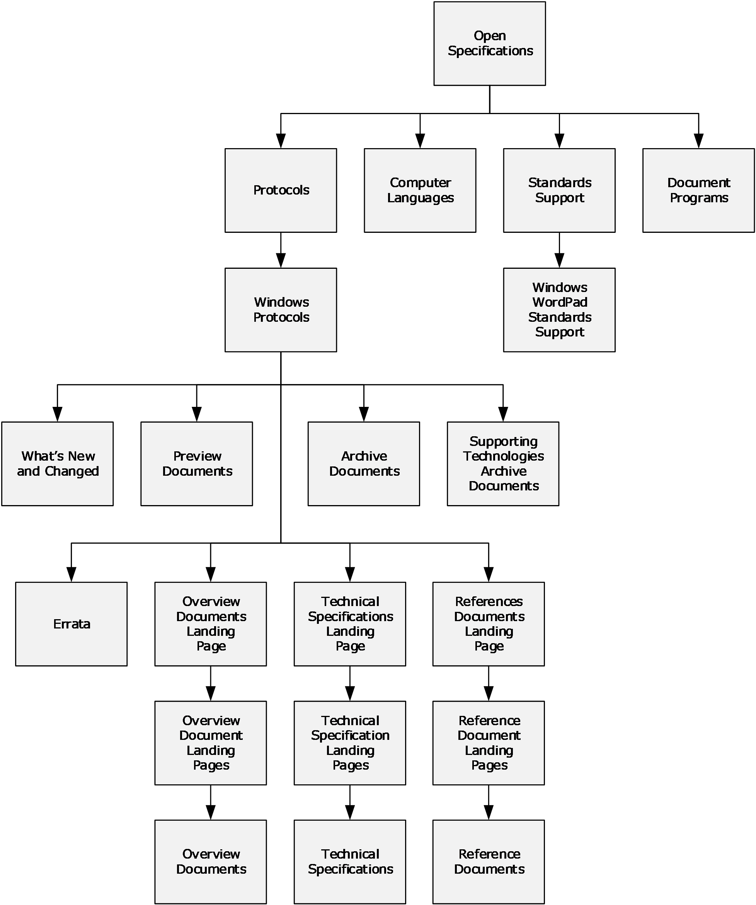

Figure 18: Open Specifications site map

# 6 Change Tracking

This section identifies changes that were made to this document since the last release. Changes are classified as Major, Minor, or None.

The revision class **Major** means that the technical content in the document was significantly revised. Major changes affect protocol interoperability or implementation. Examples of major changes are:

- A document revision that incorporates changes to interoperability requirements.
- A document revision that captures changes to protocol functionality.
The revision class **Minor** means that the meaning of the technical content was clarified. Minor changes do not affect protocol interoperability or implementation. Examples of minor changes are updates to clarify ambiguity at the sentence, paragraph, or table level.

The revision class **None** means that no new technical changes were introduced. Minor editorial and formatting changes may have been made, but the relevant technical content is identical to the last released version.

The changes made to this document are listed in the following table. For more information, please contact [dochelp@microsoft.com](mailto:dochelp@microsoft.com).

| Section | Description | Revision class |
| --- | --- | --- |
| [4.1](#Section_4.1) Technical Specification Cross-Reference Matrix | Added citations to [MS-DHA] and [MS-MDM]. Updated [MS-RNAS] protocol. | Major |
| [4.2](#Section_4.2) Technical Area Cross-Reference Matrix | Added [MS-MDE] and [MS-MDM] under Networking. | Major |

## Revision History

| Date | Version | Revision Class | Comments |
| --- | --- | --- | --- |
| 12/16/2011 | 1.0 | New | Released new document. |
| 3/30/2012 | 2.0 | Major | Updated and revised the technical content. |
| 7/12/2012 | 3.0 | Major | Updated and revised the technical content. |
| 10/25/2012 | 4.0 | Major | Updated and revised the technical content. |
| 1/31/2013 | 4.1 | Minor | Clarified the meaning of the technical content. |
| 8/8/2013 | 5.0 | Major | Updated and revised the technical content. |
| 11/14/2013 | 6.0 | Major | Updated and revised the technical content. |
| 2/13/2014 | 7.0 | Major | Updated and revised the technical content. |
| 5/15/2014 | 8.0 | Major | Updated and revised the technical content. |
| 6/30/2015 | 9.0 | Major | Significantly changed the technical content. |
| 10/16/2015 | 9.1 | Minor | Clarified the meaning of the technical content. |
| 7/14/2016 | 10.0 | Major | Significantly changed the technical content. |
| 9/26/2016 | 11.0 | Major | Significantly changed the technical content. |
| 3/16/2017 | 12.0 | Major | Significantly changed the technical content. |
| 6/1/2017 | 13.0 | Major | Significantly changed the technical content. |
| 12/15/2017 | 14.0 | Major | Significantly changed the technical content. |
| 11/5/2018 | 15.0 | Major | Significantly changed the technical content. |
| 11/10/2020 | 16.0 | Major | Significantly changed the technical content. |
| 6/3/2021 | 17.0 | Major | Significantly changed the technical content. |
| 10/26/2021 | 18.0 | Major | Significantly changed the technical content. |
| 6/14/2022 | 19.0 | Major | Significantly changed the technical content. |
