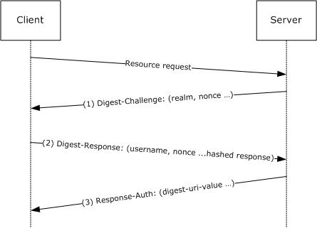

# [MS-DPSP]: Digest Protocol Extensions

Table of Contents

1 Introduction

- [1 Introduction](#Section_1)
  - [1.1 Glossary](#Section_1.1)
  - [1.2 References](#Section_1.2)
    - [1.2.1 Normative References](#Section_1.2.1)
    - [1.2.2 Informative References](#Section_1.2.2)
  - [1.3 Overview](#Section_1.3)
  - [1.4 Relationship to Other Protocols](#Section_1.4)
  - [1.5 Prerequisites/Preconditions](#Section_1.5)
  - [1.6 Applicability Statement](#Section_1.6)
  - [1.7 Versioning and Capability Negotiation](#Section_1.7)
  - [1.8 Vendor-Extensible Fields](#Section_1.8)
  - [1.9 Standards Assignments](#Section_1.9)

2 Messages

- [2 Messages](#Section_2)
  - [2.1 Transport](#Section_2.1)
  - [2.2 Message Syntax](#Section_2.2)

3 Protocol Details

- [3 Protocol Details](#Section_3)
  - [3.1 Common Details](#Section_3.1)
    - [3.1.1 Abstract Data Model](#Section_3.1.1)
    - [3.1.2 Timers](#Section_3.1.2)
    - [3.1.3 Initialization](#Section_3.1.3)
    - [3.1.4 Higher-Layer Trigger Events](#Section_3.1.4)
    - [3.1.5 Processing Events and Sequencing Rules](#Section_3.1.5)
      - [3.1.5.1 Authentication-Info](#Section_3.1.5.1)
      - [3.1.5.2 Realm Directive](#Section_3.1.5.2)
      - [3.1.5.3 Subsequent Authentication](#Section_3.1.5.3)
      - [3.1.5.4 Opaque Directive](#Section_3.1.5.4)
    - [3.1.6 Timer Events](#Section_3.1.6)
    - [3.1.7 Other Local Events](#Section_3.1.7)
  - [3.2 Client Details](#Section_3.2)
    - [3.2.1 Abstract Data Model](#Section_3.2.1)
    - [3.2.2 Timers](#Section_3.2.2)
    - [3.2.3 Initialization](#Section_3.2.3)
    - [3.2.4 Higher-Layer Trigger Events](#Section_3.2.4)
    - [3.2.5 Processing Events and Sequencing Rules](#Section_3.2.5)
      - [3.2.5.1 Client Nonce Generation](#Section_3.2.5.1)
      - [3.2.5.2 Qop Directive](#Section_3.2.5.2)
    - [3.2.6 Timer Events](#Section_3.2.6)
    - [3.2.7 Other Local Events](#Section_3.2.7)
  - [3.3 Server Details](#Section_3.3)
    - [3.3.1 Abstract Data Model](#Section_3.3.1)
    - [3.3.2 Timers](#Section_3.3.2)
    - [3.3.3 Initialization](#Section_3.3.3)
    - [3.3.4 Higher-Layer Trigger Events](#Section_3.3.4)
    - [3.3.5 Processing Events and Sequencing Rules](#Section_3.3.5)
      - [3.3.5.1 Server Nonce Generation](#Section_3.3.5.1)
      - [3.3.5.2 Qop-Options Directive](#Section_3.3.5.2)
      - [3.3.5.3 Realm Directive for the Digest Challenge](#Section_3.3.5.3)
      - [3.3.5.4 Principal Name Validation](#Section_3.3.5.4)
      - [3.3.5.5 Host Name](#Section_3.3.5.5)
    - [3.3.6 Timer Events](#Section_3.3.6)
    - [3.3.7 Other Local Events](#Section_3.3.7)

4 Protocol Examples

- [4 Protocol Examples](#Section_4)

5 Security

- [5 Security](#Section_5)
  - [5.1 Security Considerations for Implementers](#Section_5.1)
  - [5.2 Index of Security Parameters](#Section_5.2)

6 Appendix A: Product Behavior

- [6 Appendix A: Product Behavior](#Section_6)

7 Change Tracking

- [7 Change Tracking](#Section_7)

For the legal notice and IP terms, see [LEGAL.md](../LEGAL.md).
Last updated: 4/23/2024.
See [Revision History](#revision-history) for full version history.

# 1 Introduction

This specification describes optional fields and behaviors of the Digest Access Authentication: Microsoft Extensions and how to support clients and servers that exhibit nonconforming behavior to [[RFC2617]](https://go.microsoft.com/fwlink/?LinkId=90373) and [[RFC2831]](https://go.microsoft.com/fwlink/?LinkId=90387).

Digest authentication supports client authentication to servers (based on the user's name and password) and server authentication to the client.

Higher-Layer protocols such as Lightweight Directory Access Protocol (LDAP) ([[RFC2251]](https://go.microsoft.com/fwlink/?LinkId=90325)) employ digest authentication as an SASL mechanism.

Sections 1.5, 1.8, 1.9, 2, and 3 of this specification are normative. All other sections and examples in this specification are informative.

## 1.1 Glossary

This document uses the following terms:

**keyed hash**: A cryptographic hash computed over both a symmetric key and data, as specified in [[RFC2617]](https://go.microsoft.com/fwlink/?LinkId=90373). For more information, see [[RFC2104]](https://go.microsoft.com/fwlink/?LinkId=90314).

**nonce**: A number that is used only once. This is typically implemented as a random number large enough that the probability of number reuse is extremely small. A nonce is used in authentication protocols to prevent replay attacks. For more information, see [RFC2617].

**MAY, SHOULD, MUST, SHOULD NOT, MUST NOT:** These terms (in all caps) are used as defined in [[RFC2119]](https://go.microsoft.com/fwlink/?LinkId=90317). All statements of optional behavior use either MAY, SHOULD, or SHOULD NOT.

## 1.2 References

Links to a document in the Microsoft Open Specifications library point to the correct section in the most recently published version of the referenced document. However, because individual documents in the library are not updated at the same time, the section numbers in the documents may not match. You can confirm the correct section numbering by checking the [Errata](https://go.microsoft.com/fwlink/?linkid=850906).

### 1.2.1 Normative References

We conduct frequent surveys of the normative references to assure their continued availability. If you have any issue with finding a normative reference, please contact [dochelp@microsoft.com](mailto:dochelp@microsoft.com). We will assist you in finding the relevant information.

[FIPS140] FIPS PUBS, "Security Requirements for Cryptographic Modules", FIPS PUB 140-2, May 2001, [https://csrc.nist.gov/csrc/media/publications/fips/140/2/final/documents/fips1402.pdf](https://go.microsoft.com/fwlink/?LinkId=89866)

[RFC2119] Bradner, S., "Key words for use in RFCs to Indicate Requirement Levels", BCP 14, RFC 2119, March 1997, [https://www.rfc-editor.org/info/rfc2119](https://go.microsoft.com/fwlink/?LinkId=90317)

[RFC2222] Myers, J., "Simple Authentication and Security Layer (SASL)", RFC 2222, October 1997, [https://www.rfc-editor.org/info/rfc2222](https://go.microsoft.com/fwlink/?LinkId=90322)

[RFC2251] Wahl, M., Howes, T., and Kille, S., "Lightweight Directory Access Protocol (v3)", RFC 2251, December 1997, [https://www.rfc-editor.org/info/rfc2251](https://go.microsoft.com/fwlink/?LinkId=90325)

[RFC2616] Fielding, R., Gettys, J., Mogul, J., et al., "Hypertext Transfer Protocol -- HTTP/1.1", RFC 2616, June 1999, [https://www.rfc-editor.org/info/rfc2616](https://go.microsoft.com/fwlink/?LinkId=90372)

[RFC2617] Franks, J., Hallam-Baker, P., Hostetler, J., et al., "HTTP Authentication: Basic and Digest Access Authentication", RFC 2617, June 1999, [https://www.rfc-editor.org/info/rfc2617](https://go.microsoft.com/fwlink/?LinkId=90373)

[RFC2829] Wahl, M., Alvestrand, H., Hodges, J., and Morgan, R., "Authentication Methods for LDAP", RFC 2829, May 2000, [https://www.rfc-editor.org/info/rfc2829](https://go.microsoft.com/fwlink/?LinkId=90386)

[RFC2831] Leach, P. and Newman, C., "Using Digest Authentication as a SASL Mechanism", RFC 2831, May 2000, [https://www.rfc-editor.org/info/rfc2831](https://go.microsoft.com/fwlink/?LinkId=90387)

[UNICODE] The Unicode Consortium, "The Unicode Consortium Home Page", [http://www.unicode.org/](https://go.microsoft.com/fwlink/?LinkId=90550)

### 1.2.2 Informative References

[DRAFT-DIGESTBIND] Kivinen, T., Huttunen, A., Swander, B., and Volpe, V., "Channel binding for HTTP Digest Authentication", July 2008, [http://tools.ietf.org/html/draft-santesson-digestbind-01.txt](https://go.microsoft.com/fwlink/?LinkId=124519)

[MS-APDS] Microsoft Corporation, "[Authentication Protocol Domain Support](../MS-APDS/MS-APDS.md)".

[MS-KILE] Microsoft Corporation, "[Kerberos Protocol Extensions](../MS-KILE/MS-KILE.md)".

[RFC2069] Franks, J., et al., "An Extension to HTTP: Digest Access Authentication", RFC 2069, January 1997, [http://www.ietf.org/rfc/rfc2069.txt](https://go.microsoft.com/fwlink/?LinkId=90311)

## 1.3 Overview

The digest authentication mechanism [[RFC2617]](https://go.microsoft.com/fwlink/?LinkId=90373) [[RFC2831]](https://go.microsoft.com/fwlink/?LinkId=90387) performs authentication between a client and a server based on a user name and a password. The digest authentication protocol can authenticate the client to the server, and optionally the server to a client; the latter is termed mutual authentication.

In the digest authentication mechanism, the client is presented with a [**nonce**](#gt_nonce), a randomly generated value sent by the server to the client. The client proves knowledge of the password by computing a [**keyed hash**](#gt_keyed-hash) over parameters sent by the server and parameters generated locally by the client.

Once the server has validated the keyed hash by performing the same computation, it can authenticate itself to the client by computing another keyed hash and returning it to the client. Because the correct keyed hash results can only be created by someone who knows the password, the two parties are assured of the other knowing the password.

Subsequent client-to-server messages can be authenticated by a keyed hash. Replay protection is provided via an ordered nonce count, as specified in [RFC2831]. Digest authentication as an SASL mechanism expands the digest access authentication protocol by also supporting integrity and confidentiality of messages sent between the client and server.

## 1.4 Relationship to Other Protocols

The Digest Authentication Protocol was originally specified as a native authentication method for HTTP/1.1, as specified in [[RFC2616]](https://go.microsoft.com/fwlink/?LinkId=90372), to serve as an improvement on the HTTP basic authentication. The popularity of digest authentication grew, and it was covered as an SASL [[RFC2222]](https://go.microsoft.com/fwlink/?LinkId=90322) mechanism by the specification in [[RFC2831]](https://go.microsoft.com/fwlink/?LinkId=90387). Once made into an SASL mechanism, the Digest Authentication Protocol became available for other protocols, such as Lightweight Directory Access Protocol (LDAP), as specified in [[RFC2251]](https://go.microsoft.com/fwlink/?LinkId=90325).

## 1.5 Prerequisites/Preconditions

The Digest Protocol Extensions assumes the following:

- Prior to the start of digest authentication, the client and the server have access to the user's password (shared knowledge between them).
- On the server and the client, a source of cryptographically useful random numbers is available for generating a [**nonce**](#gt_nonce).

## 1.6 Applicability Statement

The digest authentication mechanism is used in environments that require users to authenticate to servers to access secure resources. Note that Kerberos (for more information, see [MS-KILE](../MS-KILE/MS-KILE.md)) and public key–based authentication offer stronger security guarantees both in terms of initial authentication and subsequent confidentiality and integrity of client/server traffic.

The digest authentication mechanism can be used in environments where these stronger mechanisms are not available and can serve for interoperability purposes with multiple vendors, browsers, web servers, and directory services.

## 1.7 Versioning and Capability Negotiation

Neither the Digest Authentication Protocol nor the Digest Access Authentication: Microsoft Extensions have any versioning capability. The Digest Authentication Protocol does have support for negotiating what cryptographic algorithms to use. This is specified in [[RFC2831]](https://go.microsoft.com/fwlink/?LinkId=90387) section 2.1.2.

## 1.8 Vendor-Extensible Fields

None beyond those specified in [[RFC2831]](https://go.microsoft.com/fwlink/?LinkId=90387) and [[RFC2617]](https://go.microsoft.com/fwlink/?LinkId=90373).<1>

## 1.9 Standards Assignments

None beyond what is specified in [[RFC2617]](https://go.microsoft.com/fwlink/?LinkId=90373) and [[RFC2831]](https://go.microsoft.com/fwlink/?LinkId=90387).

# 2 Messages

## 2.1 Transport

The elements of the Digest Access Authentication: Microsoft Extensions messages are embedded directly in HTTP/1.1 messages [[RFC2616]](https://go.microsoft.com/fwlink/?LinkId=90372) when digest authentication is used within HTTP, as specified in [[RFC2617]](https://go.microsoft.com/fwlink/?LinkId=90373). As a result, Digest Access Authentication: Microsoft Extensions uses the HTTP/1.1 transport, as specified in [RFC2616].<2>

As specified in [[RFC2831]](https://go.microsoft.com/fwlink/?LinkId=90387), messages are carried via SASL [[RFC2222]](https://go.microsoft.com/fwlink/?LinkId=90322) in SASL-aware protocols, such as LDAP.

An extension to add channel binding to the HTTP Digest Authentication protocol has been submitted as a draft standard to the IETF. The client and server SHOULD<3> support channel binding as specified in [[DRAFT-DIGESTBIND]](https://go.microsoft.com/fwlink/?LinkId=124519).

## 2.2 Message Syntax

The message syntax is as specified in [[RFC2617]](https://go.microsoft.com/fwlink/?LinkId=90373) and [[RFC2831]](https://go.microsoft.com/fwlink/?LinkId=90387).

When processing the **username** field, the server SHOULD<4> process "\" characters as improperly escaped "\\" characters.

The extension to this protocol consists of the use of the capability specified in [RFC2617] to add a new directive via the auth-param in the digest-challenge message ([RFC2831] section 2.1.1). The server sends: charset=utf-8 in the digest-challenge message. This indicates that the server can process UTF-8 encoded strings and that the client might use [[UNICODE]](https://go.microsoft.com/fwlink/?LinkId=90550) encoding for the **username** field and in the password if it can also process UTF-8. Clients SHOULD<5> use [UNICODE] encoding when it is offered by the server to allow authentication with a region's supported character sets.

# 3 Protocol Details

The following sections specify details of the Digest Access Authentication: Microsoft Extensions, including abstract data models and message processing rules that are common for both the client and the server. The variations are as specified in [[RFC2617]](https://go.microsoft.com/fwlink/?LinkId=90373) and [[RFC2831]](https://go.microsoft.com/fwlink/?LinkId=90387).

## 3.1 Common Details

### 3.1.1 Abstract Data Model

This section describes a conceptual model of possible data organization that an implementation maintains to participate in this protocol. The described organization is provided to facilitate the explanation of how the protocol behaves. This document does not mandate that implementations adhere to this model as long as their external behavior is consistent with that described in this document.

The abstract data model follows what is specified in [[RFC2617]](https://go.microsoft.com/fwlink/?LinkId=90373) and [[RFC2831]](https://go.microsoft.com/fwlink/?LinkId=90387). In addition, there is the following variable:

**Integrity:** When this value is set, it indicates that the higher-layer protocol requires integrity in addition to simple authentication. This corresponds to the auth-int option, as specified in [RFC2617] sections 3.2.1 and 3.2.2. If this is not set, only auth is specified as the requested quality of protection.

### 3.1.2 Timers

None.

### 3.1.3 Initialization

The random number generator for keys and [**nonces**](#gt_nonce) is initialized by other components, but SHOULD<6> comply with what is specified in [[FIPS140]](https://go.microsoft.com/fwlink/?LinkId=89866).

### 3.1.4 Higher-Layer Trigger Events

Digest Access Authentication: Microsoft Extensions are triggered by a higher-layer application protocol, such as when HTTP or LDAP creates a connection and requires authentication. The higher-layer protocol determines whether the **Integrity** option is enabled for a particular connection.<7>

### 3.1.5 Processing Events and Sequencing Rules

#### 3.1.5.1 Authentication-Info

Specifying fields in the Authentication-Info message sent on the third leg of the Digest Access Authentication: Microsoft Extensions from the server to the client SHOULD<8> be supported, as specified in [[RFC2617]](https://go.microsoft.com/fwlink/?LinkId=90373) section 3.2.3.

#### 3.1.5.2 Realm Directive

The realm directive is optional; if not present, the client SHOULD<9> solicit it from the user or be able to compute a default, as specified in [[RFC2831]](https://go.microsoft.com/fwlink/?LinkId=90387) section 2.1.1.

#### 3.1.5.3 Subsequent Authentication

Digest Protocol Extensions does not support "subsequent authentication" ([[RFC2831]](https://go.microsoft.com/fwlink/?LinkId=90387) section 2.2) when used as a SASL mechanism.

#### 3.1.5.4 Opaque Directive

The opaque directive is a string of data that SHOULD<10> be returned by the client unchanged in the authorization header, as specified in [[RFC2617]](https://go.microsoft.com/fwlink/?LinkId=90373) section 3.2.1.

### 3.1.6 Timer Events

None.

### 3.1.7 Other Local Events

None.

## 3.2 Client Details

### 3.2.1 Abstract Data Model

This section describes a conceptual model of possible data organization that an implementation maintains to participate in this protocol. The described organization is provided to facilitate the explanation of how the protocol behaves. This document does not mandate that implementations adhere to this model as long as their external behavior is consistent with that described in this document.

The client MUST maintain a [**nonce**](#gt_nonce) for ongoing communications with the server, as specified in [[RFC2617]](https://go.microsoft.com/fwlink/?LinkId=90373) section 3.2.2 and [[RFC2831]](https://go.microsoft.com/fwlink/?LinkId=90387) section 2.1.2. The client maintains the state of the nonce by keeping track of the nonce count, which is incremented each time the client sends a message to the server.<11>

**ClientCompat_QuotedQop**: A Boolean value indicating whether the client will send quoted qop directive values. [RFC2617] 3.2.2 specifies that the client qop directive value is unquoted. When **ClientCompat_QuotedQop** is TRUE, the client will send qop values as quoted directive values. When **ClientCompat_QuotedQop** is FALSE, the client will send qop values as unquoted directive values. This value SHOULD be initialized to TRUE.

### 3.2.2 Timers

There are no additional client-specific timers specified in the Digest Access Authentication: Microsoft Extensions.

### 3.2.3 Initialization

For details on initialization for the client, see section [3.1.3](#Section_3.1.3).

### 3.2.4 Higher-Layer Trigger Events

For details on higher-layer trigger events for the client, see section [3.1.4](#Section_3.1.4).

### 3.2.5 Processing Events and Sequencing Rules

#### 3.2.5.1 Client Nonce Generation

When the **cnonce** is generated by the client, it SHOULD<12> contain at least 64 bits of entropy, as specified in [[RFC2831]](https://go.microsoft.com/fwlink/?LinkId=90387) section 2.1.2.

#### 3.2.5.2 Qop Directive

The qop directive, as specified in [[RFC2617]](https://go.microsoft.com/fwlink/?LinkId=90373) section 3.2.2, is optional to preserve backward compatibility with minimal implementation of digest access authentication, as specified in [[RFC2069]](https://go.microsoft.com/fwlink/?LinkId=90311). [RFC2617] specifies that the qop directive SHOULD<13> be used by the client (if the server indicates that qop is supported) by providing a qop directive in the WWW-Authenticate header field.

The server MUST treat single unquoted qop values, such as 'qop-value', the same as quoted qop values, such as 'qop="value"'.<14>

### 3.2.6 Timer Events

There are no additional client-specific timer events.

### 3.2.7 Other Local Events

There are no additional client-specific local events.

## 3.3 Server Details

### 3.3.1 Abstract Data Model

This section describes a conceptual model of possible data organization that an implementation maintains to participate in this protocol. The described organization is provided to facilitate the explanation of how the protocol behaves. This document does not mandate that implementations adhere to this model as long as their external behavior is consistent with that described in this document.

The server associates state with each authenticated connection, as specified in [[RFC2617]](https://go.microsoft.com/fwlink/?LinkId=90373). Specifically, the server associates a client and a server [**nonce**](#gt_nonce) with each connection, along with a nonce count ([RFC2617] section 3.2.2 and [[RFC2831]](https://go.microsoft.com/fwlink/?LinkId=90387) section 2.1.2) for ongoing communications. The server might keep all this information longer than an active connection, depending on the length of time that is allotted for subsequent authentication, as specified in [RFC2617] section 3.3.

### 3.3.2 Timers

There are no additional server-specific timers.

### 3.3.3 Initialization

For details on initialization for the server, see section [3.1.3](#Section_3.1.3).

### 3.3.4 Higher-Layer Trigger Events

For details on the higher-layer trigger events for the server, see section [3.1.4](#Section_3.1.4).

### 3.3.5 Processing Events and Sequencing Rules

#### 3.3.5.1 Server Nonce Generation

The [**nonce**](#gt_nonce) computed by the server SHOULD<15> contain at least 64 bits of entropy, as specified in [[RFC2831]](https://go.microsoft.com/fwlink/?LinkId=90387) section 2.1.1.

#### 3.3.5.2 Qop-Options Directive

The qop-options directive, as specified in [[RFC2617]](https://go.microsoft.com/fwlink/?LinkId=90373) section 3.2.1, is optional; but it is used for backward compatibility with digest access authentication, as specified in [[RFC2069]](https://go.microsoft.com/fwlink/?LinkId=90311). The qop-options directive SHOULD be used by all implementations compliant with this version of the digest authentication mechanism and SHOULD be enclosed in quotation marks.

#### 3.3.5.3 Realm Directive for the Digest Challenge

The [realm directive](#Section_3.1.5.2) is required if the server provides any realms in the digest challenge; in which case it can appear exactly once, and its value SHOULD be one of those realms, as specified in [[RFC2831]](https://go.microsoft.com/fwlink/?LinkId=90387) section 2.1.2.

#### 3.3.5.4 Principal Name Validation

Digest-Uri indicates the principal name of the service that the client is attempting to connect with, as specified in [[RFC2831]](https://go.microsoft.com/fwlink/?LinkId=90387) section 2.1.2. Servers SHOULD<16> check that the supplied value is correct.

The digest implementation does not do any validation of the digest-uri value. The application that calls the digest authentication validates the principal name specified by the digest-uri. The digest authentication implementation returns the principal name to the calling application.

#### 3.3.5.5 Host Name

The Digest Protocol Extensions do not make use of the host field.

### 3.3.6 Timer Events

There are no additional server-specific timer events in the Digest Protocol Extensions.

### 3.3.7 Other Local Events

There are no additional server-specific local events in the Digest Protocol Extensions.

# 4 Protocol Examples

The following diagram and procedural steps describe a common scenario to illustrate the function of the Digest Protocol Extensions.

Figure 1: Common use scenario for Digest Protocol Extensions

- After the client attempts to access a protected resource (for example, ResourceA) on the server, the server returns a digest-challenge message to the client. Among other fields, the digest-challenge message includes a randomly generated [**nonce**](#gt_nonce) and the domain name of the server (via the **realm** field). A sample digest Challenge is shown here.
qop="auth",algorithm=MD5-sess,

nonce="91c121b4f47ec601a281ceefaa5d6f2b096897ea0797fdd2ea72bfeec7fd

a64433a98d4ae57186a1",

charset=utf-8,realm="TestDomain"

- The client obtains the user name (for example, User123) and password for the user and constructs a response to the server's challenge. In the digest-response, the client proves knowledge of the user's password by performing a [**keyed hash**](#gt_keyed-hash) over the user name, nonce, and other fields (the password is fed into the hash). A sample digest-response is shown here.
username="User123",

realm="TestDomain",

qop="auth",

algorithm="MD5-sess",

uri="/ResourceA",

nonce="91c121b4f47ec601a281ceefaa5d6f2b096897ea0797fdd2ea72bfeec7fd

a64433a98d4ae57186a1",

nc=00000001,

cnonce="579c5e7723ad0ef8eeb0b7427379bdd4",

response="641b92d2d8af170329ce308832a4df13"

- The server validates the digest-response message by looking up the user's password by using the user name that the client sent, recomputing the keyed hash over fields from the digest-response message, and then comparing the resulting hash value to the Response directive value sent by the client. If the values match, the client's digest-response message is valid; otherwise, the authentication request fails. The server further checks that the client sent the expected nonce and nonce-count values (and not an old, replayed value). After the digest response is validated, the client is authenticated to the server. For mutual authentication, the server has the option to send a keyed hash over the URI that the client requested and return it to the client in the Response-Auth message. Note that sending the Response-Auth message only applies to digest authentication when used as an SASL mechanism, as specified in [[RFC2831]](https://go.microsoft.com/fwlink/?LinkId=90387). For further information, see section [3.1.5.1](#Section_3.1.5.1).

# 5 Security

## 5.1 Security Considerations for Implementers

Kerberos (for more information, see [MS-KILE](../MS-KILE/MS-KILE.md)) and public key-based authentication offer stronger security guarantees both in terms of initial authentication and in subsequent confidentiality and integrity of client-server traffic. The digest authentication mechanism can be used in environments where these stronger mechanisms are not available.

## 5.2 Index of Security Parameters

None.

# 6 Appendix A: Product Behavior

The information in this specification is applicable to the following Microsoft products or supplemental software. References to product versions include updates to those products.

- Windows 2000 operating system
- Windows XP operating system
- Windows Server 2003 operating system
- Windows Vista operating system
- Windows Server 2008 operating system
- Windows 7 operating system
- Windows Server 2008 R2 operating system
- Windows 8 operating system
- Windows Server 2012 operating system
- Windows 8.1 operating system
- Windows Server 2012 R2 operating system
- Windows 10 operating system
- Windows Server 2016 operating system
- Windows Server operating system
- Windows Server 2019 operating system
- Windows Server 2022 operating system
- Windows 11 operating system
- Windows Server 2025 operating system
Exceptions, if any, are noted in this section. If an update version, service pack or Knowledge Base (KB) number appears with a product name, the behavior changed in that update. The new behavior also applies to subsequent updates unless otherwise specified. If a product edition appears with the product version, behavior is different in that product edition.

Unless otherwise specified, any statement of optional behavior in this specification that is prescribed using the terms "SHOULD" or "SHOULD NOT" implies product behavior in accordance with the SHOULD or SHOULD NOT prescription. Unless otherwise specified, the term "MAY" implies that the product does not follow the prescription.

<1> Section 1.8: Windows uses the capability specified in [[RFC2617]](https://go.microsoft.com/fwlink/?LinkId=90373) to add a new directive via the auth-param in the digest-challenge message ([[RFC2831]](https://go.microsoft.com/fwlink/?LinkId=90387) section 2.1.1). The server sends: charset=utf-8 in the **auth-param** field. This indicates that the server can process UTF-8 encoded strings and that the client might use Unicode encoding for the **username** field and in the password if it can also process UTF-8. Windows clients will use [[UNICODE]](https://go.microsoft.com/fwlink/?LinkId=90550) encoding when it is offered by the server to allow authentication with a region's supported character sets.

<2> Section 2.1: In Windows, the Digest Authentication Protocol can be used for authentication during HTTP traffic through the use and configuration of Internet Information Server (IIS). In addition, LDAP clients and servers in an Active Directory domain can make use of the SASL mechanism for digest authentication.

The LDAP server in Active Directory offers digest authentication by default as one of several authentication mechanisms for Active Directory. This is exposed by the supported SASL Mechanism attribute, as specified in [[RFC2829]](https://go.microsoft.com/fwlink/?LinkId=90386). All native use of LDAP within Windows uses SPNEGO authentication not digest authentication.

<3> Section 2.1: Windows 2000, Windows XP, Windows Server 2003, Windows Vista, and Windows Server 2008 do not support channel binding for HTTP Digest Authentication.

<4> Section 2.2: Except on Windows 2000, when acting as a server, Windows attempts to decode the **username** field of the digest-response message ([RFC2617] section 3.2.2) using the RFC-compliant character escaping ([[RFC2616]](https://go.microsoft.com/fwlink/?LinkId=90372) section 2.2).

However, if no account with that name can be found, or if the [**keyed hash**](#gt_keyed-hash) computed by the server does not match the keyed hash sent by the client, the server attempts to decode the original username by using backslash '\' characters that are not properly escaped (treated as if the client specified '\\'), and then retries. Windows XP incorrectly escapes the backslash '\' character in the account name. If a backslash ('\') character is presented by the client, the string is treated as "NetbiosDomainName\\AccountName".

Unlike other authentication protocols, digest authentication does not support the diacritical folding that is applied by Active Directory.

<5> Section 2.2: The auth param extensions are not supported on Windows 2000.

<6> Section 3.1.3: The random number generator used in Windows is FIPS-140-compliant. For information on the FIPS-140 random number generator requirements, see [[FIPS140]](https://go.microsoft.com/fwlink/?LinkId=89866) sections 4.7.1, 4.9.1, and 4.9.2.

<7> Section 3.1.4: For details on where digest authentication is used in the Windows environment, see section [1.6](#Section_1.6).

<8> Section 3.1.5.1: Windows digest implementations for HTTP do not support the [Authentication-Info](#Section_3.1.5.1) message. If a third-party server generates an Authentication-Info message, it is ignored on the Windows client. However, the third leg of the Digest Access Authentication: Microsoft Extensions as the SASL mechanism is supported, as specified in [RFC2831] section 2.1.3.

<9> Section 3.1.5.2: The [realm directive](#Section_3.1.5.2) is set to the domain name of the server by default. This can be overridden at the server by configuration options. The user is prompted and has the chance to override the realm value sent by the server (that is, the user can enter a realm other than the one sent by the server).

<10> Section 3.1.5.4: In Windows 2000, the opaque value is returned from the client to the server only during the initial authentication step. The opaque value is not returned for subsequent authentication ([RFC2617] section 3.3).

<11> Section 3.2.1: The Digest Access Authentication: Microsoft Extensions ensures that if the [**nonce**](#gt_nonce) count value wraps, the authentication fails.

<12> Section 3.2.5.1: In Windows (except Windows 2000), the **cnonce** contains 128 bits of entropy provided by a random-number generator, as specified in [FIPS140].

<13> Section 3.2.5.2: Applicable Windows Server releases indicate support for different qops, and clients select accordingly, using the qop values as specified in [RFC2617] section 3.2.1 (subject to exceptions specified in section [2.2](#Section_2.2)) and in [RFC2831] section 2.1.1. The value of this directive depends on the quality of protection requested by the calling application. For information on Windows usage of the [qop directive](#Section_3.2.5.2), see section 2.2.

<14> Section 3.2.5.2: Windows 2000 Server operating system accepts only quoted qop directive values as with 'qop="value"'.

<15> Section 3.3.5.1: In Windows (except Windows 2000), the nonce contains 128 bits of entropy provided by a random-number generator as specified in [FIPS140].

<16> Section 3.3.5.4: In Windows domain environments, validating the digest authentication exchange can be performed at a different computer (for more information, see [MS-APDS](../MS-APDS/MS-APDS.md)). This does not affect the actual implementation of the digest authentication between the client and the server. For more information on digest authentication validation, see [RFC2617] section 3.2.2.

# 7 Change Tracking

This section identifies changes that were made to this document since the last release. Changes are classified as Major, Minor, or None.

The revision class **Major** means that the technical content in the document was significantly revised. Major changes affect protocol interoperability or implementation. Examples of major changes are:

- A document revision that incorporates changes to interoperability requirements.
- A document revision that captures changes to protocol functionality.
The revision class **Minor** means that the meaning of the technical content was clarified. Minor changes do not affect protocol interoperability or implementation. Examples of minor changes are updates to clarify ambiguity at the sentence, paragraph, or table level.

The revision class **None** means that no new technical changes were introduced. Minor editorial and formatting changes may have been made, but the relevant technical content is identical to the last released version.

The changes made to this document are listed in the following table. For more information, please contact [dochelp@microsoft.com](mailto:dochelp@microsoft.com).

| Section | Description | Revision class |
| --- | --- | --- |
| [6](#Section_6) Appendix A: Product Behavior | Added Windows Server 2025 to the list of applicable products. | Major |

## Revision History

| Date | Version | Revision Class | Comments |
| --- | --- | --- | --- |
| 10/22/2006 | 0.01 | New | Version 0.01 release |
| 1/19/2007 | 1.0 | Major | Version 1.0 release |
| 3/2/2007 | 1.1 | Minor | Version 1.1 release |
| 4/3/2007 | 1.2 | Minor | Version 1.2 release |
| 5/11/2007 | 1.3 | Minor | Version 1.3 release |
| 6/1/2007 | 1.3.1 | Editorial | Changed language and formatting in the technical content. |
| 7/3/2007 | 1.4 | Minor | Updated technical content. |
| 7/20/2007 | 1.4.1 | Editorial | Changed language and formatting in the technical content. |
| 8/10/2007 | 1.4.2 | Editorial | Changed language and formatting in the technical content. |
| 9/28/2007 | 1.4.3 | Editorial | Changed language and formatting in the technical content. |
| 10/23/2007 | 1.4.4 | Editorial | Changed language and formatting in the technical content. |
| 11/30/2007 | 2.0 | Major | Updated Abstract Data Model sections; clarified Windows behavior. |
| 1/25/2008 | 2.0.1 | Editorial | Changed language and formatting in the technical content. |
| 3/14/2008 | 2.0.2 | Editorial | Changed language and formatting in the technical content. |
| 5/16/2008 | 2.0.3 | Editorial | Changed language and formatting in the technical content. |
| 6/20/2008 | 2.0.4 | Editorial | Changed language and formatting in the technical content. |
| 7/25/2008 | 2.0.5 | Editorial | Changed language and formatting in the technical content. |
| 8/29/2008 | 2.1 | Minor | Remove incorrect behavior note in section 1.3.1 and update informative information in section 1.3.1. |
| 10/24/2008 | 2.1.1 | Editorial | Changed language and formatting in the technical content. |
| 12/5/2008 | 3.0 | Major | Updated and revised the technical content. |
| 1/16/2009 | 3.0.1 | Editorial | Changed language and formatting in the technical content. |
| 2/27/2009 | 3.0.2 | Editorial | Changed language and formatting in the technical content. |
| 4/10/2009 | 3.0.3 | Editorial | Changed language and formatting in the technical content. |
| 5/22/2009 | 4.0 | Major | Updated and revised the technical content. |
| 7/2/2009 | 5.0 | Major | Updated and revised the technical content. |
| 8/14/2009 | 6.0 | Major | Updated and revised the technical content. |
| 9/25/2009 | 6.1 | Minor | Clarified the meaning of the technical content. |
| 11/6/2009 | 6.1.1 | Editorial | Changed language and formatting in the technical content. |
| 12/18/2009 | 6.1.2 | Editorial | Changed language and formatting in the technical content. |
| 1/29/2010 | 7.0 | Major | Updated and revised the technical content. |
| 3/12/2010 | 7.0.1 | Editorial | Changed language and formatting in the technical content. |
| 4/23/2010 | 7.0.2 | Editorial | Changed language and formatting in the technical content. |
| 6/4/2010 | 7.0.3 | Editorial | Changed language and formatting in the technical content. |
| 7/16/2010 | 7.0.3 | None | No changes to the meaning, language, or formatting of the technical content. |
| 8/27/2010 | 7.0.3 | None | No changes to the meaning, language, or formatting of the technical content. |
| 10/8/2010 | 7.0.3 | None | No changes to the meaning, language, or formatting of the technical content. |
| 11/19/2010 | 7.0.3 | None | No changes to the meaning, language, or formatting of the technical content. |
| 1/7/2011 | 7.0.3 | None | No changes to the meaning, language, or formatting of the technical content. |
| 2/11/2011 | 7.0.3 | None | No changes to the meaning, language, or formatting of the technical content. |
| 3/25/2011 | 7.0.3 | None | No changes to the meaning, language, or formatting of the technical content. |
| 5/6/2011 | 7.0.3 | None | No changes to the meaning, language, or formatting of the technical content. |
| 6/17/2011 | 7.1 | Minor | Clarified the meaning of the technical content. |
| 9/23/2011 | 8.0 | Major | Updated and revised the technical content. |
| 12/16/2011 | 9.0 | Major | Updated and revised the technical content. |
| 3/30/2012 | 9.0 | None | No changes to the meaning, language, or formatting of the technical content. |
| 7/12/2012 | 9.0 | None | No changes to the meaning, language, or formatting of the technical content. |
| 10/25/2012 | 9.0 | None | No changes to the meaning, language, or formatting of the technical content. |
| 1/31/2013 | 9.0 | None | No changes to the meaning, language, or formatting of the technical content. |
| 8/8/2013 | 10.0 | Major | Updated and revised the technical content. |
| 11/14/2013 | 10.0 | None | No changes to the meaning, language, or formatting of the technical content. |
| 2/13/2014 | 10.0 | None | No changes to the meaning, language, or formatting of the technical content. |
| 5/15/2014 | 10.0 | None | No changes to the meaning, language, or formatting of the technical content. |
| 6/30/2015 | 11.0 | Major | Significantly changed the technical content. |
| 10/16/2015 | 11.0 | None | No changes to the meaning, language, or formatting of the technical content. |
| 7/14/2016 | 11.0 | None | No changes to the meaning, language, or formatting of the technical content. |
| 6/1/2017 | 11.0 | None | No changes to the meaning, language, or formatting of the technical content. |
| 9/15/2017 | 12.0 | Major | Significantly changed the technical content. |
| 9/12/2018 | 13.0 | Major | Significantly changed the technical content. |
| 4/7/2021 | 14.0 | Major | Significantly changed the technical content. |
| 6/25/2021 | 15.0 | Major | Significantly changed the technical content. |
| 4/23/2024 | 16.0 | Major | Significantly changed the technical content. |
