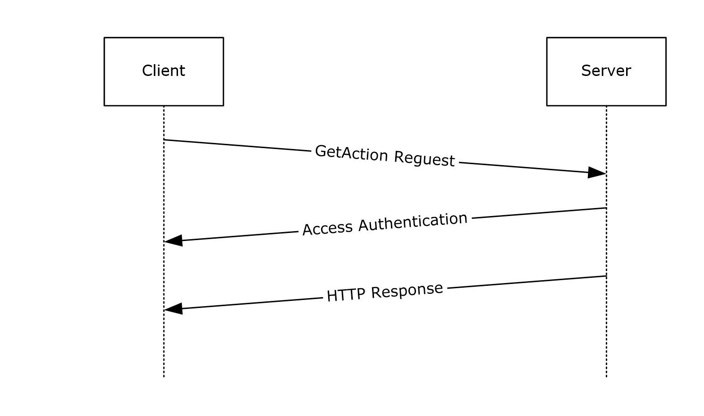
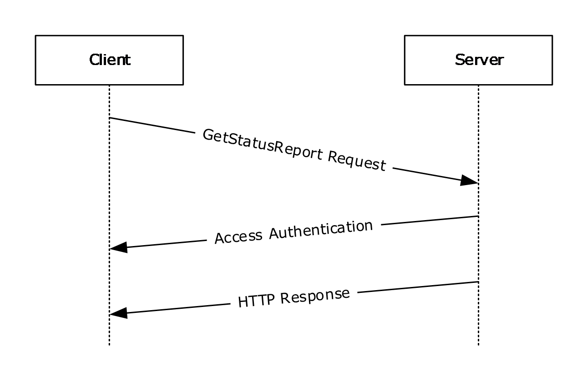
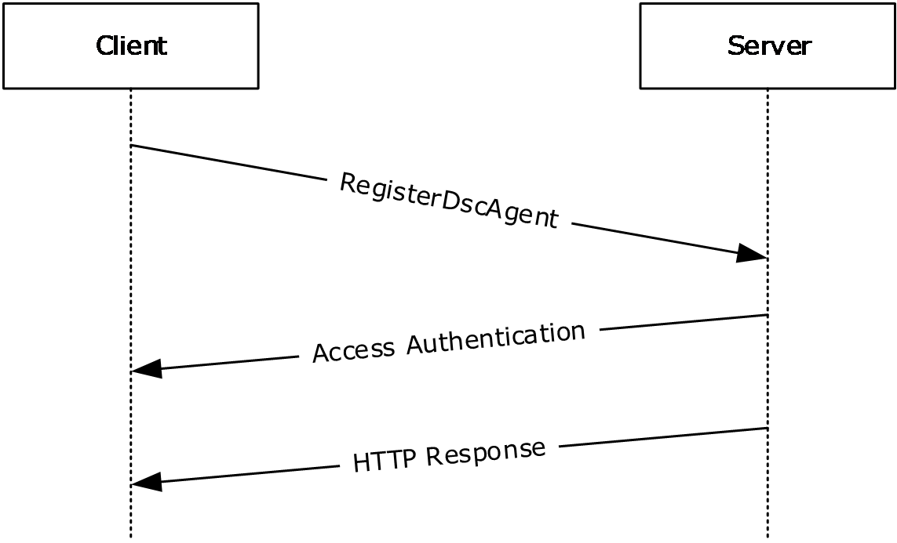
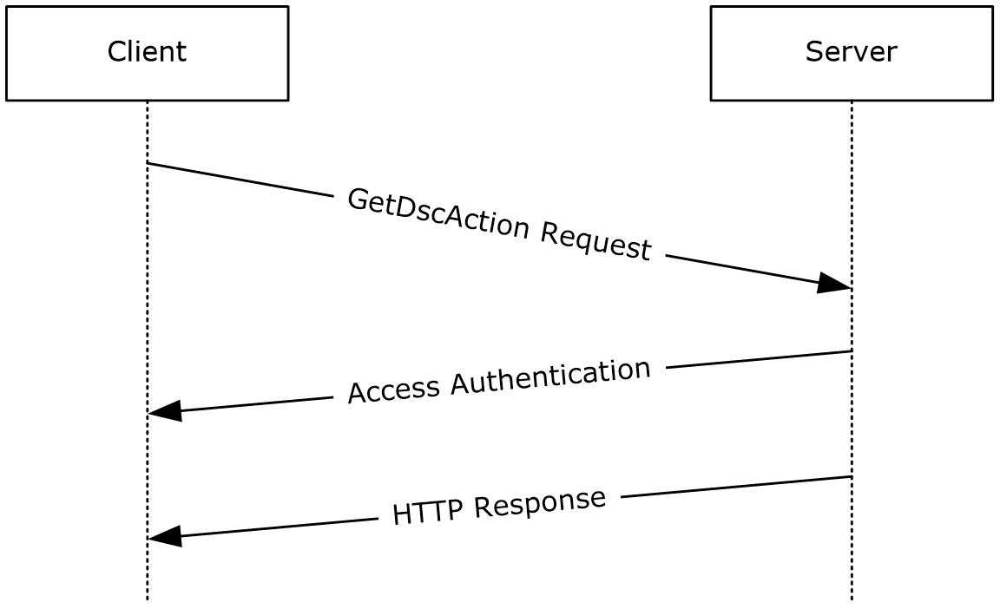

# [MS-DSCPM]: Desired State Configuration Pull Model Protocol

Table of Contents

1 Introduction

- [1 Introduction](#Section_1)
  - [1.1 Glossary](#Section_1.1)
  - [1.2 References](#Section_1.2)
    - [1.2.1 Normative References](#Section_1.2.1)
    - [1.2.2 Informative References](#Section_1.2.2)
  - [1.3 Overview](#Section_1.3)
  - [1.4 Relationship to Other Protocols](#Section_1.4)
  - [1.5 Prerequisites/Preconditions](#Section_1.5)
  - [1.6 Applicability Statement](#Section_1.6)
  - [1.7 Versioning and Capability Negotiation](#Section_1.7)
  - [1.8 Vendor-Extensible Fields](#Section_1.8)
  - [1.9 Standards Assignments](#Section_1.9)

2 Messages

- [2 Messages](#Section_2)
  - [2.1 Transport](#Section_2.1)
  - [2.2 Common Data Types](#Section_2.2)
    - [2.2.1 Namespaces](#Section_2.2.1)
    - [2.2.2 HTTP Headers](#Section_2.2.2)
      - [2.2.2.1 Content-Type](#Section_2.2.2.1)
        - [2.2.2.1.1 Application/octet-stream](#Section_2.2.2.1.1)
        - [2.2.2.1.2 Application/json](#Section_2.2.2.1.2)
      - [2.2.2.2 Checksum](#Section_2.2.2.2)
      - [2.2.2.3 ChecksumAlgorithm](#Section_2.2.2.3)
      - [2.2.2.4 ConfigurationName](#Section_2.2.2.4)
      - [2.2.2.5 ProtocolVersion](#Section_2.2.2.5)
      - [2.2.2.6 AgentId](#Section_2.2.2.6)
      - [2.2.2.7 Authorization](#Section_2.2.2.7)
      - [2.2.2.8 DSC-certificateRotation](#Section_2.2.2.8)
    - [2.2.3 Common URI Parameters](#Section_2.2.3)
      - [2.2.3.1 ConfigurationId](#Section_2.2.3.1)
      - [2.2.3.2 ModuleName](#Section_2.2.3.2)
      - [2.2.3.3 ModuleVersion](#Section_2.2.3.3)
      - [2.2.3.4 AgentId](#Section_2.2.3.4)

3 Protocol Details

- [3 Protocol Details](#Section_3)
  - [3.1 GetConfiguration Versions 1.0 and 1.1 Details](#Section_3.1)
    - [3.1.1 Abstract Data Model](#Section_3.1.1)
    - [3.1.2 Timers](#Section_3.1.2)
    - [3.1.3 Initialization](#Section_3.1.3)
    - [3.1.4 Higher-Layer Triggered Events](#Section_3.1.4)
    - [3.1.5 Message Processing Events and Sequencing Rules](#Section_3.1.5)
      - [3.1.5.1 Action(ConfigurationId={ConfigurationId})/ConfigurationContent](#Section_3.1.5.1)
        - [3.1.5.1.1 GET](#Section_3.1.5.1.1)
          - [3.1.5.1.1.1 Request Body](#Section_3.1.5.1.1.1)
          - [3.1.5.1.1.2 Response Body](#Section_3.1.5.1.1.2)
          - [3.1.5.1.1.3 Processing Details](#Section_3.1.5.1.1.3)
    - [3.1.6 Timer Events](#Section_3.1.6)
    - [3.1.7 Other Local Events](#Section_3.1.7)
  - [3.2 GetModule Versions 1.0 and 1.1 Details](#Section_3.2)
    - [3.2.1 Abstract Data Model](#Section_3.2.1)
    - [3.2.2 Timers](#Section_3.2.2)
    - [3.2.3 Initialization](#Section_3.2.3)
    - [3.2.4 Higher-Layer Triggered Events](#Section_3.2.4)
    - [3.2.5 Message Processing Events and Sequencing Rules](#Section_3.2.5)
      - [3.2.5.1 Module(ConfigurationId={ConfigurationId},ModuleName={moduleName},ModuleVersion={moduleVersion})/ModuleContent](#Section_3.2.5.1)
        - [3.2.5.1.1 GET](#Section_3.2.5.1.1)
          - [3.2.5.1.1.1 Request Body](#Section_3.2.5.1.1.1)
          - [3.2.5.1.1.2 Response Body](#Section_3.2.5.1.1.2)
          - [3.2.5.1.1.3 Processing Details](#Section_3.2.5.1.1.3)
    - [3.2.6 Timer Events](#Section_3.2.6)
    - [3.2.7 Other Local Events](#Section_3.2.7)
  - [3.3 GetAction Versions 1.0 and 1.1 Details](#Section_3.3)
    - [3.3.1 Abstract Data Model](#Section_3.3.1)
    - [3.3.2 Timers](#Section_3.3.2)
    - [3.3.3 Initialization](#Section_3.3.3)
    - [3.3.4 Higher-Layer Triggered Events](#Section_3.3.4)
    - [3.3.5 Message Processing Events and Sequencing Rules](#Section_3.3.5)
      - [3.3.5.1 Action(ConfigurationId={ConfigurationId})/GetAction](#Section_3.3.5.1)
        - [3.3.5.1.1 POST](#Section_3.3.5.1.1)
          - [3.3.5.1.1.1 Request Body](#Section_3.3.5.1.1.1)
          - [3.3.5.1.1.2 Response Body](#Section_3.3.5.1.1.2)
          - [3.3.5.1.1.3 Processing Details](#Section_3.3.5.1.1.3)
    - [3.3.6 Timer Events](#Section_3.3.6)
    - [3.3.7 Other Local Events](#Section_3.3.7)
  - [3.4 SendStatusReport Versions 1.0 and 1.1 Details](#Section_3.4)
    - [3.4.1 Abstract Data Model](#Section_3.4.1)
    - [3.4.2 Timers](#Section_3.4.2)
    - [3.4.3 Initialization](#Section_3.4.3)
    - [3.4.4 Higher-Layer Triggered Events](#Section_3.4.4)
    - [3.4.5 Message Processing Events and Sequencing Rules](#Section_3.4.5)
      - [3.4.5.1 Node(ConfigurationID={ConfigurationId})/SendStatusReport](#Section_3.4.5.1)
        - [3.4.5.1.1 POST](#Section_3.4.5.1.1)
          - [3.4.5.1.1.1 Request Body](#Section_3.4.5.1.1.1)
          - [3.4.5.1.1.2 Response Body](#Section_3.4.5.1.1.2)
          - [3.4.5.1.1.3 Processing Details](#Section_3.4.5.1.1.3)
    - [3.4.6 Timer Events](#Section_3.4.6)
    - [3.4.7 Other Local Events](#Section_3.4.7)
  - [3.5 GetStatusReport Versions 1.0 and 1.1 Details](#Section_3.5)
    - [3.5.1 Abstract Data Model](#Section_3.5.1)
    - [3.5.2 Timers](#Section_3.5.2)
    - [3.5.3 Initialization](#Section_3.5.3)
    - [3.5.4 Higher-Layer Triggered Events](#Section_3.5.4)
    - [3.5.5 Message Processing Events and Sequencing Rules](#Section_3.5.5)
      - [3.5.5.1 Node(ConfigurationId={ConfigurationId})/StatusReports](#Section_3.5.5.1)
        - [3.5.5.1.1 GET](#Section_3.5.5.1.1)
          - [3.5.5.1.1.1 Request Body](#Section_3.5.5.1.1.1)
          - [3.5.5.1.1.2 Response Body](#Section_3.5.5.1.1.2)
          - [3.5.5.1.1.3 Processing Details](#Section_3.5.5.1.1.3)
    - [3.5.6 Timer Events](#Section_3.5.6)
    - [3.5.7 Other Local Events](#Section_3.5.7)
  - [3.6 GetConfiguration Version 2.0 Details](#Section_3.6)
    - [3.6.1 Abstract Data Model](#Section_3.6.1)
    - [3.6.2 Timers](#Section_3.6.2)
    - [3.6.3 Initialization](#Section_3.6.3)
    - [3.6.4 Higher-Layer Triggered Events](#Section_3.6.4)
    - [3.6.5 Message Processing Events and Sequencing Rules](#Section_3.6.5)
      - [3.6.5.1 Nodes(AgentId={AgentId})/ Configurations(ConfigurationName={ConfigurationName})/ConfigurationContent](#Section_3.6.5.1)
      - [3.6.5.2 GET](#Section_3.6.5.2)
        - [3.6.5.2.1 Request Body](#Section_3.6.5.2.1)
        - [3.6.5.2.2 Response Body](#Section_3.6.5.2.2)
        - [3.6.5.2.3 Processing Details](#Section_3.6.5.2.3)
    - [3.6.6 Timer Events](#Section_3.6.6)
    - [3.6.7 Other Local Events](#Section_3.6.7)
  - [3.7 GetModule Version 2.0 Details](#Section_3.7)
    - [3.7.1 Abstract Data Model](#Section_3.7.1)
    - [3.7.2 Timers](#Section_3.7.2)
    - [3.7.3 Initialization](#Section_3.7.3)
    - [3.7.4 Higher-Layer Triggered Events](#Section_3.7.4)
    - [3.7.5 Message Processing Events and Sequencing Rules](#Section_3.7.5)
      - [3.7.5.1 Modules(ModuleName={moduleName},ModuleVersion={moduleVersion})/ModuleContent](#Section_3.7.5.1)
        - [3.7.5.1.1 GET](#Section_3.7.5.1.1)
          - [3.7.5.1.1.1 Request Body](#Section_3.7.5.1.1.1)
          - [3.7.5.1.1.2 Response Body](#Section_3.7.5.1.1.2)
          - [3.7.5.1.1.3 Processing Details](#Section_3.7.5.1.1.3)
    - [3.7.6 Timer Events](#Section_3.7.6)
    - [3.7.7 Other Local Events](#Section_3.7.7)
  - [3.8 GetDscAction Version 2.0 Details](#Section_3.8)
    - [3.8.1 Abstract Data Model](#Section_3.8.1)
    - [3.8.2 Timers](#Section_3.8.2)
    - [3.8.3 Initialization](#Section_3.8.3)
    - [3.8.4 Higher-Layer Triggered Events](#Section_3.8.4)
    - [3.8.5 Message Processing Events and Sequencing Rules](#Section_3.8.5)
      - [3.8.5.1 Nodes(AgentId={AgentId})/GetDscAction](#Section_3.8.5.1)
        - [3.8.5.1.1 POST](#Section_3.8.5.1.1)
          - [3.8.5.1.1.1 Request Body](#Section_3.8.5.1.1.1)
          - [3.8.5.1.1.2 Response Body](#Section_3.8.5.1.1.2)
          - [3.8.5.1.1.3 Processing Details](#Section_3.8.5.1.1.3)
    - [3.8.6 Timer Events](#Section_3.8.6)
    - [3.8.7 Other Local Events](#Section_3.8.7)
  - [3.9 RegisterDscAgent Version 2 Details](#Section_3.9)
    - [3.9.1 Abstract Data Model](#Section_3.9.1)
    - [3.9.2 Timers](#Section_3.9.2)
    - [3.9.3 Initialization](#Section_3.9.3)
    - [3.9.4 Higher-Layer Triggered Events](#Section_3.9.4)
    - [3.9.5 Message Processing Events and Sequencing Rules](#Section_3.9.5)
      - [3.9.5.1 Nodes(AgentId={AgentId})](#Section_3.9.5.1)
        - [3.9.5.1.1 PUT](#Section_3.9.5.1.1)
          - [3.9.5.1.1.1 Request Body](#Section_3.9.5.1.1.1)
          - [3.9.5.1.1.2 Response Body](#Section_3.9.5.1.1.2)
          - [3.9.5.1.1.3 Processing Details](#Section_3.9.5.1.1.3)
    - [3.9.6 Timer Events](#Section_3.9.6)
    - [3.9.7 Other Local Events](#Section_3.9.7)
  - [3.10 SendReport Version 2.0 Details](#Section_3.10)
    - [3.10.1 Abstract Data Model](#Section_3.10.1)
    - [3.10.2 Timers](#Section_3.10.2)
    - [3.10.3 Initialization](#Section_3.10.3)
    - [3.10.4 Higher-Layer Triggered Events](#Section_3.10.4)
    - [3.10.5 Message Processing Events and Sequencing Rules](#Section_3.10.5)
      - [3.10.5.1 Nodes(AgentID={AgentId})/SendReport](#Section_3.10.5.1)
        - [3.10.5.1.1 POST](#Section_3.10.5.1.1)
          - [3.10.5.1.1.1 Request Body](#Section_3.10.5.1.1.1)
          - [3.10.5.1.1.2 Response Body](#Section_3.10.5.1.1.2)
          - [3.10.5.1.1.3 Processing Details](#Section_3.10.5.1.1.3)
    - [3.10.6 Timer Events](#Section_3.10.6)
    - [3.10.7 Other Local Events](#Section_3.10.7)
  - [3.11 GetReports Version 2.0 Details](#Section_3.11)
    - [3.11.1 Abstract Data Model](#Section_3.11.1)
    - [3.11.2 Timers](#Section_3.11.2)
    - [3.11.3 Initialization](#Section_3.11.3)
    - [3.11.4 Higher-Layer Triggered Events](#Section_3.11.4)
    - [3.11.5 Message Processing Events and Sequencing Rules](#Section_3.11.5)
      - [3.11.5.1 Nodes(AgentId={AgentId})/Reports](#Section_3.11.5.1)
        - [3.11.5.1.1 GET](#Section_3.11.5.1.1)
          - [3.11.5.1.1.1 Request Body](#Section_3.11.5.1.1.1)
          - [3.11.5.1.1.2 Response Body](#Section_3.11.5.1.1.2)
          - [3.11.5.1.1.3 Processing Details](#Section_3.11.5.1.1.3)
    - [3.11.6 Timer Events](#Section_3.11.6)
    - [3.11.7 Other Local Events](#Section_3.11.7)
  - [3.12 CertificateRotation Details](#Section_3.12)
    - [3.12.1 Abstract Data Model](#Section_3.12.1)
    - [3.12.2 Timers](#Section_3.12.2)
    - [3.12.3 Initialization](#Section_3.12.3)
    - [3.12.4 Higher-Layer Triggered Events](#Section_3.12.4)
    - [3.12.5 Message Processing Events and Sequencing Rules](#Section_3.12.5)
      - [3.12.5.1 Nodes(AgentId={AgentId})/CertificateRotation](#Section_3.12.5.1)
        - [3.12.5.1.1 POST](#Section_3.12.5.1.1)
          - [3.12.5.1.1.1 Request Body](#Section_3.12.5.1.1.1)
          - [3.12.5.1.1.2 Response Body](#Section_3.12.5.1.1.2)
          - [3.12.5.1.1.3 Processing Details](#Section_3.12.5.1.1.3)
    - [3.12.6 Timer Events](#Section_3.12.6)
    - [3.12.7 Other Local Events](#Section_3.12.7)

4 Protocol Examples

- [4 Protocol Examples](#Section_4)
  - [4.1 GetConfiguration Sequence](#Section_4.1)
  - [4.2 GetModule Sequence](#Section_4.2)
  - [4.3 GetAction Sequence](#Section_4.3)
  - [4.4 SendStatusReport Sequence](#Section_4.4)
  - [4.5 GetStatusReport Sequence](#Section_4.5)
  - [4.6 RegisterDscAgent Sequence](#Section_4.6)
  - [4.7 SendReport Sequence](#Section_4.7)
  - [4.8 GetDscAction Sequence](#Section_4.8)

5 Security

- [5 Security](#Section_5)
  - [5.1 Security Considerations for Implementers](#Section_5.1)
  - [5.2 Index of Security Parameters](#Section_5.2)

6 Appendix A: Full JSON Schema

- [6 Appendix A: Full JSON Schema](#Section_6)

7 Appendix B: Product Behavior

- [7 Appendix B: Product Behavior](#Section_7)

8 Change Tracking

- [8 Change Tracking](#Section_8)

For the legal notice and IP terms, see [LEGAL.md](../LEGAL.md).
Last updated: 4/23/2024.
See [Revision History](#revision-history) for full version history.

# 1 Introduction

The Desired State Configuration Pull Model Protocol is based on the [**Hypertext Transfer Protocol (HTTP)**](#gt_hypertext-transfer-protocol-http) (as specified in [[RFC2616]](https://go.microsoft.com/fwlink/?LinkId=90372)). It is used for getting a client's [**configuration**](#gt_configuration) and [**modules**](#gt_module) from the server and for reporting back the client's status to the server.

Sections 1.5, 1.8, 1.9, 2, and 3 of this specification are normative. All other sections and examples in this specification are informative.

## 1.1 Glossary

This document uses the following terms:

**Augmented Backus-Naur Form (ABNF)**: A modified version of Backus-Naur Form (BNF), commonly used by Internet specifications. ABNF notation balances compactness and simplicity with reasonable representational power. ABNF differs from standard BNF in its definitions and uses of naming rules, repetition, alternatives, order-independence, and value ranges. For more information, see [[RFC5234]](https://go.microsoft.com/fwlink/?LinkId=123096).

**binary large object (BLOB)**: A collection of binary data stored as a single entity in a database.

**checksum**: A value that is the summation of a byte stream. By comparing the checksums computed from a data item at two different times, one can quickly assess whether the data items are identical.

**configuration**: Represents a [**binary large object (BLOB)**](#gt_binary-large-object-blob). The protocol does not process the content of the [**BLOB**](#gt_binary-large-object-blob) and it is passed as-is to the higher layer.

**Hypertext Transfer Protocol (HTTP)**: An application-level protocol for distributed, collaborative, hypermedia information systems (text, graphic images, sound, video, and other multimedia files) on the World Wide Web.

**module**: A BLOB in the Desired State Configuration Pull Model Protocol [MS-DSCPM](#Section_ea744c0151a240009ef2312711dcc8c9). The protocol does not process the content of the BLOB, and it is passed as it is to the higher layer.

**Transmission Control Protocol (TCP)**: A protocol used with the Internet Protocol (IP) to send data in the form of message units between computers over the Internet. TCP handles keeping track of the individual units of data (called packets) that a message is divided into for efficient routing through the Internet.

**Uniform Resource Identifier (URI)**: A string that identifies a resource. The URI is an addressing mechanism defined in Internet Engineering Task Force (IETF) Uniform Resource Identifier (URI): Generic Syntax [[RFC3986]](https://go.microsoft.com/fwlink/?LinkId=90453).

**Uniform Resource Locator (URL)**: A string of characters in a standardized format that identifies a document or resource on the World Wide Web. The format is as specified in [[RFC1738]](https://go.microsoft.com/fwlink/?LinkId=90287).

**universally unique identifier (UUID)**: A 128-bit value. UUIDs can be used for multiple purposes, from tagging objects with an extremely short lifetime, to reliably identifying very persistent objects in cross-process communication such as client and server interfaces, manager entry-point vectors, and RPC objects. UUIDs are highly likely to be unique. UUIDs are also known as globally unique identifiers (GUIDs) and these terms are used interchangeably in the Microsoft protocol technical documents (TDs). Interchanging the usage of these terms does not imply or require a specific algorithm or mechanism to generate the UUID. Specifically, the use of this term does not imply or require that the algorithms described in [[RFC4122]](https://go.microsoft.com/fwlink/?LinkId=90460) or [[C706]](https://go.microsoft.com/fwlink/?LinkId=89824) must be used for generating the UUID.

**MAY, SHOULD, MUST, SHOULD NOT, MUST NOT:** These terms (in all caps) are used as defined in [[RFC2119]](https://go.microsoft.com/fwlink/?LinkId=90317). All statements of optional behavior use either MAY, SHOULD, or SHOULD NOT.

## 1.2 References

Links to a document in the Microsoft Open Specifications library point to the correct section in the most recently published version of the referenced document. However, because individual documents in the library are not updated at the same time, the section numbers in the documents may not match. You can confirm the correct section numbering by checking the [Errata](https://go.microsoft.com/fwlink/?linkid=850906).

### 1.2.1 Normative References

We conduct frequent surveys of the normative references to assure their continued availability. If you have any issue with finding a normative reference, please contact [dochelp@microsoft.com](mailto:dochelp@microsoft.com). We will assist you in finding the relevant information.

[RFC2119] Bradner, S., "Key words for use in RFCs to Indicate Requirement Levels", BCP 14, RFC 2119, March 1997, [https://www.rfc-editor.org/info/rfc2119](https://go.microsoft.com/fwlink/?LinkId=90317)

[RFC2616] Fielding, R., Gettys, J., Mogul, J., et al., "Hypertext Transfer Protocol -- HTTP/1.1", RFC 2616, June 1999, [https://www.rfc-editor.org/info/rfc2616](https://go.microsoft.com/fwlink/?LinkId=90372)

[RFC4122] Leach, P., Mealling, M., and Salz, R., "A Universally Unique Identifier (UUID) URN Namespace", RFC 4122, July 2005, [https://www.rfc-editor.org/info/rfc4122](https://go.microsoft.com/fwlink/?LinkId=90460)

[RFC4234] Crocker, D., Ed., and Overell, P., "Augmented BNF for Syntax Specifications: ABNF", RFC 4234, October 2005, [https://www.rfc-editor.org/info/rfc4234](https://go.microsoft.com/fwlink/?LinkId=90462)

[RFC4634] Eastlake III, D. and Hansen, T., "US Secure Hash Algorithms (SHA and HMAC-SHA)", RFC 4634, July 2006, [https://www.rfc-editor.org/info/rfc4634](https://go.microsoft.com/fwlink/?LinkId=90486)

[RFC4648] Josefsson, S., "The Base16, Base32, and Base64 Data Encodings", RFC 4648, October 2006, [https://www.rfc-editor.org/info/rfc4648](https://go.microsoft.com/fwlink/?LinkId=90487)

### 1.2.2 Informative References

None.

## 1.3 Overview

The Desired State Configuration Pull Model Protocol is used to register a client, to get the configuration and the [**module**](#gt_module) from the server, and to report back some elements to the server.

The protocol depends on [**HTTP**](#gt_hypertext-transfer-protocol-http) for the transfer of all protocol messages, including the transfer of the binary data. In this specification, the entity that initiates the HTTP connection is referred to as the client, and the entity that responds to the HTTP connection is referred to as the server. With the Desired State Configuration Pull Model Protocol, binary data flows from the server to the client.

## 1.4 Relationship to Other Protocols

This protocol depends on [**HTTP**](#gt_hypertext-transfer-protocol-http) as specified in [[RFC2616]](https://go.microsoft.com/fwlink/?LinkId=90372). HTTP version 1.1 is used with this protocol.

## 1.5 Prerequisites/Preconditions

This protocol does not provide a mechanism for a client to discover the [**Uniform Resource Locator (URL)**](#gt_uniform-resource-locator-url) of the server. Thus, it is a prerequisite that the client obtain the URL of the server before this protocol can be used.

## 1.6 Applicability Statement

The Desired State Configuration Pull Model Protocol is capable of downloading the configuration and modules from the server.

This document covers versioning issues in the following areas:

**Supported Transports:** This protocol can be implemented on top of [**HTTP**](#gt_hypertext-transfer-protocol-http), as specified in section [2.1](#Section_2.1).

**Security and Authentication Methods:** This protocol supports HTTP access authentication, as specified in [[RFC2616]](https://go.microsoft.com/fwlink/?LinkId=90372) section 11.

**Localization:** This specification does not specify any localization-dependent protocol behavior.

## 1.7 Versioning and Capability Negotiation

None.

## 1.8 Vendor-Extensible Fields

None.

## 1.9 Standards Assignments

None.

# 2 Messages

## 2.1 Transport

The Desired State Configuration Pull Model Protocol uses [**HTTP**](#gt_hypertext-transfer-protocol-http) 1.1, as specified in [[RFC2616]](https://go.microsoft.com/fwlink/?LinkId=90372), as the transport layer.

A [**Transmission Control Protocol (TCP)**](#gt_transmission-control-protocol-tcp) port has not been reserved for this protocol. TCP port 80 is commonly used because many HTTP proxy servers forward only HTTP traffic that uses port 80.

The protocol uses the access authentication functionality of the HTTP layer as specified in [RFC2616] section 11.

## 2.2 Common Data Types

None.

### 2.2.1 Namespaces

None.

### 2.2.2 HTTP Headers

The Desired State Configuration Pull Model Protocol uses existing headers as specified in [[RFC2616]](https://go.microsoft.com/fwlink/?LinkId=90372).

Unless specified otherwise, the headers defined in this specification are used in both request and response messages.

If a client or server receives an [**HTTP**](#gt_hypertext-transfer-protocol-http) header that is not defined in this section, or if the header is not defined in the current context (for example, receiving a request-only header in a response), the header MUST be interpreted as specified in [RFC2616].

This section defines the syntax of the HTTP headers that use the [**Augmented Backus-Naur Form (ABNF)**](#gt_augmented-backus-naur-form-abnf) syntax, as specified in [[RFC4234]](https://go.microsoft.com/fwlink/?LinkId=90462).

The following table summarizes the HTTP headers defined by this specification.

| Header | Description |
| --- | --- |
| Content-Type | Section [2.2.2.1](#Section_2.2.2.1) |
| Checksum | Section [2.2.2.2](#Section_2.2.2.2) |

#### 2.2.2.1 Content-Type

The Content-Type header specifies the type of data that is included in the body of the GET or POST request.

The syntax of the Content-Type header is defined as follows.

Content-Type = "Content-Type: " "application/octet-stream" CRLF /

"Content-Type: " "application/json" [";charset=UTF-8"] CRLF

Example: Content-Type: application/octet-stream

Content-Type: application/json;charset=UTF-8

##### 2.2.2.1.1 Application/octet-stream

This [Content-Type](#Section_2.2.2.1) is defined only for use in a request sent to the server and used in a GET response to get the [**module**](#gt_module) or [**configuration**](#gt_configuration) from a server.

##### 2.2.2.1.2 Application/json

This [Content-Type](#Section_2.2.2.1) is defined only for use in a request sent to the server and used in a POST response.

#### 2.2.2.2 Checksum

The Checksum header field is defined only for use in a response message sent to a client as part of a GET request for the module and configuration.

- Checksum = "Checksum:" Check-SumValue CRLF
- Check-SumValue = DQUOTE Check-basevalue DQUOTE/ DQUOTE DQUOTE
- Check-basevalue = BASE16 ; specified in [[RFC4648]](https://go.microsoft.com/fwlink/?LinkId=90487)
Example: "Checksum":"ef52442708671f7af8dc5a1fc444a601fa25d8290d6b91cda945427b26e07a15"

"Checksum":""

#### 2.2.2.3 ChecksumAlgorithm

The ChecksumAlgorithm header field specifies the checksum algorithm used to generate the checksum.

ChecksumAlgorithm = "ChecksumAlgorithm:" DQUOTE Check-sumAlgorithmvalue DQUOTE CRLF

Check-sumAlgorithmvalue = "SHA-256" ; specified in [[RFC4634]](https://go.microsoft.com/fwlink/?LinkId=90486)

Example: "ChecksumAlgorithm":"SHA-256"

#### 2.2.2.4 ConfigurationName

The ConfigurationName header field SHOULD<1> be used in the request message sent to the server as part of a GET request for the configuration.

**ConfigurationName =** "ConfigurationName:" DQUOTE Configuration-Namevalue DQUOTE CRLF

**Configuration-Namevalue =** Element *(Element)

**Element =** DIGIT / ALPHA

Example: "ConfigurationName":"SubPart1"

#### 2.2.2.5 ProtocolVersion

The ProtocolVersion header field SHOULD<2> be used in the request message sent to the server as part of every request. The current version is hardcoded to 2.0.

**ProtocolVersion =** "ProtocolVersion:" DQUOTE ProtocolVersion-Namevalue DQUOTE CRLF

**ProtocolVersion-Namevalue =** Element *(Element)

**Element =** DIGIT

Example: "ProtocolVersion":"2.0"

#### 2.2.2.6 AgentId

The AgentId header field SHOULD<3> be used in the request message sent to the server as part of every request. The AgentId is a unique GUID value generated once and stored in the Registry.

**AgentId =** "AgentId:" DQUOTE AgentId-Namevalue DQUOTE CRLF AgentId-Namevalue **":"** Element *(Element)

**Element =** DIGIT / ALPHA / "-"

Example: "AgentId":"34C8104D-F7BA-4672-8226-0809B0A3BEC3"

#### 2.2.2.7 Authorization

The Authorization header field SHOULD<4> be used in the request message sent to the server as part of every request. The Shared authorization key is generated during the registration and serves to verify the payload sent to the server.

**Authorization =** "Authorization:" Shared DQUOTE Authorization-Namevalue DQUOTE CRLF

**Authorization-Namevalue =** A signature generated from an HMAC hash of the request body

**Element =** DIGIT / ALPHA / "-" / "+"

Example: "Authorization": "Shared GKtPgocze1AM/pgc3LQzyGpDCRs15KoKx/2eXxlL8+w="

#### 2.2.2.8 DSC-certificateRotation

The server MAY<5> send a DSC-certificateRotation response header field for every message sent to the client except for **CertificateRotation** (section [3.12](#Section_3.12.5.1)) and **RegisterDscAgent** (section [3.9](#Section_3.9)) responses. The only allowed value is “True”. All other values are reserved. The value “True” indicates that the client SHOULD attempt the **CertificateRotation** message.

DSC-certificateRotation = "DSC-certificateRotation:" DQUOTE DSC-certificateRotation-Namevalue DQUOTE CRLF

DSC-certificateRotation-Namevalue = "True"

### 2.2.3 Common URI Parameters

The following table summarizes the set of common [**URI**](#gt_uniform-resource-identifier-uri) parameters defined by this protocol.

| URI parameter | Section |
| --- | --- |
| ConfigurationId | Section [2.2.3.1](#Section_2.2.3.1) |
| ModuleName | Section [2.2.3.2](#Section_2.2.3.2) |
| ModuleVersion | Section [2.2.3.3](#Section_2.2.3.3) |

#### 2.2.3.1 ConfigurationId

The *ConfigurationId* parameter is a [**universally unique identifier (UUID)**](#gt_universally-unique-identifier-uuid) as specified in [[RFC4122]](https://go.microsoft.com/fwlink/?LinkId=90460) section 3.

#### 2.2.3.2 ModuleName

The *ModuleName* parameter is a string that is used by the server to identify a specific module.

MODULENAME = Element *(Element)

Element = DIGIT / ALPHA / "_"

#### 2.2.3.3 ModuleVersion

The *ModuleVersion* parameter identifies the version of a module. It can be either an empty string or a string containing two to four groups of digits where the groups are separated by a period.

MODULEVERSION = SQUOTE MULTIDIGIT "." MULTIDIGIT SQUOTE

/ SQUOTE MULTIDIGIT "." MULTIDIGIT "." MULTIDIGIT SQUOTE

/ SQUOTE MULTIDIGIT "." MULTIDIGIT "." MULTIDIGIT "." MULTIDIGIT SQUOTE

/ SQUOTE SQUOTE (NULL character)

MULTIDIGIT = DIGIT *[DIGIT]

#### 2.2.3.4 AgentId

The *AgentId* parameter SHOULD<6> be used in the request message sent to the server as part of every request. The AgentId is a unique GUID value generated once and stored in the Registry.

**AgentId**: "AgentId" : DQUOTE AgentId-Namevalue DQUOTE CRLF

**AgentId-Namevalue**: Element . *(Element)

**Element**: DIGIT / ALPHA

Example: "AgentId":"{34C8104D-F7BA-4672-8226-0809B0A3BEC3}"

# 3 Protocol Details

## 3.1 GetConfiguration Versions 1.0 and 1.1 Details

The purpose of the GetConfiguration request is to get the configuration from the server. The GetConfiguration request maps to an HTTP GET request in which the Content-Type header is an application/octet-stream.

### 3.1.1 Abstract Data Model

This section describes a conceptual model of possible data organization that an implementation maintains to participate in this protocol. The described organization is provided to facilitate the explanation of how the protocol behaves. This document does not mandate that implementations adhere to this model as long as their external behavior is consistent with that described in this document.

The server MUST maintain a **ConfigurationTable** where each entry contains:

**ServerConfigurationId:** A unique combination of a [ConfigurationId (section 2.2.3.1)](#Section_2.2.3.1) and a [ConfigurationName (section 2.2.2.4)](#Section_2.2.2.4). The ConfigurationId MUST NOT be empty.

**ServerConfigurationData:** A [**binary large object (BLOB)**](#gt_binary-large-object-blob). This data is not interpreted as part of this protocol and is passed on to higher layers as is.

### 3.1.2 Timers

None.

### 3.1.3 Initialization

None.

### 3.1.4 Higher-Layer Triggered Events

None.

### 3.1.5 Message Processing Events and Sequencing Rules

The server MUST match the ConfigurationId from the URL and, if specified, the ConfigurationName from the headers with the **ServerConfigurationId** in the **ConfigurationTable**. The server MUST use case-insensitive ordinal comparison to match the [ConfigurationId (section 2.2.3.1)](#Section_2.2.3.1) and [ConfigurationName (section 2.2.2.4)](#Section_2.2.2.4). If a match is found, the server MUST return **ConfigurationData** to the client with status code 200. If a match is not found, the server MUST return status code 404.

| Resource | Description |
| --- | --- |
| Action(ConfigurationId={ConfigurationId})/ConfigurationContent | Gets the configuration from the server. |

| Request header | Usage | Value |
| --- | --- | --- |
| ConfigurationName | Optional | As specified in section 2.2.2.4. |

The responses to all the methods can result in the following status codes.

| Status code | Reason phrase | Description |
| --- | --- | --- |
| 200 | OK | Returned when the request is completed. |
| 400 | BAD REQUEST | The request could not be understood by the server due to malformed syntax. |
| 404 | NOT FOUND | Returned when the resource is not found. |

The response message for this operation contains the following HTTP headers.

| Response header | Usage | Value |
| --- | --- | --- |
| checksum | Required | As specified in section [2.2.2.2](#Section_2.2.2.2). |
| checksumalgorithm | Required | As specified in section [2.2.2.3](#Section_2.2.2.3). |

#### 3.1.5.1 Action(ConfigurationId={ConfigurationId})/ConfigurationContent

The following HTTP method is allowed to be performed on this resource.

| HTTP method | Description |
| --- | --- |
| GET | Gets the configuration from the server. |

##### 3.1.5.1.1 GET

The [**URL**](#gt_uniform-resource-locator-url) specified by the client in the [**HTTP**](#gt_hypertext-transfer-protocol-http) request line of the GET request identifies a "configuration point" targeted for the client. The server can have multiple configuration points and different configuration points can have different access permissions associated with them. For example, some configuration points require HTTP access authentication (as specified in [[RFC2616]](https://go.microsoft.com/fwlink/?LinkId=90372) section 11). As another example, a configuration point could also allow only clients that connect from a specific IP address.

The syntax of the GetConfiguration request is defined as follows.

DSC-GetConfiguration-Request = DSC-GetConfiguration-Req-Line

DSC-GetConfigurationSetReq-Headers

DSC-GetConfiguration-Req-Line = "GET" SP Request-URI SP HTTP-Version CRLF

Request-URI = Request-URI-Start DSC-GetConfigurationRequest-URI-End

DSC-GetConfigurationSetReq-Headers = *( DSC-GetConfigurationSetReq-Header-REQ

/ DSC-GetConfigurationSetReq-Header-OPT )

DSC-GetConfigurationSetReq-Header-REQ = Host ; section 14.23 of [RFC2616]

DSC-GetConfigurationSetReq-Header-OPT = Connection ; section 14.10 of [RFC2616]

/ ConfigurationName ; section [2.2.2.4](#Section_2.2.2.4)

DSC-GetConfigurationRequest-URI-End = "Action(ConfigurationId=" SQUOTE CONFIGURATIONID SQUOTE RBRACKET FSLASH "ConfigurationContent"

SQUOTE = %x27 ; ' (Single Quote)

RBRACKET = %x29 ; ) (Closing Bracket)

FSLASH = %x2F ; / (Forward Slash)

CONFIGURATIONID = UUID ; as specified in [[RFC4122]](https://go.microsoft.com/fwlink/?LinkId=90460)

The syntax of the GetConfiguration response is defined as follows:

DSC-GetConfiguration-Response = Status-Line DSC-GetConfigurationResp-Headers DSC-GetConfigurationResp-Body

DSC-GetConfigurationResp-Headers = *( DSC-GetConfigurationResp-Header-REQ / DSC-GetConfigurationResp-Header-OPT / DSC-GetConfigurationResp-Body)

DSC-GetConfigurationResp-Header-REQ = Content-Length ; section 14.13 of [RFC2616]

/ Content-Type ; section [2.2.2.1.1](#Section_2.2.2.1.1)

/ Checksum ; section [2.2.2.2](#Section_2.2.2.2)

/ ChecksumAlgorithm ; section [2.2.2.3](#Section_2.2.2.3)

DSC-GetConfigurationResp-Header-OPT = Server ; section 14.38 of [RFC2616]

DSC-GetConfigurationResp-Body = Configuration ; section [3.1.5.1.1.2](#Section_3.1.5.1.1.2)

The response message for this operation contains the following HTTP headers.

| Response header | Usage | Value |
| --- | --- | --- |
| checksum | Required | As specified in section 2.2.2.2. |
| checksumalgorithm | Required | As specified in section 2.2.2.3. |

The response message for this method can result in the following status codes.

| Status code | Description |
| --- | --- |
| 200 | Request completed. |
| 400 | Bad request. |
| 404 | The resource is not found. |

###### 3.1.5.1.1.1 Request Body

None.

###### 3.1.5.1.1.2 Response Body

In the response body, configuration represents a BLOB.

###### 3.1.5.1.1.3 Processing Details

The client gets the configuration from the server as content-type application/octet-stream in the response body for the GetConfiguration request. The server MUST send the [**checksum**](#gt_checksum) in the response headers as specified in section [2.2.2.2](#Section_2.2.2.2). The server MUST send the [ChecksumAlgorithm](#Section_2.2.2.3) in the response headers as specified in section 2.2.2.3. The server MUST generate the checksum using the following algorithm:

- Use the algorithm specified in section 2.2.2.3 to compute the hash of the response body as specified in [[RFC4634]](https://go.microsoft.com/fwlink/?LinkId=90486) section 4.1.
- Perform base16 encoding of the computed hash as specified in [[RFC4648]](https://go.microsoft.com/fwlink/?LinkId=90487) section 8.

### 3.1.6 Timer Events

None.

### 3.1.7 Other Local Events

None.

## 3.2 GetModule Versions 1.0 and 1.1 Details

The GetModule request gets the [**module**](#gt_module) from the server. The GetModule request maps to HTTP GET request with content-type as application/octet-stream as part of the request.

### 3.2.1 Abstract Data Model

This section describes a conceptual model of possible data organization that an implementation maintains to participate in this protocol. The described organization is provided to facilitate the explanation of how the protocol behaves. This document does not mandate that implementations adhere to this model as long as their external behavior is consistent with that described in this document.

The server MUST maintain a **ModuleTable** in which each entry contains the following:

**ServerConfigurationId:** The [ConfigurationId (section 2.2.3.1)](#Section_2.2.3.1).

**ServerModuleName:** The [ModuleName (section 2.2.3.2)](#Section_2.2.3.2).

**ServerModuleVersion:** The [ModuleVersion (section 2.2.3.3)](#Section_2.2.3.3).

**ServerModuleData:** A BLOB of data. This data is not interpreted as part of this protocol and is passed on to higher layers as is.

### 3.2.2 Timers

None.

### 3.2.3 Initialization

None.

### 3.2.4 Higher-Layer Triggered Events

None.

### 3.2.5 Message Processing Events and Sequencing Rules

The server MUST match ConfigurationId from the URL with **ServerConfigurationId**, ModuleName with **ServerModuleName**, and ModuleVersion with **ServerModuleVersion** of the **ModuleTable**. The server uses case-insensitive ordinal comparison to match ConfigurationId, ModuleName, and ModuleVersion. For a **ServerConfigurationId**, the server MUST have a unique combination of **ServerModuleName** and **ServerModuleVersion**. **ServerModuleName** in the **ModuleTable** MUST NOT be empty. If a match is found, the server returns **ModuleData** to the client with status code 200. If a match is not found, the server returns status code 404.

| Resource | Description |
| --- | --- |
| Module(ConfigurationId={ConfigurationId},ModuleName={moduleName},ModuleVersion={moduleVersion})/ModuleContent | Get the module from the server. |

The responses to all the methods can result in the following status codes.

| Status code | Reason phrase | Description |
| --- | --- | --- |
| 200 | OK | Request completed. |
| 400 | BAD REQUEST | The request could not be understood by the server due to malformed syntax. |
| 404 | NOT FOUND | Used in cases where the resource is not found. |

The response message for this operation contains the following HTTP headers.

| Response header | Usage | Value |
| --- | --- | --- |
| Checksum | Required | As specified in section [2.2.2.2](#Section_2.2.2.2). |
| ChecksumAlgorithm | Required | As specified in section [2.2.2.3](#Section_2.2.2.3). |

#### 3.2.5.1 Module(ConfigurationId={ConfigurationId},ModuleName={moduleName},ModuleVersion={moduleVersion})/ModuleContent

The following HTTP method is allowed to be performed on this resource.

| HTTP method | Description |
| --- | --- |
| GET | Gets the module from the server. |

##### 3.2.5.1.1 GET

The URL specified by the client in the HTTP request line of the GET request identifies a "module point" targeted for the client. The server might have multiple module points and different modules points can have different access permissions associated with them. For example, some module points require HTTP access authentication (as specified in [[RFC2616]](https://go.microsoft.com/fwlink/?LinkId=90372) section 11). Other module points allow only clients that connect from a specific IP address.

The syntax of the GetModule request is defined as follows.

DSC-GetModule-Request = DSC-GetModule-Req-Line

DSC-GetModuleSetReq-Headers

DSC-GetModule-Req-Line = "GET" SP Request-URI SP HTTP-Version CRLF

Request-URI = Request-URI-Start DSC-GetModuleRequest-URI-End

DSC-GetModuleSetReq-Headers = *( DSC-GetModuleSetReq-Header-REQ

/ DSC-GetModuleSetReq-Header-OPT )

DSC-GetModuleSetReq-Header-REQ = Host ; section 14.23 of [RFC2616]

DSC-GetModuleSetReq-Header-OPT = Connection ; section 14.10 of [RFC2616]

DSC-GetModuleRequest-URI-End = "Module(ConfigurationId=" SQUOTE CONFIGURATIONID SQUOTE

",ModuleName=" SQUOTE MODULENAME SQUOTE

",ModuleVersion=" MODULEVERSION

RBRACKET FSLASH "ModuleContent"

SQUOTE = %x27 ; ' (Single Quote)

MODULENAME = MODULENAME; as specified in section [2.2.3.2](#Section_2.2.3.2)

MODULEVERSION = MODULEVERSION; as specified in section [2.2.3.3](#Section_2.2.3.3)

RBRACKET = %x29 ; ) (Closing Bracket)

FSLASH = %x2F ; / (Forward Slash)

CONFIGURATIONID = UUID ; as specified in [[RFC4122]](https://go.microsoft.com/fwlink/?LinkId=90460)

The syntax of the GetModule response is defined as follows:

DSC-GetModule-Response = Status-Line

DSC-GetModuleResp-Headers

DSC-GetModuleResp-Body

DSC-GetModuleResp-Headers = *( DSC-GetModuleResp-Header-REQ

/ DSC-GetModuleResp-Header-OPT)

DSC-GetModuleResp-Header-REQ = Content-Length ; section 14.13 of [RFC2616]

/ Content-Type ; section [2.2.2.1.1](#Section_2.2.2.1.1)

/ Checksum ; section [2.2.2.2](#Section_2.2.2.2)

/ ChecksumAlgorithm ; section 2.2.2.2

DSC-GetModuleResp-Header-OPT = Server ; section 14.38 of [RFC2616]

DSC-GetModuleResp-Body = ModuleData ; section [3.2.5.1.1.2](#Section_3.2.5.1.1.2)

The response message for this operation contains the following HTTP headers.

| Response header | Usage | Value |
| --- | --- | --- |
| checksum | Required | As specified in section 2.2.2.2. |
| checksumalgorithm | Required | As specified in section [2.2.2.3](#Section_2.2.2.3). |

The response message for this method can result in the following status codes.

| Status code | Description |
| --- | --- |
| 200 | Request completed. |
| 400 | Bad request. |
| 404 | The resource is not found. |

###### 3.2.5.1.1.1 Request Body

None.

###### 3.2.5.1.1.2 Response Body

ModuleData represents a [**binary large object (BLOB)**](#gt_binary-large-object-blob) .

###### 3.2.5.1.1.3 Processing Details

The client gets the module from the server as content-type application/octet-stream in the response body for GetModule request. The server MUST send the [**checksum**](#gt_checksum) in response headers as specified in section [2.2.2.2](#Section_2.2.2.2). The server MUST send the [ChecksumAlgorithm](#Section_2.2.2.3) in the response headers as specified in section 2.2.2.3. The server generates the checksum using the following algorithm:

- Use the algorithm specified in ChecksumAlgorithm to compute the hash of the response body as specified in [[RFC4634]](https://go.microsoft.com/fwlink/?LinkId=90486) section 4.1.
- Perform base16 encoding of the computed hash as specified in [[RFC4648]](https://go.microsoft.com/fwlink/?LinkId=90487) in section 8.

### 3.2.6 Timer Events

None.

### 3.2.7 Other Local Events

None.

## 3.3 GetAction Versions 1.0 and 1.1 Details

The purpose of the GetAction request is to get the action, as specified in section [3.3.5.1.1.2](#Section_3.3.5.1.1.2), from the server. GetAction request maps to HTTP POST request with content-type as application/json, as specified in [Appendix A: Full JSON Schema (section 6)](#Section_6), as part of the request.

### 3.3.1 Abstract Data Model

None.

### 3.3.2 Timers

None.

### 3.3.3 Initialization

None.

### 3.3.4 Higher-Layer Triggered Events

None.

### 3.3.5 Message Processing Events and Sequencing Rules

| Resource | Description |
| --- | --- |
| Action(ConfigurationId={ConfigurationId})/GetAction | Get the action from the server. |

The responses to all the methods can result in the following status codes.

| Status code | Reason phrase | Description |
| --- | --- | --- |
| 200 | OK | The Request completed. |
| 400 | BAD REQUEST | The request could not be understood by the server due to malformed syntax. |
| 404 | NOT FOUND | The resource is not found. |

#### 3.3.5.1 Action(ConfigurationId={ConfigurationId})/GetAction

The following HTTP method can be performed on this resource.

| HTTP method | Description |
| --- | --- |
| POST | POSTs the data to the server and gets action from the server. |

##### 3.3.5.1.1 POST

The URL specified by the client in the HTTP request line of the POST request identifies the action point targeted for the client. The server can have multiple action points and different action points can have different access permissions associated with them. For example, some action points require HTTP access authentication (as specified in [[RFC2616]](https://go.microsoft.com/fwlink/?LinkId=90372) section 11). Or, action points can also allow only clients that connect from a specific IP address.

The syntax of the GetAction request is defined as follows.

DSC-GetAction-Request = DSC-GetAction-Req-Line

DSC-GetActionSetReq-Headers

DSC-GetActionReq-Body

DSC-GetAction-Req-Line = "POST" SP Request-URI SP HTTP-Version CRLF

Request-URI = Request-URI-Start DSC-GetActionRequest-URI-End

DSC-GetActionRequest-URI-End = "Action(ConfigurationId=" SQUOTE CONFIGURATIONID SQUOTE RBRACKET FSLASH "GetAction"

SQUOTE = %x27 ; ' (Single Quote)

RBRACKET = %x29 ; ) (Closing Bracket)

FSLASH = %x2F ; / (Forward Slash)

CONFIGURATIONID = UUID ; as specified in [[RFC4122]](https://go.microsoft.com/fwlink/?LinkId=90460)

DSC-GetActionSetReq-Headers = *( DSC-GetActionSetReq-Header-REQ

/ DSC-GetActionSetReq-Header-OPT )

DSC-GetActionSetReq-Header-REQ = Host ; section 14.23 of [RFC2616]

/ Accept ; section 14.1 of [RFC2616]

/ ContentType ; section [2.2.2.1.2](#Section_2.2.2.1.2)

/ Content-Length ; section 14.13 of [RFC2616]

DSC-GetActionSetReq-Header-OPT = Connection ; section 14.10 of [RFC2616]

/ Expect ; section 14.20 of [RFC2616]

DSC-GetActionReq-Body = ActionRequest ; section [3.1.5.1.1.1](#Section_3.1.5.1.1.1)

The syntax of the GetAction response is defined as follows:

DSC-GetAction-Response = Status-Line DSC-GetActionResp-Headers DSC-GetActionResp-Body

DSC-GetActionResp-Headers = *( DSC-GetActionResp-Header-REQ

/ DSC-GetActionResp-Header-OPT)

DSC-GetActionResp-Header-REQ = Content-Length ; section 14.13 of [RFC2616]

/ Content-Type ; section 2.2.2.1.2

DSC-GetActionResp-Header-OPT = Server ; section 14.38 of [RFC2616]

DSC-GetActionResp-Body = ActionContent ; section [3.3.5.1.1.2](#Section_3.3.5.1.1.2)

The response message for this method can result in the following status codes.

| Status code | Description |
| --- | --- |
| 200 | Request completed. |
| 400 | Bad request. |
| 404 | The resource is not found. |

###### 3.3.5.1.1.1 Request Body

The ActionRequest packet is used by the client to transfer the following data fields:

**Checksum:** A checksum as specified in section [2.2.2.2](#Section_2.2.2.2).

**ChecksumAlgorithm:** The algorithm for the Checksum as specified in section [2.2.2.3](#Section_2.2.2.3).

**NodeCompliant:** A value indicating TRUE or FALSE.

**StatusCode:** A value indicating a number between –2147483648 and 2147483647.

**ConfigurationName:** An opaque name as specified in section [2.2.2.4](#Section_2.2.2.4).

###### 3.3.5.1.1.2 Response Body

The ActionContent packet is used by the server to transfer the following data field:

**Value:** MUST be either GetConfiguration, Retry<7>, or OK.

###### 3.3.5.1.1.3 Processing Details

The client sends the GetAction request with content-type as application/json to the server with a request body as specified in section [3.3.5.1.1.1](#Section_3.3.5.1.1.1). The client MUST include **Checksum** and **ChecksumAlgorithm** in the request body. The client SHOULD include **StatusCode** in the request body. The server responds back with content-type as application/json with response body as specified in section [3.3.5.1.1.2](#Section_3.3.5.1.1.2).

### 3.3.6 Timer Events

None.

### 3.3.7 Other Local Events

None.

## 3.4 SendStatusReport Versions 1.0 and 1.1 Details

The SendStatusReport request SHOULD<8> send the status report, as specified in section [3.4.5.1.1.1](#Section_3.4.5.1.1.1), to the server. The SendStatusReport request maps to the HTTP POST request with content-type as application/json, as specified in [Appendix A: Full JSON Schema (section 6)](#Section_6), as part of the request.

### 3.4.1 Abstract Data Model

None.

### 3.4.2 Timers

None.

### 3.4.3 Initialization

None.

### 3.4.4 Higher-Layer Triggered Events

None.

### 3.4.5 Message Processing Events and Sequencing Rules

| Resource | Description |
| --- | --- |
| Node(ConfigurationID={ConfigurationId})/SendStatusReport | Send the status report to the server. |

The response to all the methods results in one of the following status codes.

| Status code | Reason phrase | Description |
| --- | --- | --- |
| 200 | OK | The request completed. |
| 400 | BAD REQUEST | The server could not read the request due to malformed syntax. |
| 404 | NOT FOUND | The resource is not found. |

#### 3.4.5.1 Node(ConfigurationID={ConfigurationId})/SendStatusReport

The following HTTP method can be performed on this resource.

| HTTP method | Description |
| --- | --- |
| POST | Posts the data to the server and gets status from the server. |

##### 3.4.5.1.1 POST

The URL specified by the client in the HTTP request line of the POST request identifies the status point targeted for the client. The server can have multiple status points that have different access permissions associated with them. For example, some status points require HTTP access authentication (as specified in [[RFC2616]](https://go.microsoft.com/fwlink/?LinkId=90372) section 11). As another example, status points allow only clients that connect from a specific IP address.

The syntax of the SendStatusReport request is defined as follows.

DSC-SendStatusReport-Request = DSC-SendStatusReport-Req-Line DSC-SendStatusReportSetReq-Headers DSC-SendStatusReportReq-Body

DSC-SendStatusReport-Req-Line = "POST" SP Request-URI SP HTTP-Version CRLF

Request-URI = Request-URI-Start DSC-SendStatusReportRequest-URI-End

DSC-SendStatusReportRequest-URI-End = "Nodes(ConfigurationId=" SQUOTE ConfigurationID SQUOTE RBRACKET FSLASH "SendStatusReport"

SQUOTE = %x27 ; ' (Single Quote)

RBRACKET = %x29 ; ) (Closing Bracket)

FSLASH = %x2F ; / (Forward Slash)

ConfigurationID = UUID ; as specified in [[RFC4122]](https://go.microsoft.com/fwlink/?LinkId=90460)

DSC-SendStatusReportSetReq-Headers = *( DSC-SendStatusReportSetReq-Header-REQ

/ DSC-SendStatusReportSetReq-Header-OPT )

DSC-SendStatusReportSetReq-Header-REQ = Host ; section 14.23 of [RFC2616]

/ Accept ; section 14.1 of [RFC2616]

/ ContentType ; section [2.2.2.1.2](#Section_2.2.2.1.2)

/ Content-Length ; section 14.13 of [RFC2616]

DSC-SendStatusReportSetReq-Header-OPT = Connection ; section 14.10 of [RFC2616]

/ Expect ; section 14.20 of [RFC2616]

DSC-SendStatusReportReq-Body = StatusReportRequest ; section [3.4.5.1.1.1](#Section_3.4.5.1.1.1)

The syntax of the SendStatusReport response is defined as follows:

DSC-SendStatusReport-Response = Status-Line DSC-SendStatusReportResp-Headers DSC-SendStatusReportResp-Body

DSC-SendStatusReportResp-Headers = *( DSC-SendStatusReportResp-Header-REQ

/ DSC-SendStatusReportResp-Header-OPT)

DSC-SendStatusReportResp-Header-REQ = Content-Length ; section 14.13 of [RFC2616]

/ Content-Type ; section 2.2.2.1.2

DSC-SendStatusReportResp-Header-OPT = Server ; section 14.38 of [RFC2616]

DSC-SendStatusReportResp-Body = StatusReportContent ; section [3.4.5.1.1.2](#Section_3.4.5.1.1.2)

The response message for this method can result in the following status codes.

| Status code | Description |
| --- | --- |
| 200 | Request completed. |
| 400 | Bad request. |
| 404 | The resource is not found. |

###### 3.4.5.1.1.1 Request Body

The StatusReportRequest packet is used by the client to transfer the following data fields:

**JobId:** The JobId parameter is a [**universally unique identifier (UUID)**](#gt_universally-unique-identifier-uuid) as specified in [[RFC4122]](https://go.microsoft.com/fwlink/?LinkId=90460) section 3.

**NodeName:** A value that is used to identify the name of the client.

**OperationType:** A string value that identifies the type for the operation.

**LCMVersion:** A value that contains a string of two to four groups of digits where the groups are separated by a period that identifies the report generator on the client.

**ReportFormatVersion:** A value that contains a string of two to four groups of digits where the groups are separated by a period that finds the identifier for the report.

**ConfigurationVersion:** A value that contains a string of two to four groups of digits where the groups are separated by a period.

**IpAddress:** A value that identifies the IP addresses of the client separated by a semicolon (;).

**StartTime:** A value that identifies the start time of an operation on the client.

**EndTime:** A value that identifies the end time of an operation on the client.

**Errors:** A set of string values that represents the errors for an operation on the client.

**StatusData:** A set of string values that represents the status of an operation on the client.

###### 3.4.5.1.1.2 Response Body

The StatusReportContent packet does not contain any data.

###### 3.4.5.1.1.3 Processing Details

The client sends the SendStatusReport request with content-type as application/json to the server with a request body as specified in section [3.4.5.1.1.1](#Section_3.4.5.1.1.1). The client MUST include JobId in the request body. The server responds back with status codes as specified in section [3.4.5.1.1](#Section_3.4.5.1.1.1).

### 3.4.6 Timer Events

None.

### 3.4.7 Other Local Events

None.

## 3.5 GetStatusReport Versions 1.0 and 1.1 Details

The GetStatusReport request SHOULD<9> get the status report from the server, as specified in section [3.5.5.1.1](#Section_3.5.5.1.1.2). The GetStatusReport request maps to the HTTP GET request with content-type as application/json, as specified in Appendix A: Full JSON Schema (section [6](#Section_6)), as part of the request.

### 3.5.1 Abstract Data Model

None.

### 3.5.2 Timers

None.

### 3.5.3 Initialization

None.

### 3.5.4 Higher-Layer Triggered Events

None.

### 3.5.5 Message Processing Events and Sequencing Rules

| Resource | Description |
| --- | --- |
| Node(ConfigurationId={ConfigurationId})/Reports(JobId={JobId})) | Get the status report from the server. |

The responses to all the methods can result in the following status codes.

| Status Code | Reason Phrase | Description |
| --- | --- | --- |
| 200 | OK | The request completed. |
| 400 | BAD REQUEST | The request could not be understood by the server due to malformed syntax. |
| 404 | NOT FOUND | The resource is not found. |

#### 3.5.5.1 Node(ConfigurationId={ConfigurationId})/StatusReports

The following HTTP method can be performed on this resource.

| HTTP Method | Description |
| --- | --- |
| GET | Gets the status report from the server. |

##### 3.5.5.1.1 GET

The URL specified by the client in the HTTP request line of the GET request identifies the "status point" targeted for the client. The server might have multiple status points and different status points might have different access permissions associated with them. For example, some status points require HTTP access authentication (as specified in [[RFC2616]](https://go.microsoft.com/fwlink/?LinkId=90372) section 11). Other status points allow only clients that connect from a specific IP address.

The syntax of the GetStatusReport request is defined as follows.

DSC-GetStatusReport-Request = DSC-GetStatusReport-Req-Line DSC-GetStatusReportSetReq-Headers

DSC-GetStatusReport-Req-Line = "GET" SP Request-URI SP HTTP-Version CRLF

Request-URI = Request-URI-Start DSC-GetStatusReportRequest-URI-End

DSC-GetStatusReportRequest-URI-End = "Node (ConfigurationId=" SQUOTE ConfigurationID SQUOTE RBRACKET FSLASH "Reports(JobId=" SQUOTE JOBID SQUOTE RBRACKET

SQUOTE = %x27 ; ' (Single Quote)

RBRACKET = %x29 ; ) (Closing Bracket)

FSLASH = %x2F ; / (Forward Slash)

ConfigurationID = UUID ; as specified in [[RFC4122]](https://go.microsoft.com/fwlink/?LinkId=90460)

JOBID = UUID; as specified in [RFC4122]

DSC-GetStatusReportSetReq-Headers = *( DSC-GetStatusReportSetReq-Header-REQ

/ DSC-GetStatusReportSetReq-Header-OPT )

DSC-GetStatusReportSetReq-Header-REQ = Host ; section 14.23 of [RFC2616]

/ Accept ; section 14.1 of [RFC2616]

/ ContentType ; section [2.2.2.1.2](#Section_2.2.2.1.2)

/ Content-Length ; section 14.13 of [RFC2616]

DSC-GetStatusReportSetReq-Header-OPT = Connection ; section 14.10 of [RFC2616]

/ Expect ; section 14.20 of [RFC2616]

The syntax of the GetStatusReport response is defined as follows:

DSC-GetStatusReport-Response = Status-Line DSC-GetStatusReportResp-Headers DSC-GetStatusReportResp-Body

DSC-GetStatusReportResp-Headers = *( DSC-GetStatusReportResp-Header-REQ

/ DSC-GetStatusReportResp-Header-OPT)

DSC-GetStatusReportResp-Header-REQ = Content-Length ; section 14.13 of [RFC2616]

/ Content-Type ; section 2.2.2.1.2

DSC-GetStatusReportResp-Header-OPT = Server ; section 14.38 of [RFC2616]

DSC-GetStatusReportResp-Body = StatusReportContent ; section [3.5.5.1.1.2](#Section_3.5.5.1.1.2)

The response message for this method can result in the following status codes.

| Status code | Description |
| --- | --- |
| 200 | Request completed. |
| 400 | Bad request. |
| 404 | The resource is not found. |

###### 3.5.5.1.1.1 Request Body

There is no information transferred in the request body.

###### 3.5.5.1.1.2 Response Body

StatusReportContent represents a [**BLOB**](#gt_binary-large-object-blob).

###### 3.5.5.1.1.3 Processing Details

The client sends the GetStatusReport request with the content-type as application/json to the server with a request body as specified in section [3.5.5.1.1.1](#Section_3.5.5.1.1.1). The server responds back with status codes as specified in section [3.5.5.1.1](#Section_3.5.5.1.1.2).

### 3.5.6 Timer Events

None.

### 3.5.7 Other Local Events

None.

## 3.6 GetConfiguration Version 2.0 Details

The GetConfiguration request SHOULD<10> get the configuration from the server. The GetConfiguration request maps to an HTTP GET request in which the Content-Type header is an application/octet-stream.

### 3.6.1 Abstract Data Model

This section describes a conceptual model of possible data organization that an implementation maintains to participate in this protocol. The described organization is provided to facilitate the explanation of how the protocol behaves. This document does not mandate that implementations adhere to this model as long as their external behavior is consistent with that described in this document.

The server MUST maintain a ConfigurationTable where each entry contains:

**ServerAgentId**: A unique combination of an AgentId (section [2.2.3.4](#Section_2.2.3.4)) and a ConfigurationName (section [2.2.2.4](#Section_2.2.2.4)). The AgentId MUST NOT be empty.

**ServerConfigurationData**: A [**BLOB**](#gt_binary-large-object-blob) that is not interpreted as part of this protocol and is passed on to higher layers as is.

### 3.6.2 Timers

None.

### 3.6.3 Initialization

None.

### 3.6.4 Higher-Layer Triggered Events

None.

### 3.6.5 Message Processing Events and Sequencing Rules

The server MUST match the AgentId (section [2.2.3.4](#Section_2.2.3.4)) from the URL and, if specified, the ConfigurationName (section [2.2.2.4](#Section_2.2.2.4)) from the headers with the ServerAgentId in the ConfigurationTable. The server MUST use case-insensitive ordinal comparison to match the AgentId and ConfigurationName. If a match is found, the server MUST return ServerConfigurationData to the client with status code 200. If a match is not found, the server MUST return status code 404.

| Resource | Description |
| --- | --- |
| Nodes(AgentId={AgentId})/ Configurations(ConfigurationName={ConfigurationName})/ConfigurationContent | Gets the configuration from the server. |

| Request header | Usage | Value |
| --- | --- | --- |
| ProtocolVersion | Required | Specified in section [2.2.2.5](#Section_2.2.2.5). |

The responses to all the methods can result in the following status codes.

| Status code | Reason phrase | Description |
| --- | --- | --- |
| 200 | OK | Returned when the request is completed. |
| 400 | BAD REQUEST | The request could not be understood by the server due to malformed syntax. |
| 401 | UNAUTHORIZED | The client is not authorized. |
| 404 | NOT FOUND | Returned when the resource is not found. |

The response message for this operation contains the following HTTP headers.

| Response header | Usage | Value |
| --- | --- | --- |
| checksum | Required | Specified in section [2.2.2.2](#Section_2.2.2.2). |
| checksumalgorithm | Required | See section [2.2.2.3](#Section_2.2.2.3). |
| configurationname | Optional | See section 2.2.2.4. |
| protocolversion | Required | See section 2.2.2.5. |

#### 3.6.5.1 Nodes(AgentId={AgentId})/ Configurations(ConfigurationName={ConfigurationName})/ConfigurationContent

The following HTTP method is allowed to be performed on this resource.

| HTTP method | Description |
| --- | --- |
| GET | Gets the configuration from the server. |

#### 3.6.5.2 GET

The URL specified by the client in the HTTP request line of the GET request identifies a "configuration point" targeted for the client. The server can have multiple configuration points and different configuration points can have different access permissions associated with them. For example, some configuration points require HTTP access authentication (as specified in [[RFC2616]](https://go.microsoft.com/fwlink/?LinkId=90372) section 11). Or, a configuration point could allow only clients that connect from a specific IP address.

The syntax of the GetConfiguration request is defined as follows.

DSC-GetConfiguration-Request = DSC-GetConfiguration-Req-Line DSC-GetConfigurationSetReq-Headers

DSC-GetConfiguration-Req-Line = "GET" SP Request-URI SP HTTP-Version CRLF

Request-URI = Request-URI-Start DSC-GetConfigurationRequest-URI-End

DSC-GetConfigurationSetReq-Headers = *( DSC-GetConfigurationSetReq-Header-REQ

/ DSC-GetConfigurationSetReq-Header-OPT )

DSC-GetConfigurationSetReq-Header-REQ = Host ; section 14.23 of [RFC2616]

DSC-GetConfigurationSetReq-Header-OPT = Connection ; section 14.10 of [RFC2616]

/ ConfigurationName ; section [2.2.2.4](#Section_2.2.2.4) DSC-GetConfigurationRequest-URI-End = "Nodes(AgentId=" SQUOTE AGENTID SQUOTE RBRACKET FSLASH (ConfigurationName=" SQUOTE CONFIGURATIONNAME SQUOTE RBRACKET FSLASH "ConfigurationContent"

SQUOTE = %x27 ; ' (Single Quote)

RBRACKET = %x29 ; ) (Closing Bracket)

FSLASH = %x2F ; / (Forward Slash)

AGENTID = UUID ; as specified in [[RFC4122]](https://go.microsoft.com/fwlink/?LinkId=90460) CONFIGURATIONNAME as defined in section 2.2.2.4

The syntax of the GetConfiguration response is defined as follows:

DSC-GetConfiguration-Response = Status-Line DSC-GetConfigurationResp-Headers DSC-GetConfigurationResp-Body

DSC-GetConfigurationResp-Headers = *( DSC-GetConfigurationResp-Header-REQ

/ DSC-GetConfigurationResp-Header-OPT

/ DSC-GetConfigurationResp-Body)

DSC-GetConfigurationResp-Header-REQ = Content-Length ; section 14.13 of [RFC2616]

/ Content-Type ; section [2.2.2.1.1](#Section_2.2.2.1.1)

/ Checksum ; section [2.2.2.2](#Section_2.2.2.2)

/ ChecksumAlgorithm ; section [2.2.2.3](#Section_2.2.2.3)

DSC-GetConfigurationResp-Header-OPT = Server ; section 14.38 of [RFC2616]

DSC-GetConfigurationResp-Body = Configuration ; section [3.6.5.2.2](#Section_3.6.5.2.2)

The response message for this operation contains the following HTTP headers.

| Response header | Usage | Value |
| --- | --- | --- |
| Checksum | Required | See section 2.2.2.2. |
| ChecksumAlgorithm | Required | See section 2.2.2.3. |
| ProtocolVersion | Required | See section [2.2.2.5](#Section_2.2.2.5) |

The response message for this method can result in the following status codes.

| Status code | Description |
| --- | --- |
| 200 | Request completed. |
| 400 | Bad request. |
| 401 | Not authorized. |
| 404 | The resource is not found. |

##### 3.6.5.2.1 Request Body

None.

##### 3.6.5.2.2 Response Body

In the response body, the configuration represents a BLOB.

##### 3.6.5.2.3 Processing Details

The client gets the configuration from the server as content-type application/octet-stream in the response body for the GetConfiguration request. The server MUST send the checksum in the response headers as specified in section [2.2.2.2](#Section_2.2.2.2). The server MUST send the ChecksumAlgorithm in the response headers as specified in section [2.2.2.3](#Section_2.2.2.3). The server MUST send the ProtocolVersion in the response headers as specified in section [2.2.2.5](#Section_2.2.2.5). The server generates the checksum using the following algorithm:

- Use the algorithm specified in section 2.2.2.3 to compute the hash of the response body as specified in [[RFC4634]](https://go.microsoft.com/fwlink/?LinkId=90486) section 4.1.
- Perform base16 encoding of the computed hash as specified in [[RFC4648]](https://go.microsoft.com/fwlink/?LinkId=90487) section 8.

### 3.6.6 Timer Events

None.

### 3.6.7 Other Local Events

None.

## 3.7 GetModule Version 2.0 Details

The GetModule request SHOULD<11> get the module from the server. The GetModule request maps to the HTTP GET request with the content-type as application/octet-stream as part of the request.

### 3.7.1 Abstract Data Model

This section describes a conceptual model of possible data organization that an implementation maintains to participate in this protocol. The described organization is provided to facilitate the explanation of how the protocol behaves. This document does not mandate that implementations adhere to this model as long as their external behavior is consistent with that described in this document.

The server MUST maintain a ModuleTable in which each entry contains the following:

**ServerAgentId**: The AgentId (section [2.2.2.6](#Section_2.2.2.6)).

**ServerModuleName**: The ModuleName (section [2.2.3.2](#Section_2.2.3.2)).

**ServerModuleVersion**: The ModuleVersion (section [2.2.3.3](#Section_2.2.3.3)).

**ServerModuleData**: A BLOB of data. This data is not interpreted as part of this protocol and is passed on to higher layers as is.

### 3.7.2 Timers

None.

### 3.7.3 Initialization

None.

### 3.7.4 Higher-Layer Triggered Events

None.

### 3.7.5 Message Processing Events and Sequencing Rules

The server MUST match ModuleName with ServerModuleName, and ModuleVersion with the ServerModuleVersion of the ModuleTable. The server MUST use case-insensitive ordinal comparison to match ModuleName and ModuleVersion. For a ServerAgentId, the server MUST have a unique combination of ServerModuleName and ServerModuleVersion. ServerModuleName in the ModuleTable MUST NOT be empty. If a match is found, the server returns ModuleData to the client with status code 200. If a match is not found, the server returns status code 404.

| Resource | Description |
| --- | --- |
| Modules(ModuleName={moduleName},ModuleVersion={moduleVersion})/ModuleContent | Get the module from the server. |

Responses to the methods can result in one of the following status codes.

| Status code | Reason phrase | Description |
| --- | --- | --- |
| 200 | OK | Request completed. |
| 400 | BAD REQUEST | The request could not be understood by the server due to malformed syntax. |
| 401 | NOT AUTHORIZED | The client is not authorized. |
| 404 | NOT FOUND | Used in cases where the resource is not found. |

The response message for this operation contains the following HTTP headers.

| Response header | Usage | Value |
| --- | --- | --- |
| AgentId | Required | See section [2.2.2.6](#Section_2.2.2.6). |
| checksum | Required | See section [2.2.2.2](#Section_2.2.2.2). |
| checksumalgorithm | Required | See section [2.2.2.3](#Section_2.2.2.3). |
| protocolversion | Required | See section [2.2.2.5](#Section_2.2.2.5). |

#### 3.7.5.1 Modules(ModuleName={moduleName},ModuleVersion={moduleVersion})/ModuleContent

The following HTTP method can be performed on this resource.

| HTTP method | Description |
| --- | --- |
| GET | Gets the module from the server. |

##### 3.7.5.1.1 GET

The URL specified by the client in the HTTP request line of the GET request identifies a "module point" targeted for the client. The server might have multiple module points and different module points can have different access permissions associated with them. For example, some module points require HTTP access authentication (as specified in [[RFC2616]](https://go.microsoft.com/fwlink/?LinkId=90372) section 11). Other module points allow only clients that connect from a specific IP address.

The syntax of the GetModule request is as follows.

DSC-GetModule-Request = DSC-GetModule-Req-Line

DSC-GetModuleSetReq-Headers

DSC-GetModule-Req-Line = "GET" SP Request-URI SP HTTP-Version CRLF

Request-URI = Request-URI-Start DSC-GetModuleRequest-URI-End

DSC-GetModuleSetReq-Headers = *( DSC-GetModuleSetReq-Header-REQ

/ DSC-GetModuleSetReq-Header-OPT )

DSC-GetModuleSetReq-Header-REQ = Host ; section 14.23 of [RFC2616]

DSC-GetModuleSetReq-Header-OPT = Connection ; section 14.10 of [RFC2616]

- DSC-GetModuleRequest-URI-End = "Modules(ModuleName=" SQUOTE ModuleName SQUOTE ",ModuleVersion=" SQUOTE MODULEVERSION SQUOTE RBRACKET FSLASH "ModuleContent"
- SQUOTE = %x27 ; ' (Single Quote)
- ModuleName = ModuleName; as specified in section [2.2.3.2](#Section_2.2.3.2)
- MODULEVERSION = *(DIGIT) [ "." *(DIGIT)]
- RBRACKET = %x29 ; ) (Closing Bracket)
- FSLASH = %x2F ; / (Forward Slash)
The syntax of the GetModule response is as follows:

DSC-GetModule-Response = Status-Line

DSC-GetModuleResp-Headers

DSC-GetModuleResp-Body

DSC-GetModuleResp-Headers = *( DSC-GetModuleResp-Header-REQ

/ DSC-GetModuleResp-Header-OPT)

DSC-GetModuleResp-Header-REQ = Content-Length ; section 14.13 of [RFC2616]

/ Content-Type ; section [2.2.2.1.1](#Section_2.2.2.1.1)

/ Checksum ; section [2.2.2.2](#Section_2.2.2.2)

/ ChecksumAlgorithm ; section [2.2.2.3](#Section_2.2.2.3)

DSC-GetModuleResp-Header-OPT = Server ; section 14.38 of [RFC2616]

DSC-GetModuleResp-Body = ModuleData ; section [3.7.5.1.1.2](#Section_3.7.5.1.1.2)

The response message for this operation contains the following HTTP headers.

| Response header | Usage | Value |
| --- | --- | --- |
| checksum | Required | See section 2.2.2.2. |
| ProtocolVersion | Required | See section [2.2.2.5](#Section_2.2.2.5). |
| ChecksumAlgorithm | Required | See section 2.2.2.3. |

The response message for this method can result in the following status codes.

| Status code | Description |
| --- | --- |
| 200 | Request completed. |
| 400 | Bad request. |
| 401 | Not authorized. |
| 404 | The resource is not found. |

###### 3.7.5.1.1.1 Request Body

None.

###### 3.7.5.1.1.2 Response Body

ModuleData represents a BLOB.

###### 3.7.5.1.1.3 Processing Details

The client gets the module from the server as content-type application/octet-stream in the response body for the GetModule request. The server MUST send the checksum in response headers as specified in section [2.2.2.2](#Section_2.2.2.2). The server MUST send the ChecksumAlgorithm in the response headers as specified in section [2.2.2.3](#Section_2.2.2.3). The server MUST send the ProtocolVersion in the response headers as specified in section [2.2.2.5](#Section_2.2.2.5). The server generates the checksum using the following algorithm:

- Use the algorithm specified in ChecksumAlgorithm to compute the hash of the response body as specified in [[RFC4634]](https://go.microsoft.com/fwlink/?LinkId=90486) section 4.1.
- Perform base16 encoding of the computed hash as specified in [[RFC4648]](https://go.microsoft.com/fwlink/?LinkId=90487) in section 8.

### 3.7.6 Timer Events

None.

### 3.7.7 Other Local Events

None.

## 3.8 GetDscAction Version 2.0 Details

The GetDscAction request SHOULD<12> get the action, as specified in section [3.8.5.1.1.2](#Section_3.8.5.1.1.2), from the server. The GetDscAction request maps to HTTP POST request with content-type as application/json, as specified in Appendix A: Full JSON Schema (section [6](#Section_6)), as part of the request.

### 3.8.1 Abstract Data Model

None.

### 3.8.2 Timers

None.

### 3.8.3 Initialization

None.

### 3.8.4 Higher-Layer Triggered Events

None.

### 3.8.5 Message Processing Events and Sequencing Rules

| Resource | Description |
| --- | --- |
| Nodes(AgentId={AgentId})/GetDscAction | Get the action from the server. |

The responses to all the methods can result in the following status codes.

| Status code | Reason phrase | Description |
| --- | --- | --- |
| 200 | OK | The request completed. |
| 400 | BAD REQUEST | The request could not be understood by the server due to malformed syntax. |
| 401 | UNAUTHORIZED | The client is not authorized to send the request. |
| 404 | NOT FOUND | The resource is not found. |

#### 3.8.5.1 Nodes(AgentId={AgentId})/GetDscAction

The following HTTP method is allowed to be performed on this resource.

| HTTP method | Description |
| --- | --- |
| POST | POSTs the data to the server and gets action from the server. |

##### 3.8.5.1.1 POST

The URL specified by the client in the HTTP request line of the POST request identifies the action point targeted for the client. The server can have multiple action points and different action points can have different access permissions associated with them. For example, some action points require HTTP access authentication (as specified in [[RFC2616]](https://go.microsoft.com/fwlink/?LinkId=90372) section 11). Or, action points can also allow only clients that connect from a specific IP address.

The syntax of the GetDscAction request is defined as follows.

- DSC-GetDscAction-Request = DSC-GetDscAction-Req-Line DSC-GetDscActionSetReq-Headers DSC-GetDscActionReq-Body

DSC-GetDscAction-Req-Line = "POST" SP Request-URI SP HTTP-Version CRLF

Request-URI = Request-URI-Start DSC-GetDscActionRequest-URI-End

DSC-GetDscActionRequest-URI-End = "Nodes(AgentId=" SQUOTE AGENTID SQUOTE RBRACKET FSLASH "GetDscAction"

SQUOTE = %x27 ; ' (Single Quote)

RBRACKET = %x29 ; ) (Closing Bracket)

FSLASH = %x2F ; / (Forward Slash)

AGENTID = UUID ; as specified in [[RFC4122]](https://go.microsoft.com/fwlink/?LinkId=90460)

DSC-GetDscActionSetReq-Headers = *( DSC-GetDscActionSetReq-Header-REQ

/ DSC-GetDscActionSetReq-Header-OPT )

DSC-GetDscActionSetReq-Header-REQ = Host ; section 14.23 of [RFC2616]

/ Accept ; section 14.1 of [RFC2616]

/ ContentType ; section [2.2.2.1.2](#Section_2.2.2.1.2)

/ Content-Length ; section 14.13 of [RFC2616]

DSC-GetDscActionSetReq-Header-OPT = Connection ; section 14.10 of [RFC2616]

/ Expect ; section 14.20 of [RFC2616]

DSC-GetDscActionReq-Body = ActionRequest ; section [3.8.5.1.1.1](#Section_3.8.5.1.1.1)

The syntax of the GetDscAction response is defined as follows:

DSC-GetDscAction-Response = Status-Line DSC-GetDscActionResp-Headers DSC-GetDscActionResp-Body

DSC-GetDscActionResp-Headers = *( DSC-GetDscActionResp-Header-REQ

/ DSC-GetDscActionResp-Header-OPT)

DSC-GetDscActionResp-Header-REQ = Content-Length ; section 14.13 of [RFC2616]

/ Content-Type ; section 2.2.2.1.2

DSC-GetDscActionResp-Header-OPT = Server ; section 14.38 of [RFC2616]

DSC-GetDscActionResp-Body = ActionContent ; section [3.8.5.1.1.2](#Section_3.8.5.1.1.2)

The response message for this method can result in the following status codes.

| Status code | Description |
| --- | --- |
| 200 | Request completed. |
| 400 | Bad request. |
| 401 | Unauthorized. |
| 404 | The resource is not found. |

###### 3.8.5.1.1.1 Request Body

The ActionRequest packet is used by the client to transfer the following data fields:

**ClientStatus**: An array of the following fields:

**Checksum**: A checksum as specified in section [2.2.2.2](#Section_2.2.2.2).

**ChecksumAlgorithm**: The algorithm for the Checksum as specified in section [2.2.2.3](#Section_2.2.2.3).

**ConfigurationName**: An opaque name as specified in section [2.2.2.4](#Section_2.2.2.4).

###### 3.8.5.1.1.2 Response Body

The ActionContent packet is used by the server to transfer the following data fields:

**NodeStatus**: MUST be either GetConfiguration, UpdateMetaConfiguration, Retry, or OK.

**Details**: An array of the following fields:

**ConfigurationName**: An opaque name as specified in section [2.2.2.4](#Section_2.2.2.4).

**Status**: MUST be either GetConfiguration, UpdateMetaConfiguration, Retry, or OK.

###### 3.8.5.1.1.3 Processing Details

The client sends the GetDscAction request with content-type as application/json to the server with a request body as specified in section [3.8.5.1.1.1](#Section_3.8.5.1.1.1). The client MAY include ClientStatus in the request body. The server responds back with content-type as application/json with response body as specified in section [3.8.5.1.1.2](#Section_3.8.5.1.1.2).

### 3.8.6 Timer Events

None.

### 3.8.7 Other Local Events

None.

## 3.9 RegisterDscAgent Version 2 Details

The RegisterDscAgent request SHOULD<13> register a client with a server, as specified in section [3.9.5.1.1.1](#Section_3.9.5.1.1.1). The RegisterDscAgent request maps to the HTTP PUT request with content-type as application/json, as specified in Appendix A: Full JSON Schema (section [6](#Section_6)), as part of the request.

### 3.9.1 Abstract Data Model

None.

### 3.9.2 Timers

None.

### 3.9.3 Initialization

None.

### 3.9.4 Higher-Layer Triggered Events

None.

### 3.9.5 Message Processing Events and Sequencing Rules

| Resource | Description |
| --- | --- |
| Nodes(AgentId={AgentId}) | Register a client. |

The responses to all the methods can result in the following status codes:

| Status Code | Reason Phrase | Description |
| --- | --- | --- |
| 200 | OK | The request completed. |
| 400 | BAD REQUEST | The request could not be understood by the server due to malformed syntax. |
| 404 | NOT FOUND | The resource is not found. |

#### 3.9.5.1 Nodes(AgentId={AgentId})

The following HTTP method can be performed on this resource:

| HTTP Method | Description |
| --- | --- |
| PUT | Sends the registration to the server. |

##### 3.9.5.1.1 PUT

The URL specified by the client in the HTTP request line of the PUT request identifies the "registration point" targeted for the client. The server might have multiple registration points and different registration points might have different access permissions associated with them. For example, some registration points require HTTP access authentication (as specified in [[RFC2616]](https://go.microsoft.com/fwlink/?LinkId=90372) section 11). Other registration points allow only clients that connect from a specific IP address.

The syntax of the RegisterDscAgent request is defined as follows:

DSC-RegisterDscAgent-Request = DSC-RegisterDscAgent-Req-Line DSC-RegisterDscAgentReq-Headers

DSC-RegisterDscAgent-Req-Line = "PUT" SP Request-URI SP HTTP-Version CRLF

Request-URI = Request-URI-Start DSC-RegisterDscAgent-URI-End

DSC-RegisterDscAgent-URI-End = "Nodes(Agentid=" SQUOTE AgentID SQUOTE RBRACKET

SQUOTE = %x27 ; ' (Single Quote)

RBRACKET = %x29 ; ) (Closing Bracket)

FSLASH = %x2F ; / (Forward Slash)

AgentID = UUID ; as specified in [[RFC4122]](https://go.microsoft.com/fwlink/?LinkId=90460)

DSC-RegisterDscAgentReq-Headers = *( DSC-RegisterDscAgentSetReq-Header-REQ

/ DSC-RegisterDscAgentSetReq-Header-OPT )

DSC-RegisterDscAgentSetReq-Header-REQ = Host ; section 14.23 of [RFC2616]

/ Accept ; section 14.1 of [RFC2616]

/ ContentType ; section [2.2.2.1.2](#Section_2.2.2.1.2)

/ Content-Length ; section 14.13 of [RFC2616]

DSC-RegisterDscAgentSetReq-Header-OPT = Connection ; section 14.10 of [RFC2616]

/ Expect ; section 14.20 of [RFC2616]

DSC-RegisterDscAgentReq-Body = RegisterDscAgentRequest ; section [3.9.5.1.1.1](#Section_3.9.5.1.1.1)

The syntax of the RegisterDscAgent response is defined as follows:

DSC-RegisterDscAgent-Response = Status-Line DSC-RegisterDscAgentResp-Headers DSC-RegisterDscAgentResp-Body

DSC-RegisterDscAgentResp-Headers = *( DSC-RegisterDscAgentResp-Header-REQ

/ DSC-RegisterDscAgentResp-Header-OPT)

DSC-RegisterDscAgentResp-Header-REQ = Content-Length ; section 14.13 of [RFC2616]

/ Content-Type ; section 2.2.2.1.2

DSC-RegisterDscAgentResp-Header-OPT = Server ; section 14.38 of [RFC2616]

DSC-RegisterDscAgentResp-Body = RegisterDscAgentContent; section [3.9.5.1.1.2](#Section_3.9.5.1.1.2)

The response message for this method can result in the following status codes:

| Status code | Description |
| --- | --- |
| 200 | Request completed. |
| 400 | Bad request. |
| 404 | The resource is not found. |

###### 3.9.5.1.1.1 Request Body

The RegisterDscAgentRequest packet is used by the client to transfer the following data fields:

**NodeName:** A value that identifies the name of the client.

**LCMVersion:** A value that identifies the report generator on the client.

**ConfigurationNames:** A set of values that define the configurations that MAY be targeted to this client.

**IpAddress:** A value that identifies the IP addresses of the client separated by a semicolon (;).

**AgentInformation**: A set of values describing the agent including LCMVersion, NodeName, and IpAddress.

**CertificateInformation:** A set of values describing the certificate generated on the client used for client validation, including FriendlyName, Issuer, NotAfter, NotBefore, Subject, PublicKey, Thumbprint, and Version.

**PublicKey**: This value describes the certificate generated on the client. The value is in format base64 encoded raw bytes of the certificate’s public key followed by ‘;’ followed by the OID of the public key’s hash algorithm.<14>

###### 3.9.5.1.1.2 Response Body

RegisterDscAgentContent represents a BLOB.

###### 3.9.5.1.1.3 Processing Details

The client sends the RegisterDscAgent request with the content-type as application/json to the server with a request body as specified in section [3.9.5.1.1.1](#Section_3.9.5.1.1.1). The server responds back with status codes as specified in section [3.9.5.1.1](#Section_3.9.5.1.1.2).

### 3.9.6 Timer Events

None.

### 3.9.7 Other Local Events

None.

## 3.10 SendReport Version 2.0 Details

The SendReport request SHOULD<15> send the status report, as specified in section [3.10.5.1.1.1](#Section_3.10.5.1.1.1), to the server. The SendReport request maps to the HTTP POST request with content-type as application/json, as specified in Appendix A: Full JSON Schema (section [6](#Section_6)), as part of the request.

### 3.10.1 Abstract Data Model

None.

### 3.10.2 Timers

None.

### 3.10.3 Initialization

None.

### 3.10.4 Higher-Layer Triggered Events

None.

### 3.10.5 Message Processing Events and Sequencing Rules

| Resource | Description |
| --- | --- |
| Nodes(AgentID={AgentId})/SendReport | Send the status report to the server. |

The response to all the methods results in one of the following status codes.

| Status code | Reason phrase | Description |
| --- | --- | --- |
| 200 | OK | The request completed. |
| 400 | BAD REQUEST | The server could not read the request due to malformed syntax. |
| 401 | UNAUTHORIZED | The client is not authorized to send a report. |
| 404 | NOT FOUND | The resource is not found. |

#### 3.10.5.1 Nodes(AgentID={AgentId})/SendReport

The following HTTP method can be performed on this resource.

| HTTP method | Description |
| --- | --- |
| POST | Posts the data to the server and gets status from the server. |

##### 3.10.5.1.1 POST

The URL specified by the client in the HTTP request line of the POST request identifies the status point targeted for the client. The server can have multiple status points that have different access permissions associated with them. For example, some status points require HTTP access authentication (as specified in [[RFC2616]](https://go.microsoft.com/fwlink/?LinkId=90372) section 11). Other status points allow only clients that connect from a specific IP address.

The syntax of the SendReport request is defined as follows.

DSC-SendReport-Request = DSC-SendReport-Req-Line DSC-SendReportSetReq-Headers DSC-SendReportReq-Body

DSC-SendReport-Req-Line = "POST" SP Request-URI SP HTTP-Version CRLF

Request-URI = Request-URI-Start DSC-SendReportRequest-URI-End

DSC-SendReportRequest-URI-End = "Node(AgentId=" SQUOTE AgentID SQUOTE RBRACKET FSLASH "SendReport"

SQUOTE = %x27 ; ' (Single Quote)

RBRACKET = %x29 ; ) (Closing Bracket)

FSLASH = %x2F ; / (Forward Slash)

AgentID = UUID ; as specified in [[RFC4122]](https://go.microsoft.com/fwlink/?LinkId=90460)

DSC-SendReportSetReq-Headers = *( DSC-SendReportSetReq-Header-REQ

/ DSC-SendReportSetReq-Header-OPT )

DSC-SendReportSetReq-Header-REQ = Host ; section 14.23 of [RFC2616]

/ Accept ; section 14.1 of [RFC2616]

/ ContentType ; section [2.2.2.1.2](#Section_2.2.2.1.2)

/ Content-Length ; section 14.13 of [RFC2616]

DSC-SendReportSetReq-Header-OPT = Connection ; section 14.10 of [RFC2616]

/ Expect ; section 14.20 of [RFC2616]

DSC-SendReportReq-Body = ReportRequest ; section [3.10.5.1.1.1](#Section_3.10.5.1.1.1)

The syntax of the SendReport response is defined as follows:

DSC-SendReport-Response = Status-Line DSC-SendReportResp-Headers DSC-SendReportResp-Body

DSC-SendReportResp-Headers = *( DSC-SendReportResp-Header-REQ

/ DSC-SendReportResp-Header-OPT)

DSC-SendReportResp-Header-REQ = Content-Length ; section 14.13 of [RFC2616]

/ Content-Type ; section 2.2.2.1.2

DSC-SendReportResp-Header-OPT = Server ; section 14.38 of [RFC2616]

DSC-SendReportResp-Body = ReportContent ; section [3.10.5.1.1.2](#Section_3.10.5.1.1.2)

The response message for this method can result in the following status codes.

| Status code | Description |
| --- | --- |
| 200 | Request completed. |
| 400 | Bad request. |
| 401 | Unauthorized. |
| 404 | The resource is not found. |

###### 3.10.5.1.1.1 Request Body

The ReportRequest packet is used by the client to transfer the following data fields:

**JobId**: The JobId parameter is a universally unique identifier (UUID) as specified in [[RFC4122]](https://go.microsoft.com/fwlink/?LinkId=90460) section 3.

**OperationType**: A value that identifies the type for the operation.

**RefreshMode**: A value that identifies whether the client is in PUSH or PULL mode.

**Status**: A value that identifies the status of the current operation.

**LCMVersion**: A value that identifies the report generator on the client.

**ReportFormatVersion**: A value that finds the identifier for the report.

**ConfigurationVersion**: A value that contains a string of two to four groups of digits where the groups are separated by a period.

**NodeName**: A value that is used to identify the name of the client.

**IpAddress**: A value that identifies the IP addresses of the client separated by a semicolon (;).

**StartTime**: A value that identifies the start time of an operation on the client.

**EndTime**: A value that identifies the end time of an operation on the client.

**RebootRequested**: A value that identifies whether the client requested a reboot.

**Errors**: A value that represents the errors for an operation on the client.

**StatusData**: A value that represents the status of an operation on the client.

**AdditionalData**: An array of key value pairs that represents additional data that the client is sending to the report server.

###### 3.10.5.1.1.2 Response Body

The ReportContent packet does not contain any data.

###### 3.10.5.1.1.3 Processing Details

The client sends the SendReport request with content-type as application/json to the server with a request body as specified in section [3.10.5.1.1.1](#Section_3.10.5.1.1.1). The client MUST include JobId in the request body. The server responds back with status codes as specified in section [3.10.5.1.1](#Section_3.10.5.1.1).

### 3.10.6 Timer Events

None.

### 3.10.7 Other Local Events

None.

## 3.11 GetReports Version 2.0 Details

The GetReports request SHOULD<16> get the status report from the server, as specified in section [3.11.5.1.1.1](#Section_3.11.5.1.1.1). The GetReports request maps to the HTTP GET request with content-type as application/json, as specified in Appendix A: Full JSON Schema (section [6](#Section_6)), as part of the request.

### 3.11.1 Abstract Data Model

None.

### 3.11.2 Timers

None.

### 3.11.3 Initialization

None.

### 3.11.4 Higher-Layer Triggered Events

None.

### 3.11.5 Message Processing Events and Sequencing Rules

| Resource | Description |
| --- | --- |
| Nodes(AgentId={AgentId})/Reports(JobId={JobId})) | Get the report from the server. |

The responses to all the methods can result in the following status codes.

| Status Code | Reason Phrase | Description |
| --- | --- | --- |
| 200 | OK | The request completed. |
| 400 | BAD REQUEST | The request could not be understood by the server due to malformed syntax. |
| 401 | NOT AUTHORIZED | The client is not authorized to send the request. |
| 404 | NOT FOUND | The resource is not found. |

#### 3.11.5.1 Nodes(AgentId={AgentId})/Reports

The following HTTP method can be performed on this resource.

| HTTP Method | Description |
| --- | --- |
| GET | Gets the report from the server. |

##### 3.11.5.1.1 GET

The URL specified by the client in the HTTP request line of the GET request identifies the "reporting point" targeted for the client. The server might have multiple reporting points and different reporting points might have different access permissions associated with them. For example, some reporting points require HTTP access authentication (as specified in [[RFC2616]](https://go.microsoft.com/fwlink/?LinkId=90372) section 11). Other reporting points allow only clients that connect from a specific IP address.

The syntax of the GetReports request is defined as follows.

DSC-GetReports-Request = DSC-GetReports-Req-Line DSC-GetReportsSetReq-Headers

DSC-GetReports-Req-Line = "GET" SP Request-URI SP HTTP-Version CRLF

Request-URI = Request-URI-Start DSC-GetReportsRequest-URI-End

DSC-GetReportsRequest-URI-End = "Nodes(AgentId=" SQUOTE AgentID SQUOTE RBRACKET FSLASH "Reports(JobId=" SQUOTE JOBID SQUOTE RBRACKET

SQUOTE = %x27 ; ' (Single Quote)

RBRACKET = %x29 ; ) (Closing Bracket)

FSLASH = %x2F ; / (Forward Slash)

AgentID = UUID ; as specified in [[RFC4122]](https://go.microsoft.com/fwlink/?LinkId=90460)

JOBID = UUID; as specified in [RFC4122]

DSC-GetReportsSetReq-Headers = *( DSC-GetReportsSetReq-Header-REQ

/ DSC-GetReportsSetReq-Header-OPT )

DSC-GetReportsSetReq-Header-REQ = Host ; section 14.23 of [RFC2616]

/ Accept ; section 14.1 of [RFC2616]

/ ContentType ; section [2.2.2.1.2](#Section_2.2.2.1.2)

/ Content-Length ; section 14.13 of [RFC2616]

DSC-GetReportsSetReq-Header-OPT = Connection ; section 14.10 of [RFC2616]

/ Expect ; section 14.20 of [RFC2616]

The syntax of the GetReports response is defined as follows:

DSC-GetReports-Response = Status-Line DSC-GetReportsResp-Headers DSC-GetReportsResp-Body

DSC-GetReportsResp-Headers = *( DSC-GetReportsResp-Header-REQ

/ DSC-GetReportsResp-Header-OPT)

DSC-GetReportsResp-Header-REQ = Content-Length ; section 14.13 of [RFC2616]

/ Content-Type ; section 2.2.2.1.2

DSC-GetReportsResp-Header-OPT = Server ; section 14.38 of [RFC2616]

DSC-GetReportsResp-Body = ReportContent ; section [3.11.5.1.1.2](#Section_3.11.5.1.1.2)

The response message for this method can result in the following status codes.

| Status code | Description |
| --- | --- |
| 200 | Request completed. |
| 400 | Bad request. |
| 401 | Not authorized. |
| 404 | The resource is not found. |

###### 3.11.5.1.1.1 Request Body

There is no information transferred in the request body.

###### 3.11.5.1.1.2 Response Body

ReportContent represents a BLOB.

###### 3.11.5.1.1.3 Processing Details

The client sends the GetReports request with the content-type as application/json to the server with a request body as specified in section [3.11.5.1.1.1](#Section_3.11.5.1.1.1). The server responds back with status codes as specified in section [3.11.5.1.1.2](#Section_3.11.5.1.1.2).

### 3.11.6 Timer Events

None.

### 3.11.7 Other Local Events

None.

## 3.12 CertificateRotation Details

With the CertificateRotation request, the server MUST rotate the client certificate with the new certificate as specified in section [3.12.5.1.1.1](#Section_3.12.5.1.1.1).<17> The CertificateRotation request maps to the HTTP POST request with content-type as application/json, as specified in Appendix A: Full JSON Schema (section [6](#Section_6)), as part of the request.

The server MAY reject the CertificateRotation request if server has not sent a DSC-CertificateRotation response header in any of the previous responses (section [2.2.2.8](#Section_2.2.2.8)).

### 3.12.1 Abstract Data Model

None.

### 3.12.2 Timers

None.

### 3.12.3 Initialization

None.

### 3.12.4 Higher-Layer Triggered Events

None.

### 3.12.5 Message Processing Events and Sequencing Rules

| Resource | Description |
| --- | --- |
| Nodes(AgentId={AgentId})/CertificateRotation | Rotate the client certificate to a new certificate as specified in the request. |

The responses to all the methods can result in the following status codes:

| Status Code | Reason Phrase | Description |
| --- | --- | --- |
| 201 | Created | The rotation request was created. |
| 409 | Conflict | Certificate rotation is already in progress. |
| 404 | NOT FOUND | The resource is not found. |

#### 3.12.5.1 Nodes(AgentId={AgentId})/CertificateRotation

The following HTTP method can be performed on this resource:

| HTTP Method | Description |
| --- | --- |
| POST | Rotate the client certificate to a new certificate as specified in the request. |

##### 3.12.5.1.1 POST

The URL specified by the client in the HTTP request line of the POST request identifies the "certificate rotation point" targeted for the client.

The syntax of the CertificateRotation request is defined as follows.

DSC-CertificateRotation-Request = DSC-CertificateRotation-Req-Line DSC-CertificateRotationSetReq-Headers

DSC-CertificateRotation-Req-Line = "POST" SP Request-URI SP HTTP-Version CRLF

Request-URI = Request-URI-Start DSC-CertificateRotation-URI-End

DSC-CertificateRotation-URI-End = "Nodes(Agentid=" SQUOTE AgentID SQUOTE RBRACKET FSLASH "CertificateRotation"

SQUOTE = %x27 ; ' (Single Quote)

RBRACKET = %x29 ; ) (Closing Bracket)

FSLASH = %x2F ; / (Forward Slash)

AgentID = UUID ; as specified in [[RFC4122]](https://go.microsoft.com/fwlink/?LinkId=90460)

DSC-CertificateRotationSetReq-Headers = *( DSC-CertificateRotationSetReq-Header-REQ

/ DSC-CertificateRotationSetReq-Header-OPT )

DSC-CertificateRotationSetReq-Header-REQ = Host ; section 14.23 of [[RFC2616]](https://go.microsoft.com/fwlink/?LinkId=90372)

/ Accept ; section 14.1 of [RFC2616]

/ ContentType ; section [2.2.2.1.2](#Section_2.2.2.1.2)

/ Content-Length ; section 14.13 of [RFC2616]

DSC-CertificateRotationSetReq-Header-OPT = Connection ; section 14.10 of [RFC2616]

/ Expect ; section 14.20 of [RFC2616]

DSC-CertificateRotation-Body = CertificateRotationRequest ; section [3.12.5.1.1.1](#Section_3.12.5.1.1.1)

The response message for this method can result in the following status codes:

| Status code | Description |
| --- | --- |
| 201 | Created |
| 400 | Bad request. |
| 404 | The resource is not found. |
| 409 | A conflict occurred. |

###### 3.12.5.1.1.1 Request Body

The client transfers the following data fields in the body of the CertificateRotation request:

**CertificateInformation:** A set of values describing the certificate generated on the client used for client validation, including Certificate FriendlyName, Certificate Issuer, Certificate NotAfter, Certificate NotBefore, Certificate Subject, Certificate PublicKey, Certificate Thumbprint, and Certificate Version.

**PublicKey:** This value describes the certificate generated on the client. The value is in format base64 encoded raw bytes of the certificate’s public key followed by ‘;’ followed by OID of the public key’s hash algorithm.

###### 3.12.5.1.1.2 Response Body

None.

###### 3.12.5.1.1.3 Processing Details

The client sends the CertificateRotation request with the content-type as application/json to the server with a request body as specified in section [3.12.5.1.1.1](#Section_3.12.5.1.1.1). The server responds back with status codes as specified in section 3.12.5.1.1.1.

### 3.12.6 Timer Events

None.

### 3.12.7 Other Local Events

None.

# 4 Protocol Examples

## 4.1 GetConfiguration Sequence

The following sequence occurs between a client and a server during a GetConfiguration request.

- The client sends a GetConfiguration request.
- If the server requires the client to be authenticated, the server and client exchange access authentication [**HTTP**](#gt_hypertext-transfer-protocol-http) headers as specified in [[RFC2616]](https://go.microsoft.com/fwlink/?LinkId=90372) section 11.
- If authentication is not required, or if authentication has succeeded, the server responds with a "200 OK" HTTP response.
- The client closes the [**TCP**](#gt_transmission-control-protocol-tcp) connection to the server.
The following figure shows a message sequence with a single GetConfiguration request.

Figure 1: Message sequence for a single GetConfiguration request

## 4.2 GetModule Sequence

The following sequence occurs between a client and a server during a GetModule request.

- The client sends a GetModule request.
- If the server requires the client to be authenticated, the server and client exchange access authentication [**HTTP**](#gt_hypertext-transfer-protocol-http) headers as specified in [[RFC2616]](https://go.microsoft.com/fwlink/?LinkId=90372) section 11.
- If authentication is not required, or if authentication has succeeded, the server responds with a "200 OK" HTTP response.
- The client closes the [**TCP**](#gt_transmission-control-protocol-tcp) connection to the server.
The following figure shows a message sequence with a single GetModule request.

Figure 2: Message sequence for a single GetModule request

## 4.3 GetAction Sequence

The following sequence occurs between a client and a server during a GetAction request.

- The client sends a GetAction request.
- If the server requires the client to be authenticated, the server and client exchange access authentication [**HTTP**](#gt_hypertext-transfer-protocol-http) headers as specified in [[RFC2616]](https://go.microsoft.com/fwlink/?LinkId=90372) section 11.
- If authentication is not required, or if authentication has succeeded, the server responds with a "200 OK" HTTP response.
- The client closes the [**TCP**](#gt_transmission-control-protocol-tcp) connection to the server.
The following figure shows a message sequence with a single GetAction request.

Figure 3: Message sequence with a single GetAction request

## 4.4 SendStatusReport Sequence

The following sequence occurs between a client and a server during a SendStatusReport request.

- The client sends a SendStatusReport request.
- If the server requires the client to be authenticated, the server and client exchange access authentication HTTP headers as specified in [[RFC2616]](https://go.microsoft.com/fwlink/?LinkId=90372) section 11.
- If authentication is not required, or if authentication has succeeded, the server responds with a HTTP 200 (OK) response.
- The client closes the TCP connection to the server.
The following figure shows a message sequence with a single SendStatusReport request.

Figure 4: Message sequence with a single SendStatusReport

## 4.5 GetStatusReport Sequence

The following sequence occurs between a client and a server during a GetStatusReport request.

- The client sends a GetStatusReport request.
- If the server requires the client to be authenticated, the server and client exchange access authentication HTTP headers as specified in [[RFC2616]](https://go.microsoft.com/fwlink/?LinkId=90372) section 11.
- If authentication is not required, or if authentication has succeeded, the server responds with a HTTP 200 (OK) response.
- The client closes the TCP connection to the server.
The following figure shows a message sequence with a single GetStatusReport request.

Figure 5: Message sequence with a single GetStatusReport

## 4.6 RegisterDscAgent Sequence

The following sequence occurs between a client and a server during a RegisterDscAgent request.

- The client sends a RegisterDscAgent request.
- If the server requires the client to be authenticated, the server and client exchange access authentication HTTP headers as specified in [[RFC2616]](https://go.microsoft.com/fwlink/?LinkId=90372) section 11.
- If authentication is not required, or if authentication has succeeded, the server responds with a HTTP 200 (OK) response.
- The client closes the TCP connection to the server.
The following figure shows a message sequence with a single RegisterDscAgent request.

Figure 6: Message sequence with a single RegisterDscAgent

## 4.7 SendReport Sequence

The following sequence occurs between a client and a server during a SendReport request.

- The client sends a SendReport request.
- If the server requires the client to be authenticated, the server and client exchange access authentication HTTP headers as specified in [[RFC2616]](https://go.microsoft.com/fwlink/?LinkId=90372) section 11.
- If authentication is not required, or if authentication has succeeded, the server responds with a HTTP 200 (OK) response.
- The client closes the TCP connection to the server.
The following figure shows a message sequence with a single SendReport request.

Figure 7: Message sequence with a single SendReport request

## 4.8 GetDscAction Sequence

The following sequence occurs between a client and a server during a GetDscAction request.

- The client sends a GetDscAction request.
- If the server requires the client to be authenticated, the server and client exchange access authentication HTTP headers as specified in [[RFC2616]](https://go.microsoft.com/fwlink/?LinkId=90372) section 11.
- If authentication is not required, or if authentication has succeeded, the server responds with a "200 OK" HTTP response.
- The client closes the TCP connection to the server.
The following figure shows a message sequence with a single GetDscAction request.

Figure 8: Message sequence with a single GetDscAction request

# 5 Security

## 5.1 Security Considerations for Implementers

The protocol is vulnerable to a hijacking attack in which the attacker guesses the value of the *ConfigurationId* (as specified in section [3.1.5.1](#Section_3.1.5.1)), JobId, and/or *ModuleName*, *ModuleVersion* (as specified in section [3.2.5.1](#Section_3.2.5.1)), and the TCP port number used by the client. This approach works because the attacker can establish its own TCP connection to the server and send a request by using the victim's *ConfigurationId*, JobId, and/or *ModuleName*, *ModuleVersion* value. To mitigate the attack, make *ConfigurationId* and JobId random values. Also, if HTTP access authentication is used, the server ought to authenticate access at least once on each new URL or TCP connection.

## 5.2 Index of Security Parameters

| Security parameter | Section |
| --- | --- |
| HTTP access authentication | As specified in section [2.1](#Section_2.1). |

# 6 Appendix A: Full JSON Schema

{

"title": "GetAction request schema",

"type" : "object",

"properties": {

"Checksum": {

"type": ["string","null"]

},

"ConfigurationName": {

"type": ["string","null"]

},

"NodeCompliant": {

"type": "boolean"

},

"ChecksumAlgorithm": {

"enum": ["SHA-256"],

"description": "Checksum algorithm used to generate checksum"

},

"StatusCode": {

"type": "integer"

}

},

"required": ["Checksum", "NodeCompliant", "ChecksumAlgorithm"]

}

{

"title": "GetAction response",

"type": "object",

"properties": {

"value": {

"enum": ["OK", "GetConfiguration", "Retry", "UpdateMetaConfiguration"],

"required": "true"

}

}

}

{

"title": "GetDscAction request schema (AgentID)",

"type": "object",

"properties": {

"ClientStatus": {

"type": "array",

"minItems": 1,

"items": [

{

"type": "object",

"properties": {

"Checksum": {

"type": [ "string", "null" ]

},

"ConfigurationName": {

"type": [ "string", "null" ]

},

"ChecksumAlgorithm": {

"enum": [ "SHA-256" ],

"description": "Checksum algorithm used to generate checksum"

}

}

}

],

"uniqueItems": true

}

}

}

{

"title": "GetDscAction response",

"type": "object",

"properties": {

"NodeStatus": {

"enum": [ "OK", "RETRY", "GetConfiguration", "UpdateMetaConfiguration" ],

"required": "true"

},

"Details": {

"type": "array",

"required": false,

"items": [

{

"type": "object",

"required": true,

"properties": {

"ConfigurationName": {

"type": "string",

"required": true

},

"Status": {

"enum": [ "OK", "RETRY", "GetConfiguration", "UpdateMetaConfiguration" ],

"required": true

}

}

}

]

}

}

}

{

"title": "SendReport request schema",

"type": "object",

"properties": {

"JobId": {

"type": [ "string", "null" ],

"required": "true"

},

"OperationType": {

"type": [ "string", "null" ]

},

"RefreshMode": {

"enum": [ "Push", "Pull" ]

},

"Status": {

"type": [ "string", "null" ]

},

"LCMVersion": {

"type": [ "string", "null" ]

},

"ReportFormatVersion": {

"type": [ "string", "null" ]

},

"ConfigurationVersion": {

"type": [ "string", "null" ]

},

"NodeName": {

"type": [ "string", "null" ]

},

"IpAddress": {

"type": [ "string", "null" ]

},

"StartTime": {

"type": [ "string", "null" ]

},

"EndTime": {

"type": [ "string", "null" ]

},

"RebootRequested": {

"enum": [ "True", "False" ]

},

"Errors": {

"type": [ "string", "null" ]

},

"StatusData": {

"type": [ "string", "null" ]

},

"AdditionalData": {

"type": "array",

"required": false,

"items": [

{

"type": "object",

"required": true,

"properties": {

"Key": {

"type": "string",

"required": true

},

"Value": {

"type": "string",

"required": true

}

}

}

]

}

}

}

{

"title": "RegisterDscAgent request",

"type": "object",

"properties": {

"AgentInformation": {

"type": "object",

"properties": {

"LCMVersion": {

"type": [ "string", "null" ]

},

"NodeName": {

"type": [ "string", "null" ]

},

"IPAddress": {

"type": [ "string", "null" ]

}

}

},

"RegistrationInformation": {

"type": "object",

"properties": {

"RegistrationMessageType" : {

"type": [ "string", "null" ]

},

"CertificateInformation": {

"type": "object",

"properties": {

"FriendlyName": {

"type": [ "string", "null" ]

},

"Issuer": {

"type": [ "string", "null" ]

},

"NotAfter": {

"type": [ "string", "null" ]

},

"NotBefore": {

"type": [ "string", "null" ]

},

"Subject": {

"type": [ "string", "null" ]

},

"PublicKey": {

"type": [ "string", "null" ]

},

"Thumbprint": {

"type": [ "string", "null" ]

},

"Version": {

"type": [ "integer", "null" ]

}

}

}

},

"ConfigurationNames": {

"type": [ "string", "null" ]

}

}

}

}

{

"title": "RotateCertificate request",

"type": "object",

"properties": {

"RotationInformation": {

"type": "object",

"properties": {

"CertificateInformation": {

"type": "object",

"properties": {

"FriendlyName": {

"type": [ "string", "null" ]

},

"Issuer": {

"type": [ "string", "null" ]

},

"NotAfter": {

"type": [ "string", "null" ]

},

"NotBefore": {

"type": [ "string", "null" ]

},

"Subject": {

"type": [ "string", "null" ]

},

"PublicKey": {

"type": [ "string", "null" ]

},

"Thumbprint": {

"type": [ "string", "null" ]

},

"Version": {

"type": [ "integer", "null" ]

}

}

}

- }
}

}

}

# 7 Appendix B: Product Behavior

The information in this specification is applicable to the following Microsoft products or supplemental software. References to product versions include updates to those products.

- Windows 7 operating system
- Windows Server 2008 R2 operating system
- Windows Server 2012 operating system
- Windows 8.1 operating system
- Windows Server 2012 R2 operating system
- Windows 10 operating system
- Windows Server 2016 operating system
- Windows Server operating system
- Windows Server 2019 operating system
- Windows Server 2022 operating system
- Windows 11 operating system
- Windows Server 2025 operating system
Exceptions, if any, are noted in this section. If an update version, service pack or Knowledge Base (KB) number appears with a product name, the behavior changed in that update. The new behavior also applies to subsequent updates unless otherwise specified. If a product edition appears with the product version, behavior is different in that product edition.

Unless otherwise specified, any statement of optional behavior in this specification that is prescribed using the terms "SHOULD" or "SHOULD NOT" implies product behavior in accordance with the SHOULD or SHOULD NOT prescription. Unless otherwise specified, the term "MAY" implies that the product does not follow the prescription.

<1> Section 2.2.2.4: The ConfigurationName header field is not available in Windows 7, Windows Server 2008 R2, Windows Server 2012, Windows 8.1, and Windows Server 2012 R2.

<2> Section 2.2.2.5: The ProtocolVersion header field is not available in Windows 7, Windows Server 2008 R2, Windows Server 2012, Windows 8.1, Windows Server 2012 R2, and the Windows 10 v1507 operating system.

<3> Section 2.2.2.6: The AgentId header field is not available in Windows 7, Windows Server 2008 R2, Windows Server 2012, Windows 8.1, Windows Server 2012 R2, and Windows 10 v1507.

<4> Section 2.2.2.7: The Authorization header field is available in is not available in Windows 7, Windows Server 2008 R2, Windows Server 2012, Windows 8.1, Windows Server 2012 R2, and Windows 10 v1507.

<5> Section 2.2.2.8: The DSC-certificateRotation header field is not available in Windows 7, Windows Server 2008 R2, Windows Server 2012, Windows 8.1, Windows Server 2012 R2, and Windows 10.

<6> Section 2.2.3.4: AgentId is not implemented in Windows 7, Windows Server 2008 R2, Windows Server 2012, Windows 8.1, and Windows Server 2012 R2.

<7> Section 3.3.5.1.1.2: Retry is not available in Windows 7, Windows Server 2008 R2, Windows Server 2012, Windows 8.1, and Windows Server 2012 R2.

<8> Section 3.4: The SendStatusReport request is not available in Windows 7, Windows Server 2008 R2, Windows Server 2012, Windows 8.1, and Windows Server 2012 R2.

<9> Section 3.5: The GetStatusReport request is not available in Windows 7, Windows Server 2008 R2, Windows Server 2012, Windows 8.1, and Windows Server 2012 R2.

<10> Section 3.6: GetConfiguration Version 2.0 is not available in Windows Server 2008 R2, Windows Server 2012, and Windows Server 2012 R2.

<11> Section 3.7: GetModule Version 2.0 is not available in Windows Server 2008 R2, Windows Server 2012, and Windows Server 2012 R2.

<12> Section 3.8: GetDscAction is not available in Windows Server 2008 R2, Windows Server 2012, and Windows Server 2012 R2.

<13> Section 3.9: The RegisterDscAgent request is not available in Windows Server 2008 R2, Windows Server 2012, and Windows Server 2012 R2.

<14> Section 3.9.5.1.1.1: The PublicKey value is not available in Windows 7, Windows Server 2008 R2, Windows Server 2012, Windows 8.1, Windows Server 2012 R2, and Windows 10.

<15> Section 3.10: The SendReport request is not available in Windows Server 2008 R2, Windows Server 2012, and Windows Server 2012 R2.

<16> Section 3.11: GetReports is not available in Windows Server 2008 R2, Windows Server 2012, and Windows Server 2012 R2.

<17> Section 3.12: The CertificateRotation request is not available in Windows 7, Windows Server 2008 R2, Windows Server 2012, Windows 8.1, Windows Server 2012 R2, and Windows 10.

# 8 Change Tracking

This section identifies changes that were made to this document since the last release. Changes are classified as Major, Minor, or None.

The revision class **Major** means that the technical content in the document was significantly revised. Major changes affect protocol interoperability or implementation. Examples of major changes are:

- A document revision that incorporates changes to interoperability requirements.
- A document revision that captures changes to protocol functionality.
The revision class **Minor** means that the meaning of the technical content was clarified. Minor changes do not affect protocol interoperability or implementation. Examples of minor changes are updates to clarify ambiguity at the sentence, paragraph, or table level.

The revision class **None** means that no new technical changes were introduced. Minor editorial and formatting changes may have been made, but the relevant technical content is identical to the last released version.

The changes made to this document are listed in the following table. For more information, please contact [dochelp@microsoft.com](mailto:dochelp@microsoft.com).

| Section | Description | Revision class |
| --- | --- | --- |
| [7](#Section_7) Appendix B: Product Behavior | Added Windows Server 2025 to the list of applicable products. | Major |

## Revision History

| Date | Version | Revision Class | Comments |
| --- | --- | --- | --- |
| 8/8/2013 | 1.0 | New | Released new document. |
| 11/14/2013 | 2.0 | Major | Updated and revised the technical content. |
| 2/13/2014 | 2.1 | Minor | Clarified the meaning of the technical content. |
| 5/15/2014 | 2.1 | None | No changes to the meaning, language, or formatting of the technical content. |
| 6/30/2015 | 3.0 | Major | Significantly changed the technical content. |
| 10/16/2015 | 4.0 | Major | Significantly changed the technical content. |
| 7/14/2016 | 5.0 | Major | Significantly changed the technical content. |
| 6/1/2017 | 5.0 | None | No changes to the meaning, language, or formatting of the technical content. |
| 9/15/2017 | 6.0 | Major | Significantly changed the technical content. |
| 9/12/2018 | 7.0 | Major | Significantly changed the technical content. |
| 4/7/2021 | 8.0 | Major | Significantly changed the technical content. |
| 6/25/2021 | 9.0 | Major | Significantly changed the technical content. |
| 4/23/2024 | 10.0 | Major | Significantly changed the technical content. |
