# [MS-DSLR]: Device Services Lightweight Remoting Protocol

Table of Contents

1 Introduction

- [1 Introduction](#Section_1)
  - [1.1 Glossary](#Section_1.1)
  - [1.2 References](#Section_1.2)
    - [1.2.1 Normative References](#Section_1.2.1)
    - [1.2.2 Informative References](#Section_1.2.2)
  - [1.3 Overview](#Section_1.3)
    - [1.3.1 DSLR OSI Layers](#Section_1.3.1)
      - [1.3.1.1 Dispenser (Application Layer)](#Section_1.3.1.1)
      - [1.3.1.2 Serializer/Deserializer (Presentation Layer)](#Section_1.3.1.2)
        - [1.3.1.2.1 Proxy Code (Remote)](#Section_1.3.1.2.1)
        - [1.3.1.2.2 Stub Code (Local)](#Section_1.3.1.2.2)
      - [1.3.1.3 Dispatcher (Session Layer)](#Section_1.3.1.3)
      - [1.3.1.4 Transport/Tags (Transport Layer)](#Section_1.3.1.4)
    - [1.3.2 DSLR Messages](#Section_1.3.2)
      - [1.3.2.1 CreateService](#Section_1.3.2.1)
      - [1.3.2.2 DeleteService](#Section_1.3.2.2)
      - [1.3.2.3 Dispatch Event (DSLR One-Way Request)](#Section_1.3.2.3)
      - [1.3.2.4 Dispatch Request (DSLR Two-Way Request)](#Section_1.3.2.4)
  - [1.4 Relationship to Other Protocols](#Section_1.4)
  - [1.5 Prerequisites/Preconditions](#Section_1.5)
  - [1.6 Applicability Statement](#Section_1.6)
  - [1.7 Versioning and Capability Negotiation](#Section_1.7)
  - [1.8 Vendor-Extensible Fields](#Section_1.8)
  - [1.9 Standards Assignments](#Section_1.9)

2 Messages

- [2 Messages](#Section_2)
  - [2.1 Transport](#Section_2.1)
  - [2.2 Message Syntax](#Section_2.2)
    - [2.2.1 Tag Format](#Section_2.2.1)
    - [2.2.2 Messages](#Section_2.2.2)
      - [2.2.2.1 Dispatcher Request Tag Payload](#Section_2.2.2.1)
      - [2.2.2.2 Dispatcher Response Tag Payload](#Section_2.2.2.2)
      - [2.2.2.3 CreateService Message Payload](#Section_2.2.2.3)
      - [2.2.2.4 DeleteService Message Payload](#Section_2.2.2.4)
      - [2.2.2.5 Response Payload for CreateService and DeleteService Messages](#Section_2.2.2.5)
      - [2.2.2.6 Generic Service Request Payload](#Section_2.2.2.6)
      - [2.2.2.7 Generic Service Response Payload](#Section_2.2.2.7)

3 Protocol Details

- [3 Protocol Details](#Section_3)
  - [3.1 Client Details (Remote/Proxy Side of the DSLR Connection)](#Section_3.1)
    - [3.1.1 Abstract Data Model](#Section_3.1.1)
    - [3.1.2 Timers](#Section_3.1.2)
    - [3.1.3 Initialization](#Section_3.1.3)
    - [3.1.4 Higher-Layer Triggered Events](#Section_3.1.4)
    - [3.1.5 Processing Events and Sequencing Rules](#Section_3.1.5)
      - [3.1.5.1 CreateService](#Section_3.1.5.1)
      - [3.1.5.2 Service Requests](#Section_3.1.5.2)
        - [3.1.5.2.1 One-Way Events](#Section_3.1.5.2.1)
        - [3.1.5.2.2 Two-Way Requests](#Section_3.1.5.2.2)
      - [3.1.5.3 DeleteService](#Section_3.1.5.3)
    - [3.1.6 Timer Events](#Section_3.1.6)
    - [3.1.7 Other Local Events](#Section_3.1.7)
      - [3.1.7.1 OnConnected](#Section_3.1.7.1)
      - [3.1.7.2 OnDisconnected](#Section_3.1.7.2)
  - [3.2 Server Details (Local/Stub Side of DSLR Connection)](#Section_3.2)
    - [3.2.1 Abstract Data Model](#Section_3.2.1)
    - [3.2.2 Timers](#Section_3.2.2)
    - [3.2.3 Initialization](#Section_3.2.3)
    - [3.2.4 Higher-Layer Triggered Events](#Section_3.2.4)
    - [3.2.5 Processing Events and Sequencing Rules](#Section_3.2.5)
      - [3.2.5.1 CreateService](#Section_3.2.5.1)
      - [3.2.5.2 Service Requests](#Section_3.2.5.2)
        - [3.2.5.2.1 One-Way Events](#Section_3.2.5.2.1)
        - [3.2.5.2.2 Two-Way Requests](#Section_3.2.5.2.2)
      - [3.2.5.3 DeleteService](#Section_3.2.5.3)
    - [3.2.6 Timer Events](#Section_3.2.6)
    - [3.2.7 Other Local Events](#Section_3.2.7)
      - [3.2.7.1 OnConnected](#Section_3.2.7.1)
      - [3.2.7.2 OnDisconnected](#Section_3.2.7.2)

4 Protocol Examples

- [4 Protocol Examples](#Section_4)
  - [4.1 Typical DSLR Session](#Section_4.1)
  - [4.2 Typical DSLR Message](#Section_4.2)

5 Security

- [5 Security](#Section_5)
  - [5.1 Security Considerations for Implementers](#Section_5.1)
  - [5.2 Index of Security Parameters](#Section_5.2)

6 Appendix A: Product Behavior

- [6 Appendix A: Product Behavior](#Section_6)

7 Change Tracking

- [7 Change Tracking](#Section_7)

For the legal notice and IP terms, see [LEGAL.md](../LEGAL.md).
Last updated: 6/1/2017.
See [Revision History](#revision-history) for full version history.

# 1 Introduction

The Device Services Lightweight Remoting (DSLR) Protocol enables remoting of services (objects, function calls, events, and so on) over a reliable point-to-point channel.

Sections 1.5, 1.8, 1.9, 2, and 3 of this specification are normative. All other sections and examples in this specification are informative.

## 1.1 Glossary

This document uses the following terms:

**big-endian**: Multiple-byte values that are byte-ordered with the most significant byte stored in the memory location with the lowest address.

**Component Object Model (COM)**: An object-oriented programming model that defines how objects interact within a single process or between processes. In [**COM**](#gt_component-object-model-com), clients have access to an object through interfaces implemented on the object. For more information, see [MS-DCOM](../MS-DCOM/MS-DCOM.md).

**consumer**: A DSLR service implementer. The consumer defines the service functions, and implements the proxy on the client and the stub on the server.

**deserialize**: See unmarshal.

**dispatch event**: A one-way event sent from the client to the server.

**dispatch request**: A two-way request made on the remote service. The service returns the result and out parameters for a dispatch request in the form of a dispatch response.

**dispatch response**: The response (result and out parameters) for a two-way DSLR request made on a remote service.

**dispatcher**: DSLR session layer. The dispatcher manages the set of transactions, or requests made on the remote service.

**dispenser**: DSLR application layer. The dispenser is a service that exposes locally implemented services to the remote endpoint, and allows for remote services to be instantiated. Manages the set of local services instantiated on the server.

**globally unique identifier (GUID)**: A term used interchangeably with universally unique identifier (UUID) in Microsoft protocol technical documents (TDs). Interchanging the usage of these terms does not imply or require a specific algorithm or mechanism to generate the value. Specifically, the use of this term does not imply or require that the algorithms described in [[RFC4122]](https://go.microsoft.com/fwlink/?LinkId=90460) or [[C706]](https://go.microsoft.com/fwlink/?LinkId=89824) must be used for generating the [**GUID**](#gt_globally-unique-identifier-guid). See also universally unique identifier (UUID).

**handle**: Any token that can be used to identify and access an object such as a device, file, or a window.

**HRESULT**: An integer value that indicates the result or status of an operation. A particular HRESULT can have different meanings depending on the protocol using it. See [MS-ERREF](../MS-ERREF/MS-ERREF.md) section 2.1 and specific protocol documents for further details.

**interface**: A specification in a [**Component Object Model (COM)**](#gt_component-object-model-com) server that describes how to access the methods of a class. For more information, see [MS-DCOM].

**ISO/OSI reference model**: The [**International Organization for Standardization Open Systems Interconnection (ISO/OSI) reference model**](#gt_isoosi-reference-model) is a layered architecture (plan) that standardizes levels of service and types of interaction for computers that are exchanging information through a communications network. Also called the OSI reference model.

**network byte order**: The order in which the bytes of a multiple-byte number are transmitted on a network, most significant byte first (in [**big-endian**](#gt_big-endian) storage). This may or may not match the order in which numbers are normally stored in memory for a particular processor.

**payload**: Tag-specific data sent as part of each DSLR message ([MS-DSLR](#Section_3caf1dcc1d3d482ba6bc9fa9579c91ea)). Each DSLR [**tag**](#gt_tag) contains one payload. Examples include Dispatcher Request tag payload ([MS-DSLR] section 2.2.2.1) (data identifying the type of request being made on the remote service), dispenser CreateService message payload ([MS-DSLR] section 2.2.2.3) (the parameters for the CreateService function), service-specific function payloads (the parameters for the service-specific functions), and so on.

**proxy**: A network node that accepts network traffic originating from one network agent and transmits it to another network agent.

**serialize**: The process of taking an in-memory data structure, flat or otherwise, and turning it into a flat stream of bytes. See also marshal.

**stub**: Used as specified in [C706] section 2.1.2.2. A [**stub**](#gt_stub) that is used on the client is called a "client [**stub**](#gt_stub)", and a [**stub**](#gt_stub) that is used on the server is called a "server [**stub**](#gt_stub)".

**tag**: The format of all Device Services Lightweight Remoting Protocol ([MS-DSLR]) messages includes the size of the payload, number of children, and the tag payload itself.

**MAY, SHOULD, MUST, SHOULD NOT, MUST NOT:** These terms (in all caps) are used as defined in [[RFC2119]](https://go.microsoft.com/fwlink/?LinkId=90317). All statements of optional behavior use either MAY, SHOULD, or SHOULD NOT.

## 1.2 References

Links to a document in the Microsoft Open Specifications library point to the correct section in the most recently published version of the referenced document. However, because individual documents in the library are not updated at the same time, the section numbers in the documents may not match. You can confirm the correct section numbering by checking the [Errata](http://msdn.microsoft.com/en-us/library/dn781092.aspx).

### 1.2.1 Normative References

We conduct frequent surveys of the normative references to assure their continued availability. If you have any issue with finding a normative reference, please contact [dochelp@microsoft.com](mailto:dochelp@microsoft.com). We will assist you in finding the relevant information.

[MS-DTYP] Microsoft Corporation, "[Windows Data Types](../MS-DTYP/MS-DTYP.md)".

[MS-ERREF] Microsoft Corporation, "[Windows Error Codes](../MS-ERREF/MS-ERREF.md)".

[RFC2119] Bradner, S., "Key words for use in RFCs to Indicate Requirement Levels", BCP 14, RFC 2119, March 1997, [http://www.rfc-editor.org/rfc/rfc2119.txt](https://go.microsoft.com/fwlink/?LinkId=90317)

### 1.2.2 Informative References

[MS-DMCT] Microsoft Corporation, "[Device Media Control Protocol](../MS-DMCT/MS-DMCT.md)".

[MS-DSMN] Microsoft Corporation, "[Device Session Monitoring Protocol](../MS-DSMN/MS-DSMN.md)".

## 1.3 Overview

The Device Services Lightweight Remoting (DSLR) Protocol enables an application to call functions on and send events to a remote service over a reliable point-to-point connection. The service itself is implemented on the local/[**stub**](#gt_stub) side of the connection (the server), and the remote/[**proxy**](#gt_proxy) side (the client) creates a proxy for that service. DSLR is direction agnostic; that is, each side of the connection can act as both a proxy for a remote service and a stub that manages calls into a local service. Both the stub and proxy are implemented by the DSLR [**consumer**](#gt_consumer); each side has knowledge of the functions/events exposed by the service, as well as the input/output parameters for each. The following sections describe the DSLR architecture in more detail, as well as the distinction between proxy and stub.

### 1.3.1 DSLR OSI Layers

The following sections describe the OSI layers (from the [**ISO/OSI reference model**](#gt_isoosi-reference-model)) exposed by DSLR.

DSLR exposes the following OSI layers:

**Application:** The DSLR dispenser, a service which exposes locally implemented services to the remote endpoint, and allows for remote services to be instantiated; the dispenser is exposed on both sides of the point-to-point connection; manages the set of local services instantiated on the server side.

**Presentation:** A serializer/deserializer for the delivery of endian-agnostic data (both the request/response [**tags**](#gt_tag) and the service function-specific parameters); data is always passed ByVal, with the exception of the DSLR [**dispenser**](#gt_dispenser) (which returns proxy objects ByRef).

**Session:** A [**dispatcher**](#gt_dispatcher) for request/response tags and event (one-way) tags; manages the set of requests to remote services on the client side.

**Transport:** A tagged hierarchical binary format (which can be described as "binary SOAP").

Figure 1: OSI layers and DSLR

#### 1.3.1.1 Dispenser (Application Layer)

The [**dispenser**](#gt_dispenser) is exposed on both sides of the connection (both client and server). The dispenser is itself a service with two exposed functions: [CreateService (section 1.3.2.1)](#Section_3.2.5.1) and [DeleteService (section 1.3.2.2)](#Section_3.2.5.3). These calls provide the interface the application uses to instantiate and clean up remote services. The dispenser manages a mapping between a given service [**GUID**](#gt_globally-unique-identifier-guid) and its corresponding proxy implementation (on the client side) and its stub function (on the server side).

The dispenser is in charge of keeping track of these services. It does so by allocating a service [**handle**](#gt_handle) for each unique service GUID provided by CreateService call. Note that service handles are only required to be unique at a given time and only for a given direction (in other words they are allocated on one side, and used on the other). This also applies to the [**dispatcher's**](#gt_dispatcher) transaction handles.

Configuration information required by the dispenser on startup includes:

- The transport configuration.
- Mapping between service ID (GUID) and proxy creator function. All remote services that are going to be used are required to have a proxy implementation and a proxy creator, and supply a mapping between the proxy creator and the service GUID.
- Mapping between service ID (GUID) and [**stub**](#gt_stub) function. All local services that are going to be used are required to have a stub implementation and supply a mapping between the stub and the service GUID.
- The service creator: all local services that are going to be used are required to have a service creator function.
- Optional: connect/disconnect callback (for notification on transport connect and disconnect).
At startup, the dispenser adds itself as the first service (with service handle = 0), and starts the transport.

#### 1.3.1.2 Serializer/Deserializer (Presentation Layer)

DSLR uses [**tags**](#gt_tag) to encapsulate data from each protocol layer. Tags are the binary equivalent of an XML element, although very much simplified.

DSLR uses a two-level hierarchy of tags:

+ Dispatcher tag

<payload>

Calling convention Id

Request handle

Service handle

Function handle

</payload>

+ Serializer tag

<payload>

Serialized argument #1

Serialized argument #2

…

</payload>

The serializer owns the tag serializing the function call arguments. For a two-way calling convention, the outbound tag contains the function's in arguments, and if the call was successful, the response tag contains the [**HRESULT**](#gt_hresult) followed by the function's out arguments.

The proxy that runs on the client side [**serializes**](#gt_serialize) the input parameters, and [**deserializes**](#gt_deserialize) the output parameters (if any) and the return value. The stub that runs on the server side deserializes the input parameters, and serializes the output parameters (if any) and the return value. Both client and server use the interface exposed by the service, the function handles (unsigned integers) that map to the exposed functions, and the in/out parameters for those functions.

##### 1.3.1.2.1 Proxy Code (Remote)

For each of the remoted functions, the proxy implementation requests a [**tag**](#gt_tag) and a request handle from the dispatcher, serialize the in parameter into the tag, send it, and (in the case of a two-way call) wait for the server to return the dispatcher response for that call. The returned tag is then deserialized (including the returned HRESULT and the out parameters), and the function returns.

##### 1.3.1.2.2 Stub Code (Local)

The stub is not an object, but rather, an application used to deserialize and dispatch an incoming tag to an object. Based on the function handle, the stub implementation deserializes the [in] parameters, call the real object (pointed to by the service argument), and (for a two-way call) serialize the out parameters, starting with the HRESULT, which is followed by all other parameters if the HRESULT was successful.

#### 1.3.1.3 Dispatcher (Session Layer)

While the [**dispenser**](#gt_dispenser) tracks services, the [**dispatcher**](#gt_dispatcher) tracks transactions. The DSLR client dispatcher achieves this by allocating a transaction (request) handle for each roundtrip. Note that transaction handles are only required to be unique at a given time and only for a given direction (in other words they are allocated on one side, and used on the other). This remark also applies to the dispenser's service handles.

The dispatcher defines the calling conventions available to the customer: a two-way request/response calling convention that maps to a synchronous function call model, and a one-way calling convention that maps to asynchronous events.

By convention, the request/response calling convention adheres to the following [**Component Object Model (COM)**](#gt_component-object-model-com) rules:

- The function returns an [**HRESULT**](#gt_hresult).
- All in parameters are serialized in the request tag.
- The returned HRESULT is serialized in the response tag, followed if successful by the out parameters.
- The caller expects the returned HRESULT to be either one of the values returned by the function, or one of the DSLR failure values.
- The caller does not evaluate any of the out parameters if the call returned a failure.
The one-way calling convention adheres to the following rules:

- The function returns void.
- The calls might not be processed in the order they were sent.
- All in parameters are serialized in the outbound tag.
- There might not be any out parameters.

#### 1.3.1.4 Transport/Tags (Transport Layer)

Finally, the [**tag**](#gt_tag) transport notifies the [**dispatcher**](#gt_dispatcher) when a new tag arrives and sends outgoing tags. The actual sequencing of outgoing tags is controlled by the dispatcher.

DSLR uses a "buffered" delivery of tags; that is, the transport will wait for a tag and all of its children to be received (as well as the tag objects created) before dispatching it.

### 1.3.2 DSLR Messages

The following messages are sent from the DSLR client to the DSLR server during the lifetime of a given remote service:

Figure 2: Messages sent from DSLR client to server for a given remote service

#### 1.3.2.1 CreateService

The CreateService message is called by the client to instantiate the remote service on the server. The client allocates a service handle and sends it to the server. This service handle is then used by both sides of the connection to uniquely identify the specific service.

This is a two-way request; the client waits for the server to send back a response (containing the result of the call).

#### 1.3.2.2 DeleteService

The DeleteService message is called by the client when the client is shutting down, or simply no longer needs to access the remote service. This is a two-way request; the client waits for the server to send back a response (containing the result of the call).

#### 1.3.2.3 Dispatch Event (DSLR One-Way Request)

The Dispatch Event message is called by the client to send an event to a remote service. This is a one-way request; no response is sent back from the server. The event messages available are defined by the specific service that has been instantiated.

#### 1.3.2.4 Dispatch Request (DSLR Two-Way Request)

The Dispatch Request message is sent by the client to call a function on a remote service. This is a two-way request; the client waits for the server to send back the [**dispatch response**](#gt_dispatch-response) (containing the result of the call as well as any out parameters returned by the specific function). The request messages available are defined by the specific service that has been instantiated.

## 1.4 Relationship to Other Protocols

DSLR does not rely on any specific protocol, except for whichever protocol defines the transport used for the point-to-point connection.

Device Session protocols (for example, Device Session Monitoring Protocol [MS-DSMN](../MS-DSMN/MS-DSMN.md)) and Device Media protocols (for example, Device Media Control Protocol [MS-DMCT](../MS-DMCT/MS-DMCT.md)) can build on DSLR.

## 1.5 Prerequisites/Preconditions

For DSLR services to function properly, it is only necessary that a reliable point-to-point connection has been established between the client and the server, and the DSLR [**dispenser**](#gt_dispenser) service has been started on both sides of the connection. There are no prerequisites required before DSLR itself can be instantiated.

## 1.6 Applicability Statement

DSLR is applicable to environments that require the ability to make function calls on and send events to remote services (objects) over a reliable point-to-point channel.

## 1.7 Versioning and Capability Negotiation

This protocol has no specific capability negotiation or versioning aspects, aside from the following considerations:

- Services are identified by a [**globally unique identifier (GUID)**](#gt_globally-unique-identifier-guid); furthermore, services of the same type can be differentiated by class ID (also a GUID).
- Versioning is achieved by adding services (or support for new services) identified by new GUIDs (similar to [**COM**](#gt_component-object-model-com) [**interface**](#gt_interface) versioning).
- DSLR extensibility is achieved by:
- Adding services: CreateService message on either side of the DSLR connection through a unique GUID is analogous to the COM QueryInterface call.
- Adding functions: DSLR services are backwards compatible as long as old functions are kept.

## 1.8 Vendor-Extensible Fields

This protocol uses GUIDs, as specified in [MS-DTYP](../MS-DTYP/MS-DTYP.md), to represent services. Each DSLR service is defined by two GUIDS: a class ID and a service ID. Vendors are free to choose their own values for these fields to define new DSLR services.

This protocol uses HRESULT values as defined in [MS-ERREF](../MS-ERREF/MS-ERREF.md) section 2.1, as well as those defined in this document, in section [2.2.2.5](#Section_2.2.2). Vendors can define their own HRESULT values, provided they set the C bit (0x20000000) for each vendor-defined value, indicating that the value is a customer code.

## 1.9 Standards Assignments

None.

# 2 Messages

## 2.1 Transport

DSLR can be implemented on top of any stream-based or message-based reliable transport.

## 2.2 Message Syntax

The DSLR protocol defines a tag-based message format. Each [**tag**](#gt_tag) contains the [**payload**](#gt_payload) size, the payload, the child count, and the children's payloads.

A typical DSLR message consists of one tag with one child; that is, the Dispatcher Request or Response tag and payload followed one child (consisting of the tag and payload for the specific service request) with no children. Details of these tags and payloads are in the sections that follow. See section [4.2](#Section_4.2) for a typical message layout.

Note that the [**network byte order**](#gt_network-byte-order) for all numeric data in all DSLR messages (both tags and payloads) is [**big-endian**](#gt_big-endian). The high-order byte is the first to hit the wire.

### 2.2.1 Tag Format

The format for each DSLR [**tag**](#gt_tag) is as follows:

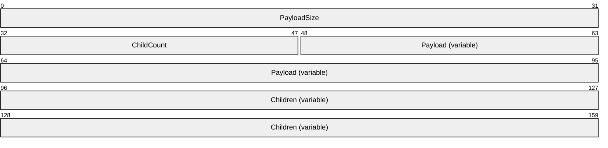

**PayloadSize (4 bytes):** An unsigned 32-bit integer. Length, in bytes, of the [**payload**](#gt_payload).

**ChildCount (2 bytes):** An unsigned 16-bit integer. Number of children payloads included in this tag.

**Payload (variable):** Variable. The tag payload. Specific payload types and their contents are described in the following sections.

**Children (variable):** Child tags (if applicable). Examples of DSLR child tags include the input parameters for dispatcher request, and the result/out parameters for the dispatcher response. These are also described in the following sections.

### 2.2.2 Messages

The following sections describe the tag payloads for each DSLR message.

#### 2.2.2.1 Dispatcher Request Tag Payload

The Dispatcher Request tag payload precedes all DSLR remote service request tags and payloads. (DSLR service requests are children of the Dispatcher Request tag.) It includes all information relevant to calling a remote function on a specific service: the type of request that is being made (either a one-way event or two-way request), the service on which the request is being made, the service-defined function to be called on the remote service, and a one-time unique request [**handle**](#gt_handle) to identify the specific request.

The format for the Dispatcher Request tag payload is as follows:

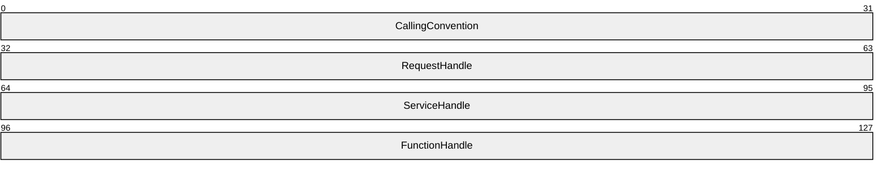

**CallingConvention (4 bytes):** An unsigned 32-bit integer that indicates the type of request (either a two-way request or a one-way event). This field MUST be set to one of the following values. (Note that for the dispenser service calls, CreateService and DeleteService, this value MUST be dslrRequest. See sections [2.2.2.3](#Section_3.2.5.1) and [2.2.2.4](#Section_3.2.5.3) for more details about CreateService and DeleteService.)

| Value | Meaning |
| --- | --- |
| dslrRequest 0x00000001 | DSLR Two-Way Request |
| dslrOneWay 0x00000003 | DSLR One-Way Event |

**RequestHandle (4 bytes):** An unsigned 32-bit integer. A client allocated handle to uniquely identify this specific request.

**ServiceHandle (4 bytes):** An unsigned 32-bit integer. The service handle that uniquely identifies the service on which the request is being made. This service handle is allocated by the client as part of the CreateService request. (Note that for the dispenser service calls, CreateService, and DeleteService, this value MUST be 0x00000000, which is the service handle for the dispenser service.

| Value | Meaning |
| --- | --- |
| DispenserHandle 0x00000000 | Dispenser service handle. Used only for CreateService and DeleteService messages exposed by the DSLR dispenser service. |
| GenericServiceHandle 0x00000001 — 0xFFFFFFFF | Generic DSLR service handle, generated by the DSLR client during the CreateService message for a given service. |

**FunctionHandle (4 bytes):** An unsigned 32-bit integer. Function handle for the specific function being called on the remote service. This function handle is defined and exposed by the remote service that corresponds to the specified ServiceHandle. (Note that for the dispenser service calls, CreateService and DeleteService, these values MUST be 0x00000001 and 0x00000002 respectively.

| Value | Meaning |
| --- | --- |
| CreateService 0x00000001 | Create remote service. Used by the DSLR dispenser service. |
| DeleteService 0x00000002 | Delete remote service. Used by the DSLR dispenser service. |
| GenericFunctionHandle 0x0000000 — 0xFFFFFFFF | Function handle for the specific function, defined and exposed by the DSLR service that corresponds to the specified ServiceHandle. |

#### 2.2.2.2 Dispatcher Response Tag Payload

The Dispatcher Response tag payload precedes all DSLR service response tags and payloads returned from DSLR two-way service requests. (DSLR service responses are children of the Dispatcher Response tag.) It includes all information relevant for receiving a response to a specific service request: the type of request being that is made (in this case, the type of request is always a response), and the one-time unique request handle that identifies the specific request to which the response corresponds.

The format for the Dispatcher Response tag payload is as follows:

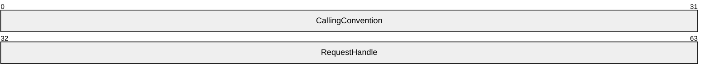

**CallingConvention (4 bytes):** An unsigned 32-bit integer. The type of request. This field MUST be set to the following value.

| Value | Meaning |
| --- | --- |
| dslrResponse 0x00000002 | DSLR Response |

**RequestHandle (4 bytes):** An unsigned 32-bit integer. The request handle to which the response corresponds. The request handle for each request is allocated by the client and passed to the server in the Dispatcher Request tag payload.

#### 2.2.2.3 CreateService Message Payload

The purpose of the CreateService message is to allow a client to instantiate a remote service, and the message payload contains all information needed to that end: the class ID and service ID that describe the service to be instantiated, and a client-generated service handle that will be used to uniquely identify this service for the life of the DSLR session.

As the CreateService message is a function exposed by the DSLR built-in dispenser service, it follows the same convention as would a call on an application-defined DSLR remote service call. The message tag and payload is a child of the DSLR Dispatch Request tag defined in section [2.2.1](#Section_2.2.1), and includes the input parameters for the CreateService function call.

- CreateService MUST be called before invoking any remote function calls ([**dispatch requests**](#gt_dispatch-request)) or sending any events ([**dispatch events**](#gt_dispatch-event)).
- CreateService is a 2-way request message, so the *CallingConvention* parameter in the Dispatch Request tag MUST be dslrRequest (0x00000001).
- CreateService is a call on the dispenser service, so the *ServiceHandle* parameter in the Dispatch Request tag MUST be DispenserHandle (0x00000000).
- The *FunctionHandle* parameter in the Dispatch Request tag for CreateService MUST be CreateService (0x00000001).
The format for the CreateService message payload (the CreateService function's input parameters) is as follows:

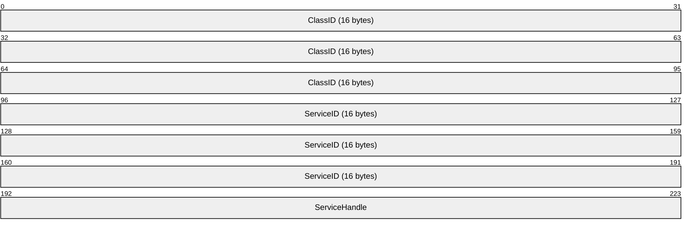

**ClassID (16 bytes):** A GUID that represents the Class ID for the service being created. The DSLR wire format for the GUID can be found in section [2.2.2.6](#Section_2.2.2.6).

**ServiceID (16 bytes):** A GUID that represents the Service ID for the service being created. The DSLR wire format for the GUID can be found in section 2.2.2.6.

**ServiceHandle (4 bytes):** An unsigned 32-bit integer. The service handle that identifies the service being created. The service handle is allocated by the client to uniquely identify the service being created in this CreateService call, and is used in each subsequent request on the newly created remote service.

See section [2.2.2.5](#Section_2.2.2) for the format of the Response payload for the CreateService message.

#### 2.2.2.4 DeleteService Message Payload

The purpose of the DeleteService message is to allow a client to shut down a previously instantiated remote service, and the message payload contains all information needed to that end: the service handle (allocated by the CreateService message) that uniquely identifies the service to be shut down.

As the DeleteService message is a function exposed by the DSLR built-in dispenser service, it follows the same convention as would a call on an application-defined DSLR remote service call. The message tag and payload is a child of the DSLR Dispatch Request tag defined in section [2.2.1](#Section_2.2.1), and includes the input parameters for the DeleteService function call.

- The client MUST NOT invoke any remote function calls ([**dispatch requests**](#gt_dispatch-request)) after calling DeleteService.
- DeleteService is a two-way request message, so the CallingConvention parameter in the Dispatch Request tag MUST be dslrRequest (0x00000001).
- DeleteService is a call on the dispenser service, so the service handle parameter in the Dispatch Request tag MUST be DispenserHandle (0x00000000).
- The function handle parameter in the Dispatch Request tag for DeleteService MUST be DeleteService (0x00000002).
The format for the DeleteService message payload (the DeleteService function's input parameters) is as follows:

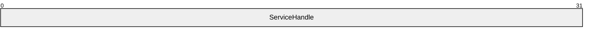

**ServiceHandle (4 bytes):** An unsigned 32-bit integer. The unique service handle that identifies the service to be shut down. This service handle is allocated by the client and passed to the service through the CreateService call.

See the following section about the format of the Response payload for the DeleteService message.

#### 2.2.2.5 Response Payload for CreateService and DeleteService Messages

The CreateService and DeleteService messages are both two-way DSLR requests, and as such, follow the same convention as would any application-defined, DSLR two-way service request. The message response tag and payload is a child of the DSLR dispatch response tag defined in section [2.2.2.2](#Section_2.2.2.2), and includes the result of the function call and any output parameters returned by the function (neither CreateService nor DeleteService have any output parameters, so only the result is returned).

The CallingConvention parameter in the dispatch response tag for CreateService and DeleteService MUST be dslrResponse (0x00000002).

The format for the CreateService and DeleteService Response payload (the return value from the function call) is as follows:

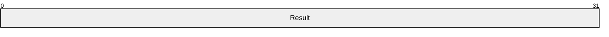

**Result (4 bytes):** An unsigned 32-bit integer. HRESULT returned from function call.

The following error codes MAY be returned in the response payload for both the CreateService and DeleteService messages, as well as by any application defined remote services (see section [2.2.2.7](#Section_2.2.2.7), Generic Service Response Payload).

Facility:

| Value | Meaning |
| --- | --- |
| FACILITY_DSLR 0x8817 | Facility for all DSLR HRESULT errors. |

Generic Error Codes:

| Value | Meaning |
| --- | --- |
| DSLR_E_OUTOFMEMORY 0x8817000e | Ran out of memory. |
| DSLR_E_INVALIDARG 0x88170057 | One or more arguments are invalid. |
| DSLR_E_POINTER 0x88174003 | Invalid pointer. |
| DSLR_E_FAIL 0x88174005 | Unspecified error. |
| DSLR_E_UNEXPECTED 0x8817ffff | Catastrophic failure. |

Dispenser-Specific Error Codes:

| Value | Meaning |
| --- | --- |
| DSLR_E_PROXYNOTFOUND 0x88170100 | Cannot find a proxy for this service. |
| DSLR_E_STUBNOTFOUND 0x88170101 | Cannot find a stub for this service. |
| DSLR_E_INVALIDSETTINGS 0x88170102 | Invalid DSLR settings. |

Serializer/Deserializer-Specific Error Codes:

| Value | Meaning |
| --- | --- |
| DSLR_E_CHILDCOUNT 0x88170103 | Tag has too many children. |
| DSLR_E_INVALIDFUNCTION 0x88170104 | Unknown function. |
| DSLR_E_TOOLONG 0x88170105 | The tag's payload is too long. |

Dispatcher-Specific Error Codes:

| Value | Meaning |
| --- | --- |
| DSLR_E_OUTOFHANDLES 0x88170106 | No more request handles are available. |
| DSLR_E_SERVICERELEASED 0x88170107 | The service was released. |
| DSLR_E_INVALIDCALLCONVENTION 0x88170108 | Unsupported calling convention. |
| DSLR_E_INVALIDREQUESTHANDLE 0x88170109 | Invalid request handle. |
| DSLR_E_INVALIDSTUBHANDLE 0x8817010a | Invalid stub handle. |
| DSLR_E_ABORT 0x8817010b | DSLR operation aborted. |

Transport Specific Error Codes:

| Value | Meaning |
| --- | --- |
| DSLR_E_INVALIDOPERATION 0x8817010c | Invalid operation. |
| DSLR_E_INVALIDTAGOPERATION 0x8817010d | Invalid operation on this tag. |
| DSLR_E_TAGHASNOMORECHILDREN 0x8817010e | There are no more children to this tag. |
| DSLR_E_TAGSEEKERROR 0x8817010f | Tag operation is out of bounds. |
| DSLR_E_SENDBUFFERTOOSMALL 0x88170110 | Buffer is too small for this tag. |
| DSLR_E_DISCONNECTED 0x88170111L | The transport was disconnected unexpectedly. |

The CreateService and DeleteService messages have no additional out parameters.

#### 2.2.2.6 Generic Service Request Payload

The purpose of the DSLR protocol is to allow DSLR consumers to define remote services and requests (or function calls) on those services. To that end, all DSLR service requests follow the same convention. The message tag and payload is a child of the DSLR Dispatch Request tag defined in section [2.2.2.1](#Section_2.2.2.1), and includes the input parameters for the specific function being called.

The format for a generic service request message payload (the function's input parameters) is as follows:

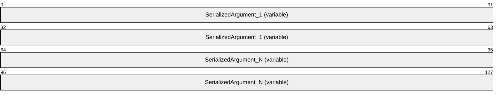

**SerializedArgument_1 (variable):** Input parameter for a specific function being called on the remote service. This parameter is defined by the service.

**SerializedArgument_N (variable):** Additional input parameters for a specific function being called on the remote service. These parameters are defined by the service.

Any of the following data types are valid input and output parameters for DSLR functions:

**BYTE (1 byte):** One byte of data.

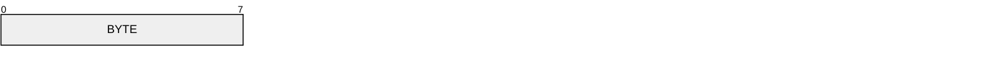

**WORD (2 bytes):** An unsigned 16-bit integer.

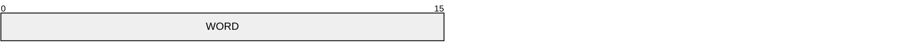

**DWORD (4 bytes):** An unsigned 32-bit integer.

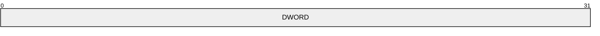

**DWORD64 (8 bytes):** An unsigned 64-bit integer.

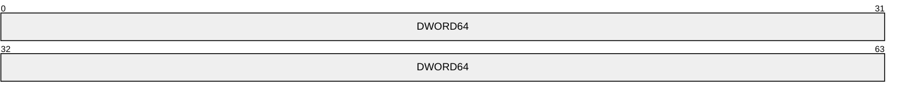

**GUID (16 bytes):** 16 byte GUID. Consists of DWORD (**4 bytes**, unsigned 32-bit integer), Data1 (Big-Endian byte order), WORD (**2 bytes**, unsigned 16-bit integer), Data2 (Big-Endian byte order), WORD (**2 bytes**, unsigned 16-bit integer), Data3 (Big-Endian byte order), and Data4 =**8 bytes** field.

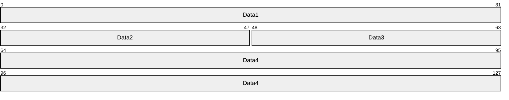

**Utf8Str (variable):** Variable. Consists of a DWORD-length byte array of UTF-8 string data. The number of bytes in the Data field is equal to the value of the Length field.

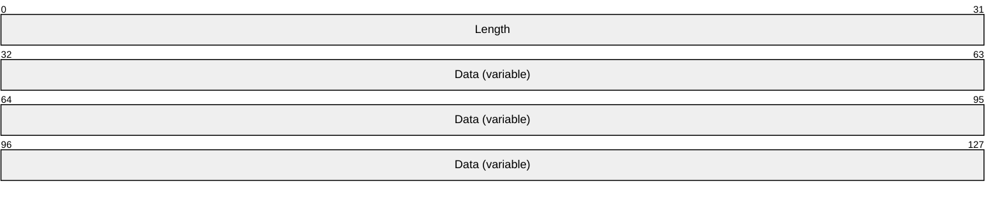

**Blob (variable):** Variable. Consists of a DWORD-length (Big-Endian byte order) byte array of arbitrary data. The number of bytes in the Data field is equal to the value of the Length field.

#### 2.2.2.7 Generic Service Response Payload

All DSLR two-way service requests follow the same convention for their responses. The message tag and payload is a child of the DSLR dispatch response tag defined in section [2.2.2.2](#Section_2.2.2.2) and includes the result of the function call and any output parameters returned by the function.

The format for a generic service response message payload (the function's return value and output parameters, if any) is as follows:

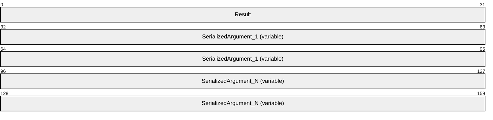

**Result (4 bytes):** An unsigned 32-bit integer containing the HRESULT returned from the function call. This can be any of the pre-defined DSLR error codes (see section [2.2.2.5](#Section_2.2.2)) or a service-defined set of HRESULT codes.

**SerializedArgument_1 (variable):** An out argument (if any) if the call was successful. This parameter is defined by the service. See section [2.2.2.6](#Section_2.2.2.6) about valid data types for out parameters.

**SerializedArgument_N (variable):** Additional out arguments (if any) if the call was successful. These parameters are defined by the service. See section 2.2.2.6 about valid data types for out parameters.

# 3 Protocol Details

As previously stated, DSLR is direction agnostic. In other words, a machine or a device can be either a client (which implements a [**proxy**](#gt_proxy) that makes calls on a remote service) or a server (which implements a remote service), depending on the specific service implementation. Either side of the DSLR connection can act as a client, a server, or both.

## 3.1 Client Details (Remote/Proxy Side of the DSLR Connection)

The client (remote/proxy) side of the DSLR connection is responsible for calling CreateService to create the remote service on the server; then for sending dispatcher requests and receiving dispatcher responses (for two-way requests). When the service is no longer needed, the client calls DeleteService to clean up the service on the remote side.

The DSLR client has the following states, as illustrated in the following figure:

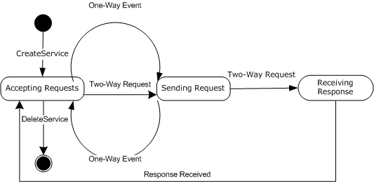

Figure 3: DSLR client state diagram

**Start state:** The client is ready to create proxies for remote services. The following event is processed in this state:

- CreateService
**Accepting Requests:** The client has called CreateService to instantiate the service on the server, and is ready to accept requests to send to that service. The following events are processed in this state:

- DSLR One-Way Event
- DSLR Two-Way Request
- DeleteService
**Sending Request:** The client is sending either a DSLR one-way event or two-way request to the remote service. No events are processed in this state. The client either transitions from this state to Accepting Requests or Receiving Response, depending on the request type.

**Receiving Response:** The client is receiving a response for a two-way request that has been sent to the server. The following event is processed in this state:

- Response Received
**Finish state:** The client has called DeleteService to clean up the remote service. No events are processed in this state.

### 3.1.1 Abstract Data Model

This section describes a conceptual model of possible data organization that an implementation maintains to participate in this protocol. The described organization is provided to facilitate the explanation of how the protocol behaves. This document does not mandate that implementations adhere to this model as long as their external behavior is consistent with that described in this document.

The DSLR client abstract data model includes the following data:

**ProxyCreatorTable:** The proxy creator function for a given service (identified by a service GUID) is provided by the application at initialization. The client dispenser maintains a table that maps each service GUID to its proxy creator function. When the application requests that a remote service be instantiated, the DSLR client calls the appropriate proxy creator function to create the proxy for the newly created remote service.

**ConnectedEvent:** This is an optional event provided by the application at initialization. Whenever the transport is connected, it notifies its dispatcher, which in turn sets the connect event maintained by the DSLR client dispenser, if specified at initialization.

**DisconnectedEvent:** This is an optional event provided by the application at initialization. Whenever the transport is disconnected, it notifies its dispatcher, which in turn sets the disconnect event maintained by the DSLR client dispenser, if specified at initialization.

**ServiceHandle:** The proxy created for a remote service maintains a service [**handle**](#gt_handle) for the specific service. This handle is allocated when the dispenser's CreateService function is called to instantiate a remote service, and is thereafter used to issue requests on that service.

**RequestTable:** The DSLR client dispatcher maintains a table for each service request made by the application. It maps the request handle allocated at the time of the request to the tag (containing the Dispatcher Request tag and service function input parameters) that will be sent to the service. When a response is received (for a two-way request), the DSLR client dispatcher retrieves the out tag for the specific request, and returns it to the proxy.

### 3.1.2 Timers

None.

### 3.1.3 Initialization

On startup, DSLR performs the following initialization:

- The transport, dispenser, and dispatcher are created.
- The dispatcher is bound to the transport (it adds itself as a transport sink).
- The dispenser is started, and adds itself as the first service, with two exposed functions: CreateService and DeleteService.
- The transport has started.
In addition, the client initializes a mapping between the service GUID for each remote service it will use, and the proxy creation method required to instantiate the proxy for each remote service. Optionally, the client can register to receive notification when the transport for the services has been either connected, disconnected, or both.

### 3.1.4 Higher-Layer Triggered Events

The DSLR client is driven by applications calling CreateService to create the service on the remote side, and then by an application calling functions on that service. The application is also responsible for calling DeleteService to clean up the remote service.

### 3.1.5 Processing Events and Sequencing Rules

The following sections describe the states and events outlined in [3.1](#Section_1.3).

#### 3.1.5.1 CreateService

When initialization and startup is complete, the client sends the CreateService message to the server to instantiate the service on the server, and also creates a proxy for that service (an object that implements the proxied service's interfaces). As part of the CreateService request, the client allocates a service handle that is sent to the server, and is subsequently used when calling functions on the service.

If the CreateService event occurs while the client is in the Start state, the client moves into the Accepting Requests state and returns S_OK (0x00000000). Otherwise, the client returns an appropriate error code from the set of DSLR error codes defined in section [2.2.2.5](#Section_2.2.2).

The flow for CreateService is diagrammed in the following figure:

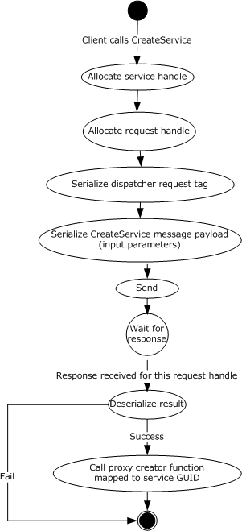

Figure 4: CreateService flow diagram

#### 3.1.5.2 Service Requests

When the remote service has been instantiated, the client then calls functions on the service (one-way events and two-way requests), and waits for responses for any two-way requests.

The flow for calling remote functions is diagrammed in the following figure:

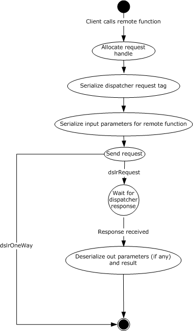

Figure 5: Flow diagram for calling remote functions

##### 3.1.5.2.1 One-Way Events

If this event occurs while the client is in the Accepting Requests state, the client moves into the Sending Request state and sends the request to the server. Otherwise, the event is queued until the client returns to the Accepting Requests state. (See figure in section [3.1](#Section_1.3).)

When the event has been sent to the server, the client returns to the Accepting Requests state. The return value is from the server is S_OK (0x00000000), or an appropriate error code from the set of DSLR error codes defined in section [2.2.2.5](#Section_2.2.2).

##### 3.1.5.2.2 Two-Way Requests

If this event occurs while the client is in the Accepting Requests state, the client moves into the Sending Request state and sends the request to the server. Otherwise, the event is queued until the client returns to the Accepting Requests state. (See figure in section [3.1](#Section_1.3).)

When the event has been sent to the server, the client moves to the Receiving Response state. The client returns to the Accepting Requests state when the response has been received. The return value is the one received from the server, or an appropriate error code from the set of DSLR error codes defined in section [2.2.2.5](#Section_2.2.2).

#### 3.1.5.3 DeleteService

When the client no longer needs to make requests on the remote service, it sends the DeleteService message to the server to clean up the remote service. Clean up on the server entails removing the service handle from the set of currently instantiated remote services, and setting the Disconnect event (if one is specified at initialization). The result is that no more requests can be made on the remote service. (See figure in section [3.1](#Section_1.3).)

If this event occurs while the client is in the Accepting Requests state, the client MUST move to Finish state and return S_OK(0x00000000). Otherwise, the client returns an appropriate error code from the set of DSLR error codes defined in section [2.2.2.5](#Section_2.2.2).

### 3.1.6 Timer Events

None.

### 3.1.7 Other Local Events

#### 3.1.7.1 OnConnected

When the transport is connected, it notifies its dispatcher, which in turn calls the dispenser's connect callback (if provided at initialization).

#### 3.1.7.2 OnDisconnected

When the transport is disconnected it notifies its dispatcher, which in turn calls the dispenser's disconnect callback (if provided at initialization).

## 3.2 Server Details (Local/Stub Side of DSLR Connection)

After CreateService has been called by a client, the server side of the DSLR is responsible for receiving dispatcher requests, executing the function calls for those requests, and sending dispatcher responses with the result of the function calls for that client. The server stops processing its requests when a client has called DeleteService.

The DSLR server has the following states, as illustrated in the following figure:

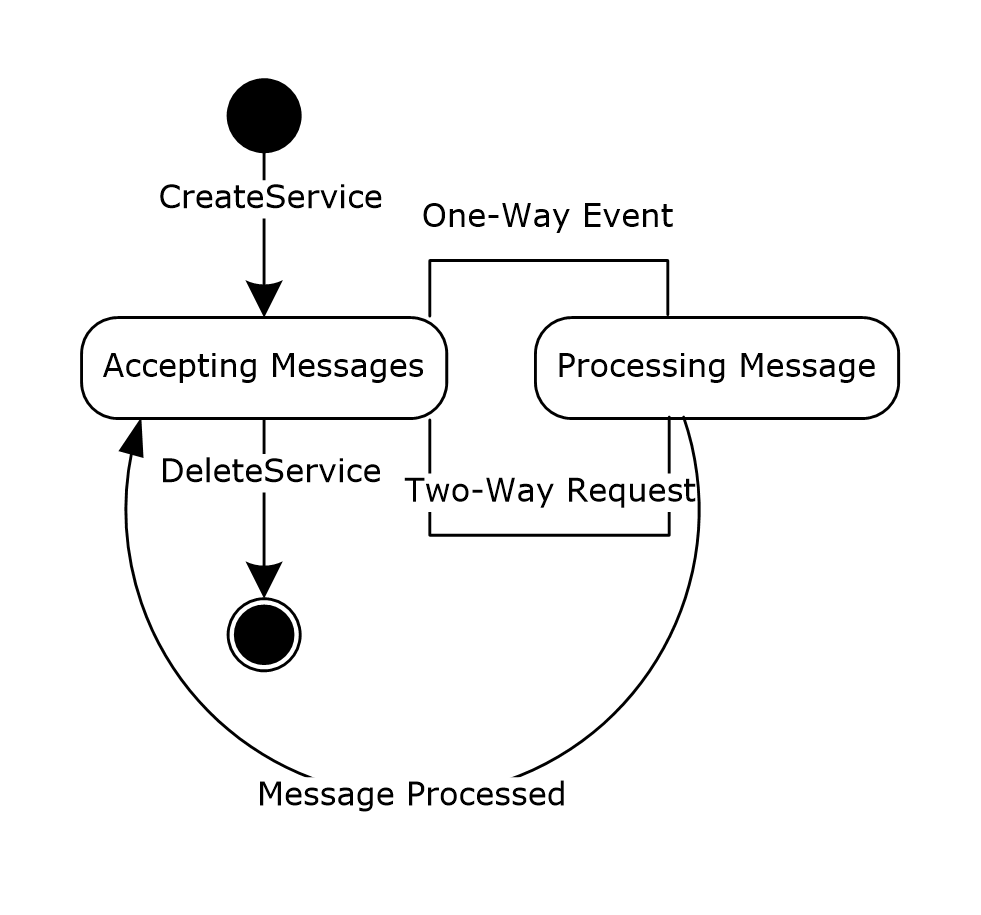

Figure 6: DSLR server state diagram

**Start state:** The server is ready to instantiate services. The following message is processed in this state:

- CreateService
**Accepting Messages:** The server has received the CreateService message to instantiate the service, and is ready to accept requests on that service. The following events are processed in this state:

- DSLR One-Way Event
- DSLR Two-Way Request
- DeleteService
**Processing Message:** The server is executing a one-way event or two-way request received from the client, including sending the response for two-way requests. The following event is processed in this state:

- Message Processed
**Finish state:** The server has received the DeleteService message and cleaned up the remote service. No events are processed in this state.

### 3.2.1 Abstract Data Model

This section describes a conceptual model of possible data organization that an implementation maintains to participate in this protocol. The described organization is provided to facilitate the explanation of how the protocol behaves. This document does not mandate that implementations adhere to this model as long as their external behavior is consistent with that described in this document.

The DSLR server abstract data model includes the following data:

**ServiceCreator:** The service creator function is provided by the application at initialization. When the CreateService message is received from the client, the DSLR service dispenser calls this function (with the provided class ID and service ID) to create the service specified by these GUIDs.

**StubTable:** The stub function for a given service (identified by a service GUID) is provided by the application at initialization. The service dispenser maintains a table mapping each service GUID to its stub function. When the client application requests that a remote service be created through the CreateService message, the DSLR server uses this table to determine the stub function for the specified service.

**ConnectedEvent:** This is an optional event provided by the application upon initialization of each service, including the dispenser service. Whenever the transport is connected it notifies its dispatcher, which in turn sets the connect event for each registered service (including the dispenser), if specified at initialization.

**DisconnectedEvent:** This is an optional event provided by the application upon initialization of each service, including the dispenser service. Whenever the transport is disconnected it notifies its dispatcher, which in turn sets the disconnect event for each registered service (including the dispenser), if specified at initialization.

**ServiceTable**: The DSLR service dispatcher maintains a table for each service created through CreateService. It maps the client provided service handle to the stub function specified at initialization for a given service GUID.

### 3.2.2 Timers

None.

### 3.2.3 Initialization

On startup, DSLR performs the following initialization on the server:

- The transport, dispenser, and dispatcher are created.
- The dispatcher is bound to the transport by adding itself as a transport sink.
- The dispenser is started, and adds itself as the first service, with two exposed functions: CreateService and DeleteService.
- The transport has started.
In addition, the server initializes a mapping between its service GUIDs and both of the service creation methods required to instantiate the services, as well as the stubs responsible for processing service requests. Optionally, the service can register to receive notification when the transport for the services has been either connected or disconnected, or both.

### 3.2.4 Higher-Layer Triggered Events

None.

### 3.2.5 Processing Events and Sequencing Rules

The following sections describe the states and events outlined in section [3.2.1](#Section_3.1.1).

#### 3.2.5.1 CreateService

When initialization and startup are complete, the server waits for the client to call CreateService to instantiate the service. When the CreateService message is received, the server calls the service creator function to create the service, and adds the newly created service to the list of instantiated local services. The provided service handle is then mapped to the stub function that was mapped to the service GUID at initialization and startup. This new mapping is then used to call local service functions in response to remote requests.

If the CreateService event occurs while the server is in the Start state, the server moves into the Accepting Messages state, and the server returns S_OK (0x00000000). Otherwise, the server returns an appropriate error code from the set of DSLR error codes defined in section [2.2.2.5](#Section_2.2.2).

The flow for CreateService is diagrammed in the following figure:

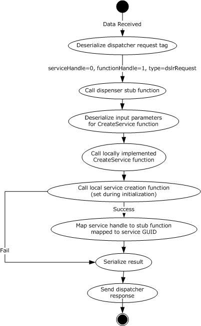

Figure 7: CreateService flow diagram

#### 3.2.5.2 Service Requests

When the remote service has been instantiated, the server then waits for the client to issue service requests on the service. When it receives such requests, the server executes the service requests and sends responses for two-way requests.

The flow for processing function calls is diagrammed in the following figure:

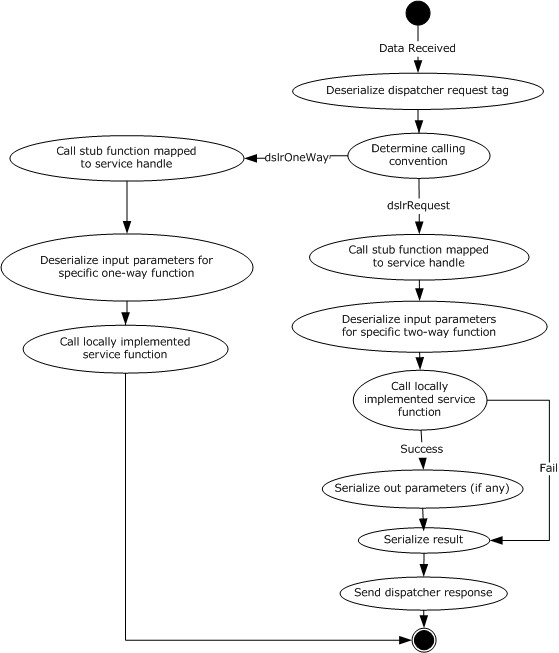

Figure 8: Flow diagram for processing function calls

##### 3.2.5.2.1 One-Way Events

If this event occurs while the server is in the Accepting Messages state, the server moves into the Processing Message state and processes the one-way event. Otherwise, the event is queued until the server returns to the Accepting Messages state. (See figure in section [3.1](#Section_1.3).)

Once the event message has been processed (the local function has been called), the client returns to the Accepting Messages state. The return value is S_OK (0x00000000), or an appropriate error code from the set of error codes defined in section [2.2.2.5](#Section_2.2.2).

##### 3.2.5.2.2 Two-Way Requests

If this event occurs while the server is in the Accepting Messages state, the server moves into the Accepting Messages state and processes the two-way request. Otherwise, the event is queued until the server returns to the Accepting Messages state. (See figure in section [3.1](#Section_1.3).)

When the request message has been processed (the local function has been called, and the return value and out parameters sent back to the client), the server returns to the Accepting Messages state. The return value is the result of the function call, or an appropriate error code from the set of error codes defined in section [2.2.2.5](#Section_2.2.2).

#### 3.2.5.3 DeleteService

Once the server receives the DeleteService message from the client, it stops processing service requests and cleans up the service. (See figure in section [3.1](#Section_1.3).)

If this event occurs while the server is in the Accepting Messages state, the client MUST move to Finish state and return S_OK(0x00000000). Otherwise, the client returns an appropriate error code from the set of error codes defined in section [2.2.2.5](#Section_2.2.2).

### 3.2.6 Timer Events

None.

### 3.2.7 Other Local Events

#### 3.2.7.1 OnConnected

When the transport is connected it notifies its dispatcher, which in turn sets the connect event for each registered service (including the dispenser service), if specified at initialization.

#### 3.2.7.2 OnDisconnected

When the transport is disconnected it notifies its dispatcher, which in turn sets the disconnect event for each registered service (including the dispenser service), if specified at initialization.

# 4 Protocol Examples

## 4.1 Typical DSLR Session

The following diagram shows a typical DSLR session for a given remote service:

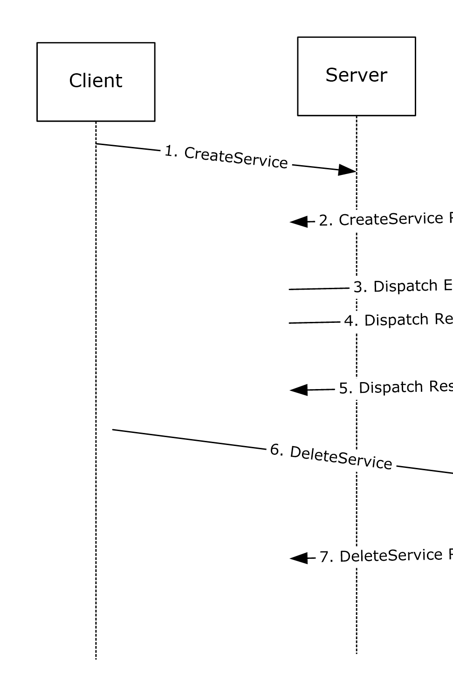

Figure 9: Typical DSLR session

- The client sends the CreateService message to the server. The server creates the remote service specified by the class ID and service ID.
- The server returns S_OK (0x00000000) if the service was created successfully; otherwise, it returns an appropriate error code.
- The client calls a one-way event on the remote service.
- The client calls a two-way request on the remote service.
- The service returns the result of the two-way request, and any out parameters for the specific request.
- The client sends the DeleteService message to the server. The server cleans up the remote service specified service handle.
- The server returns S_OK(0x00000000) if the service was deleted successfully; otherwise, it returns an appropriate error code.

## 4.2 Typical DSLR Message

The following is a sample of a typical DSLR message: the Dispatcher Request tag and payload, followed by one child, the CreateService tag and payload (the CreateService input parameters). A DSLR service-defined function follows this same format, replacing ServiceHandle with the handle that uniquely defines the service, FunctionHandle with the handle that uniquely defines the function, and the CreateService payload/input parameters with the function-specific payload/input parameters.

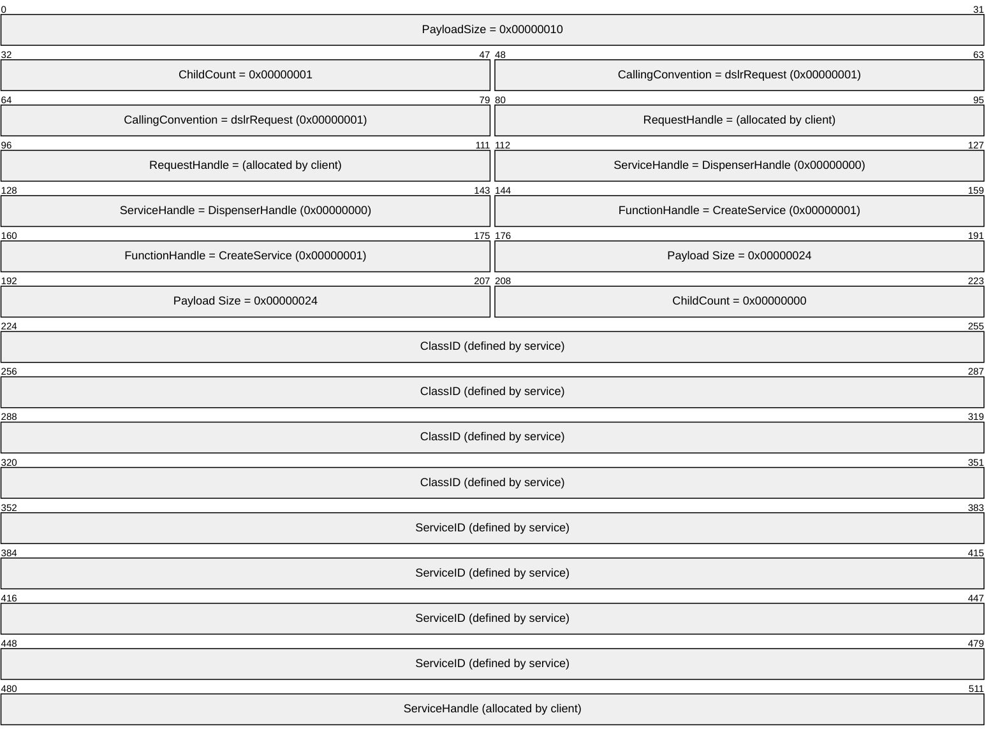

# 5 Security

## 5.1 Security Considerations for Implementers

The DSLR framework is security neutral. Security and privacy are implemented and enforced in the transport layer. Possible transport layers include, but are not limited to, TCP and RDP virtual channels.

## 5.2 Index of Security Parameters

None.

# 6 Appendix A: Product Behavior

The information in this specification is applicable to the following Microsoft products or supplemental software. References to product versions include released service packs.

- Extenders for Windows Media Center
- Windows Vista operating system
- Windows 7 operating system
- Windows 8 operating system
- Windows 8.1 operating system
Exceptions, if any, are noted below. If a service pack or Quick Fix Engineering (QFE) number appears with the product version, behavior changed in that service pack or QFE. The new behavior also applies to subsequent service packs of the product unless otherwise specified. If a product edition appears with the product version, behavior is different in that product edition.

Unless otherwise specified, any statement of optional behavior in this specification that is prescribed using the terms "SHOULD" or "SHOULD NOT" implies product behavior in accordance with the SHOULD or SHOULD NOT prescription. Unless otherwise specified, the term "MAY" implies that the product does not follow the prescription.

# 7 Change Tracking

No table of changes is available. The document is either new or has had no changes since its last release.

## Revision History

| Date | Version | Revision Class | Comments |
| --- | --- | --- | --- |
| 11/6/2009 | 0.1 | Major | First Release. |
| 12/18/2009 | 0.1.1 | Editorial | Changed language and formatting in the technical content. |
| 1/29/2010 | 0.2 | Minor | Clarified the meaning of the technical content. |
| 3/12/2010 | 0.2.1 | Editorial | Changed language and formatting in the technical content. |
| 4/23/2010 | 0.2.2 | Editorial | Changed language and formatting in the technical content. |
| 6/4/2010 | 0.2.3 | Editorial | Changed language and formatting in the technical content. |
| 7/16/2010 | 0.2.3 | None | No changes to the meaning, language, or formatting of the technical content. |
| 8/27/2010 | 0.2.3 | None | No changes to the meaning, language, or formatting of the technical content. |
| 10/8/2010 | 0.2.3 | None | No changes to the meaning, language, or formatting of the technical content. |
| 11/19/2010 | 0.2.3 | None | No changes to the meaning, language, or formatting of the technical content. |
| 1/7/2011 | 0.2.3 | None | No changes to the meaning, language, or formatting of the technical content. |
| 2/11/2011 | 0.2.3 | None | No changes to the meaning, language, or formatting of the technical content. |
| 3/25/2011 | 0.2.3 | None | No changes to the meaning, language, or formatting of the technical content. |
| 5/6/2011 | 0.2.3 | None | No changes to the meaning, language, or formatting of the technical content. |
| 6/17/2011 | 0.3 | Minor | Clarified the meaning of the technical content. |
| 9/23/2011 | 0.3 | None | No changes to the meaning, language, or formatting of the technical content. |
| 12/16/2011 | 1.0 | Major | Updated and revised the technical content. |
| 3/30/2012 | 1.0 | None | No changes to the meaning, language, or formatting of the technical content. |
| 7/12/2012 | 1.0 | None | No changes to the meaning, language, or formatting of the technical content. |
| 10/25/2012 | 1.0 | None | No changes to the meaning, language, or formatting of the technical content. |
| 1/31/2013 | 1.0 | None | No changes to the meaning, language, or formatting of the technical content. |
| 8/8/2013 | 2.0 | Major | Updated and revised the technical content. |
| 11/14/2013 | 3.0 | Major | Updated and revised the technical content. |
| 2/13/2014 | 3.0 | None | No changes to the meaning, language, or formatting of the technical content. |
| 5/15/2014 | 3.0 | None | No changes to the meaning, language, or formatting of the technical content. |
| 6/30/2015 | 3.0 | None | No changes to the meaning, language, or formatting of the technical content. |
| 10/16/2015 | 3.0 | None | No changes to the meaning, language, or formatting of the technical content. |
| 7/14/2016 | 3.0 | None | No changes to the meaning, language, or formatting of the technical content. |
| 6/1/2017 | 3.0 | None | No changes to the meaning, language, or formatting of the technical content. |
