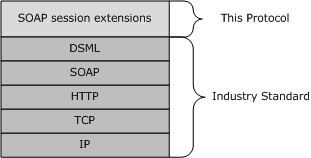

# [MS-DSML]: Directory Services Markup Language (DSML) 2.0 Protocol Extensions

Table of Contents

1 Introduction

- [1 Introduction](#Section_1)
  - [1.1 Glossary](#Section_1.1)
  - [1.2 References](#Section_1.2)
    - [1.2.1 Normative References](#Section_1.2.1)
    - [1.2.2 Informative References](#Section_1.2.2)
  - [1.3 Overview](#Section_1.3)
  - [1.4 Relationship to Other Protocols](#Section_1.4)
  - [1.5 Prerequisites/Preconditions](#Section_1.5)
  - [1.6 Applicability Statement](#Section_1.6)
  - [1.7 Versioning and Capability Negotiation](#Section_1.7)
  - [1.8 Vendor-Extensible Fields](#Section_1.8)
  - [1.9 Standards Assignments](#Section_1.9)

2 Messages

- [2 Messages](#Section_2)
  - [2.1 Transport](#Section_2.1)
  - [2.2 Common Message Syntax](#Section_2.2)
    - [2.2.1 Namespaces](#Section_2.2.1)
    - [2.2.2 Messages](#Section_2.2.2)
      - [2.2.2.1 BeginSession](#Section_2.2.2.1)
      - [2.2.2.2 Session](#Section_2.2.2.2)
      - [2.2.2.3 EndSession](#Section_2.2.2.3)
    - [2.2.3 Elements](#Section_2.2.3)
      - [2.2.3.1 BeginSession Element](#Section_2.2.3.1)
      - [2.2.3.2 Session Element](#Section_2.2.3.2)
      - [2.2.3.3 EndSession Element](#Section_2.2.3.3)
    - [2.2.4 Complex Types](#Section_2.2.4)
    - [2.2.5 Simple Types](#Section_2.2.5)
      - [2.2.5.1 sessionId Simple Type](#Section_2.2.5.1)
    - [2.2.6 Attributes](#Section_2.2.6)
      - [2.2.6.1 SessionID Attribute](#Section_2.2.6.1)
    - [2.2.7 Groups](#Section_2.2.7)
    - [2.2.8 Attribute Groups](#Section_2.2.8)

3 Protocol Details

- [3 Protocol Details](#Section_3)
  - [3.1 Server Details](#Section_3.1)
    - [3.1.1 Abstract Data Model](#Section_3.1.1)
    - [3.1.2 Timers](#Section_3.1.2)
      - [3.1.2.1 SessionIdleTimer](#Section_3.1.2.1)
    - [3.1.3 Initialization](#Section_3.1.3)
    - [3.1.4 Message Processing Events and Sequencing Rules](#Section_3.1.4)
      - [3.1.4.1 BeginSession](#Section_3.1.4.1)
      - [3.1.4.2 Session](#Section_3.1.4.2)
      - [3.1.4.3 EndSession](#Section_3.1.4.3)
      - [3.1.4.4 Faults](#Section_3.1.4.4)
    - [3.1.5 Timer Events](#Section_3.1.5)
      - [3.1.5.1 SessionIdletimer Event](#Section_3.1.5.1)
    - [3.1.6 Other Local Events](#Section_3.1.6)

4 Protocol Examples

- [4 Protocol Examples](#Section_4)

5 Security

- [5 Security](#Section_5)
  - [5.1 Security Considerations for Implementers](#Section_5.1)
  - [5.2 Index of Security Parameters](#Section_5.2)

6 Appendix A: Full WSDL

- [6 Appendix A: Full WSDL](#Section_6)

7 Appendix B: Product Behavior

- [7 Appendix B: Product Behavior](#Section_7)

8 Change Tracking

- [8 Change Tracking](#Section_8)

For the legal notice and IP terms, see [LEGAL.md](../LEGAL.md).
Last updated: 4/7/2021.
See [Revision History](#revision-history) for full version history.

# 1 Introduction

This is a specification of Microsoft extensions to the Directory Services Markup Language (DSML) 2.0 Protocol specified in [[DSML2]](https://go.microsoft.com/fwlink/?LinkId=119908). These extensions are referred to as [**SOAP session extensions (SSE)**](#gt_soap-session-extensions-sse) in this specification. They are built on top of [**SOAP**](#gt_soap) request/response bindings specified by DSML and they make it possible to maintain state information across multiple request/response operations.

Sections 1.5, 1.8, 1.9, 2, and 3 of this specification are normative. All other sections and examples in this specification are informative.

## 1.1 Glossary

This document uses the following terms:

**Active Directory**: The Windows implementation of a general-purpose [**directory service**](#gt_directory-service-ds), which uses [**LDAP**](#gt_lightweight-directory-access-protocol-ldap) as its primary access protocol. [**Active Directory**](#gt_active-directory) stores information about a variety of objects in the network such as user accounts, computer accounts, groups, and all related credential information used by Kerberos [MS-KILE](../MS-KILE/MS-KILE.md). [**Active Directory**](#gt_active-directory) is either deployed as Active Directory Domain Services (AD DS) or Active Directory Lightweight Directory Services (AD LDS), which are both described in [MS-ADOD](../MS-ADOD/MS-ADOD.md): Active Directory Protocols Overview.

**directory object**: A [**Lightweight Directory Access Protocol (LDAP)**](#gt_lightweight-directory-access-protocol-ldap) object, as specified in [[RFC2251]](https://go.microsoft.com/fwlink/?LinkId=90325), that is a specialization of an object.

**directory service (DS)**: A service that stores and organizes information about a computer network's users and network shares, and that allows network administrators to manage users' access to the shares. See also [**Active Directory**](#gt_active-directory).

**Hypertext Transfer Protocol (HTTP)**: An application-level protocol for distributed, collaborative, hypermedia information systems (text, graphic images, sound, video, and other multimedia files) on the World Wide Web.

**Lightweight Directory Access Protocol (LDAP)**: The primary access protocol for [**Active Directory**](#gt_active-directory). Lightweight Directory Access Protocol (LDAP) is an industry-standard protocol, established by the Internet Engineering Task Force (IETF), which allows users to query and update information in a [**directory service (DS)**](#gt_directory-service-ds), as described in [MS-ADTS](../MS-ADTS/MS-ADTS.md). The Lightweight Directory Access Protocol can be either version 2 [[RFC1777]](https://go.microsoft.com/fwlink/?LinkId=90290) or version 3 [[RFC3377]](https://go.microsoft.com/fwlink/?LinkID=91337).

**session**: A collection of state information on a directory server. An implementation of the [**SOAP session extensions (SSE)**](#gt_soap-session-extensions-sse) is free to choose the state information to store in a session.

**SOAP**: A lightweight protocol for exchanging structured information in a decentralized, distributed environment. [**SOAP**](#gt_soap) uses [**XML**](#gt_xml) technologies to define an extensible messaging framework, which provides a message construct that can be exchanged over a variety of underlying protocols. The framework has been designed to be independent of any particular programming model and other implementation-specific semantics. SOAP 1.2 supersedes SOAP 1.1. See [[SOAP1.2-1/2003]](https://go.microsoft.com/fwlink/?LinkId=90521).

**SOAP body**: A container for the payload data being delivered by a [**SOAP message**](#gt_soap-message) to its recipient. See [[SOAP1.2-1/2007]](https://go.microsoft.com/fwlink/?LinkId=94664) section 5.3 for more information.

**SOAP fault**: A container for error and status information within a [**SOAP message**](#gt_soap-message). See [SOAP1.2-1/2007] section 5.4 for more information.

**SOAP header**: A mechanism for implementing extensions to a [**SOAP message**](#gt_soap-message) in a decentralized manner without prior agreement between the communicating parties. See [SOAP1.2-1/2007] section 5.2 for more information.

**SOAP message**: An [**XML**](#gt_xml) document consisting of a mandatory SOAP envelope, an optional [**SOAP header**](#gt_soap-header), and a mandatory [**SOAP body**](#gt_soap-body). See [SOAP1.2-1/2007] section 5 for more information.

**SOAP session extensions (SSE)**: Extensions to DSML that make it possible to maintain state information across multiple request/response operations.

**Web Services Description Language (WSDL)**: An XML format for describing network services as a set of endpoints that operate on messages that contain either document-oriented or procedure-oriented information. The operations and messages are described abstractly and are bound to a concrete network protocol and message format in order to define an endpoint. Related concrete endpoints are combined into abstract endpoints, which describe a network service. WSDL is extensible, which allows the description of endpoints and their messages regardless of the message formats or network protocols that are used.

**XML**: The Extensible Markup Language, as described in [[XML1.0]](https://go.microsoft.com/fwlink/?LinkId=90599).

**XML namespace**: A collection of names that is used to identify elements, types, and attributes in XML documents identified in a URI reference [[RFC3986]](https://go.microsoft.com/fwlink/?LinkId=90453). A combination of XML namespace and local name allows XML documents to use elements, types, and attributes that have the same names but come from different sources. For more information, see [[XMLNS-2ED]](https://go.microsoft.com/fwlink/?LinkId=90602).

**XML Schema (XSD)**: A language that defines the elements, attributes, namespaces, and data types for [**XML**](#gt_xml) documents as defined by [[XMLSCHEMA1/2]](https://go.microsoft.com/fwlink/?LinkId=90607) and [[XMLSCHEMA2/2]](https://go.microsoft.com/fwlink/?LinkId=90609) standards. An XML schema uses [**XML**](#gt_xml) syntax for its language.

**MAY, SHOULD, MUST, SHOULD NOT, MUST NOT:** These terms (in all caps) are used as defined in [[RFC2119]](https://go.microsoft.com/fwlink/?LinkId=90317). All statements of optional behavior use either MAY, SHOULD, or SHOULD NOT.

## 1.2 References

Links to a document in the Microsoft Open Specifications library point to the correct section in the most recently published version of the referenced document. However, because individual documents in the library are not updated at the same time, the section numbers in the documents may not match. You can confirm the correct section numbering by checking the [Errata](https://go.microsoft.com/fwlink/?linkid=850906).

### 1.2.1 Normative References

We conduct frequent surveys of the normative references to assure their continued availability. If you have any issue with finding a normative reference, please contact [dochelp@microsoft.com](mailto:dochelp@microsoft.com). We will assist you in finding the relevant information.

[DSML2] OASIS Standard, "Directory Services Markup Language v2.0", November 2001, [http://xml.coverpages.org/DSMLv2-draft14.pdf](https://go.microsoft.com/fwlink/?LinkId=119908)

[MS-ADDM] Microsoft Corporation, "[Active Directory Web Services: Data Model and Common Elements](#Section_2.2.3)".

[RFC2119] Bradner, S., "Key words for use in RFCs to Indicate Requirement Levels", BCP 14, RFC 2119, March 1997, [http://www.rfc-editor.org/rfc/rfc2119.txt](https://go.microsoft.com/fwlink/?LinkId=90317)

[SOAP1.1] Box, D., Ehnebuske, D., Kakivaya, G., et al., "Simple Object Access Protocol (SOAP) 1.1", W3C Note, May 2000, [http://www.w3.org/TR/2000/NOTE-SOAP-20000508/](https://go.microsoft.com/fwlink/?LinkId=90520)

[WSDL] Christensen, E., Curbera, F., Meredith, G., and Weerawarana, S., "Web Services Description Language (WSDL) 1.1", W3C Note, March 2001, [http://www.w3.org/TR/2001/NOTE-wsdl-20010315](https://go.microsoft.com/fwlink/?LinkId=90577)

[XML10] World Wide Web Consortium, "Extensible Markup Language (XML) 1.0 (Third Edition)", February 2004, [http://www.w3.org/TR/2004/REC-xml-20040204/](https://go.microsoft.com/fwlink/?LinkId=90600)

[XMLNS] Bray, T., Hollander, D., Layman, A., et al., Eds., "Namespaces in XML 1.0 (Third Edition)", W3C Recommendation, December 2009, [http://www.w3.org/TR/2009/REC-xml-names-20091208/](https://go.microsoft.com/fwlink/?LinkId=191840)

[XMLSCHEMA1] Thompson, H., Beech, D., Maloney, M., and Mendelsohn, N., Eds., "XML Schema Part 1: Structures", W3C Recommendation, May 2001, [http://www.w3.org/TR/2001/REC-xmlschema-1-20010502/](https://go.microsoft.com/fwlink/?LinkId=90608)

[XMLSCHEMA2] Biron, P.V., Ed. and Malhotra, A., Ed., "XML Schema Part 2: Datatypes", W3C Recommendation, May 2001, [http://www.w3.org/TR/2001/REC-xmlschema-2-20010502/](https://go.microsoft.com/fwlink/?LinkId=90610)

### 1.2.2 Informative References

[MS-ADTS] Microsoft Corporation, "[Active Directory Technical Specification](../MS-ADTS/MS-ADTS.md)".

[MS-NETOD] Microsoft Corporation, "[Microsoft .NET Framework Protocols Overview](#Section_1.3)".

[RFC2696] Weider, C., Herron, A., Anantha, A., and Howes, T., "LDAP Control Extension for Simple Paged Results Manipulation", RFC 2696, September 1999, [http://www.ietf.org/rfc/rfc2696.txt](https://go.microsoft.com/fwlink/?LinkId=91352)

## 1.3 Overview

The Directory Services Markup Language (DSML) Protocol [[DSML2]](https://go.microsoft.com/fwlink/?LinkId=119908) is a protocol that specifies the encoding of [**directory service (DS)**](#gt_directory-service-ds) operations in [**XML**](#gt_xml) [[XML10]](https://go.microsoft.com/fwlink/?LinkId=90600) documents using a [**SOAP**](#gt_soap) [[SOAP1.1]](https://go.microsoft.com/fwlink/?LinkId=90520) request/response binding. These XML documents can be used to request that a DS operation be performed, such as the creation or removal of a [**directory object**](#gt_directory-object).

In a [SOAP1.1] binding, there is no correlation between subsequent operations. That is, there is no way for a caller to indicate that a directory operation is a continuation of a previous directory operation. Even though this lack of continuity does not cause an issue for many directory operations, a directory server can implement operations that are intended to be used in a sequence where an operation is required to be correlated with a preceding operation.

For example, [**Lightweight Directory Access Protocol (LDAP)**](#gt_lightweight-directory-access-protocol-ldap) paged searches [[RFC2696]](https://go.microsoft.com/fwlink/?LinkId=91352) allow a search that returns a large number of results to be split into multiple searches, each of which returns a subset of search results. The server can return a cookie with each search result that the client is expected to pass to the next search request. However, for the server to be able to interpret the cookie correctly, the server is required to detect that the next search request is a continuation of the search request that returned the cookie. DSML [**SOAP session extension (SSE)**](#gt_soap-session-extensions-sse) provides such a mechanism to correlate multiple search requests. This mechanism can be used in conjunction with existing LDAP controls, such as LDAP paged search control [RFC2696], to enable operations such as LDAP paged searches.

In DSML SSE, the correlation between operations is abstracted as a [**session**](#gt_session). Zero or more directory operations can be performed in a session, and it is the responsibility of the DS to save any state necessary for correlating the operations in that session.

SSE provides the following features to clients:

- A way to indicate that a DSML request is expected to cause the creation of a session.
- A way to associate operations with a specific session, so that the DS can save any state required for correlation between those operations.
- A way to request that a session be terminated, so that no future requests will apply to that session and so that the state of the session can be discarded by the server.
SSE does not specify the state that is required to be saved. An implementation of a DS is free to save any state that could be necessary for performing future operations within that session. For example, a DS that supports LDAP-paged searches could choose to save the portion of the search result that has not yet been returned to the client.

SSE does not specify how soon its state will be discarded after a session is terminated. Moreover, discarding the state of a session does not imply further changes to the state of the abstract data model of the directory [MS-ADTS](../MS-ADTS/MS-ADTS.md). That is, directory objects that were added to the directory as part of the session stay added, objects that were removed stay removed, and objects that were modified stay modified.

## 1.4 Relationship to Other Protocols

[**SSE**](#gt_soap-session-extensions-sse) is an extension to DSML and is built on top of its [**SOAP**](#gt_soap) binding ([[DSML2]](https://go.microsoft.com/fwlink/?LinkId=119908) section 6) over [**Hypertext Transfer Protocol (HTTP)**](#gt_hypertext-transfer-protocol-http). Therefore, these extensions are dependent on DSML [DSML2] and SOAP 1.1 [[SOAP1.1]](https://go.microsoft.com/fwlink/?LinkId=90520).

SSE and DSML use SOAP over HTTP as shown in the following layering diagram.

Figure 1: SSE protocol layers

## 1.5 Prerequisites/Preconditions

None.

## 1.6 Applicability Statement

[**SSE**](#gt_soap-session-extensions-sse) is suitable where the DSML protocol is already in use with a [**SOAP**](#gt_soap) binding, and a means of correlating operations across multiple request/response messages is required. These extensions are not applicable outside of DSML or with alternative non-SOAP bindings of DSML, such as a file binding described in [[DSML2]](https://go.microsoft.com/fwlink/?LinkId=119908) section 7.

## 1.7 Versioning and Capability Negotiation

None.

## 1.8 Vendor-Extensible Fields

None.

## 1.9 Standards Assignments

None.

# 2 Messages

## 2.1 Transport

[**SOAP session extensions (SSE)**](#gt_soap-session-extensions-sse) use [**HTTP**](#gt_hypertext-transfer-protocol-http) as the transport protocol over which SOAP 1.1 [[SOAP1.1]](https://go.microsoft.com/fwlink/?LinkId=90520) messages are sent.

## 2.2 Common Message Syntax

This section contains common definitions that are used by this protocol. The syntax of the definitions uses [**XML Schema (XSD)**](#gt_xml-schema-xsd) as defined in [[XMLSCHEMA1]](https://go.microsoft.com/fwlink/?LinkId=90608) and [[XMLSCHEMA2]](https://go.microsoft.com/fwlink/?LinkId=90610), and [**Web Services Description Language (WSDL)**](#gt_web-services-description-language-wsdl) as defined in [[WSDL]](https://go.microsoft.com/fwlink/?LinkId=90577).

### 2.2.1 Namespaces

This specification defines and references various [**XML namespaces**](#gt_xml-namespace) using the mechanisms specified in [[XMLNS]](https://go.microsoft.com/fwlink/?LinkId=191840). Although this specification associates a specific prefix for each XML namespace that is used, the choice of any particular XML namespace prefix is implementation-specific and is not significant for interoperability.

| Prefix | Namespace URI | Reference |
| --- | --- | --- |
| (none)<1> | urn:schema-microsoft-com:activedirectory:dsmlv2 | (none) |
| ad | http://schemas.microsoft.com/2008/1/ActiveDirectory/Data | [MS-ADDM](#Section_2.2.3) |
| dsml | urn:oasis:names:tc:DSML:2:0:core | [[DSML2]](https://go.microsoft.com/fwlink/?LinkId=119908) |
| soap | http://schemas.xmlsoap.org/soap/envelope/ | [[SOAP1.1]](https://go.microsoft.com/fwlink/?LinkId=90520) |
| xs | http://www.w3.org/2001/XMLSchema | [[XMLSCHEMA1]](https://go.microsoft.com/fwlink/?LinkId=90608) |

### 2.2.2 Messages

[**SSE**](#gt_soap-session-extensions-sse) defines a set of [**SOAP headers**](#gt_soap-header) that can be attached to DSML [**SOAP request messages**](#gt_soap-message) by a client. SSE headers can be used for the following:

- To initiate a [**session**](#gt_session).
- To perform an operation within the context of a previously-initiated session.
- To terminate a session.
When a client uses these headers in a request message, the server MUST respond by including corresponding headers in the DSML [**SOAP**](#gt_soap) response message, which indicates that the session has been initiated or that the operation has been performed within the requested session.

The headers that are supported by SSE are specified in the following table.

| Header | Description |
| --- | --- |
| [BeginSession](#Section_2.2.2.1) | Used by a client request to instruct the server to begin a session. The [**SOAP body**](#gt_soap-body) to which this header is attached MUST be processed in the context of the session. That is, it MUST be processed as if the session were initiated prior to processing the request message. |
| [Session](#Section_2.2.2.2) | Used by a client request to instruct the server to process a SOAP request message inside a session that was previously created with a BeginSession operation. Used by a server response to inform the client that the operation was performed within the requested session. |
| [EndSession](#Section_3.1.4.3) | Used by a client request to instruct the server to terminate a session that was previously created with a BeginSession operation. The SOAP body to which this header is attached MUST be processed in the context of the session. That is, it MUST be processed as if the session were terminated after the request message completed processing. |

#### 2.2.2.1 BeginSession

A client MUST attach a <BeginSession> header to a DSML [**SOAP message**](#gt_soap-message) that contains a <dsml:batchRequest> payload in order to instruct the server to initiate a new [**session**](#gt_session) and to process the <dsml:batchRequest> payload in the context of that session.

The client specifies the <BeginSession> header as follows:

- The "urn:schema-microsoft-com:activedirectory:dsmlv2" [**XML namespace**](#gt_xml-namespace) MUST be specified.<2>
- The **soap:mustUnderstand** attribute MUST be set to 1.
The following [**XML**](#gt_xml) shows a <BeginSession> header and a <dsml:batchRequest> payload in a SOAP message.

[SOAP]

<soap:Envelope>

<soap:Header>

<BeginSession xmlns="urn:schema-microsoft-com:activedirectory:dsmlv2"

soap:mustUnderstand="1" />

</soap:Header>

<soap:Body>

<dsml:batchRequest>

DSML payload

</dsml:batchRequest>

</soap:Body>

</soap:Envelope>

#### 2.2.2.2 Session

A client MUST attach a <Session> header to a DSML [**SOAP message**](#gt_soap-message) that contains a <dsml:batchRequest> payload in order to instruct the server that the payload MUST be processed in the context of a previously allocated [**session**](#gt_session).

The client specifies the <Session> header as follows:

- The "urn:schema-microsoft-com:activedirectory:dsmlv2" [**XML namespace**](#gt_xml-namespace) MUST be specified.<3>
- The **soap:mustUnderstand** attribute MUST be set to 1.
Subsequently, the server MUST attach a <Session> header to a DSML SOAP response message that contains a <dsml:batchResponse> payload in order to indicate that the corresponding <dsml:batchRequest> payload was processed in the context of a session.

The server MUST attach a <Session> header when responding to a DSML SOAP message from a client that contained a <BeginSession> header (section [2.2.2.1](#Section_2.2.2.1)), a <Session> header, or an <EndSession> header (section [2.2.2.3](#Section_3.1.4.3)).

The following [**XML**](#gt_xml) shows a <Session> header and a <dsml:batchRequest> payload as sent by a client in a SOAP message.

[SOAP]

<soap:Envelope>

<soap:Header>

<ad:Session xmlns:ad="urn:schema-microsoft-com:activedirectory:dsmlv2"

ad:SessionID="sessionId" soap:mustUnderstand="1" />

</soap:Header>

<soap:Body>

<dsml:batchRequest>

DSML payload

</dsml:batchRequest>

</soap:Body>

</soap:Envelope>

In the preceding script, **sessionId** MUST be the identifier that was returned from the server in a preceding <Session> header. Its type is **sessionId** (section [2.2.5.1](#Section_2.2.5.1)).

The following XML shows a <Session> header and a <dsml:batchResponse> payload as sent by the server in a SOAP message.

[SOAP]

<soap:Envelope>

<soap:Header>

<ad:Session xmlns:ad="urn:schema-microsoft-com:activedirectory:dsmlv2"

ad:SessionID="sessionId" />

</soap:Header>

<soap:Body>

<dsml:batchResponse>

DSML payload

</dsml:batchResponse>

</soap:Body>

</soap:Envelope>

In the preceding script, if the server is returning this <Session> header in response to a BeginSession operation performed by the client, then the **sessionId** MUST be a unique value that is freshly allocated by the server and associated with the newly-created session.

Instead, if the server is returning this <Session> header in response to a Session or EndSession operation performed by the client, then the **sessionId** MUST be the same value as that passed in by the client.

#### 2.2.2.3 EndSession

A client MUST attach an <EndSession> header to a DSML [**SOAP message**](#gt_soap-message) in order to instruct the server to terminate the specified [**session**](#gt_session) after the <dsml:batchRequest> payload has been processed in the context of the session.

The client specifies the <EndSession> header as follows:

- The "urn:schema-microsoft-com:activedirectory:dsmlv2" [**XML namespace**](#gt_xml-namespace) MUST be specified.<4>
- The **soap:mustUnderstand** attribute MUST be set to 1.
The following [**XML**](#gt_xml) shows an <EndSession> header and a <dsml:batchRequest> payload in a SOAP message.

[SOAP]

<soap:Envelope>

<soap:Header>

<ad:EndSession xmlns:ad="urn:schema-microsoft-com:activedirectory:dsmlv2"

ad:SessionID="sessionId" soap:mustUnderstand="1" />

</soap:Header>

<soap:Body>

<dsml:batchRequest>

DSML payload

</dsml:batchRequest>

</soap:Body>

</soap:Envelope>

In the preceding script, **sessionId** MUST be an identifier that was returned from the server in a previously received <Session> header. It is of type **sessionId** (section [2.2.5.1](#Section_2.2.5.1)).

### 2.2.3 Elements

The following table summarizes the set of common XML schema element definitions defined by this specification. XML schema element definitions that are specific to a particular operation are described with the operation.

| Element | Description |
| --- | --- |
| [BeginSession](#Section_2.2.2.1) | The XML schema definition for the <BeginSession> element. |
| [Session](#Section_2.2.2.2) | The XML schema definition for the <Session> element. |
| [EndSession](#Section_3.1.4.3) | The XML schema definition for the <EndSession> element. |

#### 2.2.3.1 BeginSession Element

The BeginSession element encloses an [**XML**](#gt_xml) header necessary to initiate a DSML [**SOAP message**](#gt_soap-message) that contains the <dsml:batchRequest> payload.

<xs:element name="BeginSession">

<xs:complexType>

<xs:attribute name="soap:mustUnderstand"

type="[SOAP1.1]"

use="optional"

/>

</xs:complexType>

</xs:element>

Attributes

| Name | Type | Description |
| --- | --- | --- |
| soap:mustUnderstand | [SOAP1.1] | See [[SOAP1.1]](https://go.microsoft.com/fwlink/?LinkId=90520) section 4.2.3. |

#### 2.2.3.2 Session Element

The Session element encloses an [**XML**](#gt_xml) header necessary to a DSML [**SOAP message**](#gt_soap-message) that contains the <dsml:batchRequest> payload to instruct the server the payload MUST be processed in the context of a previously allocated [**session**](#gt_session).

<xs:element name="Session">

<xs:complexType>

<xs:attribute name="SessionID"

type="sessionId"

use="required"

/>

<xs:attribute name="soap:mustUnderstand"

type="[SOAP1.1]"

use="optional"

/>

</xs:complexType>

</xs:element>

Attributes

| Name | Type | Description |
| --- | --- | --- |
| SessionID | sessionId | A string value that uniquely identifies an existing session. |
| soap:mustUnderstand | [SOAP1.1] | See [[SOAP1.1]](https://go.microsoft.com/fwlink/?LinkId=90520) section 4.2.3. |

#### 2.2.3.3 EndSession Element

The EndSession element encloses an [**XML**](#gt_xml) header necessary to a DSML [**SOAP message**](#gt_soap-message) that contains the <dsml:batchRequest> payload to instruct the server the payload has been processed and to terminate the [**session**](#gt_session).

<xs:element name="EndSession">

<xs:complexType>

<xs:attribute name="SessionID"

type="sessionId"

use="required"

/>

<xs:attribute name="soap:mustUnderstand"

type="[SOAP1.1]"

use="optional"

/>

</xs:complexType>

</xs:element>

Attributes

| Name | Type | Description |
| --- | --- | --- |
| SessionID | sessionId | A string value that uniquely identifies an existing session. |
| soap:mustUnderstand | [SOAP1.1] | See [[SOAP1.1]](https://go.microsoft.com/fwlink/?LinkId=90520) section 4.2.3. |

### 2.2.4 Complex Types

This specification does not define any common XML schema complex type definitions.

### 2.2.5 Simple Types

The following table specifies the set of common XML schema simple type definitions that are defined in [**SSE**](#gt_soap-session-extensions-sse). XML schema simple type definitions that are specific to a particular operation are specified in the context of that operation.

| Simple type | Description |
| --- | --- |
| **sessionId** | Uniquely identifies a [**session**](#gt_session) on the server. |

#### 2.2.5.1 sessionId Simple Type

The sessionId is the type used for the **SessionID** attribute in the <Session> and <EndSession> headers.

<xs:simpleType name="sessionId">

<xs:restriction

base="xsd:string"

/>

</xs:simpleType>

### 2.2.6 Attributes

The following table summarizes the set of common XML schema attribute definitions defined by this specification. XML schema attribute definitions that are specific to a particular operation are described with the operation.

| Attribute | Description |
| --- | --- |
| [SessionID](#Section_3.1.2.1) | The XML schema definition for the **SessionID** attribute. |

#### 2.2.6.1 SessionID Attribute

The SessionID is an attribute in the <Session> (section [2.2.3.2](#Section_2.2.2.2)) and <EndSession> (section [2.2.3.3](#Section_3.1.4.3)) elements, the value of which uniquely identifies an existing [**session**](#gt_session). It is assigned by the server and returned in the response to a [BeginSession (section 2.2.3.1)](#Section_2.2.2.1) message.

<xs:attribute name="SessionID"

type="sessionId"

use="required"

/>

### 2.2.7 Groups

This specification does not define any common XML schema group definitions.

### 2.2.8 Attribute Groups

This specification does not define any common XML schema attribute group definitions.

# 3 Protocol Details

The client side of this protocol is simply a pass-through. That is, no additional timers or other state is required on the client side of this protocol. Calls made by the higher-layer protocol or application are passed directly to the transport, and the results returned by the transport are passed directly back to the higher-layer protocol or application.

## 3.1 Server Details

### 3.1.1 Abstract Data Model

This section describes a conceptual model of possible data organization that an implementation maintains to participate in this protocol. This organization is provided to further clarify the explanation of how the protocol behaves. This specification does not mandate that implementations adhere to this model as long as their external behavior is consistent with that described in this specification.

**SessionTableEntry**: A quadruple consisting of the following elements:

- **SessionID**: A value of type **sessionId** (section [2.2.5.1](#Section_2.2.5.1)) that is unique in the **SessionTable**.
- **Session**: This protocol extension does not impose any limits or requirements on the contents of a [**session**](#gt_session). An implementation SHOULD<5> store in a session any information that will be required by that implementation in correlating directory operations.
- **SessionIp**: A value that is the IP address of the client that initiated the session by sending a [<BeginSession> (section 2.2.2.1)](#Section_2.2.2.1) header.
- **SessionIdleTimer** (section [3.1.2.1](#Section_3.1.2.1)): A timer that tracks the elapsed time since the last request associated with this session.
**SessionTable:** An array of SessionTableEntry objects; one per Session.

**MaxSessionsAllowed**: A 32-bit unsigned integer that specifies the maximum number of sessions that can be open at one time.

**MaxSessionsAllowedPerIp**: A 32-bit unsigned integer that specifies the maximum number of sessions that a single client, identified by its IP address, can have open at one time.

**MaxSessionIdleTimeAllowed**: A value that specifies the maximum time after which an idle session will be terminated by the server even if the client does not send an [<EndSession> (section 2.2.2.3)](#Section_3.1.4.3) header.

**Note** The preceding conceptual data can be implemented using a variety of techniques.

### 3.1.2 Timers

#### 3.1.2.1 SessionIdleTimer

This per-session timer controls the amount of time that a [**session**](#gt_session) is allowed to remain idle before the server terminates it.

### 3.1.3 Initialization

The **SessionTable** MUST be initialized to be empty. That is, the protocol extension starts with no [**sessions**](#gt_session) created.

**MaxSessionsAllowed**, **MaxSessionsAllowedPerIp**, and **MaxSessionIdleTimeAllowed** MUST be initialized.<6>

### 3.1.4 Message Processing Events and Sequencing Rules

The following table shows the processing events that are defined for DSML:

| Operation | Description |
| --- | --- |
| [BeginSession](#Section_2.2.2.1) | Causes a new [**session**](#gt_session) to be created. |
| [Session](#Section_2.2.2.2) | Causes an operation to be performed using the state stored in the session. |
| [EndSession](#Section_3.1.4.3) | Causes a session to be terminated. |
| [Faults](#Section_3.1.4.4) | Performs an action if the session request cannot be processed. |

#### 3.1.4.1 BeginSession

**Note** Abstract data model objects that are referenced in this section are defined in section [3.1.1](#Section_3.1.1). [**SOAP fault**](#gt_soap-fault) processing is specified in section [3.1.4.4](#Section_3.1.4.4).

The server performs a BeginSession operation when it receives a DSML [**SOAP**](#gt_soap) request message that contains a <BeginSession> header (section [2.2.2.1](#Section_2.2.2.1)).

If the server is not capable of performing a BeginSession operation, and if the header contains a **soap:mustUnderstand** attribute equal to 1, then the server MUST generate a SOAP fault and MUST NOT process any DSML operations that are contained in the [**SOAP body**](#gt_soap-body) of the message. Otherwise, if the header does not contain a **soap:mustUnderstand** attribute equal to 1, or if that attribute is not present, then the server MUST process the DSML operations as if the <BeginSession> header were not specified.

If the total number of **SessionTableEntry** objects in the **SessionTable** already equals **MaxSessionsAllowed**, the server MUST not perform the BeginSession operation and MUST generate a SOAP fault.

If the number of **SessionTableEntry** objects, which have the same value for **SessionIp** as the IP address of the client, already equals **MaxSessionsAllowedPerIp**, the server MUST not perform the <BeginSession> operation, and it MUST generate a SOAP fault.

To perform the BeginSession operation, the server MUST allocate a new **SessionTableEntry**, assigning a value to the **SessionID** object that is not used by any other **SessionTableEntry** in the **SessionTable**, record the IP address of the client in the <SessionIp> element, and record the time the DSML SOAP request is received in the <SessionLastAccessTime> element. A server MAY<7> try to minimize the chance of duplicating a **SessionID** value.

The server initializes the state of the Session object of the **SessionTableEntry**. The server MUST allocate a new idle [**session**](#gt_session) timer, assign it to the <SessionIdleTimer> element of the **SessionTableEntry**, and initialize the timer to 0. The timer MUST be set to expire after a duration specified by **MaxSessionIdleTimeAllowed**. The **SessionTableEntry** is then added to the **SessionTable**. If the server is unable to allocate or initialize a new entry in the **SessionTable**, then it MUST generate a SOAP fault, and it MUST NOT process any DSML operations that are contained in the SOAP body of the message.

After the **SessionTableEntry** has been initialized, the server MUST perform any DSML operations that are contained in the SOAP body of the request message by using the state stored in the **SessionTableEntry**. DSML operations have the form of a <dsml:batchRequest> element with zero or more child elements. The server SHOULD save any state changes in the Session object of the **SessionTableEntry** to correlate these operations with future operations.

Once the operations have successfully completed, or if there were no operations to perform, the server MUST generate a DSML response message [[DSML2]](https://go.microsoft.com/fwlink/?LinkId=119908), with a <Session> header (section [2.2.2.2](#Section_2.2.2.2)). The **SessionID** attribute of the <Session> header MUST be assigned the value of the **SessionID** object of the allocated **SessionTableEntry**.

#### 3.1.4.2 Session

**Note** Abstract data model objects that are referenced in this section are defined in section [3.1.1](#Section_3.1.1). [**SOAP fault**](#gt_soap-fault) processing is specified in section [3.1.4.4](#Section_3.1.4.4).

The server MUST perform a Session operation when it receives a DSML [**SOAP**](#gt_soap) request message that contains a <Session> header (section [2.2.2.2](#Section_2.2.2.2)).

If the server is not capable of performing a Session operation and if the header contains a **soap:mustUnderstand** attribute equal to 1, then the server MUST generate a SOAP fault and MUST NOT process any DSML operations that are contained in the [**SOAP body**](#gt_soap-body) of the message. Otherwise, if the server is not capable of performing a Session operation and either the header does not contain a **soap:mustUnderstand** attribute equal to 1 or that attribute is not present, then the server processes the DSML operations as if the <Session> header were not specified.

To perform the Session operation, the server MUST retrieve the **SessionTableEntry** from the **SessionTable**, which contains a **SessionID** object with a value that matches the **SessionID** attribute specified in the <Session> header. If no such **SessionTableEntry** is found, then the server MUST generate a SOAP fault.

After the matching **SessionTableEntry** has been retrieved, the server MUST reset the timer represented by the <SessionIdleTimer> element of the **SessionTableEntry**, to 0. The server MUST perform any DSML operations that are contained in the SOAP body of the request message, using the state stored in the **SessionTableEntry**. DSML operations have the form of a <dsml:batchRequest> element with zero or more child elements. The server saves any state changes in the Session object of the **SessionTableEntry** to correlate these operations with future operations.

When all operations, if any, have been successfully completed, the server MUST generate a DSML response message [[DSML2]](https://go.microsoft.com/fwlink/?LinkId=119908) with a <Session> header (see section 2.2.2.2). The **SessionID** attribute of that <Session> header MUST be assigned the value of the **SessionID** object of the retrieved **SessionTableEntry**.

#### 3.1.4.3 EndSession

**Note** Abstract data model objects that are referenced in this section are defined in section [3.1.1](#Section_3.1.1). [**SOAP fault**](#gt_soap-fault) processing is specified in section [3.1.4.4](#Section_3.1.4.4).

The server MUST perform an EndSession operation when it receives a DSML [**SOAP**](#gt_soap) request message that contains an <EndSession> header (section [2.2.2.3](#Section_3.1.4.3)).

If the server is not capable of performing an EndSession operation, and if the header contains a **soap:mustUnderstand** attribute equal to 1, then the server MUST generate a SOAP fault and MUST NOT process any DSML operations that are contained in the [**SOAP body**](#gt_soap-body) of the message. Otherwise, if the server is not capable of performing an EndSession operation, and either the header does not contain a **soap:mustUnderstand** attribute equal to 1 or that attribute is not present, then the server processes the DSML operations as if the <EndSession> header were not specified.

To perform the EndSession operation, the server MUST retrieve the **SessionTableEntry** from the **SessionTable** that contains a **SessionID** with a value that matches the **SessionID** attribute specified in the <EndSession> header. If the **SessionTableEntry** is not present, the server MUST return a "Bad Session Request" SOAP fault as specified in section 3.1.4.4.

After the matching **SessionTableEntry** has been retrieved, the server MUST perform any DSML operations that are contained in the SOAP body of the request message, using the state stored in the **SessionTableEntry**. DSML operations have the form of a <dsml:batchRequest> element with zero or more child elements. The server SHOULD save any state changes in the Session object of the **SessionTableEntry** to correlate these operations with future operations.

Once the operations have successfully completed, or if there were no operations to perform, the server MUST remove the **SessionTableEntry** from the **SessionTable**. The server MUST generate a DSML response message [[DSML2]](https://go.microsoft.com/fwlink/?LinkId=119908) with a <Session> header (section [2.2.2.2](#Section_2.2.2.2)). The **SessionID** attribute of that <Session> header MUST be assigned the value of the **SessionID** object of the **SessionTableEntry** that was removed.

The server MUST dispose of the removed **SessionTableEntry**, including the state saved in **SessionTableEntry.Session**. The server MAY<8> wait for some time after it has removed the **SessionTableEntry** from the **SessionTable** before disposing of the **SessionTableEntry**.

#### 3.1.4.4 Faults

If the [**session**](#gt_session) request cannot be processed, the server MUST return the following [**SOAP fault**](#gt_soap-fault):

<SOAP:Envelope xmlns:SOAP="http://schemas.xmlsoap.org/soap/envelope/">

<SOAP:Body>

<SOAP:Fault>

<faultcode>SOAP:Client</faultcode>

<faultstring>SOAP Invalid Request</faultstring>

<detail>Bad Session Request</detail>

</SOAP:Fault>

</SOAP:Body>

</SOAP:Envelope>

If the server receives a bad request, it MUST return the following SOAP fault:

<SOAP:Envelope xmlns:SOAP="http://schemas.xmlsoap.org/soap/envelope/">

<SOAP:Body>

<SOAP:Fault>

<faultcode>SOAP:Client</faultcode>

<faultstring>SOAP Invalid Request</faultstring>

<detail>Bad Request</detail>

</SOAP:Fault>

</SOAP:Body>

</SOAP:Envelope>

If the request cannot be processed for any other reason, the server MUST return the following SOAP fault:

<SOAP:Envelope xmlns:SOAP="http://schemas.xmlsoap.org/soap/envelope/">

<SOAP:Body>

<SOAP:Fault>

<faultcode>SOAP:Server</faultcode>

<faultstring>SOAP Server Application Faulted</faultstring>

<detail>Internal DSML Server Error</detail>

</SOAP:Fault>

</SOAP:Body>

</SOAP:Envelope>

### 3.1.5 Timer Events

#### 3.1.5.1 SessionIdletimer Event

When the timer represented by the <SessionIdleTimer> element of a **SessionTableEntry** expires, the server MUST perform an <EndSession> operation on the [**session**](#gt_session) associated with that **SessionTableEntry**. The idle session timer expires after reaching **MaxSessionIdleTimeAllowed**.

### 3.1.6 Other Local Events

None.

# 4 Protocol Examples

In this section, a complete [**session**](#gt_session) exchange is shown, consisting of the following steps:

- The client requests the server to create a session.
- The server creates a session and returns a **SessionID** attribute value for that session.
- The client requests the server to perform some operations within the context of the session.
- The client requests the server to terminate the session.
In this example, the DSML payload is an empty <dsml:batchRequest />, so that the only operation the server performs is to create the session.

[SOAP]

<soap:Envelope>

<soap:Header>

<BeginSession xmlns="urn:schema-microsoft-com:activedirectory:dsmlv2"

soap:mustUnderstand="1" />

</soap:Header>

<soap:Body>

<dsml:batchRequest />

</soap:Body>

</soap:Envelope>

The server creates a session and assigns it a unique **SessionID** attribute value. It then sends a response to the client informing it of the **SessionID** of the new session.

[SOAP]

<soap:Envelope>

<soap:Header>

<ad:Session xmlns:ad="urn:schema-microsoft-com:activedirectory:dsmlv2"

ad:SessionID="12345" />

</soap:Header>

<soap:Body>

<dsml:batchResponse />

</soap:Body>

</soap:Envelope>

The client requests a standard DSML operation. By attaching the <Session> header (section [2.2.2.2](#Section_2.2.2.2)) with the previously defined **SessionID**, the client causes the server to perform the operation in the context of the session.

[SOAP]

<soap:Envelope>

<soap:Header>

<ad:Session xmlns:ad="urn:schema-microsoft-com:activedirectory:dsmlv2"

ad:SessionID="12345" soap:mustUnderstand="1" />

</soap:Header>

<soap:Body>

<dsml:batchRequest>

<dsml:searchRequest dn="ou=Sales,dc=fabrikam,dc=com"

scope="baseObject"

derefAliases="neverDerefAliases">

<dsml:filter>

<dsml:present name="objectclass" />

</dsml:filter>

</dsml:searchRequest>

</dsml:batchRequest>

</soap:Body>

</soap:Envelope>

The server returns the response with a <Session> header attached.

[SOAP]

<soap:Envelope>

<soap:Header>

<ad:Session xmlns:ad="urn:schema-microsoft-com:activedirectory:dsmlv2"

ad:SessionID="12345"/>

</soap:Header>

<soap:Body>

<dsml:batchResponse>

<dsml:searchResponse>

<dsml:searchResultEntry dn="ou=Sales,dc=fabrikam,dc=com">

<dsml:attr name="description">

<dsml:value>Sales force organizational unit</dsml:value>

</dsml:attr>

remaining attributes of the object...

</dsml:searchResultEntry>

<dsml:searchResultDone>

<dsml:resultCode code="0" />

</dsml:searchResultDone>

</dsml:searchResponse>

</dsml:batchResponse>

</soap:Body>

</soap:Envelope>

The client can continue requesting DSML operations in the context of the session by attaching <Session> headers as in the preceding example. When the client is finished, it terminates the session by sending an <EndSession> header (section [2.2.2.3](#Section_3.1.4.3)).

In this example, the client also includes a <dsml:addRequest> operation inside the <dsml:batchRequest>. This operation is performed in the context of the <Session>. That is, the operation is equivalent to the client first sending a <dsml:batchRequest> that contains the <dsml:addRequest> with a <Session> header attached, followed by an empty <dsml:batchRequest> that contains an <EndSession> header.

[SOAP]

<soap:Envelope>

<soap:Header>

<ad:EndSession xmlns:ad="urn:schema-microsoft-com:activedirectory:dsmlv2"

ad:SessionID="12345" soap:mustUnderstand="1" />

</soap:Header>

<soap:Body>

<dsml:batchRequest>

<dsml:addRequest dn="ou=DSMLSamples,dc=fabrikam,dc=com">

<dsml:attr name="objectClass">

<dsml:value>organizationalUnit</dsml:value>

</dsml:attr>

</dsml:addRequest>

</dsml:batchRequest>

</soap:Body>

</soap:Envelope>

The server responds as follows and includes the **SessionID** attribute value of the session it terminated.

<soap:Envelope>

<soap:Header>

<ad:Session xmlns:ad="urn:schema-microsoft-com:activedirectory:dsmlv2"

ad:SessionID="12345"/>

</soap:Header>

<soap:Body>

<dsml:batchResponse>

<dsml:addResponse>

<dsml:resultCode code="0" descr="success" />

</dsml:addResponse>

</dsml:batchResponse>

</soap:Body>

</soap:Envelope>

# 5 Security

## 5.1 Security Considerations for Implementers

Each [**session**](#gt_session) that the client asks the server to create consumes storage on the server. A server implementation can limit the number of sessions that a single client is permitted to have open at one time, or it can restrict the total number of sessions that are open at one time (see section [3.1.1](#Section_3.1.1) for Abstract Data Model elements that represent these limits). A server implementation can also limit the maximum lifetime during which a session can be left open or idle.

If a client is able to guess the value of the **SessionId** attribute that is assigned to a session created by a different client, then the first client can perform operations in the second client's session by attaching a <Session> header (section [2.2.2.2](#Section_2.2.2.2)) that contains the second client's **SessionId**; or it can terminate the second client's session by using an <EndSession> header (section [2.2.2.3](#Section_3.1.4.3)) that contains the second client's **SessionId**. A server implementation can perform additional validation checks to ensure that the client using a particular **SessionId** in a <Session> or <EndSession> header is the same client that created the session.<9>

## 5.2 Index of Security Parameters

None.

# 6 Appendix A: Full WSDL

This specification does not describe a Web Service protocol and does not specify [**Web Services Description Language (WSDL)**](#gt_web-services-description-language-wsdl).

# 7 Appendix B: Product Behavior

The information in this specification is applicable to the following Microsoft products or supplemental software. References to product versions include updates to those products.

This document specifies version-specific details in the Microsoft .NET Framework. For information about which versions of .NET Framework are available in each released Windows product or as supplemental software, see [MS-NETOD](#Section_1.3) section 4.

- Microsoft Directory Services Markup Language (DSML) Services for Windows
- Microsoft .NET Framework 2.0
- Microsoft .NET Framework 3.0
- Microsoft .NET Framework 3.5
- Microsoft .NET Framework 4.0
- Microsoft .NET Framework 4.5
- Microsoft .NET Framework 4.6
- Microsoft .NET Framework 4.7
- Microsoft .NET Framework 4.8
- Windows Server 2022 operating system
Exceptions, if any, are noted in this section. If an update version, service pack or Knowledge Base (KB) number appears with a product name, the behavior changed in that update. The new behavior also applies to subsequent updates unless otherwise specified. If a product edition appears with the product version, behavior is different in that product edition.

Unless otherwise specified, any statement of optional behavior in this specification that is prescribed using the terms "SHOULD" or "SHOULD NOT" implies product behavior in accordance with the SHOULD or SHOULD NOT prescription. Unless otherwise specified, the term "MAY" implies that the product does not follow the prescription.

<1> Section 2.2.1: The DSML client in DSML Services for Windows uses the prefix "ad:" for the "urn:schema-microsoft-com:activedirectory:dsmlv2" namespace. The sender can use an arbitrary prefix for the "urn:schema-microsoft-com:activedirectory:dsmlv2" namespace for [BeginSession (section 3.1.4.1)](#Section_2.2.2.1), [Session (section 3.1.4.2)](#Section_2.2.2.2), and [EndSession (section 3.1.4.3)](#Section_3.1.4.3) requests. The server processes BeginSession requests with no prefixes. Session and EndSession requests that do not use a prefix will generate a fault from the server. The server response to all successful requests uses the "ad:" prefix. See [Protocol Examples (section 4)](#Section_4).

<2> Section 2.2.2.1: The DSML client in DSML Services for Windows uses the prefix "ad:" for the "urn:schema-microsoft-com:activedirectory:dsmlv2" namespace. The sender can use an arbitrary prefix for the "urn:schema-microsoft-com:activedirectory:dsmlv2" namespace for BeginSession (section 3.1.4.1), Session (section 3.1.4.2), and EndSession (section 3.1.4.3) requests. The server processes BeginSession requests with no prefixes. Session and EndSession requests that do not use a prefix will generate a fault from the server. The server response to all successful requests uses the "ad:" prefix. See Protocol Examples (section 4).

<3> Section 2.2.2.2: The DSML client in DSML Services for Windows uses the prefix "ad:" for the "urn:schema-microsoft-com:activedirectory:dsmlv2" namespace. The sender can use an arbitrary prefix for the "urn:schema-microsoft-com:activedirectory:dsmlv2" namespace for BeginSession (section 3.1.4.1), Session (section 3.1.4.2), and EndSession (section 3.1.4.3) requests. The server processes BeginSession requests with no prefixes. Session and EndSession requests that do not use a prefix will generate a fault from the server. The server response to all successful requests uses the "ad:" prefix. See Protocol Examples (section 4).

<4> Section 2.2.2.3: The DSML client in DSML Services for Windows uses the prefix "ad:" for the "urn:schema-microsoft-com:activedirectory:dsmlv2" namespace. The sender can use an arbitrary prefix for the "urn:schema-microsoft-com:activedirectory:dsmlv2" namespace for BeginSession (section 3.1.4.1), Session (section 3.1.4.2), and EndSession (section 3.1.4.3) requests. The server processes BeginSession requests with no prefixes. Session and EndSession requests that do not use a prefix will generate a fault from the server. The server response to all successful requests uses the "ad:" prefix. See Protocol Examples (section 4).

<5> Section 3.1.1: DSML Services for Windows stores the [**LDAP**](#gt_lightweight-directory-access-protocol-ldap) connection to the directory server in the [**session**](#gt_session). This ensures that all operations performed within a session are performed using the same LDAP connection. This is required to support the following LDAP controls [MS-ADTS](../MS-ADTS/MS-ADTS.md) because the [**Active Directory**](#gt_active-directory) service does not permit the cookies embedded in these controls to be used across LDAP connections.

- LDAP_PAGED_RESULT_OID_STRING
- LDAP_CONTROL_VLVREQUEST
<6> Section 3.1.3: DSML Services for Windows enforces the following limits by default:

- **MaxSessionsAllowed**: 100 sessions
- **MaxSessionsAllowedPerIp**: 5 sessions
- **MaxSessionIdleTimeAllowed**: 10 minutes
<7> Section 3.1.4.1: DSML Services for Windows generates **SessionID** attribute values randomly. If the randomly generated value matches a **SessionID** attribute value that is currently in the **SessionTable**, then a new **SessionID** value is randomly generated. This process is repeated, if necessary, until a **SessionID** value that is not currently in the **SessionTable** is generated.

<8> Section 3.1.4.3: DSML Services for Windows immediately disposes of the state after removing it from the **SessionTable**. It does this by closing the LDAP connection.

<9> Section 5.1: DSML Services for Windows enforces the following validation checks by default:

- The IP address of the client sending a <Session> or <EndSession> header for a given session matches the IP address of the client that performed the BeginSession operation to create that session.
- The DSML request to which the <Session> or <EndSession> header is attached for a given session is authenticated as the same identity as the DSML request that created that session with a BeginSession operation.

# 8 Change Tracking

This section identifies changes that were made to this document since the last release. Changes are classified as Major, Minor, or None.

The revision class **Major** means that the technical content in the document was significantly revised. Major changes affect protocol interoperability or implementation. Examples of major changes are:

- A document revision that incorporates changes to interoperability requirements.
- A document revision that captures changes to protocol functionality.
The revision class **Minor** means that the meaning of the technical content was clarified. Minor changes do not affect protocol interoperability or implementation. Examples of minor changes are updates to clarify ambiguity at the sentence, paragraph, or table level.

The revision class **None** means that no new technical changes were introduced. Minor editorial and formatting changes may have been made, but the relevant technical content is identical to the last released version.

The changes made to this document are listed in the following table. For more information, please contact [dochelp@microsoft.com](mailto:dochelp@microsoft.com).

| Section | Description | Revision class |
| --- | --- | --- |
| [7](#Section_7) Appendix B: Product Behavior | Updated for this version of Windows Server. | Major |

## Revision History

| Date | Version | Revision Class | Comments |
| --- | --- | --- | --- |
| 6/20/2008 | 0.1 | New | Version 0.1 release |
| 7/25/2008 | 0.1.1 | Editorial | Changed language and formatting in the technical content. |
| 8/29/2008 | 0.1.2 | Editorial | Changed language and formatting in the technical content. |
| 10/24/2008 | 0.1.3 | Editorial | Changed language and formatting in the technical content. |
| 12/5/2008 | 0.2 | Minor | Clarified the meaning of the technical content. |
| 1/16/2009 | 1.0 | Major | Updated and revised the technical content. |
| 2/27/2009 | 1.1 | Minor | Clarified the meaning of the technical content. |
| 4/10/2009 | 1.2 | Minor | Clarified the meaning of the technical content. |
| 5/22/2009 | 1.2.1 | Editorial | Changed language and formatting in the technical content. |
| 7/2/2009 | 1.2.2 | Editorial | Changed language and formatting in the technical content. |
| 8/14/2009 | 1.2.3 | Editorial | Changed language and formatting in the technical content. |
| 9/25/2009 | 1.3 | Minor | Clarified the meaning of the technical content. |
| 11/6/2009 | 1.3.1 | Editorial | Changed language and formatting in the technical content. |
| 12/18/2009 | 1.4 | Minor | Clarified the meaning of the technical content. |
| 1/29/2010 | 2.0 | Major | Updated and revised the technical content. |
| 3/12/2010 | 3.0 | Major | Updated and revised the technical content. |
| 4/23/2010 | 3.0.1 | Editorial | Changed language and formatting in the technical content. |
| 6/4/2010 | 3.0.2 | Editorial | Changed language and formatting in the technical content. |
| 7/16/2010 | 4.0 | Major | Updated and revised the technical content. |
| 8/27/2010 | 5.0 | Major | Updated and revised the technical content. |
| 10/8/2010 | 5.1 | Minor | Clarified the meaning of the technical content. |
| 11/19/2010 | 5.1 | None | No changes to the meaning, language, or formatting of the technical content. |
| 1/7/2011 | 5.2 | Minor | Clarified the meaning of the technical content. |
| 2/11/2011 | 5.2 | None | No changes to the meaning, language, or formatting of the technical content. |
| 3/25/2011 | 5.2 | None | No changes to the meaning, language, or formatting of the technical content. |
| 5/6/2011 | 5.2 | None | No changes to the meaning, language, or formatting of the technical content. |
| 6/17/2011 | 5.3 | Minor | Clarified the meaning of the technical content. |
| 9/23/2011 | 5.3 | None | No changes to the meaning, language, or formatting of the technical content. |
| 12/16/2011 | 6.0 | Major | Updated and revised the technical content. |
| 3/30/2012 | 6.0 | None | No changes to the meaning, language, or formatting of the technical content. |
| 7/12/2012 | 6.0 | None | No changes to the meaning, language, or formatting of the technical content. |
| 10/25/2012 | 6.0 | None | No changes to the meaning, language, or formatting of the technical content. |
| 1/31/2013 | 6.0 | None | No changes to the meaning, language, or formatting of the technical content. |
| 8/8/2013 | 6.0 | None | No changes to the meaning, language, or formatting of the technical content. |
| 11/14/2013 | 6.0 | None | No changes to the meaning, language, or formatting of the technical content. |
| 2/13/2014 | 6.0 | None | No changes to the meaning, language, or formatting of the technical content. |
| 5/15/2014 | 6.0 | None | No changes to the meaning, language, or formatting of the technical content. |
| 6/30/2015 | 7.0 | Major | Significantly changed the technical content. |
| 10/16/2015 | 7.0 | None | No changes to the meaning, language, or formatting of the technical content. |
| 7/14/2016 | 7.0 | None | No changes to the meaning, language, or formatting of the technical content. |
| 3/16/2017 | 8.0 | Major | Significantly changed the technical content. |
| 6/1/2017 | 8.0 | None | No changes to the meaning, language, or formatting of the technical content. |
| 3/13/2019 | 9.0 | Major | Significantly changed the technical content. |
| 4/7/2021 | 10.0 | Major | Significantly changed the technical content. |
