# [MS-DTCLU]: MSDTC Connection Manager: OleTx Transaction Protocol Logical Unit Mainframe Extension

Table of Contents

<details>
<summary>1 Introduction</summary>

- [1 Introduction](#Section_1)
  - [1.1 Glossary](#Section_1.1)
  - [1.2 References](#Section_1.2)
    - [1.2.1 Normative References](#Section_1.2.1)
    - [1.2.2 Informative References](#Section_1.2.2)
  - [1.3 Overview](#Section_1.3)
    - [1.3.1 Scenarios](#Section_1.3.1)
      - [1.3.1.1 Enlistment and Completion](#Section_1.3.1.1)
      - [1.3.1.2 Transaction Recovery](#Section_1.3.1.2)
    - [1.3.2 Transaction Roles](#Section_1.3.2)
      - [1.3.2.1 LU 6.2 Implementation Role](#Section_1.3.2.1)
      - [1.3.2.2 Transaction Manager Role](#Section_1.3.2.2)
        - [1.3.2.2.1 Transaction Manager Communicating with an LU 6.2 Implementation Facet](#Section_1.3.2.2.1)
  - [1.4 Relationship to Other Protocols](#Section_1.4)
  - [1.5 Prerequisites/Preconditions](#Section_1.5)
  - [1.6 Applicability Statement](#Section_1.6)
  - [1.7 Versioning and Capability Negotiation](#Section_1.7)
  - [1.8 Vendor-Extensible Fields](#Section_1.8)
  - [1.9 Standards Assignments](#Section_1.9)
</details>

<details>
<summary>2 Messages</summary>

- [2 Messages](#Section_2)
  - [2.1 Transport](#Section_2.1)
  - [2.2 Message Syntax](#Section_2.2)
    - [2.2.1 Common Structures](#Section_2.2.1)
      - [2.2.1.1 MESSAGE_PACKET](#Section_2.2.1.1)
      - [2.2.1.2 DTCLU_VARLEN_BYTEARRAY](#Section_2.2.1.2)
    - [2.2.2 Transaction Enumerations](#Section_2.2.2)
      - [2.2.2.1 DTCLUCOMPARESTATE](#Section_2.2.2.1)
      - [2.2.2.2 DTCLUCOMPARESTATESCONFIRMATION](#Section_2.2.2.2)
      - [2.2.2.3 DTCLUCOMPARESTATESERROR](#Section_2.2.2.3)
      - [2.2.2.4 DTCLUXLN](#Section_2.2.2.4)
      - [2.2.2.5 DTCLUXLNCONFIRMATION](#Section_2.2.2.5)
      - [2.2.2.6 DTCLUXLNERROR](#Section_2.2.2.6)
      - [2.2.2.7 DTCLUCOMPARESTATESRESPONSE](#Section_2.2.2.7)
      - [2.2.2.8 DTCLUXLNRESPONSE](#Section_2.2.2.8)
      - [2.2.2.9 CONNTYPE](#Section_2.2.2.9)
    - [2.2.3 Connection Types Relevant to LU 6.2](#Section_2.2.3)
      - [2.2.3.1 CONNTYPE_TXUSER_DTCLUCONFIGURE](#Section_2.2.3.1)
        - [2.2.3.1.1 TXUSER_DTCLURMCONFIGURE_MTAG_ADD](#Section_2.2.3.1.1)
        - [2.2.3.1.2 TXUSER_DTCLURMCONFIGURE_MTAG_DELETE](#Section_2.2.3.1.2)
        - [2.2.3.1.3 TXUSER_DTCLURMCONFIGURE_MTAG_REQUEST_COMPLETED](#Section_2.2.3.1.3)
        - [2.2.3.1.4 TXUSER_DTCLURMCONFIGURE_MTAG_ADD_DUPLICATE](#Section_2.2.3.1.4)
        - [2.2.3.1.5 TXUSER_DTCLURMCONFIGURE_MTAG_DELETE_NOT_FOUND](#Section_2.2.3.1.5)
        - [2.2.3.1.6 TXUSER_DTCLURMCONFIGURE_MTAG_DELETE_UNRECOVERED_TRANS](#Section_2.2.3.1.6)
        - [2.2.3.1.7 TXUSER_DTCLURMCONFIGURE_MTAG_DELETE_INUSE](#Section_2.2.3.1.7)
        - [2.2.3.1.8 TXUSER_DTCLURMCONFIGURE_MTAG_ADD_LOG_FULL](#Section_2.2.3.1.8)
      - [2.2.3.2 CONNTYPE_TXUSER_DTCLURECOVERY](#Section_2.2.3.2)
        - [2.2.3.2.1 TXUSER_DTCLURMRECOVERY_MTAG_ATTACH](#Section_2.2.3.2.1)
        - [2.2.3.2.2 TXUSER_DTCLURMRECOVERY_MTAG_REQUEST_COMPLETED](#Section_2.2.3.2.2)
        - [2.2.3.2.3 TXUSER_DTCLURMRECOVERY_MTAG_ATTACH_DUPLICATE](#Section_2.2.3.2.3)
        - [2.2.3.2.4 TXUSER_DTCLURMRECOVERY_MTAG_ATTACH_NOT_FOUND](#Section_2.2.3.2.4)
      - [2.2.3.3 CONNTYPE_TXUSER_DTCLURMENLISTMENT](#Section_2.2.3.3)
        - [2.2.3.3.1 TXUSER_DTCLURMENLISTMENT_MTAG_CREATE](#Section_2.2.3.3.1)
        - [2.2.3.3.2 TXUSER_DTCLURMENLISTMENT_MTAG_REQUEST_COMPLETED](#Section_2.2.3.3.2)
        - [2.2.3.3.3 TXUSER_DTCLURMENLISTMENT_MTAG_TO_DTC_CONVERSATIONLOST](#Section_2.2.3.3.3)
        - [2.2.3.3.4 TXUSER_DTCLURMENLISTMENT_MTAG_TO_DTC_BACKEDOUT](#Section_2.2.3.3.4)
        - [2.2.3.3.5 TXUSER_DTCLURMENLISTMENT_MTAG_TO_DTC_BACKOUT](#Section_2.2.3.3.5)
        - [2.2.3.3.6 TXUSER_DTCLURMENLISTMENT_MTAG_TO_DTC_COMMITTED](#Section_2.2.3.3.6)
        - [2.2.3.3.7 TXUSER_DTCLURMENLISTMENT_MTAG_TO_DTC_FORGET](#Section_2.2.3.3.7)
        - [2.2.3.3.8 TXUSER_DTCLURMENLISTMENT_MTAG_TO_DTC_REQUESTCOMMIT](#Section_2.2.3.3.8)
        - [2.2.3.3.9 TXUSER_DTCLURMENLISTMENT_MTAG_TO_LU_BACKEDOUT](#Section_2.2.3.3.9)
        - [2.2.3.3.10 TXUSER_DTCLURMENLISTMENT_MTAG_TO_LU_BACKOUT](#Section_2.2.3.3.10)
        - [2.2.3.3.11 TXUSER_DTCLURMENLISTMENT_MTAG_TO_LU_COMMITTED](#Section_2.2.3.3.11)
        - [2.2.3.3.12 TXUSER_DTCLURMENLISTMENT_MTAG_TO_LU_PREPARE](#Section_2.2.3.3.12)
        - [2.2.3.3.13 TXUSER_DTCLURMENLISTMENT_MTAG_CREATE_TX_NOT_FOUND](#Section_2.2.3.3.13)
        - [2.2.3.3.14 TXUSER_DTCLURMENLISTMENT_MTAG_CREATE_TOO_LATE](#Section_2.2.3.3.14)
        - [2.2.3.3.15 TXUSER_DTCLURMENLISTMENT_MTAG_CREATE_LOG_FULL](#Section_2.2.3.3.15)
        - [2.2.3.3.16 TXUSER_DTCLURMENLISTMENT_MTAG_CREATE_TOO_MANY](#Section_2.2.3.3.16)
        - [2.2.3.3.17 TXUSER_DTCLURMENLISTMENT_MTAG_CREATE_LU_NOT_FOUND](#Section_2.2.3.3.17)
        - [2.2.3.3.18 TXUSER_DTCLURMENLISTMENT_MTAG_UNPLUG](#Section_2.2.3.3.18)
        - [2.2.3.3.19 TXUSER_DTCLURMENLISTMENT_MTAG_CREATE_DUPLICATE_LU_TRANSID](#Section_2.2.3.3.19)
        - [2.2.3.3.20 TXUSER_DTCLURMENLISTMENT_MTAG_CREATE_LU_NO_RECOVERY_PROCESS](#Section_2.2.3.3.20)
        - [2.2.3.3.21 TXUSER_DTCLURMENLISTMENT_MTAG_CREATE_LU_DOWN](#Section_2.2.3.3.21)
        - [2.2.3.3.22 TXUSER_DTCLURMENLISTMENT_MTAG_CREATE_LU_RECOVERING](#Section_2.2.3.3.22)
        - [2.2.3.3.23 TXUSER_DTCLURMENLISTMENT_MTAG_CREATE_LU_RECOVERY_MISMATCH](#Section_2.2.3.3.23)
      - [2.2.3.4 CONNTYPE_TXUSER_DTCLURECOVERYINITIATEDBYDTC](#Section_2.2.3.4)
        - [2.2.3.4.1 TXUSER_DTCLURECOVERYINITIATEDBYDTC_MTAG_GETWORK](#Section_2.2.3.4.1)
        - [2.2.3.4.2 TXUSER_DTCLURECOVERYINITIATEDBYDTC_MTAG_GETWORK_NOT_FOUND](#Section_2.2.3.4.2)
        - [2.2.3.4.3 TXUSER_DTCLURECOVERYINITIATEDBYDTC_MTAG_WORK_CHECKLUSTATUS](#Section_2.2.3.4.3)
        - [2.2.3.4.4 TXUSER_DTCLURECOVERYINITIATEDBYDTC_MTAG_WORK_TRANS](#Section_2.2.3.4.4)
        - [2.2.3.4.5 TXUSER_DTCLURECOVERYINITIATEDBYDTC_MTAG_LUSTATUS](#Section_2.2.3.4.5)
        - [2.2.3.4.6 TXUSER_DTCLURECOVERYINITIATEDBYDTC_MTAG_REQUESTCOMPLETE](#Section_2.2.3.4.6)
        - [2.2.3.4.7 TXUSER_DTCLURECOVERYINITIATEDBYDTC_MTAG_CONFIRMATION_FROM_OUR_XLN](#Section_2.2.3.4.7)
        - [2.2.3.4.8 TXUSER_DTCLURECOVERYINITIATEDBYDTC_MTAG_THEIR_XLN_RESPONSE](#Section_2.2.3.4.8)
        - [2.2.3.4.9 TXUSER_DTCLURECOVERYINITIATEDBYDTC_MTAG_CONFIRMATION_FOR_THEIR_XLN](#Section_2.2.3.4.9)
        - [2.2.3.4.10 TXUSER_DTCLURECOVERYINITIATEDBYDTC_MTAG_ERROR_FROM_OUR_XLN](#Section_2.2.3.4.10)
        - [2.2.3.4.11 TXUSER_DTCLURECOVERYINITIATEDBYDTC_MTAG_CHECK_FOR_COMPARESTATES](#Section_2.2.3.4.11)
        - [2.2.3.4.12 TXUSER_DTCLURECOVERYINITIATEDBYDTC_MTAG_COMPARESTATES_INFO](#Section_2.2.3.4.12)
        - [2.2.3.4.13 TXUSER_DTCLURECOVERYINITIATEDBYDTC_MTAG_NO_COMPARESTATES](#Section_2.2.3.4.13)
        - [2.2.3.4.14 TXUSER_DTCLURECOVERYINITIATEDBYDTC_MTAG_THEIR_COMPARESTATES](#Section_2.2.3.4.14)
        - [2.2.3.4.15 TXUSER_DTCLURECOVERYINITIATEDBYDTC_MTAG_CONFIRMATION_FOR_THEIR_COMPARESTATES](#Section_2.2.3.4.15)
        - [2.2.3.4.16 TXUSER_DTCLURECOVERYINITIATEDBYDTC_MTAG_ERROR_FROM_OUR_COMPARESTATES](#Section_2.2.3.4.16)
        - [2.2.3.4.17 TXUSER_DTCLURECOVERYINITIATEDBYDTC_MTAG_CONVERSATION_LOST](#Section_2.2.3.4.17)
        - [2.2.3.4.18 TXUSER_DTCLURECOVERYINITIATEDBYDTC_MTAG_NEW_RECOVERY_SEQ_NUM](#Section_2.2.3.4.18)
      - [2.2.3.5 CONNTYPE_TXUSER_DTCLURECOVERYINITIATEDBYLU](#Section_2.2.3.5)
        - [2.2.3.5.1 TXUSER_DTCLURECOVERYINITIATEDBYLU_MTAG_THEIR_XLN](#Section_2.2.3.5.1)
        - [2.2.3.5.2 TXUSER_DTCLURECOVERYINITIATEDBYLU_MTAG_RESPONSE_FOR_THEIR_XLN](#Section_2.2.3.5.2)
        - [2.2.3.5.3 TXUSER_DTCLURECOVERYINITIATEDBYLU_MTAG_CONFIRMATION_OF_OUR_XLN](#Section_2.2.3.5.3)
        - [2.2.3.5.4 TXUSER_DTCLURECOVERYINITIATEDBYLU_MTAG_THEIR_COMPARESTATES](#Section_2.2.3.5.4)
        - [2.2.3.5.5 TXUSER_DTCLURECOVERYINITIATEDBYLU_MTAG_RESPONSE_FOR_THEIR_COMPARESTATES](#Section_2.2.3.5.5)
        - [2.2.3.5.6 TXUSER_DTCLURECOVERYINITIATEDBYLU_MTAG_CONFIRMATION_OF_OUR_COMPARESTATES](#Section_2.2.3.5.6)
        - [2.2.3.5.7 TXUSER_DTCLURECOVERYINITIATEDBYLU_MTAG_ERROR_OF_OUR_COMPARESTATES](#Section_2.2.3.5.7)
        - [2.2.3.5.8 TXUSER_DTCLURECOVERYINITIATEDBYLU_MTAG_CONVERSATION_LOST](#Section_2.2.3.5.8)
        - [2.2.3.5.9 TXUSER_DTCLURECOVERYINITIATEDBYLU_MTAG_REQUESTCOMPLETE](#Section_2.2.3.5.9)
        - [2.2.3.5.10 TXUSER_DTCLURECOVERYINITIATEDBYLU_MTAG_THEIR_XLN_NOT_FOUND](#Section_2.2.3.5.10)
</details>

<details>
<summary>3 Protocol Details</summary>

- [3 Protocol Details](#Section_3)
  - [3.1 Common Details](#Section_3.1)
    - [3.1.1 Abstract Data Model](#Section_3.1.1)
    - [3.1.2 Timers](#Section_3.1.2)
    - [3.1.3 Initialization](#Section_3.1.3)
    - [3.1.4 Protocol Version Negotiation](#Section_3.1.4)
    - [3.1.5 Higher-Layer Triggered Events](#Section_3.1.5)
    - [3.1.6 Message Processing Events and Sequencing Rules](#Section_3.1.6)
    - [3.1.7 Timer Events](#Section_3.1.7)
    - [3.1.8 Other Local Events](#Section_3.1.8)
  - [3.2 LU 6.2 Implementation Details](#Section_3.2)
    - [3.2.1 Abstract Data Model](#Section_3.2.1)
      - [3.2.1.1 CONNTYPE_TXUSER_DTCLUCONFIGURE Initiator States](#Section_3.2.1.1)
        - [3.2.1.1.1 Idle](#Section_3.2.1.1.1)
        - [3.2.1.1.2 Awaiting Add Response](#Section_3.2.1.1.2)
        - [3.2.1.1.3 Awaiting Delete Response](#Section_3.2.1.1.3)
        - [3.2.1.1.4 Ended](#Section_3.2.1.1.4)
      - [3.2.1.2 CONNTYPE_TXUSER_DTCLURECOVERY Initiator States](#Section_3.2.1.2)
        - [3.2.1.2.1 Idle](#Section_3.2.1.2.1)
        - [3.2.1.2.2 Awaiting Register Response](#Section_3.2.1.2.2)
        - [3.2.1.2.3 Registered](#Section_3.2.1.2.3)
        - [3.2.1.2.4 Ended](#Section_3.2.1.2.4)
      - [3.2.1.3 CONNTYPE_TXUSER_DTCLURMENLISTMENT Initiator States](#Section_3.2.1.3)
        - [3.2.1.3.1 Idle](#Section_3.2.1.3.1)
        - [3.2.1.3.2 Awaiting Enlistment Response](#Section_3.2.1.3.2)
        - [3.2.1.3.3 Active](#Section_3.2.1.3.3)
        - [3.2.1.3.4 Preparing for Transaction Commit](#Section_3.2.1.3.4)
        - [3.2.1.3.5 Awaiting Backout Response](#Section_3.2.1.3.5)
        - [3.2.1.3.6 Awaiting Transaction Outcome](#Section_3.2.1.3.6)
        - [3.2.1.3.7 Finalizing Abort Operations](#Section_3.2.1.3.7)
        - [3.2.1.3.8 Finalizing Commit Operations](#Section_3.2.1.3.8)
        - [3.2.1.3.9 Ended](#Section_3.2.1.3.9)
      - [3.2.1.4 CONNTYPE_TXUSER_DTCLURECOVERYINITIATEDBYDTC Initiator States](#Section_3.2.1.4)
        - [3.2.1.4.1 Idle](#Section_3.2.1.4.1)
        - [3.2.1.4.2 Awaiting Response to Work Query](#Section_3.2.1.4.2)
        - [3.2.1.4.3 Processing Cold XLN Request](#Section_3.2.1.4.3)
        - [3.2.1.4.4 Processing Warm XLN Request](#Section_3.2.1.4.4)
        - [3.2.1.4.5 Awaiting Response to XLN Confirmation](#Section_3.2.1.4.5)
        - [3.2.1.4.6 Awaiting Response to XLN](#Section_3.2.1.4.6)
        - [3.2.1.4.7 Awaiting Response to Compare States Query During Warm XLN](#Section_3.2.1.4.7)
        - [3.2.1.4.8 XLN Exchange Complete](#Section_3.2.1.4.8)
        - [3.2.1.4.9 Awaiting Response to Compare States Query](#Section_3.2.1.4.9)
        - [3.2.1.4.10 Processing Compare States Request](#Section_3.2.1.4.10)
        - [3.2.1.4.11 Awaiting Response to Compare States](#Section_3.2.1.4.11)
        - [3.2.1.4.12 Processing LU Status Check](#Section_3.2.1.4.12)
        - [3.2.1.4.13 Awaiting Request Complete](#Section_3.2.1.4.13)
        - [3.2.1.4.14 Ended](#Section_3.2.1.4.14)
      - [3.2.1.5 CONNTYPE_TXUSER_DTCLURECOVERYINITIATEDBYLU Initiator States](#Section_3.2.1.5)
        - [3.2.1.5.1 Idle](#Section_3.2.1.5.1)
        - [3.2.1.5.2 Awaiting Response to XLN Request](#Section_3.2.1.5.2)
        - [3.2.1.5.3 Processing XLN Confirmation](#Section_3.2.1.5.3)
        - [3.2.1.5.4 Awaiting Response to XLN Confirmation](#Section_3.2.1.5.4)
        - [3.2.1.5.5 Awaiting Response to XLN Confirmation with Error](#Section_3.2.1.5.5)
        - [3.2.1.5.6 XLN Exchange Complete](#Section_3.2.1.5.6)
        - [3.2.1.5.7 Awaiting Response to Compare States](#Section_3.2.1.5.7)
        - [3.2.1.5.8 Processing Compare States Response](#Section_3.2.1.5.8)
        - [3.2.1.5.9 Awaiting Request Complete](#Section_3.2.1.5.9)
        - [3.2.1.5.10 Ended](#Section_3.2.1.5.10)
    - [3.2.2 Timers](#Section_3.2.2)
    - [3.2.3 Initialization](#Section_3.2.3)
    - [3.2.4 Higher-Layer Triggered Events](#Section_3.2.4)
      - [3.2.4.1 Adding an LU Name Pair](#Section_3.2.4.1)
      - [3.2.4.2 Deleting an LU Name Pair](#Section_3.2.4.2)
      - [3.2.4.3 Registering Recovery Process For LU Pair](#Section_3.2.4.3)
      - [3.2.4.4 All Sessions Lost](#Section_3.2.4.4)
      - [3.2.4.5 Creating LU 6.2 Subordinate Enlistment](#Section_3.2.4.5)
      - [3.2.4.6 Aborting LU 6.2 Subordinate Enlistment](#Section_3.2.4.6)
      - [3.2.4.7 LU 6.2 Subordinate Enlistment Prepare Request Completed](#Section_3.2.4.7)
      - [3.2.4.8 LU 6.2 Subordinate Enlistment Conversation Lost](#Section_3.2.4.8)
      - [3.2.4.9 Unplugging LU 6.2 Subordinate Enlistment](#Section_3.2.4.9)
      - [3.2.4.10 LU 6.2 Subordinate Enlistment Abort Request Completed](#Section_3.2.4.10)
      - [3.2.4.11 LU 6.2 Subordinate Enlistment Commit Request Completed](#Section_3.2.4.11)
      - [3.2.4.12 LU 6.2 Subordinate Enlistment Single-Phase Commit Request Completed](#Section_3.2.4.12)
      - [3.2.4.13 Local LU Initiated Recovery Sending Query For Work](#Section_3.2.4.13)
      - [3.2.4.14 Local LU Initiated Recovery Sending New Recovery Sequence Number](#Section_3.2.4.14)
      - [3.2.4.15 Local LU Initiated Recovery Sending XLN Error](#Section_3.2.4.15)
      - [3.2.4.16 Local LU Initiated Recovery Sending XLN Response](#Section_3.2.4.16)
      - [3.2.4.17 Local LU Initiated Recovery Sending XLN Confirmation](#Section_3.2.4.17)
      - [3.2.4.18 Local LU Initiated Recovery Sending Compare States Query](#Section_3.2.4.18)
      - [3.2.4.19 Local LU Initiated Recovery Sending Compare States](#Section_3.2.4.19)
      - [3.2.4.20 Local LU Initiated Recovery Sending Compare States Error](#Section_3.2.4.20)
      - [3.2.4.21 Local LU Initiated Recovery Sending LU Status](#Section_3.2.4.21)
      - [3.2.4.22 Local LU Initiated Recovery Conversation Lost](#Section_3.2.4.22)
      - [3.2.4.23 Remote LU Initiated Recovery Sending XLN](#Section_3.2.4.23)
      - [3.2.4.24 Remote LU Initiated Recovery Sending XLN Confirmation](#Section_3.2.4.24)
      - [3.2.4.25 Remote LU Initiated Recovery Sending Compare States](#Section_3.2.4.25)
      - [3.2.4.26 Remote LU Initiated Recovery Sending Compare States Confirmation](#Section_3.2.4.26)
      - [3.2.4.27 Remote LU Initiated Recovery Sending Compare States Error](#Section_3.2.4.27)
      - [3.2.4.28 Remote LU Initiated Recovery Conversation Lost](#Section_3.2.4.28)
    - [3.2.5 Message Processing Events and Sequencing Rules](#Section_3.2.5)
      - [3.2.5.1 CONNTYPE_TXUSER_DTCLUCONFIGURE as Initiator](#Section_3.2.5.1)
        - [3.2.5.1.1 Receiving a TXUSER_DTCLURMCONFIGURE_MTAG_ADD_DUPLICATE Message](#Section_3.2.5.1.1)
        - [3.2.5.1.2 Receiving a TXUSER_DTCLURMCONFIGURE_MTAG_DELETE_NOT_FOUND Message](#Section_3.2.5.1.2)
        - [3.2.5.1.3 Receiving a TXUSER_DTCLURMCONFIGURE_MTAG_DELETE_UNRECOVERED_TRANS Message](#Section_3.2.5.1.3)
        - [3.2.5.1.4 Receiving a TXUSER_DTCLURMCONFIGURE_MTAG_DELETE_INUSE Message](#Section_3.2.5.1.4)
        - [3.2.5.1.5 Receiving a TXUSER_DTCLURMCONFIGURE_MTAG_REQUEST_COMPLETED Message](#Section_3.2.5.1.5)
        - [3.2.5.1.6 Receiving a TXUSER_DTCLURMCONFIGURE_MTAG_ADD_LOG_FULL Message](#Section_3.2.5.1.6)
        - [3.2.5.1.7 Connection Disconnected](#Section_3.2.5.1.7)
      - [3.2.5.2 CONNTYPE_TXUSER_DTCLURECOVERY as Initiator](#Section_3.2.5.2)
        - [3.2.5.2.1 Receiving a TXUSER_DTCLURMRECOVERY_MTAG_ATTACH_NOT_FOUND Message](#Section_3.2.5.2.1)
        - [3.2.5.2.2 Receiving a TXUSER_DTCLURMRECOVERY_MTAG_ATTACH_DUPLICATE Message](#Section_3.2.5.2.2)
        - [3.2.5.2.3 Receiving a TXUSER_DTCLURMRECOVERY_MTAG_REQUEST_COMPLETED Message](#Section_3.2.5.2.3)
        - [3.2.5.2.4 Connection Disconnected](#Section_3.2.5.2.4)
      - [3.2.5.3 CONNTYPE_TXUSER_DTCLURMENLISTMENT as Initiator](#Section_3.2.5.3)
        - [3.2.5.3.1 Receiving a TXUSER_DTCLURMENLISTMENT_MTAG_REQUEST_COMPLETED Message](#Section_3.2.5.3.1)
        - [3.2.5.3.2 Receiving Other TXUSER_DTCLURMENLISTMENT_MTAG Messages](#Section_3.2.5.3.2)
        - [3.2.5.3.3 Receiving a TXUSER_DTCLURMENLISTMENT_MTAG_TO_LU_PREPARE Message](#Section_3.2.5.3.3)
        - [3.2.5.3.4 Receiving a TXUSER_DTCLURMENLISTMENT_MTAG_TO_LU_BACKEDOUT Message](#Section_3.2.5.3.4)
        - [3.2.5.3.5 Receiving a TXUSER_DTCLURMENLISTMENT_MTAG_TO_LU_BACKOUT Message](#Section_3.2.5.3.5)
        - [3.2.5.3.6 Receiving a TXUSER_DTCLURMENLISTMENT_MTAG_TO_LU_COMMITTED Message](#Section_3.2.5.3.6)
        - [3.2.5.3.7 Connection Disconnected](#Section_3.2.5.3.7)
      - [3.2.5.4 CONNTYPE_TXUSER_DTCLURECOVERYINITIATEDBYDTC as Initiator](#Section_3.2.5.4)
        - [3.2.5.4.1 Receiving a TXUSER_DTCLURECOVERYINITIATEDBYDTC_MTAG_GETWORK_NOT_FOUND Message](#Section_3.2.5.4.1)
        - [3.2.5.4.2 Receiving a TXUSER_DTCLURECOVERYINITIATEDBYDTC_MTAG_WORK_CHECKLUSTATUS Message](#Section_3.2.5.4.2)
        - [3.2.5.4.3 Receiving a TXUSER_DTCLURECOVERYINITIATEDBYDTC_MTAG_WORK_TRANS Message](#Section_3.2.5.4.3)
        - [3.2.5.4.4 Receiving a TXUSER_DTCLURECOVERYINITIATEDBYDTC_MTAG_CONFIRMATION_FOR_THEIR_XLN Message](#Section_3.2.5.4.4)
        - [3.2.5.4.5 Receiving a TXUSER_DTCLURECOVERYINITIATEDBYDTC_MTAG_NO_COMPARESTATES Message](#Section_3.2.5.4.5)
        - [3.2.5.4.6 Receiving a TXUSER_DTCLURECOVERYINITIATEDBYDTC_MTAG_COMPARESTATES_INFO Message](#Section_3.2.5.4.6)
        - [3.2.5.4.7 Receiving a TXUSER_DTCLURECOVERYINITIATEDBYDTC_MTAG_CONFIRMATION_FOR_THEIR_COMPARESTATES Message](#Section_3.2.5.4.7)
        - [3.2.5.4.8 Receiving a TXUSER_DTCLURECOVERYINITIATEDBYDTC_MTAG_REQUESTCOMPLETE Message](#Section_3.2.5.4.8)
        - [3.2.5.4.9 Connection Disconnected](#Section_3.2.5.4.9)
      - [3.2.5.5 CONNTYPE_TXUSER_DTCLURECOVERYINITIATEDBYLU as Initiator](#Section_3.2.5.5)
        - [3.2.5.5.1 Receiving a TXUSER_DTCLURECOVERYINITIATEDBYLU_MTAG_THEIR_XLN_NOT_FOUND Message](#Section_3.2.5.5.1)
        - [3.2.5.5.2 Receiving a TXUSER_DTCLURECOVERYINITIATEDBYLU_MTAG_RESPONSE_FOR_THEIR_XLN Message](#Section_3.2.5.5.2)
        - [3.2.5.5.3 Receiving a TXUSER_DTCLURECOVERYINITIATEDBYLU_MTAG_RESPONSE_FOR_THEIR_COMPARESTATES Message](#Section_3.2.5.5.3)
        - [3.2.5.5.4 Receiving a TXUSER_DTCLURECOVERYINITIATEDBYLU_MTAG_REQUESTCOMPLETE Message](#Section_3.2.5.5.4)
        - [3.2.5.5.5 Connection Disconnected](#Section_3.2.5.5.5)
    - [3.2.6 Timer Events](#Section_3.2.6)
    - [3.2.7 Other Local Events](#Section_3.2.7)
  - [3.3 Transaction Manager Communicating with an LU 6.2 Implementation Facet Details](#Section_3.3)
    - [3.3.1 Abstract Data Model](#Section_3.3.1)
      - [3.3.1.1 Logging](#Section_3.3.1.1)
      - [3.3.1.2 CONNTYPE_TXUSER_DTCLUCONFIGURE Acceptor States](#Section_3.3.1.2)
        - [3.3.1.2.1 Idle](#Section_3.3.1.2.1)
        - [3.3.1.2.2 Processing Add Request](#Section_3.3.1.2.2)
        - [3.3.1.2.3 Processing Delete Request](#Section_3.3.1.2.3)
        - [3.3.1.2.4 Ended](#Section_3.3.1.2.4)
        - [3.3.1.2.5 State Diagram](#Section_3.3.1.2.5)
      - [3.3.1.3 CONNTYPE_TXUSER_DTCLURECOVERY Acceptor States](#Section_3.3.1.3)
        - [3.3.1.3.1 Idle](#Section_3.3.1.3.1)
        - [3.3.1.3.2 Processing Register Request](#Section_3.3.1.3.2)
        - [3.3.1.3.3 Registered](#Section_3.3.1.3.3)
        - [3.3.1.3.4 Ended](#Section_3.3.1.3.4)
        - [3.3.1.3.5 State Diagram](#Section_3.3.1.3.5)
      - [3.3.1.4 CONNTYPE_TXUSER_DTCLURMENLISTMENT Acceptor States](#Section_3.3.1.4)
        - [3.3.1.4.1 Idle](#Section_3.3.1.4.1)
        - [3.3.1.4.2 Processing Enlistment Request](#Section_3.3.1.4.2)
        - [3.3.1.4.3 Active](#Section_3.3.1.4.3)
        - [3.3.1.4.4 Awaiting Prepare Response](#Section_3.3.1.4.4)
        - [3.3.1.4.5 Processing Backout Request](#Section_3.3.1.4.5)
        - [3.3.1.4.6 Prepared](#Section_3.3.1.4.6)
        - [3.3.1.4.7 Awaiting Commit Response](#Section_3.3.1.4.7)
        - [3.3.1.4.8 Awaiting Abort Response](#Section_3.3.1.4.8)
        - [3.3.1.4.9 Ended](#Section_3.3.1.4.9)
        - [3.3.1.4.10 State Diagram](#Section_3.3.1.4.10)
      - [3.3.1.5 CONNTYPE_TXUSER_DTCLURECOVERYINITIATEDBYDTC Acceptor States](#Section_3.3.1.5)
        - [3.3.1.5.1 Idle](#Section_3.3.1.5.1)
        - [3.3.1.5.2 Processing Work Query](#Section_3.3.1.5.2)
        - [3.3.1.5.3 Awaiting Response To Cold XLN](#Section_3.3.1.5.3)
        - [3.3.1.5.4 Processing Response To Cold XLN](#Section_3.3.1.5.4)
        - [3.3.1.5.5 Awaiting Response To Warm XLN](#Section_3.3.1.5.5)
        - [3.3.1.5.6 Processing Response to Warm XLN](#Section_3.3.1.5.6)
        - [3.3.1.5.7 Processing Compare State Query During Warm XLN](#Section_3.3.1.5.7)
        - [3.3.1.5.8 Awaiting LU Status Response](#Section_3.3.1.5.8)
        - [3.3.1.5.9 Processing LU Status Response](#Section_3.3.1.5.9)
        - [3.3.1.5.10 Awaiting Compare States Query](#Section_3.3.1.5.10)
        - [3.3.1.5.11 Processing Compare States Query](#Section_3.3.1.5.11)
        - [3.3.1.5.12 Awaiting Compare States Response](#Section_3.3.1.5.12)
        - [3.3.1.5.13 Processing Compare States Response](#Section_3.3.1.5.13)
        - [3.3.1.5.14 Processing Compare States Error](#Section_3.3.1.5.14)
        - [3.3.1.5.15 Is Obsolete Awaiting Response To Cold XLN](#Section_3.3.1.5.15)
        - [3.3.1.5.16 Is Obsolete Awaiting Response To Warm XLN](#Section_3.3.1.5.16)
        - [3.3.1.5.17 Is Obsolete Awaiting LU Status Response](#Section_3.3.1.5.17)
        - [3.3.1.5.18 Is Obsolete Processing Response](#Section_3.3.1.5.18)
        - [3.3.1.5.19 Is Obsolete Processing Compare State Query During Warm XLN](#Section_3.3.1.5.19)
        - [3.3.1.5.20 Ended](#Section_3.3.1.5.20)
        - [3.3.1.5.21 State Diagram](#Section_3.3.1.5.21)
      - [3.3.1.6 CONNTYPE_TXUSER_DTCLURECOVERYINITIATEDBYLU Acceptor States](#Section_3.3.1.6)
        - [3.3.1.6.1 Idle](#Section_3.3.1.6.1)
        - [3.3.1.6.2 Processing XLN Request](#Section_3.3.1.6.2)
        - [3.3.1.6.3 Awaiting XLN Confirmation](#Section_3.3.1.6.3)
        - [3.3.1.6.4 Processing XLN Confirmation](#Section_3.3.1.6.4)
        - [3.3.1.6.5 Awaiting Compare States Request](#Section_3.3.1.6.5)
        - [3.3.1.6.6 Processing Compare States Request](#Section_3.3.1.6.6)
        - [3.3.1.6.7 Awaiting Compare States Confirmation](#Section_3.3.1.6.7)
        - [3.3.1.6.8 Processing Compare States Confirmation](#Section_3.3.1.6.8)
        - [3.3.1.6.9 Is Obsolete Awaiting XLN Confirmation](#Section_3.3.1.6.9)
        - [3.3.1.6.10 Ended](#Section_3.3.1.6.10)
        - [3.3.1.6.11 State Diagram](#Section_3.3.1.6.11)
    - [3.3.2 Timers](#Section_3.3.2)
      - [3.3.2.1 LU Status Timer](#Section_3.3.2.1)
    - [3.3.3 Initialization](#Section_3.3.3)
    - [3.3.4 Higher-Layer Triggered Events](#Section_3.3.4)
      - [3.3.4.1 Recover](#Section_3.3.4.1)
    - [3.3.5 Message Processing Events and Sequencing Rules](#Section_3.3.5)
      - [3.3.5.1 CONNTYPE_TXUSER_DTCLUCONFIGURE as Acceptor](#Section_3.3.5.1)
        - [3.3.5.1.1 Receiving a TXUSER_DTCLURMCONFIGURE_MTAG_ADD Message](#Section_3.3.5.1.1)
        - [3.3.5.1.2 Receiving a TXUSER_DTCLURMCONFIGURE_MTAG_DELETE Message](#Section_3.3.5.1.2)
      - [3.3.5.2 CONNTYPE_TXUSER_DTCLURECOVERY as Acceptor](#Section_3.3.5.2)
        - [3.3.5.2.1 Receiving a TXUSER_DTCLURMRECOVERY_MTAG_ATTACH Message](#Section_3.3.5.2.1)
        - [3.3.5.2.2 Connection Disconnected](#Section_3.3.5.2.2)
      - [3.3.5.3 CONNTYPE_TXUSER_DTCLURMENLISTMENT as Acceptor](#Section_3.3.5.3)
        - [3.3.5.3.1 Receiving a TXUSER_DTCLURMENLISTMENT_MTAG_CREATE Message](#Section_3.3.5.3.1)
        - [3.3.5.3.2 Receiving a TXUSER_DTCLURMENLISTMENT_MTAG_TO_DTC_REQUESTCOMMIT Message](#Section_3.3.5.3.2)
        - [3.3.5.3.3 Receiving a TXUSER_DTCLURMENLISTMENT_MTAG_TO_DTC_BACKOUT Message](#Section_3.3.5.3.3)
        - [3.3.5.3.4 Receiving a TXUSER_DTCLURMENLISTMENT_MTAG_TO_DTC_FORGET Message](#Section_3.3.5.3.4)
        - [3.3.5.3.5 Receiving a TXUSER_DTCLURMENLISTMENT_MTAG_TO_DTC_BACKEDOUT Message](#Section_3.3.5.3.5)
        - [3.3.5.3.6 Receiving a TXUSER_DTCLURMENLISTMENT_MTAG_TO_DTC_CONVERSATIONLOST Message](#Section_3.3.5.3.6)
        - [3.3.5.3.7 Connection Disconnected](#Section_3.3.5.3.7)
      - [3.3.5.4 CONNTYPE_TXUSER_DTCLURECOVERYINITIATEDBYDTC as Acceptor](#Section_3.3.5.4)
        - [3.3.5.4.1 Receiving a TXUSER_DTCLURECOVERYINITIATEDBYDTC_MTAG_GETWORK Message](#Section_3.3.5.4.1)
        - [3.3.5.4.2 Receiving a TXUSER_DTCLURECOVERYINITIATEDBYDTC_MTAG_NEW_RECOVERY_SEQ_NUM Message](#Section_3.3.5.4.2)
        - [3.3.5.4.3 Receiving a TXUSER_DTCLURECOVERYINITIATEDBYDTC_MTAG_CONFIRMATION_FROM_OUR_XLN Message](#Section_3.3.5.4.3)
        - [3.3.5.4.4 Receiving a TXUSER_DTCLURECOVERYINITIATEDBYDTC_MTAG_ERROR_FROM_OUR_XLN Message](#Section_3.3.5.4.4)
        - [3.3.5.4.5 Receiving a TXUSER_DTCLURECOVERYINITIATEDBYDTC_MTAG_THEIR_XLN_RESPONSE Message](#Section_3.3.5.4.5)
        - [3.3.5.4.6 Receiving a TXUSER_DTCLURECOVERYINITIATEDBYDTC_MTAG_CHECK_FOR_COMPARESTATES Message](#Section_3.3.5.4.6)
        - [3.3.5.4.7 Receiving a TXUSER_DTCLURECOVERYINITIATEDBYDTC_MTAG_THEIR_COMPARESTATES Message](#Section_3.3.5.4.7)
        - [3.3.5.4.8 Receiving a TXUSER_DTCLURECOVERYINITIATEDBYDTC_MTAG_ERROR_FROM_OUR_COMPARESTATES Message](#Section_3.3.5.4.8)
        - [3.3.5.4.9 Receiving a TXUSER_DTCLURECOVERYINITIATEDBYDTC_MTAG_LUSTATUS Message](#Section_3.3.5.4.9)
        - [3.3.5.4.10 Connection Disconnected](#Section_3.3.5.4.10)
      - [3.3.5.5 CONNTYPE_TXUSER_DTCLURECOVERYINITIATEDBYLU as Acceptor](#Section_3.3.5.5)
        - [3.3.5.5.1 Receiving a TXUSER_DTCLURECOVERYINITIATEDBYLU_MTAG_THEIR_XLN Message](#Section_3.3.5.5.1)
        - [3.3.5.5.2 Receiving a TXUSER_DTCLURECOVERYINITIATEDBYLU_MTAG_CONFIRMATION_OF_OUR_XLN Message](#Section_3.3.5.5.2)
        - [3.3.5.5.3 Receiving a TXUSER_DTCLURECOVERYINITIATEDBYLU_MTAG_THEIR_COMPARESTATES Message](#Section_3.3.5.5.3)
        - [3.3.5.5.4 Receiving a TXUSER_DTCLURECOVERYINITIATEDBYLU_MTAG_CONFIRMATION_OF_OUR_COMPARESTATES Message](#Section_3.3.5.5.4)
        - [3.3.5.5.5 Receiving a TXUSER_DTCLURECOVERYINITIATEDBYLU_MTAG_ERROR_OF_OUR_COMPARESTATES Message](#Section_3.3.5.5.5)
        - [3.3.5.5.6 Connection Disconnected](#Section_3.3.5.5.6)
    - [3.3.6 Timer Events](#Section_3.3.6)
      - [3.3.6.1 LU Status Timer Tick](#Section_3.3.6.1)
    - [3.3.7 Other Local Events](#Section_3.3.7)
      - [3.3.7.1 Create Subordinate Enlistment Success](#Section_3.3.7.1)
      - [3.3.7.2 Create Subordinate Enlistment Failure](#Section_3.3.7.2)
      - [3.3.7.3 Begin Phase One](#Section_3.3.7.3)
      - [3.3.7.4 Begin Rollback](#Section_3.3.7.4)
      - [3.3.7.5 Begin Commit](#Section_3.3.7.5)
      - [3.3.7.6 Local LU Initiated Recovery Obsolete XLN Exchange](#Section_3.3.7.6)
      - [3.3.7.7 Send Cold XLN](#Section_3.3.7.7)
      - [3.3.7.8 Send Warm XLN](#Section_3.3.7.8)
      - [3.3.7.9 Send Check LU Status](#Section_3.3.7.9)
      - [3.3.7.10 Remote LU Initiated Recovery Obsolete XLN Exchange](#Section_3.3.7.10)
      - [3.3.7.11 Recovery Work Ready](#Section_3.3.7.11)
      - [3.3.7.12 Received New Recovery Sequence Number](#Section_3.3.7.12)
      - [3.3.7.13 Obsolete All XLN Exchanges](#Section_3.3.7.13)
      - [3.3.7.14 Received New Remote Log Name](#Section_3.3.7.14)
      - [3.3.7.15 Begin Remote LU Initiated Synchronization](#Section_3.3.7.15)
      - [3.3.7.16 Begin Local LU Initiated Synchronization](#Section_3.3.7.16)
      - [3.3.7.17 Synchronization Successful](#Section_3.3.7.17)
      - [3.3.7.18 Synchronization Inconsistent](#Section_3.3.7.18)
      - [3.3.7.19 Received LU Status](#Section_3.3.7.19)
      - [3.3.7.20 Local LU Initiated Recovery Worker Ended](#Section_3.3.7.20)
      - [3.3.7.21 Synchronization Connection Down](#Section_3.3.7.21)
      - [3.3.7.22 Remote LU Initiated Recovery Ended](#Section_3.3.7.22)
      - [3.3.7.23 Recovery Down](#Section_3.3.7.23)
      - [3.3.7.24 LUW Conversation Lost](#Section_3.3.7.24)
</details>

<details>
<summary>4 Protocol Examples</summary>

- [4 Protocol Examples](#Section_4)
  - [4.1 LU Name Pair Configuration Scenario](#Section_4.1)
    - [4.1.1 Configuring an LU Name Pair](#Section_4.1.1)
    - [4.1.2 Deleting an LU Name Pair](#Section_4.1.2)
  - [4.2 Registering as the Recovery Process for an LU Name Pair Scenario](#Section_4.2)
    - [4.2.1 Registering the Recovery Process](#Section_4.2.1)
    - [4.2.2 Unregistering the Recovery Process](#Section_4.2.2)
  - [4.3 Performing Cold Recovery for an LU Name Pair Scenario](#Section_4.3)
    - [4.3.1 Performing Cold Recovery](#Section_4.3.1)
  - [4.4 Enlisting in an OleTx Transaction as an LU 6.2 Implementation Scenario](#Section_4.4)
    - [4.4.1 Enlisting an LUW on an OleTx Transaction](#Section_4.4.1)
    - [4.4.2 Participating in Two Phase Commit](#Section_4.4.2)
  - [4.5 Performing Warm Recovery for an LU Name Pair Scenario](#Section_4.5)
    - [4.5.1 Performing Warm Recovery](#Section_4.5.1)
</details>

<details>
<summary>5 Security</summary>

- [5 Security](#Section_5)
  - [5.1 Security Considerations for Implementers](#Section_5.1)
</details>

<details>
<summary>6 Appendix A: Product Behavior</summary>

- [6 Appendix A: Product Behavior](#Section_6)
</details>

<details>
<summary>7 Change Tracking</summary>

- [7 Change Tracking](#Section_7)
</details>

For the legal notice and IP terms, see [LEGAL.md](../LEGAL.md).
Last updated: 4/23/2024.
See [Revision History](#revision-history) for full version history.

<a id="Section_1"></a>
# 1 Introduction

The MSDTC Connection Manager: OleTx Transaction Protocol Logical Unit Mainframe Extension (DTCLU) provides transaction processing support to implementations of Logical Unit type 6.2 (LU 6.2). This extension is used between an implementation of LU 6.2 and a transaction manager. The DTCLU extension enables integration of a LU 6.2-based transaction participant into an OleTx transaction, and vice-versa. DTCLU extends the OleTx Transaction Protocol [MS-DTCO] with helper messages and abstract state, such as additional mechanisms for identifying a transaction, or support for recovery that does not use the presumed-abort two-phase-commit variant.

Sections 1.5, 1.8, 1.9, 2, and 3 of this specification are normative. All other sections and examples in this specification are informative.

<a id="Section_1.1"></a>
## 1.1 Glossary

This document uses the following terms:

<a id="gt_active-phase"></a>
**active phase**: The time during the lifetime of an [**atomic transaction**](#gt_atomic-transaction) before the commit request when the [**participants**](#gt_participant) in the [**transaction**](#gt_transaction) ([**applications**](#gt_application) and [**resource managers**](#gt_a7d0361f-8608-454d-9a52-67d4d181ae09)) perform all their intended [**work**](#gt_work) operations inside the [**transaction**](#gt_transaction).

<a id="gt_application"></a>
**application**: A participant that is responsible for beginning, propagating, and completing an atomic transaction. An application communicates with a transaction manager in order to begin and complete transactions. An application communicates with a transaction manager in order to marshal transactions to and from other applications. An application also communicates in application-specific ways with a resource manager in order to submit requests for work on resources.

<a id="gt_atomic-transaction"></a>
**atomic transaction**: A shared activity that provides mechanisms for achieving the atomicity, consistency, isolation, and durability (ACID) properties when state changes occur inside participating [**resource managers**](#gt_a7d0361f-8608-454d-9a52-67d4d181ae09).

<a id="gt_cold-recovery"></a>
**cold recovery**: Initial recovery work performed by a [**transaction manager**](#gt_transaction-manager) for a [**LU 6.2**](#gt_lu-type-62-lu-62) implementation with respect to a specific [**LU Name Pair**](#gt_lu-name-pair).

<a id="gt_cold-xln"></a>
**cold XLN**: The [**Exchange Log Name**](#gt_exchange-log-name-xln) messages that are exchanged during [**cold recovery**](#gt_cold-recovery).

<a id="gt_compare-states"></a>
**Compare States**: In [**LU 6.2**](#gt_lu-type-62-lu-62), [**Compare States**](#gt_compare-states) messages are sent from one [**logical unit (LU)**](#gt_logical-unit-lu) to another to convey information about the state of a [**logical unit of work**](#gt_logical-unit-of-work-luw).

<a id="gt_connection"></a>
**connection**: In OleTx, an ordered set of logically related messages. The relationship between the messages is defined by the higher-layer protocol, but they are guaranteed to be delivered exactly one time and in order relative to other messages in the connection.

<a id="gt_connection-type"></a>
**connection type**: A specific set of interactions between participants in an OleTx protocol that accomplishes a specific set of state changes. A connection type consists of a bidirectional sequence of messages that are conveyed by using the MSDTC Connection Manager: OleTx Transports Protocol and the MSDTC Connection Manager: OleTx Multiplexing Protocol transport protocol, as described in [MS-CMPO](../MS-CMPO/MS-CMPO.md) and [MS-CMP](../MS-CMP/MS-CMP.md). A specified transaction typically involves many different connection types during its lifetime.

<a id="gt_conversation"></a>
**conversation**: In [**LU 6.2**](#gt_lu-type-62-lu-62), [**conversations**](#gt_conversation) connect [**transaction programs**](#gt_transaction-program), and are used by the [**transaction programs**](#gt_transaction-program) to transfer messages.

<a id="gt_dtclu"></a>
**DTCLU**: MSDTC Connection Manager: OleTx Transaction Protocol Logical Unit Mainframe Extension, as specified in [MS-DTCLU](#Section_09c6c3c965a74814ad32160d292f8dcb).

<a id="gt_enlistment"></a>
**enlistment**: The relationship between a participant and a [**transaction manager**](#gt_transaction-manager) in an [**atomic transaction**](#gt_atomic-transaction). The term typically refers to the relationship between a [**resource manager**](#gt_resource-manager-rm) and its [**transaction manager**](#gt_transaction-manager), or between a [**subordinate transaction manager**](#gt_subordinate-transaction-manager) facet and its [**superior transaction manager**](#gt_superior-transaction-manager) facet.

<a id="gt_exchange-log-name-xln"></a>
**Exchange Log Name (XLN)**: In [**LU 6.2**](#gt_lu-type-62-lu-62), [**Exchange Log Name**](#gt_exchange-log-name-xln) messages are sent from one [**LU**](#gt_logical-unit-lu) to another to convey information about the state of a [**log**](#gt_log), such as log names and [**log status**](#gt_log-status).

<a id="gt_globally-unique-identifier-guid"></a>
**globally unique identifier (GUID)**: A term used interchangeably with universally unique identifier (UUID) in Microsoft protocol technical documents (TDs). Interchanging the usage of these terms does not imply or require a specific algorithm or mechanism to generate the value. Specifically, the use of this term does not imply or require that the algorithms described in [[RFC4122]](https://go.microsoft.com/fwlink/?LinkId=90460) or [[C706]](https://go.microsoft.com/fwlink/?LinkId=89824) must be used for generating the [**GUID**](#gt_globally-unique-identifier-guid). See also universally unique identifier (UUID).

<a id="gt_heuristic-abort-outcome"></a>
**heuristic abort outcome**: An [**outcome**](#gt_outcome) of an [**atomic transaction**](#gt_atomic-transaction) that indicates that a [**transaction manager**](#gt_transaction-manager) has autonomously made an Abort Outcome decision.

<a id="gt_heuristic-commit-outcome"></a>
**heuristic commit outcome**: An [**outcome**](#gt_outcome) of an [**atomic transaction**](#gt_atomic-transaction) that indicates that a [**transaction manager**](#gt_transaction-manager) has autonomously made a Commit Outcome decision.

<a id="gt_heuristic-mixed-outcome"></a>
**heuristic mixed outcome**: An [**outcome**](#gt_outcome) of an [**atomic transaction**](#gt_atomic-transaction) that indicates that a [**participant**](#gt_participant) has autonomously decided the [**outcome**](#gt_outcome), and the decision is not consistent with the [**outcome**](#gt_outcome) decision made by other [**participants**](#gt_participant).

<a id="gt_in-doubt-outcome"></a>
**In Doubt outcome**: One of the [**outcomes**](#gt_outcome) of an [**atomic transaction**](#gt_atomic-transaction). The [**In Doubt outcome**](#gt_in-doubt-outcome) indicates that a commit request was issued by the root application but that the [**transaction manager**](#gt_transaction-manager) cannot ascertain the actual commit or abort decision.

<a id="gt_local-log-name"></a>
**local log name**: A log name that identifies a [**log**](#gt_log) held by a [**local LU**](#gt_local-lu).

<a id="gt_local-lu"></a>
**local LU**: An LU 6.2 implementation ([MS-DTCLU] section 3.2) that uses the MSDTC Connection Manager: OleTx Transaction Protocol Logical Unit Mainframe Extension protocol [MS-DTCLU] to communicate with a [**transaction manager**](#gt_transaction-manager).

<a id="gt_log"></a>
**log**: A durable store used to maintain [**transaction**](#gt_transaction) state.

<a id="gt_log-status"></a>
**log status**: In [**LU 6.2**](#gt_lu-type-62-lu-62), the status of a [**log**](#gt_log) can be either Cold or Warm. A [**log**](#gt_log) whose status is Cold contains no [**transaction**](#gt_transaction) state. A [**log**](#gt_log) whose status is Warm can contain [**transaction**](#gt_transaction) state.

<a id="gt_log-status-cold"></a>
**Log Status Cold**: A [**log status**](#gt_log-status) value of Cold.

<a id="gt_log-status-warm"></a>
**Log Status Warm**: A [**log status**](#gt_log-status) of Warm.

<a id="gt_logical-unit-lu"></a>
**logical unit (LU)**: An addressable network element in the Systems Network Architecture (SNA) defined by IBM that serves as an access point to the network for programs and users, allowing them to access resources and communicate with other programs and users.

<a id="gt_logical-unit-of-work-luw"></a>
**logical unit of work (LUW)**: In [**LU 6.2**](#gt_lu-type-62-lu-62), the [**transaction programs**](#gt_transaction-program) divide the distributed [**transaction**](#gt_transaction) into [**logical units of work**](#gt_logical-unit-of-work-luw), delimited by Sync Points, to which all [**participants**](#gt_participant) attempt to synchronize their state.

<a id="gt_lu-name-pair"></a>
**LU Name Pair**: An identifier that uniquely specifies the pairing of a [**local LU**](#gt_local-lu) and a [**remote LU**](#gt_remote-lu).

<a id="gt_lu-type-62-lu-62"></a>
**LU Type 6.2 (LU 6.2)**: A type of [**logical unit**](#gt_logical-unit-lu) designed to provide support for two or more distributed [**application**](#gt_application) programs cooperating to carry out some [**work**](#gt_work). All communication provided by [**LU 6.2**](#gt_lu-type-62-lu-62) is program-to-program. For more information see [[IBM-LU62Guide]](https://go.microsoft.com/fwlink/?linkid=2133496).

<a id="gt_luw-identifier"></a>
**LUW identifier**: An identifier for a [**logical unit of work**](#gt_logical-unit-of-work-luw).

<a id="gt_message-tag-mtag"></a>
**message tag (MTAG)**: A message that is sent between participants in the context of connections.

<a id="gt_outcome"></a>
**outcome**: One of the three possible results (Commit, Abort, In Doubt) reachable at the end of a life cycle for an [**atomic transaction**](#gt_atomic-transaction).

<a id="gt_participant"></a>
**participant**: Any of the parties that are involved in an [**atomic transaction**](#gt_atomic-transaction) and that have a stake in the operations that are performed under the [**transaction**](#gt_transaction) or in the [**outcome**](#gt_outcome) of the [**transaction**](#gt_transaction) ([[WSAT10]](https://go.microsoft.com/fwlink/?LinkId=113066), [[WSAT11]](https://go.microsoft.com/fwlink/?LinkId=113067)).

<a id="gt_phase-one"></a>
**Phase One**: The initial phase of a two-phase commit sequence. During this phase, the participants in the transaction are requested to prepare to be committed. This phase is also known as the "Prepare" phase. At the end of Phase One, the outcome of the transaction is known.

<a id="gt_phase-two"></a>
**Phase Two**: The second phase of a two-phase commit sequence. This phase occurs after the decision to commit or abort is determined. During this phase, the participants in the transaction are ordered to either commit or rollback.

<a id="gt_recovery"></a>
**recovery**: The process of reestablishing connectivity and synchronizing views on the outcome of transactions between two participants after a transient failure. Recovery occurs either between a resource manager and a transaction manager, or between a Superior Transaction Manager Facet and a Subordinate Transaction Manager Facet.

<a id="gt_recovery-sequence-number"></a>
**recovery sequence number**: A sequence number used to demarcate sequences of [**recovery**](#gt_recovery) protocol messages to make it possible to detect obsolete [**recovery**](#gt_recovery) protocol messages.

<a id="gt_remote-log-name"></a>
**remote log name**: A log name that identifies a [**log**](#gt_log) held by a [**remote LU**](#gt_remote-lu).

<a id="gt_remote-lu"></a>
**remote LU**: An LU 6.2 Implementation ([MS-DTCLU] section 3.2) that communicates with the [**local LU**](#gt_local-lu), but without making use of the protocol specified in [MS-DTCLU].

<a id="gt_resource-manager-rm"></a>
**resource manager (RM)**: The participant that is responsible for coordinating the state of a resource with the outcome of atomic transactions. For a specified transaction, a resource manager enlists with exactly one transaction manager to vote on that transaction outcome and to obtain the final outcome. A resource manager is either durable or volatile, depending on its resource.

<a id="gt_session"></a>
**session**: In OleTx, a transport-level connection between a [**Transaction Manager**](#gt_transaction-manager) and another Distributed Transaction participant over which multiplexed logical connections and messages flow. A [**session**](#gt_session) remains active so long as there are logical connections using it.

<a id="gt_subordinate-transaction-manager"></a>
**subordinate transaction manager**: A role taken by a [**transaction manager**](#gt_transaction-manager) that is responsible for voting on the outcome of an [**atomic transaction**](#gt_atomic-transaction). A [**subordinate transaction manager**](#gt_subordinate-transaction-manager) coordinates the voting and notification of its subordinate participants on behalf of its [**superior transaction manager**](#gt_superior-transaction-manager). When communicating with those subordinate participants, the [**subordinate transaction manager**](#gt_subordinate-transaction-manager) acts in the role of [**superior transaction manager**](#gt_superior-transaction-manager). The root [**transaction manager**](#gt_transaction-manager) is never a [**subordinate transaction manager**](#gt_subordinate-transaction-manager). A [**subordinate transaction manager**](#gt_subordinate-transaction-manager) has exactly one [**superior transaction manager**](#gt_superior-transaction-manager).

<a id="gt_superior-transaction-manager"></a>
**superior transaction manager**: A role taken by a [**transaction manager**](#gt_transaction-manager) that is responsible for gathering outcome votes and providing the final transaction outcome. A root [**transaction manager**](#gt_transaction-manager) can act as a [**superior transaction manager**](#gt_superior-transaction-manager) to a number of [**subordinate transaction managers**](#gt_subordinate-transaction-manager). A [**transaction manager**](#gt_transaction-manager) can act as both a [**subordinate transaction manager**](#gt_subordinate-transaction-manager) and a [**superior transaction manager**](#gt_superior-transaction-manager) on the same transaction.

<a id="gt_sync-point-processing"></a>
**Sync Point Processing**: In [**LU 6.2**](#gt_lu-type-62-lu-62), a distributed error recovery function that allows [**transaction programs**](#gt_transaction-program) to coordinate error [**recovery**](#gt_recovery) and maintain consistency between distributed resources.

<a id="gt_sync-point-services-sps"></a>
**Sync Point Services (SPS)**: In [**LU 6.2**](#gt_lu-type-62-lu-62), the component of the [**LU**](#gt_logical-unit-lu) that provides support for sync points.

<a id="gt_transaction"></a>
**transaction**: In OleTx, an [**atomic transaction**](#gt_atomic-transaction).

<a id="gt_transaction-identifier"></a>
**transaction identifier**: The [**GUID**](#gt_globally-unique-identifier-guid) that uniquely identifies an [**atomic transaction**](#gt_atomic-transaction).

<a id="gt_transaction-manager"></a>
**transaction manager**: The party that is responsible for managing and distributing the outcome of [**atomic transactions**](#gt_atomic-transaction). A transaction manager is either a root transaction manager or a subordinate transaction manager for a specified transaction.

<a id="gt_transaction-program"></a>
**transaction program**: In Systems Network Architecture, it is a program that is the direct user of an [**LU 6.2**](#gt_lu-type-62-lu-62), or it is executed within an [**LU 6.2**](#gt_lu-type-62-lu-62).

<a id="gt_transient-failure"></a>
**transient failure**: Any event that could result in a loss of transport connectivity between [**participants**](#gt_participant), such as a software crash, a software restart, or a temporary problem with network [**connections**](#gt_connection).

<a id="gt_two-phase-commit"></a>
**two-phase commit**: An agreement protocol that is used to resolve the outcome of an atomic transaction in response to a commit request from the root application. Phase One and Phase Two are the distinct phases of the Two-Phase Commit Protocol.

<a id="gt_warm-recovery"></a>
**warm recovery**: Subsequent recovery work performed by a [**transaction manager**](#gt_transaction-manager) for a [**LU 6.2**](#gt_lu-type-62-lu-62) implementation with respect to a specific [**LU Name Pair**](#gt_lu-name-pair). (See [**cold recovery**](#gt_cold-recovery)).

<a id="gt_warm-xln"></a>
**Warm XLN**: The [**Exchange Log Name**](#gt_exchange-log-name-xln) messages that are exchanged during [**warm recovery**](#gt_warm-recovery).

<a id="gt_work"></a>
**work**: The set of state changes that are applied to resources inside an [**atomic transaction**](#gt_atomic-transaction).

**MAY, SHOULD, MUST, SHOULD NOT, MUST NOT:** These terms (in all caps) are used as defined in [[RFC2119]](https://go.microsoft.com/fwlink/?LinkId=90317). All statements of optional behavior use either MAY, SHOULD, or SHOULD NOT.

<a id="Section_1.2"></a>
## 1.2 References

Links to a document in the Microsoft Open Specifications library point to the correct section in the most recently published version of the referenced document. However, because individual documents in the library are not updated at the same time, the section numbers in the documents may not match. You can confirm the correct section numbering by checking the [Errata](https://go.microsoft.com/fwlink/?linkid=850906).

<a id="Section_1.2.1"></a>
### 1.2.1 Normative References

We conduct frequent surveys of the normative references to assure their continued availability. If you have any issue with finding a normative reference, please contact [dochelp@microsoft.com](mailto:dochelp@microsoft.com). We will assist you in finding the relevant information.

[IBM-LU62Guide] IBM, "z/OS Communications Server Version 2 Release 4 SNA Programmer's LU 6.2 Guide", SC27-3669-40, June 2019, [https://www-01.ibm.com/servers/resourcelink/svc00100.nsf/pages/zOSV2R4sc273669/$file/istp620_v2r4.pdf](https://go.microsoft.com/fwlink/?linkid=2133496)

[MS-CMPO] Microsoft Corporation, "[MSDTC Connection Manager: OleTx Transports Protocol](../MS-CMPO/MS-CMPO.md)".

[MS-CMP] Microsoft Corporation, "[MSDTC Connection Manager: OleTx Multiplexing Protocol](../MS-CMP/MS-CMP.md)".

[MS-DTCO] Microsoft Corporation, "[MSDTC Connection Manager: OleTx Transaction Protocol](../MS-DTCO/MS-DTCO.md)".

[RFC2119] Bradner, S., "Key words for use in RFCs to Indicate Requirement Levels", BCP 14, RFC 2119, March 1997, [https://www.rfc-editor.org/info/rfc2119](https://go.microsoft.com/fwlink/?LinkId=90317)

<a id="Section_1.2.2"></a>
### 1.2.2 Informative References

None.

<a id="Section_1.3"></a>
## 1.3 Overview

The MSDTC Connection Manager: OleTx Transaction Protocol Logical Unit Mainframe Extension (DTCLU) is used between an implementation of [**Logical Unit type 6.2 (LU 6.2)**](#gt_lu-type-62-lu-62) and a [**transaction manager**](#gt_transaction-manager) to provide [**transaction**](#gt_transaction) support. It enables integration of a LU 6.2-based transaction participant into an OleTx transaction, and vice-versa. DTCLU extends the transaction protocol described in OleTx Transaction Protocol [MS-DTCO](../MS-DTCO/MS-DTCO.md) with helper messages and abstract state, such as additional mechanisms for identifying a transaction, or support for recovery that does not use the presumed-abort two-phase-commit variant.

An LU 6.2 implementation can use the extension to delegate many of its responsibilities for the transactional features of each [**logical unit of work (LUW)**](#gt_logical-unit-of-work-luw) to a transaction manager. This reduces the amount of [**work**](#gt_work) necessary to implement LU 6.2. A transaction manager that implements this protocol extension provides two main areas of support. First, it supports the [**enlistment**](#gt_enlistment) of an LUW in, and its completion as part of, an [**atomic transaction**](#gt_atomic-transaction). Second, it supports [**recovery**](#gt_recovery) after a [**transient failure**](#gt_transient-failure) that affects connectivity between a [**local LU**](#gt_local-lu) and a [**remote LU**](#gt_remote-lu), or between the local LU and a transaction manager.

The scenarios and roles are described in the following sections as follows:

- The scenarios that this protocol is intended to support such as enlistment, completion, and transaction recovery.
- The distinct transaction roles that are played by [**participants**](#gt_participant) in these scenarios in addition to those described in [MS-DTCO].
<a id="Section_1.3.1"></a>
### 1.3.1 Scenarios

The following diagram shows some of the components involved in typical usage scenarios for the MSDTC Connection Manager: OleTx Transaction Protocol Logical Unit Mainframe Extension.

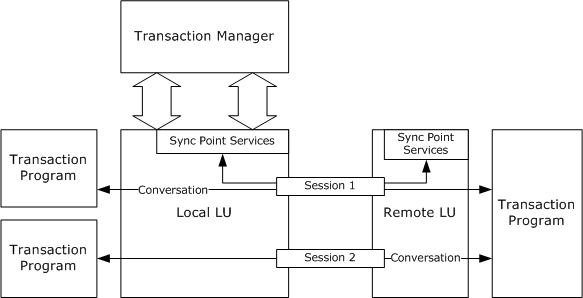

Figure 1: Components typically used for this protocol

The following sections illustrate the interactions that take place between these components in a common scenario drawn from each of the two main areas of support provided to [**LU 6.2**](#gt_lu-type-62-lu-62) Implementations by this protocol.

<a id="Section_1.3.1.1"></a>
#### 1.3.1.1 Enlistment and Completion

The following sequence diagram is a schematic of the interactions that take place between a [**transaction program**](#gt_transaction-program), a local LU, a transaction manager, and a remote LU when a logical unit of work is enlisted on a transaction and the transaction is completed.

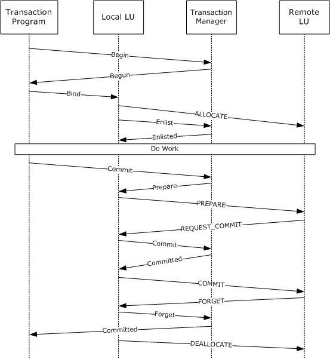

Figure 2: MS-DTCLU enlistment

All the exchanges depicted are notional, and are not intended to provide an accurate representation of any concrete protocol. The protocols involved are specified as follows:

- The protocol between the local LU and the transaction manager is specified in sections [1.3.2.2.1](#Section_1.3.2.2.1) and [3.3](#Section_3.3).
- The protocol between the transaction program and the transaction manager is specified in [MS-DTCO](../MS-DTCO/MS-DTCO.md). The transaction program plays the role of [**application**](#gt_application), as specified in that document.
- The protocol between the local LU and the remote LU is specified in [[IBM-LU62Guide]](https://go.microsoft.com/fwlink/?linkid=2133496).
- The protocol between the transaction program and the local LU is specified in [IBM-LU62Guide].
The general pattern is that of the [**Two-Phase Commit**](#gt_two-phase-commit) protocol described in [MS-DTCO]. A major difference is that the transaction manager does not communicate directly with all the [**participants**](#gt_participant) in the transaction. Specifically, [**work**](#gt_work) performed by a transaction program that uses the remote LU is coordinated only indirectly, via the protocol between the local LU and the remote LU.

Note that the protocol specified in this document is applicable only where the local LU initiates the logical unit of work.

Note also that although the role played by the local LU is broadly similar to a [**resource manager**](#gt_resource-manager-rm), it does not correspond exactly with any of the roles specified by [MS-DTCO]. Consequently, this document specifies an additional role, [**LU 6.2**](#gt_lu-type-62-lu-62) Implementation, in section [1.3.2.1](#Section_1.3.2.1).

<a id="Section_1.3.1.2"></a>
#### 1.3.1.2 Transaction Recovery

The atomicity property of a [**transaction**](#gt_transaction) guarantees that all [**participants**](#gt_participant) in the transaction receive the same [**outcome**](#gt_outcome). To honor this guarantee, [**transaction managers**](#gt_transaction-manager) have to be capable of recovering from [**transient failures**](#gt_transient-failure).

After a transient failure, the transaction manager re-establishes connectivity with the [**local LU**](#gt_local-lu), if the connection with the local LU is lost, and participates in the re-establishment of consistent state at the local and [**remote LUs**](#gt_remote-lu).

The following sequence diagram is a schematic of the interactions that take place between [**Sync Point Services (SPS)**](#gt_sync-point-services-sps) in a remote LU, a local LU, SPS in a local LU, and a [**transaction program**](#gt_transaction-program) during [**recovery**](#gt_recovery) initiated by a remote LU.

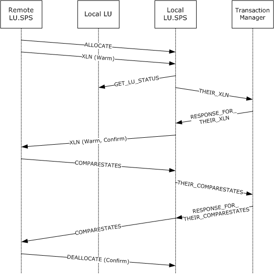

Figure 3: MS-DTCLU recovery

All the exchanges depicted are notional, and are not intended to provide an accurate representation of any concrete protocol. The protocols involved are specified as follows:

- The protocol between Local LU.SPS and the transaction manager is specified in sections [1.3.2.2.1](#Section_1.3.2.2.1) and [3.3](#Section_3.3).
- The protocol between the Local LU.SPS and the Remote LU.SPS is specified in [[IBM-LU62Guide]](https://go.microsoft.com/fwlink/?linkid=2133496).
The intent of these interactions is similar to that of the recovery protocol between a [**subordinate transaction manager**](#gt_subordinate-transaction-manager) and a [**superior transaction manager**](#gt_superior-transaction-manager) as specified in [MS-DTCO](../MS-DTCO/MS-DTCO.md). However, the role played by Local LU.SPS does not correspond exactly with any of the roles as specified in [MS-DTCO]. Consequently, this document specifies an additional role, [**LU 6.2**](#gt_lu-type-62-lu-62) Implementation, in section [1.3.2.1](#Section_1.3.2.1).

<a id="Section_1.3.2"></a>
### 1.3.2 Transaction Roles

This protocol specifies an additional role, the [**LU 6.2**](#gt_lu-type-62-lu-62) Implementation, and extends the [**transaction manager**](#gt_transaction-manager) role as specified in [MS-DTCO](../MS-DTCO/MS-DTCO.md). These roles are described in the following sections.

<a id="Section_1.3.2.1"></a>
#### 1.3.2.1 LU 6.2 Implementation Role

The [**LU 6.2**](#gt_lu-type-62-lu-62) Implementation role is performed by an implementation of LU 6.2, and is typically responsible for performing the following tasks:

- Managing [**LU Name Pair**](#gt_lu-name-pair).
- Enlisting a [**logical unit of work**](#gt_logical-unit-of-work-luw) on an existing transaction as a [**Phase One**](#gt_phase-one) and [**Phase Two**](#gt_phase-two) [**participant**](#gt_participant).
- Participating in a [**Two-Phase Commit**](#gt_two-phase-commit) coordinated by a [**transaction manager**](#gt_transaction-manager), and mapping to and from the related LU 6.2 protocol.
- Participating in [**recovery**](#gt_recovery) initiated by a transaction manager.
- Notifying a transaction manager of recovery initiated by a [**remote LU**](#gt_remote-lu), and participating in that process.
<a id="Section_1.3.2.2"></a>
#### 1.3.2.2 Transaction Manager Role

This document specifies the following facet, in addition to those specified in [MS-DTCO](../MS-DTCO/MS-DTCO.md).

<a id="Section_1.3.2.2.1"></a>
##### 1.3.2.2.1 Transaction Manager Communicating with an LU 6.2 Implementation Facet

The Transaction Manager Communicating with an [**LU 6.2**](#gt_lu-type-62-lu-62) Implementation Facet provides the following services to an LU 6.2 Implementation:

- [**Enlistment**](#gt_enlistment) of a [**logical unit of work**](#gt_logical-unit-of-work-luw) on a [**transaction**](#gt_transaction) as a [**Phase One**](#gt_phase-one) [**participant**](#gt_participant).
- Phase One and [**Phase Two**](#gt_phase-two) notifications inside the [**Two-Phase Commit**](#gt_two-phase-commit) Protocol.
- [**LU Name Pair**](#gt_lu-name-pair) management.
- Registration of a [**recovery**](#gt_recovery) process for an LU 6.2 Implementation.
- Recovery and [**outcome**](#gt_outcome) notification for logical units of work enlisted on a transaction.
<a id="Section_1.4"></a>
## 1.4 Relationship to Other Protocols

This protocol extends the protocol specified in [MS-DTCO](../MS-DTCO/MS-DTCO.md). The following diagram illustrates the protocol layering for this protocol.

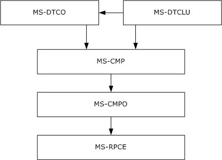

Figure 4: Protocol layering for MS-DTCLU

<a id="Section_1.5"></a>
## 1.5 Prerequisites/Preconditions

This protocol requires that all participating roles possess implementations of the transports protocol specified in [MS-CMPO](../MS-CMPO/MS-CMPO.md) and the multiplexing protocol specified in [MS-CMP](../MS-CMP/MS-CMP.md). This protocol also requires that an implementation of the transaction protocol specified in [MS-DTCO](../MS-DTCO/MS-DTCO.md) is accessible using the protocols specified in [MS-CMPO] and [MS-CMP].

<a id="Section_1.6"></a>
## 1.6 Applicability Statement

This protocol applies to scenarios where an [**LU 6.2**](#gt_lu-type-62-lu-62) implementation (section [3.2](#Section_3.2)) provides support for [**Sync Point Processing**](#gt_sync-point-processing), and an implementation of the protocol described in [MS-DTCO](../MS-DTCO/MS-DTCO.md) is available. It supports the coordination of LU 6.2 [**logical units of work**](#gt_logical-unit-of-work-luw) with [**atomic transactions**](#gt_atomic-transaction), and [**recovery**](#gt_recovery) from [**transient failure**](#gt_transient-failure).

This protocol requires network topologies where the transports protocol described [MS-CMPO](../MS-CMPO/MS-CMPO.md) and the multiplexing protocol described in [MS-CMP](../MS-CMP/MS-CMP.md) constitute a viable network transport for establishing many short-lived [**connection**](#gt_connection) exchanges that accomplish specific tasks.

<a id="Section_1.7"></a>
## 1.7 Versioning and Capability Negotiation

This section specifies the versioning and capability aspects of this protocol.

The protocol specified in this document is not version-specific, and its capabilities are not negotiable.

This protocol supports [**Logical Unit type 6.2 (LU 6.2)**](#gt_lu-type-62-lu-62) and requires that the external entities comply with LU 6.2 as specified in [[IBM-LU62Guide]](https://go.microsoft.com/fwlink/?linkid=2133496).

<a id="Section_1.8"></a>
## 1.8 Vendor-Extensible Fields

None.

<a id="Section_1.9"></a>
## 1.9 Standards Assignments

None.

<a id="Section_2"></a>
# 2 Messages

<a id="Section_2.1"></a>
## 2.1 Transport

An implementation of this protocol uses the transport infrastructure provided by the underlying implementation of the transaction protocol specified in [MS-DTCO](../MS-DTCO/MS-DTCO.md). Because this protocol uses the transport infrastructure provided by the transaction protocol, the set of requirements specified in [MS-DTCO] section 2.1 MUST also apply to this protocol.

<a id="Section_2.2"></a>
## 2.2 Message Syntax

<a id="Section_2.2.1"></a>
### 2.2.1 Common Structures

<a id="Section_2.2.1.1"></a>
#### 2.2.1.1 MESSAGE_PACKET

The MESSAGE_PACKET structure defines the initial message fields that are contained by all [**message tags (MTAGs)**](#gt_message-tag-mtag) in this protocol, as specified in [MS-CMP](../MS-CMP/MS-CMP.md) section 2.2.2.

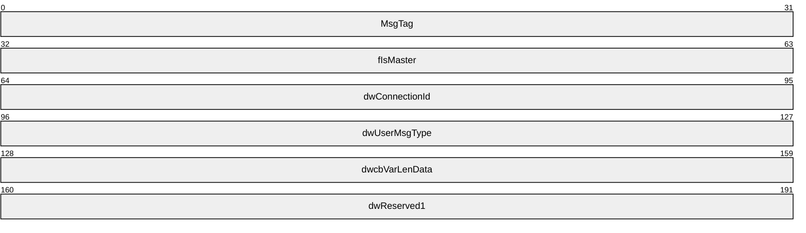

**MsgTag (4 bytes):** A 4-byte integer value that describes the OLE [**transaction**](#gt_transaction) message type. For all uses in this document, this value MUST be MTAG_USER_MESSAGE, as specified in [MS-CMP] section 2.2.8.

**fIsMaster (4 bytes):** The value that indicates the direction of the message in the [**conversation**](#gt_conversation).

This value MUST be one of the following values.

| Value | Meaning |
| --- | --- |
| 0x00000000 | The message is sent by the party that accepted the connection. |
| 0x00000001 | The message is sent by the party that initiated the connection. |

**dwConnectionId (4 bytes):** An integer value that MUST contain the unique identifier for the associated [**connection**](#gt_connection).

**dwUserMsgType (4 bytes):** This field contains the message type identifier. Each MTAG that is defined in this section MUST specify a distinct value for this field for a specified [**connection type**](#gt_connection-type).

**dwcbVarLenData (4 bytes):** An unsigned integer value that MUST contain the size, in bytes, of the message buffer that contains the MESSAGE_PACKET structure, minus the size, in bytes, of the MESSAGE_PACKET structure itself.

**dwReserved1 (4 bytes):** Reserved. This value MUST be set to an implementation-specific value<1> and MUST be ignored on receipt.

<a id="Section_2.2.1.2"></a>
#### 2.2.1.2 DTCLU_VARLEN_BYTEARRAY

The DTCLU_VARLEN_BYTEARRAY structure is used to represent a variable-length byte array.

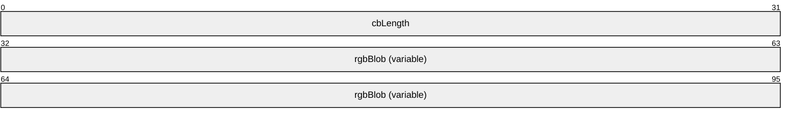

**cbLength (4 bytes):** A 32-bit unsigned integer that MUST contain the number of bytes in the **rgbBlob** field.

**rgbBlob (variable):** This field contains the byte array. The number of bytes in this field MUST be equal to the value of **cbLength**. If **cbLength** is 0, this field MUST NOT be present.

<a id="Section_2.2.2"></a>
### 2.2.2 Transaction Enumerations

<a id="Section_2.2.2.1"></a>
#### 2.2.2.1 DTCLUCOMPARESTATE

The **DTCLUCOMPARESTATE** enumeration defines the status values for a [**logical unit of work**](#gt_logical-unit-of-work-luw).

typedef enum

{

DTCLUCOMPARESTATE_COMMITTED = 1,

DTCLUCOMPARESTATE_HEURISTICCOMMITTED = 2,

DTCLUCOMPARESTATE_HEURISTICMIXED = 3,

DTCLUCOMPARESTATE_HEURISTICRESET = 4,

DTCLUCOMPARESTATE_INDOUBT = 5,

DTCLUCOMPARESTATE_RESET = 6

} DTCLUCOMPARESTATE;

**DTCLUCOMPARESTATE_COMMITTED:** The [**outcome**](#gt_outcome) of a [**transaction**](#gt_transaction) is a commit outcome.

**DTCLUCOMPARESTATE_HEURISTICCOMMITTED:** The outcome of a transaction is a [**heuristic commit outcome**](#gt_heuristic-commit-outcome).

**DTCLUCOMPARESTATE_HEURISTICMIXED:** The outcome of a transaction is a [**heuristic mixed outcome**](#gt_heuristic-mixed-outcome).

**DTCLUCOMPARESTATE_HEURISTICRESET:** The outcome of a transaction is a [**heuristic abort outcome**](#gt_heuristic-abort-outcome).

**DTCLUCOMPARESTATE_INDOUBT:** The outcome of a transaction is an [**in doubt outcome**](#gt_in-doubt-outcome).

**DTCLUCOMPARESTATE_RESET:** The outcome of a transaction is an abort outcome.

<a id="Section_2.2.2.2"></a>
#### 2.2.2.2 DTCLUCOMPARESTATESCONFIRMATION

The **DTCLUCOMPARESTATESCONFIRMATION** enumeration defines the completion status values for a comparison of the [**LUW**](#gt_logical-unit-of-work-luw) state between a [**local LU**](#gt_local-lu) and a [**remote LU**](#gt_remote-lu) during recovery.

typedef enum

{

DTCLUCOMPARESTATESCONFIRMATION_CONFIRM = 1,

DTCLUCOMPARESTATESCONFIRMATION_PROTOCOL = 2

} DTCLUCOMPARESTATESCONFIRMATION;

**DTCLUCOMPARESTATESCONFIRMATION_CONFIRM:** The LUW state supplied by a remote LU matches the local LU LUW state held by a [**transaction manager**](#gt_transaction-manager) and [**recovery**](#gt_recovery) is complete.

**DTCLUCOMPARESTATESCONFIRMATION_PROTOCOL:** The LUW state supplied by a remote LU does not match the local LU LUW state held by a transaction manager.

<a id="Section_2.2.2.3"></a>
#### 2.2.2.3 DTCLUCOMPARESTATESERROR

The **DTCLUCOMPARESTATESERROR** enumeration defines the error status values for a comparison of the state of an [**LUW**](#gt_logical-unit-of-work-luw) between a [**local LU**](#gt_local-lu) and a [**remote LU**](#gt_remote-lu) during recovery.

typedef enum

{

DTCLUCOMPARESTATESERROR_PROTOCOL = 1

} DTCLUCOMPARESTATESERROR;

**DTCLUCOMPARESTATESERROR_PROTOCOL:** A protocol error occurred.

<a id="Section_2.2.2.4"></a>
#### 2.2.2.4 DTCLUXLN

The **DTCLUXLN** enumeration defines the log status values used in an exchange of state information between a [**remote LU**](#gt_remote-lu) and a [**local LU**](#gt_local-lu).

typedef enum

{

DTCLUXLN_COLD = 1,

DTCLUXLN_WARM = 2

} DTCLUXLN;

**DTCLUXLN_COLD:** The [**log status**](#gt_log-status) of an [**LU**](#gt_logical-unit-lu) is [**Log Status Cold**](#gt_log-status-cold).

**DTCLUXLN_WARM:** The log status of an LU is [**Log Status Warm**](#gt_log-status-warm).

<a id="Section_2.2.2.5"></a>
#### 2.2.2.5 DTCLUXLNCONFIRMATION

The **DTCLUXLNCONFIRMATION** enumeration defines the completion status values for an exchange of [**Exchange Log Name (XLN)**](#gt_exchange-log-name-xln) messages with a [**remote LU**](#gt_remote-lu).

typedef enum

{

DTCLUXLNCONFIRMATION_CONFIRM = 1,

DTCLUXLNCONFIRMATION_LOGNAMEMISMATCH = 2,

DTCLUXLNCONFIRMATION_COLDWARMMISMATCH = 3,

DTCLUXLNCONFIRMATION_OBSOLETE = 4

} DTCLUXLNCONFIRMATION;

**DTCLUXLNCONFIRMATION_CONFIRM:** No inconsistencies were detected between the remote LU state and the [**local LU**](#gt_local-lu) state held by a [**transaction manager**](#gt_transaction-manager).

**DTCLUXLNCONFIRMATION_LOGNAMEMISMATCH:** The [**remote log name**](#gt_remote-log-name) supplied by the remote LU does not match the remote log name at the local LU held by a transaction manager.

**DTCLUXLNCONFIRMATION_COLDWARMMISMATCH:** The [**log status**](#gt_log-status) of the remote LU (as supplied by the remote LU) is [**Log Status Cold**](#gt_log-status-cold), and the log status of the local LU held by a transaction manager is [**Log Status Warm**](#gt_log-status-warm).

**DTCLUXLNCONFIRMATION_OBSOLETE:** The exchange of XLNs has been invalidated, for example, because the [**recovery sequence number**](#gt_recovery-sequence-number) has been incremented since the exchange began.

<a id="Section_2.2.2.6"></a>
#### 2.2.2.6 DTCLUXLNERROR

The **DTCLUXLNERROR** enumeration defines the error status values for an exchange of [**XLN**](#gt_exchange-log-name-xln) messages with a [**remote LU**](#gt_remote-lu).

typedef enum

{

DTCLUXLNERROR_PROTOCOL = 1,

DTCLUXLNERROR_LOGNAMEMISMATCH = 2,

DTCLUXLNERROR_COLDWARMMISMATCH = 3

} DTCLUXLNERROR;

**DTCLUXLNERROR_PROTOCOL:** A protocol error occurred.

**DTCLUXLNERROR_LOGNAMEMISMATCH:** The [**local log name**](#gt_local-log-name) supplied by a remote LU does not match the local log name at the [**local LU**](#gt_local-lu) held by a [**transaction manager**](#gt_transaction-manager), or the [**remote log name**](#gt_remote-log-name) supplied by a remote LU does not match the remote log name at the local LU held by a transaction manager.

**DTCLUXLNERROR_COLDWARMMISMATCH:** The [**log status**](#gt_log-status) of the remote LU supplied by a remote LU is [**Log Status Cold**](#gt_log-status-cold), and the log status of the local LU held by a transaction manager is [**Log Status Warm**](#gt_log-status-warm); or the log status of the remote LU supplied by a remote LU is Log Status Warm, and the log status of the local LU held by a transaction manager is Log Status Cold.

<a id="Section_2.2.2.7"></a>
#### 2.2.2.7 DTCLUCOMPARESTATESRESPONSE

The **DTCLUCOMPARESTATESRESPONSE** enumeration defines the completion status of an exchange of [**LUW**](#gt_logical-unit-of-work-luw) state information between a [**local LU**](#gt_local-lu) and a [**remote LU**](#gt_remote-lu) during [**recovery**](#gt_recovery).

typedef enum

{

DTCLUCOMPARESTATESRESPONSE_OK = 1,

DTCLUCOMPARESTATESRESPONSE_PROTOCOL = 2

} DTCLUCOMPARESTATESRESPONSE;

**DTCLUCOMPARESTATESRESPONSE_OK:** The LUW state supplied by a remote LU matches the LUW state held for a local LU by a [**transaction manager**](#gt_transaction-manager).

**DTCLUCOMPARESTATESRESPONSE_PROTOCOL:** The LUW state supplied by a remote LU does not match the LUW state held for a local LU by a transaction manager.

<a id="Section_2.2.2.8"></a>
#### 2.2.2.8 DTCLUXLNRESPONSE

The **DTCLUXLNRESPONSE** enumeration defines the completion status of an exchange of [**XLN**](#gt_exchange-log-name-xln) messages with a [**remote LU**](#gt_remote-lu).

typedef enum

{

DTCLUXLNRESPONSE_OK_SENDOURXLNBACK = 1,

DTCLUXLNRESPONSE_OK_SENDCONFIRMATION = 2,

DTCLUXLNRESPONSE_LOGNAMEMISMATCH = 3,

DTCLUXLNRESPONSE_COLDWARMMISMATCH = 4

} DTCLUXLNRESPONSE;

**DTCLUXLNRESPONSE_OK_SENDOURXLNBACK:** No inconsistencies were detected between the remote LU state and the [**local LU**](#gt_local-lu) state held by the [**transaction manager**](#gt_transaction-manager), and the remote LU has not supplied the [**local log name**](#gt_local-log-name).

**DTCLUXLNRESPONSE_OK_SENDCONFIRMATION:** No inconsistencies were detected between the remote LU state and the local LU state held by the transaction manager.

**DTCLUXLNRESPONSE_LOGNAMEMISMATCH:** The [**remote log name**](#gt_remote-log-name) supplied by the remote LU does not match the remote log name at the local LU held by the transaction manager; or the local log name supplied by the remote LU does not match the local log name held by the transaction manager.

**DTCLUXLNRESPONSE_COLDWARMMISMATCH:** The remote LU's [**log status**](#gt_log-status) supplied by the remote LU is [**Log Status Cold**](#gt_log-status-cold), and the local LU's log status held by the transaction manager is [**Log Status Warm**](#gt_log-status-warm).

<a id="Section_2.2.2.9"></a>
#### 2.2.2.9 CONNTYPE

The **CONNTYPE** enumeration defines the [**connection types**](#gt_connection-type) that are used by this protocol.

typedef enum

{

CONNTYPE_TXUSER_DTCLURMENLISTMENT = 0x00000016,

CONNTYPE_TXUSER_DTCLUCONFIGURE = 0x00000018,

CONNTYPE_TXUSER_DTCLURECOVERY = 0x00000019,

CONNTYPE_TXUSER_DTCLURECOVERYINITIATEDBYDTC = 0x00000020,

CONNTYPE_TXUSER_DTCLURECOVERYINITIATEDBYLU = 0x00000021

} CONNTYPE;

**CONNTYPE_TXUSER_DTCLURMENLISTMENT:** This connection type is used by an [**LU 6.2**](#gt_lu-type-62-lu-62) implementation to establish a subordinate [**enlistment**](#gt_enlistment) with a [**transaction manager**](#gt_transaction-manager).

**CONNTYPE_TXUSER_DTCLUCONFIGURE:** This connection type is used to manage a set of [**LU Name Pairs**](#gt_lu-name-pair) held by a transaction manager.

**CONNTYPE_TXUSER_DTCLURECOVERY:** This connection type is used by an LU 6.2 implementation to register as a recovery process with a transaction manager.

**CONNTYPE_TXUSER_DTCLURECOVERYINITIATEDBYDTC:** This connection type is used to request LU 6.2 work from a transaction manager.

**CONNTYPE_TXUSER_DTCLURECOVERYINITIATEDBYLU:** This connection type is used for LU 6.2 recovery initiated by an LU 6.2 implementation.

<a id="Section_2.2.3"></a>
### 2.2.3 Connection Types Relevant to LU 6.2

<a id="Section_2.2.3.1"></a>
#### 2.2.3.1 CONNTYPE_TXUSER_DTCLUCONFIGURE

The **CONNTYPE_TXUSER_DTCLUCONFIGURE** [**connection type**](#gt_connection-type) is used to manage a set of [**LU Name Pairs**](#gt_lu-name-pair) held by a [**transaction manager**](#gt_transaction-manager).

The use of **CONNTYPE_TXUSER_DTCLUCONFIGURE** as an initiator is specified in section [3.2.5.1](#Section_3.2.5.1), and as an acceptor is specified in section [3.3.5.1](#Section_3.3.5.1).

<a id="Section_2.2.3.1.1"></a>
##### 2.2.3.1.1 TXUSER_DTCLURMCONFIGURE_MTAG_ADD

The TXUSER_DTCLURMCONFIGURE_MTAG_ADD message is sent by an [**LU 6.2**](#gt_lu-type-62-lu-62) implementation (section [3.2](#Section_3.2)) to request the addition of an [**LU Name Pair**](#gt_lu-name-pair) to the set of LU Name Pairs held by a [**transaction manager**](#gt_transaction-manager).

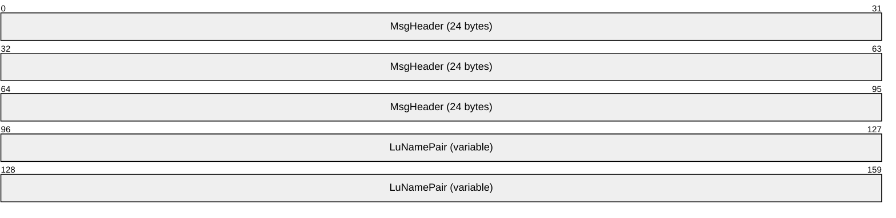

**MsgHeader (24 bytes):** This field MUST contain a [MESSAGE_PACKET](#Section_2.2.1.1) structure.

- The value of the **dwUserMsgType** field MUST be 0x00004201.
- The value of the **dwcbVarLenData** field MUST be at least 4.
**LuNamePair (variable):** This field MUST contain a [DTCLU_VARLEN_BYTEARRAY](#Section_2.2.1.2) structure that identifies an LU Name Pair. If **cbLength** is not a multiple of 4, the end of the field MUST be aligned on a 4-byte boundary by padding with arbitrary values that MUST be ignored on receipt.

<a id="Section_2.2.3.1.2"></a>
##### 2.2.3.1.2 TXUSER_DTCLURMCONFIGURE_MTAG_DELETE

The TXUSER_DTCLURMCONFIGURE_MTAG_DELETE message is sent by an [**LU 6.2**](#gt_lu-type-62-lu-62) implementation (section [3.2](#Section_3.2)) to request the deletion of an [**LU Name Pair**](#gt_lu-name-pair) from the set of LU Name Pairs held by a [**transaction manager**](#gt_transaction-manager).


**MsgHeader (24 bytes):** This field MUST contain a [MESSAGE_PACKET](#Section_2.2.1.1) structure.

- The value of the **dwUserMsgType** field MUST be 0x00004202.
- The value of the **dwcbVarLenData** field MUST be at least 4.
**LuNamePair (variable):** This field MUST contain a [DTCLU_VARLEN_BYTEARRAY](#Section_2.2.1.2) structure that identifies an LU Name Pair. If **cbLength** is not a multiple of 4, the end of the field MUST be aligned on a 4-byte boundary by padding with arbitrary values that MUST be ignored on receipt.

<a id="Section_2.2.3.1.3"></a>
##### 2.2.3.1.3 TXUSER_DTCLURMCONFIGURE_MTAG_REQUEST_COMPLETED

The TXUSER_DTCLURMCONFIGURE_MTAG_REQUEST_COMPLETED message is sent by a [**transaction manager**](#gt_transaction-manager) to indicate that an [**LU Name Pair**](#gt_lu-name-pair) has been successfully added to or removed from a set of LU Name Pairs held by a transaction manager.

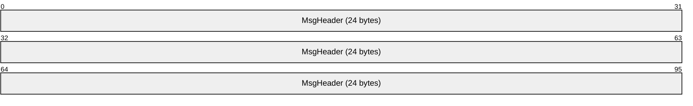

**MsgHeader (24 bytes):** This field MUST contain a [MESSAGE_PACKET](#Section_2.2.1.1) structure.

- The value of the **dwUserMsgType** field MUST be 0x00004203.
- The value of the **dwcbVarLenData** field MUST be 0.
<a id="Section_2.2.3.1.4"></a>
##### 2.2.3.1.4 TXUSER_DTCLURMCONFIGURE_MTAG_ADD_DUPLICATE

The TXUSER_DTCLURMCONFIGURE_MTAG_ADD_DUPLICATE message is sent by a [**transaction manager**](#gt_transaction-manager) to indicate that an [**LU Name Pair**](#gt_lu-name-pair) is already a member of the set of LU Name Pairs held by a transaction manager, and therefore cannot be added.


**MsgHeader (24 bytes):** This field MUST contain a [MESSAGE_PACKET](#Section_2.2.1.1) structure.

- The value of the **dwUserMsgType** field MUST be 0x00004204.
- The value of the **dwcbVarLenData** field MUST be 0.
<a id="Section_2.2.3.1.5"></a>
##### 2.2.3.1.5 TXUSER_DTCLURMCONFIGURE_MTAG_DELETE_NOT_FOUND

The TXUSER_DTCLURMCONFIGURE_MTAG_DELETE_NOT_FOUND message is sent by a [**transaction manager**](#gt_transaction-manager) to indicate that an [**LU Name Pair**](#gt_lu-name-pair) is not a member of the set of LU Name Pairs held by a transaction manager, and therefore cannot be deleted.


**MsgHeader (24 bytes):** This field MUST contain a [MESSAGE_PACKET](#Section_2.2.1.1) structure.

- The value of the **dwUserMsgType** field MUST be 0x00004205.
- The value of the **dwcbVarLenData** field MUST be 0.
<a id="Section_2.2.3.1.6"></a>
##### 2.2.3.1.6 TXUSER_DTCLURMCONFIGURE_MTAG_DELETE_UNRECOVERED_TRANS

The TXUSER_DTCLURMCONFIGURE_MTAG_DELETE_UNRECOVERED_TRANS message is sent by a [**transaction manager**](#gt_transaction-manager) to indicate that an [**LU Name Pair**](#gt_lu-name-pair) cannot be removed from the set of LU Name Pairs because a recovery process is active for a [**logical unit of work**](#gt_logical-unit-of-work-luw) associated with the LU Name Pair.


**MsgHeader (24 bytes):** This field MUST contain a [MESSAGE_PACKET](#Section_2.2.1.1) structure.

- The value of the **dwUserMsgType** field MUST be 0x00004206.
- The value of the **dwcbVarLenData** field MUST be 0.
<a id="Section_2.2.3.1.7"></a>
##### 2.2.3.1.7 TXUSER_DTCLURMCONFIGURE_MTAG_DELETE_INUSE

The TXUSER_DTCLURMCONFIGURE_MTAG_DELETE_INUSE message is sent by a [**transaction manager**](#gt_transaction-manager) to indicate that an [**LU Name Pair**](#gt_lu-name-pair) cannot be removed from the set of LU Name Pairs because a [**logical unit of work**](#gt_logical-unit-of-work-luw) associated with the LU Name Pair is active.


**MsgHeader (24 bytes):** This field MUST contain a [MESSAGE_PACKET](#Section_2.2.1.1) structure.

- The value of the **dwUserMsgType** field MUST be 0x00004207.
- The value of the **dwcbVarLenData** field MUST be 0.
<a id="Section_2.2.3.1.8"></a>
##### 2.2.3.1.8 TXUSER_DTCLURMCONFIGURE_MTAG_ADD_LOG_FULL

The TXUSER_DTCLURMCONFIGURE_MTAG_ADD_LOG_FULL message SHOULD<2> be sent by a [**transaction manager**](#gt_transaction-manager) to indicate that the [**LU Name Pair**](#gt_lu-name-pair) cannot be added to the set of LU Name Pairs because insufficient space exists in the [**local LU**](#gt_local-lu) [**recovery**](#gt_recovery) log that is held by a transaction manager to durably log the LU Name Pair.


**MsgHeader (24 bytes):** This field MUST contain a [MESSAGE_PACKET](#Section_2.2.1.1) structure.

- The value of the **dwUserMsgType** field MUST be 0x00004208.
- The value of the **dwcbVarLenData** field MUST be 0.
<a id="Section_2.2.3.2"></a>
#### 2.2.3.2 CONNTYPE_TXUSER_DTCLURECOVERY

The **CONNTYPE_TXUSER_DTCLURECOVERY** [**connection type**](#gt_connection-type) is used by an [**LU 6.2**](#gt_lu-type-62-lu-62) Implementation to register as a [**recovery**](#gt_recovery) process with a [**transaction manager**](#gt_transaction-manager).

The use of **CONNTYPE_TXUSER_DTCLURECOVERY** as an initiator is specified in section [3.2.5.2](#Section_3.2.5.2), and as an acceptor in section [3.3.5.2](#Section_3.3.5.2).

<a id="Section_2.2.3.2.1"></a>
##### 2.2.3.2.1 TXUSER_DTCLURMRECOVERY_MTAG_ATTACH

The TXUSER_DTCLURMRECOVERY_MTAG_ATTACH message is sent by an [**LU 6.2**](#gt_lu-type-62-lu-62) implementation (section [3.2](#Section_3.2)) to register as a [**recovery**](#gt_recovery) process for [**logical units of work**](#gt_logical-unit-of-work-luw) that involve the [**logical units**](#gt_logical-unit-lu) identified by the [**LU Name Pair**](#gt_lu-name-pair) specified by the request.


**MsgHeader (24 bytes):** This field MUST contain a [MESSAGE_PACKET](#Section_2.2.1.1) structure.

- The value of the **dwUserMsgType** field MUST be 0x00004301.
- The value of the **dwcbVarLenData** field MUST be at least 4.
**LuNamePair (variable):** This field MUST contain a [DTCLU_VARLEN_BYTEARRAY](#Section_2.2.1.2) structure that identifies an LU Name Pair. If the value of **cbLength** is not a multiple of 4, the end of the field MUST be aligned on a 4-byte boundary by padding with arbitrary values that MUST be ignored on receipt.

<a id="Section_2.2.3.2.2"></a>
##### 2.2.3.2.2 TXUSER_DTCLURMRECOVERY_MTAG_REQUEST_COMPLETED

The TXUSER_DTCLURMRECOVERY_MTAG_REQUEST_COMPLETED message is sent by a [**transaction manager**](#gt_transaction-manager) to indicate that a request by an [**LU 6.2**](#gt_lu-type-62-lu-62) implementation (section [3.2](#Section_3.2)) to register as a [**recovery**](#gt_recovery) process for [**logical units of work**](#gt_logical-unit-of-work-luw) that involves the [**logical units**](#gt_logical-unit-lu) identified by the [**LU Name Pair**](#gt_lu-name-pair) specified by the request has completed successfully.


**MsgHeader (24 bytes):** This field MUST contain a [MESSAGE_PACKET](#Section_2.2.1.1) structure.

- The value of the **dwUserMsgType** field MUST be 0x00004303.
- The value of the **dwcbVarLenData** field MUST be 0.
<a id="Section_2.2.3.2.3"></a>
##### 2.2.3.2.3 TXUSER_DTCLURMRECOVERY_MTAG_ATTACH_DUPLICATE

The TXUSER_DTCLURMRECOVERY_MTAG_ATTACH_DUPLICATE message is sent by a [**transaction manager**](#gt_transaction-manager) to indicate that the requested [**recovery**](#gt_recovery) process is already registered for [**logical units of work**](#gt_logical-unit-of-work-luw) that involve the [**logical units**](#gt_logical-unit-lu) identified by the [**LU Name Pair**](#gt_lu-name-pair); therefore, the registration request cannot be completed.


**MsgHeader (24 bytes):** This field MUST contain a [MESSAGE_PACKET](#Section_2.2.1.1) structure.

- The value of the **dwUserMsgType** field MUST be 0x00004304.
- The value of the **dwcbVarLenData** field MUST be 0.
<a id="Section_2.2.3.2.4"></a>
##### 2.2.3.2.4 TXUSER_DTCLURMRECOVERY_MTAG_ATTACH_NOT_FOUND

The TXUSER_DTCLURMRECOVERY_MTAG_ATTACH_NOT_FOUND message is sent by a [**transaction manager**](#gt_transaction-manager) to indicate that the [**LU Name Pair**](#gt_lu-name-pair) specified by the request is not a member of the set of LU Name Pairs held by a transaction manager; therefore the registration request cannot be completed.


**MsgHeader (24 bytes):** This field MUST contain a [MESSAGE_PACKET](#Section_2.2.1.1) structure.

- The value of the **dwUserMsgType** field MUST be 0x00004305.
- The value of the **dwcbVarLenData** field MUST be 0.
<a id="Section_2.2.3.3"></a>
#### 2.2.3.3 CONNTYPE_TXUSER_DTCLURMENLISTMENT

The **CONNTYPE_TXUSER_DTCLURMENLISTMENT** [**connection type**](#gt_connection-type) is used by an [**LU 6.2**](#gt_lu-type-62-lu-62) implementation (section [3.2](#Section_3.2)) to establish a subordinate [**enlistment**](#gt_enlistment) with a [**transaction manager**](#gt_transaction-manager).

The use of **CONNTYPE_TXUSER_DTCLURMENLISTMENT** as an initiator is specified in section [3.2.5.3](#Section_3.2.5.3), and as an acceptor in section [3.3.5.3](#Section_3.3.5.3).

<a id="Section_2.2.3.3.1"></a>
##### 2.2.3.3.1 TXUSER_DTCLURMENLISTMENT_MTAG_CREATE

The TXUSER_DTCLURMENLISTMENT_MTAG_CREATE message is sent by an [**LU 6.2**](#gt_lu-type-62-lu-62) implementation (section [3.2](#Section_3.2)) to request the creation of an LU 6.2 subordinate [**enlistment**](#gt_enlistment) on a [**transaction**](#gt_transaction) managed by a [**transaction manager**](#gt_transaction-manager).

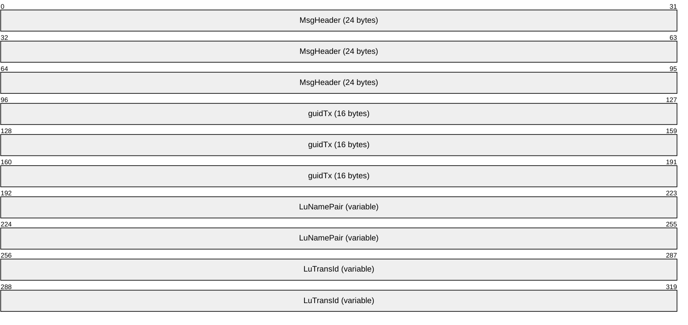

**MsgHeader (24 bytes):** This field MUST contain a [MESSAGE_PACKET](#Section_2.2.1.1) structure.

- The value of the **dwUserMsgType** field MUST be 0x00004101.
- The value of the **dwcbVarLenData** field MUST be at least 24.
**guidTx (16 bytes):** This field MUST contain a [**GUID**](#gt_globally-unique-identifier-guid) that specifies the [**transaction identifier**](#gt_transaction-identifier) for a transaction held by a transaction manager.

**LuNamePair (variable):** This field MUST contain a [DTCLU_VARLEN_BYTEARRAY](#Section_2.2.1.2) structure that identifies an [**LU Name Pair**](#gt_lu-name-pair). If the value of **cbLength** is not a multiple of 4, the end of the field MUST be aligned on a 4-byte boundary by padding with arbitrary values that MUST be ignored on receipt.

**LuTransId (variable):** This field MUST contain a DTCLU_VARLEN_BYTEARRAY structure that specifies the [**LUW**](#gt_logical-unit-of-work-luw) ID. If the value of **cbLength** is not a multiple of 4, the end of the field MUST be aligned on a 4-byte boundary by padding with arbitrary values that MUST be ignored on receipt.

<a id="Section_2.2.3.3.2"></a>
##### 2.2.3.3.2 TXUSER_DTCLURMENLISTMENT_MTAG_REQUEST_COMPLETED

The TXUSER_DTCLURMENLISTMENT_MTAG_REQUEST_COMPLETED message is sent by a [**transaction manager**](#gt_transaction-manager) to indicate that a request to create an [**LU 6.2**](#gt_lu-type-62-lu-62) subordinate [**enlistment**](#gt_enlistment) on a [**transaction**](#gt_transaction) managed by a transaction manager was completed successfully.


**MsgHeader (24 bytes):** This field MUST contain a [MESSAGE_PACKET](#Section_2.2.1.1) structure.

- The value of the **dwUserMsgType** field MUST be 0x00004102.
- The value of the **dwcbVarLenData** field MUST be 0.
<a id="Section_2.2.3.3.3"></a>
##### 2.2.3.3.3 TXUSER_DTCLURMENLISTMENT_MTAG_TO_DTC_CONVERSATIONLOST

The TXUSER_DTCLURMENLISTMENT_MTAG_TO_DTC_CONVERSATIONLOST message is sent by an [**LU 6.2**](#gt_lu-type-62-lu-62) implementation (section [3.2](#Section_3.2)) to indicate that the [**conversation**](#gt_conversation) with a [**remote LU**](#gt_remote-lu) was lost.


**MsgHeader (24 bytes):** This field MUST contain a [MESSAGE_PACKET](#Section_2.2.1.1) structure.

- The value of the **dwUserMsgType** field MUST be 0x00004103.
- The value of the **dwcbVarLenData** field MUST be 0.
<a id="Section_2.2.3.3.4"></a>
##### 2.2.3.3.4 TXUSER_DTCLURMENLISTMENT_MTAG_TO_DTC_BACKEDOUT

The TXUSER_DTCLURMENLISTMENT_MTAG_TO_DTC_BACKEDOUT message is sent by an [**LU 6.2**](#gt_lu-type-62-lu-62) implementation (section [3.2](#Section_3.2)) to acknowledge that the LU 6.2 implementation has successfully processed a request to abort a [**logical unit of work**](#gt_logical-unit-of-work-luw) and a [**transaction manager**](#gt_transaction-manager) is no longer obligated to retain the outcome of this logical unit of work.


**MsgHeader (24 bytes):** This field MUST contain a [MESSAGE_PACKET](#Section_2.2.1.1) structure.

- The value of the **dwUserMsgType** field MUST be 0x00004104.
- The value of the **dwcbVarLenData** field MUST be 0.
<a id="Section_2.2.3.3.5"></a>
##### 2.2.3.3.5 TXUSER_DTCLURMENLISTMENT_MTAG_TO_DTC_BACKOUT

The TXUSER_DTCLURMENLISTMENT_MTAG_TO_DTC_BACKOUT message is sent by an [**LU 6.2**](#gt_lu-type-62-lu-62) implementation to request a [**transaction manager**](#gt_transaction-manager) to abort a [**logical unit of work**](#gt_logical-unit-of-work-luw).


**MsgHeader (24 bytes):** This field MUST contain a [MESSAGE_PACKET](#Section_2.2.1.1) structure.

- The value of the **dwUserMsgType** field MUST be 0x00004105.
- The value of the **dwcbVarLenData** field MUST be 0.
<a id="Section_2.2.3.3.6"></a>
##### 2.2.3.3.6 TXUSER_DTCLURMENLISTMENT_MTAG_TO_DTC_COMMITTED

The TXUSER_DTCLURMENLISTMENT_MTAG_TO_DTC_COMMITTED message is sent by an [**LU 6.2**](#gt_lu-type-62-lu-62) implementation to a [**transaction manager**](#gt_transaction-manager) to indicate that it has successfully committed a [**logical unit of work**](#gt_logical-unit-of-work-luw).


**MsgHeader (24 bytes):** This field MUST contain a [MESSAGE_PACKET](#Section_2.2.1.1) structure.

- The value of the **dwUserMsgType** field MUST be 0x00004106.
- The value of the **dwcbVarLenData** field MUST be 0.
<a id="Section_2.2.3.3.7"></a>
##### 2.2.3.3.7 TXUSER_DTCLURMENLISTMENT_MTAG_TO_DTC_FORGET

The TXUSER_DTCLURMENLISTMENT_MTAG_TO_DTC_FORGET message is sent by an [**LU 6.2**](#gt_lu-type-62-lu-62) implementation (section [3.2](#Section_3.2)) to a [**transaction manager**](#gt_transaction-manager) to indicate that it has successfully committed a [**logical unit of work**](#gt_logical-unit-of-work-luw).

```mermaid
packet-beta
  0-95: "MsgHeader (24 bytes)"
```

**MsgHeader (24 bytes):** This field MUST contain a [MESSAGE_PACKET](#Section_2.2.1.1) structure.

- The value of the **dwUserMsgType** field MUST be 0x00004107.
- The value of the **dwcbVarLenData** field MUST be 0.
<a id="Section_2.2.3.3.8"></a>
##### 2.2.3.3.8 TXUSER_DTCLURMENLISTMENT_MTAG_TO_DTC_REQUESTCOMMIT

The TXUSER_DTCLURMENLISTMENT_MTAG_TO_DTC_REQUESTCOMMIT message is sent by an [**LU 6.2**](#gt_lu-type-62-lu-62) implementation (section [3.2](#Section_3.2)) to indicate that it has successfully processed a request to carry out the necessary operations to commit a [**logical unit of work**](#gt_logical-unit-of-work-luw).

```mermaid
packet-beta
  0-95: "MsgHeader (24 bytes)"
```

**MsgHeader (24 bytes):** This field MUST contain a [MESSAGE_PACKET](#Section_2.2.1.1) structure.

- The value of the **dwUserMsgType** field MUST be 0x00004108.
- The value of the **dwcbVarLenData** field MUST be 0.
<a id="Section_2.2.3.3.9"></a>
##### 2.2.3.3.9 TXUSER_DTCLURMENLISTMENT_MTAG_TO_LU_BACKEDOUT

The TXUSER_DTCLURMENLISTMENT_MTAG_TO_LU_BACKEDOUT message is sent by a [**transaction manager**](#gt_transaction-manager) to acknowledge that it has successfully processed a request to abort a [**logical unit of work**](#gt_logical-unit-of-work-luw).

```mermaid
packet-beta
  0-95: "MsgHeader (24 bytes)"
```

**MsgHeader (24 bytes):** This field MUST contain a [MESSAGE_PACKET](#Section_2.2.1.1) structure.

- The value of the **dwUserMsgType** field MUST be 0x00004109.
- The value of the **dwcbVarLenData** field MUST be 0.
<a id="Section_2.2.3.3.10"></a>
##### 2.2.3.3.10 TXUSER_DTCLURMENLISTMENT_MTAG_TO_LU_BACKOUT

The TXUSER_DTCLURMENLISTMENT_MTAG_TO_LU_BACKOUT message is sent by a [**transaction manager**](#gt_transaction-manager) to inform the [**LU 6.2**](#gt_lu-type-62-lu-62) implementation (section [3.2](#Section_3.2)) that a [**logical unit of work**](#gt_logical-unit-of-work-luw) has aborted.

```mermaid
packet-beta
  0-95: "MsgHeader (24 bytes)"
```

**MsgHeader (24 bytes):** This field MUST contain a [MESSAGE_PACKET](#Section_2.2.1.1) structure.

- The value of the **dwUserMsgType** field MUST be 0x00004110.
- The value of the **dwcbVarLenData** field MUST be 0.
<a id="Section_2.2.3.3.11"></a>
##### 2.2.3.3.11 TXUSER_DTCLURMENLISTMENT_MTAG_TO_LU_COMMITTED

The TXUSER_DTCLURMENLISTMENT_MTAG_TO_LU_COMMITTED message is sent by a [**transaction manager**](#gt_transaction-manager) to indicate that a [**logical unit of work**](#gt_logical-unit-of-work-luw) was successfully committed.

```mermaid
packet-beta
  0-95: "MsgHeader (24 bytes)"
```

**MsgHeader (24 bytes):** This field MUST contain a [MESSAGE_PACKET](#Section_2.2.1.1) structure.

- The value of the **dwUserMsgType** field MUST be 0x00004111.
- The value of the **dwcbVarLenData** field MUST be 0.
<a id="Section_2.2.3.3.12"></a>
##### 2.2.3.3.12 TXUSER_DTCLURMENLISTMENT_MTAG_TO_LU_PREPARE

The TXUSER_DTCLURMENLISTMENT_MTAG_TO_LU_PREPARE message is sent by a [**transaction manager**](#gt_transaction-manager) to request that the [**LU 6.2**](#gt_lu-type-62-lu-62) implementation (section [3.2](#Section_3.2)) perform the actions that are needed to prepare a [**logical unit of work**](#gt_logical-unit-of-work-luw) to be committed.

```mermaid
packet-beta
  0-95: "MsgHeader (24 bytes)"
```

**MsgHeader (24 bytes):** This field MUST contain a [MESSAGE_PACKET](#Section_2.2.1.1) structure.

- The value of the **dwUserMsgType** field MUST be 0x00004113.
- The value of the **dwcbVarLenData** field MUST be 0.
<a id="Section_2.2.3.3.13"></a>
##### 2.2.3.3.13 TXUSER_DTCLURMENLISTMENT_MTAG_CREATE_TX_NOT_FOUND

The TXUSER_DTCLURMENLISTMENT_MTAG_CREATE_TX_NOT_FOUND message is sent by a [**transaction manager**](#gt_transaction-manager) to indicate that a request to create an [**LU 6.2**](#gt_lu-type-62-lu-62) subordinate [**enlistment**](#gt_enlistment) failed because the [**transaction**](#gt_transaction) identified by the request is not a member of the set of transactions held by a transaction manager.

```mermaid
packet-beta
  0-95: "MsgHeader (24 bytes)"
```

**MsgHeader (24 bytes):** This field MUST contain a [MESSAGE_PACKET](#Section_2.2.1.1) structure.

- The value of the **dwUserMsgType** field MUST be 0x00004116.
- The value of the **dwcbVarLenData** field MUST be 0.
<a id="Section_2.2.3.3.14"></a>
##### 2.2.3.3.14 TXUSER_DTCLURMENLISTMENT_MTAG_CREATE_TOO_LATE

The TXUSER_DTCLURMENLISTMENT_MTAG_CREATE_TOO_LATE message is sent by a [**transaction manager**](#gt_transaction-manager) to indicate that a request to create an [**LU 6.2**](#gt_lu-type-62-lu-62) subordinate [**enlistment**](#gt_enlistment) failed because it is too late in the lifetime of the [**transaction**](#gt_transaction) identified by the request.

```mermaid
packet-beta
  0-95: "MsgHeader (24 bytes)"
```

**MsgHeader (24 bytes):** This field MUST contain a [MESSAGE_PACKET](#Section_2.2.1.1) structure.

- The value of the **dwUserMsgType** field MUST be 0x00004117.
- The value of the **dwcbVarLenData** field MUST be 0.
<a id="Section_2.2.3.3.15"></a>
##### 2.2.3.3.15 TXUSER_DTCLURMENLISTMENT_MTAG_CREATE_LOG_FULL

The TXUSER_DTCLURMENLISTMENT_MTAG_CREATE_LOG_FULL message is sent by a [**transaction manager**](#gt_transaction-manager) to indicate that a request to create an [**LU 6.2**](#gt_lu-type-62-lu-62) subordinate [**enlistment**](#gt_enlistment) failed because insufficient space exists in the [**local LU**](#gt_local-lu) [**recovery**](#gt_recovery) log held by a transaction manager to durably log the enlistment.

```mermaid
packet-beta
  0-95: "MsgHeader (24 bytes)"
```

**MsgHeader (24 bytes):** This field MUST contain a [MESSAGE_PACKET](#Section_2.2.1.1) structure.

- The value of the **dwUserMsgType** field MUST be 0x00004118.
- The value of the **dwcbVarLenData** field MUST be 0.
<a id="Section_2.2.3.3.16"></a>
##### 2.2.3.3.16 TXUSER_DTCLURMENLISTMENT_MTAG_CREATE_TOO_MANY

The TXUSER_DTCLURMENLISTMENT_MTAG_CREATE_TOO_MANY message is sent by a [**transaction manager**](#gt_transaction-manager) to indicate that a request to create an [**LU 6.2**](#gt_lu-type-62-lu-62) subordinate [**enlistment**](#gt_enlistment) failed because the implementation-specific<3> maximum number of enlistments for the [**transaction**](#gt_transaction) managed by a transaction manager has been reached.

```mermaid
packet-beta
  0-95: "MsgHeader (24 bytes)"
```

**MsgHeader (24 bytes):** This field MUST contain a [MESSAGE_PACKET](#Section_2.2.1.1) structure.

- The value of the **dwUserMsgType** field MUST be 0x00004119.
- The value of the **dwcbVarLenData** field MUST be 0.
<a id="Section_2.2.3.3.17"></a>
##### 2.2.3.3.17 TXUSER_DTCLURMENLISTMENT_MTAG_CREATE_LU_NOT_FOUND

The TXUSER_DTCLURMENLISTMENT_MTAG_CREATE_LU_NOT_FOUND message is sent by a [**transaction manager**](#gt_transaction-manager) to indicate that a request to create an [**LU 6.2**](#gt_lu-type-62-lu-62) subordinate [**enlistment**](#gt_enlistment) failed because the [**LU Name Pair**](#gt_lu-name-pair) specified by the request is not a member of the set of LU Name Pairs held by the transaction manager.

```mermaid
packet-beta
  0-95: "MsgHeader (24 bytes)"
```

**MsgHeader (24 bytes):** This field MUST contain a [MESSAGE_PACKET](#Section_2.2.1.1) structure.

- The value of the **dwUserMsgType** field MUST be 0x00004120.
- The value of the **dwcbVarLenData** field MUST be 0.
<a id="Section_2.2.3.3.18"></a>
##### 2.2.3.3.18 TXUSER_DTCLURMENLISTMENT_MTAG_UNPLUG

The TXUSER_DTCLURMENLISTMENT_MTAG_UNPLUG message is sent by an [**LU 6.2**](#gt_lu-type-62-lu-62) implementation (section [3.2](#Section_3.2)) to a [**transaction manager**](#gt_transaction-manager) to unplug itself from a subordinate [**enlistment**](#gt_enlistment).

```mermaid
packet-beta
  0-95: "MsgHeader (24 bytes)"
```

**MsgHeader (24 bytes):** This field MUST contain a [MESSAGE_PACKET](#Section_2.2.1.1) structure.

- The value of the **dwUserMsgType** field MUST be 0x00004122.
- The value of the **dwcbVarLenData** field MUST be 0.
<a id="Section_2.2.3.3.19"></a>
##### 2.2.3.3.19 TXUSER_DTCLURMENLISTMENT_MTAG_CREATE_DUPLICATE_LU_TRANSID

The TXUSER_DTCLURMENLISTMENT_MTAG_CREATE_DUPLICATE_LU_TRANSID message is sent by a [**transaction manager**](#gt_transaction-manager) to indicate that a request to create an [**LU 6.2**](#gt_lu-type-62-lu-62) subordinate [**enlistment**](#gt_enlistment) failed because a [**logical unit of work**](#gt_logical-unit-of-work-luw) identified by the LUW ID specified by the request is already associated with the [**LU Name Pair**](#gt_lu-name-pair) specified by the request.

```mermaid
packet-beta
  0-95: "MsgHeader (24 bytes)"
```

**MsgHeader (24 bytes):** This field MUST contain a [MESSAGE_PACKET](#Section_2.2.1.1) structure.

- The value of the **dwUserMsgType** field MUST be 0x00004123.
- The value of the **dwcbVarLenData** field MUST be 0.
<a id="Section_2.2.3.3.20"></a>
##### 2.2.3.3.20 TXUSER_DTCLURMENLISTMENT_MTAG_CREATE_LU_NO_RECOVERY_PROCESS

The TXUSER_DTCLURMENLISTMENT_MTAG_CREATE_LU_NO_RECOVERY_PROCESS message is sent by a [**transaction manager**](#gt_transaction-manager) to indicate that a request to create an [**LU 6.2**](#gt_lu-type-62-lu-62) subordinate [**enlistment**](#gt_enlistment) failed because there is no [**recovery**](#gt_recovery) process registered for the [**LU Name Pair**](#gt_lu-name-pair) specified by the request.

```mermaid
packet-beta
  0-95: "MsgHeader (24 bytes)"
```

**MsgHeader (24 bytes):** This field MUST contain a [MESSAGE_PACKET](#Section_2.2.1.1) structure.

- The value of the **dwUserMsgType** field MUST be 0x00004124.
- The value of the **dwcbVarLenData** field MUST be 0.
<a id="Section_2.2.3.3.21"></a>
##### 2.2.3.3.21 TXUSER_DTCLURMENLISTMENT_MTAG_CREATE_LU_DOWN

The TXUSER_DTCLURMENLISTMENT_MTAG_CREATE_LU_DOWN message is sent by a [**transaction manager**](#gt_transaction-manager) to indicate that a request to create an [**LU 6.2**](#gt_lu-type-62-lu-62) subordinate [**enlistment**](#gt_enlistment) failed because the required [**recovery**](#gt_recovery) process was not previously performed for the [**local LUs**](#gt_local-lu) and [**remote LUs**](#gt_remote-lu) identified by the [**LU Name Pair**](#gt_lu-name-pair) specified by the request.

```mermaid
packet-beta
  0-95: "MsgHeader (24 bytes)"
```

**MsgHeader (24 bytes):** This field MUST contain a [MESSAGE_PACKET](#Section_2.2.1.1) structure.

- The value of the **dwUserMsgType** field MUST be 0x00004125.
- The value of the **dwcbVarLenData** field MUST be 0.
<a id="Section_2.2.3.3.22"></a>
##### 2.2.3.3.22 TXUSER_DTCLURMENLISTMENT_MTAG_CREATE_LU_RECOVERING

The TXUSER_DTCLURMENLISTMENT_MTAG_CREATE_LU_RECOVERING message is sent by a [**transaction manager**](#gt_transaction-manager) to indicate that a request to create an [**LU 6.2**](#gt_lu-type-62-lu-62) subordinate [**enlistment**](#gt_enlistment) failed because a [**recovery**](#gt_recovery) process is in progress for the [**local LUs**](#gt_local-lu) and [**remote LUs**](#gt_remote-lu) identified by the [**LU Name Pair**](#gt_lu-name-pair) specified by the request.

```mermaid
packet-beta
  0-95: "MsgHeader (24 bytes)"
```

**MsgHeader (24 bytes):** This field MUST contain a [MESSAGE_PACKET](#Section_2.2.1.1) structure.

- The value of the **dwUserMsgType** field MUST be 0x00004126.
- The value of the **dwcbVarLenData** field MUST be 0.
<a id="Section_2.2.3.3.23"></a>
##### 2.2.3.3.23 TXUSER_DTCLURMENLISTMENT_MTAG_CREATE_LU_RECOVERY_MISMATCH

The TXUSER_DTCLURMENLISTMENT_MTAG_CREATE_LU_RECOVERY_MISMATCH message is sent by a [**transaction manager**](#gt_transaction-manager) to indicate that a request to create an [**LU 6.2**](#gt_lu-type-62-lu-62) subordinate [**enlistment**](#gt_enlistment) failed, because the [**recovery**](#gt_recovery) process for the [**local LUs**](#gt_local-lu) and the [**remote LUs**](#gt_remote-lu) identified by the [**LU Name Pair**](#gt_lu-name-pair) specified by the request detected inconsistencies between the states of the [**logical units**](#gt_logical-unit-lu).

```mermaid
packet-beta
  0-95: "MsgHeader (24 bytes)"
```

**MsgHeader (24 bytes):** This field MUST contain a [MESSAGE_PACKET](#Section_2.2.1.1) structure.

- The value of the **dwUserMsgType** field MUST be 0x00004127.
- The value of the **dwcbVarLenData** field MUST be 0.
<a id="Section_2.2.3.4"></a>
#### 2.2.3.4 CONNTYPE_TXUSER_DTCLURECOVERYINITIATEDBYDTC

The **CONNTYPE_TXUSER_DTCLURECOVERYINITIATEDBYDTC** [**connection type**](#gt_connection-type) is used to request [**LU 6.2**](#gt_lu-type-62-lu-62) [**recovery**](#gt_recovery) [**work**](#gt_work) from the [**transaction manager**](#gt_transaction-manager).

The use of **CONNTYPE_TXUSER_DTCLURECOVERYINITIATEDBYDTC** as an initiator is specified in section [3.2.5.4](#Section_3.2.5.4), and as an acceptor in section [3.3.5.4](#Section_3.3.5.4).

<a id="Section_2.2.3.4.1"></a>
##### 2.2.3.4.1 TXUSER_DTCLURECOVERYINITIATEDBYDTC_MTAG_GETWORK

The TXUSER_DTCLURECOVERYINITIATEDBYDTC_MTAG_GETWORK message is sent by an [**LU 6.2**](#gt_lu-type-62-lu-62) implementation to query for LU 6.2 [**recovery**](#gt_recovery) [**work**](#gt_work) for a pair of [**logical units**](#gt_logical-unit-lu) identified by an [**LU Name Pair**](#gt_lu-name-pair).

```mermaid
packet-beta
  0-95: "MsgHeader (24 bytes)"
  96-159: "LuNamePair (variable)"
```

**MsgHeader (24 bytes):** This field MUST contain a [MESSAGE_PACKET](#Section_2.2.1.1) structure.

- The value of the **dwUserMsgType** field MUST be 0x00004401.
- The value of the **dwcbVarLenData** field MUST be at least 4.
**LuNamePair (variable):** This field MUST contain a [DTCLU_VARLEN_BYTEARRAY](#Section_2.2.1.2) structure that identifies an LU Name Pair. If the value of **cbLength** is not a multiple of 4, the end of the field MUST be aligned on a 4-byte boundary by padding with arbitrary values that MUST be ignored on receipt.

<a id="Section_2.2.3.4.2"></a>
##### 2.2.3.4.2 TXUSER_DTCLURECOVERYINITIATEDBYDTC_MTAG_GETWORK_NOT_FOUND

The TXUSER_DTCLURECOVERYINITIATEDBYDTC_MTAG_GETWORK_NOT_FOUND message is sent by a [**transaction manager**](#gt_transaction-manager) to indicate that a query for [**LU 6.2**](#gt_lu-type-62-lu-62) [**recovery**](#gt_recovery) [**work**](#gt_work) failed because the [**LU Name Pair**](#gt_lu-name-pair) specified by the query is not a member of the set of LU Name Pairs held by the transaction manager.

```mermaid
packet-beta
  0-95: "MsgHeader (24 bytes)"
```

**MsgHeader (24 bytes):** This field MUST contain a [MESSAGE_PACKET](#Section_2.2.1.1) structure.

- The value of the **dwUserMsgType** field MUST be 0x00004402.
- The value of the **dwcbVarLenData** field MUST be 0.
<a id="Section_2.2.3.4.3"></a>
##### 2.2.3.4.3 TXUSER_DTCLURECOVERYINITIATEDBYDTC_MTAG_WORK_CHECKLUSTATUS

The TXUSER_DTCLURECOVERYINITIATEDBYDTC_MTAG_WORK_CHECKLUSTATUS message is sent by a [**transaction manager**](#gt_transaction-manager) to request a status check of the sessions between a pair of [**logical units**](#gt_logical-unit-lu) identified by the [**LU Name Pair**](#gt_lu-name-pair) specified by a previous [TXUSER_DTCLURECOVERYINITIATEDBYDTC_MTAG_GETWORK](#Section_2.2.3.4.1) message.

```mermaid
packet-beta
  0-95: "MsgHeader (24 bytes)"
```

**MsgHeader (24 bytes):** This field MUST contain a [MESSAGE_PACKET](#Section_2.2.1.1) structure.

- The value of the **dwUserMsgType** field MUST be 0x00004403.
- The value of the **dwcbVarLenData** field MUST be 0.
<a id="Section_2.2.3.4.4"></a>
##### 2.2.3.4.4 TXUSER_DTCLURECOVERYINITIATEDBYDTC_MTAG_WORK_TRANS

The TXUSER_DTCLURECOVERYINITIATEDBYDTC_MTAG_WORK_TRANS message is sent by a [**transaction manager**](#gt_transaction-manager) to initiate recovery for a pair of [**logical units**](#gt_logical-unit-lu) identified by the [**LU Name Pair**](#gt_lu-name-pair) specified by a previous [TXUSER_DTCLURECOVERYINITIATEDBYDTC_MTAG_GETWORK](#Section_2.2.3.4.1) message.

```mermaid
packet-beta
  0-95: "MsgHeader (24 bytes)"
  96-127: "RecoverySeqNum"
  128-159: "Xln"
  160-191: "dwProtocol"
  192-255: "OurLogName (variable)"
  256-319: "RemoteLogName (variable)"
```

**MsgHeader (24 bytes):** This field MUST contain a [MESSAGE_PACKET](#Section_2.2.1.1) structure.

- The value of the **dwUserMsgType** field MUST be 0x00004404.
- The value of the **dwcbVarLenData** field MUST be at least 20.
**RecoverySeqNum (4 bytes):** A 32-bit signed integer that MUST contain the value for the [**recovery sequence number**](#gt_recovery-sequence-number) of a [**local LU**](#gt_local-lu) held by a transaction manager.

**Xln (4 bytes):** This field MUST contain the [**log status**](#gt_log-status) of a local LU held by a transaction manager. The value MUST be one defined by the [DTCLUXLN](#Section_2.2.2.4) enumeration.

**dwProtocol (4 bytes):** A 32-bit unsigned integer that MUST contain 0.

**OurLogName (variable):** This field MUST contain a [DTCLU_VARLEN_BYTEARRAY](#Section_2.2.1.2) structure which contains the [**local log name**](#gt_local-log-name) held by a transaction manager. If **cbLength** is not a multiple of 4, the end of the field MUST be aligned on a 4-byte boundary by padding with arbitrary values that MUST be ignored on receipt.

**RemoteLogName (variable):** This field MUST contain a DTCLU_VARLEN_BYTEARRAY structure which either has the **cbLength** field set to 0, or contains the [**remote log name**](#gt_remote-log-name) supplied by a [**remote LU**](#gt_remote-lu). If **cbLength** is not a multiple of 4, the end of the field MUST be aligned on a 4-byte boundary by padding with arbitrary values that MUST be ignored on receipt.

<a id="Section_2.2.3.4.5"></a>
##### 2.2.3.4.5 TXUSER_DTCLURECOVERYINITIATEDBYDTC_MTAG_LUSTATUS

The TXUSER_DTCLURECOVERYINITIATEDBYDTC_MTAG_LUSTATUS message is sent by an [**LU 6.2**](#gt_lu-type-62-lu-62) implementation (section [3.2](#Section_3.2)) to provide the [**recovery sequence number**](#gt_recovery-sequence-number) held by an LU 6.2 implementation for a pair of [**logical units**](#gt_logical-unit-lu) identified by an [**LU Name Pair**](#gt_lu-name-pair) specified by a previous [TXUSER_DTCLURECOVERYINITIATEDBYDTC_MTAG_GETWORK](#Section_2.2.3.4.1) message.

```mermaid
packet-beta
  0-95: "MsgHeader (24 bytes)"
  96-127: "RecoverySeqNum"
```

**MsgHeader (24 bytes):** This field MUST contain a [MESSAGE_PACKET](#Section_2.2.1.1) structure.

- The value of the **dwUserMsgType** field MUST be 0x00004407.
- The value of the **dwcbVarLenData** field MUST be 4.
**RecoverySeqNum (4 bytes):** A 32-bit signed integer that MUST contain the value for the recovery sequence number held by an LU 6.2 implementation for a pair of LUs identified by an LU Name Pair specified by a previous TXUSER_DTCLURECOVERYINITIATEDBYDTC_MTAG_GETWORK message.

<a id="Section_2.2.3.4.6"></a>
##### 2.2.3.4.6 TXUSER_DTCLURECOVERYINITIATEDBYDTC_MTAG_REQUESTCOMPLETE

The TXUSER_DTCLURECOVERYINITIATEDBYDTC_MTAG_REQUESTCOMPLETE message is sent by a [**transaction manager**](#gt_transaction-manager) to indicate that a request initiated by an [**LU 6.2**](#gt_lu-type-62-lu-62) implementation (section [3.2](#Section_3.2)) has completed successfully.

```mermaid
packet-beta
  0-95: "MsgHeader (24 bytes)"
```

**MsgHeader (24 bytes):** This field MUST contain a [MESSAGE_PACKET](#Section_2.2.1.1) structure.

- The value of the **dwUserMsgType** field MUST be 0x00004408.
- The value of the **dwcbVarLenData** field MUST be 0.
<a id="Section_2.2.3.4.7"></a>
##### 2.2.3.4.7 TXUSER_DTCLURECOVERYINITIATEDBYDTC_MTAG_CONFIRMATION_FROM_OUR_XLN

The TXUSER_DTCLURECOVERYINITIATEDBYDTC_MTAG_CONFIRMATION_FROM_OUR_XLN message is sent by an [**LU 6.2**](#gt_lu-type-62-lu-62) implementation (section [3.2](#Section_3.2)) to report the completion status of an exchange of [**XLN**](#gt_exchange-log-name-xln) messages with a [**remote LU**](#gt_remote-lu).

```mermaid
packet-beta
  0-95: "MsgHeader (24 bytes)"
  96-127: "XlnConfirmation"
```

**MsgHeader (24 bytes):** This field MUST contain a [MESSAGE_PACKET](#Section_2.2.1.1) structure.

- The value of the **dwUserMsgType** field MUST be 0x00004409.
- The value of the **dwcbVarLenData** field MUST be 4.
**XlnConfirmation (4 bytes):** This field MUST contain the completion status of an exchange of XLN messages with a remote LU. The value MUST be one defined by the [**DTCLUXLNCONFIRMATION**](#Section_2.2.2.5) enumeration.

<a id="Section_2.2.3.4.8"></a>
##### 2.2.3.4.8 TXUSER_DTCLURECOVERYINITIATEDBYDTC_MTAG_THEIR_XLN_RESPONSE

The TXUSER_DTCLURECOVERYINITIATEDBYDTC_MTAG_THEIR_XLN_RESPONSE message is sent by an [**LU 6.2**](#gt_lu-type-62-lu-62) implementation (section [3.2](#Section_3.2)) to report the contents of an [**XLN**](#gt_exchange-log-name-xln) response sent by a [**remote LU**](#gt_remote-lu).

```mermaid
packet-beta
  0-95: "MsgHeader (24 bytes)"
  96-127: "Xln"
  128-159: "dwProtocol"
  160-223: "RemoteLogName (variable)"
```

**MsgHeader (24 bytes):** This field MUST contain a [MESSAGE_PACKET](#Section_2.2.1.1) structure.

- The value of the **dwUserMsgType** field MUST be 0x00004410.
- The value of the **dwcbVarLenData** field MUST be at least 12.
**Xln (4 bytes):** This field MUST contain the [**log status**](#gt_log-status) supplied by a remote LU. The value MUST be one defined by the [DTCLUXLN](#Section_2.2.2.4) enumeration.

**dwProtocol (4 bytes):** A 32-bit unsigned integer that MUST contain 0.

**RemoteLogName (variable):** This field MUST contain a [DTCLU_VARLEN_BYTEARRAY](#Section_2.2.1.2) structure that contains the [**remote log name**](#gt_remote-log-name) supplied by a remote LU. If the value of **cbLength** is not a multiple of 4, the end of the field MUST be aligned on a 4-byte boundary by padding with arbitrary values that MUST be ignored on receipt.

<a id="Section_2.2.3.4.9"></a>
##### 2.2.3.4.9 TXUSER_DTCLURECOVERYINITIATEDBYDTC_MTAG_CONFIRMATION_FOR_THEIR_XLN

The TXUSER_DTCLURECOVERYINITIATEDBYDTC_MTAG_CONFIRMATION_FOR_THEIR_XLN message is sent by the [**transaction manager**](#gt_transaction-manager) to report the completion status of an exchange of [**XLN**](#gt_exchange-log-name-xln) messages with a [**remote LU**](#gt_remote-lu).

```mermaid
packet-beta
  0-95: "MsgHeader (24 bytes)"
  96-127: "XlnConfirmation"
```

**MsgHeader (24 bytes):** This field MUST contain a [MESSAGE_PACKET](#Section_2.2.1.1) structure.

- The value of the **dwUserMsgType** field MUST be 0x00004411.
- The value of the **dwcbVarLenData** field MUST be 4.
**XlnConfirmation (4 bytes):** This field MUST contain the completion status of an exchange of XLN messages with a remote LU. The value MUST be one defined by the [**DTCLUXLNCONFIRMATION**](#Section_2.2.2.5) enumeration.

<a id="Section_2.2.3.4.10"></a>
##### 2.2.3.4.10 TXUSER_DTCLURECOVERYINITIATEDBYDTC_MTAG_ERROR_FROM_OUR_XLN

The TXUSER_DTCLURECOVERYINITIATEDBYDTC_MTAG_ERROR_FROM_OUR_XLN message is sent by an [**LU 6.2**](#gt_lu-type-62-lu-62) implementation (section [3.2](#Section_3.2)) to report that an exchange of [**XLN**](#gt_exchange-log-name-xln) messages with a [**remote LU**](#gt_remote-lu) did not complete normally.

```mermaid
packet-beta
  0-95: "MsgHeader (24 bytes)"
  96-127: "XlnError"
```

**MsgHeader (24 bytes):** This field MUST contain a [MESSAGE_PACKET](#Section_2.2.1.1) structure.

- The value of the **dwUserMsgType** field MUST be 0x00004412.
- The value of the **dwcbVarLenData** field MUST be 4.
**XlnError (4 bytes):** This field MUST contain the error status resulting from an exchange of XLN messages with a remote LU. The value MUST be one defined by the [**DTCLUXLNERROR**](#Section_2.2.2.6) enumeration.

<a id="Section_2.2.3.4.11"></a>
##### 2.2.3.4.11 TXUSER_DTCLURECOVERYINITIATEDBYDTC_MTAG_CHECK_FOR_COMPARESTATES

The TXUSER_DTCLURECOVERYINITIATEDBYDTC_MTAG_CHECK_FOR_COMPARESTATES message is sent by an [**LU 6.2**](#gt_lu-type-62-lu-62) implementation (section [3.2](#Section_3.2)) to query for a [**logical unit of work**](#gt_logical-unit-of-work-luw) that requires [**recovery**](#gt_recovery) [**work**](#gt_work) to be performed.

```mermaid
packet-beta
  0-95: "MsgHeader (24 bytes)"
```

**MsgHeader (24 bytes):** This field MUST contain a [MESSAGE_PACKET](#Section_2.2.1.1) structure.

- The value of the **dwUserMsgType** field MUST be 0x00004413.
- The value of the **dwcbVarLenData** field MUST be 0.
<a id="Section_2.2.3.4.12"></a>
##### 2.2.3.4.12 TXUSER_DTCLURECOVERYINITIATEDBYDTC_MTAG_COMPARESTATES_INFO

The TXUSER_DTCLURECOVERYINITIATEDBYDTC_MTAG_COMPARESTATES_INFO message is sent by a [**transaction manager**](#gt_transaction-manager) to provide information about a [**logical unit of work (LUW)**](#gt_logical-unit-of-work-luw) that requires [**recovery**](#gt_recovery) [**work**](#gt_work) to be performed.

```mermaid
packet-beta
  0-95: "MsgHeader (24 bytes)"
  96-127: "CompareStates"
  128-191: "LuTransId (variable)"
```

**MsgHeader (24 bytes):** This field MUST contain a [MESSAGE_PACKET](#Section_2.2.1.1) structure.

- The value of the **dwUserMsgType** field MUST be 0x00004414.
- The value of the **dwcbVarLenData** field MUST be at least 8.
**CompareStates (4 bytes):** This field MUST contain the status of an LUW held by a transaction manager. The value MUST be one defined by the [**DTCLUCOMPARESTATE**](#Section_2.2.2.1) enumeration.

**LuTransId (variable):** This field MUST contain a [DTCLU_VARLEN_BYTEARRAY](#Section_2.2.1.2) structure that contains the LUW ID. If the value of **cbLength** is not a multiple of 4, the end of the field MUST be aligned on a 4-byte boundary by padding with arbitrary values that MUST be ignored on receipt.

<a id="Section_2.2.3.4.13"></a>
##### 2.2.3.4.13 TXUSER_DTCLURECOVERYINITIATEDBYDTC_MTAG_NO_COMPARESTATES

The TXUSER_DTCLURECOVERYINITIATEDBYDTC_MTAG_NO_COMPARESTATES message is sent by a [**transaction manager**](#gt_transaction-manager) to indicate that there is no [**logical unit**](#gt_logical-unit-lu) that requires [**recovery**](#gt_recovery) [**work**](#gt_work) to be performed.

```mermaid
packet-beta
  0-95: "MsgHeader (24 bytes)"
```

**MsgHeader (24 bytes):** This field MUST contain a [MESSAGE_PACKET](#Section_2.2.1.1) structure.

- The value of the **dwUserMsgType** field MUST be 0x00004415.
- The value of the **dwcbVarLenData** field MUST be 0.
<a id="Section_2.2.3.4.14"></a>
##### 2.2.3.4.14 TXUSER_DTCLURECOVERYINITIATEDBYDTC_MTAG_THEIR_COMPARESTATES

The TXUSER_DTCLURECOVERYINITIATEDBYDTC_MTAG_THEIR_COMPARESTATES message is sent by an [**LU 6.2**](#gt_lu-type-62-lu-62) implementation (section [3.2](#Section_3.2)) to report [**logical unit of work**](#gt_logical-unit-of-work-luw) state information received from a [**remote LU**](#gt_remote-lu).

```mermaid
packet-beta
  0-95: "MsgHeader (24 bytes)"
  96-127: "CompareStates"
```

**MsgHeader (24 bytes):** This field MUST contain a [MESSAGE_PACKET](#Section_2.2.1.1) structure.

- The value of the **dwUserMsgType** field MUST be 0x00004416.
- The value of the **dwcbVarLenData** field MUST be 4.
**CompareStates (4 bytes):** This field MUST contain the status of a logical unit of work. The value MUST be one defined by the [**DTCLUCOMPARESTATE**](#Section_2.2.2.1) enumeration.

<a id="Section_2.2.3.4.15"></a>
##### 2.2.3.4.15 TXUSER_DTCLURECOVERYINITIATEDBYDTC_MTAG_CONFIRMATION_FOR_THEIR_COMPARESTATES

The TXUSER_DTCLURECOVERYINITIATEDBYDTC_MTAG_CONFIRMATION_FOR_THEIR_COMPARESTATES message is sent by a [**transaction manager**](#gt_transaction-manager) to report the completion status of an exchange of [**logical unit of work (LUW)**](#gt_logical-unit-of-work-luw) state information with a [**remote LU**](#gt_remote-lu).

```mermaid
packet-beta
  0-95: "MsgHeader (24 bytes)"
  96-127: "CompareStatesConfirmation"
```

**MsgHeader (24 bytes):** This field MUST contain a [MESSAGE_PACKET](#Section_2.2.1.1) structure.

- The value of the **dwUserMsgType** field MUST be 0x00004417.
- The value of the **dwcbVarLenData** field MUST be 4.
**CompareStatesConfirmation (4 bytes):** This field MUST contain the completion status for an exchange of LUW state information between a [**local LU**](#gt_local-lu) and a remote LU during [**recovery**](#gt_recovery). The value MUST be one defined by the [**DTCLUCOMPARESTATESCONFIRMATION**](#Section_2.2.2.2) enumeration.

<a id="Section_2.2.3.4.16"></a>
##### 2.2.3.4.16 TXUSER_DTCLURECOVERYINITIATEDBYDTC_MTAG_ERROR_FROM_OUR_COMPARESTATES

The TXUSER_DTCLURECOVERYINITIATEDBYDTC_MTAG_ERROR_FROM_OUR_COMPARESTATES message is sent by an [**LU 6.2**](#gt_lu-type-62-lu-62) implementation (section [3.2](#Section_3.2)) to indicate that an error has occurred when exchanging [**LUW**](#gt_logical-unit-of-work-luw) state information with a [**remote LU**](#gt_remote-lu).

```mermaid
packet-beta
  0-95: "MsgHeader (24 bytes)"
  96-127: "CompareStatesError"
```

**MsgHeader (24 bytes):** This field MUST contain a [MESSAGE_PACKET](#Section_2.2.1.1) structure.

- The value of the **dwUserMsgType** field MUST be 0x00004418.
- The value of the **dwcbVarLenData** field MUST be 4.
**CompareStatesError (4 bytes):** This field MUST contain the error status for an exchange of LUW state information between a [**local LU**](#gt_local-lu) and a remote LU during [**recovery**](#gt_recovery). The value MUST be one defined by the [**DTCLUCOMPARESTATESERROR**](#Section_2.2.2.3) enumeration.

<a id="Section_2.2.3.4.17"></a>
##### 2.2.3.4.17 TXUSER_DTCLURECOVERYINITIATEDBYDTC_MTAG_CONVERSATION_LOST

The TXUSER_DTCLURECOVERYINITIATEDBYDTC_MTAG_CONVERSATION_LOST message is sent by an [**LU 6.2**](#gt_lu-type-62-lu-62) implementation (section [3.2](#Section_3.2)) to report that the [**conversation**](#gt_conversation) with a [**remote LU**](#gt_remote-lu) was lost.

```mermaid
packet-beta
  0-95: "MsgHeader (24 bytes)"
```

**MsgHeader (24 bytes):** This field MUST contain a [MESSAGE_PACKET](#Section_2.2.1.1) structure.

- The value of the **dwUserMsgType** field MUST be 0x00004419.
- The value of the **dwcbVarLenData** field MUST be 0.
<a id="Section_2.2.3.4.18"></a>
##### 2.2.3.4.18 TXUSER_DTCLURECOVERYINITIATEDBYDTC_MTAG_NEW_RECOVERY_SEQ_NUM

The TXUSER_DTCLURECOVERYINITIATEDBYDTC_MTAG_NEW_RECOVERY_SEQ_NUM message is sent by an [**LU 6.2**](#gt_lu-type-62-lu-62) implementation (section [3.2](#Section_3.2)) to indicate that the [**recovery sequence number**](#gt_recovery-sequence-number) specified by a [**transaction manager**](#gt_transaction-manager) is out of date.

```mermaid
packet-beta
  0-95: "MsgHeader (24 bytes)"
  96-127: "RecoverySeqNum"
```

**MsgHeader (24 bytes):** This field MUST contain a [MESSAGE_PACKET](#Section_2.2.1.1) structure.

- The value of the **dwUserMsgType** field MUST be 0x00004420.
- The value of the **dwcbVarLenData** field MUST be 4.
**RecoverySeqNum (4 bytes):** A 32-bit signed integer that MUST contain the value for the recovery sequence number held by an LU 6.2 implementation for a pair of [**logical units**](#gt_logical-unit-lu) identified by the [**LU Name Pair**](#gt_lu-name-pair) specified in a previous [TXUSER_DTCLURECOVERYINITIATEDBYDTC_MTAG_GETWORK](#Section_2.2.3.4.1) message.

<a id="Section_2.2.3.5"></a>
#### 2.2.3.5 CONNTYPE_TXUSER_DTCLURECOVERYINITIATEDBYLU

The **CONNTYPE_TXUSER_DTCLURECOVERYINITIATEDBYLU** [**connection type**](#gt_connection-type) is used for [**LU 6.2**](#gt_lu-type-62-lu-62) [**recovery**](#gt_recovery) [**work**](#gt_work) initiated by an LU 6.2 implementation (section [3.2](#Section_3.2)).

The use of **CONNTYPE_TXUSER_DTCLURECOVERYINITIATEDBYLU** as an initiator is specified in section [3.2.5.5](#Section_3.2.5.5), and as an acceptor in section [3.3.5.5](#Section_3.3.5.5).

<a id="Section_2.2.3.5.1"></a>
##### 2.2.3.5.1 TXUSER_DTCLURECOVERYINITIATEDBYLU_MTAG_THEIR_XLN

The TXUSER_DTCLURECOVERYINITIATEDBYLU_MTAG_THEIR_XLN message is sent by an [**LU 6.2**](#gt_lu-type-62-lu-62) implementation (section [3.2](#Section_3.2)) to initiate [**recovery**](#gt_recovery) [**work**](#gt_work) for a pair of [**LUs**](#gt_logical-unit-lu) identified by the [**LU Name Pair**](#gt_lu-name-pair) specified by the request when an [**XLN**](#gt_exchange-log-name-xln) message is received from a [**remote LU**](#gt_remote-lu).

```mermaid
packet-beta
  0-95: "MsgHeader (24 bytes)"
  96-127: "RecoverySeqNum"
  128-159: "Xln"
  160-191: "dwProtocol"
  192-255: "RemoteLogName (variable)"
  256-319: "OurLogName (variable)"
  320-383: "LuNamePair (variable)"
```

**MsgHeader (24 bytes):** This field MUST contain a [MESSAGE_PACKET](#Section_2.2.1.1) structure.

- The value of the **dwUserMsgType** field MUST be 0x00004501.
- The value of the **dwcbVarLenData** field MUST be at least 24.
**RecoverySeqNum (4 bytes):** A 32-bit signed integer that MUST contain the value for the [**recovery sequence number**](#gt_recovery-sequence-number) held by the LU 6.2 implementation for the pair of LUs identified by the **LuNamePair** field.

**Xln (4 bytes):** This field MUST contain the [**log status**](#gt_log-status) supplied by a remote LU. The value MUST be one defined by the [**DTCLUXLN**](#Section_2.2.2.4) enumeration.

**dwProtocol (4 bytes):** A 32-bit unsigned integer that MUST contain 0.

**RemoteLogName (variable):** This field MUST contain a [DTCLU_VARLEN_BYTEARRAY](#Section_2.2.1.2) structure that contains the [**remote log name**](#gt_remote-log-name) supplied by a remote LU. If the value of **cbLength** is not a multiple of 4, the end of the field MUST be aligned on a 4-byte boundary by padding with arbitrary values that MUST be ignored on receipt.

**OurLogName (variable):** This field MUST contain a DTCLU_VARLEN_BYTEARRAY structure that either has **cbLength** field set to 0, or contains the [**local log name**](#gt_local-log-name) supplied by a remote LU. If the value of **cbLength** is not a multiple of 4, the end of the field MUST be aligned on a 4-byte boundary by padding with arbitrary values that MUST be ignored on receipt.

**LuNamePair (variable):** This field MUST contain a DTCLU_VARLEN_BYTEARRAY structure that identifies an LU Name Pair. If the value of **cbLength** is not a multiple of 4, the end of the field MUST be aligned on a 4-byte boundary by padding with arbitrary values that MUST be ignored on receipt.

<a id="Section_2.2.3.5.2"></a>
##### 2.2.3.5.2 TXUSER_DTCLURECOVERYINITIATEDBYLU_MTAG_RESPONSE_FOR_THEIR_XLN

The TXUSER_DTCLURECOVERYINITIATEDBYLU_MTAG_RESPONSE_FOR_THEIR_XLN message is sent by a [**transaction manager**](#gt_transaction-manager) to request that an [**XLN**](#gt_exchange-log-name-xln) response is sent to a [**remote LU**](#gt_remote-lu).

```mermaid
packet-beta
  0-95: "MsgHeader (24 bytes)"
  96-127: "XlnResponse"
  128-159: "Xln"
  160-191: "dwProtocol"
  192-255: "OurLogName (variable)"
```

**MsgHeader (24 bytes):** This field MUST contain a [MESSAGE_PACKET](#Section_2.2.1.1) structure.

- The value of the **dwUserMsgType** field MUST be 0x00004502.
- The value of the **dwcbVarLenData** field MUST be at least 16.
**XlnResponse (4 bytes):** This field MUST contain the type of XLN response to be sent to the remote LU. The value MUST be one defined by the [**DTCLUXLNRESPONSE**](#Section_2.2.2.8) enumeration.

**Xln (4 bytes):** This field MUST contain the [**log status**](#gt_log-status) of a [**local LU**](#gt_local-lu) held by a transaction manager. The value MUST be one defined by the [**DTCLUXLN**](#Section_2.2.2.4) enumeration.

**dwProtocol (4 bytes):** A 32-bit unsigned integer that MUST contain 0.

**OurLogName (variable):** This field MUST contain a [DTCLU_VARLEN_BYTEARRAY](#Section_2.2.1.2) structure that contains the [**local log name**](#gt_local-log-name) held by a transaction manager. If the value of **cbLength** is not a multiple of 4, the end of the field MUST be aligned on a 4-byte boundary by padding with arbitrary values that MUST be ignored on receipt.

<a id="Section_2.2.3.5.3"></a>
##### 2.2.3.5.3 TXUSER_DTCLURECOVERYINITIATEDBYLU_MTAG_CONFIRMATION_OF_OUR_XLN

The TXUSER_DTCLURECOVERYINITIATEDBYLU_MTAG_CONFIRMATION_OF_OUR_XLN message is sent by an [**LU 6.2**](#gt_lu-type-62-lu-62) implementation (section [3.2](#Section_3.2)) to report the completion status for an exchange of [**XLN**](#gt_exchange-log-name-xln) messages with a [**remote LU**](#gt_remote-lu).

```mermaid
packet-beta
  0-95: "MsgHeader (24 bytes)"
  96-127: "XlnConfirmation"
```

**MsgHeader (24 bytes):** This field MUST contain a [MESSAGE_PACKET](#Section_2.2.1.1) structure.

- The value of the **dwUserMsgType** field MUST be 0x00004503.
- The value of the **dwcbVarLenData** field MUST be 4.
**XlnConfirmation (4 bytes):** This field MUST contain the completion status for an exchange of XLN messages with a remote LU. The value MUST be one defined by the [**DTCLUXLNCONFIRMATION**](#Section_2.2.2.5) enumeration.

<a id="Section_2.2.3.5.4"></a>
##### 2.2.3.5.4 TXUSER_DTCLURECOVERYINITIATEDBYLU_MTAG_THEIR_COMPARESTATES

The TXUSER_DTCLURECOVERYINITIATEDBYLU_MTAG_THEIR_COMPARESTATES message is sent by an [**LU 6.2**](#gt_lu-type-62-lu-62) implementation (section [3.2](#Section_3.2)) to report the state information received from a [**remote LU**](#gt_remote-lu) for an [**LUW**](#gt_logical-unit-of-work-luw) that requires [**recovery**](#gt_recovery) [**work**](#gt_work) to be performed.

```mermaid
packet-beta
  0-95: "MsgHeader (24 bytes)"
  96-127: "CompareStates"
  128-191: "LuTransId (variable)"
```

**MsgHeader (24 bytes):** This field MUST contain a [MESSAGE_PACKET](#Section_2.2.1.1) structure.

- The value of the **dwUserMsgType** field MUST be 0x00004504.
- The value of the **dwcbVarLenData** field MUST be at least 8.
**CompareStates (4 bytes):** This field MUST contain the status of an LUW. The value MUST be one defined by the [**DTCLUCOMPARESTATE**](#Section_2.2.2.1) enumeration.

**LuTransId (variable):** This field MUST contain a [DTCLU_VARLEN_BYTEARRAY](#Section_2.2.1.2) structure that contains the LUW ID. If the value of **cbLength** is not a multiple of 4, the end of the field MUST be aligned on a 4-byte boundary by padding with arbitrary values that MUST be ignored on receipt.

<a id="Section_2.2.3.5.5"></a>
##### 2.2.3.5.5 TXUSER_DTCLURECOVERYINITIATEDBYLU_MTAG_RESPONSE_FOR_THEIR_COMPARESTATES

The TXUSER_DTCLURECOVERYINITIATEDBYLU_MTAG_RESPONSE_FOR_THEIR_COMPARESTATES message is sent by a [**transaction manager**](#gt_transaction-manager) to report the completion status of an exchange of [**LUW**](#gt_logical-unit-of-work-luw) state information with a [**remote LU**](#gt_remote-lu).

```mermaid
packet-beta
  0-95: "MsgHeader (24 bytes)"
  96-127: "CompareStatesResponse"
  128-159: "CompareStates"
```

**MsgHeader (24 bytes):** This field MUST contain a [MESSAGE_PACKET](#Section_2.2.1.1) structure.

- The value of the **dwUserMsgType** field MUST be 0x00004505.
- The value of the **dwcbVarLenData** field MUST be 8.
**CompareStatesResponse (4 bytes):** This field MUST contain the completion status for an exchange of LUW state information with a remote LU. The value MUST be one defined by the [**DTCLUCOMPARESTATESRESPONSE**](#Section_2.2.2.7) enumeration.

**CompareStates (4 bytes):** This field MUST contain the status of an LUW held by a transaction manager. The value MUST be one defined by the [**DTCLUCOMPARESTATE**](#Section_2.2.2.1) enumeration.

<a id="Section_2.2.3.5.6"></a>
##### 2.2.3.5.6 TXUSER_DTCLURECOVERYINITIATEDBYLU_MTAG_CONFIRMATION_OF_OUR_COMPARESTATES

The TXUSER_DTCLURECOVERYINITIATEDBYLU_MTAG_CONFIRMATION_OF_OUR_COMPARESTATES message is sent by an [**LU 6.2**](#gt_lu-type-62-lu-62) implementation (section [3.2](#Section_3.2)) to report the completion status of an exchange of [**LUW**](#gt_logical-unit-of-work-luw) state information with a [**remote LU**](#gt_remote-lu).

```mermaid
packet-beta
  0-95: "MsgHeader (24 bytes)"
  96-127: "CompareStatesConfirmation"
```

**MsgHeader (24 bytes):** This field MUST contain a [MESSAGE_PACKET](#Section_2.2.1.1) structure.

- The value of the **dwUserMsgType** field MUST be 0x00004506.
- The value of the **dwcbVarLenData** field MUST be 4.
**CompareStatesConfirmation (4 bytes):** This field MUST contain the completion status for an exchange of LUW state information between a [**local LU**](#gt_local-lu) and a remote LU during [**recovery**](#gt_recovery). The value MUST be one defined by the [**DTCLUCOMPARESTATESCONFIRMATION**](#Section_2.2.2.2) enumeration.

<a id="Section_2.2.3.5.7"></a>
##### 2.2.3.5.7 TXUSER_DTCLURECOVERYINITIATEDBYLU_MTAG_ERROR_OF_OUR_COMPARESTATES

The TXUSER_DTCLURECOVERYINITIATEDBYLU_MTAG_ERROR_OF_OUR_COMPARESTATES message is sent by an [**LU 6.2**](#gt_lu-type-62-lu-62) implementation (section [3.2](#Section_3.2)) to indicate that an exchange of [**LUW**](#gt_logical-unit-of-work-luw) state information with a [**remote LU**](#gt_remote-lu) did not complete normally.

```mermaid
packet-beta
  0-95: "MsgHeader (24 bytes)"
  96-127: "CompareStatesError"
```

**MsgHeader (24 bytes):** This field MUST contain a [MESSAGE_PACKET](#Section_2.2.1.1) structure.

- The value of the **dwUserMsgType** field MUST be 0x00004507.
- The value of the **dwcbVarLenData** field MUST be 4.
**CompareStatesError (4 bytes):** This field MUST contain the error status for an exchange of LUW state information between a [**local LU**](#gt_local-lu) and a remote LU during [**recovery**](#gt_recovery). The value MUST be one defined by the [**DTCLUCOMPARESTATESERROR**](#Section_2.2.2.3) enumeration.

<a id="Section_2.2.3.5.8"></a>
##### 2.2.3.5.8 TXUSER_DTCLURECOVERYINITIATEDBYLU_MTAG_CONVERSATION_LOST

The TXUSER_DTCLURECOVERYINITIATEDBYLU_MTAG_CONVERSATION_LOST message is sent by an [**LU 6.2**](#gt_lu-type-62-lu-62) implementation (section [3.2](#Section_3.2)) to report that the [**conversation**](#gt_conversation) with a [**remote LU**](#gt_remote-lu) was lost.

```mermaid
packet-beta
  0-95: "MsgHeader (24 bytes)"
```

**MsgHeader (24 bytes):** This field MUST contain a [MESSAGE_PACKET](#Section_2.2.1.1) structure.

- The value of the **dwUserMsgType** field MUST be 0x00004508.
- The value of the **dwcbVarLenData** field MUST be 0.
<a id="Section_2.2.3.5.9"></a>
##### 2.2.3.5.9 TXUSER_DTCLURECOVERYINITIATEDBYLU_MTAG_REQUESTCOMPLETE

The TXUSER_DTCLURECOVERYINITIATEDBYLU_MTAG_REQUESTCOMPLETE message is sent by a [**transaction manager**](#gt_transaction-manager) to indicate that a request initiated by an [**LU 6.2**](#gt_lu-type-62-lu-62) implementation (section [3.2](#Section_3.2)) has been completed.

```mermaid
packet-beta
  0-95: "MsgHeader (24 bytes)"
```

**MsgHeader (24 bytes):** This field MUST contain a [MESSAGE_PACKET](#Section_2.2.1.1) structure.

- The value of the **dwUserMsgType** field MUST be 0x00004509.
- The value of the **dwcbVarLenData** field MUST be 0.
<a id="Section_2.2.3.5.10"></a>
##### 2.2.3.5.10 TXUSER_DTCLURECOVERYINITIATEDBYLU_MTAG_THEIR_XLN_NOT_FOUND

The TXUSER_DTCLURECOVERYINITIATEDBYLU_MTAG_THEIR_XLN_NOT_FOUND message is sent by a [**transaction manager**](#gt_transaction-manager) to indicate that a request for initiating [**recovery**](#gt_recovery) [**work**](#gt_work) failed because the [**LU Name Pair**](#gt_lu-name-pair) specified by the request is not a member of the set of LU Name Pairs held by a transaction manager.

```mermaid
packet-beta
  0-95: "MsgHeader (24 bytes)"
```

**MsgHeader (24 bytes):** This field MUST contain a [MESSAGE_PACKET](#Section_2.2.1.1) structure.

- The value of the **dwUserMsgType** field MUST be 0x00004510.
- The value of the **dwcbVarLenData** field MUST be 0.
<a id="Section_3"></a>
# 3 Protocol Details

<a id="Section_3.1"></a>
## 3.1 Common Details

This section defines common details for the [**transaction**](#gt_transaction) [**participants**](#gt_participant), as specified in sections [3.2](#Section_3.2) and [3.3](#Section_3.3). Each participant MUST conform to the details as specified in this section.

<a id="Section_3.1.1"></a>
### 3.1.1 Abstract Data Model

This section describes a conceptual model of possible data organization that an implementation maintains to participate in this protocol. The described organization is provided to facilitate the explanation of how the protocol behaves. This document does not mandate that implementations adhere to this model as long as their external behavior is consistent with the behavior that is described in this document.

Note that the abstract data model can be implemented in a variety of ways. This protocol does not prescribe or advocate any specific implementation technique.

[**Participants**](#gt_participant) MUST use [**connections**](#gt_connection) of the multiplexing protocol as a transport protocol for sending messages. Section [2.1](#Section_2.1) defines the mechanisms by which this protocol initializes and makes use of the multiplexing protocol.

A participant MUST extend the definition of a connection object (as specified in [MS-CMP](../MS-CMP/MS-CMP.md) section 3.1.1.1) to include the following data element:

- **State:** A state enumeration that represents the current state of the connection.
A state enumeration MUST contain a set of values that represent specific states in a logical state machine. For a [**connection type**](#gt_connection-type), these values represent the different states to which the connection's logical state machine is set during the lifetime of the connection.

When a participant initiates or accepts a connection, the **State** field of the connection MUST be set initially to the Idle state. When the connection is disconnected, the connection state MUST be set to the Ended state.

When an instance of a state machine enters the Ended state, the connection that is associated with the state machine MUST be disconnected (if it is not already disconnected), as specified in [MS-CMP] section 3.1.5.1.

A participant MUST support both initiating and accepting multiple concurrent connection of any connection type inside the same, or different, MSDTC Connection Manager: OleTx Transports Protocol (as specified in [MS-CMPO](../MS-CMPO/MS-CMPO.md)) [**sessions**](#gt_session). Consequently, a participant MUST support the existence of multiple instances of a single connection of the same type. A participant MUST also support initiating multiple concurrent sessions to several different endpoints.

<a id="Section_3.1.2"></a>
### 3.1.2 Timers

None.

<a id="Section_3.1.3"></a>
### 3.1.3 Initialization

As specified in [MS-DTCO](../MS-DTCO/MS-DTCO.md) section 3.1.3.

<a id="Section_3.1.4"></a>
### 3.1.4 Protocol Version Negotiation

As specified in [MS-DTCO](../MS-DTCO/MS-DTCO.md) section 3.1.4.

<a id="Section_3.1.5"></a>
### 3.1.5 Higher-Layer Triggered Events

None.

<a id="Section_3.1.6"></a>
### 3.1.6 Message Processing Events and Sequencing Rules

As specified in [MS-DTCO](../MS-DTCO/MS-DTCO.md) section 3.1.6.

<a id="Section_3.1.7"></a>
### 3.1.7 Timer Events

None.

<a id="Section_3.1.8"></a>
### 3.1.8 Other Local Events

As specified in [MS-DTCO](../MS-DTCO/MS-DTCO.md) section 3.1.8.

<a id="Section_3.2"></a>
## 3.2 LU 6.2 Implementation Details

<a id="Section_3.2.1"></a>
### 3.2.1 Abstract Data Model

This section describes a conceptual model of possible data organization that an implementation maintains to participate in this protocol. The described organization is provided to facilitate the explanation of how the protocol behaves. This document does not mandate that implementations adhere to this model as long as their external behavior is consistent with the behavior that is described in this document.

An [**LU 6.2**](#gt_lu-type-62-lu-62) Implementation MUST maintain all the data elements that are specified in section [3.1.1](#Section_3.1.1).

An LU 6.2 Implementation MUST also maintain the following data elements:

- **Transaction Manager Name:** A Name object that identifies the [**transaction manager**](#gt_transaction-manager) that is associated with the LU 6.2 Implementation.
- **Recovery Sequence Number Table:** A table of [**recovery sequence numbers**](#gt_recovery-sequence-number), keyed by [**LU Name Pair**](#gt_lu-name-pair).
- **Recovery Sequence Number:** A sequence number that is used to demarcate sequences of [**Recovery**](#gt_recovery) protocol messages and therefore, to make it possible to detect obsolete Recovery protocol messages. The recovery sequence number is initialized to 0.
- The [**connection**](#gt_connection) object of type [CONNTYPE_TXUSER_DTCLURECOVERY (section 2.2.3.2)](#Section_2.2.3.2) MUST be extended to include the following data field:
- **LU Name Pair:** Specifies a reference to the **LU Pair** object that is associated with the connection.
- The connection object of type [CONNTYPE_TXUSER_DTCLURECOVERYINITIATEDBYDTC](#Section_2.2.3.4) MUST be extended to include the following data fields:
- **Early Compare States Check Done:** This flag is used to indicate whether the [**Compare States**](#gt_compare-states) check query was processed during [**Warm XLN**](#gt_warm-xln).
- **Transaction Found To Recover:** This flag is used to indicate whether there are [**transactions**](#gt_transaction) that require recovery [**work**](#gt_work) to be performed.
- The connection object of type [CONNTYPE_TXUSER_DTCLURECOVERYINITIATEDBYLU](#Section_2.2.3.5) MUST be extended to include the following data fields:
- **LU Pair:** Specifies a reference to the **LU Pair** object that is associated with the connection.
- **LUW To Recover:** Specifies a reference to the **LUW** object that is associated with the connection.
An LU 6.2 Implementation MUST provide the states that are defined in the following sections for its supported [**connection types**](#gt_connection-type).

An LU 6.2 Implementation MAY<4> also maintain the following data element:

- **LU Transactions Enabled:** This flag specifies whether a transaction manager has enabled this protocol. This flag is used to disable or enable all functionality of this protocol.
The **LU Transactions Enabled** flag is initialized based on the value of the **Allow LUTransactions** flag in the transaction manager, as specified in section [3.2.3](#Section_3.2.3).

<a id="Section_3.2.1.1"></a>
#### 3.2.1.1 CONNTYPE_TXUSER_DTCLUCONFIGURE Initiator States

The [**LU 6.2**](#gt_lu-type-62-lu-62) implementation (section [3.2](#Section_3.2)) MUST act as an initiator for the CONNTYPE_TXUSER_DTCLUCONFIGURE connection type. In this role, an LU 6.2 implementation MUST provide support for the following states:

- [Idle](#Section_3.2.1.1.1)
- [Awaiting Add Response](#Section_3.2.1.1.2)
- [Awaiting Delete Response](#Section_3.2.1.1.3)
- [Ended](#Section_3.2.1.1.4)
The following figure shows the relationship between the CONNTYPE_TXUSER_DTCLUCONFIGURE initiator states.

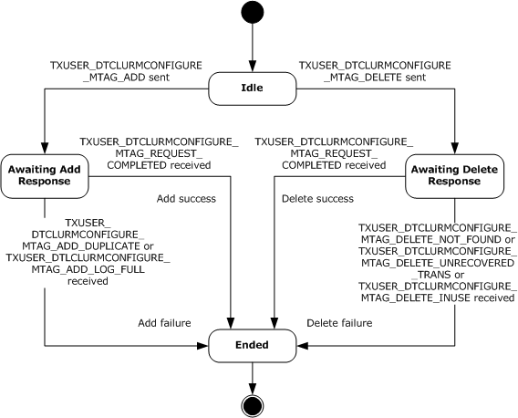

Figure 5: CONNTYPE_TXUSER_DTCLUCONFIGURE initiator states

<a id="Section_3.2.1.1.1"></a>
##### 3.2.1.1.1 Idle

Idle is the initial state. The following events are processed in this state:

- [Adding an LU Name Pair](#Section_3.2.4.1)
- [Deleting an LU Name Pair](#Section_4.1.2)
<a id="Section_3.2.1.1.2"></a>
##### 3.2.1.1.2 Awaiting Add Response

The following events are processed in the Awaiting Add Response state:

- [Receiving a TXUSER_DTCLURMCONFIGURE_MTAG_ADD_DUPLICATE message](#Section_3.2.5.1.1)
- [Receiving a TXUSER_DTCLURMCONFIGURE_MTAG_REQUEST_COMPLETED message](#Section_3.2.5.1.5)
- [Receiving a TXUSER_DTCLURMCONFIGURE_MTAG_ADD_LOG_FULL Message](#Section_3.2.5.1.6)
- [Connection Disconnected (section 3.2.5.1.7)](#Section_3.2.5.1.7)
<a id="Section_3.2.1.1.3"></a>
##### 3.2.1.1.3 Awaiting Delete Response

The following events are processed in the Awaiting Delete Response state:

- [Receiving a TXUSER_DTCLURMCONFIGURE_MTAG_DELETE_NOT_FOUND message](#Section_3.2.5.1.2)
- [Receiving a TXUSER_DTCLURMCONFIGURE_MTAG_DELETE_UNRECOVERED_TRANS message](#Section_3.2.5.1.3)
- [Receiving a TXUSER_DTCLURMCONFIGURE_MTAG_DELETE_INUSE message](#Section_3.2.5.1.4)
- [Receiving a TXUSER_DTCLURMCONFIGURE_MTAG_REQUEST_COMPLETED message](#Section_3.2.5.1.5)
- [Connection Disconnected (section 3.2.5.1.7)](#Section_3.2.5.1.7)
<a id="Section_3.2.1.1.4"></a>
##### 3.2.1.1.4 Ended

Ended is the final state.

<a id="Section_3.2.1.2"></a>
#### 3.2.1.2 CONNTYPE_TXUSER_DTCLURECOVERY Initiator States

The [**LU 6.2**](#gt_lu-type-62-lu-62) implementation (section [3.2](#Section_3.2)) MUST act as an initiator for the CONNTYPE_TXUSER_DTCLURECOVERY connection type. In this role, an LU 6.2 implementation MUST provide support for the following states:

- [Idle](#Section_3.2.1.1.1)
- [Awaiting Register Response](#Section_3.2.1.2.2)
- [Registered](#Section_3.2.1.2.3)
- [Ended](#Section_3.2.1.1.4)
The following figure shows the relationship between the CONNTYPE_TXUSER_DTCLURECOVERY initiator states.

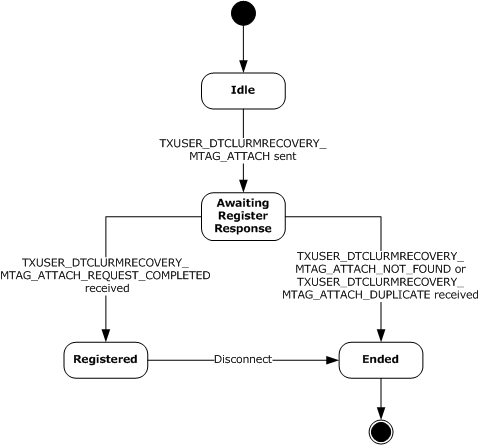

Figure 6: CONNTYPE_TXUSER_DTCLURECOVERY initiator states

<a id="Section_3.2.1.2.1"></a>
##### 3.2.1.2.1 Idle

Idle is the initial state. The following event is processed in this state:

- [Registering recovery process for LU pair](#Section_3.2.4.3)
<a id="Section_3.2.1.2.2"></a>
##### 3.2.1.2.2 Awaiting Register Response

The following events are processed in the Awaiting Register Response state:

- [Receiving a TXUSER_DTCLURMRECOVERY_MTAG_ATTACH_NOT_FOUND message](#Section_3.2.5.2.1)
- [Receiving a TXUSER_DTCLURMRECOVERY_MTAG_ATTACH_DUPLICATE message](#Section_3.2.5.2.2)
- [Receiving a TXUSER_DTCLURMRECOVERY_MTAG_ REQUEST_COMPLETED message](#Section_5ab6d58c17904ff5a1075a26ad8a60e7)
- [Connection Disconnected (section 3.2.5.2.4)](#Section_3.2.5.2.4)
<a id="Section_3.2.1.2.3"></a>
##### 3.2.1.2.3 Registered

The Disconnect event indicates that if the connection is disconnected, then the registration as a recovery process by an [**LU 6.2**](#gt_lu-type-62-lu-62) implementation is ended. So the LU 6.2 implementation (section [3.2](#Section_3.2)) MUST maintain the [CONNTYPE_TXUSER_DTCLURECOVERY](#Section_2.2.3.2) connection in the Registered state for the intended lifetime of any [CONNTYPE_TXUSER_DTCLURECOVERYINITIATEDBYDTC](#Section_2.2.3.4) and [CONNTYPE_TXUSER_DTCLURECOVERYINITIATEDBYLU](#Section_2.2.3.5) connections that are associated with the same **LU Pair** object.

<a id="Section_3.2.1.2.4"></a>
##### 3.2.1.2.4 Ended

Ended is the final state.

<a id="Section_3.2.1.3"></a>
#### 3.2.1.3 CONNTYPE_TXUSER_DTCLURMENLISTMENT Initiator States

The [**LU 6.2**](#gt_lu-type-62-lu-62) implementation (section [3.2](#Section_3.2)) MUST act as an initiator for the CONNTYPE_TXUSER_DTCLURMENLISTMENT connection type. In this role, an LU 6.2 implementation MUST provide support for the following states:

- [Idle](#Section_3.2.1.1.1)
- [Awaiting Enlistment Response](#Section_3.2.1.3.2)
- [Active](#Section_3.2.1.3.3)
- [Preparing for Transaction Commit](#Section_3.2.1.3.4)
- [Awaiting Backout Response](#Section_3.2.1.3.5)
- [Awaiting Transaction Outcome](#Section_3.2.1.3.6)
- [Finalizing Abort Operations](#Section_3.2.1.3.7)
- [Finalizing Commit Operations](#Section_3.2.1.3.8)
- [Ended](#Section_3.2.1.1.4)
The following figure shows the relationship between the CONNTYPE_TXUSER_DTCLURMENLISTMENT initiator states.

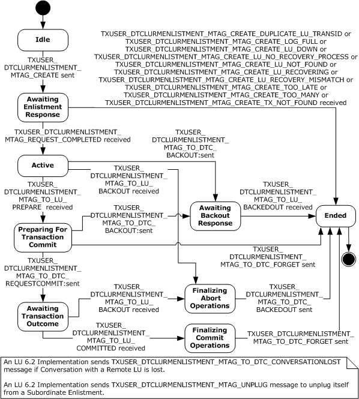

Figure 7: CONNTYPE_TXUSER_DTCLURMENLISTMENT initiator states

<a id="Section_3.2.1.3.1"></a>
##### 3.2.1.3.1 Idle

Idle is the initial state. The following events are processed in this state:

- Creating [**LU 6.2**](#gt_lu-type-62-lu-62) Subordinate Enlistment
- LU 6.2 Subordinate Enlistment Conversation Lost
- Unplugging LU 6.2 Subordinate Enlistment
<a id="Section_3.2.1.3.2"></a>
##### 3.2.1.3.2 Awaiting Enlistment Response

The following events are processed in the Awaiting Enlistment Response state:

- [Receiving a TXUSER_DTCLURMENLISTMENT_MTAG_REQUEST_COMPLETED message](#Section_3.2.5.3.1)
- [Receiving Other TXUSER_DTCLURMENLISTMENT_MTAG messages](#Section_3.2.5.3.2)
- [**LU 6.2**](#gt_lu-type-62-lu-62) Subordinate Enlistment Conversation Lost
- Unplugging LU 6.2 Subordinate Enlistment
- [Connection Disconnected (section 3.2.5.3.7)](#Section_3.2.5.3.7)
<a id="Section_3.2.1.3.3"></a>
##### 3.2.1.3.3 Active

The following events are processed in the Active state:

- [Receiving a TXUSER_DTCLURMENLISTMENT_MTAG_TO_LU_PREPARE message](#Section_3.2.5.3.3)
- [Receiving a TXUSER_DTCLURMENLISTMENT_MTAG_TO_LU_BACKOUT message](#Section_3.2.5.3.5)
- Aborting [**LU 6.2**](#gt_lu-type-62-lu-62) Subordinate Enlistment
- LU 6.2 Subordinate Enlistment-Conversation Lost
- Unplugging LU 6.2 Subordinate Enlistment
- [Connection Disconnected (section 3.2.5.3.7)](#Section_3.2.5.3.7)
<a id="Section_3.2.1.3.4"></a>
##### 3.2.1.3.4 Preparing for Transaction Commit

The following events are processed in the Preparing for Transaction Commit state:

- [**LU 6.2**](#gt_lu-type-62-lu-62) Subordinate Enlistment Prepare Request Completed
- LU 6.2 Subordinate Enlistment-Conversation Lost
- Unplugging LU 6.2 Subordinate Enlistment
<a id="Section_3.2.1.3.5"></a>
##### 3.2.1.3.5 Awaiting Backout Response

The following events are processed in the Awaiting Backout Response state:

- [Receiving a TXUSER_DTCLURMENLISTMENT_MTAG_TO_LU_BACKEDOUT message](#Section_3.2.5.3.4)
- [**LU 6.2**](#gt_lu-type-62-lu-62) Subordinate Enlistment-Conversation Lost
- Unplugging LU 6.2 Subordinate Enlistment
- [Connection Disconnected (section 3.2.5.3.7)](#Section_3.2.5.3.7)
<a id="Section_3.2.1.3.6"></a>
##### 3.2.1.3.6 Awaiting Transaction Outcome

The following events are processed in the Awaiting Transaction Outcome state:

- [Receiving a TXUSER_DTCLURMENLISTMENT_MTAG_TO_LU_BACKOUT message](#Section_3.2.5.3.5)
- [Receiving a TXUSER_DTCLURMENLISTMENT_MTAG_TO_LU_COMMITTED message](#Section_3.2.5.3.6)
- [**LU 6.2**](#gt_lu-type-62-lu-62) Subordinate Enlistment-Conversation Lost
- Unplugging LU 6.2 Subordinate Enlistment
- [Connection Disconnected (section 3.2.5.3.7)](#Section_3.2.5.3.7)
<a id="Section_3.2.1.3.7"></a>
##### 3.2.1.3.7 Finalizing Abort Operations

The following events are processed in the Finalizing Abort Operations state:

- [**LU 6.2**](#gt_lu-type-62-lu-62) Subordinate Enlistment Abort Request Completed
- LU 6.2 Subordinate Enlistment-Conversation Lost
- Unplugging LU 6.2 Subordinate Enlistment
<a id="Section_3.2.1.3.8"></a>
##### 3.2.1.3.8 Finalizing Commit Operations

The following events are processed in the Finalizing Commit Operations state:

- [**LU 6.2**](#gt_lu-type-62-lu-62) Subordinate Enlistment Commit Request Completed
- LU 6.2 Subordinate Enlistment-Conversation Lost
- Unplugging LU 6.2 Subordinate Enlistment
<a id="Section_3.2.1.3.9"></a>
##### 3.2.1.3.9 Ended

Ended is the final state.

<a id="Section_3.2.1.4"></a>
#### 3.2.1.4 CONNTYPE_TXUSER_DTCLURECOVERYINITIATEDBYDTC Initiator States

The [**LU 6.2**](#gt_lu-type-62-lu-62) implementation (section [3.2](#Section_3.2)) MUST act as an initiator for the CONNTYPE_TXUSER_DTCLURECOVERYINITIATEDBYDTC connection type. In this role, the LU 6.2 implementation MUST provide support for the following states:

- [Idle](#Section_3.2.1.1.1)
- [Awaiting Response to Work Query](#Section_3.2.1.4.2)
- [Processing Cold XLN Request](#Section_3.2.1.4.3)
- [Processing Warm XLN Request](#Section_3.2.1.4.4)
- [Awaiting Response to XLN Confirmation](#Section_3.2.1.4.5)
- [Awaiting Response to XLN](#Section_3.2.1.4.6)
- [Awaiting Response to Compare States Query During Warm XLN](#Section_3.2.1.4.7)
- [XLN Exchange Complete](#Section_3.2.1.4.8)
- [Awaiting Response to Compare States Query](#Section_3.2.1.4.9)
- [Processing Compare States Request](#Section_3.3.1.6.6)
- [Awaiting Response to Compare States](#Section_3.2.1.5.7)
- [Processing LU Status Check](#Section_3.2.1.4.12)
- [Awaiting Request Complete](#Section_3.2.1.5.9)
- [Ended](#Section_3.2.1.1.4)
The following figure shows the relationship between the CONNTYPE_TXUSER_DTCLURECOVERYINITIATEDBYDTC initiator states.

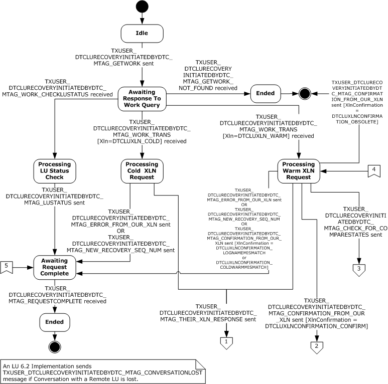

Figure 8: CONNTYPE_TXUSER_DTCLURECOVERYINITIATEDBYDTC initiator states, part 1

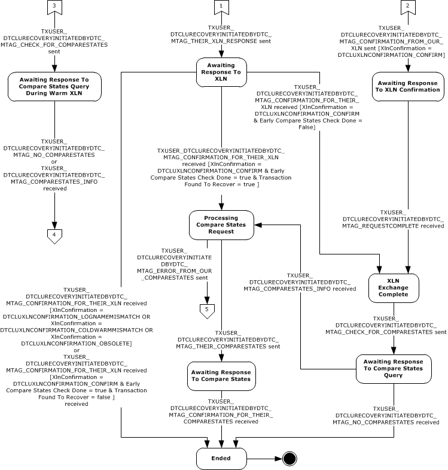

Figure 9: CONNTYPE_TXUSER_DTCLURECOVERYINITIATEDBYDTC initiator states, part 2

<a id="Section_3.2.1.4.1"></a>
##### 3.2.1.4.1 Idle

Idle is the initial state. The following events are processed in this state:

- [Local LU Initiated Recovery Sending Query for Work](#Section_3.2.4.13)
- [Local LU Initiated Recovery Conversation Lost](#Section_3.2.4.22)
<a id="Section_3.2.1.4.2"></a>
##### 3.2.1.4.2 Awaiting Response to Work Query

The following events are processed in the Awaiting Response to Work Query state:

- [Receiving a TXUSER_DTCLURECOVERYINITIATEDBYDTC_MTAG_GETWORK_NOT_FOUND message](#Section_3.2.5.4.1)
- [Receiving a TXUSER_DTCLURECOVERYINITIATEDBYDTC_MTAG_WORK_CHECKLUSTATUS message](#Section_3.2.5.4.2)
- [Receiving a TXUSER_DTCLURECOVERYINITIATEDBYDTC_MTAG_WORK_TRANS message](#Section_3.2.5.4.3)
- [Local LU Initiated Recovery Conversation Lost](#Section_3.2.4.22)
- [Connection Disconnected](#Section_3.2.5.1.7)
<a id="Section_3.2.1.4.3"></a>
##### 3.2.1.4.3 Processing Cold XLN Request

The following events are processed in the Processing [**Cold XLN**](#gt_cold-xln) Request state:

- [Local LU Initiated Recovery Sending New Recovery Sequence Number](#Section_3.2.4.14)
- [Local LU Initiated Recovery Sending XLN Error](#Section_3.2.4.15)
- [Local LU Initiated Recovery Sending XLN Response](#Section_3.2.4.16)
- [Local LU Initiated Recovery Conversation Lost](#Section_3.2.4.22)
<a id="Section_3.2.1.4.4"></a>
##### 3.2.1.4.4 Processing Warm XLN Request

The following events are processed in the Processing Warm XLN Request state:

- [Local LU Initiated Recovery Sending New Recovery Sequence Number](#Section_3.2.4.14)
- [Local LU Initiated Recovery Sending XLN Error](#Section_3.2.4.15)
- [Local LU Initiated Recovery Sending XLN Confirmation](#Section_3.2.4.17)
- [Local LU Initiated Recovery Sending XLN Response](#Section_3.2.4.16)
- [Local LU Initiated Recovery Sending Compare-States Query](#Section_3.2.4.18)
- [Local LU Initiated Recovery Conversation Lost](#Section_3.2.4.22)
<a id="Section_3.2.1.4.5"></a>
##### 3.2.1.4.5 Awaiting Response to XLN Confirmation

The following events are processed in the Awaiting Response to XLN Confirmation state:

- [Receiving a TXUSER_DTCLURECOVERYINITIATEDBYDTC_MTAG_REQUESTCOMPLETE message](#Section_3.2.5.4.8)
- [Local LU Initiated Recovery Conversation Lost](#Section_3.2.4.22)
- [Connection Disconnected](#Section_3.2.5.1.7)
<a id="Section_3.2.1.4.6"></a>
##### 3.2.1.4.6 Awaiting Response to XLN

The following events are processed in the Awaiting Response to XLN state:

- [Receiving a TXUSER_DTCLURECOVERYINITIATEDBYDTC_MTAG_CONFIRMATION_FOR_THEIR_XLN message](#Section_3.2.5.4.4)
- [Local LU Initiated Recovery Conversation Lost](#Section_3.2.4.22)
- [Connection Disconnected](#Section_3.2.5.1.7)
<a id="Section_3.2.1.4.7"></a>
##### 3.2.1.4.7 Awaiting Response to Compare States Query During Warm XLN

The following events are processed in the Awaiting Response to Compare States Query During Warm XLN state:

- [Receiving a TXUSER_DTCLURECOVERYINITIATEDBYDTC_MTAG_NO_COMPARESTATES message](#Section_3.2.5.4.5)
- [Receiving a TXUSER_DTCLURECOVERYINITIATEDBYDTC_MTAG_COMPARESTATES_INFO message](#Section_3.2.5.4.6)
- [Local LU Initiated Recovery Conversation Lost](#Section_3.2.4.22)
- [Connection Disconnected](#Section_3.2.5.1.7)
<a id="Section_3.2.1.4.8"></a>
##### 3.2.1.4.8 XLN Exchange Complete

The following events are processed in the XLN Exchange Complete state:

- [Local LU Initiated Recovery Sending Compare States Query](#Section_3.2.4.18)
- [Local LU Initiated Recovery Conversation Lost](#Section_3.2.4.22)
<a id="Section_3.2.1.4.9"></a>
##### 3.2.1.4.9 Awaiting Response to Compare States Query

The following events are processed in the Awaiting Response to Compare States Query state:

- [Receiving a TXUSER_DTCLURECOVERYINITIATEDBYDTC_MTAG_NO_COMPARESTATES message](#Section_3.2.5.4.5)
- [Receiving a TXUSER_DTCLURECOVERYINITIATEDBYDTC_MTAG_COMPARESTATES_INFO message](#Section_3.2.5.4.6)
- [Local LU Initiated Recovery Conversation Lost](#Section_3.2.4.22)
- [Connection Disconnected](#Section_3.2.5.1.7)
<a id="Section_3.2.1.4.10"></a>
##### 3.2.1.4.10 Processing Compare States Request

The following events are processed in the Processing Compare States Request state:

- [Local LU Initiated Recovery Sending Compare States](#Section_3.2.4.19)
- [Local LU Initiated Recovery Sending Compare States Error](#Section_3.2.4.20)
- [Local LU Initiated Recovery Conversation Lost](#Section_3.2.4.22)
<a id="Section_3.2.1.4.11"></a>
##### 3.2.1.4.11 Awaiting Response to Compare States

The following events are processed in Awaiting Response to Compare States state:

- [Receiving a TXUSER_DTCLURECOVERYINITIATEDBYDTC_MTAG_CONFIRMATION_FOR_THEIR_COMPARESTATES message](#Section_3.2.5.4.7)
- [Local LU Initiated Recovery Conversation Lost](#Section_3.2.4.22)
- [Connection Disconnected](#Section_3.2.5.1.7)
<a id="Section_3.2.1.4.12"></a>
##### 3.2.1.4.12 Processing LU Status Check

The following events are processed in the Processing LU Status Check state:

- [Local LU Initiated Recovery Sending LU Status](#Section_3.2.4.21)
- [Local LU Initiated Recovery Conversation Lost](#Section_3.2.4.22)
<a id="Section_3.2.1.4.13"></a>
##### 3.2.1.4.13 Awaiting Request Complete

The following events are processed in the Awaiting Request Complete state:

- [Receiving a TXUSER_DTCLURECOVERYINITIATEDBYDTC_MTAG_REQUESTCOMPLETE message](#Section_3.2.5.4.8)
- [Local LU Initiated Recovery Conversation Lost](#Section_3.2.4.22)
- [Connection Disconnected](#Section_3.2.5.1.7)
<a id="Section_3.2.1.4.14"></a>
##### 3.2.1.4.14 Ended

Ended is the final state.

<a id="Section_3.2.1.5"></a>
#### 3.2.1.5 CONNTYPE_TXUSER_DTCLURECOVERYINITIATEDBYLU Initiator States

The [**LU 6.2**](#gt_lu-type-62-lu-62) implementation (section [3.2](#Section_3.2)) MUST act as an initiator for the CONNTYPE_TXUSER_DTCLURECOVERYINITIATEDBYLU connection type. In this role, the LU 6.2 implementation MUST provide support for the following states:

- [Idle](#Section_3.2.1.1.1)
- [Awaiting Response to XLN Request](#Section_3.2.1.5.2)
- [Processing XLN Confirmation](#Section_3.2.1.5.3)
- [Awaiting Response to XLN Confirmation](#Section_3.2.1.4.5)
- [Awaiting Response to XLN Confirmation With Error](#Section_3.2.1.5.5)
- [XLN Exchange Complete](#Section_3.2.1.4.8)
- [Awaiting Response To Compare States](#Section_3.2.1.5.7)
- [Processing Compare States Response](#Section_3.2.1.5.8)
- [Awaiting Request Complete](#Section_3.2.1.5.9)
- [Ended](#Section_3.2.1.1.4)
The following figure shows the relationship between the CONNTYPE_TXUSER_DTCLURECOVERYINITIATEDBYLU initiator states.


Figure 10: CONNTYPE_TXUSER_DTCLURECOVERYINITIATEDBYLU initiator states

<a id="Section_3.2.1.5.1"></a>
##### 3.2.1.5.1 Idle

Idle is the initial state. The following events are processed in this state:

- [Remote LU Initiated Recovery Sending XLN](#Section_3.2.4.23)
- [Remote LU Initiated Recovery Conversation Lost](#Section_3.2.4.28)
<a id="Section_3.2.1.5.2"></a>
##### 3.2.1.5.2 Awaiting Response to XLN Request

The following events are processed in the Awaiting Response to XLN Request state:

- [Receiving a TXUSER_DTCLURECOVERYINITIATEDBYLU_MTAG_THEIR_XLN_NOT_FOUND message](#Section_3.2.5.5.1)
- [Receiving a TXUSER_DTCLURECOVERYINITIATEDBYLU_MTAG_RESPONSE_FOR_THEIR_XLN message](#Section_3.2.5.5.2)
- [Remote LU Initiated Recovery Conversation Lost](#Section_3.2.4.28)
- [Connection Disconnected (section 3.2.5.5.5)](#Section_3.2.5.5.5)
<a id="Section_3.2.1.5.3"></a>
##### 3.2.1.5.3 Processing XLN Confirmation

The following events are processed in the Processing XLN Confirmation state:

- [Remote LU Initiated Recovery Sending XLN Confirmation](#Section_3.2.4.24)
- [Remote LU Initiated Recovery Conversation Lost](#Section_3.2.4.28)
<a id="Section_3.2.1.5.4"></a>
##### 3.2.1.5.4 Awaiting Response to XLN Confirmation

The following events are processed in the Awaiting Response to XLN Confirmation state:

- [Receiving a TXUSER_DTCLURECOVERYINITIATEDBYLU_MTAG_REQUESTCOMPLETE message](#Section_3.2.5.5.4)
- [Remote LU Initiated Recovery Conversation Lost](#Section_3.2.4.28)
- [Connection Disconnected (section 3.2.5.5.5)](#Section_3.2.5.5.5)
<a id="Section_3.2.1.5.5"></a>
##### 3.2.1.5.5 Awaiting Response to XLN Confirmation with Error

The following events are processed in the Awaiting Response to XLN Confirmation with Error state:

- [Receiving a TXUSER_DTCLURECOVERYINITIATEDBYLU_MTAG_REQUESTCOMPLETE message](#Section_3.2.5.5.4)
- [Remote LU Initiated Recovery Conversation Lost](#Section_3.2.4.28)
- [Connection Disconnected (section 3.2.5.5.5)](#Section_3.2.5.5.5)
<a id="Section_3.2.1.5.6"></a>
##### 3.2.1.5.6 XLN Exchange Complete

The following events are processed in the XLN Exchange Complete state:

- [Remote LU Initiated Recovery Sending Compare States](#Section_3.2.4.25)
- [Remote LU Initiated Recovery Conversation Lost](#Section_3.2.4.28)
<a id="Section_3.2.1.5.7"></a>
##### 3.2.1.5.7 Awaiting Response to Compare States

The following events are processed in the Awaiting Response to Compare States state:

- [Receiving a TXUSER_DTCLURECOVERYINITIATEDBYLU_MTAG_RESPONSE_FOR_THEIR_COMPARESTATES message](#Section_3.2.5.5.3)
- [Remote LU Initiated Recovery Conversation Lost](#Section_3.2.4.28)
- [Connection Disconnected (section 3.2.5.5.5)](#Section_3.2.5.5.5)
<a id="Section_3.2.1.5.8"></a>
##### 3.2.1.5.8 Processing Compare States Response

The following events are processed in the Processing Compare States Response state:

- [Remote LU Initiated Recovery Sending Compare States Confirmation](#Section_3.2.4.26)
- [Remote LU Initiated Recovery Sending Compare States Error](#Section_3.2.4.27)
- [Remote LU Initiated Recovery Conversation Lost](#Section_3.2.4.28)
<a id="Section_3.2.1.5.9"></a>
##### 3.2.1.5.9 Awaiting Request Complete

The following events are processed in the Awaiting Request Complete state:

- [Receiving a TXUSER_DTCLURECOVERYINITIATEDBYLU_MTAG_REQUESTCOMPLETE message](#Section_3.2.5.5.4)
- [Remote LU Initiated Recovery Conversation Lost](#Section_3.2.4.28)
- [Connection Disconnected (section 3.2.5.5.5)](#Section_3.2.5.5.5)
<a id="Section_3.2.1.5.10"></a>
##### 3.2.1.5.10 Ended

Ended is the final state.

<a id="Section_3.2.2"></a>
### 3.2.2 Timers

None.

<a id="Section_3.2.3"></a>
### 3.2.3 Initialization

When an [**LU 6.2**](#gt_lu-type-62-lu-62) Implementation is initialized, the **Transaction Manager Name** field MUST be set to a value that is obtained from an implementation-specific source.

The **LU Transactions Enabled** flag is initialized by sending a TXUSER_GETSECURITYFLAGS_MTAG_GETSECURITYFLAGS message using the CONNTYPE_TXUSER_GETSECURITYFLAGS connection to the transaction manager as specified in section 3.3.4.11 in [MS-DTCO](../MS-DTCO/MS-DTCO.md). On receiving the **TXUSER_GETSECURITYFLAGS_MTAG_GETSECURITYFLAGS** message, the transaction manager responds with a TXUSER_GETSECURITYFLAGS_MTAG_FETCHED message, which indicates whether the transaction manager supports LU transactions by setting the **DTCADVCONFIG_OPTIONS_LUTRANSACTIONS_DISABLE** bit in the **grfOptions** field, as specified in section 3.4.5.4.1.1 in [MS-DTCO].

<a id="Section_3.2.4"></a>
### 3.2.4 Higher-Layer Triggered Events

The [**LU 6.2**](#gt_lu-type-62-lu-62) Implementation MUST be prepared to process a set of higher-layer events. These events are triggered by decisions that are made by the higher-layer business logic of the LU 6.2 Implementation. The motivations and details of the higher-layer business logic are specific to an LU 6.2 Implementation and the software environment in which it executes.

When an LU 6.2 Implementation processes one of these events, it MUST communicate a Success or Failure result to the higher-layer business logic. The LU 6.2 Implementation MUST be prepared to process the events in the following sections.

<a id="Section_3.2.4.1"></a>
#### 3.2.4.1 Adding an LU Name Pair

This event MUST be signaled by the higher-layer business logic with the [**LU Name Pair**](#gt_lu-name-pair) argument.

If the Adding an LU Name Pair event is signaled, the [**LU 6.2**](#gt_lu-type-62-lu-62) Implementation MUST perform the following actions:

- Initiate a new [CONNTYPE_TXUSER_DTCLUCONFIGURE](#Section_2.2.3.1) connection using the **Transaction Manager Name** field of the LU 6.2 Implementation.
- Send a [TXUSER_DTCLURMCONFIGURE_MTAG_ADD](#Section_2.2.3.1.1) message using the connection:
- The **cbLength** field of the [DTCLU_VARLEN_BYTEARRAY](#Section_2.2.1.2) structure (contained in the **LuNamePair** field) MUST be set to the number of bytes in the provided LU Name Pair.
- The first **cbLength** bytes of the **rgbBlob** field of the DTCLU_VARLEN_BYTEARRAY structure (contained in the **LuNamePair** field) MUST be set to the provided LU Name Pair.
- Set the connection state to [Awaiting Add Response](#Section_3.2.1.1.2).
<a id="Section_3.2.4.2"></a>
#### 3.2.4.2 Deleting an LU Name Pair

This event MUST be signaled by the higher-layer business logic with the [**LU Name Pair**](#gt_lu-name-pair) argument.

If the Deleting an LU Name Pair event is signaled, the [**LU 6.2**](#gt_lu-type-62-lu-62) Implementation MUST perform the following actions:

- Initiate a new [CONNTYPE_TXUSER_DTCLUCONFIGURE](#Section_2.2.3.1) connection using the **Transaction Manager Name** field of the implementation.
- Send a [TXUSER_DTCLURMCONFIGURE_MTAG_DELETE](#Section_2.2.3.1.2) message using the connection:
- The **cbLength** field of the [DTCLU_VARLEN_BYTEARRAY](#Section_2.2.1.2) structure (contained in the **LuNamePair** field) MUST be set to the number of bytes in the provided LU Name Pair.
- The first **cbLength** bytes of the **rgbBlob** field of the DTCLU_VARLEN_BYTEARRAY structure (contained in the **LuNamePair** field) MUST be set to the provided LU Name Pair.
- Set the connection state to [Awaiting Delete Response](#Section_3.2.1.1.3).
<a id="Section_3.2.4.3"></a>
#### 3.2.4.3 Registering Recovery Process For LU Pair

This event MUST be signaled by the higher-layer business logic with the [**LU Name Pair**](#gt_lu-name-pair) argument.

If the Registering Recovery Process For LU Pair event is signaled, the [**LU 6.2**](#gt_lu-type-62-lu-62) Implementation MUST perform the following actions:

- Initiate a new [CONNTYPE_TXUSER_DTCLURECOVERY](#Section_2.2.3.2) connection using the **Transaction Manager Name** field of the LU 6.2 Implementation. Set the LU Name Pair of the CONNTYPE_TXUSER_DTCLURECOVERY connection to the LU Name Pair argument provided by the higher-layer business logic.
- Send a [TXUSER_DTCLURMRECOVERY_MTAG_ATTACH](#Section_2.2.3.2.1) message using the connection:
- The **cbLength** field of the [DTCLU_VARLEN_BYTEARRAY](#Section_2.2.1.2) structure (contained in the **LuNamePair** field) MUST be set to the number of bytes in the provided LU Name Pair.
- The first **cbLength** bytes of the **rgbBlob** field of the DTCLU_VARLEN_BYTEARRAY structure (contained in the **LuNamePair** field) MUST be set to the provided LU Name Pair.
- Set the connection state to [Awaiting Register Response](#Section_3.2.1.2.2).
<a id="Section_3.2.4.4"></a>
#### 3.2.4.4 All Sessions Lost

This event MUST be signaled by the higher-layer business logic with the [**LU Name Pair**](#gt_lu-name-pair) argument.

If the All Sessions Lost event is signaled, the [**LU 6.2**](#gt_lu-type-62-lu-62) Implementation MUST perform the following actions:

- Attempt to find the [**recovery sequence number**](#gt_recovery-sequence-number) keyed by the LU Name Pair in the Recovery Sequence Number Table.
- If the recovery sequence number is not found:
- Return a failure result to the higher-layer business logic.
- Otherwise:
- Increment the found recovery sequence number.
<a id="Section_3.2.4.5"></a>
#### 3.2.4.5 Creating LU 6.2 Subordinate Enlistment

This event MUST be signaled by the higher-layer business logic with the following arguments:

- **Transaction Object.Identifier** as defined in [MS-DTCO](../MS-DTCO/MS-DTCO.md) section 3.1.1
- [**LU Name Pair**](#gt_lu-name-pair)
- [**LUW**](#gt_logical-unit-of-work-luw) Identifier
If the Creating [**LU 6.2**](#gt_lu-type-62-lu-62) Subordinate Enlistment event is signaled, the LU 6.2 Implementation MUST perform the following actions:

- Initiate a new [CONNTYPE_TXUSER_DTCLURMENLISTMENT](#Section_2.2.3.3) connection using the **Transaction Manager Name** field of the LU 6.2 Implementation.
- Send a [TXUSER_DTCLURMENLISTMENT_MTAG_CREATE](#Section_2.2.3.3.1) message using the connection:
- The **guidTx** field MUST be set to the provided **Transaction Object.Identifier**.
- The **cbLength** field of the [DTCLU_VARLEN_BYTEARRAY](#Section_2.2.1.2) structure (contained in the **LuNamePair** field) MUST be set to the number of bytes in the provided LU Name Pair.
- The first **cbLength** bytes of the **rgbBlob** field of the DTCLU_VARLEN_BYTEARRAY structure (contained in the **LuNamePair** field) MUST be set to the provided LU Name Pair.
- The **cbLength** field of the DTCLU_VARLEN_BYTEARRAY structure (contained in the **LuTransId** field) MUST be set to the number of bytes in the provided LUW identifier.
- The first **cbLength** bytes of the **rgbBlob** field of the DTCLU_VARLEN_BYTEARRAY structure (contained in the **LuTransId** field) MUST be set to the provided LUW identifier.
- Set the connection state to [Awaiting Enlistment Response](#Section_3.2.1.3.2).
<a id="Section_3.2.4.6"></a>
#### 3.2.4.6 Aborting LU 6.2 Subordinate Enlistment

This event MUST be signaled by the higher-layer business logic with the following arguments:

- A connection object of type [CONNTYPE_TXUSER_DTCLURMENLISTMENT](#Section_2.2.3.3)
If the Aborting [**LU 6.2**](#gt_lu-type-62-lu-62) Subordinate Enlistment event is signaled, the LU 6.2 Implementation MUST perform the following actions:

- If the provided connection state is not set to [Active](#Section_3.2.1.3.3):
- Return a failure result to the higher-layer business logic.
- Otherwise:
- Send a [TXUSER_DTCLURMENLISTMENT_MTAG_TO_DTC_BACKOUT](#Section_2.2.3.3.5) message using the provided connection.
- Set the connection state to [Awaiting Backout Response](#Section_3.2.1.3.5).
<a id="Section_3.2.4.7"></a>
#### 3.2.4.7 LU 6.2 Subordinate Enlistment Prepare Request Completed

This event MUST be signaled by the higher-layer business logic with the following arguments:

- A connection object of type [CONNTYPE_TXUSER_DTCLURMENLISTMENT](#Section_2.2.3.3)
- A request [**outcome**](#gt_outcome) value. This value MUST be one of the following:
- Prepared
- Aborted
- Forget
If the [**LU 6.2**](#gt_lu-type-62-lu-62) Subordinate Enlistment Prepare Request Completed event is signaled, the LU 6.2 Implementation MUST perform the following actions:

- If the provided connection state is not set to [Preparing For Transaction Commit](#Section_3.2.1.3.4):
- Return a failure result to the higher-layer business logic.
- Otherwise:
- If the request outcome is Prepared:
- Send a [TXUSER_DTCLURMENLISTMENT_MTAG_TO_DTC_REQUESTCOMMIT](#Section_2.2.3.3.8) message using the provided connection.
- Set the connection state to [Awaiting Transaction Outcome](#Section_3.2.1.3.6).
- Otherwise, if the request outcome is Aborted:
- Send a [TXUSER_DTCLURMENLISTMENT_MTAG_TO_DTC_BACKOUT](#Section_2.2.3.3.5) message using the provided connection.
- Set the connection state to [Awaiting Backout Response](#Section_3.2.1.3.5).
- Otherwise, if the request outcome is Forget:
- Send a [TXUSER_DTCLURMENLISTMENT_MTAG_TO_DTC_FORGET](#Section_2.2.3.3.7) message using the provided connection.
- Set the connection state to [Ended](#Section_3.2.1.1.4).
<a id="Section_3.2.4.8"></a>
#### 3.2.4.8 LU 6.2 Subordinate Enlistment Conversation Lost

This event MUST be signaled by the higher-layer business logic with the following argument:

- A connection object of type [CONNTYPE_TXUSER_DTCLURMENLISTMENT](#Section_2.2.3.3)
If the [**LU 6.2**](#gt_lu-type-62-lu-62) Subordinate Enlistment Conversation Lost event is signaled, the LU 6.2 Implementation MUST perform the following actions:

- Send a [TXUSER_DTCLURMENLISTMENT_MTAG_TO_DTC_CONVERSATIONLOST](#Section_2.2.3.3.3) message using the provided connection.
- Set the connection state to [Ended](#Section_3.2.1.1.4).
<a id="Section_3.2.4.9"></a>
#### 3.2.4.9 Unplugging LU 6.2 Subordinate Enlistment

This event MUST be signaled by the higher-layer business logic with the following argument:

- A connection object of type [CONNTYPE_TXUSER_DTCLURMENLISTMENT](#Section_2.2.3.3)
If the Unplugging [**LU 6.2**](#gt_lu-type-62-lu-62) Subordinate Enlistment event is signaled, the LU 6.2 implementation (section [3.2](#Section_3.2)) MUST perform the following actions:

- Send a [TXUSER_DTCLURMENLISTMENT_MTAG_UNPLUG](#Section_2.2.3.3.18) message using the provide connection.
- Set the connection state to [Ended](#Section_3.2.1.1.4).
<a id="Section_3.2.4.10"></a>
#### 3.2.4.10 LU 6.2 Subordinate Enlistment Abort Request Completed

This event MUST be signaled by the higher-layer business logic with the following argument:

- A connection object of type [CONNTYPE_TXUSER_DTCLURMENLISTMENT](#Section_2.2.3.3).
If the [**LU 6.2**](#gt_lu-type-62-lu-62) Subordinate Enlistment Abort Request Completed event is signaled, the LU 6.2 implementation (section [3.2](#Section_3.2)) MUST perform the following actions:

- If the provided connection state is not set to [Finalizing Abort Operations](#Section_3.2.1.3.7):
- Return a failure result to the higher-layer business logic.
- Otherwise:
- Send a [TXUSER_DTCLURMENLISTMENT_MTAG_TO_DTC_BACKEDOUT](#Section_2.2.3.3.4) message using the provided connection.
- Set the connection state to [Ended](#Section_3.2.1.1.4).
<a id="Section_3.2.4.11"></a>
#### 3.2.4.11 LU 6.2 Subordinate Enlistment Commit Request Completed

This event MUST be signaled by the higher-layer business logic with the following argument:

- A connection object of type [CONNTYPE_TXUSER_DTCLURMENLISTMENT](#Section_2.2.3.3)
If the [**LU 6.2**](#gt_lu-type-62-lu-62) Subordinate Enlistment Commit Request Completed event is signaled, the LU 6.2 implementation (section [3.2](#Section_3.2)) MUST perform the following actions:

- If the provided connection state is not set to [Finalizing Commit Operations](#Section_3.2.1.3.8):
- Return a failure result to the higher-layer business logic.
- Otherwise:
- Send a [TXUSER_DTCLURMENLISTMENT_MTAG_TO_DTC_FORGET](#Section_2.2.3.3.7) message using the provided connection.
- Set the connection state to [Ended](#Section_3.2.1.1.4).
<a id="Section_3.2.4.12"></a>
#### 3.2.4.12 LU 6.2 Subordinate Enlistment Single-Phase Commit Request Completed

This event MUST be signaled by the higher-layer business logic with the following argument:

- A connection object of type [CONNTYPE_TXUSER_DTCLURMENLISTMENT](#Section_2.2.3.3)
If the [**LU 6.2**](#gt_lu-type-62-lu-62) Subordinate Enlistment Commit Request Completed event is signaled, the LU 6.2 implementation (section [3.2](#Section_3.2)) MUST perform the following action:

- Send a [TXUSER_DTCLURMENLISTMENT_MTAG_TO_DTC_COMMITTED](#Section_2.2.3.3.6) message using the provided connection.
<a id="Section_3.2.4.13"></a>
#### 3.2.4.13 Local LU Initiated Recovery Sending Query For Work

This event MUST be signaled by the higher-layer business logic with the [**LU Name Pair**](#gt_lu-name-pair) argument.

If the Local LU Initiated Recovery Sending Query For Work event is signaled, the [**LU 6.2**](#gt_lu-type-62-lu-62) implementation (section [3.2](#Section_3.2)) MUST perform the following actions:

- Initiate a new [CONNTYPE_TXUSER_DTCLURECOVERYINITIATEDBYDTC](#Section_2.2.3.4) connection using the **Transaction Manager Name** field of the LU 6.2 implementation. Set the **Early Compare States Check Done** and **Transaction Found To Recover** flags of the CONNTYPE_TXUSER_DTCLURECOVERYINITIATEDBYDTC connection object to FALSE.
- Send a [TXUSER_DTCLURECOVERYINITIATEDBYDTC_MTAG_GETWORK](#Section_2.2.3.4.1) message using the provided connection:
- The **cbLength** field of the [DTCLU_VARLEN_BYTEARRAY](#Section_2.2.1.2) structure (contained in the **LuNamePair** field) MUST be set to the number of bytes in the provided LU Name Pair.
- The first **cbLength** bytes of the **rgbBlob** field of the DTCLU_VARLEN_BYTEARRAY structure (contained in the **LuNamePair** field) MUST be set to the provided LU Name Pair.
- Set the connection state to [Awaiting Response To Work Query](#Section_3.2.1.4.2).
<a id="Section_3.2.4.14"></a>
#### 3.2.4.14 Local LU Initiated Recovery Sending New Recovery Sequence Number

This event MUST be signaled by the higher-layer business logic with the following arguments:

- A connection object of type [CONNTYPE_TXUSER_DTCLURECOVERYINITIATEDBYDTC](#Section_2.2.3.4)
- New Recovery Sequence Number
If the Local LU Initiated Recovery Sending New Recovery Sequence Number event is signaled, the [**LU 6.2**](#gt_lu-type-62-lu-62) implementation (section [3.2](#Section_3.2)) MUST perform the following actions:

- If the provided connection state is not set to either [Processing Cold XLN Request](#Section_3.2.1.4.3) or [Processing Warm XLN Request](#Section_3.2.1.4.4):
- Return a failure result to the higher-layer business logic.
- Otherwise:
- Attempt to find the [**recovery sequence number**](#gt_recovery-sequence-number) keyed by the [**LU Name Pair**](#gt_lu-name-pair) in the Recovery Sequence Number Table.
- If the recovery sequence number is not found:
- Return a failure to the higher-layer business logic.
- Otherwise:
- Update the recovery sequence number keyed by the LU Name Pair in the Recovery Sequence Number Table with the provided new recovery sequence number.
- Send a [TXUSER_DTCLURECOVERYINITIATEDBYDTC_MTAG_NEW_RECOVERY_SEQ_NUM](#Section_2.2.3.4.18) message using the provided connection:
- The **RecoverySeqNum** field MUST be set to the provided new recovery sequence number.
- Set the connection state to [Awaiting Request Complete](#Section_3.2.1.5.9).
<a id="Section_3.2.4.15"></a>
#### 3.2.4.15 Local LU Initiated Recovery Sending XLN Error

This event MUST be signaled by the higher-layer business logic with the following arguments:

- A connection object of type [CONNTYPE_TXUSER_DTCLURECOVERYINITIATEDBYDTC](#Section_2.2.3.4)
- An Error Reason value, which MUST be set to one of the following values:
- Log Name Mismatch
- Cold Warm Mismatch
- Protocol Error
If the Local LU Initiated Recovery Sending XLN Error event is signaled, the [**LU 6.2**](#gt_lu-type-62-lu-62) implementation (section [3.2](#Section_3.2)) MUST perform the following actions:

- If the provided connection state is not set to either [Processing Cold XLN Request](#Section_3.2.1.4.3) or [Processing Warm XLN Request](#Section_3.2.1.4.4):
- Return a failure result to the higher-layer business logic.
- Otherwise:
- Send a [TXUSER_DTCLURECOVERYINITIATEDBYDTC_MTAG_ERROR_FROM_OUR_XLN](#Section_2.2.3.4.10) message using the provided connection:
- The **XlnError** field MUST be set to one of the following elements of the [**DTCLUXLNERROR**](#Section_2.2.2.6) enumeration:
- DTCLUXLNERROR_LOGNAMEMISMATCH if the provided Error Reason value is Log Name Mismatch
- DTCLUXLNERROR_COLDWARMMISMATCH if the provided Error Reason value is Cold Warm Mismatch
- DTCLUXLNERROR_PROTOCOL if the provided Error Reason value is Protocol Error
- Set the connection state to [Awaiting Request Complete](#Section_3.2.1.5.9).
<a id="Section_3.2.4.16"></a>
#### 3.2.4.16 Local LU Initiated Recovery Sending XLN Response

This event MUST be signaled by the higher-layer business logic with the following arguments:

- A connection object of type [CONNTYPE_TXUSER_DTCLURECOVERYINITIATEDBYDTC](#Section_2.2.3.4)
- Remote Log Status value, which MUST be set to one of the following values:
- Warm
- Cold
- [**Remote Log Name**](#gt_remote-log-name)
If the Local LU Initiated Recovery Sending XLN Response event is signaled, the [**LU 6.2**](#gt_lu-type-62-lu-62) implementation MUST perform the following actions:

- If the provided connection state is not set to either [Processing Cold XLN Request](#Section_3.2.1.4.3) or [Processing Warm XLN Request](#Section_3.2.1.4.4):
- Return a failure result to the higher-layer business logic.
- Otherwise:
- Send a [TXUSER_DTCLURECOVERYINITIATEDBYDTC_MTAG_THEIR_XLN_RESPONSE](#Section_2.2.3.4.8) message using the provided connection:
- The **Xln** field MUST be set to one of the following elements of the [**DTCLUXLN**](#Section_2.2.2.4) enumeration:
- DTCLUXLN_WARM if the provided Remote Log Status value is Warm
- DTCLUXLN_COLD if the provided Remote Log Status value is Cold
- The **dwProtocol** field MUST be set to 0.
- The **cbLength** field of the [DTCLU_VARLEN_BYTEARRAY](#Section_2.2.1.2) structure (contained in the **RemoteLogName** field) MUST be set to the number of bytes in the provided remote log name.
- The first **cbLength** bytes of the **rgbBlob** field of the DTCLU_VARLEN_BYTEARRAY structure (contained in the **RemoteLogName** field) MUST be set to the provided remote log name.
- Set the connection state to [Awaiting Response To XLN](#Section_3.2.1.4.6).
<a id="Section_3.2.4.17"></a>
#### 3.2.4.17 Local LU Initiated Recovery Sending XLN Confirmation

This event MUST be signaled by the higher-layer business logic with the following arguments:

- A connection object of type [CONNTYPE_TXUSER_DTCLURECOVERYINITIATEDBYDTC](#Section_2.2.3.4)
- An [**XLN**](#gt_exchange-log-name-xln) Response value, which MUST be set to one of the following values:
- Confirm
- Log Name Mismatch
- Cold Warm Mismatch
- Obsolete
If the Local LU Initiated Recovery Sending XLN Confirmation event is signaled, the [**LU 6.2**](#gt_lu-type-62-lu-62) implementation (section [3.2](#Section_3.2)) MUST perform the following actions:

- If the provided connection state is not set to [Processing Warm XLN Request](#Section_3.2.1.4.4):
- Return a failure result to the higher-layer business logic.
- Otherwise:
- Send a [TXUSER_DTCLURECOVERYINITIATEDBYDTC_MTAG_CONFIRMATION_FROM_OUR_XLN](#Section_2.2.3.4.7) message using the provided connection:
- The **XlnConfirmation** field MUST be set to one of the following elements of the [**DTCLUXLNCONFIRMATION**](#Section_2.2.2.5) enumeration:
- DTCLUXLNCONFIRMATION_CONFIRM if the provided XLN Response value is Confirm
- DTCLUXLNCONFIRMATION_LOGNAMEMISMATCH if the provided XLN Response value is Log Name Mismatch
- DTCLUXLNCONFIRMATION_COLDWARMMISMATCH if the provided XLN Response value is Cold Warm Mismatch
- DTCLUXLNCONFIRMATION_OBSOLETE if the provided XLN Response value is Obsolete
- If the provided XLN Response value is Confirm:
- Set the connection state to [Awaiting Response To XLN Confirmation](#Section_3.2.1.4.5).
- Otherwise, if the provided XLN Response value is either Log Name Mismatch or Cold Warm Mismatch:
- Set the connection state to [Awaiting Request Complete](#Section_3.2.1.5.9).
- Otherwise:
- Set the connection state to [Ended](#Section_3.2.1.1.4).
<a id="Section_3.2.4.18"></a>
#### 3.2.4.18 Local LU Initiated Recovery Sending Compare States Query

This event MUST be signaled by the higher-layer business logic with the following argument:

- A connection object of type [CONNTYPE_TXUSER_DTCLURECOVERYINITIATEDBYDTC](#Section_2.2.3.4)
If the Local LU Initiated Recovery Sending Compare States Query event is signaled, the [**LU 6.2**](#gt_lu-type-62-lu-62) implementation (section [3.2](#Section_3.2)) MUST perform the following actions:

- If the provided connection state is not set to either [Processing Warm XLN Request](#Section_3.2.1.4.4) or [XLN Exchange Complete](#Section_3.2.1.4.8):
- Return a failure result to the higher-layer business logic.
- Otherwise:
- If the connection state is Processing Warm XLN Request:
- Send a [TXUSER_DTCLURECOVERYINITIATEDBYDTC_MTAG_CHECK_FOR_COMPARESTATES](#Section_2.2.3.4.11) message using the provided connection.
- Set the Early Compare States Check Done field of the connection object to TRUE.
- Set the connection state to [Awaiting Response To Compare States Query During Warm XLN](#Section_3.2.1.4.7).
- Otherwise, if the connection state is XLN Exchange Complete:
- Send a TXUSER_DTCLURECOVERYINITIATEDBYDTC_MTAG_CHECK_FOR_COMPARESTATES message using the provided connection.
- Set the connection state to [Awaiting Response To Compare States Query](#Section_3.2.1.4.9).
<a id="Section_3.2.4.19"></a>
#### 3.2.4.19 Local LU Initiated Recovery Sending Compare States

This event MUST be signaled by the higher-layer business logic with the following arguments:

- A connection object of type [CONNTYPE_TXUSER_DTCLURECOVERYINITIATEDBYDTC](#Section_2.2.3.4)
- A **LUW Status** value, which MUST be set to one of the following values:
- Committed
- Heuristic Committed
- Heuristic Mixed
- Heuristic Reset
- In Doubt
- Reset
If the Local LU Initiated Recovery Sending Compare States event is signaled, the [**LU 6.2**](#gt_lu-type-62-lu-62) implementation (section [3.2](#Section_3.2)) MUST perform the following actions:

- If the provided connection state is not set to [Processing Compare States Request](#Section_3.3.1.6.6):
- Return a failure result to the higher-layer business logic.
- Otherwise:
- Send a [TXUSER_DTCLURECOVERYINITIATEDBYDTC_MTAG_THEIR_COMPARESTATES](#Section_2.2.3.4.14) message using the provided connection:
- The **CompareStates** field MUST be set to one of the following elements of the [**DTCLUCOMPARESTATE**](#Section_2.2.2.1) enumeration:
- DTCLUCOMPARESTATE_COMMITTED if the provided LUW Status value is Committed
- DTCLUCOMPARESTATE_HEURISTICCOMMITTED if the provided LUW Status value is Heuristic Committed
- DTCLUCOMPARESTATE_HEURISTICMIXED if the provided LUW Status value is Heuristic Mixed
- DTCLUCOMPARESTATE_HEURISTICRESET if the provided LUW Status value is Heuristic Reset
- DTCLUCOMPARESTATE_INDOUBT if the provided LUW Status value is In Doubt
- DTCLUCOMPARESTATE_RESET if the provided LUW Status value is Reset
- Set the connection state to [Awaiting Response To Compare States](#Section_3.2.1.5.7).
<a id="Section_3.2.4.20"></a>
#### 3.2.4.20 Local LU Initiated Recovery Sending Compare States Error

This event MUST be signaled by the higher-layer business logic with the following argument:

- A connection object of type [CONNTYPE_TXUSER_DTCLURECOVERYINITIATEDBYDTC](#Section_2.2.3.4)
If the Local LU Initiated Recovery Sending Compare States Error event is signaled, the [**LU 6.2**](#gt_lu-type-62-lu-62) implementation (section [3.2](#Section_3.2)) MUST perform the following actions:

- If the provided connection state is not set to [Processing Compare States Request](#Section_3.3.1.6.6):
- Return a failure result to the higher-layer business logic.
- Otherwise:
- Send a [TXUSER_DTCLURECOVERYINITIATEDBYDTC_MTAG_ERROR_FROM_OUR_COMPARESTATES](#Section_2.2.3.4.16) message using the provided connection:
- The **CompareStatesError** field MUST be set to [DTCLUCOMPARESTATESERROR_PROTOCOL](#Section_2.2.2.3).
- Set the connection state to [Awaiting Request Complete](#Section_3.2.1.5.9).
<a id="Section_3.2.4.21"></a>
#### 3.2.4.21 Local LU Initiated Recovery Sending LU Status

This event MUST be signaled by the higher-layer business logic with the following arguments:

- A connection object of type [CONNTYPE_TXUSER_DTCLURECOVERYINITIATEDBYDTC](#Section_2.2.3.4)
- [**LU Name Pair**](#gt_lu-name-pair)
If the Local LU Initiated Recovery Sending LU Status event is signaled, the [**LU 6.2**](#gt_lu-type-62-lu-62) implementation (section [3.2](#Section_3.2)) MUST perform the following actions:

- If the provided connection state is not set to [Processing LU Status Check](#Section_3.2.1.4.12):
- Return a failure result to the higher-layer business logic.
- Otherwise:
- Attempt to find the [**recovery sequence number**](#gt_recovery-sequence-number) keyed by the LU Name Pair in the Recovery Sequence Number Table.
- If the recovery sequence number is not found:
- Return a failure result to the higher-layer business logic.
- Otherwise:
- Send a [TXUSER_DTCLURECOVERYINITIATEDBYDTC_MTAG_LUSTATUS](#Section_2.2.3.4.5) message using the provided connection:
- The **RecoverySeqNum** field MUST be set to the found recovery sequence number.
- Set the connection state to [Awaiting Request Complete](#Section_3.2.1.5.9).
<a id="Section_3.2.4.22"></a>
#### 3.2.4.22 Local LU Initiated Recovery Conversation Lost

This event MUST be signaled by the higher-layer business logic with the following argument:

- A connection object of type [CONNTYPE_TXUSER_DTCLURECOVERYINITIATEDBYDTC](#Section_2.2.3.4)
If the Local LU Initiated Recovery Conversation Lost event is signaled, the [**LU 6.2**](#gt_lu-type-62-lu-62) implementation (section [3.2](#Section_3.2)) MUST perform the following actions:

- Send a [TXUSER_DTCLURECOVERYINITIATEDBYDTC_MTAG_CONVERSATION_LOST](#Section_2.2.3.4.17) message using the provided connection.
- Set the connection state to [Ended](#Section_3.2.1.1.4).
<a id="Section_3.2.4.23"></a>
#### 3.2.4.23 Remote LU Initiated Recovery Sending XLN

This event MUST be signaled by the higher-layer business logic with the following arguments:

- A **Remote Log Status** value. This value MUST be one of the following:
- Warm
- Cold
- [**Remote Log Name**](#gt_remote-log-name)
- [**Local Log Name**](#gt_local-log-name) supplied by a [**remote LU**](#gt_remote-lu)
- [**LU Name Pair**](#gt_lu-name-pair)
If the Remote LU Initiated Recovery Sending XLN event is signaled, the [**LU 6.2**](#gt_lu-type-62-lu-62) Implementation MUST perform the following actions:

- Attempt to find the [**recovery sequence number**](#gt_recovery-sequence-number) keyed by the LU Name Pair in the Recovery Sequence Number Table.
- If the recovery sequence number is not found:
- Return a failure result to the higher-layer business logic.
- Otherwise:
- Initiate a new [CONNTYPE_TXUSER_DTCLURECOVERYINITIATEDBYLU](#Section_2.2.3.5) connection using the **Transaction Manager Name** field of the LU 6.2 Implementation. Set the **LU Pair** field of the CONNTYPE_TXUSER_DTCLURECOVERYINITIATEDBYLU connection object to the provided LU Name Pair. Set the **LUW To Recover** field of the CONNTYPE_TXUSER_DTCLURECOVERYINITIATEDBYLU connection object to null.
- Send a [TXUSER_DTCLURECOVERYINITIATEDBYLU_MTAG_THEIR_XLN](#Section_2.2.3.5.1) message using the connection:
- The **RecoverySeqNum** field MUST be set to the found recovery sequence number.
- The **Xln** field MUST be set to one of the following elements of the [**DTCLUXLN**](#Section_2.2.2.4) enumeration:
- DTCLUXLN_WARM if the provided **Remote Log Status** value is Warm.
- DTCLUXLN_COLD if the provided **Remote Log Status** value is Cold.
- The **dwProtocol** field MUST be set to 0.
- The **cbLength** field of the [DTCLU_VARLEN_BYTEARRAY](#Section_2.2.1.2) structure (contained in the **RemoteLogName** field) MUST be set to the number of bytes in the provided remote log name.
- The first **cbLength** bytes of the **rgbBlob** field of the DTCLU_VARLEN_BYTEARRAY structure (contained in the **RemoteLogName** field) MUST be set to the provided remote log name.
- The **cbLength** field of the DTCLU_VARLEN_BYTEARRAY structure (contained in the **OurLogName** field) MUST be set to the number of bytes in the provided local log name supplied by the remote LU.
- The first **cbLength** bytes of the **rgbBlob** field of the DTCLU_VARLEN_BYTEARRAY structure (contained in the **OurLogName** field) MUST be set to the provided local log name supplied by the remote LU.
- The **cbLength** field of the DTCLU_VARLEN_BYTEARRAY structure (contained in the **LuNamePair** field) MUST be set to the number of bytes in the provided LU Name Pair.
- The first **cbLength** bytes of the **rgbBlob** field of the DTCLU_VARLEN_BYTEARRAY structure (contained in the **LuNamePair** field) MUST be set to the provided LU Name Pair.
- Set the connection state to [Awaiting Response To XLN Request](#Section_3.2.1.5.2).
<a id="Section_3.2.4.24"></a>
#### 3.2.4.24 Remote LU Initiated Recovery Sending XLN Confirmation

This event MUST be signaled by the higher-layer business logic with the following arguments:

- A connection object of type [CONNTYPE_TXUSER_DTCLURECOVERYINITIATEDBYLU](#Section_2.2.3.5)
- An **XLN Response** value. This value MUST be one of the following:
- Confirm
- Log Name Mismatch
- Cold Warm Mismatch
- Obsolete
If the Remote LU Initiated Recovery Sending XLN Confirmation event is signaled, the [**LU 6.2**](#gt_lu-type-62-lu-62) implementation (section [3.2](#Section_3.2)) MUST perform the following actions:

- If the provided connection state is not set to [Processing XLN Confirmation](#Section_3.2.1.5.3):
- Return a failure result to the higher-layer business logic.
- Otherwise:
- Send a [TXUSER_DTCLURECOVERYINITIATEDBYLU_MTAG_CONFIRMATION_OF_OUR_XLN](#Section_2.2.3.5.3) message using the provided connection:
- The **XlnConfirmation** field MUST be set to one of the following elements of the [**DTCLUXLNCONFIRMATION**](#Section_2.2.2.5) enumeration:
- DTCLUXLNCONFIRMATION_CONFIRM if the provided XLN Response value is Confirm.
- DTCLUXLNCONFIRMATION_LOGNAMEMISMATCH if the provided XLN Response value is Log Name Mismatch.
- DTCLUXLNCONFIRMATION_COLDWARMMISMATCH if the provided XLN Response value is Cold Warm Mismatch.
- DTCLUXLNCONFIRMATION_OBSOLETE if the provided XLN Response value is Obsolete.
- If the provided XLN Response value is set to Confirm:
- Set the connection state to [Awaiting Response To XLN Confirmation](#Section_3.2.1.4.5).
- Otherwise, if the provided XLN Response value is set to Log Name Mismatch or Cold Warm Mismatch:
- Set the connection state to [Awaiting Response To XLN Confirmation With Error](#Section_3.2.1.5.5).
- Otherwise, if the provided XLN Response value is set to Obsolete:
- Set the connection state to [Ended](#Section_3.2.1.1.4).
<a id="Section_3.2.4.25"></a>
#### 3.2.4.25 Remote LU Initiated Recovery Sending Compare States

This event MUST be signaled by the higher-layer business logic with the following arguments:

- A connection object of type [CONNTYPE_TXUSER_DTCLURECOVERYINITIATEDBYLU](#Section_2.2.3.5)
- A **Remote LUW Status** value. This value MUST be one of the following:
- Committed
- Heuristic Committed
- Heuristic Mixed
- Heuristic Reset
- In Doubt
- Reset
- LUW Identifier
If the Remote LU Initiated Recovery Sending Compare States event is signaled, the [**LU 6.2**](#gt_lu-type-62-lu-62) implementation (section [3.2](#Section_3.2)) MUST perform the following actions:

- If the provided connection state is not set to [XLN Exchange Complete](#Section_3.2.1.4.8):
- Return a failure result to the higher-layer business logic.
- Otherwise:
- Send a [TXUSER_DTCLURECOVERYINITIATEDBYLU_MTAG_THEIR_COMPARESTATES](#Section_2.2.3.5.4) message using the provided connection:
- The **CompareStates** field MUST be set to one of the following [**DTCLUCOMPARESTATE**](#Section_2.2.2.1) values:
- DTCLUCOMPARESTATE_COMMITTED if the provided **Remote LUW Status** value is Committed
- DTCLUCOMPARESTATE_HEURISTICCOMMITTED if the provided **Remote LUW Status** value is Heuristic Committed
- DTCLUCOMPARESTATE_HEURISTICMIXED if the provided **Remote LUW Status** value is Heuristic Mixed
- DTCLUCOMPARESTATE_HEURISTICRESET if the provided **Remote LUW Status** value is Heuristic Reset
- DTCLUCOMPARESTATE_INDOUBT if the provided **Remote LUW Status** value is In Doubt
- DTCLUCOMPARESTATE_RESET if the provided **Remote LUW Status** value is Reset
- The **cbLength** field of the [DTCLU_VARLEN_BYTEARRAY](#Section_2.2.1.2) structure (contained in the **LuTransId** field) MUST be set to the number of bytes in the provided [**LUW identifier**](#gt_luw-identifier).
- The first **cbLength** bytes of the **rgbBlob** field of the DTCLU_VARLEN_BYTEARRAY structure (contained in the **LuTransId** field) MUST be set to the provided LUW identifier.
- Set the connection state to [Awaiting Response To Compare States](#Section_3.2.1.5.7).
<a id="Section_3.2.4.26"></a>
#### 3.2.4.26 Remote LU Initiated Recovery Sending Compare States Confirmation

This event MUST be signaled by the higher-layer business logic with the following arguments:

- A connection object of type [CONNTYPE_TXUSER_DTCLURECOVERYINITIATEDBYLU](#Section_2.2.3.5)
- A **Compare States Confirmation** value. This value MUST be one of the following:
- Confirm
- Protocol Error
If the Remote LU Initiated Recovery Sending Compare States Confirmation event is signaled, the [**LU 6.2**](#gt_lu-type-62-lu-62) implementation (section [3.2](#Section_3.2)) MUST perform the following actions:

- If the provided connection state is not set to [Processing Compare States Response](#Section_3.2.1.5.8):
- Return a failure result to the higher-layer business logic.
- Otherwise:
- Send a [TXUSER_DTCLURECOVERYINITIATEDBYLU_MTAG_CONFIRMATION_OF_OUR_COMPARESTATES](#Section_2.2.3.5.6) message using the provided connection:
- The **CompareStatesConfirmation** field MUST be set to one of the following elements of the [**DTCLUCOMPARESTATESCONFIRMATION**](#Section_2.2.2.2) enumeration:
- DTCLUCOMPARESTATESCONFIRMATION_CONFIRM if the provided Compare States Confirmation value is Confirm
- DTCLUCOMPARESTATESCONFIRMATION_PROTOCOL if the provided Compare States Confirmation value is Protocol Error
- The connection state SHOULD be set to [Awaiting Request Complete](#Section_3.2.1.5.9).
<a id="Section_3.2.4.27"></a>
#### 3.2.4.27 Remote LU Initiated Recovery Sending Compare States Error

This event MUST be signaled by the higher-layer business logic with the following argument:

- A connection object of type [CONNTYPE_TXUSER_DTCLURECOVERYINITIATEDBYLU](#Section_2.2.3.5)
If the Remote LU Initiated Recovery Sending Compare States Error event is signaled, the [**LU 6.2**](#gt_lu-type-62-lu-62) implementation (section [3.2](#Section_3.2)) MUST perform the following actions:

- If the provided connection state is not set to [Processing Compare States Response](#Section_3.2.1.5.8):
- Return a failure result to the higher-layer business logic.
- Otherwise:
- Send a [TXUSER_DTCLURECOVERYINITIATEDBYLU_MTAG_ERROR_OF_OUR_COMPARESTATES](#Section_2.2.3.5.7) message using the provided connection:
- The **CompareStatesError** field MUST be set to [DTCLUCOMPARESTATESERROR_PROTOCOL](#Section_2.2.2.3).
- Set the connection state to [Awaiting Request Complete](#Section_3.2.1.5.9).
<a id="Section_3.2.4.28"></a>
#### 3.2.4.28 Remote LU Initiated Recovery Conversation Lost

This event MUST be signaled by the higher-layer business logic with the following argument:

- A connection object of type [CONNTYPE_TXUSER_DTCLURECOVERYINITIATEDBYLU](#Section_2.2.3.5)
If the Remote LU Initiated Recovery Conversation Lost event is signaled, the [**LU 6.2**](#gt_lu-type-62-lu-62) implementation (section [3.2](#Section_3.2)) MUST perform the following actions:

- Send a [TXUSER_DTCLURECOVERYINITIATEDBYLU_MTAG_CONVERSATION_LOST](#Section_2.2.3.5.8) message using the provided connection.
- Set the connection state to [Ended](#Section_3.2.1.1.4).
<a id="Section_3.2.5"></a>
### 3.2.5 Message Processing Events and Sequencing Rules

<a id="Section_3.2.5.1"></a>
#### 3.2.5.1 CONNTYPE_TXUSER_DTCLUCONFIGURE as Initiator

For all messages that are received in this connection type, the [**LU 6.2**](#gt_lu-type-62-lu-62) implementation (section [3.2](#Section_3.2)) MUST process the message as specified in section [3.1](#Section_3.1). The LU 6.2 implementation MUST additionally follow the processing rules specified in the following sections.

<a id="Section_3.2.5.1.1"></a>
##### 3.2.5.1.1 Receiving a TXUSER_DTCLURMCONFIGURE_MTAG_ADD_DUPLICATE Message

When the [**LU 6.2**](#gt_lu-type-62-lu-62) implementation (section [3.2](#Section_3.2)) receives a [TXUSER_DTCLURMCONFIGURE_MTAG_ADD_DUPLICATE](#Section_2.2.3.1.4) message, it MUST perform the following actions:

- If the connection state is [Awaiting Add Response](#Section_3.2.1.1.2):
- Return a failure result to the higher-layer business logic.
- Set the connection state to [Ended](#Section_3.2.1.1.4).
- Otherwise, the message MUST be processed as an invalid message, as specified in [MS-DTCO](../MS-DTCO/MS-DTCO.md), section 3.1.6.
<a id="Section_3.2.5.1.2"></a>
##### 3.2.5.1.2 Receiving a TXUSER_DTCLURMCONFIGURE_MTAG_DELETE_NOT_FOUND Message

When the [**LU 6.2**](#gt_lu-type-62-lu-62) implementation (section [3.2](#Section_3.2)) receives a [TXUSER_DTCLURMCONFIGURE_MTAG_DELETE_NOT_FOUND](#Section_2.2.3.1.5) message, it MUST perform the following actions:

- If the connection state is [Awaiting Delete Response](#Section_3.2.1.1.3):
- Return a failure result to the higher-layer business logic.
- Set the connection state to [Ended](#Section_3.2.1.1.4).
- Otherwise, the message MUST be processed as an invalid message, as specified in [MS-DTCO](../MS-DTCO/MS-DTCO.md), section 3.1.6.
<a id="Section_3.2.5.1.3"></a>
##### 3.2.5.1.3 Receiving a TXUSER_DTCLURMCONFIGURE_MTAG_DELETE_UNRECOVERED_TRANS Message

When the [**LU 6.2**](#gt_lu-type-62-lu-62) implementation (section [3.2](#Section_3.2)) receives a [TXUSER_DTCLURMCONFIGURE_MTAG_DELETE_UNRECOVERED_TRANS](#Section_2.2.3.1.6) message, it MUST perform the following actions:

- If the connection state is [Awaiting Delete Response](#Section_3.2.1.1.3):
- Return a failure result to the higher-layer business logic.
- Set the connection state to [Ended](#Section_3.2.1.1.4).
- Otherwise, the message MUST be processed as an invalid message, as specified in [MS-DTCO](../MS-DTCO/MS-DTCO.md), section 3.1.6.
<a id="Section_3.2.5.1.4"></a>
##### 3.2.5.1.4 Receiving a TXUSER_DTCLURMCONFIGURE_MTAG_DELETE_INUSE Message

When the [**LU 6.2**](#gt_lu-type-62-lu-62) implementation (section [3.2](#Section_3.2)) receives a [TXUSER_DTCLURMCONFIGURE_MTAG_DELETE_INUSE](#Section_2.2.3.1.7) message, it MUST perform the following actions:

- If the connection state is [Awaiting Delete Response](#Section_3.2.1.1.3):
- Return a failure result to the higher-layer business logic.
- Set the connection state to [Ended](#Section_3.2.1.1.4).
- Otherwise, the message MUST be processed as an invalid message, as specified in [MS-DTCO](../MS-DTCO/MS-DTCO.md), section 3.1.6.
<a id="Section_3.2.5.1.5"></a>
##### 3.2.5.1.5 Receiving a TXUSER_DTCLURMCONFIGURE_MTAG_REQUEST_COMPLETED Message

When the [**LU 6.2**](#gt_lu-type-62-lu-62) implementation (section [3.2](#Section_3.2)) receives a [TXUSER_DTCLURMCONFIGURE_MTAG_REQUEST_COMPLETED](#Section_2.2.3.1.3) message, it MUST perform the following actions:

- If the connection state is either [Awaiting Add Response](#Section_3.2.1.1.2) or [Awaiting Delete Response](#Section_3.2.1.1.3):
- Return a success result to the higher-layer business logic.
- Set the connection state to [Ended](#Section_3.2.1.1.4).
- Otherwise, the message MUST be processed as an invalid message, as specified in [MS-DTCO](../MS-DTCO/MS-DTCO.md), section 3.1.6.
<a id="Section_3.2.5.1.6"></a>
##### 3.2.5.1.6 Receiving a TXUSER_DTCLURMCONFIGURE_MTAG_ADD_LOG_FULL Message

When the [**LU 6.2**](#gt_lu-type-62-lu-62) implementation (section [3.2](#Section_3.2)) receives a [TXUSER_DTCLURMCONFIGURE_MTAG_ADD_LOG_FULL](#Section_2.2.3.1.8) message, it MUST perform the following actions:

- If the connection state is [Awaiting Add Response](#Section_3.2.1.1.2):
- Return a failure result to the higher-layer business logic.
- Set the connection state to [Ended](#Section_3.2.1.1.4).
- Otherwise, the message MUST be processed as an invalid message, as specified in [MS-DTCO](../MS-DTCO/MS-DTCO.md), section 3.1.6.
<a id="Section_3.2.5.1.7"></a>
##### 3.2.5.1.7 Connection Disconnected

When a [CONNTYPE_TXUSER_DTCLUCONFIGURE](#Section_2.2.3.1) is disconnected, the [**LU 6.2**](#gt_lu-type-62-lu-62) implementation (section [3.2](#Section_3.2)) MUST perform the following actions:

- If the connection state is either [Awaiting Add Response](#Section_3.2.1.1.2) or [Awaiting Delete Response](#Section_3.2.1.1.3):
- Return a failure result to the higher-layer business logic.
- Otherwise, the event MUST be processed as specified in section [3.1.8](#Section_3.1.8).
<a id="Section_3.2.5.2"></a>
#### 3.2.5.2 CONNTYPE_TXUSER_DTCLURECOVERY as Initiator

For all messages that are received in this connection type, the [**LU 6.2**](#gt_lu-type-62-lu-62) implementation (section [3.2](#Section_3.2)) MUST process the message, as specified in section [3.1](#Section_3.1). The LU 6.2 Implementation MUST additionally follow the processing rules as specified in the following sections.

<a id="Section_3.2.5.2.1"></a>
##### 3.2.5.2.1 Receiving a TXUSER_DTCLURMRECOVERY_MTAG_ATTACH_NOT_FOUND Message

When the [**LU 6.2**](#gt_lu-type-62-lu-62) implementation (section [3.2](#Section_3.2)) receives a [TXUSER_DTCLURMRECOVERY_MTAG_ATTACH_NOT_FOUND](#Section_2.2.3.2.4) message, it MUST perform the following actions:

- If the connection state is [Awaiting Register Response](#Section_3.2.1.2.2):
- Return a failure result to the higher-layer business logic.
- Set the connection state to [Ended](#Section_3.2.1.1.4).
- Otherwise, the message MUST be processed as an invalid message, as specified in [MS-DTCO](../MS-DTCO/MS-DTCO.md), section 3.1.6.
<a id="Section_3.2.5.2.2"></a>
##### 3.2.5.2.2 Receiving a TXUSER_DTCLURMRECOVERY_MTAG_ATTACH_DUPLICATE Message

When the [**LU 6.2**](#gt_lu-type-62-lu-62) implementation (section [3.2](#Section_3.2)) receives a [TXUSER_DTCLURMRECOVERY_MTAG_ATTACH_DUPLICATE](#Section_2.2.3.2.3) message, it MUST perform the following actions:

- If the connection state is [Awaiting Register Response](#Section_3.2.1.2.2):
- Return a failure result to the higher-layer business logic.
- Set the connection state to [Ended](#Section_3.2.1.1.4).
- Otherwise, the message MUST be processed as an invalid message, as specified in [MS-DTCO](../MS-DTCO/MS-DTCO.md), section 3.1.6.
<a id="Section_3.2.5.2.3"></a>
##### 3.2.5.2.3 Receiving a TXUSER_DTCLURMRECOVERY_MTAG_REQUEST_COMPLETED Message

When the [**LU 6.2**](#gt_lu-type-62-lu-62) implementation (section [3.2](#Section_3.2)) receives a [TXUSER_DTCLURMRECOVERY_MTAG_REQUEST_COMPLETED](#Section_2.2.3.2.2) message, it MUST perform the following actions:

- If the connection state is [Awaiting Register Response](#Section_3.2.1.2.2):
- Add an entry for the [**LU Name Pair**](#gt_lu-name-pair) associated with the connection object in the Recovery Sequence Number Table with the [**recovery sequence number**](#gt_recovery-sequence-number) initialized to 1.
- Return a success result to the higher-layer business logic.
- Set the connection state to [Registered](#Section_3.2.1.2.3).
- Otherwise, the message MUST be processed as an invalid message, as specified in [MS-DTCO](../MS-DTCO/MS-DTCO.md), section 3.1.6.
<a id="Section_3.2.5.2.4"></a>
##### 3.2.5.2.4 Connection Disconnected

When a [CONNTYPE_TXUSER_DTCLURECOVERY](#Section_2.2.3.2) is disconnected, the [**LU 6.2**](#gt_lu-type-62-lu-62) implementation (section [3.2](#Section_3.2)) MUST perform the following actions:

- If the connection state is [Awaiting Register Response](#Section_3.2.1.2.2):
- Delete the entry for the [**recovery sequence number**](#gt_recovery-sequence-number) in the Recovery Sequence Number Table keyed by the [**LU Name Pair**](#gt_lu-name-pair) associated with the connection object.
- Return a failure result to the higher-layer business logic.
- Otherwise, the event MUST be processed as specified in section [3.1.8](#Section_3.1.8).
<a id="Section_3.2.5.3"></a>
#### 3.2.5.3 CONNTYPE_TXUSER_DTCLURMENLISTMENT as Initiator

For all messages that are received in this connection type, the [**LU 6.2**](#gt_lu-type-62-lu-62) implementation (section [3.2](#Section_3.2)) MUST process the message, as specified in section [3.1](#Section_3.1). The LU 6.2 implementation MUST additionally follow the processing rules as specified in the following sections.

<a id="Section_3.2.5.3.1"></a>
##### 3.2.5.3.1 Receiving a TXUSER_DTCLURMENLISTMENT_MTAG_REQUEST_COMPLETED Message

When the [**LU 6.2**](#gt_lu-type-62-lu-62) implementation (section [3.2](#Section_3.2)) receives a [TXUSER_DTCLURMENLISTMENT_MTAG_REQUEST_COMPLETED](#Section_2.2.3.3.2) message, it MUST perform the following actions:

- If the connection state is [Awaiting Enlistment Response](#Section_3.2.1.3.2):
- Return a success result and the connection object to the higher-layer business logic.
- Set the connection state to [Active](#Section_3.2.1.3.3).
- Otherwise, the message MUST be processed as an invalid message, as specified in [MS-DTCO](../MS-DTCO/MS-DTCO.md), section 3.1.6.
<a id="Section_3.2.5.3.2"></a>
##### 3.2.5.3.2 Receiving Other TXUSER_DTCLURMENLISTMENT_MTAG Messages

When the [**LU 6.2**](#gt_lu-type-62-lu-62) implementation (section [3.2](#Section_3.2)) receives one of the following messages:

- [TXUSER_DTCLURMENLISTMENT_MTAG_CREATE_DUPLICATE_LU_TRANSID](#Section_2.2.3.3.19)
- [TXUSER_DTCLURMENLISTMENT_MTAG_CREATE_LOG_FULL](#Section_2.2.3.3.15)
- [TXUSER_DTCLURMENLISTMENT_MTAG_CREATE_LU_DOWN](#Section_2.2.3.3.21)
- [TXUSER_DTCLURMENLISTMENT_MTAG_CREATE_LU_NO_RECOVERY_PROCESS](#Section_2.2.3.3.20)
- [TXUSER_DTCLURMENLISTMENT_MTAG_CREATE_LU_NOT_FOUND](#Section_2.2.3.3.17)
- [TXUSER_DTCLURMENLISTMENT_MTAG_CREATE_LU_RECOVERING](#Section_2.2.3.3.22)
- [TXUSER_DTCLURMENLISTMENT_MTAG_CREATE_LU_RECOVERY_MISMATCH](#Section_2.2.3.3.23)
- [TXUSER_DTCLURMENLISTMENT_MTAG_CREATE_TOO_LATE](#Section_2.2.3.3.14)
- [TXUSER_DTCLURMENLISTMENT_MTAG_CREATE_TOO_MANY](#Section_2.2.3.3.16)
- [TXUSER_DTCLURMENLISTMENT_MTAG_CREATE_TX_NOT_FOUND](#Section_2.2.3.3.13)
the LU 6.2 Implementation MUST perform the following actions:

- If the connection state is [Awaiting Enlistment Response](#Section_3.2.1.3.2):
- Return a failure result to the higher-layer business logic.
- Set the connection state to [Ended](#Section_3.2.1.1.4).
- Otherwise, the message MUST be processed as an invalid message, as specified in [MS-DTCO](../MS-DTCO/MS-DTCO.md), section 3.1.6.
<a id="Section_3.2.5.3.3"></a>
##### 3.2.5.3.3 Receiving a TXUSER_DTCLURMENLISTMENT_MTAG_TO_LU_PREPARE Message

When the [**LU 6.2**](#gt_lu-type-62-lu-62) implementation (section [3.2](#Section_3.2)) receives a [TXUSER_DTCLURMENLISTMENT_MTAG_TO_LU_PREPARE](#Section_2.2.3.3.12) message, it MUST perform the following actions:

- If the connection state is [Active](#Section_3.2.1.3.3):
- Send a Prepare request to the higher-layer business logic.
- Set the connection state to [Preparing For Transaction Commit](#Section_3.2.1.3.4).
- Otherwise, the message MUST be processed as an invalid message, as specified in [MS-DTCO](../MS-DTCO/MS-DTCO.md), section 3.1.6.
<a id="Section_3.2.5.3.4"></a>
##### 3.2.5.3.4 Receiving a TXUSER_DTCLURMENLISTMENT_MTAG_TO_LU_BACKEDOUT Message

When the [**LU 6.2**](#gt_lu-type-62-lu-62) implementation (section [3.2](#Section_3.2)) receives a [TXUSER_DTCLURMENLISTMENT_MTAG_TO_LU_BACKEDOUT](#Section_2.2.3.3.9) message, it MUST perform the following actions:

- If the connection state is [Awaiting Backout Response](#Section_3.2.1.3.5):
- Return a success result to the higher-layer business logic.
- Set the connection state to [Ended](#Section_3.2.1.1.4).
- Otherwise, the message MUST be processed as an invalid message, as specified in [MS-DTCO](../MS-DTCO/MS-DTCO.md), section 3.1.6.
<a id="Section_3.2.5.3.5"></a>
##### 3.2.5.3.5 Receiving a TXUSER_DTCLURMENLISTMENT_MTAG_TO_LU_BACKOUT Message

When the [**LU 6.2**](#gt_lu-type-62-lu-62) implementation (section [3.2](#Section_3.2)) receives a [TXUSER_DTCLURMENLISTMENT_MTAG_TO_LU_BACKOUT](#Section_2.2.3.3.10) message, it MUST perform the following actions:

- If the connection state is [Awaiting Transaction Outcome](#Section_3.2.1.3.6) or [Active](#Section_3.2.1.3.3):
- Send a Backout request to the higher-layer business logic.
- Set the connection state to [Finalizing Abort Operations](#Section_3.2.1.3.7).
- Otherwise, the message MUST be processed as an invalid message, as specified in [MS-DTCO](../MS-DTCO/MS-DTCO.md), section 3.1.6.
<a id="Section_3.2.5.3.6"></a>
##### 3.2.5.3.6 Receiving a TXUSER_DTCLURMENLISTMENT_MTAG_TO_LU_COMMITTED Message

When the [**LU 6.2**](#gt_lu-type-62-lu-62) implementation (section [3.2](#Section_3.2)) receives a [TXUSER_DTCLURMENLISTMENT_MTAG_TO_LU_COMMITTED](#Section_2.2.3.3.6) message, it MUST perform the following actions:

- If the connection state is [Awaiting Transaction Outcome](#Section_3.2.1.3.6):
- Send a Commit request to the higher-layer business logic.
- Set the connection state to [Finalizing Commit Operations](#Section_3.2.1.3.8).
- Otherwise, the message MUST be processed as an invalid message, as specified in [MS-DTCO](../MS-DTCO/MS-DTCO.md), section 3.1.6.
<a id="Section_3.2.5.3.7"></a>
##### 3.2.5.3.7 Connection Disconnected

When a [CONNTYPE_TXUSER_DTCLURMENLISTMENT](#Section_2.2.3.3) is disconnected, the [**LU 6.2**](#gt_lu-type-62-lu-62) implementation (section [3.2](#Section_3.2)) MUST perform the following actions.

- If the connection state is either [Awaiting Enlistment Response](#Section_3.2.1.3.2), [Active](#Section_3.2.1.3.3), [Awaiting Backout Response](#Section_3.2.1.3.5), or [Awaiting Transaction Outcome](#Section_3.2.1.3.6):
- Return a failure result to the higher-layer business logic.
- Otherwise, the event MUST be processed as specified in section [3.1.8](#Section_3.1.8).
<a id="Section_3.2.5.4"></a>
#### 3.2.5.4 CONNTYPE_TXUSER_DTCLURECOVERYINITIATEDBYDTC as Initiator

For all messages that are received in this connection type, the [**LU 6.2**](#gt_lu-type-62-lu-62) implementation (section [3.2](#Section_3.2)) MUST process the message, as specified in section [3.1](#Section_3.1). The LU 6.2 implementation MUST additionally follow the processing rules as specified in the following sections.

<a id="Section_3.2.5.4.1"></a>
##### 3.2.5.4.1 Receiving a TXUSER_DTCLURECOVERYINITIATEDBYDTC_MTAG_GETWORK_NOT_FOUND Message

When the [**LU 6.2**](#gt_lu-type-62-lu-62) implementation (section [3.2](#Section_3.2)) receives a [TXUSER_DTCLURECOVERYINITIATEDBYDTC_MTAG_GETWORK_NOT_FOUND](#Section_2.2.3.4.2) message, it MUST perform the following actions:

- If the connection state is [Awaiting Response To Work Query](#Section_3.2.1.4.2):
- Return a failure result to the higher-layer business logic.
- Set the connection state to [Ended](#Section_3.2.1.1.4).
- Otherwise, the message MUST be processed as an invalid message, as specified in [MS-DTCO](../MS-DTCO/MS-DTCO.md), section 3.1.6.
<a id="Section_3.2.5.4.2"></a>
##### 3.2.5.4.2 Receiving a TXUSER_DTCLURECOVERYINITIATEDBYDTC_MTAG_WORK_CHECKLUSTATUS Message

When the [**LU 6.2**](#gt_lu-type-62-lu-62) implementation (section [3.2](#Section_3.2)) receives a [TXUSER_DTCLURECOVERYINITIATEDBYDTC_MTAG_WORK_CHECKLUSTATUS](#Section_2.2.3.4.3) message, it MUST perform the following actions:

- If the connection state is [Awaiting Response To Work Query](#Section_3.2.1.4.2):
- Return a success result and the connection object to the higher-layer business logic.
- Set the connection state to [Processing LU Status Check](#Section_3.2.1.4.12).
- Otherwise, the message MUST be processed as an invalid message, as specified in [MS-DTCO](../MS-DTCO/MS-DTCO.md), section 3.1.6.
<a id="Section_3.2.5.4.3"></a>
##### 3.2.5.4.3 Receiving a TXUSER_DTCLURECOVERYINITIATEDBYDTC_MTAG_WORK_TRANS Message

When the [**LU 6.2**](#gt_lu-type-62-lu-62) implementation (section [3.2](#Section_3.2)) receives a [TXUSER_DTCLURECOVERYINITIATEDBYDTC_MTAG_WORK_TRANS](#Section_2.2.3.4.4) message, it MUST perform the following actions:

- If the connection state is [Awaiting Response To Work Query](#Section_3.2.1.4.2):
- Update the [**recovery sequence number**](#gt_recovery-sequence-number) in the Recovery Sequence Number Table keyed by the [**LU Name Pair**](#gt_lu-name-pair) associated with the connection object with the **RecoverySeqNum** field from the message.
- Return a success result, the connection object, and the following message information to the higher-layer business logic:
- The **RecoverySeqNum** field
- The **Xln** field
- The **OurLogName** field
- The **RemoteLogName** field
- If the **Xln** field of the message is set to DTCLUXLN_COLD:
- Set the connection state to [Processing Cold XLN Request](#Section_3.2.1.4.3).
- Otherwise, if the **Xln** field of the message is set to DTCLUXLN_WARM:
- Set the connection state to [Processing Warm XLN Request](#Section_3.2.1.4.4).
- Otherwise, the message MUST be processed as an invalid message, as specified in [MS-DTCO](../MS-DTCO/MS-DTCO.md), section 3.1.6.
<a id="Section_3.2.5.4.4"></a>
##### 3.2.5.4.4 Receiving a TXUSER_DTCLURECOVERYINITIATEDBYDTC_MTAG_CONFIRMATION_FOR_THEIR_XLN Message

When the [**LU 6.2**](#gt_lu-type-62-lu-62) implementation (section [3.2](#Section_3.2)) receives a [TXUSER_DTCLURECOVERYINITIATEDBYDTC_MTAG_CONFIRMATION_FOR_THEIR_XLN](#Section_2.2.3.4.9) message, it MUST perform the following actions:

- If the connection state is [Awaiting Response To XLN](#Section_3.2.1.4.6):
- If the **XlnConfirmation** field of the message is set to DTCLUXLNCONFIRMATION_CONFIRM:
- If the **Early Compare States Check Done** field of the connection object is set to TRUE:
- If the **Transaction Found To Recover** field of the connection object is set to TRUE:
- Return a success result to the higher-layer business logic.
- Set the connection state to [Processing Compare States Request](#Section_3.3.1.6.6).
- Otherwise:
- Return a success result to the higher-layer business logic.
- Set the connection state to [Ended](#Section_3.2.1.1.4).
- Otherwise:
- Return a success result to the higher-layer business logic.
- Set the connection state to [XLN Exchange Complete](#Section_3.2.1.4.8).
- Otherwise:
- Return a failure result and the following message information to the higher-layer business logic:
- The **XlnConfirmation** field.
- Set the connection state to Ended.
- Otherwise, the message MUST be processed as an invalid message, as specified in [MS-DTCO](../MS-DTCO/MS-DTCO.md), section 3.1.6.
<a id="Section_3.2.5.4.5"></a>
##### 3.2.5.4.5 Receiving a TXUSER_DTCLURECOVERYINITIATEDBYDTC_MTAG_NO_COMPARESTATES Message

When the [**LU 6.2**](#gt_lu-type-62-lu-62) implementation (section [3.2](#Section_3.2)) receives a [TXUSER_DTCLURECOVERYINITIATEDBYDTC_MTAG_NO_COMPARESTATES](#Section_2.2.3.4.13) message, it MUST perform the following actions:

- If the connection state is [Awaiting Response To Compare States Query During Warm XLN](#Section_3.2.1.4.7):
- Set the **Transaction Found To Recover** field of the connection object to FALSE.
- Return a success result to the higher-layer business logic.
- Set the connection state to [Processing Warm XLN Request](#Section_3.2.1.4.4).
- Otherwise, if the connection state is [Awaiting Response to Compare States Query](#Section_3.2.1.4.9):
- Return a success result to the higher-layer business logic.
- Set the connection state to [Ended](#Section_3.2.1.1.4).
- Otherwise, the message MUST be processed as an invalid message, as specified in [MS-DTCO](../MS-DTCO/MS-DTCO.md), section 3.1.6.
<a id="Section_3.2.5.4.6"></a>
##### 3.2.5.4.6 Receiving a TXUSER_DTCLURECOVERYINITIATEDBYDTC_MTAG_COMPARESTATES_INFO Message

When the [**LU 6.2**](#gt_lu-type-62-lu-62) implementation (section [3.2](#Section_3.2)) receives a [TXUSER_DTCLURECOVERYINITIATEDBYDTC_MTAG_COMPARESTATES_INFO](#Section_2.2.3.4.12) message, it MUST perform the following actions:

- If the connection state is [Awaiting Response To Compare States Query During Warm XLN](#Section_3.2.1.4.7):
- Set the **Transaction Found To Recover** field of the connection object to TRUE.
- Return a success result and the following message information to the higher-layer business logic:
- The **CompareStates** field
- The **LuTransId** field
- Set the connection state to [Processing Warm XLN Request](#Section_3.2.1.4.4).
- Otherwise, if the connection state is [Awaiting Response To Compare States Query](#Section_3.2.1.4.9):
- Return a success result and the following message information to the higher-layer business logic:
- The **CompareStates** field
- The **LuTransId** field
- Set the connection state to [Processing Compare States Request](#Section_3.3.1.6.6).
- Otherwise, the message MUST be processed as an invalid message, as specified in [MS-DTCO](../MS-DTCO/MS-DTCO.md), section 3.1.6.
<a id="Section_3.2.5.4.7"></a>
##### 3.2.5.4.7 Receiving a TXUSER_DTCLURECOVERYINITIATEDBYDTC_MTAG_CONFIRMATION_FOR_THEIR_COMPARESTATES Message

When the [**LU 6.2**](#gt_lu-type-62-lu-62) implementation (section [3.2](#Section_3.2)) receives a [TXUSER_DTCLURECOVERYINITIATEDBYDTC_MTAG_CONFIRMATION_FOR_THEIR_COMPARESTATES](#Section_2.2.3.4.15) message, it MUST perform the following actions:

- If the connection state is [Awaiting Response To Compare States](#Section_3.2.1.5.7):
- Return a success result and the following message information to the higher-layer business logic:
- The **CompareStatesConfirmation** field
- Set the connection state to [Ended](#Section_3.2.1.1.4).
- Otherwise, the message MUST be processed as an invalid message, as specified in [MS-DTCO](../MS-DTCO/MS-DTCO.md), section 3.1.6.
<a id="Section_3.2.5.4.8"></a>
##### 3.2.5.4.8 Receiving a TXUSER_DTCLURECOVERYINITIATEDBYDTC_MTAG_REQUESTCOMPLETE Message

When the [**LU 6.2**](#gt_lu-type-62-lu-62) implementation (section [3.2](#Section_3.2)) receives a [TXUSER_DTCLURECOVERYINITIATEDBYDTC_MTAG_REQUESTCOMPLETE](#Section_2.2.3.4.6) message, it MUST perform the following actions:

- If the connection state is [Awaiting Request Complete](#Section_3.2.1.5.9):
- Return a success result to the higher-layer business logic.
- Set the connection state to [Ended](#Section_3.2.1.1.4).
- Otherwise, if the connection state is [Awaiting Response To XLN Confirmation](#Section_3.2.1.4.5):
- Return a success result to the higher-layer business logic.
- Set the connection state to [XLN Exchange Complete](#Section_3.2.1.4.8).
- Otherwise, the message MUST be processed as an invalid message, as specified in [MS-DTCO](../MS-DTCO/MS-DTCO.md), section 3.1.6.
<a id="Section_3.2.5.4.9"></a>
##### 3.2.5.4.9 Connection Disconnected

When a [CONNTYPE_TXUSER_DTCLURECOVERYINITIATEDBYDTC](#Section_2.2.3.4) is disconnected, the [**LU 6.2**](#gt_lu-type-62-lu-62) implementation (section [3.2](#Section_3.2)) MUST perform the following actions:

- If the connection state is either [Awaiting Response To Work Query](#Section_3.2.1.4.2), [Awaiting Response To XLN Confirmation](#Section_3.2.1.4.5), [Awaiting Response To XLN](#Section_3.2.1.4.6), [Awaiting Response To Compare States Query During Warm XLN](#Section_3.2.1.4.7), [Awaiting Response To Compare States Query](#Section_3.2.1.4.9), [Awaiting Response To Compare States](#Section_3.2.1.5.7), or [Awaiting Request Complete](#Section_3.2.1.5.9):
- Return a failure result to the higher-layer business logic.
- Otherwise, the event MUST be processed as specified in section [3.1.8](#Section_3.1.8).
<a id="Section_3.2.5.5"></a>
#### 3.2.5.5 CONNTYPE_TXUSER_DTCLURECOVERYINITIATEDBYLU as Initiator

For all messages that are received in this connection type, the [**LU 6.2**](#gt_lu-type-62-lu-62) implementation (section [3.2](#Section_3.2)) MUST process the message, as specified in section [3.1](#Section_3.1). The LU 6.2 Implementation MUST additionally follow the processing rules as specified in the following sections.

<a id="Section_3.2.5.5.1"></a>
##### 3.2.5.5.1 Receiving a TXUSER_DTCLURECOVERYINITIATEDBYLU_MTAG_THEIR_XLN_NOT_FOUND Message

When an [**LU 6.2**](#gt_lu-type-62-lu-62) implementation (section [3.2](#Section_3.2)) receives a [TXUSER_DTCLURECOVERYINITIATEDBYLU_MTAG_THEIR_XLN_NOT_FOUND](#Section_2.2.3.5.10) message, it MUST perform the following actions:

- If the connection state is [Awaiting Response To XLN Request](#Section_3.2.1.5.2):
- Return a failure result to the higher-layer business logic.
- Set the connection state to [Ended](#Section_3.2.1.1.4).
- Otherwise, the message MUST be processed as an invalid message, as specified in [MS-DTCO](../MS-DTCO/MS-DTCO.md), section 3.1.6.
<a id="Section_3.2.5.5.2"></a>
##### 3.2.5.5.2 Receiving a TXUSER_DTCLURECOVERYINITIATEDBYLU_MTAG_RESPONSE_FOR_THEIR_XLN Message

When an [**LU 6.2**](#gt_lu-type-62-lu-62) implementation (section [3.2](#Section_3.2)) receives a [TXUSER_DTCLURECOVERYINITIATEDBYLU_MTAG_RESPONSE_FOR_THEIR_XLN](#Section_2.2.3.5.2) message, it MUST perform the following actions:

- If the connection state is [Awaiting Response To XLN Request](#Section_3.2.1.5.2):
- If the **XlnResponse** field of the message is set to either DTCLUXLNRESPONSE_LOGNAMEMISMATCH or DTCLUXLNRESPONSE_COLDWARMMISMATCH:
- Return a failure result to the higher-layer business logic.
- Set the connection state to [Ended](#Section_3.2.1.1.4).
- Otherwise:
- Return a success result, the connection object, and the following message information to the higher-layer business logic:
- The **XlnResponse** field
- The **Xln** field
- The **OurLogName** field
- If the **XlnResponse** field of the message is set to DTCLUXLNRESPONSE_OK_SENDCONFIRMATION:
- Set the connection state to [XLN Exchange Complete](#Section_3.2.1.4.8).
- Otherwise, if the **XlnResponse** field of the message is set to DTCLUXLNRESPONSE_OK_SENDOURXLNBACK:
- Set the connection state to [Processing XLN Confirmation](#Section_3.2.1.5.3).
- Otherwise, the message MUST be processed as an invalid message, as specified in [MS-DTCO](../MS-DTCO/MS-DTCO.md), section 3.1.6.
<a id="Section_3.2.5.5.3"></a>
##### 3.2.5.5.3 Receiving a TXUSER_DTCLURECOVERYINITIATEDBYLU_MTAG_RESPONSE_FOR_THEIR_COMPARESTATES Message

When an [**LU 6.2**](#gt_lu-type-62-lu-62) implementation (section [3.2](#Section_3.2)) receives a [TXUSER_DTCLURECOVERYINITIATEDBYLU_MTAG_RESPONSE_FOR_THEIR_COMPARESTATES](#Section_2.2.3.5.5) message, it MUST perform the following actions:

- If the connection state is [Awaiting Response To Compare States](#Section_3.2.1.5.7):
- If the **CompareStatesResponse** field of the message is set to DTCLUCOMPARESTATESRESPONSE_PROTOCOL:
- Return a failure result to the higher-layer business logic.
- Set the connection state to [Ended](#Section_3.2.1.1.4).
- Otherwise, if the **CompareStatesResponse** field of the message is set to DTCLUCOMPARESTATESRESPONSE_OK:
- Return a success result and the following message information to the higher-layer business logic:
- The **CompareStates** field
- Set the connection state to [Processing Compare States Response](#Section_3.2.1.5.8).
- Otherwise, the message MUST be processed as an invalid message, as specified in [MS-DTCO](../MS-DTCO/MS-DTCO.md), section 3.1.6.
<a id="Section_3.2.5.5.4"></a>
##### 3.2.5.5.4 Receiving a TXUSER_DTCLURECOVERYINITIATEDBYLU_MTAG_REQUESTCOMPLETE Message

When the [**LU 6.2**](#gt_lu-type-62-lu-62) implementation (section [3.2](#Section_3.2)) receives a [TXUSER_DTCLURECOVERYINITIATEDBYLU_MTAG_REQUESTCOMPLETE](#Section_2.2.3.5.9) message, the LU 6.2 implementation MUST perform the following actions:

- If the connection state is [Awaiting Response To XLN Confirmation](#Section_3.2.1.4.5):
- Return a success result to the higher-layer business logic.
- Set the connection state to [XLN Exchange Complete](#Section_3.2.1.4.8).
- Otherwise, if the connection state is [Awaiting Request Complete](#Section_3.2.1.5.9):
- Return a success result to the higher-layer business logic.
- Set the connection state to [Ended](#Section_3.2.1.1.4).
- Otherwise, if the connection state is [Awaiting Response To XLN Confirmation With Error](#Section_3.2.1.5.5):
- Return a failure result to the higher-layer business logic
- Set the connection state to Ended.
- Otherwise, the message MUST be processed as an invalid message, as specified in [MS-DTCO](../MS-DTCO/MS-DTCO.md), section 3.1.6.
<a id="Section_3.2.5.5.5"></a>
##### 3.2.5.5.5 Connection Disconnected

When a [CONNTYPE_TXUSER_DTCLURECOVERYINITIATEDBYLU](#Section_2.2.3.5) is disconnected, the [**LU 6.2**](#gt_lu-type-62-lu-62) implementation (section [3.2](#Section_3.2)) MUST perform the following actions:

- If the connection state is either [Awaiting Response To XLN Request](#Section_3.2.1.5.2), [Awaiting Response To XLN Confirmation](#Section_3.2.1.4.5), [Awaiting Response To XLN Confirmation With Error](#Section_3.2.1.5.5), [Awaiting Response To Compare States](#Section_3.2.1.5.7), or [Awaiting Request Complete](#Section_3.2.1.5.9):
- Return a failure result to the higher-layer business logic.
- Otherwise, the event MUST be processed as specified in section [3.1.8](#Section_3.1.8).
<a id="Section_3.2.6"></a>
### 3.2.6 Timer Events

None.

<a id="Section_3.2.7"></a>
### 3.2.7 Other Local Events

None.

<a id="Section_3.3"></a>
## 3.3 Transaction Manager Communicating with an LU 6.2 Implementation Facet Details

<a id="Section_3.3.1"></a>
### 3.3.1 Abstract Data Model

This section describes a conceptual model of possible data organization that an implementation maintains to participate in this protocol. The described organization is provided to facilitate the explanation of how the protocol behaves. This document does not mandate that the implementations adhere to this model as long as their external behavior is consistent with the behavior that is described in this document.

Note that the abstract data model can be implemented in a variety of ways. This protocol does not prescribe or advocate any specific implementation technique.

The **Transaction Manager Communicating with an LU 6.2 Implementation** Facet MUST maintain the following data elements:

- **LU Pair Table:** A durable table of **LU Pair** objects, keyed by an [**LU Name Pair**](#gt_lu-name-pair). An **LU Pair** object represents an association between a [**local LU**](#gt_local-lu) and a [**remote LU**](#gt_remote-lu).
- **LU Pair Object:** An **LU Pair Object** MUST contain the following data elements:
- LU Name Pair**:** A durable byte array that MUST uniquely identify the **LU Pair** object.
- [**Local Log Name**](#gt_local-log-name)**:** A durable byte array that MUST contain the log name of the local LU.
- [**Remote Log Name**](#gt_remote-log-name)**:** A durable byte array that MUST contain the log name provided by the remote LU.
- **Is Warm:** A durable flag that indicates whether the [**log status**](#gt_log-status) of the local LU is [**Log Status Warm**](#gt_log-status-warm) or [**Log Status Cold**](#gt_log-status-cold).
- **LUW List:** A durable list of [**LUW**](#gt_logical-unit-of-work-luw) objects that are associated with the **LU Pair** object. An LUW object represents a logical unit of work.
- **Resource Manager Identifier:** A durable [**GUID**](#gt_globally-unique-identifier-guid) that specifies the Resource Manager Identifier used when interacting with the Core Transaction Manager Facet as specified in section [3.3.5.3.1](#Section_3.3.5.3.1).
- [**Recovery Sequence Number**](#gt_recovery-sequence-number)**:** Specifies the recovery sequence number that is provided by the [**LU 6.2**](#gt_lu-type-62-lu-62) Implementation to demarcate sequences of [**recovery**](#gt_recovery) protocol messages flowing between the local LU and remote LU associated by this LU Pair.
- **Local LU Initiated Recovery List:** A list of connection objects of type [CONNTYPE_TXUSER_DTCLURECOVERYINITIATEDBYDTC](#Section_2.2.3.4). Each object represents a recovery process initiated by the [**transaction manager**](#gt_transaction-manager) on behalf of the local LU.
- **Remote LU Initiated Recovery List:** A list of connection objects of type [CONNTYPE_TXUSER_DTCLURECOVERYINITIATEDBYLU](#Section_2.2.3.5). Each object represents a recovery process initiated by the remote LU.
- **LU Pair Recovery State:** An enumeration that indicates the extent to which the **LU Pair** object has been recovered. This MUST contain one of the values defined by **LU Pair Recovery State** enumeration, later in this section.
- **Is LUW Triggered Recovery Pending:** A flag that indicates whether a request to recover an LUW associated with the **LU Pair** object is waiting to be processed.
- **LUW Object:** An **LUW** Object MUST contain the following data elements:
- [**Transaction Identifier**](#gt_transaction-identifier)**:** A durable GUID that specifies the transaction identifier of the [**transaction**](#gt_transaction) that is associated with the logical unit of work.
- **LUW Identifier:** A durable byte array specifying the [**LUW identifier**](#gt_luw-identifier).
- **Local LU LUW State:** A durable enumeration that specifies the state of the LUW as perceived by its associated local LU. This MUST contain one of the values defined by **LUW State** enumeration, later in this section.
- **LUW Recovery State:** An enumeration that specifies the state of recovery work for the LUW. This MUST contain one of the values defined by **LUW Recovery State** enumeration, later in this section.
- [**Enlistment**](#gt_enlistment)**:** Specifies a durable reference to the **Enlistment** object (as specified in [MS-DTCO](../MS-DTCO/MS-DTCO.md) section 3.1.1) which represents the enlistment of the LUW on an [**atomic transaction**](#gt_atomic-transaction).
- **Recovery Sequence Number For LUW:** Specifies a snapshot of the recovery sequence number field of the **LU Pair** object that represents the pair of LUs involved in the LUW taken when the message [TXUSER_DTCLURMENLISTMENT_MTAG_CREATE](#Section_2.2.3.3.1) is processed.
- **Is Conversation Lost:** A flag that indicates whether the LU 6.2 Implementation has reported the [**conversation**](#gt_conversation) with the remote LU being used for this LUW as lost.
- The connection object of type [CONNTYPE_TXUSER_DTCLURECOVERY](#Section_2.2.3.2) MUST be extended to include the following data field:
- **LU Pair:** Specifies a reference to the **LU Pair** object that is associated with the connection.
- The connection object of type [CONNTYPE_TXUSER_DTCLURMENLISTMENT](#Section_2.2.3.3) MUST be extended to include the following data fields:
- **LU Pair:** Specifies a reference to the **LU Pair** object that is associated with the connection.
- **LUW:** Specifies a reference to the **LUW** object that is associated with the connection.
- The connection object of type CONNTYPE_TXUSER_DTCLURECOVERYINITIATEDBYDTC MUST be extended to include the following data fields:
- **LU Pair:** Specifies a reference to the **LU Pair** object that is associated with the connection.
- **LUW To Recover:** Specifies a reference to the LUW object that is associated with the [**connection**](#gt_connection).
- **Recovery Sequence Number For Connection:** Specifies a snapshot of the **Recovery Sequence Number** field of the associated **LU Pair** object taken when a response is sent to the [TXUSER_DTCLURECOVERYINITIATEDBYDTC_MTAG_GETWORK](#Section_2.2.3.4.1) message.
- **Compare State Query Received:** This flag is used to indicate whether a Compare States Query was processed while awaiting an XLN Response.
- The connection object of type CONNTYPE_TXUSER_DTCLURECOVERYINITIATEDBYLU MUST be extended to include the following data fields:
- **LU Pair:** Specifies a reference to the **LU Pair** object that is associated with the connection.
- **LUW To Recover:** Specifies a reference to the **LUW** object that is associated with the connection.
- **LU Pair Recovery State:** An enumeration that indicates the extent to which the **LU Pair** object has been recovered. This element MUST be set to one of the following values:
- Recovery Process Not Attached: This value is used to indicate that a recovery process has not been registered for the LU Name Pair.
- Not Synchronized: This value is used to indicate that a recovery process has been registered for the LU Name Pair but that the local LU and remote LU are not currently synchronized.
- Synchronizing No Remote Name: This value is used to indicate that an [**XLN**](#gt_exchange-log-name-xln) exchange is in progress between the local LU and the remote LU, and the remote LU has not yet supplied a remote log name.
- Synchronizing Have Remote Name: This value is used to indicate that an XLN exchange is in progress between the local LU and the remote LU, and the remote LU has supplied a remote log name.
- Inconsistent: This value is used to indicate that an exchange of XLN messages has shown that the local LU and the remote LU are currently in inconsistent states.
- Synchronized: This value is used to indicate that an exchange of XLN messages has shown that the local LU and the remote LU are in consistent states.
- Synchronized Awaiting LU Status: This value is used to indicate that an exchange of XLN messages has shown that the local LU and the remote LU are in consistent states, and a response from the LU 6.2 Implementation reporting the status of the local LU is awaited.
- **LUW Recovery State:** An enumeration that specifies the state, with respect to recovery, of the LUW as perceived by the local LU. This element MUST be set to one of the following values:
- Recovery Not Needed: This value is used to indicate that recovery is not needed for the LUW.
- Need Recovery: This value is used to indicate that recovery needs to be performed for the LUW.
- Recovering: This value is used to indicate that recovery is in progress for the LUW.
- **LUW State:** An enumeration that specifies the state of the logical unit of work as perceived by the local LU. This element MUST be set to one of the following values:
- Active: The logical unit of work is in [**Active Phase**](#gt_active-phase).
- Committed: The logical unit of work is in [**Phase Two**](#gt_phase-two) with the [**outcome**](#gt_outcome) as Committed.
- Reset: The logical unit of work is in Phase Two with the outcome as Aborted.
- In Doubt: The logical unit of work is in Phase Two with the outcome as In Doubt.
- Forget: The logical unit of work has been completed.
- **Log:** A durable list of **LU Pair** objects. The contents of this log MUST persist across software restarts or transient failures.
<a id="Section_3.3.1.1"></a>
#### 3.3.1.1 Logging

When an **LU Pair** object is stored in the [**log**](#gt_log), the Transaction Manager Communicating with an [**LU 6.2**](#gt_lu-type-62-lu-62) Implementation Facet MUST record only the object fields marked as durable.

When an **LU Pair** object is retrieved from the log, the Transaction Manager Communicating with an LU 6.2 Implementation Facet MUST set the data elements as follows:

- **Recovery Sequence Number:** To the value 1.
- **LU Pair Recovery State:** To the value Recovery Process Not Attached.
- **Is LUW Triggered Recovery Pending:** To the value FALSE.
When an **LUW** object is stored in the log, the Transaction Manager Communicating with an LU 6.2 Implementation Facet MUST record only the object fields marked as durable.

When an **LUW** object is retrieved from the log, the Transaction Manager Communicating with an LU 6.2 Implementation Facet MUST set the data elements as follows:

- **Recovery Sequence Number For LUW:** To the value 0.
- **Is Conversation Lost:** To the value FALSE.
When an [**enlistment**](#gt_enlistment) object is stored in the log, the Transaction Manager Communicating with an LU 6.2 Implementation Facet MUST record all of the object fields.

When a connection object is stored in the log, the Transaction Manager Communicating with an LU 6.2 Implementation Facet MUST record all of the object fields.

When a connection object is retrieved from the log, the Transaction Manager Communicating with an LU 6.2 Implementation Facet MUST set its state to Ended.

<a id="Section_3.3.1.2"></a>
#### 3.3.1.2 CONNTYPE_TXUSER_DTCLUCONFIGURE Acceptor States

The Transaction Manager Communicating with an [**LU 6.2**](#gt_lu-type-62-lu-62) Implementation Facet MUST act as an acceptor for the [CONNTYPE_TXUSER_DTCLUCONFIGURE](#Section_2.2.3.1) connection type. In this role, the Transaction Manager Communicating with an LU 6.2 Implementation Facet MUST provide support for the following states:

- [Idle](#Section_3.2.1.1.1)
- [Processing Add Request](#Section_3.3.1.2.2)
- [Processing Delete Request](#Section_3.3.1.2.3)
- [Ended](#Section_3.2.1.1.4)
<a id="Section_3.3.1.2.1"></a>
##### 3.3.1.2.1 Idle

This is the initial state. The following events are processed in this state:

- [Receiving a TXUSER_DTCLURMCONFIGURE_MTAG_ADD message](#Section_3.3.5.1.1)
- [Receiving a TXUSER_DTCLURMCONFIGURE_MTAG_DELETE message](#Section_3.3.5.1.2)
<a id="Section_3.3.1.2.2"></a>
##### 3.3.1.2.2 Processing Add Request

This is a transient state that is assumed during the synchronous processing of adding an LU Pair request. No events are processed in this state.

<a id="Section_3.3.1.2.3"></a>
##### 3.3.1.2.3 Processing Delete Request

This is a transient state that is assumed during the synchronous processing of deleting an LU Pair request. No events are processed in this state.

<a id="Section_3.3.1.2.4"></a>
##### 3.3.1.2.4 Ended

This is the final state.

<a id="Section_3.3.1.2.5"></a>
##### 3.3.1.2.5 State Diagram

The following figure shows the relationship between the [CONNTYPE_TXUSER_DTCLUCONFIGURE](#Section_2.2.3.1) acceptor states.

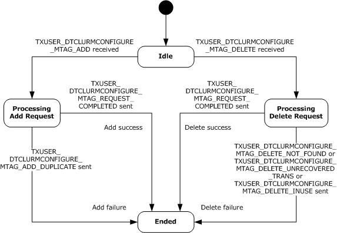

Figure 11: CONNTYPE_TXUSER_DTCLUCONFIGURE acceptor states

<a id="Section_3.3.1.3"></a>
#### 3.3.1.3 CONNTYPE_TXUSER_DTCLURECOVERY Acceptor States

The Transaction Manager Communicating with an [**LU 6.2**](#gt_lu-type-62-lu-62) Implementation Facet MUST act as an acceptor for the [CONNTYPE_TXUSER_DTCLURECOVERY](#Section_2.2.3.2) connection type. In this role, the Transaction Manager Communicating with an LU 6.2 Implementation Facet MUST provide support for the following states:

- [Idle](#Section_3.2.1.1.1)
- [Processing Register Request](#Section_3.3.1.3.2)
- [Registered](#Section_3.2.1.2.3)
- [Ended](#Section_3.2.1.1.4)
<a id="Section_3.3.1.3.1"></a>
##### 3.3.1.3.1 Idle

This is the initial state. The following event is processed in this state:

- [Receiving a TXUSER_DTCLURMRECOVERY_MTAG_ATTACH message](#Section_3.3.5.2.1)
<a id="Section_3.3.1.3.2"></a>
##### 3.3.1.3.2 Processing Register Request

This is a transient state that is assumed during the synchronous processing of a register request. No events are processed in this state.

<a id="Section_3.3.1.3.3"></a>
##### 3.3.1.3.3 Registered

The following event is processed in this state:

- [Connection Disconnected (section 3.3.5.2.2)](#Section_3.3.5.2.2)
<a id="Section_3.3.1.3.4"></a>
##### 3.3.1.3.4 Ended

This is the final state.

<a id="Section_3.3.1.3.5"></a>
##### 3.3.1.3.5 State Diagram

The following figure shows the relationship between the [CONNTYPE_TXUSER_DTCLURECOVERY](#Section_2.2.3.2) acceptor states.

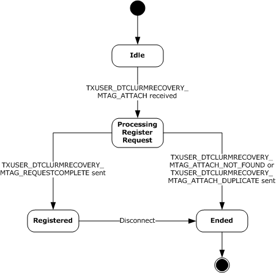

Figure 12: CONNTYPE_TXUSER_DTCLURECOVERY acceptor states

<a id="Section_3.3.1.4"></a>
#### 3.3.1.4 CONNTYPE_TXUSER_DTCLURMENLISTMENT Acceptor States

The Transaction Manager Communicating with an [**LU 6.2**](#gt_lu-type-62-lu-62) Implementation Facet MUST act as an acceptor for the [CONNTYPE_TXUSER_DTCLURMENLISTMENT](#Section_2.2.3.3) connection type. In this role, the Transaction Manager Communicating with an LU 6.2 Implementation Facet MUST provide support for the following states:

- [Idle](#Section_3.2.1.1.1)
- [Processing Enlistment Request](#Section_3.3.1.4.2)
- [Active](#Section_3.2.1.3.3)
- [Awaiting Prepare Response](#Section_3.3.1.4.4)
- [Processing Backout Request](#Section_3.3.1.4.5)
- [Prepared](#Section_3.3.1.4.6)
- [Awaiting Commit Response](#Section_3.3.1.4.7)
- [Awaiting Abort Response](#Section_3.3.1.4.8)
- [Ended](#Section_3.2.1.1.4)
<a id="Section_3.3.1.4.1"></a>
##### 3.3.1.4.1 Idle

This is the initial state. The following events are processed in this state:

- [Receiving a TXUSER_DTCLURMENLISTMENT_MTAG_CREATE message](#Section_3.3.5.3.1)
- [Receiving a TXUSER_DTCLURMENLISTMENT_MTAG_TO_DTC_CONVERSATIONLOST message](#Section_3.3.5.3.6)
<a id="Section_3.3.1.4.2"></a>
##### 3.3.1.4.2 Processing Enlistment Request

The following events are processed in this state:

- [Create Subordinate Enlistment Success](#Section_3.3.7.1)
- [Create Subordinate Enlistment Failure](#Section_3.3.7.2)
- [Receiving a TXUSER_DTCLURMENLISTMENT_MTAG_TO_DTC_CONVERSATIONLOST message](#Section_3.3.5.3.6)
<a id="Section_3.3.1.4.3"></a>
##### 3.3.1.4.3 Active

The following events are processed in this state:

- [Begin Phase One](#Section_3.3.7.3)
- [Begin Rollback](#Section_3.3.7.4)
- [Receiving a TXUSER_DTCLURMENLISTMENT_MTAG_TO_DTC_BACKOUT message](#Section_3.3.5.3.3)
- [Receiving a TXUSER_DTCLURMENLISTMENT_MTAG_TO_DTC_CONVERSATIONLOST message](#Section_3.3.5.3.6)
<a id="Section_3.3.1.4.4"></a>
##### 3.3.1.4.4 Awaiting Prepare Response

The following events are processed in this state:

- [Receiving a TXUSER_DTCLURMENLISTMENT_MTAG_TO_DTC_REQUESTCOMMIT message](#Section_3.3.5.3.2)
- [Receiving a TXUSER_DTCLURMENLISTMENT_MTAG_TO_DTC_BACKOUT message](#Section_3.3.5.3.3)
- [Receiving a TXUSER_DTCLURMENLISTMENT_MTAG_TO_DTC_FORGET message](#Section_3.3.5.3.4)
- [Receiving a TXUSER_DTCLURMENLISTMENT_MTAG_TO_DTC_CONVERSATIONLOST message](#Section_3.3.5.3.6)
<a id="Section_3.3.1.4.5"></a>
##### 3.3.1.4.5 Processing Backout Request

The following events are processed in this state:

- [Begin Rollback](#Section_3.3.7.4)
- [Receiving a TXUSER_DTCLURMENLISTMENT_MTAG_TO_DTC_CONVERSATIONLOST message](#Section_3.3.5.3.6)
<a id="Section_3.3.1.4.6"></a>
##### 3.3.1.4.6 Prepared

The following events are processed in this state:

- [Begin Commit](#Section_3.3.7.5)
- [Begin Rollback](#Section_3.3.7.4)
- [Receiving a TXUSER_DTCLURMENLISTMENT_MTAG_TO_DTC_CONVERSATIONLOST message](#Section_3.3.5.3.6)
<a id="Section_3.3.1.4.7"></a>
##### 3.3.1.4.7 Awaiting Commit Response

The following events are processed in this state:

- [Receiving a TXUSER_DTCLURMENLISTMENT_MTAG_TO_DTC_FORGET message](#Section_3.3.5.3.4)
- [Receiving a TXUSER_DTCLURMENLISTMENT_MTAG_TO_DTC_CONVERSATIONLOST message](#Section_3.3.5.3.6)
<a id="Section_3.3.1.4.8"></a>
##### 3.3.1.4.8 Awaiting Abort Response

The following events are processed in this state:

- [Receiving a TXUSER_DTCLURMENLISTMENT_MTAG_TO_DTC_BACKEDOUT message](#Section_3.3.5.3.5)
- [Receiving a TXUSER_DTCLURMENLISTMENT_MTAG_TO_DTC_CONVERSATIONLOST message](#Section_3.3.5.3.6)
<a id="Section_3.3.1.4.9"></a>
##### 3.3.1.4.9 Ended

This is the final state.

<a id="Section_3.3.1.4.10"></a>
##### 3.3.1.4.10 State Diagram

The following figure shows the relationship between the [CONNTYPE_TXUSER_DTCLURMENLISTMENT](#Section_2.2.3.3) acceptor states.

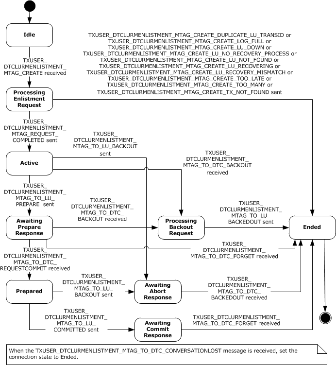

Figure 13: CONNTYPE_TXUSER_DTCLURMENLISTMENT acceptor states

<a id="Section_3.3.1.5"></a>
#### 3.3.1.5 CONNTYPE_TXUSER_DTCLURECOVERYINITIATEDBYDTC Acceptor States

The Transaction Manager Communicating with an [**LU 6.2**](#gt_lu-type-62-lu-62) Implementation Facet MUST act as an acceptor for the [CONNTYPE_TXUSER_DTCLURECOVERYINITIATEDBYDTC](#Section_2.2.3.4) connection type. In this role, the Transaction Manager Communicating with an LU 6.2 Implementation Facet MUST provide support for the following states:

- [Idle](#Section_3.2.1.1.1)
- [Processing Work Query](#Section_3.3.1.5.2)
- [Awaiting Response To Cold XLN](#Section_3.3.1.5.3)
- [Processing Response To Cold XLN](#Section_3.3.1.5.4)
- [Awaiting Response To Warm XLN](#Section_3.3.1.5.5)
- [Processing Response To Warm XLN](#Section_3.3.1.5.6)
- [Processing Compare State Query During Warm XLN](#Section_3.3.1.5.7)
- [Awaiting LU Status Response](#Section_3.3.1.5.8)
- [Processing LU Status Response](#Section_3.3.1.5.9)
- [Awaiting Compare States Query](#Section_3.3.1.5.10)
- [Processing Compare States Query](#Section_3.3.1.5.11)
- [Awaiting Compare States Response](#Section_3.3.1.5.12)
- [Processing Compare States Response](#Section_3.2.1.5.8)
- [Is Obsolete Awaiting Response To Cold XLN](#Section_3.3.1.5.15)
- [Is Obsolete Awaiting Response To Warm XLN](#Section_3.3.1.5.16)
- [Is Obsolete Awaiting LU Status Response](#Section_3.3.1.5.17)
- [Is Obsolete Processing Response](#Section_3.3.1.5.18)
- [Is Obsolete Processing Compare State Query During Warm XLN](#Section_3.3.1.5.19)
- [Ended](#Section_3.2.1.1.4)
<a id="Section_3.3.1.5.1"></a>
##### 3.3.1.5.1 Idle

This is the initial state. The following events are processed in this state:

- [Receiving a TXUSER_DTCLURECOVERYINITIATEDBYDTC_MTAG_GETWORK message](#Section_3.3.5.4.1)
- [Connection Disconnected (section 3.3.5.4.10)](#Section_3.3.5.4.10)
<a id="Section_3.3.1.5.2"></a>
##### 3.3.1.5.2 Processing Work Query

The following events are processed in this state:

- [Send Cold XLN](#Section_3.3.7.7)
- [Send Warm XLN](#Section_3.3.7.8)
- [Send Check LU Status](#Section_3.3.7.9)
- [Recovery Work Ready](#Section_3.3.7.11)
- [Connection Disconnected (section 3.3.5.4.10)](#Section_3.3.5.4.10)
<a id="Section_3.3.1.5.3"></a>
##### 3.3.1.5.3 Awaiting Response To Cold XLN

The following events are processed in this state:

- [Local LU Initiated Recovery Obsolete XLN Exchange](#Section_3.3.7.6)
- [Receiving a TXUSER_DTCLURECOVERYINITIATEDBYDTC_MTAG_NEW_RECOVERY_SEQ_NUM message](#Section_3.3.5.4.2)
- [Receiving a TXUSER_DTCLURECOVERYINITIATEDBYDTC_MTAG_ERROR_FROM_OUR_XLN message](#Section_3.3.5.4.4)
- [Receiving a TXUSER_DTCLURECOVERYINITIATEDBYDTC_MTAG_THEIR_XLN_RESPONSE message](#Section_3.3.5.4.5)
- [Connection Disconnected (section 3.3.5.4.10)](#Section_3.3.5.4.10)
<a id="Section_3.3.1.5.4"></a>
##### 3.3.1.5.4 Processing Response To Cold XLN

This is a transient state that is assumed during the synchronous processing of a response to a [**Cold XLN**](#gt_cold-xln) request. No events are processed in this state.

<a id="Section_3.3.1.5.5"></a>
##### 3.3.1.5.5 Awaiting Response To Warm XLN

The following events are processed in this state:

- [Local LU Initiated Recovery Obsolete XLN Exchange](#Section_3.3.7.6)
- [Receiving a TXUSER_DTCLURECOVERYINITIATEDBYDTC_MTAG_NEW_RECOVERY_SEQ_NUM message](#Section_3.3.5.4.2)
- [Receiving a TXUSER_DTCLURECOVERYINITIATEDBYDTC_MTAG_CONFIRMATION_FROM_OUR_XLN message](#Section_3.3.5.4.3)
- [Receiving a TXUSER_DTCLURECOVERYINITIATEDBYDTC_MTAG_ERROR_FROM_OUR_XLN message](#Section_3.3.5.4.4)
- [Receiving a TXUSER_DTCLURECOVERYINITIATEDBYDTC_MTAG_THEIR_XLN_RESPONSE message](#Section_3.3.5.4.5)
- [Receiving a TXUSER_DTCLURECOVERYINITIATEDBYDTC_MTAG_CHECK_FOR_COMPARESTATES message](#Section_3.3.5.4.6)
- [Connection Disconnected (section 3.3.5.4.10)](#Section_3.3.5.4.10)
<a id="Section_3.3.1.5.6"></a>
##### 3.3.1.5.6 Processing Response to Warm XLN

This is a transient state that is assumed during the synchronous processing of a response to a [**Warm XLN**](#gt_warm-xln) request. No events are processed in this state.

<a id="Section_3.3.1.5.7"></a>
##### 3.3.1.5.7 Processing Compare State Query During Warm XLN

This is a transient state that is assumed during the synchronous processing of a [**Compare States**](#gt_compare-states) query during a [**Warm XLN**](#gt_warm-xln) request. No events are processed in this state.

<a id="Section_3.3.1.5.8"></a>
##### 3.3.1.5.8 Awaiting LU Status Response

The following events are processed in this state:

- [Local LU Initiated Recovery Obsolete XLN Exchange](#Section_3.3.7.6)
- [Receiving a TXUSER_DTCLURECOVERYINITIATEDBYDTC_MTAG_LUSTATUS message](#Section_3.3.5.4.9)
- [Connection Disconnected (section 3.3.5.4.10)](#Section_3.3.5.4.10)
<a id="Section_3.3.1.5.9"></a>
##### 3.3.1.5.9 Processing LU Status Response

This is a transient state that is assumed during the synchronous processing of a response to an [**LU**](#gt_logical-unit-lu) status request. No events are processed in this state.

<a id="Section_3.3.1.5.10"></a>
##### 3.3.1.5.10 Awaiting Compare States Query

The following events are processed in this state:

- [Receiving a TXUSER_DTCLURECOVERYINITIATEDBYDTC_MTAG_CHECK_FOR_COMPARESTATES message](#Section_3.3.5.4.6)
- [Connection Disconnected (section 3.3.5.4.10)](#Section_3.3.5.4.10)
<a id="Section_3.3.1.5.11"></a>
##### 3.3.1.5.11 Processing Compare States Query

This is a transient state that is assumed during the synchronous processing of a query for a [**Compare States**](#gt_compare-states) request. No events are processed in this state.

<a id="Section_3.3.1.5.12"></a>
##### 3.3.1.5.12 Awaiting Compare States Response

The following events are processed in this state:

- [Receiving a TXUSER_DTCLURECOVERYINITIATEDBYDTC_MTAG_THEIR_COMPARESTATES message](#Section_3.3.5.4.7)
- [Receiving a TXUSER_DTCLURECOVERYINITIATEDBYDTC_MTAG_ERROR_FROM_OUR_COMPARESTATES message](#Section_3.3.5.4.8)
<a id="Section_3.3.1.5.13"></a>
##### 3.3.1.5.13 Processing Compare States Response

This is a transient state that is assumed during the synchronous processing of a response for a [**Compare States**](#gt_compare-states) request. No events are processed in this state.

<a id="Section_3.3.1.5.14"></a>
##### 3.3.1.5.14 Processing Compare States Error

This is a transient state that is assumed during the synchronous processing of a response for a [**Compare States**](#gt_compare-states) error request. No events are processed in this state.

<a id="Section_3.3.1.5.15"></a>
##### 3.3.1.5.15 Is Obsolete Awaiting Response To Cold XLN

The following events are processed in this state:

- [Receiving a TXUSER_DTCLURECOVERYINITIATEDBYDTC_MTAG_NEW_RECOVERY_SEQ_NUM message](#Section_3.3.5.4.2)
- [Receiving a TXUSER_DTCLURECOVERYINITIATEDBYDTC_MTAG_ERROR_FROM_OUR_XLN message](#Section_3.3.5.4.4)
- [Receiving a TXUSER_DTCLURECOVERYINITIATEDBYDTC_MTAG_THEIR_XLN_RESPONSE message](#Section_3.3.5.4.5)
- [Connection Disconnected (section 3.3.5.4.10)](#Section_3.3.5.4.10)
<a id="Section_3.3.1.5.16"></a>
##### 3.3.1.5.16 Is Obsolete Awaiting Response To Warm XLN

The following events are processed in this state:

- [Receiving a TXUSER_DTCLURECOVERYINITIATEDBYDTC_MTAG_NEW_RECOVERY_SEQ_NUM message](#Section_3.3.5.4.2)
- [Receiving a TXUSER_DTCLURECOVERYINITIATEDBYDTC_MTAG_CONFIRMATION_FROM_OUR_XLN message](#Section_3.3.5.4.3)
- [Receiving a TXUSER_DTCLURECOVERYINITIATEDBYDTC_MTAG_ERROR_FROM_OUR_XLN message](#Section_3.3.5.4.4)
- [Receiving a TXUSER_DTCLURECOVERYINITIATEDBYDTC_MTAG_THEIR_XLN_RESPONSE message](#Section_3.3.5.4.5)
- [Receiving a TXUSER_DTCLURECOVERYINITIATEDBYDTC_MTAG_CHECK_FOR_COMPARESTATES message](#Section_3.3.5.4.6)
- [Connection Disconnected (section 3.3.5.4.10)](#Section_3.3.5.4.10)
<a id="Section_3.3.1.5.17"></a>
##### 3.3.1.5.17 Is Obsolete Awaiting LU Status Response

The following events are processed in this state:

- [Receiving a TXUSER_DTCLURECOVERYINITIATEDBYDTC_MTAG_LUSTATUS message](#Section_3.3.5.4.9)
- [Connection Disconnected (section 3.3.5.4.10)](#Section_3.3.5.4.10)
<a id="Section_3.3.1.5.18"></a>
##### 3.3.1.5.18 Is Obsolete Processing Response

This is a transient state that is assumed during the synchronous processing of a request. No events are processed in this state.

<a id="Section_3.3.1.5.19"></a>
##### 3.3.1.5.19 Is Obsolete Processing Compare State Query During Warm XLN

This is a transient state that is assumed during the synchronous processing of a request. No events are processed in this state.

<a id="Section_3.3.1.5.20"></a>
##### 3.3.1.5.20 Ended

This is the final state.

<a id="Section_3.3.1.5.21"></a>
##### 3.3.1.5.21 State Diagram

The following figure shows the relationship between the [CONNTYPE_TXUSER_DTCLURECOVERYINITIATEDBYDTC](#Section_2.2.3.4) acceptor states.

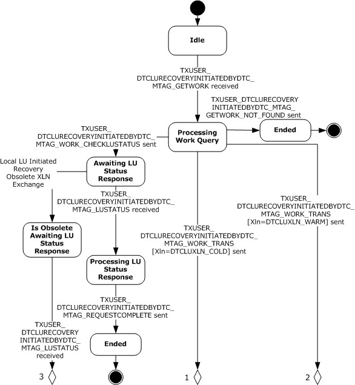

Figure 14: CONNTYPE_TXUSER_DTCLURECOVERYINITIATEDBYDTC, Part 1

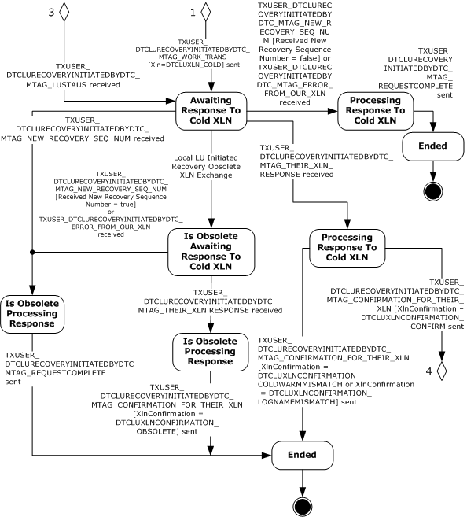

Figure 15: CONNTYPE_TXUSER_DTCLURECOVERYINITIATEDBYDTC, Part 2

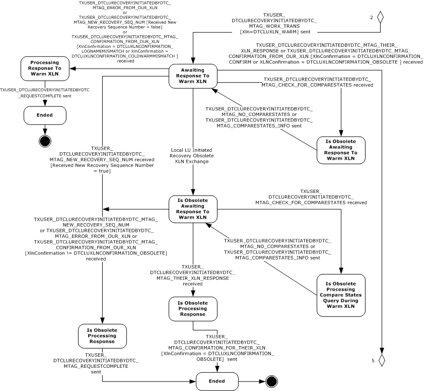

Figure 16: CONNTYPE_TXUSER_DTCLURECOVERYINITIATEDBYDTC, Part 3

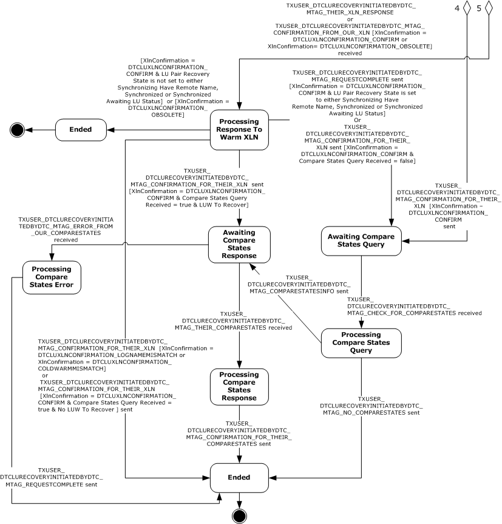

Figure 17: CONNTYPE_TXUSER_DTCLURECOVERYINITIATEDBYDTC, Part 4

<a id="Section_3.3.1.6"></a>
#### 3.3.1.6 CONNTYPE_TXUSER_DTCLURECOVERYINITIATEDBYLU Acceptor States

The Transaction Manager Communicating with an [**LU 6.2**](#gt_lu-type-62-lu-62) Implementation Facet MUST act as an acceptor for the [CONNTYPE_TXUSER_DTCLURECOVERYINITIATEDBYLU](#Section_2.2.3.5) connection type. In this role, the Transaction Manager Communicating with an LU 6.2 Implementation Facet MUST provide support for the following states:

- [Idle](#Section_3.2.1.1.1)
- [Processing XLN Request](#Section_3.3.1.6.2)
- [Awaiting XLN Confirmation](#Section_3.3.1.6.3)
- [Processing XLN Confirmation](#Section_3.2.1.5.3)
- [Awaiting Compare States Request](#Section_3.3.1.6.5)
- [Processing Compare States Request](#Section_3.3.1.6.6)
- [Awaiting Compare States Confirmation](#Section_3.3.1.6.7)
- [Processing Compare States Confirmation](#Section_3.3.1.6.8)
- [Is Obsolete Awaiting XLN Confirmation](#Section_3.3.1.6.9)
- [Ended](#Section_3.2.1.1.4)
<a id="Section_3.3.1.6.1"></a>
##### 3.3.1.6.1 Idle

This is the initial state. The following event is processed in this state:

- [Receiving a TXUSER_DTCLURECOVERYINITIATEDBYLU_MTAG_THEIR_XLN message (section 3.3.5.5.1)](#Section_3.3.5.5.1)
<a id="Section_3.3.1.6.2"></a>
##### 3.3.1.6.2 Processing XLN Request

This is a transient state that is assumed during the synchronous processing of a [**XLN**](#gt_exchange-log-name-xln) request. No events are processed in this state.

<a id="Section_3.3.1.6.3"></a>
##### 3.3.1.6.3 Awaiting XLN Confirmation

The following events are processed in this state:

- [Receiving a TXUSER_DTCLURECOVERYINITIATEDBYLU_MTAG_CONFIRMATION_OF_OUR_XLN message (section 3.3.5.5.2)](#Section_3.3.5.5.2)
- [Remote LU Initiated Recovery Obsolete XLN Exchange](#Section_3.3.7.10)
- [Connection Disconnected (section 3.3.5.5.6)](#Section_3.3.5.5.6)
<a id="Section_3.3.1.6.4"></a>
##### 3.3.1.6.4 Processing XLN Confirmation

This is a transient state that is assumed during the synchronous processing of an XLN confirmation request. No events are processed in this state.

<a id="Section_3.3.1.6.5"></a>
##### 3.3.1.6.5 Awaiting Compare States Request

The following event is processed in this state:

- [Receiving a TXUSER_DTCLURECOVERYINITIATEDBYLU_MTAG_THEIR_COMPARESTATES message (section 3.3.5.5.3)](#Section_3.3.5.5.3)
- [Connection Disconnected (section 3.3.5.5.6)](#Section_3.3.5.5.6)
<a id="Section_3.3.1.6.6"></a>
##### 3.3.1.6.6 Processing Compare States Request

This is a transient state that is assumed during the synchronous processing of a [**Compare States**](#gt_compare-states) request. No events are processed in this state.

<a id="Section_3.3.1.6.7"></a>
##### 3.3.1.6.7 Awaiting Compare States Confirmation

The following events are processed in this state:

- [Receiving a TXUSER_DTCLURECOVERYINITIATEDBYLU_MTAG_CONFIRMATION_OF_OUR_COMPARESTATES message (section 3.3.5.5.4)](#Section_3.3.5.5.4)
- [Receiving a TXUSER_DTCLURECOVERYINITIATEDBYLU_MTAG_ERROR_OF_OUR_COMPARESTATES message (section 3.3.5.5.5)](#Section_3.3.5.5.5)
- [Connection Disconnected (section 3.3.5.5.6)](#Section_3.3.5.5.6)
<a id="Section_3.3.1.6.8"></a>
##### 3.3.1.6.8 Processing Compare States Confirmation

This is a transient state that is assumed during the synchronous processing of a [**Compare States**](#gt_compare-states) confirmation request. No events are processed in this state.

<a id="Section_3.3.1.6.9"></a>
##### 3.3.1.6.9 Is Obsolete Awaiting XLN Confirmation

The following events are processed in this state:

- [Receiving a TXUSER_DTCLURECOVERYINITIATEDBYLU_MTAG_CONFIRMATION_OF_OUR_XLN message (section 3.3.5.5.2)](#Section_3.3.5.5.2)
- [Connection Disconnected (section 3.3.5.5.6)](#Section_3.3.5.5.6)
<a id="Section_3.3.1.6.10"></a>
##### 3.3.1.6.10 Ended

This is the final state.

<a id="Section_3.3.1.6.11"></a>
##### 3.3.1.6.11 State Diagram

The following figure shows the relationship between the [CONNTYPE_TXUSER_DTCLURECOVERYINITIATEDBYLU](#Section_2.2.3.5) acceptor states.

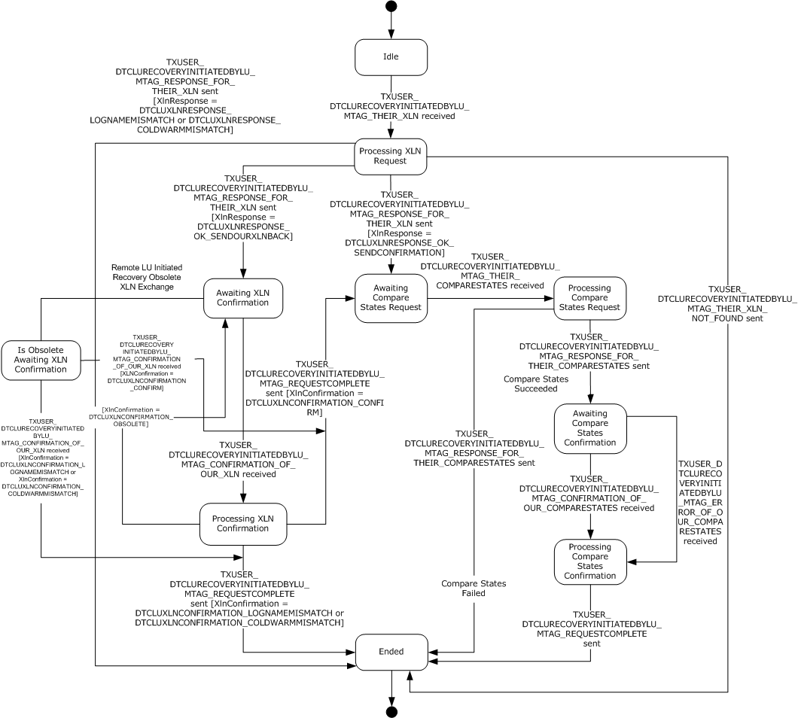

Figure 18: CONNTYPE_TXUSER_DTCLURECOVERYINITIATEDBYLU acceptor states

<a id="Section_3.3.2"></a>
### 3.3.2 Timers

The Transaction Manager Communicating with an [**LU 6.2**](#gt_lu-type-62-lu-62) Implementation Facet MUST provide the timer that is specified in the next section.

<a id="Section_3.3.2.1"></a>
#### 3.3.2.1 LU Status Timer

The **LU Status timer** is a nonrecurring timer. The timer MUST be started whenever an **LU Pair** object is synchronized and no recovery is in progress, as specified by the processing of the [Synchronization Successful](#Section_3.3.7.17) and [Received LU Status](#Section_3.3.7.19) events.

The value of the timer is set to an implementation-specific value.<5>

When the timer is initialized, the Transaction Manager Communicating with an [**LU 6.2**](#gt_lu-type-62-lu-62) Implementation Facet MUST provide an **LU Pair** object to associate with the timer. When the timer expires, the [LU Status Timer Tick](#Section_3.3.6.1) event MUST be signaled with the same **LU Pair** object as the only argument. The Transaction Manager Communicating with an LU 6.2 Implementation Facet MUST provide a distinct LU Status timer instance for each **LU Pair** object.

<a id="Section_3.3.3"></a>
### 3.3.3 Initialization

The Transaction Manager Communicating with an [**LU 6.2**](#gt_lu-type-62-lu-62) Implementation Facet MUST examine the following security flags on the Core Transaction Manager Facet (as specified in [MS-DTCO](../MS-DTCO/MS-DTCO.md) section 3.2) and perform the following actions:

- If either the **Allow Network Access** flag or the **Allow Remote Clients** flag is set to FALSE, it MUST refuse to accept incoming connections from remote machines as specified in [MS-CMP](../MS-CMP/MS-CMP.md) section 3.1.5.5, with the rejection reason set to 0x80070005 for the following connection types:
- [CONNTYPE_TXUSER_DTCLUCONFIGURE](#Section_2.2.3.1)
- [CONNTYPE_TXUSER_DTCLURECOVERY](#Section_2.2.3.2)
- [CONNTYPE_TXUSER_DTCLURMENLISTMENT](#Section_2.2.3.3)
- [CONNTYPE_TXUSER_DTCLURECOVERYINITIATEDBYDTC](#Section_2.2.3.4)
- [CONNTYPE_TXUSER_DTCLURECOVERYINITIATEDBYLU](#Section_2.2.3.5)
- If both the **Allow Network Access** flag and **Allow Remote Clients** flag are set to TRUE and **Allow LUTransactions** flag as defined in [MS-DTCO] section 3.2.1 is set to FALSE, it MUST refuse to accept the following connection types, as specified in [MS-CMP] section 3.1.5.5, with the rejection reason set to 0x80070005:
- CONNTYPE_TXUSER_DTCLUCONFIGURE
- CONNTYPE_TXUSER_DTCLURECOVERY
- CONNTYPE_TXUSER_DTCLURMENLISTMENT
- CONNTYPE_TXUSER_DTCLURECOVERYINITIATEDBYDTC
- CONNTYPE_TXUSER_DTCLURECOVERYINITIATEDBYLU
<a id="Section_3.3.4"></a>
### 3.3.4 Higher-Layer Triggered Events

The operation of the Core Transaction Manager Facet MUST be prepared to process the higher-layer events in this section.

<a id="Section_3.3.4.1"></a>
#### 3.3.4.1 Recover

This event is triggered by the higher-layer software hosting infrastructure when it reinitializes the system after a software failure or restart.

When the Transaction Manager Communicating with an [**LU 6.2**](#gt_lu-type-62-lu-62) Implementation Facet is asked to Recover after a software failure or restart, it MUST perform the following actions:

- For each **LU Pair** object in the [**log**](#gt_log) of the Transaction Manager Communicating with an LU 6.2 Implementation Facet:
- Copy the **LU Pair** object to the LU Pair Table of the Transaction Manager Communicating with an LU 6.2 Implementation Facet.
- For each **LU Pair** object in the LU Pair Table of the Transaction Manager Communicating with an LU 6.2 Implementation Facet:
- For each [**LUW**](#gt_logical-unit-of-work-luw) object in the LUW List of the currently referenced **LU Pair** object:
- Attempt to find a [**transaction**](#gt_transaction) in the transaction table of the transaction manager (as specified in [MS-DTCO](../MS-DTCO/MS-DTCO.md) section 3.1.1) that meets the following condition:
- The value of the **Transaction Object.Identifier** field of the **Transaction** object is set to the value of the **Transaction Identifier** field of the currently referenced **LUW** object.
- If a transaction that meets the preceding condition is found:
- If the [**local LU**](#gt_local-lu) LUW State of the currently referenced **LUW** object is set to Forget:
- Continue processing for the next **LUW** object in the **LUW** List.
- Otherwise:
- Signal the Request Transaction Outcome event (as specified in [MS-DTCO] section 3.2.7.33) on the Core Transaction Manager Facet with the following argument:
- The [**Enlistment**](#gt_enlistment) object of the currently referenced **LUW** object.
- Otherwise:
- Set the local LU LUW State of the currently referenced **LUW** object to Reset.
- Set the LUW [**Recovery**](#gt_recovery) State of the currently referenced **LUW** object to Need Recovery.
- Signal the [Recovery Work Ready](#Section_3.3.7.11) event with the following arguments:
- The currently referenced **LU Pair** object.
- The Recovery Work Ready Reason set to LUW Recovery.
- All incoming connections MUST be rejected until the Core Transaction Manager Facet signals the [Begin Commit](#Section_3.3.7.5) event or [Begin Rollback](#Section_3.3.7.4) event for each transaction. Connection rejection is as specified in [MS-CMP](../MS-CMP/MS-CMP.md) section 3.1.5.5, with the rejection reason value set to 0x80070005.
<a id="Section_3.3.5"></a>
### 3.3.5 Message Processing Events and Sequencing Rules

<a id="Section_3.3.5.1"></a>
#### 3.3.5.1 CONNTYPE_TXUSER_DTCLUCONFIGURE as Acceptor

For all messages received in this [**Connection Type**](#gt_connection-type), the Transaction Manager Communicating with an [**LU 6.2**](#gt_lu-type-62-lu-62) Implementation Facet MUST process the message, as specified in section [3.1](#Section_3.1). The Transaction Manager Communicating with an LU 6.2 Implementation Facet MUST also follow the processing rules specified in the following sections.

<a id="Section_3.3.5.1.1"></a>
##### 3.3.5.1.1 Receiving a TXUSER_DTCLURMCONFIGURE_MTAG_ADD Message

When the Transaction Manager Communicating with an [**LU 6.2**](#gt_lu-type-62-lu-62) Implementation Facet receives a [TXUSER_DTCLURMCONFIGURE_MTAG_ADD (section 2.2.3.1.1)](#Section_2.2.3.1.1) message, it MUST perform the following actions:

- If the connection state is [Idle](#Section_3.2.1.1.1):
- Set the connection state to [Processing Add Request](#Section_3.3.1.2.2).
- Attempt to find the **LU Pair** object keyed by the first **cbLength** bytes of the **rgbBlob** field of the [DTCLU_VARLEN_BYTEARRAY](#Section_2.2.1.2) structure (contained in the **LuNamePair** field) of the message in the LU Pair Table.
- If the **LU Pair** object is found:
- Send the [TXUSER_DTCLURMCONFIGURE_MTAG_ADD_DUPLICATE (section 2.2.3.1.4)](#Section_2.2.3.1.4) message using the connection.
- Otherwise:
- Create an **LU Pair** object that is initialized as follows:
- Set the **LU Name Pair** field to the first **cbLength** bytes of the **rgbBlob** field of the DTCLU_VARLEN_BYTEARRAY structure (contained in the **LuNamePair** field) of the message.
- Set the **Local Log Name** field to an implementation-specific value.
- Set the **Resource Manager Identifier** field to a new [**GUID**](#gt_globally-unique-identifier-guid) value.
- Set the **Recovery Sequence Number** field to 1.
- Set the **Is Warm** flag to FALSE.
- Set the **LU Pair Recovery State** field to Recovery Process Not Attached.
- Set the Is **LUW Triggered Recovery Pending** flag to FALSE.
- Attempt to add the new **LU Pair** object to the log and the LU Pair Table keyed by the first **cbLength** bytes of the **rgbBlob** field of the DTCLU_VARLEN_BYTEARRAY structure (contained in the **LuNamePair** field) of the message.
- If LU Pair is added successfully:
- Send the [TXUSER_DTCLURMCONFIGURE_MTAG_REQUEST_COMPLETED (section 2.2.3.1.3)](#Section_2.2.3.1.3) message using the connection.
- Otherwise:
- Send the [TXUSER_DTCLURMCONFIGURE_MTAG_ADD_LOG_FULL](#Section_2.2.3.1.8) message using the connection.
- Set the connection state to [Ended](#Section_3.2.1.1.4).
- Otherwise, if the connection state is Ended:
- Ignore the message.
- Otherwise, the message MUST be processed as an invalid message, as specified in [MS-DTCO](../MS-DTCO/MS-DTCO.md), section 3.1.6.
<a id="Section_3.3.5.1.2"></a>
##### 3.3.5.1.2 Receiving a TXUSER_DTCLURMCONFIGURE_MTAG_DELETE Message

The Transaction Manager Communicating with an [**LU 6.2**](#gt_lu-type-62-lu-62) Implementation Facet MUST perform the following actions when it receives a [TXUSER_DTCLURMCONFIGURE_MTAG_DELETE](#Section_2.2.3.1.2) message:

- If the connection state is [Idle](#Section_3.2.1.1.1):
- Set the connection state to [Processing Delete Request](#Section_3.3.1.2.3).
- Attempt to find the **LU Pair** object keyed by the first **cbLength** bytes of the **rgbBlob** field of the [DTCLU_VARLEN_BYTEARRAY](#Section_2.2.1.2) structure (contained in the **LuNamePair** field) of the message in the LU Pair Table.
- If the **LU Pair** object is not found:
- Send the [TXUSER_DTCLURMCONFIGURE_MTAG_DELETE_NOT_FOUND](#Section_2.2.3.1.5) message using the connection.
- Otherwise:
- If the **LU Pair Recovery State** field of the **LU Pair** object is not set to Recovery Process Not Attached:
- Send the [TXUSER_DTCLURMCONFIGURE_MTAG_DELETE_INUSE](#Section_2.2.3.1.7) message using the connection.
- Otherwise:
- If the LUW List of the found **LU Pair** object is not empty:
- Send the [TXUSER_DTCLURMCONFIGURE_MTAG_DELETE_UNRECOVERED_TRANS](#Section_2.2.3.1.6) message using the connection.
- Otherwise:
- Remove the found **LU Pair** object from the LU Pair Table and the log.
- Send the [TXUSER_DTCLURMCONFIGURE_MTAG_REQUEST_COMPLETED](#Section_2.2.3.1.3) message using the connection.
- Set the connection state to [Ended](#Section_3.2.1.1.4).
- Otherwise, if the connection state is Ended:
- Ignore the message.
- Otherwise, the message MUST be processed as an invalid message, as specified in [MS-DTCO](../MS-DTCO/MS-DTCO.md), section 3.1.6.
<a id="Section_3.3.5.2"></a>
#### 3.3.5.2 CONNTYPE_TXUSER_DTCLURECOVERY as Acceptor

For all messages received in this connection type, the Transaction Manager Communicating with an [**LU 6.2**](#gt_lu-type-62-lu-62) Implementation Facet MUST process the message, as specified in section [3.1](#Section_3.1). The Transaction Manager Communicating with an LU 6.2 Implementation Facet MUST also follow the processing rules specified in the following sections.

<a id="Section_3.3.5.2.1"></a>
##### 3.3.5.2.1 Receiving a TXUSER_DTCLURMRECOVERY_MTAG_ATTACH Message

A Transaction Manager Communicating with an [**LU 6.2**](#gt_lu-type-62-lu-62) Implementation Facet MUST perform the following actions to attempt to register the connection's MSDTC Connection Manager: OleTx Transports Protocol (as specified in [MS-CMPO](../MS-CMPO/MS-CMPO.md)) [**session**](#gt_session) for all recovery processing associated with the [**LU Name Pair**](#gt_lu-name-pair) when it receives a [TXUSER_DTCLURMRECOVERY_MTAG_ATTACH (section 2.2.3.2.1)](#Section_2.2.3.2.1) message:

- If the connection state is [Idle](#Section_3.2.1.1.1):
- Set the connection state to [Processing Register Request](#Section_3.3.1.3.2).
- Attempt to find the **LU Pair** object keyed by the first **cbLength** bytes of the **rgbBlob** field of the [DTCLU_VARLEN_BYTEARRAY](#Section_2.2.1.2) structure (contained in the **LuNamePair** field) of the message in the LU Pair Table.
- If the **LU Pair** object is not found:
- Send the [TXUSER_DTCLURMRECOVERY_MTAG_ATTACH_NOT_FOUND (section 2.2.3.2.4)](#Section_2.2.3.2.4) message using the connection.
- Set the connection state to [Ended (section 3.3.1.3.4)](#Section_3.3.1.3.4).
- Otherwise:
- If the **LU Pair Recovery State** field of the found **LU Pair** object is set to Recovery Process Not Attached:
- Set the **LU Pair Recovery State** field of the found **LU Pair** object to Not Synchronized.
- Send the [TXUSER_DTCLURMRECOVERY_MTAG_REQUEST_COMPLETED (section 2.2.3.2.2)](#Section_2.2.3.2.2) message using the connection.
- Set the connection state to [Registered](#Section_3.2.1.2.3).
- Otherwise:
- Send the [TXUSER_DTCLURMRECOVERY_MTAG_ATTACH_DUPLICATE (section 2.2.3.2.3)](#Section_2.2.3.2.3) message using the connection.
- Set the connection state to Ended.
- Otherwise, if the connection state is Ended:
- Ignore the message.
- Otherwise, the message MUST be processed as an invalid message, as specified in [MS-DTCO](../MS-DTCO/MS-DTCO.md), section 3.1.6.
<a id="Section_3.3.5.2.2"></a>
##### 3.3.5.2.2 Connection Disconnected

When a [CONNTYPE_TXUSER_DTCLURECOVERY](#Section_2.2.3.2) connection is disconnected, a Transaction Manager Communicating with an [**LU 6.2**](#gt_lu-type-62-lu-62) Implementation Facet MUST perform the following actions:

- If the connection state is Registered:
- Set the **LU Pair Recovery State** field of the **LU Pair** object referenced by this connection to Recovery Process Not Attached.
- Set the connection state to [Ended (section 3.3.1.3.4)](#Section_3.3.1.3.4).
- Otherwise, the event MUST be processed as specified in [MS-DTCO](../MS-DTCO/MS-DTCO.md) section 3.1.8.3
<a id="Section_3.3.5.3"></a>
#### 3.3.5.3 CONNTYPE_TXUSER_DTCLURMENLISTMENT as Acceptor

For all messages received in this [**connection type**](#gt_connection-type), the Transaction Manager Communicating with an [**LU 6.2**](#gt_lu-type-62-lu-62) Implementation Facet MUST process the message as specified in section [3.1](#Section_3.1). The Transaction Manager Communicating with an LU 6.2 Implementation Facet MUST also follow the processing rules specified in the following sections.

<a id="Section_3.3.5.3.1"></a>
##### 3.3.5.3.1 Receiving a TXUSER_DTCLURMENLISTMENT_MTAG_CREATE Message

When the Transaction Manager Communicating with an [**LU 6.2**](#gt_lu-type-62-lu-62) Implementation Facet receives a [TXUSER_DTCLURMENLISTMENT_MTAG_CREATE (section 2.2.3.3.1)](#Section_2.2.3.3.1) message, it MUST perform the following actions:

- If the connection state is Idle:
- Set the connection state to Processing Enlistment Request.
- Attempt to find the **LU Pair** object keyed by the value of the first **cbLength** bytes of the **rgbBlob** field of the [DTCLU_VARLEN_BYTEARRAY](#Section_2.2.1.2) structure (contained in the **LuNamePair** field) of the message in the LU Pair Table.
- If the **LU Pair** object is not found:
- Send a [TXUSER_DTCLURMENLISTMENT_MTAG_CREATE_LU_NOT_FOUND (section 2.2.3.3.17)](#Section_2.2.3.3.17) message using the connection.
- Set the connection state to [Ended (section 3.3.1.4.9)](#Section_3.3.1.4.9).
- Otherwise:
- Set the **LU Pair** field of the connection object to the found **LU Pair** object.
- If the **LU Pair Recovery State** field of the found **LU Pair** object is set to Recovery Process Not Attached:
- Send a [TXUSER_DTCLURMENLISTMENT_MTAG_CREATE_LU_NO_RECOVERY_PROCESS (section 2.2.3.3.20)](#Section_2.2.3.3.20) message using the connection.
- Set the connection state to Ended.
- Otherwise, if the **LU Pair Recovery State** field of the found **LU Pair** object is set to Not Synchronized:
- Send a [TXUSER_DTCLURMENLISTMENT_MTAG_CREATE_LU_DOWN (section 2.2.3.3.21)](#Section_2.2.3.3.21) message using the connection.
- Set the connection state to Ended.
- Otherwise, if the **LU Pair Recovery State** field of the found **LU Pair** object is set to either Synchronizing No Remote Name or Synchronizing Have Remote Name:
- Send a [TXUSER_DTCLURMENLISTMENT_MTAG_CREATE_LU_RECOVERING (section 2.2.3.3.22)](#Section_2.2.3.3.22) message using the connection.
- Set the connection state to Ended.
- Otherwise, if the **LU Pair Recovery State** field of the found **LU Pair** object is set to Inconsistent:
- Send a [TXUSER_DTCLURMENLISTMENT_MTAG_CREATE_LU_RECOVERY_MISMATCH (section 2.2.3.3.23)](#Section_2.2.3.3.23) message using the connection.
- Set the connection state to Ended.
- Otherwise:
- Attempt to find the **Transaction** object keyed by the value of the **guidTx** field of the message in the Transaction table of the Core Transaction Manager Facet.
- If the **Transaction** object is not found:
- Send a [TXUSER_DTCLURMENLISTMENT_MTAG_CREATE_TX_NOT_FOUND (section 2.2.3.3.13)](#Section_2.2.3.3.13) message using the connection.
- Set the connection state to Ended.
- Otherwise:
- Attempt to find an [**LUW**](#gt_logical-unit-of-work-luw) object with its **LUW Identifier** field set to the value of the first **cbLength** bytes of the **rgbBlob** field of the DTCLU_VARLEN_BYTEARRAY structure (contained in the **LuTransId** field) of the message in the LUW List of the found **LU Pair** object.
- If an **LUW** object is found:
- Send a [TXUSER_DTCLURMENLISTMENT_MTAG_CREATE_DUPLICATE_LU_TRANSID (section 2.2.3.3.19)](#Section_2.2.3.3.19) message using the connection.
- Set the connection state to Ended.
- Otherwise:
- Create a new [**Enlistment**](#gt_enlistment) object that is initialized as follows:
- Set the **Transaction Manager Facet** field to the Transaction Manager Communicating with an LU 6.2 Implementation Facet.
- Set the **Transaction** field to the found **Transaction** object.
- Set the **Resource Manager Identifier** field to the resource manager identifier field of the found **LU Pair** object.
- Set the **Connection** field to the connection object.
- Create a new **LUW** object that is initialized as follows:
- Set the **Transaction Identifier** field to the **guidTx** field of the message.
- Set the **LUW Identifier** field to the first **cbLength** bytes of the **rgbBlob** field of the DTCLU_VARLEN_BYTEARRAY structure (contained in the **LuTransId** field) of the message.
- Set the **Enlistment** field to the new **Enlistment** object.
- Set the **Recovery Sequence Number For LUW** field to the **Recovery Sequence Number** field of the found **LU Pair** object.
- Set the **Local LU LUW State** field to Active.
- Set the **LUW Recovery State** field to Recovery Not Needed.
- Set the **Is Conversation Lost** Flag to FALSE.
- Set the **LUW** field on the connection to refer to the new **LUW** object.
- Add the new **LUW** object to the **LUW** List of the found **LU Pair Object**.
- Signal the Create Subordinate Enlistment event (as specified in [MS-DTCO](../MS-DTCO/MS-DTCO.md) section 3.2.7.11) on the Core Transaction Manager Facet with the following argument:
- The new **Enlistment** object.
- Otherwise, if the connection state is Ended:
- Ignore the message.
- Otherwise, the message MUST be processed as an invalid message, as specified in [MS-DTCO], section 3.1.6.
<a id="Section_3.3.5.3.2"></a>
##### 3.3.5.3.2 Receiving a TXUSER_DTCLURMENLISTMENT_MTAG_TO_DTC_REQUESTCOMMIT Message

When the Transaction Manager Communicating with an [**LU 6.2**](#gt_lu-type-62-lu-62) Implementation Facet receives a [TXUSER_DTCLURMENLISTMENT_MTAG_TO_DTC_REQUESTCOMMIT (section 2.2.3.3.8)](#Section_2.2.3.3.8) message, it MUST perform the following actions:

- If the connection state is Awaiting Prepare Response:
- Signal the Enlistment Phase One Complete event (as specified in [MS-DTCO](../MS-DTCO/MS-DTCO.md) section 3.2.7.16) on the Core Transaction Manager Facet with the following arguments:
- The [**Enlistment**](#gt_enlistment) object of the [**LUW**](#gt_logical-unit-of-work-luw) object referenced by this connection
- The [**Phase One**](#gt_phase-one) outcome set to Prepared
- Set the connection state to Prepared.
- Otherwise, if the [**connection**](#gt_connection) state is [Ended](#Section_3.2.1.1.4):
- Ignore the message.
- Otherwise, the message MUST be processed as an invalid message, as specified in [MS-DTCO], section 3.1.6.
<a id="Section_3.3.5.3.3"></a>
##### 3.3.5.3.3 Receiving a TXUSER_DTCLURMENLISTMENT_MTAG_TO_DTC_BACKOUT Message

When the Transaction Manager Communicating with an [**LU 6.2**](#gt_lu-type-62-lu-62) Implementation Facet receives a [TXUSER_DTCLURMENLISTMENT_MTAG_TO_DTC_BACKOUT (section 2.2.3.3.5)](#Section_2.2.3.3.5) message, it MUST perform the following actions:

- If the connection state is Active:
- Set the [**Local LU**](#gt_local-lu) [**LUW**](#gt_logical-unit-of-work-luw) State field of the LUW object referenced by this connection to Reset.
- Signal the Enlistment Unilaterally Aborted event (as specified in [MS-DTCO](../MS-DTCO/MS-DTCO.md) section 3.2.7.19) on the Core Transaction Manager Facet with the following arguments:
- The [**Enlistment**](#gt_enlistment) object of the LUW object referenced by this connection
- Set the connection state to Processing Backout Request.
- Otherwise, if the connection state is Awaiting Prepare Response:
- Set the Local LU LUW State of the LUW object referenced by this connection to Forget.
- Signal the Enlistment Phase One Complete event (as specified in [MS-DTCO] section 3.2.7.16) on the Core Transaction Manager Facet with the following arguments:
- The Enlistment object of the LUW object referenced by this connection
- The [**Phase One**](#gt_phase-one) [**outcome**](#gt_outcome) set to Aborted.
- Set the connection state to Processing Backout Request.
- Otherwise, if the connection state is [Ended](#Section_3.2.1.1.4):
- Ignore the message.
- Otherwise, the message MUST be processed as an invalid message, as specified in [MS-DTCO], section 3.1.6.
<a id="Section_3.3.5.3.4"></a>
##### 3.3.5.3.4 Receiving a TXUSER_DTCLURMENLISTMENT_MTAG_TO_DTC_FORGET Message

When the Transaction Manager Communicating with an [**LU 6.2**](#gt_lu-type-62-lu-62) Implementation Facet receives a [TXUSER_DTCLURMENLISTMENT_MTAG_TO_DTC_FORGET](#Section_2.2.3.3.7) message, it MUST perform the following actions:

- If the connection state is Awaiting Prepare Response:
- Set the **Local LU LUW State** field of the [**LUW**](#gt_logical-unit-of-work-luw) object referenced by this connection to Forget.
- Signal the Enlistment Phase One Complete event (as specified in [MS-DTCO](../MS-DTCO/MS-DTCO.md) section 3.2.7.16) on the Core Transaction Manager Facet with the following arguments:
- The [**Enlistment**](#gt_enlistment) object of the LUW object referenced by this connection
- The [**Phase One**](#gt_phase-one) [**outcome**](#gt_outcome) set to Read Only
- Set the connection state to [Ended](#Section_3.2.1.1.4).
- Otherwise, if the connection state is Awaiting Commit Response:
- Set the [**Local LU**](#gt_local-lu) LUW State of the LUW object referenced by this connection to Forget.
- Signal the Enlistment Commit Complete event (as specified in [MS-DTCO] section 3.2.7.15) on the Core Transaction Manager Facet with the following argument:
- The Enlistment object of the LUW object referenced by this connection
- Set the connection state to Ended.
- Otherwise, if the connection state is Ended:
- Ignore the message.
- Otherwise, the message MUST be processed as an invalid message, as specified in [MS-DTCO], section 3.1.6.
<a id="Section_3.3.5.3.5"></a>
##### 3.3.5.3.5 Receiving a TXUSER_DTCLURMENLISTMENT_MTAG_TO_DTC_BACKEDOUT Message

When the Transaction Manager Communicating with an [**LU 6.2**](#gt_lu-type-62-lu-62) Implementation Facet receives a [TXUSER_DTCLURMENLISTMENT_MTAG_TO_DTC_BACKEDOUT](#Section_2.2.3.3.4) message, it MUST perform the following actions:

- If the connection state is Awaiting Abort Response:
- Set the [**Local LU**](#gt_local-lu) [**LUW**](#gt_logical-unit-of-work-luw) State of the LUW object referenced by this connection to Forget.
- Signal the Enlistment Rollback Complete event (as specified in [MS-DTCO](../MS-DTCO/MS-DTCO.md) section 3.2.7.18) on the Core Transaction Manager Facet with the following argument:
- The [**Enlistment**](#gt_enlistment) object of the LUW object referenced by this connection
- Set the connection state to [Ended](#Section_3.2.1.1.4).
- Otherwise, if the connection state is Ended:
- Ignore the message.
- Otherwise, the message MUST be processed as an invalid message, as specified in [MS-DTCO], section 3.1.6.
<a id="Section_3.3.5.3.6"></a>
##### 3.3.5.3.6 Receiving a TXUSER_DTCLURMENLISTMENT_MTAG_TO_DTC_CONVERSATIONLOST Message

When the Transaction Manager Communicating with an [**LU 6.2**](#gt_lu-type-62-lu-62) Implementation Facet receives a [TXUSER_DTCLURMENLISTMENT_MTAG_TO_DTC_CONVERSATIONLOST](#Section_2.2.3.3.3) message, it MUST perform the following actions:

- If the connection state is either [Idle](#Section_3.2.1.1.1) or [Processing Enlistment Request](#Section_3.3.1.4.2):
- Set the connection state to [Ended](#Section_3.2.1.1.4).
- Otherwise, if the connection state is either [Active](#Section_3.2.1.3.3) or [Processing Backout Request](#Section_3.3.1.4.5):
- If the [**Local LU**](#gt_local-lu) [**LUW**](#gt_logical-unit-of-work-luw) State of the LUW object referenced by this connection is Active:
- Set the Local LU LUW State of the LUW object referenced by this connection to Reset.
- Signal the [LUW Conversation Lost](#Section_3.3.7.24) event using the following arguments:
- The LU Pair object referenced by this connection
- The LUW object referenced by this
- Set the connection state to Ended.
- Otherwise, if the connection state is either [Awaiting Prepare Response](#Section_3.3.1.4.4), [Prepared](#Section_3.3.1.4.6), [Awaiting Commit Response](#Section_3.3.1.4.7), or [Awaiting Abort Response](#Section_3.3.1.4.8):
- If the Local LU LUW State of the LUW object referenced by this connection is Active:
- Set the Local LU LUW State of the LUW object referenced by this connection to Reset.
- Set the LUW [**Recovery**](#gt_recovery) State of the LUW object referenced by this connection to Need Recovery.
- Signal the LUW Conversation Lost event using the following arguments:
- The LU Pair object referenced by this connection
- The LUW object referenced by this connection
- Set the connection state to Ended.
- Otherwise, if the connection state is Ended:
- Ignore the message.
- Otherwise, the message MUST be processed as an invalid message, as specified in [MS-DTCO](../MS-DTCO/MS-DTCO.md), section 3.1.6.
<a id="Section_3.3.5.3.7"></a>
##### 3.3.5.3.7 Connection Disconnected

When a [CONNTYPE_TXUSER_DTCLURMENLISTMENT](#Section_2.2.3.3) connection is disconnected, the Transaction Manager Communicating with an [**LU 6.2**](#gt_lu-type-62-lu-62) Implementation Facet MUST perform the following actions:

- If the connection state is either [Idle](#Section_3.2.1.1.1) or [Processing Enlistment Request](#Section_3.3.1.4.2):
- Set the connection state to [Ended](#Section_3.2.1.1.4).
- Otherwise, if the connection state is either [Active](#Section_3.2.1.3.3) or [Processing Backout Request](#Section_3.3.1.4.5):
- If the [**Local LU**](#gt_local-lu) [**LUW**](#gt_logical-unit-of-work-luw) State of the LUW object referenced by this connection is Active:
- Set the Local LU LUW State of the LUW object referenced by this connection to Reset.
- Signal the [LUW Conversation Lost](#Section_3.3.7.24) event using the following arguments:
- The LU Pair object referenced by this connection
- The LUW object referenced by this connection
- Set the connection state to Ended.
- Otherwise, if the connection state is either [Awaiting Prepare Response](#Section_3.3.1.4.4), [Prepared](#Section_3.3.1.4.6), [Awaiting Commit Response](#Section_3.3.1.4.7), or [Awaiting Abort Response](#Section_3.3.1.4.8):
- If the Local LU LUW State of the LUW object referenced by this connection is Active:
- Set the Local LU LUW State of the LUW object referenced by this connection to Reset.
- Set the LUW [**Recovery**](#gt_recovery) State of the LUW object referenced by this connection to Need Recovery.
- Signal the LUW Conversation Lost event using the following arguments:
- The LU Pair object referenced by this connection
- The LUW object referenced by this connection
- Set the connection state to Ended.
- Otherwise, if the connection state is Ended:
- Ignore the event.
- Otherwise, the event MUST be processed as specified in [MS-DTCO](../MS-DTCO/MS-DTCO.md) section 3.1.8.3.
<a id="Section_3.3.5.4"></a>
#### 3.3.5.4 CONNTYPE_TXUSER_DTCLURECOVERYINITIATEDBYDTC as Acceptor

For all messages received in this connection type, the [**transaction manager**](#gt_transaction-manager) MUST process the message, as specified in [3.1](#Section_3.1). The transaction manager MUST additionally follow the processing rules specified in the following sections.

<a id="Section_3.3.5.4.1"></a>
##### 3.3.5.4.1 Receiving a TXUSER_DTCLURECOVERYINITIATEDBYDTC_MTAG_GETWORK Message

When the Transaction Manager Communicating with an [**LU 6.2**](#gt_lu-type-62-lu-62) Implementation Facet receives a [TXUSER_DTCLURECOVERYINITIATEDBYDTC_MTAG_GETWORK](#Section_2.2.3.4.1) message, it MUST perform the following actions:

- If the connection state is Idle:
- Set the connection state to Processing Work Query.
- Attempt to find the LU Pair object keyed by the value of the first **cbLength** bytes of the **rgbBlob** field of the [DTCLU_VARLEN_BYTEARRAY](#Section_2.2.1.2) structure (contained in the **LuNamePair** field) of the message in the LU Pair Table.
- If the LU Pair object is not found:
- Send a [TXUSER_DTCLURECOVERYINITIATEDBYDTC_MTAG_GETWORK_NOT_FOUND](#Section_2.2.3.4.2) message using the connection.
- Set the connection state to [Ended (section 3.3.1.5.20)](#Section_3.3.1.5.20).
- Otherwise, if the LU Pair object is found:
- Set the **LU Pair** field of the connection object to the LU Pair object found in the LU Pair Table.
- Set the **Recovery Sequence Number For Connection** field of the connection object to the **Recovery Sequence Number** field of the LU Pair object referenced by the connection.
- Add the connection object to the Local LU Initiated Recovery List.
- Signal the [Recovery Work Ready](#Section_3.3.7.11) event with the following arguments:
- The LU Pair object referenced by this connection
- A Recovery Work Ready Reason of Miscellaneous
- Otherwise, if the connection state is Ended (section 3.3.1.5.20):
- Ignore the message.
- Otherwise, the message MUST be processed as an invalid message, as specified in [MS-DTCO](../MS-DTCO/MS-DTCO.md), section 3.1.6.
<a id="Section_3.3.5.4.2"></a>
##### 3.3.5.4.2 Receiving a TXUSER_DTCLURECOVERYINITIATEDBYDTC_MTAG_NEW_RECOVERY_SEQ_NUM Message

When the Transaction Manager Communicating with an [**LU 6.2**](#gt_lu-type-62-lu-62) Implementation Facet receives a [TXUSER_DTCLURECOVERYINITIATEDBYDTC_MTAG_NEW_RECOVERY_SEQ_NUM](#Section_2.2.3.4.18) message, it MUST perform the following actions:

- If the connection state is Awaiting Response To Cold XLN:
- Signal the [Received New Recovery Sequence Number](#Section_3.3.7.12) event with the following arguments.
- The LU Pair object referenced by this connection
- The value of the **RecoverySeqNum** field of the message
- If the return value from the Received New Recovery Sequence Number event is TRUE:
- Set the connection state to Is Obsolete Processing Response.
- Otherwise:
- Set the connection state to Processing Response To Cold XLN.
- Send a [TXUSER_DTCLURECOVERYINITIATEDBYDTC_MTAG_REQUESTCOMPLETE](#Section_2.2.3.4.6) message using the connection.
- Signal the [Local LU Initiated Recovery Worker Ended](#Section_3.3.7.20) event with the following arguments:
- The LU Pair object referenced by this connection
- The connection object
- Set the connection state to [Ended (section 3.3.1.5.20)](#Section_3.3.1.5.20).
- Otherwise, if the connection state is Awaiting Response To Warm XLN:
- Signal the Received New Recovery Sequence Number event with the following arguments:
- The LU Pair object referenced by this connection
- The value of the **RecoverySeqNum** field of the message
- If the return value from the Received New Recovery Sequence Number event is TRUE:
- Set the connection state to Is Obsolete Processing Response.
- Otherwise:
- Set the connection state to Processing Response To Warm XLN.
- Send a TXUSER_DTCLURECOVERYINITIATEDBYDTC_MTAG_REQUESTCOMPLETE message using the connection.
- Signal the Local LU Initiated Recovery Worker Ended event with the following arguments:
- The LU Pair object referenced by this connection
- The connection object
- Set the connection state to Ended (section 3.3.1.5.20).
- Otherwise, if the connection state is either Is Obsolete Awaiting Response To Cold XLN or Is Obsolete Awaiting Response To Warm XLN:
- Set the connection state to Is Obsolete Processing Response.
- Send a TXUSER_DTCLURECOVERYINITIATEDBYDTC_MTAG_REQUESTCOMPLETE message using the connection.
- Signal the Local LU Initiated Recovery Worker Ended event with the following arguments:
- The LU Pair object referenced by this connection
- The connection object
- Set the connection state to Ended (section 3.3.1.5.20).
- Otherwise, if the connection state is Ended (section 3.3.1.5.20):
- Ignore the message.
- Otherwise, the message MUST be processed as an invalid message, as specified in [MS-DTCO](../MS-DTCO/MS-DTCO.md), section 3.1.6.
<a id="Section_3.3.5.4.3"></a>
##### 3.3.5.4.3 Receiving a TXUSER_DTCLURECOVERYINITIATEDBYDTC_MTAG_CONFIRMATION_FROM_OUR_XLN Message

When the Transaction Manager Communicating with an [**LU 6.2**](#gt_lu-type-62-lu-62) Implementation Facet receives a [TXUSER_DTCLURECOVERYINITIATEDBYDTC_MTAG_CONFIRMATION_FROM_OUR_XLN](#Section_2.2.3.4.7) message, it MUST perform the following actions:

- If the connection state is Awaiting Response To Warm XLN:
- Set the connection state to Processing Response To Warm XLN.
- If the **XlnConfirmation** field of the message is set to DTCLUXLNCONFIRMATION_CONFIRM:
- If the LU Pair Recovery State of the LU Pair object referenced by this connection is set to either Synchronizing Have Remote Name, Synchronized, or Synchronized Awaiting LU Status:
- Signal the [Synchronization Successful](#Section_3.3.7.17) event with the following argument:
- The LU Pair object referenced by this connection
- Send a [TXUSER_DTCLURECOVERYINITIATEDBYDTC_MTAG_REQUESTCOMPLETE](#Section_2.2.3.4.6) message using the connection.
- Set the connection state to Awaiting Compare States Query.
- Otherwise:
- The [**transaction manager**](#gt_transaction-manager) that communicates with an LU 6.2 implementation (section [3.2](#Section_3.2)) MUST drop the connection.
- Signal the [Local LU Initiated Recovery Worker Ended](#Section_3.3.7.20) event with the following arguments:
- The LU Pair object referenced by this connection
- The connection object
- Set the connection state to [Ended (section 3.3.1.5.20)](#Section_3.3.1.5.20).
- Otherwise, if the **XlnConfirmation** field of the message is set to either DTCLUXLNCONFIRMATION_LOGNAMEMISMATCH or DTCLUXLNCONFIRMATION_COLDWARMMISMATCH:
- Signal the [Synchronization Inconsistent](#Section_3.3.7.18) event with the following argument:
- The LU Pair object referenced by this connection
- Send a TXUSER_DTCLURECOVERYINITIATEDBYDTC_MTAG_REQUESTCOMPLETE message using the connection.
- Signal the Local LU Initiated Recovery Worker Ended event with the following arguments:
- The LU Pair object referenced by this connection
- The connection object
- Set the connection state to Ended (section 3.3.1.5.20).
- Otherwise:
- The transaction manager that communicates with an LU 6.2 Implementation MUST drop the connection.
- Signal the Local LU Initiated Recovery Worker Ended event with the following arguments:
- The LU Pair object referenced by this connection
- The connection object
- Set the connection state to Ended (section 3.3.1.5.20).
- Otherwise, if the connection state is Is Obsolete Awaiting Response to Warm XLN:
- Set the connection state to Is Obsolete Processing Response.
- If the **XlnConfirmation** field of the message is not set to DTCLUXLNCONFIRMATION_LOGNAMEMISMATCH, DTCLUXLNCONFIRMATION_COLDWARMMISMATCH, or DTCLUXLNCONFIRMATION_CONFIRM:
- The transaction manager that communicates with an LU 6.2 Implementation MUST drop the connection.
- Signal the Local LU Initiated Recovery Worker Ended event with the following arguments:
- The LU Pair object referenced by this connection
- The connection object
- Set the connection state to Ended (section 3.3.1.5.20).
- Otherwise:
- Send a TXUSER_DTCLURECOVERYINITIATEDBYDTC_MTAG_REQUESTCOMPLETE message using the connection.
- Signal the Local LU Initiated Recovery Worker Ended event with the following arguments:
- The LU Pair object referenced by this connection
- The connection object
- Set the connection state to Ended (section 3.3.1.5.20).
- Otherwise, if the connection state is Ended (section 3.3.1.5.20):
- Ignore the message.
- Otherwise, the message MUST be processed as an invalid message, as specified in [MS-DTCO](../MS-DTCO/MS-DTCO.md), section 3.1.6.
<a id="Section_3.3.5.4.4"></a>
##### 3.3.5.4.4 Receiving a TXUSER_DTCLURECOVERYINITIATEDBYDTC_MTAG_ERROR_FROM_OUR_XLN Message

When the Transaction Manager Communicating with an [**LU 6.2**](#gt_lu-type-62-lu-62) Implementation Facet receives a [TXUSER_DTCLURECOVERYINITIATEDBYDTC_MTAG_ERROR_FROM_OUR_XLN](#Section_2.2.3.4.10) message, it MUST perform the following actions:

- If the [**connection**](#gt_connection) state is Awaiting Response To Cold XLN:
- Set the connection state to Processing Response To Cold XLN.
- Signal the [Synchronization Inconsistent](#Section_3.3.7.18) event with the following arguments:
- The LU Pair object referenced by this connection
- Send a [TXUSER_DTCLURECOVERYINITIATEDBYDTC_MTAG_REQUESTCOMPLETE](#Section_2.2.3.4.6) message using the connection.
- Signal the [Local LU Initiated Recovery Worker Ended](#Section_3.3.7.20) event with the following arguments:
- The LU Pair object referenced by this connection
- The connection object
- Set the connection state to [Ended (section 3.3.1.5.20)](#Section_3.3.1.5.20).
- Otherwise, if the connection state is Awaiting Response To Warm XLN:
- Set the connection state to Processing Response To Warm XLN.
- Signal the Synchronization Inconsistent event with the following arguments:
- The LU Pair object referenced by this connection
- Send a TXUSER_DTCLURECOVERYINITIATEDBYDTC_MTAG_REQUESTCOMPLETE message using the connection.
- Signal the Local LU Initiated Recovery Worker Ended event with the following arguments:
- The LU Pair object referenced by this connection
- The connection object
- Set the connection state to Ended (section 3.3.1.5.20).
- Otherwise, if the connection state is either Is Obsolete Awaiting Response To Cold XLN or Is Obsolete Awaiting Response To Warm XLN:
- Set the connection state to Is Obsolete Processing Response.
- Send a TXUSER_DTCLURECOVERYINITIATEDBYDTC_MTAG_REQUESTCOMPLETE message using the connection.
- Signal the Local LU Initiated Recovery Worker Ended event with the following arguments:
- The LU Pair object referenced by this connection
- The connection object
- Set the connection state to Ended (section 3.3.1.5.20).
- Otherwise, if the connection state is Ended (section 3.3.1.5.20):
- Ignore the message.
- Otherwise, the message MUST be processed as an invalid message, as specified in [MS-DTCO](../MS-DTCO/MS-DTCO.md), section 3.1.6.
<a id="Section_3.3.5.4.5"></a>
##### 3.3.5.4.5 Receiving a TXUSER_DTCLURECOVERYINITIATEDBYDTC_MTAG_THEIR_XLN_RESPONSE Message

When the Transaction Manager Communicating with an [**LU 6.2**](#gt_lu-type-62-lu-62) Implementation Facet receives a [TXUSER_DTCLURECOVERYINITIATEDBYDTC_MTAG_THEIR_XLN_RESPONSE](#Section_2.2.3.4.8) message, it MUST perform the following actions:

- If the [**connection**](#gt_connection) state is Awaiting Response To Cold XLN:
- Set the connection state to Processing Response To Cold XLN.
- Signal the [Received New Remote Log Name](#Section_3.3.7.14) event with the following arguments:
- The LU Pair object referenced by this connection
- The value of the first **cbLength** bytes of the **rgbBlob** field of the [DTCLU_VARLEN_BYTEARRAY](#Section_2.2.1.2) structure (contained in the **RemoteLogName** field) of the message
- If the following conditions are both TRUE:
- The **LU Pair Recovery State** field of the LU Pair object referenced by this connection is not set to Synchronizing No Remote Name.
- The **Remote Log Name** field of the LU Pair object referenced by this connection is not set to the value of the first **cbLength** bytes of the **rgbBlob** field of the DTCLU_VARLEN_BYTEARRAY structure (contained in the **RemoteLogName** field) of the message.
Then perform the following actions:

- Signal the [Synchronization Inconsistent](#Section_3.3.7.18) event with the following arguments:
- The LU Pair object referenced by this connection
- Send a [TXUSER_DTCLURECOVERYINITIATEDBYDTC_MTAG_CONFIRMATION_FOR_THEIR_XLN](#Section_2.2.3.4.9) message using the connection.
- The **XlnConfirmation** field MUST be set to DTCLUXLNCOMFIRMATION_LOGNAMEMISMATCH.
- Set the connection state to [Ended (section 3.3.1.5.20)](#Section_3.3.1.5.20).
- Otherwise, if the following conditions are both TRUE:
- The **Is Warm** field of the LU Pair object referenced by this connection is TRUE.
- The LUW List of the LU Pair object is not empty.
Then perform the following actions:

- Signal the Synchronization Inconsistent event with the following arguments:
- The LU Pair object referenced by this connection
- Send a TXUSER_DTCLURECOVERYINITIATEDBYDTC_MTAG_CONFIRMATION_FOR_THEIR_XLN message using the connection.
- The **XlnConfirmation** field MUST be set to DTCLUXLNCOMFIRMATION_COLDWARMMISMATCH.
- Signal the [Local LU Initiated Recovery Worker Ended](#Section_3.3.7.20) event with the following arguments:
- The LU Pair object referenced by this connection
- The connection object
- Set the connection state to Ended.
- Otherwise:
- Signal the Received New Remote Log Name event with the following arguments:
- The LU Pair object referenced by this connection
- The value of the first **cbLength** bytes of the **rgbBlob** field of the DTCLU_VARLEN_BYTEARRAY structure (contained in the **RemoteLogName** field) of the message
- Signal the [Synchronization Successful](#Section_3.3.7.17) event with the following arguments:
- The LU Pair object referenced by this connection
- Send a TXUSER_DTCLURECOVERYINITIATEDBYDTC_MTAG_CONFIRMATION_FOR_THEIR_XLN message using the connection.
- The **XlnConfirmation** field MUST be set to DTCLUXLNCOMFIRMATION_CONFIRM.
- Set the connection state to Awaiting Compare States Query.
- Otherwise, if the connection state is Awaiting Response To Warm XLN:
- Set the connection state to Processing Response To Warm XLN.
- If the following conditions are both TRUE:
- The **LU Pair Recovery State** field of the LU Pair object referenced by this connection is not set to Synchronizing No Remote Name.
- The **Remote Log Name** field of the LU Pair object referenced by this connection is not set to the first **cbLength** bytes of the **rgbBlob** field of the DTCLU_VARLEN_BYTEARRAY structure (contained in the **RemoteLogName** field) of the message.
Then perform the following actions:

- Signal the Synchronization Inconsistent event with the following arguments:
- The LU Pair object referenced by this connection
- Send a TXUSER_DTCLURECOVERYINITIATEDBYDTC_MTAG_CONFIRMATION_FOR_THEIR_XLN message using the connection.
- The **XlnConfirmation** field MUST be set to DTCLUXLNCOMFIRMATION_LOGNAMEMISMATCH.
- Signal the Local LU Initiated Recovery Worker Ended event with the following arguments:
- The LU Pair object referenced by this connection
- The connection object
- Set the connection state to Ended.
- Otherwise, if the following conditions are all TRUE:
- The **Is Warm** field of the LU Pair object referenced by this connection is TRUE.
- The LUW List of the LU Pair object referenced by this connection is not empty.
- The value of the **Xln** field of the message is set to DTCLUXLN_COLD.
Then perform the following actions:

- Signal the Synchronization Inconsistent event with the following arguments:
- The LU Pair object referenced by this connection
- Send a TXUSER_DTCLURECOVERYINITIATEDBYDTC_MTAG_CONFIRMATION_FOR_THEIR_XLN message using the connection.
- The **XlnConfirmation** field MUST be set to DTCLUXLNCOMFIRMATION_COLDWARMMISMATCH.
- Signal the Local LU Initiated Recovery Worker Ended event with the following arguments:
- The LU Pair object referenced by this connection
- The connection object
- Set the connection state to Ended.
- Otherwise:
- Signal the Received New Remote Log Name event with the following arguments:
- The LU Pair object referenced by this connection
- The value of the first **cbLength** bytes of the **rgbBlob** field of the DTCLU_VARLEN_BYTEARRAY structure (contained in the **RemoteLogName** field) of the message
- Signal the Synchronization Successful event with the following arguments:
- The LU Pair object referenced by this connection
- Send a TXUSER_DTCLURECOVERYINITIATEDBYDTC_MTAG_CONFIRMATION_FOR_THEIR_XLN message using the connection.
- The **XlnConfirmation** field MUST be set to DTCLUXLNCOMFIRMATION_CONFIRM.
- If the **Compare State Query Received** field of the connection object is TRUE:
- If the **LUW To Recover** field of the connection object is set:
- Set the connection state to Awaiting Compare States Response.
- Otherwise:
- Signal the Local LU Initiated Recovery Worker Ended event with the following arguments:
- The LU Pair object referenced by this connection
- The connection object
- Set the connection state to Ended.
- Otherwise:
- Set the state to Awaiting Compare States Query.
- Otherwise, if the connection state is either Is Obsolete Awaiting Response To Cold XLN or Is Obsolete Awaiting Response To Warm XLN:
- Set the connection state to Is Obsolete Processing Response.
- Send a TXUSER_DTCLURECOVERYINITIATEDBYDTC_MTAG_CONFIRMATION_FOR_THEIR_XLN message using the connection.
- The **XlnConfirmation** field MUST be set to DTCLUXLNCONFIRMATION_OBSOLETE.
- Signal the Local LU Initiated Recovery Worker Ended event with the following arguments:
- The LU Pair object referenced by this connection
- The connection object
- Set the connection state to Ended.
- Otherwise, if the connection state is Ended (section 3.3.1.5.20):
- Ignore the message.
- Otherwise, the message MUST be processed as an invalid message, as specified in [MS-DTCO](../MS-DTCO/MS-DTCO.md), section 3.1.6.
<a id="Section_3.3.5.4.6"></a>
##### 3.3.5.4.6 Receiving a TXUSER_DTCLURECOVERYINITIATEDBYDTC_MTAG_CHECK_FOR_COMPARESTATES Message

When the Transaction Manager Communicating with an [**LU 6.2**](#gt_lu-type-62-lu-62) Implementation Facet receives a [TXUSER_DTCLURECOVERYINITIATEDBYDTC_MTAG_CHECK_FOR_COMPARESTATES](#Section_2.2.3.4.11) message, it MUST perform the following actions:

- If the [**connection**](#gt_connection) state is Awaiting Compare States Query:
- Set the connection state to Processing Compare States Query.
- Attempt to find the first [**LUW**](#gt_logical-unit-of-work-luw) object in the LUW List of the LU Pair object referenced by this connection for which the following condition is TRUE:
- The **LUW Recovery State** field of the LUW object is set to Need Recovery.
- If no LUW object is found:
- Send a [TXUSER_DTCLURECOVERYINITIATEDBYDTC_MTAG_NO_COMPARESTATES](#Section_2.2.3.4.13) message using the connection.
- Signal the [Local LU Initiated Recovery Worker Ended](#Section_3.3.7.20) event with the following arguments:
- The LU Pair object referenced by this connection
- The connection object
- Set the connection state to [Ended (section 3.3.1.5.20)](#Section_3.3.1.5.20).
- Otherwise:
- Set the **LUW Recovery State** field of the LUW object to Recovering.
- Set the **LUW To Recover** field of the current connection object to the previously found LUW object.
- Send a [TXUSER_DTCLURECOVERYINITIATEDBYDTC_MTAG_COMPARESTATES_INFO](#Section_2.2.3.4.12) message using the connection.
- If the **Local LU LUW State** field of the LUW object found in the list is set to In Doubt:
- The **CompareStates** field MUST be set to DTCLUCOMPARESTATE_INDOUBT.
- Otherwise, if the **Local LU LUW State** field of the LUW object found in the list is set to either Active or Reset:
- The **CompareStates** field MUST be set to DTCLUCOMPARESTATE_RESET.
- Otherwise, if the **Local LU LUW State** field of the LUW object found in the list is set to Committed:
- The **CompareStates** field MUST be set to DTCLUCOMPARESTATE_COMMITTED.
- Otherwise, if the **Local LU LUW State** field of the LUW object found in the list is set to Forget:
- The [**transaction manager**](#gt_transaction-manager) that communicates with an LU 6.2 implementation (section [3.2](#Section_3.2)) MUST drop the connection.
- The **cbLength** of the [DTCLU_VARLEN_BYTEARRAY](#Section_2.2.1.2) structure (contained in the **LuTransId** field) MUST be set to the number of bytes in the **LUW Identifier** field of the LUW object found in the list.
- The first **cbLength** bytes of the **rgbBlob** field of the DTCLU_VARLEN_BYTEARRAY structure (contained in the **LuTransId** field) MUST be set to the value of the LUW object found in the list.
- Set the connection state to [Awaiting Compare States Response](#Section_3.3.1.5.12).
- Otherwise, if the connection state is Awaiting Response To Warm XLN:
- Set the connection state to Processing Compare States Query During Warm XLN.
- Set the **Compare State Query Received** field of the connection object to TRUE.
- Attempt to find the first LUW object in the LUW List of the LU Pair object referenced by this connection for which the following condition is TRUE:
- The **LUW Recovery State** field of the LUW object is set to Need Recovery.
- If no LUW object is found:
- Send a TXUSER_DTCLURECOVERYINITIATEDBYDTC_MTAG_NO_COMPARESTATES message using the connection.
- Set the connection state to Awaiting Response To Warm XLN.
- Otherwise:
- Set the **LUW Recovery State** field of the LUW object to Recovering.
- Set the **LUW To Recover** field of the current connection object to the previously found LUW object.
- Send a TXUSER_DTCLURECOVERYINITIATEDBYDTC_MTAG_COMPARESTATES_INFO message using the connection.
- If the **Local LU LUW State** field of the LUW object found in the list is set to In Doubt:
- The **CompareStates** field MUST be set to DTCLUCOMPARESTATE_INDOUBT.
- Otherwise, if the **Local LU LUW State** field of the LUW object found in the list is set to either Active or Reset:
- The **CompareStates** field MUST be set to DTCLUCOMPARESTATE_RESET.
- Otherwise, if the **Local LU LUW State** field of the LUW object found in the list is set to Committed:
- The **CompareStates** field MUST be set to DTCLUCOMPARESTATE_COMMITTED.
- Otherwise, if the **Local LU LUW State** field of the LUW object found in the list is set to Forget:
- The transaction manager that communicates with an LU 6.2 Implementation MUST drop the connection.
- The **cbLength** of the DTCLU_VARLEN_BYTEARRAY structure (contained in the **LuTransId** field) MUST be set to the number of bytes in the **LUW Identifier** field of the LUW object found in the list.
- The first **cbLength** bytes of the **rgbBlob** field of the DTCLU_VARLEN_BYTEARRAY structure (contained in the **LuTransId** field) MUST be set to the value of the **LUW Identifier** field of the LUW object.
- Set the connection state to Awaiting Response to Warm XLN.
- Otherwise, if the connection state is Is Obsolete Awaiting Response To Warm XLN:
- Set the connection state to Is Obsolete Processing Compare States Query During Warm XLN.
- Set the **Compare State Query Received** field of the connection object to TRUE.
- Attempt to find the first LUW object in the LUW List of the LU Pair object referenced by this connection for which the following condition is TRUE:
- The **LUW Recovery State** field of the LUW object is set to Need Recovery.
- If no LUW object is found:
- Send a TXUSER_DTCLURECOVERYINITIATEDBYDTC_MTAG_NO_COMPARESTATES] message using the connection.
- Set the connection state to Is Obsolete Awaiting Response To Warm XLN.
- Otherwise:
- Set the **LUW Recovery State** field of the LUW object to Recovering.
- Set the **LUW To Recover** field of the current connection object to the previously found LUW object.
- Send a TXUSER_DTCLURECOVERYINITIATEDBYDTC_MTAG_COMPARESTATES_INFO message using the connection.
- If the **Local LU LUW State** field of the LUW object found in the list is set to In Doubt:
- The **CompareStates** field MUST be set to DTCLUCOMPARESTATE_INDOUBT.
- Otherwise, if the **Local LU LUW State** field of the LUW object found in the list is set to either Active or Reset:
- The **CompareStates** field MUST be set to DTCLUCOMPARESTATE_RESET.
- Otherwise, if the **Local LU LUW State** field of the LUW object found in the list is set to Committed:
- The **CompareStates** field MUST be set to DTCLUCOMPARESTATE_COMMITTED.
- Otherwise, if the **Local LU LUW State** field of the LUW object found in the list is set to Forget:
- The transaction manager that communicates with an LU 6.2 Implementation MUST drop the connection.
- The **cbLength** field of the DTCLU_VARLEN_BYTEARRAY structure (contained in the **LuTransId** field) MUST be set to the number of bytes in the **LUW Identifier** field of the LUW object.
- The first **cbLength** bytes of the **rgbBlob** field of the DTCLU_VARLEN_BYTEARRAY structure (contained in the **LuTransId** field) MUST be set to the value of the **LUW Identifier** field of the LUW object.
- Set the connection state to Is Obsolete Processing Compare State Query During Warm XLN.
- Otherwise, if the connection state is Ended (section 3.3.1.5.20):
- Ignore the message.
- Otherwise, the message MUST be processed as an invalid message, as specified in [MS-DTCO](../MS-DTCO/MS-DTCO.md), section 3.1.6.
<a id="Section_3.3.5.4.7"></a>
##### 3.3.5.4.7 Receiving a TXUSER_DTCLURECOVERYINITIATEDBYDTC_MTAG_THEIR_COMPARESTATES Message

When the Transaction Manager Communicating with an [**LU 6.2**](#gt_lu-type-62-lu-62) Implementation Facet receives a [TXUSER_DTCLURECOVERYINITIATEDBYDTC_MTAG_THEIR_COMPARESTATES](#Section_2.2.3.4.14) message, it MUST perform the following actions:

- If the [**connection**](#gt_connection) state is Awaiting Compare States Response:
- Set the connection state to Processing Compare States Response.
- If the **Compare States Query Received** flag is not set to TRUE:
- Disconnect the connection on which the message was received.
- Set the connection state to Ended.
- Tear down the session with which the connection was established.
- Otherwise, the [**transaction manager**](#gt_transaction-manager) that communicates with an LU 6.2 Implementation MUST perform the following actions:
- If the **Local LU LUW State** field of the LUW object referenced by the **LUW To Recover** field of the connection is set to either Reset or Active:
- If the **CompareStates** field of the message is set to either DTCLUCOMPARESTATE_COMMITTED or DTCLUCOMPARESTATE_INDOUBT:
- Send a [TXUSER_DTCLURECOVERYINITIATEDBYDTC_MTAG_CONFIRMATION_FOR_THEIR_COMPARESTATES](#Section_2.2.3.4.15) message using the connection.
- The **CompareStatesConfirmation** field MUST be set to DTCLUCOMPARESTATESCONFIRMATION_PROTOCOL.
- Otherwise:
- Set the Local LU LUW State of the LUW object referenced by the **LUW To Recover** field of the connection to Forget.
- Set the **LUW Recovery State** field of the LUW object referenced by the **LUW To Recover** field of the connection to Recovery Not Needed.
- Signal the Enlistment Rollback Complete event (as specified in [MS-DTCO](../MS-DTCO/MS-DTCO.md) section 3.2.7.18) on the Core Transaction Manager Facet with the following argument:
- The [**Enlistment**](#gt_enlistment) object of the LUW object referenced by the **LUW To Recover** field of the connection.
- Send a TXUSER_DTCLURECOVERYINITIATEDBYDTC_MTAG_CONFIRMATION_FOR_THEIR_COMPARESTATES message using the connection.
- The **CompareStatesConfirmation** field MUST be set to DTCLUCOMPARESTATESCONFIRMATION_CONFIRM.
- Otherwise, if the **Local LU LUW State** field of the LUW object referenced by the **LUW To Recover** field of the connection is set to Committed:
- If the **CompareStates** field of the message is set to DTCLUCOMPARESTATE_INDOUBT:
- Send a TXUSER_DTCLURECOVERYINITIATEDBYDTC_MTAG_CONFIRMATION_FOR_THEIR_COMPARESTATES message using the connection.
- The **CompareStatesConfirmation** field MUST be set to DTCLUCOMPARESTATESCONFIRMATION_PROTOCOL.
- Otherwise:
- Set the Local LU LUW State of the LUW object referenced by the **LUW To Recover** field of the connection to Forget.
- Set the **LUW Recovery State** field of the LUW object referenced by the **LUW To Recover** field of the connection to Recovery Not Needed.
- Signal the Enlistment Commit Complete event on the Core Transaction Manager Facet with the following argument:
- The Enlistment object of the LUW object referenced by the **LUW To Recover** field of the connection.
- Send a TXUSER_DTCLURECOVERYINITIATEDBYDTC_MTAG_CONFIRMATION_FOR_THEIR_COMPARESTATES message using the connection.
- The **CompareStatesConfirmation** field MUST be set to DTCLUCOMPARESTATESCONFIRMATION_CONFIRM.
- Otherwise, the transaction manager that communicates with an LU 6.2 Implementation MUST drop the connection as specified in the [Connection Disconnected (section 3.3.5.4.10)](#Section_3.3.5.4.10) event.
- Otherwise, if the connection state is [Ended (section 3.3.1.5.20)](#Section_3.3.1.5.20):
- Ignore the message.
- Otherwise, the message MUST be processed as an invalid message, as specified in [MS-DTCO], section 3.1.6.
<a id="Section_3.3.5.4.8"></a>
##### 3.3.5.4.8 Receiving a TXUSER_DTCLURECOVERYINITIATEDBYDTC_MTAG_ERROR_FROM_OUR_COMPARESTATES Message

When the Transaction Manager Communicating with an [**LU 6.2**](#gt_lu-type-62-lu-62) Implementation Facet receives a [TXUSER_DTCLURECOVERYINITIATEDBYDTC_MTAG_ERROR_FROM_OUR_COMPARESTATES](#Section_2.2.3.4.16) message, it MAY<6> perform the following actions:

- If the connection state is [Awaiting Compare States Response](#Section_3.3.1.5.12):
- Set the connection state to [Processing Compare States Error](#Section_3.3.1.5.14).
- Send a [TXUSER_DTCLURECOVERYINITIATEDBYDTC_MTAG_REQUESTCOMPLETE](#Section_2.2.3.4.6) message using the connection.
- Signal the [Local LU Initiated Recovery Worker Ended](#Section_3.3.7.20) event with the following arguments:
- The LU Pair object referenced by this [**connection**](#gt_connection)
- The connection object
- Set the connection state to [Ended (section 3.3.1.5.20)](#Section_3.3.1.5.20).
- Otherwise, if the connection state is Ended (section 3.3.1.5.20):
- Ignore the message.
- Otherwise, the message MUST be processed as an invalid message, as specified in [MS-DTCO](../MS-DTCO/MS-DTCO.md), section 3.1.6.
<a id="Section_3.3.5.4.9"></a>
##### 3.3.5.4.9 Receiving a TXUSER_DTCLURECOVERYINITIATEDBYDTC_MTAG_LUSTATUS Message

When the Transaction Manager Communicating with an [**LU 6.2**](#gt_lu-type-62-lu-62) Implementation Facet receives a [TXUSER_DTCLURECOVERYINITIATEDBYDTC_MTAG_LUSTATUS](#Section_2.2.3.4.5) message, it MUST perform the following actions:

- If the [**connection**](#gt_connection) state is Awaiting LU Status Response:
- Set the connection state to Processing LU Status Response.
- Signal the [Received New Recovery Sequence Number](#Section_3.3.7.12) event with the following arguments:
- The LU Pair object referenced by this connection
- The value of the **RecoverySeqNum** field of the message
- If the return value from the Received New Recovery Sequence Number event is FALSE:
- Signal the [Received LU Status](#Section_3.3.7.19) event with the following arguments:
- The LU Pair object referenced by this connection
- Send a [TXUSER_DTCLURECOVERYINITIATEDBYDTC_MTAG_REQUESTCOMPLETE](#Section_2.2.3.4.6) message using the connection.
- Signal the [Local LU Initiated Recovery Worker Ended](#Section_3.3.7.20) event with the following arguments:
- The LU Pair object referenced by this connection
- The connection object
- Set the connection state to [Ended (section 3.3.1.5.20)](#Section_3.3.1.5.20).
- Otherwise, if the connection state is Is Obsolete Awaiting LU Status Response:
- Set the connection state to Is Obsolete Processing Response.
- Send a TXUSER_DTCLURECOVERYINITIATEDBYDTC_MTAG_REQUESTCOMPLETE message using the connection.
- Signal the Local LU Initiated Recovery Worker Ended event with the following arguments:
- The LU Pair object referenced by this connection
- The connection object
- Set the connection state to Ended (section 3.3.1.5.20).
- Otherwise, if the connection state is Ended (section 3.3.1.5.20):
- Ignore the message.
- Otherwise, the message MUST be processed as an invalid message, as specified in [MS-DTCO](../MS-DTCO/MS-DTCO.md), section 3.1.6.
<a id="Section_3.3.5.4.10"></a>
##### 3.3.5.4.10 Connection Disconnected

When a [CONNTYPE_TXUSER_DTCLURECOVERYINITIATEDBYDTC](#Section_2.2.3.4) [**connection**](#gt_connection) is disconnected, the Transaction Manager Communicating with an LU 6.2 Implementation Facet MUST perform the following actions:

- If the connection state is either [Processing Work Query](#Section_3.3.1.5.2), [Awaiting Response To Cold XLN](#Section_3.3.1.5.3), [Awaiting Response To Warm XLN](#Section_3.3.1.5.5), or [Awaiting LU Status Response](#Section_3.3.1.5.8):
- Signal the [Local LU Initiated Recovery Worker Ended](#Section_3.3.7.20) event with the following arguments:
- The LU Pair object referenced by this connection
- The connection object
- Set the connection state to [Ended (section 3.3.1.5.20)](#Section_3.3.1.5.20).
- Signal the [Synchronization Connection Down](#Section_3.3.7.21) event with the following arguments:
- The LU Pair object referenced by this connection
- Otherwise, if the connection state is either [Idle](#Section_3.2.1.1.1), [Awaiting Compare States Query](#Section_3.3.1.5.10), [Awaiting Compare States Response](#Section_3.3.1.5.12), [Is Obsolete Awaiting Response To Cold XLN](#Section_3.3.1.5.15), [Is Obsolete Awaiting Response To Warm XLN](#Section_3.3.1.5.16), or [Is Obsolete Awaiting LU Status Response](#Section_3.3.1.5.17):
- Signal the Local LU Initiated Recovery Worker Ended event with the following arguments:
- The LU Pair object referenced by this connection
- The connection object
- Set the connection state to Ended (section 3.3.1.5.20).
- Otherwise, if the connection state is Ended (section 3.3.1.5.20):
- Ignore the event.
- Otherwise, the event MUST be processed as specified in [MS-DTCO](../MS-DTCO/MS-DTCO.md) section 3.1.8.3.
<a id="Section_3.3.5.5"></a>
#### 3.3.5.5 CONNTYPE_TXUSER_DTCLURECOVERYINITIATEDBYLU as Acceptor

For all messages received in this [**Connection Type**](#gt_connection-type), the Transaction Manager Communicating with an [**LU 6.2**](#gt_lu-type-62-lu-62) Implementation Facet MUST process the message, as specified in section [3.1](#Section_3.1). The Transaction Manager Communicating with an LU 6.2 Implementation Facet MUST also follow the processing rules specified in the following sections.

<a id="Section_3.3.5.5.1"></a>
##### 3.3.5.5.1 Receiving a TXUSER_DTCLURECOVERYINITIATEDBYLU_MTAG_THEIR_XLN Message

When the Transaction Manager Communicating with an [**LU 6.2**](#gt_lu-type-62-lu-62) Implementation Facet receives a [TXUSER_DTCLURECOVERYINITIATEDBYLU_MTAG_THEIR_XLN](#Section_2.2.3.5.1) message, it MUST perform the following actions:

- If the [**connection**](#gt_connection) state is Idle:
- Set the connection state to Processing XLN Request.
- Attempt to find the LU Pair object keyed by the first **cbLength** bytes of the **rgbBlob** field of the [DTCLU_VARLEN_BYTEARRAY](#Section_2.2.1.2) structure (contained in the **LuNamePair** field) of the message in the LU Pair Table.
- If the LU Pair object is not found:
- Send a [TXUSER_DTCLURECOVERYINITIATEDBYLU_MTAG_THEIR_XLN_NOT_FOUND](#Section_2.2.3.5.10) message using the connection.
- Signal the [Remote LU Initiated Recovery Ended](#Section_3.3.7.22) event with the following arguments:
- The LU Pair object referenced by this connection
- The connection object
- Set the connection state to [Ended (section 3.3.1.6.10)](#Section_3.3.1.6.10).
- Otherwise, if the LU Pair object is found:
- Set the **LU Pair** field of the connection object to the found LU Pair object.
- Signal the [Received New Recovery Sequence Number](#Section_3.3.7.12) event with the following arguments:
- The LU Pair object referenced by this connection
- The value of the **RecoverySeqNum** field of the message
- Add the connection object to the Remote LU Initiated Recovery List.
- Signal the [Begin Remote LU Initiated Synchronization](#Section_3.3.7.15) event with the following argument:
- The LU Pair object referenced by this connection
- Signal the [Received New Remote Log Name](#Section_3.3.7.14) event with the following arguments:
- The LU Pair object referenced by this connection
- The first **cbLength** bytes of the **rgbBlob** field of the DTCLU_VARLEN_BYTEARRAY structure (contained in the **RemoteLogName** field) of the message
- If both the following conditions are TRUE:
- The **LU Pair Recovery State** field of the found LU Pair object is not set to Synchronizing No Remote Name.
- The **Remote Log Name** field of the found LU Pair object is not set to the first **cbLength** bytes of the **rgbBlob** field of the DTCLU_VARLEN_BYTEARRAY structure (contained in the **RemoteLogName** field) of the message.
Or if both the following conditions are TRUE:

- The **cbLength** field of the DTCLU_VARLEN_BYTEARRAY structure (contained in the **LocalLogName** field) of the message is not set.
- The **Local Log Name** field of the found LU Pair object is not set to the value of **cbLength** field of the DTCLU_VARLEN_BYTEARRAY structure (contained in the **LocalLogName** field) of the message.
Then perform the following actions:

- Send a [TXUSER_DTCLURECOVERYINITATEDBYLU_MTAG_RESPONSE_FOR_THEIR_XLN](#Section_2.2.3.5.2) message using the connection.
- The **XlnResponse** field MUST be set to DTCLUXLNRESPONSE_LOGNAMEMISMATCH.
- If the **Is Warm** flag of the found LU Pair object is set to FALSE, the **Xln** field MUST be set to DTCLUXLN_COLD.
- Otherwise if the **Is Warm** flag is set to TRUE, the **Xln** field MUST be set to DTCLUXLN_WARM.
- The **dwProtocol** field MUST be set to 0.
- The first **cbLength** bytes of the **rgbBlob** field of the DTCLU_VARLEN_BYTEARRAY structure (contained in the **OurLogName** field) MUST be set to the **Local Log Name** field of the found LU Pair object. The **cbLength** field of the DTCLU_VARLEN_BYTEARRAY structure (contained in the **OurLogName** field) MUST be set to the number of bytes in the **Local Log Name** field of the found LU Pair object.
- Signal the Remote LU Initiated Recovery (section 3.3.1.6.10) event with the following arguments:
- The LU Pair object referenced by this connection
- The connection object
- Set the connection state to Ended (section 3.3.1.6.10).
- Signal the [Synchronization Inconsistent](#Section_3.3.7.18) event with the following argument:
- LU Pair object referenced by this connection
- Otherwise:
- If the following conditions are all TRUE:
- The **Is Warm** flag of the found LU Pair object is set to TRUE.
- The LUW List of the found LU Pair object is not empty.
- The **Xln** field of the message is set to DTCLUXLN_COLD.
Then perform the following actions:

- Signal the Synchronization Inconsistent event with the following argument:
- LU Pair object referenced by this connection
- Send a TXUSER_DTCLURECOVERYINITATEDBYLU_MTAG_RESPONSE_FOR_THEIR_XLN message using the connection.
- The **XlnResponse** field MUST be set to DTCLUXLNRESPONSE_COLDWARMMISMATCH.
- If the **Is Warm** flag of the found LU Pair object is set to FALSE, the **Xln** field MUST be set to DTCLUXLN_COLD.
- Otherwise, if the **Is Warm** flag is set to TRUE, the **Xln** field MUST be set to DTCLUXLN_WARM.
- The **dwProtocol** field MUST be set to 0.
- The first **cbLength** bytes of the **rgbBlob** field of the DTCLU_VARLEN_BYTEARRAY structure (contained in the **OurLogName** field) MUST be set to the **Local Log Name** field of the found LU Pair object. The **cbLength** field of the DTCLU_VARLEN_BYTEARRAY structure (contained in the **OurLogName** field) MUST be set to the number of bytes in the **Local Log Name** field of the found LU Pair object.
- Signal the Remote LU Initiated Recovery (section 3.3.7.22) event with the following arguments:
- The LU Pair object referenced by this connection
- The connection object
- Set the connection state to Ended (section 3.3.1.6.10).
- Otherwise, the [**transaction manager**](#gt_transaction-manager) that communicates with an LU 6.2 implementation (section [3.2](#Section_3.2)) SHOULD perform the following actions:
- If the following conditions are all TRUE:
- The **Xln** field of the message is set to DTCLUXLN_WARM.
- The **Is Warm** flag of the found LU Pair object is set to TRUE.
- The **cbLength** field of the DTCLU_VARLEN_BYTEARRAY structure (contained in the **LocalLogName** field) of the message is not set to 0.
Then perform the following actions.

- Signal the Received New Remote Log Name event with the following arguments:
- LU Pair object referenced by this connection
- The first **cbLength** bytes of the **rgbBlob** field of the DTCLU_VARLEN_BYTEARRAY structure (contained in the **RemoteLogName** field) of the message
- Signal the [Synchronization Successful](#Section_3.3.7.17) event with the following argument:
- The LU Pair object referenced by this connection
- Send a TXUSER_DTCLURECOVERYINITATEDBYLU_MTAG_RESPONSE_FOR_THEIR_XLN message using the connection.
- The **XlnResponse** field MUST be set to DTCLUXLNRESPONSE_OK_SENDCONFIRMATION.
- If the **Is Warm** flag of the found LU Pair object is set to FALSE, the **Xln** field MUST be set to DTCLUXLN_COLD.
- Otherwise, if the **Is Warm** flag is set to TRUE, the **Xln** field MUST be set to DTCLUXLN_WARM.
- The **dwProtocol** field MUST be set to 0.
- The first **cbLength** bytes of the **rgbBlob** field of the DTCLU_VARLEN_BYTEARRAY structure (contained in the **OurLogName** field) MUST be set to the **Local Log Name** field of the found LU Pair object. The **cbLength** field of the DTCLU_VARLEN_BYTEARRAY structure (contained in the **OurLogName** field) MUST be set to the number of bytes in the **Local Log Name** field of the found LU Pair object.
- Set the connection state to Awaiting Compare States Request.
- Otherwise:
- Send a TXUSER_DTCLURECOVERYINITATEDBYLU_MTAG_RESPONSE_FOR_THEIR_XLN message using the connection.
- The **XlnResponse** field MUST be set to DTCLUXLNRESPONSE_OK_SENDOURXLNBACK.
- If the **Is Warm** flag of the found LU Pair object is set to FALSE, the **Xln** field MUST be set to DTCLUXLN_COLD; otherwise, if the **Is Warm** flag is set to TRUE, the **Xln** field MUST be set to DTCLUXLN_WARM.
- The **dwProtocol** field is set to 0.
- The first **cbLength** bytes of the **rgbBlob** field of the DTCLU_VARLEN_BYTEARRAY structure (contained in the **OurLogName** field) MUST be set to the **Local Log Name** field of the found LU Pair object. The **cbLength** field of the DTCLU_VARLEN_BYTEARRAY structure (contained in the **OurLogName** field) MUST be set to the number of bytes in the **Local Log Name** field of the found LU Pair object.
- Set the connection state to Awaiting XLN Confirmation.
- Otherwise, if the connection state is 3.3.1.6.103.3.1.6.10:
- Ignore the message.
- Otherwise, the message MUST be processed as an invalid message, as specified in [MS-DTCO](../MS-DTCO/MS-DTCO.md), section 3.1.6.
<a id="Section_3.3.5.5.2"></a>
##### 3.3.5.5.2 Receiving a TXUSER_DTCLURECOVERYINITIATEDBYLU_MTAG_CONFIRMATION_OF_OUR_XLN Message

When the Transaction Manager Communicating with an [**LU 6.2**](#gt_lu-type-62-lu-62) Implementation Facet receives a [TXUSER_DTCLURECOVERYINITIATEDBYLU_MTAG_CONFIRMATION_OF_OUR_XLN](#Section_2.2.3.5.3) message, it MUST perform the following actions:

- If the [**connection**](#gt_connection) state is Awaiting XLN Confirmation:
- Set the connection state to Processing XLN Confirmation.
- If the **XlnConfirmation** field from the message is set to DTCLUXLNCONFIRMATION_CONFIRM:
- Signal the [Synchronization Successful](#Section_3.3.7.17) event with the following argument:
- LU Pair object referenced by this connection
- Send a [TXUSER_DTCLURECOVERYINITIATEDBYLU_MTAG_REQUESTCOMPLETE](#Section_2.2.3.5.9) message using the connection.
- Set the connection state to Awaiting Compare States Request.
- Otherwise, if the **XlnConfirmation** field from the message is set to either DTCLUXLNCONFIRMATION_COLDWARMMISMATCH or DTCLUXLNCONFIRMATION_LOGNAMEMISMATCH:
- Signal the [Synchronization Inconsistent](#Section_3.3.7.18) event with the following argument:
- LU Pair object referenced by this connection
- Send a TXUSER_DTCLURECOVERYINITIATEDBYLU_MTAG_REQUESTCOMPLETE message using the connection.
- Signal the [Remote LU Initiated Recovery Ended](#Section_3.3.7.22) event with the following arguments:
- The LU Pair object referenced by this connection
- The connection object
- Set the connection state to [Ended (section 3.3.1.6.10)](#Section_3.3.1.6.10).
- Otherwise:
- The [**transaction manager**](#gt_transaction-manager) that communicates with an LU 6.2 implementation (section [3.2](#Section_3.2)) MUST drop the connection.
- Set the connection state to Awaiting XLN Confirmation.
- Otherwise, if the connection state is Is Obsolete Awaiting XLN Confirmation:
- If the **XlnConfirmation** field from the message is set to DTCLUXLNCONFIRMATION_CONFIRM:
- Send a TXUSER_DTCLURECOVERYINITIATEDBYLU_MTAG_REQUESTCOMPLETE message using the connection.
- Set the connection state to Awaiting Compare States Request.
- Otherwise, if the **XlnConfirmation** field from the message is set to either DTCLUXLNCONFIRMATION_COLDWARMMISMATCH or DTCLUXLNCONFIRMATION_LOGNAMEMISMATCH:
- Send a TXUSER_DTCLURECOVERYINITIATEDBYLU_MTAG_REQUESTCOMPLETE message using the connection.
- Signal the Remote LU Initiated Recovery Ended event with the following arguments:
- The LU Pair object referenced by this connection
- The connection object
- Set the connection state to Ended (section 3.3.1.6.10).
- Otherwise:
- The transaction manager that communicates with an LU 6.2 Implementation MUST drop the connection.
- Set the connection state to Is Obsolete Awaiting XLN Confirmation.
- Otherwise, if the connection state is Ended (section 3.3.1.6.10):
- Ignore the message.
- Otherwise, the message MUST be processed as an invalid message, as specified in [MS-DTCO](../MS-DTCO/MS-DTCO.md), section 3.1.6.
<a id="Section_3.3.5.5.3"></a>
##### 3.3.5.5.3 Receiving a TXUSER_DTCLURECOVERYINITIATEDBYLU_MTAG_THEIR_COMPARESTATES Message

When the Transaction Manager Communicating with an [**LU 6.2**](#gt_lu-type-62-lu-62) Implementation Facet receives a [TXUSER_DTCLURECOVERYINITIATEDBYLU_MTAG_THEIR_COMPARESTATES](#Section_2.2.3.5.4) message, it MUST perform the following actions:

- If the [**connection**](#gt_connection) state is Awaiting Compare States Request:
- Set the connection state to Processing Compare States Request.
- Attempt to find the first [**LUW**](#gt_logical-unit-of-work-luw) object in the LUW List of the LU Pair object referenced by this connection for which the following condition is TRUE:
- The value of the **LUW Identifier** field of the LUW object is set to the first **cbLength** bytes of the **rgbBlob** field of the [DTCLU_VARLEN_BYTEARRAY](#Section_2.2.1.2) structure (contained in the **LuTransId** field) of the message.
- If no LUW object that meets the above condition is found:
- Send a [TXUSER_DTCLURECOVERYINITIATEDBYLU_MTAG_RESPONSE_FOR_THEIR_COMPARESTATES](#Section_2.2.3.5.5) message using the connection.
- The **CompareStatesResponse** field MUST be set to DTCLUCOMPARESTATESRESPONSE_OK.
- The **CompareStates** field MUST be set to DTCLUCOMPARESTATE_RESET.
- Signal the [Remote LU Initiated Recovery Ended](#Section_3.3.7.22) event with the following arguments:
- The LU Pair object referenced by this connection
- The connection object
- Set the connection state to [Ended (section 3.3.1.6.10)](#Section_3.3.1.6.10).
- Otherwise:
- If the **Local LU LUW State** field of the LUW object referenced by the **LUW To Recover** field of the connection is set to Active:
- If the **CompareStates** field of the message is set to DTCLUCOMPARESTATE_COMMITTED:
- Send a TXUSER_DTCLURECOVERYINITIATEDBYLU_MTAG_RESPONSE_FOR_THEIR_COMPARESTATES message using the connection.
- The **CompareStatesResponse** field MUST be set to DTCLUCOMPARESTATESRESPONSE_PROTOCOL.
- The **CompareStates** field MUST be set to DTCLUCOMPARESTATE_RESET.
- Signal the Remote LU Initiated Recovery Ended event with the following arguments:
- The LU Pair object referenced by this connection
- The connection object
- Set the connection state to Ended (section 3.3.1.6.10).
- Otherwise:
- The [**transaction manager**](#gt_transaction-manager) that communicates with an LU 6.2 Implementation MUST drop the connection.
- Otherwise, if the **Local LU LUW State** field of the LUW object referenced by the **LUW To Recover** field of the connection is set to Reset:
- If the **CompareStates** field of the message is set to DTCLUCOMPARESTATE_RESET:
- The transaction manager that communicates with an LU 6.2 Implementation MAY perform the following actions:
- Set the [**Local LU**](#gt_local-lu) LUW State of the LUW object referenced by this connection to Forget.
- Set the LUW [**Recovery**](#gt_recovery) State of the LUW object referenced by this connection to Recovery Not Needed.
- Signal the Enlistment Rollback Complete event (as specified in [MS-DTCO](../MS-DTCO/MS-DTCO.md) section 3.2.7.18) on the Core Transaction Manager Facet with the following argument:
- The [**Enlistment**](#gt_enlistment) object of the LUW object referenced by this connection
- Send a TXUSER_DTCLURECOVERYINITIATEDBYLU_MTAG_RESPONSE_FOR_THEIR_COMPARESTATES message using the connection.
- The **CompareStatesResponse** field MUST be set to DTCLUCOMPARESTATESRESPONSE_OK.
- The **CompareStates** field MUST be set to DTCLUCOMPARESTATE_RESET.
- Set the connection state to Awaiting Compare States Confirmation.
- Otherwise:
- Send a TXUSER_DTCLURECOVERYINITIATEDBYLU_MTAG_RESPONSE_FOR_THEIR_COMPARESTATES message using the connection.
- The **CompareStatesResponse** field MUST be set to DTCLUCOMPARESTATESRESPONSE_PROTOCOL.
- The **CompareStates** field MUST be set to DTCLUCOMPARESTATE_RESET.
- Signal the Remote LU Initiated Recovery Ended event with the following arguments:
- The LU Pair object referenced by this connection
- The connection object
- Set the connection state to Ended (section 3.3.1.6.10).
- Otherwise, if the **Local LU LUW State** field of the LUW object referenced by the **LUW To Recover** field of the connection is set to Committed:
- If the **CompareStates** field of the message is set to DTCLUCOMPARESTATE_COMMITTED:
- The transaction manager that communicates with an LU 6.2 Implementation MAY perform the following actions:
- Set the Local LU LUW State of the LUW object referenced by this connection to Forget.
- Set the LUW Recovery State of the LUW object referenced by this connection to Recovery Not Needed.
- Signal the Enlistment Commit Complete event (as specified in [MS-DTCO] section 3.2.7.15) on the Core Transaction Manager Facet with the following argument:
- The Enlistment object of the LUW object referenced by this connection
- Send a TXUSER_DTCLURECOVERYINITIATEDBYLU_MTAG_RESPONSE_FOR_THEIR_COMPARESTATES message using the connection.
- The **CompareStatesResponse** field MUST be set to DTCLUCOMPARESTATESRESPONSE_OK.
- The **CompareStates** field MUST be set to DTCLUCOMPARESTATE_COMMITTED.
- Set the connection state to Awaiting Compare States Confirmation.
- Otherwise:
- Send a TXUSER_DTCLURECOVERYINITIATEDBYLU_MTAG_RESPONSE_FOR_THEIR_COMPARESTATES message using the connection.
- The **CompareStatesResponse** field MUST be set to DTCLUCOMPARESTATESRESPONSE_PROTOCOL.
- The **CompareStates** field MUST be set to DTCLUCOMPARESTATE_RESET.
- Signal the Remote LU Initiated Recovery Ended event with the following arguments:
- The LU Pair object referenced by this connection
- The connection object
- Set the connection state to Ended (section 3.3.1.6.10).
- Otherwise, the transaction manager that communicates with an LU 6.2 Implementation MUST drop the connection.
- Otherwise, if the connection state is Ended (section 3.3.1.6.10):
- Ignore the message.
- Otherwise, the message MUST be processed as an invalid message, as specified in [MS-DTCO], section 3.1.6.
<a id="Section_3.3.5.5.4"></a>
##### 3.3.5.5.4 Receiving a TXUSER_DTCLURECOVERYINITIATEDBYLU_MTAG_CONFIRMATION_OF_OUR_COMPARESTATES Message

When the Transaction Manager Communicating with an [**LU 6.2**](#gt_lu-type-62-lu-62) Implementation Facet receives a [TXUSER_DTCLURECOVERYINITIATEDBYLU_MTAG_CONFIRMATION_OF_OUR_COMPARESTATES](#Section_2.2.3.5.6) message, it MUST perform the following actions:

- If the [**connection**](#gt_connection) state is [Awaiting Compare States Confirmation](#Section_3.3.1.6.7):
- Set the connection state to [Processing Compare States Confirmation](#Section_3.3.1.6.8).
- Send a [TXUSER_DTCLURECOVERYINITIATEDBYLU_MTAG_REQUESTCOMPLETE](#Section_2.2.3.5.9) message using the connection.
- Signal the [Remote LU Initiated Recovery Ended](#Section_3.3.7.22) event with the following arguments:
- The LU Pair object referenced by this connection
- The connection object
- Set the connection state to [Ended (section 3.3.1.6.10)](#Section_3.3.1.6.10).
- Otherwise, if the connection state is Ended (section 3.3.1.6.10):
- Ignore the message.
- Otherwise, the message MUST be processed as an invalid message, as specified in [MS-DTCO](../MS-DTCO/MS-DTCO.md), section 3.1.6.
<a id="Section_3.3.5.5.5"></a>
##### 3.3.5.5.5 Receiving a TXUSER_DTCLURECOVERYINITIATEDBYLU_MTAG_ERROR_OF_OUR_COMPARESTATES Message

When the Transaction Manager Communicating with an [**LU 6.2**](#gt_lu-type-62-lu-62) Implementation Facet receives a [TXUSER_DTCLURECOVERYINITIATEDBYLU_MTAG_ERROR_OF_OUR_COMPARESTATES](#Section_2.2.3.5.7) message, it MAY<7> perform the following actions:

- If the [**connection**](#gt_connection) state is [Awaiting Compare States Confirmation](#Section_3.3.1.6.7):
- Set the connection state to [Processing Compare States Confirmation](#Section_3.3.1.6.8).
- Send a [TXUSER_DTCLURECOVERYINITIATEDBYLU_MTAG_REQUESTCOMPLETE](#Section_2.2.3.5.9) message using the connection.
- Signal the [Remote LU Initiated Recovery Ended](#Section_3.3.7.22) event with the following arguments:
- The **LU Pair** object referenced by this connection
- The connection object
- Set the connection state to [Ended (section 3.3.1.6.10)](#Section_3.3.1.6.10).
- Otherwise, if the connection state is Ended (section 3.3.1.6.10):
- Ignore the message.
- Otherwise, the message MUST be processed as an invalid message, as specified in [MS-DTCO](../MS-DTCO/MS-DTCO.md), section 3.1.6.
<a id="Section_3.3.5.5.6"></a>
##### 3.3.5.5.6 Connection Disconnected

When a [CONNTYPE_TXUSER_DTCLURECOVERYINITIATEDBYLU](#Section_2.2.3.5) [**connection**](#gt_connection) is disconnected, the Transaction Manager Communicating with an [**LU 6.2**](#gt_lu-type-62-lu-62) Implementation Facet MUST perform the following actions:

- If the connection state is Awaiting XLN Confirmation:
- Signal the [Remote LU Initiated Recovery Ended](#Section_3.3.7.22) event with the following arguments:
- The **LU Pair** object referenced by this connection
- The connection object
- Set the connection state to [Ended (section 3.3.1.6.10)](#Section_3.3.1.6.10).
- Signal the [Synchronization Connection Down](#Section_3.3.7.21) event with the following argument:
- The **LU Pair** object referenced by this connection
- Otherwise, if the connection state is either Idle, Awaiting Compare States Request, Awaiting Compare States Confirmation, or Is Obsolete Awaiting XLN Confirmation:
- Signal the Remote LU Initiated Recovery Ended event with the following arguments:
- The **LU Pair** object referenced by this connection
- The connection object
- Set the connection state to Ended (section 3.3.1.6.10).
- Otherwise, if the connection state is Ended (section 3.3.1.6.10):
- Ignore the message.
- Otherwise, the event MUST be processed as specified in [MS-DTCO](../MS-DTCO/MS-DTCO.md) section 3.1.8.3.
<a id="Section_3.3.6"></a>
### 3.3.6 Timer Events

<a id="Section_3.3.6.1"></a>
#### 3.3.6.1 LU Status Timer Tick

The LU Status Timer Tick event MUST be signaled with the following argument:

- An LU Pair object
If the LU Status Timer Tick event is signaled, the Transaction Manager Communicating with an [**LU 6.2**](#gt_lu-type-62-lu-62) Implementation Facet MUST perform the following action:

- Signal the [Recovery Work Ready](#Section_3.3.7.11) event with the following arguments:
- The provided LU Pair object
- The Recovery Work Ready Reason set to LU Status Timer
<a id="Section_3.3.7"></a>
### 3.3.7 Other Local Events

A Transaction Manager Communicating with an [**LU 6.2**](#gt_lu-type-62-lu-62) Implementation Facet MUST be prepared to process the local events defined in the following sections.

<a id="Section_3.3.7.1"></a>
#### 3.3.7.1 Create Subordinate Enlistment Success

The Create Subordinate Enlistment Success event MUST be signaled with the following argument:

- An [**Enlistment**](#gt_enlistment) object
If the Create Subordinate Enlistment Success event is signaled, the Transaction Manager Communicating with an [**LU 6.2**](#gt_lu-type-62-lu-62) Implementation Facet MUST perform the following actions:

- If the [**connection**](#gt_connection) state is Processing Enlistment Request:
- Send the [TXUSER_DTCLURMENLISTMENT_MTAG_REQUEST_COMPLETED](#Section_2.2.3.3.2) message using the connection of the provided enlistment.
- Set the connection state to Active.
- Otherwise, ignore the event.
<a id="Section_3.3.7.2"></a>
#### 3.3.7.2 Create Subordinate Enlistment Failure

The Create Subordinate Enlistment Failure event MUST be signaled with the following arguments:

- An [**Enlistment**](#gt_enlistment) object.
- A value that indicates the failure reason that MUST be one of the following values:
- Log Full
- Too Late
- Too Many
If the Create Subordinate Enlistment Failure event is signaled, the Transaction Manager Communicating with an [**LU 6.2**](#gt_lu-type-62-lu-62) Implementation Facet MUST perform the following actions:

- If the [**connection**](#gt_connection) state is Processing Enlistment Request:
- If the failure reason is Log Full:
- Send a [TXUSER_DTCLURMENLISTMENT_MTAG_CREATE_LOG_FULL](#Section_2.2.3.3.15) message using the connection of the provided Enlistment object.
- Otherwise, if the failure reason is Too Late:
- Send a [TXUSER_DTCLURMENLISTMENT_MTAG_CREATE_TOO_LATE](#Section_2.2.3.3.14) message using the connection of the provided Enlistment object.
- Otherwise, if the failure reason is Too Many:
- Send a [TXUSER_DTCLURMENLISTMENT_MTAG_CREATE_TOO_MANY](#Section_2.2.3.3.16) message using the connection of the provided Enlistment object.
- Set the connection state to [Ended (section 3.3.1.4.9)](#Section_3.3.1.4.9).
- Otherwise, ignore the event.
<a id="Section_3.3.7.3"></a>
#### 3.3.7.3 Begin Phase One

The Begin Phase One event MUST be signaled with the following arguments:

- An [**Enlistment**](#gt_enlistment) object
- A Boolean value that indicates whether the Transaction Manager Communicating with an [**LU 6.2**](#gt_lu-type-62-lu-62) Implementation Facet SHOULD or MUST NOT attempt to perform a Single Phase Commit (This argument is not used by this protocol and is ignored.)
If the Begin Phase One event is signaled, the Transaction Manager Communicating with an LU 6.2 Implementation Facet MUST perform the following actions:

- If the [**connection**](#gt_connection) state is Active:
- Send a [TXUSER_DTCLURMENLISTMENT_MTAG_TO_LU_PREPARE](#Section_2.2.3.3.12) message using the connection referenced by the provided Enlistment object.
- Set the connection state to Awaiting Prepare Response.
- Otherwise, ignore the event.
<a id="Section_3.3.7.4"></a>
#### 3.3.7.4 Begin Rollback

The Begin Rollback event MUST be signaled with the following argument:

- An [**Enlistment**](#gt_enlistment) object
If the Begin Rollback event is signaled, the Transaction Manager Communicating with an [**LU 6.2**](#gt_lu-type-62-lu-62) Implementation Facet MUST perform the following actions:

- If the **Connection** field of the provided Enlistment object is not set:
- For each LU Pair object in the LU Pair Table:
- Attempt to find the first [**LUW**](#gt_logical-unit-of-work-luw) object in the LUW List of the LU Pair object that meets the following condition:
- The **Transaction Identifier** field of the LUW object is set to the value of the **Transaction Identifier** field of the provided Enlistment object.
- If an LUW object is found:
- Set the [**Local LU**](#gt_local-lu) LUW State of the found LUW object to Reset.
- Set the LUW [**Recovery**](#gt_recovery) State of the found LUW object to Need Recovery.
- Signal the [Recovery Work Ready](#Section_3.3.7.11) event with the following arguments:
- The LU Pair object
- The Recovery Work Ready Reason set to LUW Recovery
- Otherwise:
- If the [**connection**](#gt_connection) state is either Active or Prepared:
- Send a [TXUSER_DTCLURMENLISTMENT_MTAG_TO_LU_BACKOUT](#Section_2.2.3.3.10) message using the connection referenced by the provided Enlistment object.
- Set the connection state to Awaiting Abort Response.
- Otherwise, if the connection state is Processing Backout Request:
- Send a [TXUSER_DTCLURMENLISTMENT_MTAG_TO_LU_BACKEDOUT](#Section_2.2.3.3.9) message using the connection referenced by the provided Enlistment object.
- Set the Local LU LUW State field of the LUW object of the provided Enlistment object to Forget.
- Signal the Enlistment Rollback Complete event on the Core Transaction Manager Facet with the following argument:
- The provided [**Active Phase**](#gt_active-phase) Enlistment object.
- Set the connection state to [Ended (section 3.3.1.4.9)](#Section_3.3.1.4.9).
- Otherwise, ignore the event.
<a id="Section_3.3.7.5"></a>
#### 3.3.7.5 Begin Commit

The Begin Commit event MUST be signaled with the following argument:

- An [**Enlistment**](#gt_enlistment) object
If the Begin Commit event is signaled, the Transaction Manager Communicating with an [**LU 6.2**](#gt_lu-type-62-lu-62) Implementation Facet MUST perform the following actions:

- If the **Connection** field of the provided Enlistment object is not set:
- For each LU Pair object in the LU Pair Table:
- Attempt to find the first [**LUW**](#gt_logical-unit-of-work-luw) object in the LUW List of the LU Pair object that meets the following condition:
- The **Transaction Identifier** field of the LUW object is set to the value of the **Transaction Identifier** field of the provided Enlistment object.
- If an LUW object is found:
- Set the [**Local LU**](#gt_local-lu) LUW State of the found LUW object to Committed.
- Set the LUW [**Recovery**](#gt_recovery) State of the found LUW object to Need Recovery.
- Signal the [Recovery Work Ready](#Section_3.3.7.11) event with the following arguments:
- The LU Pair object
- The Recovery Work Ready Reason set to LUW Recovery
- Otherwise:
- Continue processing.
- Otherwise:
- If the [**connection**](#gt_connection) state is Prepared:
- Send a [TXUSER_DTCLURMENLISTMENT_MTAG_TO_LU_COMMITTED](#Section_2.2.3.3.6) message using the connection of the provided Enlistment object.
- Set the connection state to Awaiting Commit Response.
- Otherwise, ignore the event.
<a id="Section_3.3.7.6"></a>
#### 3.3.7.6 Local LU Initiated Recovery Obsolete XLN Exchange

The Local LU Initiated Recovery Obsolete XLN Exchange event MUST be signaled with the following argument:

- A [**connection**](#gt_connection) object of type CONNTYPE_TXUSER_DTCLURECOVERYINITIATEDBYDTC
If the following arguments: event is signaled, the Transaction Manager Communicating with an [**LU 6.2**](#gt_lu-type-62-lu-62) Implementation Facet MUST perform the following actions:

- If the connection state is Awaiting Response To Cold XLN:
- Set the connection state to Is Obsolete Awaiting Response To Cold XLN.
- Otherwise, if the connection state is Awaiting Response To Warm XLN:
- Set the connection state to Is Obsolete Awaiting Response To Warm XLN.
- Otherwise, if the connection state is Awaiting LU Status Response:
- Set the connection state to Is Obsolete Awaiting LU Status Response.
<a id="Section_3.3.7.7"></a>
#### 3.3.7.7 Send Cold XLN

The Send Cold XLN event MUST be signaled with the following argument:

- A [**connection**](#gt_connection) object of type [CONNTYPE_TXUSER_DTCLURECOVERYINITIATEDBYDTC](#Section_2.2.3.4)
If the Send Cold XLN event is signaled, the Transaction Manager Communicating with an [**LU 6.2**](#gt_lu-type-62-lu-62) Implementation Facet MUST perform the following actions:

- Set the connection state to Awaiting Response To Cold XLN.
- Send a [TXUSER_DTCLURECOVERYINITIATEDBYDTC_MTAG_WORK_TRANS](#Section_2.2.3.4.4) message using the connection.
- The **RecoverySeqNum** field of the message MUST be set to the **Recovery Sequence Number For Connection** field of the connection.
- The **Xln** field of the message MUST be set to DTCLUXLN_COLD.
- The **cbLength** field of the [DTCLU_VARLEN_BYTEARRAY](#Section_2.2.1.2) structure (contained in the **OurLogName** field) MUST be set to the number of bytes in the **Local Log Name** field of the LU Pair object referenced by the connection. The first **cbLength** bytes of the **rgbBlob** field of the DTCLU_VARLEN_BYTEARRAY structure (contained in the **OurLogName** field) of the message MUST be set to the **Local Log Name** field of the LU Pair object referenced by the connection.
- The **cbLength** field of the DTCLU_VARLEN_BYTEARRAY structure (contained in the **RemoteLogName** field) of the message MUST be set to 0.
<a id="Section_3.3.7.8"></a>
#### 3.3.7.8 Send Warm XLN

The Send Warm XLN event MUST be signaled with the following argument:

- A [**connection**](#gt_connection) object of type [CONNTYPE_TXUSER_DTCLURECOVERYINITIATEDBYDTC](#Section_2.2.3.4)
If the Send Warm XLN event is signaled, the Transaction Manager Communicating with an [**LU 6.2**](#gt_lu-type-62-lu-62) Implementation Facet MUST perform the following actions:

- Set the connection state to Awaiting Response To Warm XLN.
- Send a [TXUSER_DTCLURECOVERYINITIATEDBYDTC_MTAG_WORK_TRANS](#Section_2.2.3.4.4) message using the connection.
- The **RecoverySeqNum** field of the message MUST be set to the **Recovery Sequence Number For Connection** field of the connection.
- The **Xln** field of the message MUST be set to DTCLUXLN_WARM.
- The **cbLength** field of the [DTCLU_VARLEN_BYTEARRAY](#Section_2.2.1.2) structure (contained in the **OurLogName** field) MUST be set to the number of bytes in the **Local Log Name** field of the LU Pair object referenced by the connection.
- The first **cbLength** bytes of the **rgbBlob** field of the DTCLU_VARLEN_BYTEARRAY structure (contained in the **OurLogName** field) of the message MUST be set to the **Local Log Name** field of the LU Pair object referenced by the connection.
- The **cbLength** field of the DTCLU_VARLEN_BYTEARRAY structure (contained in the **RemoteLogName** field) MUST be set to the number of bytes in the **Remote Log Name** field of the LU Pair object referenced by the connection.
- The first **cbLength** bytes of the **rgbBlob** field of the DTCLU_VARLEN_BYTEARRAY structure (contained in the **RemoteLogName** field) of the message MUST be set to the **Remote Log Name** field of the LU Pair object referenced by the connection.
<a id="Section_3.3.7.9"></a>
#### 3.3.7.9 Send Check LU Status

The Send Check LU Status event MUST be signaled with the following argument:

- A [**connection**](#gt_connection) object of type [CONNTYPE_TXUSER_DTCLURECOVERYINITIATEDBYDTC](#Section_2.2.3.4)
If the Send Check LU Status event is signaled, the Transaction Manager Communicating with an [**LU 6.2**](#gt_lu-type-62-lu-62) Implementation Facet MUST perform the following actions:

- Set the connection state to Awaiting LU Status Response.
- Send a [TXUSER_DTCLURECOVERYINITIATEDBYDTC_MTAG_WORK_CHECKLUSTATUS](#Section_2.2.3.4.3) message using the connection.
<a id="Section_3.3.7.10"></a>
#### 3.3.7.10 Remote LU Initiated Recovery Obsolete XLN Exchange

The Remote LU Initiated Recovery Obsolete XLN Exchange event MUST be signaled with the following argument:

- A [**connection**](#gt_connection) object of type [CONNTYPE_TXUSER_DTCLURECOVERYINITIATEDBYLU](#Section_2.2.3.5)
If the Remote LU Initiated Recovery Obsolete XLN Exchange event is signaled, the Transaction Manager Communicating with an [**LU 6.2**](#gt_lu-type-62-lu-62) Implementation Facet MUST perform the following actions:

- If the connection state is Awaiting XLN Confirmation:
- Set the connection state to Is Obsolete Awaiting XLN Confirmation.
<a id="Section_3.3.7.11"></a>
#### 3.3.7.11 Recovery Work Ready

The Recovery Work Ready event MUST be signaled with the following arguments:

- An LU Pair object
- A Recovery Work Ready Reason that MUST be set to one of the following values:
- Miscellaneous
- LU Status Timer
- [**LUW**](#gt_logical-unit-of-work-luw) [**Recovery**](#gt_recovery)
If the Recovery Work Ready event is signaled, the Transaction Manager Communicating with an [**LU 6.2**](#gt_lu-type-62-lu-62) Implementation Facet MUST perform the following actions:

- Attempt to find the first connection object in the Local LU Initiated Recovery List that meets the following condition:
- The state of the connection object is set to Processing Work Query.
- If the connection object is found:
- If the provided Recovery Work Ready Reason is either set to LUW Recovery, or if all the following conditions are satisfied:
- The **Is LUW Triggered Recovery Pending** flag of the provided LU Pair object is set to TRUE.
- The provided Recovery Work Ready Reason is set to Miscellaneous.
- The **LU Pair Recovery State** field of the provided LU Pair object is set to Synchronized.
Then perform the following actions:

- Set the **Is LUW Triggered Recovery Pending** flag of the provided LU Pair object to TRUE.
- If the **LU Pair Recovery State** field of the provided LU Pair object is set to Synchronized:
- Attempt to find the first LUW object in the **LUW List** field of the provided LU Pair object that meets the following conditions:
- The **Is Conversation Lost** flag of the LUW object is set to TRUE.
- The value of the **Recovery Sequence Number For LUW** field of the LUW object is set to the value of the **Recovery Sequence Number** field of the provided LU Pair object.
- If an LUW object is found that meets the previous conditions:
- Set the **Is LUW Triggered Recovery Pending** flag of the provided LU Pair object to FALSE.
- Set the **Is Conversation Lost** flag of the found LUW object to FALSE.
- Set the **LU Pair Recovery State** field of the LU Pair object to Synchronized Awaiting LU Status.
- Set the **Recovery Sequence Number For Connection** field of the previously found connection object to the **Recovery Sequence Number** field of the provided LU Pair object.
- Signal the [Send Check LU Status](#Section_3.3.7.9) event on the previously found connection object.
- Otherwise:
- Attempt to find the first LUW object in the **LUW List** field of the provided LU Pair object that meets the following condition:
- The **LUW Recovery State** field of the LUW object is set to Need Recovery.
- If no LUW object is found that meets the previous conditions:
- Set the **Is LUW Triggered Recovery Pending** flag to FALSE.
- If an LUW object is found:
- The [**transaction manager**](#gt_transaction-manager) that communicates with an LU 6.2 implementation (section [3.2](#Section_3.2)) MUST perform the following actions:
- Set the **Is LUW Triggered Recovery Pending** flag to FALSE.
- Set the value of the **Recovery Sequence Number For Connection** field of the previously found connection object to the value of the **Recovery Sequence Number** field of the provided LU Pair object.
- Signal the [Send Warm XLN](#Section_3.3.7.8) event on the previously found connection object.
- Otherwise, if the provided Recovery Work Ready Reason is set to Miscellaneous:
- If the following condition is TRUE:
- The **LU Pair Recovery State** field of the provided LU Pair object is set to Not Synchronized.
Then perform the following actions:

- Signal the [Begin Local LU Initiated Synchronization](#Section_3.3.7.16) event with the following argument:
- The provided LU Pair object
- Set the **Recovery Sequence Number For Connection** field of the previously found connection object to the [**recovery sequence number**](#gt_recovery-sequence-number) of the provided LU Pair object.
- If the **Is Warm** flag of the provided LU Pair object is set to TRUE:
- Signal the Send Warm XLN event on the previously found connection object.
- Otherwise:
- Signal the [Send Cold XLN](#Section_3.3.7.7) event on the previously found connection object.
- Otherwise, if the **LU Pair Recovery State** field of the provided LU Pair object is set to Synchronized:
- Find the first LUW object in the **LUW List** field of the provided LU Pair object that meets the following condition:
- The **LUW Recovery State** field of the LUW object is set to Need Recovery.
- If an LUW object is found that meets the previous condition:
- Set the **Recovery Sequence For Connection** field of the connection object to the recovery sequence number of the provided LU Pair object.
- Signal the Send Warm XLN event on the previously found connection object.
- Otherwise, if the following conditions are all TRUE:
- The provided Recovery Work Ready Reason is set to LU Status Timer.
- The **LU Pair Recovery State** field of the provided LU Pair object is set to Synchronized.
Then perform the following actions:

- Set the **LU Pair Recovery State** field of the LU Pair object to Synchronized Awaiting LU Status.
- Set the **Recovery Sequence Number For Connection** field of the previously found connection object to the **Recovery Sequence Number** field of the provided LU Pair object.
- Signal the Send Check LU Status event on the previously found connection object.
- Otherwise, ignore the event.
- Otherwise:
- Ignore the event.
<a id="Section_3.3.7.12"></a>
#### 3.3.7.12 Received New Recovery Sequence Number

The Received New Recovery Sequence Number event MUST be signaled with the following arguments:

- An LU Pair object
- A New Recovery Sequence Number
The **Received New Recovery Sequence Number** event returns a flag that indicates if the New Recovery Sequence Number received is greater than the [**recovery sequence number**](#gt_recovery-sequence-number) of the provided LU Pair object.

If the Received New Recovery Sequence Number event is signaled, the Transaction Manager Communicating with an LU 6.2 Implementation Facet MUST perform the following actions:

- If the value of the provided the New Recovery Sequence Number is less than or equal to the value of the **Recovery Sequence Number** field of the provided LU Pair object:
- Set the return value to FALSE.
- Otherwise:
- Set the **Recovery Sequence Number** field of the provided LU Pair object to the provided New Recovery Sequence Number.
- If the **LU Pair Recovery State** field of the provided LU Pair object is not set to Not Synchronized:
- Set the **LU Pair Recovery State** field of the provided LU Pair object to Not Synchronized.
- Signal the [Obsolete All XLN Exchanges](#Section_3.3.7.13) event with the following argument:
- The provided LU Pair object
- Signal the [Recovery Work Ready](#Section_3.3.7.11) event with the following arguments:
- The provided LU Pair object
- The Recovery Work Ready Reason set to Miscellaneous
- Set the return value to TRUE.
<a id="Section_3.3.7.13"></a>
#### 3.3.7.13 Obsolete All XLN Exchanges

The Obsolete All XLN Exchanges event MUST be signaled with the following argument:

- An LU Pair object
If the Obsolete All XLN Exchanges event is signaled, the Transaction Manager Communicating with an [**LU 6.2**](#gt_lu-type-62-lu-62) Implementation Facet MUST perform the following actions:

- For each [**connection**](#gt_connection) object in the Local LU Initiated Recovery List of the provided LU Pair object:
- Signal the [Local LU Initiated Recovery Obsolete XLN Exchange](#Section_3.3.7.6) event on the connection object.
- For each connection object in the Remote LU Initiated Recovery List of the provided LU Pair object:
- Signal the [Remote LU Initiated Recovery Obsolete XLN Exchange](#Section_3.3.7.10) event on the connection object.
<a id="Section_3.3.7.14"></a>
#### 3.3.7.14 Received New Remote Log Name

The Received New Remote Log Name event MUST be signaled with the following arguments:

- An LU Pair object
- A [**Remote Log Name**](#gt_remote-log-name)
If the Received New Remote Log Name event is signaled, the Transaction Manager Communicating with an [**LU 6.2**](#gt_lu-type-62-lu-62) Implementation Facet MUST perform the following actions:

- If the **LU Pair Recovery State** field of the provided LU Pair object is set to Synchronizing No Remote Name:
- Set the **Remote Log Name** field of the provided LU Pair object to the provided remote log name.
- Set the **LU Pair Recovery State** field of the provided LU Pair object to Synchronizing Have Remote Name.
<a id="Section_3.3.7.15"></a>
#### 3.3.7.15 Begin Remote LU Initiated Synchronization

The Begin Remote LU Initiated Synchronization event MUST be signaled with the following argument:

- An LU Pair object
If the Begin Remote LU Initiated Synchronization event is signaled, the Transaction Manager Communicating with an [**LU 6.2**](#gt_lu-type-62-lu-62) Implementation Facet MUST perform the following actions:

- If the **LU Pair Recovery State** field of the provided LU Pair object is set to either Not Synchronized or Inconsistent:
- If the **Is Warm** flag of the provided LU Pair object is set to TRUE:
- Set the **LU Pair Recovery State** field of the provided LU Pair object to Synchronizing Have Remote Name.
- Otherwise:
- Set the **LU Pair Recovery State** field of the provided LU Pair object to Synchronizing No Remote Name.
<a id="Section_3.3.7.16"></a>
#### 3.3.7.16 Begin Local LU Initiated Synchronization

The Begin Local LU Initiated Synchronization event MUST be signaled with the following argument:

- An LU Pair object
If the Begin Local LU Initiated Synchronization event is signaled, the Transaction Manager Communicating with an [**LU 6.2**](#gt_lu-type-62-lu-62) Implementation Facet MUST perform the following actions:

- If the **LU Pair Recovery State** field of the provided LU Pair object is set to either Not Synchronized or Inconsistent:
- If the **Is Warm** flag of the provided LU Pair object is set to TRUE:
- Set the **LU Pair Recovery State** field of the provided LU Pair object to Synchronizing Have Remote Name.
- Otherwise:
- Set the **LU Pair Recovery State** field of the provided LU Pair object to Synchronizing No Remote Name.
<a id="Section_3.3.7.17"></a>
#### 3.3.7.17 Synchronization Successful

The Synchronization Successful event MUST be signaled with the following argument:

- An LU Pair object
If the Synchronization Successful event is signaled, the Transaction Manager Communicating with an [**LU 6.2**](#gt_lu-type-62-lu-62) Implementation Facet MUST perform the following actions:

- If the **LU Pair Recovery State** field of the provided LU Pair object is set to either Synchronizing No Remote Name or Synchronizing Have Remote Name:
- Set the **LU Pair Recovery State** field of the provided LU Pair object to Synchronized.
- If the **Is Warm** flag of the provided LU Pair object is set to FALSE:
- Start an LU Status Timer associated with the provided LU Pair object.
- Set the **Is Warm** flag of the provided LU Pair object to TRUE.
- Otherwise:
- Start an LU Status Timer associated with the provided LU Pair object.
- If the **Is LUW Triggered Recovery Pending** flag of the provided LU Pair object is set to TRUE:
- Signal the [Recovery Work Ready](#Section_3.3.7.11) event with the following arguments:
- The provided LU Pair object
- The Recovery Work Ready Reason set to LUW Recovery
<a id="Section_3.3.7.18"></a>
#### 3.3.7.18 Synchronization Inconsistent

The Synchronization Inconsistent event MUST be signaled with the following argument:

- An LU Pair object
If the Synchronization Inconsistent event is signaled, the Transaction Manager Communicating with an [**LU 6.2**](#gt_lu-type-62-lu-62) Implementation Facet MUST perform the following actions:

- If the **LU Pair Recovery State** field of the provided LU Pair object is set to either Synchronized or Synchronized Awaiting LU Status:
- Set the **LU Pair Recovery State** field of the provided LU Pair object to Not Synchronized.
- Otherwise, if the **LU Pair Recovery State** field of the provided LU Pair object is set to either Synchronizing No Remote Name or Synchronizing Having Remote Name:
- Set the **LU Pair Recovery State** field of the provided LU Pair object to Inconsistent.
- Signal the [Obsolete All XLN Exchanges](#Section_3.3.7.13) event with the following argument:
- The provided LU Pair object
<a id="Section_3.3.7.19"></a>
#### 3.3.7.19 Received LU Status

The Received LU Status event MUST be signaled with the following argument:

- An LU Pair object
If the Received LU Status event is signaled, the Transaction Manager Communicating with an [**LU 6.2**](#gt_lu-type-62-lu-62) Implementation Facet MUST perform the following actions:

- If the **LU Pair Recovery State** field of the provided LU Pair object is set to Synchronized Awaiting LU Status:
- Set the **LU Pair Recovery State** field of the provided LU Pair object to Synchronized.
- Attempt to find the first LUW object in the LUW List in the provided LU Pair object that meets the following condition:
- The Recovery state of the LUW object is Need Recovery.
- If an LUW object that meets the previous condition is found or the **Is LUW Triggered Recovery Pending** flag of the provided LU Pair object is TRUE:
- Signal the [Recovery Work Ready](#Section_3.3.7.11) event with the following arguments:
- The provided LU Pair object
- The Recovery Work Ready Reason set to LUW Recovery
- Otherwise:
- Start the LU Status Timer that is associated with the provided LU Pair object.
<a id="Section_3.3.7.20"></a>
#### 3.3.7.20 Local LU Initiated Recovery Worker Ended

The Local LU Initiated Recovery Worker Ended event MUST be signaled with the following arguments:

- An LU Pair object
- A [**connection**](#gt_connection) object
If the Local LU Initiated Recovery Worker Ended event is signaled, the Transaction Manager Communicating with an [**LU 6.2**](#gt_lu-type-62-lu-62) Implementation Facet MUST perform the following actions:

- If the LU Pair object is not set:
- Ignore the event.
- Otherwise:
- Attempt to find the provided connection object in the Local LU Initiated Recovery List of the provided LU Pair object.
- If found:
- Remove the provided connection object from the Local LU Initiated Recovery List of the provided LU Pair object.
- Otherwise:
- Ignore the event.
<a id="Section_3.3.7.21"></a>
#### 3.3.7.21 Synchronization Connection Down

The Synchronization Connection Down event MUST be signaled with the following argument:

- An LU Pair object
If the Synchronization Connection Down event is signaled, the Transaction Manager Communicating with an [**LU 6.2**](#gt_lu-type-62-lu-62) Implementation Facet MUST perform the following actions:

- If the LU Pair object is set:
- If the **LU Pair Recovery State** field of the provided LU Pair object is set to either Synchronizing No Remote Name, Synchronizing Have Remote Name, Synchronized, or Synchronized Awaiting LU Status:
- Set the **LU Pair Recovery State** field of the provided LU Pair object to Not Synchronized.
- If the **Is Warm** flag of the provided LU Pair object is set to FALSE:
- Unset the **Remote Log Name** field of the provided LU Pair object.
- Signal the [Obsolete All XLN Exchanges](#Section_3.3.7.13) event with the following argument:
- The provided LU Pair object
- Signal the [Recovery Work Ready](#Section_3.3.7.11) event with the following arguments:
- The provided LU Pair object
- The Recovery Work Ready Reason set to Miscellaneous.
- Otherwise:
- Ignore the event.
<a id="Section_3.3.7.22"></a>
#### 3.3.7.22 Remote LU Initiated Recovery Ended

The Remote LU Initiated Recovery Ended event MUST be signaled with the following arguments:

- An LU Pair object
- A [**connection**](#gt_connection) object
If the Remote LU Initiated Recovery Ended event is signaled, the Transaction Manager Communicating with an [**LU 6.2**](#gt_lu-type-62-lu-62) Implementation Facet MUST perform the following actions:

- If the LU Pair object is not set:
- Ignore the event.
- Otherwise:
- Attempt to find the provided connection object in the **Remote LU Initiated Recovery List** field of the provided LU Pair object.
- If found:
- Remove the provided connection object in the **Remote LU Initiated Recovery List** field of the provided LU Pair object.
- Otherwise:
- Ignore the event.
<a id="Section_3.3.7.23"></a>
#### 3.3.7.23 Recovery Down

The Recovery Down event MUST be signaled with the following argument:

- An LU Pair object
If the Recovery Down event is signaled, the Transaction Manager Communicating with an [**LU 6.2**](#gt_lu-type-62-lu-62) Implementation Facet MUST perform the following actions:

- Set the **LU Pair Recovery State** field of the LU Pair object to Recovery Process Not Attached.
- If the **Is Warm** flag of the provided LU Pair object is FALSE:
- Unset the **Remote Log Name** field of the provided LU Pair object.
- Signal the [Obsolete All XLN Exchanges](#Section_3.3.7.13) event with the following argument:
- The provided LU Pair object
<a id="Section_3.3.7.24"></a>
#### 3.3.7.24 LUW Conversation Lost

The LUW Conversation Lost event MUST be signaled with the following arguments:

- An LU Pair object
- An [**LUW**](#gt_logical-unit-of-work-luw) object
If the LUW Conversation Lost event is signaled, the Transaction Manager Communicating with an [**LU 6.2**](#gt_lu-type-62-lu-62) Implementation Facet MUST perform the following actions:

- Set the **Is Conversation Lost** flag of the provided LUW object to TRUE.
- Signal the [Recovery Work Ready](#Section_3.3.7.11) event with the following arguments:
- The provided LU Pair object
- The Recovery Work Ready Reason set to LUW Recovery
<a id="Section_4"></a>
# 4 Protocol Examples

The following sections describe several examples of common scenarios to illustrate the function of the MSDTC Connection Manager: OleTx Transaction Protocol Logical Unit Mainframe Extension. These protocol examples assume that an OleTx transports [**session**](#gt_session) (as specified in [MS-CMPO](../MS-CMPO/MS-CMPO.md)) has already been established between the two [**participants**](#gt_participant).

Participants communicate with each other using OleTx multiplexing [**connections**](#gt_connection) (as specified in [MS-CMP](../MS-CMP/MS-CMP.md)) that are in turn layered on top of the OleTx transports infrastructure (as specified in [MS-CMPO]). In these examples, messages are sent from one participant to another by submitting a MESSAGE_PACKET to the underlying OleTx multiplexing layer, as specified in [MS-CMP] section 2.2.2.

<a id="Section_4.1"></a>
## 4.1 LU Name Pair Configuration Scenario

This scenario shows how an [**LU 6.2**](#gt_lu-type-62-lu-62) implementation (section [3.2](#Section_3.2)) adds an [**LU Name Pair**](#gt_lu-name-pair) to the set of LU Name Pairs LU Name Pairs held by a [**transaction manager**](#gt_transaction-manager) and then deletes it. The scenario begins by the LU 6.2 implementation establishing a transport [**session**](#gt_session) with a transaction manager and negotiating its [**connection**](#gt_connection) resources.

<a id="Section_4.1.1"></a>
### 4.1.1 Configuring an LU Name Pair

This packet sequence is initiated by starting a [**connection**](#gt_connection) on a transport [**session**](#gt_session) between an [**LU 6.2**](#gt_lu-type-62-lu-62) Implementation and a [**transaction manager**](#gt_transaction-manager).

The packet sequence starts when an LU 6.2 Implementation initiates a connection using [CONNTYPE_TXUSER_DTCLUCONFIGURE](#Section_2.2.3.1).

| Bit Range | Field | Description |
| --- | --- | --- |
| Variable | MsgTag | 0x00000005 MTAG_CONNECTION_REQ |
| Variable | fIsMaster | 0x00000001 1 |
| Variable | dwConnectionId | 0x00000001 1 |
| Variable | dwUserMsgType | 0x00000018 CONNTYPE_TXUSER_DTCLUCONFIGURE |
| Variable | dwcbVarLenData | 0x00000000 0 |
| Variable | dwReserved1 | 0x00000000 0 |

An LU 6.2 Implementation then sends a [TXUSER_DTCLURMCONFIGURE_MTAG_ADD](#Section_2.2.3.1.1) user message that specifies the [**LU Name Pair**](#gt_lu-name-pair). For this example, the LU 6.2 implementation requests to configure an LU Name Pair of 58 bytes that contains the Unicode characters "L"MSFT.L3160200 | MSFT.WNWCI22A"".

| Bit Range | Field | Description |
| --- | --- | --- |
| Variable | MsgTag | 0x00000FFF MTAG_USER_MESSAGE |
| Variable | fIsMaster | 0x00000001 1 |
| Variable | dwConnectionId | 0x00000001 1 |
| Variable | dwUserMsgType | 0x00004201 TXUSER_DTCLURMCONFIGURE_MTAG_ADD |
| Variable | dwcbVarLenData | 0x00000040 64 |
| dwReserved1:0xCD64CD64 | dwReserved1 | 0xCD64CD64 |
| Variable | LuNamePair: cbLength | 0x0000003A 58 |
| Variable | LuNamePair: rgbBlob | 0x0053004D 0x00540046 0x004C002E 0x00310033 0x00300036 0x00300032 0x00200030 0x0020007C 0x0053004D 0x00540046 0x0057002E 0x0057004E 0x00490043 0x00320032 0x00000041 L"MSFT.L3160200 \ MSFT.WNWCI22A" |

When the transaction manager receives the TXUSER_DTCLURMCONFIGURE_MTAG_ADD message from the LU 6.2 Implementation, the transaction manager attempts to configure the LU Name Pair. If the LU Name Pair is successfully configured, the transaction manager sends a [TXUSER_DTCLURMCONFIGURE_MTAG_REQUEST_COMPLETED](#Section_2.2.3.1.3) user message to the LU 6.2 implementation.

| Bit Range | Field | Description |
| --- | --- | --- |
| Variable | MsgTag | 0x00000FFF MTAG_USER_MESSAGE |
| Variable | fIsMaster | 0x00000000 0 |
| Variable | dwConnectionId | 0x00000001 1 |
| Variable | dwUserMsgType | 0x00004203 TXUSER_DTCLURMCONFIGURE_MTAG_REQUEST_COMPLETED |
| Variable | dwcbVarLenData | 0x00000000 0 |
| dwReserved1:0xCD64CD64 | dwReserved1 | 0xCD64CD64 |

When the LU 6.2 Implementation gets the TXUSER_DTCLURMCONFIGURE_MTAG_REQUEST_COMPLETED response from the transaction manager, no more user messages can be sent on this connection, and the LU 6.2 Implementation initiates the disconnect sequence.

<a id="Section_4.1.2"></a>
### 4.1.2 Deleting an LU Name Pair

This packet sequence is initiated by starting a [**connection**](#gt_connection) on a transport [**session**](#gt_session) between an [**LU 6.2**](#gt_lu-type-62-lu-62) implementation (section [3.2](#Section_3.2)) and a [**transaction manager**](#gt_transaction-manager).

The packet sequence starts when an LU 6.2 implementation initiates a connection by using [CONNTYPE_TXUSER_DTCLUCONFIGURE](#Section_2.2.3.1).

| Bit Range | Field | Description |
| --- | --- | --- |
| Variable | MsgTag | 0x00000005 MTAG_CONNECTION_REQ |
| Variable | fIsMaster | 0x00000001 1 |
| Variable | dwConnectionId | 0x00000001 1 |
| Variable | dwUserMsgType | 0x00000018 CONNTYPE_TXUSER_DTCLUCONFIGURE |
| Variable | dwcbVarLenData | 0x00000000 0 |
| Variable | dwReserved1 | 0x00000000 0 |

The LU 6.2 implementation then sends a [TXUSER_DTCLURMCONFIGURE_MTAG_DELETE](#Section_2.2.3.1.2) user message that specifies the [**LU Name Pair**](#gt_lu-name-pair) that it had added previously. For this example, the LU 6.2 implementation requests to delete the LU Name Pair of 58 bytes that contains the Unicode characters "L"MSFT.L3160200 | MSFT.WNWCI22A"".

| Bit Range | Field | Description |
| --- | --- | --- |
| Variable | MsgTag | 0x00000FFF MTAG_USER_MESSAGE |
| Variable | fIsMaster | 0x00000001 1 |
| Variable | dwConnectionId | 0x00000001 1 |
| Variable | dwUserMsgType | 0x00004202 TXUSER_DTCLURMCONFIGURE_MTAG_DELETE |
| Variable | dwcbVarLenData | 0x00000040 64 |
| dwReserved1:0xCD64CD64 | dwReserved1 | 0xCD64CD64 |
| Variable | LuNamePair: cbLength | 0x0000003A 58 |
| Variable | LuNamePair: rgbBlob | 0x0053004D 0x00540046 0x004C002E 0x00310033 0x00300036 0x00300032 0x00200030 0x0020007C 0x0053004D 0x00540046 0x0057002E 0x0057004E 0x00490043 0x00320032 0x00000041 L"MSFT.L3160200 \ MSFT.WNWCI22A" |

When the transaction manager receives the TXUSER_DTCLURMCONFIGURE_MTAG_DELETE message from the LU 6.2 implementation, the transaction manager attempts to delete the LU Name Pair. If the LU Name Pair is successfully deleted, the transaction manager sends a [TXUSER_DTCLURMCONFIGURE_MTAG_REQUEST_COMPLETED](#Section_2.2.3.1.3) user message to the LU 6.2 implementation.

| Bit Range | Field | Description |
| --- | --- | --- |
| Variable | MsgTag | 0x00000FFF MTAG_USER_MESSAGE |
| Variable | fIsMaster | 0x00000000 0 |
| Variable | dwConnectionId | 0x00000001 1 |
| Variable | dwUserMsgType | 0x00004203 TXUSER_DTCLURMCONFIGURE_MTAG_REQUEST_COMPLETED |
| Variable | dwcbVarLenData | 0x00000000 0 |
| dwReserved1:0xCD64CD64 | dwReserved1 | 0xCD64CD64 |

When the LU 6.2 implementation gets the TXUSER_DTCLURMCONFIGURE_MTAG_REQUEST_COMPLETED response from its transaction manager, no more user messages can be sent on this connection, and the LU 6.2 implementation initiates the disconnect sequence.

<a id="Section_4.2"></a>
## 4.2 Registering as the Recovery Process for an LU Name Pair Scenario

This scenario shows how an [**LU 6.2**](#gt_lu-type-62-lu-62) implementation registers as the [**recovery**](#gt_recovery) process for an [**LU Name Pair**](#gt_lu-name-pair) with a [**transaction manager**](#gt_transaction-manager). The scenario begins by the LU 6.2 implementation establishing a transport [**session**](#gt_session) with a transaction manager and negotiating its [**connection**](#gt_connection) resources. It assumes that the LU Name Pair for which the recovery process is being registered was configured with the transaction manager (section [4.1.1](#Section_4.1.1)).

<a id="Section_4.2.1"></a>
### 4.2.1 Registering the Recovery Process

This packet sequence is initiated by starting a [**connection**](#gt_connection) on a transport [**session**](#gt_session) between an [**LU 6.2**](#gt_lu-type-62-lu-62) implementation and a [**transaction manager**](#gt_transaction-manager).

The packet sequence starts when an LU 6.2 implementation initiates a connection by using [CONNTYPE_TXUSER_DTCLURECOVERY](#Section_2.2.3.2).

| Bit Range | Field | Description |
| --- | --- | --- |
| Variable | MsgTag | 0x00000005 MTAG_CONNECTION_REQ |
| Variable | fIsMaster | 0x00000001 1 |
| Variable | dwConnectionId | 0x00000001 1 |
| Variable | dwUserMsgType | 0x00000019 CONNTYPE_TXUSER_DTCLURECOVERY |
| Variable | dwcbVarLenData | 0x00000000 0 |
| Variable | dwReserved1 | 0x00000000 0 |

The LU 6.2 implementation then sends a [TXUSER_DTCLURMRECOVERY_MTAG_ATTACH](#Section_2.2.3.2.1) user message that specifies an [**LU Name Pair**](#gt_lu-name-pair) that has been configured with the transaction manager. For this example, the LU 6.2 implementation requests to register as the [**recovery**](#gt_recovery) process for the LU Name Pair of 58 bytes that contains the Unicode characters "L"MSFT.L3160200 | MSFT.WNWCI22A"".

| Bit Range | Field | Description |
| --- | --- | --- |
| Variable | MsgTag | 0x00000FFF MTAG_USER_MESSAGE |
| Variable | fIsMaster | 0x00000001 1 |
| Variable | dwConnectionId | 0x00000001 1 |
| Variable | dwUserMsgType | 0x00004301 TXUSER_DTCLURMRECOVERY_MTAG_ATTACH |
| Variable | dwcbVarLenData | 0x00000040 64 |
| dwReserved1:0xCD64CD64 | dwReserved1 | 0xCD64CD64 |
| Variable | LuNamePair: cbLength | 0x0000003A 58 |
| Variable | LuNamePair: rgbBlob | 0x0053004D 0x00540046 0x004C002E 0x00310033 0x00300036 0x00300032 0x00200030 0x0020007C 0x0053004D 0x00540046 0x0057002E 0x0057004E 0x00490043 0x00320032 0x00000041 L"MSFT.L3160200 \ MSFT.WNWCI22A" |

When the transaction manager receives the TXUSER_DTCLURMRECOVERY_MTAG_ATTACH message from the LU 6.2 implementation, the transaction manager attempts to register the connection's MSDTC Connection Manager: OleTx Transports Protocol (as specified in [MS-CMPO](../MS-CMPO/MS-CMPO.md)) session for all Recovery Processing associated with the LU Name Pair. If the transaction manager successfully registers this connection, the transaction manager sends a [TXUSER_DTCLURMRECOVERY_MTAG_REQUEST_COMPLETED](#Section_2.2.3.2.2) user message to the LU 6.2 implementation.

| Bit Range | Field | Description |
| --- | --- | --- |
| Variable | MsgTag | 0x00000FFF MTAG_USER_MESSAGE |
| Variable | fIsMaster | 0x00000000 0 |
| Variable | dwConnectionId | 0x00000001 1 |
| Variable | dwUserMsgType | 0x00004303 TXUSER_DTCLURMRECOVERY_MTAG_REQUEST_COMPLETED |
| Variable | dwcbVarLenData | 0x00000000 0 |
| dwReserved1:0xCD64CD64 | dwReserved1 | 0xCD64CD64 |

When the LU 6.2 implementation receives the TXUSER_DTCLURMRECOVERY_MTAG_REQUEST_COMPLETED user message from the transaction manager, the LU 6.2 implementation maintains the connection so that it can receive notifications of the need to perform recovery [**work**](#gt_work).

<a id="Section_4.2.2"></a>
### 4.2.2 Unregistering the Recovery Process

To unregister from the [**recovery**](#gt_recovery) process, the [**LU 6.2**](#gt_lu-type-62-lu-62) implementation initiates the disconnect sequence on the [**connection**](#gt_connection) that it used to register as the recovery process.

<a id="Section_4.3"></a>
## 4.3 Performing Cold Recovery for an LU Name Pair Scenario

This scenario shows how an [**LU 6.2**](#gt_lu-type-62-lu-62) implementation performs [**cold recovery**](#gt_cold-recovery) for an [**LU Name Pair**](#gt_lu-name-pair) with a [**transaction manager**](#gt_transaction-manager). The scenario begins by the LU 6.2 implementation establishing a transport [**session**](#gt_session) with a transaction manager and negotiating its [**connection**](#gt_connection) resources. It assumes that the LU 6.2 implementation has already registered a connection as the [**recovery**](#gt_recovery) process for the LU Name Pair(section [4.2.1](#Section_4.2.1)) and is maintaining that connection.

<a id="Section_4.3.1"></a>
### 4.3.1 Performing Cold Recovery

This packet sequence is initiated by starting a [**connection**](#gt_connection) on a transport [**session**](#gt_session) between an [**LU 6.2**](#gt_lu-type-62-lu-62) implementation and a [**transaction manager**](#gt_transaction-manager).

The packet sequence starts when an LU 6.2 implementation initiates a connection by using [CONNTYPE_TXUSER_DTCLURECOVERYINITIATEDBYDTC](#Section_2.2.3.4).

| Bit Range | Field | Description |
| --- | --- | --- |
| Variable | MsgTag | 0x00000005 MTAG_CONNECTION_REQ |
| Variable | fIsMaster | 0x00000001 1 |
| Variable | dwConnectionId | 0x00000003 3 |
| Variable | dwUserMsgType | 0x00000020 CONNTYPE_TXUSER_DTCLURECOVERYINITIATEDBYDTC |
| Variable | dwcbVarLenData | 0x00000000 0 |
| Variable | dwReserved1 | 0x00000000 0 |

The LU 6.2 implementation then sends a [TXUSER_DTCLURECOVERYINITIATEDBYDTC_MTAG_GETWORK](#Section_2.2.3.4.1) user message to the transaction manager that specifies the [**LU Name Pair**](#gt_lu-name-pair) with which the LU 6.2 implementation registered as the [**recovery**](#gt_recovery) process. For this example, the LU 6.2 implementation requests to obtain any recovery [**work**](#gt_work) related to the LU Name Pair of 58 bytes that contains the Unicode characters "L"MSFT.L3160200 | MSFT.WNWCI22A"".

| Bit Range | Field | Description |
| --- | --- | --- |
| Variable | MsgTag | 0x00000FFF MTAG_USER_MESSAGE |
| Variable | fIsMaster | 0x00000001 1 |
| Variable | dwConnectionId | 0x00000003 3 |
| Variable | dwUserMsgType | 0x00004401 TXUSER_DTCLURECOVERYINITIATEDBYDTC_MTAG_GETWORK |
| Variable | dwcbVarLenData | 0x00000040 64 |
| dwReserved1:0xCD64CD64 | dwReserved1 | 0xCD64CD64 |
| Variable | LuNamePair: cbLength | 0x0000003A 58 |
| Variable | LuNamePair: rgbBlob | 0x0053004D 0x00540046 0x004C002E 0x00310033 0x00300036 0x00300032 0x00200030 0x0020007C 0x0053004D 0x00540046 0x0057002E 0x0057004E 0x00490043 0x00320032 0x00000041 L"MSFT.L3160200 \ MSFT.WNWCI22A" |

When the transaction manager receives the TXUSER_DTCLURECOVERYINITIATEDBYDTC_MTAG_GETWORK user message from the LU 6.2 implementation, it attempts to determine whether there is any recovery work to do for the LU Name Pair. In this example, the transaction manager has never performed recovery with respect to the LU Name Pair, and sends a [TXUSER_DTCLURECOVERYINITIATEDBYDTC_MTAG_WORK_TRANS](#Section_2.2.3.4.4) user message to request [**cold recovery**](#gt_cold-recovery) (**Xln** = DTCLUXLN_COLD). In this example, the message specifies a [**recovery sequence number**](#gt_recovery-sequence-number) set to 1, the **dwProtocol** set to 0, the transaction manager's [**log**](#gt_log) name ("A4201087-FED1-4F15-B06B-9E91CA89B11C"), and an empty **RemoteLog Name**.

| Bit Range | Field | Description |
| --- | --- | --- |
| Variable | MsgTag | 0x00000FFF MTAG_USER_MESSAGE |
| Variable | fIsMaster | 0x00000000 0 |
| Variable | dwConnectionId | 0x00000003 3 |
| Variable | dwUserMsgType | 0x00004404 TXUSER_DTCLURECOVERYINITIATEDBYDTC_MTAG_WORK_TRANS |
| Variable | dwcbVarLenData | 0x00000038 56 |
| dwReserved1:0xCD64CD64 | dwReserved1 | 0xCD64CD64 |
| Variable | lRecoverySeqNum | 0x00000001 1 |
| Variable | Xln | 0x00000001 DTCLUXLN_COLD |
| Variable | dwProtocol | 0x00000000 0 |
| Variable | OurLogName: cbLength | 0x00000024 36 |
| "A4201087-FED1-4F15-B06B-9E91CA89B11C" | OurLogName: rgbBlob | 0x30323461 0x37383031 0x6465662D 0x66342D31 0x622D3531 0x2D623630 0x31396539 0x39386163 0x63313162 |
| Variable | RemoteLogName: cbLength | 0x00000000 0 |

When the LU 6.2 implementation receives the TXUSER_DTCLURECOVERYINITIATEDBYDTC_MTAG_WORK_TRANS user message, the LU 6.2 implementation attempts to exchange log names with the [**remote LU**](#gt_remote-lu). For this example, the exchange is successful and the LU 6.2 implementation sends a [TXUSER_DTCLURECOVERYINITIATEDBYDTC_MTAG_THEIR_XLN_RESPONSE](#Section_2.2.3.4.8) user message to the transaction manager that specifies cold recovery ("Xln = DTCLUXLN_COLD"), and an 8-byte **RemoteLogName** (EBCDIC("0705CE30")).

| Bit Range | Field | Description |
| --- | --- | --- |
| Variable | MsgTag | 0x00000FFF MTAG_USER_MESSAGE |
| Variable | fIsMaster | 0x00000001 1 |
| Variable | dwConnectionId | 0x00000003 3 |
| Variable | dwUserMsgType | 0x00004410 TXUSER_DTCLURECOVERYINITIATEDBYDTC_MTAG_THEIR_XLN_RESPONSE |
| Variable | dwcbVarLenData | 0x00000014 20 |
| dwReserved1:0xCD64CD64 | dwReserved1 | 0xCD64CD64 |
| Variable | Xln | 0x00000001 DTCLUXLN_COLD |
| Variable | dwProtocol | 0x00000000 0 |
| Variable | RemoteLogName: cbLength | 0x00000008 8 |
| Variable | RemoteLogName: rgbBlob | 0xF5F0F7F0 0xF0F3C5C3 EBCDIC("0705CE30") |

When the transaction manager receives the TXUSER_DTCLURECOVERYINITIATEDBYDTC_MTAG_THEIR_XLN_RESPONSE user message, it verifies that the reported state of the remote LU is consistent with the transaction manager's state. For this example, the transaction manager sends a [TXUSER_DTCLURECOVERYINITIATEDBYDTC_MTAG_CONFIRMATION_FOR_THEIR_XLN](#Section_2.2.3.4.9) user message that specifies that it confirms the message (**XlnConfirmation** = DTCLUXLNCONFIRMATION_CONFIRM).

| Bit Range | Field | Description |
| --- | --- | --- |
| Variable | MsgTag | 0x00000FFF MTAG_USER_MESSAGE |
| Variable | fIsMaster | 0x00000000 0 |
| Variable | dwConnectionId | 0x00000003 3 |
| Variable | dwUserMsgType | 0x00004411 TXUSER_DTCLURECOVERYINITIATEDBYDTC_MTAG_CONFIRMATION_FOR_THEIR_XLN |
| Variable | dwcbVarLenData | 0x00000004 4 |
| dwReserved1: 0xCD64CD64 | dwReserved1 | 0xCD64CD64 |
| Variable | XlnConfirmation | 0x00000001 DTCLUXLNCONFIRMATION_CONFIRM |

When the LU 6.2 implementation receives the TXUSER_DTCLURECOVERYINITIATEDBYDTC_MTAG_CONFIRMATION_FOR_THEIR_XLN user message, it sends a [TXUSER_DTCLURECOVERYINITIATEDBYDTC_MTAG_CHECK_FOR_COMPARESTATES](#Section_2.2.3.4.11) user message to the transaction manager to query whether recovery work is required for an [**LUW**](#gt_logical-unit-of-work-luw) that involves the LU Name Pair.

| Bit Range | Field | Description |
| --- | --- | --- |
| Variable | MsgTag | 0x00000FFF MTAG_USER_MESSAGE |
| Variable | fIsMaster | 0x00000001 1 |
| Variable | dwConnectionId | 0x00000003 3 |
| Variable | dwUserMsgType | 0x00004413 TXUSER_DTCLURECOVERYINITIATEDBYDTC_MTAG_CHECK_FOR_COMPARESTATES |
| Variable | dwcbVarLenData | 0x00000000 0 |
| dwReserved1: 0xCD64CD64 | dwReserved1 | 0xCD64CD64 |

When the transaction manager receives the TXUSER_DTCLURECOVERYINITIATEDBYDTC_MTAG_CHECK_FOR_COMPARESTATES user message, it checks to see if a comparison of local and remote LUW state is required. For this example, the transaction manager sends a [TXUSER_DTCLURECOVERYINITIATEDBYDTC_MTAG_NO_COMPARESTATES](#Section_2.2.3.4.13) user message to the LU 6.2 implementation.

| Bit Range | Field | Description |
| --- | --- | --- |
| Variable | MsgTag | 0x00000FFF MTAG_USER_MESSAGE |
| Variable | fIsMaster | 0x00000000 0 |
| Variable | dwConnectionId | 0x00000003 3 |
| Variable | dwUserMsgType | 0x00004415 TXUSER_DTCLURECOVERYINITIATEDBYDTC_MTAG_NO_COMPARESTATES |
| Variable | dwcbVarLenData | 0x00000000 0 |
| dwReserved1: 0xCD64CD64 | dwReserved1 | 0xCD64CD64 |

When the LU 6.2 implementation receives the TXUSER_DTCLURECOVERYINITIATEDBYDTC_MTAG_NO_COMPARESTATES user message, no further messages are sent that use this connection and the LU 6.2 implementation initiates the disconnect sequence.

<a id="Section_4.4"></a>
## 4.4 Enlisting in an OleTx Transaction as an LU 6.2 Implementation Scenario

This scenario shows how an [**LU 6.2**](#gt_lu-type-62-lu-62) implementation enlists in an OleTx [**transaction**](#gt_transaction), and then participates in the [**Two-Phase Commit**](#gt_two-phase-commit) protocol. The scenario begins by the LU 6.2 implementation establishing a transport [**session**](#gt_session) with a [**transaction manager**](#gt_transaction-manager) and negotiating its [**connection**](#gt_connection) resources. It assumes that an LU 6.2 implementation has already registered a connection as the [**recovery**](#gt_recovery) process for the [**LU Name Pair**](#gt_lu-name-pair) [Registering the Recovery Process (section 4.2.1)](#Section_4.2.1), is maintaining that connection, and has performed recovery [Performing Cold Recovery for an LU Name Pair Scenario (section 4.3)](#Section_4.3). For this example, it is also assumed that a [**transaction program**](#gt_transaction-program) has begun an OleTx transaction and that it will commit the transaction (for more information, see [MS-DTCO](../MS-DTCO/MS-DTCO.md) section 4.1).

<a id="Section_4.4.1"></a>
### 4.4.1 Enlisting an LUW on an OleTx Transaction

This packet sequence is initiated by starting a [**connection**](#gt_connection) on a transport [**session**](#gt_session) between an [**LU 6.2**](#gt_lu-type-62-lu-62) implementation and a [**transaction manager**](#gt_transaction-manager).

| Bit Range | Field | Description |
| --- | --- | --- |
| Variable | MsgTag | 0x00000005 MTAG_CONNECTION_REQ |
| Variable | fIsMaster | 0x00000001 1 |
| Variable | dwConnectionId | 0x00000003 3 |
| Variable | dwUserMsgType | 0x00000016 [CONNTYPE_TXUSER_DTCLURMENLISTMENT](#Section_2.2.3.3) |
| Variable | dwcbVarLenData | 0x00000000 0 |
| dwReserved1: 0xCD64CD64 | dwReserved1 | 0xCD64CD64 |

The LU 6.2 implementation then sends a [TXUSER_DTCLURMENLISTMENT_MTAG_CREATE](#Section_2.2.3.3.1) user message that specifies the OleTx [**transaction**](#gt_transaction) (**guidTx** = "A9B05F39-2368-4C99-94BC-7B5A4BB3F07D"), the [**LU Name Pair**](#gt_lu-name-pair) of 58 bytes that contains the Unicode characters "L"MSFT.L3160200 | MSFT.WNWCI22A"", and the [**LUW**](#gt_logical-unit-of-work-luw) **LuTransId** of 130 bytes that contains four concatenated Unicode strings ("L"MSFT.L3160200"; L"07D73802F87D0001"; L"B2E7020300000001"; L"0000000000000003"").

| Bit Range | Field | Description |
| --- | --- | --- |
| Variable | MsgTag | 0x00000FFF MTAG_USER_MESSAGE |
| Variable | fIsMaster | 0x00000001 1 |
| Variable | dwConnectionId | 0x00000003 3 |
| Variable | dwUserMsgType | 0x00004101 TXUSER_DTCLURMENLISTMENT_MTAG_CREATE |
| Variable | dwcbVarLenData | 0x000000D8 216 |
| dwReserved1:0xCD64CD64 | dwReserved1 | 0xCD64CD64 |
| A9B05F39-2368-4C99-94BC-7B5A4BB3F07D | guidTx | 0xA9B05F39 0x4C992368 0x5A7BBC94 0x7DF0B34B |
| Variable | LuNamePair: cbLength | 0x0000003A 58 |
| Variable | LuNamePair: rgbBlob | 0x0053004D 0x00540046 0x004C002E 0x00310033 0x00300036 0x00300032 0x00200030 0x0020007C 0x0053004D 0x00540046 0x0057002E 0x0057004E 0x00490043 0x00320032 0x00000041 L"MSFT.L3160200 \ MSFT.WNWCI22A" |
| Variable | LuTransId: cbLength | 0x00000082 130 |
| Variable | LuTransId: rgbBlob | 0x0053004D 0x00540046 0x004C002E 0x00310033 0x00300036 0x00300032 0x00000030 0x00370030 0x00370044 0x00380033 0x00320030 0x00380046 0x00440037 0x00300030 0x00310030 0x00420000 0x00450032 0x00300037 0x00300032 0x00300033 0x00300030 0x00300030 0x00300030 0x00000031 0x00300030 0x00300030 0x00300030 0x00300030 0x00300030 0x00300030 0x00300030 0x00330030 0x00000000 L"MSFT.L3160200" L"07D73802F87D0001" L"B2E7020300000001" L"0000000000000003" |

When the transaction manager receives the TXUSER_DTCLURMENLISTMENT_MTAG_CREATE user message, it attempts to create an [**LU**](#gt_logical-unit-lu) [**enlistment**](#gt_enlistment) on the OleTx transaction, associating it with the LU Name Pair and the LUW **LuTransId**. For this example, the enlistment is successful and the transaction manager sends a [TXUSER_DTCLURMENLISTMENT_MTAG_REQUEST_COMPLETED](#Section_2.2.3.3.2) user message to the LU 6.2 implementation.

| Bit Range | Field | Description |
| --- | --- | --- |
| Variable | MsgTag | 0x00000FFF MTAG_USER_MESSAGE |
| Variable | fIsMaster | 0x00000000 0 |
| Variable | dwConnectionId | 0x00000003 3 |
| Variable | dwUserMsgType | 0x00004102 TXUSER_DTCLURMENLISTMENT_MTAG_REQUEST_COMPLETED |
| Variable | dwcbVarLenData | 0x00000000 0 |
| dwReserved1: 0xCD64CD64 | dwReserved1 | 0xCD64CD64 |

When the LU 6.2 implementation (section [3.2](#Section_3.2)) receives the TXUSER_DTCLURMENLISTMENT_MTAG_REQUEST_COMPLETED user message, it maintains the connection and waits for [**Two-Phase Commit**](#gt_two-phase-commit) message processing.

<a id="Section_4.4.2"></a>
### 4.4.2 Participating in Two Phase Commit

When the OleTx [**transaction**](#gt_transaction) is committed, the [**transaction manager**](#gt_transaction-manager) sends a [TXUSER_DTCLURMENLISTMENT_MTAG_TO_LU_PREPARE](#Section_2.2.3.3.12) user message to the [**LU 6.2**](#gt_lu-type-62-lu-62) implementation.

| Bit Range | Field | Description |
| --- | --- | --- |
| Variable | MsgTag | 0x00000FFF MTAG_USER_MESSAGE |
| Variable | fIsMaster | 0x00000000 0 |
| Variable | dwConnectionId | 0x00000004 4 |
| Variable | dwUserMsgType | 0x00004113 TXUSER_DTCLURMENLISTMENT_MTAG_TO_LU_PREPARE |
| Variable | dwcbVarLenData | 0x00000000 0 |
| dwReserved1: 0xCD64CD64 | dwReserved1 | 0xCD64CD64 |

When the LU 6.2 implementation receives the TXUSER_DTCLURMENLISTMENT_MTAG_TO_LU_PREPARE user message, it attempts to complete [**Phase One**](#gt_phase-one) preparation [**work**](#gt_work). For this example, the LU 6.2 implementation successfully completes its preparation work and sends a [TXUSER_DTCLURMENLISTMENT_MTAG_TO_DTC_REQUESTCOMMIT](#Section_2.2.3.3.8) user message to the transaction manager.

| Bit Range | Field | Description |
| --- | --- | --- |
| Variable | MsgTag | 0x00000FFF MTAG_USER_MESSAGE |
| Variable | fIsMaster | 0x00000001 1 |
| Variable | dwConnectionId | 0x00000004 4 |
| Variable | dwUserMsgType | 0x00004108 TXUSER_DTCLURMENLISTMENT_MTAG_TO_DTC_REQUESTCOMMIT |
| Variable | dwcbVarLenData | 0x00000000 0 |
| dwReserved1: 0xCD64CD64 | dwReserved1 | 0xCD64CD64 |

When the transaction manager receives the TXUSER_DTCLURMENLISTMENT_MTAG_TO_DTC_REQUESTCOMMIT user message, it notes that the [**logical unit of work**](#gt_logical-unit-of-work-luw) is prepared and awaits entry to [**Phase Two**](#gt_phase-two). For this example, the transaction manager decides that the transaction [**outcome**](#gt_outcome) is a commit outcome, and sends a [TXUSER_DTCLURMENLISTMENT_MTAG_TO_LU_COMMITTED](#Section_2.2.3.3.6) user message to the LU 6.2 implementation.

| Bit Range | Field | Description |
| --- | --- | --- |
| Variable | MsgTag | 0x00000FFF MTAG_USER_MESSAGE |
| Variable | fIsMaster | 0x00000000 0 |
| Variable | dwConnectionId | 0x00000004 4 |
| Variable | dwUserMsgType | 0x00004111 TXUSER_DTCLURMENLISTMENT_MTAG_TO_LU_COMMITTED |
| Variable | dwcbVarLenData | 0x00000000 0 |
| dwReserved1: 0xCD64CD64 | dwReserved1 | 0xCD64CD64 |

When the LU 6.2 implementation receives the TXUSER_DTCLURMENLISTMENT_MTAG_TO_LU_COMMITTED user message, it attempts to complete its commit processing. In this example, the commit processing succeeds and it sends a [TXUSER_DTCLURMENLISTMENT_MTAG_TO_DTC_FORGET](#Section_2.2.3.3.7) user message to the transaction manager.

| Bit Range | Field | Description |
| --- | --- | --- |
| Variable | MsgTag | 0x00000FFF MTAG_USER_MESSAGE |
| Variable | fIsMaster | 0x00000001 1 |
| Variable | dwConnectionId | 0x00000004 4 |
| Variable | dwUserMsgType | 0x00004107 TXUSER_DTCLURMENLISTMENT_MTAG_TO_DTC_FORGET |
| Variable | dwcbVarLenData | 0x00000000 0 |
| dwReserved1: 0xCD64CD64 | dwReserved1 | 0xCD64CD64 |

The LU 6.2 implementation then sends a [TXUSER_DTCLURMENLISTMENT_MTAG_UNPLUG](#Section_2.2.3.3.18) user message to the transaction manager.

| Bit Range | Field | Description |
| --- | --- | --- |
| Variable | MsgTag | 0x00000FFF MTAG_USER_MESSAGE |
| Variable | fIsMaster | 0x00000001 1 |
| Variable | dwConnectionId | 0x00000004 4 |
| Variable | dwUserMsgType | 0x00004122 TXUSER_DTCLURMENLISTMENT_MTAG_UNPLUG |
| Variable | dwcbVarLenData | 0x00000000 0 |
| dwReserved1: 0xCD64CD64 | dwReserved1 | 0xCD64CD64 |

The [**connection**](#gt_connection) is now complete and the LU 6.2 implementation initiates the disconnect sequence.

<a id="Section_4.5"></a>
## 4.5 Performing Warm Recovery for an LU Name Pair Scenario

This scenario shows how an [**LU 6.2**](#gt_lu-type-62-lu-62) implementation performs [**warm recovery**](#gt_warm-recovery) with a [**transaction manager**](#gt_transaction-manager). In this scenario, the LU 6.2 implementation recovers a [**transaction**](#gt_transaction) in the failed-to-notify state with the transaction manager. Such a scenario occurs when an LU 6.2 implementation fails to send a [TXUSER_DTCLURMENLISTMENT_MTAG_TO_DTC_FORGET](#Section_2.2.3.3.7) user message in response to a [TXUSER_DTCLURMENLISTMENT_MTAG_TO_LU_COMMITTED](#Section_2.2.3.3.6) user message from the transaction manager.

The scenario begins by the LU 6.2 implementation establishing a transport [**session**](#gt_session) with a transaction manager and negotiating its [**connection**](#gt_connection) resources. It assumes that the LU 6.2 implementation has already registered a connection as the [**recovery**](#gt_recovery) process for the [**LU Name Pair**](#gt_lu-name-pair) [Registering the Recovery Process (section 4.2.1)](#Section_4.2.1) and is maintaining that connection.

<a id="Section_4.5.1"></a>
### 4.5.1 Performing Warm Recovery

This packet sequence is initiated by starting a new [**connection**](#gt_connection) on a transport [**session**](#gt_session) between an [**LU 6.2**](#gt_lu-type-62-lu-62) implementation and a [**transaction manager**](#gt_transaction-manager).

The packet sequence starts when an LU 6.2 implementation initiates a connection by using [CONNTYPE_TXUSER_DTCLURECOVERYINITIATEDBYDTC](#Section_2.2.3.4).

| Bit Range | Field | Description |
| --- | --- | --- |
| Variable | MsgTag | 0x00000005 MTAG_CONNECTION_REQ |
| Variable | fIsMaster | 0x00000001 1 |
| Variable | dwConnectionId | 0x00000003 3 |
| Variable | dwUserMsgType | 0x00000020 CONNTYPE_TXUSER_DTCLURECOVERYINITIATEDBYDTC |
| Variable | dwcbVarLenData | 0x00000000 0 |
| Variable | dwReserved1 | 0x00000000 0 |

The LU 6.2 implementation then sends a [TXUSER_DTCLURECOVERYINITIATEDBYDTC_MTAG_GETWORK](#Section_2.2.3.4.1) user message to the transaction manager that specifies the [**LU Name Pair**](#gt_lu-name-pair) with which the LU 6.2 implementation has registered as the [**recovery**](#gt_recovery) process. For this example, the LU 6.2 implementation requests to obtain any recovery [**work**](#gt_work) related to the LU Name Pair of 58 bytes that contains the Unicode characters "L"MSFT.L3160200 | MSFT.WNWCI22A"".

| Bit Range | Field | Description |
| --- | --- | --- |
| Variable | MsgTag | 0x00000FFF MTAG_USER_MESSAGE |
| Variable | fIsMaster | 0x00000001 1 |
| Variable | dwConnectionId | 0x00000003 3 |
| Variable | dwUserMsgType | 0x00004401 TXUSER_DTCLURECOVERYINITIATEDBYDTC_MTAG_GETWORK |
| Variable | dwcbVarLenData | 0x00000040 64 |
| dwReserved1:0xCD64CD64 | dwReserved1 | 0xCD64CD64 |
| Variable | LuNamePair: cbLength | 0x0000003A 58 |
| Variable | LuNamePair: rgbBlob | 0x0053004D 0x00540046 0x004C002E 0x00310033 0x00300036 0x00300032 0x00200030 0x0020007C 0x0053004D 0x00540046 0x0057002E 0x0057004E 0x00490043 0x00320032 0x00000041 L"MSFT.L3160200 \ MSFT.WNWCI22A" |

When the transaction manager receives the TXUSER_DTCLURECOVERYINITIATEDBYDTC_MTAG_GETWORK user message, it attempts to determine if there are any [**transactions**](#gt_transaction) that require recovery work associated with the LU Name Pair. For this example, the transaction manager determines that there are one or more transactions that require recovery work, and sends a [TXUSER_DTCLURECOVERYINITIATEDBYDTC_MTAG_WORK_TRANS](#Section_2.2.3.4.4) user message to the LU 6.2 implementation that specifies [**warm recovery**](#gt_warm-recovery) (**tmXln** = DTCLUXLN_WARM), a [**recovery sequence number**](#gt_recovery-sequence-number) set to 1, the **dwProtocol** set to 0, the transaction manager's [**log**](#gt_log) name ("A4201087-FED1-4F15-B06B-9E91CA89B11C"), and an 8-byte Remote LU Log Name (EBCDIC("0705CE30")).

| Bit Range | Field | Description |
| --- | --- | --- |
| Variable | MsgTag | 0x00000FFF MTAG_USER_MESSAGE |
| Variable | fIsMaster | 0x00000000 0 |
| Variable | dwConnectionId | 0x00000003 3 |
| Variable | dwUserMsgType | 0x00004404 TXUSER_DTCLURECOVERYINITIATEDBYDTC_MTAG_WORK_TRANS |
| Variable | dwcbVarLenData | 0x00000040 64 |
| dwReserved1:0xCD64CD64 | dwReserved1 | 0xCD64CD64 |
| Variable | lRecoverySeqNum | 0x00000001 1 |
| Variable | Xln | 0x00000002 DTCLUXLN_WARM |
| Variable | dwProtocol | 0x00000000 0 |
| Variable | OurLogName: cbLength | 0x00000024 36 |
| "A4201087-FED1-4F15-B06B-9E91CA89B11C" | OurLogName: rgbBlob | 0x30323461 0x37383031 0x6465662D 0x66342D31 0x622D3531 0x2D623630 0x31396539 0x39386163 0x63313162 |
| Variable | RemoteLogName: cbLength | 0x0000008 8 |
| Variable | RemoteLogName: rgbBlob | 0xF5F0F7F0 0xF0F3C5C3 EBCDIC("0705CE30") |

When the LU 6.2 implementation receives the TXUSER_DTCLURECOVERYINITIATEDBYDTC_MTAG_WORK_TRANS user message, it attempts to initiate an exchange of [**Exchange Log Name (XLN)**](#gt_exchange-log-name-xln) messages with the [**remote LU**](#gt_remote-lu). For this example, the LU 6.2 implementation succeeds in this and sends a [TXUSER_DTCLURECOVERYINITIATEDBYDTC_MTAG_CHECK_FOR_COMPARESTATES](#Section_2.2.3.4.11) user message to the transaction manager.

| Bit Range | Field | Description |
| --- | --- | --- |
| Variable | MsgTag | 0x00000FFF MTAG_USER_MESSAGE |
| Variable | fIsMaster | 0x00000001 1 |
| Variable | dwConnectionId | 0x00000003 3 |
| Variable | dwUserMsgType | 0x00004413 TXUSER_DTCLURECOVERYINITIATEDBYDTC_MTAG_CHECK_FOR_COMPARESTATES |
| Variable | dwcbVarLenData | 0x00000000 0 |
| dwReserved1:0xCD64CD64 | dwReserved1 | 0xCD64CD64 |

When the transaction manager receives the TXUSER_DTCLURECOVERYINITIATEDBYDTC_MTAG_CHECK_FOR_COMPARESTATES user message, it locates an unresolved transaction associated with the LU Name Pair. For this example, the transaction manager locates a failed-to-notify transaction, and sends a [TXUSER_DTCLURECOVERYINITIATEDBYDTC_MTAG_COMPARESTATES_INFO](#Section_2.2.3.4.12) user message to the LU 6.2 implementation that specifies a **CompareStates** set to 1 (DTCLUCOMPARESTATE_COMMITTED), and an [**LUW**](#gt_logical-unit-of-work-luw) **LuTransId** of 130 bytes that contains four concatenated Unicode strings ("L"MSFT.L3160200"; L"07D73802F87D0001"; L"B2E7020300000001"; L"0000000000000003"").

| Bit Range | Field | Description |
| --- | --- | --- |
| Variable | MsgTag | 0x00000FFF MTAG_USER_MESSAGE |
| Variable | fIsMaster | 0x00000000 0 |
| Variable | dwConnectionId | 0x00000003 3 |
| Variable | dwUserMsgType | 0x00004414 TXUSER_DTCLURECOVERYINITIATEDBYDTC_MTAG_COMPARESTATES_INFO |
| Variable | dwcbVarLenData | 0x0000008C 140 |
| dwReserved1:0xCD64CD64 | dwReserved1 | 0xCD64CD64 |
| Variable | CompareStates | 0x00000001 DTCLUCOMPARESTATE_COMMITTED |
| Variable | LuTransId: cbLength | 0x00000082 130 |
| Variable | LuTransId: rgbBlob | 0x0053004D 0x00540046 0x004C002E 0x00310033 0x00300036 0x00300032 0x00000030 0x00370030 0x00370044 0x00380033 0x00320030 0x00380046 0x00440037 0x00300030 0x00310030 0x00420000 0x00450032 0x00300037 0x00300032 0x00300033 0x00300030 0x00300030 0x00300030 0x00000031 0x00300030 0x00300030 0x00300030 0x00300030 0x00300030 0x00300030 0x00300030 0x00330030 0x00000000 L"MSFT.L3160200" L"07D73802F87D0001" L"B2E7020300000001" L"0000000000000003" |

When the LU 6.2 implementation receives the TXUSER_DTCLURECOVERYINITIATEDBYDTC_MTAG_COMPARESTATES_INFO user message, it attempts to identify the LUW for which recovery is to be performed by using the LUW LuTransId. For this example, the LU 6.2 implementation identifies the LUW and initiates an exchange of [**Compare States**](#gt_compare-states) messages with the remote LU. The LU 6.2 implementation then waits for an XLN message from the remote LU. In this example, an XLN message is received, and the LU 6.2 implementation sends a [TXUSER_DTCLURECOVERYINITIATEDBYDTC_MTAG_THEIR_XLN_RESPONSE](#Section_2.2.3.4.8) user message to the transaction manager that specifies warm recovery (**Xln** = DTCLUXLN_WARM), **dwProtocol** set to 0, and an 8-byte Remote LU Log Name (EBCDIC("0705CE30")).

| Bit Range | Field | Description |
| --- | --- | --- |
| Variable | MsgTag | 0x00000FFF MTAG_USER_MESSAGE |
| Variable | fIsMaster | 0x00000001 1 |
| Variable | dwConnectionId | 0x00000003 3 |
| Variable | dwUserMsgType | 0x00004410 TXUSER_DTCLURECOVERYINITIATEDBYDTC_MTAG_THEIR_XLN_RESPONSE |
| Variable | dwcbVarLenData | 0x00000014 20 |
| dwReserved1:0xCD64CD64 | dwReserved1 | 0xCD64CD64 |
| Variable | Xln | 0x00000002 DTCLUXLN_WARM |
| Variable | dwProtocol | 0x00000000 0 |
| Variable | RemoteLogName: cbLength | 0x00000008 8 |
| Variable | RemoteLogName: rgbBlob | 0xF5F0F7F0 0xF0F3C5C3 EBCDIC("0705CE30") |

When the transaction manager receives the TXUSER_DTCLURECOVERYINITIATEDBYDTC_MTAG_THEIR_XLN_RESPONSE user message, it attempts to check the consistency of its state with the reported state of the remote LU. For this example, the transaction manager finds no consistency problems, and sends a [TXUSER_DTCLURECOVERYINITIATEDBYDTC_MTAG_CONFIRMATION_FOR_THEIR_XLN](#Section_2.2.3.4.9) user message that specifies **XlnConfirmation** set to 1 (DTCLUXLNCONFIRMATION_CONFIRM).

| Bit Range | Field | Description |
| --- | --- | --- |
| Variable | MsgTag | 0x00000FFF MTAG_USER_MESSAGE |
| Variable | fIsMaster | 0x00000000 0 |
| Variable | dwConnectionId | 0x00000003 3 |
| Variable | dwUserMsgType | 0x00004411 TXUSER_DTCLURECOVERYINITIATEDBYDTC_MTAG_CONFIRMATION_FOR_THEIR_XLN |
| Variable | dwcbVarLenData | 0x00000004 4 |
| dwReserved1:0xCD64CD64 | dwReserved1 | 0xCD64CD64 |
| Variable | XlnConfirmation | 0x00000001 DDTCLUXLNCONFIRMATION_CONFIRM |

When the LU 6.2 implementation receives the TXUSER_DTCLURECOVERYINITIATEDBYDTC_MTAG_CONFIRMATION_FOR_THEIR_XLN user message, it waits for a Compare States message from the remote LU. In this example, a Compare States message is received, and the information it carries is sent to the transaction manager by using a [TXUSER_DTCLURECOVERYINITIATEDBYDTC_MTAG_THEIR_COMPARESTATES](#Section_2.2.3.5.4) user message that specifies the **CompareStates** set to 1 (DTCLUCOMPARESTATE_COMMITTED).

| Bit Range | Field | Description |
| --- | --- | --- |
| Variable | MsgTag | 0x00000FFF MTAG_USER_MESSAGE |
| Variable | fIsMaster | 0x00000001 1 |
| Variable | dwConnectionId | 0x00000003 3 |
| Variable | dwUserMsgType | 0x00004416 TXUSER_DTCLURECOVERYINITIATEDBYDTC_MTAG_THEIR_COMPARESTATES |
| Variable | dwcbVarLenData | 0x00000004 4 |
| dwReserved1:0xCD64CD64 | dwReserved1 | 0xCD64CD64 |
| Variable | XlnConfirmation | 0x00000001 DTCLUCOMPARESTATE_COMMITTED |

When the transaction manager receives the TXUSER_DTCLURECOVERYINITIATEDBYDTC_MTAG_THEIR_COMPARESTATES user message, it checks the consistency of the LUW state that it holds and the reported LUW state held by the remote LU. In this example, the transaction manager finds no inconsistency and sends a [TXUSER_DTCLURECOVERYINITIATEDBYDTC_MTAG_CONFIRMATION_FOR_THEIR_COMPARESTATES](#Section_2.2.3.4.15) user message to the LU 6.2 implementation that specifies **CompareStatesConfirmation** set to 1 (DTCLUCOMPARESTATESCONFIRMATION_CONFIRM).

| Bit Range | Field | Description |
| --- | --- | --- |
| Variable | MsgTag | 0x00000FFF MTAG_USER_MESSAGE |
| Variable | fIsMaster | 0x00000000 0 |
| Variable | dwConnectionId | 0x00000003 3 |
| Variable | dwUserMsgType | 0x00004417 TXUSER_DTCLURECOVERYINITIATEDBYDTC_MTAG_CONFIRMATION_FOR_THEIR_COMPARESTATES |
| Variable | dwcbVarLenData | 0x00000004 4 |
| dwReserved1:0xCD64CD64 | dwReserved1 | 0xCD64CD64 |
| Variable | CompareStatesConfirmation | 0x00000001 DTCLUCOMPARESTATESCONFIRMATION_CONFIRM |

When the LU 6.2 implementation receives the TXUSER_DTCLURECOVERYINITIATEDBYDTC_MTAG_CONFIRMATION_FOR_THEIR_COMPARESTATES user message, no more messages are to be sent on the connection, and the LU 6.2 implementation initiates the disconnect sequence.

<a id="Section_5"></a>
# 5 Security

<a id="Section_5.1"></a>
## 5.1 Security Considerations for Implementers

The [**transaction**](#gt_transaction) processing protocol that is defined by this specification is intended for use in an environment where all [**participants**](#gt_participant) are trusted to collaborate in driving transactions toward a final [**outcome**](#gt_outcome).

Misuse of this transaction processing protocol can enable participants to perform simple denial of service attacks on their [**transaction managers**](#gt_transaction-manager). Because transaction managers generally communicate with multiple participants simultaneously, this condition represents a denial of service to other participants.

Consequently, implementers need to take the following steps to ensure that transaction processing occurs in a secure environment:

- Each participant initializes MSDTC Connection Manager: OleTx Transports Protocol [**sessions**](#gt_session) by using Mutual Authentication,<8> as described in [MS-CMPO](../MS-CMPO/MS-CMPO.md).
- No transaction remains In Doubt for a longer period of time than the [**application's**](#gt_application) higher-layer business logic accepts.
- An implementation has the option to further restrict its exposure to security vulnerabilities by initializing the **LU Transactions Enabled** flag, defined in section [3.2.1](#Section_3.2.1), to FALSE.<9>
<a id="Section_6"></a>
# 6 Appendix A: Product Behavior

The information in this specification is applicable to the following Microsoft products or supplemental software. References to product versions include updates to those products.

- Windows 2000 operating system
- Windows XP operating system
- Windows Server 2003 operating system
- Windows Vista operating system
- Windows Server 2008 operating system
- Windows 7 operating system
- Windows Server 2008 R2 operating system
- Windows 8 operating system
- Windows Server 2012 operating system
- Windows 8.1 operating system
- Windows Server 2012 R2 operating system
- Windows 10 operating system
- Windows Server 2016 operating system
- Windows Server operating system
- Windows Server 2019 operating system
- Windows Server 2022 operating system
- Windows 11 operating system
- Windows Server 2025 operating system
Exceptions, if any, are noted in this section. If an update version, service pack or Knowledge Base (KB) number appears with a product name, the behavior changed in that update. The new behavior also applies to subsequent updates unless otherwise specified. If a product edition appears with the product version, behavior is different in that product edition.

Unless otherwise specified, any statement of optional behavior in this specification that is prescribed using the terms "SHOULD" or "SHOULD NOT" implies product behavior in accordance with the SHOULD or SHOULD NOT prescription. Unless otherwise specified, the term "MAY" implies that the product does not follow the prescription.

<1> Section 2.2.1.1: Windows sets the **dwReserved1** value to 0xCD64CD64.

<2> Section 2.2.3.1.8: The [TXUSER_DTCLURMCONFIGURE_MTAG_ADD_LOG_FULL](#Section_2.2.3.1.8) message is not supported in Windows 2000, Windows XP, Windows Server 2003, Windows Vista, and Windows Server 2008.

<3> Section 2.2.3.3.16: Windows limits the maximum number of enlistments per transaction to 64.

<4> Section 3.2.1: The **LU Transactions Enabled** flag is not supported in Windows 2000, Windows XP, Windows Server 2003, Windows Vista, and Windows Server 2008. Otherwise, in Windows, the [**DTCLU**](#gt_dtclu) extension protocol is enabled by default.

<5> Section 3.3.2.1: Windows sets the value of the **LU Status Timer** to 30 seconds.

<6> Section 3.3.5.4.8: No applicable Windows releases perform any processing specified for the receipt of the [TXUSER_DTCLURECOVERYINITIATEDBYDTC_MTAG_ERROR_FROM_OUR_COMPARESTATES](#Section_2.2.3.4.16) message. This message is processed as an invalid message, as specified in [MS-DTCO](../MS-DTCO/MS-DTCO.md) section 3.1.6. Even though the state diagram CONNTYPE_TXUSER_DTCLURECOVERYINITIATEDBYDTC, Part 4 in section [3.3.1.5.21](#Section_3.3.1.5.21) shows the processing for receipt of this message, no versions of Windows perform this processing.

<7> Section 3.3.5.5.5: No applicable Windows releases perform any processing specified for the receipt of the [TXUSER_DTCLURECOVERYINITIATEDBYLU_MTAG_ERROR_OF_OUR_COMPARESTATES](#Section_2.2.3.5.7) message. This message is processed as an invalid message, as specified in [MS-DTCO] section 3.1.6. Even though the state diagram CONNTYPE_TXUSER_DTCLURECOVERYINITIATEDBYLU acceptor states in section [3.3.1.6.11](#Section_3.3.1.6.11) shows the processing for receipt of this message, no applicable Windows releases perform this processing.

<8> Section 5.1: A security level of No Authentication is used in Windows 2000 and Windows XP operating system Service Pack 1 (SP1). Otherwise, Mutual Authentication is used by default in applicable Windows releases.

<9> Section 5.1: The **LU Transactions Enabled** flag is not supported in Windows 2000, Windows XP, Windows Server 2003, Windows Vista, and Windows Server 2008. Otherwise, in Windows, the DTCLU extension protocol is enabled by default.

<a id="Section_7"></a>
# 7 Change Tracking

This section identifies changes that were made to this document since the last release. Changes are classified as Major, Minor, or None.

The revision class **Major** means that the technical content in the document was significantly revised. Major changes affect protocol interoperability or implementation. Examples of major changes are:

- A document revision that incorporates changes to interoperability requirements.
- A document revision that captures changes to protocol functionality.
The revision class **Minor** means that the meaning of the technical content was clarified. Minor changes do not affect protocol interoperability or implementation. Examples of minor changes are updates to clarify ambiguity at the sentence, paragraph, or table level.

The revision class **None** means that no new technical changes were introduced. Minor editorial and formatting changes may have been made, but the relevant technical content is identical to the last released version.

The changes made to this document are listed in the following table. For more information, please contact [dochelp@microsoft.com](mailto:dochelp@microsoft.com).

| Section | Description | Revision class |
| --- | --- | --- |
| [6](#Section_6) Appendix A: Product Behavior | Added Windows Server 2025 to the list of applicable products. | Major |

<a id="revision-history"></a>

## Revision History

| Date | Version | Revision Class | Comments |
| --- | --- | --- | --- |
| 7/20/2007 | 0.1 | Major | MCPP Milestone 5 Initial Availability |
| 9/28/2007 | 0.1.1 | Editorial | Changed language and formatting in the technical content. |
| 10/23/2007 | 0.2 | Minor | Revised some data types. |
| 11/30/2007 | 0.2.1 | Editorial | Changed language and formatting in the technical content. |
| 1/25/2008 | 0.2.2 | Editorial | Changed language and formatting in the technical content. |
| 3/14/2008 | 0.2.3 | Editorial | Changed language and formatting in the technical content. |
| 5/16/2008 | 0.2.4 | Editorial | Changed language and formatting in the technical content. |
| 6/20/2008 | 0.2.5 | Editorial | Changed language and formatting in the technical content. |
| 7/25/2008 | 0.2.6 | Editorial | Changed language and formatting in the technical content. |
| 8/29/2008 | 0.3 | Minor | Clarified the meaning of the technical content. |
| 10/24/2008 | 0.4 | Minor | Clarified the meaning of the technical content. |
| 12/5/2008 | 1.0 | Major | Updated and revised the technical content. |
| 1/16/2009 | 1.0.1 | Editorial | Changed language and formatting in the technical content. |
| 2/27/2009 | 1.0.2 | Editorial | Changed language and formatting in the technical content. |
| 4/10/2009 | 1.1 | Minor | Clarified the meaning of the technical content. |
| 5/22/2009 | 1.2 | Minor | Clarified the meaning of the technical content. |
| 7/2/2009 | 2.0 | Major | Updated and revised the technical content. |
| 8/14/2009 | 2.1 | Minor | Clarified the meaning of the technical content. |
| 9/25/2009 | 3.0 | Major | Updated and revised the technical content. |
| 11/6/2009 | 3.1 | Minor | Clarified the meaning of the technical content. |
| 12/18/2009 | 4.0 | Major | Updated and revised the technical content. |
| 1/29/2010 | 5.0 | Major | Updated and revised the technical content. |
| 3/12/2010 | 5.1 | Minor | Clarified the meaning of the technical content. |
| 4/23/2010 | 5.2 | Minor | Clarified the meaning of the technical content. |
| 6/4/2010 | 6.0 | Major | Updated and revised the technical content. |
| 7/16/2010 | 7.0 | Major | Updated and revised the technical content. |
| 8/27/2010 | 8.0 | Major | Updated and revised the technical content. |
| 10/8/2010 | 9.0 | Major | Updated and revised the technical content. |
| 11/19/2010 | 10.0 | Major | Updated and revised the technical content. |
| 1/7/2011 | 10.0 | None | No changes to the meaning, language, or formatting of the technical content. |
| 2/11/2011 | 10.0 | None | No changes to the meaning, language, or formatting of the technical content. |
| 3/25/2011 | 10.0 | None | No changes to the meaning, language, or formatting of the technical content. |
| 5/6/2011 | 10.0 | None | No changes to the meaning, language, or formatting of the technical content. |
| 6/17/2011 | 10.1 | Minor | Clarified the meaning of the technical content. |
| 9/23/2011 | 10.1 | None | No changes to the meaning, language, or formatting of the technical content. |
| 12/16/2011 | 11.0 | Major | Updated and revised the technical content. |
| 3/30/2012 | 11.0 | None | No changes to the meaning, language, or formatting of the technical content. |
| 7/12/2012 | 11.0 | None | No changes to the meaning, language, or formatting of the technical content. |
| 10/25/2012 | 11.1 | Minor | Clarified the meaning of the technical content. |
| 1/31/2013 | 11.1 | None | No changes to the meaning, language, or formatting of the technical content. |
| 8/8/2013 | 11.2 | Minor | Clarified the meaning of the technical content. |
| 11/14/2013 | 11.2 | None | No changes to the meaning, language, or formatting of the technical content. |
| 2/13/2014 | 11.2 | None | No changes to the meaning, language, or formatting of the technical content. |
| 5/15/2014 | 11.2 | None | No changes to the meaning, language, or formatting of the technical content. |
| 6/30/2015 | 12.0 | Major | Significantly changed the technical content. |
| 10/16/2015 | 12.0 | None | No changes to the meaning, language, or formatting of the technical content. |
| 7/14/2016 | 12.0 | None | No changes to the meaning, language, or formatting of the technical content. |
| 6/1/2017 | 12.0 | None | No changes to the meaning, language, or formatting of the technical content. |
| 9/15/2017 | 13.0 | Major | Significantly changed the technical content. |
| 9/12/2018 | 14.0 | Major | Significantly changed the technical content. |
| 4/7/2021 | 15.0 | Major | Significantly changed the technical content. |
| 6/25/2021 | 16.0 | Major | Significantly changed the technical content. |
| 4/23/2024 | 17.0 | Major | Significantly changed the technical content. |
