# [MS-DTCM]: MSDTC Connection Manager: OleTx Transaction Internet Protocol

Table of Contents

1 Introduction

- [1 Introduction](#Section_1)
  - [1.1 Glossary](#Section_1.1)
  - [1.2 References](#Section_1.2)
    - [1.2.1 Normative References](#Section_1.2.1)
    - [1.2.2 Informative References](#Section_1.2.2)
  - [1.3 Overview](#Section_1.3)
    - [1.3.1 OleTx Transaction Protocol (MS-DTCO) and TIP](#Section_1.3.1)
    - [1.3.2 OleTx Transaction Internet Protocol (MS-DTCM)](#Section_1.3.2)
      - [1.3.2.1 TIP Interoperability Application Role](#Section_1.3.2.1)
      - [1.3.2.2 TIP Interoperability Provider Role](#Section_1.3.2.2)
      - [1.3.2.3 High-Level Block Diagram](#Section_1.3.2.3)
      - [1.3.2.4 Protocol Interactions](#Section_1.3.2.4)
        - [1.3.2.4.1 TIP Push Propagation Interactions](#Section_1.3.2.4.1)
        - [1.3.2.4.2 TIP Pull Propagation Interactions](#Section_1.3.2.4.2)
  - [1.4 Relationship to Other Protocols](#Section_1.4)
  - [1.5 Prerequisites/Preconditions](#Section_1.5)
  - [1.6 Applicability Statement](#Section_1.6)
  - [1.7 Versioning and Capability Negotiation](#Section_1.7)
    - [1.7.1 Versioning](#Section_1.7.1)
    - [1.7.2 Versioning Negotiation Mechanisms](#Section_1.7.2)
    - [1.7.3 Capability Negotiation Mechanisms](#Section_1.7.3)
  - [1.8 Vendor-Extensible Fields](#Section_1.8)
  - [1.9 Standards Assignments](#Section_1.9)

2 Messages

- [2 Messages](#Section_2)
  - [2.1 Transport](#Section_2.1)
    - [2.1.1 Messages, Connections, and Sessions](#Section_2.1.1)
    - [2.1.2 Parameters Passed to the Transport Layer](#Section_2.1.2)
      - [2.1.2.1 Establishing a Security Level](#Section_2.1.2.1)
      - [2.1.2.2 Obtaining a Name Object](#Section_2.1.2.2)
      - [2.1.2.3 Obtaining the Minimum and Maximum Protocol Version Numbers](#Section_2.1.2.3)
    - [2.1.3 Protocol Versioning](#Section_2.1.3)
  - [2.2 Message Syntax](#Section_2.2)
    - [2.2.1 Protocol Connection Types](#Section_2.2.1)
    - [2.2.2 Connection Type Versioning](#Section_2.2.2)
    - [2.2.3 Protocol Data Structures](#Section_2.2.3)
      - [2.2.3.1 OLETX_TIP_TM_ID](#Section_2.2.3.1)
      - [2.2.3.2 OLETX_TIP_TX_ID](#Section_2.2.3.2)
    - [2.2.4 Protocol Enumerations](#Section_2.2.4)
      - [2.2.4.1 TRUN_TIPPROXYGATEWAY_PULLERROR](#Section_2.2.4.1)
      - [2.2.4.2 TRUN_TIPPROXYGATEWAY_PUSHERROR](#Section_2.2.4.2)
    - [2.2.5 Connection Type Details](#Section_2.2.5)
      - [2.2.5.1 CONNTYPE_TXUSER_TIPPROXYGATEWAY](#Section_2.2.5.1)
        - [2.2.5.1.1 Message Types](#Section_2.2.5.1.1)
        - [2.2.5.1.2 Message Type Versioning](#Section_2.2.5.1.2)
        - [2.2.5.1.3 Message Type Details](#Section_2.2.5.1.3)
          - [2.2.5.1.3.1 TXUSER_TIPPROXYGATEWAY_MTAG_PULL](#Section_2.2.5.1.3.1)
          - [2.2.5.1.3.2 TXUSER_TIPPROXYGATEWAY_MTAG_PULL2](#Section_2.2.5.1.3.2)
          - [2.2.5.1.3.3 TXUSER_TIPPROXYGATEWAY_MTAG_PULL_ASYNC_COMPLETE](#Section_2.2.5.1.3.3)
          - [2.2.5.1.3.4 TXUSER_TIPPROXYGATEWAY_MTAG_PULLED](#Section_2.2.5.1.3.4)
          - [2.2.5.1.3.5 TXUSER_TIPPROXYGATEWAY_MTAG_PULLERROR](#Section_2.2.5.1.3.5)
          - [2.2.5.1.3.6 TXUSER_TIPPROXYGATEWAY_MTAG_PUSH](#Section_2.2.5.1.3.6)
          - [2.2.5.1.3.7 TXUSER_TIPPROXYGATEWAY_MTAG_PUSH2](#Section_2.2.5.1.3.7)
          - [2.2.5.1.3.8 TXUSER_TIPPROXYGATEWAY_MTAG_PUSHED](#Section_2.2.5.1.3.8)
          - [2.2.5.1.3.9 TXUSER_TIPPROXYGATEWAY_MTAG_PUSHERROR](#Section_2.2.5.1.3.9)

3 Protocol Details

- [3 Protocol Details](#Section_3)
  - [3.1 Common Details](#Section_3.1)
    - [3.1.1 Abstract Data Model](#Section_3.1.1)
      - [3.1.1.1 Common Transport-Related Details](#Section_3.1.1.1)
      - [3.1.1.2 Protocol Connection Objects](#Section_3.1.1.2)
    - [3.1.2 Timers](#Section_3.1.2)
    - [3.1.3 Initialization](#Section_3.1.3)
    - [3.1.4 Higher-Layer Triggered Events](#Section_3.1.4)
    - [3.1.5 Message Processing Events and Sequencing Rules](#Section_3.1.5)
    - [3.1.6 Timer Events](#Section_3.1.6)
    - [3.1.7 Other Local Events](#Section_3.1.7)
      - [3.1.7.1 Connection Disconnected](#Section_3.1.7.1)
    - [3.1.8 Versioning Negotiation](#Section_3.1.8)
  - [3.2 TIP Interoperability Application Role Details](#Section_3.2)
    - [3.2.1 Abstract Data Model](#Section_3.2.1)
      - [3.2.1.1 CONNTYPE_TXUSER_TIPPROXYGATEWAY Initiator States](#Section_3.2.1.1)
        - [3.2.1.1.1 Idle](#Section_3.2.1.1.1)
        - [3.2.1.1.2 Awaiting Sync Pull Response](#Section_3.2.1.1.2)
        - [3.2.1.1.3 Awaiting Async Pull Response](#Section_3.2.1.1.3)
        - [3.2.1.1.4 Awaiting Push Response](#Section_3.2.1.1.4)
        - [3.2.1.1.5 Ended](#Section_3.2.1.1.5)
    - [3.2.2 Timers](#Section_3.2.2)
    - [3.2.3 Initialization](#Section_3.2.3)
    - [3.2.4 Higher-Layer Triggered Events](#Section_3.2.4)
      - [3.2.4.1 Sending a TIP Pull Request](#Section_3.2.4.1)
      - [3.2.4.2 Sending a TIP Push Request](#Section_3.2.4.2)
    - [3.2.5 Message Processing Events and Sequencing Rules](#Section_3.2.5)
      - [3.2.5.1 CONNTYPE_TXUSER_TIPPROXYGATEWAY as Initiator](#Section_3.2.5.1)
        - [3.2.5.1.1 Receiving a TXUSER_TIPPROXYGATEWAY_MTAG_PULLED Message](#Section_3.2.5.1.1)
        - [3.2.5.1.2 Receiving a TXUSER_TIPPROXYGATEWAY_MTAG_PULL_ASYNC_COMPLETE Message](#Section_3.2.5.1.2)
        - [3.2.5.1.3 Receiving a TXUSER_TIPPROXYGATEWAY_MTAG_PULLERROR Message](#Section_3.2.5.1.3)
        - [3.2.5.1.4 Receiving a TXUSER_TIPPROXYGATEWAY_MTAG_PUSHED Message](#Section_3.2.5.1.4)
        - [3.2.5.1.5 Receiving a TXUSER_TIPPROXYGATEWAY_MTAG_PUSHERROR Message](#Section_3.2.5.1.5)
        - [3.2.5.1.6 Connection Disconnected](#Section_3.2.5.1.6)
    - [3.2.6 Timer Events](#Section_3.2.6)
    - [3.2.7 Other Local Events](#Section_3.2.7)
  - [3.3 TIP Interoperability Provider Role Details](#Section_3.3)
    - [3.3.1 Abstract Data Model](#Section_3.3.1)
      - [3.3.1.1 Interface with the Core Transaction Manager Facet of the Local Transaction Manager](#Section_3.3.1.1)
      - [3.3.1.2 Connection States](#Section_3.3.1.2)
        - [3.3.1.2.1 CONNTYPE_TXUSER_TIPPROXYGATEWAY Acceptor States](#Section_3.3.1.2.1)
          - [3.3.1.2.1.1 Idle](#Section_3.3.1.2.1.1)
          - [3.3.1.2.1.2 Awaiting Sync Pull Response](#Section_3.3.1.2.1.2)
          - [3.3.1.2.1.3 Awaiting Async Pull Response](#Section_3.3.1.2.1.3)
          - [3.3.1.2.1.4 Awaiting Push Response](#Section_3.3.1.2.1.4)
          - [3.3.1.2.1.5 Ended](#Section_3.3.1.2.1.5)
    - [3.3.2 Timers](#Section_3.3.2)
    - [3.3.3 Initialization](#Section_3.3.3)
      - [3.3.3.1 Role Initialization](#Section_3.3.3.1)
      - [3.3.3.2 Transaction Object Initialization](#Section_3.3.3.2)
    - [3.3.4 Higher-Layer Triggered Events](#Section_3.3.4)
    - [3.3.5 Message Processing Events and Sequencing Rules](#Section_3.3.5)
      - [3.3.5.1 CONNTYPE_TXUSER_TIPPROXYGATEWAY as Acceptor](#Section_3.3.5.1)
        - [3.3.5.1.1 Receiving a TXUSER_TIPPROXYGATEWAY_MTAG_PULL or a TXUSER_TIPPROXYGATEWAY_MTAG_PULL2 Message](#Section_3.3.5.1.1)
        - [3.3.5.1.2 Receiving a TXUSER_TIPPROXYGATEWAY_MTAG_PUSH or a TXUSER_TIPPROXYGATEWAY_MTAG_PUSH2 Message](#Section_3.3.5.1.2)
        - [3.3.5.1.3 Connection Disconnected](#Section_3.3.5.1.3)
    - [3.3.6 Timer Events](#Section_3.3.6)
    - [3.3.7 Other Local Events](#Section_3.3.7)
      - [3.3.7.1 TIP Transaction Propagation Events](#Section_3.3.7.1)
        - [3.3.7.1.1 Pull TIP Transaction](#Section_3.3.7.1.1)
        - [3.3.7.1.2 Push TIP Transaction](#Section_3.3.7.1.2)
        - [3.3.7.1.3 TIP Pull Failure](#Section_3.3.7.1.3)
        - [3.3.7.1.4 TIP Pull Success](#Section_3.3.7.1.4)
        - [3.3.7.1.5 TIP Push Failure](#Section_3.3.7.1.5)
        - [3.3.7.1.6 TIP Push Success](#Section_3.3.7.1.6)
      - [3.3.7.2 Enlisting Events Signaled by the Core Transaction Manager Facet](#Section_3.3.7.2)
        - [3.3.7.2.1 Create Transaction Failure](#Section_3.3.7.2.1)
        - [3.3.7.2.2 Create Transaction Success](#Section_3.3.7.2.2)
        - [3.3.7.2.3 Create Subordinate Enlistment Failure](#Section_3.3.7.2.3)
        - [3.3.7.2.4 Create Subordinate Enlistment Success](#Section_3.3.7.2.4)
      - [3.3.7.3 TIP Communication Events](#Section_3.3.7.3)

4 Protocol Examples

- [4 Protocol Examples](#Section_4)
  - [4.1 TIP Pull Propagation Scenario](#Section_4.1)
    - [4.1.1 Establishing a CONNTYPE_TXUSER_TIPPROXYGATEWAY Connection](#Section_4.1.1)
    - [4.1.2 Sending the TXUSER_TIPPROXYGATEWAY_MTAG_PULL2 Message](#Section_4.1.2)
    - [4.1.3 Receiving the TXUSER_TIPPROXYGATEWAY_MTAG_PULLED Message](#Section_4.1.3)
  - [4.2 TIP Push Propagation Scenario](#Section_4.2)
    - [4.2.1 Establishing a CONNTYPE_TXUSER_TIPPROXYGATEWAY Connection](#Section_4.2.1)
    - [4.2.2 Sending the TXUSER_TIPPROXYGATEWAY_MTAG_PUSH2 Message](#Section_4.2.2)
    - [4.2.3 Receiving the TXUSER_TIPPROXYGATEWAY_MTAG_PUSHED Message](#Section_4.2.3)

5 Security

- [5 Security](#Section_5)
  - [5.1 Security Considerations for Implementers](#Section_5.1)
  - [5.2 Index of Security Parameters](#Section_5.2)

6 Appendix A: Product Behavior

- [6 Appendix A: Product Behavior](#Section_6)

7 Change Tracking

- [7 Change Tracking](#Section_7)

For the legal notice and IP terms, see [LEGAL.md](../LEGAL.md).
Last updated: 4/23/2024.
See [Revision History](#revision-history) for full version history.

# 1 Introduction

The MSDTC Connection Manager: OleTx Transaction Internet Protocol (TIP) is used between an application and a transaction manager to supply information that can be used to request that the transaction manager propagate a transaction to a remote TIP-compliant transaction manager. This protocol enables the propagation of transactions between an OleTx Transaction Manager and a TIP Transaction Manager by using TIP. This protocol operates together with the MSDTC Connection Manager: OleTx Transaction Protocol [MS-DTCO] to enable its interoperation with the open-standard Transaction Internet Protocol (TIP), as specified in [RFC2371].

Sections 1.5, 1.8, 1.9, 2, and 3 of this specification are normative. All other sections and examples in this specification are informative.

## 1.1 Glossary

This document uses the following terms:

**application**: A participant that is responsible for beginning, propagating, and completing an atomic transaction. An application communicates with a transaction manager in order to begin and complete transactions. An application communicates with a transaction manager in order to marshal transactions to and from other applications. An application also communicates in application-specific ways with a resource manager in order to submit requests for work on resources.

**atomic transaction**: A shared activity that provides mechanisms for achieving the atomicity, consistency, isolation, and durability (ACID) properties when state changes occur inside participating resource managers.

**authentication level**: A numeric value indicating the level of authentication or message protection that remote procedure call (RPC) will apply to a specific message exchange. For more information, see [[C706]](https://go.microsoft.com/fwlink/?LinkId=89824) section 13.1.2.1 and [MS-RPCE](../MS-RPCE/MS-RPCE.md).

**connection**: In OleTx, an ordered set of logically related messages. The relationship between the messages is defined by the higher-layer protocol, but they are guaranteed to be delivered exactly one time and in order relative to other messages in the connection.

**connection type**: A specific set of interactions between participants in an OleTx protocol that accomplishes a specific set of state changes. A connection type consists of a bidirectional sequence of messages that are conveyed by using the MSDTC Connection Manager: OleTx Transports Protocol and the MSDTC Connection Manager: OleTx Multiplexing Protocol transport protocol, as described in [MS-CMPO](#Section_2.1) and [MS-CMP](../MS-CMP/MS-CMP.md). A specified transaction typically involves many different connection types during its lifetime.

**contact identifier**: A universally unique identifier (UUID) that identifies a partner in the MSDTC Connection Manager: OleTx Transports Protocol. These UUIDs are frequently converted to and from string representations. This string representation has to follow the format specified in [C706] Appendix A. In addition, the UUIDs have to be compared, as specified in [C706] Appendix A.

**core transaction manager facet**: The facet that acts as the internal coordinator of each transaction that is inside the transaction manager. The core transaction manager facet communicates with other facets in its transaction manager to ensure that each transaction is processed correctly. To accomplish this, the core transaction manager facet maintains critical transaction state, in both volatile memory and in a durable store, such as in a log file.

**endpoint**: A network-specific address of a remote procedure call (RPC) server process for remote procedure calls. The actual name and type of the endpoint depends on the RPC protocol sequence that is being used. For example, for RPC over TCP (RPC Protocol Sequence ncacn_ip_tcp), an endpoint might be TCP port 1025. For RPC over Server Message Block (RPC Protocol Sequence ncacn_np), an endpoint might be the name of a named pipe. For more information, see [C706].

**globally unique identifier (GUID)**: A term used interchangeably with universally unique identifier (UUID) in Microsoft protocol technical documents (TDs). Interchanging the usage of these terms does not imply or require a specific algorithm or mechanism to generate the value. Specifically, the use of this term does not imply or require that the algorithms described in [[RFC4122]](https://go.microsoft.com/fwlink/?LinkId=90460) or [C706] must be used for generating the [**GUID**](#gt_globally-unique-identifier-guid). See also universally unique identifier (UUID).

**higher-layer business logic**: The [**application**](#gt_application) functionality that invokes the functionality that is specific to this protocol.

**incoming authentication**: A mode in which each party (the reference party) verifies the identity of the other party, as specified in [[RFC3748]](https://go.microsoft.com/fwlink/?LinkId=90444) section 7.2.1, but not vice-versa.

**message**: A data structure representing a unit of data transfer between distributed applications. A message has message properties, which may include message header properties, a message body property, and message trailer properties.

**mutual authentication**: A mode in which each party verifies the identity of the other party, as described in [RFC3748] section 7.2.1.

**Name Object**: An object that contains [**endpoint**](#gt_endpoint) contact information (as specified in [MS-CMPO] section 3.2.1.4).

**OleTx**: A comprehensive distributed transaction manager processing protocol that uses the protocols specified in the following document(s): [MS-CMPO], [MS-CMP], [MS-DTCLU](../MS-DTCLU/MS-DTCLU.md), [MS-DTCM](#Section_7dbf234d2c1540b79a20812f5e3964ec), [MS-DTCO](../MS-DTCO/MS-DTCO.md), [MC-DTCXA](../MC-DTCXA/MC-DTCXA.md), [MS-TIPP](../MS-TIPP/MS-TIPP.md), and [MS-CMOM](../MS-CMOM/MS-CMOM.md).

**OleTx transaction manager (OleTx TM)**: A [**transaction manager**](#gt_transaction-manager) that implements the [**OleTx Transaction Protocol**](#gt_oletx-transaction-protocol) [MS-DTCO].

**OleTx Transaction Protocol**: The protocol that is specified in the MSDTC Connection Manager: OleTx Transaction Protocol, as specified in [MS-DTCO].

**protocol extension**: An addition of new integrated behavior to an existing protocol.

**protocol message**: A [**message**](#gt_message) that is specific to the MSDTC Connection Manager: OleTx Transaction Internet Protocol, as specified in [MS-DTCM].

**protocol participant**: An implementation of one of the protocol roles defined in a specification.

**protocol role**: A class of protocol functionality that is identified as such for the purposes of a specification.

**protocol type**: A special set of standardized rules that the endpoints in a communications connection use when transferring data.

**pull propagation**: An operation that enables the untargeted marshaling of a [**transaction**](#gt_transaction) from one [**application**](#gt_application) or resource manager to another. Pull propagation allows the source participant to marshal the [**transaction**](#gt_transaction) without the prior knowledge of the contact information of the [**transaction manager**](#gt_transaction-manager) of the destination participant.

**session**: In [**OleTx**](#gt_oletx), a transport-level connection between a [**Transaction Manager**](#gt_transaction-manager) and another Distributed Transaction participant over which multiplexed logical connections and messages flow. A [**session**](#gt_session) remains active so long as there are logical connections using it.

**state machine**: A model of computing behavior composed of a specified number of states, transitions between those states, and actions to be taken. A state stores information about past transactions as it reflects input changes from the startup of the system to the present moment. A transition (such as connecting a network share) indicates a state change and is described by a condition that would need to be fulfilled to enable the transition. An action is a description of an activity that is to be performed at a given moment. There are several action types: Entry action: Performed when entering the state. Exit action: Performed when exiting the state. Input action: Performed based on the present state and input conditions. Transition action: Performed when executing a certain state transition.

**subordinate-to-superior relationship**: The relationship between a subordinate transaction manager and a superior transaction manager, for [**transaction coordination**](#gt_transaction-coordination).

**superior-to-subordinate relationship**: The relationship between a superior transaction manager and a subordinate transaction manager, for [**transaction coordination**](#gt_transaction-coordination).

**TIP**: An acronym for the Transaction Internet Protocol, which is specified in [[RFC2371]](https://go.microsoft.com/fwlink/?LinkId=90338) section 13.

**tip communication**: An exchange of TIP commands and responses that follows [**message**](#gt_message) exchange patterns that conform to the [**TIP**](#gt_tip) specification, as specified in [RFC2371].

**tip connection**: A TIP connection that is initiated and used, as specified in [RFC2371] section 4.

**TIP Interoperability Application Name**: A [**name object**](#gt_name-object) that is used to identify the [**TIP**](#gt_tip) interoperability [**application**](#gt_application) with the underlying transport infrastructure of MSDTC Connection Manager: OleTx Transports Protocol, as specified in [MS-CMPO].

**TIP Interoperability Provider Name**: A [**name object**](#gt_name-object) that identifies the [**TIP**](#gt_tip) interoperability provider that the [**TIP**](#gt_tip) interoperability [**application**](#gt_application) MUST use.

**TIP pull propagation**: The pull propagation of a [**transaction**](#gt_transaction) that is performed by using [**TIP communication**](#gt_tip-communication).

**TIP push propagation**: The push propagation of a [**transaction**](#gt_transaction) that is performed by using [**TIP communication**](#gt_tip-communication).

**TIP transaction coordination**: [**Transaction coordination**](#gt_transaction-coordination) that is performed with [**TIP communication**](#gt_tip-communication).

**tip transaction manager**: A [**transaction manager**](#gt_transaction-manager) for the transaction management functionality specified in [**TIP**](#gt_tip).

**TIP transaction propagation**: Either [**TIP pull propagation**](#gt_tip-pull-propagation) or [**TIP push propagation**](#gt_tip-push-propagation).

**TIP transaction recovery**: [**Transaction**](#gt_transaction) recovery that is performed with [**TIP communication**](#gt_tip-communication).

**TIP transaction table**: A table of entries to [**transaction objects**](#gt_transaction-object), as specified in [MS-DTCO] section 3.2.1, that are keyed by the [**TIP URL**](#gt_tip-url) of the [**TIP**](#gt_tip) [**transaction**](#gt_transaction) with which a [**transaction object**](#gt_transaction-object) that is managed by the [**OleTx transaction manager**](#gt_oletx-transaction-manager-oletx-tm) is associated through [**TIP**](#gt_tip) propagation.

**TIP URL**: A URL that is formatted in accordance with [RFC2371] section 8.

**transaction**: In OleTx, an [**atomic transaction**](#gt_atomic-transaction).

**transaction coordination**: The set of activities performed by one or more [**transaction managers**](#gt_transaction-manager) as part of the Two-Phase Commit Protocol.

**transaction identifier**: The [**GUID**](#gt_globally-unique-identifier-guid) that uniquely identifies an [**atomic transaction**](#gt_atomic-transaction).

**transaction manager**: The party that is responsible for managing and distributing the outcome of [**atomic transactions**](#gt_atomic-transaction). A transaction manager is either a root transaction manager or a subordinate transaction manager for a specified transaction.

**transaction object**: Object representing a [**transaction**](#gt_transaction), as specified in [MS-DTCO] section 3.2.1.

**transaction propagation**: The act of coordinating two transaction managers to work together on a single [**atomic transaction**](#gt_atomic-transaction). When propagating a transaction to a transaction manager that is not already a participant in the transaction, that transaction manager plays the role of subordinate transaction manager to the originating transaction manager, which will play the role of superior transaction manager. When propagating a transaction to a transaction manager that is already a participant in the transaction, no new superior or subordinate relationship is established.

**trusted domain**: A domain that is trusted to make authentication decisions for security principals in that domain.

**MAY, SHOULD, MUST, SHOULD NOT, MUST NOT:** These terms (in all caps) are used as defined in [[RFC2119]](https://go.microsoft.com/fwlink/?LinkId=90317). All statements of optional behavior use either MAY, SHOULD, or SHOULD NOT.

## 1.2 References

Links to a document in the Microsoft Open Specifications library point to the correct section in the most recently published version of the referenced document. However, because individual documents in the library are not updated at the same time, the section numbers in the documents may not match. You can confirm the correct section numbering by checking the [Errata](https://go.microsoft.com/fwlink/?linkid=850906).

### 1.2.1 Normative References

We conduct frequent surveys of the normative references to assure their continued availability. If you have any issue with finding a normative reference, please contact [dochelp@microsoft.com](mailto:dochelp@microsoft.com). We will assist you in finding the relevant information.

[ISO/IEC-8859-1] International Organization for Standardization, "Information Technology -- 8-Bit Single-Byte Coded Graphic Character Sets -- Part 1: Latin Alphabet No. 1", ISO/IEC 8859-1, 1998, [http://www.iso.org/iso/home/store/catalogue_tc/catalogue_detail.htm?csnumber=28245](https://go.microsoft.com/fwlink/?LinkId=90689)

**Note** There is a charge to download the specification.

[MS-CMPO] Microsoft Corporation, "[MSDTC Connection Manager: OleTx Transports Protocol](#Section_2.1)".

[MS-CMP] Microsoft Corporation, "[MSDTC Connection Manager: OleTx Multiplexing Protocol](../MS-CMP/MS-CMP.md)".

[MS-DTCO] Microsoft Corporation, "[MSDTC Connection Manager: OleTx Transaction Protocol](../MS-DTCO/MS-DTCO.md)".

[MS-DTYP] Microsoft Corporation, "[Windows Data Types](../MS-DTYP/MS-DTYP.md)".

[MS-RPCE] Microsoft Corporation, "[Remote Procedure Call Protocol Extensions](../MS-RPCE/MS-RPCE.md)".

[RFC2119] Bradner, S., "Key words for use in RFCs to Indicate Requirement Levels", BCP 14, RFC 2119, March 1997, [https://www.rfc-editor.org/info/rfc2119](https://go.microsoft.com/fwlink/?LinkId=90317)

[RFC2371] Lyon, J., Evans, K., and Klein, J., "Transaction Internet Protocol Version 3.0", RFC 2371, July 1998, [https://www.rfc-editor.org/info/rfc2371](https://go.microsoft.com/fwlink/?LinkId=90338)

### 1.2.2 Informative References

None.

## 1.3 Overview

The MSDTC Connection Manager: OleTx Transaction Internet Protocol serves as a bridge between the MSDTC Connection Manager: OleTx Transaction Protocol, as specified in [MS-DTCO](../MS-DTCO/MS-DTCO.md), and the open-standard Transaction Internet Protocol ([**TIP**](#gt_tip)), as specified in [[RFC2371]](https://go.microsoft.com/fwlink/?LinkId=90338). Functional details for TIP are provided in section [1.3.2](#Section_1.3) and in [Connection Type Details (section 2.2.5)](#Section_2.2.5).

### 1.3.1 OleTx Transaction Protocol (MS-DTCO) and TIP

The MSDTC Connection Manager: OleTx Transaction Protocol, as specified in [MS-DTCO](../MS-DTCO/MS-DTCO.md), is a protocol for distributed [**transaction coordination**](#gt_transaction-coordination). It is targeted for use in the enterprise and intranet environments. [**OleTx**](#gt_oletx) supports pull and push [**transaction propagation**](#gt_transaction-propagation) between two [**OleTx transaction managers (OleTx TMs)**](#gt_oletx-transaction-manager-oletx-tm) by using standard OleTx [**message**](#gt_message) exchanges. More information about transaction propagation is specified in [MS-DTCO] section 1.3.5.

[**TIP**](#gt_tip), as specified in [[RFC2371]](https://go.microsoft.com/fwlink/?LinkId=90338), is an open-standard [**transaction**](#gt_transaction) protocol that is used for transaction coordination primarily in the Internet domain inside a [**trusted domain**](#gt_trusted-domain). TIP permits two or more [**protocol participants**](#gt_protocol-participant) to operate under the scope of an [**atomic transaction**](#gt_atomic-transaction). Similar to the [**OleTx Transaction Protocol**](#gt_oletx-transaction-protocol), TIP supports two types of transaction propagation: [**TIP push propagation**](#gt_tip-push-propagation) and [**TIP pull propagation**](#gt_tip-pull-propagation). More information about pull and push transaction propagation is specified in [RFC2371] section 6.

### 1.3.2 OleTx Transaction Internet Protocol (MS-DTCM)

The MSDTC Connection Manager: OleTx Transaction Internet Protocol enables the propagation of [**transactions**](#gt_transaction) between an [**OleTx TM**](#gt_oletx-transaction-manager-oletx-tm) and a [**TIP transaction manager**](#gt_tip-transaction-manager) by using [**TIP**](#gt_tip). This section describes the protocol-specific interactions by defining two [**protocol roles**](#gt_protocol-role):

- The [TIP interoperability application role (section 1.3.2.1)](#Section_1.3.2.1)
- The [TIP interoperability provider role (section 1.3.2.2)](#Section_1.3.2.2)

#### 1.3.2.1 TIP Interoperability Application Role

The TIP interoperability application role performs the following tasks:

- Sends requests for pulling a transaction (synchronously or asynchronously) from a [**TIP transaction manager**](#gt_tip-transaction-manager) to an [**OleTx TM**](#gt_oletx-transaction-manager-oletx-tm) by using [**TIP pull propagation**](#gt_tip-pull-propagation).
- Sends requests for pushing a [**transaction**](#gt_transaction) from an OleTx TM to a TIP transaction manager by using [**TIP push propagation**](#gt_tip-push-propagation).
- Informs the [**higher-layer business logic**](#gt_higher-layer-business-logic) about the [**transaction propagation**](#gt_transaction-propagation) results and provides it with the data regarding the propagated transactions.
The TIP interoperability application role transforms requests for [**TIP transaction propagation**](#gt_tip-transaction-propagation) from the higher-layer business logic into [**protocol messages**](#gt_protocol-message), which are then sent to the [TIP interoperability provider role (section 1.3.2.2)](#Section_1.3.2.2). Conversely, when receiving protocol messages from the TIP interoperability provider role, the TIP interoperability application role converts the [**message**](#gt_message) data to an application-specific format and returns the result to the higher-layer business logic.

#### 1.3.2.2 TIP Interoperability Provider Role

The TIP interoperability provider role performs the following tasks:

- Accepts and processes requests to pull (synchronously or asynchronously) a [**transaction**](#gt_transaction) from a [**TIP transaction manager**](#gt_tip-transaction-manager) to an [**OleTx TM**](#gt_oletx-transaction-manager-oletx-tm) by using [**TIP pull propagation**](#gt_tip-pull-propagation).
- Accepts and processes requests to push a transaction from an OleTx TM to a TIP transaction manager by using [**TIP push propagation**](#gt_tip-push-propagation).
To perform the preceding tasks, the TIP interoperability provider establishes itself as a [**protocol extension**](#gt_protocol-extension) with the [**core transaction manager facet**](#gt_core-transaction-manager-facet) of an OleTx TM, by using the extension mechanism specified in [MS-DTCO](../MS-DTCO/MS-DTCO.md) section 3.2.1.5. (The core transaction manager facet is specified in [MS-DTCO] section 1.3.3.3.1.)

The [**TIP**](#gt_tip) interoperability provider uses implementation-specific functionality to perform [**TIP communication**](#gt_tip-communication) with other TIP transaction managers for the following purposes:

- To establish a [**TIP connection**](#gt_tip-connection) and to execute [**TIP transaction propagation**](#gt_tip-transaction-propagation) operations.
- To carry out [**TIP transaction coordination**](#gt_tip-transaction-coordination) and [**TIP transaction recovery**](#gt_tip-transaction-recovery) activities for the transactions that it propagates.
**Note** The processing that is performed by the TIP interoperability provider for TIP transaction coordination and TIP transaction recovery does not affect the wire representation of this protocol.

#### 1.3.2.3 High-Level Block Diagram

The following diagram provides a high-level view of the [**protocol roles**](#gt_protocol-role) and their interaction with other entities.

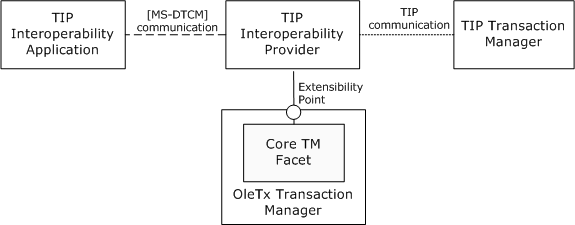

Figure 1: Interaction of MSDTC Connection Manager: OleTx Transaction Internet Protocol roles

#### 1.3.2.4 Protocol Interactions

##### 1.3.2.4.1 TIP Push Propagation Interactions

The following Unified Modeling Language (UML) diagram presents the sequence of actions that occur during the [**TIP push propagation**](#gt_tip-push-propagation) of a [**transaction**](#gt_transaction). This diagram shows a successful push propagation operation. For information about failure processing conditions, see [Protocol Details (section 3)](#Section_3).

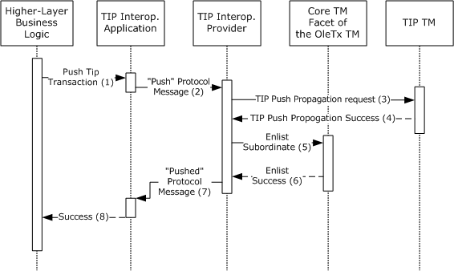

Figure 2: Actions performed during a TIP push propagation

- The [**higher-layer business logic**](#gt_higher-layer-business-logic) requests that the [TIP interoperability application (section 1.3.2.1)](#Section_1.3.2.1) perform the TIP push propagation of a transaction. The higher-layer business logic provides the [**transaction identifier**](#gt_transaction-identifier) and the [**TIP URL**](#gt_tip-url) of the [**TIP transaction manager**](#gt_tip-transaction-manager) where the transaction is to be pushed.
- The TIP interoperability application sends a "Push" [**protocol message**](#gt_protocol-message) to the [TIP interoperability provider (section 1.3.2.2)](#Section_1.3.2.2). The [**message**](#gt_message) contains the data that is provided by the higher-layer business logic. For more information, see [Message Type Details (section 2.2.5.1.3)](#Section_2.2.5.1.3).
- After receiving the message, the TIP interoperability provider contacts the TIP transaction manager that is referenced by the TIP URL. Using [**TIP communication**](#gt_tip-communication), it requests the TIP push propagation of the transaction.
- The TIP transaction manager replies that the push propagation was successful. The reply includes the TIP URL of the transaction that results from the push propagation.
- The TIP interoperability provider enlists as a subordinate in the transaction that is managed by the [**OleTx TM**](#gt_oletx-transaction-manager-oletx-tm) on behalf of the remote TIP transaction manager. To enlist, the TIP interoperability provider sends a request to the [**core transaction manager facet**](#gt_core-transaction-manager-facet) of the OleTx TM. More information is specified in [MS-DTCO](../MS-DTCO/MS-DTCO.md) section 3.2.7.11.
- The core transaction manager facet of the OleTx TM signals that the subordinate enlistment is successfully registered.
- The TIP interoperability provider replies with a "Pushed" protocol message to the TIP interoperability application. (For more information, see Message Type Details.) The message contains the TIP URL of the transaction that was created as a result of the push propagation.
- The TIP interoperability application returns a "Success" result and the TIP URL of the pushed transaction to the higher-layer business logic.
When all the preceding operations are complete, there is a [**superior-to-subordinate relationship**](#gt_superior-to-subordinate-relationship) between the OleTx TM and the TIP transaction manager.

##### 1.3.2.4.2 TIP Pull Propagation Interactions

The following diagram presents the sequence of actions that occur during a synchronous [**TIP pull propagation**](#gt_tip-pull-propagation) of a [**transaction**](#gt_transaction). This diagram shows a successful synchronous pull propagation operation. For information about failure processing conditions, see [Protocol Details (section 3)](#Section_3).

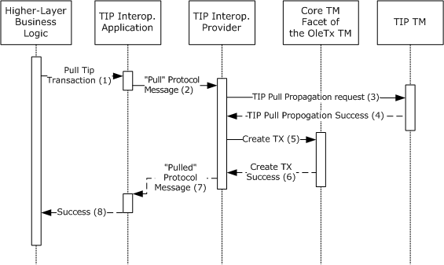

Figure 3: Actions performed during a TIP pull propagation

- Using the [**TIP URL**](#gt_tip-url) for a transaction, the [**higher-layer business logic**](#gt_higher-layer-business-logic) requests that the [TIP interoperability application (section 1.3.2.1)](#Section_1.3.2.1) perform the TIP pull propagation.
- The TIP interoperability application sends a "Pull" protocol message to the [TIP interoperability provider (section 1.3.2.2)](#Section_1.3.2.2). The message contains the TIP URL of the transaction to be pulled. For more information, see [Message Type Details (section 2.2.5.1.3)](#Section_2.2.5.1.3).
- After receiving the message, the TIP interoperability provider contacts the [**TIP transaction manager**](#gt_tip-transaction-manager) that is referenced by the TIP URL and requests the TIP pull propagation of the transaction.
- The TIP transaction manager replies that the pull propagation was successful.
- The TIP interoperability provider creates a transaction on the [**OleTx TM**](#gt_oletx-transaction-manager-oletx-tm), which it associates with the pulled transaction. As part of that operation, the TIP interoperability provider enlists as a superior in the transaction on behalf of the remote TIP transaction manager. More information is specified in [MS-DTCO](../MS-DTCO/MS-DTCO.md) section 3.2.7.12.
- The OleTx TM signals that the transaction was created successfully.
- The TIP interoperability provider replies with a "Pulled" protocol message to the TIP interoperability application. The message contains the identifier of the transaction that was created as a result of the pull propagation. For more information, see section 2.2.5.1.3.
- The TIP interoperability application returns a "Success" result and the identifier of the transaction to the higher-layer business logic.
When all the preceding operations are complete, there is a [**subordinate-to-superior relationship**](#gt_subordinate-to-superior-relationship) between the OleTx TM and the TIP transaction manager.

## 1.4 Relationship to Other Protocols

This protocol establishes the following relationships with other protocols:

- This protocol uses the extensibility mechanism that is specified in [MS-DTCO](../MS-DTCO/MS-DTCO.md) section 3.2.1.5 to become a [**protocol extension**](#gt_protocol-extension) to an [**OleTx TM**](#gt_oletx-transaction-manager-oletx-tm) implementation.
- An implementation of this protocol uses [**TIP communication**](#gt_tip-communication) to interact with one or more [**TIP transaction managers**](#gt_tip-transaction-manager).
- This protocol relies on the [**session**](#gt_session) and [**connection**](#gt_connection) transport infrastructure that is specified in [MS-CMPO](#Section_2.1) and [MS-CMP](../MS-CMP/MS-CMP.md).
The following diagram illustrates the relationships with these other protocols.

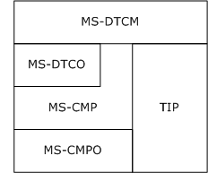

Figure 4: Protocol relationships

## 1.5 Prerequisites/Preconditions

The operation of this protocol assumes the following:

- Both the [TIP interoperability application role (section 1.3.2.1)](#Section_1.3.2.1) and the [TIP interoperability provider role (section 1.3.2.2)](#Section_1.3.2.2) implement [MS-CMP](../MS-CMP/MS-CMP.md) and [MS-CMPO](#Section_2.1).
- The TIP interoperability provider role operates as a protocol extension with an OleTx TM. More information is specified in [MS-DTCO](../MS-DTCO/MS-DTCO.md) section 3.2.1.5.
- The TIP interoperability provider role possesses an implementation of the TIP protocol.
- The TIP interoperability application role possesses an implementation-specific mechanism to determine the contact information for the TIP interoperability provider role.
- The TIP interoperability provider role uses implementation-specific functionality to perform TIP communication with other TIP transaction managers.

## 1.6 Applicability Statement

This protocol is applicable to scenarios where an [**OleTx TM**](#gt_oletx-transaction-manager-oletx-tm) needs to interoperate with other [**TIP transaction managers**](#gt_tip-transaction-manager). The prerequisites that are provided in [Prerequisites/Preconditions (section 1.5)](#Section_1.5), all the prerequisites that are required for the operation of an OleTx TM (as specified in [MS-DTCO](../MS-DTCO/MS-DTCO.md) section 1.5), and the TIP protocol (as specified in [[RFC2371]](https://go.microsoft.com/fwlink/?LinkId=90338)) need to be satisfied for this protocol to be employed successfully.<1>

## 1.7 Versioning and Capability Negotiation

### 1.7.1 Versioning

This section specifies the versioning and capability negotiation dependencies for this protocol.

**Protocol Versions:** This protocol has two versions, which for the purposes of this specification are referred to as MS-DTCM 1.0 and MS-DTCM 1.1. More details about the protocol elements that are supported in each version are provided in [Message Syntax (section 2.2)](#Section_2.2). Protocol processing details that are version-specific are specified in [Protocol Details (section 3)](#Section_3).

### 1.7.2 Versioning Negotiation Mechanisms

This protocol uses the explicit versioning negotiation mechanism that is specified in [MS-CMPO](#Section_2.1) section 3.3.4.2, BuildContext. An implementation of this protocol uses that mechanism to specify which versions of the protocol that it supports and to arrive at a mutually agreeable version with its partners. For specific information about versioning negotiation, see [Versioning Negotiation (section 3.1.8)](#Section_1.7.1).

By claiming support for a specific protocol version, an implementation is agreeing to provide support for the protocol elements that define that version. Protocol elements that are specific to a version are as follows:

- [**Connection types**](#gt_connection-type)
- Message types
- Data fields that are required for a certain [**message**](#gt_message) type

### 1.7.3 Capability Negotiation Mechanisms

This protocol does not have optional capabilities for a specified version. Therefore, there are no capability negotiation features.

## 1.8 Vendor-Extensible Fields

This protocol has no vendor-extensible fields.

## 1.9 Standards Assignments

This protocol has no standards assignments.

# 2 Messages

This protocol references commonly used data types, such as GUID and UUID, as defined in [MS-DTYP](../MS-DTYP/MS-DTYP.md) section 2.3.4.

## 2.1 Transport

This protocol uses MSDTC Connection Manager: OleTx Transports Protocol [MS-CMPO](#Section_2.1) and MSDTC Connection Manager: OleTx Multiplexing Protocol [MS-CMP](../MS-CMP/MS-CMP.md) as the transport layer for sending and receiving protocol [**messages**](#gt_message).

### 2.1.1 Messages, Connections, and Sessions

The layout of each [**message**](#gt_message) that is defined by this protocol MUST extend the MESSAGE_PACKET structure, as specified in [MS-CMP](../MS-CMP/MS-CMP.md) section 2.2.2.

Each message MUST be sent by using an active [**connection**](#gt_connection), as specified in [MS-CMP], that has been established between the two [**protocol participants**](#gt_protocol-participant). The mechanisms that are used to initiate and accept connections are defined in [MS-CMP] section 3.

Each connection MUST be initiated inside an active [**session**](#gt_session), as specified in [MS-CMPO](#Section_2.1), that has been established between the two protocol participants. The mechanism that is used to establish sessions is specified in [MS-CMPO] section 1.3.3.1.

### 2.1.2 Parameters Passed to the Transport Layer

To establish a [**session**](#gt_session), as specified in [MS-CMPO](#Section_2.1), the following values MUST be provided to the lower-layer protocol:

- A Security Level value that indicates the needed RPC [**authentication level**](#gt_authentication-level). The possible values for this element are specified in [MS-RPCE](../MS-RPCE/MS-RPCE.md).
- A [**name object**](#gt_name-object) that indicates the host name, the [**contact identifier**](#gt_contact-identifier), and the supported RPC network protocols of the remote [**endpoint**](#gt_endpoint) against which the session is established. Name objects are specified in [MS-CMPO] section 3.2.1.4.
- The minimum and maximum values of the protocol version number, which specify the minimum and maximum protocol versions that are supported by the implementation. For more information, see section [3.1.3](#Section_3.2.3).

#### 2.1.2.1 Establishing a Security Level

Every [**protocol participant**](#gt_protocol-participant) SHOULD use [**mutual authentication**](#gt_mutual-authentication) when establishing a new [**session**](#gt_session). If the destination does not support mutual authentication, a protocol participant SHOULD use [**incoming authentication**](#gt_incoming-authentication). If the destination does not support incoming authentication, a protocol participant MAY use No Security.<2>

#### 2.1.2.2 Obtaining a Name Object

The process of obtaining a [**name object**](#gt_name-object) for a [**session**](#gt_session) partner is implementation-specific.<3>

#### 2.1.2.3 Obtaining the Minimum and Maximum Protocol Version Numbers

The details of how to compute the minimum and maximum protocol version numbers are provided in [Common Initialization Details (section 3.1.3)](#Section_3.2.3).

### 2.1.3 Protocol Versioning

This protocol has two versions: MS-DTCM 1.0 and MS-DTCM 1.1. Versioning aspects that are related to [**connection types**](#gt_connection-type), [**message**](#gt_message) types, and message fields are provided in the context of each connection type. For more information, see [Connection Type Details (section 2.2.5)](#Section_2.2.5).

## 2.2 Message Syntax

All messages in this protocol MUST extend the MESSAGE_PACKET structure, as specified in [MS-CMP](../MS-CMP/MS-CMP.md) section 2.2.2.

### 2.2.1 Protocol Connection Types

This protocol MUST extend the set of [**connection types**](#gt_connection-type) that are specified in [MS-DTCO](../MS-DTCO/MS-DTCO.md) section 2.2 by providing one new connection type: [CONNTYPE_TXUSER_TIPPROXYGATEWAY (section 2.2.5.1)](#Section_2.2.5.1). The [**protocol type**](#gt_protocol-type) field for [**connections**](#gt_connection) that implement this connection type MUST be set to 0x00000026.

### 2.2.2 Connection Type Versioning

Both the MS-DTCM 1.0 and MS-DTCM 1.1 versions of MSDTC Connection Manager: OleTx Transaction Internet Protocol MUST support the [CONNTYPE_TXUSER_TIPPROXYGATEWAY (section 2.2.5.1)](#Section_2.2.5.1) [**connection type**](#gt_connection-type).

### 2.2.3 Protocol Data Structures

#### 2.2.3.1 OLETX_TIP_TM_ID

The **OLETX_TIP_TM_ID** structure is used to represent the identification (contact) information for a [**TIP transaction manager**](#gt_tip-transaction-manager).

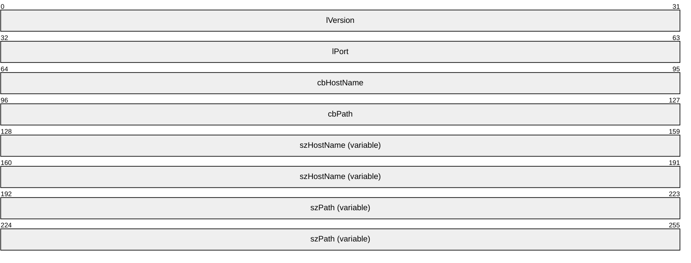

**lVersion (4 bytes):** The version number of the structure. This 4-byte field MUST be set to 0x00000001.

**lPort (4 bytes):** This field MUST be a 4-byte unsigned integer that specifies the TCP port on which the remote TIP transaction manager is listening.

**cbHostName (4 bytes):** This field MUST be an unsigned integer value that specifies the length, in bytes, of the **szHostName** field, including the terminating null character.

**cbPath (4 bytes):** This field MUST be an unsigned integer value that specifies the length, in bytes, of the **szPath** field, including the terminating null character.

**szHostName (variable):** A null-terminated Latin-1 ANSI character string, as specified in [[ISO/IEC-8859-1]](https://go.microsoft.com/fwlink/?LinkId=90689), that MUST specify the host name of the remote TIP transaction manager. The size of this field is limited only by the maximum length of variable data that can be transmitted in a message, as specified in [MS-CMP](../MS-CMP/MS-CMP.md) section 2.2.2.

**szPath (variable):** A null-terminated Latin-1 ANSI character string, as specified in [ISO/IEC-8859-1], that MUST specify the path of the remote TIP transaction manager. The size of this field is limited only by the maximum length of variable data that can be transmitted in a message, as specified in [MS-CMP] section 2.2.2.

#### 2.2.3.2 OLETX_TIP_TX_ID

The **OLETX_TIP_TX_ID** structure is used to represent a [**transaction identifier**](#gt_transaction-identifier) as specified in [[RFC2371]](https://go.microsoft.com/fwlink/?LinkId=90338) section 5.

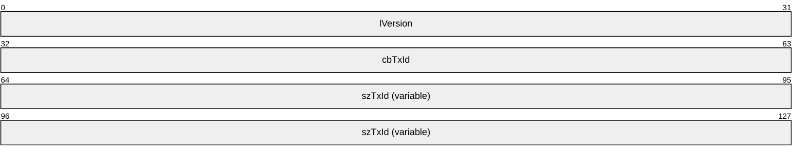

**lVersion (4 bytes):** The version number of the structure. This 4-byte field MUST be set to 0x00000001.

**cbTxId (4 bytes):** This field MUST be an unsigned integer value that specifies the length, in bytes, of the **szTxId** field, including the terminating null character.

**szTxId (variable):** A null-terminated Latin-1 ANSI string, as specified in [[ISO/IEC-8859-1]](https://go.microsoft.com/fwlink/?LinkId=90689), that MUST specify the transaction identifier as specified in [RFC2371] section 5. The size of this field is limited only by the maximum length of variable data that can be transmitted in a message, as specified in [MS-CMP](../MS-CMP/MS-CMP.md) section 2.2.2.

### 2.2.4 Protocol Enumerations

#### 2.2.4.1 TRUN_TIPPROXYGATEWAY_PULLERROR

The **TRUN_TIPPROXYGATEWAY_PULLERROR** enumeration defines the error values for a pull request that is initiated by a [TIP interoperability application](#Section_1.3.2.1).

typedef enum

{

TRUN_TIPPROXYGATEWAY_PULLERROR_TIPCONNECTERROR = 0x00000003,

TRUN_TIPPROXYGATEWAY_PULLERROR_TIPNOTPULLED = 0x00000004,

TRUN_TIPPROXYGATEWAY_PULLERROR_TIPERROR = 0x00000005,

TRUN_TIPPROXYGATEWAY_PULLERROR_TIPDISABLED = 0x00000006

} TRUN_TIPPROXYGATEWAY_PULLERROR;

**TRUN_TIPPROXYGATEWAY_PULLERROR_TIPCONNECTERROR:** The pull propagation failed due to a connectivity error.

**TRUN_TIPPROXYGATEWAY_PULLERROR_TIPNOTPULLED:** The pull propagation failed because the remote [**TIP transaction manager**](#gt_tip-transaction-manager) responded with a NOTPULLED TIP verb. For information about NOTPULLED, see [[RFC2371]](https://go.microsoft.com/fwlink/?LinkId=90338) section 13.

**TRUN_TIPPROXYGATEWAY_PULLERROR_TIPERROR:** The pull propagation failed due to a nonspecific error.

**TRUN_TIPPROXYGATEWAY_PULLERROR_TIPDISABLED:** The pull propagation failed because the TIP interoperability functionality is disabled.

#### 2.2.4.2 TRUN_TIPPROXYGATEWAY_PUSHERROR

The **TRUN_TIPPROXYGATEWAY_PUSHERROR** enumeration defines the error values for a push request that is initiated by a [TIP interoperability application](#Section_1.3.2.1).

typedef enum

{

TRUN_TIPPROXYGATEWAY_PUSHERROR_TIPCONNECTERROR = 0x00000004,

TRUN_TIPPROXYGATEWAY_PUSHERROR_TIPERROR = 0x00000005,

TRUN_TIPPROXYGATEWAY_PUSHERROR_TIPDISABLED = 0x00000006

} TRUN_TIPPROXYGATEWAY_PUSHERROR;

**TRUN_TIPPROXYGATEWAY_PUSHERROR_TIPCONNECTERROR:** The push propagation failed due to a connectivity error.

**TRUN_TIPPROXYGATEWAY_PUSHERROR_TIPERROR:** The push propagation failed due to a nonspecific error.

**TRUN_TIPPROXYGATEWAY_PUSHERROR_TIPDISABLED:** The push propagation failed because the TIP interoperability functionality is disabled.

### 2.2.5 Connection Type Details

#### 2.2.5.1 CONNTYPE_TXUSER_TIPPROXYGATEWAY

The **CONNTYPE_TXUSER_TIPPROXYGATEWAY** [**connection type**](#gt_connection-type) is used by a [TIP interoperability application](#Section_1.3.2.1) to request that a [TIP interoperability provider](#Section_1.3.2.2) perform a TIP push or pull propagation, to propagate a transaction to or from a [**TIP transaction manager**](#gt_tip-transaction-manager).

##### 2.2.5.1.1 Message Types

The [CONNTYPE_TXUSER_TIPPROXYGATEWAY](#Section_2.2.5.1) connection type defines the following message types:

- [**TXUSER_TIPPROXYGATEWAY_MTAG_PULL**](#Section_2.2.5.1.3.1)
- [**TXUSER_TIPPROXYGATEWAY_MTAG_PULL2**](#Section_2.2.5.1.3.2)
- [**TXUSER_TIPPROXYGATEWAY_MTAG_PULL_ASYNC_COMPLETE**](#Section_2.2.5.1.3.3)
- [**TXUSER_TIPPROXYGATEWAY_MTAG_PULLED**](#Section_2.2.5.1.3.4)
- [**TXUSER_TIPPROXYGATEWAY_MTAG_PULLERROR**](#Section_2.2.5.1.3.5)
- [**TXUSER_TIPPROXYGATEWAY_MTAG_PUSH**](#Section_2.2.5.1.3.6)
- [**TXUSER_TIPPROXYGATEWAY_MTAG_PUSH2**](#Section_2.2.5.1.3.7)
- [**TXUSER_TIPPROXYGATEWAY_MTAG_PUSHED**](#Section_2.2.5.1.3.8)
- [**TXUSER_TIPPROXYGATEWAY_MTAG_PUSHERROR**](#Section_2.2.5.1.3.9)

##### 2.2.5.1.2 Message Type Versioning

The following table shows the [**message**](#gt_message) types that are version-specific. Protocol messages that are not shown in this table MUST be supported by both protocol versions.

| Message type / Protocol version | MS-DTCM 1.0 | MS-DTCM 1.1 |
| --- | --- | --- |
| [TXUSER_TIPPROXYGATEWAY_MTAG_PULL2](#Section_2.2.5.1.3.2) | Not supported | Supported |
| [TXUSER_TIPPROXYGATEWAY_MTAG_PUSH2](#Section_2.2.5.1.3.7) | Not supported | Supported |

##### 2.2.5.1.3 Message Type Details

###### 2.2.5.1.3.1 TXUSER_TIPPROXYGATEWAY_MTAG_PULL

The **TXUSER_TIPPROXYGATEWAY_MTAG_PULL** message is used by a [TIP interoperability application](#Section_1.3.2.1) to initiate a [**TIP pull propagation**](#gt_tip-pull-propagation).

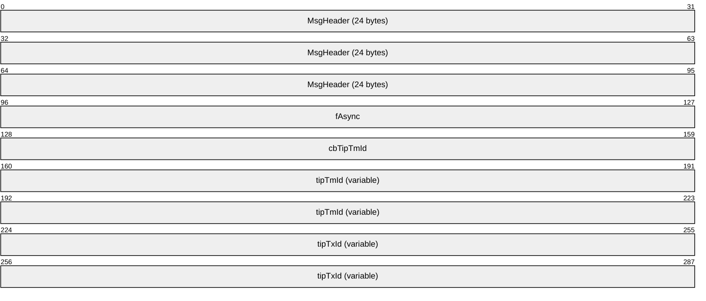

**MsgHeader (24 bytes):** This field MUST contain a MESSAGE_PACKET structure as defined in [MS-CMP](../MS-CMP/MS-CMP.md) section 2.2.2. Two MESSAGE_PACKET fields MUST be set as follows:

- The **dwUserMsgType** field MUST be 0x00005101.
- The **dwcbVarLenData** field MUST be equal to the sum of the values of the **cbHostName** and **cbPath** fields in the **tipTmId** structure, rounded to a multiple of 4; plus the value of the **cbTipTxId** field in the **tipTxId** structure, rounded to a multiple of 4; plus 32.
**fAsync (4 bytes):** A 4-byte value that indicates whether a synchronous pull or an asynchronous pull is required.

This value MUST be one of the following values:

| Value | Meaning |
| --- | --- |
| 0x00000000 | A synchronous pull propagation is required. |
| 0x00000001 | An asynchronous pull propagation is required. |

**cbTipTmId (4 bytes):** A reserved 4-byte field. Implementers MUST NOT use this field.

**tipTmId (variable):** This field identifies the [**TIP transaction manager**](#gt_tip-transaction-manager) against which the TIP pull propagation was requested. This field MUST contain an [OLETX_TIP_TM_ID](#Section_2.2.3.1) structure.

**tipTxId (variable):** This field identifies the transaction for which the TIP pull propagation was requested. This field MUST contain an [OLETX_TIP_TX_ID](#Section_2.2.3.2) structure.

###### 2.2.5.1.3.2 TXUSER_TIPPROXYGATEWAY_MTAG_PULL2

The **TXUSER_TIPPROXYGATEWAY_MTAG_PULL2** message is used by a TIP [**application**](#gt_application) to initiate a [**TIP pull propagation**](#gt_tip-pull-propagation).

**MsgHeader (24 bytes):** This field MUST contain a MESSAGE_PACKET structure.

- The **dwUserMsgType** field MUST be 0x00005108.
- The **dwcbVarLenData** field MUST be equal to the sum of the values of the **cbHostName** and **cbPath** fields in the **tipTmId** structure, rounded to a multiple of 4; plus the value of the **cbTipTxId** field in the **tipTxId** structure, rounded to a multiple of 4; plus 32.
**fAsync (4 bytes):** A 4-byte value that indicates whether a synchronous or an asynchronous pull is required.

| This value MUST be one of the following values: | Meaning |
| --- | --- |
| 0x00000000 | A synchronous [**pull propagation**](#gt_pull-propagation) is required. |
| 0x00000001 | An asynchronous pull propagation is required. |

**cbTipTmId (4 bytes):** A reserved 4-byte field. Implementers MUST not use this field.

**tipTmId (variable):** This field identifies the [**TIP transaction manager**](#gt_tip-transaction-manager) against which the TIP pull propagation was requested. This field MUST contain an [OLETX_TIP_TM_ID](#Section_2.2.3.1) structure and MUST be aligned on a 4-byte boundary by padding with arbitrary values.

**tipTxId (variable):** This field identifies the transaction for which the TIP pull propagation was requested. This field MUST contain an **OLETX_TIP_TX_ID** structure and MUST be aligned on a 4-byte boundary by padding with arbitrary values.

###### 2.2.5.1.3.3 TXUSER_TIPPROXYGATEWAY_MTAG_PULL_ASYNC_COMPLETE

The **TXUSER_TIPPROXYGATEWAY_MTAG_PULL_ASYNC_COMPLETE** message is sent from a [TIP interoperability provider](#Section_1.3.2.2) to a [TIP interoperability application](#Section_1.3.2.1) to indicate that the [**TIP pull propagation**](#gt_tip-pull-propagation) completed successfully.

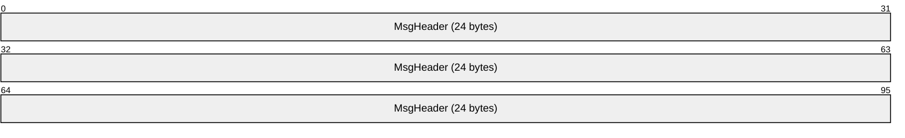

**MsgHeader (24 bytes):** This field MUST contain a MESSAGE_PACKET structure.

- The **dwUserMsgType** field MUST be 0x00005104.
- The **dwcbVarLenData** field MUST be zero.

###### 2.2.5.1.3.4 TXUSER_TIPPROXYGATEWAY_MTAG_PULLED

The **TXUSER_TIPPROXYGATEWAY_MTAG_PULLED** message is sent from a TIP interoperability provider to a TIP interoperability application to indicate the following:

- If the **fAsync** field in the pull message was set to 0x00000000 (synchronous pull), this [**message**](#gt_message) indicates that the pull propagation completed successfully.
- Otherwise (for an asynchronous pull), the message indicates that the TIP interoperability application can continue its execution, and it will be notified when the pull propagation is completed.
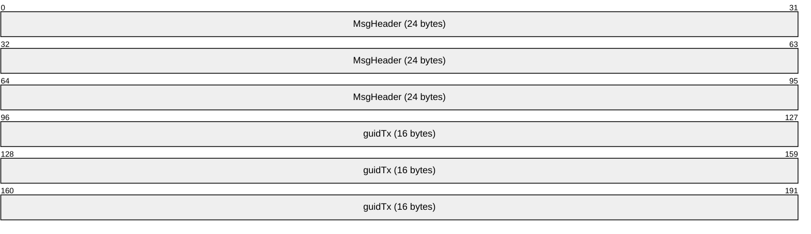

**MsgHeader (24 bytes):** This field MUST contain a MESSAGE_PACKET structure.

- The **dwUserMsgType** field MUST be 0x00005102.
- The **dwcbVarLenData** field MUST be 16.
**guidTx (16 bytes):** This field MUST contain a GUID that specifies the [**transaction identifier**](#gt_transaction-identifier) for the pulled [**transaction**](#gt_transaction).<4>

###### 2.2.5.1.3.5 TXUSER_TIPPROXYGATEWAY_MTAG_PULLERROR

The **TXUSER_TIPPROXYGATEWAY_MTAG_PULLERROR** message is sent from a [TIP interoperability provider](#Section_1.3.2.2) to a [TIP interoperability application](#Section_1.3.2.1) to indicate that an error occurred during the pull propagation.

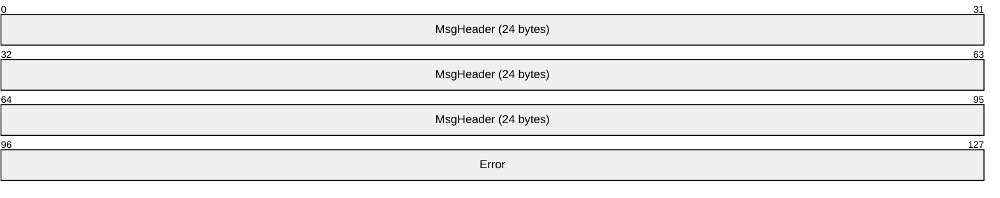

**MsgHeader (24 bytes):** This field MUST contain a MESSAGE_PACKET structure.

- The **dwUserMsgType** field MUST be 0x00005103.
- The **dwcbVarLenData** field MUST be 4.
**Error (4 bytes):** This 4-byte field MUST contain the status value for the previous request. The value MUST be one of those defined by the [TRUN_TIPPROXYGATEWAY_PULLERROR Enumeration](#Section_2.2.4.1).

###### 2.2.5.1.3.6 TXUSER_TIPPROXYGATEWAY_MTAG_PUSH

The **TXUSER_TIPPROXYGATEWAY_MTAG_PUSH** message is used by a [**TIP**](#gt_tip) [**application**](#gt_application) to initiate a [**TIP push propagation**](#gt_tip-push-propagation).

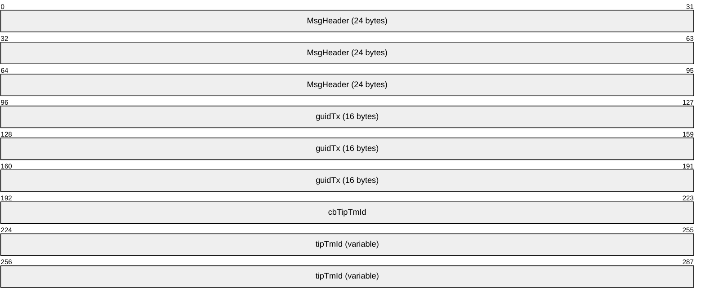

**MsgHeader (24 bytes):** This field MUST contain a MESSAGE_PACKET structure. Within the MESSAGE_PACKET, the following constraints apply:

- The **dwUserMsgType** field MUST be 0x00005105.
- The **dwcbVarLenData** field MUST be equal to the sum of the values of the **cbHostName** and **cbPath** fields in the **tipTmId** field, rounded to a multiple of 4, plus 36.
**guidTx (16 bytes):** This field MUST contain a GUID that specifies the [**transaction identifier**](#gt_transaction-identifier) for the transaction to be pushed.

**cbTipTmId (4 bytes):** A reserved 4-byte field. Implementers MUST NOT use this field.

**tipTmId (variable):** This field identifies the [**TIP transaction manager**](#gt_tip-transaction-manager) against which the [**TIP pull propagation**](#gt_tip-pull-propagation) was requested. This field MUST contain an [OLETX_TIP_TM_ID](#Section_2.2.3.1) structure and MUST be aligned on a 4-byte boundary by padding with arbitrary values.

###### 2.2.5.1.3.7 TXUSER_TIPPROXYGATEWAY_MTAG_PUSH2

The **TXUSER_TIPPROXYGATEWAY_MTAG_PUSH2** message is used by a [TIP interoperability application](#Section_1.3.2.1) to initiate a [**TIP push propagation**](#gt_tip-push-propagation).

**MsgHeader (24 bytes):** This field MUST contain a MESSAGE_PACKET structure.

- The **dwUserMsgType** field MUST be 0x00005109.
- The **dwcbVarLenData** field MUST be equal to the sum of the values of the **cbHostName** and **cbPath** fields in the **tipTmId** field, rounded to a multiple of 4, plus 36.
**guidTx (16 bytes):** This field MUST contain a GUID that specifies the [**transaction identifier**](#gt_transaction-identifier) for the transaction to be pushed.

**cbTipTmId (4 bytes):** A reserved 4-byte field. Implementers MUST NOT use this field.

**tipTmId (variable):** This field identifies the [**TIP transaction manager**](#gt_tip-transaction-manager) against which the [**TIP pull propagation**](#gt_tip-pull-propagation) was requested. This field MUST contain an [OLETX_TIP_TM_ID](#Section_2.2.3.1) structure.

###### 2.2.5.1.3.8 TXUSER_TIPPROXYGATEWAY_MTAG_PUSHED

The **TXUSER_TIPPROXYGATEWAY_MTAG_PUSHED** message is sent by a [TIP interoperability provider](#Section_1.3.2.2) to a [TIP interoperability application](#Section_1.3.2.1) to indicate that the transaction was successfully pushed to the remote [**TIP transaction manager**](#gt_tip-transaction-manager).

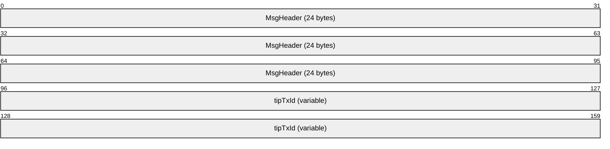

**MsgHeader (24 bytes):** This field MUST contain a MESSAGE_PACKET structure.

- The **dwUserMsgType** field MUST be 0x00005106.
- The **dwcbVarLenData** field MUST be equal to the length, in bytes, of the **tipTxId** field, rounded to a multiple of 4, plus 8.
**tipTxId (variable):** This field identifies the transaction that was pushed. This field MUST contain an [OLETX_TIP_TX_ID](#Section_2.2.3.2) structure.

###### 2.2.5.1.3.9 TXUSER_TIPPROXYGATEWAY_MTAG_PUSHERROR

The **TXUSER_TIPPROXYGATEWAY_MTAG_PUSHERROR** message is sent from a [TIP interoperability provider](#Section_1.3.2.2) to a [TIP interoperability application](#Section_1.3.2.1) to indicate that an error occurred during the push operation.

**MsgHeader (24 bytes):** This field MUST contain a MESSAGE_PACKET structure.

- The **dwUserMsgType** field MUST be 0x00005107.
- The **dwcbVarLenData** field MUST be equal to 4.
**Error (4 bytes):** This 4-byte field MUST contain the status value for the previous request. The value MUST be one of those defined by the [TRUN_TIPPROXYGATEWAY_PUSHERROR](#Section_2.2.4.2) enumeration.

# 3 Protocol Details

These sections define the expected behavior of the [**protocol roles**](#gt_protocol-role) that are introduced in [Protocol Overview (section 1.3)](#Section_1.3): the [TIP interoperability application role (section 3.2)](#Section_1.3.2.1) and the [TIP interoperability provider role (section 3.3)](#Section_1.3.2.2). The following sections provide a specification for the functionality that is required of each role.

## 3.1 Common Details

This section contains protocol details that are common to all protocol roles.

### 3.1.1 Abstract Data Model

This section describes a conceptual model of possible data organization that an implementation maintains to participate in this protocol. The described organization is provided to facilitate the explanation of how the protocol behaves. This document does not mandate that implementations adhere to this model as long as their external behavior is consistent with the behavior that is described in this document.

#### 3.1.1.1 Common Transport-Related Details

A [**protocol role**](#gt_protocol-role) that uses the transport layer to send or receive [**protocol messages**](#gt_protocol-message) MUST satisfy the following requirements:

- It MUST use [**connections**](#gt_connection), as specified in [MS-CMP](../MS-CMP/MS-CMP.md), as a transport protocol for sending [**messages**](#gt_message). [Transport (section 2.1)](#Section_2.1) and [Common Initialization Details (section 3.1.3)](#Section_3.2.3) define the mechanisms by which this protocol initializes and makes use of an implementation, as specified in [MS-CMP].
- It MUST maintain all the following data elements that are required and specified by [MS-CMP] section 3.1.1.
- **Session Table**: A table of Session objects, as maintained by MSDTC Connection Manager: OleTx Multiplexing Protocol Specification and as specified in [MS-CMP] section 3.1.1. The MSDTC Connection Manager: OleTx Transaction Internet Protocol reads the **Session Table** data elements provided by [MS-CMPO](#Section_2.1) but does not extend or modify the table.
- It MUST support initiating as well as accepting multiple concurrent connections that are associated with one or more [**sessions**](#gt_session), as specified in [MS-CMPO]. Consequently, a role MUST support the existence of multiple connection instances that implement the same [**connection type**](#gt_connection-type). A role MUST also support initiating multiple concurrent sessions to a number of different [**endpoints**](#gt_endpoint).
For more information about the transport layer, see Transport (section 2.1).

#### 3.1.1.2 Protocol Connection Objects

The connection objects that are used in this specification extend the definition of a connection object, as specified in [MS-CMP](../MS-CMP/MS-CMP.md) section 3.1.1.1, to include the following data elements:

- State: A state enumeration value that represents the current state of the connection while participating in the interactions that are associated with a certain [**connection type**](#gt_connection-type). A connection [**state machine**](#gt_state-machine) is defined as a set of possible connection states, together with a set of processing rules for messages and events, that are received in each state.
- UsesVersion11: A Boolean flag that indicates whether the negotiated protocol version is MS-DTCM 1.0 or MS-DTCM 1.1. For more information about versioning, see [Versioning Negotiation (section 3.1.8)](#Section_1.7.1).
The following rules apply to a connection state machine:

- When a [**protocol participant**](#gt_protocol-participant) initiates or accepts a connection, the state field of the connection MUST be set to the Idle (section [3.2.1.1.1](#Section_3.2.1.1.1) or section [3.3.1.2.1.1](#Section_3.3.1.2.1.1)) state. When the connection is disconnected, the state of the connection MUST be set to the Ended (section [3.2.1.1.5](#Section_3.2.1.1.5) or section [3.3.1.2.1.5](#Section_3.3.1.2.1.5)) state.
- If a connection enters the Ended state and the connection is not disconnected, it MUST be disconnected.
The preceding rules apply as specified in [MS-CMP] section 3.1.4, which provides more details about connection disconnection.

### 3.1.2 Timers

None.

### 3.1.3 Initialization

Related to protocol versioning, when a [**protocol role**](#gt_protocol-role) is initialized, it MUST do the following:

- Set the value of the Minimum Level 3 Version Number data field of the underlying transports protocol implementation to 1, as specified in [MS-CMPO](#Section_2.1) section 3.2.3.1.
- If the protocol role implements version 1.0 of this protocol:
- The [TIP Interoperability Application Role (section 3.2)](#Section_1.3.2.1) sets the Maximum Level 3 Version Number data field of the underlying transports protocol implementation to either 1 or 2. Both values have the same interpretation, as specified in [Versioning Negotiation (section 3.1.8)](#Section_1.7.1).
- The [TIP Interoperability Provider Role (section 3.3)](#Section_1.3.2.2) sets the Maximum Level 3 Version Number of the underlying transports protocol to 1.
- Otherwise, if the role implements version 1.1 of this protocol:
- Set the Maximum Level 3 Version Number data field of the underlying transports protocol implementation to 4, 5, or 6. All three values have the same interpretation, as specified in Versioning Negotiation (section 3.1.8).
All roles MUST satisfy the following set of rules regarding the initiation of a connection, as specified in [MS-CMP](../MS-CMP/MS-CMP.md):

- Both the initiator and the acceptor of a connection MUST follow the steps that are specified in [MS-CMP] section 3.1.4.2 to establish the connection.
- To initiate a connection between the [**protocol participants**](#gt_protocol-participant), a session MUST already be established between them, as specified in [MS-CMPO] section 3.4.6.1.
- When a new connection object is created (either for the initiator or for the acceptor):
- If the negotiated protocol version, as specified in Versioning Negotiation (section 3.1.8), version 1.0 of this protocol:
- The UsesVersion11 field of the connection MUST be set to FALSE.
- Otherwise, if the negotiated version of this protocol 1.1:
- The UsesVersionV11 field of the connection MUST be set to TRUE.

### 3.1.4 Higher-Layer Triggered Events

There are no common higher-layer triggered events.

### 3.1.5 Message Processing Events and Sequencing Rules

When a [**protocol participant**](#gt_protocol-participant) receives an incoming message on a connection, it MUST perform the following actions to verify the validity of the message:

- OleTx Multiplexing Protocol Schema validation:
All messages MUST be validated with the message schema and constraints as specified in [MS-CMP](../MS-CMP/MS-CMP.md) section 2.2.2. If a message cannot be validated, the message MUST be dealt.

- Protocol validation:
The protocol participant MUST read the [**connection type**](#gt_connection-type), message type from the message, and validate message type and message schemas specified in section [2.2.5](#Section_2.2.5). If the message is invalid, the protocol participant MUST ignore the message.

- State validation:
The protocol participant MUST verify the current state of the connection by using the State field of the connection as follows:

- If the connection is in the Ended state (section [3.2.1.1.5](#Section_3.2.1.1.5) or section [3.3.1.2.1.5](#Section_3.3.1.2.1.5)), the message MUST be considered invalid.
- If the connection type has not defined a specific processing rule for the processing of the specific message in the current connection state, the message MUST be considered invalid.
If an incoming message is considered invalid, the protocol participant MUST follow the steps specified in [MS-DTCO](../MS-DTCO/MS-DTCO.md) section 3.1.6 to handle an invalid message, except for the [TIP interoperability provider](#Section_1.3.2.2) implementation, the connection on which the message was received does not transition to the Ended state.

If the connection type of the recipient connection defines specific actions that MUST be performed when an invalid message is received, the protocol participant MUST perform those actions when an invalid message is received.

### 3.1.6 Timer Events

None.

### 3.1.7 Other Local Events

A protocol participant that uses a connection object MUST be prepared to handle the [Connection Disconnected event](#Section_3.3.5.1.3) at any time during the lifetime of that connection.

#### 3.1.7.1 Connection Disconnected

When a connection is disconnected, a [**protocol participant**](#gt_protocol-participant) MUST:

- Perform all the actions that are required for a valid disconnection, as specified in the [MS-CMP](../MS-CMP/MS-CMP.md) section 3.1.
- If the [**connection type**](#gt_connection-type) of the recipient connection defines specific additional actions that MUST be performed when a connection is disconnected, the protocol participant MUST perform those actions when a connection is disconnected.
- If the connection state is not already Ended (section [3.2.1.1.5](#Section_3.2.1.1.5) or section [3.3.1.2.1.5](#Section_3.3.1.2.1.5)), the state MUST be set to Ended (section 3.2.1.1.5 or section 3.3.1.2.1.5).

### 3.1.8 Versioning Negotiation

This protocol has two versions: MS-DTCM 1.0 and MS-DTCM 1.1. Before exchanging any [**protocol messages**](#gt_protocol-message), the two [**protocol participants**](#gt_protocol-participant) MUST agree on what protocol version to use in their message exchange.

To negotiate a common protocol version, the two protocol participants MUST use the version negotiation mechanism that is provided by [MS-CMPO](#Section_2.1) section 3.3.4.2 as follows:

- At initialization, each of the protocol participants set their Maximum Level 3 Version Number data field as specified in [Common Initialization Details](#Section_3.2.3).
- When a session is established between two protocol participants, the value of the **dwLevelThreeAccepted** field of the Session object's version field (as specified in [MS-CMPO] section 3.2.1.2) indicates the negotiated protocol version as follows:
- If the value of the **dwLevelThreeAccepted** field is less than or equal to 3:
- The negotiated protocol version is MS-DTCM 1.0.
- Otherwise:
- The negotiated protocol version is MS-DTCM 1.1.
The negotiated protocol version MUST be used when creating new connection objects, as specified in Common Initialization Details (section 3.1.3).

## 3.2 TIP Interoperability Application Role Details

### 3.2.1 Abstract Data Model

This section describes a conceptual model of possible data organization that an implementation maintains to participate in this protocol. The described organization is provided to facilitate the explanation of how the protocol behaves. This document does not mandate that implementations adhere to this model as long as their external behavior is consistent with the behavior that is described in this document.

The [TIP interoperability application role](#Section_1.3.2.1) MUST extend the common abstract data model that is specified in section [3.1.1](#Section_3.1.1) to include the following data elements:

- [**TIP Interoperability Application Name**](#gt_tip-interoperability-application-name): A [**name object**](#gt_name-object) that is used to identify the TIP interoperability application with the underlying transport protocol, as specified in [MS-CMPO](#Section_2.1).
- [**TIP Interoperability Provider Name**](#gt_tip-interoperability-provider-name): A name object that identifies the [TIP interoperability provider](#Section_1.3.2.2) that the TIP interoperability application MUST use.
A TIP interoperability application MUST implement the states for its supported [**connection types**](#gt_connection-type) as specified in the following subsections of section 3.2.1.

#### 3.2.1.1 CONNTYPE_TXUSER_TIPPROXYGATEWAY Initiator States

The [TIP interoperability application](#Section_1.3.2.1) MUST act as an initiator for the [CONNTYPE_TXUSER_TIPPROXYGATEWAY](#Section_2.2.5.1) [**connection type**](#gt_connection-type). In this role, the TIP interoperability application MUST provide support for the following states:

- [Idle](#Section_3.2.1.1.1)
- [Awaiting Sync Pull Response](#Section_3.2.1.1.2)
- [Awaiting Async Pull Response](#Section_3.2.1.1.3)
- [Awaiting Push Response](#Section_3.2.1.1.4)
- [Ended](#Section_3.2.1.1.5)
The following figure shows the relationship between the CONNTYPE_TXUSER_TIPPROXYGATEWAY initiator states:

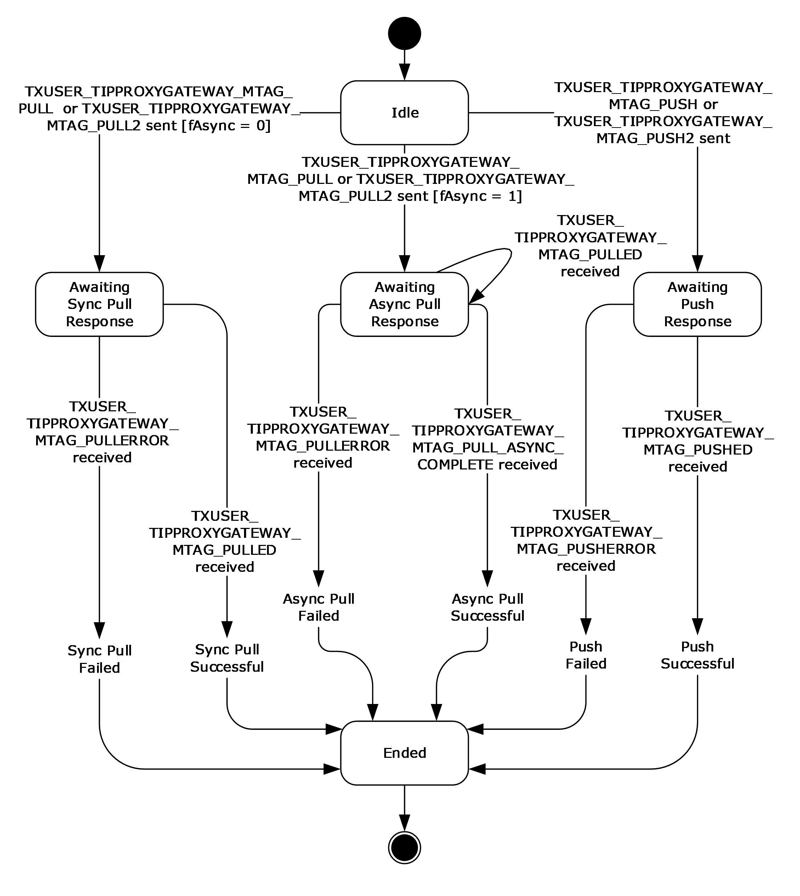

Figure 5: CONNTYPE_TXUSER_TIPPROXYGATEWAY initiator states

##### 3.2.1.1.1 Idle

This is the initial state. The following events are processed in this state:

- For synchronous or asynchronous requests, [Sending a TIP Pull Request](#Section_3.2.4.1)
- [Sending a TIP Push Request](#Section_3.2.4.2)

##### 3.2.1.1.2 Awaiting Sync Pull Response

The following events are processed in this state:

- [Receiving a TXUSER_TIPPROXYGATEWAY_MTAG_PULLED Message](#Section_3.2.5.1.1)
- [Receiving a TXUSER_TIPPROXYGATEWAY_MTAG_PULLERROR Message](#Section_3.2.5.1.3)
- [Connection Disconnected](#Section_3.3.5.1.3)

##### 3.2.1.1.3 Awaiting Async Pull Response

The following events are processed in this state:

- [Receiving a TXUSER_TIPPROXYGATEWAY_MTAG_PULLED Message](#Section_3.2.5.1.1)
- [Receiving a TXUSER_TIPPROXYGATEWAY_MTAG_PULL_ASYNC_COMPLETE Message](#Section_3.2.5.1.2)
- [Receiving a TXUSER_TIPPROXYGATEWAY_MTAG_PULLERROR Message](#Section_3.2.5.1.3)
- [Connection Disconnected](#Section_3.3.5.1.3)

##### 3.2.1.1.4 Awaiting Push Response

The following events are processed in this state:

- [Receiving a TXUSER_TIPPROXYGATEWAY_MTAG_PUSHED Message](#Section_3.2.5.1.4)
- [Receiving a TXUSER_TIPPROXYGATEWAY_MTAG_PUSHERROR Message](#Section_3.2.5.1.5)
- [Connection Disconnected](#Section_3.3.5.1.3)

##### 3.2.1.1.5 Ended

This is the final state.

### 3.2.2 Timers

The [TIP interoperability application role](#Section_1.3.2.1) does not use any timers that are specific to this specification.

### 3.2.3 Initialization

When a [TIP interoperability application](#Section_1.3.2.1) is initialized:

- The TIP Interoperability Application **Name** field MUST be set to a value that is obtained from an implementation-specific source. This field MUST be used when clients initialize the implementation of the underlying transports protocol as the Local [**Name object**](#gt_name-object), as specified in [MS-CMPO](#Section_2.1) section 3.2.3.1.
- The TIP Interoperability Provider **Name** field MUST be set to a value that is obtained from an implementation-specific source.

### 3.2.4 Higher-Layer Triggered Events

The [TIP interoperability application](#Section_1.3.2.1) MUST be prepared to process a set of events that are triggered by the [**higher-layer business logic**](#gt_higher-layer-business-logic), the details of which are implementation-specific.

When the application processes one of the higher-layer events described in this section, it MUST communicate one of the following results to the higher-layer business logic:

- Success
- Failure
If the processing of a higher-layer event includes a message processing event triggered by the receipt of a message which is a response to a request initiated by the higher-layer triggered events, the associated message processing event MUST communicate on the above results to the higher-layer business logic. The TIP interoperability application MUST be prepared to process the events as specified in the following sections.

#### 3.2.4.1 Sending a TIP Pull Request

If the higher-layer business logic pulls a transaction by using the [**TIP**](#gt_tip) protocol, the [TIP interoperability application](#Section_1.3.2.1) MUST perform the following actions:

- Initiate a new [CONNTYPE_TXUSER_TIPPROXYGATEWAY](#Section_2.2.5.1) connection by using the [**application's**](#gt_application) TIP Interoperability Provider **Name** field as the [**Name object**](#gt_name-object) of the partner.
- If the **UsesVersion11** flag of the connection is TRUE (see [Protocol Connection Objects](#Section_3.1.1.2)), the application MUST send a [TXUSER_TIPPROXYGATEWAY_MTAG_PULL2](#Section_2.2.5.1.3.2) message using the established connection. The following message fields MUST be set to values that are provided by the higher-layer business logic:
- The **fAsync** field MUST be set to the value that is provided by the higher-layer business logic.
- The **tipTmId** field MUST be set to the value of the [OLETX_TIP_TM_ID](#Section_2.2.3.1) structure that is provided by the higher-layer business logic.
- The **tipTxId** field MUST be set to the value of the **OLETX_TIP_TX_ID** structure that is provided by the higher-layer business logic.
- Otherwise, the application MUST send the [TXUSER_TIPPROXYGATEWAY_MTAG_PULL](#Section_2.2.5.1.3.1) message which is using the connection. The message fields MUST be set as specified above for sending a **TXUSER_TIPPROXYGATEWAY_MTAG_PULL2** message.
- If the TIP interoperability application requested an asynchronous pull propagation, as specified by the **fAsync** message field:
- Set the connection state to [Awaiting Async Pull Response](#Section_3.2.1.1.3).
- Otherwise:
- Set the connection state to [Awaiting Sync Pull Response](#Section_3.2.1.1.2).

#### 3.2.4.2 Sending a TIP Push Request

If the higher-layer business logic decides to push a transaction by using the [**TIP**](#gt_tip) protocol, the [TIP interoperability application](#Section_1.3.2.1) MUST perform the following actions:

- Initiate a new [CONNTYPE_TXUSER_TIPPROXYGATEWAY](#Section_2.2.5.1) connection by using the [**application's**](#gt_application) TIP Interoperability Provider Name field as the [**Name object**](#gt_name-object) of the partner.
- If the **UsesVersion11** connection flag is TRUE, the application MUST send a [TXUSER_TIPPROXYGATEWAY_MTAG_PUSH2](#Section_2.2.5.1.3.7) message by using the connection. The following message fields MUST be set to values that are provided by the higher-layer business logic:
- The **guidTx** field MUST be set to the GUID that specifies the [**transaction identifier**](#gt_transaction-identifier) that is associated with the transaction to be pushed.
- The **tipTmId** field MUST be set to the value of the [OLETX_TIP_TM_ID](#Section_2.2.3.1) structure that is provided by the higher-layer business logic.
- Otherwise, the TIP interoperability application MUST send a [TIPPROXYGATEWAY_MTAG_PUSH](#Section_2.2.5.1.3.6) message by using the connection. The message fields MUST be set as specified above for sending a TXUSER_TIPPROXYGATEWAY_MTAG_PUSH2 message.
- Set the connection state to [Awaiting Push Response](#Section_3.2.1.1.4).

### 3.2.5 Message Processing Events and Sequencing Rules

#### 3.2.5.1 CONNTYPE_TXUSER_TIPPROXYGATEWAY as Initiator

For all messages that are received in this connection type, the [TIP interoperability application](#Section_1.3.2.1) MUST process the message, as specified in [Common Message Processing Events and Sequencing Rules](#Section_3.1.5). The application MUST also follow the processing rules that are specified in the following sections.

##### 3.2.5.1.1 Receiving a TXUSER_TIPPROXYGATEWAY_MTAG_PULLED Message

When the TIP interoperability application receives a TXUSER_TIPPROXYGATEWAY_MTAG_PULLED message, it MUST perform the following actions:

- If the connection state is [Awaiting Sync Pull Response](#Section_3.2.1.1.2):
- Return a success result and the value of the guidTx field from the message to the higher-layer business logic as a response to the [Sending a TIP Pull Request](#Section_3.2.4.1) event from the higher-layer business logic.
- Set the connection state to [Ended](#Section_3.2.1.1.5).
- Otherwise, if the connection state is Awaiting Async Pull Response:
- Return a success result and the value of the guidTx field from the message to the higher-layer business logic as a response to the Sending a TIP Pull Request event from the higher-layer business logic.
- Otherwise, the message MUST be processed as an invalid message as specified in section [3.1.5](#Section_3.1.5).

##### 3.2.5.1.2 Receiving a TXUSER_TIPPROXYGATEWAY_MTAG_PULL_ASYNC_COMPLETE Message

When the [TIP interoperability application](#Section_1.3.2.1) receives a [TXUSER_TIPPROXYGATEWAY_MTAG_PULL_ASYNC_COMPLETE](#Section_2.2.5.1.3.3) message, it MUST perform the following actions:

- If the connection state is [Awaiting Async Pull Response](#Section_3.2.1.1.3):
- Return a success result to the higher-layer business logic as a response to the [Sending a TIP Pull Request](#Section_3.2.4.1) event from the higher-layer business logic.
- Set the connection state to [Ended](#Section_3.2.1.1.5).
- Otherwise, the message MUST be processed as an invalid message as specified in section [3.1.5](#Section_3.1.5).

##### 3.2.5.1.3 Receiving a TXUSER_TIPPROXYGATEWAY_MTAG_PULLERROR Message

When the [TIP interoperability application](#Section_1.3.2.1) receives a [TXUSER_TIPPROXYGATEWAY_MTAG_PULLERROR](#Section_2.2.5.1.3.5) message, it MUST perform the following actions:

- If the connection state is [Awaiting Sync Pull Response](#Section_3.2.1.1.2) or [Awaiting Async Pull Response](#Section_3.2.1.1.3):
- If the Error field from the message is set to one of the following values of the [TRUN_TIPPROXYGATEWAY_PULLERROR](#Section_2.2.4.1) enumeration (**TRUN_TIPPROXYGATEWAY_PULLERROR_TIPCONNECTERROR**, **TRUN_TIPPROXYGATEWAY_PULLERROR_TIPNOTPULLED**, **TRUN_TIPPROXYGATEWAY_PULLERROR_TIPERROR**), or if the Error field from the message is set to **TRUN_TIPPROXYGATEWAY_PULLERROR_TIPDISABLED** and the **UsesVersion11** flag of the connection is set:
- Return a failure result to the higher-layer business logic as a response to the [Sending a TIP Pull Request](#Section_3.2.4.1) event from the higher-layer business logic.
- Set the connection state to [Ended](#Section_3.2.1.1.5).
- Otherwise, the message MUST be processed as an invalid message, as specified in section [3.1.5](#Section_3.1.5).

##### 3.2.5.1.4 Receiving a TXUSER_TIPPROXYGATEWAY_MTAG_PUSHED Message

When the [TIP interoperability application](#Section_1.3.2.1) receives a [TXUSER_TIPPROXYGATEWAY_MTAG_PUSHED](#Section_2.2.5.1.3.8) message, it MUST perform the following actions:

- If the connection state is [Awaiting Push Response](#Section_3.2.1.1.4):
- Return a success result and the value of the **tipTxId** field from the message to the higher-layer business logic as a response to the [Sending a TIP Pull Request](#Section_3.2.4.1) event from the higher-layer business logic.
- Set the connection state to [Ended](#Section_3.2.1.1.5).
- Otherwise, the message MUST be processed as an invalid message, as specified in section [3.1.5](#Section_3.1.5).

##### 3.2.5.1.5 Receiving a TXUSER_TIPPROXYGATEWAY_MTAG_PUSHERROR Message

When the [TIP interoperability application](#Section_1.3.2.1) receives a [TXUSER_TIPPROXYGATEWAY_MTAG_PUSHERROR](#Section_2.2.5.1.3.9) message, it MUST perform the following actions:

- If the connection state is [Awaiting Push Response](#Section_3.2.1.1.4):
- If the Error field from the message is set to one of the following values of the [TRUN_TIPPROXYGATEWAY_PUSHERROR](#Section_2.2.4.2) enumeration (**TRUN_TIPPROXYGATEWAY_PUSHERROR_TIPCONNECTERROR** or **TRUN_TIPPROXYGATEWAY_PUSHERROR_TIPERROR**), or if the Error field from the message is set to **TRUN_TIPPROXYGATEWAY_PUSHERROR_TIPDISABLED** and the **UsesVersion11** flag of the connection is set:
- Return a failure result to the higher-layer business logic.
- Set the connection state to [Ended](#Section_3.2.1.1.5).
- Otherwise, the message MUST be processed as an invalid message, as specified in section [3.1.5](#Section_3.1.5).

##### 3.2.5.1.6 Connection Disconnected

When a [CONNTYPE_TXUSER_TIPPROXYGATEWAY](#Section_2.2.5.1) connection is disconnected, the [TIP interoperability application](#Section_1.3.2.1) MUST perform the following actions:

- If the connection state is [Awaiting Sync Pull Response](#Section_3.2.1.1.2), [Awaiting Async Pull Response](#Section_3.2.1.1.3), or [Awaiting Push Response](#Section_3.2.1.1.4):
- Return a failure result to the higher-layer business logic.
- Otherwise, the event MUST be processed as specified in section [3.1.7.1](#Section_3.3.5.1.3).

### 3.2.6 Timer Events

This role has no protocol-specific timer events.

### 3.2.7 Other Local Events

None.

## 3.3 TIP Interoperability Provider Role Details

### 3.3.1 Abstract Data Model

This section describes a conceptual model of possible data organization that an implementation maintains to participate in this protocol. The described organization is provided to facilitate the explanation of how the protocol behaves. This document does not mandate that implementations adhere to this model as long as their external behavior is consistent with the behavior that is described in this document.

The [**TIP**](#gt_tip) interoperability provider MUST maintain all the data elements that are specified in the [Abstract Data Model (section 3.1.1)](#Section_3.1.1). The [TIP interoperability provider](#Section_1.3.2.2) MUST also maintain the following data elements:

- [**TIP Interoperability Provider Name**](#gt_tip-interoperability-provider-name): A [**Name object**](#gt_name-object) that identifies the TIP interoperability provider with the underlying transport infrastructure of MSDTC Connection Manager: OleTx Transports Protocol, as specified in [MS-CMPO](#Section_2.1).
- [**TIP Transaction Table**](#gt_tip-transaction-table): A table of entries to [**transaction objects**](#gt_transaction-object), as specified in [MS-DTCO](../MS-DTCO/MS-DTCO.md) section 3.1.1, that are keyed by the [**TIP URL**](#gt_tip-url) of the TIP transaction with which a transaction object that is managed by the [**OleTx transaction manager**](#gt_oletx-transaction-manager-oletx-tm) is associated through TIP propagation.
The TIP interoperability provider role MUST extend the definition of a transaction object, as specified in [MS-DTCO] section 3.2.1, to include the following data element:

**RemoteTipTransactionUrl**: A string that represents the TIP URL of the TIP transaction with which the transaction object is associated through TIP propagation.

**OurTipTxId**: An [OLETX_TIP_TX_ID](#Section_2.2.3.2) object contains the identifier of the TIP transaction for which the TIP propagation is requested.

As specified in [Prerequisites/Preconditions (section 1.5)](#Section_1.5), the TIP interoperability provider role MUST use implementation-specific functionality to perform [**TIP Communication**](#gt_tip-communication) with other TIP Transaction Managers.

#### 3.3.1.1 Interface with the Core Transaction Manager Facet of the Local Transaction Manager

As specified in [Prerequisites/Preconditions (section 1.5)](#Section_1.5), an implementation of the [TIP interoperability provider role](#Section_1.3.2.2) MUST establish itself as a [**protocol extension**](#gt_protocol-extension) to the core [**transaction manager**](#gt_transaction-manager) of an [**OleTx transaction manager**](#gt_oletx-transaction-manager-oletx-tm). (More information is specified in [MS-DTCO](../MS-DTCO/MS-DTCO.md) section 3.2.1.5.) When it becomes a protocol extension to the OleTx transaction manager, the [**TIP**](#gt_tip) interoperability provider acquires the following capabilities:

- The capability to signal events on the [**Core Transaction Manager Facet**](#gt_core-transaction-manager-facet) of the OleTx transaction manager and to access data elements that are maintained by it.
- The capability of receiving events from the Core Transaction Manager Facet of the OleTx transaction manager.
Through the above capabilities, the TIP interoperability provider becomes a facet of the OleTx transaction manager. (More information is specified in [MS-DTCO] section 1.3.3.3.)

#### 3.3.1.2 Connection States

The [TIP interoperability provider](#Section_1.3.2.2) MUST provide the [CONNTYPE_TXUSER_TIPPROXYGATEWAY Acceptor States](#Section_3.3.1.2.1) connection states in the following subsections of section 3.3.1.2.1.

##### 3.3.1.2.1 CONNTYPE_TXUSER_TIPPROXYGATEWAY Acceptor States

The [TIP interoperability provider](#Section_1.3.2.2) MUST act as an acceptor for the [CONNTYPE_TXUSER_TIPPROXYGATEWAY](#Section_2.2.5.1) [**connection type**](#gt_connection-type). In this role, the TIP interoperability provider MUST provide support for the following states:

- [Idle](#Section_3.3.1.2.1.1)
- [Awaiting Sync Pull Response](#Section_3.2.1.1.2)
- [Awaiting Async Pull Response](#Section_3.2.1.1.3)
- [Awaiting Push Response](#Section_3.2.1.1.4)
- [Ended](#Section_3.3.1.2.1.5)
The following figure shows the relationship between the CONNTYPE_TXUSER_TIPPROXYGATEWAY acceptor states.

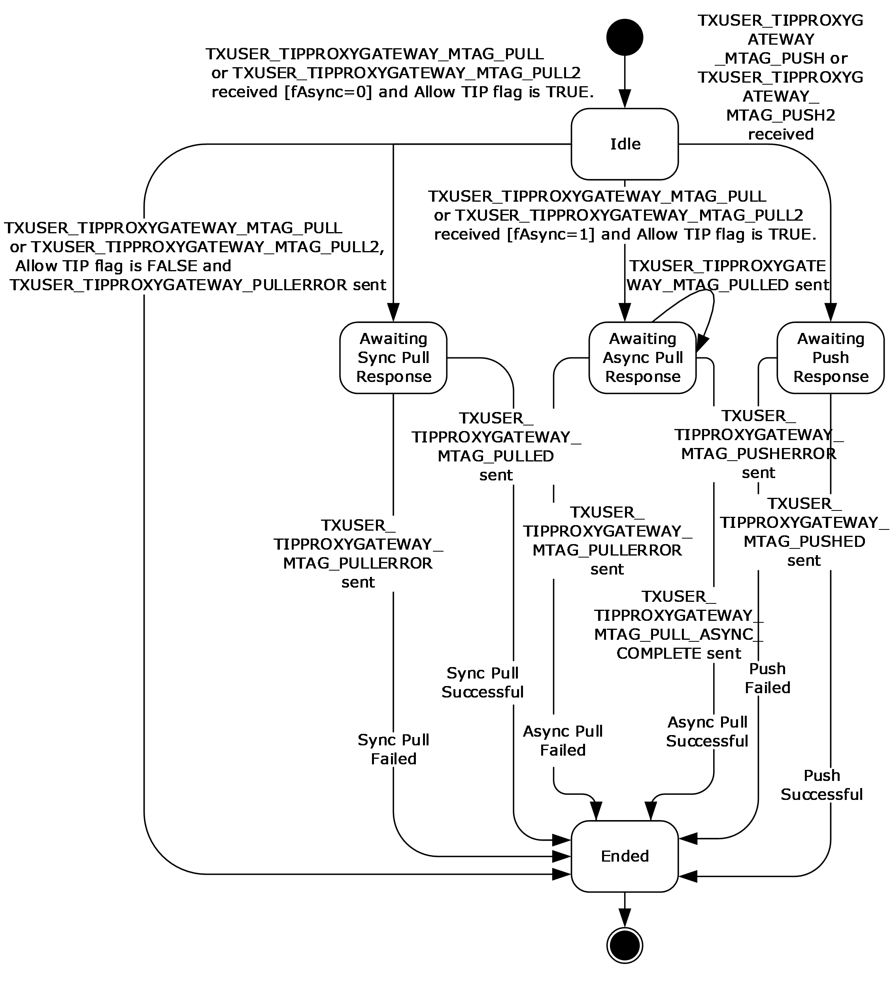

Figure 6: CONNTYPE_TXUSER_ TIPPROXYGATEWAY acceptor states

###### 3.3.1.2.1.1 Idle

This is the initial state. The following events are processed in this state:

- [Receiving a TXUSER_TIPPROXYGATEWAY_MTAG_PULL or a TXUSER_TIPPROXYGATEWAY_MTAG_PULL2 Message](#Section_3.3.5.1.1)
- [Receiving a TXUSER_TIPPROXYGATEWAY_MTAG_PUSH or a TXUSER_TIPPROXYGATEWAY_MTAG_PUSH2 Message](#Section_3.3.5.1.2)

###### 3.3.1.2.1.2 Awaiting Sync Pull Response

The following events are processed in this state:

- [TIP Pull Success](#Section_3.3.7.1.4)
- [TIP Pull Failure](#Section_3.3.7.1.3)

###### 3.3.1.2.1.3 Awaiting Async Pull Response

The following events are processed in this state:

- [TIP Pull Success](#Section_3.3.7.1.4)
- [TIP Pull Failure](#Section_3.3.7.1.3)

###### 3.3.1.2.1.4 Awaiting Push Response

The following events are processed in this state:

- [TIP Push Success](#Section_3.3.7.1.6)
- [TIP Push Failure](#Section_3.3.7.1.5)

###### 3.3.1.2.1.5 Ended

This is the final state.

### 3.3.2 Timers

There are no timers specifically for this [**protocol role**](#gt_protocol-role).

### 3.3.3 Initialization

#### 3.3.3.1 Role Initialization

When the [TIP interoperability provider role](#Section_1.3.2.2) is initialized, it MUST perform the following actions:

- The value of the TIP Interoperability Provider Name field MUST be set to a value that is obtained from an implementation-specific source. This field MUST be used when initializing the underlying implementation of the transports protocol, as specified in [MS-CMPO](#Section_2.1) section 3.2.3.1.
- Create an empty table to store [**TIP URL**](#gt_tip-url) and associated [**transaction object**](#gt_transaction-object) entries, and assign the newly created table to the TIP Transaction Table field.
- By using an implementation-specific approach, establish itself as a protocol extension, as specified in [MS-DTCO](../MS-DTCO/MS-DTCO.md) section 3.2.1.5, with an [**OleTx transaction manager**](#gt_oletx-transaction-manager-oletx-tm). As a result, it MUST initialize the following field:
- Identifier MUST be set to [**GUID**](#gt_globally-unique-identifier-guid) NULL.
- Whereabouts MUST be set to NULL.
- Whereabouts Size MUST be set to zero.
- Examine the **Allow Network Access** flag on the Core Transaction Manager Facet, as specified in [MS-DTCO] section 3.2.1, and perform the following actions:
- If the **Allow Network Access** flag is set to FALSE:
- The TIP interoperability provider MUST reject the incoming request for a connection, as specified in [MS-CMP](../MS-CMP/MS-CMP.md) section 3.1.5.5 (MsgTag 0x00000005), with the rejection **Reason** set to 0x80070005, from remote machines for all its supported connection types.

#### 3.3.3.2 Transaction Object Initialization

A [**transaction object**](#gt_transaction-object) MUST be initialized by using all the initialization steps, as specified in [MS-DTCO](../MS-DTCO/MS-DTCO.md) section 3.2.3.1. Also, the [TIP interoperability provider](#Section_1.3.2.2) MUST initialize each new transaction object that it creates by using the following default value:

The **RemoteTipTransactionUrl** field MUST default to an empty string.

The **OurTipTxId** field MUST default to NULL.

### 3.3.4 Higher-Layer Triggered Events

There are no higher-layer triggered events specifically for this role.

### 3.3.5 Message Processing Events and Sequencing Rules

#### 3.3.5.1 CONNTYPE_TXUSER_TIPPROXYGATEWAY as Acceptor

For all messages that are received in this [**connection type**](#gt_connection-type), the [TIP interoperability provider](#Section_1.3.2.2) MUST process the message as specified in [Common Message Processing Events and Sequencing Rules](#Section_3.1.5). The TIP interoperability provider MUST also follow the processing rules that are specified in the following sections.

##### 3.3.5.1.1 Receiving a TXUSER_TIPPROXYGATEWAY_MTAG_PULL or a TXUSER_TIPPROXYGATEWAY_MTAG_PULL2 Message

When the [TIP interoperability provider](#Section_1.3.2.2) receives one of these messages, it MUST perform the following actions:

- If the connection state is [Idle](#Section_3.3.1.2.1.1):
- If the **Allow TIP** flag of the **Core Transaction Manager Facet** ([MS-DTCO](../MS-DTCO/MS-DTCO.md) section 3.2.1) is set to FALSE<5>:
- If the UsesVersion11 flag of the connection is TRUE:
- Send a [TXUSER_TIPPROXYGATEWAY_MTAG_PULLERROR](#Section_2.2.5.1.3.5) message using the current connection:
- The Error field MUST be set to the **TRUN_TIPPROXYGATEWAY_PULLERROR_TIPDISABLED** member of the [TRUN_TIPPROXYGATEWAY_PULLERROR](#Section_2.2.4.1) enumeration.
- Otherwise, if the UsesVersion11 flag is FALSE:
- Send a TXUSER_TIPPROXYGATEWAY_MTAG_PULLERROR message by using the current connection:
- The Error field MUST be set to the **TRUN_TIPPROXYGATEWAY_PULLERROR_TIPERROR** member of the TRUN_TIPPROXYGATEWAY_PULLERROR enumeration.
- Set the connection state to [Ended](#Section_3.3.1.2.1.5).
- Otherwise, if the TIP interoperability provider does not have sufficient memory available to process the message:
- Send a TXUSER_TIPPROXYGATEWAY_MTAG_PULLERROR message.
- The Error field MUST be set to the **TRUN_TIPPROXYGATEWAY_PULLERROR_TIPERROR** member of the TRUN_TIPPROXYGATEWAY_PULLERROR enumeration.
- Set the connection state to Ended.
- Otherwise:
- If the **fAsync** message field is 0x00000001:
- Send a [TXUSER_TIPPROXYGATEWAY_MTAG_PULLED](#Section_2.2.5.1.3.4) message to the application.
- The **guidTx** field MUST be set to the value of the **szTxId** field of the [OLETX_TIP_TX_ID](#Section_2.2.3.2) structure contained in the **tipTxId** field of the [XUSER_TIPPROXYGATEWAY_MTAG_PULL](#Section_2.2.5.1.3.1) or the [XUSER_TIPPROXYGATEWAY_MTAG_PULL2](#Section_2.2.5.1.3.2) message.<6>
- Construct a [**TIP URL**](#gt_tip-url) value by using the data in the **tipTxId** and **tipTmId** fields from the message to obtain its [**transaction manager**](#gt_transaction-manager) address and transaction string, respectively. (More information is specified in [[RFC2371]](https://go.microsoft.com/fwlink/?LinkId=90338) section 8.)
- Use the TIP URL value as a key in the [**TIP**](#gt_tip) transaction table to find the associated [**transaction object**](#gt_transaction-object).
- If the transaction object is found in the TIP transaction table:
- If the **fAsync** message field is 0x00000001:
- Send a [TXUSER_TIPPROXYGATEWAY_MTAG_PULL_ASYNC_COMPLETE](#Section_2.2.5.1.3.3) message using the current connection.
- If the **fAsync** message field is 0x00000000:
- Send a TXUSER_TIPPROXYGATEWAY_MTAG_PULLED message using the connection.
- The **guidTx** field MUST be set to the identifier of the transaction object that is found in the TIP transaction table.
- Set the connection state to Ended.
- Otherwise, if the transaction object is not found in the TIP transaction table, the TIP interoperability provider MUST:
- Set the connection state as follows:
- If the **fAsync** message field is 0x00000000:
- Set the connection state to [Awaiting Sync Pull Response](#Section_3.2.1.1.2).
- Otherwise, if the **fAsync** message field is 0x00000001:
- Set the connection state to [Awaiting Async Pull Response](#Section_3.2.1.1.3).
- Create a new transaction object with the default properties (more information is specified in [MS-DTCO] section 3.2.3.1), and set the following fields:
- Set the **RemoteTipTransactionUrl** field to the TIP URL value.
- Create a new [**GUID**](#gt_globally-unique-identifier-guid) for the identifier field of the transaction object.
- Add this connection to the transaction connection list. (More information is specified in [MS-DTCO] section 3.1.1.)
- Add the new transaction object to the TIP transaction table under the following key:
- The TIP URL value
- Signal the [Pull TIP Transaction](#Section_3.3.7.1.1) event on itself with the following argument:
- The transaction object
- Otherwise, the message MUST be processed as an invalid message, as specified in [Common Message Processing Events and Sequencing Rules (section 3.1.5)](#Section_3.1.5).

##### 3.3.5.1.2 Receiving a TXUSER_TIPPROXYGATEWAY_MTAG_PUSH or a TXUSER_TIPPROXYGATEWAY_MTAG_PUSH2 Message

When the [TIP interoperability provider](#Section_1.3.2.2) receives one of these messages, it MUST perform the following actions:

- If the connection state is [Idle](#Section_3.3.1.2.1.1):
- Set the connection state to [Awaiting Push Response](#Section_3.2.1.1.4).
- If the **Allow TIP** flag of the **Core Transaction Manager Facet** ([MS-DTCO](../MS-DTCO/MS-DTCO.md) section 3.2.1) is set to FALSE<7>:
- If the UsesVersion11 flag of the connection is TRUE:
- Send a [TXUSER_TIPPROXYGATEWAY_MTAG_PUSHERROR](#Section_2.2.5.1.3.9) message by using the connection:
- The Error field MUST be set to [TRUN_TIPPROXYGATEWAY_PUSHERROR_TIPDISABLED](#Section_2.2.4.2).
- Otherwise, if the UsesVersion11 flag of the connection is FALSE:
- Send a TXUSER_TIPPROXYGATEWAY_MTAG_PUSHERROR message by using the connection:
- The Error field MUST be set to TRUN_TIPPROXYGATEWAY_PUSHERROR_TIPERROR.
- Set the connection state to [Ended](#Section_3.3.1.2.1.5).
- Otherwise, if the TIP interoperability provider does not have sufficient memory available to process the message:
- Send a TXUSER_TIPPROXYGATEWAY_MTAG_PUSHERROR message.
- The Error field MUST be set to TRUN_TIPPROXYGATEWAY_PUSHERROR_TIPERROR.
- Set the connection state to Ended.
- Otherwise:
- Find the [**transaction object**](#gt_transaction-object) in the transaction table of the core [**transaction manager**](#gt_transaction-manager) by using the **guidTx** field from the message as a key.
- If the transaction object is not found:
- Send a TXUSER_TIPPROXYGATEWAY_MTAG_PUSHERROR message.
- The Error field MUST be set to TRUN_TIPPROXYGATEWAY_PUSHERROR_TIPERROR.
- Set the connection state to Ended.
- Otherwise:
- Add this connection to the transaction connection list. (For more information, see [MS-DTCO] section 3.2.1.)
- Signal the [Push TIP Transaction](#Section_3.3.7.1.2) event on itself with the following arguments:
- The transaction object
- The value of the **tipTmId** field from the message
- Otherwise, the message MUST be processed as an invalid message, as specified in [Common Message Processing Events and Sequencing Rules (section 3.1.5)](#Section_3.1.5).

##### 3.3.5.1.3 Connection Disconnected

When a [CONNTYPE_TXUSER_TIPPROXYGATEWAY](#Section_2.2.5.1) connection is disconnected, the [TIP interoperability provider](#Section_1.3.2.2) MUST process the event as specified in [Connection Disconnected (section 3.1.7.1)](#Section_3.3.5.1.3).

### 3.3.6 Timer Events

There are no timer events specifically for this role.

### 3.3.7 Other Local Events

A [TIP interoperability provider](#Section_1.3.2.2) MUST be capable of processing the local events as specified in the following sections.

#### 3.3.7.1 TIP Transaction Propagation Events

##### 3.3.7.1.1 Pull TIP Transaction

The Pull TIP Transaction event MUST be signaled by using the following arguments:

- A [**transaction object**](#gt_transaction-object).
If the Pull TIP Transaction event is signaled, the [TIP interoperability provider](#Section_1.3.2.2) MUST perform the following actions:

- If the durable log of the [**Core Transaction Manager Facet**](#gt_core-transaction-manager-facet) is too full<8> to accept the provided transaction object:
- Signal the [TIP Pull Failure](#Section_3.3.7.1.3) event on itself by using the following arguments:
- The transaction object
- The [**TIP**](#gt_tip) error reason code
- Using implementation-specific functionality, perform the [**TIP pull propagation**](#gt_tip-pull-propagation) of the transaction that is identified by the [**TIP URL**](#gt_tip-url) that is specified by the **RemoteTipTransactionUrl** field of the transaction.
- If the TIP pull propagation operation is successful:
- Create a new enlistment object (as specified in [MS-DTCO](../MS-DTCO/MS-DTCO.md) section 3.1.3.1) by using the following values:
- TIP interoperability provider role as the Transaction Manager Facet, as specified in section [3.3.1.1](#Section_3.3.1.1).
- The transaction object.
- A null connection object.
- Signal the Create Transaction event (as specified in [MS-DTCO] section 3.2.7.13) on the Core Transaction Manager Facet using the following arguments:
- The Enlistment object.
- Otherwise, if the TIP pull propagation operation fails:
- Signal the TIP pull failure event on itself using the following arguments:
- The transaction object.
- A reason code that matches the cause of the failure, as follows:
- TIP Connect Error: If the failure was caused by a connectivity issue.
- Not Pulled: If the [**TIP transaction manager**](#gt_tip-transaction-manager) against which the pull was performed, replied with NOTPULLED. (For more information, see [[RFC2371]](https://go.microsoft.com/fwlink/?LinkId=90338) section 13.)
- TIP Error: If any other failure occurred.

##### 3.3.7.1.2 Push TIP Transaction

The Push TIP Transaction event MUST be signaled by using the following arguments:

- A [**transaction object**](#gt_transaction-object).
- An [OLETX_TIP_TM_ID](#Section_2.2.3.1) object that contains the contact information of the [**TIP transaction manager**](#gt_tip-transaction-manager) against which to push the [**transaction**](#gt_transaction).
If the Push TIP transaction event is signaled, the [**TIP**](#gt_tip) interoperability provider MUST perform the following actions:

- Construct an [OLETX_TIP_TX_ID](#Section_2.2.3.2) object from the **Identifier** field of the transaction for which the [**TIP push propagation**](#gt_tip-push-propagation) was requested, and set the **OurTipTxId** field of the transaction object to be the OLETX_TIP_TX_ID object. The format of the **szTxId** field in the OLETX_TIP_TX_ID structure SHOULD be the nonstandard form of TIP transaction identifier formats specified in [[RFC2371]](https://go.microsoft.com/fwlink/?LinkId=90338) section 8. Optionally, the TIP Interoperability Provider Role MAY instead format the **szTxId** field in the OLETX_TIP_TX_ID structure using the standard form of TIP transaction identifier formats specified in [RFC2371] section 8.
- If the transaction state (as specified in [MS-DTCO](../MS-DTCO/MS-DTCO.md) section 3.2.1.3) is not one of the following: Active, Phase Zero, or Phase Zero Complete (as specified in [MS-DTCO]):
- Signal the [TIP Push Failure](#Section_3.3.7.1.5) event on itself by using the following arguments:
- The transaction object
- The TIP error reason code
- If the durable log of the [**Core Transaction Manager Facet**](#gt_core-transaction-manager-facet) is too full<9> to accept a new enlistment:
- Signal the TIP Push Failure event on itself by using the following arguments:
- The transaction object
- The TIP error reason code
- Using implementation-specific functionality, perform a TIP push propagation of the transaction against the TIP transaction manager that is specified in the provided OLETX_TIP_TM_ID object.
- If the TIP push propagation operation is successful:
- Set the **RemoteTipTransactionUrl** field of the transaction object to the value of the [**TIP URL**](#gt_tip-url) that is returned by the push propagation.
- Create an Enlistment object (as specified in [MS-DTCO] section 3.1.3.1) with the following values:
- The [TIP interoperability provider role](#Section_1.3.2.2) as a facet (For more information, see [Interface with the Core Transaction Manager Facet of the Local Transaction Manager](#Section_3.3.1.1).)
- The transaction object
- A null connection object
- Name: an Empty string
- Identifier: an Empty string
- Signal the Create Subordinate Enlistment event (as specified in [MS-DTCO] section 3.2.7.11) on the Core Transaction Manager Facet with the following arguments:
- The enlistment object
- Otherwise, if the TIP push propagation operation failed:
- Signal the TIP Push Failure event on itself by using the following argument:
- The transaction object
- A reason code that matches the cause of the failure, as follows:
- TIP Connect Error: If the failure was caused by a connectivity issue.
- TIP Error: If any other failure occurred.

##### 3.3.7.1.3 TIP Pull Failure

The TIP Pull Failure event MUST be signaled by using the following arguments:

- A [**transaction object**](#gt_transaction-object)
- A failure reason value, which MUST be set to one of the following values (actual values are specific to the implementation):
- TIP Connect Error
- TIP Error
- Not Pulled
If the TIP Pull Failure event is signaled, the [TIP interoperability provider](#Section_1.3.2.2) MUST perform the following actions:

- Find the [CONNTYPE_TXUSER_TIPPROXYGATEWAY](#Section_2.2.5.1) connection in the connection list of the transaction object.
- If the connection state is [Awaiting Sync Pull Response](#Section_3.2.1.1.2) or [Awaiting Async Pull Response](#Section_3.2.1.1.3):
- Send a [TXUSER_TIPPROXYGATEWAY_MTAG_PULLERROR](#Section_2.2.5.1.3.5) message by using the current connection. The error field MUST be set to the value that matches one of the following values of the [TRUN_TIPPROXYGATEWAY_PULLERROR](#Section_2.2.4.1) enumeration:
- TIP Connect Error: **TRUN_TIPPROXYGATEWAY_PULLERROR_TIPCONNECTERROR**.
- TIP Error: **TRUN_TIPPROXYGATEWAY_PULLERROR_TIPERROR**.
- Not Pulled: **TRUN_TIPPROXYGATEWAY_PULLERROR_TIPNOTPULLED**.
- Remove the entry that is associated with the transaction object from the TIP transaction table.
- Remove the connection from the list.
- Set the connection state to [Ended](#Section_3.3.1.2.1.5).

##### 3.3.7.1.4 TIP Pull Success

The TIP Pull Success event MUST be signaled by using the following arguments:

- A [**transaction object**](#gt_transaction-object)
If the TIP Pull Success event is signaled, the [TIP interoperability provider](#Section_1.3.2.2) MUST perform the following actions:

- Find the [CONNTYPE_TXUSER_TIPPROXYGATEWAY](#Section_2.2.5.1) connection in the connection list of the transaction object.
- Remove the connection from the list.
- If the connection state is [Awaiting Sync Pull Response](#Section_3.2.1.1.2):
- Send a [TXUSER_TIPPROXYGATEWAY_MTAG_PULLED](#Section_2.2.5.1.3.4) message using the current connection.
- The **guidTx** field on the message MUST be set to the identifier of the transaction object.
- Otherwise, if the connection state is [Awaiting Async Pull Response](#Section_3.2.1.1.3):
- Send a [TXUSER_TIPPROXYGATEWAY_MTAG_PULL_ASYNC_COMPLETE](#Section_2.2.5.1.3.3) message using the current connection.
- Set the connection state to [Ended](#Section_3.3.1.2.1.5).

##### 3.3.7.1.5 TIP Push Failure

The TIP Push Failure event MUST be signaled by using the following arguments:

- A [**transaction object**](#gt_transaction-object)
- A failure reason value, which MUST be one of the following values:
- TIP Connect Error
- TIP Error
If the TIP Push Failure event is signaled, the [TIP interoperability provider](#Section_1.3.2.2) MUST perform the following actions:

- Find an instance of a [CONNTYPE_TXUSER_TIPPROXYGATEWAY](#Section_2.2.5.1) connection in the connection list of the provided [**transaction**](#gt_transaction).
- Send a [TXUSER_TIPPROXYGATEWAY_MTAG_PUSHERROR](#Section_2.2.5.1.3.9) message by using the connection. The Error field MUST be set to a value that matches one of the following values of the [TRUN_TIPPROXYGATEWAY_PUSHERROR](#Section_2.2.4.2) enumeration:
- TIP Connect Error: **TRUN_TIPPROXYGATEWAY_PUSHERROR_TIPCONNECTERROR**.
- TIP Error: **TRUN_TIPPROXYGATEWAY_PUSHERROR_TIPERROR**.
- Set the connection state to [Ended](#Section_3.3.1.2.1.5).

##### 3.3.7.1.6 TIP Push Success

The TIP Push Success event MUST be signaled by using the following argument:

- A [**transaction object**](#gt_transaction-object)
If the TIP Push Success event is signaled, the [TIP interoperability provider](#Section_1.3.2.2) MUST perform the following actions:

- Find an instance of a [CONNTYPE_TXUSER_TIPPROXYGATEWAY](#Section_2.2.5.1) connection in the provided [**transaction's**](#gt_transaction) connection list.
- Send a [TXUSER_TIPPROXYGATEWAY_MTAG_PUSHED](#Section_2.2.5.1.3.8) message by using the connection.
- The **tipTxId** field in the message MUST be set to represent the [**TIP**](#gt_tip) identifier of the transaction that is created by the [**TIP transaction manager**](#gt_tip-transaction-manager) as a result of the push propagation.
- Set the connection state to [Ended](#Section_3.3.1.2.1.5).

#### 3.3.7.2 Enlisting Events Signaled by the Core Transaction Manager Facet

##### 3.3.7.2.1 Create Transaction Failure

The Create Transaction Failure event MUST be signaled by using the following arguments:

- A [**transaction object**](#gt_transaction-object)
- A failure reason value, which MUST be set to one of the following values (actual values are specific to the implementation):
- Log Full<10>
- No Mem
- Duplicate
If the Create Transaction Failure event is signaled, the [TIP interoperability provider](#Section_1.3.2.2) MUST perform the following actions:

- Signal the [TIP Pull Failure](#Section_3.3.7.1.3) event on itself by using the following arguments:
- The transaction object
- The [**TIP**](#gt_tip) error reason value

##### 3.3.7.2.2 Create Transaction Success

The Create Transaction Success event MUST be signaled by using the following arguments:

- A transaction object
If the Create Transaction Success event is signaled, the [TIP interoperability provider](#Section_1.3.2.2) MUST perform the following actions:

- Signal the [TIP Pull Success](#Section_3.3.7.1.4) event on itself by using the following argument:
- The transaction object

##### 3.3.7.2.3 Create Subordinate Enlistment Failure

The Create Subordinate Enlistment Failure event MUST be signaled by using the following arguments:

- An enlistment object
- A failure reason, which MUST be set to one of the following values (actual values are specific to the implementation):
- Log Full<11>
- Too Late
- Too Many
If the Create Subordinate Enlistment Failure event is signaled, the [TIP interoperability provider](#Section_1.3.2.2) MUST perform the following actions:

- Signal the [TIP Push Failure](#Section_3.3.7.1.5) event on itself by using the following arguments:
- The [**transaction object**](#gt_transaction-object) that is referenced by the enlistment object
- The [**TIP**](#gt_tip) error code value

##### 3.3.7.2.4 Create Subordinate Enlistment Success

The Create Subordinate Enlistment Success event MUST be signaled by using the following argument:

- An enlistment object
If the Create Subordinate Enlistment Success event is signaled, the [TIP interoperability provider](#Section_1.3.2.2) MUST perform the following actions:

- Signal the [TIP Push Success](#Section_3.3.7.1.6) event on itself using the following argument:
- The transaction object that is referenced by the enlistment object

#### 3.3.7.3 TIP Communication Events

When performing a [**TIP transaction propagation**](#gt_tip-transaction-propagation) operation, the [TIP interoperability provider](#Section_1.3.2.2) MUST establish itself as either a subordinate or a superior [**transaction manager**](#gt_transaction-manager). It does so on behalf of the [**OleTx transaction manager**](#gt_oletx-transaction-manager-oletx-tm), with the [**TIP**](#gt_tip) transaction manager against which the TIP transaction propagation operation is performed. As a result, the TIP interoperability provider MUST be prepared to process events that are caused by the receiving of TIP communication verbs that are related to [**TIP transaction coordination**](#gt_tip-transaction-coordination) and [**TIP transaction recovery**](#gt_tip-transaction-recovery) (more information is specified in [[RFC2371]](https://go.microsoft.com/fwlink/?LinkId=90338)). The details of how these events are processed by the TIP interoperability provider do not affect the wire representation of this protocol.

# 4 Protocol Examples

The following protocol examples assume that a session, as specified in [MS-CMPO](#Section_2.1), is already established between two [**protocol participants**](#gt_protocol-participant) and that the negotiated protocol version for that session is MS-DTCM 1.1. For more information about protocol versions, see [Versioning Negotiation (section 3.1.8)](#Section_1.7.1).

In these examples, protocol participants communicate with each other by using a multiplexing protocol connection, described in [MS-CMP](../MS-CMP/MS-CMP.md), that is in turn layered on top of the transports protocol infrastructure. Example messages are based on a MESSAGE_PACKET structure, as described in [MS-CMP] section 2.2.2, and are sent from one protocol participant to another by using the functionality that is provided by the underlying multiplexing protocol layer.

## 4.1 TIP Pull Propagation Scenario

This scenario shows how a [TIP interoperability application](#Section_1.3.2.1) pulls a transaction from a [**TIP transaction manager**](#gt_tip-transaction-manager) by using a [TIP interoperability provider](#Section_1.3.2.2).

### 4.1.1 Establishing a CONNTYPE_TXUSER_TIPPROXYGATEWAY Connection

Before exchanging protocol-specific messages, the [TIP interoperability application](#Section_1.3.2.1) and the [TIP interoperability provider](#Section_1.3.2.2) need to establish a connection, as specified in [MS-CMP](../MS-CMP/MS-CMP.md), with the [**protocol type**](#gt_protocol-type) value that corresponds to the [CONNTYPE_TXUSER_TIPPROXYGATEWAY](#Section_2.2.5.1) [**connection type**](#gt_connection-type) (0x00000026). For that purpose, the following connection request MESSAGE_PACKET is sent from the TIP interoperability application to the TIP interoperability provider.

| Bit Range | Field | Description |
| --- | --- | --- |
| Variable | MsgTag | 0x00000005 MTAG_CONNECTION_REQ |
| Variable | fIsMaster | 0x00000001 1 |
| Variable | dwConnectionId | 0x00000001 1 |
| Variable | dwUserMsgType | 0x00000026 CONNTYPE_TXUSER_TIPPROXYGATEWAY |
| Variable | dwcbVarLenData | 0x00000000 0 |
| dwReserved1: 0xcd64cd64 | dwReserved1 | 0xcd64cd64 |

### 4.1.2 Sending the TXUSER_TIPPROXYGATEWAY_MTAG_PULL2 Message

To request the [**TIP pull propagation**](#gt_tip-pull-propagation) of a [**transaction**](#gt_transaction), the [TIP interoperability application](#Section_1.3.2.1) sends a [TXUSER_TIPPROXYGATEWAY_MTAG_PULL2](#Section_2.2.5.1.3.2) user message that contains the [**TIP URL**](#gt_tip-url) of the transaction to be pulled. Each field in the message aligns to a multiple of 4 bytes. The message also specifies whether the pull propagation is synchronous or asynchronous. In the example message that is shown below, the following values are also assumed:

- TIP [**transaction identifier**](#gt_transaction-identifier): "tip://computedesk1/?OleTx-757fda7b-aa73-4179-aa55-131b22c43db5"
- Asynchronous operation: 0
| Bit Range | Field | Description |
| --- | --- | --- |
| Variable | MsgTag | 0x000000FF MTAG_USER_MESSAGE |
| Variable | fIsMaster | 0x00000001 1 |
| Variable | dwConnectionId | 0x00000001 1 |
| Variable | dwUserMsgType | 0x00005108 TXUSER_TIPPROXYGATEWAY_MTAG_PULL2 |
| Variable | dwcbVarLenData | 0x0000005c 92 |
| dwReserved1: 0xcd64cd64 | dwReserved1 | 0xcd64cd64 |
| Variable | fAsync | 0x00000000 0 |
| Variable | cbTipTmId | 0x0000000078 Not used |
| Variable | tipTmId | 0x00000001 0x00000d2c 0x0000000d 0x00000001 0x706d6f63 0x64657475 0x316b7365 0x00000000 lVersion: 1 lPort: 3372 cbHostName: 13 cbPath: 1 szHostName: "computedesk1" szPath: "" Padding: 0000 |
| lVersion: 1 cbTxId: 43 szTxId: "OleTx-757fda7b-aa73-4179-aa55-131b22c43db5" Padding: 00 | tipTxId | 0x00000001 0x0000002b 0x54656c4f 0x35372d78 0x61646637 0x612d6237 0x2d333761 0x39373134 0x3561612d 0x33312d35 0x32326231 0x64333463 0x00003562 |

### 4.1.3 Receiving the TXUSER_TIPPROXYGATEWAY_MTAG_PULLED Message

When the [TIP interoperability provider](#Section_1.3.2.2) receives the [TXUSER_TIPPROXYGATEWAY_MTAG_PULL2](#Section_2.2.5.1.3.2) message from the [TIP interoperability application](#Section_1.3.2.1), it attempts to perform the [**TIP pull propagation**](#gt_tip-pull-propagation) of the transaction that is referenced by the [**TIP URL**](#gt_tip-url) that is provided in the message. If the pull completes successfully, the TIP interoperability provider creates a transaction on the local [**OleTx transaction manager**](#gt_oletx-transaction-manager-oletx-tm) and sends a [TXUSER_TIPPROXYGATEWAY_MTAG_PULLED](#Section_2.2.5.1.3.4) message to the TIP interoperability application.

The value of the **guidTx** field in the message is set to the identifier of the transaction that is created as a result of the pull propagation (for example, 757fda7b-aa73-4179-aa55-131b22c43db5).

The following table presents the layout of the **TXUSER_TIPPROXYGATEWAY_MTAG_PULLED** message.

| Bit Range | Field | Description |
| --- | --- | --- |
| Variable | MsgTag | 0x00000FFF MTAG_USER_MESSAGE |
| Variable | fIsMaster | 0x00000000 0 |
| Variable | dwConnectionId | 0x00000001 1 |
| Variable | dwUserMsgType | 0x00005102 TXUSER_TIPPROXYGATEWAY_MTAG_PULLED |
| Variable | dwcbVarLenData | 0x00000010 16 |
| dwReserved1: 0xcd64cd64 | dwReserved1 | 0xcd64cd64 |
| 757fda7b-aa73-4179-aa55-131b22c43db5 | guidTx | 0x757fda7b 0x4179aa73 0x1b13aa55 0xb53dc422 |

After the TIP interoperability application receives the TXUSER_TIPPROXYGATEWAY_MTAG_PULLED message, no more user messages can be sent over this connection, and the [**application**](#gt_application) initiates the disconnect sequence.

## 4.2 TIP Push Propagation Scenario

This scenario shows how a [TIP interoperability application](#Section_1.3.2.1) pushes a transaction from an [**OleTx transaction manager**](#gt_oletx-transaction-manager-oletx-tm) to a [**TIP transaction manager**](#gt_tip-transaction-manager) by using a [TIP interoperability provider](#Section_1.3.2.2).

### 4.2.1 Establishing a CONNTYPE_TXUSER_TIPPROXYGATEWAY Connection

Before protocol-specific messages are exchanged, a [CONNTYPE_TXUSER_TIPPROXYGATEWAY](#Section_2.2.5.1) connection is established between the [TIP interoperability application](#Section_1.3.2.1) and the [TIP interoperability provider](#Section_1.3.2.2)—just as in the example [Establishing a CONNTYPE_TXUSER_TIPPROXYGATEWAY Connection (section 4.1.1)](#Section_2.2.5.1).

### 4.2.2 Sending the TXUSER_TIPPROXYGATEWAY_MTAG_PUSH2 Message

To request the [**TIP push propagation**](#gt_tip-push-propagation) of a [**transaction**](#gt_transaction), the [TIP interoperability application](#Section_1.3.2.1) sends a [TXUSER_TIPPROXYGATEWAY_MTAG_PUSH2](#Section_2.2.5.1.3.7) user message that contains the identifier of the transaction and the [**TIP URL**](#gt_tip-url) of the [**TIP transaction manager**](#gt_tip-transaction-manager) where the transaction is to be pushed. Each field in the message aligns to a multiple of 4 bytes. In the example message that is shown below, the following values are assumed:

- Local [**transaction identifier**](#gt_transaction-identifier): 757fda7b-aa73-4179-aa55-131b22c43db5
- TIP transaction manager URL: "tip://computedesk1/"
| Bit Range | Field | Description |
| --- | --- | --- |
| Variable | MsgTag | 0x000000FF MTAG_USER_MESSAGE |
| Variable | fIsMaster | 0x00000001 1 |
| Variable | dwConnectionId | 0x00000001 1 |
| Variable | dwUserMsgType | 0x00005109 TXUSER_TIPPROXYGATEWAY_MTAG_PUSH2 |
| Variable | dwcbVarLenData | 0x00000034 52 |
| dwReserved1: 0xcd64cd64 | dwReserved1 | 0xcd64cd64 |
| 757fda7b-aa73-4179-aa55-131b22c43db5 | guidTx | 0x757fda7b 0x4179aa73 0x1b13aa55 0xb53dc422 |
| Variable | cbTipTmId | 0x00000000 Not used |
| Variable | tipTmID | 0x00000001 0x00000d2c 0x0000000d 0x00000001 0x706d6f63 0x64657475 0x316b7365 0x00000000 lVersion: 1 lPort: 3372 cbHostName: 13 cbPath: 1 szHostName: "computedesk1" szPath: "" Padding: 0000 |

### 4.2.3 Receiving the TXUSER_TIPPROXYGATEWAY_MTAG_PUSHED Message

When the [**TIP**](#gt_tip) interoperability provider receives the [TXUSER_TIPPROXYGATEWAY_MTAG_PUSH2](#Section_2.2.5.1.3.7) message from the [**application**](#gt_application), it attempts to perform the [**TIP push propagation**](#gt_tip-push-propagation) of the transaction to the TIP transaction manager URL that is specified in the message. If the push completes successfully, the [TIP interoperability provider](#Section_1.3.2.2) enlists as a subordinate in the transaction and sends a [TXUSER_TIPPROXYGATEWAY_MTAG_PUSHED](#Section_2.2.5.1.3.8) message to the [TIP interoperability application](#Section_1.3.2.1).

The **tipTxId** field in the message is set to represent the TIP identifier of the transaction that is created by the TIP transaction manager as a result of the push propagation ("OleTx-757fda7b-aa73-4179-aa55-131b22c43db5" in this case). Each field in the message aligns to a multiple of 4 bytes. The following table presents the layout of the **TXUSER_TIPPROXYGATEWAY_MTAG_PUSHED** message:

| Bit Range | Field | Description |
| --- | --- | --- |
| Variable | MsgTag | 0x00000FFF MTAG_USER_MESSAGE |
| Variable | fIsMaster | 0x00000000 0 |
| Variable | dwConnectionId | 0x00000001 1 |
| Variable | dwUserMsgType | 0x00005106 TXUSER_TIPPROXYGATEWAY_MTAG_PUSHED |
| Variable | dwcbVarLenData | 0x00000034 52 |
| dwReserved1: 0xcd64cd64 | dwReserved1 | 0xcd64cd64 |
| lVersion: 1 cbTxId: 43 szTxId: "OleTx-757fda7b-aa73-4179-aa55-131b22c43db5" Padding: 00 | tipTxId | 0x00000001 0x0000002b 0x54656c4f 0x35372d78 0x61646637 0x612d6237 0x2d333761 0x39373134 0x3561612d 0x33312d35 0x32326231 0x64333463 0x00003562 |

After the TIP interoperability application receives the **TXUSER_TIPPROXYGATEWAY_MTAG_PUSHED** message, no more user messages can be sent over this connection, and the application initiates the disconnect sequence.

# 5 Security

This protocol uses the security mechanism of the underlying transport infrastructure, as specified in [MS-CMP](../MS-CMP/MS-CMP.md) and [MS-CMPO](#Section_2.1). Because the information that is exchanged in messages by this protocol can contain sensitive data—for example, the [**transaction identifiers**](#gt_transaction-identifier) and [**transaction manager**](#gt_transaction-manager) addresses—implementers need to use [**mutual authentication**](#gt_mutual-authentication), as specified in [MS-CMPO] section 2.1.3.<12>

For situations in which mutual authentication is not supported, implementers can provide the alternative transport security setting of [**incoming authentication**](#gt_incoming-authentication).

## 5.1 Security Considerations for Implementers

None.

## 5.2 Index of Security Parameters

None.

# 6 Appendix A: Product Behavior

The information in this specification is applicable to the following Microsoft products or supplemental software. References to product versions include updates to those products.

- Windows NT 4.0 operating system Option Pack for Windows NT Server
- Windows 2000 operating system
- Windows XP operating system
- Windows Server 2003 operating system
- Windows Vista operating system
- Windows Server 2008 operating system
- Windows 7 operating system
- Windows Server 2008 R2 operating system
- Windows 8 operating system
- Windows Server 2012 operating system
- Windows 8.1 operating system
- Windows Server 2012 R2 operating system
- Windows 10 operating system
- Windows Server 2016 operating system
- Windows Server operating system
- Windows Server 2019 operating system
- Windows Server 2022 operating system
- Windows 11 operating system
- Windows Server 2025 operating system
Exceptions, if any, are noted in this section. If an update version, service pack or Knowledge Base (KB) number appears with a product name, the behavior changed in that update. The new behavior also applies to subsequent updates unless otherwise specified. If a product edition appears with the product version, behavior is different in that product edition.

Unless otherwise specified, any statement of optional behavior in this specification that is prescribed using the terms "SHOULD" or "SHOULD NOT" implies product behavior in accordance with the SHOULD or SHOULD NOT prescription. Unless otherwise specified, the term "MAY" implies that the product does not follow the prescription.

<1> Section 1.6: This protocol is not supported in Windows NT operating system.

<2> Section 2.1.2.1: **Mutual authentication** is used by default on Windows, except on Windows 2000 or Windows XP operating system Service Pack 1 (SP1), in which No Authentication is used.

<3> Section 2.1.2.2: In applicable Windows releases, the data that is necessary to construct the [**name object**](#gt_name-object) for the [**Transaction Internet Protocol (TIP)**](#gt_tip) interoperability provider implementation is found in the Windows registry.

<4> Section 2.2.5.1.3.4: In Windows, except Windows NT and Windows 2000, a [**GUID**](#gt_globally-unique-identifier-guid) is used for the **szTxId** field in the [**OLETX_TIP_TX_ID**](#Section_2.2.3.2) structure. If **szTxId** is set to 0x0000000000000000 (GUID null) and the **fAsync** flag is set to 0x00000001 in the pull request, a new GUID will be generated and returned in the **guidTx** field for the [**TXUSER_TIPPROXYGATEWAY_MTAG_PULLED**](#Section_2.2.5.1.3.4) message.

<5> Section 3.3.5.1.1: In Windows-based clients, except Windows NT, Windows 2000, Windows XP, and Windows Vista, if the **Allow TIP** flag of the **Core Transaction Manager Facet** ([MS-DTCO](../MS-DTCO/MS-DTCO.md) section 3.2.1) is set to FALSE, the TIP interoperability provider will not be established as a [**protocol extension**](#gt_protocol-extension), and no RPC [**endpoint**](#gt_endpoint) will be established to receive the message. Therefore, any incoming message will be rejected with an RPC error.

<6> Section 3.3.5.1.1: In Windows, except Windows NT and Windows 2000, a GUID is used for the **szTxId** field in the OLETX_TIP_TX_ID structure. If **szTxId** is set to 0x0000000000000000 (GUID NULL) and the **fAsync** flag is set to 0x00000001 in the pull request, a new GUID will be generated and returned in the **guidTx** field for the **TXUSER_TIPPROXYGATEWAY_MTAG_PULLED** message.

<7> Section 3.3.5.1.2: In Windows-based clients, except Windows NT, Windows 2000, Windows XP, and Windows Vista, if the **Allow TIP** flag of the **Core Transaction Manager Facet** ([MS-DTCO] section 3.2.1) is set to FALSE, the TIP interoperability provider will not be established as a protocol extension, and no RPC endpoint will be established to receive the message. Therefore, any incoming message will be rejected with an RPC error.

<8> Section 3.3.7.1.1: In Windows, the log size is configurable and stored in the registry. The default log size value is 4 MB and the default maximum size is 512 MB.

<9> Section 3.3.7.1.2: In Windows, the log size is configurable and stored in the registry. The default log size value is 4 MB and the default maximum size is 512 MB.

<10> Section 3.3.7.2.1: In Windows, the log size is configurable and stored in the registry. The default log size value is 4 MB and the default maximum size is 512 MB.

<11> Section 3.3.7.2.3: In Windows, the log size is configurable and stored in the registry. The default log size value is 4 MB and the default maximum size is 512 MB.

<12> Section 5: In Windows, except Windows NT and Windows 2000, the implementation of this protocol supports both the mutual authentication and [**incoming authentication**](#gt_incoming-authentication) transport security settings.

# 7 Change Tracking

This section identifies changes that were made to this document since the last release. Changes are classified as Major, Minor, or None.

The revision class **Major** means that the technical content in the document was significantly revised. Major changes affect protocol interoperability or implementation. Examples of major changes are:

- A document revision that incorporates changes to interoperability requirements.
- A document revision that captures changes to protocol functionality.
The revision class **Minor** means that the meaning of the technical content was clarified. Minor changes do not affect protocol interoperability or implementation. Examples of minor changes are updates to clarify ambiguity at the sentence, paragraph, or table level.

The revision class **None** means that no new technical changes were introduced. Minor editorial and formatting changes may have been made, but the relevant technical content is identical to the last released version.

The changes made to this document are listed in the following table. For more information, please contact [dochelp@microsoft.com](mailto:dochelp@microsoft.com).

| Section | Description | Revision class |
| --- | --- | --- |
| [6](#Section_6) Appendix A: Product Behavior | Added Windows Server 2025 to the list of applicable products. | Major |

## Revision History

| Date | Version | Revision Class | Comments |
| --- | --- | --- | --- |
| 5/11/2007 | 0.1 | New | Version 0.1 release |
| 8/10/2007 | 0.2 | Minor | Clarified the meaning of the technical content. |
| 9/28/2007 | 0.3 | Minor | Clarified the meaning of the technical content. |
| 10/23/2007 | 1.0 | Major | Updated and revised the technical content. |
| 11/30/2007 | 1.0.1 | Editorial | Changed language and formatting in the technical content. |
| 1/25/2008 | 1.0.2 | Editorial | Changed language and formatting in the technical content. |
| 3/14/2008 | 1.0.3 | Editorial | Changed language and formatting in the technical content. |
| 5/16/2008 | 1.0.4 | Editorial | Changed language and formatting in the technical content. |
| 6/20/2008 | 1.0.5 | Editorial | Changed language and formatting in the technical content. |
| 7/25/2008 | 1.1 | Minor | Clarified the meaning of the technical content. |
| 8/29/2008 | 2.0 | Major | Updated and revised the technical content. |
| 10/24/2008 | 2.0.1 | Editorial | Changed language and formatting in the technical content. |
| 12/5/2008 | 2.0.2 | Editorial | Changed language and formatting in the technical content. |
| 1/16/2009 | 2.0.3 | Editorial | Changed language and formatting in the technical content. |
| 2/27/2009 | 2.0.4 | Editorial | Changed language and formatting in the technical content. |
| 4/10/2009 | 2.0.5 | Editorial | Changed language and formatting in the technical content. |
| 5/22/2009 | 2.0.6 | Editorial | Changed language and formatting in the technical content. |
| 7/2/2009 | 2.1 | Minor | Clarified the meaning of the technical content. |
| 8/14/2009 | 2.1.1 | Editorial | Changed language and formatting in the technical content. |
| 9/25/2009 | 2.2 | Minor | Clarified the meaning of the technical content. |
| 11/6/2009 | 3.0 | Major | Updated and revised the technical content. |
| 12/18/2009 | 4.0 | Major | Updated and revised the technical content. |
| 1/29/2010 | 4.1 | Minor | Clarified the meaning of the technical content. |
| 3/12/2010 | 4.1.1 | Editorial | Changed language and formatting in the technical content. |
| 4/23/2010 | 4.1.2 | Editorial | Changed language and formatting in the technical content. |
| 6/4/2010 | 5.0 | Major | Updated and revised the technical content. |
| 7/16/2010 | 6.0 | Major | Updated and revised the technical content. |
| 8/27/2010 | 7.0 | Major | Updated and revised the technical content. |
| 10/8/2010 | 7.0 | None | No changes to the meaning, language, or formatting of the technical content. |
| 11/19/2010 | 7.0 | None | No changes to the meaning, language, or formatting of the technical content. |
| 1/7/2011 | 7.0 | None | No changes to the meaning, language, or formatting of the technical content. |
| 2/11/2011 | 7.0 | None | No changes to the meaning, language, or formatting of the technical content. |
| 3/25/2011 | 7.0 | None | No changes to the meaning, language, or formatting of the technical content. |
| 5/6/2011 | 7.0 | None | No changes to the meaning, language, or formatting of the technical content. |
| 6/17/2011 | 7.1 | Minor | Clarified the meaning of the technical content. |
| 9/23/2011 | 7.1 | None | No changes to the meaning, language, or formatting of the technical content. |
| 12/16/2011 | 8.0 | Major | Updated and revised the technical content. |
| 3/30/2012 | 8.0 | None | No changes to the meaning, language, or formatting of the technical content. |
| 7/12/2012 | 8.0 | None | No changes to the meaning, language, or formatting of the technical content. |
| 10/25/2012 | 8.0 | None | No changes to the meaning, language, or formatting of the technical content. |
| 1/31/2013 | 8.0 | None | No changes to the meaning, language, or formatting of the technical content. |
| 8/8/2013 | 8.1 | Minor | Clarified the meaning of the technical content. |
| 11/14/2013 | 8.1 | None | No changes to the meaning, language, or formatting of the technical content. |
| 2/13/2014 | 8.1 | None | No changes to the meaning, language, or formatting of the technical content. |
| 5/15/2014 | 8.1 | None | No changes to the meaning, language, or formatting of the technical content. |
| 6/30/2015 | 9.0 | Major | Significantly changed the technical content. |
| 10/16/2015 | 9.0 | None | No changes to the meaning, language, or formatting of the technical content. |
| 7/14/2016 | 9.0 | None | No changes to the meaning, language, or formatting of the technical content. |
| 6/1/2017 | 9.0 | None | No changes to the meaning, language, or formatting of the technical content. |
| 9/15/2017 | 10.0 | Major | Significantly changed the technical content. |
| 9/12/2018 | 11.0 | Major | Significantly changed the technical content. |
| 4/7/2021 | 12.0 | Major | Significantly changed the technical content. |
| 6/25/2021 | 13.0 | Major | Significantly changed the technical content. |
| 4/23/2024 | 14.0 | Major | Significantly changed the technical content. |
