# [MS-DTCO]: MSDTC Connection Manager: OleTx Transaction Protocol

Table of Contents

1 Introduction

- [1 Introduction](#Section_1)
  - [1.1 Glossary](#Section_1.1)
  - [1.2 References](#Section_1.2)
    - [1.2.1 Normative References](#Section_1.2.1)
    - [1.2.2 Informative References](#Section_1.2.2)
  - [1.3 Overview](#Section_1.3)
    - [1.3.1 Transaction Lifetime](#Section_1.3.1)
      - [1.3.1.1 Phase Zero](#Section_1.3.1.1)
      - [1.3.1.2 Phase One](#Section_1.3.1.2)
      - [1.3.1.3 Phase Two](#Section_1.3.1.3)
    - [1.3.2 Additional Considerations](#Section_1.3.2)
      - [1.3.2.1 Unilateral Abort](#Section_1.3.2.1)
      - [1.3.2.2 Single-Phase Commit](#Section_1.3.2.2)
    - [1.3.3 Transaction Roles](#Section_1.3.3)
      - [1.3.3.1 Application Role](#Section_1.3.3.1)
      - [1.3.3.2 Resource Manager Role](#Section_1.3.3.2)
      - [1.3.3.3 Transaction Manager Role](#Section_1.3.3.3)
        - [1.3.3.3.1 Core Transaction Manager Facet](#Section_1.3.3.3.1)
        - [1.3.3.3.2 Transaction Manager Communication with an Application Facet](#Section_1.3.3.3.2)
        - [1.3.3.3.3 Transaction Manager Communication with a Resource Manager Facet](#Section_1.3.3.3.3)
        - [1.3.3.3.4 Superior Transaction Manager Facet](#Section_1.3.3.3.4)
        - [1.3.3.3.5 Subordinate Transaction Manager Facet](#Section_1.3.3.3.5)
    - [1.3.4 Transaction Recovery](#Section_1.3.4)
      - [1.3.4.1 Relationship Between Recovery and Durability](#Section_1.3.4.1)
      - [1.3.4.2 Resource Manager Recovery](#Section_1.3.4.2)
      - [1.3.4.3 Transaction Manager Recovery](#Section_1.3.4.3)
    - [1.3.5 Transaction Propagation](#Section_1.3.5)
      - [1.3.5.1 Pull Propagation](#Section_1.3.5.1)
      - [1.3.5.2 Push Propagation](#Section_1.3.5.2)
  - [1.4 Relationship to Other Protocols](#Section_1.4)
  - [1.5 Prerequisites/Preconditions](#Section_1.5)
  - [1.6 Applicability Statement](#Section_1.6)
  - [1.7 Versioning and Capability Negotiation](#Section_1.7)
    - [1.7.1 Versioning Mechanisms](#Section_1.7.1)
    - [1.7.2 Versioning Negotiation Mechanisms](#Section_1.7.2)
    - [1.7.3 Capability Negotiation Mechanisms](#Section_1.7.3)
  - [1.8 Vendor-Extensible Fields](#Section_1.8)
  - [1.9 Standards Assignments](#Section_1.9)

2 Messages

- [2 Messages](#Section_2)
  - [2.1 Transport](#Section_2.1)
    - [2.1.1 Messages, Connections, and Sessions](#Section_2.1.1)
    - [2.1.2 MS-CMP and MS-CMPO Initialization](#Section_2.1.2)
      - [2.1.2.1 Computing a Security Level](#Section_2.1.2.1)
      - [2.1.2.2 Computing Protocol Version Values](#Section_2.1.2.2)
      - [2.1.2.3 Computing a Name Object](#Section_2.1.2.3)
  - [2.2 Message Syntax](#Section_2.2)
    - [2.2.1 Protocol Versioning](#Section_2.2.1)
      - [2.2.1.1 Protocol Version Numbers as a Versioning Mechanism](#Section_2.2.1.1)
        - [2.2.1.1.1 Version-Specific Aspects of Connection Types Relevant to an Application](#Section_2.2.1.1.1)
        - [2.2.1.1.2 Version-Specific Aspects of Connection Types Relevant to a Transaction Manager](#Section_2.2.1.1.2)
        - [2.2.1.1.3 Version-Specific Aspects of Connection Types Relevant to a Resource Manager](#Section_2.2.1.1.3)
    - [2.2.2 Structures with Fields Containing Version Numbers as Versioning Mechanism](#Section_2.2.2)
    - [2.2.3 Structures with a Format-Specifying Field as Versioning Mechanism](#Section_2.2.3)
    - [2.2.4 Common Structures](#Section_2.2.4)
      - [2.2.4.1 MESSAGE_PACKET](#Section_2.2.4.1)
      - [2.2.4.2 OLETX_TM_ADDR](#Section_2.2.4.2)
      - [2.2.4.3 OLETX_VARLEN_STRING](#Section_2.2.4.3)
    - [2.2.5 Transaction Propagation Structures](#Section_2.2.5)
      - [2.2.5.1 Associate_Msg_Version2](#Section_2.2.5.1)
      - [2.2.5.2 Associate_Msg_Version3](#Section_2.2.5.2)
      - [2.2.5.3 NAMEOBJECTBLOB](#Section_2.2.5.3)
      - [2.2.5.4 Propagation_Token](#Section_2.2.5.4)
      - [2.2.5.5 SDtcCmEndpointInfoV1](#Section_2.2.5.5)
      - [2.2.5.6 SDtcCmEndpointInfoV2](#Section_2.2.5.6)
      - [2.2.5.7 SOleTxInfoForTip](#Section_2.2.5.7)
      - [2.2.5.8 SExtendedEndpointInfo](#Section_2.2.5.8)
      - [2.2.5.9 STmToTmProtocol](#Section_2.2.5.9)
      - [2.2.5.10 STxInfo](#Section_2.2.5.10)
      - [2.2.5.11 SWhereabouts](#Section_2.2.5.11)
    - [2.2.6 Transaction Enumerations](#Section_2.2.6)
      - [2.2.6.1 Connection Types](#Section_2.2.6.1)
      - [2.2.6.2 TM_PROTOCOL](#Section_2.2.6.2)
      - [2.2.6.3 TXUSER_ENLISTMENT_PREPAREREQDONE_RESPONSE](#Section_2.2.6.3)
      - [2.2.6.4 PARTNERTM_PROPAGATE_PREPAREREQDONE_RESPONSE](#Section_2.2.6.4)
      - [2.2.6.5 TXUSER_VOTER_VOTERREQDONE_RESPONSE](#Section_2.2.6.5)
      - [2.2.6.6 TRUN_TXBEGIN_ERRORS](#Section_2.2.6.6)
      - [2.2.6.7 TRUN_TXIMPORT_ERRORS](#Section_2.2.6.7)
      - [2.2.6.8 OLETX_ISOLATION_FLAGS](#Section_2.2.6.8)
      - [2.2.6.9 OLETX_ISOLATION_LEVEL](#Section_2.2.6.9)
    - [2.2.7 Transaction Constants](#Section_2.2.7)
      - [2.2.7.1 GRFRM](#Section_2.2.7.1)
      - [2.2.7.2 DTCADVCONFIG](#Section_2.2.7.2)
      - [2.2.7.3 DTCADVCONFIG_OPTIONS](#Section_2.2.7.3)
    - [2.2.8 Connection Types Relevant to Applications](#Section_2.2.8)
      - [2.2.8.1 Transaction Initiation and Completion](#Section_2.2.8.1)
        - [2.2.8.1.1 CONNTYPE_TXUSER_BEGINNER](#Section_2.2.8.1.1)
          - [2.2.8.1.1.1 TXUSER_BEGINNER_MTAG_ABORT](#Section_2.2.8.1.1.1)
          - [2.2.8.1.1.2 TXUSER_BEGINNER_MTAG_BEGIN](#Section_2.2.8.1.1.2)
          - [2.2.8.1.1.3 TXUSER_BEGINNER_MTAG_BEGIN_LOG_FULL](#Section_2.2.8.1.1.3)
          - [2.2.8.1.1.4 TXUSER_BEGINNER_MTAG_BEGIN_NO_MEM](#Section_2.2.8.1.1.4)
          - [2.2.8.1.1.5 TXUSER_BEGINNER_MTAG_BEGUN](#Section_2.2.8.1.1.5)
          - [2.2.8.1.1.6 TXUSER_BEGINNER_MTAG_COMMIT](#Section_2.2.8.1.1.6)
          - [2.2.8.1.1.7 TXUSER_BEGINNER_MTAG_COMMIT_INDOUBT](#Section_2.2.8.1.1.7)
          - [2.2.8.1.1.8 TXUSER_BEGINNER_MTAG_COMMIT_TOO_LATE](#Section_2.2.8.1.1.8)
          - [2.2.8.1.1.9 TXUSER_BEGINNER_MTAG_REQUEST_COMPLETED](#Section_2.2.8.1.1.9)
        - [2.2.8.1.2 CONNTYPE_TXUSER_BEGIN2](#Section_2.2.8.1.2)
          - [2.2.8.1.2.1 TXUSER_BEGIN2_MTAG_ABORT](#Section_2.2.8.1.2.1)
          - [2.2.8.1.2.2 TXUSER_BEGIN2_MTAG_BEGIN](#Section_2.2.8.1.2.2)
          - [2.2.8.1.2.3 TXUSER_BEGIN2_MTAG_COMMIT](#Section_2.2.8.1.2.3)
          - [2.2.8.1.2.4 TXUSER_BEGIN2_MTAG_SINK_BEGUN](#Section_2.2.8.1.2.4)
          - [2.2.8.1.2.5 TXUSER_BEGIN2_MTAG_SINK_ERROR](#Section_2.2.8.1.2.5)
          - [2.2.8.1.2.6 TXUSER_SETTXTIMEOUT_MTAG_REQUEST_COMPLETE](#Section_2.2.8.1.2.6)
          - [2.2.8.1.2.7 TXUSER_SETTXTIMEOUT_MTAG_SETTXTIMEOUT](#Section_2.2.8.1.2.7)
          - [2.2.8.1.2.8 TXUSER_SETTXTIMEOUT_MTAG_TOO_LATE](#Section_2.2.8.1.2.8)
        - [2.2.8.1.3 CONNTYPE_TXUSER_PROMOTE](#Section_2.2.8.1.3)
          - [2.2.8.1.3.1 TXUSER_BEGINNER_MTAG_PROMOTE](#Section_2.2.8.1.3.1)
      - [2.2.8.2 Transaction Propagation](#Section_2.2.8.2)
        - [2.2.8.2.1 Pull Propagation](#Section_2.2.8.2.1)
          - [2.2.8.2.1.1 CONNTYPE_TXUSER_ASSOCIATE](#Section_2.2.8.2.1.1)
            - [2.2.8.2.1.1.1 TXUSER_ASSOCIATE_MTAG_ASSOCIATE](#Section_2.2.8.2.1.1.1)
            - [2.2.8.2.1.1.2 TXUSER_ASSOCIATE_MTAG_ASSOCIATED](#Section_2.2.8.2.1.1.2)
            - [2.2.8.2.1.1.3 TXUSER_ASSOCIATE_MTAG_COMM_FAILED](#Section_2.2.8.2.1.1.3)
            - [2.2.8.2.1.1.4 TXUSER_ASSOCIATE_MTAG_CREATE_BAD_TMADDR](#Section_2.2.8.2.1.1.4)
            - [2.2.8.2.1.1.5 TXUSER_ASSOCIATE_MTAG_LOG_FULL_LOCAL](#Section_2.2.8.2.1.1.5)
            - [2.2.8.2.1.1.6 TXUSER_ASSOCIATE_MTAG_LOG_FULL_REMOTE](#Section_2.2.8.2.1.1.6)
            - [2.2.8.2.1.1.7 TXUSER_ASSOCIATE_MTAG_NO_MEM_LOCAL](#Section_2.2.8.2.1.1.7)
            - [2.2.8.2.1.1.8 TXUSER_ASSOCIATE_MTAG_NO_MEM_REMOTE](#Section_2.2.8.2.1.1.8)
            - [2.2.8.2.1.1.9 TXUSER_ASSOCIATE_MTAG_TOO_LATE](#Section_2.2.8.2.1.1.9)
            - [2.2.8.2.1.1.10 TXUSER_ASSOCIATE_MTAG_TOO_MANY_LOCAL](#Section_2.2.8.2.1.1.10)
            - [2.2.8.2.1.1.11 TXUSER_ASSOCIATE_MTAG_TOO_MANY_REMOTE](#Section_2.2.8.2.1.1.11)
            - [2.2.8.2.1.1.12 TXUSER_ASSOCIATE_MTAG_TX_NOT_FOUND](#Section_2.2.8.2.1.1.12)
        - [2.2.8.2.2 Push Propagation](#Section_2.2.8.2.2)
          - [2.2.8.2.2.1 CONNTYPE_TXUSER_EXTENDEDWHEREABOUTS](#Section_2.2.8.2.2.1)
            - [2.2.8.2.2.1.1 TXUSER_EXTENDEDWHEREABOUTS_MTAG_GET](#Section_2.2.8.2.2.1.1)
            - [2.2.8.2.2.1.2 TXUSER_EXTENDEDWHEREABOUTS_MTAG_GOT](#Section_2.2.8.2.2.1.2)
            - [2.2.8.2.2.1.3 TXUSER_EXTENDEDWHEREABOUTS_MTAG_NOMEM](#Section_2.2.8.2.2.1.3)
          - [2.2.8.2.2.2 CONNTYPE_TXUSER_EXPORT](#Section_2.2.8.2.2.2)
            - [2.2.8.2.2.2.1 TXUSER_EXPORT_MTAG_CREATE](#Section_2.2.8.2.2.2.1)
            - [2.2.8.2.2.2.2 TXUSER_EXPORT_MTAG_CREATE2](#Section_2.2.8.2.2.2.2)
            - [2.2.8.2.2.2.3 TXUSER_EXPORT_MTAG_CREATE_BAD_TMADDR](#Section_2.2.8.2.2.2.3)
            - [2.2.8.2.2.2.4 TXUSER_EXPORT_MTAG_CREATE_NET_TX_DISABLED](#Section_2.2.8.2.2.2.4)
            - [2.2.8.2.2.2.5 TXUSER_EXPORT_MTAG_CREATED](#Section_2.2.8.2.2.2.5)
            - [2.2.8.2.2.2.6 TXUSER_EXPORT_MTAG_EXPORT](#Section_2.2.8.2.2.2.6)
            - [2.2.8.2.2.2.7 TXUSER_EXPORT_MTAG_EXPORT_LOG_FULL](#Section_2.2.8.2.2.2.7)
            - [2.2.8.2.2.2.8 TXUSER_EXPORT_MTAG_EXPORT_NO_MEM](#Section_2.2.8.2.2.2.8)
            - [2.2.8.2.2.2.9 TXUSER_EXPORT_MTAG_EXPORT_TOO_LATE](#Section_2.2.8.2.2.2.9)
            - [2.2.8.2.2.2.10 TXUSER_EXPORT_MTAG_EXPORT_TOO_MANY](#Section_2.2.8.2.2.2.10)
            - [2.2.8.2.2.2.11 TXUSER_EXPORT_MTAG_EXPORT_TX_NOT_FOUND](#Section_2.2.8.2.2.2.11)
            - [2.2.8.2.2.2.12 TXUSER_EXPORT_MTAG_EXPORTED](#Section_2.2.8.2.2.2.12)
          - [2.2.8.2.2.3 CONNTYPE_TXUSER_EXPORT2](#Section_2.2.8.2.2.3)
            - [2.2.8.2.2.3.1 TXUSER_EXPORT_MTAG_EXPORT_COMM_FAILED](#Section_2.2.8.2.2.3.1)
          - [2.2.8.2.2.4 CONNTYPE_TXUSER_IMPORT](#Section_2.2.8.2.2.4)
            - [2.2.8.2.2.4.1 TXUSER_IMPORT_MTAG_ABORT](#Section_2.2.8.2.2.4.1)
            - [2.2.8.2.2.4.2 TXUSER_IMPORT_MTAG_ABORT_TOO_LATE](#Section_2.2.8.2.2.4.2)
            - [2.2.8.2.2.4.3 TXUSER_IMPORT_MTAG_IMPORT](#Section_2.2.8.2.2.4.3)
            - [2.2.8.2.2.4.4 TXUSER_IMPORT_MTAG_IMPORT_TX_NOT_FOUND](#Section_2.2.8.2.2.4.4)
            - [2.2.8.2.2.4.5 TXUSER_IMPORT_MTAG_IMPORTED](#Section_2.2.8.2.2.4.5)
            - [2.2.8.2.2.4.6 TXUSER_IMPORT_MTAG_REQUEST_COMPLETED](#Section_2.2.8.2.2.4.6)
          - [2.2.8.2.2.5 CONNTYPE_TXUSER_IMPORT2](#Section_2.2.8.2.2.5)
            - [2.2.8.2.2.5.1 TXUSER_IMPORT2_MTAG_ABORT](#Section_2.2.8.2.2.5.1)
            - [2.2.8.2.2.5.2 TXUSER_IMPORT2_MTAG_IMPORT](#Section_2.2.8.2.2.5.2)
            - [2.2.8.2.2.5.3 TXUSER_IMPORT2_MTAG_IMPORT_WITH_SET](#Section_2.2.8.2.2.5.3)
            - [2.2.8.2.2.5.4 TXUSER_IMPORT2_MTAG_SINK_ERROR](#Section_2.2.8.2.2.5.4)
            - [2.2.8.2.2.5.5 TXUSER_IMPORT2_MTAG_SINK_IMPORTED](#Section_2.2.8.2.2.5.5)
      - [2.2.8.3 Transaction Administration](#Section_2.2.8.3)
        - [2.2.8.3.1 CONNTYPE_TXUSER_GETTXDETAILS](#Section_2.2.8.3.1)
          - [2.2.8.3.1.1 TXUSER_GETTXDETAILS_MTAG_GET](#Section_2.2.8.3.1.1)
          - [2.2.8.3.1.2 TXUSER_GETTXDETAILS_MTAG_GOTIT](#Section_2.2.8.3.1.2)
          - [2.2.8.3.1.3 TXUSER_GETTXDETAILS_MTAG_TX_NOT_FOUND](#Section_2.2.8.3.1.3)
        - [2.2.8.3.2 CONNTYPE_TXUSER_RESOLVE](#Section_2.2.8.3.2)
          - [2.2.8.3.2.1 TXUSER_RESOLVE_MTAG_ACCESSDENIED](#Section_2.2.8.3.2.1)
          - [2.2.8.3.2.2 TXUSER_RESOLVE_MTAG_CHILD_ABORT](#Section_2.2.8.3.2.2)
          - [2.2.8.3.2.3 TXUSER_RESOLVE_MTAG_CHILD_COMMIT](#Section_2.2.8.3.2.3)
          - [2.2.8.3.2.4 TXUSER_RESOLVE_MTAG_CHILD_NOT_PREPARED](#Section_2.2.8.3.2.4)
          - [2.2.8.3.2.5 TXUSER_RESOLVE_MTAG_FORGET_COMMITTED](#Section_2.2.8.3.2.5)
          - [2.2.8.3.2.6 TXUSER_RESOLVE_MTAG_FORGET_TX_NOT_COMMITTED](#Section_2.2.8.3.2.6)
          - [2.2.8.3.2.7 TXUSER_RESOLVE_MTAG_REQUEST_COMPLETE](#Section_2.2.8.3.2.7)
          - [2.2.8.3.2.8 TXUSER_RESOLVE_MTAG_NOT_CHILD](#Section_2.2.8.3.2.8)
          - [2.2.8.3.2.9 TXUSER_RESOLVE_MTAG_TX_NOT_FOUND](#Section_2.2.8.3.2.9)
        - [2.2.8.3.3 CONNTYPE_TXUSER_SETTXTIMEOUT](#Section_2.2.8.3.3)
          - [2.2.8.3.3.1 TXUSER_SETTXTIMEOUT_MTAG_TX_NOT_FOUND](#Section_2.2.8.3.3.1)
        - [2.2.8.3.4 CONNTYPE_TXUSER_SETTXTIMEOUT2](#Section_2.2.8.3.4)
        - [2.2.8.3.5 CONNTYPE_TXUSER_TRACE](#Section_2.2.8.3.5)
          - [2.2.8.3.5.1 TXUSER_TRACE_MTAG_DUMP_TRANSACTION](#Section_2.2.8.3.5.1)
          - [2.2.8.3.5.2 TXUSER_TRACE_MTAG_REQUEST_COMPLETE](#Section_2.2.8.3.5.2)
          - [2.2.8.3.5.3 TXUSER_TRACE_MTAG_REQUEST_FAILED](#Section_2.2.8.3.5.3)
          - [2.2.8.3.5.4 TXUSER_TRACE_MTAG_TX_NOT_FOUND](#Section_2.2.8.3.5.4)
      - [2.2.8.4 Transaction Manager Administration](#Section_2.2.8.4)
        - [2.2.8.4.1 CONNTYPE_TXUSER_GETSECURITYFLAGS](#Section_2.2.8.4.1)
          - [2.2.8.4.1.1 TXUSER_GETSECURITYFLAGS_MTAG_FETCHED](#Section_2.2.8.4.1.1)
          - [2.2.8.4.1.2 TXUSER_GETSECURITYFLAGS_MTAG_GETSECURITYFLAGS](#Section_2.2.8.4.1.2)
    - [2.2.9 Connection Types Relevant to Transaction Managers](#Section_2.2.9)
      - [2.2.9.1 Transaction Propagation and Coordination](#Section_2.2.9.1)
        - [2.2.9.1.1 Push Propagation](#Section_2.2.9.1.1)
          - [2.2.9.1.1.1 CONNTYPE_PARTNERTM_PROPAGATE](#Section_2.2.9.1.1.1)
            - [2.2.9.1.1.1.1 PARTNERTM_PROPAGATE_MTAG_PROPAGATE](#Section_2.2.9.1.1.1.1)
            - [2.2.9.1.1.1.2 PARTNERTM_PROPAGATE_MTAG_PROPAGATED](#Section_2.2.9.1.1.1.2)
            - [2.2.9.1.1.1.3 PARTNERTM_PROPAGATE_MTAG_DUPLICATE](#Section_2.2.9.1.1.1.3)
            - [2.2.9.1.1.1.4 PARTNERTM_PROPAGATE_MTAG_NO_MEM](#Section_2.2.9.1.1.1.4)
            - [2.2.9.1.1.1.5 PARTNERTM_PROPAGATE_MTAG_LOG_FULL](#Section_2.2.9.1.1.1.5)
            - [2.2.9.1.1.1.6 PARTNERTM_PROPAGATE_MTAG_PREPAREREQ](#Section_2.2.9.1.1.1.6)
            - [2.2.9.1.1.1.7 PARTNERTM_PROPAGATE_MTAG_PREPAREREQDONE](#Section_2.2.9.1.1.1.7)
            - [2.2.9.1.1.1.8 PARTNERTM_PROPAGATE_MTAG_PROTOCOL_ERROR](#Section_2.2.9.1.1.1.8)
            - [2.2.9.1.1.1.9 PARTNERTM_PROPAGATE_MTAG_COMMITREQ](#Section_2.2.9.1.1.1.9)
            - [2.2.9.1.1.1.10 PARTNERTM_PROPAGATE_MTAG_COMMITREQDONE](#Section_2.2.9.1.1.1.10)
            - [2.2.9.1.1.1.11 PARTNERTM_PROPAGATE_MTAG_ABORTREQ](#Section_2.2.9.1.1.1.11)
            - [2.2.9.1.1.1.12 PARTNERTM_PROPAGATE_MTAG_ABORTREQDONE](#Section_2.2.9.1.1.1.12)
            - [2.2.9.1.1.1.13 PARTNERTM_PROPAGATE_MTAG_ABORTNOTIFY](#Section_2.2.9.1.1.1.13)
            - [2.2.9.1.1.1.14 PARTNERTM_PROPAGATE_MTAG_PHASE0REGISTER](#Section_2.2.9.1.1.1.14)
            - [2.2.9.1.1.1.15 PARTNERTM_PROPAGATE_MTAG_PHASE0REGISTERED](#Section_2.2.9.1.1.1.15)
            - [2.2.9.1.1.1.16 PARTNERTM_PROPAGATE_MTAG_PHASE0REGISTRATIONREJECTED](#Section_2.2.9.1.1.1.16)
            - [2.2.9.1.1.1.17 PARTNERTM_PROPAGATE_MTAG_PHASE0](#Section_2.2.9.1.1.1.17)
            - [2.2.9.1.1.1.18 PARTNERTM_PROPAGATE_MTAG_PHASE0COMPLETE](#Section_2.2.9.1.1.1.18)
        - [2.2.9.1.2 Pull Propagation](#Section_2.2.9.1.2)
          - [2.2.9.1.2.1 CONNTYPE_PARTNERTM_BRANCH](#Section_2.2.9.1.2.1)
            - [2.2.9.1.2.1.1 PARTNERTM_BRANCH_MTAG_BRANCH_LOG_FULL](#Section_2.2.9.1.2.1.1)
            - [2.2.9.1.2.1.2 PARTNERTM_BRANCH_MTAG_BRANCH_NO_MEM](#Section_2.2.9.1.2.1.2)
            - [2.2.9.1.2.1.3 PARTNERTM_BRANCH_MTAG_BRANCH_TOO_LATE](#Section_2.2.9.1.2.1.3)
            - [2.2.9.1.2.1.4 PARTNERTM_BRANCH_MTAG_BRANCH_TOO_MANY](#Section_2.2.9.1.2.1.4)
            - [2.2.9.1.2.1.5 PARTNERTM_BRANCH_MTAG_BRANCH_TX_NOT_FOUND](#Section_2.2.9.1.2.1.5)
            - [2.2.9.1.2.1.6 PARTNERTM_BRANCH_MTAG_BRANCHED](#Section_2.2.9.1.2.1.6)
            - [2.2.9.1.2.1.7 PARTNERTM_BRANCH_MTAG_BRANCHING](#Section_2.2.9.1.2.1.7)
      - [2.2.9.2 Transaction Recovery](#Section_2.2.9.2)
        - [2.2.9.2.1 Subordinate-Driven](#Section_2.2.9.2.1)
          - [2.2.9.2.1.1 CONNTYPE_PARTNERTM_CHECKABORT](#Section_2.2.9.2.1.1)
            - [2.2.9.2.1.1.1 PARTNERTM_CHECKABORT_MTAG_CHECK](#Section_2.2.9.2.1.1.1)
            - [2.2.9.2.1.1.2 PARTNERTM_CHECKABORT_MTAG_ABORTED](#Section_2.2.9.2.1.1.2)
            - [2.2.9.2.1.1.3 PARTNERTM_CHECKABORT_MTAG_RETRY](#Section_2.2.9.2.1.1.3)
        - [2.2.9.2.2 Superior-Driven](#Section_2.2.9.2.2)
          - [2.2.9.2.2.1 CONNTYPE_PARTNERTM_REDELIVERCOMMIT](#Section_2.2.9.2.2.1)
            - [2.2.9.2.2.1.1 PARTNERTM_REDELIVERCOMMIT_MTAG_COMMITREQ](#Section_2.2.9.2.2.1.1)
            - [2.2.9.2.2.1.2 PARTNERTM_REDELIVERCOMMIT_MTAG_COMMITREQDONE](#Section_2.2.9.2.2.1.2)
            - [2.2.9.2.2.1.3 PARTNERTM_REDELIVERCOMMIT_MTAG_RETRY](#Section_2.2.9.2.2.1.3)
    - [2.2.10 Connection Types Relevant to Resource Managers](#Section_2.2.10)
      - [2.2.10.1 Resource Manager Registration](#Section_2.2.10.1)
        - [2.2.10.1.1 CONNTYPE_TXUSER_RESOURCEMANAGER](#Section_2.2.10.1.1)
          - [2.2.10.1.1.1 TXUSER_RESOURCEMANAGER_MTAG_CREATE](#Section_2.2.10.1.1.1)
          - [2.2.10.1.1.2 TXUSER_RESOURCEMANAGER_MTAG_DUPLICATE](#Section_2.2.10.1.1.2)
          - [2.2.10.1.1.3 TXUSER_RESOURCEMANAGER_MTAG_REENLISTMENTCOMPLETE](#Section_2.2.10.1.1.3)
          - [2.2.10.1.1.4 TXUSER_RESOURCEMANAGER_MTAG_REQUEST_COMPLETE](#Section_2.2.10.1.1.4)
        - [2.2.10.1.2 CONNTYPE_TXUSER_RESOURCEMANAGERINTERNAL](#Section_2.2.10.1.2)
          - [2.2.10.1.2.1 TXUSER_RESOURCEMANAGERINTERNAL_MTAG_DUPLICATEDETECTED](#Section_2.2.10.1.2.1)
      - [2.2.10.2 Transaction Coordination](#Section_2.2.10.2)
        - [2.2.10.2.1 CONNTYPE_TXUSER_PHASE0](#Section_2.2.10.2.1)
          - [2.2.10.2.1.1 TXUSER_PHASE0_MTAG_CREATE](#Section_2.2.10.2.1.1)
          - [2.2.10.2.1.2 TXUSER_PHASE0_MTAG_CREATE_TOO_LATE](#Section_2.2.10.2.1.2)
          - [2.2.10.2.1.3 TXUSER_PHASE0_MTAG_CREATE_TX_NOT_FOUND](#Section_2.2.10.2.1.3)
          - [2.2.10.2.1.4 TXUSER_PHASE0_MTAG_CREATED](#Section_2.2.10.2.1.4)
          - [2.2.10.2.1.5 TXUSER_PHASE0_MTAG_PHASE0REQ](#Section_2.2.10.2.1.5)
          - [2.2.10.2.1.6 TXUSER_PHASE0_MTAG_PHASE0REQ_ABORT](#Section_2.2.10.2.1.6)
          - [2.2.10.2.1.7 TXUSER_PHASE0_MTAG_PHASE0REQDONE](#Section_2.2.10.2.1.7)
          - [2.2.10.2.1.8 TXUSER_PHASE0_MTAG_UNENLIST](#Section_2.2.10.2.1.8)
        - [2.2.10.2.2 CONNTYPE_TXUSER_ENLISTMENT](#Section_2.2.10.2.2)
          - [2.2.10.2.2.1 TXUSER_ENLISTMENT_MTAG_ABORTREQ](#Section_2.2.10.2.2.1)
          - [2.2.10.2.2.2 TXUSER_ENLISTMENT_MTAG_ABORTREQDONE](#Section_2.2.10.2.2.2)
          - [2.2.10.2.2.3 TXUSER_ENLISTMENT_MTAG_COMMITREQ](#Section_2.2.10.2.2.3)
          - [2.2.10.2.2.4 TXUSER_ENLISTMENT_MTAG_COMMITREQDONE](#Section_2.2.10.2.2.4)
          - [2.2.10.2.2.5 TXUSER_ENLISTMENT_MTAG_ENLIST](#Section_2.2.10.2.2.5)
          - [2.2.10.2.2.6 TXUSER_ENLISTMENT_MTAG_ENLIST_LOG_FULL](#Section_2.2.10.2.2.6)
          - [2.2.10.2.2.7 TXUSER_ENLISTMENT_MTAG_ENLIST_TOO_LATE](#Section_2.2.10.2.2.7)
          - [2.2.10.2.2.8 TXUSER_ENLISTMENT_MTAG_ENLIST_TOO_MANY](#Section_2.2.10.2.2.8)
          - [2.2.10.2.2.9 TXUSER_ENLISTMENT_MTAG_ENLIST_TX_NOT_FOUND](#Section_2.2.10.2.2.9)
          - [2.2.10.2.2.10 TXUSER_ENLISTMENT_MTAG_ENLISTED](#Section_2.2.10.2.2.10)
          - [2.2.10.2.2.11 TXUSER_ENLISTMENT_MTAG_PREPAREREQ](#Section_2.2.10.2.2.11)
          - [2.2.10.2.2.12 TXUSER_ENLISTMENT_MTAG_PREPAREREQDONE](#Section_2.2.10.2.2.12)
      - [2.2.10.3 Transaction Recovery](#Section_2.2.10.3)
        - [2.2.10.3.1 CONNTYPE_TXUSER_REENLIST](#Section_2.2.10.3.1)
          - [2.2.10.3.1.1 TXUSER_REENLIST_MTAG_REENLIST](#Section_2.2.10.3.1.1)
          - [2.2.10.3.1.2 TXUSER_REENLIST_MTAG_REENLIST_ABORTED](#Section_2.2.10.3.1.2)
          - [2.2.10.3.1.3 TXUSER_REENLIST_MTAG_REENLIST_COMMITTED](#Section_2.2.10.3.1.3)
          - [2.2.10.3.1.4 TXUSER_REENLIST_MTAG_REENLIST_TIMEOUT](#Section_2.2.10.3.1.4)
      - [2.2.10.4 Voting](#Section_2.2.10.4)
        - [2.2.10.4.1 CONNTYPE_TXUSER_VOTER](#Section_2.2.10.4.1)
          - [2.2.10.4.1.1 TXUSER_STATUS_MTAG_ABORTED](#Section_2.2.10.4.1.1)
          - [2.2.10.4.1.2 TXUSER_STATUS_MTAG_COMMITTED](#Section_2.2.10.4.1.2)
          - [2.2.10.4.1.3 TXUSER_STATUS_MTAG_INDOUBT](#Section_2.2.10.4.1.3)
          - [2.2.10.4.1.4 TXUSER_VOTER_MTAG_CREATE](#Section_2.2.10.4.1.4)
          - [2.2.10.4.1.5 TXUSER_VOTER_MTAG_CREATE_TOO_LATE](#Section_2.2.10.4.1.5)
          - [2.2.10.4.1.6 TXUSER_VOTER_MTAG_CREATE_TX_NOT_FOUND](#Section_2.2.10.4.1.6)
          - [2.2.10.4.1.7 TXUSER_VOTER_MTAG_CREATED](#Section_2.2.10.4.1.7)
          - [2.2.10.4.1.8 TXUSER_VOTER_MTAG_VOTEREQ](#Section_2.2.10.4.1.8)
          - [2.2.10.4.1.9 TXUSER_VOTER_MTAG_VOTEREQDONE](#Section_2.2.10.4.1.9)

3 Protocol Details

- [3 Protocol Details](#Section_3)
  - [3.1 Common Details](#Section_3.1)
    - [3.1.1 Abstract Data Model](#Section_3.1.1)
      - [3.1.1.1 Converting a Name Object to an OLETX_TM_ADDR Structure](#Section_3.1.1.1)
      - [3.1.1.2 Converting an OLETX_TM_ADDR Structure to a Name Object](#Section_3.1.1.2)
      - [3.1.1.3 Converting a Name Object to a NAMEOBJECTBLOB Structure](#Section_3.1.1.3)
      - [3.1.1.4 Converting a NAMEOBJECTBLOB Structure to a Name Object](#Section_3.1.1.4)
    - [3.1.2 Timers](#Section_3.1.2)
    - [3.1.3 Initialization](#Section_3.1.3)
      - [3.1.3.1 Enlistment Object Initialization](#Section_3.1.3.1)
    - [3.1.4 Protocol Versioning Details](#Section_3.1.4)
      - [3.1.4.1 Supporting a Protocol Version](#Section_3.1.4.1)
      - [3.1.4.2 Negotiating a Common Protocol Version](#Section_3.1.4.2)
      - [3.1.4.3 Using the Negotiated Protocol Version](#Section_3.1.4.3)
    - [3.1.5 Higher-Layer Triggered Events](#Section_3.1.5)
    - [3.1.6 Processing Events and Sequencing Rules](#Section_3.1.6)
    - [3.1.7 Timer Events](#Section_3.1.7)
    - [3.1.8 Other Local Events](#Section_3.1.8)
      - [3.1.8.1 Initiate Connection](#Section_3.1.8.1)
      - [3.1.8.2 Disconnect Connection](#Section_3.1.8.2)
      - [3.1.8.3 Connection Disconnected](#Section_3.1.8.3)
      - [3.1.8.4 Receiving a Message](#Section_3.1.8.4)
  - [3.2 Core Transaction Manager Facet Details](#Section_3.2)
    - [3.2.1 Abstract Data Model](#Section_3.2.1)
      - [3.2.1.1 Versioning](#Section_3.2.1.1)
      - [3.2.1.2 Transaction Logging](#Section_3.2.1.2)
      - [3.2.1.3 Transaction States](#Section_3.2.1.3)
        - [3.2.1.3.1 Idle](#Section_3.2.1.3.1)
        - [3.2.1.3.2 Active](#Section_3.2.1.3.2)
        - [3.2.1.3.3 Phase Zero](#Section_3.2.1.3.3)
        - [3.2.1.3.4 Phase Zero Complete](#Section_3.2.1.3.4)
        - [3.2.1.3.5 Voting](#Section_3.2.1.3.5)
        - [3.2.1.3.6 Voting Complete](#Section_3.2.1.3.6)
        - [3.2.1.3.7 Phase One](#Section_3.2.1.3.7)
        - [3.2.1.3.8 Phase One Complete](#Section_3.2.1.3.8)
        - [3.2.1.3.9 Single Phase Commit](#Section_3.2.1.3.9)
        - [3.2.1.3.10 Committing](#Section_3.2.1.3.10)
        - [3.2.1.3.11 Aborting](#Section_3.2.1.3.11)
        - [3.2.1.3.12 In Doubt](#Section_3.2.1.3.12)
        - [3.2.1.3.13 Failed to Notify](#Section_3.2.1.3.13)
        - [3.2.1.3.14 Ended](#Section_3.2.1.3.14)
      - [3.2.1.4 Transaction Manager Facets](#Section_3.2.1.4)
      - [3.2.1.5 Protocol Extension Objects](#Section_3.2.1.5)
    - [3.2.2 Timers](#Section_3.2.2)
      - [3.2.2.1 Transaction Timeout Timer](#Section_3.2.2.1)
    - [3.2.3 Initialization](#Section_3.2.3)
      - [3.2.3.1 Transaction Object Initialization](#Section_3.2.3.1)
      - [3.2.3.2 Durable Log](#Section_3.2.3.2)
      - [3.2.3.3 Transaction Recovery](#Section_3.2.3.3)
    - [3.2.4 Higher-Layer Triggered Events](#Section_3.2.4)
    - [3.2.5 Processing Events and Sequencing Rules](#Section_3.2.5)
    - [3.2.6 Timer Events](#Section_3.2.6)
      - [3.2.6.1 Transaction Timeout Timer](#Section_3.2.6.1)
    - [3.2.7 Other Local Events](#Section_3.2.7)
      - [3.2.7.1 Associate Transaction](#Section_3.2.7.1)
      - [3.2.7.2 Begin Commit](#Section_3.2.7.2)
      - [3.2.7.3 Begin In Doubt](#Section_3.2.7.3)
      - [3.2.7.4 Begin Phase One](#Section_3.2.7.4)
      - [3.2.7.5 Begin Phase Zero](#Section_3.2.7.5)
      - [3.2.7.6 Begin Rollback](#Section_3.2.7.6)
      - [3.2.7.7 Begin Voting](#Section_3.2.7.7)
      - [3.2.7.8 Branch Transaction Failure](#Section_3.2.7.8)
      - [3.2.7.9 Branch Transaction Success](#Section_3.2.7.9)
      - [3.2.7.10 Create Phase Zero Enlistment](#Section_3.2.7.10)
      - [3.2.7.11 Create Subordinate Enlistment](#Section_3.2.7.11)
      - [3.2.7.12 Create Superior Enlistment](#Section_3.2.7.12)
      - [3.2.7.13 Create Transaction](#Section_3.2.7.13)
      - [3.2.7.14 Create Voter Enlistment](#Section_3.2.7.14)
      - [3.2.7.15 Enlistment Commit Complete](#Section_3.2.7.15)
      - [3.2.7.16 Enlistment Phase One Complete](#Section_3.2.7.16)
      - [3.2.7.17 Enlistment Phase Zero Complete](#Section_3.2.7.17)
      - [3.2.7.18 Enlistment Rollback Complete](#Section_3.2.7.18)
      - [3.2.7.19 Enlistment Unilaterally Aborted](#Section_3.2.7.19)
      - [3.2.7.20 Enlistment Vote Complete](#Section_3.2.7.20)
      - [3.2.7.21 Export Transaction](#Section_3.2.7.21)
      - [3.2.7.22 Forget Transaction](#Section_3.2.7.22)
      - [3.2.7.23 Notify Aborted](#Section_3.2.7.23)
      - [3.2.7.24 Notify Recovered Transaction Committed](#Section_3.2.7.24)
      - [3.2.7.25 Phase One Completed](#Section_3.2.7.25)
      - [3.2.7.26 Propagate Transaction Failure](#Section_3.2.7.26)
      - [3.2.7.27 Propagate Transaction Success](#Section_3.2.7.27)
      - [3.2.7.28 Register Phase Zero Failure](#Section_3.2.7.28)
      - [3.2.7.29 Register Phase Zero Success](#Section_3.2.7.29)
      - [3.2.7.30 Resolve Transaction](#Section_3.2.7.30)
      - [3.2.7.31 Set Transaction Attributes](#Section_3.2.7.31)
      - [3.2.7.32 Set Transaction Timeout](#Section_3.2.7.32)
      - [3.2.7.33 Request Transaction Outcome](#Section_3.2.7.33)
      - [3.2.7.34 Unenlist Phase Zero Enlistment](#Section_3.2.7.34)
      - [3.2.7.35 Voting Complete](#Section_3.2.7.35)
  - [3.3 Application Details](#Section_3.3)
    - [3.3.1 Abstract Data Model](#Section_3.3.1)
      - [3.3.1.1 CONNTYPE_TXUSER_BEGINNER Initiator States](#Section_3.3.1.1)
        - [3.3.1.1.1 Idle](#Section_3.3.1.1.1)
        - [3.3.1.1.2 Awaiting Begin Response](#Section_3.3.1.1.2)
        - [3.3.1.1.3 Processing Transaction](#Section_3.3.1.1.3)
        - [3.3.1.1.4 Awaiting Commit Response](#Section_3.3.1.1.4)
        - [3.3.1.1.5 Awaiting Abort Response](#Section_3.3.1.1.5)
        - [3.3.1.1.6 Ended](#Section_3.3.1.1.6)
      - [3.3.1.2 CONNTYPE_TXUSER_BEGIN2 Initiator States](#Section_3.3.1.2)
        - [3.3.1.2.1 Idle](#Section_3.3.1.2.1)
        - [3.3.1.2.2 Awaiting Begin Response](#Section_3.3.1.2.2)
        - [3.3.1.2.3 Processing Transaction](#Section_3.3.1.2.3)
        - [3.3.1.2.4 Awaiting Set Timeout Response](#Section_3.3.1.2.4)
        - [3.3.1.2.5 Awaiting Commit Response](#Section_3.3.1.2.5)
        - [3.3.1.2.6 Awaiting Abort Response](#Section_3.3.1.2.6)
        - [3.3.1.2.7 Ended](#Section_3.3.1.2.7)
      - [3.3.1.3 CONNTYPE_TXUSER_PROMOTE Initiator States](#Section_3.3.1.3)
        - [3.3.1.3.1 Idle](#Section_3.3.1.3.1)
        - [3.3.1.3.2 Awaiting Promote Response](#Section_3.3.1.3.2)
        - [3.3.1.3.3 Processing Transaction](#Section_3.3.1.3.3)
        - [3.3.1.3.4 Awaiting Set Timeout Response](#Section_3.3.1.3.4)
        - [3.3.1.3.5 Awaiting Commit Response](#Section_3.3.1.3.5)
        - [3.3.1.3.6 Awaiting Abort Response](#Section_3.3.1.3.6)
        - [3.3.1.3.7 Ended](#Section_3.3.1.3.7)
      - [3.3.1.4 CONNTYPE_TXUSER_ASSOCIATE Initiator States](#Section_3.3.1.4)
        - [3.3.1.4.1 Idle](#Section_3.3.1.4.1)
        - [3.3.1.4.2 Awaiting Associate Response](#Section_3.3.1.4.2)
        - [3.3.1.4.3 Active](#Section_3.3.1.4.3)
        - [3.3.1.4.4 Ended](#Section_3.3.1.4.4)
      - [3.3.1.5 CONNTYPE_TXUSER_EXTENDWHEREABOUTS Initiator States](#Section_3.3.1.5)
        - [3.3.1.5.1 Idle](#Section_3.3.1.5.1)
        - [3.3.1.5.2 Awaiting Get Response](#Section_3.3.1.5.2)
        - [3.3.1.5.3 Ended](#Section_3.3.1.5.3)
      - [3.3.1.6 CONNTYPE_TXUSER_IMPORT Initiator States](#Section_3.3.1.6)
        - [3.3.1.6.1 Idle](#Section_3.3.1.6.1)
        - [3.3.1.6.2 Awaiting Import Response](#Section_3.3.1.6.2)
        - [3.3.1.6.3 Transaction Import Successful](#Section_3.3.1.6.3)
        - [3.3.1.6.4 Awaiting Abort Response](#Section_3.3.1.6.4)
        - [3.3.1.6.5 Ended](#Section_3.3.1.6.5)
      - [3.3.1.7 CONNTYPE_TXUSER_IMPORT2 Initiator States](#Section_3.3.1.7)
        - [3.3.1.7.1 Idle](#Section_3.3.1.7.1)
        - [3.3.1.7.2 Awaiting Import Response](#Section_3.3.1.7.2)
        - [3.3.1.7.3 Transaction Import Successful](#Section_3.3.1.7.3)
        - [3.3.1.7.4 Awaiting Abort Response](#Section_3.3.1.7.4)
        - [3.3.1.7.5 Ended](#Section_3.3.1.7.5)
      - [3.3.1.8 CONNTYPE_TXUSER_EXPORT Initiator States](#Section_3.3.1.8)
        - [3.3.1.8.1 Idle](#Section_3.3.1.8.1)
        - [3.3.1.8.2 Awaiting Create Response](#Section_3.3.1.8.2)
        - [3.3.1.8.3 Connection Active](#Section_3.3.1.8.3)
        - [3.3.1.8.4 Awaiting Export Response](#Section_3.3.1.8.4)
        - [3.3.1.8.5 Ended](#Section_3.3.1.8.5)
      - [3.3.1.9 CONNTYPE_TXUSER_EXPORT2 Initiator States](#Section_3.3.1.9)
        - [3.3.1.9.1 Idle](#Section_3.3.1.9.1)
        - [3.3.1.9.2 Awaiting Create Response](#Section_3.3.1.9.2)
        - [3.3.1.9.3 Connection Active](#Section_3.3.1.9.3)
        - [3.3.1.9.4 Awaiting Export Response](#Section_3.3.1.9.4)
        - [3.3.1.9.5 Ended](#Section_3.3.1.9.5)
      - [3.3.1.10 CONNTYPE_TXUSER_GETTXDETAILS Initiator States](#Section_3.3.1.10)
        - [3.3.1.10.1 Idle](#Section_3.3.1.10.1)
        - [3.3.1.10.2 Awaiting Response](#Section_3.3.1.10.2)
        - [3.3.1.10.3 Ended](#Section_3.3.1.10.3)
      - [3.3.1.11 CONNTYPE_TXUSER_RESOLVE Initiator States](#Section_3.3.1.11)
        - [3.3.1.11.1 Idle](#Section_3.3.1.11.1)
        - [3.3.1.11.2 Awaiting Abort Response](#Section_3.3.1.11.2)
        - [3.3.1.11.3 Awaiting Forget Response](#Section_3.3.1.11.3)
        - [3.3.1.11.4 Awaiting Commit Response](#Section_3.3.1.11.4)
        - [3.3.1.11.5 Ended](#Section_3.3.1.11.5)
      - [3.3.1.12 CONNTYPE_TXUSER_SETTXTIMEOUT Initiator States](#Section_3.3.1.12)
        - [3.3.1.12.1 Idle](#Section_3.3.1.12.1)
        - [3.3.1.12.2 Awaiting Set Timeout Response](#Section_3.3.1.12.2)
        - [3.3.1.12.3 Ended](#Section_3.3.1.12.3)
      - [3.3.1.13 CONNTYPE_TXUSER_SETTXTIMEOUT2 Initiator States](#Section_3.3.1.13)
        - [3.3.1.13.1 Idle](#Section_3.3.1.13.1)
        - [3.3.1.13.2 Awaiting Set Timeout Response](#Section_3.3.1.13.2)
        - [3.3.1.13.3 Ended](#Section_3.3.1.13.3)
      - [3.3.1.14 CONNTYPE_TXUSER_TRACE Initiator States](#Section_3.3.1.14)
        - [3.3.1.14.1 Idle](#Section_3.3.1.14.1)
        - [3.3.1.14.2 Awaiting Trace Response](#Section_3.3.1.14.2)
        - [3.3.1.14.3 Ended](#Section_3.3.1.14.3)
      - [3.3.1.15 CONNTYPE_TXUSER_GETSECURITYFLAGS Initiator States](#Section_3.3.1.15)
        - [3.3.1.15.1 Idle](#Section_3.3.1.15.1)
        - [3.3.1.15.2 Awaiting Get Response](#Section_3.3.1.15.2)
        - [3.3.1.15.3 Ended](#Section_3.3.1.15.3)
    - [3.3.2 Timers](#Section_3.3.2)
    - [3.3.3 Initialization](#Section_3.3.3)
    - [3.3.4 Higher-Layer Triggered Events](#Section_3.3.4)
      - [3.3.4.1 Beginning a Transaction](#Section_3.3.4.1)
        - [3.3.4.1.1 Beginning a Transaction Using CONNTYPE_TXUSER_BEGIN2](#Section_3.3.4.1.1)
        - [3.3.4.1.2 Beginning a Transaction Using CONNTYPE_TXUSER_BEGINNER](#Section_3.3.4.1.2)
        - [3.3.4.1.3 Beginning a Transaction Using CONNTYPE_TXUSER_PROMOTE](#Section_3.3.4.1.3)
      - [3.3.4.2 Changing a Transaction Timeout](#Section_3.3.4.2)
        - [3.3.4.2.1 Changing a Transaction Timeout Using CONNTYPE_TXUSER_SETTXTIMEOUT](#Section_3.3.4.2.1)
        - [3.3.4.2.2 Querying Transaction Manager's Support for Modifying a Transaction Timeout Using CONNTYPE_TXUSER_SETTXTIMEOUT2](#Section_3.3.4.2.2)
      - [3.3.4.3 Obtaining a Propagation Token for a Transaction](#Section_3.3.4.3)
      - [3.3.4.4 Creating an Export Connection](#Section_3.3.4.4)
      - [3.3.4.5 Generating Trace Records for a Transaction Using CONNTYPE_TXUSER_TRACE](#Section_3.3.4.5)
      - [3.3.4.6 Importing a Transaction](#Section_3.3.4.6)
        - [3.3.4.6.1 Importing a Transaction Using CONNTYPE_TXUSER_IMPORT](#Section_3.3.4.6.1)
        - [3.3.4.6.2 Importing a Transaction Using CONNTYPE_TXUSER_IMPORT2](#Section_3.3.4.6.2)
      - [3.3.4.7 Importing a Transaction with Additional Transaction Attributes](#Section_3.3.4.7)
      - [3.3.4.8 Initiating Transaction Commit](#Section_3.3.4.8)
        - [3.3.4.8.1 Commit a Transaction Using CONNTYPE_TXUSER_BEGIN2](#Section_3.3.4.8.1)
        - [3.3.4.8.2 Commit a Transaction Using CONNTYPE_TXUSER_BEGINNER](#Section_3.3.4.8.2)
        - [3.3.4.8.3 Commit a Transaction Using CONNTYPE_TXUSER_PROMOTE](#Section_3.3.4.8.3)
      - [3.3.4.9 Initiating Transaction Rollback](#Section_3.3.4.9)
        - [3.3.4.9.1 Abort a Transaction Using CONNTYPE_TXUSER_BEGIN2](#Section_3.3.4.9.1)
        - [3.3.4.9.2 Abort a Transaction Using CONNTYPE_TXUSER_BEGINNER](#Section_3.3.4.9.2)
        - [3.3.4.9.3 Abort a Transaction Using CONNTYPE_TXUSER_IMPORT](#Section_3.3.4.9.3)
        - [3.3.4.9.4 Abort a Transaction Using CONNTYPE_TXUSER_IMPORT2](#Section_3.3.4.9.4)
        - [3.3.4.9.5 Roll Back a Transaction Using CONNTYPE_TXUSER_PROMOTE](#Section_3.3.4.9.5)
      - [3.3.4.10 Obtaining Extended Whereabouts Using CONNTYPE_TXUSER_EXTENDEDWHEREABOUTS](#Section_3.3.4.10)
      - [3.3.4.11 Obtaining the Security Configuration of the Transaction Manager Using CONNTYPE_TXUSER_GETSECURITYFLAGS](#Section_3.3.4.11)
        - [3.3.4.11.1 Obtaining the Details for a Transaction](#Section_3.3.4.11.1)
      - [3.3.4.12 Pulling a Transaction](#Section_3.3.4.12)
      - [3.3.4.13 Push a Transaction Using an Existing Export Connection](#Section_3.3.4.13)
      - [3.3.4.14 Obtaining a Transaction Cookie Using an Existing Export Connection](#Section_3.3.4.14)
      - [3.3.4.15 Resolving a Transaction](#Section_3.3.4.15)
    - [3.3.5 Processing Events and Sequencing Rules](#Section_3.3.5)
      - [3.3.5.1 Transaction Initiation and Completion](#Section_3.3.5.1)
        - [3.3.5.1.1 CONNTYPE_TXUSER_BEGINNER as Initiator](#Section_3.3.5.1.1)
          - [3.3.5.1.1.1 Receiving a TXUSER_BEGINNER_MTAG_BEGUN Message](#Section_3.3.5.1.1.1)
          - [3.3.5.1.1.2 Receiving a TXUSER_BEGINNER_MTAG_BEGIN_NO_MEM or TXUSER_BEGINNER_MTAG _BEGIN_LOG_FULL Message](#Section_3.3.5.1.1.2)
          - [3.3.5.1.1.3 Receiving a TXUSER_BEGINNER_MTAG_REQUEST_COMPLETED Message](#Section_3.3.5.1.1.3)
          - [3.3.5.1.1.4 Receiving a TXUSER_BEGINNER_MTAG_COMMIT_TOO_LATE Message](#Section_3.3.5.1.1.4)
          - [3.3.5.1.1.5 Receiving a TXUSER_BEGINNER_MTAG_COMMIT_INDOUBT Message](#Section_3.3.5.1.1.5)
          - [3.3.5.1.1.6 Connection Disconnected](#Section_3.3.5.1.1.6)
        - [3.3.5.1.2 CONNTYPE_TXUSER_BEGIN2 as Initiator](#Section_3.3.5.1.2)
          - [3.3.5.1.2.1 Receiving a TXUSER_BEGIN2_MTAG_SINK_BEGUN Message](#Section_3.3.5.1.2.1)
          - [3.3.5.1.2.2 Receiving a TXUSER_SETTXTIMEOUT_MTAG_REQUEST_COMPLETE Message](#Section_3.3.5.1.2.2)
          - [3.3.5.1.2.3 Receiving a TXUSER_SETTXTIMEOUT_MTAG_TOO_LATE Message](#Section_3.3.5.1.2.3)
          - [3.3.5.1.2.4 Receiving a TXUSER_SETTXTIMEOUT_MTAG_TX_NOT_FOUND Message](#Section_3.3.5.1.2.4)
          - [3.3.5.1.2.5 Receiving a TXUSER_BEGIN2_MTAG_SINK_ERROR Message](#Section_3.3.5.1.2.5)
          - [3.3.5.1.2.6 Connection Disconnected](#Section_3.3.5.1.2.6)
        - [3.3.5.1.3 CONNTYPE_TXUSER_PROMOTE as Initiator](#Section_3.3.5.1.3)
          - [3.3.5.1.3.1 Receiving a TXUSER_BEGIN2_MTAG_SINK_BEGUN Message](#Section_3.3.5.1.3.1)
          - [3.3.5.1.3.2 Receiving a TXUSER_BEGIN2_MTAG_SINK_ERROR Message](#Section_3.3.5.1.3.2)
      - [3.3.5.2 Transaction Propagation](#Section_3.3.5.2)
        - [3.3.5.2.1 Pull Propagation](#Section_3.3.5.2.1)
          - [3.3.5.2.1.1 CONNTYPE_TXUSER_ASSOCIATE as Initiator](#Section_3.3.5.2.1.1)
            - [3.3.5.2.1.1.1 Receiving a TXUSER_ASSOCIATE_MTAG_ASSOCIATED Message](#Section_3.3.5.2.1.1.1)
            - [3.3.5.2.1.1.2 Receiving Other TXUSER_ASSOCIATE_MTAG Messages](#Section_3.3.5.2.1.1.2)
            - [3.3.5.2.1.1.3 Receiving a TXUSER_IMPORT2_MTAG_SINK_ERROR Message](#Section_3.3.5.2.1.1.3)
            - [3.3.5.2.1.1.4 Connection Disconnected](#Section_3.3.5.2.1.1.4)
        - [3.3.5.2.2 Push Propagation](#Section_3.3.5.2.2)
          - [3.3.5.2.2.1 CONNTYPE_TXUSER_EXTENDEDWHEREABOUTS as Initiator](#Section_3.3.5.2.2.1)
            - [3.3.5.2.2.1.1 Receiving a TXUSER_EXTENDEDWHEREABOUTS_MTAG_GOT Message](#Section_3.3.5.2.2.1.1)
            - [3.3.5.2.2.1.2 Receiving a TXUSER_EXTENDEDWHEREABOUTS_MTAG_NOMEM Message](#Section_3.3.5.2.2.1.2)
            - [3.3.5.2.2.1.3 CONNTYPE_TXUSER_EXTENDEDWHEREABOUTS Connection Disconnected](#Section_3.3.5.2.2.1.3)
          - [3.3.5.2.2.2 CONNTYPE_TXUSER_EXPORT as Initiator](#Section_3.3.5.2.2.2)
            - [3.3.5.2.2.2.1 Receiving a TXUSER_EXPORT_MTAG_CREATED Message](#Section_3.3.5.2.2.2.1)
            - [3.3.5.2.2.2.2 Receiving a TXUSER_EXPORT_MTAG_CREATE_BAD_TMADDR or TXUSER_EXPORT_MTAG_CREATE_NET_TX_DISABLED Message](#Section_3.3.5.2.2.2.2)
            - [3.3.5.2.2.2.3 Receiving a TXUSER_EXPORT_MTAG_EXPORTED Message](#Section_3.3.5.2.2.2.3)
            - [3.3.5.2.2.2.4 Receiving a TXUSER_EXPORT_MTAG_EXPORT_LOG_FULL, TXUSER_EXPORT_MTAG_EXPORT_NO_MEM, TXUSER_EXPORT_MTAG_EXPORT_TOO_LATE, TXUSER_EXPORT_MTAG_EXPORT_TOO_MANY, or TXUSER_EXPORT_MTAG_EXPORT_NOT_FOUND Message](#Section_3.3.5.2.2.2.4)
            - [3.3.5.2.2.2.5 CONNTYPE_TXUSER_EXPORT Connection Disconnected](#Section_3.3.5.2.2.2.5)
          - [3.3.5.2.2.3 CONNTYPE_TXUSER_EXPORT2 as Initiator](#Section_3.3.5.2.2.3)
            - [3.3.5.2.2.3.1 Receiving a TXUSER_EXPORT_MTAG_CREATED Message](#Section_3.3.5.2.2.3.1)
            - [3.3.5.2.2.3.2 Receiving a TXUSER_EXPORT_MTAG_CREATE_BAD_TMADDR or TXUSER_EXPORT_MTAG_CREATE_NET_TX_DISABLED Message](#Section_3.3.5.2.2.3.2)
            - [3.3.5.2.2.3.3 Receiving a TXUSER_EXPORT_MTAG_EXPORTED Message](#Section_3.3.5.2.2.3.3)
            - [3.3.5.2.2.3.4 Receiving a TXUSER_EXPORT_MTAG_EXPORT_LOG_FULL, TXUSER_EXPORT_MTAG_EXPORT_NO_MEM, TXUSER_EXPORT_MTAG_EXPORT_TOO_LATE, TXUSER_EXPORT_MTAG_EXPORT_TOO_MANY, TXUSER_EXPORT_MTAG_EXPORT_NOT_FOUND, or TXUSER_EXPORT_MTAG_EXPORT_COMM_FAILED Message](#Section_3.3.5.2.2.3.4)
            - [3.3.5.2.2.3.5 CONNTYPE_TXUSER_EXPORT2 Connection Disconnected](#Section_3.3.5.2.2.3.5)
          - [3.3.5.2.2.4 CONNTYPE_TXUSER_IMPORT as Initiator](#Section_3.3.5.2.2.4)
            - [3.3.5.2.2.4.1 Receiving a TXUSER_IMPORT_MTAG_IMPORTED Message](#Section_3.3.5.2.2.4.1)
            - [3.3.5.2.2.4.2 Receiving a TXUSER_IMPORT_MTAG_IMPORT_TX_NOT_FOUND Message](#Section_3.3.5.2.2.4.2)
            - [3.3.5.2.2.4.3 Receiving a TXUSER_IMPORT_MTAG_ABORT_TOO_LATE Message.](#Section_3.3.5.2.2.4.3)
            - [3.3.5.2.2.4.4 Receiving a TXUSER_IMPORT_MTAG_REQUEST_COMPLETED Message](#Section_3.3.5.2.2.4.4)
            - [3.3.5.2.2.4.5 Connection Disconnected](#Section_3.3.5.2.2.4.5)
          - [3.3.5.2.2.5 CONNTYPE_TXUSER_IMPORT2 as Initiator](#Section_3.3.5.2.2.5)
            - [3.3.5.2.2.5.1 Receiving a TXUSER_IMPORT2_MTAG_SINK_IMPORTED Message](#Section_3.3.5.2.2.5.1)
            - [3.3.5.2.2.5.2 Receiving a TXUSER_IMPORT2_MTAG_SINK_ERROR Message](#Section_3.3.5.2.2.5.2)
            - [3.3.5.2.2.5.3 CONNTYPE_TXUSER_IMPORT2 Connection Disconnected](#Section_3.3.5.2.2.5.3)
      - [3.3.5.3 Transaction Administration](#Section_3.3.5.3)
        - [3.3.5.3.1 CONNTYPE_TXUSER_GETTXDETAILS as Initiator](#Section_3.3.5.3.1)
          - [3.3.5.3.1.1 Receiving a TXUSER_GETTXDETAILS_MTAG_GOTIT Message](#Section_3.3.5.3.1.1)
          - [3.3.5.3.1.2 Receiving a TXUSER_GETTXDETAILS_MTAG_TX_NOT_FOUND Message](#Section_3.3.5.3.1.2)
          - [3.3.5.3.1.3 CONNTYPE_TXUSER_GETTXDETAILS Connection Disconnected](#Section_3.3.5.3.1.3)
        - [3.3.5.3.2 CONNTYPE_TXUSER_RESOLVE as Initiator](#Section_3.3.5.3.2)
          - [3.3.5.3.2.1 Receiving a TXUSER_RESOLVE_MTAG_REQUEST_COMPLETE Message](#Section_3.3.5.3.2.1)
          - [3.3.5.3.2.2 Receiving a TXUSER_RESOLVE_MTAG_ACCESSDENIED or TXUSER_RESOLVE_MTAG_TX_NOT_FOUND Message](#Section_3.3.5.3.2.2)
          - [3.3.5.3.2.3 Receiving a TXUSER_RESOLVE_MTAG_CHILD_NOT_PREPARED or TXUSER_RESOLVE_MTAG_NOT_CHILD Message](#Section_3.3.5.3.2.3)
          - [3.3.5.3.2.4 Receiving a TXUSER_RESOLVE_MTAG_FORGET_TX_NOT_COMMITTED Message](#Section_3.3.5.3.2.4)
          - [3.3.5.3.2.5 Connection Disconnected](#Section_3.3.5.3.2.5)
        - [3.3.5.3.3 CONNTYPE_TXUSER_SETTXTIMEOUT as Initiator](#Section_3.3.5.3.3)
          - [3.3.5.3.3.1 Receiving a TXUSER_SETTXTIMEOUT_MTAG_REQUEST_COMPLETE Message](#Section_3.3.5.3.3.1)
          - [3.3.5.3.3.2 Receiving a TXUSER_SETTXTIMEOUT_MTAG_TOO_LATE or TXUSER_SETTXTIMEOUT_MTAG_TX_NOT_FOUND Message](#Section_3.3.5.3.3.2)
          - [3.3.5.3.3.3 Connection Disconnected](#Section_3.3.5.3.3.3)
        - [3.3.5.3.4 CONNTYPE_TXUSER_SETTXTIMEOUT2 as Initiator](#Section_3.3.5.3.4)
          - [3.3.5.3.4.1 Receiving a TXUSER_SETTXTIMEOUT_MTAG_TX_NOT_FOUND Message](#Section_3.3.5.3.4.1)
          - [3.3.5.3.4.2 Connection Disconnected](#Section_3.3.5.3.4.2)
        - [3.3.5.3.5 CONNTYPE_TXUSER_TRACE as Initiator](#Section_3.3.5.3.5)
          - [3.3.5.3.5.1 Receiving a TXUSER_TRACE_MTAG_REQUEST_COMPLETE Message](#Section_3.3.5.3.5.1)
          - [3.3.5.3.5.2 Receiving a TXUSER_TRACE_MTAG_REQUEST_FAILED or TXUSER_TRACE_MTAG_TX_NOT_FOUND Message](#Section_3.3.5.3.5.2)
          - [3.3.5.3.5.3 Connection Disconnected](#Section_3.3.5.3.5.3)
      - [3.3.5.4 Transaction Manager Administration](#Section_3.3.5.4)
        - [3.3.5.4.1 CONNTYPE_TXUSER_GETSECURITYFLAGS as Initiator](#Section_3.3.5.4.1)
          - [3.3.5.4.1.1 Receiving a TXUSER_GETSECURITYFLAGS _MTAG_FETCHED Message](#Section_3.3.5.4.1.1)
          - [3.3.5.4.1.2 CONNTYPE_TXUSER_GETSECURITYFLAGS Connection Disconnected](#Section_3.3.5.4.1.2)
    - [3.3.6 Timer Events](#Section_3.3.6)
    - [3.3.7 Other Local Events](#Section_3.3.7)
  - [3.4 Transaction Manager Communicating with Application Details](#Section_3.4)
    - [3.4.1 Abstract Data Model](#Section_3.4.1)
      - [3.4.1.1 CONNTYPE_TXUSER_BEGINNER Acceptor States](#Section_3.4.1.1)
        - [3.4.1.1.1 Idle](#Section_3.4.1.1.1)
        - [3.4.1.1.2 Beginning Transaction](#Section_3.4.1.1.2)
        - [3.4.1.1.3 Active](#Section_3.4.1.1.3)
        - [3.4.1.1.4 Aborting Transaction](#Section_3.4.1.1.4)
        - [3.4.1.1.5 Committing Transaction](#Section_3.4.1.1.5)
        - [3.4.1.1.6 Ended](#Section_3.4.1.1.6)
      - [3.4.1.2 CONNTYPE_TXUSER_BEGIN2 Acceptor States](#Section_3.4.1.2)
        - [3.4.1.2.1 Idle](#Section_3.4.1.2.1)
        - [3.4.1.2.2 Beginning Transaction](#Section_3.4.1.2.2)
        - [3.4.1.2.3 Active](#Section_3.4.1.2.3)
        - [3.4.1.2.4 Modifying Timeout](#Section_3.4.1.2.4)
        - [3.4.1.2.5 Aborting Transaction](#Section_3.4.1.2.5)
        - [3.4.1.2.6 Committing Transaction](#Section_3.4.1.2.6)
        - [3.4.1.2.7 Ended](#Section_3.4.1.2.7)
      - [3.4.1.3 CONNTYPE_TXUSER_PROMOTE Acceptor States](#Section_3.4.1.3)
        - [3.4.1.3.1 Idle](#Section_3.4.1.3.1)
        - [3.4.1.3.2 Beginning Transaction](#Section_3.4.1.3.2)
        - [3.4.1.3.3 Active](#Section_3.4.1.3.3)
        - [3.4.1.3.4 Modifying Timeout](#Section_3.4.1.3.4)
        - [3.4.1.3.5 Aborting Transaction](#Section_3.4.1.3.5)
        - [3.4.1.3.6 Committing Transaction](#Section_3.4.1.3.6)
        - [3.4.1.3.7 Ended](#Section_3.4.1.3.7)
      - [3.4.1.4 CONNTYPE_TXUSER_ASSOCIATE Acceptor States](#Section_3.4.1.4)
        - [3.4.1.4.1 Idle](#Section_3.4.1.4.1)
        - [3.4.1.4.2 Processing Associate Request](#Section_3.4.1.4.2)
        - [3.4.1.4.3 Active](#Section_3.4.1.4.3)
        - [3.4.1.4.4 Ended](#Section_3.4.1.4.4)
      - [3.4.1.5 CONNTYPE_TXUSER_EXTENDEDWHEREABOUTS Acceptor States](#Section_3.4.1.5)
        - [3.4.1.5.1 Idle](#Section_3.4.1.5.1)
        - [3.4.1.5.2 Processing Inquiry](#Section_3.4.1.5.2)
        - [3.4.1.5.3 Ended](#Section_3.4.1.5.3)
      - [3.4.1.6 CONNTYPE_TXUSER_IMPORT Acceptor States](#Section_3.4.1.6)
        - [3.4.1.6.1 Idle](#Section_3.4.1.6.1)
        - [3.4.1.6.2 Processing Import Request](#Section_3.4.1.6.2)
        - [3.4.1.6.3 Active](#Section_3.4.1.6.3)
        - [3.4.1.6.4 Too Late to Abort](#Section_3.4.1.6.4)
        - [3.4.1.6.5 Processing Abort Request](#Section_3.4.1.6.5)
        - [3.4.1.6.6 Ended](#Section_3.4.1.6.6)
      - [3.4.1.7 CONNTYPE_TXUSER_IMPORT2 Acceptor States](#Section_3.4.1.7)
        - [3.4.1.7.1 Idle](#Section_3.4.1.7.1)
        - [3.4.1.7.2 Processing Import Request](#Section_3.4.1.7.2)
        - [3.4.1.7.3 Active](#Section_3.4.1.7.3)
        - [3.4.1.7.4 Too Late to Abort](#Section_3.4.1.7.4)
        - [3.4.1.7.5 Processing Abort Request](#Section_3.4.1.7.5)
        - [3.4.1.7.6 Ended](#Section_3.4.1.7.6)
      - [3.4.1.8 CONNTYPE_TXUSER_EXPORT Acceptor States](#Section_3.4.1.8)
        - [3.4.1.8.1 Idle](#Section_3.4.1.8.1)
        - [3.4.1.8.2 Processing Connection Request](#Section_3.4.1.8.2)
        - [3.4.1.8.3 Connection Active](#Section_3.4.1.8.3)
        - [3.4.1.8.4 Processing Push Operation Request](#Section_3.4.1.8.4)
        - [3.4.1.8.5 Ended](#Section_3.4.1.8.5)
      - [3.4.1.9 CONNTYPE_TXUSER_EXPORT2 Acceptor States](#Section_3.4.1.9)
        - [3.4.1.9.1 Idle](#Section_3.4.1.9.1)
        - [3.4.1.9.2 Processing Connection Request](#Section_3.4.1.9.2)
        - [3.4.1.9.3 Connection Active](#Section_3.4.1.9.3)
        - [3.4.1.9.4 Processing Push Operation Request](#Section_3.4.1.9.4)
        - [3.4.1.9.5 Ended](#Section_3.4.1.9.5)
      - [3.4.1.10 CONNTYPE_TXUSER_GETTXDETAILS Acceptor States](#Section_3.4.1.10)
        - [3.4.1.10.1 Idle](#Section_3.4.1.10.1)
        - [3.4.1.10.2 Processing Inquiry](#Section_3.4.1.10.2)
        - [3.4.1.10.3 Ended](#Section_3.4.1.10.3)
      - [3.4.1.11 CONNTYPE_TXUSER_RESOLVE Acceptor States](#Section_3.4.1.11)
        - [3.4.1.11.1 Idle](#Section_3.4.1.11.1)
        - [3.4.1.11.2 Processing Abort Request](#Section_3.4.1.11.2)
        - [3.4.1.11.3 Processing Forget Request](#Section_3.4.1.11.3)
        - [3.4.1.11.4 Processing Commit Request](#Section_3.4.1.11.4)
        - [3.4.1.11.5 Ended](#Section_3.4.1.11.5)
      - [3.4.1.12 CONNTYPE_TXUSER_SETTXTIMEOUT Acceptor States](#Section_3.4.1.12)
        - [3.4.1.12.1 Idle](#Section_3.4.1.12.1)
        - [3.4.1.12.2 Processing Request](#Section_3.4.1.12.2)
        - [3.4.1.12.3 Ended](#Section_3.4.1.12.3)
      - [3.4.1.13 CONNTYPE_TXUSER_SETTXTIMEOUT2 Acceptor States](#Section_3.4.1.13)
        - [3.4.1.13.1 Idle](#Section_3.4.1.13.1)
        - [3.4.1.13.2 Processing Request](#Section_3.4.1.13.2)
        - [3.4.1.13.3 Ended](#Section_3.4.1.13.3)
      - [3.4.1.14 CONNTYPE_TXUSER_TRACE Acceptor States](#Section_3.4.1.14)
        - [3.4.1.14.1 Idle](#Section_3.4.1.14.1)
        - [3.4.1.14.2 Processing Trace Request](#Section_3.4.1.14.2)
        - [3.4.1.14.3 Ended](#Section_3.4.1.14.3)
      - [3.4.1.15 CONNTYPE_TXUSER_GETSECURITYFLAGS Acceptor States](#Section_3.4.1.15)
        - [3.4.1.15.1 Idle](#Section_3.4.1.15.1)
        - [3.4.1.15.2 Processing Request](#Section_3.4.1.15.2)
        - [3.4.1.15.3 Ended](#Section_3.4.1.15.3)
    - [3.4.2 Timers](#Section_3.4.2)
    - [3.4.3 Initialization](#Section_3.4.3)
    - [3.4.4 Higher-Layer Triggered Events](#Section_3.4.4)
    - [3.4.5 Processing Events and Sequencing Rules](#Section_3.4.5)
      - [3.4.5.1 Transaction Initiation and Completion](#Section_3.4.5.1)
        - [3.4.5.1.1 CONNTYPE_TXUSER_BEGINNER as Acceptor](#Section_3.4.5.1.1)
          - [3.4.5.1.1.1 Receiving a TXUSER_BEGINNER_MTAG_BEGIN Message](#Section_3.4.5.1.1.1)
          - [3.4.5.1.1.2 Receiving a TXUSER_BEGINNER_MTAG_COMMIT Message](#Section_3.4.5.1.1.2)
          - [3.4.5.1.1.3 Receiving a TXUSER_BEGINNER_MTAG_ABORT Message](#Section_3.4.5.1.1.3)
          - [3.4.5.1.1.4 Connection Disconnected](#Section_3.4.5.1.1.4)
        - [3.4.5.1.2 CONNTYPE_TXUSER_BEGIN2 as Acceptor](#Section_3.4.5.1.2)
          - [3.4.5.1.2.1 Receiving a TXUSER_BEGIN2_MTAG_BEGIN Message](#Section_3.4.5.1.2.1)
          - [3.4.5.1.2.2 Receiving a TXUSER_SETTXTIMEOUT_MTAG_SETTXTIMEOUT Message](#Section_3.4.5.1.2.2)
          - [3.4.5.1.2.3 Receiving a TXUSER_BEGIN2_MTAG_COMMIT Message](#Section_3.4.5.1.2.3)
          - [3.4.5.1.2.4 Receiving a TXUSER_BEGIN2_MTAG_ABORT Message](#Section_3.4.5.1.2.4)
          - [3.4.5.1.2.5 Connection Disconnected](#Section_3.4.5.1.2.5)
        - [3.4.5.1.3 CONNTYPE_TXUSER_PROMOTE as Acceptor](#Section_3.4.5.1.3)
          - [3.4.5.1.3.1 Receiving a TXUSER_BEGINNER_MTAG_PROMOTE Message](#Section_3.4.5.1.3.1)
          - [3.4.5.1.3.2 Receiving a TXUSER_SETTXTIMEOUT_MTAG_SETTXTIMEOUT, TXUSER_BEGIN2_MTAG_COMMIT, or TXUSER_BEGIN2_MTAG_ABORT Message](#Section_3.4.5.1.3.2)
          - [3.4.5.1.3.3 Connection Disconnected](#Section_3.4.5.1.3.3)
      - [3.4.5.2 Transaction Propagation](#Section_3.4.5.2)
        - [3.4.5.2.1 Pull Propagation](#Section_3.4.5.2.1)
          - [3.4.5.2.1.1 CONNTYPE_TXUSER_ASSOCIATE as Acceptor](#Section_3.4.5.2.1.1)
            - [3.4.5.2.1.1.1 Receiving a TXUSER_ASSOCIATE_MTAG_ASSOCIATE Message](#Section_3.4.5.2.1.1.1)
            - [3.4.5.2.1.1.2 Connection Disconnected](#Section_3.4.5.2.1.1.2)
        - [3.4.5.2.2 Push Propagation](#Section_3.4.5.2.2)
          - [3.4.5.2.2.1 CONNTYPE_TXUSER_EXTENDEDWHEREABOUTS as Acceptor](#Section_3.4.5.2.2.1)
            - [3.4.5.2.2.1.1 Receiving a TXUSER_EXTENDEDWHEREABOUTS_MTAG_GET Message](#Section_3.4.5.2.2.1.1)
            - [3.4.5.2.2.1.2 Connection Disconnected](#Section_3.4.5.2.2.1.2)
          - [3.4.5.2.2.2 CONNTYPE_TXUSER_EXPORT as Acceptor](#Section_3.4.5.2.2.2)
            - [3.4.5.2.2.2.1 Receiving a TXUSER_EXPORT_MTAG_CREATE Message](#Section_3.4.5.2.2.2.1)
            - [3.4.5.2.2.2.2 Receiving a TXUSER_EXPORT_MTAG_CREATE2 Message](#Section_3.4.5.2.2.2.2)
            - [3.4.5.2.2.2.3 Receiving a TXUSER_EXPORT_MTAG_EXPORT Message](#Section_3.4.5.2.2.2.3)
            - [3.4.5.2.2.2.4 Connection Disconnected](#Section_3.4.5.2.2.2.4)
          - [3.4.5.2.2.3 CONNTYPE_TXUSER_EXPORT2 as Acceptor](#Section_3.4.5.2.2.3)
            - [3.4.5.2.2.3.1 Receiving a TXUSER_EXPORT_MTAG_CREATE Message](#Section_3.4.5.2.2.3.1)
            - [3.4.5.2.2.3.2 Receiving a TXUSER_EXPORT_MTAG_CREATE2 Message](#Section_3.4.5.2.2.3.2)
            - [3.4.5.2.2.3.3 Receiving a TXUSER_EXPORT_MTAG_EXPORT Message](#Section_3.4.5.2.2.3.3)
            - [3.4.5.2.2.3.4 Connection Disconnected](#Section_3.4.5.2.2.3.4)
          - [3.4.5.2.2.4 CONNTYPE_TXUSER_IMPORT as Acceptor](#Section_3.4.5.2.2.4)
            - [3.4.5.2.2.4.1 Receiving a TXUSER_IMPORT_MTAG_IMPORT Message](#Section_3.4.5.2.2.4.1)
            - [3.4.5.2.2.4.2 Receiving a TXUSER_IMPORT_MTAG_ABORT Message](#Section_3.4.5.2.2.4.2)
            - [3.4.5.2.2.4.3 Connection Disconnected](#Section_3.4.5.2.2.4.3)
          - [3.4.5.2.2.5 CONNTYPE_TXUSER_IMPORT2 as Acceptor](#Section_3.4.5.2.2.5)
            - [3.4.5.2.2.5.1 Receiving a TXUSER_IMPORT2_MTAG_IMPORT Message](#Section_3.4.5.2.2.5.1)
            - [3.4.5.2.2.5.2 Receiving a TXUSER_IMPORT2_MTAG_IMPORT_WITH_SET Message](#Section_3.4.5.2.2.5.2)
            - [3.4.5.2.2.5.3 Receiving a TXUSER_IMPORT2_MTAG_ABORT Message](#Section_3.4.5.2.2.5.3)
            - [3.4.5.2.2.5.4 Connection Disconnected](#Section_3.4.5.2.2.5.4)
      - [3.4.5.3 Transaction Administration](#Section_3.4.5.3)
        - [3.4.5.3.1 CONNTYPE_TXUSER_GETTXDETAILS as Acceptor](#Section_3.4.5.3.1)
          - [3.4.5.3.1.1 Receiving a TXUSER_GETTXDETAILS_MTAG_GET Message](#Section_3.4.5.3.1.1)
          - [3.4.5.3.1.2 Connection Disconnected](#Section_3.4.5.3.1.2)
        - [3.4.5.3.2 CONNTYPE_TXUSER_RESOLVE as Acceptor](#Section_3.4.5.3.2)
          - [3.4.5.3.2.1 Receiving a TXUSER_RESOLVE_MTAG_CHILD_ABORT Message](#Section_3.4.5.3.2.1)
          - [3.4.5.3.2.2 Receiving a TXUSER_RESOLVE_MTAG_CHILD_COMMIT Message](#Section_3.4.5.3.2.2)
          - [3.4.5.3.2.3 Receiving a TXUSER_RESOLVE_MTAG_FORGET_COMMITTED Message](#Section_3.4.5.3.2.3)
          - [3.4.5.3.2.4 Connection Disconnected](#Section_3.4.5.3.2.4)
        - [3.4.5.3.3 CONNTYPE_TXUSER_SETTXTIMEOUT as Acceptor](#Section_3.4.5.3.3)
          - [3.4.5.3.3.1 Receiving a TXUSER_SETTXTIMEOUT_MTAG_SETTXTIMEOUT Message](#Section_3.4.5.3.3.1)
          - [3.4.5.3.3.2 Connection Disconnected](#Section_3.4.5.3.3.2)
        - [3.4.5.3.4 CONNTYPE_TXUSER_SETTXTIMEOUT2 as Acceptor](#Section_3.4.5.3.4)
          - [3.4.5.3.4.1 Receiving a TXUSER_SETTXTIMEOUT_MTAG_SETTXTIMEOUT Message](#Section_3.4.5.3.4.1)
          - [3.4.5.3.4.2 Connection Disconnected](#Section_3.4.5.3.4.2)
        - [3.4.5.3.5 CONNTYPE_TXUSER_TRACE as Acceptor](#Section_3.4.5.3.5)
          - [3.4.5.3.5.1 Receiving a TXUSER_TRACE_MTAG_DUMP_TRANSACTION Message](#Section_3.4.5.3.5.1)
          - [3.4.5.3.5.2 Connection Disconnected](#Section_3.4.5.3.5.2)
      - [3.4.5.4 Transaction Manager Administration](#Section_3.4.5.4)
        - [3.4.5.4.1 CONNTYPE_TXUSER_GETSECURITYFLAGS as Acceptor](#Section_3.4.5.4.1)
          - [3.4.5.4.1.1 Receiving a TXUSER_GETSECURITYFLAGS_MTAG_GETSECURITYFLAGS Message](#Section_3.4.5.4.1.1)
          - [3.4.5.4.1.2 Connection Disconnected](#Section_3.4.5.4.1.2)
    - [3.4.6 Timer Events](#Section_3.4.6)
    - [3.4.7 Other Local Events](#Section_3.4.7)
      - [3.4.7.1 Associate Transaction Failure](#Section_3.4.7.1)
      - [3.4.7.2 Associate Transaction Success](#Section_3.4.7.2)
      - [3.4.7.3 Begin Commit](#Section_3.4.7.3)
      - [3.4.7.4 Begin In Doubt](#Section_3.4.7.4)
      - [3.4.7.5 Begin Rollback](#Section_3.4.7.5)
      - [3.4.7.6 Begin Voting](#Section_3.4.7.6)
      - [3.4.7.7 Create Transaction Failure](#Section_3.4.7.7)
      - [3.4.7.8 Create Transaction Success](#Section_3.4.7.8)
      - [3.4.7.9 Create Voter Enlistment Failure](#Section_3.4.7.9)
      - [3.4.7.10 Create Voter Enlistment Success](#Section_3.4.7.10)
      - [3.4.7.11 Export Transaction Failure](#Section_3.4.7.11)
      - [3.4.7.12 Export Transaction Success](#Section_3.4.7.12)
      - [3.4.7.13 Phase One Complete](#Section_3.4.7.13)
      - [3.4.7.14 Phase Zero Complete](#Section_3.4.7.14)
      - [3.4.7.15 Register Phase Zero](#Section_3.4.7.15)
      - [3.4.7.16 Resolve Transaction Complete](#Section_3.4.7.16)
      - [3.4.7.17 Resolve Transaction Access Denied](#Section_3.4.7.17)
      - [3.4.7.18 Rollback Complete](#Section_3.4.7.18)
      - [3.4.7.19 Set Transaction Attributes Failure](#Section_3.4.7.19)
      - [3.4.7.20 Set Transaction Attributes Success](#Section_3.4.7.20)
      - [3.4.7.21 Set Transaction Timeout Failure](#Section_3.4.7.21)
      - [3.4.7.22 Set Transaction Timeout Success](#Section_3.4.7.22)
      - [3.4.7.23 Unilaterally Aborted](#Section_3.4.7.23)
  - [3.5 Resource Manager Details](#Section_3.5)
    - [3.5.1 Abstract Data Model](#Section_3.5.1)
      - [3.5.1.1 CONNTYPE_TXUSER_RESOURCEMANAGER Initiator States](#Section_3.5.1.1)
        - [3.5.1.1.1 Idle](#Section_3.5.1.1.1)
        - [3.5.1.1.2 Awaiting Create Response](#Section_3.5.1.1.2)
        - [3.5.1.1.3 Recovering](#Section_3.5.1.1.3)
        - [3.5.1.1.4 Awaiting Completion Confirmation](#Section_3.5.1.1.4)
        - [3.5.1.1.5 Active](#Section_3.5.1.1.5)
        - [3.5.1.1.6 Ended](#Section_3.5.1.1.6)
      - [3.5.1.2 CONNTYPE_TXUSER_RESOURCEMANAGERINTERNAL Initiator States](#Section_3.5.1.2)
        - [3.5.1.2.1 Idle](#Section_3.5.1.2.1)
        - [3.5.1.2.2 Awaiting Create Response](#Section_3.5.1.2.2)
        - [3.5.1.2.3 Recovering](#Section_3.5.1.2.3)
        - [3.5.1.2.4 Awaiting Completion Confirmation](#Section_3.5.1.2.4)
        - [3.5.1.2.5 Active](#Section_3.5.1.2.5)
        - [3.5.1.2.6 Ended](#Section_3.5.1.2.6)
      - [3.5.1.3 CONNTYPE_TXUSER_PHASE0 Initiator States](#Section_3.5.1.3)
        - [3.5.1.3.1 Idle](#Section_3.5.1.3.1)
        - [3.5.1.3.2 Awaiting Create Response](#Section_3.5.1.3.2)
        - [3.5.1.3.3 Active](#Section_3.5.1.3.3)
        - [3.5.1.3.4 Processing Phase Zero Request](#Section_3.5.1.3.4)
        - [3.5.1.3.5 Ended](#Section_3.5.1.3.5)
      - [3.5.1.4 CONNTYPE_TXUSER_ENLISTMENT Initiator States](#Section_3.5.1.4)
        - [3.5.1.4.1 Idle](#Section_3.5.1.4.1)
        - [3.5.1.4.2 Awaiting Enlistment Response](#Section_3.5.1.4.2)
        - [3.5.1.4.3 Active](#Section_3.5.1.4.3)
        - [3.5.1.4.4 Single Phase Committing](#Section_3.5.1.4.4)
        - [3.5.1.4.5 Preparing for Transaction Commit](#Section_3.5.1.4.5)
        - [3.5.1.4.6 Finalizing Abort Operations](#Section_3.5.1.4.6)
        - [3.5.1.4.7 Awaiting Transaction Outcome](#Section_3.5.1.4.7)
        - [3.5.1.4.8 Finalizing Commit Operations](#Section_3.5.1.4.8)
        - [3.5.1.4.9 Ended](#Section_3.5.1.4.9)
      - [3.5.1.5 CONNTYPE_TXUSER_REENLIST Initiator States](#Section_3.5.1.5)
        - [3.5.1.5.1 Idle](#Section_3.5.1.5.1)
        - [3.5.1.5.2 Awaiting Reenlist Response](#Section_3.5.1.5.2)
        - [3.5.1.5.3 Ended](#Section_3.5.1.5.3)
      - [3.5.1.6 CONNTYPE_TXUSER_VOTER Initiator States](#Section_3.5.1.6)
        - [3.5.1.6.1 Idle](#Section_3.5.1.6.1)
        - [3.5.1.6.2 Awaiting Creation Response](#Section_3.5.1.6.2)
        - [3.5.1.6.3 Active](#Section_3.5.1.6.3)
        - [3.5.1.6.4 Performing Transaction Operations](#Section_3.5.1.6.4)
        - [3.5.1.6.5 Awaiting Outcome](#Section_3.5.1.6.5)
        - [3.5.1.6.6 Ended](#Section_3.5.1.6.6)
    - [3.5.2 Timers](#Section_3.5.2)
    - [3.5.3 Initialization](#Section_3.5.3)
    - [3.5.4 Higher-Layer Triggered Events](#Section_3.5.4)
      - [3.5.4.1 Canceling Enlistment as a Phase Zero Participant on a Specific Transaction](#Section_3.5.4.1)
      - [3.5.4.2 Enlisting as a Phase Zero Participant on a Specific Transaction](#Section_3.5.4.2)
      - [3.5.4.3 Enlisting on a Specific Transaction](#Section_3.5.4.3)
      - [3.5.4.4 Enlistment Abort Request Completed](#Section_3.5.4.4)
      - [3.5.4.5 Enlistment Commit Request Completed](#Section_3.5.4.5)
      - [3.5.4.6 Enlistment Prepare Request Completed](#Section_3.5.4.6)
      - [3.5.4.7 Enlistment Single-Phase Commit Request Completed](#Section_3.5.4.7)
      - [3.5.4.8 Phase Zero Request Completed](#Section_3.5.4.8)
      - [3.5.4.9 Registering as a Voter on a Specific Transaction](#Section_3.5.4.9)
      - [3.5.4.10 Registering with Transaction Manager](#Section_3.5.4.10)
        - [3.5.4.10.1 Registering with Transaction Manager Using CONNTYPE_TXUSER_RESOURCEMANAGER](#Section_3.5.4.10.1)
        - [3.5.4.10.2 Registering with Transaction Manager Using CONNTYPE_TXUSER_RESOURCEMANAGERINTERNAL](#Section_3.5.4.10.2)
      - [3.5.4.11 Voter Vote Request Completed](#Section_3.5.4.11)
    - [3.5.5 Processing Events and Sequencing Rules](#Section_3.5.5)
      - [3.5.5.1 Resource Manager Registration](#Section_3.5.5.1)
        - [3.5.5.1.1 CONNTYPE_TXUSER_RESOURCEMANAGER as Initiator](#Section_3.5.5.1.1)
          - [3.5.5.1.1.1 Receiving a TXUSER_RESOURCEMANAGER_MTAG_DUPLICATE Message](#Section_3.5.5.1.1.1)
          - [3.5.5.1.1.2 Receiving a TXUSER_RESOURCEMANAGER_MTAG_REQUEST_COMPLETE Message](#Section_3.5.5.1.1.2)
          - [3.5.5.1.1.3 Connection Disconnected](#Section_3.5.5.1.1.3)
        - [3.5.5.1.2 CONNTYPE_TXUSER_RESOURCEMANAGERINTERNAL as Initiator](#Section_3.5.5.1.2)
          - [3.5.5.1.2.1 Receiving a TXUSER_RESOURCEMANAGER_MTAG_DUPLICATE or TXUSER_RESOURCEMANAGER_MTAG_REQUEST_COMPLETE Message](#Section_3.5.5.1.2.1)
          - [3.5.5.1.2.2 Receiving a TXUSER_RESOURCEMANAGERINTERNAL_MTAG_DUPLICATEDETECTED Message](#Section_3.5.5.1.2.2)
          - [3.5.5.1.2.3 Connection Disconnected](#Section_3.5.5.1.2.3)
      - [3.5.5.2 Transaction Coordination](#Section_3.5.5.2)
        - [3.5.5.2.1 CONNTYPE_TXUSER_PHASE0 as Initiator](#Section_3.5.5.2.1)
          - [3.5.5.2.1.1 Receiving a TXUSER_PHASE0_MTAG_CREATED Message](#Section_3.5.5.2.1.1)
          - [3.5.5.2.1.2 Receiving a TXUSER_PHASE0_MTAG_CREATE_TX_NOT_FOUND or TXUSER_PHASE0_MTAG_CREATE_TOO_LATE Message](#Section_3.5.5.2.1.2)
          - [3.5.5.2.1.3 Receiving a TXUSER_PHASE0_MTAG_PHASE0REQ Message](#Section_3.5.5.2.1.3)
          - [3.5.5.2.1.4 Receiving a TXUSER_PHASE0_MTAG_PHASE0REQ_ABORT Message](#Section_3.5.5.2.1.4)
          - [3.5.5.2.1.5 Connection Disconnected](#Section_3.5.5.2.1.5)
        - [3.5.5.2.2 CONNTYPE_TXUSER_ENLISTMENT as Initiator](#Section_3.5.5.2.2)
          - [3.5.5.2.2.1 Receiving a TXUSER_ENLISTMENT_MTAG_ENLISTED Message](#Section_3.5.5.2.2.1)
          - [3.5.5.2.2.2 Receiving a TXUSER_ENLISTMENT_MTAG_ENLIST_TX_NOT_FOUND, TXUSER_ENLISTMENT_MTAG_ENLIST_TOO_LATE, TXUSER_ENLISTMENT_MTAG_ENLIST_LOG_FULL, or TXUSER_ENLISTMENT_MTAG_ENLIST_TOO_MANY Message](#Section_3.5.5.2.2.2)
          - [3.5.5.2.2.3 Receiving a TXUSER_ENLISTMENT_MTAG_PREPAREREQ Message](#Section_3.5.5.2.2.3)
          - [3.5.5.2.2.4 Receiving a TXUSER_ENLISTMENT_MTAG_COMMITREQ Message](#Section_3.5.5.2.2.4)
          - [3.5.5.2.2.5 Receiving a TXUSER_ENLISTMENT_MTAG_ABORTREQ Message](#Section_3.5.5.2.2.5)
          - [3.5.5.2.2.6 Connection Disconnected](#Section_3.5.5.2.2.6)
      - [3.5.5.3 Transaction Recovery](#Section_3.5.5.3)
        - [3.5.5.3.1 CONNTYPE_TXUSER_REENLIST as Initiator](#Section_3.5.5.3.1)
          - [3.5.5.3.1.1 Receiving a TXUSER_REENLIST_MTAG_REENLIST_COMMITTED Message](#Section_3.5.5.3.1.1)
          - [3.5.5.3.1.2 Receiving a TXUSER_REENLIST_MTAG_REENLIST_ABORTED Message](#Section_3.5.5.3.1.2)
          - [3.5.5.3.1.3 Receiving a TXUSER_REENLIST_MTAG_REENLIST_TIMEOUT Message](#Section_3.5.5.3.1.3)
          - [3.5.5.3.1.4 Connection Disconnected](#Section_3.5.5.3.1.4)
      - [3.5.5.4 Voting](#Section_3.5.5.4)
        - [3.5.5.4.1 CONNTYPE_TXUSER_VOTER as Initiator](#Section_3.5.5.4.1)
          - [3.5.5.4.1.1 Receiving a TXUSER_VOTER_MTAG_CREATED Message](#Section_3.5.5.4.1.1)
          - [3.5.5.4.1.2 Receiving a TXUSER_VOTER_MTAG_CREATE_TX_NOT_FOUND or TXUSER_VOTER_MTAG_CREATE_TOO_LATE Message](#Section_3.5.5.4.1.2)
          - [3.5.5.4.1.3 Receiving a TXUSER_VOTER_MTAG_VOTEREQ Message](#Section_3.5.5.4.1.3)
          - [3.5.5.4.1.4 Receiving a TXUSER_STATUS_MTAG_COMMITTED Message](#Section_3.5.5.4.1.4)
          - [3.5.5.4.1.5 Receiving a TXUSER_STATUS_MTAG_ABORTED Message](#Section_3.5.5.4.1.5)
          - [3.5.5.4.1.6 Receiving a TXUSER_STATUS_MTAG_INDOUBT Message](#Section_3.5.5.4.1.6)
          - [3.5.5.4.1.7 Connection Disconnected](#Section_3.5.5.4.1.7)
    - [3.5.6 Timer Events](#Section_3.5.6)
    - [3.5.7 Other Local Events](#Section_3.5.7)
      - [3.5.7.1 Recover Transaction](#Section_3.5.7.1)
      - [3.5.7.2 Recover Transactions](#Section_3.5.7.2)
      - [3.5.7.3 Reenlistment Complete](#Section_3.5.7.3)
      - [3.5.7.4 Transaction Manager Down](#Section_3.5.7.4)
      - [3.5.7.5 Reenlistment Timeout](#Section_3.5.7.5)
  - [3.6 Transaction Manager Communicating with Resource Manager Facet Details](#Section_3.6)
    - [3.6.1 Abstract Data Model](#Section_3.6.1)
      - [3.6.1.1 CONNTYPE_TXUSER_RESOURCEMANAGER Acceptor States](#Section_3.6.1.1)
        - [3.6.1.1.1 Idle](#Section_3.6.1.1.1)
        - [3.6.1.1.2 Creating](#Section_3.6.1.1.2)
        - [3.6.1.1.3 Reenlisting](#Section_3.6.1.1.3)
        - [3.6.1.1.4 Active](#Section_3.6.1.1.4)
        - [3.6.1.1.5 Ended](#Section_3.6.1.1.5)
      - [3.6.1.2 CONNTYPE_TXUSER_RESOURCEMANAGERINTERNAL Acceptor States](#Section_3.6.1.2)
        - [3.6.1.2.1 Idle](#Section_3.6.1.2.1)
        - [3.6.1.2.2 Creating](#Section_3.6.1.2.2)
        - [3.6.1.2.3 Reenlisting](#Section_3.6.1.2.3)
        - [3.6.1.2.4 Active](#Section_3.6.1.2.4)
        - [3.6.1.2.5 Ended](#Section_3.6.1.2.5)
      - [3.6.1.3 CONNTYPE_TXUSER_PHASE0 Acceptor States](#Section_3.6.1.3)
        - [3.6.1.3.1 Idle](#Section_3.6.1.3.1)
        - [3.6.1.3.2 Awaiting Create Response](#Section_3.6.1.3.2)
        - [3.6.1.3.3 Active](#Section_3.6.1.3.3)
        - [3.6.1.3.4 Awaiting Phase Zero Response](#Section_3.6.1.3.4)
        - [3.6.1.3.5 Ended](#Section_3.6.1.3.5)
      - [3.6.1.4 CONNTYPE_TXUSER_ENLISTMENT Acceptor States](#Section_3.6.1.4)
        - [3.6.1.4.1 Idle](#Section_3.6.1.4.1)
        - [3.6.1.4.2 Processing Enlistment Request](#Section_3.6.1.4.2)
        - [3.6.1.4.3 Active](#Section_3.6.1.4.3)
        - [3.6.1.4.4 Awaiting Single-Phase Commit Response](#Section_3.6.1.4.4)
        - [3.6.1.4.5 Awaiting Prepare Response](#Section_3.6.1.4.5)
        - [3.6.1.4.6 Awaiting Prepare Response Aborted](#Section_3.6.1.4.6)
        - [3.6.1.4.7 Prepared](#Section_3.6.1.4.7)
        - [3.6.1.4.8 Awaiting Commit Response](#Section_3.6.1.4.8)
        - [3.6.1.4.9 Awaiting Abort Response](#Section_3.6.1.4.9)
        - [3.6.1.4.10 Ended](#Section_3.6.1.4.10)
      - [3.6.1.5 CONNTYPE_TXUSER_REENLIST Acceptor States](#Section_3.6.1.5)
        - [3.6.1.5.1 Idle](#Section_3.6.1.5.1)
        - [3.6.1.5.2 Processing Reenlist Request](#Section_3.6.1.5.2)
        - [3.6.1.5.3 Ended](#Section_3.6.1.5.3)
      - [3.6.1.6 CONNTYPE_TXUSER_VOTER Acceptor States](#Section_3.6.1.6)
        - [3.6.1.6.1 Idle](#Section_3.6.1.6.1)
        - [3.6.1.6.2 Create Voter](#Section_3.6.1.6.2)
        - [3.6.1.6.3 Active](#Section_3.6.1.6.3)
        - [3.6.1.6.4 Awaiting Voter Response](#Section_3.6.1.6.4)
        - [3.6.1.6.5 Awaiting Outcome](#Section_3.6.1.6.5)
        - [3.6.1.6.6 Ended](#Section_3.6.1.6.6)
    - [3.6.2 Timers](#Section_3.6.2)
      - [3.6.2.1 Reenlist Time-Out Timer](#Section_3.6.2.1)
    - [3.6.3 Initialization](#Section_3.6.3)
    - [3.6.4 Higher-Layer Triggered Events](#Section_3.6.4)
    - [3.6.5 Processing Events and Sequencing Rules](#Section_3.6.5)
      - [3.6.5.1 Resource Manager Registration](#Section_3.6.5.1)
        - [3.6.5.1.1 CONNTYPE_TXUSER_RESOURCEMANAGER as Acceptor](#Section_3.6.5.1.1)
          - [3.6.5.1.1.1 Receiving a TXUSER_RESOURCEMANAGER_MTAG_CREATE Message](#Section_3.6.5.1.1.1)
          - [3.6.5.1.1.2 Receiving a TXUSER_RESOURCEMANAGER_MTAG_REENLISTMENTCOMPLETE Message](#Section_3.6.5.1.1.2)
          - [3.6.5.1.1.3 Connection Disconnected](#Section_3.6.5.1.1.3)
        - [3.6.5.1.2 CONNTYPE_TXUSER_RESOURCEMANAGERINTERNAL as Acceptor](#Section_3.6.5.1.2)
          - [3.6.5.1.2.1 Receiving a TXUSER_RESOURCEMANAGER_MTAG_CREATE Message](#Section_3.6.5.1.2.1)
          - [3.6.5.1.2.2 Receiving a TXUSER_RESOURCEMANAGER_MTAG_REENLISTMENTCOMPLETE Message](#Section_3.6.5.1.2.2)
          - [3.6.5.1.2.3 Connection Disconnected](#Section_3.6.5.1.2.3)
      - [3.6.5.2 Transaction Coordination](#Section_3.6.5.2)
        - [3.6.5.2.1 CONNTYPE_TXUSER_PHASE0 as Acceptor](#Section_3.6.5.2.1)
          - [3.6.5.2.1.1 Receiving a TXUSER_PHASE0_MTAG_CREATE Message](#Section_3.6.5.2.1.1)
          - [3.6.5.2.1.2 Receiving a TXUSER_PHASE0_MTAG_PHASE0REQDONE Message](#Section_3.6.5.2.1.2)
          - [3.6.5.2.1.3 Receiving a TXUSER_PHASE0_MTAG_UNENLIST Message](#Section_3.6.5.2.1.3)
          - [3.6.5.2.1.4 Connection Disconnected](#Section_3.6.5.2.1.4)
        - [3.6.5.2.2 CONNTYPE_TXUSER_ENLISTMENT as Acceptor](#Section_3.6.5.2.2)
          - [3.6.5.2.2.1 Receiving a TXUSER_ENLISTMENT_MTAG_ENLIST Message](#Section_3.6.5.2.2.1)
          - [3.6.5.2.2.2 Receiving a TXUSER_ENLISTMENT_MTAG_PREPAREREQDONE Message](#Section_3.6.5.2.2.2)
          - [3.6.5.2.2.3 Receiving a TXUSER_ENLISTMENT_MTAG_COMMITREQDONE Message](#Section_3.6.5.2.2.3)
          - [3.6.5.2.2.4 Receiving a TXUSER_ENLISTMENT_MTAG_ABORTREQDONE Message](#Section_3.6.5.2.2.4)
          - [3.6.5.2.2.5 Connection Disconnected](#Section_3.6.5.2.2.5)
      - [3.6.5.3 Transaction Recovery](#Section_3.6.5.3)
        - [3.6.5.3.1 CONNTYPE_TXUSER_REENLIST as Acceptor](#Section_3.6.5.3.1)
          - [3.6.5.3.1.1 Receiving a TXUSER_REENLIST_MTAG_REENLIST Message](#Section_3.6.5.3.1.1)
          - [3.6.5.3.1.2 Connection Disconnected](#Section_3.6.5.3.1.2)
      - [3.6.5.4 Voting](#Section_3.6.5.4)
        - [3.6.5.4.1 CONNTYPE_TXUSER_VOTER as Acceptor](#Section_3.6.5.4.1)
          - [3.6.5.4.1.1 Receiving a TXUSER_VOTER_MTAG_CREATE Message](#Section_3.6.5.4.1.1)
          - [3.6.5.4.1.2 Receiving a TXUSER_VOTER_MTAG_VOTEREQDONE Message](#Section_3.6.5.4.1.2)
          - [3.6.5.4.1.3 Connection Disconnected](#Section_3.6.5.4.1.3)
    - [3.6.6 Timer Events](#Section_3.6.6)
      - [3.6.6.1 Reenlist Timeout Timer](#Section_3.6.6.1)
    - [3.6.7 Other Local Events](#Section_3.6.7)
      - [3.6.7.1 Begin Commit](#Section_3.6.7.1)
      - [3.6.7.2 Begin In Doubt](#Section_3.6.7.2)
      - [3.6.7.3 Begin Phase One](#Section_3.6.7.3)
      - [3.6.7.4 Begin Phase Zero](#Section_3.6.7.4)
      - [3.6.7.5 Begin Rollback](#Section_3.6.7.5)
      - [3.6.7.6 Begin Voting](#Section_3.6.7.6)
      - [3.6.7.7 Create Phase Zero Enlistment Failure](#Section_3.6.7.7)
      - [3.6.7.8 Create Phase Zero Enlistment Success](#Section_3.6.7.8)
      - [3.6.7.9 Create Resource Manager](#Section_3.6.7.9)
      - [3.6.7.10 Create Subordinate Enlistment Failure](#Section_3.6.7.10)
      - [3.6.7.11 Create Subordinate Enlistment Success](#Section_3.6.7.11)
      - [3.6.7.12 Create Voter Enlistment Failure](#Section_3.6.7.12)
      - [3.6.7.13 Create Voter Enlistment Success](#Section_3.6.7.13)
      - [3.6.7.14 Phase Zero Aborted](#Section_3.6.7.14)
      - [3.6.7.15 Reenlist Complete](#Section_3.6.7.15)
      - [3.6.7.16 Resource Manager Down](#Section_3.6.7.16)
  - [3.7 Superior Transaction Manager Facet Details](#Section_3.7)
    - [3.7.1 Abstract Data Model](#Section_3.7.1)
      - [3.7.1.1 CONNTYPE_PARTNERTM_PROPAGATE Initiator States](#Section_3.7.1.1)
        - [3.7.1.1.1 Idle](#Section_3.7.1.1.1)
        - [3.7.1.1.2 Awaiting Propagation Response](#Section_3.7.1.1.2)
        - [3.7.1.1.3 Active](#Section_3.7.1.1.3)
        - [3.7.1.1.4 Awaiting Abort Response](#Section_3.7.1.1.4)
        - [3.7.1.1.5 Phase Zero Registration](#Section_3.7.1.1.5)
        - [3.7.1.1.6 Requesting Phase Zero](#Section_3.7.1.1.6)
        - [3.7.1.1.7 Phase Zero](#Section_3.7.1.1.7)
        - [3.7.1.1.8 Phase Zero Registration During Phase Zero](#Section_3.7.1.1.8)
        - [3.7.1.1.9 Phase Zero with Outstanding Registration](#Section_3.7.1.1.9)
        - [3.7.1.1.10 Awaiting Prepare Response](#Section_3.7.1.1.10)
        - [3.7.1.1.11 Prepared](#Section_3.7.1.1.11)
        - [3.7.1.1.12 Awaiting Commit Response](#Section_3.7.1.1.12)
        - [3.7.1.1.13 Ended](#Section_3.7.1.1.13)
      - [3.7.1.2 CONNTYPE_PARTNERTM_BRANCH Acceptor States](#Section_3.7.1.2)
        - [3.7.1.2.1 Idle](#Section_3.7.1.2.1)
        - [3.7.1.2.2 Branching](#Section_3.7.1.2.2)
        - [3.7.1.2.3 Active](#Section_3.7.1.2.3)
        - [3.7.1.2.4 Awaiting Abort Response](#Section_3.7.1.2.4)
        - [3.7.1.2.5 Phase Zero Registration](#Section_3.7.1.2.5)
        - [3.7.1.2.6 Requesting Phase Zero](#Section_3.7.1.2.6)
        - [3.7.1.2.7 Phase Zero](#Section_3.7.1.2.7)
        - [3.7.1.2.8 Phase Zero Registration During Phase Zero](#Section_3.7.1.2.8)
        - [3.7.1.2.9 Phase Zero with Outstanding Registration](#Section_3.7.1.2.9)
        - [3.7.1.2.10 Awaiting Prepare Response](#Section_3.7.1.2.10)
        - [3.7.1.2.11 Prepared](#Section_3.7.1.2.11)
        - [3.7.1.2.12 Awaiting Commit Response](#Section_3.7.1.2.12)
        - [3.7.1.2.13 Ended](#Section_3.7.1.2.13)
      - [3.7.1.3 CONNTYPE_PARTNERTM_REDELIVERCOMMIT Initiator States](#Section_3.7.1.3)
        - [3.7.1.3.1 Idle](#Section_3.7.1.3.1)
        - [3.7.1.3.2 Awaiting Confirmation](#Section_3.7.1.3.2)
        - [3.7.1.3.3 Waiting to Rerequest](#Section_3.7.1.3.3)
        - [3.7.1.3.4 Ended](#Section_3.7.1.3.4)
      - [3.7.1.4 CONNTYPE_PARTNERTM_CHECKABORT Acceptor States](#Section_3.7.1.4)
        - [3.7.1.4.1 Idle](#Section_3.7.1.4.1)
        - [3.7.1.4.2 Processing Abort Inquiry](#Section_3.7.1.4.2)
        - [3.7.1.4.3 Ended](#Section_3.7.1.4.3)
    - [3.7.2 Timers](#Section_3.7.2)
      - [3.7.2.1 Redeliver Commit Timer](#Section_3.7.2.1)
    - [3.7.3 Initialization](#Section_3.7.3)
    - [3.7.4 Higher-Layer Triggered Events](#Section_3.7.4)
    - [3.7.5 Processing Events and Sequencing Rules](#Section_3.7.5)
      - [3.7.5.1 Transaction Propagation and Coordination](#Section_3.7.5.1)
        - [3.7.5.1.1 Push Propagation](#Section_3.7.5.1.1)
          - [3.7.5.1.1.1 CONNTYPE_PARTNERTM_PROPAGATE as Initiator](#Section_3.7.5.1.1.1)
            - [3.7.5.1.1.1.1 Receiving a PARTNERTM_PROPAGATE_MTAG_PROPAGATED Message](#Section_3.7.5.1.1.1.1)
            - [3.7.5.1.1.1.2 Receiving a PARTNERTM_PROPAGATE_MTAG_DUPLICATE, PARTNERTM_PROPAGATE_MTAG_NO_MEM, or PARTNERTM_PROPAGATE_MTAG_LOG_FULL Message](#Section_3.7.5.1.1.1.2)
            - [3.7.5.1.1.1.3 Receiving a PARTNERTM_PROPAGATE_MTAG_PHASE0REGISTER, PARTNERTM_PROPAGATE_MTAG_PHASE0COMPLETE, PARTNERTM_PROPAGATE_MTAG_PREPAREREQDONE, PARTNERTM_PROPAGATE_MTAG_COMMITREQDONE, PARTNERTM_PROPAGATE_MTAG_ABORTREQDONE, or PARTNERTM_PROPAGATE_MTAG_ABORTNOTIFY Message](#Section_3.7.5.1.1.1.3)
            - [3.7.5.1.1.1.4 Receiving a PARTNERTM_PROPAGATE_MTAG_PROTOCOL_ERROR Message](#Section_3.7.5.1.1.1.4)
            - [3.7.5.1.1.1.5 Connection Disconnected](#Section_3.7.5.1.1.1.5)
        - [3.7.5.1.2 Pull Propagation](#Section_3.7.5.1.2)
          - [3.7.5.1.2.1 CONNTYPE_PARTNERTM_BRANCH as Acceptor](#Section_3.7.5.1.2.1)
            - [3.7.5.1.2.1.1 Receiving a PARTNERTM_BRANCH_MTAG_BRANCHING Message](#Section_3.7.5.1.2.1.1)
            - [3.7.5.1.2.1.2 Receiving a PARTNERTM_PROPAGATE_MTAG_PHASE0REGISTER Message](#Section_3.7.5.1.2.1.2)
            - [3.7.5.1.2.1.3 Receiving a PARTNERTM_PROPAGATE_MTAG_PHASE0COMPLETE Message](#Section_3.7.5.1.2.1.3)
            - [3.7.5.1.2.1.4 Receiving a PARTNERTM_PROPAGATE_MTAG_ABORTNOTIFY Message](#Section_3.7.5.1.2.1.4)
            - [3.7.5.1.2.1.5 Receiving a PARTNERTM_PROPAGATE_MTAG_ABORTREQDONE Message](#Section_3.7.5.1.2.1.5)
            - [3.7.5.1.2.1.6 Receiving a PARTNERTM_PROPAGATE_MTAG_PREPAREREQDONE Message](#Section_3.7.5.1.2.1.6)
            - [3.7.5.1.2.1.7 Receiving a PARTNERTM_PROPAGATE_MTAG_COMMITREQDONE Message](#Section_3.7.5.1.2.1.7)
            - [3.7.5.1.2.1.8 Receiving a PARTNERTM_PROPAGATE_MTAG_PROTOCOL_ERROR Message](#Section_3.7.5.1.2.1.8)
            - [3.7.5.1.2.1.9 Connection Disconnected](#Section_3.7.5.1.2.1.9)
      - [3.7.5.2 Transaction Recovery](#Section_3.7.5.2)
        - [3.7.5.2.1 Subordinate-Driven Recovery](#Section_3.7.5.2.1)
          - [3.7.5.2.1.1 CONNTYPE_PARTNERTM_CHECKABORT as Acceptor](#Section_3.7.5.2.1.1)
            - [3.7.5.2.1.1.1 Receiving a PARTNERTM_CHECKABORT_MTAG_CHECK Message](#Section_3.7.5.2.1.1.1)
            - [3.7.5.2.1.1.2 Connection Disconnected](#Section_3.7.5.2.1.1.2)
        - [3.7.5.2.2 Superior-Driven Recovery](#Section_3.7.5.2.2)
          - [3.7.5.2.2.1 CONNTYPE_PARTNERTM_REDELIVERCOMMIT as Initiator](#Section_3.7.5.2.2.1)
            - [3.7.5.2.2.1.1 Receiving a PARTNERTM_REDELIVERCOMMIT_MTAG_COMMITREQDONE Message](#Section_3.7.5.2.2.1.1)
            - [3.7.5.2.2.1.2 Receiving a PARTNERTM_REDELIVERCOMMIT_MTAG_RETRY Message](#Section_3.7.5.2.2.1.2)
            - [3.7.5.2.2.1.3 Connection Disconnected](#Section_3.7.5.2.2.1.3)
    - [3.7.6 Timer Events](#Section_3.7.6)
      - [3.7.6.1 Redeliver Commit Timer](#Section_3.7.6.1)
    - [3.7.7 Other Local Events](#Section_3.7.7)
      - [3.7.7.1 Begin Commit](#Section_3.7.7.1)
      - [3.7.7.2 Begin Phase One](#Section_3.7.7.2)
      - [3.7.7.3 Begin Phase Zero](#Section_3.7.7.3)
      - [3.7.7.4 Begin Rollback](#Section_3.7.7.4)
      - [3.7.7.5 Create Phase Zero Enlistment Failure](#Section_3.7.7.5)
      - [3.7.7.6 Create Phase Zero Enlistment Success](#Section_3.7.7.6)
      - [3.7.7.7 Create Subordinate Enlistment Failure](#Section_3.7.7.7)
      - [3.7.7.8 Create Subordinate Enlistment Success](#Section_3.7.7.8)
      - [3.7.7.9 Phase Zero Aborted](#Section_3.7.7.9)
      - [3.7.7.10 Propagate Transaction](#Section_3.7.7.10)
  - [3.8 Subordinate Transaction Manager Facet Details](#Section_3.8)
    - [3.8.1 Abstract Data Model](#Section_3.8.1)
      - [3.8.1.1 CONNTYPE_PARTNERTM_PROPAGATE Acceptor States](#Section_3.8.1.1)
        - [3.8.1.1.1 Idle](#Section_3.8.1.1.1)
        - [3.8.1.1.2 Propagating](#Section_3.8.1.1.2)
        - [3.8.1.1.3 Active](#Section_3.8.1.1.3)
        - [3.8.1.1.4 Aborting](#Section_3.8.1.1.4)
        - [3.8.1.1.5 Awaiting Registration Response](#Section_3.8.1.1.5)
        - [3.8.1.1.6 Awaiting Phase Zero](#Section_3.8.1.1.6)
        - [3.8.1.1.7 Awaiting Phase Zero Outcome](#Section_3.8.1.1.7)
        - [3.8.1.1.8 Awaiting Registration Response During Phase Zero](#Section_3.8.1.1.8)
        - [3.8.1.1.9 Awaiting Phase Zero Outcome with Outstanding Registration](#Section_3.8.1.1.9)
        - [3.8.1.1.10 Preparing](#Section_3.8.1.1.10)
        - [3.8.1.1.11 Prepared](#Section_3.8.1.1.11)
        - [3.8.1.1.12 Committing](#Section_3.8.1.1.12)
        - [3.8.1.1.13 Ended](#Section_3.8.1.1.13)
      - [3.8.1.2 CONNTYPE_PARTNERTM_BRANCH Initiator States](#Section_3.8.1.2)
        - [3.8.1.2.1 Idle](#Section_3.8.1.2.1)
        - [3.8.1.2.2 Awaiting Branch Response](#Section_3.8.1.2.2)
        - [3.8.1.2.3 Active](#Section_3.8.1.2.3)
        - [3.8.1.2.4 Aborting](#Section_3.8.1.2.4)
        - [3.8.1.2.5 Awaiting Registration Response](#Section_3.8.1.2.5)
        - [3.8.1.2.6 Awaiting Phase Zero](#Section_3.8.1.2.6)
        - [3.8.1.2.7 Awaiting Phase Zero Outcome](#Section_3.8.1.2.7)
        - [3.8.1.2.8 Awaiting Registration Response During Phase Zero](#Section_3.8.1.2.8)
        - [3.8.1.2.9 Awaiting Phase Zero Outcome with Outstanding Registration](#Section_3.8.1.2.9)
        - [3.8.1.2.10 Preparing](#Section_3.8.1.2.10)
        - [3.8.1.2.11 Prepared](#Section_3.8.1.2.11)
        - [3.8.1.2.12 Committing](#Section_3.8.1.2.12)
        - [3.8.1.2.13 Ended](#Section_3.8.1.2.13)
      - [3.8.1.3 CONNTYPE_PARTNERTM_REDELIVERCOMMIT Acceptor States](#Section_3.8.1.3)
        - [3.8.1.3.1 Idle](#Section_3.8.1.3.1)
        - [3.8.1.3.2 Processing Commit Inquiry](#Section_3.8.1.3.2)
        - [3.8.1.3.3 Ended](#Section_3.8.1.3.3)
      - [3.8.1.4 CONNTYPE_PARTNERTM_CHECKABORT Initiator States](#Section_3.8.1.4)
        - [3.8.1.4.1 Idle](#Section_3.8.1.4.1)
        - [3.8.1.4.2 Awaiting Confirmation](#Section_3.8.1.4.2)
        - [3.8.1.4.3 Waiting to ReRequest](#Section_3.8.1.4.3)
        - [3.8.1.4.4 Ended](#Section_3.8.1.4.4)
    - [3.8.2 Timers](#Section_3.8.2)
      - [3.8.2.1 Check Abort Timer](#Section_3.8.2.1)
    - [3.8.3 Initialization](#Section_3.8.3)
    - [3.8.4 Higher-Layer Triggered Events](#Section_3.8.4)
    - [3.8.5 Processing Events and Sequencing Rules](#Section_3.8.5)
      - [3.8.5.1 Transaction Propagation and Coordination](#Section_3.8.5.1)
        - [3.8.5.1.1 Push Propagation](#Section_3.8.5.1.1)
          - [3.8.5.1.1.1 CONNTYPE_PARTNERTM_PROPAGATE as Acceptor](#Section_3.8.5.1.1.1)
            - [3.8.5.1.1.1.1 Receiving a PARTNERTM_PROPAGATE_MTAG_PROPAGATE Message](#Section_3.8.5.1.1.1.1)
            - [3.8.5.1.1.1.2 Receiving Other PARTNERTM_PROPAGATE_MTAG Messages](#Section_3.8.5.1.1.1.2)
            - [3.8.5.1.1.1.3 Receiving a PARTNERTM_PROPAGATE_MTAG_PROTOCOL_ERROR Message](#Section_3.8.5.1.1.1.3)
            - [3.8.5.1.1.1.4 CONTYPE_PARTNERTM_PROPAGATE Connection Disconnected](#Section_3.8.5.1.1.1.4)
        - [3.8.5.1.2 Pull Propagation](#Section_3.8.5.1.2)
          - [3.8.5.1.2.1 CONNTYPE_PARTNERTM_BRANCH as Initiator](#Section_3.8.5.1.2.1)
            - [3.8.5.1.2.1.1 Receiving a PARTNERTM_BRANCH_MTAG_BRANCHED Message](#Section_3.8.5.1.2.1.1)
            - [3.8.5.1.2.1.2 Receiving a PARTNERTM_BRANCH_MTAG_BRANCH_LOG_FULL, PARTNERTM_BRANCH_MTAG_BRANCH_NO_MEM, PARTNERTM_BRANCH_MTAG_BRANCH_TOO_LATE, PARTNERTM_BRANCH_MTAG_BRANCH_TOO_MANY, or PARTNERTM_BRANCH_MTAG_BRANCH_TX_NOT_FOUND Message](#Section_3.8.5.1.2.1.2)
            - [3.8.5.1.2.1.3 Receiving a PARTNERTM_PROPAGATE_MTAG_PHASE0REGISTERED Message](#Section_3.8.5.1.2.1.3)
            - [3.8.5.1.2.1.4 Receiving a PARTNERTM_PROPAGATE_MTAG_PHASE0REGISTRATIONREJECTED Message](#Section_3.8.5.1.2.1.4)
            - [3.8.5.1.2.1.5 Receiving a PARTNERTM_PROPAGATE_MTAG_ABORTREQ Message](#Section_3.8.5.1.2.1.5)
            - [3.8.5.1.2.1.6 Receiving a PARTNERTM_PROPAGATE_MTAG_PHASE0 Message](#Section_3.8.5.1.2.1.6)
            - [3.8.5.1.2.1.7 Receiving a PARTNERTM_PROPAGATE_MTAG_PREPAREREQ Message](#Section_3.8.5.1.2.1.7)
            - [3.8.5.1.2.1.8 Receiving a PARTNERTM_PROPAGATE_MTAG_COMMITREQ Message](#Section_3.8.5.1.2.1.8)
            - [3.8.5.1.2.1.9 Receiving a PARTNERTM_PROPAGATE_MTAG_PROTOCOL_ERROR Message](#Section_3.8.5.1.2.1.9)
            - [3.8.5.1.2.1.10 Connection Disconnected](#Section_3.8.5.1.2.1.10)
      - [3.8.5.2 Transaction Recovery](#Section_3.8.5.2)
        - [3.8.5.2.1 Subordinate-Driven Recovery](#Section_3.8.5.2.1)
          - [3.8.5.2.1.1 CONNTYPE_PARTNERTM_CHECKABORT as Initiator](#Section_3.8.5.2.1.1)
            - [3.8.5.2.1.1.1 Receiving a PARTNERTM_CHECKABORT_MTAG_ABORTED Message](#Section_3.8.5.2.1.1.1)
            - [3.8.5.2.1.1.2 Receiving a PARTNERTM_CHECKABORT_MTAG_RETRY Message](#Section_3.8.5.2.1.1.2)
            - [3.8.5.2.1.1.3 CONNTYPE_PARTNERTM_CHECKABORT Connection Disconnected](#Section_3.8.5.2.1.1.3)
        - [3.8.5.2.2 Superior-Driven Recovery](#Section_3.8.5.2.2)
          - [3.8.5.2.2.1 CONNTYPE_PARTNERTM_REDELIVERCOMMIT as Acceptor](#Section_3.8.5.2.2.1)
            - [3.8.5.2.2.1.1 Receiving a PARTNERTM_REDELIVERCOMMIT_MTAG_COMMITREQ Message](#Section_3.8.5.2.2.1.1)
            - [3.8.5.2.2.1.2 Connection Disconnected](#Section_3.8.5.2.2.1.2)
    - [3.8.6 Timer Events](#Section_3.8.6)
      - [3.8.6.1 Check Abort Timer](#Section_3.8.6.1)
    - [3.8.7 Other Local Events](#Section_3.8.7)
      - [3.8.7.1 Branch Transaction](#Section_3.8.7.1)
      - [3.8.7.2 Cancel Check Abort](#Section_3.8.7.2)
      - [3.8.7.3 Commit Complete](#Section_3.8.7.3)
      - [3.8.7.4 Create Superior Enlistment Success](#Section_3.8.7.4)
      - [3.8.7.5 Create Superior Enlistment Failure](#Section_3.8.7.5)
      - [3.8.7.6 Phase Zero Complete](#Section_3.8.7.6)
      - [3.8.7.7 Phase One Complete](#Section_3.8.7.7)
      - [3.8.7.8 Recover In Doubt Transaction](#Section_3.8.7.8)
      - [3.8.7.9 Register Phase Zero](#Section_3.8.7.9)
      - [3.8.7.10 Rollback Complete](#Section_3.8.7.10)
      - [3.8.7.11 Unilaterally Aborted](#Section_3.8.7.11)

4 Protocol Examples

- [4 Protocol Examples](#Section_4)
  - [4.1 Simple Transaction Scenario](#Section_4.1)
    - [4.1.1 Beginning a Transaction](#Section_4.1.1)
    - [4.1.2 Completing a Transaction](#Section_4.1.2)
      - [4.1.2.1 Committing the Transaction](#Section_4.1.2.1)
  - [4.2 Transaction Marshaling Scenario (Pull Propagation)](#Section_4.2)
    - [4.2.1 Marshaling the Transaction](#Section_4.2.1)
    - [4.2.2 Unmarshaling the Transaction](#Section_4.2.2)
    - [4.2.3 Branching the Transaction](#Section_4.2.3)
  - [4.3 Transaction Marshaling Scenario (Push Propagation)](#Section_4.3)
    - [4.3.1 Obtaining the Whereabouts of the Receiver's Transaction Manager](#Section_4.3.1)
    - [4.3.2 Exporting the Transaction](#Section_4.3.2)
    - [4.3.3 Propagating the Transaction](#Section_4.3.3)
    - [4.3.4 Importing the Transaction](#Section_4.3.4)
  - [4.4 Simple Enlistment Scenario](#Section_4.4)
    - [4.4.1 Registering with the Transaction Manager as a Resource Manager](#Section_4.4.1)
    - [4.4.2 Enlisting in an Existing Transaction](#Section_4.4.2)
    - [4.4.3 Responding to Enlistment Notifications](#Section_4.4.3)
      - [4.4.3.1 Responding to a Prepare Request Message](#Section_4.4.3.1)
      - [4.4.3.2 Responding to a Commit Request Message](#Section_4.4.3.2)
  - [4.5 Transaction Manager Two-Phase Commit Scenario](#Section_4.5)
    - [4.5.1 Phase One](#Section_4.5.1)
      - [4.5.1.1 Phase One - Subordinate Resource Managers](#Section_4.5.1.1)
      - [4.5.1.2 Phase One - Subordinate Transaction Manager Facets](#Section_4.5.1.2)
      - [4.5.1.3 Phase One - The Root Transaction Manager](#Section_4.5.1.3)
    - [4.5.2 Phase Two](#Section_4.5.2)
      - [4.5.2.1 Phase Two - Subordinate Resource Managers](#Section_4.5.2.1)
      - [4.5.2.2 Phase Two - Subordinate Transaction Manager Facets](#Section_4.5.2.2)
      - [4.5.2.3 Phase Two - The Root Transaction Manager](#Section_4.5.2.3)
  - [4.6 Resource Manager Recovery Scenario](#Section_4.6)
    - [4.6.1 Initializing the Recovery Process](#Section_4.6.1)
    - [4.6.2 Reenlisting in In-Doubt Transactions](#Section_4.6.2)
    - [4.6.3 Completing Recovery](#Section_4.6.3)

5 Security

- [5 Security](#Section_5)
  - [5.1 Security Considerations for Implementers](#Section_5.1)
  - [5.2 Index of Security Parameters](#Section_5.2)

6 Appendix A: Product Behavior

- [6 Appendix A: Product Behavior](#Section_6)

7 Change Tracking

- [7 Change Tracking](#Section_7)

For the legal notice and IP terms, see [LEGAL.md](../LEGAL.md).
Last updated: 7/29/2024.
See [Revision History](#revision-history) for full version history.

# 1 Introduction

The MSDTC Connection Manager: OleTx Transaction Protocol (DTCO) allows multiple participants to negotiate and commit transactions while maintaining the ACID properties (atomicity, consistency, isolation, and durability) of those transactions. The protocol specifies comprehensive [**distributed transaction**](#gt_distributed-transaction) processing that is referred to in this document as [**OleTx**](#gt_oletx).

The MSDTC Connection Manager: OleTx Transaction Protocol is a concrete manifestation of the [**Two-Phase Commit**](#gt_two-phase-commit) protocol for coordinating the [**work**](#gt_work) of multiple parties in a distributed system. The protocol specifies the syntax and semantics but does not attempt to provide a primer on [**transaction**](#gt_transaction) processing in general.

The Two-Phase Commit protocol ensures that work associated with a transaction is [**atomic**](#gt_atomic-transaction) across multiple participating [**resources**](#gt_resource). Each resource is controlled by a [**resource manager**](#gt_resource-manager-rm). A resource manager has the responsibility of interacting with a [**transaction manager**](#gt_transaction-manager) to perform the steps necessary to implement the Two-Phase Commit protocol.

In the first phase of the Two-Phase Commit protocol, the transaction manager asks each participating resource manager to "prepare" for transaction commit. Each resource manager then decides if it can allow the transaction commit to continue or if the transaction will be aborted. Each resource manager informs the transaction manager of its decision through either a "prepared" notification or a "rollback" notification. If all participating resource managers respond with "prepared", thus agreeing that the transaction commit can continue, the transaction manager makes the [**outcome**](#gt_outcome) decision permanent and moves on to the second phase of the Two-Phase Commit protocol.

In the second phase of the Two-Phase Commit protocol, the transaction manager informs all the resource managers of the final outcome decision for the transaction. This step is necessary because when a resource manager provides a "prepared" vote in the first phase, it is in an "in-doubt" state, pending the outcome of the transaction. The resource manager has promised to commit its work on the transaction, but because the final outcome of the transaction is unknown, it cannot yet treat the updates as permanent. The transaction manager informs each resource manager that the transaction either committed or aborted during this second phase. In the case of a commit decision, the resource managers are responsible for acknowledging to the transaction manager that they have received the commit notification. This step is required because the transaction manager has the responsibility of retaining the committed outcome of the transaction until all resource managers have acknowledged that they have received the outcome and have confirmed that they will not request them again.

The Two-Phase Commit protocol is also used between two transaction managers when a transaction is distributed between them. The originating transaction manager is considered the superior while the receiving transaction manager is considered subordinate. With respect to the Two-Phase Commit protocol, the [**superior transaction manager**](#gt_superior-transaction-manager) asks the [**subordinate transaction manager**](#gt_subordinate-transaction-manager) to "prepare" in the first phase, and the subordinate transaction manager then performs the Two-Phase Commit protocol with its resource managers and subordinate transaction managers, if any, before responding "prepared" back to the superior transaction manager. In the second phase, the outcome of the transaction is communicated from the superior to the subordinate, and the subordinate acknowledges its receipt.

This commit coordination ensures that either all the resource managers end up committing their work on a transaction, or none of them does, thereby guaranteeing atomicity of the data updated by a single transaction.

Section [1.3.1](#Section_1.3.1), covering the [**transaction lifetime**](#gt_transaction-lifetime), provides a more complete description of the Two-Phase Commit protocol. Section 10.4 of [GRAY] also provides an excellent description.

The MSDTC Connection Manager: OleTx Transaction Protocol uses the transports protocol described in [MS-CMPO](#Section_2.1), and the multiplexing protocol described in [MS-CMP](../MS-CMP/MS-CMP.md), as a transport layer. This protocol provides concrete mechanisms for beginning, propagating, and completing atomic transactions. It also provides mechanisms for coordinating agreement on a single atomic outcome for each transaction and for reliably distributing that outcome to all [**participants**](#gt_participant) in the transaction.

This protocol is applicable to [**application**](#gt_application) scenarios where atomic transaction processing is a requirement. This protocol is usable in network topologies where the transports protocol, together with the multiplexing protocol, are a viable network transport for establishing long-lived [**session**](#gt_session) relationships between the participants in an atomic transaction.

Sections 1.5, 1.8, 1.9, 2, and 3 of this specification are normative. All other sections and examples in this specification are informative.

## 1.1 Glossary

This document uses the following terms:

**abort outcome**: A possible [**outcome**](#gt_outcome) of an [**atomic transaction**](#gt_atomic-transaction) that indicates that the [**work**](#gt_work) performed during the lifetime of the [**transaction**](#gt_transaction) is discarded after the [**transaction**](#gt_transaction) completes. An [**abort outcome**](#gt_abort-outcome) is reached when at least one [**transaction**](#gt_transaction) [**participant**](#gt_participant) does not agree to commit the [**transaction**](#gt_transaction).

**abort request**: An action that a participant performs to force a transaction to reach an abort outcome.

**acceptor**: A participant that receives a session or connection request. This role is also known as the "subordinate".

**ACID**: A term that refers to the four properties that any database system has to achieve in order to be considered transactional: Atomicity, Consistency, Isolation, and Durability.

**action**: The smallest unit of work in a workflow system. An action can contain one or more tasks that define work that actors need to do. Actions are deployed and registered in the workflow system to be activated by protocol client users.

**active phase**: The time during the lifetime of an [**atomic transaction**](#gt_atomic-transaction) before the [**commit request**](#gt_commit-request) when the [**participants**](#gt_participant) in the [**transaction**](#gt_transaction) ([**applications**](#gt_application) and [**resource managers**](#gt_a7d0361f-8608-454d-9a52-67d4d181ae09)) perform all their intended [**work**](#gt_work) operations inside the [**transaction**](#gt_transaction).

**application**: A participant that is responsible for beginning, propagating, and completing an atomic transaction. An application communicates with a transaction manager in order to begin and complete transactions. An application communicates with a transaction manager in order to marshal transactions to and from other applications. An application also communicates in application-specific ways with a resource manager in order to submit requests for work on resources.

**atomic transaction**: A shared activity that provides mechanisms for achieving the atomicity, consistency, isolation, and durability (ACID) properties when state changes occur inside participating [**resource managers**](#gt_a7d0361f-8608-454d-9a52-67d4d181ae09).

**begin request**: The action that is performed by a [**root application**](#gt_root-application) in order to create a new [**atomic transaction**](#gt_atomic-transaction).

**byte order mark**: A Unicode character that is used to indicate that text is encoded in UTF-8, UTF-16, or UTF-32.

**commit outcome**: One of the [**outcomes**](#gt_outcome) of an [**atomic transaction**](#gt_atomic-transaction). The [**commit outcome**](#gt_commit-outcome) indicates that the [**work**](#gt_work) performed during the lifetime of the [**transaction**](#gt_transaction) will be retained after the [**transaction**](#gt_transaction) has completed, as specified by the [**ACID**](#gt_acid) properties. A [**commit outcome**](#gt_commit-outcome) is reached when all [**transaction**](#gt_transaction) [**participants**](#gt_participant) agree to commit the [**transaction**](#gt_transaction).

**commit request**: The action that is performed by a root application to initiate the Two-Phase Commit Protocol for an atomic transaction.

**connection**: In OleTx, an ordered set of logically related messages. The relationship between the messages is defined by the higher-layer protocol, but they are guaranteed to be delivered exactly one time and in order relative to other messages in the connection.

**connection type**: A specific set of interactions between participants in an OleTx protocol that accomplishes a specific set of state changes. A connection type consists of a bidirectional sequence of messages that are conveyed by using the MSDTC Connection Manager: OleTx Transports Protocol and the MSDTC Connection Manager: OleTx Multiplexing Protocol transport protocol, as described in [MS-CMPO](#Section_2.1) and [MS-CMP](../MS-CMP/MS-CMP.md). A specified transaction typically involves many different connection types during its lifetime.

**contact identifier**: A universally unique identifier (UUID) that identifies a partner in the MSDTC Connection Manager: OleTx Transports Protocol. These UUIDs are frequently converted to and from string representations. This string representation has to follow the format specified in [[C706]](https://go.microsoft.com/fwlink/?LinkId=89824) Appendix A. In addition, the UUIDs have to be compared, as specified in [C706] Appendix A.

**core transaction manager facet**: The facet that acts as the internal coordinator of each transaction that is inside the transaction manager. The core transaction manager facet communicates with other facets in its transaction manager to ensure that each transaction is processed correctly. To accomplish this, the core transaction manager facet maintains critical transaction state, in both volatile memory and in a durable store, such as in a log file.

**distributed transaction**: A [**transaction**](#gt_transaction) that updates data on two or more networked computer systems. Distributed transactions extend the benefits of transactions to [**applications**](#gt_application) that have to update distributed data.

**durable resource**: A [**resource**](#gt_resource) whose state is expected to be retained beyond the lifetime of a particular [**resource manager**](#gt_resource-manager-rm) [**connection**](#gt_connection). [**Durable resources**](#gt_durable-resource) are managed by [**durable resource managers**](#gt_durable-resource-manager).

**durable resource manager**: A [**resource manager**](#gt_resource-manager-rm) that manages [**resources**](#gt_resource) whose states are expected to be maintained beyond the lifetime of a particular [**resource manager**](#gt_resource-manager-rm) [**connection**](#gt_connection).

**endpoint**: A network-specific address of a remote procedure call (RPC) server process for remote procedure calls. The actual name and type of the endpoint depends on the RPC protocol sequence that is being used. For example, for RPC over TCP (RPC Protocol Sequence ncacn_ip_tcp), an endpoint might be TCP port 1025. For RPC over Server Message Block (RPC Protocol Sequence ncacn_np), an endpoint might be the name of a named pipe. For more information, see [C706].

**enlistment**: The relationship between a participant and a [**transaction manager**](#gt_transaction-manager) in an [**atomic transaction**](#gt_atomic-transaction). The term typically refers to the relationship between a [**resource manager**](#gt_resource-manager-rm) and its [**transaction manager**](#gt_transaction-manager), or between a [**subordinate transaction manager**](#gt_subordinate-transaction-manager) facet and its [**superior transaction manager**](#gt_superior-transaction-manager) facet.

**extended whereabouts**: The data that is provided by a [**protocol extension**](#gt_protocol-extension) and that indicates its network [**endpoint**](#gt_endpoint) location and other information that is relevant to the [**protocol extension**](#gt_protocol-extension).

**facet**: In [**OleTx**](#gt_oletx), a subsystem in a [**transaction manager**](#gt_transaction-manager) that maintains its own per-[**transaction**](#gt_transaction) state and responds to intra-[**transaction manager**](#gt_transaction-manager) events from other [**facets**](#gt_facet). A [**facet**](#gt_facet) can also be responsible for communicating with other participants of a [**transaction**](#gt_transaction).

**globally unique identifier (GUID)**: A term used interchangeably with universally unique identifier (UUID) in Microsoft protocol technical documents (TDs). Interchanging the usage of these terms does not imply or require a specific algorithm or mechanism to generate the value. Specifically, the use of this term does not imply or require that the algorithms described in [[RFC4122]](https://go.microsoft.com/fwlink/?LinkId=90460) or [C706] have to be used for generating the GUID. See also universally unique identifier (UUID).

**In Doubt outcome**: One of the [**outcomes**](#gt_outcome) of an [**atomic transaction**](#gt_atomic-transaction). The [**In Doubt outcome**](#gt_in-doubt-outcome) indicates that a [**commit request**](#gt_commit-request) was issued by the [**root application**](#gt_root-application) but that the [**transaction manager**](#gt_transaction-manager) cannot ascertain the actual commit or abort decision.

**initiator**: A participant that originates a session or connection request.

**man in the middle (MITM)**: An attack that deceives a server or client into accepting an unauthorized upstream host as the actual legitimate host. Instead, the upstream host is an attacker's host that is manipulating the network so that the attacker's host appears to be the desired destination. This enables the attacker to decrypt and access all network traffic that would go to the legitimate host. The attacker is able to read, insert, and modify at-will messages between two hosts without either party knowing that the link between them is compromised.

**marshal**: To encode one or more data structures into an octet stream using a specific remote procedure call (RPC) transfer syntax (for example, marshaling a 32-bit integer).

**message tag (MTAG)**: A message that is sent between participants in the context of connections.

**NetBIOS host name**: The NetBIOS name of a host (as described in [[RFC1001]](https://go.microsoft.com/fwlink/?LinkId=90260) section 14 and [[RFC1002]](https://go.microsoft.com/fwlink/?LinkId=90261) section 4), with the extensions described in [MS-NBTE](../MS-NBTE/MS-NBTE.md).

**NULL GUID**: A [**GUID**](#gt_globally-unique-identifier-guid) of all zeros.

**OleTx**: A comprehensive distributed transaction manager processing protocol that uses the protocols specified in the following document(s): [MS-CMPO], [MS-CMP], [MS-DTCLU](../MS-DTCLU/MS-DTCLU.md), [MS-DTCM](../MS-DTCM/MS-DTCM.md), [MS-DTCO](#Section_c367c57133f344ac85cb4b9ebbb2779d), [MC-DTCXA](../MC-DTCXA/MC-DTCXA.md), [MS-TIPP](../MS-TIPP/MS-TIPP.md), and [MS-CMOM](../MS-CMOM/MS-CMOM.md).

**outcome**: One of the three possible results (Commit, Abort, In Doubt) reachable at the end of a life cycle for an [**atomic transaction**](#gt_atomic-transaction).

**participant**: Any of the parties that are involved in an [**atomic transaction**](#gt_atomic-transaction) and that have a stake in the operations that are performed under the [**transaction**](#gt_transaction) or in the [**outcome**](#gt_outcome) of the [**transaction**](#gt_transaction) ([[WSAT10]](https://go.microsoft.com/fwlink/?LinkId=113066), [[WSAT11]](https://go.microsoft.com/fwlink/?LinkId=113067)).

**Phase One**: The initial phase of a two-phase commit sequence. During this phase, the participants in the transaction are requested to prepare to be committed. This phase is also known as the "Prepare" phase. At the end of Phase One, the outcome of the transaction is known.

**Phase One enlistment**: An [**enlistment**](#gt_enlistment) that indicates that the [**subordinate participant**](#gt_subordinate-participant) participates in Phase One.

**Phase One participant**: A [**participant**](#gt_participant) in a [**Phase One enlistment**](#gt_phase-one-enlistment).

**Phase Two enlistment**: An [**enlistment**](#gt_enlistment) that indicates that the [**subordinate participant**](#gt_subordinate-participant) participates in Phase Two.

**Phase Zero**: A phase in distributed transaction processing that is composed of one or more [**Phase Zero waves**](#gt_phase-zero-wave). At the beginning of a [**Phase Zero wave**](#gt_phase-zero-wave), all Phase Zero participants are notified that the transaction has entered Phase Zero. While the participants process the Phase Zero notification, they can continue to marshal the transaction to new participants. Consequently, participating transaction managers can still accept new enlistments during Phase Zero.

**Phase Zero enlistment**: An enlistment that indicates that the subordinate participant participates in Phase Zero.

**Phase Zero participant**: A participant with a Phase Zero enlistment.

**Phase Zero wave**: A discrete stage inside Phase Zero processing in which Phase Zero notifications are sent to all known Phase Zero enlistments. New Phase Zero enlistments that appear during a Phase Zero wave are processed during the next Phase Zero wave. The process is repeated until a Phase Zero wave is processed without the creation of new Phase Zero enlistments.

**presumed abort**: An optimization of the [**Two-Phase Commit**](#gt_two-phase-commit) Protocol in which a [**transaction manager**](#gt_transaction-manager) omits persisting [**transaction**](#gt_transaction) [**abort outcomes**](#gt_abort-outcome) from a durable store.

**protocol extension**: An addition of new integrated behavior to an existing protocol.

**pull propagation**: An operation that enables the untargeted marshaling of a [**transaction**](#gt_transaction) from one [**application**](#gt_application) or [**resource manager**](#gt_resource-manager-rm) to another. Pull propagation allows the source [**participant**](#gt_participant) to marshal the [**transaction**](#gt_transaction) without the prior knowledge of the contact information of the [**transaction manager**](#gt_transaction-manager) of the destination [**participant**](#gt_participant).

**push propagation**: An operation that enables the targeted marshaling of a [**transaction**](#gt_transaction) from one [**application**](#gt_application) or [**resource manager**](#gt_resource-manager-rm) to another. For marshaling the [**transaction**](#gt_transaction), push propagation requires the source [**participant**](#gt_participant) to have prior knowledge about the contact information of the [**transaction manager**](#gt_transaction-manager) of the destination [**participant**](#gt_participant).

**recovery**: The process of reestablishing connectivity and synchronizing views on the outcome of transactions between two participants after a transient failure. Recovery occurs either between a resource manager and a transaction manager, or between a Superior Transaction Manager Facet and a Subordinate Transaction Manager Facet.

**registration**: The procedure in which a transmitter is able to uniquely identify a receiver.

**resource**: A logical entity or unit of data whose state changes in accordance with the [**outcome**](#gt_outcome) of an [**atomic transaction**](#gt_atomic-transaction). Resources are either durable or volatile.

**resource manager (RM)**: The participant that is responsible for coordinating the state of a resource with the outcome of atomic transactions. For a specified transaction, a resource manager enlists with exactly one transaction manager to vote on that transaction outcome and to obtain the final outcome. A resource manager is either durable or volatile, depending on its resource.

**resource manager identifier**: The [**GUID**](#gt_globally-unique-identifier-guid) that uniquely identifies the [**resource manager**](#gt_resource-manager-rm).

**resource manager session identifier**: The [**GUID**](#gt_globally-unique-identifier-guid) that uniquely identifies a particular [**session**](#gt_session) between the [**resource manager**](#gt_resource-manager-rm) and a [**transaction manager**](#gt_transaction-manager).

**rollback**: Synonymous with abort.

**root application**: The [**application**](#gt_application) that is responsible for beginning and completing an [**atomic transaction**](#gt_atomic-transaction). The [**root application**](#gt_root-application) communicates with a [**root transaction manager**](#gt_root-transaction-manager) in order to begin and complete [**transactions**](#gt_transaction).

**root transaction manager**: The specific [**transaction manager**](#gt_transaction-manager) that processes both the Begin Request and the [**Commit Request**](#gt_commit-request) for a specified [**transaction**](#gt_transaction). A specified [**transaction**](#gt_transaction) has exactly one [**root transaction manager**](#gt_root-transaction-manager).

**session**: In [**OleTx**](#gt_oletx), a transport-level connection between a [**Transaction Manager**](#gt_transaction-manager) and another Distributed Transaction participant over which multiplexed logical connections and messages flow. A session remains active so long as there are logical connections using it.

**single-phase commit**: An optimization of the Two-Phase Commit Protocol in which a [**transaction manager**](#gt_transaction-manager) delegates the right to decide the outcome of a transaction to its only subordinate participant. This optimization can result in an In Doubt outcome.

**subordinate participant**: A role that is taken by a [**participant**](#gt_participant) that is responsible for voting on the [**outcome**](#gt_outcome) of an [**atomic transaction**](#gt_atomic-transaction). For a specified [**transaction**](#gt_transaction), the set of [**subordinate participants**](#gt_subordinate-participant) is the set of all [**resource managers**](#gt_a7d0361f-8608-454d-9a52-67d4d181ae09) and the set of all [**subordinate transaction managers**](#gt_subordinate-transaction-manager).

**subordinate transaction manager**: A role taken by a [**transaction manager**](#gt_transaction-manager) that is responsible for voting on the outcome of an [**atomic transaction**](#gt_atomic-transaction). A [**subordinate transaction manager**](#gt_subordinate-transaction-manager) coordinates the voting and notification of its subordinate participants on behalf of its [**superior transaction manager**](#gt_superior-transaction-manager). When communicating with those subordinate participants, the [**subordinate transaction manager**](#gt_subordinate-transaction-manager) acts in the role of [**superior transaction manager**](#gt_superior-transaction-manager). The root [**transaction manager**](#gt_transaction-manager) is never a [**subordinate transaction manager**](#gt_subordinate-transaction-manager). A [**subordinate transaction manager**](#gt_subordinate-transaction-manager) has exactly one [**superior transaction manager**](#gt_superior-transaction-manager).

**superior transaction manager**: A role taken by a [**transaction manager**](#gt_transaction-manager) that is responsible for gathering outcome votes and providing the final transaction outcome. A root [**transaction manager**](#gt_transaction-manager) can act as a [**superior transaction manager**](#gt_superior-transaction-manager) to a number of [**subordinate transaction managers**](#gt_subordinate-transaction-manager). A [**transaction manager**](#gt_transaction-manager) can act as both a [**subordinate transaction manager**](#gt_subordinate-transaction-manager) and a [**superior transaction manager**](#gt_superior-transaction-manager) on the same transaction.

**task**: A component of an [**action**](#gt_action) that defines the work that actors need to do within a workflow system. An action can have zero or more tasks that are each assigned to different targets. There is a one-to-one correlation between tasks and targets.

**transaction**: In OleTx, an [**atomic transaction**](#gt_atomic-transaction).

**transaction description**: An implementation-specific string that is associated with an [**atomic transaction**](#gt_atomic-transaction) and is often used to provide human-readable information about the [**transaction**](#gt_transaction). Description strings are typically provided by the higher-layer software.

**transaction identifier**: The [**GUID**](#gt_globally-unique-identifier-guid) that uniquely identifies an [**atomic transaction**](#gt_atomic-transaction).

**transaction lifetime**: The lifetime of an [**atomic transaction**](#gt_atomic-transaction). The [**transaction lifetime**](#gt_transaction-lifetime) extends from the time when the [**root transaction manager**](#gt_root-transaction-manager) processes a [**begin request**](#gt_begin-request) to the time when all [**participants**](#gt_participant) have forgotten the [**transaction**](#gt_transaction).

**transaction manager**: The party that is responsible for managing and distributing the outcome of [**atomic transactions**](#gt_atomic-transaction). A transaction manager is either a root transaction manager or a subordinate transaction manager for a specified transaction.

**transaction marshaling**: The act of serializing and deserializing the information that is needed to carry out a [**transaction propagation**](#gt_transaction-propagation) action on a specified [**transaction**](#gt_transaction).

**transaction propagation**: The act of coordinating two transaction managers to work together on a single [**atomic transaction**](#gt_atomic-transaction). When propagating a transaction to a transaction manager that is not already a participant in the transaction, that transaction manager plays the role of subordinate transaction manager to the originating transaction manager, which will play the role of superior transaction manager. When propagating a transaction to a transaction manager that is already a participant in the transaction, no new superior or subordinate relationship is established.

**transient failure**: Any event that could result in a loss of transport connectivity between [**participants**](#gt_participant), such as a software crash, a software restart, or a temporary problem with network [**connections**](#gt_connection).

**two-phase commit**: An agreement protocol that is used to resolve the outcome of an atomic transaction in response to a commit request from the root application. Phase One and Phase Two are the distinct phases of the Two-Phase Commit Protocol.

**Unicode**: A character encoding standard developed by the Unicode Consortium that represents almost all of the written languages of the world. The [**Unicode**](#gt_unicode) standard [[UNICODE5.0.0/2007]](https://go.microsoft.com/fwlink/?LinkId=154659) provides three forms (UTF-8, UTF-16, and UTF-32) and seven schemes (UTF-8, UTF-16, UTF-16 BE, UTF-16 LE, UTF-32, UTF-32 LE, and UTF-32 BE).

**volatile resource**: A [**resource**](#gt_resource) whose value is not expected to be retained beyond the lifetime of a particular [**resource manager**](#gt_resource-manager-rm) [**connection**](#gt_connection).

**volatile resource manager**: A [**resource manager**](#gt_resource-manager-rm) that manages [**volatile resources**](#gt_volatile-resource). A [**volatile resource manager**](#gt_volatile-resource-manager) does not perform [**recovery**](#gt_recovery) operations.

**voter**: A [**participant**](#gt_participant) in an [**atomic transaction**](#gt_atomic-transaction) that contributes to the final [**outcome**](#gt_outcome) of the [**transaction**](#gt_transaction) but does not manage access to [**durable resources**](#gt_durable-resource) or require [**recovery**](#gt_recovery) services. A [**voter**](#gt_voter) votes on the [**outcome**](#gt_outcome) of the [**transaction**](#gt_transaction), but it is provided with only best-effort [**outcome**](#gt_outcome) notifications by the [**transaction manager**](#gt_transaction-manager). A [**volatile resource manager**](#gt_volatile-resource-manager) typically acts as a [**voter**](#gt_voter).

**voter enlistment**: An [**enlistment**](#gt_enlistment) that indicates that the [**voter**](#gt_voter) participates in Phase One.

**whereabouts**: Data that indicates the network [**endpoint**](#gt_endpoint) location and properties of a [**transaction manager**](#gt_transaction-manager).

**work**: The set of state changes that are applied to [**resources**](#gt_resource) inside an [**atomic transaction**](#gt_atomic-transaction).

**MAY, SHOULD, MUST, SHOULD NOT, MUST NOT:** These terms (in all caps) are used as defined in [[RFC2119]](https://go.microsoft.com/fwlink/?LinkId=90317). All statements of optional behavior use either MAY, SHOULD, or SHOULD NOT.

## 1.2 References

Links to a document in the Microsoft Open Specifications library point to the correct section in the most recently published version of the referenced document. However, because individual documents in the library are not updated at the same time, the section numbers in the documents may not match. You can confirm the correct section numbering by checking the [Errata](https://go.microsoft.com/fwlink/?linkid=850906).

### 1.2.1 Normative References

We conduct frequent surveys of the normative references to assure their continued availability. If you have any issue with finding a normative reference, please contact [dochelp@microsoft.com](mailto:dochelp@microsoft.com). We will assist you in finding the relevant information.

[C193] The Open Group, "Distributed TP: The XA Specification", February 1992, [https://www2.opengroup.org/ogsys/catalog/c193](https://go.microsoft.com/fwlink/?LinkId=89820)

[C706] The Open Group, "DCE 1.1: Remote Procedure Call", C706, August 1997, [https://publications.opengroup.org/c706](https://go.microsoft.com/fwlink/?LinkId=89824)

**Note** Registration is required to download the document.

[ISO/IEC-8859-1] International Organization for Standardization, "Information Technology -- 8-Bit Single-Byte Coded Graphic Character Sets -- Part 1: Latin Alphabet No. 1", ISO/IEC 8859-1, 1998, [http://www.iso.org/iso/home/store/catalogue_tc/catalogue_detail.htm?csnumber=28245](https://go.microsoft.com/fwlink/?LinkId=90689)

**Note** There is a charge to download the specification.

[MS-CMOM] Microsoft Corporation, "[MSDTC Connection Manager: OleTx Management Protocol](../MS-CMOM/MS-CMOM.md)".

[MS-CMPO] Microsoft Corporation, "[MSDTC Connection Manager: OleTx Transports Protocol](#Section_2.1)".

[MS-CMP] Microsoft Corporation, "[MSDTC Connection Manager: OleTx Multiplexing Protocol](../MS-CMP/MS-CMP.md)".

[MS-CMRP] Microsoft Corporation, "[Failover Cluster: Management API (ClusAPI) Protocol](../MS-CMRP/MS-CMRP.md)".

[MS-DTYP] Microsoft Corporation, "[Windows Data Types](../MS-DTYP/MS-DTYP.md)".

[MS-RRP] Microsoft Corporation, "[Windows Remote Registry Protocol](../MS-RRP/MS-RRP.md)".

[MS-TIPP] Microsoft Corporation, "[Transaction Internet Protocol (TIP) Extensions](../MS-TIPP/MS-TIPP.md)".

[MS-WKST] Microsoft Corporation, "[Workstation Service Remote Protocol](../MS-WKST/MS-WKST.md)".

[MS-WSRVCAT] Microsoft Corporation, "[WS-AtomicTransaction (WS-AT) Version 1.0 Protocol Extensions](../MS-WSRVCAT/MS-WSRVCAT.md)".

[NETBEUI] IBM Corporation, "LAN Technical Reference: 802.2 and NetBIOS APIs", 1986, [https://www.ardent-tool.com/docs/boo/bk8p7001.boo](https://go.microsoft.com/fwlink/?LinkId=90224)

**Note** Requires IBM Softcopy Reader for Windows V4.0 to read the file.

[RFC1001] Network Working Group, "Protocol Standard for a NetBIOS Service on a TCP/UDP Transport: Concepts and Methods", RFC 1001, March 1987, [https://www.rfc-editor.org/info/rfc1001](https://go.microsoft.com/fwlink/?LinkId=90260)

[RFC1002] Network Working Group, "Protocol Standard for a NetBIOS Service on a TCP/UDP Transport: Detailed Specifications", STD 19, RFC 1002, March 1987, [https://www.rfc-editor.org/info/rfc1002](https://go.microsoft.com/fwlink/?LinkId=90261)

[RFC2119] Bradner, S., "Key words for use in RFCs to Indicate Requirement Levels", BCP 14, RFC 2119, March 1997, [https://www.rfc-editor.org/info/rfc2119](https://go.microsoft.com/fwlink/?LinkId=90317)

[RFC2371] Lyon, J., Evans, K., and Klein, J., "Transaction Internet Protocol Version 3.0", RFC 2371, July 1998, [https://www.rfc-editor.org/info/rfc2371](https://go.microsoft.com/fwlink/?LinkId=90338)

[RFC4122] Leach, P., Mealling, M., and Salz, R., "A Universally Unique Identifier (UUID) URN Namespace", RFC 4122, July 2005, [https://www.rfc-editor.org/info/rfc4122](https://go.microsoft.com/fwlink/?LinkId=90460)

### 1.2.2 Informative References

[GRAY] Gray, J., and Reuter, A., "Transaction Processing: Concepts and Techniques", The Morgan Kaufmann Series in Data Management Systems, San Francisco: Morgan Kaufmann Publishers, 1992, Hardcover ISBN: 9781558601901.

[MC-DTCXA] Microsoft Corporation, "[MSDTC Connection Manager: OleTx XA Protocol](../MC-DTCXA/MC-DTCXA.md)".

[MS-COM] Microsoft Corporation, "[Component Object Model Plus (COM+) Protocol](../MS-COM/MS-COM.md)".

[MS-DTCLU] Microsoft Corporation, "[MSDTC Connection Manager: OleTx Transaction Protocol Logical Unit Mainframe Extension](../MS-DTCLU/MS-DTCLU.md)".

[MS-DTCM] Microsoft Corporation, "[MSDTC Connection Manager: OleTx Transaction Internet Protocol](../MS-DTCM/MS-DTCM.md)".

[MS-MQMP] Microsoft Corporation, "[Message Queuing (MSMQ): Queue Manager Client Protocol](../MS-MQMP/MS-MQMP.md)".

[MS-MQRR] Microsoft Corporation, "[Message Queuing (MSMQ): Queue Manager Remote Read Protocol](../MS-MQRR/MS-MQRR.md)".

[MSDN-ANSI] Microsoft Corporation, "Unicode and Character Sets", [http://msdn.microsoft.com/en-us/library/dd374083.aspx](https://go.microsoft.com/fwlink/?LinkId=89952)

## 1.3 Overview

This section presents a brief overview of the following topics:

- The life cycle phases of a [**transaction**](#gt_transaction), including the [**Two-Phase Commit**](#gt_two-phase-commit) protocol
- Additional processing cases to consider: unilateral abort and [**single-phase commit**](#gt_single-phase-commit)
- The distinct roles that are played by [**participants**](#gt_participant) in transaction processing
- Transaction [**recovery**](#gt_recovery) details
- [**Transaction marshaling**](#gt_transaction-marshaling) and propagation details

### 1.3.1 Transaction Lifetime

At a general level, a [**transaction**](#gt_transaction) consists of a set of operations that an [**application**](#gt_application) or a set of **applications** treats as an [**atomic**](#gt_atomic-transaction) unit. These **applications** typically use one or more [**resource managers**](#gt_a7d0361f-8608-454d-9a52-67d4d181ae09) to modify and store the state that is affected by the **transaction**. The **applications** and **resource managers** make use of [**transaction managers**](#gt_transaction-manager) to obtain a set of services. These roles are described further in section [1.3.3](#Section_1.3.3).

The [**transaction lifetime**](#gt_transaction-lifetime) begins when an **application** determines that it needs a new **transaction**. The **application** assumes the role of [**root application**](#gt_root-application) and issues a [**Begin request**](#gt_begin-request) to the [**root transaction manager**](#gt_root-transaction-manager). When a new **transaction** is created, either the **root application** or the **root transaction manager** assigns it an identifier that is unique in both time and space.

After the **transaction** is created, it enters the [**active phase**](#gt_active-phase). In the active phase, **applications** and **resource managers** perform all their intended [**actions**](#gt_action) inside the **transaction**.

**Resource managers** that perform [**work**](#gt_work) inside an atomic transaction contact their **transaction manager** to enlist on the **transaction**. By enlisting in a **transaction**, the **resource manager** is agreeing to participate in the [**Two-Phase Commit**](#gt_two-phase-commit) Protocol. For more information see [GRAY] section 10.4.

Applications and resource managers often share a transaction with a [**participant**](#gt_participant) that is not located in the same operating system process or execution context. In this case, the **application** [**marshals**](#gt_marshal) the **transaction** to the other **participant** over an implementation-specific communication mechanism. If the receiving **participant** does not share a **transaction manager** with the sending **participant**, a [**transaction propagation**](#gt_transaction-propagation) handshake occurs to coordinate the **transaction managers** at both the sender and receiver of the **transaction**. After the **transaction** is successfully marshaled and (if needed) propagated, the receiving **participant** can perform operations on the **transaction** with its own **transaction manager** and also marshal the **transaction** to further participants.

As **transaction** [**enlistment**](#gt_enlistment) and propagation occurs, the collection of **resource managers** and **transaction managers** relate to each other in a hierarchy known as a transaction tree.

The following figure depicts the transaction tree.

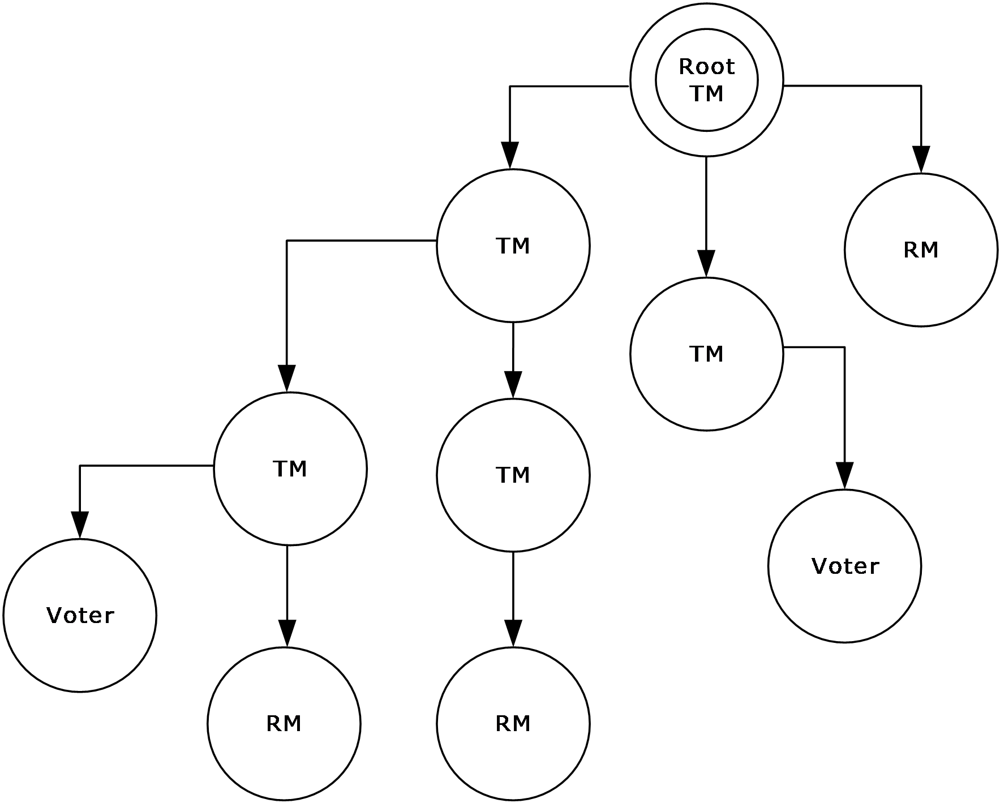

Figure 1: Transaction tree

Eventually, the **root application** that began the **transaction** determines that no more **work** is to be performed under the **transaction**. When that occurs, the **application** sends a [**Commit request**](#gt_commit-request) to the **root transaction manager** to begin the process of completing the **transaction**.

When the **root transaction manager** receives the **Commit** request, it begins the process of determining the **transaction** [**outcome**](#gt_outcome) and communicating that outcome to all interested **participants**. That process begins with zero or more [**Phase Zero waves**](#gt_phase-zero-wave) followed by [Phase One](#Section_1.3.1.2) and [Phase Two](#Section_4.5.2) of the Two-Phase Commit sequence.

#### 1.3.1.1 Phase Zero

When a [**Commit request**](#gt_commit-request) is issued by the [**root application**](#gt_root-application), the [**transaction**](#gt_transaction) first enters [**Phase Zero**](#gt_phase-zero). If there are no [**Phase Zero participants**](#gt_phase-zero-participant), the **transaction** leaves **Phase Zero** and proceeds to [Phase One](#Section_1.3.1.2).

**Phase Zero** is composed of one or more [**Phase Zero waves**](#gt_phase-zero-wave). At the beginning of a **Phase Zero wave**, all **Phase Zero participants** are notified that the **transaction** has entered **Phase Zero**. While the [**participants**](#gt_participant) process the **Phase Zero** notification, they can continue to marshal the **transaction** to new participants. Consequently, participating [**transaction managers**](#gt_transaction-manager) can still accept new [**enlistments**](#gt_enlistment) during **Phase Zero**.

When a **Phase Zero participant** completes its **Phase Zero** processing, it sends a **Phase Zero** completion notification back to the **transaction manager**.

If any of the **Phase Zero participants** fail or issue an [**Abort request**](#gt_abort-request) during the **Phase Zero wave**, the current **Phase Zero wave** is terminated and the **transaction** immediately moves to the aborting state, which is discussed in section [1.3.2.1](#Section_1.3.2.1).

Otherwise, after completion notifications are received from all **Phase Zero participants**:

- If no new **Phase Zero enlistments** were created during the current **Phase Zero wave**, the **transaction** proceeds to Phase One.
- If one or more new [**Phase Zero enlistments**](#gt_phase-zero-enlistment) were created during the current **Phase Zero wave**, the **transaction** executes another **Phase Zero wave** with the new **Phase Zero participants**.
The following figure shows the overall Phase Zero flow.

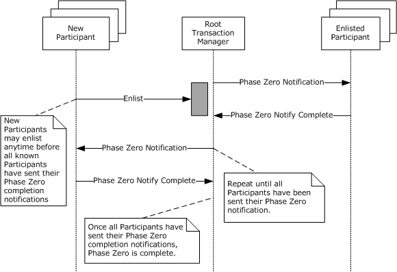

Figure 2: Transaction manager Phase Zero flow

#### 1.3.1.2 Phase One

When **Phase One** begins, all **transaction participants** are now presumed to have completed their [**work**](#gt_work) inside the **transaction**.

During **Phase One**, each [**Phase One participant**](#gt_phase-one-participant) is asked to vote on the [**outcome**](#gt_outcome) of the **transaction**. Each participant vote can have one of three possible results:

- **Read Only:** The participant agrees for the **transaction** to Commit but does not require an outcome notification.
- **Prepared:** The **participant** agrees for the **transaction** to Commit and requires an outcome notification.
- **Aborted:** The **participant** requires that the **transaction** abort.
Before a **participant** can vote Prepared, it performs whatever actions are necessary to be able to process an order to Commit or an order to Abort at some point in the future. Note that the request for a vote polls the **transaction tree** from the [**root transaction manager**](#gt_root-transaction-manager) down to the leaf **participants**. When a [**subordinate transaction manager**](#gt_subordinate-transaction-manager) receives a request for a vote, it will first issue that request to all its immediate subordinates and process their votes before voting itself.

When all votes are collected by the **root transaction manager**, a decision about the **transaction** outcome is made. If every vote was either Read Only or Prepared, the root transaction manager attempts to record a [**Commit outcome**](#gt_commit-outcome) decision. If successful, the Commit outcome decision is officially made.

Otherwise, if one or more of the votes is Aborted or if a Commit outcome decision cannot be successfully recorded, the **transaction manager** makes an [**Abort outcome**](#gt_abort-outcome) decision.

After an outcome decision is made, the **root transaction manager** proceeds to [Phase Two](#Section_4.5.2) to distribute outcome notification messages throughout the **transaction tree**.

The following figure depicts the Phase One flow.

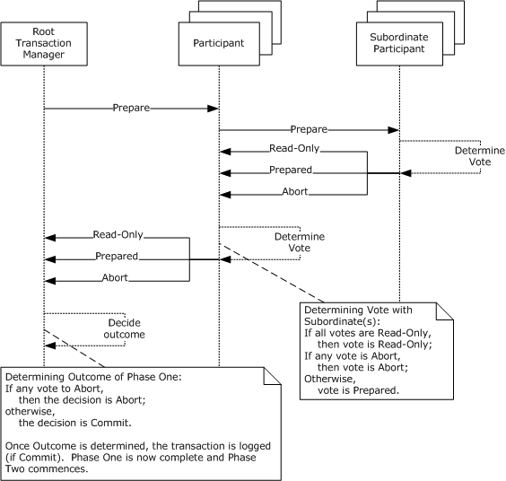

Figure 3: Transaction manager Phase One flow

#### 1.3.1.3 Phase Two

When **Phase Two** begins, the [**root transaction manager**](#gt_root-transaction-manager) has determined the [**transaction**](#gt_transaction) [**outcome**](#gt_outcome).

If the transaction outcome is a [**Commit outcome**](#gt_commit-outcome), the transaction enters the committing state. Each [**participant**](#gt_participant) that voted Prepared is sent an order to commit. The **participants** perform any necessary commit processing and respond with a committed notification.

If the **transaction** outcome is an [**Abort outcome**](#gt_abort-outcome), the **transaction** enters the [Aborting](#Section_3.8.1.1.4) state. Each **participant** that voted Prepared is sent an order to abort. The **participants** perform any necessary abort processing and respond with an Aborted notification.

If a Prepared **participant** loses contact with its [**transaction manager**](#gt_transaction-manager), it is said to be [In Doubt](#Section_3.2.1.3.12). If it is a [**durable resource manager**](#gt_durable-resource-manager), it attempts to reconnect to the transaction manager and perform [**recovery**](#gt_recovery) to learn the outcome of the transaction. See section [1.3.4](#Section_1.3.4.3) for recovery details.

In general, **participants** (including the [**root application**](#gt_root-application)) are sent the outcome decision notification in parallel.

**Phase Two** is complete when the **root transaction manager** sends the outcome decision notification to all the [**subordinate participants**](#gt_subordinate-participant), the **root transaction manager** receives the reply notifications from all the **subordinate participants**, and the **root transaction manager** does the necessary work to forget the transaction.

The following figure shows the Phase Two flow.

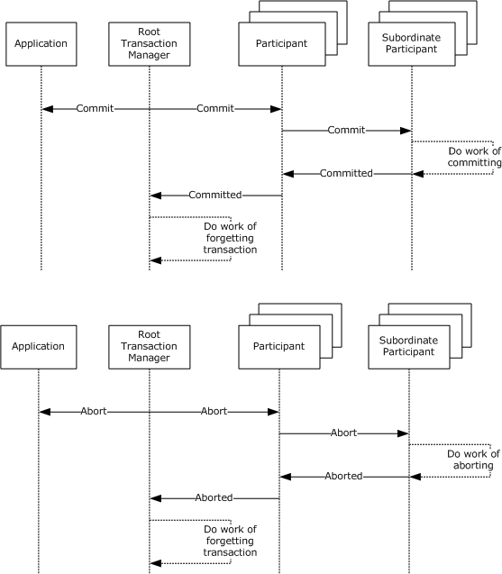

Figure 4: Transaction manager Phase Two flow

### 1.3.2 Additional Considerations

In addition to the [**two-phase commit**](#gt_two-phase-commit) processing described in the previous section, there are two more cases to consider:

- [Unilateral abort](#Section_1.3.2.1)
- [Single-phase commit](#Section_1.3.2.2)

#### 1.3.2.1 Unilateral Abort

Until a [**participant**](#gt_participant) votes on the [**outcome**](#gt_outcome) of the [**transaction**](#gt_transaction), any participant can decide to unilaterally stop the transaction by issuing an [**Abort request**](#gt_abort-request) to its [**transaction manager**](#gt_transaction-manager). This ability is known as a **Unilateral Abort**.

After a **transaction manager** receives an Abort request from one of its **participants**, it immediately transitions the **transaction** to the [Aborting](#Section_3.8.1.1.4) state, which guarantees an [**Abort outcome**](#gt_abort-outcome). All other **participants** will be notified of the Abort outcome, although it is possible that the [**root application**](#gt_root-application) does not discover the Abort outcome until it attempts to complete the transaction or perform some other operation involving the **transaction manager** or another **participant**.

After a specified **transaction manager** enters the Aborting state, it does not issue any further [**Phase Zero**](#gt_phase-zero) notifications or [Phase One](#Section_1.3.1.2) requests to vote. For a **transaction** that spans two or more **transaction managers** due to propagation, it is possible for the Abort outcome decision to race with other **Phase Zero** or **Phase One** activity as it is communicated between the **transaction managers**.

The following figure shows the Unilateral Abort flow.

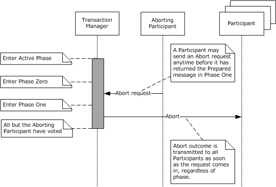

Figure 5: Unilateral Abort flow

#### 1.3.2.2 Single-Phase Commit

If a [**transaction manager**](#gt_transaction-manager) has exactly one subordinate [**Phase One enlistment**](#gt_phase-one-enlistment), the **transaction manager** attempts to perform the [**single-phase commit**](#gt_single-phase-commit) optimization. In this case, the **transaction manager** sends the [**subordinate participant**](#gt_subordinate-participant) a request to perform a **single-phase commit**, instead of the standard [Phase One](#Section_1.3.1.2) Prepare request. This optimization delegates the right to decide the [**transaction**](#gt_transaction) [**outcome**](#gt_outcome) to the subordinate.

The **subordinate** accepts this delegation by making an outcome decision and eventually notifying the **transaction manager**; or it rejects the Single-Phase Commit request by responding Prepared. In the latter case, the **transaction manager** makes its own outcome decision and then engages in a standard [Phase Two](#Section_4.5.2) exchange with the [**participant**](#gt_participant).

There is a possible disadvantage to this optimization: if the **transaction manager** loses contact with the **subordinate participant** after sending the **Single-Phase Commit** request but before receiving an outcome notification, it has no reliable mechanism for recovering the actual outcome of the **transaction**. Consequently, the **transaction manager** sends an [**In Doubt outcome**](#gt_in-doubt-outcome) to any [**applications**](#gt_application) or [**voters**](#gt_voter) awaiting informational outcome notification.

The **single-phase commit** optimization can be used by any **transaction manager** that has exactly one Phase One subordinate [**enlistment**](#gt_enlistment), not just the [**root transaction manager**](#gt_root-transaction-manager). For example, if **transaction manager** A has only **transaction manager** B as a subordinate **enlistment**, then A can use the **single-phase commit** optimization with B. If in the same transaction, B has only **transaction manager** C as a subordinate **enlistment**, it too can use the **single-phase commit** optimization with C. This is true regardless of the number of subordinate **enlistments** that are registered with C.

Note that a **non-root transaction manager** performs only the **single-phase commit** optimization if its own [**superior transaction manager**](#gt_superior-transaction-manager) has sent it a **Single-Phase Commit** request.

The following figure shows the **Single-Phase Commit** flow.

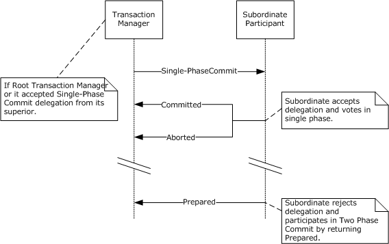

Figure 6: Single-Phase Commit flow

### 1.3.3 Transaction Roles

This protocol enables [**transaction**](#gt_transaction) processing to be distributed among two or more distinct [**participants**](#gt_participant). These **participants** are categorized according to three specialized roles that perform specific functions inside the transaction:

- [Application role](#Section_1.3.3.1)
- [Resource manager role](#Section_1.3.3.2)
- [Transaction manager role](#Section_1.3.3.3)
Each role is functionally independent of the other two. It is possible to implement the protocol functions that are required by any of these three roles without implementing the protocol functions that are required by the other two. For example, it is possible to implement a transactional [**resource manager**](#gt_resource-manager-rm) without building a [**transaction manager**](#gt_transaction-manager) or a transaction-aware [**application**](#gt_application).

The following graphic depicts the transaction roles.

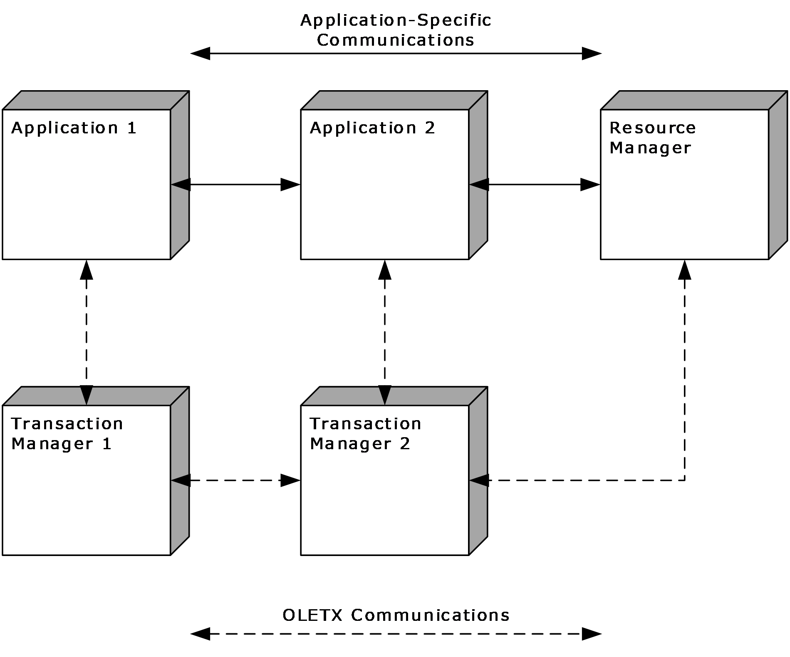

Figure 7: Transaction roles

#### 1.3.3.1 Application Role

The [**application**](#gt_application) role is generally performed by user software programs that make use of transaction processing services to obtain greater reliability or reduce the complexity of error-handling [**tasks**](#gt_task).

The **application** role is typically responsible for performing the following tasks:

- Determining when to begin a [**transaction**](#gt_transaction)
- Marshaling the **transaction** to other **applications** and to [**resource managers**](#gt_a7d0361f-8608-454d-9a52-67d4d181ae09)
- Propagating the **transaction** from one [**transaction manager**](#gt_transaction-manager) to another
- Determining when to complete a **transaction**
- Performing administrative operations against a specific **transaction**
- Performing administrative operations against the **transaction manager**
In general, the motivations behind these tasks are application-specific. The protocol mechanisms by which these tasks can be accomplished are discussed in sections [2](#Section_2) and [3](#Section_3).

#### 1.3.3.2 Resource Manager Role

The [**resource manager**](#gt_resource-manager-rm) role is generally performed by software programs that manage transactional [**resources**](#gt_resource). Databases and queues are the most common examples of such programs.

This protocol supports three types of [**enlistments**](#gt_enlistment): [**Phase Zero enlistments**](#gt_phase-zero-enlistment), [**Phase One enlistments**](#gt_phase-one-enlistment), and [**voter enlistments**](#gt_voter-enlistment). These enlistment types correspond to three common categories of **resource managers**:

- Caching **resource managers** appear like a [**durable resource manager**](#gt_durable-resource-manager) to an [**application**](#gt_application), but they actually delegate their durable state changes to another **resource manager** that provides true durability. Caching **resource managers** typically use Phase Zero enlistments.
- **Durable resource managers** manage access to [**durable resources**](#gt_durable-resource). They are expected to support [**recovery**](#gt_recovery). **Durable resource managers** typically use Phase One enlistments.
- [**Volatile resource managers**](#gt_volatile-resource-manager) manage access to [**volatile resources**](#gt_volatile-resource) whose state does not persist beyond the lifetime of the **resource manager** process. **Volatile resource managers** typically use **voter enlistments**.
The **resource manager** role is typically responsible for the following [**tasks**](#gt_task):

- Providing **applications** with access to data in a transactional manner. This function is specific to the implementation of a **resource manager**.
- Registering with a [**transaction manager**](#gt_transaction-manager) and performing recovery operations for all [In Doubt](#Section_3.2.1.3.12) [**transactions**](#gt_transaction).
- Enlisting for various [**two-phase Commit**](#gt_two-phase-commit) notifications.
- Voting on **transaction** [**outcomes**](#gt_outcome) in accord with the implementation-specific policies of the resource manager.
In general, the motivations behind these tasks are application-specific. The specific protocol mechanisms by which these tasks are accomplished are discussed in sections [2](#Section_2) and [3](#Section_3).

#### 1.3.3.3 Transaction Manager Role

The **Transaction Manager** Role is generally performed by specialized middleware software programs that provide transactional services to [**applications**](#gt_application) and [**resource managers**](#gt_a7d0361f-8608-454d-9a52-67d4d181ae09).

The [**transaction manager**](#gt_transaction-manager) role is typically responsible for the following [**tasks**](#gt_task):

- Providing the following services to applications and resource managers:
- Beginning [**transactions**](#gt_transaction)
- Completing **transactions**
- Coordinating agreement with [**participants**](#gt_participant) on the [**outcome**](#gt_outcome) of the **transaction**
- Reaching the decision to commit
- Ensuring the outcome decision is reliably distributed
- Coordinating the process of [**recovery**](#gt_recovery) if failures occur
- Coordinating the outcome of individual **transactions** by using the [**Two-Phase Commit**](#gt_two-phase-commit) protocol.
- Coordinating recovery with other **participants** after a process or communication failure. See section [1.3.4](#Section_1.3.4.3) for recovery details.
A **transaction manager** is best understood as the aggregation of several cooperating software modules that work together to provide the services previously mentioned. This protocol calls these software modules [**facets**](#gt_facet), and assumes the presence of the following five **facets**:

- A **facet** that acts as a **core transaction manager**
- A **facet** that communicates with **applications**
- A **facet** that communicates with **resource managers**
- A **facet** that acts as a [**superior transaction manager**](#gt_superior-transaction-manager)
- A **facet** that acts as a [**subordinate transaction manager**](#gt_subordinate-transaction-manager)
A **transaction manager** provides implementation-specific mechanisms to allow the **facets** to communicate with one another within the **transaction manager** itself.

In contrast, the **transaction manager facets** use the MSDTC Connection Manager: OleTx Transports Protocol as specified in [MS-CMPO](#Section_2.1), and the MSDTC Connection Manager: OleTx Multiplexing Protocol as specified in [MS-CMP](../MS-CMP/MS-CMP.md), as transports for this protocol when they communicate with other **participants** (for example, **applications**, **resource managers**, and **remote transaction managers**). The subprotocols that are used to provide services to these participants are known as [**connection types**](#gt_connection-type). The specific connection types that are used in this protocol are specified in detail in section [3](../MS-CMPO/MS-CMPO.md).

These **facets** are functionally dependent upon each other. A general-purpose **transaction manager** is composed of all five of these **facets**.

The following figure shows the transaction manager facets.

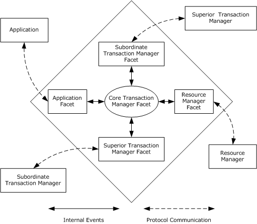

Figure 8: Transaction manager facets

##### 1.3.3.3.1 Core Transaction Manager Facet

The [**Core Transaction Manager Facet**](#gt_core-transaction-manager-facet) is a logical construct in the context of this protocol. It never establishes network communication with any other [**transaction**](#gt_transaction) [**participant**](#gt_participant). It communicates with the other [**transaction manager**](#gt_transaction-manager) [**facets**](#gt_facet) through implementation-specific mechanisms.

##### 1.3.3.3.2 Transaction Manager Communication with an Application Facet

When the [**transaction manager**](#gt_transaction-manager) is communicating with an [**application**](#gt_application) [**facet**](#gt_facet), it provides the following services to applications:

- [**Transaction**](#gt_transaction) creation.
- [**Transaction propagation**](#gt_transaction-propagation) to a **remote transaction manager**.
- **Transaction** propagation by providing an existing **transaction** to the [subordinate transaction manager facet](#Section_1.3.3.3.5) for propagation.
- **Transaction** completion.
- Administrative operations against a specific **transaction**. These operations include:
- Setting the time-out on a **transaction**.
- Obtaining **transaction** details, such as information about the [superior transaction manager facet](#Section_1.3.3.3.4) and the list of [**subordinate participants**](#gt_subordinate-participant).
- Manually resolving the [**outcome**](#gt_outcome) of a **transaction**.
- Requesting that the **transaction manager** provide details of the **transaction** in its implementation-specific trace log.
- Administrative operations against the **transaction manager**. These operations include the ability to obtain information about the security configuration of the **transaction manager**.

##### 1.3.3.3.3 Transaction Manager Communication with a Resource Manager Facet

When the [**transaction manager**](#gt_transaction-manager) is communicating with a [**resource manager**](#gt_resource-manager-rm) [**facet**](#gt_facet), it provides the following services to **resource managers**:

- **Resource manager** [**registration**](#gt_registration)
- [**Recovery**](#gt_recovery) and [**outcome**](#gt_outcome) notification for [In Doubt](#Section_3.2.1.3.12) [**transactions**](#gt_transaction)
- **Transaction** [**enlistment**](#gt_enlistment) for [**Phase Zero**](#gt_phase-zero), [**Phase One**](#gt_phase-one), and [**voter**](#gt_voter) [**participants**](#gt_participant)
- [Phase Zero](#Section_1.3.1.1), [Phase One](#Section_1.3.1.2), and [Phase Two](#Section_4.5.2) notifications inside the [**Two-Phase Commit**](#gt_two-phase-commit) protocol

##### 1.3.3.3.4 Superior Transaction Manager Facet

The [**Superior Transaction Manager**](#gt_superior-transaction-manager) [**Facet**](#gt_facet) provides the following services to [subordinate transaction manager facets](#Section_1.3.3.3.5):

- Acts as **Superior Transaction Manager Facet** to a number of [**subordinate transaction manager**](#gt_subordinate-transaction-manager) facets in the [**Two-Phase Commit**](#gt_two-phase-commit) protocol.
- Provides [**recovery**](#gt_recovery) and [**outcome**](#gt_outcome) notification for [**transactions**](#gt_transaction) that are left in the [Failed to Notify](#Section_3.2.1.3.13) state after a failure.

##### 1.3.3.3.5 Subordinate Transaction Manager Facet

The [**Subordinate Transaction Manager**](#gt_subordinate-transaction-manager) **Facet** provides the following services to [superior transaction manager facets](#Section_1.3.3.3.4):

- Acts as a **Subordinate Transaction Manager Facet** to a [**Superior Transaction Manager**](#gt_superior-transaction-manager) **Facet** in the [**Two-Phase Commit**](#gt_two-phase-commit) protocol.
- Provides [**recovery**](#gt_recovery) and [**outcome**](#gt_outcome) notification for [**transactions**](#gt_transaction) that are left in the [In Doubt](#Section_3.2.1.3.12) state after a failure.

### 1.3.4 Transaction Recovery

The [**atomicity**](#gt_atomic-transaction) property of a [**transaction**](#gt_transaction) guarantees that all [**participants**](#gt_participant) in the **transaction** receive the same [**outcome**](#gt_outcome). This guarantee is relaxed in the case of [**volatile resources**](#gt_volatile-resource) such as [**voters**](#gt_voter) but is strictly honored for [**durable resource managers**](#gt_durable-resource-manager) and [**transaction managers**](#gt_transaction-manager).

To honor this guarantee, **transaction managers** and durable [**resource managers**](#gt_a7d0361f-8608-454d-9a52-67d4d181ae09) have to be capable of recovering from [**transient failures**](#gt_transient-failure) that can occur, such as loss of transport connectivity or a software crash. The process of [**recovery**](#gt_recovery) involves reestablishing connectivity with other **transaction participants** and exchanging the protocol messages that are required to synchronize all parties on the actual outcome of the **transaction**.

After a transient failure, the **transaction manager** reestablishes connectivity with the following parties:

- The [**superior transaction manager**](#gt_superior-transaction-manager) for each **transaction** for which the **transaction manager** was [In Doubt](#Section_3.2.1.3.12) at the time of the failure
- The [**subordinate transaction managers**](#gt_subordinate-transaction-manager) for which the **transaction manager** was in the [Failed to Notify](#Section_3.2.1.3.13) state at the time of the failure
After a transient failure, the **resource manager** reestablishes connectivity with the following parties:

- The **superior transaction manager** for each **transaction** for which the **resource manager** was In Doubt at the time of the failure
The following sections describe in more detail the recovery process for each participant.

#### 1.3.4.1 Relationship Between Recovery and Durability

[**Transaction managers**](#gt_transaction-manager) and [**durable resource managers**](#gt_durable-resource-manager) can use any mechanism they choose to implement the durability guarantees of an [**atomic transaction**](#gt_atomic-transaction).

At minimum:

- Before a durable **resource manager** or [**subordinate transaction manager**](#gt_subordinate-transaction-manager) sends a Prepared notification to its [**superior transaction manager**](#gt_superior-transaction-manager), it needs to first ensure that it can derive the information that is needed to contact its **superior transaction manager** and to inquire about the [**outcome**](#gt_outcome) of the [**transaction**](#gt_transaction) after a [**transient failure**](#gt_transient-failure). This requirement is needed for the subordinate to perform [**recovery**](#gt_recovery) on [In Doubt](#Section_3.2.1.3.12) transactions.
- Before a **transaction manager** can communicate the **transaction** outcome to a [**subordinate participant**](#gt_subordinate-participant) or the [**root application**](#gt_root-application), it has to first ensure that it can derive the **transaction** outcome for as long as at least one **durable subordinate** has not acknowledged receipt of the **transaction** outcome. This requirement is needed for the **superior** to perform recovery on Failed to Commit **transactions**.
- Before a **durable resource manager** or **subordinate transaction manager** acknowledges a Commit notification from its **superior transaction manager**, it has to first ensure that it will not perform recovery on the **transaction** after a transient failure. This requirement allows the **superior transaction manager** to implement the [**Presumed Abort**](#gt_presumed-abort) optimization.
The information that is needed to be able to contact another [**participant**](#gt_participant) is identical to the information that was needed to establish the initial transport [**session**](#gt_session) with that **participant**, as specified in [MS-CMPO](#Section_2.1) section 1.3.3.1.

#### 1.3.4.2 Resource Manager Recovery

**Resource manager** [**recovery**](#gt_recovery) is unidirectional: the [**resource manager**](#gt_resource-manager-rm) is always responsible for initiating recovery with its [**transaction manager**](#gt_transaction-manager). A **resource manager** always performs recovery on startup, even when it has not detected any [**transactions**](#gt_transaction) remaining in the [In Doubt](#Section_3.2.1.3.12) state. This is because the **transaction manager** cannot determine when it has [Failed to Notify](#Section_3.2.1.3.13) the **resource manager** of specific transaction [**outcomes**](#gt_outcome).

The typical sequence for recovery of a **resource manager** is as follows:

- The **resource manager** determines the list of **transactions** for which it is **In Doubt**. These are the **transactions** for which it previously voted Prepared but has not yet learned the outcome.
- The **resource manager** registers with its **transaction manager**.
- For each **In Doubt transaction**, the **resource manager** attempts to contact the **transaction manager** to determine the **transaction** outcome.
- When the **resource manager** receives the outcome from the **transaction manager**, it performs any implementation-specific actions that are required to honor the [**ACID**](#gt_acid) properties. Also, this process can take some time because the **transaction manager** can be acting as a [**subordinate transaction manager**](#gt_subordinate-transaction-manager) and it too might still be **In Doubt** about the actual **transaction** outcome.
- After the **resource manager** ensures that there are no **transactions** for which it is still **In Doubt**, it informs the **transaction manager** that its recovery is complete. This allows the **transaction manager** to clean up any pending **transactions** for which it considered that the **resource manager** was in the Failed to Notify state.

#### 1.3.4.3 Transaction Manager Recovery

[**Transaction Manager**](#gt_transaction-manager) [**recovery**](#gt_recovery) is dual-faceted. The recovering **transaction manager** will attempt to recover those [**transactions**](#gt_transaction) for which it is acting as a [superior transaction manager facet](#Section_1.3.3.3.4) and those for which it is acting as a [subordinate transaction manager facet](#Section_1.3.3.3.5).

The typical sequence for a **superior transaction manager facet** to perform recovery is the following:

- The [**superior transaction manager**](#gt_superior-transaction-manager) determines the list of **transactions** for which it is in the [Failed to Notify](#Section_3.2.1.3.13) state. These are the **transactions** whose [**outcome**](#gt_outcome) has been decided but for which there exists at least one durable [**subordinate participant**](#gt_subordinate-participant) whose receipt of that outcome cannot be verified.
- For each of these **transactions**, the **superior transaction manager** attempts to perform recovery by contacting all [**subordinate transaction managers**](#gt_subordinate-transaction-manager) whose receipt of outcome cannot be verified to redeliver the **transaction** outcome.
The typical sequence for a **subordinate transaction manager facet** to perform recovery is the following:

- The **subordinate transaction manager** determines the list of **transactions** for which it is in the [In Doubt](#Section_3.2.1.3.12) state.
- For each of these transactions, the **subordinate transaction manager** attempts to contact the **superior transaction manager** to determine the **transaction** outcome.
- For each **In Doubt transaction** whose **transaction** outcome is now known, the **subordinate transaction manager** proceeds to communicate the outcome to its own **subordinate transaction managers**.

### 1.3.5 Transaction Propagation

A single [**transaction**](#gt_transaction) typically requires [**work**](#gt_work) to be performed by one or more [**resource managers**](#gt_a7d0361f-8608-454d-9a52-67d4d181ae09) for one or more [**applications**](#gt_application). Each of these **applications** and **resource managers** is typically associated with exactly one [**transaction manager**](#gt_transaction-manager).

When two [**participants**](#gt_participant) share a common **transaction manager**, all that is needed to share a **transaction** is agreement on the transaction's unique identifier. How this unique identifier is communicated among the **applications** and **resource managers** is implementation-specific.

However, when two **participants** do not share a common **transaction manager**, this protocol defines a propagation mechanism that enables the two **participants** to notify their respective **transaction managers** that a specified **transaction** will span the two **transaction managers**. [**Transaction propagation**](#gt_transaction-propagation) allows **applications** and **resource managers** to freely marshal **transactions** across process and host machine boundaries by using whatever communication mechanisms and formats they chose.

When a **participant** (the source) determines that it marshals a **transaction** to a second **participant** (the destination), the **participant** chooses between two distinct propagation techniques:

- [**push propagation**](#gt_push-propagation) (section [1.3.5.2](#Section_1.3.5.2))
- [**pull propagation**](#gt_pull-propagation) (section [1.3.5.1](#Section_1.3.5.1))
**Push propagation** requires the source **participant** to have a prior knowledge about which **transaction manager** the destination **participant** is associated with. In contrast, **pull propagation** allows the source **participant** to marshal the **transaction** without any awareness of the **transaction manager** of the destination **participant**.

Independent of the choice of push or pull propagation, after the propagation is complete, the destination **transaction manager** will have enlisted with the source **transaction manager** to coordinate the [**outcome**](#gt_outcome) of the **transaction**. In this [**enlistment**](#gt_enlistment), the source **transaction manager** plays the role of [**superior transaction manager**](#gt_superior-transaction-manager), and the destination **transaction manager** plays the role of [**subordinate transaction manager**](#gt_subordinate-transaction-manager).

#### 1.3.5.1 Pull Propagation

**Pull propagation** enables the untargeted marshaling of a [**transaction**](#gt_transaction) from one [**application**](#gt_application) or [**resource manager**](#gt_resource-manager-rm) to another. Contact information for the destination [**transaction manager**](#gt_transaction-manager) is not required to be known by the source in advance.

The following sequence of events represents a complete **pull propagation** operation between two [**participants**](#gt_participant):

- When the source determines that it possesses a **transaction** that it wants to share with the destination, it provides the destination with marshaling information about the **transaction** being shared in an implementation-specific manner. The marshaling information needs to be sufficient for the destination to create a [Propagation Token](#Section_3.3.4.3) structure, as specified in section 2.2.5.4, that corresponds to the **transaction** being shared.
- The destination contacts its own **transaction manager** and requests that it join the **transaction** by using the marshaling information that is provided by the source **application**.
- If the destination **transaction manager** is not already a **participant** in the **transaction**, the destination **transaction manager** uses the marshaling information to contact the source **transaction manager** to enlist in the **transaction** as a [**subordinate transaction manager**](#gt_subordinate-transaction-manager). This inter–**transaction manager** handshake is called **pull propagation**.
- If the operation is successful, the destination **transaction manager** reports success to the destination. The destination performs further operations on the **transaction** with its associated **transaction manager** or marshals the **transaction** further to other participants.
The following figure shows a typical **pull propagation**.

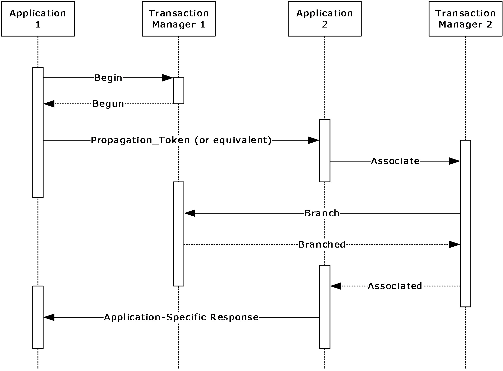

Figure 9: Transaction manager pull propagation

#### 1.3.5.2 Push Propagation

[**Push propagation**](#gt_push-propagation) enables the targeted marshaling of a [**transaction**](#gt_transaction) from one [**participant**](#gt_participant) to another. **Push propagation** is available only when the source knows the contact information for the destination [**transaction manager**](#gt_transaction-manager) in advance.

**Push propagation** consists of two distinct logical operations: an export operation and an import operation.

The following sequence of events represents a complete **push propagation** operation between two participants:

- The source obtains contact information for the destination **transaction manager** by using implementation-specific means. The contact information consists of whatever the source needs to construct an [SWhereabouts](#Section_2.2.5.11) structure, as specified in section 2.2.5.11. This step need be performed only one time per destination because the contact information is not specific to a specified **transaction** or propagation.
- When the source determines that it possesses a **transaction** that it wants to share with the destination, the source asks its **transaction manager** to export the **transaction** to the destination **transaction manager** by using the contact information it obtained in the previous step.
- The source **transaction manager** contacts the destination **transaction manager** by using the provided contact information and informs it of the existence and details of the **transaction**. This inter–**transaction manager** handshake is the export operation of **push propagation**.
- When the source **transaction manager** receives acknowledgment from the destination **transaction manager**, the export operation is complete. If the destination **transaction manager** was not already a **participant** in the **transaction**, the destination **transaction manager** is now enlisted as a [**subordinate transaction manager**](#gt_subordinate-transaction-manager) at the source **transaction manager**, which acts as the [**superior transaction manager**](#gt_superior-transaction-manager).
- After the source **transaction manager** informs the source that the **transaction** was successfully exported, the source then uses an implementation-specific mechanism to marshal the exported **transaction** to the destination. The marshaled information can take any form that the source and destination agree on but is sufficient for the source to construct an [STxInfo](#Section_2.2.5.10) structure as specified in section 2.2.5.10.
- The destination uses the marshaled information that is provided by the source to request an import operation from its **transaction manager**. The import operation is typically a simple confirmation that the **transaction** exists and was correctly exported to the destination.
- If the import operation is successful, the destination **transaction manager** reports success to the destination. The destination performs further operations on the **transaction** with its associated **transaction manager** or marshals the transaction further to other **participants**.
The following figure depicts a typical push propagation.

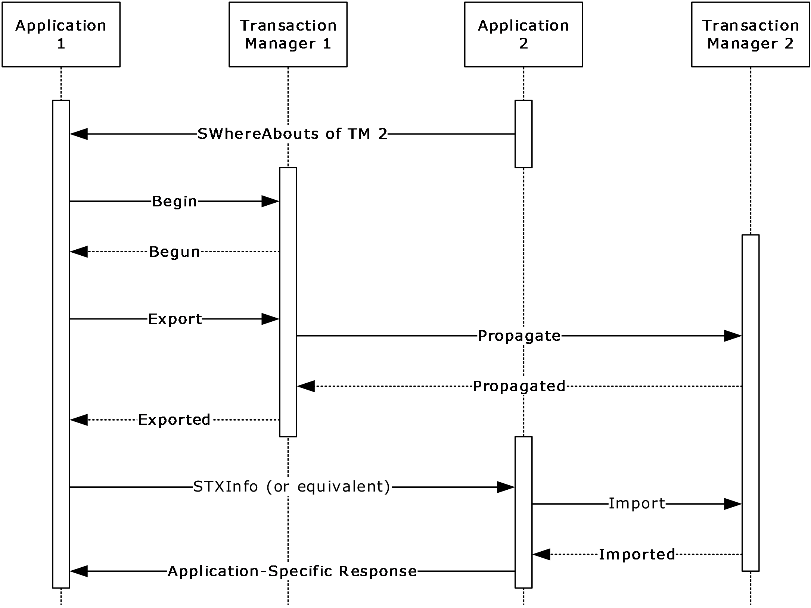

Figure 10: Transaction manager push propagation

## 1.4 Relationship to Other Protocols

The following figure illustrates the relationship between the MSDTC Connection Manager: OleTx Transaction Protocol [MS-DTCO] and the underlying protocols on which it depends [MS-CMP](../MS-CMP/MS-CMP.md) and [MS-CMPO](#Section_2.1).

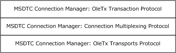

Figure 11: Protocol relationships

This protocol provides extensibility elements that are used by the following specifications:

- [MC-DTCXA](../MC-DTCXA/MC-DTCXA.md)
- [MS-DTCM](../MS-DTCM/MS-DTCM.md)
- [MS-DTCLU](../MS-DTCLU/MS-DTCLU.md)
- [MS-TIPP](../MS-TIPP/MS-TIPP.md)
- [MS-WSRVCAT](../MS-WSRVCAT/MS-WSRVCAT.md)
The following protocols perform [**transaction marshaling**](#gt_transaction-marshaling) by using the structures specified in section [2.2.5](#Section_3.4.5.2) and its subsections of [MS-DTCO]:

- [MS-COM](../MS-COM/MS-COM.md)
- [MS-MQRR](../MS-MQRR/MS-MQRR.md)
- [MS-MQMP](../MS-MQMP/MS-MQMP.md)

## 1.5 Prerequisites/Preconditions

This protocol requires that all participating roles possess implementations of MSDTC Connection Manager: OleTx Multiplexing Protocol as specified in [MS-CMP](../MS-CMP/MS-CMP.md), and MSDTC Connection Manager: OleTx Transports Protocol as specified in [MS-CMPO](#Section_2.1).

## 1.6 Applicability Statement

This protocol applies to scenarios where distributed [**atomic transaction**](#gt_atomic-transaction) processing is required.

[**Distributed transactions**](#gt_distributed-transaction) are generally required in scenarios where several [**applications**](#gt_application) and [**resource managers**](#gt_a7d0361f-8608-454d-9a52-67d4d181ae09) cooperate to perform a set of related [**work**](#gt_work) items that require the [**ACID**](#gt_acid) properties of a distributed transaction. These properties are needed to be able to make changes to persistent state in a deterministic, correct, and highly reliable manner. Although **distributed transactions** are one of several mechanisms for accomplishing this goal, they are the most efficient and understood general-purpose solution.

This specific **distributed transaction** protocol requires network topologies where the MSDTC Connection Manager: OleTx Transports Protocol as specified in [MS-CMPO](#Section_2.1), and the MSDTC Connection Manager: OleTx Multiplexing Protocol as specified in [MS-CMP](../MS-CMP/MS-CMP.md), constitute a viable network transport for establishing long-lived [**session**](#gt_session) relationships between different parties supporting many short-lived [**connection**](#gt_connection) exchanges that accomplish specific tasks.

## 1.7 Versioning and Capability Negotiation

This document covers versioning aspects in the following areas:

- **Protocol versions**
This protocol provides five different versions: 1, 2, 4, 5, and 6 (version 3 is reserved and not used). More details on the protocol elements supported in each version are provided in Protocol Versioning (section [2.2.1](#Section_2.2.1)).

- **Capability negotiation**
This protocol performs explicit versioning and capability negotiation, as specified in sections [1.7.2](#Section_1.7.2) and section [1.7.3](#Section_1.7.3).

### 1.7.1 Versioning Mechanisms

This protocol uses various mechanisms for versioning that are introduced as follows:

- Protocol Version numbers as versioning mechanism:
This protocol provides five different versions. The following are the implications of supporting a particular protocol version:

- Support for [**connection types**](#gt_connection-type) is version-specific and is either required, optional, or not allowed for a given Protocol Version.
- For a version-specific supported connection type, support for all messages defined for that connection type is required.
- The layout of data associated with specific messages is version-specific and is determined by the Protocol Version.
Protocol Version Numbers as a Versioning Mechanism (section [2.2.1.1](#Section_1.3)) specifies details of what it means to support a certain Protocol Version Number. Protocol Versioning Details (section [3.1.4](#Section_3.2.1.1)) specifies how the Protocol Version numbers are negotiated during communication initiation.

- Structures with fields containing version numbers as versioning mechanism: Certain structures have fields containing version numbers that specify how to interpret other parts of the structure. As an example, the **Propagation_Token** (section [2.2.5.4](#Section_3.3.4.3)) structure has the fields **dwVersionMin** and **dwVersionMax** the values of which are used to indicate whether certain other fields are present or not.
**Structures with Fields Containing Version Numbers as Versioning Mechanism** (section [2.2.2](#Section_2.2.2)) provides a list of the structures that fall in this category and links to information regarding each.

- Structures with complex fields using specific values to indicate the type of the complex field. Certain structures have a field that specifies how to interpret other parts of the structure. As an example, the **STmToTmProtocol** structure (section [2.2.5.9](#Section_2.2.5.9)) uses the value of the **tmprotDescribed** field to specify how to interpret the rest of the fields in that structure.
**Structures with a Format-Specifying Field as Versioning Mechanism** (section [2.2.3](#Section_2.2.3)) provides a list of the structures that fall in this category and links to information regarding each.

### 1.7.2 Versioning Negotiation Mechanisms

This protocol uses the following versioning negotiation mechanisms for each of the versioning mechanisms discussed above.

- Protocol Version Numbers as versioning mechanism
This protocol makes use of the explicit versioning negotiation mechanism as specified in [MS-CMPO](#Section_2.1), **BuildContext Primary**, section 3.3.4.2.1. An implementation of this protocol uses this mechanism to specify which versions of the protocol it supports and to negotiate a mutually agreeable version with its partners (see Protocol Versioning Details, (section [3.1.4](#Section_3.2.1.1))).

- Structures with fields containing version numbers as versioning mechanism
There is no versioning negotiation mechanism for this case. The version numbers are passed in each structure by the sender, and interpreted by the receiver.

- Structures with a field containing a value that identifies the structure format as versioning mechanism
There is no versioning negotiation mechanism for this case. The values of the field specifying the format are passed in each structure by the sender, and interpreted by the receiver.

### 1.7.3 Capability Negotiation Mechanisms

This protocol uses the following capability negotiation mechanisms for each of the versioning mechanisms discussed previously.

- Protocol Version numbers as versioning mechanism
- Support for certain [**connection types**](#gt_connection-type) is optional for a specific protocol version. A [**connection**](#gt_connection) [**initiator**](#gt_initiator) can determine whether the [**acceptor**](#gt_acceptor) supports these connection types by sending the first message for the connection and determining the acceptor's level of support from the response. If the acceptor rejects the connection with a MTAG_CONNECTION_REQ_DENIED as specified in [MS-CMP](../MS-CMP/MS-CMP.md) section 2.2.5, the connection type is not supported.
- Support for a message type is never optional for a specific connection type, with one exception: **TXUSER_RESOLVE_MTAG_ACCESSDENIED** (section [2.2.8.3.2.1](#Section_2.2.8.3.2.1)). However, there is no negotiation process to determine support for this message, and the message is sent by a sender that supports it in all cases.
- Some specific data fields inside certain message types were added in specific protocol versions as additional data fields that appear after the fields that are defined by previous protocol versions. The receivers examine the size of the incoming **MESSAGE_PACKET** (section [2.2.4.1](#Section_2.2.4.1)) structure to determine which additional data fields, if any, were included in the message by the sender.
- Structures with fields containing version numbers as a versioning mechanism
The structures using version numbers as a versioning mechanism do not have any optional elements for a particular version. Therefore, there are no capability negotiation mechanisms associated with them.

- Structures with a field containing a value that identifies the structure format as a versioning mechanism
In this case, the format of the structure is completely determined by the respective format-specifying field. There are no capability negotiation mechanisms associated with these structures.

## 1.8 Vendor-Extensible Fields

MSDTC Connection Manager: OleTx Transaction Protocol gives vendors the ability to provide implementation-specific [**protocol extensions**](#gt_protocol-extension) to the **Core Transaction Manager Facet** section [1.3.3.3.1](#Section_1.3.3.3.1). This protocol provides the following vendor-extensible fields and data elements:

- A protocol extension can augment the default set of [**transaction manager**](#gt_transaction-manager) [**facets**](#gt_facet) that are implemented inside an implementation of the **transaction manager** role, as specified in section [3.2.1.4](#Section_3.2.1.4). A protocol extension provides a set of services, as specified in section [3.2.1.5](#Section_3.2.1.5).
- A protocol extension also includes the contribution of [**extended whereabouts**](#gt_extended-whereabouts) information to the **Core Transaction Manager Facet**, as specified in section [3.2.3](#Section_3.2.3).
- Each vendor-supplied **transaction manager facet** has the option to use the local events that are provided by the **Core Transaction Manager Facet** that is specified in section [3.2.7](#Section_3.2.7).

## 1.9 Standards Assignments

This protocol has no standards assignments.

# 2 Messages

## 2.1 Transport

This protocol uses implementations of MSDTC Connection Manager: OleTx Transports Protocol as specified in [MS-CMPO](#Section_2.1), and MSDTC Connection Manager: OleTx Multiplexing Protocol as specified in [MS-CMP](../MS-CMP/MS-CMP.md), as the transport layer for sending and receiving protocol messages.

### 2.1.1 Messages, Connections, and Sessions

The layout of each **message** that is defined by this protocol MUST extend the **MESSAGE_PACKET** structure, as specified in section [2.2.4.1](#Section_2.2.4.1). The general mechanisms that are used to send and receive messages are as specified in [MS-CMP](../MS-CMP/MS-CMP.md) sections 3.1.4.1 and 3.1.7.4.

Each **message** MUST be sent by using an active [MS-CMP] [**connection**](#gt_connection) that has been established between an [**initiator**](#gt_initiator) and an [**acceptor**](#gt_acceptor). The mechanisms that are used to initiate and accept **connections** are as specified in [MS-CMP] sections 3.1.4.2 and 3.1.5.5.

Each **connection** MUST be initiated inside an active [MS-CMP] [**session**](#gt_session) that has been established between two [**OleTx**](#gt_oletx) [**participants**](#gt_participant). The mechanisms that are used to establish **sessions** are as specified in [MS-CMPO](#Section_2.1) section 1.3.3. The **session** creation is handled by MSDTC Connection Manager: OleTx Multiplexing Protocol, when a new **connection** is initiated.

When a new **connection** is initiated the OleTx **participant** MUST provide the following:

- The **Name Object** of the partner computed from implementation-specific configuration (section [2.1.2.3](#Section_2.1.2.2)).
- The [**connection type**](#gt_connection-type).
- An **Incoming Message Notification Interface** object ([MS-CMP] section 3.1.1.1) with local events (section [3.1.8](../MS-CMP/MS-CMP.md)) to receive incoming message notifications from MSDTC Connection Manager: OleTx Multiplexing Protocol layer [MS-CMP].

### 2.1.2 MS-CMP and MS-CMPO Initialization

To establish a transports protocol [**session**](#gt_session) as specified in [MS-CMPO](#Section_2.1) Local **Partner State** (section 3.2.1.1), the following values MUST be provided to the lower-layer multiplexing protocol which initializes the transports protocol with the following values:

- A security-level value that indicates the requested RPC authentication level. The **Security Level** field is initialized with the security-level value. Possible values for this element are specified in [MS-CMPO] section 3.2.1.1.
- The minimum and maximum protocol version values as computed in section [2.1.2.2](#Section_2.1.2.2). The **Minimum Level 3 Version Number** and **Maximum Level 3 Version Number** fields are initialized with the computed minimum and maximum protocol version values.
- A local name object that indicates the host name, the [**contact identifier**](#gt_contact-identifier), and the supported RPC network protocols of the local partner endpoint. The **Local Name Object** field is initialized with the local name object value. **Name Objects** are specified in [MS-CMPO] section 3.2.1.4.
If the initialization of the underlying MSDTC Connection Manager: OleTx Multiplexing protocol instance fails as specified in [MS-CMP](../MS-CMP/MS-CMP.md) section 3.1.3.2, then the implementation-specific failure result MUST be returned to the higher-layer business logic.

#### 2.1.2.1 Computing a Security Level

When an [**application**](#gt_application) or [**resource manager**](#gt_resource-manager-rm) initiates a [**connection**](#gt_connection) to its [**transaction manager**](#gt_transaction-manager), the **application** or **resource manager** MUST use an implementation-specific way to compute the **Security Level**.

#### 2.1.2.2 Computing Protocol Version Values

The process for computing the minimum and maximum protocol version numbers used in initializing the underlying transport specified in [MS-CMPO](#Section_2.1) is defined in **Protocol Versioning Details** (section [3.1.4](#Section_3.2.1.1)).

#### 2.1.2.3 Computing a Name Object

The **Name** object that is used to initiate a **session** is obtained in a variety of ways. This section defines how to obtain the appropriate **Name** object for several common situations. The specific **transaction** processing roles mentioned in these sections ([**applications**](#gt_application), [**resource managers**](#gt_a7d0361f-8608-454d-9a52-67d4d181ae09), and [**transaction managers**](#gt_transaction-manager)) are defined in section [1.3.3](#Section_1.3.3).

When an application or resource manager initiates a **connection** to its **transaction manager**, the **application** or **resource manager** MUST use implementation-specific configuration information to compute a **Name** object that represents the **transaction manager**:

- For [**pull propagation**](#gt_pull-propagation) of transactions, the source **application** MUST include the **Name** object representing its **transaction manager** in the marshaling information that is sent to the destination **application**. The **Propagation Token** (section [2.2.5.4](#Section_3.3.4.3)) structure SHOULD be used for marshaling this information.
- For **pull propagation** of transactions, the [**subordinate transaction manager**](#gt_subordinate-transaction-manager) (the **transaction manager** of the destination) MUST communicate its own **Name** object to the [**superior transaction manager**](#gt_superior-transaction-manager) (the source **transaction manager**) using a **CONNTYPE_PARTNERTM_BRANCH** connection (section [2.2.9.1.2.1](#Section_2.2.9.1.2.1)).
- For [**push propagation**](#gt_push-propagation) of **transactions**, the destination **application** MUST make the **Name** object that represents its **transaction manager** available to the source **application**. The **SWhereabouts** (section [2.2.5.11](#Section_2.2.5.11)) structure SHOULD be used for marshaling this information. Alternatively, the **NAMEOBJECTBLOB** (section [2.2.5.3](#Section_2.2.5.3)) structure MAY be used for the same purpose.<1>
- For **push propagation** of **transactions**, the **superior transaction manager** MUST communicate its own **Name** object to the subordinate transaction manager using a **CONNTYPE_PARTNERTM_PROPAGATE** (section [2.2.9.1.1.1](#Section_2.2.9.1.1.1)) connection.

## 2.2 Message Syntax

### 2.2.1 Protocol Versioning

#### 2.2.1.1 Protocol Version Numbers as a Versioning Mechanism

This protocol has five versions: 1, 2, 4, 5, and 6 (version 3 is reserved and not used).<2> For each version, there is a set of protocol elements that MUST be supported (called version-required elements), a set of optional protocol elements that SHOULD be supported (called version-optional elements), and a set of protocol elements that MUST NOT be supported. The following sections provide versioning tables that specify the scope of each protocol version with respect to the three mentioned sets.

The tables contain the following values.

| Value | Description |
| --- | --- |
| Yes | The protocol element MUST be supported in the respective protocol version. |
| No | The protocol element MUST NOT be supported in the respective protocol version. |
| Optional | The protocol element SHOULD be supported in the respective protocol version. |

##### 2.2.1.1.1 Version-Specific Aspects of Connection Types Relevant to an Application

The following table shows version-specific aspects for [**connection types**](#gt_connection-type) that are relevant to **applications**. This table includes **connection types** and **messages** that are supported on certain versions as well as **messages** whose size is version specific. If a **connection type** or **message** that is relevant to **applications** is omitted from this table, it is not version specific and MUST be supported on all versions.

| Version-specific aspect | V1 | V2 | V4 | V5 | V6 |
| --- | --- | --- | --- | --- | --- |
| Version supports connection type CONNTYPE_TXUSER_BEGIN2 (section [2.2.8.1.2](#Section_2.2.8.1.2.3)) | No | Yes | Yes | Yes | Yes |
| Version supports connection type CONNTYPE_TXUSER_EXTENDEDWHEREABOUTS (section [2.2.8.2.2.1](#Section_2.2.8.2.2.1))<3> | No | No | No | Optional | Optional |
| Version supports connection type CONNTYPE_TXUSER_GETSECURITYFLAGS (section [2.2.8.4.1](#Section_2.2.8.4.1.1)) | No | No | Yes | Yes | Yes |
| Version supports connection type CONNTYPE_TXUSER_IMPORT2 (section [2.2.8.2.2.5](#Section_2.2.8.2.2.5)) | No | Yes | Yes | Yes | Yes |
| Version supports connection type CONNTYPE_TXUSER_PROMOTE (section [2.2.8.1.3](#Section_2.2.8.1.3))<4> | No | No | No | Optional | Optional |
| Version supports connection type CONNTYPE_TXUSER_SETTXTIMEOUT (section [2.2.8.3.3](#Section_2.2.8.3.3))<5> | No | Optional | No | No | No |
| Version supports connection type CONNTYPE_TXUSER_SETTXTIMEOUT2 (section [2.2.8.3.4](#Section_2.2.8.3.4))<6> | No | No | Optional | Optional | Optional |
| Version supports connection type CONNTYPE_TXUSER_TRACE (section [2.2.8.3.5](#Section_2.2.8.3.5.2)) | No | No | Yes | Yes | Yes |
| Version supports messages TXUSER_EXPORT_MTAG_CREATE2 (section [2.2.8.2.2.2.2](#Section_2.2.8.2.2.2.2)) and TXUSER_EXPORT_MTAG_CREATE_NET_TX_DISABLED (section [2.2.8.2.2.2.4](#Section_2.2.8.2.2.2.4)) | No | No | Yes | Yes | Yes |
| Version supports message TXUSER_RESOLVE_MTAG_ACCESSDENIED (section [2.2.8.3.2.1](#Section_2.2.8.3.2.1))<7> | No | No | Optional | Yes | Yes |
| The **SourceTmAddress** field is described by the structure NAMEOBJECTBLOB (section [2.2.5.3](#Section_2.2.5.3)) in message TXUSER_ASSOCIATE_MTAG_ASSOCIATE (section [2.2.8.2.1.1.1](#Section_2.2.8.2.1.1.1)) | Yes | No | No | No | No |
| The **SourceTmAddress** field is described by the structure OLETX_TM_ADDR (section [2.2.4.2](#Section_2.2.4.2)) in message TXUSER_ASSOCIATE_MTAG_ASSOCIATE (section 2.2.8.2.1.1.1) | No | Yes | Yes | Yes | Yes |
| The **SourceTmAddress** field is described by the structure NAMEOBJECTBLOB (section 2.2.5.3) in message TXUSER_EXPORT_MTAG CREATE (section [2.2.8.2.2.2.1](#Section_2.2.8.2.2.2.1)) | Yes | No | No | No | No |
| The **SourceTmAddress** field is described by the structure OLETX_TM_ADDR (section 2.2.4.2) in message TXUSER_EXPORT_MTAG_CREATE (section 2.2.8.2.2.2.1) | No | Yes | Yes | Yes | Yes |
| The **grfNetworkDtcAcess** field of the [TXUSER_GETSECURITYFLAGS_MTAG_FETCHED](#Section_2.2.8.4.1.1) message supports (uses) the following [DTCADVCONFIG](#Section_2.2.7.2) bits: **DTCADVCONFIG_NETWORKDTCACCESS_ENABLE** **DTCADVCONFIG_NETWORKDTCACCESS_ADMIN** **DTCADVCONFIG_NETWORKDTCACCESS_TX** **DTCADVCONFIG_NETWORKDTCACCESS_CLIENTS** **DTCADVCONFIG_NETWORKDTCACCESS_TIP** | No | No | Yes | Yes | Yes |
| The **grfNetworkDtcAcess** field of the TXUSER_GETSECURITYFLAGS_MTAG_FETCHED message supports (uses) the following DTCADVCONFIG bits: **DTCADVCONFIG_INBOUNDNETWORK_TX** **DTCADVCONFIG_OUTBOUNDNETWORK_TX** **DTCADVCONFIG_SECURITYLEVEL_NOSECURITY** **DTCADVCONFIG_SECURITYLEVEL_AUTHENTICATEDONLY** **DTCADVCONFIG_SECURITYLEVEL_MUTUALAUTH** | No | No | No | Yes | Yes |
| The **grfOptions** field of the TXUSER_GETSECURITYFLAGS_MTAG_FETCHED message supports (uses) the following [DTCADVCONFIG_OPTIONS](#Section_2.2.7.2) bit: **DTCADVCONFIG_OPTIONS_LUTRANSACTIONS_DISABLE** | No | No | No | No | Yes |
| The **guidSignature** field in the [STxInfo](#Section_2.2.5.10) structure present in propagation-related messages uses a reserved **GUID** with the binary value representation of {2adb4463-bd41-11d0-b12e-00c04fc2f3ef}. A **GUID** in this protocol is a 16-byte packet structure that is a unique identifier for an object ([MS-DTYP](../MS-DTYP/MS-DTYP.md) section 2.3.4.2). | No | Yes | Yes | Yes | Yes |
| The STxInfo structure supports versioning based on its **guidSignature** field. | No | Yes | Yes | Yes | Yes |
| Version supports connection type [CONNTYPE_TXUSER_EXPORT2](#Section_2.2.8.2.2.3) | No | No | No | No | Yes |
| Version supports message [TXUSER_EXPORT_MTAG_EXPORT_COMM_FAILED](#section_db7ffdf23f834ab6a73346dce6d954d4) | No | No | No | No | Yes |

##### 2.2.1.1.2 Version-Specific Aspects of Connection Types Relevant to a Transaction Manager

The following table shows version-specific aspects for **connection types** that are relevant to **transaction managers**. This table includes **connection types** and **messages** that are supported on certain versions as well as **messages** whose size is version specific. If a **connection type** or **message** that is relevant to **transaction managers** is omitted from this table, it is not version specific and MUST be supported on all versions.

| Version-specific aspect | V1 | V2 | V4 | V5 | V6 |
| --- | --- | --- | --- | --- | --- |
| [PARTNERTM_PROPAGATE_MTAG_PHASE0](#Section_2.2.9.1.1.1.17), [PARTNERTM_PROPAGATE_MTAG_PHASE0COMPLETE](#Section_2.2.9.1.1.1.18), [PARTNERTM_PROPAGATE_MTAG_PHASE0REGISTER](#Section_2.2.9.1.1.1.14), [PARTNERTM_PROPAGATE_MTAG_PHASE0REGISTERED](#Section_2.2.9.1.1.1.15), and [PARTNERTM_PROPAGATE_MTAG_PHASE0REGISTRATIONREJECTED](#Section_2.2.9.1.1.1.16) | No | Yes | Yes | Yes | Yes |

##### 2.2.1.1.3 Version-Specific Aspects of Connection Types Relevant to a Resource Manager

The following table shows version-specific aspects for **connection types** that are relevant to **resource managers**. These include **connection types** and **messages** that are supported on certain MSDTC Connection Manager: OleTx Multiplexing Protocol [MS-CMP](../MS-CMP/MS-CMP.md) versions as well as **messages** whose size is version specific. If a **connection type** or **message** that is relevant to **resource managers** is omitted from this table, then it is not version specific and MUST be supported on all versions.

| Version-specific aspect | V1 | V2 | V4 | V5 | V6 |
| --- | --- | --- | --- | --- | --- |
| Version supports connection type [CONNTYPE_TXUSER_PHASE0](#Section_2.2.10.2.1) | No | Yes | Yes | Yes | Yes |
| Version supports connection type [CONNTYPE_TXUSER_RESOURCEMANAGERINTERNAL](#Section_2.2.10.1.2.1)<8> | No | No | No | Optional | Optional |

### 2.2.2 Structures with Fields Containing Version Numbers as Versioning Mechanism

Currently, only one structure has fields that specify the version (and therefore the format) of the structure.

| Bit Range | Field | Description |
| --- | --- | --- |
| Variable | [Propagation_Token](#Section_3.3.4.3) | **dwVersionMin** **dwVersion Max** |

### 2.2.3 Structures with a Format-Specifying Field as Versioning Mechanism

The following table contains the structures that have a field whose value indicates the format of the structure.

| Bit Range | Field | Description |
| --- | --- | --- |
| Variable | [STmToTmProtocol](#Section_2.2.5.9) | **tmprotDescribed** |
| Variable | [STxInfo](#Section_2.2.5.10) | **guidSignature** |

### 2.2.4 Common Structures

#### 2.2.4.1 MESSAGE_PACKET

The **MESSAGE_PACKET** structure defines the initial message fields that are contained by all [**message tags (MTAG)s**](#gt_message-tag-mtag) in this protocol, as specified in [MS-CMP](../MS-CMP/MS-CMP.md) section 2.2.2.

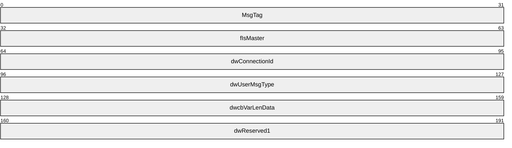
```mermaid
packet-beta
  0-31: "MsgTag"
  32-63: "fIsMaster"
  64-95: "dwConnectionId"
  96-127: "dwUserMsgType"
  128-159: "dwcbVarLenData"
  160-191: "dwReserved1"
```

**MsgTag (4 bytes):** A 4-byte integer value that describes the OLE transaction message type. For all uses in this document, this value MUST be 0x00000FFF, which indicates **MTAG_USER_MESSAGE** message, as specified in [MS-CMP] section 2.2.8.

**fIsMaster (4 bytes):** A 4-byte value indicating the direction of the message in the conversation.

This value MUST be one of the following values.

| Value | Meaning |
| --- | --- |
| 0x00000000 | The message is sent by the party that accepted the connection. |
| 0x00000001 | The message is sent by the party that initiated the connection. |

**dwConnectionId (4 bytes):** A 4-byte integer value that MUST contain the unique identifier for the associated connection.

**dwUserMsgType (4 bytes):** This field contains the message type identifier. Each MTAG that is defined in this section MUST specify a distinct value for this field for a specified connection type.

**dwcbVarLenData (4 bytes):** An unsigned 4-byte integer value that MUST contain the size, in bytes, of the message buffer that contains the **MESSAGE_PACKET** structure, minus the size, in bytes, of the **MESSAGE_PACKET** structure itself.

**dwReserved1 (4 bytes):** Reserved. This value MAY be set to any implementation-specific value and MUST be ignored on receipt.<9>

#### 2.2.4.2 OLETX_TM_ADDR

The **OLETX_TM_ADDR** structure is used to represent the address of a **transaction manager**.

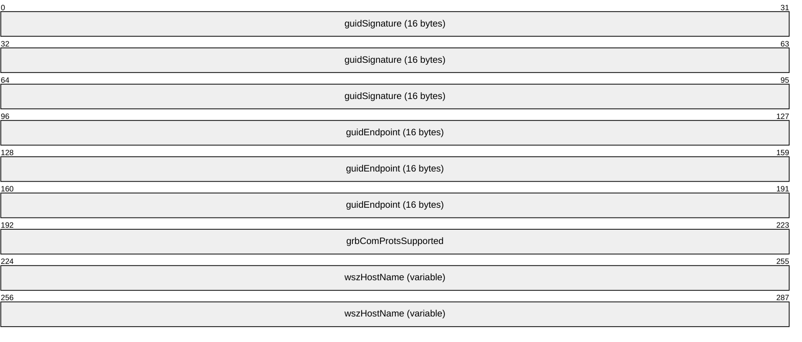
```mermaid
packet-beta
  0-95: "guidSignature (16 bytes)"
  96-191: "guidEndpoint (16 bytes)"
  192-223: "grbComProtsSupported"
  224-287: "wszHostName (variable)"
```

**guidSignature (16 bytes):** This field contains a signature value for this structure. The value MUST be the binary representation of the GUID {dc85cb48-d8a5-11d2-828b-00805f0df75a}.

**guidEndpoint (16 bytes):** This field MUST contain a GUID that specifies the [**contact identifier**](#gt_contact-identifier) of the transaction manager.

**grbComProtsSupported (4 bytes):** Indicates the RPC transports for which the transaction manager is listening. The value MUST be the result of the bitwise OR combination of one or more flags as specified in [MS-CMPO](#Section_2.1) section 2.2.4.

**wszHostName (variable):** This field MUST contain a null-terminated, little-endian UTF-16 encoded string that specifies the [**NetBIOS host name**](#gt_netbios-host-name) of the transaction manager. This field MUST NOT contain a [**Unicode**](#gt_unicode) [**byte order mark**](#gt_byte-order-mark) (BOM) character. The length of this field MUST be 2 to 32 bytes, inclusive. For details about Unicode and character sets, see [[MSDN-ANSI]](https://go.microsoft.com/fwlink/?LinkId=89952).

For specific information on NetBIOS, see [[NETBEUI]](https://go.microsoft.com/fwlink/?LinkId=90224), [[RFC1001]](https://go.microsoft.com/fwlink/?LinkId=90260), and [[RFC1002]](https://go.microsoft.com/fwlink/?LinkId=90261).

#### 2.2.4.3 OLETX_VARLEN_STRING

The **OLETX_VARLEN_STRING** structure is used to represent a byte-counted variable-length string.

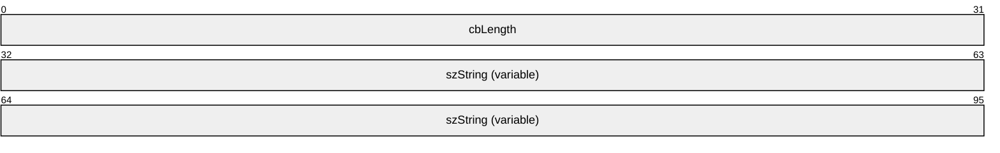
```mermaid
packet-beta
  0-31: "cbLength"
  32-95: "szString (variable)"
```

**cbLength (4 bytes):** An unsigned integer that MUST contain the number of bytes in the **szString** field.

**szString (variable):** A Latin-1 string as specified in [[ISO/IEC-8859-1]](https://go.microsoft.com/fwlink/?LinkId=90689) without a final null-terminating character. This field MUST be **cbLength** bytes in length. If **cbLength** is zero, this field MUST NOT be present.

### 2.2.5 Transaction Propagation Structures

#### 2.2.5.1 Associate_Msg_Version2

The **Associate_Msg_Version2** structure contains the [**NetBIOS host name**](#gt_netbios-host-name) of a [**transaction manager**](#gt_transaction-manager).

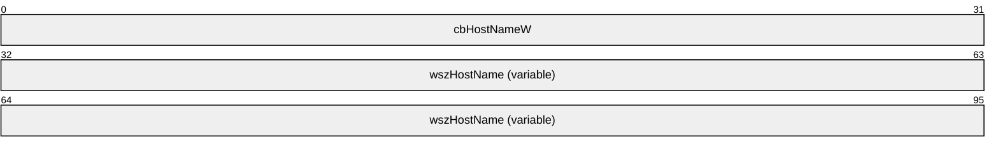
```mermaid
packet-beta
  0-31: "cbHostNameW"
  32-95: "wszHostName (variable)"
```

**cbHostNameW (4 bytes):** The size, in bytes, of **wszHostName**, including the null terminator. The value of this field MUST be in the range 2 to 32 bytes, inclusive.

**wszHostName (variable):** A null-terminated, little-endian UTF-16 encoded string that contains a NetBIOS host name. This string MUST have the length that is specified by **cbHostNameW** and MUST NOT contain a [**Unicode**](#gt_unicode) [**byte order mark**](#gt_byte-order-mark) (BOM) character.

#### 2.2.5.2 Associate_Msg_Version3

The **Associate_Msg_Version3** structure contains information about the [**transaction**](#gt_transaction) protocol support of a [**transaction manager**](#gt_transaction-manager).<10>

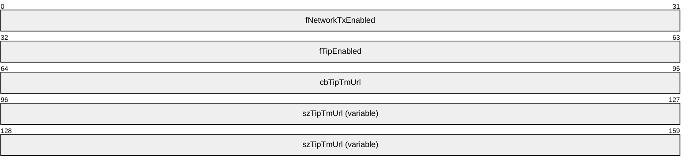
```mermaid
packet-beta
  0-31: "fNetworkTxEnabled"
  32-63: "fTipEnabled"
  64-95: "cbTipTmUrl"
  96-159: "szTipTmUrl (variable)"
```

**fNetworkTxEnabled (4 bytes):** This field indicates if network access is enabled or disabled on the transaction manager. If network access is disabled, this field MUST be set to zero. If network access is enabled, this field MUST be set to a nonzero value.

**fTipEnabled (4 bytes):** This field indicates if the transaction Internet Protocol (TIP) is enabled or disabled on the transaction manager. If TIP is disabled, this field MUST be set to zero. If TIP is enabled, this field MUST be set to a nonzero value. For more details about the TIP protocol, see [[RFC2371]](https://go.microsoft.com/fwlink/?LinkId=90338).

**cbTipTmUrl (4 bytes):** This field MUST contain the size, in bytes, of **szTipTmUrl**, including the null terminator. The value of this field MUST be greater than or equal to 0.

**szTipTmUrl (variable):** A null-terminated Latin-1 ANSI string, as specified in [[ISO/IEC-8859-1]](https://go.microsoft.com/fwlink/?LinkId=90689), that MUST contain the URL of the TIP transaction manager on the node that created this propagation token. If **cbTipTmUrl** is zero, this field MUST NOT be present. Otherwise, this field MUST have the length specified by **cbTipTmUrl**.

#### 2.2.5.3 NAMEOBJECTBLOB

The **NAMEOBJECTBLOB** structure contains information to identify and locate a [**transaction manager**](#gt_transaction-manager).

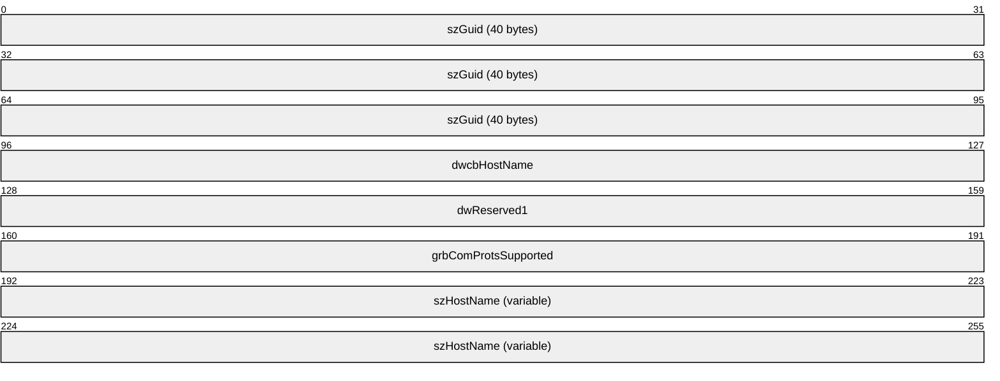
```mermaid
packet-beta
  0-95: "szGuid (40 bytes)"
  96-127: "dwcbHostName"
  128-159: "dwReserved1"
  160-191: "grbComProtsSupported"
  192-255: "szHostName (variable)"
```

**szGuid (40 bytes):** A fixed-size array containing a null-terminated Latin-1 ANSI string, as specified in [[ISO/IEC-8859-1]](https://go.microsoft.com/fwlink/?LinkId=90689), that contains a GUID that is formatted into a string, as specified in [[C706]](https://go.microsoft.com/fwlink/?LinkId=89824), Appendix A, UUID. This string MUST identify the [**contact identifier**](#gt_contact-identifier) for the transaction manager instance that is located at the node that is identified by the host name. Storage after the initial null MUST be ignored on receipt.

**dwcbHostName (4 bytes):** This field MUST contain the size, in bytes, of the **szHostName** field, including the null terminator. The value of this field MUST be in the range 1 to 16, inclusive.

**dwReserved1 (4 bytes):** Reserved. This field MUST be set to an implementation-specific value and MUST be ignored on receipt. The default value of this field is 0xCD64CD64.<11>

**grbComProtsSupported (4 bytes):** Indicates which RPC transports that the transaction manager can use to communicate. The value MUST be the result of a bitwise OR operation of one or more flags, as specified in the **COM_PROTOCOL** data type in [MS-CMPO](#Section_2.1) section 2.2.4.

**szHostName (variable):** A null-terminated Latin-1 ANSI string, as specified in [ISO/IEC-8859-1], that MUST specify the host name of the transaction manager instance. It MUST have the length specified by **dwcbHostName**.

#### 2.2.5.4 Propagation_Token

The **Propagation_Token** structure is used for performing pull-based [**transaction propagation**](#gt_transaction-propagation). This structure contains information about a **transaction** and about a [**superior transaction manager**](#gt_superior-transaction-manager) that is available for use by [**participants**](#gt_participant) to enlist on the **transaction**.

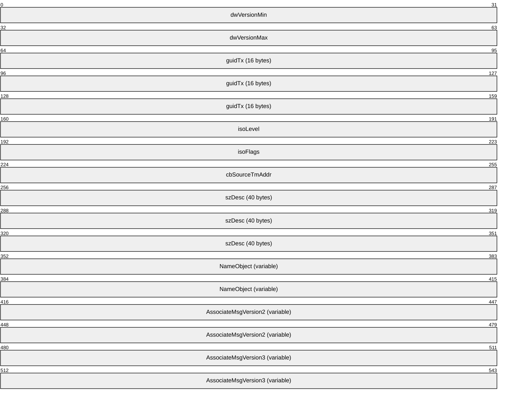
```mermaid
packet-beta
  0-31: "dwVersionMin"
  32-63: "dwVersionMax"
  64-159: "guidTx (16 bytes)"
  160-191: "isoLevel"
  192-223: "isoFlags"
  224-255: "cbSourceTmAddr"
  256-351: "szDesc (40 bytes)"
  352-415: "NameObject (variable)"
  416-479: "AssociateMsgVersion2 (variable)"
  480-543: "AssociateMsgVersion3 (variable)"
```

**dwVersionMin (4 bytes):** The minimum version of the transaction information structure that accompanies the **Propagation_Token**. The value MUST be set to 1.

**dwVersionMax (4 bytes):** The maximum version of the transaction information structure that accompanies the **Propagation_Token**. The value MUST be 1, 2, or 3.<12>

**guidTx (16 bytes):** This field MUST contain a GUID that specifies the [**transaction identifier**](#gt_transaction-identifier).

**isoLevel (4 bytes):** The isolation level of the transaction. The value MUST be one as specified in the **OLETX_ISOLATION_LEVEL** (section [2.2.6.9](#Section_2.2.6.9)) enumeration.

**isoFlags (4 bytes):** The isolation flags for the transaction. This field MUST contain the result of a bitwise OR operation of zero or more **OLETX_ISOLATION_FLAGS** (section [2.2.6.8](#Section_2.2.6.8)) enumeration flags.

**cbSourceTmAddr (4 bytes):** This field MUST contain the total size, in bytes, of the space that is used by the **NameObject**, **AssociateMsgVersion2**, and **AssociateMsgVersion3** fields.

**szDesc (40 bytes):** The description of the transaction, as a fixed-size array of 40 bytes containing a null-terminated Latin-1 ANSI string, as specified in [[ISO/IEC-8859-1]](https://go.microsoft.com/fwlink/?LinkId=90689). This field MUST be set to an implementation-specific value. Any bytes that follow the first null-terminator character SHOULD be ignored on receipt.

**NameObject (variable):** This field MUST be a **NAMEOBJECTBLOB** structure that contains contact information about the [**transaction manager**](#gt_transaction-manager) that is referenced by the **Propagation_Token** structure.

**AssociateMsgVersion2 (variable):** This field MUST be an **Associate_Msg_Version2** structure (section [2.2.5.1](#Section_2.2.5.1)) that contains the [**NetBIOS host name**](#gt_netbios-host-name) for the transaction manager that is referenced by the **Propagation_Token** structure. If **dwVersionMax** is 1, then this field MUST NOT be present; otherwise, it MUST be present. If this field is present, the contents MUST override the **szHostName** value in the **NameObject** field.

**AssociateMsgVersion3 (variable):** This field MUST be an **Associate_Msg_Version3** structure (section [2.2.5.2](#Section_2.2.5.2)) that contains information about the transaction protocol support for the transaction manager that is referenced by the **Propagation_Token** structure. If **dwVersionMax** is 3, then this field MUST be present; otherwise, it MUST NOT be present.

#### 2.2.5.5 SDtcCmEndpointInfoV1

The **SDtcCmEndpointInfoV1** structure contains data used to connect to a [**transaction manager**](#gt_transaction-manager) that supports the [**OleTx**](#gt_oletx) protocol.

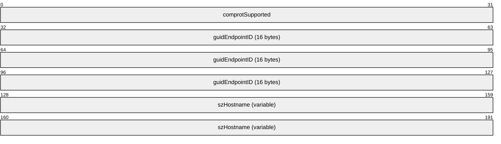
```mermaid
packet-beta
  0-31: "comprotSupported"
  32-127: "guidEndpointID (16 bytes)"
  128-191: "szHostname (variable)"
```

**comprotSupported (4 bytes):** Indicates which RPC transports the transaction manager supports for communication. The value MUST be the result of the bitwise OR combination of one or more flags as specified in the **COM_PROTOCOL** data type in [MS-CMPO](#Section_2.1) section 2.2.4.

**guidEndpointID (16 bytes):** This field MUST be a GUID that specifies the [**contact identifier**](#gt_contact-identifier) of the transaction manager.

**szHostname (variable):** A null-terminated Latin-1 ANSI character string, as specified in [[ISO/IEC-8859-1]](https://go.microsoft.com/fwlink/?LinkId=90689), that MUST specify the host name for the transaction manager [**endpoint**](#gt_endpoint). This field MUST be between 1 and 16 bytes in length, inclusive.

#### 2.2.5.6 SDtcCmEndpointInfoV2

The **SDtcCmEndpointInfoV2** structure contains extended information that is used, along with the contents of the **SDtcCmEndpointInfoV1** structure (section [2.2.5.5](#Section_2.2.5.5)), to connect to a [**transaction manager**](#gt_transaction-manager) that supports the [**OleTx**](#gt_oletx) protocol.

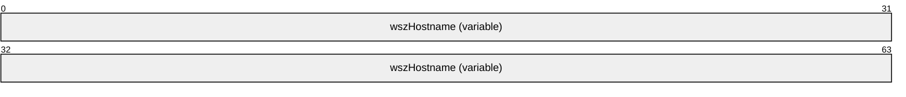
```mermaid
packet-beta
  0-63: "wszHostname (variable)"
```

**wszHostname (variable):** A null-terminated little-endian UTF-16 character string that specifies the [**NetBIOS host name**](#gt_netbios-host-name) for the transaction manager endpoint. This field MUST be between 2 and 32 bytes in length, inclusive, and MUST NOT contain a [**Unicode**](#gt_unicode) [**byte order mark**](#gt_byte-order-mark) (BOM) character.

#### 2.2.5.7 SOleTxInfoForTip

The **SOleTxInfoForTip** structure contains data that is specific to the Transaction Internet Protocol (TIP) for an exported transaction.

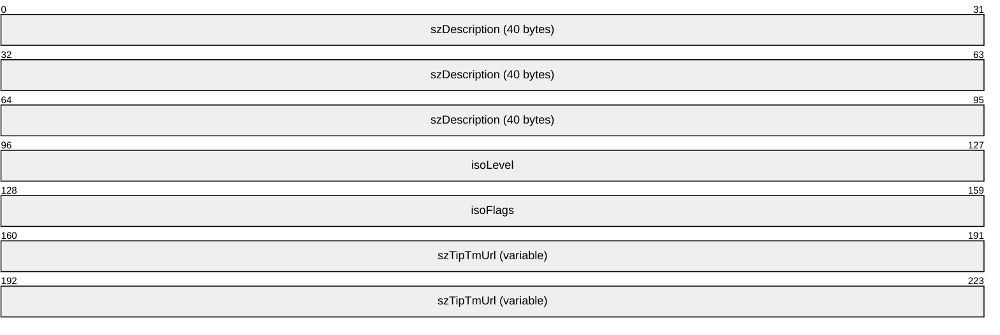
```mermaid
packet-beta
  0-95: "szDescription (40 bytes)"
  96-127: "isoLevel"
  128-159: "isoFlags"
  160-223: "szTipTmUrl (variable)"
```

**szDescription (40 bytes):** See the **szDesc** field in **Propagation Token** structure (section [2.2.5.4](#Section_3.3.4.3)) for details.

**isoLevel (4 bytes):** The isolation level of the **transaction**. The value MUST be one as specified in the **OLETX_ISOLATION_LEVEL** enumeration (section [2.2.6.9](#Section_2.2.6.9)).

**isoFlags (4 bytes):** The isolation flags for the **transaction**. The value MUST be a legal combination of values from the **OLETX_ISOLATION_FLAGS** enumeration (section [2.2.6.8](#Section_2.2.6.8)).

**szTipTmUrl (variable):** A null-terminated Latin-1 ANSI string, as specified in [[ISO/IEC-8859-1]](https://go.microsoft.com/fwlink/?LinkId=90689), that MUST specify the TIP URL of the **transaction manager**, as specified in [[RFC2371]](https://go.microsoft.com/fwlink/?LinkId=90338).

#### 2.2.5.8 SExtendedEndpointInfo

The **SExtendedEndpointInfo** structure is a packet that contains data to represent [**endpoint**](#gt_endpoint) information that is available for use to connect to a [**protocol extension**](#gt_protocol-extension) that is hosted by a [**transaction manager**](#gt_transaction-manager). This structure does not specify its own length. Therefore, it MUST be used in a context that specifies the actual length.

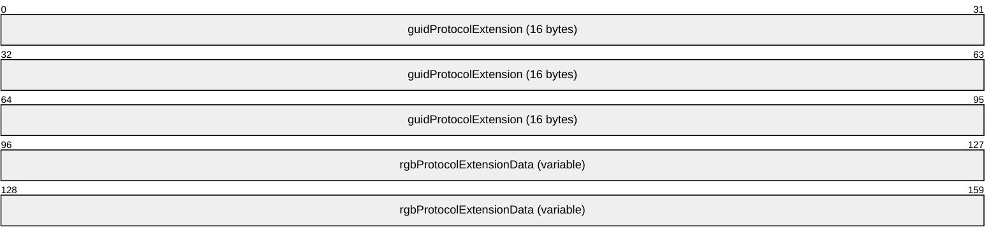
```mermaid
packet-beta
  0-95: "guidProtocolExtension (16 bytes)"
  96-159: "rgbProtocolExtensionData (variable)"
```

**guidProtocolExtension (16 bytes):** This field MUST contain a GUID that specifies the protocol extension that contributed this extended endpoint information.

**rgbProtocolExtensionData (variable):** This field MUST contain data that is contributed by a protocol extension that represents protocol extension-specific endpoint information. The format and size of this data is specific to the respective extension protocol. This data MUST NOT be interpreted by an application or other transaction participant unless it recognizes the **guidProtocolExtension** field.

#### 2.2.5.9 STmToTmProtocol

The **STmToTmProtocol** structure contains protocol-specific endpoint information for the [**transaction manager**](#gt_transaction-manager).

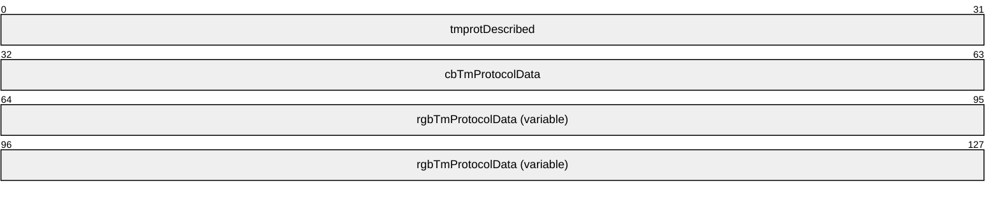
```mermaid
packet-beta
  0-31: "tmprotDescribed"
  32-63: "cbTmProtocolData"
  64-127: "rgbTmProtocolData (variable)"
```

**tmprotDescribed (4 bytes):** This field specifies the type of transaction manager-to-transaction manager protocol-specific data for this transaction. This MUST be one of the values specified in **TM_Protocol** enumeration (section [2.2.6.2](#Section_2.2.6.2)).<13>

**cbTmProtocolData (4 bytes):** This field MUST specify the length, in bytes, of the **rgbTmProtocolData** field.

**rgbTmProtocolData (variable):** The transaction manager protocol-specific data for this transaction. If the **cbTmProtocolData** field is 0x00000000, this field MUST NOT be present. Otherwise, the format of this field depends on the value of the **tmprotDescribed** field, which MUST be one of the following values.

| tmprotDescribed name/value | Meaning |
| --- | --- |
| TmProtocolMsdtcV1 0x00000002 | This field MUST contain an SDtcCmEndpointInfoV1 (section [2.2.5.5](#Section_2.2.5.5)) structure that contains data that is used to connect to an [**OleTx**](#gt_oletx) transaction manager. The **cbTmProtocolData** field MUST be at least 21. |
| TmProtocolMsdtcV2 0x00000003 | This field MUST contain an SDtcCmEndpointInfoV2 (section [2.2.5.6](#Section_2.2.5.6)) structure that contains additional data that is used to connect to an OleTx transaction manager. The **cbTmProtocolData** field MUST be at least 2. |
| TmProtocolExtended 0x00000004 | This field MUST contain an SExtendedEndpointInfo (section [2.2.5.8](#Section_2.2.5.8)) structure for an extension protocol. The **cbTmProtocolData** field MUST be at least 16. |

#### 2.2.5.10 STxInfo

The **STxInfo** structure represents an exported transaction during push-based [**transaction propagation**](#gt_transaction-propagation). The information in this structure is passed to a transaction manager to import a transaction.

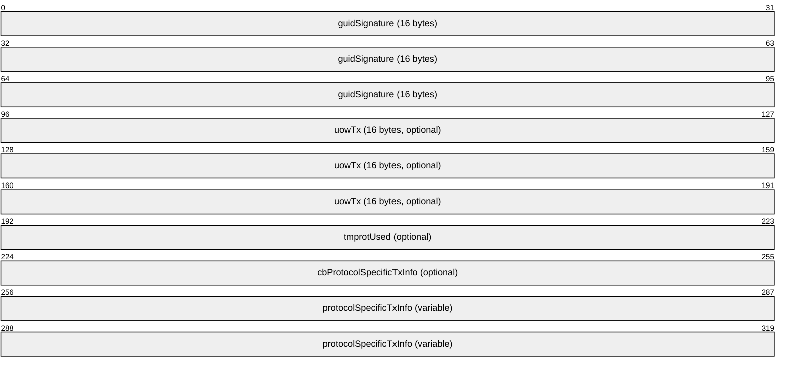
```mermaid
packet-beta
  0-95: "guidSignature (16 bytes)"
  96-191: "uowTx (16 bytes, optional)"
  192-223: "tmprotUsed (optional)"
  224-255: "cbProtocolSpecificTxInfo (optional)"
  256-319: "protocolSpecificTxInfo (variable)"
```

**guidSignature (16 bytes):** This field MUST be a GUID that either specifies the [**transaction identifier**](#gt_transaction-identifier) or specifies a signature value that indicates that the fields following this field are present in the structure. If the field contains the binary value representation of the GUID {2adb4463-bd41-11d0-b12e-00c04fc2f3ef}, the fields **uowTx**, **tmprotUsed**, and **cbProtocolSpecificTxInfo** MUST be present. For all other values, this field MUST specify the GUID of the transaction to be imported, and all other fields MUST NOT be present. This field MUST be set based on the protocol version as specified in section [2.2.1.1.1](#Section_2.2.1.1.1).

**uowTx (16 bytes):** If present, this field MUST be a GUID that specifies the transaction identifier.

**tmprotUsed (4 bytes):** If present, this field MUST specify the format of the data in the **protocolSpecificTxInfo** field. The value MUST be one that is as specified in **TM_PROTOCOL** (section [2.2.6.2](#Section_2.2.6.2)).

**cbProtocolSpecificTxInfo (4 bytes):** If present, this field MUST contain the size of the protocol-specific data. This value MUST be zero, unless **tmprotUsed** contains the value **TmProtocolTip**, in which case the value MUST be determined by adding the size of the **SoleTxInfoForTip** structure (section [2.2.5.7](#Section_2.2.5.7)) and the size, in bytes, of the **szTipTmUrl** field in the **SOleTxInfoForTip** structure, including the null terminator.

**protocolSpecificTxInfo (variable):** If present, this field MUST contain a **SOleTxInfoForTip** structure. If the **cbProtocolSpecificTxInfo** field is present and has a nonzero value, this field MUST be present. Otherwise, this field MUST not be present.

#### 2.2.5.11 SWhereabouts

The **SWhereabouts** structure describes the location of a **transaction manager** and the protocols that MUST be used to contact it.

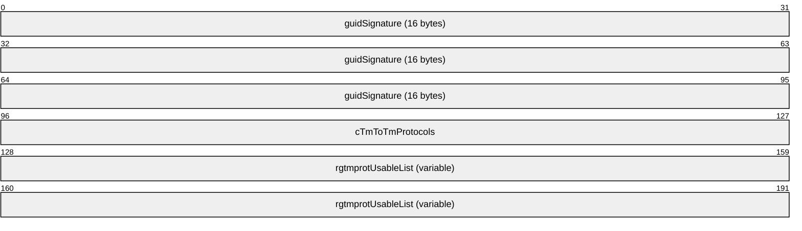
```mermaid
packet-beta
  0-95: "guidSignature (16 bytes)"
  96-127: "cTmToTmProtocols"
  128-191: "rgtmprotUsableList (variable)"
```

**guidSignature (16 bytes):** This field contains a signature value for this structure. The value MUST be the binary representation of the GUID {2adb4462-bd41-11d0-b12e-00c04fc2f3ef}.

**cTmToTmProtocols (4 bytes):** This field MUST contain the number of **STmToTmProtocol** (section [2.2.5.9](#Section_2.2.5.9)) structures present in the **rgtmprotUsableList** field. This value MUST be at least 1.

**rgtmprotUsableList (variable):** This field MUST contain an unordered list of **STmToTmProtocol** structures with protocol-specific connection information for this transaction manager. Each entry MUST be aligned on a 4-byte boundary by padding with arbitrary values that MUST be ignored on receipt. A list that contains an **STmToTmProtocol** structure with a **tmprotDescribed** value of **TmProtocolMsdtcV2** MUST also contain an **STmToTmProtocol** structure with a **tmprotDescribed** value of **TmProtocolMsdtcV1**. In this case, the **wszHostName** value in the **SDtcCmEndpointV2** structure (section [2.2.5.6](#Section_2.2.5.6)) MUST be used in place of the **szHostName** value in the **SDtcCmEndpointV1** structure (section [2.2.5.5](#Section_2.2.5.5)).

### 2.2.6 Transaction Enumerations

#### 2.2.6.1 Connection Types

The **CONNTYPE** enumeration defines the [**connection types**](#gt_connection-type) that are used by MSDTC Connection Manager: OleTx Multiplexing Protocol Specification [MS-CMP](../MS-CMP/MS-CMP.md).

typedef enum

{

CONNTYPE_TXUSER_BEGINNER = 0x00000001,

CONNTYPE_TXUSER_IMPORT = 0x00000002,

CONNTYPE_TXUSER_ENLISTMENT = 0x00000003,

CONNTYPE_TXUSER_EXPORT = 0x00000004,

CONNTYPE_TXUSER_RESOURCEMANAGER = 0x00000005,

CONNTYPE_TXUSER_REENLIST = 0x00000006,

CONNTYPE_TXUSER_RESOLVE = 0x00000007,

CONNTYPE_TXUSER_VOTER = 0x00000009,

CONNTYPE_TXUSER_ASSOCIATE = 0x00000011,

CONNTYPE_TXUSER_GETTXDETAILS = 0x00000022,

CONNTYPE_TXUSER_PHASE0 = 0x00000024,

CONNTYPE_TXUSER_BEGIN2 = 0x00000028,

CONNTYPE_TXUSER_IMPORT2 = 0x00000033,

CONNTYPE_TXUSER_GETSECURITYFLAGS = 0x00000035,

CONNTYPE_TXUSER_TRACE = 0x00000036,

CONNTYPE_TXUSER_SETTXTIMEOUT = 0x00000037,

CONNTYPE_TXUSER_SETTXTIMEOUT2 = 0x00000038,

CONNTYPE_TXUSER_PROMOTE = 0x00000039,

CONNTYPE_TXUSER_EXTENDEDWHEREABOUTS = 0x0000003D,

CONNTYPE_TXUSER_RESOURCEMANAGERINTERNAL = 0x00000046,

CONNTYPE_TXUSER_EXPORT2 = 0x00000048,

CONNTYPE_PARTNERTM_PROPAGATE = 0x00000101,

CONNTYPE_PARTNERTM_REDELIVERCOMMIT = 0x00000102,

CONNTYPE_PARTNERTM_CHECKABORT = 0x00000103,

CONNTYPE_PARTNERTM_BRANCH = 0x00000104

} CONNTYPE;

**CONNTYPE_TXUSER_BEGINNER:** This connection type is used by applications that begin, commit, and roll back transactions.

**CONNTYPE_TXUSER_IMPORT:** This connection type is used by a destination application to complete a [Push Propagation](#Section_1.3.5.2) that is initiated by a source application.

**CONNTYPE_TXUSER_ENLISTMENT:** This connection type is used by a [**durable resource manager**](#gt_durable-resource-manager) to establish an [**enlistment**](#gt_enlistment) with its transaction manager.

**CONNTYPE_TXUSER_EXPORT:** This connection type is used by a source application to initiate a [**push propagation**](#gt_push-propagation) to a destination application.

**CONNTYPE_TXUSER_RESOURCEMANAGER:** This connection type is used by a durable resource manager to register with its transaction manager.

**CONNTYPE_TXUSER_REENLIST:** This connection type is used by a durable resource manager to determine the [**outcome**](#gt_outcome) of an [In Doubt](#Section_3.2.1.3.12) transaction.

**CONNTYPE_TXUSER_RESOLVE:** This connection type is used by an application either to manually resolve the outcome of an In Doubt transaction or to cause its transaction manager to forget a transaction that is in the [Failed to Notify](#Section_3.2.1.3.13) state.

**CONNTYPE_TXUSER_VOTER:** This connection type is used by a [**volatile resource manager**](#gt_volatile-resource-manager) to establish a [**voter enlistment**](#gt_voter-enlistment) with its transaction manager.

**CONNTYPE_TXUSER_ASSOCIATE:** This connection type is used by a destination application to complete the [**pull propagation**](#gt_pull-propagation) of a transaction from a source application.

**CONNTYPE_TXUSER_GETTXDETAILS:** This connection type is used by an application to retrieve details about a transaction from its transaction manager.

**CONNTYPE_TXUSER_PHASE0:** This connection type is used by a resource manager to enlist for [**Phase Zero**](#gt_phase-zero) notifications from its transaction manager.

**CONNTYPE_TXUSER_BEGIN2:** This connection type is used by an application to begin, commit, or roll back a transaction or to change the time-out of a transaction. This connection type supersedes [CONNTYPE_TXUSER_BEGINNER](#Section_2.2.8.1.1) and [CONNTYPE_TXUSER_SETTXTIMEOUT2](#Section_2.2.8.3.4).

**CONNTYPE_TXUSER_IMPORT2:** This connection type is used by a destination application to complete a Push Propagation that is initiated by a source application. This connection type supersedes [CONNTYPE_TXUSER_IMPORT](#Section_2.2.8.2.2.4).

**CONNTYPE_TXUSER_GETSECURITYFLAGS:** This connection type is used by an application to obtain the security configuration of its transaction manager.

**CONNTYPE_TXUSER_TRACE:** This connection type is used by an application to ask its transaction manager to trace the status of a transaction by using an implementation-specific mechanism.

**CONNTYPE_TXUSER_SETTXTIMEOUT:** This connection type is used by an application to modify the time-out of a transaction.

**CONNTYPE_TXUSER_SETTXTIMEOUT2:** This connection type is used by an application to query the transaction manager's support for modifying the time-out of a transaction.

**CONNTYPE_TXUSER_PROMOTE:** This connection type is used by an application to:

- Begin a transaction using an application-specified transaction identity
- Commit or [**rollback**](#gt_rollback) a transaction
- Change the time-out of a transaction
This connection type supersedes **CONNTYPE_TXUSER_SETTXTIMEOUT2**.

**CONNTYPE_TXUSER_EXTENDEDWHEREABOUTS:** This connection type is used by an application to obtain [**Extended Whereabouts**](#gt_extended-whereabouts) from its transaction manager.

**CONNTYPE_TXUSER_RESOURCEMANAGERINTERNAL:** This connection type is used by a durable resource manager to register with a transaction manager and to detect duplicate registrations. This connection type supersedes [CONNTYPE_TXUSER_RESOURCEMANAGER](#Section_2.2.10.1.1).

**CONNTYPE_TXUSER_EXPORT2:** This connection type is used by a source application to initiate a push propagation to a destination application. This connection type supersedes [CONNTYPE_TXUSER_EXPORT](#Section_2.2.8.2.2.2).

**CONNTYPE_PARTNERTM_PROPAGATE:** This connection type is used by a [**superior transaction manager**](#gt_superior-transaction-manager) to do a push propagation of a transaction to its [**subordinate transaction manager**](#gt_subordinate-transaction-manager) and to execute the [**Two-Phase Commit**](#gt_two-phase-commit) Protocol.

**CONNTYPE_PARTNERTM_REDELIVERCOMMIT:** This connection type is used by a superior transaction manager to redeliver a Commit notification for a transaction to its subordinate transaction manager.

**CONNTYPE_PARTNERTM_CHECKABORT:** This connection type is used by a subordinate transaction manager to query the outcome of a transaction from its superior transaction manager.

**CONNTYPE_PARTNERTM_BRANCH:** A subordinate transaction manager uses this connection type to register a new subordinate enlistment with a superior transaction manager.

#### 2.2.6.2 TM_PROTOCOL

The **TM_PROTOCOL** enumeration defines types of transaction manager-to-transaction manager protocols that are available for use.

typedef enum

{

TmProtocolNone = 0,

TmProtocolTip = 1,

TmProtocolMsdtcV1 = 2,

TmProtocolMsdtcV2 = 3,

TmProtocolExtended = 4

} TM_PROTOCOL;

**TmProtocolNone:** No transaction manager-to-transaction manager protocol is available.

**TmProtocolTip:** The Transaction Internet Protocol (TIP) protocol is available.

**TmProtocolMsdtcV1:** The [**OleTx**](#gt_oletx) protocol is available with information contained in SDtcCmEndpointInfoV1 structure (section [2.2.5.5](#Section_2.2.5.5)).

**TmProtocolMsdtcV2:** The OleTx protocol is available with extended information contained in SDtcCmEndpointInfoV2 structure (section [2.2.5.6](#Section_2.2.5.6))along with **SDtcCmEndpointInfoV1** structure.

**TmProtocolExtended:** An extension protocol is available.

#### 2.2.6.3 TXUSER_ENLISTMENT_PREPAREREQDONE_RESPONSE

The **TXUSER_ENLISTMENT_PREPAREREQDONE_RESPONSE** enumeration defines the status values for a prepare request from a **subordinate resource manager**.

typedef enum

{

TXUSER_ENLISTMENT_PREPAREREQDONE_OK = 0,

TXUSER_ENLISTMENT_PREPAREREQDONE_ABORT = 1,

TXUSER_ENLISTMENT_PREPAREREQDONE_READONLY = 2,

TXUSER_ENLISTMENT_PREPAREREQDONE_SINGLEPHASE_COMMIT = 3

} TXUSER_ENLISTMENT_PREPAREREQDONE_RESPONSE;

**TXUSER_ENLISTMENT_PREPAREREQDONE_OK:** The prepare request was successful, and the enlistment requires the transaction outcome.

**TXUSER_ENLISTMENT_PREPAREREQDONE_ABORT:** The prepare request was unsuccessful, and the transaction MUST be aborted.

**TXUSER_ENLISTMENT_PREPAREREQDONE_READONLY:** The request to prepare the transaction for commitment was successful, and no further involvement in the transaction is required.

**TXUSER_ENLISTMENT_PREPAREREQDONE_SINGLEPHASE_COMMIT:** The sender chose the [**single-phase commit**](#gt_single-phase-commit) option and committed the transaction.

#### 2.2.6.4 PARTNERTM_PROPAGATE_PREPAREREQDONE_RESPONSE

The **PARTNERTM_PROPAGATE_PREPAREREQDONE_RESPONSE** enumeration defines the status values for a prepare request from a [**subordinate transaction manager**](#gt_subordinate-transaction-manager).

typedef enum

{

PARTNERTM_PROPAGATE_PREPAREREQDONE_OK = 0,

PARTNERTM_PROPAGATE_PREPAREREQDONE_ABORT = 1,

PARTNERTM_PROPAGATE_PREPAREREQDONE_READ_ONLY = 2,

PARTNERTM_PROPAGATE_PREPAREREQDONE_SINGLEPHASE_COMMIT = 3,

PARTNERTM_PROPAGATE_PREPAREREQDONE_SINGLEPHASE_INDOUBT = 4

} PARTNERTM_PROPAGATE_PREPAREREQDONE_RESPONSE;

**PARTNERTM_PROPAGATE_PREPAREREQDONE_OK:** The prepare request was successful, and the enlistment requires the transaction outcome.

**PARTNERTM_PROPAGATE_PREPAREREQDONE_ABORT:** The prepare request was unsuccessful, and the transaction MUST be aborted.

**PARTNERTM_PROPAGATE_PREPAREREQDONE_READ_ONLY:** The request to prepare the transaction for commitment was successful, and no further involvement in the transaction is required.

**PARTNERTM_PROPAGATE_PREPAREREQDONE_SINGLEPHASE_COMMIT:** The sender chose the [**single-phase commit**](#gt_single-phase-commit) option and committed the transaction.

**PARTNERTM_PROPAGATE_PREPAREREQDONE_SINGLEPHASE_INDOUBT:** The prepare request was unsuccessful, and the transaction outcome is no longer determinable.

#### 2.2.6.5 TXUSER_VOTER_VOTERREQDONE_RESPONSE

The **TXUSER_VOTER_VOTERREQDONE_RESPONSE** enumeration defines the status values for a prepare request from a subordinate resource manager.

typedef enum

{

TXUSER_VOTER_VOTEREQDONE_OK = 0,

TXUSER_VOTER_VOTEREQDONE_OK_NONOTIFY = 1,

TXUSER_VOTER_VOTEREQDONE_ABORT = 2

} TXUSER_VOTER_VOTERREQDONE_RESPONSE;

**TXUSER_VOTER_VOTEREQDONE_OK:** The prepare request was successful, and the [**voter**](#gt_voter) requires the transaction outcome.

**TXUSER_VOTER_VOTEREQDONE_OK_NONOTIFY:** The prepare request was successful, and the voter does not require the transaction outcome.

**TXUSER_VOTER_VOTEREQDONE_ABORT:** The prepare request was unsuccessful, and the transaction MUST be aborted.

#### 2.2.6.6 TRUN_TXBEGIN_ERRORS

The **TRUN_TXBEGIN_ERRORS** enumeration defines the completion status values for requests from an application to perform the following steps in a transaction: begin, set time-out, commit, or abort a transaction.

typedef enum

{

TRUN_TXBEGIN_ERROR_NO_MEM = 1,

TRUN_TXBEGIN_ERROR_BEGIN_LOG_FULL = 20,

TRUN_TXBEGIN_ERROR_NOTIFY_ABORTED = 30,

TRUN_TXBEGIN_ERROR_NOTIFY_COMMITTED = 31,

TRUN_TXBEGIN_ERROR_NOTIFY_INDOUBT = 32,

TRUN_TXBEGIN_ERROR_DUPLICATE_GUID = 33

} TRUN_TXBEGIN_ERRORS;

**TRUN_TXBEGIN_ERROR_NO_MEM:** There was insufficient memory to allocate the data structures necessary to create the new transaction.

**TRUN_TXBEGIN_ERROR_BEGIN_LOG_FULL:** There was insufficient space in the transaction manager log to accommodate a new transaction.

**TRUN_TXBEGIN_ERROR_NOTIFY_ABORTED:** The transaction has aborted.

**TRUN_TXBEGIN_ERROR_NOTIFY_COMMITTED:** The transaction has committed.

**TRUN_TXBEGIN_ERROR_NOTIFY_INDOUBT:** The transaction has completed, but the outcome is no longer determinable. This occurs if the transaction manager delegated the commit decision to a subordinate through the [**single-phase commit**](#gt_single-phase-commit) protocol and if the connection to that subordinate terminated before the result could be reported.

**TRUN_TXBEGIN_ERROR_DUPLICATE_GUID:** An attempt was made to create or promote a transaction, but a transaction with the specified [**transaction identifier**](#gt_transaction-identifier) already exists.

#### 2.2.6.7 TRUN_TXIMPORT_ERRORS

The **TRUN_TXIMPORT_ERRORS** enumeration defines the completion status values for requests to import a transaction or abort a transaction that was previously imported.

typedef enum

{

TRUN_TXIMPORT_ERROR_NO_MEM = 1,

TRUN_TXIMPORT_ERROR_IMPORT_TX_NOT_FOUND = 20,

TRUN_TXIMPORT_ERROR_NOTIFY_ABORTED = 30,

TRUN_TXIMPORT_ERROR_NOTIFY_COMMITTED = 31,

TRUN_TXIMPORT_ERROR_NOTIFY_INDOUBT = 32

} TRUN_TXIMPORT_ERRORS;

**TRUN_TXIMPORT_ERROR_NO_MEM:** There was not enough memory to complete the operation.

**TRUN_TXIMPORT_ERROR_IMPORT_TX_NOT_FOUND:** The specified transaction was not found.

**TRUN_TXIMPORT_ERROR_NOTIFY_ABORTED:** The transaction aborted.

**TRUN_TXIMPORT_ERROR_NOTIFY_COMMITTED:** The transaction committed.

**TRUN_TXIMPORT_ERROR_NOTIFY_INDOUBT:** The transaction completed, but the outcome could not be determined.

#### 2.2.6.8 OLETX_ISOLATION_FLAGS

The **OLETX_ISOLATION_FLAGS** bitfield enumeration values specify isolation flags for a transaction.

typedef enum

{

ISOFLAG_RETAIN_DEFAULT = 0x00000000,

ISOFLAG_RETAIN_COMMIT_DC = 0x00000001,

ISOFLAG_RETAIN_COMMIT = 0x00000002,

ISOFLAG_RETAIN_COMMIT_NO = 0x00000003,

ISOFLAG_RETAIN_ABORT_DC = 0x00000004,

ISOFLAG_RETAIN_ABORT = 0x00000008,

ISOFLAG_RETAIN_ABORT_NO = 0x0000000C,

ISOFLAG_RETAIN_DONTCARE = 0x00000005,

ISOFLAG_RETAIN_BOTH = 0x0000000A,

ISOFLAG_RETAIN_NONE = 0x0000000F,

ISOFLAG_OPTIMISTIC = 0x00000010,

ISOFLAG_READONLY = 0x00000020

} OLETX_ISOLATION_FLAGS;

**ISOFLAG_RETAIN_DEFAULT:** Default value if no other value has been set.

**ISOFLAG_RETAIN_COMMIT_DC:** Retain locks on transaction commit, regardless of the success or failure of that [**commit request**](#gt_commit-request).

If this value is set, then ISOFLAG_RETAIN_COMMIT and ISOFLAG_RETAIN_COMMIT_NO MUST NOT be set.

**ISOFLAG_RETAIN_COMMIT:** Retain locks on a successful transaction commit.

If this value is set, then ISOFLAG_RETAIN_COMMIT_DC and ISOFLAG_RETAIN_COMMIT_NO MUST NOT be set.

**ISOFLAG_RETAIN_COMMIT_NO:** Do not retain locks on a transaction commit.

If this value is set, then ISOFLAG_RETAIN_COMMIT_DC and ISOFLAG_RETAIN_COMMIT MUST NOT be set.

**ISOFLAG_RETAIN_ABORT_DC:** Retain locks on transaction abort, regardless of the success or failure of that [**Abort request**](#gt_abort-request).

If this value is set, then ISOFLAG_RETAIN_ABORT and ISOFLAG_RETAIN_ABORT_NO MUST NOT be set.

**ISOFLAG_RETAIN_ABORT:** Retain locks on a successful transaction abort.

If this value is set, then ISOFLAG_RETAIN_ABORT_DC and ISOFLAG_RETAIN_ABORT_NO MUST NOT be set.

**ISOFLAG_RETAIN_ABORT_NO:** Do not retain locks on a transaction abort.

If this value is set, then ISOFLAG_RETAIN_ABORT and ISOFLAG_RETAIN_ABORT_DC MUST NOT be set.

**ISOFLAG_RETAIN_DONTCARE:** Retain locks on all transaction termination requests, regardless of whether the request was to abort or commit.

This is a synonym for selecting ISOFLAG_RETAIN_COMMIT_DC and ISOFLAG_RETAIN_ABORT_DC.

**ISOFLAG_RETAIN_BOTH:** Retain locks on all successful transaction termination requests, regardless of whether or not the request was to abort or commit.

This is a synonym for selecting ISOFLAG_RETAIN_COMMIT and ISOFLAG_RETAIN_ABORT.

**ISOFLAG_RETAIN_NONE:** Do not retain locks on any transaction termination requests.

This is a synonym for selecting ISOFLAG_RETAIN_COMMIT_NO and ISOFLAG_RETAIN_ABORT_NO.

**ISOFLAG_OPTIMISTIC:** Optimistic locking is allowed.

**ISOFLAG_READONLY:** The transaction is not expected to modify data.

#### 2.2.6.9 OLETX_ISOLATION_LEVEL

The **OLETX_ISOLATION_LEVEL** enumeration values specify the isolation levels of a transaction. The **OLETX_ISOLATION_LEVEL** enumeration values are not interpreted by the transaction manager. They are typically interpreted by resource managers that implement data isolation. These values are transported by the transaction manager from the [**root application**](#gt_root-application) to the resource managers.

typedef enum

{

ISOLATIONLEVEL_UNSPECIFIED = 0xffffffff,

ISOLATIONLEVEL_CHAOS = 0x00000010,

ISOLATIONLEVEL_READUNCOMMITTED = 0x00000100,

ISOLATIONLEVEL_READCOMMITTED = 0x00001000,

ISOLATIONLEVEL_REPEATABLEREAD = 0x00010000,

ISOLATIONLEVEL_SERIALIZABLE = 0x00100000

} OLETX_ISOLATION_LEVEL;

**ISOLATIONLEVEL_UNSPECIFIED:** No isolation level was specified.

**ISOLATIONLEVEL_CHAOS:** Data is not isolated.

**ISOLATIONLEVEL_READUNCOMMITTED:** A transaction can read any data, even if it is being modified by another transaction. Any type of new data can be inserted during a transaction.

**ISOLATIONLEVEL_READCOMMITTED:** A transaction MUST NOT read data that is being modified by another transaction that has not committed. Any type of new data can be inserted during a transaction.

**ISOLATIONLEVEL_REPEATABLEREAD:** Data read by a current transaction MUST NOT be changed by another transaction until the current transaction finishes. Any type of new data can be inserted during a transaction.

**ISOLATIONLEVEL_SERIALIZABLE:** Data read by a current transaction MUST NOT be changed by another transaction until the current transaction finishes. New data MUST NOT be inserted by another transaction that would affect the current transaction.

### 2.2.7 Transaction Constants

#### 2.2.7.1 GRFRM

This MUST be a 32-bit unsigned integer that contains an implementation-defined value. This value SHOULD be ignored on receipt.

#### 2.2.7.2 DTCADVCONFIG

These flags indicate the remote communications security flags that are enabled for a transaction manager protocol.

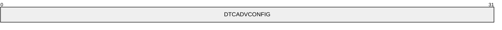
```mermaid
packet-beta
  0-31: "DTCADVCONFIG"
```

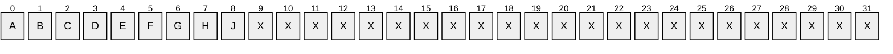
```mermaid
packet-beta
  0-0: "A"
  1-1: "B"
  2-2: "C"
  3-3: "D"
  4-4: "E"
  5-5: "F"
  6-6: "G"
  7-7: "H"
  8-8: "J"
  9-9: "X"
  10-10: "X"
  11-11: "X"
  12-12: "X"
  13-13: "X"
  14-14: "X"
  15-15: "X"
  16-16: "X"
  17-17: "X"
  18-18: "X"
  19-19: "X"
  20-20: "X"
  21-21: "X"
  22-22: "X"
  23-23: "X"
  24-24: "X"
  25-25: "X"
  26-26: "X"
  27-27: "X"
  28-28: "X"
  29-29: "X"
  30-30: "X"
  31-31: "X"
```

**Marker Bits**

Each marker bit corresponds to either a security access flag or a **Security Level** enumeration value maintained by the by the **Core Transaction Manager Facet** (section [1.3.3.3.1](#Section_1.3.3.3.1)), as defined in **Core Transaction Manager Facet Details** (section [3.2](#Section_3.2)).

| Value | Description |
| --- | --- |
| A | DTCADVCONFIG_NETWORKDTCACCESS_ENABLE This bit corresponds to the **Allow Network Access** flag. |
| B | DTCADVCONFIG_NETWORKDTCACCESS_ADMIN This bit corresponds to the **Allow Remote Administration** flag. |
| C | DTCADVCONFIG_NETWORKDTCACCESS_TX This bit corresponds to the **Allow Network Transactions** flag. |
| D | DTCADVCONFIG_NETWORKDTCACCESS_CLIENTS This bit corresponds to the **Allow Remote Clients** flag. |
| E | DTCADVCONFIG_NETWORKDTCACCESS_TIP This bit corresponds to the **Allow TIP** flag. |
| F | DTCADVCONFIG_OUTBOUNDNETWORK_TX This bit corresponds to the **Allow Outbound Transactions** flag. |
| G | DTCADVCONFIG_INBOUNDNETWORK_TX This bit corresponds to the **Allow Inbound Transactions** flag. |
| H | DTCADVCONFIG_SECURITYLEVEL_NOSECURITY This bit MUST be ignored if either DTCADVCONFIG_SECURITYLEVEL_AUTHENTICATEDONLY or DTCADVCONFIG_SECURITYLEVEL_MUTUALAUTH is set. Otherwise setting this bit corresponds to the No Security value of the **Security Level** enumeration. |
| I | DTCADVCONFIG_SECURITYLEVEL_AUTHENTICATEDONLY This bit MUST be ignored if DTCADVCONFIG_SECURITYLEVEL_MUTUALAUTH is set. Otherwise setting this bit corresponds to the Incoming Authentication value of the **Security Level** enumeration. |
| J | DTCADVCONFIG_SECURITYLEVEL_MUTUALAUTH This bit corresponds to the Mutual Authentication value of the **Security Level** enumeration. |
| X | SHOULD be set to zero and MUST be ignored when read. |
| X | SHOULD be set to zero and MUST be ignored when read. |
| X | SHOULD be set to zero and MUST be ignored when read. |
| X | SHOULD be set to zero and MUST be ignored when read. |
| X | SHOULD be set to zero and MUST be ignored when read. |
| X | SHOULD be set to zero and MUST be ignored when read. |
| X | SHOULD be set to zero and MUST be ignored when read. |
| X | SHOULD be set to zero and MUST be ignored when read. |
| X | SHOULD be set to zero and MUST be ignored when read. |
| X | SHOULD be set to zero and MUST be ignored when read. |
| X | SHOULD be set to zero and MUST be ignored when read. |
| X | SHOULD be set to zero and MUST be ignored when read. |
| X | SHOULD be set to zero and MUST be ignored when read. |
| X | SHOULD be set to zero and MUST be ignored when read. |
| X | SHOULD be set to zero and MUST be ignored when read. |
| X | SHOULD be set to zero and MUST be ignored when read. |
| X | SHOULD be set to zero and MUST be ignored when read. |
| X | SHOULD be set to zero and MUST be ignored when read. |
| X | SHOULD be set to zero and MUST be ignored when read. |
| X | SHOULD be set to zero and MUST be ignored when read. |
| X | SHOULD be set to zero and MUST be ignored when read. |
| X | SHOULD be set to zero and MUST be ignored when read. |

#### 2.2.7.3 DTCADVCONFIG_OPTIONS

The **DTCADVCONFIG_OPTIONS** are flags that indicate the support for various miscellaneous options supported by the **Core Transaction Manager Facet** (section [1.3.3.3.1](#Section_1.3.3.3.1)).

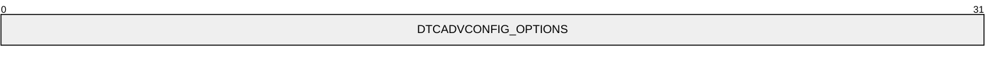
```mermaid
packet-beta
  0-31: "DTCADVCONFIG_OPTIONS"
```

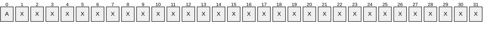
```mermaid
packet-beta
  0-0: "A"
  1-1: "X"
  2-2: "X"
  3-3: "X"
  4-4: "X"
  5-5: "X"
  6-6: "X"
  7-7: "X"
  8-8: "X"
  9-9: "X"
  10-10: "X"
  11-11: "X"
  12-12: "X"
  13-13: "X"
  14-14: "X"
  15-15: "X"
  16-16: "X"
  17-17: "X"
  18-18: "X"
  19-19: "X"
  20-20: "X"
  21-21: "X"
  22-22: "X"
  23-23: "X"
  24-24: "X"
  25-25: "X"
  26-26: "X"
  27-27: "X"
  28-28: "X"
  29-29: "X"
  30-30: "X"
  31-31: "X"
```

**Marker Bits**

Each marker bit corresponds to a security access flag maintained by the by the **Core Transaction Manager Facet** (section 1.3.3.3.1), as defined in **Core Transaction Manager Facet Details** (section [3.2](#Section_3.2)).

| Value | Description |
| --- | --- |
| A | DTCADVCONFIG_OPTIONS_LUTRANSACTIONS_DISABLE This bit corresponds to the **Allow LUTransactions** flag. |
| X | SHOULD be set to zero and MUST be ignored when read. |
| X | SHOULD be set to zero and MUST be ignored when read. |
| X | SHOULD be set to zero and MUST be ignored when read. |
| X | SHOULD be set to zero and MUST be ignored when read. |
| X | SHOULD be set to zero and MUST be ignored when read. |
| X | SHOULD be set to zero and MUST be ignored when read. |
| X | SHOULD be set to zero and MUST be ignored when read. |
| X | SHOULD be set to zero and MUST be ignored when read. |
| X | SHOULD be set to zero and MUST be ignored when read. |
| X | SHOULD be set to zero and MUST be ignored when read. |
| X | SHOULD be set to zero and MUST be ignored when read. |
| X | SHOULD be set to zero and MUST be ignored when read. |
| X | SHOULD be set to zero and MUST be ignored when read. |
| X | SHOULD be set to zero and MUST be ignored when read. |
| X | SHOULD be set to zero and MUST be ignored when read. |
| X | SHOULD be set to zero and MUST be ignored when read. |
| X | SHOULD be set to zero and MUST be ignored when read. |
| X | SHOULD be set to zero and MUST be ignored when read. |
| X | SHOULD be set to zero and MUST be ignored when read. |
| X | SHOULD be set to zero and MUST be ignored when read. |
| X | SHOULD be set to zero and MUST be ignored when read. |
| X | SHOULD be set to zero and MUST be ignored when read. |
| X | SHOULD be set to zero and MUST be ignored when read. |
| X | SHOULD be set to zero and MUST be ignored when read. |
| X | SHOULD be set to zero and MUST be ignored when read. |
| X | SHOULD be set to zero and MUST be ignored when read. |
| X | SHOULD be set to zero and MUST be ignored when read. |
| X | SHOULD be set to zero and MUST be ignored when read. |
| X | SHOULD be set to zero and MUST be ignored when read. |
| X | SHOULD be set to zero and MUST be ignored when read. |
| X | SHOULD be set to zero and MUST be ignored when read. |

### 2.2.8 Connection Types Relevant to Applications

#### 2.2.8.1 Transaction Initiation and Completion

##### 2.2.8.1.1 CONNTYPE_TXUSER_BEGINNER

The **CONNTYPE_TXUSER_BEGINNER** connection type is used by applications that begin, commit, and roll back transactions. For more information about **CONNTYPE_TXUSER_BEGINNER** as an [**initiator**](#gt_initiator), see section [3.3.5.1.1](#Section_3.3.5.1.1), and as an [**acceptor**](#gt_acceptor), see section [3.4.5.1.1](#Section_3.4.5.1.1.2).

###### 2.2.8.1.1.1 TXUSER_BEGINNER_MTAG_ABORT

The **TXUSER_BEGINNER_MTAG_ABORT** message requests an abort attempt to the transaction that was begun on this connection.

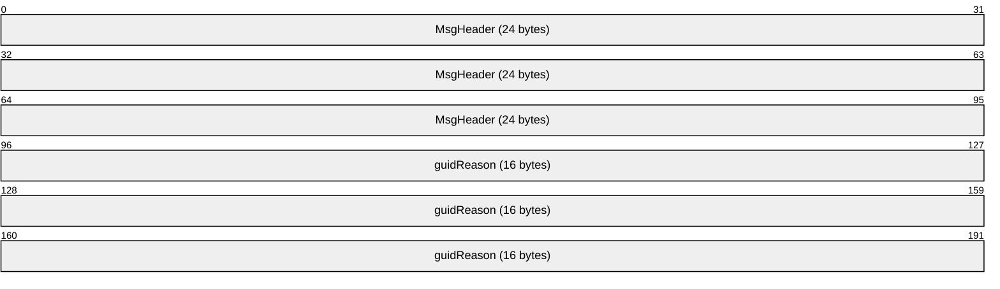
```mermaid
packet-beta
  0-95: "MsgHeader (24 bytes)"
  96-191: "guidReason (16 bytes)"
```

**MsgHeader (24 bytes):** This field MUST contain a [**MESSAGE_PACKET**](#Section_2.2.4.1) structure:

- The **dwUserMsgType** field MUST be 0x00001013.
- The **dwcbVarLenData** field MUST be 16.
**guidReason (16 bytes):** The value MUST be set to an implementation-specific GUID that specifies the reason for aborting the transaction and SHOULD be ignored on receipt.

###### 2.2.8.1.1.2 TXUSER_BEGINNER_MTAG_BEGIN

The **TXUSER_BEGINNER_MTAG_BEGIN** message requests the creation of a transaction.

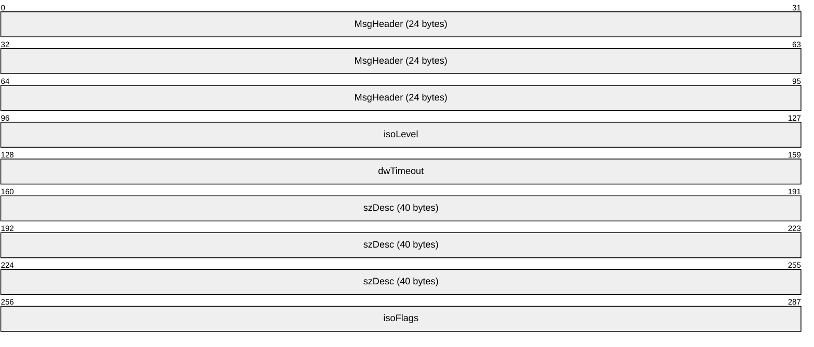
```mermaid
packet-beta
  0-95: "MsgHeader (24 bytes)"
  96-127: "isoLevel"
  128-159: "dwTimeout"
  160-255: "szDesc (40 bytes)"
  256-287: "isoFlags"
```

**MsgHeader (24 bytes):** This field MUST contain a [**MESSAGE_PACKET**](#Section_2.2.4.1) structure:

- The **dwUserMsgType** field MUST be 0x00001011.
- The **dwcbVarLenData** field MUST be 52.
**isoLevel (4 bytes):** The isolation level of the transaction. The value MUST be one as specified in the **OLETX_ISOLATION_LEVEL** (section [2.2.6.9](#Section_2.2.6.9)) enumeration.

**dwTimeout (4 bytes):** A 32-bit unsigned integer that MUST contain the time-out value, in milliseconds, for the transaction. The value zero MUST be interpreted as an infinite time-out. A transaction SHOULD NOT abort due to time-out before the time-out that is specified by this value has expired.

**szDesc (40 bytes):** The description of the transaction, as a fixed-size array of 40 bytes that contains a null-terminated Latin-1 ANSI string, as specified in [[ISO/IEC-8859-1]](https://go.microsoft.com/fwlink/?LinkId=90689). See section [2.2.5.4](#Section_3.3.4.3) for details.

**isoFlags (4 bytes):** The isolation flags for the transaction. The value MUST be a legal combination of values from the OLETX_ISOLATION_FLAGS enumeration (section [2.2.6.8](#Section_2.2.6.8)).

###### 2.2.8.1.1.3 TXUSER_BEGINNER_MTAG_BEGIN_LOG_FULL

The **TXUSER_BEGINNER_MTAG_BEGIN_LOG_FULL** message indicates that the **transaction** was not created because the **transaction recovery** log had insufficient space to accommodate the new transaction.

```mermaid
packet-beta
  0-95: "MsgHeader (24 bytes)"
```

**MsgHeader (24 bytes):** This field MUST contain a [**MESSAGE_PACKET**](#Section_2.2.4.1) structure:

- The **dwUserMsgType** field MUST be 0x00001018.
- The **dwcbVarLenData** field MUST be 0.

###### 2.2.8.1.1.4 TXUSER_BEGINNER_MTAG_BEGIN_NO_MEM

The **TXUSER_BEGINNER_MTAG_BEGIN_NO_MEM** message indicates that the transaction was not created because of insufficient memory.

```mermaid
packet-beta
  0-95: "MsgHeader (24 bytes)"
```

**MsgHeader (24 bytes):** This field MUST contain a [**MESSAGE_PACKET**](#Section_2.2.4.1) structure:

- The **dwUserMsgType** field MUST be 0x00001019.
- The **dwcbVarLenData** field MUST be 0.

###### 2.2.8.1.1.5 TXUSER_BEGINNER_MTAG_BEGUN

The **TXUSER_BEGINNER_MTAG_BEGUN** message indicates that the request to begin a transaction was successful.

```mermaid
packet-beta
  0-95: "MsgHeader (24 bytes)"
  96-191: "guidTx (16 bytes)"
```

**MsgHeader (24 bytes):** This field MUST contain a [**MESSAGE_PACKET**](#Section_2.2.4.1) structure:

- The **dwUserMsgType** field MUST be 0x00001012.
- The **dwcbVarLenData** field MUST be 16.
**guidTx (16 bytes):** This field MUST contain a GUID that specifies the [**transaction identifier**](#gt_transaction-identifier). The value MUST NOT be set to a [**NULL GUID**](#gt_null-guid).

###### 2.2.8.1.1.6 TXUSER_BEGINNER_MTAG_COMMIT

The **TXUSER_BEGINNER_MTAG_COMMIT** message requests an attempt to commit the transaction that was begun on this connection.

```mermaid
packet-beta
  0-95: "MsgHeader (24 bytes)"
  96-127: "grfRM"
  128-159: "fAsyncFull"
```

**MsgHeader (24 bytes):** This field MUST contain a [**MESSAGE_PACKET**](#Section_2.2.4.1) structure:

- The **dwUserMsgType** field MUST be 0x00001014.
- The **dwcbVarLenData** field MUST be 8.
**grfRM (4 bytes):** The value of this field MUST be as specified in GRFRM (section [2.2.7.1](#Section_2.2.7.1)).

**fAsyncFull (4 bytes):** Reserved. This value MUST be set to zero and MUST be ignored on receipt.

###### 2.2.8.1.1.7 TXUSER_BEGINNER_MTAG_COMMIT_INDOUBT

The **TXUSER_BEGINNER_MTAG_COMMIT_INDOUBT** message indicates that the transaction manager is unable to determine, and will never be able to determine, the outcome of the transaction.

```mermaid
packet-beta
  0-95: "MsgHeader (24 bytes)"
```

**MsgHeader (24 bytes):** This field MUST contain a [**MESSAGE_PACKET**](#Section_2.2.4.1) structure:

- The **dwUserMsgType** field MUST be 0x00001990.
- The **dwcbVarLenData** field MUST be 0.

###### 2.2.8.1.1.8 TXUSER_BEGINNER_MTAG_COMMIT_TOO_LATE

The **TXUSER_BEGINNER_MTAG_COMMIT_TOO_LATE** message indicates that the [**commit request**](#gt_commit-request) cannot be completed successfully because it is too late in the lifetime of the transaction to commit it.

```mermaid
packet-beta
  0-95: "MsgHeader (24 bytes)"
```

**MsgHeader (24 bytes):** This field MUST contain a [**MESSAGE_PACKET**](#Section_2.2.4.1) structure:

- The **dwUserMsgType** field MUST be 0x00001016.
- The **dwcbVarLenData** field MUST be 0.

###### 2.2.8.1.1.9 TXUSER_BEGINNER_MTAG_REQUEST_COMPLETED

The **TXUSER_BEGINNER_MTAG_REQUEST_COMPLETED** message is sent to indicate that the request to commit or abort the transaction was completed successfully.

```mermaid
packet-beta
  0-95: "MsgHeader (24 bytes)"
```

**MsgHeader (24 bytes):** This field MUST contain a [**MESSAGE_PACKET**](#Section_2.2.4.1) structure:

- The **dwUserMsgType** field MUST be 0x00001015.
- The **dwcbVarLenData** field MUST be 0.

##### 2.2.8.1.2 CONNTYPE_TXUSER_BEGIN2

The **CONNTYPE_TXUSER_BEGIN2** connection type is used by an **application** to begin, commit, or [**rollback**](#gt_rollback) a transaction or to change the time-out of a transaction. This connection type supersedes [CONNTYPE_TXUSER_BEGINNER](#Section_2.2.8.1.1) and [CONNTYPE_TXUSER_SETTXTIMEOUT2](#Section_2.2.8.3.4).

For more information about **CONNTYPE_TXUSER_BEGIN2** as an [**initiator**](#gt_initiator), see [3.3.5.1.2](#Section_3.3.5.1.2.1), and as an [**acceptor**](#gt_acceptor), see [3.4.5.1.2](#Section_3.4.5.1.2).

This connection type also uses the following message:

- TXUSER_SETTXTIMEOUT_MTAG_TX_NOT_FOUND (section [2.2.8.3.3.1](#Section_2.2.8.3.3.1))

###### 2.2.8.1.2.1 TXUSER_BEGIN2_MTAG_ABORT

The **TXUSER_BEGIN2_MTAG_ABORT** message requests an abort attempt to the transaction that was begun on this connection.

```mermaid
packet-beta
  0-95: "MsgHeader (24 bytes)"
```

**MsgHeader (24 bytes):** This field MUST contain a [**MESSAGE_PACKET**](#Section_2.2.4.1) structure:

- The **dwUserMsgType** field MUST be 0x00006001.
- The **dwcbVarLenData** field MUST be 0.

###### 2.2.8.1.2.2 TXUSER_BEGIN2_MTAG_BEGIN

The **TXUSER_BEGIN2_MTAG_BEGIN** message is used to request the creation of a transaction.

```mermaid
packet-beta
  0-95: "MsgHeader (24 bytes)"
  96-127: "isoLevel"
  128-159: "dwTimeout"
  160-255: "szDesc (40 bytes)"
  256-287: "isoFlags"
```

**MsgHeader (24 bytes):** This field MUST contain a [**MESSAGE_PACKET**](#Section_2.2.4.1) structure:

- The **dwUserMsgType** field MUST be 0x00006002.
- The **dwcbVarLenData** field MUST be 52.
**isoLevel (4 bytes):** The isolation level of the transaction. The value MUST be one as specified in the **OLETX_ISOLATION_LEVEL** enumeration (section [2.2.6.9](#Section_2.2.6.9)).

**dwTimeout (4 bytes):** A 32-bit unsigned integer that MUST contain the time-out value, in milliseconds, for the transaction. The value zero MUST be interpreted as an infinite time-out. A transaction SHOULD NOT abort due to time-out before the time-out that is specified by this value has expired.

**szDesc (40 bytes):** The description of the transaction, as a fixed-size array of 40 bytes that contains a null-terminated Latin-1 ANSI string, as specified in [[ISO/IEC-8859-1]](https://go.microsoft.com/fwlink/?LinkId=90689). See section [2.2.5.4](#Section_3.3.4.3) for details.

**isoFlags (4 bytes):** The isolation flags for the transaction. The value MUST be a legal combination of values from the **OLETX_ISOLATION_FLAGS** (section [2.2.6.8](#Section_2.2.6.8)) enumeration.

###### 2.2.8.1.2.3 TXUSER_BEGIN2_MTAG_COMMIT

The **TXUSER_BEGIN2_MTAG_COMMIT** message requests a commit attempt to the transaction that was begun on this connection.

```mermaid
packet-beta
  0-95: "MsgHeader (24 bytes)"
  96-127: "grfRM"
```

**MsgHeader (24 bytes):** This field MUST contain a [**MESSAGE_PACKET**](#Section_2.2.4.1) structure:

- The **dwUserMsgType** field MUST be 0x00006003.
- The **dwcbVarLenData** field MUST be 4.
**grfRM (4 bytes):** The value of this field MUST be as specified in **GRFRM** (section [2.2.7.1](#Section_2.2.7.1)).

###### 2.2.8.1.2.4 TXUSER_BEGIN2_MTAG_SINK_BEGUN

The **TXUSER_BEGIN2_MTAG_SINK_BEGUN** message indicates that the request to begin a transaction was successful.

```mermaid
packet-beta
  0-95: "MsgHeader (24 bytes)"
  96-191: "guidTx (16 bytes)"
```

**MsgHeader (24 bytes):** This field MUST contain a [**MESSAGE_PACKET**](#Section_2.2.4.1) structure:

- The **dwUserMsgType** field MUST be 0x00006006.
- The **dwcbVarLenData** field MUST be 16.
**guidTx (16 bytes):** This field MUST contain a GUID that specifies the [**transaction identifier**](#gt_transaction-identifier). This value MUST NOT be a [**NULL GUID**](#gt_null-guid).

###### 2.2.8.1.2.5 TXUSER_BEGIN2_MTAG_SINK_ERROR

The **TXUSER_BEGIN2_MTAG_SINK_ERROR** message provides information about the outcome of a request.

```mermaid
packet-beta
  0-95: "MsgHeader (24 bytes)"
  96-127: "Error"
```

**MsgHeader (24 bytes):** This field MUST contain a [**MESSAGE_PACKET**](#Section_2.2.4.1) structure:

- The **dwUserMsgType** field MUST be 0x00006005.
- The **dwcbVarLenData** field MUST be 4.
**Error (4 bytes):** This field MUST contain the status for the previous request. The value MUST be a member of the **TRUN_TXBEGIN_ERRORS** enumeration (section [2.2.6.6](#Section_2.2.6.6)).

###### 2.2.8.1.2.6 TXUSER_SETTXTIMEOUT_MTAG_REQUEST_COMPLETE

The **TXUSER_SETTXTIMEOUT_MTAG_REQUEST_COMPLETE** message indicates that the transaction time-out was successfully modified.

This message is also used for [CONNTYPE_TXUSER_SETTXTIMEOUT](#Section_2.2.8.3.3).

```mermaid
packet-beta
  0-95: "MsgHeader (24 bytes)"
```

**MsgHeader (24 bytes):** This field MUST contain a [**MESSAGE_PACKET**](#Section_2.2.4.1) structure:

- The **dwUserMsgType** field MUST be 0x0000107C.
- The **dwcbVarLenData** field MUST be 0.

###### 2.2.8.1.2.7 TXUSER_SETTXTIMEOUT_MTAG_SETTXTIMEOUT

The **TXUSER_SETTXTIMEOUT_MTAG_SETTXTIMEOUT** message modifies the transaction time-out when it is used in **CONNTYPE_TXUSER_BEGIN2** (section [2.2.8.1.2](#Section_2.2.8.1.2.3)) connection type and **CONNTYPE_TXUSER_SETTXTIMEOUT** (section [2.2.8.3.3](#Section_2.2.8.3.3)) connection type, or queries if the transaction manager and supports the capability to do so when used in **CONNTYPE_TXUSER_SETTXTIMEOUT2** (section [2.2.8.3.4](#Section_2.2.8.3.4)).

This message is also used for **CONNTYPE_TXUSER_SETTXTIMEOUT** (section 2.2.8.3.3) connections and **CONNTYPE_TXUSER_SETTXTIMEOUT2** (section 2.2.8.3.4) connections.

```mermaid
packet-beta
  0-95: "MsgHeader (24 bytes)"
  96-191: "guidTx (16 bytes)"
  192-223: "dwTxTimeout"
```

**MsgHeader (24 bytes):** This field MUST contain a [**MESSAGE_PACKET**](#Section_2.2.4.1) structure:

- The **dwUserMsgType** field MUST be 0x0000107B.
- The **dwcbVarLenData** field MUST be 20.
**guidTx (16 bytes):** This field MUST contain a GUID that specifies the [**transaction identifier**](#gt_transaction-identifier). When this message is sent on a **CONNTYPE_TXUSER_SETTXTIMEOUT2** connection to query the capability of the transaction manager, this value SHOULD be set to a [**NULL GUID**](#gt_null-guid) and MUST be ignored on receipt.

**dwTxTimeout (4 bytes):** A 32-bit unsigned integer that contains the new time-out value, in milliseconds, for the transaction. When used with a **CONNTYPE_TXUSER_BEGIN2** connection, a transaction MUST NOT abort due to time-out before the number of milliseconds that is specified by the value has expired. The value zero MUST be interpreted as an infinite time-out. When used with a **CONNTYPE_TXUSER_SETTXTIMEOUT2** connection, this value SHOULD be set to zero and MUST be ignored on receipt.

###### 2.2.8.1.2.8 TXUSER_SETTXTIMEOUT_MTAG_TOO_LATE

The **TXUSER_SETTXTIMEOUT_MTAG_TOO_LATE** message indicates that it is too late to modify the time-out of the transaction.

This message is also used in the [CONNTYPE_TXUSER_SETTXTIMEOUT](#Section_2.2.8.3.3) connection type.

```mermaid
packet-beta
  0-95: "MsgHeader (24 bytes)"
```

**MsgHeader (24 bytes):** This field MUST contain a [**MESSAGE_PACKET**](#Section_2.2.4.1) structure:

- The **dwUserMsgType** field MUST be 0x0000107E.
- The **dwcbVarLenData** field MUST be 0.

##### 2.2.8.1.3 CONNTYPE_TXUSER_PROMOTE

The **CONNTYPE_TXUSER_PROMOTE** connection type is used by an application to do the following:

- Begin a transaction using an application-specified transaction identity
- Commit or rollback a transaction
- Change the time-out of a transaction
This connection type supersedes [CONNTYPE_TXUSER_SETTXTIMEOUT2](#Section_2.2.8.3.4).

For more information about **CONNTYPE_TXUSER_PROMOTE** as an [**initiator**](#gt_initiator), see section [3.3.5.1.3](#Section_3.3.5.1.3.1), and as an [**acceptor**](#gt_acceptor), see section [3.4.5.1.3](#Section_3.4.5.1.3.1).

This connection type also uses the following messages:

- TXUSER_BEGIN2_MTAG_COMMIT (section [2.2.8.1.2.3](#Section_2.2.8.1.2.3))
- TXUSER_BEGIN2_MTAG_ABORT (section [2.2.8.1.2.1](#Section_2.2.8.1.2.1))
- TXUSER_BEGIN2_MTAG_SINK_BEGUN (section [2.2.8.1.2.4](#Section_2.2.8.1.2.4))
- TXUSER_BEGIN2_MTAG_SINK_ERROR (section [2.2.8.1.2.5](#Section_2.2.8.1.2.5))
- TXUSER_SETTXTIMEOUT_MTAG_SETTXTIMEOUT (section [2.2.8.1.2.7](#Section_2.2.8.1.2.7))
- TXUSER_SETTXTIMEOUT_MTAG_TOO_LATE (section [2.2.8.1.2.8](#Section_2.2.8.1.2.8))
- TXUSER_SETTXTIMEOUT_MTAG_REQUEST_COMPLETE (section [2.2.8.1.2.6](#Section_2.2.8.1.2.6))

###### 2.2.8.1.3.1 TXUSER_BEGINNER_MTAG_PROMOTE

The **TXUSER_BEGINNER_MTAG_PROMOTE** message is used to request the creation of a transaction that specifies a predetermined transaction identifier.

```mermaid
packet-beta
  0-95: "MsgHeader (24 bytes)"
  96-127: "isoLevel"
  128-159: "dwTimeout"
  160-255: "szDesc (40 bytes)"
  256-287: "isoFlags"
  288-383: "guidTx (16 bytes)"
```

**MsgHeader (24 bytes):** This field MUST contain a [**MESSAGE_PACKET**](#Section_2.2.4.1) structure:

- The **dwUserMsgType** field MUST be 0x00001010.
- The **dwcbVarLenData** field MUST be 68.
**isoLevel (4 bytes):** The isolation level of the transaction. The value MUST be one as specified in the OLETX_ISOLATION_LEVEL (section [2.2.6.9](#Section_2.2.6.9)) enumeration.

**dwTimeout (4 bytes):** A 32-bit unsigned integer that MUST contain the time-out value, in milliseconds, for the transaction. The value zero MUST be interpreted as an infinite time-out. A transaction SHOULD NOT abort due to time-out before the time-out that is specified by this value has expired.

**szDesc (40 bytes):** The description of the transaction, as a fixed-size array of 40 bytes that contains a null-terminated Latin-1 ANSI string, as specified in [[ISO/IEC-8859-1]](https://go.microsoft.com/fwlink/?LinkId=90689). See section [2.2.5.4](#Section_3.3.4.3) for details.

**isoFlags (4 bytes):** The isolation flags for the transaction. The value MUST be a legal combination of values from the OLETX_ISOLATION_FLAGS (section [2.2.6.8](#Section_2.2.6.8)) enumeration.

**guidTx (16 bytes):** This field MUST contain a GUID that specifies the [**transaction identifier**](#gt_transaction-identifier).

#### 2.2.8.2 Transaction Propagation

##### 2.2.8.2.1 Pull Propagation

###### 2.2.8.2.1.1 CONNTYPE_TXUSER_ASSOCIATE

The **CONNTYPE_TXUSER_ASSOCIATE** connection type is used by a destination application to complete the [**pull propagation**](#gt_pull-propagation) of a transaction from a source application.

For more information about **CONNTYPE_TXUSER_ASSOCIATE** as an initiator, see section [3.3.5.2.1.1](#Section_3.3.5.2.1.1), and as an acceptor, see section [3.4.5.2.1.1](#Section_3.4.5.2.1.1).

TXUSER_ASSOCIATE_MTAG_ASSOCIATE

The **TXUSER_ASSOCIATE_MTAG_ASSOCIATE** message requests that the transaction manager perform [**pull propagation**](#gt_pull-propagation) of an existing transaction. This is also known as an associate request.

```mermaid
packet-beta
  0-95: "MsgHeader (24 bytes)"
  96-191: "guidTx (16 bytes)"
  192-223: "isoLevel"
  224-255: "isoFlags"
  256-287: "cbSourceTmAddr"
  288-383: "szDesc (40 bytes)"
  384-447: "SourceTmAddr (variable)"
```

**MsgHeader (24 bytes):** This field MUST contain a [**MESSAGE_PACKET**](#Section_2.2.4.1) structure:

- The **dwUserMsgType** field MUST be 0x00002031.
- The **dwcbVarLenData** field MUST be equal to the value of **cbSourceTMAddr** plus 68.
**guidTx (16 bytes):** This field MUST contain a GUID that specifies the [**transaction identifier**](#gt_transaction-identifier).

**isoLevel (4 bytes):** The isolation level of the transaction. The value MUST be one as specified in the OLETX_ISOLATION_LEVEL (section 2.2.6.9) enumeration.

**isoFlags (4 bytes):** The isolation flags for the transaction. The value MUST be a legal combination of values from the OLETX_ISOLATION_FLAGS (section [2.2.6.8](#Section_2.2.6.8)) enumeration.

**cbSourceTmAddr (4 bytes):** A 4-byte integer value that MUST contain the length, in bytes, of the **SourceTmAddr** field. The length MUST include the padding bytes used in the **SourceTmAddr** field.

**szDesc (40 bytes):** The description of the transaction, as a fixed-size array of 40 bytes that contains a null-terminated Latin-1 ANSI string, as specified in [[ISO/IEC-8859-1]](https://go.microsoft.com/fwlink/?LinkId=90689). See section [2.2.5.4](#Section_3.3.4.3) for details.

**SourceTmAddr (variable):** This field is used for identifying the address of the **superior transaction manager** against which the pull propagation operation is requested. This field MUST contain either a **NAMEOBJECTBLOB** (section [2.2.5.3](#Section_2.2.5.3)) structure or an **OLETX_TM_ADDR** (section [2.2.4.2](#Section_2.2.4.2)) structure in a version-specific manner as specified in **Version-Specific Aspects of Connection Types Relevant to an Application** (section [2.2.1.1.1](#Section_2.2.1.1.1)). The **SourceTmAddr** field MUST be aligned on a 4-byte boundary by padding with arbitrary values.

TXUSER_ASSOCIATE_MTAG_ASSOCIATED

The **TXUSER_ASSOCIATE_MTAG_ASSOCIATED** message indicates that the associate request was successful.

```mermaid
packet-beta
  0-95: "MsgHeader (24 bytes)"
```

**MsgHeader (24 bytes):** This field MUST contain a [**MESSAGE_PACKET**](#Section_2.2.4.1) structure:

- The **dwUserMsgType** field MUST be 0x00002032.
- The **dwcbVarLenData** field MUST be 0.

TXUSER_ASSOCIATE_MTAG_COMM_FAILED

The **TXUSER_ASSOCIATE_MTAG_COMM_FAILED** message indicates that the associated request failed because the sender of this message encountered a communication failure with the **Superior Transaction Manager** specified in the **SourceTmAddr** field of the **TXUSER_ASSOCIATE_MTAG_ASSOCIATE** (section [2.2.8.2.1.1.1](#Section_2.2.8.2.1.1.1)) message.

```mermaid
packet-beta
  0-95: "MsgHeader (24 bytes)"
```

**MsgHeader (24 bytes):** This field MUST contain a [**MESSAGE_PACKET**](#Section_2.2.4.1) structure:

- The **dwUserMsgType** field MUST be 0x00002034.
- The **dwcbVarLenData** field MUST be 0.

TXUSER_ASSOCIATE_MTAG_CREATE_BAD_TMADDR

The **TXUSER_ASSOCIATE_MTAG_CREATE_BAD_TMADDR** message indicates that the associate request failed because of failures during interpretation and processing of the **SourceTmAddr** field in the **TXUSER_ASSOCIATE_MTAG_ASSOCIATE** (section [2.2.8.2.1.1.1](#Section_2.2.8.2.1.1.1)) message.

```mermaid
packet-beta
  0-95: "MsgHeader (24 bytes)"
```

**MsgHeader (24 bytes):** This field MUST contain a [**MESSAGE_PACKET**](#Section_2.2.4.1) structure:

- The **dwUserMsgType** field MUST be 0x00002044.
- The **dwcbVarLenData** field MUST be 0.

TXUSER_ASSOCIATE_MTAG_LOG_FULL_LOCAL

The **TXUSER_ASSOCIATE_MTAG_LOG_FULL_LOCAL** message indicates that the associate request failed because the **transaction recovery** log was full at the transaction manager sending this message.

```mermaid
packet-beta
  0-95: "MsgHeader (24 bytes)"
```

**MsgHeader (24 bytes):** This field MUST contain a [**MESSAGE_PACKET**](#Section_2.2.4.1) structure:

- The **dwUserMsgType** field MUST be 0x00002035.
- The **dwcbVarLenData** field MUST be 0.

TXUSER_ASSOCIATE_MTAG_LOG_FULL_REMOTE

The **TXUSER_ASSOCIATE_MTAG_LOG_FULL_REMOTE** message indicates first that the associated request failed because of a full **transaction recovery** log at the [**superior transaction manager**](#gt_superior-transaction-manager) specified in the **SourceTmAddr** field of the TXUSER_ASSOCIATE_MTAG_ASSOCIATE (section [2.2.8.2.1.1.1](#Section_2.2.8.2.1.1.1)) message.

```mermaid
packet-beta
  0-95: "MsgHeader (24 bytes)"
```

**MsgHeader (24 bytes):** This field MUST contain a [**MESSAGE_PACKET**](#Section_2.2.4.1) structure:

- The **dwUserMsgType** field MUST be 0x00002037.
- The **dwcbVarLenData** field MUST be 0.

TXUSER_ASSOCIATE_MTAG_NO_MEM_LOCAL

The **TXUSER_ASSOCIATE_MTAG_NO_MEM_LOCAL** message indicates that the associate request failed because of a failure to allocate dynamic memory by the transaction manager sending this message while processing the **TXUSER_ASSOCIATE_MTAG_ASSOCIATE** (section [2.2.8.2.1.1.1](#Section_2.2.8.2.1.1.1)) message.

```mermaid
packet-beta
  0-95: "MsgHeader (24 bytes)"
```

**MsgHeader (24 bytes):** This field MUST contain a [**MESSAGE_PACKET**](#Section_2.2.4.1) structure:

- The **dwUserMsgType** field MUST be 0x00002036.
- The **dwcbVarLenData** field MUST be 0.

TXUSER_ASSOCIATE_MTAG_NO_MEM_REMOTE

The **TXUSER_ASSOCIATE_MTAG_NO_MEM_REMOTE** message indicates that the associate request failed because of a failure to allocate dynamic memory by the [**Superior Transaction Manager**](#gt_superior-transaction-manager) specified in the **SourceTmAddr** field of the **TXUSER_ASSOCIATE_MTAG_ASSOCIATE** (section [2.2.8.2.1.1.1](#Section_2.2.8.2.1.1.1)) message.

```mermaid
packet-beta
  0-95: "MsgHeader (24 bytes)"
```

**MsgHeader (24 bytes):** This field MUST contain a [**MESSAGE_PACKET**](#Section_2.2.4.1) structure:

- The **dwUserMsgType** field MUST be 0x00002038.
- The **dwcbVarLenData** field MUST be 0.

TXUSER_ASSOCIATE_MTAG_TOO_LATE

The **TXUSER_ASSOCIATE_MTAG_TOO_LATE** message is sent in response to a TXUSER_ASSOCIATE_MTAG_ASSOCIATE (section [2.2.8.2.1.1.1](#Section_2.2.8.2.1.1.1)) message. It indicates that the associate request failed because the transaction specified by the **guidTx** field in the **TXUSER_ASSOCIATE_MTAG_ASSOCIATE** message is neither in the Active, [Phase Zero](#Section_1.3.1.1), nor [Phase Zero Complete](#Section_3.8.7.6) state.

```mermaid
packet-beta
  0-95: "MsgHeader (24 bytes)"
```

**MsgHeader (24 bytes):** This field MUST contain a [**MESSAGE_PACKET**](#Section_2.2.4.1) structure:

- The **dwUserMsgType** field MUST be 0x00002040.
- The **dwcbVarLenData** field MUST be 0.

TXUSER_ASSOCIATE_MTAG_TOO_MANY_LOCAL

The **TXUSER_ASSOCIATE_MTAG_TOO_MANY_LOCAL** message indicates that the associate request failed because the number of direct participants for the transaction specified by the **guidTx** field in the **TXUSER_ASSOCIATE_MTAG_ASSOCIATE** (section [2.2.8.2.1.1.1](#Section_2.2.8.2.1.1.1)) message exceeded an implementation-specific limit by the transaction manager sending this message while processing the **TXUSER_ASSOCIATE_MTAG_ASSOCIATE** message.<14>

```mermaid
packet-beta
  0-95: "MsgHeader (24 bytes)"
```

**MsgHeader (24 bytes):** This field MUST contain a [**MESSAGE_PACKET**](#Section_2.2.4.1) structure:

- The **dwUserMsgType** field MUST be 0x00002041.
- The **dwcbVarLenData** field MUST be 0.

TXUSER_ASSOCIATE_MTAG_TOO_MANY_REMOTE

The **TXUSER_ASSOCIATE_MTAG_TOO_MANY_REMOTE** message indicates a failure by the associate request. The number of direct participants for the transaction that is specified by the **guidTx** field in the **TXUSER_ASSOCIATE_MTAG_ASSOCIATE** (section [2.2.8.2.1.1.1](#Section_2.2.8.2.1.1.1)) message exceeded the limit at the Superior Transaction Manager referenced in the **SourceTmAddr** field of the **TXUSER_ASSOCIATE_MTAG_ASSOCIATE** message.

```mermaid
packet-beta
  0-95: "MsgHeader (24 bytes)"
```

**MsgHeader (24 bytes):** This field MUST contain a [**MESSAGE_PACKET**](#Section_2.2.4.1) structure:

- The **dwUserMsgType** field MUST be 0x00002042.
- The **dwcbVarLenData** field MUST be 0.

TXUSER_ASSOCIATE_MTAG_TX_NOT_FOUND

The **TXUSER_ASSOCIATE_MTAG_TX_NOT_FOUND** message indicates that the associate request failed because the transaction) specified by the **guidTx** field in the **TXUSER_ASSOCIATE_MTAG_ASSOCIATE** (section [2.2.8.2.1.1.1](#Section_2.2.8.2.1.1.1)) message was not found.

```mermaid
packet-beta
  0-95: "MsgHeader (24 bytes)"
```

**MsgHeader (24 bytes):** This field MUST contain a [**MESSAGE_PACKET**](#Section_2.2.4.1) structure:

- The **dwUserMsgType** field MUST be 0x00002043.
- The **dwcbVarLenData** field MUST be 0.

##### 2.2.8.2.2 Push Propagation

###### 2.2.8.2.2.1 CONNTYPE_TXUSER_EXTENDEDWHEREABOUTS

The **CONNTYPE_TXUSER_EXTENDEDWHEREABOUTS** connection type is used by an application to obtain [**Extended Whereabouts**](#gt_extended-whereabouts) from its transaction manager.

For more information about **CONNTYPE_TXUSER_EXTENDEDWHEREABOUTS** as an initiator, see section [3.3.5.2.2.1](#Section_3.3.5.2.2.1), and as an acceptor, see section [3.4.5.2.2.1](#Section_3.4.5.2.2.1).

TXUSER_EXTENDEDWHEREABOUTS_MTAG_GET

The **TXUSER_EXTENDEDWHEREABOUTS_MTAG_GET** message is sent by the application to the transaction manager to obtain the [**Extended Whereabouts**](#gt_extended-whereabouts) of the transaction manager.

```mermaid
packet-beta
  0-95: "MsgHeader (24 bytes)"
```

**MsgHeader (24 bytes):** This field MUST contain a [**MESSAGE_PACKET**](#Section_2.2.4.1) structure:

- The **dwUserMsgType** field MUST be 0x00005A01.
- The **dwcbVarLenData** field MUST be 0.

TXUSER_EXTENDEDWHEREABOUTS_MTAG_GOT

The **TXUSER_EXTENDEDWHEREABOUTS_MTAG_GOT** message returns the set of [**extended whereabouts**](#gt_extended-whereabouts) elements.

```mermaid
packet-beta
  0-95: "MsgHeader (24 bytes)"
  96-127: "dwProtocolCount"
  128-191: "rgtmprotUsableList (variable)"
```

**MsgHeader (24 bytes):** This field MUST contain a [**MESSAGE_PACKET**](#Section_2.2.4.1) structure:

- The **dwUserMsgType** field MUST be 0x00005A02.
- The **dwcbVarLenData** field MUST be the number of bytes used by the **rgtmprotUsableList** field plus 4 bytes.
**dwProtocolCount (4 bytes):** An unsigned 32-bit value that MUST contain the number of elements in the **rgtmprotUsableList** array. If this value is zero, the **rgtmprotUsableList** field MUST be omitted.

**rgtmprotUsableList (variable):** Array of **STmToTmProtocol** (section [2.2.5.9](#Section_2.2.5.9)) elements, each of which MUST be of type **TmProtocolExtended**. Each element defines the location information for an extension protocol. Each element MUST be aligned on a 4-byte boundary.

TXUSER_EXTENDEDWHEREABOUTS_MTAG_NOMEM

The **TXUSER_EXTENDEDWHEREABOUTS_MTAG_NOMEM** message is sent by the transaction manager to the client in response to a **TXUSER_EXTENDEDWHEREABOUTS_MTAG_GET** (section [2.2.8.2.2.1.1](#Section_2.2.8.2.2.1.1)) message to indicate that there is not enough memory to process the request.

```mermaid
packet-beta
  0-95: "MsgHeader (24 bytes)"
```

**MsgHeader (24 bytes):** This field MUST contain a [**MESSAGE_PACKET**](#Section_2.2.4.1) structure:

- The **dwUserMsgType** field MUST be 0x00005A03.
- The **dwcbVarLenData** field MUST be 0.

###### 2.2.8.2.2.2 CONNTYPE_TXUSER_EXPORT

The **CONNTYPE_TXUSER_EXPORT** connection type is used by a source application to initiate a push propagation to a destination application.

For more information about **CONNTYPE_TXUSER_EXPORT** as an initiator, see section [3.3.5.2.2.2](#Section_3.3.5.2.2.2), and as an acceptor, see section [3.4.5.2.2.2](#Section_3.4.5.2.2.2).

TXUSER_EXPORT_MTAG_CREATE

The **TXUSER_EXPORT_MTAG_CREATE** message is used by applications to establish a connection with the transaction manager to export transactions to a destination transaction manager.

```mermaid
packet-beta
  0-95: "MsgHeader (24 bytes)"
  96-159: "SourceTmAddr (variable)"
```

**MsgHeader (24 bytes):** This field MUST contain a [**MESSAGE_PACKET**](#Section_2.2.4.1) structure:

- The **dwUserMsgType** field MUST be 0x00001041.
- The **dwcbVarLenData** field MUST be the number of bytes used for the **SourceTmAddr** field, and the value MUST be at least 40.
**SourceTmAddr (variable):** This field specifies the network address and identification information for the destination transaction manager. This field MUST contain either a **NAMEOBJECTBLOB** (section [2.2.5.3](#Section_2.2.5.3)) structure or an **OLETX_TM_ADDR** (section [2.2.4.2](#Section_2.2.4.2)) structure in a version-specific manner as described in **Version-Specific Aspects of Connection Types Relevant to an Application** (section [2.2.1.1.1](#Section_2.2.1.1.1)). This transaction manager receives push propagation operations from the source transaction manager, which is the recipient of this message. **CONNTYPE_PARTNERTM_PROPAGATE** (section [2.2.9.1.1.1](#Section_2.2.9.1.1.1)) defines the protocol that is used between the two transaction managers as a result of the export operation.

TXUSER_EXPORT_MTAG_CREATE2

The **TXUSER_EXPORT_MTAG_CREATE2** message is used by applications to establish a connection with the transaction manager in preparation to export transactions to a destination transaction manager.

```mermaid
packet-beta
  0-95: "MsgHeader (24 bytes)"
  96-159: "SourceTmAddr (variable)"
```

**MsgHeader (24 bytes):** This field MUST contain a [**MESSAGE_PACKET**](#Section_2.2.4.1) structure:

- The **dwUserMsgType** field MUST be 0x00001804.
- The **dwcbVarLenData** field MUST be the number of bytes used for the **SourceTmAddr** field, and the value MUST be at least 40.
**SourceTmAddr (variable):** This field MUST contain an [**OLETX_TM_ADDR**](#Section_2.2.4.2) structure that specifies the network address and identification information for the destination transaction manager. This transaction manager receives push propagation operations from the source transaction manager, which is the recipient of this message. CONNTYPE_PARTNERTM_PROPAGATE (section [2.2.9.1.1.1](#Section_2.2.9.1.1.1)) defines the protocol that is used between the two transaction managers as a result of the export operation.

TXUSER_EXPORT_MTAG_CREATE_BAD_TMADDR

The **TXUSER_EXPORT_MTAG_CREATE_BAD_TMADDR** message indicates that the create request failed because of errors encountered during the interpretation and processing of the **SourceTmAddr** field in the connection's initial **TXUSER_EXPORT_MTAG_CREATE** (section [2.2.8.2.2.2.1](#Section_2.2.8.2.2.2.1)) or **TXUSER_EXPORT_MTAG_CREATE2** (section [2.2.8.2.2.2.2](#Section_2.2.8.2.2.2.2)) message.

```mermaid
packet-beta
  0-95: "MsgHeader (24 bytes)"
```

**MsgHeader (24 bytes):** This field MUST contain a [**MESSAGE_PACKET**](#Section_2.2.4.1) structure:

- The **dwUserMsgType** field MUST be 0x00001046.
- The **dwcbVarLenData** field MUST be 0.

TXUSER_EXPORT_MTAG_CREATE_NET_TX_DISABLED

The **TXUSER_EXPORT_MTAG_CREATE_NET_TX_DISABLED** message indicates that the create request failed because the transaction manager that received the request has disabled the ability to export transactions to other transaction managers. See the **Allow Outbound Transaction** flag in Abstract Data Model (section [3.2.1](#Section_3.2.1)) for more details.

```mermaid
packet-beta
  0-95: "MsgHeader (24 bytes)"
```

**MsgHeader (24 bytes):** This field MUST contain a [**MESSAGE_PACKET**](#Section_2.2.4.1) structure:

- The **dwUserMsgType** field MUST be 0x00001805.
- The **dwcbVarLenData** field MUST be 0.

TXUSER_EXPORT_MTAG_CREATED

The **TXUSER_EXPORT_MTAG_CREATED** message indicates that the create request succeeded and the connection is now ready to process export requests.

```mermaid
packet-beta
  0-95: "MsgHeader (24 bytes)"
```

**MsgHeader (24 bytes):** This field MUST contain a [**MESSAGE_PACKET**](#Section_2.2.4.1) structure:

- The **dwUserMsgType** field MUST be 0x00001042.
- The **dwcbVarLenData** field MUST be 0.

TXUSER_EXPORT_MTAG_EXPORT

The **TXUSER_EXPORT_MTAG_EXPORT** message is used to export a transaction to the destination transaction manager that is identified by **SourceTmAddr** in the connection's initial **TXUSER_EXPORT_MTAG_CREATE** (section [2.2.8.2.2.2.1](#Section_2.2.8.2.2.2.1)) or **TXUSER_EXPORT_MTAG_CREATE2** (section [2.2.8.2.2.2.2](#Section_2.2.8.2.2.2.2)) message.

```mermaid
packet-beta
  0-95: "MsgHeader (24 bytes)"
  96-191: "guidTX (16 bytes)"
```

**MsgHeader (24 bytes):** This field MUST contain a [**MESSAGE_PACKET**](#Section_2.2.4.1) structure:

- The **dwUserMsgType** field MUST be 0x00001043.
- The **dwcbVarLenData** field MUST be 16.
**guidTX (16 bytes):** This field MUST contain a GUID that specifies the transaction identifier.

TXUSER_EXPORT_MTAG_EXPORT_LOG_FULL

The **TXUSER_EXPORT_MTAG_EXPORT_LOG_FULL** message indicates that the export request failed because the **transaction recovery** log was full at the source transaction manager.

```mermaid
packet-beta
  0-95: "MsgHeader (24 bytes)"
```

**MsgHeader (24 bytes):** This field MUST contain a [**MESSAGE_PACKET**](#Section_2.2.4.1) structure:

- The **dwUserMsgType** field MUST be 0x00001050.
- The **dwcbVarLenData** field MUST be 0.

TXUSER_EXPORT_MTAG_EXPORT_NO_MEM

The **TXUSER_EXPORT_MTAG_EXPORT_NO_MEM** message indicates that the export request failed because the source transaction manager was unable to allocate sufficient dynamic memory for the request.

```mermaid
packet-beta
  0-95: "MsgHeader (24 bytes)"
```

**MsgHeader (24 bytes):** This field MUST contain a [**MESSAGE_PACKET**](#Section_2.2.4.1) structure:

- The **dwUserMsgType** field MUST be 0x00001802.
- The **dwcbVarLenData** field MUST be 0.

TXUSER_EXPORT_MTAG_EXPORT_TOO_LATE

The **TXUSER_EXPORT_MTAG_EXPORT_TOO_LATE** message indicates that the export request failed because it was too late to process the export request for the current state of the transaction. See **Export Transaction** (section [3.2.7.21](#Section_3.2.7.21)) and **Export Transaction Failure** (section [3.4.7.11](#Section_3.4.7.11)) for more information.

```mermaid
packet-beta
  0-95: "MsgHeader (24 bytes)"
```

**MsgHeader (24 bytes):** This field MUST contain a [**MESSAGE_PACKET**](#Section_2.2.4.1) structure:

- The **dwUserMsgType** field MUST be 0x00001049.
- The **dwcbVarLenData** field MUST be 0.

TXUSER_EXPORT_MTAG_EXPORT_TOO_MANY

The **TXUSER_EXPORT_MTAG_EXPORT_TOO_MANY** message indicates that the export request failed because the number of direct participants for the transaction specified by the **guidTX** field in the **TXUSER_EXPORT_MTAG_EXPORT** (section [2.2.8.2.2.2.6](#Section_2.2.8.2.2.2.6)) message exceeded the allowed number of remote transaction manager enlistments. For more information, see **Export Transaction** (section [3.2.7.21](#Section_3.2.7.21)).

```mermaid
packet-beta
  0-95: "MsgHeader (24 bytes)"
```

**MsgHeader (24 bytes):** This field MUST contain a [**MESSAGE_PACKET**](#Section_2.2.4.1) structure:

- The **dwUserMsgType** field MUST be 0x00001801.
- The **dwcbVarLenData** field MUST be 0.

TXUSER_EXPORT_MTAG_EXPORT_TX_NOT_FOUND

The **TXUSER_EXPORT_MTAG_EXPORT_TX_NOT_FOUND** message indicates that the export request failed because the transaction specified by the **guidTX** field in the **TXUSER_EXPORT_MTAG_EXPORT** (section [2.2.8.2.2.2.6](#Section_2.2.8.2.2.2.6)) message was not found by the source transaction manager.

```mermaid
packet-beta
  0-95: "MsgHeader (24 bytes)"
```

**MsgHeader (24 bytes):** This field MUST contain a [**MESSAGE_PACKET**](#Section_2.2.4.1) structure:

- The **dwUserMsgType** field MUST be 0x00001048.
- The **dwcbVarLenData** field MUST be 0.

TXUSER_EXPORT_MTAG_EXPORTED

The **TXUSER_EXPORT_MTAG_EXPORTED** message indicates that the export request was successful.

```mermaid
packet-beta
  0-95: "MsgHeader (24 bytes)"
```

**MsgHeader (24 bytes):** This field MUST contain a [**MESSAGE_PACKET**](#Section_2.2.4.1) structure:

- The **dwUserMsgType** field MUST be 0x00001044.
- The **dwcbVarLenData** field MUST be 0.

###### 2.2.8.2.2.3 CONNTYPE_TXUSER_EXPORT2

The **CONNTYPE_TXUSER_EXPORT2** connection type is used by a source application to initiate a push propagation to a destination application. This connection type supersedes [CONNTYPE_TXUSER_EXPORT](#Section_2.2.8.2.2.2).

For more information about **CONNTYPE_TXUSER_EXPORT2** as an initiator, see section [3.3.5.2.2.3](#Section_3.3.5.2.2.3), and as an acceptor, see section [3.4.1.9](#Section_3.4.1.6).

This connection type also uses the following messages:

- [TXUSER_EXPORT_MTAG_CREATE](#Section_2.2.8.2.2.2.1)
- [TXUSER_EXPORT_MTAG_CREATE2](#Section_2.2.8.2.2.2.2)
- [TXUSER_EXPORT_MTAG_CREATE_BAD_TMADDR](#Section_2.2.8.2.2.2.3)
- [TXUSER_EXPORT_MTAG_CREATE_NET_TX_DISABLED](#Section_2.2.8.2.2.2.4)
- [TXUSER_EXPORT_MTAG_CREATED](#Section_2.2.8.2.2.2.5)
- [TXUSER_EXPORT_MTAG_EXPORT](#Section_2.2.8.2.2.2.6)
- [TXUSER_EXPORT_MTAG_EXPORT_LOG_FULL](#Section_2.2.8.2.2.2.7)
- [TXUSER_EXPORT_MTAG_EXPORT_NO_MEM](#Section_2.2.8.2.2.2.8)
- [TXUSER_EXPORT_MTAG_EXPORT_TOO_LATE](#Section_2.2.8.2.2.2.9)
- [TXUSER_EXPORT_MTAG_EXPORT_TOO_MANY](#Section_2.2.8.2.2.2.10)
- [TXUSER_EXPORT_MTAG_EXPORT_TX_NOT_FOUND](#Section_2.2.8.2.2.2.11)
- [TXUSER_EXPORT_MTAG_EXPORTED](#Section_2.2.8.2.2.2.12)

TXUSER_EXPORT_MTAG_EXPORT_COMM_FAILED

The **TXUSER_EXPORT_MTAG_EXPORT_COMM_FAILED** message indicates that the export request failed because the sender of this message encountered a communication failure with the source transaction manager.

```mermaid
packet-beta
  0-95: "MsgHeader (24 bytes)"
```

**MsgHeader (24 bytes):** This field MUST contain a [**MESSAGE_PACKET**](#Section_2.2.4.1) structure:

- The **dwUserMsgType** field MUST be 0x00001806.
- The **dwcbVarLenData** field MUST be 0x00000000.

###### 2.2.8.2.2.4 CONNTYPE_TXUSER_IMPORT

The **CONNTYPE_TXUSER_IMPORT** connection type is used by a destination application to complete a push propagation that is initiated by a source application.

For more information about **CONNTYPE_TXUSER_IMPORT** as an initiator, see section [3.3.5.2.2.4](#Section_3.3.5.2.2.4), and as an acceptor, see section [3.4.5.2.2.4](#Section_3.4.5.2.2.4).

TXUSER_IMPORT_MTAG_ABORT

This message is a request for the transaction manager to abort the transaction.

```mermaid
packet-beta
  0-95: "MsgHeader (24 bytes)"
  96-191: "guidReason (16 bytes)"
```

**MsgHeader (24 bytes):** This field MUST contain a [**MESSAGE_PACKET**](#Section_2.2.4.1) structure:

- The **dwUserMsgType** field MUST be 0x00001023.
- The **dwcbVarLenData** field MUST be 16.
**guidReason (16 bytes):** The value MUST be set to an implementation-specific GUID that specifies the reason for aborting the transaction and SHOULD be ignored on receipt.

TXUSER_IMPORT_MTAG_ABORT_TOO_LATE

The **TXUSER_IMPORT_MTAG_ABORT_TOO_LATE** message is sent to the application in the connection type that was created for the originating **TXUSER_IMPORT_MTAG_IMPORT** (section [2.2.8.2.2.4.3](#Section_2.2.8.2.2.4.3)) message.

```mermaid
packet-beta
  0-95: "MsgHeader (24 bytes)"
```

**MsgHeader (24 bytes):** This field MUST contain a [**MESSAGE_PACKET**](#Section_2.2.4.1) structure:

- The **dwUserMsgType** field MUST be 0x00001025.
- The **dwcbVarLenData** field MUST be 0.

TXUSER_IMPORT_MTAG_IMPORT

The **TXUSER_IMPORT_MTAG_IMPORT** message is used by a destination application to complete a push propagation operation that is initiated by a source application.

```mermaid
packet-beta
  0-95: "MsgHeader (24 bytes)"
  96-191: "guidTx (16 bytes)"
```

**MsgHeader (24 bytes):** This field MUST contain a [**MESSAGE_PACKET**](#Section_2.2.4.1) structure:

- The **dwUserMsgType** field MUST be 0x00001021.
- The **dwcbVarLenData** field MUST be 16.
**guidTx (16 bytes):** This field MUST contain a GUID that specifies the [**transaction identifier**](#gt_transaction-identifier).

TXUSER_IMPORT_MTAG_IMPORT_TX_NOT_FOUND

The **TXUSER_IMPORT_MTAG_IMPORT_TX_NOT_FOUND** message is sent if the attempt to import the transaction is unsuccessful because the transaction that is specified in the **TXUSER_IMPORT_MTAG_IMPORT** (section [2.2.8.2.2.4.3](#Section_2.2.8.2.2.4.3)) message cannot be found.

```mermaid
packet-beta
  0-95: "MsgHeader (24 bytes)"
```

**MsgHeader (24 bytes):** This field MUST contain a [**MESSAGE_PACKET**](#Section_2.2.4.1) structure:

- The **dwUserMsgType** field MUST be 0x00001026.
- The **dwcbVarLenData** field MUST be 0.

TXUSER_IMPORT_MTAG_IMPORTED

The **TXUSER_IMPORT_MTAG_IMPORTED** message indicates that the import operation completed successfully.

```mermaid
packet-beta
  0-95: "MsgHeader (24 bytes)"
  96-127: "isoLevel"
  128-159: "isoFlags"
```

**MsgHeader (24 bytes):** This field MUST contain a [**MESSAGE_PACKET**](#Section_2.2.4.1) structure:

- The **dwUserMsgType** field MUST be 0x00001022.
- The **dwcbVarLenData** field MUST be 8.
**isoLevel (4 bytes):** The isolation level of the transaction. The value MUST be one as specified in the OLETX_ISOLATION_LEVEL (section [2.2.6.9](#Section_2.2.6.9)) enumeration.

**isoFlags (4 bytes):** The isolation flags for the transaction. The value MUST be a legal combination of values from the OLETX_ISOLATION_FLAGS (section [2.2.6.8](#Section_2.2.6.8)) enumeration.

TXUSER_IMPORT_MTAG_REQUEST_COMPLETED

The **TXUSER_IMPORT_MTAG_REQUEST_COMPLETED** message indicates that the attempt to abort the transaction was successful.

```mermaid
packet-beta
  0-95: "MsgHeader (24 bytes)"
```

**MsgHeader (24 bytes):** This field MUST contain a [**MESSAGE_PACKET**](#Section_2.2.4.1) structure:

- The **dwUserMsgType** field MUST be 0x00001024.
- The **dwcbVarLenData** field MUST be 0.

###### 2.2.8.2.2.5 CONNTYPE_TXUSER_IMPORT2

The **CONNTYPE_TXUSER_IMPORT2** connection type is used by a destination application to complete a push propagation that is initiated by a source application. This connection type supersedes [CONNTYPE_TXUSER_IMPORT](#Section_2.2.8.2.2.4).

For more information about **CONNTYPE_TXUSER_IMPORT2** as an initiator, see section [3.3.5.2.2.5](#Section_3.3.5.2.2.5), and as an acceptor, see section [3.4.5.2.2.5](#Section_3.4.5.2.2.5).

TXUSER_IMPORT2_MTAG_ABORT

The **TXUSER_IMPORT2_MTAG_ABORT** message is used to abort a transaction that was previously successfully imported by using either the **TXUSER_IMPORT2_MTAG_IMPORT** (section [2.2.8.2.2.5.2](#Section_2.2.8.2.2.5.2)) or **TXUSER_IMPORT2_MTAG_IMPORT_WITH_SET** (section [2.2.8.2.2.5.3)](#Section_ab6c07605e004f7ea176b04735692833) message.

```mermaid
packet-beta
  0-95: "MsgHeader (24 bytes)"
```

**MsgHeader (24 bytes):** This field MUST contain a [**MESSAGE_PACKET**](#Section_2.2.4.1) structure:

- The **dwUserMsgType** field MUST be 0x00006101.
- The **dwcbVarLenData** field MUST be 0.

TXUSER_IMPORT2_MTAG_IMPORT

The **TXUSER_IMPORT2_MTAG_IMPORT** message is used by resource managers or server processes to establish a transaction connection with their transaction manager. The transaction identifier for which the connection is wanted is identified by the **guidTX** member of the message structure.

```mermaid
packet-beta
  0-95: "MsgHeader (24 bytes)"
  96-191: "guidTX (16 bytes)"
```

**MsgHeader (24 bytes):** This field MUST contain a [**MESSAGE_PACKET**](#Section_2.2.4.1) structure:

- The **dwUserMsgType** field MUST be 0x00006102.
- The **dwcbVarLenData** field MUST be 16.
**guidTX (16 bytes):** This field MUST be a GUID that specifies the transaction identifier.

TXUSER_IMPORT2_MTAG_IMPORT_WITH_SET

The **TXUSER_IMPORT2_MTAG_IMPORT_WITH_SET** message is used by a destination application to complete a push propagation operation that is initiated by a source application. It is similar to the **TXUSER_IMPORT2_MTAG_IMPORT** (section [2.2.8.2.2.5.2](#Section_2.2.8.2.2.5.2)) message, except that it allows the application to specify the isolation level, isolation flags, and description of the transaction, in addition to the identifier.

```mermaid
packet-beta
  0-95: "MsgHeader (24 bytes)"
  96-191: "guidTX (16 bytes)"
  192-223: "isoLevel"
  224-255: "isoFlags"
  256-351: "szDesc (40 bytes)"
```

**MsgHeader (24 bytes):** This field MUST contain a [**MESSAGE_PACKET**](#Section_2.2.4.1) structure:

- The **dwUserMsgType** field MUST be 0x00006107.
- The **dwcbVarLenData** field MUST be 64.
**guidTX (16 bytes):** This field MUST contain a GUID that specifies the transaction identifier.

**isoLevel (4 bytes):** The isolation level of the transaction. The value MUST be one as specified in the **OLETX_ISOLATION_LEVEL** (section [2.2.6.9](#Section_2.2.6.9) ) enumeration.

**isoFlags (4 bytes):** The isolation flags for the transaction. The value MUST be a legal combination of values from the **OLETX_ISOLATION_FLAGS** (section [2.2.6.8](#Section_2.2.6.8)) enumeration.

**szDesc (40 bytes):** The description of the transaction, as a fixed-size array of 40 bytes that contains a null-terminated Latin-1 ANSI string, as specified in [[ISO/IEC-8859-1]](https://go.microsoft.com/fwlink/?LinkId=90689). See section [2.2.5.4](#Section_3.3.4.3) for details.

TXUSER_IMPORT2_MTAG_SINK_ERROR

The **TXUSER_IMPORT2_MTAG_SINK_ERROR** message is sent if the attempt to import the transaction was unsuccessful or to indicate the success or failure of the abort operation.

```mermaid
packet-beta
  0-95: "MsgHeader (24 bytes)"
  96-127: "Error"
```

**MsgHeader (24 bytes):** This field MUST contain a [**MESSAGE_PACKET**](#Section_2.2.4.1) structure:

- The **dwUserMsgType** field MUST be 0x00006105.
- The **dwcbVarLenData** field MUST be 4.
**Error (4 bytes):** This field MUST contain the status for the previous request. The value MUST be a member of the **TRUN_TXIMPORT_ERRORS** enumeration section [2.2.6.7](#Section_2.2.6.7).

TXUSER_IMPORT2_MTAG_SINK_IMPORTED

The **TXUSER_IMPORT2_MTAG_SINK_IMPORTED** message provides the isolation level and isolation flags for the specified transaction.

```mermaid
packet-beta
  0-95: "MsgHeader (24 bytes)"
  96-127: "isoLevel"
  128-159: "isoFlags"
```

**MsgHeader (24 bytes):** This field MUST contain a [**MESSAGE_PACKET**](#Section_2.2.4.1) structure:

- The **dwUserMsgType** field MUST be 0x00006106.
- The **dwcbVarLenData** field MUST be 8.
**isoLevel (4 bytes):** The isolation level of the transaction. The value MUST be one as specified in the OLETX_ISOLATION_LEVEL (section [2.2.6.9](#Section_2.2.6.9)) enumeration.

**isoFlags (4 bytes):** The isolation flags for the transaction. The value MUST be a legal combination of values from the OLETX_ISOLATION_FLAGS (section [2.2.6.8](#Section_2.2.6.8)) enumeration.

#### 2.2.8.3 Transaction Administration

##### 2.2.8.3.1 CONNTYPE_TXUSER_GETTXDETAILS

The **CONNTYPE_TXUSER_GETTXDETAILS** connection type is used by an application to retrieve details about a transaction from its transaction manager.

For more information about **CONNTYPE_TXUSER_GETTXDETAILS** as an initiator, see section [3.3.5.3.1](#Section_3.3.5.3.1.3), and as an acceptor, see section [3.4.5.3.1](#Section_3.4.5.3.1).

###### 2.2.8.3.1.1 TXUSER_GETTXDETAILS_MTAG_GET

This message is used to request details about a transaction from the transaction manager.

```mermaid
packet-beta
  0-95: "MsgHeader (24 bytes)"
  96-191: "guidTx (16 bytes)"
```

**MsgHeader (24 bytes):** This field MUST contain a [**MESSAGE_PACKET**](#Section_2.2.4.1) structure:

- The **dwUserMsgType** field MUST be 0x00004701.
- The **dwcbVarLenData** field MUST be 16.
**guidTx (16 bytes):** This field MUST contain a GUID that specifies the transaction identifier.

###### 2.2.8.3.1.2 TXUSER_GETTXDETAILS_MTAG_GOTIT

The **TXUSER_GETTXDETAILS_MTAG_GOTIT** message provides the client with name and identifier details for the transaction superior and all enlisted subordinates.

```mermaid
packet-beta
  0-95: "MsgHeader (24 bytes)"
  96-127: "lSubordinateCount"
  128-159: "Reserved"
  160-223: "vszSuperiorName (variable)"
  224-287: "vszSuperiorID (variable)"
  288-351: "rgSubordinates (variable)"
```

**MsgHeader (24 bytes):** This field MUST contain a [**MESSAGE_PACKET**](#Section_2.2.4.1) structure:

- The **dwUserMsgType** field MUST be 0x00004702.
- The **dwcbVarLenData** field MUST be at least 16 bytes.
**lSubordinateCount (4 bytes):** This field MUST contain the number of subordinates in the **rgSubordinates** array that follows.

**Reserved (4 bytes):** Reserved. This value MUST be set to zero and MUST be ignored on receipt.

**vszSuperiorName (variable):** This field MUST contain an [OLETX_VARLEN_STRING](#Section_2.2.4.3) structure. The structure specifies an implementation-specific name for the **Name** property of the **Superior** Enlistment object (see section [3.2.1](#Section_3.2.1)) that is maintained by the Core Transaction Manager Facet (section [1.3.3.3.1](#Section_1.3.3.3.1)). The [**Core Transaction Manager Facet**](#gt_core-transaction-manager-facet) is initialized as specified in Initialization (section [3.2.3](#Section_3.2.3)). If the transaction manager is the [**root transaction manager**](#gt_root-transaction-manager) for the transaction, the value MUST be a zero-length **OLETX_VARLEN_STRING**. If the transaction manager is not acting as the root transaction manager for the transaction, the value MUST NOT be a zero-length **OLETX_VARLEN_STRING**. This field MUST be aligned on a 4-byte boundary by padding with arbitrary values that MUST be ignored on receipt.

**vszSuperiorID (variable):** This field contains an **OLETX_VARLEN_STRING** structure. The structure MUST contain an implementation-specific identifier that corresponds to the **Enlistment Object.Identifier** property of the **Superior Enlistment** object (section 3.2.1) that is maintained by the Core Transaction Manager Facet as described for **Enlistment** objects (section [3.1.1](#Section_3.1.3.1)). The Core Transaction Manager Facet is initialized as specified in **Initialization** (section 3.2.3 ). If the transaction manager is the root transaction manager for the transaction, the value MUST be a zero-length **OLETX_VARLEN_STRING**. This field MUST be aligned on a 4-byte boundary by padding with arbitrary values that MUST be ignored on receipt.

**rgSubordinates (variable):** An array of **OLETX_VARLEN_STRING** structure pairs. Each pair MUST specify an implementation-specific name, followed by an implementation-specific identifier. The array MUST contain **lSubordinateCount** pairs of **OLETX_VARLEN_STRING** structures, representing the collection of subordinates enlisted on the transaction. If **lSubordinateCount** contains zero, this field MUST NOT be present. This field MUST be aligned on a 4-byte boundary by padding with arbitrary values that MUST be ignored on receipt. The name and identifier correspond to the **Name** and **Enlistment Object.Identifier** properties (section 3.1.1) respectively, of the [**Phase One Enlistment**](#gt_phase-one-enlistment) list that is maintained by the core transaction manager facet (section 3.2.1) and initialized as specified in Enlistment Object Initialization (section [3.1.3.1](#Section_3.1.3.1)).

###### 2.2.8.3.1.3 TXUSER_GETTXDETAILS_MTAG_TX_NOT_FOUND

The **TXUSER_GETTXDETAILS_MTAG_TX_NOT_FOUND** message is sent to indicate that the transaction details cannot be found.

```mermaid
packet-beta
  0-95: "MsgHeader (24 bytes)"
```

**MsgHeader (24 bytes):** This field MUST contain a [**MESSAGE_PACKET**](#Section_2.2.4.1) structure:

- The **dwUserMsgType** field MUST be 0x00004703.
- The **dwcbVarLenData** field MUST be 0.

##### 2.2.8.3.2 CONNTYPE_TXUSER_RESOLVE

The **CONNTYPE_TXUSER_RESOLVE** connection type is used by an application either to manually resolve the outcome of an [In Doubt](#Section_3.2.1.3.12) transaction or cause its transaction manager to forget a transaction that is in the [Failed to Notify](#Section_3.2.1.3.13) state.

For more information about **CONNTYPE_TXUSER_RESOLVE** as an initiator, see section [3.3.5.3.2](#Section_3.3.5.3.2.1), and as an acceptor, see section [3.4.5.3.2](#Section_3.4.5.3.2.2).

###### 2.2.8.3.2.1 TXUSER_RESOLVE_MTAG_ACCESSDENIED

The **TXUSER_RESOLVE_MTAG_ACCESSDENIED** message indicates that the principal that sent the previous [TXUSER_RESOLVE_MTAG_CHILD_ABORT](#Section_2.2.8.3.2.2), [TXUSER_RESOLVE_MTAG_CHILD_COMMIT](#Section_2.2.8.3.2.3), or [TXUSER_RESOLVE_MTAG_FORGET_COMMITTED](#Section_2.2.8.3.2.5) is not authorized to perform the requested action.<15>

```mermaid
packet-beta
  0-95: "MsgHeader (24 bytes)"
```

**MsgHeader (24 bytes):** This field MUST contain a [**MESSAGE_PACKET**](#Section_2.2.4.1) structure:

- The **dwUserMsgType** field MUST be 0x0000107F.
- The **dwcbVarLenData** field MUST be 0x00000000.

###### 2.2.8.3.2.2 TXUSER_RESOLVE_MTAG_CHILD_ABORT

The **TXUSER_RESOLVE_MTAG_CHILD_ABORT** message is sent by the application to manually resolve the outcome of an in-doubt transaction as aborted.

```mermaid
packet-beta
  0-95: "MsgHeader (24 bytes)"
  96-191: "guidTx (16 bytes)"
```

**MsgHeader (24 bytes):** This field MUST contain a [**MESSAGE_PACKET**](#Section_2.2.4.1) structure:

- The **dwUserMsgType** field MUST be 0x00001071.
- The **dwcbVarLenData** field MUST be 16.
**guidTx (16 bytes):** This field MUST contain a GUID that specifies the transaction identifier.

###### 2.2.8.3.2.3 TXUSER_RESOLVE_MTAG_CHILD_COMMIT

The **TXUSER_RESOLVE_MTAG_CHILD_COMMIT** message is sent by an application to manually resolve an in-doubt transaction as committed.

```mermaid
packet-beta
  0-95: "MsgHeader (24 bytes)"
  96-191: "guidTx (16 bytes)"
```

**MsgHeader (24 bytes):** This field MUST contain a [**MESSAGE_PACKET**](#Section_2.2.4.1) structure:

- The **dwUserMsgType** field MUST be 0x00001072.
- The **dwcbVarLenData** field MUST be 16.
**guidTx (16 bytes):** This field MUST contain a GUID that specifies the transaction identifier.

###### 2.2.8.3.2.4 TXUSER_RESOLVE_MTAG_CHILD_NOT_PREPARED

The **TXUSER_RESOLVE_MTAG_CHILD_NOT_PREPARED** message indicates that the specified transaction is not in the [In Doubt](#Section_3.2.1.3.12) state.

```mermaid
packet-beta
  0-95: "MsgHeader (24 bytes)"
```

**MsgHeader (24 bytes):** This field MUST contain a [**MESSAGE_PACKET**](#Section_2.2.4.1) structure:

- The **dwUserMsgType** field MUST be 0x00001077.
- The **dwcbVarLenData** field MUST be 0.

###### 2.2.8.3.2.5 TXUSER_RESOLVE_MTAG_FORGET_COMMITTED

The **TXUSER_RESOLVE_MTAG_FORGET_COMMITTED** message is sent by an application to request that the transaction manager issue a [Forget Transaction](#Section_3.2.7.22) event for a transaction that is in the [Failed to Notify](#Section_3.2.1.3.13) state.

```mermaid
packet-beta
  0-95: "MsgHeader (24 bytes)"
  96-191: "guidTx (16 bytes)"
```

**MsgHeader (24 bytes):** This field MUST contain a [**MESSAGE_PACKET**](#Section_2.2.4.1) structure:

- The **dwUserMsgType** field MUST be 0x00001073.
- The **dwcbVarLenData** field MUST be 16.
**guidTx (16 bytes):** This field MUST contain a GUID that specifies the transaction identifier.

###### 2.2.8.3.2.6 TXUSER_RESOLVE_MTAG_FORGET_TX_NOT_COMMITTED

The **TXUSER_RESOLVE_MTAG_FORGET_TX_NOT_COMMITTED** message indicates that the specified transaction is not in the [Failed to Notify](#Section_3.2.1.3.13) state.

```mermaid
packet-beta
  0-95: "MsgHeader (24 bytes)"
```

**MsgHeader (24 bytes):** This field MUST contain a [**MESSAGE_PACKET**](#Section_2.2.4.1) structure:

- The **dwUserMsgType** field MUST be 0x00001078.
- The **dwcbVarLenData** field MUST be 0.

###### 2.2.8.3.2.7 TXUSER_RESOLVE_MTAG_REQUEST_COMPLETE

The **TXUSER_RESOLVE_MTAG_REQUEST_COMPLETE** message is sent by the transaction manager to indicate that the request completed successfully.

```mermaid
packet-beta
  0-95: "MsgHeader (24 bytes)"
```

**MsgHeader (24 bytes):** This field MUST contain a [**MESSAGE_PACKET**](#Section_2.2.4.1) structure:

- The **dwUserMsgType** field MUST be 0x00001074.
- The **dwcbVarLenData** field MUST be 0.

###### 2.2.8.3.2.8 TXUSER_RESOLVE_MTAG_NOT_CHILD

The **TXUSER_RESOLVE_MTAG_NOT_CHILD** message indicates that the transaction manager is not a subordinate for the specified transaction.<16>

```mermaid
packet-beta
  0-95: "MsgHeader (24 bytes)"
```

**MsgHeader (24 bytes):** This field MUST contain a [**MESSAGE_PACKET**](#Section_2.2.4.1) structure:

- The **dwUserMsgType** field MUST be 0x00001076.
- The **dwcbVarLenData** field MUST be 0.

###### 2.2.8.3.2.9 TXUSER_RESOLVE_MTAG_TX_NOT_FOUND

The **TXUSER_RESOLVE_MTAG_TX_NOT_FOUND** message is sent by the transaction manager to indicate that the specified transaction does not exist.

```mermaid
packet-beta
  0-95: "MsgHeader (24 bytes)"
```

**MsgHeader (24 bytes):** This field MUST contain a [**MESSAGE_PACKET**](#Section_2.2.4.1) structure:

- The **dwUserMsgType** field MUST be 0x00001075.
- The **dwcbVarLenData** field MUST be 0.

##### 2.2.8.3.3 CONNTYPE_TXUSER_SETTXTIMEOUT

The **CONNTYPE_TXUSER_SETTXTIMEOUT** connection type is used by an application to modify the time-out of a transaction that has been initiated on a [CONNTYPE_TXUSER_BEGINNER](#Section_2.2.8.1.1) connection.

For more information about **CONNTYPE_TXUSER_SETTXTIMEOUT** as an initiator, see section [3.3.5.3.3](#Section_3.3.5.3.3.2), and as an acceptor, see section [3.4.5.3.3](#Section_3.4.5.3.3).

This connection type also uses the **TXUSER_SETTXTIMEOUT_MTAG_REQUEST_COMPLETE** (section [2.2.8.1.2.6](#Section_2.2.8.1.2.6)), **TXUSER_SETTXTIMEOUT_MTAG_SETTXTIMEOUT** (section [2.2.8.1.2.7](#Section_2.2.8.1.2.7)), and **TXUSER_SETTXTIMEOUT_MTAG_TOO_LATE** (section [2.2.8.1.2.8](#Section_2.2.8.1.2.8)) messages.

###### 2.2.8.3.3.1 TXUSER_SETTXTIMEOUT_MTAG_TX_NOT_FOUND

The **TXUSER_SETTXTIMEOUT_MTAG_TX_NOT_FOUND** message is optionally sent by the transaction manager as part of the CONNTYPE_TXUSER_SETTXTIMEOUT (section [2.2.8.3.3](#Section_2.2.8.3.3)) connection type to indicate that the specified transaction does not exist. This message is optionally also sent by the transaction manager as part of the **CONNTYPE_TXUSER_SETTXTIMEOUT2** (section [2.2.8.3.4](#Section_2.2.8.3.4)) connection type to indicate that the transaction manager supports the capability to modify the time-out of a transaction.

```mermaid
packet-beta
  0-95: "MsgHeader (24 bytes)"
```

**MsgHeader (24 bytes):** This field MUST contain a [**MESSAGE_PACKET**](#Section_2.2.4.1) structure:

- The **dwUserMsgType** field MUST be 0x0000107D.
- The **dwcbVarLenData** field MUST be 0.

##### 2.2.8.3.4 CONNTYPE_TXUSER_SETTXTIMEOUT2

The **CONNTYPE_TXUSER_SETTXTIMEOUT2** connection type is used by an application to query the transaction manager's support for modifying the time-out of a transaction that has been initiated on a [CONNTYPE_TXUSER_BEGIN2](#Section_2.2.8.1.2.3) or [CONNTYPE_TXUSER_PROMOTE](#Section_2.2.8.1.3) connection.

For more information about **CONNTYPE_TXUSER_SETTXTIMEOUT2** as an initiator, see section [3.3.5.3.4](#Section_3.3.5.3.4), and as an acceptor, see section [3.4.5.3.4](#Section_3.4.5.3.4.1).

This connection type also uses the **TXUSER_SETTXTIMEOUT_MTAG_SETTXTIMEOUT** (section [2.2.8.1.2.7](#Section_2.2.8.1.2.7)) and **TXUSER_SETTXTIMEOUT_MTAG_TX_NOT_FOUND** (section [2.2.8.3.3.1](#Section_2.2.8.3.3.1)) messages.

##### 2.2.8.3.5 CONNTYPE_TXUSER_TRACE

The **CONNTYPE_TXUSER_TRACE** connection type is used by an application to ask its transaction manager to trace the status of a transaction by using an implementation-specific mechanism.

For more information about **CONNTYPE_TXUSER_TRACE** as an initiator, see section [3.3.5.3.5](#Section_3.3.5.3.5.1), and as an acceptor, see section [3.4.5.3.5](#Section_3.4.5.3.5.1).

###### 2.2.8.3.5.1 TXUSER_TRACE_MTAG_DUMP_TRANSACTION

The **TXUSER_TRACE_MTAG_DUMP_TRANSACTION** message requests that the transaction manager write the status of a transaction to a local trace file in an implementation-specific manner.

```mermaid
packet-beta
  0-95: "MsgHeader (24 bytes)"
  96-191: "guidTx (16 bytes)"
```

**MsgHeader (24 bytes):** This field MUST contain a [**MESSAGE_PACKET**](#Section_2.2.4.1) structure:

- The **dwUserMsgType** field MUST be0x00002100.
- The **dwcbVarLenData** field MUST be 16.
**guidTx (16 bytes):** This field MUST contain a GUID that specifies the transaction identifier.

###### 2.2.8.3.5.2 TXUSER_TRACE_MTAG_REQUEST_COMPLETE

The **TXUSER_TRACE_MTAG_REQUEST_COMPLETE** message indicates the transaction was successfully traced.

```mermaid
packet-beta
  0-95: "MsgHeader (24 bytes)"
```

**MsgHeader (24 bytes):** This field MUST contain a [**MESSAGE_PACKET**](#Section_2.2.4.1) structure:

- The **dwUserMsgType** field MUST be 0x00002101.
- The **dwcbVarLenData** field MUST be 0.

###### 2.2.8.3.5.3 TXUSER_TRACE_MTAG_REQUEST_FAILED

The **TXUSER_TRACE_MTAG_REQUEST_FAILED** message indicates that the trace request failed.

```mermaid
packet-beta
  0-95: "MsgHeader (24 bytes)"
```

**MsgHeader (24 bytes):** This field MUST contain a [**MESSAGE_PACKET**](#Section_2.2.4.1) structure:

- The **dwUserMsgType** field MUST be 0x00002103.
- The **dwcbVarLenData** field MUST be 0.

###### 2.2.8.3.5.4 TXUSER_TRACE_MTAG_TX_NOT_FOUND

The **TXUSER_TRACE_MTAG_TX_NOT_FOUND** message is sent by the transaction manager to indicate that the trace request failed because the transaction does not exist.

```mermaid
packet-beta
  0-95: "MsgHeader (24 bytes)"
```

**MsgHeader (24 bytes):** This field MUST contain a [**MESSAGE_PACKET**](#Section_2.2.4.1) structure:

- The **dwUserMsgType** field MUST be 0x00002102.
- The **dwcbVarLenData** field MUST be 0.

#### 2.2.8.4 Transaction Manager Administration

##### 2.2.8.4.1 CONNTYPE_TXUSER_GETSECURITYFLAGS

The **CONNTYPE_TXUSER_GETSECURITYFLAGS** connection type is used by an application to obtain the security configuration of its transaction manager.

For more information about **CONNTYPE_TXUSER_GETSECURITYFLAGS** as an initiator, see section [3.3.5.4.1](#Section_3.3.5.4.1.2), and as an acceptor, see section [3.4.5.3.5](#Section_3.4.5.3.5.1).

###### 2.2.8.4.1.1 TXUSER_GETSECURITYFLAGS_MTAG_FETCHED

The **TXUSER_GETSECURITYFLAGS_MTAG_FETCHED** message indicates that the request to obtain security configuration flags was successful.

```mermaid
packet-beta
  0-95: "MsgHeader (24 bytes)"
  96-127: "grfNetworkDtcAccess"
  128-159: "grfXaTransactions"
  160-191: "grfOptions"
```

**MsgHeader (24 bytes):** This field MUST contain a [**MESSAGE_PACKET**](#Section_2.2.4.1) structure:

- The **dwUserMsgType** field MUST be 0x00005502.
- The **dwcbVarLenData** field MUST be 12.
**grfNetworkDtcAccess (4 bytes):** This field contains a **DTCADVCONFIG** bitfield enumeration. See section [2.2.7.2](#Section_2.2.7.2) for details.

**grfXaTransactions (4 bytes):** This field indicates whether the transaction manager supports the local use of the XA standard API in an implementation-specific manner as specified in Receiving a **TXUSER_GETSECURITYFLAGS_MTAG_GETSECURITYFLAGS** Message (section [3.4.5.4.1.1](#Section_3.4.5.4.1.1)). For more information about XA, see [[C193]](https://go.microsoft.com/fwlink/?LinkId=89820). The field SHOULD have a value of zero if the use of the XA standard API is not supported, or it SHOULD have a value of one if the use of the XA standard API is supported.

**grfOptions (4 bytes):** This field contains a **DTCADVCONFIG_OPTIONS** bitfield enumeration. See section [2.2.7.3](#Section_2.2.7.2) for details.

###### 2.2.8.4.1.2 TXUSER_GETSECURITYFLAGS_MTAG_GETSECURITYFLAGS

The **TXUSER_GETSECURITYFLAGS_MTAG_GETSECURITYFLAGS** message is used by an application to obtain the configuration flags that are associated with the security settings of a transaction manager.

```mermaid
packet-beta
  0-95: "MsgHeader (24 bytes)"
```

**MsgHeader (24 bytes):** This field MUST contain a [**MESSAGE_PACKET**](#Section_2.2.4.1) structure:

- The **dwUserMsgType** field MUST be 0x00005501.
- The **dwcbVarLenData** field MUST be 0.

### 2.2.9 Connection Types Relevant to Transaction Managers

#### 2.2.9.1 Transaction Propagation and Coordination

##### 2.2.9.1.1 Push Propagation

###### 2.2.9.1.1.1 CONNTYPE_PARTNERTM_PROPAGATE

The **CONNTYPE_PARTNERTM_PROPAGATE** connection type is used by a superior transaction manager to do a push propagation of a transaction to its subordinate transaction manager and to execute the [**Two-Phase Commit**](#gt_two-phase-commit) protocol.

For more information about **CONNTYPE_PARTNERTM_PROPAGATE** as an initiator, see section [3.7.5.1.1.1](#Section_3.7.5.1.1.1), and as an acceptor, see section [3.8.5.1.1.1](#Section_3.8.5.1.1.1).

PARTNERTM_PROPAGATE_MTAG_PROPAGATE

The **PARTNERTM_PROPAGATE_MTAG_PROPAGATE** message is used to propagate a transaction to a subordinate transaction manager.

```mermaid
packet-beta
  0-95: "MsgHeader (24 bytes)"
  96-191: "guidTX (16 bytes)"
  192-223: "isoLevel"
  224-319: "szDesc (40 bytes)"
```

**MsgHeader (24 bytes):** This field MUST contain a [**MESSAGE_PACKET**](#Section_2.2.4.1) structure:

- The **dwUserMsgType** field MUST be 0x00002001.
- The **dwcbVarLenData** field MUST be 60.
**guidTX (16 bytes):** This field MUST contain a GUID that specifies the transaction identifier.

**isoLevel (4 bytes):** The isolation level of the transaction. The value MUST be one as specified in the OLETX_ISOLATION_LEVEL (section [2.2.6.9](#Section_2.2.6.9)) enumeration.

**szDesc (40 bytes):** The description of the transaction, as a fixed-size array of 40 bytes that contains a null-terminated Latin-1 ANSI string, as specified in [[ISO/IEC-8859-1]](https://go.microsoft.com/fwlink/?LinkId=90689). See section [2.2.5.4](#Section_3.3.4.3) for details.

PARTNERTM_PROPAGATE_MTAG_PROPAGATED

The **PARTNERTM_PROPAGATE_MTAG_PROPAGATED** message indicates that the transaction was successfully propagated to the subordinate transaction manager.

```mermaid
packet-beta
  0-95: "MsgHeader (24 bytes)"
```

**MsgHeader (24 bytes):** This field MUST contain a [**MESSAGE_PACKET**](#Section_2.2.4.1) structure:

- The **dwUserMsgType** field MUST be 0x00002002.
- The **dwcbVarLenData** field MUST be 0.

PARTNERTM_PROPAGATE_MTAG_DUPLICATE

The **PARTNERTM_PROPAGATE_MTAG_DUPLICATE** message indicates that the transaction was already propagated to the subordinate transaction manager.

```mermaid
packet-beta
  0-95: "MsgHeader (24 bytes)"
```

**MsgHeader (24 bytes):** This field MUST contain a [**MESSAGE_PACKET**](#Section_2.2.4.1) structure:

- The **dwUserMsgType** field MUST be 0x00002010.
- The **dwcbVarLenData** field MUST be 0.

PARTNERTM_PROPAGATE_MTAG_NO_MEM

The **PARTNERTM_PROPAGATE_MTAG_NO_MEM** message indicates that transaction propagation failed because the subordinate transaction manager was out of memory.

```mermaid
packet-beta
  0-95: "MsgHeader (24 bytes)"
```

**MsgHeader (24 bytes):** This field MUST contain a [**MESSAGE_PACKET**](#Section_2.2.4.1) structure:

- The **dwUserMsgType** field MUST be 0x00002901.
- The **dwcbVarLenData** field MUST be 0.

PARTNERTM_PROPAGATE_MTAG_LOG_FULL

The **PARTNERTM_PROPAGATE_MTAG_LOG_FULL** message indicates that transaction propagation failed because the **transaction recovery** log of the subordinate transaction manager is full.

```mermaid
packet-beta
  0-95: "MsgHeader (24 bytes)"
```

**MsgHeader (24 bytes):** This field MUST contain a [**MESSAGE_PACKET**](#Section_2.2.4.1) structure:

- The **dwUserMsgType** field MUST be 0x00002902.
- The **dwcbVarLenData** field MUST be 0.

PARTNERTM_PROPAGATE_MTAG_PREPAREREQ

The **PARTNERTM_PROPAGATE_MTAG_PREPAREREQ** message is used to request that the subordinate transaction manager perform the actions that are needed to prepare the transaction to be committed.

This message is also used for [CONNTYPE_PARTNERTM_BRANCH](#Section_2.2.9.1.2.1).

```mermaid
packet-beta
  0-95: "MsgHeader (24 bytes)"
  96-127: "grfRM"
  128-159: "fSinglePhase"
```

**MsgHeader (24 bytes):** This field MUST contain a [**MESSAGE_PACKET**](#Section_2.2.4.1) structure:

- The **dwUserMsgType** field MUST be 0x00002003.
- The **dwcbVarLenData** field MUST be 8.
**grfRM (4 bytes):** The value of this field MUST be a 32-bit unsigned integer. This value SHOULD be ignored on receipt.

**fSinglePhase (4 bytes):** Indicates whether the sending transaction manager will allow the [**single-phase commit**](#gt_single-phase-commit) optimization. If the value is zero, the receiver of the message MUST NOT perform a single-phase commit for its superior transaction manager. If the value is nonzero, the receiver SHOULD perform a single-phase commit for its superior transaction manager.

PARTNERTM_PROPAGATE_MTAG_PREPAREREQDONE

The **PARTNERTM_PROPAGATE_MTAG_PREPAREREQDONE** message indicates that the subordinate transaction manager has processed the Prepare request from the superior transaction manager.

```mermaid
packet-beta
  0-95: "MsgHeader (24 bytes)"
  96-127: "prepareReqDone"
  128-223: "guidReason (16 bytes)"
```

**MsgHeader (24 bytes):** This field MUST contain a [**MESSAGE_PACKET**](#Section_2.2.4.1) structure:

- The **dwUserMsgType** field MUST be 0x00002006.
- The **dwcbVarLenData** field MUST be 20.
**prepareReqDone (4 bytes):** Indicates the status of the Prepare request as specified in the **PARTNERTM_PROPAGATE_PREPAREREQDONE_RESPONSE** (section [2.2.6.4](#Section_2.2.6.4)) enumeration.

**guidReason (16 bytes):** Reserved. This value SHOULD be set to a [**NULL GUID**](#gt_null-guid) and MUST be ignored on receipt.

PARTNERTM_PROPAGATE_MTAG_PROTOCOL_ERROR

The **PARTNERTM_PROPAGATE_MTAG_PROTOCOL_ERROR** message indicates that the sender detected a violation of the [**Two-Phase Commit**](#gt_two-phase-commit) protocol and is unable to perform the previous request it received over the connection.

```mermaid
packet-beta
  0-95: "MsgHeader (24 bytes)"
```

**MsgHeader (24 bytes):** This field MUST contain a [**MESSAGE_PACKET**](#Section_2.2.4.1) structure:

- The **dwUserMsgType** field MUST be 0x00002009.
- The **dwcbVarLenData** field MUST be 0.

PARTNERTM_PROPAGATE_MTAG_COMMITREQ

The **PARTNERTM_PROPAGATE_MTAG_COMMITREQ** message is sent by the superior transaction manager to request that the transaction be committed.

```mermaid
packet-beta
  0-95: "MsgHeader (24 bytes)"
```

**MsgHeader (24 bytes):** This field MUST contain a [**MESSAGE_PACKET**](#Section_2.2.4.1) structure:

- The **dwUserMsgType** field MUST be 0x00002005.
- The **dwcbVarLenData** field MUST be 0.

PARTNERTM_PROPAGATE_MTAG_COMMITREQDONE

The **PARTNERTM_PROPAGATE_MTAG_COMMITREQDONE** message indicates that the transaction was successfully committed by the subordinate transaction manager.

```mermaid
packet-beta
  0-95: "MsgHeader (24 bytes)"
```

**MsgHeader (24 bytes):** This field MUST contain a [**MESSAGE_PACKET**](#Section_2.2.4.1) structure:

- The **dwUserMsgType** field MUST be 0x00002008.
- The **dwcbVarLenData** field MUST be 0.

PARTNERTM_PROPAGATE_MTAG_ABORTREQ

The **PARTNERTM_PROPAGATE_MTAG_ABORTREQ** message is sent by the superior transaction manager to request that the transaction be aborted.

```mermaid
packet-beta
  0-95: "MsgHeader (24 bytes)"
```

**MsgHeader (24 bytes):** This field MUST contain a [**MESSAGE_PACKET**](#Section_2.2.4.1) structure:

- The **dwUserMsgType** field MUST be 0x00002004.
- The **dwcbVarLenData** field MUST be 0.

PARTNERTM_PROPAGATE_MTAG_ABORTREQDONE

The **PARTNERTM_PROPAGATE_MTAG_ABORTREQDONE** message is sent by the subordinate transaction manager to indicate that the transaction was successfully aborted.

```mermaid
packet-beta
  0-95: "MsgHeader (24 bytes)"
```

**MsgHeader (24 bytes):** This field MUST contain a [**MESSAGE_PACKET**](#Section_2.2.4.1) structure:

- The **dwUserMsgType** field MUST be 0x00002007.
- The **dwcbVarLenData** field MUST be 0.

PARTNERTM_PROPAGATE_MTAG_ABORTNOTIFY

The **PARTNERTM_PROPAGATE_MTAG_ABORTNOTIFY** message is sent to abort a transaction before the **PARTNERTM_PROPAGATE_MTAG_PREPAREREQ** (section [2.2.9.1.1.1.6](#Section_2.2.9.1.1.1.6)) message is received.

```mermaid
packet-beta
  0-95: "MsgHeader (24 bytes)"
```

**MsgHeader (24 bytes):** This field MUST contain a [**MESSAGE_PACKET**](#Section_2.2.4.1) structure:

- The **dwUserMsgType** field MUST be 0x00002903.
- The **dwcbVarLenData** field MUST be 0.

PARTNERTM_PROPAGATE_MTAG_PHASE0REGISTER

The **PARTNERTM_PROPAGATE_MTAG_PHASE0REGISTER** message is sent by the subordinate transaction manager to register for a **Phase Zero** notification.

```mermaid
packet-beta
  0-95: "MsgHeader (24 bytes)"
```

**MsgHeader (24 bytes):** This field MUST contain a [**MESSAGE_PACKET**](#Section_2.2.4.1) structure:

- The **dwUserMsgType** field MUST be 0x00002906.
- The **dwcbVarLenData** field MUST be 0.

PARTNERTM_PROPAGATE_MTAG_PHASE0REGISTERED

The **PARTNERTM_PROPAGATE_MTAG_PHASE0REGISTERED** message is sent by the superior transaction manager to indicate that the subordinate transaction manager was successfully registered for **Phase Zero** notifications.

```mermaid
packet-beta
  0-95: "MsgHeader (24 bytes)"
```

**MsgHeader (24 bytes):** This field MUST contain a [**MESSAGE_PACKET**](#Section_2.2.4.1) structure:

- The **dwUserMsgType** field MUST be 0x00002907.
- The **dwcbVarLenData** field MUST be 0.

PARTNERTM_PROPAGATE_MTAG_PHASE0REGISTRATIONREJECTED

The **PARTNERTM_PROPAGATE_MTAG_PHASE0REGISTRATIONREJECTED** message is sent by the superior transaction manager to indicate that it was unable to register the subordinate transaction manager for **Phase Zero** notifications.

```mermaid
packet-beta
  0-95: "MsgHeader (24 bytes)"
```

**MsgHeader (24 bytes):** This field MUST contain a [**MESSAGE_PACKET**](#Section_2.2.4.1) structure:

- The **dwUserMsgType** field MUST be 0x00002910.
- The **dwcbVarLenData** field MUST be 0.

PARTNERTM_PROPAGATE_MTAG_PHASE0

The **PARTNERTM_PROPAGATE_MTAG_PHASE0** message is sent by the superior transaction manager to request that the subordinate transaction manager begin **Phase Zero**.

```mermaid
packet-beta
  0-95: "MsgHeader (24 bytes)"
```

**MsgHeader (24 bytes):** This field MUST contain a [**MESSAGE_PACKET**](#Section_2.2.4.1) structure:

- The **dwUserMsgType** field MUST be 0x00002908.
- The **dwcbVarLenData** field MUST be 0.

PARTNERTM_PROPAGATE_MTAG_PHASE0COMPLETE

The **PARTNERTM_PROPAGATE_MTAG_PHASE0COMPLETE** message indicates that the subordinate transaction manager successfully completed **Phase Zero**.

```mermaid
packet-beta
  0-95: "MsgHeader (24 bytes)"
```

**MsgHeader (24 bytes):** This field MUST contain a [**MESSAGE_PACKET**](#Section_2.2.4.1) structure:

- The **dwUserMsgType** field MUST be 0x00002909.
- The **dwcbVarLenData** field MUST be 0.

##### 2.2.9.1.2 Pull Propagation

###### 2.2.9.1.2.1 CONNTYPE_PARTNERTM_BRANCH

The **CONNTYPE_PARTNERTM_BRANCH** connection type is used by a subordinate transaction manager to register a new subordinate enlistment with a superior transaction manager. The two transaction managers also use this connection type to execute the [**Two-Phase Commit**](#gt_two-phase-commit) protocol. This connection type is initiated as a result of a [TXUSER_ASSOCIATE_MTAG_ASSOCIATE](#Section_2.2.8.2.1.1.1) message that is sent by an application to the subordinate transaction manager to request a [**pull propagation**](#gt_pull-propagation) operation.

For more information about **CONNTYPE_PARTNERTM_BRANCH** as an initiator, see section [3.8.5.1.2.1](#Section_3.8.5.1.2.1), and as an acceptor, see section [3.7.5.1.2.1](#Section_3.7.5.1.2.1).

This connection type also uses the following messages:

- [PARTNERTM_PROPAGATE_MTAG_PREPAREREQ](#Section_2.2.9.1.1.1.6)
- [PARTNERTM_PROPAGATE_MTAG_PREPAREREQDONE](#Section_2.2.9.1.1.1.7)
- [PARTNERTM_PROPAGATE_MTAG_COMMITREQ](#Section_2.2.9.1.1.1.9)
- [PARTNERTM_PROPAGATE_MTAG_COMMITREQDONE](#Section_2.2.9.1.1.1.10)
- [PARTNERTM_PROPAGATE_MTAG_ABORTREQ](#Section_2.2.9.1.1.1.11)
- [PARTNERTM_PROPAGATE_MTAG_ABORTREQDONE](#Section_2.2.9.1.1.1.12)
- [PARTNERTM_PROPAGATE_MTAG_ABORTNOTIFY](#Section_2.2.9.1.1.1.13)
- [PARTNERTM_PROPAGATE_MTAG_PHASE0REGISTER](#Section_2.2.9.1.1.1.14)
- [PARTNERTM_PROPAGATE_MTAG_PHASE0REGISTERED](#Section_2.2.9.1.1.1.15)
- [PARTNERTM_PROPAGATE_MTAG_PHASE0REGISTRATIONREJECTED](#Section_2.2.9.1.1.1.16)
- [PARTNERTM_PROPAGATE_MTAG_PHASE0](#Section_2.2.9.1.1.1.17)
- [PARTNERTM_PROPAGATE_MTAG_PHASE0COMPLETE](#Section_2.2.9.1.1.1.18)

PARTNERTM_BRANCH_MTAG_BRANCH_LOG_FULL

The **PARTNERTM_BRANCH_MTAG_BRANCH_LOG_FULL** message indicates that the branch request failed because the **transaction recovery** log of the superior transaction manager is full.

```mermaid
packet-beta
  0-95: "MsgHeader (24 bytes)"
```

**MsgHeader (24 bytes):** This field MUST contain a [**MESSAGE_PACKET**](#Section_2.2.4.1) structure:

- The **dwUserMsgType** field MUST be 0x00002056.
- The **dwcbVarLenData** field MUST be 0.

PARTNERTM_BRANCH_MTAG_BRANCH_NO_MEM

The **PARTNERTM_BRANCH_MTAG_BRANCH_NO_MEM** message indicates that the branch request failed because the superior transaction manager was unable to allocate sufficient memory.

```mermaid
packet-beta
  0-95: "MsgHeader (24 bytes)"
```

**MsgHeader (24 bytes):** This field MUST contain a [**MESSAGE_PACKET**](#Section_2.2.4.1) structure:

- The **dwUserMsgType** field MUST be 0x00002057.
- The **dwcbVarLenData** field MUST be 0.

PARTNERTM_BRANCH_MTAG_BRANCH_TOO_LATE

The **PARTNERTM_BRANCH_MTAG_BRANCH_TOO_LATE** message indicates that the branch request failed because it was too late in the transaction life cycle. For more information, see **Create Subordinate Enlistment** (section [3.2.7.11](#Section_3.2.7.11)) and **Create Subordinate Enlistment Failure** (section [3.7.7.7](#Section_3.6.7.10)).

```mermaid
packet-beta
  0-95: "MsgHeader (24 bytes)"
```

**MsgHeader (24 bytes):** This field MUST contain a [**MESSAGE_PACKET**](#Section_2.2.4.1) structure:

- The **dwUserMsgType** field MUST be 0x00002055.
- The **dwcbVarLenData** field MUST be 0.

PARTNERTM_BRANCH_MTAG_BRANCH_TOO_MANY

The **PARTNERTM_BRANCH_MTAG_BRANCH_TOO_MANY** message indicates that the branch request failed because the superior transaction manager has reached the maximum number of subordinates allowed on a transaction.

```mermaid
packet-beta
  0-95: "MsgHeader (24 bytes)"
```

**MsgHeader (24 bytes):** This field MUST contain a [**MESSAGE_PACKET**](#Section_2.2.4.1) structure:

- The **dwUserMsgType** field MUST be 0x00002059.
- The **dwcbVarLenData** field MUST be 0.

PARTNERTM_BRANCH_MTAG_BRANCH_TX_NOT_FOUND

The **PARTNERTM_BRANCH_MTAG_BRANCH_TX_NOT_FOUND** message indicates that the branch request failed because the superior transaction manager was unaware of the transaction.

```mermaid
packet-beta
  0-95: "MsgHeader (24 bytes)"
```

**MsgHeader (24 bytes):** This field MUST contain a [**MESSAGE_PACKET**](#Section_2.2.4.1) structure:

- The **dwUserMsgType** field MUST be 0x00002054.
- The **dwcbVarLenData** field MUST be 0.

PARTNERTM_BRANCH_MTAG_BRANCHED

The **PARTNERTM_BRANCH_MTAG_BRANCHED** message is sent by the superior transaction manager to indicate that the branch request was successful.

```mermaid
packet-beta
  0-95: "MsgHeader (24 bytes)"
```

**MsgHeader (24 bytes):** This field MUST contain a [**MESSAGE_PACKET**](#Section_2.2.4.1) structure:

- The **dwUserMsgType** field MUST be 0x00002052.
- The **dwcbVarLenData** field MUST be 0.

PARTNERTM_BRANCH_MTAG_BRANCHING

The **PARTNERTM_BRANCH_MTAG_BRANCHING** message is sent by a subordinate transaction manager to register a new subordinate enlistment with a superior transaction manager.

```mermaid
packet-beta
  0-95: "MsgHeader (24 bytes)"
  96-191: "guidTX (16 bytes)"
```

**MsgHeader (24 bytes):** This field MUST contain a [**MESSAGE_PACKET**](#Section_2.2.4.1) structure:

- The **dwUserMsgType** field MUST be 0x00002051.
- The **dwcbVarLenData** field MUST be 16.
**guidTX (16 bytes):** This field MUST contain a GUID that specifies the transaction identifier.

#### 2.2.9.2 Transaction Recovery

##### 2.2.9.2.1 Subordinate-Driven

###### 2.2.9.2.1.1 CONNTYPE_PARTNERTM_CHECKABORT

The **CONNTYPE_PARTNERTM_CHECKABORT** connection type is used by a subordinate transaction manager to query the outcome of a transaction from its superior transaction manager.

For more information about **CONNTYPE_PARTNERTM_CHECKABORT** as an initiator, see section [3.8.5.2.1.1](#Section_3.8.5.2.1.1), and as an acceptor, see section [3.7.5.2.1.1](#Section_3.7.5.2.1.1).

PARTNERTM_CHECKABORT_MTAG_CHECK

The **PARTNERTM_CHECKABORT_MTAG_CHECK** message is used by a subordinate transaction manager to check if the superior transaction manager aborted a specific transaction.

```mermaid
packet-beta
  0-95: "MsgHeader (24 bytes)"
  96-191: "guidTX (16 bytes)"
```

**MsgHeader (24 bytes):** This field MUST contain a [**MESSAGE_PACKET**](#Section_2.2.4.1) structure:

- The **dwUserMsgType** field MUST be 0x00002021.
- The **dwcbVarLenData** field MUST be 16.
**guidTX (16 bytes):** This field MUST contain a GUID that specifies the transaction identifier.

PARTNERTM_CHECKABORT_MTAG_ABORTED

The **PARTNERTM_CHECKABORT_MTAG_ABORTED** message indicates that the transaction was successfully aborted.

```mermaid
packet-beta
  0-95: "MsgHeader (24 bytes)"
```

**MsgHeader (24 bytes):** This field MUST contain a [**MESSAGE_PACKET**](#Section_2.2.4.1) structure:

- The **dwUserMsgType** field MUST be 0x00002022.
- The **dwcbVarLenData** field MUST be 0.

PARTNERTM_CHECKABORT_MTAG_RETRY

The **PARTNERTM_CHECKABORT_MTAG_RETRY** message indicates the superior transaction manager is unable to declare that the transaction aborted, either because the superior transaction manager has not yet determined the final outcome of the transaction, or because the transaction has already committed.

```mermaid
packet-beta
  0-95: "MsgHeader (24 bytes)"
```

**MsgHeader (24 bytes):** This field MUST contain a [**MESSAGE_PACKET**](#Section_2.2.4.1) structure:

- The **dwUserMsgType** field MUST be 0x00002023.
- The **dwcbVarLenData** field MUST be 0.

##### 2.2.9.2.2 Superior-Driven

###### 2.2.9.2.2.1 CONNTYPE_PARTNERTM_REDELIVERCOMMIT

The **CONNTYPE_PARTNERTM_REDELIVERCOMMIT** connection type is used by a superior transaction manager to redeliver a Commit notification for a transaction to its subordinate transaction manager.

For more information about **CONNTYPE_PARTNERTM_REDELIVERCOMMIT** as an initiator, see section [3.7.5.2.2.1](#Section_3.7.5.2.2.1), and as an acceptor, see section [3.8.5.2.2.1](#Section_3.8.5.2.2.1).

PARTNERTM_REDELIVERCOMMIT_MTAG_COMMITREQ

The **PARTNERTM_REDELIVERCOMMIT_MTAG_COMMITREQ** message is sent by the superior transaction manager to begin [Phase Two](#Section_4.5.2) commit processing.

```mermaid
packet-beta
  0-95: "MsgHeader (24 bytes)"
  96-191: "guidTx (16 bytes)"
```

**MsgHeader (24 bytes):** This field MUST contain a [**MESSAGE_PACKET**](#Section_2.2.4.1) structure:

- The **dwUserMsgType** field MUST be 0x00002011.
- The **dwcbVarLenData** field MUST be 16.
**guidTx (16 bytes):** This field MUST contain a GUID that specifies the transaction identifier.

PARTNERTM_REDELIVERCOMMIT_MTAG_COMMITREQDONE

The **PARTNERTM_REDELIVERCOMMIT_MTAG_COMMITREQDONE** message indicates that the subordinate transaction manager has successfully committed the transaction.

```mermaid
packet-beta
  0-95: "MsgHeader (24 bytes)"
```

**MsgHeader (24 bytes):** This field MUST contain a [**MESSAGE_PACKET**](#Section_2.2.4.1) structure:

- The **dwUserMsgType** field MUST be 0x00002012.
- The **dwcbVarLenData** field MUST be 0.

PARTNERTM_REDELIVERCOMMIT_MTAG_RETRY

The **PARTNERTM_REDELIVERCOMMIT_MTAG_RETRY** message is sent by the subordinate transaction manager to indicate that it is in a state in which it is temporarily unable to process the commit request.

```mermaid
packet-beta
  0-95: "MsgHeader (24 bytes)"
```

**MsgHeader (24 bytes):** This field MUST contain a [**MESSAGE_PACKET**](#Section_2.2.4.1) structure:

- The **dwUserMsgType** field MUST be 0x00002013.
- The **dwcbVarLenData** field MUST be 0.

### 2.2.10 Connection Types Relevant to Resource Managers

#### 2.2.10.1 Resource Manager Registration

##### 2.2.10.1.1 CONNTYPE_TXUSER_RESOURCEMANAGER

The **CONNTYPE_TXUSER_RESOURCEMANAGER** connection type is used by a durable resource manager to register with its transaction manager.

For more details about **CONNTYPE_TXUSER_RESOURCEMANAGER** as an initiator, see section [3.5.5.1.1](#Section_3.5.5.1.1.3), and as an acceptor, see section [3.6.5.1.1](#Section_3.6.5.1.1).

###### 2.2.10.1.1.1 TXUSER_RESOURCEMANAGER_MTAG_CREATE

The **TXUSER_RESOURCEMANAGER_MTAG_CREATE** message is used by resource managers to register with a transaction manager.

```mermaid
packet-beta
  0-95: "MsgHeader (24 bytes)"
  96-191: "guidRM (16 bytes)"
  192-287: "guidSession (16 bytes)"
```

**MsgHeader (24 bytes):** This field MUST contain a [**MESSAGE_PACKET**](#Section_2.2.4.1) structure:

- The **dwUserMsgType** field MUST be 0x00001051.
- The **dwcbVarLenData** field MUST be 32.
**guidRM (16 bytes):** This field MUST contain a GUID that specifies the resource manager identifier.

**guidSession (16 bytes):** This field MUST contain a GUID that specifies the session identifier of the resource manager.

###### 2.2.10.1.1.2 TXUSER_RESOURCEMANAGER_MTAG_DUPLICATE

The **TXUSER_RESOURCEMANAGER_MTAG_DUPLICATE** message is sent from the transaction manager when there is already a resource manager that is registered with the same **guidRM** value.

```mermaid
packet-beta
  0-95: "MsgHeader (24 bytes)"
```

**MsgHeader (24 bytes):** This field MUST contain a [**MESSAGE_PACKET**](#Section_2.2.4.1) structure:

- The **dwUserMsgType** field MUST be 0x00001054.
- The **dwcbVarLenData** field MUST be 0.

###### 2.2.10.1.1.3 TXUSER_RESOURCEMANAGER_MTAG_REENLISTMENTCOMPLETE

The **TXUSER_RESOURCEMANAGER_MTAG_REENLISTMENTCOMPLETE** message is used by resource managers to inform the transaction manager that it has no outstanding in-doubt transactions for which the resource manager required an outcome.

This message is used in the following scenarios:

- Recover Transactions (section [3.5.7.2](#Section_3.5.7.2))
- Recover Transaction (section [3.5.7.1](#Section_3.5.7.1))
- Reenlistment Complete (section [3.5.7.3](#Section_3.5.7.3))
- Enlistment Commit Request Completed (section [3.5.4.5](#Section_3.5.4.5))
- Enlistment Abort Request Completed (section [3.5.4.4](#Section_3.5.4.4))
```mermaid
packet-beta
  0-95: "MsgHeader (24 bytes)"
```

**MsgHeader (24 bytes):** This field MUST contain a [**MESSAGE_PACKET**](#Section_2.2.4.1) structure:

- The **dwUserMsgType** field MUST be 0x00001052.
- The **dwcbVarLenData** field MUST be 0.

###### 2.2.10.1.1.4 TXUSER_RESOURCEMANAGER_MTAG_REQUEST_COMPLETE

The **TXUSER_RESOURCEMANAGER_MTAG_REQUEST_COMPLETE** message is used by transaction managers to indicate that the previous request that was sent by the resource manager on the connection was successfully completed.

```mermaid
packet-beta
  0-95: "MsgHeader (24 bytes)"
```

**MsgHeader (24 bytes):** This field MUST contain a [**MESSAGE_PACKET**](#Section_2.2.4.1) structure:

- The **dwUserMsgType** field MUST be 0x00001053.
- The **dwcbVarLenData** field MUST be 0.

##### 2.2.10.1.2 CONNTYPE_TXUSER_RESOURCEMANAGERINTERNAL

The **CONNTYPE_TXUSER_RESOURCEMANAGERINTERNAL** connection type is used by a durable resource manager to register with a transaction manager as well as to detect duplicate registrations. This connection type supersedes [CONNTYPE_TXUSER_RESOURCEMANAGER](#Section_2.2.10.1.1).

This connection type also uses the following messages:

- **TXUSER_RESOURCEMANAGER_MTAG_CREATE** (section [2.2.10.1.1.1](#Section_2.2.10.1.1.1))
- **TXUSER_RESOURCEMANAGER_MTAG_DUPLICATE** (section [2.2.10.1.1.2](#Section_2.2.10.1.1.2))
- **TXUSER_RESOURCEMANAGER_MTAG_REENLISTMENTCOMPLETE** (section [2.2.10.1.1.3](#Section_2.2.10.1.1.3))
- **TXUSER_RESOURCEMANAGER_MTAG_REQUEST_COMPLETE** (section [2.2.10.1.1.4](#Section_2.2.10.1.1.4))
For more information about **CONNTYPE_TXUSER_RESOURCEMANAGERINTERNAL** as an initiator, see section [3.5.5.1.2](#Section_3.5.5.1.2.3), and as an acceptor, see section [3.6.5.1.2](#Section_3.6.5.1.2).

###### 2.2.10.1.2.1 TXUSER_RESOURCEMANAGERINTERNAL_MTAG_DUPLICATEDETECTED

The **TXUSER_RESOURCEMANAGERINTERNAL_MTAG_DUPLICATEDETECTED** message notifies a resource manager that an attempt was made to register another resource manager instance with the unique identifier of this resource manager. See the **guidRM** field in [TXUSER_RESOURCEMANAGER_MTAG_CREATE](#Section_2.2.10.1.1.1) for more information.

```mermaid
packet-beta
  0-95: "MsgHeader (24 bytes)"
```

**MsgHeader (24 bytes):** This field MUST contain a [**MESSAGE_PACKET**](#Section_2.2.4.1) structure:

- The **dwUserMsgType** field MUST be 0x00001055.
- The **dwcbVarLenData** field MUST be 0.

#### 2.2.10.2 Transaction Coordination

##### 2.2.10.2.1 CONNTYPE_TXUSER_PHASE0

The **CONNTYPE_TXUSER_PHASE0** connection type is used by a resource manager to enlist for Phase Zero notifications from its transaction manager.

For more details about **CONNTYPE_TXUSER_PHASE0** as an initiator, see section [3.5.5.2.1](#Section_3.5.5.2.1.4), and as an acceptor, see section [3.6.5.2.1](#Section_3.6.5.2.1).

###### 2.2.10.2.1.1 TXUSER_PHASE0_MTAG_CREATE

The **TXUSER_PHASE0_MTAG_CREATE** message is sent by a resource manager to a transaction manager to create a new Phase Zero enlistment on a transaction.

```mermaid
packet-beta
  0-95: "MsgHeader (24 bytes)"
  96-191: "guidTx (16 bytes)"
```

**MsgHeader (24 bytes):** This field MUST contain a [**MESSAGE_PACKET**](#Section_2.2.4.1) structure:

- The **dwUserMsgType** field MUST be 0x00004901.
- The **dwcbVarLenData** field MUST be 16.
**guidTx (16 bytes):** This field MUST contain a GUID that specifies the transaction identifier.

###### 2.2.10.2.1.2 TXUSER_PHASE0_MTAG_CREATE_TOO_LATE

The **TXUSER_PHASE0_MTAG_CREATE_TOO_LATE** message is sent by the transaction manager if the creation of the [**Phase Zero**](#gt_phase-zero) failed because the enlistment request was made too late in the specified [**transaction lifetime**](#gt_transaction-lifetime). See Create Phase Zero Enlistment Failure (section [3.6.7.7](#Section_3.6.7.7)) and Register Phase Zero Failure (section [3.2.7.28](#Section_3.2.7.28)) for more details.

```mermaid
packet-beta
  0-95: "MsgHeader (24 bytes)"
```

**MsgHeader (24 bytes):** This field MUST contain a [**MESSAGE_PACKET**](#Section_2.2.4.1) structure:

- The **dwUserMsgType** field MUST be 0x00004907.
- The **dwcbVarLenData** field MUST be 0.

###### 2.2.10.2.1.3 TXUSER_PHASE0_MTAG_CREATE_TX_NOT_FOUND

The **TXUSER_PHASE0_MTAG_CREATE_TX_NOT_FOUND** message is sent by the transaction manager if the creation of the Phase Zero enlistment failed because the specified transaction could not be found.

```mermaid
packet-beta
  0-95: "MsgHeader (24 bytes)"
```

**MsgHeader (24 bytes):** This field MUST contain a [**MESSAGE_PACKET**](#Section_2.2.4.1) structure:

- The **dwUserMsgType** field MUST be 0x00004906.
- The **dwcbVarLenData** field MUST be 0.

###### 2.2.10.2.1.4 TXUSER_PHASE0_MTAG_CREATED

The **TXUSER_PHASE0_MTAG_CREATED** message is sent by the transaction manager if the creation of the Phase Zero enlistment was successful.

```mermaid
packet-beta
  0-95: "MsgHeader (24 bytes)"
```

**MsgHeader (24 bytes):** This field MUST contain a [**MESSAGE_PACKET**](#Section_2.2.4.1) structure:

- The **dwUserMsgType** field MUST be 0x00004902.
- The **dwcbVarLenData** field MUST be 0.

###### 2.2.10.2.1.5 TXUSER_PHASE0_MTAG_PHASE0REQ

The **TXUSER_PHASE0_MTAG_PHASE0REQ** message indicates a Phase Zero request from the transaction manager to the Phase Zero enlistment.

```mermaid
packet-beta
  0-95: "MsgHeader (24 bytes)"
```

**MsgHeader (24 bytes):** This field MUST contain a [**MESSAGE_PACKET**](#Section_2.2.4.1) structure:

- The **dwUserMsgType** field MUST be 0x00004903.
- The **dwcbVarLenData** field MUST be 0.

###### 2.2.10.2.1.6 TXUSER_PHASE0_MTAG_PHASE0REQ_ABORT

The **TXUSER_PHASE0_MTAG_PHASE0REQ_ABORT** message is sent by the transaction manager to notify the Phase Zero enlistment that the transaction aborted.

```mermaid
packet-beta
  0-95: "MsgHeader (24 bytes)"
```

**MsgHeader (24 bytes):** This field MUST contain a [**MESSAGE_PACKET**](#Section_2.2.4.1) structure:

- The **dwUserMsgType** field MUST be 0x00004909.
- The **dwcbVarLenData** field MUST be 0.

###### 2.2.10.2.1.7 TXUSER_PHASE0_MTAG_PHASE0REQDONE

The **TXUSER_PHASE0_MTAG_PHASE0REQDONE** message is sent by the resource manager to notify the transaction manager that the Phase Zero enlistment has completed the Phase Zero processing request.

```mermaid
packet-beta
  0-95: "MsgHeader (24 bytes)"
```

**MsgHeader (24 bytes):** This field MUST contain a [**MESSAGE_PACKET**](#Section_2.2.4.1) structure:

- The **dwUserMsgType** field MUST be 0x00004904.
- The **dwcbVarLenData** field MUST be 0.

###### 2.2.10.2.1.8 TXUSER_PHASE0_MTAG_UNENLIST

The **TXUSER_PHASE0_MTAG_UNENLIST** message is sent by the resource manager to notify the transaction manager that the Phase Zero enlistment is to be removed and is no longer part of the transaction.

```mermaid
packet-beta
  0-95: "MsgHeader (24 bytes)"
```

**MsgHeader (24 bytes):** This field MUST contain a [**MESSAGE_PACKET**](#Section_2.2.4.1) structure:

- The **dwUserMsgType** field MUST be 0x00004905.
- The **dwcbVarLenData** field MUST be 0.

##### 2.2.10.2.2 CONNTYPE_TXUSER_ENLISTMENT

The **CONNTYPE_TXUSER_ENLISTMENT** connection type is used by a durable resource manager to establish an enlistment with its transaction manager.

For more details about **CONNTYPE_TXUSER_ENLISTMENT** as an initiator, see section [3.5.5.2.2](#Section_3.5.5.2.2.4), and as an acceptor, see section [3.6.5.2.2](#Section_3.6.5.2.2.2).

###### 2.2.10.2.2.1 TXUSER_ENLISTMENT_MTAG_ABORTREQ

The **TXUSER_ENLISTMENT_MTAG_ABORTREQ** message is sent by the transaction manager to the resource manager to inform the RM that the transaction has aborted.

```mermaid
packet-beta
  0-95: "MsgHeader (24 bytes)"
```

**MsgHeader (24 bytes):** This field MUST contain a [**MESSAGE_PACKET**](#Section_2.2.4.1) structure:

- The **dwUserMsgType** field MUST be 0x00001034.
- The **dwcbVarLenData** field MUST be 0.

###### 2.2.10.2.2.2 TXUSER_ENLISTMENT_MTAG_ABORTREQDONE

The **TXUSER_ENLISTMENT_MTAG_ABORTREQDONE** message acknowledges that the resource manager processed the abort and the transaction manager is no longer obligated to retain the outcome of the transaction.

```mermaid
packet-beta
  0-95: "MsgHeader (24 bytes)"
```

**MsgHeader (24 bytes):** This field MUST contain a [**MESSAGE_PACKET**](#Section_2.2.4.1) structure:

- The **dwUserMsgType** field MUST be 0x00001037.
- The **dwcbVarLenData** field MUST be 0.

###### 2.2.10.2.2.3 TXUSER_ENLISTMENT_MTAG_COMMITREQ

The **TXUSER_ENLISTMENT_MTAG_COMMITREQ** message is sent by the transaction manager to notify the resource manager that the transaction has committed and that the resource manager MUST carry out the operations that are necessary to commit the work that is performed under the transaction.

```mermaid
packet-beta
  0-95: "MsgHeader (24 bytes)"
```

**MsgHeader (24 bytes):** This field MUST contain a [**MESSAGE_PACKET**](#Section_2.2.4.1) structure:

- The **dwUserMsgType** field MUST be 0x00001035.
- The **dwcbVarLenData** field MUST be 0.

###### 2.2.10.2.2.4 TXUSER_ENLISTMENT_MTAG_COMMITREQDONE

The **TXUSER_ENLISTMENT_MTAG_COMMITREQDONE** message is sent by the resource manager to indicate that it has carried out the necessary operations to commit the transaction, and that the transaction manager is no longer obligated to retain the outcome of the transaction for the resource manager.

```mermaid
packet-beta
  0-95: "MsgHeader (24 bytes)"
```

**MsgHeader (24 bytes):** This field MUST contain a [**MESSAGE_PACKET**](#Section_2.2.4.1) structure:

- The **dwUserMsgType** field MUST be 0x00001038.
- The **dwcbVarLenData** field MUST be 0.

###### 2.2.10.2.2.5 TXUSER_ENLISTMENT_MTAG_ENLIST

The **TXUSER_ENLISTMENT_MTAG_ENLIST** message is sent by the resource manager to request the creation of a new enlistment on a transaction.

```mermaid
packet-beta
  0-95: "MsgHeader (24 bytes)"
  96-191: "guidTX (16 bytes)"
  192-287: "guidRM (16 bytes)"
  288-383: "guidSession (16 bytes)"
```

**MsgHeader (24 bytes):** This field MUST contain a [**MESSAGE_PACKET**](#Section_2.2.4.1) structure:

- The **dwUserMsgType** field MUST be 0x00001031.
- The **dwcbVarLenData** field MUST be 48.
**guidTX (16 bytes):** This field MUST contain a GUID that specifies the transaction identifier.

**guidRM (16 bytes):** This field MUST contain a GUID that specifies the resource manager identifier.

**guidSession (16 bytes):** This field MUST contain a GUID that specifies the session identifier of the resource manager.

###### 2.2.10.2.2.6 TXUSER_ENLISTMENT_MTAG_ENLIST_LOG_FULL

The **TXUSER_ENLISTMENT_MTAG_ENLIST_LOG_FULL** message is sent by the transaction manager to indicate that the creation of the new enlistment failed because insufficient space exists in the **recovery** log of the transaction manager to be able to account for the new enlistment.

```mermaid
packet-beta
  0-95: "MsgHeader (24 bytes)"
```

**MsgHeader (24 bytes):** This field MUST contain a [**MESSAGE_PACKET**](#Section_2.2.4.1) structure:

- The **dwUserMsgType** field MUST be 0x00001903.
- The **dwcbVarLenData** field MUST be 0.

###### 2.2.10.2.2.7 TXUSER_ENLISTMENT_MTAG_ENLIST_TOO_LATE

The **TXUSER_ENLISTMENT_MTAG_ENLIST_TOO_LATE** message is sent by the transaction manager to indicate that the creation of that enlistment failed because it is too late in the lifetime of the specified transaction. See [Create Subordinate Enlistment Failure](#Section_3.6.7.10) and [Create Subordinate Enlistment](#Section_3.2.7.11) for more information.

```mermaid
packet-beta
  0-95: "MsgHeader (24 bytes)"
```

**MsgHeader (24 bytes):** This field MUST contain a [**MESSAGE_PACKET**](#Section_2.2.4.1) structure:

- The **dwUserMsgType** field MUST be 0x00001902.
- The **dwcbVarLenData** field MUST be 0.

###### 2.2.10.2.2.8 TXUSER_ENLISTMENT_MTAG_ENLIST_TOO_MANY

The **TXUSER_ENLISTMENT_MTAG_ENLIST_TOO_MANY** message is sent by the transaction manager to indicate that the creation of the new enlistment failed because the implementation-specific maximum number of enlistments for the transaction has been reached.<17>

```mermaid
packet-beta
  0-95: "MsgHeader (24 bytes)"
```

**MsgHeader (24 bytes):** This field MUST contain a [**MESSAGE_PACKET**](#Section_2.2.4.1) structure:

- The **dwUserMsgType** field MUST be 0x00001905.
- The **dwcbVarLenData** field MUST be 0.

###### 2.2.10.2.2.9 TXUSER_ENLISTMENT_MTAG_ENLIST_TX_NOT_FOUND

The **TXUSER_ENLISTMENT_MTAG_ENLIST_TX_NOT_FOUND** message is sent by the transaction manager to indicate that the creation of the new enlistment failed because the specified transaction does not exist.

```mermaid
packet-beta
  0-95: "MsgHeader (24 bytes)"
```

**MsgHeader (24 bytes):** This field MUST contain a [**MESSAGE_PACKET**](#Section_2.2.4.1) structure:

- The **dwUserMsgType** field MUST be 0x00001901.
- The **dwcbVarLenData** field MUST be 0.

###### 2.2.10.2.2.10 TXUSER_ENLISTMENT_MTAG_ENLISTED

The **TXUSER_ENLISTMENT_MTAG_ENLISTED** message is sent by the transaction manager to indicate that the creation of the new enlistment was successful.

```mermaid
packet-beta
  0-95: "MsgHeader (24 bytes)"
```

**MsgHeader (24 bytes):** This field MUST contain a [**MESSAGE_PACKET**](#Section_2.2.4.1) structure:

- The **dwUserMsgType** field MUST be 0x00001032.
- The **dwcbVarLenData** field MUST be 0.

###### 2.2.10.2.2.11 TXUSER_ENLISTMENT_MTAG_PREPAREREQ

The **TXUSER_ENLISTMENT_MTAG_PREPAREREQ** message is used to request that the resource manager perform the actions that are needed to prepare the transaction to be committed.

```mermaid
packet-beta
  0-95: "MsgHeader (24 bytes)"
  96-127: "grfRM"
  128-159: "fSinglePhase"
```

**MsgHeader (24 bytes):** This field MUST contain a [**MESSAGE_PACKET**](#Section_2.2.4.1) structure:

- The **dwUserMsgType** field MUST be 0x00001033.
- The **dwcbVarLenData** field MUST be 8.
**grfRM (4 bytes):** The value of this field MUST be a 32-bit unsigned integer. This value SHOULD be ignored on receipt.

**fSinglePhase (4 bytes):** Indicates whether the sending transaction manager is willing to allow the single-phase commit optimization. If the value is zero, the resource manager receiving this message MUST NOT perform a single-phase commit. If the value is nonzero, the resource manager receiving this message SHOULD perform a single-phase commit.

###### 2.2.10.2.2.12 TXUSER_ENLISTMENT_MTAG_PREPAREREQDONE

The **TXUSER_ENLISTMENT_MTAG_PREPAREREQDONE** message is sent by the resource manager to indicate either success or failure of the prepare operation, depending on the value of the **prepareReqDone** field.

```mermaid
packet-beta
  0-95: "MsgHeader (24 bytes)"
  96-127: "prepareReqDone"
  128-223: "guidReason (16 bytes)"
```

**MsgHeader (24 bytes):** This field MUST contain a [**MESSAGE_PACKET**](#Section_2.2.4.1) structure:

- The **dwUserMsgType** field MUST be 0x00001036.
- The **dwcbVarLenData** field MUST be 20.
**prepareReqDone (4 bytes):** A value indicating the result of the prepare operations that are performed by the resource manager. The value MUST be one that is as specified by the **TXUSER_ENLISTMENT_PREPAREREQDONE_RESPONSE** enumeration (section [2.2.6.3](#Section_2.2.6.3)).

**guidReason (16 bytes):** This field MUST contain a GUID that contains an implementation-specific value that MUST be ignored on receipt.

#### 2.2.10.3 Transaction Recovery

##### 2.2.10.3.1 CONNTYPE_TXUSER_REENLIST

The **CONNTYPE_TXUSER_REENLIST** connection type is used by a durable resource manager to determine the outcome of an [In Doubt](#Section_3.2.1.3.12) transaction.

For more information about **CONNTYPE_TXUSER_REENLIST** as an initiator, see section [3.5.5.3.1](#Section_3.5.5.3.1.4), and as an acceptor, see section [3.6.5.3.1](#Section_3.6.5.3.1).

###### 2.2.10.3.1.1 TXUSER_REENLIST_MTAG_REENLIST

The **TXUSER_REENLIST_MTAG_REENLIST** message indicates that the resource manager wants to obtain the outcome of an [In Doubt](#Section_3.2.1.3.12) transaction from the transaction manager.

```mermaid
packet-beta
  0-95: "MsgHeader (24 bytes)"
  96-191: "guidTx (16 bytes)"
  192-223: "ulTimeout"
  224-319: "guidRm (16 bytes)"
```

**MsgHeader (24 bytes):** This field MUST contain a [**MESSAGE_PACKET**](#Section_2.2.4.1) structure:

- The **dwUserMsgType** field MUST be 0x00001061.
- The **dwcbVarLenData** field MUST be 36.
**guidTx (16 bytes):** This field MUST contain a GUID that specifies the transaction identifier.

**ulTimeout (4 bytes):** This field MUST specify the time, in milliseconds, that the resource manager will wait for a decision. A value of zero MUST represent an infinite timeout. The recipient SHOULD NOT send a [TXUSER_REENLIST_MTAG_REENLIST_TIMEOUT](#Section_2.2.10.3.1.4) message until the time span that is specified by this value has elapsed.

**guidRm (16 bytes):** This field MUST be a GUID that specifies the resource manager identifier.

###### 2.2.10.3.1.2 TXUSER_REENLIST_MTAG_REENLIST_ABORTED

The **TXUSER_REENLIST_MTAG_REENLIST_ABORTED** message indicates that the transaction that is supplied by the [TXUSER_REENLIST_MTAG_REENLIST](#Section_2.2.10.3.1.1) has aborted.

```mermaid
packet-beta
  0-95: "MsgHeader (24 bytes)"
```

**MsgHeader (24 bytes):** This field MUST contain a [**MESSAGE_PACKET**](#Section_2.2.4.1) structure:

- The **dwUserMsgType** field MUST be 0x00001062.
- The **dwcbVarLenData** field MUST be 0.

###### 2.2.10.3.1.3 TXUSER_REENLIST_MTAG_REENLIST_COMMITTED

The **TXUSER_REENLIST_MTAG_REENLIST_COMMITTED** message indicates that the transaction that is supplied by the [TXUSER_REENLIST_MTAG_REENLIST](#Section_2.2.10.3.1.1) has committed.

```mermaid
packet-beta
  0-95: "MsgHeader (24 bytes)"
```

**MsgHeader (24 bytes):** This field MUST contain a [**MESSAGE_PACKET**](#Section_2.2.4.1) structure:

- The **dwUserMsgType** field MUST be 0x00001063.
- The **dwcbVarLenData** field MUST be 0.

###### 2.2.10.3.1.4 TXUSER_REENLIST_MTAG_REENLIST_TIMEOUT

The **TXUSER_REENLIST_MTAG_REENLIST_TIMEOUT** message indicates that the [TXUSER_REENLIST_MTAG_REENLIST](#Section_2.2.10.3.1.1) request has exceeded the time span that is specified by its **ulTimeout** field and therefore has failed.

```mermaid
packet-beta
  0-95: "MsgHeader (24 bytes)"
```

**MsgHeader (24 bytes):** This field MUST contain a [**MESSAGE_PACKET**](#Section_2.2.4.1) structure:

- The **dwUserMsgType** field MUST be 0x00001064.
- The **dwcbVarLenData** field MUST be 0.

#### 2.2.10.4 Voting

##### 2.2.10.4.1 CONNTYPE_TXUSER_VOTER

The **CONNTYPE_TXUSER_VOTER** connection type is used by a volatile resource manager to establish a voter enlistment with its transaction manager.

For more details on **CONNTYPE_TXUSER_VOTER** as an initiator, see section [3.5.5.4.1](#Section_3.5.5.4.1.3), and as an acceptor, see section [3.6.5.4.1](#Section_3.6.5.4.1.3).

###### 2.2.10.4.1.1 TXUSER_STATUS_MTAG_ABORTED

The **TXUSER_STATUS_MTAG_ABORTED** message is sent by the transaction manager to notify the resource manager that the transaction has aborted.

```mermaid
packet-beta
  0-95: "MsgHeader (24 bytes)"
```

**MsgHeader (24 bytes):** This field MUST contain a [**MESSAGE_PACKET**](#Section_2.2.4.1) structure:

- The **dwUserMsgType** field MUST be 0x00001093.
- The **dwcbVarLenData** field MUST be 0.

###### 2.2.10.4.1.2 TXUSER_STATUS_MTAG_COMMITTED

The **TXUSER_STATUS_MTAG_COMMITTED** message is sent by the transaction manager to notify the resource manager that the transaction has committed.

```mermaid
packet-beta
  0-95: "MsgHeader (24 bytes)"
```

**MsgHeader (24 bytes):** This field MUST contain a [**MESSAGE_PACKET**](#Section_2.2.4.1) structure:

- The **dwUserMsgType** field MUST be 0x00001094.
- The **dwcbVarLenData** field MUST be 0.

###### 2.2.10.4.1.3 TXUSER_STATUS_MTAG_INDOUBT

The **TXUSER_STATUS_MTAG_INDOUBT** message is sent by the transaction manager to notify the resource manager that the outcome of the transaction is [In Doubt](#Section_3.2.1.3.12).

```mermaid
packet-beta
  0-95: "MsgHeader (24 bytes)"
```

**MsgHeader (24 bytes):** This field MUST contain a [**MESSAGE_PACKET**](#Section_2.2.4.1) structure:

- The **dwUserMsgType** field MUST be 0x00001095.
- The **dwcbVarLenData** field MUST be 0.

###### 2.2.10.4.1.4 TXUSER_VOTER_MTAG_CREATE

The **TXUSER_VOTER_MTAG_CREATE** message is sent by the resource manager to create a new voter enlistment on a transaction.

```mermaid
packet-beta
  0-95: "MsgHeader (24 bytes)"
  96-191: "guidTx (16 bytes)"
```

**MsgHeader (24 bytes):** This field MUST contain a [**MESSAGE_PACKET**](#Section_2.2.4.1) structure:

- The **dwUserMsgType** field MUST be 0x00002091.
- The **dwcbVarLenData** field MUST be 16.
**guidTx (16 bytes):** This field MUST contain a GUID that specifies the transaction identifier.

###### 2.2.10.4.1.5 TXUSER_VOTER_MTAG_CREATE_TOO_LATE

The **TXUSER_VOTER_MTAG_CREATE_TOO_LATE** message is sent by the transaction manager to indicate that the creation of the new voter enlistment was unsuccessful because it was too late in the lifetime of the transaction to create new enlistments. See Create **Voter Enlistment Failure** (section [3.6.7.12](#Section_3.6.7.12)) and **Create Voter Enlistment** (section [3.2.7.14](#Section_3.2.7.14)) for more information.

```mermaid
packet-beta
  0-95: "MsgHeader (24 bytes)"
```

**MsgHeader (24 bytes):** This field MUST contain a [**MESSAGE_PACKET**](#Section_2.2.4.1) structure:

- The **dwUserMsgType** field MUST be 0x00002096.
- The **dwcbVarLenData** field MUST be 0.

###### 2.2.10.4.1.6 TXUSER_VOTER_MTAG_CREATE_TX_NOT_FOUND

The **TXUSER_VOTER_MTAG_CREATE_TX_NOT_FOUND** message is sent by the transaction manager to indicate that creation of the new voter enlistment was unsuccessful because the specified transaction does not exist.

```mermaid
packet-beta
  0-95: "MsgHeader (24 bytes)"
```

**MsgHeader (24 bytes):** This field MUST contain a [**MESSAGE_PACKET**](#Section_2.2.4.1) structure:

- The **dwUserMsgType** field MUST be 0x00002095.
- The **dwcbVarLenData** field MUST be 0.

###### 2.2.10.4.1.7 TXUSER_VOTER_MTAG_CREATED

The **TXUSER_VOTER_MTAG_CREATED** message is sent by the transaction manager to indicate that creation of the new voter enlistment was successful.

```mermaid
packet-beta
  0-95: "MsgHeader (24 bytes)"
```

**MsgHeader (24 bytes):** This field MUST contain a [**MESSAGE_PACKET**](#Section_2.2.4.1) structure:

- The **dwUserMsgType** field MUST be 0x00002092.
- The **dwcbVarLenData** field MUST be 0.

###### 2.2.10.4.1.8 TXUSER_VOTER_MTAG_VOTEREQ

The **TXUSER_VOTER_MTAG_VOTEREQ** message is sent by the transaction manager to request that the resource manager perform any operations it needs to during [Phase One](#Section_1.3.1.2) and to vote on the outcome of the transaction.

```mermaid
packet-beta
  0-95: "MsgHeader (24 bytes)"
```

**MsgHeader (24 bytes):** This field MUST contain a [**MESSAGE_PACKET**](#Section_2.2.4.1) structure:

- The **dwUserMsgType** field MUST be 0x00002093.
- The **dwcbVarLenData** field MUST be 0.

###### 2.2.10.4.1.9 TXUSER_VOTER_MTAG_VOTEREQDONE

The **TXUSER_VOTER_MTAG_VOTEREQDONE** message is sent by a voter to indicate whether it agrees to a decision to commit the transaction for which it had previously created a voter enlistment.

```mermaid
packet-beta
  0-95: "MsgHeader (24 bytes)"
  96-127: "VoteReqDone"
```

**MsgHeader (24 bytes):** This field MUST contain a [**MESSAGE_PACKET**](#Section_2.2.4.1) structure:

- The **dwUserMsgType** field MUST be 0x00002094.
- The **dwcbVarLenData** field MUST be 4.
**VoteReqDone (4 bytes):** The resource manager votes to commit or abort the transaction. The value MUST be one that is defined by the **TXUSER_VOTER_VOTERREQDONE_RESPONSE** enumeration (section [2.2.6.5](#Section_2.2.6.5)).

# 3 Protocol Details

## 3.1 Common Details

This section defines common details for the [**transaction**](#gt_transaction) [**participants**](#gt_participant), as specified in sections [3.2](#Section_3.2) through [3.8](#Section_3.8). Each participant MUST conform to the details as specified in this section.

### 3.1.1 Abstract Data Model

This section describes a conceptual model of possible data organization that an implementation maintains to participate in this protocol. The described organization is provided to facilitate the explanation of how the protocol behaves. This document does not mandate that implementations adhere to this model as long as their external behavior is consistent with the behavior that is described in this document.

Note that the abstract data model can be implemented in a variety of ways. This protocol does not prescribe or advocate any specific implementation technique.

[**Participants**](#gt_participant) MUST use the multiplexing protocol [**connections**](#gt_connection) specified in [MS-CMP](../MS-CMP/MS-CMP.md) section 3.1.1.1 as a transport protocol for sending messages. The **Transport** section [2.1](#Section_2.1) defines the mechanisms by which this protocol initializes and makes use of the multiplexing protocol.

A participant MUST also maintain the following data elements:

- **Transaction table**: A table of entries to [**transaction**](#gt_transaction) objects, keyed by [**transaction identifier**](#gt_transaction-identifier).
- **Session Table**: A table of **Session** objects, as maintained by the multiplexing protocol specified in [MS-CMP] section 3.1.1. The MSDTC Connection Manager: OleTx Transaction Protocol reads the **Session** table data elements provided by [MS-CMPO](#Section_2.1) but does not extend or modify the table.
Each transaction object MUST contain the following data structures:

- **Transaction Object.Identifier**: This field contains a GUID that specifies the transaction identifier.
- **Connection list**: A list of multiplexing protocol connection objects, as specified in [MS-CMP] section 3.1.1.1, that are associated with the transaction.
A **transaction** object is extended by various participants. When this extension includes [**enlistment**](#gt_enlistment) details, then each discrete enlistment is represented in this model as an enlistment object. In this description, the enlistment object represents a set of fields that are always associated with each enlistment. As a group, these fields are referred to in the processing rules as the enlistment object. In the processing rules, a set of fields comprising an enlistment object are always added or removed as a group. Depending on the participant, there can be more than one enlistment object as part of the transaction object (**Core Transaction Manager Facet**, as specified in section [3.2.1](#Section_3.2.1), is an example of this).

An Enlistment object MUST contain the following data structures:

- **Transaction Manager Facet**: A reference to the specific facet in the [**transaction manager**](#gt_transaction-manager) that created the Enlistment object. A single [**facet**](#gt_facet) creates zero or more Enlistment objects. Transaction manager facets are as specified in section [3.2.1.4](#Section_3.2.1.4).
- **Transaction**: A reference to a **transaction** object.
- **Enlistment Object.Connection**: A reference to a **connection** object.
- **Resource Manager Identifier**: A GUID that uniquely identifies the [**resource manager**](#gt_resource-manager-rm). Each transaction manager facet MUST set this field if the transaction manager facet is communicating with a [**durable resource manager**](#gt_durable-resource-manager).
- **Recovery Information**: An extensibility point that allows transaction manager facets to contribute information to the durable log that is returned to them when [**recovery**](#gt_recovery) occurs. This field MUST be interpreted only by the transaction manager facet that created the **Enlistment** object.
- **Name**: A string providing a name for the enlistment. Each transaction manager facet MUST define the contents of this field for the **Enlistment** objects that are created by that facet.
- **Enlistment Object.Identifier**: A string providing an identifier for the enlistment. Each transaction manager facet MUST provide the contents of this field for **Enlistment** objects that are created by that facet.
Furthermore, a participant MUST extend the definition of a connection object to include the following data elements:

- **Transaction**: A reference to the transaction object that is associated with the connection.
- **State**: A state enumeration that represents the current state of the connection.
- **Connection-Specific Data**: An opaque reference to an object. This field is used during the execution of a connection to associate connection-specific objects with the connection. Some connections do not use this field.
A state enumeration MUST contain a set of values that represent specific states in a logical state machine. For a [**connection type**](#gt_connection-type), these values represent the different states to which the connection's logical state machine is set during the lifetime of the connection.

When a participant initiates or accepts a connection, the **State** field of the connection MUST be set initially to the Idle state. When the connection is disconnected, the connection state MUST be set to the Ended state.

For a participant initiating a connection, once the connection's state machine enters the Ended state, the connection that is associated with the state machine MUST be disconnected, if it is not already disconnected, as specified in section [3.1.8.2](#Section_3.1.8.2).

#### 3.1.1.1 Converting a Name Object to an OLETX_TM_ADDR Structure

A Name object MUST be converted to an OLETX_TM_ADDR (section [2.2.4.2](#Section_2.2.4.2)) structure in the following manner:

- The **guidSignature** field of **OLETX_TM_ADDR** MUST be set as specified in section 2.2.4.2.
- The **guidEndpoint** field of **OLETX_TM_ADDR** MUST be set to the **CID** field of the **Name** object.
- The **grbComProtsSupported** field of **OLETX_TM_ADDR** MUST be set to the **Protocols** field of the **Name** object.
- The **wszHostName** field of **OLETX_TM_ADDR** MUST be set to the **Hostname** field of the **Name** object.

#### 3.1.1.2 Converting an OLETX_TM_ADDR Structure to a Name Object

An OLETX_TM_ADDR (section [2.2.4.2](#Section_2.2.4.2)) structure MUST be converted to a **Name** object in the following manner:

- The **CID** field of the **Name** object MUST be set to the **guidEndpoint** field of **OLETX_TM_ADDR**.
- The **Protocols** field of the **Name** object MUST be set to the **grbComProtsSupported** field of **OLETX_TM_ADDR**.
- The **Hostname** field of the **Name** object MUST be set to the **wszHostName** field of **OLETX_TM_ADDR**.

#### 3.1.1.3 Converting a Name Object to a NAMEOBJECTBLOB Structure

A **Name** object MUST be converted to a NAMEOBJECTBLOB (section [2.2.5.3](#Section_2.2.5.3)) structure in the following manner:

- The **szGuid** field of **NAMEOBJECTBLOB** MUST be set to the **CID** field of the **Name** object and formatted as a string, as specified in [[C706]](https://go.microsoft.com/fwlink/?LinkId=89824) Appendix A.
- The **grbComProtsSupported** field of **NAMEOBJECTBLOB** MUST be set to the **Protocols** field of the **Name** object.
- The **szHostName** field of **NAMEOBJECTBLOB** MUST be set to the **Hostname** field of the **Name** object and formatted as a null-terminated Latin-1 ANSI string, as specified in [[ISO/IEC-8859-1]](https://go.microsoft.com/fwlink/?LinkId=90689).
- The **dwcbHostName** and **dwReserved1** fields MUST be set as specified in section 2.2.5.3.

#### 3.1.1.4 Converting a NAMEOBJECTBLOB Structure to a Name Object

A NAMEOBJECTBLOB (section [2.2.5.3](#Section_2.2.5.3)) structure MUST be converted to a **Name** object in the following manner:

- The **CID** field of the **Name** object MUST be set to the **szGuid** field of **NAMEOBJECTBLOB**, converted from a string to a GUID as specified in [[C706]](https://go.microsoft.com/fwlink/?LinkId=89824) Appendix A.
- The **Protocols** field of the **Name** object MUST be set to the **grbComProtsSupported** field of **NAMEOBJECTBLOB**.
- The **Hostname** field of the **Name** object MUST be set to the **szHostName** field of **NAMEOBJECTBLOB**.

### 3.1.2 Timers

None.

### 3.1.3 Initialization

The initialization process of this protocol MUST initialize the underlying instance of the MSDTC Connection Manager: OleTx Multiplexing ([MS-CMP](../MS-CMP/MS-CMP.md)) and MSDTC Connection Manager: OleTx Transports ([MS-CMPO](#Section_2.1)) protocols as specified in section [2.1.2](../MS-CMP/MS-CMP.md).

If initialization fails for the underlying [MS-CMP] protocol as specified in [MS-CMP] section 3.1.3.1, or for the underlying [MS-CMPO] protocol as specified in [MS-CMPO] section 3.2.3.1, then the initialization of the [MS-DTCO] protocol MUST also fail, and an implementation-specific failure result MUST be returned to the higher-layer business logic.

To establish an [**OleTx**](#gt_oletx) [**connection**](#gt_connection) between an [**initiator**](#gt_initiator) and an [**acceptor**](#gt_acceptor) both the initiator and the acceptor MUST follow the processing steps as specified in [MS-CMP] section 3.1.4.2.

To initiate a connection, a [**session**](#gt_session) MUST already be established between the initiator and the acceptor.

For the use of MSDTC Connection Manager: OleTx Transports Protocol sessions ([MS-CMPO] section 3.2.1.2) and MSDTC Connection Manager: OleTx Multiplexing Protocol connections ([MS-CMP] section 3.1.1.1) in this protocol, see section [2.1](#Section_2.1).

#### 3.1.3.1 Enlistment Object Initialization

A participant MUST initialize each new **Enlistment** object that is created by the participant with the following default values:

- The **transaction manager facet** field MUST default to an empty value.
- The **transaction** field MUST default to an empty value.
- The **Enlistment Object.Connection** field MUST default to an empty value.
- The **resource manager identifier** field MUST default to [**NULL_GUID**](#gt_null-guid).
- The **recovery information** field MUST default to an empty value.
- The **name** field MUST default to an empty string.
- The **Enlistment Object.Identifier** field MUST default to an empty string.

### 3.1.4 Protocol Versioning Details

#### 3.1.4.1 Supporting a Protocol Version

A protocol role implementation that claims support for a protocol version MUST implement all the protocol elements required by that version for the respective role, as specified in section [2.2.1](#Section_2.2.1).

A protocol role implementation that claims a version as the maximum supported protocol version MUST support that version, and it MUST NOT implement any protocol elements that are neither required nor optional for that version (see section 2.2.1).

#### 3.1.4.2 Negotiating a Common Protocol Version

Before exchanging any protocol messages, two [**participants**](#gt_participant) of the protocol MUST agree on what protocol version to use for their communication. To negotiate a common protocol version, the two protocol participants MUST use the version negotiation mechanism provided by the MSDTC Connection Manager: OleTx Transports Protocol transport (see **BuildContext**, **Primary** [MS-CMPO](#Section_2.1) section 3.3.4.2.1) as follows:

- When a protocol participant ([**application**](#gt_application), [**resource manager**](#gt_resource-manager-rm), [**transaction manager**](#gt_transaction-manager)) initializes its underlying MSDTC Connection Manager: OleTx Transports Protocol transport, it MUST do the following:
- Set the **Minimum Level 3 Version Number** data field of the underlying MSDTC Connection Manager: OleTx Transports Protocol implementation to 0x00000001 (see also [MS-CMPO] section 3.2.1.1). Note that the MSDTC Connection Manager: OleTx Transaction Protocol is layered on top of MSDTC Connection Manager: OleTx Multiplexing Protocol (specified in [MS-CMP](../MS-CMP/MS-CMP.md)), which is layered on top of the MSDTC Connection Manager: OleTx Transports Protocol (specified in [MS-CMPO]). Therefore, it is a level-three protocol for the MSDTC Connection Manager: OleTx Transports Protocol (as defined in [MS-CMPO] section 2.2.2).
- Set the **Maximum Level 3 Version Number** data field of the underlying MSDTC Connection Manager: OleTx Transports Protocol implementation to the value of the maximum supported MSDTC Connection Manager: OleTx Transaction Protocol version (defined in section [3.1.4.1](#Section_3.1.4.1)).
When an MSDTC Connection Manager: OleTx Transports Protocol [**session**](#gt_session) is successfully established between the two protocol participants, the value of the **dwLevelThreeAccepted** field of the session object's **Version** field (see [MS-CMPO] section 3.2.1.2, Session State) indicates the negotiated protocol version (for example, if the value of the **dwLevelThreeAccepted** field is 5, the negotiated protocol version is 5).

#### 3.1.4.3 Using the Negotiated Protocol Version

Once a protocol version is negotiated, the [**session**](#gt_session) partners SHOULD use in their communication only the protocol elements that are either required or optional for that version (see section [2.2.1](#Section_2.2.1) for a definition of version-required and version-optional elements), as follows:

- When a partner makes a connection request, it SHOULD use only a [**connection type**](#gt_connection-type) that is either required or optional for the negotiated protocol version. If the connection type is optional for the negotiated protocol version, it MUST handle the MTAG_CONNECTION_REQ_DENIED ([MS-CMP](../MS-CMP/MS-CMP.md) section 2.2.5) response and return the failure result to the higher business layer.<18>
- When a partner receives a connection request, it MUST accept as valid only a connection type that is either required or optional for the negotiated protocol version. Invalid connections MUST be rejected, as specified in [MS-CMP] section 2.2.5.
- When a partner sends a message over an established connection, it SHOULD use only message types and formats that are supported by the negotiated protocol version in the context of the connection type of the respective connection.<19>
- When a partner receives a message over an established connection, it SHOULD accept as valid only message types and formats that are supported by the negotiated protocol version in the context of the connection type of the respective connection. An invalid message MUST be rejected, as specified in section [3.1.6](#Section_3.1.6).

### 3.1.5 Higher-Layer Triggered Events

None.

### 3.1.6 Processing Events and Sequencing Rules

When an [**OleTx**](#gt_oletx) [**connection**](#gt_connection) partner receives an incoming message on a connection, it MUST perform the following actions to verify the validity of the message:

- Schema validation
- The [**participant**](#gt_participant) MUST validate the message content in accord with the message schema and constraints specified in section [2.2](#Section_2.2) for the specific incoming message type. If a message type is not determinable, the message MUST be considered invalid.
- State validation
- The participant MUST verify the current state of the connection by using the State field of the connection as follows:
- If the connection is in the Ended state, the message MUST be considered invalid.
- If the [**connection type**](#gt_connection-type) has not defined a specific processing rule in section [3](#Section_3) for the processing of the specific message in the current connection state, then the message MUST be considered invalid.
If an incoming message is considered invalid, the participant MUST ignore the contents of the message. Furthermore, the connection on which the message was received MUST transition to the Ended state, and return a failure result to the higher-layer business logic. The participant MAY also tear down the [**session**](#gt_session) with which the connection was established.<20>

If the connection type defines specific actions that MUST be performed when an invalid message is received, the connection partner MUST also perform those actions. These actions are specified in the **Message Processing Events and Sequencing Rules** section that specifies the behavior of the connection type.

The various failure results returned to the higher-layer business logic are implementation-specific. Failure results SHOULD include implementation-specific context around valid error messages and invalid incoming messages.

### 3.1.7 Timer Events

None.

### 3.1.8 Other Local Events

An [**OleTx**](#gt_oletx) [**connection**](#gt_connection) [**participant**](#gt_participant) MUST be able to handle the following events at any time during the lifetime of an OleTx connection.

#### 3.1.8.1 Initiate Connection

The **Initiate Connection** event MUST be signaled with the following parameters:

- **Name** Object of the partner to create the connection.
- The [**connection type**](#gt_connection-type) of the outgoing connection.
On **Initiate Connection** event signal, an OleTx connection participant MUST perform the following:

- Create a new **Incoming Message Notification Interface** object with the event fields set to local events **Receiving a Message** (section [3.1.8.4](#Section_3.1.8.4)) and **Connection Disconnected** (section [3.1.8.3](#Section_3.6.5.2.2.5)) respectively.
- Signal **Create Connection** event as specified in [MS-CMP](../MS-CMP/MS-CMP.md) section 3.1.4.2 by passing the following parameters:
- The **Name** Object of the partner to create the connection.
- The connection type of the outgoing connection.
- The new **Incoming Message Notification Interface** object to receive incoming message notifications from MSDTC Connection Manager: OleTx Multiplexing Protocol layer.

#### 3.1.8.2 Disconnect Connection

The **Disconnect Connection** event MUST be signaled with the following argument:

- A **Connection** object, as specified in [MS-CMP](../MS-CMP/MS-CMP.md) section 3.1.1.1.
When a **Disconnect Connection** event is signaled, an [**OleTx**](#gt_oletx) connection [**participant**](#gt_participant) MUST perform the following:

- Perform all the actions that are required for a valid disconnection as specified in [MS-CMP] section 3.1.4.3.

#### 3.1.8.3 Connection Disconnected

The **Connection Disconnected** event MUST be signaled with the following argument:

- A **Connection** object, as specified in [MS-CMP](../MS-CMP/MS-CMP.md) section 3.1.1.1.
When a **Connection Disconnected** event is signaled, an [**OleTx**](#gt_oletx) connection [**participant**](#gt_participant) MUST perform the following:

- If the [**connection type**](#gt_connection-type) defines specific additional actions that MUST be performed when a connection is disconnected, the OleTx participant MUST also perform those actions. These actions are specified in the specific Message Processing Events and Sequencing Rules section that defines the behavior of a specified connection type when receiving incoming messages.
- The connection MUST be removed from the connection list that belongs to the [**transaction**](#gt_transaction) that is associated with the connection.
- If the connection state is not already Ended, the state MUST be set to Ended.

#### 3.1.8.4 Receiving a Message

The **Receiving a Message** event MUST be signaled with the following arguments:

- A protocol message extending the [MESSAGE_PACKET](#Section_2.2.4.1) structure
- A **Connection** object, as specified in [MS-CMP](../MS-CMP/MS-CMP.md) section 3.1.1.1.
If the **Receiving a Message** event is signaled, an [**OleTx**](#gt_oletx) connection [**participant**](#gt_participant) MUST perform the following actions:

- Verify the validity of the received protocol message as specified in section [3.1.6](#Section_3.1.6).
- When a partner receives a connection request, it MUST accept as valid only a [**connection type**](#gt_connection-type) that is either required or optional for the negotiated protocol version. Invalid connections MUST be rejected by sending an **MTAG_CONNECTION_REQ_DENIED** message, [MS-CMP] (section 2.2.5) with the **Reason** field set to 0x80070057.
- If the incoming message is **MTAG_CONNECTION_REQ_DENIED** [MS-CMP] (section 2.2.5) message:
- If the connection state is not already Ended, the state MUST be set to Ended.
- Return the failure reason code from the **Reason** field to higher-layer business logic.
- If the connection type defines specific additional actions that MUST be performed when a connection is requested or when a valid user message is processed, the OleTx participant MUST also perform those actions. These actions are specified in the specific Message Processing Events and Sequencing Rules section that defines the behavior of a specified connection type and the user message type when receiving incoming messages.

## 3.2 Core Transaction Manager Facet Details

### 3.2.1 Abstract Data Model

This section describes a conceptual model of possible data organization that an implementation maintains to participate in this protocol. The described organization is provided to facilitate the explanation of how the protocol behaves. This document does not mandate that implementations adhere to this model as long as their external behavior is consistent with the behavior that is described in this document.

Note that the abstract data model can be implemented in a variety of ways. This protocol does not prescribe or advocate any specific implementation technique.

The [Core Transaction Manager Facet](#Section_1.3.3.3.1) MUST maintain all the data elements specified in section [3.1.1](#Section_3.1.3.1).

The [**Core Transaction Manager Facet**](#gt_core-transaction-manager-facet) MUST also maintain the following data elements:

- **Core Transaction Manager Facet.Durable Log**: A durable list of [**transaction**](#gt_transaction) objects. The contents of the log MUST persist across software restarts or [**transient failures**](#gt_transient-failure).
- **Protocol Extension List**: A list of [**protocol extensions**](#gt_protocol-extension), as specified in section [3.2.1.5](#Section_3.2.1.5).
- **Extended Whereabouts**: A memory buffer that represents the [**extended whereabouts**](#gt_extended-whereabouts) information of the [**transaction manager**](#gt_transaction-manager), contributed by protocol extension objects as specified in section 3.2.1.5.
- **Extended Whereabouts Size**: The size of the extended whereabouts buffer, in bytes.
- **Extended Whereabouts Protocol Count**: The number of protocol extension objects that contributed to the extended whereabouts information.
- **Security Level**: An enumeration that indicates the security level at which the transaction manager initializes communication by using the transports protocol as specified in [MS-CMPO](#Section_2.1) and the multiplexing protocol as specified in [MS-CMP](../MS-CMP/MS-CMP.md) section 3.2.1.1. This element MUST be set to one of the following values:<21>
- **No Security:** This value is set to indicate that the RPC communications MUST NOT require validation of the identity for an incoming message.
- **Incoming Authentication:** This value is set to indicate that the RPC communication SHOULD validate the identity for an incoming message.
- **Mutual Authentication:** This value is set to indicate that the RPC communication SHOULD validate that there is a known identity for an incoming [**connection**](#gt_connection). The incoming connection is refused if the identity is not established. The incoming identity MUST match the pattern "<domain>\<incoming-MSDTC-name>$", where <incoming-MSDTC-name> is the source hostname for the connection, and <domain> is the name of the domain in which the host is a member.
- The Core Transaction Manager Facet MUST maintain the following security flags and MUST set each flag to either TRUE or FALSE:
- **Allow Network Access**: A Boolean flag that indicates whether the transaction manager will communicate with an [**OleTx**](#gt_oletx) [**participant**](#gt_participant) that is located on a remote machine. If this flag is not set, network access MUST NOT be enabled for the OleTx protocol, regardless of the settings of the other flags.
- **Allow Network Transactions**: A Boolean flag that indicates whether the transaction manager will perform a [**distributed transaction**](#gt_distributed-transaction) with an OleTx participant that is located on a remote machine. If the **Allow Network Access** flag is set to false, this flag MUST be ignored.
- **Allow Inbound Transactions**: A Boolean flag that indicates whether the transaction manager will act as subordinate to a [**superior transaction manager**](#gt_superior-transaction-manager) [**facet**](#gt_facet) that is located on a remote machine. If either the Allow Network Access flag or the **Allow Network Transactions** flags are set to false, this flag MUST be ignored.
- **Allow Outbound Transactions**: A Boolean flag that indicates whether the transaction manager will act as superior to a [subordinate transaction manager facet](#Section_1.3.3.3.5) that is located on a remote machine. If either the Allow Network Access flag or the **Allow Network Transactions** flag is set to false, this flag MUST be ignored.
- **Allow Remote Administration**: A Boolean flag that indicates whether the transaction manager will be administered by an [**application**](#gt_application) that is located on a remote machine. If the **Allow Network Access** flag is set to false, this flag MUST be ignored.
- **Allow Remote Clients**: A Boolean flag that indicates whether the transaction manager will communicate with an application or a [**resource manager**](#gt_resource-manager-rm) that is located on a remote machine. If the **Allow Network Access** flag is set to false, this flag MUST be ignored.
- **Allow TIP**: A Boolean flag that indicates whether the transaction manager has enabled the TIP protocol, as specified in [[RFC2371]](https://go.microsoft.com/fwlink/?LinkId=90338). For information on the transaction manager's interaction with [RFC2371], see [MS-DTCM](../MS-DTCM/MS-DTCM.md). If the **Allow Network Access** flag is set to false, this flag MUST be ignored.
- **Allow XA**: A Boolean flag that indicates whether the transaction manager provides support for the [[C193]](https://go.microsoft.com/fwlink/?LinkId=89820) protocol in an implementation-specific manner.
- **Allow LUTransactions**: A Boolean flag that indicates whether the transaction manager provides support for the MSDTC Connection Manager: OleTx Transaction Protocol Logical Unit Mainframe Extension protocol, as described in [MS-DTCLU](../MS-DTCLU/MS-DTCLU.md). A value of TRUE indicates the transaction manager accepts the [**connection type**](#gt_connection-type) supported in the MSDTC Connection Manager: OleTx Transaction Protocol Logical Unit Mainframe Extension protocol. A value of FALSE indicates the transaction manager will refuse to accept incoming connections for the connection type supported in the MSDTC Connection Manager: OleTx Transaction Protocol Logical Unit Mainframe Extension protocol. If either the **Allow Network Access** flag or the **Allow Remote Clients** flag is set to FALSE, the transaction manager MUST ignore this flag and MUST refuse to accept incoming connections from remote machines for the connection type supported in the MSDTC Connection Manager: OleTx Transaction Protocol Logical Unit Mainframe Extension protocol.
The Core Transaction Manager Facet MUST extend the definition of a **transaction** object to include the following data elements:

- **Superior Enlistment**: A reference to an [**Enlistment**](#gt_enlistment) object that belongs to either the [**subordinate transaction manager**](#gt_subordinate-transaction-manager) facet or the transaction manager communicating with an application facet, as specified in 3.1.1.
- **Next Phase Zero Wave Enlistment list**: A list of **Enlistment** objects that represent the enlistment set of [**Phase Zero**](#gt_phase-zero) that belongs to the next [**Phase Zero wave**](#gt_phase-zero-wave) of the transaction.
- **Phase Zero Enlistment list**: A list of **Enlistment** objects that represent the enlistment set of Phase Zero that belongs to the current Phase Zero wave of the transaction.
- **Phase One Enlistment list**: A list of **Enlistment** objects that represent the set of [**Phase One enlistments**](#gt_phase-one-enlistment) currently registered on the transaction.
- **Phase One Voter Enlistment list**: A list of **Enlistment** objects that represent the set of [**voter enlistments**](#gt_voter-enlistment) currently registered on the transaction.
- **Phase Two Enlistment list**: A list of **Enlistment** objects that represent the set of Phase One enlistments who voted Prepared when asked to vote on the [**outcome**](#gt_outcome) of the transaction.
- **Phase Two Voter Enlistment list**: A list of **Enlistment** objects that represent the set of voter enlistments who voted Prepared when asked to vote on the outcome of the transaction.
- **Root**: A flag set to TRUE if the Core Transaction Manager Facet is the root of the transaction; otherwise, false.
- **Doomed**: A flag set to TRUE if the transaction has been aborted; otherwise, false.
- **Attributes Set**: A flag set to TRUE when the transaction attributes are updated by using the Set Transaction Attributes event.
- **Phase Zero Registered**: A flag set to TRUE if the transaction has successfully registered for the next Phase Zero wave; otherwise, false.
- **Single Phase Commit**: A flag set to TRUE if the Core Transaction Manager Facet was requested to perform a [**Single Phase Commit**](#gt_single-phase-commit) on the transaction; otherwise, false.
- **State**: A State enumeration that represents the current state of the transaction. These states are as specified in section [3.2.1.3](#Section_3.2.1.3).
- **Isolation Level**: An Isolation Level value as specified in section [2.2.6.9](#Section_2.2.6.9).
- **Isolation Flags**: An Isolation Flags value as specified in section [2.2.6.8](#Section_2.2.6.8).
- **Description**: An implementation-specific description string that is provided to the core transaction manager when the transaction is created.
- **Timeout**: A 32-bit unsigned integer that represents the number of milliseconds after which a root transaction MUST time out if an outcome is not reached. This value MUST be used to initialize the Transaction Timeout Timer (section [3.2.2.1](#Section_3.2.6.1)).
- **GRFRM**: A 32-bit unsigned integer that contains an implementation-defined value, as defined in section [2.2.7.1](#Section_2.2.7.1).
The Core Transaction Manager Facet MUST extend the definition of a **connection** object, as specified in [MS-CMP] section 3.1.1.1, to include the following data element:

- **Enlistment**: A reference to the **Enlistment** object that is associated with the connection. Some connections do not use this field.

#### 3.2.1.1 Versioning

The core [**transaction manager**](#gt_transaction-manager) MUST maintain the data that pertains to the [**extended whereabouts**](#gt_extended-whereabouts) functionality only on versions where the [**connection type**](#gt_connection-type) CONNTYPE_TXUSER_EXTENDEDWHEREABOUTS is supported as specified in section [2.2.1.1.1](#Section_2.2.1.1.1). The following data elements, as specified in section [3.2.1](#Section_3.2.1), are affected:

- **Extended Whereabouts**
- **Extended Whereabouts Size**
- **Extended Whereabouts Protocol Count**
- Extended Whereabouts data structures that are provided by [**protocol extension**](#gt_protocol-extension) objects:
- [**Whereabouts**](#gt_whereabouts)
- **Whereabouts Size**
The core transaction manager MUST maintain the data that pertains to the [**Phase Zero**](#gt_phase-zero) functionality only on versions where the connection type CONNTYPE_TXUSER_PHASE0 is supported as specified in section [2.2.1.1.3](#Section_2.2.1.1.3). The following data elements, as specified in 3.2.1, are affected:

- Next [**Phase Zero Wave**](#gt_phase-zero-wave) [**Enlistment**](#gt_enlistment) list
- [**Phase Zero Enlistment**](#gt_phase-zero-enlistment) list
- **Phase Zero Registered**

#### 3.2.1.2 Transaction Logging

When a [**transaction**](#gt_transaction) object is stored in the **Core Transaction Manager Facet.Durable Log** of the [Core Transaction Manager Facet](#Section_1.3.3.3.1), the [**Core Transaction Manager Facet**](#gt_core-transaction-manager-facet) MUST record only the following fields:

- The **Transaction Object.Identifier** field.
- The **State** field. When a **transaction** object is stored in the **Core Transaction Manager Facet.Durable Log**, this field MUST be set to one of the following two states:
- [In Doubt](#Section_3.2.1.3.12)
- [Failed to Notify](#Section_3.2.1.3.13)
- The [**Phase Two Enlistment**](#gt_phase-two-enlistment) list.
- If the **State** field of the **transaction** is set to In Doubt, the **Superior Enlistment** field MUST be stored.
When an [**Enlistment**](#gt_enlistment) object is stored in the **Core Transaction Manager Facet.Durable Log** of the Core Transaction Manager Facet, the Core Transaction Manager Facet MUST record all the object fields.

When a [**connection**](#gt_connection) object is stored in the **Core Transaction Manager Facet.Durable Log** of the Core Transaction Manager Facet, the Core Transaction Manager Facet MUST record all the object fields.

When a **connection** object is retrieved from the **Core Transaction Manager Facet.Durable Log** of the Core Transaction Manager Facet, its state MUST be set to Ended.

#### 3.2.1.3 Transaction States

The **State** field of the [**transaction**](#gt_transaction) object MUST represent the set of different states to which the logical state machine of the transaction MUST be set.

The transaction **State** MUST support the following states:

- [Idle](#Section_3.6.1.6.1)
- [Active](#Section_3.8.1.1.3)
- [Phase Zero](#Section_1.3.1.1)
- [Phase Zero Complete](#Section_3.8.7.6)
- [Voting](#Section_3.5.5.4)
- [Voting Complete](#Section_3.2.1.3.6)
- [Phase One](#Section_1.3.1.2)
- [Phase One Complete](#Section_3.2.1.3.8)
- [Single Phase Commit](#Section_3.2.1.3.9)
- [Committing](#Section_3.8.1.2.12)
- [Aborting](#Section_3.8.1.1.4)
- [In Doubt](#Section_3.2.1.3.12)
- [Failed to Notify](#Section_3.2.1.3.13)
- [Ended](#Section_3.4.1.13.3)
The following state machine diagrams reflect the states and the events that directly change them. The [**transaction manager**](#gt_transaction-manager) and the **transaction** can receive more events than those shown, but those events do not affect the state of the **transaction**.

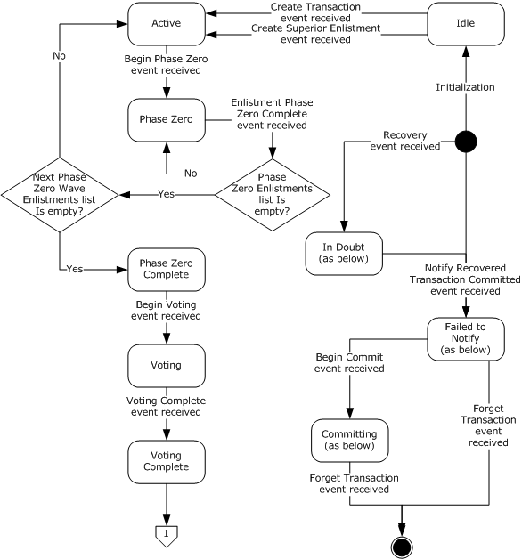

Figure 12: Transaction manager states and events (Phase Zero)

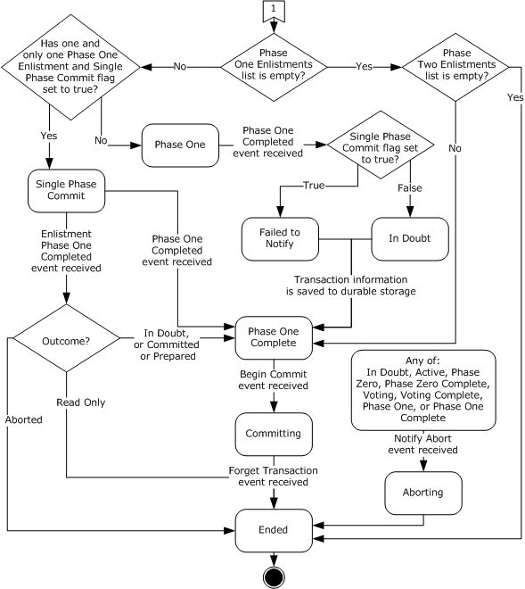

Figure 13: Transaction manager states and events (Phase One)

##### 3.2.1.3.1 Idle

This is the initial state. The following events are processed in the Idle state:

- [Create Transaction](#Section_3.2.7.13)
- [Create Superior Enlistment](#Section_3.2.7.12)
- [Associate Transaction](#Section_3.2.7.1)
- [Branch Transaction Success](#Section_3.2.7.9)
- [Branch Transaction Failure](#Section_3.2.7.8)

##### 3.2.1.3.2 Active

The following events are processed in the Active state:

- [Create Phase Zero Enlistment](#Section_3.2.7.10)
- [Create Voter Enlistment](#Section_3.2.7.14)
- [Create Subordinate Enlistment](#Section_3.2.7.11)
- [Register Phase Zero Success](#Section_3.2.7.29)
- [Register Phase Zero Failure](#Section_3.2.7.28)
- [Export Transaction](#Section_3.2.7.21)
- [Set Transaction Attributes](#Section_3.2.7.31)
- [Set Transaction Timeout](#Section_3.2.7.32)
- [Begin Phase Zero](#Section_3.7.7.3)
- [Enlistment Unilaterally Aborted](#Section_3.2.7.19)
- [Notify Aborted](#Section_3.2.7.23)
- [Unenlist Phase Zero Enlistment](#Section_3.2.7.34)
- [Transaction Timeout Timer](#Section_3.2.6.1)

##### 3.2.1.3.3 Phase Zero

The following events are processed in the Phase Zero state:

- [Create Phase Zero Enlistment](#Section_3.2.7.10)
- [Create Voter Enlistment](#Section_3.2.7.14)
- [Create Subordinate Enlistment](#Section_3.2.7.11)
- [Register Phase Zero Success](#Section_3.2.7.29)
- [Register Phase Zero Failure](#Section_3.2.7.28)
- [Export Transaction](#Section_3.2.7.21)
- [Set Transaction Timeout](#Section_3.2.7.32)
- [Enlistment Phase Zero Complete](#Section_3.2.7.17)
- [Enlistment Unilaterally Aborted](#Section_3.2.7.19)
- [Notify Aborted](#Section_3.2.7.23)
- [Unenlist Phase Zero Enlistment](#Section_3.2.7.34)
- [Transaction Timeout Timer](#Section_3.2.6.1)

##### 3.2.1.3.4 Phase Zero Complete

The following events are processed in the Phase Zero Complete state:

- [Create Phase Zero Enlistment](#Section_3.2.7.10)
- [Create Voter Enlistment](#Section_3.2.7.14)
- [Create Subordinate Enlistment](#Section_3.2.7.11)
- [Register Phase Zero Success](#Section_3.2.7.29)
- [Register Phase Zero Failure](#Section_3.2.7.28)
- [Export Transaction](#Section_3.2.7.21)
- [Set Transaction Timeout](#Section_3.2.7.32)
- [Begin Phase One](#Section_3.7.7.2)
- [Begin Voting](#Section_3.2.7.7)
- [Enlistment Unilaterally Aborted](#Section_3.2.7.19)
- [Notify Aborted](#Section_3.2.7.23)
- [Transaction Timeout Timer](#Section_3.2.6.1)

##### 3.2.1.3.5 Voting

The following events are processed in the Voting state:

- [Set Transaction Timeout](#Section_3.2.7.32)
- [Enlistment Vote Complete](#Section_3.2.7.20)
- [Voting Complete](#Section_3.2.1.3.6)
- [Enlistment Unilaterally Aborted](#Section_3.2.7.19)
- [Notify Aborted](#Section_3.2.7.23)
- [Transaction Timeout Timer](#Section_3.2.6.1)

##### 3.2.1.3.6 Voting Complete

The following events are processed in the Voting Complete state:

- [Set Transaction Timeout](#Section_3.2.7.32)
- [Begin Commit](#Section_3.4.7.3)
- [Enlistment Unilaterally Aborted](#Section_3.2.7.19)
- [Notify Aborted](#Section_3.2.7.23)
- [Forget Transaction](#Section_3.2.7.22)
- [Transaction Timeout Timer](#Section_3.2.6.1)

##### 3.2.1.3.7 Phase One

The following events are processed in the Phase One state:

- [Set Transaction Timeout](#Section_3.2.7.32)
- [Enlistment Vote Complete](#Section_3.2.7.20)
- [Enlistment Phase One Complete](#Section_3.2.7.16)
- [Enlistment Unilaterally Aborted](#Section_3.2.7.19)
- [Notify Aborted](#Section_3.2.7.23)
- [Phase One Completed](#Section_3.2.7.25)
- [Transaction Timeout Timer](#Section_3.2.6.1)

##### 3.2.1.3.8 Phase One Complete

The following events are processed in the Phase One Complete state:

- [Begin Commit](#Section_3.4.7.3)
- [Begin In Doubt](#Section_3.6.7.2)
- [Forget Transaction](#Section_3.2.7.22)

##### 3.2.1.3.9 Single Phase Commit

The following events are processed in the Single Phase Commit state:

- [Enlistment Phase One Complete](#Section_3.2.7.16)
- [Phase One Completed](#Section_3.2.7.25)

##### 3.2.1.3.10 Committing

The following events are processed in the Committing state:

- [Begin Commit](#Section_3.4.7.3)
- [Enlistment Commit Complete](#Section_3.2.7.15)
- [Forget Transaction](#Section_3.2.7.22)
- [Request Transaction Outcome](#Section_3.2.7.33)

##### 3.2.1.3.11 Aborting

The following events are processed in the Aborting state:

- [Begin Rollback](#Section_3.2.7.6)
- [Enlistment Rollback Complete](#Section_3.2.7.18)
- [Forget Transaction](#Section_3.2.7.22)
- [Request Transaction Outcome](#Section_3.2.7.33)

##### 3.2.1.3.12 In Doubt

The following events are processed in the In Doubt state:

- [Notify Recovered Transaction Committed](#Section_3.2.7.24)
- [Forget Transaction](#Section_3.2.7.22)
- [Resolve Transaction](#Section_3.2.7.30)
- [Notify Aborted](#Section_3.2.7.23)

##### 3.2.1.3.13 Failed to Notify

The following events are processed in the Failed to Notify state:

- [Begin Commit](#Section_3.4.7.3)
- [Notify Recovered Transaction Committed](#Section_3.2.7.24)
- [Forget Transaction](#Section_3.2.7.22)
- [Resolve Transaction](#Section_3.2.7.30)
- [Request Transaction Outcome](#Section_3.2.7.33)

##### 3.2.1.3.14 Ended

This is the final state. The following event is processed in the Ended state:

- [Request Transaction Outcome](#Section_3.2.7.33)

#### 3.2.1.4 Transaction Manager Facets

An [**OleTx**](#gt_oletx) [**transaction manager**](#gt_transaction-manager) is subdivided into the following transaction manager [**facets**](#gt_facet):

- [Core Transaction Manager Facet](#Section_1.3.3.3.1)
- [Transaction Manager Communicating with an Application Facet](#Section_e798c735723f4ab08b9c3622c207544e)
- [Transaction manager Communicating with a Resource Manager Facet](#Section_67e057ef88114df08c70072ae9c07de2)
- [Superior Transaction Manager Facet](#Section_1.3.3.3.4)
- [Subordinate Transaction Manager Facet](#Section_1.3.3.3.5)
These facets MUST communicate with each other by using a set of events. Each facet MUST define the set of events that the facet supports.

An event MUST consist of the following data elements:

- The name of the event
- The list of arguments with which the event MUST be signaled
This protocol assumes the existence of an implementation-specific communication mechanism used to signal events between facets inside a transaction manager. This communication mechanism MUST NOT allow [**man-in-the-middle**](#gt_9918372c-45a0-4f70-b53f-06972f29318e) or other classes of intermediary attacks.

Each facet MUST provide a definition for the **Name** and **Enlistment Object.Identifier** fields of an [Enlistment object](#Section_3.1.3.1), as specified in section 3.1.1.

The conceptual model that is described here requires that one and only one thread of operation be active inside the facets that make up the transaction manager.

#### 3.2.1.5 Protocol Extension Objects

A [**protocol extension**](#gt_protocol-extension) is an implementation-specific module that represents the ability to perform [**transaction**](#gt_transaction) processing by using a transaction coordination protocol that is not [**OleTx**](#gt_oletx).

**Protocol extension** objects MUST leverage the following vendor extensibility points in the [Core Transaction Manager Facet](#Section_1.3.3.3.1):

- The ability to augment the list of [**transaction manager**](#gt_transaction-manager) [**facets**](#gt_facet), as specified in section [3.2.1.4](#Section_3.2.1.4), to include additional protocol-specific facets
- The ability to define custom behavior for the **Name** and **Property** fields on [**Enlistment**](#gt_enlistment) objects that are created inside these facets
- The ability to contribute [**whereabouts**](#gt_whereabouts) information to the **extended whereabouts** field of the core transaction manager
- The ability to contribute [**recovery**](#gt_recovery) information to **Enlistment** objects that are stored in the durable log, as specified in section [3.1.1](#Section_3.1.3.1)
A **protocol extension** object MUST provide the following data structures:

- **Identifier**: A GUID that uniquely identifies the protocol extension
- **Whereabouts**: An array of bytes that represents the protocol extension
- **Whereabouts Size**: The size of the Whereabouts array

### 3.2.2 Timers

The [Core Transaction Manager Facet](#Section_1.3.3.3.1) MUST provide a [Transaction Timeout Timer](#Section_3.2.6.1).

#### 3.2.2.1 Transaction Timeout Timer

The **Transaction Timeout** timer MUST be set when a new [**transaction**](#gt_transaction) is created. It MUST be canceled when a transaction enters one of the following states:

- [Phase One Complete](#Section_3.2.1.3.8)
- [Single Phase Commit](#Section_3.2.1.3.9)
- [Committing](#Section_3.8.1.2.12)
- [Aborting](#Section_3.8.1.1.4)
- [Ended](#Section_3.4.1.13.3)
The default value is specified by the **Timeout** field on the **transaction** object for which the instance of the timer is set. The minimum value of the timer MUST be zero, which means that the timer never generates a timer event.

When the timer is initialized, the initialization MUST provide a **transaction** object to associate with the timer. When the timer expires, the same **transaction** object MUST be a **transaction** object provided alongside the timer notification. The [Core Transaction Manager Facet](#Section_1.3.3.3.1) MUST provide a distinct Transaction Timeout Timer instance for each active transaction. If an implementation sets the value of the timeout timer to zero, the **Transaction Timeout Timer** event (section [3.2.6.1](#Section_3.2.6.1)) is never signaled, and therefore the transaction never times out. Examples of negative consequences of transactions that do not time out include [**resource**](#gt_resource) availability and deadlocks between resources. In the availability example, if an application starts a transaction and accesses a resource, to provide isolation that resource typically blocks access to the specific item until the transaction completes. But if the application has an issue and does not complete the transaction within a reasonable amount of time, other applications are prevented from accessing the resource item. In the deadlock example, two resources are accessed by two different applications, but in reverse order. This results in the two applications blocking each other because each has its own transaction that holds a lock that the other needs to proceed. When transaction timeout values are implemented, these error scenarios resolve themselves by forcing the transactions to [**rollback**](#gt_rollback) after the specified timer period.

### 3.2.3 Initialization

When the [Core Transaction Manager Facet](#Section_1.3.3.3.1) is initialized:

- The MSDTC Connection Manager: OleTx Management Protocol [MS-CMOM](../MS-CMOM/MS-CMOM.md) uses the registry to persistently store and retrieve the values for the security settings using the Remote Registry Protocol [MS-RRP](../MS-RRP/MS-RRP.md) and Failover Cluster: Management API (ClusAPI) Protocol [MS-CMRP](../MS-CMRP/MS-CMRP.md). The registry is shared with the MSDTC Connection Manager: OleTx Management Protocol [MS-CMOM].
- The **Security Level** field is loaded directly from the registry key defined in [MS-CMOM] section 3.3.1.2.3.<22>
- The following **Security Access** flags are loaded directly from the registry keys defined in [MS-CMOM] sections 3.3.1.2.1 and 3.3.1.2.2.
- Allow Network Access
- Allow Network Transactions
- Allow Inbound Transactions
- Allow Outbound Transactions
- Allow Remote Administration
- Allow Remote Clients
- Allow TIP
- Allow XA
- Allow LUTransactions
- The lower-layer transport protocol, the MSDTC Connection Manager: OleTx Multiplexing Protocol (section [2.1](#Section_2.1)) MUST be initialized as specified in [MS-CMP](../MS-CMP/MS-CMP.md) section 3.1.3, by passing the following parameter values as specified in section [2.1.2](../MS-CMP/MS-CMP.md). The MSDTC Connection Manager: OleTx Multiplexing Protocol initialization as specified in [MS-CMP] section 3.1.3, initializes the MSDTC Connection Manager: OleTx Transports Protocol layer with additional parameters as specified in [MS-CMPO](#Section_2.1) section 3.2.3.
- The **Security Level** field ([MS-CMPO] Local Partner State (section 3.2.1.1)) is initialized with the **Security Level** value in Core Transaction Manager Facet.
- The **Minimum Level 3 Version Number** and **Maximum Level 3 Version Number** fields ([MS-CMPO] section 3.2.1.1) are initialized with the computed minimum and maximum protocol version values, as specified in section [3.1.4.2](../MS-CMPO/MS-CMPO.md).
- Compute a **Local Name Object** by initializing the fields of the **Name** object (see [MS-CMPO] section 3.2.1.4) with following values:
- **HostName**: The **HostName** field is initialized with the value of the **ComputerName.NetBIOS** element of the machine as specified in [MS-WKST](../MS-WKST/MS-WKST.md) section 3.2.1.2.
- **CID**: The **CID** field is initialized as follows:
- Read the string value from the <MSDTC_GUID> registry key as specified in [MS-CMOM] section 2.2.3.5, for the Description\Default value of "MSDTC" as specified in [MS-CMOM] section 2.2.3.5.1.
- Convert the <MSTDC_GUID> string to GUID as specified in [[C706]](https://go.microsoft.com/fwlink/?LinkId=89824) Appendix A.
- **Protocols**:
- If the **Allow Network Access** flag is set to false:
- The **Protocols** field is initialized to PROT_LRPC flag as described in [MS-CMPO] (section 2.2.4).
- Otherwise:
- The **Protocols** field is initialized directly from the "ServiceNetworkProtocols" registry key as specified in [MS-CMOM] section 2.2.3.4.
- The computed **Local Name Object** is used to initialize the **Local Name Object** field ([MS-CMPO] section 3.2.1.1).
- The [**protocol extension**](#gt_protocol-extension) list MUST be populated with instances that are obtained from an implementation-specific source.
- If the **protocol extension** list is not empty, the Core Transaction Manager Facet MUST perform the following actions:
- Query each **protocol extension** for its [**extended whereabouts**](#gt_extended-whereabouts) information by using the **Whereabouts** and **Whereabouts Size** fields of the object.
- Create an array of STmToTmProtocol (section [2.2.5.9](#Section_2.2.5.9)) structures and assign it to the **Extended Whereabouts** field of the Core Transaction Manager Facet:
- The array MUST contain an entry for each **protocol extension** that contributes **extended whereabouts** information.
- The **tmprotDescribed** field of each entry MUST be set to **TmProtocolExtended**, as specified in section [2.2.6.2](#Section_2.2.6.2).
- The **rgbTmProtocolData** field of each entry MUST contain an SExtendedEndpointInfo (section [2.2.5.8](#Section_2.2.5.8)) structure.
- The **cbTmProtocolData** field of each entry MUST be set to the length, in bytes, of the **rgbTmProtocolData** field.
- Assign the size, in bytes, of the **STmToTmProtocol** array to the **Extended Whereabouts Size** field of the Core Transaction Manager Facet.
- Assign the number of **protocol extensions** that contribute **extended whereabouts** information to the **STmToTmProtocol** array to the **Extended Whereabouts Protocol Count** field of the Core Transaction Manager Facet.

#### 3.2.3.1 Transaction Object Initialization

The [Core Transaction Manager Facet](#Section_1.3.3.3.1) MUST initialize each new [**transaction**](#gt_transaction) object that is created by the [**facet**](#gt_facet) with the following default values:

- The **Root** field MUST default to false.
- The **Doomed** field MUST default to false.
- The **Attributes Set** field MUST default to false.
- The **Phase Zero Registered** field MUST be set to false.
- The **Single Phase Commit** field MUST default to false.
- The **State** field MUST default to Idle.
- The **Isolation Level** field MUST default to Serializable.
- The **Isolation Flags** field MUST default to zero.
- The **Description** field MUST default to an empty string.
- The **GRFRM** field MUST default to zero.
- The **Timeout** field value MUST<23> default to a value that is obtained in an implementation-specific manner.

#### 3.2.3.2 Durable Log

The **Core Transaction Manager Facet**.**Durable Log** size is configurable and is stored in the registry. It is configured in an implementation-specific manner.<24>

#### 3.2.3.3 Transaction Recovery

If the **Core Transaction Manager Facet.Durable Log** of the [Core Transaction Manager Facet](#Section_1.3.3.3.1) is not empty, it MUST perform the following actions:

- For each **transaction** object in the **Core Transaction Manager Facet.Durable Log** of the [**Core Transaction Manager Facet**](#gt_core-transaction-manager-facet):
- Initialize the **transaction** object fields which are not durably stored with default values, as specified in Transaction Object Initialization (section [3.2.3.1](#Section_3.2.3.1)).
- Copy the **transaction** object to the transaction table of the Core Transaction Manager Facet.<25>
- After all transactions in the **Core Transaction Manager Facet.Durable Log** are copied to the transaction table, start accepting new connections.
- For each **transaction** object in the transaction table of the Core Transaction Manager Facet:
- If the transaction state is In Doubt (section [3.2.1.3.12](#Section_3.2.1.3.12)):
- Signal the Recover In Doubt Transaction (section [3.8.7.8](#Section_3.8.7.8)) event on the [**transaction manager**](#gt_transaction-manager) [**facet**](#gt_facet) that is referenced by the transaction object's **Superior Enlistment** field with the value of the **transaction** object's **Superior Enlistment** field.
- Otherwise:
- Signal the Notify Recovered Transaction Committed (section [3.2.7.24](#Section_3.2.7.24)) event on the Core Transaction Manager Facet with the **transaction** object.

### 3.2.4 Higher-Layer Triggered Events

None.

### 3.2.5 Processing Events and Sequencing Rules

### 3.2.6 Timer Events

#### 3.2.6.1 Transaction Timeout Timer

When the **Transaction Timeout** timer expires, the core [**transaction manager**](#gt_transaction-manager) MUST perform the following actions:

- If the provided [**transaction**](#gt_transaction) object is in one of the following states, the core transaction manager MUST ignore the timer event:
- [Phase One Complete](#Section_3.2.1.3.8)
- [Single Phase Commit](#Section_3.2.1.3.9)
- [Committing](#Section_3.8.1.2.12)
- [Aborting](#Section_3.8.1.1.4)
- [In Doubt](#Section_3.2.1.3.12)
- [Failed to Notify](#Section_3.2.1.3.13)
- [Ended](#Section_3.4.1.13.3)
- Otherwise, the core transaction manager MUST:
- Signal the [Unilaterally Aborted](#Section_3.4.7.23) event on the transaction's superior enlistment's transaction manager [**facet**](#gt_facet) with the **Superior Enlistment** object of the transaction.
- Signal the [Notify Aborted](#Section_3.2.7.23) event on the [Core Transaction Manager Facet](#Section_1.3.3.3.1) using the provided **transaction** object.

### 3.2.7 Other Local Events

The core [**transaction manager**](#gt_transaction-manager) MUST be prepared to process the local events that are defined in the following sections.

If the [Core Transaction Manager Facet](#Section_1.3.3.3.1) supports the [CONNTYPE_TXUSER_PHASE0](#Section_2.2.10.2.1) [**connection type**](#gt_connection-type), this [**facet**](#gt_facet) MUST be prepared to process local events that pertain to [**Phase Zero**](#gt_phase-zero) functionality. The following local events are affected:

- [Create Phase Zero Enlistment](#Section_3.2.7.10)
- [Register Phase Zero Success](#Section_3.2.7.29)
- [Register Phase Zero Failure](#Section_3.2.7.28)
- [Begin Phase Zero](#Section_3.7.7.3)
- [Enlistment Phase Zero Complete](#Section_3.2.7.17)
- [Unenlist Phase Zero Enlistment](#Section_3.2.7.34)

#### 3.2.7.1 Associate Transaction

The **Associate Transaction** event MUST be signaled with the following arguments:

- A **transaction** object
- A **Name** object representing the remote [**superior transaction manager**](#gt_superior-transaction-manager)
If the **Associate Transaction** event is signaled, the Core Transaction Manager Facet (section [1.3.3.3.1](#Section_1.3.3.3.1)) MUST perform the following actions:

- If the **Core Transaction Manager Facet.Durable Log** is too full (section [3.2.3.2](#Section_3.2.3.2)) to accept the transaction object:
- Signal the Associate Transaction Failure (section [3.4.7.1](#Section_3.4.7.1)) event on the Transaction Manager Communicating with an Application Facet (section [1.3.3.3.2](#Section_1.3.3.3.2)) with the following arguments:
- The **transaction** object
- The Log Full Local reason code
- Otherwise:
- Signal the Branch Transaction (section [3.8.7.1](#Section_3.8.7.1)) event on the Subordinate Transaction Manager Facet (section [1.3.3.3.5](#Section_1.3.3.3.5)) with the following arguments:
- The **transaction** object
- The **Name** object

#### 3.2.7.2 Begin Commit

The **Begin Commit** event MUST be signaled with the following argument:

- A **transaction** object
If the **Begin Commit** event is signaled, the [**Core Transaction Manager Facet**](#gt_core-transaction-manager-facet) MUST perform the following actions:

- Set the transaction state to Committing (section [3.2.1.3.10](#Section_3.8.1.2.12)).
- If the **Phase Two Voter Enlistment list** of the transaction is not empty:
- For each [**Enlistment**](#gt_enlistment) object in the **Phase Two Voter Enlistment list** of transaction:
- Remove the **Enlistment** object from the **Phase Two Voter Enlistment list** of the transaction.
- Signal the **Begin Commit** event (see sections [3.4.7.3](#Section_3.4.7.3), [3.6.7.1](#Section_3.4.7.3), and [3.7.7.1](#Section_3.4.7.3)) on the enlistment's transaction manager facet field with the **Enlistment** object.
- If the **Phase Two Enlistment list** of the transaction is not empty:
- For each **Enlistment** object in the **Phase Two Enlistment list** of the transaction:
- Signal the **Begin Commit** event on the **enlistment's** transaction manager facet field with the **Enlistment** object.
- Otherwise, if the **Phase Two Enlistment list** of the transaction is empty:
- Signal the Commit Complete (section [3.8.7.3](#Section_3.8.7.3)) event on the transaction's superior enlistment's transaction manager facet with the transaction's **Superior Enlistment** object.
- Signal the Forget Transaction (section [3.2.7.22](#Section_3.2.7.22)) event on the Core Transaction Manager Facet with the provided **transaction** object.

#### 3.2.7.3 Begin In Doubt

The **Begin In Doubt** event MUST be signaled with the following argument:

- A **transaction** object
If the **Begin In Doubt** event is signaled, the [Core Transaction Manager Facet](#Section_1.3.3.3.1) MUST perform the following actions:

- For each [**Enlistment**](#gt_enlistment) object in the [Phase Two](#Section_4.5.2) [**Voter**](#gt_voter) **Enlistment** list of the transaction:
- Signal the **Begin In Doubt** event (see sections [3.4.7.4](#Section_3.6.7.2) and [3.6.7.2](#Section_3.6.7.2)) on the **Enlistment** object's [**transaction manager**](#gt_transaction-manager) facet with the **Enlistment** object.
- Signal the Forget Transaction (section [3.2.7.22](#Section_3.2.7.22)) event on the Core Transaction Manager Facet with the provided **transaction** object.

#### 3.2.7.4 Begin Phase One

The **Begin Phase One** event MUST be signaled with the following arguments:

- A **transaction** object
- A flag indicating whether the transaction SHOULD or MUST NOT attempt to perform a [**single-phase commit**](#gt_single-phase-commit)
If the **Begin Phase One** event is signaled, the [Core Transaction Manager Facet](#Section_1.3.3.3.1) MUST perform the following actions:

- Set the **Single Phase Commit** field of the transaction to the value of the given **Single Phase Commit** flag (defined in section [3.2.1](#Section_3.2.1)).
- Signal the Begin Voting (section [3.2.7.7](#Section_3.2.7.7)) event on the Core Transaction Manager Facet with the following argument:
- The given **transaction** object

#### 3.2.7.5 Begin Phase Zero

The **Begin Phase Zero** event MUST be signaled with the following arguments:

- A [**transaction**](#gt_transaction) object
If the **Begin Phase Zero** event is signaled, the [Core Transaction Manager Facet](#Section_1.3.3.3.1) MUST perform the following actions:

- Set the transaction state to Phase Zero (section [3.2.1.3.3](#Section_1.3.1.1)).
- Move each Enlistment object in the **Next** [**Phase Zero Wave**](#gt_phase-zero-wave) **Enlistment** list of the transaction to the [**Phase Zero Enlistment**](#gt_phase-zero-enlistment) list of the transaction.
- Set the [**Phase Zero**](#gt_phase-zero) **Registered** flag of the **transaction** object to FALSE.
- If the **Phase Zero Enlistment** list of the transaction is not empty:
- For each **Enlistment** object in the **Phase Zero Enlistment** list of the transaction:
- Signal the **Begin Phase Zero** event (see sections [3.6.7.4](#Section_3.7.7.3) and [3.7.7.3](#Section_3.7.7.3)) on the **Enlistment** object's [**transaction manager**](#gt_transaction-manager) facet with the **Enlistment** object.
- Otherwise:
- Set the transaction state to Phase Zero Complete (section [3.2.1.3.4](#Section_3.8.7.6)).
- Signal the **Phase Zero Complete** event (see sections [3.4.7.14](#Section_3.4.7.14) and [3.8.7.6](#Section_3.8.7.6)) on the superior enlistment's transaction manager facet of the transaction with the following arguments:
- The **Superior Enlistment** object of the transaction
- The success [**outcome**](#gt_outcome)

#### 3.2.7.6 Begin Rollback

The **Begin Rollback** event MUST be signaled with the following argument:

- A **transaction** object
If the **Begin Rollback** event is signaled, the Core Transaction Manager Facet (section [1.3.3.3.1](#Section_1.3.3.3.1)) MUST perform the following actions:

- Signal the **Rollback Complete** event (see sections [3.4.7.18](#Section_3.4.7.18) and [3.8.7.10](#Section_3.8.7.10)) on the transaction's superior enlistment's [**transaction manager**](#gt_transaction-manager) facet with the **Superior Enlistment** object of the transaction.
- Signal the Notify Aborted (section [3.2.7.23](#Section_3.2.7.23)) event on the Core Transaction Manager Facet with the following argument:
- The given **transaction** object

#### 3.2.7.7 Begin Voting

The **Begin Voting** event MUST be signaled with the following arguments:

- A [**transaction**](#gt_transaction) object
If the **Begin Voting** event is signaled, the Core Transaction Manager Facet (section [1.3.3.3.1](#Section_1.3.3.3.1)) MUST perform the following actions:

- Set the transaction state to Voting (section [3.2.1.3.5](#Section_3.5.5.4)).
- If the Phase One (section [1.3.1.2](#Section_1.3.1.2)) [**Voter**](#gt_voter) [**Enlistment**](#gt_enlistment) list of the transaction is empty:
- Signal the Voting Complete (section [3.2.7.35](#Section_3.2.1.3.6)) event on the Core Transaction Manager Facet with the provided **transaction** object.
- Otherwise:
- For each **Enlistment** object in the **Phase One** **Voter Enlistment** list of the transaction:
- Signal the **Begin Voting** event (see sections [3.4.7.6](#Section_3.2.7.7) and [3.6.7.6](#Section_3.2.7.7)) on the enlistment's [**transaction manager**](#gt_transaction-manager) facet field with the **Enlistment** object.
- If the **Phase One** **Enlistment** list of the transaction contains more than one element, or if it contains one element and the [**Single Phase Commit**](#gt_single-phase-commit) flag (defined in section [3.2.1](#Section_3.2.1)) of the transaction is set to FALSE:
- For each **Enlistment** object in the **Phase One Voter Enlistment** list of the transaction:
- Signal the **Begin Phase One** (see section [3.6.7.3](#Section_3.7.7.2) and section [3.7.7.2](#Section_3.7.7.2)) event on the enlistment's transaction manager facet field with the following argument:
- The **Enlistment** object
- The **Single Phase Commit** flag set to false

#### 3.2.7.8 Branch Transaction Failure

The **Branch Transaction Failure** event MUST be signaled with the following arguments:

- An Enlistment object
- A value indicating the failure reason. The reason MUST be set to one of the following values:
- Log Full Remote
- No Mem Remote
- Too Late
- Too Many Remote
- Tx Not Found
- Comm Failed
If the **Branch Transaction Failure** event is signaled, the Core Transaction Manager Facet (section [1.3.3.3.1](#Section_1.3.3.3.1)) MUST perform the following actions:

- Signal the Associate Transaction Failure (section [3.4.7.1](#Section_3.4.7.1)) event on the [**transaction manager**](#gt_transaction-manager) communicating with an application facet with the following arguments:
- The provided [**transaction**](#gt_transaction) object
- The provided reason code

#### 3.2.7.9 Branch Transaction Success

The **Branch Transaction Success** event MUST be signaled with the following arguments:

- An Enlistment object.
If the **Branch Transaction Success** event is signaled, the Core Transaction Manager Facet (section [1.3.3.3.1](#Section_1.3.3.3.1)) MUST perform the following actions:

- Add the [**transaction**](#gt_transaction) object of the enlistment to the transaction table of the Core Transaction Manager Facet (section 1.3.3.3.1).
- Set the superior enlistment of the transaction to the provided **Enlistment** object.
- Signal the Associate Transaction Success (section [3.4.7.2](#Section_3.4.7.2)) event on the [**transaction manager**](#gt_transaction-manager) communicating with an application facet with the **transaction** object of the enlistment.

#### 3.2.7.10 Create Phase Zero Enlistment

The **Create Phase Zero Enlistment** event MUST be signaled with the following arguments:

- An Enlistment object
If the **Create Phase Zero Enlistment** event is signaled, the Core Transaction Manager Facet (section [1.3.3.3.1](#Section_1.3.3.3.1)) MUST perform the following actions:

- If the [**transaction**](#gt_transaction) state of the **transaction** object referenced by the provided **Enlistment** object is Phase Zero (section [3.2.1.3.3](#Section_1.3.1.1)):
- The Core Transaction Manager Facet MUST:
- Signal the Create Phase Zero Enlistment Success (see section [3.6.7.8](#Section_3.6.7.8) and section [3.7.7.6](#Section_3.6.7.8)) event on the **Enlistment** object's [**transaction manager**](#gt_transaction-manager) facet with the provided **Enlistment** object.
- Signal the Begin Phase Zero (section [3.6.7.4](#Section_3.7.7.3) and section [3.7.7.3](#Section_3.7.7.3)) event on the provided Enlistment object's transaction manager facet with the provided Enlistment object.
- Otherwise, if the transaction state is Active (section [3.2.1.3.2](#Section_3.8.1.1.3)) or Phase Zero Complete (section [3.2.1.3.4](#Section_3.8.7.6)):
- If the Next [**Phase Zero Wave**](#gt_phase-zero-wave) Enlistment list of the transaction is empty:
- Signal the Register Phase Zero (section [3.4.7.15](#Section_3.4.7.15)) event on the transaction's superior enlistment's transaction manager facet with the transaction's **Superior Enlistment** object.
- Otherwise, if the list is nonempty and the [**Phase Zero**](#gt_phase-zero) Registered flag of the transaction is true:
- Signal the **Create Phase Zero Enlistment Success** (section 3.6.7.8 and section 3.7.7.6) event on the enlistment object's transaction manager facet with the **Enlistment** object.
- Add the provided enlistment to the **Next Phase Zero Wave Enlistment** list of the transaction.
- Otherwise:
- Signal the **Create Phase Zero Enlistment Failure** (section [3.6.7.7](#Section_3.6.7.7) and section [3.7.7.5](#Section_3.6.7.7)) event on the **Enlistment** object's transaction manager facet field with the following arguments:
- The provided **Enlistment** object
- The Too Late reason code

#### 3.2.7.11 Create Subordinate Enlistment

The **Create Subordinate Enlistment** event MUST be signaled with the following arguments:

- An Enlistment object
If the **Create Subordinate Enlistment** event is signaled, the [Core Transaction Manager Facet](#Section_1.3.3.3.1) MUST perform the following actions:

- If the state of the [**transaction**](#gt_transaction) object referenced by the provided **Enlistment** object is not Active (section [3.2.1.3.2](#Section_3.8.1.1.3)) and not Phase Zero (section [3.2.1.3.3](#Section_1.3.1.1)) and not Phase Zero Complete (section [3.2.1.3.4](#Section_3.8.7.6)):
- Signal the Create Subordinate Enlistment Failure (see sections [3.6.7.10](#Section_3.6.7.10) and [3.7.7.7](#Section_3.6.7.10)) event on the **Enlistment** object's [**transaction manager**](#gt_transaction-manager) facet with the following arguments:
- The provided **Enlistment** object
- The Too Late reason code
- Otherwise, if the **Core Transaction Manager Facet.Durable Log** is too full to accept the **transaction** object referenced by the provided **Enlistment** object:
- Signal the **Create Subordinate Enlistment Failure** (see sections 3.6.7.10 and 3.7.7.7) event on the **Enlistment** object's transaction manager facet with the following arguments:
- The provided **Enlistment** object
- The Log Full reason code
- Otherwise, compute the number of **Enlistment** objects in the **Phase One Enlistment list** of the **transaction** object referenced by the provided **Enlistment** object whose **Transaction Manager Facet** field is set to **Superior Transaction Manager Facet** (section [3.2.1.4](#Section_3.2.1.4)).
- If this computed number of **Enlistment** objects is greater than or equal to an implementation-specific value that indicates the maximum allowed Transaction Manager Enlistments:<26>
- Signal the Create Subordinate Enlistment Failure (see sections 3.6.7.10 and 3.7.7.7) event on the **Enlistment** object's transaction manager facet with the following arguments:
- The provided **Enlistment** object
- The Too Many reason code
- Otherwise:
- Add the provided **Enlistment** object to the transaction's [**Phase One Enlistment**](#gt_phase-one-enlistment) list.
- Signal the Create Subordinate Enlistment Success (see sections [3.6.7.11](#Section_3.6.7.11) and [3.7.7.8](#Section_3.6.7.11)) event on the **Enlistment** object's transaction manager facet with the provided **Enlistment** object.

#### 3.2.7.12 Create Superior Enlistment

The **Create Superior Enlistment** event MUST be signaled with the following arguments:

- An Enlistment object
If the **Create Superior Enlistment** event is signaled, the Core [**Transaction Manager**](#gt_transaction-manager) MUST perform the following actions:

- If the [**transaction**](#gt_transaction) referenced by the provided **Enlistment** object already exists in the transaction table:
- Signal the Create Superior Enlistment Failure (section [3.8.7.5](#Section_3.8.7.5)) event on the Transaction Manager facet referenced by the provided **Enlistment** object with the following arguments:
- The provided **Enlistment** object
- The Duplicate reason code
- Otherwise, if the **Core Transaction Manager Facet.Durable Log** is too full (section [3.2.3.2](#Section_3.2.3.2)) to accept the **transaction** object referenced by the provided **Enlistment** object:
- Signal the Create Superior Enlistment Failure (section 3.8.7.5) event on the **Enlistment** object's transaction manager facet with the following arguments:
- The provided **Enlistment** object
- The Log Full reason code
- Otherwise:
- Add the **transaction** object referenced by the provided **Enlistment** object to the transaction table, using the **Transaction Object.Identifier** field of the **transaction** object as the key.
- Set the transaction's **Superior Enlistment** field to the provided **Enlistment** object.
- Set transaction **State** to Active.
- Set the transaction's **Root** flag to FALSE.
- Signal the Create Superior Enlistment Success (section [3.8.7.4](#Section_3.8.7.4)) event on the transaction manager facet referenced by the provided Enlistment object with the provided **Enlistment** object.

#### 3.2.7.13 Create Transaction

The **Create Transaction** event MUST be signaled with the following arguments:

- An Enlistment object
If the **Create Transaction** event is signaled, the Core [**Transaction Manager**](#gt_transaction-manager) MUST perform the following actions:

- The Core Transaction Manager MUST:
- Look for an existing entry in the [**transaction**](#gt_transaction) table, using the **Transaction Object.Identifier** field of the **transaction** object referenced by the provided **Enlistment** object as the key.<27>
- If an entry exists:
- Signal the Create Transaction Failure (section [3.4.7.7](#Section_3.4.7.7)) event on the Transaction Manager facet referenced by the provided **Enlistment** object with the following arguments:
- The provided **transaction** object
- The Duplicate reason code
- Cease processing the event
- If the Core Transaction Manager does not have sufficient memory available to process the Create Transaction event:
- Signal the **Create Transaction Failure** (section 3.4.7.7) event on the Transaction Manager facet referenced by the provided **Enlistment** object with the following arguments:
- The provided **transaction** object
- The No Mem reason code
- Cease processing the event.
- If the **Core Transaction Manager Facet.Durable Log** is too full (section [3.2.3.2](#Section_3.2.3.2)) to accept a new transaction:
- Signal the **Create Transaction Failure** (section 3.4.7.7) event on the Transaction Manager facet referenced by the provided **Enlistment** object with the following arguments:
- The provided **transaction** object
- The Log Full reason code
- Cease processing the event.
- Add the **transaction** object referenced by the provided **Enlistment** object to the transaction table, by using the **Transaction Object.Identifier** field of the **transaction** object as the key.
- Set the transaction's Superior Enlistment to the provided **Enlistment** object.
- Set the transaction's **Root** flag to true.
- Set the transaction's **State** to Active.
- Initialize the transaction **Timeout** timer with the following arguments:
- The **transaction** object
- The **transaction** object's Timeout value
- Signal the Create Transaction Success (section [3.4.7.8](#Section_3.4.7.8)) event on the Transaction Manager facet referenced by the provided enlistment with the **transaction** object referenced by the provided **Enlistment** object.

#### 3.2.7.14 Create Voter Enlistment

The **Create Voter Enlistment** event MUST be signaled with the following arguments:

- An Enlistment object
If the **Create** [**Voter**](#gt_voter) **Enlistment** event is signaled, the Core Transaction Manager Facet (section [1.3.3.3.1](#Section_1.3.3.3.1)) MUST perform the following actions:

- If the state of the [**transaction**](#gt_transaction) object referenced by the provided **Enlistment** object is not Active (section [3.2.1.3.2](#Section_3.8.1.1.3)) and not Phase Zero (section [3.2.1.3.3](#Section_1.3.1.1)) and not Phase Zero Complete (section [3.2.1.3.4](#Section_3.8.7.6)):
- Signal the **Create Voter Enlistment Failure** (see section [3.4.7.9](#Section_3.6.7.12) and section[3.6.7.12](#Section_3.6.7.12)) event on the **Enlistment** object's [**Transaction Manager**](#gt_transaction-manager) facet with the following arguments:
- The **Enlistment** object
- The Too Late reason code
- Otherwise:
- Add the provided **Enlistment** object to the transaction's **Phase One Voter Enlistment** list.
- Signal the **Create Voter Enlistment Success** (see section [3.4.7.10](#Section_3.4.7.10) and section [3.6.7.13](#Section_3.6.7.13)) event on the **Enlistment** object's Transaction Manager facet with the provided **Enlistment** object.

#### 3.2.7.15 Enlistment Commit Complete

The **Enlistment Commit Complete** event MUST be signaled with an [**Enlistment**](#gt_enlistment) object.

If the **Enlistment Commit Complete** event is signaled, the Core Transaction Manager Facet (section [1.3.3.3.1](#Section_1.3.3.3.1)) MUST perform the following actions:

- Remove the enlistment from the [**transaction's**](#gt_transaction) [**Phase Two Enlistment**](#gt_phase-two-enlistment) list.
- If the **Phase Two Enlistment** list of the **transaction** object referenced by the provided **Enlistment** object is now empty:
- If the transaction's [**Single Phase Commit**](#gt_single-phase-commit) flag (defined in section [3.2.1](#Section_3.2.1)) is FALSE and the transaction state is not Failed to Notify (section [3.2.1.3.13](#Section_3.2.1.3.13)):
- Signal the Commit Complete (section [3.8.7.3](#Section_3.8.7.3)) event on the transaction's Superior Enlistment's [**Transaction Manager**](#gt_transaction-manager) facet with the transaction's **Superior Enlistment** object.
- Signal the Forget Transaction (section [3.2.7.22](#Section_3.2.7.22)) event on the Core Transaction Manager Facet with the **transaction** object of the **Enlistment**.

#### 3.2.7.16 Enlistment Phase One Complete

The **Enlistment Phase One Complete** event MUST be signaled with the following arguments:

- An [**Enlistment**](#gt_enlistment) object.
- A value indicating the enlistment's [**outcome**](#gt_outcome) for Phase One (section [1.3.1.2](#Section_1.3.1.2)). This value MUST be set to one of the following values:
- Committed
- Aborted
- In Doubt
- Read Only
- Prepared
If the **Enlistment Phase One Complete** event is signaled, the Core Transaction Manager Facet (section [1.3.3.3.1](#Section_1.3.3.3.1)) MUST perform the following actions:

- If the [**transaction's**](#gt_transaction) **Doomed** flag is set to TRUE or the transaction state is Aborting (section [3.2.1.3.11](#Section_3.8.1.1.4)), the Core Transaction Manager Facet (section 1.3.3.3.1) MUST ignore the signal.
- Otherwise:
- Remove the enlistment from the transaction's **Phase One Enlistment** list.
- If the transaction state is Single Phase Commit (section [3.2.1.3.9](#Section_3.2.1.3.9)):
- If the enlistment's **Phase One** outcome is Committed:
- Set the transaction's state to Phase One Complete (section [3.2.1.3.8](#Section_3.2.1.3.8)).
- Signal the Phase One Complete (section [3.4.7.13](#Section_3.4.7.13)) event on the transaction's Superior Enlistment's [**Transaction Manager**](#gt_transaction-manager) facet with the following arguments:
- The transaction's **Superior Enlistment** object
- The **Committed** outcome
- Signal the Begin Commit (section [3.2.7.2](#Section_3.4.7.3)) event on the Core Transaction Manager Facet with the provided **transaction** object.
- Cease processing the event.
- Otherwise, if the Enlistment's **Phase One** outcome is Read Only:
- Signal the **Phase One Complete** event on the Transaction Manager Facet of the transaction's Superior Enlistment with the following arguments:
- The transaction's **Superior Enlistment** object
- The Read Only outcome
- Signal the Forget Transaction (section [3.2.7.22](#Section_3.2.7.22)) event on the Core Transaction Manager Facet with the provided **transaction** object.
- Otherwise, if the enlistment's **Phase One** outcome is In Doubt (section [3.2.1.3.12](#Section_3.2.1.3.12)):
- Set the transaction's state to Phase One Complete.
- Signal the **Phase One Complete** event on the transaction's Superior Enlistment's Transaction Manager facet with the following arguments:
- The transaction's **Superior Enlistment** object
- The [**In Doubt outcome**](#gt_in-doubt-outcome)
- Signal the Begin In Doubt (section [3.2.7.3](#Section_3.6.7.2)) event on the Core Transaction Manager Facet with the provided **transaction** object.
- Cease processing the event.
- If the transaction state is Phase One or Single Phase Commit:
- If the enlistment's **Phase One** outcome is Aborted:
- Set the transaction's **Doomed** flag to TRUE.
- Signal the **Phase One Complete** event on the transaction's Superior Enlistment's Transaction Manager facet with the following arguments:
- The transaction's **Superior Enlistment** object
- The **Aborted** outcome
- Signal the Notify Aborted (section [3.2.7.23](#Section_3.2.7.23)) event on the Core Transaction Manager Facet with the provided **transaction** object.
- Cease processing the event.
- Otherwise, if the Enlistment's **Phase One** outcome is Prepared:
- Add the Enlistment to the transaction's [**Phase Two Enlistment**](#gt_phase-two-enlistment) list.
- Set the transaction's state to **Phase One Complete**.
- If both the transaction's **Phase One Voter Enlistment** list and [**Phase One Enlistment**](#gt_phase-one-enlistment) list are now empty:
- Signal the Phase One Completed (section [3.2.7.25](#Section_3.2.7.25)) event on the Core Transaction Manager Facet (section 1.3.3.3.1) with the provided **transaction** object.

#### 3.2.7.17 Enlistment Phase Zero Complete

The **Enlistment Phase Zero Complete** event MUST be signaled with the following arguments:

- An [**Enlistment**](#gt_enlistment) object.
- A value indicating the enlistment's [**outcome**](#gt_outcome) for Phase Zero (section [1.3.1.1](#Section_1.3.1.1)). This value MUST be set to one of the following values:
- Completed
- Aborted
If the **Enlistment Phase Zero Complete** event is signaled, the Core Transaction Manager Facet (section [1.3.3.3.1](#Section_1.3.3.3.1)) MUST perform the following actions:

- Remove the enlistment from the [**transaction's**](#gt_transaction) [**Phase Zero Enlistments**](#gt_phase-zero-enlistment) list.
- If the enlistment's [**Phase Zero**](#gt_phase-zero) outcome is Aborted:
- Set the transaction's **Doomed** flag to TRUE.
- If the transaction's **Phase Zero Enlistments** list is now empty:
- Set the transaction's state to Phase Zero Complete (section [3.2.1.3.4](#Section_3.8.7.6)).
- If the transaction's **Doomed** flag is set to true:
- Signal the Phase Zero Complete (section [3.8.7.6](#Section_3.8.7.6)) event on the transaction's Superior Enlistment's [**Transaction Manager**](#gt_transaction-manager) facet with the following arguments:
- The transaction's **Superior Enlistment** object
- The Failure outcome
- Signal the Notify Aborted (section [3.2.7.23](#Section_3.2.7.23)) event on the Core Transaction Manager Facet with the provided **transaction** object.
- Otherwise:
- If the transaction's **Root** flag is TRUE:
- If the transaction's Next [**Phase Zero Wave**](#gt_phase-zero-wave) Enlistment list is not empty:
- Set the transaction's **State** to Active (section [3.2.1.3.2](#Section_3.8.1.1.3)).
- Signal the Begin Phase Zero (section [3.2.7.5](#Section_3.7.7.3)) event on the Core Transaction Manager Facet with the provided Enlistment's **transaction** object.
- Otherwise:
- Signal the **Phase Zero Complete** event on the transaction's Superior Enlistment's Transaction Manager facet with the following arguments:
- The transaction's **Superior Enlistment** object
- The Success outcome
- Otherwise, if the transaction's **Root** flag is FALSE:
- If the transaction's **Next Phase Zero Wave Enlistment** list is not empty:
- Set the transaction's state to Active.
- Signal the **Phase Zero Complete** event on the transaction's Superior Enlistment's Transaction Manager facet with the following arguments:
- The transaction's **Superior Enlistment** object
- The Success outcome

#### 3.2.7.18 Enlistment Rollback Complete

The **Enlistment Rollback Complete** event MUST be signaled with an [**Enlistment**](#gt_enlistment) object.

If the **Enlistment Rollback Complete** event is signaled, the Core Transaction Manager Facet (section [1.3.3.3.1](#Section_1.3.3.3.1)) MUST perform the following actions:

- Remove the Enlistment from the [**transaction's**](#gt_transaction) [**Phase Two Enlistment**](#gt_phase-two-enlistment) list.
- If the transaction's **Phase Two Enlistment** list is now empty:
- Signal the Forget Transaction (section [3.2.7.22](#Section_3.2.7.22)) event on the Core Transaction Manager Facet (section 1.3.3.3.1) with the Enlistment's **transaction** object.

#### 3.2.7.19 Enlistment Unilaterally Aborted

The **Enlistment Unilaterally Aborted** event MUST be signaled with the following arguments:

- An [**Enlistment**](#gt_enlistment) object
If the **Enlistment Unilaterally Aborted** event is signaled, the Core Transaction Manager Facet (section [1.3.3.3.1](#Section_1.3.3.3.1)) MUST perform the following actions:

- If the [**transaction**](#gt_transaction) state is Active (section [3.2.1.3.2](#Section_3.8.1.1.3)), Phase Zero (section [3.2.1.3.3](#Section_1.3.1.1)), Phase Zero Complete (section [3.2.1.3.4](#Section_3.8.7.6)), Voting (section [3.2.1.3.5](#Section_3.5.5.4)), Voting Complete (section [3.2.1.3.6](#Section_3.2.1.3.6)) or Phase One (section [3.2.1.3.7](#Section_1.3.1.2)):
- Remove the provided **Enlistment** object from any of the following transaction lists in which it is present:
- Next [**Phase Zero Wave**](#gt_phase-zero-wave) Enlistment list
- [**Phase Zero Enlistment**](#gt_phase-zero-enlistment) list
- [**Phase One Enlistment**](#gt_phase-one-enlistment) list
- Phase One [**Voter**](#gt_voter) Enlistment list
- If the transaction state is Phase Zero (section 3.2.1.3.3):
- Signal the **Phase Zero Complete** (see sections [3.4.7.14](#Section_3.4.7.14) and [3.8.7.6](#Section_3.8.7.6)) event on the transaction's Superior Enlistment's [**Transaction Manager**](#gt_transaction-manager) Facet with the following arguments:
- The transaction's **Superior Enlistment** object
- The Failure [**outcome**](#gt_outcome)
- Otherwise, if the transaction state is Voting (section 3.2.1.3.5) or Phase One (section 3.2.1.3.7):
- Signal the **Phase One Complete** (see sections [3.4.7.13](#Section_3.4.7.13) and [3.8.7.7](#Section_3.2.1.3.8)) event on the transaction's Superior Enlistment's Transaction Manager facet with the following arguments:
- The transaction's **Superior Enlistment** object
- The Aborted outcome
- Otherwise:
- Signal the **Unilaterally Aborted** (see sections [3.4.7.23](#Section_3.4.7.23) and [3.8.7.11](#Section_3.4.7.23)) event on the transaction's Superior Enlistment's Transaction Manager facet with the transaction's **Superior Enlistment** object.
- Signal the Notify Aborted (section [3.2.7.23](#Section_3.2.7.23)) event on the Core Transaction Manager Facet (section 1.3.3.3.1) with the **transaction** object referenced by the **Transaction** field of the provided **Enlistment** object.
- Otherwise, ignore the event.

#### 3.2.7.20 Enlistment Vote Complete

The **Enlistment Vote Complete** event MUST be signaled with the following arguments:

- An [**Enlistment**](#gt_enlistment) object.
- A value indicating the Enlistment's vote. This value MUST be set to one of the following values:
- Read Only
- Prepared
- Aborted
If the **Enlistment Vote Complete** event is signaled, the Core Transaction Manager Facet (section [1.3.3.3.1](#Section_1.3.3.3.1)) MUST perform the following actions:

- If the [**transaction's**](#gt_transaction) **Doomed** flag is set to TRUE, the Core Transaction Manager Facet MUST cease processing the event.
- Otherwise:
- If the Enlistment's **Vote** [**outcome**](#gt_outcome) is Aborted:
- Set the transaction's **Doomed** flag to TRUE.
- Remove the Enlistment from the transaction's Phase One (section [1.3.1.2](#Section_1.3.1.2)) [**Voter**](#gt_voter) Enlistment list.
- Signal the **Phase One Completed** event (section [3.2.7.25](#Section_3.2.7.25)) on the transaction's Superior Enlistment's [**Transaction Manager**](#gt_transaction-manager) facet with the following arguments:
- The transaction's **Superior Enlistment** object.
- The Aborted outcome.
- Signal the Notify Aborted (section [3.2.7.23](#Section_3.2.7.23)) event on the Core Transaction Manager Facet (section 1.3.3.3.1) with the provided **transaction** object.
- Otherwise:
- If the enlistment's **Vote** outcome is Read Only:
- Remove the Enlistment from the transaction's **Phase One Voter Enlistment** list.
- Otherwise:
- Move the Enlistment from the transaction's **Phase One Voter Enlistment** list to the transaction's Phase Two (section [1.3.1.3](#Section_4.5.2)) **Voter Enlistment** list.
- If the transaction's **Phase One Voter Enlistment** list is now empty:
- If the transaction state is Voting (section [3.2.1.3.5](#Section_3.5.5.4)):
- Signal the Voting Complete (section [3.2.7.35](#Section_3.2.1.3.6)) event on the Core Transaction Manager Facet (section 1.3.3.3.1) with the provided **transaction** object.
- Otherwise, if the transaction state is Phase One (section [3.2.1.3.7](#Section_1.3.1.2)):
- If both the transaction's **Phase One Voter Enlistment** list and **Phase One Enlistment** list are now empty:
- Signal the **Phase One Completed** (section 3.2.7.25) event on the Core Transaction Manager Facet (section 1.3.3.3.1) with the provided **transaction** object.

#### 3.2.7.21 Export Transaction

The **Export Transaction** event MUST be signaled with the following arguments:

- A [**transaction**](#gt_transaction) object
- A **Name** object representing the remote [**subordinate transaction manager**](#gt_subordinate-transaction-manager)
If the **Export Transaction** event is signaled, the Core Transaction Manager Facet (section [1.3.3.3.1](#Section_1.3.3.3.1)) MUST perform the following actions:

- If the transaction state is not Active (section [3.2.1.3.2](#Section_3.8.1.1.3)), or Phase Zero (section [3.2.1.3.3](#Section_1.3.1.1)), or Phase Zero Complete (section [3.2.1.3.4](#Section_3.8.7.6)):
- Signal the Export Transaction Failure (section [3.4.7.11](#Section_3.4.7.11)) event on the [**Transaction Manager**](#gt_transaction-manager) communicating with an Application facet with the following arguments:
- The provided **transaction** object
- The Too Late reason code
- Otherwise, if the **Core Transaction Manager Facet.Durable Log** is too full (section [3.2.3.2](#Section_3.2.3.2)) to accept the provided **transaction** object:
- Signal the **Export Transaction Failure** event on the Transaction Manager Communicating with an Application facet with the following arguments:
- The provided **transaction** object
- The Log Full reason code
- Otherwise:
- Compute the number of Enlistment objects in the transaction's [Phase One](#Section_1.3.1.2) Enlistment list whose Transaction Manager Facet field is the [**superior transaction manager**](#gt_superior-transaction-manager).
- If that number is equal to an implementation-specific value that indicates the maximum allowed Transaction Manager enlistments:<28>
- Signal the **Export Transaction Failure** event on the Transaction Manager communicating with an Application facet with the following arguments:
- The provided **transaction** object
- The Too Many reason code
- Otherwise:
- Signal the Propagate Transaction (section [3.7.7.10](#Section_3.7.7.10)) event on the Superior Transaction Manager facet with the following arguments:
- The provided **transaction** object
- The provided **Name** object

#### 3.2.7.22 Forget Transaction

The **Forget Transaction** event MUST be signaled with the following arguments:

- A [**transaction**](#gt_transaction) object
If the **Forget Transaction** event is signaled, the Core Transaction Manager Facet (section [1.3.3.3.1](#Section_1.3.3.3.1)) MUST perform the following actions:

- Remove the provided **transaction** object from the transaction table.
- If the transaction was added to the **Core Transaction Manager Facet.Durable Log** of the Core Transaction Manager Facet (section 1.3.3.3.1):
- Remove the transaction from the **Core Transaction Manager Facet.Durable Log**.
- Set the transaction's state to Ended.

#### 3.2.7.23 Notify Aborted

The **Notify Aborted** event MUST be signaled with the following arguments:

- A [**transaction**](#gt_transaction) object
If the **Notify Aborted** event is signaled, the Core Transaction Manager Facet (section [1.3.3.3.1](#Section_1.3.3.3.1)) MUST perform the following actions:

- Set the transaction's state to Aborting (section [3.2.1.3.11](#Section_3.8.1.1.4)).
- Move each Enlistment object in the transaction's **Next Phase Zero Wave Enlistment list** to the transaction's [**Phase Zero Enlistment**](#gt_phase-zero-enlistment) list.
- For each **Enlistment** object in the transaction's Phase Zero Enlistment list:
- Signal the **Phase Zero Aborted** event (see sections [3.6.7.14](#Section_3.6.7.14) and [3.7.7.9](#Section_3.6.7.14)) on the Enlistment's [**Transaction Manager**](#gt_transaction-manager) facet field with the **Enlistment** object.
- Move each **Enlistment** object in the transaction's Phase One (section [1.3.1.2](#Section_1.3.1.2)) [**Voter**](#gt_voter) Enlistment list to the transaction's Phase Two (section [1.3.1.3](#Section_4.5.2)) Voter Enlistment list
- For each **Enlistment** object in the transaction's **Phase Two Voter Enlistment** list:
- Signal the **Begin Rollback** event (sections [3.4.7.5](#Section_3.2.7.6), [3.6.7.5](#Section_3.2.7.6) and [3.7.7.4](#Section_3.2.7.6)) on the Enlistment's Transaction Manager facet field with the **Enlistment** object.
- Move each Enlistment object in the transaction's **Phase One Enlistment** list to the transaction's **Phase Two Enlistment** list.
- If the transaction's [**Phase Two Enlistment**](#gt_phase-two-enlistment) list is not empty:
- For each **Enlistment** object in the transaction's **Phase Two Enlistment** list:
- Signal the **Begin Rollback** event (sections 3.4.7.5, 3.6.7.5 and 3.7.7.4) on the enlistment's Transaction Manager face field with the Enlistment object.
- Otherwise, if the transaction's **Phase Two Enlistment** list is empty:
- Signal the Forget Transaction (section [3.2.7.22](#Section_3.2.7.22)) event on the Core Transaction Manager Facet with the provided transaction object.

#### 3.2.7.24 Notify Recovered Transaction Committed

The **Notify Recovered Transaction Committed** event MUST be signaled with the following arguments:

- A [**transaction**](#gt_transaction) object
If the **Notify Recovered Transaction Committed** event is signaled, the Core Transaction Manager Facet (section [1.3.3.3.1](#Section_1.3.3.3.1)) MUST perform the following actions:

- Set the transaction's state to Failed to Notify (section [3.2.1.3.13](#Section_3.2.1.3.13)).
- If the **Phase Two Enlistment** list of the transaction is not empty:
- For each **Enlistment** object in the **Phase Two Enlistment** list of the transaction:
- Signal the [Begin Commit](#Section_3.4.7.3) event (see sections 3.4.7.3, [3.6.7.1](#Section_3.4.7.3), and [3.7.7.1](#Section_3.4.7.3)) on the enlistment's [**transaction manager**](#gt_transaction-manager) facet field with the Enlistment object.
- Otherwise:
- Signal the Forget Transaction (section [3.2.7.22](#Section_3.2.7.22)) event on the Core Transaction Manager Facet with the provided **transaction** object.

#### 3.2.7.25 Phase One Completed

The **Phase One Completed** event MUST be signaled by using the following arguments:

- A [**transaction**](#gt_transaction) object
If the **Phase One Completed** event is signaled, the Core [**Transaction Manager**](#gt_transaction-manager) MUST perform the following actions:

- Set the state of the transaction to Phase One Complete (section [3.2.1.3.8](#Section_3.2.1.3.8)).
- If both the transaction's [**Phase Two Enlistment**](#gt_phase-two-enlistment) list and the transaction's Phase Two (section [1.3.1.3](#Section_4.5.2)) [**Voter**](#gt_voter) [**Enlistment**](#gt_enlistment) list are empty:
- Signal the **Phase One Complete** (see sections [3.4.7.13](#Section_3.4.7.13) and [3.8.7.7](#Section_3.2.1.3.8)) event on the transaction's Superior Enlistment's Transaction Manager facet with the following arguments:
- The transaction's **Superior Enlistment** object
- The Read Only [**outcome**](#gt_outcome)
- Signal the Forget Transaction (section [3.2.7.22](#Section_3.2.7.22)) event on the Core Transaction Manager Facet's (section [1.3.3.3.1](#Section_1.3.3.3.1)) with the provided **transaction** object.
- If the [**Single Phase Commit**](#gt_single-phase-commit) flag (defined in section [3.2.1](#Section_3.2.1)) of the transaction is set to TRUE:
- Set the transaction state to Failed to Notify (section [3.2.1.3.13](#Section_3.2.1.3.13)).
- Save the transaction to the **Core Transaction Manager Facet.Durable Log** of the Core Transaction Manager.
- Signal the **Phase One Complete** event on the Transaction Manager facet of the transaction's Superior Enlistment using the following arguments:
- The **Superior Enlistment** object of the transaction.
- The Committed outcome.
- Set the transaction state to Phase One Complete.
- Signal the Begin Commit (section [3.2.7.2](#Section_3.4.7.3)) event on the Core Transaction Manager Facet's with the provided transaction object.
- Otherwise, if the **Single Phase Commit** flag of the transaction is set to FALSE:
- Set the transaction state to In Doubt (section [3.2.1.3.12](#Section_3.2.1.3.12)).
- Save the transaction to the **Core Transaction Manager Facet.Durable Log** of the Core Transaction Manager.
- Set the transaction state to Phase One Complete.
- Signal the **Phase One Complete** event on the Superior Enlistment of the transaction's Transaction Manager Facet using the following arguments:
- The **Superior Enlistment** object of the transaction
- The Prepared outcome

#### 3.2.7.26 Propagate Transaction Failure

The **Propagate Transaction Failure** event MUST be signaled with the following arguments:

- An Enlistment object.
- A value indicating the failure reason. The reason MUST be set to one of the following values:
- No Mem
- Log Full
- Duplicate
- Comm Failed
If the **Propagate Transaction Failure** event is signaled, the Core Transaction Manager Facet (section [1.3.3.3.1](#Section_1.3.3.3.1)) MUST perform the following actions:

- If the provided failure reason code is Duplicate:
- Signal the Export Transaction Success (section [3.4.7.12](#Section_3.4.7.12)) event on the [**transaction manager**](#gt_transaction-manager) communicating with an application facet with the enlistment [**transaction**](#gt_transaction) object.
- Otherwise:
- Signal the Export Transaction Failure (section [3.4.7.11](#Section_3.4.7.11)) event on the transaction manager communicating with an application facet with the following arguments:
- The **transaction** object referenced by the provided **Enlistment** object
- The provided reason code

#### 3.2.7.27 Propagate Transaction Success

The **Propagate Transaction Success** event MUST be signaled with the following arguments:

- An Enlistment object
If the **Propagate Transaction Success** event is signaled, the Core Transaction Manager Facet (section [1.3.3.3.1](#Section_1.3.3.3.1)) MUST perform the following actions:

- If the Enlistment's [**transaction**](#gt_transaction) is not Active (section [3.2.1.3.2](#Section_3.8.1.1.3)), Phase Zero (section [3.2.1.3.3](#Section_1.3.1.1)), or Phase Zero Complete (section [3.2.1.3.4](#Section_3.8.7.6)):
- Signal the Export Transaction Failure (section [3.4.7.11](#Section_3.4.7.11)) event on the [**Transaction Manager**](#gt_transaction-manager) communicating with an Application facet with the following arguments:
- The **transaction** object referenced by the provided **Enlistment** object
- The Too Late reason code
- Otherwise:
- Add the **Enlistment** object to the transaction's [**Phase One Enlistment**](#gt_phase-one-enlistment) list.
- Signal the Export Transaction Success (section [3.4.7.12](#Section_3.4.7.12)) event on the Transaction Manager communicating with an Application facet with the Enlistment's **transaction** object.

#### 3.2.7.28 Register Phase Zero Failure

The **Register Phase Zero Failure** event MUST be signaled with the following arguments:

- An Enlistment object.
- A value indicating the failure reason. The reason MUST be set to one of the following values:
- Too Late
- Tx Not Found
If the **Register Phase Zero Failure** event is signaled, the Core [**Transaction Manager**](#gt_transaction-manager) MUST perform the following actions:

- For each Enlistment object in the [**transaction's**](#gt_transaction) Next [**Phase Zero Wave**](#gt_phase-zero-wave) **Enlistment** list:
- Signal the Create Phase Zero Enlistment Failure event (see sections [3.6.7.7](#Section_3.6.7.7) and [3.7.7.5](#Section_3.6.7.7)) on the **Enlistment** object's Transaction Manager facet with the following arguments:
- The **Enlistment** object
- The provided reason code
- Remove the **Enlistment** object from the list.

#### 3.2.7.29 Register Phase Zero Success

The **Register Phase Zero Success** event MUST be signaled with the following arguments:

- An Enlistment object
If the **Register Phase Zero Success** event is signaled, the Core [**Transaction Manager**](#gt_transaction-manager) MUST perform the following actions:

- For each **Enlistment** object in the [**transaction's**](#gt_transaction) Next [**Phase Zero Wave**](#gt_phase-zero-wave) Enlistment list:
- Signal the [Create Phase Zero Enlistment Success](#Section_3.6.7.8) event (see sections 3.6.7.8 and [3.7.7.6](#Section_3.6.7.8)) on the **Enlistment** object's Transaction Manager facet with the **Enlistment** object.
- Set the [**Phase Zero**](#gt_phase-zero) Registered flag of the **transaction** object referenced by the Enlistment to TRUE.

#### 3.2.7.30 Resolve Transaction

The **Resolve Transaction** event MUST be signaled with the following arguments:

- A [**transaction**](#gt_transaction) object.
- A value indicating the desired **Resolve Transaction** [**outcome**](#gt_outcome). This value MUST be set to one of the following values:
- Committed
- Aborted
- Forgotten
If the **Resolve Transaction** event is signaled, the Core Transaction Manager Facet (section [1.3.3.3.1](#Section_1.3.3.3.1)) MUST perform the following actions:

- If the provided **Resolve Transaction** outcome is Committed or Aborted:
- If the transaction state is not In Doubt (section [3.2.1.3.12](#Section_3.2.1.3.12)):
- Signal the Resolve Transaction Complete (section [3.4.7.16](#Section_3.4.7.16)) event on the [**Transaction Manager**](#gt_transaction-manager) communicating with an Application facet, with the following arguments:
- The provided **transaction** object
- The Not Prepared result
- Otherwise:
- If the provided **Resolve Transaction** outcome is Committed:
- Signal the Notify Recovered Transaction Committed (section [3.2.7.24](#Section_3.2.7.24)) event on the Core Transaction Manager Facet (section 1.3.3.3.1) with the provided **transaction** object.
- Signal the **Resolve Transaction Complete** (section 3.4.7.16) event on the Transaction Manager communicating with an Application facet with the following arguments:
- The provided **transaction** object
- The Committed result
- Otherwise, if the provided **Resolve Transaction** outcome is Aborted:
- Signal the Notify Aborted (section [3.2.7.23](#Section_3.2.7.23)) event on the Core Transaction Manager Facet (section 1.3.3.3.1) with the provided **transaction** object.
- Signal the **Resolve Transaction Complete** (section 3.4.7.16) event on the Transaction Manager communicating with an Application facet with the following arguments:
- The provided **transaction** object
- The Aborted result
- Otherwise:
- If the transaction state is not Failed to Notify (section [3.2.1.3.13](#Section_3.2.1.3.13)):
- Signal the **Resolve Transaction Complete** (section 3.4.7.16) event on the Transaction Manager communicating with an Application facet with the following arguments:
- The provided **transaction** object
- The Not Committed result
- Otherwise:
- Set the state of the connection object referenced by each Enlistment object in the transaction's [**Phase Two Enlistment**](#gt_phase-two-enlistment) list to Ended.
- Signal the Forget Transaction (section [3.2.7.22](#Section_3.2.7.22)) event on the Core Transaction Manager Facet (section 1.3.3.3.1) with the provided **transaction** object.
- Signal the **Resolve Transaction Complete** (section 3.4.7.16) event on the Transaction Manager communicating with an Application facet, with the following arguments:
- The provided **transaction** object
- The Forgotten result

#### 3.2.7.31 Set Transaction Attributes

The **Set Transaction Attributes** event MUST be signaled with the following arguments:

- A [**transaction**](#gt_transaction) object.
- A value indicating the transaction's **Isolation Level**. The value MUST be one of the isolation level values specified in section [2.2.6.9](#Section_2.2.6.9).
- A value indicating the transaction's **Isolation flags**. The value MUST be one of the valid isolation flag values specified in section [2.2.6.8](#Section_2.2.6.8)
- A string indicating an implementation-specific description of the transaction.
If the **Set Transaction Attributes** event is signaled, the Core [**Transaction Manager**](#gt_transaction-manager) MUST perform the following actions:

- If the transaction state is not Active:
- Signal the Set Transaction Attributes Failure (section [3.4.7.19](#Section_3.4.7.19)) event on the Transaction Manager communicating with an Application Facet with the **transaction** object.
- Otherwise
- If the **transaction** object's Attributes Set flag is set to FALSE:
- Set the **transaction** object's **Isolation Level** field with the Isolation Level argument.
- Set the **transaction** object's **Isolation Flags** field with the Isolation Flags argument.
- Set the **transaction** object's **Description** field with the Description Argument.
- Set the **transaction** object's Attributes Set flag to TRUE.
- Signal the Set Transaction Attributes Success (section [3.4.7.20](#Section_3.4.7.20)) event on the Transaction Manager communicating with an Application facet with the **transaction** object.

#### 3.2.7.32 Set Transaction Timeout

The **Set Transaction Timeout** event MUST be signaled with the following arguments:

- A [**transaction**](#gt_transaction) object
- A time span
If the **Set Transaction Timeout** event is signaled, the Core Transaction Manager Facet (section [1.3.3.3.1](#Section_1.3.3.3.1)) MUST perform the following actions:

- If the transaction state is not **Active**:
- Signal the Set Transaction Timeout Failure (section [3.4.7.21](#Section_3.4.7.21)) event on the [**Transaction Manager**](#gt_transaction-manager) communicating with an Application facet with the provided **transaction** object.
- Otherwise:
- Cancel the Transaction Timeout Timer (section [3.2.2.1](#Section_3.2.6.1)).
- Set the transaction **Timeout** field to the provided value.
- Update the transaction timer's timeout value to the provided timespan value.
- Signal the Set Transaction Timeout Success (section [3.4.7.22](#Section_3.4.7.22)) event on the Transaction Manager communicating with an Application facet with the **transaction** object.

#### 3.2.7.33 Request Transaction Outcome

**Request Transaction Outcome** MUST be signaled with the following arguments:

- An Enlistment object
If the **Request Transaction Outcome** event is signaled, the core [**transaction manager**](#gt_transaction-manager) MUST perform the following actions:

- If the state of the [**transaction**](#gt_transaction) object referenced by the provided **Enlistment** object is Committing (section [3.2.1.3.10](#Section_3.8.1.2.12)) or Failed to Notify (section [3.2.1.3.13](#Section_3.2.1.3.13)):
- Signal the Begin Commit (section [3.6.7.1](#Section_3.4.7.3)) event on the provided Enlistment object's transaction manager facet with the provided **Enlistment** object.
- Otherwise, if the provided enlistment's transaction state is Aborting (section [3.2.1.3.11](#Section_3.8.1.1.4)) or Ended (section [3.2.1.3.14](#Section_3.4.1.13.3)):
- Signal the Begin Rollback (section [3.6.7.5](#Section_3.2.7.6)) event on the provided **Enlistment** object's Transaction Manager facet with the provided **Enlistment** object.
- Otherwise, ignore the event.

#### 3.2.7.34 Unenlist Phase Zero Enlistment

The **Unenlist Phase Zero Enlistment** event MUST be signaled with the following arguments:

- An Enlistment object
If the **Unenlist Phase Zero Enlistment** event is signaled, the core [**transaction manager**](#gt_transaction-manager) MUST perform the following actions:

- If the provided **Enlistment** object is a member of the [**transaction's**](#gt_transaction) next [**Phase Zero Wave**](#gt_phase-zero-wave) Enlistment list:
- Remove the **Enlistment** object from the list.
- Otherwise, if the provided **Enlistment** object is a member of the transaction's [**Phase Zero**](#gt_phase-zero) Enlistment list:
- Remove the **Enlistment** object from the list.

#### 3.2.7.35 Voting Complete

The **Voting Complete** event MUST be signaled by using the following arguments:

- A [**transaction**](#gt_transaction) object
If the **Voting Complete** event is signaled, the Core Transaction Manager Facet (section [1.3.3.3.1](#Section_1.3.3.3.1)) MUST perform the following actions:

- Set the transaction state to Voting Complete.
- If the [**Phase One Enlistment**](#gt_phase-one-enlistment) list of the transaction is empty:
- If the Phase Two (section [1.3.1.3](#Section_4.5.2)) [**Voter**](#gt_voter) [**Enlistment**](#gt_enlistment) list of the transaction is empty:
- Signal the **Phase One Completed** event (section [3.2.7.25](#Section_3.2.7.25)) on the transaction's Superior Enlistment's [**Transaction Manager**](#gt_transaction-manager) facet using the following arguments:
- The Superior Enlistment that is referenced by the provided **transaction** object
- The Read Only [**outcome**](#gt_outcome)
- Set the transaction State to Ended (section [3.2.1.3.14](#Section_3.4.1.13.3)).
- Otherwise:
- If the transaction's [**Single Phase Commit**](#gt_single-phase-commit) flag (defined in section [3.2.1](#Section_3.2.1)) is set to true:
- Signal the **Phase One Complete** event on the transaction's Superior Enlistment's Transaction Manager facet with the following arguments:
- The Superior Enlistment referenced by the provided **transaction** object
- The Committed outcome
- Set the transaction's State to [Phase One Complete](#Section_3.4.7.13).
- Signal the Begin Commit (section [3.2.7.2](#Section_3.4.7.3)) event on the Core Transaction Manager with the provided **transaction** object.
- Otherwise:
- Set the transaction's state to Phase One Complete.
- Signal the **Phase One Complete** event on the transaction's Superior Enlistment's Transaction Manager facet with the following arguments:
- The Superior Enlistment referenced by the provided **transaction** object
- The Prepared outcome
- Otherwise, if the transaction's **Single Phase Commit** flag is set to TRUE and the transaction's Phase One Enlistment list contains one element:
- Set the transaction's state to Single Phase Commit.
- Signal the **Begin Phase One** event (see the [**Resource Manager**](#gt_resource-manager-rm) and [**Superior Transaction Manager**](#gt_superior-transaction-manager) **Begin Phase One** events in sections [3.6.7.3](#Section_3.7.7.2) and [3.7.7.2](#Section_3.7.7.2), respectively) on the enlistment's **Transaction Manager Facet** field with the following arguments:
- The **Enlistment** object
- The **Single Phase Commit** flag set to TRUE
- Otherwise:
- Set the transaction's State to [Phase One](#Section_1.3.1.2).
- For each **Enlistment** object in the transaction's Phase One Enlistment list:
- Signal the **Begin Phase One** event (see the Resource Manager and Superior Transaction Manager **Begin Phase One** events in sections 3.6.7.3 and 3.7.7.2, respectively) on the enlistment's **Transaction Manager Facet** field with the following arguments:
- The **Enlistment** object
- The **Single Phase Commit** flag set to FALSE

## 3.3 Application Details

### 3.3.1 Abstract Data Model

This section describes a conceptual model of possible data organization that an implementation maintains to participate in this protocol. The described organization is provided to facilitate the explanation of how the protocol behaves. This document does not mandate that implementations adhere to this model as long as their external behavior is consistent with the behavior that is described in this document.

An [**application**](#gt_application) MUST maintain all the data elements that are specified in section [3.1.1](#Section_3.1.3.1).

An application MUST extend the definition of a [**transaction**](#gt_transaction) object to include the following data elements:

- **Root**: A flag set to true if the application is the beginner of the transaction; otherwise, to false.
An application MUST also maintain the following data elements:

- **Transaction Manager Name**: A Name object that identifies the [**transaction manager**](#gt_transaction-manager) that is associated with the application.
An application MUST provide the states that are defined in the following sections for its supported [**connection types**](#gt_connection-type). Section [2.2.1.1.1](#Section_2.2.1.1.1) defines the connection types that an application MUST provide for each supported protocol version.

#### 3.3.1.1 CONNTYPE_TXUSER_BEGINNER Initiator States

The [**application**](#gt_application) MUST act as an [**initiator**](#gt_initiator) for the CONNTYPE_TXUSER_BEGINNER (section [2.2.8.1.1](#Section_2.2.8.1.1)) connection type. In this role, the application MUST provide support for the following states:

- Idle
- Awaiting Begin Response
- Processing Transaction
- Awaiting Commit Response
- Awaiting Abort Response
- Ended
The following figure shows the relationship between the CONNTYPE_TXUSER_BEGINNER initiator states.

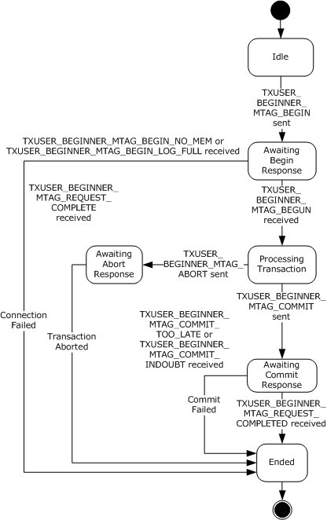

Figure 14: CONNTYPE_TXUSER_BEGINNER initiator states

##### 3.3.1.1.1 Idle

This is the initial state. The following event is processed in this state:

- Beginning a Transaction Using CONNTYPE_TXUSER_BEGINNER (section [3.3.4.1.2](#Section_3.3.4.1.2))

##### 3.3.1.1.2 Awaiting Begin Response

The following events are processed in this state:

- Receiving a TXUSER_BEGINNER_MTAG_BEGUN Message (section [3.3.5.1.1.1](#Section_3.3.5.1.1.1))
- Receiving a TXUSER_BEGINNER_MTAG_BEGIN_NO_MEM or TXUSER_BEGINNER_MTAG _BEGIN_LOG_FULL Message (section [3.3.5.1.1.2](#Section_3.3.5.1.1.2))

##### 3.3.1.1.3 Processing Transaction

The following events are processed in this state:

- Initiating Transaction Commit (section [3.3.4.8](#Section_3.3.4.8))
- Initiating Transaction Rollback (section [3.3.4.9](#Section_3.3.4.9))

##### 3.3.1.1.4 Awaiting Commit Response

The following events are processed in this state:

- Receiving a TXUSER_BEGINNER_MTAG_REQUEST_COMPLETED Message (section [3.3.5.1.1.3](#Section_3.3.5.1.1.3))
- Receiving a TXUSER_BEGINNER_MTAG_COMMIT_TOO_LATE Message (section [3.3.5.1.1.4](#Section_3.3.5.1.1.4))
- Receiving a TXUSER_BEGINNER_MTAG_COMMIT_INDOUBT Message (section [3.3.5.1.1.5](#Section_3.3.5.1.1.5))

##### 3.3.1.1.5 Awaiting Abort Response

The following event is processed in this state:

- Receiving a TXUSER_BEGINNER_MTAG_REQUEST_COMPLETED Message (section [3.3.5.1.1.3](#Section_3.3.5.1.1.3))

##### 3.3.1.1.6 Ended

This is the final state.

#### 3.3.1.2 CONNTYPE_TXUSER_BEGIN2 Initiator States

The [**application**](#gt_application) MUST act as an [**initiator**](#gt_initiator) for the CONNTYPE_TXUSER_BEGIN2 (section [2.2.8.1.2](#Section_2.2.8.1.2.3)) [**connection type**](#gt_connection-type). In this role, the application MUST provide support for the following states:

- Idle
- Awaiting Begin Response
- Processing Transaction
- Awaiting Set Timeout Response
- Awaiting Commit Response
- Awaiting Abort Response
- Ended
The following figure shows the relationship between the CONNTYPE_TXUSER_BEGIN2 initiator states.

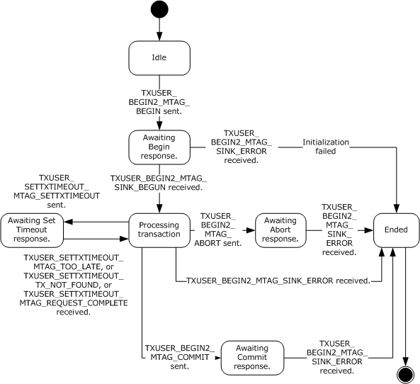

Figure 15: CONNTYPE_TXUSER_BEGIN2 initiator states

##### 3.3.1.2.1 Idle

This is the initial state. The following event is processed in this state:

- Beginning a Transaction Using CONNTYPE_TXUSER_BEGIN2 (section [3.3.4.1.1](#Section_3.3.4.1.1))

##### 3.3.1.2.2 Awaiting Begin Response

The following events are processed in this state:

- Receiving a TXUSER_BEGIN2_MTAG_SINK_BEGUN Message (section [3.3.5.1.2.1](#Section_3.3.5.1.2.1))
- Receiving a TXUSER_BEGIN2_MTAG_SINK_ERROR Message (section [3.3.5.1.2.5](#Section_3.3.5.1.2.5))

##### 3.3.1.2.3 Processing Transaction

The following events are processed in this state:

- Querying Transaction Manager's Support for Modifying a Transaction Timeout Using CONNTYPE_TXUSER_SETTXTIMEOUT2 (section [3.3.4.2.2](#Section_3.3.4.2.2))
- Commit a Transaction Using CONNTYPE_TXUSER_BEGIN2 (section [3.3.4.8.1](#Section_3.3.4.8.1))
- Abort a Transaction Using CONNTYPE_TXUSER_BEGIN2 (section [3.3.4.9.1](#Section_3.3.4.9.1))
- Receiving a TXUSER_BEGIN2_MTAG_SINK_ERROR Message (section [3.3.5.1.2.5](#Section_3.3.5.1.2.5))

##### 3.3.1.2.4 Awaiting Set Timeout Response

The following events are processed in this state:

- Receiving a TXUSER_SETTXTIMEOUT_MTAG_REQUEST_COMPLETE Message (section [3.3.5.1.2.2](#Section_3.3.5.1.2.2))
- Receiving a TXUSER_SETTXTIMEOUT_MTAG_TOO_LATE Message (section [3.3.5.1.2.3](#Section_3.3.5.1.2.3))
- Receiving a TXUSER_SETTXTIMEOUT_MTAG_TX_NOT_FOUND Message (section [3.3.5.1.2.4](#Section_3.3.5.1.2.4))

##### 3.3.1.2.5 Awaiting Commit Response

The following event is processed in this state:

- Receiving a TXUSER_BEGIN2_MTAG_SINK_ERROR Message (section [3.3.5.1.2.5](#Section_3.3.5.1.2.5))

##### 3.3.1.2.6 Awaiting Abort Response

The following event is processed in this state:

- Receiving a TXUSER_BEGIN2_MTAG_SINK_ERROR Message (section [3.3.5.1.2.5](#Section_3.3.5.1.2.5))

##### 3.3.1.2.7 Ended

This is the final state.

#### 3.3.1.3 CONNTYPE_TXUSER_PROMOTE Initiator States

The [**application**](#gt_application) MUST act as an [**initiator**](#gt_initiator) for the CONNTYPE_TXUSER_PROMOTE (section [2.2.8.1.3](#Section_2.2.8.1.3)) [**connection type**](#gt_connection-type). In this role, the application MUST provide support for the following states:

- Idle
- Awaiting Promote Response
- Processing Transaction
- Awaiting Set Timeout Response
- Awaiting Commit Response
- Awaiting Abort Response
- Ended
The following figure shows the relationship between the CONNTYPE_TXUSER_PROMOTE initiator states.

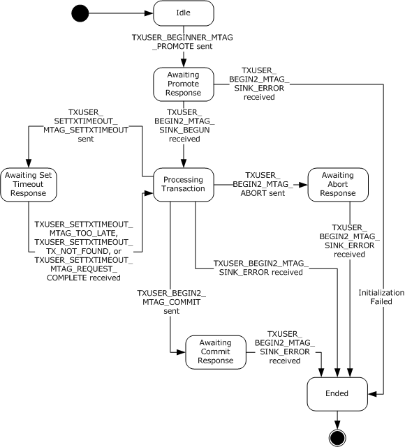

Figure 16: CONNTYPE_TXUSER_PROMOTE initiator states

##### 3.3.1.3.1 Idle

This is the initial state. The following event is processed in this state:

- Beginning a Transaction Using CONNTYPE_TXUSER_PROMOTE (section [3.3.4.1.3](#Section_3.3.4.1.3))

##### 3.3.1.3.2 Awaiting Promote Response

The following events are processed in this state:

- Receiving a TXUSER_BEGIN2_MTAG_SINK_BEGUN Message (section [3.3.5.1.3.1](#Section_3.3.5.1.3.1))
- Receiving a TXUSER_BEGIN2_MTAG_SINK_ERROR Message (section [3.3.5.1.3.2](#Section_3.3.5.1.3.2))

##### 3.3.1.3.3 Processing Transaction

The following events are processed in this state:

- Commit a Transaction Using CONNTYPE_TXUSER_PROMOTE (section [3.3.4.8.3](#Section_3.3.4.8.3))
- Roll Back a Transaction Using CONNTYPE_TXUSER_PROMOTE (section [3.3.4.9.5](#Section_3.3.4.9.5))
- Querying Transaction Manager's Support for Modifying a Transaction Timeout Using CONNTYPE_TXUSER_SETTXTIMEOUT2 (section [3.3.4.2.2](#Section_3.3.4.2.2))
- Receiving a TXUSER_BEGIN2_MTAG_SINK_ERROR Message (section [3.3.5.1.3.2](#Section_3.3.5.1.3.2))

##### 3.3.1.3.4 Awaiting Set Timeout Response

The following events are processed in this state:

- Receiving a TXUSER_SETTXTIMEOUT_MTAG_REQUEST_COMPLETE Message (section [3.3.5.1.2.2](#Section_3.3.5.1.2.2))
- Receiving a TXUSER_SETTXTIMEOUT_MTAG_TOO_LATE Message (section [3.3.5.1.2.3](#Section_3.3.5.1.2.3))
- Receiving a TXUSER_SETTXTIMEOUT_MTAG_TX_NOT_FOUND Message (section [3.3.5.1.2.4](#Section_3.3.5.1.2.4))

##### 3.3.1.3.5 Awaiting Commit Response

The following event is processed in this state:

- Receiving a TXUSER_BEGIN2_MTAG_SINK_ERROR Message (section [3.3.5.1.3.2](#Section_3.3.5.1.3.2))

##### 3.3.1.3.6 Awaiting Abort Response

The following event is processed in this state:

- Receiving a TXUSER_BEGIN2_MTAG_SINK_ERROR Message (section [3.3.5.1.3.2](#Section_3.3.5.1.3.2))

##### 3.3.1.3.7 Ended

This is the final state.

#### 3.3.1.4 CONNTYPE_TXUSER_ASSOCIATE Initiator States

The [**application**](#gt_application) MUST act as an [**initiator**](#gt_initiator) for the CONNTYPE_TXUSER_ASSOCIATE (section [2.2.8.2.1.1](#Section_2.2.8.2.1.1)) [**connection type**](#gt_connection-type). In this role, the application MUST provide support for the following states:

- Idle
- Awaiting Associate Response
- Active
- Ended
The following figure shows the relationship between the CONNTYPE_TXUSER_ASSOCIATE initiator states.

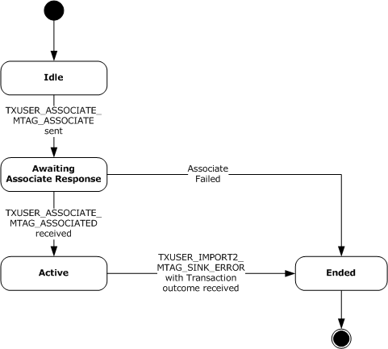

Figure 17: CONNTYPE_TXUSER_ASSOCIATE initiator states

##### 3.3.1.4.1 Idle

This is the initial state. The following event is processed in this state:

- Pulling a Transaction (section [3.3.4.12](#Section_3.3.4.12))

##### 3.3.1.4.2 Awaiting Associate Response

The following events are processed in this state:

- Receiving a TXUSER_ASSOCIATE_MTAG_ASSOCIATED Message (section [3.3.5.2.1.1.1](#Section_3.3.5.2.1.1.1))
- Receiving Other TXUSER_ASSOCIATE_MTAG Messages (section [3.3.5.2.1.1.2](#Section_3.3.5.2.1.1.2))

##### 3.3.1.4.3 Active

The following event is processed in this state:

- Receiving a TXUSER_IMPORT2_MTAG_SINK_ERROR Message (section [3.3.5.2.1.1.3](#Section_3.3.5.2.1.1.3)).

##### 3.3.1.4.4 Ended

This is the final state.

#### 3.3.1.5 CONNTYPE_TXUSER_EXTENDWHEREABOUTS Initiator States

The [**application**](#gt_application) MUST act as an [**initiator**](#gt_initiator) for the CONNTYPE_TXUSER_EXTENDEDWHEREABOUTS (section [2.2.8.2.2.1](#Section_2.2.8.2.2.1)) [**connection type**](#gt_connection-type). In this role, the application MUST provide support for the following states:

- Idle
- Awaiting Get Response
- Ended
The following figure shows the relationship between the CONNTYPE_TXUSER_EXTENDWHEREABOUTS initiator states.

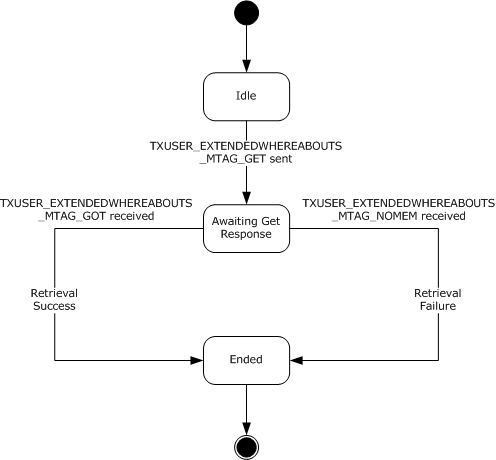

Figure 18: CONNTYPE_TXUSER_EXTENDEDWHEREABOUTS initiator states

##### 3.3.1.5.1 Idle

This is the initial state. The following event is processed in this state:

- Obtaining Extended Whereabouts Using CONNTYPE_TXUSER_EXTENDEDWHEREABOUTS (section [3.3.4.10](#Section_3.3.4.10))

##### 3.3.1.5.2 Awaiting Get Response

The following events are processed in this state:

- Receiving a TXUSER_EXTENDEDWHEREABOUTS_MTAG_GOT Message (section [3.3.5.2.2.1.1](#Section_3.3.5.2.2.1.1))
- Receiving a TXUSER_EXTENDEDWHEREABOUTS_MTAG_NOMEM Message (section [3.3.5.2.2.1.2](#Section_3.3.5.2.2.1.2))

##### 3.3.1.5.3 Ended

This is the final state.

#### 3.3.1.6 CONNTYPE_TXUSER_IMPORT Initiator States

The [**application**](#gt_application) MUST act as an [**initiator**](#gt_initiator) for the CONNTYPE_TXUSER_IMPORT (section [2.2.8.2.2.4](#Section_2.2.8.2.2.4)) [**connection type**](#gt_connection-type). In this role, the application MUST provide support for the following states:

- Idle
- Awaiting Import Response
- Transaction Import Successful
- Awaiting Abort Response
- Ended
The following figure shows the relationship between the CONNTYPE_TXUSER_IMPORT initiator states.

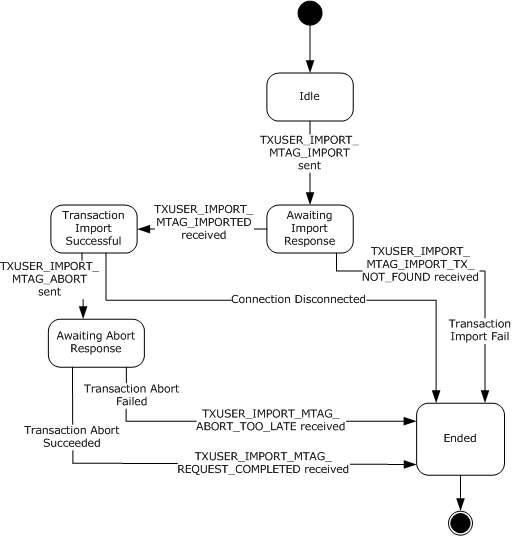

Figure 19: CONNTYPE_TXUSER_IMPORT initiator states

##### 3.3.1.6.1 Idle

This is the initial state. The following event is processed in this state:

- Importing a Transaction Using CONNTYPE_TXUSER_IMPORT (section [3.3.4.6.1](#Section_3.3.4.6.1))

##### 3.3.1.6.2 Awaiting Import Response

The following events are processed in this state:

- Receiving a TXUSER_IMPORT_MTAG_IMPORTED Message (section [3.3.5.2.2.4.1](#Section_3.3.5.2.2.4.1))
- Receiving a TXUSER_IMPORT_MTAG_IMPORT_TX_NOT_FOUND Message (section [3.3.5.2.2.4.2](#Section_3.3.5.2.2.4.2))

##### 3.3.1.6.3 Transaction Import Successful

The following event is processed in this state:

- Abort a Transaction Using CONNTYPE_TXUSER_IMPORT (section [3.3.4.9.3](#Section_3.3.4.9.3))

##### 3.3.1.6.4 Awaiting Abort Response

The following events are processed in this state:

- Receiving a TXUSER_IMPORT_MTAG_ABORT_TOO_LATE Message (section [3.3.5.2.2.4.3](#Section_3.3.5.2.2.4.3))
- Receiving a TXUSER_IMPORT_MTAG_REQUEST_COMPLETED Message (section [3.3.5.2.2.4.4](#Section_3.3.5.2.2.4.4))

##### 3.3.1.6.5 Ended

This is the final state.

#### 3.3.1.7 CONNTYPE_TXUSER_IMPORT2 Initiator States

The [**application**](#gt_application) MUST act as an [**initiator**](#gt_initiator) for the CONNTYPE_TXUSER_IMPORT2 (section [2.2.8.2.2.5](#Section_2.2.8.2.2.5)) [**connection type**](#gt_connection-type). In this role, the application MUST provide support for the following states:

- Idle
- Awaiting Import Response
- Transaction Import Successful
- Awaiting Abort Response
- Ended
The following figure shows the relationship between the CONNTYPE_TXUSER_IMPORT2 initiator states.

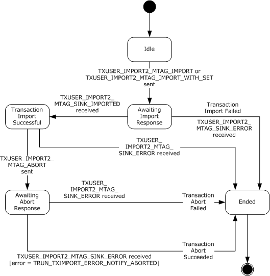

Figure 20: CONNTYPE_TXUSER_IMPORT2 initiator states

##### 3.3.1.7.1 Idle

This is the initial state. The following events are processed in this state:

- Importing a Transaction Using CONNTYPE_TXUSER_IMPORT2 (section [3.3.4.6.2](#Section_3.3.4.6.2))
- Importing a Transaction with Additional Transaction Attributes (section [3.3.4.7](#Section_3.3.4.7))

##### 3.3.1.7.2 Awaiting Import Response

The following events are processed in this state:

- Receiving a TXUSER_IMPORT2_MTAG_SINK_IMPORTED Message (section [3.3.5.2.2.5.1](#Section_3.3.5.2.2.5.1))
- Receiving a TXUSER_IMPORT2_MTAG_SINK_ERROR Message (section [3.3.5.2.2.5.2](#Section_3.3.5.2.2.5.2))

##### 3.3.1.7.3 Transaction Import Successful

The following events are processed in this state:

- Receiving a TXUSER_IMPORT2_MTAG_SINK_ERROR Message (section [3.3.5.2.2.5.2](#Section_3.3.5.2.2.5.2))
- Abort a Transaction Using CONNTYPE_TXUSER_IMPORT2 (section [3.3.4.9.4](#Section_3.3.4.9.4))

##### 3.3.1.7.4 Awaiting Abort Response

The following event is processed in this state:

- Receiving a TXUSER_IMPORT2_MTAG_SINK_ERROR Message (section [3.3.5.2.2.5.2](#Section_3.3.5.2.2.5.2))

##### 3.3.1.7.5 Ended

This is the final state.

#### 3.3.1.8 CONNTYPE_TXUSER_EXPORT Initiator States

The [**application**](#gt_application) MUST act as an [**initiator**](#gt_initiator) for the CONNTYPE_TXUSER_EXPORT (section [2.2.8.2.2.2](#Section_2.2.8.2.2.2)) [**connection type**](#gt_connection-type). In this role, the application MUST provide support for the following states:

- Idle
- Awaiting Create Response
- Connection Active
- Awaiting Export Response
- Ended
The following figure shows the relationship between the CONNTYPE_TXUSER_EXPORT Initiator states.

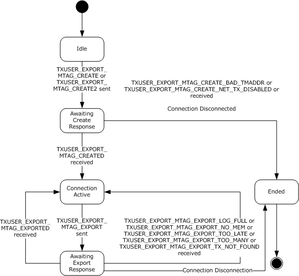

Figure 21: CONNTYPE_TXUSER_EXPORT initiator states

##### 3.3.1.8.1 Idle

This is the initial state. The following event is processed in this state:

- Creating an Export Connection (section [3.3.4.4](#Section_3.6.1.2.2))

##### 3.3.1.8.2 Awaiting Create Response

The following events are processed in this state:

- Receiving a TXUSER_EXPORT_MTAG_CREATED Message (section [3.3.5.2.2.2.1](#Section_3.3.5.2.2.2.1))
- Receiving a TXUSER_EXPORT_MTAG_CREATE_BAD_TMADDR or TXUSER_EXPORT_MTAG_CREATE_NET_TX_DISABLED Message (section [3.3.5.2.2.2.2](#Section_3.3.5.2.2.2.2))
- CONNTYPE_TXUSER_EXPORT Connection Disconnected (section [3.3.5.2.2.2.5](#Section_3.3.5.2.2.2.5))

##### 3.3.1.8.3 Connection Active

The following event is processed in this state:

- Push a Transaction Using an Existing Export Connection (section [3.3.4.13](#Section_3.3.4.13))

##### 3.3.1.8.4 Awaiting Export Response

The following events are processed in this state:

- Receiving a TXUSER_EXPORT_MTAG_EXPORTED Message (section [3.3.5.2.2.2.3](#Section_3.3.5.2.2.2.3))
- Receiving a TXUSER_EXPORT_MTAG_EXPORT_LOG_FULL, TXUSER_EXPORT_MTAG_EXPORT_NO_MEM, TXUSER_EXPORT_MTAG_EXPORT_TOO_LATE, TXUSER_EXPORT_MTAG_EXPORT_TOO_MANY, or TXUSER_EXPORT_MTAG_EXPORT_NOT_FOUND Message (section [3.3.5.2.2.2.4](#Section_3.3.5.2.2.2.4))
- CONNTYPE_TXUSER_EXPORT Connection Disconnected (section [3.3.5.2.2.2.5](#Section_3.3.5.2.2.2.5))

##### 3.3.1.8.5 Ended

This is the final state.

#### 3.3.1.9 CONNTYPE_TXUSER_EXPORT2 Initiator States

The [**application**](#gt_application) MUST act as an [**initiator**](#gt_initiator) for the CONNTYPE_TXUSER_EXPORT2 (section [2.2.8.2.2.3](#Section_2.2.8.2.2.3)) [**connection type**](#gt_connection-type). In this role, the application MUST provide support for the following states:

- Idle
- Awaiting Create Response
- Connection Active
- Awaiting Export Response
- Ended
The following figure shows the relationship between the CONNTYPE_TXUSER_EXPORT2 initiator states.

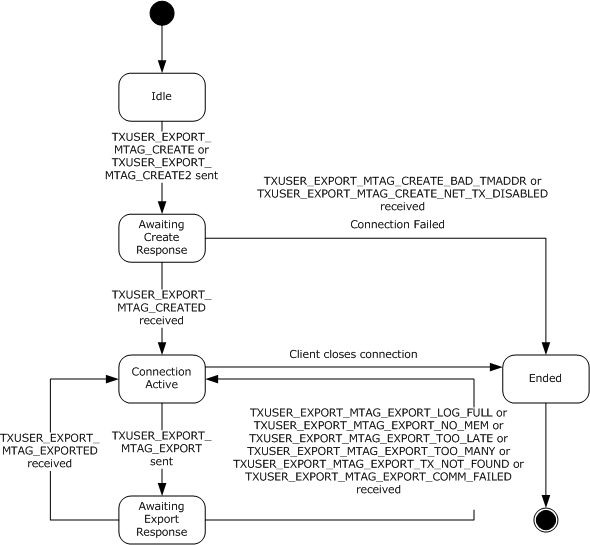

Figure 22: CONNTYPE_TXUSER_EXPORT2 initiator states

##### 3.3.1.9.1 Idle

This is the initial state. The following event is processed in this state:

- Creating an Export Connection (section [3.3.4.4](#Section_3.6.1.2.2))

##### 3.3.1.9.2 Awaiting Create Response

The following events are processed in this state:

- Receiving a TXUSER_EXPORT_MTAG_CREATED Message (section [3.3.5.2.2.3.1](#Section_3.3.5.2.2.3.1))
- Receiving a TXUSER_EXPORT_MTAG_CREATE_BAD_TMADDR or TXUSER_EXPORT_MTAG_CREATE_NET_TX_DISABLED Message (section [3.3.5.2.2.3.2](#Section_3.3.5.2.2.3.2))

##### 3.3.1.9.3 Connection Active

The following event is processed in this state:

- Push a Transaction Using an Existing Export Connection (section [3.3.4.13](#Section_3.3.4.13))

##### 3.3.1.9.4 Awaiting Export Response

The following events are processed in this state:

- Receiving a TXUSER_EXPORT_MTAG_EXPORTED message (section [3.3.5.2.2.3.3](#Section_3.3.5.2.2.3.3))
- Receiving a TXUSER_EXPORT_MTAG_EXPORT_LOG_FULL, TXUSER_EXPORT_MTAG_EXPORT_NO_MEM, TXUSER_EXPORT_MTAG_EXPORT_TOO_LATE, TXUSER_EXPORT_MTAG_EXPORT_TOO_MANY, TXUSER_EXPORT_MTAG_EXPORT_NOT_FOUND, or TXUSER_EXPORT_MTAG_EXPORT_COMM_FAILED Message (section [3.3.5.2.2.3.4](#Section_3.3.5.2.2.3.4))

##### 3.3.1.9.5 Ended

This is the final state.

#### 3.3.1.10 CONNTYPE_TXUSER_GETTXDETAILS Initiator States

The [**application**](#gt_application) MUST act as an [**initiator**](#gt_initiator) for the CONNTYPE_TXUSER_GETTXDETAILS (section [2.2.8.3.1](#Section_2.2.8.3.1.2)) [**connection type**](#gt_connection-type). In this role, the application MUST provide support for the following states:

- Idle
- Awaiting Response
- Ended
The following figure shows the relationship between the CONNTYPE_TXUSER_GETTXDETAILS initiator states.

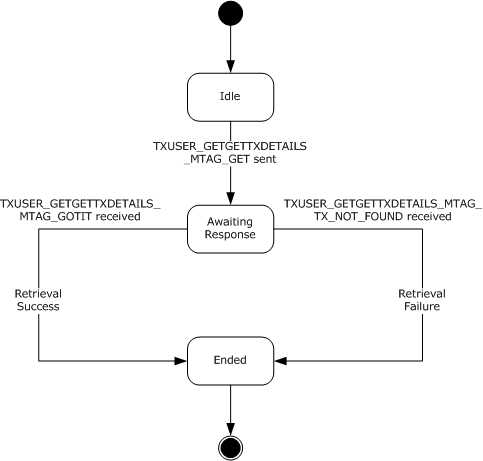

Figure 23: CONNTYPE_TXUSER_GETTXDETAILS initiator states

##### 3.3.1.10.1 Idle

This is the initial state. The following event is processed in this state:

- Obtaining the Details for a Transaction (section [3.3.4.11.1](#Section_3.3.4.11.1))

##### 3.3.1.10.2 Awaiting Response

The following events are processed in this state:

- Receiving a TXUSER_GETTXDETAILS_MTAG_GOTIT Message (section [3.3.5.3.1.1](#Section_3.3.5.3.1.1))
- Receiving a TXUSER_GETTXDETAILS_MTAG_TX_NOT_FOUND Message (section [3.3.5.3.1.2](#Section_3.3.5.3.1.2))

##### 3.3.1.10.3 Ended

This is the final state.

#### 3.3.1.11 CONNTYPE_TXUSER_RESOLVE Initiator States

The [**application**](#gt_application) MUST act as an [**initiator**](#gt_initiator) for the CONNTYPE_TXUSER_RESOLVE (section [2.2.8.3.2](#Section_2.2.8.3.2.7)) [**connection type**](#gt_connection-type). In this role, the application MUST provide support for the following states:

- Idle
- Awaiting Abort Response
- Awaiting Forget Response
- Awaiting Commit Response
- Ended
The following figure shows the relationship between the CONNTYPE_TXUSER_RESOLVE initiator states.

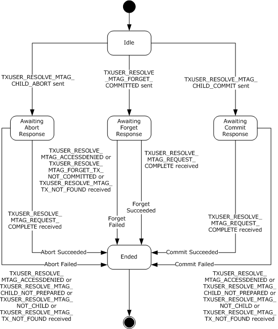

Figure 24: CONNTYPE_TXUSER_RESOLVE initiator states

##### 3.3.1.11.1 Idle

This is the initial state. The following event is processed in this state:

- Resolving a Transaction (section [3.3.4.15](#Section_3.3.4.15))

##### 3.3.1.11.2 Awaiting Abort Response

The following events are processed in this state:

- Receiving a TXUSER_RESOLVE_MTAG_REQUEST_COMPLETE Message (section [3.3.5.3.2.1](#Section_3.3.5.3.2.1))
- Receiving a TXUSER_RESOLVE_MTAG_CHILD_NOT_PREPARED or TXUSER_RESOLVE_MTAG_NOT_CHILD Message (section [3.3.5.3.2.3](#Section_3.3.5.3.2.3))
- Receiving a TXUSER_RESOLVE_MTAG_ACCESSDENIED or TXUSER_RESOLVE_MTAG_TX_NOT_FOUND Message (section [3.3.5.3.2.2](#Section_3.3.5.3.2.2))

##### 3.3.1.11.3 Awaiting Forget Response

The following events are processed in this state:

- Receiving a TXUSER_RESOLVE_MTAG_REQUEST_COMPLETE Message (section [3.3.5.3.2.1](#Section_3.3.5.3.2.1))
- Receiving a TXUSER_RESOLVE_MTAG_FORGET_TX_NOT_COMMITTED Message (section [3.3.5.3.2.4](#Section_3.3.5.3.2.4))
- Receiving a TXUSER_RESOLVE_MTAG_ACCESSDENIED or TXUSER_RESOLVE_MTAG_TX_NOT_FOUND Message (section [3.3.5.3.2.2](#Section_3.3.5.3.2.2))

##### 3.3.1.11.4 Awaiting Commit Response

The following events are processed in this state:

- Receiving a TXUSER_RESOLVE_MTAG_REQUEST_COMPLETE Message (section [3.3.5.3.2.1](#Section_3.3.5.3.2.1))
- Receiving a TXUSER_RESOLVE_MTAG_CHILD_NOT_PREPARED or TXUSER_RESOLVE_MTAG_NOT_CHILD Message (section [3.3.5.3.2.3](#Section_3.3.5.3.2.3))
- Receiving a TXUSER_RESOLVE_MTAG_ACCESSDENIED or TXUSER_RESOLVE_MTAG_TX_NOT_FOUND Message (section [3.3.5.3.2.2](#Section_3.3.5.3.2.2))

##### 3.3.1.11.5 Ended

This is the final state.

#### 3.3.1.12 CONNTYPE_TXUSER_SETTXTIMEOUT Initiator States

The [**application**](#gt_application) MUST act as an [**initiator**](#gt_initiator) for the CONNTYPE_TXUSER_SETTXTIMEOUT (section [2.2.8.3.3](#Section_2.2.8.3.3)) [**connection type**](#gt_connection-type). In this role, the application MUST provide support for the following states:

- Idle
- Awaiting Set Timeout Response
- Ended
The following figure shows the relationship between the CONNTYPE_TXUSER_SETTXTIMEOUT initiator states.

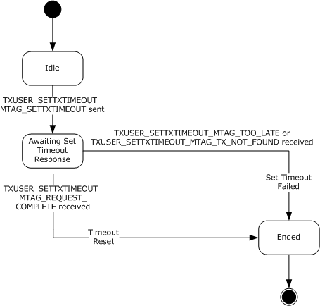

Figure 25: CONNTYPE_TXUSER_SETTXTTIMEOUT initiator states

##### 3.3.1.12.1 Idle

This is the initial state. The following event is processed in this state:

- Changing a Transaction Time-out Using CONNTYPE_TXUSER_SETTXTIMEOUT (section [3.3.4.2.1](#Section_3.3.4.2.1))

##### 3.3.1.12.2 Awaiting Set Timeout Response

The following events are processed in the Awaiting Set Timeout Response state:

- Receiving a TXUSER_SETTXTIMEOUT_MTAG_REQUEST_COMPLETE Message (section [3.3.5.3.3.1](#Section_3.3.5.3.3.1))
- Receiving a TXUSER_SETTXTIMEOUT_MTAG_TOO_LATE or TXUSER_SETTXTIMEOUT_MTAG_TX_NOT_FOUND Message (section [3.3.5.3.3.2](#Section_3.3.5.3.3.2))

##### 3.3.1.12.3 Ended

This is the final state.

#### 3.3.1.13 CONNTYPE_TXUSER_SETTXTIMEOUT2 Initiator States

The [**application**](#gt_application) MUST act as an [**initiator**](#gt_initiator) for the CONNTYPE_TXUSER_SETTXTIMEOUT2 (section [2.2.8.3.4](#Section_2.2.8.3.4)) [**connection type**](#gt_connection-type). In this role, the application MUST provide support for the following states:

- Idle
- Awaiting Set Timeout Response
- Ended
The following figure shows the relationship between the CONNTYPE_TXUSER_SETTXTIMEOUT2 initiator states.

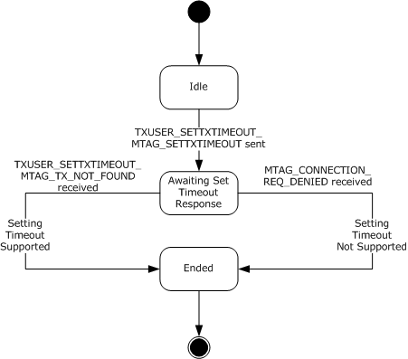

Figure 26: CONNTYPE_TXUSER_SETTXTTIMEOUT2 initiator states

##### 3.3.1.13.1 Idle

This is the initial state. The following event is processed in this state:

- Querying Transaction Manager's Support for Modifying a Transaction Timeout Using CONNTYPE_TXUSER_SETTXTIMEOUT2 (section [3.3.4.2.2](#Section_3.3.4.2.2))

##### 3.3.1.13.2 Awaiting Set Timeout Response

The following event is processed in this state:

- Receiving a TXUSER_SETTXTIMEOUT_MTAG_TX_NOT_FOUND Message (section [3.3.5.3.4.1](#Section_3.3.5.3.4.1))
- Receiving an MTAG_CONNECTION_REQ_DENIED message ([MS-CMP](../MS-CMP/MS-CMP.md) section 2.2.5) as described in section [1.7.3](#Section_1.7.3).

##### 3.3.1.13.3 Ended

This is the final state.

#### 3.3.1.14 CONNTYPE_TXUSER_TRACE Initiator States

The [**application**](#gt_application) MUST act as an [**initiator**](#gt_initiator) for the CONNTYPE_TXUSER_TRACE (section [2.2.8.3.5](#Section_2.2.8.3.5.2)) [**connection type**](#gt_connection-type). In this role, the application MUST provide support for the following states:

- Idle
- Awaiting Trace Response
- Ended
The following figure shows the relationship between the CONNTYPE_TXUSER_TRACE initiator states.

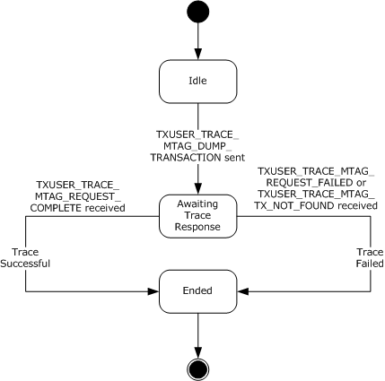

Figure 27: CONNTYPE_TXUSER_TRACE initiator states

##### 3.3.1.14.1 Idle

This is the initial state. The following event is processed in this state:

- Generating Trace Records for a Transaction Using CONNTYPE_TXUSER_TRACE (section [3.3.4.5](#Section_3.3.4.5))

##### 3.3.1.14.2 Awaiting Trace Response

The following events are processed in this state:

- Receiving a TXUSER_TRACE_MTAG_REQUEST_COMPLETE Message (section [3.3.5.3.5.1](#Section_3.3.5.3.5.1))
- Receiving a TXUSER_TRACE_MTAG_REQUEST_FAILED or TXUSER_TRACE_MTAG_TX_NOT_FOUND Message (section [3.3.5.3.5.2](#Section_3.3.5.3.5.2))

##### 3.3.1.14.3 Ended

This is the final state.

#### 3.3.1.15 CONNTYPE_TXUSER_GETSECURITYFLAGS Initiator States

The [**application**](#gt_application) MUST act as an [**initiator**](#gt_initiator) for the CONNTYPE_TXUSER_GETSECURITYFLAGS (section [2.2.8.4.1](#Section_2.2.8.4.1.1)) [**connection type**](#gt_connection-type). In this role, the application MUST provide support for the following states:

- Idle
- Awaiting Get Response
- Ended
The following figure shows the relationship between the CONNTYPE_TXUSER_GETSECURITYFLAGS initiator states.

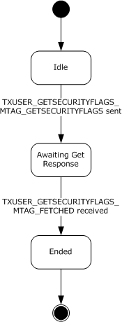

Figure 28: CONNTYPE_TXUSER_GETSECURITYFLAGS initiator states

##### 3.3.1.15.1 Idle

This is the initial state. The following event is processed in this state:

- Obtaining the Security Configuration of the Transaction Manager Using CONNTYPE_TXUSER_GETSECURITYFLAGS (section [3.3.4.11](#Section_3.3.4.11))

##### 3.3.1.15.2 Awaiting Get Response

The following event is processed in this state:

- Receiving a TXUSER_GETSECURITYFLAGS_MTAG_FETCHED Message (section [3.3.5.4.1.1](#Section_3.3.5.4.1.1))

##### 3.3.1.15.3 Ended

This is the final state.

### 3.3.2 Timers

No timers apply here.

### 3.3.3 Initialization

When an [**application**](#gt_application) is initialized:

- The [**Transaction Manager**](#gt_transaction-manager) **Name** field MUST be set to a value that is obtained from an implementation-specific source.
- The application MUST initialize each new [**transaction**](#gt_transaction) object that is created with the following default values:
- The **Root** field MUST default to false.

### 3.3.4 Higher-Layer Triggered Events

The [**application**](#gt_application) MUST be prepared to process a set of higher-layer events described in this section and in Message Processing Events and Sequencing Rules (section [3.3.5](#Section_3.3.5)). These events are triggered by decisions that are made by the higher-layer business logic of the application. The motivations and details of the higher-layer business logic are specific to the implementation of the application and the software environment in which it executes.

When the application processes one of the higher-layer events described in this section and section 3.3.5, it MUST communicate one of the following results to the higher-layer business logic:

- Success
- Failure
- Transaction Committed
- Transaction Aborted
- Transaction In Doubt
If the processing of a higher-layer event includes a Message Processing event, the associated Message Processing event MUST communicate one of the above results to the higher-layer business logic.

#### 3.3.4.1 Beginning a Transaction

If the higher-layer business logic begins a [**transaction**](#gt_transaction) with a predetermined [**transaction identifier**](#gt_transaction-identifier):<29>

- If the [**transaction manager**](#gt_transaction-manager) of the [**application**](#gt_application) supports the CONNTYPE_TXUSER_PROMOTE (section [2.2.8.1.3](#Section_2.2.8.1.3)) [**connection type**](#gt_connection-type) as specified in section [2.2.1.1.1](#Section_2.2.1.1.1):
- The application MUST attempt to begin a transaction by using the CONNTYPE_TXUSER_PROMOTE connection type.
- Otherwise:
- The application MUST return a Failure result to the higher-layer business logic.
If the higher-layer business logic decides to begin a transaction without using a predetermined transaction identifier, the application MUST perform the following actions:

- If the transaction manager supports the CONNTYPE_TXUSER_BEGIN2 (section [2.2.8.1.2](#Section_2.2.8.1.2.3)) connection type as specified in section 2.2.1.1.1:
- The application MUST attempt to begin a transaction by using CONNTYPE_TXUSER_BEGIN2.
- Otherwise:
- The application MUST attempt to begin a transaction by using CONNTYPE_TXUSER_BEGINNER (section [2.2.8.1.1](#Section_2.2.8.1.1)).

##### 3.3.4.1.1 Beginning a Transaction Using CONNTYPE_TXUSER_BEGIN2

The application MUST perform the following actions:

- Initiate a new CONNTYPE_TXUSER_BEGIN2 (section [2.2.8.1.2](#Section_2.2.8.1.2.3)) connection using the transaction manager **Name** field of the application.
- Send a TXUSER_BEGIN2_MTAG_BEGIN (section [2.2.8.1.2.2](#Section_2.2.8.1.2.2)) message using the connection and the values that are provided by the higher-layer business logic:
- The **isoLevel**, **dwTimeout**, **szDesc**, and **isoFlags** fields MUST be set as specified in section [2.2.8](#Section_2.2.6.1).
- Set the connection state to Awaiting Begin Response.

##### 3.3.4.1.2 Beginning a Transaction Using CONNTYPE_TXUSER_BEGINNER

The application MUST perform the following actions:

- Initiate a new CONNTYPE_TXUSER_BEGINNER (section [2.2.8.1.1](#Section_2.2.8.1.1)) connection by using the [**transaction manager**](#gt_transaction-manager) Name field of the application.
- Send a TXUSER_BEGINNER_MTAG_BEGIN (section [2.2.8.1.1.2](#Section_2.2.8.1.1.2)) message by using the connection. The following message fields MUST be set to values that are provided by the higher-layer business logic:
- The **isoLevel** field set to the required [OLETX_ISOLATION_LEVEL](#Section_2.2.6.9) value.
- The **dwTimeout** field MUST be set to the required time-out value.
- The **szDesc** field MUST be set to the required [**transaction description**](#gt_transaction-description) string.
- The **isoFlags** field MUST be set to the required [OLETX_ISOLATION_FLAGS](#Section_2.2.6.8) value.
- Set the connection state to Awaiting Begin Response.

##### 3.3.4.1.3 Beginning a Transaction Using CONNTYPE_TXUSER_PROMOTE

The application MUST perform the following actions:

- Initiate a new CONNTYPE_TXUSER_PROMOTE (section [2.2.8.1.3](#Section_2.2.8.1.3)) connection using the [**transaction manager**](#gt_transaction-manager) Name field of the application.
- Send a TXUSER_BEGINNER_MTAG_PROMOTE (section [2.2.8.1.3.1](#Section_2.2.8.1.3.1)) message using the connection. The following message fields MUST be set to values that are provided by the higher-layer business logic:
- The **isoLevel** field to the wanted isolation-level value.
- The **dwTimeout** field to the wanted time-out value.
- The **szDesc** field to the wanted [**transaction description**](#gt_transaction-description) string.
- The **isoFlags** field to the wanted isolation flags value.
- The **guidTx** field to the wanted predetermined [**transaction identifier**](#gt_transaction-identifier).
- Set the connection state to Awaiting Promote Response.

#### 3.3.4.2 Changing a Transaction Timeout

If the higher-layer business logic changes the time-out of an existing [**transaction**](#gt_transaction), the [**application**](#gt_application) MUST perform the following steps:

- If the **Root** field of the transaction is false:
- Return a failure result to the higher-layer business logic.
- Otherwise:
- If the [**root transaction manager**](#gt_root-transaction-manager) supports the CONNTYPE_TXUSER_SETTXTIMEOUT2 (section [3.3.1.13](#Section_3.3.1.13.3)) [**connection type**](#gt_connection-type), as specified in section [2.2.1.1.1](#Section_2.2.1.1.1):
- The application MUST attempt to change the transaction time-out by using CONNTYPE_TXUSER_SETTXTIMEOUT2 (section 3.3.1.13).
- Otherwise:
- The application MUST attempt to change the transaction time-out by using CONNTYPE_TXUSER_SETTXTIMEOUT (section [3.3.1.12](#Section_3.3.1.12.3)).

##### 3.3.4.2.1 Changing a Transaction Timeout Using CONNTYPE_TXUSER_SETTXTIMEOUT

The application MUST perform the following actions:

- Find an instance of a CONNTYPE_TXUSER_BEGINNER (section [2.2.8.1.1](#Section_2.2.8.1.1)) [**connection**](#gt_connection) in the connection list of the [**transaction**](#gt_transaction).
- If a connection is not found, the application MUST return a failure result to the higher-layer business logic.
- Otherwise, if the connection state is not Processing Transaction (section [3.3.1.1.3](#Section_3.3.1.1.3)):
- The application MUST return a failure result to the higher-layer business logic.
- Otherwise:
- Initiate a new CONNTYPE_TXUSER_SETTXTIMEOUT (section [2.2.8.3.3](#Section_2.2.8.3.3)) connection using the [**transaction manager**](#gt_transaction-manager) **Name** field of the application.
- Add the connection to the connection list of the transaction.
- Send a TXUSER_SETTXTIMEOUT_MTAG_SETTXTIMEOUT (section [2.2.8.1.2.7](#Section_2.2.8.1.2.7)) message using the CONNTYPE_TXUSER_SETTXTIMEOUT (section 2.2.8.3.3) connection:
- Set the **guidTx** field to the **Transaction Object.Identifier** for the transaction
- Set the **dwTxTimeout** value to the time-out value that is provided by the higher-layer business logic, expressed as a total number of milliseconds.
- Set the connection state to Awaiting Set Timeout Response (section [3.3.1.12.2](#Section_3.3.1.12.2)).

##### 3.3.4.2.2 Querying Transaction Manager's Support for Modifying a Transaction Timeout Using CONNTYPE_TXUSER_SETTXTIMEOUT2

The application MUST perform the following steps:

- Find an instance of a CONNTYPE_TXUSER_BEGIN2 (section [2.2.8.1.2](#Section_2.2.8.1.2.3)) or CONNTYPE_TXUSER_PROMOTE (section [2.2.8.1.3](#Section_2.2.8.1.3)) connection in the connection list of the transaction. This connection is referred to as the beginner connection.
- If a connection is not found:
- The application MUST return a failure result to the higher-layer business logic.
- Otherwise, if the connection state is not Processing Transaction (section [3.3.1.2.3](#Section_3.3.1.2.3)) or Processing Transaction (section [3.3.1.3.3](#Section_3.3.1.3.3)):
- The application MUST return a failure result to the higher-layer business logic.
- Otherwise:
- Initiate a new CONNTYPE_TXUSER_SETTXTIMEOUT2 (section [2.2.8.3.4](#Section_2.2.8.3.4)) connection using the **Transaction Manager Name** field of the application. This connection is referred to as the new connection.
- Add the new connection to the transaction connection list.
- Assign the transaction object to the **Connection-Specific Data** field of the new connection.
- Send a TXUSER_SETTXTIMEOUT_MTAG_SETTXTIMEOUT (section [2.2.8.1.2.7](#Section_2.2.8.1.2.7)) using the new connection:
- The **guidTx** field MUST be set to a [**NULL GUID**](#gt_null-guid).
- The **dwTxTimeout** value MUST be set to zero.
- Set the new connection state to Awaiting Set Timeout Response (section [3.3.1.13.2](#Section_3.3.1.13.2)).
- Set the beginner connection state to Awaiting Set Timeout Response (section [3.3.1.2.4](#Section_3.3.1.2.4)) if the beginner connection is CONNTYPE_TXUSER_BEGIN2, or to Awaiting Set Timeout Response (section [3.3.1.3.4](#Section_3.3.1.3.4)) if the beginner connection is CONNTYPE_TXUSER_PROMOTE.

#### 3.3.4.3 Obtaining a Propagation Token for a Transaction

If the higher-layer business logic decides to obtain a [Propagation Token](#Section_3.3.4.3) for a [**transaction**](#gt_transaction), the [**application**](#gt_application) MUST perform the following actions:

- Find a [CONNTYPE_TXUSER_PROMOTE](#Section_2.2.8.1.3), [CONNTYPE_TXUSER_BEGINNER](#Section_2.2.8.1.1), or [CONNTYPE_TXUSER_BEGIN2](#Section_2.2.8.1.2.3) connection in the transaction connection list.
- If the [**connection**](#gt_connection) is not found,
- The application MUST return a failure result to the higher-layer business logic.
- Otherwise,
- Create a new **Propagation Token** structure.
- The **dwVersionMin** field MUST be set to 1.
- The **dwVersionMax** field MUST be set to the maximum supported protocol version, as specified in section [3.1.4.1](#Section_3.1.4.1).
- The **guidTx** field MUST be set to the **Transaction Object.Identifier** value of the provided **Transaction** object.
- The **isoLevel** field MUST be set to the **Isolation Level** value of the provided **Transaction** object.
- The **isoFlags** field MUST be set to the **Isolation Flags** value of the provided **Transaction** object.
- The **cbSourceTmAddr** field MUST be set as specified in section 2.2.5.4.
- The **szDesc** field MUST be set to the **Description** value of the provided **Transaction** object.
- The **NameObject** field MUST be set to the **Transaction Manager Name** of the application.
- The **AssociateMsgVersion2** field MUST be set as specified in section 2.2.5.4.
- The **AssociateMsgVersion3** field MUST be set as specified in section 2.2.5.4.
- Return the new **Propagation Token** structure and the total size of the new **Propagation Token** structure to the higher-layer business logic.

#### 3.3.4.4 Creating an Export Connection

If the higher-layer business logic initiates a [**push propagation**](#gt_push-propagation) by using a specified [SWhereabouts](#Section_2.2.5.11) structure, the [**application**](#gt_application) MUST perform the following actions:

- If the [**transaction manager**](#gt_transaction-manager) of the application supports the CONNTYPE_TXUSER_EXPORT2 connection type as specified in section [2.2.1.1.1](#Section_2.2.1.1.1):
- Initiate a new CONNTYPE_TXUSER_EXPORT2 (section [2.2.8.2.2.3](#Section_2.2.8.2.2.3)) connection by using the **Transaction Manager Name** field of the application.
- Otherwise:
- Initiate a new CONNTYPE_TXUSER_EXPORT (section [2.2.8.2.2.2](#Section_2.2.8.2.2.2)) [**connection**](#gt_connection) by using the **Transaction Manager Name** field of the application.
- Add the connection to the transaction connection list.
- If the negotiated protocol version of the previously initiated **CONNTYPE_TXUSER_EXPORT** connection supports the TXUSER_EXPORT_MTAG_CREATE2 (section [2.2.8.2.2.2.2](#Section_2.2.8.2.2.2.2)) [**MTAG**](#gt_message-tag-mtag), as specified in 2.2.1.1.1:
- Send a **TXUSER_EXPORT_MTAG_CREATE2** message by using the connection.
- Otherwise:
- Send a TXUSER_EXPORT_MTAG_CREATE (section [2.2.8.2.2.2.1](#Section_2.2.8.2.2.2.1)) message using the connection:
- The **SourceTmAddr** field of the message MUST be set either to an OLETX_TM_ADDR (section [2.2.4.2](#Section_2.2.4.2)) structure or a NAMEOBJECTBLOB (section [2.2.5.3](#Section_2.2.5.3)) structure, as specified in section 2.2.1.1.1.
- Find the [STmToTmProtocol](#Section_2.2.5.9) entries in the **SWhereabouts** structure corresponding to TmProtocolMsdtcV1 and TmProtocolMsdtcV2. See section 2.2.5.11 for more details.
- If the **SourceTmAddr** field is an **OLETX_TM_ADDR** structure, the fields of the **OLETX_TM_ADDR** structure MUST be set as follows:
- The **guidSignature** field MUST be set as specified in section 2.2.4.2.
- The **guidEndpoint** field MUST be set to the **guidEndpointID** field of the [SDtcCmEndpointInfoV1](#Section_2.2.5.5) structure.
- The **grbComProtsSupported** field MUST be set to the **comprotSupported** field of the **SDtcCmEndpointInfoV1** structure.
- If a TmProtocolMsdtcV2 entry was found:
- The **wszHostName** field MUST be set to the **wszHostName** field of the [SDtcCmEndpointInfoV2](#Section_2.2.5.6) structure.
- Otherwise:
- The **wszHostName** field MUST be set to the **szHostName** field of the **SDtcCmEndpointInfoV1** structure and converted to [**Unicode**](#gt_unicode) little-endian UTF-16 encoding. This field MUST NOT contain a Unicode [**byte order mark**](#gt_byte-order-mark) (BOM) character.
- Otherwise, if the **SourceTmAddr** field is a **NAMEOBJECTBLOB** structure, the fields of the **NAMEOBJECTBLOB** structure MUST be set as follows:
- The **szGuid** field MUST be set to the **guidEndpointID** field of the **SDtcCmEndpointInfoV1** structure and formatted as a string, as specified in [[C706]](https://go.microsoft.com/fwlink/?LinkId=89824) appendix A.
- The **grbComProtsSupported** field MUST be set to the **comprotSupported** field of the **SDtcCmEndpointInfoV1** structure.
- The **szHostName** field MUST be set to the **szHostName** field of the **SDtcCmEndpointInfoV1** structure.
- The **dwcbHostName** and **dwReserved1** fields MUST be set as specified in section 2.2.5.3.
- Set the connection state to Awaiting Create Response.

#### 3.3.4.5 Generating Trace Records for a Transaction Using CONNTYPE_TXUSER_TRACE

If the higher-layer business logic specifies that [**transaction**](#gt_transaction) trace records are to be generated to the trace file of the [**transaction manager**](#gt_transaction-manager) for the higher-layer business logic specified transaction object, the [**application**](#gt_application) MUST perform the following steps:

- Initiate a new CONNTYPE_TXUSER_TRACE (section [2.2.8.3.5](#Section_2.2.8.3.5.2)) [**connection**](#gt_connection) by using the **Transaction Manager Name** field of the application.
- Send a TXUSER_TRACE_MTAG_DUMP_TRANSACTION (section [2.2.8.3.5.1](#Section_2.2.8.3.5.1)) message:
- The **guidTx** field MUST be set to the **Transaction Object.Identifier** of the provided transaction.
- Set the connection state to Awaiting Trace Response.

#### 3.3.4.6 Importing a Transaction

If the higher-layer business logic specifies that a [**transaction**](#gt_transaction) be imported by using an StxInfo (section [2.2.5.10](#Section_2.2.5.10)) structure, the [**application**](#gt_application) MUST perform the following steps:

- If the [**transaction manager**](#gt_transaction-manager) of the application supports the CONNTYPE_TXUSER_IMPORT2 [**connection type**](#gt_connection-type) as specified in section [2.2.1.1.1](#Section_2.2.1.1.1):
- The application MUST attempt to import the transaction by using CONNTYPE_TXUSER_IMPORT2 (section [2.2.8.2.2.5](#Section_2.2.8.2.2.5)).
- Otherwise:
- The application MUST attempt to import the transaction by using CONNTYPE_TXUSER_IMPORT (section [2.2.8.2.2.4](#Section_2.2.8.2.2.4)).

##### 3.3.4.6.1 Importing a Transaction Using CONNTYPE_TXUSER_IMPORT

The application MUST perform the following actions:

- Initiate a new CONNTYPE_TXUSER_IMPORT (section [2.2.8.2.2.4](#Section_2.2.8.2.2.4)) [**connection**](#gt_connection) using the **Transaction Manager Name** field of the application.
- Get the [**transaction identifier**](#gt_transaction-identifier) from the provided STxInfo (section [2.2.5.10](#Section_2.2.5.10)) structure.
- If the **guidSignature** field of the provided **STxInfo** structure is set to the binary value representation of the GUID {2adb4463-bd41-11d0-b12e-00c04fc2f3ef}
- The transaction identifier MUST be set to the **uowTx** field of the provided **STxInfo** structure.
- Otherwise,
- The transaction identifier MUST be set to the **guidSignature** field of the provided **STxInfo** structure.
- Create a new [**transaction**](#gt_transaction) object that uses the transaction identifier obtained from the provided **STxInfo** structure.
- Add the connection to the transaction connection list.
- Set the **Connection-Specific Data** field of the connection to reference the new transaction object.
- Send a TXUSER_IMPORT_MTAG_IMPORT (section [2.2.8.2.2.4.3](#Section_2.2.8.2.2.4.3)) message using the connection:
- The **guidTx** field MUST be set to the transaction identifier obtained from the provided **STxInfo** structure.
- Set the connection state to Awaiting Import Response.

##### 3.3.4.6.2 Importing a Transaction Using CONNTYPE_TXUSER_IMPORT2

The application MUST perform the following actions:

- Initiate a new CONNTYPE_TXUSER_IMPORT2 (section [2.2.8.2.2.5](#Section_2.2.8.2.2.5)) [**connection**](#gt_connection) using the **Transaction Manager Name** field of the application.
- Get the [**transaction identifier**](#gt_transaction-identifier) from the provided STxInfo (section [2.2.5.10](#Section_2.2.5.10)) structure, as specified in section [3.3.4.6.1](#Section_3.3.4.6.1).
- Create a new [**transaction**](#gt_transaction) object that uses the transaction identifier obtained from the provided **STxInfo** structure.
- Add the connection to the transaction connection list.
- Set the **Connection-Specific Data** field of the connection to reference the new transaction object.
- Send a TXUSER_IMPORT2_MTAG_IMPORT (section [2.2.8.2.2.5.2](#Section_2.2.8.2.2.5.2)) message using the connection:
- The **guidTx** field MUST be set to the transaction identifier obtained from the provided **STxInfo** structure.
- Set the connection state to Awaiting Import Response.

#### 3.3.4.7 Importing a Transaction with Additional Transaction Attributes

If the higher-layer business logic specifies that a [**transaction**](#gt_transaction) be imported by using a StxInfo (section [2.2.5.10](#Section_2.2.5.10)) structure and that additional transaction attributes be set, the [**application**](#gt_application) MUST perform the following steps:

- If the [**transaction manager**](#gt_transaction-manager) of the application does not support the CONNTYPE_TXUSER_IMPORT2 (section [2.2.8.2.2.5](#Section_2.2.8.2.2.5)) [**connection type**](#gt_connection-type), as specified in section [2.2.1.1.1](#Section_2.2.1.1.1).
- Return a failure result to the higher-layer business logic.
- Otherwise:
- Initiate a new **CONNTYPE_TXUSER_IMPORT2** [**connection**](#gt_connection) using the **Transaction Manager Name** field of the application.
- Get the [**transaction identifier**](#gt_transaction-identifier) from the provided **STxInfo** structure, as specified in section [3.3.4.6.1](#Section_3.3.4.6.1).
- Create a new transaction object that uses the transaction identifier obtained from the provided **STxInfo** structure.
- Add the connection to the transaction connection list.
- Set the **Connection-Specific Data** field of the connection to reference the new transaction object.
- Send a TXUSER_IMPORT2_MTAG_IMPORT_WITH_SET (section [2.2.8.2.2.5.3](#Section_2.2.8.2.2.5.3)) message, using the connection:
- The **guidTx** field MUST be set to the transaction identifier obtained from the provided **STxInfo** structure.
- The **isoLevel** field MUST be set to the provided isolation-level value.The **isoFlags** field MUST be set to the provided isolation flags value.The **szDesc** field MUST be set to the provided description string.
- Set the connection state to Awaiting Import Response (section [3.3.1.7.2](#Section_3.3.1.7.2)).

#### 3.3.4.8 Initiating Transaction Commit

If the higher-layer business logic initiates the commit of an existing [**transaction**](#gt_transaction), the [**application**](#gt_application) MUST perform the following steps:

- Find a [CONNTYPE_TXUSER_PROMOTE](#Section_2.2.8.1.3), [CONNTYPE_TXUSER_BEGINNER](#Section_2.2.8.1.1), or [CONNTYPE_TXUSER_BEGIN2](#Section_2.2.8.1.2.3) connection in the transaction connection list.
- If a CONNTYPE_TXUSER_PROMOTE is found:
- The application MUST attempt to complete the transaction by using CONNTYPE_TXUSER_PROMOTE.
- Otherwise, if a CONNTYPE_TXUSER_BEGINNER is found:
- The application MUST attempt to complete the transaction by using CONNTYPE_TXUSER_BEGINNER.
- Otherwise, if a CONNTYPE_TXUSER_BEGIN2 is found:
- The application MUST attempt to complete the transaction by using CONNTYPE_TXUSER_BEGIN2.
- Otherwise:
- The application MUST return a failure result to the higher-layer business logic.

##### 3.3.4.8.1 Commit a Transaction Using CONNTYPE_TXUSER_BEGIN2

The application MUST perform the following actions:

- If the [**connection**](#gt_connection) state is not Processing Transaction:
- Return a failure result to the higher-layer business logic.
- Otherwise:
- Send a TXUSER_BEGIN2_MTAG_COMMIT (section [2.2.8.1.2.3](#Section_2.2.8.1.2.3)) message using the CONNTYPE_TXUSER_BEGIN2 (section [2.2.8.1.2](#Section_2.2.8.1.2.3)) connection:
- Set the connection state to Awaiting Commit Response.

##### 3.3.4.8.2 Commit a Transaction Using CONNTYPE_TXUSER_BEGINNER

The application MUST perform the following actions:

- If the state of the [**connection**](#gt_connection) is not Processing Transaction:
- Return a failure result to the higher-layer business logic.
- Otherwise:
- Send a TXUSER_BEGINNER_MTAG_COMMIT (section [2.2.8.1.1.6](#Section_2.2.8.1.1.6)) message using the CONNTYPE_TXUSER_BEGINNER (section [2.2.8.1.1](#Section_2.2.8.1.1)) connection:
- The **grfRM** field MUST be set to an implementation-defined GRFRM (section [2.2.7.1](#Section_2.2.7.1)) value.
- The **fAsyncFull** field MUST be set to 0.
- Set the connection state to Awaiting Commit Response.

##### 3.3.4.8.3 Commit a Transaction Using CONNTYPE_TXUSER_PROMOTE

The application MUST perform the following actions:

- If the state of the [**connection**](#gt_connection) is not Processing Transaction:
- Return a failure result to the higher-layer business logic.
- Otherwise:
- Send a TXUSER_BEGIN2_MTAG_COMMIT (section [2.2.8.1.2.3](#Section_2.2.8.1.2.3)) message using the CONNTYPE_TXUSER_PROMOTE (section [2.2.8.1.3](#Section_2.2.8.1.3)) connection:
- The **grfRM** field MUST be set to an implementation-defined GRFRM (section [2.2.7.1](#Section_2.2.7.1)) value.
- Set the connection state to Awaiting Commit Response.

#### 3.3.4.9 Initiating Transaction Rollback

If the higher-layer business logic initiates the [**rollback**](#gt_rollback) of an existing [**transaction**](#gt_transaction), the [**application**](#gt_application) MUST perform the following steps:

- Find a [CONNTYPE_TXUSER_PROMOTE](#Section_2.2.8.1.3), [CONNTYPE_TXUSER_BEGIN2](#Section_2.2.8.1.2.3), [CONNTYPE_TXUSER_BEGINNER](#Section_2.2.8.1.1), [CONNTYPE_TXUSER_IMPORT2](#Section_2.2.8.2.2.5), or [CONNTYPE_TXUSER_IMPORT](#Section_2.2.8.2.2.4) [**connection**](#gt_connection) in the transaction connection list.
- If a CONNTYPE_TXUSER_PROMOTE is found:
- The application MUST attempt to roll back a transaction by using CONNTYPE_TXUSER_PROMOTE.
- Otherwise, if a CONNTYPE_TXUSER_BEGIN2 is found:
- The application MUST attempt to roll back a transaction by using CONNTYPE_TXUSER_BEGIN2.
- Otherwise, if a CONNTYPE_TXUSER_BEGINNER is found:
- The application MUST attempt to roll back a transaction by using CONNTYPE_TXUSER_BEGINNER.
- Otherwise, if a CONNTYPE_TXUSER_IMPORT2 is found:
- The application MUST attempt to roll back a transaction by using CONNTYPE_TXUSER_IMPORT2.
- Otherwise, if a CONNTYPE_TXUSER_IMPORT is found:
- The application MUST attempt to roll back a transaction by using CONNTYPE_TXUSER_IMPORT.
- Otherwise, the application MUST return a failure result to the higher-layer business logic.

##### 3.3.4.9.1 Abort a Transaction Using CONNTYPE_TXUSER_BEGIN2

The application MUST perform the following actions:

- If the connection state is not Processing Transaction:
- Return a failure result to the higher-layer business logic.
- Otherwise:
- Send a TXUSER_BEGIN2_MTAG_ABORT (section [2.2.8.1.2.1](#Section_2.2.8.1.2.1)) message using the CONNTYPE_TXUSER_BEGIN2 (section [2.2.8.1.2](#Section_2.2.8.1.2.3)) connection.
- Set the connection state to Awaiting Abort Response.

##### 3.3.4.9.2 Abort a Transaction Using CONNTYPE_TXUSER_BEGINNER

The application MUST perform the following actions:

- If the connection state is not Processing Transaction:
- Return a failure result to the higher-layer business logic.
- Otherwise:
- Send a TXUSER_BEGINNER_MTAG_ABORT (section [2.2.8.1.1.1](#Section_2.2.8.1.1.1)) message using the CONNTYPE_TXUSER_BEGINNER (section [2.2.8.1.1](#Section_2.2.8.1.1)) connection:
- The **guidReason** field MUST be set to the value that is provided by the higher-layer business logic, as specified in section 2.2.8.1.1.1.
- Set the connection state to Awaiting Abort Response.

##### 3.3.4.9.3 Abort a Transaction Using CONNTYPE_TXUSER_IMPORT

The application MUST perform the following actions:

- If the connection state is not Transaction Import Successful:
- Return a failure result to the higher-layer business logic.
- Otherwise:
- Send a TXUSER_IMPORT_MTAG_ABORT (section [2.2.8.2.2.4.1](#Section_2.2.8.2.2.4.1)) message using the CONNTYPE_TXUSER_IMPORT (section [2.2.8.2.2.4](#Section_2.2.8.2.2.4)) connection:
- The **guidReason** field MUST be set to the value that is provided by the higher-layer business logic, as specified in section 2.2.8.2.2.4.1.
- Set the connection state to Awaiting Abort Response.

##### 3.3.4.9.4 Abort a Transaction Using CONNTYPE_TXUSER_IMPORT2

The application MUST perform the following actions:

- If the connection state is not Transaction Import Successful:
- Return a failure result to the higher-layer business logic.
- Otherwise:
- Send a TXUSER_IMPORT2_MTAG_ABORT (section [2.2.8.2.2.5.1](#Section_2.2.8.2.2.5.1)) message using the CONNTYPE_TXUSER_IMPORT2 (section [2.2.8.2.2.5](#Section_2.2.8.2.2.5)) connection:
- Set the connection state to Awaiting Abort Response.

##### 3.3.4.9.5 Roll Back a Transaction Using CONNTYPE_TXUSER_PROMOTE

The application MUST perform the following actions:

- If the connection state is not Processing Transaction:
- Return a failure result to the higher-layer business logic.
- Otherwise:
- Send a TXUSER_BEGIN2_MTAG_ABORT (section [2.2.8.1.2.1](#Section_2.2.8.1.2.1)) message using the CONNTYPE_TXUSER_PROMOTE (section [2.2.8.1.3](#Section_2.2.8.1.3)) connection.
- Set the connection state to Awaiting Abort Response.

#### 3.3.4.10 Obtaining Extended Whereabouts Using CONNTYPE_TXUSER_EXTENDEDWHEREABOUTS

If the higher-layer business logic wants to obtain [**extended whereabouts**](#gt_extended-whereabouts) for a [**transaction manager**](#gt_transaction-manager), the [**application**](#gt_application) MUST perform the following actions:

- Initiate a new CONNTYPE_TXUSER_EXTENDEDWHEREABOUTS (section [2.2.8.2.2.1](#Section_2.2.8.2.2.1)) [**connection**](#gt_connection) using the **Transaction Manager Name** field of the application.
- Send a TXUSER_EXTENDEDWHEREABOUTS_MTAG_GET (section [2.2.8.2.2.1.1](#Section_2.2.8.2.2.1.1)) message using the connection.
- Set the connection state to Awaiting Get Response.

#### 3.3.4.11 Obtaining the Security Configuration of the Transaction Manager Using CONNTYPE_TXUSER_GETSECURITYFLAGS

If the higher-layer business logic wants to obtain the security configuration of the [**transaction manager**](#gt_transaction-manager), the [**application**](#gt_application) MUST perform the following steps:

- Initiate a new CONNTYPE_TXUSER_GETSECURITYFLAGS (section [2.2.8.4.1](#Section_2.2.8.4.1.1)) [**connection**](#gt_connection) by using the **Transaction Manager Name** field of the application.
- Send a TXUSER_GETSECURITYFLAGS_MTAG_GETSECURITYFLAGS (section [2.2.8.4.1.2](#Section_2.2.8.4.1.2)) message.
- Set the connection state to Awaiting Get Response.

##### 3.3.4.11.1 Obtaining the Details for a Transaction

If the higher-layer business logic wants to obtain the details for a [**transaction**](#gt_transaction), the [**application**](#gt_application) MUST perform the following steps:

- Initiate a new CONNTYPE_TXUSER_GETTXDETAILS (section [2.2.8.3.1](#Section_2.2.8.3.1.2)) [**connection**](#gt_connection) by using the **Transaction Manager Name** field of the application.
- Add the connection to the connection list of the transaction.
- Send a TXUSER_GETTXDETAILS_MTAG_GET (section [2.2.8.3.1.1](#Section_2.2.8.3.1.1)) message using the connection:
- The **guidTx** field MUST be set to the provided **Transaction Object.Identifier**.
- Set the connection state to Awaiting Response.

#### 3.3.4.12 Pulling a Transaction

If the higher-layer business logic wants to perform [**pull propagation**](#gt_pull-propagation) of a [**transaction**](#gt_transaction) by using a Propagation_Token (section [2.2.5.4](#Section_3.3.4.3)) structure, the [**application**](#gt_application) MUST perform the following actions:

- Initiate a new [CONNTYPE_TXUSER_ASSOCIATE](#Section_2.2.8.2.1.1) [**connection**](#gt_connection) using the **Transaction Manager Name** field of the application.
- Create a new transaction object that uses the **guidTx** field of the **Propagation_Token** as the [**transaction identifier**](#gt_transaction-identifier).
- Add the connection to the connection list of the new **transaction** object.
- Set the **Connection-Specific Data** field of the connection to the new transaction object.
- Send a [TXUSER_ASSOCIATE_MTAG_ASSOCIATE](#Section_2.2.8.2.1.1.1) message using the connection:
- The **guidTx** field MUST be set to the **guidTx** field of the **Propagation_Token**.
- The **isoLevel** field MUST be set to the **isoLevel** field of the **Propagation_Token**.
- The **isoFlags** field MUST be set to the **isoFlags** field of the **Propagation_Token**.
- The **szDesc** field MUST be set to the **szDesc** field of the **Propagation_Token**.
- The **SourceTmAddr** field in the message MUST be set from either an OLETX_TM_ADDR structure or a NAMEOBJECTBLOB structure, as specified in section [2.2.1.1.1](#Section_2.2.1.1.1):
- If the **SourceTmAddr** field is an **OLETX_TM_ADDR** structure, the **OLETX_TM_ADDR** structure fields MUST be set as follows:
- The **guidSignature** field MUST be set as specified in section [2.2.4.2](#Section_2.2.4.2).
- The **guidEndpoint** field MUST be set to the szGuid field of the NameObject field within the **Propagation_Token**, converted from a string to a GUID as specified in [[C706]](https://go.microsoft.com/fwlink/?LinkId=89824) appendix A.
- The **grbComProtsSupported** field MUST be set to the **Propagation_Token's** NameObject field's **grbComProtsSupported** field.
- If the **dwVersionMax** field of the **Propagation_Token** is at least 2:
- The **wszHostName** field MUST be set to the **Propagation_Token.NameObject.szHostName** field.
- Otherwise:
- The **wszHostName** field MUST be set to the **Propagation_Token.NameObject.szHostName** field, converted to little-endian UTF-16 encoding. This field MUST NOT contain a [**Unicode**](#gt_unicode) [**byte order mark**](#gt_byte-order-mark) (BOM) character.
- Otherwise, if the **SourceTmAddr** field is a **NAMEOBJECTBLOB** structure, the **NAMEOBJECTBLOB** structure fields MUST be set to the same values as the **NameObject** field of the **Propagation_Token**.
- The **cbSourceTmAddr** field MUST be set as specified in section 2.2.8.2.1.1.1.
- Set the connection state to Awaiting Associate Response.

#### 3.3.4.13 Push a Transaction Using an Existing Export Connection

If the higher-layer business logic decides to export a [**transaction**](#gt_transaction) by using an existing export [**connection**](#gt_connection), the [**application**](#gt_application) MUST perform the following actions:

- If the provided connection state is not Connection Active:
- Return a failure result to the higher-layer business logic.
- Otherwise:
- Send a TXUSER_EXPORT_MTAG_EXPORT (section [2.2.8.2.2.2.6](#Section_2.2.8.2.2.2.6)) message using the provided connection:
- The **guidTX** field MUST be set to the provided **Transaction Object.Identifier** field of the **transaction** object.
- Set the connection state to Awaiting Export Response.

#### 3.3.4.14 Obtaining a Transaction Cookie Using an Existing Export Connection

If the higher-layer business logic obtains a [**transaction**](#gt_transaction) cookie by using an existing export connection, the application MUST perform the following actions:

- If the provided connection state is not Connection Active:
- Return a failure result to the higher-layer business logic.
- Otherwise:
- If the provided transaction cookie size is equal to the size of **STxInfo** structure:
- Create a new **STxInfo** structure.
- The **guidSignature** field MUST be set as specified in section [2.2.4.2](#Section_2.2.4.2).
- The **uowTx** field MUST be set to the **Transaction Object.Identifier** of the provided Transaction Object.
- The **tmprotUsed** field MUST be set with the TM_PROTOCOL value specified in the whereabouts data of the export connection.
- The **cbProtocolSpecificTxInfo** field MUST be set to zero.
- Return the newly created **STxInfo** structure, the size of the **STxInfo** structure, and the success result to the higher-layer business logic.
- Otherwise:
- Return the **Transaction Object.Identifier** of the provided **Transaction** object, the size of GUID, and the success result to the higher-layer business logic.

#### 3.3.4.15 Resolving a Transaction

If the higher-layer business logic determines that it needs to manually resolve the [**outcome**](#gt_outcome) of a [**transaction**](#gt_transaction), the [**application**](#gt_application) MUST perform the following steps:

- If the transaction is not in either the Failed to Notify (section [3.2.1.3.13](#Section_3.2.1.3.13)) or the In Doubt (section [3.2.1.3.12](#Section_3.2.1.3.12)) state:
- Return a failure result to the higher-layer business logic.
- Otherwise:
- Initiate a new CONNTYPE_TXUSER_RESOLVE (section [2.2.8.3.2](#Section_2.2.8.3.2.7)) [**connection**](#gt_connection) using the **Transaction Manager Name** field of the application.
- If the transaction is in the Failed to Notify (section 3.2.1.3.13) state:
- Send a TXUSER_RESOLVE_MTAG_FORGET_COMMITTED (section [2.2.8.3.2.5](#Section_2.2.8.3.2.5)) message using the connection:
- The **guidTx** field MUST be set to the **Transaction Object.Identifier** of the provided transaction.
- Set the connection state to Awaiting Forget Response (section [3.3.1.11.3](#Section_3.3.1.11.3)).
- Otherwise, if the transaction is in the In Doubt (section 3.2.1.3.12) state:
- If the higher-layer business logic wants to manually resolve the transaction outcome as Commit:
- Send a TXUSER_RESOLVE_MTAG_CHILD_COMMIT (section [2.2.8.3.2.3](#Section_2.2.8.3.2.3)) message using the connection:
- The **guidTx** field MUST be set to the **Transaction Object.Identifier** of the provided transaction.
- Set the connection state to Awaiting Commit Response (section [3.3.1.1.4](#Section_3.3.1.1.4)).
- Otherwise, if the higher-layer business logic wants to manually resolve the transaction outcome as Abort:
- Send a TXUSER_RESOLVE_MTAG_CHILD_ABORT (section [2.2.8.3.2.2](#Section_2.2.8.3.2.2)) message using the connection:
- The **guidTx** field MUST be set to the **Transaction Object.Identifier** of the provided transaction.
- Set the connection state to Awaiting Abort Response (section [3.3.1.1.5](#Section_3.3.1.1.5)).

### 3.3.5 Processing Events and Sequencing Rules

#### 3.3.5.1 Transaction Initiation and Completion

##### 3.3.5.1.1 CONNTYPE_TXUSER_BEGINNER as Initiator

For all messages that are received in this [**connection type**](#gt_connection-type), the [**application**](#gt_application) MUST process the message as specified in section [3.1](#Section_1.3). The application MUST also follow the processing rules that are specified in the following sections.

###### 3.3.5.1.1.1 Receiving a TXUSER_BEGINNER_MTAG_BEGUN Message

When the application receives a [TXUSER_BEGINNER_MTAG_BEGUN](#Section_2.2.8.1.1.5) message, the application MUST perform the following actions:

- If the [**connection**](#gt_connection) state is [Awaiting Begin Response](#Section_3.3.1.2.2):
- Set the connection state to Processing Transaction.
- Create a [**transaction**](#gt_transaction) object that is initialized as follows:
- Set the transaction **Transaction Object.Identifier** field to the **guidTx** field from the message.
- Set the transaction **Root** field to true.
- Add the connection to the connection list of the transaction.
- Set the **Connection-Specific Data** field of the connection to the **transaction** object.
- Return a success result and a reference to the transaction object to the higher-layer business logic.
- Otherwise, the message MUST be processed as an invalid message as specified in section [3.1.6](#Section_3.1.6).

###### 3.3.5.1.1.2 Receiving a TXUSER_BEGINNER_MTAG_BEGIN_NO_MEM or TXUSER_BEGINNER_MTAG _BEGIN_LOG_FULL Message

When the application receives either of these messages, the application MUST perform the following actions:

- If the connection state is Awaiting Begin Response:
- Return a failure result to the higher-layer business logic.
- Set the connection state to Ended.
- Otherwise, the message MUST be processed as an invalid message as specified in section [3.1.6](#Section_3.1.6).

###### 3.3.5.1.1.3 Receiving a TXUSER_BEGINNER_MTAG_REQUEST_COMPLETED Message

When the application receives a [TXUSER_BEGINNER_MTAG_REQUEST_COMPLETED](#Section_2.2.8.1.1.9) message, the application MUST perform the following actions:

- If the connection state is Awaiting Commit Response:
- Return a Transaction Committed result to the higher-layer business logic.
- Set the connection state to Ended.
- If the connection state is Awaiting Abort Response:
- Return a Transaction Aborted result to the higher-layer business logic.
- Set the connection state to Ended.
- Otherwise, the message MUST be processed as an invalid message as specified in section [3.1.6](#Section_3.1.6).

###### 3.3.5.1.1.4 Receiving a TXUSER_BEGINNER_MTAG_COMMIT_TOO_LATE Message

When the application receives a [TXUSER_BEGINNER_MTAG_COMMIT_TOO_LATE](#Section_2.2.8.1.1.8) message, the application MUST perform the following actions:

- If the connection state is Awaiting Commit Response:
- Return a Transaction Aborted result to the higher-layer business logic.
- Set the connection state to Ended.
- Otherwise, the message MUST be processed as an invalid message as specified in section [3.1.6](#Section_3.1.6).

###### 3.3.5.1.1.5 Receiving a TXUSER_BEGINNER_MTAG_COMMIT_INDOUBT Message

When the application receives a TXUSER_BEGINNER_MTAG_COMMIT_INDOUBT (section [2.2.8.1.1.7](#Section_2.2.8.1.1.7)) message, the application MUST perform the following actions:

- If the connection state is Awaiting Commit Response:
- Return a transaction In Doubt (section [3.2.1.3.12](#Section_3.2.1.3.12)) result to the higher-layer business logic.
Set the connection state to Ended.

- Otherwise, the message MUST be processed as an invalid message as specified in section [3.1.6](#Section_3.1.6).

###### 3.3.5.1.1.6 Connection Disconnected

When a CONNTYPE_TXUSER_BEGINNER (section [2.2.8.1.1](#Section_2.2.8.1.1)) connection is disconnected, the application MUST perform the following actions:

- If the connection state is Awaiting Begin Response:
- Return a failure result to the higher-layer business logic.
- If the connection state is Awaiting Abort Response:
- Return a transaction aborted result to the higher-layer business logic.
- If the connection state is Awaiting Commit Response:
- Return a transaction In Doubt (section [3.2.1.3.12](#Section_3.2.1.3.12)) result to the higher-layer business logic.
- Otherwise, the event MUST be processed as specified in section [3.1.8.3](#Section_3.6.5.2.2.5).

##### 3.3.5.1.2 CONNTYPE_TXUSER_BEGIN2 as Initiator

For all messages that are received in this [**connection type**](#gt_connection-type), the [**application**](#gt_application) MUST process the message as specified in section [3.1](#Section_1.3). The application MUST also follow the processing rules that are specified in the following sections.

###### 3.3.5.1.2.1 Receiving a TXUSER_BEGIN2_MTAG_SINK_BEGUN Message

When the application receives a [TXUSER_BEGIN2_MTAG_SINK_BEGUN](#Section_2.2.8.1.2.4) message, the application MUST perform the following actions:

- If the [**connection**](#gt_connection) state is Awaiting Begin Response, the application MUST:
- Set the connection state to Processing Transaction.
- Create a [**transaction**](#gt_transaction) object that is initialized as follows:
- Set the transaction **Transaction Object.Identifier** field to the **guidTx** field from the message.
- Set the transaction **Root** field to TRUE.
- Add the connection to the transaction connection list.
- Set the **transaction** field of the connection to the transaction.
- Return a success result and a reference to the **transaction** object to the higher-layer business logic.
- Otherwise, the message MUST be processed as an invalid message as specified in section [3.1.6](#Section_3.1.6).

###### 3.3.5.1.2.2 Receiving a TXUSER_SETTXTIMEOUT_MTAG_REQUEST_COMPLETE Message

When the application receives a [TXUSER_SETTXTIMEOUT_MTAG_REQUEST_COMPLETE](#Section_2.2.8.1.2.6) message, the application MUST perform the following actions:

- If the connection state is Awaiting Set Timeout Response, the application MUST:
- Set the connection state to Processing Transaction.
- Return a success result to the higher-layer business logic.
- Otherwise, the message MUST be processed as an invalid message as specified in section [3.1.6](#Section_3.1.6).

###### 3.3.5.1.2.3 Receiving a TXUSER_SETTXTIMEOUT_MTAG_TOO_LATE Message

When the application receives a [TXUSER_SETTXTIMEOUT_MTAG_TOO_LATE](#Section_2.2.8.1.2.8) message, the application MUST perform the following actions:

- If the connection state is Awaiting Set Timeout Response, the application MUST:
- Set the connection state to Processing Transaction.
- Return a failure result to the higher-layer business logic.
- Otherwise, the message MUST be processed as an invalid message as specified in section [3.1.6](#Section_3.1.6).

###### 3.3.5.1.2.4 Receiving a TXUSER_SETTXTIMEOUT_MTAG_TX_NOT_FOUND Message

When the application receives a TXUSER_SETTXTIMEOUT_MTAG_TX_NOT_FOUND (section [2.2.8.3.3.1](#Section_2.2.8.3.3.1)) message, the application MUST perform the following actions:

- If the connection state is Awaiting Set Timeout Response (section [3.3.1.2.4](#Section_3.3.1.2.4)), the application MUST:
- Set the connection state to Processing Transaction (section [3.3.1.2.3](#Section_3.3.1.2.3)).
- Return a failure result to the higher-layer business logic.
- Otherwise, the message MUST be processed as an invalid message, as specified in section [3.1.6](#Section_3.1.6).

###### 3.3.5.1.2.5 Receiving a TXUSER_BEGIN2_MTAG_SINK_ERROR Message

When the application receives a [TXUSER_BEGIN2_MTAG_SINK_ERROR](#Section_2.2.8.1.2.5) message, the application MUST perform the following actions:

- If the connection state is Awaiting Begin Response:
- If the **Error** field in the message is set to TRUN_TXBEGIN_ERROR_NO_MEM or TRUN_TXBEGIN_ERROR_BEGIN_LOG_FULL or TRUN_TXBEGIN_ERROR_DUPLICATE_GUID:
- Return a failure result to the higher-layer business logic.
- Set the connection state to Ended.
- Otherwise, the message MUST be processed as an invalid message as specified in section [3.1.6](#Section_3.1.6).
- If the connection state is Processing Transaction (section [3.3.1.2.3](#Section_3.3.1.2.3)):
- If the **Error** field of the message is set to TRUN_TXBEGIN_ERROR_NOTIFY_ABORTED:
- Return a transaction aborted result to the higher-layer business logic.
- Set the connection state to Ended.
- Otherwise, the message MUST be processed as an invalid message as specified in section 3.1.6.
- If the connection state is Awaiting Commit Response:
- If the **Error** field in the message is set to TRUN_TXBEGIN_ERROR_NOTIFY_COMMITTED or TRUN_TXBEGIN_ERROR_NOTIFY_ABORTED or TRUN_TXBEGIN_ERROR_NOTIFY_INDOUBT:
- Return the corresponding transaction outcome as a result to the higher-layer business logic.
- Set the connection state to Ended.
- Otherwise, the message MUST be processed as an invalid message as specified in section 3.1.6.
- If the connection state is Awaiting Abort Response:
- If the **Error** field of the message is set to TRUN_TXBEGIN_ERROR_NOTIFY_ABORTED:
- Return a transaction aborted result to the higher-layer business logic.
- Set the connection state to Ended.
- Otherwise, the message MUST be processed as an invalid message as specified in section 3.1.6.
- If the Connection state is Awaiting Set Timeout Response:
- If the **Error** field of the message is set to TRUN_TXBEGIN_ERROR_NOTIFY_ABORTED:
- Return a Transaction Aborted result to the higher-layer business logic.
- Set the connection state to Ended.
- Otherwise, the message MUST be processed as an invalid message as specified in section 3.1.6.
- Otherwise, the message MUST be processed as an invalid message as specified in section 3.1.6.

###### 3.3.5.1.2.6 Connection Disconnected

When a [CONNTYPE_TXUSER_BEGIN2](#Section_2.2.8.1.2.3) connection is disconnected, the application MUST perform the following actions:

- If the connection state is Awaiting Begin Response:
- Return a failure result to the higher-layer business logic.
- If the connection state is Awaiting Set Timeout Response, Processing Transaction, or Awaiting Abort Response:
- Return a transaction aborted result to the higher-layer business logic.
- If the connection state is Awaiting Commit Response:
- Return a transaction In Doubt (section [3.2.1.3.12](#Section_3.2.1.3.12)) result to the higher-layer business logic.
- Otherwise, the event MUST be processed as specified in section [3.1.8.3](#Section_3.6.5.2.2.5).

##### 3.3.5.1.3 CONNTYPE_TXUSER_PROMOTE as Initiator

Unless stated otherwise in this section, the CONNTYPE_TXUSER_PROMOTE (section [2.2.8.1.3](#Section_2.2.8.1.3)) [**connection type**](#gt_connection-type) that is acting as an [**initiator**](#gt_initiator) MUST follow the same message processing rules as the CONNTYPE_TXUSER_BEGIN2 (section [2.2.8.1.2](#Section_2.2.8.1.2.3)) connection type that is acting as an initiator, as specified in CONNTYPE_TXUSER_BEGIN2 as Initiator (section [3.3.5.1.2](#Section_3.3.5.1.2.1)).

###### 3.3.5.1.3.1 Receiving a TXUSER_BEGIN2_MTAG_SINK_BEGUN Message

When the application receives a TXUSER_BEGIN2_MTAG_SINK_BEGUN message, the application MUST perform the following actions:

- If the [**connection**](#gt_connection) state is Awaiting Promote Response (section [3.3.1.3.2](#Section_3.3.1.3.2)), the application MUST:
- Set the connection state to Processing Transaction (section [3.3.1.3.3](#Section_3.3.1.3.3)).
- Create a [**transaction**](#gt_transaction) object that is initialized as follows:
- Set the transaction **Transaction Object.Identifier** field to the **guidTx** field from the message. The **guidTx** MUST be the same value as the **guidTx** field in TXUSER_BEGINNER_MTAG_PROMOTE (section [2.2.8.1.3.1](#Section_2.2.8.1.3.1)) message that was sent to the [**transaction manager**](#gt_transaction-manager).
- Set the transaction **Root** field to true.
- Add the connection to the transaction connection list.
- Set the transaction field of the connection to the transaction.
- Return a success result and a reference to the transaction object to the higher-layer business logic.
- Otherwise, the message MUST be processed as an invalid message as specified in section [3.1.6](#Section_3.1.6).

###### 3.3.5.1.3.2 Receiving a TXUSER_BEGIN2_MTAG_SINK_ERROR Message

When the application receives a TXUSER_BEGIN2_MTAG_SINK_ERROR message, the application MUST perform the following actions:

- If the connection state is Awaiting Promote Response (section [3.3.1.3.2](#Section_3.3.1.3.2)):
- If the **Error** field in the message is set to **TRUN_TXBEGIN_ERROR_NO_MEM** or **TRUN_TXBEGIN_ERROR_BEGIN_LOG_FULL** or **TRUN_TXBEGIN_ERROR_DUPLICATE_GUID**:
- Return a failure result to the higher-layer business logic.
- Set the connection state to Ended (section [3.3.1.3.7](#Section_3.3.1.3.7)).
- Otherwise, the message MUST be processed as an invalid message as specified in section [3.1.6](#Section_3.1.6).
- Otherwise,
- The application MUST follow the same message processing rules as the CONNTYPE_TXUSER_BEGIN2 connection type acting as an acceptor as specified in Receiving a TXUSER_BEGIN2_MTAG_SINK_ERROR Message (section [3.3.5.1.2.5](#Section_3.3.5.1.2.5)).

#### 3.3.5.2 Transaction Propagation

##### 3.3.5.2.1 Pull Propagation

###### 3.3.5.2.1.1 CONNTYPE_TXUSER_ASSOCIATE as Initiator

For all messages that are received in this [**connection type**](#gt_connection-type), the [**application**](#gt_application) MUST process the messages as specified in section [3.1](#Section_1.3).

The application MUST also follow the processing rules that are specified in the following sections.

Receiving a TXUSER_ASSOCIATE_MTAG_ASSOCIATED Message

When the application receives a [TXUSER_ASSOCIATE_MTAG_ASSOCIATED](#Section_2.2.8.2.1.1.2) message, the application MUST perform the following actions:

- If the [**connection**](#gt_connection) state is Awaiting Associate Response, the application MUST:
- Set the connection state to Active (section [3.3.1.4.3](#Section_3.3.1.4.3)).
- Return a success result and a reference to the [**transaction**](#gt_transaction) object that is referenced by this connection's Connection-Specific Data field to the higher-layer business logic.
- Otherwise, the message MUST be processed as an invalid message as specified in section [3.1.6](#Section_3.1.6).

Receiving Other TXUSER_ASSOCIATE_MTAG Messages

When the application receives one of these messages:

- [TXUSER_ASSOCIATE_MTAG_TX_NOT_FOUND](#Section_2.2.8.2.1.1.12)
- [TXUSER_ASSOCIATE_MTAG_TOO_LATE](#Section_2.2.8.2.1.1.9)
- [TXUSER_ASSOCIATE_MTAG_CREATE_BAD_TMADDR](#Section_2.2.8.2.1.1.4)
- [TXUSER_ASSOCIATE_MTAG_LOG_FULL_LOCAL](#Section_2.2.8.2.1.1.5)
- [TXUSER_ASSOCIATE_MTAG_NO_MEM_LOCAL](#Section_2.2.8.2.1.1.7)
- [TXUSER_ASSOCIATE_MTAG_LOG_FULL_REMOTE](#Section_2.2.8.2.1.1.6)
- [TXUSER_ASSOCIATE_MTAG_NO_MEM_REMOTE](#Section_2.2.8.2.1.1.8)
- [TXUSER_ASSOCIATE_MTAG_TOO_MANY_REMOTE](#Section_2.2.8.2.1.1.11)
- [TXUSER_ASSOCIATE_MTAG_TOO_MANY_LOCAL](#Section_2.2.8.2.1.1.10)
the application MUST perform the following actions:

- If the connection state is Awaiting Associate Response:
- Set the connection state to Ended.
- Return a failure result to the higher-layer business logic.
- Otherwise, the message MUST be processed as an invalid message as specified in section [3.1.6](#Section_3.1.6).

Receiving a TXUSER_IMPORT2_MTAG_SINK_ERROR Message

When the application receives a **TXUSER_IMPORT2_MTAG_SINK_ERROR** message, the application MUST perform the following actions:

- If the connection state is Active:
- If the **Error** field in the message is set to TRUN_TXBEGIN_ERROR_NOTIFY_COMMITTED, TRUN_TXBEGIN_ERROR_NOTIFY_ABORTED, or TRUN_TXBEGIN_ERROR_NOTIFY_INDOUBT:
- Notify the higher-layer business logic of the outcome of the transaction.
- Set the connection state to Ended.
- Otherwise, the message MUST be processed as an invalid message as specified in section [3.1.6](#Section_3.1.6).
- Otherwise, the message MUST be processed as an invalid message as specified in section 3.1.6.

Connection Disconnected

When a CONNTYPE_TXUSER_ASSOCIATE (section [2.2.8.2.1.1](#Section_2.2.8.2.1.1)) connection is disconnected, the application MUST perform the following actions:

- If the connection state is Awaiting Associate Response:
- Return a failure result to the higher-layer business logic.
- Otherwise, the event MUST be processed as specified in section [3.1.8.3](#Section_3.6.5.2.2.5).

##### 3.3.5.2.2 Push Propagation

###### 3.3.5.2.2.1 CONNTYPE_TXUSER_EXTENDEDWHEREABOUTS as Initiator

For all messages that are received in this [**connection type**](#gt_connection-type), the [**application**](#gt_application) MUST process the message as specified in section [3.1](#Section_1.3). The application MUST also follow the processing rules as specified in the following sections.

Receiving a TXUSER_EXTENDEDWHEREABOUTS_MTAG_GOT Message

When the application receives a [TXUSER_EXTENDEDWHEREABOUTS_MTAG_GOT](#Section_2.2.8.2.2.1.2) message, the application MUST perform the following actions:

- If the [**connection**](#gt_connection) state is Awaiting Get Response:
- Create a new [SWhereabouts](#Section_2.2.5.11) structure.
- Set the **guidSignature** field to the GUID value {2adb4462-bd41-11d0-b12e-00c04fc2f3ef}.
- Set the **cTmToTmProtocols** field to the **dwProtocolCount** field of the message.
- Set the **rgtmprotUsableList** field to the **rgtmprotUsableList** field of the message.
- Return a success result and the new **SWhereabouts** structure to the higher-layer business logic.
- Set the connection state to Ended.
- Otherwise, the message MUST be processed as an invalid message as specified in section [3.1.6](#Section_3.1.6).

Receiving a TXUSER_EXTENDEDWHEREABOUTS_MTAG_NOMEM Message

When the application receives a [TXUSER_EXTENDEDWHEREABOUTS_MTAG_NOMEM](#Section_2.2.8.2.2.1.3) message, the application MUST perform the following actions:

- If the connection state is Awaiting Get Response:
- Return a failure result to the higher-layer business logic.
- Set the connection state to Ended.
- Otherwise, the message MUST be processed as an invalid message as specified in section [3.1.6](#Section_3.1.6).

CONNTYPE_TXUSER_EXTENDEDWHEREABOUTS Connection Disconnected

When a CONNTYPE_TXUSER_EXTENDEDWHEREABOUTS (section [2.2.8.2.2.1](#Section_2.2.8.2.2.1)) connection is disconnected, the application MUST perform the following actions:

- If the connection state is Awaiting Get Response:
- Return a failure result to the higher-layer business logic.
- Otherwise, the event MUST be processed as specified in section [3.1.8.3](#Section_3.6.5.2.2.5).

###### 3.3.5.2.2.2 CONNTYPE_TXUSER_EXPORT as Initiator

For all messages that are received in this [**connection type**](#gt_connection-type), the [**application**](#gt_application) MUST process the message as specified in section [3.1](#Section_1.3). The application MUST also follow the processing rules as specified in the following sections.

Receiving a TXUSER_EXPORT_MTAG_CREATED Message

When the application receives a [TXUSER_EXPORT_MTAG_CREATED](#Section_2.2.8.2.2.2.5) message, the application MUST perform the following actions:

- If the [**connection**](#gt_connection) state is Awaiting Create Response:
- Set the connection state to Connection Active.
- Return a success result to the higher-layer business logic.
- Otherwise, the message MUST be processed as an invalid message as specified in section [3.1.6](#Section_3.1.6).

Receiving a TXUSER_EXPORT_MTAG_CREATE_BAD_TMADDR or TXUSER_EXPORT_MTAG_CREATE_NET_TX_DISABLED Message

When the application receives one of these messages, the application MUST perform the following actions:

- If the connection state is Awaiting Create Response:
- Return a failure result to the higher-layer business logic.
- Set the connection state to Ended.
- Otherwise, the message MUST be processed as an invalid message as specified in section [3.1.6](#Section_3.1.6).

Receiving a TXUSER_EXPORT_MTAG_EXPORTED Message

When the application receives a **TXUSER_EXPORT_MTAG_EXPORTED** message, the application MUST perform the following actions:

- If the connection state is Awaiting Export Response:
- Set the connection state to Connection Active.
- Return a success result to the higher-layer business logic.
- If the application uses OLETX_TM_ADDR (section [2.2.1.1.1](#Section_2.2.1.1.1)) for creating an Export Connection:
- Compute the size of **STxInfo** structure in bytes and return the size of the **STxInfo** structure to the higher-layer business logic.
- Otherwise:
- Compute the size of GUID in bytes and return the size of the GUID to the higher-layer business logic.
- Otherwise, the message MUST be processed as an invalid message as specified in section [3.1.6](#Section_3.1.6).

Receiving a TXUSER_EXPORT_MTAG_EXPORT_LOG_FULL, TXUSER_EXPORT_MTAG_EXPORT_NO_MEM, TXUSER_EXPORT_MTAG_EXPORT_TOO_LATE, TXUSER_EXPORT_MTAG_EXPORT_TOO_MANY, or TXUSER_EXPORT_MTAG_EXPORT_NOT_FOUND Message

When the application receives one of these messages, the application MUST perform the following actions:

- If the connection state is Awaiting Export Response, the application MUST:
- Set the connection state to Connection Active.
- Return a failure result to the higher-layer business logic.
- Otherwise, the message MUST be processed as an invalid message as specified in section [3.1.6](#Section_3.1.6).

CONNTYPE_TXUSER_EXPORT Connection Disconnected

When a CONNTYPE_TXUSER_EXPORT (section [2.2.8.2.2.2](#Section_2.2.8.2.2.2)) connection is disconnected, the application MUST perform the following additional actions:

- If the connection state is Awaiting Create Response or Awaiting Export Response:
- Return a failure result to the higher-layer business logic.
- Otherwise, the event MUST be processed as specified in section [3.1.8.3](#Section_3.6.5.2.2.5).

###### 3.3.5.2.2.3 CONNTYPE_TXUSER_EXPORT2 as Initiator

For all messages that are received in this [**connection type**](#gt_connection-type), the [**application**](#gt_application) MUST process the message as specified in section [3.1](#Section_1.3). The application MUST also follow the processing rules as specified in the following sections.

Receiving a TXUSER_EXPORT_MTAG_CREATED Message

When the application receives a [TXUSER_EXPORT_MTAG_CREATED](#Section_2.2.8.2.2.2.5) message, the application MUST perform the actions specified in section [3.3.5.2.2.2.1](#Section_3.3.5.2.2.2.1).

Receiving a TXUSER_EXPORT_MTAG_CREATE_BAD_TMADDR or TXUSER_EXPORT_MTAG_CREATE_NET_TX_DISABLED Message

When the application receives one of these messages, the application MUST perform the actions specified in section [3.3.5.2.2.2.2](#Section_3.3.5.2.2.2.2).

Receiving a TXUSER_EXPORT_MTAG_EXPORTED Message

When the application receives one of these messages, the application MUST perform the actions specified in section [3.3.5.2.2.2.3](#Section_3.3.5.2.2.2.3).

Receiving a TXUSER_EXPORT_MTAG_EXPORT_LOG_FULL, TXUSER_EXPORT_MTAG_EXPORT_NO_MEM, TXUSER_EXPORT_MTAG_EXPORT_TOO_LATE, TXUSER_EXPORT_MTAG_EXPORT_TOO_MANY, TXUSER_EXPORT_MTAG_EXPORT_NOT_FOUND, or TXUSER_EXPORT_MTAG_EXPORT_COMM_FAILED Message

When the application receives one of these messages, the application MUST perform the actions specified in section [3.3.5.2.2.2.4](#Section_3.3.5.2.2.2.4).

CONNTYPE_TXUSER_EXPORT2 Connection Disconnected

When a CONNTYPE_TXUSER_EXPORT2 (section [2.2.8.2.2.3](#Section_2.2.8.2.2.3)) connection is disconnected, the application MUST perform the following additional actions:

- If the connection state is Awaiting Create Response or Awaiting Export Response:
- Return a failure result to the higher-layer business logic.
- Otherwise, the event MUST be processed as specified in section [3.1.8.3](#Section_3.6.5.2.2.5).

###### 3.3.5.2.2.4 CONNTYPE_TXUSER_IMPORT as Initiator

For all messages that are received in this [**connection type**](#gt_connection-type), the application MUST process the messages as specified in section [3.1](#Section_1.3). The application MUST also follow the processing rules as specified in the following sections.

Receiving a TXUSER_IMPORT_MTAG_IMPORTED Message

When the application receives a [TXUSER_IMPORT_MTAG_IMPORTED](#Section_2.2.8.2.2.4.5) message, the application MUST perform the following actions:

- If the [**connection**](#gt_connection) state is Awaiting Import Response:
- Set the connection state to Transaction Import Successful.
- Return a success result and a reference to the [**transaction**](#gt_transaction) object to the higher-layer business logic.
- Otherwise, the message MUST be processed as an invalid message as specified in section [3.1.6](#Section_3.1.6).

Receiving a TXUSER_IMPORT_MTAG_IMPORT_TX_NOT_FOUND Message

When the application receives a [TXUSER_IMPORT_MTAG_IMPORT_TX_NOT_FOUND](#Section_2.2.8.2.2.4.4) message, the application MUST perform the following actions:

- If the connection state is Awaiting Import Response:
- Set the connection state to Ended.
- Return a failure result to the higher-layer business logic.
- Otherwise, the message MUST be processed as an invalid message as specified in section [3.1.6](#Section_3.1.6).

Receiving a TXUSER_IMPORT_MTAG_ABORT_TOO_LATE Message.

When the application receives a [TXUSER_IMPORT_MTAG_IMPORT_TOO_LATE](#Section_2.2.8.2.2.4.3) message, the application MUST perform the following actions:

- If the connection state is Awaiting Abort Response:
- Set the connection state to Ended.
- Return a failure result to the higher-layer business logic.
- Otherwise, the message MUST be processed as an invalid message as specified in section [3.1.6](#Section_3.1.6).

Receiving a TXUSER_IMPORT_MTAG_REQUEST_COMPLETED Message

When the application receives a [TXUSER_IMPORT_MTAG_REQUEST_COMPLETED](#Section_2.2.8.2.2.4.6) message, the application MUST perform the following actions:

- If the connection state is Awaiting Abort Response:
- Set the connection state to Ended.
- Return a success result to the higher-layer business logic.
- Otherwise, the message MUST be processed as an invalid message as specified in section [3.1.6](#Section_3.1.6).

Connection Disconnected

When a CONNTYPE_TXUSER_IMPORT (section [2.2.8.2.2.4](#Section_2.2.8.2.2.4)) connection is disconnected, the application MUST perform the following actions:

- If the connection state is Awaiting Import Response or Awaiting Abort Response:
- Return a failure result to the higher-layer business logic.
- Otherwise, the event MUST be processed as specified in section [3.1.8.3](#Section_3.6.5.2.2.5).

###### 3.3.5.2.2.5 CONNTYPE_TXUSER_IMPORT2 as Initiator

For all messages that are received in this [**connection type**](#gt_connection-type), the application MUST process the messages as specified in section [3.1](#Section_1.3). The application MUST also follow the processing rules as specified in the following sections.

Receiving a TXUSER_IMPORT2_MTAG_SINK_IMPORTED Message

When the application receives a [TXUSER_IMPORT2_MTAG_SINK_IMPORTED](#Section_2.2.8.2.2.5.5) message, the application MUST perform the following actions:

- If the [**connection**](#gt_connection) state is Awaiting Import Response:
- Set the connection state to Transaction Import Successful.
- Return a success result and a reference to the [**transaction**](#gt_transaction) object to the higher-layer business logic.
- Otherwise, the message MUST be processed as an invalid message as specified in section [3.1.6](#Section_3.1.6).

Receiving a TXUSER_IMPORT2_MTAG_SINK_ERROR Message

When the application receives a [TXUSER_IMPORT2_MTAG_SINK_ERROR](#Section_2.2.8.2.2.5.4) message, the application MUST perform the following actions:

- If the connection state is Awaiting Import Response:
- If the **Error** field in the message is set to TRUN_TXIMPORT_ERROR_IMPORT_TX_NOT_FOUND:
- Return a failure result to the higher-layer business logic.
- Set the connection state to Ended.
- Otherwise, the message MUST be processed as an invalid message as specified in section [3.1.6](#Section_3.1.6).
- If the connection state is Awaiting Abort Response:
- If the **Error** field in the message is set to TRUN_TXIMPORT_ERROR_IMPORT_TX_NOT_FOUND:
- Return a failure result to the higher-layer business logic.
- Set the connection state to Ended.
- Otherwise, if the **Error** field in the message is set to TRUN_TXBEGIN_ERROR_NOTIFY_ABORTED, TRUN_TXBEGIN_ERROR_NOTIFY_COMMITTED, or TRUN_TXBEGIN_ERROR_NOTIFY_INDOUBT:
- Return the respective transaction [**outcome**](#gt_outcome) as a result to the higher-layer business logic.
- Set the connection state to Ended.
- Otherwise, the message MUST be processed as an invalid message as specified in section 3.1.6.
- If the connection state is Transaction Import Successful:
- If the **Error** field in the message is set to TRUN_TXBEGIN_ERROR_NOTIFY_COMMITTED, TRUN_TXBEGIN_ERROR_NOTIFY_ABORTED, or TRUN_TXBEGIN_ERROR_NOTIFY_INDOUBT:
- Notify the higher-layer business logic of the outcome of the transaction.
- Set the connection state to Ended.
- Otherwise, the message MUST be processed as an invalid message as specified in section 3.1.6.
- Otherwise, the message MUST be processed as an invalid message as specified in section 3.1.6.

CONNTYPE_TXUSER_IMPORT2 Connection Disconnected

When a CONNTYPE_TXUSER_IMPORT2 (section [2.2.8.2.2.5](#Section_2.2.8.2.2.5)) connection is disconnected, the application MUST perform the following actions:

- If the connection state is Awaiting Import Response or Awaiting Abort Response:
- Return a failure result to the higher-layer business logic.
- Otherwise, the event MUST be processed as specified in section [3.1.8.3](#Section_3.6.5.2.2.5).

#### 3.3.5.3 Transaction Administration

##### 3.3.5.3.1 CONNTYPE_TXUSER_GETTXDETAILS as Initiator

For all messages that are received in this [**connection type**](#gt_connection-type), the [**application**](#gt_application) MUST process the message as specified in section [3.1](#Section_1.3). The application MUST also follow the processing rules as specified in the following sections.

###### 3.3.5.3.1.1 Receiving a TXUSER_GETTXDETAILS_MTAG_GOTIT Message

When the application receives a [TXUSER_GETTXDETAILS_MTAG_GOTIT](#Section_2.2.8.3.1.2) message, the application MUST perform the following actions:

- If the [**connection**](#gt_connection) state is Awaiting Response:
- Return a success result to the higher-layer business logic, including the details that are provided in the following message fields:
- The **vszSuperiorName** field
- The **vszSuperiorID** field
- The **lSubordinateCount** field
- The **rgSubordinates** field
- Set the state to Ended.
- Otherwise, the message MUST be processed as an invalid message as specified in section [3.1.6](#Section_3.1.6).

###### 3.3.5.3.1.2 Receiving a TXUSER_GETTXDETAILS_MTAG_TX_NOT_FOUND Message

When the application receives a [TXUSER_GETTXDETAILS_MTAG_TX_NOT_FOUND](#Section_2.2.8.3.1.3) message, the application MUST perform the following actions:

- If the connection state is Awaiting Response:
- Return a failure result to the higher-layer business logic.
- Set the connection state to Ended.
- Otherwise, the message MUST be processed as an invalid message as specified in section [3.1.6](#Section_3.1.6).

###### 3.3.5.3.1.3 CONNTYPE_TXUSER_GETTXDETAILS Connection Disconnected

When a CONNTYPE_TXUSER_GETTXDETAILS (section [2.2.8.3.1](#Section_2.2.8.3.1.2)) connection is disconnected, the application MUST perform the following actions:

- If the connection state is Awaiting Response:
- Return a failure result to the higher-layer business logic.
- Otherwise, the event MUST be processed as specified in section [3.1.8.3](#Section_3.6.5.2.2.5).

##### 3.3.5.3.2 CONNTYPE_TXUSER_RESOLVE as Initiator

For all messages that are received in this [**connection type**](#gt_connection-type), the application MUST process the message as specified in section [3.1.1](#Section_3.1.3.1). The application MUST also follow the processing rules as specified in the following sections.

###### 3.3.5.3.2.1 Receiving a TXUSER_RESOLVE_MTAG_REQUEST_COMPLETE Message

When the application receives a [TXUSER_RESOLVE_MTAG_REQUEST_COMPLETE](#Section_2.2.8.3.2.7) message, the application MUST perform the following actions:

- If the [**connection**](#gt_connection) state is Awaiting Abort Response, Awaiting Commit Response, or Awaiting Forget Response:
- Return a success result to the higher-layer business logic.
- Set the connection state to Ended.
- Otherwise, the message MUST be processed as an invalid message as specified in section [3.1.6](#Section_3.1.6)

###### 3.3.5.3.2.2 Receiving a TXUSER_RESOLVE_MTAG_ACCESSDENIED or TXUSER_RESOLVE_MTAG_TX_NOT_FOUND Message

When the application receives one of these messages, the application MUST perform the following actions:

- If the connection state is Awaiting Abort Response, Awaiting Commit Response, or Awaiting Forget Response:
- Return a failure result to the higher-layer business logic.
- Set the connection state to Ended.
- Otherwise, the message MUST be processed as an invalid message as specified in section [3.1.6](#Section_3.1.6)

###### 3.3.5.3.2.3 Receiving a TXUSER_RESOLVE_MTAG_CHILD_NOT_PREPARED or TXUSER_RESOLVE_MTAG_NOT_CHILD Message

When the application receives a [TXUSER_RESOLVE_MTAG_CHILD_NOT_PREPARED](#Section_2.2.8.3.2.4) or [TXUSER_RESOLVE_MTAG_NOT_CHILD](#Section_2.2.8.3.2.8) message, the application MUST perform the following actions:

- If the connection state is Awaiting Abort Response or Awaiting Commit Response:
- Return a failure result to the higher-layer business logic.
- Set the connection state to Ended.
- Otherwise, the message MUST be processed as an invalid message as specified in section [3.1.6](#Section_3.1.6).

###### 3.3.5.3.2.4 Receiving a TXUSER_RESOLVE_MTAG_FORGET_TX_NOT_COMMITTED Message

When the application receives a [TXUSER_RESOLVE_MTAG_FORGET_TX_NOT_COMMITTED](#Section_2.2.8.3.2.6) message, the application MUST perform the following actions:

- If the connection state is Awaiting Forget Response:
- Return a failure result to the higher-layer business logic.
- Set the connection state to Ended.
- Otherwise, the message MUST be processed as an invalid message as specified in section [3.1.6](#Section_3.1.6)

###### 3.3.5.3.2.5 Connection Disconnected

When a [CONNTYPE_TXUSER_RESOLVE](#Section_2.2.8.3.2.7) connection is disconnected, the application MUST perform the following actions:

- If the connection state is Awaiting Abort Response, Awaiting Commit Response, or Awaiting Forget Response:
- Return a failure result to the higher-layer business logic.
- Otherwise, the event MUST be processed as specified in section [3.1.8.3](#Section_3.6.5.2.2.5).

##### 3.3.5.3.3 CONNTYPE_TXUSER_SETTXTIMEOUT as Initiator

For all messages that are received in this [**connection type**](#gt_connection-type), the [**application**](#gt_application) MUST process the message as specified in section [3.1](#Section_1.3). The application MUST also follow the processing rules as specified in the following sections.

###### 3.3.5.3.3.1 Receiving a TXUSER_SETTXTIMEOUT_MTAG_REQUEST_COMPLETE Message

When the application receives a [TXUSER_SETTXTIMEOUT_MTAG_REQUEST_COMPLETE](#Section_2.2.8.1.2.6) message, the application MUST perform the following actions:

- If the [**connection**](#gt_connection) state is Awaiting Set Timeout Response:
- Return a success result to the higher-layer business logic.
- Set the connection state to Ended.
- Otherwise, the message MUST be processed as an invalid message as specified in section [3.1.6](#Section_3.1.6).

###### 3.3.5.3.3.2 Receiving a TXUSER_SETTXTIMEOUT_MTAG_TOO_LATE or TXUSER_SETTXTIMEOUT_MTAG_TX_NOT_FOUND Message

When the application receives a [TXUSER_SETTXTIMEOUT_MTAG_TOO_LATE](#Section_2.2.8.1.2.8) or [TXUSER_SETTXTIMEOUT_MTAG_TX_NOT_FOUND](#Section_2.2.8.3.3.1) message, the application MUST perform the following actions:

- If the connection state is Awaiting Set Timeout Response:
- Return a failure result to the higher-layer business logic.
- Set the connection state to Ended.
- Otherwise, the message MUST be processed as an invalid message as specified in section [3.1.6](#Section_3.1.6).

###### 3.3.5.3.3.3 Connection Disconnected

When a [CONNTYPE_TXUSER_SETTXTIMEOUT](#Section_2.2.8.3.3) connection is disconnected, the application MUST perform the following actions:

- If the connection state is Awaiting Set Timeout Response:
- Return a failure result to the higher-layer business logic.
- Otherwise, the event MUST be processed as specified in section [3.1.8.3](#Section_3.6.5.2.2.5).

##### 3.3.5.3.4 CONNTYPE_TXUSER_SETTXTIMEOUT2 as Initiator

For all messages that are received in this [**connection type**](#gt_connection-type), the application MUST process the message as specified in section [3.1](#Section_1.3). The application MUST also follow the processing rules as specified in the following sections.

###### 3.3.5.3.4.1 Receiving a TXUSER_SETTXTIMEOUT_MTAG_TX_NOT_FOUND Message

When the application receives a TXUSER_SETTXTIMEOUT_MTAG_TX_NOT_FOUND (section [2.2.8.3.3.1](#Section_2.2.8.3.3.1)) message, the application MUST perform the following actions:

- If the [**connection**](#gt_connection) state is Awaiting Set Timeout Response:
- Find an instance of a CONNTYPE_TXUSER_BEGIN2 (section [2.2.8.1.2](#Section_2.2.8.1.2.3)) or CONNTYPE_TXUSER_PROMOTE (section [2.2.8.1.3](#Section_2.2.8.1.3)) connection in the [**transaction**](#gt_transaction) connection list. This connection is referred to as the beginner connection.
- If a beginner connection is not found:
- The application MUST return a failure result to the higher-layer business logic.
- Otherwise, if the beginner connection state is not Awaiting Set Timeout Response:
- The application MUST return a failure result to the higher-layer business logic.
- Otherwise:
- Set the beginner connection state to Processing Transaction.
- The application MUST return a failure result to the higher-layer business logic.
- Set the CONNTYPE_TXUSER_SETTXTIMEOUT2 (section [2.2.8.3.4](#Section_2.2.8.3.4)) connection state to Ended.
- Otherwise, the message MUST be processed as an invalid message as specified in section [3.1.6](#Section_3.1.6).

###### 3.3.5.3.4.2 Connection Disconnected

When a [CONNTYPE_TXUSER_SETTXTIMEOUT2](#Section_2.2.8.3.4) connection is disconnected, the application MUST perform the following actions:

- If the connection state is Awaiting Set Timeout Response:
- Return a failure result to the higher-layer business logic.
- Otherwise, the event MUST be processed as specified in section [3.1.8.3](#Section_3.6.5.2.2.5)

##### 3.3.5.3.5 CONNTYPE_TXUSER_TRACE as Initiator

For all messages that are received in this [**connection type**](#gt_connection-type), the [**application**](#gt_application) MUST process the message as specified in section [3.1](#Section_1.3). The application MUST also follow the processing rules as specified in the following sections.

###### 3.3.5.3.5.1 Receiving a TXUSER_TRACE_MTAG_REQUEST_COMPLETE Message

When the application receives a TXUSER_TRACE_MTAG_REQUEST_COMPLETE (section [2.2.8.3.5.2](#Section_2.2.8.3.5.2)) message, the application MUST perform the following actions:

- If the [**connection**](#gt_connection) state is Awaiting Trace Response:
- Return a success result to the higher-layer business logic.
- Set the connection state to Ended.
- Otherwise, the message MUST be processed as an invalid message as specified in section [3.1.6](#Section_3.1.6).

###### 3.3.5.3.5.2 Receiving a TXUSER_TRACE_MTAG_REQUEST_FAILED or TXUSER_TRACE_MTAG_TX_NOT_FOUND Message

When the application receives one of these messages, the application MUST perform the following actions:

- If the connection state is Awaiting Trace Response:
- Return a failure result to the higher-layer business logic.
- Set the connection state to Ended.
- Otherwise, the message MUST be processed as an invalid message as specified in section [3.1.6](#Section_3.1.6).

###### 3.3.5.3.5.3 Connection Disconnected

When a CONNTYPE_TXUSER_TRACE (section [2.2.8.3.5](#Section_2.2.8.3.5.2)) connection is disconnected, the application MUST perform the following actions:

- If the connection state is Awaiting Trace Response:
- Return a failure result to the higher-layer business logic.
- Otherwise, the event MUST be processed as specified in section [3.1.8.3](#Section_3.6.5.2.2.5).

#### 3.3.5.4 Transaction Manager Administration

##### 3.3.5.4.1 CONNTYPE_TXUSER_GETSECURITYFLAGS as Initiator

For all messages that are received in this [**connection type**](#gt_connection-type), the application MUST process the message as specified in section [3.1](#Section_1.3). The [**transaction manager**](#gt_transaction-manager) MUST also follow the processing rules as specified in the following sections.

###### 3.3.5.4.1.1 Receiving a TXUSER_GETSECURITYFLAGS _MTAG_FETCHED Message

When the application receives a TXUSER_GETSECURITYFLAGS_MTAG_FETCHED (section [2.2.8.4.1.1](#Section_2.2.8.4.1.1)) message, the application MUST perform the following actions:

- If the [**connection**](#gt_connection) state is Awaiting Get Response:
- Return a success result and the following message information to the higher-layer business logic:
- The **grfNetworkDtcAccess** field
- The **grfXaTransactions** field
- Set the connection state to Ended.
- Otherwise, the message MUST be processed as an invalid message as specified in section [3.1.6](#Section_3.1.6).

###### 3.3.5.4.1.2 CONNTYPE_TXUSER_GETSECURITYFLAGS Connection Disconnected

When a CONNTYPE_TXUSER_GETSECURITYFLAGS (section [2.2.8.4.1](#Section_2.2.8.4.1.1)) connection is disconnected, the application MUST perform the following actions:

- If the connection state is Awaiting Get Response:
- Return a failure result to the higher-layer business logic.
- Otherwise, the event MUST be processed as specified in section [3.1.8.3](#Section_3.6.5.2.2.5).

### 3.3.6 Timer Events

None.

### 3.3.7 Other Local Events

None.

## 3.4 Transaction Manager Communicating with Application Details

### 3.4.1 Abstract Data Model

This section describes a conceptual model of possible data organization that an implementation maintains to participate in this protocol. The described organization is provided to facilitate the explanation of how the protocol behaves. This document does not mandate that implementations adhere to this model as long as their external behavior is consistent with the behavior that is described in this document.

The [**transaction manager**](#gt_transaction-manager) communicating with an [**application**](#gt_application) [**facet**](#gt_facet) MUST maintain all the data elements that are specified in section [3.2.1](#Section_3.2.1).

The transaction manager communicating with an application facet MUST also maintain the following data elements:

- **Associates Table**: A table where each object is a list of [**connection**](#gt_connection) objects of type CONNTYPE_TXUSER_ASSOCIATE (section [2.2.8.2.1.1](#Section_2.2.8.2.1.1)), keyed by the identifier of the [**transaction**](#gt_transaction) with which the connections are associated. All connection objects in each list reference the same transaction object, and there is only one list per transaction in the **Associates Table**.
Enlistment objects that are created by the transaction manager communicating with an application facet MUST provide the following properties, as specified in section [3.1.1](#Section_3.1.3.1):

- **Name**: An empty string
- **Enlistment Object.Identifier**: An empty string
The transaction manager communicating with an application facet MUST provide the states in the following sections for its supported [**connection types**](#gt_connection-type). The connection types that a transaction manager communicating with an application facet MUST provide for each supported protocol version are as specified in section [2.2.1.1.1](#Section_2.2.1.1.1).

#### 3.4.1.1 CONNTYPE_TXUSER_BEGINNER Acceptor States

The [**transaction manager**](#gt_transaction-manager) communicating with an [**application**](#gt_application) MUST act as an [**acceptor**](#gt_acceptor) for the [CONNTYPE_TXUSER_BEGINNER](#Section_2.2.8.1.1) [**connection type**](#gt_connection-type). In this role, the transaction manager communicating with an application MUST provide support for the following states:

- Idle
- Beginning Transaction
- Active
- Aborting Transaction
- Committing Transaction
- Ended
The following figure shows the relationships between the CONNTYPE_TXUSER_BEGINNER acceptor states.

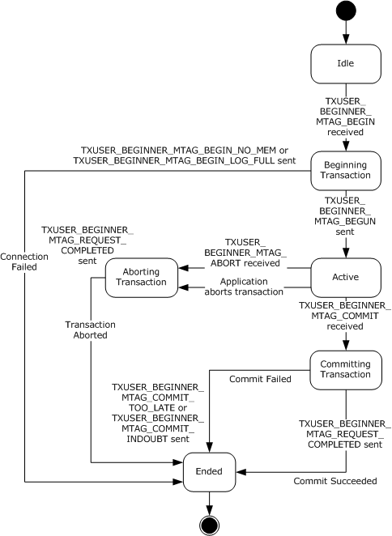

Figure 29: CONNTYPE_TXUSER_BEGINNER Acceptor States

##### 3.4.1.1.1 Idle

The Idle state is the initial state. The following event is processed in this state:

- Receiving a TXUSER_BEGINNER_MTAG_BEGIN Message (section [3.4.5.1.1.1](#Section_3.4.5.1.1.1)).

##### 3.4.1.1.2 Beginning Transaction

The following events are processed in this state:

- Create Transaction Success (section [3.4.7.8](#Section_3.4.7.8))
- Create Transaction Failure (section [3.4.7.7](#Section_3.4.7.7))

##### 3.4.1.1.3 Active

The following events are processed in this state:

- Receiving a TXUSER_BEGINNER_MTAG_COMMIT Message (section [3.4.5.1.1.2](#Section_3.4.5.1.1.2))
- Receiving a TXUSER_BEGINNER_MTAG_ABORT Message (section [3.4.5.1.1.3](#Section_3.4.5.1.1.3))
- Unilaterally Aborted (section [3.4.7.23](#Section_3.4.7.23))

##### 3.4.1.1.4 Aborting Transaction

The following events are processed in this state:

- Rollback Complete (section [3.4.7.18](#Section_3.4.7.18))
- Receiving a TXUSER_BEGINNER_MTAG_COMMIT Message (section [3.4.5.1.1.2](#Section_3.4.5.1.1.2))
- Phase One Complete (section [3.4.7.13](#Section_3.4.7.13))

##### 3.4.1.1.5 Committing Transaction

The following event is processed in this state:

- Phase One Complete (section [3.4.7.13](#Section_3.4.7.13))

##### 3.4.1.1.6 Ended

This is the final state.

#### 3.4.1.2 CONNTYPE_TXUSER_BEGIN2 Acceptor States

The [**transaction manager**](#gt_transaction-manager) communicating with an [**application**](#gt_application) MUST act as an [**acceptor**](#gt_acceptor) for the [CONNTYPE_TXUSER_BEGIN2](#Section_2.2.8.1.2.3) [**connection type**](#gt_connection-type). In this role, the transaction manager communicating with an application MUST provide support for the following states:

- Idle
- Beginning Transaction
- Active
- Modifying Timeout
- Aborting Transaction
- Committing Transaction
- Ended
The following figure shows the relationships between the CONNTYPE_TXUSER_BEGIN2 acceptor states.

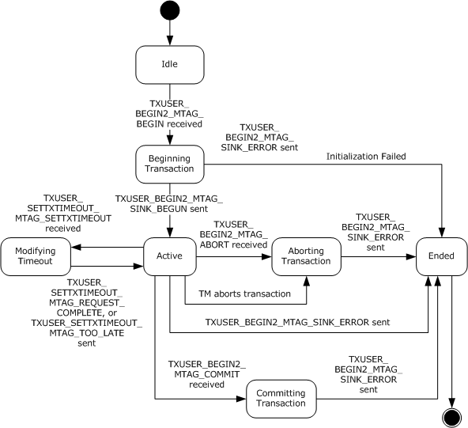

Figure 30: CONNTYPE_TXUSER_BEGIN2 Acceptor States

##### 3.4.1.2.1 Idle

This is the initial state. The following event is processed in this state:

- Receiving a TXUSER_BEGIN2_MTAG_BEGIN Message (section [3.4.5.1.2.1](#Section_3.4.5.1.2.1))

##### 3.4.1.2.2 Beginning Transaction

The following events are processed in this state:

- Create Transaction Success (section [3.4.7.8](#Section_3.4.7.8))
- Create Transaction Failure (section [3.4.7.7](#Section_3.4.7.7))

##### 3.4.1.2.3 Active

The following events are processed in this state:

- Receiving a TXUSER_SETTXTIMEOUT_MTAG_SETTXTIMEOUT Message (section [3.4.5.1.2.2](#Section_3.4.5.1.2.2))
- Receiving a TXUSER_BEGIN2_MTAG_COMMIT Message (section [3.4.5.1.2.3](#Section_3.4.5.1.2.3))
- Receiving a TXUSER_BEGIN2_MTAG_ABORT Message (section [3.4.5.1.2.4](#Section_3.4.5.1.2.4))
- Unilaterally Aborted (section [3.4.7.23](#Section_3.4.7.23))

##### 3.4.1.2.4 Modifying Timeout

The following events are processed in this state:

- Set Transaction Timeout Success (section [3.4.7.22](#Section_3.4.7.22))
- Set Transaction Timeout Failure (section [3.4.7.21](#Section_3.4.7.21))

##### 3.4.1.2.5 Aborting Transaction

The following event is processed in this state:

- Rollback Complete (section [3.4.7.18](#Section_3.4.7.18))

##### 3.4.1.2.6 Committing Transaction

The following event is processed in this state:

- Phase One Complete (section [3.4.7.13](#Section_3.4.7.13))

##### 3.4.1.2.7 Ended

This is the final state.

#### 3.4.1.3 CONNTYPE_TXUSER_PROMOTE Acceptor States

The [**transaction manager**](#gt_transaction-manager) communicating with an [**application**](#gt_application) MUST act as an [**acceptor**](#gt_acceptor) for the [CONNTYPE_TXUSER_PROMOTE](#Section_2.2.8.1.3) [**connection type**](#gt_connection-type). In this role, the transaction manager communicating with an application MUST provide support for the following states:

- Idle
- Beginning Transaction
- Active
- Modifying Timeout
- Aborting Transaction
- Committing Transaction
- Ended
The following figure shows the relationship between the CONNTYPE_TXUSER_PROMOTE acceptor states.

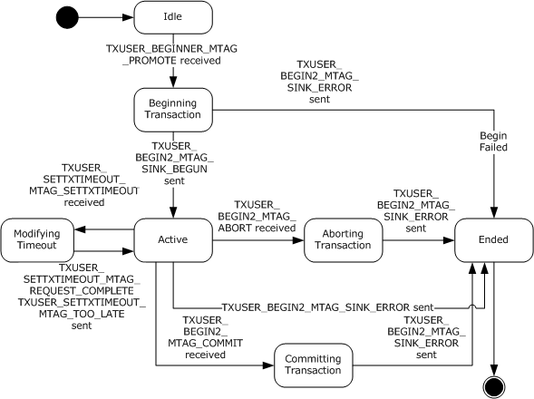

Figure 31: CONNTYPE_TXUSER_PROMOTE Acceptor States

##### 3.4.1.3.1 Idle

This is the initial state. The following event is processed in this state:

- Receiving a TXUSER_BEGINNER_MTAG_PROMOTE Message (section [3.4.5.1.3.1](#Section_3.4.5.1.3.1))

##### 3.4.1.3.2 Beginning Transaction

The following events are processed in this state:

- Create Transaction Success (section [3.4.7.8](#Section_3.4.7.8))
- Create Transaction Failure (section [3.4.7.7](#Section_3.4.7.7))

##### 3.4.1.3.3 Active

The following events are processed in this state:

- Receiving a TXUSER_SETTXTIMEOUT_MTAG_SETTXTIMEOUT, TXUSER_BEGIN2_MTAG_COMMIT, or TXUSER_BEGIN2_MTAG_ABORT Message (section [3.4.5.1.3.2](#Section_3.4.5.1.3.2))
- Receiving a TXUSER_BEGINNER_MTAG_PROMOTE Message (section [3.4.5.1.3.1](#Section_3.4.5.1.3.1))
- Unilaterally Aborted (section [3.4.7.23](#Section_3.4.7.23))

##### 3.4.1.3.4 Modifying Timeout

The following events are processed in this state:

- Set Transaction Timeout Success (section [3.4.7.22](#Section_3.4.7.22))
- Set Transaction Timeout Failure (section [3.4.7.21](#Section_3.4.7.21))

##### 3.4.1.3.5 Aborting Transaction

The following event is processed in this state:

- Rollback Complete (section [3.4.7.18](#Section_3.4.7.18))

##### 3.4.1.3.6 Committing Transaction

The following event is processed in this state:

- Phase One Complete (section [3.4.7.13](#Section_3.4.7.13))

##### 3.4.1.3.7 Ended

This is the final state.

#### 3.4.1.4 CONNTYPE_TXUSER_ASSOCIATE Acceptor States

The [**transaction manager**](#gt_transaction-manager) communicating with an [**application**](#gt_application) MUST act as an [**acceptor**](#gt_acceptor) for the [CONNTYPE_TXUSER_ASSOCIATE](#Section_2.2.8.2.1.1) [**connection type**](#gt_connection-type). In this role, the transaction manager communicating with an application MUST provide support for the following states:

- Idle
- Processing Associate Request
- Active
- Ended
The following figure shows the relationship between the CONNTYPE_TXUSER_ASSOCIATE acceptor states.

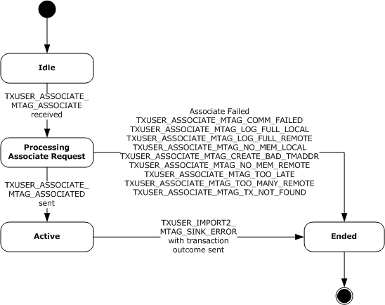

Figure 32: CONNTYPE_TXUSER_ASSOCIATE Acceptor States

##### 3.4.1.4.1 Idle

This is the initial state. The following event is processed in this state:

- Receiving a TXUSER_ASSOCIATE_MTAG_ASSOCIATE Message (section [3.4.5.2.1.1.1](#Section_3.4.5.2.1.1.1))

##### 3.4.1.4.2 Processing Associate Request

The following events are processed in this state:

- Associate Transaction Success (section [3.4.7.2](#Section_3.4.7.2)).
- Associate Transaction Failure (section [3.4.7.1](#Section_3.4.7.1)). This event applies to these messages:
- TXUSER_ASSOCIATE_MTAG_COMM_FAILED (section [2.2.8.2.1.1.3](#Section_2.2.8.2.1.1.3))
- TXUSER_ASSOCIATE_MTAG_LOG_FULL_LOCAL (section [2.2.8.2.1.1.5](#Section_2.2.8.2.1.1.5))
- TXUSER_ASSOCIATE_MTAG_LOG_FULL_REMOTE (section [2.2.8.2.1.1.6](#Section_2.2.8.2.1.1.6))
- TXUSER_ASSOCIATE_MTAG_NO_MEM_REMOTE (section [2.2.8.2.1.1.8](#Section_2.2.8.2.1.1.8))
- TXUSER_ASSOCIATE_MTAG_TOO_LATE (section [2.2.8.2.1.1.9](#Section_2.2.8.2.1.1.9))
- TXUSER_ASSOCIATE_MTAG_TOO_MANY_REMOTE (section [2.2.8.2.1.1.11](#Section_2.2.8.2.1.1.11))
- TXUSER_ASSOCIATE_MTAG_TX_NOT_FOUND (section [2.2.8.2.1.1.12](#Section_2.2.8.2.1.1.12))

##### 3.4.1.4.3 Active

The following events are processed in this state:

- Begin Voting (section [3.4.7.6](#Section_3.2.7.7)).
- Begin Commit (section [3.4.7.3](#Section_3.4.7.3))
- Begin Rollback (section [3.4.7.5](#Section_3.2.7.6))
- Begin In Doubt (section [3.4.7.4](#Section_3.6.7.2))

##### 3.4.1.4.4 Ended

This is the final state.

#### 3.4.1.5 CONNTYPE_TXUSER_EXTENDEDWHEREABOUTS Acceptor States

The [**transaction manager**](#gt_transaction-manager) communicating with an [**application**](#gt_application) MUST act as an [**acceptor**](#gt_acceptor) for the [CONNTYPE_TXUSER_EXTENDEDWHEREABOUTS](#Section_2.2.8.2.2.1) [**connection type**](#gt_connection-type). In this role, the transaction manager communicating with an application MUST provide support for the following states:

- Idle
- Processing Inquiry
- Ended
The following figure shows the relationship between the CONNTYPE_TXUSER_EXTENDEDWHEREABOUTS acceptor states.

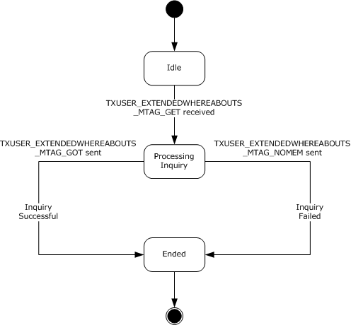

Figure 33: CONNTYPE_TXUSER_EXTENDEDWHEREABOUTS Acceptor States

##### 3.4.1.5.1 Idle

This is the initial state. The following event is processed in this state:

- Receiving a TXUSER_EXTENDEDWHEREABOUTS_MTAG_GET Message (section [3.4.5.2.2.1.1](#Section_3.4.5.2.2.1.1))

##### 3.4.1.5.2 Processing Inquiry

This is a transient state that is assumed during the synchronous processing of a request. No events are processed in this state.

##### 3.4.1.5.3 Ended

This is the final state.

#### 3.4.1.6 CONNTYPE_TXUSER_IMPORT Acceptor States

The [**transaction manager**](#gt_transaction-manager) communicating with an [**application**](#gt_application) MUST act as an [**acceptor**](#gt_acceptor) for the [CONNTYPE_TXUSER_IMPORT](#Section_2.2.8.2.2.4) [**connection type**](#gt_connection-type). In this role, the transaction manager communicating with an application MUST provide support for the following states:

- Idle
- Processing Import Request
- Active
- Too Late to Abort
- Processing Abort Request
- Ended
The following figure shows the relationship between the CONNTYPE_TXUSER_IMPORT acceptor states.

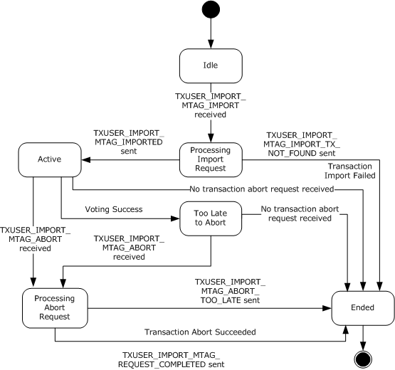

Figure 34: CONNTYPE_TXUSER_IMPORT Acceptor States

##### 3.4.1.6.1 Idle

This is the initial state. The following event is processed in this state:

- Receiving a TXUSER_IMPORT_MTAG_IMPORT Message (section [3.4.5.2.2.4.1](#Section_3.4.5.2.2.4.1))

##### 3.4.1.6.2 Processing Import Request

The following events are processed in this state:

- Create Voter Enlistment Success (section [3.4.7.10](#Section_3.4.7.10))
- Create Voter Enlistment Failure (section [3.4.7.9](#Section_3.6.7.12))

##### 3.4.1.6.3 Active

The following events are processed in this state:

- Receiving a TXUSER_IMPORT_MTAG_ABORT Message (section [3.4.5.2.2.4.2](#Section_3.4.5.2.2.4.2))
- Begin Voting (section [3.4.7.6](#Section_3.2.7.7))
- Begin Commit (section [3.4.7.3](#Section_3.4.7.3))
- Begin Rollback (section [3.4.7.5](#Section_3.2.7.6))
- Begin In Doubt (section [3.4.7.4](#Section_3.6.7.2))

##### 3.4.1.6.4 Too Late to Abort

The following events are processed in this state:

- Receiving a TXUSER_IMPORT_MTAG_ABORT Message (section [3.4.5.2.2.4.2](#Section_3.4.5.2.2.4.2))
- Begin Rollback (section [3.4.7.5](#Section_3.2.7.6))
- Begin Commit (section [3.4.7.3](#Section_3.4.7.3))
- Begin In Doubt (section [3.4.7.4](#Section_3.6.7.2))

##### 3.4.1.6.5 Processing Abort Request

This is a transient state that is assumed during the synchronous processing of a request to abort a transaction. No events are processed in this state.

##### 3.4.1.6.6 Ended

This is the final state.

#### 3.4.1.7 CONNTYPE_TXUSER_IMPORT2 Acceptor States

The [**transaction manager**](#gt_transaction-manager) communicating with an [**application**](#gt_application) MUST act as an [**acceptor**](#gt_acceptor) for the [CONNTYPE_TXUSER_IMPORT2](#Section_2.2.8.2.2.5) [**connection type**](#gt_connection-type). In this role, the transaction manager communicating with an application MUST provide support for the following states:

- Idle
- Processing Import Request
- Active
- Too Late to Abort
- Processing Abort Request
- Ended
The following figure shows the relationship between the CONNTYPE_TXUSER_IMPORT2 acceptor states.

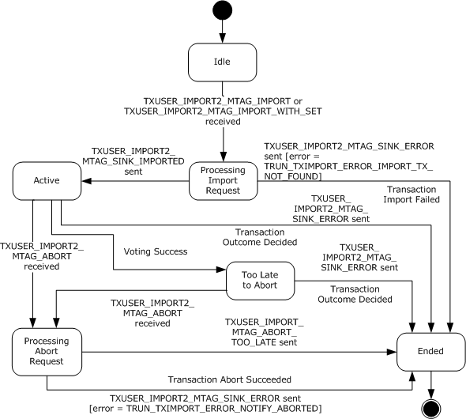

Figure 35: CONNTYPE_TXUSER_IMPORT2 Acceptor States

##### 3.4.1.7.1 Idle

This is the initial state. The following events are processed in this state:

- Receiving a TXUSER_IMPORT2_MTAG_IMPORT Message (section [3.4.5.2.2.5.1](#Section_3.4.5.2.2.5.1))
- Receiving a TXUSER_IMPORT2_MTAG_IMPORT_WITH_SET Message (section [3.4.5.2.2.5.2](#Section_3.4.5.2.2.5.2))

##### 3.4.1.7.2 Processing Import Request

The following events are processed in this state:

- Set Transaction Attributes Success (section [3.4.7.20](#Section_3.4.7.20))
- Set Transaction Attributes Failure (section [3.4.7.19](#Section_3.4.7.19))
- Create Voter Enlistment Success (section [3.4.7.10](#Section_3.4.7.10))
- Create Voter Enlistment Failure (section [3.4.7.9](#Section_3.6.7.12))

##### 3.4.1.7.3 Active

The following events are processed in this state:

- Receiving a TXUSER_IMPORT2_MTAG_ABORT message (section [3.4.5.2.2.5.3](#Section_3.4.5.2.2.5.3))
- Begin Voting (section [3.4.7.6](#Section_3.2.7.7))
- Begin Commit (section [3.4.7.3](#Section_3.4.7.3))
- Begin Rollback (section [3.4.7.5](#Section_3.2.7.6))
- Begin In Doubt (section [3.4.7.4](#Section_3.6.7.2))

##### 3.4.1.7.4 Too Late to Abort

The following events are processed in this state:

- Receiving a TXUSER_IMPORT2_MTAG_ABORT message (section [3.4.5.2.2.5.3](#Section_3.4.5.2.2.5.3))
- Begin Commit (section [3.4.7.3](#Section_3.4.7.3))
- Begin Rollback (section [3.4.7.5](#Section_3.2.7.6))
- Begin In Doubt (section [3.4.7.4](#Section_3.6.7.2))

##### 3.4.1.7.5 Processing Abort Request

This is a transient state that is assumed during the synchronous processing of a request to abort a transaction. No events are processed in this state.

##### 3.4.1.7.6 Ended

This is the final state.

#### 3.4.1.8 CONNTYPE_TXUSER_EXPORT Acceptor States

The [**transaction manager**](#gt_transaction-manager) communicating with an [**application**](#gt_application) MUST act as an [**acceptor**](#gt_acceptor) for the [CONNTYPE_TXUSER_EXPORT](#Section_2.2.8.2.2.2) [**connection type**](#gt_connection-type). In this role, the transaction manager communicating with an application MUST provide support for the following states:

- Idle
- Processing Connection Request
- Connection Active
- Processing Push Operation Request
- Ended
The following figure shows the relationship between the CONNTYPE_TXUSER_EXPORT acceptor states.

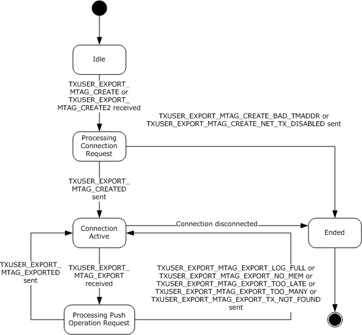

Figure 36: CONNTYPE_TXUSER_EXPORT Acceptor States

##### 3.4.1.8.1 Idle

This is the initial state. The following events are processed in this state:

- Receiving a TXUSER_EXPORT_MTAG_CREATE Message (section [3.4.5.2.2.2.1](#Section_3.4.5.2.2.2.1))
- Receiving a TXUSER_EXPORT_MTAG_CREATE2 Message (section [3.4.5.2.2.2.2](#Section_3.4.5.2.2.2.2))

##### 3.4.1.8.2 Processing Connection Request

This is a transient state that is assumed during the synchronous processing of a create export request. No events are processed in this state.

##### 3.4.1.8.3 Connection Active

The following events are processed in this state:

- Receiving a TXUSER_EXPORT_MTAG_EXPORT Message (section [3.4.5.2.2.2.3](#Section_3.4.5.2.2.2.3))
- Connection Disconnected (section [3.4.5.2.2.2.4](#Section_3.4.5.2.2.2.4))

##### 3.4.1.8.4 Processing Push Operation Request

The following events are processed in this state:

- Export Transaction Success (section [3.4.7.12](#Section_3.4.7.12))
- Export Transaction Failure (section [3.4.7.11](#Section_3.4.7.11))

##### 3.4.1.8.5 Ended

This is the final state.

#### 3.4.1.9 CONNTYPE_TXUSER_EXPORT2 Acceptor States

The [**transaction manager**](#gt_transaction-manager) communicating with an [**application**](#gt_application) MUST act as an [**acceptor**](#gt_acceptor) for the [CONNTYPE_TXUSER_EXPORT2](#Section_2.2.8.2.2.3) [**connection type**](#gt_connection-type). In this role, the transaction manager communicating with an application MUST provide support for the following states:

- Idle
- Processing Connection Request
- Connection Active
- Processing Push Operation Request
- Ended
The following figure shows the relationships between the CONNTYPE_TXUSER_EXPORT2 acceptor states.

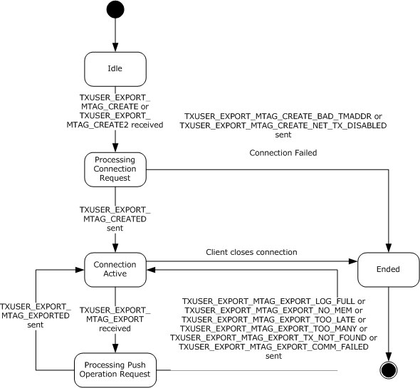

Figure 37: CONNTYPE_TXUSER_EXPORT2 Acceptor States

##### 3.4.1.9.1 Idle

This is the initial state. The following events are processed in this state:

- Receiving a TXUSER_EXPORT_MTAG_CREATE Message (section [3.4.5.2.2.3.1](#Section_3.4.5.2.2.3.1))
- Receiving a TXUSER_EXPORT_MTAG_CREATE2 Message (section [3.4.5.2.2.3.2](#Section_3.4.5.2.2.3.2))

##### 3.4.1.9.2 Processing Connection Request

This is a transient state that is assumed during the synchronous processing of a create export request. No events are processed in this state.

##### 3.4.1.9.3 Connection Active

The following events are processed in this state:

- Receiving a TXUSER_EXPORT_MTAG_EXPORT Message (section [3.4.5.2.2.3.3](#Section_3.4.5.2.2.3.3))
- Connection Disconnected (section [3.4.5.2.2.3.4](#Section_3.4.5.2.2.3.4))

##### 3.4.1.9.4 Processing Push Operation Request

The following events are processed in this state:

- Export Transaction Success (section [3.4.7.12](#Section_3.4.7.12))
- Export Transaction Failure (section [3.4.7.11](#Section_3.4.7.11))

##### 3.4.1.9.5 Ended

This is the final state.

#### 3.4.1.10 CONNTYPE_TXUSER_GETTXDETAILS Acceptor States

The [**transaction manager**](#gt_transaction-manager) communicating with an [**application**](#gt_application) MUST act as an [**acceptor**](#gt_acceptor) for the [CONNTYPE_TXUSER_GETTXDETAILS](#Section_2.2.8.3.1.2) [**connection type**](#gt_connection-type). In this role, the transaction manager communicating with an application MUST provide support for the following states:

- Idle
- Processing Inquiry
- Ended
The following figure shows the relationship between the CONNTYPE_TXUSER_GETTXDETAILS acceptor states.

Figure 38: CONNTYPE_TXUSER_GETTXDETAILS Acceptor States

##### 3.4.1.10.1 Idle

This is the initial state. The following event is processed in this state:

- Receiving a TXUSER_GETTXDETAILS_MTAG_GET Message (section [3.4.5.3.1.1](#Section_3.4.5.3.1.1))

##### 3.4.1.10.2 Processing Inquiry

This is a transient state that is assumed during the synchronous processing of a request for the transaction details. No events are processed in this state.

##### 3.4.1.10.3 Ended

This is the final state.

#### 3.4.1.11 CONNTYPE_TXUSER_RESOLVE Acceptor States

The [**transaction manager**](#gt_transaction-manager) communicating with an [**application**](#gt_application) MUST act as an [**acceptor**](#gt_acceptor) for the [CONNTYPE_TXUSER_RESOLVE](#Section_2.2.8.3.2.7) [**connection type**](#gt_connection-type). In this role, the transaction manager communicating with an application MUST provide support for the following states:

- Idle
- Processing Abort Request
- Processing Forget Request
- Processing Commit Request
- Ended
The following figure shows the relationship between the CONNTYPE_TXUSER_RESOLVE acceptor states.

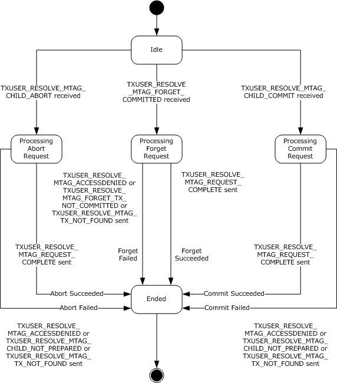

Figure 39: CONNTYPE_TXUSER_RESOLVE Acceptor States

##### 3.4.1.11.1 Idle

This is the initial state. The following events are processed in this state:

- Receiving a TXUSER_RESOLVE_MTAG_CHILD_ABORT Message (section [3.4.5.3.2.1](#Section_3.4.5.3.2.1))
- Receiving a TXUSER_RESOLVE_MTAG_CHILD_COMMIT Message (section [3.4.5.3.2.2](#Section_3.4.5.3.2.2))
- Receiving a TXUSER_RESOLVE_MTAG_FORGET COMMITTED Message (section [3.4.5.3.2.3](#Section_3.4.5.3.2.3))

##### 3.4.1.11.2 Processing Abort Request

The following events are processed in this state:

- Resolve Transaction Complete (section [3.4.7.16](#Section_3.4.7.16))
- Resolve Transaction Access Denied (section [3.4.7.17](#Section_3.4.7.17))

##### 3.4.1.11.3 Processing Forget Request

The following events are processed in this state:

- Resolve Transaction Complete (section [3.4.7.16](#Section_3.4.7.16))
- Resolve Transaction Access Denied (section [3.4.7.17](#Section_3.4.7.17))

##### 3.4.1.11.4 Processing Commit Request

The following events are processed in this state:

- Resolve Transaction Complete (section [3.4.7.16](#Section_3.4.7.16))
- Resolve Transaction Access Denied (section [3.4.7.17](#Section_3.4.7.17))

##### 3.4.1.11.5 Ended

This is the final state.

#### 3.4.1.12 CONNTYPE_TXUSER_SETTXTIMEOUT Acceptor States

The [**transaction manager**](#gt_transaction-manager) communicating with an [**application**](#gt_application) MUST act as an [**acceptor**](#gt_acceptor) for the [CONNTYPE_TXUSER_SETTXTIMEOUT](#Section_2.2.8.3.3) [**connection type**](#gt_connection-type). In this role, the transaction manager communicating with an application MUST provide support for the following states:

- Idle
- Processing Request
- Ended
The following figure shows the relationship between the CONNTYPE_TXUSER_SETTXTIMEOUT acceptor states.

Figure 40: CONNTYPE_TXUSER_SETTXTTIMEOUT Acceptor States

##### 3.4.1.12.1 Idle

This is the initial state. The following event is processed in this state:

- Receiving a TXUSER_SETTXTIMEOUT_MTAG_SETTXTIMEOUT Message (section [3.4.5.3.3.1](#Section_3.4.5.3.3.1))

##### 3.4.1.12.2 Processing Request

The following events are processed in this state:

- Set Transaction Timeout Success (section [3.4.7.22](#Section_3.4.7.22))
- Set Transaction Timeout Failure (section [3.4.7.21](#Section_3.4.7.21))

##### 3.4.1.12.3 Ended

This is the final state.

#### 3.4.1.13 CONNTYPE_TXUSER_SETTXTIMEOUT2 Acceptor States

The [**transaction manager**](#gt_transaction-manager) communicating with an [**application**](#gt_application) MUST act as an [**acceptor**](#gt_acceptor) for the [CONNTYPE_TXUSER_SETTXTIMEOUT2](#Section_2.2.8.3.4) [**connection type**](#gt_connection-type). In this role, the transaction manager communicating with an application MUST provide support for the following states:

- Idle
- Processing Request
- Ended
The following figure shows the relationship between the CONNTYPE_TXUSER_SETTXTIMEOUT2 acceptor states.

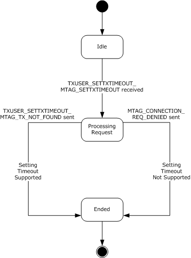

Figure 41: CONNTYPE_TXUSER_SETTXTTIMEOUT2 Acceptor States

##### 3.4.1.13.1 Idle

This is the initial state. The following events are processed in this state:

- Receiving a TXUSER_SETTXTIMEOUT_MTAG_SETTXTIMEOUT Message (section [3.4.5.3.4.1](#Section_3.4.5.3.4.1)).

##### 3.4.1.13.2 Processing Request

This is a transient state that is assumed during the synchronous processing of a request to set a transaction time-out. No events are processed in this state.

##### 3.4.1.13.3 Ended

This is the final state.

#### 3.4.1.14 CONNTYPE_TXUSER_TRACE Acceptor States

The [**transaction manager**](#gt_transaction-manager) communicating with an [**application**](#gt_application) MUST act as an [**acceptor**](#gt_acceptor) for the [CONNTYPE_TXUSER_TRACE](#Section_2.2.8.3.5.2) [**connection type**](#gt_connection-type). In this role, the transaction manager communicating with an application MUST provide support for the following states:

- Idle
- Processing Trace Request
- Ended
The following figure shows the relationship between the CONNTYPE_TXUSER_TRACE acceptor states.

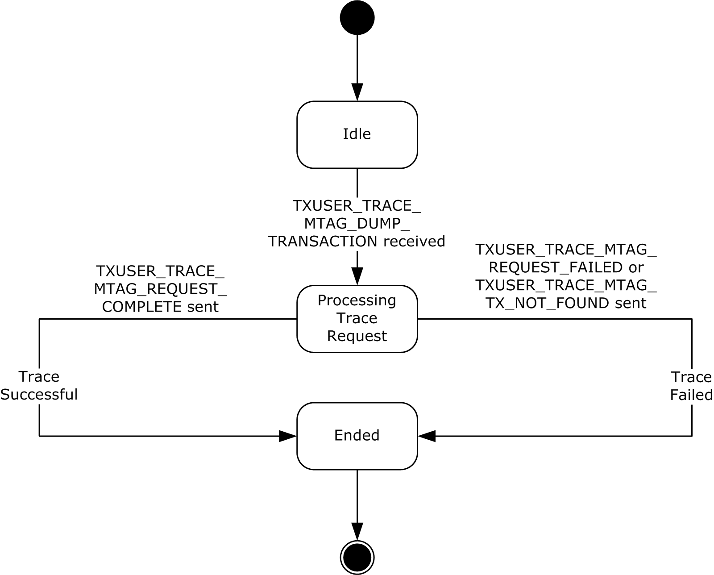

Figure 42: CONNTYPE_TXUSER_TRACE Acceptor States

##### 3.4.1.14.1 Idle

This is the initial state. The following event is processed in this state:

- Receiving a TXUSER_TRACE_MTAG_DUMP_TRANSACTION Message (section [3.4.5.3.5.1](#Section_3.4.5.3.5.1))

##### 3.4.1.14.2 Processing Trace Request

This is a transient state that is assumed during the synchronous processing of a request to set a transaction time-out. No events are processed in this state.

##### 3.4.1.14.3 Ended

This is the final state.

#### 3.4.1.15 CONNTYPE_TXUSER_GETSECURITYFLAGS Acceptor States

The [**transaction manager**](#gt_transaction-manager) communicating with an [**application**](#gt_application) MUST act as an [**acceptor**](#gt_acceptor) for the [CONNTYPE_TXUSER_GETSECURITYFLAGS](#Section_2.2.8.4.1.1) [**connection type**](#gt_connection-type). In this role, the transaction manager communicating with an application MUST provide support for the following states:

- Idle
- Processing Request
- Ended
The following figure shows the relationship between the CONNTYPE_TXUSER_GETSECURITYFLAGS acceptor states.

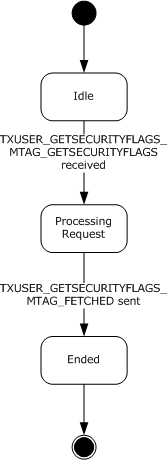

Figure 43: CONNTYPE_TXUSER_GETSECURITYFLAGS Acceptor States

##### 3.4.1.15.1 Idle

This is the initial state. The following event is processed in this state:

- Receiving a TXUSER_GETSECURITYFLAGS_MTAG_GETSECURITYFLAGS Message (section [3.4.5.4.1.1](#Section_3.4.5.4.1.1))

##### 3.4.1.15.2 Processing Request

This is a transient state that is assumed during the synchronous processing of a request to get the security flags. No events are processed in this state.

##### 3.4.1.15.3 Ended

This is the final state.

### 3.4.2 Timers

No timers apply here.

### 3.4.3 Initialization

When the [**transaction manager**](#gt_transaction-manager) communicating with an [**application**](#gt_application) [**facet**](#gt_facet) is initialized:

- The transaction manager communicating with an application facet MUST examine the following security flags on the [Core Transaction Manager Facet](#Section_1.3.3.3.1) and perform the following actions:
- If the Allow Network Access flag is set to false:
- For all [**Connection**](#gt_connection) types listed in [3.4.1](../MS-CMP/MS-CMP.md), the transaction manager communicating with an application facet MUST refuse to accept incoming Connections from remote machines as specified in [MS-CMP](../MS-CMP/MS-CMP.md) section 3.1.5.5 with the rejection **Reason** set to 0x80070005.
- Otherwise:
- If the Allow Remote Clients flag is set to false:
- For the following Connection types, the transaction manager communicating with an application facet MUST refuse to accept incoming Connection from remote machines as specified in [MS-CMP] section 3.1.5.5 with the rejection **Reason** set to 0x80070005.
- [CONNTYPE_TXUSER_ASSOCIATE](#Section_2.2.8.2.1.1)
- [CONNTYPE_TXUSER_BEGINNER](#Section_2.2.8.1.1)
- [CONNTYPE_TXUSER_BEGIN2](#Section_2.2.8.1.2.3)
- [CONNTYPE_TXUSER_EXPORT](#Section_2.2.8.2.2.2)
- [CONNTYPE_TXUSER_EXPORT2](#Section_2.2.8.2.2.3)
- [CONNTYPE_TXUSER_IMPORT](#Section_2.2.8.2.2.4)
- [CONNTYPE_TXUSER_IMPORT2](#Section_2.2.8.2.2.5)
- [CONNTYPE_TXUSER_PROMOTE](#Section_2.2.8.1.3)
- If Allow Remote Administration flag is set to false:
- For the following connection types, the transaction manager communicating with an application facet MUST refuse to accept incoming Connections from remote machines as specified in [MS-CMP] section 3.1.5.5 with the rejection **Reason** set to 0x80070005.
- [CONNTYPE_TXUSER_GETTXDETAILS](#Section_2.2.8.3.1.2)
- [CONNTYPE_TXUSER_RESOLVE](#Section_2.2.8.3.2.7)
- [CONNTYPE_TXUSER_TRACE](#Section_2.2.8.3.5.2)
All data elements maintained by the transaction manager communicating with an application facet are initialized to an empty value unless stated otherwise in this section or in the initialization sections of the facets the transaction manager communicating with an application facet extends, as specified in section 3.4.1.

### 3.4.4 Higher-Layer Triggered Events

No higher-layer triggered events apply here.

### 3.4.5 Processing Events and Sequencing Rules

#### 3.4.5.1 Transaction Initiation and Completion

##### 3.4.5.1.1 CONNTYPE_TXUSER_BEGINNER as Acceptor

For all messages that are received in this [**connection type**](#gt_connection-type), the [**transaction manager**](#gt_transaction-manager) communicating with an [**application**](#gt_application) [**facet**](#gt_facet) MUST process the message as specified in section [3.1](#Section_1.3). The transaction manager communicating with an application facet MUST also follow the processing rules that are specified in the following sections.

###### 3.4.5.1.1.1 Receiving a TXUSER_BEGINNER_MTAG_BEGIN Message

When the [**transaction manager**](#gt_transaction-manager) communicating with an application facet receives a TXUSER_BEGINNER_MTAG_BEGIN (section [2.2.8.1.1.2](#Section_2.2.8.1.1.2)) message, the transaction manager communicating with an application facet MUST perform the following actions:

- If the [**connection**](#gt_connection) state is Idle:
- Set the connection state to Beginning Transaction.
- If the transaction manager does not have sufficient memory available to process the message:
- Send a TXUSER_BEGINNER_MTAG_BEGIN_NO_MEM (section [2.2.8.1.1.4](#Section_2.2.8.1.1.4)) message using the connection.
- Set the connection state to Ended.
- Otherwise:
- Create a [**transaction**](#gt_transaction) object using the transaction settings provided in the message:
- Use the **isoLevel** field as the Isolation Level value of the transaction.
- Use the **dwTimeout** field as the Timeout value of the transaction.
- Use the **szDesc** field as the Description value of the transaction.
- Use the **isoFlags** field as the Isolation Flags value of the transaction.
- Create a new GUID as specified in [[RFC4122]](https://go.microsoft.com/fwlink/?LinkId=90460) and assign it to the **Transaction Object.Identifier** field of the transaction object.
- Add the connection to the connection list of the transaction.
- Set the **Transaction** field of the connection to the transaction object.
- Create a new [**Enlistment**](#gt_enlistment) object with the following values:
- The transaction manager communicating with an application facet
- The transaction object
- The connection
- Set the Enlistment field of the connection to the new Enlistment object.
- Signal the Create Transaction (section [3.2.7.13](#Section_3.2.7.13)) event on the Core Transaction Manager Facet (section [1.3.3.3.1](#Section_1.3.3.3.1)) with the Enlistment object.
- Otherwise, the message MUST be processed as an invalid message, as specified in section [3.1.6](#Section_3.1.6).

###### 3.4.5.1.1.2 Receiving a TXUSER_BEGINNER_MTAG_COMMIT Message

When the [**transaction manager**](#gt_transaction-manager) communicating with an application facet receives a [TXUSER_BEGINNER_MTAG_COMMIT](#Section_2.2.8.1.1.6) message, the transaction manager communicating with an application facet MUST perform the following actions:

- If the connection state is Active:
- Set the connection state to Committing Transaction.
- Obtain the transaction object referenced by the Enlistment object referenced by this connection.
- Set the **GRFRM** field of the transaction object to the **grfRM** field of the message.
- Signal the Begin Phase Zero (section [3.2.7.5](#Section_3.7.7.3)) event on the [Core Transaction Manager Facet](#Section_1.3.3.3.1) with the transaction object.
- If the connection state is Aborting Transaction:
- Send a [TXUSER_BEGINNER_MTAG_COMMIT_TOO_LATE](#Section_2.2.8.1.1.8) message using the connection.
- Set the connection state to Ended.
- Otherwise, the message MUST be processed as an invalid message as specified in section [3.1.6](#Section_3.1.6).

###### 3.4.5.1.1.3 Receiving a TXUSER_BEGINNER_MTAG_ABORT Message

When the [**transaction manager**](#gt_transaction-manager) communicating with an application facet receives a [TXUSER_BEGINNER_MTAG_ABORT](#Section_2.2.8.1.1.1) message, the transaction manager communicating with an application facet MUST perform the following actions:

- If the connection state is Active:
- Set the connection state to Aborting Transaction.
- Signal the Begin Rollback (section [3.2.7.6](#Section_3.2.7.6)) event on the [Core Transaction Manager Facet](#Section_1.3.3.3.1) with the transaction object referenced by the Enlistment object referenced by this connection.
- If the connection state is Aborting Transaction:
- Send a [TXUSER_BEGINNER_MTAG_REQUEST_COMPLETED](#Section_2.2.8.1.1.9) message using the connection.
- Set the connection state to Ended.
- Otherwise, the message MUST be processed as an invalid message as specified in section [3.1.6](#Section_3.1.6).

###### 3.4.5.1.1.4 Connection Disconnected

When a CONNTYPE_TXUSER_BEGINNER (section [2.2.8.1.1](#Section_2.2.8.1.1)) connection is disconnected, the transaction manager communicating with an application facet MUST perform the following actions:

- If the connection state is Active (section [3.4.1.1.3](#Section_3.4.1.1.3)):
- Signal the Begin Rollback (section [3.2.7.6](#Section_3.2.7.6)) event on the Core Transaction Manager Facet (section [1.3.3.3.1](#Section_1.3.3.3.1)) with the transaction object referenced by the Enlistment object referenced by this connection.
- Otherwise, the event MUST be processed as specified in section [3.1.8.3](#Section_3.6.5.2.2.5).

##### 3.4.5.1.2 CONNTYPE_TXUSER_BEGIN2 as Acceptor

For all messages received in this [**connection type**](#gt_connection-type), the [**transaction manager**](#gt_transaction-manager) communicating with an [**application**](#gt_application) [**facet**](#gt_facet) MUST process the message as specified in section [3.1](#Section_1.3). The transaction manager communicating with an application facet MUST also follow the processing rules specified in the following sections.

###### 3.4.5.1.2.1 Receiving a TXUSER_BEGIN2_MTAG_BEGIN Message

When the [**transaction manager**](#gt_transaction-manager) communicating with an application facet receives a TXUSER_BEGIN2_MTAG_BEGIN (section [2.2.8.1.2.2](#Section_2.2.8.1.2.2)) message, the transaction manager communicating with an application facet MUST perform the following actions:

- If the [**connection**](#gt_connection) state is Idle:
- Set the connection state to Beginning Transaction.
- If the transaction manager does not have sufficient memory available to process the message, it MUST:
- Send a TXUSER_BEGIN2_MTAG_SINK_ERROR (section [2.2.8.1.2.5](#Section_2.2.8.1.2.5)) message using the connection:
- The **Error** field MUST be set to TRUN_TXBEGIN_ERROR_NO_MEM.
- Set the connection state to Ended.
- Otherwise:
- Create a [**transaction**](#gt_transaction) object using the transaction settings provided in the message:
- Use the **isoLevel** field as the Isolation Level value of the transaction.
- Use the **dwTimeout** field as the Timeout value of the transaction.
- Use the **szDesc** field as the Description value of the transaction.
- Use the **isoFlags** field as the Isolation Flags value of the transaction.
- Create a new GUID as specified in [[RFC4122]](https://go.microsoft.com/fwlink/?LinkId=90460) and assign it to the **Transaction Object.Identifier** field of the transaction object.
- Add the connection to the connection list of the transaction.
- Create a new enlistment object with the following values:
- The transaction manager communicating with an application facet.
- The transaction object.
- The connection.
- Set the **Enlistment** field of the connection to the new enlistment object.
- Signal the Create Transaction (section [3.2.7.13](#Section_3.2.7.13)) event on the [Core Transaction Manager Facet](#Section_1.3.3.3.1) with the enlistment object.
- Otherwise, the message MUST be processed as an invalid message as specified in section [3.1.6](#Section_3.1.6).

###### 3.4.5.1.2.2 Receiving a TXUSER_SETTXTIMEOUT_MTAG_SETTXTIMEOUT Message

When the [**transaction manager**](#gt_transaction-manager) communicating with an application facet receives a [TXUSER_SETTXTIMEOUT_MTAG_SETTXTIMEOUT](#Section_2.2.8.1.2.7) message, the transaction manager communicating with an application facet MUST perform the following actions:

- If the connection state is Active:
- Set the connection state to Modifying Timeout.
- Signal the Set Transaction Timeout event on the [Core Transaction Manager Facet](#Section_1.3.3.3.1) with the following arguments:
- The transaction object referenced by the Enlistment object referenced by this connection
- The **dwTxTimeout** field from the message
- Otherwise, the message MUST be processed as an invalid message as specified in section [3.1.6](#Section_3.1.6).

###### 3.4.5.1.2.3 Receiving a TXUSER_BEGIN2_MTAG_COMMIT Message

When the [**transaction manager**](#gt_transaction-manager) communicating with an application facet receives a [TXUSER_BEGIN2_MTAG_COMMIT](#Section_2.2.8.1.2.3) message, the transaction manager communicating with an application facet MUST perform the following actions:

- If the connection state is Active:
- Set the connection state to Committing Transaction.
- Obtain the transaction object referenced by the Enlistment object referenced by this connection.
- Set the **GRFRM** field of the transaction object to the **grfRM** field of the message.
- Signal the Begin Phase Zero (section [3.2.7.5](#Section_3.7.7.3)) event on the [Core Transaction Manager Facet](#Section_1.3.3.3.1) with the transaction object.
- Otherwise, the message MUST be processed as an invalid message as specified in section [3.1.6](#Section_3.1.6).

###### 3.4.5.1.2.4 Receiving a TXUSER_BEGIN2_MTAG_ABORT Message

When the [**transaction manager**](#gt_transaction-manager) communicating with an application facet receives a TXUSER_BEGIN2_MTAG_ABORT (section [2.2.8.1.2.1](#Section_2.2.8.1.2.1)) message, the transaction manager communicating with an application facet MUST perform the following actions:

- If the connection state is Active:
- Set the connection state to Aborting Transaction.
- Signal the Begin Rollback (section [3.2.7.6](#Section_3.2.7.6)) event on the [Core Transaction Manager Facet](#Section_1.3.3.3.1) with the transaction object referenced by the Enlistment object referenced by this connection.
- Otherwise, the message MUST be processed as an invalid message as specified in section [3.1.6](#Section_3.1.6).

###### 3.4.5.1.2.5 Connection Disconnected

When a CONNTYPE_TXUSER_BEGIN2 (section [2.2.8.1.2](#Section_2.2.8.1.2.3)) connection is disconnected, the [**transaction manager**](#gt_transaction-manager) communicating with an application facet MUST perform the following actions:

- If the connection state is Active (section [3.4.1.2.3](#Section_3.4.1.2.3)):
- Signal the Begin Rollback (section [3.2.7.6](#Section_3.2.7.6)) event on the Core Transaction Manager Facet (section [1.3.3.3.1](#Section_1.3.3.3.1)) with the transaction object referenced by the Enlistment object referenced by this connection.
- Otherwise, the event MUST be processed as specified in section [3.1.8.3](#Section_3.6.5.2.2.5).

##### 3.4.5.1.3 CONNTYPE_TXUSER_PROMOTE as Acceptor

For all messages received in this [**connection type**](#gt_connection-type), the [**transaction manager**](#gt_transaction-manager) communicating with an [**application**](#gt_application) [**facet**](#gt_facet) MUST process the message as specified in section [3.1](#Section_1.3). The transaction manager communicating with an application facet MUST also follow the processing rules specified in the following sections.

###### 3.4.5.1.3.1 Receiving a TXUSER_BEGINNER_MTAG_PROMOTE Message

When the [**transaction manager**](#gt_transaction-manager) communicating with an application facet receives a [TXUSER_BEGINNER_MTAG_PROMOTE](#Section_2.2.8.1.3.1) message, the transaction manager communicating with an application facet MUST perform the following actions:

- If the [**connection**](#gt_connection) state is Idle:
- Set the connection state to Beginning Transaction.
- If the transaction manager does not have sufficient memory available to process the message:
- Send a [TXUSER_BEGIN2_MTAG_SINK_ERROR](#Section_2.2.8.1.2.5) message using the connection:
- The Error field MUST be set to TRUN_TXBEGIN_ERROR_NO_MEM.
- Set the connection state to Ended.
- Otherwise:
- Create a [**transaction**](#gt_transaction) object using the transaction settings provided in the message:
- Use the **isoLevel** field as the Isolation Level value of the transaction.
- Use the **dwTimeout** field as the Timeout value of the transaction.
- Use the **szDesc** field as the Description value of the transaction.
- Use the **isoFlags** field as the Isolation Flags value of the transaction.
- Use the **guidTX** field as the **Transaction Object.Identifier** value of the transaction.
- Add the connection to the connection list of the transaction.
- Create a new [**Enlistment**](#gt_enlistment) object with the following values:
- The transaction manager communicating with an application facet.
- The transaction object.
- The connection.
- Set the **Enlistment** field of the connection to the new Enlistment object.
- Signal the Create Transaction (section [3.2.7.13](#Section_3.2.7.13)) event on the [Core Transaction Manager Facet](#Section_1.3.3.3.1) with the enlistment object.
- Otherwise, the message MUST be processed as an invalid message as specified in section [3.1.6](#Section_3.1.6).

###### 3.4.5.1.3.2 Receiving a TXUSER_SETTXTIMEOUT_MTAG_SETTXTIMEOUT, TXUSER_BEGIN2_MTAG_COMMIT, or TXUSER_BEGIN2_MTAG_ABORT Message

When the [**transaction manager**](#gt_transaction-manager) communicating with an application facet receives one of these messages, it MUST follow the same message-processing rules as the CONNTYPE_TXUSER_BEGIN2 connection type acting as an acceptor, as specified in section [3.4.5.1.2](#Section_3.4.5.1.2).

###### 3.4.5.1.3.3 Connection Disconnected

When a CONNTYPE_TXUSER_PROMOTE (section [2.2.8.1.3](#Section_2.2.8.1.3)) connection is disconnected, the [**transaction manager**](#gt_transaction-manager) communicating with an application facet MUST perform the same actions as the CONNTYPE_TXUSER_BEGIN2 (section [2.2.8.1.2](#Section_2.2.8.1.2.3)) connection type acting as an acceptor. See section [3.4.5.1.2](#Section_3.4.5.1.2) for more details.

#### 3.4.5.2 Transaction Propagation

##### 3.4.5.2.1 Pull Propagation

###### 3.4.5.2.1.1 CONNTYPE_TXUSER_ASSOCIATE as Acceptor

For all messages received in this connection type, the [**transaction manager**](#gt_transaction-manager) communicating with an [**application**](#gt_application) [**facet**](#gt_facet) MUST process the message as specified in section [3.1](#Section_1.3). The transaction manager MUST also follow the processing rules that are specified in the following sections.

Receiving a TXUSER_ASSOCIATE_MTAG_ASSOCIATE Message

When the [**transaction manager**](#gt_transaction-manager) communicating with an application facet receives a [TXUSER_ASSOCIATE_MTAG_ASSOCIATE](#Section_2.2.8.2.1.1.1) message, it MUST perform the following actions:

- If the connection state is Idle:
- Set the [**connection**](#gt_connection) state to Processing Associate Request (section [3.4.1.4.2](#Section_3.4.1.4.2)).
- Override the default schema verification actions for incoming messages as specified in section [3.1.6](#Section_3.1.6) in the following manner:
- If the first 16 bytes of the **SourceTmAddr** field is equal to the binary representation of the GUID {DC85CB48-D8A5-11d2-828B-00805F0DF75A}, then:
- If the **SourceTmAddr** field does not conform to the constraints specified in section [2.2.4.2](#Section_2.2.4.2) for a valid OLETX_TM_ADDR structure, then:
- Send a [TXUSER_ASSOCIATE_MTAG_CREATE_BAD_TMADDR](#Section_2.2.8.2.1.1.4) message by using the connection.
- Perform default invalid message processing, as specified in section 3.1.6.
- Stop processing the message.
- Otherwise, if the **SourceTmAddr** field does not conform to the constraints specified in section [2.2.5.3](#Section_2.2.5.3) for a valid NAMEOBJECTBLOB structure, then:
- Send a TXUSER_ASSOCIATE_MTAG_CREATE_BAD_TMADDR message by using the connection.
- Perform default invalid message processing, as specified in section 3.1.6.
- Stop processing the message.
- If the Allow Network Access flag, the Allow Network Transactions flag, or the Allow Inbound Transactions flag of the core transaction manager is set to false:
- Send a TXUSER_ASSOCIATE_MTAG_CREATE_BAD_TMADDR message using the connection.
- Set the connection state to Ended.
- Otherwise, if the transaction manager does not have sufficient memory available to process the message:
- Send a [TXUSER_ASSOCIATE_MTAG_NO_MEM_LOCAL](#Section_2.2.8.2.1.1.7) message.
- Set the connection state to Ended.
- Otherwise:
- Find the [**transaction**](#gt_transaction) object in the transaction table of the transaction manager using the **guidTx** field from the message as the key:
- If the transaction object is found in the list:
- Send a [TXUSER_ASSOCIATE_MTAG_ASSOCIATED](#Section_2.2.8.2.1.1.2) message to the application.
- Set the connection state to Active.
- Otherwise, if the transaction object is not found in the list, the transaction manager MUST:
- Find the list of [CONNTYPE_TXUSER_ASSOCIATE](#Section_2.2.8.2.1.1) connections in the Associates Table field of the transaction manager communicating with an application, using the **guidTx** field from the message as a key.
- If the list is found:
- Add this connection to the list.
- Otherwise:
- Create an empty list of CONNTYPE_TXUSER_ASSOCIATE connections and add this connection to it.
- Add the list to the associates table of the transaction manager communicating with an application under the following key:
- The **guidTx** field from the message.
- Create a new transaction object with the information provided in the message:
- Use the **guidTx** field as the **Transaction Object.Identifier** value.
- Use the **isoLevel** field as the Isolation Level value.
- Use the **szDesc** field as the Description value.
- If the **SourceTmAddr** field contains OLETX_TM_ADDR (section 2.2.4.2), convert the **SourceTmAddr** field from the message to a new Name object, as specified in section [3.1.1.2](#Section_3.1.1.2).
- Otherwise, convert the **SourceTmAddr** field from the message to a new Name object, as specified in Converting a NAMEOBJECTBLOB Structure to a Name Object (section [3.1.1.4](#Section_2.2.5.3)).
- Signal the Associate Transaction (section [3.2.7.1](#Section_3.2.7.1)) event on the [Core Transaction Manager Facet](#Section_1.3.3.3.1) with the following arguments:
- The transaction object.
- The new Name object.
- Otherwise, the message MUST be processed as an invalid message as specified in section 3.1.6.
Connection Disconnected

When a [CONNTYPE_TXUSER_ASSOCIATE](#Section_2.2.8.2.1.1) connection is disconnected, the [**transaction manager**](#gt_transaction-manager) communicating with an application facet MUST perform the actions as specified in section [3.1.8.3](#Section_3.6.5.2.2.5).

##### 3.4.5.2.2 Push Propagation

###### 3.4.5.2.2.1 CONNTYPE_TXUSER_EXTENDEDWHEREABOUTS as Acceptor

For all messages received in this [**connection type**](#gt_connection-type), the [**transaction manager**](#gt_transaction-manager) communicating with an [**application**](#gt_application) [**facet**](#gt_facet) MUST process the message as specified in section [3.1](#Section_1.3). The transaction manager MUST also follow the processing rules specified in the following sections.

Receiving a TXUSER_EXTENDEDWHEREABOUTS_MTAG_GET Message

When the transaction manager communicating with an application facet receives a [TXUSER_EXTENDEDWHEREABOUTS_MTAG_GET](#Section_2.2.8.2.2.1.1) message, the transaction manager MUST perform the following actions:

- If the [**connection**](#gt_connection) state is Idle:
- Set the connection state to Processing Inquiry.
- If the transaction manager does not have enough memory to process the **TXUSER_EXTENDEDWHEREABOUTS_MTAG_GET** message:
- Send a [TXUSER_EXTENDEDWHEREABOUTS_MTAG_NOMEM](#Section_2.2.8.2.2.1.3) message using the connection.
- Otherwise:
- Send a [TXUSER_EXTENDEDWHEREABOUTS_MTAG_GOT](#Section_2.2.8.2.2.1.2) message using the connection:
- If the **Extended Whereabouts Protocol Count** field of the [Core Transaction Manager Facet](#Section_1.3.3.3.1) is zero:
- Set the **dwProtocolCount** field to zero.
- Set the **rgtmprotUsableList** field to empty.
- Otherwise:
- Set the **dwProtocolCount** field to the **Extended Whereabouts Protocol Count** field of the core transaction manager.
- Set the contents of the **rgtmprotUsableList** field to the contents of the **Extended Whereabouts** field of the core transaction manager. The size of the **rgtmprotUsableList** field in bytes MUST be determined by the **Extended Whereabouts Size** field of the core transaction manager.
- Set the connection state to Ended.
- Otherwise, the message MUST be processed as an invalid message as specified in section [3.1.6](#Section_3.1.6).
Connection Disconnected

When a CONNTYPE_TXUSER_EXTENDEDWHEREABOUTS (section [2.2.8.2.2.1](#Section_2.2.8.2.2.1)) connection is disconnected, the [**transaction manager**](#gt_transaction-manager) MUST perform the actions as specified in section [3.1.8.3](#Section_3.6.5.2.2.5).

###### 3.4.5.2.2.2 CONNTYPE_TXUSER_EXPORT as Acceptor

For all messages received in this [**connection type**](#gt_connection-type), the [**transaction manager**](#gt_transaction-manager) communicating with an [**application**](#gt_application) [**facet**](#gt_facet) MUST process the message as specified in section [3.1](#Section_1.3). The transaction manager MUST also follow the processing rules specified in the following sections.

Receiving a TXUSER_EXPORT_MTAG_CREATE Message

When the [**transaction manager**](#gt_transaction-manager) communicating with an application facet receives a [TXUSER_EXPORT_MTAG_CREATE](#Section_2.2.8.2.2.2.1) message, the transaction manager MUST perform the following actions:

- If the [**connection**](#gt_connection) state is Idle:
- Set the connection state to Processing Connection Request.
- If the first 16 bytes of **SourceTmAddr** is equal to the binary representation of the GUID {dc85cb48-d8a5-11d2-828b-00805f0df75a}, the **SourceTmAddr** field MUST contain an OLETX_TM_ADDR (section [2.2.4.2](#Section_2.2.4.2)) structure.
- Otherwise, the **SourceTmAddr** field MUST contain a NAMEOBJECTBLOB (section [2.2.5.3](#Section_2.2.5.3)) structure.
- Override the default schema verification actions for incoming messages as specified in section [3.1.6](#Section_3.1.6) in the following manner:
- If the **SourceTmAddr** field from the message contains an OLETX_TM_ADDR structure and violates the constraints specified in section 2.2.4.2 or if the **SourceTmAddr** field from the message contains a NAMEOBJECTBLOB structure and violates the constraints specified in section 2.2.5.3, the transaction manager MUST:
- Send a [TXUSER_EXPORT_MTAG_CREATE_BAD_TMADDR](#Section_2.2.8.2.2.2.3) message using the connection.
- Perform default invalid message processing, as specified in section 3.1.6.
- Cease processing the message.
- If the Allow Network Access flag, the Allow Network Transactions flag, or the Allow Outbound Transactions flag of the [Core Transaction Manager Facet](#Section_1.3.3.3.1) is set to false:
- Send a TXUSER_EXPORT_MTAG_CREATE_BAD_TMADDR message using the connection.
- Set the connection state to Ended.
- Otherwise:
- If the **SourceTmAddr** field contains an OLETX_TM_ADDR structure, convert the **SourceTmAddr** field from the message to a new Name object, as specified in section [3.1.1.2](#Section_3.1.1.2).
- Otherwise, convert the **SourceTmAddr** field from the message to a new Name object, as specified in Converting a NAMEOBJECTBLOB Structure to a Name Object (section [3.1.1.4](#Section_2.2.5.3)).
- Store the Name object in the **Connection-Specific Data** field of the connection object.
- Send a [TXUSER_EXPORT_MTAG_CREATED](#Section_2.2.8.2.2.2.5) message using the connection.
- Set the connection state to Connection Active.
- Otherwise, the message MUST be processed as an invalid message as specified in section 3.1.6.

Receiving a TXUSER_EXPORT_MTAG_CREATE2 Message

When the [**transaction manager**](#gt_transaction-manager) receives a TXUSER_EXPORT_MTAG_CREATE2 (section [2.2.8.2.2.2.2](#Section_2.2.8.2.2.2.2)) message, the transaction manager MUST perform the following actions:

- If the connection state is Idle:
- Set the connection state to Processing Connection Request.
- Override the default schema verification actions for incoming messages as specified in section [3.1.6](#Section_3.1.6) in the following manner:
- If the SourceTmAddr field in the message does not comply with the constraints specified in section [2.2.4.2](#Section_2.2.4.2):
- Send a [TXUSER_EXPORT_MTAG_CREATE_BAD_TMADDR](#Section_2.2.8.2.2.2.3) message using the connection.
- Perform default invalid message processing, as specified in section 3.1.6.
- Cease processing the message.
- If the Allow Network Access flag, the Allow Network Transactions flag, or the Allow Outbound Transactions flag of the [Core Transaction Manager Facet](#Section_1.3.3.3.1) is set to false:
- Send a [TXUSER_EXPORT_MTAG_CREATE_NET_TX_DISABLED](#Section_2.2.8.2.2.2.4) message using the connection.
- Set the connection state to Ended.
- Otherwise:
- Convert the **SourceTmAddr** field from the message to a new Name object, as specified in section [3.1.1.2](#Section_3.1.1.2).
- Store the Name object in the **Connection-Specific Data** field of the connection object.
- Send a [TXUSER_EXPORT_MTAG_CREATED](#Section_2.2.8.2.2.2.5) message using the connection.
- Set the connection state to Connection Active.
- Otherwise, the message MUST be processed as an invalid message as specified in section 3.1.6.

Receiving a TXUSER_EXPORT_MTAG_EXPORT Message

When the [**transaction manager**](#gt_transaction-manager) receives a [TXUSER_EXPORT_MTAG_EXPORT](#Section_2.2.8.2.2.2.6) message, the transaction manager MUST perform the following actions:

- If the connection state is Connection Active:
- Set the connection state to Processing Push Operation Request.
- Find the transaction object in the transaction table of the transaction manager by using the **guidTX** field from the message as the key.
- If the transaction object is not found:
- Send a [TXUSER_EXPORT_MTAG_EXPORT_TX_NOT_FOUND](#Section_2.2.8.2.2.2.11) message using the connection.
- Set the connection state to Connection Active.
- Otherwise:
- Add the connection to the connection list of the transaction.
- Signal the Export Transaction (section [3.2.7.21](#Section_3.2.7.21)) event on the [Core Transaction Manager Facet](#Section_1.3.3.3.1) with the following arguments:
- The Name object stored in the **Connection-Specific Data** field of the connection
- The transaction object
- Otherwise, the message MUST be processed as an invalid message as specified in section [3.1.6](#Section_3.1.6).
Connection Disconnected

When a CONNTYPE_TXUSER_EXPORT (section [2.2.8.2.2.2](#Section_2.2.8.2.2.2)) connection is disconnected, the [**transaction manager**](#gt_transaction-manager) communicating with an application facet MUST perform the actions as specified in section [3.1.8.3](#Section_3.6.5.2.2.5).

###### 3.4.5.2.2.3 CONNTYPE_TXUSER_EXPORT2 as Acceptor

For all messages received in this [**connection type**](#gt_connection-type), the [**transaction manager**](#gt_transaction-manager) communicating with an application facet MUST process the messages as specified in section [3.1](#Section_1.3). The transaction manager MUST also follow the processing rules specified in the following sections.

Receiving a TXUSER_EXPORT_MTAG_CREATE Message

When the [**transaction manager**](#gt_transaction-manager) communicating with an application facet receives a TXUSER_EXPORT_MTAG_CREATE message, the transaction manager MUST perform the actions specified in section [3.4.5.2.2.2.1](#Section_3.4.5.2.2.2.1).

Receiving a TXUSER_EXPORT_MTAG_CREATE2 Message

When the [**transaction manager**](#gt_transaction-manager) receives a TXUSER_EXPORT_MTAG_CREATE2 message, the transaction manager MUST perform the actions specified in section [3.4.5.2.2.2.2](#Section_3.4.5.2.2.2.2).

Receiving a TXUSER_EXPORT_MTAG_EXPORT Message

When the [**transaction manager**](#gt_transaction-manager) receives a [TXUSER_EXPORT_MTAG_EXPORT](#Section_2.2.8.2.2.2.6) message, the transaction manager MUST perform the actions specified in section [3.4.5.2.2.2.3](#Section_3.4.5.2.2.2.3).

Connection Disconnected

When a CONNTYPE_TXUSER_EXPORT2 (section [2.2.8.2.2.3](#Section_2.2.8.2.2.3)) connection is disconnected, the [**transaction manager**](#gt_transaction-manager) communicating with an application facet MUST perform the actions as specified in section [3.1.8.3](#Section_3.6.5.2.2.5).

###### 3.4.5.2.2.4 CONNTYPE_TXUSER_IMPORT as Acceptor

For all messages received in this [**connection type**](#gt_connection-type), the [**transaction manager**](#gt_transaction-manager) communicating with an [**application**](#gt_application) [**facet**](#gt_facet) MUST process the messages as specified in section [3.1](#Section_1.3). The transaction manager MUST also follow the processing rules specified in the following sections.

Receiving a TXUSER_IMPORT_MTAG_IMPORT Message

When the [**transaction manager**](#gt_transaction-manager) receives a [TXUSER_IMPORT_MTAG_IMPORT](#Section_2.2.8.2.2.4.3) message, the transaction manager MUST perform the following actions:

- If the [**connection**](#gt_connection) state is Idle:
- Set the connection state to Processing Import Request.
- Find the [**transaction**](#gt_transaction) object in the transaction table of the transaction manager by using the **guidTx** field from the message as the key.
- If the transaction object is not found or if the transaction state is not Active, [**Phase Zero**](#gt_phase-zero), or Phase Zero Complete:
- Send a [TXUSER_IMPORT_MTAG_IMPORT_TX_NOT_FOUND](#Section_2.2.8.2.2.4.4) message using the connection.
- Set the connection state to Ended.
- Otherwise:
- Add the connection to the connection list of the transaction.
- Create a new [**Enlistment**](#gt_enlistment) object using the following fields:
- The transaction manager communicating with an application facet
- The transaction object
- The connection object
- Assign the new Enlistment object to the **Enlistment** field of the connection.
- Signal the [Create Voter Enlistment](#Section_3.2.7.14) event on the [Core Transaction Manager Facet](#Section_1.3.3.3.1) with the new Enlistment object.
- Otherwise, the message MUST be processed as an invalid message as specified in section [3.1.6](#Section_3.1.6).

Receiving a TXUSER_IMPORT_MTAG_ABORT Message

When the [**transaction manager**](#gt_transaction-manager) receives a [TXUSER_IMPORT_MTAG_ABORT](#Section_2.2.8.2.2.4.1) message, the transaction manager MUST perform the following actions:

- If the connection state is Too Late to Abort:
- Set the connection state to Processing Abort Request.
- Send a [TXUSER_IMPORT_MTAG_ABORT_TOO_LATE](#Section_2.2.8.2.2.4.2) message using the connection.
- Set the connection state to Ended.
- Otherwise, if the connection state is Active:
- Set the connection state to Processing Abort Request.
- Signal the Enlistment Unilaterally Aborted (section [3.2.7.19](#Section_3.2.7.19)) event of the [Core Transaction Manager Facet](#Section_1.3.3.3.1) with the **Enlistment** field of the connection.
- Send a [TXUSER_IMPORT_MTAG_REQUEST_COMPLETED](#Section_2.2.8.2.2.4.6) message.
- Set the connection state to Ended.
- Otherwise, the message MUST be processed as an invalid message as specified in section [3.1.6](#Section_3.1.6).
Connection Disconnected

When a CONNTYPE_TXUSER_ASSOCIATE (section [2.2.8.2.1.1](#Section_2.2.8.2.1.1)) connection is disconnected, the [**transaction manager**](#gt_transaction-manager) MUST perform the actions as specified in section [3.1.8.3](#Section_3.6.5.2.2.5).

###### 3.4.5.2.2.5 CONNTYPE_TXUSER_IMPORT2 as Acceptor

For all messages received in this [**connection type**](#gt_connection-type), the [**transaction manager**](#gt_transaction-manager) communicating with an [**application**](#gt_application) [**facet**](#gt_facet) MUST process the messages as specified in section [3.1](#Section_1.3). The transaction manager MUST also follow the processing rules specified in the following sections.

Receiving a TXUSER_IMPORT2_MTAG_IMPORT Message

When the [**transaction manager**](#gt_transaction-manager) receives a [TXUSER_IMPORT2_MTAG_IMPORT](#Section_2.2.8.2.2.5.2) message, the transaction manager MUST perform the following actions:

- If the [**connection**](#gt_connection) state is Idle:
- Set the connection state to Processing Import Request.
- Find the [**transaction**](#gt_transaction) object in the transaction table of the transaction manager by using the **guidTx** field from the message as the key.
- If the transaction object is not found or if the transaction state is not Active, [**Phase Zero**](#gt_phase-zero) or Phase Zero Complete:
- Send a [TXUSER_IMPORT2_MTAG_SINK_ERROR](#Section_2.2.8.2.2.5.4) message using the connection:
- The **Error** field MUST be set to TRUN_TXIMPORT_ERROR_IMPORT_TX_NOT_FOUND.
- Set the connection state to Ended.
- Otherwise:
- Add the connection to the connection list of the transaction.
- Create a new [**Enlistment**](#gt_enlistment) object using the following fields:
- The transaction manager communicating with an application facet.
- The transaction object.
- The connection object.
- Assign the new Enlistment object to the **Enlistment** field of the connection.
- Signal the [Create Voter Enlistment](#Section_3.2.7.14) event on the [Core Transaction Manager Facet](#Section_1.3.3.3.1) with the new Enlistment object.
- Otherwise, the message MUST be processed as an invalid message as specified in section [3.1.6](#Section_3.1.6).

Receiving a TXUSER_IMPORT2_MTAG_IMPORT_WITH_SET Message

When the [**transaction manager**](#gt_transaction-manager) receives a [TXUSER_IMPORT2_MTAG IMPORT_WITH_SET](#Section_ab6c07605e004f7ea176b04735692833) message, the transaction manager MUST perform the following actions:

- If the connection state is Idle:
- Set the connection state to Processing Import Request.
- Find the transaction object in the transaction table of the transaction manager by using the **guidTx** field from the message as the key.
- If the transaction object is not found or if the transaction state is not Active, [**Phase Zero**](#gt_phase-zero), or Phase Zero Complete:
- Send a [TXUSER_IMPORT2_MTAG_SINK_ERROR](#Section_2.2.8.2.2.5.4) message using the connection:
- The **Error** field MUST be set to TRUN_TXIMPORT_ERROR_IMPORT_TX_NOT_FOUND.
- Set the connection state to Ended.
- Otherwise:
- Add the connection to the connection list of the transaction.
- Signal the Set Transaction Attributes (section [3.2.7.31](#Section_3.2.7.31)) event on the [Core Transaction Manager Facet](#Section_1.3.3.3.1) with the following arguments:
- The transaction object
- The **isoLevel** field from the message
- The **isoFlags** field from the message
- The **szDesc** field from the message
- Otherwise, the message MUST be processed as an invalid message as specified in section [3.1.6](#Section_3.1.6).

Receiving a TXUSER_IMPORT2_MTAG_ABORT Message

When the [**transaction manager**](#gt_transaction-manager) receives a TXUSER_IMPORT2_MTAG_ABORT (section [2.2.8.2.2.5.1](#Section_2.2.8.2.2.5.1)) message, the transaction manager MUST perform the following actions:

- If the connection state is Too Late to Abort:
- Set the connection state to Processing Abort Request.
- Send a TXUSER_IMPORT2_MTAG_SINK_ERROR (section [2.2.8.2.2.5.4](#Section_2.2.8.2.2.5.4)) message using the connection:
- The **Error** field MUST be set to TRUN_TXIMPORT_ERROR_NOTIFY_ABORTED.
- Set the connection state to Ended.
- Otherwise, if the connection state is Active:
- Set the connection state to Processing Abort Request.
- Signal the Enlistment Unilaterally Aborted (section [3.2.7.19](#Section_3.2.7.19)) event of the [Core Transaction Manager Facet](#Section_1.3.3.3.1) with the **Enlistment** field of the connection.
- Send a TXUSER_IMPORT2_MTAG_SINK_ERROR message.
- The **Error** field MUST be set to TRUN_TXIMPORT_ERROR_NOTIFY_ABORTED.
- Set the connection state to Ended.
- Otherwise, the message MUST be processed as an invalid message as specified in section [3.1.6](#Section_3.1.6).
Connection Disconnected

When a CONNTYPE_TXUSER_ASSOCIATE (section [2.2.8.2.1.1](#Section_2.2.8.2.1.1)) connection is disconnected, the [**transaction manager**](#gt_transaction-manager) MUST perform the actions as specified in section [3.1.8.3](#Section_3.6.5.2.2.5).

#### 3.4.5.3 Transaction Administration

##### 3.4.5.3.1 CONNTYPE_TXUSER_GETTXDETAILS as Acceptor

For all messages received in this [**connection type**](#gt_connection-type), the [**transaction manager**](#gt_transaction-manager) MUST process the message as specified in section [3.1](#Section_1.3). The transaction manager MUST also follow the processing rules that are specified in the following sections.

###### 3.4.5.3.1.1 Receiving a TXUSER_GETTXDETAILS_MTAG_GET Message

When the [**transaction manager**](#gt_transaction-manager) receives a [TXUSER_GETTXDETAILS_MTAG_GET](#Section_2.2.8.3.1.1) message, the transaction manager MUST perform the following actions:

- If the [**connection**](#gt_connection) state is Idle:
- Set the connection state to Processing Inquiry.
- Find the [**transaction**](#gt_transaction) object in the transaction table of the transaction manager by using the **guidTx** field from the message as the key:
- If the transaction object is not found in the list, the transaction manager MUST:
- Send a [TXUSER_GETTXDETAILS_MTAG_TX_NOT_FOUND](#Section_2.2.8.3.1.3) message using the connection.
- Otherwise:
- Send a [TXUSER_GETTXDETAILS_MTAG_GOTIT](#Section_2.2.8.3.1.2) message using the connection with the message fields set as follows:
- The **vszSuperiorName** field MUST be set to a new [OLETX_VARLEN_STRING](#Section_2.2.4.3) structure that is populated with the transaction object's **Superior Enlistment** object's Name property.
- The **vszSuperiorID** field MUST be set to a new OLETX_VARLEN_STRING structure that is populated with the transaction object's **Superior Enlistment** object's **Enlistment Object.Identifier** property.
- The **rgSubordinates** field MUST be set to an array of OLETX_VARLEN_STRING structures. Each subordinate entry is represented by two adjacent structures, whose values are set as follows:
- For each [**enlistment**](#gt_enlistment) object in the [**Phase One enlistment**](#gt_phase-one-enlistment) and [**Phase Two enlistment**](#gt_phase-two-enlistment) lists of the transaction:
- The first subordinate structure MUST be set to the Name property of the enlistment object.
- The second subordinate structure MUST be set to the **Enlistment Object.Identifier** property of the enlistment object.
- The **lSubordinateCount** field MUST be set to the number of enlistment objects whose values were added to the rgSubordinates array.
- Set the connection state to Ended.
- Otherwise, the message MUST be processed as an invalid message as specified in section [3.1.6](#Section_3.1.6).

###### 3.4.5.3.1.2 Connection Disconnected

When a CONNTYPE_TXUSER_GETTXDETAILS (section [2.2.8.3.1](#Section_2.2.8.3.1.2)) connection is disconnected, the transaction manager MUST perform the actions as specified in section [3.1.8.3](#Section_3.6.5.2.2.5).

##### 3.4.5.3.2 CONNTYPE_TXUSER_RESOLVE as Acceptor

For all messages received in this [**connection type**](#gt_connection-type), the [**transaction manager**](#gt_transaction-manager) communicating with an [**application**](#gt_application) [**facet**](#gt_facet) MUST process the message as specified in section [3.1](#Section_1.3). The transaction manager MUST also follow the processing rules specified in the following sections.

###### 3.4.5.3.2.1 Receiving a TXUSER_RESOLVE_MTAG_CHILD_ABORT Message

When the [**transaction manager**](#gt_transaction-manager) communicating with an application facet receives a [TXUSER_RESOLVE_MTAG_CHILD_ABORT](#Section_2.2.8.3.2.2) message, the transaction manager communicating with an application facet MUST perform the following actions:

- If the [**connection**](#gt_connection) state is Idle:
- Set the connection state to Processing Abort Request.
- Verify if the [**initiator**](#gt_initiator) identity of the connection is authenticated as an administrator, see section [5.1](#Section_5).<30>
- If the initiator identity is not authorized to perform the requested action
- Signal the Resolve Transaction Access Denied (section [3.4.7.17](#Section_3.4.7.17)) event on the Transaction Manager facet communicating with an Application facet with the following arguments:
- The current connection object.
- Otherwise, find the [**transaction**](#gt_transaction) object in the transaction table of the transaction manager by using the **guidTx** field provided in the message as a key.
- If the transaction object is not found:
- Send a [TXUSER_RESOLVE_MTAG_TX_NOT_FOUND](#Section_2.2.8.3.2.9) message by using the connection.
- Set the connection state to Ended.
- Otherwise:
- Add the connection to the transaction connection list.
- Signal the Resolve Transaction (section [3.2.7.30](#Section_3.2.7.30)) event on the [Core Transaction Manager Facet](#Section_1.3.3.3.1) with the following arguments:
- The transaction object
- The Aborted [**outcome**](#gt_outcome)
- Otherwise, the message MUST be processed as an invalid message as specified in section [3.1.6](#Section_3.1.6).

###### 3.4.5.3.2.2 Receiving a TXUSER_RESOLVE_MTAG_CHILD_COMMIT Message

When the [**transaction manager**](#gt_transaction-manager) communicating with an application facet receives a [TXUSER_RESOLVE_MTAG_CHILD_COMMIT](#Section_2.2.8.3.2.3) message, the transaction manager communicating with an application facet MUST perform the following actions:

- If the connection state is Idle:
- Set the connection state to Processing Commit request.
- Verify if the initiator identity of the connection is authenticated as an administrator, see section [5.1](#Section_5).<31>
- If the initiator identity is not authorized to perform the requested action
- Signal the Resolve Transaction Access Denied (section [3.4.7.17](#Section_3.4.7.17)) event on the Transaction Manager facet communicating with an Application facet with the following arguments:
- The current connection object.
- Otherwise find the transaction object in the transaction table of the transaction manager by using the **guidTx** field provided in the message as a key.
- If the transaction object is not found:
- Send a [TXUSER_RESOLVE_MTAG_TX_NOT_FOUND](#Section_2.2.8.3.2.9) message by using the connection.
- Set the connection state to Ended.
- Otherwise:
- Add the connection to the transaction connection list.
- Signal the Resolve Transaction event on the [Core Transaction Manager Facet](#Section_1.3.3.3.1) with the following arguments:
- The transaction object
- The Committed [**outcome**](#gt_outcome).
- Otherwise, the message MUST be processed as an invalid message as specified in section [3.1.6](#Section_3.1.6).

###### 3.4.5.3.2.3 Receiving a TXUSER_RESOLVE_MTAG_FORGET_COMMITTED Message

When the [**transaction manager**](#gt_transaction-manager) communicating with an application facet receives a [TXUSER_RESOLVE_MTAG_FORGET_COMMITTED](#Section_2.2.8.3.2.5) message, the transaction manager communicating with an application facet MUST perform the following actions:

- If the connection state is Idle:
- Set the connection state to Processing Forget Request.
- Verify if the initiator identity of the connection is authenticated as an administrator, see section [5.1](#Section_5).<32>
- If the initiator identity is not authorized to perform the requested action
- Signal the Resolve Transaction Access Denied (section [3.4.7.17](#Section_3.4.7.17)) event on the Transaction Manager facet communicating with an Application facet with the following arguments:
- The current connection object.
- Otherwise, find the transaction object in the transaction table of the transaction manager by using the **guidTx** field provided in the message as a key.
- If the transaction object is not found:
- Send a [TXUSER_RESOLVE_MTAG_TX_NOT_FOUND](#Section_2.2.8.3.2.9) message by using the connection.
- Set the connection state to Ended.
- Otherwise:
- Add the connection to the transaction connection list.
- Signal the Resolve Transaction (section [3.2.7.30](#Section_3.2.7.30)) event on the [Core Transaction Manager Facet](#Section_1.3.3.3.1) with the following arguments:
- The transaction object
- The Forgotten [**outcome**](#gt_outcome)
- Otherwise, the message MUST be processed as an invalid message as specified in section [3.1.6](#Section_3.1.6).

###### 3.4.5.3.2.4 Connection Disconnected

When a CONNTYPE_TXUSER_RESOLVE (section [2.2.8.3.2](#Section_2.2.8.3.2.7)) connection is disconnected, the transaction manager MUST perform the actions as specified in section [3.1.8.3](#Section_3.6.5.2.2.5).

##### 3.4.5.3.3 CONNTYPE_TXUSER_SETTXTIMEOUT as Acceptor

For all messages received in this [**connection type**](#gt_connection-type), the [**transaction manager**](#gt_transaction-manager) MUST process the message as specified in section [3.1](#Section_1.3). The transaction manager MUST also follow the processing rules specified in the following sections.

###### 3.4.5.3.3.1 Receiving a TXUSER_SETTXTIMEOUT_MTAG_SETTXTIMEOUT Message

When the transaction manager receives a TXUSER_SETTXTIMEOUT_MTAG_SETTXTIMEOUT (section [2.2.8.1.2.7](#Section_2.2.8.1.2.7)) message, the transaction manager MUST perform the following actions:

- If the connection state is Idle:
- Set the [**connection**](#gt_connection) state to Processing Request.
- Find the [**transaction**](#gt_transaction) object in the transaction table of the transaction manager by using the **guidTx** field from the message as the key.
- If the transaction object is not found in the list:
- Send the application a TXUSER_SETTXTIMEOUT_MTAG_TX_NOT_FOUND (section [2.2.8.3.3.1](#Section_2.2.8.3.3.1)) message.
- Set the connection state to Ended.
- Otherwise:
- Signal the Set Transaction Timeout (section [3.2.7.32](#Section_3.2.7.32)) event on the [Core Transaction Manager Facet](#Section_1.3.3.3.1) with the following arguments:
- The transaction object
- The **dwTxTimeout** field from the message
- Otherwise, the message MUST be processed as an invalid message as specified in section [3.1.6](#Section_3.1.6).

###### 3.4.5.3.3.2 Connection Disconnected

When a CONNTYPE_TXUSER_SETTXTIMEOUT (section [2.2.8.3.3](#Section_2.2.8.3.3)) connection is disconnected, the transaction manager MUST perform the actions as specified in section [3.1.8.3](#Section_3.6.5.2.2.5).

##### 3.4.5.3.4 CONNTYPE_TXUSER_SETTXTIMEOUT2 as Acceptor

For all messages received in this [**connection type**](#gt_connection-type), the [**transaction manager**](#gt_transaction-manager) MUST process the message as specified in section [3.1](#Section_1.3). The [**application**](#gt_application) MUST also follow the processing rules specified in the following sections.

###### 3.4.5.3.4.1 Receiving a TXUSER_SETTXTIMEOUT_MTAG_SETTXTIMEOUT Message

When the transaction manager receives a TXUSER_SETTXTIMEOUT_MTAG_SETTXTIMEOUT (section [2.2.8.1.2.7](#Section_2.2.8.1.2.7)) message, the transaction manager MUST perform the following actions:

- If the [**connection**](#gt_connection) state is Idle:
- Set the connection state to Processing Request.
- If the transaction manager of the application supports the CONNTYPE_TXUSER_SETTXTIMEOUT2 (section [2.2.8.3.4](#Section_2.2.8.3.4)) connection type as specified in section [2.2.1.1.1](#Section_2.2.1.1.1):
- Send a TXUSER_SETTXTIMEOUT_MTAG_TX_NOT_FOUND (section [2.2.8.3.3.1](#Section_2.2.8.3.3.1)) message.
- Otherwise, send an MTAG_CONNECTION_REQ_DENIED (section 2.2.5) message with the **Reason** field set to 0x80070057.
- Set the connection state to Ended.
- Otherwise, the message MUST be processed as specified in section [3.1.6](#Section_3.1.6).

###### 3.4.5.3.4.2 Connection Disconnected

When a CONNTYPE_TXUSER_SETTXTIMEOUT (section [2.2.8.3.3](#Section_2.2.8.3.3)) connection is disconnected, the [**transaction manager**](#gt_transaction-manager) MUST perform the actions as specified in section [3.1.8.3](#Section_3.6.5.2.2.5).

##### 3.4.5.3.5 CONNTYPE_TXUSER_TRACE as Acceptor

For all messages received in this [**connection type**](#gt_connection-type), the [**transaction manager**](#gt_transaction-manager) communicating with an [**application**](#gt_application) [**facet**](#gt_facet) MUST process the message as specified in section [3.1](#Section_1.3). The transaction manager communicating with an application facet MUST also follow the processing rules specified in the following sections.

###### 3.4.5.3.5.1 Receiving a TXUSER_TRACE_MTAG_DUMP_TRANSACTION Message

When the [**transaction manager**](#gt_transaction-manager) communicating with an application facet receives a [TXUSER_TRACE_MTAG_DUMP_TRANSACTION](#Section_2.2.8.3.5.1) message, the transaction manager communicating with an application facet MUST perform the following actions:

- If the [**connection**](#gt_connection) state is Idle:
- Set the connection state to Processing Trace Request.
- Find the [**transaction**](#gt_transaction) object in the transaction table of the transaction manager by using the **guidTx** field from the message as the key.
- If the transaction object is not found in the list, the transaction manager MUST:
- Send a [TXUSER_TRACE_MTAG_TX_NOT_FOUND](#Section_2.2.8.3.5.4) message using the connection.
- Otherwise:
- Attempt to generate trace records for the transaction in the trace file of the transaction manager in an implementation-specific manner.
- If the operation fails:
- Send a [TXUSER_TRACE_MTAG_REQUEST_FAILED](#Section_2.2.8.3.5.3) message using the connection.
- Otherwise:
- Send a [TXUSER_TRACE_MTAG_REQUEST_COMPLETE](#Section_2.2.8.3.5.2) message using the connection.
- Set the connection state to Ended.
- Otherwise, the message MUST be processed as an invalid message as specified in section [3.1.6](#Section_3.1.6).

###### 3.4.5.3.5.2 Connection Disconnected

When a CONNTYPE_TXUSER_TRACE (section [2.2.8.3.5](#Section_2.2.8.3.5.2)) connection is disconnected, the transaction manager communicating with an application facet MUST perform the actions as specified in section [3.1.8.3](#Section_3.6.5.2.2.5).

#### 3.4.5.4 Transaction Manager Administration

##### 3.4.5.4.1 CONNTYPE_TXUSER_GETSECURITYFLAGS as Acceptor

For all messages received in this [**connection type**](#gt_connection-type), the [**transaction manager**](#gt_transaction-manager) communicating with an [**application**](#gt_application) [**facet**](#gt_facet) MUST process the message as specified in section [3.1](#Section_1.3). The transaction manager communicating with an application facet MUST also follow the processing rules specified in the following sections.

###### 3.4.5.4.1.1 Receiving a TXUSER_GETSECURITYFLAGS_MTAG_GETSECURITYFLAGS Message

When the transaction manager communicating with an application facet receives a [TXUSER_GETSECURITYFLAGS_MTAG_GETSECURITYFLAGS](#Section_2.2.8.4.1.2) message, the transaction manager communicating with an application facet MUST perform the following actions:

- If the [**connection**](#gt_connection) state is Idle:
- Set the connection state to Processing Request.
- Send a [TXUSER_GETSECURITYFLAGS_MTAG_FETCHED](#Section_2.2.8.4.1.1) message using the connection:
- If the Allow Network Access flag of the [Core Transaction Manager Facet](#Section_1.3.3.3.1) is set to FALSE:
- Set the **grfNetworkDtcAccess** field to zero.
- Otherwise, set the **grfNetworkDtcAccess** field as follows:
- Set all bits to zero by default.
- Set the DTCADVCONFIG_NETWORKDTCACCESS_ENABLE bit to 1.
- If the Allow Remote Administration flag of the Core Transaction Manager Facet is set to TRUE:
- Set the DTCADVCONFIG_NETWORKDTCACCESS_ADMIN bit to 1.
- If the Allow Network Transactions flag of the Core Transaction Manager Facet is set to TRUE:
- Set the DTCADVCONFIG_NETWORKDTCACCESS_TX bit to 1.
- If the Allow Remote Clients flag of the Core Transaction Manager Facet is set to TRUE:
- Set the DTCADVCONFIG_NETWORKDTCACCESS_CLIENTS bit to 1.
- If the Allow TIP flag of the Core Transaction Manager Facet is set to TRUE:
- Set the DTCADVCONFIG_NETWORKDTCACCESS_TIP bit to 1.
- If the Allow Outbound Transactions flag of the Core Transaction Manager Facet is set to TRUE:
- Set the DTCADVCONFIG_OUTBOUNDNETWORK_TX bit to 1.
- If the Allow Inbound Transactions flag of the Core Transaction Manager Facet is set to TRUE:
- Set the DTCADVCONFIG_INBOUNDNETWORK_TX bit to 1.
- If the **Security Level** field of the Core Transaction Manager Facet is set to no security:
- Set the DTCADVCONFIG_SECURITYLEVEL_NOSECURITY bit to 1.
- Otherwise, if the **Security Level** field of the Core Transaction Manager Facet is set to Incoming Authentication:
- Set the DTCADVCONFIG_SECURITYLEVEL_AUTHENTICATEDONLY bit to 1.
- Otherwise, if the **Security Level** field of the Core Transaction Manager Facet is set to Mutual Authentication:
- Set the DTCADVCONFIG_SECURITYLEVEL_MUTUALAUTH bit to 1.
- If the Allow XA flag of the Core Transaction Manager Facet is set to TRUE, set the **grfXaTransaction** field to 1; otherwise, set the flag to zero.
- If the Allow LUTransactions flag of the Core Transaction Manager Facet is set to TRUE, set the DTCADVCONFIG_OPTIONS_LUTRANSACTIONS_DISABLE option bit in the grfOptions field to 0; otherwise, set the option bit to 1.
- Set the connection state to Ended.
- Otherwise, the message MUST be processed as an invalid message as specified in section [3.1.6](#Section_3.1.6).

###### 3.4.5.4.1.2 Connection Disconnected

When a CONNTYPE_TXUSER_TRACE (section [2.2.8.3.5](#Section_2.2.8.3.5.2)) connection is disconnected, the transaction manager communicating with an application facet MUST perform the actions as specified in section [3.1.8.3](#Section_3.6.5.2.2.5).

### 3.4.6 Timer Events

No timer events apply here.

### 3.4.7 Other Local Events

A [**transaction manager**](#gt_transaction-manager) communicating with an [**application**](#gt_application) [**facet**](#gt_facet) MUST be prepared to process the local events that are defined in the following sections.

The transaction manager communicating with an application facet MUST be prepared to process local events pertaining to [**Phase Zero**](#gt_phase-zero) functionality only on versions where the **CONNTYPE_TXUSER_PHASE0** [**connection type**](#gt_connection-type) is supported. Section [2.2.1.1.3](#Section_2.2.1.1.3) defines protocol version support for this connection type. The following local events are affected:

- Register Phase Zero (section [3.4.7.15](#Section_3.4.7.15))
- Phase Zero Complete (section [3.4.7.14](#Section_3.4.7.14))

#### 3.4.7.1 Associate Transaction Failure

The Associate Transaction Failure event MUST be signaled with the following arguments:

- A [**transaction**](#gt_transaction) object
- A value indicating the failure reason. The reason MUST be set to one of the following values:
- Comm Failed
- Log Full Remote
- Log Full Local
- No Mem Remote
- Too Late
- Too Many Remote
- Too Many Local
- Tx Not Found
If the Associate Transaction Failure event is signaled, the transaction manager MUST perform the following actions:

- Find an instance of a CONNTYPE_TXUSER_ASSOCIATE (section [2.2.8.2.1.1](#Section_2.2.8.2.1.1)) [**connection**](#gt_connection) list in the associates table of the transaction manager communicating with an application facet by using the **Transaction Object.Identifier** field of the transaction object as the key.
- For each connection in the list:
- Remove the connection from the list.
- If the connection state is Processing Associate Request:
- Send the matching message for the following reason codes:
- Comm Failed: TXUSER_ASSOCIATE_MTAG_COMM_FAILED (section [2.2.8.2.1.1.3](#Section_2.2.8.2.1.1.3))
- Log Full Remote: TXUSER_ASSOCIATE_MTAG_LOG_FULL_REMOTE (section [2.2.8.2.1.1.6](#Section_2.2.8.2.1.1.6))
- Log Full Local: TXUSER_ASSOCIATE_MTAG_LOG_FULL_LOCAL (section [2.2.8.2.1.1.5](#Section_2.2.8.2.1.1.5))
- No Mem Remote: TXUSER_ASSOCIATE_MTAG_NO_MEM_REMOTE (section [2.2.8.2.1.1.8](#Section_2.2.8.2.1.1.8))
- Too Late:TXUSER_ASSOCIATE_MTAG_TOO_LATE (section [2.2.8.2.1.1.9](#Section_2.2.8.2.1.1.9))
- Too Many Remote: TXUSER_ASSOCIATE_MTAG_TOO_MANY_REMOTE (section [2.2.8.2.1.1.11](#Section_2.2.8.2.1.1.11))
- Too Many Local: TXUSER_ASSOCIATE_MTAG_TOO_MANY_LOCAL (section [2.2.8.2.1.1.10](#Section_2.2.8.2.1.1.10))
- Tx Not Found: TXUSER_ASSOCIATE_MTAG_TX_NOT_FOUND (section [2.2.8.2.1.1.12](#Section_2.2.8.2.1.1.12))
- Set the connection state to Ended.
- Remove the list from the associates table of the transaction manager communicating with an application facet.

#### 3.4.7.2 Associate Transaction Success

The Associate Transaction Success event MUST be signaled with the following arguments:

- A transaction object.
If the Associate Transaction Success event is signaled, the transaction manager MUST perform the following actions:

- Find the list of CONNTYPE_TXUSER_ASSOCIATE (section [2.2.8.2.1.1](#Section_2.2.8.2.1.1)) connections in the associates table of the transaction manager communicating with an application facet by using the **Transaction Object.Identifier** field of the transaction object as the key.
- For each connection in the list:
- Remove the connection from the list.
- If the connection state is Processing Associate Request:
- Send a TXUSER_ASSOCIATE_MTAG_ASSOCIATED (section [2.2.8.2.1.1.2](#Section_2.2.8.2.1.1.2)) message using the connection.
- Set the connection state to Active.
- Remove the list from the associates table of the transaction manager communicating with an application facet.

#### 3.4.7.3 Begin Commit

The Begin Commit event MUST be signaled with the following arguments:

- An [**Enlistment**](#gt_enlistment) object
If the Begin Commit event is signaled, the transaction manager MUST perform the following actions:

- If the enlistment connection is of type CONNTYPE_TXUSER_IMPORT (section [2.2.8.2.2.4](#Section_2.2.8.2.2.4)):
- Set the connection state to Ended.
- Otherwise, if the enlistment connection is of type CONNTYPE_TXUSER_IMPORT2 (section [2.2.8.2.2.5](#Section_2.2.8.2.2.5)) or CONNTYPE_TXUSER_ASSOCIATE (section [2.2.8.2.1.1](#Section_2.2.8.2.1.1)):
- Send a TXUSER_IMPORT2_MTAG_SINK_ERROR (section [2.2.8.2.2.5.4](#Section_2.2.8.2.2.5.4)) message:
- The **Error** field MUST be set to TRUN_TXIMPORT_ERROR_NOTIFY_COMMITTED.
- Set the connection state to Ended.

#### 3.4.7.4 Begin In Doubt

The Begin In Doubt event MUST be signaled with the following arguments:

- An Enlistment object.
If the Begin In Doubt event is signaled, the transaction manager MUST perform the following actions:

- If the enlistment connection is of type CONNTYPE_TXUSER_IMPORT (section [2.2.8.2.2.4](#Section_2.2.8.2.2.4)):
- Set the connection state to Ended.
- Otherwise, if the enlistment connection is of type CONNTYPE_TXUSER_IMPORT2 (section [2.2.8.2.2.5](#Section_2.2.8.2.2.5)) or CONNTYPE_TXUSER_ASSOCIATE (section [2.2.8.2.1.1](#Section_2.2.8.2.1.1)):
- Send a TXUSER_IMPORT2_MTAG_SINK_ERROR (section [2.2.8.2.2.5.4](#Section_2.2.8.2.2.5.4)) message:
- The **Error** field MUST be set to TRUN_TXIMPORT_ERROR_NOTIFY_INDOUBT.
- Set the connection state to Ended.

#### 3.4.7.5 Begin Rollback

The **Begin Rollback** event MUST be signaled with the following arguments:

- An Enlistment object.
If the **Begin Rollback** event is signaled, the transaction manager MUST perform the following actions:

- If the enlistment's connection is of type CONNTYPE_TXUSER_IMPORT (section [2.2.8.2.2.4](#Section_2.2.8.2.2.4)):
- Set the connection state to Ended.
- Otherwise, if the enlistment's connection is of type CONNTYPE_TXUSER_IMPORT2 (section [2.2.8.2.2.5](#Section_2.2.8.2.2.5)) or CONNTYPE_TXUSER_ASSOCIATE (section [2.2.8.2.1.1](#Section_2.2.8.2.1.1)):
- If the connection state is Active or Too Late to Abort:
- Send a TXUSER_IMPORT2_MTAG_SINK_ERROR (section [2.2.8.2.2.5.4](#Section_2.2.8.2.2.5.4)) message:
- The **Error** field MUST be set to TRUN_TXIMPORT_ERROR_NOTIFY_ABORTED.
- Set the connection state to Ended.

#### 3.4.7.6 Begin Voting

The **Begin Voting** event MUST be signaled with the following arguments:

- An Enlistment object
If the **Begin Voting** event is signaled, the transaction manager MUST perform the following actions:

- If the enlistment's connection is of type [CONNTYPE_TXUSER_IMPORT](#Section_2.2.8.2.2.4), [CONNTYPE_TXUSER_IMPORT2](#Section_2.2.8.2.2.5) or [CONNTYPE_TXUSER_ASSOCIATE](#Section_2.2.8.2.1.1):
- Signal the **Enlistment Vote Complete** event on the [Core Transaction Manager Facet](#Section_1.3.3.3.1) with the following arguments:
- The provided Enlistment object
- The Prepared vote [**outcome**](#gt_outcome)
- If the enlistment's connection type is CONNTYPE_TXUSER_IMPORT or CONNTYPE_TXUSER_IMPORT2:
- Set the connection state to Too Late to Abort.

#### 3.4.7.7 Create Transaction Failure

The Create Transaction Failure event MUST be signaled with the following arguments:

- A transaction object.
- A value indicating the failure reason. The reason MUST be set to one of the following values:
- Log Full
- No Mem
- Duplicate
If the Create Transaction Failure event is signaled, the transaction manager MUST perform the following actions:

- If the transaction's connection list contains a connection of type CONNTYPE_TXUSER_BEGINNER (section [2.2.8.1.1](#Section_2.2.8.1.1)):
- Send the matching message for the following reason codes:
- Log Full: TXUSER_BEGINNER_MTAG_BEGIN_LOG_FULL (section [2.2.8.1.1.3](#Section_2.2.8.1.1.3))
- No Mem: TXUSER_BEGINNER_MTAG_BEGIN_NO_MEM (section [2.2.8.1.1.4](#Section_2.2.8.1.1.4))
- Set the connection state to Ended.
- Otherwise, if the transaction's connection list contains a connection of type CONNTYPE_TXUSER_BEGIN2 (section [2.2.8.1.2](#Section_2.2.8.1.2.3)) or CONNTYPE_TXUSER_PROMOTE (section [2.2.8.1.3](#Section_2.2.8.1.3)):
- Send a TXUSER_BEGIN2_MTAG_SINK_ERROR (section [2.2.8.1.2.5](#Section_2.2.8.1.2.5)) message:
- The Error field MUST be set to the value matching the following reason codes:
- Log Full: TRUN_TXBEGIN_ERROR_BEGIN_LOG_FULL
- No Mem: TRUN_TXBEGIN_ERROR_NO_MEM
- Duplicate: TRUN_TXBEGIN_ERROR_DUPLICATE_GUID
- Set the connection state to Ended.

#### 3.4.7.8 Create Transaction Success

The Create Transaction Success event MUST be signaled with the following arguments:

- A transaction object
If the Create Transaction Success event is signaled, the transaction manager MUST perform the following actions:

- If the transaction's connection list contains a connection of type CONNTYPE_TXUSER_BEGINNER (section [2.2.8.1.1](#Section_2.2.8.1.1))
- Send a TXUSER_BEGINNER_MTAG_BEGUN (section [2.2.8.1.1.5](#Section_2.2.8.1.1.5)) message.
- The **guidTx** field MUST be set to the **Transaction Object.Identifier** field of the transaction object.
- Set the connection state to Active.
- Otherwise, if the transaction's connection list contains a connection of type CONNTYPE_TXUSER_BEGIN2 (section [2.2.8.1.2](#Section_2.2.8.1.2.3)) or CONNTYPE_TXUSER_PROMOTE (section [2.2.8.1.3](#Section_2.2.8.1.3)):
- Send a TXUSER_BEGIN2_MTAG_SINK_BEGUN (section [2.2.8.1.2.4](#Section_2.2.8.1.2.4)) message:
- The **guidTx** field MUST be set to the **Transaction Object.Identifier** field of the transaction object.
- Set the connection state to Active.

#### 3.4.7.9 Create Voter Enlistment Failure

The Create Voter Enlistment Failure event MUST be signaled with the following arguments:

- An Enlistment object.
- A value indicating the failure reason. The reason MUST be set to the following value:
- Too Late
If the Create Voter Enlistment Failure event is signaled, the [**Transaction Manager**](#gt_transaction-manager) MUST perform the following actions:

- If the provided enlistment's connection is of type CONNTYPE_TXUSER_IMPORT2 (section [2.2.8.2.2.5](#Section_2.2.8.2.2.5)):
- Send a TXUSER_IMPORT2_MTAG_SINK_ERROR (section [2.2.8.2.2.5.4](#Section_2.2.8.2.2.5.4)) message using the provided enlistment's connection:
- The **Error** field MUST be set to:
- TRUN_TXIMPORT_ERROR_IMPORT_TX_NOT_FOUND.
- Set the connection state to Ended.
- Otherwise, if the provided enlistment's connection is of type CONNTYPE_TXUSER_IMPORT (section [2.2.8.2.2.4](#Section_2.2.8.2.2.4)):
- Send a TXUSER_IMPORT_MTAG_IMPORT_TX_NOT_FOUND message using the provided enlistment's connection.
- Set the connection state to Ended.

#### 3.4.7.10 Create Voter Enlistment Success

The Create Voter Enlistment Success event MUST be signaled with the following arguments:

- An Enlistment object
If the Create Voter Enlistment Success event is signaled, the [**Transaction Manager**](#gt_transaction-manager) MUST perform the following actions:

- If the provided enlistment's connection is of type CONNTYPE_TXUSER_IMPORT2 (section [2.2.8.2.2.5](#Section_2.2.8.2.2.5)):
- Send the TXUSER_IMPORT2_MTAG_SINK_IMPORTED (section [2.2.8.2.2.5.5](#Section_2.2.8.2.2.5.5)) message using the provided enlistment's connection.
- The **isoLevel** field MUST be set to the **Isolation Level** field of the transaction object referenced by the provided Enlistment object.
- The **isoFlags** field MUST be set to the **Isolation Flags** field of the transaction object referenced by the provided Enlistment object.
- Otherwise, if the provided enlistment's connection is of type CONNTYPE_TXUSER_IMPORT (section [2.2.8.2.2.4](#Section_2.2.8.2.2.4)):
- Send the TXUSER_IMPORT_MTAG_IMPORTED (section [2.2.8.2.2.4.5](#Section_2.2.8.2.2.4.5)) message using the provided enlistment's connection:
- The **isoLevel** field MUST be set to the **Isolation Level** field of the transaction object referenced by the provided Enlistment object.
- The **isoFlags** field MUST be set to the **Isolation Flags** field of the transaction object referenced by the provided Enlistment object.
- Set the connection state to Active.

#### 3.4.7.11 Export Transaction Failure

The Export Transaction Failure event MUST be signaled with the following arguments:

- A transaction object.
- A value indicating the failure reason. The reason MUST be set to one of the following values:
- Log Full
- No Mem
- Too Late
- Too Many
- Comm Failed
If the Export Transaction Failure event is signaled, the transaction manager MUST perform the following actions:

- Find an instance of a CONNTYPE_TXUSER_EXPORT2 (section [2.2.8.2.2.3](#Section_2.2.8.2.2.3)) connection in the provided transaction's connection list.
- Send the matching message for the following reason codes:
- Log Full: TXUSER_EXPORT_MTAG_EXPORT_LOG_FULL (section [2.2.8.2.2.2.7](#Section_2.2.8.2.2.2.7))
- No Mem: TXUSER_EXPORT_MTAG_EXPORT_NO_MEM (section [2.2.8.2.2.2.8](#Section_2.2.8.2.2.2.8))
- Too Late: TXUSER_EXPORT_MTAG_EXPORT_TOO_LATE (section [2.2.8.2.2.2.9](#Section_2.2.8.2.2.2.9))
- Too Many: TXUSER_EXPORT_MTAG_EXPORT_TOO_MANY (section [2.2.8.2.2.2.10](#Section_2.2.8.2.2.2.10))
- Not Found: TXUSER_EXPORT_MTAG_EXPORT_TX_NOT_FOUND (section [2.2.8.2.2.2.11](#Section_2.2.8.2.2.2.11))
- Comm Failed: TXUSER_EXPORT_MTAG_EXPORT_COMM_FAILED (section [2.2.8.2.2.3.1](#Section_2.2.8.2.2.3.1))
- Set the connection state to Ended.
- Otherwise, find an instance of a CONNTYPE_TXUSER_EXPORT (section [2.2.8.2.2.2](#Section_2.2.8.2.2.2)) connection in the provided transaction's connection list.
- Send the matching message for the following reason codes:
- Log Full: TXUSER_EXPORT_MTAG_EXPORT_LOG_FULL (section 2.2.8.2.2.2.7)
- No Mem: TXUSER_EXPORT_MTAG_EXPORT_NO_MEM (section 2.2.8.2.2.2.8)
- Too Late: TXUSER_EXPORT_MTAG_EXPORT_TOO_LATE (section 2.2.8.2.2.2.9)
- Too Many: TXUSER_EXPORT_MTAG_EXPORT_TOO_MANY (section 2.2.8.2.2.2.10)
- Not Found: TXUSER_EXPORT_MTAG_EXPORT_TX_NOT_FOUND (section 2.2.8.2.2.2.11)
- Otherwise, if no such connection exists, the event MUST be ignored.

#### 3.4.7.12 Export Transaction Success

The Export Transaction Success event MUST be signaled with the following arguments:

- A transaction object
If the Export Transaction Success event is signaled, the transaction manager MUST perform the following actions:

- Find an instance of a CONNTYPE_TXUSER_EXPORT2 (section [2.2.8.2.2.3](#Section_2.2.8.2.2.3)) connection in the provided transaction's connection list.
- Send a TXUSER_EXPORT_MTAG_EXPORTED (section [2.2.8.2.2.2.12](#Section_2.2.8.2.2.2.12)) message using the connection.
- Set the connection state to Connection Active (section [3.4.1.9.3](#Section_3.4.1.9.3)).
- Otherwise, find an instance of a CONNTYPE_TXUSER_EXPORT (section [2.2.8.2.2.2](#Section_2.2.8.2.2.2)) connection in the provided transaction's connection list.
- Send a TXUSER_EXPORT_MTAG_EXPORTED (section 2.2.8.2.2.2.12) message using the connection.
- Set the connection state to Connection Active (section [3.4.1.8.3](#Section_3.4.1.8.3)).
- Otherwise, if no such connection exists, the event MUST be ignored.

#### 3.4.7.13 Phase One Complete

The Phase One Complete event MUST be signaled with the following arguments:

- An Enlistment object.
- A value indicating the [**outcome**](#gt_outcome) of [Phase One](#Section_1.3.1.2). The value MUST be set to one of the following values:
- Read Only
- Committed
- Aborted
- In Doubt
If the Phase One Complete event is signaled, the [**Transaction Manager**](#gt_transaction-manager) Communicating with an Application Facet MUST perform the following actions:

- If the provided outcome is Read Only or Committed:
- If the transaction's connection list contains a connection of type CONNTYPE_TXUSER_BEGINNER (section [2.2.8.1.1](#Section_2.2.8.1.1)):
- Send a TXUSER_BEGINNER_MTAG_REQUEST_COMPLETED (section [2.2.8.1.1.9](#Section_2.2.8.1.1.9)) message.
- Set the connection state to Ended.
- Otherwise, if the transaction's connection list contains a connection of type CONNTYPE_TXUSER_BEGIN2 (section [2.2.8.1.2](#Section_2.2.8.1.2.3)) or CONNTYPE_TXUSER_PROMOTE (section [2.2.8.1.3](#Section_2.2.8.1.3)):
- Send a TXUSER_BEGIN2_MTAG_SINK_ERROR (section [2.2.8.1.2.5](#Section_2.2.8.1.2.5)) message:
- The Error field MUST be set to TRUN_TXBEGIN_ERROR_NOTIFY_COMMITTED.
- Set the connection state to Ended.
- Otherwise, if the provided outcome is Aborted:
- If the transaction's connection list contains a connection of type CONNTYPE_TXUSER_BEGINNER (section 2.2.8.1.1):
- If the connection state is Active:
- Set the connection state to Aborting Transaction.
- Otherwise, if the connection state is Aborting Transaction or Committing Transaction:
- Send a TXUSER_BEGINNER_MTAG_REQUEST_COMPLETED (section 2.2.8.1.1.9) message.
- Set the connection state to Ended.
- Otherwise, ignore the event.
- Otherwise, if the transaction's connection list contains a connection of type CONNTYPE_TXUSER_BEGIN2 (section 2.2.8.1.2) or CONNTYPE_TXUSER_PROMOTE (section 2.2.8.1.3):
- Send a TXUSER_BEGIN2_MTAG_SINK_ERROR (section 2.2.8.1.2.5) message:
- The Error field MUST be set to TRUN_TXBEGIN_ERROR_NOTIFY_ABORTED.
- Set the connection state to Ended.
- Otherwise, if the provided outcome is [In Doubt](#Section_3.2.1.3.12):
- If the transaction's connection list contains a CONNTYPE_TXUSER_BEGINNER (section 2.2.8.1.1) connection:
- Send a TXUSER_BEGINNER_MTAG_COMMIT_INDOUBT (section [2.2.8.1.1.7](#Section_2.2.8.1.1.7)) message.
- Set the connection state to Ended.
- Otherwise, if the transaction's connection list contains a CONNTYPE_TXUSER_BEGIN2 (section 2.2.8.1.2) connection:
- Send a TXUSER_BEGIN2_MTAG_SINK_ERROR (section 2.2.8.1.2.5) message:
- The Error field MUST be set to TRUN_TXBEGIN_ERROR_NOTIFY_INDOUBT.
- Set the connection state to Ended.

#### 3.4.7.14 Phase Zero Complete

The [**Phase Zero**](#gt_phase-zero) Complete event MUST be signaled with the following arguments:

- An **Enlistment** object.
- A value indicating the [**outcome**](#gt_outcome) of Phase Zero. The value MUST be set to one of the following values:
- Success
- Failure
If the **Phase Zero Complete** event is signaled, the transaction manager MUST perform the following actions:

- If the provided outcome is Success:
- Signal the **Begin Phase One** event on the [Core Transaction Manager Facet](#Section_1.3.3.3.1) with the following arguments:
- The transaction referenced by the provided **Enlistment** object.
- The [**Single Phase Commit**](#gt_single-phase-commit) flag set to TRUE.
Otherwise:

- Signal the Phase One Complete event on the [**Transaction Manager**](#gt_transaction-manager) Communicating with an Application Facet with the following arguments:
- The provided **Enlistment** object
- The Aborted outcome

#### 3.4.7.15 Register Phase Zero

The **Register Phase Zero** event MUST be signaled with the following arguments:

- An **Enlistment** object.
If the **Register Phase Zero** event is signaled, the transaction manager MUST perform the following actions:

- Signal the **Register Phase Zero Success** event on the [Core Transaction Manager Facet](#Section_1.3.3.3.1) with the following arguments:
- The provided **Enlistment** object

#### 3.4.7.16 Resolve Transaction Complete

The Resolve Transaction Complete event MUST be signaled with the following arguments:

- A **transaction** object.
- A value indicating the result of the resolve transaction operation. The value MUST be set to one of the following values:
- Committed
- Aborted
- Forgotten
- Not Prepared
- Not Committed
If the **Resolve Transaction Complete** event is signaled, the transaction manager MUST perform the following actions:

- Find a CONNTYPE_TXUSER_RESOLVE (section [2.2.8.3.2](#Section_2.2.8.3.2.7)) connection in the transaction's connection list.
- If the connection is not found, ignore the event.
- Otherwise:
- If the resolve [**outcome**](#gt_outcome) is Committed, Aborted, or Forgotten:
- Send a TXUSER_RESOLVE_MTAG_REQUEST_COMPLETE (section [2.2.8.3.2.7](#Section_2.2.8.3.2.7)) message using the connection.
- Set the connection state to Ended.
- Otherwise, if the resolve outcome is Not Prepared:
- Send a TXUSER_RESOLVE_MTAG_CHILD_NOT_PREPARED (section [2.2.8.3.2.4](#Section_2.2.8.3.2.4)) message using the connection.
- Set the connection state to Ended.
- Otherwise, if the resolve outcome is Not Committed:
- Send a TXUSER_RESOLVE_MTAG_FORGET_TX_NOT_COMMITTED (section [2.2.8.3.2.6](#Section_2.2.8.3.2.6)) message using the connection.
- Set the connection state to Ended.

#### 3.4.7.17 Resolve Transaction Access Denied

The Resolve Transaction Access Denied event MUST be signaled with the following arguments:

- A connection object.
If the Resolve Transaction Access Denied event is signaled, the transaction manager MUST perform the following actions:

- If the connection object is of CONNTYPE_TXUSER_RESOLVE (section [2.2.8.3.2](#Section_2.2.8.3.2.7)) connection type:
- Send a TXUSER_RESOLVE_MTAG_ACCESSDENIED (section [2.2.8.3.2.1](#Section_2.2.8.3.2.1)) message.
- Set the connection state to Ended.
- Otherwise:
- Ignore the signal.

#### 3.4.7.18 Rollback Complete

The **Rollback Complete** event MUST be signaled with the following arguments:

- An Enlistment object
If the **Rollback Complete** event is signaled, the transaction manager MUST perform the following actions:

- If the connection referenced by the enlistment is of type CONNTYPE_TXUSER_BEGINNER (section [2.2.8.1.1](#Section_2.2.8.1.1)):
- If the connection state is Aborting Transaction:
- Send a TXUSER_BEGINNER_MTAG_REQUEST_COMPLETED (section [2.2.8.1.1.9](#Section_2.2.8.1.1.9)) message.
- Set the connection state to Ended.
- If the connection referenced by the enlistment is of type CONNTYPE_TXUSER_BEGIN2 (section [2.2.8.1.2](#Section_2.2.8.1.2.3)) or CONNTYPE_TXUSER_PROMOTE (section [2.2.8.1.3](#Section_2.2.8.1.3)):
- If the connection state is Modifying Timeout:
- Send a TXUSER_SETTXTIMEOUT_MTAG_TOO_LATE (section [2.2.8.1.2.8](#Section_2.2.8.1.2.8)) message.
- Otherwise, if the connection state is Active, Aborting Transaction, or Committing Transaction:
- Send a TXUSER_BEGIN2_MTAG_SINK_ERROR (section [2.2.8.1.2.5](#Section_2.2.8.1.2.5)) message.
- The Error field MUST be set to TRUN_TXBEGIN_ERROR_NOTIFY_ABORTED.
- Set the connection state to Ended.

#### 3.4.7.19 Set Transaction Attributes Failure

The **Set Transaction Attributes Failure** event MUST be signaled with the following arguments:

- A transaction object
If the **Set Transaction Attributes Failure** event is signaled, the transaction manager MUST perform the following actions:

- Find a [CONNTYPE_TXUSER_IMPORT2](#Section_2.2.8.2.2.5) connection instance in the provided transaction's connection list.
- If the connection is not found, ignore the event.
- Otherwise:
- Send a [TXUSER_IMPORT2_MTAG_SINK_ERROR](#Section_2.2.8.2.2.5.4) message using the connection:
- The Error field MUST be set to TRUN_TXIMPORT_ERROR_IMPORT_TX_NOT_FOUND.
- Set the connection state to Ended.

#### 3.4.7.20 Set Transaction Attributes Success

The **Set Transaction Attributes Success** event MUST be signaled with the following arguments:

- A transaction object
If the **Set Transaction Attributes Success** event is signaled, the transaction manager MUST perform the following actions:

- Find a CONNTYPE_TXUSER_IMPORT2 (section [2.2.8.2.2.5](#Section_2.2.8.2.2.5)) connection instance in the provided transaction's connection list.
- If the connection is not found, ignore the signal.
- Otherwise:
- Create a new **Enlistment** object using the following fields:
- The Transaction Manager Communicating with an Application Facet
- The provided **transaction** object
- The **connection** object
- Assign the new Enlistment object to the connection's Enlistment field.
- Signal the Create Voter Enlistment (section [3.2.7.14](#Section_3.2.7.14)) event on the Core Transaction Manager Facet (section [1.3.3.3.1](#Section_1.3.3.3.1)) with the new Enlistment object.

#### 3.4.7.21 Set Transaction Timeout Failure

The Set Transaction Timeout Failure event MUST be signaled with the following arguments:

- A transaction object
If the Set Transaction Timeout Failure event is signaled, the transaction manager MUST perform the following actions:

- If the transaction's connection list contains a connection of type CONNTYPE_TXUSER_BEGIN2 (section [2.2.8.1.2](#Section_2.2.8.1.2.3)) or CONNTYPE_TXUSER_PROMOTE (section [2.2.8.1.3](#Section_2.2.8.1.3)):
- Send a TXUSER_SETTXTIMEOUT_MTAG_TOO_LATE (section [2.2.8.1.2.8](#Section_2.2.8.1.2.8)) message using the connection.
- Set the connection state to Active.
- Otherwise, if the transaction's connection list contains a CONNTYPE_TXUSER_SETTXTIMEOUT (section [2.2.8.3.3](#Section_2.2.8.3.3)) connection:
- Send a TXUSER_SETTXTIMEOUT_MTAG_TOO_LATE (section 2.2.8.1.2.8) message using the connection.
- Set the connection state to Ended.

#### 3.4.7.22 Set Transaction Timeout Success

The Set Transaction Timeout Success event MUST be signaled with the following arguments:

- A transaction object
If the Set Transaction Timeout Success event is signaled, the transaction manager MUST perform the following actions:

- If the transaction's connection list contains a connection of type CONNTYPE_TXUSER_BEGIN2 (section [2.2.8.1.2](#Section_2.2.8.1.2.3)) or CONNTYPE_TXUSER_PROMOTE (section [2.2.8.1.3](#Section_2.2.8.1.3)):
- Send a TXUSER_SETTXTIMEOUT_MTAG_REQUEST_COMPLETE (section [2.2.8.1.2.6](#Section_2.2.8.1.2.6)) message using the connection.
- Set the connection state to Active.
- Otherwise, if the transaction's connection list contains a CONNTYPE_TXUSER_SETTXTIMEOUT (section [2.2.8.3.3](#Section_2.2.8.3.3)) connection:
- Send a TXUSER_SETTXTIMEOUT_MTAG_REQUEST_COMPLETE (section 2.2.8.1.2.6) message using the connection.
- Set the connection state to Ended.

#### 3.4.7.23 Unilaterally Aborted

The Unilaterally Aborted event MUST be signaled with the following arguments:

- An Enlistment object
If the Unilaterally Aborted event is signaled, the transaction manager MUST perform the following actions:

- If the enlistment's connection is of type CONNTYPE_TXUSER_BEGINNER (section [2.2.8.1.1](#Section_2.2.8.1.1)):
- If the connection state is Active.
- Set the connection state to Aborting Transaction.
- Otherwise, if the enlistment's connection is of type CONNTYPE_TXUSER_BEGIN2 (section [2.2.8.1.2](#Section_2.2.8.1.2.3)) or CONNTYPE_TXUSER_PROMOTE (section [2.2.8.1.3](#Section_2.2.8.1.3)):
- Send a TXUSER_BEGIN2_MTAG_SINK_ERROR (section [2.2.8.1.2.5](#Section_2.2.8.1.2.5)) message:
- The Error field MUST be set to TRUN_TXBEGIN_ERROR_NOTIFY_ABORTED.
- Set the connection state to Ended.

## 3.5 Resource Manager Details

### 3.5.1 Abstract Data Model

This section describes a conceptual model of possible data organization that an implementation maintains to participate in this protocol. The described organization is provided to facilitate the explanation of how the protocol behaves. This document does not mandate that implementations adhere to this model as long as their external behavior is consistent with the behavior that is described in this document.

Note that the abstract data model can be implemented in a variety of ways. This protocol does not prescribe or advocate any specific implementation technique.

A [**resource manager**](#gt_resource-manager-rm) MUST maintain all the data elements as specified in section [3.1.1](#Section_3.1.3.1).

A resource manager MUST also maintain the following data elements:

- **Resource Manager.Identifier**: A durable GUID that specifies the [**resource manager identifier**](#gt_resource-manager-identifier).
- **Session identifier**: A volatile GUID that specifies the [**resource manager session identifier**](#gt_resource-manager-session-identifier).
- **Resource Manager.Durable Log**: A durable list of [**transaction**](#gt_transaction) objects. The contents of the log MUST persist across software restarts and [**transient failures**](#gt_transient-failure).
- **Reenlistment list**: A list of [**connection**](#gt_connection) objects.
- **Transaction manager name**: A Name object that identifies the [**transaction manager**](#gt_transaction-manager).
- **Reenlistment timeout**: A value that indicates the number of milliseconds the resource manager will wait for an [**outcome**](#gt_outcome) while reenlisting on a transaction.
- **Resource Manager.Connection**: A connection object that MUST be of type CONNTYPE_TXUSER_RESOURCEMANAGERINTERNAL (section [2.2.10.1.2](#Section_2.2.10.1.2.1)) or CONNTYPE_TXUSER_RESOURCEMANAGER (section [2.2.10.1.1](#Section_2.2.10.1.1)).
When a transaction object is stored in the **Resource Manager.Durable Log** of the resource manager, the resource manager MUST record, at minimum, the following fields:

- The **Resource Manager.Identifier** field
- The **Transaction Object.Identifier** field of the transaction object
A resource manager MUST provide the states that are defined in the following sections for its supported [**connection types**](#gt_connection-type). Section [2.2.1.1.3](#Section_2.2.1.1.3) defines the connection types that a resource manager MUST provide for each supported protocol version.

For a resource manager initiating a connection, once the connection's state machine enters the Ended state, the connection that is associated with the state machine MUST be disconnected, if it is not already disconnected, as specified in [MS-CMP](../MS-CMP/MS-CMP.md) section 3.1.5.1. In addition, if both the Outgoing Connection Table and the Incoming Connection Table of the [**Session**](#gt_session) object containing the connection object referenced by **Resource Manager.Connection** are empty, the following event on the resource manager is signaled:

- Transaction Manager Down (section [3.5.7.4](#Section_3.5.7.4))

#### 3.5.1.1 CONNTYPE_TXUSER_RESOURCEMANAGER Initiator States

The [**resource manager**](#gt_resource-manager-rm) MUST act as an [**initiator**](#gt_initiator) for the CONNTYPE_TXUSER_RESOURCEMANAGER (section [2.2.10.1.1](#Section_2.2.10.1.1)) [**connection type**](#gt_connection-type). In this role, the resource manager MUST provide support for the following states:

- Idle
- Awaiting Create Response
- Recovering
- Awaiting Completion Confirmation
- Active
- Ended
The following figure shows the relationship between the CONNTYPE_TXUSER_RESOURCEMANAGER (section 2.2.10.1.1) initiator states.

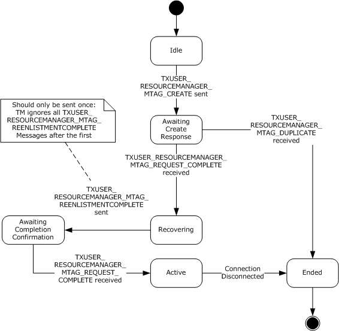

Figure 44: Resource Manager state diagram for CONNTYPE_TXUSER_RESOURCEMANAGER

##### 3.5.1.1.1 Idle

This is the initial state. The following event is processed in this state:

- Registering with Transaction Manager Using CONNTYPE_TXUSER_RESOURCEMANAGER (section [3.5.4.10.1](#Section_3.5.4.10.1))

##### 3.5.1.1.2 Awaiting Create Response

The following events are processed in this state:

- Receiving a TXUSER_RESOURCEMANAGER_MTAG_REQUEST_COMPLETE Message (section [3.5.5.1.1.2](#Section_3.5.5.1.1.2))
- Receiving a TXUSER_RESOURCEMANAGER_MTAG_DUPLICATE Message (section [3.5.5.1.1.1](#Section_3.5.5.1.1.1))

##### 3.5.1.1.3 Recovering

The following event is processed in this state:

- Reenlistment Complete (section [3.5.7.3](#Section_3.5.7.3))

##### 3.5.1.1.4 Awaiting Completion Confirmation

The following event is processed in this state:

- Receiving a TXUSER_RESOURCEMANAGER_MTAG_REQUEST_COMPLETE Message (section [3.5.5.1.1.2](#Section_3.5.5.1.1.2))

##### 3.5.1.1.5 Active

No specific events are processed in this state.

##### 3.5.1.1.6 Ended

This is the final state.

#### 3.5.1.2 CONNTYPE_TXUSER_RESOURCEMANAGERINTERNAL Initiator States

The [**resource manager**](#gt_resource-manager-rm) MUST act as an [**initiator**](#gt_initiator) for the CONNTYPE_TXUSER_RESOURCEMANAGERINTERNAL (section [2.2.10.1.2](#Section_2.2.10.1.2.1)) [**connection type**](#gt_connection-type). In this role, the resource manager MUST provide support for the following states:

- Idle
- Awaiting Create Response
- Recovering
- Awaiting Completion Confirmation
- Active
- Ended
The following figure shows the relationship between the CONNTYPE_TXUSER_RESOURCEMANAGERINTERNAL initiator states.

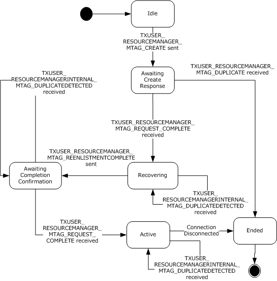

Figure 45: CONNTYPE_TXUSER_RESOURCEMANAGERINTERNAL initiator states

##### 3.5.1.2.1 Idle

This is the initial state. The following event is processed in this state:

- Registering with Transaction Manager Using CONNTYPE_TXUSER_RESOURCEMANAGERINTERNAL (section [3.5.4.10.2](#Section_3.5.4.10.2))

##### 3.5.1.2.2 Awaiting Create Response

The following events are processed in this state:

- Receiving a TXUSER_RESOURCEMANAGER_MTAG_DUPLICATE or TXUSER_RESOURCEMANAGER_MTAG_REQUEST_COMPLETE Message (section [3.5.5.1.2.1](#Section_3.5.5.1.2.1))

##### 3.5.1.2.3 Recovering

The following events are processed in this state:

- Reenlistment Complete (section [3.5.7.3](#Section_3.5.7.3))
- Receiving a TXUSER_RESOURCEMANAGERINTERNAL_MTAG_DUPLICATEDETECTED Message (section [3.5.5.1.2.2](#Section_3.5.5.1.2.2))

##### 3.5.1.2.4 Awaiting Completion Confirmation

The following events are processed in this state:

- Receiving a TXUSER_RESOURCEMANAGER_MTAG_DUPLICATE or TXUSER_RESOURCEMANAGER_MTAG_REQUEST_COMPLETE Message (section [3.5.5.1.2.1](#Section_3.5.5.1.2.1))

##### 3.5.1.2.5 Active

The following event is processed in this state:

- Receiving a TXUSER_RESOURCEMANAGERINTERNAL_MTAG_DUPLICATEDETECTED Message (section [3.5.5.1.2.2](#Section_3.5.5.1.2.2))

##### 3.5.1.2.6 Ended

This is the final state.

#### 3.5.1.3 CONNTYPE_TXUSER_PHASE0 Initiator States

The [**resource manager**](#gt_resource-manager-rm) MUST act as an [**initiator**](#gt_initiator) for the CONNTYPE_TXUSER_PHASE0 (section [2.2.10.2.1](#Section_2.2.10.2.1)) [**connection type**](#gt_connection-type). In this role, the resource manager MUST provide support for the following states:

- Idle
- Awaiting Create Response
- Active
- Processing [**Phase Zero**](#gt_phase-zero) Request
- Ended
The following figure shows the relationship between the CONNTYPE_TXUSER_PHASE0 initiator states.

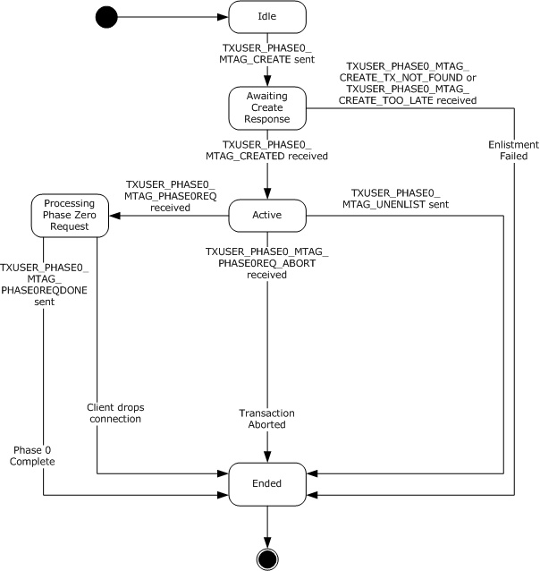

Figure 46: CONNTYPE_TXUSER_PHASE0 Initiator States

##### 3.5.1.3.1 Idle

This is the initial state. The following event is processed in this state:

- Enlisting as a Phase Zero Participant on a Specific Transaction (section [3.5.4.2](#Section_1.3.1.1))

##### 3.5.1.3.2 Awaiting Create Response

The following events are processed in this state:

- Receiving a TXUSER_PHASE0_MTAG_CREATED Message (section [3.5.5.2.1.1](#Section_3.5.5.2.1.1))
- Receiving a TXUSER_PHASE0_MTAG_CREATE_TX_NOT_FOUND or TXUSER_PHASE0_MTAG_CREATE_TOO_LATE Message (section [3.5.5.2.1.2](#Section_3.5.5.2.1.2))

##### 3.5.1.3.3 Active

The following events are processed in this state:

- Receiving a TXUSER_PHASE0_MTAG_PHASE0REQ (section [3.5.5.2.1.3](#Section_3.5.5.2.1.3)) message
- Receiving a TXUSER_PHASE0_MTAG_PHASE0REQ_ABORT (section [3.5.5.2.1.4](#Section_3.5.5.2.1.4)) message
- Canceling Enlistment as a Phase Zero Participant on a Specific Transaction (section [3.5.4.1](#Section_1.3.1.1))

##### 3.5.1.3.4 Processing Phase Zero Request

The following event is processed in this state:

- Phase Zero Request Completed (section [3.5.4.8](#Section_3.5.4.8))

##### 3.5.1.3.5 Ended

This is the final state.

#### 3.5.1.4 CONNTYPE_TXUSER_ENLISTMENT Initiator States

The [**resource manager**](#gt_resource-manager-rm) MUST act as an [**initiator**](#gt_initiator) for the CONNTYPE_TXUSER_ENLISTMENT (section [2.2.10.2.2](#Section_2.2.10.2.2.7)) [**connection type**](#gt_connection-type). In this role, the resource manager MUST provide support for the following states:

- Idle
- Awaiting Enlistment Response
- Active
- Single Phase Committing
- Preparing For Transaction Commit
- Finalizing Abort Operations
- Awaiting Transaction Outcome
- Finalizing Commit Operations
- Ended
The following figure shows the relationship between the CONNTYPE_TXUSER_ENLISTMENT initiator states. In the figure, the parenthetical numbers are the actual enumeration values.

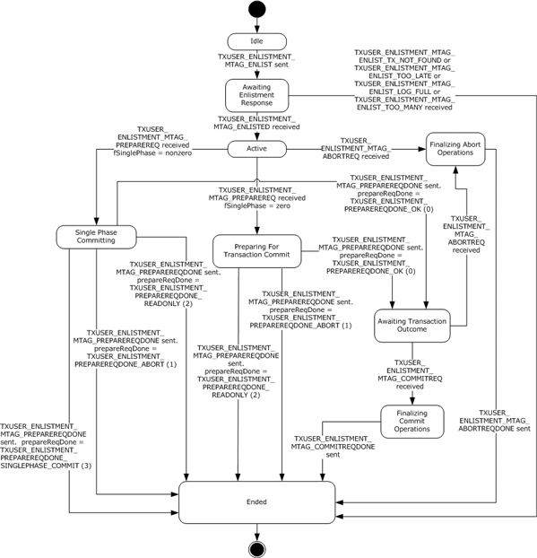

Figure 47: CONNTYPE_TXUSER_ENLISTMENT Initiator States

##### 3.5.1.4.1 Idle

This is the initial state. The following event is processed in this state:

- Enlisting on a Specific Transaction (section [3.5.4.3](#Section_3.5.4.3))

##### 3.5.1.4.2 Awaiting Enlistment Response

The following events are processed in this state:

- Receiving a TXUSER_ENLISTMENT_MTAG_ENLISTED Message (section [3.5.5.2.2.1](#Section_3.5.5.2.2.1))
- Receiving a TXUSER_ENLISTMENT_MTAG_ENLIST_TX_NOT_FOUND, TXUSER_ENLISTMENT_MTAG_ENLIST_TOO_LATE, TXUSER_ENLISTMENT_MTAG_ENLIST_LOG_FULL, or TXUSER_ENLISTMENT_MTAG_ENLIST_TOO_MANY Message (section [3.5.5.2.2.2](#Section_3.5.5.2.2.2))

##### 3.5.1.4.3 Active

The following events are processed in this state:

- Receiving a TXUSER_ENLISTMENT_MTAG_PREPAREREQ Message (section [3.5.5.2.2.3](#Section_3.5.5.2.2.3))
- Receiving a TXUSER_ENLISTMENT_MTAG_ABORTREQ Message (section [3.5.5.2.2.5](#Section_3.5.5.2.2.5))
- Connection Disconnected (section [3.5.5.2.2.6](#Section_3.5.5.2.2.6))

##### 3.5.1.4.4 Single Phase Committing

The following event is processed in this state:

- Enlistment Single-Phase Commit Request Completed (section [3.5.4.7](#Section_3.5.4.7))

##### 3.5.1.4.5 Preparing for Transaction Commit

The following event is processed in this state:

- Enlistment Prepare Request Completed (section [3.5.4.6](#Section_3.5.4.6))

##### 3.5.1.4.6 Finalizing Abort Operations

The following event is processed in this state:

- Enlistment Abort Request Completed (section [3.5.4.4](#Section_3.5.4.4))

##### 3.5.1.4.7 Awaiting Transaction Outcome

The following events are processed in this state:

- Receiving a TXUSER_ENLISTMENT_MTAG_COMMITREQ Message (section [3.5.5.2.2.4](#Section_3.5.5.2.2.4))
- Receiving a TXUSER_ENLISTMENT_MTAG_ABORTREQ Message (section [3.5.5.2.2.5](#Section_3.5.5.2.2.5))

##### 3.5.1.4.8 Finalizing Commit Operations

The following event is processed in this state:

- Enlistment Commit Request Completed (section [3.5.4.5](#Section_3.5.4.5))

##### 3.5.1.4.9 Ended

This is the final state.

#### 3.5.1.5 CONNTYPE_TXUSER_REENLIST Initiator States

The [**resource manager**](#gt_resource-manager-rm) MUST act as an [**initiator**](#gt_initiator) for the CONNTYPE_TXUSER_REENLIST (section [2.2.10.3.1](#Section_2.2.10.3.1.3)) [**connection type**](#gt_connection-type). In this role, the resource manager MUST provide support for the following states:

- Idle
- Awaiting Reenlist Response
- Ended
The following figure depicts the relationship between the CONNTYPE_TXUSER_REENLIST initiator states.

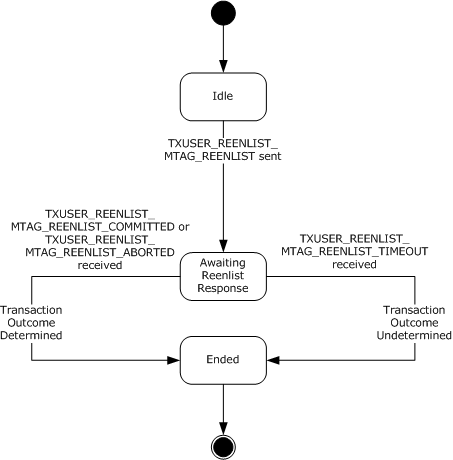

Figure 48: CONNTYPE_TXUSER_REENLIST Initiator States

##### 3.5.1.5.1 Idle

This is the initial state. The following event is processed in this state:

- Recover Transaction (section [3.5.7.1](#Section_3.5.7.1))

##### 3.5.1.5.2 Awaiting Reenlist Response

The following events are processed in this state:

- Receiving a TXUSER_REENLIST_MTAG_REENLIST_COMMITTED Message (section [3.5.5.3.1.1](#Section_3.5.5.3.1.1))
- Receiving a TXUSER_REENLIST_MTAG_REENLIST_ABORTED Message (section [3.5.5.3.1.2](#Section_3.5.5.3.1.2))
- Receiving a TXUSER_REENLIST_MTAG_REENLIST_TIMEOUT Message (section [3.5.5.3.1.3](#Section_3.5.5.3.1.3))

##### 3.5.1.5.3 Ended

This is the final state.

#### 3.5.1.6 CONNTYPE_TXUSER_VOTER Initiator States

The [**resource manager**](#gt_resource-manager-rm) MUST act as an [**initiator**](#gt_initiator) for the CONNTYPE_TXUSER_VOTER (section [2.2.10.4.1](#Section_2.2.10.4.1.7)) [**connection type**](#gt_connection-type). In this role, the resource manager MUST provide support for the following states:

- Idle
- Awaiting Creation Response
- Active
- Performing Transaction Operations
- Awaiting Outcome
- Ended
Note that the abstract data model can be implemented in a variety of ways. This protocol does not prescribe or advocate any specific implementation technique.

The following figure shows the relationship between the CONNTYPE_TXUSER_VOTER initiator states.

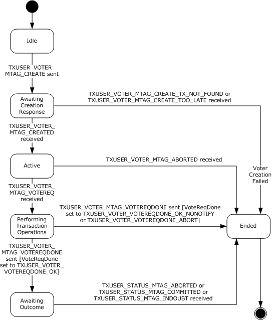

Figure 49: CONNTYPE_TXUSER_VOTER Initiator States

##### 3.5.1.6.1 Idle

This is the initial state. The following event is processed in this state:

- Registering as a Voter on a Specific Transaction (section [3.5.4.9](#Section_3.5.4.9))

##### 3.5.1.6.2 Awaiting Creation Response

The following events are processed in this state:

- Receiving a TXUSER_VOTER_MTAG_CREATED (section [3.5.5.4.1.1](#Section_3.5.5.4.1.1)) message
- Receiving a TXUSER_VOTER_MTAG_CREATE_TX_NOT_FOUND or TXUSER_VOTER_MTAG_CREATE_TOO_LATE message (section [3.5.5.4.1.2](#Section_3.5.5.4.1.2))
- Receiving a Connection Disconnected (section [3.5.5.4.1.7](#Section_3.5.5.4.1.7))

##### 3.5.1.6.3 Active

The following events are processed in this state:

- Receiving a TXUSER_VOTER_MTAG_VOTEREQ (section [3.5.5.4.1.3](#Section_3.5.5.4.1.3)) message
- Receiving a TXUSER_STATUS_MTAG_ABORTED (section [3.5.5.4.1.5](#Section_3.5.5.4.1.5)) message

##### 3.5.1.6.4 Performing Transaction Operations

The following event is processed in this state:

- Voter Vote Request Completed (section [3.5.4.11](#Section_3.5.4.11))

##### 3.5.1.6.5 Awaiting Outcome

The following events are processed in this state:

- Receiving a TXUSER_STATUS_MTAG_COMMITTED (section [3.5.5.4.1.4](#Section_3.5.5.4.1.4)) message
- Receiving a TXUSER_STATUS_MTAG_ABORTED (section [3.5.5.4.1.5](#Section_3.5.5.4.1.5)) message
- Receiving a TXUSER_STATUS_MTAG_INDOUBT (section [3.5.5.4.1.6](#Section_3.5.5.4.1.6)) message
- Connection Disconnected (section [3.5.5.4.1.7](#Section_3.5.5.4.1.7))

##### 3.5.1.6.6 Ended

This is the final state.

### 3.5.2 Timers

None.

### 3.5.3 Initialization

When a [**resource manager**](#gt_resource-manager-rm) is initialized:

- The **Resource Manager.Identifier** field MUST be set to a GUID that is obtained from an implementation-specific source. This value MUST remain consistent across multiple software restarts or [**transient failures**](#gt_transient-failure). The resource manager SHOULD create the GUID as specified in [[RFC4122]](https://go.microsoft.com/fwlink/?LinkId=90460).
- The **Transaction Manager Name** field MUST be set to a value that is obtained from an implementation-specific source. This value MUST remain consistent across multiple software restarts or transient failures.
- The **Reenlistment Timeout** field MUST be set to a value that is obtained from an implementation-specific source.
- The resource manager MUST register with its [**transaction manager**](#gt_transaction-manager), as specified in section [3.5.4.10](#Section_3.5.4.10).

### 3.5.4 Higher-Layer Triggered Events

The [**resource manager**](#gt_resource-manager-rm) operation is driven by a set of higher-layer events. These events are triggered by decisions that are made by the higher-layer business logic of the resource manager. The motivations and details of this higher-layer business logic are specific to the implementation of the resource manager and the software environment in which it executes.

The resource manager MUST be prepared to process the following events.

#### 3.5.4.1 Canceling Enlistment as a Phase Zero Participant on a Specific Transaction

This event MUST be signaled by the higher-layer business logic with the following arguments:

- A [**connection**](#gt_connection) object
If the higher-layer business logic cancels its [**enlistment**](#gt_enlistment) as a [**Phase Zero participant**](#gt_phase-zero-participant) on a specific [**transaction**](#gt_transaction), the resource manager MUST perform the following steps:

- Send a TXUSER_PHASE0_MTAG_UNENLIST (section [2.2.10.2.1.8](#Section_2.2.10.2.1.8)) message using the connection.
- Set the connection state to Ended.

#### 3.5.4.2 Enlisting as a Phase Zero Participant on a Specific Transaction

This event MUST be signaled by the higher-layer business logic with the following arguments:

- A [**transaction**](#gt_transaction) object
If the higher-layer business logic enlists as a [**Phase Zero participant**](#gt_phase-zero-participant) on a specific transaction, the resource manager MUST perform the following steps:

- If the [**transaction manager**](#gt_transaction-manager) of the resource manager supports the CONNTYPE_TXUSER_PHASE0 connection type, as specified in section [2.2.1.1.3](#Section_2.2.1.1.3):
- Initiate a new CONNTYPE_TXUSER_PHASE0 (section [2.2.10.2.1](#Section_2.2.10.2.1)) connection to the transaction manager, using the **Transaction Manager Name** field of the resource manager.
- Send a TXUSER_PHASE0_MTAG_CREATE (section [2.2.10.2.1.1](#Section_2.2.10.2.1.1)) message using the connection:
- Set the **guidTx** field to the **Transaction Object.Identifier** field of the transaction object.
- Set the Transaction field of the connection to the provided transaction object.
- Set the connection state to Awaiting Create Response.
- Otherwise, the resource manager MUST return a Failure to the higher-layer business logic.

#### 3.5.4.3 Enlisting on a Specific Transaction

This event MUST be signaled by the higher-layer business logic with the following arguments:

- A transaction object.
If the higher-layer business logic decides to enlist on a specific transaction, the resource manager MUST perform the following steps:

- Initiate a new CONNTYPE_TXUSER_ENLISTMENT (section [2.2.10.2.2](#Section_2.2.10.2.2.7)) connection to the [**transaction manager**](#gt_transaction-manager), using the **Transaction Manager Name** field of the resource manager.
- Assign the transaction object to the connection-specific data of the connection.
- Add the connection to the connection list of the transaction.
- Send a TXUSER_ENLISTMENT_MTAG_ENLIST (section [2.2.10.2.2.5](#Section_2.2.10.2.2.5)) message using the connection:
- Set the **guidTX** field to the **Transaction Object.Identifier** field of the transaction object.
- Set the **guidRM** field to the **Resource Manager.Identifier** field of the resource manager.
- Set the **guidSession** field to the **Session Identifier** field of the resource manager.
- Set the connection state to Awaiting Enlistment Response.

#### 3.5.4.4 Enlistment Abort Request Completed

This event MUST be signaled by the higher-layer business logic with the following arguments:

- A connection object.
When the higher-layer business logic completes an enlistment [**Abort request**](#gt_abort-request), as specified in section [3.5.5.2.2.5](#Section_3.5.5.2.2.5) and [3.5.5.3.1.2](#Section_3.5.5.3.1.2), the resource manager MUST perform the following steps:

- If the connection type of the connection object is CONNTYPE_TXUSER_ENLISTMENT (section [2.2.10.2.2](#Section_2.2.10.2.2.7)):
- If the transaction object referenced by the connection object was added to the **Resource Manager.Durable Log**:
- Remove the transaction object from the **Resource Manager.Durable Log**.
- Send a TXUSER_ENLISTMENT_MTAG_ABORTREQDONE (section [2.2.10.2.2.2](#Section_2.2.10.2.2.2)) message using the connection.
- Set the connection state to Ended.
- Otherwise, if the connection type of the connection object is CONNTYPE_TXUSER_REENLIST (section [2.2.10.3.1](#Section_2.2.10.3.1.3)):
- If the transaction object referenced by the connection object was added to the **Resource Manager.Durable Log**:
- Remove the transaction object from the **Resource Manager.Durable Log**.
- Remove the connection from the reenlistment list of the resource manager.
- If the list is now empty:
- Signal the Reenlistment Complete (section [3.5.7.3](#Section_3.5.7.3)) event on the resource manager.
- Set the connection state to Ended.
- Otherwise, ignore the event.

#### 3.5.4.5 Enlistment Commit Request Completed

This event MUST be signaled by the higher-layer business logic with the following arguments:

- A connection object
When the higher-layer business logic completes an enlistment [**Commit request**](#gt_commit-request) as specified in section [3.5.5.2.2.4](#Section_3.5.5.2.2.4) and [3.5.5.3.1.1](#Section_3.5.5.3.1.1), the resource manager MUST perform the following steps:

- If the connection type of the connection object is CONNTYPE_TXUSER_ENLISTMENT (section [2.2.10.2.2](#Section_2.2.10.2.2.7)):
- Remove the transaction object referenced by the connection object from the **Resource Manager.Durable Log**.
- Send a TXUSER_ENLISTMENT_MTAG_COMMITREQDONE (section [2.2.10.2.2.4](#Section_2.2.10.2.2.4)) message using the connection.
- Set the connection state to Ended.
- Otherwise, if the connection type of the connection object is CONNTYPE_TXUSER_REENLIST (section [2.2.10.3.1](#Section_2.2.10.3.1.3)):
- Remove the transaction object referenced by the connection object from the **Resource Manager.Durable Log**.
- Remove the connection from the reenlistment list of the resource manager.
- If the list is now empty:
- Signal the Reenlistment Complete (section [3.5.7.3](#Section_3.5.7.3)) event on the resource manager.
- Set the connection state to Ended.
- Otherwise, ignore the event.

#### 3.5.4.6 Enlistment Prepare Request Completed

This event MUST be signaled by the higher-layer business logic with the following arguments:

- A CONNTYPE_TXUSER_ENLISTMENT (section [2.2.10.2.2](#Section_2.2.10.2.2.7)) connection object.
- An [**outcome**](#gt_outcome) value. This value MUST be one of the following:
- Prepared
- Read Only
- Aborted
When the higher-layer business logic completes a Prepare request, as specified in section [3.5.5.2.2.3](#Section_3.5.5.2.2.3), the resource manager MUST perform the following steps:

- If the request outcome is Prepared:
- Add the transaction object referenced by the connection object to the **Resource Manager.Durable Log**.
- Send a TXUSER_ENLISTMENT_MTAG_PREPAREREQDONE (section [2.2.10.2.2.12](#Section_2.2.10.2.2.12)) message using the connection:
- Set the **prepareReqDone** field to TXUSER_ENLISTMENT_PREPAREREQDONE_OK.
- Set the **guidReason** field to the value provided by the higher-layer business logic, as specified in section 2.2.10.2.2.12.
- Set the connection state to Awaiting Transaction Outcome.
- Otherwise, if the request outcome is Read Only:
- Send a TXUSER_ENLISTMENT_MTAG_PREPAREREQDONE message using the connection:
- Set the **prepareReqDone** field to TXUSER_ENLISTMENT_PREPAREREQDONE_READONLY.
- Set the connection state to Ended.
- Otherwise, if the request outcome is Aborted:
- Send a TXUSER_ENLISTMENT_MTAG_PREPAREREQDONE message using the connection:
- Set the **prepareReqDone** field to TXUSER_ENLISTMENT_PREPAREREQDONE_ABORT.
- Set the connection state to Ended.

#### 3.5.4.7 Enlistment Single-Phase Commit Request Completed

This event MUST be signaled by the higher-layer business logic with the following arguments:

- A CONNTYPE_TXUSER_ENLISTMENT (section [2.2.10.2.2](#Section_2.2.10.2.2.7)) connection object.
- An [**outcome**](#gt_outcome) value. This value MUST be one of the following:
- Read Only
- Prepared
- Committed
- Aborted
When the higher-layer business logic completes an [**Enlistment**](#gt_enlistment) [**Single-Phase Commit**](#gt_single-phase-commit) request as specified in Receiving a TXUSER_ENLISTMENT_MTAG_PREPAREREQ Message (section [3.5.5.2.2.3](#Section_3.5.5.2.2.3)), the resource manager MUST perform the following steps:

- If the request outcome is Read Only:
- Send a [TXUSER_ENLISTMENT_MTAG_PREPAREREQDONE](#Section_2.2.10.2.2.12) message using the connection:
- Set the **prepareReqDone** field to TXUSER_ENLISTMENT_PREPAREREQDONE_READONLY.
- Set the connection state to Ended.
- Otherwise, if the request outcome is Prepared:
- Add the transaction object referenced by the connection object to the **Resource Manager.Durable Log**.
- Send a TXUSER_ENLISTMENT_MTAG_PREPAREREQDONE message using the connection:
- Set the **prepareReqDone** field to TXUSER_ENLISTMENT_PREPAREREQDONE_OK.
- Set the connection state to [Awaiting Transaction Outcome](#Section_3.5.1.4.7).
- Otherwise, if the request outcome is Committed:
- Send a TXUSER_ENLISTMENT_MTAG_PREPAREREQDONE message using the connection:
- Set the **prepareReqDone** field to TXUSER_ENLISTMENT_PREPAREREQDONE_SINGLEPHASE_COMMIT.
- Set the connection state to Ended.
- Otherwise, if the request outcome is Aborted:
- Send a TXUSER_ENLISTMENT_MTAG_PREPAREREQDONE message using the connection:
- Set the **prepareReqDone** field to TXUSER_ENLISTMENT_PREPAREREQDONE_ABORT.
- Set the connection state to Ended.

#### 3.5.4.8 Phase Zero Request Completed

This event MUST be signaled by the higher-layer business logic with the following arguments:

- A connection object.
- An [**outcome**](#gt_outcome) value. This value MUST be one of the following:
- Read Only
- Aborted
When the higher-layer business logic completes a [**Phase Zero**](#gt_phase-zero) request, the resource manager MUST perform the following steps:

- If the Phase Zero outcome is Read Only:
- Send a [TXUSER_PHASE0_MTAG_PHASE0REQDONE](#Section_2.2.10.2.1.7) message.
- Set the connection state to Ended.
- Otherwise, if the Phase Zero outcome is Aborted:
- Set the connection state to Ended.

#### 3.5.4.9 Registering as a Voter on a Specific Transaction

This event MUST be signaled by the higher-layer business logic with the following arguments:

- A transaction object
If the higher-layer business logic decides to register as a [**voter**](#gt_voter) on a specific [**transaction manager**](#gt_transaction-manager), the resource manager MUST perform the following steps:

- Initiate a new CONNTYPE_TXUSER_VOTER (section [2.2.10.4.1](#Section_2.2.10.4.1.7)) connection to the transaction manager using the transaction manager **Name** field of the resource manager.
- Send a TXUSER_VOTER_MTAG_CREATE (section [2.2.10.4.1.4](#Section_2.2.10.4.1.4)) message using the connection:
- Set the **guidTX** field to the **Transaction Object.Identifier** field of the transaction object.
- Set the connection state to Awaiting Creation Response.

#### 3.5.4.10 Registering with Transaction Manager

If the higher-layer business logic wants to register with the [**transaction manager**](#gt_transaction-manager), the resource manager MUST perform the following actions:

- The resource manager SHOULD set the **Session Identifier** field to a new GUID value as specified in [[RFC4122]](https://go.microsoft.com/fwlink/?LinkId=90460). Optionally, the resource manager MAY instead set the **Session Identifier** field to [**NULL GUID**](#gt_null-guid).
- If the transaction manager's resource manager supports the CONNTYPE_TXUSER_RESOURCEMANAGERINTERNAL connection type as specified in section [2.2.1.1.3](#Section_2.2.1.1.3):
- The resource manager MUST attempt to [register with the transaction manager](#Section_3.5.4.10.2) using [CONNTYPE_TXUSER_RESOURCEMANAGERINTERNAL](#Section_2.2.10.1.2.1).
- Otherwise:
- The resource manager MUST attempt to [register with the transaction manager](#Section_3.5.4.10.1) using [CONNTYPE_TXUSER_RESOURCEMANAGER](#Section_2.2.10.1.1).

##### 3.5.4.10.1 Registering with Transaction Manager Using CONNTYPE_TXUSER_RESOURCEMANAGER

The resource manager MUST perform the following actions:

- Initiate a new [CONNTYPE_TXUSER_RESOURCEMANAGER](#Section_2.2.10.1.1) [**connection**](#gt_connection) using the **Transaction manager name** field of the resource manager.
- Assign the new connection to the **Resource Manager.Connection** field of the resource manager.
- Send a [TXUSER_RESOURCEMANAGER_MTAG_CREATE](#Section_2.2.10.1.1.1) message using the connection:
- Set the **guidRM** field to the **Resource Manager.Identifier** field of the resource manager.
- Set the **guidSession** field to the **Session Identifier** field of the resource manager.
- Set the connection state to Awaiting Create Response.

##### 3.5.4.10.2 Registering with Transaction Manager Using CONNTYPE_TXUSER_RESOURCEMANAGERINTERNAL

The resource manager MUST perform the following actions:

- Initiate a new [CONNTYPE_TXUSER_RESOURCEMANAGERINTERNAL](#Section_2.2.10.1.2.1) connection using the [**transaction manager**](#gt_transaction-manager) Name field of the resource manager.
- Assign the new connection to the **Resource Manager.Connection** field of the resource manager.
- Send a [TXUSER_RESOURCEMANAGER_MTAG_CREATE](#Section_2.2.10.1.1.1) message using the connection:
- Set the **guidRM** field to the **Resource Manager.Identifier** field of the resource manager.
- Set the **guidSession** field to the **Session Identifier** field of the resource manager.
- Set the connection state to Awaiting Create Response.

#### 3.5.4.11 Voter Vote Request Completed

This event MUST be signaled by the higher-layer business logic with the following arguments:

- A [**connection**](#gt_connection) object.
- An [**outcome**](#gt_outcome) value. This value MUST be one of the following:
- Prepared
- Read Only
- Aborted
When the higher-layer business logic completes a Voter Vote request, the resource manager MUST perform the following steps:

- If the vote outcome is Prepared:
- Send a [TXUSER_VOTER_MTAG_VOTEREQDONE](#Section_2.2.10.4.1.9) message using the connection:
- Set the **VoteReqDone** field to TXUSER_VOTER_VOTEREQDONE_OK.
- Set the connection state to Awaiting Outcome.
- Otherwise, if the vote outcome is Read Only:
- Send a TXUSER_VOTER_MTAG_VOTEREQDONE message using the connection:
- Set the **VoteReqDone** field to TXUSER_VOTER_VOTEREQDONE_OK_NONOTIFY.
- Set the connection state to Ended.
- Otherwise, if the vote outcome is Aborted:
- Send a TXUSER_VOTER_MTAG_VOTEREQDONE message using the connection:
- Set the **VoteReqDone** field to TXUSER_VOTER_VOTEREQDONE_ABORT.
- Set the connection state to Ended.

### 3.5.5 Processing Events and Sequencing Rules

#### 3.5.5.1 Resource Manager Registration

##### 3.5.5.1.1 CONNTYPE_TXUSER_RESOURCEMANAGER as Initiator

For all messages that are received in this connection type, the [**resource manager**](#gt_resource-manager-rm) MUST process the messages as specified in section [3.1](#Section_1.3). The resource manager MUST additionally follow the processing rules as specified in the following sections.

###### 3.5.5.1.1.1 Receiving a TXUSER_RESOURCEMANAGER_MTAG_DUPLICATE Message

When the resource manager receives a [TXUSER_RESOURCEMANAGER_MTAG_DUPLICATE](#Section_2.2.10.1.1.2) message, the resource manager MUST perform the following actions:

- If the [**connection**](#gt_connection) state is Awaiting Create Response:
- Set the connection state to Ended.
- Return a failure result to the higher-layer business logic.

###### 3.5.5.1.1.2 Receiving a TXUSER_RESOURCEMANAGER_MTAG_REQUEST_COMPLETE Message

When the resource manager receives a [TXUSER_RESOURCEMANAGER_REQUEST_COMPLETE](#Section_2.2.10.1.1.4) message, the resource manager MUST perform the following actions:

- If the connection state is Awaiting Create Response:
- Set the connection state to Recovering.
- Signal the Recover Transactions event on the resource manager.
- Otherwise, if the connection state is Awaiting Completion Confirmation:
- Set the connection state to Active.
- Return a success result to the higher-layer business logic.

###### 3.5.5.1.1.3 Connection Disconnected

When a CONNTYPE_TXUSER_RESOURCEMANAGER (section [2.2.10.1.1](#Section_2.2.10.1.1)) connection is disconnected, the resource manager MUST perform the following actions:

- If the connection state is Active, Awaiting Create Response, Recovering, or Awaiting Completion Confirmation:
- Set the connection state to Ended.
- Otherwise, the event MUST be processed as specified in section [3.1.8.3](#Section_3.6.5.2.2.5).

##### 3.5.5.1.2 CONNTYPE_TXUSER_RESOURCEMANAGERINTERNAL as Initiator

For all messages received in this [**connection type**](#gt_connection-type), the [**resource manager**](#gt_resource-manager-rm) MUST process the messages as specified in section [3.1](#Section_1.3). The resource manager MUST additionally follow the processing rules as specified in the following sections.

###### 3.5.5.1.2.1 Receiving a TXUSER_RESOURCEMANAGER_MTAG_DUPLICATE or TXUSER_RESOURCEMANAGER_MTAG_REQUEST_COMPLETE Message

When the resource manager receives either the [TXUSER_RESOURCEMANAGER_MTAG_DUPLICATE](#Section_2.2.10.1.1.2) or [TXUSER_RESOURCEMANAGER_MTAG_REQUEST_COMPLETE](#Section_2.2.10.1.1.4) message, it MUST follow the same message-processing rules as the [CONNTYPE_TXUSER_RESOURCEMANAGER](#Section_2.2.10.1.1) connection type when it acts as the [**initiator**](#gt_initiator). See section [3.5.5.1.1](#Section_3.5.5.1.1.3) for more details.

###### 3.5.5.1.2.2 Receiving a TXUSER_RESOURCEMANAGERINTERNAL_MTAG_DUPLICATEDETECTED Message

When the resource manager receives a [TXUSER_RESOURCEMANAGERINTERNAL_MTAG_DUPLICATEDETECTED](#Section_2.2.10.1.2.1) message, the resource manager MUST perform the following actions:

- If the connection state is Recovering, Awaiting Completion Confirmation, or Active:
- Inform the higher-layer business logic that the [**transaction manager**](#gt_transaction-manager) has detected a duplicate resource manager [**registration**](#gt_registration).

###### 3.5.5.1.2.3 Connection Disconnected

When a CONNTYPE_TXUSER_RESOURCEMANAGERINTERNAL (section [2.2.10.1.2](#Section_2.2.10.1.2.1)) connection is disconnected, the event MUST be processed as specified in section [3.1.8.3](#Section_3.6.5.2.2.5).

#### 3.5.5.2 Transaction Coordination

##### 3.5.5.2.1 CONNTYPE_TXUSER_PHASE0 as Initiator

For all messages that are received in this [**connection type**](#gt_connection-type), the [**resource manager**](#gt_resource-manager-rm) MUST process the message as specified in section [3.1](#Section_1.3). The resource manager MUST additionally follow the processing rules as specified in the following sections.

###### 3.5.5.2.1.1 Receiving a TXUSER_PHASE0_MTAG_CREATED Message

When the resource manager receives a [TXUSER_PHASE0_MTAG_CREATED](#Section_2.2.10.2.1.4) message, the resource manager MUST perform the following actions:

- If the [**connection**](#gt_connection) state is Awaiting Create Response:
- Set the connection state to Active.
- Return a success result to the higher-layer business logic.
- Add the connection to the connection list of the [**transaction**](#gt_transaction) object referenced by the connection.
- Otherwise, the message MUST be processed as an invalid message as specified in section [3.1.6](#Section_3.1.6).

###### 3.5.5.2.1.2 Receiving a TXUSER_PHASE0_MTAG_CREATE_TX_NOT_FOUND or TXUSER_PHASE0_MTAG_CREATE_TOO_LATE Message

When the resource manager receives either the [TXUSER_PHASE0_MTAG_CREATE_TOO_LATE](#Section_2.2.10.2.1.2) or [TXUSER_PHASE0_MTAG_CREATE_TX_NOT_FOUND](#Section_2.2.10.2.1.3) message, the resource manager MUST perform the following actions:

- If the connection state is Awaiting Create Response:
- Return a failure result to the higher-layer business logic.
- Set the connection state to Ended.
- Otherwise, the message MUST be processed as an invalid message as specified in section [3.1.6](#Section_3.1.6).

###### 3.5.5.2.1.3 Receiving a TXUSER_PHASE0_MTAG_PHASE0REQ Message

When the resource manager receives a [TXUSER_PHASE0_MTAG_PHASE0REQ](#Section_2.2.10.2.1.5) message, the resource manager MUST perform the following actions:

- If the connection state is Active:
- Set the connection state to Processing [**Phase Zero**](#gt_phase-zero) Request.
- Send a Phase Zero request to the higher-layer business logic so that the resource manager can receive the Phase Zero outcome from the higher-layer business logic via the Phase Zero Request Completed (section [3.5.4.8](#Section_3.5.4.8)) event.
- Otherwise, the message MUST be processed as an invalid message as specified in section [3.1.6](#Section_3.1.6).

###### 3.5.5.2.1.4 Receiving a TXUSER_PHASE0_MTAG_PHASE0REQ_ABORT Message

When the resource manager receives a [TXUSER_PHASE0_MTAG_PHASE0REQ_ABORT](#Section_2.2.10.2.1.6) message, the resource manager MUST perform the following actions:

- If the connection state is Active:
- Send a Transaction Aborted notification to the higher-layer business logic.
- Set the connection state to Ended.
- Otherwise, the message MUST be processed as an invalid message as specified in section [3.1.6](#Section_3.1.6).

###### 3.5.5.2.1.5 Connection Disconnected

When a CONNTYPE_TXUSER_PHASE0 (section [2.2.10.2.1](#Section_2.2.10.2.1)) connection is disconnected, the resource manager MUST perform the following actions:

- If the connection state is Awaiting Create Response:
- Return a failure result to the higher-layer business logic.
- Otherwise, if the connection state is Active or Processing [**Phase Zero**](#gt_phase-zero) Request:
- Send a Transaction Aborted notification to the higher-layer business logic.
- Otherwise, the event MUST be processed as specified in section [3.1.8.3](#Section_3.6.5.2.2.5).

##### 3.5.5.2.2 CONNTYPE_TXUSER_ENLISTMENT as Initiator

For all messages that are received in this [**connection type**](#gt_connection-type), the [**resource manager**](#gt_resource-manager-rm) MUST process the message as specified in section [3.1](#Section_1.3). The resource manager MUST additionally follow the processing rules as specified in the following sections.

###### 3.5.5.2.2.1 Receiving a TXUSER_ENLISTMENT_MTAG_ENLISTED Message

When the resource manager receives a [TXUSER_ENLISTMENT_MTAG_ENLISTED](#Section_2.2.10.2.2.10) message, the resource manager MUST perform the following actions:

- If the [**connection**](#gt_connection) state is Awaiting Enlistment Response:
- Set the connection state to Active.
- Return a success result to the higher-layer business logic.
- Otherwise, the message MUST be processed as an invalid message as specified in section [3.1.6](#Section_3.1.6).

###### 3.5.5.2.2.2 Receiving a TXUSER_ENLISTMENT_MTAG_ENLIST_TX_NOT_FOUND, TXUSER_ENLISTMENT_MTAG_ENLIST_TOO_LATE, TXUSER_ENLISTMENT_MTAG_ENLIST_LOG_FULL, or TXUSER_ENLISTMENT_MTAG_ENLIST_TOO_MANY Message

When the resource manager receives a [TXUSER_ENLISTMENT_MTAG_ENLIST_TX_NOT_FOUND](#Section_2.2.10.2.2.9), [TXUSER_ENLISTMENT_MTAG_ENLIST_TOO_LATE](#Section_2.2.10.2.2.7), [TXUSER_ENLISTMENT_MTAG_ENLIST_LOG_FULL](#Section_2.2.10.2.2.6), or [TXUSER_ENLISTMENT_MTAG_ENLIST_TOO_MANY](#Section_2.2.10.2.2.8) message, the resource manager MUST perform the following actions:

- If the connection state is Awaiting Enlistment Response:
- Return a failure result to the higher-layer business logic.
- Set the connection state to Ended.
- Otherwise, the message MUST be processed as an invalid message as specified in section [3.1.6](#Section_3.1.6).

###### 3.5.5.2.2.3 Receiving a TXUSER_ENLISTMENT_MTAG_PREPAREREQ Message

When the resource manager receives a [TXUSER_ENLISTMENT_MTAG_PREPAREREQ](#Section_2.2.10.2.2.11) message, the resource manager MUST perform the following actions:

- If the connection state is Active:
- If the fSinglePhase field of the message is nonzero:
- Set the connection state to Single-Phase Committing.
- Send a [**Single-Phase Commit**](#gt_single-phase-commit) request to the higher-layer business logic.
- Otherwise:
- Set the connection state to Preparing For Transaction Commit.
- Send a Prepare request to the higher-layer business logic.
- Otherwise, the message MUST be processed as an invalid message as specified in section [3.1.6](#Section_3.1.6).

###### 3.5.5.2.2.4 Receiving a TXUSER_ENLISTMENT_MTAG_COMMITREQ Message

When the resource manager receives a [TXUSER_ENLISTMENT_MTAG_COMMITREQ](#Section_2.2.10.2.2.3) message, the resource manager MUST perform the following actions:

- If the connection state is Awaiting Transaction Outcome:
- Set the connection state to Finalizing Commit Operations.
- Send a [**Commit Request**](#gt_commit-request) to the higher-layer business logic.
- Otherwise, the message MUST be processed as an invalid message as specified in section [3.1.6](#Section_3.1.6).

###### 3.5.5.2.2.5 Receiving a TXUSER_ENLISTMENT_MTAG_ABORTREQ Message

When the resource manager receives a [TXUSER_ENLISTMENT_MTAG_ABORTREQ](#Section_2.2.10.2.2.1) message, the resource manager MUST perform the following actions:

- If the connection state is Active:
- Send an Abort request to the higher-layer business logic.
- Set the connection state to Finalizing Abort Operations.
- Otherwise, if the connection state is Awaiting Transaction Outcome:
- Remove the transaction object referenced by the connection from the **Resource Manager.Durable Log**.
- Send an Abort request to the higher-layer business logic.
- Set the connection state to Finalizing Abort Operations.
- Otherwise, the message MUST be processed as an invalid message as specified in section [3.1.6](#Section_3.1.6).

###### 3.5.5.2.2.6 Connection Disconnected

When a CONNTYPE_TXUSER_ENLISTMENT (section [2.2.10.2.2](#Section_2.2.10.2.2.7)) connection is disconnected, the resource manager MUST perform the following actions:

- If the connection state is either Awaiting Enlistment Response, Active, or Preparing For Transaction Commit:
- Send an [**Abort request**](#gt_abort-request) to the higher-layer business logic.
- Otherwise, the event MUST be processed as specified in section [3.1.8.3](#Section_3.6.5.2.2.5).

#### 3.5.5.3 Transaction Recovery

##### 3.5.5.3.1 CONNTYPE_TXUSER_REENLIST as Initiator

For all messages that are received in this [**connection type**](#gt_connection-type), the [**resource manager**](#gt_resource-manager-rm) MUST process the message as specified in section [3.1](#Section_1.3). The resource manager MUST additionally follow the processing rules as specified in the following sections.

###### 3.5.5.3.1.1 Receiving a TXUSER_REENLIST_MTAG_REENLIST_COMMITTED Message

When the resource manager receives a [TXUSER_REENLIST_MTAG_REENLIST_COMMITTED](#Section_2.2.10.3.1.3) message, the resource manager MUST perform the following actions:

- If the [**connection**](#gt_connection) state is Awaiting Reenlist Response:
- Send a [**Commit request**](#gt_commit-request) to the higher-layer business logic for the [**transaction**](#gt_transaction) object referenced by the Transaction field of the receiving connection.
- Set the connection state to Ended.
- Otherwise, the message MUST be processed as an invalid message as specified in section [3.1.6](#Section_3.1.6).

###### 3.5.5.3.1.2 Receiving a TXUSER_REENLIST_MTAG_REENLIST_ABORTED Message

When the resource manager receives a [TXUSER_REENLIST_MTAG_REENLIST_ABORTED](#Section_2.2.10.3.1.2) message, the resource manager MUST perform the following actions:

- If the connection state is Awaiting Reenlist Response:
- Send an Abort request to the higher-layer business logic.
- Set the connection state to Ended.
- Otherwise, the message MUST be processed as an invalid message as specified in section [3.1.6](#Section_3.1.6).

###### 3.5.5.3.1.3 Receiving a TXUSER_REENLIST_MTAG_REENLIST_TIMEOUT Message

When the resource manager receives a [TXUSER_REENLIST_MTAG_REENLIST_TIMEOUT](#Section_2.2.10.3.1.4) message, the resource manager MUST perform the following actions:

- If the connection state is Awaiting Reenlist Response:
- Signal the [Reenlistment Timeout](#Section_3.5.7.5) event with the transaction object referenced by this connection.
- Set the connection state to Ended.
- Otherwise, the message MUST be processed as an invalid message as specified in section [3.1.6](#Section_3.1.6).

###### 3.5.5.3.1.4 Connection Disconnected

When a CONNTYPE_TXUSER_REENLIST (section [2.2.10.3.1](#Section_2.2.10.3.1.3)) connection is disconnected, the resource manager MUST perform the following actions:

- If the connection state is Awaiting Reenlistment Response:
- Return a failure result to the higher-layer business logic.
- Otherwise, the event MUST be processed as specified in section [3.1.8.3](#Section_3.6.5.2.2.5).

#### 3.5.5.4 Voting

##### 3.5.5.4.1 CONNTYPE_TXUSER_VOTER as Initiator

For all messages that are received in this [**connection type**](#gt_connection-type), the [**resource manager**](#gt_resource-manager-rm) MUST process the message as specified in section [3.1](#Section_1.3). The resource manager MUST additionally follow the processing rules as specified in the following sections.

###### 3.5.5.4.1.1 Receiving a TXUSER_VOTER_MTAG_CREATED Message

When the resource manager receives a [TXUSER_VOTER_MTAG_CREATED](#Section_2.2.10.4.1.7) message, the resource manager MUST perform the following actions:

- If the [**connection**](#gt_connection) state is Awaiting Creation Response:
- Return a success result to the higher-layer business logic.
- Set the connection state to Active.
- Otherwise, the message MUST be processed as an invalid message as specified in section [3.1.6](#Section_3.1.6).

###### 3.5.5.4.1.2 Receiving a TXUSER_VOTER_MTAG_CREATE_TX_NOT_FOUND or TXUSER_VOTER_MTAG_CREATE_TOO_LATE Message

When the resource manager receives either a [TXUSER_VOTER_MTAG_CREATE_TX_NOT_FOUND](#Section_2.2.10.4.1.6) or [TXUSER_VOTER_MTAG_CREATE_TOO_LATE](#Section_2.2.10.4.1.5) message, the resource manager MUST perform the following actions:

- If the connection state is Awaiting Creation Response:
- Return a failure result to the higher-layer business logic.
- Set the connection state to Ended.
- Otherwise, the message MUST be processed as an invalid message as specified in section [3.1.6](#Section_3.1.6).

###### 3.5.5.4.1.3 Receiving a TXUSER_VOTER_MTAG_VOTEREQ Message

When the resource manager receives a [TXUSER_VOTER_MTAG_VOTEREQ](#Section_2.2.10.4.1.8) message, the resource manager MUST perform the following actions:

- If the connection state is Active:
- Send a Vote request to the higher-layer business logic.
- Set the connection state to Performing Transaction Operations.
- Otherwise, the message MUST be processed as an invalid message as specified in section [3.1.6](#Section_3.1.6).

###### 3.5.5.4.1.4 Receiving a TXUSER_STATUS_MTAG_COMMITTED Message

When the resource manager receives a [TXUSER_STATUS_MTAG_COMMITTED](#Section_2.2.10.4.1.2) message, the resource manager MUST perform the following actions:

- If the connection state is Awaiting Outcome:
- Send a Transaction Committed notification to the higher-layer business logic.
- Set the connection state to Ended.
- Otherwise, the message MUST be processed as an invalid message as specified in section [3.1.6](#Section_3.1.6).

###### 3.5.5.4.1.5 Receiving a TXUSER_STATUS_MTAG_ABORTED Message

When the resource manager receives a [TXUSER_STATUS_MTAG_ABORTED](#Section_2.2.10.4.1.1) message, the resource manager MUST perform the following actions:

- If the connection state is Active or Awaiting Outcome:
- Send a Transaction Aborted notification to the higher-layer business logic.
- Set the connection state to Ended.
- Otherwise, the message MUST be processed as an invalid message as specified in section [3.1.6](#Section_3.1.6).

###### 3.5.5.4.1.6 Receiving a TXUSER_STATUS_MTAG_INDOUBT Message

When the resource manager receives a [TXUSER_STATUS_MTAG_INDOUBT](#Section_2.2.10.4.1.3) message, the resource manager MUST perform the following actions:

- If the connection state is Awaiting Outcome:
- Send a Transaction [In Doubt](#Section_3.2.1.3.12) notification to the higher-layer business logic.
- Set the connection state to Ended.
- Otherwise, the message MUST be processed as an invalid message as specified in section [3.1.6](#Section_3.1.6).

###### 3.5.5.4.1.7 Connection Disconnected

When a CONNTYPE_TXUSER_VOTER (section [2.2.10.4.1](#Section_2.2.10.4.1.7)) connection is disconnected, the resource manager MUST perform the following actions:

- If the connection state is Awaiting Creation Response:
- Return a failure result to the higher-layer business logic.
- Otherwise, if the connection state is Awaiting Outcome:
- Send a Transaction [In Doubt](#Section_3.2.1.3.12) notification to the higher-layer business logic.
- Otherwise, the event MUST be processed as specified in section [3.1.8.3](#Section_3.6.5.2.2.5).

### 3.5.6 Timer Events

No timer events.

### 3.5.7 Other Local Events

The [**resource manager**](#gt_resource-manager-rm) MUST be prepared to process the local events that appear in this section.

#### 3.5.7.1 Recover Transaction

The Recover Transaction event MUST be signaled with the following arguments:

- A [**transaction**](#gt_transaction) object.
If the Recover Transaction event is signaled, the resource manager MUST perform the following steps:

- Initiate a new CONNTYPE_TXUSER_REENLIST (section [2.2.10.3.1](#Section_2.2.10.3.1.3)) [**connection**](#gt_connection) to the [**transaction manager**](#gt_transaction-manager), using the Transaction Manager Name field of the resource manager.
- Set the **Transaction** field of the connection object to the provided transaction object.
- Add the connection to the reenlistment list of the resource manager.
- Add the connection to the connection list of the transaction object.
- Send a TXUSER_REENLIST_MTAG_REENLIST (section [2.2.10.3.1.1](#Section_2.2.10.3.1.1)) message using the connection:
- Set the **guidTx** field to the **Transaction Object.Identifier** field of the transaction.
- Set the **ulTimeout** field to the Reenlistment Timeout field of the resource manager.
- Set the **guidRm** field to the **Resource Manager.Identifier** field of the resource manager.
- Set the connection state to Awaiting Reenlist Response.

#### 3.5.7.2 Recover Transactions

If the Recover Transactions event is signaled, the resource manager MUST perform the following steps:

- If the **Resource Manager.Durable Log** of the resource manager is empty:
- Signal the Reenlistment Complete (section [3.5.7.3](#Section_3.5.7.3)) event on the resource manager.
- Otherwise, for each transaction object in the **Resource Manager.Durable Log**:
- Signal the Recover Transaction (section [3.5.7.1](#Section_3.5.7.1)) event on the resource manager with the transaction object.

#### 3.5.7.3 Reenlistment Complete

If the Reenlistment Complete event is signaled, the resource manager MUST perform the following actions:

- Send a [TXUSER_RESOURCEMANAGER_MTAG_REENLISTMENTCOMPLETE](#Section_2.2.10.1.1.3) message using the connection that is referenced by the **Resource Manager.Connection** field of the resource manager.
- Set the connection state to Awaiting Completion Confirmation.

#### 3.5.7.4 Transaction Manager Down

When the Transaction Manager Down event is signaled, the resource manager MUST perform the following steps:

- Inform the higher-layer business logic that the [**transaction manager**](#gt_transaction-manager) has disconnected.
- The higher-layer business requests that the resource manager reregister with the transaction manager. The timing of the request is implementation-specific.

#### 3.5.7.5 Reenlistment Timeout

The Reenlistment Timeout event MUST be signaled with the following arguments:

- A transaction object.
When the Reenlistment Timeout event is signaled, the resource manager MUST perform the following steps:

- Inform the higher-layer business logic that the reenlistment has timed out for the transaction object.
- The higher-layer business MUST request that the resource manager reregister with the [**transaction manager**](#gt_transaction-manager). The timing of the request is implementation-specific.

## 3.6 Transaction Manager Communicating with Resource Manager Facet Details

### 3.6.1 Abstract Data Model

This section describes a conceptual model of possible data organization that an implementation maintains to participate in this protocol. The described organization is provided to facilitate the explanation of how the protocol behaves. This document does not mandate that implementations adhere to this model if their external behavior is consistent with the behavior that is described in this document.

Note that the abstract data model can be implemented in a variety of ways. This protocol does not prescribe or advocate any specific implementation technique.

The [**transaction manager**](#gt_transaction-manager) communicating with a [**resource manager**](#gt_resource-manager-rm) [**facet**](#gt_facet) MUST maintain all the data elements as specified in sections [3.1.1](#Section_3.1.3.1) and [3.2.1](#Section_3.2.1).

The transaction manager communicating with a resource manager facet MUST additionally maintain the following data elements:

- **Active Resource Manager Table**: A table of entries to resource manager objects, keyed by [**resource manager identifier**](#gt_resource-manager-identifier).
- **Failed to Notify List**: A list of [**Enlistment**](#gt_enlistment) objects representing remote resource managers that have not yet acknowledged the [**Commit outcome**](#gt_commit-outcome) of a [**transaction**](#gt_transaction).
A resource manager object MUST contain the following data structures:

- **Resource Manager Object.Identifier**: Specifies the resource manager identifier.
- **Session Identifier**: A GUID that specifies the [**resource manager session identifier**](#gt_resource-manager-session-identifier).
- **Resource Manager Object.Connection**: The CONNTYPE_TXUSER_RESOURCEMANAGERINTERNAL (section [2.2.10.1.2](#Section_2.2.10.1.2.1)) or CONNTYPE_TXUSER_RESOURCEMANAGER (section [2.2.10.1.1](#Section_2.2.10.1.1)) [**connection**](#gt_connection) object that is associated with the resource manager.
Enlistment objects that are created by the transaction manager communicating with a resource manager facet MUST provide the following properties as specified in section 3.1.1:

- **Name**: The resource manager identifier field of the Enlistment object, formatted as a string as specified in [[C706]](https://go.microsoft.com/fwlink/?LinkId=89824) Appendix A.
- **Enlistment Object.Identifier**: An empty string.
The transaction manager communicating with a resource manager MUST provide the states as specified in the following sections for its supported [**connection types**](#gt_connection-type). Section [2.2.1.1.3](#Section_2.2.1.1.3) defines the connection types that a transaction manager communicating with a resource manager MUST provide for each supported protocol version.

#### 3.6.1.1 CONNTYPE_TXUSER_RESOURCEMANAGER Acceptor States

The [**transaction manager**](#gt_transaction-manager) communicating with a [**resource manager**](#gt_resource-manager-rm) MUST act as an [**acceptor**](#gt_acceptor) for the CONNTYPE_TXUSER_RESOURCEMANAGER (section [2.2.10.1.1](#Section_2.2.10.1.1)) [**connection type**](#gt_connection-type). In this role, the transaction manager communicating with a resource manager MUST provide support for the following states:

- Idle (section [3.6.1.1.1](#Section_3.6.1.1.1))
- Creating (section [3.6.1.1.2](#Section_3.6.1.1.2))
- Reenlisting (section [3.6.1.1.3](#Section_3.6.1.1.3))
- Active (section [3.6.1.1.4](#Section_3.6.1.1.4))
- Ended (section [3.6.1.1.5](#Section_3.6.1.1.5))
The following figure shows the relationship between the CONNTYPE_TXUSER_RESOURCEMANAGER (section 2.2.10.1.1) acceptor states.

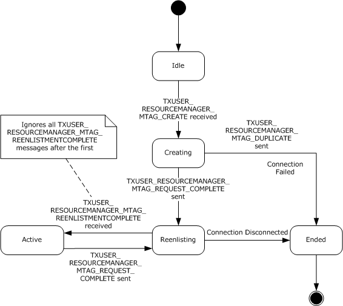

Figure 50: CONNTYPE_TXUSER_RESOURCEMANAGER acceptor states

##### 3.6.1.1.1 Idle

The Idle state is the initial state. The following event is processed in this state:

- Receiving a TXUSER_RESOURCEMANAGER_MTAG_CREATE Message (section [3.6.5.1.1.1](#Section_3.6.5.1.1.1))

##### 3.6.1.1.2 Creating

The following event is processed in the Creating state:

- Create Resource Manager (section [3.6.7.9](#Section_3.6.7.9))

##### 3.6.1.1.3 Reenlisting

The following events are processed in the Reenlisting state:

- Receiving a TXUSER_RESOURCEMANAGER_MTAG_REENLISTMENTCOMPLETE Message (section [3.6.5.1.1.2](#Section_3.6.5.1.1.2))
- Connection Disconnected (section [3.6.5.1.1.3](#Section_3.6.5.1.1.3))

##### 3.6.1.1.4 Active

The following event is processed in the Active state:

- Reenlist Complete (section [3.6.7.15](#Section_3.6.7.15))

##### 3.6.1.1.5 Ended

The final state is the Ended state.

#### 3.6.1.2 CONNTYPE_TXUSER_RESOURCEMANAGERINTERNAL Acceptor States

The [**transaction manager**](#gt_transaction-manager) communicating with a [**resource manager**](#gt_resource-manager-rm) MUST act as an [**acceptor**](#gt_acceptor) for the CONNTYPE_TXUSER_RESOURCEMANAGERINTERNAL (section [2.2.10.1.2](#Section_2.2.10.1.2.1)) [**connection type**](#gt_connection-type). In this role, the transaction manager communicating with a resource manager MUST provide support for the following states:

- Idle (section [3.6.1.2.1](#Section_3.6.1.2.1))
- Creating (section [3.6.1.2.2](#Section_3.6.1.2.2))
- Reenlisting (section [3.6.1.2.3](#Section_3.6.1.2.3))
- Active (section [3.6.1.2.4](#Section_3.6.1.2.4))
- Ended (section [3.6.1.2.5](#Section_3.6.1.2.5))
The following figure shows the relationship between the CONNTYPE_TXUSER_RESOURCEMANAGERINTERNAL (section 2.2.10.1.2) acceptor states.

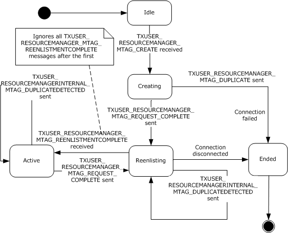

Figure 51: CONNTYPE_TXUSER_RESOURCEMANAGERINTERNAL acceptor states

##### 3.6.1.2.1 Idle

This is the initial state. The following event is processed in this state:

- Receiving a TXUSER_RESOURCEMANAGER_MTAG_CREATE Message (section [3.6.5.1.2.1](#Section_3.6.5.1.2.1))

##### 3.6.1.2.2 Creating

The following event is processed in this state:

- Create Resource Manager (section [3.6.7.9](#Section_3.6.7.9))

##### 3.6.1.2.3 Reenlisting

The following events are processed in this state:

- Receiving a TXUSER_RESOURCEMANAGER_MTAG_REENLISTMENTCOMPLETE Message (section [3.6.5.1.2.2](#Section_3.6.5.1.2.2))
- Create Resource Manager (section [3.6.7.9](#Section_3.6.7.9))
- Connection Disconnected (section [3.6.5.1.2.3](#Section_3.6.5.1.2.3))

##### 3.6.1.2.4 Active

The following events are processed in this state:

- Reenlist Complete (section [3.6.7.15](#Section_3.6.7.15))
- Create Resource Manager (section [3.6.7.9](#Section_3.6.7.9))

##### 3.6.1.2.5 Ended

This is the final state.

#### 3.6.1.3 CONNTYPE_TXUSER_PHASE0 Acceptor States

The [**transaction manager**](#gt_transaction-manager) communicating with a [**resource manager**](#gt_resource-manager-rm) MUST act as an [**acceptor**](#gt_acceptor) for the CONNTYPE_TXUSER_PHASE0 (section [2.2.10.2.1](#Section_2.2.10.2.1)) [**connection type**](#gt_connection-type). In this role, the transaction manager communicating with a resource manager MUST provide support for the following states:

- Idle (section [3.6.1.3.1](#Section_3.6.1.3.1))
- Awaiting Create Response (section [3.6.1.3.2](#Section_3.6.1.3.2))
- Active (section [3.6.1.3.3](#Section_3.6.1.3.3))
- Awaiting Phase Zero Response (section [3.6.1.3.4](#Section_3.6.1.3.4))
- Ended (section [3.6.1.3.5](#Section_3.6.1.3.5))
The following figure shows the relationship between the CONNTYPE_TXUSER_PHASE0 (section 2.2.10.2.1) acceptor states.

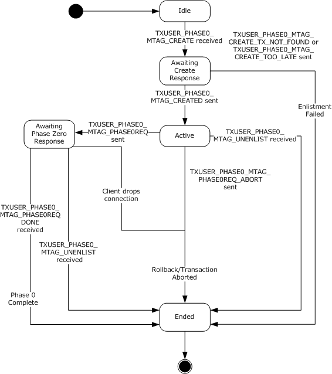

Figure 52: CONNTYPE_TXUSER_PHASE0 acceptor states

##### 3.6.1.3.1 Idle

This is the initial state. The following event us processed in this state:

- Receiving a TXUSER_PHASE0_MTAG_CREATE Message (section [3.6.5.2.1.1](#Section_3.6.5.2.1.1))

##### 3.6.1.3.2 Awaiting Create Response

The following events are processed in this state:

- Create Phase Zero Enlistment Success (section [3.6.7.8](#Section_3.6.7.8))
- Create Phase Zero Enlistment Failure (section [3.6.7.7](#Section_3.6.7.7))

##### 3.6.1.3.3 Active

The following events are processed in this state:

- Begin Phase Zero (section [3.6.7.4](#Section_3.7.7.3))
- Phase Zero Aborted (section [3.6.7.14](#Section_3.6.7.14))
- Receiving a TXUSER_PHASE0_MTAG_UNENLIST Message (section [3.6.5.2.1.3](#Section_3.6.5.2.1.3))

##### 3.6.1.3.4 Awaiting Phase Zero Response

The following events are processed in this state:

- Receiving a TXUSER_PHASE0_MTAG_PHASE0REQDONE Message (section [3.6.5.2.1.2](#Section_3.6.5.2.1.2))
- Receiving a TXUSER_PHASE0_MTAG_UNENLIST Message (section [3.6.5.2.1.3](#Section_3.6.5.2.1.3))

##### 3.6.1.3.5 Ended

This is the final state.

#### 3.6.1.4 CONNTYPE_TXUSER_ENLISTMENT Acceptor States

The [**transaction manager**](#gt_transaction-manager) communicating with a [**resource manager**](#gt_resource-manager-rm) MUST act as an [**acceptor**](#gt_acceptor) for the CONNTYPE_TXUSER_ENLISTMENT (section [2.2.10.2.2](#Section_2.2.10.2.2.7)) [**connection type**](#gt_connection-type). In this role, the transaction manager communicating with a resource manager MUST provide support for the following states:

- Idle (section [3.6.1.4.1](#Section_3.6.1.4.1))
- Processing Enlistment Request (section [3.6.1.4.2](#Section_3.6.1.4.2))
- Active (section [3.6.1.4.3](#Section_3.6.1.4.3))
- Awaiting Single Phase Commit Response (section [3.6.1.4.4](#Section_3.6.1.4.4))
- Awaiting Prepare Response (section [3.6.1.4.5](#Section_3.6.1.4.5))
- Awaiting Prepare Response Aborted (section [3.6.1.4.6](#Section_3.6.1.4.6))
- Prepared (section [3.6.1.4.7](#Section_3.6.1.4.7))
- Awaiting Commit Response (section [3.6.1.4.8](#Section_3.6.1.4.8))
- Awaiting Abort Response (section [3.6.1.4.9](#Section_3.6.1.4.9))
- Ended (section [3.6.1.4.10](#Section_3.6.1.4.10))
The following figure shows the relationship between the CONNTYPE_TXUSER_ENLISTMENT (section 2.2.10.2.2) acceptor states.

Figure 53: CONNTYPE_TXUSER_ENLISTMENT acceptor states (processing enlistment request)

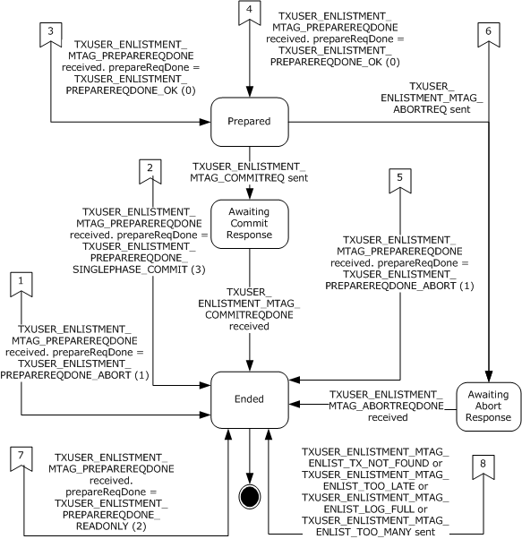

Figure 54: CONNTYPE_TXUSER_ENLISTMENT acceptor states (active)

##### 3.6.1.4.1 Idle

This is the initial state. The following event is processed in this state:

- Receiving a TXUSER_ENLISTMENT_MTAG_ENLIST Message (section [3.6.5.2.2.1](#Section_3.6.5.2.2.1))
- Begin Rollback (section [3.6.7.5](#Section_3.2.7.6))

##### 3.6.1.4.2 Processing Enlistment Request

The following events are processed in this state:

- Create Subordinate Enlistment Success (section [3.6.7.11](#Section_3.6.7.11))
- Create Subordinate Enlistment Failure (section [3.6.7.10](#Section_3.6.7.10))

##### 3.6.1.4.3 Active

The following events are processed in this state:

- Begin Phase One (section [3.6.7.3](#Section_3.7.7.2))
- Begin Rollback (section [3.6.7.5](#Section_3.2.7.6))

##### 3.6.1.4.4 Awaiting Single-Phase Commit Response

The following event is processed in this state:

- Receiving a TXUSER_ENLISTMENT_MTAG_PREPAREREQDONE Message (section [3.6.5.2.2.2](#Section_3.6.5.2.2.2))

##### 3.6.1.4.5 Awaiting Prepare Response

The following events are processed in this state:

- Receiving a TXUSER_ENLISTMENT_MTAG_PREPAREREQDONE Message (section [3.6.5.2.2.2](#Section_3.6.5.2.2.2))
- Begin Rollback (section [3.6.7.5](#Section_3.2.7.6))

##### 3.6.1.4.6 Awaiting Prepare Response Aborted

The following event is processed in this state:

- Receiving a TXUSER_ENLISTMENT_MTAG_PREPAREREQDONE Message (section [3.6.5.2.2.2](#Section_3.6.5.2.2.2))

##### 3.6.1.4.7 Prepared

The following events are processed in this state:

- Begin Commit (section [3.6.7.1](#Section_3.4.7.3))
- Begin Rollback (section [3.6.7.5](#Section_3.2.7.6))

##### 3.6.1.4.8 Awaiting Commit Response

The following event is processed in this state:

- Receiving a TXUSER_ENLISTMENT_MTAG_COMMITREQDONE Message (section [3.6.5.2.2.3](#Section_3.6.5.2.2.3))

##### 3.6.1.4.9 Awaiting Abort Response

The following event is processed in this state:

- Receiving a TXUSER_ENLISTMENT_MTAG_ABORTREQDONE Message (section [3.6.5.2.2.4](#Section_3.6.5.2.2.4))

##### 3.6.1.4.10 Ended

This is the final state.

#### 3.6.1.5 CONNTYPE_TXUSER_REENLIST Acceptor States

The [**transaction manager**](#gt_transaction-manager) communicating with a [**resource manager**](#gt_resource-manager-rm) MUST act as an [**acceptor**](#gt_acceptor) for the CONNTYPE_TXUSER_REENLIST (section [2.2.10.3.1](#Section_2.2.10.3.1.3)) [**connection type**](#gt_connection-type). In this role, the transaction manager communicating with a resource manager MUST provide support for the following states:

- Idle (section [3.6.1.5.1](#Section_3.6.1.5.1))
- Processing Reenlist Request (section [3.6.1.5.2](#Section_3.6.1.5.2))
- Ended (section [3.6.1.5.3](#Section_3.6.1.5.3))
The following figure shows the relationship between the CONNTYPE_TXUSER_REENLIST (section 2.2.10.3.1) acceptor states.

Figure 55: CONNTYPE_TXUSER_REENLIST acceptor states

##### 3.6.1.5.1 Idle

This is the initial state. The following event is processed in this state:

- Receiving a TXUSER_REENLIST_MTAG_REENLIST Message (section [3.6.5.3.1.1](#Section_3.6.5.3.1.1))

##### 3.6.1.5.2 Processing Reenlist Request

The following events are processed in this state:

- Begin Commit (section [3.6.7.1](#Section_3.4.7.3))
- Begin Rollback (section [3.6.7.5](#Section_3.2.7.6))
- Reenlist Timeout Timer (section [3.6.6.1](#Section_3.6.6.1))

##### 3.6.1.5.3 Ended

This is the final state.

#### 3.6.1.6 CONNTYPE_TXUSER_VOTER Acceptor States

The [**transaction manager**](#gt_transaction-manager) communicating with a [**resource manager**](#gt_resource-manager-rm) MUST act as an [**acceptor**](#gt_acceptor) for the CONNTYPE_TXUSER_VOTER (section [2.2.10.4.1](#Section_2.2.10.4.1.7)) [**connection type**](#gt_connection-type). In this role, the transaction manager communicating with a resource manager MUST provide support for the following states:

- Idle (section [3.6.1.6.1](#Section_3.6.1.6.1))
- Create Voter (section [3.6.1.6.2](#Section_3.6.1.6.2))
- Active (section [3.6.1.6.3](#Section_3.6.1.6.3))
- Awaiting Voter Response (section [3.6.1.6.4](#Section_3.6.1.6.4))
- Awaiting Outcome (section [3.6.1.6.5](#Section_3.6.1.6.5))
- Ended (section [3.6.1.6.6](#Section_3.6.1.6.6))
The following figure shows the relationship between the CONNTYPE_TXUSER_VOTER (section 2.2.10.4.1) acceptor states.

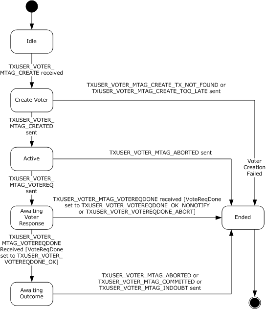

Figure 56: CONNTYPE_TXUSER_VOTER acceptor states

##### 3.6.1.6.1 Idle

This is the initial state. The following event is processed in this state:

- Receiving a TXUSER_VOTER_MTAG_CREATE Message (section [3.6.5.4.1.1](#Section_3.6.5.4.1.1))

##### 3.6.1.6.2 Create Voter

The following events are processed in this state:

- Create Voter Enlistment Success (section [3.6.7.13](#Section_3.6.7.13))
- Create Voter Enlistment Failure (section [3.6.7.12](#Section_3.6.7.12))

##### 3.6.1.6.3 Active

The following events are processed in this state:

- Begin Voting (section [3.6.7.6](#Section_3.2.7.7))
- Begin Rollback (section [3.6.7.5](#Section_3.2.7.6))

##### 3.6.1.6.4 Awaiting Voter Response

The following event is processed in this state:

- Receiving a TXUSER_VOTER_MTAG_VOTERREQDONE Message (section [3.6.5.4.1.2](#Section_3.6.5.4.1.2))

##### 3.6.1.6.5 Awaiting Outcome

The following events are processed in this state:

- Begin Commit (section [3.6.7.1](#Section_3.4.7.3))
- Begin Rollback (section [3.6.7.5](#Section_3.2.7.6))
- Begin In Doubt (section [3.6.7.2](#Section_3.6.7.2))

##### 3.6.1.6.6 Ended

This is the final state.

### 3.6.2 Timers

The [**transaction manager**](#gt_transaction-manager) communicating with a [**resource manager**](#gt_resource-manager-rm) [**facet**](#gt_facet) MUST provide the timer that is shown in the next section.

#### 3.6.2.1 Reenlist Time-Out Timer

The timer MUST be set when the [**transaction manager**](#gt_transaction-manager) communicating with a [**resource manager**](#gt_resource-manager-rm) [**facet**](#gt_facet) receives a TXUSER_REENLIST_MTAG_REENLIST (section [2.2.10.3.1.1](#Section_2.2.10.3.1.1)) message on a CONNTYPE_TXUSER_REENLIST (section [2.2.10.3.1](#Section_2.2.10.3.1.3)) [**connection**](#gt_connection). The timer MUST be canceled when the CONNTYPE_TXUSER_REENLIST connection is disconnected.

The timer has no default value. The initial value of the timer MUST be provided in the TXUSER_REENLIST_MTAG_REENLIST message. The minimum value of the timer MUST be zero, which means that the timer never generates a timer event. In this case, the Reenlist Time-Out Timer Event (section [3.6.6.1](#Section_3.6.6.1)) is never signaled, and the timeout reply message triggered by this event is never sent.

When the timer is initialized, the transaction manager communicating with a resource manager facet MUST provide an [**Enlistment**](#gt_enlistment) object to associate with the timer. When the timer expires, the same Enlistment object MUST be provided with the timer notification. The transaction manager communicating with a resource manager facet MUST provide a distinct Reenlist Timeout timer instance for each CONNTYPE_TXUSER_REENLIST connection.

### 3.6.3 Initialization

When the [**transaction manager**](#gt_transaction-manager) communicating with a [**resource manager**](#gt_resource-manager-rm) [**facet**](#gt_facet) is initialized:

- The transaction manager communicating with a resource manager facet MUST examine the following security flags on the Core Transaction Manager Facet (section [1.3.3.3.1](#Section_1.3.3.3.1)) and perform the following actions:
- If either the Allow Network Access flag or the Allow Remote Clients flag is set to false:
- For the following connection types, the transaction manager communicating with a resource manager facet MUST refuse to accept incoming [**connections**](#gt_connection) from remote machines as specified in [MS-CMP](../MS-CMP/MS-CMP.md) section 3.1.5.5 with the rejection **Reason** set to 0x80070005.
- CONNTYPE_TXUSER_ENLISTMENT (section [2.2.10.2.2](#Section_2.2.10.2.2.7))
- CONNTYPE_TXUSER_RESOURCEMANAGER (section [2.2.10.1.1](#Section_2.2.10.1.1))
- CONNTYPE_TXUSER_RESOURCEMANAGERINTERNAL (section [2.2.10.1.2](#Section_2.2.10.1.2.1))
- CONNTYPE_TXUSER_REENLIST (section [2.2.10.3.1](#Section_2.2.10.3.1.3))
- CONNTYPE_TXUSER_VOTER (section [2.2.10.4.1](#Section_2.2.10.4.1.7))
- CONNTYPE_TXUSER_PHASE0 (section [2.2.10.2.1](#Section_2.2.10.2.1))
All data elements maintained by the transaction manager communicating with a resource manager facet are initialized to an empty value unless stated otherwise in this section or in the initialization sections of the facets the transaction manager communicating with a resource manager facet extends, as specified in section [3.6.1](#Section_3.6.1).

### 3.6.4 Higher-Layer Triggered Events

None.

### 3.6.5 Processing Events and Sequencing Rules

#### 3.6.5.1 Resource Manager Registration

##### 3.6.5.1.1 CONNTYPE_TXUSER_RESOURCEMANAGER as Acceptor

For all messages that are received in this [**connection type**](#gt_connection-type), the [**transaction manager**](#gt_transaction-manager) communicating with a [**resource manager**](#gt_resource-manager-rm) [**facet**](#gt_facet) MUST process the message as specified in section [3.1](#Section_1.3). The transaction manager communicating with a resource manager facet MUST additionally follow the processing rules as specified in the following sections.

###### 3.6.5.1.1.1 Receiving a TXUSER_RESOURCEMANAGER_MTAG_CREATE Message

When the [**transaction manager**](#gt_transaction-manager) communicating with a resource manager [**facet**](#gt_facet) receives a TXUSER_RESOURCEMANAGER_MTAG_CREATE (section [2.2.10.1.1.1](#Section_2.2.10.1.1.1)) message, the transaction manager communicating with a resource manager facet MUST perform the following actions:

- If the [**connection**](#gt_connection) state is Idle:
- Set the connection state to Creating.
- Create a resource manager object using the following values:
- The **guidRM** field from the message as the [**resource manager identifier**](#gt_resource-manager-identifier).
- The **guidSession** field from the message as the [**session**](#gt_session) identifier of the resource manager.
- The current connection.
- Assign the resource manager object to the Connection-Specific Data field of the connection.
- Signal the Create Resource Manager (section [3.6.7.9](#Section_3.6.7.9)) event on the transaction manager communicating with a resource manager facet with the resource manager object.
- Otherwise, the message MUST be processed as an invalid message as specified in section [3.1.6](#Section_3.1.6).

###### 3.6.5.1.1.2 Receiving a TXUSER_RESOURCEMANAGER_MTAG_REENLISTMENTCOMPLETE Message

When the [**transaction manager**](#gt_transaction-manager) communicating with a resource manager facet receives a TXUSER_RESOURCEMANAGER_MTAG_REENLISTMENTCOMPLETE (section [2.2.10.1.1.3](#Section_2.2.10.1.1.3)) message, the transaction manager communicating with a resource manager MUST perform the following actions:

- If the connection state is Reenlisting:
- Set the connection state to Active.
- Signal the Reenlist Complete (section [3.6.7.15](#Section_3.6.7.15)) event on the transaction manager communicating with a resource manager facet with the resource manager object that is referenced by the Connection-Specific Data field of the connection.
- Otherwise, the message MUST be processed as an invalid message as specified in section [3.1.6](#Section_3.1.6).

###### 3.6.5.1.1.3 Connection Disconnected

When a CONNTYPE_TXUSER_RESOURCEMANAGER (section [2.2.10.1.1](#Section_2.2.10.1.1)) connection is disconnected, the [**transaction manager**](#gt_transaction-manager) communicating with a resource manager facet MUST:

- Set the connection state to Ended.
- Signal the Resource Manager Down (section [3.6.7.16](#Section_3.6.7.16)) event on the transaction manager communicating with a resource manager facet with the resource manager object referenced by the Connection-Specific Data field of the connection.

##### 3.6.5.1.2 CONNTYPE_TXUSER_RESOURCEMANAGERINTERNAL as Acceptor

For all messages received in this [**connection type**](#gt_connection-type), the [**transaction manager**](#gt_transaction-manager) communicating with a [**resource manager**](#gt_resource-manager-rm) [**facet**](#gt_facet) MUST process the message as specified in section [3.1](#Section_1.3). The transaction manager communicating with a resource manager facet MUST additionally follow the processing rules as specified in the following sections.

###### 3.6.5.1.2.1 Receiving a TXUSER_RESOURCEMANAGER_MTAG_CREATE Message

When the [**transaction manager**](#gt_transaction-manager) communicating with a resource manager [**facet**](#gt_facet) receives a [TXUSER_RESOURCEMANAGER_MTAG_CREATE](#Section_2.2.10.1.1.1) message, the transaction manager communicating with a resource manager facet MUST perform the following actions:

- If the [**connection**](#gt_connection) state is Idle:
- Set the connection state to Creating.
- Create a resource manager object using the following values:
- The **guidRM** field from the message as the [**resource manager identifier**](#gt_resource-manager-identifier).
- The **guidSession** field from the message as the [**session**](#gt_session) identifier of the resource manager.
- This connection.
- Assign the resource manager object to the Connection-Specific Data field of the connection.
- Signal the Create Resource Manager (section [3.6.7.9](#Section_3.6.7.9)) event on the transaction manager communicating with a resource manager facet with the resource manager object.
- Otherwise, the message MUST be processed as an invalid message as specified in section [3.1.6](#Section_3.1.6).

###### 3.6.5.1.2.2 Receiving a TXUSER_RESOURCEMANAGER_MTAG_REENLISTMENTCOMPLETE Message

When the [**transaction manager**](#gt_transaction-manager) communicating with a resource manager facet receives a TXUSER_RESOURCEMANAGER_MTAG_REENLISTMENTCOMPLETE (section [2.2.10.1.1.3](#Section_2.2.10.1.1.3)) message, the transaction manager communicating with a resource manager facet MUST perform the following actions:

- If the connection state is Reenlisting:
- Set the connection state to Active.
- Signal the Reenlist Complete (section [3.6.7.15](#Section_3.6.7.15)) event on the transaction manager communicating with a resource manager facet with the resource manager object that is referenced by the Connection-Specific Data field of the connection.
- Otherwise, the message MUST be processed as an invalid message as specified in section [3.1.6](#Section_3.1.6).

###### 3.6.5.1.2.3 Connection Disconnected

When a CONNTYPE_TXUSER_RESOURCEMANAGERINTERNAL (section [2.2.10.1.2](#Section_2.2.10.1.2.1))connection is disconnected, the [**transaction manager**](#gt_transaction-manager) communicating with a resource manager facet MUST:

- Set the connection state to Ended.
- Signal the Resource Manager Down (section [3.6.7.16](#Section_3.6.7.16)) event on the transaction manager communicating with a resource manager facet with the resource manager object referenced by the Connection-Specific Data field of the connection.

#### 3.6.5.2 Transaction Coordination

##### 3.6.5.2.1 CONNTYPE_TXUSER_PHASE0 as Acceptor

For all messages received in this [**connection type**](#gt_connection-type), the [**transaction manager**](#gt_transaction-manager) communicating with a [**resource manager**](#gt_resource-manager-rm) [**facet**](#gt_facet) MUST process the message as specified in section [3.1](#Section_1.3). The transaction manager communicating with a resource manager facet MUST additionally follow the processing rules as specified in the following sections.

###### 3.6.5.2.1.1 Receiving a TXUSER_PHASE0_MTAG_CREATE Message

When the [**transaction manager**](#gt_transaction-manager) receives a [TXUSER_PHASE0_MTAG_CREATE](#Section_2.2.10.2.1.1) message, the transaction manager communicating with a resource manager [**facet**](#gt_facet) MUST perform the following actions:

- If the [**connection**](#gt_connection) state is Idle:
- Set the connection state to Awaiting Create Response (section [3.6.1.3.2](#Section_3.6.1.3.2)).
- Find the [**transaction**](#gt_transaction) object in the transaction table of the transaction manager using the **guidTx** field from the message.
- If the transaction is not found:
- Send a [TXUSER_PHASE0_MTAG_CREATE_TX_NOT_FOUND](#Section_2.2.10.2.1.3) message using the connection.
- Set the connection state to Ended.
- Otherwise:
- Create a new [**Enlistment**](#gt_enlistment) object with the following values:
- The transaction manager communicating with a resource manager facet
- The transaction object
- The connection
- Set the **Resource Manager Identifier** field of the Enlistment object to a [**NULL GUID**](#gt_null-guid).
- Assign the new Enlistment object to the **enlistment** field of the connection.
- Signal the [Create Phase Zero Enlistment](#Section_3.2.7.10) event on the [Core Transaction Manager Facet](#Section_1.3.3.3.1) with the Enlistment object.
- Otherwise, the message MUST be processed as an invalid message as specified in section [3.1.6](#Section_3.1.6).

###### 3.6.5.2.1.2 Receiving a TXUSER_PHASE0_MTAG_PHASE0REQDONE Message

When the [**transaction manager**](#gt_transaction-manager) receives a [TXUSER_PHASE0_MTAG_PHASE0REQDONE](#Section_2.2.10.2.1.7) message, the transaction manager MUST perform the following actions:

- If the connection state is Awaiting [**Phase Zero**](#gt_phase-zero) Response:
- Signal the [Enlistment Phase Zero Complete](#Section_3.2.7.17) event on the [Core Transaction Manager Facet](#Section_1.3.3.3.1) with the following arguments:
- The Enlistment object that is referenced by this connection.
- The completed [**outcome**](#gt_outcome) value
- Set the connection state to Ended.
- Otherwise, the message MUST be processed as an invalid message as specified in section [3.1.6](#Section_3.1.6).

###### 3.6.5.2.1.3 Receiving a TXUSER_PHASE0_MTAG_UNENLIST Message

When the [**transaction manager**](#gt_transaction-manager) receives a TXUSER_PHASE0_MTAG_UNENLIST (section [2.2.10.2.1.8](#Section_2.2.10.2.1.8)) message, the transaction manager MUST perform the following actions:

- If the connection state is Active:
- Signal the Unenlist Phase Zero Enlistment (section [3.2.7.34](#Section_3.2.7.34)) event on the Core Transaction Manager Facet (section [1.3.3.3.1](#Section_1.3.3.3.1)) with the Enlistment object that is referenced by this connection.
- Set the connection state to Ended.
- If the connection state is Awaiting [**Phase Zero**](#gt_phase-zero) Response:
- Signal the Enlistment Phase Zero Complete (section [3.2.7.17](#Section_3.2.7.17)) event on the Core Transaction Manager Facet with the following arguments:
- The Enlistment object that is referenced by this connection.
- The completed [**outcome**](#gt_outcome) value.
- Set the connection state to Ended.
- Otherwise, the message MUST be processed as an invalid message as specified in section [3.1.6](#Section_3.1.6).

###### 3.6.5.2.1.4 Connection Disconnected

When a CONNTYPE_TXUSER_PHASE0 (section [2.2.10.2.1](#Section_2.2.10.2.1)) connection is disconnected, the [**transaction manager**](#gt_transaction-manager) communicating with a resource manager facet MUST perform the following actions:

- If the connection state is Awaiting [**Phase Zero**](#gt_phase-zero) Response:
- Signal the Enlistment Phase Zero Complete (section [3.2.7.17](#Section_3.2.7.17)) event on the Core Transaction Manager Facet (section [1.3.3.3.1](#Section_1.3.3.3.1)) with the following arguments:
- The Enlistment object that is referenced by this connection.
- The aborted [**outcome**](#gt_outcome) value.
- Otherwise, if the connection state is Active (section [3.6.1.3.3](#Section_3.6.1.3.3)):
- Signal the Enlistment Unilaterally Aborted (section [3.2.7.19](#Section_3.2.7.19)) event on the Core Transaction Manager Facet with the Enlistment object that is referenced by this connection.
- Finally, in all cases, the event MUST be processed as specified in section [3.1.8.3](#Section_3.6.5.2.2.5).

##### 3.6.5.2.2 CONNTYPE_TXUSER_ENLISTMENT as Acceptor

For all messages that are received in this [**connection type**](#gt_connection-type), the [**transaction manager**](#gt_transaction-manager) MUST process the message as specified in section [3.1](#Section_1.3). The transaction manager MUST additionally follow the processing rules as specified in the following sections.

###### 3.6.5.2.2.1 Receiving a TXUSER_ENLISTMENT_MTAG_ENLIST Message

When the [**transaction manager**](#gt_transaction-manager) receives a [TXUSER_ENLISTMENT_MTAG_ENLIST](#Section_2.2.10.2.2.5) message, the transaction manager MUST perform the following actions:

- If the [**connection**](#gt_connection) state is Idle:
- Set the connection state to Processing Enlistment Request.
- Find the [**transaction**](#gt_transaction) object in the transaction table of the transaction manager using the **guidTx** field from the message.
- If the transaction is not found:
- Send a [TXUSER_ENLIST_MTAG_ENLIST_TX_NOT_FOUND](#Section_2.2.10.2.2.9) message using the connection.
- Set the connection state to Ended.
- Otherwise:
- Find the [**resource manager**](#gt_resource-manager-rm) object in the transaction manager's Active Resource manager table using the **guidRm** field from the message.
- If the resource manager is not found:
- Send a [TXUSER_ENLIST_MTAG_ENLIST_TOO_LATE](#Section_2.2.10.2.2.7) message using the connection.
- Set the connection state to Ended.
- Otherwise:
- Create a new [**Enlistment**](#gt_enlistment) object with the following values:
- The transaction manager communicating with a resource manager [**facet**](#gt_facet)
- The transaction object
- The connection
- The **Resource Manager.Identifier** field of the resource manager object
- Signal the [Create Subordinate Enlistment](#Section_3.2.7.11) event on the [Core Transaction Manager Facet](#Section_1.3.3.3.1) with the new enlistment object.
- Otherwise, the message MUST be processed as an invalid message as specified in section [3.1.6](#Section_3.1.6).

###### 3.6.5.2.2.2 Receiving a TXUSER_ENLISTMENT_MTAG_PREPAREREQDONE Message

When the [**transaction manager**](#gt_transaction-manager) receives a TXUSER_ENLISTMENT_MTAG_PREPAREREQDONE (section [2.2.10.2.2.12](#Section_2.2.10.2.2.12)) message, the transaction manager MUST perform the following actions:

- If the connection state is Awaiting Prepare Response Aborted:
- If the **prepareReqDone** field of the message is TXUSER_ENLISTMENT_PREPAREREQDONE_OK:
- Send a TXUSER_ENLISTMENT_MTAG_ABORTREQ (section [2.2.10.2.2.1](#Section_2.2.10.2.2.1)) message using the connection.
- Set the connection state to Awaiting Abort Response.
- Otherwise, set the connection state to Ended.
- If the connection state is Awaiting Single Phase Commit Response:
- Signal the Enlistment Phase One Complete (section [3.2.7.16](#Section_3.2.7.16)) event on the Core Transaction Manager Facet (section [1.3.3.3.1](#Section_1.3.3.3.1)) with the following arguments:
- The Enlistment object of the connection.
- The [Phase One](#Section_1.3.1.2) [**outcome**](#gt_outcome) set to:
- Committed if the **prepareReqDone** field from the message is TXUSER_ENLISTMENT_PREPAREREQDONE_SINGLEPHASE_COMMIT.
- Aborted if the **prepareReqDone** field from the message is TXUSER_ENLISTMENT_PREPAREREQDONE_ABORT.
- Read Only if the **prepareReqDone** field from the message is TXUSER_ENLISTMENT_PREPAREREQDONE_READONLY.
- Prepared if the **prepareReqDone** field from the message is TXUSER_ENLISTMENT_PREPAREREQDONE_OK.
- If the **prepareReqDone** field from the message is set to TXUSER_ENLISTMENT_PREPAREREQDONE_OK:
- Set the connection state to Prepared.
- Otherwise:
- Set the connection state to Ended.
- If the connection state is Awaiting Prepare Response:
- Signal the Enlistment Phase One Complete (section 3.2.7.16) event on the Core Transaction Manager Facet with the following arguments:
- The Enlistment object of the connection.
- The Phase One outcome set to:
- Aborted if the **prepareReqDone** field is TXUSER_ENLISTMENT_PREPAREREQDONE_ABORT.
- Read Only if the **prepareReqDone** field is TXUSER_ENLISTMENT_PREPAREREQDONE_READONLY.
- Prepared if the **prepareReqDone** field is TXUSER_ENLISTMENT_PREPAREREQDONE_OK.
- If the **prepareReqDone** field from the message is set to TXUSER_ENLISTMENT_PREPAREREQDONE_OK:
- Set the connection state to Prepared.
- Otherwise:
- Set the connection state to Ended.
- If the connection state is Awaiting Abort Response:
- Ignore the message.
- Otherwise, the message MUST be processed as an invalid message as specified in section [3.1.6](#Section_3.1.6).

###### 3.6.5.2.2.3 Receiving a TXUSER_ENLISTMENT_MTAG_COMMITREQDONE Message

When the [**transaction manager**](#gt_transaction-manager) receives a TXUSER_ENLISTMENT_MTAG_COMMITREQDONE (section [2.2.10.2.2.4](#Section_2.2.10.2.2.4)) message, the transaction manager MUST perform the following action:

- If the connection state is Awaiting Commit Response:
- Signal the Enlistment Commit Complete (section [3.2.7.15](#Section_3.2.7.15)) event on the Core Transaction Manager Facet (section [1.3.3.3.1](#Section_1.3.3.3.1)) with the Enlistment object of the connection.
- Set the connection state to Ended.
- Otherwise, the message MUST be processed as an invalid message as specified in section [3.1.6](#Section_3.1.6).

###### 3.6.5.2.2.4 Receiving a TXUSER_ENLISTMENT_MTAG_ABORTREQDONE Message

When the [**transaction manager**](#gt_transaction-manager) receives a [TXUSER_ENLISTMENT_MTAG_ABORTREQDONE](#Section_2.2.10.2.2.2) message, the transaction manager MUST perform the following actions:

- If the connection state is Awaiting Abort Response:
- Signal the [Enlistment Rollback Complete](#Section_3.2.7.18) event on the [Core Transaction Manager Facet](#Section_1.3.3.3.1) with the Enlistment object of the connection.
- Set the connection state to Ended.
- Otherwise, the message MUST be processed as an invalid message as specified in section [3.1.6](#Section_3.1.6).

###### 3.6.5.2.2.5 Connection Disconnected

When a CONNTYPE_TXUSER_ENLISTMENT (section [2.2.10.2.2](#Section_2.2.10.2.2.7)) connection is disconnected, the [**transaction manager**](#gt_transaction-manager) MUST perform the following actions:

- If the connection state is either Processing Enlistment Request (section [3.6.1.4.2](#Section_3.6.1.4.2)) or Active (section [3.6.1.4.3](#Section_3.6.1.4.3)):
- Signal the Enlistment Unilaterally Aborted (section [3.2.7.19](#Section_3.2.7.19)) event on the Core Transaction Manager Facet (section [1.3.3.3.1](#Section_1.3.3.3.1)) with the Enlistment object of the connection.
- Otherwise, if the connection state is Awaiting Prepare Response (section [3.6.1.4.5](#Section_3.6.1.4.5)):
- Signal the Enlistment Phase One Complete (section [3.2.7.16](#Section_3.2.7.16)) event on the Core Transaction Manager Facet with the following arguments:
- The Enlistment object of the connection
- The aborted [**outcome**](#gt_outcome)
- Otherwise, if the connection state is Awaiting Single-Phase Commit Response (section [3.6.1.4.4](#Section_3.6.1.4.4)):
- Signal the Enlistment Phase One Complete event on the Core Transaction Manager Facet with the following arguments:
- The Enlistment object of the connection
- The In Doubt (section [3.2.1.3.12](#Section_3.2.1.3.12)) outcome
- Otherwise, if the connection state is Awaiting Commit Response (section [3.6.1.4.8](#Section_3.6.1.4.8)), the transaction manager MUST perform the following action:
- Add the Enlistment object of the connection to the **Failed to Notify List** of the transaction manager (section [3.6.1](#Section_3.6.1)).
- Otherwise, if the connection state is Awaiting Abort Response (section [3.6.1.4.9](#Section_3.6.1.4.9)):
- Signal the Enlistment Rollback Complete (section [3.2.7.18](#Section_3.2.7.18)) event on the Core Transaction Manager Facet with the Enlistment object of the connection.
- Finally, in all cases, the event MUST be processed as specified in section [3.1.8.3](#Section_3.6.5.2.2.5).

#### 3.6.5.3 Transaction Recovery

##### 3.6.5.3.1 CONNTYPE_TXUSER_REENLIST as Acceptor

For all messages received in this [**connection type**](#gt_connection-type), the [**transaction manager**](#gt_transaction-manager) communicating with a [**resource manager**](#gt_resource-manager-rm) [**facet**](#gt_facet) MUST process the message as specified in section [3.1](#Section_1.3). The transaction manager communicating with a resource manager facet MUST additionally follow the processing rules as specified in the following sections.

###### 3.6.5.3.1.1 Receiving a TXUSER_REENLIST_MTAG_REENLIST Message

When the [**transaction manager**](#gt_transaction-manager) communicating with a resource manager facet receives a [TXUSER_REENLIST_MTAG_REENLIST](#Section_2.2.10.3.1.1) message, the transaction manager communicating with a resource manager facet MUST perform the following actions:

- If the [**connection**](#gt_connection) state is Idle:
- Set the connection state to [Processing Reenlist Request](#Section_3.6.1.5.2).
- Look up a resource manager object in the Active Resource manager table, using the **guidRm** field from the message as the key.
- If the resource manager does not exist:
- Send a [TXUSER_REENLIST_MTAG_REENLIST_ABORTED](#Section_2.2.10.3.1.2) message using the connection.
- Set the connection state to Ended.
- Otherwise:
- Look up a [**transaction**](#gt_transaction) object in the transaction table using the **guidTx** field from the message as the key.
- If the transaction is not found:
- Send a TXUSER_REENLIST_MTAG_REENLIST_ABORTED message using the connection.
- Set the connection state to Ended.
- Find an [**Enlistment**](#gt_enlistment) object in the transaction object's [**Phase Two Enlistment**](#gt_phase-two-enlistment) list whose Resource Manager field matches the resource manager object.
- If no Enlistment object is found:
- Send a TXUSER_REENLIST_MTAG_REENLIST_ABORTED message using the connection.
- Set the connection state to Ended.
- Otherwise:
- Initialize the Reenlist Time-out timer providing the following arguments:
- If the value of the **ulTimeout** field from the message is less than zero:
- Use a value of zero.
- Otherwise:
- Use the **ulTimeout** field from the message.
- The Enlistment object that is found in the Phase Two enlistment list.
- Assign the Enlistment object to the **enlistment** field of the connection.
- Assign the connection object to the **Enlistment Object.Connection** field of the enlistment.
- Signal the [Request Transaction Outcome](#Section_3.2.7.33) event on the [Core Transaction Manager Facet](#Section_1.3.3.3.1) with the new Enlistment object.
- Otherwise, the message MUST be processed as an invalid message as specified in section [3.1.6](#Section_3.1.6).

###### 3.6.5.3.1.2 Connection Disconnected

This event MUST be processed as specified in section [3.1.8.3](#Section_3.6.5.2.2.5).

#### 3.6.5.4 Voting

##### 3.6.5.4.1 CONNTYPE_TXUSER_VOTER as Acceptor

For all messages that are received in this [**connection type**](#gt_connection-type), the [**transaction manager**](#gt_transaction-manager) that is communicating with a [**resource manager**](#gt_resource-manager-rm) [**facet**](#gt_facet) MUST process the message as specified in section [3.1](#Section_1.3). The transaction manager communicating with a resource manager facet MUST additionally follow the processing rules as specified in the following sections.

###### 3.6.5.4.1.1 Receiving a TXUSER_VOTER_MTAG_CREATE Message

When the [**transaction manager**](#gt_transaction-manager) communicating with a resource manager [**facet**](#gt_facet) receives a [TXUSER_VOTER_MTAG_CREATE](#Section_2.2.10.4.1.4) message, it MUST perform the following actions:

- If the [**connection**](#gt_connection) state is Idle:
- Set the connection state to Creating Voter.
- Find the [**transaction**](#gt_transaction) object in the transaction manager's transaction table using the **guidTx** field from the message.
- If the transaction is not found:
- Send a [TXUSER_VOTER_MTAG_CREATE_TX_NOT_FOUND](#Section_2.2.10.4.1.6) message using the connection.
- Set the connection state to Ended.
- Otherwise:
- Create a new [**Enlistment**](#gt_enlistment) object with the following values:
- The transaction manager communicating with a resource manager facet
- The transaction object
- The connection
- Set the **Resource Manager Identifier** field of the Enlistment object to a[**NULL GUID**](#gt_null-guid).
- Assign the new Enlistment object to the **enlistment** field of the connection.
- Signal the [Create Voter Enlistment](#Section_3.2.7.14) event on the [Core Transaction Manager Facet](#Section_1.3.3.3.1) with the Enlistment object.
- Otherwise, the message MUST be processed as an invalid message as specified in section [3.1.6](#Section_3.1.6).

###### 3.6.5.4.1.2 Receiving a TXUSER_VOTER_MTAG_VOTEREQDONE Message

When the [**transaction manager**](#gt_transaction-manager) communicating with a resource manager facet receives a [TXUSER_VOTER_MTAG_VOTEREQDONE](#Section_2.2.10.4.1.9) message, the transaction manager communicating with a resource manager facet MUST perform the following actions:

- If the connection state is Awaiting Voter Response:
- Set the connection state as follows:
- If the **VoteReqDone** field from the message is TXUSER_VOTER_VOTEREQDONE_ABORT or TXUSER_VOTER_VOTEREQDONE_OK_NONOTIFY:
- Set the connection state to Ended.
- Otherwise, If the **VoteReqDone** field from the message is TXUSER_VOTER_VOTEREQDONE_OK:
- Set the connection state to Awaiting Outcome.
- Otherwise, the message MUST be processed as an invalid message, as specified in section [3.1.6](#Section_3.1.6).
- Signal the [Enlistment Vote Complete](#Section_3.2.7.20) event on the [Core Transaction Manager Facet](#Section_1.3.3.3.1) with the following arguments:
- The Enlistment object that is referenced by this connection.
- The Vote [**outcome**](#gt_outcome), which MUST be set to:
- Prepared if the **VoteReqDone** field from the message is TXUSER_VOTER_VOTEREQDONE_OK.
- Aborted if the **VoteReqDone** field from the message is TXUSER_VOTER_VOTEREQDONE_ABORT.
- Read-only if the **VoteReqDone** field from the message is TXUSER_VOTER_VOTEREQDONE_OK_NONOTIFY.
- Otherwise, the message MUST be processed as an invalid message as specified in section 3.1.6.

###### 3.6.5.4.1.3 Connection Disconnected

When a CONNTYPE_TXUSER_VOTER (section [2.2.10.4.1](#Section_2.2.10.4.1.7)) connection is disconnected, the [**transaction manager**](#gt_transaction-manager) communicating with a resource manager facet MUST perform the following actions:

- If the connection state is either Active (section [3.6.1.6.3](#Section_3.6.1.6.3)) or Awaiting Voter Response:
- Signal the Enlistment Unilaterally Aborted (section [3.2.7.19](#Section_3.2.7.19)) event on the Core Transaction Manager Facet (section [1.3.3.3.1](#Section_1.3.3.3.1)) with the Enlistment object that is referenced by this connection.
- Finally, in all cases, the event MUST be processed as specified in section [3.1.8.3](#Section_3.6.5.2.2.5).

### 3.6.6 Timer Events

#### 3.6.6.1 Reenlist Timeout Timer

When this timer expires, the [**transaction manager**](#gt_transaction-manager) communicating with a [**resource manager**](#gt_resource-manager-rm) [**facet**](#gt_facet) MUST perform the following actions:

- Send a TXUSER_REENLIST_MTAG_REENLIST_TIMEOUT (section [2.2.10.3.1.4](#Section_2.2.10.3.1.4)) message using the connection that is referenced by the provided [**Enlistment**](#gt_enlistment) object.
- Set the [**transaction**](#gt_transaction) state to Ended (section [3.2.1.3.14](#Section_3.4.1.13.3)).

### 3.6.7 Other Local Events

A [**transaction manager**](#gt_transaction-manager) communicating with a [**resource manager**](#gt_resource-manager-rm) [**facet**](#gt_facet) MUST be prepared to process the local events that are defined in the following sections.

The transaction manager communicating with a resource manager MUST be prepared to process local events pertaining to [**Phase Zero**](#gt_phase-zero) functionality only on versions where the [**connection type**](#gt_connection-type) [CONNTYPE_TXUSER_PHASE0](#Section_2.2.10.2.1) is supported. Section [2.2.1.1.3](#Section_2.2.1.1.3) defines protocol version support for this connection type. The following local events are affected:

- [Create Phase Zero Enlistment Success](#Section_3.6.7.8)
- [Create Phase Zero Enlistment Failure](#Section_3.6.7.7)
- [Begin Phase Zero](#Section_3.7.7.3)
- [Phase Zero Aborted](#Section_3.6.7.14)

#### 3.6.7.1 Begin Commit

The Begin Commit event MUST be signaled with the following arguments:

- An [**Enlistment**](#gt_enlistment) object
If the Begin Commit event is signaled, the [**transaction manager**](#gt_transaction-manager) MUST perform the following actions:

- If the [**connection**](#gt_connection) of the provided enlistment is of type CONNTYPE_TXUSER_VOTER (section [2.2.10.4.1](#Section_2.2.10.4.1.7)):
- Send a TXUSER_STATUS_MTAG_COMMITTED (section [2.2.10.4.1.2](#Section_2.2.10.4.1.2)) message using the connection.
- Set the connection state to Ended.
- Otherwise, if the connection of the provided enlistment is of type CONNTYPE_TXUSER_ENLISTMENT (section [2.2.10.2.2](#Section_2.2.10.2.2.7)):
- If the connection state is Ended:
- Add the provided Enlistment object to the **Failed to Notify List** of the transaction manager (section [3.6.1](#Section_3.6.1)).
- Otherwise:
- Send a TXUSER_ENLISTMENT_MTAG_COMMITREQ (section [2.2.10.2.2.3](#Section_2.2.10.2.2.3)) message using the connection.
- Set the connection state to Awaiting Commit Response (section [3.6.1.4.8](#Section_3.6.1.4.8)).
- Otherwise, if the connection of the provided enlistment is of type CONNTYPE_TXUSER_REENLIST (section [2.2.10.3.1](#Section_2.2.10.3.1.3)):
- If the connection state is Processing Reenlist Request (section [3.6.1.5.2](#Section_3.6.1.5.2)):
- Send a TXUSER_REENLIST_MTAG_REENLIST_COMMITTED (section [2.2.10.3.1.3](#Section_2.2.10.3.1.3)) message using the connection.
- Set the connection state to Ended.
- Otherwise:
- Ignore the signal.

#### 3.6.7.2 Begin In Doubt

The Begin In Doubt event MUST be signaled with the following arguments:

- An Enlistment object
If the Begin In Doubt event is signaled, the [**transaction manager**](#gt_transaction-manager) MUST perform the following actions:

- Send a [TXUSER_STATUS_MTAG_INDOUBT](#Section_2.2.10.4.1.3) message using the connection of the provided enlistment.
- Set the connection state to Ended.

#### 3.6.7.3 Begin Phase One

The Begin Phase One event MUST be signaled with the following arguments:

- An Enlistment object
- A Boolean value indicating whether or not the [**transaction manager**](#gt_transaction-manager) communicating with a resource manager facetattempts to make an [**Enlistment**](#gt_enlistment) [**single-phase commit**](#gt_single-phase-commit) request.
If the Begin Phase One event is signaled, the transaction manager MUST perform the following actions:

- If the connection state of the enlistment is Active:
- If the provided Single Phase Commit flag (defined in section [3.2.1](#Section_3.2.1)) is true:
- Send a TXUSER_ENLISTMENT_MTAG_PREPAREREQ (section [2.2.10.2.2.11](#Section_2.2.10.2.2.11)) message using the connection of the provided enlistment.
- The **fSinglePhase** field MUST be set to a nonzero value.
- Set the **grfRM** field to the **GRFRM** field of the transaction object referenced by the Enlistment object.
- Set the connection state to Awaiting Single Phase Commit Response.
- Otherwise:
- Send a TXUSER_ENLISTMENT_MTAG_PREPAREREQ (section 2.2.10.2.2.11) message using the connection of the provided enlistment.
- The **fSinglePhase** field MUST be set to 0.
- Set the **grfRM** field to the **GRFRM** field of the transaction object referenced by the Enlistment object.
- Set the connection state to Awaiting Prepare Response.
- Otherwise, ignore the event.

#### 3.6.7.4 Begin Phase Zero

The Begin Phase Zero event MUST be signaled with the following arguments:

- An Enlistment object
If the Begin Phase Zero event is signaled, the [**transaction manager**](#gt_transaction-manager) MUST perform the following actions:

- If the connection state is Active:
- Send a [TXUSER_PHASE0_MTAG_PHASE0REQ](#Section_2.2.10.2.1.5) message using the connection of the provided enlistment.
- Set the connection state to Awaiting [**Phase Zero**](#gt_phase-zero) Response.
- Otherwise:
- Ignore the event.

#### 3.6.7.5 Begin Rollback

The **Begin Rollback** event MUST be signaled with the following arguments:

- An Enlistment object
If the **Begin Rollback** event is signaled, the [**transaction manager**](#gt_transaction-manager) MUST perform the following actions:

- If the connection of the provided enlistment is of type [CONNTYPE_TXUSER_VOTER](#Section_2.2.10.4.1.7):
- Send a [TXUSER_STATUS_MTAG_ABORTED](#Section_2.2.10.4.1.1) message using the connection.
- Set the connection state to Ended.
- Otherwise, if the connection of the provided enlistment is of type [CONNTYPE_TXUSER_ENLISTMENT](#Section_2.2.10.2.2.7):
- If the connection state is Idle:
- Signal the [Enlistment Rollback Complete](#Section_3.2.7.18) event on the [Core Transaction Manager Facet](#Section_1.3.3.3.1) with the provided Enlistment object.
- Otherwise:
- If the connection state is Active or Prepared:
- Send a [TXUSER_ENLISTMENT_MTAG_ABORTREQ](#Section_2.2.10.2.2.1) message using the connection.
- Set the connection state to Awaiting Abort Response.
- Otherwise, if the connection state is Awaiting Prepare Response:
- Set the connection state to Awaiting Prepare Response Aborted.
- Otherwise, if the connection of the provided enlistment is of type [CONNTYPE_TXUSER_REENLIST](#Section_2.2.10.3.1.3):
- If the connection state is Processing Reenlist Request:
- Send a [TXUSER_REENLIST_MTAG_REENLIST_ABORTED](#Section_2.2.10.3.1.2) message using the connection.
- Set the connection state to Ended.
- Otherwise, ignore the signal.

#### 3.6.7.6 Begin Voting

The Begin Voting event MUST be signaled with the following arguments:

- An Enlistment object
If the Begin Voting event is signaled, the [**transaction manager**](#gt_transaction-manager) MUST perform the following actions:

- If the connection state is Active:
- Send a [TXUSER_VOTER_MTAG_VOTEREQ](#Section_2.2.10.4.1.8) message using the connection of the provided enlistment.
- Set the connection state to Awaiting Voter Response.
- Otherwise, ignore the event.

#### 3.6.7.7 Create Phase Zero Enlistment Failure

The Create Phase Zero Enlistment Failure event MUST be signaled with the following arguments:

- An Enlistment object.
- A value indicating the failure reason. The reason MUST be set to one of the following values:
- Too Late
- Tx Not Found
If the Create Phase Zero Enlistment Failure event is signaled, the [**transaction manager**](#gt_transaction-manager) MUST perform the following actions:

- If the connection state is Awaiting Create Response (section [3.6.1.3.2](#Section_3.6.1.3.2)):
- Send the matching message for the following reason codes using the connection of the provided enlistment:
- Too Late: TXUSER_PHASE0_MTAG_CREATE_TOO_LATE (section [2.2.10.2.1.2](#Section_2.2.10.2.1.2)).
- Tx Not Found: TXUSER_PHASE0_MTAG_CREATE_TX_NOT_FOUND (section [2.2.10.2.1.3](#Section_2.2.10.2.1.3))
- Set the connection state to Ended.
- Otherwise, ignore the event.

#### 3.6.7.8 Create Phase Zero Enlistment Success

The Create Phase Zero Enlistment Success event MUST be signaled with the following arguments:

- An Enlistment object
If the Create Phase Zero Enlistment Success event is signaled, the [**transaction manager**](#gt_transaction-manager) MUST perform the following actions:

- If the connection state is Awaiting Create Response (section [3.6.1.3.2](#Section_3.6.1.3.2)):
- Send a [TXUSER_PHASE0_MTAG_CREATED](#Section_2.2.10.2.1.4) message using the connection of the provided enlistment.
- Set the connection state to Active.
- Otherwise, ignore the event.

#### 3.6.7.9 Create Resource Manager

The Create Resource Manager event MUST be signaled with the following arguments:

- A resource manager object
If the Create Resource Manager event is signaled, the [**transaction manager**](#gt_transaction-manager) communicating with a resource manager facet MUST perform the following actions:

- Search for a resource manager object in the transaction manager's Active Resource Manager table with the same resource manager identifier as the provided resource manager object.
- If such a resource manager object is found in the table:
- If the connection object that is referenced by the found resource manager object is of type CONNTYPE_TXUSER_RESOURCEMANAGERINTERNAL (section [2.2.10.1.2](#Section_2.2.10.1.2.1)):
- If the connection state of the found resource manager object is either Reenlisting or Active:
- Send a TXUSER_RESOURCEMANAGERINTERNAL_MTAG_DUPLICATEDETECTED (section [2.2.10.1.2.1](#Section_2.2.10.1.2.1)) message using the connection object that is referenced by the found resource manager object.
- Send a TXUSER_RESOURCEMANAGER_MTAG_DUPLICATE (section [2.2.10.1.1.2](#Section_2.2.10.1.1.2)) message using the connection object that is referenced by the provided resource manager object. Set the state of the connection object that referenced the provided resource manager object to Ended.
- Set the state of the connection object that referenced the provided resource manager object to Ended.
- Otherwise,
- Send a TXUSER_RESOURCEMANAGER_MTAG_DUPLICATE (section 2.2.10.1.1.2) message using the connection object that is referenced by the provided resource manager object.
- Set the state of the connection object that referenced the provided resource manager object to Ended.
- Otherwise
- If the connection state is Creating:
- Add the provided resource manager object to the Active Resource Manager table, using the resource manager identifier field as the key.
- Send a TXUSER_RESOURCEMANAGER_MTAG_REQUEST_COMPLETE (section [2.2.10.1.1.4](#Section_2.2.10.1.1.4)) message using the connection.
- Set the connection state to Reenlisting.

#### 3.6.7.10 Create Subordinate Enlistment Failure

The Create Subordinate Enlistment Failure event MUST be signaled with the following arguments:

- An Enlistment object.
- A value indicating the failure reason. The reason MUST be set to one of the following values:
- Log Full
- Too Late
- Too Many
If the Create Subordinate Enlistment Failure event is signaled, the [**transaction manager**](#gt_transaction-manager) MUST perform the following actions:

- If the connection state is Processing Enlistment Request:
- Send the matching message for the following reason codes using the connection of the provided enlistment:
- Log Full: [TXUSER_ENLISTMENT_MTAG_ENLIST_LOG_FULL](#Section_2.2.10.2.2.6)
- Too Late: [TXUSER_ENLISTMENT_MTAG_ENLIST_TOO_LATE](#Section_2.2.10.2.2.7)
- Too Many: [TXUSER_ENLISTMENT_MTAG_ENLIST_TOO_MANY](#Section_2.2.10.2.2.8)
- Set the connection state to Ended.
- Otherwise, ignore the event.

#### 3.6.7.11 Create Subordinate Enlistment Success

The Create Subordinate Enlistment Success event MUST be signaled with the following arguments:

- An Enlistment object
If the Create Subordinate Enlistment Success event is signaled, the [**transaction manager**](#gt_transaction-manager) MUST perform the following actions:

- If the connection state is Processing Enlistment Request:
- Send a [TXUSER_ENLISTMENT_MTAG_ENLISTED](#Section_2.2.10.2.2.10) message using the connection of the provided enlistment.
- Set the connection state to Active.
- Otherwise, ignore the event.

#### 3.6.7.12 Create Voter Enlistment Failure

The Create Voter Enlistment Failure event MUST be signaled with the following arguments:

- An Enlistment object
- A value indicating the failure reason. The reason MUST be set to the following value:
- Too Late
If the Create Voter Enlistment Failure event is signaled, the [**transaction manager**](#gt_transaction-manager) MUST perform the following actions:

- If the connection state is Creating Voter:
- Send the TXUSER_VOTER_MTAG_CREATE_TOO_LATE (section [2.2.10.4.1.5](#Section_2.2.10.4.1.5)) message using the connection of the provided enlistment:
- Set the connection state to Ended.
- Otherwise, ignore the event.

#### 3.6.7.13 Create Voter Enlistment Success

The Create Voter Enlistment Success event MUST be signaled with the following arguments:

- An Enlistment object
If the Create Voter Enlistment Success event is signaled, the [**Transaction Manager**](#gt_transaction-manager) MUST perform the following actions:

- If the connection state is Creating Voter:
- Send a TXUSER_VOTER_MTAG_CREATED (section [2.2.10.4.1.7](#Section_2.2.10.4.1.7)) message using the connection of the provided enlistment.
- Set the connection state to Active.
- Otherwise, ignore the event.

#### 3.6.7.14 Phase Zero Aborted

The Phase Zero Aborted event MUST be signaled with the following arguments:

- An Enlistment object
If the Phase Zero Aborted event is signaled, the [**transaction manager**](#gt_transaction-manager) MUST perform the following actions:

- If the connection state is Active:
- Send a [TXUSER_PHASE0_MTAG_PHASE0REQ_ABORT](#Section_2.2.10.2.1.6) message using the connection of the provided enlistment.
- Set the connection state to ended.
- Otherwise, ignore the event.

#### 3.6.7.15 Reenlist Complete

The Reenlist Complete event MUST be signaled with the following arguments:

- A resource manager object
If the Reenlist Complete event is signaled, the [**transaction manager**](#gt_transaction-manager) communicating with a resource manager facet MUST perform the following actions:

- For each enlistment in the **Failed to Notify List** of the transaction manager (section [3.6.1](#Section_3.6.1)):
- If the **Resource Manager Identifier** field of the Enlistment object matches the provided **Resource Manager Object.Identifier** field:
- Signal the [Enlistment Commit Complete](#Section_3.2.7.15) event on the [Core Transaction Manager Facet](#Section_1.3.3.3.1) providing the Enlistment object.
- Remove the Enlistment object from the **Failed to Notify List**.
- Send a [TXUSER_RESOURCEMANAGER_MTAG_REQUEST_COMPLETE](#Section_2.2.10.1.1.4) message using the connection of the provided resource manager.
- Set the connection state to Reenlisting.

#### 3.6.7.16 Resource Manager Down

The Resource Manager Down event MUST be signaled with the following arguments:

- A resource manager object
If the Resource Manager Down event is signaled, the [**transaction manager**](#gt_transaction-manager) communicating with a resource manager facet MUST perform the following actions:

- For each [**enlistment**](#gt_enlistment) in the **Failed to Notify List** of the transaction manager (section [3.6.1](#Section_3.6.1)):
- If the Enlistment object's **Resource Manager Identifier** field matches the provided resource manager object's **Resource Manager Object.Identifier** field:
- Set the state of the connection object referenced by the Enlistment object to Ended.
- Search for a resource manager object in the manager's **Active Resource Manager Table** with the same [**resource manager identifier**](#gt_resource-manager-identifier) as the provided resource manager object.
- If such a resource manager object is found in the table, remove the resource manager object from the table.

## 3.7 Superior Transaction Manager Facet Details

### 3.7.1 Abstract Data Model

This section describes a conceptual model of possible data organization that an implementation maintains to participate in this protocol. The described organization is provided to facilitate the explanation of how the protocol behaves. This document does not mandate that implementations adhere to this model as long as their external behavior is consistent with that described in this document.

Note that the abstract data model can be implemented in a variety of ways. This protocol does not prescribe or advocate any specific implementation technique.

The [**superior transaction manager**](#gt_superior-transaction-manager) [**facet**](#gt_facet) MUST maintain all the data elements that are specified in sections [3.1.1](#Section_3.1.3.1) and [3.2.1](#Section_3.2.1).

The Superior Transaction Manager facet MUST also maintain the following data elements:

[**Enlistment**](#gt_enlistment) objects that are created by the superior transaction manager facet MUST provide the following properties as specified in 3.1.1:

- **Name**: The Hostname field in the Enlistment object's [**connection**](#gt_connection) object
- **Enlistment Object.Identifier**: An empty string
The superior transaction manager MUST provide the states that are defined in the following sections for its supported [**connection types**](#gt_connection-type). Version-Specific Aspects of Connection Types Relevant to a Transaction Manager (section [2.2.1.1.2](#Section_2.2.1.1.2)) defines the connection types that a superior transaction manager MUST provide for each supported protocol version.

#### 3.7.1.1 CONNTYPE_PARTNERTM_PROPAGATE Initiator States

The [**superior transaction manager**](#gt_superior-transaction-manager) MUST act as an [**initiator**](#gt_initiator) for the CONNTYPE_PARTNERTM_PROPAGATE (section [2.2.9.1.1.1](#Section_2.2.9.1.1.1)) [**connection type**](#gt_connection-type). In this role, the superior transaction manager MUST provide support for the states in this section:

- Idle (section [3.7.1.1.1](#Section_3.7.1.1.12))
- Awaiting Propagation Response (section [3.7.1.1.2](#Section_3.7.1.1.2))
- Active (section [3.7.1.1.3](#Section_3.7.1.1.3))
- Awaiting Abort Response (section [3.7.1.1.4](#Section_3.7.1.1.4))
- Phase Zero Registration (section [3.7.1.1.5](#Section_3.7.1.1.5))
- Requesting Phase Zero (section [3.7.1.1.6](#Section_3.7.1.1.6))
- Phase Zero (section [3.7.1.1.7](#Section_3.7.1.1.7))
- Phase Zero Registration During Phase Zero (section [3.7.1.1.8](#Section_3.7.1.1.8))
- Phase Zero with Outstanding Registration (section [3.7.1.1.9](#Section_3.7.1.1.9))
- Awaiting Prepare Response (section [3.7.1.1.10](#Section_3.7.1.1.10))
- Prepared (section [3.7.1.1.11](#Section_3.7.1.1.11))
- Awaiting Commit Response (section [3.7.1.1.12](#Section_3.7.1.1.12))
- Ended (section [3.7.1.1.13](#Section_3.7.1.1.13))
The following illustration shows the relationship between the CONNTYPE_PARTNERTM_PROPAGATE initiator states.

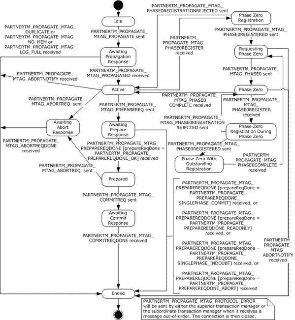

Figure 57: CONNTYPE_PARTNERTM_PROPAGATE initiator states

##### 3.7.1.1.1 Idle

This is the initial state. The following event is processed in this state:

- Propagate Transaction (section [3.7.7.10](#Section_3.7.7.10))

##### 3.7.1.1.2 Awaiting Propagation Response

The following events are processed in this state:

- Receiving a PARTNERTM_PROPAGATE_MTAG_PROPAGATED Message (section [3.7.5.1.1.1.1](#Section_3.7.5.1.1.1.1))
- Receiving a PARTNERTM_PROPAGATE_MTAG_DUPLICATE, PARTNERTM_PROPAGATE_MTAG_NO_MEM, or PARTNERTM_PROPAGATE_MTAG_LOG_FULL Message (section [3.7.5.1.1.1.2](#Section_3.7.5.1.1.1.2))

##### 3.7.1.1.3 Active

The following events are processed in this state:

- Receiving PARTNERTM_PROPAGATE_MTAG_PHASE0REGISTER (section [3.7.5.1.1.1.3](#Section_3.7.5.1.1.1.3))
- Receiving PARTNERTM_PROPAGATE_MTAG_ABORTNOTIFY (section [3.7.5.1.1.1.4](#Section_3.7.5.1.1.1.4))
- Begin Phase One (section [3.7.7.2](#Section_3.7.7.2)).
- Begin Rollback (section [3.7.7.4](#Section_3.2.7.6))

##### 3.7.1.1.4 Awaiting Abort Response

The following event is processed in this state:

- Receiving PARTNERTM_PROPAGATE_MTAG_ABORTREQDONE (section [3.7.5.1.1.1.3](#Section_3.7.5.1.1.1.3))

##### 3.7.1.1.5 Phase Zero Registration

The following events are processed in this state:

- Create Phase Zero Enlistment Success (section [3.7.7.6](#Section_3.6.7.8))
- Create Phase Zero Enlistment Failure (section [3.7.7.5](#Section_3.6.7.7))

##### 3.7.1.1.6 Requesting Phase Zero

The following events are processed in this state:

- Receiving PARTNERTM_PROPAGATE_MTAG_ABORTNOTIFY (section [3.7.5.1.1.1.3](#Section_3.7.5.1.1.1.3))
- Begin Phase Zero (section [3.7.7.3](#Section_3.7.7.3))
- Receiving PARTNERTM_PROPAGATE_MTAG_PROTOCOL_ERROR (section [3.7.5.1.1.1.4](#Section_3.7.5.1.1.1.4))

##### 3.7.1.1.7 Phase Zero

The following events are processed in this state:

- Receiving a PARTNERTM_PROPAGATE_MTAG_PHASE0COMPLETE (section [3.7.5.1.1.1.3](#Section_3.7.5.1.1.1.3))
- Receiving a PARTNERTM_PROPAGATE_MTAG_PHASE0REGISTER (section 3.7.5.1.1.1.3)
- Receiving a PARTNERTM_PROPAGATE_MTAG_PROTOCOL_ERROR (section [3.7.5.1.1.1.4](#Section_3.7.5.1.1.1.4))
- Receiving a PARTNERTM_PROPAGATE_MTAG_ABORTNOTIFY (section 3.7.5.1.1.1.3)

##### 3.7.1.1.8 Phase Zero Registration During Phase Zero

The following events are processed in this state:

- Create Phase Zero Enlistment Success (section [3.7.7.6](#Section_3.6.7.8))
- Create Phase Zero Enlistment Failure (section [3.7.7.5](#Section_3.6.7.7))

##### 3.7.1.1.9 Phase Zero with Outstanding Registration

The following events are processed in this state:

- Receiving PARTNERTM_PROPAGATE_MTAG_PHASE0COMPLETE (section [3.7.5.1.1.1.3](#Section_3.7.5.1.1.1.3)).
- Receiving PARTNERTM_PROPAGATE_MTAG_PROTOCOL_ERROR (section [3.7.5.1.1.1.4](#Section_3.7.5.1.1.1.4))

##### 3.7.1.1.10 Awaiting Prepare Response

The following events are processed in this state:

- Receiving PARTNERTM_PROPAGATE_MTAG_PREPAREREQDONE (section [3.7.5.1.1.1.3](#Section_3.7.5.1.1.1.3))
- Receiving PARTNERTM_PROPAGATE_MTAG_PROTOCOL_ERROR (section [3.7.5.1.1.1.4](#Section_3.7.5.1.1.1.4))

##### 3.7.1.1.11 Prepared

The following events are processed in this state:

- Begin Commit (section [3.7.7.1](#Section_3.4.7.3))
- Begin Rollback (section [3.7.7.4](#Section_3.2.7.6))

##### 3.7.1.1.12 Awaiting Commit Response

The following events are processed in this state:

- Receiving PARTNERTM_PROPAGATE_MTAG_COMMITREQDONE (section [3.7.5.1.1.1.3](#Section_3.7.5.1.1.1.3))
- Receiving PARTNERTM_PROPAGATE_MTAG_PROTOCOL_ERROR (section [3.7.5.1.1.1.4](#Section_3.7.5.1.1.1.4))

##### 3.7.1.1.13 Ended

This is the final state.

#### 3.7.1.2 CONNTYPE_PARTNERTM_BRANCH Acceptor States

The [**superior transaction manager**](#gt_superior-transaction-manager) MUST act as an [**acceptor**](#gt_acceptor) for the CONNTYPE_PARTNERTM_BRANCH (section [2.2.9.1.2.1](#Section_2.2.9.1.2.1)) [**connection type**](#gt_connection-type). In this role, the superior transaction manager MUST provide support for the states in this section.

The following figure shows the relationship between the CONNTYPE_PARTNERTM_BRANCH acceptor states.

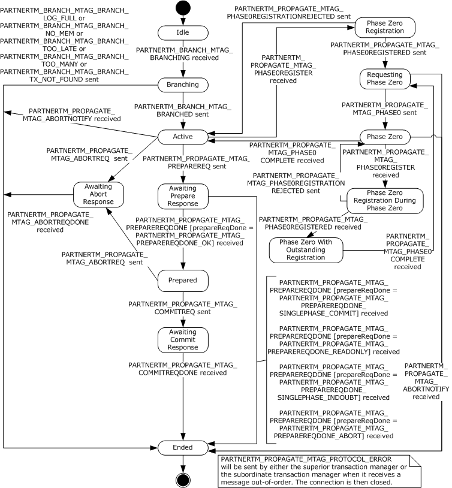

Figure 58: CONNTYPE_PARTNERTM_BRANCH acceptor states

##### 3.7.1.2.1 Idle

This is the initial state. The following event is processed in this state:

- Receiving PARTNERTM_BRANCH_MTAG_BRANCHING (section [3.7.5.1.2.1.1](#Section_3.7.5.1.2.1.1)).

##### 3.7.1.2.2 Branching

The following events are processed in this state:

- Create Subordinate Enlistment Success (section [3.7.7.8](#Section_3.6.7.11))
- Create Subordinate Enlistment Failure (section [3.7.7.7](#Section_3.6.7.10))

##### 3.7.1.2.3 Active

The following events are processed in this state:

- Receiving PARTNERTM_PROPAGATE_MTAG_PHASE0REGISTER (section [3.7.5.1.2.1.2](#Section_3.7.5.1.2.1.2))
- Receiving PARTNERTM_PROPAGATE_MTAG_ABORTNOTIFY (section [3.7.5.1.2.1.4](#Section_3.7.5.1.2.1.4))
- Begin Phase One (section [3.7.7.2](#Section_3.7.7.2))
- Begin Rollback (section [3.7.7.4](#Section_3.2.7.6)).

##### 3.7.1.2.4 Awaiting Abort Response

The following event is processed in this state:

- Receiving PARTNERTM_PROPAGATE_MTAG_ABORTREQDONE (section [3.7.5.1.2.1.5](#Section_3.7.5.1.2.1.5))

##### 3.7.1.2.5 Phase Zero Registration

The following events are processed in this state:

- Create Phase Zero Enlistment Success (section [3.7.7.6](#Section_3.6.7.8))
- Create Phase Zero Enlistment Failure (section [3.7.7.5](#Section_3.6.7.7))

##### 3.7.1.2.6 Requesting Phase Zero

The following events are processed in this state:

- Receiving PARTNERTM_PROPAGATE_MTAG_ABORTNOTIFY (section [3.7.5.1.2.1.4](#Section_3.7.5.1.2.1.4))
- Begin Phase Zero (section [3.7.7.3](#Section_3.7.7.3))
- Receiving PARTNERTM_PROPAGATE_MTAG_PROTOCOL_ERROR (section [3.7.5.1.2.1.8](#Section_3.7.5.1.2.1.8))

##### 3.7.1.2.7 Phase Zero

The following events are processed in this state:

- Receiving PARTNERTM_PROPAGATE_MTAG_PHASE0COMPLETE (section [3.7.5.1.2.1.3](#Section_3.7.5.1.2.1.3))
- Receiving PARTNERTM_PROPAGATE_MTAG_PHASE0REGISTER (section [3.7.5.1.2.1.2](#Section_3.7.5.1.2.1.2))
- Receiving PARTNERTM_PROPAGATE_MTAG_PROTOCOL_ERROR (section [3.7.5.1.2.1.8](#Section_3.7.5.1.2.1.8))
- Receiving PARTNERTM_PROPAGATE_MTAG_ABORTNOTIFY (section [3.7.5.1.2.1.4](#Section_3.7.5.1.2.1.4))

##### 3.7.1.2.8 Phase Zero Registration During Phase Zero

The following events are processed in this state:

- Create Phase Zero Enlistment Success (section [3.7.7.6](#Section_3.6.7.8))
- Create Phase Zero Enlistment Failure (section [3.7.7.5](#Section_3.6.7.7))

##### 3.7.1.2.9 Phase Zero with Outstanding Registration

The following events are processed in this state:

- Receiving PARTNERTM_PROPAGATE_MTAG_PHASE0COMPLETE (section [3.7.5.1.2.1.3](#Section_3.7.5.1.2.1.3))
- Receiving PARTNERTM_PROPAGATE_MTAG_PROTOCOL_ERROR (section [3.7.5.1.2.1.8](#Section_3.7.5.1.2.1.8))

##### 3.7.1.2.10 Awaiting Prepare Response

The following events are processed in this state:

- Receiving PARTNERTM_PROPAGATE_MTAG_PREPAREREQDONE (section [3.7.5.1.2.1.6](#Section_3.7.5.1.2.1.6))
- Receiving PARTNERTM_PROPAGATE_MTAG_PROTOCOL_ERROR (section [3.7.5.1.2.1.8](#Section_3.7.5.1.2.1.8))

##### 3.7.1.2.11 Prepared

The following events are processed in this state:

- Begin Commit (section [3.7.7.1](#Section_3.4.7.3))
- Begin Rollback (section [3.7.7.4](#Section_3.2.7.6))

##### 3.7.1.2.12 Awaiting Commit Response

The following events are processed in this state:

- Receiving a PARTNERTM_PROPAGATE_MTAG_COMMITREQDONE (section [3.7.5.1.2.1.7](#Section_3.7.5.1.2.1.7))
- Receiving a PARTNERTM_PROPAGATE_MTAG_PROTOCOL_ERROR (section [3.7.5.1.2.1.8](#Section_3.7.5.1.2.1.8))

##### 3.7.1.2.13 Ended

This is the final state.

#### 3.7.1.3 CONNTYPE_PARTNERTM_REDELIVERCOMMIT Initiator States

The [**superior transaction manager**](#gt_superior-transaction-manager) MUST act as an [**initiator**](#gt_initiator) for the [CONNTYPE_PARTNERTM_REDELIVERCOMMIT](#Section_2.2.9.2.2.1) [**connection type**](#gt_connection-type). In this role, the superior transaction manager MUST provide support for the states in this section.

The following figure shows the relationship between the CONNTYPE_PARTNERTM_REDELIVERCOMMIT initiator states.

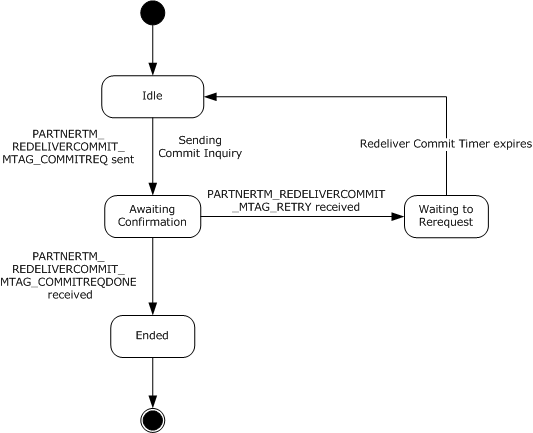

Figure 59: CONNTYPE_PARTNERTM_REDELIVERCOMMIT initiator states

##### 3.7.1.3.1 Idle

This is the initial state. The following event is processed in this state:

- Begin Commit (section [3.7.7.1](#Section_3.4.7.3))

##### 3.7.1.3.2 Awaiting Confirmation

The following events are processed in this state:

- Receiving a PARTNERTM_REDELIVERCOMMIT_MTAG_COMMITREQDONE (section [3.7.5.1.2.1.7](#Section_3.7.5.1.2.1.7))
- Receiving a PARTNERTM_REDELIVERCOMMIT_MTAG_RETRY Message (section [3.7.5.2.2.1.2](#Section_3.7.5.2.2.1.2))

##### 3.7.1.3.3 Waiting to Rerequest

The following event is processed in this state:

- Redeliver Commit Timer (section [3.7.6.1](#Section_3.7.6.1))

##### 3.7.1.3.4 Ended

This is the final state.

#### 3.7.1.4 CONNTYPE_PARTNERTM_CHECKABORT Acceptor States

The [**superior transaction manager**](#gt_superior-transaction-manager) MUST act as an [**acceptor**](#gt_acceptor) for the CONNTYPE_PARTNERTM_CHECKABORT (section [2.2.9.2.1.1](#Section_2.2.9.2.1.1)) [**connection type**](#gt_connection-type). In this role, the superior transaction manager MUST provide support for the states in this section.

The following figure shows the relationship between the CONNTYPE_PARTNERTM_CHECKABORT acceptor states.

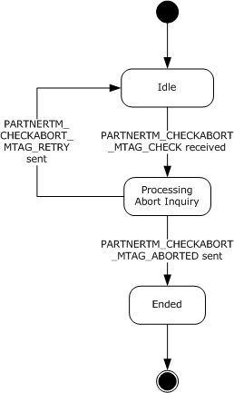

Figure 60: CONNTYPE_PARTNERTM_CHECKABORT acceptor states

##### 3.7.1.4.1 Idle

This is the initial state. The following event is processed in this state:

- Receiving a PARTNERTM_CHECKABORT_MTAG_CHECK Message (section [3.7.5.2.1.1.1](#Section_3.7.5.2.1.1.1))

##### 3.7.1.4.2 Processing Abort Inquiry

This is a transient state that is assumed during the processing of a request for check abort. No specific events are processed in this state.

##### 3.7.1.4.3 Ended

This is the final state.

### 3.7.2 Timers

The [**superior transaction manager**](#gt_superior-transaction-manager) [**facet**](#gt_facet) MUST provide the following [Redeliver Commit Timer](#Section_3.7.6.1).

#### 3.7.2.1 Redeliver Commit Timer

This timer MUST be set when the Superior Transaction Manager Facet (section [1.3.3.3.4](#Section_1.3.3.3.4)) receives a PARTNERTM_REDELIVERCOMMIT_MTAG_RETRY (section [2.2.9.2.2.1.3](#Section_2.2.9.2.2.1.3)) message on a CONNTYPE_PARTNERTM_REDELIVERCOMMIT (section [2.2.9.2.2.1](#Section_2.2.9.2.2.1)) [**connection**](#gt_connection). The timer MUST be canceled when the CONNTYPE_PARTNERTM_REDELIVERCOMMIT (section 2.2.9.2.2.1) connection is disconnected.

The default value of the timer is implementation-specific.<33>

When the timer is initialized, the Superior Transaction Manager Facet (section 1.3.3.3.4) MUST provide an [**Enlistment**](#gt_enlistment) object to associate with the timer. When the timer expires, the same Enlistment object MUST be provided alongside the timer notification. The Superior Transaction Manager Facet MUST provide a distinct Redeliver Commit Timer (section 3.7.2.1) instance for each CONNTYPE_PARTNERTM_REDELIVERCOMMIT connection.

### 3.7.3 Initialization

When the [**superior transaction manager**](#gt_superior-transaction-manager) [**facet**](#gt_facet) is initialized:

- The superior transaction manager facet MUST examine the following security flags on the core [**transaction manager**](#gt_transaction-manager) and perform the following actions:
- If one of the Allow Network Access, Allow Network Transactions, or Allow Outbound Transactions flags is set to false:
- For the following connection type, the superior transaction manager MUST refuse to accept incoming connections from remote machines as specified in [MS-CMP](../MS-CMP/MS-CMP.md) (section 3.1.5.5) with the rejection Reason set to 0x80070005:
- CONNTYPE_PARTNERTM_BRANCH (section [2.2.9.1.2.1](#Section_2.2.9.1.2.1))
- If one of the Allow Network Access or Allow Network Transactions flags is set to false, or if both the Allow Inbound Transactions and Allow Outbound Transactions flags are set to false:
- For the following connection type, the superior transaction manager MUST refuse to accept incoming connections from remote machines as specified in [MS-CMP] (section 3.1.5.5) with the rejection Reason set to 0x80070005:
- CONNTYPE_PARTNERTM_CHECKABORT (section [2.2.9.2.1.1](#Section_2.2.9.2.1.1))

### 3.7.4 Higher-Layer Triggered Events

No higher-layer triggered events apply.

### 3.7.5 Processing Events and Sequencing Rules

#### 3.7.5.1 Transaction Propagation and Coordination

##### 3.7.5.1.1 Push Propagation

###### 3.7.5.1.1.1 CONNTYPE_PARTNERTM_PROPAGATE as Initiator

For all messages that are received in this [**connection type**](#gt_connection-type), the [**superior transaction manager**](#gt_superior-transaction-manager) MUST process the message as specified in section [3.1](#Section_1.3).

Also, for incoming messages, the superior transaction manager MUST override the verification actions of the default state as specified in section 3.1 in the following manner:

- If the current [**connection**](#gt_connection) state does not define a processing rule for the message:
- Send a [PARTNERTM_PROPAGATE_MTAG_PROTOCOL_ERROR](#Section_2.2.9.1.1.1.8) message using the connection.
- Perform default invalid message processing, as specified in section 3.1.
The superior transaction manager MUST also follow the processing rules that are specified in the following sections.

Receiving a PARTNERTM_PROPAGATE_MTAG_PROPAGATED Message

When the [**superior transaction manager**](#gt_superior-transaction-manager) receives a PARTNERTM_PROPAGATE_MTAG_PROPAGATED (section [2.2.9.1.1.1.2](#Section_2.2.9.1.1.1.2)) message, the superior transaction manager MUST perform the following actions:

- If the [**connection**](#gt_connection) state is Awaiting Propagation Response:
- Set the connection state to Active (section [3.7.1.1.3](#Section_3.7.1.1.3)).
- Create an [**Enlistment**](#gt_enlistment) object with the following values:
- The Superior Transaction Manager Facet (section [1.3.3.3.4](#Section_1.3.3.3.4))
- The [**transaction**](#gt_transaction) object referenced by this connection
- This connection object
- Signal the Propagate Transaction Success (section [3.2.7.27](#Section_3.2.7.27)) event on the Core Transaction Manager Facet (section [1.3.3.3.1](#Section_1.3.3.3.1)) with the created enlistment object.
- Otherwise, the message MUST be processed as an invalid message as specified in section [3.1.6](#Section_3.1.6).

Receiving a PARTNERTM_PROPAGATE_MTAG_DUPLICATE, PARTNERTM_PROPAGATE_MTAG_NO_MEM, or PARTNERTM_PROPAGATE_MTAG_LOG_FULL Message

When the [Superior Transaction Manager Facet](#Section_1.3.3.3.4) receives a [PARTNERTM_PROPAGATE_MTAG_DUPLICATE](#Section_2.2.9.1.1.1.3), [PARTNERTM_PROPAGATE_MTAG_NO_MEM](#Section_2.2.9.1.1.1.4), or [PARTNERTM_PROPAGATE_MTAG_LOG_FULL](#Section_2.2.9.1.1.1.5) message, the [**superior transaction manager**](#gt_superior-transaction-manager) MUST perform the following actions:

- If the connection state is Awaiting Propagation Response:
- Create an Enlistment object with the following values:
- The Superior Transaction Manager Facet
- The transaction object that is referenced by this connection
- This connection object
- Signal the [Propagate Transaction Failure](#Section_3.2.7.26) event on the [Core Transaction Manager Facet](#Section_1.3.3.3.1) with the following arguments:
- The created Enlistment object
- The failure code that matches the incoming message:
- PARTNERTM_PROPAGATE_MTAG_DUPLICATE: Duplicate
- PARTNERTM_PROPAGATE_MTAG_NO_MEM: No Mem
- PARTNERTM_PROPAGATE_MTAG_LOG_FULL: Log Full
- Set the connection state to Ended.
- Otherwise, the message MUST be processed as an invalid message as specified in section [3.1.6](#Section_3.1.6).

Receiving a PARTNERTM_PROPAGATE_MTAG_PHASE0REGISTER, PARTNERTM_PROPAGATE_MTAG_PHASE0COMPLETE, PARTNERTM_PROPAGATE_MTAG_PREPAREREQDONE, PARTNERTM_PROPAGATE_MTAG_COMMITREQDONE, PARTNERTM_PROPAGATE_MTAG_ABORTREQDONE, or PARTNERTM_PROPAGATE_MTAG_ABORTNOTIFY Message

When the [**superior transaction manager**](#gt_superior-transaction-manager) facet receives one of these messages, it MUST follow the same message processing rules as the [CONNTYPE_PARTNERTM_BRANCH](#Section_2.2.9.1.2.1) connection type acting as an [**acceptor**](#gt_acceptor). See section [3.7.5.1.2.1](#Section_3.7.5.1.2.1) for more details.

Receiving a PARTNERTM_PROPAGATE_MTAG_PROTOCOL_ERROR Message

The processing of this event MUST be identical to the processing of the [Connection Disconnected](#Section_3.6.5.2.2.5) event.

Connection Disconnected

When a CONNTYPE_PARTNERTM_PROPAGATE (section [2.2.9.1.1.1](#Section_2.2.9.1.1.1)) connection is disconnected, the Superior Transaction Manager Facet (section [1.3.3.3.4](#Section_1.3.3.3.4)) MUST perform the following actions:

- If the connection state is Awaiting Propagation Response:
- Create an Enlistment object with the following values:
- The Superior Transaction Manager Facet
- The transaction object that is referenced by this connection
- This connection object
- Signal the Propagate Transaction Failure (section [3.2.7.26](#Section_3.2.7.26)) event on the Core Transaction Manager Facet with the following arguments:
- The created Enlistment object
- A failure code of Comm Failed.
- Set the connection state to Ended.
- Otherwise:
- The Superior Transaction Manager Facet (section 1.3.3.3.4) MUST perform the same actions as the CONNTYPE_PARTNERTM_BRANCH (section [2.2.9.1.2.1](#Section_2.2.9.1.2.1)) connection type acting as an acceptor. For more details, see section [3.7.5.1.2.1](#Section_3.7.5.1.2.1).

##### 3.7.5.1.2 Pull Propagation

###### 3.7.5.1.2.1 CONNTYPE_PARTNERTM_BRANCH as Acceptor

For all messages that are received in this [**connection type**](#gt_connection-type), the [**superior transaction manager**](#gt_superior-transaction-manager) MUST process the message as specified in section [3.1](#Section_1.3).

Also, for incoming messages, the superior transaction manager MUST override the verification actions of the default state, as specified in section [3.1.6](#Section_3.1.6), in the following manner:

- If the current [**connection**](#gt_connection) state does not define a processing rule for the message:
- Send a [PARTNERTM_PROPAGATE_MTAG_PROTOCOL_ERROR](#Section_2.2.9.1.1.1.8) message using the connection.
- Perform default invalid message processing, as specified in section 3.1.6.
The superior transaction manager MUST also follow the processing rules as specified in the following section.

Receiving a PARTNERTM_BRANCH_MTAG_BRANCHING Message

When the [**superior transaction manager**](#gt_superior-transaction-manager) receives a [PARTNERTM_BRANCH_MTAG_BRANCHING](#Section_3.7.1.2.2) message, the superior transaction manager MUST perform the following actions:

- If the [**connection**](#gt_connection) state is Idle:
- Set the connection state to Branching.
- Find the [**transaction**](#gt_transaction) object in the transaction table of the [**transaction manager**](#gt_transaction-manager) using the **guidTx** field from the message as the key.
- If a transaction object is found:
- Create a new [**Enlistment**](#gt_enlistment) object with the following values:
- The [Superior Transaction Manager Facet](#Section_1.3.3.3.4)
- The transaction object
- The connection object
- Set the **enlistment** field of the connection to the new Enlistment object.
- Signal the [Create Subordinate Enlistment](#Section_3.2.7.11) event on the [Core Transaction Manager Facet](#Section_1.3.3.3.1) with the new Enlistment object.
- Otherwise:
- Send a [PARTNERTM_BRANCH_MTAG_BRANCH_TX_NOT_FOUND](#Section_2.2.9.1.2.1.5) message using the connection.
- Set the connection state to Ended.
- Otherwise, the message MUST be processed as an invalid message as specified in section [3.1.6](#Section_3.1.6).

Receiving a PARTNERTM_PROPAGATE_MTAG_PHASE0REGISTER Message

When the [**superior transaction manager**](#gt_superior-transaction-manager) receives a PARTNERTM_PROPAGATE_MTAG_PHASE0REGISTER (section [2.2.9.1.1.1.14](#Section_2.2.9.1.1.1.14)) message, the superior transaction manager MUST perform the following actions:

- If the connection state is Active:
- Set the connection state to [**Phase Zero**](#gt_phase-zero) [**Registration**](#gt_registration).
- Signal the Create Phase Zero Enlistment (section [3.2.7.10](#Section_3.2.7.10)) event on the Core Transaction Manager Facet (section [1.3.3.3.1](#Section_1.3.3.3.1)) with the Enlistment object that is referenced by this connection.
- Otherwise, if the connection state is Phase Zero:
- Set the connection state to Phase Zero Registration During Phase Zero.
- Signal the Create Phase Zero Enlistment event on the Core Transaction Manager Facet with the Enlistment object that is referenced by this connection.
- Otherwise, the message MUST be processed as an invalid message as specified in section [3.1.6](#Section_3.1.6).

Receiving a PARTNERTM_PROPAGATE_MTAG_PHASE0COMPLETE Message

When the [**superior transaction manager**](#gt_superior-transaction-manager) receives a [PARTNERTM_PROPAGATE_MTAG_PHASE0COMPLETE](#Section_2.2.9.1.1.1.18) message, the superior transaction manager MUST perform the following actions:

- If the connection state is [**Phase Zero**](#gt_phase-zero):
- Set the connection state to Active.
- Signal the [Enlistment Phase Zero Complete](#Section_3.2.7.17) event on the [Core Transaction Manager Facet](#Section_1.3.3.3.1) with the following arguments:
- The Enlistment object that is referenced by this connection.
- The Completed [**outcome**](#gt_outcome) value.
- Otherwise, if the connection state is Phase Zero with Outstanding [**Registration**](#gt_registration):
- Set the connection state to Requesting Phase Zero.
- Signal the Enlistment Phase Zero Complete event on the Core Transaction Manager Facet with the following arguments:
- The Enlistment object that is referenced by this connection
- The Completed outcome value
- Otherwise, the message MUST be processed as an invalid message as specified in section [3.1.6](#Section_3.1.6).

Receiving a PARTNERTM_PROPAGATE_MTAG_ABORTNOTIFY Message

When the [**superior transaction manager**](#gt_superior-transaction-manager) receives a PARTNERTM_PROPAGATE_MTAG_ABORTNOTIFY (section [2.2.9.1.1.1.13](#Section_2.2.9.1.1.1.13)) message, the superior transaction manager MUST perform the following actions:

- If the connection state is either Active or Requesting [**Phase Zero**](#gt_phase-zero):
- Signal the Enlistment Unilaterally Aborted (section [3.2.7.19](#Section_3.2.7.19)) event on the Core Transaction Manager Facet (section [1.3.3.3.1](#Section_1.3.3.3.1)) with the Enlistment object that is referenced by this connection.
- Set the connection state to Ended.
- Otherwise, if the connection state is Phase Zero (section [3.7.1.2.7](#Section_3.7.1.2.7)):
- Signal the Enlistment Phase Zero Complete (section [3.2.7.17](#Section_3.2.7.17)) event on the Core Transaction Manager Facet with the following arguments:
- The Enlistment object that is referenced by this connection
- The Aborted [**outcome**](#gt_outcome) value
- Set the connection state to Ended.
- Otherwise, the message MUST be processed as an invalid message, as specified in section [3.1.6](#Section_3.1.6).

Receiving a PARTNERTM_PROPAGATE_MTAG_ABORTREQDONE Message

When the [**superior transaction manager**](#gt_superior-transaction-manager) receives a [PARTNERTM_PROPAGATE_MTAG_ABORTREQDONE](#Section_2.2.9.1.1.1.12) message, the superior transaction manager MUST perform the following actions:

- If the connection state is Awaiting Abort Response:
- Signal the [Enlistment Rollback Complete](#Section_3.2.7.18) event on the [Core Transaction Manager Facet](#Section_1.3.3.3.1) with the Enlistment object that is referenced by this connection.
- Set the connection state to Ended.
- Otherwise, the message MUST be processed as an invalid message as specified in section [3.1.6](#Section_3.1.6).

Receiving a PARTNERTM_PROPAGATE_MTAG_PREPAREREQDONE Message

When the [**superior transaction manager**](#gt_superior-transaction-manager) receives a [PARTNERTM_PROPAGATE_MTAG_PREPAREREQDONE](#Section_2.2.9.1.1.1.7) message, the superior transaction manager MUST perform the following actions:

- If the connection state is Awaiting Prepare Response:
- Signal the Enlistment Phase One Complete (section [3.2.7.16](#Section_3.2.7.16)) event on the Core Transaction Manager Facet (section [1.3.3.3.1](#Section_1.3.3.3.1)) with the following arguments:
- The Enlistment object that is referenced by this connection.
- The [**outcome**](#gt_outcome) value that is determined by the **prepareReqDone** field from the message. The outcome value is set to:
- Prepared if the **prepareReqDone** field is PARTNERTM_PROPAGATE_PREPAREREQDONE_OK.
- Aborted if the prepareReqDone field is PARTNERTM_PROPAGATE_PREPAREREQDONE_ABORT.
- Read Only if the prepareReqDone field is PARTNERTM_PROPAGATE_PREPAREREQDONE_READ_ONLY.
- Committed if the prepareReqDone field is PARTNERTM_PROPAGATE_PREPAREREQDONE_SINGLEPHASE_COMMIT.
- [In Doubt](#Section_3.2.1.3.12) if the prepareReqDone field is PARTNERTM_PROPAGATE_PREPAREREQDONE_SINGLEPHASE_INDOUBT.
- If the prepareReqDone value is Prepared:
- Set the connection state to Prepared.
- Otherwise, set the connection state to Ended.
- Otherwise, the message MUST be processed as an invalid message as specified in section [3.1.6](#Section_3.1.6).

Receiving a PARTNERTM_PROPAGATE_MTAG_COMMITREQDONE Message

When the [**superior transaction manager**](#gt_superior-transaction-manager) receives a PARTNERTM_PROPAGATE_MTAG_COMMITREQDONE (section [2.2.9.1.1.1.10](#Section_2.2.9.1.1.1.10)) message, the superior transaction manager MUST perform the following actions:

- If the connection state is Awaiting Commit Response:
- Signal the Enlistment Commit Complete (section [3.2.7.15](#Section_3.2.7.15)) event on the core [**transaction manager**](#gt_transaction-manager) with the Enlistment object that is referenced by this connection.
- Set the connection state to Ended.
- Otherwise, the message MUST be processed as an invalid message as specified in section [3.1.6](#Section_3.1.6).

Receiving a PARTNERTM_PROPAGATE_MTAG_PROTOCOL_ERROR Message

The processing of this event MUST be identical to the processing of the [Connection Disconnected](#Section_3.6.5.2.2.5) event.

Connection Disconnected

When a CONNTYPE_PARTNERTM_BRANCH (section [2.2.9.1.2.1](#Section_2.2.9.1.2.1)) connection is disconnected, the [**superior transaction manager**](#gt_superior-transaction-manager) facet MUST perform the following actions:

- If the connection state is Awaiting Prepare Response:
- If the state of the transaction object that is referenced by the connection is Single Phase Commit (section [3.2.1.3.9](#Section_3.2.1.3.9)):
- Signal the Enlistment Phase Zero Complete (section [3.2.7.17](#Section_3.2.7.17)) event on the Core Transaction Manager Facet (section [1.3.3.3.1](#Section_1.3.3.3.1)) with the following arguments:
- The Enlistment object that is referenced by this connection
- The [**In Doubt outcome**](#gt_in-doubt-outcome) value
- Otherwise:
- Signal the Enlistment Phase Zero Complete event on the Core Transaction Manager Facet with the following arguments:
- The Enlistment object that this connection references
- The Aborted [**outcome**](#gt_outcome) value
- Otherwise, if the connection state is Awaiting Commit Response:
- Retrieve the Enlistment object that is referenced by the connection object.
- Initiate a new CONNTYPE_PARTNERTM_REDELIVERCOMMIT (section [2.2.9.2.2.1](#Section_2.2.9.2.2.1)) connection using the Name object referenced by the Name field of the [**Session**](#gt_session) object containing the provided connection.
- Add the new connection object to the connection list of the transaction object referenced by the Enlistment object.
- Assign the new connection object to the [**enlistment**](#gt_enlistment) **Enlistment Object.Connection** field of the Enlistment Object.
- Assign the enlistment to the new connection's **Enlistment** field.
- Send a PARTNERTM_REDELIVERCOMMIT_MTAG_COMMITREQ (section [2.2.9.2.2.1.1](#Section_2.2.9.2.2.1.1)) message using the connection:
- Set the **guidTX** field to the **Transaction Object.Identifier** field of the transaction object that is referenced by this connection Enlistment object.
- Set the new connection state to Awaiting Confirmation.
- Otherwise, if the connection state is Awaiting Abort Response:
- Signal the Enlistment Rollback Complete (section [3.2.7.18](#Section_3.2.7.18)) event on the Core Transaction Manager Facet with the Enlistment object that is referenced by this connection.
- Otherwise, if the connection state is either [**Phase Zero**](#gt_phase-zero), Phase Zero [**Registration**](#gt_registration) During Phase Zero, or Phase Zero with Outstanding Registration:
- Signal the Enlistment Phase Zero Complete event on the Core Transaction Manager Facet with the following arguments:
- The Enlistment object that is referenced by this connection
- The Aborted outcome value
- Otherwise, if the connection state is either Branching, Active, Phase Zero Registration, or Requesting Phase Zero:
- Signal the Enlistment Unilaterally Aborted (section [3.2.7.19](#Section_3.2.7.19)) event on the Core Transaction Manager Facet with the Enlistment object that is referenced by this connection.
- Finally, in all cases, the event MUST be processed as specified in section [3.1.8.3](#Section_3.6.5.2.2.5).

#### 3.7.5.2 Transaction Recovery

##### 3.7.5.2.1 Subordinate-Driven Recovery

###### 3.7.5.2.1.1 CONNTYPE_PARTNERTM_CHECKABORT as Acceptor

For all messages received in this [**connection type**](#gt_connection-type), the [**Superior Transaction Manager**](#gt_superior-transaction-manager) [**facet**](#gt_facet) MUST process the message in accordance with section [3.1](#Section_1.3). The Superior Transaction Manager facet MUST additionally follow the processing rules specified in the following sections.

Receiving a PARTNERTM_CHECKABORT_MTAG_CHECK Message

When the [**Superior Transaction Manager**](#gt_superior-transaction-manager) [**Facet**](#gt_facet) receives a [PARTNERTM_CHECKABORT_MTAG_CHECK](#Section_2.2.9.2.1.1.1) message, the Superior Transaction Manager Facet MUST perform the following actions:

- If the [**connection**](#gt_connection) state is Idle:
- Set the connection state to Processing Abort Inquiry.
- Find the [**transaction**](#gt_transaction) object in the [**Transaction Manager's**](#gt_transaction-manager) transaction Table, using the **guidTx** field from the message as a key.
- If the transaction object is not found, or if the transaction state is either Aborting or Ended:
- Send a [PARTNERTM_CHECKABORT_MTAG_ABORTED](#Section_2.2.9.2.1.1.2) message using the connection.
- Set the connection state to Ended.
- Otherwise:
- Send a [PARTNERTM_CHECKABORT_MTAG_RETRY](#Section_2.2.9.2.1.1.3) message using the connection.
- Set the connection state to Idle.
- Otherwise, the message MUST be processed as an invalid message as specified in section [3.1.6](#Section_3.1.6).
Connection Disconnected

When a CONNTYPE_PARTNERTM_CHECKABORT (section [2.2.9.2.1.1](#Section_2.2.9.2.1.1)) connection is disconnected, the Superior Transaction Manager Facet (section [1.3.3.3.4](#Section_1.3.3.3.4)) MUST perform the actions as specified in section [3.1.8.3](#Section_3.6.5.2.2.5).

##### 3.7.5.2.2 Superior-Driven Recovery

###### 3.7.5.2.2.1 CONNTYPE_PARTNERTM_REDELIVERCOMMIT as Initiator

For all messages received in this [**connection type**](#gt_connection-type), the [**Superior Transaction Manager**](#gt_superior-transaction-manager) [**Facet**](#gt_facet) MUST process the message as specified in section [3.1](#Section_1.3). The Superior Transaction Manager Facet MUST additionally follow the processing rules as specified in this section.

Receiving a PARTNERTM_REDELIVERCOMMIT_MTAG_COMMITREQDONE Message

When the Superior Transaction Manager Facet (section [1.3.3.3.4](#Section_1.3.3.3.4)) receives a PARTNERTM_REDELIVERCOMMIT_MTAG_COMMITREQDONE (section [2.2.9.2.2.1.2](#Section_2.2.9.2.2.1.2)) message, the Superior Transaction Manager Facet MUST perform the following actions:

- If the [**connection**](#gt_connection) state is Awaiting Confirmation:
- Signal the Enlistment Commit Complete (section [3.2.7.15](#Section_3.2.7.15)) event on the Core Transaction Manager Facet (section [1.3.3.3.1](#Section_1.3.3.3.1)) with the [**Enlistment**](#gt_enlistment) object referenced by this connection.
- Set the connection state to Ended.
- Otherwise, the message MUST be processed as an invalid message as specified in section [3.1.6](#Section_3.1.6).

Receiving a PARTNERTM_REDELIVERCOMMIT_MTAG_RETRY Message

When the [**superior transaction manager**](#gt_superior-transaction-manager) facet receives a [PARTNERTM_REDELIVERCOMMIT_MTAG_RETRY](#Section_2.2.9.2.2.1.3) message, the superior transaction manager facet MUST perform the following actions:

- If the connection state is Awaiting Confirmation:
- Set the connection state to Waiting to Rerequest.
- Initialize a Redeliver Commit timer with the following arguments:
- The Enlistment object of the connection
- An implementation-specific time-out value, as specified in [Redeliver Commit Timer](#Section_3.7.6.1)
- Otherwise, the message MUST be processed as an invalid message, as specified in section [3.1.6](#Section_3.1.6).
Connection Disconnected

When a CONNTYPE_PARTNERTM_REDELIVERCOMMIT (section [2.2.9.2.2.1](#Section_2.2.9.2.2.1)) connection is disconnected, the Superior Transaction Manager Facet (section [1.3.3.3.4](#Section_1.3.3.3.4)) MUST perform the following actions:

- If the connection state is Waiting to Rerequest:
- Cancel the Redeliver Commit Timer associated with the connection.
- If the connection state is Idle, Waiting to Rerequest, or Awaiting Confirmation:
- Set the connection state to Ended.
- Signal the Begin Commit (section [3.7.7.1](#Section_3.4.7.3)) event on the Superior Transaction Manager Facet with the Enlistment object referenced by the **Enlistment** field of the connection.
- Otherwise, the event MUST be processed as specified in section [3.1.8.3](#Section_3.6.5.2.2.5).

### 3.7.6 Timer Events

#### 3.7.6.1 Redeliver Commit Timer

When this timer expires, the Superior Transaction Manager Facet (section [1.3.3.3.4](#Section_1.3.3.3.4)) MUST perform the following actions:

- Cancel the Redeliver Commit timer.
- If the [**connection**](#gt_connection) referenced by the provided [**enlistment**](#gt_enlistment) is in the Waiting to Rerequest state:
- Set the connection state to Idle.
- Send a PARTNERTM_REDELIVERCOMMIT_MTAG_COMMITREQ (section [2.2.9.2.2.1.1](#Section_2.2.9.2.2.1.1)) message using the connection referenced by the provided Enlistment object:
- Set the **guidTX** field to the **Transaction Object.Identifier** field of the [**transaction**](#gt_transaction) object provided by the Enlistment object.
- Set the connection state to Awaiting Confirmation.
- Otherwise, ignore the timer event.

### 3.7.7 Other Local Events

The [**Superior Transaction Manager**](#gt_superior-transaction-manager) MUST be prepared to process the local events defined in the following sections.

The Superior Transaction Manager MUST be prepared to process local events pertaining to [**Phase Zero**](#gt_phase-zero) functionality only on versions where the [**connection type**](#gt_connection-type) [CONNTYPE_TXUSER_PHASE0](#Section_2.2.10.2.1) is supported. [Connection Types Relevant to Resource Managers](#Section_2.2.10) - [Versioning](#Section_2.2.1.1.3) defines protocol version support for this connection type. The following local events are affected:

- [Create Phase Zero Enlistment Success](#Section_3.6.7.8)
- [Create Phase Zero Enlistment Failure](#Section_3.6.7.7)
- [Begin Phase Zero](#Section_3.7.7.3)
- [Phase Zero Aborted](#Section_3.6.7.14)

#### 3.7.7.1 Begin Commit

The Begin Commit event MUST be signaled with the following arguments:

- An [**Enlistment**](#gt_enlistment) object
If the Begin Commit event is signaled, the Superior Transaction Manager Facet (section [1.3.3.3.4](#Section_1.3.3.3.4)) MUST perform the following actions:

- If the [**connection**](#gt_connection) state is Ended:
- Initiate a new CONNTYPE_PARTNERTM_REDELIVERCOMMIT (section [2.2.9.2.2.1](#Section_2.2.9.2.2.1)) connection by using the Name object referenced by the Name field of the [**Session**](#gt_session) object containing the provided enlistment's connection.
- Add the new connection to the provided enlistment's [**transaction's**](#gt_transaction) connection list.
- Set the provided enlistment's **Enlistment Object.Connection** field to the new connection.
- Set the connection's Enlistment field to the provided Enlistment object.
- Send a PARTNERTM_REDELIVERCOMMIT_MTAG_COMMITREQ (section [2.2.9.2.2.1.1](#Section_2.2.9.2.2.1.1)) message using the new connection.
- Set the **guidTx** field to the **Transaction Object.Identifier** field of the transaction object referenced by this connection's Enlistment object.
- Set the new connection state to Awaiting Confirmation.
- Otherwise:
- Send a PARTNERTM_PROPAGATE_MTAG_COMMITREQ (section [2.2.9.1.1.1.9](#Section_2.2.9.1.1.1.9)) message using the connection.
- Set the connection state to Awaiting Commit Response.

#### 3.7.7.2 Begin Phase One

The Begin Phase One event MUST be signaled with the following arguments:

- An Enlistment object.
- A Boolean [**Single-Phase Commit**](#gt_single-phase-commit) value:
- If true, the Superior Transaction Manager Facet (section [1.3.3.3.4](#Section_1.3.3.3.4)) SHOULD attempt to perform a Single-Phase Commit.
- If false, the Superior Transaction Manager Facet MUST NOT attempt to perform a Single-Phase Commit.
If the Begin Phase One event is signaled, the Superior Transaction Manager Facet MUST perform the following actions:

- If the provided Single-Phase Commit value is set to true:
- Send a PARTNERTM_PROPAGATE_MTAG_PREPAREREQ (section [2.2.9.1.1.1.6](#Section_2.2.9.1.1.1.6)) message using the connection.
- Set the **fSinglePhase** field to a nonzero value.
- Set the **grfRM** field to the **GRFRM** field of the transaction object referenced by the Enlistment object.
- Otherwise:
- Send a PARTNERTM_PROPAGATE_MTAG_PREPAREREQ (section 2.2.9.1.1.1.6) message using the connection.
- Set the **fSinglePhase** field to zero.
- Set the **grfRM** field to the **GRFRM** field of the transaction object referenced by the Enlistment object.
- Set the connection state to Awaiting Prepare Response.

#### 3.7.7.3 Begin Phase Zero

The Begin Phase Zero event MUST be signaled with the following arguments:

- An Enlistment object
If the Begin Phase Zero event is signaled, the Superior Transaction Manager Facet (section [1.3.3.3.4](#Section_1.3.3.3.4)) MUST perform the following actions:

- Send a PARTNERTM_PROPAGATE_MTAG_PHASE0 (section [2.2.9.1.1.1.17](#Section_2.2.9.1.1.1.17)) message using the connection.
- Set the connection state to [**Phase Zero**](#gt_phase-zero).

#### 3.7.7.4 Begin Rollback

The Begin Rollback event MUST be signaled with the following arguments:

- An Enlistment object
If the Begin Rollback event is signaled, the [Superior Transaction Manager Facet](#Section_1.3.3.3.4) MUST perform the following actions:

- If the provided enlistment's connection state is Ended:
- Signal the [Enlistment Rollback Complete](#Section_3.2.7.18) event on the [Core Transaction Manager Facet](#Section_1.3.3.3.1) with the following arguments:
- The provided Enlistment object
- Otherwise:
- Send a [PARTNERTM_PROPAGATE_MTAG_ABORTREQ](#Section_2.2.9.1.1.1.11) message using the connection.
- Set the connection state to Awaiting Abort Response.

#### 3.7.7.5 Create Phase Zero Enlistment Failure

The Create Phase Zero Enlistment Failure event MUST be signaled with the following arguments:

- An Enlistment object.
- A value indicating the failure reason. The reason MUST be set to one of the following values:
- Too Late
- Tx Not Found
If the Create Phase Zero Enlistment Failure event is signaled, the Superior Transaction Manager Facet (section [1.3.3.3.4](#Section_1.3.3.3.4)) MUST perform the following actions:

- Send a PARTNERTM_PROPAGATE_MTAG_PHASE0REGISTRATIONREJECTED (section [2.2.9.1.1.1.16](#Section_2.2.9.1.1.1.16)) message using the enlistment's connection.
- If the enlistment's connection state is [**Phase Zero**](#gt_phase-zero) [**Registration**](#gt_registration):
- Set the connection state to Active.
- Otherwise, if the connection state is Phase Zero Registration During Phase Zero:
- Set the connection state to Phase Zero.
- Otherwise, ignore the event.

#### 3.7.7.6 Create Phase Zero Enlistment Success

The Create Phase Zero Enlistment Success event MUST be signaled with the following arguments:

- An Enlistment object
If the Create Phase Zero Enlistment Success event is signaled, the Superior Transaction Manager Facet (section [1.3.3.3.4](#Section_1.3.3.3.4)) MUST perform the following actions:

- Send a PARTNERTM_PROPAGATE_MTAG_PHASE0REGISTERED (section [2.2.9.1.1.1.15](#Section_2.2.9.1.1.1.15)) message using the enlistment's connection.
- If the enlistment's connection state is [**Phase Zero**](#gt_phase-zero) [**Registration**](#gt_registration):
- Set the connection state to Requesting Phase Zero.
- Otherwise, if the connection state is Phase Zero Registration During Phase Zero:
- Set the connection state to Phase Zero with Outstanding Registration.
- Otherwise, ignore the event.

#### 3.7.7.7 Create Subordinate Enlistment Failure

The Create Subordinate Enlistment Failure event MUST be signaled with the following arguments:

- An Enlistment object.
- A value indicating the failure reason. The reason MUST be set to one of the following values:
- Log Full
- Too Late
- Too Many
If the Create Subordinate Enlistment Failure event is signaled, the [Superior Transaction Manager Facet](#Section_1.3.3.3.4) MUST perform the following actions:

- Send the matching message for the following reason codes:
- Log Full: [PARTNERTM_BRANCH_MTAG_BRANCH_LOG_FULL](#Section_2.2.9.1.2.1.1)
- Too Late: [PARTNERTM_BRANCH_MTAG_BRANCH_TOO_LATE](#Section_2.2.9.1.2.1.3)
- Too Many: [PARTNERTM_BRANCH_MTAG_BRANCH_TOO_MANY](#Section_2.2.9.1.2.1.4)
- Set the connection state to Ended.

#### 3.7.7.8 Create Subordinate Enlistment Success

The Create Subordinate Enlistment Success event MUST be signaled with the following arguments:

- An Enlistment object
If the Create Subordinate Enlistment Success event is signaled, the [Superior Transaction Manager Facet](#Section_1.3.3.3.4) MUST perform the following actions:

- Send a [PARTNERTM_BRANCH_MTAG_BRANCHED](#Section_2.2.9.1.2.1.6) message using the enlistment's connection.
- Set the connection state to Active.

#### 3.7.7.9 Phase Zero Aborted

The Phase Zero Aborted event MUST be signaled with the following arguments

- An Enlistment object
If the Phase Zero Aborted event is signaled, the [Superior Transaction Manager Facet](#Section_1.3.3.3.4) MUST perform the following actions:

- Ignore the event.

#### 3.7.7.10 Propagate Transaction

The Propagate Transaction event MUST be signaled with the following arguments:

- A **Transaction** object
- A **Name** object representing the remote [**subordinate transaction manager**](#gt_subordinate-transaction-manager)
If the Propagate Transaction event is signaled, the Superior Transaction Manager Facet (section [1.3.3.3.4](#Section_1.3.3.3.4)) MUST perform the following actions:

- Initiate a new CONNTYPE_PARTNERTM_PROPAGATE (section [2.2.9.1.1.1](#Section_2.2.9.1.1.1)) connection to the provided **Name** object.
- Set the **Transaction** field of the **Connection** object to the provided **Transaction** object.
- Add the **Connection** to the provided **Transaction** connection list.
- Send a PARTNERTM_PROPAGATE_MTAG_PROPAGATE (section [2.2.9.1.1.1.1](#Section_2.2.9.1.1.1.1)) message using the **Connection**:
- Set the **guidTX** field to the **Transaction Object.Identifier** field of the provided **Transaction** object.
- Set the **isoLevel** field to the **Isolation Level** field of the provided **Transaction** object.
- Set the **szDesc** field to the **Description** field of the provided **Transaction** object.
- Set the **Connection** state to Awaiting Propagation Response.

## 3.8 Subordinate Transaction Manager Facet Details

### 3.8.1 Abstract Data Model

This section describes a conceptual model of possible data organization that an implementation maintains to participate in this protocol. The described organization is provided to facilitate the explanation of how the protocol behaves. This document does not mandate that implementations adhere to this model as long as their external behavior is consistent with that described in this document.

Note that the abstract data model can be implemented in a variety of ways. This protocol does not prescribe or advocate any specific implementation technique.

The Subordinate Transaction Manager Facet (section [3.8](#Section_3.8)) MUST maintain all the data elements as specified in section [3.1.1](#Section_3.1.3.1) and section [3.2.1](#Section_3.2.1).

[**Enlistment**](#gt_enlistment) objects that are created by the [**subordinate transaction manager**](#gt_subordinate-transaction-manager) MUST provide the following properties as specified in section 3.1.1:

- **Name**: The Name object referenced by the Name field of the [**Session**](#gt_session) object containing the [**connection**](#gt_connection) object referenced by the **Enlistment Object.Connection** field of the Enlistment object
- **Enlistment Object.Identifier**: An empty string
The subordinate transaction manager MUST provide the states as specified in the following sections for its supported [**connection types**](#gt_connection-type). Section [2.2.1.1.2](#Section_2.2.1.1.2) defines the connection types that a subordinate transaction manager MUST provide for each supported protocol version.

#### 3.8.1.1 CONNTYPE_PARTNERTM_PROPAGATE Acceptor States

The Subordinate Transaction Manager Facet (section [1.3.3.3.5](#Section_1.3.3.3.5)) MUST act as an [**acceptor**](#gt_acceptor) for the CONNTYPE_PARTNERTM_PROPAGATE (section [2.2.9.1.1.1](#Section_2.2.9.1.1.1)) [**connection type**](#gt_connection-type). In this role, the [**subordinate transaction manager**](#gt_subordinate-transaction-manager) MUST provide support for the states in this section:

- Idle (section [3.8.1.1.1](#Section_3.8.1.1.1))
- Propagating (section [3.8.1.1.2](#Section_3.8.1.1.2))
- Active (section [3.8.1.1.3](#Section_3.8.1.1.3))
- Aborting (section [3.8.1.1.4](#Section_3.8.1.1.4))
- Awaiting Registration Response (section [3.8.1.1.5](#Section_3.8.1.1.5))
- Awaiting Phase Zero (section [3.8.1.1.6](#Section_3.8.1.1.6))
- Awaiting Phase Zero Outcome (section [3.8.1.1.7](#Section_3.8.1.1.7))
- Awaiting Registration Response During Phase Zero (section [3.8.1.1.8](#Section_3.8.1.1.8))
- Awaiting Phase Zero Outcome with Outstanding Registration (section [3.8.1.1.9](#Section_3.8.1.1.9))
- Preparing (section [3.8.1.1.10](#Section_3.8.1.1.10))
- Prepared (section [3.8.1.1.11](#Section_3.8.1.1.11))
- Committing (section [3.8.1.1.12](#Section_3.8.1.1.12))
- Ended (section [3.8.1.1.13](#Section_3.8.1.1.13))
The following illustration shows the relationship between the CONNTYPE_PARTNERTM_PROPAGATE acceptor states.

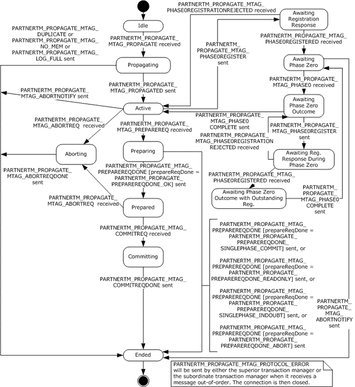

Figure 61: CONNTYPE_PARTERTM_PROPAGATE acceptor states

##### 3.8.1.1.1 Idle

This is the initial state. The following event is processed in this state:

- Receiving a PARTNERTM_PROPAGATE_MTAG_PROPAGATE message (section [3.8.5.1.1.1.1](#Section_3.8.5.1.1.1.1))

##### 3.8.1.1.2 Propagating

The following events are processed in this state:

- Create Superior Enlistment Success (section [3.8.7.4](#Section_3.8.7.4))
- Create Superior Enlistment Failure (section [3.8.7.5](#Section_3.8.7.5))

##### 3.8.1.1.3 Active

The following events are processed in this state:

- Register Phase Zero (section [3.8.7.9](#Section_3.4.7.15))
- Unilaterally Aborted (section [3.8.7.11](#Section_3.4.7.23))
- Receiving a PARTNERTM_PROPAGATE_MTAG_ABORTREQ message (section [3.8.5.1.2.1.5](#Section_3.8.5.1.2.1.5))
- Receiving a PARTNERTM_PROPAGATE_MTAG_PREPAREREQ message (section [3.8.5.1.2.1.7](#Section_3.8.5.1.2.1.7))
- Receiving a PARTNERTM_PROPAGATE_MTAG_PROTOCOL_ERROR message (section [3.8.5.1.1.1.3](#Section_3.8.5.1.1.1.3))

##### 3.8.1.1.4 Aborting

The following event is processed in this state:

- Rollback Complete (section [3.8.7.10](#Section_3.8.7.10))

##### 3.8.1.1.5 Awaiting Registration Response

The following events are processed in this state:

- Receiving a PARTNERTM_PROPAGATE_MTAG_PHASE0REGISTERED message, as described in CONNTYPE_PARTNERTM_PROPAGATE as Acceptor (section [3.8.5.1.1.1](#Section_3.8.5.1.1.1)) and in Receiving Other PARTNERTM_PROPAGATE_MTAG Messages (section [3.8.5.1.1.1.2](#Section_3.8.5.1.1.1.2)).
- Receiving a PARTNERTM_PROPAGATE_MTAG_PROTOCOL_ERROR message (section [3.8.5.1.1.1.3](#Section_3.8.5.1.1.1.3)).

##### 3.8.1.1.6 Awaiting Phase Zero

*The following events are processed in this state:*

- *Receiving a PARTNERTM_PROPAGATE_MTAG_PHASE0 message (section* [*3.8.5.1.2.1.6*](#Section_b67349bf782c4c8e8ac6d55bb1570a0f)*)*
- *Unilaterally Aborted (section* [*3.8.7.11*](#Section_3.4.7.23)*)*
- *Receiving a PARTNERTM_PROPAGATE_MTAG_PROTOCOL_ERROR message (section* [*3.8.5.1.2.1.9*](#Section_7a54927eda2e44d68a5c2fcea0d2df93))

##### 3.8.1.1.7 Awaiting Phase Zero Outcome

The following events are processed in this state:

- Phase Zero Complete (section [3.8.7.6](#Section_3.8.7.6))
- Register Phase Zero (section [3.8.7.9](#Section_3.4.7.15))

##### 3.8.1.1.8 Awaiting Registration Response During Phase Zero

The following events are processed in this state:

- Receiving a PARTNERTM_PROPAGATE_MTAG_PHASE0REGISTERED message (section [3.8.5.1.2.1.3](#Section_3.8.5.1.2.1.3))
- Receiving a PARTNERTM_PROPAGATE_MTAG_PHASE0REGISTRATIONREJECTED message (section [3.8.5.1.1.1.2](#Section_3.8.5.1.1.1.2))
- Receiving a PARTNERTM_PROPAGATE_MTAG_PROTOCOL_ERROR message (section [3.8.5.1.1.1.3](#Section_3.8.5.1.1.1.3))

##### 3.8.1.1.9 Awaiting Phase Zero Outcome with Outstanding Registration

The following event is processed in this state:

- Phase Zero Complete (section [3.8.7.6](#Section_3.8.7.6))

##### 3.8.1.1.10 Preparing

The following event is processed in this state:

- Phase One Complete (section [3.8.7.7](#Section_3.2.1.3.8))

##### 3.8.1.1.11 Prepared

The following events are processed in this state:

- Receiving a PARTNERTM_PROPAGATE_MTAG_COMMITREQ message (section [3.8.5.1.2.1.8](#Section_3.8.5.1.2.1.8))
- Receiving a PARTNERTM_PROPAGATE_MTAG_ABORTREQ message (section [3.8.5.1.2.1.5](#Section_3.8.5.1.2.1.5))
- Receiving a PARTNERTM_PROPAGATE_MTAG_PROTOCOL_ERROR message (section [3.8.5.1.1.1.3](#Section_3.8.5.1.1.1.3))

##### 3.8.1.1.12 Committing

The following event is processed in this state:

- Commit Complete (section [3.8.7.3](#Section_3.8.7.3))

##### 3.8.1.1.13 Ended

This is the final state.

#### 3.8.1.2 CONNTYPE_PARTNERTM_BRANCH Initiator States

The Subordinate Transaction Manager Facet (section [3.8](#Section_3.8)) MUST act as an [**initiator**](#gt_initiator) for the CONNTYPE_PARTNERTM_BRANCH (section [2.2.9.1.2.1](#Section_2.2.9.1.2.1)) [**connection type**](#gt_connection-type). In this role, the [**subordinate transaction manager**](#gt_subordinate-transaction-manager) MUST provide support for the states in this section.

The following illustration shows the relationship between the CONNTYPE_PARTNERTM_BRANCH initiator states.

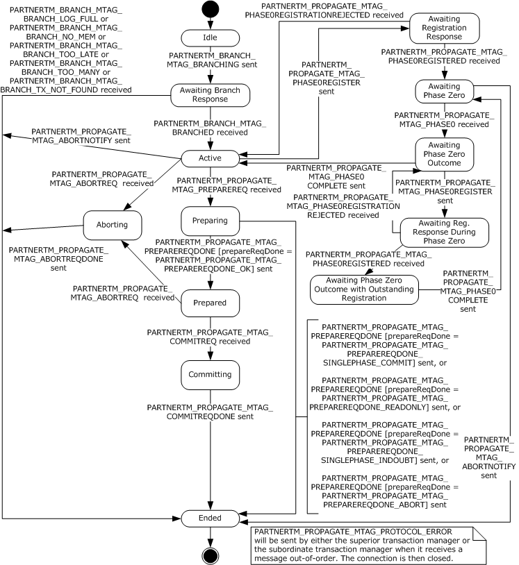

Figure 62: CONNTYPE_PARTNERTM_BRANCH initiator states

##### 3.8.1.2.1 Idle

This is the initial state. The following event is processed in this state:

- Branch Transaction (section [3.8.7.1](#Section_3.8.7.1))

##### 3.8.1.2.2 Awaiting Branch Response

The following events are processed in this state:

- Receiving a PARTNERTM_BRANCH_MTAG_BRANCHED Message (section [3.8.5.1.2.1.1](#Section_3.8.5.1.2.1.1))
- Receiving a PARTNERTM_BRANCH_MTAG_BRANCH_LOG_FULL, PARTNERTM_BRANCH_MTAG_BRANCH_NO_MEM, PARTNERTM_BRANCH_MTAG_BRANCH_TOO_LATE, PARTNERTM_BRANCH_MTAG_BRANCH_TOO_MANY or PARTNERTM_BRANCH_MTAG_BRANCH_TX_NOT_FOUND Message (section [3.8.5.1.2.1.2](#Section_3.8.5.1.2.1.2))

##### 3.8.1.2.3 Active

The following events are processed in this state:

- Register Phase Zero (section [3.8.7.9](#Section_3.4.7.15))
- Unilaterally Aborted (section [3.8.7.11](#Section_3.4.7.23))
- Receiving a PARTNERTM_PROPAGATE_MTAG_ABORTREQ Message (section [3.8.5.1.2.1.5](#Section_3.8.5.1.2.1.5))
- Receiving a PARTNERTM_PROPAGATE_MTAG_PREPAREREQ Message (section [3.8.5.1.2.1.7](#Section_3.8.5.1.2.1.7))
- Receiving a PARTNERTM_PROPAGATE_MTAG_PROTOCOL_ERROR Message (section [3.8.5.1.2.1.9](#Section_3.8.5.1.2.1.9))

##### 3.8.1.2.4 Aborting

The following event is processed in this state:

- Rollback Complete (section [3.8.7.10](#Section_3.8.7.10))

##### 3.8.1.2.5 Awaiting Registration Response

The following events are processed in this state:

- Receiving a PARTNERTM_PROPAGATE_MTAG_PHASE0REGISTERED (section [3.8.5.1.2.1.3](#Section_3.8.5.1.2.1.3)) message
- Receiving a PARTNERTM_PROPAGATE_MTAG_PHASE0REGISTRATIONREJECTED (section [3.8.5.1.2.1.4](#Section_3.8.5.1.2.1.4)) message
- Receiving a PARTNERTM_PROPAGATE_MTAG_PROTOCOL_ERROR (section [3.8.5.1.2.1.9](#Section_3.8.5.1.2.1.9)) message

##### 3.8.1.2.6 Awaiting Phase Zero

The following events are processed in this state:

- Receiving a PARTNERTM_PROPAGATE_MTAG_PHASE0 (section [3.8.5.1.2.1.6](#Section_3.8.5.1.2.1.6)) message
- Unilaterally Aborted (section [3.8.7.11](#Section_3.4.7.23)).
- Receiving a PARTNERTM_PROPAGATE_MTAG_PROTOCOL_ERROR (section [3.8.5.1.2.1.9](#Section_3.8.5.1.2.1.9)) message

##### 3.8.1.2.7 Awaiting Phase Zero Outcome

The following event is processed in this state:

- Phase Zero Complete (section [3.8.7.6](#Section_3.8.7.6))

##### 3.8.1.2.8 Awaiting Registration Response During Phase Zero

The following events are processed in this state:

- Receiving a PARTNERTM_PROPAGATE_MTAG_PHASE0REGISTERED (section [3.8.5.1.2.1.3](#Section_3.8.5.1.2.1.3)) message
- Receiving a PARTNERTM_PROPAGATE_MTAG_PHASE0REGISTRATIONREJECTED (section [3.8.5.1.2.1.4](#Section_3.8.5.1.2.1.4)) message
- Receiving a PARTNERTM_PROPAGATE_MTAG_PROTOCOL_ERROR (section [3.8.5.1.2.1.9](#Section_3.8.5.1.2.1.9)) message

##### 3.8.1.2.9 Awaiting Phase Zero Outcome with Outstanding Registration

The following event is processed in this state:

- Phase Zero Complete (section [3.8.7.6](#Section_3.8.7.6))

##### 3.8.1.2.10 Preparing

The following event is processed in this state:

- Phase One Complete (section [3.8.7.7](#Section_3.2.1.3.8))

##### 3.8.1.2.11 Prepared

The following events are processed in this state:

- Receiving a PARTNERTM_PROPAGATE_MTAG_COMMITREQ (section [3.8.5.1.2.1.8](#Section_3.8.5.1.2.1.8)) message
- Receiving a PARTNERTM_PROPAGATE_MTAG_ABORTREQ (section [3.8.5.1.2.1.5](#Section_3.8.5.1.2.1.5)) message
- Receiving a PARTNERTM_PROPAGATE_MTAG_PROTOCOL_ERROR (section [3.8.5.1.2.1.9](#Section_3.8.5.1.2.1.9)) message

##### 3.8.1.2.12 Committing

The following event is processed in this state:

- Commit Complete (section [3.8.7.3](#Section_3.8.7.3))

##### 3.8.1.2.13 Ended

This is the final state.

#### 3.8.1.3 CONNTYPE_PARTNERTM_REDELIVERCOMMIT Acceptor States

The Subordinate Transaction Manager Facet (section [1.3.3.3.5](#Section_1.3.3.3.5)) MUST act as an [**acceptor**](#gt_acceptor) for the CONNTYPE_PARTNERTM_REDELIVERCOMMIT (section [2.2.9.2.2.1](#Section_2.2.9.2.2.1)) [**connection type**](#gt_connection-type). In this role, the [**subordinate transaction manager**](#gt_subordinate-transaction-manager) MUST provide support for the states in this section.

The following figure shows the relationship between the CONNTYPE_PARTNERTM_REDELIVERCOMMIT acceptor states.

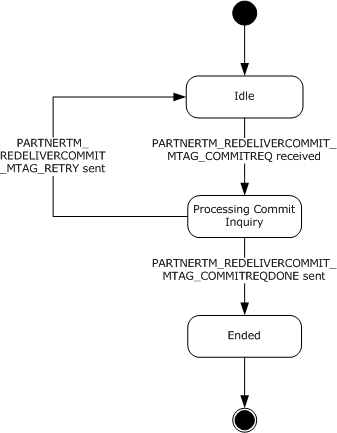

Figure 63: CONNTYPE_PARTNERTM_REDELIVERCOMMIT acceptor states

##### 3.8.1.3.1 Idle

This is the initial state. The following event is processed in this state:

- Receiving a PARTNERTM_REDELIVERCOMMIT_MTAG_COMMITREQ message (section [3.8.5.2.2.1.1](#Section_3.8.5.2.2.1.1))

##### 3.8.1.3.2 Processing Commit Inquiry

The following event is processed in this state:

- Commit Complete (section [3.8.7.3](#Section_3.8.7.3))

##### 3.8.1.3.3 Ended

This is the final state.

#### 3.8.1.4 CONNTYPE_PARTNERTM_CHECKABORT Initiator States

The Subordinate Transaction Manager Facet (section [1.3.3.3.5](#Section_1.3.3.3.5)) MUST act as an [**initiator**](#gt_initiator) for the CONNTYPE_PARTNERTM_CHECKABORT (section [2.2.9.2.1.1](#Section_2.2.9.2.1.1)) [**connection type**](#gt_connection-type). In this role, the [**subordinate transaction manager**](#gt_subordinate-transaction-manager) MUST provide support for the states in this section.

The following figure shows the relationship between the CONNTYPE_PARTNERTM_CHECKABORT initiator states.

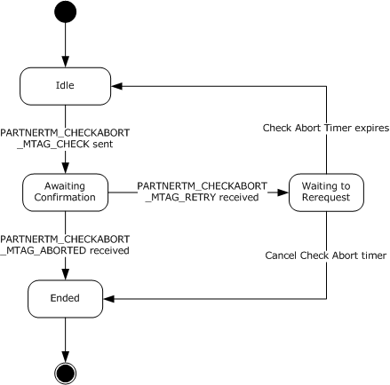

Figure 64: CONNTYPE_PARTNERTM_CHECKABORT initiator states

##### 3.8.1.4.1 Idle

This is the initial state. The following event is processed in this state:

- Recover In Doubt Transaction (section [3.8.7.8](#Section_3.8.7.8))

##### 3.8.1.4.2 Awaiting Confirmation

The following events are processed in this state:

- Receiving a PARTNERTM_CHECKABORT_MTAG_ABORTED Message (section [3.8.5.2.1.1.1](#Section_3.8.5.2.1.1.1))
- Receiving a PARTNERTM_CHECKABORT_MTAG_RETRY Message (section [3.8.5.2.1.1.2](#Section_3.8.5.2.1.1.2))
- Cancel Check Abort (section [3.8.7.2](#Section_3.8.7.2))

##### 3.8.1.4.3 Waiting to ReRequest

The following events are processed in this state:

- Check Abort Timer (section [3.8.2.1](#Section_3.8.2.1))
- Cancel Check Abort (section [3.8.7.2](#Section_3.8.7.2))

##### 3.8.1.4.4 Ended

This is the final state.

### 3.8.2 Timers

The Subordinate Transaction Manager Facet (section [3.8](#Section_3.8)) MUST provide the Check Abort Timer (section [3.8.2.1](#Section_3.8.2.1)).

#### 3.8.2.1 Check Abort Timer

This timer MUST be set when the Subordinate Transaction Manager Facet (section [1.3.3.3.5](#Section_1.3.3.3.5)) receives a PARTNERTM_CHECKABORT_MTAG_RETRY (section [2.2.9.2.1.1.3](#Section_2.2.9.2.1.1.3)) message on a CONNTYPE_PARTNERTM_CHECKABORT (section [2.2.9.2.1.1](#Section_2.2.9.2.1.1)) [**connection**](#gt_connection). The timer MUST be canceled when the CONNTYPE_PARTNERTM_CHECKABORT (section 2.2.9.2.1.1) connection is disconnected.

The default value of the timer is implementation-specific.<34>

When the timer is initialized, the Subordinate Transaction Manager Facet (section 1.3.3.3.5) MUST provide an [**Enlistment**](#gt_enlistment) object to associate with the timer. When the timer expires, the same Enlistment object MUST be provided alongside the timer notification. The Subordinate Transaction Manager Facet (section 1.3.3.3.5) MUST provide a distinct Check Abort Timer instance for each CONNTYPE_PARTNERTM_CHECKABORT connection.

### 3.8.3 Initialization

When the Subordinate Transaction Manager Facet (section [1.3.3.3.5](#Section_1.3.3.3.5)) is initialized:

- The Subordinate Transaction Manager Facet MUST examine the following security flags on the [Core Transaction Manager Facet](#Section_1.3.3.3.1) and perform the following actions:
- If one of the Allow Network Access, Allow Network Transactions, or Allow Inbound Transactions flags is set to false:
- For the following [**connection type**](#gt_connection-type), the Subordinate Transaction Manager Facet MUST refuse to accept incoming [**connections**](#gt_connection) from remote machines as specified in [MS-CMP](../MS-CMP/MS-CMP.md) section 3.1.5.5 with the rejection Reason set to 0x80070005.
- CONNTYPE_PARTNERTM_PROPAGATE (section [2.2.9.1.1.1](#Section_2.2.9.1.1.1))
- If one of the Allow Network Access or Allow Network Transactions flags is set to false, or if both the Allow Inbound Transactions and Allow Outbound Transactions flags are set to false:
- For the following connection type, the Subordinate Transaction Manager Facet MUST refuse to accept incoming connections from remote machines as specified in [MS-CMP] section 3.1.5.5 with the rejection reason set to 0x80070005.
- CONNTYPE_PARTNERTM_REDELIVERCOMMIT (section [2.2.9.2.2.1](#Section_2.2.9.2.2.1))
All data elements maintained by the Subordinate Transaction Manager Facet are initialized to an empty value unless stated otherwise in this section or in the initialization sections of the [**facets**](#gt_facet) the Subordinate Transaction Manager Facet extends, as specified in section [3.8.1](#Section_3.8.1).

### 3.8.4 Higher-Layer Triggered Events

There are no higher-layer triggered events.

### 3.8.5 Processing Events and Sequencing Rules

#### 3.8.5.1 Transaction Propagation and Coordination

##### 3.8.5.1.1 Push Propagation

###### 3.8.5.1.1.1 CONNTYPE_PARTNERTM_PROPAGATE as Acceptor

For all messages received in this connection type, the **Subordinate Transaction Manager Facet** (section [1.3.3.3.5](#Section_1.3.3.3.5)) MUST process the message as specified in section [3.1](#Section_1.3).

Also, the **Subordinate Transaction Manager Facet** MUST override the default state verification actions for incoming messages as specified in section [3.1.6](#Section_3.1.6) in the following manner:

- If the current connection state does not define a processing rule for the message:
- Send a [PARTNERTM_PROPAGATE_MTAG_PROTOCOL_ERROR](#Section_2.2.9.1.1.1.8) message using the connection.
- Perform default invalid message processing, as specified in section 3.1.6.
The **Subordinate Transaction Manager Facet** MUST additionally follow the processing rules as specified in this section.

Receiving a PARTNERTM_PROPAGATE_MTAG_PROPAGATE Message

When the **Subordinate Transaction Manager Facet** (section [1.3.3.3.5](#Section_1.3.3.3.5)) receives a **PARTNERTM_PROPAGATE_MTAG_PROPAGATE** (section [2.2.9.1.1.1.1](#Section_2.2.9.1.1.1.1)) message, the **Subordinate Transaction Manager Facet** MUST perform the following actions:

- If the connection state is Idle:
- Set the connection state to Propagating.
- If the **transaction manager** does not have sufficient memory available to process the message, it MUST:
- Send a **PARTNERTM_PROPAGATE_MTAG_NO_MEM** (section [2.2.9.1.1.1.4](#Section_2.2.9.1.1.1.4)) message.
- Set the connection state to Ended (section [3.8.1.1.13](#Section_3.8.1.1.13)).
- Otherwise, find the transaction object in the transaction table of the **transaction manager** using the **guidTx** field from the message as the key:
- If the transaction object is found in the list:
- Send a **PARTNERTM_PROPAGATE_MTAG_DUPLICATE** (section [2.2.9.1.1.1.3](#Section_2.2.9.1.1.1.3)) message to the **superior transaction manager**.
- Set the connection state to Ended.
- Otherwise, if the transaction object is not found in the list:
- Create a new transaction object with the information provided in the message:
- Use the **guidTx** field from the message as the **Transaction Object.Identifier** value.
- Use the **isoLevel** field from the message as the Isolation Level value.
- Use the **szDesc** field from the message as the Description value.
- Add the connection to the connection list of the transaction.
- Create a new **Enlistment** object with the following values:
- The **Subordinate Transaction Manager Facet**.
- The new transaction object.
- This connection object.
- Assign the enlistment to the connection's Enlistment field.
- Signal the Create Superior Enlistment (section [3.2.7.12](#Section_3.2.7.12)) event on the **Core Transaction Manager Facet** (section [1.3.3.3.1](#Section_1.3.3.3.1)) with the Enlistment object.
- Otherwise, the message MUST be processed as specified in section [3.1.6](#Section_3.1.6).

Receiving Other PARTNERTM_PROPAGATE_MTAG Messages

When the **Subordinate Transaction Manager Facet** (section [1.3.3.3.5](#Section_1.3.3.3.5)) receives one of these messages:

- PARTNERTM_PROPAGATE_MTAG_PHASE0REGISTRATIONREJECTED (section [2.2.9.1.1.1.16](#Section_2.2.9.1.1.1.16))
- PARTNERTM_PROPAGATE_MTAG_PHASE0REGISTERED (section [2.2.9.1.1.1.15](#Section_2.2.9.1.1.1.15))
- PARTNERTM_PROPAGATE_MTAG_PHASE0 (section [2.2.9.1.1.1.17](#Section_2.2.9.1.1.1.17))
- PARTNERTM_PROPAGATE_MTAG_ABORTREQ (section [2.2.9.1.1.1.11](#Section_2.2.9.1.1.1.11))
- PARTNERTM_PROPAGATE_MTAG_PREPAREREQ (section [2.2.9.1.1.1.6](#Section_2.2.9.1.1.1.6))
- PARTNERTM_PROPAGATE_MTAG_COMMITREQ (section [2.2.9.1.1.1.9](#Section_2.2.9.1.1.1.9))
It MUST follow the same message processing rules as the CONNTYPE_PARTNERTM_BRANCH (section [2.2.9.1.2.1](#Section_2.2.9.1.2.1)) connection type acting as an initiator. See CONNTYPE_PARTNERTM_BRANCH as Initiator (section [3.8.5.1.2.1](#Section_3.8.5.1.2.1)) for more information.

Receiving a PARTNERTM_PROPAGATE_MTAG_PROTOCOL_ERROR Message

The processing of this event MUST be identical to the processing of the [Connection Disconnected](#Section_3.6.5.2.2.5) event.

CONTYPE_PARTNERTM_PROPAGATE Connection Disconnected

When a CONNTYPE_PARTNERTM_PROPAGATE (section [2.2.9.1.1.1](#Section_2.2.9.1.1.1)) connection is disconnected, the **Subordinate Transaction Manager Facet** (section [1.3.3.3.5](#Section_1.3.3.3.5)) MUST perform the same actions as the CONNTYPE_PARTNERTM_BRANCH (section [2.2.9.1.2.1](#Section_2.2.9.1.2.1)) connection type acting as an initiator. See section [3.8.5.1.2.1](#Section_3.8.5.1.2.1) for more details.

##### 3.8.5.1.2 Pull Propagation

###### 3.8.5.1.2.1 CONNTYPE_PARTNERTM_BRANCH as Initiator

For all messages received in this connection type, the **Subordinate Transaction Manager Facet** (section [1.3.3.3.5](#Section_1.3.3.3.5)) MUST process the message as specified in section [3.1](#Section_1.3).

Also, the **Subordinate Transaction Manager Facet** MUST override the default state verification actions for incoming messages as specified in section [3.1.6](#Section_3.1.6) in the following manner:

- If the current connection state does not define a processing rule for the message:
- Send a [PARTNERTM_PROPAGATE_MTAG_PROTOCOL_ERROR](#Section_2.2.9.1.1.1.8) message using the connection.
- Perform default invalid message processing, as specified in section 3.1.6.
The **Subordinate Transaction Manager Facet** MUST additionally follow the processing rules as specified in the following sections.

Receiving a PARTNERTM_BRANCH_MTAG_BRANCHED Message

When the **Subordinate Transaction Manager Facet** (section [1.3.3.3.5](#Section_1.3.3.3.5)) receives a **PARTNERTM_BRANCH_MTAG_BRANCHED** (section [2.2.9.1.2.1.6](#Section_2.2.9.1.2.1.6)) message, the **Subordinate Transaction Manager Facet** MUST perform the following actions:

- If the connection state is Awaiting Branch Response:
- Set the connection state to Active.
- Create an Enlistment object with the following values:
- The **Subordinate Transaction Manager Facet**
- The transaction object referenced by the connection's Connection-Specific Data field
- This connection object
- Set this connection's **enlistment** field to reference the new Enlistment object.
- Signal the Branch Transaction Success (section [3.2.7.9](#Section_3.2.7.9)) event on the Core Transaction Manager Facet (section [1.3.3.3.1](#Section_1.3.3.3.1)) with the Enlistment object.
- Otherwise, the message MUST be processed as an invalid message as specified in section [3.1.6](#Section_3.1.6).

Receiving a PARTNERTM_BRANCH_MTAG_BRANCH_LOG_FULL, PARTNERTM_BRANCH_MTAG_BRANCH_NO_MEM, PARTNERTM_BRANCH_MTAG_BRANCH_TOO_LATE, PARTNERTM_BRANCH_MTAG_BRANCH_TOO_MANY, or PARTNERTM_BRANCH_MTAG_BRANCH_TX_NOT_FOUND Message

When the **Subordinate Transaction Manager Facet** (section [1.3.3.3.5](#Section_1.3.3.3.5)) receives one of these messages, the **Subordinate Transaction Manager Facet** MUST perform the following actions:

- If the connection state is Awaiting Branch Response:
- Create an Enlistment object with a reference to the **Subordinate Transaction Manager Facet**, a reference to this connection, and a reference to the transaction object referenced by this connection.
- Signal the [Branch Transaction Failure](#Section_3.2.7.8) event on the [Core Transaction Manager Facet](#Section_1.3.3.3.1) with the following arguments:
- The Enlistment object.
- The failure code that matches the incoming message:
- PARTNERTM_BRANCH_MTAG_BRANCH_LOG_FULL: Log Full Remote
- PARTNERTM_BRANCH_MTAG_BRANCH_NO_MEM: No Mem Remote
- PARTNERTM_BRANCH_MTAG_BRANCH_TOO_LATE: Too Late
- PARTNERTM_BRANCH_MTAG_BRANCH_TOO_MANY: Too Many Remote
- PARTNERTM_BRANCH_MTAG_BRANCH_TX_NOT_FOUND: Tx Not Found
- Set the connection state to Ended.
- Otherwise, the message MUST be processed as an invalid message as specified in section [3.1.6](#Section_3.1.6).

Receiving a PARTNERTM_PROPAGATE_MTAG_PHASE0REGISTERED Message

When the Subordinate Transaction Manager Facet (section [1.3.3.3.5](#Section_1.3.3.3.5)) receives a **PARTNERTM_PROPAGATE_MTAG_PHASE0REGISTERED** (section [2.2.9.1.1.1.15](#Section_2.2.9.1.1.1.15)) message, the **Subordinate Transaction Manager Facet** MUST perform the following actions:

- If the connection state is Awaiting Registration Response:
- Set the connection state to Awaiting Phase Zero.
- Signal the Register Phase Zero Success (section [3.2.7.29](#Section_3.2.7.29)) event on the Core Transaction Manager Facet (section [1.3.3.3.1](#Section_1.3.3.3.1)) with the Enlistment object referenced by this connection.
- Otherwise, if the connection state is Awaiting Registration Response During Phase Zero:
- Set the connection state to Awaiting Phase Zero Outcome with Outstanding Registration.
- Signal the Register Phase Zero Success event on the Core Transaction Manager Facet with the Enlistment object referenced by this connection.
- Otherwise, the message MUST be processed as an invalid message as specified in section [3.1.6](#Section_3.1.6).

Receiving a PARTNERTM_PROPAGATE_MTAG_PHASE0REGISTRATIONREJECTED Message

When the **Subordinate Transaction Manager Facet** (section [1.3.3.3.5](#Section_1.3.3.3.5)) receives a PARTNERTM_PROPAGATE_MTAG_PHASE0REGISTRATIONREJECTED (section [2.2.9.1.1.1.16](#Section_2.2.9.1.1.1.16)) message, the **Subordinate Transaction Manager Facet** MUST perform the following actions:

- If the connection state is Awaiting Registration Response:
- Set the connection state to Active.
- Signal the Register Phase Zero Failure (section [3.2.7.28](#Section_3.2.7.28)) event on the Core Transaction Manager Facet (section [1.3.3.3.1](#Section_1.3.3.3.1)) with the following arguments:
- The Enlistment object referenced by this connection.
- A failure reason of Too Late.
- Otherwise, if the connection state is Awaiting Registration Response During Phase Zero:
- Set the connection state to Awaiting Phase Zero Outcome.
- Signal the Register Phase Zero Failure event on the Core Transaction Manager Facet with the following arguments:
- The Enlistment object referenced by this connection.
- A failure reason of Too Late.
- Otherwise, the message MUST be processed as an invalid message as specified in section [3.1.6](#Section_3.1.6).

Receiving a PARTNERTM_PROPAGATE_MTAG_ABORTREQ Message

When the **Subordinate Transaction Manager Facet** receives a [PARTNERTM_PROPAGATE_MTAG_ABORTREQ](#Section_2.2.9.1.1.1.11) message, the **Subordinate Transaction Manager Facet** MUST perform the following actions:

- If the connection state is either Active or Prepared:
- Set the connection state to Aborting.
- Signal the [Begin Rollback](#Section_3.2.7.6) event on the [Core Transaction Manager Facet](#Section_1.3.3.3.1) with the transaction object referenced by the Enlistment object referenced by this connection.
- Otherwise, the message MUST be processed as an invalid message as specified in section [3.1.6](#Section_3.1.6).

Receiving a PARTNERTM_PROPAGATE_MTAG_PHASE0 Message

When the **Subordinate Transaction Manager Facet** (section [1.3.3.3.5](#Section_1.3.3.3.5)) receives a [PARTNERTM_PROPAGATE_MTAG_PHASE0](#Section_2.2.9.1.1.1.17) message, the **Subordinate Transaction Manager Facet** MUST perform the following actions:

- If the connection state is Awaiting Phase Zero:
- Set the connection state to Awaiting Phase Zero Outcome.
- Signal the [Begin Phase Zero](#Section_3.7.7.3) event on the **Core Transaction Manager Facet** with the transaction object referenced by the Enlistment object referenced by this connection.
- Otherwise, the message MUST be processed as an invalid message as specified in section [3.1.6](#Section_3.1.6).

Receiving a PARTNERTM_PROPAGATE_MTAG_PREPAREREQ Message

When the **Subordinate Transaction Manager Facet** (section [1.3.3.3.5](#Section_1.3.3.3.5)) receives a [PARTNERTM_PROPAGATE_MTAG_PREPAREREQ](#Section_2.2.9.1.1.1.6) message, the **Subordinate Transaction Manager Facet** MUST perform the following actions:

- If the connection state is Active:
- Set the connection state to Preparing.
- Signal the [Begin Phase One](#Section_3.7.7.2) event on the [Core Transaction Manager Facet](#Section_1.3.3.3.1) with the following arguments:
- The transaction object referenced by the Enlistment object referenced by the receiving connection.
- If the **fSinglePhase** field of the message is set to 0x00000000:
- Set the **Single Phase Commit** flag to false.
- Otherwise:
- Set the **Single Phase Commit** flag to true.
- Otherwise, the message MUST be processed as an invalid message as specified in section [3.1.6](#Section_3.1.6).

Receiving a PARTNERTM_PROPAGATE_MTAG_COMMITREQ Message

When the **Subordinate Transaction Manager Facet** (section [1.3.3.3.5](#Section_1.3.3.3.5)) receives a [PARTNERTM_PROPAGATE_MTAG_COMMITREQ](#Section_2.2.9.1.1.1.9) message, the **Subordinate Transaction Manager Facet** MUST perform the following actions:

- If the connection state is Prepared:
- Set the connection state to Committing.
- Signal the [Begin Commit](#Section_3.4.7.3) on the [Core Transaction Manager Facet](#Section_1.3.3.3.1) event with the transaction object referenced by the Enlistment object referenced by this connection.
- Otherwise, the message MUST be processed as an invalid message as specified in section [3.1.6](#Section_3.1.6).

Receiving a PARTNERTM_PROPAGATE_MTAG_PROTOCOL_ERROR Message

The processing of this event MUST be identical to the processing of the [Connection Disconnected](#Section_3.6.5.2.2.5) event.

Connection Disconnected

When a CONNTYPE_PARTNERTM_BRANCH (section [2.2.9.1.2.1](#Section_2.2.9.1.2.1)) connection is disconnected, the **Subordinate Transaction Manager Facet** (section [3.8](#Section_3.8)) MUST perform the following actions:

- If the connection state is Prepared:
- Signal the Recover **In Doubt Transaction** (section [3.8.7.8](#Section_3.8.7.8)) event on the **Subordinate Transaction Manager Facet** with the Enlistment object referenced by this connection.
- Otherwise, if the connection state is Preparing:
- If the transaction object's Single Phase Commit flag (defined in section [3.2.1](#Section_3.2.1)) is false, signal the **Begin Rollback** (section [3.2.7.6](#Section_3.2.7.6)) event on **Core Transaction Manager Facet** (section [1.3.3.3.1](#Section_1.3.3.3.1)) with the transaction object referenced by the **Enlistment** object referenced by this connection.
- Otherwise, the event MUST be processed as specified in section [3.1.8.3](#Section_3.6.5.2.2.5).
- Otherwise, if the connection state is Awaiting Branch Response:
- Create an Enlistment object with the following values:
- The **Subordinate Transaction Manager Facet**.
- The transaction object in the Connection-Specific Data field of this connection.
- This connection object.
- Signal the **Branch Transaction Failure** (section [3.2.7.8](#Section_3.2.7.8)) event on the Core Transaction Manager Facet (section 1.3.3.3.1) with the following arguments:
- The new enlistment object.
- A failure code of Comm Failed.
- Set the connection state to Ended.
- Otherwise, if the connection state is Active, Awaiting Registration Response, Awaiting Registration Response During Phase Zero, Awaiting Phase Zero, Awaiting Phase Zero Outcome, or Awaiting Phase Zero Outcome with Outstanding Registration:
- Signal the **Begin Rollback** (section 3.2.7.6) event on the **Core Transaction Manager Facet** (section 1.3.3.3.1) with the transaction object referenced by this connection.
- Otherwise, the event MUST be processed as specified in section 3.1.8.3.

#### 3.8.5.2 Transaction Recovery

##### 3.8.5.2.1 Subordinate-Driven Recovery

###### 3.8.5.2.1.1 CONNTYPE_PARTNERTM_CHECKABORT as Initiator

For all messages received in this connection type, the **Subordinate Transaction Manager Facet** (section [1.3.3.3.5](#Section_1.3.3.3.5)) MUST process the message in accordance with section [3.8](#Section_3.8). The **Subordinate Transaction Manager** MUST additionally follow the processing rules specified in the following sections.

Receiving a PARTNERTM_CHECKABORT_MTAG_ABORTED Message

When the **Subordinate Transaction Manager Facet** (section [1.3.3.3.5](#Section_1.3.3.3.5)) receives a **PARTNERTM_CHECKABORT_MTAG_ABORTED** (section [2.2.9.2.1.1.2](#Section_2.2.9.2.1.1.2)) message, the **Subordinate Transaction Manager** MUST perform the following actions:

- If the connection state is Awaiting Confirmation:
- Signal the **Begin Rollback** (section [3.2.7.6](#Section_3.2.7.6)) event on the **Core Transaction Manager Facet** (section [1.3.3.3.1](#Section_1.3.3.3.1)) with the:
- The transaction object referenced by the **Enlistment** object referenced by this connection.
- Set the Connection state to Ended.
- Otherwise, the message MUST be processed as an invalid message as specified in section [3.1.6](#Section_3.1.6).

Receiving a PARTNERTM_CHECKABORT_MTAG_RETRY Message

When the **Subordinate Transaction Manager Facet** (section [1.3.3.3.5](#Section_1.3.3.3.5)) receives a [PARTNERTM_CHECKABORT_MTAG_RETRY](#Section_2.2.9.2.1.1.3) message, the **Subordinate Transaction Manager Facet** MUST perform the following actions:

- If the connection state is Awaiting Confirmation:
- Set the connection state to Waiting to Rerequest.
- Initialize a **Check Abort** Timer with the following arguments:
- The connection's Enlistment object
- An implementation-specific time-out value
- Otherwise, the message MUST be processed as an invalid message as specified in section [3.1.6](#Section_3.1.6).

CONNTYPE_PARTNERTM_CHECKABORT Connection Disconnected

When a CONNTYPE_PARTNERTM_CHECKABORT (section [2.2.9.2.1.1](#Section_2.2.9.2.1.1)) connection is disconnected, the **Subordinate Transaction Manager Facet** (section [3.8](#Section_3.8)) MUST perform the following actions:

- If the connection state is Waiting to Rerequest:
- Cancel the Check Abort Timer associated with the connection.
- If the connection state is Idle, Waiting to Rerequest, or Awaiting Confirmation:
- Signal the Recover In Doubt Transaction (section [3.8.7.8](#Section_3.8.7.8)) event on the **Subordinate Transaction Manager Facet** (section [1.3.3.3.5](#Section_1.3.3.3.5)) with the Enlistment object referenced by this connection.
- Set the connection state to Ended.
- Finally, in all cases, the event MUST be processed as specified in section [3.1.8.3](#Section_3.6.5.2.2.5).

##### 3.8.5.2.2 Superior-Driven Recovery

###### 3.8.5.2.2.1 CONNTYPE_PARTNERTM_REDELIVERCOMMIT as Acceptor

For all messages received in this connection type, the **Subordinate Transaction Manager Facet** (section [1.3.3.3.5](#Section_1.3.3.3.5)) MUST process the message in accordance with section [3.8](#Section_3.8). The Subordinate Transaction Manager Facet MUST additionally follow the processing rules specified in the following sections.

Receiving a PARTNERTM_REDELIVERCOMMIT_MTAG_COMMITREQ Message

When the **subordinate transaction manager** receives a **PARTNERTM_REDELIVERCOMMIT_MTAG_COMMITREQ** (section [2.2.9.2.2.1.1](#Section_2.2.9.2.2.1.1)) message, the **Subordinate Transaction Manager Facet** (section [1.3.3.3.5](#Section_1.3.3.3.5)) MUST perform the following actions:

- If the connection state is Idle:
- Set the connection state to Processing Commit Inquiry.
- Find the transaction object in the transaction manager's transaction table, using the **guidTx** field from the message as a key.
- If the transaction object is not found:
- Send a **PARTNERTM_REDELIVERCOMMIT_MTAG_COMMITREQDONE** (section [2.2.9.2.2.1.2](#Section_2.2.9.2.2.1.2)) message using the connection.
- Set the connection state to Ended.
- Otherwise, if the transaction state is either **Phase One Complete** (section [3.2.1.3.8](#Section_3.2.1.3.8)) or **In Doubt** (section [3.2.1.3.12](#Section_3.2.1.3.12)):
- Signal the **Cancel Check Abort** (section [3.8.7.2](#Section_3.8.7.2)) event on the **Subordinate Transaction Manager Facet** with the transaction object.
- Signal the Begin Commit (section [3.2.7.2](#Section_3.4.7.3)) event on the **Core Transaction Manager Facet** (section [1.3.3.3.1](#Section_1.3.3.3.1)) with the transaction object.
- Otherwise:
- Send a **PARTNERTM_REDELIVERCOMMIT_MTAG_RETRY** (section [2.2.9.2.2.1.3](#Section_2.2.9.2.2.1.3)) message using the connection.
- Set the connection state to Idle.
- Otherwise, the message MUST be processed as an invalid message as specified in section [3.1.8.1](#Section_3.1.8.1).
Connection Disconnected

When a CONNTYPE_PARTNERTM_REDELIVERCOMMIT (section [2.2.9.2.2.1](#Section_2.2.9.2.2.1)) connection is disconnected, the **Subordinate Transaction Manager Facet** (section [1.3.3.3.5](#Section_1.3.3.3.5)) MUST perform the actions as specified in section [3.1.8.3](#Section_3.6.5.2.2.5).

### 3.8.6 Timer Events

#### 3.8.6.1 Check Abort Timer

When the **Check Abort** timer expires, the **Subordinate Transaction Manager Facet** (section [1.3.3.3.5](#Section_1.3.3.3.5)) MUST perform the following actions:

- If the connection referenced by the provided enlistment is in the Waiting to Rerequest state:
- Set the connection state to Idle.
- Send a **PARTNERTM_CHECKABORT_MTAG_CHECK** (section [2.2.9.2.1.1.1](#Section_2.2.9.2.1.1.1)) message using the connection referenced by the provided Enlistment object:
- Set the **guidTX** field to the provided Enlistment object's transaction object's **Transaction Object.Identifier** field.
- Set the connection state to Awaiting Confirmation.
- Otherwise, ignore the timer event.

### 3.8.7 Other Local Events

A **Subordinate Transaction Manager Facet** (section [1.3.3.3.5](#Section_1.3.3.3.5)) MUST be prepared to process the local events defined in the following sections.

The **subordinate transaction manager** MUST be prepared to process local events pertaining to Phase Zero functionality only on versions where the connection type [CONNTYPE_TXUSER_PHASE0](#Section_2.2.10.2.1) is supported. Version-Specific Aspects of Connection Types Relevant to a Resource Manager (section [2.2.1.1.3](#Section_2.2.1.1.3)) defines protocol version support for this connection type. The following local events are affected:

- [Register Phase Zero](#Section_3.4.7.15)
- [Phase Zero Complete](#Section_3.8.7.6)

#### 3.8.7.1 Branch Transaction

The **Branch Transaction** event MUST be signaled with the following arguments:

- A transaction object
- A Name object representing the remote **superior transaction manager**
If the **Branch Transaction** event is signaled, the **Subordinate Transaction Manager Facet** (section [3.8](#Section_3.8)) MUST perform the following actions:

- Initiate a new **CONNTYPE_PARTNERTM_BRANCH** (section [2.2.9.1.2.1](#Section_2.2.9.1.2.1)) connection to the provided Name object.
- Assign the provided transaction object to the connection's Connection-Specific Data field.
- Send a **PARTNERTM_BRANCH_MTAG_BRANCHING** (section [2.2.9.1.2.1.7](#Section_3.7.1.2.2)) message using the connection:
- Set the **guidTX** field to the provided **Transaction Object.Identifier** field of the transaction object.
- Set the connection state to Awaiting Branch Response (section [3.8.1.2.2](#Section_3.8.1.2.2)).

#### 3.8.7.2 Cancel Check Abort

The **Cancel Check Abort** event MUST be signaled with the following arguments:

- A transaction object.
If the **Cancel Check Abort** event is signaled, the Subordinate Transaction Manager Facet (section [3.8](#Section_3.8)) MUST perform the following actions:

- Find a connection object of type CONNTYPE_PARTNERTM_CHECKABORT (section [2.2.9.2.1.1](#Section_2.2.9.2.1.1)) in the transaction object's Connection list.
- If no such connection is found, ignore the event.
- Otherwise:
- If a **Check Abort** timer is active for the transaction, cancel it.
- Set the connection state to Ended.

#### 3.8.7.3 Commit Complete

The **Commit Complete** event MUST be signaled with the following arguments:

- An Enlistment object
If the **Commit Complete** event is signaled, the **Subordinate Transaction Manager Facet** (section [3.8](#Section_3.8)) MUST perform the following actions:

- If the provided enlistment's connection is of type CONNTYPE_TXUSER_BRANCH (section [2.2.9.1.2.1](#Section_2.2.9.1.2.1)) or CONNTYPE_PARTNERTM_PROPAGATE (section [2.2.9.1.1.1](#Section_2.2.9.1.1.1)):
- Send a **PARTNERTM_PROPAGATE_MTAG_COMMITREQDONE** (section [2.2.9.1.1.1.10](#Section_2.2.9.1.1.1.10)) message using the provided enlistment's connection.
- Set the connection state to Ended.
- Otherwise, if the provided enlistment's connection is of type CONNTYPE_PARTNERTM_REDELIVERCOMMIT (section [2.2.9.2.2.1](#Section_2.2.9.2.2.1)):
- Send a **PARTNERTM_REDELIVERCOMMIT_MTAG_COMMITREQDONE** (section [2.2.9.2.2.1.2](#Section_2.2.9.2.2.1.2)) message using the provided enlistment's connection.
- Set the connection state to Ended.

#### 3.8.7.4 Create Superior Enlistment Success

The **Create Superior Enlistment Success** event MUST be signaled with the following arguments:

- An Enlistment object
If the **Create Superior Enlistment Success** event is signaled, the **Subordinate Transaction Manager Facet** (section [3.8](#Section_3.8)) MUST perform the following actions:

- Send a **PARTNERTM_PROPAGATE_MTAG_PROPAGATED** (section [2.2.9.1.1.1.2](#Section_2.2.9.1.1.1.2)) message using the provided enlistment's connection:
- Set the connection state to Active.

#### 3.8.7.5 Create Superior Enlistment Failure

The **Create Superior Enlistment Failure** event MUST be signaled with the following arguments:

- An Enlistment object.
- A value indicating the failure reason. The reason MUST be set to one of the following values:
- Duplicate
- Log Full
If the **Create Superior Enlistment Failure** event is signaled, the **Subordinate Transaction Manager Facet** (section [3.8](#Section_3.8)) MUST perform the following actions:

- Send the matching message for the following reason codes using the provided enlistment's connection:
- Duplicate: PARTNERTM_PROPAGATE_MTAG_DUPLICATE (section [2.2.9.1.1.1.3](#Section_2.2.9.1.1.1.3))
- Log Full: PARTNERTM_PROPAGATE_MTAG_LOG_FULL (section [2.2.9.1.1.1.5](#Section_2.2.9.1.1.1.5))
- Set the connection state to Ended.

#### 3.8.7.6 Phase Zero Complete

The **Phase Zero Complete** event MUST be signaled with the following arguments:

- An Enlistment object.
- An outcome value. This value MUST be one of the following:
- Success
- Failure
If the **Phase Zero Complete** event is signaled, the **Subordinate Transaction Manager Facet** (section [3.8](#Section_3.8)) MUST perform the following actions:

- If the provided outcome is Success:
- Send a **PARTNERTM_PROPAGATE_MTAG_PHASE0COMPLETE** (section [2.2.9.1.1.1.18](#Section_2.2.9.1.1.1.18)) message using the provided enlistment's connection.
- Set the connection state to Active.
- Otherwise:
- Send a **PARTNERTM_PROPAGATE_MTAG_ABORTNOTIFY** (section [2.2.9.1.1.1.13](#Section_2.2.9.1.1.1.13)) message using the provided enlistment's connection.
- Set the connection state to Ended.

#### 3.8.7.7 Phase One Complete

The **Phase One Complete** event MUST be signaled with the following arguments:

- An Enlistment object.
- A value indicating the outcome of [Phase One](#Section_1.3.1.2). The value MUST be set to one of the following values:
- Read Only
- Prepared
- Committed
- Aborted
- In Doubt
If the **Phase One Complete** event is signaled, the **Subordinate Transaction Manager Facet** (section [3.8](#Section_3.8)) MUST perform the following actions:

- If the provided outcome is Read Only:
- Send a **PARTNERTM_PROPAGATE_MTAG_PREPAREREQDONE** (section [2.2.9.1.1.1.7](#Section_2.2.9.1.1.1.7)) message using the provided enlistment's connection:
- Set the **prepareReqDone** field to PARTNERTM_PROPAGATE_PREPAREREQDONE_READ_ONLY.
- Set the **guidReason** field to the value provided by the higher-layer business logic, as specified in section 2.2.9.1.1.1.7.
- Set the connection state to **Ended**.
- Otherwise, if the provided outcome is Prepared:
- Send a **PARTNERTM_PROPAGATE_MTAG_PREPAREREQDONE** (section 2.2.9.1.1.1.7) message using the provided enlistment's connection:
- Set the **prepareReqDone** field to PARTNERTM_PROPAGATE_PREPAREREQDONE_OK.
- Set the connection state to **Ended**.
- Otherwise, if the provided outcome is Committed:
- Send a **PARTNERTM_PROPAGATE_MTAG_PREPAREREQDONE** (section 2.2.9.1.1.1.7) message using the connection:
- Set the **prepareReqDone** field to PARTNERTM_PROPAGATE_PREPAREREQDONE_SINGLEPHASE_COMMIT.
- Set the connection state to **Ended**.
- Otherwise, if the provided outcome is Aborted:
- Send a **PARTNERTM_PROPAGATE_MTAG_PREPAREREQDONE** (section 2.2.9.1.1.1.7) message using the connection:
- Set the **prepareReqDone** field MUST to PARTNERTM_PROPAGATE_PREPAREREQDONE_ABORT.
- Set the connection state to **Ended**.
- Otherwise, if the provided outcome is In Doubt (section [3.2.1.3.12](#Section_3.2.1.3.12)):
- Send a **PARTNERTM_PROPAGATE_MTAG_PREPAREREQDONE** (section 2.2.9.1.1.1.7) message using the connection:
- Set the **prepareReqDone** field MUST to PARTNERTM_PROPAGATE_PREPAREREQDONE_SINGLEPHASE_INDOUBT.
- Set the connection state to **Ended**.

#### 3.8.7.8 Recover In Doubt Transaction

The **Recover In Doubt Transaction** event MUST be signaled with the following arguments:

- An Enlistment object
If the **Recover In Doubt Transaction** event is signaled, the **Subordinate Transaction Manager Facet** (section [3.8](#Section_3.8)) MUST perform the following actions:

- Initiate a new CONNTYPE_PARTNERTM_CHECKABORT (section [2.2.9.2.1.1](#Section_2.2.9.2.1.1)) connection using the Name object referenced by the **Name** field of the Session object containing the provided enlistment's connection.
- Send a PARTNERTM_CHECKABORT_MTAG_CHECK (section [2.2.9.2.1.1.1](#Section_2.2.9.2.1.1.1)) message using the connection:
- Set the **guidTX** field to the **Transaction Object.Identifier** field of the transaction object referenced by the provided Enlistment object.
- Set the connection state to Awaiting Confirmation.

#### 3.8.7.9 Register Phase Zero

The **Register Phase Zero** event MUST be signaled with the following arguments:

- An Enlistment object
If the **Register Phase Zero** event is signaled, the **Subordinate Transaction Manager Facet** (section [3.8](#Section_3.8)) MUST perform the following actions:

- If the provided enlistment's connection state is Active:
- Set the connection state to Awaiting Registration Response (section [3.8.1.1.5](#Section_3.8.1.1.5)).
- Send a PARTNERTM_PROPAGATE_MTAG_PHASE0REGISTER (section [2.2.9.1.1.1.14](#Section_2.2.9.1.1.1.14)) message using the connection.
- Otherwise, if the connection state is Awaiting [**Phase Zero**](#gt_phase-zero) Outcome:
- Set the connection state to Awaiting Registration Response During Phase Zero (section [3.8.1.1.8](#Section_3.8.1.1.8)).
- Send a PARTNERTM_PROPAGATE_MTAG_PHASE0REGISTER (section 2.2.9.1.1.1.14) message using the enlistment's connection.
- Otherwise:
- Signal the Register Phase Zero Failure (section [3.2.7.28](#Section_3.2.7.28)) on the Core Transaction Manager Facet (section [1.3.3.3.1](#Section_1.3.3.3.1)) with the following arguments:
- The provided Enlistment object
- The Too Late reason code

#### 3.8.7.10 Rollback Complete

The **Rollback Complete** event MUST be signaled with the following arguments:

- An Enlistment object
If the **Rollback Complete** event is signaled, the **Subordinate Transaction Manager Facet** (section [3.8](#Section_3.8)) MUST perform the following actions:

- If the provided enlistment's connection is of type CONNTYPE_PARTNERTM_BRANCH (section [2.2.9.1.2.1](#Section_2.2.9.1.2.1)) or CONNTYPE_PARTNERTM_PROPAGATE (section [2.2.9.1.1.1](#Section_2.2.9.1.1.1))
- Send a PARTNERTM_PROPAGATE_MTAG_ABORTREQDONE (section [2.2.9.1.1.1.12](#Section_2.2.9.1.1.1.12)) message using the provided enlistment's connection.
- Set the connection state to Ended.
- Otherwise, ignore the signal.

#### 3.8.7.11 Unilaterally Aborted

The **Unilaterally Aborted** event MUST be signaled with the following arguments:

- An Enlistment object
If the **Unilaterally Aborted** event is signaled, the **Subordinate Transaction Manager Facet** (section [3.8](#Section_3.8)) MUST perform the following actions:

- If the provided enlistment's connection state is Aborting:
- Ignore the signal.
- Otherwise:
- Send a PARTNERTM_PROPAGATE_MTAG_ABORTNOTIFY (section [2.2.9.1.1.1.13](#Section_2.2.9.1.1.1.13)) message using the provided enlistment's connection.
- Set the connection state to Ended.

# 4 Protocol Examples

The following sections describe several operations as used in common scenarios to illustrate the function of this protocol. These protocol examples generally assume that an OleTx transports session, as specified in [MS-CMPO](#Section_2.1) section 3.2.1.2, has already been established between the two participants. However, some examples exhibit how one participant establishes a new OleTx transports session with another participant because of the protocol that is being demonstrated.

Participants communicate with each other by using OleTx multiplexing connections, as specified in [MS-CMP](../MS-CMP/MS-CMP.md) section 3.1.1.1, that are in turn layered on top of the OleTx transports infrastructure (as specified in [MS-CMPO] section 3.3.1). In these examples, messages are sent from one participant to another by submitting a MESSAGE_PACKET (section [2.2.4.1](#Section_2.2.4.1)) to the underlying OleTx multiplexing layer, as specified in [MS-CMP] section 3.1.4.1.

## 4.1 Simple Transaction Scenario

This scenario shows how an application creates and completes a transaction. The scenario begins with the application establishing a transport session with a transaction manager and negotiating its connection resources.

### 4.1.1 Beginning a Transaction

This packet sequence is initiated by starting a connection on a transport session between an application and a transaction manager.

[CONNTYPE_TXUSER_BEGIN2](#Section_2.2.8.1.2.3): The packet sequence starts when an application initiates a connection using CONNTYPE_TXUSER_BEGIN2.

| Bit Range | Field | Description |
| --- | --- | --- |
| Variable | MsgTag | 0x00000005 MTAG_CONNECTION_REQ |
| Variable | fIsMaster | 0x00000001 1 |
| Variable | dwConnectionId | 0x00000001 1 |
| Variable | dwUserMsgType | 0x00000028 CONNTYPE_TXUSER_BEGIN2 |
| Variable | dwcbVarLenData | 0x00000000 0 |
| dwReserved1: 0xcd64cd64 | dwReserved1 | 0xcd64cd64 |

The application then sends a [TXUSER_BEGIN2_MTAG_BEGIN](#Section_2.2.8.1.2.2) user message specifying the isolation level, time-out, transaction description, and isolation flag. For this example, the application requests a transaction with ISOLATIONLEVEL_SERIALIZABLE, a time-out of 60 seconds, a description of "sample transaction", and ISOFLAG_RETAIN_DONTCARE.

| Bit Range | Field | Description |
| --- | --- | --- |
| Variable | MsgTag | 0x000000FF MTAG_USER_MESSAGE |
| Variable | fIsMaster | 0x00000001 1 |
| Variable | dwConnectionId | 0x00000001 1 |
| Variable | dwUserMsgType | 0x00006002 TXUSER_BEGIN2_MTAG_BEGIN |
| Variable | dwcbVarLenData | 0x00000034 52 |
| dwReserved1: 0xcd64cd64 | dwReserved1 | 0xcd64cd64 |
| Variable | isoLevel | 0x00100000 ISOLATIONLEVEL_SERIALIZABLE |
| Variable | dwTimeout | 0x0000EA60 60000 |
| Variable | szDesc | 0x706D6173 0x7420656C 0x736E6172 0x69746361 0x00006E6F 0x00000000 0x00000000 0x00000000 0x00000000 0x00000000 "sample transaction" |
| Variable | isoFlags | 0x00000005 ISOFLAG_RETAIN_DONTCARE |

When the **transaction manager** receives the TXUSER_BEGIN2_MTAG_BEGIN message from the application, the **transaction manager** attempts to create a transaction object with a globally unique identifier (**GUID**) as its identifier. If the transaction manager successfully creates the transaction, it sends a [TXUSER_BEGIN2_MTAG_SINK_BEGUN](#Section_2.2.8.1.2.4) user message to the application specifying the transaction identifier as the *guidTx* field (for example, 4046037e-9722-46c9-9883-99062341cb35), and the **transaction manager** adds the transaction to its list of known transaction objects.

| Bit Range | Field | Description |
| --- | --- | --- |
| Variable | MsgTag | 0x00000FFF MTAG_USER_MESSAGE |
| Variable | fIsMaster | 0x00000000 0 |
| Variable | dwConnectionId | 0x00000001 1 |
| Variable | dwUserMsgType | 0x00006006 TXUSER_BEGIN2_MTAG_SINK_BEGUN |
| Variable | dwcbVarLenData | 0x00000010 16 |
| dwReserved1: 0xcd64cd64 | dwReserved1 | 0xcd64cd64 |
| 4046037e-9722-46c9-9883-99062341cb35 | guidTx | 0x4046037E 0x46C99722 0x06999883 0x35CB4123 |

### 4.1.2 Completing a Transaction

After the transaction begins, the application decides whether to commit or abort the transaction. If the application disconnects the connection before committing or aborting the transaction, the **transaction manager** assumes that the transaction aborts.

#### 4.1.2.1 Committing the Transaction

The application commits the transaction by sending a [TXUSER_BEGIN2_MTAG_COMMIT](#Section_2.2.8.1.2.3) user message specifying a value of zero in the unused **grfRM** field.

| Bit Range | Field | Description |
| --- | --- | --- |
| Variable | MsgTag | 0x000000FF MTAG_USER_MESSAGE |
| Variable | fIsMaster | 0x00000001 1 |
| Variable | dwConnectionId | 0x00000001 1 |
| Variable | dwUserMsgType | 0x00006003 TXUSER_BEGIN2_MTAG_COMMIT |
| Variable | dwcbVarLenData | 0x00000004 4 |
| dwReserved1: 0xcd64cd64 | dwReserved1 | 0xcd64cd64 |
| Variable | grfRM | 0x00000000 0 |

In response, the transaction manager attempts to commit the transaction by using a **two-phase commit**. If the transaction manager successfully completes [Phase One](#Section_1.3.1.2) of the transaction, the **transaction manager** sends a [TXUSER_BEGIN2_MTAG_SINK_ERROR](#Section_2.2.8.1.2.5) user message to the application with TRUN_TXBEGIN_ERROR_NOTIFY_COMMITTED specified in the **Error** field.

| Bit Range | Field | Description |
| --- | --- | --- |
| Variable | MsgTag | 0x000000FF MTAG_USER_MESSAGE |
| Variable | fIsMaster | 0x00000000 0 |
| Variable | dwConnectionId | 0x00000001 1 |
| Variable | dwUserMsgType | 0x00006005 TXUSER_BEGIN2_MTAG_SINK_ERROR |
| Variable | dwcbVarLenData | 0x00000004 4 |
| dwReserved1: 0xcd64cd64 | dwReserved1 | 0xcd64cd64 |
| Variable | Error | 0x0000001F TRUN_TXBEGIN_ERROR_NOTIFY_COMMITTED |

After the application gets the TXUSER_BEGIN2_MTAG_SINK_ERROR response from its **transaction manager**, no more user messages can be sent on this connection and the application initiates the disconnect sequence.

## 4.2 Transaction Marshaling Scenario (Pull Propagation)

This scenario shows how an application (or resource manager) on Machine1 marshals an existing transaction to an application or resource manager on Machine2 by using pull propagation. Because the receiving application obtains knowledge of an existing transaction, it is implied that another application exists that has access to an existing transaction. The receiving application obtains the necessary information from the existing transaction. Because OleTx does not prescribe application-to-application communication, an out-of-band mechanism (such as an application API) needs to be available to transfer this knowledge from the sending application to the receiving application.

**Pull propagation** involves three main stages. In the first stage, the sending application (or sender) packages information about an existing transaction and sends the information to the receiving application (or receiver) — this is called marshaling the transaction.

During the second stage (unmarshaling the transaction), the receiver requests an association with the transmitted transaction. If the **transaction manager** of the receiver does not have a reference for the requested transaction, it enters the third stage and attempts to add itself as a subordinate branch of the transaction by using the **transaction manager** of the sender.

This scenario requires that the receiving application has established a transport session with a **transaction manager** and has negotiated its connection resources. The scenario also assumes that there is an out-of-band mechanism (an application API) that the sending and receiving applications use to exchange transactional information. In general, this API is also necessary for the sending application to prescribe work for the receiving application to perform as part of the transaction.

### 4.2.1 Marshaling the Transaction

To marshal a transaction from the sending application to the receiving application, several pieces of information need to be transmitted to the receiver. The receiver needs to have sufficient knowledge of the existing transaction. That knowledge includes the transaction identifier, the isolation level, the isolation flag, and the description of the transaction.

The receiver also needs to have sufficient locative information of the sender's transaction manager in order for the receiver's transaction manager to establish a communication session with the sender's transaction manager (that is, the [OLETX_TM_ADDR](#Section_2.2.4.2)). The **OLETX_TM_ADDR** includes the host name of the sender's transaction manager, its [**contact identifier**](#gt_contact-identifier), and the RPC communication protocols that the transaction manager of the sender supports.

The transaction information and the sender transaction manager endpoint information are marshaled to a [Propagation Token](#Section_3.3.4.3) structure, as specified in section 2.2.5.4.

| Bit Range | Field | Description |
| --- | --- | --- |
| Variable | dwVersionMin | 0x00000001 1 |
| Variable | dwVersionMax | 0x00000002 2 |
| 4046037e-9722-46c9-9883-99062341cb35 | guidTx | 0x4046037E 0x46C99722 0x06999883 0x35CB4123 |
| Variable | isoLevel | 0x00100000 ISOLATIONLEVEL_SERIALIZABLE |
| Variable | isoFlags | 0x00000005 ISOFLAG_RETAIN_DONTCARE |
| Variable | cbSourceTmAddr | 0x00000058 88 |
| Variable | szDesc | 0x706D6173 0x7420656C 0x736E6172 0x69746361 0x00006E6F 0x00000000 0x00000000 0x00000000 0x00000000 0x00000000 "sample-transaction" |
| "BAA04775-8F43-4F49-ADEF-5A1B2151190B" | szGuid | 0x30616162 0x35373734 0x3466382d 0x66342d33 0x612d3934 0x2d666564 0x62316135 0x31353132 0x62303931 0x00000000 |
| Variable | dwcbHostName | 0x0000000a 10 |
| dwReserved1: 0xcd64cd64 | dwReserved1 | 0xcd64cd64 |
| Variable | grbComProtsSupported | 0x00000021 PROT_IP_TCP \ PROT_LRPC |
| Variable | szHostName | 0x6863614d 0x5f656e69 0x00000031 "Machine_1" |
| Variable | cbHostNameW | 0x00000014 20 |
| Variable | wszHostname | 0x0061004D 0x00680063 0x006E0069 0x005F0065 0x00000031 L"Machine_1" |

### 4.2.2 Unmarshaling the Transaction

To begin the unmarshaling process, the receiving application initiates a connection over its transport session with its transaction manager.

[CONNTYPE_TXUSER_ASSOCIATE](#Section_2.2.8.2.1.1): The packet sequence starts when the receiving application initiates a connection by using CONNTYPE_TXUSER_ASSOCIATE.

| Bit Range | Field | Description |
| --- | --- | --- |
| Variable | MsgTag | 0x00000005 MTAG_CONNECTION_REQ |
| Variable | fIsMaster | 0x00000001 1 |
| Variable | dwConnectionId | 0x00000001 1 |
| Variable | dwUserMsgType | 0x00000011 CONNTYPE_TXUSER_ASSOCIATE |
| Variable | dwcbVarLenData | 0x00000000 0 |
| dwReserved1: 0xcd64cd64 | dwReserved1 | 0xcd64cd64 |

The receiving application then sends a [TXUSER_ASSOCIATE_MTAG_ASSOCIATE](#Section_2.2.8.2.1.1.1) user message with the information transmitted to the receiver in the [Propagation Token](#Section_3.3.4.3).

| Bit Range | Field | Description |
| --- | --- | --- |
| Variable | MsgTag | 0x000000FF MTAG_USER_MESSAGE |
| Variable | fIsMaster | 0x00000001 1 |
| Variable | dwConnectionId | 0x00000001 1 |
| Variable | dwUserMsgType | 0x00002031 TXUSER_ASSOCIATE_MTAG_ASSOCIATE |
| Variable | dwcbVarLenData | 0x0000007C 124 |
| dwReserved1: 0xcd64cd64 | dwReserved1 | 0xcd64cd64 |
| 4046037e-9722-46c9-9883-99062341cb35 | guidTx | 0x4046037E 0x46C99722 0x06999883 0x35CB4123 |
| Variable | isoLevel | 0x00100000 ISOLATIONLEVEL_SERIALIZABLE |
| Variable | isoFlags | 0x00000005 ISOFLAG_RETAIN_DONTCARE |
| Variable | cbSourceTmAddr | 0x00000038 56 |
| Variable | szDesc | 0x706D6173 0x7420656C 0x736E6172 0x69746361 0x00006E6F 0x00000000 0x00000000 0x00000000 0x00000000 0x00000000 "sample transaction" |
| DC85CB48-D8A5-11d2-828B-00805F0DF75A | guidSignature | 0xDC85CB48 0x11d2D8A5 0x8000828B 0x5AF70D5F |
| BAA04775-8F43-4F49-ADEF-5A1B2151190B | guidEndpoint | 0xBAA04775 0x4F498F43 0x1B5AADEF 0x0B195121 |
| Variable | grbComProtsSupported | 0x00000021 PROT_IP_TCP \ PROT_LRPC |
| Variable | wszHostName | 0x0061004d 0x00680063 0x006e0069 0x005f0065 0x00000031 L"Machine_1" |

When the receiver's transaction manager receives the TXUSER_ASSOCIATE_MTAG_ASSOCIATE message, that transaction manager attempts to locate the transaction in its list of transaction objects by using the transaction identifier. If the transaction object is not found locally, the transaction manager attempts to pull the transaction from the sender's transaction manager by using information received from the TXUSER_ASSOCIATE_MTAG_ASSOCIATE message (compare [Branching the Transaction](#Section_4.2.3)).

If the receiver's transaction manager can successfully locate the transaction object or if the requested transaction is successfully pulled to the receiver's transaction manager, it replies to the receiver with a [TXUSER_ASSOCIATE_MTAG_ASSOCIATED](#Section_2.2.8.2.1.1.2) user message.

| Bit Range | Field | Description |
| --- | --- | --- |
| Variable | MsgTag | 0x00000FFF MTAG_USER_MESSAGE |
| Variable | fIsMaster | 0x00000000 0 |
| Variable | dwConnectionId | 0x00000001 1 |
| Variable | dwUserMsgType | 0x00002032 TXUSER_ASSOCIATE_MTAG_ASSOCIATED |
| Variable | dwcbVarLenData | 0x00000000 0 |
| dwReserved1: 0xcd64cd64 | dwReserved1 | 0xcd64cd64 |

After the receiving application gets the TXUSER_ASSOCIATE_MTAG_ASSOCIATED response from its transaction manager (or if it receives an error response), no more user messages can be sent on this connection and the receiver initiates the disconnect sequence.

### 4.2.3 Branching the Transaction

If the receiver's transaction manager does not have a reference to the requested transaction in its list of transaction objects, it attempts to contact the sender's transaction manager. If successful, it requests a subordinate branch to the transaction through the sender's transaction manager.

To branch the transaction, the receiver's transaction manager needs to have a transport session with the sender's transaction manager. If there is no existing transport session, the receiver's transaction manager uses the **OLETX_TM_ADDR** information about the sender's transaction manager from the Propagation_Token (section [2.2.5.4](#Section_3.3.4.3)) to initiate a session between the two participants. Depending on the value of both participants' contact identifiers, the receiver's transaction manager initiates the transport session as either the primary or secondary partner.

To branch the transaction, the receiver's transaction manager initiates a connection over its transport session with the sender's transaction manager. If the transaction branching is successful, the **superior transaction manager** (that is, the sender's transaction manager) adds the receiver's transaction manager as a subordinate branch to the transaction.

[CONNTYPE_PARTNERTM_BRANCH](#Section_2.2.9.1.2.1): The packet sequence starts when the receiver's transaction manager initiates a **CONNTYPE_PARTNERTM_BRANCH** connection with the sender's transaction manager.

| Bit Range | Field | Description |
| --- | --- | --- |
| Variable | MsgTag | 0x00000005 MTAG_CONNECTION_REQ |
| Variable | fIsMaster | 0x00000001 1 |
| Variable | dwConnectionId | 0x00000001 1 |
| Variable | dwUserMsgType | 0x00000104 CONNTYPE_PARTNERTM_BRANCH |
| Variable | dwcbVarLenData | 0x00000000 0 |
| dwReserved1: 0xcd64cd64 | dwReserved1 | 0xcd64cd64 |

The receiver's **transaction manager** then sends a [PARTNERTM_BRANCH_MTAG_BRANCHING](#Section_3.7.1.2.2) user message with the transaction identifier of the requested transaction.

| Bit Range | Field | Description |
| --- | --- | --- |
| Variable | MsgTag | 0x00000FFF MTAG_USER_MESSAGE |
| Variable | fIsMaster | 0x00000001 1 |
| Variable | dwConnectionId | 0x00000001 1 |
| Variable | dwUserMsgType | 0x00002051 PARTNERTM_BRANCH_MTAG_BRANCHING |
| Variable | dwcbVarLenData | 0x00000010 16 |
| dwReserved1: 0xcd64cd64 | dwReserved1 | 0xcd64cd64 |
| 4046037e-9722-46c9-9883-99062341cb35 | guidTx | 0x4046037E 0x46C99722 0x06999883 0x35CB4123 |

If the sender's **transaction manager** can create a subordinate branch, it responds to the receiver's **transaction manager** with a user message with *dwUserMsgType* equal to [PARTNERTM_BRANCH_MTAG_BRANCHED](#Section_2.2.9.1.2.1.6).

| Bit Range | Field | Description |
| --- | --- | --- |
| Variable | MsgTag | 0x00000FFF MTAG_USER_MESSAGE |
| Variable | fIsMaster | 0x00000000 0 |
| Variable | dwConnectionId | 0x00000001 1 |
| Variable | dwUserMsgType | 0x00002052 PARTNERTM_BRANCH_MTAG_BRANCHED |
| Variable | dwcbVarLenData | 0x00000000 0 |
| dwReserved1: 0xcd64cd64 | dwReserved1 | 0xcd64cd64 |

After receiving the PARTNERTM_BRANCH_MTAG_BRANCHED reply from the sender's transaction manager, the receiver's transaction manager keeps the connection open to process **two-phase commit** notifications from the sender's **transaction manager**. The sender's **transaction manager** has now become the **superior transaction manager** for this transaction; the receiver's **transaction manager** is now the **subordinate transaction manager**.

If the sender's **transaction manager** is unable to create a subordinate branch, it responds to the receiver's **transaction manager** with a user message with *dwUserMsgType* set to an error value. No more messages are sent on this connection and the receiver's **transaction manager** initiates the disconnect sequence. The receiver **transaction manager** then sends an appropriate error response to the receiver on the [TXUSER_ASSOCIATE_MTAG_ASSOCIATE](#Section_2.2.8.2.1.1.1) connection to inform the receiver of the failure to pull the transaction.

## 4.3 Transaction Marshaling Scenario (Push Propagation)

This scenario shows how an application or **resource manager** obtains access to an existing transaction through its **transaction manager** by using **push propagation**. Because the receiving application obtains knowledge of an existing transaction, this knowledge implies that there is another application that has access to an existing transaction. The receiving application obtains the necessary information from the existing transaction. Because OleTx does not prescribe application-to-application communication, an out-of-band mechanism (such as an application API) is needed to exchange this knowledge between the sending application and the receiving application.

**Push propagation** involves four main exchanges. The push sequence begins by the sending application (or sender) obtaining location information from the receiving application (or receiver) about its transaction manager, which is called the [**whereabouts**](#gt_whereabouts). Subsequently, the sender uses the receiver's transaction manager whereabouts information to export the transaction. This exchange causes the sender's transaction manager to propagate the transaction to the receiver's transaction manager. The exchanges complete when the receiver imports the transaction from its transaction manager.

The scenario requires that the receiving application has established a transport session with a transaction manager and has negotiated its connection resources. The scenario also assumes that there is some out-of-band mechanism (an application API) that the sending and receiving applications use to exchange transactional information. In general, this API will also be necessary for the sending application to prescribe work for the receiving application to perform as part of the transaction.

### 4.3.1 Obtaining the Whereabouts of the Receiver's Transaction Manager

To push the transaction from the sender's transaction manager to the receiver's transaction manager, the sender obtains the location of the receiver's transaction manager. Specifically, the sender needs to populate an [OLETX_TM_ADDR](#Section_2.2.4.2) structure to perform an export. Typically, the receiver sends an [SWhereabouts](#Section_2.2.5.11) structure to the sender by using an out-of-band API. The **SWhereabouts** structure in this example contains two [STmToTmProtocol](#Section_2.2.5.9) structures: [SDtcCmEndpointInfoV1](#Section_2.2.5.5) and [SDtcCmEndpointInfoV2](#Section_2.2.5.6).

| Bit Range | Field | Description |
| --- | --- | --- |
| 2ADB4462-BD41-11D0-B12E-00C04FC2F3EF | guidSignature | 0x2ADB4462 0x11D0BD41 0xC000B12E 0xEFF3C24F |
| Variable | cTmToTmProtocols | 0x00000002 2 |
| Variable | tmprotDescribed | 0x00000002 TmProtocolMsdtcV1 |
| Variable | cbTmProtocolData | 0x0000001C 28 |
| Variable | comprotSupported | 0x00000021 PROT_IP_TCP \ PROT_LRPC |
| D2A6A4B9-CDB0-48AB-A68F-E3349B1A6128 | guidEndpointID | 0xD2A6A4B9 0x48ABCDB0 0x34E3A68F 0x28611A9B |
| Variable | szHostname | 0x6863614d 0x00026e69 "Machine_2" |
| Variable | tmprotDescribed | 0x00000003 TmProtocolMsdtcV2 |
| Variable | cbTmProtocolData | 0x00000014 20 |
| Variable | wszHostname | 0x0061004d 0x00680063 0x006e0069 0x005f0065 0x00000031 L"Machine_2" |

### 4.3.2 Exporting the Transaction

To export the transaction, the sending application needs to have a [CONNTYPE_TXUSER_EXPORT](#Section_2.2.8.2.2.2) connection established with the transaction manager. If a connection is not established, the sender needs to initiate one now.

CONNTYPE_TXUSER_EXPORT: The packet sequence starts when the sender initiates a CONNTYPE_TXUSER_EXPORT connection with its transaction manager.

| Bit Range | Field | Description |
| --- | --- | --- |
| Variable | MsgTag | 0x00000005 MTAG_CONNECTION_REQ |
| Variable | fIsMaster | 0x00000001 1 |
| Variable | dwConnectionId | 0x00000002 2 |
| Variable | dwUserMsgType | 0x00000004 CONNTYPE_TXUSER_EXPORT |
| Variable | dwcbVarLenData | 0x00000000 0 |
| dwReserved1: 0xcd64cd64 | dwReserved1 | 0xcd64cd64 |

The sending application then sends to its transaction manager a [TXUSER_EXPORT_MTAG_CREATE](#Section_2.2.8.2.2.2.1) user message on that connection specifying the receiver's transaction manager in an [OLETX_TM_ADDR](#Section_2.2.4.2) structure.

| Bit Range | Field | Description |
| --- | --- | --- |
| Variable | MsgTag | 0x00000FFF MTAG_USER_MESSAGE |
| Variable | fIsMaster | 0x00000001 1 |
| Variable | dwConnectionId | 0x00000002 2 |
| Variable | dwUserMsgType | 0x00001041 TXUSER_EXPORT_MTAG_CREATE |
| Variable | dwcbVarLenData | 0x00000038 56 |
| dwReserved1: 0xcd64cd64 | dwReserved1 | 0xcd64cd64 |
| DC85CB48-D8A5-11d2-828B-00805F0DF75A | guidSignature | 0xDC85CB48 0x11d2D8A5 0x8000828B 0x5AF70D5F |
| D2A6A4B9-CDB0-48AB-A68F-E3349B1A6128 | guidEndpoint | 0xD2A6A4B9 0x48ABCDB0 0x34E3A68F 0x28611A9B |
| Variable | grbComProtsSupported | 0x00000021 PROT_IP_TCP \ PROT_LRPC |
| Variable | wszHostName | 0x0061004d 0x00680063 0x006e0069 0x005f0065 0x00000032 L"Machine_2" |

When the sender's transaction manager receives the create message, it converts the transaction manager information received in the OLETX_TM_ADDR structure to a Name object and stores the Name object in the **Connection-Specific Data** field of the connection object. If this operation is successful, the transaction manager responds to the sender with a [TXUSER_EXPORT_MTAG_CREATED](#Section_2.2.8.2.2.2.5) user message.

| Bit Range | Field | Description |
| --- | --- | --- |
| Variable | MsgTag | 0x00000FFF MTAG_USER_MESSAGE |
| Variable | fIsMaster | 0x00000000 0 |
| Variable | dwConnectionId | 0x00000002 2 |
| Variable | dwUserMsgType | 0x00001042 TXUSER_EXPORT_MTAG_CREATED |
| Variable | dwcbVarLenData | 0x00000000 0 |
| dwReserved1: 0xcd64cd64 | dwReserved1 | 0xcd64cd64 |

After the export connection is created, the sender requests that the transaction be exported to the receiver's transaction manager by sending a [TXUSER_EXPORT_MTAG_EXPORT](#Section_2.2.8.2.2.2.6) user message to its transaction manager. This message specifies the identifier of the transaction that the sender wants to have exported in the **guidTx** field of the message.

| Bit Range | Field | Description |
| --- | --- | --- |
| Variable | MsgTag | 0x00000FFF MTAG_USER_MESSAGE |
| Variable | fIsMaster | 0x00000001 1 |
| Variable | dwConnectionId | 0x00000002 2 |
| Variable | dwUserMsgType | 0x00001043 TXUSER_EXPORT_MTAG_EXPORT |
| Variable | dwcbVarLenData | 0x00000010 16 |
| dwReserved1: 0xcd64cd64 | dwReserved1 | 0xcd64cd64 |
| 4046037e-9722-46c9-9883-99062341cb35 | guidTx | 0x4046037E 0x46C99722 0x06999883 0x35CB4123 |

When the sender's transaction manager receives the export message, it attempts to propagate the transaction to the receiver's **transaction manager**. If the propagation is successful, the **transaction manager** sends to the sender a [TXUSER_EXPORT_MTAG_EXPORTED](#Section_2.2.8.2.2.2.12) user message.

| Bit Range | Field | Description |
| --- | --- | --- |
| Variable | MsgTag | 0x00000FFF MTAG_USER_MESSAGE |
| Variable | fIsMaster | 0x00000000 0 |
| Variable | dwConnectionId | 0x00000002 2 |
| Variable | dwUserMsgType | 0x00001044 TXUSER_EXPORT_MTAG_EXPORTED |
| Variable | dwcbVarLenData | 0x00000000 0 |
| dwReserved1: 0xcd64cd64 | dwReserved1 | 0xcd64cd64 |

When the sender receives the exported message, it sends information to the receiving application by using an out-of-band API that the exported transaction can be imported.

The sender can either close the export connection with its **transaction manager** by initiating the disconnect sequence, or it can maintain the connection for future exporting of transactions to the receiver's **transaction manager**.

### 4.3.3 Propagating the Transaction

When the sending transaction manager receives the export message from the sending application, the transaction manager attempts to propagate the transaction to the receiving transaction manager. If a transport session has not yet been established, the sending transaction manager attempts to establish the session now.

After a transport session is established between the sending transaction manager and the receiving transaction manager and resources are negotiated, the sending transaction manager initiates a [CONNTYPE_PARTNERTM_PROPAGATE](#Section_2.2.9.1.1.1) connection with the receiving transaction manager.

CONNTYPE_PARTNERTM_PROPAGATE: The packet sequence starts when the sending transaction manager initiates a CONNTYPE_PARTNERTM_PROPAGATE connection with the receiving transaction manager.

| Bit Range | Field | Description |
| --- | --- | --- |
| Variable | MsgTag | 0x00000005 MTAG_CONNECTION_REQ |
| Variable | fIsMaster | 0x00000001 1 |
| Variable | dwConnectionId | 0x00000001 1 |
| Variable | dwUserMsgType | 0x00000101 CONNTYPE_PARTNERTM_PROPAGATE |
| Variable | dwcbVarLenData | 0x00000000 0 |
| dwReserved1: 0xcd64cd64 | dwReserved1 | 0xcd64cd64 |

The sending transaction manager then sends a [PARTNERTM_PROPAGATE_MTAG_PROPAGATE](#Section_2.2.9.1.1.1.1) user message to the receiving transaction manager and specifies the transaction identifier (**guidTx**), the isolation level (**isoLevel**), the transaction description (**szDesc**), and the isolation flags (**isoFlags**).

| Bit Range | Field | Description |
| --- | --- | --- |
| Variable | MsgTag | 0x00000FFF MTAG_USER_MESSAGE |
| Variable | fIsMaster | 0x00000001 1 |
| Variable | dwConnectionId | 0x00000001 1 |
| Variable | dwUserMsgType | 0x00002001 PARTNERTM_PROPAGATE_MTAG_PROPAGATE |
| Variable | dwcbVarLenData | 0x0000003c 60 |
| dwReserved1: 0xcd64cd64 | dwReserved1 | 0xcd64cd64 |
| 4046037e-9722-46c9-9883-99062341cb35 | guidTx | 0x4046037E 0x46C99722 0x06999883 0x35CB4123 |
| Variable | isoLevel | 0x00100000 ISOLATIONLEVEL_SERIALIZABLE |
| Variable | szDesc | 0x706D6173 0x7420656C 0x736E6172 0x69746361 0x00006E6F 0x00000000 0x00000000 0x00000000 0x00000000 0x00000000 "sample transaction" |

When the receiving transaction manager receives the message, it adds the transaction to its list of known transactions. If the propagation is successful, the receiving transaction manager sends to the sending transaction manager a [PARTNERTM_PROPAGATE_MTAG_PROPAGATED](#Section_2.2.9.1.1.1.2) user message.

| Bit Range | Field | Description |
| --- | --- | --- |
| Variable | MsgTag | 0x00000FFF MTAG_USER_MESSAGE |
| Variable | fIsMaster | 0x00000000 0 |
| Variable | dwConnectionId | 0x00000001 1 |
| Variable | dwUserMsgType | 0x00002002 PARTNERTM_PROPAGATE_MTAG_PROPAGATED |
| Variable | dwcbVarLenData | 0x00000000 0 |
| dwReserved1: 0xcd64cd64 | dwReserved1 | 0xcd64cd64 |

When the sending **transaction manager** receives the PARTNERTM_PROPAGATE_MTAG_PROPAGATED message, it adds the receiving **transaction manager** as a subordinate branch to its list of enlistments for the transaction. If the **subordinate transaction manager** is successfully added, the sending **transaction manager** replies to the sender that the export completed successfully.

The sending **transaction manager** keeps the connection alive for future two-phase commit processing when the transaction is committed or aborted.

### 4.3.4 Importing the Transaction

When the sender receives notification that the transaction was successfully exported to the receiving **transaction manager**, the sender sends the transaction identifier (**guidTx**) to the receiver by using its out-of-band API so that the receiver can import the transaction.

To import the transaction, the receiver needs to initiate a [CONNTYPE_TXUSER_IMPORT](#Section_2.2.8.2.2.4) connection with its transaction manager.

CONNTYPE_TXUSER_IMPORT: The packet sequence starts when the receiver initiates a CONNTYPE_TXUSER_IMPORT connection with its transaction manager.

| Bit Range | Field | Description |
| --- | --- | --- |
| Variable | MsgTag | 0x00000005 MTAG_CONNECTION_REQ |
| Variable | fIsMaster | 0x00000001 1 |
| Variable | dwConnectionId | 0x00000001 1 |
| Variable | dwUserMsgType | 0x00000002 CONNTYPE_TXUSER_IMPORT |
| Variable | dwcbVarLenData | 0x00000000 0 |
| dwReserved1: 0xcd64cd64 | dwReserved1 | 0xcd64cd64 |

The receiver then sends a [TXUSER_IMPORT_MTAG_IMPORT](#Section_2.2.8.2.2.4.3) user message to the its transaction manager and specifies the transaction identifier (guidTx).

| Bit Range | Field | Description |
| --- | --- | --- |
| Variable | MsgTag | 0x00000FFF MTAG_USER_MESSAGE |
| Variable | fIsMaster | 0x00000001 1 |
| Variable | dwConnectionId | 0x00000001 1 |
| Variable | dwUserMsgType | 0x00001021 TXUSER_IMPORT_MTAG_IMPORT |
| Variable | dwcbVarLenData | 0x00000010 16 |
| dwReserved1: 0xcd64cd64 | dwReserved1 | 0xcd64cd64 |
| 4046037e-9722-46c9-9883-99062341cb35 | guidTx | 0x4046037E 0x46C99722 0x06999883 0x35CB4123 |

When the transaction manager receives the TXUSER_IMPORT_MTAG_IMPORT message from the receiver, it attempts to find the transaction identifier (guidTx) in its list of known transactions. If it locates the transaction with that identifier, the transaction manager replies to the receiver with a [TXUSER_IMPORT_MTAG_IMPORTED](#Section_2.2.8.2.2.4.5) user message that specifies the isolation level (isoLevel) and isolation flags (isoFlags) of the transaction.

| Bit Range | Field | Description |
| --- | --- | --- |
| Variable | MsgTag | 0x00000FFF MTAG_USER_MESSAGE |
| Variable | fIsMaster | 0x00000000 0 |
| Variable | dwConnectionId | 0x00000001 1 |
| Variable | dwUserMsgType | 0x00001022 TXUSER_IMPORT_MTAG_IMPORTED |
| Variable | dwcbVarLenData | 0x00000008 8 |
| dwReserved1: 0xcd64cd64 | dwReserved1 | 0xcd64cd64 |
| Variable | isoLevel | 0x00100000 ISOLATIONLEVEL_SERIALIZABLE |
| Variable | isoFlags | 0x00000005 ISOFLAG_RETAIN_DONTCARE |

When the receiving application gets the TXUSER_IMPORT_MTAG_IMPORTED message, it can enlist on the transaction (if it is a **resource manager**) or marshal the transaction to another application. The receiving application can also attempt to abort the transaction by using the connection. If the receiver does not intend to abort the transaction, it initiates the disconnect sequence.

## 4.4 Simple Enlistment Scenario

This scenario shows how a **resource manager** registers with a **transaction manager**, enlists on an existing transaction, and then responds to the enlistment notifications from the **transaction manager**. This scenario does not address **resource manager recovery**, which is described in the next section.

The scenario begins by the **resource manager** establishing a transport session with a **transaction manager** and negotiating its connection resources. It also assumes that there is some out-of-band mechanism (for example, application API) by which an external application is able to send the **resource manager** work to perform as part of an existing transaction. The **resource manager** is expected to follow the two-phase commit protocol.

### 4.4.1 Registering with the Transaction Manager as a Resource Manager

Before a **resource manager** can participate in transactional work, it needs to register as a resource manager with a **transaction manager**.

[CONNTYPE_TXUSER_RESOURCEMANAGER](#Section_2.2.10.1.1): The packet sequence starts when the resource manager initiates a CONNTYPE_TXUSER_RESOURCEMANAGER connection.

| Bit Range | Field | Description |
| --- | --- | --- |
| Variable | MsgTag | 0x00000005 MTAG_CONNECTION_REQ |
| Variable | fIsMaster | 0x00000001 1 |
| Variable | dwConnectionId | 0x00000002 2 |
| Variable | dwUserMsgType | 0x00000005 CONNTYPE_TXUSER_RESOURCEMANAGER |
| Variable | dwcbVarLenData | 0x00000000 0 |
| dwReserved1: 0xcd64cd64 | dwReserved1 | 0xcd64cd64 |

The resource manager then sends a [TXUSER_RESOURCEMANAGER_MTAG_CREATE](#Section_2.2.10.1.1.1) user message that specifies a GUID that uniquely identifies the resource manager (**guidRm**) and a session GUID that uniquely identifies this session of the resource manager (**guidSession**). The session GUID can be either a unique GUID that is created each time the resource manager starts up, or a [**NULL GUID**](#gt_null-guid).

| Bit Range | Field | Description |
| --- | --- | --- |
| Variable | MsgTag | 0x00000FFF MTAG_USER_MESSAGE |
| Variable | fIsMaster | 0x00000001 1 |
| Variable | dwConnectionId | 0x00000002 2 |
| Variable | dwUserMsgType | 0x00001051 TXUSER_RESOURCEMANAGER_MTAG_CREATE |
| Variable | dwcbVarLenData | 0x00000020 32 |
| dwReserved1: 0xcd64cd64 | dwReserved1 | 0xcd64cd64 |
| E7BAEBDF-DC69-4E2B-9FF1-69A1D3592877 | guidRm | 0xE7BAEBDF 0x4E2BDC69 0xA1699FF1 0x772859D3 |
| 8F5204B3-5FB9-466A-A0B8-2DAF3FCBD9AA | guidSession | 0x8F5204B3 0x466A5FB9 0xAF2DA0B8 0xAAD9CB3F |

If guidRm does not identify a resource manager already registered with the transaction manager, the transaction manager adds the resource manager to its list of registered resource managers and sends to the resource manager a [TXUSER_RESOURCEMANAGER_MTAG_REQUEST_COMPLETE](#Section_2.2.10.1.1.4) user message.

| Bit Range | Field | Description |
| --- | --- | --- |
| Variable | MsgTag | 0x00000FFF MTAG_USER_MESSAGE |
| Variable | fIsMaster | 0x00000000 0 |
| Variable | dwConnectionId | 0x00000002 2 |
| Variable | dwUserMsgType | 0x00001053 TXUSER_RESOURCEMANAGER_MTAG_REQUEST_COMPLETE |
| Variable | dwcbVarLenData | 0x00000000 0 |
| dwReserved1: 0xcd64cd64 | dwReserved1 | 0xcd64cd64 |

The resource manager needs to keep this connection open for the duration of its lifetime. If the connection is terminated, any unprepared transactions are aborted.

### 4.4.2 Enlisting in an Existing Transaction

To enlist in an existing transaction, the resource manager needs to have knowledge of the existing transaction, which likely happened as a result of marshaling the transaction from an application to the resource manager.

[CONNTYPE_TXUSER_ENLISTMENT](#Section_2.2.10.2.2.7): The packet sequence starts when the resource manager initiates a connection by using CONNTYPE_TXUSER_ENLISTMENT.

| Bit Range | Field | Description |
| --- | --- | --- |
| Variable | MsgTag | 0x00000005 MTAG_CONNECTION_REQ |
| Variable | fIsMaster | 0x00000001 1 |
| Variable | dwConnectionId | 0x00000002 2 |
| Variable | dwUserMsgType | 0x00000003 TXUSER_ENLISTMENT_MTAG_ENLIST |
| Variable | dwcbVarLenData | 0x00000000 0 |
| dwReserved1: 0xcd64cd64 | dwReserved1 | 0xcd64cd64 |

The resource manager then sends a [TXUSER_ENLISTMENT_MTAG_ENLIST](#Section_2.2.10.2.2.5) user message specifying the transaction identifier (**guidTx**), the resource manager identifier (**guidRm**), and the resource manager session identifier (**guidSession**).

| Bit Range | Field | Description |
| --- | --- | --- |
| Variable | MsgTag | 0x00000FFF MTAG_USER_MESSAGE |
| Variable | fIsMaster | 0x00000001 1 |
| Variable | dwConnectionId | 0x00000002 2 |
| Variable | dwUserMsgType | 0x00001031 TXUSER_ENLISTMENT_MTAG_ENLIST |
| Variable | dwcbVarLenData | 0x00000030 48 |
| dwReserved1: 0xcd64cd64 | dwReserved1 | 0xcd64cd64 |
| 4046037e-9722-46c9-9883-99062341cb35 | guidTx | 0x4046037E 0x46C99722 0x06999883 0x35CB4123 |
| E7BAEBDF-DC69-4E2B-9FF1-69A1D3592877 | guidRm | 0xE7BAEBDF 0x4E2BDC69 0xA1699FF1 0x772859D3 |
| 8F5204B3-5FB9-466A-A0B8-2DAF3FCBD9AA | guidSession | 0x8F5204B3 0x466A5FB9 0xAF2DA0B8 0xAAD9CB3F |

If the **transaction manager** can enlist the **resource manager** in the requested transaction, the **transaction manager** adds the **resource manager** to its list of **subordinate enlistments** and replies to the **resource manager** with a [TXUSER_ENLISTMENT_MTAG_ENLISTED](#Section_2.2.10.2.2.10) user message.

| Bit Range | Field | Description |
| --- | --- | --- |
| Variable | MsgTag | 0x00000FFF MTAG_USER_MESSAGE |
| Variable | fIsMaster | 0x00000000 0 |
| Variable | dwConnectionId | 0x00000002 2 |
| Variable | dwUserMsgType | 0x00001032 TXUSER_ENLISTMENT_MTAG_ENLISTED |
| Variable | dwcbVarLenData | 0x00000000 0 |
| dwReserved1: 0xcd64cd64 | dwReserved1 | 0xcd64cd64 |

The resource manager is now enlisted on the transaction and is now waiting for **two-phase commit** notifications from the transaction manager. During the time that the resource manager is enlisted on the transaction, the resource manager typically receives from some external application the instructions (that is, work) to perform as part of the transaction.

### 4.4.3 Responding to Enlistment Notifications

When the transaction is committed, the transaction manager receives notification to prepare the transaction.

#### 4.4.3.1 Responding to a Prepare Request Message

As part of the prepare process, the transaction manager sends [TXUSER_ENLISTMENT_MTAG_PREPAREREQ](#Section_2.2.10.2.2.11) user messages to each of its **subordinate resource managers**.

| Bit Range | Field | Description |
| --- | --- | --- |
| Variable | MsgTag | 0x00000FFF MTAG_USER_MESSAGE |
| Variable | fIsMaster | 0x00000000 0 |
| Variable | dwConnectionId | 0x00000002 2 |
| Variable | dwUserMsgType | 0x00001033 TXUSER_ENLISTMENT_MTAG_PREPAREREQ |
| Variable | dwcbVarLenData | 0x00000008 8 |
| dwReserved1: 0xcd64cd64 | dwReserved1 | 0xcd64cd64 |
| Variable | grfRM | 0x00000000 0 |
| Variable | fSinglePhase | 0x00000000 0 |

When the resource manager successfully completes its prepare work, it replies to its transaction manager by using a [TXUSER_ENLISTMENT_MTAG_PREPAREREQDONE](#Section_2.2.10.2.2.12) user message that has the prepareReqDone value set to TXUSER_ENLISTMENT_PREPAREREQDONE_OK.

| Bit Range | Field | Description |
| --- | --- | --- |
| Variable | MsgTag | 0x00000FFF MTAG_USER_MESSAGE |
| Variable | fIsMaster | 0x00000001 1 |
| Variable | dwConnectionId | 0x00000002 2 |
| Variable | dwUserMsgType | 0x00001036 TXUSER_ENLISTMENT_MTAG_PREPAREREQDONE |
| Variable | dwcbVarLenData | 0x00000014 20 |
| dwReserved1: 0xcd64cd64 | dwReserved1 | 0xcd64cd64 |
| Variable | prepareReqDone | 0x00000000 TXUSER_ENLISTMENT_PREPAREREQDONE_OK |
| 00000000-0000-0000-0000-000000000000 | guidReason | 0x00000000 0x00000000 0x00000000 0x00000000 |

The resource manager now waits for the transaction outcome from its transaction manager.

#### 4.4.3.2 Responding to a Commit Request Message

If the transaction manager receives notification that the transaction is committed, it sends to the **resource manager** a [TXUSER_ENLISTMENT_MTAG_COMMITREQ](#Section_2.2.10.2.2.3) message.

| Bit Range | Field | Description |
| --- | --- | --- |
| Variable | MsgTag | 0x00000FFF MTAG_USER_MESSAGE |
| Variable | fIsMaster | 0x00000000 0 |
| Variable | dwConnectionId | 0x00000002 2 |
| Variable | dwUserMsgType | 0x00001035 TXUSER_ENLISTMENT_MTAG_COMMITREQ |
| Variable | dwcbVarLenData | 0x00000000 0 |
| dwReserved1: 0xcd64cd64 | dwReserved1 | 0xcd64cd64 |

When the resource manager successfully completes its commit work, it replies to its transaction manager with a [TXUSER_ENLISTMENT_MTAG_COMMITREQDONE](#Section_2.2.10.2.2.4) user message.

| Bit Range | Field | Description |
| --- | --- | --- |
| Variable | MsgTag | 0x00000FFF MTAG_USER_MESSAGE |
| Variable | fIsMaster | 0x00000001 1 |
| Variable | dwConnectionId | 0x00000002 2 |
| Variable | dwUserMsgType | 0x00001038 TXUSER_ENLISTMENT_MTAG_COMMITREQDONE |
| Variable | dwcbVarLenData | 0x00000000 0 |
| dwReserved1: 0xcd64cd64 | dwReserved1 | 0xcd64cd64 |

The resource manager has now completed all its work that is associated with the transaction and initiates the disconnect sequence on its [CONNTYPE_TXUSER_ENLISTMENT](#Section_2.2.10.2.2.7) connection with its transaction manager.

## 4.5 Transaction Manager Two-Phase Commit Scenario

This scenario shows how a **transaction manager** performs the **Two-Phase Commit** Protocol as both the superior transaction manager facet and the subordinate transaction manager facet.

For this scenario, all connections that are associated with the transaction are extant. The root **transaction manager** has an existing [CONNTYPE_TXUSER_BEGIN2](#Section_2.2.8.1.2.3) connection between itself and the initiating application. Optionally, the transaction has one or more existing [CONNTYPE_PARTNERTM_BRANCH](#Section_2.2.9.1.2.1) or [CONNTYPE_PARTNERTM_PROPAGATE](#Section_2.2.9.1.1.1) connections between a **superior transaction manager facet** and its subordinate transaction manager facets. (A **Subordinate Transaction Manager Facet** can also act as a superior transaction manager facet if it has any subordinate branches.) Optionally, each transaction manager also has one or more [CONNTYPE_TXUSER_ENLISTMENT](#Section_2.2.10.2.2.7) connections with its registered **resource managers**.

For this scenario, it is assumed that there are no phase-zero or voter enlistments and that the root transaction manager has more than one subordinate branch and thus will not perform a **single-phase commit**.

### 4.5.1 Phase One

The protocol sequence begins when the **root transaction manager** receives the [TXUSER_BEGIN2_MTAG_COMMIT](#Section_2.2.8.1.2.3) user message from the initiating application over its existing [CONNTYPE_TXUSER_BEGIN2](#Section_2.2.8.1.2.3) connection (compare [Committing the Transaction](#Section_4.1.2.1)).

| Bit Range | Field | Description |
| --- | --- | --- |
| Variable | MsgTag | 0x00000FFF MTAG_USER_MESSAGE |
| Variable | fIsMaster | 0x00000001 1 |
| Variable | dwConnectionId | 0x00000001 1 |
| Variable | dwUserMsgType | 0x00006003 TXUSER_BEGIN2_MTAG_COMMIT |
| Variable | dwcbVarLenData | 0x00000004 4 |
| dwReserved1: 0xcd64cd64 | dwReserved1 | 0xcd64cd64 |
| Variable | grfRM | 0x00000000 0 |

The root transaction manager then iterates through the subordinate branches of each transaction and notifies the subordinates that the transaction processing has begun. The root transaction manager then waits for reply notifications from each of the subordinates to determine the outcome of the transaction.

#### 4.5.1.1 Phase One - Subordinate Resource Managers

If the subordinate branch is a **resource manager** (that is, using a [CONNTYPE_TXUSER_ENLISTMENT](#Section_2.2.10.2.2.7) connection), the transaction manager sends a [TXUSER_ENLISTMENT_MTAG_PREPAREREQ](#Section_2.2.10.2.2.11) user message with fSinglePhase set to zero.

| Bit Range | Field | Description |
| --- | --- | --- |
| Variable | MsgTag | 0x00000FFF MTAG_USER_MESSAGE |
| Variable | fIsMaster | 0x00000000 0 |
| Variable | dwConnectionId | 0x00000002 2 |
| Variable | dwUserMsgType | 0x00001033 TXUSER_ENLISTMENT_MTAG_PREPAREREQ |
| Variable | dwcbVarLenData | 0x00000008 8 |
| dwReserved1: 0xcd64cd64 | dwReserved1 | 0xcd64cd64 |
| Variable | grfRM | 0x00000000 0 |
| Variable | fSinglePhase | 0x00000000 0 |

When the resource manager successfully completes its preparation work, it replies to its transaction manager by using a [TXUSER_ENLISTMENT_MTAG_PREPAREREQDONE](#Section_2.2.10.2.2.12) user message that has the prepareReqDone value set to TXUSER_ENLISTMENT_PREPAREREQDONE_OK.

| Bit Range | Field | Description |
| --- | --- | --- |
| Variable | MsgTag | 0x00000FFF MTAG_USER_MESSAGE |
| Variable | fIsMaster | 0x00000001 1 |
| Variable | dwConnectionId | 0x00000002 2 |
| Variable | dwUserMsgType | 0x00001036 TXUSER_ENLISTMENT_MTAG_PREPAREREQDONE |
| Variable | dwcbVarLenData | 0x00000014 20 |
| dwReserved1: 0xcd64cd64 | dwReserved1 | 0xcd64cd64 |
| Variable | prepareReqDone | 0x00000000 TXUSER_ENLISTMENT_PREPAREREQDONE_OK |
| 00000000-0000-0000-0000-000000000000 | guidReason | 0x00000000 0x00000000 0x00000000 0x00000000 |

The resource manager now waits for a [TXUSER_ENLISTMENT_MTAG_ABORTREQ](#Section_2.2.10.2.2.1) or [TXUSER_ENLISTMENT_MTAG_COMMITREQ](#Section_2.2.10.2.2.3) message from its transaction manager to determine the outcome for the transaction.

#### 4.5.1.2 Phase One - Subordinate Transaction Manager Facets

If the subordinate branch is a transaction manager (that is, it is using either a [CONNTYPE_PARTNERTM_BRANCH](#Section_2.2.9.1.2.1) or a [CONNTYPE_PARTNERTM_PROPAGATE](#Section_2.2.9.1.1.1) connection), the transaction manager sends a [PARTNERTM_PROPAGATE_MTAG_PREPAREREQ](#Section_2.2.9.1.1.1.6) user message that has **fSinglePhase** set to zero. If the connection was created by using **CONNTYPE_PARTNERTM_BRANCH**, **fIsMaster** is zero (0). If the connection was created by using **CONNTYPE_PARTNERTM_PROPAGATE**, **fIsMaster** is one (1).

| Bit Range | Field | Description |
| --- | --- | --- |
| Variable | MsgTag | 0x00000FFF MTAG_USER_MESSAGE |
| Variable | fIsMaster | 0x00000000 0 |
| Variable | dwConnectionId | 0x00000001 1 |
| Variable | dwUserMsgType | 0x00002003 PARTNERTM_PROPAGATE_MTAG_PREPAREREQ |
| Variable | dwcbVarLenData | 0x00000008 8 |
| dwReserved1: 0xcd64cd64 | dwReserved1 | 0xcd64cd64 |
| Variable | grfRM | 0x00000000 0 |
| Variable | fSinglePhase | 0x00000000 0 |

When the **Subordinate Transaction Manager Facet** receives the prepare request for a transaction, it then iterates through each of the transaction's subordinate branches and notifies the subordinates that the transaction processing has begun. The transaction manager waits for reply notifications from each of the subordinates to determine the outcome of the transaction.

If each subordinate branch of a transaction successfully prepares for the transaction (that is, each subordinate replies with a TXUSER_ENLISTMENT_PREPAREREQDONE_OK or PARTNERTM_PROPAGATE_PREPAREREQDONE_OK in the message depending on the connection type), the transaction manager replies to its superior transaction manager facet with a **PARTNERTM_PROPAGATE_MTAG_PREPAREREQDONE** message that has **prepareReqDone** set to PARTNERTM_PROPAGATE_PREPAREREQDONE_OK. If the connection was created by using **CONNTYPE_PARTNERTM_BRANCH**, **fIsMaster** is one (1). If the connection was created by using **CONNTYPE_PARTNERTM_PROPAGATE**, **fIsMaster** is zero (0).

| Bit Range | Field | Description |
| --- | --- | --- |
| Variable | MsgTag | 0x00000FFF MTAG_USER_MESSAGE |
| Variable | fIsMaster | 0x00000001 1 |
| Variable | dwConnectionId | 0x00000001 1 |
| Variable | dwUserMsgType | 0x00002006 PARTNERTM_PROPAGATE_MTAG_PREPAREREQDONE |
| Variable | dwcbVarLenData | 0x00000014 20 |
| dwReserved1: 0xcd64cd64 | dwReserved1 | 0xcd64cd64 |
| Variable | prepareReqDone | 0x00000000 PARTNERTM_PROPAGATE_PREPAREREQDONE_OK |
| 00000000-0000-0000-0000-000000000000 | guidReason | 0x00000000 0x00000000 0x00000000 0x00000000 |

The transaction manager now waits for a [**PARTNERTM_PROPAGATE_MTAG_ABORTREQ**](#Section_2.2.9.1.1.1.11) or [**PARTNERTM_PROPAGATE _MTAG_COMMITREQ**](#Section_200667e8c54d454394b7c8374d4ea5de) message from its superior transaction manager facet to determine the outcome for the transaction.

#### 4.5.1.3 Phase One - The Root Transaction Manager

If each subordinate branch of the **root transaction manager** successfully prepares for the transaction (that is, each subordinate replies with a TXUSER_ENLISTMENT_PREPAREREQDONE_OK or PARTNERTM_PROPAGATE_PREPAREREQDONE_OK message, depending on the connection type) the root transaction manager replies to the application that the transaction has committed. It replies by sending a [TXUSER_BEGIN2_MTAG_SINK_ERROR](#Section_2.2.8.1.2.5) message with an error value of TRUN_TXBEGIN_ERROR_NOTIFY_COMMITTED. For more information, see section [4.1.2](#Section_4.1.2).

| Bit Range | Field | Description |
| --- | --- | --- |
| Variable | MsgTag | 0x00000FFF MTAG_USER_MESSAGE |
| Variable | fIsMaster | 0x00000000 0 |
| Variable | dwConnectionId | 0x00000001 1 |
| Variable | dwUserMsgType | 0x00006005 TXUSER_BEGIN2_MTAG_SINK_ERROR |
| Variable | dwcbVarLenData | 0x00000004 4 |
| dwReserved1: 0xcd64cd64 | dwReserved1 | 0xcd64cd64 |
| Variable | Error | 0x0000001F TRUN_TXBEGIN_ERROR_NOTIFY_COMMITTED |

The **root transaction manager** then initiates [Phase Two](#Section_4.5.2) processing.

### 4.5.2 Phase Two

The **root transaction manager** begins [Phase Two](#Section_4.5.2) by iterating through each subordinate branch of the transaction and notifying the subordinates that **Phase Two** processing has begun. In this example, the transaction commits.

#### 4.5.2.1 Phase Two - Subordinate Resource Managers

If the subordinate branch is a **resource manager** (that is, it uses a [CONNTYPE_TXUSER_ENLISTMENT](#Section_2.2.10.2.2.7) connection), the **transaction manager** sends a [TXUSER_ENLISTMENT_MTAG_COMMITREQ](#Section_2.2.10.2.2.3) user message.

| Bit Range | Field | Description |
| --- | --- | --- |
| Variable | MsgTag | 0x00000FFF MTAG_USER_MESSAGE |
| Variable | fIsMaster | 0x00000000 0 |
| Variable | dwConnectionId | 0x00000001 1 |
| Variable | dwUserMsgType | 0x00001035 TXUSER_ENLISTMENT_MTAG_COMMITREQ |
| Variable | dwcbVarLenData | 0x00000000 0 |
| dwReserved1: 0xcd64cd64 | dwReserved1 | 0xcd64cd64 |

When the **resource manager** successfully completes its commit work, it replies to its transaction manager with a [TXUSER_ENLISTMENT_MTAG_COMMITREQDONE](#Section_2.2.10.2.2.4) user message.

| Bit Range | Field | Description |
| --- | --- | --- |
| Variable | MsgTag | 0x00000FFF MTAG_USER_MESSAGE |
| Variable | fIsMaster | 0x00000001 1 |
| Variable | dwConnectionId | 0x00000001 1 |
| Variable | dwUserMsgType | 0x00001038 TXUSER_ENLISTMENT_MTAG_COMMITREQDONE |
| Variable | dwcbVarLenData | 0x00000000 0 |
| dwReserved1: 0xcd64cd64 | dwReserved1 | 0xcd64cd64 |

The resource manager has now completed all its work for the transaction and initiates the disconnect sequence on its CONNTYPE_TXUSER_ENLISTMENT connection with its transaction manager.

#### 4.5.2.2 Phase Two - Subordinate Transaction Manager Facets

If the subordinate branch is a transaction manager (that is, it is using either a [CONNTYPE_PARTNERTM_BRANCH](#Section_2.2.9.1.2.1) or a [CONNTYPE_PARTNERTM_PROPAGATE](#Section_2.2.9.1.1.1) connection), the transaction manager sends a [PARTNERTM_PROPAGATE_MTAG_COMMITREQ](#Section_2.2.9.1.1.1.9) user message. If the connection was created by using CONNTYPE_PARTNERTM_BRANCH, **fIsMaster** is zero (0). If the connection was created by using CONNTYPE_PARTNERTM_PROPAGATE, **fIsMaster** is one (1).

| Bit Range | Field | Description |
| --- | --- | --- |
| Variable | MsgTag | 0x00000FFF MTAG_USER_MESSAGE |
| Variable | fIsMaster | 0x00000000 0 |
| Variable | dwConnectionId | 0x00000001 1 |
| Variable | dwUserMsgType | 0x00002005 PARTNERTM_PROPAGATE_MTAG_COMMITREQ |
| Variable | dwcbVarLenData | 0x00000000 0 |
| dwReserved1: 0xcd64cd64 | dwReserved1 | 0xcd64cd64 |

When the **Subordinate Transaction Manager Facet** receives the **commit request** for a transaction, it then iterates through each subordinate branch of the transaction and notifies the subordinates that the transaction is committed. The transaction manager then waits for reply notifications from each of the subordinates to complete [Phase Two](#Section_4.5.2) processing.

When each subordinate branch of the transaction replies that it has committed the transaction (that is, each subordinate replies with a TXUSER_ENLISTMENT_COMMITREQDONE_OK or PARTNERTM_PROPAGATE_COMMITREQDONE_OK in the message, depending on the connection type), the transaction manager replies to its **Superior Transaction Manager Facet** with a **PARTNERTM_PROPAGATE_MTAG_COMMITREQDONE** message. If the connection was created by using CONNTYPE_PARTNERTM_BRANCH, **fIsMaster** is one (1). If the connection was created by using CONNTYPE_PARTNERTM_PROPAGATE, then **fIsMaster** is zero (0).

| Bit Range | Field | Description |
| --- | --- | --- |
| Variable | MsgTag | 0x00000FFF MTAG_USER_MESSAGE |
| Variable | fIsMaster | 0x00000001 1 |
| Variable | dwConnectionId | 0x00000001 1 |
| Variable | dwUserMsgType | 0x00002008 PARTNERTM_PROPAGATE_MTAG_COMMITREQDONE |
| Variable | dwcbVarLenData | 0x00000000 0 |
| dwReserved1: 0xcd64cd64 | dwReserved1 | 0xcd64cd64 |

The **Subordinate Transaction Manager Facet** has now completed all the work that is associated with the transaction. If the subordinate transaction manager facet's connection with its **superior transaction manager facet** is a CONNTYPE_PARTNERTM_BRANCH connection, the **Subordinate Transaction Manager Facet** initiates the disconnect sequence. If the **Subordinate Transaction Manager Facet** has any CONNTYPE_PARTNERTM_PROPAGATE connections with its subordinate branches, the **Subordinate Transaction Manager Facet** initiates the disconnect sequence on those subordinate branch connections.

#### 4.5.2.3 Phase Two - The Root Transaction Manager

After the **root transaction manager** receives all reply notifications from each of its subordinates, the transaction life cycle is complete. If the **root transaction manager** has any [CONNTYPE_PARTNERTM_PROPAGATE](#Section_2.2.9.1.1.1) connections with its subordinate branches, the **root transaction manager** initiates the disconnect sequence on those subordinate branch connections.

## 4.6 Resource Manager Recovery Scenario

This scenario describes in more detail how a **resource manager** registers with a **transaction manager**, and how the **resource manager** drives its recovery process. The scenario begins by the **resource manager** establishing a transport session with a **transaction manager** and negotiating its connection resources.

### 4.6.1 Initializing the Recovery Process

After the resource manager registers with the transaction manager (compare [Registering with the Transaction Manager as a Resource Manager](#Section_4.4.1)), it initiates **recovery**. To perform recovery, the resource manager iterates through its log and locates all in-doubt transactions and requests their **outcome** by reenlisting in the transaction with the transaction manager.

### 4.6.2 Reenlisting in In-Doubt Transactions

To reenlist in any transaction that is in-doubt, the resource manager establishes a [CONNTYPE_TXUSER_REENLIST](#Section_2.2.10.3.1.3) connection with its transaction manager.

CONNTYPE_TXUSER_REENLIST: The packet sequence starts when the resource manager initiates a CONNTYPE_TXUSER_REENLIST connection.

| Bit Range | Field | Description |
| --- | --- | --- |
| Variable | MsgTag | 0x00000005 MTAG_CONNECTION_REQ |
| Variable | fIsMaster | 0x00000001 1 |
| Variable | dwConnectionId | 0x00000002 2 |
| Variable | dwUserMsgType | 0x00000006 CONNTYPE_TXUSER_REENLIST |
| Variable | dwcbVarLenData | 0x00000000 0 |
| dwReserved1: 0xcd64cd64 | dwReserved1 | 0xcd64cd64 |

For each in-doubt transaction, the resource manager sends a [TXUSER_REENLIST_MTAG_REENLIST](#Section_2.2.10.3.1.1) user message specifying the transaction identifier (guidTx), the time-out (in milliseconds) that it will wait for notification, and the [**resource manager identifier**](#gt_resource-manager-identifier) (**guidRm**). For this sample, the resource manager will wait 1 second (or 1000 milliseconds).

| Bit Range | Field | Description |
| --- | --- | --- |
| Variable | MsgTag | 0x00000FFF MTAG_USER_MESSAGE |
| Variable | fIsMaster | 0x00000001 1 |
| Variable | dwConnectionId | 0x00000002 2 |
| Variable | dwUserMsgType | 0x00001061 TXUSER_REENLIST_MTAG_REENLIST |
| Variable | dwcbVarLenData | 0x00000024 36 |
| dwReserved1: 0xcd64cd64 | dwReserved1 | 0xcd64cd64 |
| 4046037e-9722-46c9-9883-99062341cb35 | guidTx | 0x4046037E 0x46C99722 0x06999883 0x35CB4123 |
| Variable | ulTimeout | 0x000003E8 1000 |
| E7BAEBDF-DC69-4E2B-9FF1-69A1D3592877 | guidRm | 0xE7BAEBDF 0x4E2BDC69 0xA1699FF1 0x772859D3 |

When transaction manager receives the reenlist request, it attempts to find the transaction in its list of known transactions. If the transaction manager cannot locate the transaction, it assumes that the transaction aborted and replies to the resource manager with a [TXUSER_REENLIST_MTAG_REENLIST_ABORTED](#Section_2.2.10.3.1.2) user message.

| Bit Range | Field | Description |
| --- | --- | --- |
| Variable | MsgTag | 0x00000FFF MTAG_USER_MESSAGE |
| Variable | fIsMaster | 0x00000000 0 |
| Variable | dwConnectionId | 0x00000002 2 |
| Variable | dwUserMsgType | 0x00001062 TXUSER_REENLIST_MTAG_REENLIST_ABORTED |
| Variable | dwcbVarLenData | 0x00000000 0 |
| dwReserved1: 0xcd64cd64 | dwReserved1 | 0xcd64cd64 |

If the transaction manager can locate the transaction, the transaction manager attempts to determine **outcome**. The transaction manager replies to the resource manager with a [TXUSER_REENLIST_MTAG_REENLIST_COMMITTED](#Section_2.2.10.3.1.3) or TXUSER_REENLIST_MTAG_REENLIST_ABORTED user message, as appropriate.

| Bit Range | Field | Description |
| --- | --- | --- |
| Variable | MsgTag | 0x00000FFF MTAG_USER_MESSAGE |
| Variable | fIsMaster | 0x00000000 0 |
| Variable | dwConnectionId | 0x00000002 2 |
| Variable | dwUserMsgType | 0x00001063 TXUSER_REENLIST_MTAG_REENLIST_COMMITED |
| Variable | dwcbVarLenData | 0x00000000 0 |
| dwReserved1: 0xcd64cd64 | dwReserved1 | 0xcd64cd64 |

If the transaction manager is unable to determine outcome in the time-out period, the transaction manager replies to the resource manager with a [TXUSER_REENLIST_MTAG_REENLIST_TIMEOUT](#Section_2.2.10.3.1.4) user message.

| Bit Range | Field | Description |
| --- | --- | --- |
| Variable | MsgTag | 0x00000FFF MTAG_USER_MESSAGE |
| Variable | fIsMaster | 0x00000000 0 |
| Variable | dwConnectionId | 0x00000002 2 |
| Variable | dwUserMsgType | 0x00001064 TXUSER_REENLIST_MTAG_REENLIST_TIMEOUT |
| Variable | dwcbVarLenData | 0x00000000 0 |
| dwReserved1: 0xcd64cd64 | dwReserved1 | 0xcd64cd64 |

After the resource manager determines the outcome from the transaction manager, it performs any remaining commit or abort work, as appropriate. If the resource manager receives a time-out notification, it needs to maintain the in-doubt entries in its log unchanged. The resource manager will attempt to determine the outcome of these in-doubt transactions next time it performs recovery.

For any remaining in-doubt transactions, the resource manager needs to perform the previous steps for each in-doubt transaction.

If there are no more in-doubt transactions, the resource manager informs the transaction manager that it has completed its **recovery** process. The resource manager then initiates the disconnect sequence on this connection.

### 4.6.3 Completing Recovery

To complete **recovery**, the resource manager needs to send the transaction manager a [TXUSER_RESOURCEMANAGER_MTAG_REENLISTMENTCOMPLETE](#Section_2.2.10.1.1.3) user message over its [CONNTYPE_TXUSER_RESOURCEMANAGER](#Section_2.2.10.1.1) connection.

| Bit Range | Field | Description |
| --- | --- | --- |
| Variable | MsgTag | 0x00000FFF MTAG_USER_MESSAGE |
| Variable | fIsMaster | 0x00000001 1 |
| Variable | dwConnectionId | 0x00000001 1 |
| Variable | dwUserMsgType | 0x00001052 TXUSER_RESOURCEMANAGER_MTAG_REENLISTMENTCOMPLETE |
| Variable | dwcbVarLenData | 0x00000000 0 |
| dwReserved1: 0xcd64cd64 | dwReserved1 | 0xcd64cd64 |

When the transaction manager receives the reenlistment complete notification, the transaction manager can clean up any transactions that are associated with the resource manager, such as the transactions in the [Failed to Notify](#Section_3.2.1.3.13) state. In response, the transaction manager sends the resource manager a [TXUSER_RESOURCEMANAGER_MTAG_REQUEST_COMPLETE](#Section_2.2.10.1.1.4) user message.

| Bit Range | Field | Description |
| --- | --- | --- |
| Variable | MsgTag | 0x00000FFF MTAG_USER_MESSAGE |
| Variable | fIsMaster | 0x00000000 0 |
| Variable | dwConnectionId | 0x00000001 1 |
| Variable | dwUserMsgType | 0x00001053 TXUSER_RESOURCEMANAGER_MTAG_REQUEST_COMPLETE |
| Variable | dwcbVarLenData | 0x00000000 0 |
| dwReserved1: 0xcd64cd64 | dwReserved1 | 0xcd64cd64 |

The resource manager will maintain this connection.

# 5 Security

## 5.1 Security Considerations for Implementers

The transaction processing protocol that is defined by this specification is intended for use in an environment where all participants are trusted to collaborate in driving transactions toward a final outcome.

Misuse of the Two-Phase Commit Protocol can enable participants to perform simple denial of service attacks on their transaction managers. Because transaction managers generally communicate with multiple participants simultaneously, this condition represents a denial of service to other participants.

Consequently, implementers need to take the following steps to ensure that transaction processing occurs in a secure environment:

- Each participant is expected to initialize [MS-CMPO](#Section_2.1) sessions by using Mutual Authentication, as specified in [MS-CMPO] section 3.2.1.1. For information on **Security Level** authentication values see section [3.2.1](../MS-CMPO/MS-CMPO.md).
- All transaction manager and resource manager implementations uphold the following principles:
- Every transaction reaches a common outcome for all participants, in accord with a correctly executed Two-Phase Commit Protocol.
- No transaction remains [In Doubt](#Section_3.2.1.3.12) for a longer period of time than the application's higher-layer business logic accepts. This specific determination is implementation-specific.
- When authentication credentials are available, the acceptor is expected authorize Incoming Connections to ensure that the initiator is entitled to perform the actions that it is requesting. Implementations are recommended to adhere to the following authorization policies:
- The following connection types need to be accepted only for authenticated principals that have administrator privileges:
- [CONNTYPE_TXUSER_RESOLVE](#Section_2.2.8.3.2.7)
- [CONNTYPE_TXUSER_TRACE](#Section_2.2.8.3.5.2)
When Incoming Authentication is available, the above connection types are required to be established by a user identity that is authenticated as an administrator.

- The following connection types need to be accepted only for authenticated principals whose principal name takes the form of <DomainName>\<MachineName>$:
- [CONNTYPE_PARTNERTM_PROPAGATE](#Section_2.2.9.1.1.1)
- [CONNTYPE_PARTNERTM_REDELIVERCOMMIT](#Section_2.2.9.2.2.1)
- [CONNTYPE_PARTNERTM_CHECKABORT](#Section_2.2.9.2.1.1)
- [CONNTYPE_PARTNERTM_BRANCH](#Section_2.2.9.1.2.1)
When mutual authentication is required, the above connection types are required to be established by a user identity whose principal name takes the form of <DomainName>\<MachineName>$ where <DomainName> is a NetBIOS domain name and <MachineName> matches the NetBIOS host name of the machine initiating the connection.

- Transaction manager implementations need to ensure that the remote participant is a transaction manager for connection types that are used only between a superior transaction manager and a subordinate transaction manager.
An implementation can further restrict the set of supported connection types through configuration. These restrictions are reflected in the values of the **grfNetworkDtcAccess**, **grfXaTransactions**, and **grfOptions** fields of the [TXUSER_GETSECURITYFLAGS_MTAG_FETCHED](#Section_2.2.8.4.1.1) message.

## 5.2 Index of Security Parameters

| Security parameter | Section |
| --- | --- |
| RPC security level | [MS-CMPO](#Section_2.1) section 3.2.1.1 |
| Transaction manager security flags | [3.2](#Section_3.2) |

# 6 Appendix A: Product Behavior

The information in this specification is applicable to the following Microsoft products or supplemental software. References to product versions include updates to those products.

- Windows NT 4.0 operating system Option Pack for Windows NT Server
- Windows 2000 operating system
- Windows XP operating system
- Windows Server 2003 operating system
- Windows Vista operating system
- Windows Server 2008 operating system
- Windows 7 operating system
- Windows Server 2008 R2 operating system
- Windows 8 operating system
- Windows Server 2012 operating system
- Windows 8.1 operating system
- Windows Server 2012 R2 operating system
- Windows 10 operating system
- Windows Server 2016 operating system
- Windows Server operating system
- Windows Server 2019 operating system
- Windows Server 2022 operating system
- Windows 11 operating system
- Windows Server 2025 operating system
Exceptions, if any, are noted in this section. If an update version, service pack or Knowledge Base (KB) number appears with a product name, the behavior changed in that update. The new behavior also applies to subsequent updates unless otherwise specified. If a product edition appears with the product version, behavior is different in that product edition.

Unless otherwise specified, any statement of optional behavior in this specification that is prescribed using the terms "SHOULD" or "SHOULD NOT" implies product behavior in accordance with the SHOULD or SHOULD NOT prescription. Unless otherwise specified, the term "MAY" implies that the product does not follow the prescription.

<1> Section 2.1.2.3: While performing [**push propagation**](#gt_push-propagation), the **Name** object (as specified in [MS-CMPO](#Section_2.1) section 3.2.1.4) of the **transaction manager** is represented as follows. Windows NT 4.0 Option Pack uses the **NAMEOBJECTBLOB** (section [2.2.5.3](#Section_2.2.5.3)) structure. Otherwise, applicable Windows releases use the SWhereabouts (section [2.2.5.11](#Section_2.2.5.11)) structure.

<2> Section 2.2.1.1: MSDTC Connection Manager: OleTx Transaction Protocol versions are as follows:

- Version 1 is supported by all applicable Windows releases.
- Version 2 is supported by all applicable Windows releases, except not on Windows NT 4.0 operating system.
- Version 4 is supported by all applicable Windows releases, except not on Windows NT 4.0, Windows 2000, and Windows XP.
- Version 5 is supported by all applicable Windows releases, except not on Windows NT 4.0, Windows 2000, Windows XP, and Windows Server 2003 without service packs.
- Version 6 is supported by all applicable Windows releases, except not on Windows NT 4.0, Windows 2000, Windows XP, Windows Server 2003, Windows Vista, and Windows Server 2008.
<3> Section 2.2.1.1.1: The **CONNTYPE_TXUSER_EXTENDEDWHEREABOUTS** connection type is not supported by Windows NT operating system, Windows 2000, Windows XP operating system Service Pack 1 (SP1), and Windows Server 2003.

<4> Section 2.2.1.1.1: The **CONNTYPE_TXUSER_PROMOTE** connection type is not supported by Windows NT, Windows 2000, and Windows Server 2003.

<5> Section 2.2.1.1.1: The **CONNTYPE_TXUSER_SETTXTIMEOUT** connection type is not supported by Windows NT, and Windows 2000 operating system Service Pack 3 (SP3).

<6> Section 2.2.1.1.1: The **CONNTYPE_TXUSER_SETTXTIMEOUT2** connection type is not supported by Windows NT, Windows 2000, and Windows XP.

<7> Section 2.2.1.1.1: The **TXUSER_RESOLVE_MTAG_ACCESSDENIED** message that is associated with **CONNTYPE_TXUSER_RESOLVE** connection type is not supported by Windows NT, Windows 2000, and Windows XP SP1.

<8> Section 2.2.1.1.3: The **CONNTYPE_TXUSER_RESOURCEMANAGERINTERNAL** connection type is not supported by Windows NT, Windows 2000, Windows XP, and Windows Server 2003.

<9> Section 2.2.4.1: The value that Windows places in the **dwReserved1** field is undefined.

<10> Section 2.2.5.2: The **Associate_Msg_Version3** structure is not supported on Windows NT and Windows 2000.

<11> Section 2.2.5.3: The **dwReserved1** field is set to a nondeterministic 4-byte value on Windows NT 4.0 Option Pack and Windows 2000.

<12> Section 2.2.5.4: The **dwVersionMax** field value is as follows. On Windows NT 4.0 Option Pack the field value is 1. On Windows 2000, the field value is 2. Otherwise, on applicable Windows releases the **dwVersionMax** field value is 3.

<13> Section 2.2.5.9: The fields that are included in the **SWhereabouts** structure is implementation-specific as follows:

The **TmProtocolTip** field is included on applicable Windows releases if the transaction manager is so configured, except not on Windows NT 4.0 Option Pack.

The **TmProtocolMsdtcV1** field is included on applicable Windows releases.

The **TmProtocolMsdtcV2** field is included on applicable Windows releases, except not on Windows NT 4.0 Option Pack.

The **TmProtocolExtended** field is included if the transaction manager is so configured, on applicable Windows releases, except not on Windows NT 4.0 Option Pack, Windows 2000, Windows XP operating system Service Pack 2 (SP2), and Windows Server 2003 operating system with Service Pack 1 (SP1).

<14> Section 2.2.8.2.1.1.10: Windows does not have a maximum limit on the number of times an application can perform associate request on an already existing transaction by sending the [TXUSER_ASSOCIATE_MTAG_ASSOCIATE](#Section_2.2.8.2.1.1.1) message. Therefore, the [TXUSER_ASSOCIATE_MTAG_TOO_MANY_LOCAL](#Section_2.2.8.2.1.1.10) message is never sent by any applicable Windows release.

<15> Section 2.2.8.3.2.1: Windows NT, Windows 2000, and Windows XP SP1 do not require authentication and it is not configurable. Otherwise applicable Windows releases by default require authentication with an account that is in the administrator group and this behavior is configurable.

<16> Section 2.2.8.3.2.8: The [TXUSER_RESOLVE_MTAG_NOT_CHILD](#Section_2.2.8.3.2.8) message that is associated with the **CONNTYPE_TXUSER_RESOLVE** connection type is never sent by any applicable Windows releases.

<17> Section 2.2.10.2.2.8: Windows limits transactions to 32 direct enlistments.

<18> Section 3.1.4.3: Regarding the MSDTC Connection Manager: OleTx Transaction Protocol connection establishment in Windows, an MSDTC Connection Manager: OleTx Transaction Protocol session partner does send connection requests for connection types that it supports (when required by the protocol rules, see section [3](../MS-CMP/MS-CMP.md)). The CONNTYPE_TXUSER_EXPORT2 (section [2.2.8.2.2.3](#Section_2.2.8.2.2.3)) and CONNTYPE_TXUSER_PROMOTE (section [2.2.8.1.3](#Section_2.2.8.1.3)) connection types could be sent to the other partner, which might not support these connection types. As a result, the requests for the unsupported connection types are rejected with an MTAG_CONNECTION_REQ_DENIED ([MS-CMP](../MS-CMP/MS-CMP.md) section 2.2.5). When the **CONNTYPE_TXUSER_PROMOTE** connection type is rejected, applicable Windows releases return the failure result to the higher business layer. When the **CONNTYPE_TXUSER_EXPORT2** connection type is rejected, Windows falls back to the CONNTYPE_TXUSER_EXPORT (section [2.2.8.2.2.2](#Section_2.2.8.2.2.2)) connection type.

<19> Section 3.1.4.3: Regarding the sending of messages over an established MSDTC Connection Manager: OleTx Transaction Protocol connection in Windows, an MSDTC Connection Manager: OleTx Transaction Protocol session partner never sends messages that it supports (when required by the protocol rules, see section 3), but that are not supported by the negotiated protocol version (in the context of the connection's connection type) with one exception: TXUSER_RESOLVE_MTAG_ACCESSDENIED (section [2.2.8.3.2.1](#Section_2.2.8.3.2.1)). For the **TXUSER_RESOLVE_MTAG_ACCESSDENIED** message, a partner that supports this message sends it (when required by protocol rules) even if it is not supported by the negotiated protocol version.

<20> Section 3.1.6: When receiving an invalid message on a connection, the participant terminates the associated session on Windows NT 4.0 Option Pack, Windows 2000 and Windows XP SP1.

<21> Section 3.2.1: Mutual Authentication is used by default for applicable Windows releases, except that No Authentication is used on Windows NT 4.0 Option Pack, Windows 2000, and Windows XP SP1.

<22> Section 3.2.3: The **Security Level** No Authentication is supported by all applicable Windows releases. In applicable Windows releases except in Windows NT 4.0 Option Pack, Windows 2000, Windows XP SP1, and Windows Server 2003 without service packs, security levels Incoming Authentication and Mutual Authentication are supported, and the security level is configurable to any of the three values.

<23> Section 3.2.3.1: The **Timeout** field value defaults to zero in applicable Windows releases.

<24> Section 3.2.3.2: In applicable Windows releases, the log size is configurable and stored in the registry. The default log size value is 4 MB, and the default maximum size is 512 MB.

<25> Section 3.2.3.3: The Core Transaction Manager Facet (section [1.3.3.3.1](#Section_1.3.3.3.1)) ensures that transactions with duplicate identifiers are not created; however, for Windows Vista the application of Windows Vista operating system with Service Pack 1 (SP1) is required to restore the correct protocol behavior and ensure that transactions with duplicate identifiers are not created.

<26> Section 3.2.7.11: The limit of Subordinate Enlistments depends on the type of Enlistment. In applicable Windows releases the default limit on Subordinate Transaction Manager Enlistments is 64, except on Windows NT 4.0 Option Pack, where the limit is 16. The limit on Subordinate Resource Manager Enlistments in Windows is 32.

<27> Section 3.2.7.13: The Core Transaction Manager Facet (section 1.3.3.3.1) ensures that transactions with duplicate identifiers are not created; however, Windows Vista does not ensure that transactions with duplicate identifiers are not created and requires the application of Windows Vista SP1 to restore the correct protocol behavior.

<28> Section 3.2.7.21: The limit of **Subordinate Enlistments** depends on the type of **Enlistment**. In applicable Windows releases, the default limit on **Subordinate Transaction Manager Enlistments** is 64, except on Windows NT 4.0 Option Pack, where the limit is 16. The limit on **Subordinate Resource Manager Enlistments** in Windows is 32.

<29> Section 3.3.4.1: In Windows Vista, the Core Transaction Manager Facet (section 1.3.3.3.1) does not ensure that transactions with duplicate identifiers are not created. If an identifier that already exists in the transaction table is sent as the **guidTX** field with TXUSER_BEGINNER_MTAG_PROMOTE Message (section [3.4.5.1.3.1](#Section_3.4.5.1.3.1)), a duplicate entry having the same transaction identifier will be created in the transaction table. Consequently, the transaction identifier having duplicate entries in the transaction table is not uniquely mapped to a single transaction object and any subsequent lookup for a transaction object with this identifier can return any one of the duplicate transaction objects. Any subsequent processing rule that involves finding a transaction object by this transaction identifier can have an undefined outcome as a result of this Windows Vista-specific behavior. This undefined behavior was identified post release and has since been addressed in subsequent releases. An implementation avoids duplicate transaction identifiers when beginning a transaction that uses the CONNTYPE_TXUSER_PROMOTE connection type (section [3.3.4.1.3](#Section_3.3.4.1.3)) by always using a new [**GUID**](#gt_globally-unique-identifier-guid) as specified in [[RFC4122]](https://go.microsoft.com/fwlink/?LinkId=90460) for the predetermined transaction identifier.

<30> Section 3.4.5.3.2.1: By default, authentication is required with an account that is in the administrator group, exception on Windows NT, Windows 2000, and Windows XP SP1 on which this behavior is not configurable.

<31> Section 3.4.5.3.2.2: By default, authentication is required with an account that is in the administrator group, exception on Windows NT, Windows 2000, and Windows XP SP1 on which this behavior is not configurable.

<32> Section 3.4.5.3.2.3: By default, authentication is required with an account that is in the administrator group, exception on Windows NT, Windows 2000, and Windows XP SP1 on which this behavior is not configurable.

<33> Section 3.7.2.1: The value is 1000 milliseconds if the transport is down. Otherwise the default value is 500 milliseconds on applicable Windows releases. This value is not configurable.

<34> Section 3.8.2.1: The value is 1000 milliseconds for applicable Windows releases. This value is not configurable.

# 7 Change Tracking

This section identifies changes that were made to this document since the last release. Changes are classified as Major, Minor, or None.

The revision class **Major** means that the technical content in the document was significantly revised. Major changes affect protocol interoperability or implementation. Examples of major changes are:

- A document revision that incorporates changes to interoperability requirements.
- A document revision that captures changes to protocol functionality.
The revision class **Minor** means that the meaning of the technical content was clarified. Minor changes do not affect protocol interoperability or implementation. Examples of minor changes are updates to clarify ambiguity at the sentence, paragraph, or table level.

The revision class **None** means that no new technical changes were introduced. Minor editorial and formatting changes may have been made, but the relevant technical content is identical to the last released version.

The changes made to this document are listed in the following table. For more information, please contact [dochelp@microsoft.com](mailto:dochelp@microsoft.com).

| Section | Description | Revision class |
| --- | --- | --- |
| [2.2.4.2](#Section_2.2.4.2) OLETX_TM_ADDR | 11751 : Reinstated [NETBEUI] as reference with download link | Major |

## Revision History

| Date | Version | Revision Class | Comments |
| --- | --- | --- | --- |
| 4/3/2007 | 0.01 | New | Version 0.01 release |
| 7/3/2007 | 1.0 | Major | MLonghorn+90 |
| 7/20/2007 | 1.1 | Minor | Minor work due to other OleTx protocols shipping. |
| 8/10/2007 | 1.1.1 | Editorial | Changed language and formatting in the technical content. |
| 9/28/2007 | 1.2 | Minor | Clarified the meaning of the technical content. |
| 10/23/2007 | 2.0 | Major | Updated and revised the technical content. |
| 11/30/2007 | 2.1 | Minor | Clarified the meaning of the technical content. |
| 1/25/2008 | 2.1.1 | Editorial | Changed language and formatting in the technical content. |
| 3/14/2008 | 2.1.2 | Editorial | Changed language and formatting in the technical content. |
| 5/16/2008 | 2.1.3 | Editorial | Changed language and formatting in the technical content. |
| 6/20/2008 | 3.0 | Major | Updated and revised the technical content. |
| 7/25/2008 | 3.1 | Minor | Clarified the meaning of the technical content. |
| 8/29/2008 | 4.0 | Major | Updated and revised the technical content. |
| 10/24/2008 | 4.1 | Minor | Clarified the meaning of the technical content. |
| 12/5/2008 | 5.0 | Major | Updated and revised the technical content. |
| 1/16/2009 | 6.0 | Major | Updated and revised the technical content. |
| 2/27/2009 | 6.1 | Minor | Clarified the meaning of the technical content. |
| 4/10/2009 | 7.0 | Major | Updated and revised the technical content. |
| 5/22/2009 | 8.0 | Major | Updated and revised the technical content. |
| 7/2/2009 | 9.0 | Major | Updated and revised the technical content. |
| 8/14/2009 | 10.0 | Major | Updated and revised the technical content. |
| 9/25/2009 | 11.0 | Major | Updated and revised the technical content. |
| 11/6/2009 | 12.0 | Major | Updated and revised the technical content. |
| 12/18/2009 | 13.0 | Major | Updated and revised the technical content. |
| 1/29/2010 | 14.0 | Major | Updated and revised the technical content. |
| 3/12/2010 | 15.0 | Major | Updated and revised the technical content. |
| 4/23/2010 | 15.1 | Minor | Clarified the meaning of the technical content. |
| 6/4/2010 | 16.0 | Major | Updated and revised the technical content. |
| 7/16/2010 | 17.0 | Major | Updated and revised the technical content. |
| 8/27/2010 | 18.0 | Major | Updated and revised the technical content. |
| 10/8/2010 | 18.0 | None | No changes to the meaning, language, or formatting of the technical content. |
| 11/19/2010 | 19.0 | Major | Updated and revised the technical content. |
| 1/7/2011 | 20.0 | Major | Updated and revised the technical content. |
| 2/11/2011 | 21.0 | Major | Updated and revised the technical content. |
| 3/25/2011 | 22.0 | Major | Updated and revised the technical content. |
| 5/6/2011 | 22.0 | None | No changes to the meaning, language, or formatting of the technical content. |
| 6/17/2011 | 22.1 | Minor | Clarified the meaning of the technical content. |
| 9/23/2011 | 22.1 | None | No changes to the meaning, language, or formatting of the technical content. |
| 12/16/2011 | 23.0 | Major | Updated and revised the technical content. |
| 3/30/2012 | 23.0 | None | No changes to the meaning, language, or formatting of the technical content. |
| 7/12/2012 | 23.1 | Minor | Clarified the meaning of the technical content. |
| 10/25/2012 | 23.1 | None | No changes to the meaning, language, or formatting of the technical content. |
| 1/31/2013 | 23.1 | None | No changes to the meaning, language, or formatting of the technical content. |
| 8/8/2013 | 23.2 | Minor | Clarified the meaning of the technical content. |
| 11/14/2013 | 23.2 | None | No changes to the meaning, language, or formatting of the technical content. |
| 2/13/2014 | 23.2 | None | No changes to the meaning, language, or formatting of the technical content. |
| 5/15/2014 | 23.2 | None | No changes to the meaning, language, or formatting of the technical content. |
| 6/30/2015 | 24.0 | Major | Significantly changed the technical content. |
| 10/16/2015 | 24.0 | None | No changes to the meaning, language, or formatting of the technical content. |
| 7/14/2016 | 24.0 | None | No changes to the meaning, language, or formatting of the technical content. |
| 6/1/2017 | 24.0 | None | No changes to the meaning, language, or formatting of the technical content. |
| 9/15/2017 | 25.0 | Major | Significantly changed the technical content. |
| 12/1/2017 | 26.0 | Major | Significantly changed the technical content. |
| 9/12/2018 | 27.0 | Major | Significantly changed the technical content. |
| 4/7/2021 | 28.0 | Major | Significantly changed the technical content. |
| 6/25/2021 | 29.0 | Major | Significantly changed the technical content. |
| 4/23/2024 | 30.0 | Major | Significantly changed the technical content. |
| 7/8/2024 | 31.0 | Major | Significantly changed the technical content. |
| 7/29/2024 | 32.0 | Major | Significantly changed the technical content. |
