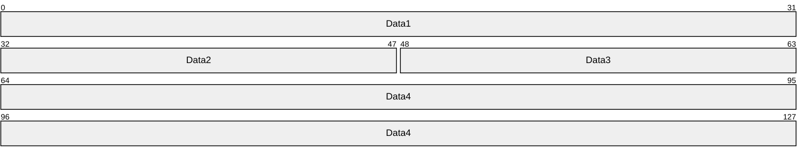
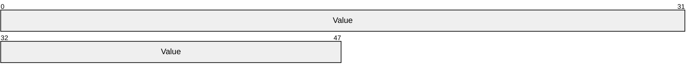
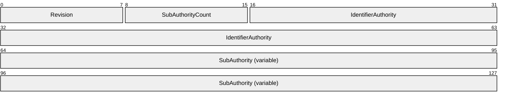
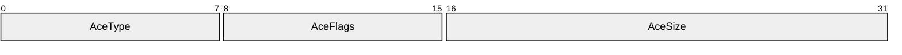
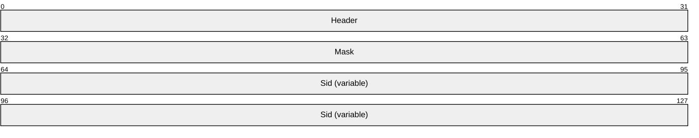
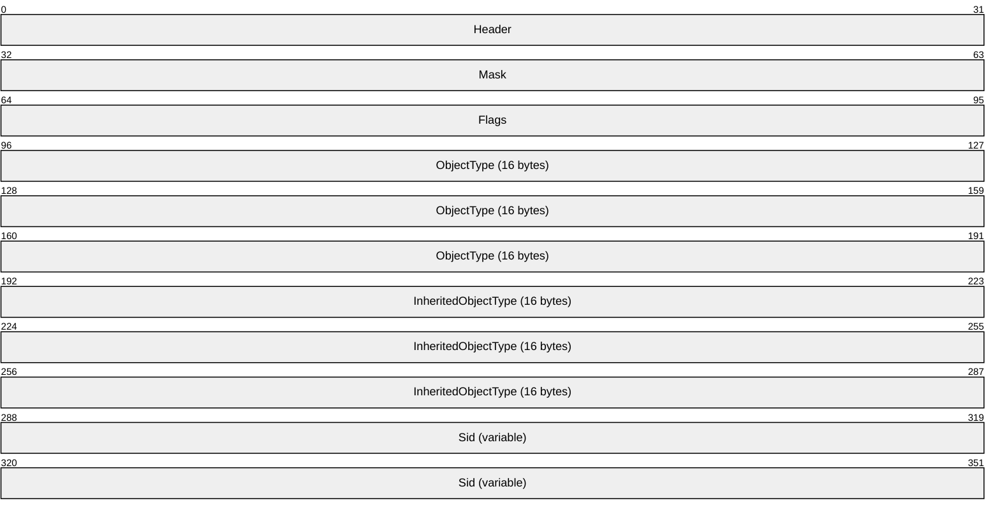
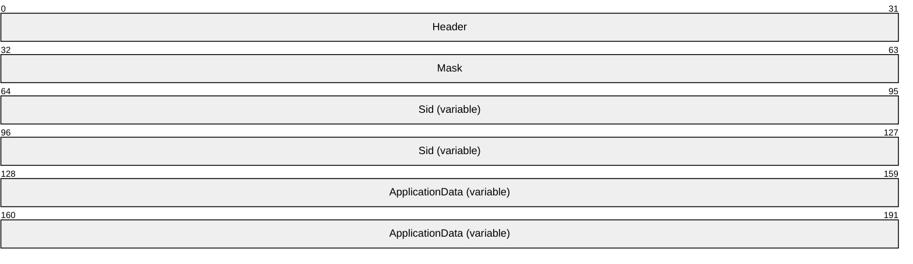
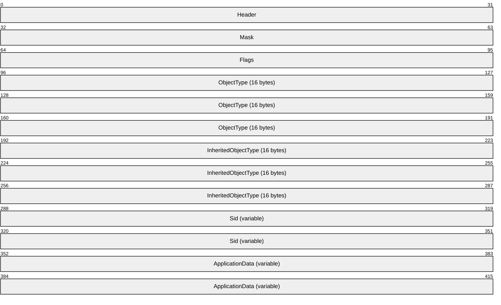
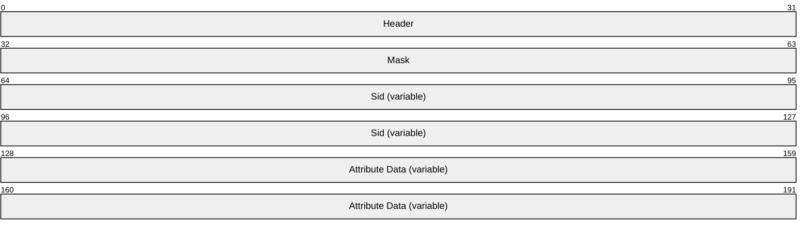
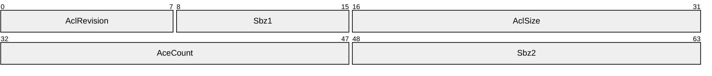

# [MS-DTYP]: Windows Data Types

Table of Contents

<details>
<summary>1 Introduction</summary>

- [1 Introduction](#Section_1)
  - [1.1 Glossary](#Section_1.1)
  - [1.2 References](#Section_1.2)
    - [1.2.1 Normative References](#Section_1.2.1)
    - [1.2.2 Informative References](#Section_1.2.2)
  - [1.3 Overview](#Section_1.3)
  - [1.4 Relationship to Protocols and Other Structures](#Section_1.4)
  - [1.5 Applicability Statement](#Section_1.5)
  - [1.6 Versioning and Localization](#Section_1.6)
  - [1.7 Vendor-Extensible Fields](#Section_1.7)
</details>

<details>
<summary>2 Data Types</summary>

- [2 Data Types](#Section_2)
  - [2.1 Common Base Types](#Section_2.1)
    - [2.1.1 bit](#Section_2.1.1)
    - [2.1.2 byte](#Section_2.1.2)
    - [2.1.3 handle_t](#Section_2.1.3)
    - [2.1.4 Integer Types](#Section_2.1.4)
      - [2.1.4.1 __int8](#Section_2.1.4.1)
      - [2.1.4.2 __int16](#Section_2.1.4.2)
      - [2.1.4.3 __int32](#Section_2.1.4.3)
      - [2.1.4.4 __int64](#Section_2.1.4.4)
      - [2.1.4.5 hyper](#Section_2.1.4.5)
    - [2.1.5 octet](#Section_2.1.5)
    - [2.1.6 wchar_t](#Section_2.1.6)
  - [2.2 Common Data Types](#Section_2.2)
    - [2.2.1 __int3264](#Section_2.2.1)
    - [2.2.2 ADCONNECTION_HANDLE](#Section_2.2.2)
    - [2.2.3 BOOL](#Section_2.2.3)
    - [2.2.4 BOOLEAN](#Section_2.2.4)
    - [2.2.5 BSTR](#Section_2.2.5)
    - [2.2.6 BYTE](#Section_2.2.6)
    - [2.2.7 CHAR](#Section_2.2.7)
    - [2.2.8 DOUBLE](#Section_2.2.8)
    - [2.2.9 DWORD](#Section_2.2.9)
    - [2.2.10 DWORD_PTR](#Section_2.2.10)
    - [2.2.11 DWORD32](#Section_2.2.11)
    - [2.2.12 DWORD64](#Section_2.2.12)
    - [2.2.13 DWORDLONG](#Section_2.2.13)
    - [2.2.14 error_status_t](#Section_2.2.14)
    - [2.2.15 FLOAT](#Section_2.2.15)
    - [2.2.16 HANDLE](#Section_2.2.16)
    - [2.2.17 HCALL](#Section_2.2.17)
    - [2.2.18 HRESULT](#Section_2.2.18)
    - [2.2.19 INT](#Section_2.2.19)
    - [2.2.20 INT8](#Section_2.2.20)
    - [2.2.21 INT16](#Section_2.2.21)
    - [2.2.22 INT32](#Section_2.2.22)
    - [2.2.23 INT64](#Section_2.2.23)
    - [2.2.24 LDAP_UDP_HANDLE](#Section_2.2.24)
    - [2.2.25 LMCSTR](#Section_2.2.25)
    - [2.2.26 LMSTR](#Section_2.2.26)
    - [2.2.27 LONG](#Section_2.2.27)
    - [2.2.28 LONGLONG](#Section_2.2.28)
    - [2.2.29 LONG_PTR](#Section_2.2.29)
    - [2.2.30 LONG32](#Section_2.2.30)
    - [2.2.31 LONG64](#Section_2.2.31)
    - [2.2.32 LPCSTR](#Section_2.2.32)
    - [2.2.33 LPCVOID](#Section_2.2.33)
    - [2.2.34 LPCWSTR](#Section_2.2.34)
    - [2.2.35 LPSTR](#Section_2.2.35)
    - [2.2.36 LPWSTR](#Section_2.2.36)
    - [2.2.37 NET_API_STATUS](#Section_2.2.37)
    - [2.2.38 NTSTATUS](#Section_2.2.38)
    - [2.2.39 PCONTEXT_HANDLE](#Section_2.2.39)
    - [2.2.40 QWORD](#Section_2.2.40)
    - [2.2.41 RPC_BINDING_HANDLE](#Section_2.2.41)
    - [2.2.42 SHORT](#Section_2.2.42)
    - [2.2.43 SIZE_T](#Section_2.2.43)
    - [2.2.44 STRING](#Section_2.2.44)
    - [2.2.45 UCHAR](#Section_2.2.45)
    - [2.2.46 UINT](#Section_2.2.46)
    - [2.2.47 UINT8](#Section_2.2.47)
    - [2.2.48 UINT16](#Section_2.2.48)
    - [2.2.49 UINT32](#Section_2.2.49)
    - [2.2.50 UINT64](#Section_2.2.50)
    - [2.2.51 ULONG](#Section_2.2.51)
    - [2.2.52 ULONG_PTR](#Section_2.2.52)
    - [2.2.53 ULONG32](#Section_2.2.53)
    - [2.2.54 ULONG64](#Section_2.2.54)
    - [2.2.55 ULONGLONG](#Section_2.2.55)
    - [2.2.56 UNICODE](#Section_2.2.56)
    - [2.2.57 UNC](#Section_2.2.57)
    - [2.2.58 USHORT](#Section_2.2.58)
    - [2.2.59 VOID](#Section_2.2.59)
    - [2.2.60 WCHAR](#Section_2.2.60)
    - [2.2.61 WORD](#Section_2.2.61)
  - [2.3 Common Data Structures](#Section_2.3)
    - [2.3.1 EVENT_DESCRIPTOR](#Section_2.3.1)
    - [2.3.2 EVENT_HEADER](#Section_2.3.2)
    - [2.3.3 FILETIME](#Section_2.3.3)
    - [2.3.4 GUID and UUID](#Section_2.3.4)
      - [2.3.4.1 GUID--RPC IDL representation](#Section_2.3.4.1)
      - [2.3.4.2 GUID--Packet Representation](#Section_2.3.4.2)
      - [2.3.4.3 GUID--Curly Braced String Representation](#Section_2.3.4.3)
    - [2.3.5 LARGE_INTEGER](#Section_2.3.5)
    - [2.3.6 LCID](#Section_2.3.6)
    - [2.3.7 LUID](#Section_2.3.7)
    - [2.3.8 MULTI_SZ](#Section_2.3.8)
    - [2.3.9 OBJECT_TYPE_LIST](#Section_2.3.9)
    - [2.3.10 RPC_UNICODE_STRING](#Section_2.3.10)
    - [2.3.11 SERVER_INFO_100](#Section_2.3.11)
    - [2.3.12 SERVER_INFO_101](#Section_2.3.12)
    - [2.3.13 SYSTEMTIME](#Section_2.3.13)
    - [2.3.14 UINT128](#Section_2.3.14)
    - [2.3.15 ULARGE_INTEGER](#Section_2.3.15)
  - [2.4 Constructed Security Types](#Section_2.4)
    - [2.4.1 SID_IDENTIFIER_AUTHORITY](#Section_2.4.1)
      - [2.4.1.1 RPC_SID_IDENTIFIER_AUTHORITY](#Section_2.4.1.1)
    - [2.4.2 SID](#Section_2.4.2)
      - [2.4.2.1 SID String Format Syntax](#Section_2.4.2.1)
      - [2.4.2.2 SID--Packet Representation](#Section_2.4.2.2)
      - [2.4.2.3 RPC_SID](#Section_2.4.2.3)
      - [2.4.2.4 Well-Known SID Structures](#Section_2.4.2.4)
    - [2.4.3 ACCESS_MASK](#Section_2.4.3)
    - [2.4.4 ACE](#Section_2.4.4)
      - [2.4.4.1 ACE_HEADER](#Section_2.4.4.1)
        - [2.4.4.1.1 ACE_HEADER--RPC representation](#Section_2.4.4.1.1)
      - [2.4.4.2 ACCESS_ALLOWED_ACE](#Section_2.4.4.2)
      - [2.4.4.3 ACCESS_ALLOWED_OBJECT_ACE](#Section_2.4.4.3)
      - [2.4.4.4 ACCESS_DENIED_ACE](#Section_2.4.4.4)
      - [2.4.4.5 ACCESS_DENIED_OBJECT_ACE](#Section_2.4.4.5)
      - [2.4.4.6 ACCESS_ALLOWED_CALLBACK_ACE](#Section_2.4.4.6)
      - [2.4.4.7 ACCESS_DENIED_CALLBACK_ACE](#Section_2.4.4.7)
      - [2.4.4.8 ACCESS_ALLOWED_CALLBACK_OBJECT_ACE](#Section_2.4.4.8)
      - [2.4.4.9 ACCESS_DENIED_CALLBACK_OBJECT_ACE](#Section_2.4.4.9)
      - [2.4.4.10 SYSTEM_AUDIT_ACE](#Section_2.4.4.10)
      - [2.4.4.11 SYSTEM_AUDIT_OBJECT_ACE](#Section_2.4.4.11)
      - [2.4.4.12 SYSTEM_AUDIT_CALLBACK_ACE](#Section_2.4.4.12)
      - [2.4.4.13 SYSTEM_MANDATORY_LABEL_ACE](#Section_2.4.4.13)
        - [2.4.4.13.1 SYSTEM_MANDATORY_LABEL_ACE--RPC Representation](#Section_2.4.4.13.1)
      - [2.4.4.14 SYSTEM_AUDIT_CALLBACK_OBJECT_ACE](#Section_2.4.4.14)
      - [2.4.4.15 SYSTEM_RESOURCE_ATTRIBUTE_ACE](#Section_2.4.4.15)
      - [2.4.4.16 SYSTEM_SCOPED_POLICY_ID_ACE](#Section_2.4.4.16)
      - [2.4.4.17 Conditional ACEs](#Section_2.4.4.17)
        - [2.4.4.17.1 Conditional ACE Expressions](#Section_2.4.4.17.1)
        - [2.4.4.17.2 Security Attributes](#Section_2.4.4.17.2)
        - [2.4.4.17.3 Conditional ACE Applicability](#Section_2.4.4.17.3)
        - [2.4.4.17.4 Conditional ACE Binary Formats](#Section_2.4.4.17.4)
        - [2.4.4.17.5 Literal Tokens](#Section_2.4.4.17.5)
        - [2.4.4.17.6 Relational Operator Tokens](#Section_2.4.4.17.6)
        - [2.4.4.17.7 Logical Operator Tokens](#Section_2.4.4.17.7)
        - [2.4.4.17.8 Attribute Tokens](#Section_2.4.4.17.8)
        - [2.4.4.17.9 Examples: Conditional Expression Binary Representation](#Section_2.4.4.17.9)
    - [2.4.5 ACL](#Section_2.4.5)
      - [2.4.5.1 ACL--RPC Representation](#Section_2.4.5.1)
    - [2.4.6 SECURITY_DESCRIPTOR](#Section_2.4.6)
      - [2.4.6.1 SECURITY_DESCRIPTOR--RPC Representation](#Section_2.4.6.1)
    - [2.4.7 SECURITY_INFORMATION](#Section_2.4.7)
    - [2.4.8 TOKEN_MANDATORY_POLICY](#Section_2.4.8)
    - [2.4.9 MANDATORY_INFORMATION](#Section_2.4.9)
    - [2.4.10 CLAIM_SECURITY_ATTRIBUTE](#Section_2.4.10)
      - [2.4.10.1 CLAIM_SECURITY_ATTRIBUTE_RELATIVE_V1](#Section_2.4.10.1)
      - [2.4.10.2 CLAIM_SECURITY_ATTRIBUTE_OCTET_STRING_RELATIVE](#Section_2.4.10.2)
  - [2.5 Additional Information for Security Types](#Section_2.5)
    - [2.5.1 Security Descriptor Description Language](#Section_2.5.1)
      - [2.5.1.1 Syntax](#Section_2.5.1.1)
      - [2.5.1.2 Security Attribute Names](#Section_2.5.1.2)
        - [2.5.1.2.1 Simple Attribute Name Form](#Section_2.5.1.2.1)
        - [2.5.1.2.2 @Prefixed Attribute Name Form](#Section_2.5.1.2.2)
      - [2.5.1.3 Parentheses and Order of Precedence](#Section_2.5.1.3)
      - [2.5.1.4 SDDL String to Binary Security Descriptor Examples](#Section_2.5.1.4)
    - [2.5.2 Token/Authorization Context](#Section_2.5.2)
      - [2.5.2.1 Token/Authorization Context Algorithms](#Section_2.5.2.1)
        - [2.5.2.1.1 GatherGroupMembershipForSystem](#Section_2.5.2.1.1)
        - [2.5.2.1.2 AddPrivilegesToToken](#Section_2.5.2.1.2)
    - [2.5.3 Security Descriptor Algorithms](#Section_2.5.3)
      - [2.5.3.1 Support Functions](#Section_2.5.3.1)
        - [2.5.3.1.1 SidInToken](#Section_2.5.3.1.1)
        - [2.5.3.1.2 SidDominates](#Section_2.5.3.1.2)
        - [2.5.3.1.3 GetScopedPolicySid](#Section_2.5.3.1.3)
        - [2.5.3.1.4 GetCentralizedAccessPolicy](#Section_2.5.3.1.4)
        - [2.5.3.1.5 EvaluateAceCondition](#Section_2.5.3.1.5)
        - [2.5.3.1.6 LookupAttributeInToken](#Section_2.5.3.1.6)
        - [2.5.3.1.7 LookupAttributeInSacl](#Section_2.5.3.1.7)
        - [2.5.3.1.8 PushStackOperand](#Section_2.5.3.1.8)
        - [2.5.3.1.9 PushStackResult](#Section_2.5.3.1.9)
        - [2.5.3.1.10 PopStack](#Section_2.5.3.1.10)
      - [2.5.3.2 Access Check Algorithm Pseudocode](#Section_2.5.3.2)
      - [2.5.3.3 MandatoryIntegrityCheck Algorithm Pseudocode](#Section_2.5.3.3)
        - [2.5.3.3.1 FindAceByType](#Section_2.5.3.3.1)
      - [2.5.3.4 Algorithm for Creating a Security Descriptor](#Section_2.5.3.4)
        - [2.5.3.4.1 CreateSecurityDescriptor](#Section_2.5.3.4.1)
        - [2.5.3.4.2 ComputeACL](#Section_2.5.3.4.2)
        - [2.5.3.4.3 ContainsInheritableACEs](#Section_2.5.3.4.3)
        - [2.5.3.4.4 ComputeInheritedACLfromParent](#Section_2.5.3.4.4)
        - [2.5.3.4.5 ComputeInheritedACLfromCreator](#Section_2.5.3.4.5)
        - [2.5.3.4.6 PreProcessACLfromCreator](#Section_2.5.3.4.6)
        - [2.5.3.4.7 PostProcessACL](#Section_2.5.3.4.7)
      - [2.5.3.5 Setting the INHERITED_ACE Flag](#Section_2.5.3.5)
  - [2.6 ServerGetInfo Abstract Interface](#Section_2.6)
  - [2.7 Impersonation Abstract Interfaces](#Section_2.7)
    - [2.7.1 StartImpersonation](#Section_2.7.1)
    - [2.7.2 EndImpersonation](#Section_2.7.2)
    - [2.7.3 GetAccessToken](#Section_2.7.3)
</details>

<details>
<summary>3 Structure Examples</summary>

- [3 Structure Examples](#Section_3)
</details>

<details>
<summary>4 Security Considerations</summary>

- [4 Security Considerations](#Section_4)
</details>

<details>
<summary>5 Appendix A: Full MS-DTYP IDL</summary>

- [5 Appendix A: Full MS-DTYP IDL](#Section_5)
</details>

<details>
<summary>6 Appendix B: Product Behavior</summary>

- [6 Appendix B: Product Behavior](#Section_6)
</details>

<details>
<summary>7 Change Tracking</summary>

- [7 Change Tracking](#Section_7)
</details>

For the legal notice and IP terms, see [LEGAL.md](../LEGAL.md).
Last updated: 11/19/2024.
See [Revision History](#revision-history) for full version history.

<a id="Section_1"></a>
# 1 Introduction

This document provides a collection of commonly used data types, which are categorized into two basic types: common base types and common data types. The common base types are those types that Microsoft compilers natively support. The common data types are data types that are frequently used by many protocols. These data types are user-defined types.

<a id="Section_1.1"></a>
## 1.1 Glossary

This document uses the following terms:

<a id="gt_active-directory"></a>
**Active Directory**: The Windows implementation of a general-purpose directory service, which uses LDAP as its primary access protocol. Active Directory stores information about a variety of objects in the network such as user accounts, computer accounts, groups, and all related credential information used by Kerberos [MS-KILE](../MS-KILE/MS-KILE.md). Active Directory is either deployed as Active Directory Domain Services (AD DS) or Active Directory Lightweight Directory Services (AD LDS), which are both described in [MS-ADOD](../MS-ADOD/MS-ADOD.md): Active Directory Protocols Overview.

<a id="gt_american-national-standards-institute-ansi-character-set"></a>
**American National Standards Institute (ANSI) character set**: A character set defined by a code page approved by the American National Standards Institute (ANSI). The term "ANSI" as used to signify Windows code pages is a historical reference and a misnomer that persists in the Windows community. The source of this misnomer stems from the fact that the Windows code page 1252 was originally based on an ANSI draft, which became International Organization for Standardization (ISO) Standard 8859-1 [[ISO/IEC-8859-1]](https://go.microsoft.com/fwlink/?LinkId=90689). In Windows, the ANSI character set can be any of the following code pages: 1252, 1250, 1251, 1253, 1254, 1255, 1256, 1257, 1258, 874, 932, 936, 949, or 950. For example, "ANSI application" is usually a reference to a non-[**Unicode**](#gt_unicode) or code-page-based application. Therefore, "ANSI character set" is often misused to refer to one of the character sets defined by a Windows code page that can be used as an active system code page; for example, character sets defined by code page 1252 or character sets defined by code page 950. Windows is now based on Unicode, so the use of ANSI character sets is strongly discouraged unless they are used to interoperate with legacy applications or legacy data.

<a id="gt_big-endian"></a>
**big-endian**: Multiple-byte values that are byte-ordered with the most significant byte stored in the memory location with the lowest address.

<a id="gt_binary-large-object-blob"></a>
**binary large object (BLOB)**: A discrete packet of data that is stored in a database and is treated as a sequence of uninterpreted bytes.

<a id="gt_component-object-model-com"></a>
**Component Object Model (COM)**: An object-oriented programming model that defines how objects interact within a single process or between processes. In [**COM**](#gt_component-object-model-com), clients have access to an object through interfaces implemented on the object. For more information, see [MS-DCOM](../MS-DCOM/MS-DCOM.md).

<a id="gt_curly-braced-guid-string"></a>
**curly braced GUID string**: The string representation of a 128-bit globally unique identifier ([**GUID**](#gt_globally-unique-identifier-guid)) using the form {XXXXXXXX-XXXX-XXXX-XXXX-XXXXXXXXXXXX}, where X denotes a hexadecimal digit. The string representation between the enclosing braces is the standard representation of a GUID as described in [[RFC4122]](https://go.microsoft.com/fwlink/?LinkId=90460) section 3. Unlike a GUIDString, a curly braced GUID string includes enclosing braces.

<a id="gt_discretionary-access-control-list-dacl"></a>
**discretionary access control list (DACL)**: An access control list (ACL) that is controlled by the owner of an object and that specifies the access particular users or groups can have to the object.

<a id="gt_distributed-file-system-dfs"></a>
**Distributed File System (DFS)**: A file system that logically groups physical shared folders located on different servers by transparently connecting them to one or more hierarchical namespaces. [**DFS**](#gt_distributed-file-system-dfs) also provides fault-tolerance and load-sharing capabilities.

<a id="gt_domain"></a>
**domain**: A set of users and computers sharing a common namespace and management infrastructure. At least one computer member of the set has to act as a domain controller (DC) and host a member list that identifies all members of the domain, as well as optionally hosting the [**Active Directory**](#gt_active-directory) service. The domain controller provides authentication of members, creating a unit of trust for its members. Each domain has an identifier that is shared among its members. For more information, see [MS-AUTHSOD](../MS-AUTHSOD/MS-AUTHSOD.md) section 1.1.1.5 and [MS-ADTS](../MS-ADTS/MS-ADTS.md).

<a id="gt_fully-qualified-domain-name-fqdn"></a>
**fully qualified domain name (FQDN)**: An unambiguous domain name that gives an absolute location in the Domain Name System's (DNS) hierarchy tree, as defined in [[RFC1035]](https://go.microsoft.com/fwlink/?LinkId=90264) section 3.1 and [[RFC2181]](https://go.microsoft.com/fwlink/?LinkId=127732) section 11.

<a id="gt_globally-unique-identifier-guid"></a>
**globally unique identifier (GUID)**: A term used interchangeably with [**universally unique identifier (UUID)**](#gt_universally-unique-identifier-uuid) in Microsoft protocol technical documents (TDs). Interchanging the usage of these terms does not imply or require a specific algorithm or mechanism to generate the value. Specifically, the use of this term does not imply or require that the algorithms described in [RFC4122] or [[C706]](https://go.microsoft.com/fwlink/?LinkId=89824) have to be used for generating the GUID. See also universally unique identifier (UUID).

<a id="gt_handle"></a>
**handle**: Any token that can be used to identify and access an object such as a device, file, or a window.

<a id="gt_interface-definition-language-idl"></a>
**Interface Definition Language (IDL)**: The International Standards Organization (ISO) standard language for specifying the interface for remote procedure calls. For more information, see [C706] section 4.

<a id="gt_internet-host-name"></a>
**Internet host name**: The name of a host as defined in [[RFC1123]](https://go.microsoft.com/fwlink/?LinkId=90268) section 2.1, with the extensions described in [MS-HNDS](../MS-HNDS/MS-HNDS.md).

<a id="gt_little-endian"></a>
**little-endian**: Multiple-byte values that are byte-ordered with the least significant byte stored in the memory location with the lowest address.

<a id="gt_marshaling"></a>
**marshaling**: The act of formatting COM parameters for transmission over a [**remote procedure call (RPC)**](#gt_remote-procedure-call-rpc). For more information, see [MS-DCOM].

<a id="gt_microsoft-interface-definition-language-midl"></a>
**Microsoft Interface Definition Language (MIDL)**: The Microsoft implementation and extension of the OSF-DCE [**Interface Definition Language (IDL)**](#gt_interface-definition-language-idl). [**MIDL**](#gt_microsoft-interface-definition-language-midl) can also mean the [**Interface Definition Language (IDL)**](#gt_interface-definition-language-idl) compiler provided by Microsoft. For more information, see [MS-RPCE](../MS-RPCE/MS-RPCE.md).

<a id="gt_netbios-host-name"></a>
**NetBIOS host name**: The NetBIOS name of a host (as described in [[RFC1001]](https://go.microsoft.com/fwlink/?LinkId=90260) section 14 and [[RFC1002]](https://go.microsoft.com/fwlink/?LinkId=90261) section 4), with the extensions described in [MS-NBTE](../MS-NBTE/MS-NBTE.md).

<a id="gt_organization"></a>
**organization**: A security group that contains additional fields for describing hierarchical relationships between organizations.

<a id="gt_remote-access-service-ras-server"></a>
**Remote Access Service (RAS) server**: A type of network access server (NAS) that provides modem dial-up or virtual private network (VPN) access to a network.

<a id="gt_remote-procedure-call-rpc"></a>
**remote procedure call (RPC)**: A communication protocol used primarily between client and server. The term has three definitions that are often used interchangeably: a runtime environment providing for communication facilities between computers (the RPC runtime); a set of request-and-response message exchanges between computers (the RPC exchange); and the single message from an RPC exchange (the RPC message). For more information, see [C706].

<a id="gt_resource-manager-rm"></a>
**resource manager (RM)**: The participant that is responsible for coordinating the state of a resource with the outcome of atomic transactions. For a specified transaction, a resource manager enlists with exactly one transaction manager to vote on that transaction outcome and to obtain the final outcome. A resource manager is either durable or volatile, depending on its resource.

<a id="gt_security-identifier-sid"></a>
**security identifier (SID)**: An identifier for security principals that is used to identify an account or a group. Conceptually, the [**SID**](#gt_security-identifier-sid) is composed of an account authority portion (typically a [**domain**](#gt_domain)) and a smaller integer representing an identity relative to the account authority, termed the relative identifier (RID). The [**SID**](#gt_security-identifier-sid) format is specified in [MS-DTYP](#Section_cca2742956894a16b2b49325d93e4ba2) section 2.4.2; a string representation of [**SIDs**](#gt_security-identifier-sid) is specified in [MS-DTYP] section 2.4.2 and [MS-AZOD](../MS-AZOD/MS-AZOD.md) section 1.1.1.2.

<a id="gt_share"></a>
**share**: A resource offered by a Common Internet File System (CIFS) server for access by CIFS clients over the network. A share typically represents a directory tree and its included files (referred to commonly as a "disk share" or "file share") or a printer (a "print share"). If the information about the share is saved in persistent store (for example, Windows registry) and reloaded when a file server is restarted, then the share is referred to as a "sticky share". Some share names are reserved for specific functions and are referred to as special shares: IPC$, reserved for interprocess communication, ADMIN$, reserved for remote administration, and A$, B$, C$ (and other local disk names followed by a dollar sign), assigned to local disk devices.

<a id="gt_system-access-control-list-sacl"></a>
**system access control list (SACL)**: An access control list (ACL) that controls the generation of audit messages for attempts to access a securable object. The ability to get or set an object's [**SACL**](#gt_system-access-control-list-sacl) is controlled by a privilege typically held only by system administrators.

<a id="gt_unicode"></a>
**Unicode**: A character encoding standard developed by the Unicode Consortium that represents almost all of the written languages of the world. The [**Unicode**](#gt_unicode) standard [[UNICODE5.0.0/2007]](https://go.microsoft.com/fwlink/?LinkId=154659) provides three forms (UTF-8, UTF-16, and UTF-32) and seven schemes (UTF-8, UTF-16, UTF-16 BE, UTF-16 LE, UTF-32, UTF-32 LE, and UTF-32 BE).

<a id="gt_unicode-character"></a>
**Unicode character**: Unless otherwise specified, a 16-bit UTF-16 code unit.

<a id="gt_unicode-string"></a>
**Unicode string**: A [**Unicode**](#gt_unicode) 8-bit string is an ordered sequence of 8-bit units, a [**Unicode**](#gt_unicode) 16-bit string is an ordered sequence of 16-bit code units, and a [**Unicode**](#gt_unicode) 32-bit string is an ordered sequence of 32-bit code units. In some cases, it could be acceptable not to terminate with a terminating null character. Unless otherwise specified, all [**Unicode strings**](#gt_unicode-string) follow the UTF-16LE encoding scheme with no Byte Order Mark (BOM).

<a id="gt_universally-unique-identifier-uuid"></a>
**universally unique identifier (UUID)**: A 128-bit value. UUIDs can be used for multiple purposes, from tagging objects with an extremely short lifetime, to reliably identifying very persistent objects in cross-process communication such as client and server interfaces, manager entry-point vectors, and [**RPC**](#gt_remote-procedure-call-rpc) objects. UUIDs are highly likely to be unique. UUIDs are also known as [**globally unique identifiers (GUIDs)**](#gt_globally-unique-identifier-guid) and these terms are used interchangeably in the Microsoft protocol technical documents (TDs). Interchanging the usage of these terms does not imply or require a specific algorithm or mechanism to generate the UUID. Specifically, the use of this term does not imply or require that the algorithms described in [RFC4122] or [C706] has to be used for generating the UUID.

<a id="gt_unmarshal"></a>
**unmarshal**: The process of deserializing one or more data structures from an octet stream using a specific transfer syntax (for example, unmarshaling a 32-bit integer).

<a id="gt_utf-16"></a>
**UTF-16**: A standard for encoding [**Unicode characters**](#gt_unicode-character), defined in the Unicode standard, in which the most commonly used characters are defined as double-byte characters. Unless specified otherwise, this term refers to the UTF-16 encoding form specified in [UNICODE5.0.0/2007] section 3.9.

<a id="gt_utf-8"></a>
**UTF-8**: A byte-oriented standard for encoding [**Unicode characters**](#gt_unicode-character), defined in the Unicode standard. Unless specified otherwise, this term refers to the UTF-8 encoding form specified in [UNICODE5.0.0/2007] section 3.9.

**MAY, SHOULD, MUST, SHOULD NOT, MUST NOT:** These terms (in all caps) are used as defined in [[RFC2119]](https://go.microsoft.com/fwlink/?LinkId=90317). All statements of optional behavior use either MAY, SHOULD, or SHOULD NOT.

<a id="Section_1.2"></a>
## 1.2 References

Links to a document in the Microsoft Open Specifications library point to the correct section in the most recently published version of the referenced document. However, because individual documents in the library are not updated at the same time, the section numbers in the documents may not match. You can confirm the correct section numbering by checking the [Errata](https://go.microsoft.com/fwlink/?linkid=850906).

<a id="Section_1.2.1"></a>
### 1.2.1 Normative References

We conduct frequent surveys of the normative references to assure their continued availability. If you have any issue with finding a normative reference, please contact [dochelp@microsoft.com](mailto:dochelp@microsoft.com). We will assist you in finding the relevant information.

[C706] The Open Group, "DCE 1.1: Remote Procedure Call", C706, August 1997, [https://publications.opengroup.org/c706](https://go.microsoft.com/fwlink/?LinkId=89824)

**Note** Registration is required to download the document.

[IEEE754] IEEE, "IEEE Standard for Binary Floating-Point Arithmetic", IEEE 754-1985, October 1985, [http://ieeexplore.ieee.org/servlet/opac?punumber=2355](https://go.microsoft.com/fwlink/?LinkId=89903)

[IETFDRAFT-PK-FRESH] Moore, S., Miller, P., and Short, M., Ed., "Public Key Cryptography for Initial Authentication in Kerberos (PKINIT), Freshness Extension", draft-short-pkinit-freshness-00, October 2014, [https://tools.ietf.org/html/draft-short-pkinit-freshness](https://go.microsoft.com/fwlink/?LinkId=534982)

[ISO/IEC-8859-1] International Organization for Standardization, "Information Technology -- 8-Bit Single-Byte Coded Graphic Character Sets -- Part 1: Latin Alphabet No. 1", ISO/IEC 8859-1, 1998, [http://www.iso.org/iso/home/store/catalogue_tc/catalogue_detail.htm?csnumber=28245](https://go.microsoft.com/fwlink/?LinkId=90689)

**Note** There is a charge to download the specification.

[ISO/IEC-9899] International Organization for Standardization, "Programming Languages - C", ISO/IEC 9899:TC2, May 2005, [http://www.open-std.org/jtc1/sc22/wg14/www/docs/n1124.pdf](https://go.microsoft.com/fwlink/?LinkId=89921)

[MS-ADTS] Microsoft Corporation, "[Active Directory Technical Specification](../MS-ADTS/MS-ADTS.md)".

[MS-APDS] Microsoft Corporation, "[Authentication Protocol Domain Support](../MS-APDS/MS-APDS.md)".

[MS-ERREF] Microsoft Corporation, "[Windows Error Codes](../MS-ERREF/MS-ERREF.md)".

[MS-GPCAP] Microsoft Corporation, "[Group Policy: Central Access Policies Protocol Extension](../MS-GPCAP/MS-GPCAP.md)".

[MS-KILE] Microsoft Corporation, "[Kerberos Protocol Extensions](../MS-KILE/MS-KILE.md)".

[MS-LCID] Microsoft Corporation, "[Windows Language Code Identifier (LCID) Reference](../MS-LCID/MS-LCID.md)".

[MS-NBTE] Microsoft Corporation, "[NetBIOS over TCP (NBT) Extensions](../MS-NBTE/MS-NBTE.md)".

[MS-NLMP] Microsoft Corporation, "[NT LAN Manager (NTLM) Authentication Protocol](../MS-NLMP/MS-NLMP.md)".

[MS-PAC] Microsoft Corporation, "[Privilege Attribute Certificate Data Structure](../MS-PAC/MS-PAC.md)".

[MS-RPCE] Microsoft Corporation, "[Remote Procedure Call Protocol Extensions](../MS-RPCE/MS-RPCE.md)".

[MS-SFU] Microsoft Corporation, "[Kerberos Protocol Extensions: Service for User and Constrained Delegation Protocol](../MS-SFU/MS-SFU.md)".

[MS-SMB2] Microsoft Corporation, "[Server Message Block (SMB) Protocol Versions 2 and 3](../MS-SMB2/MS-SMB2.md)".

[MS-TLSP] Microsoft Corporation, "[Transport Layer Security (TLS) Profile](../MS-TLSP/MS-TLSP.md)".

[RFC1035] Mockapetris, P., "Domain Names - Implementation and Specification", STD 13, RFC 1035, November 1987, [https://www.rfc-editor.org/info/rfc1035](https://go.microsoft.com/fwlink/?LinkId=90264)

[RFC1123] Braden, R., "Requirements for Internet Hosts - Application and Support", RFC 1123, October 1989, [https://www.rfc-editor.org/info/rfc1123](https://go.microsoft.com/fwlink/?LinkId=90268)

[RFC2119] Bradner, S., "Key words for use in RFCs to Indicate Requirement Levels", BCP 14, RFC 2119, March 1997, [https://www.rfc-editor.org/info/rfc2119](https://go.microsoft.com/fwlink/?LinkId=90317)

[RFC3986] Berners-Lee, T., Fielding, R., and Masinter, L., "Uniform Resource Identifier (URI): Generic Syntax", STD 66, RFC 3986, January 2005, [https://www.rfc-editor.org/info/rfc3986](https://go.microsoft.com/fwlink/?LinkId=90453)

[RFC4122] Leach, P., Mealling, M., and Salz, R., "A Universally Unique Identifier (UUID) URN Namespace", RFC 4122, July 2005, [https://www.rfc-editor.org/info/rfc4122](https://go.microsoft.com/fwlink/?LinkId=90460)

[RFC5234] Crocker, D., Ed., and Overell, P., "Augmented BNF for Syntax Specifications: ABNF", STD 68, RFC 5234, January 2008, [https://www.rfc-editor.org/info/rfc5234](https://go.microsoft.com/fwlink/?LinkId=123096)

<a id="Section_1.2.2"></a>
### 1.2.2 Informative References

[DALB] Dalbey, J., "Pseudocode Standard", May 2008, [http://users.csc.calpoly.edu/~jdalbey/SWE/pdl_std.html](https://go.microsoft.com/fwlink/?LinkId=89842)

[MS-ADOD] Microsoft Corporation, "[Active Directory Protocols Overview](../MS-ADOD/MS-ADOD.md)".

[MS-SMB] Microsoft Corporation, "[Server Message Block (SMB) Protocol](../MS-SMB/MS-SMB.md)".

[MSDN-ACCTOKENS] Microsoft Corporation, "Access Tokens", [http://msdn.microsoft.com/en-us/library/aa374909.aspx](https://go.microsoft.com/fwlink/?LinkId=89949)

[MSDN-AuthzAccessCheck] Microsoft Corporation, "AuthzAccessCheck function", [http://msdn.microsoft.com/en-us/library/aa375788%28v=VS.85%29.aspx](https://go.microsoft.com/fwlink/?LinkId=204597)

[MSDN-SDDLforDevObj] Microsoft Corporation, "SDDL for Device Objects", [http://msdn.microsoft.com/en-us/library/ff563667.aspx](https://go.microsoft.com/fwlink/?LinkId=114214)

[MSFT-WellKnownSIDs] Microsoft Corporation, "Well-known SIDs", [https://learn.microsoft.com/en-us/windows/win32/secauthz/well-known-sids](https://go.microsoft.com/fwlink/?linkid=2243769)

[RFC3530] Shepler, S., et al., "Network File System (NFS) version 4 Protocol", RFC 3530, April 2003, [http://www.ietf.org/rfc/rfc3530.txt](https://go.microsoft.com/fwlink/?LinkId=90430)

[Tanenbaum] Tanenbaum, A.S., "Modern Operating Systems", Prentice Hall, 2001, ISBN 0-13-092641-8.

<a id="Section_1.3"></a>
## 1.3 Overview

Two types of data structures are specified in this document: data structures that are specified in terms of the wire format and data structures that are RPC-marshaled as specified in [MS-RPCE](../MS-RPCE/MS-RPCE.md). The latter are specified by using the [**Interface Definition Language (IDL)**](#gt_interface-definition-language-idl) that is defined in [MS-RPCE] section 2.2.4.

For some types of data, both formats are shown. For example, both formats are shown if some protocols use the raw wire format but other protocols use the RPC-marshaled format. Any protocol that uses a data structure name in its IDL necessarily implies the use of the IDL version of the data structure. Any other use implies the use of the wire format version unless otherwise specified by the protocol that uses the data structure.

<a id="Section_1.4"></a>
## 1.4 Relationship to Protocols and Other Structures

The data structures in this document are generic data structures that are used by many protocols.

<a id="Section_1.5"></a>
## 1.5 Applicability Statement

Not applicable.

<a id="Section_1.6"></a>
## 1.6 Versioning and Localization

Not applicable.

<a id="Section_1.7"></a>
## 1.7 Vendor-Extensible Fields

HRESULT: Vendors can choose their own values, as long as the **C** bit (0x20000000) is set, indicating it is a customer code.

NTSTATUS: Vendors can choose their own values for this field, as long as the **C** bit (0x20000000) is set, indicating it is a customer code.

[SECURITY_DESCRIPTOR](#Section_2.4.6): Vendors can extend **Sbz1** by setting **RM Control Valid** to 0x1.

<a id="Section_2"></a>
# 2 Data Types

The following sections describe data types that include common base types, data types, and data structures.

Many protocols are intended to be extensions of local programming models. Other protocols have a distinct purpose but share many common elements. This section is a discussion of data types that are common to many protocols.

In some cases, a component might not follow the typical practice and where that applies, the relevant specification specifies the actual practice.

Integer names often have an alias, which is interchangeable with the integer name; there is no difference in using either the name or its alias.

<a id="Section_2.1"></a>
## 2.1 Common Base Types

This section contains commonly used primitive data types.

The use of the [**Interface Definition Language (IDL)**](#gt_interface-definition-language-idl) implies RPC marshaling unless custom marshaling is specified.

Unless explicitly noted in this document, any integer, either signed or unsigned, is in memory order before RPC marshalling. It is implementation dependent<1> whether the memory order is [**little-endian**](#gt_little-endian) or [**big-endian**](#gt_big-endian).

For packets, the bit numbering convention followed is the same as that used in RFCs, namely: the high (most significant) bit of the first byte to hit the wire is in packet bit 0, and the low bit of the last byte to hit the wire is in packet bit 31 (so that the bits are shown from left-to-right in the order they naturally appear over the network).


Figure 1: Packet byte/bit order

Unless otherwise specified, the bytes of a multi-byte integer field are assumed to be transmitted in big-endian order, also referred to as Network Byte Order. That is, if the packet shown above represented a 32-bit integer, then Byte 1 would be its high-order byte and Byte 4 its low-order byte. Certain protocols use little-endian order, as specified in the corresponding technical documents; for example, [MS-SMB2](../MS-SMB2/MS-SMB2.md).

<a id="Section_2.1.1"></a>
### 2.1.1 bit

A bit is a single binary digit, which is the smallest primitive element of any data structure.

<a id="Section_2.1.2"></a>
### 2.1.2 byte

The byte type specifies an 8-bit data item.

A byte is a base [**IDL**](#gt_interface-definition-language-idl) type as specified in [[C706]](https://go.microsoft.com/fwlink/?LinkId=89824) section 4.2.9.5. A byte item is opaque in that its contents are not interpreted, as a character data type might be.

<a id="Section_2.1.3"></a>
### 2.1.3 handle_t

The **handle_t** data type is used to represent an explicit RPC binding handle, as specified in [[C706]](https://go.microsoft.com/fwlink/?LinkId=89824) and [MS-RPCE](../MS-RPCE/MS-RPCE.md) section 2. This data type is a predefined type of the [**IDL**](#gt_interface-definition-language-idl) and does not require an explicit declaration.

A primitive binding handle is a data object that can be used by the application to represent the binding. It can appear as a type specifier in typedef declarations, general declarations, and function declarations (as a function-return-type specifier and a parameter-type specifier).

<a id="Section_2.1.4"></a>
### 2.1.4 Integer Types

Microsoft C/C++ supports different sizes of integer types. An 8-bit, 16-bit, 32-bit, or 64-bit integer variable can be declared by using the __int*n* type specifier, where *n* is 8, 16, 32, or 64.

The types [__int8](#Section_2.1.4.1), [__int16](#Section_2.1.4.2), and [__int32](#Section_2.1.4.3) are synonyms for the [**ANSI**](#gt_100cd8a6-5cb1-4895-9de6-e4a3c224a583)/ISO C types (as specified in [[ISO/IEC-9899]](https://go.microsoft.com/fwlink/?LinkId=89921)) that have the same size. They are useful for writing portable code that behaves identically across multiple platforms.

<a id="Section_2.1.4.1"></a>
#### 2.1.4.1 __int8

An 8-bit signed integer (range: –128 to 127 decimal). The first bit, the most significant bit (MSB), is the signing bit. This type can be specified as unsigned by using the unsigned data-type modifier. As an unsigned __int8, the range is from 0 to 255 decimal.

<a id="Section_2.1.4.2"></a>
#### 2.1.4.2 __int16

A 16-bit signed integer (range: –32768 to 32767 decimal). The first bit (MSB) is the signing bit.

This type can be specified as unsigned by using the unsigned data-type modifier. As an unsigned __int16, the range is from 0 to 65535 decimal.

<a id="Section_2.1.4.3"></a>
#### 2.1.4.3 __int32

A 32-bit signed integer (range: –2147483648 to 2147483647 decimal). The first bit (MSB) is the signing bit.

This type can be specified as unsigned by using the unsigned data-type modifier. As an unsigned __int32, the range is from 0 to 4294967295 decimal.

<a id="Section_2.1.4.4"></a>
#### 2.1.4.4 __int64

A 64-bit signed integer (range: –9223372036854775808 to 9223372036854775807 decimal). The first bit (MSB) is the signing bit.

This type can be specified as unsigned by using the unsigned data-type modifier. As an unsigned __int64, the range is from 0 to 18446744073709551615 decimal.

<a id="Section_2.1.4.5"></a>
#### 2.1.4.5 hyper

The keyword **hyper** indicates a 64-bit integer that can be declared as either signed or unsigned.

<a id="Section_2.1.5"></a>
### 2.1.5 octet

The octet type specifies an 8-bit data item.

An **octet** is an 8-bit data type as specified in [[C706]](https://go.microsoft.com/fwlink/?LinkId=89824) section 14.2.

<a id="Section_2.1.6"></a>
### 2.1.6 wchar_t

A [**Unicode character**](#gt_unicode-character) for use with the [**Microsoft Interface Definition Language (MIDL)**](#gt_microsoft-interface-definition-language-midl) compiler.

This type is declared as follows:

typedef unsigned short wchar_t;

<a id="Section_2.2"></a>
## 2.2 Common Data Types

This section contains simple data types that are defined by either a C/C++ typedef or #define statement. The data types in this section are essentially aliases for C/C++ primitive data types.

<a id="Section_2.2.1"></a>
### 2.2.1 __int3264

An alias that is resolved to either:

- An [__int32](#Section_2.1.4.3) in a 32-bit translation and execution environment, or
- An [__int64](#Section_2.1.4.4) in a 64-bit translation and execution environment. For backward compatibility, it is 32-bit on the wire. The higher 4 bytes MUST be truncated on the sender side during [**marshaling**](#gt_marshaling) and MUST be extended appropriately (signed or unsigned), as specified in [[C706]](https://go.microsoft.com/fwlink/?LinkId=89824) section 14.2.5, on the receiving side during [**unmarshaling**](#gt_3805d4b6-fddb-4079-9f39-b70a4945f97d).
<a id="Section_2.2.2"></a>
### 2.2.2 ADCONNECTION_HANDLE

A handle to an ADConnection object that is used to manage the TCP connections that are used for communication between a client and [**Active Directory**](#gt_active-directory) servers.

This type is declared as follows:

typedef void* ADCONNECTION_HANDLE;

<a id="Section_2.2.3"></a>
### 2.2.3 BOOL

A BOOL is a 32-bit field that is set to 1 to indicate **TRUE**, or 0 to indicate **FALSE**.

This type is declared as follows:

typedef int BOOL, *PBOOL, *LPBOOL;

<a id="Section_2.2.4"></a>
### 2.2.4 BOOLEAN

A BOOLEAN is an 8-bit field that is set to 1 to indicate **TRUE**, or 0 to indicate **FALSE**.

This type is declared as follows:

typedef BYTE BOOLEAN, *PBOOLEAN;

<a id="Section_2.2.5"></a>
### 2.2.5 BSTR

A BSTR is a pointer to a null-terminated character string in which the string length is stored with the string. This type is declared as follows:

typedef WCHAR* BSTR;

Because the length is stored with the string, BSTR variables can contain embedded null characters. For example:

[4 bytes (length prefix)],

wchar_t[length], [\0]

<a id="Section_2.2.6"></a>
### 2.2.6 BYTE

A BYTE is an 8-bit unsigned value that corresponds to a single [octet](#Section_2.1.5) in a network protocol.

This type is declared as follows:

typedef unsigned char BYTE, *PBYTE, *LPBYTE;

<a id="Section_2.2.7"></a>
### 2.2.7 CHAR

A CHAR is an 8-bit block of data that typically contains an [**ANSI**](#gt_100cd8a6-5cb1-4895-9de6-e4a3c224a583) character, as specified in [[ISO/IEC-8859-1]](https://go.microsoft.com/fwlink/?LinkId=90689). For information on the char keyword, see [[C706]](https://go.microsoft.com/fwlink/?LinkId=89824) section 4.2.9.3.

This type is declared as follows:

typedef char CHAR, *PCHAR;

<a id="Section_2.2.8"></a>
### 2.2.8 DOUBLE

A DOUBLE is an 8-byte, double-precision, floating-point number that represents a double-precision, 64-bit [[IEEE754]](https://go.microsoft.com/fwlink/?LinkId=89903) value with the approximate range: +/–5.0 x 10-324 through +/–1.7 x 10308.

The DOUBLE type can also represent not a number (NAN); positive and negative infinity; or positive and negative 0.

This type is declared as follows:

typedef double DOUBLE;

<a id="Section_2.2.9"></a>
### 2.2.9 DWORD

A DWORD is a 32-bit unsigned integer (range: 0 through 4294967295 decimal). Because a DWORD is unsigned, its first bit (Most Significant Bit (MSB)) is not reserved for signing.

This type is declared as follows:

typedef unsigned long DWORD, *PDWORD, *LPDWORD;

<a id="Section_2.2.10"></a>
### 2.2.10 DWORD_PTR

A DWORD_PTR is an unsigned long type used for pointer precision. It is used when casting a pointer to an unsigned long type to perform pointer arithmetic. DWORD_PTR is also commonly used for general 32-bit parameters that have been extended to 64 bits in 64-bit Windows. For more information, see [ULONG_PTR](#Section_2.2.52).

This type is declared as follows:

typedef ULONG_PTR DWORD_PTR;

<a id="Section_2.2.11"></a>
### 2.2.11 DWORD32

A DWORD32 is a 32-bit unsigned integer.

This type is declared as follows:

typedef unsigned int DWORD32;

<a id="Section_2.2.12"></a>
### 2.2.12 DWORD64

A DWORD64 is a 64-bit unsigned integer.

This type is declared as follows:

typedef unsigned __int64 DWORD64, *PDWORD64;

<a id="Section_2.2.13"></a>
### 2.2.13 DWORDLONG

A DWORDLONG is a 64-bit unsigned integer (range: 0 through 18446744073709551615 decimal).

This type is declared as follows:

typedef ULONGLONG DWORDLONG, *PDWORDLONG;

<a id="Section_2.2.14"></a>
### 2.2.14 error_status_t

The error_status_t return type is used for all methods. This is a Win32 error code.

This type is declared as follows:

typedef unsigned long error_status_t;

<a id="Section_2.2.15"></a>
### 2.2.15 FLOAT

A **float** is a base type that is specified the IEEE Format section of [[C706]](https://go.microsoft.com/fwlink/?LinkId=89824).section 14.2.

This type is declared as follows:

typedef float FLOAT;

<a id="Section_2.2.16"></a>
### 2.2.16 HANDLE

A Handle to an object

This type is declared as follows:

typedef void* HANDLE;

<a id="Section_2.2.17"></a>
### 2.2.17 HCALL

An HCALL is an alias for a [DWORD](#Section_2.2.9) used to specify a [**handle**](#gt_handle) to a call, typically used in telephony-related applications.

An HCALL is a 32-bit unsigned integer used to store a handle to a call.

This type is declared as follows:

typedef DWORD HCALL;

<a id="Section_2.2.18"></a>
### 2.2.18 HRESULT

An HRESULT is a 32-bit value that is used to describe an error or warning and contains the following fields:

- A 1-bit code that indicates severity, where 0 represents success and 1 represents failure.
- A 4-bit reserved value.
- An 11-bit code, also known as a facility code, that indicates responsibility for the error or warning.
- A 16-bit code that describes the error or warning.
For details on HRESULT values, see [MS-ERREF](../MS-ERREF/MS-ERREF.md).

This type is declared as follows:

typedef LONG HRESULT;

<a id="Section_2.2.19"></a>
### 2.2.19 INT

An INT is a 32-bit signed integer (range: –2147483648 through 2147483647 decimal).

This type is declared as follows:

typedef int INT, *LPINT;

<a id="Section_2.2.20"></a>
### 2.2.20 INT8

An INT8 is an 8-bit signed integer (range: –128 through 127 decimal). The first bit (Most Significant Bit (MSB)) is the signing bit.

This type is declared as follows:

typedef signed char INT8;

<a id="Section_2.2.21"></a>
### 2.2.21 INT16

An INT16 is a 16-bit signed integer (range: –32768 through 32767 decimal). The first bit (Most Significant Bit (MSB)) is the signing bit.

This type is declared as follows:

typedef signed short INT16;

<a id="Section_2.2.22"></a>
### 2.2.22 INT32

An INT32 is a 32-bit signed integer (range: –2147483648 through 2147483647 decimal). The first bit (Most Significant Bit (MSB)) is the signing bit.

This type is declared as follows:

typedef signed int INT32;

<a id="Section_2.2.23"></a>
### 2.2.23 INT64

An INT64 is a 64-bit signed integer (range: –9223372036854775808 through 9223372036854775807 decimal). The first bit (Most Significant Bit (MSB)) is the signing bit.

This type is declared as follows:

typedef signed __int64 INT64;

<a id="Section_2.2.24"></a>
### 2.2.24 LDAP_UDP_HANDLE

A handle to an **ADUDPHandle** object that is used to represent the parameters used for communication between a client and [**Active Directory**](#gt_active-directory) servers.

This type is declared as follows:

typedef void* LDAP_UDP_HANDLE;

<a id="Section_2.2.25"></a>
### 2.2.25 LMCSTR

A LMCSTR is a 32-bit pointer to a constant null-terminated string of 16-bit [**Unicode characters**](#gt_unicode-character).

This type is declared as follows:

typedef const wchar_t* LMCSTR;

<a id="Section_2.2.26"></a>
### 2.2.26 LMSTR

A LMSTR is a 32-bit pointer to a null-terminated string of 16-bit [**Unicode characters**](#gt_unicode-character).

This type is declared as follows:

typedef WCHAR* LMSTR;

<a id="Section_2.2.27"></a>
### 2.2.27 LONG

A LONG is a 32-bit signed integer, in twos-complement format (range: –2147483648 through 2147483647 decimal). The first bit (Most Significant Bit (MSB)) is the signing bit.

This type is declared as follows:

typedef long LONG, *PLONG, *LPLONG;

<a id="Section_2.2.28"></a>
### 2.2.28 LONGLONG

A LONGLONG is a 64-bit signed integer (range: –9223372036854775808 through 9223372036854775807 decimal).

This type is declared as follows:

typedef signed __int64 LONGLONG;

<a id="Section_2.2.29"></a>
### 2.2.29 LONG_PTR

A LONG_PTR is a long type used for pointer precision. It is used when casting a pointer to a long type to perform pointer arithmetic.

This type is declared as follows:

typedef __int3264 LONG_PTR;

<a id="Section_2.2.30"></a>
### 2.2.30 LONG32

A LONG32 is a 32-bit signed integer.

This type is declared as follows:

typedef signed int LONG32;

<a id="Section_2.2.31"></a>
### 2.2.31 LONG64

A LONG64 is a 64-bit signed integer.

This type is declared as follows:

typedef signed __int64 LONG64, *PLONG64;

<a id="Section_2.2.32"></a>
### 2.2.32 LPCSTR

An LPCSTR is a 32-bit pointer to a constant null-terminated string of 8-bit Windows ([**ANSI**](#gt_100cd8a6-5cb1-4895-9de6-e4a3c224a583)) characters.

This type is declared as follows:

typedef const char* LPCSTR;

<a id="Section_2.2.33"></a>
### 2.2.33 LPCVOID

An LPCVOID is a 32-bit pointer to a constant of any type.

This type is declared as follows:

typedef const void* LPCVOID;

<a id="Section_2.2.34"></a>
### 2.2.34 LPCWSTR

An LPCWSTR is a 32-bit pointer to a constant string of 16-bit [**Unicode characters**](#gt_unicode-character), which MAY be null-terminated.

This type is declared as follows:

typedef const wchar_t* LPCWSTR;

<a id="Section_2.2.35"></a>
### 2.2.35 LPSTR

The LPSTR type and its alias PSTR specify a pointer to an array of 8-bit characters, which MAY be terminated by a null character.

In some protocols, it is acceptable to not terminate with a null character, and this option will be indicated in the specification. In this case, the LPSTR or PSTR type MUST either be tagged with the [**IDL**](#gt_interface-definition-language-idl) modifier [string], that indicates string semantics, or be accompanied by an explicit length specifier, for example [size_is()].

The format of the characters MUST be specified by the protocol that uses them. Two common 8-bit formats are [**ANSI**](#gt_100cd8a6-5cb1-4895-9de6-e4a3c224a583) and [**UTF-8**](#gt_utf-8).

A 32-bit pointer to a string of 8-bit characters, which MAY be null-terminated.

This type is declared as follows:

typedef char* PSTR, *LPSTR;

<a id="Section_2.2.36"></a>
### 2.2.36 LPWSTR

The LPWSTR type is a 32-bit pointer to a string of 16-bit [**Unicode characters**](#gt_unicode-character), which MAY be null-terminated. The LPWSTR type specifies a pointer to a sequence of Unicode characters, which MAY be terminated by a null character (usually referred to as "null-terminated Unicode").

In some protocols, an acceptable option is to not terminate a sequence of Unicode characters with a null character. Where this option applies, it is indicated in the protocol specification. In this situation, the LPWSTR or PWSTR type MUST either be tagged with the [**IDL**](#gt_interface-definition-language-idl) modifier [string], which indicates string semantics, or MUST be accompanied by an explicit length specifier, as specified in the [RPC_UNICODE_STRING (section 2.3.10)](#Section_2.3.10) structure.

This type is declared as follows:

typedef wchar_t* LPWSTR, *PWSTR;

<a id="Section_2.2.37"></a>
### 2.2.37 NET_API_STATUS

The NET_API_STATUS type is commonly used as the return value of [**RPC**](#gt_remote-procedure-call-rpc) methods in Microsoft network protocols. See the Win32 error codes as specified in [MS-ERREF](../MS-ERREF/MS-ERREF.md) for details.

This type is declared as follows:

typedef DWORD NET_API_STATUS;

<a id="Section_2.2.38"></a>
### 2.2.38 NTSTATUS

NTSTATUS is a standard 32-bit datatype for system-supplied status code values.

NTSTATUS values are used to communicate system information. They are of four types: success values, information values, warnings, and error values, as specified in [MS-ERREF](../MS-ERREF/MS-ERREF.md).

This type is declared as follows:

typedef long NTSTATUS;

<a id="Section_2.2.39"></a>
### 2.2.39 PCONTEXT_HANDLE

The PCONTEXT_HANDLE type keeps state information associated with a given client on a server. The state information is called the server's context. Clients can obtain a context handle to identify the server's context for their individual [**RPC**](#gt_remote-procedure-call-rpc) sessions.

A context handle must be of the void * type, or a type that resolves to void *. The server program casts it to the required type.

The [**IDL**](#gt_interface-definition-language-idl) attribute **[context_handle]**, as specified in [[C706]](https://go.microsoft.com/fwlink/?LinkId=89824), is used to declare PCONTEXT_HANDLE.

An interface that uses a context handle must have a binding handle for the initial binding, which has to take place before the server can return a context handle. The [handle_t](#Section_2.1.3) type is one of the predefined types of the interface definition language (IDL), which is used to create a binding handle.

typedef [context_handle] void* PCONTEXT_HANDLE;

typedef [ref] PCONTEXT_HANDLE* PPCONTEXT_HANDLE;

<a id="Section_2.2.40"></a>
### 2.2.40 QWORD

A QWORD is a 64-bit unsigned integer.

This type is declared as follows:

typedef unsigned __int64 QWORD;

<a id="Section_2.2.41"></a>
### 2.2.41 RPC_BINDING_HANDLE

An RPC_BINDING_HANDLE is an untyped 32-bit pointer containing information that the [**RPC**](#gt_remote-procedure-call-rpc) run-time library uses to access binding information. It is directly equivalent to the type **rpc_binding_handle_t** described in [[C706]](https://go.microsoft.com/fwlink/?LinkId=89824) section 3.1.4.

The RPC_BINDING_HANDLE data type declares a binding handle containing information that the RPC run-time library uses to access binding information.

The run-time library uses binding information to establish a client/server relationship that allows the execution of remote procedure calls. Based on the context in which a binding handle is created, it is considered a server-binding handle or a client-binding handle.

A server-binding handle contains the information necessary for a client to establish a relationship with a specific server. Any number of RPC API run-time routines return a server-binding handle that can be used for making a remote procedure call.

A client-binding handle cannot be used to make a remote procedure call. The RPC run-time library creates and provides a client-binding handle to a called-server procedure (also called a server-manager routine) as the RPC_BINDING_HANDLE parameter. The client-binding handle contains information about the calling client.

This type is declared as follows:

typedef void* RPC_BINDING_HANDLE;

<a id="Section_2.2.42"></a>
### 2.2.42 SHORT

A SHORT is a 16-bit signed integer(range: –32768 through 32767 decimal). The first bit (Most Significant Bit (MSB)) is the signing bit.

This type is declared as follows:

typedef short SHORT;

<a id="Section_2.2.43"></a>
### 2.2.43 SIZE_T

**SIZE_T** is a [ULONG_PTR](#Section_2.2.52) representing the maximum number of bytes to which a pointer can point.

This type is declared as follows:

typedef ULONG_PTR SIZE_T;

<a id="Section_2.2.44"></a>
### 2.2.44 STRING

Unless otherwise noted, a STRING is a [UCHAR](#Section_2.2.45) buffer that represents a null-terminated string of 8-bit characters.

This type is declared as follows:

typedef UCHAR* STRING;

<a id="Section_2.2.45"></a>
### 2.2.45 UCHAR

A UCHAR is an 8-bit integer with the range: 0 through 255 decimal. Because a UCHAR is unsigned, its first bit (Most Significant Bit (MSB)) is not reserved for signing.

This type is declared as follows:

typedef unsigned char UCHAR, *PUCHAR;

<a id="Section_2.2.46"></a>
### 2.2.46 UINT

A UINT is a 32-bit unsigned integer (range: 0 through 4294967295 decimal). Because a UINT is unsigned, its first bit (Most Significant Bit (MSB)) is not reserved for signing.

This type is declared as follows:

typedef unsigned int UINT;

<a id="Section_2.2.47"></a>
### 2.2.47 UINT8

A UINT8 is an 8-bit unsigned integer (range: 0 through 255 decimal). Because a UINT8 is unsigned, its first bit (Most Significant Bit (MSB)) is not reserved for signing.

This type is declared as follows:

typedef unsigned char UINT8;

<a id="Section_2.2.48"></a>
### 2.2.48 UINT16

A UINT16 is a 16-bit unsigned integer (range: 0 through 65535 decimal). Because a UINT16 is unsigned, its first bit (Most Significant Bit (MSB)) is not reserved for signing.

This type is declared as follows:

typedef unsigned short UINT16;

<a id="Section_2.2.49"></a>
### 2.2.49 UINT32

A UINT32 is a 32-bit unsigned integer (range: 0 through 4294967295 decimal). Because a UINT32 is unsigned, its first bit (Most Significant Bit (MSB)) is not reserved for signing.

This type is declared as follows:

typedef unsigned int UINT32;

<a id="Section_2.2.50"></a>
### 2.2.50 UINT64

A UINT64 is a 64-bit unsigned integer (range: 0 through 18446744073709551615 decimal). Because a UINT64 is unsigned, its first bit (Most Significant Bit (MSB)) is not reserved for signing.

This type is declared as follows:

typedef unsigned __int64 UINT64;

<a id="Section_2.2.51"></a>
### 2.2.51 ULONG

A ULONG is a 32-bit unsigned integer (range: 0 through 4294967295 decimal). Because a ULONG is unsigned, its first bit (Most Significant Bit (MSB)) is not reserved for signing.

This type is declared as follows:

typedef unsigned long ULONG, *PULONG;

<a id="Section_2.2.52"></a>
### 2.2.52 ULONG_PTR

A ULONG_PTR is an unsigned long type used for pointer precision. It is used when casting a pointer to a long type to perform pointer arithmetic.

This type is declared as follows:

typedef unsigned __int3264 ULONG_PTR;

<a id="Section_2.2.53"></a>
### 2.2.53 ULONG32

A ULONG32 is an unsigned **LONG32**.

This type is declared as follows:

typedef unsigned int ULONG32;

<a id="Section_2.2.54"></a>
### 2.2.54 ULONG64

A ULONG64 is a 64-bit unsigned integer (range: 0 through 18446744073709551615 decimal). Because a ULONG64 is unsigned, its first bit (Most Significant Bit (MSB)) is not reserved for signing.

This type is declared as follows:

typedef unsigned __int64 ULONG64;

<a id="Section_2.2.55"></a>
### 2.2.55 ULONGLONG

A ULONGLONG is a 64-bit unsigned integer (range: 0 through 18446744073709551615 decimal). Because a ULONGLONG is unsigned, its first bit (Most Significant Bit (MSB)) is not reserved for signing.

This type is declared as follows:

typedef unsigned __int64 ULONGLONG;

<a id="Section_2.2.56"></a>
### 2.2.56 UNICODE

A single [**Unicode character**](#gt_unicode-character).

This type is declared as follows:

typedef wchar_t UNICODE;

<a id="Section_2.2.57"></a>
### 2.2.57 UNC

A Universal Naming Convention (UNC) string is used to specify the location of resources such as shared files or devices.

For [**RPC**](#gt_remote-procedure-call-rpc) implementations, this type is declared as follows:

typedef STRING UNC;

There are three UNC schemes based on namespace selectors: filespace selector, Win32API selector, and device selector. Only the filespace selector is parsed for on-wire traffic, the other two pass opaque [**BLOBs**](#gt_binary-large-object-blob) to the consuming entity. The filespace selector is a null-terminated [**Unicode character**](#gt_unicode-character) string in the following ABNF syntax:

UNC = "\\" host-name "\" share-name [ "\" object-name ]

host-name = IPv6address / IPv4address / reg-name

; IPv4address, and reg-name are as specified in [RFC3986], see following for IPV6

share-name = 1*80pchar

pchar = %x20-21 / %x23-29 / %x2D-2E / %x30-39 / %x40-5A / %x5E-7B / %x7D-FF

object-name = *path-name [ "\" file-name ]

path-name = 1*255pchar

file-name = 1*255fchar [ ":" stream-name [ ":" stream-type ] ]

fchar = %x20-21 / %x23-29 / %x2B-2E / %x30-39 / %x3B / %x3D / %x40-5B / %x5D-7B / %x7D-FF

stream-name = *schar

schar = %x01-2E / %x30-39 / %x3B-5B /%x5D-FF

stream-type = 1*schar

**host-name:** The host name of a server or the [**domain**](#gt_domain) name of a domain hosting resource, using the syntax of IPv4address, and reg-name as specified in [[RFC3986]](https://go.microsoft.com/fwlink/?LinkId=90453), or an IPV6 address. The host-name string MUST be a NetBIOS name as specified in [MS-NBTE](../MS-NBTE/MS-NBTE.md) section 2.2.1, a [**fully qualified domain name (FQDN)**](#gt_fully-qualified-domain-name-fqdn) as specified in [[RFC1035]](https://go.microsoft.com/fwlink/?LinkId=90264) and [[RFC1123]](https://go.microsoft.com/fwlink/?LinkId=90268), an IPv4 address as specified in [RFC1123] section 2.1, or a string formed from the IPV6 address.

An IPV6 address host-name is formed by substituting hyphens for the colons and appending ".ipv6-literal.net". For example, the IPV6 address 2001:DB8:D87:FFFF:CCAA:132B:1:221B becomes 2001-DB8-D87-FFFF-CCAA-132B-1-221B.ipv6-literal.net.

**share-name:** The name of a [**share**](#gt_share) or a resource to be accessed. The format of this name depends on the actual file server protocol that is used to access the share. Examples of file server protocols include SMB (as specified in [MS-SMB](../MS-SMB/MS-SMB.md)), NFS (as specified in [[RFC3530]](https://go.microsoft.com/fwlink/?LinkId=90430)), and NCP (as specified in [NOVELL]).

**object-name:** The name of an object; this name depends on the actual resource accessed.

The notation "[\**object-name**]*" indicates that zero or more object names exist in the path, and each object-name is separated from the immediately preceding **object-name** with a backslash path separator. In a UNC path used to access files and directories in an SMB share, for example, **object-name** can be the name of a file or a directory. The **host-name**, **share-name**, and **object-name** are referred to as "pathname components" or "path components". A valid UNC path consists of two or more path components. The **host-name** is referred to as the "first pathname component", the **share-name** as the "second pathname component", and so on. The last component of the path is also referred to as the "leaf component". The protocol that is used to access the resource, and the type of resource that is being accessed, define the size and valid characters for a path component. The only limitations that a [**Distributed File System (DFS)**](#gt_distributed-file-system-dfs) places on path components are that they MUST be at least one character in length and MUST NOT contain a backslash or null.

**path-name**: One or more pathname components separated by the "\" backslash character. All pathname components other than the last pathname component denote directories or reparse points.

**file-name**: The "leaf component" of the path, optionally followed by a ":" colon character and a **stream-name** , optionally followed by a ":" colon character and a **stream type**. The **stream-name**, if specified, MAY be zero-length only if **stream-type** is also specified; otherwise, it MUST be at least one character. The **stream-type**, if specified, MUST be at least one character.

<a id="Section_2.2.58"></a>
### 2.2.58 USHORT

A USHORT is a 16-bit unsigned integer (range: 0 through 65535 decimal). Because a USHORT is unsigned, its first bit (Most Significant Bit (MSB)) is not reserved for signing.

This type is declared as follows:

typedef unsigned short USHORT;

<a id="Section_2.2.59"></a>
### 2.2.59 VOID

VOID is an alias for **void**.

This type is declared as follows:

typedef void VOID, *PVOID, *LPVOID;

<a id="Section_2.2.60"></a>
### 2.2.60 WCHAR

A WCHAR is a 16-bit [**Unicode character**](#gt_unicode-character).

This type is declared as follows:

typedef wchar_t WCHAR, *PWCHAR;

<a id="Section_2.2.61"></a>
### 2.2.61 WORD

A WORD is a 16-bit unsigned integer (range: 0 through 65535 decimal). Because a WORD is unsigned, its first bit (Most Significant Bit (MSB)) is not reserved for signing.

This type is declared as follows:

typedef unsigned short WORD, *PWORD, *LPWORD;

<a id="Section_2.3"></a>
## 2.3 Common Data Structures

This section contains common data structures that are defined in either C, C++, or ABNF.

<a id="Section_2.3.1"></a>
### 2.3.1 EVENT_DESCRIPTOR

The EVENT_DESCRIPTOR structure specifies the metadata that defines an event.

typedef struct _EVENT_DESCRIPTOR {

USHORT Id;

UCHAR Version;

UCHAR Channel;

UCHAR Level;

UCHAR Opcode;

USHORT Task;

ULONGLONG Keyword;

} EVENT_DESCRIPTOR,

*PEVENT_DESCRIPTOR,

*PCEVENT_DESCRIPTOR;

**Id:** The event identifier.

**Version:** The version of the event, which indicates a revision to the event definition. The Version and Id members uniquely identify the event within the scope of a provider.

**Channel:** Defines the audience for the event (for example, administrator or developer).

**Level:** Specifies the severity or level of detail included in the event (for example, informational or fatal).

**Opcode:** Identifies a step in a sequence of operations being performed within a Task.

**Task:** Identifies a larger unit of work within an application or component (broader in scope than the Opcode).

**Keyword:** A bitmask that specifies a logical group of related events. Each bit corresponds to one group. An event can belong to one or more groups. The keyword can contain one or more provider-defined keywords, standard keywords, or both.

This structure represents an event defined in a manifest and is included in the [EVENT_HEADER](#Section_2.3.2) structure.

<a id="Section_2.3.2"></a>
### 2.3.2 EVENT_HEADER

The EVENT_HEADER structure defines the main parameters of an event.

typedef struct _EVENT_HEADER {

USHORT Size;

USHORT HeaderType;

USHORT Flags;

USHORT EventProperty;

ULONG ThreadId;

ULONG ProcessId;

LARGE_INTEGER TimeStamp;

GUID ProviderId;

EVENT_DESCRIPTOR EventDescriptor;

union {

struct {

ULONG KernelTime;

ULONG UserTime;

};

ULONG64 ProcessorTime;

};

GUID ActivityId;

} EVENT_HEADER,

*PEVENT_HEADER;

**Size:** Size of the event record, in bytes.

**HeaderType:** Reserved.

**Flags:** Flags that provide information about the event such as the type of session it was logged to and whether the event contains extended data. This member can contain one or more of the following flags.

| Value | Meaning |
| --- | --- |
| EVENT_HEADER_FLAG_EXTENDED_INFO | The ExtendedData member of the event record contains data. |
| EVENT_HEADER_FLAG_PRIVATE_SESSION | The event was logged to a private session. |
| EVENT_HEADER_FLAG_STRING_ONLY | The event data is a null-terminated Unicode string. |
| EVENT_HEADER_FLAG_TRACE_MESSAGE | The provider used an implementation-specific trace message function to log the event. Typically indicates that the event was written by the Windows software trace preprocessor. |
| EVENT_HEADER_FLAG_NO_CPUTIME | Indicates that elapsed execution time was not recorded; the **ProcessorTime** member can be used to determine the elapsed execution time. |
| EVENT_HEADER_FLAG_32_BIT_HEADER | Indicates that the provider was running on a 32-bit computer or in a WOW64 session. |
| EVENT_HEADER_FLAG_64_BIT_HEADER | Indicates that the provider was running on a 64-bit computer. |
| EVENT_HEADER_FLAG_DECODE_GUID | Indicates that the ProviderId member of the event record is a decode GUID rather than a control GUID.<2> |
| EVENT_HEADER_FLAG_CLASSIC_HEADER | Indicates that provider used a trace event function to log the event. |
| EVENT_HEADER_FLAG_PROCESSOR_INDEX | If this flag is set, the identifier for the CPU that logged the event MUST be accessed using the ProcessorIndex member of the BufferContext member of the event record. If this flag is not set, the identifier for the CPU that logged the event MUST be read from the ProcessorNumber member of the BufferContext member of the event record.<3> |

**EventProperty:** Indicates the source to use for parsing the event data.

| Value | Meaning |
| --- | --- |
| EVENT_HEADER_PROPERTY_XML | Indicates that you need a manifest to parse the event data. |
| EVENT_HEADER_PROPERTY_FORWARDED_XML | Indicates that the event data contains within itself a fully rendered XML description of the data, so you do not need a manifest to parse the event data. |
| EVENT_HEADER_PROPERTY_LEGACY_EVENTLOG | Indicates that you need a WMI MOF class to parse the event data. |

**ThreadId:** Identifies the thread that generated the event.

**ProcessId:** Identifies the process that generated the event.

**TimeStamp:** Contains the time that the event occurred. The resolution is system time unless the **ProcessTraceMode** member of EVENT_TRACE_LOGFILE contains the PROCESS_TRACE_MODE_RAW_TIMESTAMP flag, in which case the resolution depends on the value of the **Wnode.ClientContext** member of EVENT_TRACE_PROPERTIES at the time the controller created the session.

**ProviderId:** GUID that uniquely identifies the provider that logged the event.

**EventDescriptor:** Defines information about the event such as the event identifier and severity level.

**KernelTime:** Elapsed execution time for kernel-mode instructions, in CPU time units. For private sessions, the value in the **ProcessorTime** member can be used instead.

**UserTime:** Elapsed execution time for user-mode instructions, in CPU time units. For private sessions, the value in the **ProcessorTime** member can be used instead.

**ProcessorTime:** For private sessions, the elapsed execution time for user-mode instructions, in CPU ticks.

**ActivityId:** Identifier that relates two events.

The **KernelTime** and **UserTime** members can be used to determine the CPU cost in units for a set of instructions (the values indicate the CPU usage charged to that thread at the time of logging). For example, if Event A and Event B are consecutively logged by the same thread and they have CPU usage numbers 150 and 175, then the activity that was performed by that thread between events A and B cost 25 CPU time units (175 – 150).

<a id="Section_2.3.3"></a>
### 2.3.3 FILETIME

The FILETIME structure is a 64-bit value that represents the number of 100-nanosecond intervals that have elapsed since January 1, 1601, Coordinated Universal Time (UTC).

typedef struct _FILETIME {

DWORD dwLowDateTime;

DWORD dwHighDateTime;

} FILETIME,

*PFILETIME,

*LPFILETIME;

**dwLowDateTime:** A 32-bit unsigned integer that contains the low-order bits of the file time.

**dwHighDateTime:** A 32-bit unsigned integer that contains the high-order bits of the file time.

<a id="Section_2.3.4"></a>
### 2.3.4 GUID and UUID

A [**GUID**](#gt_globally-unique-identifier-guid), also known as a [**UUID**](#gt_universally-unique-identifier-uuid), is a 16-byte structure, intended to serve as a unique identifier for an object. There are three representations of a GUID, as described in the following sections.

<a id="Section_2.3.4.1"></a>
#### 2.3.4.1 GUID--RPC IDL representation

The following structure is an [**IDL**](#gt_interface-definition-language-idl) representation of [**GUID**](#gt_globally-unique-identifier-guid) equivalent to and compatible with a DCE UUID ([[C706]](https://go.microsoft.com/fwlink/?LinkId=89824) section A.1) according to the following mappings.

typedef struct _GUID {

unsigned long Data1;

unsigned short Data2;

unsigned short Data3;

byte Data4[8];

} GUID,

UUID,

*PGUID;

**Data1:** This member is generally treated as an opaque value. This member is equivalent to the time_low field of a DCE UUID ([C706] section A.1).

**Data2:** This member is generally treated as an opaque value. This member is equivalent to the time_mid field of a DCE UUID ([C706] section A.1).

**Data3:** This member is generally treated as an opaque value. This member is equivalent to the time_hi_and_version field of a DCE UUID ([C706] section A.1).

**Data4:** This array is generally treated as a sequence of opaque values. This member is equivalent to the following sequence of fields of a DCE UUID ([C706] section A.1) in this order: clock_seq_hi_and_reserved, clock_seq_low, and the sequence of bytes in the node field.

<a id="Section_2.3.4.2"></a>
#### 2.3.4.2 GUID--Packet Representation

The packet version is used within block protocols. The following diagram represents a [**GUID**](#gt_globally-unique-identifier-guid) as an opaque sequence of bytes.



**Data1 (4 bytes):** The value of the **Data1** member (section [2.3.4](#Section_2.3.4)), in little-endian byte order.

**Data2 (2 bytes):** The value of the **Data2** member (section 2.3.4), in little-endian byte order.

**Data3 (2 bytes):** The value of the **Data3** member (section 2.3.4), in little-endian byte order.

**Data4 (8 bytes):** The value of the **Data4** member (section 2.3.4), in little-endian byte order.

<a id="Section_2.3.4.3"></a>
#### 2.3.4.3 GUID--Curly Braced String Representation

The curly braced GUID string representation is a format commonly used for a string representation of the [**GUID**](#gt_globally-unique-identifier-guid) type (as specified in section [2.3.4.1](#Section_2.3.4.1)) is described by the following ABNF syntax, as specified in [[RFC5234]](https://go.microsoft.com/fwlink/?LinkId=123096).

CurlyBraceGuidString = "{" UUID "}"

Where [**UUID**](#gt_universally-unique-identifier-uuid) represents the string form of a UUID, as specified in [[RFC4122]](https://go.microsoft.com/fwlink/?LinkId=90460) section 3. The non-terminal symbol CurlyBraceGuidString represents (that is, generates) strings that satisfy the definition of [**curly braced GUID string**](#gt_curly-braced-guid-string).

By way of illustration, the UUID string specified in [RFC4122] section 3 as an example would have the following representation as a curly braced GUID string.

{f81d4fae-7dec-11d0-a765-00a0c91e6bf6}

<a id="Section_2.3.5"></a>
### 2.3.5 LARGE_INTEGER

The LARGE_INTEGER structure is used to represent a 64-bit signed integer value.

typedef struct _LARGE_INTEGER {

signed __int64 QuadPart;

} LARGE_INTEGER,

*PLARGE_INTEGER;

<a id="Section_2.3.6"></a>
### 2.3.6 LCID

A language code identifier structure is stored as a [DWORD](#Section_2.2.9). The lower word contains the language identifier, and the upper word contains both the sorting identifier (ID) and a reserved value. For additional details about the structure and possible values, see [MS-LCID](../MS-LCID/MS-LCID.md).

This type is declared as follows:

typedef DWORD LCID;

<a id="Section_2.3.7"></a>
### 2.3.7 LUID

The LUID structure is 64-bit value guaranteed to be unique only on the system on which it was generated. The uniqueness of a locally unique identifier (LUID) is guaranteed only until the system is restarted.

typedef struct _LUID {

DWORD LowPart;

LONG HighPart;

} LUID,

*PLUID;

**LowPart:** The low-order bits of the structure.

**HighPart:** The high-order bits of the structure.

<a id="Section_2.3.8"></a>
### 2.3.8 MULTI_SZ

The MULTI_SZ structure defines an implementation-specific<4> type that contains a sequence of null-terminated strings, terminated by an empty string (\0) so that the last two characters are both null terminators.

typedef struct _MULTI_SZ {

wchar_t* Value;

DWORD nChar;

} MULTI_SZ;

**Value:** A data buffer, which is a string literal containing multiple null-terminated strings serially.

**nChar:** The length, in characters, including the two terminating nulls.

<a id="Section_2.3.9"></a>
### 2.3.9 OBJECT_TYPE_LIST

The OBJECT_TYPE_LIST structure identifies an object type element in a hierarchy of object types. The [Access Check Algorithm Pseudocode](#Section_2.5.3.2) functions (section 2.5.3.2) use an array of OBJECT_TYPE_LIST structures to define a hierarchy of an object and its sub-objects, such as property sets and properties.

typedef struct _OBJECT_TYPE_LIST {

WORD Level;

ACCESS_MASK Remaining;

GUID* ObjectType;

} OBJECT_TYPE_LIST,

*POBJECT_TYPE_LIST;

**Level:** Specifies the level of the object type in the hierarchy of an object and its sub-objects. Level zero indicates the object itself. Level one indicates a sub-object of the object, such as a property set. Level two indicates a sub-object of the level one sub-object, such as a property. There can be a maximum of five levels numbered zero through four.

| Value | Meaning |
| --- | --- |
| ACCESS_OBJECT_GUID 0x0 | Indicates the object itself at level zero. |
| ACCESS_PROPERTY_SET_GUID 0x1 | Indicates a property set at level one. |
| ACCESS_PROPERTY_GUID 0x2 | Indicates a property at level two. |
| ACCESS_MAX_LEVEL 0x4 | Maximum level. |

**Remaining:** Remaining access bits for this element, used by the access check algorithm, as specified in section 2.5.3.2.

**ObjectType:** A pointer to the [GUID](#Section_2.3.4.1) for the object or sub-object.

<a id="Section_2.3.10"></a>
### 2.3.10 RPC_UNICODE_STRING

The RPC_UNICODE_STRING structure specifies a [**Unicode string**](#gt_unicode-string). This structure is defined in [**IDL**](#gt_interface-definition-language-idl) as follows:

typedef struct _RPC_UNICODE_STRING {

unsigned short Length;

unsigned short MaximumLength;

[size_is(MaximumLength/2), length_is(Length/2)]

WCHAR* Buffer;

} RPC_UNICODE_STRING,

*PRPC_UNICODE_STRING;

**Length:** The length, in bytes, of the string pointed to by the **Buffer** member. The length MUST be a multiple of 2. The length MUST equal the entire size of the buffer.

**MaximumLength:** The maximum size, in bytes, of the string pointed to by **Buffer**. The size MUST be a multiple of 2. If not, the size MUST be decremented by 1 prior to use. This value MUST not be less than **Length**.

**Buffer:** A pointer to a string buffer. The string pointed to by the buffer member MUST NOT include a terminating null character.

<a id="Section_2.3.11"></a>
### 2.3.11 SERVER_INFO_100

The SERVER_INFO_100 structure contains information about the specified server, including the name and platform.

typedef struct _SERVER_INFO_100 {

DWORD sv100_platform_id;

[string] wchar_t* sv100_name;

} SERVER_INFO_100,

*PSERVER_INFO_100,

*LPSERVER_INFO_100;

**sv100_platform_id:** Specifies the information level to use for platform-specific information.

| Name | Value |
| --- | --- |
| PLATFORM_ID_DOS | 300 |
| PLATFORM_ID_OS2 | 400 |
| PLATFORM_ID_NT | 500 |
| PLATFORM_ID_OSF | 600 |
| PLATFORM_ID_VMS | 700 |

**sv100_name:** A pointer to a null-terminated [**Unicode**](#gt_unicode) [**UTF-16**](#gt_utf-16) [**Internet host name**](#gt_internet-host-name) or [**NetBIOS host name**](#gt_netbios-host-name) of a server.

<a id="Section_2.3.12"></a>
### 2.3.12 SERVER_INFO_101

The SERVER_INFO_101 structure contains information about the specified server, including the name, platform, type of server, and associated software.

typedef struct _SERVER_INFO_101 {

DWORD sv101_platform_id;

[string] wchar_t* sv101_name;

DWORD sv101_version_major;

DWORD sv101_version_minor;

DWORD sv101_version_type;

[string] wchar_t* sv101_comment;

} SERVER_INFO_101,

*PSERVER_INFO_101,

*LPSERVER_INFO_101;

**sv101_platform_id:** Specifies the information level to use for platform-specific information.

| Name | Value |
| --- | --- |
| PLATFORM_ID_DOS | 300 |
| PLATFORM_ID_OS2 | 400 |
| PLATFORM_ID_NT | 500 |
| PLATFORM_ID_OSF | 600 |
| PLATFORM_ID_VMS | 700 |

**sv101_name:** A pointer to a null-terminated [**Unicode**](#gt_unicode) [**UTF-16**](#gt_utf-16) [**Internet host name**](#gt_internet-host-name) or [**NetBIOS host name**](#gt_netbios-host-name) of a server.

**sv101_version_major:** Specifies the major release version number of the operating system. The server MUST set this field to an implementation-specific major release version number that corresponds to the host operating system as specified in the following table.

| Operating System | Major version |
| --- | --- |
| Windows NT 4.0 operating system | 4 |
| Windows 2000 operating system | 5 |
| Windows XP operating system | 5 |
| Windows Server 2003 operating system | 5 |
| Windows Vista operating system | 6 |
| Windows Server 2008 operating system | 6 |
| Windows Server 2008 R2 operating system | 6 |

**sv101_version_minor:** Specifies the minor release version number of the operating system. The server MUST set this field to an implementation-specific minor release version number that corresponds to the host operating system as specified in the following table.

| Operating System | Minor version |
| --- | --- |
| Windows NT 4.0 | 0 |
| Windows 2000 | 0 |
| Windows XP | 1 |
| Windows Server 2003 | 2 |
| Windows Vista | 0 |
| Windows Server 2008 | 0 |
| Windows Server 2008 R2 | 1 |

**sv101_version_type:** The sv101_version_type field specifies the SV_TYPE flags, which indicate the software services that are available (but not necessarily running) on the server. This member MUST be a combination of one or more of the following values.

| Constant/Value | Description |
| --- | --- |
| SV_TYPE_WORKSTATION 0x00000001 | A server running the WorkStation Service. |
| SV_TYPE_SERVER 0x00000002 | A server running the Server Service. |
| SV_TYPE_SQLSERVER 0x00000004 | A server running SQL Server. |
| SV_TYPE_DOMAIN_CTRL 0x00000008 | A primary domain controller. |
| SV_TYPE_DOMAIN_BAKCTRL 0x00000010 | A backup domain controller. |
| SV_TYPE_TIME_SOURCE 0x00000020 | A server is available as a time source for network time synchronization. |
| SV_TYPE_AFP 0x00000040 | An Apple File Protocol server. |
| SV_TYPE_NOVELL 0x00000080 | A Novell server. |
| SV_TYPE_DOMAIN_MEMBER 0x00000100 | A LAN Manager 2.x domain member. |
| SV_TYPE_PRINTQ_SERVER 0x00000200 | A server sharing print queue. |
| SV_TYPE_DIALIN_SERVER 0x00000400 | A server running a dial-in service. |
| SV_TYPE_XENIX_SERVER 0x00000800 | A Xenix server. |
| SV_TYPE_NT 0x00001000 | Windows Server 2003, Windows XP, Windows 2000, or Windows NT operating system. |
| SV_TYPE_WFW 0x00002000 | A server running Windows for Workgroups. |
| SV_TYPE_SERVER_MFPN 0x00004000 | Microsoft File and Print for NetWare. |
| SV_TYPE_SERVER_NT 0x00008000 | Windows Server 2003, Windows 2000 Server operating system, or a server that is not a domain controller. |
| SV_TYPE_POTENTIAL_BROWSER 0x00010000 | A server that can run the browser service. |
| SV_TYPE_BACKUP_BROWSER 0x00020000 | A server running a browser service as backup. |
| SV_TYPE_MASTER_BROWSER 0x00040000 | A server running the master browser service. |
| SV_TYPE_DOMAIN_MASTER 0x00080000 | A server running the domain master browser. |
| SV_TYPE_WINDOWS 0x00400000 | Windows Millennium Edition operating system, Windows 98 operating system, or Windows 95. |
| SV_TYPE_TERMINALSERVER 0x02000000 | Terminal Server. |
| SV_TYPE_CLUSTER_VS_NT 0x04000000 | Cluster virtual servers available in the domain. |
| SV_TYPE_LOCAL_LIST_ONLY 0x40000000 | Servers maintained by the browser. |
| SV_TYPE_DOMAIN_ENUM 0x80000000 | Primary domain. |
| SV_TYPE_ALL 0xFFFFFFFF | All servers. |

**sv101_comment:** A pointer to a null-terminated Unicode UTF-16 string that specifies a comment that describes the server.

<a id="Section_2.3.13"></a>
### 2.3.13 SYSTEMTIME

The SYSTEMTIME structure is a date and time, in Coordinated Universal Time (UTC), represented by using individual [WORD](#Section_2.2.61)-sized structure members for the month, day, year, day of week, hour, minute, second, and millisecond.

typedef struct _SYSTEMTIME {

WORD wYear;

WORD wMonth;

WORD wDayOfWeek;

WORD wDay;

WORD wHour;

WORD wMinute;

WORD wSecond;

WORD wMilliseconds;

} SYSTEMTIME,

*PSYSTEMTIME;

<a id="Section_2.3.14"></a>
### 2.3.14 UINT128

The UINT128 structure is intended to hold 128-bit unsigned integers, such as an IPv6 destination address.

typedef struct _UINT128 {

UINT64 lower;

UINT64 upper;

} UINT128,

*PUINT128;

<a id="Section_2.3.15"></a>
### 2.3.15 ULARGE_INTEGER

The ULARGE_INTEGER structure is used to represent a 64-bit unsigned integer value.

typedef struct _ULARGE_INTEGER {

unsigned __int64 QuadPart;

} ULARGE_INTEGER,

*PULARGE_INTEGER;

<a id="Section_2.4"></a>
## 2.4 Constructed Security Types

The following types are used to specify structures that are specific to the Windows security model.

<a id="Section_2.4.1"></a>
### 2.4.1 SID_IDENTIFIER_AUTHORITY

The SID_IDENTIFIER_AUTHORITY structure represents the top-level authority of a security identifier (SID).



**Value (6 bytes):** An array of six 8-bit unsigned integers that specify the top-level authority of a [SID](#Section_2.4.2), [RPC_SID](#Section_2.4.2.3), and LSAPR_SID_INFORMATION.

The identifier authority value identifies the domain security authority that issued the SID. The following identifier authorities are predefined for wire traffic.

| Identifier Authority | Meaning |
| --- | --- |
| NULL_SID_AUTHORITY {0x00, 0x00, 0x00, 0x00, 0x00, 0x00} | Specifies the **NULL** SID authority. It defines only the **NULL** well-known-SID: S-1-0-0. |
| WORLD_SID_AUTHORITY {0x00, 0x00, 0x00, 0x00, 0x00, 0x01} | Specifies the World SID authority. It only defines the **Everyone** well-known-SID: S-1-1-0. |
| LOCAL_SID_AUTHORITY {0x00, 0x00, 0x00, 0x00, 0x00, 0x02} | Specifies the Local SID authority. It defines only the **Local** well-known-SID: S-1-2-0. |
| CREATOR_SID_AUTHORITY {0x00, 0x00, 0x00, 0x00, 0x00, 0x03} | Specifies the Creator SID authority. It defines the **Creator Owner**, **Creator Group**, and **Creator Owner Server** well-known-SIDs: S-1-3-0, S-1-3-1, and S-1-3-2. These SIDs are used as placeholders in an access control list (ACL) and are replaced by the user, group, and machine SIDs of the security principal. |
| NON_UNIQUE_AUTHORITY {0x00, 0x00, 0x00, 0x00, 0x00, 0x04} | Not used. |
| SECURITY_NT_AUTHORITY {0x00, 0x00, 0x00, 0x00, 0x00, 0x05} | Specifies the Windows NT security subsystem SID authority. It defines all other SIDs in the forest. |
| SECURITY_APP_PACKAGE_AUTHORITY {0x00, 0x00, 0x00, 0x00, 0x00, 0x0F} | Specifies the application package authority. It defines application capability SIDs. |
| SECURITY_MANDATORY_LABEL_AUTHORITY {0x00, 0x00, 0x00, 0x00, 0x00, 0x10} | Specifies the Mandatory label authority. It defines the integrity level SIDs. |
| SECURITY_SCOPED_POLICY_ID_AUTHORITY {0x00, 0x00, 0x00, 0x00, 0x00, 0x11} | Specifies the Scoped Policy Authority. It defines all other scoped policy SIDs in the forest.<5> |
| SECURITY_AUTHENTICATION_AUTHORITY {0x00, 0x00, 0x00, 0x00, 0x00, 0x12} | Specifies the authentication authority asserting the client’s identity. It defines only the following well-known SIDs: S-1-18-1, and S-1-18-2.<6> |

<a id="Section_2.4.1.1"></a>
#### 2.4.1.1 RPC_SID_IDENTIFIER_AUTHORITY

The RPC_SID_IDENTIFIER_AUTHORITY structure is a representation of a security identifier (SID) authority, as specified by the [SID_IDENTIFIER_AUTHORITY](#Section_2.4.1) structure. This structure is defined in [**IDL**](#gt_interface-definition-language-idl) as follows.

typedef struct _RPC_SID_IDENTIFIER_AUTHORITY {

byte Value[6];

} RPC_SID_IDENTIFIER_AUTHORITY;

For individual member semantics of the SID_IDENTIFIER_AUTHORITY structure, see section 2.4.1.

<a id="Section_2.4.2"></a>
### 2.4.2 SID

A security identifier (SID) uniquely identifies a security principal. Each security principal has a unique SID that is issued by a security agent. The agent can be a Windows local system or domain. The agent generates the SID when the security principal is created. The SID can be represented as a character string or as a structure. When represented as strings, for example in documentation or logs, SIDs are expressed as follows:

S-1-IdentifierAuthority-SubAuthority1-SubAuthority2-...-SubAuthorityn

The top-level issuer is the authority. Each issuer specifies, in an implementation-specific manner, how many integers identify the next issuer.

A newly created account store is assigned a 96-bit identifier (a cryptographic strength (pseudo) random number).

A newly created security principal in an account store is assigned a 32-bit identifier that is unique within the store.

The last item in the series of **SubAuthority** values is known as the **relative identifier (RID)**. Differences in the **RID** are what distinguish the different SIDs generated within a domain.

Consumers of SIDs SHOULD NOT rely on anything more than that the SID has the appropriate structure.

The formal string syntax is given in section [2.4.2.1](#Section_2.4.2.1).

The packet representation of the SID structure used by block protocols is defined in section [2.4.2.2](#Section_2.4.2.2).

The RPC marshaled version of the SID structure is defined in section [2.4.2.3](#Section_2.4.2.3).

<a id="Section_2.4.2.1"></a>
#### 2.4.2.1 SID String Format Syntax

The SID string format syntax, a format commonly used for a string representation of the [SID](#Section_2.4.2) type (as specified in section 2.4.2), is described by the following ABNF syntax, as specified in [[RFC5234]](https://go.microsoft.com/fwlink/?LinkId=123096).

SID= "S-1-" IdentifierAuthority 1*SubAuthority

IdentifierAuthority= IdentifierAuthorityDec / IdentifierAuthorityHex

; If the identifier authority is < 2^32, the

; identifier authority is represented as a decimal

; number

; If the identifier authority is >= 2^32,

; the identifier authority is represented in

; hexadecimal

IdentifierAuthorityDec = 1*10DIGIT

; IdentifierAuthorityDec, top level authority of a

; security identifier is represented as a decimal number

IdentifierAuthorityHex = "0x" 12HEXDIG

; IdentifierAuthorityHex, the top-level authority of a

; security identifier is represented as a hexadecimal number

SubAuthority= "-" 1*10DIGIT

; Sub-Authority is always represented as a decimal number

; No leading "0" characters are allowed when IdentifierAuthority

; or SubAuthority is represented as a decimal number

; All hexadecimal digits must be output in string format,

; pre-pended by "0x"

<a id="Section_2.4.2.2"></a>
#### 2.4.2.2 SID--Packet Representation

This is a packet representation of the [SID](#Section_2.4.2) type (as specified in section 2.4.2) for use by block protocols. Multiple-byte fields are transmitted on the wire with an endianness specified by the protocol in question.



**Revision (1 byte):** An 8-bit unsigned integer that specifies the revision level of the SID. This value MUST be set to 0x01.

**SubAuthorityCount (1 byte):** An 8-bit unsigned integer that specifies the number of elements in the **SubAuthority** array. The maximum number of elements allowed is 15.

**IdentifierAuthority (6 bytes):** A [SID_IDENTIFIER_AUTHORITY](#Section_2.4.1) structure that indicates the authority under which the SID was created. It describes the entity that created the SID. The Identifier Authority value {0,0,0,0,0,5} denotes SIDs created by the NT SID authority.

**SubAuthority (variable):** A variable length array of unsigned 32-bit integers that uniquely identifies a principal relative to the **IdentifierAuthority**. Its length is determined by **SubAuthorityCount**.

<a id="Section_2.4.2.3"></a>
#### 2.4.2.3 RPC_SID

The RPC_SID structure is an IDL representation of the [SID](#Section_2.4.2) type (as specified in section 2.4.2) for use by RPC-based protocols.

typedef struct _RPC_SID {

unsigned char Revision;

unsigned char SubAuthorityCount;

RPC_SID_IDENTIFIER_AUTHORITY IdentifierAuthority;

[size_is(SubAuthorityCount)] unsigned long SubAuthority[];

} RPC_SID,

*PRPC_SID,

*PSID;

**Revision:** An 8-bit unsigned integer that specifies the revision level of the SID. This value MUST be set to 0x01.

**SubAuthorityCount:** An 8-bit unsigned integer that specifies the number of elements in the **SubAuthority** array. The maximum number of elements allowed is 15.

**IdentifierAuthority:** An [RPC_SID_IDENTIFIER_AUTHORITY](#Section_2.4.1.1) structure that indicates the authority under which the SID was created. It describes the entity that created the SID. The Identifier Authority value {0,0,0,0,0,5} denotes SIDs created by the NT SID authority.

**SubAuthority:** A variable length array of unsigned 32-bit integers that uniquely identifies a principal relative to the **IdentifierAuthority**. Its length is determined by **SubAuthorityCount**.

<a id="Section_2.4.2.4"></a>
#### 2.4.2.4 Well-Known SID Structures

Well-known SID structures are a group of [SIDs](#Section_2.4.2) that identify generic users or generic groups. Their values remain constant across all operating systems.

The *<root-domain>* identifier represents the three sub-authority values associated with the root domain, which is the first domain that is created in an Active Directory forest infrastructure. The *<domain>* identifier represents the three sub-authority values associated with any domain, and the *<machine>* identifier represents the three sub-authority values associated with a specific machine. Root domain–based groups like the Enterprise and Schema administrators have forestwide permissions.

For example, given a SID defined in the table below as S-1-5-21-<domain>-513, and the actual instance of the domain having the three sub authority values of 1, 2, and 3:

**S-1**: Indicates a revision or version 1 SID.

**5**: SECURITY_NT_AUTHORITY, indicates it's a Windows specific SID.

**21**: SECURITY_NT_NON_UNIQUE, indicates a domain id will follow.

**1-2-3**: The next three **SubAuthority** arrays contain 32-bit random numbers to uniquely identify the domain.

**RID**: Indicates a unique object ID within the domain.

The actual constructed SID would be S-1-5-21-1-2-3-513.

For SID patterns see [MS-PAC](../MS-PAC/MS-PAC.md) section 4.1.2.2.

For more information see [[MSFT-WellKnownSIDs]](https://go.microsoft.com/fwlink/?linkid=2243769).

The following table lists well-known SID structure values and their matching descriptions.

| Constant/value | Description |
| --- | --- |
| NULL S-1-0-0 | No Security principal. Used when the SID is unknown. |
| EVERYONE S-1-1-0 | WORLD. A group that includes all users. |
| LOCAL S-1-2-0 | A group that includes all users who have physically logged on locally. |
| CONSOLE_LOGON S-1-2-1 | A group that includes users who are logged on to the physical console. This SID can be used to implement security policies that grant different rights based on whether a user has been granted physical access to the console.<7> |
| CREATOR_AUTHORITY S-1-3 | A group with creator authority. |
| CREATOR_OWNER S-1-3-0 | A placeholder in an inheritable [access control entry (ACE)](#Section_2.4.4). When the ACE is inherited, the system replaces this SID with the SID for the object's creator. |
| CREATOR_GROUP S-1-3-1 | A placeholder in an inheritable ACE. When the ACE is inherited, the system replaces this SID with the SID for the primary group of the object's creator. |
| OWNER_SERVER S-1-3-2 | A placeholder in an inheritable ACE. When the ACE is inherited, the system replaces this SID with the SID for the object's owner server.<8> |
| GROUP_SERVER S-1-3-3 | A placeholder in an inheritable ACE. When the ACE is inherited, the system replaces this SID with the SID for the object's group server.<9> |
| OWNER_RIGHTS S-1-3-4 | A group that represents the current owner of the object. When an ACE that carries this SID is applied to an object, the system ignores the implicit READ_CONTROL and WRITE_DAC permissions for the object owner. |
| NT_AUTHORITY S-1-5 | A SID containing only the SECURITY_NT_AUTHORITY identifier authority. |
| DIALUP S-1-5-1 | A group that includes all users who have logged on through a dial-up connection. |
| NETWORK S-1-5-2 | A group that includes all users who have logged on through a network connection. |
| BATCH S-1-5-3 | A group that includes all users who have logged on through a batch queue facility. |
| INTERACTIVE S-1-5-4 | A group that includes all users who have logged on interactively. |
| LOGON_ID S-1-5-5-x-y | A logon session. The X and Y values for these SIDs are different for each logon session and are recycled when the operating system is restarted. |
| SERVICE S-1-5-6 | A group that includes all security principals that have logged on as a service. |
| ANONYMOUS S-1-5-7 | A group that represents an anonymous logon. |
| PROXY S-1-5-8 | Identifies a SECURITY_NT_AUTHORITY Proxy.<10> |
| ENTERPRISE_DOMAIN_CONTROLLERS S-1-5-9 | A group that includes all domain controllers in a forest that uses an Active Directory directory service. |
| PRINCIPAL_SELF S-1-5-10 | A placeholder in an inheritable ACE on an account object or group object in Active Directory. When the ACE is inherited, the system replaces this SID with the SID for the security principal that holds the account. |
| AUTHENTICATED_USERS S-1-5-11 | A group that includes all users whose identities were authenticated when they logged on. Users authenticated as Guest or Anonymous are not members of this group.<11> |
| RESTRICTED_CODE S-1-5-12 | This SID is used to control access by untrusted code. [ACL](#Section_2.4.5) validation against tokens with RC consists of two checks, one against the token's normal list of SIDs and one against a second list (typically containing RC - the "RESTRICTED_CODE" token - and a subset of the original token SIDs). Access is granted only if a token passes both tests. Any ACL that specifies RC must also specify WD - the "EVERYONE" token. When RC is paired with WD in an ACL, a superset of "EVERYONE", including untrusted code, is described. |
| TERMINAL_SERVER_USER S-1-5-13 | A group that includes all users who have logged on to a Terminal Services server. |
| REMOTE_INTERACTIVE_LOGON S-1-5-14 | A group that includes all users who have logged on through a terminal services logon. |
| THIS_ORGANIZATION S-1-5-15 | A group that includes all users from the same [**organization**](#gt_organization). If this SID is present, the OTHER_ORGANIZATION SID MUST NOT be present.<12> |
| IUSR S-1-5-17 | An account that is used by the default Internet Information Services (IIS) user. |
| LOCAL_SYSTEM S-1-5-18 | An account that is used by the operating system. |
| LOCAL_SERVICE S-1-5-19 | A local service account. |
| NETWORK_SERVICE S-1-5-20 | A network service account. |
| COMPOUNDED_AUTHENTICATION S-1-5-21-0-0-0-496 | Device identity is included in the Kerberos service ticket. If a forest boundary was crossed, then claims transformation occurred.<13> |
| CLAIMS_VALID S-1-5-21-0-0-0-497 | Claims were queried for in the account's domain, and if a forest boundary was crossed, then claims transformation occurred.<14> |
| ENTERPRISE_READONLY_DOMAIN_CONTROLLERS S-1-5-21-*<root domain>*-498 | A universal group containing all read-only domain controllers in a forest. |
| ADMINISTRATOR S-1-5-21-*<machine>*-500 | A user account for the system administrator. By default, it is the only user account that is given full control over the system. |
| GUEST S-1-5-21-*<machine>*-501 | A user account for people who do not have individual accounts. This user account does not require a password. By default, the Guest account is disabled. |
| KRBTGT S-1-5-21-*<domain>*-502 | A service account that is used by the Key Distribution Center (KDC) service. |
| DOMAIN_ADMINS S-1-5-21-*<domain>*-512 | A global group whose members are authorized to administer the domain. By default, the DOMAIN_ADMINS group is a member of the Administrators group on all computers that have joined a domain, including the domain controllers. DOMAIN_ADMINS is the default owner of any object that is created by any member of the group. |
| DOMAIN_USERS S-1-5-21-*<domain>*-513 | A global group that includes all user accounts in a domain. |
| DOMAIN_GUESTS S-1-5-21-*<domain>*-514 | A global group that has only one member, which is the built-in Guest account of the domain. |
| DOMAIN_COMPUTERS S-1-5-21-*<domain>*-515 | A global group that includes all clients and servers that have joined the domain. |
| DOMAIN_DOMAIN_CONTROLLERS S-1-5-21-*<domain>*-516 | A global group that includes all domain controllers in the domain. |
| CERT_PUBLISHERS S-1-5-21-*<domain>*-517 | A global group that includes all computers that are running an enterprise certification authority. Cert Publishers are authorized to publish certificates for User objects in Active Directory. |
| SCHEMA_ADMINISTRATORS S-1-5-21-*<root-domain>*-518 | A universal group in a native-mode domain, or a global group in a mixed-mode domain. The group is authorized to make schema changes in Active Directory. |
| ENTERPRISE_ADMINS S-1-5-21-*<root-domain>*-519 | A universal group in a native-mode domain, or a global group in a mixed-mode domain. The group is authorized to make forestwide changes in Active Directory, such as adding child domains. |
| GROUP_POLICY_CREATOR_OWNERS S-1-5-21-*<domain>*-520 | A global group that is authorized to create new Group Policy Objects in Active Directory. |
| READONLY_DOMAIN_CONTROLLERS S-1-5-21-*<domain>*-521 | A global group that includes all read-only domain controllers. |
| CLONEABLE_CONTROLLERS S-1-5-21-*<domain>*-522 | A global group that includes all domain controllers in the domain that can be cloned. |
| PROTECTED_USERS S-1-5-21-*<domain>*-525 | A global group that is afforded additional protections against authentication security threats.<15> For more information, see [MS-APDS](../MS-APDS/MS-APDS.md) and [MS-KILE](../MS-KILE/MS-KILE.md). |
| KEY_ADMINS S-1-5-21-*<domain>*-526 | A security group for delegated write access on the msdsKeyCredentialLink attribute only. The group is intended for use in scenarios where trusted external authorities (for example, Active Directory Federated Services) are responsible for modifying this attribute. Only trusted administrators should be made a member of this group.<16> |
| ENTERPRISE_KEY_ADMINS S-1-5-21-*<domain>*-527 | A security group for delegated write access on the msdsKeyCredentialLink attribute only. The group is intended for use in scenarios where trusted external authorities (for example, Active Directory Federated Services) are responsible for modifying this attribute. Only trusted enterprise administrators should be made a member of this group.<17> |
| RAS_SERVERS S-1-5-21-*<domain>*-553 | A domain local group for [**Remote Access Services (RAS) servers**](#gt_f8c23490-c220-4d75-a9bd-db04e8fc1c48). By default, this group has no members. Servers in this group have Read Account Restrictions and Read Logon Information access to User objects in the Active Directory domain local group. |
| ALLOWED_RODC_PASSWORD_REPLICATION_GROUP S-1-5-21-*<domain>*-571 | Members in this group can have their passwords replicated to all read-only domain controllers in the domain.<18> |
| DENIED_RODC_PASSWORD_REPLICATION_GROUP S-1-5-21-*<domain>*-572 | Members in this group cannot have their passwords replicated to all read-only domain controllers in the domain.<19> |
| BUILTIN_ADMINISTRATORS S-1-5-32-544 | A built-in group. After the initial installation of the operating system, the only member of the group is the Administrator account. When a computer joins a domain, the Domain Administrators group is added to the Administrators group. When a server becomes a domain controller, the Enterprise Administrators group also is added to the Administrators group. |
| BUILTIN_USERS S-1-5-32-545 | A built-in group. After the initial installation of the operating system, the only member is the Authenticated Users group. When a computer joins a domain, the Domain Users group is added to the Users group on the computer. |
| BUILTIN_GUESTS S-1-5-32-546 | A built-in group. The Guests group allows users to log on with limited privileges to a computer's built-in Guest account. |
| POWER_USERS S-1-5-32-547 | A built-in group. Power users can perform the following actions: Create local users and groups. Modify and delete accounts that they have created. Remove users from the Power Users, Users, and Guests groups. Install programs. Create, manage, and delete local printers. Create and delete file shares. |
| ACCOUNT_OPERATORS S-1-5-32-548 | A built-in group that exists only on domain controllers. Account Operators have permission to create, modify, and delete accounts for users, groups, and computers in all containers and organizational units of Active Directory except the Built-in container and the Domain Controllers OU. Account Operators do not have permission to modify the Administrators and Domain Administrators groups, nor do they have permission to modify the accounts for members of those groups. |
| SERVER_OPERATORS S-1-5-32-549 | A built-in group that exists only on domain controllers. Server Operators can perform the following actions: Log on to a server interactively. Create and delete network shares. Start and stop services. Backup and restore files. Format the hard disk of a computer. Shut down the computer. |
| PRINTER_OPERATORS S-1-5-32-550 | A built-in group that exists only on domain controllers. Print Operators can manage printers and document queues. |
| BACKUP_OPERATORS S-1-5-32-551 | A built-in group. Backup Operators can back up and restore all files on a computer, regardless of the permissions that protect those files. |
| REPLICATOR S-1-5-32-552 | A built-in group that is used by the File Replication Service (FRS) on domain controllers. |
| ALIAS_PREW2KCOMPACC S-1-5-32-554 | Builtin\Pre-Windows 2000 Compatible Access. A backward compatibility group that allows read access on all users and groups in the domain.<20> |
| REMOTE_DESKTOP S-1-5-32-555 | An alias. Members of this group are granted the right to log on remotely.<21> |
| NETWORK_CONFIGURATION_OPS S-1-5-32-556 | An alias. Members of this group can have some administrative privileges to manage configuration of networking features.<22> |
| INCOMING_FOREST_TRUST_BUILDERS S-1-5-32-557 | An alias. Members of this group can create incoming, one-way trusts to this forest.<23> |
| PERFMON_USERS S-1-5-32-558 | An alias. Members of this group have remote access to monitor this computer.<24> |
| PERFLOG_USERS S-1-5-32-559 | An alias. Members of this group have remote access to schedule the logging of performance counters on this computer.<25> |
| WINDOWS_AUTHORIZATION_ACCESS_GROUP S-1-5-32-560 | An alias. Members of this group have access to the computed tokenGroupsGlobalAndUniversal attribute on User objects.<26> |
| TERMINAL_SERVER_LICENSE_SERVERS S-1-5-32-561 | An alias. A group for Terminal Server License Servers.<27> |
| DISTRIBUTED_COM_USERS S-1-5-32-562 | An alias. A group for [**COM**](#gt_component-object-model-com) to provide computer-wide access controls that govern access to all call, activation, or launch requests on the computer.<28> |
| IIS_IUSRS S-1-5-32-568 | A built-in group account for IIS users. |
| CRYPTOGRAPHIC_OPERATORS S-1-5-32-569 | A built-in group account for cryptographic operators.<29> |
| EVENT_LOG_READERS S-1-5-32-573 | A built-in local group. Members of this group can read event logs from the local machine.<30> |
| CERTIFICATE_SERVICE_DCOM_ACCESS S-1-5-32-574 | A built-in local group. Members of this group are allowed to connect to Certification Authorities in the enterprise.<31> |
| RDS_REMOTE_ACCESS_SERVERS S-1-5-32-575 | Servers in this group enable users of RemoteApp programs and personal virtual desktops access to these resources. This group needs to be populated on servers running RD Connection Broker. RD Gateway servers and RD Web Access servers used in the deployment need to be in this group. |
| RDS_ENDPOINT_SERVERS S-1-5-32-576 | A group that enables member servers to run virtual machines and host sessions. |
| RDS_MANAGEMENT_SERVERS S-1-5-32-577 | A group that allows members to access WMI resources over management protocols (such as WS-Management via the Windows Remote Management service). |
| HYPER_V_ADMINS S-1-5-32-578 | A group that gives members access to all administrative features of Hyper-V. |
| ACCESS_CONTROL_ASSISTANCE_OPS S-1-5-32-579 | A local group that allows members to remotely query authorization attributes and permissions for resources on the local computer. |
| REMOTE_MANAGEMENT_USERS S-1-5-32-580 | Members of this group can access Windows Management Instrumentation (WMI) resources over management protocols (such as WS-Management [DMTF-DSP0226]). This applies only to WMI namespaces that grant access to the user. |
| STORAGE_REPLICA_ADMINS S-1-5-32-582 | A local group that represents storage replica admins. |
| WRITE_RESTRICTED_CODE S-1-5-33 | A SID that allows objects to have an ACL that lets any service process with a write-restricted token to write to the object. |
| NTLM_AUTHENTICATION S-1-5-64-10 | A SID that is used when the NTLM authentication package authenticated the client. |
| SCHANNEL_AUTHENTICATION S-1-5-64-14 | A SID that is used when the SChannel authentication package authenticated the client. |
| DIGEST_AUTHENTICATION S-1-5-64-21 | A SID that is used when the Digest authentication package authenticated the client. |
| THIS_ORGANIZATION_CERTIFICATE S-1-5-65-1 | A SID that indicates that the client's Kerberos service ticket's PAC contained a NTLM_SUPPLEMENTAL_CREDENTIAL structure (as specified in [MS-PAC] section 2.6.4). If the OTHER_ORGANIZATION SID is present, then this SID MUST NOT be present. <32> |
| NT_SERVICE S-1-5-80 | An NT Service account prefix. |
| NT_SERVICE\ ALL SERVICES S-1-5-80-0 | A group that includes all service processes that are configured on the system. Membership is controlled by the operating system. |
| NT_SERVICE\DPS S-1-5-80-<DPS> | The Diagnostic Policy Service (DPS) SID is S-1-5-80-2970612574-78537857-698502321-558674196-1451644582. The SID gives the DPS service access to coordinate execution of diagnostics/troubleshooting/resolution. The Diagnostic Policy Service is a Win32 service that runs as NT AUTHORITY\LocalService in a shared process of svchost.exe. |
| NT SERVICE\WdiServiceHost S-1-5-80-<WdiServiceHost> | The WdiServiceHost SID is S-1-5-80-3139157870-2983391045-3678747466-658725712-1809340420. The Diagnostics Service Host (wdiservicehost) account is granted the SeSystemProfilePrivilege where it's added to the local SAM of the machine, picked up by SCE, then added to the GPTTMPL.INF. The WdiServiceHost service enables problem detection, troubleshooting, and resolution for Windows components. The SID gives the service access to run certain system diagnostic, troubleshooting, and resolution routines. |
| NT VIRTUAL MACHINE\Virtual Machines S-1-5-83-0 | A built-in group. The group is created when the Hyper-V role is installed. Membership in the group is maintained by the Hyper-V Management Service (VMMS). Requires the Create Symbolic Links right (SeCreateSymbolicLinkPrivilege) and the Log on as a Service right (SeServiceLogonRight). |
| NT VIRTUAL MACHINE\Remote Virtual Machine S-1-5-83-1-dd-dd-dd-dd | The VM SID is only used for local access, while remote access uses the machine identity. S-1: Security ID revision level 1 5: The identifier-authority SECURITY_NT_AUTHORITY 83: First subauthority SECURITY_VIRTUALSERVER_ID_BASE_RID 1: Second subauthority SECURITY_VIRTUAL_MACHINE_RID dd: The last 4 values is the container ID There are a total of 6 subauthorities. |
| USER_MODE_DRIVERS S-1-5-84-0-0-0-0-0 | Identifies a user-mode driver process. |
| Windows Manager\Windows Manager Group S-1-5-90-0 | A built-in group that is used by the Desktop Windows Manager (DWM). DWM is a Windows service that manages information display for Windows applications. It is a pseudo group which all virtual accounts that are window managers get. |
| LOCAL_ACCOUNT S-1-5-113 | A group that includes all users who are local accounts.<33> |
| LOCAL_ACCOUNT_AND_MEMBER_OF_ADMINISTRATORS_GROUP S-1-5-114 | A group that includes all users who are local accounts and members of the administrators group.<34> |
| OTHER_ORGANIZATION S-1-5-1000 | A group that includes all users and computers from another organization. If this SID is present, THIS_ORGANIZATION SID MUST NOT be present.<35> |
| ALL_APP_PACKAGES S-1-15-2-1 | All applications running in an app package context. |
| ML_UNTRUSTED S-1-16-0 | An untrusted integrity level. |
| ML_LOW S-1-16-4096 | A low integrity level. |
| ML_MEDIUM S-1-16-8192 | A medium integrity level. |
| ML_MEDIUM_PLUS S-1-16-8448 | A medium-plus integrity level. |
| ML_HIGH S-1-16-12288 | A high integrity level. |
| ML_SYSTEM S-1-16-16384 | A system integrity level. |
| ML_PROTECTED_PROCESS S-1-16-20480 | A protected-process integrity level. |
| ML_SECURE_PROCESS S-1-16-28672 | A secure process integrity level.<36> |
| AUTHENTICATION_AUTHORITY_ASSERTED_IDENTITY S-1-18-1 | A SID that means the client's identity is asserted by an authentication authority based on proof of possession of client credentials.<37> <38> |
| SERVICE_ASSERTED_IDENTITY S-1-18-2 | A SID that means the client's identity is asserted by a service.<39> <40> |
| FRESH_PUBLIC_KEY_IDENTITY S-1-18-3 | A SID that means the client's identity is asserted by an authentication authority based on proof of current possession of client public key credentials.<41> |
| KEY_TRUST_IDENTITY S-1-18-4 | A SID that means the client's identity is based on proof of possession of public key credentials using the key trust object.<42> |
| KEY_PROPERTY_MFA S-1-18-5 | A SID that means the key trust object had the multifactor authentication (MFA) property.<43> |
| KEY_PROPERTY_ATTESTATION S-1-18-6 | A SID that means the key trust object had the attestation property.<44> |

<a id="Section_2.4.3"></a>
### 2.4.3 ACCESS_MASK

An ACCESS_MASK is a 32-bit set of flags that are used to encode the user rights to an object. An access mask is used both to encode the rights to an object assigned to a principal and to encode the requested access when opening an object.

The bits with an X value in the table below are used for object-specific user rights. A file object would encode, for example, Read Access and Write Access. A registry key object would encode Create Subkey and Read Value, for example.

**Note** The bits with a value of X are reserved for use by specific protocols that make use of the ACCESS_MASK data type. The nature of this usage differs according to each protocol and is implementation-specific.

The bits in positions 0 through 3 in the following table are generic rights that can be mapped to object-specific user rights by the [**resource manager**](#gt_resource-manager-rm) for the requested object. The mapping of these rights is implementation-specific.

The bits with an R value in the table below are reserved.

The bits in positions 6 and 7 are for maximum allowed and access system security rights.

The bits in positions 11 through 15 are standard rights that are common to all objects.

If the **GR**/**GW**/**GX**/**GA** bits are set in an [ACE](#Section_2.4.4) structure that is already attached to an object, requesting access might produce unintended results. This is because the Access Check algorithm does not map generic rights to object-specific rights for ACE structures. This mapping is only made for the requested ACCESS_MASK passed as a parameter to the Access Check algorithm, as specified in section [2.5.3.2](#Section_2.5.3.2).

typedef DWORD ACCESS_MASK;

typedef ACCESS_MASK* PACCESS_MASK;


Figure 2: Access mask bitmap table

Where the bits are defined as shown in the following table.

| Value | Description |
| --- | --- |
| **GR** GENERIC_READ 0x80000000L | **When used in an Access Request operation:** When read access to an object is requested, this bit is translated to a combination of bits. These are most often set in the lower 16 bits of the ACCESS_MASK. (Individual protocol specifications MAY specify a different configuration.) The bits that are set are implementation dependent. During this translation, the **GR** bit is cleared. The resulting ACCESS_MASK bits are the actual permissions that are checked against the ACE structures in the security descriptor that attached to the object. **When used to set the Security Descriptor on an object:** When the **GR** bit is set in an ACE that is to be attached to an object, it is translated into a combination of bits, which are usually set in the lower 16 bits of the ACCESS_MASK. (Individual protocol specifications MAY specify a different configuration.) The bits that are set are implementation dependent. During this translation, the **GR** bit is cleared. The resulting ACCESS_MASK bits are the actual permissions that are granted by this ACE. |
| **GW** GENERIC_WRITE 0x4000000L | **When used in an Access Request operation:** When write access to an object is requested, this bit is translated to a combination of bits, which are usually set in the lower 16 bits of the ACCESS_MASK. (Individual protocol specifications MAY specify a different configuration.) The bits that are set are implementation dependent. During this translation, the **GW** bit is cleared. The resulting ACCESS_MASK bits are the actual permissions that are checked against the ACE structures in the security descriptor that attached to the object. **When used to set the Security Descriptor on an object:** When the **GW** bit is set in an ACE that is to be attached to an object, it is translated into a combination of bits, which are usually set in the lower 16 bits of the ACCESS_MASK. (Individual protocol specifications MAY specify a different configuration.) The bits that are set are implementation dependent. During this translation, the **GW** bit is cleared. The resulting ACCESS_MASK bits are the actual permissions that are granted by this ACE. |
| **GX** GENERIC_EXECUTE 0x20000000L | **When used in an Access Request operation:** When execute access to an object is requested, this bit is translated to a combination of bits, which are usually set in the lower 16 bits of the ACCESS_MASK. (Individual protocol specifications MAY specify a different configuration.) The bits that are set are implementation dependent. During this translation, the **GX** bit is cleared. The resulting ACCESS_MASK bits are the actual permissions that are checked against the ACE structures in the security descriptor that attached to the object. **When used to set the Security Descriptor on an object:** When the **GX** bit is set in an ACE that is to be attached to an object, it is translated into a combination of bits, which are usually set in the lower 16 bits of the ACCESS_MASK. (Individual protocol specifications MAY specify a different configuration.) The bits that are set are implementation dependent. During this translation, the **GX** bit is cleared. The resulting ACCESS_MASK bits are the actual permissions that are granted by this ACE. |
| **GA** GENERIC_ALL 0x10000000L | **When used in an Access Request operation:** When all access permissions to an object are requested, this bit is translated to a combination of bits, which are usually set in the lower 16 bits of the ACCESS_MASK. (Individual protocol specifications MAY specify a different configuration.) Objects are free to include bits from the upper 16 bits in that translation as required by the objects semantics. The bits that are set are implementation dependent. During this translation, the **GA** bit is cleared. The resulting ACCESS_MASK bits are the actual permissions that are checked against the ACE structures in the security descriptor that attached to the object. **When used to set the Security Descriptor on an object:** When the **GA** bit is set in an ACE that is to be attached to an object, it is translated into a combination of bits, which are usually set in the lower 16 bits of the ACCESS_MASK. (Individual protocol specifications MAY specify a different configuration.) Objects are free to include bits from the upper 16 bits in that translation, if required by the objects semantics. The bits that are set are implementation dependent. During this translation, the **GA** bit is cleared. The resulting ACCESS_MASK bits are the actual permissions that are granted by this ACE. |
| MA MAXIMUM_ALLOWED 0x02000000L | **When used in an Access Request operation:** When requested, this bit grants the requestor the maximum permissions allowed to the object through the Access Check Algorithm. This bit can only be requested; it cannot be set in an ACE. **When used to set the Security Descriptor on an object:** Specifying the Maximum Allowed bit in the [SECURITY_DESCRIPTOR](#Section_2.4.6) has no meaning. The MA bit SHOULD NOT be set and SHOULD be ignored when part of a SECURITY_DESCRIPTOR structure. |
| AS ACCESS_SYSTEM_SECURITY 0x01000000L | **When used in an Access Request operation:** When requested, this bit grants the requestor the right to change the SACL of an object. This bit MUST NOT be set in an ACE that is part of a DACL. When set in an ACE that is part of a SACL, this bit controls auditing of accesses to the SACL itself. |
| SY SYNCHRONIZE 0x00100000L | Specifies access to the object sufficient to synchronize or wait on the object. |
| WO WRITE_OWNER 0x00080000L | Specifies access to change the owner of the object as listed in the security descriptor. |
| WD WRITE_DACL 0x00040000L | Specifies access to change the discretionary access control list of the security descriptor of an object. |
| RC READ_CONTROL 0x00020000L | Specifies access to read the security descriptor of an object. |
| DE DELETE 0x00010000L | Specifies access to delete an object. |

<a id="Section_2.4.4"></a>
### 2.4.4 ACE

An access control entry (ACE) is used to encode the user rights afforded to a principal, either a user or group. This is generally done by combining an [ACCESS_MASK](#Section_2.4.3) and the [SID](#Section_2.4.2) of the principal. There are some variations to accommodate other groupings, which are specified in the following sections.

<a id="Section_2.4.4.1"></a>
#### 2.4.4.1 ACE_HEADER

The ACE_HEADER structure defines the type and size of an access control entry (ACE).



**AceType (1 byte):** An unsigned 8-bit integer that specifies the ACE types. This field MUST be one of the following values.

| Value | Meaning |
| --- | --- |
| ACCESS_ALLOWED_ACE_TYPE 0x00 | Access-allowed ACE that uses the [ACCESS_ALLOWED_ACE (section 2.4.4.2)](#Section_2.4.4.2) structure. |
| ACCESS_DENIED_ACE_TYPE 0x01 | Access-denied ACE that uses the [ACCESS_DENIED_ACE (section 2.4.4.4)](#Section_2.4.4.4) structure. |
| SYSTEM_AUDIT_ACE_TYPE 0x02 | System-audit ACE that uses the [SYSTEM_AUDIT_ACE (section 2.4.4.10)](#Section_2.4.4.10) structure. |
| SYSTEM_ALARM_ACE_TYPE 0x03 | Reserved for future use. |
| ACCESS_ALLOWED_COMPOUND_ACE_TYPE 0x04 | Reserved for future use. |
| ACCESS_ALLOWED_OBJECT_ACE_TYPE 0x05 | Object-specific access-allowed ACE that uses the [ACCESS_ALLOWED_OBJECT_ACE (section 2.4.4.3)](#Section_2.4.4.3) structure.<45> |
| ACCESS_DENIED_OBJECT_ACE_TYPE 0x06 | Object-specific access-denied ACE that uses the [ACCESS_DENIED_OBJECT_ACE (section 2.4.4.5)](#Section_2.4.4.5) structure.<46> |
| SYSTEM_AUDIT_OBJECT_ACE_TYPE 0x07 | Object-specific system-audit ACE that uses the [SYSTEM_AUDIT_OBJECT_ACE (section 2.4.4.11)](#Section_2.4.4.11) structure.<47> |
| SYSTEM_ALARM_OBJECT_ACE_TYPE 0x08 | Reserved for future use. |
| ACCESS_ALLOWED_CALLBACK_ACE_TYPE 0x09 | Access-allowed callback ACE that uses the [ACCESS_ALLOWED_CALLBACK_ACE (section 2.4.4.6)](#Section_2.4.4.6) structure.<48> |
| ACCESS_DENIED_CALLBACK_ACE_TYPE 0x0A | Access-denied callback ACE that uses the [ACCESS_DENIED_CALLBACK_ACE (section 2.4.4.7)](#Section_2.4.4.7) structure.<49> |
| ACCESS_ALLOWED_CALLBACK_OBJECT_ACE_TYPE 0x0B | Object-specific access-allowed callback ACE that uses the [ACCESS_ALLOWED_CALLBACK_OBJECT_ACE (section 2.4.4.8)](#Section_2.4.4.8) structure.<50> |
| ACCESS_DENIED_CALLBACK_OBJECT_ACE_TYPE 0x0C | Object-specific access-denied callback ACE that uses the [ACCESS_DENIED_CALLBACK_OBJECT_ACE (section 2.4.4.9)](#Section_2.4.4.9) structure.<51> |
| SYSTEM_AUDIT_CALLBACK_ACE_TYPE 0x0D | System-audit callback ACE that uses the [SYSTEM_AUDIT_CALLBACK_ACE (section 2.4.4.12)](#Section_2.4.4.12) structure.<52> |
| SYSTEM_ALARM_CALLBACK_ACE_TYPE 0x0E | Reserved for future use. |
| SYSTEM_AUDIT_CALLBACK_OBJECT_ACE_TYPE 0x0F | Object-specific system-audit callback ACE that uses the [SYSTEM_AUDIT_CALLBACK_OBJECT_ACE (section 2.4.4.14)](#Section_2.4.4.14) structure. |
| SYSTEM_ALARM_CALLBACK_OBJECT_ACE_TYPE 0x10 | Reserved for future use. |
| SYSTEM_MANDATORY_LABEL_ACE_TYPE 0x11 | Mandatory label ACE that uses the [SYSTEM_MANDATORY_LABEL_ACE (section 2.4.4.13)](#Section_2.4.4.13) structure. |
| SYSTEM_RESOURCE_ATTRIBUTE_ACE_TYPE 0x12 | Resource attribute ACE that uses the [SYSTEM_RESOURCE_ATTRIBUTE_ACE](#Section_2.4.4.15) (section 2.4.4.15) |
| SYSTEM_SCOPED_POLICY_ID_ACE_TYPE 0x13 | A central policy ID ACE that uses the [SYSTEM_SCOPED_POLICY_ID_ACE](#Section_2.4.4.16) (section 2.4.4.16) |

The term "callback" in this context does not relate to RPC call backs. <53>

**AceFlags (1 byte):** An unsigned 8-bit integer that specifies a set of ACE type-specific control flags. This field can be a combination of the following values.

| Value | Meaning |
| --- | --- |
| CONTAINER_INHERIT_ACE 0x02 | Child objects that are containers, such as directories, inherit the ACE as an effective ACE. The inherited ACE is inheritable unless the NO_PROPAGATE_INHERIT_ACE bit flag is also set. |
| FAILED_ACCESS_ACE_FLAG 0x80 | Used with system-audit ACEs in a system access control list (SACL) to generate audit messages for failed access attempts. |
| INHERIT_ONLY_ACE 0x08 | Indicates an inherit-only ACE, which does not control access to the object to which it is attached. If this flag is not set, the ACE is an effective ACE that controls access to the object to which it is attached. Both effective and inherit-only ACEs can be inherited depending on the state of the other inheritance flags. |
| INHERITED_ACE 0x10 | Used to indicate that the ACE was inherited.<54> See section [2.5.3.5](#Section_2.5.3.5) for processing rules for setting this flag. |
| NO_PROPAGATE_INHERIT_ACE 0x04 | If the ACE is inherited by a child object, the system clears the OBJECT_INHERIT_ACE and CONTAINER_INHERIT_ACE flags in the inherited ACE. This prevents the ACE from being inherited by subsequent generations of objects. |
| OBJECT_INHERIT_ACE 0x01 | Noncontainer child objects inherit the ACE as an effective ACE. For child objects that are containers, the ACE is inherited as an inherit-only ACE unless the NO_PROPAGATE_INHERIT_ACE bit flag is also set. |
| SUCCESSFUL_ACCESS_ACE_FLAG 0x40 | Used with system-audit ACEs in a SACL to generate audit messages for successful access attempts. |

**AceSize (2 bytes):** An unsigned 16-bit integer that specifies the size, in bytes, of the ACE. The **AceSize** field can be greater than the sum of the individual fields, but MUST be a multiple of 4 to ensure alignment on a [DWORD](#Section_2.2.9) boundary. In cases where the **AceSize** field encompasses additional data for the callback ACEs types, that data is implementation-specific. Otherwise, this additional data is not interpreted and MUST be ignored.

<a id="Section_2.4.4.1.1"></a>
##### 2.4.4.1.1 ACE_HEADER--RPC representation

The RPC representation of the [ACE_HEADER](#Section_2.4.4.1) defines the type and size of an [ACE](#Section_2.4.4). The members and values are as specified in section 2.4.4.1.

typedef struct _ACE_HEADER {

UCHAR AceType;

UCHAR AceFlags;

USHORT AceSize;

} ACE_HEADER,

*PACE_HEADER;

<a id="Section_2.4.4.2"></a>
#### 2.4.4.2 ACCESS_ALLOWED_ACE

The ACCESS_ALLOWED_ACE structure defines an ACE for the discretionary access control list (DACL) that controls access to an object. An access-allowed ACE allows access to an object for a specific trustee identified by a security identifier (SID).



**Header (4 bytes):** An [ACE_HEADER](#Section_2.4.4.1) structure that specifies the size and type of ACE. It also contains flags that control inheritance of the ACE by child objects.

**Mask (4 bytes):** An [ACCESS_MASK](#Section_2.4.3) that specifies the user rights allowed by this ACE.

**Sid (variable):** The [SID](#Section_2.4.2) of a trustee. The length of the SID MUST be a multiple of 4.

<a id="Section_2.4.4.3"></a>
#### 2.4.4.3 ACCESS_ALLOWED_OBJECT_ACE

The ACCESS_ALLOWED_OBJECT_ACE structure defines an ACE that controls allowed access to an object, a property set, or property. The ACE contains a set of access rights, a [**GUID**](#gt_globally-unique-identifier-guid) that identifies the type of object, and a [SID](#Section_2.4.2) that identifies the trustee to whom the system will grant access. The ACE also contains a GUID and a set of flags that control inheritance of the ACE by child objects.



**Header (4 bytes):** An [ACE_HEADER](#Section_2.4.4.1) structure that specifies the size and type of ACE. It also contains flags that control inheritance of the ACE by child objects.

**Mask (4 bytes):** An [ACCESS_MASK](#Section_2.4.3) that specifies the user rights allowed by this ACE.

| Value | Meaning |
| --- | --- |
| ADS_RIGHT_DS_CONTROL_ACCESS 0X00000100 | The **ObjectType** GUID identifies an extended access right. |
| ADS_RIGHT_DS_CREATE_CHILD 0X00000001 | The **ObjectType** GUID identifies a type of child object. The ACE controls the trustee's right to create this type of child object. |
| ADS_RIGHT_DS_DELETE_CHILD 0X00000002 | The **ObjectType** GUID identifies a type of child object. The ACE controls the trustee's right to delete this type of child object. |
| ADS_RIGHT_DS_READ_PROP 0x00000010 | The **ObjectType** GUID identifies a property set or property of the object. The ACE controls the trustee's right to read the property or property set. |
| ADS_RIGHT_DS_WRITE_PROP 0x00000020 | The **ObjectType** GUID identifies a property set or property of the object. The ACE controls the trustee's right to write the property or property set. |
| ADS_RIGHT_DS_SELF 0x00000008 | The **ObjectType** GUID identifies a validated write. |

**Flags (4 bytes):** A 32-bit unsigned integer that specifies a set of bit flags that indicate whether the **ObjectType** and **InheritedObjectType** fields contain valid data. This parameter can be one or more of the following values.

| Value | Meaning |
| --- | --- |
| 0x00000000 | Neither **ObjectType** nor **InheritedObjectType** are valid. |
| ACE_OBJECT_TYPE_PRESENT 0x00000001 | **ObjectType** is present. |
| ACE_INHERITED_OBJECT_TYPE_PRESENT 0x00000002 | **InheritedObjectType** is present. If this value is not specified, all types of child objects can inherit the ACE. |

**ObjectType (16 bytes):** A GUID that identifies a property set, property, extended right, or type of child object. The purpose of this GUID depends on the user rights specified in the **Mask** field. This field is present only if the ACE _OBJECT_TYPE_PRESENT bit is set in the **Flags** field. Otherwise, the **ObjectType** field is ignored. For information on access rights and for a mapping of the control access rights to the corresponding GUID value that identifies each right, see [MS-ADTS](../MS-ADTS/MS-ADTS.md) sections 5.1.3.2 and 5.1.3.2.1.

ACCESS_MASK bits are not mutually exclusive. Therefore, the **ObjectType** field can be set in an [ACE](#Section_2.4.4) with any ACCESS_MASK. If the AccessCheck algorithm calls this ACE and does not find an appropriate GUID, then that ACE will be ignored. For more information on access checks and object access, see [MS-ADTS] section 5.1.3.3.3.

**InheritedObjectType (16 bytes):** A GUID that identifies the type of child object that can inherit the ACE. Inheritance is also controlled by the inheritance flags in the ACE_HEADER, as well as by any protection against inheritance placed on the child objects. This field is present only if the ACE_INHERITED_OBJECT_TYPE_PRESENT bit is set in the Flags member. Otherwise, the **InheritedObjectType** field is ignored.

**Sid (variable):** The SID of a trustee. The length of the SID MUST be a multiple of 4.

<a id="Section_2.4.4.4"></a>
#### 2.4.4.4 ACCESS_DENIED_ACE

The ACCESS_DENIED_ACE structure defines an ACE for the DACL that controls access to an object. An access-denied ACE denies access to an object for a specific trustee identified by a [SID](#Section_2.4.2).


**Header (4 bytes):** An [ACE_HEADER](#Section_2.4.4.1) structure that specifies the size and type of ACE. It also contains flags that control inheritance of the ACE by child objects.

**Mask (4 bytes):** An [ACCESS_MASK](#Section_2.4.3) that specifies the user rights denied by this ACE.

**Sid (variable):** The SID of a trustee. The length of the SID MUST be a multiple of 4.

<a id="Section_2.4.4.5"></a>
#### 2.4.4.5 ACCESS_DENIED_OBJECT_ACE

The ACCESS_DENIED_OBJECT_ACE structure defines an ACE that controls denied access to an object, a property set, or a property. The ACE contains a set of access rights, a [**GUID**](#gt_globally-unique-identifier-guid) that identifies the type of object, and a [SID](#Section_2.4.2) that identifies the trustee to whom the system will deny access. The ACE also contains a GUID and a set of flags that control inheritance of the ACE by child objects.


**Header (4 bytes):** An [ACE_HEADER](#Section_2.4.4.1) structure that specifies the size and type of ACE. It also contains flags that control inheritance of the ACE by child objects.

**Mask (4 bytes):** An [ACCESS_MASK](#Section_2.4.3) that specifies the user rights allowed by this ACE.

| Value | Meaning |
| --- | --- |
| ADS_RIGHT_DS_CONTROL_ACCESS 0X00000100 | The **ObjectType** GUID identifies an extended access right. |
| ADS_RIGHT_DS_CREATE_CHILD 0X00000001 | The **ObjectType** GUID identifies a type of child object. The ACE controls the trustee's right to create this type of child object. |
| ADS_RIGHT_DS_DELETE_CHILD 0X00000002 | The **ObjectType** GUID identifies a type of child object. The ACE controls the trustee's right to delete this type of child object. |
| ADS_RIGHT_DS_READ_PROP 0x00000010 | The **ObjectType** GUID identifies a property set or property of the object. The ACE controls the trustee's right to read the property or property set. |
| ADS_RIGHT_DS_WRITE_PROP 0x00000020 | The **ObjectType** GUID identifies a property set or property of the object. The ACE controls the trustee's right to write the property or property set. |
| ADS_RIGHT_DS_SELF 0x00000008 | The **ObjectType** GUID identifies a validated write. |

**Flags (4 bytes):** A 32-bit unsigned integer that specifies a set of bit flags that indicate whether the **ObjectType** and **InheritedObjectType** fields contain valid data. This parameter can be one or more of the following values.

| Value | Meaning |
| --- | --- |
| 0x00000000 | Neither **ObjectType** nor **InheritedObjectType** is valid. |
| ACE_OBJECT_TYPE_PRESENT 0x00000001 | **ObjectType** is present. |
| ACE_INHERITED_OBJECT_TYPE_PRESENT 0x00000002 | **InheritedObjectType** is present. If this value is not specified, all types of child objects can inherit the ACE. |

**ObjectType (16 bytes):** A GUID that identifies a property set, a property, an extended right, or a type of child object. The purpose of this GUID depends on the user rights specified in the **Mask** field. This field is present only if the ACE _OBJECT_TYPE_PRESENT bit is set in the **Flags** field. Otherwise, the **ObjectType** field is ignored. For information about access rights and for a mapping of the control access rights to the corresponding GUID value that identifies each right, see [MS-ADTS](../MS-ADTS/MS-ADTS.md) sections 5.1.3.2 and 5.1.3.2.1.

ACCESS_MASK bits are not mutually exclusive. Therefore, the **ObjectType** field can be set in an [ACE](#Section_2.4.4) with any ACCESS_MASK. If the AccessCheck algorithm calls this ACE and does not find an appropriate GUID, that ACE will be ignored. For more information about access checks and object access, see [MS-ADTS] section 5.1.3.3.3.

**InheritedObjectType (16 bytes):** A GUID that identifies the type of child object that can inherit the ACE. Inheritance is also controlled by the inheritance flags in the ACE_HEADER, as well as by any protection against inheritance placed on the child objects. This field is present only if the ACE_INHERITED_OBJECT_TYPE_PRESENT bit is set in the Flags member. Otherwise, the **InheritedObjectType** field is ignored.

**Sid (variable):** The SID of a trustee. The length of the SID MUST be a multiple of 4.

<a id="Section_2.4.4.6"></a>
#### 2.4.4.6 ACCESS_ALLOWED_CALLBACK_ACE

The ACCESS_ALLOWED_CALLBACK_ACE structure defines an ACE for the DACL that controls access to an object. An access-allowed ACE allows access to an object for a specific trustee identified by a [SID](#Section_2.4.2).



**Header (4 bytes):** An [ACE_HEADER](#Section_2.4.4.1) structure that specifies the size and type of ACE. It also contains flags that control inheritance of the ACE by child objects.

**Mask (4 bytes):** An [ACCESS_MASK](#Section_2.4.3) that specifies the user rights allowed by this ACE.

**Sid (variable):** The SID of a trustee. The length of the SID MUST be a multiple of 4.

**ApplicationData (variable):** Optional application data. The size of the application data is determined by the **AceSize** field of the ACE_HEADER.

<a id="Section_2.4.4.7"></a>
#### 2.4.4.7 ACCESS_DENIED_CALLBACK_ACE

The ACCESS_DENIED_CALLBACK_ACE structure defines an ACE for the DACL that controls access to an object. An access-denied ACE denies access to an object for a specific trustee identified by a [SID](#Section_2.4.2).


**Header (4 bytes):** An [ACE_HEADER](#Section_2.4.4.1) structure that specifies the size and type of ACE. It also contains flags that control inheritance of the ACE by child objects.

**Mask (4 bytes):** An [ACCESS_MASK](#Section_2.4.3) that specifies the user rights denied by this ACE.

**Sid (variable):** The SID of a trustee. The length of the SID MUST be a multiple of 4.

**ApplicationData (variable):** Optional application data. The size of the application data is determined by the **AceSize** field of the ACE_HEADER.

<a id="Section_2.4.4.8"></a>
#### 2.4.4.8 ACCESS_ALLOWED_CALLBACK_OBJECT_ACE

The ACCESS_ALLOWED_CALLBACK_OBJECT_ACE structure defines an ACE that controls allowed access to an object, property set, or property. The ACE contains a set of user rights, a [**GUID**](#gt_globally-unique-identifier-guid) that identifies the type of object, and a [SID](#Section_2.4.2) that identifies the trustee to whom the system will grant access. The ACE also contains a GUID and a set of flags that control inheritance of the ACE by child objects.



**Header (4 bytes):** An [ACE_HEADER](#Section_2.4.4.1) structure that specifies the size and type of ACE. It also contains flags that control inheritance of the ACE by child objects.

**Mask (4 bytes):** An [ACCESS_MASK](#Section_2.4.3) structure that specifies the user rights allowed by this ACE.

| Value | Meaning |
| --- | --- |
| ADS_RIGHT_DS_CONTROL_ACCESS 0X00000100 | The **ObjectType** GUID identifies an extended access right. |
| ADS_RIGHT_DS_CREATE_CHILD 0X00000001 | The **ObjectType** GUID identifies a type of child object. The ACE controls the trustee's right to create this type of child object. |
| ADS_RIGHT_DS_READ_PROP 0x00000010 | The **ObjectType** GUID identifies a property set or property of the object. The ACE controls the trustee's right to read the property or property set. |
| ADS_RIGHT_DS_WRITE_PROP 0x00000020 | The **ObjectType** GUID identifies a property set or property of the object. The ACE controls the trustee's right to write the property or property set. |
| ADS_RIGHT_DS_SELF 0x00000008 | The **ObjectType** GUID identifies a validated write. |

**Flags (4 bytes):** A 32-bit unsigned integer that specifies a set of bit flags that indicate whether the **ObjectType** and **InheritedObjectType** fields contain valid data. This parameter can be one or more of the following values.

| Value | Meaning |
| --- | --- |
| 0x00000000 | Neither **ObjectType** nor **InheritedObjectType** are valid. |
| ACE_OBJECT_TYPE_PRESENT 0x00000001 | **ObjectType** is present. |
| ACE_INHERITED_OBJECT_TYPE_PRESENT 0x00000002 | **InheritedObjectType** is present. If this value is not specified, all types of child objects can inherit the ACE. |

**ObjectType (16 bytes):** A GUID that identifies a property set, property, extended right, or type of child object. The purpose of this GUID depends on the user rights specified in the **Mask** field. This field is present only if the ACE _OBJECT_TYPE_PRESENT bit is set in the **Flags** field. Otherwise, the **ObjectType** field is ignored.

**InheritedObjectType (16 bytes):** A GUID that identifies the type of child object that can inherit the ACE. Inheritance is also controlled by the inheritance flags in the ACE_HEADER, as well as by any protection against inheritance placed on the child objects. This field is present only if the ACE_INHERITED_OBJECT_TYPE_PRESENT bit is set in the Flags member. Otherwise, the **InheritedObjectType** field is ignored.

**Sid (variable):** The SID of a trustee. The length of the SID MUST be a multiple of 4.

**ApplicationData (variable):** Optional application data. The size of the application data is determined by the **AceSize** field of the ACE_HEADER.

<a id="Section_2.4.4.9"></a>
#### 2.4.4.9 ACCESS_DENIED_CALLBACK_OBJECT_ACE

The ACCESS_DENIED_CALLBACK_OBJECT_ACE structure defines an ACE that controls denied access to an object, a property set, or property. The ACE contains a set of user rights, a [**GUID**](#gt_globally-unique-identifier-guid) that identifies the type of object, and a [SID](#Section_2.4.2.2) that identifies the trustee to whom the system will deny access. The ACE also contains a GUID and a set of flags that control inheritance of the ACE by child objects.


**Header (4 bytes):** An [ACE_HEADER](#Section_2.4.4.1) structure that specifies the size and type of ACE. It also contains flags that control inheritance of the ACE by child objects.

**Mask (4 bytes):** An [ACCESS_MASK](#Section_2.4.3) structure that specifies the user rights denied by this ACE.

| Value | Meaning |
| --- | --- |
| ADS_RIGHT_DS_CONTROL_ACCESS 0X00000100 | The **ObjectType** GUID identifies an extended access right. |
| ADS_RIGHT_DS_CREATE_CHILD 0X00000001 | The **ObjectType** GUID identifies a type of child object. The ACE controls the trustee's right to create this type of child object. |
| ADS_RIGHT_DS_READ_PROP 0x00000010 | The **ObjectType** GUID identifies a property set or property of the object. The ACE controls the trustee's right to read the property or property set. |
| ADS_RIGHT_DS_WRITE_PROP 0x00000020 | The **ObjectType** GUID identifies a property set or property of the object. The ACE controls the trustee's right to write the property or property set. |
| ADS_RIGHT_DS_SELF 0x00000008 | The **ObjectType** GUID identifies a validated write. |

**Flags (4 bytes):** A 32-bit unsigned integer that specifies a set of bit flags that indicate whether the **ObjectType** and **InheritedObjectType** fields contain valid data. This parameter can be one or more of the following values.

| Value | Meaning |
| --- | --- |
| 0x00000000 | Neither **ObjectType** nor **InheritedObjectType** are valid. |
| ACE_OBJECT_TYPE_PRESENT 0x00000001 | **ObjectType** is present. |
| ACE_INHERITED_OBJECT_TYPE_PRESENT 0x00000002 | **InheritedObjectType** is present. If this value is not specified, all types of child objects can inherit the ACE. |

**ObjectType (16 bytes):** A GUID that identifies a property set, property, extended right, or type of child object. The purpose of this GUID depends on the user rights specified in the **Mask** field. This field is present only if the ACE _OBJECT_TYPE_PRESENT bit is set in the **Flags** field. Otherwise, the **ObjectType** field is ignored.

**InheritedObjectType (16 bytes):** A GUID that identifies the type of child object that can inherit the ACE. Inheritance is also controlled by the inheritance flags in the ACE_HEADER, as well as by any protection against inheritance placed on the child objects. This field is present only if the ACE_INHERITED_OBJECT_TYPE_PRESENT bit is set in the Flags member. Otherwise, the **InheritedObjectType** field is ignored.

**Sid (variable):** The SID of a trustee. The length of the SID MUST be a multiple of 4.

**ApplicationData (variable):** Optional application data. The size of the application data is determined by the **AceSize** field of the ACE_HEADER.

<a id="Section_2.4.4.10"></a>
#### 2.4.4.10 SYSTEM_AUDIT_ACE

The SYSTEM_AUDIT_ACE structure defines an access ACE for the system access control list (SACL) that specifies what types of access cause system-level notifications. A system-audit ACE causes an audit message to be logged when a specified trustee attempts to gain access to an object. The trustee is identified by a [SID](#Section_2.4.2).


**Header (4 bytes):** An [ACE_HEADER](#Section_2.4.4.1) structure that specifies the size and type of ACE. It also contains flags that control inheritance of the ACE by child objects.

**Mask (4 bytes):** An [ACCESS_MASK](#Section_2.4.3) structure that specifies the user rights that cause audit messages to be generated.

**Sid (variable):** The SID of a trustee. The length of the SID MUST be a multiple of 4. An access attempt of a kind specified by the **Mask** field by any trustee whose SID matches the **Sid** field causes the system to generate an audit message. If an application does not specify a SID for this field, audit messages are generated for the specified access rights for all trustees.

<a id="Section_2.4.4.11"></a>
#### 2.4.4.11 SYSTEM_AUDIT_OBJECT_ACE

The [SYSTEM_AUDIT_OBJECT_ACE](#Section_2.4.4.11) structure defines an ACE for a SACL. The ACE can audit access to an object or subobjects, such as property sets or properties. The ACE contains a set of user rights, a [**GUID**](#gt_globally-unique-identifier-guid) that identifies the type of object or subobject, and a [SID](#Section_2.4.2) that identifies the trustee for whom the system will audit access. The ACE also contains a GUID and a set of flags that control inheritance of the ACE by child objects.


**Header (4 bytes):** An [ACE_HEADER](#Section_2.4.4.1) structure that specifies the size and type of ACE. It contains flags that control inheritance of the ACE by child objects.

**Mask (4 bytes):** An [ACCESS_MASK](#Section_2.4.3) structure that specifies the user rights that cause audit messages to be generated.

| Value | Meaning |
| --- | --- |
| ADS_RIGHT_DS_CONTROL_ACCESS 0X00000100 | The **ObjectType** GUID identifies an extended access right. |
| ADS_RIGHT_DS_CREATE_CHILD 0X00000001 | The **ObjectType** GUID identifies a type of child object. The ACE controls the trustee's right to create this type of child object. |
| ADS_RIGHT_DS_READ_PROP 0x00000010 | The **ObjectType** GUID identifies a property set or property of the object. The ACE controls the trustee's right to read the property or property set. |
| ADS_RIGHT_DS_WRITE_PROP 0x00000020 | The **ObjectType** GUID identifies a property set or property of the object. The ACE controls the trustee's right to write the property or property set. |
| ADS_RIGHT_DS_SELF 0x00000008 | The **ObjectType** GUID identifies a validated write. |

**Flags (4 bytes):** A 32-bit unsigned integer that specifies a set of bit flags that indicate whether the **ObjectType** and **InheritedObjectType** fields contain valid data. This parameter can be one or more of the following values.

| Value | Meaning |
| --- | --- |
| 0x00000000 | Neither **ObjectType** nor **InheritedObjectType** is valid. |
| ACE_OBJECT_TYPE_PRESENT 0x00000001 | **ObjectType** is present. |
| ACE_INHERITED_OBJECT_TYPE_PRESENT 0x00000002 | **InheritedObjectType** is present. If this value is not specified, all types of child objects can inherit the ACE. |

**ObjectType (16 bytes):** A GUID that identifies a property set, a property, an extended right, or a type of child object. The purpose of this GUID depends on the user rights specified in the **Mask** field. This field is present only if the ACE_OBJECT_TYPE_PRESENT bit is set in the **Flags** field. Otherwise, the **ObjectType** field is ignored.

**InheritedObjectType (16 bytes):** A GUID that identifies the type of child object that can inherit the ACE. Inheritance is also controlled by the inheritance flags in the ACE_HEADER, as well as by any protection against inheritance placed on the child objects. This field is present only if the ACE_INHERITED_OBJECT_TYPE_PRESENT bit is set in the Flags member. Otherwise, the **InheritedObjectType** field is ignored.

**Sid (variable):** The SID of a trustee. The length of the SID MUST be a multiple of 4.

**ApplicationData (variable):** Optional application data. The size of the application data is determined by the **AceSize** field of the ACE_HEADER.

<a id="Section_2.4.4.12"></a>
#### 2.4.4.12 SYSTEM_AUDIT_CALLBACK_ACE

The SYSTEM_AUDIT_CALLBACK_ACE structure defines an ACE for the SACL that specifies what types of access cause system-level notifications. A system-audit ACE causes an audit message to be logged when a specified trustee attempts to gain access to an object. The trustee is identified by a [SID](#Section_2.4.2).


**Header (4 bytes):** An [ACE_HEADER](#Section_2.4.4.1) structure that specifies the size and type of ACE. It also contains flags that control inheritance of the ACE by child objects.

**Mask (4 bytes):** An [ACCESS_MASK](#Section_2.4.3) structure that specifies the user rights that cause audit messages to be generated.

**Sid (variable):** The SID of a trustee. The length of the SID MUST be a multiple of 4. An access attempt of a kind specified by the **Mask** field by any trustee whose SID matches the **Sid** field causes the system to generate an audit message. If an application does not specify a SID for this field, audit messages are generated for the specified access rights for all trustees.

**ApplicationData (variable):** Optional application data. The size of the application data is determined by the **AceSize** field of the ACE_HEADER.

<a id="Section_2.4.4.13"></a>
#### 2.4.4.13 SYSTEM_MANDATORY_LABEL_ACE

The SYSTEM_MANDATORY_LABEL_ACE structure defines an ACE for the SACL that specifies the mandatory access level and policy for a securable object.<55>


**Header (4 bytes):** An [ACE_HEADER](#Section_2.4.4.1) structure that specifies the size and type of ACE. It also contains flags that control inheritance of the ACE by child objects.

**Mask (4 bytes):** An [ACCESS_MASK](#Section_2.4.3) structure that specifies the access policy for principals with a mandatory integrity level lower than the object associated with the SACL that contains this ACE.

| Value | Meaning |
| --- | --- |
| SYSTEM_MANDATORY_LABEL_NO_WRITE_UP 0x00000001 | A principal with a lower mandatory level than the object cannot write to the object. |
| SYSTEM_MANDATORY_LABEL_NO_READ_UP 0x00000002 | A principal with a lower mandatory level than the object cannot read the object. |
| SYSTEM_MANDATORY_LABEL_NO_EXECUTE_UP 0x00000004 | A principal with a lower mandatory level than the object cannot execute the object. |

**Sid (variable):** The [SID](#Section_2.4.2) of a trustee. The length of the SID MUST be a multiple of 4. The identifier authority of the SID must be SECURITY_MANDATORY_LABEL_AUTHORITY. The RID of the SID specifies the mandatory integrity level of the object associated with the SACL that contains this ACE. The RID must be one of the following values.

| Value | Meaning |
| --- | --- |
| 0x00000000 | Untrusted integrity level. |
| 0x00001000 | Low integrity level. |
| 0x00002000 | Medium integrity level. |
| 0x00003000 | High integrity level. |
| 0x00004000 | System integrity level. |
| 0x00005000 | Protected process integrity level. |

<a id="Section_2.4.4.13.1"></a>
##### 2.4.4.13.1 SYSTEM_MANDATORY_LABEL_ACE--RPC Representation

The RPC representation of the [SYSTEM_MANDATORY_LABEL_ACE](#Section_2.4.4.13) type defines an [access control entry (ACE)](#Section_2.4.4) for the [**system access control list (SACL)**](#gt_system-access-control-list-sacl) that specifies the mandatory access level and policy for a securable object.

typedef struct _SYSTEM_MANDATORY_LABEL_ACE {

ACE_HEADER Header;

ACCESS_MASK Mask;

DWORD SidStart;

} SYSTEM_MANDATORY_LABEL_ACE,

*PSYSTEM_MANDATORY_LABEL_ACE;

**Header:** An [ACE_HEADER](#Section_2.4.4.1) structure, as specified in section 2.4.4.13.

**Mask:** An [ACCESS_MASK](#Section_2.4.3) as specified in section 2.4.4.13.

**SidStart:** Specifies the first [DWORD](#Section_2.2.9) of the [SID](#Section_2.4.2). The remaining bytes of the SID are stored in contiguous memory after the **SidStart** member. The **IdentifierAuthority** and **RID** MUST be as specified 2.4.4.13.

<a id="Section_2.4.4.14"></a>
#### 2.4.4.14 SYSTEM_AUDIT_CALLBACK_OBJECT_ACE

The SYSTEM_AUDIT_CALLBACK_OBJECT_ACE structure defines an ACE for a SACL. The ACE can audit access to an object or subobjects, such as property sets or properties. The ACE contains a set of user rights, a [**GUID**](#gt_globally-unique-identifier-guid) that identifies the type of object or subobject, and a [SID](#Section_2.4.2) that identifies the trustee for whom the system will audit access. The ACE also contains a GUID and a set of flags that control inheritance of the ACE by child objects.


**Header (4 bytes):** An [ACE_HEADER](#Section_2.4.4.1) structure that specifies the size and type of ACE. It contains flags that control inheritance of the ACE by child objects.

**Mask (4 bytes):** An [ACCESS_MASK](#Section_2.4.3) structure that specifies the user rights that cause audit messages to be generated.

| Value | Meaning |
| --- | --- |
| ADS_RIGHT_DS_CONTROL_ACCESS 0X00000100 | The **ObjectType** GUID identifies an extended access right. |
| ADS_RIGHT_DS_CREATE_CHILD 0X00000001 | The **ObjectType** GUID identifies a type of child object. The ACE controls the trustee's right to create this type of child object. |
| ADS_RIGHT_DS_READ_PROP 0x00000010 | The **ObjectType** GUID identifies a property set or property of the object. The ACE controls the trustee's right to read the property or property set. |
| ADS_RIGHT_DS_WRITE_PROP 0x00000020 | The **ObjectType** GUID identifies a property set or property of the object. The ACE controls the trustee's right to write the property or property set. |
| ADS_RIGHT_DS_SELF 0x00000008 | The **ObjectType** GUID identifies a validated write. |

**Flags (4 bytes):** A 32-bit unsigned integer that specifies a set of bit flags that indicate whether the **ObjectType** and **InheritedObjectType** fields contain valid data. This parameter can be one or more of the following values.

| Value | Meaning |
| --- | --- |
| 0x00000000 | Neither **ObjectType** nor **InheritedObjectType** are valid. |
| ACE_OBJECT_TYPE_PRESENT 0x00000001 | **ObjectType** is present. |
| ACE_INHERITED_OBJECT_TYPE_PRESENT 0x00000002 | **InheritedObjectType** is present. If this value is not specified, all types of child objects can inherit the ACE. |

**ObjectType (16 bytes):** A GUID that identifies a property set, property, extended right, or type of child object. The purpose of this GUID depends on the user rights specified in the **Mask** field. This field is present only if the ACE_OBJECT_TYPE_PRESENT bit is set in the **Flags** field. Otherwise, the **ObjectType** field is ignored.

**InheritedObjectType (16 bytes):** A GUID that identifies the type of child object that can inherit the ACE. Inheritance is also controlled by the inheritance flags in the ACE_HEADER, as well as by any protection against inheritance placed on the child objects. This field is present only if the ACE_INHERITED_OBJECT_TYPE_PRESENT bit is set in the Flags member. Otherwise, the **InheritedObjectType** field is ignored.

**Sid (variable):** The SID of a trustee. The length of the SID MUST be a multiple of 4.

**ApplicationData (variable):** Optional application data. The size of the application data is determined by the **AceSize** field of the ACE_HEADER.

<a id="Section_2.4.4.15"></a>
#### 2.4.4.15 SYSTEM_RESOURCE_ATTRIBUTE_ACE

The SYSTEM_RESOURCE_ATTRIBUTE_ACE structure defines an ACE for the specification of a resource attribute associated with an object. A SYSTEM_RESOURCE_ATTRIBUTE_ACE is used in conditional ACEs in specifying access or audit policy for the resource.



**Header (4 bytes):** An [ACE_HEADER](#Section_2.4.4.1) structure that specifies the size and type of the ACE. It also contains flags that control applicability and inheritance of the ACE by child objects.

**Mask (4 bytes):** An [ACCESS_MASK](#Section_2.4.3) that MUST be set to zero.

**Sid (variable):** The [SID](#Section_2.4.2) corresponding to the Everyone SID (S-1-1-0) in binary form.

**Attribute Data (variable):** Data describing a resource attribute type, name, and value(s). This data MUST be encoded in [CLAIM_SECURITY_ATTRIBUTE_RELATIVE_V1](#Section_2.4.10.1) format as described in section 2.4.10.1

<a id="Section_2.4.4.16"></a>
#### 2.4.4.16 SYSTEM_SCOPED_POLICY_ID_ACE

The SYSTEM_SCOPED_POLICY_ID_ACE structure defines an ACE for the purpose of applying a central access policy to the resource.


**Header (4 bytes):** An [ACE_HEADER](#Section_2.4.4.1) structure that specifies the size and type of ACE. It also contains flags that control applicability and inheritance of the ACE by child objects.

**Mask (4 bytes):** An [ACCESS_MASK](#Section_2.4.3) that MUST be set to zero.

**Sid (variable):** A [SID](#Section_2.4.2) that identifies a central access policy. For a SYSTEM_SCOPED_POLICY_ID_ACE to be applicable on a resource, this SID MUST match a **CAPID** of a CentralAccessPolicy contained in the **CentralAccessPoliciesList** (as specified in [MS-GPCAP](../MS-GPCAP/MS-GPCAP.md) section 3.2.1.1) of the machine on which the access evaluation will be performed.

<a id="Section_2.4.4.17"></a>
#### 2.4.4.17 Conditional ACEs

Conditional ACEs are a form of CALLBACK ACEs with a special format of the application data. A Conditional ACE allows a conditional expression to be evaluated when an access check (as specified in section [2.5.3.2](#Section_2.5.3.2)) is performed.<56>

The following ACE types can be formatted as a Conditional ACE:

- [ACCESS_ALLOWED_CALLBACK_ACE](#Section_2.4.4.6)
- [ACCESS_ALLOWED_CALLBACK_OBJECT_ACE](#Section_2.4.4.8)
- [ACCESS_DENIED_CALLBACK_ACE](#Section_2.4.4.7)
- [ACCESS_DENIED_CALLBACK_OBJECT_ACE](#Section_2.4.4.9)
- [SYSTEM_AUDIT_CALLBACK_ACE](#Section_2.4.4.12)
- [SYSTEM_AUDIT_CALLBACK_OBJECT_ACE](#Section_2.4.4.11)
A Conditional ACE is a CALLBACK ACE in which the first four bytes of the **ApplicationData** field in the CALLBACK ACE structure are set to the following byte value sequence: 0x61 0x72 0x74 0x78. The remaining contents of the **ApplicationData** field specify a conditional expression. The conditional expression language constructs and binary representation are defined in this section.

The security descriptor definition language (SDDL) (section [2.5.1](#Section_2.5.1)) provides syntax for defining conditional ACEs in a string format in section [2.5.1.1](#Section_2.5.1.1).

<a id="Section_2.4.4.17.1"></a>
##### 2.4.4.17.1 Conditional ACE Expressions

This section defines the semantics and format of the ApplicationData field of a callback ACE holding a conditional expression.

Conditional expressions are logical expressions that are part of a conditional ACE (section [2.4.4.17](#Section_2.4.4.17)) and are evaluated during an access check evaluation to determine if the effect (to allow or deny the specified permissions) of the conditional ACE is to apply in the access check valuation.

A conditional expression is composed of a series of one or more simpler conditional expressions or expression terms in syntactical relation to logical operators and security attributes such that when evaluated, the expression will produce TRUE, FALSE, or UNKNOWN. Conditional expressions can be operands to the AND, OR, or NOT logical operators. (Logical operators are defined in section [2.4.4.17.7](#Section_2.4.4.17.7).)

<a id="Section_2.4.4.17.2"></a>
##### 2.4.4.17.2 Security Attributes

Conditional expression terms contain references to security attributes (also known as claims) of an authenticated principal or a resource. Security attributes that are associated with authenticated user principal and device principal entities are referred to as "user claims" and "device claims", respectively, and are defined as an instance of a CLAIM_SECURITY_ATTRIBUTE_RELATIVE_V1 structure associated with a token/authorization context. User claims are associated with the UserClaims[] array, and device claims are associated with the DeviceClaims[] array as described in section [2.5.2](#Section_2.5.2). An attribute associated with a resource is referred to as a "resource attribute" and is defined as a [CLAIM_SECURITY_ATTRIBUTE_RELATIVE_V1](#Section_2.4.10.1) (section 2.4.10.1) structure within a [SYSTEM_RESOURCE_ATTRIBUTE_ACE](#Section_2.4.4.15) contained in the Security Descriptor SACL associated with a resource.

<a id="Section_2.4.4.17.3"></a>
##### 2.4.4.17.3 Conditional ACE Applicability

If the result evaluation of the conditional expression is FALSE, then the corresponding conditional ACE does not apply in the access check evaluation.

If the result of evaluation of the conditional expression is TRUE, then the conditional ACE applies in the access check evaluation. If the conditional ACE is an ACCESS_ALLOWED_CALLBACK_ACE type or an ACCESS_ALLOWED_CALLBACK_OBJECT_ACE type and the ACE applies, then the permissions in the **Mask** member of the **ACE_HEADER** structure are granted. If the conditional ACE is an ACCESS_DENIED_CALLBACK_ACE or an ACCESS_DENIED_CALLBACK_OBJECT_ACE and the ACE applies, then the permissions are denied in the access check evaluation.

If the result of the evaluation of the conditional expression is UNKNOWN and the conditional ACE is an ACCESS_ALLOWED_CALLBACK_ACE type, then the permissions in the **Mask** member variable are not granted by this ACE in the access check evaluation.

If the result of the evaluation of the conditional expression is UNKNOWN and the conditional ACE is an ACCESS_DENIED_CALLBACK_ACE type, then the permissions in the **Mask** member variable are denied in the access check evaluation.

If the result of the evaluation of the conditional expression is UNKNOWN and the conditional ACE is an ACCESS_ALLOWED_CALLBACK_OBJECT_ACE type, then the permissions in the **Mask** member variable SHOULD NOT be granted by this ACE in the access check evaluation.

If the result of the evaluation of the conditional expression is UNKNOWN and the conditional ACE is an ACCESS_DENIED_CALLBACK_OBJECT_ACE, then the permissions in the **Mask** member variable SHOULD be denied in the access check evaluation.

<a id="Section_2.4.4.17.4"></a>
##### 2.4.4.17.4 Conditional ACE Binary Formats

Conditional expressions are stored in the **ApplicationData** member of certain CALLBACK ACE types (section [2.4.4.17](#Section_2.4.4.17)) where each operator ID and operand is persisted in postfix notation.

A CALLBACK ACE contains a conditional expression if the **ApplicationData** member is prefixed by 0x61, 0x72, 0x74, 0x78 (the ACE_CONDITION_SIGNATURE) and the remainder of the data in the **ApplicationData** member immediately following the conditional ACE signature specifies a conditional expression (section [2.4.4.17.1](#Section_2.4.4.17.1)).

Conditional expressions are encoded in contiguous memory as a series of tokens. The first byte of each token must be a byte-code identifying the token type. The token type determines the format of the token in memory. Tokens take one of three formats:

- Operator: A single byte-code, which identifies a logical or relational operator.
- Literal: A token byte-code that identifies a built-in data type and implies a token type of "literal", followed by the encoded representation of the literal. Literal tokens can be single values or multivalued. A multivalued literal is encoded as a composite byte-code followed by each contained literal value.
- Attribute Name: A byte-code identifying an attribute type and name.
The following tables provide the set of valid tokens and each token's syntax. The first byte of a token is the byte-code and the remainder of the token is the token-data and is formatted according the token's syntax. All multibyte integers, including any Unicode characters, MUST be stored least-significant byte (LSB) first.

Conditional expressions are at the end of the ACE in contiguous memory; the ending of the ACEs MUST align on a [DWORD](#Section_2.2.9) boundary. Any additional bytes needed to achieve DWORD boundary alignment MUST be set to 0x00.

For tokens representing literal values, the base and sign MUST be specified from the possible values specified in the following tables.

<a id="Section_2.4.4.17.5"></a>
##### 2.4.4.17.5 Literal Tokens

| Bit Range | Field | Description |
| --- | --- | --- |
| Variable | Invalid token | 0x00 Padding value. |
| 1 [QWORD](#Section_2.2.40), least significant byte first, for the value, 2's complement, -128 to +127. 1 [BYTE](#Section_2.1.2) for sign. (possible values for sign in the following table) . 1 BYTE for base. (possible values for base in the following table). | Signed int8 | 0x01 |
| 1 QWORD, least significant byte first, 2's complement, -32768 to +32767. 1 BYTE for sign. 1 BYTE for base. | Signed int16 | 0x02 |
| 1 QWORD, least significant byte first, 2's complement. 1 BYTE for sign. 1 BYTE for base. | Signed int32 | 0x03 |
| 1 QWORD, least significant byte first, 2's complement. 1 BYTE for sign. 1 BYTE for base. | Signed int64 | 0x04 |
| Variable | Unicode String | 0x10 1 [DWORD](#Section_2.2.9) for the length in bytes. 1 [WORD](#Section_2.2.61) for each Unicode character. Characters are stored LSB first. Strings are not null-terminated. |
| Custom data is represented as a contiguous sequence of bytes. 1 DWORD for the length in bytes. 1 BYTE for each data octet. | Octet String | 0x18 |
| Variable | Composite | 0x50 1 DWORD that specifies the entire length in bytes of the entire set of elements. List type--can be heterogeneous. Elements are stored in contiguous fashion according to the built-in data type storage rules. |
| Variable | SID | 0x51 1 DWORD that specifies the entire length in bytes of the SID. SID in binary representation (as specified in section [2.4.2.2](#Section_2.4.2.2).) |

Tokens in the preceding table that contain a base MUST include a base code from the following table.

| Base | Code | Description |
| --- | --- | --- |
| 8 | 0x01 | Octal |
| 10 | 0x02 | Decimal |
| 16 | 0x03 | Hexadecimal |

Tokens in the preceding table that contain signs MUST include a sign code from the following table.

Relational operators interpret no sign (0x03) as positive.

Relational operators MUST use this to determine the sign of the literal during evaluation.

| Sign | Code | Description |
| --- | --- | --- |
| + | 0x01 | Plus sign in condition. |
| - | 0x02 | Minus sign in condition. |
| None | 0x03 | No sign in condition. |

Thus the decimal value -1 encoded as a signed int64 would have the following binary representation (byte code, QWORD, sign byte, base byte):

0x04 0xFF 0xFF 0xFF 0xFF 0xFF 0xFF 0xFF 0xFF 0x02 0x02

There are several things to note in the example. The sign and base bytes are used for display of the value. Even though the base byte indicates base 10, the value is stored as a 2's complement binary value. However, it will be displayed as a base 10 number.

The sign byte is handled similarly though with one important difference. If the sign byte indicates no sign, the value is treated as a positive number when displayed but appears with no explicit sign. However, when the value is used with a relational operator, the sign byte overrides the 2's complement sign.

<a id="Section_2.4.4.17.6"></a>
##### 2.4.4.17.6 Relational Operator Tokens

Each relational operator examines one or more attribute values and evaluates to TRUE, FALSE or UNKNOWN, according to the defined behavior of the operator in the following table. In addition to the TRUE and FALSE values specified for each operator in the table, each relational operator MUST return "UNKNOWN" if the attribute tested does not exist in the security context.

For all operators other than the relational operators ==, Contains, and Any_of, and the logical operator Exists, when multivalued attributes are on the left- and/or right-hand side of an operator, the operation will fail and produce an UNKNOWN value.

If any processing rule returns an error, then the entire conditional expression evaluates to UNKNOWN, regardless of the rest of the expression.

**Unary Relational Operators:**

The operand type MUST be either a [SID](#Section_2.4.2.2) literal, or a composite, each of whose elements is a SID literal.

The operand for unary operators is the variable on the top of the evaluation stack as specified in the [EvaluateAceCondition](#Section_2.5.3.1.5) algorithm in section 2.5.3.1.5.

| Bit Range | Field | Description |
| --- | --- | --- |
| Variable | Member_of | 0x89 SDDL Form: **Member_of** *operand* Return TRUE if **SIDs[]** array (section [2.5.2](#Section_2.5.2)) contains all of the SIDs in the operand; FALSE otherwise. |
| Variable | Device_Member_of<57> | 0x8a SDDL Form: **Device_Member_of** *operand* Return TRUE if **DeviceSIDs[]** array (section 2.5.2) contains all of the SIDs in the operand; FALSE otherwise. |
| Variable | Member_of_Any<58> | 0x8b SDDL Form: **Member_of_Any** *operand* Return TRUE if **SIDs[]** array (section 2.5.2) contains any of the SIDs in the operand; FALSE otherwise. |
| Variable | Device_Member_of_Any<59> | 0x8c SDDL Form: **Device_Member_of_Any** *operand* Return TRUE if **DeviceSIDs[]** array (section 2.5.2) contains any of the SIDs in the operand; FALSE otherwise. |
| Variable | Not_Member_of<60> | 0x90 SDDL Form: **Not_Member_of** *operand* Logical inverse of **Member_of**. |
| Variable | Not_Device_Member_of<61> | 0x91 SDDL Form: **Not_Device_Member_of** *operand* Logical inverse of **Device_Member_of**. |
| Variable | Not_Member_of_Any<62> | 0x92 SDDL Form: **Not_Member_of_Any** *operand* Logical inverse of **Not_Member_of_Any**. |
| Variable | Not_Device_Member_of_Any<63> | 0x93 SDDL Form: **Not_Device_Member_of_Any** *operand* Logical inverse of **Device_Member_of_Any**. |

**Binary Relational Operators**

Binary relational operators compare left-hand-side (LHS) and right-hand-side (RHS) operands. The LHS MUST contain an attribute name in simple or @Prefixed form.<64> The RHS MUST contain an attribute in @Prefixed form or literals representing values of the same value type as the attribute variable on the LHS. If the LHS and RHS operands are of different types, then the entire conditional expression evaluates to UNKNOWN. Note, however, that BOOLEAN values TRUE and FALSE can be compared to the literal integers "1" and "0", but only when using the == or != operators.

Relational operators that compare string and octet string values compare each string operand byte by byte, terminating when the compared bytes differ in value. If a string is a prefix of a string it is compared to, the longer string is considered greater. The comparison is case-insensitive, unless the CLAIM_SECURITY_ATTRIBUTE_VALUE_CASE_SENSITIVE flag value is set in the [CLAIM_SECURITY_ATTRIBUTE_RELATIVE_V1](#Section_2.4.10.1) structure (section 2.4.10.1).<65>

If the type of an operand is "Result Value" then the operation returns an error.

If the type of an operand is "Local Attribute", "Resource Attribute", "Device Attribute" or "User Attribute" and the value is null then the logical value of the operand is UNKNOWN.

If the value of either operand is UNKNOWN then the operation returns UNKNOWN.

In the following processing rules, the LHS is the second variable on the stack and the RHS is the top of the stack as specified in the EvaluateAceCondition algorithm in section 2.5.3.1.5.

| Bit Range | Field | Description |
| --- | --- | --- |
| Variable | == | 0x80 SDDL form: (*LHS == RHS*) MUST evaluate to TRUE if the argument on the RHS evaluates to the exact value (single or set value) of the argument on the LHS; otherwise, FALSE. |
| Variable | != | 0x81 SDDL form: (*LHS != RHS*) MUST evaluate to FALSE if the argument on the RHS evaluates to the exact value of the argument on LHS; otherwise, TRUE. |
| Variable | < | 0x82 SDDL form: (*LHS < RHS*) MUST evaluate to TRUE if the argument on the LHS is less than the argument on the RHS; otherwise, FALSE. |
| Variable | <= | 0x83 SDDL form: (*LHS <= RHS*) MUST evaluate to TRUE if the argument on the LHS is less than, or equal to, the argument on the RHS; otherwise, FALSE. |
| Variable | > | 0x84 SDDL form: (*LHS > RHS*) MUST evaluate to TRUE if the argument on the LHS is greater than the argument on the RHS; otherwise, FALSE. |
| Variable | >= | 0x85 SDDL form: (*LHS >= RHS*) MUST evaluate to TRUE if the argument on the LHS is greater than, or equal to, the argument on the RHS; otherwise, FALSE. |
| Variable | Contains | 0x86 SDDL Form: *LHS* **Contains** *RHS* LHS MUST be an attribute name in simple or @Prefixed form. RHS MUST be a set of one or more literals, or an attribute name in @Prefixed form. MUST evaluate to TRUE if the value(s) for the specified LHS includes value(s) identical to each of the value(s) specified by the RHS; otherwise, FALSE.<66> |
| Variable | Any_of | 0x88 SDDL Form: *LHS* **Any_of** *RHS* LHS MUST be an attribute name in simple or @Prefixed form. RHS MUST be a set of one or more literals, or an attribute name in @Prefixed form. MUST evaluate to TRUE if the RHS value set includes one or more of the value(s) of the specified LHS; otherwise, FALSE. RHS can be either a set or a single value.<67> |
| Variable | Not_Contains<68> | 0x8e SDDL Form: *LHS* **Not_Contains** *RHS* Logical inverse of **Contains**. |
| Variable | Not_Any_of<69> | 0x8f Form: *LHS* **Not_Any_of** RHS Logical inverse of **Any_of**. |

<a id="Section_2.4.4.17.7"></a>
##### 2.4.4.17.7 Logical Operator Tokens

Logical operators test the logical value of operands and produce TRUE, FALSE, or UNKNOWN according to the defined behavior of the operator. The operands of logical operators must be conditional expressions and/or expression terms. The logical value of an operand is the tri-state logical value it receives when evaluated according to the following:

- If the type of the operand is "Literal" then the operation returns an error.
- If the type of the operand is "Local Attribute", "Resource Attribute", "Device Attribute" or "User Attribute" and the value is null then the logical value of the operand is UNKNOWN.
- If an operand is a "Local Attribute", "Resource Attribute", "Device Attribute" or "User Attribute" and the value is an integer, the logical value of the operand is TRUE if the value is nonzero, and FALSE otherwise.
- If an operand is a "Local Attribute", "Resource Attribute", "Device Attribute" or "User Attribute" and the value is string, the logical value of the operand is TRUE if the length of the string is nonzero, and FALSE otherwise.
- If the type of an operand is "Result Value", the logical value of the operand is the value of the operand.
- If any processing rule returns an error, then the entire conditional expression evaluates to UNKNOWN regardless of the rest of the expression.
**Unary Logical Operators**

The operand for unary operators is the variable on the top of the evaluation stack as specified in the EvaluateAceCondition algorithm in section [2.5.3.1.5](#Section_2.5.3.1.5).

| Bit Range | Field | Description |
| --- | --- | --- |
| Variable | Exists | 0x87 SDDL Form: **Exists** *operand* If the type of the operand is "Local Attribute" If the value is non-null return TRUE Else return FALSE Else if the type of the operand is "Resource Attribute" Return TRUE if value is non-null; FALSE otherwise. Else return Error |
| Variable | Not_Exists<70> | 0x8d SDDL Form: **Not_Exists** *operand* Logical inverse of **Exists**. |
| Variable | Logical NOT (!) | 0xa2 If the logical value of the operand is TRUE Return FALSE If the logical value of the operand is FALSE Return TRUE If the logical value of the operand is UNKNOWN Return UNKNOWN |

**Binary Logical Operators**

In the processing rules that follow, the LHS is the second element on the stack and the RHS is the top of the stack as specified in the EvaluateAceCondition algorithm in section 2.5.3.1.5.

| Bit Range | Field | Description |
| --- | --- | --- |
| Variable | logical AND (&&) | 0xa0 SDDL Form: *LHS* **&&** *RHS* If the logical value of either operand is FALSE Return FALSE Else if the logical value of either operand is UNKNOWN Return UNKNOWN Else Return TRUE |
| Variable | logical OR (\ | \ ) 0xa1 SDDL Form: *LHS* **\ \ ** *RHS* If the logical value of either operand is TRUE Return TRUE Else if the logical value of either operand is UNKNOWN Return UNKNOWN Else Return FALSE |

<a id="Section_2.4.4.17.8"></a>
##### 2.4.4.17.8 Attribute Tokens

Attributes can be associated with local environments, users, resources, or devices.

| Bit Range | Field | Description |
| --- | --- | --- |
| Variable | Local Attribute | 0xf8 Encoding same as Unicode string. Lookup based on string name. |
| Variable | User Attribute | 0xf9 Encoding same as Unicode String. Lookup based on string name. |
| Variable | Resource Attribute | 0xfa Encoding same as Unicode String. Lookup based on string name. |
| Variable | Device Attribute | 0xfb Encoding same as Unicode String. Lookup based on string name. |

<a id="Section_2.4.4.17.9"></a>
##### 2.4.4.17.9 Examples: Conditional Expression Binary Representation

**Example 1: Attributes in Simple Form**

For the following conditional expression:

(Title=="VP")

The **ApplicationData** member of the CALLBACK ACEs structure will have the following physical packing (numbers are in hexadecimal):


Figure 3: Components of the Application Data member for the conditional expression (Title=="VP")

The following hexadecimal byte dump shows the contents of the ApplicationData in contiguous memory for the preceding conditional expression (with three added bytes for padding).

61 72 74 78 f8 0a 00 00 artx....

00 54 00 69 00 74 00 6c .T.i.t.l

00 65 00 10 04 00 00 00 .e......

56 00 50 00 80 00 00 00 V.P.....

**Example 2: @Prefixed Attribute Names and Multiple Terms**

For the following conditional expression illustrates @Prefixed attribute names and use of multiple terms as expressed in SDDL:

(@User.smartcard==1 || @Device.managed==1) && (@Resource.dept Any_of{"Sales","HR"})

SDDL strings encoded into an ApplicationData field MUST be ordered to maintain SDDL precedence rules as specified in section [2.5.1.3](#Section_2.5.1.3). The preceding conditional expression expressions can be reordered in postfix notation as follows:

| @User.smartcard | 1 | == | @Device.managed | 1 | == | \|\| | @Resource.dept | {Sales,HR} | Any_of | && |
| --- | --- | --- | --- | --- | --- | --- | --- | --- | --- | --- |

The following figure shows the mapping from the above postfix expression to the layout in memory:


Figure 4: Postfix to memory mapping for "(@User.smartcard == 1 || @Device.managed == 1) && (@Resource.dept Any_of {"Sales","HR"})"

**Example 3: RHS Attribute Variables and SID-based Operators**

The following conditional expression illustrates @Prefixed attribute names with an attribute variable on the RHS of the operator and the use of a SID-based operator (Member_Of) as expressed in SDDL:

(@User.clearanceLevel>=@Resource.requiredClearance) || (Member_of{SID(BA)})

SDDL strings encoded into an **ApplicationData** field MUST be ordered to maintain SDDL precedence rules as specified in section 2.5.1.3. The preceding conditional expression can be reordered in postfix notation as follows:

| @User.clearanceLevel | @Resource.requiredClearance | >= | {SID(BA)} | Member_of | \|\| |
| --- | --- | --- | --- | --- | --- |

The following figure shows the mapping from the preceding postfix expression to the layout in memory.


Figure 5: Postfix to memory mapping for (@User.clearanceLevel >= @Resource.requiredClearance) || (Member_of {SID(BA)})

<a id="Section_2.4.5"></a>
### 2.4.5 ACL

The access control list (ACL) packet is used to specify a list of individual access control entries ([ACEs](#Section_2.4.4)). An ACL packet and an array of ACEs comprise a complete access control list.

The individual ACEs in an ACL are numbered from 0 to n, where n+1 is the number of ACEs in the ACL. When editing an ACL, an application refers to an ACE within the ACL by the ACE index.

In the absence of implementation-specific functions to access the individual ACEs, access to each ACE MUST be computed by using the **AclSize** and **AceCount** fields to parse the wire packets following the ACL to identify each [ACE_HEADER](#Section_2.4.4.1), which in turn contains the information needed to obtain the specific ACEs.

An ACL is said to be in canonical form if:

- All explicit ACEs are placed before inherited ACEs.
- Within the explicit ACEs, deny ACEs come before grant ACEs.
- Deny ACEs on the object come before deny ACEs on a child or property.
- Grant ACEs on the object come before grant ACEs on a child or property.
- Inherited ACEs are placed in the order in which they were inherited.
There are two types of ACL:

- A [**discretionary access control list (DACL)**](#gt_discretionary-access-control-list-dacl) is controlled by the owner of an object or anyone granted WRITE_DAC access to the object. It specifies the access particular users and groups can have to an object. For example, the owner of a file can use a DACL to control which users and groups can and cannot have access to the file.
- A [**system access control list (SACL)**](#gt_system-access-control-list-sacl) is similar to the DACL, except that the SACL is used to audit rather than control access to an object. When an audited action occurs, the operating system records the event in the security log. Each ACE in a SACL has a header that indicates whether auditing is triggered by success, failure, or both; a SID that specifies a particular user or security group to monitor; and an access mask that lists the operations to audit.
The SACL also MAY contain<71> a label ACE that defines the integrity level of the object.

The only valid ACE types for a SACL are the auditing types (SYSTEM_AUDIT_ACE_TYPE, SYSTEM_AUDIT_OBJECT_ACE_TYPE, SYSTEM_AUDIT_CALLBACK_ACE_TYPE, and SYSTEM_AUDIT_CALLBACK_OBJECT_ACE_TYPE), the label type (SYSTEM_MANDATORY_LABEL_ACE_TYPE), the system resource attribute type (SYSTEM_RESOURCE_ATTRIBUTE_ACE_TYPE), and the scoped policy type (SYSTEM_SCOPED_POLICY_ID_ACE_TYPE), as specified in section 2.4.4.1.

The SACL MUST NOT contain ACEs that belong in the DACL, and the DACL MUST NOT contain ACE types that belong in the SACL. Doing so results in unspecified behavior.



**AclRevision (1 byte):** An unsigned 8-bit value that specifies the revision of the ACL. The only two legitimate forms of ACLs supported for on-the-wire management or manipulation are type 2 and type 4. No other form is valid for manipulation on the wire. Therefore this field MUST be set to one of the following values.

| Value | Meaning |
| --- | --- |
| ACL_REVISION 0x02 | When set to 0x02, only **AceTypes** 0x00, 0x01, 0x02, 0x03, 0x11, 0x12, and 0x13 can be present in the ACL. An **AceType** of 0x11 is used for SACLs but not for DACLs. For more information about ACE types, see section 2.4.4.1. |
| ACL_REVISION_DS 0x04 | When set to 0x04, **AceTypes** 0x05, 0x06, 0x07, 0x08, and 0x11 are allowed. ACLs of revision 0x04 are applicable only to directory service objects. An **AceType** of 0x11 is used for SACLs but not for DACLs. |

**Sbz1 (1 byte):** An unsigned 8-bit value. This field is reserved and MUST be set to zero.

**AclSize (2 bytes):** An unsigned 16-bit integer that specifies the size, in bytes, of the complete ACL, including all ACEs.

**AceCount (2 bytes):** An unsigned 16-bit integer that specifies the count of the number of ACE records in the ACL.

**Sbz2 (2 bytes):** An unsigned 16-bit integer. This field is reserved and MUST be set to zero.

<a id="Section_2.4.5.1"></a>
#### 2.4.5.1 ACL--RPC Representation

The RPC representation of the [ACL](#Section_2.4.5) data type specifies the elements needed to access a complete access control list, including both the ACL header structure and the array of [ACEs](#Section_2.4.4). The individual members are as specified in section 2.4.5.

The ACL structure MUST be aligned on a 32-bit boundary.

In the absence of implementation-specific functions to access the individual ACEs, access to each ACE MUST be computed by using the **AclSize** and **AceCount** members to parse the memory following the ACL to identify each [ACE_HEADER](#Section_2.4.4.1), which in turn contains the information needed to obtain the specific ACEs.

typedef struct _ACL {

unsigned char AclRevision;

unsigned char Sbz1;

unsigned short AclSize;

unsigned short AceCount;

unsigned short Sbz2;

} ACL,

*PACL;

<a id="Section_2.4.6"></a>
### 2.4.6 SECURITY_DESCRIPTOR

The SECURITY_DESCRIPTOR structure defines the security attributes of an object. These attributes specify who owns the object; who can access the object and what they can do with it; what level of audit logging can be applied to the object; and what kind of restrictions apply to the use of the security descriptor.

Security descriptors appear in one of two forms, absolute or self-relative.

A security descriptor is said to be in absolute format if it stores all of its security information via pointer fields, as specified in the RPC representation in section [2.4.6.1](#Section_2.4.6.1).

A security descriptor is said to be in self-relative format if it stores all of its security information in a contiguous block of memory and expresses all of its pointer fields as offsets from its beginning. The order of appearance of pointer target fields is not required to be in any particular order; the location of the OwnerSid, GroupSid, Sacl, and/or Dacl is only based on OffsetOwner, OffsetGroup, OffsetSacl, and/or OffsetDacl pointers found in the fixed portion of the relative security descriptor.<72>

The self-relative form of the security descriptor is required if one wants to transmit the SECURITY_DESCRIPTOR structure as an opaque data structure for transmission in communication protocols over a wire, or for storage on secondary media; the absolute form cannot be transmitted because it contains pointers to objects that are generally not accessible to the recipient.

When a self-relative security descriptor is transmitted over a wire, it is sent in [**little-endian**](#gt_little-endian) format and requires no padding.

```mermaid
packet-beta
  0-7: "Revision"
  8-15: "Sbz1"
  16-31: "Control"
  32-63: "OffsetOwner"
  64-95: "OffsetGroup"
  96-127: "OffsetSacl"
  128-159: "OffsetDacl"
  160-223: "OwnerSid (variable)"
  224-287: "GroupSid (variable)"
  288-351: "Sacl (variable)"
  352-415: "Dacl (variable)"
```

**Revision (1 byte):** An unsigned 8-bit value that specifies the revision of the SECURITY_DESCRIPTOR structure. This field MUST be set to one.

**Sbz1 (1 byte):** An unsigned 8-bit value with no meaning unless the **Control** RM bit is set to 0x1. If the RM bit is set to 0x1, **Sbz1** is interpreted as the [**resource manager**](#gt_resource-manager-rm) control bits that contain specific information<73> for the specific resource manager that is accessing the structure. The permissible values and meanings of these bits are determined by the implementation of the resource manager.

**Control (2 bytes):** An unsigned 16-bit field that specifies control access bit flags. The Self Relative (SR) bit MUST be set when the security descriptor is in self-relative format.

| 0 | 1 | 2 | 3 | 4 | 5 | 6 | 7 | 8 | 9 | 1 0 | 1 | 2 | 3 | 4 | 5 |
| --- | --- | --- | --- | --- | --- | --- | --- | --- | --- | --- | --- | --- | --- | --- | --- |
| S R | R M | P S | P D | S I | D I | S C | D C | S S | D T | S D | S P | D D | D P | G D | O D |

Where the bits are defined as:

| Value | Description |
| --- | --- |
| SR Self-Relative | Set when the security descriptor is in self-relative format. Cleared when the security descriptor is in absolute format. |
| RM RM Control Valid | Set to 0x1 when the **Sbz1** field is to be interpreted as resource manager control bits. |
| PS SACL Protected | Set when the SACL will be protected from inherit operations. |
| PD DACL Protected | Set when the DACL will be protected from inherit operations. |
| SI SACL Auto-Inherited | Set when the SACL was created through inheritance. |
| DI DACL Auto-Inherited | Set when the DACL was created through inheritance. |
| SC SACL Computed Inheritance Required | Set when the SACL is to be computed through inheritance. When both SC and SI are set, the resulting security descriptor sets SI; the SC setting is not preserved. |
| DC DACL Computed Inheritance Required | Set when the DACL is to be computed through inheritance. When both DC and DI are set, the resulting security descriptor sets DI; the DC setting is not preserved. |
| SS Server Security | Set when the caller wants the system to create a Server ACL based on the input ACL, regardless of its source (explicit or defaulting). |
| DT DACL Trusted | Set when the ACL that is pointed to by the **DACL** field was provided by a trusted source and does not require any editing of compound ACEs. |
| SD SACL Defaulted | Set when the SACL was established by default means. |
| SP SACL Present | Set when the SACL is present on the object. |
| DD DACL Defaulted | Set when the DACL was established by default means. |
| DP DACL Present | Set when the DACL is present on the object. |
| GD Group Defaulted | Set when the group was established by default means. |
| OD Owner Defaulted | Set when the owner was established by default means. |

**OffsetOwner (4 bytes):** An unsigned 32-bit integer that specifies the offset to the [SID](#Section_2.4.2). This SID specifies the owner of the object to which the security descriptor is associated. This must be a valid offset if the OD flag is not set. If this field is set to zero, the **OwnerSid** field MUST not be present.

**OffsetGroup (4 bytes):** An unsigned 32-bit integer that specifies the offset to the SID. This SID specifies the group of the object to which the security descriptor is associated. This must be a valid offset if the GD flag is not set. If this field is set to zero, the **GroupSid** field MUST not be present.

**OffsetSacl (4 bytes):** An unsigned 32-bit integer that specifies the offset to the [ACL](#Section_2.4.5) that contains system ACEs. Typically, the system ACL contains auditing ACEs (such as [SYSTEM_AUDIT_ACE](#Section_2.4.4.10), [SYSTEM_AUDIT_CALLBACK_ACE](#Section_2.4.4.12), or [SYSTEM_AUDIT_CALLBACK_OBJECT_ACE](#Section_2.4.4.11)), and at most one Label ACE (as specified in section [2.4.4.13](#Section_2.4.4.13)). This must be a valid offset if the SP flag is set; if the SP flag is not set, this field MUST be set to zero. If this field is set to zero, the **Sacl** field MUST not be present.

**OffsetDacl (4 bytes):** An unsigned 32-bit integer that specifies the offset to the ACL that contains ACEs that control access. Typically, the DACL contains ACEs that grant or deny access to principals or groups. This must be a valid offset if the DP flag is set; if the DP flag is not set, this field MUST be set to zero. If this field is set to zero, the **Dacl** field MUST not be present.

**OwnerSid (variable):** The SID of the owner of the object. The length of the SID MUST be a multiple of 4. This field MUST be present if the **OffsetOwner** field is not zero.

**GroupSid (variable):** The SID of the group of the object. The length of the SID MUST be a multiple of 4. This field MUST be present if the **GroupOwner** field is not zero.<74>

**Sacl (variable):** The [**SACL**](#gt_system-access-control-list-sacl) of the object. The length of the SID MUST be a multiple of 4. This field MUST be present if the SP flag is set.

**Dacl (variable):** The [**DACL**](#gt_discretionary-access-control-list-dacl) of the object. The length of the SID MUST be a multiple of 4. This field MUST be present if the DP flag is set.

<a id="Section_2.4.6.1"></a>
#### 2.4.6.1 SECURITY_DESCRIPTOR--RPC Representation

The RPC representation of the SECURITY_DESCRIPTOR structure defines the in-memory representation of the [SECURITY_DESCRIPTOR](#Section_2.4.6) message. The individual member semantics for the **Revision**, **Sbz1**, **Control**, **Owner**, **Group**, **Sacl** and **Dacl** members are as specified in section 2.4.6, with the exceptions that Owner corresponds to OwnerSid, and Group corresponds to GroupSid, respectively.

typedef struct _SECURITY_DESCRIPTOR {

UCHAR Revision;

UCHAR Sbz1;

USHORT Control;

PSID Owner;

PSID Group;

PACL Sacl;

PACL Dacl;

} SECURITY_DESCRIPTOR,

*PSECURITY_DESCRIPTOR;

**Revision:** As specified in section 2.4.6.

**Sbz1:** As specified in section 2.4.6.

**Control:** As specified in section 2.4.6.

**Owner:** Pointer to the Owner SID (OwnerSid), as specified in section 2.4.6.

**Group:** Pointer to the Group SID (GroupSid), as specified in section 2.4.6.

**Sacl:** Pointer to the Sacl, as specified in section 2.4.6.

**Dacl:** Pointer to the Dacl, as specified in section 2.4.6.

<a id="Section_2.4.7"></a>
### 2.4.7 SECURITY_INFORMATION

The SECURITY_INFORMATION data type identifies the object-related security information being set or queried. This security information includes:

- The owner of an object.
- The primary group of an object.
- The discretionary access control list (DACL) of an object.
- The system access control list (SACL) of an object.
An unsigned 32-bit integer specifies portions of a [SECURITY_DESCRIPTOR](#Section_2.4.6) by means of bit flags. Individual bit values (combinable with the bitwise OR operation) are as shown in the following table.

| Value | Meaning |
| --- | --- |
| OWNER_SECURITY_INFORMATION 0x00000001 | The owner identifier of the object is being referenced. |
| GROUP_SECURITY_INFORMATION 0x00000002 | The primary group identifier of the object is being referenced. |
| DACL_SECURITY_INFORMATION 0x00000004 | The DACL of the object is being referenced. |
| SACL_SECURITY_INFORMATION 0x00000008 | The SACL of the object is being referenced. |
| LABEL_SECURITY_INFORMATION 0x00000010 | The mandatory integrity label is being referenced. |
| UNPROTECTED_SACL_SECURITY_INFORMATION 0x10000000 | The SACL inherits access control entries (ACEs) from the parent object. |
| UNPROTECTED_DACL_SECURITY_INFORMATION 0x20000000 | The DACL inherits ACEs from the parent object. |
| PROTECTED_SACL_SECURITY_INFORMATION 0x40000000 | The SACL cannot inherit ACEs. |
| PROTECTED_DACL_SECURITY_INFORMATION 0x80000000 | The DACL cannot inherit ACEs. |
| ATTRIBUTE_SECURITY_INFORMATION 0x00000020 | A [SYSTEM_RESOURCE_ATTRIBUTE_ACE](#Section_2.4.4.15) (section 2.4.4.15) is being referenced. |
| SCOPE_SECURITY_INFORMATION 0x00000040 | A [SYSTEM_SCOPED_POLICY_ID_ACE](#Section_2.4.4.16) (section 2.4.4.16) is being referenced. |
| PROCESS_TRUST_LABEL_SECURITY_INFORMATION 0x00000080 | Reserved. |
| BACKUP_SECURITY_INFORMATION 0x00010000 | The security descriptor is being accessed for use in a backup operation. |

This type is declared as follows:

typedef DWORD SECURITY_INFORMATION, *PSECURITY_INFORMATION;

<a id="Section_2.4.8"></a>
### 2.4.8 TOKEN_MANDATORY_POLICY

The TOKEN_MANDATORY_POLICY structure specifies the mandatory integrity policy for a [token](#Section_2.5.2).

typedef struct _TOKEN_MANDATORY_POLICY {

DWORD Policy;

} TOKEN_MANDATORY_POLICY,

*PTOKEN_MANDATORY_POLICY;

**Policy:** The **Policy** member contains a value denoting the mandatory integrity policy of the token; these values are mutually exclusive.

| Value | Meaning |
| --- | --- |
| TOKEN_MANDATORY_POLICY_OFF 0x00000000 | No mandatory integrity policy is enforced for the token. |
| TOKEN_MANDATORY_POLICY_NO_WRITE_UP 0x00000001 | A process associated with the token cannot write to objects that have a greater mandatory integrity level. |
| TOKEN_MANDATORY_POLICY_NEW_PROCESS_MIN 0x00000002 | A process created with the token has an integrity level that is the lesser of the parent-process integrity level and the executable-file integrity level. |

<a id="Section_2.4.9"></a>
### 2.4.9 MANDATORY_INFORMATION

The MANDATORY_INFORMATION structure defines mandatory security information for a securable object.

typedef struct _MANDATORY_INFORMATION {

ACCESS_MASK AllowedAccess;

BOOLEAN WriteAllowed;

BOOLEAN ReadAllowed;

BOOLEAN ExecuteAllowed;

TOKEN_MANDATORY_POLICY MandatoryPolicy;

} MANDATORY_INFORMATION,

*PMANDATORY_INFORMATION;

**AllowedAccess:** The **AllowedAccess** member specifies the access mask that is used to encode the user rights to an object.

**WriteAllowed:** Specifies write properties for the object.

**ReadAllowed:** Specifies read properties for the object.

**ExecuteAllowed:** Specifies execution properties for the object.

**MandatoryPolicy:** Specifies the integrity policy for the object.

<a id="Section_2.4.10"></a>
### 2.4.10 CLAIM_SECURITY_ATTRIBUTE

The CLAIM_SECURITY_ATTRIBUTE type specifies a security attribute (also called a security claim) in various formats.

<a id="Section_2.4.10.1"></a>
#### 2.4.10.1 CLAIM_SECURITY_ATTRIBUTE_RELATIVE_V1

The CLAIM_SECURITY_ATTRIBUTE_RELATIVE_V1 structure defines a resource attribute that is defined in contiguous memory for persistence within a serialized Security Descriptor.

typedef struct _CLAIM_SECURITY_ATTRIBUTE_RELATIVE_V1 {

DWORD Name;

WORD ValueType;

WORD Reserved;

DWORD Flags;

DWORD ValueCount;

union {

PLONG64 pInt64[];

PDWORD64 pUint64[];

PWSTR ppString[];

PCLAIM_SECURITY_ATTRIBUTE_OCTET_STRING_RELATIVE pOctetString[];

} Values;

} CLAIM_SECURITY_ATTRIBUTE_RELATIVE_V1,

*PCLAIM_SECURITY_ATTRIBUTE_RELATIVE_V1;

**Name:** A [DWORD](#Section_2.2.9) value indicating an offset from the beginning of the CLAIM_SECURITY_ATTRIBUTE_RELATIVE_V1 structure to a string of Unicode characters containing the name of the claim security attribute. The string MUST be at least 4 bytes in length.

**ValueType:** A union tag value indicating the type of information referred to by the Values member. The **Values** member MUST be an array of offsets from the beginning of the CLAIM_SECURITY_ATTRIBUTE_RELATIVE_V1 structure to the specified **ValueType**. **ValueType** MUST be one of the following values:

| Value | Meaning |
| --- | --- |
| CLAIM_SECURITY_ATTRIBUTE_TYPE_INT64 0x0001 | **Values** member refers to an array of offsets to [LONG64](#Section_2.2.31) value(s). |
| CLAIM_SECURITY_ATTRIBUTE_TYPE_UINT64 0x0002 | **Values** member refers to an array of offsets to [ULONG64](#Section_2.2.54) value(s). |
| CLAIM_SECURITY_ATTRIBUTE_TYPE_STRING 0x0003 | **Values** member refers to an array of offsets to [**Unicode character**](#gt_unicode-character) string value(s). |
| CLAIM_SECURITY_ATTRIBUTE_TYPE_SID 0x0005 | The **Values** member refers to an array of offsets to [CLAIM_SECURITY_ATTRIBUTE_OCTET_STRING_RELATIVE](#Section_2.4.10.2) value(s) where the OctetString value is a [SID](#Section_2.4.2.1) string. |
| CLAIM_SECURITY_ATTRIBUTE_TYPE_BOOLEAN 0x0006 | The **Values** member refers to an array of offsets to ULONG64 values where each element indicates a Boolean value. The value 1 indicates TRUE, and the value 0 indicates FALSE. |
| CLAIM_SECURITY_ATTRIBUTE_TYPE_OCTET_STRING 0x0010 | **Values** member contains an array of CLAIM_SECURITY_ATTRIBUTE_OCTET_STRING_RELATIVE value(s) as specified in section 2.4.10.2. |

**Reserved:** Reserved. This member MUST be set to zero when sent and MUST be ignored when received.

**Flags:** The upper two bytes of this DWORD are available for application-specific data. The two lowest-order bits in the lower of these two bytes are reserved. These two bytes MAY<75> contain only one of the following values in those two bits:

| Value | Meaning |
| --- | --- |
| FCI_CLAIM_SECURITY_ATTRIBUTE_MANUAL 0x0001 | The CLAIM_SECURITY_ATTRIBUTE has been manually assigned |
| FCI_CLAIM_SECURITY_ATTRIBUTE_POLICY_DERIVED 0x0002 | The CLAIM_SECURITY_ATTRIBUTE has been determined by a central policy. |

The lower two bytes of this DWORD MUST be zero or a bitwise combination of one or more of the following values:<76>

| Value | Meaning |
| --- | --- |
| CLAIM_SECURITY_ATTRIBUTE_NON_INHERITABLE 0x0001 | This claim security attribute is not inherited across processes.<77> |
| CLAIM_SECURITY_ATTRIBUTE_VALUE_CASE_SENSITIVE 0x0002 | The value of the claim security attribute is case sensitive. This flag is valid for values that contain string types. |
| CLAIM_SECURITY_ATTRIBUTE_USE_FOR_DENY_ONLY 0x0004 | Reserved for future use. |
| CLAIM_SECURITY_ATTRIBUTE_DISABLED_BY_DEFAULT 0x0008 | The claim security attribute is disabled by default. |
| CLAIM_SECURITY_ATTRIBUTE_DISABLED 0x0010 | Reserved for future use. |
| CLAIM_SECURITY_ATTRIBUTE_MANDATORY 0x0020 | The claim security attribute is mandatory. |

**ValueCount:** The number of values contained in the **Values** member.

**Values:** An array of offsets from the beginning of the CLAIM_SECURITY_ATTRIBUTE_RELATIVE_V1 structure. Each offset indicates the location of a claim security attribute value of type specified in the **ValueType** member.

<a id="Section_2.4.10.2"></a>
#### 2.4.10.2 CLAIM_SECURITY_ATTRIBUTE_OCTET_STRING_RELATIVE

The CLAIM_SECURITY_ATTRIBUTE_OCTET_STRING_RELATIVE structure specifies an octet string.<78>

typedef struct _CLAIM_SECURITY_ATTRIBUTE_OCTET_STRING_RELATIVE {

DWORD Length;

BYTE OctetString[];

} CLAIM_SECURITY_ATTRIBUTE_OCTET_STRING_RELATIVE,

*PCLAIM_SECURITY_ATTRIBUTE_OCTET_STRING_RELATIVE;

**Length:** The length, in bytes, of the value contained in the **OctetString** field.

**OctetString:** An array of bytes containing the octet string value. The length of the value is specified by the **Length** field.

<a id="Section_2.5"></a>
## 2.5 Additional Information for Security Types

<a id="Section_2.5.1"></a>
### 2.5.1 Security Descriptor Description Language

The [SECURITY_DESCRIPTOR](#Section_2.4.6) structure is a compact binary representation of the security associated with an object in a directory or on a file system, or in other stores. It is not, however, convenient for use in tools that operate primarily on text strings. Therefore, a text-based form of the security descriptor is available for situations when a security descriptor must be carried by a text method. This format is the Security Descriptor Description Language (SDDL).<79>

For more information on SDDL for Device Objects, see [[MSDN-SDDLforDevObj]](https://go.microsoft.com/fwlink/?LinkId=114214).

<a id="Section_2.5.1.1"></a>
#### 2.5.1.1 Syntax

An SDDL string is a single sequence of characters. The format can be [**ANSI**](#gt_100cd8a6-5cb1-4895-9de6-e4a3c224a583) or [**Unicode**](#gt_unicode); the actual protocol MUST specify the character set that is used. Regardless of the character set used, the characters that can be used are alphanumeric and punctuation.

The format for an SDDL string is described by the following ABNF (as specified in [[RFC5234]](https://go.microsoft.com/fwlink/?LinkId=123096)) grammar, where the elements are as shown here.<80>

sddl = [owner-string] [group-string] [dacl-string] [sacl-string]

owner-string = "O:" sid-string

group-string = "G:" sid-string

dacl-string = "D:" [acl-flag-string] [aces]

sacl-string = "S:" [acl-flag-string] [aces]

sid-string = sid-token / sid-value

sid-value = SID

;defined in section 2.4.2.1

sid-token = "DA"/ "DG" / "DU" / "ED" / "DD" / "DC" / "BA" / "BG" / "BU" / "LA" / "LG" / "AO" / "BO" / "PO" / "SO" / "AU" / "PS" / "CO" / "CG" / "SY" / "PU" / "WD" / "RE" / "IU" / "NU" / "SU" / "RC" / "WR" / "AN" / "SA" / "CA" / "RS" / "EA" / "PA" / "RU" / "LS" / "NS" / "RD" / "NO" / "MU" / "LU" / "IS" / "CY" / "OW" / "ER" / "RO" / "CD" / "AC" / "RA" / "ES" / "MS" / "UD" / "HA" / "CN" / "AA" / "RM" / "LW" / "ME" /"MP" / "HI" / "SI"

acl-flag-string = *acl-flag

acl-flag = "P" / "AR" / "AI"

aces = *(ace / conditional-ace / resource-attribute-ace)

ace = "(" ace-type ";" [ace-flag-string] ";" ace-rights ";" [object-guid] ";" [inherit-object-guid] ";" sid-string ")"

ace-type = "A" / "D" / "OA" / "OD" / "AU" / "OU" / "ML" / "SP"

conditional-ace = "(" conditional-ace-type ";" [ace-flag-string] ";" ace-rights ";" [object-guid] ";" [inherit-object-guid] ";" sid-string ";" "(" cond-expr ")" ")"

conditional-ace-type = "XA" / "XD" / "ZA" / "XU"

central-policy-ace = "(" "SP" ";" [ace-flag-string] ";;;;" capid-value-sid ")"

capid-value-sid = "S-1-17-" 1*SubAuthority

; SubAuthority defined in section 2.4.2.1

resource-attribute-ace = "(" "RA" ";" [ace-flag-string] ";;;;" ( "WD" / "S-1-1-0" ) ";(" attribute-data "))"

attribute-data = DQUOTE 1*attr-char2 DQUOTE "," ( TI-attr / TU-attr / TS-attr / TD-attr / TX-attr / TB-attr )

TI-attr = "TI" "," attr-flags *("," int-64)

TU-attr = "TU" "," attr-flags *("," uint-64)

TS-attr = "TS" "," attr-flags *("," char-string)

TD-attr = "TD" "," attr-flags *("," sid-string)

TX-attr = "TX" "," attr-flags *("," octet-string)

TB-attr = "TB" "," attr-flags *("," ( "0" / "1" ) )

attr-flags = "0x" ([*4HEXDIG "00"] sys-attr-flags / *"0" sys-attr-flags / *"0" HEXDIG)

sys-attr-flags = ( "0"/ "1" / "2" / "3" ) HEXDIG

ace-flag-string = ace-flag ace-flag-string / ""

ace-flag = "CI" / "OI" / "NP" / "IO" / "ID" / "SA" / "FA"

ace-rights = (*text-rights-string) / ("0x" 1*8HEXDIG) / ("0" 1*%x30-37) / (1*DIGIT )

; numeric values must fit within 64 bits

text-rights-string = generic-rights-string / standard-rights-string / object-specific-rights-string

generic-rights-string = generic-right / generic-rights-string / ""

generic-right = "GA" / "GW" / "GR" / "GX"

standard-rights-string = standard-right / standard-rights-string / ""

standard-right = "WO" / "WD" / "RC" / "SD"

object-specific-rights-string = object-specific-right / object-specific-rights-string / ""

object-specific-right = <any object-specific right, for objects like files, registry keys, directory objects, and others>

guid = "" / 8HEXDIG "-" 4HEXDIG "-" 4HEXDIG "-" 4HEXDIG "-" 12HEXDIG

; The second option is the GUID of the object in the form

; "XXXXXXXX-XXXX-XXXX-XXXX-XXXXXXXXXXXX" Where each "X" is a Hex digit

object-guid = guid

inherit-object-guid = guid

wspace = 1*(%x09-0D / %x20)

term = [wspace] (memberof-op / exists-op / rel-op / contains-op / anyof-op / attr-name / rel-op2) [wspace]

; multiple rules for cond-expr to represent different precedence of || and &&

; super-term and factor are intermediate rules and used only in this part of the grammar

cond-expr = expr

expr = super-term [wspace] *( "||" [wspace] super-term )

super-term = factor [wspace] *( "&&" [wspace] factor )

factor = term

factor /= "(" [wspace] expr [wspace] ")"

factor /= "!" [wspace] factor

;

memberof-op = ( "Member_of" / "Not_Member_of" / "Member_of_Any" / "Not_Member_of_Any" / "Device_Member_of" / "Device_Member_of_Any" / "Not_Device_Member_of" / "Not_Device_Member_of_Any" ) wspace sid-array

exists-op = ( "Exists" / "Not_exists") wspace attr-name

rel-op = attr-name [wspace] ("<" / "<=" / ">" / ">=") [wspace] (attr-name2 / value)

; only scalars

rel-op2 = attr-name [wspace] ("==" / "!=") [wspace] ( attr-name2 / value-array )

; scalar or list

contains-op = attr-name wspace ("Contains" / "Not_Contains") wspace (attr-name2 / value-array)

anyof-op = attr-name wspace ("Any_of" / "Not_Any_of") wspace (attr-name2 / value-array)

attr-name1 = attr-char1 *(attr-char1 / "@")

; old simple name

attr-char1 = 1*(ALPHA / DIGIT / ":" / "." / "/" / "_")

attr-name2 = ("@user." / "@device." / "@resource.") 1*attr-char2

; new prefixed name form

attr-char2 = attr-char1 / lit-char

attr-name = attr-name1 / attr-name2

; either name form

sid-array = "{" [wspace] literal-SID [wspace] *( "," [wspace] literal-SID [wspace]) "}"

literal-SID = "SID(" sid-string ")"

value-array = value [wspace] / "{" [wspace] value [wspace] *("," [wspace] value [wspace]) "}"

value = int-64 / char-string / octet-string

int-64 = ["+" / "-"] ("0x" 1*HEXDIG) / ("0" 1*%x30-37) / 1*DIGIT

; values must fit within 64 bits in two's complement form

uint-64 = ("0x" 1*HEXDIG) / ("0" 1*%x30-37) / 1*DIGIT

; values must fit within 64 bits

char-string = DQUOTE *(CHAR) DQUOTE

octet-string = "#" *(2HEXDIG)

lit-char = "#" / "$" / "'" / "*" / "+" / "-" / "." / "/" / ":" / ";" / "?" / "@" / "[" / "\" / "]" / "^" / "_" / "`" / "{" / "}" / "~" / %x0080-FFFF / ( "%" 4HEXDIG)

; 4HEXDIG can have any value except 0000 (NULL)

**sid-token**: An abbreviated form of a well-known SID, per the following table.

| SDDL alias | Well-Known SID name |
| --- | --- |
| "DA" | DOMAIN_ADMINS |
| "DG" | DOMAIN_GUESTS |
| "DU" | DOMAIN_USERS |
| "ED" | ENTERPRISE_DOMAIN_CONTROLLERS |
| "DD" | DOMAIN_DOMAIN_CONTROLLERS |
| "DC" | DOMAIN_COMPUTERS |
| "BA" | BUILTIN_ADMINISTRATORS |
| "BG" | BUILTIN_GUESTS |
| "BU" | BUILTIN_USERS |
| "LA" | ADMINISTRATOR<81> |
| "LG" | GUEST |
| "AO" | ACCOUNT_OPERATORS |
| "BO" | BACKUP_OPERATORS |
| "PO" | PRINTER_OPERATORS |
| "SO" | SERVER_OPERATORS |
| "AU" | AUTHENTICATED_USERS |
| "PS" | PRINCIPAL_SELF |
| "CO" | CREATOR_OWNER |
| "CG" | CREATOR_GROUP |
| "SY" | LOCAL_SYSTEM |
| "PU" | POWER_USERS |
| "WD" | EVERYONE |
| "RE" | REPLICATOR |
| "IU" | INTERACTIVE |
| "NU" | NETWORK |
| "SU" | SERVICE |
| "RC" | RESTRICTED_CODE |
| "WR" | WRITE_RESTRICTED_CODE |
| "AN" | ANONYMOUS |
| "SA" | SCHEMA_ADMINISTRATORS |
| "CA" | CERT_PUBLISHERS |
| "RS" | RAS_SERVERS |
| "EA" | ENTERPRISE_ADMINS |
| "PA" | GROUP_POLICY_CREATOR_OWNER |
| "RU" | ALIAS_PREW2KCOMPACC |
| "LS" | LOCAL_SERVICE |
| "NS" | NETWORK_SERVICE |
| "RD" | REMOTE_DESKTOP |
| "NO" | NETWORK_CONFIGURATION_OPS |
| "MU" | PERFMON_USERS |
| "LU" | PERFLOG_USERS |
| "IS" | IIS_USERS |
| "CY" | CRYPTO_OPERATORS |
| "OW" | OWNER_RIGHTS |
| "ER" | EVENT_LOG_READERS |
| "RO" | ENTERPRISE_RO_DCS |
| "CD" | CERTSVC_DCOM_ACCESS |
| "AC" | ALL_APP_PACKAGES |
| "RA" | RDS_REMOTE_ACCESS_SERVERS |
| "ES" | RDS_ENDPOINT_SERVERS |
| "MS" | RDS_MANAGEMENT_SERVERS |
| "UD" | USER_MODE_DRIVERS |
| "HA" | HYPER_V_ADMINS |
| "CN" | CLONEABLE_CONTROLLERS |
| "AA" | ACCESS_CONTROL_ASSISTANCE_OPS |
| "RM" | REMOTE_MANAGEMENT_USERS |
| "LW" | ML_LOW |
| "ME" | ML_MEDIUM |
| "MP" | ML MEDIUM PLUS |
| "HI" | ML_HIGH |
| "SI" | ML_SYSTEM |

**acl-flag**: Flags for the [SECURITY_DESCRIPTOR](#Section_2.4.6) structure, context dependent on whether a SACL or DACL is being processed. These flags are derived from the SECURITY_DESCRIPTOR **Control** flags specified in section 2.4.6. "P" indicates Protected PS or PD flags from that section, "AR" corresponds to SC or DC, and "AI" indicates SI or DI.

**ace-type**: String that indicates the type of ACE that is being presented.

| String | ACE type |
| --- | --- |
| "A" | Access Allowed |
| "D" | Access Denied |
| "AU" | Audit |
| "OA" | Object Access Allowed |
| "OD" | Object Access Denied |
| "OU" | Object Audit |
| "ML" | Mandatory Label |
| "SP" | Central Policy ID |

**conditional-ace-type**: String that indicates the type of SDDL-supported conditional ACE that is being presented.<82>

| String | ACE type | Numeric value |
| --- | --- | --- |
| "XA" | Access Allowed Callback | 0x9 |
| "XD" | Access Denied Callback | 0xA |
| "XU" | Audit Callback | 0xB |
| "ZA" | Object Access Allowed Callback | 0xD |

**central-policy-ace**: An ACE type that identifies a central policy to be applied to the resource. Also called a [SYSTEM_SCOPED_POLICY_ID ACE](#Section_aa0c0f624b4c44f09718c266a6accd9f) (see section 2.4.4.16).<83>

**capid-value-sid**: A SID with an Authority value of 17 that refers to a CentralAccessPolicy within a CentralAccessPolicysList ([MS-GPCAP](../MS-GPCAP/MS-GPCAP.md) section 3.2.1.1).<84>

**resource-attribute-ace**: An ACE type that defines a resource attribute (sometimes referred to as a resource property or resource claim.) See section [2.4.4.15](#Section_2.4.4.15).<85>

**attribute-data**: A string specifying the name of a resource attribute and data defining the type and value of the attribute. A resource attribute type can be identified with one of the following strings:<86>

| String | Resource Attribute Type |
| --- | --- |
| "TI" | 64-bit Integer |
| "TU" | Unsigned 64-bit integer |
| "TS" | String of Unicode characters |
| "TD" | A SID in string form |
| "TX" | A string of single byte (octet) values |
| "TB" | A string containing a Boolean value represented by a "1" (True) or a "0" (False.) |

**attr-flags**: A 32-bit number containing flag values within a resource attribute. The bits 16-31 can contain custom values. Bits 0 through 15 are specified by sys-attr-flags.

**sys-attr-flags**: A two-byte integer that MAY be zero or any combination of the hexadecimal flag values of the [CLAIM_SECURITY_ATTRIBUTE_RELATIVE_V1](#Section_2.4.10.1) structure (section 2.4.10.1)

**ace-flag-string**: A set of ACE flags that define the behavior of the ACE. The strings correlate exactly to the flags as specified in section [2.4.4.1](#Section_2.4.4.1).

**generic-rights-string**: A set of generic user rights used to perform generic mappings to object-specific rights.

| String | Access right | Hex value |
| --- | --- | --- |
| "GR" | Generic Read | 0x80000000 |
| "GW" | Generic Write | 0x40000000 |
| "GX" | Generic Execute | 0x20000000 |
| "GA" | Generic All | 0x10000000 |

**standard-rights-string**: A set of SDDL-supported standard user rights.

| String | Access right | Hex value |
| --- | --- | --- |
| "WO" | Write Owner | 0x00080000 |
| "WD" | Write DAC | 0x00040000 |
| "RC" | Read Control | 0x00020000 |
| "SD" | Delete | 0x00010000 |

**object-specific-rights-string**: A set of object-specific rights; some common ones are shown, but the it is recommended that the reader consult a specific protocol for applicable values, if any, in that protocol.

| String | Object type | Access right | Hex value |
| --- | --- | --- | --- |
| "FA" | File | File All Access | 0x001F01FF |
| "FX" | File | File Execute | 0x001200A0 |
| "FW" | File | File Write | 0x00120116 |
| "FR" | File | File Read | 0x00120089 |
| "KA" | Registry Key | Key All Access | 0x000F003F |
| "KR" | Registry Key | Key Read | 0x00020019 |
| "KX" | Registry Key | Key Execute | 0x00020019 |
| "KW" | Registry Key | Key Write | 0x00020006 |
| "CR" | Directory Object | Control Access | 0x00000100 |
| "LO" | Directory Object | List Object | 0x00000080 |
| "DT" | Directory Object | Delete Tree | 0x00000040 |
| "WP" | Directory Object | Write Property | 0x00000020 |
| "RP" | Directory Object | Read Property | 0x00000010 |
| "SW" | Directory Object | Self Write | 0x00000008 |
| "LC" | Directory Object | List Children | 0x00000004 |
| "DC" | Directory Object | Delete Child | 0x00000002 |
| "CC" | Directory Object | Create Child | 0x00000001 |

**term**: A string specifying a stand-alone logical expression, which is the simplest form of conditional expression, or a part of a more complex conditional expression.

**cond-expr**: A conditional expression in textual form. Conditional expressions are specified in section [2.4.4.17](#Section_2.4.4.17).

**memberof-op**: A string identifying a Member_of type of operator as described in section [2.4.4.17.6](#Section_2.4.4.17.6). <87>

**exists-op**: A string identifying an exists type operator as described in section [2.4.4.17.7](#Section_2.4.4.17.7).

**rel-op**: A string specifying a binary relational operation containing an attribute name or reference, one of the following relational operators, "==" , "!=" , "<" , "<=" , ">" , ">=" (without quotes) identifying a relational operator as described in section 2.4.4.17.6, and an attribute name or literal value.

**rel-op2**: A string specifying a binary operator for certain operators that support set comparisons. The string contains an attribute name, a string specifying the operator, "==" or "!=", and a string specifying an array of values (**value-array**).<88>

**contains-op**: A string specifying a relational operator term using a Contains or Not_Contains operator.<89>

**anyof-op**: A string specifying a relational operator term using an Any_of or Not_Any_of operator.<90>

**sid-array**: A string representation of an array of string SIDs.

**literal-SID**: A string specifying a literal SID. A literal-SID MUST be prefixed by the string "SID" followed by a sid-value enclosed in parentheses.

**attr-name1**: A string representing a valid attribute name in simple form.<91> An attribute name in simple form MUST not begin with the "@" character and MUST be comprised only of characters defined by attr-char1. An example of an attribute in simple form is "Title" (without quotes.) See section [2.5.1.2.1](#Section_2.5.1.2.1).

**attr-name2**: A string representing a valid attribute name in @Prefixed form. An attribute name is in @Prefixed form when it is prefixed with the string "@User.", "@Device.", or "@Resource." and is comprised only of characters defined by attr-char2. An example of an attribute in @Prefixed form is "@User.Title" (without quotes.) See section [2.5.1.2.2](#Section_2.5.1.2.2).<92>

**attr-char1**: A character valid for use in an attribute name in simple form. Valid characters include any ALPHA or DIGIT (as specified in [RFC5234]) or any of the following: ":", ".", "/", "_".

**attr-char2**: A character valid for use in an attribute name in @Prefixed form. Valid characters include all ASCII and UNICODE characters of the range 0x0-0xFFFF. Characters MAY be encoded either as literals or be encoded with a five-character sequence %XXXX, where XXXX are hexadecimal digits that represent the corresponding 16-bit Unicode value of the character with the following exceptions:

- The following characters: "!", "&", "(", ")", ">", "<", "=", "|", "%", SP (space) and DQUOTE (as specified in [RFC5234]) MUST be encoded in the preceding five-character sequence.
- The following characters MUST be encoded as literals: "#", "$", "'", "*", "+", "-", ".", "/", ":", ";", "?", "@", "[", "\", "]", "^", "_", "`", "{", "}", "~" and any characters in the ASCII ranges 0x41-0x5A (A-Z), 0x61-0x7A (a-z) and 0x30-0x39 (0-9.)
**value-array**: A string specifying an array of values. A value-array can be a single value or a set of one or more comma-delineated values where the entire set of values is enclosed between the "{" and "}" symbols.

<a id="Section_2.5.1.2"></a>
#### 2.5.1.2 Security Attribute Names

Attribute names are specially formatted strings used within conditional expressions to reference the attributes of a user, device, or resource. Attribute Names can be in simple or "@Prefixed" form.

<a id="Section_2.5.1.2.1"></a>
##### 2.5.1.2.1 Simple Attribute Name Form

An attribute name in simple form is limited to referencing an attribute in the **LocalClaims[]** array (section [2.5.2](#Section_2.5.2)) of the same name in simple form. An attribute name in simple form is case-insensitive and MAY contain any ALPHA or DIGIT (as specified in [RFC5234]) characters as well as the following characters: ":", ".", ", "_". An attribute name in simple form MAY also contain the "@" character in any position other than the first character of the attribute name. See **attr-char1** in section [2.5.1.1](#Section_2.5.1.1) for encoding requirements.

<a id="Section_2.5.1.2.2"></a>
##### 2.5.1.2.2 @Prefixed Attribute Name Form

The @Prefixed Attribute name form allows an attribute name to identify an attribute as being of type "User", "Device" or "Resource" and MUST follow the pattern:

@<attribute type>.<attribute name>

During policy evaluation, an attribute name in @Prefixed form references a user or device claim or resource attribute according to the following:

| "@"prefix Policy | evaluation reference |
| --- | --- |
| @User. | Claim of same name in UserClaims[] array of token/authorization context (section [2.5.2](#Section_2.5.2).) |
| @Device. | Claim of same name in DeviceClaims[] array of token/authorization context (section 2.5.2.) |
| @Resource. | Resource attribute of the same name encoded in the System Access Control List of the evaluated security descriptor as a [SYSTEM_RESOURCE_ATTRIBUTE_ACE](#Section_2.4.4.15) (section 2.4.4.15.) |

An attribute name in @Prefixed form is case-insensitive and valid characters include all [**ANSI**](#gt_100cd8a6-5cb1-4895-9de6-e4a3c224a583) and [**Unicode**](#gt_unicode) characters of the range 0x0-0xFFFF. See **attr-char2** in section [2.5.1.1](#Section_2.5.1.1) for encoding requirements.

<a id="Section_2.5.1.3"></a>
#### 2.5.1.3 Parentheses and Order of Precedence

SDDL expressions MUST be interpreted in the following order of precedence, with operations of equal precedence being evaluated from left to right. In addition, any term or conditional expression within a conditional expression can be enclosed in parentheses. Expressions within parentheses MUST be evaluated first.

- Exists, Not_Exists
- Member_of, Not_Member_of, Device_Member_of, Not_Device_Member_of, Member_of_Any, Not_Member_of_Any, Device_Member_of_Any, Not_Device_Member_of_Any, Contains, Not_Contains, Any_of, Not_Any_of, ==, !=, <, <=, >, >=
- !
- &&
- ||
<a id="Section_2.5.1.4"></a>
#### 2.5.1.4 SDDL String to Binary Security Descriptor Examples

The following SDDL string: "O:BAG:BAD:P(A;CIOI;GRGX;;;BU)(A;CIOI;GA;;;BA)(A;CIOI;GA;;;SY)(A;CIOI;GA;;;CO)S:P(AU;FA;GR;;;WD)"

yields the following, which is an encoded output of the security descriptor in self-relative form ordered as [**little-endian**](#gt_little-endian).

00000000 01 00 14 b0 90 00 00 00 a0 00 00 00 14 00 00 00 ................

00000010 30 00 00 00 02 00 1c 00 01 00 00 00 02 80 14 00 0...............

00000020 00 00 00 80 01 01 00 00 00 00 00 01 00 00 00 00 ................

00000030 02 00 60 00 04 00 00 00 00 03 18 00 00 00 00 a0 ..'.............

00000040 01 02 00 00 00 00 00 05 20 00 00 00 21 02 00 00 ........ ...!...

00000050 00 03 18 00 00 00 00 10 01 02 00 00 00 00 00 05 ................

00000060 20 00 00 00 20 02 00 00 00 03 14 00 00 00 00 10 ... ...........

00000070 01 01 00 00 00 00 00 05 12 00 00 00 00 03 14 00 ................

00000080 00 00 00 10 01 01 00 00 00 00 00 03 00 00 00 00 ................

00000090 01 02 00 00 00 00 00 05 20 00 00 00 20 02 00 00 ........ ... ...

000000a0 01 02 00 00 00 00 00 05 20 00 00 00 20 02 00 00 ........ ... ...

The [SECURITY_DESCRIPTOR](#Section_2.4.6) starts with the SD revision number (1 byte long) at address 0x00, followed by reserved bits and the SD control flags (2 bytes long). As mentioned previously, this is followed by owner, group, SACL, and DACL offsets.

01 00 14 b0 90 00 00 00 a0 00 00 00 14 00 00 00


Figure 6: Security descriptor field offsets example

**Control Flags**

Control flags for the DACL are represented as a bitmask, and the resultant set of flags is computed by a logical OR of the flags. In this example, the control flag value is set to the following.

1011000000010100

This control flag value maps to the meaning that is shown in the following table.

| Bit Range | Field | Description |
| --- | --- | --- |
| Variable | 0 | OD: Owner defaulted |
| Variable | 0 | GD: Group defaulted |
| Variable | 1 | DP: DACL present |
| Variable | 0 | DD: DACL defaulted |
| Variable | 1 | SP: SACL present |
| Variable | 0 | SD: SACL defaulted |
| Variable | 0 | SS: Server Security |
| Variable | 0 | DT: DACL Trusted |
| Variable | 0 | DR: DACL Inheritance Required |
| Variable | 0 | SR: Inheritance Required |
| Variable | 0 | DI: DACL auto-inherited |
| Variable | 0 | SI: SACL auto-inherited |
| Variable | 1 | PD: DACL-protected |
| Variable | 1 | PS: SACL-protected |
| Variable | 0 | RM: Control Valid |
| Variable | 1 | SR: Self-Relative |

**SACL**

The control flags are followed by the SACL, which in this example is "S:P(AU;FA;GR;;;WD)"

**DACL**

The SACL is followed by the SECURITY_DESCRIPTOR DACL, which in this example is:

(A;CIOI;GRGX;;;BU)(A;CIOI;GA;;;BA)(A;CIOI;GA;;;SY)(A;CIOI;GA;;;CO)

**Note** The string representation for the DACL (D:) and the DACL control flags are consumed not as part of the DACL structure in the SD, but instead as the security descriptor control flags. The same applies for SACL.


Figure 7: Security access control list data example

The ACL can be further dissected into the ACL header and the individual ACEs. For more information, see section [2.4.5](#Section_2.4.5).

**ACL HEADER**

02 00 60 00 04 00 00 00

AclRevision (1 byte): 0x02

Reserved : 0x00

AclSize : 0x0060

AceCount : 0x0004

Reserved : 0x0000

**ACE Structure**

This is followed by the ACES in the ACL. For more information about the ACE structure, see section [2.4.4.1](#Section_2.4.4.1).

In this example, there are four ACEs for the DACL.

(A;CIOI;GRGX;;;BU)(A;CIOI;GA;;;BA)(A;CIOI;GA;;;SY)(A;CIOI;GA;;;CO)

First, look at the first access control entry (ACE) as an example. "(A;CIOI;GRGX;;;BU)" maps to the following in the binary structure (in little-endian order).

00 03 18 00 00 00 00 a0 01 02 00 00 00 00 00 05-20 00 00 00 21 02 00 00


Figure 8: ACE field offsets

**Owner**

The **owner** begins at offset 0x90. In this example, owner is set to "BA" (Built-in Admin).


Figure 9: ACE owner field offsets example

**Group**

The **group** begins at offset 0xA0. In this example, group is set to "BA" (Built-in Admin).


Figure 10: ACE group field offsets example

<a id="Section_2.5.2"></a>
### 2.5.2 Token/Authorization Context

For a server implementation of an authenticated protocol, the result of the authentication produces a variety of data. Some of the data is related to the authentication protocol, such as keys for encrypted communication, and is covered in the relevant authentication protocol specification. Additionally, after the identity of the client is determined, additional data corresponding to authorization of the client to the server is derived. This additional information can be from the domain controller, server-local information, or a combination of the two, depending on implementation choices. This additional information is termed an authorization context.

The authorization context, also referred to as a Token, is a collection of the groups associated with the client principal, as well as additional optional policy information. The authorization context is central to determining access through the evaluation of a security descriptor, as shown in section [2.5.3](#Section_2.5.3). Note that the Token is never passed directly across the network; tokens are local information and the actual representation is up to the implementation. This Token is represented as an abstract data structure as follows:

- **Sids[]**: An array of [SIDs](#Section_2.4.2) that indicate the SID of the user account, the SIDs of all groups to which the user belongs, and SIDs that indicate contextual information such as logon type. The Sids[] array always contains at least the SID of the account; it is an error to have an empty set. The order of the SIDs is not specified, nor is it required that the array be treated logically as a set of SIDs. For the purposes of this document, the SIDs can be considered instances of the [RPC_SID](#Section_2.4.2.3) structure.
- **UserClaims[]**: An optional array of [CLAIM_SECURITY_ATTRIBUTE_RELATIVE_V1](#Section_2.4.10.1) (defined in section 2.4.10.1) which have been issued to the user. The UserClaims[] array can be empty. The order of the Claims is not specified or required.
- **LocalClaims[]**: An optional array of CLAIM_SECURITY_ATTRIBUTE_RELATIVE_V1 (defined in section 2.4.10.1) which have been issued to the authenticated principal. The LocalClaims[] array can be empty. The order of the Claims is not specified or required.
- **Privileges[]**: An array of [LUIDs](#Section_2.3.7) that is a set of administrative or security-relevant privileges associated with this authorization context. A set of logical privileges associated with the user, the privileges are administrative or security relevant in nature. It might be convenient to an implementation to represent a privilege as a LUID.
- **DeviceSids[]**: An optional array of SIDs that indicate the SID of the account of the computer which the user is connecting from, the SIDs of all groups to which that computer account belongs, and SIDs that indicate contextual information such as logon type. If the DeviceSids[] array is present, it always contains at least the SID of the computer account. The order of the SIDs is neither specified nor required. For the purposes of this document, the SIDs can be considered instances of the RPC_SID structure.
- **DeviceClaims[]**: An optional array of CLAIM_SECURITY_ATTRIBUTE_RELATIVE_V1 (defined in section 2.4.10.1) which have been issued to the account of the computer which the user is connecting from. The DeviceClaims[] array can be empty. The order of the DeviceClaims is not specified or required.
- **UserIndex**: An unsigned __int32 that is an index into the **Sids[]** array that indicates which SID is the SID that represents the user account.
- **OwnerIndex**: An unsigned __int32 that is an index into the **Sids[]** array that indicates which SID to assign as the owner for new objects. This value is determined by local policy in an implementation-specific manner. Ownership is often used, by way of example, for accounting for file storage space on a file server. This value can be the same as the UserIndex attribute, but is not required to be; this allows, for example, quota or ownership of objects to be assigned to groups rather than individuals.<93>
- **PrimaryGroup**: An unsigned __int32 that is an index into the **Sids[]** array that indicates which SID to use as the primary group of the user.
- **DefaultDACL**: A **DACL**, as defined in section [2.4.5](#Section_2.4.5), that can be applied to new objects when there is no parent security descriptor for inheritance and no explicit new security descriptor was supplied by the client.
An Authorization context can optionally include mandatory integrity information and policy. This is not required for all instances, and can depend on the ability of the authentication protocol used to carry the necessary information. If an implementation also chooses to implement mandatory integrity in the same way as Windows does, the following additional fields are necessary.

- **IntegrityLevelSID**: A separate SID, not used for general access decisions like the Sids[] array above, that indicates the mandatory integrity level of this principal.
- **MandatoryPolicy**: An unsigned __int32, the access policy for principals with a mandatory integrity level lower than the object associated with the **SACL** that contains this [ACE](#Section_2.4.4). The possible values of this field are the same as those specified for the **Policy** field of [TOKEN_MANDATORY_POLICY (section 2.4.8)](#Section_2.4.8).
**Note** For more information about tokens in Windows, see [[MSDN-ACCTOKENS]](https://go.microsoft.com/fwlink/?LinkId=89949).

<a id="Section_2.5.2.1"></a>
#### 2.5.2.1 Token/Authorization Context Algorithms

<a id="Section_2.5.2.1.1"></a>
##### 2.5.2.1.1 GatherGroupMembershipForSystem

The GatherGroupMembershipForSystem function accepts an array of [**SIDs**](#gt_security-identifier-sid) and invokes GatherLocalGroupMembership, which in turn invokes GatherLocalGroupMembershipFromLocalDomain for the local account [**domain**](#gt_domain) and again for the built-in domain.

An array of SIDs is returned that includes all input SIDs and the SIDs for all local groups of which the input SIDs are members.

GatherGroupMembershipForSystem( InitialMembership, FinalMembership )

--

-- On entry InitialMembership is a non-empty array of SIDs

--

-- On exit FinalMembership is a array of SIDs

--

CALL GatherLocalGroupMembership ( InitialMembership, FinalMembership )

END_SUBROUTINE

The *InitialMembership* and *FinalMembership* parameters are arrays of SIDs. This method is called by authentication protocols during the process of authentication (see [MS-KILE](../MS-KILE/MS-KILE.md) section 3.4.5.3 and [MS-APDS](../MS-APDS/MS-APDS.md) section 3.1.5.

GatherLocalGroupMembership( InitialMembership, FinalMembership )

--

-- On entry

-- InitialMembership is a non-empty set of SIDs

--

-- On exit

-- FinalMembership is a set of SIDs

--

GatherLocalGroupMembershipFromLocalDomain( InitialMembership,

LocalDomainSid,

FinalMembership )

GatherLocalGroupMembershipFromLocalDomain( FinalMembership,

BuiltinDomainSid,

FinalMembership )

END_SUBROUTINE

GatherLocalGroupMembershipFromLocalDomain( InitialMembership,

LimitingDomain,

FinalMembership )

--

-- On entry

-- InitialMembership is an array of SIDs

-- LimitingDomain is a domain SID

--

-- On exit

-- FinalMembership is an array of SIDs including any SID from InitialMembership

-- plus all SIDs of groups of which SIDs in InitialMembership are members.

--

Domain d is the domain in Local Domains with objectSid equal LimitingDomain

AdditionalMembership is a set of sids initially empty

Set FinalMembership equal to InitialMembership

FOR EACH GROUP g in d DO

FOR EACH SID m in g.members DO

FOR EACH SID s in InitialMembership DO

if m equals s

Set AdditionalMembership equal to the union of

AdditionalMembership and g.objectSid

END IF

END FOR

END FOR

END FOR

Set FinalMembership equal to the union of

InitialMembership and AdditionalMembership

END_SUBROUTINE

<a id="Section_2.5.2.1.2"></a>
##### 2.5.2.1.2 AddPrivilegesToToken

The AddPrivilegesToToken function returns a token with privileges based on the local PrivilegeMapping array using the [**SID**](#gt_security-identifier-sid) in the token passed to the function, as shown in the following pseudocode.

AddPrivilegesToToken( Token )

-- On entry

-- Token is an authorization context containing all sids that represent the security principal

FOR EACH SID s in Token DO

FOR EACH MAPPING mapping in PrivilegeMapping DO

IF mapping.SID equals s

Token.Privileges is a union of Token.Privileges and mapping.Privileges

END IF

END FOR

END FOR

END-SUBROUTINE

<a id="Section_2.5.3"></a>
### 2.5.3 Security Descriptor Algorithms

The security descriptor is the basis for specifying the security associated with an object. The client makes a request to the server that indicates a particular requested access, and the server that "owns" the object is responsible for verifying that a client has sufficient access to the object in order to open or manipulate the object. In order to create a server that maintains the same guarantees of authorization to clients, the access check algorithm has to produce the same results.

The algorithms are straightforward, but are best served by extracting certain support functions out of the main path of the algorithm for clarity. These support functions are documented in the first section.

**Note** For more information about tokens in Windows, see [[MSDN-ACCTOKENS]](https://go.microsoft.com/fwlink/?LinkId=89949).

When creating new objects, the security descriptor from the parent container of the new object is used as the template for the security descriptor of the new object.

<a id="Section_2.5.3.1"></a>
#### 2.5.3.1 Support Functions

The following pseudo-functions are used in the main access check and new security descriptor algorithms below.

<a id="Section_2.5.3.1.1"></a>
##### 2.5.3.1.1 SidInToken

A support function, SidInToken, takes the authorization context, a [SID](#Section_2.4.2) (referenced below as the *SidToTest* parameter), and an optional *PrincipalSelfSubstitute* parameter, and returns TRUE if the **SidToTest** is present in the authorization context; otherwise, it returns FALSE. The well-known SID PRINCIPAL_SELF, if passed as **SidToTest**, is replaced by the *PrincipalSelfSubstitute* SID prior to the examination of the authorization context.

Any plug-in replacement is required to use this exact algorithm, which is described using the pseudocode syntax as specified in [[DALB]](https://go.microsoft.com/fwlink/?LinkId=89842).

BOOLEAN SidInToken(

Token,

SidToTest,

PrincipalSelfSubstitute )

--

-- On entry

-- Token is an authorization context containing all SIDs

-- that represent the security principal

-- SidToTest, the SID for which to search in Token

-- PrincipalSelfSubstitute, a SID with which SidToTest may be

-- replaced

IF SidToTest is the Well Known SID PRINCIPAL_SELF THEN

set SidToTest to be PrincipalSelfSubstitute

END IF

FOR EACH SID s in Token.Sids[] DO

IF s equals SidToTest THEN

return TRUE

END IF

END FOR

Return FALSE

END-SUBROUTINE

<a id="Section_2.5.3.1.2"></a>
##### 2.5.3.1.2 SidDominates

A support function, SidDominates, compares the mandatory integrity levels expressed in two SIDs. The function returns TRUE if the first SID dominates the second SID or is equal to the second SID, or FALSE if the first SID is subordinate to the second SID. This function can be used only on SIDs that encode integrity levels (the SID_IDENTIFIER_AUTHORITY field is SECURITY_MANDATORY_LABEL_AUTHORITY); any other use is unsupported.

Any plug-in replacement is required to use this exact algorithm, which is described using the pseudocode syntax as specified in [[DALB]](https://go.microsoft.com/fwlink/?LinkId=89842).

BOOLEAN

SidDominates(

SID sid1,

SID sid2)

-- On entrance, both sid1 and sid2 MUST be SIDs representing integrity levels

-- as specified in section 2.4.4.11. Use of any other SID is a logic error.

-- On exit, a value of TRUE indicates that sid1 dominates or is equivalent to sid2.

-- A value of FALSE indicates that sid1 is dominated by sid2. Dominance in

-- this context is determination of the dominance of one integrity level over

-- another in a manner as broadly described, for example, in the Biba Integrity Model.

IF sid1 equals sid2 THEN

Return TRUE

END IF

-- If Sid2 has more SubAuthorities than Sid1, Sid1 cannot dominate.

IF sid2.SubAuthorityCount GREATER THAN sid1.SubAuthorityCount THEN

Return FALSE

END IF

--on entry, index is zero and is incremented for each iteration of the loop.

FOR each SubAuthority in sid1

IF sid1.SubAuthority[ index ] GREATER THAN or EQUAL TO sid2.SubAuthority[ index ] THEN

Return TRUE

END IF

END FOR

Return FALSE

<a id="Section_2.5.3.1.3"></a>
##### 2.5.3.1.3 GetScopedPolicySid

A support function, **GetScopedPolicySid**, locates the first non-inherit-only scoped policy ACE in the ACL passed in, if one is present, and returns the SID it contains. If one is not present, then NULL is returned.

Only the SID of the first non-inherit-only scoped policy ACE is returned and enforced, but inherit-only scoped policy ACEs are allowed to be present in the ACL, because they might be inherited and applied to child objects.

SID

GetScopedPolicySid(

ACL Sacl)

--

-- On entry

-- Sacl is the Sacl from the security descriptor used for Access Check.

--

FOR EACH ACE in Sacl DO

IF ACE.Type is SYSTEM_SCOPED_POLICY_ID_ACE THEN

IF ACE.AceFlags does not contain INHERIT_ONLY_ACE flag THEN

Return ACE.Sid

END IF

END FOR

Return NULL

END-SUBROUTINE

<a id="Section_2.5.3.1.4"></a>
##### 2.5.3.1.4 GetCentralizedAccessPolicy

A support function, GetCentralizedAccessPolicy, determines if there is a central access policy and, if so, returns it based on the policy SID in the SACL. If no policy matches the policy SID, the function returns an implementation-specific local recovery policy.<94>

CentralizedAccessPolicy

GetCentralizedAccessPolicy(

ACL Sacl)

--

-- On entry

-- Sacl is the Sacl from the security descriptor used for Access Check.

--

-- Returns

-- NULL - there is no policy

-- The policy from the configuration if one exists and matches the scoped SID

-- The default (recovery) policy if none match the scoped SID

--

Dim SID CentralizedAccessPolicySid

Dim CentralAccessPolicy CentralizedAccessPolicy

IF No central access policy is present in the configuration THEN

return NULL

END IF

IF SACL is not NULL THEN

CALL GetScopedPolicySid(SACL) returning CentralizedAccessPolicySid

IF CentralizedAccessPolicySid is not NULL THEN

Get CentralizedAccessPolicy using CentralizedAccessPolicySid

IF CentralizedAccessPolicy is NULL THEN

Set CentralizedAccessPolicy to RecoveryCentralizedAccessPolicy

END IF

END IF

END IF

return CentralizedAccessPolicy

END-SUBROUTINE

<a id="Section_2.5.3.1.5"></a>
##### 2.5.3.1.5 EvaluateAceCondition

A support function, **EvaluateAceCondition**, evaluates the ACE **ApplicationData** field utilizing the authorization information passed in as parameters. The **ApplicationData** is stored in binary format in Postfix notation. In this notation, every operator follows all of its required operands and the notion of parenthesis is built into the construction of this data.

The evaluation takes place by scanning the **ApplicationData** from left to right. Operands are pushed onto the stack, and when an operator is encountered, the appropriate items are popped off the stack. The result of the operation is then pushed back onto the stack.

INT32 Result

AuthzBasepEvaluateAceCondition(

TOKEN Token,

ACL Sacl,

BYTE[] ApplicationData,

ULONG ApplicationDataSize )

--

-- On entry

-- Token - the Authz context or NT Token representing the user.

-- Sacl – SecurityDescriptor SACL field containing ACE’s with resource claims.

-- ApplicationData – the condition to be evaluated.

-- ApplicationDataSize – the length of the condition passed in.

-- Result - The result of the evaluation. 1: true; 0: false; -1: unknown.

"unknown" is returned when the Token/Sacl doesn't contain enough information

to evaluate the ApplicationData.

Dim StackElement

{

STRING Type

-- Could be "User Attribute" from Token

-- or "Device Attribute" from the Token

-- or "Local Attribute" from the Token

-- or "Resource Attribute" from the Sacl

-- or a "Literal" from ApplicationData stream

-- or a processed "Result Value"

CLAIM_SECURITY_ATTRIBUTE_RELATIVE_V1 Operand

-- Unprocessed attribute or literal data

INT32 Result

-- Processed result of an operator evaluation

}

Dim StackElement ResultStack[]

Dim WCHAR AttributeName

Dim BYTE TokenType

Set StackPos to 0

IF ApplicationData does not begin with ACE_CONDITION_SIGNATURE THEN

Set Result to -1

Return Result

END IF

Set i to size of ACE_CONDITION_SIGNATURE

WHILE i less than ApplicationDataSize

- Begin scanning the ApplicationData byte stream.

Set TokenType to ApplicationData[i]

CASE TokenType OF

-- Byte codes for attributes are defined in Byte-Code column in the table in section 2.4.4.17.8.

-- ATTRIBUTE TOKEN

CASE 0xf8-0xfb:

-- Extraction rules for these byte codes are defined in Token Data Encoding

-- column in the table in section 2.4.4.17.8.

Set AttributeName to unicode string extracted from ApplicationData stream

IF TokenType equals 0xfa THEN

-- Resource attributes

CALL LookupAttributeInSacl(AttributeName, Sacl)

ELSE

-- User/Device/Legacy attributes

CALL LookupAttributeInToken(AttributeName, Token, TokenType)

ENDIF

Set TempOperand to return value of above lookup

CALL PushStackOperand(ResultStack, StackPos, TokenType, TempOperand)

-- Bytes consumed for these byte codes are defined in Token Data Encoding column

-- in the table in section 2.4.4.17.8.

Increment i by ApplicationData consumed + 1

-- Byte codes for literals are defined in Byte-code column in the table in section

-- 2.4.4.17.5

-- LITERALS

CASE 0x01-0x04,0x10,0x18,0x50,0x51:

-- Extraction rules for these byte codes are defined in Token Data Encoding column in

-- the table in section 2.4.4.17.5

Set TempOperand to extracted literal from ApplicationData stream

CALL PushStackOperand(ResultStack, StackPos, "Literal", TempOperand)

-- Bytes consumed for these byte codes are defined in Token Data Encoding column

-- in the table in section 2.4.4.17.5

Increment i by ApplicationData consumed + 1

-- Byte codes for unary logical operators are defined in Byte-code column in the

-- Unary Logical Operators table in section 2.4.4.17.7

-- UNARY LOGICAL OPERATORS

CASE 0xa2,0x87,0x8d:

-- Requires 1 operand

CALL PopStack(ResultStack, StackPos)

Set Operand to popped stack item

-- Validation and evaluation rules for these byte codes are defined in Processing

-- column in the Unary Logical Operators table in section 2.4.4.17.7

Set TempResult to evaluation of Operand for this operator

-- Push the result onto the stack

CALL PushStackResult(ResultStack, StackPos, TempResult)

-- Bytes consumed for these operators is 1

Increment i by 1

-- BINARY LOGICAL OPERATORS

-- Byte codes for binary logical operators are defined in Byte-code column in the

-- Binary Logical Operators table in section 2.4.4.17.7

CASE 0xa0,0xa1:

-- Requires 2 operands

CALL PopStack(ResultStack, StackPos)

Set RHS to popped stack item

CALL PopStack(ResultStack, StackPos)

Set LHS to popped stack item

-- Validation and evaluation rules for these byte codes are defined in Processing

-- column in the Binary Logical Operators table in section 2.4.4.17.7

Set TempResult to evaluation of LHS & RHS for this operator

-- Push the result onto the stack

CALL PushStackResult(ResultStack, StackPos, TempResult)

-- Bytes consumed for these operators is 1

Increment i by 1

-- Byte codes for unary relational operators are defined in Byte-code column in the

-- Unary Relational Operators table in section 2.4.4.17.6

-- UNARY RELATIONAL OPERATORS

CASE 0x89-0x8c, 0x90-0x93:

-- Requires 1 operand

CALL PopStack(ResultStack, StackPos)

Set Operand to popped stack item

-- Validation and evaluation rules for these byte codes are defined in Processing

-- column in the Unary Relational Operators table in section 2.4.4.17.6

Set TempResult to evaluation of Operand for this operator

-- Push the result onto the stack

CALL PushStackResult(ResultStack, StackPos, TempResult)

-- Bytes consumed for these operators is 1

Increment i by 1

-- Byte codes for binary relational operators are defined in Byte-code column in the

-- Binary Relational Operators table in section 2.4.4.17.6

-- BINARY RELATIONAL OPERATORS

CASE 0x80-0x86,0x88,0x8e,0x8f:

-- Requires 1 operand

CALL PopStack(ResultStack, StackPos)

Set RHS to popped stack item

CALL PopStack(ResultStack, StackPos)

Set LHS to popped stack item

-- Validation and evaluation rules for these byte codes are defined in Processing

-- column in the Binary Relational Operators table in section 2.4.4.17.6

Set TempResult to evaluation of LHS & RHS for this operator

-- Push the result onto the stack

CALL PushStackResult(ResultStack, StackPos, TempResult)

-- Bytes consumed for these operators is 1

Increment i by 1

DEFAULT CASE

Set Result to -1

Return Result

END CASE

END WHILE

IF StackPos is equal to 1 THEN

Set Result to ResultStack[0].Result

ELSE

Set Result to -1

ENDIF

Return Result

END-SUBROUTINE

<a id="Section_2.5.3.1.6"></a>
##### 2.5.3.1.6 LookupAttributeInToken

A support function, **LookupAttributeInToken**, locates an attribute in the token based on the *AttributeName* passed in, if one is present. If one is not present then NULL is returned.

CLAIM_SECURITY_ATTRIBUTE_RELATIVE_V1

LookupAttributeInToken (

WCHAR AttributeName,

TOKEN Token,

BYTE Source

)

--

-- On entry

-- AttributeName is the Unicode string attribute.

-- Token is the Authz context or NT Token representing the user

-- Source indicates which section of the token to look for the attributes.

Dim CLAIM_SECURITY_ATTRIBUTE_RELATIVE_V1 LookupList[]

IF Source is equal to 0xf8 THEN

Set LookupList to Token.LocalClaims

ENDIF

IF Source is equal to 0xf9 THEN

Set LookupList to Token.UserClaims

ENDIF

IF Source is equal to 0xfb THEN

Set LookupList to Token.DeviceClaims

ENDIF

FOR EACH Attribute in LookupList DO

IF Attribute.Name equals AttributeName THEN

Return Attribute

END IF

END FOR

Return NULL

END-SUBROUTINE

<a id="Section_2.5.3.1.7"></a>
##### 2.5.3.1.7 LookupAttributeInSacl

A support function, **LookupAttributeInSacl**, locates an attribute in the Sacl based on the *AttributeName* passed in, if one is present. If one is not present then NULL is returned.

CLAIM_SECURITY_ATTRIBUTE_RELATIVE_V1

LookupAttributeInSacl (

WCHAR AttributeName,

ACL Sacl

)

--

-- On entry

-- AttributeName is the Unicode string attribute.

-- Sacl containing the attribute information.

Dim CLAIM_SECURITY_ATTRIBUTE_RELATIVE_V1 SaclAttribute

FOR EACH ACE in Sacl DO

IF ACE.Type is SYSTEM_RESOURCE_ATTRIBUTE_ACE_TYPE THEN

-- Refer section 2.4.4.15

Set TempAttribute to Ace.AttributeData

IF TempAttribute.Name equals AttributeName THEN

Return TempAttribute

END IF

END IF

END FOR

Return NULL

END-SUBROUTINE

<a id="Section_2.5.3.1.8"></a>
##### 2.5.3.1.8 PushStackOperand

A support function, **PushStackOperand**, pushes the input Operand on the stack.

PushStackOperand (

STACK ResultStack,

INT32 StackPos,

BYTE Type,

CLAIM_SECURITY_ATTRIBUTE_RELATIVE_V1 TempOperand

)

--

-- On entry

-- ResultStack is the stack.

-- StackPos is the stack position

-- Type is the type of operand, either attribute type or literal

-- TempOperand is the value to be stored on the stack

Set ResultStack[StackPos].Operand to TempOperand

Set ResultStack[StackPos].Type to Type

Increment StackPos by 1

END-SUBROUTINE

<a id="Section_2.5.3.1.9"></a>
##### 2.5.3.1.9 PushStackResult

A support function, **PushStackResult**, pushes the input Result on the stack.

PushStackResult (

STACK ResultStack,

INT32 StackPos,

INT32 ResultValue

)

--

-- On entry

-- ResultStack is the stack.

-- StackPos is the stack position

-- ResultValue is the result value to be stored on the stack

Set ResultStack[StackPos].Result to ResultValue

Set ResultStack[StackPos].Type to "Result Value"

Increment StackPos by 1

END-SUBROUTINE

<a id="Section_2.5.3.1.10"></a>
##### 2.5.3.1.10 PopStack

A support function, **PopStack**, pops the topmost operand from the stack.

STACKELEMENT

PopStack (

STACK ResultStack,

INT32 StackPos

)

--

-- On entry

-- ResultStack is the stack.

-- StackPos is the stack position

IF StackPos equals 0 THEN

Return NULL

END IF

Decrement StackPos by 1

Return ResultStack[StackPos]

END-SUBROUTINE

<a id="Section_2.5.3.2"></a>
#### 2.5.3.2 Access Check Algorithm Pseudocode

In overview, the Access Check algorithm takes an access request and a security descriptor. It iterates through the **DACL** of the security descriptor, processing each [ACE](#Section_2.4.4). If the ACE contains a [SID](#Section_2.4.2) that is also in the Token authorization context, then the ACE is processed, otherwise it is skipped. If an ACE grants access to that SID, then those access rights from the Access Request Mask are considered satisfied, and removed from the mask. If the ACE denies access to that SID, and the access rights in the ACE are present in the request mask, the whole request is denied. At the end of the algorithm, if there are any access rights still pending in the Access Request Mask, then the request is considered denied.

There are two noteworthy configurations of the security descriptor in light of the access check algorithm: an empty **DACL**, and a NULL (or absent) **DACL**. No **DACL** in the security descriptor implies that there is no policy in place to govern access to the object; any access check will succeed. An empty **DACL**, where the **DACL** is marked as being present but contains no ACEs, means that no principal can gain access to the object, except through the implied access of the owner.

If the access request is MAXIMUM_ALLOWED, the algorithm operates in a different mode. It iterates through every ACE in the **DACL** of the security descriptor, remembering which access rights were granted or denied for each ACE. After all ACEs have been examined, the complete set of grantable access rights is computed and returned via the *GrantedAccess* parameter (described later in this section).

Note that the use of MAXIMUM_ALLOWED is not recommended; instead, callers can request the specific minimum level of access required to accomplish their requirements.

The detailed processing of the list is as follows.

On entrance:

- SecurityDescriptor: [SECURITY_DESCRIPTOR](#Section_2.4.6) structure that is assigned to the object.
- Token: Authorization context as described above.
- Access Request mask: Set of permissions requested on the object.
- Object Tree: An array of OBJECT_TYPE_LIST structures representing a hierarchy of objects for which to check access. Each node represents an object with three values: A [**GUID**](#gt_globally-unique-identifier-guid) that represents the object itself; a value called Remaining, which can be zero, and which specifies the user rights requests for that node that have not yet been satisfied; and a value called Level, which indicates the level of the object type in the hierarchy.
- PrincipalSelfSubst SID: A SID that logically replaces the SID in any ACE that contains the well-known PRINCIPAL_SELF SID. It can be null.
- GrantedAccess: An optional [ACCESS_MASK](#Section_2.4.3) output parameter used when the *Access Request Mask* parameter equals MAXIMUM_ALLOWED. Upon return this parameter contains the set of permissions granted to *Token* by the *SecurityDescriptor*.
STATUS_CODE

EvaluateTokenAgainstDescriptor(

TOKEN Token,

SECURITY_DESCRIPTOR SecurityDescriptor,

ACCESS_MASK Access_Request_mask,

OBJECT_TYPE_LIST Object Tree,

Sid PrincipalSelfSubstitute,

[out] ACCESS_MASK GrantedAccess)

Dim OBJECT_TYPE_LIST LocalTree

Dim ULONG Result

Set DACL to SecurityDescriptor Dacl field

Set SACL to SecurityDescriptor Sacl field

Set RemainingAccess to Access Request mask

Set AllowedAccesses to 0

Set DeniedAccesses to 0

Set MaxAllowedMode to FALSE

IF RemainingAccess contains ACCESS_SYSTEM_SECURITY access bit THEN

IF Token.Privileges contains SeSecurityPrivilege THEN

Remove ACCESS_SYSTEM_SECURITY access bit from RemainingAccess

Set GrantedAccess to GrantedAccess or ACCESS_SYSTEM_SECURITY

IF RemainingAccess to 0 THEN

Return success

Else

ELSE

Set GrantedAccess to 0

Return access_denied

END IF

END IF

IF RemainingAccess contains WRITE_OWNER access bit and Token.Privileges is not NULL THEN

IF Token.Privileges contains SeTakeOwnershipPrivilege THEN

Remove WRITE_OWNER access bit from RemainingAccess

Set GrantedAccess to GrantedAccess or WRITE_OWNER

END IF

END IF

-- the owner of an object is always granted READ_CONTROL and WRITE_DAC.

CALL SidInToken(Token, SecurityDescriptor.Owner, PrincipalSelfSubst)

IF SidInToken returns True THEN

IF DACL does not contain ACEs from object owner THEN

Remove READ_CONTROL and WRITE_DAC from RemainingAccess

Set GrantedAccess to GrantedAccess or READ_CONTROL or WRITE_DAC

END IF

END IF

-- Support for MAXIMUM_ALLOWED

IF RemainingAccess contains MAXIMUM_ALLOWED access bit THEN

Set MaxAllowedMode to TRUE

END IF

IF Object Tree is not NULL THEN

Set LocalTree to Object Tree

-- node is of type OBJECT_TYPE_LIST

FOR each node in LocalTree DO

Set node.Remaining to RemainingAccess

END FOR

END IF

FOR each ACE in DACL DO

IF ACE.AceFlags does not contain INHERIT_ONLY_ACE THEN

CASE ACE.Type OF

CASE Allow Access:

CALL SidInToken( Token, ACE.Sid, and PrincipalSelfSubst )

IF SidInToken returns True THEN

IF MaxAllowedMode equals TRUE THEN

Set AllowedAccesses to AllowedAccesses or ACE.AccessMask

Set GrantedAccess to GrantedAccess or ACE.AccessMask

ELSE

Remove ACE.AccessMask from RemainingAccess

Set GrantedAccess to GrantedAccess or(RemainingAccess and

ACE.AccessMask)

FOR each node in LocalTree DO

Remove ACE.AccessMask from node.Remaining

END FOR

END IF

END IF

CASE Deny Access:

IF ACE.AccessMask equals 0 returns True THEN Break

CALL SidInToken( Token, ACE.Sid, PrincipalSelfSubst )

IF SidInToken returns True THEN

IF MaxAllowedMode equals TRUE THEN

Set DeniedAccesses to DeniedAccesses or ACE.AccessMask

ELSE

IF any bit of RemainingAccess is in ACE.AccessMask THEN

Set GrantedAccess to 0

Return access_denied

END IF

END IF

END IF

CASE Object Allow Access:

CALL SidInToken( Token, ACE.Sid, PrincipalSelfSubst )

IF SidInToken returns True THEN

IF ACE.Object is contained in LocalTree THEN

Locate node n in LocalTree such that

n.GUID is the same as ACE.Object

Remove ACE.AccessMask from n.Remaining

FOR each node ns such that ns is a descendent of n DO

Remove ACE.AccessMask from ns.Remaining

END FOR

FOR each node np such that np is an ancestor of n DO

Set np.Remaining to np.Remaining or np-1.Remaining

-- the 'or' above is a logical bitwise OR operator. For

-- Some uses (like Active Directory), a hierarchical list

-- of types can be passed in; if the requestor is granted

-- access to a specific node, this will grant access to

-- all its children. The preceding lines implement this by

-- removing, from each child, the permissions just found for

-- the parent. The change is propagated upwards in

-- the tree: once a permission request has been satisfied

-- we can tell the next-higher node that we do not need

-- to inherit it from the higher node (we already have it

-- in the current node). And since we must not blindly

-- replace the parent's RemainingAccess, we BIT_OR the

-- parent's RemainingAccess with the current node's. This

-- way, if the parent needs, say, READ_CONTROL, and the

-- current node was just granted that, the parent's

-- RemainingAccess still contains this bit since satisfying

-- the request at a lower level does nothing to affect

-- the higher level node. Active Directory has its own

-- checking rules--see [MS-ADTS] section 3.1.1.4.3.

END FOR

END IF

END IF

CASE Object Deny Access:

CALL SidInToken( Token, ACE.Sid, PrincipalSelfSubst )

IF SidInToken returns True THEN

Locate node n in LocalTree such that

n.GUID is the same as ACE.Object

IF n exists THEN

If any bit of n.Remaining is in ACE.AccessMask THEN

Set GrantedAccess to 0

Return access_denied

END IF

END IF

END IF

CASE Allow Access Callback Ace:

EvaluateAceCondition(Token,

Sacl,

ApplicationData,

ApplicationDataSize) returning Result

IF Result is 1 THEN

IF (SidInToken(Token, ACE.Sid, PrincipalSelfSubst)) THEN

IF MaxAllowedMode equals TRUE THEN

Set GrantedAccess to GrantedAccess or ACE.AccessMask

Set AllowedAccesses to AllowedAccesses or ACE.AccessMask

ELSE

Remove ACE.AccessMask from RemainingAccess

SET n = root node of object tree

FOR each node np such that np is an ancestor of n DO

Set np.Remaining to np.Remaining or np-1.Remaining

-- the 'or' above is a logical bitwise OR operator. For

-- Some uses (like Active Directory), a hierarchical list

-- of types can be passed in; if the requestor is granted

-- access to a specific node, this will grant access to

-- all children. The preceding lines implement this by

-- removing, from each child, the permissions just found for

-- the parent. The change is propagated upwards in

-- the tree: once a permission request has been satisfied

-- we can tell the next-higher node that we do not need

-- to inherit it from the higher node (we already have it

-- in the current node). And since we must not blindly

-- replace the parent's RemainingAccess, we BIT_OR the

-- parent's RemainingAccess with the current node's. This

-- way, if the parent needs, say, READ_CONTROL, and the

-- current node was just granted that, the parent's

-- RemainingAccess still contains this bit since satisfying

-- the request at a lower level does nothing to affect

-- the higher level node.

END FOR

END IF

END IF

END IF

END CASE

END IF

END FOR

IF MaxAllowedMode equals TRUE THEN

-- The not operator below is a bit-wise operator

Set GrantedAccess to AllowedAccesses and (not DeniedAccesses)

IF GrantedAccess not equals 0 THEN

Return success

ElSE

Return access_denied

END IF

SET GrantedAccess to 0

IF RemainingAccess to 0 THEN

Return success

Else

Return access_denied

END IF

END-SUBROUTINE

STATUS_CODE

AccessCheck(

TOKEN Token,

SECURITY_DESCRIPTOR SecurityDescriptor,

ACCESS_MASK Access Request mask,

OBJECT_TYPE_LIST Object Tree,

Sid PrincipalSelfSubstitute,

[out] ACCESS_MASK GrantedAccess)

Dim CentralAccessPolicy CentralizedAccessPolicy

Dim SECURITY_DESCRIPTOR CaprSecurityDescriptor

Dim SECURITY_DESCRIPTOR StagedCaprSecurityDescriptor

Dim ACCESS_MASK DesiredAccess

Dim ACCESS_MASK CentralAccessPolicyEffectiveAccess

Dim ACCESS_MASK CentralAccessPolicyEntryEffectiveAccess

Dim ACCESS_MASK CentralAccessPolicyStagedAccess

Dim ACCESS_MASK CentralAccessPolicyEntryStagedAccess

Dim ULONG Result

Dim STATUS_CODE Status

Set DACL to SecurityDescriptor Dacl field

Set SACL to SecurityDescriptor Sacl field

Set RemainingAccess to Access Request mask

Set AllowedAccesses to 0

Set DeniedAccesses to 0

Set DesiredAccess to Access Request mask

CALL EvaluateTokenAgainstDescriptor(Token,

SecurityDescriptor,

DesiredAccess,

Object Tree,

PrincipalSelfSubstitute,

GrantedAccess) returning Status

IF Status is access_denied THEN

return Status

END IF

CALL GetCentralizedAccessPolicy(SACL) returning CentralizedAccessPolicy

IF CentralizedAccessPolicy is not NULL THEN

Set CentralAccessPolicyEffectiveAccess to GrantedAccess

Set CentralAccessPolicyStagedAccess to GrantedAccess

FOR each CentralAccessPolicyRule in CentralAccessPolicy.RulesList

EvaluateAceCondition(Token,

SACL,

AppliesTo,

AppliesToSize) returning Result

IF Result is not 1 THEN

GOTO NextRule

END IF

Copy SecurityDescriptor to CaprSecurityDescriptor

Set CaprSecurityDescriptor.DACL to

CentralAccessPolicyRule.EffectiveCentralAccessPolicy.AccessCondition.DACL

EvaluateTokenAgainstDescriptor

(Token,

CaprSecurityDescriptor,

DesiredAccess,

NULL,

PrincipalSelfSubstitute,

CentralAccessPolicyEntryEffectiveAccess)

-- The and operator below is a bit-wise operator

Set CentralAccessPolicyEffectiveAccess to

CentralAccessPolicyEffectiveAccess and CentralAccessPolicyEntryEffectiveAccess

-- StagingLocalPolicyEnabled = True if MS-GPAC ADM variable

-- "System Advanced Audit Policy" (MS-GPAC section 3.2.1.1) contains the GUID

-- for "Central Access Policy Staging" as specified in MS-GPAC section 2.2.1.2

IF IfStagingLocalPolicyEnabled THEN

Copy SecurityDescriptor to StagedCaprSecurityDescriptor

Set StagedCaprSecurityDescriptor.DACL to

CentralAccessPolicyRule.StagedCentralAccessPolicy.AccessControl.DACL

EvaluateTokenAgainstDescriptor

(Token,

StagedCaprSecurityDescriptor,

DesiredAccess,

NULL,

PrincipalSelfSubstitute,

CentralAccessPolicyEntryStagedAccess)

-- The and operator below is a bit-wise operator

Set CentralAccessPolicyStagedAccess to CentralAccessPolicyStagedAccess

and CentralAccessPolicyEntryStagedAccess

ELSE IF CentralAccessPolicyEffectiveAccess is 0 THEN

Set GrantedAccess to 0

return access_denied

END IF

NextRule:

END FOR

IF CentralAccessPolicyEffectiveAccess is not equal to

CentralAccessPolicyStagedAccess THEN

-- Log the difference between the Effective and Staged Access

END IF

-- The "not" and "and" operator below is a bit-wise operator

Set AllowedAccess to AllowedAccess and CentralAccessPolicyEffectiveAccess

Set RemainingAccess to DesiredAccess and not CentralAccessPolicyEffectiveAccess

FOR each node in Object Tree DO

Set node.Remaining to RemainingAccess

END FOR

ELSE

Return success

END IF

IF MaxAllowedMode equals TRUE THEN

-- The not operator below is a bit-wise operator

Set GrantedAccess to AllowedAccesses and (not DeniedAccesses)

IF GrantedAccess is 0 THEN

Return access_denied

Else

Return success

END IF

END IF

SET GrantedAccess to 0

IF RemainingAccess is 0 THEN

Return success

Else

Return access_denied

END IF

END-SUBROUTINE

<a id="Section_2.5.3.3"></a>
#### 2.5.3.3 MandatoryIntegrityCheck Algorithm Pseudocode

The Windows integrity mechanism extends the security architecture by defining a new [ACE](#Section_2.4.4) type to represent an integrity level in an object's security descriptor.<95> The new ACE represents the object integrity level. An integrity level is also assigned to the security access token when the access token is initialized. The integrity level in the access token represents a subject integrity level. The integrity level in the access token is compared against the integrity level in the security descriptor when the security reference monitor performs an access check. The Access Check algorithm determines what access rights are allowed to a securable object. Windows restricts the allowed access rights depending on whether the subject's integrity level is equal to, higher than, or lower than the object, and depending on the integrity policy flags in the new access control ACE. The security subsystem implements the integrity level as a mandatory label to distinguish it from the discretionary access (under user control) that DACLs provide.

The MandatoryIntegrityCheck Algorithm examines the global Mandatory Integrity Check policy and applies the policy to the passed token and security descriptor of a securable object. It determines the set of access bits that can be granted by the DACL to a security principal.

--On entrance to the MandatoryIntegrityCheck Algorithm

-- IN IntegrityLevelSID Mandatory Integrity SID of the Token

-- IN AceIntegritySID Mandatory Integrity SID of the Security Descriptor of the securable object

-- OUT MandatoryInformation MANDATORY_INFORMATION value, output of the MandatoryIntegrityCheck

-- Algorithm describing the allowable bits for the caller

-- Token Security Context for the calling security principal

-- IN ObjectSecurityDescriptor SECURITY_DESCRIPTOR structure that is assigned to the object

Dim Boolean TokenDominates

-- TokenDominates value indicating that the IntegrityLevelSID is higher than the AceIntegritySID

Dim TOKEN_MANDATORY_POLICY TokenPolicy

Set TokenPolicy to Token.MandatoryPolicy field

Dim SYSTEM_MANDATORY_LABEL_ACE ObjectIntegrityACE

-- Find the Manadatory ACE of ObjectSecurityDescriptor in the Sacl

Call FindAceByType WITH ObjectSecurityDescriptor.Sacl,

SYSTEM_MANDATORY_LABEL_ACE_TYPE, 0

RETURNING MandatoryACE, FoundIndex

Set ObjectIntegrityACE = MandatoryACE

Dim ACCESS_MASK ObjectIntegrityAceMask

--Set ObjectIntegrityAceMask to the Access Mask field of the

--SYSTEM_MANDATORY_LABEL_ACE of the ObjectSecurityDescriptor

Set ObjectIntegrityAceMask to MandatoryACE.Mask

IF TokenPolicy.Policy EQUAL TOKEN_MANDATORY_POLICY_OFF OR

TokenPolicy.Policy EQUAL TOKEN_MANDATORY_POLICY_NEW_PROCESS_MIN THEN

Set MandatoryInformation.AllowedAccess to GENERIC_ALL

Return success

END IF

Dim PACE_HEADER ACE

Set ACE to the ObjectSecurityDescriptor SACL of the

SYSTEM_MANDATORY_LABEL_ACE

Dim ACCESS_MASK AceMask

Set AceMask to zero

IF (ACE.AceFlags does not contain INHERIT_ONLY_ACE) THEN

Set AceMask to ObjectIntegrityAceMask

Set AceIntegritySID to the SID whose first DWORD is given by

ObjectIntegrityACE SidStart

ELSE

Set AceMask to SYSTEM_MANDATORY_LABEL_NO_WRITE_UP

--The DefaultMandatorySID is derived from policy managed in an

--implementation-specific manner. The SID for ML_MEDIUM is used by

--Windows S-1-16-8192.

Set AceIntegritySID to DefaultMandatorySID

END IF

IF CALL CompareSid (IntegrityLevelSID, AceIntegritySID,)returns TRUE

THEN

Set TokenDominates to TRUE

ELSE

CALL SidDominates (IntegrityLevelSID, AceIntegritySID)

IF SidDominates returns TRUE THEN

Set TokenDominates to TRUE

ELSE

Set TokenDominates to FALSE

END IF

END IF

IF TokenPolicy EQUAL TOKEN_MANDATORY_POLICY_NO_WRITE_UP THEN

Add GENERIC_READ to MandatoryInformation.AllowedAccess

Add GENERIC_EXECUTE to MandatoryInformation.AllowedAccess

IF TokenDominates is TRUE THEN

Add GENERIC_WRITE to MandatoryInformation.AllowedAccess

END IF

END IF

IF TokenDominates is FALSE THEN

IF AceMask & SYSTEM_MANDATORY_LABEL_NO_READ_UP THEN

Remove GENERIC_READ from MandatoryInformation.AllowedAccess

END IF

IF AceMask & SYSTEM_MANDATORY_LABEL_NO_WRITE_UP THEN

Remove GENERIC_WRITE from MandatoryInformation.AllowedAccess

END IF

IF AceMask & SYSTEM_MANDATORY_LABEL_NO_EXECUTE_UP THEN

Remove GENERIC_EXECUTE from MandatoryInformation.AllowedAccess

END IF

END IF

-- SeRelabelPrivilege see [MS-LSAD] 3.1.1.2.1 Privilege Data Model

IF Token.Privileges contains SeRelabelPrivilege THEN

Add WRITE_OWNER to MandatoryInformation.AllowedAccess

END IF

---------------------------

BOOLEAN CompareSid (

SID Sid1,

SID Sid2 )

-- On entrance, both sid1 and sid2 MUST be SIDs representing integrity levels

IF Sid1 Revision does not equal Sid2 Revision

return (false);

END IF

Dim integer SidLength = 0;

SidLength = (8 + (4 *(Sid1 SubAuthorityCount)))

-- Compare the Sidlength bytes of Sid1 to Sidlength bytes of Sid2

-- Return TRUE if Sid1 equals Sid2

return(!memcmp( Sid1, Sid2, SidLength))

<a id="Section_2.5.3.3.1"></a>
##### 2.5.3.3.1 FindAceByType

The FindAceByType support function finds an [ACE](#Section_2.4.4) based on the given ACE type and index and returns it along with the index of its location.

**Parameters**

- *Acl*: the [ACL](#Section_2.4.5) on which to search.
- *AceType*: the type of ACE to search.
- *Index*: the index at which to start searching.
**Returns**

- *FoundAce*: The first instance of the specified ACE type to appear at or after the given index.
- *FoundIndex*: The index of *FoundAce* or -1 if no such ACE exists.
Initialize NewACE to Empty ACE

Initialize FoundIndex to Index

FOR each ACE in Acl DO

IF ACE.AceType = AceType

THEN

RETURN ACE, FoundIndex

ELSE

FoundIndex = FoundIndex +1

ENDIF // End If AceType

END FOR // End of FOR each Ace in Acl

RETURN NULL, -1

// END FindAceByType

<a id="Section_2.5.3.4"></a>
#### 2.5.3.4 Algorithm for Creating a Security Descriptor

An important element of the overall security model is the manner in which security descriptors are created for new objects. In the trivial case, the creator of a new object simply supplies a new security descriptor for the new object, and the two are associated by the resource manager or server that owns the object. The trivial case is not the common case, however, and the security model has specific behavior involved in deriving the security descriptor for a new object from the security descriptors for existing objects.

The derivation of a new security descriptor in this security model is called inheritance, and refers to the concept that the new security descriptor inherits some or all of its characteristics from the security descriptor of a parent or container object. Individual [ACEs](#Section_2.4.4) can contain indicators that specify whether it can be passed on to child objects, this indicator is called inheritable. Additionally, they can have an indicator as to whether the ACE was derived from a parent during its creation, this indicator is called inherited.

In overview, the process is fairly straightforward. During the creation of a new security descriptor where inheritance is possible, the parent security descriptor is examined. For each ACE in the parent security descriptor, the process checks whether it is marked as inheritable. If so, it is included in the new security descriptor. This is done for both the **DACL** and **SACL** portions of the security descriptor.

The algorithm for computing the system and discretionary [ACL](#Section_2.4.5) (**SACL** and **DACL** respectively) in the security descriptor for the new object is governed by the logic that is illustrated in the following figure.


Figure 11: ACL inheritance logic

- Any ACEs with the INHERITED_ACE bit set are NOT copied to the assigned security descriptor.
- If *AutoInheritFlags*, as specified in section [2.5.3.4.1](#Section_2.5.3.4.1), is set to automatically inherit ACEs from the parent (DACL_AUTO_INHERIT or SACL_AUTO_INHERIT), inherited ACEs from the parent are appended after explicit ACEs from the *CreatorDescriptor*. For further details, see the parameter list for CreateSecurityDescriptor (section 2.5.3.4.1).
- The preceding table describing ACL inheritance logic holds true if the ACL is not protected. If the ACL is protected, all the ACEs from the Explicit ACL are copied into the assigned security descriptor, resetting any ACEs with the INHERITED_ACE bit set as well. The Inheritable ACL is not considered.
**Note** An explicitly specified ACL, whether a default ACL or not, can be empty or null.<96>

The remainder of this section documents the details of the algorithm outlined above as a set of nested subprocedures.

<a id="Section_2.5.3.4.1"></a>
##### 2.5.3.4.1 CreateSecurityDescriptor

This is the top-level routine that assembles the contributions from the parent security descriptor and the creator descriptor and possibly the default **DACL** from the token. This is fairly high-level, and relies primarily upon the subroutine [ComputeACL](#Section_2.5.3.4.2), specified in section 2.5.3.4.2.

**Parameters**

- *ParentDescriptor*: Security descriptor for the parent (container) object of the new object. If the object has no parent, this parameter is null.
- *CreatorDescriptor*: Security descriptor for the new object provided by the creator of the object. Caller can pass null.
- *IsContainerObject*: [BOOLEAN](#Section_2.2.4): TRUE when the object is a container; otherwise, FALSE.
- *ObjectTypes*: An array of pointers to [**GUID**](#gt_globally-unique-identifier-guid) structures that identify the object types or classes of the object associated with NewDescriptor (the return value). For Active Directory objects, this array contains pointers to the class GUIDs of the object's structural class and all attached auxiliary classes. If the object for which this descriptor is being created does not have a GUID, this field MUST be set to null.
- *AutoInheritFlags*: A set of bit flags that control how [access control entries (ACEs)](#Section_2.4.4) are inherited from *ParentDescriptor*. This parameter can be a combination of the following values:
- DACL_AUTO_INHERIT: If set, inheritable ACEs from the parent security descriptor **DACL** are merged with the explicit ACEs in the *CreatorDescriptor*.
- SACL_AUTO_INHERIT: If set, inheritable ACEs from the parent security descriptor **SACL** are merged with the explicit ACEs in the *CreatorDescriptor*.
- DEFAULT_DESCRIPTOR_FOR_OBJECT: Selects the *CreatorDescriptor* as the default security descriptor provided that no object type specific ACEs are inherited from the parent. If such ACEs do get inherited, *CreatorDescriptor* is ignored.
- DEFAULT_OWNER_FROM_PARENT: Relevant only when the owner field is not specified in *CreatorDescriptor*. If this flag is set, the owner field in *NewDescriptor* is set to the owner of *ParentDescriptor*. If not set, the owner from the token is selected.
- DEFAULT_GROUP_FROM_PARENT: Relevant only when the primary group field is not specified in *CreatorDescriptor*. If this flag is set, the primary group of *NewDescriptor* is set to the primary group of *ParentDescriptor*. If not set, the default group from the token is selected.
- *Token*: Authorization context supplied that contains the ownership information as well as the default **DACL** if the default **DACL** is necessary.
- *GenericMapping*: Mapping of generic permissions to resource manager-specific permissions supplied by the caller.
**Returns**

- *NewDescriptor*: Output security descriptor for the object computed by the algorithm.
// Step 1:Compute the Owner field. If there is no specified owner,

// then determine an appropriate owner.

IF CreatorDescriptor.Owner is NULL THEN

IF AutoInheritFlags contains DEFAULT_OWNER_FROM_PARENT THEN

Set NewDescriptor.Owner to ParentDescriptor.Owner

ELSE

Set NewDescriptor.Owner to Token.SIDs[Token.OwnerIndex]

ENDIF

ELSE

Set NewDescriptor.Owner to CreatorDescriptor.Owner

ENDIF

// Step 2:Compute the Group field. If there is no specified groups,

// then determine the appropriate group.

IF CreatorDescriptor.Group is NULL THEN

IF AutoInheritFlags contains DEFAULT_GROUP_FROM_PARENT THEN

Set NewDescriptor.Group to ParentDescriptor.Group

ELSE

Set NewDescriptor.Group to Token.SIDs[Token.PrimaryGroup]

ENDIF

ELSE

Set NewDescriptor.Group to CreatorDescriptor.Group

ENDIF

// Step 3:Compute the DACL

CALL ComputeACL WITH

ComputeType set to COMPUTE_DACL,

ParentACL set to ParentDescriptor.DACL,

AuthoInheritFlags set to AutoInheritFlags,

ParentControl set to ParentDescriptor.Control,

CreatorACL set to CreatorDescriptor.DACL,

CreatorControl set to CreatorDescriptor.Control

IsContainerObject set to IsContainerObject,

ObjectTypes set to ObjectTypes,

GenericMapping set to GenericMapping,

Owner set to NewDescriptor.Owner,

Group set to NewDescriptor.Group,

Token set to Token

RETURNING NewDACL, NewControl

Set NewDescriptor.DACL to NewDACL

Set NewDescriptor.Control to NewControl

// Step 4:Compute the SACL

CALL ComputeACL WITH

ComputeType set to COMPUTE_SACL,

ParentACL set to ParentDescriptor.SACL,

AutoInheritFlags set to AutoInheritFlags,

ParentControl set to ParentDescriptor.Control,

CreatorACL set to CreatorDescriptor.SACL,

CreatorControl set to CreatorDescriptor.Control,

IsContainerObject set to IsContainerObject,

ObjectTypes set to ObjectTypes,

GenericMapping set to GenericMapping,

Owner set to NewDescriptor.Owner,

Group set to NewDescriptor.Group,

Token set to Token

RETURNING NewSACL, NewControl

Set NewDescriptor.SACL to NewSACL

Set NewDescriptor.Control to (NewDescriptor.Control OR NewControl)

RETURN NewDescriptor

// END CreateSecurityDescriptor

<a id="Section_2.5.3.4.2"></a>
##### 2.5.3.4.2 ComputeACL

The ComputeACL subroutine determines the new [ACL](#Section_2.4.5) based on supplied Parent ACL, Creator ACL, and possibly the Token's DefaultDACL, depending on the supplied parameters and policy. This function is generally applicable to both the **DACL** and **SACL** portions of the security descriptor, although there are some specific behaviors that differ between the two types of **DACL**, so care has to be taken during implementation to honor the ComputeType parameter.

**Parameters**

- *ComputeType*: Enumeration of COMPUTE_DACL and COMPUTE_SACL.
- *ParentACL*: ACL from the parent security descriptor.
- *AutoInheritFlags*: as specified in section [2.5.3.4.1](#Section_2.5.3.4.1). Note that it is possible to have the DACL_AUTO_INHERIT flag set when *ComputeType* is set to COMPUTE_SACL (or vice-versa).
- *ParentControl*: Control flags from the parent security descriptor.
- *CreatorACL*: ACL supplied in the security descriptor by the creator.
- *CreatorControl*: Control flags supplied in the security descriptor by the creator.
- *IsContainerObject*: TRUE if the object is a container; otherwise, FALSE.
- *ObjectTypes*: Array of [**GUIDs**](#gt_globally-unique-identifier-guid) for the object type being created.
- *GenericMapping*: Mapping of generic permissions to resource manager-specific permissions supplied by the caller.
- *Owner*: Owner to use in substituting the *CreatorOwner* SID.
- *Group*: Group to use in substituting the *CreatorGroup* SID.
- *Token*: Token for default values.
**Returns**

- Computed ACL
- ComputedControl
// The details of the algorithm to merge the parent ACL and the supplied ACL.

// The Control flags computed are slightly different based on whether it is the

// ACL in the DACL or the SACL field of the descriptor.

// The caller specifies whether it is a DACL or a SACL using the parameter,

// ComputeType.

Set ComputedACL to NULL

Set ComputedControl to NULL

CALL ContainsInheritableACEs WITH ParentACL RETURNING ParentHasInheritableACEs

IF ParentHasInheritableACEs = TRUE THEN

// The Parent ACL has inheritable ACEs. The Parent ACL should be used if no Creator

// ACL is supplied, or if the Creator ACL was supplied AND it is a default ACL based

// on object type information

IF(CreatorACL is not present) OR

((CreatorACL is present) AND

(AutoInheritFlags contains DEFAULT_DESCRIPTOR_FOR_OBJECT))

THEN

// Use only the inherited ACEs from the parent. First compute the ACL from the

// parent ACL, then clean it up by resolving the generic mappings etc.

CALL ComputeInheritedACLFromParent WITH

ACL set to ParentACL,

IsContainerObject set to IsContainerObject,

ObjectTypes set to ObjectTypes

RETURNING NextACL

CALL PostProcessACL WITH

ACL set to NextACL,

CopyFilter set to CopyInheritedAces,

Owner set to Owner,

Group set to Group,

GenericMapping set to GenericMapping

RETURNING FinalACL

Set ComputedACL to FinalACL

RETURN

ENDIF

IF ((CreatorACL is present) AND

(AutoInheritFlags does not contain DEFAULT_DESCRIPTOR_FOR_OBJECT))

THEN

// Since a creator ACL is present, and we're not defaulting the

// descriptor, determine which ACEs are inherited and compute the new ACL

CALL PreProcessACLFromCreator WITH

ACL set to CreatorACL

RETURNING PreACL

CALL ComputeInheritedACLFromCreator WITH

ACL set to PreACL,

IsContainerObject set to IsContainerObject,

ObjectTypes set to ObjectTypes

RETURNING TmpACL

// Special handling for DACL types of ACLs

IF (ComputeType = DACL_COMPUTE) THEN

// DACL-specific operations

IF (CreatorControl does not have DACL_PROTECTED flag set) AND

(AutoInheritFlags contains DACL_AUTO_INHERIT)

THEN

// We're not working from a protected DACL, and we're supposed to

// allow automatic inheritance. Compute the inherited ACEs from

// Parent ACL this time, and append that to the ACL that we're building

CALL ComputeInheritedACLFromParent WITH

ACL set to ParentACL,

IsContainerObject set to IsContainerObject,

ObjectTypes set to ObjectTypes

RETURNING InheritedParentACL

Append InheritedParentACL.ACEs to TmpACL.ACE

Set DACL_AUTO_INHERITED flag in ComputedControl

ENDIF

ENDIF // DACL-Specific behavior

IF (ComputeType = SACL_COMPUTE) THEN

// Similar to the above, perform SACL-specific operations

IF (CreatorControl does not have SACL_PROTECTED flag set) AND

(AutoInheritFlags contains SACL_AUTO_INHERIT flag)

THEN

// We're not working from a protected SACL, and we're supposed to

// allow automatic inheritance. Compute the inherited ACEs from

// Parent ACL this time, and append that to the ACL that we're building

CALL ComputeInheritedACLFromParent WITH

ACL set to ParentACL,

IsContainerObject set to IsContainerObject,

ObjectTypes set to ObjectTypes

RETURNING InheritedParentACL

Append InheritedParentACL.ACEs to TmpACL.ACE

Set SACL_AUTO_INHERITED flag in ComputedControl

ENDIF

ENDIF // SACL-Specific behavior

CALL PostProcessACL WITH

ACL set to TmpACL,

CopyFilter set to CopyInheritedAces,

Owner set to Owner,

Group set to Group,

GenericMapping set to GenericMapping

RETURNING ProcessedACL

Set ComputedACL to ProcessedACL

RETURN

ENDIF // CreatorACL is present

ELSE // ParentACL does not contain inheritable ACEs

IF CreatorACL = NULL THEN

// No ACL supplied for the object

IF (ComputeType = DACL_COMPUTE) THEN

Set TmpACL to Token.DefaultDACL

ELSE

// No default for SACL; left as NULL

ENDIF

ELSE

// Explicit ACL was supplied for the object - either default or not.

// In either case, use it for the object, since there are no inherited ACEs.

CALL PreProcessACLFromCreator WITH CreatorACL

RETURNING TmpACL

ENDIF

CALL PostProcessACL WITH

ACL set to TmpACL,

CopyFilter set to CopyAllAces,

Owner set to Owner,

Group set to Group,

GenericMapping set to GenericMapping

RETURNING ProcessedACL

Set ComputedACL to ProcessedACL

ENDIF

// END ComputeACL

<a id="Section_2.5.3.4.3"></a>
##### 2.5.3.4.3 ContainsInheritableACEs

**Parameters**

- *ACL*
**Returns**

- TRUE or FALSE
// Computes whether the ACL parameter contains any ACEs that are inheritable

// by a child

// True: if it contains any inheritable ACEs

// False: otherwise

FOR each ACE in ACL DO

IF(ACE.AceFlags contains CONTAINER_INHERIT_ACE) OR

(ACE.AceFlags contains OBJECT_INHERIT_ACE)

THEN

RETURN TRUE

ENDIF

END FOR

RETURN FALSE

// END ContainsInheritableACEs

<a id="Section_2.5.3.4.4"></a>
##### 2.5.3.4.4 ComputeInheritedACLfromParent

This subroutine copies the [ACEs](#Section_2.4.4) from an [ACL](#Section_2.4.5) that are marked as inheritable. These ACEs are assembled into a new ACL that is returned.

**Parameters**

- *ACL*: An ACL that contains the parent's ACEs from which to compute the inherited ACL.
- *IsContainerObject*: TRUE if the object is a container; otherwise, FALSE.
- *ObjectTypes*: An array of [**GUIDs**](#gt_globally-unique-identifier-guid) for the object type being created.
**Returns**

- The computed ACL that also includes the inherited ACEs.
// Computes the inheritable and inherited ACEs to propagate to the new object

// from the inheritable ACEs in the parent container object

Initialize ExplicitACL to Empty ACL

FOR each ACE in ACL DO

IF ACE.AceFlags contains INHERIT_ONLY_ACE

THEN

CONTINUE

ENDIF

IF(((ACE.AceFlags contains CONTAINER_INHERIT_ACE) AND

(IsContainerObject = TRUE))OR

((ACE.AceFlags contains OBJECT_INHERIT_ACE) AND

(IsContainerObject = FALSE)))

THEN

CASE ACE.Type OF

ACCESS_ALLOWED_ACE_TYPE:

ACCESS_DENIED_ACE_TYPE:

Create empty NewACE

Copy ACE to NewACE

Clear NewACE.AceFlags –- no flags set

NewACE.AceFlags = INHERITED_ACE

Append NewACE to ExplicitACL

ACCESS_ALLOWED_OBJECT_ACE_TYPE:

ACCESS_DENIED_OBJECT_ACE_TYPE:

IF (ObjectTypes contains ACE.ObjectGUID) THEN

Create empty NewACE

Copy ACE to NewACE

Clear NewACE.AceFlags –- no flags set

NewACE.AceFlags = INHERITED_ACE

Append NewACE to ExplicitACL

ENDIF

ENDCASE

ENDIF

END FOR

Initialize InheritableACL to Empty ACL

IF (IsContainerObject = TRUE) THEN

FOR each ACE in ACL DO

IF ACE.AceFlags does not contain NO_PROPAGATE_INHERIT_ACE THEN

IF((ACE.AceFlags contains CONTAINER_INHERIT_ACE) OR

(ACE.AceFlags contains OBJECT_INHERIT_ACE))

THEN

Set NewACE to ACE

Add INHERITED_ACE to NewACE.AceFlags

Add INHERIT_ONLY_ACE to NewACE.AceFlags

Append NewACE to InheritableACL

ENDIF

ENDIF

END FOR

ENDIF

RETURN concatenation of ExplicitACL and InheritableACL

// END ComputeInheritedACLFromParent

There are seven flags that can appear in an ACE. Of the seven flags, the following pertain to inheritance.

- **CI**: CONTAINER_INHERIT_ACE
- **OI**: OBJECT_INHERIT_ACE
- **NP**: NO_PROPAGATE_INHERIT_ACE
- **IO**: INHERIT_ONLY_ACE
- **ID**: INHERITED_ACE
**IO** and **ID** do not play a part when it comes to making decisions about inheritance. The **ID** flag is added to any ACE that is inherited to indicate that it was inherited. The **IO** flag is used to indicate that an ACE is not effective for the child that inherits the ACE. An ACE that has the **IO** flag can be inherited, but the decision is based on other flags, if present.

The following table summarizes the inherited ACE flags for the child container and child leaf (non-container) object based on the parent ACE flags.

| Parent ACE flags | Child container object | Child leaf object |
| --- | --- | --- |
| No Flags, IO | No Inheritance | No Inheritance |
| OI | IO,OI | Inherited, No flags |
| OI,NP | No Inheritance | Inherited, No flags |
| CI | CI | No Inheritance |
| CI,NP | Inherited, No flags | No Inheritance |
| CI,OI | IO,CI,OI | Inherited, No flags |
| CI,OI,NP | Inherited, No flags | Inherited, No flags |

For the cases in which a container inherits an ACE that is both effective on the container and inheritable by its descendents, the container can inherit two ACEs. This occurs when an inheritable ACE contains generic information. The container inherits an ACE with an additional **IO** flag with generic information and an effective-only ACE in which the generic information has been mapped.

<a id="Section_2.5.3.4.5"></a>
##### 2.5.3.4.5 ComputeInheritedACLfromCreator

**Parameters**

- *ACL*: An [ACL](#Section_2.4.5) supplied in the security descriptor by the caller.
- *IsContainerObject*: TRUE if the object is a container; otherwise, FALSE.
- *ObjectTypes*: An array of [**GUIDs**](#gt_globally-unique-identifier-guid) for the object type being created.
**Returns**

- The computed ACL that also includes the inherited ACEs.
// Computes the inheritable and inherited ACEs to propagate to the new object

// from any inheritable ACEs in the ACL supplied by the caller

Initialize ExplicitACL to Empty ACL

FOR each ACE in ACL DO

IF((ACE.AceFlags contains CONTAINER_INHERIT_ACE) AND

(IsContainerObject = TRUE))OR

((ACE.AceFlags contains OBJECT_INHERIT_ACE) AND

(IsContainerObject = FALSE))

THEN

CASE ACE.Type OF

ALLOW:

DENY:

Set NewACE to ACE

Set NewACE.AceFlags to NULL

Append NewACE to ExplicitACL

OBJECT_ALLOW:

OBJECT_DENY:

IF (ObjectTypes contains ACE.ObjectGUID) THEN

Set NewACE to ACE

Set NewACE.AceFlags to NULL

Append NewACE to ExplicitACL

ENDIF

ENDCASE

ENDIF

END FOR

Initialize InheritableACL to Empty ACL

IF (IsContainerObject = TRUE) THEN

FOR each ACE in ACL DO

IF((ACE.AceFlags contains CONTAINER_INHERIT_ACE) OR

(ACE.AceFlags contains OBJECT_INHERIT_ACE))

THEN

Set NewACE to ACE

Add INHERIT_ONLY_ACE to NewACE.AceFlags

Append NewACE to InheritableACL

ENDIF

END FOR

ENDIF

RETURN concatenation of ExplicitACL and InheritableACL

// END ComputeInheritedACLFromCreator

<a id="Section_2.5.3.4.6"></a>
##### 2.5.3.4.6 PreProcessACLfromCreator

This subroutine processes an input [ACL](#Section_2.4.5), removing all [ACEs](#Section_2.4.4) that were inherited previously, yielding an ACL with only explicit ACEs.

**Parameters**

- *ACL*: ACL to preprocess.
**Returns**

- Processed ACL.
Initialize NewACL to Empty ACL

FOR each ACE in ACL DO

IF ACE.AceFlags does not contain INHERITED_ACE THEN

Append ACE to NewACL

ENDIF

END FOR

RETURN NewACL

// END PreProcessACLFromCreator

<a id="Section_2.5.3.4.7"></a>
##### 2.5.3.4.7 PostProcessACL

The purpose of this subroutine is to process the [ACL](#Section_2.4.5) and make it concrete by replacing certain macro [SIDs](#Section_2.4.2) with the actual SIDs for the principals involved, and to translate from generic access bit flags to the actual object-specific access flags. The caller specifies a filter to apply, namely whether only inherited [ACEs](#Section_2.4.4), only explicit ACEs, or all ACEs will be copied.

**Parameters**

- *ACL*: ACL on which to substitute SIDs.
- CopyFilter: Enumeration of the following filters for post-processing the ACL: **CopyAllAces**, **CopyInheritedAces**, **CopyExplicitAces**.
- *Owner*: Owner to use in substituting the *CreatorOwner* SID.
- *Group*: Group to use in substituting the *CreatorGroup* SID.
- *GenericMapping*: Mapping of generic permissions to resource manager-specific permissions supplied by the caller.
**Returns**

- The computed ACL with the SID substitutions performed.
// Substitute CreatorOwner and CreatorGroup SIDs and do GenericMapping in ACL

Initialize NewACL to Empty ACL

FOR each ACE in ACL DO

// Determine if this ACE passes the filter to be copied to the new ACL

SET CopyThisAce = FALSE

CASE CopyFilter OF

CopyAllAces:

BEGIN

SET CopyThisAce = TRUE

END

CopyInheritedAces:

BEGIN

IF (ACE.AceFlags contains INHERITED_ACE) THEN

SET CopyThisAce = TRUE

ENDIF

END

CopyExplicitAces:

BEGIN

IF (ACE.AceFlags does not contain INHERITED_ACE) THEN

SET CopyThisAce = TRUE

ENDIF

END

ENDCASE

Set NewACE to ACE

IF (CopyThisAce) THEN

CASE ACE.Sid OF

CREATOR_OWNER:

NewACE.Sid = Owner

CREATOR_GROUP:

NewACE.Sid = Group

ENDCASE

IF (ACE.Mask contains GENERIC_READ) THEN

Add GenericMapping.GenericRead to NewACE.Mask

ENDIF

IF (ACE.Mask contains GENERIC_WRITE) THEN

Add GenericMapping.GenericWrite to NewACE.Mask

ENDIF

IF (ACE.Mask contains GENERIC_EXECUTE) THEN

Add GenericMapping.GenericExecute to NewACE.Mask

ENDIF

Append NewACE to NewACL

ENDIF

END FOR

RETURN NewACL

// END PostProcessACL

<a id="Section_2.5.3.5"></a>
#### 2.5.3.5 Setting the INHERITED_ACE Flag

ACEs are usually contained in ACLs (see section [2.4.5](#Section_2.4.5)) with the INHERITED_ACE flag in an ACE set as part of comparing the ACEs in a parent ACL and a child ACL. If an ACE is present in both the parent ACL and the child ACL, the INHERITED_ACE flag is set in the child ACE if the ACEs are equal:

- If either ACE is NULL, the ACEs are not equal.
- If the **AceType** of the ACEs are different, they are not equal.
- If the parent **AceFlags** anded with not INHERITED_ACE are not equal to the child **AceFlags**, it is a special case where there may be an additional ACE that was created:
- If the ACE is a child of a container, parent flags are set, there is a following ACE, the child ACE flags are not set, and INHERIT_ONLY is set in the parent ACE, then for
- ACCESS_ALLOWED_ACE_TYPE, ACCESS_DENIED_ACE_TYPE, SYSTEM_AUDIT_ACE_TYPE, SYSTEM_ALARM_ACE_TYPE, skip the current ACE if the masks are equal in the parent ACE and the next child ACE, and their SIDs are equal, and compare this next ACE to the parent ACE.
- Otherwise, the ACEs are not equal.
- If the parent and child flags are not equal, the ACEs are not equal.
- If the ACE_TYPE_OBJECT_PRESENT is set in the parent ACE, but the parent and child ACE GUIDs are not equal, the ACEs are not equal.
- If the ACE_INHERITED_OBJECT_TYPE_PRESENT is set in the parent ACE, but the parent and child ACE GUIDs are not equal, the ACEs are not equal.
- If ACCESS_ALLOWED_COMPOUND_ACE_TYPE is set in the parent ACE, but the compound ACE types are not equal in the parent and child ACEs, the ACEs are not equal.
- If either the parent or child ACE SIDs are not valid, or the two are not equal, the ACEs are not equal.
- If the parent and child ACE access masks are not equal, the ACEs are not equal.
<a id="Section_2.6"></a>
## 2.6 ServerGetInfo Abstract Interface

The ServerGetInfo abstract interface retrieves current configuration information for the local machine.

DWORD ServerGetInfo(

[in] DWORD level,

[out] LPBYTE* bufptr

);

**level**: Specifies the information level of the data. This parameter can be one of the following values.

| Value | Meaning |
| --- | --- |
| 100 | Return the machine name and platform information. The *bufptr* parameter points to a [SERVER_INFO_100](#Section_2.3.11) structure. |
| 101 | Return the machine name, type, and associated software. The *bufptr* parameter points to a [SERVER_INFO_101](#Section_2.3.12) structure. |

**bufptr**: Pointer to the buffer that receives the data. The format of this data depends on the value of the level parameter.

**Note** When the 101 information level is requested, the machine is considered to be a domain controller (SV_TYPE_DOMAIN_CTRL or SV_TYPE_DOMAIN_BAKCTRL) when it supports the protocols required by the Active Directory Domain Service system (either with or without Web Services) as described in [MS-ADOD](../MS-ADOD/MS-ADOD.md) section 2.8. Once it is established that the machine is a domain controller, it is considered to be a primary domain controller (SV_TYPE_DOMAIN_CTRL) if it is currently hosting the PdcEmulationMasterRole FSMO role (as specified in [MS-ADTS](../MS-ADTS/MS-ADTS.md) section 3.1.1.1.11); otherwise it is considered to be a backup domain controller (SV_TYPE_DOMAIN_BAKCTRL). The machine determines whether it is hosting the PdcEmulationMasterRole by invoking the **IsEffectiveRoleOwner** function with the *roleObject* parameter set to RoleObject(Default NC, PdcEmulationMasterRole) (see [MS-ADTS] section 3.1.1.5.1.8). When the 101 information level is requested, and the machine is not considered to be a domain controller as specified above, then it is considered to be a workstation (SV_TYPE_WORKSTATION). Additional SV_TYPE_* values can be returned as appropriate.

**Return Values**: If the function succeeds, the return value is NERR_Success.

If the function fails, the return value can be one of the following error codes:

| Return value/code | Description |
| --- | --- |
| 0x00000005 ERROR_ACCESS_DENIED | The user does not have access to the requested information. |
| 0x0000007C ERROR_INVALID_LEVEL | The value specified for the level parameter is invalid. |
| 0x00000057 ERROR_INVALID_PARAMETER | The specified parameter is invalid. |
| 0x00000008 ERROR_NOT_ENOUGH_MEMORY | Sufficient memory is not available. |

<a id="Section_2.7"></a>
## 2.7 Impersonation Abstract Interfaces

<a id="Section_2.7.1"></a>
### 2.7.1 StartImpersonation

The StartImpersonation abstract interface causes the underlying security infrastructure for a server role to use the supplied **ImpersonationAccessToken** for access checks on secured objects until either the [EndImpersonation](#Section_2.7.2) abstract interface is called or a further call to StartImpersonation is called with a new ImpersonationAccessToken. When the EndImpersonation abstract interface is called, the security infrastructure reverts to using the primary token (see [[MSDN-ACCTOKENS]](https://go.microsoft.com/fwlink/?LinkId=89949)). The invocation of the StartImpersonation interface is the equivalent to supplying the *ImpersonationAccessToken* as the *Token* parameter to the Access Check Algorithm defined in section [2.5.3.2](#Section_2.5.3.2).

See also [MS-RPCE](../MS-RPCE/MS-RPCE.md), Abstract Interface RpcImpersonateClient (section 3.3.3.4.3.2) and Abstract Interface RpcRevertToSelf (section 3.3.3.4.3.3), for RPC-specific versions of the impersonation abstraction, and [Tanenbaum] section 11.8, Security in Windows 2000.

void StartImpersonation(

[in] Token ImpersonationAccessToken

);

**ImpersonationAccessToken**: An authorization context token as specified in section [2.5.2](#Section_2.5.2).

This method has no return values.

<a id="Section_2.7.2"></a>
### 2.7.2 EndImpersonation

The EndImpersonation abstract interface causes the underlying security infrastructure for a server role to revert to using the primary access token (see [[MSDN-ACCTOKENS]](https://go.microsoft.com/fwlink/?LinkId=89949)) for access checks on secured objects.

void EndImpersonation(

void

);

This method has no return values.

<a id="Section_2.7.3"></a>
### 2.7.3 GetAccessToken

The GetAccessToken abstract interface causes the underlying security infrastructure for the server role to return the [Token/Authorization Context](#Section_2.5.2), as specified in section 2.5.2, of the current execution context.

If no prior call has been made to [StartImpersonation()](#Section_2.7.1) in the current execution context, the call returns the *primary* access token (see [[MSDN-ACCTOKENS]](https://go.microsoft.com/fwlink/?LinkId=89949)) of the security principal that is associated with the current execution context.

If a call to StartImpersonation() has been performed without a subsequent call to [EndImpersonation()](#Section_2.7.2), the call returns the *impersonation* access token as the *Token* parameter to the Access Check Algorithm defined in section [2.5.3.2](#Section_2.5.3.2).

Token GetAccessToken();

**Return Values**: This method returns a Token/Authorization Context, as specified in section 2.5.2, of the current execution context.

<a id="Section_3"></a>
# 3 Structure Examples

There are no structure examples.

<a id="Section_4"></a>
# 4 Security Considerations

There are no security considerations.

<a id="Section_5"></a>
# 5 Appendix A: Full MS-DTYP IDL

For ease of implementation and to allow re-use of the common data types and structure in other protocols, a full [**IDL**](#gt_interface-definition-language-idl) is provided.

typedef unsigned short wchar_t;

typedef void* ADCONNECTION_HANDLE;

typedef int BOOL, *PBOOL, *LPBOOL;

typedef unsigned char BYTE, *PBYTE, *LPBYTE;

typedef BYTE BOOLEAN, *PBOOLEAN;

typedef wchar_t WCHAR, *PWCHAR;

typedef WCHAR* BSTR;

typedef char CHAR, *PCHAR;

typedef double DOUBLE;

typedef unsigned long DWORD, *PDWORD, *LPDWORD;

typedef unsigned int DWORD32;

typedef unsigned __int64 DWORD64, *PDWORD64;

typedef unsigned __int64 ULONGLONG;

typedef ULONGLONG DWORDLONG, *PDWORDLONG;

typedef unsigned long error_status_t;

typedef float FLOAT;

typedef unsigned char UCHAR, *PUCHAR;

typedef short SHORT;

typedef void* HANDLE;

typedef DWORD HCALL;

typedef int INT, *LPINT;

typedef signed char INT8;

typedef signed short INT16;

typedef signed int INT32;

typedef signed __int64 INT64;

typedef void* LDAP_UDP_HANDLE;

typedef const wchar_t* LMCSTR;

typedef WCHAR* LMSTR;

typedef long LONG, *PLONG, *LPLONG;

typedef signed __int64 LONGLONG;

typedef LONG HRESULT;

typedef __int3264 LONG_PTR;

typedef unsigned __int3264 ULONG_PTR;

typedef signed int LONG32;

typedef signed __int64 LONG64, *PLONG64;

typedef const char* LPCSTR;

typedef const void* LPCVOID;

typedef const wchar_t* LPCWSTR;

typedef char* PSTR, *LPSTR;

typedef wchar_t* LPWSTR, *PWSTR;

typedef DWORD NET_API_STATUS;

typedef long NTSTATUS;

typedef [context_handle] void* PCONTEXT_HANDLE;

typedef [ref] PCONTEXT_HANDLE* PPCONTEXT_HANDLE;

typedef unsigned __int64 QWORD;

typedef void* RPC_BINDING_HANDLE;

typedef UCHAR* STRING;

typedef unsigned int UINT;

typedef unsigned char UINT8;

typedef unsigned short UINT16;

typedef unsigned int UINT32;

typedef unsigned __int64 UINT64;

typedef unsigned long ULONG, *PULONG;

typedef ULONG_PTR DWORD_PTR;

typedef ULONG_PTR SIZE_T;

typedef unsigned int ULONG32;

typedef unsigned __int64 ULONG64;

typedef wchar_t UNICODE;

typedef unsigned short USHORT;

typedef void VOID, *PVOID, *LPVOID;

typedef unsigned short WORD, *PWORD, *LPWORD;

typedef struct _FILETIME {

DWORD dwLowDateTime;

DWORD dwHighDateTime;

} FILETIME,

*PFILETIME,

*LPFILETIME;

typedef struct _GUID {

unsigned long Data1;

unsigned short Data2;

unsigned short Data3;

byte Data4[8];

} GUID,

UUID,

*PGUID;

typedef struct _LARGE_INTEGER {

signed __int64 QuadPart;

} LARGE_INTEGER, *PLARGE_INTEGER;

typedef struct _EVENT_DESCRIPTOR {

USHORT Id;

UCHAR Version;

UCHAR Channel;

UCHAR Level;

UCHAR Opcode;

USHORT Task;

ULONGLONG Keyword;

} EVENT_DESCRIPTOR,

*PEVENT_DESCRIPTOR,

*PCEVENT_DESCRIPTOR;

typedef struct _EVENT_HEADER {

USHORT Size;

USHORT HeaderType;

USHORT Flags;

USHORT EventProperty;

ULONG ThreadId;

ULONG ProcessId;

LARGE_INTEGER TimeStamp;

GUID ProviderId;

EVENT_DESCRIPTOR EventDescriptor;

union {

struct {

ULONG KernelTime;

ULONG UserTime;

};

ULONG64 ProcessorTime;

};

GUID ActivityId;

} EVENT_HEADER,

*PEVENT_HEADER;

typedef DWORD LCID;

typedef struct _LUID {

DWORD LowPart;

LONG HighPart;

} LUID,

*PLUID;

typedef struct _MULTI_SZ {

wchar_t* Value;

DWORD nChar;

} MULTI_SZ;

typedef struct _RPC_UNICODE_STRING {

unsigned short Length;

unsigned short MaximumLength;

[size_is(MaximumLength/2), length_is(Length/2)]

WCHAR* Buffer;

} RPC_UNICODE_STRING,

*PRPC_UNICODE_STRING;

typedef struct _SERVER_INFO_100 {

DWORD sv100_platform_id;

[string] wchar_t* sv100_name;

} SERVER_INFO_100,

*PSERVER_INFO_100,

*LPSERVER_INFO_100;

typedef struct _SERVER_INFO_101 {

DWORD sv101_platform_id;

[string] wchar_t* sv101_name;

DWORD sv101_version_major;

DWORD sv101_version_minor;

DWORD sv101_version_type;

[string] wchar_t* sv101_comment;

} SERVER_INFO_101,

*PSERVER_INFO_101,

*LPSERVER_INFO_101;

typedef struct _SYSTEMTIME {

WORD wYear;

WORD wMonth;

WORD wDayOfWeek;

WORD wDay;

WORD wHour;

WORD wMinute;

WORD wSecond;

WORD wMilliseconds;

} SYSTEMTIME,

*PSYSTEMTIME;

typedef struct _UINT128 {

UINT64 lower;

UINT64 upper;

} UINT128,

*PUINT128;

typedef struct _ULARGE_INTEGER {

unsigned __int64 QuadPart;

} ULARGE_INTEGER, *PULARGE_INTEGER;

typedef struct _RPC_SID_IDENTIFIER_AUTHORITY {

byte Value[6];

} RPC_SID_IDENTIFIER_AUTHORITY;

typedef DWORD ACCESS_MASK;

typedef ACCESS_MASK *PACCESS_MASK;

typedef struct _OBJECT_TYPE_LIST {

WORD Level;

ACCESS_MASK Remaining;

GUID* ObjectType;

} OBJECT_TYPE_LIST,

*POBJECT_TYPE_LIST;

typedef struct _ACE_HEADER {

UCHAR AceType;

UCHAR AceFlags;

USHORT AceSize;

} ACE_HEADER,

*PACE_HEADER;

typedef struct _SYSTEM_MANDATORY_LABEL_ACE {

ACE_HEADER Header;

ACCESS_MASK Mask;

DWORD SidStart;

} SYSTEM_MANDATORY_LABEL_ACE,

*PSYSTEM_MANDATORY_LABEL_ACE;

typedef struct _TOKEN_MANDATORY_POLICY {

DWORD Policy;

} TOKEN_MANDATORY_POLICY,

*PTOKEN_MANDATORY_POLICY;

typedef struct _MANDATORY_INFORMATION {

ACCESS_MASK AllowedAccess;

BOOLEAN WriteAllowed;

BOOLEAN ReadAllowed;

BOOLEAN ExecuteAllowed;

TOKEN_MANDATORY_POLICY MandatoryPolicy;

} MANDATORY_INFORMATION,

*PMANDATORY_INFORMATION;

typedef struct _CLAIM_SECURITY_ATTRIBUTE_OCTET_STRING_RELATIVE {

DWORD Length;

BYTE OctetString[];

} CLAIM_SECURITY_ATTRIBUTE_OCTET_STRING_RELATIVE,

*PCLAIM_SECURITY_ATTRIBUTE_OCTET_STRING_RELATIVE;

typedef struct _CLAIM_SECURITY_ATTRIBUTE_RELATIVE_V1 {

DWORD Name;

WORD ValueType;

WORD Reserved;

DWORD Flags;

DWORD ValueCount;

union {

PLONG64 pInt64[];

PDWORD64 pUint64[];

PWSTR ppString[];

PCLAIM_SECURITY_ATTRIBUTE_OCTET_STRING_RELATIVE pOctetString[];

} Values;

} CLAIM_SECURITY_ATTRIBUTE_RELATIVE_V1,

*PCLAIM_SECURITY_ATTRIBUTE_RELATIVE_V1;

typedef DWORD SECURITY_INFORMATION, *PSECURITY_INFORMATION;

typedef struct _RPC_SID {

unsigned char Revision;

unsigned char SubAuthorityCount;

RPC_SID_IDENTIFIER_AUTHORITY IdentifierAuthority;

[size_is(SubAuthorityCount)] unsigned long SubAuthority[];

} RPC_SID,

*PRPC_SID,

*PSID;

typedef struct _ACL {

unsigned char AclRevision;

unsigned char Sbz1;

unsigned short AclSize;

unsigned short AceCount;

unsigned short Sbz2;

} ACL,

*PACL;

typedef struct _SECURITY_DESCRIPTOR {

UCHAR Revision;

UCHAR Sbz1;

USHORT Control;

PSID Owner;

PSID Group;

PACL Sacl;

PACL Dacl;

} SECURITY_DESCRIPTOR,

*PSECURITY_DESCRIPTOR;

<a id="Section_6"></a>
# 6 Appendix B: Product Behavior

The information in this specification is applicable to the following Microsoft products or supplemental software. References to product versions include updates to those products.

The terms "earlier" and "later", when used with a product version, refer to either all preceding versions or all subsequent versions, respectively. The term "through" refers to the inclusive range of versions. Applicable Microsoft products are listed chronologically in this section.

**Windows Client**

- Windows NT operating system
- Windows 2000 operating system
- Windows XP operating system
- Windows Vista operating system
- Windows 7 operating system
- Windows 8 operating system
- Windows 8.1 operating system
- Windows 10 operating system
- Windows 11 operating system
**Windows Server**

- Windows NT
- Windows 2000
- Windows Server 2003 operating system
- Windows Server 2008 operating system
- Windows Server 2008 R2 operating system
- Windows Server 2012 operating system
- Windows Server 2012 R2 operating system
- Windows Server 2016 operating system
- Windows Server operating system
- Windows Server 2019 operating system
- Windows Server 2022 operating system
Exceptions, if any, are noted in this section. If an update version, service pack or Knowledge Base (KB) number appears with a product name, the behavior changed in that update. The new behavior also applies to subsequent updates unless otherwise specified. If a product edition appears with the product version, behavior is different in that product edition.

Unless otherwise specified, any statement of optional behavior in this specification that is prescribed using the terms "SHOULD" or "SHOULD NOT" implies product behavior in accordance with the SHOULD or SHOULD NOT prescription. Unless otherwise specified, the term "MAY" implies that the product does not follow the prescription.

<1> Section 2.1: Windows is implemented on little-endian systems.

<2> Section 2.3.2: Not supported in Windows versions earlier than the Windows 10 v1709 operating system client or the Windows Server v1709 operating system server releases. The control GUID will usually be found in the ExtendedData array. Typically, the presence of this flag indicates that the event is associated with an automatically-generated manifest, such as one generated by the Windows software trace preprocessor.

<3> Section 2.3.2: Not supported in Windows versions earlier than the Windows 8 client or Windows Server 2012 server releases.

<4> Section 2.3.8: Windows implementations access the Value field with non-standard string functions to add or extract strings from the buffer. If standard C conventions were followed, the Value datatype would nominally be wchar_t**.

<5> Section 2.4.1: Only Windows Server 2012 and Windows Server 2012 R2 acting as Kerberos KDCs support this value.

<6> Section 2.4.1: Only Windows Server 2012 and Windows Server 2012 R2 acting as Kerberos KDCs support this value for protocol transition (S4U2Self)-based service tickets

<7> Section 2.4.2.4: Not supported in Windows Vista and earlier client releases or Windows Server 2008 R2 and earlier server releases.

<8> Section 2.4.2.4: Not supported by Windows 2000.

<9> Section 2.4.2.4: Not supported by Windows 2000.

<10> Section 2.4.2.4: Not supported by Windows 2000.

<11> Section 2.4.2.4: Windows server versions earlier than Windows Server 2003 and client versions earlier than Windows XP operating system Service Pack 2 (SP2) included the Guest account in the Authenticated Users group.

<12> Section 2.4.2.4: Supported in Windows Server 2003 and Windows Server 2008. The DC adds this [SID](#Section_2.4.2):

- When the user is a member of the forest.
- When the user is not a member of the forest and the TRUST_ATTRIBUTE_CROSS_ORGANIZATION bit of the Trust Attribute ([MS-ADTS](../MS-ADTS/MS-ADTS.md) section 6.1.6.7.9) of the trusted domain object is not set.
<13> Section 2.4.2.4: The COMPOUNDED_AUTHENTICATION SID is not supported in Windows 7 operating system and earlier client releases or Windows Server 2008 R2 operating system and earlier server releases.

<14> Section 2.4.2.4: The CLAIMS_VALID SID is not supported in Windows 7 and earlier client releases or Windows Server 2008 R2 and earlier server releases.

<15> Section 2.4.2.4: The PROTECTED_USERS SID is not supported in Windows 8 and earlier client releases or Windows Server 2012 and earlier server releases.

<16> Section 2.4.2.4: The KEY_ADMINS SID is not supported in Windows 8.1 and earlier client releases or Windows Server 2012 R2 and earlier server releases.

<17> Section 2.4.2.4: The ENTERPRISE_KEY_ADMINS SID is not supported in Windows 8.1 and earlier client releases or Windows Server 2012 R2 and earlier server releases.

<18> Section 2.4.2.4: The ALLOWED_RODC_PASSWORD_REPLICATION_GROUP SID is not supported in Windows Vista and earlier client releases or Windows Server 2003 and earlier server releases.

<19> Section 2.4.2.4: The DENIED_RODC_PASSWORD_REPLICATION_GROUP SID is not supported in Windows Vista and earlier client releases or Windows Server 2003 and earlier server releases.

<20> Section 2.4.2.4: A built-in group that is created when a domain controller is added to the domain. An alias added by Windows 2000 operating system. Not supported by Windows NT.

<21> Section 2.4.2.4: A built-in group that is created when a domain controller is added to the domain. Not supported by Windows NT, Windows 2000, or Windows XP.

<22> Section 2.4.2.4: A built-in group that is created when a domain controller is added to the domain. Not supported by Windows NT, Windows 2000, or Windows XP.

<23> Section 2.4.2.4: A built-in group that is created when a domain controller is added to the domain. Not supported by Windows NT, Windows 2000, or Windows XP.

<24> Section 2.4.2.4: A built-in group that is created when a domain controller is added to the domain. Not supported by Windows NT, Windows 2000, or Windows XP.

<25> Section 2.4.2.4: A built-in group that is created when a domain controller is added to the domain. Not supported by Windows NT, Windows 2000, or Windows XP.

<26> Section 2.4.2.4: A built-in group that is created when a domain controller is added to the domain. Not supported by Windows NT, Windows 2000, or Windows XP.

<27> Section 2.4.2.4: A new local group is created for Windows Server 2003 operating system with Service Pack 1 (SP1) and later server releases.

<28> Section 2.4.2.4: A built-in group that is created when a domain controller is added to the domain. Not supported by Windows NT, Windows 2000, or Windows XP.

<29> Section 2.4.2.4: A built-in group that is created when a domain controller is added to the domain. Not supported by Windows NT, Windows 2000, Windows XP, or Windows Server 2003.

<30> Section 2.4.2.4: A built-in group that is created when a domain controller is added to the domain. Not supported by Windows NT, Windows 2000, Windows XP, or Windows Server 2003.

<31> Section 2.4.2.4: A built-in group that is created when a domain controller is added to the domain Not supported by Windows NT, Windows 2000, Windows XP, or Windows Server 2003.

<32> Section 2.4.2.4: The THIS_ORGANIZATION_CERTIFICATE SID is not supported in Windows Vista and earlier client releases or Windows Server 2008 and earlier server releases.

<33> Section 2.4.2.4: The LOCAL_ACCOUNT SID is not supported in Windows 8 and earlier client releases or Windows Server 2012 and earlier server releases.

<34> Section 2.4.2.4: The LOCAL_ACCOUNT_AND_MEMBER_OF_ADMINISTRATORS_GROUP SID is not supported in Windows 8 and earlier client releases or Windows Server 2012 and earlier server releases.

<35> Section 2.4.2.4: Supported in Windows Server 2003 and Windows Server 2008. When the TRUST_ATTRIBUTE_CROSS_ORGANIZATION bit of the Trust Attribute ([MS-ADTS] section 6.1.6.7.9) of the trusted domain object is set:

- If the forest boundary is crossed, Windows domain controllers add this SID.
- If Windows domain controllers receive requests to authenticate to resources in their domain, they check the computer object to ensure that this SID is allowed. In Windows, by default this applies to NTLM (as specified in [MS-NLMP](../MS-NLMP/MS-NLMP.md) and [MS-APDS](../MS-APDS/MS-APDS.md)), to Kerberos (as specified in [MS-KILE](../MS-KILE/MS-KILE.md) and [MS-APDS]), and to TLS (as specified in [MS-TLSP](../MS-TLSP/MS-TLSP.md) and [MS-SFU](../MS-SFU/MS-SFU.md)).
<36> Section 2.4.2.4: The ML_SECURE_PROCESS SID is not supported in Windows NT, Windows 2000, Windows XP, or Windows Server 2003.

<37> Section 2.4.2.4: The AUTHENTICATION_AUTHORITY_ASSERTED_IDENTITY SID is not supported in Windows 7 and earlier client releases or Windows Server 2008 R2 and earlier server releases.

<38> Section 2.4.2.4: Only Kerberos KDCs provide this SID, which is not supported in Windows Server 2008 R2 and earlier server releases.

<39> Section 2.4.2.4: The SERVICE_ASSERTED_IDENTITY SID is not supported in Windows 7 and earlier client releases or Windows Server 2008 R2 and earlier server releases.

<40> Section 2.4.2.4: Only Kerberos KDCs provide this SID for protocol transition (S4U2Self) based service tickets, which are not supported in Windows Server 2008 R2 and earlier server releases.

<41> Section 2.4.2.4: Only Kerberos KDCs provide this SID for tickets based on [[IETFDRAFT-PK-FRESH]](https://go.microsoft.com/fwlink/?LinkId=534982). FRESH_PUBLIC_KEY_IDENTITY is not supported in Windows Server 2012 R2 and earlier server releases.

<42> Section 2.4.2.4: Only Kerberos KDCs provide this SID when key trust attributes are used for validation. KEY_TRUST_ IDENTITY is not supported in Windows Server 2012 R2 and earlier server releases.

<43> Section 2.4.2.4: Only Kerberos KDCs provide this SID when key trust attributes for MFA is true. KEY_PROPERTY_MFA is not supported in Windows Server 2012 R2 and earlier server releases.

<44> Section 2.4.2.4: Only Kerberos KDCs provide this SID when key trust attributes for attestation is true. KEY_PROPERTY_ATTESTATION is not supported in Windows Server 2012 R2 and earlier server releases.

<45> Section 2.4.4.1: Windows NT 4.0 operating system: Not supported.

<46> Section 2.4.4.1: Windows NT 4.0: Not supported.

<47> Section 2.4.4.1: Windows NT 4.0: Not supported.

<48> Section 2.4.4.1: Windows NT 4.0 and Windows 2000: Not supported.

<49> Section 2.4.4.1: Windows NT 4.0 and Windows 2000: Not supported.

<50> Section 2.4.4.1: Windows NT 4.0 and Windows 2000: Not supported.

<51> Section 2.4.4.1: Windows NT 4.0 and Windows 2000: Not supported.

<52> Section 2.4.4.1: Windows NT 4.0 and Windows 2000: Not supported.

<53> Section 2.4.4.1: Callback in this context relates to the local-only AuthzAccessCheck function, as described in [[MSDN-AuthzAccessCheck]](https://go.microsoft.com/fwlink/?LinkId=204597).

<54> Section 2.4.4.1: Windows NT 4.0: Not supported.

<55> Section 2.4.4.13: This construct is not supported by Windows NT, Windows 2000, Windows XP, or Windows Server 2003.

<56> Section 2.4.4.17: Conditional ACEs are not supported in Windows Vista and earlier client releases or Windows Server 2008 and earlier server releases.

<57> Section 2.4.4.17.6: The Device_Member_of token is not supported in Windows 7 and earlier client releases or Windows Server 2008 R2 and earlier server releases.

<58> Section 2.4.4.17.6: The Member_of_Any token is not supported in Windows 7 and earlier client releases or Windows Server 2008 R2 and earlier server releases.

<59> Section 2.4.4.17.6: The Device_Member_of_Any token is not supported in Windows 7 and earlier client releases or Windows Server 2008 R2 and earlier server releases.

<60> Section 2.4.4.17.6: The Not_Member_of token is not supported in Windows 7 and earlier client releases or Windows Server 2008 R2 and earlier server releases.

<61> Section 2.4.4.17.6: The Not_Device_Member_of token is not supported in Windows 7 and earlier client releases or Windows Server 2008 R2 and earlier server releases.

<62> Section 2.4.4.17.6: The Not_Member_of_Any token is not supported in Windows 7 and earlier client releases or Windows Server 2008 R2 and earlier server releases.

<63> Section 2.4.4.17.6: The Not_Device_Member_of_Any token is not supported in Windows 7 and earlier client releases or Windows Server 2008 R2 and earlier server releases.

<64> Section 2.4.4.17.6: The @Prefixed form is not supported in Windows 7 and earlier client releases or Windows Server 2008 R2 and earlier server releases.

<65> Section 2.4.4.17.6: Windows implementations do not set this flag by default.

<66> Section 2.4.4.17.6: For Windows 7 and Windows Server 2008 R2, the LHS is an attribute name in simple form and RHS is a single literal value. Evaluates to TRUE if the set of values for the specified LHS includes a value identical to the specified literal; otherwise, FALSE.

<67> Section 2.4.4.17.6: For Windows 7 and Windows Server 2008 R2, the RHS is either a list of literals or a single literal value. Evaluates to TRUE if the LHS is a superset of the value of the specified RHS; otherwise, FALSE.

<68> Section 2.4.4.17.6: The Not_Contains token is not supported in Windows 7 and earlier client releases or Windows Server 2008 R2 and earlier server releases.

<69> Section 2.4.4.17.6: The Not_Any_of token is not supported in Windows 7 and earlier client releases or Windows Server 2008 R2 and earlier server releases.

<70> Section 2.4.4.17.7: The Not_Exists token is not supported in Windows 7 and earlier client releases or Windows Server 2008 R2 and earlier server releases.

<71> Section 2.4.5: Not supported in Windows NT, Windows 2000, Windows XP, or Windows Server 2003.

<72> Section 2.4.6: Windows typically presents the target fields in this order: Sacl, Dacl, OwnerSid, GroupSid.

<73> Section 2.4.6: Windows sets **Sbz1** to zero for Windows resources.

<74> Section 2.4.6: This field is intended only for use by the POSIX subsystem and is otherwise ignored by the Windows access control components.

<75> Section 2.4.10.1: These values are not supported in Windows 7 and earlier client releases or Windows Server 2008 R2 and earlier server releases.

<76> Section 2.4.10.1: These values are not supported in Windows 7 and earlier client releases or Windows Server 2008 R2 and earlier server releases.

<77> Section 2.4.10.1: This value is ignored by Windows when set on a security descriptor.

<78> Section 2.4.10.2: The **CLAIM_SECURITY_ATTRIBUTE_OCTET_STRING_RELATIVE** structure is not supported in Windows Vista and earlier client releases or Windows Server 2008 and earlier server releases.

<79> Section 2.5.1: SDDL was introduced in Windows 2000.

<80> Section 2.5.1.1: GUIDs are not supported on Windows 7 and earlier client releases or Windows Server 2008 R2 and earlier server releases.

<81> Section 2.5.1.1: For the domain built-in ADMINISTRATOR (S-1-5-21-<domain>-500), Windows passes the actual SID, not the "LA" token. Reporting tools might convert this back to a token when examining the SDDL.

<82> Section 2.5.1.1: Not all conditional ACE types are supported in the SDDL. The conditional ACE types ACCESS_ALLOWED_CALLBACK_ACE and ACCESS_DENIED_CALLBACK_ACE are not supported in Windows Vista and earlier client releases or Windows Server 2008 and earlier server releases. The conditional ACE types ACCESS_ALLOWED_CALLBACK_OBJECT_ACE and SYSTEM_AUDIT_CALLBACK_ACE are not supported in Windows 7 or Windows Server 2008 R2.

<83> Section 2.5.1.1: The **central-policy-ace** [ACE](#Section_2.4.4) is not supported in Windows 7 and earlier client releases or Windows Server 2008 R2 and earlier server releases.

<84> Section 2.5.1.1: The **capid-value-sid** ACE is not supported in Windows 7 and earlier client releases or Windows Server 2008 R2 and earlier server releases.

<85> Section 2.5.1.1: The **resource-attribute-ace** ACE is not supported in Windows 7 and earlier client releases or Windows Server 2008 R2 and earlier server releases.

<86> Section 2.5.1.1: The **attribute-data** ACE is not supported in Windows 7 and earlier client releases or Windows Server 2008 R2 and earlier server releases.

<87> Section 2.5.1.1: "Member_of", "Not_Member_of", "Member_of_Any", "Not_Member_of_Any", "Device_Member_of", "Device_Member_of_Any", "Not_Device_Member_of", and "Not_Device_Member_of_Any" are not supported in Windows Vista and earlier client releases or Windows Server 2008 and earlier server releases. Only "Member_of" is supported in Windows 7 and Windows Server 2008 R2.

<88> Section 2.5.1.1: The **rel-op2** string is not supported in Windows 7 and earlier client releases or Windows Server 2008 R2 and earlier server releases.

<89> Section 2.5.1.1: Not_Contains is not supported in Windows 7 and earlier client releases or Windows Server 2008 R2 and earlier server releases.

<90> Section 2.5.1.1: Not_Any is not supported in Windows 7 and earlier client releases or Windows Server 2008 R2 and earlier server releases.

<91> Section 2.5.1.1: Use of the @ symbol in the simple form is not supported in Windows 7 and earlier client releases or Windows Server 2008 R2 and earlier server releases.

<92> Section 2.5.1.1: The **rel-op2** string is not supported in Windows 7 and earlier client releases or Windows Server 2008 R2 and earlier server releases.

<93> Section 2.5.2: For all Windows versions except Windows XP and Windows Server 2003, the policy is that **OwnerIndex** is always the same as **UserIndex**, except for members of the local Administrators group, in which case the **OwnerIndex** is set to the index for the SID representing the Administrators group. For Windows XP and Windows Server 2003, there is a policy that allows the **OwnerIndex** to be the **UserIndex** under all conditions.

<94> Section 2.5.3.1.4: An implementation-specific local recovery policy is a central access policy that allows the implementation itself, and the authorities that manage it, access to the resource being protected in disaster recovery scenarios. The Windows local recovery policy ensures administrators and the system have access to resources while Windows is booted in safe mode.

<95> Section 2.5.3.3: The Windows integrity mechanism extension is not supported in Windows NT, Windows 2000, Windows XP, or Windows Server 2003.

<96> Section 2.5.3.4: Assigning the owner and group fields in the security descriptor uses the following logic:

- If the security descriptor that is supplied for the object by the caller includes an owner, it is assigned as the owner of the new object. Otherwise, if the DEFAULT_OWNER_FROM_PARENT flag (see section [2.5.3.4.1](#Section_2.5.3.4.1)) is set, the new object is assigned the same owner as the parent object. If this flag is not set, the default owner specified by the token (see section 2.5.3.4.1) is assigned.
- If the security descriptor that is supplied for the object by the caller includes a group, it is assigned as the group of the new object. Otherwise, if the DEFAULT_GROUP_FROM_PARENT flag (see section 2.5.3.4.1) is set, the new object is assigned the same primary group as the parent object. If this flag is not set, the default group specified by the token (see section 2.5.3.4.1) is assigned.
<a id="Section_7"></a>
# 7 Change Tracking

This section identifies changes that were made to this document since the last release. Changes are classified as Major, Minor, or None.

The revision class **Major** means that the technical content in the document was significantly revised. Major changes affect protocol interoperability or implementation. Examples of major changes are:

- A document revision that incorporates changes to interoperability requirements.
- A document revision that captures changes to protocol functionality.
The revision class **Minor** means that the meaning of the technical content was clarified. Minor changes do not affect protocol interoperability or implementation. Examples of minor changes are updates to clarify ambiguity at the sentence, paragraph, or table level.

The revision class **None** means that no new technical changes were introduced. Minor editorial and formatting changes may have been made, but the relevant technical content is identical to the last released version.

The changes made to this document are listed in the following table. For more information, please contact [dochelp@microsoft.com](mailto:dochelp@microsoft.com).

| Section | Description | Revision class |
| --- | --- | --- |
| [2.4.4.3](#Section_2.4.4.3) ACCESS_ALLOWED_OBJECT_ACE | 11855 : Revised descriptions of ACE_OBJECT_TYPE_PRESENT and ACE_INHERITED_OBJECT_TYPE_PRESENT to show that they indicate presence rather than validity of the objects. | Major |
| [2.4.4.5](#Section_2.4.4.5) ACCESS_DENIED_OBJECT_ACE | 11855 : Revised descriptions of ACE_OBJECT_TYPE_PRESENT and ACE_INHERITED_OBJECT_TYPE_PRESENT to show that they indicate presence rather than validity of the objects. | Major |
| [2.4.4.8](#Section_2.4.4.8) ACCESS_ALLOWED_CALLBACK_OBJECT_ACE | 11855 : Revised descriptions of ACE_OBJECT_TYPE_PRESENT and ACE_INHERITED_OBJECT_TYPE_PRESENT to show that they indicate presence rather than validity of the objects. | Major |
| [2.4.4.9](#Section_2.4.4.9) ACCESS_DENIED_CALLBACK_OBJECT_ACE | 11855 : Revised descriptions of ACE_OBJECT_TYPE_PRESENT and ACE_INHERITED_OBJECT_TYPE_PRESENT to show that they indicate presence rather than validity of the objects. | Major |
| [2.4.4.11](#Section_2.4.4.11) SYSTEM_AUDIT_OBJECT_ACE | 11855 : Revised descriptions of ACE_OBJECT_TYPE_PRESENT and ACE_INHERITED_OBJECT_TYPE_PRESENT to show that they indicate presence rather than validity of the objects. | Major |
| [2.4.4.14](#Section_2.4.4.14) SYSTEM_AUDIT_CALLBACK_OBJECT_ACE | 11855 : Revised descriptions of ACE_OBJECT_TYPE_PRESENT and ACE_INHERITED_OBJECT_TYPE_PRESENT to show that they indicate presence rather than validity of the objects. | Major |
| [2.4.4.17.3](#Section_2.4.4.17.3) Conditional ACE Applicability | Added result processing for ACCESS_ALLOWED_CALLBACK_OBJECT_ACE and ACCESS_DENIED_CALLBACK_OBJECT_ACE if the result of the evaluation of the conditional expression is UNKNOWN. | Major |

<a id="revision-history"></a>

## Revision History

| Date | Version | Revision Class | Comments |
| --- | --- | --- | --- |
| 2/14/2008 | 3.1.2 | Editorial | Changed language and formatting in the technical content. |
| 3/14/2008 | 4.0 | Major | Updated and revised the technical content. |
| 6/20/2008 | 5.0 | Major | Updated and revised the technical content. |
| 7/25/2008 | 6.0 | Major | Updated and revised the technical content. |
| 8/29/2008 | 7.0 | Major | Updated and revised the technical content. |
| 10/24/2008 | 8.0 | Major | Updated and revised the technical content. |
| 12/5/2008 | 9.0 | Major | Updated and revised the technical content. |
| 1/16/2009 | 9.0.1 | Editorial | Changed language and formatting in the technical content. |
| 2/27/2009 | 10.0 | Major | Updated and revised the technical content. |
| 4/10/2009 | 10.1 | Minor | Clarified the meaning of the technical content. |
| 5/22/2009 | 11.0 | Major | Updated and revised the technical content. |
| 7/2/2009 | 11.1 | Minor | Clarified the meaning of the technical content. |
| 8/14/2009 | 11.2 | Minor | Clarified the meaning of the technical content. |
| 9/25/2009 | 12.0 | Major | Updated and revised the technical content. |
| 11/6/2009 | 12.1 | Minor | Clarified the meaning of the technical content. |
| 12/18/2009 | 12.2 | Minor | Clarified the meaning of the technical content. |
| 1/29/2010 | 13.0 | Major | Updated and revised the technical content. |
| 3/12/2010 | 13.1 | Minor | Clarified the meaning of the technical content. |
| 4/23/2010 | 13.2 | Minor | Clarified the meaning of the technical content. |
| 6/4/2010 | 14.0 | Major | Updated and revised the technical content. |
| 7/16/2010 | 15.0 | Major | Updated and revised the technical content. |
| 8/27/2010 | 16.0 | Major | Updated and revised the technical content. |
| 10/8/2010 | 17.0 | Major | Updated and revised the technical content. |
| 11/19/2010 | 18.0 | Major | Updated and revised the technical content. |
| 1/7/2011 | 19.0 | Major | Updated and revised the technical content. |
| 2/11/2011 | 20.0 | Major | Updated and revised the technical content. |
| 3/25/2011 | 21.0 | Major | Updated and revised the technical content. |
| 5/6/2011 | 21.1 | Minor | Clarified the meaning of the technical content. |
| 6/17/2011 | 22.0 | Major | Updated and revised the technical content. |
| 9/23/2011 | 22.0 | None | No changes to the meaning, language, or formatting of the technical content. |
| 12/16/2011 | 23.0 | Major | Updated and revised the technical content. |
| 3/30/2012 | 24.0 | Major | Updated and revised the technical content. |
| 7/12/2012 | 24.0 | None | No changes to the meaning, language, or formatting of the technical content. |
| 10/25/2012 | 25.0 | Major | Updated and revised the technical content. |
| 1/31/2013 | 25.1 | Minor | Clarified the meaning of the technical content. |
| 8/8/2013 | 26.0 | Major | Updated and revised the technical content. |
| 11/14/2013 | 27.0 | Major | Updated and revised the technical content. |
| 2/13/2014 | 27.1 | Minor | Clarified the meaning of the technical content. |
| 5/15/2014 | 28.0 | Major | Updated and revised the technical content. |
| 6/30/2015 | 29.0 | Major | Significantly changed the technical content. |
| 10/16/2015 | 30.0 | Major | Significantly changed the technical content. |
| 7/14/2016 | 31.0 | Major | Significantly changed the technical content. |
| 6/1/2017 | 32.0 | Major | Significantly changed the technical content. |
| 9/15/2017 | 33.0 | Major | Significantly changed the technical content. |
| 12/1/2017 | 34.0 | Major | Significantly changed the technical content. |
| 9/12/2018 | 35.0 | Major | Significantly changed the technical content. |
| 4/7/2021 | 36.0 | Major | Significantly changed the technical content. |
| 6/25/2021 | 37.0 | Major | Significantly changed the technical content. |
| 4/29/2022 | 38.0 | Major | Significantly changed the technical content. |
| 4/4/2023 | 39.0 | Major | Significantly changed the technical content. |
| 8/28/2023 | 40.0 | Major | Significantly changed the technical content. |
| 12/12/2023 | 41.0 | Major | Significantly changed the technical content. |
| 11/19/2024 | 42.0 | Major | Significantly changed the technical content. |
