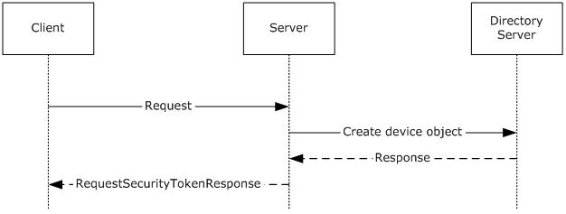
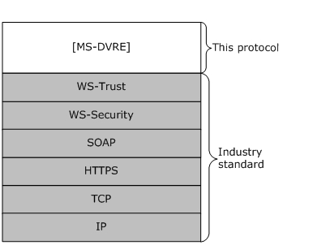
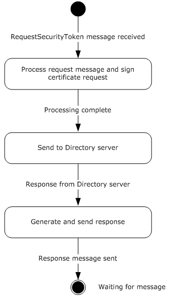

# [MS-DVRE]: Device Registration Enrollment Protocol

Table of Contents

1 Introduction

- [1 Introduction](#Section_1)
  - [1.1 Glossary](#Section_1.1)
  - [1.2 References](#Section_1.2)
    - [1.2.1 Normative References](#Section_1.2.1)
    - [1.2.2 Informative References](#Section_1.2.2)
  - [1.3 Overview](#Section_1.3)
  - [1.4 Relationship to Other Protocols](#Section_1.4)
  - [1.5 Prerequisites/Preconditions](#Section_1.5)
  - [1.6 Applicability Statement](#Section_1.6)
  - [1.7 Versioning and Capability Negotiation](#Section_1.7)
  - [1.8 Vendor-Extensible Fields](#Section_1.8)
  - [1.9 Standards Assignments](#Section_1.9)

2 Messages

- [2 Messages](#Section_2)
  - [2.1 Transport](#Section_2.1)
  - [2.2 Common Message Syntax](#Section_2.2)
    - [2.2.1 Namespaces](#Section_2.2.1)
    - [2.2.2 Messages](#Section_2.2.2)
    - [2.2.3 Elements](#Section_2.2.3)
    - [2.2.4 Complex Types](#Section_2.2.4)
    - [2.2.5 Simple Types](#Section_2.2.5)
    - [2.2.6 Attributes](#Section_2.2.6)
    - [2.2.7 Groups](#Section_2.2.7)
    - [2.2.8 Attribute Groups](#Section_2.2.8)
    - [2.2.9 Common Data Structures](#Section_2.2.9)
  - [2.3 Directory Service Schema Elements](#Section_2.3)
    - [2.3.1 ms-DS-Issuer-Certificates](#Section_2.3.1)
    - [2.3.2 ms-DS-Issuer-Public-Certificates](#Section_2.3.2)
    - [2.3.3 Alt-Security-Identities](#Section_2.3.3)

3 Protocol Details

- [3 Protocol Details](#Section_3)
  - [3.1 IWindowsDeviceEnrollmentService Server Details](#Section_3.1)
    - [3.1.1 Abstract Data Model](#Section_3.1.1)
    - [3.1.2 Timers](#Section_3.1.2)
    - [3.1.3 Initialization](#Section_3.1.3)
    - [3.1.4 Message Processing Events and Sequencing Rules](#Section_3.1.4)
      - [3.1.4.1 RequestSecurityToken](#Section_3.1.4.1)
        - [3.1.4.1.1 Messages](#Section_3.1.4.1.1)
          - [3.1.4.1.1.1 IWindowsDeviceEnrollmentService_RequestSecurityToken_InputMessage Message](#Section_3.1.4.1.1.1)
          - [3.1.4.1.1.2 IWindowsDeviceEnrollmentService_RequestSecurityToken_OutputMessage Message](#Section_3.1.4.1.1.2)
          - [3.1.4.1.1.3 IWindowsDeviceEnrollmentService_RequestSecurityToken_WindowsDeviceEnrollmentServiceErrorFault_FaultMessage Message](#Section_3.1.4.1.1.3)
        - [3.1.4.1.2 Elements](#Section_3.1.4.1.2)
          - [3.1.4.1.2.1 WindowsDeviceEnrollmentServiceError](#Section_3.1.4.1.2.1)
          - [3.1.4.1.2.2 wsse:Security](#Section_3.1.4.1.2.2)
          - [3.1.4.1.2.3 wsse:BinarySecurityToken](#Section_3.1.4.1.2.3)
          - [3.1.4.1.2.4 wst:RequestSecurityToken](#Section_3.1.4.1.2.4)
          - [3.1.4.1.2.5 wst:RequestType](#Section_3.1.4.1.2.5)
          - [3.1.4.1.2.6 wst:TokenType](#Section_3.1.4.1.2.6)
          - [3.1.4.1.2.7 ac:AdditionalContext](#Section_3.1.4.1.2.7)
          - [3.1.4.1.2.8 ac:ContextItem](#Section_3.1.4.1.2.8)
          - [3.1.4.1.2.9 wst:RequestSecurityTokenResponseCollection](#Section_3.1.4.1.2.9)
          - [3.1.4.1.2.10 wst:RequestSecurityTokenResponse](#Section_3.1.4.1.2.10)
          - [3.1.4.1.2.11 wst:RequestedSecurityToken](#Section_3.1.4.1.2.11)
          - [3.1.4.1.2.12 Provisioning Document Schema](#Section_3.1.4.1.2.12)
        - [3.1.4.1.3 Complex Types](#Section_3.1.4.1.3)
          - [3.1.4.1.3.1 WindowsDeviceEnrollmentServiceError](#Section_3.1.4.1.3.1)
        - [3.1.4.1.4 Simple Types](#Section_3.1.4.1.4)
          - [3.1.4.1.4.1 WinDeviceEnrollmentServiceErrorType](#Section_3.1.4.1.4.1)
      - [3.1.4.2 Processing Rules](#Section_3.1.4.2)
        - [3.1.4.2.1 New Request Processing](#Section_3.1.4.2.1)
    - [3.1.5 Timer Events](#Section_3.1.5)
    - [3.1.6 Other Local Events](#Section_3.1.6)

4 Protocol Examples

- [4 Protocol Examples](#Section_4)
  - [4.1 RequestSecurityToken Request/Response Message Sequence](#Section_4.1)
    - [4.1.1 Client RequestSecurityToken Message](#Section_4.1.1)
    - [4.1.2 Server RequestSecurityToken Response](#Section_4.1.2)
    - [4.1.3 SOAP Fault](#Section_4.1.3)
    - [4.1.4 Provisioning Document Example](#Section_4.1.4)

5 Security

- [5 Security](#Section_5)
  - [5.1 Security Considerations for Implementers](#Section_5.1)
  - [5.2 Index of Security Parameters](#Section_5.2)

6 Appendix A: Full WSDL

- [6 Appendix A: Full WSDL](#Section_6)

7 Appendix B: Product Behavior

- [7 Appendix B: Product Behavior](#Section_7)

8 Change Tracking

- [8 Change Tracking](#Section_8)

For the legal notice and IP terms, see [LEGAL.md](../LEGAL.md).
Last updated: 4/23/2024.
See [Revision History](#revision-history) for full version history.

# 1 Introduction

The Device Registration Enrollment Protocol provides a lightweight mechanism for registering personal or corporate-owned devices with a workplace.

Whereas the discovery of information needed to register devices is obtained by use of the Device Registration Discovery Protocol [MS-DVRD](../MS-DVRD/MS-DVRD.md), the Device Registration Enrollment Protocol, defined in this specification, makes use of that information to register a device in the device registration service.

Sections 1.5, 1.8, 1.9, 2, and 3 of this specification are normative. All other sections and examples in this specification are informative.

## 1.1 Glossary

This document uses the following terms:

**access control list (ACL)**: A list of access control entries (ACEs) that collectively describe the security rules for authorizing access to some resource; for example, an object or set of objects.

**Active Directory**: The Windows implementation of a general-purpose directory service, which uses LDAP as its primary access protocol. [**Active Directory**](#gt_active-directory) stores information about a variety of objects in the network such as user accounts, computer accounts, groups, and all related credential information used by Kerberos [MS-KILE](../MS-KILE/MS-KILE.md). [**Active Directory**](#gt_active-directory) is either deployed as Active Directory Domain Services (AD DS) or Active Directory Lightweight Directory Services (AD LDS), which are both described in [MS-ADOD](../MS-ADOD/MS-ADOD.md): Active Directory Protocols Overview.

**administrator**: A user who has complete and unrestricted access to the computer or domain.

**Coordinated Universal Time (UTC)**: A high-precision atomic time standard that approximately tracks Universal Time (UT). It is the basis for legal, civil time all over the Earth. Time zones around the world are expressed as positive and negative offsets from UTC. In this role, it is also referred to as Zulu time (Z) and Greenwich Mean Time (GMT). In these specifications, all references to UTC refer to the time at UTC-0 (or GMT).

**distinguished name (DN)**: A name that uniquely identifies an object by using the relative distinguished name (RDN) for the object, and the names of container objects and domains that contain the object. The distinguished name (DN) identifies the object and its location in a tree.

**globally unique identifier (GUID)**: A term used interchangeably with universally unique identifier (UUID) in Microsoft protocol technical documents (TDs). Interchanging the usage of these terms does not imply or require a specific algorithm or mechanism to generate the value. Specifically, the use of this term does not imply or require that the algorithms described in [[RFC4122]](https://go.microsoft.com/fwlink/?LinkId=90460) or [[C706]](https://go.microsoft.com/fwlink/?LinkId=89824) must be used for generating the [**GUID**](#gt_globally-unique-identifier-guid). See also universally unique identifier (UUID).

**Hypertext Transfer Protocol Secure (HTTPS)**: An extension of HTTP that securely encrypts and decrypts web page requests. In some older protocols, "Hypertext Transfer Protocol over Secure Sockets Layer" is still used (Secure Sockets Layer has been deprecated). For more information, see [[SSL3]](https://go.microsoft.com/fwlink/?LinkId=90534) and [[RFC5246]](https://go.microsoft.com/fwlink/?LinkId=129803).

**JSON Web Token (JWT)**: A string representing a set of claims as a JSON object that is encoded in a JWS or JWE, enabling the claims to be digitally signed or integrity protected with a Message Authentication Code (MAC) and/or encrypted. For more information, see [[RFC7519]](https://go.microsoft.com/fwlink/?LinkId=824833).

**object identifier (OID)**: In the context of an object server, a 64-bit number that uniquely identifies an object.

**security identifier (SID)**: An identifier for security principals that is used to identify an account or a group. Conceptually, the [**SID**](#gt_security-identifier-sid) is composed of an account authority portion (typically a domain) and a smaller integer representing an identity relative to the account authority, termed the relative identifier (RID). The [**SID**](#gt_security-identifier-sid) format is specified in [MS-DTYP](../MS-DTYP/MS-DTYP.md) section 2.4.2; a string representation of [**SIDs**](#gt_security-identifier-sid) is specified in [MS-DTYP] section 2.4.2 and [MS-AZOD](../MS-AZOD/MS-AZOD.md) section 1.1.1.2.

**SOAP action**: The HTTP request header field used to indicate the intent of the SOAP request, using a URI value. See [[SOAP1.1]](https://go.microsoft.com/fwlink/?LinkId=90520) section 6.1.1 for more information.

**SOAP body**: A container for the payload data being delivered by a [**SOAP message**](#gt_soap-message) to its recipient. See [[SOAP1.2-1/2007]](https://go.microsoft.com/fwlink/?LinkId=94664) section 5.3 for more information.

**SOAP fault**: A container for error and status information within a [**SOAP message**](#gt_soap-message). See [SOAP1.2-1/2007] section 5.4 for more information.

**SOAP header**: A mechanism for implementing extensions to a [**SOAP message**](#gt_soap-message) in a decentralized manner without prior agreement between the communicating parties. See [SOAP1.2-1/2007] section 5.2 for more information.

**SOAP message**: An XML document consisting of a mandatory SOAP envelope, an optional [**SOAP header**](#gt_soap-header), and a mandatory [**SOAP body**](#gt_soap-body). See [SOAP1.2-1/2007] section 5 for more information.

**user principal name (UPN)**: A user account name (sometimes referred to as the user logon name) and a domain name that identifies the domain in which the user account is located. This is the standard usage for logging on to a Windows domain. The format is: someone@example.com (in the form of an email address). In [**Active Directory**](#gt_active-directory), the userPrincipalName attribute of the account object, as described in [MS-ADTS](../MS-ADTS/MS-ADTS.md).

**WSDL message**: An abstract, typed definition of the data that is communicated during a [**WSDL operation**](#gt_wsdl-operation) [[WSDL]](https://go.microsoft.com/fwlink/?LinkId=90577). Also, an element that describes the data being exchanged between web service providers and clients.

**WSDL operation**: A single action or function of a web service. The execution of a WSDL operation typically requires the exchange of messages between the service requestor and the service provider.

**MAY, SHOULD, MUST, SHOULD NOT, MUST NOT:** These terms (in all caps) are used as defined in [[RFC2119]](https://go.microsoft.com/fwlink/?LinkId=90317). All statements of optional behavior use either MAY, SHOULD, or SHOULD NOT.

## 1.2 References

Links to a document in the Microsoft Open Specifications library point to the correct section in the most recently published version of the referenced document. However, because individual documents in the library are not updated at the same time, the section numbers in the documents may not match. You can confirm the correct section numbering by checking the [Errata](https://go.microsoft.com/fwlink/?linkid=850906).

### 1.2.1 Normative References

We conduct frequent surveys of the normative references to assure their continued availability. If you have any issue with finding a normative reference, please contact [dochelp@microsoft.com](mailto:dochelp@microsoft.com). We will assist you in finding the relevant information.

[IETFDRAFT-JWT] Bradley, J., Jones, M., and Sakimura, N., "JSON Web Token JWT", draft-ietf-oauth-json-web-token-08, May 2013, [https://datatracker.ietf.org/doc/html/draft-ietf-oauth-json-web-token-08](https://go.microsoft.com/fwlink/?LinkId=301567)

**Note** There are 32 versions up to RFC7519.

[MS-ADA1] Microsoft Corporation, "[Active Directory Schema Attributes A-L](#Section_2.2.6)".

[MS-ADA2] Microsoft Corporation, "[Active Directory Schema Attributes M](#Section_2.2.6)".

[MS-ADA3] Microsoft Corporation, "[Active Directory Schema Attributes N-Z](#Section_2.2.6)".

[MS-ADSC] Microsoft Corporation, "[Active Directory Schema Classes](../MS-ADSC/MS-ADSC.md)".

[MS-ADTS] Microsoft Corporation, "[Active Directory Technical Specification](../MS-ADTS/MS-ADTS.md)".

[MS-NETTR] Microsoft Corporation, "[.NET Tracing Protocol](../MS-NETTR/MS-NETTR.md)".

[MS-WSTEP] Microsoft Corporation, "[WS-Trust X.509v3 Token Enrollment Extensions](../MS-WSTEP/MS-WSTEP.md)".

[RFC2119] Bradner, S., "Key words for use in RFCs to Indicate Requirement Levels", BCP 14, RFC 2119, March 1997, [https://www.rfc-editor.org/info/rfc2119](https://go.microsoft.com/fwlink/?LinkId=90317)

[RFC2616] Fielding, R., Gettys, J., Mogul, J., et al., "Hypertext Transfer Protocol -- HTTP/1.1", RFC 2616, June 1999, [https://www.rfc-editor.org/info/rfc2616](https://go.microsoft.com/fwlink/?LinkId=90372)

[RFC2986] Nystrom, M. and Kaliski, B., "PKCS#10: Certificate Request Syntax Specification", RFC 2986, November 2000, [http://www.rfc-editor.org/info/rfc2986](https://go.microsoft.com/fwlink/?LinkId=90401)

[RFC4211] Schaad, J., "Internet X.509 Public Key Infrastructure Certificate Request Message Format (CRMF)", RFC 4211, September 2005, [http://www.rfc-editor.org/rfc/rfc4211](https://go.microsoft.com/fwlink/?LinkId=301568)

[RFC5280] Cooper, D., Santesson, S., Farrell, S., et al., "Internet X.509 Public Key Infrastructure Certificate and Certificate Revocation List (CRL) Profile", RFC 5280, May 2008, [https://www.rfc-editor.org/info/rfc5280](https://go.microsoft.com/fwlink/?LinkId=131034)

[SOAP1.2-1/2003] Gudgin, M., Hadley, M., Mendelsohn, N., et al., "SOAP Version 1.2 Part 1: Messaging Framework", W3C Recommendation, June 2003, [http://www.w3.org/TR/2003/REC-soap12-part1-20030624](https://go.microsoft.com/fwlink/?LinkId=90521)

[SOAP1.2-2/2003] Gudgin, M., Hadley, M., Mendelsohn, N., et al., "SOAP Version 1.2 Part 2: Adjuncts", W3C Recommendation, June 2003, [http://www.w3.org/TR/2003/REC-soap12-part2-20030624](https://go.microsoft.com/fwlink/?LinkId=90522)

[WSA1.0-WSDLBinding] W3C, "WS-Addressing 1.0 WSDL Binding Namespace", W3C Recommendation, [http://www.w3.org/2006/05/addressing/wsdl/](https://go.microsoft.com/fwlink/?LinkId=204586)

[WSDLSOAP] Angelov, D., Ballinger, K., Butek, R., et al., "WSDL 1.1 Binding Extension for SOAP 1.2", W3C Member Submission, April 2006, [http://www.w3.org/Submission/2006/SUBM-wsdl11soap12-20060405/](https://go.microsoft.com/fwlink/?LinkId=131790)

[WSDL] Christensen, E., Curbera, F., Meredith, G., and Weerawarana, S., "Web Services Description Language (WSDL) 1.1", W3C Note, March 2001, [https://www.w3.org/TR/2001/NOTE-wsdl-20010315](https://go.microsoft.com/fwlink/?LinkId=90577)

[WSFederation] Kaler, C., Nadalin, A., Bajaj, S., et al., "Web Services Federation Language (WS-Federation)", Version 1.1, December 2006, [http://specs.xmlsoap.org/ws/2006/12/federation/ws-federation.pdf](https://go.microsoft.com/fwlink/?LinkId=90581)

[WSS] OASIS, "Web Services Security: SOAP Message Security 1.1 (WS-Security 2004)", February 2006, [https://www.oasis-open.org/committees/download.php/16790/wss-v1.1-spec-os-SOAPMessageSecurity.pdf](https://go.microsoft.com/fwlink/?LinkId=130727)

[WSTrust1.3] Lawrence, K., Kaler, C., Nadalin, A., et al., "WS-Trust 1.3", OASIS Standard March 2007, [https://docs.oasis-open.org/ws-sx/ws-trust/200512/ws-trust-1.3-os.html](https://go.microsoft.com/fwlink/?LinkId=131548)

[XMLNS] Bray, T., Hollander, D., Layman, A., et al., Eds., "Namespaces in XML 1.0 (Third Edition)", W3C Recommendation, December 2009, [https://www.w3.org/TR/2009/REC-xml-names-20091208/](https://go.microsoft.com/fwlink/?LinkId=191840)

[XMLSCHEMA1] Thompson, H., Beech, D., Maloney, M., and Mendelsohn, N., Eds., "XML Schema Part 1: Structures", W3C Recommendation, May 2001, [https://www.w3.org/TR/2001/REC-xmlschema-1-20010502/](https://go.microsoft.com/fwlink/?LinkId=90608)

[XMLSCHEMA2] Biron, P.V., Ed. and Malhotra, A., Ed., "XML Schema Part 2: Datatypes", W3C Recommendation, May 2001, [https://www.w3.org/TR/2001/REC-xmlschema-2-20010502/](https://go.microsoft.com/fwlink/?LinkId=90610)

### 1.2.2 Informative References

[MS-DVRD] Microsoft Corporation, "[Device Registration Discovery Protocol](../MS-DVRD/MS-DVRD.md)".

## 1.3 Overview

The Device Registration Enrollment Protocol provides for issuance of X.509v3 digital certificates, and is intended for use as a lightweight device registration server. The server is known in WS-Trust [[WSTrust1.3]](https://go.microsoft.com/fwlink/?LinkId=131548) terminology as a security token service (STS). The protocol is based loosely on [MS-WSTEP](../MS-WSTEP/MS-WSTEP.md).

This document defines and uses the following term:

**Directory Server**: Refers to the directory database that will store the device-object record and policy information for the server.

Figure 1: Typical sequence diagram for Device Registration

## 1.4 Relationship to Other Protocols

The following figure shows the Device Registration Enrollment protocol stack diagram.

Figure 2: Device Registration Enrollment protocol stack

The Device Registration Enrollment protocol makes use of the [**Hypertext Transfer Protocol over Secure Sockets Layer (HTTPS)**](#gt_hypertext-transfer-protocol-secure-https) and SOAP protocols for messaging and security.

## 1.5 Prerequisites/Preconditions

The Device Registration Enrollment protocol issues X.509v3 certificates that have a corresponding relationship with a device object represented in a directory server. A server implementation of the protocol requires the functionality of a certificate authority and a directory server.

This protocol requires that the following state changes be made to [**Active Directory**](#gt_active-directory).

- Create an instance of the **ms-DS-Device-Registration-Service-Container** class in the directory.
- Create an instance of the ms-DS-Device-Registration-Service class as a child of the container object created in the previous step with the following attributes.
- Set the **ms-DS-Registration-Quota** attribute of the **ms-DS-Device-Registration-Service** object to 10.
- Set the **ms-DS-Maximum-Registration-Inactivity-Period** attribute of the **ms-DS-Device-Registration-Service** object to 90.
- Set the **ms-DS-Is-Enabled** attribute of the **ms-DS-Device-Registration-Service** object to TRUE.
- Set the **ms-DS-Device-Location** attribute of the **ms-DS-Device-Registration-Service** object to a [**distinguished name (DN)**](#gt_distinguished-name-dn) of a container location in the directory. The container is of class ms-DS-Device-Container.
- Generate a certificate signing certificate. The certificate and private key is stored in the **ms-DS-Issuer-Certificates** attribute of the **ms-DS-Device-Registration-Service** object. See section [2.3.1](#Section_2.3.1).
The public portion of the certificate is stored in the **ms-DS-Issuer-Public-Certificates** attribute of the **ms-DS-Device-Registration-Service** object. See section [2.3.2](#Section_2.3.2).

- Set the following directory [**ACL**](#gt_access-control-list-acl) entries:
- Grant the server read access to the **ms-DS-Device-Registration-Service** object.
- Grant the server read/write access to **ms-DS-Device** objects.

## 1.6 Applicability Statement

The Device Registration Enrollment protocol is applicable only for requests for device registration.

## 1.7 Versioning and Capability Negotiation

None.

## 1.8 Vendor-Extensible Fields

The Device Registration Enrollment protocol does not include any vendor-extensible fields.

## 1.9 Standards Assignments

None.

# 2 Messages

## 2.1 Transport

The Device Registration Enrollment protocol operates over the following transports:

- Web Services: SOAP 1.2 ([[SOAP1.2-1/2003]](https://go.microsoft.com/fwlink/?LinkId=90521) and [[SOAP1.2-2/2003]](https://go.microsoft.com/fwlink/?LinkId=90522)) over [**HTTPS**](#gt_hypertext-transfer-protocol-secure-https) over TCP/IP ([[RFC2616]](https://go.microsoft.com/fwlink/?LinkId=90372))
The protocol MUST operate on the following URI endpoint.

| Web service | Location |
| --- | --- |
| Enrollment Web Service | https://<server>:<server port>/EnrollmentServer/DeviceEnrollmentWebService.svc |

The protocol MUST use the HTTPS transport.

## 2.2 Common Message Syntax

This section contains common definitions used by this protocol. The syntax of the definitions uses the XML schema as defined in [[XMLSCHEMA1]](https://go.microsoft.com/fwlink/?LinkId=90608) and [[XMLSCHEMA2]](https://go.microsoft.com/fwlink/?LinkId=90610), and the Web Services Description Language as defined in [[WSDL]](https://go.microsoft.com/fwlink/?LinkId=90577).

### 2.2.1 Namespaces

This specification defines and references various XML namespaces by using the mechanisms specified in [[XMLNS]](https://go.microsoft.com/fwlink/?LinkId=191840). Although this specification associates a specific XML namespace prefix for each XML namespace that is used, the choice of any particular XML namespace prefix is implementation-specific and not significant for interoperability.

| Prefix | Namespace URI | Reference |
| --- | --- | --- |
| q2 | http://schemas.datacontract.org/2004/07/Microsoft.DeviceRegistration | - |
| xsd | http://www.w3.org/2001/XMLSchema | [[XMLSCHEMA1]](https://go.microsoft.com/fwlink/?LinkId=90608) |
| wsaw | http://www.w3.org/2006/05/addressing/wsdl | [[WSA1.0-WSDLBinding]](https://go.microsoft.com/fwlink/?LinkId=204586) |
| soap12 | http://schemas.xmlsoap.org/wsdl/soap12/ | [[WSDLSOAP]](https://go.microsoft.com/fwlink/?LinkId=131790) |
| tns | http://schemas.microsoft.com/windows/pki/2009/01/enrollment | This specification |
| wsdl | http://schemas.xmlsoap.org/wsdl/ | [[WSDL]](https://go.microsoft.com/fwlink/?LinkId=90577) |
| q1 | http://schemas.microsoft.com/Message | - |
| ac | http://schemas.xmlsoap.org/ws/2006/12/authorization | [[WSFederation]](https://go.microsoft.com/fwlink/?LinkId=90581) |
| wsse | http://docs.oasis-open.org/wss/2004/01/oasis-200401-wss-wssecurity-secext-1.0.xsd | [[WSS]](https://go.microsoft.com/fwlink/?LinkId=130727) |
| wst | http://docs.oasis-open.org/ws-sx/ws-trust/200512 | [[WSTrust1.3]](https://go.microsoft.com/fwlink/?LinkId=131548) |

### 2.2.2 Messages

This specification does not define any common XML schema message definitions.

### 2.2.3 Elements

This specification does not define any common XML schema element definitions.

### 2.2.4 Complex Types

This specification does not define any common XML schema complex type definitions.

### 2.2.5 Simple Types

This specification does not define any common XML schema simple type definitions.

### 2.2.6 Attributes

This specification does not define any common XML schema attribute definitions.

### 2.2.7 Groups

This specification does not define any common XML schema group definitions.

### 2.2.8 Attribute Groups

This specification does not define any common XML schema attribute group definitions.

### 2.2.9 Common Data Structures

This specification does not define any common XML schema data structures.

## 2.3 Directory Service Schema Elements

The protocol accesses the following Directory Service schema classes and attributes listed in the following table.

For the syntactic specifications of the following <Class> or <Class><Attribute> pairs, refer to:

Active Directory Domain Services (AD DS) ([MS-ADA1](#Section_2.2.6), [MS-ADA2](#Section_2.2.6), [MS-ADA3](#Section_2.2.6), and [MS-ADSC](../MS-ADSC/MS-ADSC.md)).

| Class | Attribute |
| --- | --- |
| ms-DS-Device | Alt-Security-Identities ms-DS-Device-ID ms-DS-Device-OS-Type ms-DS-Device-OS-Version ms-DS-Registered-Users ms-DS-Is-Enabled ms-DS-Approximate-Last-Logon-Time-Stamp ms-DS-Registered-Owner Display-Name |
| ms-DS-Device-Container | - |
| ms-DS-Device-Registration-Service | ms-DS-Issuer-Certificates ms-DS-Issuer-Public-Certificates ms-DS-Registration-Quota ms-DS-Maximum-Registration-Inactivity-Period ms-DS-Device-Location ms-DS-Is-Enabled |
| ms-DS-Device-Registration-Service-Container | - |
| user | objectGuid |
| domain | objectGuid |
| nTDSDSA | invocationId |

### 2.3.1 ms-DS-Issuer-Certificates

The **ms-DS-Issuer-Certificates** attribute is a multi-valued OCTET_STRING attribute (see the String(Octet) syntax in [MS-ADTS](../MS-ADTS/MS-ADTS.md) section 3.1.1.2.2). Each value of the attribute is stored as a Binary blob containing the following formatted data:

"**[time]**:**[binary value of an X.509 certificate]**"

Where **[time]** is timestamp formatted as an integer representing the number of 100-nanosecond intervals that have elapsed since 12:00:00 midnight, January 1, 0001 and **[binary value of an X.509 certificate]** is the contents of an X.509 certificate [[RFC5280]](https://go.microsoft.com/fwlink/?LinkId=131034) stored as an encrypted binary blob.

### 2.3.2 ms-DS-Issuer-Public-Certificates

The **ms-DS-Issuer-Public-Certificates** attribute is a multi-valued OCTET_STRING attribute. Each value of the attribute is stored as a binary blob containing an X.509 certificate [[RFC5280]](https://go.microsoft.com/fwlink/?LinkId=131034).

### 2.3.3 Alt-Security-Identities

The **Alt-Security-Identities** attribute is a multi-valued UNICODE_STRING attribute (see the String(Unicode) syntax in [MS-ADTS](../MS-ADTS/MS-ADTS.md) section 3.1.1.2.2.2). The value is formatted as:

X509:<SHA1-TP-PUBKEY>**[thumbprint]**+**[publickeyhash]**

Where **[thumbprint]** is the SHA1 hash of a certificate and **[publickeyhash]** is the base64-encoded SHA256 hash of the X.509 certificate public key [[RFC5280]](https://go.microsoft.com/fwlink/?LinkId=131034).

# 3 Protocol Details

## 3.1 IWindowsDeviceEnrollmentService Server Details

The **IWindowsDeviceEnrollmentService** hosts a message endpoint that receives **RequestSecurityToken** messages (section [3.1.4.1](#Section_3.1.4.1)). When received, the server processes the client request, creates and signs an X.509 certificate [[RFC5280]](https://go.microsoft.com/fwlink/?LinkId=131034), and then contacts the directory server to create a device object. Upon receiving a response from the directory server, a response is generated, and the server sends either a **RequestSecurityTokenResponse** message (section [3.1.4.1.1.2](#Section_3.1.4.1.1.2)) or a [**SOAP fault**](#gt_soap-fault). When the message has been sent to the client, the server returns to the waiting state.

Figure 3: State model for security token service

The items of information that are communicated between the server and the directory server are specified in subsequent sections of this document.

**Authentication**

The WS-Trust X.509v3 Enrollment Protocol Extensions [MS-WSTEP](../MS-WSTEP/MS-WSTEP.md) use the authentication provisions in WS-Security [[WSS]](https://go.microsoft.com/fwlink/?LinkId=130727) to enable the X.509v3 Security Token issuer to authenticate the X.509v3 Security Token requestor. The following information defines the schema used to express the credential descriptor for each supported credential type.

- Token Authentication
The token credential is provided in a request message by using the WS-Trust BinarySecurityToken definition as defined in section [3.1.4.1.2.3](#Section_3.1.4.1.2.3).

### 3.1.1 Abstract Data Model

None.

### 3.1.2 Timers

**StaleDeviceCleanup**: A periodic timer that is used to remove unused devices. This timer triggers activity at a random time, once every 24 hours.

### 3.1.3 Initialization

The following initialization steps MUST be performed each time the server service starts:

- Read the **ms-DS-Is-Enabled** attribute of the **ms-DS-Device-Registration-Service** object. If the value is FALSE, the server service MUST shut down.
- The web service on the server MUST be listening for requests from the client.

### 3.1.4 Message Processing Events and Sequencing Rules

The following table summarizes the list of all [**WSDL operations**](#gt_wsdl-operation) as defined by this specification.

| WSDL Operation | Description |
| --- | --- |
| RequestSecurityToken | The RequestSecurityToken operation is the sole operation in the Device Registration Enrollment Protocol. It provides the mechanism for device registration requests. |

#### 3.1.4.1 RequestSecurityToken

The client calls the **RequestSecurityToken** method to register a device.

This operation is specified by the following WSDL.

<wsdl:operation name="RequestSecurityToken">

<wsdl:input wsaw:Action="http://schemas.microsoft.com/windows/pki/2009/01/enrollment/RST/wstep" message="tns:IWindowsDeviceEnrollmentService_RequestSecurityToken_InputMessage"/>

<wsdl:output wsaw:Action="http://schemas.microsoft.com/windows/pki/2009/01/enrollment/RSTRC/wstep" message="tns:IWindowsDeviceEnrollmentService_RequestSecurityToken_OutputMessage"/>

<wsdl:fault wsaw:Action="http://schemas.microsoft.com/windows/pki/2009/01/enrollment/IWindowsDeviceEnrollmentService/RequestSecurityTokenWindowsDeviceEnrollmentServiceErrorFault" name="WindowsDeviceEnrollmentServiceErrorFault" message="tns:IWindowsDeviceEnrollmentService_RequestSecurityToken_WindowsDeviceEnrollmentServiceErrorFault_FaultMessage"/>

</wsdl:operation>

The **IWindowsDeviceEnrollmentService_RequestSecurityToken_InputMessage** message consists of a single object definition: the client request. The client request is made by using the acceptable SOAP actions and values as defined in sections [3.1.4.1.1](#Section_3.1.4.1.1.1) and [3.1.4.1.2](#Section_3.1.4.1.2.2).

##### 3.1.4.1.1 Messages

The following table summarizes the set of [**WSDL message**](#gt_wsdl-message) definitions that are specific to this operation.

| Message | Description |
| --- | --- |
| IWindowsDeviceEnrollmentService_RequestSecurityToken_InputMessage | A request to register a device. |
| IWindowsDeviceEnrollmentService_RequestSecurityToken_OutputMessage | A response containing the signed certificate. |
| IWindowsDeviceEnrollmentService_RequestSecurityToken_WindowsDeviceEnrollmentServiceErrorFault_FaultMessage | An error message object. |

###### 3.1.4.1.1.1 IWindowsDeviceEnrollmentService_RequestSecurityToken_InputMessage Message

A [**WSDL message**](#gt_wsdl-message) containing the request for the **RequestSecurityToken** [**WSDL operation**](#gt_wsdl-operation).

The [**SOAP action**](#gt_soap-action) value is:

http://schemas.microsoft.com/windows/pki/2009/01/enrollment/RST/wstep

The IWindowsDeviceEnrollmentService_RequestSecurityToken_InputMessage request message ([[WSTrust1.3]](https://go.microsoft.com/fwlink/?LinkId=131548) section 3.1 RequestSecurityToken) is sent from the client to the server to enroll a certificate and to retrieve provisioning information. The WSDL definition is:

<wsdl:message name="IWindowsDeviceEnrollmentService_RequestSecurityToken_InputMessage">

<wsdl:part name="request" element="wst:RequestSecurityToken"/>

</wsdl:message>

The **IWindowsDeviceEnrollmentService_RequestSecurityToken_InputMessage** Message contains the elements that are part of a client request to a server.

The following elements MUST be included in the [**SOAP header**](#gt_soap-header).

- **wsse:Security:** Defined in section [3.1.4.1.2.2](#Section_3.1.4.1.2.2).
This element MUST be a child of the <s:Header> element.

- **wsse:BinarySecurityToken:** Defined in section [3.1.4.1.2.3](#Section_3.1.4.1.2.3). The ValueType attribute MUST be urn:ietf:params:oauth:token-type:jwt. The EncodingType attribute MUST be http://docs.oasis-open.org/wss/2004/01/oasis-200401-wss-soap-message-security-1.0#Base64Binary. The <wsse:BinarySecurityToken> element MUST contain a [**JSON Web Token (JWT)**](#gt_json-web-token-jwt) [[IETFDRAFT-JWT]](https://go.microsoft.com/fwlink/?LinkId=301567). The JWT MUST contain the following claims:
| Claim | Description |
| --- | --- |
| http://schemas.microsoft.com/authorization/claims/PermitDeviceRegistrationClaim. | Whether the security authority has granted permission for the user to register devices. |
| http://schemas.xmlsoap.org/ws/2005/05/identity/claims/upn | The [**user principal name (UPN)**](#gt_user-principal-name-upn) of the user that authenticated to the web service. |

This element MUST be a child of the <wsse:Security> element.

The following elements MUST be included in the [**SOAP body**](#gt_soap-body).

- **wst:RequestSecurityToken:** Defined in section [3.1.4.1.2.4](#Section_3.1.4.1.2.4).
This element MUST be a child of the <s:Body> element.

- **wst:RequestType:** Defined in section [3.1.4.1.2.5](#Section_3.1.4.1.2.5). The <wst:RequestType> element MUST be http://docs.oasis-open.org/ws-sx/ws-trust/200512/Issue (see [WSTrust1.3] section 3.1).
This element MUST be a child of the <wst:RequestSecurityToken> element.

- **wst:TokenType**: Defined in section [3.1.4.1.2.6](#Section_3.1.4.1.2.6). For the X.509 enrollment extension to WS-Trust, the <wst:TokenType> element MUST be http://schemas.microsoft.com/5.0.0.0/ConfigurationManager/Enrollment/DeviceEnrollmentToken (see [WSTrust1.3] section 3.1).
This element MUST be a child of the <wst:RequestSecurityToken> element.

- **wsse:BinarySecurityToken:** Defined in section 3.1.4.1.2.3. The ValueType attribute MUST be http://schemas.microsoft.com/windows/pki/2009/01/enrollment#PKCS10. The EncodingType attribute MUST be http://docs.oasis-open.org/wss/2004/01/oasis-200401-wss-wssecurity-secext-1.0.xsd#base64binary. The <wsse:BinarySecurityToken> element MUST contain a base64 encoded PKCS#10 Certificate Request [[RFC2986]](https://go.microsoft.com/fwlink/?LinkId=90401). The Certificate Request MUST use an RSA public key algorithm with 2048 bit key and use a SHA256WithRSAEncryption signature algorithm and SHA256 hash algorithm.
This element MUST be a child of the <wst:RequestSecurityToken> element.

- **ac:AdditionalContext:** Defined in section [3.1.4.1.2.7](#Section_3.1.4.1.2.7). The <ac:AdditionalContext> element MUST contain three <ac:ContextItem> child elements to represent the device type, OS version, and device display name (See [[WSFederation]](https://go.microsoft.com/fwlink/?LinkId=90581) section 9.2).
This element MUST be a child of the <wst:RequestSecurityToken> element.

- **ac:ContextItem:** Defined in section [3.1.4.1.2.8](#Section_3.1.4.1.2.8). The request MUST contain the following information in <ac:ContextItem> elements as child elements of the <ac:AdditionalContext> element.
| Name attribute | Description |
| --- | --- |
| The literal string "DeviceType" | The <ac:Value> element contains the device type. |
| The literal string: "ApplicationVersion" | The <ac:Value> element contains the OS version installed on the device. |
| The literal string: "DeviceDisplayName" | The <ac:Value> element contains the friendly name of the device. |

###### 3.1.4.1.1.2 IWindowsDeviceEnrollmentService_RequestSecurityToken_OutputMessage Message

A [**WSDL message**](#gt_wsdl-message) containing the response for the **RequestSecurityToken** [**WSDL operation**](#gt_wsdl-operation).

The [**SOAP action**](#gt_soap-action) value is:

http://schemas.microsoft.com/windows/pki/2009/01/enrollment/RSTRC/wstep

The IWindowsDeviceEnrollmentService_RequestSecurityToken_OutputMessage ([[WSTrust1.3]](https://go.microsoft.com/fwlink/?LinkId=131548) section 3.2 RequestSecurityTokenResponseCollection). The WSDL definition is:

<wsdl:message name="IWindowsDeviceEnrollmentService_RequestSecurityToken_OutputMessage">

<wsdl:part name="responseCollection" element="wst:RequestSecurityTokenResponseCollection"/>

</wsdl:message>

The **IWindowsDeviceEnrollmentService_RequestSecurityToken_OutputMessage** message contains the elements that are part of a server response to a client.

The following elements MUST be included in the [**SOAP body**](#gt_soap-body).

- **wst:RequestSecurityTokenResponseCollection:** Defined in section [3.1.4.1.2.9](#Section_3.1.4.1.2.9).
This element MUST be a child of the <s:Body> element.

- **wst:RequestSecurityTokenResponse**: Defined in section [3.1.4.1.2.10](#Section_3.1.4.1.2.10).
This element MUST be a child of the <wst:RequestSecurityTokenResponseCollection> element (see [WSTrust1.3] section 3.2).

- **wst:TokenType:** Defined in section [3.1.4.1.2.6](#Section_3.1.4.1.2.6). The <wst:TokenType> element MUST be http://schemas.microsoft.com/5.0.0.0/ConfigurationManager/Enrollment/DeviceEnrollmentToken.
This element MUST be a child of the <wst:RequestSecurityTokenResponse> element (see [WSTrust1.3] section 3.1).

- **wst:RequestedSecurityToken:** Defined in section [3.1.4.1.2.11](#Section_3.1.4.1.2.11).
This element MUST be a child of the <wst:RequestSecurityTokenResponse> element.

- **wsse:BinarySecurityToken:** Defined in section [3.1.4.1.2.3](#Section_3.1.4.1.2.3). The ValueType attribute MUST be http://schemas.microsoft.com/5.0.0.0/ConfigurationManager/Enrollment/DeviceEnrollmentProvisionDoc. The EncodingType attribute MUST be http://docs.oasis-open.org/wss/2004/01/oasis-200401-wss-wssecurity-secext-1.0.xsd#base64binary. The <wsse:BinarySecurityToken> element MUST contain a base64 encoded XML document formatted as a Provisioning Document (section [3.1.4.1.2.12](#Section_3.1.4.1.2.12)). The XML document MUST contain an X.509 Certificate [[RFC5280]](https://go.microsoft.com/fwlink/?LinkId=131034).
This element MUST be a child of the <wst:RequestedSecurityToken> element.

- **ac:AdditionalContext:** Defined in section [3.1.4.1.2.7](#Section_3.1.4.1.2.7) (See [[WSFederation]](https://go.microsoft.com/fwlink/?LinkId=90581) section 9.2).
This element MUST be a child of the <wst:RequestSecurityTokenResponse> element.

- **ac:ContextItem:** Defined in section [3.1.4.1.2.8](#Section_3.1.4.1.2.8). The request MUST provide the following information in <ac:ContextItem> elements as child elements of the <ac:AdditionalContext> element.
| Name attribute | Description |
| --- | --- |
| The literal string: "UserPrincipalName" | The <ac:Value> element contains the value of the http://schemas.xmlsoap.org/ws/2005/05/identity/claims/upn claim in the [**JWT**](#gt_json-web-token-jwt) that was sent to the server (section [3.1.4.1.1.1](#Section_3.1.4.1.1.1)). |

###### 3.1.4.1.1.3 IWindowsDeviceEnrollmentService_RequestSecurityToken_WindowsDeviceEnrollmentServiceErrorFault_FaultMessage Message

A [**WSDL message**](#gt_wsdl-message) containing a fault for the **RequestSecurityToken** [**WSDL operation**](#gt_wsdl-operation).

The [**SOAP action**](#gt_soap-action) value is:

http://schemas.microsoft.com/windows/pki/2009/01/enrollment/IWindowsDeviceEnrollmentService/RequestSecurityTokenWindowsDeviceEnrollmentServiceErrorFault

Error strings and other data contained in a SOAP action value are insignificant to the protocol. Clients MUST halt processing upon receiving a [**SOAP fault**](#gt_soap-fault), and MUST ignore the action value.

The WSDL definition is:

<wsdl:message name="IWindowsDeviceEnrollmentService_RequestSecurityToken_WindowsDeviceEnrollmentServiceErrorFault_FaultMessage">

<wsdl:part name="detail" element="tns:WindowsDeviceEnrollmentServiceError"/>

</wsdl:message>

The **IWindowsDeviceEnrollmentService_RequestSecurityToken_WindowsDeviceEnrollmentServiceErrorFault_FaultMessage** message contains the SOAP fault associated with an error in the request from the client to the server.

**WindowsDeviceEnrollmentServiceError:** Defined in section [3.1.4.1.2.1](#Section_3.1.4.1.2.12). The object MUST be included in the <s:Detail> element of a SOAP fault, and clients MUST ignore the entire WindowsDeviceEnrollmentServiceError node in the SOAP fault response.

##### 3.1.4.1.2 Elements

The following table summarizes the WSDL element definitions that are specific to this operation.

| Element | Description |
| --- | --- |
| WindowsDeviceEnrollmentServiceError | An object returned by the web service when an error occurs. |
| wsse:Security | As described in [[WSS]](https://go.microsoft.com/fwlink/?LinkId=130727). |
| wsse:BinarySecurityToken | As described in [WSS]. |
| wst:RequestSecurityToken | As described in [[WSTrust1.3]](https://go.microsoft.com/fwlink/?LinkId=131548). |
| wst:RequestType | As described in [WSTrust1.3]. |
| wst:TokenType | As described in [WSTrust1.3]. |
| ac:AdditionalContext | As described in [[WSFederation]](https://go.microsoft.com/fwlink/?LinkId=90581). |
| ac:ContextItem | As described in [WSFederation]. |
| wst:RequestSecurityTokenResponseCollection | As described in [WSTrust1.3]. |
| wst:RequestSecurityTokenResponse | As described in [WSTrust1.3]. |
| wst:RequestedSecurityToken | As described in [WSTrust1.3]. |
| Provisioning Document | An XML document containing a configuration profile for a mobile device. |

###### 3.1.4.1.2.1 WindowsDeviceEnrollmentServiceError

<xsd:element name="WindowsDeviceEnrollmentServiceError" nillable="true" type="q2:WindowsDeviceEnrollmentServiceError"/>

###### 3.1.4.1.2.2 wsse:Security

The <wsse:Security> element is defined in [[WSS]](https://go.microsoft.com/fwlink/?LinkId=130727).

###### 3.1.4.1.2.3 wsse:BinarySecurityToken

The <wsse:BinarySecurityToken> element is defined in [[WSS]](https://go.microsoft.com/fwlink/?LinkId=130727).

###### 3.1.4.1.2.4 wst:RequestSecurityToken

The <wst:RequestSecurityToken> element is defined in WS-Trust 1.3 [[WSTrust1.3]](https://go.microsoft.com/fwlink/?LinkId=131548), section 3.1.

###### 3.1.4.1.2.5 wst:RequestType

The <wst:RequestType> element is defined in [[WSTrust1.3]](https://go.microsoft.com/fwlink/?LinkId=131548) section 3.1. It is an instance of a <wst:RequestTypeOpenEnum> object as defined in [WSTrust1.3] XML schema definition (XSD).

###### 3.1.4.1.2.6 wst:TokenType

The <wst:TokenType> element is defined in [[WSTrust1.3]](https://go.microsoft.com/fwlink/?LinkId=131548), section 3.1.

###### 3.1.4.1.2.7 ac:AdditionalContext

The <ac:AdditionalContext> element is defined in [[WSFederation]](https://go.microsoft.com/fwlink/?LinkId=90581). It is used to provide additional information in a wst:RequestSecurityToken and wst:RequestSecurityTokenResponseCollection messages.

###### 3.1.4.1.2.8 ac:ContextItem

The <ac:ContextItem> element is defined in [[WSFederation]](https://go.microsoft.com/fwlink/?LinkId=90581). It is a child element of <ac:AdditionalContext> and is used to provide additional information in a wst:RequestSecurityToken message. See sections [3.1.4.1.1.1](#Section_3.1.4.1.1.1) and [3.1.4.1.1.2](#Section_3.1.4.1.1.2) for additional requirements.

###### 3.1.4.1.2.9 wst:RequestSecurityTokenResponseCollection

The <wst:RequestSecurityTokenResponseCollection> element is defined in [[WSTrust1.3]](https://go.microsoft.com/fwlink/?LinkId=131548), section 3.1.

###### 3.1.4.1.2.10 wst:RequestSecurityTokenResponse

The <wst:RequestSecurityTokenResponse> element is defined in [[WSTrust1.3]](https://go.microsoft.com/fwlink/?LinkId=131548), section 3.1.

###### 3.1.4.1.2.11 wst:RequestedSecurityToken

The <wst:RequestedSecurityToken> element is defined in [[WSTrust1.3]](https://go.microsoft.com/fwlink/?LinkId=131548), section 3.1.

###### 3.1.4.1.2.12 Provisioning Document Schema

<?xml version="1.0" encoding="utf-8"?>

<xs:schema id="NewDataSet" xmlns="" xmlns:xs="http://www.w3.org/2001/XMLSchema" xmlns:msdata="urn:schemas-microsoft-com:xml-msdata">

<xs:element name="characteristic">

<xs:complexType>

<xs:sequence>

<xs:element name="parm" minOccurs="0" maxOccurs="unbounded">

<xs:complexType>

<xs:attribute name="name" type="xs:string" />

<xs:attribute name="value" type="xs:string" />

</xs:complexType>

</xs:element>

<xs:element ref="characteristic" minOccurs="0" maxOccurs="unbounded" />

</xs:sequence>

<xs:attribute name="type" type="xs:string" />

</xs:complexType>

</xs:element>

<xs:element name="wap-provisioningdoc">

<xs:complexType>

<xs:sequence>

<xs:element ref="characteristic" minOccurs="0" maxOccurs="unbounded" />

</xs:sequence>

<xs:attribute name="version" type="xs:string" />

</xs:complexType>

</xs:element>

<xs:element name="NewDataSet" msdata:IsDataSet="true" msdata:UseCurrentLocale="true">

<xs:complexType>

<xs:choice minOccurs="0" maxOccurs="unbounded">

<xs:element ref="characteristic" />

<xs:element ref="wap-provisioningdoc" />

</xs:choice>

</xs:complexType>

</xs:element>

</xs:schema>

##### 3.1.4.1.3 Complex Types

The following table summarizes the XML Schema complex type definitions that are specific to this operation.

| ComplexType | Description |
| --- | --- |
| WindowsDeviceEnrollmentServiceError | An object returned by the web service when an error occurs. |

###### 3.1.4.1.3.1 WindowsDeviceEnrollmentServiceError

**Namespace:** http://schemas.datacontract.org/2004/07/Microsoft.DeviceRegistration

<xsd:complexType name="WindowsDeviceEnrollmentServiceError">

<xsd:sequence>

<xsd:element minOccurs="0" maxOccurs="1" name="ErrorType" nillable="true" type="q2:WinDeviceEnrollmentServiceErrorType"/>

<xsd:element minOccurs="0" maxOccurs="1" name="Message" nillable="true" type="xsd:string"/>

</xsd:sequence>

</xsd:complexType>

**ErrorType:** Indicates the type of error that occurred. MUST be a value from the WinDeviceEnrollmentServiceErrorType enumeration (section [3.1.4.1.4.1](#Section_3.1.4.1.4.1)).

**Message:** A string that provides details about the specific error that occurred. The content of this string is implementation-specific.

##### 3.1.4.1.4 Simple Types

The following table summarizes the XML Schema simple type definitions that are specific to this operation.

| SimpleType | Description |
| --- | --- |
| WinDeviceEnrollmentServiceErrorType | An object returned by the web service when an error occurs. |

###### 3.1.4.1.4.1 WinDeviceEnrollmentServiceErrorType

An object returned by the web service when an error occurs.

**Namespace:** http://schemas.datacontract.org/2004/07/Microsoft.DeviceRegistration

<xsd:simpleType name="WinDeviceEnrollmentServiceErrorType">

<xsd:restriction base="xsd:string">

<xsd:enumeration value="InvalidParameter"/>

<xsd:enumeration value="SqlError"/>

<xsd:enumeration value="CertificateAuthorityError"/>

<xsd:enumeration value="DirectoryAccountError"/>

<xsd:enumeration value="AuthenticationError"/>

<xsd:enumeration value="AuthorizationError"/>

<xsd:enumeration value="UnknownError"/>

</xsd:restriction>

</xsd:simpleType>

The following table specifies the allowable values for **WinDeviceEnrollmentServiceErrorType:**

| Value | Meaning |
| --- | --- |
| InvalidParameter | An invalid parameter was sent to the web service. |
| SqlError | An error occurred with the database. |
| CertificateAuthorityError | An error occurred with the Certificate Authority. |
| DirectoryAccountError | An error occurred with the Directory Service. |
| AuthenticationError | An error occurred while authenticating the user. |
| AuthorizationError | An error occurred while authorizing the user. |
| UnknownError | An unknown error occurred. |

#### 3.1.4.2 Processing Rules

An incoming [**SOAP message**](#gt_soap-message) MUST be processed to evaluate the SOAP actions and authentication information.

If the user has authenticated successfully by using the provided authentication information, message processing MUST continue. If the authentication fails, the server MUST respond with a [**SOAP fault**](#gt_soap-fault).

If any other [**SOAP action**](#gt_soap-action) is defined, the server MUST respond with a SOAP fault.

##### 3.1.4.2.1 New Request Processing

For this type of message, a server has syntax constraints on the request message.

- The server MUST check for the http://schemas.microsoft.com/authorization/claims/PermitDeviceRegistrationClaim claim in the [**JWT**](#gt_json-web-token-jwt). If the claim is not present, or if the value of this claim is not TRUE, the server MUST respond with a [**SOAP fault**](#gt_soap-fault).
- The server MUST query for all **ms-DS-Device** objects whose **ms-DS-Registered-Users** attribute contains the [**SID**](#gt_security-identifier-sid) of the authenticating user.
The server MUST read the integer value of the **ms-DS-Registration-Quota** attribute of the **ms-DS-Device-Registration-Service** object stored on the directory server.

The server MUST exempt from quota enforcement users who are domain [**administrators**](#gt_administrator).

If the value of the **ms-DS-Registration-Quota** attribute is not zero and the total count of device objects that are registered to the user is greater than the integer stored in the **ms-DS-Registration-Quota** attribute, the server MUST respond with a SOAP fault.

- The server MUST add the following [**object identifiers (OIDs)**](#gt_object-identifier-oid) and values to the X.509 Certificate Request [[RFC4211]](https://go.microsoft.com/fwlink/?LinkId=301568) contained in the <wsse:BinarySecurityToken> element in the [**SOAP body**](#gt_soap-body) of the client request.
| OID | Value |
| --- | --- |
| 1.2.840.113556.1.5.284.2 | The server MUST generate a [**globally unique identifier (GUID)**](#gt_globally-unique-identifier-guid) and include it as the value. |
| 1.2.840.113556.1.5.284.3 | The objectGuid of the user object ([MS-ADSC](../MS-ADSC/MS-ADSC.md) section 2.269) on the directory server that corresponds to the authenticating user. |
| 1.2.840.113556.1.5.284.4 | The objectGuid of the domain object ([MS-ADSC] section 2.43) on the directory server. |
| 1.2.840.113556.1.5.284.1 | The invocationId ([MS-ADA1](#Section_2.2.6) section 2.314) of the nTDSDSA object for the directory server. |

- The server MUST sign the request by using the issuer certificate stored in the **ms-DS-Issuer-Certificates** attribute of the **ms-DS-Device-Registration-Service** object with the most recent timestamp (see section [2.3.1](#Section_2.3.1)). The server MUST use a SHA256WithRSAEncryption signature algorithm and SHA256 hash algorithm.
- The server MUST send a request to the directory server to create a device record as an instance of the **ms-DS-Device** class as a child of the container specified in the **ms-DS-Device-Location** attribute of the **ms-DS-Device-Registration-Service** object.
The device record MUST contain:

- The GUID generated by the server in step 3, stored as the **ms-DS-Device-ID** attribute.
- The SHA1 hash of the certificate thumbprint plus certificate public key, stored as the **Alt-Security-Identities** attribute.
- The device type that corresponds to the device type sent in the request (section [3.1.4.1.1.1](#Section_3.1.4.1.1.1)), stored as the **ms-DS-Device-OS-Type** attribute.
- The device operating system version that corresponds to the device operating system sent in the request (section 3.1.4.1.1.1), stored as the **ms-DS-Device-OS-Version** attribute.
- The SID of the user account that authenticated to the web service, stored as the **ms-DS-Registered-Users** attribute.
- The SID of the user account that authenticated to the web service, stored as the **ms-DS-Registered-Owner** attribute.
- Set the **ms-DS-Is-Enabled** attribute to true.
- The friendly name of the device that corresponds to the display name sent in the request (section 3.1.4.1.1.1), stored as the **Display-Name** attribute.
- The server MUST send a SOAP response to the client. See section [3.1.4.1.1.2](#Section_3.1.4.1.1.2) for details on the response.

### 3.1.5 Timer Events

**StaleDeviceCleanup:** (section [3.1.2](#Section_3.1.2))

If the integer value of the **ms-DS-Maximum-Registration-Inactivity-Period** attribute of the **ms-DS-Device-Registration-Service** is zero, the server MUST stop processing and MUST NOT delete any **ms-DS-Device** objects from the directory.

Otherwise, the server MUST query the directory for all **ms-DS-Device** objects. For each **ms-DS-Device** object, the server MUST calculate the time difference (as a count of days) between the local server [**Coordinated Universal Time (UTC)**](#gt_coordinated-universal-time-utc) and the time stored in the **ms-DS-Approximate-Last-Logon-Time-Stamp** attribute of the **ms-DS-Device** object.

If the count (as days) is greater than the integer value of the **ms-DS-Maximum-Registration-Inactivity-Period** attribute of the **ms-DS-Device-Registration-Service** and the local server UTC time is greater than the time stored in the **ms-DS-Approximate-Last-Logon-Time-Stamp** attribute of the **ms-DS-Device** object, the server MUST delete the **ms-DS-Device** object.

### 3.1.6 Other Local Events

None.

# 4 Protocol Examples

In the following message sequence, the token authentication headers have been included in the message sequences for clarity.

## 4.1 RequestSecurityToken Request/Response Message Sequence

### 4.1.1 Client RequestSecurityToken Message

<s:Envelope

xmlns:s="http://www.w3.org/2003/05/soap-envelope"

xmlns:a="http://www.w3.org/2005/08/addressing"

xmlns:u="http://docs.oasis-open.org/wss/2004/01/oasis-200401-wss-wssecurity-utility-1.0.xsd"

xmlns:wsse="http://docs.oasis-open.org/wss/2004/01/oasis-200401-wss-wssecurity-secext-1.0.xsd"

xmlns:wst="http://docs.oasis-open.org/ws-sx/ws-trust/200512"

xmlns:ac="http://schemas.xmlsoap.org/ws/2006/12/authorization">

<s:Header>

<a:Action

s:mustUnderstand="1">http://schemas.microsoft.com/windows/pki/2009/01/enrollment/RST/wstep

</a:Action>

<a:MessageID>

urn:uuid:0d5a1441-5891-453b-becf-a2e5f6ea3749

</a:MessageID>

<a:ReplyTo>

<a:Address>

http://www.w3.org/2005/08/addressing/anonymous

</a:Address>

</a:ReplyTo>

<a:To s:mustUnderstand="1">https://sts.contoso.com/EnrollmentServer/DeviceEnrollmentWebService.svc

</a:To>

<wsse:Security

s:mustUnderstand="1">

<wsse:BinarySecurityToken

ValueType="urn:ietf:params:oauth:token-type:jwt"

EncodingType="http://docs.oasis-open.org/wss/2004/01/oasis-200401-wss-soap-message-security-1.0#Base64Binary">

ZXlKMGVYQWlPaUpLVjFRaUxDSmhiR2NpT2lKU1V6STFOaUlzSW5nM

WRDSTZJblpSZW1KbFozRnJTa3RtVFVkVlZVeENTRFp6UkY4emMyUm

haeUo5LmV5SmhkV1FpT2lKMWNtNDZiWE10WkhKek9uTjBjeTVqYjI

1MGIzTnZMbU52YlNJc0ltbHpjeUk2SW1oMGRIQTZMeTl6ZEhNdVky

OXVkRzl6Ynk1amIyMHZZV1JtY3k5elpYSjJhV05sY3k5MGNuVnpkQ

0lzSW01aVppSTZNVE0yTmpNeE56Z3pNeXdpWlhod0lqb3hNelkyTX

pJeE5ETXpMQ0pxZEdraU9pSmZOakF6T1RKa01EZ3RPR1psT0MwMFk

ySmlMV0U1TTJNdE1HVXhPRFk1TW1VelptTmhMVEpCTmpreFJVVkNP

REE1TlVZeFFUUTVOa0ZHUXpJMU56VTJRalV4UWtZMklpd2lkWEJ1S

WpvaVpHRnVRR052Ym5SdmMyOHVZMjl0SWl3aVlYVjBhR2x1YzNSaG

JuUWlPaUl5TURFekxUQTBMVEU0VkRJd09qUXpPalV6TGpJMU9Gb2l

MQ0poZFhSb2JXVjBhRzlrSWpwYkltaDBkSEE2THk5elkyaGxiV0Z6

TG0xcFkzSnZjMjltZEM1amIyMHZkM012TWpBd09DOHdOaTlwWkdWd

WRHbDBlUzloZFhSb1pXNTBhV05oZEdsdmJtMWxkR2h2WkM5d1lYTn

pkMjl5WkNJc0luVnlianB2WVhOcGN6cHVZVzFsY3pwMFl6cFRRVTF

NT2pJdU1EcGhZenBqYkdGemMyVnpPbEJoYzNOM2IzSmtVSEp2ZEdW

amRHVmtWSEpoYm5Od2IzSjBJbDBzSW5CeWFXMWhjbmxuY205MWNIT

nBaQ0k2SWxNdE1TMDFMVEl4TFRJek56Z3lOemN5TkRZdE1qWTRNak

EzTkRNeE9TMDBNelUwTnpReE1UVXROVEV6SWl3aVozSnZkWEJ6YVd

RaU9sc2lVeTB4TFRVdE1qRXRNak0zT0RJM056STBOaTB5TmpneU1E

YzBNekU1TFRRek5UUTNOREV4TlMwMU1UTWlMQ0pUTFRFdE1TMHdJa

XdpVXkweExUVXRNekl0TlRRMUlpd2lVeTB4TFRVdE1pSXNJbE10TV

MwMUxURXhJaXdpVXkweExUVXRNVFVpWFN3aWNISnBiV0Z5ZVhOcFp

DSTZJbE10TVMwMUxUSXhMVEl6TnpneU56Y3lORFl0TWpZNE1qQTNO

RE14T1MwME16VTBOelF4TVRVdE1URXdOU0lzSW01aGJXVWlPaUpYU

lVOUFRsUlBVMDljWEdSaGJpSXNJbmRwYm1GalkyOTFiblJ1WVcxbE

lqb2lWMFZEVDA1VVQxTlBYRnhrWVc0aUxDSm9kSFJ3T2k4dmMyTm9

aVzFoY3k1dGFXTnliM052Wm5RdVkyOXRMM2R6THpJd01USXZNVEl2

WTJ4aGFXMXpMMkZrWkdsMGFXOXVZV3hoZFhSb2RtVnlhV1pwWTJGM

GFXOXViV1YwYUc5a2N5STZJbWgwZEhBNkx5OXpZMmhsYldGekxtMX

BZM0p2YzI5bWRDNWpiMjB2ZDNNdk1qQXdPQzh3Tmk5cFpHVnVkR2w

wZVM5aGRYUm9aVzUwYVdOaGRHbHZibTFsZEdodlpDOXdZWE56ZDI5

eVpDSXNJbWgwZEhBNkx5OXpZMmhsYldGekxtMXBZM0p2YzI5bWRDN

WpiMjB2ZDNNdk1qQXhNaTh4TWk5amJHRnBiWE12WVdSa2FYUnBiMj

VoYkdGMWRHaDJaWEpwWm1sallYUnBiMjUxYzJWa0lqb2labUZzYzJ

VaUxDSmxibVJ3YjJsdWRIQmhkR2dpT2lJdllXUm1jeTl2WVhWMGFE

SXZkRzlyWlc0aUxDSmhjSEJwWkdWdWRHbG1hV1Z5SWpvaWJYTXRZW

EJ3T2k4dmQybHVaRzkzY3k1cGJXMWxjbk5wZG1WamIyNTBjbTlzY0

dGdVpXd3ZJaXdpYUhSMGNEb3ZMM05qYUdWdFlYTXViV2xqY205emI

yWjBMbU52YlM5aGRYUm9iM0pwZW1GMGFXOXVMMk5zWVdsdGN5OVFa

WEp0YVhSRVpYWnBZMlZTWldkcGMzUnlZWFJwYjI0aU9pSjBjblZsS

W4wLmhTem9VVllrVXZ6cjhsX19PeXA4RFdEZi1SOUhHZ3UySG5ndG

Jnb1Z6ang0a01jMTZLWjNLZzhlM0hYLVRvWk9jZ0VoLXZqYzljY0t

KMXNYYWZLLVVVc1FGZXV4bDNCSzNFbVJmSFVyXy00MTY3M0RIT1dM

cTNTXzVWd3JhU3NnVXN4OWtqU01EV3MwcGl1WGZURHhLZzc5T2UwR

i1HRVNCcm5UQk5GZjdVZ3VKRTVaSGpRenJtTEh2bElSVzJ4dTY3ZT

loWjZhY1VyeEF6azhmSzhiTS1heGlaZWFnX0RxbTRQSExEMnU2ekd

BeFlRQmQyNWR3ZmZ4Wk84bkRZajRxVjJiOEFzZjZSMUVWbnBxYWEw

eXhCTENHcDRuV3NJazJBUW8xaWNIMWoxbEYtc2NVMmJpNU1VcFZhT

1gxRHJ0RnNyTW1RWUtjWno4U2NJRzRqcFhWZw==

</wsse:BinarySecurityToken>

</wsse:Security>

</s:Header>

<s:Body>

<wst:RequestSecurityToken>

<wst:TokenType>

http://schemas.microsoft.com/5.0.0.0/ConfigurationManager/Enrollment/DeviceEnrollmentToken

</wst:TokenType>

<wst:RequestType>

http://docs.oasis-open.org/ws-sx/ws-trust/200512/Issue

</wst:RequestType>

<wsse:BinarySecurityToken

ValueType="http://schemas.microsoft.com/windows/pki/2009/01/enrollment#PKCS10"

EncodingType="http://docs.oasis-open.org/wss/2004/01/oasis-200401-wss-wssecurity-secext-1.0.xsd#base64binary">

MIICcTCCAV0CAQAwMDEuMCwGA1UEAxMlQjFDNDNDRDAtMTYyNC0

1RkJCLThFNTQtMzRDRjE3REZEM0ExADCCASIwDQYJKoZIhvcNAQ

EBBQADggEPADCCAQoCggEBALrqvyhxKTchE5I5L/dFjnjG25ary

zFmYJ0JJb6ZvaZeueaZKFAJyCGZE1xq0SwHYK9rTvXWSibF6mXW

w6PJ6Zyd2LEjzgQBGd7iU+vtbwRy7bmYgJEMCILbdpabrYYg/IQ

RBQpUIe/SxnwKi0RdID2N0T6IwktJjCWJeRI6xr3Cj74MU9wrrM

SJ3NKaf3eD6iwsEYsU0sEe2ijsiz0Px+Ajmct9Ukq9VLmk34PIK

EX5RzRYanfshEbr7U7GP9gZKZyIm9kfZjRK057LDuYCKNNzV2hF

dxkT81PYvnmoYLCeNpYNSJTR/GfYYMkTT3EZVboxN8oTAXQLwfq

UKfYRNvMCAwEAAaAAMAkGBSsOAwIdBQADggEBAC3JnACsgu3z4r

fij+Ggxw6wgFzS8gJPkPU4rnylGwICGVnYZIEM/Ny5RsKVZglwY

ZIkz4/UumG7NfdKKOqLeFtS3TQMagqdNqv8ehy7BmNglo5HkHrS

tJi1hsTzhPXtfBgZxDiA5MJUDiZyOfbJSlZckVXyKkyKCbJ1Avm

ZXIWt10mYvIBzFHVpE5KaZU1sPI/M3td1XYXSgO3kgYvB7jBKUI

WNjnMPxvPYOjYp0OUiTNtpLozjd1MuCXth9is2OA21t7INKeVzP

bE01TTcD5JfRQtj9jtk1PNdqd3cp1FgazrbidVjzlqBcEHUndnD

7WJ2S0QbmscESftupf4nAic=

</wsse:BinarySecurityToken>

<ac:AdditionalContext xmlns="http://schemas.xmlsoap.org/ws/2006/12/authorization">

<ac:ContextItem Name="DeviceType">

<ac:Value>Windows</ac:Value>

</ac:ContextItem>

<ac:ContextItem Name="ApplicationVersion">

<ac:Value>6.2.9200.0</ac:Value>

</ac:ContextItem>

<ac:ContextItem Name="DeviceDisplayName">

<ac:Value>WEClient.contoso.com</ac:Value>

</ac:ContextItem>

</ac:AdditionalContext>

</wst:RequestSecurityToken>

</s:Body>

</s:Envelope>

### 4.1.2 Server RequestSecurityToken Response

**Note** The ActivityId element is defined in [MS-NETTR](../MS-NETTR/MS-NETTR.md) section 2.2.3.

<s:Envelope

xmlns:s="http://www.w3.org/2003/05/soap-envelope"

xmlns:a="http://www.w3.org/2005/08/addressing">

<s:Header>

<a:Action s:mustUnderstand="1">

http://schemas.microsoft.com/windows/pki/2009/01/enrollment/RSTRC/wstep

</a:Action>

<ActivityId

CorrelationId="0e09fc40-373c-41ee-933a-0e085270a081"

xmlns="http://schemas.microsoft.com/2004/09/ServiceModel/Diagnostics">

8cca3c03-1ef1-4ecc-83cd-3201fd775596

</ActivityId>

<a:RelatesTo>

urn:uuid:0d5a1441-5891-453b-becf-a2e5f6ea3749

</a:RelatesTo>

</s:Header>

<s:Body>

<RequestSecurityTokenResponseCollection xmlns="http://docs.oasis-open.org/ws-sx/ws-trust/200512">

<RequestSecurityTokenResponse>

<TokenType>

http://schemas.microsoft.com/5.0.0.0/ConfigurationManager/Enrollment/DeviceEnrollmentToken

</TokenType>

<RequestedSecurityToken>

<BinarySecurityToken ValueType="http://schemas.microsoft.com/5.0.0.0/ConfigurationManager/Enrollment/DeviceEnrollmentProvisionDoc"

EncodingType="http://docs.oasis-open.org/wss/2004/01/oasis-200401-wss-wssecurity-secext-1.0.xsd#base64binary"

xmlns="http://docs.oasis-open.org/wss/2004/01/oasis-200401-wss-wssecurity-secext-1.0.xsd">

PHdhcC1wcm92aXNpb25pbmdkb2MgdmVyc2lvbj0iMS4xIj4

NCiAgPGNoYXJhY3RlcmlzdGljIHR5cGU9IkNlcnRpZmljYX

RlU3RvcmUiPg0KICAgIDxjaGFyYWN0ZXJpc3RpYyB0eXBlP

SJNeSI+DQogICAgICA8Y2hhcmFjdGVyaXN0aWMgdHlwZT0i

VXNlciI+DQogICAgICAgIDxjaGFyYWN0ZXJpc3RpYyB0eXB

lPSJDQjIxMUMxMjQ5MjI5MEU5OUU5OTczOTg5REY3NDk1QT

AwMzIwMTc3Ij4NCiAgICAgICAgICA8cGFybSBuYW1lPSJFb

mNvZGVkQ2VydGlmaWNhdGUiIHZhbHVlPSJNSUlFUWpDQ0F5

NmdBd0lCQWdJUXFWVnRnNEV4MHJaT3o4UkU0MlVqaGpBSkJ

nVXJEZ01DSFFVQU1JR01NWUdKTUJFR0NnbVNKb21UOGl4a0

FSa1dBMk52YlRBUkJnb0praWFKay9Jc1pBRVpGZ056ZEhNd

0ZRWUtDWkltaVpQeUxHUUJHUllIWTI5dWRHOXpiekFkQmdO

VkJBTVRGazFUTFU5eVoyRnVhWHBoZEdsdmJpMUJZMk5sYzN

Nd0t3WURWUVFMRXlSak1URTBaVFF5T0MwMU1tVTJMVFJtWk

RJdE9EVmpNQzFsT0RnNU5ERTJZVE5pTWpVd0hoY05NVE13T

kRFNE1qQXpPRFUwV2hjTk1qTXdOREUyTWpBME16VTBXakF2

TVMwd0t3WURWUVFERXlReE1EaGhOVE0xTVMxbU9EbGpMVFE

yTldFdE9UaGpaUzA0TldZMFpXUXhNekppWXprd2dnRWlNQT

BHQ1NxR1NJYjNEUUVCQVFBQUE0SUJEd0F3Z2dFS0FvSUJBU

UM2NnI4b2NTazNJUk9TT1MvM1JZNTR4dHVXcThzeFptQ2RD

U1crbWIybVhybm1tU2hRQ2NnaG1STmNhdEVzQjJDdmEwNzE

xa29teGVwbDFzT2p5ZW1jbmRpeEk4NEVBUm5lNGxQcjdXOE

VjdTI1bUlDUkRBaUMyM2FXbTYyR0lQeUVFUVVLVkNIdjBzW

jhDb3RFWFNBOWpkRStpTUpMU1l3bGlYa1NPc2E5d28rK0RG

UGNLNnpFaWR6U21uOTNnK29zTEJHTEZOTEJIdG9vN0lzOUQ

4ZmdJNW5MZlZKS3ZWUzVwTitEeUNoRitVYzBXR3AzN0lSRz

YrMU94ai9ZR1NtY2lKdlpIMlkwU3RPZXl3N21BaWpUYzFkb

1JYY1pFL05UMkw1NXFHQ3duamFXRFVpVTBmeG4yR0RKRTA5

eEdWVzZNVGZLRXdGMEM4SDZsQ24yRVRiekFnTUJBQUdCRVF

CKzB0SXJ5dEZ2UlpLT1IzT3V1d1ZSZ2hFQVVWT0tFSno0V2

thWXpvWDA3Uk1yeWFPQjNUQ0IyakFNQmdOVkhSTUJBZjhFQ

WpBQU1Cd0dDQ3FHU0liM0ZBVUdCQkJxcldQMUNsZTJUcWRD

b05ZS3lXNThNQndHQ0NxR1NJYjNGQVVDQkJENHBwWUxocXN

LUTVqenZaUEtoZUlITUJ3R0NDcUdTSWIzRkFVRUJCQlJVNG

9RblBoYVJwak9oZlR0RXl2Sk1Cd0dDQ3FHU0liM0ZBVUZCQ

kFxb3pVZWdtaVdRWVlveitvcTd3TDlNQllHQTFVZEpRRUIv

d1FNTUFvR0NDc0dBUVVGQndNQ01Cd0dDQ3FHU0liM0ZBVUh

CQkRjcnFwTkoxR1hTYmdsbEcyRHNxeG1NQndHQ0NxR1NJYj

NGQVVLQkJEelFSZzVXcjE3UnBWY0hVdTEzcWVHTUFrR0JTc

09Bd0lkQlFBRGdnRUJBSXAxTTh6bE5CSytVRnNYbzNZTDhB

eDNSSU9ZcHg1Z1JMdnZhSXZUOWdZUUdiU25NZWozR0N1cWl

xVHMyc1h0b2Rnb2J5Y1lVeElxTjcxcXgvYmJEbW9iMHpFeE

dOY3QzNFNaUGkrNVE4V3RhNUJpaFA2QTJKMHk5cUdDam5sZ

kk2dW1TUC9EQnhsUEg3REVkVzI4VjhJaFBIK3F3Z1Bla0NI

VzVUVU8ycGdXc0wyaDllT2JmMit1YVI1cTQ5Nk1xR05NQUd

SVDF0WFNqZUdKZGxhUS93aldldkhISWo3N09jTlJkZXhoN0

1YalpVNThEMngvdmdVMWY1TmRzdzViYmZ5cCsrTEZOUGZjc

FY3Q3VqSEU0TEk5T01NcHpCS0x4Q200cGdLS01DVnJLdjk5

RUZWbFB3STc4RFlZSjhnRUhEbU4rbDRtRk1talcrWUM5NDN

2Qy9NPSIgLz4NCiAgICAgICAgPC9jaGFyYWN0ZXJpc3RpYz

4NCiAgICAgIDwvY2hhcmFjdGVyaXN0aWM+DQogICAgPC9ja

GFyYWN0ZXJpc3RpYz4NCiAgPC9jaGFyYWN0ZXJpc3RpYz4N

Cjwvd2FwLXByb3Zpc2lvbmluZ2RvYz4=

</BinarySecurityToken>

</RequestedSecurityToken>

<RequestID xmlns="http://schemas.microsoft.com/windows/pki/2009/01/enrollment">0</RequestID>

<AdditionalContext

xmlns="http://schemas.xmlsoap.org/ws/2006/12/authorization">

<ContextItem Name="UserPrincipalName">

<Value>dan@contoso.com</Value>

</ContextItem>

</AdditionalContext>

</RequestSecurityTokenResponse>

</RequestSecurityTokenResponseCollection>

</s:Body>

</s:Envelope>

### 4.1.3 SOAP Fault

<s:Envelope

xmlns:s="http://www.w3.org/2003/05/soap-envelope"

xmlns:a="http://www.w3.org/2005/08/addressing">

<s:Header>

<a:Action s:mustUnderstand="1">

DeviceCapReached

</a:Action>

<a:RelatesTo>

urn:uuid:0d5a1441-5891-453b-becf-a2e5f6ea3749

</a:RelatesTo>

<ActivityId

CorrelationId="a6dd8835-9dc0-44c9-a410-8d897dd113fe"

xmlns="http://schemas.microsoft.com/2004/09/ServiceModel/Diagnostics">

0174f3f9-58e1-4a44-9a1c-3d15089efc9b

</ActivityId>

</s:Header>

<s:Body>

<s:Fault>

<s:Code>

<s:Value>

s:Receiver

</s:Value>

<s:Subcode>

<s:Value>

s:DeviceCapReached

</s:Value>

</s:Subcode>

</s:Code>

<s:Reason>

<s:Text xml:lang="en-US">

WindowsEnrollmentServiceError

</s:Text>

</s:Reason>

<s:Detail>

<WindowsDeviceEnrollmentServiceError

xmlns="http://schemas.microsoft.com/windows/pki/2009/01/enrollment"

xmlns:xsd="http://www.w3.org/2001/XMLSchema"

xmlns:xsi="http://www.w3.org/2001/XMLSchema-instance">

<ErrorType>

AuthorizationError

</ErrorType>

<Message>

DeviceCapReached

</Message>

</WindowsDeviceEnrollmentServiceError>

</s:Detail>

</s:Fault>

</s:Body>

</s:Envelope>

### 4.1.4 Provisioning Document Example

<wap-provisioningdoc version="1.1">

<characteristic type="CertificateStore">

<characteristic type="My">

<characteristic type="User">

<characteristic type="DB6EFEC376B876C5D1A3EE72CF591DF74B323A5E">

<parm name="EncodedCertificate" value="MIIDxzCCAq+gAwIBAgIQolxdOtukOIZPTk1QYlTamzANBgkqhkiG9w0BAQsFADB4MXYwEQYKCZImiZPyLGQBGRYDbmV0MBUGCgmSJomT8ixkARkWB3dpbmRvd3MwHQYDVQQDExZNUy1Pcmdhbml6YXRpb24tQWNjZXNzMCsGA1UECxMkODJkYmFjYTQtM2U4MS00NmNhLTljNzMtMDk1MGMxZWFjYTk3MB4XDTE0MDMwNjA0NTYyNVoXDTI0MDMwMzA1MDEyNVowLzEtMCsGA1UEAxMkMDAxNjY0NzctMDgxZS00YmM0LWIyZjItNDY4MzI2ZWY5NDI4MIIBIjANBgkqhkiG9w0BAQEFAAOCAQ8AMIIBCgKCAQEAk4RiRuxeW8vFGvgqUAXrxKJqxe2dP/oqq1MpIfPKRR+a+Hyh+028pY5iQqKsJ4ueYpB3pZIkX6XEzXEUanZRVeTWGMNkFck1VWk27D8YXr2bnTkiUcDsqI9EVE/s+eCqjm1Unf7JNVwjjorA7YFoyQZ98xAFWBhAR9LVbflC8dySsa2xB1uuB98OXHgdQOA2haOYdNVi1IXxGvohvDtFUm1r6/Bqnl1BP2LDO3FQs85iORMtYrzZo3k6FpOQB/FnvC1vTGX2RDa+LxMuyFaYNsMpZ603nKZgHZPvPgaj1v7XDtM8ftXA091gPzyfc5//GHkCQt305I6p2oC6blEgowIDAQABo4GVMIGSMAwGA1UdEwEB/wQCMAAwFgYDVR0lAQH/BAwwCgYIKwYBBQUHAwIwIgYLKoZIhvcUAQWCHAIEEwSBEHdkFgAeCMRLsvJGgybvlCgwIgYLKoZIhvcUAQWCHAMEEwSBEPNGlVpZnfpPvx8Ws/4DBU4wIgYLKoZIhvcUAQWCHAUEEwSBEAa8VMfhEghFs7FlOiIMYswwDQYJKoZIhvcNAQELBQADggEBACFSr1lZfoBufM58vMg9z4dBKR5gE9y4PB8WstDH3XpoZNSrNrNkgiyV4o9WSXLjJohXjFeuO6qXLVGDFtdI1WhyDSn9pIes8Lo7ALukAIKKibVJUeAoCzbdJAIPwnDZzFvU1hEuBy/rKmwnnKLwjcsMt50WnnVDRulgJktSR5gWcNp7Xq1iT0iqV3GqKWDUh7UQMPBHaF6yf8YZnEIKsfeekLEY8Y8rTGMt/Fkt8HmEU34M3mTw+voXpydOLrfv4kHdGn92rwdF6RkDlOFUI9JIMIBfbIlOCZB/42pXng89BrQ1A7+NrgKNAVY8BzgP/I1jmhuF+HL0MwPmLg/vjOU=" />

</characteristic>

</characteristic>

</characteristic>

</characteristic>

</wap-provisioningdoc>

# 5 Security

## 5.1 Security Considerations for Implementers

The Device Registration Enrollment Protocol uses [**HTTPS**](#gt_hypertext-transfer-protocol-secure-https) as a transport. Using Secure Sockets Layer (SSL) server certificate verification ensures that the client is communicating with the real server and closes any possible man-in-the-middle attacks.

The input message uses an OAuth 2.0 [**JSON Web Token**](#gt_json-web-token-jwt) for both authentication and authorization. The server must validate that the security token is signed by a trusted identity provider and is within the token validity period, and that the target audience of the token is the server.

## 5.2 Index of Security Parameters

| Security parameter | Section |
| --- | --- |
| wsse:BinarySecurityToken | [3.1.4.1.1.1](#Section_3.1.4.1.1.1) |

# 6 Appendix A: Full WSDL

For ease of implementation, the full WSDL and schema are provided in this appendix.

The MS-DVRE protocol is a profile extension of WS-Trust1.3. As such, some elements are inherited from WS-Trust1.3.

WS-Trust 1.3 WSDL: The full WSDL for WS-Trust can be found at: http://docs.oasis-open.org/ws-sx/ws-trust/200512/ws-trust-1.3.wsdl.

<?xml version="1.0" encoding="utf-8"?>

<wsdl:definitions xmlns:q2="http://schemas.datacontract.org/2004/07/Microsoft.DeviceRegistration" xmlns:xsd="http://www.w3.org/2001/XMLSchema" xmlns:wsaw="http://www.w3.org/2006/05/addressing/wsdl" xmlns:soap12="http://schemas.xmlsoap.org/wsdl/soap12/" xmlns:wst="http://docs.oasis-open.org/ws-sx/ws-trust/200512" xmlns:tns="http://schemas.microsoft.com/windows/pki/2009/01/enrollment" targetNamespace="http://schemas.microsoft.com/windows/pki/2009/01/enrollment" xmlns:wsdl="http://schemas.xmlsoap.org/wsdl/">

<wsdl:types>

<xsd:schema elementFormDefault="qualified" targetNamespace="http://schemas.microsoft.com/windows/pki/2009/01/enrollment">

<xsd:import namespace="http://schemas.datacontract.org/2004/07/Microsoft.DeviceRegistration"/>

<xsd:element name="WindowsDeviceEnrollmentServiceError" nillable="true" type="q2:WindowsDeviceEnrollmentServiceError"/>

</xsd:schema>

<xsd:schema elementFormDefault="qualified" targetNamespace="http://schemas.datacontract.org/2004/07/Microsoft.DeviceRegistration">

<xsd:complexType name="WindowsDeviceEnrollmentServiceError">

<xsd:sequence>

<xsd:element minOccurs="0" maxOccurs="1" name="ErrorType" nillable="true" type="q2:WinDeviceEnrollmentServiceErrorType"/>

<xsd:element minOccurs="0" maxOccurs="1" name="Message" nillable="true" type="xsd:string"/>

</xsd:sequence>

</xsd:complexType>

<xsd:simpleType name="WinDeviceEnrollmentServiceErrorType">

<xsd:restriction base="xsd:string">

<xsd:enumeration value="InvalidParameter"/>

<xsd:enumeration value="SqlError"/>

<xsd:enumeration value="CertificateAuthorityError"/>

<xsd:enumeration value="DirectoryAccountError"/>

<xsd:enumeration value="AuthenticationError"/>

<xsd:enumeration value="AuthorizationError"/>

<xsd:enumeration value="UnknownError"/>

</xsd:restriction>

</xsd:simpleType>

</xsd:schema>

</wsdl:types>

<wsdl:portType name="IWindowsDeviceEnrollmentService">

<wsdl:operation name="RequestSecurityToken">

<wsdl:input wsaw:Action="http://schemas.microsoft.com/windows/pki/2009/01/enrollment/RST/wstep" message="tns:IWindowsDeviceEnrollmentService_RequestSecurityToken_InputMessage"/>

<wsdl:output wsaw:Action="http://schemas.microsoft.com/windows/pki/2009/01/enrollment/RSTRC/wstep" message="tns:IWindowsDeviceEnrollmentService_RequestSecurityToken_OutputMessage"/>

<wsdl:fault wsaw:Action="http://schemas.microsoft.com/windows/pki/2009/01/enrollment/IWindowsDeviceEnrollmentService/RequestSecurityTokenWindowsDeviceEnrollmentServiceErrorFault" name="WindowsDeviceEnrollmentServiceErrorFault" message="tns:IWindowsDeviceEnrollmentService_RequestSecurityToken_WindowsDeviceEnrollmentServiceErrorFault_FaultMessage"/>

</wsdl:operation>

</wsdl:portType>

<wsdl:binding name="IWindowsDeviceEnrollmentServiceSoap12" type="tns:IWindowsDeviceEnrollmentService">

<soap12:binding transport="http://schemas.xmlsoap.org/soap/http"/>

<wsdl:operation name="RequestSecurityToken">

<soap12:operation soapAction="http://schemas.microsoft.com/windows/pki/2009/01/enrollment/RST/wstep" style="document"/>

<wsdl:input>

<soap12:body use="literal"/>

</wsdl:input>

<wsdl:output>

<soap12:body use="literal"/>

</wsdl:output>

<wsdl:fault name="WindowsDeviceEnrollmentServiceErrorFault">

<soap12:fault name="WindowsDeviceEnrollmentServiceErrorFault" use="literal"/>

</wsdl:fault>

</wsdl:operation>

</wsdl:binding>

<wsdl:message name="IWindowsDeviceEnrollmentService_RequestSecurityToken_InputMessage">

<wsdl:part name="request" element="wst:RequestSecurityToken"/>

</wsdl:message>

<wsdl:message name="IWindowsDeviceEnrollmentService_RequestSecurityToken_OutputMessage">

<wsdl:part name="responseCollection" element="wst:RequestSecurityTokenResponseCollection"/>

</wsdl:message>

<wsdl:message name="IWindowsDeviceEnrollmentService_RequestSecurityToken_WindowsDeviceEnrollmentServiceErrorFault_FaultMessage">

<wsdl:part name="detail" element="tns:WindowsDeviceEnrollmentServiceError"/>

</wsdl:message>

</wsdl:definitions>

# 7 Appendix B: Product Behavior

The information in this specification is applicable to the following Microsoft products or supplemental software. References to product versions include updates to those products.

- Windows 8.1 operating system
- Windows Server 2012 R2 operating system
- Windows Server 2016 operating system
- Windows Server operating system
- Windows Server 2019 operating system
- Windows Server 2022 operating system
- Windows Server 2025 operating system
Exceptions, if any, are noted in this section. If an update version, service pack or Knowledge Base (KB) number appears with a product name, the behavior changed in that update. The new behavior also applies to subsequent updates unless otherwise specified. If a product edition appears with the product version, behavior is different in that product edition.

Unless otherwise specified, any statement of optional behavior in this specification that is prescribed using the terms "SHOULD" or "SHOULD NOT" implies product behavior in accordance with the SHOULD or SHOULD NOT prescription. Unless otherwise specified, the term "MAY" implies that the product does not follow the prescription.

# 8 Change Tracking

This section identifies changes that were made to this document since the last release. Changes are classified as Major, Minor, or None.

The revision class **Major** means that the technical content in the document was significantly revised. Major changes affect protocol interoperability or implementation. Examples of major changes are:

- A document revision that incorporates changes to interoperability requirements.
- A document revision that captures changes to protocol functionality.
The revision class **Minor** means that the meaning of the technical content was clarified. Minor changes do not affect protocol interoperability or implementation. Examples of minor changes are updates to clarify ambiguity at the sentence, paragraph, or table level.

The revision class **None** means that no new technical changes were introduced. Minor editorial and formatting changes may have been made, but the relevant technical content is identical to the last released version.

The changes made to this document are listed in the following table. For more information, please contact [dochelp@microsoft.com](mailto:dochelp@microsoft.com).

| Section | Description | Revision class |
| --- | --- | --- |
| [7](#Section_7) Appendix B: Product Behavior | Added Windows Server 2025 to the list of applicable products. | Major |

## Revision History

| Date | Version | Revision Class | Comments |
| --- | --- | --- | --- |
| 8/8/2013 | 1.0 | New | Released new document. |
| 11/14/2013 | 1.0 | None | No changes to the meaning, language, or formatting of the technical content. |
| 2/13/2014 | 2.0 | Major | Significantly changed the technical content. |
| 5/15/2014 | 3.0 | Major | Significantly changed the technical content. |
| 6/30/2015 | 4.0 | Major | Significantly changed the technical content. |
| 10/16/2015 | 4.0 | None | No changes to the meaning, language, or formatting of the technical content. |
| 7/14/2016 | 5.0 | Major | Significantly changed the technical content. |
| 6/1/2017 | 5.0 | None | No changes to the meaning, language, or formatting of the technical content. |
| 9/15/2017 | 6.0 | Major | Significantly changed the technical content. |
| 12/1/2017 | 6.0 | None | No changes to the meaning, language, or formatting of the technical content. |
| 9/12/2018 | 7.0 | Major | Significantly changed the technical content. |
| 4/7/2021 | 8.0 | Major | Significantly changed the technical content. |
| 4/23/2024 | 9.0 | Major | Significantly changed the technical content. |
