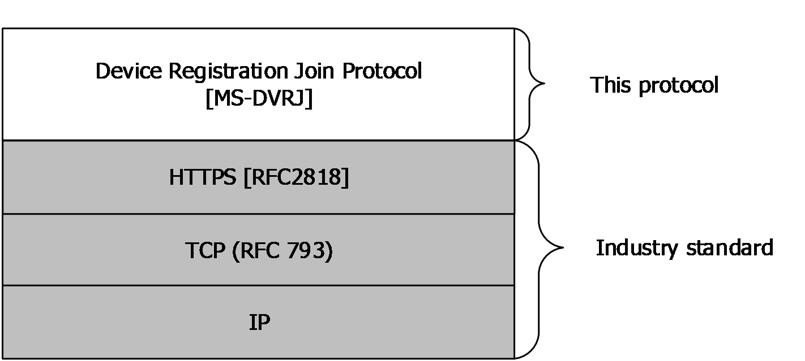

# [MS-DVRJ]: Device Registration Join Protocol

Table of Contents

1 Introduction

- [1 Introduction](#Section_1)
  - [1.1 Glossary](#Section_1.1)
  - [1.2 References](#Section_1.2)
    - [1.2.1 Normative References](#Section_1.2.1)
    - [1.2.2 Informative References](#Section_1.2.2)
  - [1.3 Overview](#Section_1.3)
  - [1.4 Relationship to Other Protocols](#Section_1.4)
  - [1.5 Prerequisites/Preconditions](#Section_1.5)
  - [1.6 Applicability Statement](#Section_1.6)
  - [1.7 Versioning and Capability Negotiation](#Section_1.7)
  - [1.8 Vendor-Extensible Fields](#Section_1.8)
  - [1.9 Standards Assignments](#Section_1.9)

2 Messages

- [2 Messages](#Section_2)
  - [2.1 Transport](#Section_2.1)
  - [2.2 Common Data Types](#Section_2.2)
    - [2.2.1 HTTP Headers](#Section_2.2.1)
      - [2.2.1.1 Authorization](#Section_2.2.1.1)
    - [2.2.2 URI Parameters](#Section_2.2.2)
      - [2.2.2.1 api-version](#Section_2.2.2.1)
    - [2.2.3 Complex Types](#Section_2.2.3)
      - [2.2.3.1 ErrorDetails](#Section_2.2.3.1)
  - [2.3 Directory Service Schema Elements](#Section_2.3)
    - [2.3.1 ms-DS-Issuer-Certificates](#Section_2.3.1)
    - [2.3.2 ms-DS-Issuer-Public-Certificates](#Section_2.3.2)
    - [2.3.3 Alt-Security-Identities](#Section_2.3.3)
    - [2.3.4 ms-DS-Key-Credential-Link](#Section_2.3.4)

3 Protocol Details

- [3 Protocol Details](#Section_3)
  - [3.1 Join Service Details](#Section_3.1)
    - [3.1.1 Abstract Data Model](#Section_3.1.1)
    - [3.1.2 Timers](#Section_3.1.2)
    - [3.1.3 Initialization](#Section_3.1.3)
    - [3.1.4 Higher-Layer Triggered Events](#Section_3.1.4)
    - [3.1.5 Message Processing Events and Sequencing Rules](#Section_3.1.5)
      - [3.1.5.1 device](#Section_3.1.5.1)
        - [3.1.5.1.1 POST](#Section_3.1.5.1.1)
          - [3.1.5.1.1.1 Request Body](#Section_3.1.5.1.1.1)
          - [3.1.5.1.1.2 Response Body](#Section_3.1.5.1.1.2)
          - [3.1.5.1.1.3 Processing Details](#Section_3.1.5.1.1.3)
        - [3.1.5.1.2 DELETE](#Section_3.1.5.1.2)
          - [3.1.5.1.2.1 Request Body](#Section_3.1.5.1.2.1)
          - [3.1.5.1.2.2 Response Body](#Section_3.1.5.1.2.2)
          - [3.1.5.1.2.3 Processing Details](#Section_3.1.5.1.2.3)
    - [3.1.6 Timer Events](#Section_3.1.6)
    - [3.1.7 Other Local Events](#Section_3.1.7)
  - [3.2 Client Details](#Section_3.2)
    - [3.2.1 Abstract Data Model](#Section_3.2.1)
    - [3.2.2 Timers](#Section_3.2.2)
    - [3.2.3 Initialization](#Section_3.2.3)
    - [3.2.4 Higher-Layer Triggered Events](#Section_3.2.4)
    - [3.2.5 Message Processing Events and Sequencing Rules](#Section_3.2.5)
      - [3.2.5.1 device](#Section_3.2.5.1)
        - [3.2.5.1.1 POST](#Section_3.2.5.1.1)
        - [3.2.5.1.2 DELETE](#Section_3.2.5.1.2)
    - [3.2.6 Timer Events](#Section_3.2.6)
    - [3.2.7 Other Local Events](#Section_3.2.7)

4 Protocol Examples

- [4 Protocol Examples](#Section_4)
  - [4.1 Create a device](#Section_4.1)
  - [4.2 Error Example](#Section_4.2)

5 Security

- [5 Security](#Section_5)
  - [5.1 Security Considerations for Implementers](#Section_5.1)
  - [5.2 Index of Security Parameters](#Section_5.2)

6 Appendix A: Full JSON Schema

- [6 Appendix A: Full JSON Schema](#Section_6)

7 Appendix B: Product Behavior

- [7 Appendix B: Product Behavior](#Section_7)

8 Change Tracking

- [8 Change Tracking](#Section_8)

For the legal notice and IP terms, see [LEGAL.md](../LEGAL.md).
Last updated: 9/16/2024.
See [Revision History](#revision-history) for full version history.

# 1 Introduction

The Device Registration Join Protocol provides a lightweight mechanism for registering personal or corporate-owned devices with a workplace.

Whereas the discovery of information needed to register devices is obtained by use of the Device Registration Discovery Protocol [MS-DVRD](../MS-DVRD/MS-DVRD.md), the Device Registration Join Protocol, defined in this specification, makes use of that information to register a device in the [**device registration service**](#gt_device-registration-service).

Sections 1.5, 1.8, 1.9, 2, and 3 of this specification are normative. All other sections and examples in this specification are informative.

## 1.1 Glossary

This document uses the following terms:

**access control list (ACL)**: A list of access control entries (ACEs) that collectively describe the security rules for authorizing access to some resource; for example, an object or set of objects.

**Active Directory**: The Windows implementation of a general-purpose directory service, which uses LDAP as its primary access protocol. Active Directory stores information about a variety of [**objects**](#gt_object) in the network such as user accounts, computer accounts, groups, and all related credential information used by Kerberos [MS-KILE](../MS-KILE/MS-KILE.md). Active Directory is either deployed as Active Directory Domain Services (AD DS) or Active Directory Lightweight Directory Services (AD LDS), which are both described in [MS-ADOD](../MS-ADOD/MS-ADOD.md): Active Directory Protocols Overview.

**Augmented Backus-Naur Form (ABNF)**: A modified version of Backus-Naur Form (BNF), commonly used by Internet specifications. ABNF notation balances compactness and simplicity with reasonable representational power. ABNF differs from standard BNF in its definitions and uses of naming rules, repetition, alternatives, order-independence, and value ranges. For more information, see [[RFC5234]](https://go.microsoft.com/fwlink/?LinkId=123096).

**base64 encoding**: A binary-to-text encoding scheme whereby an arbitrary sequence of bytes is converted to a sequence of printable ASCII characters, as described in [[RFC4648]](https://go.microsoft.com/fwlink/?LinkId=90487).

**certificate**: When referring to X.509v3 certificates, that information consists of a public key, a distinguished name (DN) of some entity assumed to have control over the private key corresponding to the public key in the certificate, and some number of other attributes and extensions assumed to relate to the entity thus referenced. Other forms of certificates can bind other pieces of information.

**certification authority (CA)**: A third party that issues public key certificates. Certificates serve to bind public keys to a user identity. Each user and certification authority (CA) can decide whether to trust another user or CA for a specific purpose, and whether this trust is to be transitive. For more information, see [[RFC3280]](https://go.microsoft.com/fwlink/?LinkId=90414).

**claim**: A statement that one subject makes about itself or another subject. For example, the statement can be about a name, identity, key, group, privilege, or capability. Claims have a provider that issues them, and they are given one or more values. They are also defined by a claim value type and, possibly, associated metadata.

**container**: An [**object**](#gt_object) in the directory that can serve as the parent for other [**objects**](#gt_object). In the absence of schema constraints, all [**objects**](#gt_object) would be [**containers**](#gt_container). The schema allows only [**objects**](#gt_object) of specific classes to be [**containers**](#gt_container).

**Coordinated Universal Time (UTC)**: A high-precision atomic time standard that approximately tracks Universal Time (UT). It is the basis for legal, civil time all over the Earth. Time zones around the world are expressed as positive and negative offsets from UTC. In this role, it is also referred to as Zulu time (Z) and Greenwich Mean Time (GMT). In these specifications, all references to UTC refer to the time at UTC-0 (or GMT).

**device registration service**: A service that allows registration of computing devices on a corporate network. These devices might not be controlled by the administrator of the network.

**directory**: The database that stores information about objects such as users, groups, computers, printers, and the directory service that makes this information available to users and applications.

**distinguished name (DN)**: A name that uniquely identifies an object by using the relative distinguished name (RDN) for the object, and the names of container objects and domains that contain the object. The distinguished name (DN) identifies the object and its location in a tree.

**globally unique identifier (GUID)**: A term used interchangeably with universally unique identifier (UUID) in Microsoft protocol technical documents (TDs). Interchanging the usage of these terms does not imply or require a specific algorithm or mechanism to generate the value. Specifically, the use of this term does not imply or require that the algorithms described in [[RFC4122]](https://go.microsoft.com/fwlink/?LinkId=90460) or [[C706]](https://go.microsoft.com/fwlink/?LinkId=89824) have to be used for generating the GUID. See also universally unique identifier (UUID).

**Hypertext Transfer Protocol Secure (HTTPS)**: An extension of HTTP that securely encrypts and decrypts web page requests. In some older protocols, "Hypertext Transfer Protocol over Secure Sockets Layer" is still used (Secure Sockets Layer has been deprecated). For more information, see [[SSL3]](https://go.microsoft.com/fwlink/?LinkId=90534) and [[RFC5246]](https://go.microsoft.com/fwlink/?LinkId=129803).

**JavaScript Object Notation (JSON)**: A text-based, data interchange format that is used to transmit structured data, typically in Asynchronous JavaScript + XML (AJAX) web applications, as described in [[RFC7159]](https://go.microsoft.com/fwlink/?linkid=842522). The JSON format is based on the structure of ECMAScript (Jscript, JavaScript) objects.

**JSON Web Token (JWT)**: A string representing a set of claims as a JSON object that is encoded in a JWS or JWE, enabling the claims to be digitally signed or integrity protected with a Message Authentication Code (MAC) and/or encrypted. For more information, see [[RFC7519]](https://go.microsoft.com/fwlink/?LinkId=824833).

**object**: A set of attributes, each with its associated values. For more information on objects, see [MS-ADTS](../MS-ADTS/MS-ADTS.md) section 1 or [MS-DRSR](../MS-DRSR/MS-DRSR.md) section 1.

**object identifier (OID)**: In the Lightweight Directory Access Protocol (LDAP), a sequence of numbers in a format described by [[RFC1778]](https://go.microsoft.com/fwlink/?LinkId=90291). In many LDAP directory implementations, an OID is the standard internal representation of an attribute. In the directory model used in this specification, the more familiar ldapDisplayName represents an attribute.

**private key**: One of a pair of keys used in public-key cryptography. The private key is kept secret and is used to decrypt data that has been encrypted with the corresponding public key. For an introduction to this concept, see [[CRYPTO]](https://go.microsoft.com/fwlink/?LinkId=89841) section 1.8 and [[IEEE1363]](https://go.microsoft.com/fwlink/?LinkId=89899) section 3.1.

**public key algorithm**: An asymmetric cipher that uses two cryptographic keys: one for encryption, the public key, and the other for decryption, the private key. In signature and verification, the roles are reversed: public key is used for verification, and private key is used for signature generation. Examples of public key algorithms are described in various standards, including Digital Signature Algorithm (DSA) and Elliptic Curve Digital Signature Algorithm (ECDSA) in FIPS 186-2 ([[FIPS186]](https://go.microsoft.com/fwlink/?LinkId=89869)), RSA in PKCS#1 ([[RFC8017]](https://go.microsoft.com/fwlink/?linkid=2164409)), the National Institute of Standards and Technology (NIST) also published an introduction to public key technology in SP800-32 ([[SP800-32]](https://go.microsoft.com/fwlink/?LinkId=90524) section 5.6).

**Public Key Cryptography Standards (PKCS)**: A group of Public Key Cryptography Standards published by RSA Laboratories.

**Representational State Transfer (REST)**: A class of web services that is used to transfer domain-specific data by using HTTP, without additional messaging layers or session tracking, and returns textual data, such as XML.

**Rivest-Shamir-Adleman (RSA)**: A system for public key cryptography. [**RSA**](#gt_rivest-shamir-adleman-rsa) is specified in [RFC8017].

**Secure Sockets Layer (SSL)**: A security protocol that supports confidentiality and integrity of messages in client and server applications that communicate over open networks. SSL supports server and, optionally, client authentication using [**X.509**](#gt_x509) [**certificates**](#gt_certificate) [[X509]](https://go.microsoft.com/fwlink/?LinkId=90590) and [[RFC5280]](https://go.microsoft.com/fwlink/?LinkId=131034). SSL is superseded by [**Transport Layer Security (TLS)**](#gt_transport-layer-security-tls). TLS version 1.0 is based on SSL version 3.0 [SSL3].

**security identifier (SID)**: An identifier for security principals that is used to identify an account or a group. Conceptually, the [**SID**](#gt_security-identifier-sid) is composed of an account authority portion (typically a domain) and a smaller integer representing an identity relative to the account authority, termed the relative identifier (RID). The [**SID**](#gt_security-identifier-sid) format is specified in [MS-DTYP](../MS-DTYP/MS-DTYP.md) section 2.4.2; a string representation of [**SIDs**](#gt_security-identifier-sid) is specified in [MS-DTYP] section 2.4.2 and [MS-AZOD](../MS-AZOD/MS-AZOD.md) section 1.1.1.2.

**SHA1 hash**: A hashing algorithm defined in [[FIPS180]](https://go.microsoft.com/fwlink/?LinkId=89867) that was developed by the National Institute of Standards and Technology (NIST) and the National Security Agency (NSA).

**SHA-256**: An algorithm that generates a 256-bit hash value from an arbitrary amount of input data.

**thumbprint**: A hash value computed over a datum.

**Transport Layer Security (TLS)**: A security protocol that supports confidentiality and integrity of messages in client and server applications communicating over open networks. TLS supports server and, optionally, client authentication by using X.509 certificates (as specified in [X509]). TLS is standardized in the IETF TLS working group.

**X.509**: An ITU-T standard for public key infrastructure subsequently adapted by the IETF, as specified in [RFC3280].

**MAY, SHOULD, MUST, SHOULD NOT, MUST NOT:** These terms (in all caps) are used as defined in [[RFC2119]](https://go.microsoft.com/fwlink/?LinkId=90317). All statements of optional behavior use either MAY, SHOULD, or SHOULD NOT.

## 1.2 References

Links to a document in the Microsoft Open Specifications library point to the correct section in the most recently published version of the referenced document. However, because individual documents in the library are not updated at the same time, the section numbers in the documents may not match. You can confirm the correct section numbering by checking the [Errata](https://go.microsoft.com/fwlink/?linkid=850906).

### 1.2.1 Normative References

We conduct frequent surveys of the normative references to assure their continued availability. If you have any issue with finding a normative reference, please contact [dochelp@microsoft.com](mailto:dochelp@microsoft.com). We will assist you in finding the relevant information.

[ISO8601] ISO, "Data elements and interchange formats - Information interchange - Representation of dates and times", ISO 8601:2004, December 2004, [http://www.iso.org/iso/iso_catalogue/catalogue_tc/catalogue_detail.htm?csnumber=40874](https://go.microsoft.com/fwlink/?LinkId=89920)

**Note** There is a charge to download the specification.

[MS-ADA1] Microsoft Corporation, "[Active Directory Schema Attributes A-L](../MS-ADA1/MS-ADA1.md)".

[MS-ADA2] Microsoft Corporation, "[Active Directory Schema Attributes M](../MS-ADA2/MS-ADA2.md)".

[MS-ADA3] Microsoft Corporation, "[Active Directory Schema Attributes N-Z](../MS-ADA3/MS-ADA3.md)".

[MS-ADSC] Microsoft Corporation, "[Active Directory Schema Classes](../MS-ADSC/MS-ADSC.md)".

[MS-ADTS] Microsoft Corporation, "[Active Directory Technical Specification](../MS-ADTS/MS-ADTS.md)".

[MS-DTYP] Microsoft Corporation, "[Windows Data Types](../MS-DTYP/MS-DTYP.md)".

[NIST.FIPS.180-4] National Institute of Standards and Technology, "Secure Hash Standard (SHS)", August 2015, [https://nvlpubs.nist.gov/nistpubs/FIPS/NIST.FIPS.180-4.pdf](https://go.microsoft.com/fwlink/?linkid=875181)

[RFC2119] Bradner, S., "Key words for use in RFCs to Indicate Requirement Levels", BCP 14, RFC 2119, March 1997, [https://www.rfc-editor.org/info/rfc2119](https://go.microsoft.com/fwlink/?LinkId=90317)

[RFC2616] Fielding, R., Gettys, J., Mogul, J., et al., "Hypertext Transfer Protocol -- HTTP/1.1", RFC 2616, June 1999, [https://www.rfc-editor.org/info/rfc2616](https://go.microsoft.com/fwlink/?LinkId=90372)

[RFC2818] Rescorla, E., "HTTP Over TLS", RFC 2818, May 2000, [https://www.rfc-editor.org/info/rfc2818](https://go.microsoft.com/fwlink/?LinkId=90383)

[RFC4211] Schaad, J., "Internet X.509 Public Key Infrastructure Certificate Request Message Format (CRMF)", RFC 4211, September 2005, [http://www.rfc-editor.org/rfc/rfc4211](https://go.microsoft.com/fwlink/?LinkId=301568)

[RFC4346] Dierks, T., and Rescorla, E., "The Transport Layer Security (TLS) Protocol Version 1.1", RFC 4346, April 2006, [https://www.rfc-editor.org/info/rfc4346](https://go.microsoft.com/fwlink/?LinkId=90474)

[RFC4514] Zeilenga, K., Ed., "Lightweight Directory Access Protocol (LDAP): String Representation of Distinguished Names", RFC 4514, June 2006, [https://www.rfc-editor.org/info/rfc4514](https://go.microsoft.com/fwlink/?LinkId=90719)

[RFC4648] Josefsson, S., "The Base16, Base32, and Base64 Data Encodings", RFC 4648, October 2006, [https://www.rfc-editor.org/info/rfc4648](https://go.microsoft.com/fwlink/?LinkId=90487)

[RFC5280] Cooper, D., Santesson, S., Farrell, S., et al., "Internet X.509 Public Key Infrastructure Certificate and Certificate Revocation List (CRL) Profile", RFC 5280, May 2008, [https://www.rfc-editor.org/info/rfc5280](https://go.microsoft.com/fwlink/?LinkId=131034)

[RFC8017] Moriarty, K., Ed., Kaliski, B., Jonsson, J., and Rusch, A., "PKCS #1: RSA Cryptography Specifications Version 2.2", November 2016, [https://www.rfc-editor.org/info/rfc8017](https://go.microsoft.com/fwlink/?linkid=2164409)

### 1.2.2 Informative References

[MS-DVRD] Microsoft Corporation, "[Device Registration Discovery Protocol](../MS-DVRD/MS-DVRD.md)".

[MS-DVRE] Microsoft Corporation, "[Device Registration Enrollment Protocol](../MS-DVRE/MS-DVRE.md)".

## 1.3 Overview

The Device Registration Join Protocol provides for issuance of [**X.509v3**](#gt_x509) digital [**certificates**](#gt_certificate), and is intended for use as a lightweight device-registration server. The protocol is based loosely on [MS-DVRE](../MS-DVRE/MS-DVRE.md).

The Device Registration Join Protocol provides a single [**REST**](#gt_representational-state-transfer-rest)-based endpoint that returns [**JavaScript Object Notation (JSON)**](#gt_javascript-object-notation-json)–formatted data in the response message.

This document defines and uses the following terms:

**device registration service (DRS) server**: The server that implements the REST Web service that accepts and responds to device registration requests using the Device Registration Join Protocol.

**client**: The entity that creates and sends a request to the server using the Device Registration Join Protocol.

## 1.4 Relationship to Other Protocols

The following figure illustrates the relationship of this protocol to other protocols.

Figure 1: Protocols related to the Device Registration Join Protocol

## 1.5 Prerequisites/Preconditions

The Device Registration Join Protocol issues [**X.509v3**](#gt_x509) certificates that have a corresponding relationship with a device object represented in a [**directory**](#gt_directory) server. A server implementation of the protocol requires the functionality of a [**certificate authority**](#gt_c925d5d7-a442-4ba4-9586-5f94ccec847a) and a directory server.

This protocol requires that the following state changes be made to [**Active Directory**](#gt_active-directory).

- Create an instance of the ms-DS-Device-Registration-Service-Container class ([MS-ADSC](../MS-ADSC/MS-ADSC.md) section 2.139) in the directory.
- Create an instance of the ms-DS-Device-Registration-Service class ([MS-ADSC] section 2.138) as a child of the container object created in the previous step with the following attributes:
- Set the ms-DS-Registration-Quota attribute ([MS-ADA2](../MS-ADA2/MS-ADA2.md) section 2.443) of the ms-DS-Device-Registration-Service object to 10.
- Set the ms-DS-Maximum-Registration-Inactivity-Period attribute ([MS-ADA2] section 2.385) of the ms-DS-Device-Registration-Service object to 90.
- Set the ms-DS-Is-Enabled attribute ([MS-ADA2] section 2.343) of the ms-DS-Device-Registration-Service object to true.
- Set the ms-DS-Device-Location attribute ([MS-ADA2] section 2.305) of the ms-DS-Device-Registration-Service object to a [**distinguished name (DN)**](#gt_distinguished-name-dn) of a [**container**](#gt_container) location in the directory. The container is of class ms-DS-Device-Container ([MS-ADSC] section 2.137).
- Generate a certificate signing certificate. The certificate and [**private key**](#gt_private-key) are stored in the ms-DS-Issuer-Certificates attribute ([MS-ADA2] section 2.351) of the ms-DS-Device-Registration-Service object. For details, see section [2.3.1](#Section_2.3.1).
The public portion of the certificate is stored in the ms-DS-Issuer-Public-Certificates attribute ([MS-ADA2] section 2.352) of the ms-DS-Device-Registration-Service object. For details, see section [2.3.2](#Section_2.3.2).

- Set the following directory [**access control list (ACL)**](#gt_access-control-list-acl) entries:
- Grant the server read access to the ms-DS-Device-Registration-Service object.
- Grant the server read/write access to ms-DS-Device objects ([MS-ADSC] section 2.136).

## 1.6 Applicability Statement

The Device Registration Join Protocol is applicable only for requests for device registration.

## 1.7 Versioning and Capability Negotiation

None.

## 1.8 Vendor-Extensible Fields

The Device Registration Join Protocol does not include any vendor-extensible fields.

## 1.9 Standards Assignments

None.

# 2 Messages

## 2.1 Transport

The Device Registration Join Protocol consists of a single RESTful Web service.

- HTTPS [[RFC2818]](https://go.microsoft.com/fwlink/?LinkId=90383) over TCP/IP [[RFC2616]](https://go.microsoft.com/fwlink/?LinkId=90372)
The protocol operates on the following URI endpoint.

| Web service | Location |
| --- | --- |
| Device Join Service | https://<server>:<server port>/EnrollmentServer/device |

All client messages to the server MUST use [**Hypertext Transfer Protocol over Secure Sockets Layer (HTTPS)**](#gt_9239bd88-9747-44a6-83a6-473f53f175a7) and provide server authentication, which MUST use [**Transport Layer Security (TLS)**](#gt_transport-layer-security-tls) 1.1 [[RFC4346]](https://go.microsoft.com/fwlink/?LinkId=90474), or greater.

## 2.2 Common Data Types

### 2.2.1 HTTP Headers

This protocol accesses the HTTP headers listed in the following table.

| Header | Description |
| --- | --- |
| Authorization | This header is used by the client to send authorization [**claims**](#gt_claim). It contains a [**JSON Web Token (JWT)**](#gt_json-web-token-jwt). |

#### 2.2.1.1 Authorization

The Authorization header is required in the request and contains authorization claims that the client passes to the server for access to the relevant device [**object**](#gt_object) on the directory server.

The format of the Authorization header, in [**Augmented Backus-Naur Form (ABNF)**](#gt_augmented-backus-naur-form-abnf), is as follows.

String = *(%x20-7E)

Authorization = String

### 2.2.2 URI Parameters

The following table summarizes the set of common URI parameters defined by this protocol.

| URI parameter | Description |
| --- | --- |
| api-version | An integer that indicates the data version that is expected by the client. |

#### 2.2.2.1 api-version

The *api-version* parameter is an integer that indicates the data version that is expected by the client. This parameter MUST be included in all client requests.

String = *(%x20-7E)

api-version = String

### 2.2.3 Complex Types

The following table summarizes the set of complex type definitions included in this specification.

| Complex type | Description |
| --- | --- |
| ErrorDetails | An object that stores information corresponding to an error issued by the device registration service (DRS) server. |

#### 2.2.3.1 ErrorDetails

This object contains a collection of human-readable details that describe an error encountered by the DRS server. It can be used by the client role of the Device Registration Join Protocol for logging purposes or for providing information to an administrator. This object contains the following fields.

{

"description": "object",

"type": "object",

"properties": {

"ErrorType": { "type": "string", "optional": false },

"Message": { "type": "string", "optional": false },

"TraceId": { "type": "string", "optional": false },

"Time": { "type": "string", "optional": false }

}

}

**ErrorType**: The type of error that was encountered.

**Message**: A text message explaining the error.

**TraceId**: An identifier assigned by the DRS server.

**Time**: The [[ISO8601]](https://go.microsoft.com/fwlink/?LinkId=89920)-formatted time assigned by the DRS server.

## 2.3 Directory Service Schema Elements

This protocol makes use of the Directory Service schema classes and attributes that are listed in the following table.

For the syntax of <Class> or <Class><Attribute> pairs, refer to [MS-ADA1](../MS-ADA1/MS-ADA1.md), [MS-ADA2](../MS-ADA2/MS-ADA2.md), [MS-ADA3](../MS-ADA3/MS-ADA3.md), and [MS-ADSC](../MS-ADSC/MS-ADSC.md)).

| Class | Attribute |
| --- | --- |
| ms-DS-Device | Alt-Security-Identities, ms-DS-Device-ID, ms-DS-Device-Object-Version, ms-DS-Device-OS-Type, ms-DS-Device-OS-Version, ms-DS-Registered-Users, ms-DS-Is-Enabled, ms-DS-Approximate-Last-Logon-Time-Stamp, ms-DS-Registered-Owner, Display-Name, ms-DS-Cloud-IsManaged, ms-DS-Device-Trust-Type, ms-DS-Key-Credential-Link |
| ms-DS-Device-Container | - |
| ms-DS-Device-Registration-Service | ms-DS-Issuer-Certificates, ms-DS-Issuer-Public-Certificates, ms-DS-Registration-Quota, ms-DS-Maximum-Registration-Inactivity-Period, ms-DS-Device-Location, ms-DS-Is-Enabled |
| ms-DS-Device-Registration-Service-Container | - |
| User | Object-Guid |
| Domain | Object-Guid |
| NTDS-DSA | Invocation-Id |

### 2.3.1 ms-DS-Issuer-Certificates

The ms-DS-Issuer-Certificates attribute is a multi-valued OCTET_STRING attribute (see [MS-ADTS](../MS-ADTS/MS-ADTS.md) section 3.1.1.2.2.2, the String(Octet) syntax). Each value of the attribute is stored as a binary blob containing the following formatted data:

"[time]:[binary value of an X.509 certificate]"

where [time] is the timestamp formatted as an integer representing the number of 100-nanosecond intervals that have elapsed since 12:00:00 midnight, January 1, 0001, [**UTC**](#gt_coordinated-universal-time-utc), and [binary value of an X.509 certificate] is the contents of an X.509 certificate [[RFC5280]](https://go.microsoft.com/fwlink/?LinkId=131034) stored as an encrypted binary blob.

### 2.3.2 ms-DS-Issuer-Public-Certificates

The ms-DS-Issuer-Public-Certificates attribute is a multi-valued OCTET_STRING attribute. Each value of the attribute is stored as a binary blob containing an X.509 certificate [[RFC5280]](https://go.microsoft.com/fwlink/?LinkId=131034).

### 2.3.3 Alt-Security-Identities

The Alt-Security-Identities attribute ([MS-ADA1](../MS-ADA1/MS-ADA1.md) section 2.61) is a multi-valued UNICODE_STRING attribute (see [MS-ADTS](../MS-ADTS/MS-ADTS.md) section 3.1.1.2.2.2, the String(Unicode) syntax). The value is formatted as follows:

"X509:<SHA1-TP-PUBKEY>[thumbprint]+[publickeyhash]"

where [thumbprint] is the [**SHA1 hash**](#gt_sha1-hash) of a certificate and [publickeyhash] is the [**base64-encoded**](#gt_179b9392-9019-45a3-880b-26f6890522b7) [**SHA-256**](#gt_sha-256) ([[NIST.FIPS.180-4]](https://go.microsoft.com/fwlink/?linkid=875181)) of the X.509 certificate public key [[RFC5280]](https://go.microsoft.com/fwlink/?LinkId=131034).

### 2.3.4 ms-DS-Key-Credential-Link

The ms-DS-Key-Credential-Link attribute ([MS-ADA2](../MS-ADA2/MS-ADA2.md) section 2.358) is a DN-Binary attribute (see [MS-ADTS](../MS-ADTS/MS-ADTS.md) section 3.1.1.2.2.2, the Object(DN-Binary) syntax). The value is formatted as follows:

"B:[keylen]:[key]:[objectDN]"

Where [keylen] is the length of [key]. [key] is a KEYCREDENTIALLINK_BLOB ([MS-ADTS] section 2.2.20.2). [objectDN] is an [[RFC4514]](https://go.microsoft.com/fwlink/?LinkId=90719)-formatted distinguished name for the directory object that contains the ms-DS-Key-Credential-Link attribute.

# 3 Protocol Details

## 3.1 Join Service Details

### 3.1.1 Abstract Data Model

None.

### 3.1.2 Timers

None.

### 3.1.3 Initialization

The server that implements the Device Registration Join Protocol must be initialized. Any databases or tables that contain the information that is needed in the Device Registration Join Protocol response must also be initialized.

### 3.1.4 Higher-Layer Triggered Events

None.

### 3.1.5 Message Processing Events and Sequencing Rules

The following resource is used by the Device Registration Join Protocol.

| Resource | Description |
| --- | --- |
| device?api-version={apiversion} | An object that represents the device objects on the DRS server. |

#### 3.1.5.1 device

The following HTTP methods are allowed to be performed on this resource.

| HTTP method | Section | Description |
| --- | --- | --- |
| POST | [3.1.5.1.1](#Section_3.1.5.1.1) | Create a new device object. |
| DELETE | [3.1.5.1.2](#Section_3.1.5.1.2) | Remove a device object. |

##### 3.1.5.1.1 POST

This method is transported by an HTTP POST.

The method can be invoked through the following URI:

https://server/EnrollmentServer/device?api-version={apiversion}

The URI parameters supported for the POST request are the common URI parameters defined in section [2.2.2](#Section_2.2.2) (URI Parameters).

###### 3.1.5.1.1.1 Request Body

The request body contains the following JSON-formatted object.

{

"description": "object",

"type": "object",

"properties": {

"CertificateRequest": {

"type": "object",

"optional" : false,

"properties": {

"Type": { "type": "string", "optional": false },

"Data": { "type": "string", "optional": false }

}

},

"TransportKey": { "type": "string", "optional": false },

"TargetDomain": { "type": "string", "optional": false },

"DeviceType": { "type": "string", "optional": false },

"OSVersion": { "type": "string", "optional": false },

"DeviceDisplayName": { "type": "string", "optional": false },

"JoinType": { "type": "number", "optional": false }

}

}

**CertificateRequest**: A property with the following fields:

**Type**: A property that MUST contain "pkcs10".

**Data**: A property that contains a base64-encoded [**PKCS**](#gt_public-key-cryptography-standards-pkcs)#10 certificate request [[RFC4211]](https://go.microsoft.com/fwlink/?LinkId=301568). The certificate request MUST use an [**RSA**](#gt_rivest-shamir-adleman-rsa) [**public key algorithm**](#gt_public-key-algorithm) [[RFC8017]](https://go.microsoft.com/fwlink/?linkid=2164409) with a 2048-bit key, a SHA256WithRSAEncryption signature algorithm, and a SHA256 hash algorithm.

**TransportKey**: The [**base64-encoded**](#gt_179b9392-9019-45a3-880b-26f6890522b7) public portion of an asymmetric key that is generated by the client.

**TargetDomain**: The fully qualified host name of the [**device registration service**](#gt_device-registration-service).

**DeviceType**: The operating system type installed on the device.

**OSVersion**: The operating system version installed on the device.

**DeviceDisplayName**: The friendly name of the device.

**JoinType**: The type of join operation. The value MUST be set to 6.

###### 3.1.5.1.1.2 Response Body

If the DRS server successfully creates a device object in the directory, an HTTP 200 status code is returned. Additionally, the response body for the POST response contains a JSON-formatted object, as defined below. See section [3.1.5.1.1.3](#Section_3.1.5.1.1.3) for processing details.

{

"description": "object",

"type": "object",

"properties": {

"Certificate": {

"type": "object",

"optional": false,

"properties": {

"Thumbprint": { "type": "string", "optional": false },

"RawBody": { "type": "string", "optional": false }

}

},

"User": {

"type": "object",

"optional": false,

"properties": {

"Upn": { "type": "string", "optional": false }

}

},

"MembershipChanges": {

"type": "object",

"optional": false,

"properties": {

"LocalSID": { "type": "string", "optional": false },

"AddSIDs": { "type": "array", "optional": false }

}

}

}

}

**Certificate:** A property with the following fields.

**Thumbprint**: The SHA1 hash of the certificate [**thumbprint**](#gt_thumbprint).

**RawBody**: An X.509 certificate signed by the DRS server as a base64-encoded string [[RFC4648]](https://go.microsoft.com/fwlink/?LinkId=90487).

**User:** A property with the following fields.

**Upn**: The identifier of the identity that authenticated to the Web service. This value MUST be ignored by the client.

**MembershipChanges:** A property with the following fields.

**LocalSID**: The [**security identifier (SID)**](#gt_security-identifier-sid) of the directory administrator account. This value MUST be ignored by the client.

**AddSIDs**: An empty array. This value MUST be ignored by the client.

###### 3.1.5.1.1.3 Processing Details

The HTTP POST request is processed as follows.

- The server checks for the following claims and values in the JWT sent by the client in the HTTP Authorization Header:
| Claim | Value |
| --- | --- |
| http://schemas.microsoft.com/authorization/claims/PermitDeviceRegistrationClaim | The value MUST be the string "true". |
| http://schemas.microsoft.com/ws/2012/01/accounttype | The value MUST be the string "DJ". |
| http://schemas.microsoft.com/identity/claims/onpremobjectguid | A unique id generated by the client. The value MUST be binary and base64-encoded. |
| primarysid | The SID of the identity that authenticated to the Web service. |

If any of the claims from the table is not present, or if the value of the claim does NOT match the corresponding value in the table, the server MUST respond to the HTTP POST in the following manner:

- The DRS server responds with an HTTP response with the HTTP status code set to 400 ("Bad Request").
- The body of the HTTP response contains an ErrorDetails object (section [2.2.3.1](#Section_2.2.3.1)) that provides the client with additional, implementation-specific information about the error.
- The server adds the following [**object identifiers (OIDs)**](#gt_object-identifier-oid) and values to the X.509 certificate request [[RFC4211]](https://go.microsoft.com/fwlink/?LinkId=301568) contained in the CertificateRequest object of the client HTTP request.
| OID | Value |
| --- | --- |
| 1.2.840.113556.1.5.284.2 | The DRS server MUST generate a [**globally unique identifier (GUID)**](#gt_globally-unique-identifier-guid) and include it as the value. |
| 1.2.840.113556.1.5.284.3 | The Object-Guid attribute ([MS-ADA3](../MS-ADA3/MS-ADA3.md) section 2.44) of the User object ([MS-ADSC](../MS-ADSC/MS-ADSC.md) section 2.269) on the directory server that corresponds to the authenticating user. |
| 1.2.840.113556.1.5.284.4 | The Object-Guid attribute of the Domain object ([MS-ADSC] section 2.43) on the directory server. |
| 1.2.840.113556.1.5.284.1 | The Invocation-Id attribute ([MS-ADA1](../MS-ADA1/MS-ADA1.md) section 2.314) of the NTDS-DSA object ([MS-ADSC] section 2.205) for the directory server. |

- The server signs the request by using the issuer certificate stored in the ms-DS-Issuer-Certificates attribute of the ms-DS-Device-Registration-Service object with the most recent timestamp (see section [2.3.1](#Section_2.3.1)). The server MUST use a SHA256WithRSAEncryption signature algorithm and a SHA256 hash algorithm.
- The server sends a request to the directory server to locate a device object where the ms-DS-Device-ID attribute ([MS-ADA2](../MS-ADA2/MS-ADA2.md) section 2.304) equals the value of the http://schemas.microsoft.com/identity/claims/onpremobjectguid JWT claim from step 1.
- If the device object from step 4 is NOT located, the server sends a request to the directory server to create a device record as an instance of the ms-DS-Device class as a child of the container specified in the ms-DS-Device-Location attribute of the ms-DS-Device-Registration-Service object. The ms-DS-Device-ID attribute of the device object MUST be set to the base64-decoded value of the http://schemas.microsoft.com/identity/claims/onpremobjectguid JWT claim from step 1.
- The server sends a request to the directory server to set the following attributes on the device object:
- The SHA1 hash of the certificate thumbprint plus certificate public key, added as an additional value of the Alt-Security-Identities attribute (see section [2.3.3](#Section_2.3.3)).
- The device type that corresponds to the DeviceType value sent in the request (section [3.1.5.1.1.1](#Section_3.1.5.1.1.1)), stored as the ms-DS-Device-OS-Type attribute ([MS-ADA2] section 2.308).
- The device operating system version that corresponds to the OSVersion value sent in the request (section 3.1.5.1.1.1), stored as the ms-DS-Device-OS-Version attribute ([MS-ADA2] section 2.309).
- The [**SID**](#gt_security-identifier-sid) of the identity that authenticated to the Web service, stored as the ms-DS-Registered-Users attribute ([MS-ADA2] section 2.442).
- The SID of the user account that authenticated to the Web service, stored as the ms-DS-Registered-Owner attribute ([MS-ADA2] section 2.441).
- The friendly name of the device that corresponds to the DeviceDisplayName value sent in the request (section 3.1.5.1.1.1), stored as the Display-Name attribute ([MS-ADA1] section 2.175).
- The ms-DS-Is-Enabled attribute to true.
- The ms-DS-Device-Trust-Type attribute ([MS-ADA2] section 2.311) to 2.
- The ms-DS-Device-Object-Version attribute ([MS-ADA2] section 2.307) to 2.
- The ms-DS-Cloud-IsManaged attribute ([MS-ADA2] section 2.291) to false.
- The ms-DS-Approximate-Last-Logon-Time-Stamp attribute ([MS-ADA2] section 2.223) to a time that is generated by the server, represented in FILETIME format ([MS-DTYP](../MS-DTYP/MS-DTYP.md) section 2.3.3).
- Remove existing ms-DS-Key-Credential-Link values from the device object. Add a new value to the ms-DS-Key-Credential-Link attribute of the device object.
The KEYCREDENTIALLINK_BLOB MUST be created according to [MS-ADTS](../MS-ADTS/MS-ADTS.md) section 2.2.20 and section [2.3.4](#Section_2.3.4) in this specification. In addition, the following KEYCREDENTIALLINK_ENTRY identifiers ([MS-ADTS] section 2.2.20.6) MUST be present.

| KEYCREDENTIALLINK_ENTRY identifier | Value |
| --- | --- |
| KeyMaterial | The base64-decoded TransportKey property from the HTTP POST. |
| KeyUsage | 0x02 |
| CustomKeyInformation | The **Version** field MUST be set to 1 and the **Flags** field MUST be set to 0. |
| KeySource | KEY_SOURCE_AD |
| KeyApproximateLastLogonTimeStamp | MUST be set to a time that is generated by the server represented in FILETIME format. |
| KeyCreationTime | MUST be set to a time that is generated by the server represented in FILETIME format. |
| DeviceId | MUST be the value of the ms-DS-Device-ID attribute of the device object, formatted as specified in [MS-ADTS] section 2.2.20. |

- The DRS server responds to the HTTP POST request with an HTTP response with the HTTP status code set to 200 ("OK"). The response body contains the signed X.509 certificate from step 3.

##### 3.1.5.1.2 DELETE

This method is transported by an HTTP DELETE.

The method can be invoked through the following URI:

https://server/EnrollmentServer/device/{deviceid}?api-version={apiversion}

The URI corresponds to the device identifier that the client needs to look up on the DRS server.

**deviceid**: A GUID that represents the device object to be looked up.

The URI parameters supported for the DELETE request are the common URI parameters documented in section [2.2.2](#Section_2.2.2) (URI Parameters).

###### 3.1.5.1.2.1 Request Body

The request body MUST be empty.

###### 3.1.5.1.2.2 Response Body

If the DRS server successfully removes the device object from the directory, an HTTP 200 status code ("OK") is returned. If the DRS server does NOT respond to the HTTP DELETE request with the HTTP status code set to 200, the body of the HTTP response MUST contain an ErrorDetails object (section [2.2.3.1](#Section_2.2.3.1)) that provides the client with additional, implementation-specific information about the error. Otherwise, the response body MUST be empty.

###### 3.1.5.1.2.3 Processing Details

The HTTP DELETE request is processed as follows.

- Client authentication is established between the client and the DRS server using TLS. If authentication is NOT established, the server MUST respond to the HTTP DELETE with an HTTP response that has the HTTP status code set to 401 ("Unauthorized").
- The DRS server looks up the device object in the directory using the Alt-Security-Identities attribute of the device, where the [thumbprint]+[publickeyhash] portions of the attribute are derived from the X.509 certificate that was provided by the client in step 1. See section [2.3.3](#Section_2.3.3) for details on the format of the Alt-Security-Identities attribute. If a device object is NOT found in the directory, the DRS server responds with an HTTP response that has the HTTP status code set to 401 ("Unauthorized").
- The DRS server removes the device object from the directory. If the DRS server fails to remove the device object from the directory, the DRS server responds with an HTTP response that has the HTTP status code set to 400 ("Bad Request").
- The DRS server responds to the HTTP DELETE request with an HTTP response that has the HTTP status code set to 200 ("OK").

### 3.1.6 Timer Events

None.

### 3.1.7 Other Local Events

None.

## 3.2 Client Details

### 3.2.1 Abstract Data Model

This section describes a conceptual model of possible data organization that an implementation maintains to participate in this protocol. The described organization is provided to facilitate the explanation of how the protocol behaves. This document does not mandate that implementations adhere to this model as long as their external behavior is consistent with that described in this document.

The following elements are defined by this protocol:

**SignedDeviceCertificate**: An element that contains the signed X.509 certificate that was returned by the DRS server in response to the POST request sent to the device resource.

### 3.2.2 Timers

None.

### 3.2.3 Initialization

None.

### 3.2.4 Higher-Layer Triggered Events

None.

### 3.2.5 Message Processing Events and Sequencing Rules

The resource used by the Device Registration Join Protocol, device, is defined in section [3.1.5](#Section_3.1.5).

#### 3.2.5.1 device

See section [3.1.5.1](#Section_3.1.5.1).

##### 3.2.5.1.1 POST

See section [3.1.5.1.1](#Section_3.1.5.1.1) and subsections.

When the client receives the response from the server, the X.509 certificate contained in the RawBody property (section [3.1.5.1.1.2](#Section_3.1.5.1.1.2)) must be stored in the SignedDeviceCertificate ADM element (section [3.2.1](#Section_3.2.1)).

##### 3.2.5.1.2 DELETE

See section [3.1.5.1.2](#Section_3.1.5.1.2) and subsections.

The client must send the X.509 certificate that was stored in the SignedDeviceCertificate ADM element (section [3.2.1](#Section_3.2.1)) as part of client authentication for the DELETE request (section [3.1.5.1.2.3](#Section_3.1.5.1.2.3)).

### 3.2.6 Timer Events

None.

### 3.2.7 Other Local Events

None.

# 4 Protocol Examples

## 4.1 Create a device

The following example shows a request to the DRS server to create a device object (section [3.1.5.1.1.1](#Section_3.1.5.1.1.1)) and the response (section [3.1.5.1.1.2](#Section_3.1.5.1.1.2)).

**Request**

{

"CertificateRequest": {

"Type": "pkcs10",

"Data": "MIICdTCCAV0CAQAwMDEuMCwGA1UEAxMlN0U5ODBBRDktQjg2RC00MzA2LTk0MjUtOUFDMDY2RkIwMTRBADCCASIwDQYJKoZIhvcNAQEBBQADggEPADCCAQoCggEBAKS8jipCztLoXQEhlyWIQwlFUP74jkLvt4KSWYexYyW+Teays9Mo0oz94BYMMo7qzkN3dIex9XID5oSrlTbUJ5KrjNffc3f8p6XDIHFNuNzlI4aWgJ3qut3RiPZU1mTra/MKQXRr8XiJFdYiSAmVXDnPUjs1pVlJiLOzIE0TdRv4C2K6af3KksG/TMWqdn/4M0SZjLsXx3pnmvkB23IGTkEL0LbQG/mN74sAyChwAW8QqpdkOLgYgltIJNk/AWz32kzUtiYz+/3jo8zxdAN45Mb+aQIChxiskv6EOCvHJ2e/3B4IlQEOJvbjOATzgaiwQkCZYHQ1zhE7mZWHfM5g3s0CAwEAAaAAMA0GCSqGSIb3DQEBCwUAA4IBAQBGgifpEjPkSfbtjNKL5XXgRPFfQ5RVMuwfhMqsmrZ7BIsx0KTwgY4F/62ChA9MyQWexOoSk/Ag/xcTKOBl23hgXD3e4A3tldsG9R+LdAQznvm9zQl41mEgw8oqaPDuBiS8SJFaRQ0SHHJ/7XkxP+j/gKMSl2dKnLYqg2SXgpRjNh88dDnZ0BXvm2oIsG2BdiKfr3Ur8Emy69nLVkHaFoXwZOX3aEYq3lkzByIpuWyAPuKzdF7k0WLRT7LOEuddkbS8JcK0gi029JSDOwGcXMIQfA56+2URwRNnWt5Us5odNzbhQFbNuw6D0llMuBU19AUuq1yddB87TN/2HJDLWH31"

},

"TransportKey": "UlNBMQAIAAADAAAAAAEAAAAAAAAAAAAAAQABmh7Ua2L3SWbOSHTMjFqEH9X07e0xPBSg8gDY+QY0f6rvAe10QPhzX+Jz6azj3gAZZBLjnfS5p/nPODwsH5ONe9xpDc3os27Ov6XY7TSPlps17uWLsJR+egvHcsHMnVKmmt7ErelpkSol6wenhpLWlAuildJa1Uf/BSVE6QkjMkbltr8oHpcblzPg56Z9/pmbwJJAUNT8Gzh27frfJakPXpYy01zX9bsf4ADCHpWkm+VF13f0RatAc6D0neqjuKyXef6btHFzFHA9llSbTSE3V6MVn4oyNIH+6FFw2/35wTWEh67N5bBSa+74GurTFwky642IRsiGn965DX6WLRGG5Q==",

"TargetDomain": "sts.contoso.com",

"DeviceType": "Windows",

"OSVersion": "Windows 10",

"DeviceDisplayName": "MyPC",

"JoinType": 6

}

**Response**

{

"Certificate": {

"Thumbprint": "D09A73223D16855752C5E820A70540BA6450103E",

"RawBody": "MIID/TCCAuWgAwIBAgIQFtqdeZAaCo1HeUuQqHiLgTANBgkqhkiG9w0BAQsFADB1MXMwEQYKCZImiZPyLGQBGRYDbmV0MBIGCgmSJomT8ixkARkWBG1pbTEwHQYDVQQDExZNUy1Pcmdhbml6YXRpb24tQWNjZXNzMCsGA1UECxMkNmY2YTJjNjEtYTAzZC00ODQ4LWFmMWQtZjU3YjhhOTA2YWY3MB4XDTE2MDIyMjIyMDIxMVoXDTI2MDIxOTIyMTIxMVowLzEtMCsGA1UEAxMkOWQ1M2M2ZmEtYjM4ZS00NTA5LThmYjEtNTFkZWRiNDIxYWFjMIIBIjANBgkqhkiG9w0BAQEFAAOCAQ8AMIIBCgKCAQEApLyOKkLO0uhdASGXJYhDCUVQ/viOQu+3gpJZh7FjJb5N5rKz0yjSjP3gFgwyjurOQ3d0h7H1cgPmhKuVNtQnkquM199zd/ynpcMgcU243OUjhpaAneq63dGI9lTWZOtr8wpBdGvxeIkV1iJICZVcOc9SOzWlWUmIs7MgTRN1G/gLYrpp/cqSwb9Mxap2f/gzRJmMuxfHemea+QHbcgZOQQvQttAb+Y3viwDIKHABbxCql2Q4uBiCW0gk2T8BbPfaTNS2JjP7/eOjzPF0A3jkxv5pAgKHGKyS/oQ4K8cnZ7/cHgiVAQ4m9uM4BPOBqLBCQJlgdDXOETuZlYd8zmDezQIDAQABo4HOMIHLMAwGA1UdEwEB/wQCMAAwFgYDVR0lAQH/BAwwCgYIKwYBBQUHAwIwIgYLKoZIhvcUAQWCHAEEEwSBEBlHndG2cH1Hk5TYKc0QJyYwIgYLKoZIhvcUAQWCHAIEEwSBEPrGU52OswlFj7FR3ttCGqwwIgYLKoZIhvcUAQWCHAMEEwSBEPrGU52OswlFj7FR3ttCGqwwIgYLKoZIhvcUAQWCHAQEEwSBEPmn2AgfWBtAlf+08rttlBUwEwYLKoZIhvcUAQWCHAcEBASBATEwDQYJKoZIhvcNAQELBQADggEBABMCUxcSfhgYvinGkRgbvCEiu8nqgWOrM2bANnlw+Dp3uM33ppx0vahJfrFAcYoUDh2ANZ/E2X7Z1j5ZcUu4xRxHFa/wxyAd3KBz4CqNJDOt1sbELNdtcgipkbpeO2F5fn2jJD+fpd5tpLJ8TFEmG3NoteunFVyghnponPEGY5joDdd8g1JFLHEJhz77iM+w+s/kJFCQC8r9LMZ/LbK5Km1LNWDku1vbrz8p3hrE1S0pr3CuoxKmb+SgPDB+bG600inGvx4PLU1FmFPEJOObvh3Z/f+Hb8uoTTGKwpHgyEHValtwMCIYGKPmipaiJW4S+Jgszi91ZDsjiNgqILlrQZE="

},

"User": { "Upn": "mypc$@contoso.com" },

"MembershipChanges": [

{

"LocalSID": "S-1-5-32-544",

"AddSIDs": [ ]

}

]

}

## 4.2 Error Example

The following example shows a request to the DRS server that resulted in an error response (section [2.2.3.1](#Section_2.2.3.1)).

{

"ErrorType": "AuthenticationError",

"Message": "The enrollment request type (DomainJoin) is not allowed.",

"TraceId": "5a895a81-a4d6-41e9-8721-32a183c28d1a",

"Time": "02-24-2016 17:37:01Z"

}

# 5 Security

## 5.1 Security Considerations for Implementers

The Device Registration Join Protocol uses HTTPS as a transport. Using [**Secure Sockets Layer (SSL)**](#gt_secure-sockets-layer-ssl) server certificate verification ensures that the client is communicating with the real server and closes any possible man-in-the-middle attacks.

The input message uses an JSON Web Token for both authentication and authorization. The server must validate that the security token is signed by a trusted identity provider, is within the token validity period, and that the target audience of the token is the server.

## 5.2 Index of Security Parameters

| Security Parameter | Section |
| --- | --- |
| Authorization protocol | section [3.1.5.1.1.3](#Section_3.1.5.1.1.3), section [3.1.5.1.2.3](#Section_3.1.5.1.2.3) |

# 6 Appendix A: Full JSON Schema

{

"description": "object",

"type": "object",

"properties": {

"CertificateRequest": {

"type": "object",

"optional" : false,

"properties": {

"Type": { "type": "string", "optional": false },

"Data": { "type": "string", "optional": false }

}

},

"TransportKey": { "type": "string", "optional": false },

"TargetDomain": { "type": "string", "optional": false },

"DeviceType": { "type": "string", "optional": false },

"OSVersion": { "type": "string", "optional": false },

"DeviceDisplayName": { "type": "string", "optional": false },

"JoinType": { "type": "number", "optional": false }

}

}

{

"description": "object",

"type": "object",

"properties": {

"Certificate": {

"type": "object",

"optional": false,

"properties": {

"Thumbprint": { "type": "string", "optional": false },

"RawBody": { "type": "string", "optional": false }

}

},

"User": {

"type": "object",

"optional": false,

"properties": {

"Upn": { "type": "string", "optional": false }

}

},

"MembershipChanges": {

"type": "object",

"optional": false,

"properties": {

"LocalSID": { "type": "string", "optional": false },

"AddSIDs": { "type": "array", "optional": false }

}

}

}

}

{

"description": "object",

"type": "object",

"properties": {

"ErrorType": { "type": "string", "optional": false },

"Message": { "type": "string", "optional": false },

"TraceId": { "type": "string", "optional": false },

"Time": { "type": "string", "optional": false }

}

}

# 7 Appendix B: Product Behavior

The information in this specification is applicable to the following Microsoft products or supplemental software. References to product versions include updates to those products.

The following tables show the relationships between Microsoft product versions or supplemental software and the roles they perform.

| Windows Client releases | Client role | Server role |
| --- | --- | --- |
| Windows 10 v1607 operating system | Yes | No |
| Windows 11 operating system | Yes | No |

| Windows Server releases | Client role | Server role |
| --- | --- | --- |
| Windows Server 2016 operating system | Yes | Yes |
| Windows Server operating system | No | Yes |
| Windows Server 2019 operating system | Yes | Yes |
| Windows Server 2022 operating system | No | Yes |
| Windows Server 2025 operating system | No | Yes |

Exceptions, if any, are noted in this section. If an update version, service pack or Knowledge Base (KB) number appears with a product name, the behavior changed in that update. The new behavior also applies to subsequent updates unless otherwise specified. If a product edition appears with the product version, behavior is different in that product edition.

Unless otherwise specified, any statement of optional behavior in this specification that is prescribed using the terms "SHOULD" or "SHOULD NOT" implies product behavior in accordance with the SHOULD or SHOULD NOT prescription. Unless otherwise specified, the term "MAY" implies that the product does not follow the prescription.

# 8 Change Tracking

No table of changes is available. The document is either new or has had no changes since its last release.

## Revision History

| Date | Version | Revision Class | Comments |
| --- | --- | --- | --- |
| 7/14/2016 | 1.0 | New | Released new document. |
| 6/1/2017 | 2.0 | Major | Significantly changed the technical content. |
| 9/15/2017 | 3.0 | Major | Significantly changed the technical content. |
| 12/1/2017 | 3.0 | None | No changes to the meaning, language, or formatting of the technical content. |
| 9/12/2018 | 4.0 | Major | Significantly changed the technical content. |
| 4/7/2021 | 5.0 | Major | Significantly changed the technical content. |
| 6/25/2021 | 6.0 | Major | Significantly changed the technical content. |
| 2/26/2024 | 7.0 | Major | Significantly changed the technical content. |
| 4/23/2024 | 8.0 | Major | Significantly changed the technical content. |
| 9/16/2024 | 8.0 | None | No changes to the meaning, language, or formatting of the technical content. |
