# [MS-ECS]: Enterprise Client Synchronization Protocol

Table of Contents

<details>
<summary>1 Introduction</summary>

- [1 Introduction](#Section_1)
  - [1.1 Glossary](#Section_1.1)
  - [1.2 References](#Section_1.2)
    - [1.2.1 Normative References](#Section_1.2.1)
    - [1.2.2 Informative References](#Section_1.2.2)
  - [1.3 Overview](#Section_1.3)
  - [1.4 Relationship to Other Protocols](#Section_1.4)
  - [1.5 Prerequisites/Preconditions](#Section_1.5)
  - [1.6 Applicability Statement](#Section_1.6)
  - [1.7 Versioning and Capability Negotiation](#Section_1.7)
  - [1.8 Vendor-Extensible Fields](#Section_1.8)
  - [1.9 Standards Assignments](#Section_1.9)
</details>

<details>
<summary>2 Messages</summary>

- [2 Messages](#Section_2)
  - [2.1 Transport](#Section_2.1)
  - [2.2 Common Data Types](#Section_2.2)
    - [2.2.1 HTTP Headers](#Section_2.2.1)
      - [2.2.1.1 x-ecs-request-error](#Section_2.2.1.1)
      - [2.2.1.2 x-ecs-devicename](#Section_2.2.1.2)
      - [2.2.1.3 x-ecs-share-type](#Section_2.2.1.3)
      - [2.2.1.4 x-ecs-changes-URL](#Section_2.2.1.4)
      - [2.2.1.5 x-ecs-partnershipID](#Section_2.2.1.5)
      - [2.2.1.6 x-ecs-admin-contact](#Section_2.2.1.6)
      - [2.2.1.7 x-ecs-session-id](#Section_2.2.1.7)
      - [2.2.1.8 x-ecs-continue](#Section_2.2.1.8)
      - [2.2.1.9 x-ecs-metadata-version](#Section_2.2.1.9)
      - [2.2.1.10 x-ecs-domain](#Section_2.2.1.10)
      - [2.2.1.11 x-ecs-server-os-version](#Section_2.2.1.11)
      - [2.2.1.12 x-ecs-server-rootdns-name](#Section_2.2.1.12)
    - [2.2.2 Common Data Structures](#Section_2.2.2)
      - [2.2.2.1 SYNC_BLOB](#Section_2.2.2.1)
      - [2.2.2.2 QUOTA_USAGE_ENTRY](#Section_2.2.2.2)
      - [2.2.2.3 POLICY_ENTRY](#Section_2.2.2.3)
      - [2.2.2.4 BATCH_LIMITS_ENTRY](#Section_2.2.2.4)
      - [2.2.2.5 FILE_METADATA_ENTRY](#Section_2.2.2.5)
      - [2.2.2.6 FILE_INFO_INPUT_ENTRY](#Section_2.2.2.6)
      - [2.2.2.7 FILE_INFO_ENTRY](#Section_2.2.2.7)
      - [2.2.2.8 FILE_STATUS_ENTRY](#Section_2.2.2.8)
      - [2.2.2.9 UPLOAD_ENTRY](#Section_2.2.2.9)
      - [2.2.2.10 UPLOAD_RESPONSE_ENTRY](#Section_2.2.2.10)
      - [2.2.2.11 DOWNLOAD_ENTRY](#Section_2.2.2.11)
      - [2.2.2.12 DOWNLOAD_RESPONSE_ENTRY](#Section_2.2.2.12)
      - [2.2.2.13 FILE_DOWNLOAD_INFO_ENTRY](#Section_2.2.2.13)
      - [2.2.2.14 SYNC_CHANGE_BATCH](#Section_2.2.2.14)
      - [2.2.2.15 SYNC_MD5HASH](#Section_2.2.2.15)
      - [2.2.2.16 VECTOR_POLICY_ENTRY](#Section_2.2.2.16)
      - [2.2.2.17 VECTOR_FILE_METADATA_ENTRY](#Section_2.2.2.17)
      - [2.2.2.18 VECTOR_FILE_INFO_INPUT_ENTRY](#Section_2.2.2.18)
      - [2.2.2.19 VECTOR_FILE_INFO_ENTRY](#Section_2.2.2.19)
      - [2.2.2.20 VECTOR_FILE_STATUS_ENTRY](#Section_2.2.2.20)
      - [2.2.2.21 VECTOR_UPLOAD_ENTRY](#Section_2.2.2.21)
      - [2.2.2.22 VECTOR_UPLOAD_RESPONSE_ENTRY](#Section_2.2.2.22)
      - [2.2.2.23 VECTOR_DOWNLOAD_ENTRY](#Section_2.2.2.23)
      - [2.2.2.24 VECTOR_DOWNLOAD_RESPONSE_ENTRY](#Section_2.2.2.24)
      - [2.2.2.25 VECTOR_FILE_DOWNLOAD_INFO_ENTRY](#Section_2.2.2.25)
      - [2.2.2.26 VECTOR_STRING](#Section_2.2.2.26)
      - [2.2.2.27 ECS_STRING](#Section_2.2.2.27)
      - [2.2.2.28 Error Codes](#Section_2.2.2.28)
</details>

<details>
<summary>3 Protocol Details</summary>

- [3 Protocol Details](#Section_3)
  - [3.1 ServiceDiscovery Server Details](#Section_3.1)
    - [3.1.1 Abstract Data Model](#Section_3.1.1)
      - [3.1.1.1 Per ClientRequestsCount](#Section_3.1.1.1)
    - [3.1.2 Timers](#Section_3.1.2)
    - [3.1.3 Initialization](#Section_3.1.3)
    - [3.1.4 Higher-Layer Triggered Events](#Section_3.1.4)
    - [3.1.5 Message Processing Events and Sequencing Rules](#Section_3.1.5)
      - [3.1.5.1 Server Discovery](#Section_3.1.5.1)
        - [3.1.5.1.1 GET](#Section_3.1.5.1.1)
          - [3.1.5.1.1.1 Request Body](#Section_3.1.5.1.1.1)
          - [3.1.5.1.1.2 Response Body](#Section_3.1.5.1.1.2)
          - [3.1.5.1.1.3 Processing Details](#Section_3.1.5.1.1.3)
      - [3.1.5.2 Share Discovery](#Section_3.1.5.2)
        - [3.1.5.2.1 GET](#Section_3.1.5.2.1)
          - [3.1.5.2.1.1 Request Body](#Section_3.1.5.2.1.1)
          - [3.1.5.2.1.2 Response Body](#Section_3.1.5.2.1.2)
          - [3.1.5.2.1.3 Processing Details](#Section_3.1.5.2.1.3)
      - [3.1.5.3 Server Capabilities](#Section_3.1.5.3)
        - [3.1.5.3.1 GET](#Section_3.1.5.3.1)
          - [3.1.5.3.1.1 Request Body](#Section_3.1.5.3.1.1)
          - [3.1.5.3.1.2 Response Body](#Section_3.1.5.3.1.2)
          - [3.1.5.3.1.3 Processing Details](#Section_3.1.5.3.1.3)
    - [3.1.6 Timer Events](#Section_3.1.6)
    - [3.1.7 Other Local Events](#Section_3.1.7)
  - [3.2 DetectServerChanges Server Details](#Section_3.2)
    - [3.2.1 Abstract Data Model](#Section_3.2.1)
    - [3.2.2 Timers](#Section_3.2.2)
    - [3.2.3 Initialization](#Section_3.2.3)
    - [3.2.4 Higher-Layer Triggered Events](#Section_3.2.4)
    - [3.2.5 Message Processing Events and Sequencing Rules](#Section_3.2.5)
      - [3.2.5.1 Detect Server Changes](#Section_3.2.5.1)
        - [3.2.5.1.1 HEAD](#Section_3.2.5.1.1)
          - [3.2.5.1.1.1 Request Body](#Section_3.2.5.1.1.1)
          - [3.2.5.1.1.2 Response Body](#Section_3.2.5.1.1.2)
          - [3.2.5.1.1.3 Processing Details](#Section_3.2.5.1.1.3)
    - [3.2.6 Timer Events](#Section_3.2.6)
    - [3.2.7 Other Local Events](#Section_3.2.7)
  - [3.3 UserConfiguration Server Details](#Section_3.3)
    - [3.3.1 Abstract Data Model](#Section_3.3.1)
    - [3.3.2 Timers](#Section_3.3.2)
    - [3.3.3 Initialization](#Section_3.3.3)
    - [3.3.4 Higher-Layer Triggered Events](#Section_3.3.4)
    - [3.3.5 Message Processing Events and Sequencing Rules](#Section_3.3.5)
      - [3.3.5.1 User Configuration](#Section_3.3.5.1)
        - [3.3.5.1.1 GET](#Section_3.3.5.1.1)
          - [3.3.5.1.1.1 Request Body](#Section_3.3.5.1.1.1)
          - [3.3.5.1.1.2 Response Body](#Section_3.3.5.1.1.2)
          - [3.3.5.1.1.3 Processing Details](#Section_3.3.5.1.1.3)
    - [3.3.6 Timer Events](#Section_3.3.6)
    - [3.3.7 Other Local Events](#Section_3.3.7)
  - [3.4 PeerSynchronizationSession Server Details](#Section_3.4)
    - [3.4.1 Abstract Data Model](#Section_3.4.1)
      - [3.4.1.1 Global](#Section_3.4.1.1)
      - [3.4.1.2 Per Session](#Section_3.4.1.2)
        - [3.4.1.2.1 Per ChangeBatch](#Section_3.4.1.2.1)
        - [3.4.1.2.2 Per FileMetadata](#Section_3.4.1.2.2)
    - [3.4.2 Timers](#Section_3.4.2)
    - [3.4.3 Initialization](#Section_3.4.3)
    - [3.4.4 Higher-Layer Triggered Events](#Section_3.4.4)
    - [3.4.5 Message Processing Events and Sequencing Rules](#Section_3.4.5)
      - [3.4.5.1 Create Session](#Section_3.4.5.1)
        - [3.4.5.1.1 PUT](#Section_3.4.5.1.1)
          - [3.4.5.1.1.1 Request Body](#Section_3.4.5.1.1.1)
          - [3.4.5.1.1.2 Response Body](#Section_3.4.5.1.1.2)
          - [3.4.5.1.1.3 Processing Details](#Section_3.4.5.1.1.3)
      - [3.4.5.2 Sync Batch Parameters](#Section_3.4.5.2)
        - [3.4.5.2.1 GET](#Section_3.4.5.2.1)
          - [3.4.5.2.1.1 Request Body](#Section_3.4.5.2.1.1)
          - [3.4.5.2.1.2 Response Body](#Section_3.4.5.2.1.2)
          - [3.4.5.2.1.3 Processing Details](#Section_3.4.5.2.1.3)
        - [3.4.5.2.2 PUT](#Section_3.4.5.2.2)
          - [3.4.5.2.2.1 Request Body](#Section_3.4.5.2.2.1)
          - [3.4.5.2.2.2 Response Body](#Section_3.4.5.2.2.2)
          - [3.4.5.2.2.3 Processing Details](#Section_3.4.5.2.2.3)
      - [3.4.5.3 Prepare Batch](#Section_3.4.5.3)
        - [3.4.5.3.1 PUT](#Section_3.4.5.3.1)
          - [3.4.5.3.1.1 Request Body](#Section_3.4.5.3.1.1)
          - [3.4.5.3.1.2 Response Body](#Section_3.4.5.3.1.2)
          - [3.4.5.3.1.3 Processing Details](#Section_3.4.5.3.1.3)
      - [3.4.5.4 Upload Batch](#Section_3.4.5.4)
        - [3.4.5.4.1 PUT](#Section_3.4.5.4.1)
          - [3.4.5.4.1.1 Request Body](#Section_3.4.5.4.1.1)
          - [3.4.5.4.1.2 Response Body](#Section_3.4.5.4.1.2)
          - [3.4.5.4.1.3 Processing Details](#Section_3.4.5.4.1.3)
      - [3.4.5.5 Delete Session](#Section_3.4.5.5)
        - [3.4.5.5.1 DELETE](#Section_3.4.5.5.1)
          - [3.4.5.5.1.1 Request Body](#Section_3.4.5.5.1.1)
          - [3.4.5.5.1.2 Response Body](#Section_3.4.5.5.1.2)
          - [3.4.5.5.1.3 Processing Details](#Section_3.4.5.5.1.3)
      - [3.4.5.6 Download Batch](#Section_3.4.5.6)
        - [3.4.5.6.1 GET](#Section_3.4.5.6.1)
          - [3.4.5.6.1.1 Request Body](#Section_3.4.5.6.1.1)
          - [3.4.5.6.1.2 Response Body](#Section_3.4.5.6.1.2)
          - [3.4.5.6.1.3 Processing Details](#Section_3.4.5.6.1.3)
    - [3.4.6 Timer Events](#Section_3.4.6)
    - [3.4.7 Other Local Events](#Section_3.4.7)
  - [3.5 ServerAPI Server Details](#Section_3.5)
    - [3.5.1 Abstract Data Model](#Section_3.5.1)
    - [3.5.2 Timers](#Section_3.5.2)
    - [3.5.3 Initialization](#Section_3.5.3)
    - [3.5.4 Higher-Layer Triggered Events](#Section_3.5.4)
    - [3.5.5 Message Processing Events and Sequencing Rules](#Section_3.5.5)
      - [3.5.5.1 Upload Data](#Section_3.5.5.1)
        - [3.5.5.1.1 PUT](#Section_3.5.5.1.1)
          - [3.5.5.1.1.1 Request Body](#Section_3.5.5.1.1.1)
          - [3.5.5.1.1.2 Response Body](#Section_3.5.5.1.1.2)
          - [3.5.5.1.1.3 Processing Details](#Section_3.5.5.1.1.3)
      - [3.5.5.2 Download Data](#Section_3.5.5.2)
        - [3.5.5.2.1 PUT](#Section_3.5.5.2.1)
          - [3.5.5.2.1.1 Request Body](#Section_3.5.5.2.1.1)
          - [3.5.5.2.1.2 Response Body](#Section_3.5.5.2.1.2)
          - [3.5.5.2.1.3 Processing Details](#Section_3.5.5.2.1.3)
    - [3.5.6 Timer Events](#Section_3.5.6)
    - [3.5.7 Other Local Events](#Section_3.5.7)
  - [3.6 ECS Client Details](#Section_3.6)
    - [3.6.1 Abstract Data Model](#Section_3.6.1)
      - [3.6.1.1 Global](#Section_3.6.1.1)
      - [3.6.1.2 Per UploadFile](#Section_3.6.1.2)
      - [3.6.1.3 Per Share](#Section_3.6.1.3)
      - [3.6.1.4 Per DownloadFile](#Section_3.6.1.4)
      - [3.6.1.5 Per FileMetadata](#Section_3.6.1.5)
    - [3.6.2 Timers](#Section_3.6.2)
    - [3.6.3 Initialization](#Section_3.6.3)
    - [3.6.4 Higher-Layer Triggering Events](#Section_3.6.4)
      - [3.6.4.1 Application Requests Uploading Data To Sync Target](#Section_3.6.4.1)
    - [3.6.5 Message Processing Events and Sequencing Rules](#Section_3.6.5)
      - [3.6.5.1 Upload Scenario](#Section_3.6.5.1)
      - [3.6.5.2 Download Scenario](#Section_3.6.5.2)
    - [3.6.6 Timer Events](#Section_3.6.6)
    - [3.6.7 Other Local Events](#Section_3.6.7)
</details>

<details>
<summary>4 Protocol Examples</summary>

- [4 Protocol Examples](#Section_4)
  - [4.1 Query User Configuration Information and Detect Server Changes](#Section_4.1)
  - [4.2 Upload Scenario](#Section_4.2)
  - [4.3 Download Scenario](#Section_4.3)
</details>

<details>
<summary>5 Security</summary>

- [5 Security](#Section_5)
  - [5.1 Security Considerations for Implementers](#Section_5.1)
  - [5.2 Index of Security Parameters](#Section_5.2)
</details>

<details>
<summary>6 Appendix A: Product Behavior</summary>

- [6 Appendix A: Product Behavior](#Section_6)
</details>

<details>
<summary>7 Change Tracking</summary>

- [7 Change Tracking](#Section_7)
</details>

For the legal notice and IP terms, see [LEGAL.md](../LEGAL.md).
Last updated: 4/23/2024.
See [Revision History](#revision-history) for full version history.

<a id="Section_1"></a>
# 1 Introduction

This document specifies the Enterprise Client Synchronization (ECS) Protocol.

The Enterprise Client Synchronization Protocol is designed for synchronizing files across multiple devices in an enterprise network.

Sections 1.5, 1.8, 1.9, 2, and 3 of this specification are normative. All other sections and examples in this specification are informative.

<a id="Section_1.1"></a>
## 1.1 Glossary

This document uses the following terms:

<a id="gt_active-directory"></a>
**Active Directory**: The Windows implementation of a general-purpose directory service, which uses LDAP as its primary access protocol. [**Active Directory**](#gt_active-directory) stores information about a variety of objects in the network such as user accounts, computer accounts, groups, and all related credential information used by Kerberos [MS-KILE](../MS-KILE/MS-KILE.md). [**Active Directory**](#gt_active-directory) is either deployed as Active Directory Domain Services (AD DS) or Active Directory Lightweight Directory Services (AD LDS), which are both described in [MS-ADOD](../MS-ADOD/MS-ADOD.md): Active Directory Protocols Overview.

<a id="gt_fully-qualified-domain-name-fqdn"></a>
**fully qualified domain name (FQDN)**: An unambiguous domain name that gives an absolute location in the Domain Name System's (DNS) hierarchy tree, as defined in [[RFC1035]](https://go.microsoft.com/fwlink/?LinkId=90264) section 3.1 and [[RFC2181]](https://go.microsoft.com/fwlink/?LinkId=127732) section 11.

<a id="gt_md5-hash"></a>
**MD5 hash**: A hashing algorithm, as described in [[RFC1321]](https://go.microsoft.com/fwlink/?LinkId=90275), that was developed by RSA Data Security, Inc. An MD5 hash is used by the File Replication Service (FRS) to verify that a file on each replica member is identical.

<a id="gt_sync-framework"></a>
**Sync Framework**: A data synchronization platform that can be used to synchronize data across multiple data stores.

<a id="gt_uniform-resource-identifier-uri"></a>
**Uniform Resource Identifier (URI)**: A string that identifies a resource. The URI is an addressing mechanism defined in Internet Engineering Task Force (IETF) Uniform Resource Identifier (URI): Generic Syntax [[RFC3986]](https://go.microsoft.com/fwlink/?LinkId=90453).

<a id="gt_uniform-resource-locator-url"></a>
**Uniform Resource Locator (URL)**: A string of characters in a standardized format that identifies a document or resource on the World Wide Web. The format is as specified in [[RFC1738]](https://go.microsoft.com/fwlink/?LinkId=90287).

**MAY, SHOULD, MUST, SHOULD NOT, MUST NOT:** These terms (in all caps) are used as defined in [[RFC2119]](https://go.microsoft.com/fwlink/?LinkId=90317). All statements of optional behavior use either MAY, SHOULD, or SHOULD NOT.

<a id="Section_1.2"></a>
## 1.2 References

Links to a document in the Microsoft Open Specifications library point to the correct section in the most recently published version of the referenced document. However, because individual documents in the library are not updated at the same time, the section numbers in the documents may not match. You can confirm the correct section numbering by checking the [Errata](https://go.microsoft.com/fwlink/?linkid=850906).

<a id="Section_1.2.1"></a>
### 1.2.1 Normative References

We conduct frequent surveys of the normative references to assure their continued availability. If you have any issue with finding a normative reference, please contact [dochelp@microsoft.com](mailto:dochelp@microsoft.com). We will assist you in finding the relevant information.

[MS-DTYP] Microsoft Corporation, "[Windows Data Types](../MS-DTYP/MS-DTYP.md)".

[MS-ERREF] Microsoft Corporation, "[Windows Error Codes](#Section_2.2.2.28)".

[MS-FSVCA] Microsoft Corporation, "[File Set Version Comparison Algorithms](../MS-FSVCA/MS-FSVCA.md)".

[RFC1321] Rivest, R., "The MD5 Message-Digest Algorithm", RFC 1321, April 1992, [https://www.rfc-editor.org/info/rfc1321](https://go.microsoft.com/fwlink/?LinkId=90275)

[RFC2119] Bradner, S., "Key words for use in RFCs to Indicate Requirement Levels", BCP 14, RFC 2119, March 1997, [https://www.rfc-editor.org/info/rfc2119](https://go.microsoft.com/fwlink/?LinkId=90317)

[RFC2616] Fielding, R., Gettys, J., Mogul, J., et al., "Hypertext Transfer Protocol -- HTTP/1.1", RFC 2616, June 1999, [https://www.rfc-editor.org/info/rfc2616](https://go.microsoft.com/fwlink/?LinkId=90372)

[RFC2818] Rescorla, E., "HTTP Over TLS", RFC 2818, May 2000, [https://www.rfc-editor.org/info/rfc2818](https://go.microsoft.com/fwlink/?LinkId=90383)

<a id="Section_1.2.2"></a>
### 1.2.2 Informative References

[MSDN-FSA] Microsoft Corporation, "File Attribute Constants", [http://msdn.microsoft.com/en-us/library/windows/desktop/gg258117(v=vs.85).aspx](https://go.microsoft.com/fwlink/?LinkId=309761)

[MSKB-2891638] Microsoft Corporation, "Work Folders is available on Windows 7 client", April 2014, [http://support.microsoft.com/kb/2891638](https://go.microsoft.com/fwlink/?LinkId=509962)

<a id="Section_1.3"></a>
## 1.3 Overview

The Enterprise Client Synchronization Protocol is used to access REST-based file sync services over web-based transport.

The protocol is used for uploading and downloading file data between a client and server participating in the synchronization of a namespace. Both the upload and download scenarios are driven by the client role of this protocol.

Before creating any sessions for the data transfer, the client initially queries the server for information on the sync target share and the server's capabilities.

In the upload scenario, the client is notified of local changes to the file data from an underlying [**Sync Framework**](#gt_sync-framework) and takes the following steps:

- Create the server session.
- Get the server's sync knowledge.
- Prepare the server for upload.
- Perform data transfer (upload).
- Commit change.
- Delete session.
In the download scenario, the protocol provides a mechanism for the client to receive notifications about changes on the server that will need to be synchronized. When the client receives a notification for server-side changes, the client takes the following steps:

- Create the server session.
- Update the server on the client’s sync knowledge.
- Get the change batch from the server.
- Perform data transfer (download).
- Delete session.
<a id="Section_1.4"></a>
## 1.4 Relationship to Other Protocols

None.

<a id="Section_1.5"></a>
## 1.5 Prerequisites/Preconditions

The Enterprise Client Synchronization Protocol does not provide a mechanism for a client to discover the existence and location of a global sync [**URI**](#gt_uniform-resource-identifier-uri) for syncing a namespace. It is a prerequisite that the client's local configuration include a global sync URI that can be used to enumerate all servers exposing that namespace for synchronization.

The Enterprise Client Synchronization Protocol does not define an authentication or authorization scheme. Implementers of this protocol need to review the recommended security prerequisites in Security Considerations for Implementers (section [5.1](#Section_5)) of this document.

<a id="Section_1.6"></a>
## 1.6 Applicability Statement

This protocol is applicable where file data is required to be synchronized across multiple devices in an enterprise network.

<a id="Section_1.7"></a>
## 1.7 Versioning and Capability Negotiation

This protocol currently supports one version (1.0). The server returns the supported versions in the response for Server Capabilities as specified in section [3.1.5.3](#Section_3.1.5.3). The protocol does not provide any mechanism for capability negotiation based on versions. <1>

| Version | Value |
| --- | --- |
| ECS Protocol version 1 | "1.0" |

<a id="Section_1.8"></a>
## 1.8 Vendor-Extensible Fields

None.

<a id="Section_1.9"></a>
## 1.9 Standards Assignments

None.

<a id="Section_2"></a>
# 2 Messages

<a id="Section_2.1"></a>
## 2.1 Transport

The Enterprise Client Synchronization Protocol uses HTTP or secure HTTP 1.1 as transport, as specified in [[RFC2616]](https://go.microsoft.com/fwlink/?LinkId=90372) and [[RFC2818]](https://go.microsoft.com/fwlink/?LinkId=90383).

<a id="Section_2.2"></a>
## 2.2 Common Data Types

The following table summarizes the server-side resources used by the Enterprise Client Synchronization Protocol.

| Resource type | Description |
| --- | --- |
| Server Discovery | The resource used to enumerate all servers exposing the namespace for sync. |
| Share Discovery | The resource used to discover the sync share on the server. |
| Server Capabilities | The resource used to query the capabilities of the sync service. |
| Detect Server Changes | The resource used to do polling for the server-side changes. |
| User Configuration | The resource used to query the user configuration information for a sync target share. |
| Create Session | The resource used to create a new session on the server. |
| Sync Batch Parameters | The resource used to retrieve or update synchronization batch parameters. |
| Prepare Batch | The resource used to send information to the server to prepare for the change batch. |
| Upload Batch | The resource used to commit a change batch on the server. |
| Delete Session | The resource used to delete a sync session on the server. |
| Download Batch | The resource used to receive a change batch from the server to the client. |
| Upload Data | The resource used to send file data to the server. |
| Download Data | The resource used to receive file data from the server. |

<a id="Section_2.2.1"></a>
### 2.2.1 HTTP Headers

The following table summarizes the set of HTTP headers defined by this specification.

| Header | Description |
| --- | --- |
| x-ecs-admin-contact | A string representing the email contact of the server administrator. |
| x-ecs-changes-URL | The [**URL**](#gt_uniform-resource-locator-url) to be used by the client to poll for changes on the server. |
| x-ecs-continue | The opaque continuation token received from the server in a download batch operation. |
| x-ecs-devicename | A string representing the name and operating system of the device issuing the request. |
| x-ecs-domain | The [**fully qualified domain name (FQDN)**](#gt_fully-qualified-domain-name-fqdn) of the domain to which the client is joined. |
| x-ecs-metadata-version | A string containing the version of the server metadata for the current sync replica. |
| x-ecs-partnershipID | The PartnershipId string returned by the server in Share Discovery, as specified in section [3.1.5.2.1.2](#Section_3.1.5.2.1.2) |
| x-ecs-request-error | A string describing request failure information. |
| x-ecs-session-id | The identifier of sync session. |
| x-ecs-share-type | A string representing the type of the share to discover. Allowed values for this string are "User Data". |
| x-ecs-server-os-version | A string representing the operating-system build number of the server. |
| x-ecs-server-rootdns-name | An anonymous opaque string ID for the organization or organizational unit to which the server belongs. |

<a id="Section_2.2.1.1"></a>
#### 2.2.1.1 x-ecs-request-error

This header describes request failure information. The value for this header MUST be a string representation of the HRESULT in hexadecimal format.

Example:

x-ecs-request-error: "0x8007005"

hexdigit = "0" / "1" / "2" / "3" / "4" / "5" / "6" / "7" / "8" / "9" / "a" / "b" / "c" / "d" / "e" / "f" / "A" / "B" / "C" / "D" / "E" / "F" / "x"

x-ecs-request-error = 8 hexdigit

<a id="Section_2.2.1.2"></a>
#### 2.2.1.2 x-ecs-devicename

A string representing the name and operating system of the device issuing the request in the following format:

{Device Name, OS Family, OS Major Version, OS Minor Version, UserAgent Name}

Example:

x-ecs-devicename: {HOMEPC,Windows,6,3,MS_WorkFoldersClient}

String = *(%x20-7E)

DeviceName = String

OSFamily = String

MajorVersion = String

MinorVersion = String

UserAgentName = String

x-ecs-devicename = "{" DeviceName "," OSFamily "," MajorVersion "," MinorVersion "," UserAgentName "}"

<a id="Section_2.2.1.3"></a>
#### 2.2.1.3 x-ecs-share-type

A string representing the type of the share to discover.

String = *(%x20-7E)

x-ecs-share-type = String

<a id="Section_2.2.1.4"></a>
#### 2.2.1.4 x-ecs-changes-URL

This header provides the [**URL**](#gt_uniform-resource-locator-url) to be used by the client to poll for changes on the server.

String = *(%x20-7E)

x-ecs-changes-URL = String

<a id="Section_2.2.1.5"></a>
#### 2.2.1.5 x-ecs-partnershipID

A string representing the PartnershipId for a sync target. This value MUST be Base64-encoded.

String = *(%x20-7E)

x-ecs-partnershipID = String

<a id="Section_2.2.1.6"></a>
#### 2.2.1.6 x-ecs-admin-contact

A string representing the email contact of the server admin.

String = *(%x20-7E)

x-ecs-admin-contact = String

<a id="Section_2.2.1.7"></a>
#### 2.2.1.7 x-ecs-session-id

An implementation-specific string that identifies the session.

String = *(%x20-7E)

x-ecs-session-id = String

<a id="Section_2.2.1.8"></a>
#### 2.2.1.8 x-ecs-continue

The opaque continuation token received from the server in a download batch operation.

String = *(%x20-7E)

x-ecs-continue = String

<a id="Section_2.2.1.9"></a>
#### 2.2.1.9 x-ecs-metadata-version

A string containing the version of the server metadata for the current sync replica.

String = *(%x20-7E)

x-ecs-metadata-version = String

<a id="Section_2.2.1.10"></a>
#### 2.2.1.10 x-ecs-domain

When present, this header indicates that the client is part of an [**Active Directory**](#gt_active-directory) domain and the header value contains the [**FQDN**](#gt_fully-qualified-domain-name-fqdn) of the domain. If omitted, or if the value is an empty string, the client is considered to not be in a domain.

String = *(%x20-7E)

x-ecs-domain = String

<a id="Section_2.2.1.11"></a>
#### 2.2.1.11 x-ecs-server-os-version

When present, this header indicates the operating-system build number of the server.

String = *(%x20-7E)

x-ecs-server-os-version = String

<a id="Section_2.2.1.12"></a>
#### 2.2.1.12 x-ecs-server-rootdns-name

When present, this header indicates an anonymous opaque string ID for the organization or organizational unit to which the server belongs.

String = *(%x20-7E)

x-ecs-server-rootdns-name = String

<a id="Section_2.2.2"></a>
### 2.2.2 Common Data Structures

The following table summarizes the set of common data structures defined by this specification. Common data types are specified in [MS-DTYP](../MS-DTYP/MS-DTYP.md).

Unless otherwise specified, multiple-byte fields (16-bit, 32-bit, and 64-bit fields) MUST be transmitted in little-endian order (with the least-significant byte first). Unless otherwise indicated, numeric fields are integers of the specified byte length.

| Structure Name | Section | Description |
| --- | --- | --- |
| SYNC_GID | [MS-FSVCA](../MS-FSVCA/MS-FSVCA.md) section 2.1 | The structure used to represent an identifier for a file that is part of a sync batch. |
| CLOCK_VECTOR_ELEMENT | [MS-FSVCA] section 2.9 | The structure used to represent a version for the file in the sync batch. |
| SYNC_BLOB | [2.2.2.1](#Section_2.2.2.1) | The structure used to specify a binary stream of data. |
| QUOTA_USAGE_ENTRY | [2.2.2.2](#Section_2.2.2.2) | The structure used to specify the current data usage of a user on the sync target share. |
| POLICY_ENTRY | [2.2.2.3](#Section_2.2.2.3) | The structure used to specify the policies on how the client is expected to set up its target directory. |
| BATCH_LIMITS_ENTRY | [2.2.2.4](#Section_2.2.2.4) | The structure used to specify the parameters that describe sync batch characteristics. |
| FILE_METADATA_ENTRY | [2.2.2.5](#Section_2.2.2.5) | The structure used to specify the metadata information for a file in a sync batch. |
| FILE_INFO_INPUT_ENTRY | [2.2.2.6](#Section_2.2.2.6) | The structure used to specify the sync preparation information of a file that the client sends to a server before an upload. |
| FILE_INFO_ENTRY | [2.2.2.7](#Section_2.2.2.7) | The structure used to specify the sync preparation information of a file that the server sends to the client before an upload. |
| FILE_STATUS_ENTRY | [2.2.2.8](#Section_2.2.2.8) | The structure used to specify the status of a file commit in a sync process. |
| UPLOAD_ENTRY | [2.2.2.9](#Section_2.2.2.9) | The structure used to specify information of the data for a file that is being uploaded to the server. |
| UPLOAD_RESPONSE_ENTRY | [2.2.2.10](#Section_2.2.2.10) | The structure used to specify the server response data for a file being uploaded. |
| DOWNLOAD_ENTRY | [2.2.2.11](#Section_2.2.2.11) | The structure used to specify the information of the data for a file that is being downloaded from the server. |
| DOWNLOAD_RESPONSE_ENTRY | [2.2.2.12](#Section_2.2.2.12) | The structure used to specify the server response data for a file being downloaded. |
| FILE_DOWNLOAD_INFO_ENTRY | [2.2.2.13](#Section_2.2.2.13) | The structure that specifies the information on how the file content needs to be downloaded by the client. |
| SYNC_CHANGE_BATCH | [2.2.2.14](#Section_2.2.2.14) | The structure that defines the metadata describing the changes to be synchronized. |
| SYNC_MD5HASH | [2.2.2.15](#Section_2.2.2.15) | The structure that defines the serialization format used by this protocol for [**MD5 hash**](#gt_md5-hash) data. |
| VECTOR_POLICY_ENTRY | [2.2.2.16](#Section_2.2.2.16) | The structure representing a collection of POLICY_ENTRY structures. |
| VECTOR_FILE_METADATA_ENTRY | [2.2.2.17](#Section_2.2.2.17) | The structure representing a collection of FILE_METADATA_ENTRY structures. |
| VECTOR_FILE_INFO_INPUT_ENTRY | [2.2.2.18](#Section_2.2.2.18) | The structure representing a collection of FILE_INFO_INPUT_ENTRY structures. |
| VECTOR_FILE_INFO_ENTRY | [2.2.2.19](#Section_2.2.2.19) | The structure representing a collection of FILE_INFO_ENTRY structures. |
| VECTOR_FILE_STATUS_ENTRY | [2.2.2.20](#Section_2.2.2.20) | The structure representing a collection of FILE_STATUS_ENTRY structures. |
| VECTOR_UPLOAD_ENTRY | [2.2.2.21](#Section_2.2.2.21) | The structure representing a collection of UPLOAD_ENTRY structures. |
| VECTOR_UPLOAD_RESPONSE_ENTRY | [2.2.2.22](#Section_2.2.2.22) | The structure representing a collection of UPLOAD_RESPONSE_ENTRY structures. |
| VECTOR_DOWNLOAD_ENTRY | [2.2.2.23](#Section_2.2.2.23) | The structure representing a collection of DOWNLOAD_ENTRY structures. |
| VECTOR_DOWNLOAD_RESPONSE_ENTRY | [2.2.2.24](#Section_2.2.2.24) | The structure representing a collection of DOWNLOAD_RESPONSE_ENTRY structures. |
| VECTOR_FILE_DOWNLOAD_INFO_ENTRY | [2.2.2.25](#Section_2.2.2.25) | The structure representing a collection of FILE_DOWNLOAD_INFO_ENTRY structures. |
| VECTOR_STRING | [2.2.2.26](#Section_2.2.2.26) | The structure representing a collection of ECS_STRING structures. |
| ECS_STRING | [2.2.2.27](#Section_2.2.2.27) | The structure representing a UTF-8 string of a prescribed length. |

<a id="Section_2.2.2.1"></a>
#### 2.2.2.1 SYNC_BLOB

The SYNC_BLOB structure represents a binary stream of data.

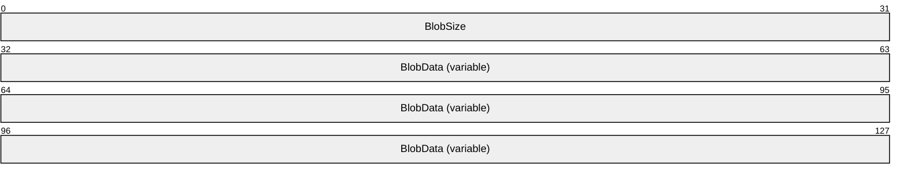

**BlobSize (4 bytes)**: A 32-bit unsigned integer that contains the size of the blob data in bytes.

**BlobData (variable)**: A variable stream of bytes containing the blob data.

<a id="Section_2.2.2.2"></a>
#### 2.2.2.2 QUOTA_USAGE_ENTRY

The QUOTA_USAGE_ENTRY structure specifies the current data usage of user on the sync target share.

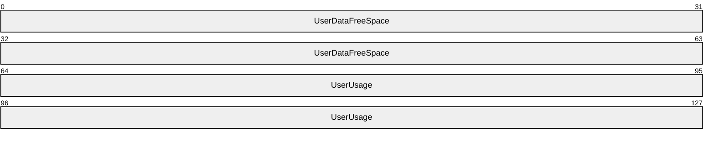

**UserDataFreeSpace (8 bytes)**: A 64-bit unsigned integer that contains the amount of available free space, in bytes, in the user's share.

**UserUsage (8 bytes)**: A 64-bit unsigned integer that contains the amount of data, in bytes, in the user's share.

<a id="Section_2.2.2.3"></a>
#### 2.2.2.3 POLICY_ENTRY

The POLICY_ENTRY structure specifies the policies on how the client is expected to set up its target directory.


**PolicyName (1 byte)**: An unsigned 8-bit value that identifies the policy. This MUST be one of the following values.

| Value | Description |
| --- | --- |
| 0x01 | Encryption |
| 0x02 | Password |
| 0x03 | AutoLock |

**PolicyType (1 byte)**: A nonzero value indicates that this policy is enforced.

<a id="Section_2.2.2.4"></a>
#### 2.2.2.4 BATCH_LIMITS_ENTRY

The BATCH_LIMITS_ENTRY structure specifies the parameters that describe sync batch characteristics.

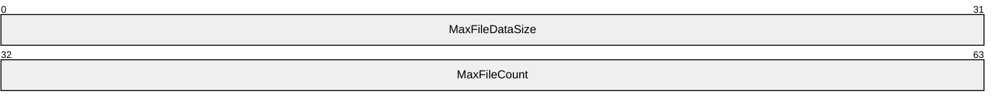

**MaxFileDataSize (4 bytes)**: A 32-bit unsigned integer that contains the maximum size, as a multiple of 1048576 bytes, of file data in one batch.

**MaxFileCount (4 bytes)**: A 32-bit unsigned integer that contains the maximum count of files in one batch.

<a id="Section_2.2.2.5"></a>
#### 2.2.2.5 FILE_METADATA_ENTRY

The FILE_METADATA_ENTRY structure specifies the metadata information for a file in a sync batch.

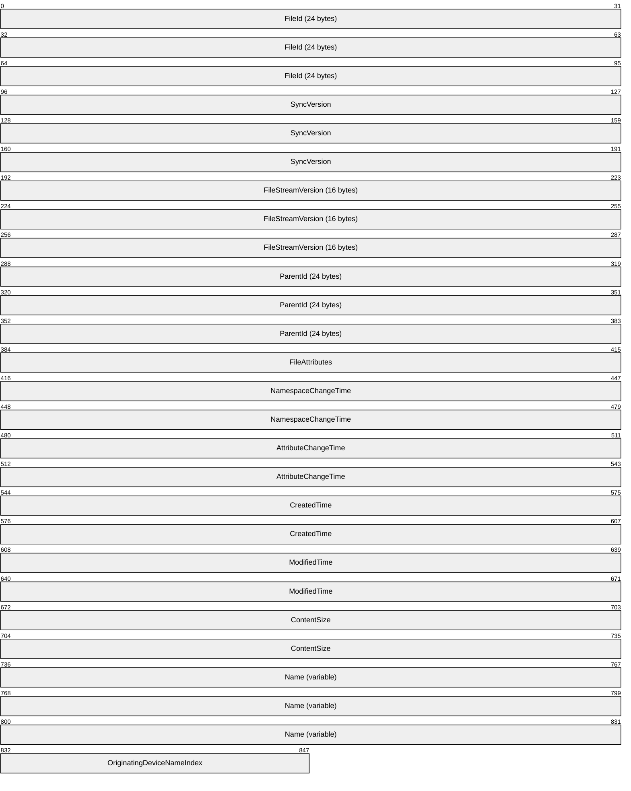

**FileId (24 bytes)**: An identifier that uniquely identifies the file or directory. This MUST be in the format specified in [MS-FSVCA](../MS-FSVCA/MS-FSVCA.md) section 2.1.

**SyncVersion (12 bytes)**: **SyncVersion** is the version of the file entry. This MUST be in the format specified in [MS-FSVCA] section 2.9.

**FileStreamVersion (16 bytes)**: A GUID representing the version of the file content. This MUST not be used for directories.

**ParentId (24 bytes)**: ParentId is an identifier for the metadata of the parent item. The parent item MUST be a directory. Files without a parent MUST set **ParentId.GidPrefix** to 0x0000000000000000 and **ParentId.UniqueId** to 0x00700012000000000000000000000000. This MUST be in the format specified in [MS-FSVCA] section 2.1.

**FileAttributes (4 bytes)**: A 32-bit unsigned integer representing the attributes of the file allowed by the underlying object store.<2>

**NamespaceChangeTime (8 bytes)**: The time at which the name of the file or its **ParentId** was changed. This field is used for resolving conflicts during synchronization. This MUST be in the format specified in [MS-DTYP](../MS-DTYP/MS-DTYP.md) section 2.3.3.

**AttributeChangeTime (8 bytes)**: The time at which the attributes of the file were changed. This field is used for resolving conflicts during synchronization. This MUST be in the format specified in [MS-DTYP] section 2.3.3.

**CreatedTime (8 bytes)**: The time at which the file was created. This MUST be in the format specified in [MS-DTYP] section 2.3.1.

**ModifiedTime (8 bytes)**: The time at which the file was last modified. This MUST be in the format specified in [MS-DTYP] section 2.3.1.

**ContentSize (8 bytes)**: A 64-bit unsigned integer representing the size of the file in bytes. This MUST be zero for a directory entry.

**Name (variable)**: An ECS_STRING structure, as specified in section [2.2.2.27](#Section_2.2.2.27), representing the name of the file or directory. The string in this structure MUST not be empty.

**OriginatingDeviceNameIndex (2 bytes)**: A 16-bit unsigned integer representing the index of the string representing the device in the **DeviceNames** field of the SYNC_CHANGE_BATCH structure, as specified in section [2.2.2.14](#Section_2.2.2.14).

<a id="Section_2.2.2.6"></a>
#### 2.2.2.6 FILE_INFO_INPUT_ENTRY

The FILE_INFO_INPUT_ENTRY structure specifies the sync preparation information of a file that the client sends to the server before an upload.

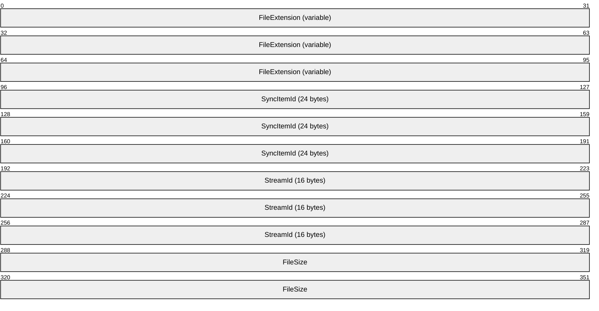

**FileExtension (variable):** An ECS_STRING structure containing the extension of the file.

**SyncItemId (24 bytes)**: An identifier that is used to correlate the file metadata with the Sync Framework change item***.*** This MUST be in the format specified in [MS-FSVCA](../MS-FSVCA/MS-FSVCA.md) section 2.1.

**StreamId (16 bytes):** A GUID containing the stream identifier of the file.

**FileSize (8 bytes)**: A 64-bit unsigned integer representing the size of the file in bytes.

<a id="Section_2.2.2.7"></a>
#### 2.2.2.7 FILE_INFO_ENTRY

The FILE_INFO_ENTRY structure specifies the sync preparation information of a file that the server sends to the client before an upload.

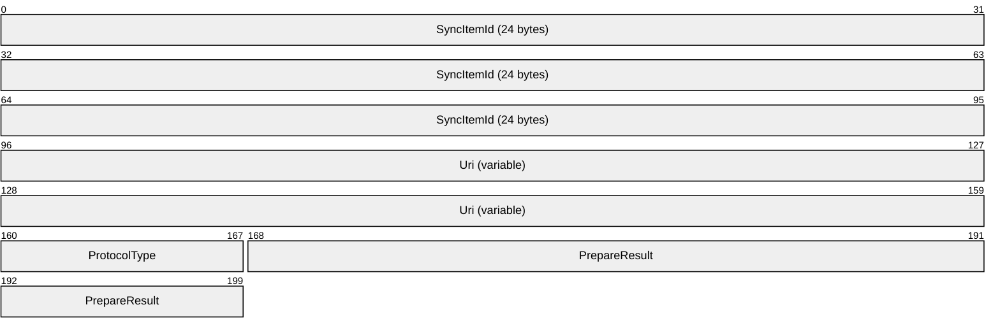

**SyncItemId (24 bytes)**: A SYNC_GID structure as described in [MS-FSVCA](../MS-FSVCA/MS-FSVCA.md) section 2.1. An identifier that is used to correlate the file metadata with the Sync Framework change item***.***

**Uri (variable)**: An ECS_STRING structure containing the [**URI**](#gt_uniform-resource-identifier-uri) used to perform data transfer for this file. The string in this structure MUST be empty.

**ProtocolType (1 byte)**: Indicates the type of data transfer that the server supports for this file. This value MUST be one of the following.

| Value | Meaning |
| --- | --- |
| 0x00 | No upload is required for this file. |
| 0x01 | File batching data transfer is required to transfer this file. |

**PrepareResult (4 bytes)**: This value contains the result of the preparation process of type HRESULT as specified in [MS-DTYP](../MS-DTYP/MS-DTYP.md) section 2.2.18.

<a id="Section_2.2.2.8"></a>
#### 2.2.2.8 FILE_STATUS_ENTRY

The FILE_STATUS_ENTRY structure specifies the information of a file commit in a sync process.

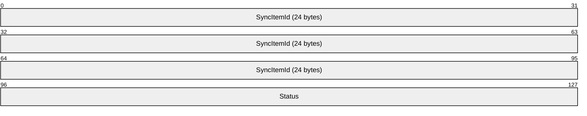

**SyncItemId (24 bytes)**: A SYNC_GID structure as specified in [MS-FSVCA](../MS-FSVCA/MS-FSVCA.md) section 2.1. **SyncItemId** is an identifier that is used to correlate the file metadata with the Sync Framework change item.

**Status (4 bytes)**: Indicates the result of applying changes to the file. This MUST be in the format specified in [MS-DTYP](../MS-DTYP/MS-DTYP.md) section 2.2.18.

<a id="Section_2.2.2.9"></a>
#### 2.2.2.9 UPLOAD_ENTRY

The UPLOAD_ENTRY structure specifies the information of the data for a file that is being uploaded to the server.

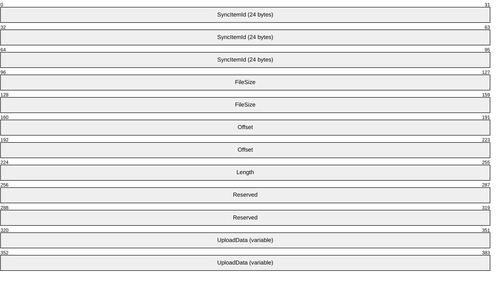

**SyncItemId (24 bytes)**: A SYNC_GID structure as specified in [MS-FSVCA](../MS-FSVCA/MS-FSVCA.md) section 2.1. This value uniquely identifies the file replica within the change batch.

**FileSize (8 bytes)**: A 64-bit unsigned integer containing the size of the file, in bytes.

**Offset (8 bytes)**: A 64-bit unsigned integer containing the offset, in bytes, in the file for the data to be uploaded.

**Length (4 bytes)**: A 32-bit unsigned integer containing the length, in bytes, of the **UploadData** field.

**Reserved (8 bytes)**: A 64-bit unsigned integer. This field MUST NOT be used and MUST be reserved. The client SHOULD<3> set this field to 0, and the server MUST ignore it on receipt.

**UploadData (variable)**: A SYNC_BLOB structure as specified in section [2.2.2.1](#Section_2.2.2.1). The payload data to be uploaded.

<a id="Section_2.2.2.10"></a>
#### 2.2.2.10 UPLOAD_RESPONSE_ENTRY

The UPLOAD_RESPONSE_ENTRY structure specifies the server response data for a file being uploaded.


**SyncItemId (24 bytes)**: A SYNC_GID structure as specified in [MS-FSVCA](../MS-FSVCA/MS-FSVCA.md) section 2.1. A value that uniquely identifies the file replica within the change batch.

**HttpStatus (4 bytes)**: A 32-bit unsigned integer containing the HTTP status code.

**Result (4 bytes)**: The result of the upload process for the file. If the upload is successful, this value MUST be set to S_OK. This MUST be in the format as specified in [MS-DTYP](../MS-DTYP/MS-DTYP.md) section 2.2.18.

**Hash (16 bytes)**: The MD5 hash of the file contents, as specified in [[RFC1321]](https://go.microsoft.com/fwlink/?LinkId=90275). The hash is serialized in SYNC_MD5HASH format as specified in section [2.2.2.15](#Section_2.2.2.15).

<a id="Section_2.2.2.11"></a>
#### 2.2.2.11 DOWNLOAD_ENTRY

The DOWNLOAD_ENTRY structure specifies the information of the data for a file that is being downloaded from the server.


**SyncItemId (24 bytes)**: A SYNC_GID structure as specified in [MS-FSVCA](../MS-FSVCA/MS-FSVCA.md) section 2.1. An identifier that is used to correlate the file metadata with the Sync Framework change item***.***

**FileVersion (variable)**: A SYNC_BLOB structure as specified in section [2.2.2.1](#Section_2.2.2.1). An opaque stream of bytes that identifies the file version.

<a id="Section_2.2.2.12"></a>
#### 2.2.2.12 DOWNLOAD_RESPONSE_ENTRY

The DOWNLOAD_RESPONSE_ENTRY structure specifies the server response data for a file being downloaded.

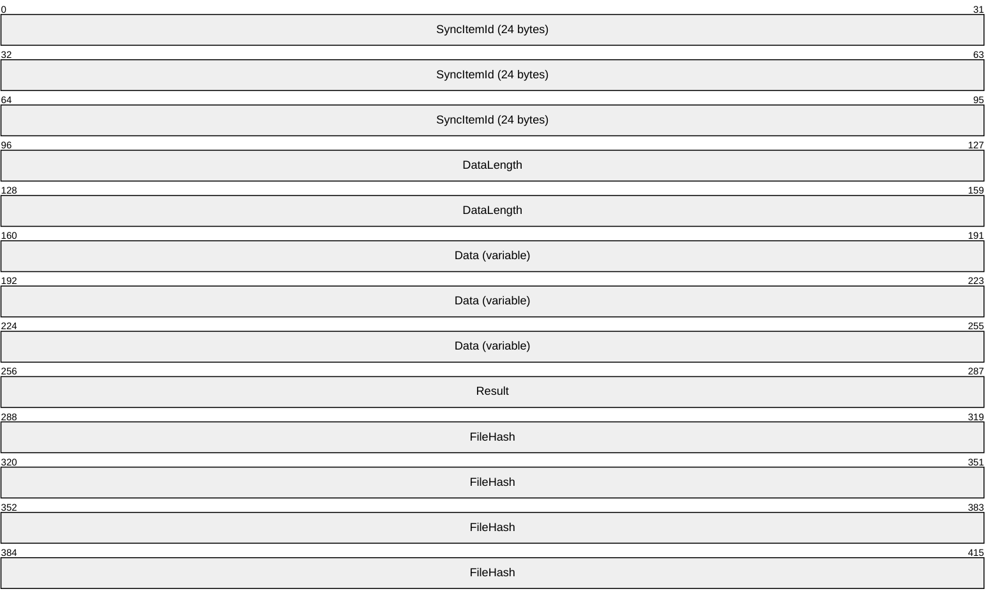

**SyncItemId (24 bytes)**: A SYNC_GID structure as specified in [MS-FSVCA](../MS-FSVCA/MS-FSVCA.md) section 2.1. An identifier that is used to correlate the file metadata with the Sync Framework change item.

**DataLength (8 bytes)**: A 64-bit unsigned integer containing the length, in bytes, of the **Data** field.

**Data (variable)**: The contents of the file being downloaded from the server.

**Result (4 bytes)**: The result of the file download operation. When the result indicates an error, the **DataLength** field MUST be zero and the **Data** field MUST be empty. This MUST be in the format specified in [MS-DTYP](../MS-DTYP/MS-DTYP.md) section 2.2.18.

**FileHash (16 bytes)**: The MD5 hash, as specified in [[RFC1321]](https://go.microsoft.com/fwlink/?LinkId=90275), of the file contents. The hash is serialized in SYNC_MD5HASH format as specified in section [2.2.2.15](#Section_2.2.2.15).

<a id="Section_2.2.2.13"></a>
#### 2.2.2.13 FILE_DOWNLOAD_INFO_ENTRY

The FILE_DOWNLOAD_INFO_ENTRY structure specifies information that is required for the client to download the file content.

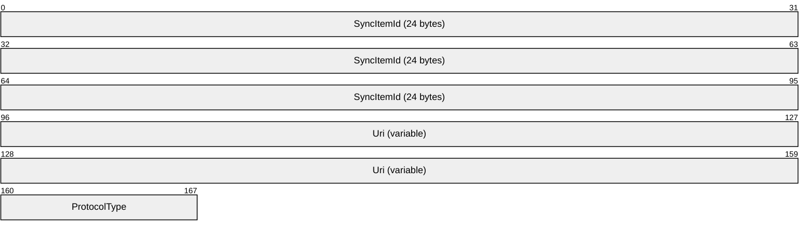

**SyncId (24 bytes)**: A SYNC_GID structure as specified in [MS-FSVCA](../MS-FSVCA/MS-FSVCA.md) section 2.1. A value that uniquely identifies the file item within the sync batch.

**Uri (variable)**: An ECS_STRING structure containing the URI used to perform data transfer of the file stream. The string in this structure MUST be empty.

**ProtocolType (1 byte)**: Indicates the type of data transfer that the server supports for this file. This value MUST be one of the following.

| Value | Meaning |
| --- | --- |
| 0x01 | File batching data transfer is required to transfer this file. |

<a id="Section_2.2.2.14"></a>
#### 2.2.2.14 SYNC_CHANGE_BATCH

The SYNC_CHANGE_BATCH structure defines the metadata that describes the changes to be synchronized.


**Files (variable)**: A VECTOR_FILE_METADATA_ENTRY structure containing metadata information for all files in the sync batch.

**DeviceNames (variable)**: An array of VECTOR_STRING structures that contains a list of the names of the devices that generated the changes to the files in this batch.

**SyncMetadata (variable)**: A stream of bytes in SYNC_BLOB format that represents the serialized SYNC_CHANGE_INFORMATION structure (specified in [MS-FSVCA](../MS-FSVCA/MS-FSVCA.md) section 2.14).

<a id="Section_2.2.2.15"></a>
#### 2.2.2.15 SYNC_MD5HASH

The SYNC_MD5HASH structure defines the serialization format used by this protocol for [**MD5 hash**](#gt_md5-hash) data. The calculation of the MD5 hash is specified in [[RFC1321]](https://go.microsoft.com/fwlink/?LinkId=90275).

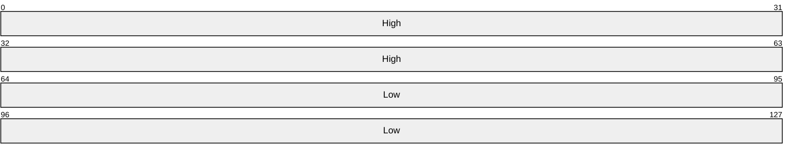

**High (8 bytes)**: A 64-bit unsigned integer containing the first 64 bits of the MD5 hash data.

**Low (8 bytes)**: A 64-bit unsigned integer containing the last 64 bits of the MD5 hash data.

<a id="Section_2.2.2.16"></a>
#### 2.2.2.16 VECTOR_POLICY_ENTRY

The VECTOR_POLICY_ENTRY structure represents a collection of POLICY_ENTRY structures, as specified in section [2.2.2.3](#Section_2.2.2.3), in the following format:

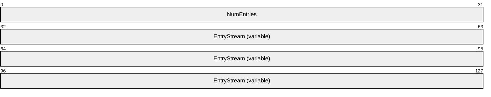

**NumEntries (4 bytes)**: A 32-bit unsigned integer containing the number of entries in the vector.

**EntryStream (variable)**: An array of zero or more POLICY_ENTRY structures representing client policy entry elements.

<a id="Section_2.2.2.17"></a>
#### 2.2.2.17 VECTOR_FILE_METADATA_ENTRY

The VECTOR_FILE_METADATA_ENTRY structure represents a collection of FILE_METADATA_ENTRY structures, as specified in section [2.2.2.5](#Section_2.2.2.5), in the following format:


**NumEntries (4 bytes)**: A 32-bit unsigned integer containing the number of entries in the vector.

**EntryStreamBytes (variable)**: An array of zero or more FILE_METADATA_ENTRY structures representing metadata information for a file.

<a id="Section_2.2.2.18"></a>
#### 2.2.2.18 VECTOR_FILE_INFO_INPUT_ENTRY

The VECTOR_FILE_INFO_INPUT_ENTRY structure represents a collection of FILE_INFO_INPUT_ENTRY structures, as specified in section [2.2.2.6](#Section_2.2.2.6), in the following format:


**NumEntries (4 bytes)**: A 32-bit unsigned integer containing the number of entries in the vector.

**EntryStreamBytes (variable)**: An array of zero or more FILE_INFO_INPUT_ENTRY structures representing the sync preparation information of a file.

<a id="Section_2.2.2.19"></a>
#### 2.2.2.19 VECTOR_FILE_INFO_ENTRY

The VECTOR_FILE_INFO_ENTRY structure represents a collection of FILE_INFO_ENTRY structures, as specified in section [2.2.2.7](#Section_2.2.2.7), in the following format:


**NumEntries (4 bytes)**: A 32-bit unsigned integer containing the number of entries in the vector.

**EntryStreamBytes (Vector)**: An array of zero or more FILE_INFO_ENTRY structures representing the server sync preparation information of a file.

<a id="Section_2.2.2.20"></a>
#### 2.2.2.20 VECTOR_FILE_STATUS_ENTRY

The VECTOR_FILE_STATUS_ENTRY structure represents a collection of FILE_STATUS_ENTRY structures, as specified in section [2.2.2.8](#Section_2.2.2.8), in the following format:


**NumEntries (4 bytes)**: A 32-bit unsigned integer containing the number of entries in the vector.

**EntryStream (variable)**: An array of zero or more FILE_STATUS_ENTRY structures representing information on a file commit in a sync process.

<a id="Section_2.2.2.21"></a>
#### 2.2.2.21 VECTOR_UPLOAD_ENTRY

The VECTOR_UPLOAD_ENTRY structure represents a collection of UPLOAD_ENTRY structures, as specified in section [2.2.2.9](#Section_2.2.2.9), in the following format:

```mermaid
packet-beta
  0-31: "NumEntries"
  32-127: "EntryStreamBytes (variable)"
```

**NumEntries (4 bytes)**: A 32-bit unsigned integer containing the number of entries in the vector.

**EntryStreamBytes (variable)**: An array of zero or more UPLOAD_ENTRY structures representing information of the data for a file.

<a id="Section_2.2.2.22"></a>
#### 2.2.2.22 VECTOR_UPLOAD_RESPONSE_ENTRY

The VECTOR_UPLOAD_RESPONSE_ENTRY structure represents a collection of UPLOAD_RESPONSE_ENTRY structures, as specified in section [2.2.2.10](#Section_2.2.2.10), in the following format:

```mermaid
packet-beta
  0-31: "NumEntries"
  32-127: "EntryStream (variable)"
```

**NumEntries (4 bytes)**: A 32-bit unsigned integer containing the number of entries in the vector.

**EntryStream (variable)**: An array of zero or more UPLOAD_RESPONSE_ENTRY structures representing server response data for a file being uploaded.

<a id="Section_2.2.2.23"></a>
#### 2.2.2.23 VECTOR_DOWNLOAD_ENTRY

The VECTOR_DOWNLOAD_ENTRY structure represents a collection of DOWNLOAD_ENTRY structures, as specified in section [2.2.2.11](#Section_2.2.2.11), in the following format:

```mermaid
packet-beta
  0-31: "NumEntries"
  32-127: "EntryStreamBytes (variable)"
```

**NumEntries (4 bytes)**: A 32-bit unsigned integer containing the number of entries in the vector.

**EntryStreamBytes (variable)**: An array of zero or more DOWNLOAD_ENTRY structures representing information on the data for a file being downloaded.

<a id="Section_2.2.2.24"></a>
#### 2.2.2.24 VECTOR_DOWNLOAD_RESPONSE_ENTRY

The VECTOR_DOWNLOAD_RESPONSE_ENTRY structure represents a collection of DOWNLOAD_RESPONSE_ENTRY structures, as specified in section [2.2.2.12](#Section_2.2.2.12), in the following format:

```mermaid
packet-beta
  0-95: "EntryStreamBytes (variable)"
```

**EntryStreamBytes (variable)**: An array of zero or more DOWNLOAD_RESPONSE_ENTRY structures representing server response data for a file being downloaded.

<a id="Section_2.2.2.25"></a>
#### 2.2.2.25 VECTOR_FILE_DOWNLOAD_INFO_ENTRY

The VECTOR_FILE_DOWNLOAD_INFO_ENTRY structure represents a collection of FILE_DOWNLOAD_INFO_ENTRY structures, as specified in section [2.2.2.13](#Section_2.2.2.13), in the following format:

```mermaid
packet-beta
  0-31: "NumEntries"
  32-127: "EntryStreamBytes (variable)"
```

**NumEntries (4 bytes)**: A 32-bit unsigned integer containing the number of entries in the vector.

**EntryStreamBytes (Vector)**: An array of zero or more FILE_DOWNLOAD_INFO_ENTRY structures representing information that is required to download file content.

<a id="Section_2.2.2.26"></a>
#### 2.2.2.26 VECTOR_STRING

The VECTOR_STRING structure represents a collection of strings in the following format:

```mermaid
packet-beta
  0-31: "NumEntries"
  32-127: "EntryStreamBytes (variable)"
```

**NumEntries (4 bytes)**: A 32-bit unsigned integer containing the number of ECS_STRING structures in **EntryStreamBytes**.

**EntryStreamBytes (variable)**: An array of ECS_STRING structures, as specified in section [2.2.2.27](#Section_2.2.2.27).

<a id="Section_2.2.2.27"></a>
#### 2.2.2.27 ECS_STRING

The ECS_STRING structure represents a string in the following format:

```mermaid
packet-beta
  0-15: "Length"
  16-95: "EntryStreamBytes (variable)"
```

**Length (2 bytes)**: A 16-bit unsigned integer containing the size, in bytes, of the **EntryStreamBytes** field.

**EntryStreamBytes (variable)**: A UTF-8 string.

<a id="Section_2.2.2.28"></a>
#### 2.2.2.28 Error Codes

The following HRESULT codes are defined in this document.

| Error Code | Value |
| --- | --- |
| ECS_E_SYNC_INVALID_PROTOCOL_FORMAT | 0x80C80001 |
| ECS_E_SYNC_SESSION_BUSY | 0x80C80003 |
| ECS_E_USER_SUSPENDED | 0x80C80005 |
| ECS_E_SYNC_INVALID_SESSION_TYPE | 0x80C80012 |
| ECS_E_SYNC_REQUIRED_HTTP_HEADER_MISSING | 0x80C8001A |
| ECS_E_SYNC_TOO_MANY_SESSIONS | 0x80C8001B |
| ECS_E_STREAM_NOT_NEEDED | 0x80C80030 |
| ECS_E_FILE_TOO_LARGE_FOR_UPLOAD | 0x80C80039 |
| ECS_E_DISCOVERY_NEEDED | 0x80C8003B |
| ECS_E_SYNC_SERVER_BUSY | 0x80C8003E |
| ECS_E_ERROR_SYNC_SHARE_BLOCKED | 0x80C80303 |

<a id="Section_3"></a>
# 3 Protocol Details

The resources defined by this protocol are categorized as follows:

- Service Discovery Resources
- Server Changes Resources
- User Configuration Resources
- Session Resources
- Data Transfer Server Resources
The "Request body" and "Response body" entries are transmitted in the same order they are listed in this document.

The following sections describe the processing of each resource in the above mentioned categories.

<a id="Section_3.1"></a>
## 3.1 ServiceDiscovery Server Details

<a id="Section_3.1.1"></a>
### 3.1.1 Abstract Data Model

This section describes a conceptual model of possible data organization that an implementation maintains to participate in the Enterprise Client Synchronization Protocol. The described organization is provided to facilitate the explanation of how the protocol behaves. This document does not mandate that implementations adhere to this model as long as their external behavior is consistent with that described in this document.

The server implements the following:

**HostURLPrefixList**: A list of URLs for the servers that expose the synchronization namespace.

**PartnershipIdList**: A list of identifiers in the string format that relate a client with a specific sync share.

**ClientRequestsCountTable**: A table of number of pending requests indexed by PartnershipId, as specified in section [3.1.1.1](#Section_3.1.1.1).

<a id="Section_3.1.1.1"></a>
#### 3.1.1.1 Per ClientRequestsCount

**UserId**: An identifier that uniquely identifies a user.

**Count**: A numeric value specifying the number of pending requests on the server.

<a id="Section_3.1.2"></a>
### 3.1.2 Timers

None.

<a id="Section_3.1.3"></a>
### 3.1.3 Initialization

The server MUST initialize the following:

**ClientRequestsCountTable** MUST be set to empty.

**HostURLPrefixList** MUST be set to a list of server URLs in an implementation-specific manner.

**PartnershipIdList** MUST be set to empty.

<a id="Section_3.1.4"></a>
### 3.1.4 Higher-Layer Triggered Events

None.

<a id="Section_3.1.5"></a>
### 3.1.5 Message Processing Events and Sequencing Rules

| Resource | Description |
| --- | --- |
| Server Discovery | The resource used to enumerate all servers exposing the namespace for sync. |
| Share Discovery | The resource uses to discover the sync share on the server. |
| Server Capabilities | The resource used to query the capabilities of the sync service. |

The responses to all the operations can result in the following status codes.

| Status code | Reason phrase | Description |
| --- | --- | --- |
| 200 | OK | Server is discovered and URL is sent back in response body. |
| 404 | Not Found | Cannot find the sync server URL for the given user. Either the user doesn't have a value for the attribute or the AD schema does not support the attribute. |
| 500 | Internal Server Error | Unexpected server error. Specific error code in the request error header. |

<a id="Section_3.1.5.1"></a>
#### 3.1.5.1 Server Discovery

The Server Discovery resource represents a list of servers that expose the synchronization namespace.

The following operations are allowed to be performed on this resource.

| HTTP method | Description |
| --- | --- |
| GET | Enumerate a list of servers that expose the synchronization namespace. |

<a id="Section_3.1.5.1.1"></a>
##### 3.1.5.1.1 GET

This operation is transported by an HTTP GET request.

The operation can be invoked through the following URI suffix:

Sync/{version}/Discover/ServerUrl

The following is an example of a complete URI for this operation:

https://contoso.com/Sync/1.0/Discover/ServerUrl

The request message for this operation contains the following HTTP headers.

| Request header | Usage | Value |
| --- | --- | --- |
| x-ecs-devicename | Optional | A string representing the name and operating system of the device issuing the request in the following format: {Device Name, OS Family, OS Major Version, OS Minor Version, Sync App Version} Example: x-ecs-devicename: { homelp, Windows, 6.2, 9200, 1.0} |

The response message for this operation contains the following HTTP headers.

| Response header | Usage | Value |
| --- | --- | --- |
| x-ecs-request-error | Optional | A string describing request failure information. This MUST be a string representation of the HRESULT in hexadecimal format. Example: x-ecs-request-error: "0x8007005" |

The response message for this operation can result in the following status codes.

| Status code | Description |
| --- | --- |
| 200 | Server is discovered and URL is sent back in response body. |
| 404 | Cannot find sync server URL for the given user. Either the user doesn't have a value for the attribute or the AD schema does not support the attribute. |
| 500 | Unexpected server error. Specific error code in the request error header. |

<a id="Section_3.1.5.1.1.1"></a>
###### 3.1.5.1.1.1 Request Body

None.

<a id="Section_3.1.5.1.1.2"></a>
###### 3.1.5.1.1.2 Response Body

The response for this method contains the following:

| Entry | Type |
| --- | --- |
| ServerUrls | VECTOR_STRING |

**ServerUrls:** A list of host server URL prefixes that the client can connect to for all subsequent sync operations.

<a id="Section_3.1.5.1.1.3"></a>
###### 3.1.5.1.1.3 Processing Details

The server MUST fill the response body with the URLs from **HostURLPrefixList**.

<a id="Section_3.1.5.2"></a>
#### 3.1.5.2 Share Discovery

This resource represents the sync share on the server for a user.

The following operations are allowed to be performed on this resource.

| HTTP method | Description |
| --- | --- |
| GET | Query the properties of the sync share |

<a id="Section_3.1.5.2.1"></a>
##### 3.1.5.2.1 GET

This operation is transported by an HTTP GET request.

The operation can be invoked through the following URI suffix:

Sync/{version}/Discover/Share

The following is an example of a complete URI for this operation:

https://contoso.com/Sync/1.0/Discover/Share

The request message for this operation contains the following HTTP headers.

| Request header | Usage | Value |
| --- | --- | --- |
| x-ecs-share-type | Optional | A string representing the type of the share to discover. If this header is present in the request, its value MUST be set to "User Data". |

The response message for this operation contains the following HTTP headers.

| Response header | Usage | Value |
| --- | --- | --- |
| x-ecs-request-error | Optional | A string describing request failure information. This MUST be a string representation of the HRESULT in hexadecimal format. Example: x-ecs-request-error: "0x8007005" |

The response message for this operation can result in the following status codes.

| Status code | Description |
| --- | --- |
| 200 | Success |
| 404 | There is no sync share for the user (possible reasons include the type not existing or the user not having access). |
| 500 | Unexpected server error. |

<a id="Section_3.1.5.2.1.1"></a>
###### 3.1.5.2.1.1 Request Body

None.

<a id="Section_3.1.5.2.1.2"></a>
###### 3.1.5.2.1.2 Response Body

The response for this method contains the following:

| Entry | Type |
| --- | --- |
| PartnershipId | ECS_STRING |
| EnterpriseId | ECS_STRING |
| DataSize | ULONG64 |

**PartnershipId:** A VECTOR_STRING structure containing the unique ID on the server that represents a combination of the client and the sync share. This ID will be used by the client as an x-ecs-partnershipID header in subsequent requests.

**EnterpriseId:** An identifier that signifies the owning entity for all content synchronized with the share.

**DataSize:** Total size of the user data on the sync share for this user in bytes.

<a id="Section_3.1.5.2.1.3"></a>
###### 3.1.5.2.1.3 Processing Details

If the request contains x-ecs-share-type header and its value is not "User Data", the server MUST fail the request with a status code of 404.

The server MUST generate a unique ID in the form of a string and set it to **PartnershipId** in the response body. The server MUST add the generated ID to **PartnershipIdList**.

If the server cannot evaluate the size of the user data, it MUST set DataSize in the response body to the decimal value of 18446744073709551615, that is, the maximum value allowed by ULONG64.

The server MUST set **EnterpriseId** to an administratively configured value.

The server MUST allocate a **ClientRequestsCount** object and MUST be inserted into **ClientRequestsCountTable**. **ClientRequestsCount.UserId** MUST be set in an implementation-specific manner and **ClientRequestsCount.Count** MUST be set to zero.

<a id="Section_3.1.5.3"></a>
#### 3.1.5.3 Server Capabilities

The Server Capabilities resource represents information about the protocol support on the server.

The following operations are allowed to be performed on this resource.

| HTTP method | Description |
| --- | --- |
| GET | Query protocol support information from the server. |

<a id="Section_3.1.5.3.1"></a>
##### 3.1.5.3.1 GET

This operation is transported by an HTTP GET request.

The operation can be invoked through the following URI suffix:

Sync/{version}/Capabilities

The following is an example of a complete URI for this operation:

https://contoso.com/Sync/1.0/Capabilities

The request message for this operation contains the following HTTP headers.

| Request header | Usage | Value |
| --- | --- | --- |
| x-ecs-devicename | Optional | A string representing the name and operating system of the device issuing the request in the following format: {Device Name, OS Family, OS Major Version, OS Minor Version, Sync App Version} Example: x-ecs-devicename: {homelp, Windows, 6.2, 9200, 1.0} |

The response message for this operation contains the following HTTP header.

| Response header | Usage | Value |
| --- | --- | --- |
| x-ecs-request-error | Optional | A string describing request failure information. This MUST be a string representation of the HRESULT in hexadecimal format. Example: x-ecs-request-error: "0x8007005" |
| x-ecs-server-os-version | Optional | A string representing the operating-system build number of the server. Example: x-ecs-server-os-version: "10.0.10550" |
| x-ecs-server-rootdns-name | Optional | An anonymous opaque string ID for the organization or organizational unit to which the server belongs. |

The response message for this operation can result in the following status codes.

| Status code | Description |
| --- | --- |
| 200 | Success |
| 500 | Unexpected server error. |

<a id="Section_3.1.5.3.1.1"></a>
###### 3.1.5.3.1.1 Request Body

None.

<a id="Section_3.1.5.3.1.2"></a>
###### 3.1.5.3.1.2 Response Body

The response for this method contains the following:

| Entry | Type |
| --- | --- |
| ProtocolType | UCHAR |

**ProtocolType**: The data transfer type that the server supports. This MUST be set to the following value:

| Value | Description |
| --- | --- |
| 0x01 | File batching data transfer protocol. |

<a id="Section_3.1.5.3.1.3"></a>
###### 3.1.5.3.1.3 Processing Details

If the server supports file batching for data transfer, the server MUST set the bit to 0x01 in ProtocolType in the response body.

The server SHOULD<4> add x-ecs-server-os-version and x-ecs-server-rootdns-name in the response header.

<a id="Section_3.1.6"></a>
### 3.1.6 Timer Events

None.

<a id="Section_3.1.7"></a>
### 3.1.7 Other Local Events

None.

<a id="Section_3.2"></a>
## 3.2 DetectServerChanges Server Details

<a id="Section_3.2.1"></a>
### 3.2.1 Abstract Data Model

None.

<a id="Section_3.2.2"></a>
### 3.2.2 Timers

None.

<a id="Section_3.2.3"></a>
### 3.2.3 Initialization

None.

<a id="Section_3.2.4"></a>
### 3.2.4 Higher-Layer Triggered Events

None.

<a id="Section_3.2.5"></a>
### 3.2.5 Message Processing Events and Sequencing Rules

| Resource | Description |
| --- | --- |
| Detect Server Changes | The resource used to poll for the server-side changes. |

The responses to all the operations can result in the following status codes.

| Status code | Reason phrase | Description |
| --- | --- | --- |
| 200 | OK | Server knowledge has changed. |
| 304 | Not Modified | Server knowledge did not change. |

<a id="Section_3.2.5.1"></a>
#### 3.2.5.1 Detect Server Changes

The Detect Server Changes resource allows the client to poll for the changes on the server.

| HTTP method | Description |
| --- | --- |
| HEAD | Query the changes on the server. |

<a id="Section_3.2.5.1.1"></a>
##### 3.2.5.1.1 HEAD

This operation is transported by an HTTP HEAD request.

The operation can be invoked through the following URI suffix:

Sync/{version}/Changes

The following is an example of a complete URI for this operation:

https://contoso.com/Sync/1.0/Changes

The request message for this operation contains the following HTTP headers.

| Request header | Usage | Value |
| --- | --- | --- |
| If-None-Match | Optional | The ETag from a previous response |
| x-ecs-partnershipID | Required | The PartnershipId for the sync target share. |
| x-ecs-devicename | Optional | A string, as specified in section [2.2.1.2](#Section_2.2.1.2). |
| x-ecs-hold-request | Optional | The server is requested to hold the request until the sync replica has changed |

The response message for this operation contains the following HTTP headers.

| Response header | Usage | Value |
| --- | --- | --- |
| ETag | Optional | A value identifying the version of the data for this PartnershipId. |
| x-ecs-changes-URL | Optional | A URL to be used by the client to poll for changes on the server. |

The response message for this operation can result in the following status codes.

| Status code | Description |
| --- | --- |
| 200 | Server knowledge has changed; at least one of the two ETags is different. |
| 304 | Server knowledge did not change. |
| 408 | Request timeout. |

<a id="Section_3.2.5.1.1.1"></a>
###### 3.2.5.1.1.1 Request Body

None.

<a id="Section_3.2.5.1.1.2"></a>
###### 3.2.5.1.1.2 Response Body

None.

<a id="Section_3.2.5.1.1.3"></a>
###### 3.2.5.1.1.3 Processing Details

If there is any change in the URL where the client polls, the server SHOULD<5> set the new URI in the *x-ecs-changes-URL* response header and send a response with status code 200.

If the *x-ecs-hold-request* header value is "true", the server SHOULD<6> hold the request and continue processing when the sync replica changes are done.

If the *If-None-Match* header is not provided in the request, the server MUST set a version of the data for the provided **PartnershipId** in the *ETag* response header and MUST set the status code to 200.

If the *If-None-Match* header is provided in the request and its value is different from the version of the data for the provided **PartnershipId**, the server MUST set a version of the data for the provided **PartnershipId** in the *ETag* response header and MUST set the status code to 200.

If the *If-None-Match* header is provided in the request and its value is same as the version of the data for the provided **PartnershipId**, the server MUST set the status code to 304.

<a id="Section_3.2.6"></a>
### 3.2.6 Timer Events

None

<a id="Section_3.2.7"></a>
### 3.2.7 Other Local Events

None.

<a id="Section_3.3"></a>
## 3.3 UserConfiguration Server Details

<a id="Section_3.3.1"></a>
### 3.3.1 Abstract Data Model

None.

<a id="Section_3.3.2"></a>
### 3.3.2 Timers

None.

<a id="Section_3.3.3"></a>
### 3.3.3 Initialization

None.

<a id="Section_3.3.4"></a>
### 3.3.4 Higher-Layer Triggered Events

None.

<a id="Section_3.3.5"></a>
### 3.3.5 Message Processing Events and Sequencing Rules

| Resource | Description |
| --- | --- |
| User Configuration | The resource that represents user configuration information for a sync target share. |

<a id="Section_3.3.5.1"></a>
#### 3.3.5.1 User Configuration

| HTTP method | Description |
| --- | --- |
| GET | Query user configuration information for a sync target share. |

<a id="Section_3.3.5.1.1"></a>
##### 3.3.5.1.1 GET

This operation is transported by an HTTP GET request.

The operation can be invoked through the following URI suffix:

Sync/{version}/Configuration

The following is an example of a complete URI for this operation:

https://contoso.com/Sync/1.0/Configuration

The request message for this operation contains the following HTTP headers.

| Request header | Usage | Value |
| --- | --- | --- |
| x-ecs-partnershipID | Required | The PartnershipId for the sync target that was received in the GET response for the Share Discovery resource. |
| x-ecs-domain | - | The [**FQDN**](#gt_fully-qualified-domain-name-fqdn) of the domain to which the client is part of. Omit or use empty string if the client is not part of a domain. |
| x-ecs-devicename | Optional | A string, as specified in section [2.2.1.2](#Section_2.2.1.2). |

<a id="Section_3.3.5.1.1.1"></a>
###### 3.3.5.1.1.1 Request Body

None.

<a id="Section_3.3.5.1.1.2"></a>
###### 3.3.5.1.1.2 Response Body

The response for this method contains the following:

| Entry | Type |
| --- | --- |
| QuotaUsage | QUOTA_USAGE_ENTRY structure |
| PolicyList | VECTOR_POLICY_ENTRY |
| Length | Word |
| AdminInfo | UTF-8 String |

**QuotaUsage:** Describes the current data usage for the user.

**PolicyList:** A list of policy entries that describe how the client needs to set up its target directory. The policies processed first take precedence.

**Length**: This indicates the size of the **AdminInfo** field.

**AdminInfo**: A server-configured **String** value containing the server admin contact information. If the **Length** field is 0, this field is empty.

<a id="Section_3.3.5.1.1.3"></a>
###### 3.3.5.1.1.3 Processing Details

The server MUST query the QuotaUsage on the sync share in an implementation-specific manner, construct the QUOTA_USAGE_ENTRY structure as specified in section [2.2.2.2](#Section_2.2.2.2), and set the QuotaUsage field in the response body to this structure. If the server cannot determine the current QuotaUsage for the user, it MUST set the **UserUsage** field of the QUOTA_USAGE_ENTRY structure to the decimal value of 18446744073709551615, that is, the maximum value allowed by ULONG64.

The server MUST query all the policies that apply to the sync share and MUST construct a VECTOR_POLICY_ENTRY structure using each policy being applied. The server MUST set the PolicyList in the response body to the VECTOR_POLICY_ENTRY structure. The server MUST set **AdminInfo** in an implementation-specific manner.

<a id="Section_3.3.6"></a>
### 3.3.6 Timer Events

None.

<a id="Section_3.3.7"></a>
### 3.3.7 Other Local Events

None.

<a id="Section_3.4"></a>
## 3.4 PeerSynchronizationSession Server Details

<a id="Section_3.4.1"></a>
### 3.4.1 Abstract Data Model

This section describes a conceptual model of possible data organization that an implementation maintains to participate in the Enterprise Client Synchronization Protocol. The described organization is provided to facilitate the explanation of how the protocol behaves. This document does not mandate that implementations adhere to this model as long as their external behavior is consistent with that described in this document.

<a id="Section_3.4.1.1"></a>
#### 3.4.1.1 Global

The server implements the following:

**SessionList**: A list of **Sessions** defined in section [3.4.1.2](#Section_3.4.1.2).

**FileMetadataTable**: A table of file metadata indexed by **ObjectStoreID**, as specified in section [3.4.1.2.2](#Section_3.4.1.2.2).

<a id="Section_3.4.1.2"></a>
#### 3.4.1.2 Per Session

**SessionLocationURL**: The URL prefix used to access this session.

**SessionId**: A string that identifies the session.

**ChangeBatchList**: This contains the change batches as specified in section [3.4.1.2.1](#Section_3.4.1.2.1).

**LastSentToken**: This contains the last x-ecs-continue token sent to the client.

**LastReceivedToken**: This contains the last x-ecs-continue token sent by the client.

**Client_ID**: An identifier for the client.

**SessionType**: The type of session. This contains one of the values specified in section [3.4.5.1.1.1](#Section_3.4.5.1.1.1).

<a id="Section_3.4.1.2.1"></a>
##### 3.4.1.2.1 Per ChangeBatch

**MetaData:** Contains the metadata describing the changes to be synchronized, as specified in section [2.2.2.14](#Section_2.2.2.14).

**FileInfoList**: Contains the collection of FILE_DOWNLOAD_INFO_ENTRY structures, as specified in section [2.2.2.13](#Section_2.2.2.13).

<a id="Section_3.4.1.2.2"></a>
##### 3.4.1.2.2 Per FileMetadata

**ObjectStoreID**: A file identifier used by the object store to uniquely identify the file in the share.

**FileId**: An identifier that uniquely identifies the file or directory. This is represented in the format specified in [MS-FSVCA](../MS-FSVCA/MS-FSVCA.md) section [2.1](#Section_2.1).

**FileStreamId**: A GUID containing the stream identifier of the file. This is set to zero for directories.

**ParentId**: ParentId is an identifier for the metadata of the parent item. The parent item MUST be a directory. Files without a parent set **ParentId.GidPrefix** to 0x0000000000000000 and **ParentId.UniqueId** to 0x00700012000000000000000000000000. This is represented in the format specified in [MS-FSVCA] section 2.1.

**Attributes**: The attributes of the file. The following is the list of the supported attributes.

| Attribute | Description |
| --- | --- |
| FILE_ATTRIBUTE_DIRECTORY (0x10) | Used for a directory. |
| FILE_ATTRIBUTE_READONLY (0x01) | File is read-only. |
| FILE_ATTRIBUTE_HIDDEN (0x02) | The file or directory is hidden. It is not included in an ordinary directory listing. |
| FILE_ATTRIBUTE_SYSTEM (0x04) | The operating system uses the file or directory partially or exclusively. |

**NamespaceChangeTime**: The time at which the name of the file or its **ParentId** was changed.

**AttributeChangeTime**: The time at which the attributes of the file were changed.

**CreatedTime**: The time at which the file was created.

**ModifiedTime**: The time at which the file was last modified.

**ContentSize**: The size of the file in bytes. This is zero for a directory entry.

**FileName**: Name of the file or directory.

**OriginatingDeviceName**: Name of the device where the last change to this file occurred.

<a id="Section_3.4.2"></a>
### 3.4.2 Timers

None.

<a id="Section_3.4.3"></a>
### 3.4.3 Initialization

The server MUST set **SessionList** to empty.

The server MUST set **LastSentToken** and **LastReceivedToken** to empty.

The server MUST set **FileMetadataTable** to empty.

<a id="Section_3.4.4"></a>
### 3.4.4 Higher-Layer Triggered Events

None.

<a id="Section_3.4.5"></a>
### 3.4.5 Message Processing Events and Sequencing Rules

If x-ecs-partnershipID is not present in the request header, the server MUST set x-ecs-request-error to ECS_E_SYNC_REQUIRED_HTTP_HEADER_MISSING, as specified in section [2.2.2.28](#Section_2.2.2.28), and the HTTP status code to 400. The server MUST send the response to the client.

The server MUST obtain the share name, user folder, and user identifier from x-ecs-partnershipID in the request in an implementation-specific manner. If none of them are available on the server, the server MUST set x-ecs-request-error to ECS_E_SYNC_INVALID_PROTOCOL_FORMAT, as specified in section 2.2.2.28, and the HTTP status code to 400. The server MUST send the response to the client.

The server MUST look up **ClientRequestsCount** in **ClientRequestsCountTable** where **ClientRequestsCount**.**UserId** matches with the user identifier of the requesting user, obtained from x-ecs-partnershipID in the request.

If **ClientRequestsCount**.**Count** is greater than or equal to an implementation-specific value<7>, the server MUST set x-ecs-request-error to ECS_E_SYNC_SERVER_BUSY, as specified in section 2.2.2.28, and the HTTP status code to 503. The server MUST send the response to the client.

If the client is required to re-establish sync partnership with the server, the server MUST set x-ecs-request-error to ECS_E_DISCOVERY_NEEDED, as specified in section 2.2.2.28, and the HTTP status code to 403. The server MUST send the response to the client.

If access to the server is paused, the server MUST set x-ecs-request-error to ECS_E_ERROR_SYNC_SHARE_BLOCKED, as specified in section 2.2.2.28, and the HTTP status code to 503. The server MUST send the response to the client.

The server MUST increment **ClientRequestsCount**.**Count** by 1.

The server MUST continue to process the request. After sending the response to the client, the server MUST decrement **ClientRequestsCount**.**Count** by 1.

| Resource | Description |
| --- | --- |
| Create Session | The resource used to create a new session on the server. |
| Sync Batch Parameters | The resource used to retrieve or update synchronization batch parameters. |
| Prepare Batch | The resource used to send information to the server to prepare for the change batch. |
| Upload Batch | The resource used to commit a change batch on the server. |
| Delete Session | The resource used to delete a sync session on the server. |
| Download Batch | The resource used to receive a change batch from the server to the client. |

The responses to all the operations can result in the following status codes.

| Status code | Reason phrase | Description |
| --- | --- | --- |
| 200 | OK | Success. See individual methods on each resource in the subsequent sections for more details. |
| 201 | Created | Session created. |
| 400 | Bad Request | Batch is out of sequence, or the last batch has already been received. |
| 404 | Not Found | No session exists with the specified ID. |
| 500 | - | Unexpected server error |
| 202 | Accepted | An asynchronous operation for retrieving the sync batch parameters has started. |
| 409 | Conflict | Batch already received. |

<a id="Section_3.4.5.1"></a>
#### 3.4.5.1 Create Session

The Create Session resource facilitates a client to start a sync session on the server.

| HTTP method | Description |
| --- | --- |
| PUT | Create a new sync session. |

<a id="Section_3.4.5.1.1"></a>
##### 3.4.5.1.1 PUT

This operation is transported by an HTTP PUT request.

The operation can be invoked through the following URI suffix:

Sync/{version}/Session

The following is an example of a complete URI for this operation:

https://contoso.com/Sync/1.0/Session

The request message for this operation contains the following HTTP headers.

| Request header | Usage | Value |
| --- | --- | --- |
| x-ecs-partnershipID | Required | The PartnershipId for the sync target. |
| x-ecs-devicename | Optional | A string as specified in section [2.2.1.2](#Section_2.2.1.2). |

The response message for this operation contains the following HTTP headers.

| Response header | Usage | Value |
| --- | --- | --- |
| x-ecs-request-error | Optional | A string describing request failure information. This MUST be a string representation of the HRESULT in hexadecimal format. Example: x-ecs-request-error: "0x8007005" |
| x-ecs-admin-contact | Optional | A string representing the email contact of the server administrator. |
| x-ecs-metadata-version | - | A string containing the version of the server metadata for the current sync replica. |
| x-ecs-session-id | Optional | A GUID in string format or an implementation-specific string that identifies the session. The client MUST use this value to build the complete URL in the subsequent requests on a session. |

The response message for this operation can result in the following status codes.

| Status code | Description |
| --- | --- |
| 200 | The response contains the URI prefix for a session that already exists. |
| 201 | The response contains the URI prefix for a newly created session. |
| 400 | Invalid session type. |

<a id="Section_3.4.5.1.1.1"></a>
###### 3.4.5.1.1.1 Request Body

The request body for this method MUST contain the following.

| Entry | Type |
| --- | --- |
| Type | UCHAR |
| ClientID | GUID |

**Type:** The type of data transfer from the client's perspective. This MUST be one of the following values.

| Value | Meaning |
| --- | --- |
| 0x01 | Upload |
| 0x02 | Download |
| 0x03 | Upload with full enumeration |
| 0x04 | Download with full enumeration |

**ClientID:** An identifier for the client.

<a id="Section_3.4.5.1.1.2"></a>
###### 3.4.5.1.1.2 Response Body

None.

<a id="Section_3.4.5.1.1.3"></a>
###### 3.4.5.1.1.3 Processing Details

If the **Type** field of the request body does not contain one of the listed values, the server MUST fail the request with status code 400 and set x-ecs-request-error to ECS_E_SYNC_INVALID_SESSION_TYPE, as specified in section [2.2.2.28](#Section_2.2.2.28).

The server MUST look up all **Sessions** in **SessionList** where **Session.Client_ID** matches ClientID in the request. If the number of **Sessions** found is greater than or equal to an implementation-specific value<8>, the server MUST set x-ecs-request-error to ECS_E_SYNC_TOO_MANY_SESSIONS, as specified in section 2.2.2.28.

The Server MUST search for the **Session** object in **SessionList** where **Session.Client_ID** matches with the ClientID in the request.

If **Session** is not found, the server MUST create a new **Session** and initialize the following values:

- **SessionLocationURL** MUST be set to an implementation-specific URL that provides access to this session.
- **SessionId** MUST be set to an implementation-specific string that identifies the session.
- **Client_ID** MUST be set to ClientID in the request.
- **SessionType** MUST be set to Type in the request.
The server MUST insert the **Session** in **SessionList** and the server MUST set the HTTP status code to 201.

If **Session** is found and **Session.SessionType** matches with Type in the request, the server MUST set the HTTP status code to 200.

If **Session** is found and **SessionType** does not match with Type in the request, the server MUST create a new session and set the values as specified above.

If a session is found and Session.SessionType is 0x03 (Upload with full enumeration) or 0x04 (Download with full enumeration), the server MUST set x-ecs-request-error to ECS_E_SYNC_SESSION_BUSY, as specified in section 2.2.2.28, and the HTTP status code to 503. The server MUST send the response to the client.

If a session is found and in the following conditions, the server MUST create a new Session object:

- Session.SessionType is 0x01 (Upload) and Type in the request is 0x03 (Upload with full enumeration).
- Session.SessionType is 0x02 (Download) and Type in the request is 0x04 (Download with full enumeration).
- Session.SessionType is 0x01 (Upload) or 0x03 (Upload with full enumeration) and Type in the request is 0x02 (Download) or 0x04 (Download with full enumeration).
- Session.SessionType is 0x02 (Download) or 0x04 (Download with full enumeration) and Type in the request is 0x01 (Upload) or 0x03 (Upload with full enumeration).
The server MUST initialize the Session object with the following values:

- SessionLocationURL MUST be set to an implementation-specific URL that provides access to this session.
- SessionId MUST be set to Session.SessionId.
- Client_ID MUST be set to ClientID in the request.
- SessionType MUST be set to Type in the request.
The server MUST set the HTTP status code to 200 and MUST send the response to the client.

<a id="Section_3.4.5.2"></a>
#### 3.4.5.2 Sync Batch Parameters

The Sync Batch Parameters resource represents synchronization batch parameters that are used to calculate the changes that need to be transmitted in an upload or download scenario.

| HTTP method | Description |
| --- | --- |
| GET | Retrieve the synchronization batch parameters (that is, server knowledge) from the server. |
| PUT | Update the client's synchronization batch parameters (that is, client knowledge) to the server. |

<a id="Section_3.4.5.2.1"></a>
##### 3.4.5.2.1 GET

The GET method on the Sync Batch Parameters resource is issued by the client to obtain the server's sync knowledge in an upload scenario.

This operation is transported by an HTTP GET request.

The operation can be invoked through the following URI suffix using **Session.SessionId**:

/SyncBatchParameters

The following is an example of a complete URI for this operation:

https://contoso.com/Sync/1.0/Session/{60b8ca1d-59f3-4495-b299-f6cad89ada3b}/SyncBatchParameters

The request message for this operation contains the following HTTP headers.

| Request header | Usage | Value |
| --- | --- | --- |
| x-ecs-partnershipID | Required | The PartnershipId for the sync target share returned by the server in the GET response on Share Discovery resource. |

The response message for this operation contains the following HTTP headers.

| Response header | Usage | Value |
| --- | --- | --- |
| x-ecs-request-error | Optional | A string describing request failure information. This MUST be a string representation of the HRESULT in hexadecimal format. Example: x-ecs-request-error: "0x8007005" |

The response message for this operation can result in the following status codes.

| Status code | Description |
| --- | --- |
| 200 | Batch parameters are returned in the response body. |
| 404 | No session exists with the specified ID. |

<a id="Section_3.4.5.2.1.1"></a>
###### 3.4.5.2.1.1 Request Body

None.

<a id="Section_3.4.5.2.1.2"></a>
###### 3.4.5.2.1.2 Response Body

The response body for this method contains the following:

| Entry | Type |
| --- | --- |
| SyncKnowledge | SYNC_BLOB structure |
| BatchLimits | BATCH_LIMITS_ENTRY structure |

**SyncKnowledge:** The SYNC_BLOB structure's BlobData element contains a SYNC_KNOWLEDGE structure, as defined in [MS-FSVCA](../MS-FSVCA/MS-FSVCA.md) section 2.3, that represents the serialized server sync knowledge.

**BatchLimits:** Parameters describing batch characteristics.

<a id="Section_3.4.5.2.1.3"></a>
###### 3.4.5.2.1.3 Processing Details

The server MUST query the sync knowledge, as specified in [MS-FSVCA](../MS-FSVCA/MS-FSVCA.md) section 3.1.4.1. The server MUST set the received sync knowledge as SyncKnowledge, set **BatchLimits.MaxFileDataSize** and **BatchLimits.MaxFileCount** with implementation-specific<9> values in the response, and set the status code to 200.

<a id="Section_3.4.5.2.2"></a>
##### 3.4.5.2.2 PUT

The PUT method on the Sync Batch Parameters resource is issued by the client to update the client's sync knowledge to the server in a download scenario.

This operation is transported by an HTTP PUT request.

The operation can be invoked through the following URI suffix:

/SyncBatchParameters

The following is an example of a complete URI for this operation:

https://contoso.com/Sync/1.0/Session/{60b8ca1d-59f3-4495-b299-f6cad89ada3b}/SyncBatchParameters

The request message for this operation contains the following HTTP headers.

| Request header | Usage | Value |
| --- | --- | --- |
| x-ecs-partnershipID | Required | The PartnershipId for the sync target share returned by the server in the GET response on Share Discovery resource. |

The response message for this operation can result in the following status codes.

| Status code | Description |
| --- | --- |
| 200 | Success |
| 202 | Background processing initiated. |
| 404 | No session exists with the specified ID. |
| 409 | Client knowledge already received. |

<a id="Section_3.4.5.2.2.1"></a>
###### 3.4.5.2.2.1 Request Body

The request body for this method contains the following.

| Entry | Type |
| --- | --- |
| SyncKnowledge | SYNC_BLOB structure |
| BatchLimits | BATCH_LIMITS_ENTRY structure |
| FullEnumerationLowerBound | SYNC_GID structure |

**SyncKnowledge:** The SYNC_BLOB structure’s BlobData element contains a SYNC_KNOWLEDGE structure as defined in [MS-FSVCA](../MS-FSVCA/MS-FSVCA.md) section 2.3, that represents the serialized server sync knowledge.

**BatchLimits:** Parameters describing batch characteristics.

**FullEnumerationLowerBound**: The sync item ID that represents the lower bound of the changes to be included in the change batch generated by the server. This value is ignored if the session is not a full enumeration one.

<a id="Section_3.4.5.2.2.2"></a>
###### 3.4.5.2.2.2 Response Body

The response body for this method contains the following.

| Entry | Type |
| --- | --- |
| TotalFileCount | ULONG |
| TotalFileSize | ULONGLONG |

**TotalFileCount**: Total number of files that have changed on the server.

**TotalFileSize**: Sum of the sizes of all the files that have changed on the server.

<a id="Section_3.4.5.2.2.3"></a>
###### 3.4.5.2.2.3 Processing Details

The server MUST check for the changes in the underlying object store and update FileMetadataTable as follows:

- If an entry in the FileMetadataTable with ObjectStoreID already exists and the file is deleted from the object store, delete this entry from FileMetadataTable**.**
- If an entry in the FileMetadataTable with ObjectStoreID already exists and the file is not deleted from the object store, update the metadata entry.
- If there is a change in file content, generate a GUID and assign it to **FileStreamId**.
- Otherwise, create an entry, initialize it as follows, and add the entry to FileMetadataTable.
- Find an entry with the ObjectStoreID of the parent and set **ParentId** to **FileId** of this entry.
- Set **ObjectStoreID** as the unique identifier of the object store.
- Generate a SYNC_GID structure and assign it to **FileId**.
- Generate a GUID and assign it to **FileStreamId**.
- Set **FileAttributes** to the object store attributes.
- Set **NamespaceChangeTime**, **AttributeChangeTime**, **CreatedTime**, and **ModifiedTime** to the current time.
- Set **ContentSize** as the file size.
- Set **FileName** to the name of the file.
- Set **OriginatingDeviceName** to the name of this device.
The server MUST generate a change batch, as specified in [MS-FSVCA](../MS-FSVCA/MS-FSVCA.md) section 3.1.4.2, by passing ‘TRUE’ to **IsRecoverySynchronization** as input if **Session.SessionType** is 0x04, or ‘FALSE’ if **Session.SessionType** is 0x02, corresponding to the files to be downloaded to the client, and set **TotalFileCount** and **TotalFileSize** with implementation-specific<10> values.

The server MUST create an entry in **Session.ChangeBatchList** and set **ChangeBatch.MetaData** and **ChangeBatch.FileInfoList** to the generated change batch.

The server MUST create an entry in **Session.ChangeBatchList** and initialize it as follows:

- Set **ChangeBatch.MetaData.SyncMetadata** to the generated change batch.
- Construct a VECTOR_FILE_METADATA_ENTRY structure and add a FILE_METADATA_ENTRY entry for each file in the generated changed batch using FileMetadataTable. Set **ChangeBatch.MetaData.Files** to the generated VECTOR_FILE_METADATA_ENTRY.
- For each file in the generated change batch, if CHANGE_SET_ENTRY.SyncChange (as specified in [MS-FSVCA] section 2.16) is 0x00000000, add an entry in **FileInfoList**.
<a id="Section_3.4.5.3"></a>
#### 3.4.5.3 Prepare Batch

The Prepare Batch resource is used by the client to request server-side preparation for a file upload in a sync process.

| HTTP method | Description |
| --- | --- |
| PUT | Update server with the file information necessary to prepare for the upload. |

<a id="Section_3.4.5.3.1"></a>
##### 3.4.5.3.1 PUT

This operation is transported by an HTTP PUT request.

The operation can be invoked through the following URI suffix:

/PrepareBatch/{BatchIndex}

The BatchIndex in the URI suffix is an unsigned integer representing a specific batch that the client wants to upload.

The following is an example of a complete URI for this operation:

https://contoso.com/Sync/1.0/Session/{60b8ca1d-59f3-4495-b299-f6cad89ada3b}/PrepareBatch/3

The request message for this operation contains the following HTTP headers.

| Request header | Usage | Value |
| --- | --- | --- |
| x-ecs-partnershipID | Required | The PartnershipId for the sync target share returned by the server in the GET response on Share Discovery resource. |

The response message for this operation contains the following HTTP headers.

| Response header | Usage | Value |
| --- | --- | --- |
| x-ecs-request-error | Optional | A string describing request failure information. This MUST be a string representation of the HRESULT in hexadecimal format. Example: x-ecs-request-error: "0x8007005" |

The response message for this operation can result in the following status codes.

| Status code | Description |
| --- | --- |
| 200 | Batch parameters are returned in the response body. |
| 404 | No session exists with the specified ID. |
| 500 | Unexpected server error. |

<a id="Section_3.4.5.3.1.1"></a>
###### 3.4.5.3.1.1 Request Body

The request body for this method contains the following.

| Entry | Type |
| --- | --- |
| FileVector | VECTOR_FILE_INFO_INPUT_ENTRY |

**FileVector**: A list of file info input entries that need to be prepared for the synchronization process.

<a id="Section_3.4.5.3.1.2"></a>
###### 3.4.5.3.1.2 Response Body

The response body for this method contains the following:

| Entry | Type |
| --- | --- |
| FileList | VECTOR_FILE_INFO_ENTRY |

**FileList**: A list of file status entries indicating the status of the change batch preparation.

<a id="Section_3.4.5.3.1.3"></a>
###### 3.4.5.3.1.3 Processing Details

If the **FileExtension** field of any FILE_INFO_INPUT_ENTRY entry in FileVector is greater than an implementation-specific maximum size<11>, the server MUST fail the request with status code 500.

Otherwise, for each FILE_INFO_INPUT_ENTRY structure in FileVector, the server constructs a FILE_INFO_ENTRY structure as follows:

- The server MUST set **SyncItemId** to the **SyncItemId** of FILE_INFO_INPUT_ENTRY.
- The server MUST set **Length** field to zero.
- The server MUST search for a **FileMetadata** entry in **FileMetadataTable** where FILE_INFO_INPUT_ENTRY.SyncItemId matches with **FileMetadata.FileId**. If no entry is found, the server MUST set **ProtocolType** to 0x01 and MUST set **PrepareResult** to zero.
- Otherwise, if a FileMetadata entry is found and **FileMetadata.Attributes** contains FILE_ATTRIBUTE_DIRECTORY, the server MUST set **ProtocolType** to 0x00 and MUST set **PrepareResult** to ECS_E_STREAM_NOT_NEEDED, as specified in section [2.2.2.28](#Section_2.2.2.28).
- Otherwise, if FileMetadata.FileStreamId is equal to FILE_INFO_INPUT_ENTRY.StreamId, the server MUST set **ProtocolType** to 0x00 and MUST set **PrepareResult** to ECS_E_STREAM_NOT_NEEDED, as specified in section 2.2.2.28*.*
- Otherwise, if FileMetadata.FileStreamId is not equal to FILE_INFO_INPUT_ENTRY.StreamId, and FILE_INFO_INPUT_ENTRY.FileSize is greater than the implementation-specific<12> maximum size allowed, the server MUST set **ProtocolType** to 0x00 and MUST set **PrepareResult** to ECS_E_FILE_TOO_LARGE_FOR_UPLOAD, as specified in section 2.2.2.28.
- Otherwise, if FileMetadata.FileStreamId is not equal to FILE_INFO_INPUT_ENTRY.StreamId, and FILE_INFO_INPUT_ENTRY.FileSize is greater than the space available for a user, the server MUST set **ProtocolType** to 0x00 and MUST set **PrepareResult** to ERROR_DISK_FULL, as specified in [MS-ERREF](#Section_2.2.2.28) section 2.1.1.
- Otherwise the server MUST set **ProtocolType** to 0x01 and MUST set **PrepareResult** to zero.
The server MUST construct a VECTOR_FILE_INFO_ENTRY structure using the FILE_INFO_ENTRY structures constructed above.

The server MUST set a **FileList** response header with the VECTOR_FILE_INFO_ENTRY structure constructed above and send a response with status code 200.

<a id="Section_3.4.5.4"></a>
#### 3.4.5.4 Upload Batch

The Upload Batch resource is used by the client to commit a change batch on the server.

| HTTP method | Description |
| --- | --- |
| PUT | Commit change batch. |

<a id="Section_3.4.5.4.1"></a>
##### 3.4.5.4.1 PUT

This operation is transported by an HTTP PUT request.

The operation can be invoked through the following URI suffix:

/UploadBatch/{BatchIndex}

The BatchIndex in the URI suffix is an unsigned integer representing a specific batch that the client wants to upload.

The following is an example of a complete URI for this operation:

https://contoso.com/Sync/1.0/Session/{60b8ca1d-59f3-4495-b299-f6cad89ada3b}/ UploadBatch/3

The request message for this operation contains the following HTTP headers.

| Request header | Usage | Value |
| --- | --- | --- |
| x-ecs-partnershipID | Required | The PartnershipId for the sync target share returned by the server in the GET response on Share Discovery resource. |

The response message for this operation contains the following HTTP headers.

| Response header | Usage | Value |
| --- | --- | --- |
| x-ecs-request-error | Optional | A string describing request failure information. This MUST be a string representation of the HRESULT in hexadecimal format. Example: x-ecs-request-error: "0x8007005" |

The response message for this operation can result in the following status codes.

| Status code | Description |
| --- | --- |
| 200 | Batch has been processed synchronously. |
| 202 | Batch has been accepted and will be processed in the background. |
| 400 | Batch is out of sequence, or the last batch has already been received. |
| 404 | Session not found. |
| 409 | Batch already received. |

<a id="Section_3.4.5.4.1.1"></a>
###### 3.4.5.4.1.1 Request Body

The request body for this method contains the following.

| Entry | Type |
| --- | --- |
| SerializedSyncBatch | SYNC_CHANGE_BATCH |

**SerializedSyncBatch**: The metadata describing the changes to be synchronized.

<a id="Section_3.4.5.4.1.2"></a>
###### 3.4.5.4.1.2 Response Body

The response body for this method contains the following.

| Entry | Type |
| --- | --- |
| FileStatusList | VECTOR_FILE_STATUS_ENTRY |

**FileStatusList**: A list of file status entries indicating the status of change batch commit operation.

<a id="Section_3.4.5.4.1.3"></a>
###### 3.4.5.4.1.3 Processing Details

If the client is suspended from committing a change batch on the server, the server MUST set x-ecs-request-error to ECS_E_USER_SUSPENDED, as specified in section [2.2.2.28](#Section_2.2.2.28), and set the HTTP status code to 503. The server MUST send the response to the client.

For each file metadata entry specified in SerializedSyncBatch, the server MUST perform the following:

- Commit the file metadata entry in an implementation-specific manner
- For each FILE_METADATA_ENTRY in SerializedSyncBatch.Files:
- If an entry for FILE_METADATA_ENTRY.FileId exists in FileMetadataTable, update the entry with the values of FILE_METADATA_ENTRY
- Otherwise, add an entry in FileMetadataTable where ObjectStoreID is the ID returned by the object store
- Construct FILE_STATUS_ENTRY structure
- Set SyncItemId to FileId in the request
- Set Status to zero if the entry is committed successfully. Otherwise Status is set to an implementation-specific error code
The server MUST insert all structures constructed above into FileStatusList as specified in section [2.2.2.20](#Section_2.2.2.20).

The server MUST set the HTTP status code to 200.

The server MUST send FileStatusList as the response to the client.

<a id="Section_3.4.5.5"></a>
#### 3.4.5.5 Delete Session

The Delete Session resource facilitates a client to remove a server session after a synchronization process is completed or aborted.

| HTTP method | Description |
| --- | --- |
| DELETE | Delete server session. |

<a id="Section_3.4.5.5.1"></a>
##### 3.4.5.5.1 DELETE

This operation is transported by an HTTP DELETE request.

The client MUST use **Session.SessionId** as the URI for this operation.

The following is an example of a complete URI for this operation:

https://contoso.com/Sync/1.0/Session/{60b8ca1d-59f3-4495-b299-f6cad89ada3b}

The request message for this operation contains the following HTTP headers.

| Request header | Usage | Value |
| --- | --- | --- |
| x-ecs-partnershipID | Required | The PartnershipId for the sync target share returned by the server in the GET response on Share Discovery resource. |

The response message for this operation can result in the following status codes.

| Status code | Description |
| --- | --- |
| 200 | The server will delete the session. |
| 404 | Session not found. |

<a id="Section_3.4.5.5.1.1"></a>
###### 3.4.5.5.1.1 Request Body

None.

<a id="Section_3.4.5.5.1.2"></a>
###### 3.4.5.5.1.2 Response Body

None.

<a id="Section_3.4.5.5.1.3"></a>
###### 3.4.5.5.1.3 Processing Details

The server MUST extract the session ID from the URI in an implementation-specific manner and verify whether there is a **Session** that exists in the global **SessionList** with a matching session ID. If no session is found, the server MUST return a status code of 404. Otherwise, the server MUST delete the **Session** entry from **SessionList** and return a status code of 200.

<a id="Section_3.4.5.6"></a>
#### 3.4.5.6 Download Batch

The Download Batch resource is used by the client to obtain change batch information from the server in a download scenario.

| HTTP method | Description |
| --- | --- |
| GET | Query server knowledge on a change batch. |

<a id="Section_3.4.5.6.1"></a>
##### 3.4.5.6.1 GET

The GET method on the Download Batch resource is issued by the client to obtain metadata information for all files in a change batch.

This operation is transported by an HTTP GET request.

The operation can be invoked through the following URI suffix using **Session.SessionId**:

/DownloadBatch

The following is an example of a complete URI for this operation:

https://contoso.com/Sync/1.0/Session/{60b8ca1d-59f3-4495-b299-f6cad89ada3b}/ DownloadBatch

The request message for this operation contains the following HTTP headers.

| Request header | Usage | Value |
| --- | --- | --- |
| x-ecs-partnershipID | Required | The PartnershipId for the sync target share returned by the server in the GET response on Share Discovery resource. |
| x-ecs-continue | Optional | The continuation token received from the server in the prior download batch operation response header. This MUST be present in the request headers of all batches subsequent to the first batch of a sync process. |

The response message for this operation contains the following HTTP headers.

| Response header | Usage | Value |
| --- | --- | --- |
| x-ecs-continue | Required | The continuation token that the client needs to use in the subsequent download batch request on this batch. |

The response message for this operation can result in the following status codes.

| Status code | Description |
| --- | --- |
| 200 | Success |
| 400 | Invalid continuation token. |
| 404 | No session exists with the specified ID. |

<a id="Section_3.4.5.6.1.1"></a>
###### 3.4.5.6.1.1 Request Body

None.

<a id="Section_3.4.5.6.1.2"></a>
###### 3.4.5.6.1.2 Response Body

The response body for this method contains the following.

| Entry | Type |
| --- | --- |
| BatchMetadata | SYNC_CHANGE_BATCH |
| DownloadInfo | VECTOR_FILE_DOWNLOAD_INFO_ENTRY |

**BatchMetadata:** The metadata describing the changes to be synchronized.

**DownloadInfo:** A collection of FILE_DOWNLOAD_INFO_ENTRY structures as specified in section [2.2.2.13](#Section_2.2.2.13).

<a id="Section_3.4.5.6.1.3"></a>
###### 3.4.5.6.1.3 Processing Details

The server MUST fail the request with a status code of 400 for the following conditions.

- If there are no entries in **ChangeBatchList**.
- If the x-ecs-continue token is not present and **LastSentToken** is not empty.
- If the x-ecs-continue token is present and **LastSentToken** is empty.
- If the x-ecs-continue token is present and not equal to **LastSentToken** or **LastReceivedToken**.
If the x-ecs-continue token is not present, the server MUST return the first batch from **Session.ChangeBatchList**. The server MUST generate a token that points to the second batch. The server MUST additionally set x-ecs-continue in the response and **LastSentToken** to the newly generated token.

If **Session.SessionType** is 0x04, **ChangeBatch.Metadata** in the response body contains the entire list of SyncIds available on the server.

If the x-ecs-continue token is present and x-ecs-continue is equal to **LastSentToken** or **LastReceivedToken**, the server MUST search for the corresponding batch in **Session.ChangeBatchList**.

If no entry is found, the server MUST fail the request with the status code of 400. Otherwise, the server MUST return the corresponding batch, indicated by x-ecs-continue, from the **Session.ChangeBatchList**.

If the corresponding batch that is indicated by x-ecs-continue is not the last batch in **Session.ChangeBatchList**, the server MUST generate a new token that points to the next batch in **Session.ChangeBatchList**. Otherwise, the server MUST generate a token that does not point to any batch in **Session.ChangeBatchList**.

The server MUST set **LastReceivedToken** to x-ecs-continue. The server MUST also set x-ecs-continue in the response and **LastSentToken** to the newly generated token.

<a id="Section_3.4.6"></a>
### 3.4.6 Timer Events

None.

<a id="Section_3.4.7"></a>
### 3.4.7 Other Local Events

None.

<a id="Section_3.5"></a>
## 3.5 ServerAPI Server Details

<a id="Section_3.5.1"></a>
### 3.5.1 Abstract Data Model

None.

<a id="Section_3.5.2"></a>
### 3.5.2 Timers

None.

<a id="Section_3.5.3"></a>
### 3.5.3 Initialization

None.

<a id="Section_3.5.4"></a>
### 3.5.4 Higher-Layer Triggered Events

None.

<a id="Section_3.5.5"></a>
### 3.5.5 Message Processing Events and Sequencing Rules

| Resource | Description |
| --- | --- |
| Upload Data | The resource used to send file data to the server. |
| Download Data | The resource used to receive file data from the server. |

The responses to all the operations can result in the following status codes.

| Status code | Reason phrase | Description |
| --- | --- | --- |
| 200 | OK | Request completed. |
| 409 | Conflict | This is returned when a request is received to upload data that is out of order or is the wrong version of the batch. |
| 416 | Requested Range Not Satisfiable | This is returned when a request is received to upload data that is out of order or is the wrong version of the batch. |

<a id="Section_3.5.5.1"></a>
#### 3.5.5.1 Upload Data

The Upload Data resource facilitates the uploading of file data from client to server.

| HTTP method | Description |
| --- | --- |
| PUT | Upload file data to server. |

<a id="Section_3.5.5.1.1"></a>
##### 3.5.5.1.1 PUT

This operation is transported by an HTTP PUT request.

The operation can be invoked through the following URI suffix on the session location URL constructed by the client as specified in section [3.6.5.1](#Section_3.6.5.1).

`/UploadData/`

The following is an example of a complete URI for this operation:

https://contoso.com/Sync/1.0/Session/{60b8ca1d-59f3-4495-b299-f6cad89ada3b}/UploadData

The request message for this operation contains the following HTTP headers.

| Request header | Usage | Value |
| --- | --- | --- |
| x-ecs-partnershipID | Required | The PartnershipId for the sync target share returned by the server in the GET response on the Share Discovery resource. |

The response message for this operation can result in the following status codes.

| Status code | Description |
| --- | --- |
| 200 | Request completed. |
| 409 | This is returned when a request is received to upload data that is out of order or is the wrong version of the batch. |

<a id="Section_3.5.5.1.1.1"></a>
###### 3.5.5.1.1.1 Request Body

The request body for this method contains the following:

| Entry | Type |
| --- | --- |
| UploadEntryVector | VECTOR_UPLOAD_ENTRY |

**UploadEntryVector:** A list of UPLOAD_ENTRY structures, as specified in section [2.2.2.9](#Section_2.2.2.9), for each file being uploaded.

<a id="Section_3.5.5.1.1.2"></a>
###### 3.5.5.1.1.2 Response Body

The response body for this method contains the following:

| Entry | Type |
| --- | --- |
| UploadResponseEntryVector | VECTOR_UPLOAD_RESPONSE_ENTRY |

**UploadResponseEntryVector:** A list of UPLOAD_RESPONSE_ENTRY structures, as specified in section [2.2.2.10](#Section_2.2.2.10), indicating the server's response for each file being uploaded by the client.

<a id="Section_3.5.5.1.1.3"></a>
###### 3.5.5.1.1.3 Processing Details

The server MUST extract the session ID from the URI in an implementation-specific manner and verify whether a **Session** exists in a global **SessionList** with a matching session ID. If no session is found, the server MUST return a status code of 404.

<a id="Section_3.5.5.2"></a>
#### 3.5.5.2 Download Data

The Download Data resource facilitates downloading file data from server to client.

| HTTP method | Description |
| --- | --- |
| PUT | Download file data from server. |

<a id="Section_3.5.5.2.1"></a>
##### 3.5.5.2.1 PUT

This operation is transported by an HTTP PUT request.

The operation MUST be invoked through the following URI suffix on the session location URL constructed by the client as specified in section [3.6.5.2](#Section_3.6.5.2):

/DownloadData/

The following is an example of a complete URI for this operation:

https://contoso.com/Sync/1.0/Session/{60b8ca1d-59f3-4495-b299-f6cad89ada3b}/DownloadData

The request message for this operation contains the following HTTP headers.

| Request header | Usage | Value |
| --- | --- | --- |
| x-ecs-partnershipID | Required | The PartnershipId for the sync target share returned by the server in the GET response on Share Discovery resource. |

The response message for this operation can result in the following status codes.

| Status code | Description |
| --- | --- |
| 200 | Request completed. |
| 416 | This is returned when a request is received to download data that is out of order or is the wrong version of the batch. |

<a id="Section_3.5.5.2.1.1"></a>
###### 3.5.5.2.1.1 Request Body

The request body for this method contains the following.

| Entry | Type |
| --- | --- |
| DownloadEntryVector | VECTOR_DOWNLOAD_ENTRY |

**DownloadEntryVector:**

A list of DOWNLOAD_ENTRY structures, as specified in section [2.2.2.11](#Section_2.2.2.11), for each file to be downloaded from the server.

<a id="Section_3.5.5.2.1.2"></a>
###### 3.5.5.2.1.2 Response Body

The response body for this method contains the following.

| Entry | Type |
| --- | --- |
| DownloadResponseEntryVector | VECTOR_DOWNLOAD_RESPONSE_ENTRY |

**DownloadResponseEntryVector:** A list of DOWNLOAD_RESPONSE_ENTRY structures, as specified in section [2.2.2.12](#Section_2.2.2.12), indicating the server's response for each file being downloaded by the client.

<a id="Section_3.5.5.2.1.3"></a>
###### 3.5.5.2.1.3 Processing Details

For each entry in DownloadEntryVector, the server MUST perform the following:

- Attempt to retrieve the file data in an implementation-specific manner.
- Construct the DOWNLOAD_RESPONSE_ENTRY structure.
- Set SyncItemId to the value received in the request.
- Set **Data** to empty if the server is unable to retrieve the file data. Otherwise, set **Data** to the retrieved data.
- Set **DataLength** to the size of **Data**.
- Set Result to an implementation-specific error code if the server is unable to retrieve the file data. Otherwise, set Result to zero.
- Set Hash to zero if the server is unable to retrieve the file data. Otherwise, the server MUST generate an identifier by computing MD5 hash of the retrieved data as specified in [[RFC1321]](https://go.microsoft.com/fwlink/?LinkId=90275). Server MUST serialize the identifier in SYNC_MD5HASH format as specified in section [2.2.2.15](#Section_2.2.2.15) and set Hash to this identifier.
The server MUST insert all the entries into DownloadResponseEntryVector in the response body. The server MUST set the HTTP status code to 200. The server MUST send the response to the client.

<a id="Section_3.5.6"></a>
### 3.5.6 Timer Events

None.

<a id="Section_3.5.7"></a>
### 3.5.7 Other Local Events

None.

<a id="Section_3.6"></a>
## 3.6 ECS Client Details

<a id="Section_3.6.1"></a>
### 3.6.1 Abstract Data Model

This section describes a conceptual model of possible data organization that an implementation maintains to participate in the Enterprise Client Synchronization Protocol. The described organization is provided to facilitate the explanation of how the protocol behaves. This document does not mandate that implementations adhere to this model as long as their external behavior is consistent with that described in this document.

<a id="Section_3.6.1.1"></a>
#### 3.6.1.1 Global

**Client_ID**: An identifier for the client.

**FileMetadataTable**: A table of file metadata indexed by FileId, as specified in section [3.6.1.5](#Section_3.6.1.5).

**SyncClientVersion**: The highest version of the Enterprise Client Synchronization Protocol that the client supports. This MUST be one of the version values specified in section [1.7](#Section_1.7).

**GlobalSyncURI**: The URI to be used to enumerate all servers exposing a namespace for file synchronization.

**SyncTargetHostList**: A list of server URIs that expose the sync namespace.

**HostURLPrefix**: The URL prefix that the client currently uses to connect to for all sync operations.

**SyncTargetPartnershipId**: An identifier for the sync target share for a specific user.

**SyncServerDataTransferType:** The type of data transfer that the server supports for file uploading or downloading.

**SyncChangesURL**: The URL to be used by the client to poll for changes on the server.

**SessionLocationURL**: The URL to access the session on the server.

**UserDataUsed**: The amount of data, in bytes, used by the user in the sync target share.

**UserDataFree:** The amount of data, in bytes, available for the user in the sync target share.

**SyncBatchServerKnowledge:** An opaque serialized binary stream representing the version of the file data on the server.

**SyncBatchClientKnowledge**: An opaque serialized binary stream representing the version of the file data on the client.

**UploadFileList**: A list of UploadFile objects, as specified in section [3.6.1.2](#Section_3.6.1.2).

**DownloadFileLis**t: A list of DownloadFile objects, as specified in section [3.6.1.4](#Section_3.6.1.4).

**UploadBatchLimits**: The parameters that describe batch characteristics in an upload scenario. This MUST be in the format of the BATCH_LIMITS_ENTRY structure as specified in section [2.2.2.4](#Section_2.2.2.4).

**DownloadBatchLimits**: The parameters that describe batch characteristics in a download scenario. This MUST be in the format of the BATCH_LIMITS_ENTRY structure as specified in section 2.2.2.4.

**ContinueToken**: This contains the last x-ecs-continue token that was sent by the server.

<a id="Section_3.6.1.2"></a>
#### 3.6.1.2 Per UploadFile

**SyncId**: An identifier of the file that is used to correlate the change batch information from the underlying [**Sync Framework**](#gt_sync-framework).

**DataUploadURL**: The URI to be used for performing data transfer for this file.

**CommitStatus**: The status, as an HRESULT value, of the commit operation after file data has been uploaded.

<a id="Section_3.6.1.3"></a>
#### 3.6.1.3 Per Share

**EnterpriseId:** An identifier that signifies the owning entity for all content synchronized with the share.

<a id="Section_3.6.1.4"></a>
#### 3.6.1.4 Per DownloadFile

**SyncId**: An identifier of the file, in the format specified in [MS-FSVCA](../MS-FSVCA/MS-FSVCA.md) section 2.1, that is used to correlate the change batch information from the underlying Sync Framework.

**ConcurrencyInfo**: An opaque stream of bytes that identifies the file version. ConcurrencyInfo MUST be in the format specified in [MS-FSVCA] section 2.9.

<a id="Section_3.6.1.5"></a>
#### 3.6.1.5 Per FileMetadata

**ObjectStoreID**: A file identifier used by the object store to uniquely identify the file in the share.

**FileId**: An identifier that uniquely identifies the file or directory. This is represented in the format specified in [MS-FSVCA](../MS-FSVCA/MS-FSVCA.md) section 2.1.

**FileStreamId**: A GUID containing the stream identifier of the file. This is set to zero for directories.

**ParentId**: An identifier for the metadata of the parent item. The parent item MUST be a directory. Files without a parent set **ParentId.GidPrefix** to 0x0000000000000000 and **ParentId.UniqueId** to 0x00700012000000000000000000000000. This is represented in the format specified in [MS-FSVCA] section 2.1.

**Attributes**: The attributes of the file. The following is the list of the supported attributes.

| Attribute | Description |
| --- | --- |
| FILE_ATTRIBUTE_DIRECTORY (0x10) | Used for a directory. |
| FILE_ATTRIBUTE_READONLY (0x01) | File is read-only. |
| FILE_ATTRIBUTE_HIDDEN (0x02) | The file or directory is hidden. It is not included in an ordinary directory listing. |
| FILE_ATTRIBUTE_SYSTEM (0x04) | The operating system uses the file or directory partially or exclusively. |

**NamespaceChangeTime**: Time at which the name of the file or its ParentId was changed.

**AttributeChangeTime**: Time at which the attributes of the file were changed.

**CreatedTime**: Time at which the file was created.

**ModifiedTime**: Time at which the file was last modified.

**ContentSize**: Size of the file in bytes. This is zero for a directory entry.

**FileName**: Name of the file or directory.

**OriginatingDeviceName**: Name of the device where the last change to this file occurred.

<a id="Section_3.6.2"></a>
### 3.6.2 Timers

None.

<a id="Section_3.6.3"></a>
### 3.6.3 Initialization

When the ECS client is started, it MUST do the following:

The client MUST set **FileMetadataTable** to empty.

The client MUST initialize **Client_ID** with an administratively configured GUID.

The client MUST initialize **SyncClientVersion** in an implementation-specific<13> manner.

The client MUST initialize **GlobalSyncURI** based on local configuration.

The client MUST initialize **SyncTargetHostList** to empty.

The client MUST initialize **HostURLPrefix** to **GlobalSyncURI**.

The client MUST use secure HTTP as the transport.

The client MUST set **ContinueToken** to empty.

The client MUST then synchronize with the data on the server by performing the following steps:

**Server Discovery:**

The client MUST send a GET request on Server Discovery resource, as specified in section [3.1.5.1](#Section_3.1.5.1), using **GlobalSyncURI** as the URI.

If the server responds with a status of 200, the client MUST set **SyncTargetHostList** to the ServerUrls entry that the server returned in the response body.

**Share Discovery:**

For each host URL Prefix in the **SyncTargetHostList**:

The client MUST attempt to send a GET request on Share Discovery resource, as specified in section [3.1.5.2.1](#Section_3.1.5.2.1), using the format "<host-url-prefix>/ Sync/**ClientSyncVersion**/Discover/Share".

If the server responds with a status of 200, the client MUST store the *PartnershipId* entry from the response body as **SyncTargetPartnershipId**. The client MUST set **HostURLPrefix** to the URL prefix of the server that returned a status code of 200 and skip the remaining entries in the **SyncTargetHostList** for share discovery. The **EnterpriseId** identifier from the response signifies the owning entity for all content synchronized with the share. The client SHOULD choose a local storage method that satisfies the requirements of the owning entity as dictated by its policies. These can include encryption, integrity, storage location, and the storage retention policy. The client MUST set **Share.EnterpriseId** to the **EnterpriseId** value that is received in the response.

If the server responds with a status code other than 200, the client MUST move to the next entry in the **SyncTargetHostList** and attempt the share discovery. The server MUST repeat this process until it gets a success response (200) or all the entries in the **SyncTargetHostList** are exhausted. If all the entries in **SyncTargetHostList** get exhausted before the client gets a success response, the client MUST wait for an implementation-specific period of time and retry the Server Discovery and Share Discovery steps mentioned earlier.

The client MUST set **SyncChangesURL** to **"HostURLPrefix/Sync/SyncClientVersion/Changes"**.

**Server Capabilities:**

The client MUST send a GET request on the Server Capabilities resource, as specified in section [3.1.5.3.1](#Section_3.1.5.3.1.3), using the URI format "**HostURLPrefix**/Sync/**ClientSyncVersion**/Capabilities".

The client SHOULD<14> check for x-ecs-server-os-version and x-ecs-server-rootdns-name headers in the response.

- If the x-ecs-server-os-version header is present, the value MUST be returned to the application, otherwise an empty value is returned to the application.
- If the x-ecs-server-rootdns-name header is present, the value MUST be returned to the application, otherwise an empty value is returned to the application.
If the server responds with a status of 200, the client MUST store the entries in the response body as follows:

- SyncServerDataTransferType is set to ProtocolType in the response body
**Obtain User Configuration:**

The client MUST send a GET request on the User Configuration resource, as specified in section [3.3.5.1.1](#Section_3.3.5.1.1.2), by using the URI format "**HostURLPrefix**/Sync/SyncClientVersion/UserConfiguration"

If the server responds with a status code of 200, the client MUST store the entries in the response body as follows:

- *UserUsage* member of *QuotaUsage* entry is set to **UserDataUsed**.
- *UserDataFreeSpace* member of *QuotaUsage* entry is set to **UserDataFree**.
**Poll for Server Changes:**

The client MUST poll for the server changes by sending a HEAD request on the Detect Server Changes resource, as specified in section [3.2.5.1.1](#Section_3.2.5.1.1.1), using the URI format **SyncChangesURL**.

If the server responds with a status code of 200 and the x-ecs-changes-URL header is present, the client MUST set **SyncChangesURL** to the value in x-ecs-changes-URL header. The client MUST poll for the server changes by sending a HEAD request using the new **SyncChangesURL**.

If the server responds with a status code of 200 and the x-ecs-changes-URL header is not present, the client MUST initiate the file download process as outlined in section [3.6.5.2](#Section_3.6.5.2). Once the download process is completed, the client MUST continue to poll for the server changes by issuing a new request using the ETag returned by the server in the previous response as the *If-None-Match* header in the new request.

If the server responds with a status code of 304, the client SHOULD<15> wait for an implementation-specific period of time and reissue the same request.

If the server responds with a status code of 408 or the client HTTP request times out within implementation-specific timeout, the client SHOULD<16> then wait for an implementation-specific period of time to reissue the same request.

If the server does not respond within an implementation-specific timeout<17>, the client MUST reissue the same request.

<a id="Section_3.6.4"></a>
### 3.6.4 Higher-Layer Triggering Events

The following sections describe the operations performed by the ECS client in response to events triggered by higher-layer applications.

<a id="Section_3.6.4.1"></a>
#### 3.6.4.1 Application Requests Uploading Data To Sync Target

The application provides the following:

- An opaque binary stream representing the version of the files changed
- Size of the file data, in bytes, to be uploaded to the server
If the size of the file data to be uploaded is greater than the value of **UserDataFree**, the client MUST return an implementation-specific error to the calling application.

The client MUST perform the steps as specified in section [3.6.5.1](#Section_3.6.5.1) to upload the file data to the sync server.

<a id="Section_3.6.5"></a>
### 3.6.5 Message Processing Events and Sequencing Rules

The following sections describe the sequence of operations performed by the client in upload and download scenarios.

<a id="Section_3.6.5.1"></a>
#### 3.6.5.1 Upload Scenario

The client MUST do the following:

**Create Session:**

The client MUST send a PUT request on Create Session resource, as specified in section [3.4.5.1.1](#Section_3.4.5.1.1.1), by using the URI format "**HostURLPrefix**/Sync/**SyncClientVersion**/Session". The x-ecs-partnershipID header MUST be set to **SyncTargetPartnershipId**. The x-ecs-devicename header MUST be set to an implementation-specific string. The client MUST set *ClientID* in the request body to **Client_ID**.

The calling application intends to:

- Commit SyncIds on the server since last sync, if Type is set to 0x01.
- Commit entire list of SyncIds available on the client, if Type is set to 0x03.
If the server responds with a status code of 200, the client MUST construct the SessionLocationURL using the x-ecs-session-id header as follows:

"**HostUrlPreifx**/Sync/**SyncClientVersion**/Session/<x-ecs-session-id>/"

**Get Sync Batch Parameters from Server:**

The client MUST send a GET request on the Sync Batch Parameters resource, as specified in section [3.4.5.2.1](#Section_3.4.5.2.1.2), by using the URI format "**SessionLocationURL**/SyncBatchParameters". The *x-ecs-partnershipID* header MUST be set to **SyncTargetPartnershipId**.

If the server responds with a status code of 200, the client MUST store the entries in the response body as follows:

- SyncBatchServerKnowledge is set to **SyncKnowledge**.
- UploadBatchLimits is set to **BatchLimits**.
**Inform Server to Prepare Batch:**

The client MUST check for the changes in the underlying object store and update FileMetadataTable as follows:

- If an entry in the FileMetadataTable with ObjectStoreID already exists and the file is deleted from the object store, delete this entry from FileMetadataTable**.**
- If an entry in the FileMetadataTable with ObjectStoreID already exists and the file is not deleted from the object store, update the metadata entry.
- If there is a change in file content, generate a GUID and assign it to **FileStreamId**.
- Otherwise, create an entry, initialize it as follows, and add the entry to FileMetadataTable.
- Find an entry with the ObjectStoreID of the parent and set **ParentId** to **FileId** of this entry.
- Set **ObjectStoreID** as the unique identifier of the object store.
- Generate a SYNC_GID structure and assign it to **FileId**.
- Generate a GUID and assign it to **FileStreamId.**
- Set **FileAttributes** to the object store attributes.
- Set **NamespaceChangeTime**, **AttributeChangeTime**, **CreatedTime**, and **ModifiedTime** to the current time.
- Set **ContentSize** as the file size.
- Set **FileName** to the name of the file.
- Set **OriginatingDeviceName** to the name of this device.
The client MUST send a PUT request on the Prepare Batch resource, as specified in section [3.4.5.3.1](#Section_3.4.5.3.1.2), by using the URI format "**SessionLocationURL**/PrepareBatch/<BatchIndex>". The BatchIndex in the URI MUST be set to a value that uniquely identifies the batch within the session. Using the **SyncBatchServerKnowledge, FileMetadataTable**, and the application-supplied version information, the client MUST construct a VECTOR_FILE_INFO_INPUT_ENTRY structure and insert the same as the FileVector entry in the request body.

If the server responds with a status code of 200, the client MUST store the information in FILE_INFO_ENTRY structures in FileList in the response body as follows:

- If the ProtocolType is 1, create a new **UploadFile** object and initialize it as follows:
- **UploadFile.SyncId** MUST be set to *SyncItemId*.
- Insert the UploadFile object into the global **UploadFileList**.
**Data Transfer:**

From each entry in UploadFileList, the client MUST construct a VECTOR_UPLOAD_ENTRY structure and MUST send a PUT request on Upload Data resource, as specified in section [3.5.5.1.1](#Section_3.5.5.1.1.2), by using the URI format "SessionLocationURL/UploadData".

**Commit Change Batch:**

The client MUST send a PUT request on the Upload Batch resource, as specified in section [3.4.5.4.1](#Section_3.4.5.4.1.1), by using the URI format "**SessionLocationURL**/UploadBatch/<BatchIndex>". The BatchIndex in the URI MUST be set to an implementation-specific value that identifies the batch to be uploaded. The SerializedSyncBatch in the request body MUST be set to an opaque binary stream representing the change batch. If **Session.SessionType** in the request is 0x03, SyncMetadata of SerializedSyncBatch in the request body contains the entire list of SyncIds on the client.

For each **UploadFile** in **UploadFileList**, the client MUST update **UploadFile.CommitStatus** to the Status entry returned in the FILE_STATUS_ENTRY structure.

**Delete Session:**

The client MUST send a DELETE request on Delete Session resource, as specified in section [3.4.5.5.1](#Section_3.4.5.5.1.2), by using the URI format "**SessionLocationURL**".

The client MUST clear all entries in the **UploadFileList**.

<a id="Section_3.6.5.2"></a>
#### 3.6.5.2 Download Scenario

The client MUST do the following:

**Create Session:**

The client MUST send a PUT request on the Create Session resource, as specified in section [3.4.5.1.1](#Section_3.4.5.1.1.1), by using the URI format "**HostURLPrefix**/Sync/**SyncClientVersion**/Session". The x-ecs-partnershipID header must be set to **SyncTargetPartnershipId**. The x-ecs-devicename header MUST be set to an implementation-specific string. The client MUST set *ClientID* in the request body to **Client_ID**.

The calling application intends to:

- Get SyncIds from the server since last sync, if Type is set to 0x02.
- Get entire list of SyncIds available on the server, if Type is set to 0x04.
If the server responds with a status code of 200, the client MUST construct the SessionLocationURL using the x-ecs-session-id header as follows:

"**HostUrlPreifx**/Sync/**SyncClientVersion**/Session/<x-ecs-session-id>/"

**Update Server with Sync Batch Parameters:**

The client MUST obtain the information on the version of files in an implementation-specific manner and set it to **SyncBatchClientKnowledge**. The client MUST set **DownloadBatchLimits** to implementation-specific values.

The client MUST send a PUT request on the Sync Batch Parameters resource, as specified in section [3.4.5.2.2](#Section_3.4.5.2.2.1), by using the URI format "**SessionLocationURL**/SyncBatchParameters". The *SyncKnowledge* and *BatchLimits* in the request body MUST be set to **SyncBatchClientKnowledge** and **DownloadBatchLimits**, respectively.

**Obtain Change Batch details:**

The client performs the following steps to obtain server knowledge on the change batch:

- Send a GET request on the Download Batch resource, as specified in section [3.4.5.6.1](#Section_3.4.5.6.1.3), by using the URI format "SessionLocationURL/DownloadBatch". If **ContinueToken** is not empty, the client MUST set x-ecs-continue in the request header to **ContinueToken**. Otherwise, if this is the first **DownloadBatch** request, the client MUST NOT include x-ecs-continue in the request header.
- If the server does not respond with a status code of 200, or if the server does not provide a nonempty 'x-ecs-continue' token with the response, the change batch download fails and an implementation-defined local error is returned.
- Otherwise, for each **BatchMetadata** entry in the **Download Batch** response, the Client MUST construct **DownloadFile** objects as follows:
- **DownloadFile.SyncId** is set to SYNC_CHANGE_BATCH.File.FileId.
- **DownloadFile.ConcurrencyInfo** is set to SYNC_CHANGE_BATCH.File.SyncVersion.
- The client inserts the **DownloadFile** objects into the **DownloadFileList**. The client MUST set **ContinueToken** to the x-ecs-continue token that is received in the response header.
- For each FILE_METADATA_ENTRY in **BatchMetadata.Files**:
- If an entry for FILE_METADATA_ENTRY.FileId exists in FileMetadataTable, update the entry with the values of FILE_METADATA_ENTRY.
- Otherwise, add an entry in FileMetadataTable where ObjectStoreID is the ID returned by the object store.
- If the **IsLastChangeBatch** field in the SYNC_CHANGE_INFORMATION structure (specified in [MS-FSVCA](../MS-FSVCA/MS-FSVCA.md) section 2.14) received in the **SyncMetadata** field of **BatchMetadata** in the Download Batch response is not set to 1, send a subsequent Get request by setting 'x-ecs-continue' entry in the request header, which is received in the response header of Download Batch response.
- To obtain complete change batch details, the client can repeat steps 1 through 4 until the **IsLastChangeBatch** field is set to 1.
- Change batch details are obtained.
If **Session.SessionType** in the request is 0x04, **SyncMetadata** of **BatchMetadata** in the response body contains the entire list of SyncIds on the server.

**Data Transfer:**

The client MUST send a PUT request on the Download Data resource, as specified in section [3.5.5.2.1](#Section_3.5.5.2.1.2). The DownloadEntryVector in the request body MUST be set to a VECTOR_DOWNLOAD_ENTRY structure constructed as a collection of DOWNLOAD_ENTRY structures using each **DownloadFile** object in **DownloadFileList**:

- DOWNLOAD_ENTRY.SyncItemId is set to **DownloadFile.SyncId**.
- DOWNLOAD_ENTRY.FileVersion is set to **DownloadFile.ConcurrencyInfo**.
If the server responds with a status code of 200, the client MUST verify the **Result** field of each DOWNLOAD_RESPONSE_ENTRY structure in the response body. If the **Result** is zero, the client MUST update the local file data corresponding to SyncItemId member of each DOWNLOAD_RESPONSE_ENTRY structure in the response body, and MUST remove each corresponding DownloadFile entry from DownloadFileList. The client MUST retry the data transfer request as specified above if the DownloadFileList is not empty.

The client MUST associate the **Share.EnterpriseId** value with the local file data in an implementation-defined manner.

**Delete Session:**

The client MUST send a DELETE request on the Delete Session resource, as specified in section [3.4.5.5.1](#Section_3.4.5.5.1.2), by using the URI format "**SessionLocationURL**".

<a id="Section_3.6.6"></a>
### 3.6.6 Timer Events

None.

<a id="Section_3.6.7"></a>
### 3.6.7 Other Local Events

None.

<a id="Section_4"></a>
# 4 Protocol Examples

The following section describes common scenarios that indicate normal traffic flow in order to illustrate the function of the Enterprise Client Synchronization (ECS) Protocol.

<a id="Section_4.1"></a>
## 4.1 Query User Configuration Information and Detect Server Changes

The following diagram demonstrates the steps taken by the client to query user configuration information for a sync target share and to poll for URL changes on the server.

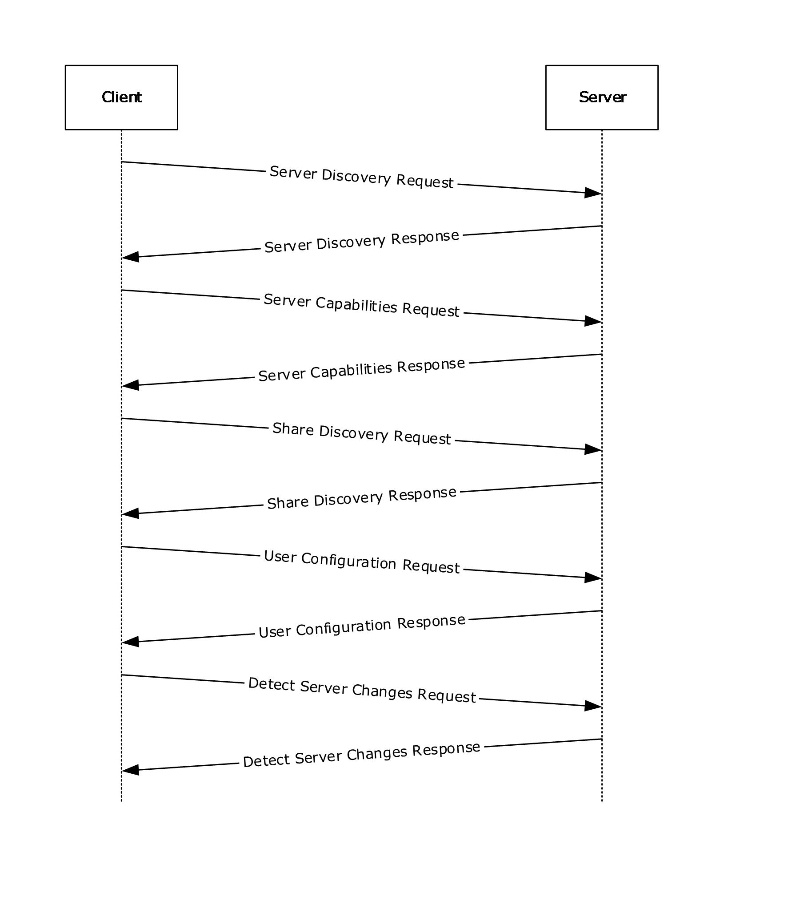

Figure 1: Query user configuration information and detect server changes

- The client sends an HTTP GET request on the Server Discovery resource to enumerate a list of server URLs that expose the synchronization namespace.
Http: Request, GET /sync/1.0/discover/serverurl , Using GSS-API Authorization

Command: GET

+ URI: /sync/1.0/discover/serverurl

ProtocolVersion: HTTP/1.1

Cache-Control: no-cache

Connection: Keep-Alive

Pragma: no-cache

UserAgent: MS_WorkFoldersClient

x-ecs-devicename: HOMEPC,Windows,6,3,MS_WorkFoldersClient

ContentLength: 0

Host: syncsvr.contoso.com

+ Authorization: Negotiate

HeaderEnd: CRLF

- The server sends a list of host server URL prefixes that the client can connect to for all subsequent sync operations.
- Http: Response, HTTP/1.1, Status: Not found, URL: /sync/1.0/discover/serverurl , Using GSS-API Authentication

ProtocolVersion: HTTP/1.1

StatusCode: 404, Not found

Reason: Not Found

Server: Microsoft-IIS/8.5

x-ecs-request-error: 0x80c80036

+ N2HTPersistentAuth:

+ WWWAuthenticate: Negotiate oYG1MIGyoAMKAQChCwYJKoZIgvcSAQICooGdBIGaYIGXBgkqhkiG9xIBAgICAG+BhzCBhKADAgEFoQMCAQ+ieDB2oAMCARKibwRt15fx9aLWbR8jTfGevFeDCNYl3lpAgquJkxc7wRUXqkFo+DP0qPTP97qWyT1bbo7OpLTa879/lFa9JrH3CMUp30WsD7aCh4UgxGjNH09MA9CnCn94mruVkgRiWHC44ALH7/L3

Date: Tue, 24 Dec 2013 08:35:57 GMT

ContentLength: 0

HeaderEnd: CRLF

- The client sends an HTTP GET request on the Server Capabilities resource to query protocol support information from the server.
- Http: Request, GET /sync/1.0/capabilities , Using GSS-API Authorization

Command: GET

+ URI: /sync/1.0/capabilities

ProtocolVersion: HTTP/1.1

Cache-Control: no-cache

Connection: Keep-Alive

Pragma: no-cache

UserAgent: MS_WorkFoldersClient

x-ecs-devicename: HOMEPC,Windows,6,3,MS_WorkFoldersClient

ContentLength: 0

Host: syncsvr.contoso.com

+ Authorization: Negotiate

HeaderEnd: CRLF

- The server responds with status 200 to indicate that the version requested by the client is supported and to indicate the current server capabilities that it supports.
- Http: Response, HTTP/1.1, Status: Ok, URL: /sync/1.0/capabilities , Using GSS-API Authentication

ProtocolVersion: HTTP/1.1

StatusCode: 200, Ok

Reason: OK

Server: Microsoft-IIS/8.5

+ N2HTPersistentAuth:

+ WWWAuthenticate: Negotiate …

Date: Tue, 24 Dec 2013 08:36:08 GMT

ContentLength: 1

HeaderEnd: CRLF

ProtocolType FileBatching(1)

- The client sends a HTTP GET request on Share Discovery resource to establish a sync partnership with the server and receive an ID that allows it to sync with the sync share selected by the server.
- Http: Request, GET /sync/1.0/discover/share , Using GSS-API Authorization

Command: GET

+ URI: /sync/1.0/discover/share

ProtocolVersion: HTTP/1.1

Cache-Control: no-cache

Connection: Keep-Alive

Pragma: no-cache

UserAgent: MS_WorkFoldersClient

x-ecs-devicename: HOMEPC,Windows,6,3,MS_WorkFoldersClient

x-ecs-share-type: User Data

ContentLength: 0

Host: syncsvr.contoso.com

+ Authorization: Negotiate

HeaderEnd: CRLF

- The server responds with PartnershipId, EnterpriseId, and DataSize.
- Http: Response, HTTP/1.1, Status: Ok, URL: /sync/1.0/discover/share , Using GSS-API Authentication

ProtocolVersion: HTTP/1.1

StatusCode: 200, Ok

Reason: OK

Server: Microsoft-IIS/8.5

+ N2HTPersistentAuth:

+ WWWAuthenticate: Negotiate …

Date: Tue, 24 Dec 2013 08:35:57 GMT

ContentLength: 103

HeaderEnd: CRLF

PartnershipId SalesShare|Administrator\Documents|S-1-5-21-2507039251-2369267751-3911940733- 500

Length 80

Content SalesShare|Administrator\Documents|S-1-5-21-2507039251-2369267751-3911940733-500

EnterpriseId contoso.com

Length 11

Content contoso.com

DataSize 0

- The client sends an HTTP GET request on the User Configuration resource to query configuration information for a sync target share.
- Http: Request, GET /sync/1.0/configuration

Command: GET

+ URI: /sync/1.0/configuration

ProtocolVersion: HTTP/1.1

Cache-Control: no-cache

Connection: Keep-Alive

Pragma: no-cache

UserAgent: MS_WorkFoldersClient

x-ecs-devicename: HOMEPC,Windows,6,3,MS_WorkFoldersClient

x-ecs-domain: Y29udG9zby5jb20=

x-ecs-partnershipId: U2FsZXNTaGFyZXxBZG1pbmlzdHJhdG9yXERvY3VtZW50c3xTLTEtNS0yMS0yNTA3MDM5MjUxLTIzNjkyNjc3NTEtMzkxMTk0MDczMy01MDA=

ContentLength: 0

Host: syncsvr.contoso.com

HeaderEnd: CRLF

- The server responds with QuotaUsage, PolicyList, Length, and AdminInfo.
- Http: Response, HTTP/1.1, Status: Ok, URL: /sync/1.0/configuration

ProtocolVersion: HTTP/1.1

StatusCode: 200, Ok

Reason: OK

Server: Microsoft-IIS/8.5

+ N2HTPersistentAuth:

Date: Tue, 24 Dec 2013 08:35:57 GMT

ContentLength: 28

HeaderEnd: CRLF

- payload: HttpContentType = NetmonNull

HTTPPayloadLine:

QuotaUsage

UserUsage 18053250867527680

UserDataFreeSpace 18446744073709551615

PolicyList

NumEntries 3

EntryStream

[0]

PolicyName Password(2)

PolicyType 0

[1]

PolicyName AutoLock(3)

PolicyType 0

[2]

PolicyName Encryption(1)

PolicyType 0

AdminInfo …

- The client sends an HTTP GET request on the Detect Server Changes resource to poll for the changes on the server.
- Http: Request, HEAD /sync/1.0/changes

Command: HEAD

+ URI: /sync/1.0/changes

ProtocolVersion: HTTP/1.1

Cache-Control: no-cache

Connection: Keep-Alive

Pragma: no-cache

UserAgent: MS_WorkFoldersClient

x-ecs-devicename: HOMEPC,Windows,6,3,MS_WorkFoldersClient

x-ecs-partnershipId: U2FsZXNTaGFyZXxBZG1pbmlzdHJhdG9yXERvY3VtZW50c3xTLTEtNS0yMS0yNTA3MDM5MjUxLTIzNjkyNjc3NTEtMzkxMTk0MDczMy01MDA=

ContentLength: 0

Host: syncsvr.contoso.com

HeaderEnd: CRLF

- The server responds with a new URI in the x-ecs-changes-URL response header.
- Http: Response, HTTP/1.1, Status: Ok, URL: /sync/1.0/changes

ProtocolVersion: HTTP/1.1

StatusCode: 200, Ok

Reason: OK

ContentLength: 0

ETag: 0

Server: Microsoft-IIS/8.5

+ N2HTPersistentAuth:

Date: Tue, 24 Dec 2013 08:36:08 GMT

HeaderEnd: CRLF

<a id="Section_4.2"></a>
## 4.2 Upload Scenario

The following diagram demonstrates the steps taken to upload the data between client and server.

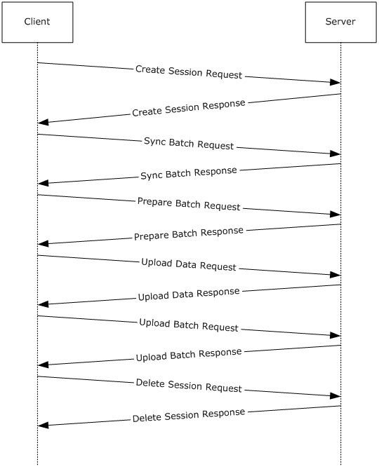

Figure 2: Upload scenario

- The client sends an HTTP PUT request on Create Session resource to start a sync session on the server.
- Http: Request, PUT /sync/1.0/session

Command: PUT

+ URI: /sync/1.0/session

ProtocolVersion: HTTP/1.1

Cache-Control: no-cache

Connection: Keep-Alive

Pragma: no-cache

UserAgent: MS_WorkFoldersClient

x-ecs-devicename: HOMEPC,Windows,6,3,MS_WorkFoldersClient

x-ecs-partnershipId: U2FsZXNTaGFyZXxBZG1pbmlzdHJhdG9yXERvY3VtZW50c3xTLTEtNS0yMS0yNTA3MDM5MjUxLTIzNjkyNjc3NTEtMzkxMTk0MDczMy01MDA=

ContentLength: 17

Host: syncsvr.contoso.com

Type Upload(1)

ClientID 60f4c9fd-9c9d-421c-97a0-bdcb740424c3

- The server creates a new session and responds with session information.
- Http: Response, HTTP/1.1, Status: Created, URL: /sync/1.0/session

ProtocolVersion: HTTP/1.1

StatusCode: 201, Created

Reason: Created

Server: Microsoft-IIS/8.5

x-ecs-session-id: {01FF313D-1BE3-49C9-B7BA-1D668531E1EF}

x-ecs-metadata-version: {95B11081-8EBA-411D-AA5B-467AB44AEFF0}

+ N2HTPersistentAuth:

Date: Tue, 24 Dec 2013 08:36:08 GMT

ContentLength: 0

HeaderEnd: CRLF

- The client sends an HTTP GET request on the Sync Batch Parameters resource, to obtain the server's sync knowledge in an upload scenario.
- Http: Request, GET /sync/1.0/session/%7B01ff313d-1be3-49c9-b7ba-1d668531e1ef%7D/syncbatchparameters

Command: GET

+ URI: /sync/1.0/session/%7B01ff313d-1be3-49c9-b7ba-1d668531e1ef%7D/syncbatchparameters

ProtocolVersion: HTTP/1.1

Cache-Control: no-cache

Connection: Keep-Alive

Pragma: no-cache

UserAgent: MS_WorkFoldersClient

x-ecs-devicename: HOMEPC,Windows,6,3,MS_WorkFoldersClient

x-ecs-partnershipId: U2FsZXNTaGFyZXxBZG1pbmlzdHJhdG9yXERvY3VtZW50c3xTLTEtNS0yMS0yNTA3MDM5MjUxLTIzNjkyNjc3NTEtMzkxMTk0MDczMy01MDA=

ContentLength: 0

Host: syncsvr.contoso.com

HeaderEnd: CRLF

- The server responds with SyncKnowledge and BatchLimits.
Frame: Number = 122, Captured Frame Length = 398, MediaType = ETHERNET

+ Ethernet: Etype = Internet IP (IPv4),DestinationAddress:[00-15-5D-8E-71-8B],SourceAddress:[00-15-5D-8E-71-89]

+ Ipv4: Src = 10.10.1.12, Dest = 10.10.1.16, Next Protocol = TCP, Packet ID = 32727, Total IP Length = 384

+ Tcp: Flags=...AP..., SrcPort=HTTP(80), DstPort=63384, PayloadLen=344, Seq=1544306057 - 1544306401, Ack=2864974975, Win=513 (scale factor 0x8) = 131328

- Http: Response, HTTP/1.1, Status: Ok, URL: /sync/1.0/session/%7B01ff313d-1be3-49c9-b7ba-1d668531e1ef%7D/syncbatchparameters

ProtocolVersion: HTTP/1.1

StatusCode: 200, Ok

Reason: OK

Server: Microsoft-IIS/8.5

+ N2HTPersistentAuth:

Date: Tue, 24 Dec 2013 08:36:08 GMT

ContentLength: 217

HeaderEnd: CRLF

SyncKnowledge …

BlobSize 205

BlobData …

BatchLimits …

MaxFileDataSize 200

MaxFileCount 1000

- The client sends an HTTP PUT request on the Prepare Batch resource, to request server-side preparation for a file upload in a sync process.
- Http: Request, PUT /sync/1.0/session/%7B01ff313d-1be3-49c9-b7ba-1d668531e1ef%7D/preparebatch/0

Command: PUT

+ URI: /sync/1.0/session/%7B01ff313d-1be3-49c9-b7ba-1d668531e1ef%7D/preparebatch/0

ProtocolVersion: HTTP/1.1

Cache-Control: no-cache

Connection: Keep-Alive

Pragma: no-cache

UserAgent: MS_WorkFoldersClient

x-ecs-devicename: HOMEPC,Windows,6,3,MS_WorkFoldersClient

x-ecs-partnershipId: U2FsZXNTaGFyZXxBZG1pbmlzdHJhdG9yXERvY3VtZW50c3xTLTEtNS0yMS0yNTA3MDM5MjUxLTIzNjkyNjc3NTEtMzkxMTk0MDczMy01MDA=

ContentLength: 4

Host: syncsvr.contoso.com

PrepareBatchRequestBody

FileVector …

NumEntries 0

EntryStreamBytes []

- The server responds with list of file status entries indicating the status of the change batch preparation.
- Http: Response, HTTP/1.1, Status: Ok, URL: /sync/1.0/session/%7B01ff313d-1be3-49c9-b7ba-1d668531e1ef%7D/preparebatch/0

ProtocolVersion: HTTP/1.1

StatusCode: 200, Ok

Reason: OK

Server: Microsoft-IIS/8.5

+ N2HTPersistentAuth:

Date: Tue, 24 Dec 2013 08:36:08 GMT

ContentLength: 4

HeaderEnd: CRLF

FileList VECTOR_FILE_INFO_ENTRY{NumEntries=0,EntryStream=[]}

- For each entry, the client constructs a VECTOR_UPLOAD_ENTRY structure and sends a PUT request on the Upload Data resource for uploading the file data from client to server.
- The server responds with a list of UPLOAD_RESPONSE_ENTRY structures, indicating the server's response for each file being uploaded by the client.
- The client sends an HTTP PUT request on the Upload Batch resource, to commit a change batch on the server.
- Http: Request, PUT /sync/1.0/session/%7B01ff313d-1be3-49c9-b7ba-1d668531e1ef%7D/uploadbatch/0

Command: PUT

+ URI: /sync/1.0/session/%7B01ff313d-1be3-49c9-b7ba-1d668531e1ef%7D/uploadbatch/0

ProtocolVersion: HTTP/1.1

Cache-Control: no-cache

Connection: Keep-Alive

Pragma: no-cache

UserAgent: MS_WorkFoldersClient

x-ecs-devicename: HOMEPC,Windows,6,3,MS_WorkFoldersClient

x-ecs-partnershipId: U2FsZXNTaGFyZXxBZG1pbmlzdHJhdG9yXERvY3VtZW50c3xTLTEtNS0yMS0yNTA3MDM5MjUxLTIzNjkyNjc3NTEtMzkxMTk0MDczMy01MDA=

ContentLength: 735

Host: syncsvr.contoso.com

SerializedSyncBatch …

Files VECTOR_FILE_METADATA_ENTRY{NumEntries=0,EntryStreamBytes=[]}

DeviceNames VECTOR_ECSSTRING{NumEntries=0,EntryStreamBytes=[]}

SyncMetadata …

- The server responds with a list of file status entries indicating the status of the change batch commit operation.
- Http: Response, HTTP/1.1, Status: Ok, URL: /sync/1.0/session/%7B01ff313d-1be3-49c9-b7ba-1d668531e1ef%7D/uploadbatch/0

ProtocolVersion: HTTP/1.1

StatusCode: 200, Ok

Reason: OK

Server: Microsoft-IIS/8.5

+ N2HTPersistentAuth:

Date: Tue, 24 Dec 2013 08:36:08 GMT

ContentLength: 4

HeaderEnd: CRLF

FileStatusList VECTOR_FILE_STATUS_ENTRY{NumEntries=0,EntryStream=[]}

- The client sends an HTTP DELETE request on the Delete Session resource, to remove a server session after a synchronization process is completed or aborted.
- Http: Request, DELETE /sync/1.0/session/%7B01ff313d-1be3-49c9-b7ba-1d668531e1ef%7D

Command: DELETE

+ URI: /sync/1.0/session/%7B01ff313d-1be3-49c9-b7ba-1d668531e1ef%7D

ProtocolVersion: HTTP/1.1

Cache-Control: no-cache

Connection: Keep-Alive

Pragma: no-cache

UserAgent: MS_WorkFoldersClient

x-ecs-devicename: HOMEPC,Windows,6,3,MS_WorkFoldersClient

x-ecs-partnershipId: U2FsZXNTaGFyZXxBZG1pbmlzdHJhdG9yXERvY3VtZW50c3xTLTEtNS0yMS0yNTA3MDM5MjUxLTIzNjkyNjc3NTEtMzkxMTk0MDczMy01MDA=

ContentLength: 0

Host: syncsvr.contoso.com

HeaderEnd: CRLF

- The server deletes the session.
- Http: Response, HTTP/1.1, Status: Accepted, URL: /sync/1.0/session/%7B01ff313d-1be3-49c9-b7ba-1d668531e1ef%7D

ProtocolVersion: HTTP/1.1

StatusCode: 200, Accepted

Reason: Accepted

Server: Microsoft-IIS/8.5

+ N2HTPersistentAuth:

Date: Tue, 24 Dec 2013 08:36:08 GMT

ContentLength: 0

HeaderEnd: CRLF

<a id="Section_4.3"></a>
## 4.3 Download Scenario

The following diagram demonstrates the steps taken to download the data between client and server.

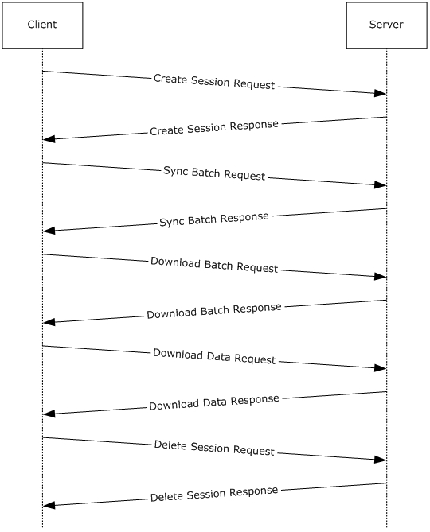

Figure 3: Download scenario

- The client sends a HTTP PUT request on Create Session resource to start a sync session on the server.
- The server creates a new session and responds with session information.
- The client sends a HTTP PUT request on the Sync Batch Parameters resource, to upload its sync knowledge which will be used by the server to generate the list of changes to be downloaded".
- The server responds with TotalFileCount and TotalFileSize.
- The client sends a HTTP GET request on the Download Batch resource, to obtain metadata information for all files in a change batch.
- The server responds with BatchMetadata and DownloadInfo.
- The client sends a HTTP PUT request on the Download Data resource the DownloadEntryVector in the request body is set to a VECTOR_DOWNLOAD_ENTRY.
- For each file represented by a DOWNLOAD_ENTRY structure in DownloadEntryVector, the server constructs the DOWNLOAD_RESPONSE_ENTRY and adds it to VECTOR_DOWNLOAD_RESPONSE_ENTRY.
- The client sends a HTTP DELETE request on Delete Session resource, to remove a server session after a synchronization process is completed or aborted.
- The server deletes the session.
<a id="Section_5"></a>
# 5 Security

<a id="Section_5.1"></a>
## 5.1 Security Considerations for Implementers

The Enterprise Client Synchronization Protocol requires that all the requests from the client be authenticated. The client is expected to use an implementation-dependent authentication mechanism to obtain a security token and include that token in the standard HTTP Authorization header. The server will validate the token and use it to authorize the request.

<a id="Section_5.2"></a>
## 5.2 Index of Security Parameters

None.

<a id="Section_6"></a>
# 6 Appendix A: Product Behavior

The information in this specification is applicable to the following Microsoft products or supplemental software. References to product versions include updates to those products.

- Windows 7 operating system with Service Pack 1 (SP1) and KB2891638
- Windows 8.1 operating system
- Windows Server 2012 R2 operating system
- Windows 10 operating system
- Windows Server 2016 operating system
- Windows Server operating system
- Windows Server 2019 operating system
- Windows Server 2022 operating system
- Windows 11 operating system
- Windows Server 2025 operating system
Exceptions, if any, are noted in this section. If an update version, service pack or Knowledge Base (KB) number appears with a product name, the behavior changed in that update. The new behavior also applies to subsequent updates unless otherwise specified. If a product edition appears with the product version, behavior is different in that product edition.

Unless otherwise specified, any statement of optional behavior in this specification that is prescribed using the terms "SHOULD" or "SHOULD NOT" implies product behavior in accordance with the SHOULD or SHOULD NOT prescription. Unless otherwise specified, the term "MAY" implies that the product does not follow the prescription.

<1> Section 1.7: The following table illustrates the Windows operating system versions that support the ECS client and server.

| ECS client | ECS Server |
| --- | --- |
| Windows 7 operating system with Service Pack 1 (SP1) with [[MSKB-2891638]](https://go.microsoft.com/fwlink/?LinkId=509962) Windows 8.1 Windows 10 Windows 11 | Windows Server 2012 R2 Windows Server 2016 Windows Server operating system Windows Server 2019 Windows Server 2022 Windows Server 2025 |

<2> Section 2.2.2.5: Windows uses the File Attribute Constants as defined in [[MSDN-FSA]](https://go.microsoft.com/fwlink/?LinkId=309761).

<3> Section 2.2.2.9: Windows clients will set the **Reserved** field to an arbitrary value

<4> Section 3.1.5.3.1.3: Windows Server 2012 R2 doesn't add these headers.

<5> Section 3.2.5.1.1.3: Windows-based servers do not send this header.

<6> Section 3.2.5.1.1.3: Windows Server 2012 R2 does not hold the request.

<7> Section 3.4.5: Windows Server 2012 R2 operating system and later limit the number of outstanding requests by a user to 25.

<8> Section 3.4.5.1.1.3: Windows Server 2012 R2 operating system and later limit the number of download sessions established by a user to 20 and the number of upload sessions to 1 per user.

<9> Section 3.4.5.2.1.3: Windows-based servers will set **MaxFileDataSize** to a maximum of 200 MiB and **MaxFileCount** to a maximum of 1000.

<10> Section 3.4.5.2.2.3: Windows-based servers will set **TotalFileCount** to a maximum of 1000 and **TotalFileSize** to a maximum of 200 MiB in one batch.

<11> Section 3.4.5.3.1.3: The maximum file name size allowed in Windows-based servers is 255.

<12> Section 3.4.5.3.1.3: Windows-based servers allow a maximum file size of 10GB.

<13> Section 3.6.3: Windows clients set this to "1.0".

<14> Section 3.6.3: Windows 7 SP1 without KB2891638, Windows 8.1, and Windows 10 v1507 operating system do not check these headers.

<15> Section 3.6.3: Windows-based clients use a default wait time of 10 minutes.

<16> Section 3.6.3: Windows-based clients use a default wait time of 10 minutes.

<17> Section 3.6.3: Windows-based clients use a default timeout of 10 minutes.

<a id="Section_7"></a>
# 7 Change Tracking

This section identifies changes that were made to this document since the last release. Changes are classified as Major, Minor, or None.

The revision class **Major** means that the technical content in the document was significantly revised. Major changes affect protocol interoperability or implementation. Examples of major changes are:

- A document revision that incorporates changes to interoperability requirements.
- A document revision that captures changes to protocol functionality.
The revision class **Minor** means that the meaning of the technical content was clarified. Minor changes do not affect protocol interoperability or implementation. Examples of minor changes are updates to clarify ambiguity at the sentence, paragraph, or table level.

The revision class **None** means that no new technical changes were introduced. Minor editorial and formatting changes may have been made, but the relevant technical content is identical to the last released version.

The changes made to this document are listed in the following table. For more information, please contact [dochelp@microsoft.com](mailto:dochelp@microsoft.com).

| Section | Description | Revision class |
| --- | --- | --- |
| [6](#Section_6) Appendix A: Product Behavior | Added Windows Server 2025 to the list of applicable products. | Major |

<a id="revision-history"></a>

## Revision History

| Date | Version | Revision Class | Comments |
| --- | --- | --- | --- |
| 8/8/2013 | 1.0 | New | Released new document. |
| 11/14/2013 | 2.0 | Major | Significantly changed the technical content. |
| 2/13/2014 | 2.0 | None | No change to the meaning, language, or formatting of the technical content. |
| 5/15/2014 | 3.0 | Major | Significantly changed the technical content. |
| 6/30/2015 | 4.0 | Major | Significantly changed the technical content. |
| 10/16/2015 | 5.0 | Major | Significantly changed the technical content. |
| 7/14/2016 | 6.0 | Major | Significantly changed the technical content. |
| 6/1/2017 | 7.0 | Major | Significantly changed the technical content. |
| 9/15/2017 | 8.0 | Major | Significantly changed the technical content. |
| 12/1/2017 | 8.0 | None | No changes to the meaning, language, or formatting of the technical content. |
| 9/12/2018 | 9.0 | Major | Significantly changed the technical content. |
| 8/26/2020 | 10.0 | Major | Significantly changed the technical content. |
| 4/7/2021 | 11.0 | Major | Significantly changed the technical content. |
| 6/25/2021 | 12.0 | Major | Significantly changed the technical content. |
| 4/23/2024 | 13.0 | Major | Significantly changed the technical content. |
