# [MS-EFSR]: Encrypting File System Remote (EFSRPC) Protocol

Table of Contents

<details>
<summary>1 Introduction</summary>

- [1 Introduction](#Section_1)
  - [1.1 Glossary](#Section_1.1)
  - [1.2 References](#Section_1.2)
    - [1.2.1 Normative References](#Section_1.2.1)
    - [1.2.2 Informative References](#Section_1.2.2)
  - [1.3 Overview](#Section_1.3)
  - [1.4 Relationship to Other Protocols](#Section_1.4)
  - [1.5 Prerequisites/Preconditions](#Section_1.5)
  - [1.6 Applicability Statement](#Section_1.6)
  - [1.7 Versioning and Capability Negotiation](#Section_1.7)
  - [1.8 Vendor-Extensible Fields](#Section_1.8)
  - [1.9 Standards Assignments](#Section_1.9)
</details>

<details>
<summary>2 Messages</summary>

- [2 Messages](#Section_2)
  - [2.1 Transport](#Section_2.1)
  - [2.2 Common Data Types](#Section_2.2)
    - [2.2.1 EFSRPC Identifiers](#Section_2.2.1)
    - [2.2.2 EFSRPC Metadata](#Section_2.2.2)
      - [2.2.2.1 EFSRPC Metadata Version 1](#Section_2.2.2.1)
        - [2.2.2.1.1 Key List Structure](#Section_2.2.2.1.1)
        - [2.2.2.1.2 Key List Entry](#Section_2.2.2.1.2)
        - [2.2.2.1.3 Public Key Information](#Section_2.2.2.1.3)
        - [2.2.2.1.4 Certificate Data](#Section_2.2.2.1.4)
        - [2.2.2.1.5 Encrypted FEK](#Section_2.2.2.1.5)
      - [2.2.2.2 EFSRPC Metadata Version 2](#Section_2.2.2.2)
        - [2.2.2.2.1 Protector List Structure](#Section_2.2.2.2.1)
        - [2.2.2.2.2 EFSX Datum](#Section_2.2.2.2.2)
        - [2.2.2.2.3 Blob Datum](#Section_2.2.2.2.3)
        - [2.2.2.2.4 Descriptor Datum](#Section_2.2.2.2.4)
        - [2.2.2.2.5 Protector List Entry](#Section_2.2.2.2.5)
        - [2.2.2.2.6 Protector Info Datum](#Section_2.2.2.2.6)
        - [2.2.2.2.7 Key Agreement Datum](#Section_2.2.2.2.7)
        - [2.2.2.2.8 Fek Info Datum](#Section_2.2.2.2.8)
        - [2.2.2.2.9 DPAPI-NG Datum](#Section_2.2.2.2.9)
      - [2.2.2.3 EFSRPC Metadata Version 3](#Section_2.2.2.3)
    - [2.2.3 EFSRPC Raw Data Format](#Section_2.2.3)
      - [2.2.3.1 Marshaled Stream](#Section_2.2.3.1)
      - [2.2.3.2 Stream Data Segment](#Section_2.2.3.2)
      - [2.2.3.3 Data Segment Encryption Header](#Section_2.2.3.3)
      - [2.2.3.4 Extended Header](#Section_2.2.3.4)
    - [2.2.4 PEXIMPORT_CONTEXT_HANDLE](#Section_2.2.4)
    - [2.2.5 EFS_EXIM_PIPE](#Section_2.2.5)
    - [2.2.6 EFS_CERTIFICATE_BLOB](#Section_2.2.6)
    - [2.2.7 EFS_HASH_BLOB](#Section_2.2.7)
    - [2.2.8 ENCRYPTION_CERTIFICATE](#Section_2.2.8)
    - [2.2.9 ENCRYPTION_CERTIFICATE_LIST](#Section_2.2.9)
    - [2.2.10 ENCRYPTION_CERTIFICATE_HASH](#Section_2.2.10)
    - [2.2.11 ENCRYPTION_CERTIFICATE_HASH_LIST](#Section_2.2.11)
    - [2.2.12 EFS_RPC_BLOB](#Section_2.2.12)
    - [2.2.13 ALG_ID](#Section_2.2.13)
    - [2.2.14 EFS_KEY_INFO](#Section_2.2.14)
    - [2.2.15 EFS_COMPATIBILITY_INFO](#Section_2.2.15)
    - [2.2.16 EFS_ENCRYPTION_STATUS_INFO](#Section_2.2.16)
    - [2.2.17 EFS_DECRYPTION_STATUS_INFO](#Section_2.2.17)
    - [2.2.18 ENCRYPTED_FILE_METADATA_SIGNATURE](#Section_2.2.18)
    - [2.2.19 ENCRYPTION_PROTECTOR](#Section_2.2.19)
    - [2.2.20 ENCRYPTION_PROTECTOR_LIST](#Section_2.2.20)
</details>

<details>
<summary>3 Protocol Details</summary>

- [3 Protocol Details](#Section_3)
  - [3.1 Server Details](#Section_3.1)
    - [3.1.1 Abstract Data Model](#Section_3.1.1)
      - [3.1.1.1 User-Certificate Binding](#Section_3.1.1.1)
      - [3.1.1.2 EFSRPC Server Control](#Section_3.1.1.2)
    - [3.1.2 Timers](#Section_3.1.2)
    - [3.1.3 Initialization](#Section_3.1.3)
    - [3.1.4 Message Processing Events and Sequencing Rules](#Section_3.1.4)
      - [3.1.4.1 Application Requests for a User-Certificate Binding](#Section_3.1.4.1)
        - [3.1.4.1.1 EFS Certificate Enrollment Algorithm](#Section_3.1.4.1.1)
          - [3.1.4.1.1.1 Inputs](#Section_3.1.4.1.1.1)
          - [3.1.4.1.1.2 Outputs](#Section_3.1.4.1.1.2)
          - [3.1.4.1.1.3 Internal Variables](#Section_3.1.4.1.1.3)
          - [3.1.4.1.1.4 Processing Rules](#Section_3.1.4.1.1.4)
            - [3.1.4.1.1.4.1 Building a List of CAs that Support a Particular Template](#Section_3.1.4.1.1.4.1)
            - [3.1.4.1.1.4.2 Creating a Request](#Section_3.1.4.1.1.4.2)
      - [3.1.4.2 EFSRPC Interface](#Section_3.1.4.2)
        - [3.1.4.2.1 Receiving an EfsRpcOpenFileRaw Message (Opnum 0)](#Section_3.1.4.2.1)
        - [3.1.4.2.2 Receiving an EfsRpcReadFileRaw Message (Opnum 1)](#Section_3.1.4.2.2)
        - [3.1.4.2.3 Receiving an EfsRpcWriteFileRaw Message (Opnum 2)](#Section_3.1.4.2.3)
        - [3.1.4.2.4 Receiving an EfsRpcCloseRaw Message (Opnum 3)](#Section_3.1.4.2.4)
        - [3.1.4.2.5 Receiving an EfsRpcEncryptFileSrv Message (Opnum 4)](#Section_3.1.4.2.5)
        - [3.1.4.2.6 Receiving an EfsRpcDecryptFileSrv Message (Opnum 5)](#Section_3.1.4.2.6)
        - [3.1.4.2.7 Receiving an EfsRpcQueryUsersOnFile Message (Opnum 6)](#Section_3.1.4.2.7)
        - [3.1.4.2.8 Receiving an EfsRpcQueryRecoveryAgents Message (Opnum 7)](#Section_3.1.4.2.8)
        - [3.1.4.2.9 Receiving an EfsRpcRemoveUsersFromFile Message (Opnum 8)](#Section_3.1.4.2.9)
        - [3.1.4.2.10 Receiving an EfsRpcAddUsersToFile Message (Opnum 9)](#Section_3.1.4.2.10)
        - [3.1.4.2.11 Receiving an EfsRpcNotSupported Message (Opnum 11)](#Section_3.1.4.2.11)
        - [3.1.4.2.12 Receiving an EfsRpcFileKeyInfo Message (Opnum 12)](#Section_3.1.4.2.12)
        - [3.1.4.2.13 Receiving an EfsRpcDuplicateEncryptionInfoFile Message (Opnum 13)](#Section_3.1.4.2.13)
        - [3.1.4.2.14 Receiving an EfsRpcAddUsersToFileEx Message (Opnum 15)](#Section_3.1.4.2.14)
        - [3.1.4.2.15 Receiving an EfsRpcFileKeyInfoEx Message (Opnum 16)](#Section_3.1.4.2.15)
        - [3.1.4.2.16 Receiving an EfsRpcGetEncryptedFileMetadata Message (Opnum 18)](#Section_3.1.4.2.16)
        - [3.1.4.2.17 Receiving an EfsRpcSetEncryptedFileMetadata Message (Opnum 19)](#Section_3.1.4.2.17)
        - [3.1.4.2.18 Receiving an EfsRpcFlushEfsCache Message (Opnum 20)](#Section_3.1.4.2.18)
        - [3.1.4.2.19 Receiving an EfsRpcEncryptFileExSrv Message (Opnum 21)](#Section_3.1.4.2.19)
        - [3.1.4.2.20 Receiving an EfsRpcQueryProtectors (Opnum 22)](#Section_3.1.4.2.20)
    - [3.1.5 Timer Events](#Section_3.1.5)
    - [3.1.6 Other Local Events](#Section_3.1.6)
</details>

<details>
<summary>4 Protocol Examples</summary>

- [4 Protocol Examples](#Section_4)
</details>

<details>
<summary>5 Security</summary>

- [5 Security](#Section_5)
  - [5.1 Security Considerations for Implementers](#Section_5.1)
  - [5.2 Index of Security Parameters](#Section_5.2)
</details>

<details>
<summary>6 Appendix A: Full IDL</summary>

- [6 Appendix A: Full IDL](#Section_6)
</details>

<details>
<summary>7 Appendix B: Product Behavior</summary>

- [7 Appendix B: Product Behavior](#Section_7)
</details>

<details>
<summary>8 Change Tracking</summary>

- [8 Change Tracking](#Section_8)
</details>

For the legal notice and IP terms, see [LEGAL.md](../LEGAL.md).
Last updated: 9/16/2024.
See [Revision History](#revision-history) for full version history.

<a id="Section_1"></a>
# 1 Introduction

The Encrypting File System Remote (EFSRPC) Protocol is used for performing maintenance and management operations on encrypted data that is stored remotely and accessed over a network. It is used in Windows to manage [**files**](#gt_file) that reside on remote file servers and are encrypted using the [**Encrypting File System (EFS)**](#gt_encrypting-file-system-efs).

Sections 1.5, 1.8, 1.9, 2, and 3 of this specification are normative. All other sections and examples in this specification are informative.

<a id="Section_1.1"></a>
## 1.1 Glossary

This document uses the following terms:

<a id="gt_access-control-list-acl"></a>
**access control list (ACL)**: A list of access control entries (ACEs) that collectively describe the security rules for authorizing access to some resource; for example, an object or set of objects.

<a id="gt_active-directory"></a>
**Active Directory**: The Windows implementation of a general-purpose directory service, which uses [**LDAP**](#gt_lightweight-directory-access-protocol-ldap) as its primary access protocol. Active Directory stores information about a variety of objects in the network such as user accounts, computer accounts, groups, and all related credential information used by Kerberos [MS-KILE](../MS-KILE/MS-KILE.md). Active Directory is either deployed as Active Directory Domain Services (AD DS) or Active Directory Lightweight Directory Services (AD LDS), which are both described in [MS-ADOD](#Section_1.3): Active Directory Protocols Overview.

<a id="gt_advanced-encryption-standard-aes"></a>
**Advanced Encryption Standard (AES)**: A block cipher that supersedes the Data Encryption Standard (DES). AES can be used to protect electronic data. The AES algorithm can be used to encrypt (encipher) and decrypt (decipher) information. Encryption converts data to an unintelligible form called ciphertext; decrypting the ciphertext converts the data back into its original form, called [**plaintext**](#gt_plaintext). AES is used in symmetric-key cryptography, meaning that the same [**key**](#gt_key) is used for the encryption and decryption operations. It is also a block cipher, meaning that it operates on fixed-size blocks of plaintext and ciphertext, and requires the size of the plaintext as well as the ciphertext to be an exact multiple of this block size. AES is also known as the Rijndael symmetric encryption algorithm [[FIPS197]](https://go.microsoft.com/fwlink/?LinkId=89870).

<a id="gt_binary-large-object-blob"></a>
**binary large object (BLOB)**: A collection of binary data stored as a single entity in a database.

<a id="gt_binding"></a>
**binding**: The string representation of the protocol sequence, NetworkAddress, and optionally the [**endpoint**](#gt_endpoint). Also referred to as "string binding". For more information, see [[C706]](https://go.microsoft.com/fwlink/?LinkId=89824) section "String Bindings".

<a id="gt_certificate"></a>
**certificate**: A certificate is a collection of attributes and extensions that can be stored persistently. The set of attributes in a certificate can vary depending on the intended usage of the certificate. A certificate securely binds a public key to the entity that holds the corresponding private key. A certificate is commonly used for authentication and secure exchange of information on open networks, such as the Internet, extranets, and intranets. Certificates are digitally signed by the issuing [**certification authority (CA)**](#gt_certification-authority-ca) and can be issued for a user, a computer, or a service. The most widely accepted format for certificates is defined by the ITU-T X.509 version 3 international standards. For more information about attributes and extensions, see [[RFC3280]](https://go.microsoft.com/fwlink/?LinkId=90414) and [[X509]](https://go.microsoft.com/fwlink/?LinkId=90590) sections 7 and 8.

<a id="gt_certificate-template"></a>
**certificate template**: A list of attributes that define a blueprint for creating an [**X.509**](#gt_x509) [**certificate**](#gt_certificate). It is often referred to in non-Microsoft documentation as a "certificate profile". A [**certificate template**](#gt_certificate-template) is used to define the content and purpose of a digital certificate, including issuance requirements (certificate policies), implemented [**X.509**](#gt_x509) extensions such as application policies, key usage, or extended key usage as specified in [X509], and enrollment permissions. Enrollment permissions define the rules by which a [**certification authority (CA)**](#gt_certification-authority-ca) will issue or deny certificate requests. In Windows environments, [**certificate templates**](#gt_certificate-template) are stored as objects in the [**Active Directory**](#gt_active-directory) and used by Microsoft enterprise [**CAs**](#gt_certification-authority-ca).

<a id="gt_certification-authority-ca"></a>
**certification authority (CA)**: A third party that issues [**public key**](#gt_public-key) [**certificates**](#gt_certificate). Certificates serve to bind public keys to a user identity. Each user and certification authority (CA) can decide whether to trust another user or CA for a specific purpose, and whether this trust is to be transitive. For more information, see [RFC3280].

<a id="gt_data-decryption-field-ddf"></a>
**Data Decryption Field (DDF)**: The portion of the EFSRPC Metadata that contains information that enables authorized users to decrypt the [**file**](#gt_file).

<a id="gt_data-recovery-agent-dra"></a>
**data recovery agent (DRA)**: A logical entity corresponding to an asymmetric key pair, which is configured as part of [**Encrypting File System (EFS)**](#gt_encrypting-file-system-efs) administrative policy by an administrator. Whenever an [**EFS**](#gt_encrypting-file-system-efs) file is created or modified, it is also automatically configured to give authorized access to all [**DRAs**](#gt_data-recovery-agent-dra) in effect at that time.

<a id="gt_data-recovery-field-drf"></a>
**data recovery field (DRF)**: The portion of the EFSRPC Metadata that contains information that enables authorized [**DRAs**](#gt_data-recovery-agent-dra) to decrypt the [**file**](#gt_file).

<a id="gt_domain"></a>
**domain**: A set of users and computers sharing a common namespace and management infrastructure. At least one computer member of the set has to act as a [**domain controller (DC)**](#gt_domain-controller-dc) and host a member list that identifies all members of the domain, as well as optionally hosting the [**Active Directory**](#gt_active-directory) service. The domain controller provides authentication of members, creating a unit of trust for its members. Each domain has an identifier that is shared among its members. For more information, see [MS-AUTHSOD](../MS-AUTHSOD/MS-AUTHSOD.md) section 1.1.1.5 and [MS-ADTS](../MS-ADTS/MS-ADTS.md).

<a id="gt_domain-controller-dc"></a>
**domain controller (DC)**: The service, running on a server, that implements [**Active Directory**](#gt_active-directory), or the server hosting this service. The service hosts the data store for objects and interoperates with other [**DCs**](#gt_domain-controller-dc) to ensure that a local change to an object replicates correctly across all [**DCs**](#gt_domain-controller-dc). When [**Active Directory**](#gt_active-directory) is operating as Active Directory Domain Services (AD DS), the [**DC**](#gt_domain-controller-dc) contains full NC replicas of the configuration naming context (config NC), schema naming context (schema NC), and one of the domain NCs in its forest. If the AD DS [**DC**](#gt_domain-controller-dc) is a global catalog server (GC server), it contains partial NC replicas of the remaining domain NCs in its forest. For more information, see [MS-AUTHSOD] section 1.1.1.5.2 and [MS-ADTS]. When [**Active Directory**](#gt_active-directory) is operating as Active Directory Lightweight Directory Services (AD LDS), several AD LDS [**DCs**](#gt_domain-controller-dc) can run on one server. When [**Active Directory**](#gt_active-directory) is operating as AD DS, only one AD DS [**DC**](#gt_domain-controller-dc) can run on one server. However, several AD LDS [**DCs**](#gt_domain-controller-dc) can coexist with one AD DS [**DC**](#gt_domain-controller-dc) on one server. The AD LDS [**DC**](#gt_domain-controller-dc) contains full NC replicas of the config NC and the schema NC in its forest. The domain controller is the server side of Authentication Protocol Domain Support [MS-APDS](../MS-APDS/MS-APDS.md).

<a id="gt_efsrpc-metadata"></a>
**EFSRPC Metadata**: The additional data stored with an encrypted [**file**](#gt_file) to enable authorized users to access the data in the [**file**](#gt_file). The format of this metadata is implementation-dependent. The EFSRPC Metadata general requirements are specified in detail in section 2.2.2 and the Windows format is specified in associated endnotes in Appendix B of this specification.

<a id="gt_efsrpc-raw-data-format"></a>
**EFSRPC Raw Data Format**: The data format used by the EFSRPC raw methods to marshal the contents and metadata of an encrypted [**file**](#gt_file) into a single-bit [**stream**](#gt_stream). It is specified in section 2.2.3.

<a id="gt_encrypting-file-system-efs"></a>
**Encrypting File System (EFS)**: The name for the encryption capability of the [**NTFS**](#gt_nt-file-system-ntfs) file system. When a file is encrypted using [**EFS**](#gt_encrypting-file-system-efs), a symmetric key known as the file encryption key (FEK) is generated and the contents of the file are encrypted with the FEK. For each user or [**data recovery agent (DRA)**](#gt_data-recovery-agent-dra) that is authorized to access the file, a copy of the FEK is encrypted with that user's or [**DRA's**](#gt_data-recovery-agent-dra) [**public key**](#gt_public-key) and is stored in the file's metadata. For more information about [**EFS**](#gt_encrypting-file-system-efs), see [[MSFT-EFS]](https://go.microsoft.com/fwlink/?LinkId=90185).

<a id="gt_endpoint"></a>
**endpoint**: A network-specific address of a remote procedure call (RPC) server process for remote procedure calls. The actual name and type of the endpoint depends on the [**RPC**](#gt_remote-procedure-call-rpc) protocol sequence that is being used. For example, for RPC over TCP (RPC Protocol Sequence ncacn_ip_tcp), an endpoint might be TCP port 1025. For RPC over Server Message Block (RPC Protocol Sequence ncacn_np), an endpoint might be the name of a [**named pipe**](#gt_named-pipe). For more information, see [C706].

<a id="gt_file"></a>
**file**: A unit of data in the [**file system**](#gt_file-system). An encrypted file consists of encrypted data along with the metadata required for a user to decrypt the file. The file and its metadata are protected using [**public key**](#gt_public-key) cryptography such that an authorized user's [**private key**](#gt_private-key) is required to decrypt the file.

<a id="gt_file-encryption-key-fek"></a>
**File Encryption Key (FEK)**: The symmetric key that is used to encrypt the data in an EFS-protected [**file**](#gt_file). The FEK is further encrypted and stored in the [**file**](#gt_file) metadata such that only authorized users can access it.

<a id="gt_file-system"></a>
**file system**: A system that enables applications to store and retrieve [**files**](#gt_file) on storage devices. Files are placed in a hierarchical structure. The file system specifies naming conventions for files and the format for specifying the path to a file in the tree structure. Each file system consists of one or more drivers and DLLs that define the data formats and features of the file system. File systems can exist on the following storage devices: diskettes, hard disks, jukeboxes, removable optical disks, and tape backup units.

<a id="gt_folder"></a>
**folder**: A container for [**files**](#gt_file) and other folders. A folder can be encrypted. The semantics of encrypting a folder are implementation-dependent. In the Windows implementation, encrypting a folder does not directly cause any data to be encrypted. Encrypting a folder in Windows has the following consequences of EFSRPC Metadata is created and stored with the folder and an [**NTFS**](#gt_nt-file-system-ntfs) attribute is set on the folder to signify that it is encrypted. NTFS checks this attribute when any new files or folders are created in the folder. NTFS will automatically encrypt any files or folders created within a folder that has this attribute set.

<a id="gt_fully-qualified-domain-name-fqdn"></a>
**fully qualified domain name (FQDN)**: An unambiguous domain name that gives an absolute location in the Domain Name System's (DNS) hierarchy tree, as defined in [[RFC1035]](https://go.microsoft.com/fwlink/?LinkId=90264) section 3.1 and [[RFC2181]](https://go.microsoft.com/fwlink/?LinkId=127732) section 11.

<a id="gt_globally-unique-identifier-guid"></a>
**globally unique identifier (GUID)**: A term used interchangeably with [**universally unique identifier (UUID)**](#gt_universally-unique-identifier-uuid) in Microsoft protocol technical documents (TDs). Interchanging the usage of these terms does not imply or require a specific algorithm or mechanism to generate the value. Specifically, the use of this term does not imply or require that the algorithms described in [[RFC4122]](https://go.microsoft.com/fwlink/?LinkId=90460) or [C706] have to be used for generating the GUID. See also universally unique identifier (UUID).

<a id="gt_kerberos-constrained-delegation"></a>
**Kerberos constrained delegation**: A form of authentication delegation in which Kerberos can be used to impersonate users that send requests for certain services, as opposed to all services.

<a id="gt_key"></a>
**key**: In cryptography, a generic term used to refer to cryptographic data that is used to initialize a cryptographic algorithm. [**Keys**](#gt_key) are also sometimes referred to as keying material.

<a id="gt_lightweight-directory-access-protocol-ldap"></a>
**Lightweight Directory Access Protocol (LDAP)**: The primary access protocol for [**Active Directory**](#gt_active-directory). Lightweight Directory Access Protocol (LDAP) is an industry-standard protocol, established by the Internet Engineering Task Force (IETF), which allows users to query and update information in a directory service (DS), as described in [MS-ADTS]. The Lightweight Directory Access Protocol can be either version 2 [[RFC1777]](https://go.microsoft.com/fwlink/?LinkId=90290) or version 3 [[RFC3377]](https://go.microsoft.com/fwlink/?LinkID=91337).

<a id="gt_named-pipe"></a>
**named pipe**: A named, one-way, or duplex pipe for communication between a pipe server and one or more pipe clients.

<a id="gt_new-technology-file-system-ntfs"></a>
**New Technology File System (NTFS)**: The native [**file system**](#gt_file-system) of Windows 2000 operating system, Windows XP operating system, Windows Vista operating system, Windows 7 operating system, and Windows 8 operating system. Within this document, this term is occasionally used to refer to the operating system subsystem that implements NTFS support. For more information, see [[MSFT-NTFS]](https://go.microsoft.com/fwlink/?LinkId=90200).

<a id="gt_nt-file-system-ntfs"></a>
**NT file system (NTFS)**: A proprietary Microsoft file system. For more information, see [MSFT-NTFS].

<a id="gt_opnum"></a>
**opnum**: An operation number or numeric identifier that is used to identify a specific [**remote procedure call (RPC)**](#gt_remote-procedure-call-rpc) method or a method in an interface. For more information, see [C706] section 12.5.2.12 or [MS-RPCE](../MS-RPCE/MS-RPCE.md).

<a id="gt_plaintext"></a>
**plaintext**: In cryptography, ordinary readable text before it is encrypted into ciphertext, or after it has been decrypted.

<a id="gt_private-key"></a>
**private key**: One of a pair of keys used in public-key cryptography. The private key is kept secret and is used to decrypt data that has been encrypted with the corresponding public key. For an introduction to this concept, see [[CRYPTO]](https://go.microsoft.com/fwlink/?LinkId=89841) section 1.8 and [[IEEE1363]](https://go.microsoft.com/fwlink/?LinkId=89899) section 3.1.

<a id="gt_public-key"></a>
**public key**: One of a pair of keys used in public-key cryptography. The public key is distributed freely and published as part of a digital certificate. For an introduction to this concept, see [CRYPTO] section 1.8 and [IEEE1363] section 3.1.

<a id="gt_remote-procedure-call-rpc"></a>
**remote procedure call (RPC)**: A communication protocol used primarily between client and server. The term has three definitions that are often used interchangeably: a runtime environment providing for communication facilities between computers (the RPC runtime); a set of request-and-response message exchanges between computers (the RPC exchange); and the single message from an RPC exchange (the RPC message). For more information, see [C706].

<a id="gt_rivest-shamir-adleman-rsa"></a>
**Rivest-Shamir-Adleman (RSA)**: A system for public key cryptography. [**RSA**](#gt_rivest-shamir-adleman-rsa) is specified in [[RFC8017]](https://go.microsoft.com/fwlink/?linkid=2164409).

<a id="gt_rpc-protocol-sequence"></a>
**RPC protocol sequence**: A character string that represents a valid combination of a [**remote procedure call (RPC)**](#gt_remote-procedure-call-rpc) protocol, a network layer protocol, and a transport layer protocol, as described in [C706] and [MS-RPCE].

<a id="gt_rpc-transport"></a>
**RPC transport**: The underlying network services used by the remote procedure call (RPC) runtime for communications between network nodes. For more information, see [C706] section 2.

<a id="gt_security-context"></a>
**security context**: An abstract data structure that contains authorization information for a particular security principal in the form of a Token/Authorization Context (see [MS-DTYP](../MS-DTYP/MS-DTYP.md) section 2.5.2). A server uses the authorization information in a [**security context**](#gt_security-context) to check access to requested resources. A [**security context**](#gt_security-context) also contains a [**key**](#gt_key) identifier that associates mutually established cryptographic [**keys**](#gt_key), along with other information needed to perform secure communication with another security principal.

<a id="gt_security-identifier-sid"></a>
**security identifier (SID)**: An identifier for security principals that is used to identify an account or a group. Conceptually, the [**SID**](#gt_security-identifier-sid) is composed of an account authority portion (typically a [**domain**](#gt_domain)) and a smaller integer representing an identity relative to the account authority, termed the relative identifier (RID). The [**SID**](#gt_security-identifier-sid) format is specified in [MS-DTYP] section 2.4.2; a string representation of [**SIDs**](#gt_security-identifier-sid) is specified in [MS-DTYP] section 2.4.2 and [MS-AZOD](../MS-AZOD/MS-AZOD.md) section 1.1.1.2.

<a id="gt_security-support-provider-interface-sspi"></a>
**Security Support Provider Interface (SSPI)**: An API that allows connected applications to call one of several security providers to establish authenticated connections and to exchange data securely over those connections. It is equivalent to Generic Security Services (GSS)-API, and the two are on-the-wire compatible.

<a id="gt_server"></a>
**server**: A computer on which the [**remote procedure call (RPC)**](#gt_remote-procedure-call-rpc) server is executing.

<a id="gt_server-message-block-smb"></a>
**Server Message Block (SMB)**: A protocol that is used to request file and print services from server systems over a network. The SMB protocol extends the CIFS protocol with additional security, file, and disk management support. For more information, see [[CIFS]](https://go.microsoft.com/fwlink/?linkid=2109334) and [MS-SMB](../MS-SMB/MS-SMB.md).

<a id="gt_sparse-file"></a>
**sparse file**: A [**file**](#gt_file) containing large sections of data composed only of zeros. This file is marked as a sparse file in the [**file system**](#gt_file-system), which saves disk space by only allocating as many ranges on disk as are required to completely reconstruct the non-zero data. When an attempt is made to read in the nonallocated portions of the [**file**](#gt_file) (also known as holes), the [**file system**](#gt_file-system) automatically returns zeros to the caller.

<a id="gt_stream"></a>
**stream**: A sequence of bytes written to a file on the target [**file system**](#gt_file-system). Every file stored on a volume that uses the file system contains at least one stream, which is normally used to store the primary contents of the file. Additional streams within the file can be used to store file attributes, application parameters, or other information specific to that file. Every file has a default data stream, which is unnamed by default. That data stream, and any other data stream associated with a file, can optionally be named.

<a id="gt_uncpath"></a>
**UncPath**: The location of a file in a network of computers, as specified in Universal Naming Convention (UNC) syntax.

<a id="gt_unicode"></a>
**Unicode**: A character encoding standard developed by the Unicode Consortium that represents almost all of the written languages of the world. The [**Unicode**](#gt_unicode) standard [[UNICODE5.0.0/2007]](https://go.microsoft.com/fwlink/?LinkId=154659) provides three forms (UTF-8, UTF-16, and UTF-32) and seven schemes (UTF-8, UTF-16, UTF-16 BE, UTF-16 LE, UTF-32, UTF-32 LE, and UTF-32 BE).

<a id="gt_universally-unique-identifier-uuid"></a>
**universally unique identifier (UUID)**: A 128-bit value. UUIDs can be used for multiple purposes, from tagging objects with an extremely short lifetime, to reliably identifying very persistent objects in cross-process communication such as client and server interfaces, manager entry-point vectors, and [**RPC**](#gt_remote-procedure-call-rpc) objects. UUIDs are highly likely to be unique. UUIDs are also known as [**globally unique identifiers (GUIDs)**](#gt_globally-unique-identifier-guid) and these terms are used interchangeably in the Microsoft protocol technical documents (TDs). Interchanging the usage of these terms does not imply or require a specific algorithm or mechanism to generate the UUID. Specifically, the use of this term does not imply or require that the algorithms described in [RFC4122] or [C706] has to be used for generating the UUID.

<a id="gt_valid-data-length-vdl"></a>
**valid data length (VDL)**: In [**NTFS**](#gt_nt-file-system-ntfs), there are two important concepts of [**file**](#gt_file) length: the end-of-file (EOF) marker and the valid data length (VDL). The EOF indicates the actual length of the [**file**](#gt_file). The VDL identifies the length of valid data on disk. Any reads between VDL and EOF automatically return zeros.

<a id="gt_well-known-endpoint"></a>
**well-known endpoint**: A preassigned, network-specific, stable address for a particular client/server instance. For more information, see [C706].

<a id="gt_x509"></a>
**X.509**: An ITU-T standard for public key infrastructure subsequently adapted by the IETF, as specified in [RFC3280].

**MAY, SHOULD, MUST, SHOULD NOT, MUST NOT:** These terms (in all caps) are used as defined in [[RFC2119]](https://go.microsoft.com/fwlink/?LinkId=90317). All statements of optional behavior use either MAY, SHOULD, or SHOULD NOT.

<a id="Section_1.2"></a>
## 1.2 References

Links to a document in the Microsoft Open Specifications library point to the correct section in the most recently published version of the referenced document. However, because individual documents in the library are not updated at the same time, the section numbers in the documents may not match. You can confirm the correct section numbering by checking the [Errata](https://go.microsoft.com/fwlink/?linkid=850906).

<a id="Section_1.2.1"></a>
### 1.2.1 Normative References

We conduct frequent surveys of the normative references to assure their continued availability. If you have any issue with finding a normative reference, please contact [dochelp@microsoft.com](mailto:dochelp@microsoft.com). We will assist you in finding the relevant information.

[C706] The Open Group, "DCE 1.1: Remote Procedure Call", C706, August 1997, [https://publications.opengroup.org/c706](https://go.microsoft.com/fwlink/?LinkId=89824)

**Note** Registration is required to download the document.

[MS-ADTS] Microsoft Corporation, "[Active Directory Technical Specification](../MS-ADTS/MS-ADTS.md)".

[MS-CRTD] Microsoft Corporation, "[Certificate Templates Structure](../MS-CRTD/MS-CRTD.md)".

[MS-DTYP] Microsoft Corporation, "[Windows Data Types](../MS-DTYP/MS-DTYP.md)".

[MS-ERREF] Microsoft Corporation, "[Windows Error Codes](../MS-ERREF/MS-ERREF.md)".

[MS-RMPR] Microsoft Corporation, "[Rights Management Services (RMS): Client-to-Server Protocol](../MS-RMPR/MS-RMPR.md)".

[MS-RPCE] Microsoft Corporation, "[Remote Procedure Call Protocol Extensions](../MS-RPCE/MS-RPCE.md)".

[MS-SMB2] Microsoft Corporation, "[Server Message Block (SMB) Protocol Versions 2 and 3](../MS-SMB2/MS-SMB2.md)".

[MS-SMB] Microsoft Corporation, "[Server Message Block (SMB) Protocol](../MS-SMB/MS-SMB.md)".

[MS-WCCE] Microsoft Corporation, "[Windows Client Certificate Enrollment Protocol](../MS-WCCE/MS-WCCE.md)".

[RFC1035] Mockapetris, P., "Domain Names - Implementation and Specification", STD 13, RFC 1035, November 1987, [https://www.rfc-editor.org/info/rfc1035](https://go.microsoft.com/fwlink/?LinkId=90264)

[RFC2119] Bradner, S., "Key words for use in RFCs to Indicate Requirement Levels", BCP 14, RFC 2119, March 1997, [https://www.rfc-editor.org/info/rfc2119](https://go.microsoft.com/fwlink/?LinkId=90317)

[RFC2251] Wahl, M., Howes, T., and Kille, S., "Lightweight Directory Access Protocol (v3)", RFC 2251, December 1997, [https://www.rfc-editor.org/info/rfc2251](https://go.microsoft.com/fwlink/?LinkId=90325)

[RFC3394] Schaad, J., Housley, R., "Advanced Encryption Standard (AES) Key Wrap Algorithm", RFC 3394, September 2002, [https://www.rfc-editor.org/info/rfc3394](https://go.microsoft.com/fwlink/?LinkId=131784)

[RFC5280] Cooper, D., Santesson, S., Farrell, S., et al., "Internet X.509 Public Key Infrastructure Certificate and Certificate Revocation List (CRL) Profile", RFC 5280, May 2008, [https://www.rfc-editor.org/info/rfc5280](https://go.microsoft.com/fwlink/?LinkId=131034)

<a id="Section_1.2.2"></a>
### 1.2.2 Informative References

[FIPS180-4] FIPS PUBS, "Secure Hash Standards (SHS)", March 2012, [http://csrc.nist.gov/publications/fips/fips180-4/fips-180-4.pdf](https://go.microsoft.com/fwlink/?LinkId=298918)

[MS-ADOD] Microsoft Corporation, "[Active Directory Protocols Overview](#Section_1.3)".

[MS-SFU] Microsoft Corporation, "[Kerberos Protocol Extensions: Service for User and Constrained Delegation Protocol](../MS-SFU/MS-SFU.md)".

[MS-WDV] Microsoft Corporation, "[Web Distributed Authoring and Versioning (WebDAV) Protocol: Client Extensions](../MS-WDV/MS-WDV.md)".

[MSDN-CRYPTO] Microsoft Corporation, "Cryptography Reference", [http://msdn.microsoft.com/en-us/library/aa380256.aspx](https://go.microsoft.com/fwlink/?LinkId=89984)

[MSFT-CVE-2021-36942] Microsoft Corporation, "Windows LSA Spoofing Vulnerability", CVE-2021-36942 August 10, 2021, [https://msrc.microsoft.com/update-guide/vulnerability/CVE-2021-36942](https://go.microsoft.com/fwlink/?linkid=2169361)

[MSFT-CVE-2021-43893] Microsoft Corporation, "Windows Encrypting File System (EFS) Elevation of Privilege Vulnerability", CVE-2021-43893, December 14, 2021, [https://msrc.microsoft.com/update-guide/vulnerability/CVE-2021-43893](https://go.microsoft.com/fwlink/?linkid=2183237)

[MSFT-CVE-2022-26925] Microsoft Corporation, "Windows LSA Spoofing Vulnerability", CVE-2022-26925, [https://msrc.microsoft.com/update-guide/en-US/vulnerability/CVE-2022-26925](https://go.microsoft.com/fwlink/?linkid=2201451)

[MSFT-EFS] Microsoft Corporation, "The Encrypting File System", [https://technet.microsoft.com/en-us/library/cc700811.aspx](https://go.microsoft.com/fwlink/?LinkId=90185)

[MSFT-NTFS] Microsoft Corporation, "NTFS Technical Reference", March 2003, [http://technet2.microsoft.com/WindowsServer/en/Library/81cc8a8a-bd32-4786-a849-03245d68d8e41033.mspx](https://go.microsoft.com/fwlink/?LinkId=90200)

[MSFT-XPUEFS] Microsoft Corporation, "Windows XP Professional Resource Kit: Using Encrypting File System", November 2005, [http://technet.microsoft.com/en-us/library/bb457116.aspx](https://go.microsoft.com/fwlink/?LinkId=90713)

[TDEA] National Institute of Standards and Technology, "Recommendation for the Triple Data Encryption Algorithm (TDEA) Block Cipher", Special Publication 800-67, May 2004, [https://nvlpubs.nist.gov/nistpubs/Legacy/SP/nistspecialpublication800-67ver1.pdf](https://go.microsoft.com/fwlink/?LinkId=690523)

[X509] ITU-T, "Information Technology - Open Systems Interconnection - The Directory: Public-Key and Attribute Certificate Frameworks", Recommendation X.509, August 2005, [http://www.itu.int/rec/T-REC-X.509/en](https://go.microsoft.com/fwlink/?LinkId=90590)

[X690] ITU-T, "Information Technology - ASN.1 Encoding Rules: Specification of Basic Encoding Rules (BER), Canonical Encoding Rules (CER) and Distinguished Encoding Rules (DER)", Recommendation X.690, July 2002, [http://www.itu.int/rec/T-REC-X.690/en](https://go.microsoft.com/fwlink/?LinkId=90593)

<a id="Section_1.3"></a>
## 1.3 Overview

The Encrypting File System Remote Protocol (hereafter referred to as EFSRPC) is a [**Remote Procedure Call (RPC)**](#gt_remote-procedure-call-rpc) interface that is used to manage data objects stored in an encrypted form. The objective of encrypting data in this fashion is to enforce access control policies and to provide confidentiality from unauthorized users.

EFSRPC is implemented in Windows to provide remote management for [**files**](#gt_file) encrypted by the [**Encrypting File System (EFS)**](#gt_encrypting-file-system-efs). EFS is the ability of the [**New Technology File System (NTFS)**](#gt_new-technology-file-system-ntfs) file system to encrypt files on disk in a manner that is transparent to the user. For more information on EFS, see [[MSFT-EFS]](https://go.microsoft.com/fwlink/?LinkId=90185). For more information about [**NTFS**](#gt_nt-file-system-ntfs), see [[MSFT-NTFS]](https://go.microsoft.com/fwlink/?LinkId=90200).

EFSRPC does not address how data is encrypted, how the encrypted data is stored, or how it is accessed for routine operations such as reading, writing, creating, and deleting. All these actions are specific to the server implementation. On Windows, NTFS provides the storage mechanism (the file is the unit of storage) and the Server Message Block (SMB) Protocol provides remote access to such files. For more information about [**SMB**](#gt_server-message-block-smb), see [MS-SMB](../MS-SMB/MS-SMB.md) and [MS-SMB2](../MS-SMB2/MS-SMB2.md).

EFSRPC models the underlying data encryption architecture using two basic constructs:

- A set of data objects, each of which is encrypted independently and can be managed independently.
- A set of access control subjects, each of which is represented by a key pair generated by a [**public key**](#gt_public-key) cryptographic algorithm. The public key of this key pair is embedded in a [**certificate**](#gt_certificate) and can be widely distributed in that form. The corresponding [**private key**](#gt_private-key) is held solely by the user or users who represent that subject. Thus, a given access control subject can correspond to one or more users, and a given user can possess the private keys for zero or more access control subjects. Access control subjects are further divided into two types:
- Unprivileged user subjects, which are used for routine data access by ordinary users of the system. For convenience, this specification refers to such subjects as user certificate.
- [**Data Recovery Agents (DRAs)**](#gt_data-recovery-agent-dra), which are controlled by system administrators. The storage system ensures that all active DRAs for the system are automatically authorized to access all encrypted objects on the system. If an unprivileged user loses the private key, an administrator can use a DRA's private key to recover the contents of encrypted objects.
EFSRPC also assumes that each encrypted object is associated with some security-related metadata, which contains information required for authorized users and DRAs to access the [**plaintext**](#gt_plaintext) of the object. This specification refers to this security-related metadata as the [EFSRPC Metadata](#Section_2.2.2).

EFSRPC does not specify how data is encrypted, stored, or accessed. It is possible to build a compliant EFSRPC implementation that uses a mechanism, such as [**access control lists (ACLs)**](#gt_access-control-list-acl), instead of encryption to control access to data objects. For the purposes of this specification, the term encrypted is used to indicate that a data object and its metadata can be successfully manipulated through the EFSRPC methods, with the exception of the [EfsRpcEncryptFileSrv](#Section_3.1.4.2.5) method, which converts data objects from an unencrypted state to an encrypted state.

Within the preceding model, EFSRPC provides various categories of management routines. The syntax of the individual methods and rules for how these methods are processed on the server are specified in section [3.1.4.2](#Section_3.1.4.2). The categories of management routines that EFSRPC provides are as follows:

- Requesting the server to convert objects from encrypted state to unencrypted state and vice versa.
- EfsRpcEncryptFileSrv (section 3.1.4.2.5)
- [EfsRpcDecryptFileSrv (section 3.1.4.2.6)](#Section_3.1.4.2.6)
- Creating, querying, and manipulating the EFSRPC Metadata. Clients use the following methods to query and change which user certificates can be used to decrypt an encrypted object. The set of user certificates with access to an object needs to be changed when the set of users with access to the object changes or when a user with access to the object changes the user certificate. The following methods can also be used to copy the access rights from one object to another; the [EfsRpcDuplicateEncryptionInfoFile](#Section_3.1.4.2.13) method is particularly well-suited for this purpose. Methods:
- [EfsRpcQueryUsersOnFile (section 3.1.4.2.7)](#Section_3.1.4.2.7)
- [EfsRpcQueryRecoveryAgents (section 3.1.4.2.8)](#Section_3.1.4.2.8)
- [EfsRpcRemoveUsersFromFile (section 3.1.4.2.9)](#Section_3.1.4.2.9)
- [EfsRpcAddUsersToFile (section 3.1.4.2.10)](#Section_3.1.4.2.14)
- [EfsRpcFileKeyInfo (section 3.1.4.2.12)](#Section_3.1.4.2.15)
- EfsRpcDuplicateEncryptionInfoFile (section 3.1.4.2.13)
- [EfsRpcAddUsersToFileEx (section 3.1.4.2.14)](#Section_3.1.4.2.14)
- [EfsRpcFileKeyInfoEx (section 3.1.4.2.15)](#Section_3.1.4.2.15)
- [EfsRpcGetEncryptedFileMetadata (section 3.1.4.2.16)](#Section_3.1.4.2.16)
- [EfsRpcSetEncryptedFileMetadata (section 3.1.4.2.17)](#Section_3.1.4.2.17)
- Performing backup of encrypted objects in ciphertext form along with their EFSRPC Metadata, and restoring encrypted objects from such backups. Depending on the implementation of these methods, the backups that are created can expose the implementation-specific EFSRPC Metadata format to the client. The Windows implementation of these methods exposes the Windows EFSRPC Metadata format; however, Windows applications do not manipulate this information. The following methods are suitable for secure content archival or transferring encrypted data securely between servers of the same implementation because they do not require decrypting the data. Methods:
- [EfsRpcOpenFileRaw (section 3.1.4.2.1)](#Section_3.1.4.2.1)
- [EfsRpcReadFileRaw (section 3.1.4.2.2)](#Section_3.1.4.2.2)
- [EfsRpcWriteFileRaw (section 3.1.4.2.3)](#Section_3.1.4.2.3)
- [EfsRpcCloseRaw (section 3.1.4.2.4)](#Section_3.1.4.2.4)
- Controlling the server's encryption subsystem. Methods:
- [EfsRpcFlushEfsCache (section 3.1.4.2.18)](#Section_3.1.4.2.18)
Most of the EFSRPC routines are stateless and can be called in any order. When one of these routines is called, the message exchange is as follows.

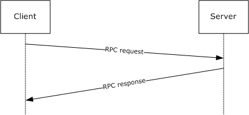

Figure 1: Message exchange for stateless routines

There are two routines in EFSRPC that are an exception to the stateless nature of the protocol. Several methods, collectively known as the EFSRPC raw methods, are an exception and need to be called in a specific order. This includes the EfsRpcOpenFileRaw, EfsRpcReadFileRaw, EfsRpcWriteFileRaw, and EfsRpcCloseRaw methods. The following two sequences are permissible.

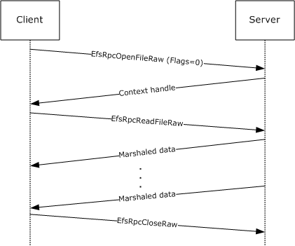

Figure 2: Message sequence for opening a file

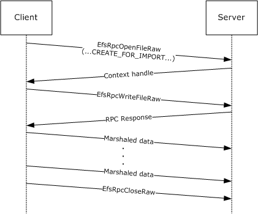

Figure 3: Message sequence for importing a file

<a id="Section_1.4"></a>
## 1.4 Relationship to Other Protocols

The Encrypting File System Remote Protocol is built on the Microsoft [**Remote Procedure Call (RPC)**](#gt_remote-procedure-call-rpc) interface (as specified in [[C706]](https://go.microsoft.com/fwlink/?LinkId=89824) and [MS-RPCE](../MS-RPCE/MS-RPCE.md)). EFSRPC uses the Server Message Block (SMB) Protocol [MS-SMB](../MS-SMB/MS-SMB.md) [MS-SMB2](../MS-SMB2/MS-SMB2.md) as its [**RPC transport**](#gt_rpc-transport). Specifically, it uses [**named pipes**](#gt_named-pipe) over [**SMB**](#gt_server-message-block-smb) (that is, [**RPC protocol sequence**](#gt_rpc-protocol-sequence) ncacn_np) as its transport mechanism. Either version 1 or version 2 of SMB can be used. The client has to connect to the server over SMB and negotiate a version of SMB before it can access the named pipe that is the RPC [**endpoint**](#gt_endpoint) on the server.

Windows also supports the storage of encrypted [**files**](#gt_file) via WebDAV [MS-WDV](../MS-WDV/MS-WDV.md). However, this feature does not use EFSRPC. This feature does not alter the WebDAV Protocol. Windows clients store encrypted files on WebDAV servers in the [**EFSRPC Raw Data Format**](#gt_efsrpc-raw-data-format), but the Windows WebDAV client performs all encryption and decryption operations locally. It also performs the local operations necessary to transform the file to and from the EFSRPC Raw Data Format during upload and download respectively. For more information, see [[MSFT-XPUEFS]](https://go.microsoft.com/fwlink/?LinkId=90713).

This specification provides an interface (see section [3.1.4.1](#Section_3.1.1.1)) for applications to request a user certificate. This interface uses methods outlined in [MS-WCCE](../MS-WCCE/MS-WCCE.md) to enroll for a certificate and key.

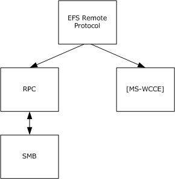

Figure 4: Protocol relationships

<a id="Section_1.5"></a>
## 1.5 Prerequisites/Preconditions

To use EFSRPC with a remote server, the client is required to possess valid credentials recognized by the server and be able to pass authentication and authorization checks for access to the encrypted data on the server. If secure operation is desired, the server is required to register an appropriate server principal name/authentication service pair that supports a protection level that provides packet integrity. Additionally, the client needs to be configured to associate the appropriate server principal name and authentication, and authorization and protection level with its [**binding**](#gt_binding), when connecting to the server.<1>

The User-Certificate Binding interface described in section [3.1.1.1](#Section_3.1.1.1) stores user keys protected to the user credentials and requires that the EFSRPC server be joined to the [**domain**](#gt_domain) and configured for Kerberos delegation.<2> Alternatively, the server can be configured for [**Kerberos constrained delegation**](#gt_kerberos-constrained-delegation) (as specified in [MS-SFU](../MS-SFU/MS-SFU.md)) for only the services used for user key storage.

<a id="Section_1.6"></a>
## 1.6 Applicability Statement

This protocol is appropriate for remotely managing encrypted data objects on a server. It is used by Windows clients to manage EFSRPC-protected [**files**](#gt_file) on remote file servers using either version 1 or version 2 of the SMB Protocol. It does not specify any particular data protection mechanism.

<a id="Section_1.7"></a>
## 1.7 Versioning and Capability Negotiation

This document covers versioning issues in the following areas.

**Supported Transports:** This protocol uses [**RPC**](#gt_remote-procedure-call-rpc) for communication. It uses [**named pipes**](#gt_named-pipe) as the transport mechanism, as specified in section [2.1](#Section_2.1).

**Protocol Versions:** The RPC runtime negotiates the version of the EFSRPC interface, as specified in [[C706]](https://go.microsoft.com/fwlink/?LinkId=89824). The only supported version of this protocol is 1.0, as specified in section [3.1.4.2](#Section_3.1.4.2).

**Security and Authentication Methods:** EFSRPC does not specify any methods for authenticating access to the objects it operates on. The underlying data encryption and storage system can implement any authentication mechanism. In Windows, such authentication is provided by [**SMB**](#gt_server-message-block-smb), as specified in [MS-SMB](../MS-SMB/MS-SMB.md) and [MS-SMB2](../MS-SMB2/MS-SMB2.md). An EFSRPC server can register a server principal name/authentication service pair to enable secure RPC communications, and a client can choose to associate this security service with its [**binding**](#gt_binding) when connecting to the server, as specified in section [3](#Section_1.3).

**Capability Negotiation:** Implicit negotiation of RPC security mechanisms can be performed through the security-related APIs specified in [C706] Chapter 13. The security mechanisms negotiated by Windows clients and servers are as specified in section 2.1.

<a id="Section_1.8"></a>
## 1.8 Vendor-Extensible Fields

EFSRPC does not include any vendor-extensible fields.

This protocol uses Win32 error codes. These values are taken from the Windows error number space as specified in [MS-ERREF](../MS-ERREF/MS-ERREF.md) section 2.2. Vendors SHOULD reuse those values with their indicated meaning. Using any other value runs the risk of a collision in the future.

<a id="Section_1.9"></a>
## 1.9 Standards Assignments

| Parameter | Value |
| --- | --- |
| RPC Well-Known Endpoint | \pipe\lsarpc<3> |
| RPC Interface UUID | {c681d488-d850-11d0-8c52-00c04fd90f7e} |
| RPC Well-Known Endpoint | \pipe\efsrpc |
| RPC Interface UUID | {df1941c5-fe89-4e79-bf10-463657acf44d} |

<a id="Section_2"></a>
# 2 Messages

<a id="Section_2.1"></a>
## 2.1 Transport

The client and [**server**](#gt_server) MUST communicate over [**RPC**](#gt_remote-procedure-call-rpc), using [**named pipes**](#gt_named-pipe) over the Server Message Block (SMB) Protocol. The [**SMB**](#gt_server-message-block-smb) version, capabilities, and authentication used for this connection are negotiated between the client and server when the connection is established, as specified in [MS-SMB](../MS-SMB/MS-SMB.md) and [MS-SMB2](../MS-SMB2/MS-SMB2.md).

EFSRPC messages to remote servers SHOULD be sent using the [**well-known endpoint**](#gt_well-known-endpoint) \pipe\efsrpc. Remote servers MAY respond to EFSRPC messages sent using the well-known endpoint \pipe\lsarpc. When connecting to \pipe\efsrpc, the server interface is identified by [**UUID**](#gt_universally-unique-identifier-uuid) [df1941c5-fe89-4e79-bf10-463657acf44d], version 1.0. When connecting to \pipe\lsarpc, the server interface is identified by UUID [c681d488-d850-11d0-8c52-00c04fd90f7e], version 1.0.<4>

The EFSRPC client MUST use explicit [**binding**](#gt_binding) to create the RPC binding handle used to connect to the server, unless otherwise specified in section [3.1.4.2](#Section_3.1.4.2).

A server SHOULD<5> register one or more server principal name/authentication service pairs that provide a protection level that includes packet integrity. A client SHOULD attempt to associate suitable security information with its binding for the EFSRPC methods. For [EfsRpcOpenFileRaw](#Section_3.1.4.2.1), clients SHOULD set the security options explicitly as noted in section [3](#Section_1.3). For all other EFSRPC methods, clients SHOULD use default values for the binding security information as specified in [MS-RPCE](../MS-RPCE/MS-RPCE.md) section 3.3.2.3.1.

<a id="Section_2.2"></a>
## 2.2 Common Data Types

This section specifies the syntax of EFSRPC data types. In addition to the [**RPC**](#gt_remote-procedure-call-rpc) base types and definitions specified in [[C706]](https://go.microsoft.com/fwlink/?LinkId=89824) and [MS-DTYP](../MS-DTYP/MS-DTYP.md), the additional data types described in the following sections are defined in the Microsoft Interface Definition Language (MIDL) specification for this RPC interface. This protocol MUST indicate to the RPC runtime that it is to support the NDR20 transfer syntax only, as specified in [C706] Part 4.

This specification uses GUID structures as specified in [MS-DTYP] section 2.3.4.2.

<a id="Section_2.2.1"></a>
### 2.2.1 EFSRPC Identifiers

An EFSRPC identifier is used to uniquely refer to an encrypted data object on a remote [**server**](#gt_server). The format of the identifier used is implementation-specific. It MUST be represented as a null-terminated [**Unicode**](#gt_unicode) string in UTF-16 encoding. EFSRPC servers SHOULD use [**UncPaths**](#gt_uncpath) for EFSRPC identifiers. The server MUST return an error if it is passed an identifier that violates the syntactic rules imposed by its implementation.<6>

<a id="Section_2.2.2"></a>
### 2.2.2 EFSRPC Metadata

The EFSRPC Metadata is attached to an encrypted object and contains information required to decrypt it. The EFSRPC Metadata is used implicitly by the EFSRPC raw methods, because it forms part of the [EFSRPC Raw Data Format](#Section_2.2.3).

The structure of the EFSRPC Metadata is implementation dependent. An EFSRPC server SHOULD return an error if EFSRPC Metadata is passed to it in an unsupported format. An EFSRPC client SHOULD NOT parse the EFSRPC Metadata, and SHOULD NOT rely on it being in any particular format.

The EFSRPC Metadata SHOULD be represented on the server as follows.

<a id="Section_2.2.2.1"></a>
#### 2.2.2.1 EFSRPC Metadata Version 1

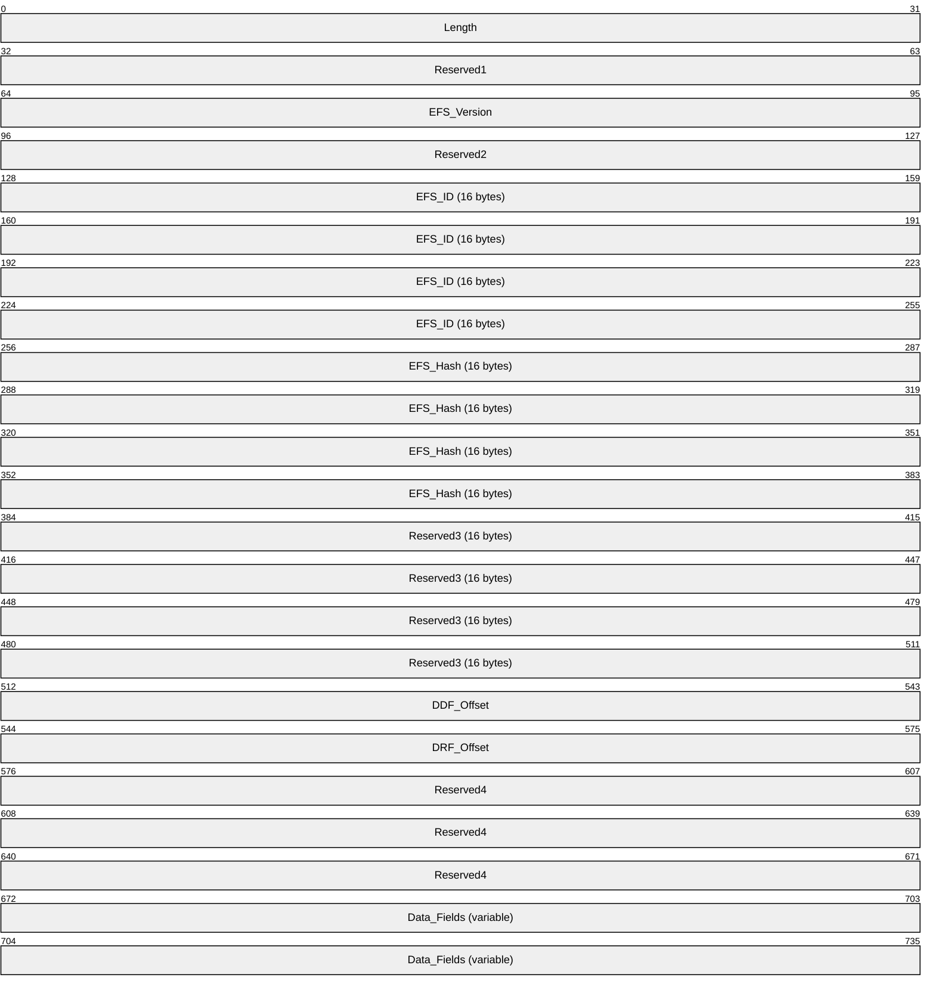

**Length (4 bytes):** This field MUST contain a 32-bit unsigned integer equal to the length, in bytes, of the [EFSRPC Metadata](#Section_2.2.2).<7>

**Reserved1 (4 bytes):** MUST be set to zero and ignored upon receipt.

**EFS_Version (4 bytes):** This field represents the highest [**EFS**](#gt_encrypting-file-system-efs) version supported by the implementation that created this metadata. It MUST be a 32-bit unsigned integer in little-endian format. It MUST be set to one of the following values.

| Value | Meaning |
| --- | --- |
| Version_1 0x00000001 | The [**file encryption key (FEK)**](#gt_file-encryption-key-fek) will be a DESX key, and encrypted with [**RSA**](#gt_rivest-shamir-adleman-rsa) only. The **Flags** field in all [**key**](#gt_key) list entries will be zero. |
| Version_2 0x00000002 | The FEK will use DESX, 3DES, or AES-256. The FEK will be encrypted with RSA only. The **Flags** field in all key list entries will be zero. |
| Version_3 0x00000003 | The FEK will use DESX, 3DES, or AES-256. The FEK will be encrypted with either RSA or AES-256. |

A server that supports a given version number MUST also support all lower numbered versions. A server SHOULD support all versions listed.<8>

**Reserved2 (4 bytes):** MUST be set to zero and ignored upon receipt.

**EFS_ID (16 bytes):** A 16-byte [**GUID**](#gt_globally-unique-identifier-guid) value that MUST be unique for the computer that created this metadata.

**EFS_Hash (16 bytes):** This field SHOULD be set to zero and ignored by the server.<9>

**Reserved3 (16 bytes):** MUST be set to zero and ignored upon receipt.

**DDF_Offset (4 bytes):** This field MUST contain the offset, in bytes, of the [**data decryption field (DDF)**](#gt_data-decryption-field-ddf) key list from the start of the EFSRPC Metadata. It MUST be a 32-bit unsigned integer in little-endian format. The DDF key list lies completely within the **Data Fields** and does not overlap the [**data recovery field (DRF)**](#gt_data-recovery-field-drf) key list (if present).

**DRF_Offset (4 bytes):** This field MUST contain the offset, in bytes, of the DRF key list from the start of the EFSRPC Metadata. It MUST be a 32-bit unsigned integer in little-endian format. A zero value in this field indicates that the DRF key list is absent and no [**DRAs**](#gt_data-recovery-agent-dra) have been applied to the [**file**](#gt_file). If present, the DRF key list MUST lie completely within **Data Fields** and MUST NOT overlap the DDF key list.

**Reserved4 (12 bytes):** MUST be set to zero and ignored upon receipt.

**Data_Fields (variable):** This field MUST contain the following two items in any order at the locations indicated by the respective Offset fields previously listed. Both items MUST conform to the key list format specified in section [2.2.2.1.1](#Section_2.2.2.1.1). The DDF key list MUST NOT overlap with the DRF key list (if present). There MUST NOT be any unused areas within this field spanning more than 8 contiguous bytes. Any unused areas within this field MUST be set to zero bytes and ignored by the server.


**DDF_key_list (variable):** This field MUST contain one or more entries. Each entry consists of the file's FEK, encrypted with the [**public key**](#gt_public-key) of a user authorized to access the file.

**DRF_key_list (variable):** This MUST contain one or more entries. Each entry consists of the file’s FEK, encrypted with the public key of a DRA authorized to access the file. This MUST only be present if the value in the DRF offset field is nonzero.

<a id="Section_2.2.2.1.1"></a>
##### 2.2.2.1.1 Key List Structure

The [**DDF**](#gt_data-decryption-field-ddf) and Key List structure in the [EFSRPC Metadata](#Section_2.2.2) MUST be formatted as follows.


**Length (4 bytes):** The number of entries in this [**key**](#gt_key) list. It MUST be a 32-bit unsigned integer in little-endian format.

**Key List entries 1 ... n:** A number of entries equal to the value in the **length of key list** field. The individual entries MUST be formatted as specified in section [2.2.2.1.2](#Section_2.2.2.1.2).

<a id="Section_2.2.2.1.2"></a>
##### 2.2.2.1.2 Key List Entry

Each individual Key List Entry MUST be formatted as follows.


**Length (4 bytes):** MUST be equal to the length of this key list entry in bytes. It MUST be a 32-bit unsigned integer in little-endian format.

**Offset to Public Key Information (4 bytes):** MUST contain the offset to the **Public Key Information** field in bytes from the start of this entry. It MUST be a 32-bit unsigned integer in little-endian format. The **Public Key Information** field MUST be completely contained inside the **Data Fields**.

**Encrypted FEK Length (4 bytes):** MUST be set to the length of the data in the **Encrypted FEK** field, in bytes. It MUST be a 32-bit unsigned integer in little-endian format.

**Offset to Encrypted FEK (4 bytes):** MUST contain the offset to the **Encrypted FEK** field, in bytes from the start of this entry. It MUST be a 32-bit unsigned integer in little-endian format. The **Encrypted FEK** MUST be completely contained inside the **Data** fields.

**Flags (4 bytes):** This field MUST indicate the algorithm used to encrypt the [**FEK**](#gt_file-encryption-key-fek) in this key list entry. It MUST be a 32-bit unsigned integer in little-endian format. EFSRPC servers SHOULD support all the values listed below, and MUST ignore any unsupported values.

| Value | Meaning |
| --- | --- |
| 0x00000000 | The **Encrypted FEK** field is encrypted using [**RSA**](#gt_rivest-shamir-adleman-rsa), with a [**public key**](#gt_public-key) belonging to a user or [**DRA**](#gt_data-recovery-agent-dra). |
| 0x00000001 | The **Encrypted FEK** field is encrypted using AES-256, with a [**key**](#gt_key) that is obtained by signing the non-terminated [**Unicode**](#gt_unicode) string "MICROSOFTE" (20 bytes long) with the user's RSA and computing the SHA-256 hash of the result. This value is used when a user's [**private key**](#gt_private-key) is stored on a smart card to improve performance by minimizing the number of smart card accesses.<10> |

**Data Fields (variable):** This field MUST contain the following items, in any order, at the locations indicated by the respective **Offset** fields previously listed. These items MUST be completely contained inside this field and MUST NOT overlap each other. There MUST NOT be unused areas within this field spanning more than 8 contiguous bytes.


**Public Key Information (variable):** This field MUST contain information about the [**X.509**](#gt_x509) [**certificate**](#gt_certificate) that contains the RSA public key, which is used to encrypt the **Encrypted FEK** field. It MUST be formatted as specified in section [2.2.2.1.3](#Section_2.2.2.1.3).

**Encrypted FEK (variable):** This field MUST contain information about the FEK, encrypted as indicated by the contents of the **Flags** field. It MUST be formatted as specified in section [2.2.2.1.5](#Section_2.2.2.1.5).

<a id="Section_2.2.2.1.3"></a>
##### 2.2.2.1.3 Public Key Information

The Public Key Information structure MUST be formatted as follows.

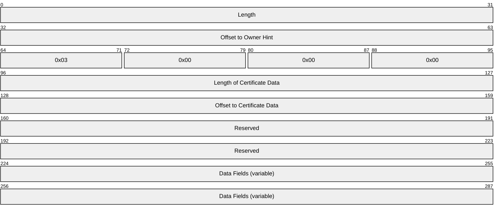

**Length (4 bytes):** This MUST be set to the length, in bytes, of this structure. It MUST be a 32-bit unsigned integer in little-endian format.

**Offset to Owner Hint (4 bytes):** If the **Owner Hint** field is present, this field MUST be set to the offset of the **Owner Hint** from the beginning of this structure, measured in bytes. If this field is zero, then the **Owner Hint** field MUST NOT be present. This field MUST be a 32-bit unsigned integer in little-endian format.

**Length of Certificate Data (4 bytes):** The size, in bytes, of the **Certificate Data** field. It MUST be a 32-bit unsigned integer in little-endian format.

**Offset to Certificate Data (4 bytes):** The offset, in bytes, of the **Certificate Data** field from the start of this structure. It MUST be a 32-bit unsigned integer in little-endian format.

**Reserved (8 bytes):** MUST be set to zero and ignored upon receipt.

**Data Fields (variable):** This field MUST contain the following items, in any order, and at the locations indicated by the respective **Offset** fields above. These items MUST be completely contained inside this field and MUST NOT overlap each other. There MUST NOT be any unused areas within this field that span more than eight contiguous bytes.


**Owner Hint (variable):** A [**security identifier (SID)**](#gt_security-identifier-sid) in RPC marshaling format that is intended to be used as a hint regarding the identity of the [**key**](#gt_key) owner. This item MUST be present only if the **Offset to Owner Hint** field is nonzero. The structure of an RPC SID is specified in [MS-DTYP](../MS-DTYP/MS-DTYP.md) section 2.4.2.3.

**Certificate Data (variable):** This field MUST contain information about the [**X.509**](#gt_x509) [**certificate**](#gt_certificate) associated with the [**public key**](#gt_public-key) that is used to encrypt the [**FEK**](#gt_file-encryption-key-fek) data in this key list entry. It MUST be formatted as specified in section [2.2.2.1.4](#Section_2.2.2.1.4).

<a id="Section_2.2.2.1.4"></a>
##### 2.2.2.1.4 Certificate Data

The Certificate Data structure MUST be formatted as follows.


**Offset to Certificate Thumbprint (4 bytes):** Offset of the **Certificate Thumbprint** field from the start of this structure. It MUST be a 32-bit unsigned integer in little-endian format.

**Length of Certificate Thumbprint (4 bytes):** The length of the **Certificate Thumbprint** field. It MUST be a 32-bit unsigned integer in little-endian format.

**Offset of Container Name (4 bytes):** Offset of the **Container Name** field (in bytes) from the start of this structure. It MUST be a 32-bit unsigned integer in little-endian format. If this field is set to zero, then the **Container Name** field MUST be absent.

**Offset of Provider Name (4 bytes):** Offset of the **Provider Name** field (in bytes) from the start of this structure. It MUST be a 32-bit unsigned integer in little-endian format. If this field is set to zero, the **Provider Name** field MUST be absent. If a **Provider Name** field is present, a **Container Name** field MUST also be present.

**Offset of Display Name (4 bytes):** Offset of the **Display Name** field, (in bytes) from the start of this structure. It MUST be a 32-bit unsigned integer in little-endian format. If this field is set to zero, then the **Display Name** field MUST be absent.

**Data Fields (variable):** This field MUST contain the following items, in any order, and at the locations indicated by the respective **Offset** fields previously listed. These items MUST be completely contained inside this field and MUST NOT overlap each other. There MUST NOT be any unused areas within this field that span more than 8 contiguous bytes.


**Certificate Thumbprint (variable):** The SHA-1 hash of the DER-encoded form of the certificate. For more information on SHA-1, see [[FIPS180-4]](https://go.microsoft.com/fwlink/?LinkId=298918). For more information on DER encoding, see [[X690]](https://go.microsoft.com/fwlink/?LinkId=90593).

**Container Name (variable):** A null-terminated Unicode string in UTF-16 encoding that provides a hint as to the public key container in which the key is stored. This field MUST always be present if the **Provider Name** is present. When the **Container Name** field is present, the **Offset of Container Name** field MUST be nonzero; otherwise, this field is ignored by the server and does not affect protocol behavior.

**Provider Name (variable):** A null-terminated Unicode string in UTF-16 encoding. This field MUST always be present if the **Container Name** is present. It MUST be omitted if the **Offset of Provider Name** field is 0; otherwise, this field is ignored by the server and does not affect protocol behavior.

**Display Name (variable):** A null-terminated Unicode string in UTF-16 encoding that provides a hint as to the friendly name that can be used to identify this certificate for display purposes. This field MUST be omitted if the **Offset of Display Name** field is 0.

<a id="Section_2.2.2.1.5"></a>
##### 2.2.2.1.5 Encrypted FEK

The **Encrypted FEK** field in the [**DDF**](#gt_data-decryption-field-ddf) and [**DRF**](#gt_data-recovery-field-drf) [**key**](#gt_key) list entries MUST consist of the following structure, encrypted as specified in the description of the **Flags** field for the key list entry.


**Key Length (4 bytes):** The length, in bytes, of the **Key** field. It MUST be a 32-bit unsigned integer in little-endian format. Possible values depend on the algorithm ID ([ALG_ID](#Section_2.2.13)) as specified in section 2.2.13.<11>

**Entropy (4 bytes):** The number of bits of true randomness in the key contained in this structure. It MUST be a 32-bit unsigned integer in little-endian format. Possible values depend on the **Algorithm** as specified in section 2.2.13.

**Algorithm (4 bytes):** The symmetric cryptographic algorithm associated with this key. It MUST be a 32-bit unsigned integer in little-endian format. Possible values are specified in section 2.2.13. The possible values for this field are constrained by the value of the [**EFS**](#gt_encrypting-file-system-efs) version field in the [EFSRPC Metadata](#Section_2.2.2).

**Reserved (4 bytes):** MUST be set to zero and ignored.

**Key (variable):** The [**FEK**](#gt_file-encryption-key-fek) for the [**file**](#gt_file).

<a id="Section_2.2.2.2"></a>
#### 2.2.2.2 EFSRPC Metadata Version 2

This metadata format is specified by an EFS Version of 4 or 5 in the EFSRPC metadata header<12>. This new metadata format is referred to as "Version 2" of the EFSRPC metadata, but do not confuse this with the EFS Version field specified within the metadata header. The format used for Version 2 EFSRPC metadata is significantly different from Version 1 described in section [2.2.2.1](#Section_2.2.2). Servers SHOULD support Version 2 of the EFSRPC Metadata.<13> A server that supports Version 2 of the EFSRPC Metadata MUST also fully support EFSRPC Metadata Version 1.

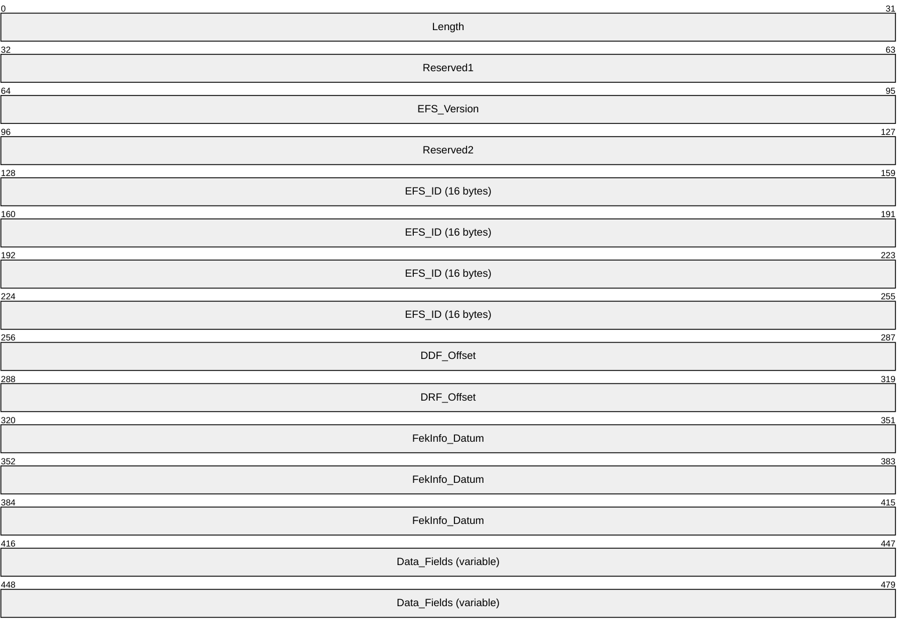

**Length (4 bytes):** This field MUST contain a 32-bit unsigned integer equal to the length, in bytes, of the [EFSRPC Metadata](#Section_2.2.2).<14>

**Reserved1 (4 bytes):** MUST be set to zero and ignored upon receipt.

**EFS_Version (4 bytes):** This field represents the highest [**EFS**](#gt_encrypting-file-system-efs) version supported by the implementation that created this metadata. It MUST be a 32-bit unsigned integer in little-endian format. It MUST be set to 0x00000004 for EFS Version 4 or 0x00000005 for EFS Version 5.

**Reserved2 (4 bytes):** MUST be set to zero and ignored upon receipt.

**EFS_ID (16 bytes):** A 16-byte [**GUID**](#gt_globally-unique-identifier-guid) value that MUST be unique for the computer that created this metadata.

**DDF_Offset (4 bytes):** This field MUST contain the offset, in bytes, of the [**DDF**](#gt_data-decryption-field-ddf) protector list from the start of the EFSRPC Metadata. It MUST be a 32-bit unsigned integer in little-endian format. The DDF protector list lies completely within the **Data Fields** and does not overlap the [**DRF**](#gt_data-recovery-field-drf) protector list (if present).

**DRF_Offset (4 bytes):** This field MUST contain the offset, in bytes, of the DRF protector list from the start of the EFSRPC Metadata. It MUST be a 32-bit unsigned integer in little-endian format. A zero value in this field indicates that the DRF protector list is absent and no [**DRAs**](#gt_data-recovery-agent-dra) have been applied to the [**file**](#gt_file). If present, the DRF protector list MUST lie completely within **Data_Fields** and MUST NOT overlap the DDF protector list.

**FekInfo_Datum (12 bytes):** This field contains the encrypted Fek and the File IV. It also contains the **ALG_ID** for the Fek. The **FekInfo_Datum** MUST conform to the format described in section [2.2.2.2.8](#Section_2.2.2.2.8).

**Data_Fields (variable):** This field MUST contain the following two items in any order at the locations indicated by the respective **Offset** fields previously listed. Both items MUST conform to the protector list format specified in section [2.2.2.2.1](#Section_2.2.2.2.1). The DDF [**key**](#gt_key) list MUST NOT overlap with the DRF key list (if present).


**DDF_protector_list (variable):** This field MUST contain one or more entries, each of which consists of a key protector as specified in section [2.2.2.2.5](#Section_2.2.2.2.5). Each key protector in this list is protected with a user public key.

**DRF_protector_list (variable):** This MUST contain one or more entries, each of which consists of a key protector as specified in section 2.2.2.2.5. Each key protector in this list is protected with the public key of a DRA authorized to access the file. This MUST only be present if the value in the DRF offset field is nonzero.

<a id="Section_2.2.2.2.1"></a>
##### 2.2.2.2.1 Protector List Structure

The DDF and DRF Protector List structure in the Version 4 EFSRPC Metadata MUST be formatted as follows.

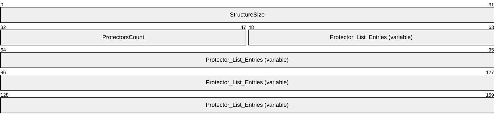

**StructureSize (4 bytes):** The size in bytes of the protector list. It MUST be a 32-bit unsigned integer in little-endian format.

**ProtectorsCount (2 bytes):** This represents the number of protectors in the protector list. It MUST be a 16-bit unsigned integer in little-endian format.

**Protector_List_Entries (variable):** A number of entries equal to the value in the ProtectorsCount field. The individual entries MUST be formatted as specified in section [2.2.2.2.5](#Section_2.2.2.2.5).

<a id="Section_2.2.2.2.2"></a>
##### 2.2.2.2.2 EFSX Datum

The EFSX Datum represents the base type for every datum within the Version 4 and Version 5 EFSRPC Metadata and MUST be formatted as follows.

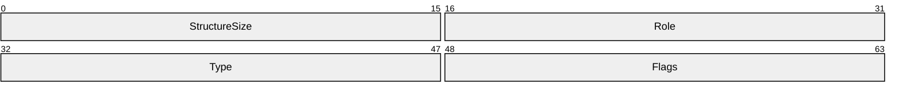

**StructureSize (2 bytes):** The size in bytes of the EFSX Datum. It MUST be a 16-bit unsigned integer in little-endian format.

**Role (2 bytes):** Specifies the EFSX Datum role. It MUST be a 16-bit unsigned integer in little-endian format.

| Value | Meaning |
| --- | --- |
| 0x0000 | The EFSX Datum has no defined role. |
| 0x0001 | The EFSX Datum contains a reference to a user's certificate store. This reference could be, for example, a certificate hash or the public key from a certificate. |
| 0x0002 | The EFSX Datum contains data specific to a protector type. See section [2.2.2.2.5](#Section_2.2.2.2.5) for valid protector types and their associated protector data format. |
| 0x0003 | The EFSX Datum contains information that is suitable for user display. For example, this could be the user name associated with a protector. |
| 0x0004 | The EFSX Datum contains information that identifies a private key container. |
| 0x0005 | The EFSX Datum contains information that identifies the provider name of a CSP or KSP. |
| 0x0006 | The EFSX Datum contains a user SID. |
| 0x0007 | The EFSX Datum contains the encrypted File Master Key (FMK). |
| 0x0008 | The EFSX Datum contains a user's public key. |
| 0x0009 | The EFSX Datum contains an ephemeral public key. |
| 0x000a | The EFSX Datum contains the encrypted File Encryption Key (FEK). |
| 0x000b | The EFSX Datum contains the file Initialization Vector (IV). |
| 0x000c | The EFSX Datum contains a protector descriptor string.<15> This datum role MUST only be used when EFS_VERSION is 5. |

**Type (2 bytes):** Specifies the EFSX Datum type. It MUST be a 16-bit unsigned integer in little-endian format.

| Value | Meaning |
| --- | --- |
| Reserved 0x0000 | Reserved. Local use only. |
| EFSX_TYPE_BLOB 0x0001 | The EFSX Datum MUST be formatted as specified in section [2.2.2.2.3](#Section_2.2.2.2.3). |
| EFSX_TYPE_DESCRIPTOR 0x0002 | The EFSX Datum MUST be formatted as specified in section [2.2.2.2.4](#Section_2.2.2.2.4). |
| EFSX_TYPE_KEY_PROTECTOR 0x0003 | The EFSX Datum MUST be formatted as specified in section 2.2.2.2.5. |
| EFSX_TYPE_PROTECTOR_INFO 0x0004 | The EFSX Datum MUST be formatted as specified in section [2.2.2.2.6](#Section_2.2.2.2.6). |
| EFSX_TYPE_KEY_AGMT_DATA 0x0005 | The EFSX Datum MUST be formatted as specified in section [2.2.2.2.7](#Section_2.2.2.2.7). |
| EFSX_TYPE_FEK_INFO 0x0006 | The EFSX Datum MUST be formatted as specified in section [2.2.2.2.8](#Section_2.2.2.2.8). |
| EFSX_TYPE_DPAPI_NG_DATA 0x0007 | The EFSX Datum MUST be formatted as specified in section [2.2.2.2.9](#Section_2.2.2.2.9). This type MUST only be used when EFS_VERSION is 5.<16> |

**Flags (2 bytes):** Specifies datum flags. It MUST be a 16-bit unsigned integer in little-endian format. The value of this field MUST be zero (0x0000) or a union of one or more of the following values.

| Value | Meaning |
| --- | --- |
| 0x0001 | The EFSX Datum is nested inside a parent structure. |
| 0x0002 | The EFSX Datum is a complex datum containing nested datum structures. |

<a id="Section_2.2.2.2.3"></a>
##### 2.2.2.2.3 Blob Datum

The Blob Datum encapsulates an opaque binary object. It MUST be formatted as below.

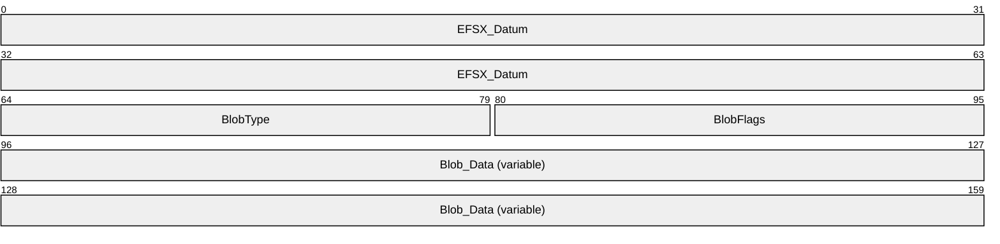

**EFSX_Datum (8 bytes):** MUST be formatted as specified in section [2.2.2.2.2](#Section_2.2.2.2.2). The datum Type MUST be EFSX_TYPE_BLOB (0x0001). The datum **Flags** MUST NOT include 0x0002.

**BlobType (2 bytes):** The type of the blob, which provides a hint to the format of the **Blob Data**. It MUST be a 16-bit unsigned integer in little-endian format.

| Value | Meaning |
| --- | --- |
| 0x0000 | The blob has no special formatting. |
| 0x0001 | The blob contains a public key formatted as a BCRYPT_PUBLIC_KEY_BLOB. |
| 0x0002 | The blob contains a SHA-1 hash of a DER-encoded form of a certificate. |
| 0x0003 | The blob contains the encrypted form of an Encrypted FEK structure, as defined in section [2.2.2.1.5](#Section_2.2.2.1.5). The contents of the key can be either the FEK or the FMK (see section [2.2.2.2.5](#Section_2.2.2.2.5)). |
| 0x0004 | The blob contains key material wrapped with an AES-256 key wrapping key, as defined by [[RFC3394]](https://go.microsoft.com/fwlink/?LinkId=131784). |
| 0x0005 | The blob contains key material encrypted by a DPAPI-NG provider on the endpoint. This BlobType MUST only be used when EFS_VERSION is 5.<17> |

**BlobFlags (2 bytes):** Reserved, MUST be 0x0000.

**Blob_Data (variable):** Contains opaque, variable-length data. The **Blob Data** MUST be entirely contained within the Blob Datum.

<a id="Section_2.2.2.2.4"></a>
##### 2.2.2.2.4 Descriptor Datum

The Descriptor Datum encapsulates a Unicode string in UTF-16 encoding. It MUST be formatted as below.


**EFSX_Datum (8 bytes):** MUST be formatted as specified in section [2.2.2.2.2](#Section_2.2.2.2.2). The datum **Type** MUST be EFSX_TYPE_DESCRIPTOR (0x0002). The datum **Flags** MUST NOT include 0x0002.

**Descriptor_Text (variable):** Contains a null-terminated, variable-sized Unicode string in UTF-16 encoding. The **Descriptor_Text** MUST be entirely contained within the **Descriptor** Datum. The length of the **Descriptor_Text** MUST be at least 2 bytes to include the null terminator (0x0000).

<a id="Section_2.2.2.2.5"></a>
##### 2.2.2.2.5 Protector List Entry

Each individual Protector List Entry MUST be formatted as follows.

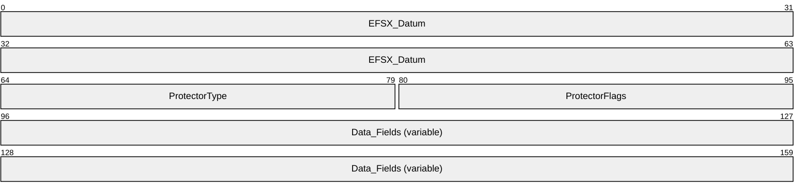

**EFSX_Datum (8 bytes):** MUST be formatted as specified in section [2.2.2.2.2](#Section_2.2.2.2.2). The datum **Type** MUST be EFSX_TYPE_KEY_PROTECTOR (0x0003) and SHOULD have a **Role** of EFSX_ROLE_IGNORE (0x0000). The datum **Flags** SHOULD include 0x0002 indicating a complex datum.

**ProtectorType (2 bytes):** The type of the protector. It MUST be a 16-bit unsigned integer in little-endian format. Possible values are specified below.

| Value | Meaning |
| --- | --- |
| 0x0001 | The protector was derived from a public/private key pair using a key agreement. The Data Fields SHOULD include an EFSX_Datum of **Type** EFSX_TYPE_KEY_AGMT_DATA (0x0005) and **Role** 0x0002. |
| 0x0002 | The protector was derived from a public/private key pair capable of performing asymmetric encryption. The **Data Fields** SHOULD include an EFSX_Datum of **Type** EFSX_TYPE_BLOB (0x0001) and **Role** 0x0002. |
| 0x0003 | The protector was derived using a DPAPI-NG encryption provider on the endpoint. The **Data Fields** SHOULD include an EFSX_Datum of **Type** EFSX_TYPE_DPAPI_NG_DATA (0x0007) and **Role** 0x0002. |

**ProtectorFlags (2 bytes):** The flags for the protector. It MUST be a 16-bit unsigned integer in little-endian format. The value MUST be 0x0000 or a union of one or more of the following values.

| Value | Meaning |
| --- | --- |
| 0x0001 | The protector is a legacy protector, and stores the Encrypted FEK as specified in section [2.2.2.1.5](#Section_2.2.2.1.5). |
| 0x0002 | If this is a legacy protector (flag 0x0001 is also set), the Encrypted FEK is encrypted using AES 256, with a key that is obtained by signing the non-terminated Unicode string "MICROSOFTE" (20 bytes long) with the user's RSA and computing the SHA-256 hash of the result. |
| 0x0004 | If this bit is set, bit 0x0001 MUST also be set to indicate a legacy protector. This bit indicates that the legacy protector stores the File Master Key (FMK) encrypted in the Encrypted FEK structure instead of the File Encryption Key (FEK). |

**Data_Fields (variable):** This field contains any number of nested EFSX_Datum structures. The nested datum structures MUST NOT overlap and MUST be entirely contained within the protector list entry. This field SHOULD contain a datum with a **Role** of 0x0002 (protector data) and a datum with a **Type** of EFSX_TYPE_PROTECTOR_INFO (0x0004).

<a id="Section_2.2.2.2.6"></a>
##### 2.2.2.2.6 Protector Info Datum

The Protector Info Datum encapsulates information describing the origin of a protector. It MUST be formatted as below.


**EFSX_Datum (8 bytes):** MUST be formatted as specified in section [2.2.2.2.2](#Section_2.2.2.2.2). The datum **Type** MUST be EFSX_TYPE_PROTECTOR_INFO (0x0004). The datum **Flags** SHOULD include 0x0002 indicating a complex datum.

**Data_Fields (variable):** This field contains any number of nested EFSX_Datum structures. The nested datum structures MUST NOT overlap, and MUST be entirely contained within the protector info datum.

<a id="Section_2.2.2.2.7"></a>
##### 2.2.2.2.7 Key Agreement Datum

The Key Agreement datum encapsulates the parameters necessary to decrypt a key agreement protector (**ProtectorType** of 0x0001).


**EFSX_Datum (8 bytes):** MUST be formatted as specified in section [2.2.2.2.2](#Section_2.2.2.2.2). The datum **Type** MUST be EFSX_TYPE_KEY_AGMT_DATA (0x0005). The datum **Flags** SHOULD include 0x0002, indicating a complex datum.

**KeyAgmtFlags (2 bytes):** This field is reserved and SHOULD be set to 0x0000.

**Data_Fields (variable):** This field contains any number of nested EFSX_Datum structures. The nested datum structures MUST NOT overlap, and MUST be entirely contained within the Key Agreement datum. This field SHOULD contain three datum structures of type EFSX_TYPE_BLOB (0x0001) and **Roles** of 0x0007, 0x0008, and 0x0009. The public keys referenced by **Roles** 0x0008 and 0x0009 MUST have **BlobType** set to 0x0001.

<a id="Section_2.2.2.2.8"></a>
##### 2.2.2.2.8 Fek Info Datum

The Fek Info datum encapsulates the algorithm ID ([ALG_ID](#Section_2.2.13)) used for the FEK, the encrypted FEK, and the File IV. The FEK and File IV are both protected using [**advanced encryption standard (AES)**](#gt_advanced-encryption-standard-aes) keywrap, with the FMK as the wrapping key.


**EFSX_Datum (8 bytes):** MUST be formatted as specified in section [2.2.2.2.2](#Section_2.2.2.2.2). The datum **Type** MUST be EFSX_TYPE_FEK_INFO (0x0006). The datum **Flags** SHOULD include 0x0002, indicating a complex datum.

**AlgorithmID (4 bytes):** The symmetric cryptographic algorithm associated with this key. It MUST be a 32-bit unsigned integer in little-endian format. Possible values are specified in section 2.2.13.

**Data_Fields (variable):** This field contains any number of nested EFSX_Datum structures. The nested datum structures MUST NOT overlap, and MUST be entirely contained within the Fek Info datum. This field MUST contain at least two datum structures of type EFSX_TYPE_BLOB (0x0001). These blobs MUST have **Role** fields set to 0x000a (for the encrypted FEK) and 0x000b (for the encrypted File IV), respectively. The **BlobType** for these blobs MUST be 0x0004, indicating that the blob data contains a key wrapped with an AES 256 key encryption key, as defined in [[RFC3394]](https://go.microsoft.com/fwlink/?LinkId=131784).

<a id="Section_2.2.2.2.9"></a>
##### 2.2.2.2.9 DPAPI-NG Datum

The DPAPI-NG datum encapsulates the parameters necessary to decrypt a DPAPI-NG protector (**ProtectorType** of 0x0003).

```mermaid
packet-beta
  0-63: "EFSX_Datum"
  64-79: "DpapiNgFlags"
  80-127: "Data_Fields (variable)"
```

**EFSX_Datum (8 bytes):** This field MUST be formatted as specified in section [2.2.2.2.2](#Section_2.2.2.2.2). The datum **Type** MUST be EFSX_TYPE_DPAPI_NG_DATA (0x0007). The datum **Flags** SHOULD include 0x0002, indicating a complex datum.

**DpapiNgFlags (2 bytes):** This field is reserved and SHOULD be set to 0x0000.

**Data_Fields (variable):** This field contains any number of nested EFSX_Datum structures. The nested datum structures MUST NOT overlap and MUST be entirely contained within the DPAPI-NG datum. This field SHOULD contain at least one datum structure, each of which MUST be of type EFSX_TYPE_BLOB (0x0001), MUST have a **Role** of 0x0007, and MUST have **BlobType** of 0x0005.

<a id="Section_2.2.2.3"></a>
#### 2.2.2.3 EFSRPC Metadata Version 3

This metadata format is specified by EFS Version 6 in the EFSRPC Metadata header<18>. This new metadata format is referred to as "Version 3" of the EFSRPC Metadata, but do not confuse this with the EFS Version field specified within the metadata header. The format used for Version 3 EFSRPC metadata is significantly different from Version 1 described in section [2.2.2.1](#Section_2.2.2), or Version 2 described in section [2.2.2.2](#Section_2.2.2.2). Servers SHOULD support Version 3 of the EFSRPC Metadata.<19> A server that supports Version 3 of the EFSRPC Metadata MUST also fully support EFSRPC Metadata Version 1 and EFSRPC Metadata Version 2.

```mermaid
packet-beta
  0-47: "Preamble"
  48-79: "MajorVersion"
  80-111: "MinorVersion"
  112-143: "ClearTextRedirectionLength"
  144-191: "ClearTextRedirectionString (variable)"
  192-223: "TotalHeaderLength"
  224-255: "OriginalFileExtensionOffset"
  256-287: "OriginalFileExtensionLength"
  288-319: "PLOffset"
  320-351: "EncryptedDataOffset"
  352-415: "OriginalFileSize"
  416-447: "MetaDataOffset"
  448-479: "MetaDataLength"
  480-543: "OriginalFileExtensionData (variable)"
  544-607: "PLData (variable)"
  608-671: "MetaData (variable)"
  672-735: "EncryptedData (variable)"
```

**Preamble (6 bytes):** This field is used to identify the EFSRPC Metadata Version 3. This field MUST be set to 0x2E, 0x70, 0x66, 0x69, 0x6C, 0x65. This will appear as the string ".pfile" in ASCII.

**MajorVersion (4 bytes):** This field is used to identify the major version of the EFSRPC Metadata Version 3. This field MUST be set to 2.

**MinorVersion (4 bytes):** This field is used to identify the minor version of the EFSRPC Metadata Version 3. This field MUST be set to 1.

**ClearTextRedirectionLength (4 bytes):** The length, in bytes, of the **ClearTextRedirectionString** field.

**ClearTextRedirectionString (variable):** An optional string in UTF-8 format.

**TotalHeaderLength (4 bytes):** The length, in bytes, of the **OriginalFileExtensionOffset**, **OriginalFileExtensionLength**, **PLOffset**, **EncryptedDataOffset**, **OriginalFileSize**, **MetaDataOffset**, **MetaDataLength**, **OriginalFileExtensionData**, **PLData**, and **MetaData** fields.

**OriginalFileExtensionOffset (4 bytes):** The offset, in bytes, from the beginning of the **Preamble** field to the **OriginalFileExtensionData** field.

**OriginalFileExtensionLength (4 bytes):** The length, in bytes, of the **OriginalFileExtensionData** field.

**PLOffset (4 bytes):** The offset, in bytes, from the beginning the **Preamble** field to the **PLData** field.

**EncryptedDataOffset (4 bytes):** The offset, in bytes, from the beginning of the **Preamble** field to the **EncryptedData** field.

**OriginalFileSize (8 bytes):** The length, in bytes, of the plaintext of the file prior to encryption, formatted as a ULONGLONG (unsigned 64-bit integer as described in section [MS-DTYP](../MS-DTYP/MS-DTYP.md) section 2.2.55).

**MetaDataOffset (4 bytes):** The offset, in bytes, from the beginning of the **Preamble** field to the **MetaData** field, formatted as a ULONGLONG (unsigned 64-bit integer as described in section [MS-DTYP] section 2.2.55).

**MetaDataLength (4 bytes):** The length, in bytes, of the **MetaData** field.

**OriginalFileExtensionData (variable):** A UNICODE string storing the original file extension, including the leading period of the file defined in the **EncryptedData** field.

**PLData (variable):** This is a Rights Management Services Publishing License, as defined in [MS-RMPR](../MS-RMPR/MS-RMPR.md) section 2.2.9.7.

**MetaData (variable):** This field contains application-specific metadata information of the file defined in the **EncryptedData** field.

**EncryptedData (variable):** The encrypted data representing the file. This field's size MUST be a multiple of the encryption algorithm block size.

<a id="Section_2.2.3"></a>
### 2.2.3 EFSRPC Raw Data Format

The EFSRPC raw data format is used by the EFSRPC raw methods. The output of the [EfsRpcReadFileRaw](#Section_3.1.4.2.2) method MUST conform to this format. The input to the [EfsRpcWriteFileRaw](#Section_3.1.4.2.3) method MUST conform to the EFSRPC Raw Data Format. The details of this format are implementation dependent. An EFSRPC client SHOULD NOT parse this format and SHOULD NOT rely on it having any particular structure. An EFSRPC server MUST validate input data passed to it by the EfsRpcWriteFileRaw method, and SHOULD abort the EfsRpcWriteFileRaw operation with an RPC exception if this data is in an unsupported format.

The EFSRPC Raw Data Format SHOULD be formatted as follows.

```mermaid
packet-beta
  0-7: "0x00"
  8-15: "0x01"
  16-23: "0x00"
  24-31: "0x00"
  32-39: "0x52"
  40-47: "0x00"
  48-55: "0x4f"
  56-63: "0x00"
  64-71: "0x42"
  72-79: "0x00"
  80-87: "0x53"
  88-95: "0x00"
  96-159: "Reserved"
  160-223: "EFSRPC Metadata Stream (variable)"
  224-287: "Additional Stream 1 (variable)"
  288-351: "Additional Stream n (variable)"
```

**Reserved (8 bytes):** MUST be set to zero and ignored.

**EFSRPC Metadata Stream (variable):** This field MUST be formatted as specified in section [2.2.3.1](#Section_2.2.3.1). This field MUST contain the [EFSRPC Metadata](#Section_2.2.2) for the [**file**](#gt_file), along with a header. The structure of the EFSRPC Metadata is specified in section 2.2.2.

**Additional Stream 1 ... n:** These MUST correspond to marshaled versions of all the [**streams**](#gt_stream) (except for [EFSRPC Metadata](#Section_2.2.2)) in the given file. They are optional and might not exist (for example, for [**folders**](#gt_folder) with no alternate streams). For more information on [**NTFS**](#gt_nt-file-system-ntfs) file streams, see [[MSFT-NTFS]](https://go.microsoft.com/fwlink/?LinkId=90200). These fields MUST be formatted as specified in section 2.2.3.1.

<a id="Section_2.2.3.1"></a>
#### 2.2.3.1 Marshaled Stream

A Marshaled Stream (including the EFSRPC Metadata stream) MUST be formatted as follows.

```mermaid
packet-beta
  0-31: "Length"
  32-39: "0x4e"
  40-47: "0x00"
  48-55: "0x54"
  56-63: "0x00"
  64-71: "0x46"
  72-79: "0x00"
  80-87: "0x53"
  88-95: "0x00"
  96-127: "Flag"
  128-191: "Reserved"
  192-223: "Name Length"
  224-287: "Stream Name (variable)"
  288-351: "Stream Data Segment 1 (variable)"
  352-415: "Stream Data Segment n (variable)"
```

**Length (4 bytes):** The length, in bytes, of this [**stream**](#gt_stream) header from the start of this field to the end of the **Stream Name** field. It MUST be a 32-bit unsigned integer in little-endian format.

**Flag (4 bytes):** This MUST be a 32-bit unsigned integer in little-endian format. It MUST be set to 0x00000000 if the stream data is encrypted with the [**FEK**](#gt_file-encryption-key-fek). Otherwise, it MUST be set to 0x00000001. It MUST always be set to zero in the case of the [**EFSRPC Metadata**](#gt_efsrpc-metadata) stream, and ignored by the server in that case.

| Value | Meaning |
| --- | --- |
| 0x00000000 | FEK encryption present |
| 0x00000001 | FEK encryption not present |

**Reserved (8 bytes):** This field MUST be set to zero and ignored.

**Name Length (4 bytes):** The length, in bytes, of the **Stream Name** field. It MUST be a 32-bit unsigned integer in little-endian format. This field MUST be set to 0x00000002 for the [EFSRPC Metadata](#Section_2.2.2) stream.

**Stream Name (variable):** The name of the stream. This is set to either a null-terminated [**Unicode**](#gt_unicode) string in UTF-16 encoding, or an integer value stored in binary form. For the EFSRPC Metadata stream, this is always set to 0x1910.

| Value | Meaning |
| --- | --- |
| 0x1910 | EFSRPC Metadata stream |

**Stream Data Segment 1 ... n:** These [segments](#Section_5464320af8224cf89fa2a8bd11bcc4e1) MUST contain the contents of the stream as well as some metadata for reassembling the segments. For encrypted streams, these segments MUST also contain some metadata to aid in decryption. They MUST be formatted as specified in section 2.2.3.2.

<a id="Section_2.2.3.2"></a>
#### 2.2.3.2 Stream Data Segment

Each stream data segment MUST be formatted as follows.

```mermaid
packet-beta
  0-31: "Length"
  32-39: "0x47"
  40-47: "0x00"
  48-55: "0x55"
  56-63: "0x00"
  64-71: "0x52"
  72-79: "0x00"
  80-87: "0x45"
  88-95: "0x00"
  96-127: "Reserved"
  128-191: "Data Segment Encryption Header (variable)"
  192-255: "Stream Data (variable)"
```

**Length (4 bytes):** The length, in bytes, of this segment. It MUST be a 32-bit unsigned integer in little-endian format. The length MUST be measured from the start of this field to the end of the **Stream Data** field.

**Reserved (4 bytes):** This field is set to zero and is ignored by the server.

**Data Segment Encryption Header (variable):** This header MUST be present only if the [**stream**](#gt_stream) is encrypted (that is, if the **Flag** field in the stream header is set to zero and this is not the EFSRPC Metadata stream). It MUST be formatted as specified in section [2.2.3.3](#Section_2.2.3.3).

**Stream Data (variable):** This field MUST contain part or all of the stream data. If the **Data Segment Encryption Header** field is present, **Stream Data** MUST be consistent with it. **Stream Data** MUST consist of contiguous bytes taken from the stream except for zero bytes that are omitted in accordance with the Data Segment Encryption Header. If the stream is encrypted, its data MUST be encrypted with the [**FEK**](#gt_file-encryption-key-fek), using the algorithm indicated by the **Algorithm** field in the [EFSRPC Metadata](#Section_2.2.2) (specified in section 2.2.2) in the Cipher Block Chaining (CBC) mode.

<a id="Section_2.2.3.3"></a>
#### 2.2.3.3 Data Segment Encryption Header

The Data Segment Encryption Header MUST be formatted as follows.

```mermaid
packet-beta
  0-63: "Starting File Offset"
  64-95: "Length"
  96-127: "Bytes Within Stream Size"
  128-159: "Bytes Within VDL"
  160-175: "0x0000"
  176-183: "Data Unit Shift"
  184-191: "Chunk Shift"
  192-199: "Cluster Shift"
  200-207: "0x01"
  208-223: "Number of Data Blocks"
  224-287: "Data Block Sizes (variable)"
  288-415: "Extended Header (16 bytes, optional)"
```

**Starting File Offset (8 bytes):** This field MUST contain an unsigned 64-bit integer in little-endian format denoting the offset, in bytes, into the stream being serialized of the first data byte contained in this data segment.

**Length (4 bytes):** The length of this header, in bytes, measured from the beginning of the **Starting File Offset** field to the end of the **Data Segment Encryption Header**. It MUST be a 32-bit unsigned integer in little-endian format. Any unused bytes within this structure MUST be set to zero and ignored by the server.

**Bytes Within Stream Size (4 bytes):** The number of bytes contained within this stream data segment that fall within the stream size. It MUST be a 32-bit unsigned integer in little-endian format. This can be less than the number of bytes actually present due to padding required by the encryption algorithm.

**Bytes Within VDL (4 bytes):** The number of bytes contained within this stream data segment that fall within the [**valid data length (VDL)**](#gt_valid-data-length-vdl). It MUST be a 32-bit unsigned integer in little-endian format. This can be less than the number of bytes actually present due to padding required by the encryption algorithm. Bytes beyond the VDL MUST be set to zero after decryption.

**Data Unit Shift (1 byte):** The base-2 logarithm of the data unit size. It MUST be an 8-bit unsigned integer. For files that are not [**sparse files**](#gt_sparse-file), the data unit size MUST be set to the size of the data in this segment. For sparse files, it MUST be equal to the size of a compression unit, which is the smallest unit that all holes MUST be a multiple of.

**Chunk Shift (1 byte):** The base-2 logarithm of the chunk size. It MUST be an 8-bit unsigned integer. The chunk size MUST be equal to the data unit size.

**Cluster Shift (1 byte):** The base-2 logarithm of the cluster size in bytes. It MUST be an 8-bit unsigned integer. It MUST be equal to the smallest unit of allocation in the underlying [**file system**](#gt_file-system).

**Number of Data Blocks (2 bytes):** This field MUST contain the number of data blocks specified in this segment. It MUST be a 16-bit unsigned integer in little-endian format. It MUST be equal to the number of entries in the **Data Block Sizes** field specified next.

**Data Block Sizes (variable):** This field MUST consist of a sequence of unsigned 32-bit values in little-endian format, denoting the sizes of the successive data blocks in the **Stream Data** field that follows this header. Each value in the sequence MUST be less than or equal to the data unit size, unless it spans the VDL or a hole in the case of a sparse file.

**Extended Header (16 bytes):** This field is optional, and its presence is indicated by the four-byte signature located at the start of this field. If this field is present, the server SHOULD interpret it as defined in section [2.2.3.4](#Section_2.2.3.4). The server MAY ignore this field.<20>

<a id="Section_2.2.3.4"></a>
#### 2.2.3.4 Extended Header

The Extended Header is an optional field within the [Data Segment Encryption Header (section 2.2.3.3)](#Section_2.2.3.3). If present, it MUST be formatted as follows.

```mermaid
packet-beta
  0-7: "0x45"
  8-15: "0x58"
  16-23: "0x54"
  24-31: "0x44"
  32-39: "0x10"
  40-47: "0x00"
  48-55: "0x00"
  56-63: "0x00"
  64-95: "Flags"
  96-127: "Reserved"
```

**Flags (4 bytes):** This MUST be a 32-bit unsigned integer in little-endian format. It MUST be either zero or the following value.

| Value | Meaning |
| --- | --- |
| 0x00000001 | Used to indicate that the stream is contained within a sparse file. |

**Reserved (4 bytes):** This field MUST be set to zero and ignored by the server.

<a id="Section_2.2.4"></a>
### 2.2.4 PEXIMPORT_CONTEXT_HANDLE

The PEXIMPORT_CONTEXT_HANDLE data type is used to represent a pointer to a context handle. It MUST be treated as opaque by the client and used by the server, as specified in [[C706]](https://go.microsoft.com/fwlink/?LinkId=89824).

This type is declared as follows:

typedef [context_handle] void* PEXIMPORT_CONTEXT_HANDLE;

<a id="Section_2.2.5"></a>
### 2.2.5 EFS_EXIM_PIPE

The EFS_EXIM_PIPE type is used to represent a pipe for the EFSRPC raw methods. It consists of a set of callback routines for sending and receiving data, as specified in [[C706]](https://go.microsoft.com/fwlink/?LinkId=89824).

This type is declared as follows:

typedef pipe unsigned char EFS_EXIM_PIPE;

<a id="Section_2.2.6"></a>
### 2.2.6 EFS_CERTIFICATE_BLOB

The EFS_CERTIFICATE_BLOB type is used to represent the encoded contents of an [**X.509**](#gt_x509) [**certificate**](#gt_certificate).

typedef struct _CERTIFICATE_BLOB {

DWORD dwCertEncodingType;

[range(0,32768)] DWORD cbData;

[size_is(cbData)] unsigned char* bData;

} EFS_CERTIFICATE_BLOB;

**dwCertEncodingType:** The certificate encoding type. This MUST be set to one of the following values. If set to any other value, the certificate is considered invalid and behavior is undefined.

| Value | Meaning |
| --- | --- |
| 0x00000001 | Certificate uses X.509 ASN.1 encoding. |
| 0x00000002 | Certificate uses X.509 NDR encoding. |

**cbData:** The number of bytes in the bData buffer.

**bData:** An encoded X.509 certificate. Its format is specified by the **dwCertEncodingType** member. For more information on ASN encoding, see [[X690]](https://go.microsoft.com/fwlink/?LinkId=90593). NDR encoding is specified in [[C706]](https://go.microsoft.com/fwlink/?LinkId=89824).<21>

<a id="Section_2.2.7"></a>
### 2.2.7 EFS_HASH_BLOB

The EFS_HASH_BLOB type is used to represent an [**X.509**](#gt_x509) [**certificate**](#gt_certificate) hash.

typedef struct _EFS_HASH_BLOB {

[range(0, 100)] DWORD cbData;

[size_is(cbData)] unsigned char* bData;

} EFS_HASH_BLOB;

**cbData:** The number of bytes in the bData buffer.

**bData:** The SHA-1 hash of an X.509 certificate. For more information on SHA-1, see [[FIPS180-4]](https://go.microsoft.com/fwlink/?LinkId=298918).<22>

<a id="Section_2.2.8"></a>
### 2.2.8 ENCRYPTION_CERTIFICATE

The ENCRYPTION_CERTIFICATE type is used to represent a single [**X.509**](#gt_x509) [**certificate**](#gt_certificate).

typedef struct _ENCRYPTION_CERTIFICATE {

DWORD cbTotalLength;

RPC_SID* UserSid;

EFS_CERTIFICATE_BLOB* CertBlob;

} ENCRYPTION_CERTIFICATE;

**cbTotalLength:** The length, in bytes, of the structure.

**UserSid:** The [**SID**](#gt_security-identifier-sid) of the user who owns the certificate. This is intended as a hint only. It MAY be set to zero if no such hint is available. The structure of an RPC SID is as specified in [MS-DTYP](../MS-DTYP/MS-DTYP.md) section 2.4.2.3.

**CertBlob:** A pointer to an [EFS_CERTIFICATE_BLOB](#Section_2.2.6) (2.2.6) structure.

<a id="Section_2.2.9"></a>
### 2.2.9 ENCRYPTION_CERTIFICATE_LIST

The ENCRYPTION_CERTIFICATE_LIST type is used to represent a set of [**X.509**](#gt_x509) [**certificates**](#gt_certificate). For more information on certificates, see [[X509]](https://go.microsoft.com/fwlink/?LinkId=90590).

typedef struct _ENCRYPTION_CERTIFICATE_LIST {

[range(0,500)] DWORD nUsers;

[size_is(nUsers,)] ENCRYPTION_CERTIFICATE** Users;

} ENCRYPTION_CERTIFICATE_LIST;

**nUsers:** The number of certificates in the list.

**Users:** A pointer to an array of pointers to [ENCRYPTION_CERTIFICATE](#Section_2.2.8) (2.2.8) structures. This array is of size nUsers.<23>

<a id="Section_2.2.10"></a>
### 2.2.10 ENCRYPTION_CERTIFICATE_HASH

The ENCRYPTION_CERTIFICATE_HASH type is used to represent a single [**certificate**](#gt_certificate) hash. For more information on certificates, see [[X509]](https://go.microsoft.com/fwlink/?LinkId=90590).

typedef struct _ENCRYPTION_CERTIFICATE_HASH {

DWORD cbTotalLength;

RPC_SID* UserSid;

EFS_HASH_BLOB* Hash;

[string] wchar_t* lpDisplayInformation;

} ENCRYPTION_CERTIFICATE_HASH;

**cbTotalLength:** The length, in bytes, of the structure.

**UserSid:** The [**SID**](#gt_security-identifier-sid) of the user who owns the certificate. This is intended only as a hint. It MAY be set to zero if no such hint is available. The structure of an RPC SID is specified in [MS-DTYP](../MS-DTYP/MS-DTYP.md), section 2.4.2.3.

**Hash:** A pointer to an [EFS_HASH_BLOB](#Section_2.2.7) (2.2.7) structure.

**lpDisplayInformation:** A string that contains the subject or principal name of the account the certification is assigned to. The subject name and the principal name can be the same. This is only intended as a hint for display purposes, and is implementation-dependent. This field MAY be set to NULL if no such information is available.

<a id="Section_2.2.11"></a>
### 2.2.11 ENCRYPTION_CERTIFICATE_HASH_LIST

The ENCRYPTION_CERTIFICATE_HASH_LIST type is used to represent a set of [**certificate**](#gt_certificate) hashes.

typedef struct _ENCRYPTION_CERTIFICATE_HASH_LIST {

[range(0,500)] DWORD nCert_Hash;

[size_is(nCert_Hash,)] ENCRYPTION_CERTIFICATE_HASH** Users;

} ENCRYPTION_CERTIFICATE_HASH_LIST;

**nCert_Hash:** The number of certificate hashes in the list.

**Users:** A pointer to an array of pointers to [ENCRYPTION_CERTIFICATE_HASH](#Section_2.2.10) (2.2.10) structures. This array is of size nCert_Hash.<24>

<a id="Section_2.2.12"></a>
### 2.2.12 EFS_RPC_BLOB

The EFS_RPC_BLOB type is used to represent a generic [**binary large object (BLOB)**](#gt_binary-large-object-blob) (that is, an opaque data type).

typedef struct _EFS_RPC_BLOB {

[range(0,266240)] DWORD cbData;

[size_is(cbData)] unsigned char* bData;

} EFS_RPC_BLOB,

*PEFS_RPC_BLOB;

**cbData:** The length, in bytes, of the data object in the bData field.

**bData:** The contents of the data object.<25>

<a id="Section_2.2.13"></a>
### 2.2.13 ALG_ID

The ALG_ID type is used to denote an algorithm type for cryptographic [**keys**](#gt_key). An implementation SHOULD<26> support all of the values shown in the following table. Implementations MAY<27> choose to support other algorithms and values not shown here; if they do, they SHOULD reuse the values specified in [[MSDN-CRYPTO]](https://go.microsoft.com/fwlink/?LinkId=89984) in order to avoid collisions. Implementations MAY<28> restrict the set of supported algorithms based on administrative policy.

| Bit Range | Field | Description |
| --- | --- | --- |
| Variable | CALG_AES_256 | 0x6610 256 32 |
| Variable | CALG_3DES | 0x6603 168 24 |

In this table, Entropy represents the number of bits of true randomness in the algorithm's key material, while Key length represents the total size of the key in bytes. For CALG_3DES, the difference between entropy and key length is due to the parity bits included in the key. For more information, see [[TDEA]](https://go.microsoft.com/fwlink/?LinkId=690523).

This type is declared as follows:

typedef unsigned int ALG_ID;

<a id="Section_2.2.14"></a>
### 2.2.14 EFS_KEY_INFO

The EFS_KEY_INFO type is used to represent information about a [**key**](#gt_key) of a symmetric cryptosystem.

typedef struct {

DWORD dwVersion;

unsigned long Entropy;

ALG_ID Algorithm;

unsigned long KeyLength;

} EFS_KEY_INFO;

**dwVersion:** The version of this data structure. It MUST be equal to 0x00000001.

**Entropy:** The actual number of bits of entropy or true randomness in the key. This value, divided by 8, MUST be less than or equal to the value of the **KeyLength** member.

**Algorithm:** The cryptographic algorithm with which the key is intended to be used.

**KeyLength:** The total length, in bytes, of the key. This value, multiplied by 8, MUST be greater than or equal to the value of the **Entropy** member. Valid combinations of Entropy, Algorithm, and KeyLength are specified in section [2.2.13](#Section_2.2.13).

<a id="Section_2.2.15"></a>
### 2.2.15 EFS_COMPATIBILITY_INFO

The EFS_COMPATIBILITY_INFO type is used to represent information about the compatibility restrictions of an encrypted file.

typedef struct {

DWORD EfsVersion;

} EFS_COMPATIBILITY_INFO;

**EfsVersion:** The **EfsVersion** associated with the EFSRPC Metadata. Valid values for the **EfsVersion** field are described in sections [2.2.2.1](#Section_2.2.2), [2.2.2.2](#Section_2.2.2.2), and [2.2.2.3](#Section_2.2.2.3).<29>

<a id="Section_2.2.16"></a>
### 2.2.16 EFS_ENCRYPTION_STATUS_INFO

The EFS_ENCRYPTION_STATUS_INFO structure is used to represent the predicted outcome if an attempt were made to convert an unencrypted object to an encrypted state.

typedef struct {

BOOL bHasCurrentKey;

DWORD dwEncryptionError;

} EFS_ENCRYPTION_STATUS_INFO;

**bHasCurrentKey:** A Boolean value signifying whether an appropriate [**key**](#gt_key) was found that could be used for encryption.

**dwEncryptionError:** The error code returned if encryption were attempted. If the operation were to succeed, this value MUST be zero. Otherwise, it MUST be set to a nonzero value.

<a id="Section_2.2.17"></a>
### 2.2.17 EFS_DECRYPTION_STATUS_INFO

The EFS_DECRYPTION_STATUS_INFO type is used to represent the predicted outcome if an attempt were made to read the [**plaintext**](#gt_plaintext) of an encrypted object.

typedef struct {

DWORD dwDecryptionError;

DWORD dwHashOffset;

DWORD cbHash;

} EFS_DECRYPTION_STATUS_INFO;

**dwDecryptionError:** The error code returned if decryption were attempted. If the operation were to succeed, this value MUST be zero. Otherwise it MUST be set to a nonzero value.

**dwHashOffset:** The offset of the appended [**certificate**](#gt_certificate) hash in bytes from the start of this structure.

**cbHash:** The length in bytes of the appended certificate hash.

If dwDecryptionError is nonzero, the preceding fields are followed by the hash of a certificate whose corresponding [**private key**](#gt_private-key) is required for the decryption to succeed.

<a id="Section_2.2.18"></a>
### 2.2.18 ENCRYPTED_FILE_METADATA_SIGNATURE

The ENCRYPTED_FILE_METADATA_SIGNATURE structure is used by the client to prove to the server that it possesses a [**private key**](#gt_private-key) that is authorized to decrypt a given object.

typedef struct _ENCRYPTED_FILE_METADATA_SIGNATURE {

DWORD dwEfsAccessType;

ENCRYPTION_CERTIFICATE_HASH_LIST* CertificatesAdded;

ENCRYPTION_CERTIFICATE* EncryptionCertificate;

EFS_RPC_BLOB* EfsStreamSignature;

} ENCRYPTED_FILE_METADATA_SIGNATURE;

**dwEfsAccessType:** The operation being performed. It MUST be set to one of the following values.

| Value | Meaning |
| --- | --- |
| EFS_METADATA_ADD_USER 0x00000001 | One or more additional user [**certificates**](#gt_certificate) are being granted access to the object. |
| EFS_METADATA_REMOVE_USER 0x00000002 | One or more user certificates are having their access to the object revoked. |
| EFS_METADATA_REPLACE_USER 0x00000004 | One or more user certificates with access to the object are being replaced. |
| EFS_METADATA_GENERAL_OP 0x00000008 | A change is being made to the metadata that is not fully described by exactly one of the previous options. |

**CertificatesAdded:** The [**X.509**](#gt_x509) certificates whose corresponding private keys are to be granted or denied the ability to decrypt the object.

**EncryptionCertificate:** The X.509 certificates whose corresponding private key the caller claims to possess.

**EfsStreamSignature:** The signature obtained by signing the SHA-1 hash of the new [EFSRPC Metadata](#Section_2.2.2) with the private [**RSA**](#gt_rivest-shamir-adleman-rsa) key corresponding to EncryptionCertificate.

<a id="Section_2.2.19"></a>
### 2.2.19 ENCRYPTION_PROTECTOR

The ENCRYPTION_PROTECTOR type is used to represent a single DPAPI-NG protector<30>, as specified in sections [2.2.2.2.5](#Section_2.2.2.2.5) and [2.2.2.2.9](#Section_2.2.2.2.9), or a Rights Management Services-based protector as specified in section [2.2.2.3](#Section_2.2.2.3).

typedef struct _ENCRYPTION_PROTECTOR {

DWORD cbTotalLength;

RPC_SID* UserSid;

[string] wchar_t* lpProtectorDescriptor;

} ENCRYPTION_PROTECTOR, * PENCRYPTION_PROTECTOR;

**cbTotalLength:** The length, in bytes, of the structure.

**UserSid:** The [**SID**](#gt_security-identifier-sid) of the user who owns the key. This is intended as a hint only. It MAY be set to zero if no such hint is available. The structure of an RPC SID is as specified in [MS-DTYP](../MS-DTYP/MS-DTYP.md) section 2.4.2.3.

**lpProtectorDescriptor:** A string that contains a protector rule associated with the key. It MUST be non-NULL, non-empty, and otherwise follow the format rules for the **ProtectorDescriptor** field specified in section [3.1.4.2.19](#Section_3.1.4.2.19).

<a id="Section_2.2.20"></a>
### 2.2.20 ENCRYPTION_PROTECTOR_LIST

The **ENCRYPTION_PROTECTOR_LIST**<31> type is used to represent a set of ENCRYPTION_PROTECTOR protectors as specified in section [2.2.19](#Section_2.2.19).

typedef struct _ENCRYPTION_PROTECTOR_LIST {

DWORD nProtectors;

[size_is(nProtectors)] PENCRYPTION_PROTECTOR* pProtectors;

} ENCRYPTION_PROTECTOR_LIST, *PENCRYPTION_PROTECTOR_LIST

**nProtectors:** The number of DPAPI-NG protectors or RMS protectors in the **pProtectors** member. If DPAPI-NG protectors are present, RMS protectors MUST NOT be present, and vice versa.

**pProtectors:** A pointer to an array of pointers to ENCRYPTION_PROTECTOR (section 2.2.19) structures. This array is of size **nProtectors**.

<a id="Section_3"></a>
# 3 Protocol Details

This section specifies the behavior of the EFSRPC server in more detail. The client side of this protocol is simply a pass-through. There are no additional timers or other state requirements on the client side of this protocol. Calls made by the higher-layer protocol or application are passed directly to the transport, and the results returned by the transport are passed directly back to the higher-layer protocol or application. The client SHOULD<32> attempt to associate the use of suitable [**RPC**](#gt_remote-procedure-call-rpc) security mechanisms with its [**binding**](#gt_binding) when making the [EfsRpcOpenFileRaw](#Section_3.1.4.2.1) call, so that the data transfer is protected from man-in-the-middle attacks.

<a id="Section_3.1"></a>
## 3.1 Server Details

<a id="Section_3.1.1"></a>
### 3.1.1 Abstract Data Model

This section describes a conceptual model of possible data organization that an implementation maintains to participate in this protocol. The described organization is provided to explain how the protocol behaves. This document does not mandate that implementations adhere to this model as long as their external behavior is consistent with that described in this document.

EFSRPC assumes the existence of an underlying storage encryption system on the server that defines the following conceptual entities:

- A set of data objects, each of which is encrypted independently and can be managed independently.
- A set of access control subjects, each of which is represented by a [**key**](#gt_key) pair generated by a [**public key**](#gt_public-key) cryptographic algorithm. The public key of this key pair is embedded in a [**certificate**](#gt_certificate) and can be widely distributed in that form. The [**private key**](#gt_private-key) is known only to the user or users who represent that access control subject. Access control subjects are of two types:
- Unprivileged user subjects are used by ordinary users to perform routine operations, including managing [**files**](#gt_file) with the EFSRPC methods. For convenience, this specification refers to such subjects as user certificates.
- [**Data Recovery Agents (DRAs)**](#gt_data-recovery-agent-dra) are used by system administrators to perform data recovery tasks. The storage system ensures that all active DRAs for the system are automatically authorized to access all encrypted objects on the system. If a user loses his or her private key, an administrator can use the DRA private key to recover the contents of their encrypted objects.
- As an alternative to user certificates, access control subjects can be represented by DPAPI-NG descriptors or RMS.
The storage encryption system is also assumed to provide certain primitive operations:

- Methods for reading, writing, creating, and destroying encrypted objects. The methods for reading and writing objects must ensure that only a user who possesses the private key corresponding to an authorized user certificate or DRA for that object can perform these operations.
- An operation to convert an existing unencrypted object to encrypted form. This causes the original object to be replaced by its ciphertext, along with some metadata that is essential for decrypting the ciphertext.
- An operation to convert an existing encrypted object to unencrypted form. This replaces the ciphertext of the object with the [**plaintext**](#gt_plaintext), and destroys the encryption-related metadata.
- An operation to extract the [EFSRPC Metadata](#Section_2.2.2) of an existing encrypted object without modifying the object itself in any other way.
- Operations to parse and manipulate the metadata obtained in this way, and in particular to add or remove access to specific user certificates for users who pass certain authorization checks.
- An operation to replace the EFSRPC Metadata of an existing encrypted object without modifying the object in any way, which ensures that a user cannot modify the set of DRAs having access to the object.
- An operation to read the ciphertext and metadata of an encrypted object without decrypting it.
- An operation to create an encrypted object directly by writing its ciphertext and metadata to the store.
In addition, the following are assumed to be accessible to the server:

- A logical credential store for each user of the system. Each user's credential store contains the private keys to which that user has access. The credential store also provides a method of locating the private key associated with a given certificate, RMS template GUID, or DPAPI-NG protection rule.<33> The server is assumed to have some implementation-specific method of maintaining this credential store.
- A logical store that contains certificates belonging to various users of the system and provides a means of retrieving individual certificates from this set.
- A logical cache for each user that contains all the sensitive information associated with that user necessary for performing EFSRPC operations on behalf of the user.
- A method of ascertaining the DRAs desired by an appropriate administrator at any time.
<a id="Section_3.1.1.1"></a>
#### 3.1.1.1 User-Certificate Binding

[Applications requesting a user-certificate binding (section 3.1.4.1)](#Section_3.1.1.1) must supply a [**security context**](#gt_security-context) for the user. The security context is used in two ways: to maintain per-user state based on the unique principal [**security identifier (SID)**](#gt_security-identifier-sid), and to authenticate the user during certificate enrollment.

The server maintains a persistent per-user collection of zero or more certificates, and corresponding private keys. The format of the certificates within this collection MUST conform to that specified in [[RFC5280]](https://go.microsoft.com/fwlink/?LinkId=131034). In addition, this collection MUST contain only certificates and private keys that are valid for use by the EFS subsystem on the client. This collection is referred to as **EFS User Certificates**, and is used by higher-layer protocols to perform encryption and decryption of EFS objects.

The **EFS User Certificates** collection on the client contains at most one certificate that is marked as the **EFS Current Key** for the user. The **EFS User Certificates** collection and the **EFS Current Key** can be populated by various implementation-specific methods.

The server defines a number of parameters for the certificate enrollment request. These parameters are persistent across reboot, with no intermediate or volatile form. The parameters can be updated by external entities (that is, other products). The parameters are as follows:

**RequireV3Template (Public):** A **Boolean** indicating whether to restrict the list of allowed [**certificate templates**](#gt_certificate-template) to version 3 and higher. The server MUST initialize this to the default value of False.

**DisallowV3Template (Public):** A **Boolean** indicating whether to restrict the list of allowed certificate templates to version 2 and lower. The server MUST initialize this to the default value of False.

**RequireSmartCard (Public):** A **Boolean** indicating whether to require that the resultant private key from the enrollment operation be stored on a smart card device. The server MUST initialize this to the default value of False.

**TemplateName (Public):** A variable length, null-terminated Unicode string indicating the name of the certificate template to use in the enrollment operation. The server MUST initialize this to the default value of "EFS".

**Note** The abstract interface notation "(Public)" indicates that the Abstract Data Model element can be directly accessed from outside of this protocol.

<a id="Section_3.1.1.2"></a>
#### 3.1.1.2 EFSRPC Server Control

The server has a parameter that indicates whether it is disabled. This parameter is kept in memory and not persisted across reboots. The parameter can be updated by external entities (that is, other products). The parameter is as follows:

**EfsDisabled (Public):** A **Boolean** indicating whether the EFSRPC interface is to reject incoming requests and return an error. The server MUST initialize this to the default value of false.

**Note** The abstract interface notation "**(Public)**" indicates that the Abstract Data Model element can be directly accessed from outside this protocol.

<a id="Section_3.1.2"></a>
### 3.1.2 Timers

This protocol does not specify any timers.

<a id="Section_3.1.3"></a>
### 3.1.3 Initialization

After the server is initialized, the [**well-known endpoint**](#gt_well-known-endpoint) \pipe\lsarpc or \pipe\efsrpc MUST be available to remote callers, and the EFSRPC server MUST be available to service requests.<34> The [**file system**](#gt_file-system) and transport underlying this [**named pipe**](#gt_named-pipe) MUST be fully initialized.

When the server is initialized, it SHOULD<35> register one or more server principal name/authentication service pairs to enable clients to connect over secure [**RPC**](#gt_remote-procedure-call-rpc).

<a id="Section_3.1.4"></a>
### 3.1.4 Message Processing Events and Sequencing Rules

<a id="Section_3.1.4.1"></a>
#### 3.1.4.1 Application Requests for a User-Certificate Binding

An application (including implementations of the EFSRPC protocol) can request a binding between a user and an EFS certificate. The application MUST provide a [**security context**](#gt_security-context) for the user. Using this security context, the EFS Group Policy client performs the following processes to establish a binding between the user and a certificate.

- If the **EfsDisabled** field equals true, return ERROR_NOT_SUPPORTED (specified in [MS-ERREF](../MS-ERREF/MS-ERREF.md)) and do no further processing.
- Using the principal [**SID**](#gt_security-identifier-sid) from the security context as a key, retrieve a reference to the **EFS User Certificates** for the user. Also, retrieve the **EFS Current Key** from the **EFS User Certificates**, if one exists.
- If an **EFS Current Key** does not exist, attempt to enroll for a new certificate using the algorithm outlined in section [3.1.4.1.1](#Section_3.1.4.1.1).
- If the enrollment request is successful, add the new certificate and private key to the **EFS User Certificates** collection, and mark the new certificate as the **EFS Current Key** within the collection.
- If an **EFS Current Key** now exists, return it as the bound certificate.
- Otherwise, return an error.
<a id="Section_3.1.4.1.1"></a>
##### 3.1.4.1.1 EFS Certificate Enrollment Algorithm

This algorithm describes the process used to enroll for an EFS certificate, and is triggered by the higher-layer event described in section [3.1.4.1](#Section_3.1.1.1). In order for an EFS server to enroll for a certificate, the server MUST be a member of some [**Active Directory**](#gt_active-directory) domain. The [**Lightweight Directory Access Protocol (LDAP)**](#gt_lightweight-directory-access-protocol-ldap) search and modify operations used by this algorithm are specified in sections 4.5 and 4.6 of [[RFC2251]](https://go.microsoft.com/fwlink/?LinkId=90325). Section 3.1.1.3 of [MS-ADTS](../MS-ADTS/MS-ADTS.md) describes the profile of LDAP as implemented by the Active Directory domain controller (DC). All LDAP operations used in this algorithm are assumed to be performed against a [**DC**](#gt_domain-controller-dc) located as described in [MS-ADOD](#Section_1.3) section 2.7.7.3.1.

<a id="Section_3.1.4.1.1.1"></a>
###### 3.1.4.1.1.1 Inputs

The following values (specified in section [3.1.1.1](#Section_3.1.1.1)) control the behavior of this algorithm.

- **RequireV3Template**
- **DisallowV3Template**
- **RequireSmartCard**
- **TemplateName**
<a id="Section_3.1.4.1.1.2"></a>
###### 3.1.4.1.1.2 Outputs

On success, the output of this algorithm is a certificate and a private key.

<a id="Section_3.1.4.1.1.3"></a>
###### 3.1.4.1.1.3 Internal Variables

**CAList:** List of value pairs that contain the sanitized name and [**fully qualified domain name (FQDN)**](#gt_fully-qualified-domain-name-fqdn) of the CA that supports a given template.

**Request:** This certificate request is created based on an implementation-specific certificate template.

<a id="Section_3.1.4.1.1.4"></a>
###### 3.1.4.1.1.4 Processing Rules

The following rules outline the steps necessary to initialize the algorithm state and to process an EFS certificate enrollment.

- Initialize the **CAList** variable as specified in section [3.1.4.1.1.4.1](#Section_3.1.4.1.1.4.1).
- Create **Request** as specified in section [3.1.4.1.1.4.2](#Section_3.1.4.1.1.4.2).
- For each item in the **CAList**, attempt to submit the certificate request created in step 2.
- Use the [**FQDN**](#gt_fully-qualified-domain-name-fqdn) value to target a specific WCCE server [MS-WCCE](../MS-WCCE/MS-WCCE.md).
- Use the CA name as the *pwszAuthority* parameter of the ICertRequestD2::Request2() method.
Continue to process the items in the list until the request is successful or there are no more items in the list.

<a id="Section_3.1.4.1.1.4.1"></a>
Building a List of CAs that Support a Particular Template

The client performs the following steps to build a list of [**certificate authorities (CAs)**](#gt_certification-authority-ca) supporting the template specified by the **TemplateName** input:

- Perform an LDAP search for the CA information (**pKIEnrollmentService**) objects (specified in [MS-WCCE](../MS-WCCE/MS-WCCE.md) section 2.2.2.11.2) under the following container:
"CN=Enrollment Services,CN=Public Key Services,CN=Services,CN=Configuration,DC=…"

where "CN=Configuration,DC=…" is replaced with the value of the configurationNamingContext attribute (specified in [MS-ADTS](../MS-ADTS/MS-ADTS.md) section 3.1.1.3.2.1) of the **rootDSE** object.

- For each object in the search result:
- If the **ntSecurityDescriptor** attribute of the object does not have Enroll permission, or has Enroll permission denied (specified in [MS-CRTD](../MS-CRTD/MS-CRTD.md) section 2.5) for the user's security context, continue with the next object.
- If the **cACertificate** attribute contains a value equal to the **TemplateName** field, add a value pair to the **CAList** where the name is set to the value of the **cn** attribute, and **FQDN** is set to the value of the **dNSHostName** attribute.
<a id="Section_3.1.4.1.1.4.2"></a>
Creating a Request

The client creates an EFS certificate enrollment request using the procedure outlined below, restricting the set of templates in the request according to the **TemplateName**, **RequireV3Template**, **DisallowV3Template**, and **RequireSmartCard** inputs specified in section [3.1.4.1.1.1](#Section_3.1.4.1.1.1).

- Perform an LDAP search for certificate template (**pKICertificateTemplate**) objects (specified in [MS-CRTD](../MS-CRTD/MS-CRTD.md)) under the following container:
"CN=Certificate Templates,CN-Public Key Services, CN=Services, CN=Configuration,DC=…"

where "CN=Configuration,DC=…" is replaced with the value of the **configurationNamingContext** attribute (specified in [MS-ADTS](../MS-ADTS/MS-ADTS.md) section 3.1.1.3.2.1) of the **rootDSE** object. Restrict the search to objects that have **cn** attribute equal to the **TemplateName** field.

- If the **RequireV3Template** field equals True and the **msPKI-Template-Schema-Version** attribute value is less than 3, return an error.
- If the **DisallowV3Template** field equals True and the **msPKI-Template-Schema-Version** attribute value is greater than 2, return an error.
- Create a certificate request as specified in section 3.1.2 of [MS-WCCE](../MS-WCCE/MS-WCCE.md), setting the WCCE ADM by using the method in [MS-WCCE] section 3.1.2.6.1 with the following parameters:
- The **Parameters.Certificate.Template.*** parameters are initialized by the corresponding values from the objects retrieved in the first step above.
- The **Parameters.IsRenewalRequest** parameter is set to False.
- The **Parameters.CertificateToBeRenewed** parameter is set to nothing.
- The **Parameters.RACertificates** list parameter is empty.
- If the **Parameters.RequireSmartCard** parameter is True, the private key for the request created in the previous step MUST be stored on a smart card.
<a id="Section_3.1.4.2"></a>
#### 3.1.4.2 EFSRPC Interface

This protocol MUST instruct the [**RPC**](#gt_remote-procedure-call-rpc) runtime to perform a strict NDR data consistency check at target level 6.0, as specified in [MS-RPCE](../MS-RPCE/MS-RPCE.md) section 3.

This protocol MUST indicate to the RPC runtime that it is to support both NDR and NDR64 transfer syntaxes, in addition to the negotiation mechanism that determines which transfer syntax will be used, as described in [MS-RPCE] section 3.

This protocol MUST instruct the RPC runtime to reject a NULL unique or full pointer with a nonzero-conforming value, as defined in [MS-RPCE] section 3.

The [**server**](#gt_server) SHOULD use the RPC protocol to retrieve the identity of the caller, as described in [MS-RPCE] section 3.3.3.4.3, and to enforce appropriate security measures to ensure that the caller has required permissions to execute the following routines. If the caller does not have the required permissions to execute a specific method, the server SHOULD fail the method call with ERROR_ACCESS_DENIED (specified in [MS-ERREF](../MS-ERREF/MS-ERREF.md)).

This subsection specifies the syntax of the methods specified by the EFSRPC protocol and how to receive each one. These calls are received at the [**well-known endpoint**](#gt_well-known-endpoint) of the [**named pipe**](#gt_named-pipe) \pipe\lsarpc or \pipe\efsrpc. The server interface for \pipe\lsarpc MUST be identified by [**UUID**](#gt_universally-unique-identifier-uuid) [c681d488-d850-11d0-8c52-00c04fd90f7e], version 1.0. The server interface for \pipe\efsrpc MUST be identified by UUID [df1941c5-fe89-4e79-bf10-463657acf44d], version 1.0.<36>

The following table specifies the [**opnum**](#gt_opnum) associated with each RPC method in this protocol. An EFSRPC server SHOULD support all of the methods specified in this table.<37><38>

Methods in RPC Opnum Order

| Method | Description |
| --- | --- |
| [EfsRpcOpenFileRaw](#Section_3.1.4.2.1) | Used to open an encrypted object on the server for backup or restore. Opnum: 0 |
| [EfsRpcReadFileRaw](#Section_3.1.4.2.2) | Used by a client to obtain marshaled data for an encrypted object from the server. Opnum: 1 |
| [EfsRpcWriteFileRaw](#Section_3.1.4.2.3) | Used to create an encrypted object on the server, from marshaled data provided by the client. Opnum: 2 |
| [EfsRpcCloseRaw](#Section_3.1.4.2.4) | Called to release any resources allocated by the EfsRpcOpenFileRaw method, or by subsequent calls to the EfsRpcReadFileRaw or EfsRpcWriteFileRaw methods. Opnum: 3 |
| [EfsRpcEncryptFileSrv](#Section_3.1.4.2.5) | Used to convert a given object on the server to an encrypted state in the server's data store. Opnum: 4 |
| [EfsRpcDecryptFileSrv](#Section_043715decaee402aa61b921743337e78) | Used to convert an existing encrypted object to the [**plaintext**](#gt_plaintext) state in the server's data store. Opnum: 5 |
| [EfsRpcQueryUsersOnFile](#Section_3.1.4.2.7) | Used by the client to query the metadata of an encrypted object for the [**X.509**](#gt_x509) [**certificates**](#gt_certificate) whose associated [**private keys**](#gt_private-key) can be used to decrypt the object. Opnum: 6 |
| [EfsRpcQueryRecoveryAgents](#Section_3.1.4.2.8) | Used to query the object's metadata for the X.509 certificates of the data recovery agents whose associated private keys can be used to decrypt it. Opnum: 7 |
| [EfsRpcRemoveUsersFromFile](#Section_28609dad5fa54af9938218d40e3e9dec) | Used to revoke a user's access to an encrypted object. This method revokes the ability of the private key corresponding to a given X.509 certificate to decrypt the object. Opnum: 8 |
| [EfsRpcAddUsersToFile](#Section_3.1.4.2.14) | Used to grant users the ability to decrypt the object with their X.509 certificates. Opnum: 9 |
| Opnum10NotUsedOnWire | Reserved for local use. Opnum: 10 |
| [EfsRpcNotSupported](#Section_3.1.4.2.11) | Deprecated. Used to act in an identical manner to [EfsRpcDuplicateEncryptionInfoFile](#Section_3.1.4.2.13) (3.1.4.2.13). Opnum: 11 |
| [EfsRpcFileKeyInfo](#Section_3.1.4.2.15) | Used to query and modify information about the [**keys**](#gt_key) used to encrypt a given object. Opnum: 12 |
| EfsRpcDuplicateEncryptionInfoFile | Used to duplicate the [**EFSRPC Metadata**](#gt_efsrpc-metadata) of one object and attach it to another object. Opnum: 13 |
| Opnum14NotUsedOnWire | Reserved for local use. Opnum: 14 |
| [EfsRpcAddUsersToFileEx](#Section_d36df703edc9448287b7d05c7783d65e) | Used to grant users the ability to decrypt an object using an X.509 certificate. Opnum: 15 |
| [EfsRpcFileKeyInfoEx](#Section_d0da10ab31394d67a66cea6eb497118d) | Deprecated. Used to act similarly to EfsRpcFileKeyInfo, except for the *dwFileKeyInfoFlags* and *Reserved* parameters. Opnum: 16 |
| Opnum17NotUsedOnWire | Reserved for local use. Opnum: 17 |
| [EfsRpcGetEncryptedFileMetadata](#Section_5cb4e26d563240488b2df661f8e8ee6b) | Deprecated. Used to retrieve the EFSRPC Metadata associated with an object. Opnum: 18 |
| [EfsRpcSetEncryptedFileMetadata](#Section_38a5a7d34d474075b830b657805f2e94) | Deprecated. Used to set the EFSRPC Metadata on an object. Opnum: 19 |
| [EfsRpcFlushEfsCache](#Section_a7e37233b6844c3f905b81c2e04482f1) | Causes [**EFS**](#gt_encrypting-file-system-efs) to flush the logical cache that holds all the sensitive information required to perform EFSRPC operations for the calling user. Opnum: 20 |
| EfsRpcEncryptFileExSrv | Used to convert a given object on the server to an encrypted state in the server's data store. Allows use of DPAPI-NG and EFSRPC Metadata Version 3. Opnum: 21 |
| EfsRpcQueryProtectors | Used by the client to query the metadata of an encrypted object for the DPAPI-NG protectors or RMS templates whose associated private keys can be used to decrypt the object. Opnum: 22 |
| Opnum23NotUsedOnWire | Reserved for local use. Opnum: 23 |
| Opnum24NotUsedOnWire | Reserved for local use. Opnum: 24 |
| Opnum25NotUsedOnWire | Reserved for local use. Opnum: 25 |
| Opnum26NotUsedOnWire | Reserved for local use. Opnum: 26 |
| Opnum27NotUsedOnWire | Reserved for local use. Opnum: 27 |
| Opnum28NotUsedOnWire | Reserved for local use. Opnum: 28 |
| Opnum29NotUsedOnWire | Reserved for local use. Opnum: 29 |
| Opnum30NotUsedOnWire | Reserved for local use. Opnum: 30 |
| Opnum31NotUsedOnWire | Reserved for local use. Opnum: 31 |
| Opnum32NotUsedOnWire | Reserved for local use. Opnum: 32 |
| Opnum33NotUsedOnWire | Reserved for local use. Opnum: 33 |
| Opnum34NotUsedOnWire | Reserved for local use. Opnum: 34 |
| Opnum35NotUsedOnWire | Reserved for local use. Opnum: 35 |
| Opnum36NotUsedOnWire | Reserved for local use. Opnum: 36 |
| Opnum37NotUsedOnWire | Reserved for local use. Opnum: 37 |
| Opnum38NotUsedOnWire | Reserved for local use. Opnum: 38 |
| Opnum39NotUsedOnWire | Reserved for local use. Opnum: 39 |
| Opnum40NotUsedOnWire | Reserved for local use. Opnum: 40 |
| Opnum41NotUsedOnWire | Reserved for local use. Opnum: 41 |
| Opnum42NotUsedOnWire | Reserved for local use. Opnum: 42 |
| Opnum43NotUsedOnWire | Reserved for local use. Opnum: 43 |
| Opnum44NotUsedOnWire | Reserved for local use. Opnum: 44 |

In the previous table, the term "Reserved for local use" means that the client MUST NOT send the opnum, and the server behavior is undefined<39> because it does not affect interoperability. When a method marked as "Deprecated" is received, the server SHOULD ignore the parameters of the method and return a nonzero value.<40>

All methods in this protocol MUST return 0 on success, and a nonzero value on failure. Servers SHOULD use the values specified in [MS-ERREF] for all nonzero error codes. The client MUST treat all nonzero return values identically.

When the server receives a message from an EFSRPC client, it SHOULD first check the value of the **EfsDisabled** field. If it is True, the server SHOULD<41> return ERROR_EFS_DISABLED (specified in [MS-ERREF]) and perform no further processing. Otherwise, it SHOULD perform any necessary steps to read its configuration, validate its input parameters (such as any EFSRPC identifiers that refer to local data objects), authenticate the client, and perform any access checks prescribed by the implementation.

This protocol MUST indicate to the RPC runtime by way of the **strict_context_handle** attribute that it is to reject use of context handles created by a method of an RPC interface other than this one, as specified in [MS-RPCE] section 3.

**Exceptions Thrown:** No exceptions are thrown beyond those thrown by the underlying RPC protocol, as specified in [MS-RPCE].

<a id="Section_3.1.4.2.1"></a>
##### 3.1.4.2.1 Receiving an EfsRpcOpenFileRaw Message (Opnum 0)

The EfsRpcOpenFileRaw method is used to open an encrypted object on the server for backup or restore. It allocates resources that MUST be released by calling the [EfsRpcCloseRaw](#Section_3.1.4.2.4) method.<42>

long EfsRpcOpenFileRaw(

[in] handle_t binding_h,

[out] PEXIMPORT_CONTEXT_HANDLE* hContext,

[in, string] wchar_t* FileName,

[in] long Flags

);

**binding_h:** An explicit [**binding**](#gt_binding) handle created by the client. This is an RPC binding handle parameter, as specified in [[C706]](https://go.microsoft.com/fwlink/?LinkId=89824) and [MS-RPCE](../MS-RPCE/MS-RPCE.md) section 2.

**hContext:** An implementation-specific context handle that is used in subsequent calls by the client to the [EfsRpcReadFileRaw](#Section_3.1.4.2.2) method, [EfsRpcWriteFileRaw](#Section_3.1.4.2.3) method, or EfsRpcCloseRaw method.

**FileName:** An EFSRPC identifier, as specified in section [2.2.1](#Section_2.2.1).

**Flags:** This MUST be set to some combination of the following values. All servers and clients MUST support the **CREATE_FOR_IMPORT** flag. Servers that implement a hierarchical encrypted store, such as the NTFS file system, SHOULD also support the **CREATE_FOR_DIR** flag. Servers SHOULD support the **OVERWRITE_HIDDEN** flag, and MAY interpret it in implementation-specific ways. A client MUST ensure that all the flags it does not support are set to zero. A server MUST ignore all flags it does not support. Flag values are specified in the following table.

| Value | Meaning |
| --- | --- |
| CREATE_FOR_IMPORT 0x00000001 | Open the object for writing (that is, restore). If this flag is not set, open the object for reading (that is, backup). |
| CREATE_FOR_DIR 0x00000002 | This flag is only intended for use in conjunction with the **CREATE_FOR_IMPORT** flag. It indicates that the object being restored is a container for other objects.<43> |
| OVERWRITE_HIDDEN 0x00000004 | This flag is only intended for use in conjunction with the **CREATE_FOR_IMPORT** flag. This flag indicates a request from the client for the server to overwrite an existing object even if the existing object is "hidden". The meaning of "hidden" is specific to the implementation of the data store, and this meaning does not affect protocol behavior. |
| EFS_DROP_ALTERNATE_STREAMS 0x00000010 | This flag indicates that content from any alternate data streams, if present and implemented by the storage system, will be ignored. |

**Return Values:** The server MUST return 0 if it successfully processes the message received from the client. The server MUST return a nonzero value if processing fails.

First, the server SHOULD perform any additional access checks prescribed by the implementation. If any of these checks fail, it MUST return a nonzero value.

EFSRPC servers SHOULD return an error unless at least one of the following conditions is true:

- The calling user has a [**private key**](#gt_private-key) that grants the user authorized access to the file.
- The **CREATE_FOR_IMPORT** flag is set, and the user has restore rights on the server.
- The **CREATE_FOR_IMPORT** flag is not set, and the user has backup rights on the server.
If the **CREATE_FOR_IMPORT** flag is set, the server MUST attempt to create an object with the given name and prepare it for writing data received in future EfsRpcWriteFileRaw calls. The server MUST return a nonzero value if this fails.

If the **CREATE_FOR_IMPORT** flag is not set, the server MUST attempt to locate the object requested and prepare it for reading data to be sent through future EfsRpcReadFileRaw calls. The server MUST return a nonzero value if it fails.

If the server supports the **CREATE_FOR_DIR** flag, and this flag is set:

- If the **CREATE_FOR_IMPORT** flag is not set:
- If the data object referred to by *FileName* exists on the server and is not a container for other objects, the server SHOULD return a nonzero value.
- Otherwise, the server SHOULD ignore the **CREATE_FOR_DIR** flag.
- If the **CREATE_FOR_IMPORT** flag is set, the server MUST attempt to create a container with the given name and prepare it for writing data received in future EfsRpcWriteFileRaw calls. The server MUST return a nonzero value if this fails.
If the server supports the **OVERWRITE_HIDDEN** flag, and this flag is set:

- If the **CREATE_FOR_IMPORT** flag is not set, the server SHOULD ignore this flag.
- If the **CREATE_FOR_IMPORT** flag is set, the server SHOULD overwrite an existing object even if the object is "hidden". The meaning of "hidden" is specific to the implementation of the data store, and this meaning does not affect protocol behavior.
The server MUST ignore any flags that it does not support.

On success, the server MUST create an appropriate context handle and return it to the client.

<a id="Section_3.1.4.2.2"></a>
##### 3.1.4.2.2 Receiving an EfsRpcReadFileRaw Message (Opnum 1)

The method EfsRpcReadFileRaw is used by a client to obtain marshaled data for an encrypted object from the server.

long EfsRpcReadFileRaw(

[in] PEXIMPORT_CONTEXT_HANDLE hContext,

[out] EFS_EXIM_PIPE* EfsOutPipe

);

**hContext:** A context handle returned by the [EfsRpcOpenFileRaw](#Section_3.1.4.2.1) method, which MUST have been called without the CREATE_FOR_IMPORT flag.

**EfsOutPipe:** A pipe structure. The push procedure of this pipe will be called with the marshaled data. The structure of this marshaled data is specified in section [2.2.3](#Section_2.2.3).

**Return Values:** The server MUST return 0 if it successfully processes the message received from the client.

If called with a context handle that has not been obtained by calling the EfsRpcOpenFileRaw method without the CREATE_FOR_IMPORT flag set, the server SHOULD throw an RPC exception.

The server MUST read data from the object and write it to the pipe in EFSRPC Raw Data Format until all the data in the object has been written. When all the data in the object has been written, the server MUST flush the pipe by performing a 0-byte write to the pipe, and return 0 to the user to indicate success.

If an error is encountered during the read, the server MUST flush the pipe and SHOULD throw an RPC exception. The pipe MUST be flushed by performing a 0-byte write to the pipe.

<a id="Section_3.1.4.2.3"></a>
##### 3.1.4.2.3 Receiving an EfsRpcWriteFileRaw Message (Opnum 2)

The method EfsRpcWriteFileRaw is used to create an encrypted object on the server from the marshaled data provided by the client.

long EfsRpcWriteFileRaw(

[in] PEXIMPORT_CONTEXT_HANDLE hContext,

[in] EFS_EXIM_PIPE* EfsInPipe

);

**hContext:** A context handle returned by the [EfsRpcOpenFileRaw](#Section_3.1.4.2.1) method, which MUST have been called with the CREATE_FOR_IMPORT flag.

**EfsInPipe:** A pipe structure. The pull procedure of this pipe is expected to provide the marshaled data. The structure of this marshaled data is specified in section [2.2.3](#Section_2.2.3).

**Return Values:** The server MUST return 0 if it successfully processes the message received from the client.

If called with a context handle that has not been obtained by calling EfsRpcOpenFileRaw with the CREATE_FOR_IMPORT flag set, the server MUST abort the operation. In this case, it SHOULD throw an RPC exception.

The server MUST read data from the pipe and write it to the object indicated by the context handle. If an error is encountered during the write, the server SHOULD throw an RPC exception.

<a id="Section_3.1.4.2.4"></a>
##### 3.1.4.2.4 Receiving an EfsRpcCloseRaw Message (Opnum 3)

The EfsRpcCloseRaw method is called to release any resources allocated by the [EfsRpcOpenFileRaw](#Section_3.1.4.2.1) method, or by subsequent calls to the [EfsRpcReadFileRaw](#Section_3.1.4.2.2) or [EfsRpcWriteFileRaw](#Section_3.1.4.2.3) methods.

void EfsRpcCloseRaw(

[in, out] PEXIMPORT_CONTEXT_HANDLE* hContext

);

**Return Values:** This method has no return values.

<a id="Section_3.1.4.2.5"></a>
##### 3.1.4.2.5 Receiving an EfsRpcEncryptFileSrv Message (Opnum 4)

The EfsRpcEncryptFileSrv method is used to convert a given object on the server to an encrypted state in the server's data store.

long EfsRpcEncryptFileSrv(

[in] handle_t binding_h,

[in, string] wchar_t* FileName

);

**binding_h:** This is an [**RPC**](#gt_remote-procedure-call-rpc) [**binding**](#gt_binding) handle parameter, as specified in [[C706]](https://go.microsoft.com/fwlink/?LinkId=89824) and [MS-RPCE](../MS-RPCE/MS-RPCE.md) section 2.

**FileName:** An EFSRPC identifier as specified in section [2.2.1](#Section_2.2.1).

**Return Values:** The server MUST return 0 if it successfully processes the message received from the client. The server MUST return a nonzero value if processing fails.

If no object exists on the server with the specified name, the server MUST return a nonzero value. If the object exists and is already encrypted:

- If the object is a container for other objects, the server SHOULD return 0 to indicate success.
- If the object is not a container object, the server SHOULD check to confirm that the calling user has access to a private key that can decrypt the file and, if so, return 0 to indicate success. If the calling user does not have access to a private key that can decrypt the file, the server SHOULD return a nonzero value.
If the object exists and is not encrypted, the server SHOULD use the algorithm specified in section [3.1.4.1](#Section_3.1.1.1) to locate a user certificate for the calling user, specifying the client identity associated with the RPC call ([MS-RPCE] section 3.3.3.4.3) as input for the security context. If an error is returned by the algorithm specified in section 3.1.4.1, the server MUST return a nonzero value.

The server then performs the following actions to convert the object to an encrypted state in its data store:

- If the data object referred to by *FileName* exists on the server and is a container for other objects, the server MUST set an attribute on the container that instructs the data store to encrypt any new objects created in that container. The server MAY encrypt unencrypted objects that were already in the container before this message was received.
- Otherwise, the server SHOULD:
- Randomly generate a File Encryption Key (FEK) for the object and use it to encrypt the object.
- Create [EFSRPC Metadata](#Section_2.2.2) for the object, formatted as specified in section 2.2.2. The **Data Decryption Field** SHOULD contain a single entry corresponding to the user certificate mentioned above.
- Return 0 to indicate success.
Upon completion of this request, the converted object MUST be accessible to the calling user for read and write methods of the storage encryption system.

<a id="Section_3.1.4.2.6"></a>
##### 3.1.4.2.6 Receiving an EfsRpcDecryptFileSrv Message (Opnum 5)

The EfsRpcDecryptFileSrv method is used to convert an existing encrypted object to the unencrypted state in the server's data store.

long EfsRpcDecryptFileSrv(

[in] handle_t binding_h,

[in, string] wchar_t* FileName,

[in] unsigned long OpenFlag

);

**binding_h:** This is an [**RPC**](#gt_remote-procedure-call-rpc) [**binding**](#gt_binding) handle parameter, as specified in [[C706]](https://go.microsoft.com/fwlink/?LinkId=89824) and [MS-RPCE](../MS-RPCE/MS-RPCE.md) section 2.

**FileName:** An EFSRPC identifier as specified in section [2.2.1](#Section_2.2.1).

**OpenFlag:** This parameter is unused and MUST be ignored by the server. It MUST be set to zero by the client.

**Return Values:** The server MUST return zero if it successfully processes the message received from the client. The server MUST return a nonzero value if processing fails.

If no object exists on the server with the specified name, the server MUST return a nonzero value. If the object exists and is not encrypted, the server MUST return success.

Otherwise, the server performs the following actions to convert the object in its data store to an unencrypted state:

- If the data object referred to by *FileName* is a container for other objects, the server MUST clear the attribute on the container that instructs the data store to encrypt any new objects created in that container. The server MAY decrypt encrypted objects that were already in the container before this message was received.
- Otherwise, the server SHOULD:
- Check that the calling user has access to a private key that will decrypt the file; if the user does not have access, return a nonzero value.
- Decrypt the object and discard its [EFSRPC Metadata](#Section_2.2.2).
- Return 0 to indicate success.
<a id="Section_3.1.4.2.7"></a>
##### 3.1.4.2.7 Receiving an EfsRpcQueryUsersOnFile Message (Opnum 6)

The EfsRpcQueryUsersOnFile method is used by the client to query the metadata of an encrypted object for the [**X.509**](#gt_x509) [**certificates**](#gt_certificate) whose associated [**private keys**](#gt_private-key) can be used to decrypt the object.

DWORD EfsRpcQueryUsersOnFile(

[in] handle_t binding_h,

[in, string] wchar_t* FileName,

[out] ENCRYPTION_CERTIFICATE_HASH_LIST** Users

);

**binding_h:** This is an [**RPC**](#gt_remote-procedure-call-rpc) [**binding**](#gt_binding) handle parameter, as specified in [[C706]](https://go.microsoft.com/fwlink/?LinkId=89824) and [MS-RPCE](../MS-RPCE/MS-RPCE.md) section 2.

**FileName:** An EFSRPC identifier, as specified in section [2.2.1](#Section_2.2.1).

**Users:** A list of certificate hashes, represented by an [ENCRYPTION_CERTIFICATE_HASH_LIST](#Section_2.2.11) structure.

**Return Values:** The server MUST return 0 if it successfully processes the message received from the client. The server MUST return a nonzero value if processing fails.

If no object exists on the server with the specified name, or if the object exists and is not encrypted, the server MUST return a nonzero value. Otherwise, the server MUST read the object's [EFSRPC Metadata](#Section_2.2.2) and return a list of the hashes of all the certificates that have been given access to the object by implicit or explicit user action in the Users parameter. It MUST NOT include [**DRA**](#gt_data-recovery-agent-dra) certificates in this list.

<a id="Section_3.1.4.2.8"></a>
##### 3.1.4.2.8 Receiving an EfsRpcQueryRecoveryAgents Message (Opnum 7)

The EfsRpcQueryRecoveryAgents method is used to query the [EFSRPC Metadata](#Section_2.2.2) of an encrypted object for the [**X.509**](#gt_x509) [**certificates**](#gt_certificate) of the data recovery agents whose private [**keys**](#gt_key) can be used to decrypt the object.

DWORD EfsRpcQueryRecoveryAgents(

[in] handle_t binding_h,

[in, string] wchar_t* FileName,

[out] ENCRYPTION_CERTIFICATE_HASH_LIST** RecoveryAgents

);

**binding_h:** This is an [**RPC**](#gt_remote-procedure-call-rpc) [**binding**](#gt_binding) handle parameter, as specified in [[C706]](https://go.microsoft.com/fwlink/?LinkId=89824) and [MS-RPCE](../MS-RPCE/MS-RPCE.md) section 2.

**FileName:** An EFSRPC identifier as specified in section [2.2.1](#Section_2.2.1).

**RecoveryAgents:** A list of certificate hashes, represented by an [ENCRYPTION_CERTIFICATE_HASH_LIST](#Section_2.2.11) structure.

**Return Values:** The server MUST return 0 if it successfully processes the message received from the client. The server MUST return a nonzero value if processing fails.

If no object exists on the server with the specified name, or if the object exists and is not encrypted, the server MUST return a nonzero value. Otherwise, the server MUST read the object's EFSRPC Metadata and return a list of the hashes of all the [**DRA**](#gt_data-recovery-agent-dra) certificates that have access to the object in the *RecoveryAgents* parameter. The server MUST NOT include any certificates that were not added by virtue of being defined as DRAs in administrative policy. If no DRAs are defined on the object, the call MUST return success and this list MUST be empty.

<a id="Section_3.1.4.2.9"></a>
##### 3.1.4.2.9 Receiving an EfsRpcRemoveUsersFromFile Message (Opnum 8)

The EfsRpcRemoveUsersFromFile method is used to revoke a user's access to an encrypted object. This method revokes the ability of the [**private key**](#gt_private-key) corresponding to a given [**X.509**](#gt_x509) [**certificate**](#gt_certificate) to decrypt the object.

DWORD EfsRpcRemoveUsersFromFile(

[in] handle_t binding_h,

[in, string] wchar_t* FileName,

[in] ENCRYPTION_CERTIFICATE_HASH_LIST* Users

);

**binding_h:** This is an [**RPC**](#gt_remote-procedure-call-rpc) [**binding**](#gt_binding) handle parameter, as specified in [[C706]](https://go.microsoft.com/fwlink/?LinkId=89824) and [MS-RPCE](../MS-RPCE/MS-RPCE.md) section 2.

**FileName:** An EFSRPC identifier as specified in section [2.2.1](#Section_2.2.1).

**Users:** A list of certificate hashes, represented by an [ENCRYPTION_CERTIFICATE_HASH_LIST](#Section_2.2.11) structure, whose access is to be removed.

**Return Values:** The server MUST return 0 if it successfully processes the message received from the client. The server MUST return a nonzero value if processing fails.

If no object exists on the server with the specified name, or if the object exists and is not encrypted, the server MUST return a nonzero value. The server SHOULD verify that the calling user is authorized to access the object, SHOULD verify that the calling user possesses a private [**key**](#gt_key) corresponding to a user certificate present in the [EFSRPC Metadata](#Section_2.2.2) for the object, and MUST return a nonzero value if this verification fails. If the calling user is authorized to access the object and the set of user certificates on the object contains only one entry, the server MUST return a nonzero value.

If none of the preceding errors occur, the server MUST remove the parts of the object's EFSRPC Metadata that refer to the user certificates listed in the Users structure.

<a id="Section_3.1.4.2.10"></a>
##### 3.1.4.2.10 Receiving an EfsRpcAddUsersToFile Message (Opnum 9)

The EfsRpcAddUsersToFile method is used to grant the possessors of the [**private keys**](#gt_private-key) corresponding to certain [**X.509**](#gt_x509) [**certificates**](#gt_certificate) the ability to decrypt the object.

DWORD EfsRpcAddUsersToFile(

[in] handle_t binding_h,

[in, string] wchar_t* FileName,

[in] ENCRYPTION_CERTIFICATE_LIST* EncryptionCertificates

);

**binding_h:** This is an [**RPC**](#gt_remote-procedure-call-rpc) [**binding**](#gt_binding) handle parameter, as specified in [[C706]](https://go.microsoft.com/fwlink/?LinkId=89824) and [MS-RPCE](../MS-RPCE/MS-RPCE.md) section 2.

**FileName:** An EFSRPC nonzero name, as specified in section [2.2.1](#Section_2.2.1).

**EncryptionCertificates:** A list of certificates, represented by an [ENCRYPTION_CERTIFICATE_LIST](#Section_2.2.9) structure, which are to be given access to the object.

**Return Values:** The server MUST return 0 if it successfully processes the message received from the client. The server MUST return a nonzero value if processing fails.

If no object exists on the server with the specified name, or if the object exists and is not encrypted, the server MUST return a nonzero value. Otherwise, the server MUST modify the object's [EFSRPC Metadata](#Section_2.2.2) such that all the user certificates listed in the Users structure have the ability to decrypt the object.

<a id="Section_3.1.4.2.11"></a>
##### 3.1.4.2.11 Receiving an EfsRpcNotSupported Message (Opnum 11)

On receiving the EfsRpcNotSupported method call, an EFSRPC server SHOULD implement the EfsRpcNotSupported method as specified in this section and return a nonzero value. However, a server MAY<44> choose to interpret and respond to the arguments as specified in section [3.1.4.2.13](#Section_3.1.4.2.13).

DWORD EfsRpcNotSupported(

[in] handle_t binding_h,

[in, string] wchar_t* Reserved1,

[in, string] wchar_t* Reserved2,

[in] DWORD dwReserved1,

[in] DWORD dwReserved2,

[in, unique] EFS_RPC_BLOB* Reserved,

[in] BOOL bReserved

);

**binding_h:** This is an [**RPC**](#gt_remote-procedure-call-rpc) [**binding**](#gt_binding) handle parameter, as specified, in [[C706]](https://go.microsoft.com/fwlink/?LinkId=89824) and in [MS-RPCE](../MS-RPCE/MS-RPCE.md) section 2.

**Reserved1:** This parameter is not used. It MUST be set to an empty string by the client and ignored by the server.

**Reserved2:** This parameter is not used. It MUST be set to an empty string by the client and ignored by the server.

**dwReserved1:** This parameter is not used. It MUST be set to zero by the client and ignored by the server.

**dwReserved2:** This parameter is not used. It MUST be set to zero by the client and ignored by the server.

**Reserved:** This parameter is not used. It MUST be set to NULL by the client and ignored by the server.

**bReserved:** This parameter is not used. It MUST be set to FALSE by the client and ignored by the server.

**Return Values:** The EFSRPC server SHOULD return a nonzero value. However, the server MAY<45> process this as described in section 3.1.4.2.13.

<a id="Section_3.1.4.2.12"></a>
##### 3.1.4.2.12 Receiving an EfsRpcFileKeyInfo Message (Opnum 12)

The EfsRpcFileKeyInfo method is used to query and modify information about the [**keys**](#gt_key) used to encrypt a given object.

DWORD EfsRpcFileKeyInfo(

[in] handle_t binding_h,

[in, string] wchar_t* FileName,

[in] DWORD InfoClass,

[out] EFS_RPC_BLOB** KeyInfo

);

**binding_h:** This is an [**RPC**](#gt_remote-procedure-call-rpc) [**binding**](#gt_binding) handle parameter, as specified in [[C706]](https://go.microsoft.com/fwlink/?LinkId=89824) and [MS-RPCE](../MS-RPCE/MS-RPCE.md) section 2.

**FileName:** An EFSRPC identifier, as specified in section [2.2.1](#Section_2.2.1).

**InfoClass:** One of the values in the following table. With the exception of UPDATE_KEY_USED (0x00000100), a server SHOULD support all of these values. A server MAY choose to support UPDATE_KEY_USED.<46>

| Value | Meaning |
| --- | --- |
| BASIC_KEY_INFO 0x00000001 | Request information about the keys used to encrypt the object's contents. On success, the server will return the information in an [EFS_KEY_INFO](#Section_2.2.14) (2.2.14)structure in the *KeyInfo* parameter. |
| CHECK_COMPATIBILITY_INFO 0x00000002 | Requests the EfsVersion for the encrypted file. On success, the server will return the information in an [EFS_COMPATIBILITY_INFO](#Section_2.2.15) structure in the *KeyInfo* parameter. |
| UPDATE_KEY_USED 0x00000100 | Update the user [**certificates**](#gt_certificate) used to give a specific user access to an object. The server will populate the *KeyInfo* parameter with a zero-terminated, wide character [**Unicode**](#gt_unicode) string that contains a newline-separated list of names of objects successfully updated. |
| CHECK_DECRYPTION_STATUS 0x00000200 | Request a hint from the server as to whether the given object could be successfully decrypted without further user intervention or higher-level events. The server will return this information in an [EFS_DECRYPTION_STATUS_INFO](#Section_2.2.17) structure in the *KeyInfo* parameter. |
| CHECK_ENCRYPTION_STATUS 0x00000400 | Request a hint from the server as to whether the given object could be successfully encrypted without further user intervention or higher-level events. The server will return this information in an [EFS_ENCRYPTION_STATUS_INFO](#Section_2.2.16) structure in the *KeyInfo* parameter. |

**KeyInfo:** Returned by the server, as previously specified.

**Return Values:** The server MUST return 0 if it successfully processes the message received from the client. The server MUST return a nonzero value if processing fails.

If no object exists on the server with the specified name the server MUST return a nonzero value.

If the *InfoClass* parameter is not equal to CHECK_ENCRYPTION_STATUS and the object with the specified name is not encrypted, the server MUST return a nonzero value.

If the value in the *InfoClass* parameter is unsupported by the server, the server MUST return a nonzero value.

If the value in the *InfoClass* parameter is equal to BASIC_KEY_INFO, the server SHOULD read the [EFSRPC Metadata](#Section_2.2.2) of the object referred to by the FileName argument and return information about its [**FEK**](#gt_file-encryption-key-fek) in an EFS_KEY_INFO structure within the KeyInfo argument.

If the value in the *InfoClass* parameter is equal to UPDATE_KEY_USED, the implementation supports this value, and the *FileName* parameter does not satisfy the implementation-specific requirements for this operation<47>, the server MUST return a nonzero value.

If the value in the *InfoClass* parameter is equal to UPDATE_KEY_USED, the implementation supports this value, and the *FileName* parameter does satisfy all implementation-specific requirements, the server MUST update the EFSRPC Metadata of all the data objects referred by *FileName* in an implementation-specific way<48>, and return a newline-separated list of EFSRPC Identifiers thus updated in the *KeyInfo* parameter.

If the value in the *InfoClass* parameter is equal to CHECK_ENCRYPTION_STATUS, the server MUST return an EFS_ENCRYPTION_STATUS_INFO structure in the *KeyInfo* parameter, which provides a hint to the client what error code would be returned if encryption was attempted on this object without any further user interaction or higher-level events.

If the value in the *InfoClass* parameter is equal to CHECK_DECRYPTION_STATUS, the server SHOULD return ERROR_REQUIRES_INTERACTIVE_WINDOWSTATION ([MS-ERREF](../MS-ERREF/MS-ERREF.md) section 2.2). The server MAY, instead, return an EFS_DECRYPTION_STATUS_INFO structure in the *KeyInfo* parameter, which provides a hint to the client what error code would be returned if decryption were attempted on this object without any further user interaction or higher-level events.

If the value of the InfoClass parameter is equal to CHECK_COMPATIBILITY_INFO, the server MUST return an EFS_COMPATIBILITY_INFO structure in the KeyInfo parameter, which provides the EFSVersion of the EFSRPC metadata associated with the file.

<a id="Section_3.1.4.2.13"></a>
##### 3.1.4.2.13 Receiving an EfsRpcDuplicateEncryptionInfoFile Message (Opnum 13)

The EfsRpcDuplicateEncryptionInfoFile method is used to duplicate the [EFSRPC Metadata](#Section_2.2.2) of one encrypted object and attach it to another encrypted object. This is typically done when copying objects to maintain the same set of [**keys**](#gt_key) and users for the copy as for the original.

DWORD EfsRpcDuplicateEncryptionInfoFile(

[in] handle_t binding_h,

[in, string] wchar_t* SrcFileName,

[in, string] wchar_t* DestFileName,

[in] DWORD dwCreationDisposition,

[in] DWORD dwAttributes,

[in, unique] EFS_RPC_BLOB* RelativeSD,

[in] BOOL bInheritHandle

);

**binding_h:** This is an [**RPC**](#gt_remote-procedure-call-rpc) [**binding**](#gt_binding) handle parameter, as specified in [[C706]](https://go.microsoft.com/fwlink/?LinkId=89824) and [MS-RPCE](../MS-RPCE/MS-RPCE.md) section 2.

**SrcFileName:** An EFSRPC identifier, as specified in section [2.2.1](#Section_2.2.1).

**DestFileName:** An EFSRPC identifier, as specified in section 2.2.1.

**dwCreationDisposition:** This parameter specifies what action the server is advised to take if the object referred to by *DestFileName* does not already exist. It MUST be one of the following values.

| Value | Meaning |
| --- | --- |
| CREATE_NEW 0x00000001 | Do not overwrite the data object referred to by *DestFileName* if it already exists. |
| CREATE_ALWAYS 0x00000002 | Overwrite the data object referred to by *DestFileName* if it already exists. |

**dwAttributes:** Desired attributes for the target object. Clients SHOULD set this parameter to the bitwise OR of zero or more of the following values. Servers SHOULD support all of these values. These values can be interpreted by the underlying server data store, and they do not affect protocol behavior.

| Value | Meaning |
| --- | --- |
| FILE_ATTRIBUTE_HIDDEN 0x00000002 | The file is hidden (not displayed in normal folder listings). |
| FILE_ATTRIBUTE_ARCHIVE 0x00000020 | This attribute is used by applications to mark files for backup or removal. |
| FILE_ATTRIBUTE_TEMPORARY 0x00000100 | The file is being used for temporary storage. |
| FILE_ATTRIBUTE_NOT_CONTENT_INDEXED 0x00002000 | The file's contents are not to be indexed by the content indexing service. |
| FILE_ATTRIBUTE_NORMAL 0x00000080 | No other attributes are to be set. |

**RelativeSD:** Relative security descriptor for the target object. The format of this is implementation-dependent.<49>

**bInheritHandle:** This parameter SHOULD be set to FALSE by the client and SHOULD be ignored by the server.

**Return Values:** The server MUST return 0 if it successfully processes the message received from the client. The server MUST return a nonzero value if processing fails.<50>

If no object exists on the server with the name specified in the *SrcFileName* parameter, or if it exists and is not encrypted, the server MUST return a nonzero value.

If an encrypted object exists with the name specified in the *SrcFileName* and *dwCreationDisposition* parameters is equal to CREATE_NEW, then:

- If an object exists with the name specified in the *DestFileName* parameter, the server MUST return a nonzero value.
- If no object exists with the name specified in the *DestFileName* parameter, the server MUST create a new object with this name and duplicate the EFSRPC Metadata from the *SrcFileName* parameter into it. If the object specified in *SrcFileName* is a container for other objects, the server MUST create the object as a container for objects, and it MUST encrypt any objects that are subsequently placed in the container after this message has been processed. Otherwise, the server MUST create the object as a non-container encrypted data object.
If an encrypted object exists with the name specified in the *SrcFileName* and *dwCreationDisposition* parameters is not equal to CREATE_NEW, then:

- If an object already exists with the name specified in the *DestFileName* parameter, the server MUST check whether the object referred to by *SrcFileName* is of the same type (either simple object or container for other objects); if the object is not of the same type, the server MUST return a nonzero value. In addition, if the object referred to by *DestFileName* is a container for other objects, and it is not already encrypted, the server MUST return a nonzero value. Otherwise, the server SHOULD overwrite the object, clear its existing attributes, create a new object in its place with the attributes specified, and duplicate the EFSRPC Metadata from the *SrcFileName* parameter into it.
- If no object exists with the name specified in the *DestFileName* parameter, the server MUST create a new object with this name and duplicate the EFSRPC Metadata from the *SrcFileName* parameter into it. If the object specified in *SrcFileName* is a container for other objects, the server MUST create the object as a container for objects, and it MUST encrypt any objects that are subsequently placed in the container after this message has been processed. Otherwise, the server MUST create the object as a non-container encrypted data object.
In duplicating the EFSRPC Metadata from the *SrcFileName* parameter to the *DestFileName* parameter, the server MAY<51> change the metadata. However, upon successful completion, the set of users and [**DRAs**](#gt_data-recovery-agent-dra) with access to the *DestFileName* parameter MUST be the same set of users who had access to the *SrcFileName* parameter at the outset.

<a id="Section_3.1.4.2.14"></a>
##### 3.1.4.2.14 Receiving an EfsRpcAddUsersToFileEx Message (Opnum 15)

The EfsRpcAddUsersToFileEx method is used to grant the possessors of the [**private keys**](#gt_private-key) corresponding to certain [**X.509**](#gt_x509) [**certificates**](#gt_certificate) the ability to decrypt the object.

DWORD EfsRpcAddUsersToFileEx(

[in] handle_t binding_h,

[in] DWORD dwFlags,

[in, unique] EFS_RPC_BLOB* Reserved,

[in, string] wchar_t* FileName,

[in] ENCRYPTION_CERTIFICATE_LIST* EncryptionCertificates

);

**binding_h:** This is an [**RPC**](#gt_remote-procedure-call-rpc) [**binding**](#gt_binding) handle parameter, as specified in [[C706]](https://go.microsoft.com/fwlink/?LinkId=89824) and [MS-RPCE](../MS-RPCE/MS-RPCE.md) section 2.

**dwFlags:** This MUST be set to a bitwise OR of 0 or more of the following flags. The descriptions of the flags are specified in the following table. If the EFSRPC_ADDUSERFLAG_REPLACE_DDF flag is used, then the *EncryptionCertificates* parameter MUST contain exactly one certificate.

| Name | Value |
| --- | --- |
| EFSRPC_ADDUSERFLAG_ADD_POLICY_KEYTYPE | 0x00000002 |
| EFSRPC_ADDUSERFLAG_REPLACE_DDF | 0x00000004 |

**Reserved:** This parameter is not used. It MUST be set to NULL by the client and ignored by the server.

**FileName:** An EFSRPC identifier, as specified in section [2.2.1](#Section_2.2.1).

**EncryptionCertificates:** A list of certificates, represented by an [ENCRYPTION_CERTIFICATE_LIST](#Section_2.2.9) structure, which are to be given access to the object.

**Return Values:** The server MUST return 0 if it successfully processes the message received from the client. The server MUST return a nonzero value if processing fails.

If no object exists on the server with the specified name, or if it exists and is not encrypted, the server MUST return a nonzero value.

If the EFSRPC_ADDUSERFLAG_REPLACE_DDF flag is set in the *dwFlags* parameter, and the *EncryptionCertificates* parameter contains more than one certificate, the server MUST return a nonzero value.

If the EFSRPC_ADDUSERFLAG_REPLACE_DDF flag is set in the *dwFlags* parameter, and the calling user does not have the ability to decrypt the object, the server MUST return a nonzero value.

If the EFSRPC_ADDUSERFLAG_REPLACE_DDF flag is set in the *dwFlags* parameter, and the user certificate in the *EncryptionCertificates* parameter already has access to the object, then the server MUST return a zero value.

If the EFSRPC_ADDUSERFLAG_ADD_POLICY_KEYTYPE flag is specified in the *dwFlags* parameter, then for each certificate specified in the *EncryptionCertificates* parameter, the server MUST check whether the private [**key**](#gt_key) for the certificate is stored on a smart card. If the key is stored, the server MUST return a nonzero value; otherwise, the server MUST ignore this flag.

If the EFSRPC_ADDUSERFLAG_REPLACE_DDF flag is set in the *dwFlags* parameter, and the calling user has the ability to decrypt the object, then the certificate in the *EncryptionCertificates* parameter is to be given access to the object, replacing one of the calling user's user certificates through which he currently has access.

<a id="Section_3.1.4.2.15"></a>
##### 3.1.4.2.15 Receiving an EfsRpcFileKeyInfoEx Message (Opnum 16)

On receiving the EfsRpcFileKeyInfoEx method call, an EFSRPC server SHOULD ignore the input parameters and return a nonzero value. The server MAY act on this method in an implementation-specific manner.<52>

DWORD EfsRpcFileKeyInfoEx(

[in] handle_t binding_h,

[in] DWORD dwFileKeyInfoFlags,

[in, unique] EFS_RPC_BLOB* Reserved,

[in, string] wchar_t* FileName,

[in] DWORD InfoClass,

[out] EFS_RPC_BLOB** KeyInfo

);

**binding_h:** This is an [**RPC**](#gt_remote-procedure-call-rpc) [**binding**](#gt_binding) handle parameter, as specified in [[C706]](https://go.microsoft.com/fwlink/?LinkId=89824) and [MS-RPCE](../MS-RPCE/MS-RPCE.md) section 2.

**dwFileKeyInfoFlags:** This parameter is reserved. It MUST be set to zero by the client and ignored by the server.

**Reserved:** This parameter is reserved. It MUST be set to NULL by the client and ignored by the server.

**FileName:** An EFSRPC identifier, as specified in section [2.2.1](#Section_2.2.1).

**InfoClass:** One of the values specified for the *InfoClass* parameter of the [EfsRpcFileKeyInfo](#Section_3.1.4.2.15) method.

**KeyInfo:** The server SHOULD ignore this parameter.<53>

**Return Values:** The server SHOULD return a nonzero value.<54>

<a id="Section_3.1.4.2.16"></a>
##### 3.1.4.2.16 Receiving an EfsRpcGetEncryptedFileMetadata Message (Opnum 18)

On receiving the EfsRpcGetEncryptedFileMetadata method call, an EFSRPC server SHOULD ignore the input parameters and return a nonzero value. The server MAY choose to act on this method in an implementation-specific manner.<55>

DWORD EfsRpcGetEncryptedFileMetadata(

[in] handle_t binding_h,

[in, string, ref] wchar_t* FileName,

[out, ref] EFS_RPC_BLOB** EfsStreamBlob

);

**binding_h:** This is an [**RPC**](#gt_remote-procedure-call-rpc) [**binding**](#gt_binding) handle parameter, as specified in [[C706]](https://go.microsoft.com/fwlink/?LinkId=89824) and [MS-RPCE](../MS-RPCE/MS-RPCE.md) section 2.

**FileName:** An EFSRPC identifier, as specified in section [2.2.1](#Section_2.2.1).

**EfsStreamBlob:** The server SHOULD ignore this parameter.<56>

**Return Values:** The server SHOULD return a nonzero value.<57>

<a id="Section_3.1.4.2.17"></a>
##### 3.1.4.2.17 Receiving an EfsRpcSetEncryptedFileMetadata Message (Opnum 19)

On receiving the EfsRpcSetEncryptedFileMetadata method call, an EFSRPC server SHOULD ignore the input parameters and return a nonzero value. The server MAY choose to act on this method in an implementation-specific manner.<58>

DWORD EfsRpcSetEncryptedFileMetadata(

[in] handle_t binding_h,

[in, string, ref] wchar_t* FileName,

[in, unique] EFS_RPC_BLOB* OldEfsStreamBlob,

[in, ref] EFS_RPC_BLOB* NewEfsStreamBlob,

[in, unique] ENCRYPTED_FILE_METADATA_SIGNATURE* NewEfsSignature

);

**binding_h:** This is an [**RPC**](#gt_remote-procedure-call-rpc) [**binding**](#gt_binding) handle parameter, as specified in [[C706]](https://go.microsoft.com/fwlink/?LinkId=89824) and [MS-RPCE](../MS-RPCE/MS-RPCE.md) section 2.

**FileName:** An EFSRPC identifier as specified in section [2.2.1](#Section_2.2.1).

**OldEfsStreamBlob:** This parameter SHOULD be set to NULL by the client and ignored by the server.<59>

**NewEfsStreamBlob:** This parameter SHOULD be set to a zero-length [EFS_RPC_BLOB](#Section_2.2.12) by the client and ignored by the server.<60>

**NewEfsSignature:** This parameter SHOULD be set to NULL by the client and ignored by the server.<61>

**Return Values:** The server SHOULD return a nonzero value.<62>

<a id="Section_3.1.4.2.18"></a>
##### 3.1.4.2.18 Receiving an EfsRpcFlushEfsCache Message (Opnum 20)

The EfsRpcFlushEfsCache method causes [**EFS**](#gt_encrypting-file-system-efs) to flush the logical cache that holds all the sensitive information required to perform EFSRPC operations for the calling user.

DWORD EfsRpcFlushEfsCache(

[in] handle_t binding_h

);

**binding_h:** This is an [**RPC**](#gt_remote-procedure-call-rpc) [**binding**](#gt_binding) handle parameter, as specified in [[C706]](https://go.microsoft.com/fwlink/?LinkId=89824) and [MS-RPCE](../MS-RPCE/MS-RPCE.md) section 2.

**Return Values:** The server MUST return 0 if it successfully processes the message received from the client. The server MUST return a nonzero value if processing fails.

The server MUST completely discard the logical cache being maintained on behalf of the calling user. The logical cache is as specified in section [3.1.1](#Section_3.1.1).

<a id="Section_3.1.4.2.19"></a>
##### 3.1.4.2.19 Receiving an EfsRpcEncryptFileExSrv Message (Opnum 21)

The **EfsRpcEncryptFileExSrv** method is used to convert a given object on the server to an encrypted state in the server's data store.<63>

long EfsRpcEncryptFileExSrv(

[in] handle_t binding_h,

[in, string] wchar_t* FileName,

[in, string, unique] wchar_t* ProtectorDescriptor,

[in] unsigned long Flags

);

**binding_h:** This is an [**RPC**](#gt_remote-procedure-call-rpc) [**binding**](#gt_binding) handle parameter, as specified in [[C706]](https://go.microsoft.com/fwlink/?LinkId=89824) and [MS-RPCE](../MS-RPCE/MS-RPCE.md) section 2.

**FileName:** An EFSRPC identifier as specified in section [2.2.1](#Section_2.2.1).

**ProtectorDescriptor**: This parameter can be NULL. When it is non-NULL, it MUST contain either an RMS descriptor, which is the literal value of "EFSRMSDESC=" followed by an EnterpriseID (described below), followed by a "|" (pipe character), optionally followed by a GUID in curly braces format which, when present, is to be used as a lookup for an RMS template for the creation of a file in EFSRPC Metadata Version 3, as specified in section [2.2.2.3](#Section_2.2.2.3), or a DPAPI-NG descriptor string as described later in this section. This parameter MUST NOT contain both an RMS descriptor and a DPAPI-NG descriptor in the string.

A DPAPI-NG descriptor string is a Cryptography Next Generation DPAPI protection-descriptor rule string that contains a sequential list of one or more protectors. There MUST be at least one protector. If there is more than one, the protectors MUST be separated in the string by "AND" or "OR" string literals that MUST be capitalized. The following syntax shows the string format of a protection descriptor.

Descriptor = [ Protector-or

*( OR-separator Protector-or ) ]

Protector-or = Protector-and

*( AND-separator Protector-and )

OR-separator = "OR"

AND-separator = "AND"

Protector-and = providerName EQUALS providerAttributes

providerName = descr

providerAttribute = string | hexstring

; The following characters are to be escaped when they appear

; in the value to be encoded: ESC, one of <escaped>, leading

; SHARP or SPACE, trailing SPACE, and NULL.

string = [ ( leadchar / pair ) [ *( stringchar / pair )

( trailchar / pair ) ] ]

leadchar = LUTF1 / UTFMB

LUTF1 = %x01-1F / %x21 / %x24-2A / %x2D-3A / %x3D / %x3F-5B / %x5D-7F

trailchar = TUTF1 / UTFMB

TUTF1 = %x01-1F / %x21 / %x23-2A / %x2D-3A / %x3D / %x3F-5B / %x5D-7F

stringchar = SUTF1 / UTFMB

SUTF1 = %x01-21 / %x23-2A / %x2D-3A / %x3D / %x3F-5B / %x5D-7F

pair = ESC ( ESC / special / hexpair )

special = escaped / SPACE / SHARP / EQUALS

escaped = DQUOTE / PLUS / COMMA / SEMI / LANGLE / RANGLE

hexstring = SHARP 1*hexpair

hexpair = HEX HEX

descr = leadkeychar *keychar

leadkeychar = ALPHA

keychar = ALPHA / DIGIT / HYPHEN

number = DIGIT / ( LDIGIT 1*DIGIT )

ALPHA = %x41-5A / %x61-7A ; "A"-"Z" / "a"-"z"

DIGIT = %x30 / LDIGIT ; "0"-"9"

LDIGIT = %x31-39 ; "1"-"9"

HEX = DIGIT / %x41-46 / %x61-66 ; "0"-"9" / "A"-"F" / "a"-"f"

NULL = %x00 ; null (0)

SPACE = %x20 ; space (" ")

DQUOTE = %x22 ; quote (""")

SHARP = %x23 ; octothorpe (or sharp sign) ("#")

DOLLAR = %x24 ; dollar sign ("$")

SQUOTE = %x27 ; single quote ("'")

LPAREN = %x28 ; left paren ("(")

RPAREN = %x29 ; right paren (")")

PLUS = %x2B ; plus sign ("+")

COMMA = %x2C ; comma (",")

HYPHEN = %x2D ; hyphen ("-")

DOT = %x2E ; period (".")

SEMI = %x3B ; semicolon (";")

LANGLE = %x3C ; left angle bracket ("<")

EQUALS = %x3D ; equals sign ("=")

RANGLE = %x3E ; right angle bracket (">")

ESC = %x5C ; backslash ("\")

USCORE = %x5F ; underscore ("_")

LCURLY = %x7B ; left curly brace "{"

RCURLY = %x7D ; right curly brace "}"

; Any UTF-8 [RFC3629] encoded Unicode [Unicode] character

UTF8 = UTF1 / UTFMB

UTFMB = UTF2 / UTF3 / UTF4

UTF0 = %x80-BF

UTF1 = %x00-7F

UTF2 = %xC2-DF UTF0

UTF3 = %xE0 %xA0-BF UTF0 / %xE1-EC 2(UTF0) /

%xED %x80-9F UTF0 / %xEE-EF 2(UTF0)

UTF4 = %xF0 %x90-BF 2(UTF0) / %xF1-F3 3(UTF0) /

%xF4 %x80-8F 2(UTF0)

OCTET = %x00-FF ; Any octet (8-bit data unit)

A DPAPI-NG descriptor SHOULD have a providerName of "LOCKEDCREDENTIALS" or "VAULTCREDENTIALS", and **providerAttributes** SHOULD BE formatted as follows:

providerAttributes = MS-ENTID:[CallerIDString] "|" SessionIDString ["|"UserSidString],EnterpriseID

When **providerAttributes** is specified as above, if CallerIDString is present, it MUST be a string defined by the endpoint for key lookup; it MUST work only on that endpoint and only when used in conjunction with the matching UserSidString; SessionIDString MUST be a GUID, and when UserSidString is present, it MUST be the [**SID**](#gt_security-identifier-sid) (as specified in [MS-DTYP](../MS-DTYP/MS-DTYP.md) section 2.4.2.3) of the user who owns the key. EnterpriseID MUST be an Internet domain name that is not a top-level domain, as described in [[RFC1035]](https://go.microsoft.com/fwlink/?LinkId=90264).

**Flags:** This parameter is unused and MUST be ignored by the server. It MUST be set to zero by the client.

**Return Values:** The server MUST return 0 if it successfully processes the message received from the client. The server MUST return a nonzero value if processing fails.

If *ProtectorDescriptor* is NULL, follow the processing rules for [EfsRpcEncryptFileSrv](#Section_3.1.4.2.5), using the values of *binding_h* and *FileName*.

Otherwise, if no object exists on the server with the specified name, the server MUST return a nonzero value. If the object exists and is already encrypted:

- If the object is a container for other objects, the server SHOULD return 0 to indicate success.
- If the object is not a container object, the server SHOULD check to confirm that the calling user has access to a private key that can decrypt the file and, if so, return 0 to indicate success. If the calling user does not have access to a private key that can decrypt the file, the server SHOULD return a nonzero value.
If the object exists and is not encrypted, the server SHOULD use the RMS template to create a user Rights Management Services (RMS) Publishing License (PL) for the user, as specified in [MS-RMPR](../MS-RMPR/MS-RMPR.md) section 2.2.9.7, certificate for the calling user, specifying the client identity associated with the RPC call ([MS-RPCE] section 3.3.3.4.3) as input for the security context. If an error is returned when looking up the template or creating a PL, the server MUST return a nonzero value.

The server then performs the following actions to convert the object to an encrypted state in its data store:

- If the data object referred to by *FileName* exists on the server and is a container for other objects, the server MUST set an attribute on the container that instructs the data store to encrypt any new objects created in that container using a key associated with the *ProtectorDescriptor*. The server MAY encrypt unencrypted objects that were already in the container before this message was received.
- Otherwise, the server SHOULD:
- Randomly generate a File Encryption Key (FEK) for the object and use it to encrypt the object.
- If the ProtectorDescriptor is a DPAPI-NG protector, create EFSRPC Metadata Version 2 for the object, formatted as specified in section [2.2.2.2](#Section_2.2.2.2). The **Data Decryption Field** SHOULD contain a single entry corresponding to a DPAPI-NG protector as mentioned previously.
- If the ProtectorDescriptor is an RMS protector, create EFSRPC Metadata Version 3 for the object, formatted as specified in section 2.2.2.3.
- Return 0 to indicate success.
Upon completion of this request, the converted object MUST be accessible to the calling user for read and write methods of the storage encryption system.

<a id="Section_3.1.4.2.20"></a>
##### 3.1.4.2.20 Receiving an EfsRpcQueryProtectors (Opnum 22)

The **EfsRpcQueryProtectors** method is used by the client to query the metadata of an encrypted object for protectors that are either RMS or DPAPI-NG and whose associated [**private keys**](#gt_private-key) can be used to decrypt the object.<64>

DWORD EfsRpcQueryProtectors(

[in] handle_t binding_h,

[in, string] wchar_t* FileName,

[out] PENCRYPTION_PROTECTOR_LIST **ppProtectorList

);

**binding_h:** This is an [**RPC**](#gt_remote-procedure-call-rpc) [**binding**](#gt_binding) handle parameter, as specified in [[C706]](https://go.microsoft.com/fwlink/?LinkId=89824) and [MS-RPCE](../MS-RPCE/MS-RPCE.md) section 2.

**FileName:** An EFSRPC identifier, as specified in section [2.2.1](#Section_2.2.1).

**ppProtectorList:** A pointer to a list of [ENCRYPTION_PROTECTOR](#Section_2.2.19) structures as specified in section 2.2.19.

**Return Values:** The server MUST return a nonzero value.

<a id="Section_3.1.5"></a>
### 3.1.5 Timer Events

This protocol does not specify any timers or timer events.

<a id="Section_3.1.6"></a>
### 3.1.6 Other Local Events

If an [**RPC**](#gt_remote-procedure-call-rpc) connection between the client and the server is broken while transferring data using the EFSRPC raw methods, the server SHOULD take steps to de-allocate all resources allocated to that connection. If an error is encountered while processing any of the EFSRPC raw methods, the server SHOULD promptly tear down the connection to the client and reallocate all resources the connection was using.

<a id="Section_4"></a>
# 4 Protocol Examples

This section contains a complete example of how EFSRPC is used. In the following example, a user (User) uses a Windows XP client to encrypt a [**file**](#gt_file) on a Windows [**SMB**](#gt_server-message-block-smb) file [**server**](#gt_server) (Server1). The User then gives a colleague (Colleague) authorized access to this file, and requests one of the employees (Employee) to place the file on a second Windows SMB file server (Server2) so that the Colleague can access it.

Before starting this process, the User has obtained the Colleague's user [**certificate**](#gt_certificate) through some implementation-specific method. The User has also imported that certificate into the certificate stores on both the client computer and Server1. No explicit action from the User or Colleague is required for this step if User and Colleague are members of the same Active Directory [**domain**](#gt_domain) and the domain has been configured to automatically publish users' [**EFS**](#gt_encrypting-file-system-efs) user certificates to the Active Directory.

First, the User creates a file with the information he wants to share and places it on Server1. He then accesses the file's properties through the Windows Explorer user interface and marks the file as encrypted. This causes Windows Explorer to send an [EfsRpcEncryptFileSrv](#Section_3.1.4.2.5) message to Server1, and as a result the EFSRPC server encrypts the file located on Server1's disk to allow access to the file by the User alone. The User has now created an encrypted file on Server1 using EFSRPC.

To give the Colleague authorized access to this newly encrypted file, the User accesses the file's properties once more through Windows Explorer, and examines the list of user certificates that are authorized to decrypt the file. This causes Windows Explorer to send an [EfsRpcQueryUsersOnFile](#Section_3.1.4.2.7) message to the server to retrieve the list of authorized user certificates. After this call succeeds, Windows Explorer retrieves the list of authorized [**DRAs**](#gt_data-recovery-agent-dra) for the file by sending an [EfsRpcQueryRecoveryAgents](#Section_3.1.4.2.8) message to the server. The authorized user certificates and DRAs are then displayed in the user interface. The User can now see that he or she is currently the only user authorized to access the file.

The User then accesses the user interface to select the Colleague's user certificate, and chooses to authorize this user certificate to access the file. The Windows Explorer user interface sends an [EfsRpcAddUsersToFile](#Section_3.1.4.2.14) message to the server, which processes the request successfully. The Windows Explorer user interface once again sends an EfsRpcQueryUsersOnFile message and an EfsRpcQueryRecoveryAgents message to the server. The results are displayed to the User. The User can now see that both the Colleague and the User are authorized to access the file.

The User then leaves instructions with the Employee to transfer the file to another server, so that the Colleague can more easily obtain it. (The Employee has backup permissions on Server1 and restore permissions on Server2, but does not have a user or DRA private [**key**](#gt_key) that would allow authorized access to the encrypted file.) The Employee runs the ntbackup.exe utility to create a backup of the file from Server1 on the client machine. The ntbackup.exe utility sends an [EfsRpcOpenFileRaw](#Section_3.1.4.2.1) message to Server1. When Server1 responds successfully, the ntbackup.exe utility sends an [EfsRpcReadFileRaw](#Section_3.1.4.2.2) message to Server1 and writes the data returned over the associated pipe to a file on the Employee's client computer. When Server1 indicates that the end of the file has been reached, the ntbackup.exe utility sends an [EfsRpcCloseRaw](#Section_3.1.4.2.4) message to the Server1. At this point, the Employee has a file on the client computer that contains the encrypted file from Server1 in the [EFSRPC Raw Data Format](#Section_2.2.3).

To complete the transfer of the encrypted file from Server1 to Server2, the Employee runs the ntbackup.exe utility again. This time, ntbackup.exe is invoked to restore the file on to Server2 from the backup file on the Employee's client computer. The ntbackup.exe utility sends an EfsRpcOpenFileRaw message to Server2. After receiving a successful response from Server2, the ntbackup.exe utility sends an [EfsRpcWriteFileRaw](#Section_3.1.4.2.3) message to Server2. The ntbackup.exe utility reads the data from the EFSRPC Raw Data Format file and sends that data over the pipe associated with the EfsRpcWriteFileRaw message. When the end of the EFSRPC Raw Data Format file has been reached, the ntbackup.exe utility flushes the pipe by performing a 0-byte write, and sends an EfsRpcCloseRaw message to Server2.

Now, the encrypted file has been recreated on Server2. The Colleague can access this file using SMB and work with it as needed. The User has successfully utilized EFSRPC to allow the Colleague access to a critical file, using only secure EFSRPC methods.

<a id="Section_5"></a>
# 5 Security

<a id="Section_5.1"></a>
## 5.1 Security Considerations for Implementers

It is recommended that encrypted data be stored so as to minimize the risk of information disclosure in case of offline attack. In particular, the plaintext of encrypted objects and all keying material are to be treated as highly sensitive information. It is also important to protect against attackers substituting user's [**certificates**](#gt_certificate) and private [**keys**](#gt_key) with those of their choosing.

The EFSRPC raw methods are used for backup and restoration of encrypted data. Because this data typically has high value, it is recommended that these methods be implemented so as to avoid exposing any [**plaintext**](#gt_plaintext) to the caller or to an eavesdropper Implementing some form of integrity protection is advised to avoid man-in-the-middle attacks, where a malicious adversary can modify the contents of the marshaled data in transit. Windows Vista operating system and Windows Server 2008 operating system use packet privacy to achieve this, as described in section [2.1](#Section_2.1).

Carefully choosing an encryption algorithm and a key length that are appropriate for the use scenario is recommended. For example, in version 1 of the protocol, it is recommended that the export version of CALG_DESX described in this document be avoided. It is no longer considered secure against brute force attacks. The use of CALG_3DES is also deprecated at present. The use of CALG_AES_256 is strongly recommended. When using [**RSA**](#gt_rivest-shamir-adleman-rsa) for asymmetric cryptography, it is currently recommended that the keys used be at least 2,048 bits long.

<a id="Section_5.2"></a>
## 5.2 Index of Security Parameters

| Security Parameter | Section |
| --- | --- |
| Transport security on EFSRPC calls | [2.1](#Section_2.1) |
| Use of [**RPC**](#gt_remote-procedure-call-rpc) security | 2.1 |
| Encryption algorithms | [2.2.14](#Section_2.2.14) |

<a id="Section_6"></a>
# 6 Appendix A: Full IDL

For ease of implementation, the full Interface Definition Language (IDL) is provided here, where "ms-dtyp.idl" is the IDL found in [MS-DTYP](../MS-DTYP/MS-DTYP.md) Appendix A.

This IDL does not include a pointer_default declaration. As noted in [MS-RPCE](../MS-RPCE/MS-RPCE.md), this declaration is not required in MIDL, and, in this case, pointer_default(unique) is assumed.

import "ms-dtyp.idl";

[

uuid(c681d488-d850-11d0-8c52-00c04fd90f7e),

version(1.0),

]

interface efsrpc

{

typedef [context_handle] void * PEXIMPORT_CONTEXT_HANDLE;

typedef pipe unsigned char EFS_EXIM_PIPE;

typedef struct _EFS_RPC_BLOB {

[range(0,266240)] DWORD cbData;

[size_is(cbData)] unsigned char * bData;

} EFS_RPC_BLOB,

*PEFS_RPC_BLOB;

typedef struct {

DWORD EfsVersion;

} EFS_COMPATIBILITY_INFO;

typedef unsigned int ALG_ID;

typedef struct _EFS_HASH_BLOB {

[range(0,100)] DWORD cbData;

[size_is(cbData)] unsigned char * bData;

} EFS_HASH_BLOB;

typedef struct _ENCRYPTION_CERTIFICATE_HASH {

DWORD cbTotalLength;

RPC_SID * UserSid;

EFS_HASH_BLOB * Hash;

[string] wchar_t * lpDisplayInformation;

} ENCRYPTION_CERTIFICATE_HASH;

typedef struct _ENCRYPTION_CERTIFICATE_HASH_LIST {

[range(0,500)] DWORD nCert_Hash;

[size_is(nCert_Hash , )] ENCRYPTION_CERTIFICATE_HASH ** Users;

} ENCRYPTION_CERTIFICATE_HASH_LIST;

typedef struct _CERTIFICATE_BLOB {

DWORD dwCertEncodingType;

[range(0,32768)] DWORD cbData;

[size_is(cbData)] unsigned char * bData;

} EFS_CERTIFICATE_BLOB;

typedef struct _ENCRYPTION_CERTIFICATE {

DWORD cbTotalLength;

RPC_SID * UserSid;

EFS_CERTIFICATE_BLOB * CertBlob;

} ENCRYPTION_CERTIFICATE;

typedef struct _ENCRYPTION_CERTIFICATE_LIST {

[range(0,500)] DWORD nUsers;

[size_is(nUsers , )] ENCRYPTION_CERTIFICATE ** Users;

} ENCRYPTION_CERTIFICATE_LIST;

typedef struct _ENCRYPTED_FILE_METADATA_SIGNATURE {

DWORD dwEfsAccessType;

ENCRYPTION_CERTIFICATE_HASH_LIST * CertificatesAdded;

ENCRYPTION_CERTIFICATE * EncryptionCertificate;

EFS_RPC_BLOB * EfsStreamSignature;

} ENCRYPTED_FILE_METADATA_SIGNATURE;

typedef struct {

DWORD dwVersion;

unsigned long Entropy;

ALG_ID Algorithm;

unsigned long KeyLength;

} EFS_KEY_INFO;

typedef struct {

DWORD dwDecryptionError;

DWORD dwHashOffset;

DWORD cbHash;

} EFS_DECRYPTION_STATUS_INFO;

typedef struct {

BOOL bHasCurrentKey;

DWORD dwEncryptionError;

} EFS_ENCRYPTION_STATUS_INFO;

typedef struct _ENCRYPTION_PROTECTOR {

DWORD cbTotalLength;

RPC_SID* UserSid;

[string] wchar_t* lpProtectorDescriptor;

} ENCRYPTION_PROTECTOR, * PENCRYPTION_PROTECTOR;

typedef struct _ENCRYPTION_PROTECTOR_LIST {

DWORD nProtectors;

[size_is(nProtectors)] PENCRYPTION_PROTECTOR* pProtectors;

- } ENCRYPTION_PROTECTOR_LIST, *PENCRYPTION_PROTECTOR_LIST;
long EfsRpcOpenFileRaw(

[in] handle_t binding_h,

[out] PEXIMPORT_CONTEXT_HANDLE * hContext,

[in, string] wchar_t * FileName,

[in] long Flags

);

long EfsRpcReadFileRaw(

[in] PEXIMPORT_CONTEXT_HANDLE hContext,

[out] EFS_EXIM_PIPE * EfsOutPipe

);

long EfsRpcWriteFileRaw(

[in] PEXIMPORT_CONTEXT_HANDLE hContext,

[in] EFS_EXIM_PIPE * EfsInPipe

);

void EfsRpcCloseRaw(

[in, out] PEXIMPORT_CONTEXT_HANDLE * hContext

);

long EfsRpcEncryptFileSrv(

[in] handle_t binding_h,

[in, string] wchar_t * FileName

);

long EfsRpcDecryptFileSrv(

[in] handle_t binding_h,

[in, string] wchar_t * FileName,

[in] unsigned long OpenFlag

);

DWORD EfsRpcQueryUsersOnFile(

[in] handle_t binding_h,

[in, string] wchar_t * FileName,

[out] ENCRYPTION_CERTIFICATE_HASH_LIST ** Users

);

DWORD EfsRpcQueryRecoveryAgents(

[in] handle_t binding_h,

[in, string] wchar_t * FileName,

[out] ENCRYPTION_CERTIFICATE_HASH_LIST ** RecoveryAgents

);

DWORD EfsRpcRemoveUsersFromFile(

[in] handle_t binding_h,

[in, string] wchar_t * FileName,

[in] ENCRYPTION_CERTIFICATE_HASH_LIST * Users

);

DWORD EfsRpcAddUsersToFile(

[in] handle_t binding_h,

[in, string] wchar_t * FileName,

[in] ENCRYPTION_CERTIFICATE_LIST * EncryptionCertificates

);

//local only method

void Opnum10NotUsedOnWire(void);

DWORD EfsRpcNotSupported(

[in] handle_t binding_h,

[in, string] wchar_t * Reserved1,

[in, string] wchar_t * Reserved2,

[in] DWORD dwReserved1,

[in] DWORD dwReserved2,

[in, unique] EFS_RPC_BLOB * Reserved,

[in] BOOL bReserved

);

DWORD EfsRpcFileKeyInfo(

[in] handle_t binding_h,

[in, string] wchar_t * FileName,

[in] DWORD InfoClass,

[out] EFS_RPC_BLOB ** KeyInfo

);

DWORD EfsRpcDuplicateEncryptionInfoFile(

[in] handle_t binding_h,

[in, string] wchar_t * SrcFileName,

[in, string] wchar_t * DestFileName,

[in] DWORD dwCreationDisposition,

[in] DWORD dwAttributes,

[in, unique] EFS_RPC_BLOB * RelativeSD,

[in] BOOL bInheritHandle

);

//local only method

void Opnum14NotUsedOnWire(void);

DWORD EfsRpcAddUsersToFileEx(

[in] handle_t binding_h,

[in] DWORD dwFlags,

[in, unique] EFS_RPC_BLOB * Reserved,

[in, string] wchar_t * FileName,

[in] ENCRYPTION_CERTIFICATE_LIST * EncryptionCertificates

);

DWORD EfsRpcFileKeyInfoEx(

[in] handle_t binding_h,

[in] DWORD dwFileKeyInfoFlags,

[in, unique] EFS_RPC_BLOB * Reserved,

[in, string] wchar_t * FileName,

[in] DWORD InfoClass,

[out] EFS_RPC_BLOB ** KeyInfo

);

//local only method

void Opnum17NotUsedOnWire(void);

DWORD EfsRpcGetEncryptedFileMetadata(

[in] handle_t binding_h,

[in, string, ref] wchar_t * FileName,

[out, ref] EFS_RPC_BLOB ** EfsStreamBlob

);

DWORD EfsRpcSetEncryptedFileMetadata(

[in] handle_t binding_h,

[in, string, ref] wchar_t * FileName,

[in, unique] EFS_RPC_BLOB * OldEfsStreamBlob,

[in, ref] EFS_RPC_BLOB * NewEfsStreamBlob,

[in, unique] ENCRYPTED_FILE_METADATA_SIGNATURE * NewEfsSignature

);

DWORD EfsRpcFlushEfsCache(

[in] handle_t binding_h

);

long EfsRpcEncryptFileExSrv(

[in] handle_t binding_h,

[in, string] wchar_t* FileName,

[in, string, unique] wchar_t* ProtectorDescriptor,

[in] unsigned long Flags

);

DWORD EfsRpcQueryProtectors(

[in] handle_t binding_h,

[in, string] wchar_t* FileName,

[out] PENCRYPTION_PROTECTOR_LIST **ppProtectorList

);

//local only method

void Opnum23NotUsedOnWire(void);

//local only method

void Opnum24NotUsedOnWire(void);

//local only method

void Opnum25NotUsedOnWire(void);

//local only method

void Opnum26NotUsedOnWire(void);

//local only method

void Opnum27NotUsedOnWire(void);

//local only method

void Opnum28NotUsedOnWire(void);

//local only method

void Opnum29NotUsedOnWire(void);

//local only method

void Opnum30NotUsedOnWire(void);

//local only method

void Opnum31NotUsedOnWire(void);

//local only method

void Opnum32NotUsedOnWire(void);

//local only method

void Opnum33NotUsedOnWire(void);

//local only method

void Opnum34NotUsedOnWire(void);

//local only method

void Opnum35NotUsedOnWire(void);

//local only method

void Opnum36NotUsedOnWire(void);

//local only method

void Opnum37NotUsedOnWire(void);

//local only method

void Opnum38NotUsedOnWire(void);

//local only method

void Opnum39NotUsedOnWire(void);

//local only method

void Opnum40NotUsedOnWire(void);

//local only method

void Opnum41NotUsedOnWire(void);

//local only method

void Opnum42NotUsedOnWire(void);

//local only method

void Opnum43NotUsedOnWire(void);

//local only method

void Opnum44NotUsedOnWire(void);

}

<a id="Section_7"></a>
# 7 Appendix B: Product Behavior

The information in this specification is applicable to the following Microsoft products or supplemental software. References to product versions include updates to those products.

The terms "earlier" and "later", when used with a product version, refer to either all preceding versions or all subsequent versions, respectively. The term "through" refers to the inclusive range of versions. Applicable Microsoft products are listed chronologically in this section.

**Client**

- Windows 2000 operating system
- Windows XP operating system
- Windows Vista operating system
- Windows 7 operating system
- Windows 8 operating system
- Windows 8.1 operating system
- Windows 10 operating system
- Windows 11 operating system
**Server**

- Windows 2000 Server operating system
- Windows Server 2003 operating system
- Windows Server 2008 operating system
- Windows Server 2008 R2 operating system
- Windows Server 2012 operating system
- Windows Server 2012 R2 operating system
- Windows Server 2016 operating system
- Windows Server 2019 operating system
- Windows Server 2022 operating system
- Windows Server 2025 operating system
Exceptions, if any, are noted in this section. If an update version, service pack or Knowledge Base (KB) number appears with a product name, the behavior changed in that update. The new behavior also applies to subsequent updates unless otherwise specified. If a product edition appears with the product version, behavior is different in that product edition.

Unless otherwise specified, any statement of optional behavior in this specification that is prescribed using the terms "SHOULD" or "SHOULD NOT" implies product behavior in accordance with the SHOULD or SHOULD NOT prescription. Unless otherwise specified, the term "MAY" implies that the product does not follow the prescription.

<1> Section 1.5: EFSRPC calls to a Windows-based EFSRPC server will fail, returning an error, if the server is running an edition of the operating system that does not include [**EFS**](#gt_encrypting-file-system-efs). Specifically, Windows XP Home Edition operating system and Windows XP Starter Edition operating system editions of Windows do not include EFS functionality and do not support EFSRPC.

Windows 2000, Windows XP, and Windows Server 2003 do not use [**SSPI**](#gt_security-support-provider-interface-sspi) to secure the EFSRPC raw methods; otherwise, Windows does use SSPI to secure the EFSRPC raw methods. For more details, see the product behavior notes in Appendix B regarding section [2.1](#Section_2.1).

<2> Section 1.5: The Windows 2000 implementation supports EFSRPC in workgroup settings and on domain-joined computers that are not configured for Kerberos delegation.

<3> Section 1.9: This endpoint is not available in Windows 11, version 22H2 operating system and later and Windows Server 2022, 23H2 operating system and later.

<4> Section 2.1: Windows 2000, Windows XP, Windows Server 2003, Windows Vista, and Windows Server 2008 servers listen for EFSRPC messages only on the well-known endpoint \pipe\lsarpc.

Otherwise, Windows based servers listen for EFSRPC messages on both \pipe\lsarpc and \pipe\efsrpc.

The \pipe\lsarpc endpoint is not available in Windows 11 v22H2 and later and Windows Server 2022, 23H2 and later.

<5> Section 2.1: Windows 2000, Windows XP, and Windows Server 2003 neither register this provider on the server nor attempt to use it on the client.

The following changes apply after the [[MSFT-CVE-2021-43893]](https://go.microsoft.com/fwlink/?linkid=2183237) security update (applies to Windows 7 operating system and later, and Windows Server 2008 R2 Service Pack 1 (SP1) and later):

- Windows EFSRPC [**servers**](#gt_server) require the RPC_C_AUTHN_LEVEL_PKT_PRIVACY RPC authentication level on all EFSRPC methods.
- Windows clients attempt to use this level for the EFSRPC raw methods and can be configured to require its use. If an error is encountered, and the client is not configured to require security, the client falls back to connecting over an unsecured RPC connection.
- Windows clients use this level for all other EFSRPC methods.
<6> Section 2.2.1: Windows implementations restrict [**file**](#gt_file) and [**folder**](#gt_folder) names to 5,120 [**Unicode**](#gt_unicode) characters, not including the null terminator. An error is returned if this limit is exceeded.

<7> Section 2.2.2.1: Windows implementations place an upper limit of 262,144 bytes on the length of the [EFSRPC Metadata](#Section_2.2.2). Windows servers will return an error when passed EFSRPC Metadata that exceeds this limit, or when an EFSRPC call would require Windows servers to create or extend a file’s EFSRPC Metadata beyond this limit.

<8> Section 2.2.2.1: Windows 2000 supports only version 1. Windows XP and Windows Server 2003 support only versions 1 and 2.

<9> Section 2.2.2.1: The Windows 2000 implementation sets this field to the MD5 hash of the complete EFSRPC Metadata, computed with the EFS hash field set to zero. The Windows 2000 implementation will also verify the checksum whenever EFSRPC Metadata is passed to it, and will return an error in case of a mismatch.

<10> Section 2.2.2.1.2: This value is unsupported on Windows 2000, Windows XP, and Windows Server 2003. These versions of Windows set this field to zero when creating the [**EFSRPC Metadata**](#gt_efsrpc-metadata), ignore its value when processing the metadata, and expect the [**FEK**](#gt_file-encryption-key-fek) to be encrypted using [**RSA**](#gt_rivest-shamir-adleman-rsa).

<11> Section 2.2.2.1.5: A Windows EFSRPC server will return an error if the total length of this structure exceeds 1,086 bytes.

<12> Section 2.2.2.2: Windows 2000, Windows XP, Windows Server 2003, Windows Vista, Windows Server 2008, Windows 7, Windows Server 2008 R2 operating system, Windows 8, Windows Server 2012 operating system, Windows 8.1, and Windows Server 2012 R2 do not support EFS Version 5.

<13> Section 2.2.2.2:

Windows 2000, Windows XP, Windows Server 2003, Windows Vista, and Windows Server 2008 do not support Version 2 of the EFSRPC Metadata.

Windows servers only generate Version 2 metadata for encrypted files when an ECDH protector is added to an encrypted file. This could happen through any of the below procedures:

- Calling EfsRpcAddUsers* with at least one ECDH certificate. If the existing file has version 1 metadata, it is updated to version 2 before adding the new certificate.
- A file is encrypted and the user's current key is an ECDH certificate.
- DRA policy specifies at least one ECDH certificate.
<14> Section 2.2.2.2: Windows implementations place an upper limit of 262,144 bytes on the length of the EFSRPC Metadata. Windows servers will return an error when passed EFSRPC Metadata that exceeds this limit, or when an EFSRPC call would require Windows servers to create or extend a file’s EFSRPC Metadata beyond this limit.

<15> Section 2.2.2.2.2: Windows 2000, Windows XP, Windows Server 2003, Windows Vista, Windows Server 2008, Windows 7, Windows Server 2008 R2, Windows 8, Windows Server 2012, Windows 8.1, and Windows Server 2012 R2 do not support the protection descriptor string.

<16> Section 2.2.2.2.2: Windows 2000, Windows XP, Windows Server 2003, Windows Vista, Windows Server 2008, Windows 7, Windows Server 2008 R2, Windows 8, Windows Server 2012, Windows 8.1, and Windows Server 2012 R2 do not support EFSX_TYPE_DPAPI_NG_DATA.

<17> Section 2.2.2.2.3: Windows 2000, Windows XP, Windows Server 2003, Windows Vista, Windows Server 2008, Windows 7, Windows Server 2008 R2, Windows 8, Windows Server 2012, Windows 8.1, and Windows Server 2012 R2 do not support this value.

<18> Section 2.2.2.3: Windows 2000, Windows XP, Windows Server 2003, Windows Vista, Windows Server 2008, Windows 7, Windows Server 2008 R2, Windows 8, Windows Server 2012, Windows 8.1, and Windows Server 2012 R2 do not support EFS Version 6.

<19> Section 2.2.2.3: Windows 2000, Windows XP, Windows Server 2003, Windows Vista, Windows Server 2008, Windows 7, Windows Server 2008 R2, Windows 8, Windows Server 2012, Windows 8.1, and Windows Server 2012 R2 do not support Version 3 of the EFSRPC Metadata. Otherwise, servers only generate Version 3 metadata for encrypted files when an RMS protector is added to an encrypted file.

<20> Section 2.2.3.3: Windows 2000, Windows XP, Windows Server 2003, Windows Vista, and Windows Server 2008 ignore this field.

<21> Section 2.2.6: The Windows implementation of the EFSRPC server returns an error if the size of this encoded [**certificate**](#gt_certificate) exceeds 32 kilobytes. This restriction is represented in the range attribute of cbData.

<22> Section 2.2.7: As a defensive measure against overflow attacks, the Windows implementation of the EFSRPC server restricts the size of the **bData** field to 100 bytes, and returns an error if this size is exceeded. This restriction is represented by the range attribute of cbData.

<23> Section 2.2.9: As a defensive measure against overflow attacks, the Windows implementation of the EFSRPC server restricts the number of entries in this array to 500, and returns an error if this size is exceeded. This restriction is represented in the range attribute of nUsers.

<24> Section 2.2.11: As a defensive measure against overflow attacks, the Windows implementation of the EFSRPC server restricts the number of entries in this array to 500, and returns an error if this size is exceeded. This restriction is represented in the range attribute of nCert_Hash.

<25> Section 2.2.12: As a defensive measure against overflow attacks, the Windows implementation of the EFSRPC server restricts the size of this object to 260 kilobytes, and returns an error if this size is exceeded. This restriction is represented in the range attribute of cbData.

<26> Section 2.2.13: Windows 2000 does not support either of these algorithms. Windows XP only supports CALG_3DES.

<27> Section 2.2.13: Windows 2000 supports only the following algorithms.

| Bit Range | Field | Description |
| --- | --- | --- |
| Variable | CALG_DESX (domestic) | 0x6604 128 16 |
| Variable | CALG_DESX (export) | 0x6604 56 16 |

In the preceding table, the difference between entropy and key length for CALG_DESX (export) exists only because the first 56 bits are random and the rest are set to zero.

Otherwise, when accessing existing encrypted objects Windows support the two CALG_DESX algorithms.

When creating new encrypted objects, Windows XP, Windows Server 2003, Windows Vista, and Windows Server 2008 support the two CALG_DESX algorithms only if allowed by the prevailing policy.

<28> Section 2.2.13: When accessing existing encrypted objects, Windows implementations do not restrict the set of supported algorithms according to policy.

When creating new encrypted objects, Windows implementations restrict the algorithm according to the **FIPSAlgorithmPolicy** setting defined in the following registry locations.

| Operating system | Registry key | Registry value | Type |
| --- | --- | --- | --- |
| Windows XP/Windows Server 2003 | **HKLM\System\CurrentControlSet\Control\Lsa** | **FIPSAlgorithmPolicy** | **REG_DWORD** |
| Windows Vista/ Windows Server 2008 Windows 7/Windows Server 2008 R2 Windows 8/Windows Server 2012 | **HKLM\System\CurrentControlSet\Control\Lsa\FIPSAlgorithmPolicy** | **Enabled** | **REG_DWORD** |

On Windows XP and Windows Server 2003, if the value is nonzero (enabled), newly created encrypted objects are restricted to using the CALG_3DES algorithm.

Otherwise, on Windows if the value is not zero (enabled), newly created encrypted objects are restricted to using the CALG_AES_256 algorithm.

<29> Section 2.2.15: Windows compatibility with EFSRPC Metadata versions is summarized by the following table.

| EfsVersion | Minimum operating system |
| --- | --- |
| 1 | Windows 2000 |
| 2 | Windows XP / Windows Server 2003 |
| 3 | Windows Vista / Windows Server 2008 |
| 4 | Windows 7 / Windows Server 2008 R2 |
| 5 | Windows 8.1 / Windows Server 2012 R2 |
| 6 | Windows 10 and later/ Windows Server 2016 and later |

<30> Section 2.2.19: The ENCRYPTION_PROTECTOR structure is not available on Windows 2000, Windows XP, Windows Server 2003, Windows Vista, Windows Server 2008, Windows 7, Windows Server 2008 R2, Windows 8, Windows Server 2012, Windows 8.1, and Windows Server 2012 R2.

<31> Section 2.2.20: The ENCRYPTION_PROTECTOR_LIST structure is not available on Windows 2000, Windows XP, Windows Server 2003, Windows Vista, Windows Server 2008, Windows 7, Windows Server 2008 R2, Windows 8, Windows Server 2012, Windows 8.1, and Windows Server 2012 R2.

<32> Section 3: Windows 2000, Windows XP, and Windows Server 2003 do not support this option; they neither register any SSPI providers on the server side nor request any on the client side.

The following changes apply after the [MSFT-CVE-2021-43893] security update (applies to Windows 7 and later, and Windows Server 2008 R2 SP1 and later):

- Windows EFSRPC servers require the RPC_C_AUTHN_LEVEL_PKT_PRIVACY RPC authentication level on all EFSRPC methods.
- Windows clients attempt to use this level for the EFSRPC raw methods and can be configured to require its use. If an error is encountered, and the client is not configured to require security, the client falls back to connecting over an unsecured RPC connection.
- Windows clients use this level for all other EFSRPC methods.
<33> Section 3.1.1: RMS template GUID and DPAPI-NG protection rule are not supported on Windows 2000, Windows XP, Windows Server 2003, Windows Vista, Windows Server 2008, Windows 7, Windows Server 2008 R2, Windows 8, Windows Server 2012, Windows 8.1, and Windows Server 2012 R2.

<34> Section 3.1.3: The \pipe\lsarpc endpoint is not available in Windows 11 v22H2 and later.

<35> Section 3.1.3: Windows will register an SSPI provider to support RPC_C_AUTHN_LEVEL_PKT_PRIVACY.

Windows 2000, Windows XP, and Windows Server 2003 do not support this option.

<36> Section 3.1.4.2: The \pipe\lsarpc endpoint is not available in Windows 11 v22H2 and later.

<37> Section 3.1.4.2: Windows 2000 supports methods with [**opnums**](#gt_opnum) 0 through 11. For opnum 11, it behaves as the [EfsRpcDuplicateEncryptionInfoFile](#Section_3.1.4.2.13) method. Windows XP and Windows Server 2003 support opnum 0 through opnum 13, with opnum 11 being implemented as the [EfsRpcNotSupported](#Section_3.1.4.2.11) method.

The **EfsRpcEncryptFileExSrv** and **EfsRpcQueryProtectors** methods are not supported on Windows 2000, Windows XP, Windows Server 2003, Windows Vista, Windows Server 2008, Windows 7, Windows Server 2008 R2, Windows 8, Windows Server 2012, Windows 8.1, and Windows Server 2012 R2.

<38> Section 3.1.4.2: After installation of one of the updates listed in [[MSFT-CVE-2022-26925]](https://go.microsoft.com/fwlink/?linkid=2201451), a client using a null session will receive RPC_S_ACCESS_DENIED when calling any of these methods using lsarpc.

<39> Section 3.1.4.2: Gaps in the opnum numbering sequence apply to Windows as follows.

| Opnum | Description |
| --- | --- |
| 10 | Only used locally by Windows, never remotely. |
| 14 | Only used locally by Windows, never remotely. |
| 17 | Only used locally by Windows, never remotely. |
| 23-44 | Only used locally by Windows, never remotely. |

<40> Section 3.1.4.2: Implementations of nonstandard behavior for deprecated methods in Windows are summarized below. See the behavior notes for each corresponding method section for details of nonstandard behavior on each Windows implementation.

| Method | Opnum | Operating System |
| --- | --- | --- |
| EfsRpcNotSupported | 11 | Windows 2000 |
| [EfsRpcFileKeyInfoEx](#Section_d0da10ab31394d67a66cea6eb497118d) | 16 | Windows Vista, Windows Server 2008 |
| [EfsRpcGetEncryptedFileMetadata](#Section_5cb4e26d563240488b2df661f8e8ee6b) | 18 | Windows Vista, Windows Server 2008 |
| [EfsRpcSetEncryptedFileMetadata](#Section_38a5a7d34d474075b830b657805f2e94) | 19 | Windows Vista, Windows Server 2008 |

<41> Section 3.1.4.2: Windows 2000 returns ERROR_NO_RECOVERY_POLICY (specified in [MS-ERREF](../MS-ERREF/MS-ERREF.md)).

<42> Section 3.1.4.2.1: The following versions of Windows with [[MSFT-CVE-2021-36942]](https://go.microsoft.com/fwlink/?linkid=2169361) will return error code ERROR_ACCESS_DENIED for the EfsRpcOpenFileRaw method using the \pipe\lsarpc endpoint:

- Windows Server 2008 through Windows Server 2022
- Windows 7 through Windows 11
Note that the \pipe\lsarpc endpoint is not available in Windows 11 v22H2 and later and Windows Server 2022, 23H2 and later.

<43> Section 3.1.4.2.1: If the **CREATE_FOR_DIR** flag is set, and the **CREATE_FOR_IMPORT** flag is also set, Windows will attempt to create a folder with the specified name instead of a file.

<44> Section 3.1.4.2.11: Windows 2000 responds to this opnum as described in section 3.1.4.2.13.

<45> Section 3.1.4.2.11: Windows 2000 performs the processing specified in section 3.1.4.2.13.

<46> Section 3.1.4.2.12: UPDATE_KEY_USED is only supported on Windows Server 2003. CHECK_DECRYPTION_STATUS and CHECK_ENCRYPTION_STATUS are not supported on Windows XP or Windows Server 2003. CHECK_COMPATIBILITY_INFO is not supported on Windows XP, Windows Server 2003, Windows Vista, or Windows Server 2008.

<47> Section 3.1.4.2.12: Windows Server 2003 requires that UPDATE_KEY_USED only be used with a folder name. If not, an error is returned.

<48> Section 3.1.4.2.12: Windows Server 2003 updates the EFSRPC Metadata of all the encrypted files and folders accessible by the calling user in the *FileName* parameter or one of its subfolders to use a single user certificate for that user.

<49> Section 3.1.4.2.13: The data portion of the EFS_RPC_BLOB structure is expected to contain a security descriptor. This is an opaque data type in Windows that is best manipulated only indirectly through the APIs provided for this purpose, as specified in [MS-DTYP](../MS-DTYP/MS-DTYP.md) sections 2.4.6 and 2.5.

<50> Section 3.1.4.2.13: The EfsRpcDuplicateEncryptionInfoFile method was associated with opnum 11 in Windows 2000; therefore, it cannot be used between a Windows 2000 client and a server running a different version of Windows, or vice versa.

<51> Section 3.1.4.2.13: For files using version 1 of the EFSRPC Metadata, Windows based servers will generate a new FEK for the *DestFileName* parameter if only one user has access to the *SrcFileName* parameter. This is to ensure that users who get access to one of the two files at a later date do not automatically get the ability to decrypt the other file. Windows 2000 does not do this.

For files using version 2 of the EFSRPC Metadata, Windows 7 and later and Windows Server 2008 R2 and later servers will always generate a new file IV for the *DestFileName* parameter, and will generate a new FEK/FMK for the *DestFileName* parameter if no legacy RSA user protectors exist on the *SrcFileName* parameter. Windows 2000, Windows XP, Windows Server 2003, Windows Vista, and Windows Server 2008 do not do this.

<52> Section 3.1.4.2.15: Windows Vista and Windows Server 2008 implement this method identically to the implementation of [EfsRpcFileKeyInfo](#Section_3.1.4.2.15), ignoring the *dwFileKeyInfoFlags* and *Reserved* parameters.

<53> Section 3.1.4.2.15: Windows Vista and Windows Server 2008 use this parameter in the manner identical to how it is used in the implementation of EfsRpcFileKeyInfo.

<54> Section 3.1.4.2.15: Windows Vista and Windows Server 2008 return "0" if all conditions listed in the description for EfsRpcFileKeyInfo are met.

<55> Section 3.1.4.2.16: Windows Vista and Windows Server 2008 implement this method in the following way:

If no object exists with the name specified in the *FileName* parameter, or if it exists and is not encrypted, the server returns a nonzero value. Otherwise, the server returns the EFSRPC Metadata of the object in the *EfsStreamBlob* parameter, and returns 0 for the method.

<56> Section 3.1.4.2.16: Windows Vista and Windows Server 2008 use this parameter to return the EFSRPC Metadata associated with the object referred to by *FileName*.

<57> Section 3.1.4.2.16: Windows Vista and Windows Server 2008 return "0" if all conditions listed in the first Product Behavior note for this section are met.

<58> Section 3.1.4.2.17: Windows Vista and Windows Server 2008 implement this method in the following way:

If no object exists on the server with the name specified in the *FileName* parameter, or if it exists and is not encrypted, the server returns a nonzero value.

If an encrypted object exists with the name specified in the *FileName* parameter, and its metadata does not match exactly with the contents of the *OldEfsStreamBlob* parameter, the server returns a nonzero value.

If the **NewEfsSignature** field is non-NULL and the certificate thumbprint in that field does not correspond to a certificate whose corresponding private key is capable of decrypting the object, the server returns a nonzero value.

If the **NewEfsSignature** field is NULL and the calling user does not have access to any private key that can decrypt the object, the server returns a nonzero value.

If the **NewEfsStreamBlob** parameter does not satisfy the Windows Vista and Windows Server 2008 requirements for the syntax of EFSRPC Metadata, the server returns a nonzero value.

If none of the preceding conditions are true, then the server replaces the object's EFSRPC Metadata with the contents of the *NewEfsStreamBlob* and returns a 0 value.

<59> Section 3.1.4.2.17: Windows Vista and Windows Server 2008 expect this parameter to be the existing EFSRPC Metadata on the object referred to by *FileName*. If this parameter is not NULL, Windows Vista and Windows Server 2008 will return an error if the metadata does not match the existing EFSRPC Metadata on the object.

<60> Section 3.1.4.2.17: Windows Vista and Windows Server 2008 expect this parameter to be the new EFSRPC Metadata (as specified in section 2.2.2) intended for the object, and will return an error if this is not so.

<61> Section 3.1.4.2.17: Windows Vista and Windows Server 2008 expect that if this parameter is not NULL, it contains an [**X.509**](#gt_x509) certificate whose corresponding private key already has the ability to decrypt the object and the signature over the new EFSRPC Metadata with this key, and will return an error if this is not so.

<62> Section 3.1.4.2.17: Windows Vista and Windows Server 2008 return 0 if all conditions listed in the first Product Behavior note for this section are met and the new EFSRPC Metadata on the file or folder is successfully modified.

<63> Section 3.1.4.2.19: The **EfsRpcEncryptFileExSrv** method is not available on Windows 2000, Windows XP, Windows Server 2003, Windows Vista, Windows Server 2008, Windows 7, Windows Server 2008 R2, Windows 8, Windows Server 2012, Windows 8.1, and Windows Server 2012 R2.

<64> Section 3.1.4.2.20: The **EfsRpcQueryProtectors** method is not available on Windows 2000, Windows XP, Windows Server 2003, Windows Vista, Windows Server 2008, Windows 7, Windows Server 2008 R2, Windows 8, Windows Server 2012, Windows 8.1, and Windows Server 2012 R2.

<a id="Section_8"></a>
# 8 Change Tracking

No table of changes is available. The document is either new or has had no changes since its last release.

<a id="revision-history"></a>

## Revision History

| Date | Version | Revision Class | Comments |
| --- | --- | --- | --- |
| 3/2/2007 | 1.0 | New | Version 1.0 release |
| 4/3/2007 | 1.1 | Minor | Version 1.1 release |
| 5/11/2007 | 1.2 | Minor | Version 1.2 release |
| 6/1/2007 | 1.2.1 | Editorial | Changed language and formatting in the technical content. |
| 7/3/2007 | 1.3 | Minor | Clarified the meaning of the technical content. |
| 8/10/2007 | 2.0 | Major | Updated and revised the technical content. |
| 9/28/2007 | 3.0 | Major | Converted to unified format. |
| 10/23/2007 | 3.1 | Minor | Clarified the meaning of the technical content. |
| 1/25/2008 | 3.1.1 | Editorial | Changed language and formatting in the technical content. |
| 3/14/2008 | 3.1.2 | Editorial | Changed language and formatting in the technical content. |
| 6/20/2008 | 4.0 | Major | Updated and revised the technical content. |
| 7/25/2008 | 4.0.1 | Editorial | Changed language and formatting in the technical content. |
| 8/29/2008 | 4.0.2 | Editorial | Changed language and formatting in the technical content. |
| 10/24/2008 | 4.0.3 | Editorial | Changed language and formatting in the technical content. |
| 12/5/2008 | 5.0 | Major | Updated and revised the technical content. |
| 1/16/2009 | 5.0.1 | Editorial | Changed language and formatting in the technical content. |
| 2/27/2009 | 5.0.2 | Editorial | Changed language and formatting in the technical content. |
| 4/10/2009 | 5.0.3 | Editorial | Changed language and formatting in the technical content. |
| 5/22/2009 | 6.0 | Major | Updated and revised the technical content. |
| 7/2/2009 | 6.0.1 | Editorial | Changed language and formatting in the technical content. |
| 8/14/2009 | 6.0.2 | Editorial | Changed language and formatting in the technical content. |
| 9/25/2009 | 7.0 | Major | Updated and revised the technical content. |
| 11/6/2009 | 8.0 | Major | Updated and revised the technical content. |
| 12/18/2009 | 9.0 | Major | Updated and revised the technical content. |
| 1/29/2010 | 10.0 | Major | Updated and revised the technical content. |
| 3/12/2010 | 11.0 | Major | Updated and revised the technical content. |
| 4/23/2010 | 11.0.1 | Editorial | Changed language and formatting in the technical content. |
| 6/4/2010 | 12.0 | Major | Updated and revised the technical content. |
| 7/16/2010 | 13.0 | Major | Updated and revised the technical content. |
| 8/27/2010 | 14.0 | Major | Updated and revised the technical content. |
| 10/8/2010 | 15.0 | Major | Updated and revised the technical content. |
| 11/19/2010 | 15.0 | None | No changes to the meaning, language, or formatting of the technical content. |
| 1/7/2011 | 15.0 | None | No changes to the meaning, language, or formatting of the technical content. |
| 2/11/2011 | 16.0 | Major | Updated and revised the technical content. |
| 3/25/2011 | 17.0 | Major | Updated and revised the technical content. |
| 5/6/2011 | 17.0 | None | No changes to the meaning, language, or formatting of the technical content. |
| 6/17/2011 | 17.1 | Minor | Clarified the meaning of the technical content. |
| 9/23/2011 | 18.0 | Major | Updated and revised the technical content. |
| 12/16/2011 | 19.0 | Major | Updated and revised the technical content. |
| 3/30/2012 | 19.0 | None | No changes to the meaning, language, or formatting of the technical content. |
| 7/12/2012 | 19.0 | None | No changes to the meaning, language, or formatting of the technical content. |
| 10/25/2012 | 20.0 | Major | Updated and revised the technical content. |
| 1/31/2013 | 20.0 | None | No changes to the meaning, language, or formatting of the technical content. |
| 8/8/2013 | 21.0 | Major | Updated and revised the technical content. |
| 11/14/2013 | 21.0 | None | No changes to the meaning, language, or formatting of the technical content. |
| 2/13/2014 | 21.0 | None | No changes to the meaning, language, or formatting of the technical content. |
| 5/15/2014 | 21.0 | None | No changes to the meaning, language, or formatting of the technical content. |
| 6/30/2015 | 22.0 | Major | Significantly changed the technical content. |
| 10/16/2015 | 23.0 | Major | Significantly changed the technical content. |
| 7/14/2016 | 24.0 | Major | Significantly changed the technical content. |
| 6/1/2017 | 24.0 | None | No changes to the meaning, language, or formatting of the technical content. |
| 9/15/2017 | 25.0 | Major | Significantly changed the technical content. |
| 12/1/2017 | 25.0 | None | No changes to the meaning, language, or formatting of the technical content. |
| 9/12/2018 | 26.0 | Major | Significantly changed the technical content. |
| 4/7/2021 | 27.0 | Major | Significantly changed the technical content. |
| 6/25/2021 | 28.0 | Major | Significantly changed the technical content. |
| 10/6/2021 | 29.0 | Major | Significantly changed the technical content. |
| 4/29/2022 | 30.0 | Major | Significantly changed the technical content. |
| 9/20/2023 | 31.0 | Major | Significantly changed the technical content. |
| 4/23/2024 | 32.0 | Major | Significantly changed the technical content. |
| 9/16/2024 | 32.0 | None | No changes to the meaning, language, or formatting of the technical content. |
