# [MS-EMFPLUS]: Enhanced Metafile Format Plus Extensions

Table of Contents

<details>
<summary>1 Introduction</summary>

- [1 Introduction](#Section_1)
  - [1.1 Glossary](#Section_1.1)
  - [1.2 References](#Section_1.2)
    - [1.2.1 Normative References](#Section_1.2.1)
    - [1.2.2 Informative References](#Section_1.2.2)
  - [1.3 Overview](#Section_1.3)
    - [1.3.1 Metafile Structure](#Section_1.3.1)
    - [1.3.2 Byte Ordering](#Section_1.3.2)
  - [1.4 Relationship to Protocols and Other Structures](#Section_1.4)
  - [1.5 Applicability Statement](#Section_1.5)
  - [1.6 Versioning and Localization](#Section_1.6)
  - [1.7 Vendor-Extensible Fields](#Section_1.7)
</details>

<details>
<summary>2 Structures</summary>

- [2 Structures](#Section_2)
  - [2.1 EMF+ Constants](#Section_2.1)
    - [2.1.1 Enumeration Constant Types](#Section_2.1.1)
      - [2.1.1.1 RecordType Enumeration](#Section_2.1.1.1)
      - [2.1.1.2 BitmapDataType Enumeration](#Section_2.1.1.2)
      - [2.1.1.3 BrushType Enumeration](#Section_2.1.1.3)
      - [2.1.1.4 CombineMode Enumeration](#Section_2.1.1.4)
      - [2.1.1.5 CompositingMode Enumeration](#Section_2.1.1.5)
      - [2.1.1.6 CompositingQuality Enumeration](#Section_2.1.1.6)
      - [2.1.1.7 CurveAdjustments Enumeration](#Section_2.1.1.7)
      - [2.1.1.8 CurveChannel Enumeration](#Section_2.1.1.8)
      - [2.1.1.9 CustomLineCapDataType Enumeration](#Section_2.1.1.9)
      - [2.1.1.10 DashedLineCapType Enumeration](#Section_2.1.1.10)
      - [2.1.1.11 FilterType Enumeration](#Section_2.1.1.11)
      - [2.1.1.12 GraphicsVersion Enumeration](#Section_2.1.1.12)
      - [2.1.1.13 HatchStyle Enumeration](#Section_2.1.1.13)
      - [2.1.1.14 HotkeyPrefix Enumeration](#Section_2.1.1.14)
      - [2.1.1.15 ImageDataType Enumeration](#Section_2.1.1.15)
      - [2.1.1.16 InterpolationMode Enumeration](#Section_2.1.1.16)
      - [2.1.1.17 LineCapType Enumeration](#Section_2.1.1.17)
      - [2.1.1.18 LineJoinType Enumeration](#Section_2.1.1.18)
      - [2.1.1.19 LineStyle Enumeration](#Section_2.1.1.19)
      - [2.1.1.20 MetafileDataType Enumeration](#Section_2.1.1.20)
      - [2.1.1.21 ObjectType Enumeration](#Section_2.1.1.21)
      - [2.1.1.22 PathPointType Enumeration](#Section_2.1.1.22)
      - [2.1.1.23 PenAlignment Enumeration](#Section_2.1.1.23)
      - [2.1.1.24 PixelFormat Enumeration](#Section_2.1.1.24)
      - [2.1.1.25 PixelOffsetMode Enumeration](#Section_2.1.1.25)
      - [2.1.1.26 RegionNodeDataType Enumeration](#Section_2.1.1.26)
      - [2.1.1.27 SmoothingMode Enumeration](#Section_2.1.1.27)
      - [2.1.1.28 StringAlignment Enumeration](#Section_2.1.1.28)
      - [2.1.1.29 StringDigitSubstitution Enumeration](#Section_2.1.1.29)
      - [2.1.1.30 StringTrimming Enumeration](#Section_2.1.1.30)
      - [2.1.1.31 TextRenderingHint Enumeration](#Section_2.1.1.31)
      - [2.1.1.32 UnitType Enumeration](#Section_2.1.1.32)
      - [2.1.1.33 WrapMode Enumeration](#Section_2.1.1.33)
    - [2.1.2 Bit Flag Constant Types](#Section_2.1.2)
      - [2.1.2.1 BrushData Flags](#Section_2.1.2.1)
      - [2.1.2.2 CustomLineCapData Flags](#Section_2.1.2.2)
      - [2.1.2.3 DriverStringOptions Flags](#Section_2.1.2.3)
      - [2.1.2.4 FontStyle Flags](#Section_2.1.2.4)
      - [2.1.2.5 PaletteStyle Flags](#Section_2.1.2.5)
      - [2.1.2.6 PathPointType Flags](#Section_2.1.2.6)
      - [2.1.2.7 PenData Flags](#Section_2.1.2.7)
      - [2.1.2.8 StringFormat Flags](#Section_2.1.2.8)
    - [2.1.3 Standard Identifier Constant Types](#Section_2.1.3)
      - [2.1.3.1 ImageEffects Identifiers](#Section_2.1.3.1)
  - [2.2 EMF+ Objects](#Section_2.2)
    - [2.2.1 Graphics Object Types](#Section_2.2.1)
      - [2.2.1.1 EmfPlusBrush Object](#Section_2.2.1.1)
      - [2.2.1.2 EmfPlusCustomLineCap Object](#Section_2.2.1.2)
      - [2.2.1.3 EmfPlusFont Object](#Section_2.2.1.3)
      - [2.2.1.4 EmfPlusImage Object](#Section_2.2.1.4)
      - [2.2.1.5 EmfPlusImageAttributes Object](#Section_2.2.1.5)
      - [2.2.1.6 EmfPlusPath Object](#Section_2.2.1.6)
      - [2.2.1.7 EmfPlusPen Object](#Section_2.2.1.7)
      - [2.2.1.8 EmfPlusRegion Object](#Section_2.2.1.8)
      - [2.2.1.9 EmfPlusStringFormat Object](#Section_2.2.1.9)
    - [2.2.2 Structure Object Types](#Section_2.2.2)
      - [2.2.2.1 EmfPlusARGB Object](#Section_2.2.2.1)
      - [2.2.2.2 EmfPlusBitmap Object](#Section_2.2.2.2)
      - [2.2.2.3 EmfPlusBitmapData Object](#Section_2.2.2.3)
      - [2.2.2.4 EmfPlusBlendColors Object](#Section_2.2.2.4)
      - [2.2.2.5 EmfPlusBlendFactors Object](#Section_2.2.2.5)
      - [2.2.2.6 EmfPlusBoundaryPathData Object](#Section_2.2.2.6)
      - [2.2.2.7 EmfPlusBoundaryPointData Object](#Section_2.2.2.7)
      - [2.2.2.8 EmfPlusCharacterRange Object](#Section_2.2.2.8)
      - [2.2.2.9 EmfPlusCompoundLineData Object](#Section_2.2.2.9)
      - [2.2.2.10 EmfPlusCompressedImage Object](#Section_2.2.2.10)
      - [2.2.2.11 EmfPlusCustomEndCapData Object](#Section_2.2.2.11)
      - [2.2.2.12 EmfPlusCustomLineCapArrowData Object](#Section_2.2.2.12)
      - [2.2.2.13 EmfPlusCustomLineCapData Object](#Section_2.2.2.13)
      - [2.2.2.14 EmfPlusCustomLineCapOptionalData Object](#Section_2.2.2.14)
      - [2.2.2.15 EmfPlusCustomStartCapData Object](#Section_2.2.2.15)
      - [2.2.2.16 EmfPlusDashedLineData Object](#Section_2.2.2.16)
      - [2.2.2.17 EmfPlusFillPath Object](#Section_2.2.2.17)
      - [2.2.2.18 EmfPlusFocusScaleData Object](#Section_2.2.2.18)
      - [2.2.2.19 EmfPlusGraphicsVersion Object](#Section_2.2.2.19)
      - [2.2.2.20 EmfPlusHatchBrushData Object](#Section_2.2.2.20)
      - [2.2.2.21 EmfPlusInteger7 Object](#Section_2.2.2.21)
      - [2.2.2.22 EmfPlusInteger15 Object](#Section_2.2.2.22)
      - [2.2.2.23 EmfPlusLanguageIdentifier Object](#Section_2.2.2.23)
      - [2.2.2.24 EmfPlusLinearGradientBrushData Object](#Section_2.2.2.24)
      - [2.2.2.25 EmfPlusLinearGradientBrushOptionalData Object](#Section_2.2.2.25)
      - [2.2.2.26 EmfPlusLinePath Object](#Section_2.2.2.26)
      - [2.2.2.27 EmfPlusMetafile Object](#Section_2.2.2.27)
      - [2.2.2.28 EmfPlusPalette Object](#Section_2.2.2.28)
      - [2.2.2.29 EmfPlusPathGradientBrushData Object](#Section_2.2.2.29)
      - [2.2.2.30 EmfPlusPathGradientBrushOptionalData Object](#Section_2.2.2.30)
      - [2.2.2.31 EmfPlusPathPointType Object](#Section_2.2.2.31)
      - [2.2.2.32 EmfPlusPathPointTypeRLE Object](#Section_2.2.2.32)
      - [2.2.2.33 EmfPlusPenData Object](#Section_2.2.2.33)
      - [2.2.2.34 EmfPlusPenOptionalData Object](#Section_2.2.2.34)
      - [2.2.2.35 EmfPlusPoint Object](#Section_2.2.2.35)
      - [2.2.2.36 EmfPlusPointF Object](#Section_2.2.2.36)
      - [2.2.2.37 EmfPlusPointR Object](#Section_2.2.2.37)
      - [2.2.2.38 EmfPlusRect Object](#Section_2.2.2.38)
      - [2.2.2.39 EmfPlusRectF Object](#Section_2.2.2.39)
      - [2.2.2.40 EmfPlusRegionNode Object](#Section_2.2.2.40)
      - [2.2.2.41 EmfPlusRegionNodeChildNodes Object](#Section_2.2.2.41)
      - [2.2.2.42 EmfPlusRegionNodePath Object](#Section_2.2.2.42)
      - [2.2.2.43 EmfPlusSolidBrushData Object](#Section_2.2.2.43)
      - [2.2.2.44 EmfPlusStringFormatData Object](#Section_2.2.2.44)
      - [2.2.2.45 EmfPlusTextureBrushData Object](#Section_2.2.2.45)
      - [2.2.2.46 EmfPlusTextureBrushOptionalData Object](#Section_2.2.2.46)
      - [2.2.2.47 EmfPlusTransformMatrix Object](#Section_2.2.2.47)
    - [2.2.3 Image Effects Object Types](#Section_2.2.3)
      - [2.2.3.1 BlurEffect Object](#Section_2.2.3.1)
      - [2.2.3.2 BrightnessContrastEffect Object](#Section_2.2.3.2)
      - [2.2.3.3 ColorBalanceEffect Object](#Section_2.2.3.3)
      - [2.2.3.4 ColorCurveEffect Object](#Section_2.2.3.4)
      - [2.2.3.5 ColorLookupTableEffect Object](#Section_2.2.3.5)
      - [2.2.3.6 ColorMatrixEffect Object](#Section_2.2.3.6)
      - [2.2.3.7 HueSaturationLightnessEffect Object](#Section_2.2.3.7)
      - [2.2.3.8 LevelsEffect Object](#Section_2.2.3.8)
      - [2.2.3.9 RedEyeCorrectionEffect Object](#Section_2.2.3.9)
      - [2.2.3.10 SharpenEffect Object](#Section_2.2.3.10)
      - [2.2.3.11 TintEffect Object](#Section_2.2.3.11)
  - [2.3 EMF+ Records](#Section_2.3)
    - [2.3.1 Clipping Record Types](#Section_2.3.1)
      - [2.3.1.1 EmfPlusOffsetClip Record](#Section_2.3.1.1)
      - [2.3.1.2 EmfPlusResetClip Record](#Section_2.3.1.2)
      - [2.3.1.3 EmfPlusSetClipPath Record](#Section_2.3.1.3)
      - [2.3.1.4 EmfPlusSetClipRect Record](#Section_2.3.1.4)
      - [2.3.1.5 EmfPlusSetClipRegion Record](#Section_2.3.1.5)
    - [2.3.2 Comment Record Types](#Section_2.3.2)
      - [2.3.2.1 EmfPlusComment Record](#Section_2.3.2.1)
    - [2.3.3 Control Record Types](#Section_2.3.3)
      - [2.3.3.1 EmfPlusEndOfFile Record](#Section_2.3.3.1)
      - [2.3.3.2 EmfPlusGetDC Record](#Section_2.3.3.2)
      - [2.3.3.3 EmfPlusHeader Record](#Section_2.3.3.3)
    - [2.3.4 Drawing Record Types](#Section_2.3.4)
      - [2.3.4.1 EmfPlusClear Record](#Section_2.3.4.1)
      - [2.3.4.2 EmfPlusDrawArc Record](#Section_2.3.4.2)
      - [2.3.4.3 EmfPlusDrawBeziers Record](#Section_2.3.4.3)
      - [2.3.4.4 EmfPlusDrawClosedCurve Record](#Section_2.3.4.4)
      - [2.3.4.5 EmfPlusDrawCurve Record](#Section_2.3.4.5)
      - [2.3.4.6 EmfPlusDrawDriverString Record](#Section_2.3.4.6)
      - [2.3.4.7 EmfPlusDrawEllipse Record](#Section_2.3.4.7)
      - [2.3.4.8 EmfPlusDrawImage Record](#Section_2.3.4.8)
      - [2.3.4.9 EmfPlusDrawImagePoints Record](#Section_2.3.4.9)
      - [2.3.4.10 EmfPlusDrawLines Record](#Section_2.3.4.10)
      - [2.3.4.11 EmfPlusDrawPath Record](#Section_2.3.4.11)
      - [2.3.4.12 EmfPlusDrawPie Record](#Section_2.3.4.12)
      - [2.3.4.13 EmfPlusDrawRects Record](#Section_2.3.4.13)
      - [2.3.4.14 EmfPlusDrawString Record](#Section_2.3.4.14)
      - [2.3.4.15 EmfPlusFillClosedCurve Record](#Section_2.3.4.15)
      - [2.3.4.16 EmfPlusFillEllipse Record](#Section_2.3.4.16)
      - [2.3.4.17 EmfPlusFillPath Record](#Section_2.3.4.17)
      - [2.3.4.18 EmfPlusFillPie Record](#Section_2.3.4.18)
      - [2.3.4.19 EmfPlusFillPolygon Record](#Section_2.3.4.19)
      - [2.3.4.20 EmfPlusFillRects Record](#Section_2.3.4.20)
      - [2.3.4.21 EmfPlusFillRegion Record](#Section_2.3.4.21)
    - [2.3.5 Object Record Types](#Section_2.3.5)
      - [2.3.5.1 EmfPlusObject Record](#Section_2.3.5.1)
      - [2.3.5.2 EmfPlusSerializableObject Record](#Section_2.3.5.2)
    - [2.3.6 Property Record Types](#Section_2.3.6)
      - [2.3.6.1 EmfPlusSetAntiAliasMode Record](#Section_2.3.6.1)
      - [2.3.6.2 EmfPlusSetCompositingMode Record](#Section_2.3.6.2)
      - [2.3.6.3 EmfPlusSetCompositingQuality Record](#Section_2.3.6.3)
      - [2.3.6.4 EmfPlusSetInterpolationMode Record](#Section_2.3.6.4)
      - [2.3.6.5 EmfPlusSetPixelOffsetMode Record](#Section_2.3.6.5)
      - [2.3.6.6 EmfPlusSetRenderingOrigin Record](#Section_2.3.6.6)
      - [2.3.6.7 EmfPlusSetTextContrast Record](#Section_2.3.6.7)
      - [2.3.6.8 EmfPlusSetTextRenderingHint Record](#Section_2.3.6.8)
    - [2.3.7 State Record Types](#Section_2.3.7)
      - [2.3.7.1 EmfPlusBeginContainer Record](#Section_2.3.7.1)
      - [2.3.7.2 EmfPlusBeginContainerNoParams Record](#Section_2.3.7.2)
      - [2.3.7.3 EmfPlusEndContainer Record](#Section_2.3.7.3)
      - [2.3.7.4 EmfPlusRestore Record](#Section_2.3.7.4)
      - [2.3.7.5 EmfPlusSave Record](#Section_2.3.7.5)
    - [2.3.8 Terminal Server Record Types](#Section_2.3.8)
      - [2.3.8.1 EmfPlusSetTSClip Record](#Section_2.3.8.1)
      - [2.3.8.2 EmfPlusSetTSGraphics Record](#Section_2.3.8.2)
    - [2.3.9 Transform Record Types](#Section_2.3.9)
      - [2.3.9.1 EmfPlusMultiplyWorldTransform Record](#Section_2.3.9.1)
      - [2.3.9.2 EmfPlusResetWorldTransform Record](#Section_2.3.9.2)
      - [2.3.9.3 EmfPlusRotateWorldTransform Record](#Section_2.3.9.3)
      - [2.3.9.4 EmfPlusScaleWorldTransform Record](#Section_2.3.9.4)
      - [2.3.9.5 EmfPlusSetPageTransform Record](#Section_2.3.9.5)
      - [2.3.9.6 EmfPlusSetWorldTransform Record](#Section_2.3.9.6)
      - [2.3.9.7 EmfPlusTranslateWorldTransform Record](#Section_2.3.9.7)
</details>

<details>
<summary>3 Structure Examples</summary>

- [3 Structure Examples](#Section_3)
  - [3.1 Metafile Design](#Section_3.1)
    - [3.1.1 Byte Ordering Example](#Section_3.1.1)
    - [3.1.2 Managing Graphics Objects](#Section_3.1.2)
  - [3.2 EMF+ Metafile Example](#Section_3.2)
    - [3.2.1 EMR_HEADER Example](#Section_3.2.1)
    - [3.2.2 EMR_COMMENT_EMFPLUS Example 1](#Section_3.2.2)
      - [3.2.2.1 EmfPlusHeader Example](#Section_3.2.2.1)
    - [3.2.3 EMR_SAVEDC Example 1](#Section_3.2.3)
    - [3.2.4 EMR_SETICMMODE Example 1](#Section_3.2.4)
    - [3.2.5 EMR_SAVEDC Example 2](#Section_3.2.5)
    - [3.2.6 EMR_SETICMMODE Example 2](#Section_3.2.6)
    - [3.2.7 EMR_SAVEDC Example 3](#Section_3.2.7)
    - [3.2.8 EMR_SETLAYOUT Example 1](#Section_3.2.8)
    - [3.2.9 EMR_SETMETARGN Example 1](#Section_3.2.9)
    - [3.2.10 EMR_SELECTOBJECT Example 1](#Section_3.2.10)
    - [3.2.11 EMR_SELECTOBJECT Example 2](#Section_3.2.11)
    - [3.2.12 EMR_SELECTOBJECT Example 3](#Section_3.2.12)
    - [3.2.13 EMR_SELECTPALETTE Example 1](#Section_3.2.13)
    - [3.2.14 EMR_SETBKCOLOR Example 1](#Section_3.2.14)
    - [3.2.15 EMR_SETTEXTCOLOR Example 1](#Section_3.2.15)
    - [3.2.16 EMR_SETBKMODE Example 1](#Section_3.2.16)
    - [3.2.17 EMR_SETPOLYFILLMODE Example 1](#Section_3.2.17)
    - [3.2.18 EMR_SETROP2 Example 1](#Section_3.2.18)
    - [3.2.19 EMR_SETSTRETCHBLTMODE Example 1](#Section_3.2.19)
    - [3.2.20 EMR_SETTEXTALIGN Example 1](#Section_3.2.20)
    - [3.2.21 EMR_SETBRUSHORGEX Example 1](#Section_3.2.21)
    - [3.2.22 EMR_SETMITERLIMIT Example 1](#Section_3.2.22)
    - [3.2.23 EMR_MOVETOEX Example 1](#Section_3.2.23)
    - [3.2.24 EMR_SETWORLDTRANSFORM Example 1](#Section_3.2.24)
    - [3.2.25 EMR_MODIFYWORLDTRANSFORM Example 1](#Section_3.2.25)
    - [3.2.26 EMR_SETLAYOUT Example 2](#Section_3.2.26)
    - [3.2.27 EMR_SETBRUSHORGEX Example 2](#Section_3.2.27)
    - [3.2.28 EMR_EXTCREATEFONTINDIRECTW Example](#Section_3.2.28)
    - [3.2.29 EMR_SELECTOBJECT Example 4](#Section_3.2.29)
    - [3.2.30 EMR_SELECTOBJECT Example 5](#Section_3.2.30)
    - [3.2.31 EMR_DELETEOBJECT Example](#Section_3.2.31)
    - [3.2.32 EMR_COMMENT_EMFPLUS Example 2](#Section_3.2.32)
      - [3.2.32.1 EmfPlusSetAntiAliasMode Example 1](#Section_3.2.32.1)
      - [3.2.32.2 EmfPlusSetCompositingQuality Example 1](#Section_3.2.32.2)
      - [3.2.32.3 EmfPlusSetInterpolationMode Example 1](#Section_3.2.32.3)
      - [3.2.32.4 EmfPlusSetPixelOffsetMode Example 1](#Section_3.2.32.4)
      - [3.2.32.5 EmfPlusSetTextRenderingHint Example 1](#Section_3.2.32.5)
      - [3.2.32.6 EmfPlusMultiplyWorldTransform Example 1](#Section_3.2.32.6)
      - [3.2.32.7 EmfPlusSave Example](#Section_3.2.32.7)
      - [3.2.32.8 EmfPlusMultiplyWorldTransform Example 2](#Section_3.2.32.8)
      - [3.2.32.9 EmfPlusSetWorldTransform Example 1](#Section_3.2.32.9)
      - [3.2.32.10 EmfPlusBeginContainerNoParams Example](#Section_3.2.32.10)
      - [3.2.32.11 EmfPlusSetAntiAliasMode Example 2](#Section_3.2.32.11)
      - [3.2.32.12 EmfPlusSetCompositingQuality Example 2](#Section_3.2.32.12)
      - [3.2.32.13 EmfPlusSetInterpolationMode Example 2](#Section_3.2.32.13)
      - [3.2.32.14 EmfPlusSetPixelOffsetMode Example 2](#Section_3.2.32.14)
      - [3.2.32.15 EmfPlusSetTextRenderingHint Example 2](#Section_3.2.32.15)
      - [3.2.32.16 EmfPlusSetPageTransform Example](#Section_3.2.32.16)
      - [3.2.32.17 EmfPlusSetWorldTransform Example 2](#Section_3.2.32.17)
      - [3.2.32.18 EmfPlusSetWorldTransform Example 3](#Section_3.2.32.18)
      - [3.2.32.19 EmfPlusSetWorldTransform Example 4](#Section_3.2.32.19)
      - [3.2.32.20 EmfPlusSetWorldTransform Example 5](#Section_3.2.32.20)
      - [3.2.32.21 EmfPlusObject Example](#Section_3.2.32.21)
      - [3.2.32.22 EmfPlusFillPath Example](#Section_3.2.32.22)
    - [3.2.33 EMR_COMMENT_EMFPLUS Example 3](#Section_3.2.33)
      - [3.2.33.1 EmfPlusObject Example](#Section_3.2.33.1)
      - [3.2.33.2 EmfPlusDrawPath Example](#Section_3.2.33.2)
    - [3.2.34 EMR_RESTOREDC Example 1](#Section_3.2.34)
    - [3.2.35 EMR_RESTOREDC Example 2](#Section_3.2.35)
    - [3.2.36 EMR_SELECTOBJECT Example 6](#Section_3.2.36)
    - [3.2.37 EMR_RESTOREDC Example 3](#Section_3.2.37)
    - [3.2.38 EMR_SAVEDC Example 4](#Section_3.2.38)
    - [3.2.39 EMR_SETLAYOUT Example 3](#Section_3.2.39)
    - [3.2.40 EMR_SETMETARGN Example 2](#Section_3.2.40)
    - [3.2.41 EMR_SELECTOBJECT Example 7](#Section_3.2.41)
    - [3.2.42 EMR_SELECTOBJECT Example 8](#Section_3.2.42)
    - [3.2.43 EMR_SELECTOBJECT Example 9](#Section_3.2.43)
    - [3.2.44 EMR_SELECTPALETTE Example 2](#Section_3.2.44)
    - [3.2.45 EMR_SETBKCOLOR Example 2](#Section_3.2.45)
    - [3.2.46 EMR_SETTEXTCOLOR Example 2](#Section_3.2.46)
    - [3.2.47 EMR_SETBKMODE Example 2](#Section_3.2.47)
    - [3.2.48 EMR_SETPOLYFILLMODE Example 2](#Section_3.2.48)
    - [3.2.49 EMR_SETROP2 Example 2](#Section_3.2.49)
    - [3.2.50 EMR_SETSTRETCHBLTMODE Example 2](#Section_3.2.50)
    - [3.2.51 EMR_SETTEXTALIGN Example 2](#Section_3.2.51)
    - [3.2.52 EMR_SETBRUSHORGEX Example 3](#Section_3.2.52)
    - [3.2.53 EMR_SETMITERLIMIT Example 2](#Section_3.2.53)
    - [3.2.54 EMR_MOVETOEX Example 2](#Section_3.2.54)
    - [3.2.55 EMR_SETWORLDTRANSFORM Example 2](#Section_3.2.55)
    - [3.2.56 EMR_MODIFYWORLDTRANSFORM Example 2](#Section_3.2.56)
    - [3.2.57 EMR_SETLAYOUT Example 4](#Section_3.2.57)
    - [3.2.58 EMR_COMMENT_BEGINGROUP Example](#Section_3.2.58)
    - [3.2.59 EMR_SETWORLDTRANSFORM Example 3](#Section_3.2.59)
    - [3.2.60 EMR_MODIFYWORLDTRANSFORM Example 3](#Section_3.2.60)
    - [3.2.61 EMR_MODIFYWORLDTRANSFORM Example 4](#Section_3.2.61)
    - [3.2.62 EMR_MODIFYWORLDTRANSFORM Example 5](#Section_3.2.62)
    - [3.2.63 EMR_SELECTOBJECT Example 10](#Section_3.2.63)
    - [3.2.64 EMR_ROUNDRECT Example](#Section_3.2.64)
    - [3.2.65 EMR_COMMENT_ENDGROUP Example](#Section_3.2.65)
    - [3.2.66 EMR_RESTOREDC Example 4](#Section_3.2.66)
    - [3.2.67 EMR_COMMENT_EMFPLUS Example 4](#Section_3.2.67)
      - [3.2.67.1 EmfPlusEndContainer Example](#Section_3.2.67.1)
      - [3.2.67.2 EmfPlusRestore Example](#Section_3.2.67.2)
      - [3.2.67.3 EmfPlusSetWorldTransform Example](#Section_3.2.67.3)
    - [3.2.68 EMR_BITBLT Example](#Section_3.2.68)
    - [3.2.69 EMR_RESTOREDC Example 5](#Section_3.2.69)
    - [3.2.70 EMR_COMMENT_EMFPLUS Example 5](#Section_3.2.70)
      - [3.2.70.1 EmfPlusEndOfFile Example](#Section_3.2.70.1)
    - [3.2.71 EMR_EOF Example](#Section_3.2.71)
  - [3.3 EMF+ String Drawing Example](#Section_3.3)
</details>

<details>
<summary>4 Security</summary>

- [4 Security](#Section_4)
</details>

<details>
<summary>5 Appendix A: Product Behavior</summary>

- [5 Appendix A: Product Behavior](#Section_5)
</details>

<details>
<summary>6 Change Tracking</summary>

- [6 Change Tracking](#Section_6)
</details>

For the legal notice and IP terms, see [LEGAL.md](../LEGAL.md).
Last updated: 4/23/2024.
See [Revision History](#revision-history) for full version history.

<a id="Section_1"></a>
# 1 Introduction

The Enhanced Metafile Format Plus Extensions (EMF+) file structure specifies a [**metafile**](#gt_metafile) format that can store a picture in a device-independent form. The stored picture can be rendered by parsing and processing the metafile.

An [**EMF+**](#gt_enhanced-metafile-format-plus-extensions-emf) metafile is a series of variable-length records, called [EMF+ records](#Section_2.3), which contain graphics drawing commands, object definitions, and properties. The metafile begins with a header record, which includes the metafile version, its size, the resolution of the device on which the picture was created, and the dimensions of the picture. An EMF+ metafile is "played back" when its records are converted to a format understood by a specific graphics device. An image defined in an EMF+ structure maintains its dimensions, shape, and proportions on any output device, including printers, plotters, and desktops, or in the client areas of applications.

Sections 1.7 and 2 of this specification are normative. All other sections and examples in this specification are informative.

<a id="Section_1.1"></a>
## 1.1 Glossary

This document uses the following terms:

<a id="gt_affine-transform"></a>
**affine transform**: A matrix operation that consists of a linear [**transform**](#gt_transform) followed by a [**translation**](#gt_translation-transform). An affine transform can be used to correct perspective distortions by transforming the measurements from [**world space**](#gt_world-space) to [**device space**](#gt_device-space) coordinates.

<a id="gt_alpha-blending"></a>
**alpha blending**: In computer graphics, the process of combining an image with a background to create the appearance of partial transparency. The extent of blending is determined by the value of the [**alpha**](#gt_134d5688-b046-4a5b-a74e-c0c11fc04eb3) component of the color being rendered.

<a id="gt_alpha-transparency"></a>
**alpha transparency**: An alpha value is a transparency value represented by a number between zero and one. Each pixel has an alpha value that represents its level of transparency, which is multiplied by the color values to get the final value. Each pixel has an alpha value that represents its level of transparency.

<a id="gt_american-national-standards-institute-ansi-character-set"></a>
**American National Standards Institute (ANSI) character set**: A character set defined by a code page approved by the American National Standards Institute (ANSI). The term "ANSI" as used to signify Windows code pages is a historical reference and a misnomer that persists in the Windows community. The source of this misnomer stems from the fact that the Windows code page 1252 was originally based on an ANSI draft, which became International Organization for Standardization (ISO) Standard 8859-1 [[ISO/IEC-8859-1]](https://go.microsoft.com/fwlink/?LinkId=90689). In Windows, the ANSI character set can be any of the following code pages: 1252, 1250, 1251, 1253, 1254, 1255, 1256, 1257, 1258, 874, 932, 936, 949, or 950. For example, "ANSI application" is usually a reference to a non-[**Unicode**](#gt_unicode) or code-page-based application. Therefore, "ANSI character set" is often misused to refer to one of the character sets defined by a Windows code page that can be used as an active system code page; for example, character sets defined by code page 1252 or character sets defined by code page 950. Windows is now based on [**Unicode**](#gt_unicode), so the use of ANSI character sets is strongly discouraged unless they are used to interoperate with legacy applications or legacy data.

<a id="gt_anti-aliasing"></a>
**anti-aliasing**: The smoothing of the jagged appearance of font characters and lines, which is an artifact of the limited resolution on an output device. The pixels that surround the edges of the character glyph or line are changed to varying shades of color in order to blend the sharp edge into the background.

<a id="gt_ascii"></a>
**ASCII**: The American Standard Code for Information Interchange (ASCII) is an 8-bit character-encoding scheme based on the English alphabet. ASCII codes represent text in computers, communications equipment, and other devices that work with text. ASCII refers to a single 8-bit ASCII character or an array of 8-bit ASCII characters with the high bit of each character set to zero.

<a id="gt_baseline"></a>
**baseline**: The imaginary line to which the bottom of the lowercase "x" character in a font [**typeface**](#gt_typeface) is aligned.

<a id="gt_bezier-curve"></a>
**Bezier curve**: A type of curve, defined by a mathematical formula and a number of points greater than or equal to two, which is used in computer graphics and in the mathematical field of numeric analysis. A cubic [**Bezier curve**](#gt_bezier-curve) is defined by four points: two endpoints and two control points. The curve does not pass through the control points, but the control points act like magnets, pulling the curve in certain directions and influencing the way the curve bends. With multiple [**Bezier curves**](#gt_bezier-curve), the endpoint of one is the starting point of the next.

<a id="gt_big-endian"></a>
**big-endian**: Multiple-byte values that are byte-ordered with the most significant byte stored in the memory location with the lowest address.

<a id="gt_bitmap"></a>
**bitmap**: A collection of structures that contain a representation of a graphical image, a logical palette, dimensions and other information.

<a id="gt_black-saturation"></a>
**black saturation**: The low end of the range of [**saturation**](#gt_saturation) for a [**color channel**](#gt_color-channel).

<a id="gt_blur-effect"></a>
**blur effect**: An [**image effect**](#gt_image-effect) that is used to remove detail, resulting in an image that appears as if viewed through a translucent lens. A Gaussian blur uses a Gaussian distribution to calculate changes to individual pixels in the image. A Gaussian distribution is a statistical probability distribution that produces a "bell curve".

<a id="gt_box-filter"></a>
**box filter**: An [**anti-aliasing**](#gt_anti-aliasing) algorithm that averages the pixels in a rectangular area to compute a new value for the pixels. It is useful only for reducing the size of images.

<a id="gt_brightness"></a>
**brightness**: The relative lightness or darkness of an image, or of a particular color in an image.

<a id="gt_brightness-contrast-effect"></a>
**brightness contrast effect**: An [**image effect**](#gt_image-effect) that is used to change the [**intensity**](#gt_intensity) of an image by expanding or contracting the lightest and darkest areas of an image.

<a id="gt_cardinal-spline"></a>
**cardinal spline**: A [**spline**](#gt_spline) with curves that pass smoothly through each of its control points. The degree of curvature is defined by a tension parameter. The curve has no sharp corners or abrupt changes. A complete derivation of the cubic polynomials for the canonical [**spline**](#gt_spline) can be found in [SPLINE77]. See also [PETZOLD] for more information.

<a id="gt_cell-height"></a>
**cell height**: A vertical measure of font size, which is the sum of the font height and internal leading. It might not be the same as the distance between two lines of text.

<a id="gt_cleartype"></a>
**ClearType**: A font technology developed by Microsoft that can display fractions of pixels of character glyphs and which improves the readability of text on liquid crystal displays (LCDs) and flat-panel monitors.

<a id="gt_closed-cardinal-spline"></a>
**closed cardinal spline**: A [**cardinal spline**](#gt_cardinal-spline) with a curve that passes through the last defined point and connects with the first.

<a id="gt_color-balance-effect"></a>
**color balance effect**: An [**image effect**](#gt_image-effect) that produces optimal color display by adjusting the relative amounts of red, green, and blue in the image.

<a id="gt_color-channel"></a>
**color channel**: A component color from which all colors in an image are rendered. In an RGB color space, there are color channels for red, green, and blue. In a grayscale color space, the color channels are black and white. Color channel values typically range from 0 to 255.

<a id="gt_color-curve"></a>
**color curve**: A graphical mechanism for displaying and adjusting color measurements of an image. The points on a color curve correspond to the pure colors in a color space.

<a id="gt_color-curve-effect"></a>
**color curve effect**: An [**image effect**](#gt_image-effect) that is used to apply one of eight adjustments to the [**color curve**](#gt_color-curve) of an image: [**exposure**](#gt_exposure), [**density**](#gt_density), [**contrast**](#gt_contrast), [**highlight**](#gt_highlight), [**shadow**](#gt_shadow), [**midtone**](#gt_midtone), [**white saturation**](#gt_white-saturation), and [**black saturation**](#gt_black-saturation).

<a id="gt_color-lookup-table-effect"></a>
**color lookup table effect**: An [**image effect**](#gt_image-effect) that is used to make custom color adjustments to images. A lookup table is defined for four individual [**color channels**](#gt_color-channel): [**alpha**](#gt_134d5688-b046-4a5b-a74e-c0c11fc04eb3) (transparency), red, green, and blue. Each lookup table is an array of 256 bytes that can be set to specific values.

<a id="gt_color-mapping"></a>
**color mapping**: The process of associating integer color indices with [**color channel**](#gt_color-channel) values.

<a id="gt_color-matrix"></a>
**color matrix**: A matrix of floating-point values from zero to one, inclusive, that can be multiplied with a [**color vector**](#gt_color-vector) to effect a color [**transform**](#gt_transform). A 4x4 matrix can be used to perform linear [**transforms**](#gt_transform), and a 5x5 matrix can be used to perform nonlinear [**transforms**](#gt_transform).

<a id="gt_color-matrix-effect"></a>
**color matrix effect**: An [**image effect**](#gt_image-effect) that uses a 5x5 [**color matrix**](#gt_color-matrix) to perform an [**affine transform**](#gt_affine-transform) to the [**color vectors**](#gt_color-vector) of an image.

<a id="gt_color-vector"></a>
**color vector**: An [**RGB**](#gt_red-green-blue-rgb) plus [**alpha**](#gt_134d5688-b046-4a5b-a74e-c0c11fc04eb3) value that represents a specific color and transparency. Each value is in the range of zero to one, inclusive; for red, green and blue, zero means no [**intensity**](#gt_intensity) of the color and one means maximum [**intensity**](#gt_intensity).

<a id="gt_color-wheel"></a>
**color wheel**: An organization of color [**hues**](#gt_hue) around a circle, showing relationships between colors considered to be primary, secondary, and complementary. In an [**RGB**](#gt_red-green-blue-rgb) color space, red, green, and blue primary colors are arranged at equally spaced points around the circle. Magenta, yellow, and cyan secondary colors and tertiary mixtures are located at intermediate points on the circle. The center is white or gray.

<a id="gt_compositing"></a>
**compositing**: The process that takes place during image rendering, which combines color data from multiple graphics region.

<a id="gt_contrast"></a>
**contrast**: The relative difference between lightness and darkness in an area of an image.

<a id="gt_coordinate-space"></a>
**coordinate space**: A space based on Cartesian coordinates, which provides a means of specifying the location of each point in the space. A two-dimensional coordinate space requires two axes that are perpendicular and equal in length. Three two-dimensional coordinate spaces are generally used to describe an output surface: world, page, and device. To scale device-independent output for a particular physical device, a rectangular area in the world or page coordinate space is mapped into the device coordinate space using a [**transform**](#gt_transform)

<a id="gt_density"></a>
**density**: A measure of image opacity; that is, the amount of light that passes through photographic film at a particular location.

<a id="gt_device-context"></a>
**device context**: A collection of properties and objects that defines a dynamic environment for processes on a device. For graphics output, properties include brush style, line style, text layout, foreground and background colors, and mapping mode; and objects include a brush, pen, font, [**palette**](#gt_palette), [**region**](#gt_region), and transform matrix. Multiple device contexts can exist simultaneously, but a single device context specifies the environment for graphics output at a particular point in time.

<a id="gt_device-driver"></a>
**device driver**: The software that the system uses to communicate with a device such as a display, printer, mouse, or communications adapter. An abstraction layer that restricts access of applications to various hardware devices on a given computer system. It is often referred to simply as a "driver".

<a id="gt_device-space"></a>
**device space**: The output space for graphics [**transforms**](#gt_transform). It usually refers to the client area of an application window; however, it can also include the entire desktop, a complete window, or a page of printer or plotter paper. Physical device space dimensions vary according to the dimensions set by the display, printer, or plotter technology.

<a id="gt_device-independent-bitmap-dib"></a>
**device-independent bitmap (DIB)**: A container for bitmapped graphics, which specifies characteristics of the [**bitmap**](#gt_bitmap) such that it can be created using one application and loaded and displayed in another application, while retaining an identical appearance.

<a id="gt_dithering"></a>
**dithering**: A form of digital [**halftoning**](#gt_halftoning).

<a id="gt_em-size"></a>
**em size**: A measure of font size, which is the [**cell height**](#gt_cell-height) minus the internal leading. An "em" is a term that has been used historically as a unit of typeset size.

<a id="gt_enhanced-metafile-format-emf"></a>
**enhanced metafile format (EMF)**: A file format that supports the device-independent definitions of images.

<a id="gt_enhanced-metafile-format-plus-extensions-emf"></a>
**enhanced metafile format plus extensions (EMF+)**: A file format that supports the device-independent definitions of images.

<a id="gt_enhanced-metafile-spool-format-emfspool"></a>
**enhanced metafile spool format (EMFSPOOL)**: A format that specifies a structure of [**enhanced metafile format (EMF)**](#gt_enhanced-metafile-format-emf) records used for defining application and device-independent printer spool files.

<a id="gt_exchangeable-image-file-format-exif"></a>
**Exchangeable Image File Format (EXIF)**: A de facto standard format for storing files containing digital photographic images and audio files. EXIF uses existing formats for data compression, including [**JPEG**](#gt_joint-photographic-experts-group-jpeg) and TIFF; but it is not supported by older versions of [**JPEG**](#gt_joint-photographic-experts-group-jpeg), [**PNG**](#gt_portable-network-graphics-png), or [**GIF**](#gt_graphics-interchange-format-gif). EXIF specifies metadata tags for storing information about a photographic image, including camera make and model, shutter speed, exposure compensation, F-stop, the metering system, whether a flash was used, the date and time the photograph was taken, auxiliary lenses that were used, the resolution, and a thumbnail image for previewing the photograph. EXIF is specified in [[EXIF]](https://go.microsoft.com/fwlink/?LinkId=105061).

<a id="gt_exposure"></a>
**exposure**: A measure of the amount of light in which a photographic image is recorded. Overexposed images are lighter than normal; underexposed images are darker than normal.

<a id="gt_font-axis"></a>
**font axis**: A property of font design that can assume a linear range of values. In general, a font has multiple axes. For example, a font may define an axis for [**weight**](#gt_weight), along which range the possible values for that property.

<a id="gt_font-family"></a>
**font family**: A set of fonts that all have common stroke width and serif characteristics. For example, Times Roman and Times Roman Italic are members of the same font family.

<a id="gt_gamma"></a>
**gamma**: A value that describes the way brightness is distributed across the intensity spectrum by a graphics device. Depending on the device, the gamma can have a significant effect on the way colors are perceived. Technically, gamma is an expression of the relationship between input voltage and resulting output intensity. A perfect linear device would have a gamma of 1.0; a monitor or printer typically has a gamma in the range of 1.8 to 2.6, which affects midrange tones. Gamma values are used to implement [**gamma correction**](#gt_gamma-correction). Typically, separate gamma values are used for each component of a color space.

<a id="gt_gamma-correction"></a>
**gamma correction**: In digital imaging, the process of changing the brightness, contrast, or color balance of an image by assigning new values (different colors) to gray or color tones.

<a id="gt_globally-unique-identifier-guid"></a>
**globally unique identifier (GUID)**: A term used interchangeably with universally unique identifier (UUID) in Microsoft protocol technical documents (TDs). Interchanging the usage of these terms does not imply or require a specific algorithm or mechanism to generate the value. Specifically, the use of this term does not imply or require that the algorithms described in [[RFC4122]](https://go.microsoft.com/fwlink/?LinkId=90460) or [[C706]](https://go.microsoft.com/fwlink/?LinkId=89824) must be used for generating the [**GUID**](#gt_globally-unique-identifier-guid). See also universally unique identifier (UUID).

<a id="gt_gradient-line"></a>
**gradient line**: The line in a color space along which color variation is greatest.

<a id="gt_graphics-device-interface-gdi"></a>
**Graphics Device Interface (GDI)**: An API, supported on 16-bit and 32-bit versions of the operating system, that supports graphics operations and image manipulation on logical graphics objects.

<a id="gt_graphics-device-interface-extended-gdi"></a>
**Graphics Device Interface, Extended (GDI+)**: A Windows API, supported on 32-bit and 64-bit versions of the operating system, that extends [**GDI**](#gt_graphics-device-interface-gdi) to include support for Bezier curves, gradient brushes, image effects, and [**EMF+**](#gt_enhanced-metafile-format-plus-extensions-emf) metafiles.

<a id="gt_graphics-interchange-format-gif"></a>
**Graphics Interchange Format (GIF)**: A compression format that supports device-independent transmission and interchange of bitmapped image data. The format uses a palette of up to 256 distinct colors from the 24-bit [**RGB**](#gt_red-green-blue-rgb) color space. It also supports animation and a separate palette of 256 colors for each frame. The color limitation makes the GIF format unsuitable for reproducing color photographs and other images with gradients of color, but it is well-suited for simpler images such as graphics with solid areas of color.

<a id="gt_grayscale"></a>
**grayscale**: A continuum of shades of gray that are used to represent an image. Continuous-tone images, such as black-and-white photographs, use an almost unlimited number of shades of gray. Conventional computer hardware and software, however, can represent only a limited number of gray shades, typically 16 or 256. Grayscaling is the process of converting a continuous-tone image to an image that a computer can manipulate. Note that grayscaling is different from [**dithering**](#gt_dithering). [**Dithering**](#gt_dithering) simulates shades of gray by altering the density and pattern of black and white dots. In grayscaling, each individual dot can have a different shade of gray.

<a id="gt_halftoning"></a>
**halftoning**: The process of converting [**grayscale**](#gt_grayscale), or continuous-tone graphics or images, to a representation with a discrete number of gray (or tone) levels.

<a id="gt_highlight"></a>
**highlight**: The lightest tones in an image.

<a id="gt_hotkey-prefix"></a>
**hotkey prefix**: In a graphical user interface, the underlined letter in a word that can be pressed in combination with another key, such as the Alt key, to activate the functionality that the word represents.

<a id="gt_hue"></a>
**hue**: A color as defined by its name, such as blue. More precisely, hue is defined as the coordinates of a color in a color space, which specify the relative magnitudes along its axes.

<a id="gt_hue-saturation-lightness-effect"></a>
**hue saturation lightness effect**: An [**image effect**](#gt_image-effect) that is used to identify the basic color properties of an image, including [**hue**](#gt_hue), [**saturation**](#gt_saturation), and [**lightness**](#gt_lightness).

<a id="gt_image-color-management-icm"></a>
**Image Color Management (ICM)**: Technology that ensures that a color image, graphic, or text object is rendered as closely as possible to its original intent on any device despite differences in imaging technologies and color capabilities between devices.

<a id="gt_image-effect"></a>
**image effect**: A graphics process for changing the appearance of an image to produce a specific effect, including applying a [**transform**](#gt_transform), improving the quality of rendering, emphasizing or hiding a feature, creating a style, accounting for device limitations, and changing colors. The image effects specified in [**EMF+**](#gt_enhanced-metafile-format-plus-extensions-emf) [**metafiles**](#gt_metafile) include [**blur**](#gt_blur-effect), brightness contrast, color balance, [**color curve**](#gt_color-curve), color lookup table, [**color matrix**](#gt_color-matrix), hue saturation lightness, levels, [**red-eye correction**](#gt_64bed20b-41c8-4216-89fb-576f51816ed6), sharpen, and [**tint**](#gt_tint).

<a id="gt_intensity"></a>
**intensity**: The magnitude of a component color in the color space.

<a id="gt_joint-photographic-experts-group-jpeg"></a>
**Joint Photographic Experts Group (JPEG)**: A raster graphics file format for displaying high-resolution color graphics. JPEG graphics apply a user-specified compression scheme that can significantly reduce the file sizes of photo-realistic color graphics. A higher level of compression results in lower quality, whereas a lower level of compression results in higher quality. JPEG-format files have a .jpg or .jpeg file name extension.

<a id="gt_language-code-identifier-lcid"></a>
**language code identifier (LCID)**: A 32-bit number that identifies the user interface human language dialect or variation that is supported by an application or a client computer.

<a id="gt_levels-effect"></a>
**levels effect**: An [**image effect**](#gt_image-effect) that is used to apply [**highlight**](#gt_highlight), [**midtone**](#gt_midtone), or [**shadow**](#gt_shadow) adjustments to an image. [**Highlights**](#gt_highlight) are the light parts of an image, [**shadows**](#gt_shadow) are the dark parts, and [**midtones**](#gt_midtone) are the colors that occupy the middle of the tonal range between the [**highlights**](#gt_highlight) and the [**shadows**](#gt_shadow).

<a id="gt_lightness"></a>
**lightness**: The [**brightness**](#gt_brightness) or [**intensity**](#gt_intensity) of a color, from dark to light; or more precisely, the magnitude of the coordinates of a point in a color space.

<a id="gt_line-cap"></a>
**line cap**: The shape that is used at the end of a line drawn by a graphics pen.

<a id="gt_little-endian"></a>
**little-endian**: Multiple-byte values that are byte-ordered with the least significant byte stored in the memory location with the lowest address.

<a id="gt_metafile"></a>
**metafile**: A sequence of record structures that store an image in an application-independent format. Metafile records contain drawing commands, object definitions, and configuration settings. When a metafile is processed, the stored image can be rendered on a display, output to a printer or plotter, stored in memory, or saved to a file or stream.

<a id="gt_midtone"></a>
**midtone**: The tones in an image between [**highlight**](#gt_highlight) and [**shadow**](#gt_shadow).

<a id="gt_miter-length"></a>
**miter length**: At the intersection of two lines, the distance from the intersection of the line walls on the inside of the line join to the intersection of the line walls on the outside of the line join. The miter length can be large when the angle between two lines is small. If the miter length of the join of an intersection exceeds a specified limit, the join can be beveled to keep it within the limit of the join of the intersection.

<a id="gt_opengl"></a>
**OpenGL**: A software API for graphics hardware that supports the rendering of multidimensional graphical objects. The Microsoft implementation of OpenGL for the Windows operating system provides industry-standard graphics software for creating high-quality still and animated three-dimensional color images. See [[OPENGL]](https://go.microsoft.com/fwlink/?LinkId=90241) for further information.

<a id="gt_page-space"></a>
**page space**: A logical coordinate system used for graphics operations. It is determined by the mapping mode. Page space is defined with device-independent units, such as pixels.

<a id="gt_palette"></a>
**palette**: An array of values, each element of which contains the definition of a color. The color elements in a palette are often indexed so that clients can refer to the colors, each of which can occupy 24 bits or more, by a number that requires less storage space.

<a id="gt_path"></a>
**path**: A graphics object that is a container for a series of line and curve segments, and [**regions**](#gt_region) in an image.

<a id="gt_playback-device-context"></a>
**playback device context**: The [**device context**](#gt_device-context) that defines the current graphics state during playback of the [**metafile**](#gt_metafile). Although the data in a [**metafile**](#gt_metafile) can be device-independent, playback is always associated with an output device with specific properties, such as resolution, color support, and so on.

<a id="gt_portable-network-graphics-png"></a>
**Portable Network Graphics (PNG)**: A bitmap graphics file format that uses lossless data compression and supports variable transparency of images (alpha channels) and control of image brightness on different computers (gamma correction). PNG-format files have a .png file name extension.

<a id="gt_raster-operation"></a>
**raster operation**: The process of combining the bits in a source [**bitmap**](#gt_bitmap) with the bits in a destination [**bitmap**](#gt_bitmap) and in a specified pattern, to achieve a particular graphical output.

<a id="gt_red-eye-correction-effect"></a>
**red-eye correction effect**: An [**image effect**](#gt_image-effect) that is used to correct the red eyes that sometimes occur in flash photographs as a result of the reflection of light from the flash.

<a id="gt_red-green-blue-rgb"></a>
**red-green-blue (RGB)**: A color model that describes color information in terms of the red (R), green (G), and blue (B) intensities in a color.

<a id="gt_reflection-transform"></a>
**reflection transform**: A [**transform**](#gt_transform) that is used to create a mirror image of an object with respect to either the horizontal or vertical axis.

<a id="gt_region"></a>
**region**: A graphics object that is nonrectilinear in shape and is defined by an array of scanlines.

<a id="gt_rotation"></a>
**rotation**: A transform that is used to rotate an object. When rotation occurs, the points that make up the object are rotated with respect to the coordinate space origin.

<a id="gt_run-length-encoding-rle-compression"></a>
**run-length encoding (RLE) compression**: A form of data compression in which repeated values are represented by a count and a single instance of the value. RLE compression can significantly reduce disk and memory space requirements.

<a id="gt_saturation"></a>
**saturation**: The "purity" of a [**hue**](#gt_hue); or, more precisely, the [**intensity**](#gt_intensity) of one [**color channel**](#gt_color-channel) relative to the [**intensity**](#gt_intensity) of the other [**color channels**](#gt_color-channel). Maximum saturation occurs when the [**intensity**](#gt_intensity) of a particular [**color channel**](#gt_color-channel) is maximum and the intensities of the other [**color channels**](#gt_color-channel) are minimum. Minimum saturation occurs when the intensities of all [**color channels**](#gt_color-channel) are the same.

<a id="gt_scaling-transform"></a>
**scaling transform**: A [**transform**](#gt_transform) that is used to stretch or compress an object horizontally or vertically.

<a id="gt_shadow"></a>
**shadow**: The darkest tones in an image.

<a id="gt_sharpen-effect"></a>
**sharpen effect**: An [**image effect**](#gt_image-effect) that is used to adjust the sharpness of an image. Sharpening increases image [**contrast**](#gt_contrast) by enhancing the definition of the image edges.

<a id="gt_shear-transform"></a>
**shear transform**: A [**transform**](#gt_transform) that is used to shear or cut an object. There are two components of a shear [**transform**](#gt_transform): The first alters the vertical lines in an object, and the second alters the horizontal lines.

<a id="gt_spline"></a>
**spline**: A sequence of individual curves joined to form a larger curve. A spline is specified by an array of points and a tension parameter.

<a id="gt_tag-image-file-format-tiff"></a>
**Tag Image File Format (TIFF)**: A format for bitmapped image data that comes from scanners, frame grabbers, and photo-retouching applications. It supports the exchange of image data between applications, taking advantage of the varying capabilities of imaging devices. TIFF supports a number of compression schemes that allow the choice of the best space or time tradeoff for applications. For more information see [[RFC3302]](https://go.microsoft.com/fwlink/?LinkId=90416) and [[TIFF]](https://go.microsoft.com/fwlink/?LinkId=107079).

<a id="gt_tent-filter"></a>
**tent filter**: A filtering algorithm in which pixels around a target pixel are weighted linearly based on their distance from the center of the target pixel.

<a id="gt_terminal-server"></a>
**terminal server**: The computer on which nearly all computing resources reside that are used in a terminal services networking environment. The terminal server receives and processes keystrokes and mouse movements that take place on the client computer. The terminal server displays the desktop and running applications within a window on the client computer.

<a id="gt_text-hinting"></a>
**text hinting**: A mathematical process for adjusting the display of a font so that it lines up with a grid of pixels. At small screen sizes, hinting produces clearer text.

<a id="gt_tint"></a>
**tint**: The amount of a neutral color, such as black or white, that is mixed with another color. Changing the tint increases or decreases the [**lightness**](#gt_lightness) and [**saturation**](#gt_saturation), and leaves the [**hue**](#gt_hue) unchanged.

<a id="gt_tint-effect"></a>
**tint effect**: An [**image effect**](#gt_image-effect) that is used to apply a [**tint**](#gt_tint) to an image. A [**tint**](#gt_tint) is created by adding white to a color.

<a id="gt_transform"></a>
**transform**: An algorithm that transforms the size, orientation, and shape of objects that are copied from one [**coordinate space**](#gt_coordinate-space) into another. Although a transform affects an object as a whole, it is applied to each point, or to each line, in the object.

<a id="gt_translation-transform"></a>
**translation transform**: A [**transform**](#gt_transform) that is used to shift each point in an object vertically, horizontally, or both, by a specified amount.

<a id="gt_truetype"></a>
**TrueType**: A scalable font technology that renders fonts for both the printer and the screen. Each TrueType font contains its own algorithms for converting printer outlines into screen [**bitmaps**](#gt_bitmap), which means both the outline and [**bitmap**](#gt_bitmap) information is rasterized from the same font data. The lower-level language embedded within the TrueType font allows great flexibility in its design. Both TrueType and Type 1 font technologies are part of the OpenType format.

<a id="gt_typeface"></a>
**typeface**: The primary design of a set of printed characters such as Courier, Helvetica, and Times Roman. The terms typeface and font are sometimes used interchangeably. A font is the particular implementation and variation of the typeface such as normal, bold, or italics. The distinguishing characteristic of a typeface is often the presence or absence of serifs.

<a id="gt_unicode"></a>
**Unicode**: A character encoding standard developed by the Unicode Consortium that represents almost all of the written languages of the world. The [**Unicode**](#gt_unicode) standard [[UNICODE5.0.0/2007]](https://go.microsoft.com/fwlink/?LinkId=154659) provides three forms (UTF-8, UTF-16, and UTF-32) and seven schemes (UTF-8, UTF-16, UTF-16 BE, UTF-16 LE, UTF-32, UTF-32 LE, and UTF-32 BE).

<a id="gt_weight"></a>
**weight**: The property of a font that specifies the degree of emphasis or boldness of the characters.

<a id="gt_white-saturation"></a>
**white saturation**: The high end of the range of [**saturation**](#gt_saturation) for a [**color channel**](#gt_color-channel).

<a id="gt_windows-metafile-format-wmf"></a>
**Windows metafile format (WMF)**: A file format used by Windows that supports the definition of images, including a format for clip art in word-processing documents.

<a id="gt_world-space"></a>
**world space**: The most abstract logical [**coordinate space**](#gt_coordinate-space) for graphics [**transforms**](#gt_transform). It allows [**scaling**](#gt_f3f5f638-16f6-4159-a3f1-9d845b1196f5), [**translation**](#gt_translation-transform), [**rotation**](#gt_rotation), [**shearing**](#gt_de5c1f5c-2ce7-4e79-9be9-a01b09175f5b), and [**reflection**](#gt_bbc1ce5c-0fd6-4fde-abb3-40525a95147d).

**MAY, SHOULD, MUST, SHOULD NOT, MUST NOT:** These terms (in all caps) are used as defined in [[RFC2119]](https://go.microsoft.com/fwlink/?LinkId=90317). All statements of optional behavior use either MAY, SHOULD, or SHOULD NOT.

<a id="Section_1.2"></a>
## 1.2 References

Links to a document in the Microsoft Open Specifications library point to the correct section in the most recently published version of the referenced document. However, because individual documents in the library are not updated at the same time, the section numbers in the documents may not match. You can confirm the correct section numbering by checking the [Errata](https://go.microsoft.com/fwlink/?linkid=850906).

<a id="Section_1.2.1"></a>
### 1.2.1 Normative References

We conduct frequent surveys of the normative references to assure their continued availability. If you have any issue with finding a normative reference, please contact [dochelp@microsoft.com](mailto:dochelp@microsoft.com). We will assist you in finding the relevant information.

[EXIF] Standard of Japan Electronics and Information Technology Industries Association (JEITA), "Exif Exchange Image File Format, Version 2.2", Version 2.2, February, 2014, [https://www.loc.gov/preservation/digital/formats/fdd/fdd000146.shtml](https://go.microsoft.com/fwlink/?LinkId=105061)

[GIF] Compuserve, Inc., "Graphics Interchange Format", 1989, [http://www.piclist.com/techref/fileext/gif/gif89a.htm](https://go.microsoft.com/fwlink/?LinkId=105060)

[IEC-RGB] International Electrotechnical Commission, "Colour Measurement and Management in Multimedia Systems and Equipment - Part 2-1: Default RGB Colour Space - sRGB", October 1999, [http://webstore.iec.ch/webstore/webstore.nsf/artnum/025408](https://go.microsoft.com/fwlink/?LinkId=89893)

[ISO/IEC-8859-1] International Organization for Standardization, "Information Technology -- 8-Bit Single-Byte Coded Graphic Character Sets -- Part 1: Latin Alphabet No. 1", ISO/IEC 8859-1, 1998, [http://www.iso.org/iso/home/store/catalogue_tc/catalogue_detail.htm?csnumber=28245](https://go.microsoft.com/fwlink/?LinkId=90689)

**Note** There is a charge to download the specification.

[JFIF] Hamilton, E., "JPEG File Interchange Format, Version 1.02", September 1992, [http://www.w3.org/Graphics/JPEG/jfif.txt](https://go.microsoft.com/fwlink/?LinkId=89925)

[MS-DTYP] Microsoft Corporation, "[Windows Data Types](../MS-DTYP/MS-DTYP.md)".

[MS-EMF] Microsoft Corporation, "[Enhanced Metafile Format](../MS-EMF/MS-EMF.md)".

[MS-LCID] Microsoft Corporation, "[Windows Language Code Identifier (LCID) Reference](../MS-LCID/MS-LCID.md)".

[MS-WMF] Microsoft Corporation, "[Windows Metafile Format](../MS-WMF/MS-WMF.md)".

[RFC2083] Boutell, T., et al., "PNG (Portable Network Graphics) Specification Version 1.0", RFC 2083, March 1997, [https://www.rfc-editor.org/info/rfc2083](https://go.microsoft.com/fwlink/?LinkId=90313)

[RFC2119] Bradner, S., "Key words for use in RFCs to Indicate Requirement Levels", BCP 14, RFC 2119, March 1997, [https://www.rfc-editor.org/info/rfc2119](https://go.microsoft.com/fwlink/?LinkId=90317)

[RFC3302] Parsons, G., and Rafferty, J., "Tag Image File Format (TIFF) - image/tiff MIME Sub-Type Registration", RFC 3302, September 2002, [https://www.rfc-editor.org/info/rfc3302](https://go.microsoft.com/fwlink/?LinkId=90416)

[TIFF] Adobe Developers Association, "TIFF 6.0 Specification", June 1992, [https://www.itu.int/itudoc/itu-t/com16/tiff-fx/docs/tiff6.pdf](https://go.microsoft.com/fwlink/?LinkId=107079)

[W3C-PNG] World Wide Web Consortium, "Portable Network Graphics (PNG) Specification, Second Edition", November 2003, [http://www.w3.org/TR/PNG](https://go.microsoft.com/fwlink/?LinkId=90562)

<a id="Section_1.2.2"></a>
### 1.2.2 Informative References

[MS-EMFSPOOL] Microsoft Corporation, "[Enhanced Metafile Spool Format](../MS-EMFSPOOL/MS-EMFSPOOL.md)".

[MSDN-DrawBeziers] Microsoft Corporation, "Graphics.DrawBeziers(const Pen*, const PointF*, INT) method", [http://msdn.microsoft.com/en-us/library/windows/desktop/ms536147(v=vs.85).aspx](https://go.microsoft.com/fwlink/?LinkId=328610)

[MSDN-GDI+] Microsoft Corporation, "GDI+", [https://learn.microsoft.com/en-us/windows/desktop/gdiplus/-gdiplus-gdi-start](https://go.microsoft.com/fwlink/?LinkId=90013)

[PETZOLD] Petzold, C., "Programming Windows, Fifth Edition", Microsoft Press, 1998, ISBN: 157231995X.

[SPLINE77] Smith, A., "Spline Tutorial Notes - Technical Memo No. 77", SIGGRAPH '83 Tutorial Notes: Introduction to Computer Animation, pp. 64-75, July, 1983.

<a id="Section_1.3"></a>
## 1.3 Overview

<a id="Section_1.3.1"></a>
### 1.3.1 Metafile Structure

[**EMF+**](#gt_enhanced-metafile-format-plus-extensions-emf) defines a set of graphical images and text using commands, objects, and properties similar to Windows [**GDI+**](#gt_graphics-device-interface-extended-gdi) [[MSDN-GDI+]](https://go.microsoft.com/fwlink/?LinkId=90013). EMF+ metafiles are portable, device-independent containers for graphical images, and they are used for sending commands and objects to output devices, such as displays and printers, which support the drawing of images and text. The device or media that receives such a [**metafile**](#gt_metafile) can be located on a network, or it can be connected directly to the computer running the operating system on which the metafile is created.

EMF+ metafiles are actually a form of [**EMF**](#gt_enhanced-metafile-format-emf) metafile in which EMF+ records (section [2.3](#Section_2.3)) are embedded in EMF records ([MS-EMF](../MS-EMF/MS-EMF.md) section 2.3). Embedding [EMF+ records](#Section_2.3) in EMF metafiles is possible because of the EMF capability to embed arbitrary private data in certain types of records. This is illustrated by the figure that follows. Note that multiple EMF+ records can be embedded in a single EMF record.

The EMF record in which arbitrary private data can be embedded is called an **EMF comment record** (EMR_COMMENT_EMFPLUS, [MS-EMF] section 2.3.3.2).

As shown in the following figure, the first EMF+ record in the metafile, the **EMF+ header record** (EmfPlusHeader, section [2.3.3.3](#Section_2.3.3.3)), is embedded within the first EMF record following the **EMF header record** (EMR_HEADER, [MS-EMF] section 2.3.4.2); and the last EMF+ record, the **EMF+ end of file record** (EmfPlusEndOfFile, section [2.3.3.1](#Section_2.3.3.1)), is embedded within the EMF record immediately preceding the **EMF end of file record** (EMR_EOF, [MS-EMF] section 2.3.4.1).


Figure 1: EMF+ metafiles

In the EMF metafile in this figure, Case I shows a group of EMF+ records, followed by some EMF records, followed by another group of EMF+ records; and Case II shows a group of EMF+ records terminated by an EMF+ **get device context** record (EmfPlusGetDC, section [2.3.3.2](#Section_2.3.3.2)), followed by some EMF records, followed by another group of EMF+ records. The presence or absence of the get device context record can determine how the metafile is processed.

The structure of an EMF+ metafile is such that EMF+ records are embedded in EMF records, meaning that the following EMF records are always present:

- EMF header: Required for all types of metafiles
- EMF comment: Required to contain EMF+ records
- EMF end of file: Required for all types of metafiles
The EMF+ header record contains flags that distinguish between the following two different types of EMF+ metafiles.<1>

- Metafiles identified as **EMF+ Only** can contain both EMF+ records and EMF records. All EMF+ records are used to render the image. The EMF records that are part of the drawing are those preceded by an EMF+ get device context record—case II in the figure above. EMF record processing stops when the next EMF+ record of any type is encountered.
If a system that cannot play back EMF+ records attempts to play the metafile by using only EMF records, the drawing might be incomplete. If a system performs EMF+ playback mode as expected, then no EMF drawing records are processed unless they are preceded by an EMF+ get device context record. For example, in case I, an EMF+ Only playback mode would process the EMF control records and none of the EMF drawing records. As a result, EMF records alone are not sufficient to render a drawing that was recorded in an EMF+ Only metafile.

- Metafiles identified as **EMF+ Dual** can also contain both EMF+ records and EMF records. The EMF+ Dual flag indicates that the metafile contains a complete set of EMF records sufficient to correctly render the entire drawing on a system that cannot playback EMF+ records. This feature makes it possible to render an image with different levels of graphics support in the operating system. However, only one or the other type of records is processed. All records are enumerated sequentially. For EMF playback, the metafile player only uses EMF records and ignores EMF+ records. For EMF+ playback, the metafile is played as if it is EMF+ Only.
Regardless of the EMF+ Dual flag setting, EMF records that follow an EMF+ get device context record are played, until the next EMF+ record, EMF header record, or EMF end of file record.

**Note:** EMF+ is not considered an extension to the EMF feature set; that is, EMF+ does not define new EMF records. EMF+ is semantically a completely separate, independent format. EMF+ records define graphical images and text using commands, objects, and properties of GDI+.

<a id="Section_1.3.2"></a>
### 1.3.2 Byte Ordering

Data in the [**EMF+**](#gt_enhanced-metafile-format-plus-extensions-emf) [**metafile**](#gt_metafile) records are stored in [**little-endian**](#gt_little-endian) format.

Some computer architectures number bytes in a binary word from left to right, which is referred to as [**big-endian**](#gt_big-endian). The byte numbering used for bitfields in this specification is big-endian. Other architectures number the bytes in a binary word from right to left, which is referred to as little-endian. The byte numbering used for enumerations, objects, and records in this specification is little-endian.

Using the big-endian and little-endian methods, the number 0x12345678 would be stored as shown in the following table.

| Bit Range | Field | Description |
| --- | --- | --- |
| Variable | Big-endian | 0x12 0x34 0x56 0x78 |
| Variable | Little-endian | 0x78 0x56 0x34 0x12 |

<a id="Section_1.4"></a>
## 1.4 Relationship to Protocols and Other Structures

Several related [**metafile**](#gt_metafile) formats can be used together for device-independent printing. Their relationships are as follows:

- [**Enhanced metafile spool format (EMFSPOOL)**](#gt_enhanced-metafile-spool-format-emfspool) records ([MS-EMFSPOOL](../MS-EMFSPOOL/MS-EMFSPOOL.md) section 2.2) can contain EMF records.
- [**Enhanced metafile format (EMF)**](#gt_enhanced-metafile-format-emf) records ([MS-EMF](../MS-EMF/MS-EMF.md) section 2.3) can contain EMF+ records.<2>
- [**Enhanced metafile format plus extensions (EMF+)**](#gt_enhanced-metafile-format-plus-extensions-emf) records (section [2.3](#Section_2.3)) can contain [**Windows metafile format (WMF)**](#gt_windows-metafile-format-wmf) records ([MS-WMF](../MS-WMF/MS-WMF.md) section 2.3).
This is illustrated qualitatively in the following figure:


Figure 2: Relationships of metafile record types

<a id="Section_1.5"></a>
## 1.5 Applicability Statement

Structures that are compliant with the EMF+ can be used as portable, system-independent containers for images. The graphics supported in [**EMF+**](#gt_enhanced-metafile-format-plus-extensions-emf) metafiles are applicable to document content representation, including printing and plotting.

<a id="Section_1.6"></a>
## 1.6 Versioning and Localization

This specification covers versioning issues in the following areas:

**Structure Versions**: Multiple versions of the [**EMF+**](#gt_enhanced-metafile-format-plus-extensions-emf) metafiles exist. For more information, see the [GraphicsVersion](#Section_2.2.2.19) enumeration.

**Localization**: EMF+ structures contain the following locale-specific data:

- Language identifiers that correspond to natural languages in locales, including countries, geographical regions, and administrative districts. For details, see [MS-LCID](../MS-LCID/MS-LCID.md) section 2.1.
- String digit substitution values specify how to substitute digits in a string according to a locale or language. For more information, see the [StringDigitSubstitute](#Section_2.1.1.29) enumeration.
<a id="Section_1.7"></a>
## 1.7 Vendor-Extensible Fields

The EMF+ [**metafile**](#gt_metafile) format includes the following vendor-extensible fields:

- Arbitrary private data in an [EmfPlusComment](#Section_2.3.2.1) record
- The graphics version in an [EmfPlusGraphicsVersion](#Section_2.2.2.19) object
- The language identifier in an [EmfPlusLanguageIdentifier](#Section_2.2.2.23) object
- Digit substitution in an [EmfPlusStringFormat](#Section_2.2.2.44) object
<a id="Section_2"></a>
# 2 Structures

This section specifies the [**EMF+**](#gt_enhanced-metafile-format-plus-extensions-emf) structures and how they are serialized in a [**metafile**](#gt_metafile). EMF+ structures are grouped into the following categories:

| Name | Section | Description |
| --- | --- | --- |
| EMF+ Constants | [2.1](#Section_2.1) | Specify enumerations, bit flags, and standard identifiers. |
| EMF+ Objects | [2.2](#Section_2.2) | Specify graphics objects, structure objects, and image effects objects. |
| EMF+ Records | [2.3](#Section_2.3) | Specify the format of metafile records, which define graphics operations and manage the [**playback device context**](#gt_playback-device-context). |

This protocol references commonly used data types as defined in [MS-DTYP](../MS-DTYP/MS-DTYP.md).

<a id="Section_2.1"></a>
## 2.1 EMF+ Constants

This section specifies the [**EMF+**](#gt_enhanced-metafile-format-plus-extensions-emf) Constants, which are grouped into the following categories:

| Name | Section | Description |
| --- | --- | --- |
| Enumeration constant types | [2.1.1](#Section_2.1.1) | Specify numeric constants used in EMF+ objects and records. |
| Bit Flag constant types | [2.1.2](#Section_2.1.2) | Specify properties and options for EMF+ objects and records. |
| Standard Identifier constant types | [2.1.3](#Section_2.1.3) | Specify [**GUIDs**](#gt_globally-unique-identifier-guid) for EMF+ objects and records. |

<a id="Section_2.1.1"></a>
### 2.1.1 Enumeration Constant Types

The [**EMF+**](#gt_enhanced-metafile-format-plus-extensions-emf) **Enumeration Constants** specify numeric constants that are used in EMF+ objects and records.

The following enumerations are defined:

| Name | Section | Description |
| --- | --- | --- |
| RecordType | [2.1.1.1](#Section_2.1.1.1) | Record types used in EMF+ metafiles. |
| BitmapDataType | [2.1.1.2](#Section_2.1.1.2) | Types of [**bitmap**](#gt_bitmap) data formats. |
| BrushType | [2.1.1.3](#Section_2.1.1.3) | Types of graphics brushes, which are used to fill graphics regions. |
| CombineMode | [2.1.1.4](#Section_2.1.1.4) | Modes for combining two graphics regions. |
| CompositingMode | [2.1.1.5](#Section_2.1.1.5) | Modes for combining source colors with background colors. The [**compositing**](#gt_compositing) mode represents the enable state of [**alpha blending**](#gt_alpha-blending). |
| CompositingQuality | [2.1.1.6](#Section_3.2.32.12) | Levels of quality for creating composite images. |
| CurveAdjustments | [2.1.1.7](#Section_2.1.1.7) | Color curve effects that can be applied to an image. |
| CurveChannel | [2.1.1.8](#Section_2.1.1.8) | Color channels that can be affected by a [**color curve effect**](#gt_color-curve-effect) adjustment to an image. |
| CustomLineCapDataType | [2.1.1.9](#Section_2.1.1.9) | Types of custom [**line cap**](#gt_line-cap) data, which specify styles and shapes for the ends of graphics lines. |
| DashedLineCapType | [2.1.1.10](#Section_2.1.1.10) | Types of line caps to use at the ends of dashed lines that are drawn with graphics pens. |
| FilterType | [2.1.1.11](#Section_2.1.1.11) | Types of filtering algorithms that can be used for text and graphics quality enhancement and image rendering. |
| GraphicsVersion | [2.1.1.12](#Section_2.2.2.19) | Versions of operating system graphics that are used to create EMF+ metafiles. |
| HatchStyle | [2.1.1.13](#Section_2.1.1.13) | Hatch patterns used by graphics brushes. A hatch pattern consists of a solid background color and lines drawn over the background. |
| HotkeyPrefix | [2.1.1.14](#Section_2.1.1.14) | Output options for [**hotkey prefixes**](#gt_384ad4b0-b61b-4bd7-9abe-4a8d711be8db) in graphics text. |
| ImageDataType | [2.1.1.15](#Section_2.1.1.15) | Types of image data formats. |
| InterpolationMode | [2.1.1.16](#Section_2.3.6.4) | Ways to perform [**scaling**](#gt_f3f5f638-16f6-4159-a3f1-9d845b1196f5), including stretching and shrinking. |
| LineCapType | [2.1.1.17](#Section_2.1.1.17) | Types of line caps to use at the ends of lines that are drawn with graphics pens. |
| LineJoinType | [2.1.1.18](#Section_2.1.1.18) | Ways to join two lines that are drawn by the same graphics pen and whose ends meet. |
| LineStyle | [2.1.1.19](#Section_2.1.1.19) | Styles of lines that are drawn with graphics pens. |
| MetafileDataType | [2.1.1.20](#Section_2.1.1.20) | Types of metafiles data that can be embedded in an EMF+ [**metafile**](#gt_metafile). |
| ObjectType | [2.1.1.21](#Section_2.1.1.21) | Types of graphics objects that can be created and used in graphics operations. |
| PathPointType | [2.1.1.22](#Section_2.1.1.22) | Types of points on a graphics [**path**](#gt_path). |
| PenAlignment | [2.1.1.23](#Section_2.1.1.23) | The distribution of the width of the pen with respect to the line being drawn. |
| PixelFormat | [2.1.1.24](#Section_2.1.1.24) | Pixel formats that are supported in EMF+ bitmaps. |
| PixelOffsetMode | [2.1.1.25](#Section_3.2.32.14) | How pixels are offset, which specifies the trade-off between rendering speed and quality. |
| RegionNodeDataType | [2.1.1.26](#Section_2.1.1.26) | Types of [**region**](#gt_region) node data. |
| SmoothingMode | [2.1.1.27](#Section_2.1.1.27) | Types of smoothing to apply to lines, curves and the edges of filled areas to make them appear more continuous or sharply defined. |
| StringAlignment | [2.1.1.28](#Section_2.1.1.28) | Ways to align strings with respect to a text layout rectangle. |
| StringDigitSubstitution | [2.1.1.29](#Section_2.1.1.29) | Ways to substitute digits in a string according to a user's locale or language. |
| StringTrimming | [2.1.1.30](#Section_2.1.1.30) | How to trim characters from a string that is too large for the text layout rectangle. |
| TextRenderingHint | [2.1.1.31](#Section_2.1.1.31) | Types of [**text hinting**](#gt_text-hinting) and [**anti-aliasing**](#gt_anti-aliasing), which affects the quality of text rendering. |
| UnitType | [2.1.1.32](#Section_2.1.1.32) | Units of measurement in different coordinate systems. |
| WrapMode | [2.1.1.33](#Section_2.1.1.33) | How the pattern from a texture or gradient brush is tiled across a shape or at shape boundaries. |

<a id="Section_2.1.1.1"></a>
#### 2.1.1.1 RecordType Enumeration

The RecordType enumeration defines record types used in [**EMF+**](#gt_enhanced-metafile-format-plus-extensions-emf) metafiles.

typedef enum

{

EmfPlusHeader = 0x4001,

EmfPlusEndOfFile = 0x4002,

EmfPlusComment = 0x4003,

EmfPlusGetDC = 0x4004,

EmfPlusMultiFormatStart = 0x4005,

EmfPlusMultiFormatSection = 0x4006,

EmfPlusMultiFormatEnd = 0x4007,

EmfPlusObject = 0x4008,

EmfPlusClear = 0x4009,

EmfPlusFillRects = 0x400A,

EmfPlusDrawRects = 0x400B,

EmfPlusFillPolygon = 0x400C,

EmfPlusDrawLines = 0x400D,

EmfPlusFillEllipse = 0x400E,

EmfPlusDrawEllipse = 0x400F,

EmfPlusFillPie = 0x4010,

EmfPlusDrawPie = 0x4011,

EmfPlusDrawArc = 0x4012,

EmfPlusFillRegion = 0x4013,

EmfPlusFillPath = 0x4014,

EmfPlusDrawPath = 0x4015,

EmfPlusFillClosedCurve = 0x4016,

EmfPlusDrawClosedCurve = 0x4017,

EmfPlusDrawCurve = 0x4018,

EmfPlusDrawBeziers = 0x4019,

EmfPlusDrawImage = 0x401A,

EmfPlusDrawImagePoints = 0x401B,

EmfPlusDrawString = 0x401C,

EmfPlusSetRenderingOrigin = 0x401D,

EmfPlusSetAntiAliasMode = 0x401E,

EmfPlusSetTextRenderingHint = 0x401F,

EmfPlusSetTextContrast = 0x4020,

EmfPlusSetInterpolationMode = 0x4021,

EmfPlusSetPixelOffsetMode = 0x4022,

EmfPlusSetCompositingMode = 0x4023,

EmfPlusSetCompositingQuality = 0x4024,

EmfPlusSave = 0x4025,

EmfPlusRestore = 0x4026,

EmfPlusBeginContainer = 0x4027,

EmfPlusBeginContainerNoParams = 0x4028,

EmfPlusEndContainer = 0x4029,

EmfPlusSetWorldTransform = 0x402A,

EmfPlusResetWorldTransform = 0x402B,

EmfPlusMultiplyWorldTransform = 0x402C,

EmfPlusTranslateWorldTransform = 0x402D,

EmfPlusScaleWorldTransform = 0x402E,

EmfPlusRotateWorldTransform = 0x402F,

EmfPlusSetPageTransform = 0x4030,

EmfPlusResetClip = 0x4031,

EmfPlusSetClipRect = 0x4032,

EmfPlusSetClipPath = 0x4033,

EmfPlusSetClipRegion = 0x4034,

EmfPlusOffsetClip = 0x4035,

EmfPlusDrawDriverstring = 0x4036,

EmfPlusStrokeFillPath = 0x4037,

EmfPlusSerializableObject = 0x4038,

EmfPlusSetTSGraphics = 0x4039,

EmfPlusSetTSClip = 0x403A

} RecordType;

**EmfPlusHeader:** This record specifies the start of EMF+ data in the [**metafile**](#gt_metafile). It MUST be embedded in the first EMF record after the EMF Header record.

**EmfPlusEndOfFile:** This record specifies the end of EMF+ data in the metafile.

**EmfPlusComment:** This record specifies arbitrary private data.

**EmfPlusGetDC:** This record specifies that subsequent EMF records ([MS-EMF](../MS-EMF/MS-EMF.md) section 2.3) encountered in the metafile SHOULD be processed. EMF records cease being processed when the next [[EMF+ record](#Section_2.3)](#Section_2.3) is encountered.

**EmfPlusMultiFormatStart:** This record is reserved and MUST NOT be used.

**EmfPlusMultiFormatSection:** This record is reserved and MUST NOT be used.

**EmfPlusMultiFormatEnd:** This record is reserved and MUST NOT be used.

**EmfPlusObject:** This record specifies an object for use in graphics operations.

**EmfPlusClear:** This record clears the output [**coordinate space**](#gt_coordinate-space) and initializes it with a specified background color and transparency.

**EmfPlusFillRects:** This record defines how to fill the interiors of a series of rectangles, using a specified brush.

**EmfPlusDrawRects:** This record defines the pen strokes for drawing a series of rectangles.

**EmfPlusFillPolygon:** This record defines the data to fill the interior of a polygon, using a specified brush.

**EmfPlusDrawLines:** This record defines the pen strokes for drawing a series of connected lines.

**EmfPlusFillEllipse:** This record defines how to fill the interiors of an ellipse, using a specified brush.

**EmfPlusDrawEllipse:** This record defines the pen strokes for drawing an ellipse.

**EmfPlusFillPie:** This record defines how to fill a section of an interior section of an ellipse using a specified brush.

**EmfPlusDrawPie:** This record defines pen strokes for drawing a section of an ellipse.

**EmfPlusDrawArc:** The record defines pen strokes for drawing an arc of an ellipse.

**EmfPlusFillRegion:** This record defines how to fill the interior of a [**region**](#gt_region) using a specified brush.

**EmfPlusFillPath:** The record defines how to fill the interiors of the figures defined in a graphics [**path**](#gt_path) with a specified brush. A path is an object that defines an arbitrary sequence of lines, curves, and shapes.

**EmfPlusDrawPath:** The record defines the pen strokes to draw the figures in a graphics path. A path is an object that defines an arbitrary sequence of lines, curves, and shapes.

**EmfPlusFillClosedCurve:** This record defines how to fill the interior of a [**closed cardinal spline**](#gt_closed-cardinal-spline) using a specified brush.

**EmfPlusDrawClosedCurve:** This record defines the pen and strokes for drawing a closed cardinal spline.

**EmfPlusDrawCurve:** This record defines the pen strokes for drawing a [**cardinal spline**](#gt_cardinal-spline).

**EmfPlusDrawBeziers:** This record defines the pen strokes for drawing a [**Bezier**](#gt_bezier-curve) [**spline**](#gt_spline).

**EmfPlusDrawImage:** This record defines a scaled [EmfPlusImage](#Section_2.2.1.4) object. An image can consist of either [**bitmap**](#gt_bitmap) or metafile data.

**EmfPlusDrawImagePoints:** This record defines a scaled EmfPlusImage object inside a parallelogram. An image can consist of either bitmap or metafile data.

**EmfPlusDrawString:** This record defines a text string based on a font, a layout rectangle, and a format.

**EmfPlusSetRenderingOrigin:** This record sets the origin of rendering to the specified horizontal and vertical coordinates. This applies to hatch brushes and to 8 and 16 bits per pixel dither patterns.

**EmfPlusSetAntiAliasMode:** This record defines whether to enable or disable text [**anti-aliasing**](#gt_anti-aliasing). Text anti-aliasing is a method of making lines and edges of character glyphs appear smoother when drawn on an output surface.

**EmfPlusSetTextRenderingHint:** This record defines the process used for rendering text.

**EmfPlusSetTextContrast:** This record sets text [**contrast**](#gt_contrast) according to the specified text [**gamma**](#gt_gamma) value.

**EmfPlusSetInterpolationMode:** This record defines the interpolation mode of an object according to the specified type of image filtering. The interpolation mode influences how [**scaling**](#gt_f3f5f638-16f6-4159-a3f1-9d845b1196f5) (stretching and shrinking) is performed.

**EmfPlusSetPixelOffsetMode:** This record defines the pixel offset mode according to the specified pixel centering value.

**EmfPlusSetCompositingMode:** This record defines the [**compositing**](#gt_compositing) mode according to the state of [**alpha blending**](#gt_alpha-blending), which specifies how source colors are combined with background colors.

**EmfPlusSetCompositingQuality:** This record defines the compositing quality, which describes the desired level of quality for creating composite images from multiple objects.

**EmfPlusSave:** This record saves the graphics state, identified by a specified index, on a stack of saved graphics states. Each stack index is associated with a particular saved state, and the index is used by an [EmfPlusRestore](#Section_3.2.67.2) record to restore the state.

**EmfPlusRestore:** This record restores the graphics state, identified by a specified index, from a stack of saved graphics states. Each stack index is associated with a particular saved state, and the index is defined by an [EmfPlusSave](#Section_3.2.32.7) record to save the state.

**EmfPlusBeginContainer:** This record opens a new graphics state container and specifies a [**transform**](#gt_transform) for it. Graphics containers are used to retain elements of the graphics state.

**EmfPlusBeginContainerNoParams:** This record opens a new graphics state container.

**EmfPlusEndContainer:** This record closes a graphics state container that was previously opened by a begin container operation.

**EmfPlusSetWorldTransform:** This record defines the current [**world space**](#gt_world-space) transform in the [**playback device context**](#gt_playback-device-context), according to a specified transform matrix.

**EmfPlusResetWorldTransform:** This record resets the current world space transform to the identify matrix.

**EmfPlusMultiplyWorldTransform:** This record multiplies the current world space by a specified transform matrix.

**EmfPlusTranslateWorldTransform:** This record applies a [**translation transform**](#gt_translation-transform) to the current world space by specified horizontal and vertical distances.

**EmfPlusScaleWorldTransform:** This record applies a scaling transform to the current world space by specified horizontal and vertical scale factors.

**EmfPlusRotateWorldTransform:** This record rotates the current world space by a specified angle.

**EmfPlusSetPageTransform:** This record specifies extra scaling factors for the current world space transform.

**EmfPlusResetClip:** This record resets the current clipping region for the world space to infinity.

**EmfPlusSetClipRect:** This record combines the current clipping region with a rectangle.

**EmfPlusSetClipPath:** This record combines the current clipping region with a graphics path.

**EmfPlusSetClipRegion:** This record combines the current clipping region with another graphics region.

**EmfPlusOffsetClip:** This record applies a translation transform on the current clipping region of the world space.

**EmfPlusDrawDriverstring:** This record specifies text output with character positions.

**EmfPlusStrokeFillPath:** This record closes any open figures in a path, strokes the outline of the path by using the current pen, and fills its interior by using the current brush.

**EmfPlusSerializableObject:** This record defines an [**image effects**](#gt_image-effect) parameter block that has been serialized into a data buffer.

**EmfPlusSetTSGraphics:** This record specifies the state of a graphics [**device context**](#gt_device-context) for a [**terminal server**](#gt_terminal-server).

**EmfPlusSetTSClip:** This record specifies clipping areas in the graphics device context for a terminal server.

See section [2.1.1](#Section_2.1.1) for the specification of additional enumerations.

<a id="Section_2.1.1.2"></a>
#### 2.1.1.2 BitmapDataType Enumeration

The BitmapDataType enumeration defines types of [**bitmap**](#gt_bitmap) data formats.

typedef enum

{

BitmapDataTypePixel = 0x00000000,

BitmapDataTypeCompressed = 0x00000001

} BitmapDataType;

**BitmapDataTypePixel:** A bitmap image with pixel data.

**BitmapDataTypeCompressed:** An image with compressed data.

Bitmap data is specified by [EmfPlusBitmap](#Section_2.2.2.2) objects.

See section [2.1.1](#Section_2.1.1) for the specification of additional enumerations.

<a id="Section_2.1.1.3"></a>
#### 2.1.1.3 BrushType Enumeration

The BrushType enumeration defines types of graphics brushes, which are used to fill graphics regions.

typedef enum

{

BrushTypeSolidColor = 0x00000000,

BrushTypeHatchFill = 0x00000001,

BrushTypeTextureFill = 0x00000002,

BrushTypePathGradient = 0x00000003,

BrushTypeLinearGradient = 0x00000004

} BrushType;

**BrushTypeSolidColor:** A solid-color brush, which is characterized by an [EmfPlusARGB](#Section_2.2.2.1) value.

**BrushTypeHatchFill:** A hatch brush, which is characterized by a predefined pattern.

**BrushTypeTextureFill:** A texture brush, which is characterized by an image.

**BrushTypePathGradient:** A path gradient brush, which is characterized by a color gradient [**path**](#gt_path) gradient brush data.

**BrushTypeLinearGradient: BrushData** contains linear gradient brush data.

Graphics brushes are specified by [EmfPlusBrush](#Section_2.2.1.1) objects.

See section [2.1.1](#Section_2.1.1) for the specification of additional enumerations.

<a id="Section_2.1.1.4"></a>
#### 2.1.1.4 CombineMode Enumeration

The CombineMode enumeration defines modes for combining two graphics regions. In the following descriptions, the regions to be combined are referred to as the "existing" and "new" regions.

typedef enum

{

CombineModeReplace = 0x00000000,

CombineModeIntersect = 0x00000001,

CombineModeUnion = 0x00000002,

CombineModeXOR = 0x00000003,

CombineModeExclude = 0x00000004,

CombineModeComplement = 0x00000005

} CombineMode;

**CombineModeReplace:** Replace the existing [**region**](#gt_region) with the new region.

**CombineModeIntersect:** Replace the existing region with the intersection of the existing region and the new region.

**CombineModeUnion:** Replace the existing region with the union of the existing and new regions.

**CombineModeXOR:** Replace the existing region with the XOR of the existing and new regions.

**CombineModeExclude:** Replace the existing region with the part of itself that is not in the new region.

**CombineModeComplement:** Replace the existing region with the part of the new region that is not in the existing region.

Graphics regions are specified by [EmfPlusRegion](#Section_2.2.2.41) objects.

See section [2.1.1](#Section_2.1.1) for the specification of additional enumerations.

<a id="Section_2.1.1.5"></a>
#### 2.1.1.5 CompositingMode Enumeration

The CompositingMode enumeration defines modes for combining source colors with background colors. The [**compositing**](#gt_compositing) mode represents the enable state of [**alpha blending**](#gt_alpha-blending).

typedef enum

{

CompositingModeSourceOver = 0x00,

CompositingModeSourceCopy = 0x01

} CompositingMode;

**CompositingModeSourceOver:** Enables alpha blending, which specifies that when a color is rendered, it is blended with the background color. The extent of blending is determined by the value of the [**alpha**](#gt_134d5688-b046-4a5b-a74e-c0c11fc04eb3) component of the color being rendered.

**CompositingModeSourceCopy:** Disables alpha blending, which means that when a source color is rendered, it overwrites the background color.

Graphics colors are specified by [EmfPlusARGB](#Section_2.2.2.1) objects.

See section [2.1.1](#Section_2.1.1) for the specification of additional enumerations.

<a id="Section_2.1.1.6"></a>
#### 2.1.1.6 CompositingQuality Enumeration

The CompositingQuality enumeration defines levels of quality for creating composite images.<3>

typedef enum

{

CompositingQualityDefault = 0x01,

CompositingQualityHighSpeed = 0x02,

CompositingQualityHighQuality = 0x03,

CompositingQualityGammaCorrected = 0x04,

CompositingQualityAssumeLinear = 0x05

} CompositingQuality;

**CompositingQualityDefault:** No [**gamma correction**](#gt_gamma-correction) is performed. Gamma correction controls the overall [**brightness**](#gt_brightness) and contrast of an image. Without gamma correction, composited images can appear too light or too dark.

**CompositingQualityHighSpeed:** No gamma correction is performed. [**Compositing**](#gt_compositing) speed is favored at the expense of quality. In terms of the result, there is no difference between this value and CompositingQualityDefault.

**CompositingQualityHighQuality:** Gamma correction is performed. Compositing quality is favored at the expense of speed.

**CompositingQualityGammaCorrected:** Enable gamma correction for higher-quality compositing with lower speed. In terms of the result, there is no difference between this value and CompositingQualityHighQuality.

**CompositingQualityAssumeLinear:** No gamma correction is performed; however, using linear values results in better quality than the default at a slightly lower speed.

Graphics colors are specified by [EmfPlusARGB](#Section_2.2.2.1) objects.

Compositing is done during rendering when source pixels are combined with destination pixels. The compositing quality directly relates to the visual quality of the output and is inversely proportional to the time required for rendering. The higher the quality, the more surrounding pixels need to be taken into account during the compositing operation; hence, the slower the render time.

See section [2.1.1](#Section_2.1.1) for the specification of additional enumerations.

<a id="Section_2.1.1.7"></a>
#### 2.1.1.7 CurveAdjustments Enumeration

The CurveAdjustments enumeration defines adjustments that can be applied to the [**color curve**](#gt_color-curve) of an image.

typedef enum

{

AdjustExposure = 0x00000000,

AdjustDensity = 0x00000001,

AdjustContrast = 0x00000002,

AdjustHighlight = 0x00000003,

AdjustShadow = 0x00000004,

AdjustMidtone = 0x00000005,

AdjustWhiteSaturation = 0x00000006,

AdjustBlackSaturation = 0x00000007

} CurveAdjustments;

**AdjustExposure:** The simulation of increasing or decreasing the [**exposure**](#gt_exposure) of an image.

**AdjustDensity:** The simulation of increasing or decreasing the [**density**](#gt_density) of an image.

**AdjustContrast:** An increase or decrease of the [**contrast**](#gt_contrast) of an image.

**AdjustHighlight:** An increase or decrease of the value of a [**color channel**](#gt_color-channel) of an image, if that channel already has a value that is above half [**intensity**](#gt_intensity). This adjustment can be used to increase definition in the light areas of an image without affecting the dark areas.

**AdjustShadow:** An increase or decrease of the value of a color channel of an image, if that channel already has a value that is below half intensity. This adjustment can be used to increase definition in the dark areas of an image without affecting the light areas.

**AdjustMidtone:** An adjustment that lightens or darkens an image. Color channel values in the middle of the intensity range are altered more than color channel values near the minimum or maximum extremes of intensity. This adjustment can be used to lighten or darken an image without losing the contrast between the darkest and lightest parts of the image.

**AdjustWhiteSaturation:** An adjustment to the [**white saturation**](#gt_white-saturation) of an image, defined as the maximum value in the range of intensities for a given color channel, whose range is typically 0 to 255.

For example, a white saturation adjustment value of 240 specifies that color channel values in the range 0 to 240 are adjusted so that they spread out over the range 0 to 255, with color channel values greater than 240 set to 255.

**AdjustBlackSaturation:** An adjustment to the [**black saturation**](#gt_black-saturation) of an image, which is the minimum value in the range of intensities for a given color channel, which is typically 0 to 255.

For example, a black saturation adjustment value of 15 specifies that color channel values in the range 15 to 255 are adjusted so that they spread out over the range 0 to 255, with color channel values less than 15 set to 0.

[**Bitmap**](#gt_bitmap) images are specified by [EmfPlusBitmap](#Section_2.2.2.2) objects.

See section [2.1.1](#Section_2.1.1) for the specification of additional enumerations.

<a id="Section_2.1.1.8"></a>
#### 2.1.1.8 CurveChannel Enumeration

The CurveChannel enumeration defines [**color channels**](#gt_color-channel) that can be affected by a [**color curve effect**](#gt_color-curve-effect) adjustment to an image.

typedef enum

{

CurveChannelAll = 0x00000000,

CurveChannelRed = 0x00000001,

CurveChannelGreen = 0x00000002,

CurveChannelBlue = 0x00000003

} CurveChannel;

**CurveChannelAll:** A color curve adjustment applies to all color channels.

**CurveChannelRed:** A color curve adjustment applies only to the red color channel.

**CurveChannelGreen:** A color curve adjustment applies only to the green color channel.

**CurveChannelBlue:** A color curve adjustment applies only to the blue color channel.

[**Bitmap**](#gt_bitmap) images are specified by [EmfPlusBitmap](#Section_2.2.2.2) objects.

See section [2.1.1](#Section_2.1.1) for the specification of additional enumerations.

<a id="Section_2.1.1.9"></a>
#### 2.1.1.9 CustomLineCapDataType Enumeration

The CustomLineCapDataType enumeration defines types of custom [**line cap**](#gt_line-cap) data, which specify styles and shapes for the ends of graphics lines.

typedef enum

{

CustomLineCapDataTypeDefault = 0x00000000,

CustomLineCapDataTypeAdjustableArrow = 0x00000001

} CustomLineCapDataType;

**CustomLineCapDataTypeDefault:** A default custom line cap.

**CustomLineCapDataTypeAdjustableArrow:** An adjustable arrow custom line cap.

Custom line cap data is specified by [EmfPlusCustomLineCap](#Section_2.2.2.14) objects.

See section [2.1.1](#Section_2.1.1) for the specification of additional enumerations.

<a id="Section_2.1.1.10"></a>
#### 2.1.1.10 DashedLineCapType Enumeration

The DashedLineCapType enumeration defines types of [**line caps**](#gt_line-cap) to use at the ends of dashed lines that are drawn with graphics pens.

typedef enum

{

DashedLineCapTypeFlat = 0x00000000,

DashedLineCapTypeRound = 0x00000002,

DashedLineCapTypeTriangle = 0x00000003

} DashedLineCapType;

**DashedLineCapTypeFlat:** A flat dashed line cap.

**DashedLineCapTypeRound:** A round dashed line cap.

**DashedLineCapTypeTriangle:** A triangular dashed line cap.

Dashed lines are specified by [EmfPlusDashedLineData](#Section_2.2.2.16) objects.

See section [2.1.1](#Section_2.1.1) for the specification of additional enumerations.

<a id="Section_2.1.1.11"></a>
#### 2.1.1.11 FilterType Enumeration

The FilterType enumeration defines types of filtering algorithms that can be used for text and graphics quality enhancement and image rendering.

typedef enum

{

FilterTypeNone = 0x00,

FilterTypePoint = 0x01,

FilterTypeLinear = 0x02,

FilterTypeTriangle = 0x03,

FilterTypeBox = 0x04,

FilterTypePyramidalQuad = 0x06,

FilterTypeGaussianQuad = 0x07

} FilterType;

**FilterTypeNone:** Filtering is not performed.

**FilterTypePoint:** Each destination pixel is computed by sampling the nearest pixel from the source image.

**FilterTypeLinear:** Linear interpolation is performed using the weighted average of a 2x2 area of pixels surrounding the source pixel.

**FilterTypeTriangle:** Each pixel in the source image contributes equally to the destination image. This is the slowest of filtering algorithms.

**FilterTypeBox:** A [**box filter**](#gt_box-filter) algorithm is used, in which each destination pixel is computed by averaging a rectangle of source pixels. This algorithm is useful only when reducing the size of an image.

**FilterTypePyramidalQuad:** A 4-sample [**tent filter**](#gt_tent-filter) is used.

**FilterTypeGaussianQuad:** A 4-sample Gaussian filter is used, which creates a [**blur effect**](#gt_blur-effect) on an image.

See section [2.1.1](#Section_2.1.1) for the specification of additional enumerations.

<a id="Section_2.1.1.12"></a>
#### 2.1.1.12 GraphicsVersion Enumeration

The GraphicsVersion enumeration defines versions of operating system graphics that are used to create [**EMF+**](#gt_enhanced-metafile-format-plus-extensions-emf) metafiles.

typedef enum

{

GraphicsVersion1 = 0x0001,

GraphicsVersion1_1 = 0x0002

} GraphicsVersion;

**GraphicsVersion1:** [**GDI+**](#gt_graphics-device-interface-extended-gdi) version 1.0.

**GraphicsVersion1_1:** GDI+ version 1.1.<4>

Graphics versions are specified in [EmfPlusGraphicsVersion](#Section_2.2.2.19) objects.

See section [2.1.1](#Section_2.1.1) for the specification of additional enumerations.

<a id="Section_2.1.1.13"></a>
#### 2.1.1.13 HatchStyle Enumeration

The HatchStyle enumeration defines hatch patterns used by graphics brushes. A hatch pattern consists of a solid background color and lines drawn over the background.

typedef enum

{

HatchStyleHorizontal = 0x00000000,

HatchStyleVertical = 0x00000001,

HatchStyleForwardDiagonal = 0x00000002,

HatchStyleBackwardDiagonal = 0x00000003,

HatchStyleLargeGrid = 0x00000004,

HatchStyleDiagonalCross = 0x00000005,

HatchStyle05Percent = 0x00000006,

HatchStyle10Percent = 0x00000007,

HatchStyle20Percent = 0x00000008,

HatchStyle25Percent = 0x00000009,

HatchStyle30Percent = 0x0000000A,

HatchStyle40Percent = 0x0000000B,

HatchStyle50Percent = 0x0000000C,

HatchStyle60Percent = 0x0000000D,

HatchStyle70Percent = 0x0000000E,

HatchStyle75Percent = 0x0000000F,

HatchStyle80Percent = 0x00000010,

HatchStyle90Percent = 0x00000011,

HatchStyleLightDownwardDiagonal = 0x00000012,

HatchStyleLightUpwardDiagonal = 0x00000013,

HatchStyleDarkDownwardDiagonal = 0x00000014,

HatchStyleDarkUpwardDiagonal = 0x00000015,

HatchStyleWideDownwardDiagonal = 0x00000016,

HatchStyleWideUpwardDiagonal = 0x00000017,

HatchStyleLightVertical = 0x00000018,

HatchStyleLightHorizontal = 0x00000019,

HatchStyleNarrowVertical = 0x0000001A,

HatchStyleNarrowHorizontal = 0x0000001B,

HatchStyleDarkVertical = 0x0000001C,

HatchStyleDarkHorizontal = 0x0000001D,

HatchStyleDashedDownwardDiagonal = 0x0000001E,

HatchStyleDashedUpwardDiagonal = 0x0000001F,

HatchStyleDashedHorizontal = 0x00000020,

HatchStyleDashedVertical = 0x00000021,

HatchStyleSmallConfetti = 0x00000022,

HatchStyleLargeConfetti = 0x00000023,

HatchStyleZigZag = 0x00000024,

HatchStyleWave = 0x00000025,

HatchStyleDiagonalBrick = 0x00000026,

HatchStyleHorizontalBrick = 0x00000027,

HatchStyleWeave = 0x00000028,

HatchStylePlaid = 0x00000029,

HatchStyleDivot = 0x0000002A,

HatchStyleDottedGrid = 0x0000002B,

HatchStyleDottedDiamond = 0x0000002C,

HatchStyleShingle = 0x0000002D,

HatchStyleTrellis = 0x0000002E,

HatchStyleSphere = 0x0000002F,

HatchStyleSmallGrid = 0x00000030,

HatchStyleSmallCheckerBoard = 0x00000031,

HatchStyleLargeCheckerBoard = 0x00000032,

HatchStyleOutlinedDiamond = 0x00000033,

HatchStyleSolidDiamond = 0x00000034

} HatchStyle;

**HatchStyleHorizontal:** Equally spaced horizontal lines.

**HatchStyleVertical:** Equally spaced vertical lines.

**HatchStyleForwardDiagonal:** Lines on a diagonal from upper left to lower right.

**HatchStyleBackwardDiagonal:** Lines on a diagonal from upper right to lower left.

**HatchStyleLargeGrid:** Crossing horizontal and vertical lines.

**HatchStyleDiagonalCross:** Crossing forward diagonal and backward diagonal lines with [**anti-aliasing**](#gt_anti-aliasing).

**HatchStyle05Percent:** A 5-percent hatch, which is the ratio of foreground color to background color equal to 5:100.

**HatchStyle10Percent:** A 10-percent hatch, which is the ratio of foreground color to background color equal to 10:100.

**HatchStyle20Percent:** A 20-percent hatch, which is the ratio of foreground color to background color equal to 20:100.

**HatchStyle25Percent:** A 25-percent hatch, which is the ratio of foreground color to background color equal to 25:100.

**HatchStyle30Percent:** A 30-percent hatch, which is the ratio of foreground color to background color equal to 30:100.

**HatchStyle40Percent:** A 40-percent hatch, which is the ratio of foreground color to background color equal to 40:100.

**HatchStyle50Percent:** A 50-percent hatch, which is the ratio of foreground color to background color equal to 50:100.

**HatchStyle60Percent:** A 60-percent hatch, which is the ratio of foreground color to background color equal to 60:100.

**HatchStyle70Percent:** A 70-percent hatch, which is the ratio of foreground color to background color equal to 70:100.

**HatchStyle75Percent:** A 75-percent hatch, which is the ratio of foreground color to background color equal to 75:100.

**HatchStyle80Percent:** An 80-percent hatch, which is the ratio of foreground color to background color equal to 80:100.

**HatchStyle90Percent:** A 90-percent hatch, which is the ratio of foreground color to background color equal to 90:100.

**HatchStyleLightDownwardDiagonal:** Diagonal lines that slant to the right from top to bottom points with no anti-aliasing. They are spaced 50 percent further apart than lines in the HatchStyleForwardDiagonal pattern

**HatchStyleLightUpwardDiagonal:** Diagonal lines that slant to the left from top to bottom points with no anti-aliasing. They are spaced 50 percent further apart than lines in the HatchStyleBackwardDiagonal pattern.

**HatchStyleDarkDownwardDiagonal:** Diagonal lines that slant to the right from top to bottom points with no anti-aliasing. They are spaced 50 percent closer and are twice the width of lines in the HatchStyleForwardDiagonal pattern.

**HatchStyleDarkUpwardDiagonal:** Diagonal lines that slant to the left from top to bottom points with no anti-aliasing. They are spaced 50 percent closer and are twice the width of lines in the HatchStyleBackwardDiagonal pattern.

**HatchStyleWideDownwardDiagonal:** Diagonal lines that slant to the right from top to bottom points with no anti-aliasing. They have the same spacing between lines in HatchStyleWideDownwardDiagonal pattern and HatchStyleForwardDiagonal pattern, but HatchStyleWideDownwardDiagonal has the triple line width of HatchStyleForwardDiagonal.

**HatchStyleWideUpwardDiagonal:** Diagonal lines that slant to the left from top to bottom points with no anti-aliasing. They have the same spacing between lines in HatchStyleWideUpwardDiagonal pattern and HatchStyleBackwardDiagonal pattern, but HatchStyleWideUpwardDiagonal has the triple line width of HatchStyleWideUpwardDiagonal.

**HatchStyleLightVertical:** Vertical lines that are spaced 50 percent closer together than lines in the HatchStyleVertical pattern.

**HatchStyleLightHorizontal:** Horizontal lines that are spaced 50 percent closer than lines in the HatchStyleHorizontal pattern.

**HatchStyleNarrowVertical:** Vertical lines that are spaced 75 percent closer than lines in the HatchStyleVertical pattern; or 25 percent closer than lines in the HatchStyleLightVertical pattern.

**HatchStyleNarrowHorizontal:** Horizontal lines that are spaced 75 percent closer than lines in the HatchStyleHorizontal pattern; or 25 percent closer than lines in the HatchStyleLightHorizontal pattern.

**HatchStyleDarkVertical:** Lines that are spaced 50 percent closer than lines in the HatchStyleVertical pattern.

**HatchStyleDarkHorizontal:** Lines that are spaced 50 percent closer than lines in the HatchStyleHorizontal pattern.

**HatchStyleDashedDownwardDiagonal:** Dashed diagonal lines that slant to the right from top to bottom points.

**HatchStyleDashedUpwardDiagonal:** Dashed diagonal lines that slant to the left from top to bottom points.

**HatchStyleDashedHorizontal:** Dashed horizontal lines.

**HatchStyleDashedVertical:** Dashed vertical lines.

**HatchStyleSmallConfetti:** A pattern of lines that has the appearance of confetti.

**HatchStyleLargeConfetti:** A pattern of lines that has the appearance of confetti and is composed of larger pieces than the HatchStyleSmallConfetti pattern.

**HatchStyleZigZag:** Horizontal lines that are composed of zigzags.

**HatchStyleWave:** Horizontal lines that are composed of tildes.

**HatchStyleDiagonalBrick:** A pattern of lines that has the appearance of layered bricks that slant to the left from top to bottom points.

**HatchStyleHorizontalBrick:** A pattern of lines that has the appearance of horizontally layered bricks.

**HatchStyleWeave:** A pattern of lines that has the appearance of a woven material.

**HatchStylePlaid:** A pattern of lines that has the appearance of a plaid material.

**HatchStyleDivot:** A pattern of lines that has the appearance of divots.

**HatchStyleDottedGrid:** Crossing horizontal and vertical lines, each of which is composed of dots.

**HatchStyleDottedDiamond:** Crossing forward and backward diagonal lines, each of which is composed of dots.

**HatchStyleShingle:** A pattern of lines that has the appearance of diagonally layered shingles that slant to the right from top to bottom points.

**HatchStyleTrellis:** A pattern of lines that has the appearance of a trellis.

**HatchStyleSphere:** A pattern of lines that has the appearance of spheres laid adjacent to each other.

**HatchStyleSmallGrid:** Crossing horizontal and vertical lines that are spaced 50 percent closer together than HatchStyleLargeGrid.

**HatchStyleSmallCheckerBoard:** A pattern of lines that has the appearance of a checkerboard.

**HatchStyleLargeCheckerBoard:** A pattern of lines that has the appearance of a checkerboard, with squares that are twice the size of the squares in the **HatchStyleSmallCheckerBoard** pattern.

**HatchStyleOutlinedDiamond:** Crossing forward and backward diagonal lines; the lines are not anti-aliased.

**HatchStyleSolidDiamond:** A pattern of lines that has the appearance of a checkerboard placed diagonally.

Graphics brushes are specified by [EmfPlusBrush](#Section_2.2.1.1) objects.

See section [2.1.1](#Section_2.1.1) for the specification of additional enumerations.

<a id="Section_2.1.1.14"></a>
#### 2.1.1.14 HotkeyPrefix Enumeration

The HotkeyPrefix enumeration defines output options for [**hotkey prefixes**](#gt_384ad4b0-b61b-4bd7-9abe-4a8d711be8db) in graphics text.

typedef enum

{

HotkeyPrefixNone = 0x00000000,

HotkeyPrefixShow = 0x00000001,

HotkeyPrefixHide = 0x00000002

} HotkeyPrefix;

**HotkeyPrefixNone:** The hotkey prefix SHOULD NOT be displayed.

**HotkeyPrefixShow:** No hotkey prefix is defined.

**HotkeyPrefixHide:** The hotkey prefix SHOULD be displayed.

Graphics text is specified by [EmfPlusStringFormat](#Section_2.2.2.44) objects.

See section [2.1.1](#Section_2.1.1) for the specification of additional enumerations.

<a id="Section_2.1.1.15"></a>
#### 2.1.1.15 ImageDataType Enumeration

The ImageDataType enumeration defines types of image data formats.

typedef enum

{

ImageDataTypeUnknown = 0x00000000,

ImageDataTypeBitmap = 0x00000001,

ImageDataTypeMetafile = 0x00000002

} ImageDataType;

**ImageDataTypeUnknown:** The type of image is not known.

**ImageDataTypeBitmap:** A [**bitmap**](#gt_bitmap) image.

**ImageDataTypeMetafile:** A [**metafile**](#gt_metafile) image.

Graphics images are specified by [EmfPlusImage](#Section_2.2.1.4) objects.

See section [2.1.1](#Section_2.1.1) for the specification of additional enumerations.

<a id="Section_2.1.1.16"></a>
#### 2.1.1.16 InterpolationMode Enumeration

The InterpolationMode enumeration defines ways to perform [**scaling**](#gt_f3f5f638-16f6-4159-a3f1-9d845b1196f5), including stretching and shrinking.

typedef enum

{

InterpolationModeDefault = 0x00,

InterpolationModeLowQuality = 0x01,

InterpolationModeHighQuality = 0x02,

InterpolationModeBilinear = 0x03,

InterpolationModeBicubic = 0x04,

InterpolationModeNearestNeighbor = 0x05,

InterpolationModeHighQualityBilinear = 0x06,

InterpolationModeHighQualityBicubic = 0x07

} InterpolationMode;

**InterpolationModeDefault:** The default interpolation mode, which is defined as InterpolationModeBilinear.

**InterpolationModeLowQuality:** A low-quality interpolation mode, which is defined as InterpolationModeNearestNeighbor.

**InterpolationModeHighQuality:** A high-quality interpolation mode, which is defined as InterpolationModeHighQualityBicubic.

**InterpolationModeBilinear:** Bilinear interpolation, which uses the closest 2x2 neighborhood of known pixels surrounding the interpolated pixel. The weighted average of these 4 known pixel values determines the value to assign to the interpolated pixel. The result is smoother looking than InterpolationModeNearestNeighbor.

**InterpolationModeBicubic:** Bicubic interpolation, which uses the closest 4x4 neighborhood of known pixels surrounding the interpolated pixel. The weighted average of these 16 known pixel values determines the value to assign to the interpolated pixel. Because the known pixels are likely to be at varying distances from the interpolated pixel, closer pixels are given a higher weight in the calculation. The result is smoother looking than InterpolationModeBilinear.

**InterpolationModeNearestNeighbor:** Nearest-neighbor interpolation, which uses only the value of the pixel that is closest to the interpolated pixel. This mode simply duplicates or removes pixels, producing the lowest-quality result among these options.

**InterpolationModeHighQualityBilinear:** Bilinear interpolation with prefiltering.

**InterpolationModeHighQualityBicubic:** Bicubic interpolation with prefiltering, which produces the highest-quality result among these options.

To stretch an image, each pixel in the original image SHOULD be mapped to a group of pixels in the larger image. To shrink an image, groups of pixels in the original image SHOULD be mapped to single pixels in the smaller image. The effectiveness of the algorithm that performs these mappings determines the quality of a scaled image. Higher-quality interpolation generally uses more data points and requires more processing time than lower-quality interpolation.

See section [2.1.1](#Section_2.1.1) for the specification of additional enumerations.

<a id="Section_2.1.1.17"></a>
#### 2.1.1.17 LineCapType Enumeration

The LineCapType enumeration defines types of [**line caps**](#gt_line-cap) to use at the ends of lines that are drawn with graphics pens.

typedef enum

{

LineCapTypeFlat = 0x00000000,

LineCapTypeSquare = 0x00000001,

LineCapTypeRound = 0x00000002,

LineCapTypeTriangle = 0x00000003,

LineCapTypeNoAnchor = 0x00000010,

LineCapTypeSquareAnchor = 0x00000011,

LineCapTypeRoundAnchor = 0x00000012,

LineCapTypeDiamondAnchor = 0x00000013,

LineCapTypeArrowAnchor = 0x00000014,

LineCapTypeAnchorMask = 0x000000F0,

LineCapTypeCustom = 0x000000FF

} LineCapType;

**LineCapTypeFlat:** A squared-off line cap. The end of the line MUST be the last point in the line.

**LineCapTypeSquare:** A square line cap. The center of the square MUST be located at the last point in the line. The width of the square is the line width.

**LineCapTypeRound:** A circular line cap. The center of the circle MUST be located at the last point in the line. The diameter of the circle is the line width.

**LineCapTypeTriangle:** A triangular line cap. The base of the triangle MUST be located at the last point in the line. The base of the triangle is the line width.

**LineCapTypeNoAnchor:** The line end is not anchored.

**LineCapTypeSquareAnchor:** The line end is anchored with a square line cap. The center of the square MUST be located at the last point in the line. The height and width of the square are the line width.

**LineCapTypeRoundAnchor:** The line end is anchored with a circular line cap. The center of the circle MUST be located at the last point in the line. The circle SHOULD be wider than the line.

**LineCapTypeDiamondAnchor:** The line end is anchored with a diamond-shaped line cap, which is a square turned at 45 degrees. The center of the diamond MUST be located at the last point in the line. The diamond SHOULD be wider than the line.

**LineCapTypeArrowAnchor:** The line end is anchored with an arrowhead shape. The arrowhead point MUST be located at the last point in the line. The arrowhead SHOULD be wider than the line.

**LineCapTypeAnchorMask:** Mask used to check whether a line cap is an anchor cap.

**LineCapTypeCustom:** A custom line cap.

Graphics line caps are specified by [EmfPlusPen](#Section_2.2.1.7) objects.

See section [2.1.1](#Section_2.1.1) for the specification of additional enumerations.

<a id="Section_2.1.1.18"></a>
#### 2.1.1.18 LineJoinType Enumeration

The LineJoinType enumeration defines ways to join two lines that are drawn by the same graphics pen and whose ends meet.

typedef enum

{

LineJoinTypeMiter = 0x00000000,

LineJoinTypeBevel = 0x00000001,

LineJoinTypeRound = 0x00000002,

LineJoinTypeMiterClipped = 0x00000003

} LineJoinType;

**LineJoinTypeMiter:** A mitered line join.

**LineJoinTypeBevel:** A beveled line join.

**LineJoinTypeRound:** A rounded line join.

**LineJoinTypeMiterClipped:** A clipped mitered line join.

Graphics lines are specified by [EmfPlusPen](#Section_2.2.1.7) objects. A line join makes the intersection of the two line ends look more continuous.

See section [2.1.1](#Section_2.1.1) for the specification of additional enumerations.

<a id="Section_2.1.1.19"></a>
#### 2.1.1.19 LineStyle Enumeration

The LineStyle enumeration defines styles of lines that are drawn with graphics pens.

typedef enum

{

LineStyleSolid = 0x00000000,

LineStyleDash = 0x00000001,

LineStyleDot = 0x00000002,

LineStyleDashDot = 0x00000003,

LineStyleDashDotDot = 0x00000004,

LineStyleCustom = 0x00000005

} LineStyle;

**LineStyleSolid:** A solid line.

**LineStyleDash:** A dashed line.

**LineStyleDot:** A dotted line.

**LineStyleDashDot:** An alternating dash-dot line.

**LineStyleDashDotDot:** An alternating dash-dot-dot line.

**LineStyleCustom:** A user-defined, custom dashed line.

Graphics lines are specified by [EmfPlusPen](#Section_2.2.1.7) objects.

See section [2.1.1](#Section_2.1.1) for the specification of additional enumerations.

<a id="Section_2.1.1.20"></a>
#### 2.1.1.20 MetafileDataType Enumeration

The MetafileDataType enumeration defines types of metafiles data that can be embedded in an [**EMF+**](#gt_enhanced-metafile-format-plus-extensions-emf) [**metafile**](#gt_metafile).

typedef enum

{

MetafileDataTypeWmf = 0x00000001,

MetafileDataTypeWmfPlaceable = 0x00000002,

MetafileDataTypeEmf = 0x00000003,

MetafileDataTypeEmfPlusOnly = 0x00000004,

MetafileDataTypeEmfPlusDual = 0x00000005

} MetafileDataType;

**MetafileDataTypeWmf:** The metafile is a [**WMF**](#gt_windows-metafile-format-wmf) metafile [MS-WMF](../MS-WMF/MS-WMF.md) that specifies graphics operations with WMF records.

**MetafileDataTypeWmfPlaceable:** The metafile is a WMF metafile that specifies graphics operations with WMF records, and which contains additional header information that makes the WMF metafile device-independent.

**MetafileDataTypeEmf:** The metafile is an [**EMF**](#gt_enhanced-metafile-format-emf) metafile that specifies graphics operations with EMF records ([MS-EMF](../MS-EMF/MS-EMF.md) section 2.3).

**MetafileDataTypeEmfPlusOnly:** The metafile is an EMF+ metafile that specifies graphics operations with [EMF+ records](#Section_2.3) only.

**MetafileDataTypeEmfPlusDual:** The metafile is an EMF+ metafile that specifies graphics operations with both EMF and EMF+ records.

Embedded metafile data is specified by [EmfPlusMetafileData](#Section_2.2.2.27) objects.

See section [2.1.1](#Section_2.1.1) for the specification of additional enumerations.

<a id="Section_2.1.1.21"></a>
#### 2.1.1.21 ObjectType Enumeration

The ObjectType enumeration defines types of graphics objects that can be created and used in graphics operations.

typedef enum

{

ObjectTypeInvalid = 0x00000000,

ObjectTypeBrush = 0x00000001,

ObjectTypePen = 0x00000002,

ObjectTypePath = 0x00000003,

ObjectTypeRegion = 0x00000004,

ObjectTypeImage = 0x00000005,

ObjectTypeFont = 0x00000006,

ObjectTypeStringFormat = 0x00000007,

ObjectTypeImageAttributes = 0x00000008,

ObjectTypeCustomLineCap = 0x00000009

} ObjectType;

**ObjectTypeInvalid:** The object is not a valid object.

**ObjectTypeBrush:** An [EmfPlusBrush](#Section_2.2.1.1) object. Brush objects fill graphics regions.

**ObjectTypePen:** An [EmfPlusPen](#Section_2.2.1.7) object. Pen objects draw graphics lines.

**ObjectTypePath:** An [EmfPlusPath](#Section_2.2.2.32) object. Path objects specify sequences of lines, curves, and shapes.

**ObjectTypeRegion:** An [EmfPlusRegion](#Section_2.2.2.41) object. Region objects specify areas of the output surface.

**ObjectTypeImage:** An [EmfPlusImage](#Section_2.2.1.4) object. Image objects encapsulate [**bitmaps**](#gt_bitmap) and metafiles.

**ObjectTypeFont:** An [EmfPlusFont](#Section_2.2.1.3) object. Font objects specify font properties, including [**typeface**](#gt_typeface) style, [**em size**](#gt_em-size), and [**font family**](#gt_font-family).

**ObjectTypeStringFormat:** An [EmfPlusStringFormat](#Section_2.2.2.44) object. String format objects specify text layout, including alignment, orientation, tab stops, clipping, and digit substitution for languages that do not use Western European digits.

**ObjectTypeImageAttributes:** An [EmfPlusImageAttributes](#Section_2.2.1.5) object. Image attribute objects specify operations on pixels during image rendering, including color adjustment, [**grayscale**](#gt_grayscale) adjustment, [**gamma correction**](#gt_gamma-correction), and [**color mapping**](#gt_color-mapping).

**ObjectTypeCustomLineCap:** An [EmfPlusCustomLineCap](#Section_2.2.2.14) object. Custom [**line cap**](#gt_line-cap) objects specify shapes to draw at the ends of a graphics line, including squares, circles, and diamonds.

Graphics objects are specified by [EmfPlusObject](#Section_2.3.5.1) records.

See section [2.1.1](#Section_2.1.1) for the specification of additional enumerations.

<a id="Section_2.1.1.22"></a>
#### 2.1.1.22 PathPointType Enumeration

The PathPointType enumeration defines types of points on a graphics [**path**](#gt_path).

typedef enum

{

PathPointTypeStart = 0x00,

PathPointTypeLine = 0x01,

PathPointTypeBezier = 0x03

} PathPointType;

**PathPointTypeStart:** The point is the starting point of a path.

**PathPointTypeLine:** The point is one of the two endpoints of a line.

**PathPointTypeBezier:** The point is an endpoint or control point of a cubic [**Bezier curve**](#gt_bezier-curve).

Graphics path point types are specified by [EmfPlusPathPointType](#Section_2.2.2.32) objects.

See section [2.1.1](#Section_2.1.1) for the specification of additional enumerations.

<a id="Section_2.1.1.23"></a>
#### 2.1.1.23 PenAlignment Enumeration

The PenAlignment enumeration defines the distribution of the width of the pen with respect to the line being drawn.

typedef enum

{

PenAlignmentCenter = 0x00000000,

PenAlignmentInset = 0x00000001,

PenAlignmentLeft = 0x00000002,

PenAlignmentOutset = 0x00000003,

PenAlignmentRight = 0x00000004

} PenAlignment;

**PenAlignmentCenter:** The [EmfPlusPen](#Section_2.2.1.7) object is centered over the theoretical line.

**PenAlignmentInset:** The pen is positioned on the inside of the theoretical line.

**PenAlignmentLeft:** The pen is positioned to the left of the theoretical line.

**PenAlignmentOutset:** The pen is positioned on the outside of the theoretical line.

**PenAlignmentRight:** The pen is positioned to the right of the theoretical line.

Graphics pens are specified by EmfPlusPen objects. Pen alignment can be visualized by considering a theoretical one-dimensional line drawn between two specified points. The pen alignment determines the proportion of pen width that is orthogonal to the theoretical line.

See section [2.1.1](#Section_2.1.1) for the specification of additional enumerations.

<a id="Section_2.1.1.24"></a>
#### 2.1.1.24 PixelFormat Enumeration

The PixelFormat enumeration defines pixel formats that are supported in [**EMF+**](#gt_enhanced-metafile-format-plus-extensions-emf) [**bitmaps**](#gt_bitmap).

typedef enum

{

PixelFormatUndefined = 0x00000000,

PixelFormat1bppIndexed = 0x00030101,

PixelFormat4bppIndexed = 0x00030402,

PixelFormat8bppIndexed = 0x00030803,

PixelFormat16bppGrayScale = 0x00101004,

PixelFormat16bppRGB555 = 0x00021005,

PixelFormat16bppRGB565 = 0x00021006,

PixelFormat16bppARGB1555 = 0x00061007,

PixelFormat24bppRGB = 0x00021808,

PixelFormat32bppRGB = 0x00022009,

PixelFormat32bppARGB = 0x0026200A,

PixelFormat32bppPARGB = 0x000E200B,

PixelFormat48bppRGB = 0x0010300C,

PixelFormat64bppARGB = 0x0034400D,

PixelFormat64bppPARGB = 0x001A400E

} PixelFormat;

**PixelFormatUndefined:** The format is not specified.

**PixelFormat1bppIndexed:** The format is monochrome, and a color palette lookup table is used.

**PixelFormat4bppIndexed:** The format is 16-color, and a color palette lookup table is used.

**PixelFormat8bppIndexed:** The format is 256-color, and a color palette lookup table is used.

**PixelFormat16bppGrayScale:** The format is 16 bits per pixel, grayscale.

**PixelFormat16bppRGB555:** The format is 16 bits per pixel; 5 bits each are used for the red, green, and blue components. The remaining bit is not used.

**PixelFormat16bppRGB565:** The format is 16 bits per pixel; 5 bits are used for the red component, 6 bits for the green component, and 5 bits for the blue component.

**PixelFormat16bppARGB1555:** The format is 16 bits per pixel; 1 bit is used for the alpha component, and 5 bits each are used for the red, green, and blue components.

**PixelFormat24bppRGB:** The format is 24 bits per pixel; 8 bits each are used for the red, green, and blue components.

**PixelFormat32bppRGB:** The format is 32 bits per pixel; 8 bits each are used for the red, green, and blue components. The remaining 8 bits are not used.

**PixelFormat32bppARGB:** The format is 32 bits per pixel; 8 bits each are used for the alpha, red, green, and blue components.

**PixelFormat32bppPARGB:** The format is 32 bits per pixel; 8 bits each are used for the alpha, red, green, and blue components. The red, green, and blue components are premultiplied according to the alpha component.

**PixelFormat48bppRGB:** The format is 48 bits per pixel; 16 bits each are used for the red, green, and blue components.

**PixelFormat64bppARGB:** The format is 64 bits per pixel; 16 bits each are used for the alpha, red, green, and blue components.

**PixelFormat64bppPARGB:** The format is 64 bits per pixel; 16 bits each are used for the alpha, red, green, and blue components. The red, green, and blue components are premultiplied according to the alpha component.

Pixel formats are specified by [EmfPlusBitmap objects](#Section_2.2.2.2). They are encoded as follows:

- Bits 0-7: Enumeration of the pixel format constants, starting at zero.
- Bits 8-15: The total number of bits per pixel.
- Bit 16: If set, the color value is indexed into a palette.
- Bit 17: If set, the color value is in a [**GDI**](#gt_graphics-device-interface-gdi)-supported format.
- Bit 18: If set, the color value has an alpha component.
- Bit 19: If set, the color value has a premultiplied alpha component.
- Bit 20: If set, extended colors, 16 bits per channel, are supported.
- Bits 21-31: Reserved.
See section [2.1.1](#Section_2.1.1) for the specification of additional enumerations.

<a id="Section_2.1.1.25"></a>
#### 2.1.1.25 PixelOffsetMode Enumeration

The PixelOffsetMode enumeration defines how pixels are offset, which specifies the trade-off between rendering speed and quality.

typedef enum

{

PixelOffsetModeDefault = 0x00,

PixelOffsetModeHighSpeed = 0x01,

PixelOffsetModeHighQuality = 0x02,

PixelOffsetModeNone = 0x03,

PixelOffsetModeHalf = 0x04

} PixelOffsetMode;

**PixelOffsetModeDefault:** Pixels are centered on integer coordinates, specifying speed over quality.

**PixelOffsetModeHighSpeed:** Pixels are centered on integer coordinates, as with PixelOffsetModeNone. Higher speed at the expense of quality is specified.

**PixelOffsetModeHighQuality:** Pixels are centered on half-integer coordinates, as with PixelOffsetModeHalf. Higher quality at the expense of speed is specified.

**PixelOffsetModeNone:** Pixels are centered on the origin, which means that the pixel covers the area from -0.5 to 0.5 on both the x and y axes and its center is at (0,0).

**PixelOffsetModeHalf:** Pixels are centered on half-integer coordinates, which means that the pixel covers the area from 0 to 1 on both the x and y axes and its center is at (0.5,0.5). By offsetting pixels during rendering, the render quality can be improved at the cost of render speed.

See section [2.1.1](#Section_2.1.1) for the specification of additional enumerations.

<a id="Section_2.1.1.26"></a>
#### 2.1.1.26 RegionNodeDataType Enumeration

The RegionNodeDataType enumeration defines types of [**region**](#gt_region) node data.

typedef enum

{

RegionNodeDataTypeAnd = 0x00000001,

RegionNodeDataTypeOr = 0x00000002,

RegionNodeDataTypeXor = 0x00000003,

RegionNodeDataTypeExclude = 0x00000004,

RegionNodeDataTypeComplement = 0x00000005,

RegionNodeDataTypeRect = 0x10000000,

RegionNodeDataTypePath = 0x10000001,

RegionNodeDataTypeEmpty = 0x10000002,

RegionNodeDataTypeInfinite = 0x10000003

} RegionNodeDataType;

**RegionNodeDataTypeAnd:** A region node with child nodes. A Boolean AND operation SHOULD be applied to the left and right child nodes specified by an [EmfPlusRegionNodeChildNodes](#Section_2.2.2.41) object.

**RegionNodeDataTypeOr:** A region node with child nodes. A Boolean OR operation SHOULD be applied to the left and right child nodes specified by an EmfPlusRegionNodeChildNodes object.

**RegionNodeDataTypeXor:** A region node with child nodes. A Boolean XOR operation SHOULD be applied to the left and right child nodes specified by an EmfPlusRegionNodeChildNodes object.

**RegionNodeDataTypeExclude:** A region node with child nodes. A Boolean operation, defined as "the part of region 1 that is excluded from region 2", SHOULD be applied to the left and right child nodes specified by an EmfPlusRegionNodeChildNodes object.

**RegionNodeDataTypeComplement:** A region node with child nodes. A Boolean operation, defined as "the part of region 2 that is excluded from region 1", SHOULD be applied to the left and right child nodes specified by an EmfPlusRegionNodeChildNodes object.

**RegionNodeDataTypeRect:** A region node with no child nodes. The **RegionNodeData** field SHOULD specify a boundary with an [EmfPlusRectF](#Section_2.2.2.39) object.

**RegionNodeDataTypePath:** A region node with no child nodes. The **RegionNodeData** field SHOULD specify a boundary with an [EmfPlusRegionNodePath](#Section_2.2.2.42) object.

**RegionNodeDataTypeEmpty:** A region node with no child nodes. The **RegionNodeData** field SHOULD NOT be present.

**RegionNodeDataTypeInfinite:** A region node with no child nodes, and its bounds are not defined.

Region node data is specified by [EmfPlusRegionNode](#Section_2.2.2.41) objects.

See section [2.1.1](#Section_2.1.1) for the specification of additional enumerations.

<a id="Section_2.1.1.27"></a>
#### 2.1.1.27 SmoothingMode Enumeration

The SmoothingMode enumeration defines smoothing modes to apply to lines, curves, and the edges of filled areas to make them appear more continuous or sharply defined.

typedef enum

{

SmoothingModeDefault = 0x00,

SmoothingModeHighSpeed = 0x01,

SmoothingModeHighQuality = 0x02,

SmoothingModeNone = 0x03,

SmoothingModeAntiAlias8x4 = 0x04,

SmoothingModeAntiAlias8x8 = 0x05

} SmoothingMode;

**SmoothingModeDefault:** Default curve smoothing with no [**anti-aliasing**](#gt_anti-aliasing).

**SmoothingModeHighSpeed:** Best performance with no anti-aliasing.

**SmoothingModeHighQuality:** Best quality with anti-aliasing.

**SmoothingModeNone:** No curve smoothing and no anti-aliasing.

**SmoothingModeAntiAlias8x4:** Anti-aliasing using an 8x4 [**box filter**](#gt_box-filter).<5>

**SmoothingModeAntiAlias8x8:** Anti-aliasing using an 8x8 box filter.<6>

See section [2.1.1](#Section_2.1.1) for the specification of additional enumerations.

<a id="Section_2.1.1.28"></a>
#### 2.1.1.28 StringAlignment Enumeration

The StringAlignment enumeration defines ways to align strings with respect to a text layout rectangle.

typedef enum

{

StringAlignmentNear = 0x00000000,

StringAlignmentCenter = 0x00000001,

StringAlignmentFar = 0x00000002

} StringAlignment;

**StringAlignmentNear:** String alignment is toward the origin of the layout rectangle. This can be used to align characters along a line or to align text within a rectangle. For a right-to-left layout rectangle, the origin SHOULD be at the upper right.

**StringAlignmentCenter:** The alignment is centered between the origin and extent of the layout rectangle.

**StringAlignmentFar:** The alignment is to the right side of the layout rectangle.

See section [2.1.1](#Section_2.1.1) for the specification of additional enumerations.

<a id="Section_2.1.1.29"></a>
#### 2.1.1.29 StringDigitSubstitution Enumeration

The StringDigitSubstitution enumeration defines ways to substitute digits in a string according to a user's locale or language.

typedef enum

{

StringDigitSubstitutionUser = 0x00000000,

StringDigitSubstitutionNone = 0x00000001,

StringDigitSubstitutionNational = 0x00000002,

StringDigitSubstitutionTraditional = 0x00000003

} StringDigitSubstitution;

**StringDigitSubstitutionUser:** Use an implementation-defined substitution scheme.

**StringDigitSubstitutionNone:** Disable substitutions.

**StringDigitSubstitutionNational:** Substitute digits that correspond with the official national language of the user's locale.

**StringDigitSubstitutionTraditional:** Substitute digits that correspond to the user's native script or language, which can be different from the official national language of the user's locale.

See section [2.1.1](#Section_2.1.1) for the specification of additional enumerations.

<a id="Section_2.1.1.30"></a>
#### 2.1.1.30 StringTrimming Enumeration

The StringTrimming enumeration defines how to trim characters from a string that is too large for the text layout rectangle.

typedef enum

{

StringTrimmingNone = 0x00000000,

StringTrimmingCharacter = 0x00000001,

StringTrimmingWord = 0x00000002,

StringTrimmingEllipsisCharacter = 0x00000003,

StringTrimmingEllipsisWord = 0x00000004,

StringTrimmingEllipsisPath = 0x00000005

} StringTrimming;

**StringTrimmingNone:** No trimming is done.

**StringTrimmingCharacter:** The string is broken at the boundary of the last character that is inside the layout rectangle. This is the default.

**StringTrimmingWord:** The string is broken at the boundary of the last word that is inside the layout rectangle.

**StringTrimmingEllipsisCharacter:** The string is broken at the boundary of the last character that is inside the layout rectangle, and an ellipsis (...) is inserted after the character.

**StringTrimmingEllipsisWord:** The string is broken at the boundary of the last word that is inside the layout rectangle, and an ellipsis (...) is inserted after the word.

**StringTrimmingEllipsisPath:** The center is removed from the string and replaced by an ellipsis. The algorithm keeps as much of the last portion of the string as possible.

See section [2.1.1](#Section_2.1.1) for the specification of additional enumerations.

<a id="Section_2.1.1.31"></a>
#### 2.1.1.31 TextRenderingHint Enumeration

The TextRenderingHint enumeration defines types of [**text hinting**](#gt_text-hinting) and [**anti-aliasing**](#gt_anti-aliasing), which affects the quality of text rendering.

typedef enum

{

TextRenderingHintSystemDefault = 0x00,

TextRenderingHintSingleBitPerPixelGridFit = 0x01,

TextRenderingHintSingleBitPerPixel = 0x02,

TextRenderingHintAntialiasGridFit = 0x03,

TextRenderingHintAntialias = 0x04,

TextRenderingHintClearTypeGridFit = 0x05

} TextRenderingHint;

**TextRenderingHintSystemDefault:** Each text character SHOULD be drawn using whatever font-smoothing settings have been configured on the operating system.

**TextRenderingHintSingleBitPerPixelGridFit:** Each text character SHOULD be drawn using its glyph [**bitmap**](#gt_bitmap). Smoothing MAY be used to improve the appearance of character glyph stems and curvature.

**TextRenderingHintSingleBitPerPixel:** Each text character SHOULD be drawn using its glyph bitmap. Smoothing is not used.

**TextRenderingHintAntialiasGridFit:** Each text character SHOULD be drawn using its anti-aliased glyph bitmap with smoothing. The rendering is high quality because of anti-aliasing, but at a higher performance cost.

**TextRenderingHintAntialias:** Each text character is drawn using its anti-aliased glyph bitmap without hinting. Better quality results from anti-aliasing, but stem width differences MAY be noticeable because hinting is turned off.

**TextRenderingHintClearTypeGridFit:** Each text character SHOULD be drawn using its [**ClearType**](#gt_cleartype) glyph bitmap with smoothing. This is the highest-quality text hinting setting, which is used to take advantage of ClearType font features.

See section [2.1.1](#Section_2.1.1) for the specification of additional enumerations.

<a id="Section_2.1.1.32"></a>
#### 2.1.1.32 UnitType Enumeration

The UnitType enumeration defines units of measurement in different coordinate systems.

typedef enum

{

UnitTypeWorld = 0x00,

UnitTypeDisplay = 0x01,

UnitTypePixel = 0x02,

UnitTypePoint = 0x03,

UnitTypeInch = 0x04,

UnitTypeDocument = 0x05,

UnitTypeMillimeter = 0x06

} UnitType;

**UnitTypeWorld:** A unit of logical distance within the [**world space**](#gt_world-space).

**UnitTypeDisplay:** A unit of distance based on the characteristics of the physical display.

**UnitTypePixel:** A unit of 1 pixel.

**UnitTypePoint:** A unit of 1 printer's point, or 1/72 inch.

**UnitTypeInch:** A unit of 1 inch.

**UnitTypeDocument:** A unit of 1/300 inch.

**UnitTypeMillimeter:** A unit of 1 millimeter.

See section [2.1.1](#Section_2.1.1) for the specification of additional enumerations.

<a id="Section_2.1.1.33"></a>
#### 2.1.1.33 WrapMode Enumeration

The WrapMode enumeration defines how the pattern from a texture or gradient brush is tiled across a shape or at shape boundaries, when it is smaller than the area being filled.

typedef enum

{

WrapModeTile = 0x00000000,

WrapModeTileFlipX = 0x00000001,

WrapModeTileFlipY = 0x00000002,

WrapModeTileFlipXY = 0x00000003,

WrapModeClamp = 0x00000004

} WrapMode;

**WrapModeTile:** Tiles the gradient or texture.

**WrapModeTileFlipX:** Reverses the texture or gradient horizontally, and then tiles the texture or gradient.

**WrapModeTileFlipY:** Reverses the texture or gradient vertically, and then tiles the texture or gradient.

**WrapModeTileFlipXY:** Reverses the texture or gradient horizontally and vertically, and then tiles the texture or gradient.

**WrapModeClamp:** Fixes the texture or gradient to the object boundary.

See section [2.1.1](#Section_2.1.1) for the specification of additional enumerations.

<a id="Section_2.1.2"></a>
### 2.1.2 Bit Flag Constant Types

The **Bit Flag** constants specify properties and options for [**EMF+**](#gt_enhanced-metafile-format-plus-extensions-emf) objects and records. In general, bit flags can be combined with Boolean OR operations.

The following bit flags are defined:

| Name | Section | Description |
| --- | --- | --- |
| BrushData | [2.1.2.1](#Section_2.1.2.1) | Properties of graphics brushes. |
| CustomLineCapData | [2.1.2.2](#Section_2.1.2.2) | Data for custom [**line caps**](#gt_line-cap). |
| DriverStringOptions | [2.1.2.3](#Section_2.1.2.3) | Properties of graphics text positioning and rendering. |
| FontStyle | [2.1.2.4](#Section_2.1.2.4) | Styles of graphics font [**typefaces**](#gt_typeface). |
| PaletteStyle | [2.1.2.5](#Section_2.1.2.5) | Properties of graphics [**palettes**](#gt_palette). |
| PathPointType | [2.1.2.6](#Section_2.1.2.6) | Type properties of points on graphics paths. |
| PenData | [2.1.2.7](#Section_2.1.2.7) | Properties of graphics pens. |
| StringFormat | [2.1.2.8](#Section_2.1.2.8) | Options for graphics text layout. |

<a id="Section_2.1.2.1"></a>
#### 2.1.2.1 BrushData Flags

The BrushData flags specify properties of graphics brushes, including the presence of optional data fields. These flags can be combined to specify multiple options.

| Constant/value | Description |
| --- | --- |
| BrushDataPath 0x00000001 | This flag is meaningful in [EmfPlusPathGradientBrushData](#Section_2.2.2.29) objects. If set, an [EmfPlusBoundaryPathData](#Section_2.2.2.6) object is specified in the **BoundaryData** field of the brush data object. If clear, an [EmfPlusBoundaryPointData](#Section_2.2.2.7) object is specified in the **BoundaryData** field of the brush data object. |
| BrushDataTransform 0x00000002 | This flag is meaningful in [EmfPlusLinearGradientBrushData](#Section_2.2.2.24) objects, EmfPlusPathGradientBrushData objects, and [EmfPlusTextureBrushData](#Section_2.2.2.45) objects. If set, a 2x3 [**world space**](#gt_world-space) to [**device space**](#gt_device-space) [**transform**](#gt_transform) matrix is specified in the **OptionalData** field of the brush data object. |
| BrushDataPresetColors 0x00000004 | This flag is meaningful in EmfPlusLinearGradientBrushData and EmfPlusPathGradientBrushData objects. If set, an [EmfPlusBlendColors](#Section_2.2.2.4) object is specified in the **OptionalData** field of the brush data object. |
| BrushDataBlendFactorsH 0x00000008 | This flag is meaningful in EmfPlusLinearGradientBrushData and EmfPlusPathGradientBrushData objects. If set, an [EmfPlusBlendFactors](#Section_2.2.2.5) object that specifies a blend pattern along a horizontal gradient is specified in the **OptionalData** field of the brush data object. |
| BrushDataBlendFactorsV 0x00000010 | This flag is meaningful in EmfPlusLinearGradientBrushData objects. If set, an EmfPlusBlendFactors object that specifies a blend pattern along a vertical gradient is specified in the **OptionalData** field of the brush data object.<7> |
| BrushDataFocusScales 0x00000040 | This flag is meaningful in EmfPlusPathGradientBrushData objects. If set, an [EmfPlusFocusScaleData](#Section_2.2.2.18) object is specified in the **OptionalData** field of the brush data object. |
| BrushDataIsGammaCorrected 0x00000080 | This flag is meaningful in EmfPlusLinearGradientBrushData, EmfPlusPathGradientBrushData, and EmfPlusTextureBrushData objects. If set, the brush MUST already be [**gamma corrected**](#gt_gamma-correction); that is, output brightness and intensity have been corrected to match the input image. |
| BrushDataDoNotTransform 0x00000100 | This flag is meaningful in EmfPlusTextureBrushData objects. If set, a world space to device space transform SHOULD NOT be applied to the texture brush. |

Graphics brushes are specified by [EmfPlusBrush](#Section_2.2.1.1) objects.

See section [2.1.2](#Section_2.1.2) for the specification of additional bit flags.

<a id="Section_2.1.2.2"></a>
#### 2.1.2.2 CustomLineCapData Flags

The CustomLineCapData flags specify data for custom [**line caps**](#gt_line-cap). These flags can be combined to specify multiple options.

| Constant/value | Description |
| --- | --- |
| CustomLineCapDataFillPath 0x00000001 | If set, an [EmfPlusFillPath](#Section_2.2.2.17) object is specified in the **OptionalData** field of the [EmfPlusCustomLineCapData](#Section_2.2.2.13) object for filling the custom line cap. |
| CustomLineCapDataLinePath 0x00000002 | If set, an [EmfPlusLinePath](#Section_2.2.2.26) object is specified in the **OptionalData** field of the EmfPlusCustomLineCapData object for outlining the custom line cap. |

Custom graphics line caps are specified by [EmfPlusCustomLineCap](#Section_2.2.2.14) objects.

See section [2.1.2](#Section_2.1.2) for the specification of additional bit flags.

<a id="Section_2.1.2.3"></a>
#### 2.1.2.3 DriverStringOptions Flags

The DriverStringOptions flags specify properties of graphics text positioning and rendering. These flags can be combined to specify multiple options.

| Constant/value | Description |
| --- | --- |
| DriverStringOptionsCmapLookup 0x00000001 | If set, the positions of character glyphs SHOULD be specified in a character map lookup table. If clear, the glyph positions SHOULD be obtained from an array of coordinates. |
| DriverStringOptionsVertical 0x00000002 | If set, the string SHOULD be rendered vertically. If clear, the string SHOULD be rendered horizontally. |
| DriverStringOptionsRealizedAdvance 0x00000004 | If set, character glyph positions SHOULD be calculated relative to the position of the first glyph.<8> If clear, the glyph positions SHOULD be obtained from an array of coordinates. |
| DriverStringOptionsLimitSubpixel 0x00000008 | If set, less memory SHOULD be used to cache anti-aliased glyphs, which produces lower quality text rendering. If clear, more memory SHOULD be used, which produces higher quality text rendering. |

Graphics text output is specified in [EmfPlusDrawDriverString](#Section_2.3.4.6) records.

See section [2.1.2](#Section_2.1.2) for the specification of additional bit flags.

<a id="Section_2.1.2.4"></a>
#### 2.1.2.4 FontStyle Flags

The FontStyle flags specify styles of graphics font [**typefaces**](#gt_typeface). These flags can be combined to specify multiple options.

| Constant/value | Description |
| --- | --- |
| FontStyleBold 0x00000001 | If set, the font typeface is rendered with a heavier weight or thickness. If clear, the font typeface is rendered with a normal thickness. |
| FontStyleItalic 0x00000002 | If set, the font typeface is rendered with the vertical stems of the characters at an increased angle or slant relative to the [**baseline**](#gt_baseline). If clear, the font typeface is rendered with the vertical stems of the characters at a normal angle. |
| FontStyleUnderline 0x00000004 | If set, the font typeface is rendered with a line underneath the baseline of the characters. If clear, the font typeface is rendered without a line underneath the baseline. |
| FontStyleStrikeout 0x00000008 | If set, the font typeface is rendered with a line parallel to the baseline drawn through the middle of the characters. If clear, the font typeface is rendered without a line through the characters. |

Graphics font typefaces are specified by [EmfPlusFont](#Section_2.2.1.3) objects.

See section [2.1.2](#Section_2.1.2) for the specification of additional bit flags.

<a id="Section_2.1.2.5"></a>
#### 2.1.2.5 PaletteStyle Flags

The PaletteStyle flags specify properties of graphics [**palettes**](#gt_palette). These flags can be combined to specify multiple options.

| Constant/value | Description |
| --- | --- |
| PaletteStyleHasAlpha 0x00000001 | If set, one or more of the palette entries MUST contain [**alpha**](#gt_134d5688-b046-4a5b-a74e-c0c11fc04eb3) transparency information. |
| PaletteStyleGrayScale 0x00000002 | If set, the palette MUST contain only [**grayscale**](#gt_grayscale) entries. |
| PaletteStyleHalftone 0x00000004 | If set, the palette MUST contain discrete color values that can be used for [**halftoning**](#gt_halftoning). |

Graphics palettes are specified by [EmfPlusPalette](#Section_2.2.2.28) objects.

See section [2.1.2](#Section_2.1.2) for the specification of additional bit flags.

<a id="Section_2.1.2.6"></a>
#### 2.1.2.6 PathPointType Flags

The PathPointType flags specify type properties of points on graphics paths. These flags can be combined to specify multiple options.

| Constant/value | Description |
| --- | --- |
| PathPointTypeDashMode 0x01 | A line segment that passes through the point is dashed. |
| PathPointTypePathMarker 0x02 | The point is a position marker. |
| PathPointTypeCloseSubpath 0x08 | The point is the endpoint of a subpath. |

Graphics paths are specified by [EmfPlusPath](#Section_2.2.2.32) objects.

See section [2.1.2](#Section_2.1.2) for the specification of additional bit flags.

<a id="Section_2.1.2.7"></a>
#### 2.1.2.7 PenData Flags

The PenData flags specify properties of graphics pens, including the presence of optional data fields. These flags can be combined to specify multiple options.

| Constant/value | Description |
| --- | --- |
| PenDataTransform 0x00000001 | If set, a 2x3 [**transform**](#gt_transform) matrix is specified in the **OptionalData** field of an [EmfPlusPenData](#Section_2.2.2.33) object. |
| PenDataStartCap 0x00000002 | If set, the style of a starting [**line cap**](#gt_line-cap) is specified in the **OptionalData** field of an EmfPlusPenData object. |
| PenDataEndCap 0x00000004 | Indicates whether the style of an ending line cap is specified in the **OptionalData** field of an EmfPlusPenData object. |
| PenDataJoin 0x00000008 | Indicates whether a line join type is specified in the **OptionalData** field of an EmfPlusPenData object. |
| PenDataMiterLimit 0x00000010 | Indicates whether a miter limit is specified in the **OptionalData** field of an EmfPlusPenData object. |
| PenDataLineStyle 0x00000020 | Indicates whether a line style is specified in the **OptionalData** field of an EmfPlusPenData object. |
| PenDataDashedLineCap 0x00000040 | Indicates whether a dashed line cap is specified in the **OptionalData** field of an EmfPlusPenData object. |
| PenDataDashedLineOffset 0x00000080 | Indicates whether a dashed line offset is specified in the **OptionalData** field of an EmfPlusPenData object. |
| PenDataDashedLine 0x00000100 | Indicates whether an [EmfPlusDashedLineData](#Section_2.2.2.16) object is specified in the **OptionalData** field of an EmfPlusPenData object. |
| PenDataNonCenter 0x00000200 | Indicates whether a pen alignment is specified in the **OptionalData** field of an EmfPlusPenData object. |
| PenDataCompoundLine 0x00000400 | Indicates whether the length and content of a [EmfPlusCompoundLineData](#Section_2.2.2.9) object are present in the **OptionalData** field of an EmfPlusPenData object. |
| PenDataCustomStartCap 0x00000800 | Indicates whether an [EmfPlusCustomStartCapData](#Section_2.2.2.15) object is specified in the **OptionalData** field of an EmfPlusPenData object. |
| PenDataCustomEndCap 0x00001000 | Indicates whether an [EmfPlusCustomEndCapData](#Section_2.2.2.11) object is specified in the **OptionalData** field of an EmfPlusPenData object. |

Graphics pens are specified by [EmfPlusPen](#Section_2.2.1.7) objects.

See section [2.1.2](#Section_2.1.2) for the specification of additional bit flags.

<a id="Section_2.1.2.8"></a>
#### 2.1.2.8 StringFormat Flags

The StringFormat flags specify options for graphics text layout, including direction, clipping and font handling. These flags can be combined to specify multiple options.

| Constant/value | Description |
| --- | --- |
| StringFormatDirectionRightToLeft 0x00000001 | If set, the reading order of the string SHOULD be right to left. For horizontal text, this means that characters are read from right to left. For vertical text, this means that columns are read from right to left. If clear, horizontal or vertical text SHOULD be read from left to right. |
| StringFormatDirectionVertical 0x00000002 | If set, individual lines of text SHOULD be drawn vertically on the display device. If clear, individual lines of text SHOULD be drawn horizontally, with each new line below the previous line. |
| StringFormatNoFitBlackBox 0x00000004 | If set, parts of characters MUST be allowed to overhang the text layout rectangle. If clear, characters that overhang the boundaries of the text layout rectangle MUST be repositioned to avoid overhang. An italic, "f" is an example of a character that can have overhanging parts. |
| StringFormatDisplayFormatControl 0x00000020 | If set, control characters SHOULD appear in the output as representative [**Unicode**](#gt_unicode) glyphs. |
| StringFormatNoFontFallback 0x00000400 | If set, an alternate font SHOULD be used for characters that are not supported in the requested font. If clear, a character missing from the requested font SHOULD appear as a "font missing" character, which MAY be an open square. |
| StringFormatMeasureTrailingSpaces 0x00000800 | If set, the space at the end of each line MUST be included in measurements of string length. If clear, the space at the end of each line MUST be excluded from measurements of string length. |
| StringFormatNoWrap 0x00001000 | If set, a string that extends past the end of the text layout rectangle MUST NOT be wrapped to the next line. If clear, a string that extends past the end of the text layout rectangle MUST be broken at the last word boundary within the bounding rectangle, and the remainder of the string MUST be wrapped to the next line. |
| StringFormatLineLimit 0x00002000 | If set, whole lines of text SHOULD be output and SHOULD NOT be clipped by the string's layout rectangle. If clear, text layout SHOULD continue until all lines are output, or until additional lines would not be visible as a result of clipping. This flag can be used either to deny or allow a line of text to be partially obscured by a layout rectangle that is not a multiple of line height. For all text to be visible, a layout rectangle at least as tall as the height of one line. |
| StringFormatNoClip 0x00004000 | If set, text extending outside the string layout rectangle SHOULD be allowed to show. If clear, all text that extends outside the layout rectangle SHOULD be clipped. |
| StringFormatBypassGDI 0x80000000 | This flag MAY be used to specify an implementation-specific process for rendering text.<9> |

Graphics text layout is specified by [EmfPlusStringFormat](#Section_2.2.2.44) objects.

See section [2.1.2](#Section_2.1.2) for the specification of additional bit flags.

<a id="Section_2.1.3"></a>
### 2.1.3 Standard Identifier Constant Types

The Standard Identifier Constants specify values used in [**EMF+**](#gt_enhanced-metafile-format-plus-extensions-emf) objects and records.

The following types of standard identifiers are defined:

| Name | Section | Description |
| --- | --- | --- |
| ImageEffects Identifiers | [2.1.3.1](#Section_2.1.3.1) | [**GUIDs**](#gt_globally-unique-identifier-guid) that identify [**image effects**](#gt_image-effect) capabilities supported by graphics devices. |

<a id="Section_2.1.3.1"></a>
#### 2.1.3.1 ImageEffects Identifiers

The ImageEffects identifiers define standard [**GUIDs**](#gt_globally-unique-identifier-guid) for specifying graphics [**image effects**](#gt_image-effect). These identifiers are used by [**device drivers**](#gt_device-driver) to publish their levels of support for these effects. The identifier constants are defined using the GUID curly-braced string representation ([MS-DTYP](../MS-DTYP/MS-DTYP.md) section 2.3.4.3).

| Constant/value | Description |
| --- | --- |
| BlurEffectGuid {633C80A4-1843-482B-9EF2-BE2834C5FDD4} | The [**blur effect**](#gt_blur-effect). |
| BrightnessContrastEffectGuid {D3A1DBE1-8EC4-4C17-9F4C-EA97AD1C343D} | The [**brightness contrast effect**](#gt_brightness-contrast-effect). |
| ColorBalanceEffectGuid {537E597D-251E-48DA-9664-29CA496B70F8} | The [**color balance effect**](#gt_color-balance-effect). |
| ColorCurveEffectGuid {DD6A0022-58E4-4A67-9D9B-D48EB881A53D} | The [**color curve effect**](#gt_color-curve-effect).<10> |
| ColorLookupTableEffectGuid {A7CE72A9-0F7F-40D7-B3CC-D0C02D5C3212} | The [**color lookup table effect**](#gt_color-lookup-table-effect). |
| ColorMatrixEffectGuid {718F2615-7933-40E3-A511-5F68FE14DD74} | The [**color matrix effect**](#gt_color-matrix-effect). |
| HueSaturationLightnessEffectGuid {8B2DD6C3-EB07-4D87-A5F0-7108E26A9C5F} | The [**hue saturation lightness effect**](#gt_hue-saturation-lightness-effect). |
| LevelsEffectGuid {99C354EC-2A31-4F3A-8C34-17A803B33A25} | The [**levels effect**](#gt_levels-effect). |
| RedEyeCorrectionEffectGuid {74D29D05-69A4-4266-9549-3CC52836B632} | The [**red-eye correction effect**](#gt_red-eye-correction-effect). |
| SharpenEffectGuid {63CBF3EE-C526-402C-8F71-62C540BF5142} | The [**sharpen effect**](#gt_sharpen-effect). |
| TintEffectGuid {1077AF00-2848-4441-9489-44AD4C2D7A2C} | The [**tint effect**](#gt_tint-effect). |

Image effects identifiers and [Image Effects Parameter Blocks](#Section_2.2.3) are specified by [EmfPlusSerializableObject](#Section_2.3.5.2) records for [EmfPlusDrawImagePoints](#Section_2.3.4.9) records.

<a id="Section_2.2"></a>
## 2.2 EMF+ Objects

This section specifies [**EMF+**](#gt_enhanced-metafile-format-plus-extensions-emf) objects, which are grouped into the following categories:

| Name | Section | Description |
| --- | --- | --- |
| Graphics object types | [2.2.1](#Section_2.2.1) | Specify parameters for graphics output. They are part of the [**playback device context**](#gt_playback-device-context) and are persistent during the playback of an EMF+ [**metafile**](#gt_metafile). |
| Structure object types | [2.2.2](#Section_2.2.2) | Specify containers for data structures that are embedded in EMF+ objects and records. Structure objects, unlike graphics objects, are not explicitly created; they are components that make up more complex structures. |
| Image Effects object types | [2.2.3](#Section_2.2.3) | Specify parameters for graphics [**image effects**](#gt_image-effect), which can be applied to [**bitmap**](#gt_bitmap) images. |

<a id="Section_2.2.1"></a>
### 2.2.1 Graphics Object Types

The **Graphics Objects** specify parameters for graphics output. They are part of the [**playback device context**](#gt_playback-device-context) and are persistent during the playback of an [**EMF+**](#gt_enhanced-metafile-format-plus-extensions-emf) [**metafile**](#gt_metafile).

The following types of graphics objects are defined:

| Name | Section | Description |
| --- | --- | --- |
| EmfPlusBrush | [2.2.1.1](#Section_2.2.1.1) | A graphics brush for the filling of figures. |
| EmfPlusCustomLineCap | [2.2.1.2](#Section_2.2.2.14) | The shape to use at the ends of a line drawn by a graphics pen. |
| EmfPlusFont | [2.2.1.3](#Section_2.2.1.3) | Properties that determine the appearance of text, including [**typeface**](#gt_typeface), size, and style. |
| EmfPlusImage | [2.2.1.4](#Section_2.2.1.4) | A graphics image in the form of a [**bitmap**](#gt_bitmap) or metafile. |
| EmfPlusImageAttributes | [2.2.1.5](#Section_2.2.1.5) | How bitmap and metafile image colors are manipulated during rendering. |
| EmfPlusPath | [2.2.1.6](#Section_2.2.2.32) | A series of line and curve segments. |
| EmfPlusPen | [2.2.1.7](#Section_2.2.1.7) | A graphics pen for the drawing of lines. |
| EmfPlusRegion | [2.2.1.8](#Section_2.2.2.41) | Line and curve segments that define a nonrectilinear shape. |
| EmfPlusStringFormat | [2.2.1.9](#Section_2.2.2.44) | Text layout, display manipulations, and language identification. |

Graphics objects are explicitly created by EmfPlusObject records (section [2.3.5.1](#Section_2.3.5.1)), and they can be used in any number of graphics operations. An implementation is responsible for keeping track of graphics objects during playback of the metafile. A conceptual model for managing EMF+ graphics objects is described in Managing Graphics Objects (section [3.1.2](#Section_3.1.2)).

<a id="Section_2.2.1.1"></a>
#### 2.2.1.1 EmfPlusBrush Object

The **EmfPlusBrush** object specifies a graphics brush for filling regions.


**Version (4 bytes):** An EmfPlusGraphicsVersion object (section [2.2.2.19](#Section_2.2.2.19)) that specifies the version of operating system graphics that was used to create this object.

**Type (4 bytes):** An unsigned integer that specifies the type of brush, which determines the contents of the **BrushData** field. This value is defined in the BrushType enumeration (section [2.1.1.3](#Section_2.1.1.3)).

**BrushData (variable):** Variable-length data that defines the brush object specified in the **Type** field. The content and format of the data can be different for every brush type.

This object is generic and is used to specify different types of brush data, including the following objects:

- EmfPlusHatchBrushData object (section [2.2.2.20](#Section_2.2.2.20))
- EmfPlusLinearGradientBrushData object (section [2.2.2.24](#Section_2.2.2.24))
- EmfPlusPathGradientBrushData object (section [2.2.2.29](#Section_2.2.2.29))
- EmfPlusSolidBrushData object (section [2.2.2.43](#Section_2.2.2.43))
- EmfPlusTextureBrushData object (section [2.2.2.45](#Section_2.2.2.45))
See section [2.2.1](#Section_2.2.1) for the specification of additional graphics objects.

<a id="Section_2.2.1.2"></a>
#### 2.2.1.2 EmfPlusCustomLineCap Object

The **EmfPlusCustomLineCap** object specifies the shape to use at the ends of a line drawn by a graphics pen.


**Version (4 bytes):** An EmfPlusGraphicsVersion object (section [2.2.2.19](#Section_2.2.2.19)) that specifies the version of operating system graphics that was used to create this object.

**Type (4 bytes):** A signed integer that specifies the type of custom [**line cap**](#gt_line-cap) object, which determines the contents of the **CustomLineCapData** field. This value is defined in the CustomLineCapDataType enumeration (section [2.1.1.9](#Section_2.1.1.9)).

**CustomLineCapData (variable):** Variable-length data that defines the custom line cap data object specified in the **Type** field. The content and format of the data can be different for every custom line cap type.

This object is generic and is used to specify different types of custom line cap data, including:

- An EmfPlusCustomLineCapArrowData object (section [2.2.2.12](#Section_2.2.2.12)); and
- An EmfPlusCustomLineCapData object (section [2.2.2.13](#Section_2.2.2.13)).
See section [2.2.1](#Section_2.2.1) for the specification of additional graphics objects.

<a id="Section_2.2.1.3"></a>
#### 2.2.1.3 EmfPlusFont Object

The **EmfPlusFont** object specifies properties that determine the appearance of text, including [**typeface**](#gt_typeface), size, and style.


**Version (4 bytes):** An EmfPlusGraphicsVersion object (section [2.2.2.19](#Section_2.2.2.19)) that specifies the version of operating system graphics that was used to create this object.

**EmSize (4 bytes):** A floating-point value that specifies the [**em size**](#gt_em-size) of the font in units specified by the **SizeUnit** field.

**SizeUnit (4 bytes):** An unsigned integer that specifies the units used for the **EmSize** field. These are typically the units that were employed when designing the font. The value is in the UnitType enumeration (section [2.1.1.32](#Section_2.1.1.32)).<11>

**FontStyleFlags (4 bytes):** A signed integer that specifies attributes of the character glyphs that affect the appearance of the font, such as bold and italic. This value is composed of FontStyle flags (section [2.1.2.4](#Section_2.1.2.4)).

**Reserved (4 bytes):** An unsigned integer that is reserved and MUST be ignored.

**Length (4 bytes):** An unsigned integer that specifies the number of characters in the **FamilyName** field.

**FamilyName (variable):** A string of **Length** [**Unicode**](#gt_unicode) characters that contains the name of the [**font family**](#gt_font-family).

See section [2.2.1](#Section_2.2.1) for the specification of additional graphics objects.

<a id="Section_2.2.1.4"></a>
#### 2.2.1.4 EmfPlusImage Object

The **EmfPlusImage** object specifies a graphics image in the form of a [**bitmap**](#gt_bitmap) or [**metafile**](#gt_metafile).

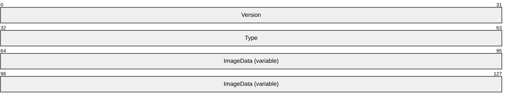

**Version (4 bytes):** An EmfPlusGraphicsVersion object (section [2.2.2.19](#Section_2.2.2.19)) that specifies the version of operating system graphics that was used to create this object.

**Type (4 bytes):** An unsigned integer that specifies the type of data in the **ImageData** field. This value is defined in the ImageDataType enumeration (section [2.1.1.15](#Section_2.1.1.15)).

**ImageData (variable):** Variable-length data that defines the image data specified in the **Type** field. The content and format of the data can be different for every image type.

This object is generic and is used to specify different types of image data, including:

- An EmfPlusBitmap object (section [2.2.2.2](#Section_2.2.2.2)); and
- An EmfPlusMetafile object (section [2.2.2.27](#Section_2.2.2.27)).
See section [2.2.1](#Section_2.2.1) for the specification of additional graphics objects.

<a id="Section_2.2.1.5"></a>
#### 2.2.1.5 EmfPlusImageAttributes Object

The **EmfPlusImageAttributes** object specifies how [**bitmap**](#gt_bitmap) image colors are manipulated during rendering.


**Version (4 bytes):** An EmfPlusGraphicsVersion object (section [2.2.2.19](#Section_2.2.2.19)) that specifies the version of operating system graphics that was used to create this object.

**Reserved1 (4 bytes):** A field that is not used and MUST be ignored.

**WrapMode (4 bytes):** An unsigned integer that specifies how to handle edge conditions with a value from the WrapMode enumeration (section [2.1.1.33](#Section_2.1.1.33)).

**ClampColor (4 bytes):** An EmfPlusARGB object (section [2.2.2.1](#Section_2.2.2.1)) that specifies the edge color to use when the **WrapMode** value is **WrapModeClamp**. This color is visible when the source rectangle processed by an EmfPlusDrawImage record (section [2.3.4.8](#Section_2.3.4.8)) is larger than the image itself.

**ObjectClamp (4 bytes):** A signed integer that specifies the object clamping behavior. It is not used until this object is applied to an image being drawn. This value MUST be one of the values defined in the following table.

| Value | Meaning |
| --- | --- |
| RectClamp 0x00000000 | The object is clamped to a rectangle. |
| BitmapClamp 0x00000001 | The object is clamped to a bitmap. |

**Reserved2 (4 bytes):** A value that SHOULD be set to zero and MUST be ignored upon receipt.

See section [2.2.1](#Section_2.2.1) for the specification of additional graphics objects.

<a id="Section_2.2.1.6"></a>
#### 2.2.1.6 EmfPlusPath Object

The **EmfPlusPath** object specifies a series of line and curve segments that form a graphics path. The order for Bezier data points is the start point, control point 1, control point 2, and end point. For more information see [[MSDN-DrawBeziers]](https://go.microsoft.com/fwlink/?LinkId=328610).


**Version (4 bytes):** An EmfPlusGraphicsVersion object (section [2.2.2.19](#Section_2.2.2.19)) that specifies the version of operating system graphics that was used to create this object.

**PathPointCount (4 bytes):** An unsigned integer that specifies the number of points and associated point types that are defined by this object.

**PathPointFlags (4 bytes):** An unsigned integer that specifies how to interpret the points and associated point types that are defined by this object.

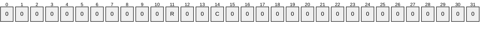

**R (1 bit):** If this flag is set, the **C** flag is undefined and MUST be ignored. The **R** flag specifies whether the **PathPoints** are relative or absolute locations in the [**coordinate space**](#gt_coordinate-space), and whether the **PathPointTypes** are run-length encoded. See **PathPoints** and **PathPointTypes** for details.

**C (1 bit):** If the **R** flag is clear, this flag specifies the type of objects in the **PathPoints** array. See **PathPoints** and **PathPointTypes** for details.

**PathPoints (variable):** An array of **PathPointCount** points that specify the [**path**](#gt_path). The type of objects in this array is specified by the **PathPointFlags** field, as follows:

- If the **R** flag is set, the points are relative locations specified by EmfPlusPointR objects (section [2.2.2.37](#Section_2.2.2.37)).
- If the **R** flag is clear and the **C** flag is set, the points are absolute locations specified by EmfPlusPoint objects (section [2.2.2.35](#Section_2.2.2.35)).
- If the **R** flag is clear and the **C** flag is clear, the points are absolute locations specified by EmfPlusPointF objects (section [2.2.2.36](#Section_2.2.2.36)).
**PathPointTypes (variable):** An array of **PathPointCount** objects that specifies how the points in the **PathPoints** field are used to draw the path. The type of objects in this array is specified by the **PathPointFlags** field, as follows:

- If the **R** flag is set, the point types are specified by EmfPlusPathPointTypeRLE objects (section [2.2.2.32](#Section_2.2.2.32)), which use [**run-length encoding (RLE) compression**](#gt_run-length-encoding-rle-compression) ([MS-WMF](../MS-WMF/MS-WMF.md) section 3.1.6).
- If the **R** flag is clear, the point types are specified by EmfPlusPathPointType objects (section [2.2.2.31](#Section_2.2.2.32)).
**AlignmentPadding (variable):** An optional array of up to 3 bytes that pads the record so that its total size is a multiple of 4 bytes. This field MUST be ignored.

See section [2.2.1](#Section_2.2.1) for the specification of additional graphics objects.

<a id="Section_2.2.1.7"></a>
#### 2.2.1.7 EmfPlusPen Object

The **EmfPlusPen** object specifies a graphics pen for the drawing of lines.


**Version (4 bytes):** An EmfPlusGraphicsVersion object (section [2.2.2.19](#Section_2.2.2.19)) that specifies the version of operating system graphics that was used to create this object.

**Type (4 bytes):** This field MUST be set to zero.

**PenData (variable):** An EmfPlusPenData object (section [2.2.2.33](#Section_2.2.2.33)) that specifies properties of the graphics pen.

**BrushObject (variable):** An EmfPlusBrush object (section [2.2.1.1](#Section_2.2.1.1)) that specifies a graphics brush associated with the pen.

See section [2.2.1](#Section_2.2.1) for the specification of additional graphics objects.

<a id="Section_2.2.1.8"></a>
#### 2.2.1.8 EmfPlusRegion Object

The **EmfPlusRegion** object specifies line and curve segments that define a nonrectilinear shape.

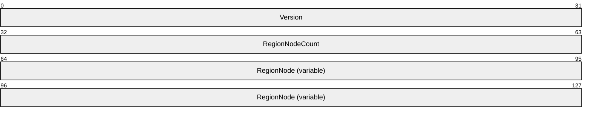

**Version (4 bytes):** An EmfPlusGraphicsVersion object (section [2.2.2.19](#Section_2.2.2.19)) that specifies the version of operating system graphics that was used to create this object.

**RegionNodeCount (4 bytes):** An unsigned integer that specifies the number of child nodes in the **RegionNode** field.

**RegionNode (variable):** An array of **RegionNodeCount**+1 EmfPlusRegionNode objects (section [2.2.2.40](#Section_2.2.2.41)). Regions are specified as a binary tree of [**region**](#gt_region) nodes, and each node MUST either be a terminal node or specify one or two child nodes. RegionNode MUST contain at least one element.

See section [2.2.1](#Section_2.2.1) for the specification of additional graphics objects.

<a id="Section_2.2.1.9"></a>
#### 2.2.1.9 EmfPlusStringFormat Object

The **EmfPlusStringFormat** object specifies text layout, display manipulations, and language identification.

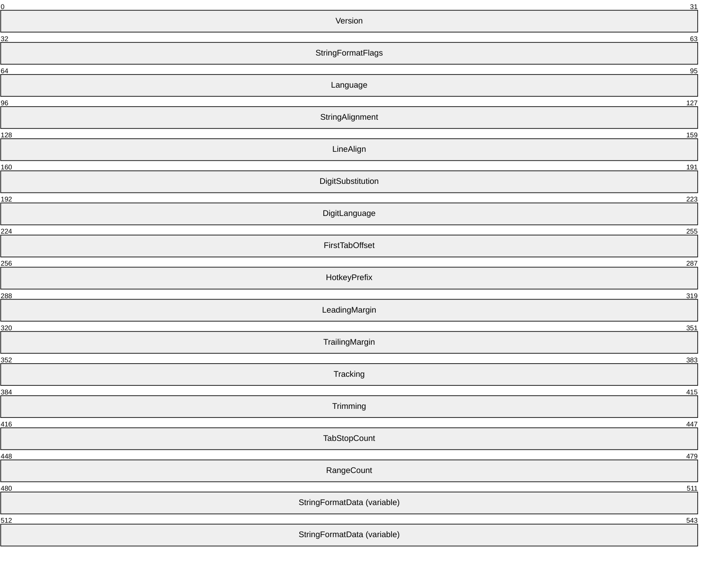

**Version (4 bytes):** An EmfPlusGraphicsVersion object (section [2.2.2.19](#Section_2.2.2.19)) that specifies the version of operating system graphics that was used to create this object.

**StringFormatFlags (4 bytes):** An unsigned integer that specifies text layout options for formatting, clipping and font handling. This value is composed of StringFormat flags (section [2.1.2.8](#Section_2.1.2.8)).

**Language (4 bytes):** An EmfPlusLanguageIdentifier object (section [2.2.2.23](#Section_2.2.2.23)) that specifies the language to use for the string.

**StringAlignment (4 bytes):** An unsigned integer that specifies how to align the string horizontally in the layout rectangle. This value is defined in the StringAlignment enumeration (section [2.1.1.28](#Section_2.1.1.28)).

**LineAlign (4 bytes):** An unsigned integer that specifies how to align the string vertically in the layout rectangle. This value is defined in the StringAlignment enumeration.

**DigitSubstitution (4 bytes):** An unsigned integer that specifies how to substitute numeric digits in the string according to a locale or language. This value is defined in the StringDigitSubstitution enumeration (section [2.1.1.29](#Section_2.1.1.29)).

**DigitLanguage (4 bytes):** An EmfPlusLanguageIdentifier object that specifies the language to use for numeric digits in the string. For example, if this string contains Arabic digits, this field MUST contain a language identifier that specifies an Arabic language.

**FirstTabOffset (4 bytes):** A floating-point value that specifies the number of spaces between the beginning of a text line and the first tab stop.

**HotkeyPrefix (4 bytes):** A signed integer that specifies the type of processing that is performed on a string when a keyboard shortcut prefix (that is, an ampersand) is encountered. Basically, this field specifies whether to display keyboard shortcut prefixes that relate to text. The value is defined in the HotkeyPrefix enumeration (section [2.1.1.14](#Section_2.1.1.14)).

**LeadingMargin (4 bytes):** A floating-point value that specifies the length of the space to add to the starting position of a string. The default is 1/6 inch; for typographic fonts, the default value is 0.

**TrailingMargin (4 bytes):** A floating-point value that specifies the length of the space to leave following a string. The default is 1/6 inch; for typographic fonts, the default value is 0.

**Tracking (4 bytes):** A floating-point value that specifies the ratio of the horizontal space allotted to each character in a specified string to the font-defined width of the character. Large values for this property specify ample space between characters; values less than 1 can produce character overlap. The default is 1.03; for typographic fonts, the default value is 1.00.

**Trimming (4 bytes):** How to trim characters from a string that is too large to fit into a layout rectangle. This value is defined in the StringTrimming enumeration (section [2.1.1.30](#Section_2.1.1.30)).

**TabStopCount (4 bytes):** A signed integer that specifies the number of tab stops defined in the **StringFormatData** field.

**RangeCount (4 bytes):** A signed integer that specifies the number of EmfPlusCharacterRange object (section [2.2.2.8](#Section_2.2.2.8)) defined in the **StringFormatData** field.

**StringFormatData (variable):** An EmfPlusStringFormatData object (section [2.2.2.44](#Section_2.2.2.44)) that specifies optional text layout data.

See section [2.2.1](#Section_2.2.1) for the specification of additional graphics objects.

<a id="Section_2.2.2"></a>
### 2.2.2 Structure Object Types

The **Structure Objects** specify containers for data structures that are embedded in [**EMF+**](#gt_enhanced-metafile-format-plus-extensions-emf) [**metafile**](#gt_metafile) records. Structure objects, unlike graphics objects, are not explicitly created; they are components that make up more complex structures.

The following types of structure objects are defined.

| Name | Section | Description |
| --- | --- | --- |
| EmfPlusARGB | [2.2.2.1](#Section_2.2.2.1) | A color as a combination of [**RGB**](#gt_red-green-blue-rgb) and [**alpha**](#gt_134d5688-b046-4a5b-a74e-c0c11fc04eb3). |
| EmfPlusBitmap | [2.2.2.2](#Section_2.2.2.2) | A [**bitmap**](#gt_bitmap) image. |
| EmfPlusBitmapData | [2.2.2.3](#Section_2.2.2.3) | A bitmap image with pixel data. |
| EmfPlusBlendColors | [2.2.2.4](#Section_2.2.2.4) | Positions and colors for the blend pattern of a gradient brush. |
| EmfPlusBlendFactors | [2.2.2.5](#Section_2.2.2.5) | Positions and factors for the blend pattern of a gradient brush. |
| EmfPlusBoundaryPathData | [2.2.2.6](#Section_2.2.2.6) | A [**path**](#gt_path) boundary for a gradient brush. |
| EmfPlusBoundaryPointData | [2.2.2.7](#Section_2.2.2.7) | A [**closed cardinal spline**](#gt_closed-cardinal-spline) boundary for a gradient brush. |
| EmfPlusCharacterRange | [2.2.2.8](#Section_2.2.2.8) | A range of character positions for a text string. |
| EmfPlusCompoundLineData | [2.2.2.9](#Section_2.2.2.9) | Line and space data for a compound line. |
| EmfPlusCompressedImage | [2.2.2.10](#Section_2.2.2.10) | An image with compressed data. |
| EmfPlusCustomEndCapData | [2.2.2.11](#Section_2.2.2.11) | A custom line cap for the end of a line. |
| EmfPlusCustomLineCapArrowData | [2.2.2.12](#Section_2.2.2.12) | Adjustable arrow data for a custom line cap. |
| EmfPlusCustomLineCapData | [2.2.2.13](#Section_2.2.2.13) | Default data for a custom line cap. |
| EmfPlusCustomLineCapOptionalData | [2.2.2.14](#Section_2.2.2.14) | Optional fill and outline data for a custom line cap. |
| EmfPlusCustomStartCapData | [2.2.2.15](#Section_2.2.2.15) | A custom line cap for the start of a line. |
| EmfPlusDashedLineData | [2.2.2.16](#Section_2.2.2.16) | Properties of a dashed line for a graphics pen. |
| EmfPlusFillPath | [2.2.2.17](#Section_2.2.2.17) | A graphics path for filling a custom line cap. |
| EmfPlusFocusScaleData | [2.2.2.18](#Section_2.2.2.18) | Focus scales for the blend pattern of a path gradient brush. |
| EmfPlusGraphicsVersion | [2.2.2.19](#Section_2.2.2.19) | The version of operating system graphics that is used to create an EMF+ metafile. |
| EmfPlusHatchBrushData | [2.2.2.20](#Section_2.2.2.20) | A hatch pattern for a graphics brush. |
| EmfPlusInteger7 | [2.2.2.21](#Section_2.2.2.21) | A 7-bit signed integer in an 8-bit field. |
| EmfPlusInteger15 | [2.2.2.22](#Section_2.2.2.22) | A 15-bit signed integer in a 16-bit field. |
| EmfPlusLanguageIdentifier | [2.2.2.23](#Section_2.2.2.23) | Language identifiers that correspond to natural languages in a locale. |
| EmfPlusLinearGradientBrushData | [2.2.2.24](#Section_2.2.2.24) | A linear gradient for a graphics brush. |
| EmfPlusLinearGradientBrushOptionalData | [2.2.2.25](#Section_2.2.2.25) | Optional data for a linear gradient brush. |
| EmfPlusLinePath | [2.2.2.26](#Section_2.2.2.26) | A graphics path for outlining a custom line cap. |
| EmfPlusMetafile | [2.2.2.27](#Section_2.2.2.27) | A metafile that contains a graphics image. |
| EmfPlusPalette | [2.2.2.28](#Section_2.2.2.28) | The colors that make up a [**palette**](#gt_palette). |
| EmfPlusPathGradientBrushData | [2.2.2.29](#Section_2.2.2.29) | A path gradient for a graphics brush. |
| EmfPlusPathGradientBrushOptionalData | [2.2.2.30](#Section_2.2.2.30) | Optional data for a path gradient brush. |
| EmfPlusPathPointType | [2.2.2.31](#Section_2.2.2.32) | A type value associated with a point on a graphics path. |
| EmfPlusPathPointTypeRLE | [2.2.2.32](#Section_2.2.2.32) | Type values associated with points on a graphics path using [**RLE compression**](#gt_run-length-encoding-rle-compression) ([MS-WMF](../MS-WMF/MS-WMF.md) section 3.1.6). |
| EmfPlusPenData | [2.2.2.33](#Section_2.2.2.33) | Properties of a graphics pen. |
| EmfPlusPenOptionalData | [2.2.2.34](#Section_2.2.2.34) | Optional data for a graphics pen. |
| EmfPlusPoint | [2.2.2.35](#Section_2.2.2.35) | An ordered pair of integer (X,Y) values that defines an absolute location in a [**coordinate space**](#gt_coordinate-space). |
| EmfPlusPointF | [2.2.2.36](#Section_2.2.2.36) | An ordered pair of floating-point (X,Y) values that defines an absolute location in a coordinate space. |
| EmfPlusPointR | [2.2.2.37](#Section_2.2.2.37) | An ordered pair of integer (X,Y) values that defines a relative location in a coordinate space. |
| EmfPlusRect | [2.2.2.38](#Section_2.2.2.39) | A rectangle origin, height, and width as integers. |
| EmfPlusRectF | [2.2.2.39](#Section_2.2.2.39) | A rectangle origin, height, and width as floating-point values. |
| EmfPlusRegionNode | [2.2.2.40](#Section_2.2.2.41) | A node of a graphics [**region**](#gt_region). |
| EmfPlusRegionNodeChildNodes | [2.2.2.41](#Section_2.2.2.41) | The child nodes of a graphics region. |
| EmfPlusRegionNodePath | [2.2.2.42](#Section_2.2.2.42) | A graphics path for drawing the boundary of a region node. |
| EmfPlusSolidBrushData | [2.2.2.43](#Section_2.2.2.43) | A solid color for a graphics brush. |
| EmfPlusStringFormatData | [2.2.2.44](#Section_2.2.2.44) | Tab stops and character positions for a graphics string. |
| EmfPlusTextureBrushData | [2.2.2.45](#Section_2.2.2.45) | A texture image for a graphics brush. |
| EmfPlusTextureBrushOptionalData | [2.2.2.46](#Section_2.2.2.46) | Optional data for a texture brush. |
| EmfPlusTransformMatrix | [2.2.2.47](#Section_2.2.2.47) | A [**world space**](#gt_world-space) to [**device space**](#gt_device-space) [**transform**](#gt_transform). |

<a id="Section_2.2.2.1"></a>
#### 2.2.2.1 EmfPlusARGB Object

The **EmfPlusARGB** object specifies a color as a combination of red, green, blue. and [**alpha**](#gt_134d5688-b046-4a5b-a74e-c0c11fc04eb3).

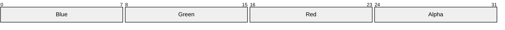

**Blue (1 byte):** An unsigned integer that specifies the relative intensity of blue.

**Green (1 byte):** An unsigned integer that specifies the relative intensity of green.

**Red (1 byte):** An unsigned integer that specifies the relative intensity of red.

**Alpha (1 byte):** An unsigned integer that specifies the transparency of the background, ranging from 0 for completely transparent to 0xFF for completely opaque.

See section [2.2.2](#Section_2.2.2) for the specification of additional structure objects.

<a id="Section_2.2.2.2"></a>
#### 2.2.2.2 EmfPlusBitmap Object

The **EmfPlusBitmap** object specifies a [**bitmap**](#gt_bitmap) that contains a graphics image.


**Width (4 bytes):** A signed integer that specifies the width in pixels of the area occupied by the bitmap.

If the image is compressed, according to the **Type** field, this value is undefined and MUST be ignored.

**Height (4 bytes):** A signed integer that specifies the height in pixels of the area occupied by the bitmap.

If the image is compressed, according to the **Type** field, this value is undefined and MUST be ignored.

**Stride (4 bytes):** A signed integer that specifies the byte offset between the beginning of one scan-line and the next. This value is the number of bytes per pixel, which is specified in the **PixelFormat** field, multiplied by the width in pixels, which is specified in the **Width** field. The value of this field MUST be a multiple of four.

If the image is compressed, according to the **Type** field, this value is undefined and MUST be ignored.

**PixelFormat (4 bytes):** An unsigned integer that specifies the format of the pixels that make up the bitmap image. The supported pixel formats are specified in the PixelFormat enumeration (section [2.1.1.24](#Section_2.1.1.24)).

If the image is compressed, according to the **Type** field, this value is undefined and MUST be ignored.

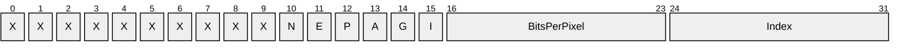

**X (1 bit):** Reserved and MUST be ignored.

**N (1 bit):** If set, the pixel format is "canonical", which means that 32 bits per pixel are supported, with 24 bits for color components and an 8-bit [**alpha**](#gt_134d5688-b046-4a5b-a74e-c0c11fc04eb3) channel.

If clear, the pixel format is not canonical.

**E (1 bit):** If set, the pixel format supports extended colors in 16 bits per channel.

If clear, extended colors are not supported.

**P (1 bit):** If set, each color component in the pixel has been premultiplied by the pixel's alpha transparency value.

If clear, each color component is multiplied by the pixel's alpha transparency value when the source pixel is blended with the destination pixel.

**A (1 bit):** If set, the pixel format includes an alpha transparency component.

If clear, the pixel format does not include a component that specifies transparency.

**G (1 bit):** If set, the pixel format is supported in Windows [**GDI**](#gt_graphics-device-interface-gdi).

If clear, the pixel format is not supported in Windows GDI.

**I (1 bit):** If set, the pixel values are indexes into a [**palette**](#gt_palette).

If clear, the pixel values are actual colors.

**BitsPerPixel (1 byte):** The total number of bits per pixel.

**Index (1 byte):** The pixel format enumeration index.

**Type (4 bytes):** An unsigned integer that specifies the type of data in the **BitmapData** field. This value is defined in the BitmapDataType enumeration (section [2.1.1.2](#Section_2.1.1.2)).

**BitmapData (variable):** Variable-length data that defines the bitmap data object specified in the **Type** field. The content and format of the data can be different for every bitmap type.

Graphics images are specified by EmfPlusImage objects (section [2.2.1.4](#Section_2.2.1.4)). An EmfPlusBitmap object MUST be present in the **ImageData** field of an EmfPlusImage object if ImageTypeBitmap is specified in its **Type** field.

This object is generic and is used to specify different types of bitmap data, including:

- An EmfPlusBitmapData object (section [2.2.2.3](#Section_2.2.2.3)); and
- An EmfPlusCompressedImage object (section [2.2.2.10](#Section_2.2.2.10)).
See section [2.2.2](#Section_2.2.2) for the specification of additional structure objects.

<a id="Section_2.2.2.3"></a>
#### 2.2.2.3 EmfPlusBitmapData Object

The **EmfPlusBitmapData** object specifies a [**bitmap**](#gt_bitmap) image with pixel data.

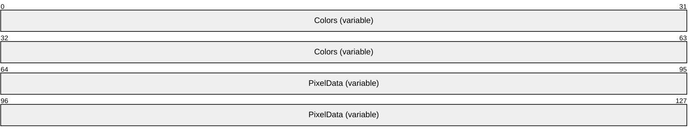

**Colors (variable):** An optional EmfPlusPalette object (section [2.2.2.28](#Section_2.2.2.28)), which specifies the [**palette**](#gt_palette) of colors used in the pixel data. This field MUST be present if the **I** flag is set in the **PixelFormat** field of the EmfPlusBitmap object (section [2.2.2.2](#Section_2.2.2.2)).

**PixelData (variable):** An array of bytes that specify the pixel data. The size and format of this data can be computed from fields in the EmfPlusBitmap object, including the pixel format from the PixelFormat enumeration (section [2.1.1.24](#Section_2.1.1.24)).

Bitmaps are specified by EmfPlusBitmap objects. An EmfPlusBitmapData object MUST be present in the **BitmapData** field of an EmfPlusBitmap object if BitmapDataTypePixel is specified in its **Type** field.

See section [2.2.2](#Section_2.2.2) for the specification of additional structure objects.

<a id="Section_2.2.2.4"></a>
#### 2.2.2.4 EmfPlusBlendColors Object

The **EmfPlusBlendColors** object specifies positions and colors for the blend pattern of a gradient brush.


**PositionCount (4 bytes):** An unsigned integer that specifies the number of positions in the **BlendPositions** field and colors in the **BlendColors** field.

**BlendPositions (variable):** An array of **PositionCount** 32-bit floating-point values that specify proportions of distance along the [**gradient line**](#gt_gradient-line).

Each element MUST be a number between 0.0 and 1.0 inclusive. For a linear gradient brush, 0.0 represents the starting point and 1.0 represents the ending point. For a path gradient brush, 0.0 represents the midpoint and 1.0 represents an endpoint.

**BlendColors (variable):** An array of **PositionCount** EmfPlusARGB objects (section [2.2.2.5](#Section_2.2.2.5)) that specify colors at the positions defined in the **BlendPositions** field.

Gradient brushes are specified by EmfPlusLinearGradientBrushData objects (section [2.2.2.24](#Section_2.2.2.24)) and EmfPlusPathGradientBrushData objects (section [2.2.2.29](#Section_2.2.2.29)). Blend patterns are used to smoothly shade the interiors of shapes filled by gradient brushes. and can be defined by arrays of positions and colors or positions and factors. Positions and factors are specified by EmfPlusBlendFactors objects (section 2.2.2.5).

An EmfPlusBlendColors object MUST be present in the **OptionalData** field of an EmfPlusLinearGradientBrushData object, if the BrushDataPresetColors flag is set in its **BrushDataFlags** field.

An EmfPlusBlendColors object MUST be present in the **OptionalData** field of an EmfPlusPathGradientBrushData object, if the BrushDataPresetColors flag is set in its **BrushDataFlags** field.

See section [2.2.2](#Section_2.2.2) for the specification of additional structure objects.

<a id="Section_2.2.2.5"></a>
#### 2.2.2.5 EmfPlusBlendFactors Object

The **EmfPlusBlendFactors** object specifies positions and factors for the blend pattern of a gradient brush.

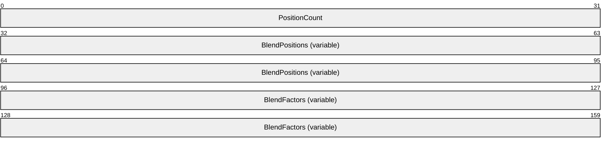

**PositionCount (4 bytes):** An unsigned integer that specifies the number of positions in the **BlendPositions** field and factors in the **BlendFactors** field.

**BlendPositions (variable):** An array of **PositionCount** 32-bit floating-point values that specify proportions of distance along the [**gradient line**](#gt_gradient-line).

Each value MUST be a number between 0.0 and 1.0 inclusive. There MUST be at least two positions specified: the first position, which is always 0.0f, and the last position, which is always 1.0f. Each position in **BlendPositions** is generally greater than the preceding position. For a linear gradient brush, 0.0 represents the starting point and 1.0 represents the ending point. For a path gradient brush, 0.0 represents the midpoint and 1.0 represents an endpoint.

**BlendFactors (variable):** An array of **PositionCount** 32-bit floating-point values that specify proportions of colors at the positions defined in the **BlendPositions** field. Each value MUST be a number between 0.0 and 1.0 inclusive.

For a linear gradient brush, 0.0 represents 0% starting color and 100% ending color, and 1.0 represents 100% starting color and 0% ending color. For a path gradient brush, 0.0 represents 0% midpoint color and 100% endpoint color, and 1.0 represents 100% midpoint color and 0% endpoint color.

For example, if a linear gradient brush specifies a position of 0.2 and a factor of 0.3 along a gradient line that is 100 pixels long, the color that is 20 pixels along that line consists of 30 percent starting color and 70 percent ending color.

Gradient brushes are specified by EmfPlusLinearGradientBrushData objects (section [2.2.2.24](#Section_2.2.2.24)) and EmfPlusPathGradientBrushData objects (section [2.2.2.29](#Section_2.2.2.29)). Blend patterns are used to smoothly shade the interiors of shapes filled by gradient brushes. and can be defined by arrays of positions and colors or positions and factors. Positions and colors are specified by EmfPlusBlendColors objects (section [2.2.2.4](#Section_2.2.2.4)).

An EmfPlusBlendFactors object MUST be present in the **OptionalData** field of an EmfPlusLinearGradientBrushData or EmfPlusPathGradientBrushData object if either of the flags BrushDataBlendFactorsH or BrushDataBlendFactorsV is set in its **BrushDataFlags** field.

See section [2.2.2](#Section_2.2.2) for the specification of additional structure objects.

<a id="Section_2.2.2.6"></a>
#### 2.2.2.6 EmfPlusBoundaryPathData Object

The **EmfPlusBoundaryPathData** object specifies a graphics [**path**](#gt_path) boundary for a gradient brush.


**BoundaryPathSize (4 bytes):** A signed integer that specifies the size in bytes of the **BoundaryPathData** field.

**BoundaryPathData (variable):** An EmfPlusPath object (section [2.2.1.6](#Section_2.2.2.32)), which specifies the boundary of the brush.

Boundary path data is specified in the **BoundaryData** field of an EmfPlusPathGradientBrushData object (section [2.2.2.29](#Section_2.2.2.29)).

See section [2.2.2](#Section_2.2.2) for the specification of additional structure objects.

<a id="Section_2.2.2.7"></a>
#### 2.2.2.7 EmfPlusBoundaryPointData Object

The **EmfPlusBoundaryPointData** object specifies a [**closed cardinal spline**](#gt_closed-cardinal-spline) boundary for a gradient brush.


**BoundaryPointCount (4 bytes):** A signed integer that specifies the number of points in the **BoundaryPointData** field.

**BoundaryPointData (variable):** An array of **BoundaryPointCount** EmfPlusPointF objects (section [2.2.2.36](#Section_2.2.2.36)) that specify the boundary of the brush.

Boundary point data is specified in the **BoundaryData** field of an EmfPlusPathGradientBrushData object (section [2.2.2.29](#Section_2.2.2.29)).

See section [2.2.2](#Section_2.2.2) for the specification of additional structure objects.

<a id="Section_2.2.2.8"></a>
#### 2.2.2.8 EmfPlusCharacterRange Object

The **EmfPlusCharacterRange** object specifies a range of character positions for a text string.

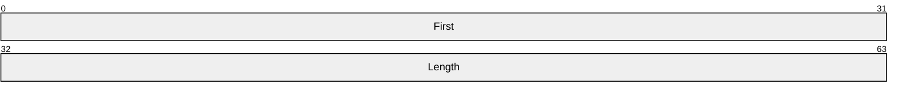

**First (4 bytes):** A signed integer that specifies the first position of this range.

**Length (4 bytes):** A signed integer that specifies the number of positions in this range.

Graphics strings are specified by EmfPlusStringFormat objects (section [2.2.1.9](#Section_2.2.2.44)).

See section [2.2.2](#Section_2.2.2) for the specification of additional structure objects.

<a id="Section_2.2.2.9"></a>
#### 2.2.2.9 EmfPlusCompoundLineData Object

The **EmfPlusCompoundLineData** object specifies line and space data for a compound line.


**CompoundLineDataSize (4 bytes):** An unsigned integer that specifies the number of elements in the **CompoundLineData** field.

**CompoundLineData (variable):** An array of **CompoundLineDataSize** 32-bit floating-point values that specify the compound line of a pen. The elements MUST be in increasing order, and their values MUST be between 0.0 and 1.0, inclusive.

Graphics pens are specified by EmfPlusPen objects (section [2.2.1.7](#Section_2.2.1.7)). An EmfPlusCompoundLineData object MUST be present in the **OptionalData** field of an EmfPlusPenData object (section [2.2.2.33](#Section_2.2.2.33)), if the PenDataCompoundLineData flag (section [2.1.2.7](#Section_2.1.2.7)) is set in its **PenDataFlags** field.

A compound line is made up of a pattern of alternating parallel lines and spaces of varying widths. The values in the array specify the starting points of each component of the compound line relative to the total width. The first value specifies where the first line component begins as a fraction of the distance across the width of the pen. The second value specifies where the first space component begins as a fraction of the distance across the width of the pen. The final value in the array specifies where the last line component ends.

See section [2.2.2](#Section_2.2.2) for the specification of additional structure objects.

<a id="Section_2.2.2.10"></a>
#### 2.2.2.10 EmfPlusCompressedImage Object

The **EmfPlusCompressedImage** object specifies an image with compressed data.

```mermaid
packet-beta
  0-63: "CompressedImageData (variable)"
```

**CompressedImageData (variable):** An array of bytes, which specify the compressed image. The type of compression is determined from the data itself.

[**Bitmaps**](#gt_bitmap) are specified by EmfPlusBitmap objects (section [2.2.2.2](#Section_2.2.2.2)). An EmfPlusCompressedImage object MUST be present in the **BitmapData** field of an EmfPlusBitmap object if the BitmapDataTypeCompressed value (section [2.1.1.2](#Section_2.1.1.2)) is specified in its **Type** field.

This object is generic and is used for different types of compressed data, including:

- [**Exchangeable Image File Format (EXIF)**](#gt_exchangeable-image-file-format-exif) [[EXIF]](https://go.microsoft.com/fwlink/?LinkId=105061);
- [**Graphics Interchange Format (GIF)**](#gt_graphics-interchange-format-gif) [[GIF]](https://go.microsoft.com/fwlink/?LinkId=105060);
- [**Joint Photographic Experts Group (JPEG)**](#gt_joint-photographic-experts-group-jpeg) [[JFIF]](https://go.microsoft.com/fwlink/?LinkId=89925);
- [**Portable Network Graphics (PNG)**](#gt_portable-network-graphics-png) [[RFC2083]](https://go.microsoft.com/fwlink/?LinkId=90313) [[W3C-PNG]](https://go.microsoft.com/fwlink/?LinkId=90562); and
- [**Tag Image File Format (TIFF)**](#gt_tag-image-file-format-tiff) [[RFC3302]](https://go.microsoft.com/fwlink/?LinkId=90416) [[TIFF]](https://go.microsoft.com/fwlink/?LinkId=107079).
See section [2.2.2](#Section_2.2.2) for the specification of additional structure objects.

<a id="Section_2.2.2.11"></a>
#### 2.2.2.11 EmfPlusCustomEndCapData Object

The **EmfPlusCustomEndCapData** object specifies a custom line cap for the end of a line.

```mermaid
packet-beta
  0-31: "CustomEndCapSize"
  32-95: "CustomEndCap (variable)"
```

**CustomEndCapSize (4 bytes):** An unsigned integer that specifies the size in bytes of the **CustomEndCap** field.

**CustomEndCap (variable):** A custom line cap that defines the shape to draw at the end of a line. It can be any of various shapes, including a square, circle, or diamond.

Custom line caps are specified by EmfPlusCustomLineCap objects (section [2.2.1.2](#Section_2.2.2.14)). An EmfPlusCustomEndCapData object MUST be present in the **OptionalData** field of an EmfPlusPenData object (section [2.2.2.33](#Section_2.2.2.33)), if the **PenDataEndCap** flag (section [2.1.2.7](#Section_2.1.2.7)) is set in its **PenDataFlags** field.

See section [2.2.2](#Section_2.2.2) for the specification of additional structure objects.

<a id="Section_2.2.2.12"></a>
#### 2.2.2.12 EmfPlusCustomLineCapArrowData Object

The **EmfPlusCustomLineCapArrowData** object specifies adjustable arrow data for a custom line cap.

```mermaid
packet-beta
  0-31: "Width"
  32-63: "Height"
  64-95: "MiddleInset"
  96-127: "FillState"
  128-159: "LineStartCap"
  160-191: "LineEndCap"
  192-223: "LineJoin"
  224-255: "LineMiterLimit"
  256-287: "WidthScale"
  288-351: "FillHotSpot"
  352-415: "LineHotSpot"
```

**Width (4 bytes):** A floating-point value that specifies the width of the arrow cap.

The width of the arrow cap is scaled by the width of the EmfPlusPen object (section [2.2.1.7](#Section_2.2.1.7)) that is used to draw the line being capped. For example, when drawing a capped line with a pen that has a width of 5 pixels, and the adjustable arrow cap object has a width of 3, the actual arrow cap is drawn 15 pixels wide.

**Height (4 bytes):** A floating-point value that specifies the height of the arrow cap.

The height of the arrow cap is scaled by the width of the EmfPlusPen object that is used to draw the line being capped. For example, when drawing a capped line with a pen that has a width of 5 pixels, and the adjustable arrow cap object has a height of 3, the actual arrow cap is drawn 15 pixels high.

**MiddleInset (4 bytes):** A floating-point value that specifies the number of pixels between the outline of the arrow cap and the fill of the arrow cap.

**FillState (4 bytes):** A Boolean value that specifies whether the arrow cap is filled. If the arrow cap is not filled, only the outline is drawn.

**LineStartCap (4 bytes):** An unsigned integer that specifies the value in the LineCapType enumeration (section [2.1.1.17](#Section_2.1.1.17)) that indicates the line cap to be used at the start of the line to be drawn.

**LineEndCap (4 bytes):** An unsigned integer that specifies the value in the LineCapType enumeration that indicates the line cap to be used at the end of the line to be drawn.

**LineJoin (4 bytes):** An unsigned integer that specifies the value in the LineJoinType enumeration (section [2.1.1.18](#Section_2.1.1.18)) that specifies how to join two lines that are drawn by the same pen and whose ends meet. At the intersection of the two line ends, a line join makes the connection look more continuous.

**LineMiterLimit (4 bytes):** A floating-point value that specifies the limit of the thickness of the join on a mitered corner by setting the maximum allowed ratio of [**miter length**](#gt_miter-length) to line width.

**WidthScale (4 bytes):** A floating-point value that specifies the amount by which to scale an EmfPlusCustomLineCap object (section [2.2.1.2](#Section_2.2.2.14)) with respect to the width of the graphics pen that is used to draw the lines.

**FillHotSpot (8 bytes):** An EmfPlusPointF object (section [2.2.2.36](#Section_2.2.2.36)) that is not currently used. It MUST be set to {0.0, 0.0}.

**LineHotSpot (8 bytes):** An EmfPlusPointF object that is not currently used. It MUST be set to {0.0, 0.0}.

Custom line caps are specified by EmfPlusCustomLineCap objects (section 2.2.1.2).

See section [2.2.2](#Section_2.2.2) for the specification of additional structure objects.

<a id="Section_2.2.2.13"></a>
#### 2.2.2.13 EmfPlusCustomLineCapData Object

The **EmfPlusCustomLineCapData** object specifies default data for a custom line cap.

```mermaid
packet-beta
  0-31: "CustomLineCapDataFlags"
  32-63: "BaseCap"
  64-95: "BaseInset"
  96-127: "StrokeStartCap"
  128-159: "StrokeEndCap"
  160-191: "StrokeJoin"
  192-223: "StrokeMiterLimit"
  224-255: "WidthScale"
  256-319: "FillHotSpot"
  320-383: "StrokeHotSpot"
  384-447: "OptionalData (variable)"
```

**CustomLineCapDataFlags (4 bytes):** An unsigned integer that specifies the data in the **OptionalData** field. This value is composed of CustomLineCapData flags (section [2.1.2.2](#Section_2.1.2.2)).

**BaseCap (4 bytes):** An unsigned integer that specifies the value from the LineCapType enumeration (section [2.1.1.17](#Section_2.1.1.17)) on which the custom line cap is based.

**BaseInset (4 bytes):** A floating-point value that specifies the distance between the beginning of the line cap and the end of the line.

**StrokeStartCap (4 bytes):** An unsigned integer that specifies the value in the LineCapType enumeration that indicates the line cap used at the start of the line to be drawn.

**StrokeEndCap (4 bytes):** An unsigned integer that specifies the value in the LineCapType enumeration that indicates what line cap is to be used at the end of the line to be drawn.

**StrokeJoin (4 bytes):** An unsigned integer that specifies the value in the LineJoinType enumeration (section [2.1.1.18](#Section_2.1.1.18)) that specifies how to join two lines that are drawn by the same pen and whose ends meet. At the intersection of the two line ends, a line join makes the connection look more continuous.

**StrokeMiterLimit (4 bytes):** A floating-point value that contains the limit of the thickness of the join on a mitered corner by setting the maximum allowed ratio of [**miter length**](#gt_miter-length) to line width.

**WidthScale (4 bytes):** A floating-point value that specifies the amount by which to scale the custom line cap with respect to the width of the EmfPlusPen object (section [2.2.1.7](#Section_2.2.1.7)) that is used to draw the lines.

**FillHotSpot (8 bytes):** An EmfPlusPointF object (section [2.2.2.36](#Section_2.2.2.36)) that is not currently used. It MUST be set to {0.0, 0.0}.

**StrokeHotSpot (8 bytes):** An EmfPlusPointF object that is not currently used. It MUST be set to {0.0, 0.0}.

**OptionalData (variable):** An optional EmfPlusCustomLineCapOptionalData object (section [2.2.2.14](#Section_2.2.2.14)) that specifies additional data for the custom graphics line cap. The specific contents of this field are determined by the value of the **CustomLineCapDataFlags** field.

Custom line caps are specified by EmfPlusCustomLineCap objects (section [2.2.1.2](#Section_2.2.2.14)).

See section [2.2.2](#Section_2.2.2) for the specification of additional structure objects.

<a id="Section_2.2.2.14"></a>
#### 2.2.2.14 EmfPlusCustomLineCapOptionalData Object

The **EmfPlusCustomLineCapOptionalData** object specifies optional fill and outline data for a custom line cap.

**Note:** Each field specified for this object is optional and might not be present in the **OptionalData** field of an EmfPlusCustomLineCapData object (section [2.2.2.13](#Section_2.2.2.13)), depending on the CustomLineCapData flags (section [2.1.2.2](#Section_2.1.2.2)) set in its **CustomLineCapDataFlags** field. Although it is not practical to represent every possible combination of fields present or absent, this section specifies their relative order in the object. The implementer is responsible for determining which fields are actually present in a given [**metafile**](#gt_metafile) record, and for unmarshaling the data for individual fields separately and appropriately.

```mermaid
packet-beta
  0-63: "FillData (variable)"
  64-127: "OutlineData (variable)"
```

**FillData (variable):** An optional EmfPlusFillPath object (section [2.2.2.17](#Section_2.2.2.17)) that specifies the [**path**](#gt_path) for filling a custom graphics line cap. This field MUST be present if the CustomLineCapDataFillPath flag is set in the **CustomLineCapDataFlags** field of the EmfPlusCustomLineCapData object.

**OutlineData (variable):** An optional EmfPlusLinePath object (section [2.2.2.26](#Section_2.2.2.26)) that specifies the path for outlining a custom graphics line cap. This field MUST be present if the CustomLineCapDataLinePath flag is set in the **CustomLineCapDataFlags** field of the EmfPlusCustomLineCapData object.

Custom line caps are specified by EmfPlusCustomLineCap objects (section [2.2.1.2](#Section_2.2.2.14)).

See section [2.2.2](#Section_2.2.2) for the specification of additional structure objects.

<a id="Section_2.2.2.15"></a>
#### 2.2.2.15 EmfPlusCustomStartCapData Object

The **EmfPlusCustomStartCapData** object specifies a custom line cap for the start of a line.

```mermaid
packet-beta
  0-31: "CustomStartCapSize"
  32-95: "CustomStartCap (variable)"
```

**CustomStartCapSize (4 bytes):** An unsigned integer that specifies the size in bytes of the **CustomStartCap** field.

**CustomStartCap (variable):** A custom graphics line cap that defines the shape to draw at the start of a line. It can be any of various shapes, including a square, circle or diamond.

Custom line caps are specified by EmfPlusCustomLineCap objects (section [2.2.1.2](#Section_2.2.2.14)). If the PenDataStartCap flag (section [2.1.2.7](#Section_2.1.2.7)) is set in its **PenDataFlags** field, an EmfPlusCustomStartCapData object MUST be present in the **OptionalData** field of an EmfPlusPenData object (section [2.2.2.33](#Section_2.2.2.33)).

See section [2.2.2](#Section_2.2.2) for the specification of additional structure objects.

<a id="Section_2.2.2.16"></a>
#### 2.2.2.16 EmfPlusDashedLineData Object

The **EmfPlusDashedLineData** object specifies properties of a dashed line for a graphics pen.

```mermaid
packet-beta
  0-31: "DashedLineDataSize"
  32-95: "DashedLineData (variable)"
```

**DashedLineDataSize (4 bytes):** An unsigned integer that specifies the number of elements in the **DashedLineData** field.

**DashedLineData (variable):** An array of **DashedLineDataSize** 32-bit floating-point values that specify the lengths of the dashes and spaces in a dashed line.

Graphics pens are specified by EmfPlusPen objects (section [2.2.1.7](#Section_2.2.1.7)). An EmfPlusDashedLineData object MUST be present in the **OptionalData** field of an EmfPlusPenData object (section [2.2.2.33](#Section_2.2.2.33)), if the PenDataDashedLine flag (section [2.1.2.7](#Section_2.1.2.7)) is set in its **PenDataFlags** field.

See section [2.2.2](#Section_2.2.2) for the specification of additional structure objects.

<a id="Section_2.2.2.17"></a>
#### 2.2.2.17 EmfPlusFillPath Object

The **EmfPlusFillPath** object specifies a graphics path for filling a custom line cap.

```mermaid
packet-beta
  0-31: "FillPathLength"
  32-95: "FillPath (variable)"
```

**FillPathLength (4 bytes):** A signed integer that specifies the length in bytes of the **FillPath** field.

**FillPath (variable):** An EmfPlusPath object (section [2.2.1.6](#Section_2.2.2.32)), which specifies the area to fill.

Custom line caps are specified by EmfPlusCustomLineCap objects (section [2.2.1.2](#Section_2.2.2.14)). An EmfPlusFillPath object (section 2.2.2.17) MUST be present if the **CustomLineCapDataFillPath** flag is set in the **CustomLineCapDataFlags** field of an EmfPlusCustomLineCapData object (section [2.2.2.13](#Section_2.2.2.13)).

See section [2.2.2](#Section_2.2.2) for the specification of additional structure objects.

<a id="Section_2.2.2.18"></a>
#### 2.2.2.18 EmfPlusFocusScaleData Object

The **EmfPlusFocusScaleData** object specifies focus scales for the blend pattern of a path gradient brush.

```mermaid
packet-beta
  0-31: "FocusScaleCount"
  32-63: "FocusScaleX"
  64-95: "FocusScaleY"
```

**FocusScaleCount (4 bytes):** An unsigned integer that specifies the number of focus scales. This value MUST be 2.

**FocusScaleX (4 bytes):** A floating-point value that defines the horizontal focus scale. The focus scale MUST be a value between 0.0 and 1.0, exclusive.

**FocusScaleY (4 bytes):** A floating-point value that defines the vertical focus scale. The focus scale MUST be a value between 0.0 and 1.0, exclusive.

By default, the center color of a path gradient brush is displayed only at the center point of an area bounded by a [**path**](#gt_path). Focus scales specify an inner path inside that area, and the center color is displayed everywhere inside it. The inner path is the boundary path scaled by horizontal and vertical scale factors.

For example, focus scales of {0.2, 0.3} specifies a path that is the boundary path scaled by a factor of 0.2 horizontally and 0.3 vertically. The area inside the scaled path MUST be filled with the center color. Between the inner and outer boundaries, the color MUST change gradually from the center color to the boundary color.

An EmfPlusFocusScaleData object MUST be present in the **OptionalData** field of an EmfPlusPathGradientBrushData object (section [2.2.2.29](#Section_2.2.2.29)), if the BrushDataFocusScales flag (section [2.1.2.1](#Section_2.1.2.1)) is set in its **BrushDataFlags** field.

See section [2.2.2](#Section_2.2.2) for the specification of additional structure objects.

<a id="Section_2.2.2.19"></a>
#### 2.2.2.19 EmfPlusGraphicsVersion Object

The **EmfPlusGraphicsVersion** object specifies the version of operating system graphics that is used to create an [**EMF+**](#gt_enhanced-metafile-format-plus-extensions-emf) [**metafile**](#gt_metafile).

```mermaid
packet-beta
  0-19: "MetafileSignature"
  20-31: "GraphicsVersion"
```

**MetafileSignature (20 bits):** A value that identifies the type of metafile. The value for an EMF+ metafile is 0xDBC01.

**GraphicsVersion (12 bits):** The version of operating system graphics. This value is defined in the GraphicsVersion enumeration (section [2.1.1.12](#Section_2.2.2.19)).<12>

Graphics versions are vendor-extensible; however, to ensure inter-operability, any such extension MUST be implemented in both clients and servers of EMF+ metafiles.

See section [2.2.2](#Section_2.2.2) for the specification of additional structure objects.

<a id="Section_2.2.2.20"></a>
#### 2.2.2.20 EmfPlusHatchBrushData Object

The **EmfPlusHatchBrushData** object specifies a hatch pattern for a graphics brush.

```mermaid
packet-beta
  0-31: "HatchStyle"
  32-63: "ForeColor"
  64-95: "BackColor"
```

**HatchStyle (4 bytes):** An unsigned integer that specifies the brush hatch style. It is defined in the HatchStyle enumeration (section [2.1.1.13](#Section_2.1.1.13)).

**ForeColor (4 bytes):** An EmfPlusARGB object (section [2.2.2.1](#Section_2.2.2.1)) that specifies the color used to draw the lines of the hatch pattern.

**BackColor (4 bytes):** An EmfPlusARGB object that specifies the color used to paint the background of the hatch pattern.

Graphics brushes are specified by EmfPlusBrush objects (section [2.2.1.1](#Section_2.2.1.1)). A hatch brush paints a background and draws a pattern of lines, dots, dashes, squares, and crosshatch lines over this background. The hatch brush defines two colors: one for the background and one for the pattern over the background. The color of the background is called the background color, and the color of the pattern is called the foreground color.

See section [2.2.2](#Section_2.2.2) for the specification of additional structure objects.

<a id="Section_2.2.2.21"></a>
#### 2.2.2.21 EmfPlusInteger7 Object

The **EmfPlusInteger7** object specifies a 7-bit signed integer in an 8-bit field.

```mermaid
packet-beta
  0-0: "0"
  1-7: "Value"
```

**Value (7 bits):** A 7-bit signed integer between -64 and 63, inclusive.

EmfPlusInteger7 objects are used to specify point coordinates in EmfPlusPointR objects (section [2.2.2.37](#Section_2.2.2.37)).

See section [2.2.2](#Section_2.2.2) for the specification of additional structure objects.

<a id="Section_2.2.2.22"></a>
#### 2.2.2.22 EmfPlusInteger15 Object

The **EmfPlusInteger15** object specifies a 15-bit signed integer in a 16-bit field.

```mermaid
packet-beta
  0-0: "1"
  1-15: "Value"
```

**Value (15 bits):** A 15-bit signed integer between -16,384 and 16,383, inclusive.

EmfPlusInteger15 objects are used to specify point coordinates in EmfPlusPointR objects (section [2.2.2.37](#Section_2.2.2.37)).

See section [2.2.2](#Section_2.2.2) for the specification of additional structure objects.

<a id="Section_2.2.2.23"></a>
#### 2.2.2.23 EmfPlusLanguageIdentifier Object

The **EmfPlusLanguageIdentifier** object specifies a [**language code identifier (LCID)**](#gt_language-code-identifier-lcid) that corresponds to the natural language in a locale, including countries, geographical regions, and administrative districts. Each object is an encoding of a primary language and sublanguage identifier, as shown in the following bit field table.

```mermaid
packet-beta
  0-5: "SubLanguageId"
  6-15: "PrimaryLanguageId"
```

**SubLanguageId (6 bits):** The country, geographic region or administrative district for the natural language specified in the **PrimaryLanguageId** field.

Sublanguage identifiers are vendor extensible. Vendor-defined sublanguage identifiers MUST be in the range 0x20 to 0x3F, inclusive.

**PrimaryLanguageId (10 bits):** The natural language.

Primary language identifiers are vendor extensible. Vendor-defined primary language identifiers MUST be in the range 0x0200 to 0x03FF, inclusive.

The encoded LCID values are defined in [MS-LCID](../MS-LCID/MS-LCID.md) section 2.2.

See section [2.2.2](#Section_2.2.2) for the specification of additional structure objects.

<a id="Section_2.2.2.24"></a>
#### 2.2.2.24 EmfPlusLinearGradientBrushData Object

The **EmfPlusLinearGradientBrushData** object specifies a linear gradient for a graphics brush.

```mermaid
packet-beta
  0-31: "BrushDataFlags"
  32-63: "WrapMode"
  64-191: "RectF"
  192-223: "StartColor"
  224-255: "EndColor"
  256-287: "Reserved1"
  288-319: "Reserved2"
  320-383: "OptionalData (variable)"
```

**BrushDataFlags (4 bytes):** An unsigned integer that specifies the data in the **OptionalData** field. This value MUST be composed of BrushData flags (section [2.1.2.1](#Section_2.1.2.1)). The following flags are relevant to a linear gradient brush:

| Name | Value |
| --- | --- |
| BrushDataTransform | 0x00000002 |
| BrushDataPresetColors | 0x00000004 |
| BrushDataBlendFactorsH | 0x00000008 |
| BrushDataBlendFactorsV | 0x00000010 |
| BrushDataIsGammaCorrected | 0x00000080 |

**WrapMode (4 bytes):** A signed integer from the WrapMode enumeration (section [2.1.1.33](#Section_2.1.1.33)) that specifies whether to paint the area outside the boundary of the brush. When painting outside the boundary, the wrap mode specifies how the color gradient is repeated.

**RectF (16 bytes):** An EmfPlusRectF object (section [2.2.2.39](#Section_2.2.2.39)) that specifies the starting and ending points of the [**gradient line**](#gt_gradient-line). The upper-left corner of the rectangle is the starting point. The lower-right corner is the ending point.

**StartColor (4 bytes):** An EmfPlusARGB object (section [2.2.2.1](#Section_2.2.2.1)) that specifies the color at the starting boundary point of the linear gradient brush.

**EndColor (4 bytes):** An EmfPlusARGB object that specifies the color at the ending boundary point of the linear gradient brush.

**Reserved1 (4 bytes):** This field is reserved and SHOULD<13> be ignored.

**Reserved2 (4 bytes):** This field is reserved and SHOULD<14> be ignored.

**OptionalData (variable):** An optional EmfPlusLinearGradientBrushOptionalData object (section [2.2.2.25](#Section_2.2.2.25)) that specifies additional data for the linear gradient brush. The specific contents of this field are determined by the value of the **BrushDataFlags** field.

Graphics brushes are specified by EmfPlusBrush objects (section [2.2.1.1](#Section_2.2.1.1)). A linear gradient brush paints a color gradient in which the color changes gradually along a gradient line from a starting boundary point to an ending boundary point, which are specified by the diagonal of a rectangle in the **RectF** field.

[**Gamma correction**](#gt_gamma-correction) controls the overall [**brightness**](#gt_brightness) and [**intensity**](#gt_intensity) of an image. Uncorrected images can look either bleached out or too dark. Varying the amount of gamma correction changes not only the brightness but also the ratios of red to green to blue. The need for gamma correction arises because an output device might not render colors in the same intensity as the input image.

See section [2.2.2](#Section_2.2.2) for the specification of additional structure objects.

<a id="Section_2.2.2.25"></a>
#### 2.2.2.25 EmfPlusLinearGradientBrushOptionalData Object

The **EmfPlusLinearGradientBrushOptionalData** object specifies optional data for a linear gradient brush.

**Note:** Each field of this object is optional and might not be present in the **OptionalData** field of an EmfPlusLinearGradientBrushData object (section [2.2.2.24](#Section_2.2.2.24)), depending on the BrushData flags (section [2.1.2.1](#Section_2.1.2.1)) set in its **BrushDataFlags** field. Although it is not practical to represent every possible combination of fields present or absent, this section specifies their relative order in the object. The implementer is responsible for determining which fields are actually present in a given [**metafile**](#gt_metafile) record, and for unmarshaling the data for individual fields separately and appropriately.

```mermaid
packet-beta
  0-127: "TransformMatrix (24 bytes, optional)"
  128-191: "BlendPattern (variable)"
```

**TransformMatrix (24 bytes):** An optional EmfPlusTransformMatrix object (section [2.2.2.47](#Section_2.2.2.47)) that specifies a [**world space**](#gt_world-space) to [**device space**](#gt_device-space) [**transform**](#gt_transform) for the linear gradient brush. This field MUST be present if the **BrushDataTransform** flag is set in the **BrushDataFlags** field of the EmfPlusLinearGradientBrushData object.

**BlendPattern (variable):** An optional blend pattern for the linear gradient brush. If this field is present, it MUST contain either an EmfPlusBlendColors object (section [2.2.2.4](#Section_2.2.2.4)), or one or two EmfPlusBlendFactors objects (section [2.2.2.5](#Section_2.2.2.5)), but it MUST NOT contain both. The table below shows the valid combinations of flags in the **BrushDataFlags** field of the EmfPlusLinearGradientBrushData object and the corresponding blend patterns:

| PresetColors | BlendFactorsH | BlendFactorsV | Blend Pattern |
| --- | --- | --- | --- |
| Clear | Clear | Clear | This field MUST NOT be present in the EmfPlusLinearGradientBrushOptionalData object. |
| Set | Clear | Clear | An EmfPlusBlendColors object MUST be present. |
| Clear | Set | Clear | An EmfPlusBlendFactors object along the horizontal [**gradient line**](#gt_gradient-line) MUST be present. |
| Clear | Clear | Set | An EmfPlusBlendFactors object along the vertical gradient line MUST be present.<15> |
| Clear | Set | Set | An EmfPlusBlendFactors object along the vertical gradient line and an EmfPlusBlendFactors object along the horizontal gradient line MUST be present.<16> |

Graphics brushes are specified by EmfPlusBrush objects (section [2.2.1.1](#Section_2.2.1.1)).

See section [2.2.2](#Section_2.2.2) for the specification of additional structure objects.

<a id="Section_2.2.2.26"></a>
#### 2.2.2.26 EmfPlusLinePath Object

The **EmfPlusLinePath** object specifies a graphics path for outlining a custom line cap.

```mermaid
packet-beta
  0-31: "LinePathLength"
  32-95: "LinePath (variable)"
```

**LinePathLength (4 bytes):** A signed integer that defines the length in bytes of the **LinePath** field.

**LinePath (variable):** An EmfPlusPath object (section [2.2.1.6](#Section_2.2.2.32)) that defines the outline.

Custom line caps are specified by EmfPlusCustomLineCap objects (section [2.2.1.2](#Section_2.2.2.14)). An EmfPlusLinePath object MUST be present if the CustomLineCapDataLinePath flag (section [2.1.2.2](#Section_2.1.2.2)) is set in the **CustomLineCapDataFlags** field of an EmfPlusCustomLineCapData object (section [2.2.2.13](#Section_2.2.2.13)).

See section [2.2.2](#Section_2.2.2) for the specification of additional structure objects.

<a id="Section_2.2.2.27"></a>
#### 2.2.2.27 EmfPlusMetafile Object

The **EmfPlusMetafileData** object specifies a [**metafile**](#gt_metafile) that contains a graphics image.

```mermaid
packet-beta
  0-31: "Type"
  32-63: "MetafileDataSize"
  64-127: "MetafileData (variable)"
```

**Type (4 bytes):** An unsigned integer that specifies the type of metafile that is embedded in the **MetafileData** field. This value is defined in the MetafileDataType enumeration (section [2.1.1.20](#Section_2.1.1.20)).

**MetafileDataSize (4 bytes):** An unsigned integer that specifies the size in bytes of the metafile data in the **MetafileData** field.

**MetafileData (variable):** Variable-length data that specifies the embedded metafile. The content and format of the data can be different for each metafile type.

Graphics images are specified by EmfPlusImage objects (section [2.2.1.4](#Section_2.2.1.4)). An EmfPlusMetafile object MUST be present in the **ImageData** field of an EmfPlusImage object if ImageTypeMetafile is specified in its **Type** field.

This object is generic and is used for different types of data, including:

- A [**WMF**](#gt_windows-metafile-format-wmf) metafile [MS-WMF](../MS-WMF/MS-WMF.md);
- A WMF metafile which can be placed;
- An [**EMF**](#gt_enhanced-metafile-format-emf) metafile [MS-EMF](../MS-EMF/MS-EMF.md);
- An [**EMF+**](#gt_enhanced-metafile-format-plus-extensions-emf) metafile that specifies graphics operations with EMF+ records only; and
- An EMF+ metafile that specifies graphics operations with both EMF+ and EMF records ([MS-EMF] section 2.3).
See section [2.2.2](#Section_2.2.2) for the specification of additional structure objects.

<a id="Section_2.2.2.28"></a>
#### 2.2.2.28 EmfPlusPalette Object

The **EmfPlusPalette** object specifies the colors that make up a [**palette**](#gt_palette).

```mermaid
packet-beta
  0-31: "PaletteStyleFlags"
  32-63: "PaletteCount"
  64-127: "PaletteEntries (variable)"
```

**PaletteStyleFlags (4 bytes):** An unsigned integer that specifies the attributes of data in the palette. This value MUST be composed of PaletteStyle flags (section [2.1.2.5](#Section_2.1.2.5)).

**PaletteCount (4 bytes):** An unsigned integer that specifies the number of entries in the **PaletteEntries** array.

**PaletteEntries (variable):** An array of **PaletteCount** EmfPlusARGB objects (section [2.2.2.1](#Section_2.2.2.1)) that specify the data in the palette.

See section [2.2.2](#Section_2.2.2) for the specification of additional graphics objects.

<a id="Section_2.2.2.29"></a>
#### 2.2.2.29 EmfPlusPathGradientBrushData Object

The **EmfPlusPathGradientBrushData** object specifies a path gradient for a graphics brush.

```mermaid
packet-beta
  0-31: "BrushDataFlags"
  32-63: "WrapMode"
  64-95: "CenterColor"
  96-159: "CenterPointF"
  160-191: "SurroundingColorCount"
  192-255: "SurroundingColor (variable)"
  256-319: "BoundaryData (variable)"
  320-383: "OptionalData (variable)"
```

**BrushDataFlags (4 bytes):** An unsigned integer that specifies the data in the **OptionalData** field. This value is composed of BrushData flags (section [2.1.2.1](#Section_2.1.2.1)). The following flags are relevant to a path gradient brush:

| Name | Value |
| --- | --- |
| BrushDataPath | 0x00000001 |
| BrushDataTransform | 0x00000002 |
| BrushDataPresetColors | 0x00000004 |
| BrushDataBlendFactorsH | 0x00000008 |
| BrushDataFocusScales | 0x00000040 |
| BrushDataIsGammaCorrected | 0x00000080 |

**WrapMode (4 bytes):** A signed integer from the WrapMode enumeration (section [2.1.1.33](#Section_2.1.1.33)) that specifies whether to paint the area outside the boundary of the brush. When painting outside the boundary, the wrap mode specifies how the color gradient is repeated.

**CenterColor (4 bytes):** An EmfPlusARGB object (section [2.2.2.1](#Section_2.2.2.1)) that specifies the center color of the path gradient brush, which is the color that appears at the center point of the brush. The color of the brush changes gradually from the boundary color to the center color as it moves from the boundary to the center point.

**CenterPointF (8 bytes):** An EmfPlusPointF object (section [2.2.2.36](#Section_2.2.2.36)) that specifies the center point of the path gradient brush, which can be any location inside or outside the boundary. The color of the brush changes gradually from the boundary color to the center color as it moves from the boundary to the center point.

**SurroundingColorCount (4 bytes):** An unsigned integer that specifies the number of colors specified in the **SurroundingColor** field. The surrounding colors are colors specified for discrete points on the boundary of the brush.

**SurroundingColor (variable):** An array of **SurroundingColorCount** EmfPlusARGB objects that specify the colors for discrete points on the boundary of the brush.

**BoundaryData (variable):** The boundary of the path gradient brush, which is specified by either a [**path**](#gt_path) or a [**closed cardinal spline**](#gt_closed-cardinal-spline). If the BrushDataPath flag is set in the **BrushDataFlags** field, this field MUST contain an EmfPlusBoundaryPathData object (section [2.2.2.6](#Section_2.2.2.6)); otherwise, this field MUST contain an EmfPlusBoundaryPointData object (section [2.2.2.7](#Section_2.2.2.7)).

**OptionalData (variable):** An optional EmfPlusPathGradientBrushOptionalData object (section [2.2.2.30](#Section_2.2.2.30)) that specifies additional data for the path gradient brush. The specific contents of this field are determined by the value of the **BrushDataFlags** field.

Graphics brushes are specified by EmfPlusBrush objects (section [2.2.1.1](#Section_2.2.1.1)). A path gradient brush paints a color gradient in which the color changes gradually along a [**gradient line**](#gt_gradient-line) from the center point outward to the boundary, which are specified by either a closed cardinal spline or a path in the **BoundaryData** field.

[**Gamma correction**](#gt_gamma-correction) controls the overall [**brightness**](#gt_brightness) and [**intensity**](#gt_intensity) of an image. Uncorrected images can look either bleached out or too dark. Varying the amount of gamma correction changes not only the brightness but also the ratios of red to green to blue. The need for gamma correction arises because an output device might not render colors in the same intensity as the input image.

See section [2.2.2](#Section_2.2.2) for the specification of additional structure objects.

<a id="Section_2.2.2.30"></a>
#### 2.2.2.30 EmfPlusPathGradientBrushOptionalData Object

The **EmfPlusPathGradientBrushOptionalData** object specifies optional data for a path gradient brush.

**Note:** Each field of this object is optional and might not be present in the **OptionalData** field of an EmfPlusPathGradientBrushData object (section [2.2.2.29](#Section_2.2.2.29)), depending on the BrushData flags (section [2.1.2.1](#Section_2.1.2.1)) set in its **BrushDataFlags** field. Although it is not practical to represent every possible combination of fields present or absent, this section specifies their relative order in the object. The implementer is responsible for determining which fields are actually present in a given [**metafile**](#gt_metafile) record, and for unmarshaling the data for individual fields separately and appropriately.

```mermaid
packet-beta
  0-127: "TransformMatrix (24 bytes, optional)"
  128-191: "BlendPattern (variable)"
  192-287: "FocusScaleData (optional)"
```

**TransformMatrix (24 bytes):** An optional EmfPlusTransformMatrix object (section [2.2.2.47](#Section_2.2.2.47)) that specifies a [**world space**](#gt_world-space) to [**device space**](#gt_device-space) [**transform**](#gt_transform) for the path gradient brush. This field MUST be present if the **BrushDataTransform** flag is set in the **BrushDataFlags** field of the EmfPlusPathGradientBrushData object.

**BlendPattern (variable):** An optional blend pattern for the path gradient brush. If this field is present, it MUST contain either an EmfPlusBlendColors object (section [2.2.2.4](#Section_2.2.2.4)), or an EmfPlusBlendFactors object (section [2.2.2.5](#Section_2.2.2.5)), but it MUST NOT contain both. The table below shows the valid combinations of flags in the **BrushDataFlags** field of the EmfPlusPathGradientBrushData object and the corresponding blend patterns:

| PresetColors | BlendFactorsH | Blend Patterns |
| --- | --- | --- |
| Clear | Clear | This field MUST NOT be present. |
| Set | Clear | An EmfPlusBlendColors object MUST be present. |
| Clear | Set | An EmfPlusBlendFactors object MUST be present. |

**FocusScaleData (12 bytes):** An optional EmfPlusFocusScaleData object (section [2.2.2.18](#Section_2.2.2.18)) that specifies focus scales for the path gradient brush. This field MUST be present if the **BrushDataFocusScales** flag is set in the **BrushDataFlags** field of the EmfPlusPathGradientBrushData object.

Graphics brushes are specified by EmfPlusBrush objects (section [2.2.1.1](#Section_2.2.1.1)).

See section [2.2.2](#Section_2.2.2) for the specification of additional structure objects.

<a id="Section_2.2.2.31"></a>
#### 2.2.2.31 EmfPlusPathPointType Object

The **EmfPlusPathPointType** object specifies a type value associated with a point on a graphics [**path**](#gt_path).

```mermaid
packet-beta
  0-3: "Flags"
  4-7: "Type"
```

**Flags (4 bits):** A flag field that specifies properties of the path point. This value is one or more of the PathPointType flags (section [2.1.2.6](#Section_2.1.2.6)).

**Type (4 bits):** An unsigned integer path point type. This value is defined in the PathPointType enumeration (section [2.1.1.22](#Section_2.1.1.22)).

Graphics paths are specified by EmfPlusPath objects (section [2.2.1.6](#Section_2.2.2.32)). Every point on a graphics path MUST have a type value associated with it.

See section [2.2.2](#Section_2.2.2) for the specification of additional structure objects.

<a id="Section_2.2.2.32"></a>
#### 2.2.2.32 EmfPlusPathPointTypeRLE Object

The **EmfPlusPathPointTypeRLE** object specifies type values associated with points on a graphics [**path**](#gt_path) using [**RLE compression**](#gt_run-length-encoding-rle-compression) ([MS-WMF](../MS-WMF/MS-WMF.md) section 3.1.6).

```mermaid
packet-beta
  0-0: "B"
  1-1: "1"
  2-7: "RunCount"
  8-15: "PointType"
```

**B (1 bit):** If set, the path points are on a [**Bezier curve**](#gt_bezier-curve).

If clear, the path points are on a graphics line.

**RunCount (6 bits):** The run count, which is the number of path points to be associated with the type in the **PointType** field.

**PointType (1 byte):** An EmfPlusPathPointType object (section [2.2.2.31](#Section_2.2.2.32)) that specifies the type to associate with the path points.

Graphics paths are specified by EmfPlusPath objects (section [2.2.1.6](#Section_2.2.2.32)). Every point on a graphics path MUST have a type value associated with it.

RLE compression makes it possible to specify an arbitrary number of identical values without a proportional increase in storage requirements.

See section [2.2.2](#Section_2.2.2) for the specification of additional structure objects.

<a id="Section_2.2.2.33"></a>
#### 2.2.2.33 EmfPlusPenData Object

The **EmfPlusPenData** object specifies properties of a graphics pen.

```mermaid
packet-beta
  0-31: "PenDataFlags"
  32-63: "PenUnit"
  64-95: "PenWidth"
  96-159: "OptionalData (variable)"
```

**PenDataFlags (4 bytes):** An unsigned integer that specifies the data in the **OptionalData** field. This value is composed of PenData flags (section [2.1.2.7](#Section_2.1.2.7)).

**PenUnit (4 bytes):** An unsigned integer that specifies the measuring units for the pen. The value is from the UnitType enumeration (section [2.1.1.32](#Section_2.1.1.32)).

**PenWidth (4 bytes):** A floating-point value that specifies the width of the line drawn by the pen in the units specified by the **PenUnit** field. If a zero width is specified, a minimum value is used, which is determined by the units.

**OptionalData (variable):** An optional EmfPlusPenOptionalData object (section [2.2.2.34](#Section_2.2.2.34)) that specifies additional data for the pen object. The specific contents of this field are determined by the value of the **PenDataFlags** field.

Graphics pens are specified by EmfPlusPen objects (section [2.2.1.7](#Section_2.2.1.7)).

See section [2.2.2](#Section_2.2.2) for the specification of additional structure objects.

<a id="Section_2.2.2.34"></a>
#### 2.2.2.34 EmfPlusPenOptionalData Object

The **EmfPlusPenOptionalData** object specifies optional data for a graphics pen.

**Note:** Each field of this object is optional and might not be present in the **OptionalData** field of an EmfPlusPenData object (section [2.2.2.33](#Section_2.2.2.33)), depending on the PenData flags (section [2.1.2.7](#Section_2.1.2.7)) set in its **PenDataFlags** field. Although it is not practical to represent every possible combination of fields present or absent, this section specifies their relative order in the object. The implementer is responsible for determining which fields are actually present in a given [**metafile**](#gt_metafile) record, and for unmarshaling the data for individual fields separately and appropriately.

```mermaid
packet-beta
  0-127: "TransformMatrix (24 bytes, optional)"
  128-159: "StartCap (optional)"
  160-191: "EndCap (optional)"
  192-223: "Join (optional)"
  224-255: "MiterLimit (optional)"
  256-287: "LineStyle (optional)"
  288-319: "DashedLineCapType (optional)"
  320-351: "DashOffset (optional)"
  352-415: "DashedLineData (variable)"
  416-447: "PenAlignment (optional)"
  448-511: "CompoundLineData (variable)"
  512-575: "CustomStartCapData (variable)"
  576-639: "CustomEndCapData (variable)"
```

**TransformMatrix (24 bytes):** An optional EmfPlusTransformMatrix object (section [2.2.2.47](#Section_2.2.2.47)) that specifies a [**world space**](#gt_world-space) to [**device space**](#gt_device-space) [**transform**](#gt_transform) for the pen. This field MUST be present if the **PenDataTransform** flag is set in the **PenDataFlags** field of the EmfPlusPenData object.

**StartCap (4 bytes):** An optional signed integer that specifies the shape for the start of a line in the **CustomStartCapData** field. This field MUST be present if the PenDataStartCap flag is set in the **PenDataFlags** field of the EmfPlusPenData object, and the value is defined in the LineCapType enumeration (section [2.1.1.17](#Section_2.1.1.17)).

**EndCap (4 bytes):** An optional signed integer that specifies the shape for the end of a line in the **CustomEndCapData** field. This field MUST be present if the PenDataEndCap flag is set in the **PenDataFlags** field of the EmfPlusPenData object, and the value is defined in the LineCapType enumeration.

**Join (4 bytes):** An optional signed integer that specifies how to join two lines that are drawn by the same pen and whose ends meet. This field MUST be present if the PenDataJoin flag is set in the **PenDataFlags** field of the EmfPlusPenData object, and the value is defined in the LineJoinType enumeration (section [2.1.1.18](#Section_2.1.1.18)).

**MiterLimit (4 bytes):** An optional floating-point value that specifies the miter limit, which is the maximum allowed ratio of miter length to line width. The miter length is the distance from the intersection of the line walls on the inside the join to the intersection of the line walls outside the join. The miter length can be large when the angle between two lines is small. This field MUST be present if the PenDataMiterLimit flag is set in the **PenDataFlags** field of the EmfPlusPenData object.

**LineStyle (4 bytes):** An optional signed integer that specifies the style used for lines drawn with this pen object. This field MUST be present if the PenDataLineStyle flag is set in the **PenDataFlags** field of the EmfPlusPenData object, and the value is defined in the LineStyle enumeration (section [2.1.1.19](#Section_2.1.1.19)).

**DashedLineCapType (4 bytes):** An optional signed integer that specifies the shape for both ends of each dash in a dashed line. This field MUST be present if the PenDataDashedLineCap flag is set in the **PenDataFlags** field of the EmfPlusPenData object, and the value is defined in the DashedLineCapType enumeration (section [2.1.1.10](#Section_2.1.1.10)).

**DashOffset (4 bytes):** An optional floating-point value that specifies the distance from the start of a line to the start of the first space in a dashed line pattern. This field MUST be present if the PenDataDashedLineOffset flag is set in the **PenDataFlags** field of the EmfPlusPenData object.

**DashedLineData (variable):** An optional EmfPlusDashedLineData object (section [2.2.2.16](#Section_2.2.2.16)) that specifies the lengths of dashes and spaces in a custom dashed line. This field MUST be present if the PenDataDashedLine flag is set in the **PenDataFlags** field of the EmfPlusPenData object.

**PenAlignment (4 bytes):** An optional signed integer that specifies the distribution of the pen width with respect to the coordinates of the line being drawn. This field MUST be present if the PenDataNonCenter flag is set in the **PenDataFlags** field of the EmfPlusPenData object, and the value is defined in the PenAlignment enumeration (section [2.1.1.23](#Section_2.1.1.23)).

For example, consider the placement of a line. If the starting and ending coordinates of the line are defined, it is possible to think of a theoretical line between the two points that is zero width. Center alignment means that the pen width is distributed as evenly as possible on either side of that theoretical line.

**CompoundLineData (variable):** An optional EmfPlusCompoundLineData object (section [2.2.2.9](#Section_2.2.2.9)) that specifies an array of 32-bit floating-point values that define the compound line of a pen, which is made up of parallel lines and spaces. This field MUST be present if the PenDataCompoundLine flag is set in the **PenDataFlags** field of the EmfPlusPenData object.

**CustomStartCapData (variable):** An optional EmfPlusCustomStartCapData object (section [2.2.2.15](#Section_2.2.2.15)) that defines the custom start-cap shape, which is the shape to use at the start of a line drawn with this pen. It can be any of various shapes, such as a square, circle, or diamond. This field MUST be present if the **PenDataCustomStartCap** flag is set in the **PenDataFlags** field of the EmfPlusPenData object.

**CustomEndCapData (variable):** An optional EmfPlusCustomEndCapData object (section [2.2.2.11](#Section_2.2.2.11)) that defines the custom end-cap shape, which is the shape to use at the end of a line drawn with this pen. It can be any of various shapes, such as a square, circle, or diamond. This field MUST be present if the **PenDataCustomEndCap** flag is set in the **PenDataFlags** field of the EmfPlusPenData object.

Graphics pens are specified by EmfPlusPen objects (section [2.2.1.7](#Section_2.2.1.7)).

See section [2.2.2](#Section_2.2.2) for the specification of additional structure objects.

<a id="Section_2.2.2.35"></a>
#### 2.2.2.35 EmfPlusPoint Object

The **EmfPlusPoint** object specifies an ordered pair of integer (X,Y) values that define an absolute location in a [**coordinate space**](#gt_coordinate-space).

```mermaid
packet-beta
  0-15: "X"
  16-31: "Y"
```

**X (2 bytes):** A signed integer that defines the horizontal coordinate.

**Y (2 bytes):** A signed integer that defines the vertical coordinate.

See section [2.2.2](#Section_2.2.2) for the specification of additional structure objects.

<a id="Section_2.2.2.36"></a>
#### 2.2.2.36 EmfPlusPointF Object

The **EmfPlusPointF** object specifies an ordered pair of floating-point (X,Y) values that define an absolute location in a [**coordinate space**](#gt_coordinate-space).

```mermaid
packet-beta
  0-31: "X"
  32-63: "Y"
```

**X (4 bytes):** A floating-point value that specifies the horizontal coordinate.

**Y (4 bytes):** A floating-point value that specifies the vertical coordinate.

See section [2.2.2](#Section_2.2.2) for the specification of additional structure objects.

<a id="Section_2.2.2.37"></a>
#### 2.2.2.37 EmfPlusPointR Object

The **EmfPlusPointR** object specifies an ordered pair of integer (X,Y) values that define a relative location in a [**coordinate space**](#gt_coordinate-space).

```mermaid
packet-beta
  0-63: "X (variable)"
  64-127: "Y (variable)"
```

**X (variable):** A signed integer that specifies the horizontal coordinate. This value MUST be specified by either an EmfPlusInteger7 object (section [2.2.2.21](#Section_2.2.2.21)) or an EmfPlusInteger15 object (section [2.2.2.22](#Section_2.2.2.22)).

**Y (variable):** A signed integer that specifies the vertical coordinate. This value MUST be specified by either an EmfPlusInteger7 object or an EmfPlusInteger15 object.

**Note:** The object that specifies the horizontal coordinate is not required to be the same type as the object that specifies the vertical coordinate; that is, one can be 7 bits and the other can be 15 bits.

See section [2.2.2](#Section_2.2.2) for the specification of additional structure objects.

<a id="Section_2.2.2.38"></a>
#### 2.2.2.38 EmfPlusRect Object

The **EmfPlusRect** object specifies a rectangle origin, height, and width as integers.

```mermaid
packet-beta
  0-15: "X"
  16-31: "Y"
  32-47: "Width"
  48-63: "Height"
```

**X (2 bytes):** A signed integer that specifies the horizontal coordinate of the upper-left corner of the rectangle.

**Y (2 bytes):** A signed integer that specifies the vertical coordinate of the upper-left corner of the rectangle.

**Width (2 bytes):** A signed integer that specifies the width of the rectangle.

**Height (2 bytes):** A signed integer that specifies the height of the rectangle.

See section [2.2.2](#Section_2.2.2) for the specification of additional structure objects.

<a id="Section_2.2.2.39"></a>
#### 2.2.2.39 EmfPlusRectF Object

The **EmfPlusRectF** object specifies a rectangle's origin, height, and width as floating-point values.

```mermaid
packet-beta
  0-31: "X"
  32-63: "Y"
  64-95: "Width"
  96-127: "Height"
```

**X (4 bytes):** A floating-point value that specifies the horizontal coordinate of the upper-left corner of the rectangle.

**Y (4 bytes):** A floating-point value that specifies the vertical coordinate of the upper-left corner of the rectangle.

**Width (4 bytes):** A floating-point value that specifies the width of the rectangle.

**Height (4 bytes):** A floating-point value that specifies the height of the rectangle.

See section [2.2.2](#Section_2.2.2) for the specification of additional structure objects.

<a id="Section_2.2.2.40"></a>
#### 2.2.2.40 EmfPlusRegionNode Object

The **EmfPlusRegionNode** object specifies nodes of a graphics [**region**](#gt_region).

```mermaid
packet-beta
  0-31: "Type"
  32-95: "RegionNodeData (variable)"
```

**Type (4 bytes):** An unsigned integer that specifies the type of data in the **RegionNodeData** field. This value is defined in the RegionNodeDataType enumeration (section [2.1.1.26](#Section_2.1.1.26)).

**RegionNodeData (variable):** Optional, variable-length data that defines the region node data object specified in the **Type** field. The content and format of the data can be different for every region node type. This field MUST NOT be present if the node type is RegionNodeDataTypeEmpty or RegionNodeDataTypeInfinite.

Graphics regions are specified by EmfPlusRegion objects (section [2.2.1.8](#Section_2.2.2.41)), which define a binary tree of region nodes. Each node MUST either be a terminal node or specify additional region nodes.

This object is generic and is used to specify different types of region node data, including:

- An EmfPlusRegionNodePath object (section [2.2.2.42](#Section_2.2.2.42)), for a terminal node;
- An EmfPlusRectF object (section [2.2.2.39](#Section_2.2.2.39)), for a terminal node; and
- An EmfPlusRegionNodeChildNodes object (section [2.2.2.41](#Section_2.2.2.41)), for a non-terminal node.
See section [2.2.2](#Section_2.2.2) for the specification of additional structure objects.

<a id="Section_2.2.2.41"></a>
#### 2.2.2.41 EmfPlusRegionNodeChildNodes Object

The **EmfPlusRegionNodeChildNodes** object specifies child nodes of a graphics [**region**](#gt_region) node.

```mermaid
packet-beta
  0-63: "Left (variable)"
  64-127: "Right (variable)"
```

**Left (variable):** An EmfPlusRegionNode object (section [2.2.2.40](#Section_2.2.2.41)) that specifies the left child node of this region node.

**Right (variable):** An EmfPlusRegionNode object that defines the right child node of this region node.

Graphics region nodes are specified with EmfPlusRegionNode objects.

See section [2.2.2](#Section_2.2.2) for the specification of additional structure objects.

<a id="Section_2.2.2.42"></a>
#### 2.2.2.42 EmfPlusRegionNodePath Object

The **EmfPlusRegionNodePath** object specifies a graphics path for drawing the boundary of a [**region**](#gt_region) node.

```mermaid
packet-beta
  0-31: "RegionNodePathLength"
  32-95: "RegionNodePath (variable)"
```

**RegionNodePathLength (4 bytes):** A signed integer that specifies the length in bytes of the **RegionNodePath** field.

**RegionNodePath (variable):** An EmfPlusPath object (section [2.2.1.6](#Section_2.2.2.32)) that specifies the boundary of the region node.

Region nodes are specified by EmfPlusRegion objects (section [2.2.1.8](#Section_2.2.2.41)). An EmfPlusRegionNodePath object MUST be present in the **RegionNodeData** field of an EmfPlusRegionNode object (section [2.2.2.40](#Section_2.2.2.41)) if its **Type** field is set to the **RegionNodeDataTypePath** value from the RegionNodeDataType enumeration (section [2.1.1.26](#Section_2.1.1.26)).

See section [2.2.2](#Section_2.2.2) for the specification of additional structure objects.

<a id="Section_2.2.2.43"></a>
#### 2.2.2.43 EmfPlusSolidBrushData Object

The **EmfPlusSolidBrushData** object specifies a solid color for a graphics brush.

```mermaid
packet-beta
  0-31: "SolidColor"
```

**SolidColor (4 bytes):** An EmfPlusARGB object (section [2.2.2.1](#Section_2.2.2.1)) that specifies the color of the brush.

Graphics brushes are specified by EmfPlusBrush objects (section [2.2.1.1](#Section_2.2.1.1)). A solid color brush paints a background in a solid color.

See section [2.2.2](#Section_2.2.2) for the specification of additional structure objects.

<a id="Section_2.2.2.44"></a>
#### 2.2.2.44 EmfPlusStringFormatData Object

The **EmfPlusStringFormatData** object specifies tab stops and character positions for a graphics string.

```mermaid
packet-beta
  0-63: "TabStops (variable)"
  64-127: "CharRange (variable)"
```

**TabStops (variable):** An optional array of 32-bit floating-point values that specify the optional tab stop locations for this object. Each tab stop value represents the number of spaces between tab stops or, for the first tab stop, the number of spaces between the beginning of a line of text and the first tab stop.

This field MUST be present if the value of the **TabStopCount** field in the EmfPlusStringFormat object (section [2.2.1.9](#Section_2.2.2.44)) is greater than 0.

**CharRange (variable):** An optional array of **RangeCount** EmfPlusCharacterRange objects (section [2.2.2.8](#Section_2.2.2.8)) that specify the range of character positions within a string of text. The bounding [**region**](#gt_region) is defined by the area of the display that is occupied by a group of characters specified by the character range.

This field MUST be present if the value of the **RangeCount** field in the EmfPlusStringFormat object is greater than 0.

Graphics strings are specified by EmfPlusStringFormat objects.

See section [2.2.2](#Section_2.2.2) for the specification of additional structure objects.

<a id="Section_2.2.2.45"></a>
#### 2.2.2.45 EmfPlusTextureBrushData Object

The **EmfPlusTextureBrushData** object specifies a texture image for a graphics brush.

```mermaid
packet-beta
  0-31: "BrushDataFlags"
  32-63: "WrapMode"
  64-127: "OptionalData (variable)"
```

**BrushDataFlags (4 bytes):** An unsigned integer that specifies the data in the **OptionalData** field. This value MUST be composed of BrushData flags (section [2.1.2.1](#Section_2.1.2.1)). The following flags are relevant to a texture brush:

| Name | Value |
| --- | --- |
| BrushDataTransform | 0x00000002 |
| BrushDataIsGammaCorrected | 0x00000080 |
| BrushDataDoNotTransform | 0x00000100 |

**WrapMode (4 bytes):** A signed integer from the WrapMode enumeration (section [2.1.1.33](#Section_2.1.1.33)) that specifies how to repeat the texture image across a shape, when the image is smaller than the area being filled.

**OptionalData (variable):** An optional EmfPlusTextureBrushOptionalData object (section [2.2.2.46](#Section_2.2.2.46)) that specifies additional data for the texture brush. The specific contents of this field are determined by the value of the **BrushDataFlags** field.

Graphics brushes are specified by EmfPlusBrush objects (section [2.2.1.1](#Section_2.2.1.1)). A texture brush paints an image, which in this context is called a "texture". The texture consists of either a portion of an image or a scaled version of an image, which is specified by an EmfPlusImage object (section [2.2.1.4](#Section_2.2.1.4)) in the **OptionalData** field.

[**Gamma correction**](#gt_gamma-correction) controls the overall [**brightness**](#gt_brightness) and [**intensity**](#gt_intensity) of an image. Uncorrected images can look either bleached out or too dark. Varying the amount of gamma correction changes not only the brightness but also the ratios of red to green to blue. The need for gamma correction arises because an output device might not render colors in the same intensity as the input image.

See section [2.2.2](#Section_2.2.2) for the specification of additional structure objects.

<a id="Section_2.2.2.46"></a>
#### 2.2.2.46 EmfPlusTextureBrushOptionalData Object

The **EmfPlusTextureBrushOptionalData** object specifies optional data for a texture brush.

**Note:** Each field of this object is optional and might not be present in the **OptionalData** field of an EmfPlusTextureBrushData object (section [2.2.2.45](#Section_2.2.2.45)), depending on the BrushData flags (section [2.1.2.1](#Section_2.1.2.1)) set in its **BrushDataFlags** field. Although it is not practical to represent every possible combination of fields present or absent, this section specifies their relative order in the object. The implementer is responsible for determining which fields are actually present in a given [**metafile**](#gt_metafile) record, and for unmarshaling the data for individual fields separately and appropriately.

```mermaid
packet-beta
  0-127: "TransformMatrix (24 bytes, optional)"
  128-191: "ImageObject (variable)"
```

**TransformMatrix (24 bytes):** An optional EmfPlusTransformMatrix object (section [2.2.2.47](#Section_2.2.2.47)) that specifies a [**world space**](#gt_world-space) to [**device space**](#gt_device-space) [**transform**](#gt_transform) for the texture brush. This field MUST be present if the **BrushDataTransform** flag is set in the **BrushDataFlags** field of the EmfPlusTextureBrushData object.

**ImageObject (variable):** An optional EmfPlusImage object (section [2.2.1.4](#Section_2.2.1.4)) that specifies the brush texture. This field MUST be present if the size of the EmfPlusObject record (section [2.3.5.1](#Section_2.3.5.1)) that defines this texture brush is large enough to accommodate an EmfPlusImage object in addition to the required fields of the EmfPlusTextureBrushData object and optionally an EmfPlusTransformMatrix object.

Graphics brushes are specified by EmfPlusBrush objects (section [2.2.1.1](#Section_2.2.1.1)).

See section [2.2.2](#Section_2.2.2) for the specification of additional structure objects.

<a id="Section_2.2.2.47"></a>
#### 2.2.2.47 EmfPlusTransformMatrix Object

The **EmfPlusTransformMatrix** object specifies a [**world space**](#gt_world-space) to [**device space**](#gt_device-space) [**transform**](#gt_transform).

```mermaid
packet-beta
  0-127: "TransformMatrix (24 bytes)"
```

**TransformMatrix (24 bytes):** An [**affine transform**](#gt_affine-transform), which requires a 2x2 matrix for a linear transformation and a 1x2 matrix for a [**translation**](#gt_translation-transform). These values map to the coordinates of the transform matrix as follows:

- **TransformMatrix[0]** Corresponds to m11, which is the coordinate of the first row and first column of the 2x2 matrix.
- **TransformMatrix[1]** Corresponds to m12, which is the coordinate of the first row and second column of the 2x2 matrix.
- **TransformMatrix[2]** Corresponds to m21, which is the coordinate of the second row and first column of the 2x2 matrix.
- **TransformMatrix[3]** Corresponds to m22, which is the coordinate of the second row and second column of the 2x2 matrix.
- **TransformMatrix[4]** Corresponds to dx, which is the horizontal displacement in the 1x2 matrix.
- **TransformMatrix[5]** Corresponds to dy, which is the vertical displacement in the 1x2 matrix.
See section [2.2.2](#Section_2.2.2) for the specification of additional structure objects.

<a id="Section_2.2.3"></a>
### 2.2.3 Image Effects Object Types

The **Image Effects Objects** specify parameters for graphics [**image effects**](#gt_image-effect), which can be applied to [**bitmap**](#gt_bitmap) images.<17>

Parameters are specified for the following image effects:

| Name | Section | Description |
| --- | --- | --- |
| BlurEffect | [2.2.3.1](#Section_2.2.3.1) | A decrease in the difference in [**intensity**](#gt_intensity) between pixels in an image. |
| BrightnessContrastEffect | [2.2.3.2](#Section_2.2.3.2) | An expansion or contraction of the lightest and darkest areas of an image. |
| ColorBalanceEffect | [2.2.3.3](#Section_2.2.3.3) | Adjustments to the relative amounts of red, green, and blue in an image. |
| ColorCurveEffect | [2.2.3.4](#Section_2.2.3.4) | One of eight adjustments to an image, including [**exposure**](#gt_exposure), [**density**](#gt_density), [**contrast**](#gt_contrast), [**highlight**](#gt_highlight), [**shadow**](#gt_shadow), [**midtone**](#gt_midtone), [**white saturation**](#gt_white-saturation), or [**black saturation**](#gt_black-saturation). |
| ColorLookupTableEffect | [2.2.3.5](#Section_2.2.3.5) | Adjustments to the colors in an image. |
| ColorMatrixEffect | [2.2.3.6](#Section_2.2.3.6) | An [**affine transform**](#gt_affine-transform) to be applied to an image. |
| HueSaturationLightnessEffect | [2.2.3.7](#Section_2.2.3.7) | Adjustments to the [**hue**](#gt_hue), [**saturation**](#gt_saturation), and [**lightness**](#gt_lightness) of an image. |
| LevelsEffect | [2.2.3.8](#Section_2.2.3.8) | Adjustments to the highlights, midtones, and shadows of an image. |
| RedEyeCorrectionEffect | [2.2.3.9](#Section_2.2.3.9) | Areas of an image to which a [**red-eye correction effect**](#gt_red-eye-correction-effect) is applied. |
| SharpenEffect | [2.2.3.10](#Section_2.2.3.10) | An increase in the difference in intensity between pixels in an image. |
| TintEffect | [2.2.3.11](#Section_2.2.3.11) | An addition of black or white to a specified hue in an image. |

<a id="Section_2.2.3.1"></a>
#### 2.2.3.1 BlurEffect Object

The **BlurEffect** object specifies a decrease in the difference in intensity between pixels in an image.

```mermaid
packet-beta
  0-31: "BlurRadius"
  32-63: "ExpandEdge"
```

**BlurRadius (4 bytes):** A floating-point value that specifies the [**blur**](#gt_blur-effect) radius in pixels, which determines the number of pixels involved in calculating the new value of a given pixel. This value MUST be in the range 0.0 through 255.0.

As this value increases, the number of pixels involved in the calculation increases, and the resulting [**bitmap**](#gt_bitmap) SHOULD become more blurry.

**ExpandEdge (4 bytes):** A Boolean value that specifies whether the bitmap expands by an amount equal to the value of the **BlurRadius** to produce soft edges. This value MUST be one of the following:

| Value | Meaning |
| --- | --- |
| FALSE 0x00000000 | The size of the bitmap MUST NOT change, and its soft edges SHOULD be clipped to the size of the **BlurRadius**. |
| TRUE 0x00000001 | The size of the bitmap SHOULD expand by an amount equal to the **BlurRadius** to produce soft edges. |

Bitmap images are specified by EmfPlusBitmap objects (section [2.2.2.2](#Section_2.2.2.2)).

See section [2.2.3](#Section_2.2.3) for the specification of additional image effects parameter objects.

<a id="Section_2.2.3.2"></a>
#### 2.2.3.2 BrightnessContrastEffect Object

The **BrightnessContrastEffect** object specifies an expansion or contraction of the lightest and darkest areas of an image.

```mermaid
packet-beta
  0-31: "BrightnessLevel"
  32-63: "ContrastLevel"
```

**BrightnessLevel (4 bytes):** A signed integer that specifies the [**brightness**](#gt_brightness) level. This value MUST be in the range -255 through 255, with effects as follows:

| Value | Meaning |
| --- | --- |
| -255 ≤ *value* < 0 | As the value decreases, the brightness of the image SHOULD decrease. |
| 0 | A value of 0 specifies that the brightness MUST NOT change. |
| 0 < *value* ≤ 255 | As the value increases, the brightness of the image SHOULD increase. |

**ContrastLevel (4 bytes):** A signed integer that specifies the [**contrast**](#gt_contrast) level. This value MUST be in the range -100 through 100, with effects as follows:

| Value | Meaning |
| --- | --- |
| -100 ≤ *value* < 0 | As the value decreases, the contrast of the image SHOULD decrease. |
| 0 | A value of 0 specifies that the contrast MUST NOT change. |
| 0 < *value* ≤ 100 | As the value increases, the contrast of the image SHOULD increase. |

[**Bitmap**](#gt_bitmap) images are specified by EmfPlusBitmap objects (section [2.2.2.2](#Section_2.2.2.2)).

See section [2.2.3](#Section_2.2.3) for the specification of additional image effects parameter objects.

<a id="Section_2.2.3.3"></a>
#### 2.2.3.3 ColorBalanceEffect Object

The **ColorBalanceEffect** object specifies adjustments to the relative amounts of red, green, and blue in an image.

```mermaid
packet-beta
  0-31: "CyanRed"
  32-63: "MagentaGreen"
  64-95: "YellowBlue"
```

**CyanRed (4 bytes):** A signed integer that specifies a change in the amount of red in the image. This value MUST be in the range -100 through 100, with effects as follows:

| Value | Meaning |
| --- | --- |
| -100 ≤ *value* < 0 | As the value decreases, the amount of red in the image SHOULD decrease and the amount of cyan SHOULD increase. |
| 0 | A value of 0 specifies that the amounts of red and cyan MUST NOT change. |
| 0 < *value* ≤ 100 | As the value increases, the amount of red in the image SHOULD increase and the amount of cyan SHOULD decrease. |

**MagentaGreen (4 bytes):** A signed integer that specifies a change in the amount of green in the image. This value MUST be in the range -100 through 100, with effects as follows:

| Value | Meaning |
| --- | --- |
| -100 ≤ *value* < 0 | As the value decreases, the amount of green in the image SHOULD decrease and the amount of magenta SHOULD increase. |
| 0 | A value of 0 specifies that the amounts of green and magenta MUST NOT change. |
| 0 < *value* ≤ 100 | As the value increases, the amount of green in the image SHOULD increase and the amount of magenta SHOULD decrease. |

**YellowBlue (4 bytes):** A signed integer that specifies a change in the amount of blue in the image. This value MUST be in the range -100 through 100, with effects as follows:

| Value | Meaning |
| --- | --- |
| -100 ≤ *value* < 0 | As the value decreases, the amount of blue in the image SHOULD decrease and the amount of yellow SHOULD increase. |
| 0 | A value of 0 specifies that the amounts of blue and yellow MUST NOT change. |
| 0 < *value* ≤ 100 | As the value increases, the amount of blue in the image SHOULD increase and the amount of yellow SHOULD decrease. |

[**Bitmap**](#gt_bitmap) images are specified by EmfPlusBitmap objects (section [2.2.2.2](#Section_2.2.2.2)).

See section [2.2.3](#Section_2.2.3) for the specification of additional image effects parameter objects.

<a id="Section_2.2.3.4"></a>
#### 2.2.3.4 ColorCurveEffect Object

The **ColorCurveEffect** object specifies one of eight adjustments to the [**color curve**](#gt_color-curve) of an image.

```mermaid
packet-beta
  0-31: "CurveAdjustment"
  32-63: "CurveChannel"
  64-95: "AdjustmentIntensity"
```

**CurveAdjustment (4 bytes):** An unsigned integer that specifies the curve adjustment to apply to the colors in [**bitmap**](#gt_bitmap). This value is defined in the CurveAdjustments enumeration (section [2.1.1.7](#Section_2.1.1.7)).

**CurveChannel (4 bytes):** An unsigned integer that specifies the [**color channel**](#gt_color-channel) to which the curve adjustment applies. This value is defined in the CurveChannel enumeration (section [2.1.1.8](#Section_2.1.1.8)).

**AdjustmentIntensity (4 bytes):** A signed integer that specifies the [**intensity**](#gt_intensity) of the curve adjustment to the color channel specified by **CurveChannel**. The ranges of meaningful values for this field vary according to the **CurveAdjustment** value, as follows:

[**Exposure**](#gt_exposure) adjustment range:

| Value | Meaning |
| --- | --- |
| -255 ≤ *value* < 0 | As the value decreases, the exposure of the image SHOULD decrease. |
| 0 | A value of 0 specifies that the exposure MUST NOT change. |
| 0 < *value* ≤ 255 | As the value increases, the exposure of the image SHOULD increase. |

[**Density**](#gt_density) adjustment range:

| Value | Meaning |
| --- | --- |
| -255 ≤ *value* < 0 | As the value decreases, the density of the image SHOULD decrease, resulting in a darker image. |
| 0 | A value of 0 specifies that the density MUST NOT change. |
| 0 < *value* ≤ 255 | As the value increases, the density of the image SHOULD increase. |

[**Contrast**](#gt_contrast) adjustment range:

| Value | Meaning |
| --- | --- |
| -100 ≤ *value* < 0 | As the value decreases, the contrast of the image SHOULD decrease. |
| 0 | A value of 0 specifies that the contrast MUST NOT change. |
| 0 < *value* ≤ 100 | As the value increases, the contrast of the image SHOULD increase. |

[**Highlight**](#gt_highlight) adjustment range:

| Value | Meaning |
| --- | --- |
| -100 ≤ *value* < 0 | As the value decreases, the light areas of the image SHOULD appear darker. |
| 0 | A value of 0 specifies that the highlight MUST NOT change. |
| 0 < *value* ≤ 100 | As the value increases, the light areas of the image SHOULD appear lighter. |

[**Shadow**](#gt_shadow) adjustment range:

| Value | Meaning |
| --- | --- |
| -100 ≤ *value* < 0 | As the value decreases, the dark areas of the image SHOULD appear darker. |
| 0 | A value of 0 specifies that the shadow MUST NOT change. |
| 0 < *value* ≤ 100 | As the value increases, the dark areas of the image SHOULD appear lighter. |

[**Midtone**](#gt_midtone) adjustment range:

| Value | Meaning |
| --- | --- |
| -100 ≤ *value* < 0 | As the value decreases, the midtones of the image SHOULD appear darker. |
| 0 | A value of 0 specifies that the midtone MUST NOT change. |
| 0 < *value* ≤ 100 | As the value increases, the midtones of the image SHOULD appear lighter. |

[**White saturation**](#gt_white-saturation) adjustment range:

| Value | Meaning |
| --- | --- |
| 0 — 255 | As the value increases, the upper limit of the range of color channel intensities increases. |

[**Black saturation**](#gt_black-saturation) adjustment range:

| Value | Meaning |
| --- | --- |
| 0 — 255 | As the value increases, the lower limit of the range of color channel intensities increases. |

Bitmap images are specified by EmfPlusBitmap objects (section [2.2.2.2](#Section_2.2.2.2)).

See section [2.2.3](#Section_2.2.3) for the specification of additional image effects parameter objects.

<a id="Section_2.2.3.5"></a>
#### 2.2.3.5 ColorLookupTableEffect Object

The **ColorLookupTableEffect** object specifies adjustments to the colors in an image.

```mermaid
packet-beta
  0-127: "BlueLookupTable (256 bytes)"
  128-255: "GreenLookupTable (256 bytes)"
  256-383: "RedLookupTable (256 bytes)"
  384-511: "AlphaLookupTable (256 bytes)"
```

**BlueLookupTable (256 bytes):** An array of 256 bytes that specifies the adjustment for the blue [**color channel**](#gt_color-channel).

**GreenLookupTable (256 bytes):** An array of 256 bytes that specifies the adjustment for the green color channel.

**RedLookupTable (256 bytes):** An array of 256 bytes that specifies the adjustment for the red color channel.

**AlphaLookupTable (256 bytes):** An array of 256 bytes that specifies the adjustment for the [**alpha**](#gt_134d5688-b046-4a5b-a74e-c0c11fc04eb3) color channel.

[**Bitmap**](#gt_bitmap) images are specified by EmfPlusBitmap objects (section [2.2.2.2](#Section_2.2.2.2)).

See section [2.2.3](#Section_2.2.3) for the specification of additional image effects parameter objects.

<a id="Section_2.2.3.6"></a>
#### 2.2.3.6 ColorMatrixEffect Object

The **ColorMatrixEffect** object specifies an [**affine transform**](#gt_affine-transform) to be applied to an image.

```mermaid
packet-beta
  0-127: "Matrix_N_0 (20 bytes)"
  128-255: "Matrix_N_1 (20 bytes)"
  256-383: "Matrix_N_2 (20 bytes)"
  384-511: "Matrix_N_3 (20 bytes)"
  512-639: "Matrix_N_4 (20 bytes)"
```

**Matrix_N_0 (20 bytes):** Matrix[N][0] of the 5x5 [**color matrix**](#gt_color-matrix). This row is used for transforms.

```mermaid
packet-beta
  0-31: "Matrix_0_0"
  32-63: "Matrix_1_0"
  64-95: "Matrix_2_0"
  96-127: "Matrix_3_0"
  128-159: "Matrix_4_0"
```

**Matrix_0_0 (4 bytes):** Matrix[0][0], which is the factor for the color red.

**Matrix_1_0 (4 bytes):** Matrix[1][0].

**Matrix_2_0 (4 bytes):** Matrix[2][0].

**Matrix_3_0 (4 bytes):** Matrix[3][0].

**Matrix_4_0 (4 bytes):** Matrix[4][0]. This value MUST be 0.0.

**Matrix_N_1 (20 bytes):** Matrix[N][1] of the 5x5 color matrix. This row is used for transforms.

```mermaid
packet-beta
  0-31: "Matrix_0_1"
  32-63: "Matrix_1_1"
  64-95: "Matrix_2_1"
  96-127: "Matrix_3_1"
  128-159: "Matrix_4_1"
```

**Matrix_0_1 (4 bytes):** Matrix[0][1].

**Matrix_1_1 (4 bytes):** Matrix[1][1], which is the factor for the color green.

**Matrix_2_1 (4 bytes):** Matrix[2][1].

**Matrix_3_1 (4 bytes):** Matrix[3][1].

**Matrix_4_1 (4 bytes):** Matrix[4][1]. This value MUST be 0.0.

**Matrix_N_2 (20 bytes):** Matrix[N][2] of the 5x5 color matrix. This row is used for transforms.

```mermaid
packet-beta
  0-31: "Matrix_0_2"
  32-63: "Matrix_1_2"
  64-95: "Matrix_2_2"
  96-127: "Matrix_3_2"
  128-159: "Matrix_4_2"
```

**Matrix_0_2 (4 bytes):** Matrix[0][2].

**Matrix_1_2 (4 bytes):** Matrix[1][2].

**Matrix_2_2 (4 bytes):** Matrix[2][2], which is the factor for the color blue.

**Matrix_3_2 (4 bytes):** Matrix[3][2].

**Matrix_4_2 (4 bytes):** Matrix[4][2]. This value MUST be 0.0.

**Matrix_N_3 (20 bytes):** Matrix[N][3] of the 5x5 color matrix. This row is used for transforms.

```mermaid
packet-beta
  0-31: "Matrix_0_3"
  32-63: "Matrix_1_3"
  64-95: "Matrix_2_3"
  96-127: "Matrix_3_3"
  128-159: "Matrix_4_3"
```

**Matrix_0_3 (4 bytes):** Matrix[0][3].

**Matrix_1_3 (4 bytes):** Matrix[1][3].

**Matrix_2_3 (4 bytes):** Matrix[2][3].

**Matrix_3_3 (4 bytes):** Matrix[3][3], which is the factor for the [**alpha**](#gt_134d5688-b046-4a5b-a74e-c0c11fc04eb3) (transparency) value.

**Matrix_4_3 (4 bytes):** Matrix[4][3]. This value MUST be 0.0.

**Matrix_N_4 (20 bytes):** Matrix[N][4] of the 5x5 color matrix. This row is used for color [**translations**](#gt_translation-transform).

```mermaid
packet-beta
  0-31: "Matrix_0_4"
  32-63: "Matrix_1_4"
  64-95: "Matrix_2_4"
  96-127: "Matrix_3_4"
  128-159: "Matrix_4_4"
```

**Matrix_0_4 (4 bytes):** Matrix[0][4].

**Matrix_1_4 (4 bytes):** Matrix[1][4].

**Matrix_2_4 (4 bytes):** Matrix[2][4].

**Matrix_3_4 (4 bytes):** Matrix[3][4].

**Matrix_4_4 (4 bytes):** Matrix[4][4]. This value SHOULD be 1.0.<18>

[**Bitmap**](#gt_bitmap) images are specified by EmfPlusBitmap objects (section [2.2.2.2](#Section_2.2.2.2)). A [**color matrix effect**](#gt_color-matrix-effect) is performed by multiplying a [**color vector**](#gt_color-vector) by a ColorMatrixEffect object. A 5x5 color matrix can perform a linear [**transform**](#gt_transform), including [**reflection**](#gt_bbc1ce5c-0fd6-4fde-abb3-40525a95147d), [**rotation**](#gt_rotation), [**shearing**](#gt_de5c1f5c-2ce7-4e79-9be9-a01b09175f5b), or [**scaling**](#gt_f3f5f638-16f6-4159-a3f1-9d845b1196f5) followed by a translation.

See section [2.2.3](#Section_2.2.3) for the specification of additional image effects parameter objects.

<a id="Section_2.2.3.7"></a>
#### 2.2.3.7 HueSaturationLightnessEffect Object

The **HueSaturationLightnessEffect** object specifies adjustments to the [**hue**](#gt_hue), [**saturation**](#gt_saturation), and [**lightness**](#gt_lightness) of an image.

```mermaid
packet-beta
  0-31: "HueLevel"
  32-63: "SaturationLevel"
  64-95: "LightnessLevel"
```

**HueLevel (4 bytes):** The adjustment to the hue.

| Value | Meaning |
| --- | --- |
| -180 ≤ *value* < 0 | Negative values specify clockwise rotation on the [**color wheel**](#gt_color-wheel). |
| 0 | A value of 0 specifies that the hue MUST NOT change. |
| 0 < *value* ≤ 180 | Positive values specify counter-clockwise rotation on the color wheel. |

**SaturationLevel (4 bytes):** The adjustment to the saturation.

| Value | Meaning |
| --- | --- |
| -100 ≤ *value* < 0 | Negative values specify decreasing saturation. |
| 0 | A value of 0 specifies that the saturation MUST NOT change. |
| 0 < *value* ≤ 100 | Positive values specify increasing saturation. |

**LightnessLevel (4 bytes):** The adjustment to the lightness.

| Value | Meaning |
| --- | --- |
| -100 ≤ *value* < 0 | Negative values specify decreasing lightness. |
| 0 | A value of 0 specifies that the lightness MUST NOT change. |
| 0 < *value* ≤ 100 | Positive values specify increasing lightness. |

[**Bitmap**](#gt_bitmap) images are specified by EmfPlusBitmap objects (section [2.2.2.2](#Section_2.2.2.2)).

See section [2.2.3](#Section_2.2.3) for the specification of additional image effects parameter objects.

<a id="Section_2.2.3.8"></a>
#### 2.2.3.8 LevelsEffect Object

The LevelsEffect object specifies adjustments to the [**highlights**](#gt_highlight), [**midtones**](#gt_midtone), and [**shadows**](#gt_shadow) of an image.

```mermaid
packet-beta
  0-31: "Highlight"
  32-63: "MidTone"
  64-95: "Shadow"
```

**Highlight (4 bytes):** How much to lighten the highlights of an image. The [**color channel**](#gt_color-channel) values at the high end of the [**intensity**](#gt_intensity) range are altered more than values near the middle or low ends, which means an image can be lightened without losing the contrast between the darker portions of the image.

| Value | Meaning |
| --- | --- |
| 0 ≤ *value* < 100 | Highlights with a percent of intensity above this threshold SHOULD be increased. |
| 100 | Highlights MUST NOT change. |

**MidTone (4 bytes):** How much to lighten or darken the midtones of an image. Color channel values in the middle of the intensity range are altered more than values near the high or low ends, which means an image can be lightened or darkened without losing the contrast between the darkest and lightest portions of the image.

| Value | Meaning |
| --- | --- |
| -100 ≤ *value* < 0 | Midtones are made darker. |
| 0 | Midtones MUST NOT change. |
| 0 < *value* ≤ 100 | Midtones are made lighter. |

**Shadow (4 bytes):** How much to darken the shadows of an image. Color channel values at the low end of the intensity range are altered more than values near the middle or high ends, which means an image can be darkened without losing the contrast between the lighter portions of the image.

| Value | Meaning |
| --- | --- |
| 0 | Shadows MUST NOT change. |
| 0 < *value* ≤ 100 | Shadows with a percent of intensity below this threshold are made darker. |

[**Bitmap**](#gt_bitmap) images are specified by EmfPlusBitmap objects (section [2.2.2.2](#Section_2.2.2.2)).

See section [2.2.3](#Section_2.2.3) for the specification of additional image effects parameter objects.

<a id="Section_2.2.3.9"></a>
#### 2.2.3.9 RedEyeCorrectionEffect Object

The **RedEyeCorrectionEffect** object specifies areas of an image to which a [**red-eye correction**](#gt_64bed20b-41c8-4216-89fb-576f51816ed6) is applied.

```mermaid
packet-beta
  0-31: "NumberOfAreas"
  32-95: "Areas (variable)"
```

**NumberOfAreas (4 bytes):** A signed integer that specifies the number of rectangles in the **Areas** field.

**Areas (variable):** An array of **NumberOfAreas** [**WMF**](#gt_windows-metafile-format-wmf) RectL objects ([MS-WMF](../MS-WMF/MS-WMF.md) section 2.2.2.19). Each rectangle specifies an area of the [**bitmap**](#gt_bitmap) image to which the red-eye correction effect SHOULD be applied.

Bitmap images are specified by EmfPlusBitmap objects (section [2.2.2.2](#Section_2.2.2.2)).

See section [2.2.3](#Section_2.2.3) for the specification of additional image effects parameter objects.

<a id="Section_2.2.3.10"></a>
#### 2.2.3.10 SharpenEffect Object

The **SharpenEffect** object specifies an increase in the difference in intensity between pixels in an image.

```mermaid
packet-beta
  0-31: "Radius"
  32-63: "Amount"
```

**Radius (4 bytes):** A floating-point value that specifies the [**sharpening**](#gt_8825dfb3-6642-4154-b569-5e8f2ab95d2e) radius in pixels, which determines the number of pixels involved in calculating the new value of a given pixel.

As this value increases, the number of pixels involved in the calculation increases, and the resulting [**bitmap**](#gt_bitmap) SHOULD become sharper.

**Amount (4 bytes):** A floating-point value that specifies the difference in intensity between a given pixel and the surrounding pixels.

| Value | Meaning |
| --- | --- |
| 0 | Sharpening MUST NOT be performed. |
| 0 < *value* ≤ 100 | As this value increases, the difference in intensity between pixels SHOULD increase. |

Bitmap images are specified by EmfPlusBitmap objects (section [2.2.2.2](#Section_2.2.2.2)).

See section [2.2.3](#Section_2.2.3) for the specification of additional image effects parameter objects.

<a id="Section_2.2.3.11"></a>
#### 2.2.3.11 TintEffect Object

The **TintEffect** object specifies an addition of black or white to a specified [**hue**](#gt_hue) in an image.

```mermaid
packet-beta
  0-31: "Hue"
  32-63: "Amount"
```

**Hue (4 bytes):** A signed integer that specifies the hue to which the [**tint effect**](#gt_tint-effect) is applied.

| Value | Meaning |
| --- | --- |
| -180 ≤ *value* < 0 | The color at a specified counter-clockwise rotation of the [**color wheel**](#gt_color-wheel), starting from blue. |
| 0 | A value of 0 specifies the color blue on the color wheel. |
| 0 < *value* ≤ 180 | The color at a specified clockwise rotation of the color wheel, starting from blue. |

**Amount (4 bytes):** A signed integer that specifies how much the hue is strengthened or weakened.

| Value | Meaning |
| --- | --- |
| -100 ≤ *value* < 0 | Negative values specify how much the hue is weakened, which equates to the addition of black. |
| 0 | A value of 0 specifies that the [**tint**](#gt_tint) MUST NOT change. |
| 0 < *value* ≤ 100 | Positive values specify how much the hue is strengthened, which equates to the addition of white. |

[**Bitmap**](#gt_bitmap) images are specified by EmfPlusBitmap objects (section [2.2.2.2](#Section_2.2.2.2)).

See section [2.2.3](#Section_2.2.3) for the specification of additional image effects parameter objects.

<a id="Section_2.3"></a>
## 2.3 EMF+ Records

This section specifies the Records, which are grouped into the following categories:

| Name | Section | Description |
| --- | --- | --- |
| Clipping record types | [2.3.1](#Section_2.3) | Specify clipping regions and operations. |
| Comment record types | [2.3.2](#Section_2.3.2) | Specify arbitrary private data in the [**EMF+**](#gt_enhanced-metafile-format-plus-extensions-emf) [**metafile**](#gt_metafile). |
| Control record types | [2.3.3](#Section_2.3.3) | Specify global parameters for EMF+ metafile processing. |
| Drawing record types | [2.3.4](#Section_2.3.4) | Specify graphics output. |
| Object record types | [2.3.5](#Section_2.3.5) | Define reusable graphics objects. |
| Property record types | [2.3.6](#Section_2.3.6) | Specify properties of the [**playback device context**](#gt_playback-device-context). |
| State record types | [2.3.7](#Section_2.3.7) | Specify operations on the state of the playback device context. |
| Terminal Server record types | [2.3.8](#Section_2.3.8) | Specify graphics processing on a [**terminal server**](#gt_terminal-server). |
| Transform record types | [2.3.9](#Section_2.3.9) | Specify properties and transforms on [**coordinate spaces**](#gt_coordinate-space). |

<a id="Section_2.3.1"></a>
### 2.3.1 Clipping Record Types

The **Clipping Record** types specify clipping regions and operations. The following are [**EMF+**](#gt_enhanced-metafile-format-plus-extensions-emf) clipping record types:

| Name | Section | Description |
| --- | --- | --- |
| EmfPlusOffsetClip | [2.3.1.1](#Section_2.3.1.1) | Applies a [**translation**](#gt_translation-transform) [**transform**](#gt_transform) on the current clipping [**region**](#gt_region) for the [**world space**](#gt_world-space). |
| EmfPlusResetClip | [2.3.1.2](#Section_2.3.1.2) | Resets the current clipping region for the world space to infinity. |
| EmfPlusSetClipPath | [2.3.1.3](#Section_2.3.1.3) | Combines the current clipping region with a graphics [**path**](#gt_path). |
| EmfPlusSetClipRect | [2.3.1.4](#Section_2.3.1.4) | Combines the current clipping region with a rectangle. |
| EmfPlusSetClipRegion | [2.3.1.5](#Section_2.3.1.5) | Combines the current clipping region with another graphics region. |

The generic structure of EMF+ clipping records is specified as follows:

```mermaid
packet-beta
  0-15: "Type"
  16-31: "Flags"
  32-63: "Size"
  64-95: "DataSize"
  96-159: "RecordData (variable)"
```

**Type (2 bytes):** An unsigned integer that identifies the record type. The clipping record types are listed below. See the table above for descriptions of these records.

| Name | Value |
| --- | --- |
| EmfPlusResetClip | 0x4031 |
| EmfPlusSetClipRect | 0x4032 |
| EmfPlusSetClipPath | 0x4033 |
| EmfPlusSetClipRegion | 0x4034 |
| EmfPlusOffsetClip | 0x4035 |

**Flags (2 bytes):** An unsigned integer that contains information for some records on how the operation is to be performed and on the structure of the record.

**Size (4 bytes):** An unsigned integer that defines the 32-bit–aligned size of the entire record in bytes, including the 12-byte record header and the record-specific data.

**DataSize (4 bytes):** An unsigned integer that defines the 32-bit–aligned number of bytes of data in the **RecordData** field that follows. This number does not include the 12-byte record header.

**RecordData (variable):** An optional, variable-length array of bytes that, if present, defines the data specific to individual records. For specifications of the additional information, if any, contained within this field, see individual record definitions.

<a id="Section_2.3.1.1"></a>
#### 2.3.1.1 EmfPlusOffsetClip Record

The EmfPlusOffsetClip record applies a [**translation**](#gt_translation-transform) [**transform**](#gt_transform) on the current clipping [**region**](#gt_region) for the [**world space**](#gt_world-space).

```mermaid
packet-beta
  0-15: "Type"
  16-31: "Flags"
  32-63: "Size"
  64-95: "DataSize"
  96-127: "dx"
  128-159: "dy"
```

**Type (2 bytes):** An unsigned integer that identifies this record type as EmfPlusOffsetClip from the [RecordType](#Section_2.1.1.1) enumeration. The value MUST be 0x4035.

**Flags (2 bytes):** An unsigned integer that is reserved and MUST be ignored.

**Size (4 bytes):** An unsigned integer that specifies the 32-bit-aligned size of the entire record in bytes, including the 12-byte record header and record-specific data. For this record type, the value MUST be 0x00000014.

**DataSize (4 bytes):** An unsigned integer that specifies the 32-bit-aligned number of bytes of data in the record-specific data that follows. This number does not include the size of the invariant part of this record. For this record type, the value MUST be 0x00000008.

**dx (4 bytes):** A floating-point value that specifies the horizontal offset for the translation.

**dy (4 bytes):** A floating-point value that specifies the vertical offset for the translation.

The new current clipping region is set to the result of the translation transform.

See section [2.3.1](#Section_2.3) for the specification of additional clipping record types.

<a id="Section_2.3.1.2"></a>
#### 2.3.1.2 EmfPlusResetClip Record

The EmfPlusResetClip record resets the current clipping [**region**](#gt_region) for the [**world space**](#gt_world-space) to infinity.

```mermaid
packet-beta
  0-15: "Type"
  16-31: "Flags"
  32-63: "Size"
  64-95: "DataSize"
```

**Type (2 bytes):** An unsigned integer that identifies this record type as EmfPlusResetClip from the [RecordType](#Section_2.1.1.1) enumeration. The value MUST be 0x4031.

**Flags (2 bytes):** An unsigned integer that is reserved and MUST be ignored.

**Size (4 bytes):** An unsigned integer that specifies the 32-bit-aligned size of the entire record in bytes, including the 12-byte record header and record-specific data. For this record type, the value MUST be 0x0000000C.

**DataSize (4 bytes):** An unsigned integer that specifies the 32-bit-aligned number of bytes of data in the record-specific data that follows. This number does not include the size of the invariant part of this record. For this record type, the value MUST be 0x00000000.

See section [2.3.1](#Section_2.3) for the specification of additional clipping record types.

<a id="Section_2.3.1.3"></a>
#### 2.3.1.3 EmfPlusSetClipPath Record

The EmfPlusSetClipPath record combines the current clipping [**region**](#gt_region) with a graphics [**path**](#gt_path).

```mermaid
packet-beta
  0-15: "Type"
  16-31: "Flags"
  32-63: "Size"
  64-95: "DataSize"
```

**Type (2 bytes):** An unsigned integer that identifies this record type as EmfPlusSetClipPath from the [RecordType](#Section_2.1.1.1) enumeration. The value MUST be 0x4033.

**Flags (2 bytes):** An unsigned integer that provides information about how the operation is to be performed, and about the structure of the record.

```mermaid
packet-beta
  0-0: "X"
  1-1: "X"
  2-2: "X"
  3-3: "X"
  4-7: "CM"
  8-15: "ObjectID"
```

**X (1 bit):** Reserved and MUST be ignored.

**CM (4 bits):** The logical operation for combining two regions. See the [CombineMode](#Section_2.1.1.4) enumeration for the meanings of the values.

**ObjectID (1 byte):** The index of an [EmfPlusPath](#Section_2.2.2.32) object in the [**EMF+**](#gt_enhanced-metafile-format-plus-extensions-emf) Object Table (section [3.1.2](#Section_3.1.2)). The value MUST be zero to 63, inclusive.

**Size (4 bytes):** An unsigned integer that specifies the 32-bit-aligned size of the entire record in bytes, including the 12-byte record header and record-specific data. For this record type, the value MUST be 0x0000000C.

**DataSize (4 bytes):** An unsigned integer that specifies the 32-bit-aligned number of bytes of data in the record-specific data that follows. This number does not include the size of the invariant part of this record. For this record type, the value MUST be 0x00000000.

The new current clipping region is set to the result of the CombineMode operation.

See section [2.3.1](#Section_2.3) for the specification of additional clipping record types.

<a id="Section_2.3.1.4"></a>
#### 2.3.1.4 EmfPlusSetClipRect Record

The EmfPlusSetClipRect record combines the current clipping [**region**](#gt_region) with a rectangle.

```mermaid
packet-beta
  0-15: "Type"
  16-31: "Flags"
  32-63: "Size"
  64-95: "DataSize"
  96-223: "ClipRect"
```

**Type (2 bytes):** An unsigned integer that identifies this record type as EmfPlusSetClipRect from the [RecordType](#Section_2.1.1.1) enumeration. The value MUST be 0x4032.

**Flags (2 bytes):** An unsigned integer that provides information about how the operation is to be performed, and about the structure of the record.

```mermaid
packet-beta
  0-0: "X"
  1-1: "X"
  2-2: "X"
  3-3: "X"
  4-7: "CM"
  8-8: "X"
  9-9: "X"
  10-10: "X"
  11-11: "X"
  12-12: "X"
  13-13: "X"
  14-14: "X"
  15-15: "X"
```

**X (1 bit):** Reserved and MUST be ignored.

**CM (4 bits):** The logical operation for combining two regions. See the [CombineMode](#Section_2.1.1.4) enumeration for the meanings of the values.

**Size (4 bytes):** An unsigned integer that specifies the 32-bit-aligned size of the entire record in bytes, including the 12-byte record header and record-specific data. For this record type, the value MUST be 0x0000001C.

**DataSize (4 bytes):** An unsigned integer that specifies the 32-bit-aligned number of bytes of data in the record-specific data that follows. This number does not include the size of the invariant part of this record. For this record type, the value MUST be 0x00000010.

**ClipRect (16 bytes):** An [EmfPlusRectF](#Section_2.2.2.39) object that defines the rectangle to use in the CombineMode operation.

The new current clipping region is set to the result of the CombineMode operation.

See section [2.3.1](#Section_2.3) for the specification of additional clipping record types.

<a id="Section_2.3.1.5"></a>
#### 2.3.1.5 EmfPlusSetClipRegion Record

The EmfPlusSetClipRegion record combines the current clipping [**region**](#gt_region) with another graphics region.

```mermaid
packet-beta
  0-15: "Type"
  16-31: "Flags"
  32-63: "Size"
  64-95: "DataSize"
```

**Type (2 bytes):** An unsigned integer that identifies this record type as **EmfPlusSetClipRegion** from the [RecordType](#Section_2.1.1.1) enumeration. The value MUST be 0x4034.

**Flags (2 bytes):** An unsigned integer that provides information about how the operation is to be performed, and about the structure of the record.

```mermaid
packet-beta
  0-0: "X"
  1-1: "X"
  2-2: "X"
  3-3: "X"
  4-7: "CM"
  8-15: "ObjectID"
```

**X (1 bit):** Reserved and MUST be ignored.

**CM (4 bits):** The logical operation for combining two regions. See the [CombineMode](#Section_2.1.1.4) enumeration for the meanings of the values.

**ObjectID (1 byte):** The index of an [EmfPlusRegion](#Section_2.2.2.41) object in the [EMF+ Object Table](#Section_52fff99070494fffb6c63131ac024090). The value MUST be zero to 63, inclusive.

**Size (4 bytes):** An unsigned integer that specifies the 32-bit-aligned size of the entire record in bytes, including the 12-byte record header and record-specific data. For this record type, the value MUST be 0x0000000C.

**DataSize (4 bytes):** An unsigned integer that specifies the 32-bit-aligned number of bytes of data in the record-specific data that follows. This number does not include the size of the invariant part of this record. For this record type, the value MUST be 0x00000000.

The new current clipping region is set to the result of performing the CombineMode operation on the previous current clipping region and the specified EmfPlusRegion object.

See section [2.3.1](#Section_2.3) for the specification of additional clipping record types.

<a id="Section_2.3.2"></a>
### 2.3.2 Comment Record Types

The Comment record type defines a format for specifying arbitrary private data.

| Name | Section | Description |
| --- | --- | --- |
| EmfPlusComment | [2.3.2.1](#Section_2.3.2.1) | Specifies arbitrary private data. |

<a id="Section_2.3.2.1"></a>
#### 2.3.2.1 EmfPlusComment Record

The EmfPlusComment record specifies arbitrary private data.

```mermaid
packet-beta
  0-15: "Type"
  16-31: "Flags"
  32-63: "Size"
  64-95: "DataSize"
  96-159: "PrivateData (variable)"
```

**Type (2 bytes):** An unsigned integer that identifies this record type as EmfPlusComment from the [RecordType](#Section_2.1.1.1) enumeration. The value MUST be 0x4003.

**Flags (2 bytes):** An unsigned integer that is not used. This field SHOULD be set to zero and MUST be ignored upon receipt.<19>

**Size (4 bytes):** An unsigned integer that specifies the 32-bit–aligned number of bytes in the entire record, including the 12-byte record header and record-specific data. For this record type, it MUST be computed as follows:

Size = DataSize + 0x0000000C

**DataSize (4 bytes):** An unsigned integer that specifies the 32-bit–aligned number of bytes of record-specific data that follows.

**PrivateData (variable):** A **DataSize**-length byte array of private data.

<a id="Section_2.3.3"></a>
### 2.3.3 Control Record Types

The control record types specify global parameters for [**EMF+**](#gt_enhanced-metafile-format-plus-extensions-emf) [**metafile**](#gt_metafile) processing. The following are EMF+ control record types:

| Name | Section | Description |
| --- | --- | --- |
| EmfPlusEndOfFile | [2.3.3.1](#Section_2.3.3.1) | Specifies the end of EMF+ data in the metafile. |
| EmfPlusGetDC | [2.3.3.2](#Section_2.3.3.2) | Specifies the processing of subsequent [**EMF**](#gt_enhanced-metafile-format-emf) records ([MS-EMF](../MS-EMF/MS-EMF.md) section 2.3) encountered in the metafile. |
| EmfPlusHeader | [2.3.3.3](#Section_2.3.3.3) | Specifies the start of EMF+ data in the metafile. |

The generic structure of EMF+ control records is specified as follows:

```mermaid
packet-beta
  0-15: "Type"
  16-31: "Flags"
  32-63: "Size"
  64-95: "DataSize"
  96-159: "RecordData (variable)"
```

**Type (2 bytes):** An unsigned integer that identifies the record type. The control record types are listed below. See the table above for descriptions of these records.

| Name | Value |
| --- | --- |
| EmfPlusHeader | 0x4001 |
| EmfPlusEndOfFile | 0x4002 |
| EmfPlusGetDC | 0x4004 |

**Flags (2 bytes):** An unsigned integer that contains information for some records on how the operation is to be performed and on the structure of the record.

**Size (4 bytes):** An unsigned integer that defines the 32-bit–aligned size of the entire record in bytes, including the 12-byte record header and the record-specific data.

**DataSize (4 bytes):** An unsigned integer that defines the 32-bit–aligned number of bytes of data in the **RecordData** field that follows. This number does not include the 12-byte record header.

**RecordData (variable):** An optional, variable-length array of bytes that, if present, defines the data specific to individual records. For specifications of the additional information, if any, which is contained within this field, see individual record definitions.

<a id="Section_2.3.3.1"></a>
#### 2.3.3.1 EmfPlusEndOfFile Record

The EmfPlusEndOfFile record specifies the end of [**EMF+**](#gt_enhanced-metafile-format-plus-extensions-emf) data in the [**metafile**](#gt_metafile).

```mermaid
packet-beta
  0-15: "Type"
  16-31: "Flags"
  32-63: "Size"
  64-95: "DataSize"
```

**Type (2 bytes):** An unsigned integer that identifies this record type as EmfPlusEndOfFile from the [RecordType](#Section_2.1.1.1) enumeration. The value MUST be 0x4002.

**Flags (2 bytes):** An unsigned integer that is not used. This field SHOULD be set to zero and MUST be ignored upon receipt.

**Size (4 bytes):** An unsigned integer that specifies the 32-bit-aligned number of bytes in the entire record, including the 12-byte record header and record-specific data. For this record type, the value MUST be 0x0000000C.

**DataSize (4 bytes):** An unsigned integer that specifies the 32-bit-aligned number of bytes of data in the record-specific data that follows. For this record type, the value MUST be 0x00000000.

See section [2.3.3](#Section_2.3.3) for the specification of additional control record types.

<a id="Section_2.3.3.2"></a>
#### 2.3.3.2 EmfPlusGetDC Record

The EmfPlusGetDC record specifies that subsequent EMF records ([MS-EMF](../MS-EMF/MS-EMF.md) section 2.3) encountered in the [**metafile**](#gt_metafile) SHOULD be processed.

```mermaid
packet-beta
  0-15: "Type"
  16-31: "Flags"
  32-63: "Size"
  64-95: "DataSize"
```

**Type (2 bytes):** An unsigned integer that identifies this record type as EmfPlusGetDC from the [RecordType](#Section_2.1.1.1) enumeration. The value MUST be 0x4004.

**Flags (2 bytes):** An unsigned integer that is not used. This field SHOULD be set to zero and MUST be ignored upon receipt.

**Size (4 bytes):** An unsigned integer that specifies the 32-bit-aligned size of the entire record in bytes, including the 12-byte record header and the record-specific buffer data. For this record type, the value is 0x0000000C.

**DataSize (4 bytes):** An unsigned integer that specifies the 32-bit-aligned number of bytes of data in the record-specific data that follows. This number does not include the size of the invariant part of this record. For this record type, the value is 0x00000000.

EMF records cease being processed when the next [[EMF+ record](#Section_2.3)](#Section_2.3) is encountered.

See section [2.3.3](#Section_2.3.3) for the specification of additional control record types.

<a id="Section_2.3.3.3"></a>
#### 2.3.3.3 EmfPlusHeader Record

The EmfPlusHeader record specifies the start of [**EMF+**](#gt_enhanced-metafile-format-plus-extensions-emf) data in the [**metafile**](#gt_metafile).

```mermaid
packet-beta
  0-15: "Type"
  16-31: "Flags"
  32-63: "Size"
  64-95: "DataSize"
  96-127: "Version"
  128-159: "EmfPlusFlags"
  160-191: "LogicalDpiX"
  192-223: "LogicalDpiY"
```

**Type (2 bytes):** An unsigned integer that identifies this record type as EmfPlusHeader from the [RecordType](#Section_2.1.1.1) enumeration. The value MUST be 0x4001.

**Flags (2 bytes):** An unsigned integer that provides information about the structure of the metafile.

```mermaid
packet-beta
  0-0: "X"
  1-1: "X"
  2-2: "X"
  3-3: "X"
  4-4: "X"
  5-5: "X"
  6-6: "X"
  7-7: "X"
  8-8: "X"
  9-9: "X"
  10-10: "X"
  11-11: "X"
  12-12: "X"
  13-13: "X"
  14-14: "X"
  15-15: "D"
```

**X (1 bit):** Reserved and MUST be ignored.

**D (1 bit):** If set, this flag indicates that this metafile is **EMF+ Dual**, which means that it contains two sets of records, each of which completely specifies the graphics content. If clear, the graphics content is specified by [EMF+ records](#Section_2.3), and possibly EMF records ([MS-EMF](../MS-EMF/MS-EMF.md) section 2.3) that are preceded by an EmfPlusGetDC record. If this flag is set, EMF records alone SHOULD suffice to define the graphics content. Note that whether the **EMF+ Dual** flag is set or not, some EMF records are always present, namely EMF control records and the EMF records that contain EMF+ records.

**Size (4 bytes):** An unsigned integer that specifies the 32-bit-aligned size of the entire record in bytes, including the 12-byte record header and record-specific data. For this record type, the value is 0x0000001C.

**DataSize (4 bytes):** An unsigned integer that specifies the 32-bit-aligned number of bytes of data in the record-specific data that follows. This number does not include the size of the invariant part of this record. For this record type, the value is 0x00000010.

**Version (4 bytes):** An [EmfPlusGraphicsVersion](#Section_2.2.2.19) object that specifies the version of operating system graphics that was used to create this metafile.

**EmfPlusFlags (4 bytes):** An unsigned integer that contains information about how this metafile was recorded.

```mermaid
packet-beta
  0-0: "X"
  1-1: "X"
  2-2: "X"
  3-3: "X"
  4-4: "X"
  5-5: "X"
  6-6: "X"
  7-7: "X"
  8-8: "X"
  9-9: "X"
  10-10: "X"
  11-11: "X"
  12-12: "X"
  13-13: "X"
  14-14: "X"
  15-15: "X"
  16-16: "X"
  17-17: "X"
  18-18: "X"
  19-19: "X"
  20-20: "X"
  21-21: "X"
  22-22: "X"
  23-23: "X"
  24-24: "X"
  25-25: "X"
  26-26: "X"
  27-27: "X"
  28-28: "X"
  29-29: "X"
  30-30: "X"
  31-31: "V"
```

**X (1 bit):** Reserved and MUST be ignored.

**V (1 bit):** If set, this flag indicates that the metafile was recorded with a reference [**device context**](#gt_device-context) for a video display. If clear, the metafile was recorded with a reference device context for a printer.

**LogicalDpiX (4 bytes):** An unsigned integer that specifies the horizontal resolution for which the metafile was recorded, in units of pixels per inch.

**LogicalDpiY (4 bytes):** An unsigned integer that specifies the vertical resolution for which the metafile was recorded, in units of lines per inch.

The EmfPlusHeader record MUST be embedded in an [**EMF**](#gt_enhanced-metafile-format-emf) EMR_COMMENT_EMFPLUS record, which MUST be the record immediately following the EMF header in the metafile.

See section [2.3.3](#Section_2.3.3) for the specification of additional control record types.

<a id="Section_2.3.4"></a>
### 2.3.4 Drawing Record Types

The drawing record types specify graphics output. The following are [**EMF+**](#gt_enhanced-metafile-format-plus-extensions-emf) drawing record types:

| Name | Section | Description |
| --- | --- | --- |
| EmfPlusClear | [2.3.4.1](#Section_2.3.4.1) | Clears the output [**coordinate space**](#gt_coordinate-space) and initializes it with a background color and transparency. |
| EmfPlusDrawArc | [2.3.4.2](#Section_2.3.4.2) | Draws the arc of an ellipse. |
| EmfPlusDrawBeziers | [2.3.4.3](#Section_2.3.4.3) | Draws a sequence of connected [**Bezier curves**](#gt_bezier-curve). |
| EmfPlusDrawClosedCurve | [2.3.4.4](#Section_2.3.4.4) | Draws a [**closed cardinal spline**](#gt_closed-cardinal-spline). |
| EmfPlusDrawCurve | [2.3.4.5](#Section_2.3.4.5) | Draws a [**cardinal spline**](#gt_cardinal-spline). |
| EmfPlusDrawDriverString | [2.3.4.6](#Section_2.3.4.6) | Outputs text with character positions. |
| EmfPlusDrawEllipse | [2.3.4.7](#Section_2.3.4.7) | Draws an ellipse. |
| EmfPlusDrawImage | [2.3.4.8](#Section_2.3.4.8) | Draws a scaled image. |
| EmfPlusDrawImagePoints | [2.3.4.9](#Section_2.3.4.9) | Draws a scaled image inside a parallelogram. |
| EmfPlusDrawLines | [2.3.4.10](#Section_2.3.4.10) | Draws a series of connected lines. |
| EmfPlusDrawPath | [2.3.4.11](#Section_2.3.4.11) | Draws a graphics [**path**](#gt_path). |
| EmfPlusDrawPie | [2.3.4.12](#Section_2.3.4.12) | Draws a section of the interior of an ellipse. |
| EmfPlusDrawRects | [2.3.4.13](#Section_2.3.4.13) | Draws a series of rectangles. |
| EmfPlusDrawString | [2.3.4.14](#Section_2.3.4.14) | Outputs text with string formatting. |
| EmfPlusFillClosedCurve | [2.3.4.15](#Section_2.3.4.15) | Draws the interior of a closed cardinal spline. |
| EmfPlusFillEllipse | [2.3.4.16](#Section_2.3.4.16) | Draws the interior of an ellipse. |
| EmfPlusFillPath | [2.3.4.17](#Section_2.3.4.17) | Draws the interior of a graphics path. |
| EmfPlusFillPie | [2.3.4.18](#Section_2.3.4.18) | Draws a section of the interior of an ellipse. |
| EmfPlusFillPolygon | [2.3.4.19](#Section_2.3.4.19) | Draws the interior of a polygon. |
| EmfPlusFillRects | [2.3.4.20](#Section_2.3.4.20) | Draws the interiors of a series of rectangles. |
| EmfPlusFillRegion | [2.3.4.21](#Section_2.3.4.21) | Draws the interior of a graphics [**region**](#gt_region). |

The generic structure of EMF+ drawing records is specified as follows:

```mermaid
packet-beta
  0-15: "Type"
  16-31: "Flags"
  32-63: "Size"
  64-95: "DataSize"
  96-159: "RecordData (variable)"
```

**Type (2 bytes):** An unsigned integer that identifies the record type. The drawing record types are listed below. See the table above for descriptions of these records.

| Name | Value |
| --- | --- |
| EmfPlusClear | 0x4009 |
| EmfPlusFillRects | 0x400A |
| EmfPlusDrawRects | 0x400B |
| EmfPlusFillPolygon | 0x400C |
| EmfPlusDrawLines | 0x400D |
| EmfPlusFillEllipse | 0x400E |
| EmfPlusDrawEllipse | 0x400F |
| EmfPlusFillPie | 0x4010 |
| EmfPlusDrawPie | 0x4011 |
| EmfPlusDrawArc | 0x4012 |
| EmfPlusFillRegion | 0x4013 |
| EmfPlusFillPath | 0x4014 |
| EmfPlusDrawPath | 0x4015 |
| EmfPlusFillClosedCurve | 0x4016 |
| EmfPlusDrawClosedCurve | 0x4017 |
| EmfPlusDrawCurve | 0x4018 |
| EmfPlusDrawBeziers | 0x4019 |
| EmfPlusDrawImage | 0x401A |
| EmfPlusDrawImagePoints | 0x401B |
| EmfPlusDrawString | 0x401C |
| EmfPlusDrawDriverString | 0x4036 |

**Flags (2 bytes):** An unsigned integer that contains information for some records on how the operation is to be performed and on the structure of the record.

**Size (4 bytes):** An unsigned integer that defines the 32-bit-aligned size of the entire record in bytes, including the 12-byte record header and the record-specific data.

**DataSize (4 bytes):** An unsigned integer that defines the 32-bit-aligned number of bytes of data in the **RecordData** field that follows. This number does not include the 12-byte record header.

**RecordData (variable):** An optional, variable-length array of bytes that, if present, defines the data specific to individual records. For specifications of the additional information, if any, which is contained within this field, see individual record definitions.

<a id="Section_2.3.4.1"></a>
#### 2.3.4.1 EmfPlusClear Record

The EmfPlusClear record clears the output [**coordinate space**](#gt_coordinate-space) and initializes it with a background color and transparency.

```mermaid
packet-beta
  0-15: "Type"
  16-31: "Flags"
  32-63: "Size"
  64-95: "DataSize"
  96-127: "Color"
```

**Type (2 bytes):** An unsigned integer that identifies this record type as EmfPlusClear from the [RecordType](#Section_2.1.1.1) enumeration. The value MUST be 0x4009.

**Flags (2 bytes):** An unsigned integer that is not used. This field SHOULD be set to zero and MUST be ignored upon receipt.

**Size (4 bytes):** An unsigned integer that specifies the 32-bit-aligned number of bytes in the entire record, including the 12-byte record header and record-specific data. For this record type, it MUST be 0x00000010.

**DataSize (4 bytes):** An unsigned integer that specifies the 32-bit-aligned number of bytes of record-specific data that follows. For this record type, it MUST be 0x00000004.

**Color (4 bytes):** An [EmfPlusARGB](#Section_2.2.2.1) object that defines the color to paint the screen. All colors are specified in [[IEC-RGB]](https://go.microsoft.com/fwlink/?LinkId=89893), unless otherwise noted.

See section [2.3.4](#Section_2.3.4) for the specification of additional drawing record types.

<a id="Section_2.3.4.2"></a>
#### 2.3.4.2 EmfPlusDrawArc Record

The EmfPlusDrawArc record specifies drawing the arc of an ellipse.

```mermaid
packet-beta
  0-15: "Type"
  16-31: "Flags"
  32-63: "Size"
  64-95: "DataSize"
  96-127: "StartAngle"
  128-159: "SweepAngle"
  160-223: "RectData (variable)"
```

**Type (2 bytes):** An unsigned integer that identifies this record type as EmfPlusDrawArc from the [RecordType](#Section_2.1.1.1) enumeration. The value MUST be 0x4012.

**Flags (2 bytes):** An unsigned integer that provides information about how the operation is to be performed, and about the structure of the record.

```mermaid
packet-beta
  0-0: "X"
  1-1: "C"
  2-2: "X"
  3-3: "X"
  4-4: "X"
  5-5: "X"
  6-6: "X"
  7-7: "X"
  8-15: "ObjectID"
```

**X (1 bit):** Reserved and MUST be ignored.

**C (1 bit):** This bit indicates whether the data in the **RectData** field is compressed.

If set, **RectData** contains an [EmfPlusRect](#Section_2.2.2.39) object. If clear, **RectData** contains an [EmfPlusRectF](#Section_2.2.2.39) object.

**ObjectID (1 byte):** The index of an [EmfPlusPen](#Section_2.2.1.7) object in the [EMF+ Object Table](#Section_52fff99070494fffb6c63131ac024090) to draw the arc. The value MUST be zero to 63, inclusive.

**Size (4 bytes):** An unsigned integer that specifies the 32-bit-aligned number of bytes in the entire record, including the 12-byte record header and record-specific data. For this record type, the value MUST be one of the following:

| Value | Meaning |
| --- | --- |
| 0x0000001C | If the **C** bit is set in the **Flags** field. |
| 0x00000024 | If the **C** bit is clear in the **Flags** field. |

**DataSize (4 bytes):** An unsigned integer that specifies the 32-bit-aligned number of bytes of record-specific data that follows. For this record type, the value MUST be one of the following:

| Value | Meaning |
| --- | --- |
| 0x00000010 | If the **C** bit is set in the **Flags** field. |
| 0x00000018 | If the **C** bit is clear in the **Flags** field. |

**StartAngle (4 bytes):** A non-negative floating-point value that specifies the angle between the x-axis and the starting point of the arc. Any value is acceptable, but it MUST be interpreted modulo 360, with the result that is used being in the range 0.0 inclusive to 360.0 exclusive.

**SweepAngle (4 bytes):** A floating-point value that specifies the extent of the arc to draw, as an angle in degrees measured from the starting point defined by the **StartAngle** value. Any value is acceptable, but it MUST be clamped to -360.0 to 360.0 inclusive. A positive value indicates that the sweep is defined in a clockwise direction, and a negative value indicates that the sweep is defined in a counter-clockwise direction.

**RectData (variable):** Either an EmfPlusRect or EmfPlusRectF object that defines the bounding box of the ellipse that is collinear with the arc. This rectangle defines the position, size, and shape of the arc. The type of object in this field is specified by the value of the **Flags** field.

See section [2.3.4](#Section_2.3.4) for the specification of additional drawing record types.

<a id="Section_2.3.4.3"></a>
#### 2.3.4.3 EmfPlusDrawBeziers Record

The EmfPlusDrawBeziers record specifies drawing a sequence of connected [**Bezier curves**](#gt_bezier-curve). The order for Bezier data points is the start point, control point 1, control point 2 and end point. For more information see [[MSDN-DrawBeziers]](https://go.microsoft.com/fwlink/?LinkId=328610).

```mermaid
packet-beta
  0-15: "Type"
  16-31: "Flags"
  32-63: "Size"
  64-95: "DataSize"
  96-127: "Count"
  128-191: "PointData (variable)"
```

**Type (2 bytes):** An unsigned integer that identifies this record type as EmfPlusDrawBeziers from the [RecordType](#Section_2.1.1.1) enumeration. The value MUST be 0x4019.

**Flags (2 bytes):** An unsigned integer that provides information about how the operation is to be performed, and about the structure of the record.

```mermaid
packet-beta
  0-0: "X"
  1-1: "C"
  2-2: "X"
  3-3: "X"
  4-4: "P"
  5-5: "X"
  6-6: "X"
  7-7: "X"
  8-15: "ObjectID"
```

**X (1 bit):** Reserved and MUST be ignored.

**C (1 bit):** This bit indicates whether the **PointData** field specifies compressed data.

If set, **PointData** specifies absolute locations in the [**coordinate space**](#gt_coordinate-space) with 16-bit signed integer coordinates. If clear, **PointData** specifies absolute locations in the coordinate space with 32-bit floating-point coordinates.

**Note:** If the **P** flag (below) is set, this flag is undefined and MUST be ignored.

**P (1 bit):** This bit indicates whether the **PointData** field specifies relative or absolute locations.

If set, each element in **PointData** specifies a location in the coordinate space that is relative to the location specified by the previous element in the array. In the case of the first element in **PointData**, a previous location at coordinates (0,0) is assumed. If clear, **PointData** specifies absolute locations according to the **C** flag.

**Note:** If this flag is set, the **C** flag (above) is undefined and MUST be ignored.<20>

**ObjectID (1 byte):** The index of an [EmfPlusPen](#Section_2.2.1.7) object in the [EMF+ Object Table](#Section_52fff99070494fffb6c63131ac024090) to draw the Bezier curves. The value MUST be zero to 63, inclusive.

**Size (4 bytes):** An unsigned integer that specifies the 32-bit-aligned number of bytes in the entire record. At least 4 points MUST be specified.

| Value | Meaning |
| --- | --- |
| 0x00000018 ≤ *value* | If the **P** bit is set in the **Flags** field, the minimum **Size** is computed as follows: Size = (Count * 0x00000002) + 0x00000010 |
| 0x00000020 ≤ *value* | If the **P** bit is clear and the **C** bit is set in the **Flags** field, **Size** is computed as follows: Size = (Count * 0x00000004) + 0x00000010 |
| 0x00000030 ≤ *value* | If the **P** bit is clear and the **C** bit is clear in the **Flags** field, **Size** is computed as follows: Size = (Count * 0x00000008) + 0x00000010 |

**DataSize (4 bytes):** An unsigned integer that specifies the 32-bit-aligned number of bytes in the entire record. At least 4 points MUST be specified.

| Value | Meaning |
| --- | --- |
| 0x0000000C ≤ *value* | If the **P** bit is set in the **Flags** field, the minimum **DataSize** is computed as follows: DataSize = (Count * 0x00000002) + 0x00000004 |
| 0x00000014 ≤ *value* | If the **P** bit is clear and the **C** bit is set in the **Flags** field, **DataSize** is computed as follows: DataSize = (Count * 0x00000004) + 0x00000004 |
| 0x00000024 ≤ *value* | If the **P** bit is clear and the **C** bit is clear in the **Flags** field, **DataSize** is computed as follows: DataSize = (Count * 0x00000008) + 0x00000004 |

**Count (4 bytes):** An unsigned integer that specifies the number of points in the **PointData** array. At least 4 points MUST be specified.

**PointData (variable):** An array of **Count** points that specify the starting, ending, and control points of the Bezier curves. The ending coordinate of one Bezier curve is the starting coordinate of the next. The control points are used for producing the Bezier effect.

The type of data in this array is specified by the **Flags** field, as follows:

| Data Type | Meaning |
| --- | --- |
| [EmfPlusPointR](#Section_2.2.2.37) object | If the **P** flag is set in the **Flags**, the points specify relative locations. |
| [EmfPlusPointF](#Section_2.2.2.36) object | If the **P** and **C** bits are clear in the **Flags** field, the points specify absolute locations. |
| [EmfPlusPoint](#Section_2.2.2.35) object | If the **P** bit is clear and the **C** bit is set in the **Flags** field, the points specify relative locations. |

A Bezier curve does not pass through its control points. The control points act as magnets, pulling the curve in certain directions to influence the way the lines bend.

See section [2.3.4](#Section_2.3.4) for the specification of additional drawing record types.

<a id="Section_2.3.4.4"></a>
#### 2.3.4.4 EmfPlusDrawClosedCurve Record

The EmfPlusDrawClosedCurve record specifies drawing a [**closed cardinal spline**](#gt_closed-cardinal-spline).

```mermaid
packet-beta
  0-15: "Type"
  16-31: "Flags"
  32-63: "Size"
  64-95: "DataSize"
  96-127: "Tension"
  128-159: "Count"
  160-223: "PointData (variable)"
```

**Type (2 bytes):** An unsigned integer that identifies this record type as EmfPlusDrawClosedCurve from the [RecordType](#Section_2.1.1.1) enumeration. The value MUST be 0x4017.

**Flags (2 bytes):** An unsigned integer that provides information about how the operation is to be performed, and about the structure of the record.

```mermaid
packet-beta
  0-0: "X"
  1-1: "C"
  2-2: "X"
  3-3: "X"
  4-4: "P"
  5-5: "X"
  6-6: "X"
  7-7: "X"
  8-15: "ObjectID"
```

**X (1 bit):** Reserved and MUST be ignored.

**C (1 bit):** This bit indicates whether the **PointData** field specifies compressed data.

If set, **PointData** specifies locations in the [**coordinate space**](#gt_coordinate-space) with 16-bit signed integer coordinates. If clear, **PointData** specifies locations in the coordinate space with 32-bit floating-point coordinates.

**Note:** If the **P** flag (below) is set, this flag is undefined and MUST be ignored.

**P (1 bit):** This bit indicates whether the **PointData** field specifies relative or absolute locations.

If set, each element in **PointData** specifies a location in the coordinate space that is relative to the location specified by the previous element in the array. In the case of the first element in **PointData**, a previous location at coordinates (0,0) is assumed. If clear, **PointData** specifies absolute locations according to the **C** flag.

**Note:** If this flag is set, the **C** flag (above) is undefined and MUST be ignored.<21>

**ObjectID (1 byte):** The index of an [EmfPlusPen](#Section_2.2.1.7) object in the [EMF+ Object Table](#Section_52fff99070494fffb6c63131ac024090) to draw the closed curve. The value MUST be zero to 63, inclusive.

**Size (4 bytes):** An unsigned integer that specifies the 32-bit-aligned number of bytes in the entire record. At least 3 points MUST be specified.

| Value | Meaning |
| --- | --- |
| 0x0000001C ≤ *value* | If the **P** bit is set in the **Flags** field, the minimum **Size** is computed as follows: Size = ((((Count * 0x00000002) + 0x00000014 + 0x00000003) / 4) * 4) |
| 0x00000020 ≤ *value* | If the **P** bit is clear and the **C** bit is set in the **Flags** field, **Size** is computed as follows: Size = (Count * 0x00000004) + 0x00000014 |
| 0x0000002C ≤ *value* | If the **P** bit is clear and the **C** bit is clear in the **Flags** field, **Size** is computed as follows: Size = (Count * 0x00000008) + 0x00000014 |

**DataSize (4 bytes):** An unsigned integer that specifies the 32-bit-aligned number of bytes of record-specific data in the record. At least 3 points MUST be specified.

| Value | Meaning |
| --- | --- |
| 0x00000010 ≤ *value* | If the **P** bit is set in the **Flags** field, the minimum **DataSize** is computed as follows: DataSize = ((((Count * 0x00000002) + 0x0000008 + 0x00000003) / 4) * 4) |
| 0x00000014 ≤ *value* | If the **P** bit is clear and the **C** bit is set in the **Flags** field, **DataSize** is computed as follows: DataSize = (Count * 0x00000004) + 0x00000008 |
| 0x00000020 ≤ *value* | If the **P** bit is clear and the **C** bit is clear in the **Flags** field, **DataSize** is computed as follows: DataSize = (Count * 0x00000008) + 0x00000008 |

**Tension (4 bytes):** A floating-point value that specifies how tightly the [**spline**](#gt_spline) bends as it passes through the points. A value of 0 specifies that the spline is a sequence of straight lines. As the value increases, the curve becomes more rounded. For more information, see [SPLINE77] and [PETZOLD].

**Count (4 bytes):** An unsigned integer that specifies the number of points in the **PointData** field. At least 3 points MUST be specified.

**PointData (variable):** An array of **Count** points that specify the endpoints of the lines that define the spline. In a closed cardinal spline, the curve continues through the last point in the **PointData** array and connects with the first point in the array.

The type of data in this array is specified by the **Flags** field, as follows:

| Data Type | Meaning |
| --- | --- |
| [EmfPlusPointR](#Section_2.2.2.37) object | If the **P** bit is set in the **Flags** field, the points specify relative locations. |
| [EmfPlusPoint](#Section_2.2.2.35) object | If the **P** bit is clear and the **C** bit is set in the **Flags** field, the points specify absolute locations with 16-bit coordinates. |
| [EmfPlusPointF](#Section_2.2.2.36) object | If the **P** and **C** bits are clear in the **Flags** field, the points specify absolute locations with 32-bit coordinates. |

See section [2.3.4](#Section_2.3.4) for the specification of additional drawing record types.

<a id="Section_2.3.4.5"></a>
#### 2.3.4.5 EmfPlusDrawCurve Record

The EmfPlusDrawCurve record specifies drawing a [**cardinal spline**](#gt_cardinal-spline).

```mermaid
packet-beta
  0-15: "Type"
  16-31: "Flags"
  32-63: "Size"
  64-95: "DataSize"
  96-127: "Tension"
  128-159: "Offset"
  160-191: "NumSegments"
  192-223: "Count"
  224-287: "PointData (variable)"
```

**Type (2 bytes):** An unsigned integer that identifies this record type as EmfPlusDrawCurve from the [RecordType](#Section_2.1.1.1) enumeration. The value MUST be 0x4018.

**Flags (2 bytes):** An unsigned integer that provides information about how the operation is to be performed, and about the structure of the record.

```mermaid
packet-beta
  0-0: "X"
  1-1: "C"
  2-2: "X"
  3-3: "X"
  4-4: "X"
  5-5: "X"
  6-6: "X"
  7-7: "X"
  8-15: "ObjectID"
```

**X (1 bit):** Reserved and MUST be ignored.

**C (1 bit):** This bit indicates whether the data in the **PointData** field is compressed.

If set, **PointData** contains an array of [EmfPlusPoint](#Section_2.2.2.35) objects. If clear, **PointData** contains an array of [EmfPlusPointF](#Section_2.2.2.36) objects.

**ObjectID (1 byte):** The index of an [EmfPlusPen](#Section_2.2.1.7) object in the [EMF+ Object Table](#Section_52fff99070494fffb6c63131ac024090) to draw the curve. The value MUST be zero to 63, inclusive.

**Size (4 bytes):** An unsigned integer that specifies the 32-bit-aligned number of bytes in the entire record, including the 12-byte record header and record-specific data.

At least 2 **PointData** elements MUST be specified in this record.

| Value | Meaning |
| --- | --- |
| 0x00000024 ≤ *value* | If the **C** bit is set in the **Flags** field, **Count** points with 16-bit signed integer values are defined in the **PointData** field. In this case, **Size** MUST be computed as follows: Size = (Count * 0x00000004) + 0x0000001C |
| 0x0000002C ≤ *value* | If the **C** bit is clear in the **Flags** field, **Count** points with 32-bit floating-point values are defined in the **PointData** field. In this case, **Size** MUST be computed as follows: Size = (Count * 0x00000008) + 0x0000001C |

**DataSize (4 bytes):** An unsigned integer that specifies the 32-bit-aligned number of bytes of record-specific data that follows.

At least 2 **PointData** elements MUST be specified in this record.

| Value | Meaning |
| --- | --- |
| 0x00000018 ≤ *value* | If the **C** bit is set in the **Flags** field, **Count** points with 16-bit signed integer values are defined in the **PointData** field. In this case, **DataSize** MUST be computed as follows: DataSize = (Count * 0x00000004) + 0x00000010 |
| 0x00000020 ≤ *value* | If the **C** bit is clear in the **Flags** field, **Count** points with 32-bit floating-point values are defined in the **PointData** field. In this case, **DataSize** MUST be computed as follows: DataSize = (Count * 0x00000008) + 0x00000010 |

**Tension (4 bytes):** A floating-point value that specifies how tightly the [**spline**](#gt_spline) bends as it passes through the points. A value of 0 specifies that the spline is a sequence of straight lines. As the value increases, the curve becomes more rounded. For more information, see [SPLINE77] and [PETZOLD].

**Offset (4 bytes):** An unsigned integer that specifies the element in the **PointData** array that defines the starting point of the spline.

**NumSegments (4 bytes):** An unsigned integer that specifies the number of line segments making up the spline.

**Count (4 bytes):** An unsigned integer that specifies the number of points in the **PointData** array. The minimum number of points for drawing a curve is 2—the starting and ending points.

**PointData (variable):** An array of either 16-bit signed integers or 32-bit floating-point values of **Count** length that defines the coordinates of the endpoints of the lines to be stroked.

See section [2.3.4](#Section_2.3.4) for the specification of additional drawing record types.

<a id="Section_2.3.4.6"></a>
#### 2.3.4.6 EmfPlusDrawDriverString Record

The EmfPlusDrawDriverString record specifies text output with character positions.

```mermaid
packet-beta
  0-15: "Type"
  16-31: "Flags"
  32-63: "Size"
  64-95: "DataSize"
  96-127: "BrushId"
  128-159: "DriverStringOptionsFlags"
  160-191: "MatrixPresent"
  192-223: "GlyphCount"
  224-287: "Glyphs (variable)"
  288-351: "GlyphPos (variable)"
  352-479: "TransformMatrix (24 bytes, optional)"
```

**Type (2 bytes):** An unsigned integer that identifies this record type as EmfPlusDrawDriverString from the [RecordType](#Section_2.1.1.1) enumeration. The value MUST be 0x4036.

**Flags (2 bytes):** An unsigned integer that provides information about how the operation is to be performed, and about the structure of the record.

```mermaid
packet-beta
  0-0: "S"
  1-1: "X"
  2-2: "X"
  3-3: "X"
  4-4: "X"
  5-5: "X"
  6-6: "X"
  7-7: "X"
  8-15: "ObjectID"
```

**S (1 bit):** This bit indicates the type of data in the **BrushId** field.

If set, **BrushId** specifies the color value in an [EmfPlusARGB](#Section_2.2.2.1) object. If clear, **BrushId** contains the [EMF+ Object Table](#Section_52fff99070494fffb6c63131ac024090) index of an [EmfPlusBrush](#Section_2.2.1.1) object.

**X (1 bit):** Reserved and MUST be ignored.

**ObjectID (1 byte):** The EMF+ Object Table index of an [EmfPlusFont](#Section_2.2.1.3) object to render the text. The value MUST be zero to 63, inclusive.

**Size (4 bytes):** An unsigned integer that specifies the 32-bit-aligned number of bytes in the entire record, including the 12-byte record header and record-specific data.

| Value | Meaning |
| --- | --- |
| 0x0000001C ≤ *value* | When glyphs are provided, but no transform matrix is specified in the **TransformMatrix** field, the size of the record is computed as follows: Size = (GlyphCount * 0x0000000A) + 0x0000001C |
| 0x00000034 ≤ *value* | When glyphs are provided, and a transform matrix is specified in the **TransformMatrix** field, the size of the record is computed as follows: Size = (GlyphCount * 0x0000000A) + 0x00000034 |

**DataSize (4 bytes):** An unsigned integer that specifies the 32-bit-aligned number of bytes of record-specific data that follows.

| Value | Meaning |
| --- | --- |
| 0x00000010 ≤ *value* | When glyphs are provided, but no transform matrix is specified in the **TransformMatrix** field, the size of the data is computed as follows: DataSize = (GlyphCount * 0x0000000A) + 0x00000010 |
| 0x00000028 ≤ *value* | When glyphs are provided, and a transform matrix is specified in the **TransformMatrix** field, the size of the data is computed as follows: DataSize = (GlyphCount * 0x0000000A) + 0x00000028 |

**BrushId (4 bytes):** An unsigned integer that specifies either the foreground color of the text or a graphics brush, depending on the value of the **S** flag in the **Flags**.

**DriverStringOptionsFlags (4 bytes):** An unsigned integer that specifies the spacing, orientation, and quality of rendering for the string. This value MUST be composed of [DriverStringOptions](#Section_2.1.2.3) flags.

**MatrixPresent (4 bytes):** An unsigned integer that specifies whether a transform matrix is present in the **TransformMatrix** field.

| Value | Meaning |
| --- | --- |
| 0x00000000 | The transform matrix is not present in the record. |
| 0x00000001 | The transform matrix is present in the record. |

**GlyphCount (4 bytes):** An unsigned integer that specifies number of glyphs in the string.

**Glyphs (variable):** An array of 16-bit values that define the text string to draw.

If the **DriverStringOptionsCmapLookup** flag in the **DriverStringOptionsFlags** field is set, each value in this array specifies a [**Unicode**](#gt_unicode) character. Otherwise, each value specifies an index to a character glyph in the EmfPlusFont object specified by the **ObjectId** value in **Flags** field.

**GlyphPos (variable):** An array of [EmfPlusPointF](#Section_2.2.2.36) objects that specify the output position of each character glyph. There MUST be **GlyphCount** elements, which have a one-to-one correspondence with the elements in the **Glyphs** array.

Glyph positions are calculated from the position of the first glyph if the DriverStringOptionsRealizedAdvance flag in DriverStringOptions flags is set. In this case, **GlyphPos** specifies the position of the first glyph only.

**TransformMatrix (24 bytes):** An optional [EmfPlusTransformMatrix](#Section_2.2.2.47) object that specifies the transformation to apply to each value in the text array. The presence of this data is determined from the **MatrixPresent** field.

See section [2.3.4](#Section_2.3.4) for the specification of additional drawing record types.

<a id="Section_2.3.4.7"></a>
#### 2.3.4.7 EmfPlusDrawEllipse Record

The EmfPlusDrawEllipse record specifies drawing an ellipse.

```mermaid
packet-beta
  0-15: "Type"
  16-31: "Flags"
  32-63: "Size"
  64-95: "DataSize"
  96-159: "RectData (variable)"
```

**Type (2 bytes):** An unsigned integer that identifies this record type as EmfPlusDrawEllipse from the [RecordType](#Section_2.1.1.1) enumeration. The value MUST be 0x400F.

**Flags (2 bytes):** An unsigned integer that provides information about how the operation is to be performed, and about the structure of the record.

```mermaid
packet-beta
  0-0: "X"
  1-1: "C"
  2-2: "X"
  3-3: "X"
  4-4: "X"
  5-5: "X"
  6-6: "X"
  7-7: "X"
  8-15: "ObjectID"
```

**X (1 bit):** Reserved and MUST be ignored.

**C (1 bit):** This bit indicates whether the data in the **RectData** field is compressed.

If set, **RectData** contains an [EmfPlusRect](#Section_2.2.2.39) object. If clear, **RectData** contains an [EmfPlusRectF](#Section_2.2.2.39) object.

**ObjectID (1 byte):** The index of an [EmfPlusPen](#Section_2.2.1.7) object in the [EMF+ Object Table](#Section_52fff99070494fffb6c63131ac024090) to draw the ellipse. The value MUST be zero to 63, inclusive.

**Size (4 bytes):** An unsigned integer that specifies the 32-bit-aligned number of bytes in the entire record, including the 12-byte record header and record-specific data. For this record type, the value MUST be one of the following:

| Value | Meaning |
| --- | --- |
| 0x00000014 | If the **C** bit is set in the **Flags** field. |
| 0x0000001C | If the **C** bit is clear in the **Flags** field. |

**DataSize (4 bytes):** An unsigned integer that specifies the 32-bit-aligned number of bytes of record-specific data that follows. For this record type, the value MUST be one of the following:

| Value | Meaning |
| --- | --- |
| 0x00000008 | If the **C** bit is set in the **Flags** field. |
| 0x00000010 | If the **C** bit is clear in the **Flags** field. |

**RectData (variable):** Either an EmfPlusRect or EmfPlusRectF object that defines the bounding box of the ellipse.

See section [2.3.4](#Section_2.3.4) for the specification of additional drawing record types.

<a id="Section_2.3.4.8"></a>
#### 2.3.4.8 EmfPlusDrawImage Record

The EmfPlusDrawImage record specifies drawing a scaled image.

```mermaid
packet-beta
  0-15: "Type"
  16-31: "Flags"
  32-63: "Size"
  64-95: "DataSize"
  96-127: "ImageAttributesID"
  128-159: "SrcUnit"
  160-287: "SrcRect"
  288-351: "RectData (variable)"
```

**Type (2 bytes):** An unsigned integer that identifies this record type as EmfPlusDrawImage from the [RecordType](#Section_2.1.1.1) enumeration. The value MUST be 0x401A.

**Flags (2 bytes):** An unsigned integer that provides information about how the operation is to be performed, and about the structure of the record.

```mermaid
packet-beta
  0-0: "X"
  1-1: "C"
  2-2: "X"
  3-3: "X"
  4-4: "X"
  5-5: "X"
  6-6: "X"
  7-7: "X"
  8-15: "ObjectID"
```

**X (1 bit):** Reserved and MUST be ignored.

**C (1 bit):** This bit indicates whether the data in the **RectData** field is compressed.

If set, **RectData** contains an [EmfPlusRect](#Section_2.2.2.39) object. If clear, **RectData** contains an [EmfPlusRectF](#Section_2.2.2.39) object.

**ObjectID (1 byte):** The index of an [EmfPlusImage](#Section_2.2.1.4) object in the [EMF+ Object Table](#Section_52fff99070494fffb6c63131ac024090), which specifies the image to render. The value MUST be zero to 63, inclusive.

**Size (4 bytes):** An unsigned integer that specifies the 32-bit-aligned number of bytes in the entire record, including the 12-byte record header and record-specific data. For this record type, the value MUST be one of the following:

| Value | Meaning |
| --- | --- |
| 0x0000002C | If the **C** bit is set in the **Flags** field. |
| 0x00000034 | If the **C** bit is clear in the **Flags** field. |

**DataSize (4 bytes):** An unsigned integer that specifies the 32-bit-aligned number of bytes of record-specific data that follows. For this record type, the value MUST be one of the following:

| Value | Meaning |
| --- | --- |
| 0x00000020 | If the **C** bit is set in the **Flags** field. |
| 0x00000028 | If the **C** bit is clear in the **Flags** field. |

**ImageAttributesID (4 bytes):** An unsigned integer that specifies the index of an optional [EmfPlusImageAttributes](#Section_2.2.1.5) object in the EMF+ Object Table.

**SrcUnit (4 bytes):** A signed integer that specifies the units of the **SrcRect** field. It MUST be the **UnitTypePixel** member of the [UnitType](#Section_2.1.1.32) enumeration.

**SrcRect (16 bytes):** An EmfPlusRectF object that specifies a portion of the image to be rendered. The portion of the image specified by this rectangle is scaled to fit the destination rectangle specified by the **RectData** field.

**RectData (variable):** Either an EmfPlusRect or EmfPlusRectF object that defines the bounding box of the image. The portion of the image specified by the **SrcRect** field is scaled to fit this rectangle.

An EmfPlusImage object can specify either a [**bitmap**](#gt_bitmap) or a [**metafile**](#gt_metafile).

Colors in an image can be manipulated during rendering. They can be corrected, darkened, lightened, and removed.

See section [2.3.4](#Section_2.3.4) for the specification of additional drawing record types.

<a id="Section_2.3.4.9"></a>
#### 2.3.4.9 EmfPlusDrawImagePoints Record

The EmfPlusDrawImagePoints record specifies drawing a scaled image inside a parallelogram.

```mermaid
packet-beta
  0-15: "Type"
  16-31: "Flags"
  32-63: "Size"
  64-95: "DataSize"
  96-127: "ImageAttributesID"
  128-159: "SrcUnit"
  160-287: "SrcRect"
  288-319: "Count"
  320-383: "PointData (variable)"
```

**Type (2 bytes):** An unsigned integer that identifies this record type as EmfPlusDrawImagePoints from the [RecordType](#Section_2.1.1.1) enumeration. The value MUST be 0x401B.

**Flags (2 bytes):** An unsigned integer that provides information about how the operation is to be performed, and about the structure of the record.

```mermaid
packet-beta
  0-0: "X"
  1-1: "C"
  2-2: "E"
  3-3: "X"
  4-4: "P"
  5-5: "X"
  6-6: "X"
  7-7: "X"
  8-15: "ObjectID"
```

**X (1 bit):** Reserved and MUST be ignored.

**C (1 bit):** This bit indicates whether the **PointData** field specifies compressed data.

If set, **PointData** specifies absolute locations in the [**coordinate space**](#gt_coordinate-space) with 16-bit signed integer coordinates. If clear, **PointData** specifies absolute locations in the coordinate space with 32-bit floating-point coordinates.

**Note:** If the **P** flag (below) is set, this flag is undefined and MUST be ignored.

**E (1 bit):** This bit indicates that the rendering of the image includes applying an effect.

If set, an object of the **Effect** class MUST have been specified in an earlier [EmfPlusSerializableObject](#Section_2.3.5.2) record.

**P (1 bit):** This bit indicates whether the **PointData** field specifies relative or absolute locations.

If set, each element in **PointData** specifies a location in the coordinate space that is relative to the location specified by the previous element in the array. In the case of the first element in **PointData**, a previous location at coordinates (0,0) is assumed. If clear, **PointData** specifies absolute locations according to the **C** flag.

**Note:** If this flag is set, the **C** flag (above) is undefined and MUST be ignored.<22>

**ObjectID (1 byte):** The index of an [EmfPlusImage](#Section_2.2.1.4) object in the [EMF+ Object Table](#Section_52fff99070494fffb6c63131ac024090), which specifies the image to render. The value MUST be zero to 63, inclusive.

**Size (4 bytes):** An unsigned integer that specifies the 32-bit-aligned number of bytes in the entire record. For this record type, the value MUST be one of the following.

| Value | Meaning |
| --- | --- |
| 0x00000030 | If the **P** bit is set in the **Flags** field. |
| 0x00000034 | If the **P** bit is clear and the **C** bit is set in the **Flags** field. |
| 0x00000040 | If the **P** bit is clear and the **C** bit is clear in the **Flags** field. |

**DataSize (4 bytes):** An unsigned integer that specifies the 32-bit-aligned number of bytes of record-specific data that follows. For this record type, the value MUST be one of the following.

| Value | Meaning |
| --- | --- |
| 0x00000024 | If the **P** bit is set in the **Flags** field. |
| 0x00000028 | If the **P** bit is clear and the **C** bit is set in the **Flags** field. |
| 0x00000034 | If the **P** bit is clear and the **C** bit is clear in the **Flags** field. |

**ImageAttributesID (4 bytes):** An unsigned integer that contains the index of the optional [EmfPlusImageAttributes](#Section_2.2.1.5) object in the EMF+ Object Table.

**SrcUnit (4 bytes):** A signed integer that defines the units of the **SrcRect** field. It MUST be the **UnitPixel** value of the [UnitType](#Section_2.1.1.32) enumeration.

**SrcRect (16 bytes):** An [EmfPlusRectF](#Section_2.2.2.39) object that defines a portion of the image to be rendered.

**Count (4 bytes):** An unsigned integer that specifies the number of points in the **PointData** array. Exactly 3 points MUST be specified.

**PointData (variable):** An array of **Count** points that specify three points of a parallelogram. The three points represent the upper-left, upper-right, and lower-left corners of the parallelogram. The fourth point of the parallelogram is extrapolated from the first three. The portion of the image specified by the **SrcRect** field SHOULD have [**scaling**](#gt_f3f5f638-16f6-4159-a3f1-9d845b1196f5) and [**shearing**](#gt_de5c1f5c-2ce7-4e79-9be9-a01b09175f5b) transforms applied if necessary to fit inside the parallelogram.

The type of data in this array is specified by the **Flags** field, as follows.

| Data Type | Meaning |
| --- | --- |
| [EmfPlusPointR](#Section_2.2.2.37) object | If the **P** flag is set in the **Flags**, the points specify relative locations. |
| [EmfPlusPoint](#Section_2.2.2.35) object | If the **P** bit is clear and the **C** bit is set in the **Flags** field, the points specify absolute locations with 16-bit signed integer values. |
| [EmfPlusPointF](#Section_2.2.2.36) object | If the **P** bit is clear and the **C** bit is clear in the **Flags** field, the points specify absolute locations with 32-bit floating-point values. |

An EmfPlusImage can specify either a [**bitmap**](#gt_bitmap) or [**metafile**](#gt_metafile).

Colors in an image can be manipulated during rendering. They can be corrected, darkened, lightened, and removed.

See section [2.3.4](#Section_2.3.4) for the specification of additional drawing record types.

<a id="Section_2.3.4.10"></a>
#### 2.3.4.10 EmfPlusDrawLines Record

The EmfPlusDrawlLines record specifies drawing a series of connected lines.

```mermaid
packet-beta
  0-15: "Type"
  16-31: "Flags"
  32-63: "Size"
  64-95: "DataSize"
  96-127: "Count"
  128-191: "PointData (variable)"
```

**Type (2 bytes):** An unsigned integer that identifies this record type as EmfPlusDrawlLines from the [RecordType](#Section_2.1.1.1) enumeration. The value MUST be 0x400D.

**Flags (2 bytes):** An unsigned integer that provides information about how the operation is to be performed, and about the structure of the record.

```mermaid
packet-beta
  0-0: "X"
  1-1: "C"
  2-2: "L"
  3-3: "X"
  4-4: "P"
  5-5: "X"
  6-6: "X"
  7-7: "X"
  8-15: "ObjectID"
```

**X (1 bit):** Reserved and MUST be ignored.

**C (1 bit):** This bit indicates whether the **PointData** field specifies compressed data.

If set, **PointData** specifies absolute locations in the [**coordinate space**](#gt_coordinate-space) with 16-bit signed integer coordinates. If clear, **PointData** specifies absolute locations in the coordinate space with 32-bit floating-point coordinates.

**Note:** If the **P** flag (below) is set, this flag is undefined and MUST be ignored.

**L (1 bit):** This bit indicates whether to draw an extra line between the last point and the first point, to close the shape.

**P (1 bit):** This bit indicates whether the **PointData** field specifies relative or absolute locations.

If set, each element in **PointData** specifies a location in the coordinate space that is relative to the location specified by the previous element in the array. In the case of the first element in **PointData**, a previous location at coordinates (0,0) is assumed. If clear, **PointData** specifies absolute locations according to the **C** flag.

**Note:** If this flag is set, the **C** flag (above) is undefined and MUST be ignored.<23>

**ObjectID (1 byte):** The index of an [EmfPlusPen](#Section_2.2.1.7) object in the [EMF+ Object Table](#Section_52fff99070494fffb6c63131ac024090) to draw the lines. The value MUST be zero to 63, inclusive.

**Size (4 bytes):** An unsigned integer that specifies the 32-bit-aligned number of bytes in the entire record. For this record type, the value MUST be one of the following.

| Value | Meaning |
| --- | --- |
| 0x00000014 ≤ *value* | If the **P** bit is set in the **Flags** field, the minimum **Size** is computed as follows: Size = (Count * 0x00000002) + 0x00000010 |
| 0x00000018 ≤ *value* | If the **P** bit is clear and the **C** bit is set in the **Flags** field, **Size** is computed as follows: Size = (Count * 0x00000004) + 0x00000010 |
| 0x00000020 ≤ *value* | If the **P** bit is clear and the **C** bit is clear in the **Flags** field, **Size** is computed as follows: Size = (Count * 0x00000008) + 0x00000010 |

**DataSize (4 bytes):** An unsigned integer that specifies the 32-bit-aligned number of bytes of record-specific data that follows. For this record type, the value MUST be one of the following.

| Value | Meaning |
| --- | --- |
| 0x00000008 ≤ *value* | If the **P** bit is set in the **Flags** field, the minimum **DataSize** is computed as follows: DataSize = (Count * 0x00000002) + 0x00000004 |
| 0x0000000C ≤ *value* | If the **P** bit is clear and the **C** bit is set in the **Flags** field, **DataSize** is computed as follows: DataSize = (Count * 0x00000004) + 0x00000004 |
| 0x00000014 ≤ *value* | If the **P** bit is clear and the **C** bit is clear in the **Flags** field, **DataSize** is computed as follows: DataSize = (Count * 0x00000008) + 0x00000004 |

**Count (4 bytes):** An unsigned integer that specifies the number of points in the **PointData** array. At least 2 points MUST be specified.

**PointData (variable):** An array of **Count** points that specify the starting and ending points of the lines to be drawn.

The type of data in this array is specified by the **Flags** field, as follows.

| Data Type | Meaning |
| --- | --- |
| [EmfPlusPointR](#Section_2.2.2.37) object | If the **P** flag is set in the **Flags**, the points specify relative locations. |
| [EmfPlusPoint](#Section_2.2.2.35) object | If the **P** bit is clear and the **C** bit is set in the **Flags** field, the points specify absolute locations with 16-bit signed integer values. |
| [EmfPlusPointF](#Section_2.2.2.36) object | If the **P** bit is clear and the **C** bit is clear in the **Flags** field, the points specify absolute locations with 32-bit floating-point values. |

See section [2.3.4](#Section_2.3.4) for the specification of additional drawing record types.

<a id="Section_2.3.4.11"></a>
#### 2.3.4.11 EmfPlusDrawPath Record

The EmfPlusDrawPath record specifies drawing a graphics [**path**](#gt_path).

```mermaid
packet-beta
  0-15: "Type"
  16-31: "Flags"
  32-63: "Size"
  64-95: "DataSize"
  96-127: "PenId"
```

**Type (2 bytes):** An unsigned integer that identifies this record type as EmfPlusDrawPath from the [RecordType](#Section_2.1.1.1) enumeration. The value MUST be 0x4015.

**Flags (2 bytes):** An unsigned integer that provides information about how the operation is to be performed, and about the structure of the record.

```mermaid
packet-beta
  0-0: "X"
  1-1: "X"
  2-2: "X"
  3-3: "X"
  4-4: "X"
  5-5: "X"
  6-6: "X"
  7-7: "X"
  8-15: "ObjectId"
```

**X (1 bit):** Reserved and MUST be ignored.

**ObjectId (1 byte):** The index of the [EmfPlusPath](#Section_2.2.2.32) object to draw, in the [EMF+ Object Table](#Section_52fff99070494fffb6c63131ac024090). The value MUST be zero to 63, inclusive.

**Size (4 bytes):** An unsigned integer that specifies the 32-bit-aligned number of bytes in the entire record, including the 12-byte record header and record-specific data. For this record type, the value MUST be 0x00000010.

**DataSize (4 bytes):** An unsigned integer that specifies the 32-bit-aligned number of bytes of record-specific data that follows. For this record type, the value is 0x00000004.

**PenId (4 bytes):** An unsigned integer that specifies an index in the EMF+ Object Table for an [EmfPlusPen](#Section_2.2.1.7) object to use for drawing the EmfPlusPath. The value MUST be zero to 63, inclusive.

See section [2.3.4](#Section_2.3.4) for the specification of additional drawing record types.

<a id="Section_2.3.4.12"></a>
#### 2.3.4.12 EmfPlusDrawPie Record

The EmfPlusDrawPie record specifies drawing a section of the interior of an ellipse.

```mermaid
packet-beta
  0-15: "Type"
  16-31: "Flags"
  32-63: "Size"
  64-95: "DataSize"
  96-127: "StartAngle"
  128-159: "SweepAngle"
  160-223: "RectData (variable)"
```

**Type (2 bytes):** An unsigned integer that identifies this record type as EmfPlusDrawPie from the [RecordType](#Section_2.1.1.1) enumeration. The value MUST be 0x4011.

**Flags (2 bytes):** An unsigned integer that provides information about how the operation is to be performed, and about the structure of the record.

```mermaid
packet-beta
  0-0: "X"
  1-1: "C"
  2-2: "X"
  3-3: "X"
  4-4: "X"
  5-5: "X"
  6-6: "X"
  7-7: "X"
  8-15: "ObjectID"
```

**X (1 bit):** Reserved and MUST be ignored.

**C (1 bit):** This bit indicates whether the data in the **RectData** field is compressed.

If set, **RectData** contains an [EmfPlusRect](#Section_2.2.2.39) object. If clear, **RectData** contains an [EmfPlusRectF](#Section_2.2.2.39) object.

**ObjectID (1 byte):** The index of an [EmfPlusPen](#Section_2.2.1.7) object in the [EMF+ Object Table](#Section_52fff99070494fffb6c63131ac024090) to draw the pie. The value MUST be zero to 63, inclusive.

**Size (4 bytes):** An unsigned integer that specifies the 32-bit-aligned number of bytes in the entire record, including the 12-byte record header and record-specific data. For this record type, the value MUST be one of the following:

| Value | Meaning |
| --- | --- |
| 0x0000001C | If the **C** bit is set in the **Flags** field. |
| 0x00000024 | If the **C** bit is clear in the **Flags** field. |

**DataSize (4 bytes):** An unsigned integer that specifies the 32-bit-aligned number of bytes of record-specific data that follows. For this record type, the value MUST be one of the following:

| Value | Meaning |
| --- | --- |
| 0x00000010 | If the **C** bit is set in the **Flags** field. |
| 0x00000018 | If the **C** bit is clear in the **Flags** field. |

**StartAngle (4 bytes):** A non-negative floating-point value that specifies the angle between the x-axis and the starting point of the pie wedge. Any value is acceptable, but it MUST be interpreted modulo 360, with the result that is used being in the range 0.0 inclusive to 360.0 exclusive.

**SweepAngle (4 bytes):** A floating-point value that specifies the extent of the arc that defines the pie wedge to draw, as an angle in degrees measured from the starting point defined by the **StartAngle** value. Any value is acceptable, but it MUST be clamped to -360.0 to 360.0 inclusive. A positive value indicates that the sweep is defined in a clockwise direction, and a negative value indicates that the sweep is defined in a counter-clockwise direction.

**RectData (variable):** Either an EmfPlusRect or EmfPlusRectF object that defines the bounding box of the ellipse that contains the pie wedge. This rectangle defines the position, size, and shape of the pie. The type of object in this field is specified by the value of the **Flags** field.

See section [2.3.4](#Section_2.3.4) for the specification of additional drawing record types.

<a id="Section_2.3.4.13"></a>
#### 2.3.4.13 EmfPlusDrawRects Record

The EmfPlusDrawRects record specifies drawing a series of rectangles.

```mermaid
packet-beta
  0-15: "Type"
  16-31: "Flags"
  32-63: "Size"
  64-95: "DataSize"
  96-127: "Count"
  128-191: "RectData (variable)"
```

**Type (2 bytes):** An unsigned integer that identifies this record type as EmfPlusDrawRects from the [RecordType](#Section_2.1.1.1) enumeration. The value MUST be 0x400B.

**Flags (2 bytes):** An unsigned integer that provides information about how the operation is to be performed, and about the structure of the record.

```mermaid
packet-beta
  0-0: "X"
  1-1: "C"
  2-2: "X"
  3-3: "X"
  4-4: "X"
  5-5: "X"
  6-6: "X"
  7-7: "X"
  8-15: "ObjectID"
```

**X (1 bit):** Reserved and MUST be ignored.

**C (1 bit):** This bit indicates whether the data in the **RectData** field is compressed.

If set, **RectData** contains an [EmfPlusRect](#Section_2.2.2.39) object. If clear, **RectData** contains an [EmfPlusRectF](#Section_2.2.2.39) object.

**ObjectID (1 byte):** The index of an [EmfPlusPen](#Section_2.2.1.7) object in the [EMF+ Object Table](#Section_52fff99070494fffb6c63131ac024090) to draw the rectangles. The value MUST be zero to 63, inclusive.

**Size (4 bytes):** An unsigned integer that specifies the 32-bit-aligned number of bytes in the entire record, including the 12-byte record header and record-specific data.

At least 1 **RectData** array element MUST be specified in this record.

| Value | Meaning |
| --- | --- |
| 0x00000018 ≤ *value* | If the **C** bit is set in the **Flags** field, **Size** MUST be computed as follows: Size = (Count * 0x00000008) + 0x00000010 |
| 0x00000020 ≤ *value* | If the **C** bit is clear in the **Flags** field, **Size** MUST be computed as follows: Size = (Count * 0x00000010) + 0x00000010 |

**DataSize (4 bytes):** An unsigned integer that specifies the 32-bit-aligned number of bytes of record-specific data that follows.

At least 1 **RectData** array element MUST be specified in this record.

| Value | Meaning |
| --- | --- |
| 0x0000000C ≤ *value* | If the **C** bit is set in the **Flags** field, **DataSize** MUST be computed as follows: DataSize = (Count * 0x00000008) + 0x00000004 |
| 0x00000014 ≤ *value* | If the **C** bit is clear in the **Flags** field, **DataSize** MUST be computed as follows: DataSize = (Count * 0x00000010) + 0x00000004 |

**Count (4 bytes):** An unsigned integer that specifies the number of rectangles in the **RectData** member.

**RectData (variable):** An array of either an EmfPlusRect or EmfPlusRectF objects of **Count** length that defines the rectangle data.

See section [2.3.4](#Section_2.3.4) for the specification of additional drawing record types.

<a id="Section_2.3.4.14"></a>
#### 2.3.4.14 EmfPlusDrawString Record

The **EmfPlusDrawString** record specifies text output with string formatting.

```mermaid
packet-beta
  0-15: "Type"
  16-31: "Flags"
  32-63: "Size"
  64-95: "DataSize"
  96-127: "BrushId"
  128-159: "FormatID"
  160-191: "Length"
  192-319: "LayoutRect"
  320-383: "StringData (variable)"
  384-447: "AlignmentPadding (variable)"
```

**Type (2 bytes):** An unsigned integer that identifies this record type as EmfPlusDrawString from the [RecordType](#Section_2.1.1.1) enumeration. The value MUST be 0x401C.

**Flags (2 bytes):** An unsigned integer that provides information about how the operation is to be performed, and about the structure of the record.

```mermaid
packet-beta
  0-0: "S"
  1-1: "X"
  2-2: "X"
  3-3: "X"
  4-4: "X"
  5-5: "X"
  6-6: "X"
  7-7: "X"
  8-15: "ObjectID"
```

**S (1 bit):** This bit indicates the type of data in the **BrushId** field.

If set, **BrushId** specifies a color as an [EmfPlusARGB](#Section_2.2.2.1) object. If clear, **BrushId** contains the index of an [EmfPlusBrush](#Section_2.2.1.1) object in the [EMF+ Object Table](#Section_52fff99070494fffb6c63131ac024090).

**X (1 bit):** Reserved and MUST be ignored.

**ObjectID (1 byte):** The index of an [EmfPlusFont](#Section_2.2.1.3) object in the EMF+ Object Table to render the text. The value MUST be zero to 63, inclusive.

**Size (4 bytes):** An unsigned integer that specifies the 32-bit-aligned number of bytes in the entire record, including the 12-byte record header, record-specific data, and any extra alignment padding.

| Value | Meaning |
| --- | --- |
| 0x0000002A ≤ *value* | The size of the record is computed as follows: Size = (Length * 0x00000002) + 0x00000028 (+ AlignmentPaddingSize where AlignmentPaddingSize is the number of bytes in AlignmentPadding) |

**DataSize (4 bytes):** An unsigned integer that specifies the 32-bit-aligned number of bytes of record-specific data and any extra alignment padding that follows.

| Value | Meaning |
| --- | --- |
| 0x0000001E ≤ *value* | The size of the data is computed as follows: DataSize = (Length * 0x00000002) + 0x0000001C (+ AlignmentPaddingSize where AlignmentPaddingSize is the number of bytes in AlignmentPadding) |

**BrushId (4 bytes):** An unsigned integer that specifies the brush, the content of which is determined by the **S** bit in the **Flags** field. This definition is used to paint the foreground text color; that is, just the glyphs themselves.

**FormatID (4 bytes):** An unsigned integer that specifies the index of an optional [EmfPlusStringFormat](#Section_2.2.2.44) object in the EMF+ Object Table. This object specifies text layout information and display manipulations to be applied to a string.

**Length (4 bytes):** An unsigned integer that specifies the number of characters in the string.

**LayoutRect (16 bytes):** An [EmfPlusRectF](#Section_2.2.2.39) object that defines the bounding area of the destination that will receive the string.

**StringData (variable):** An array of 16-bit [**Unicode**](#gt_unicode) characters that specifies the string to be drawn.

**AlignmentPadding (variable):** An optional array of up to 3 bytes that pads the record-specific data so that **DataSize** is a multiple of 4 bytes. This field MUST be ignored.

See section [2.3.4](#Section_2.3.4) for the specification of additional drawing record types.

<a id="Section_2.3.4.15"></a>
#### 2.3.4.15 EmfPlusFillClosedCurve Record

The EmfPlusFillClosedCurve record specifies filling the interior of a [**closed cardinal spline**](#gt_closed-cardinal-spline).

```mermaid
packet-beta
  0-15: "Type"
  16-31: "Flags"
  32-63: "Size"
  64-95: "DataSize"
  96-127: "BrushId"
  128-159: "Tension"
  160-191: "Count"
  192-255: "PointData (variable)"
```

**Type (2 bytes):** An unsigned integer that identifies this record type as EmfPlusFillClosedCurve from the [RecordType](#Section_2.1.1.1) enumeration. The value MUST be 0x4016.

**Flags (2 bytes):** An unsigned integer that provides information about how the operation is to be performed, and about the structure of the record.

```mermaid
packet-beta
  0-0: "S"
  1-1: "C"
  2-2: "W"
  3-3: "X"
  4-4: "P"
  5-5: "X"
  6-6: "X"
  7-7: "X"
  8-8: "X"
  9-9: "X"
  10-10: "X"
  11-11: "X"
  12-12: "X"
  13-13: "X"
  14-14: "X"
  15-15: "X"
```

**S (1 bit):** This bit indicates the type of data in the **BrushId** field.

If set, **BrushId** specifies a color as an [EmfPlusARGB](#Section_2.2.2.1) object. If clear, **BrushId** contains the index of an [EmfPlusBrush](#Section_2.2.1.1) object in the [EMF+ Object Table](#Section_52fff99070494fffb6c63131ac024090).

**C (1 bit):** This bit indicates whether the **PointData** field specifies compressed data.

If set, **PointData** specifies absolute locations in the [**coordinate space**](#gt_coordinate-space) with 16-bit signed integer coordinates. If clear, **PointData** specifies absolute locations in the coordinate space with 32-bit floating-point coordinates.

**Note:** If the **P** flag (below) is set, this flag is undefined and MUST be ignored.

**W (1 bit):** This bit indicates how to perform the fill operation.

If set, the fill is a "winding" fill. If clear, the fill is an "alternate" fill.

**X (1 bit):** Reserved and MUST be ignored.

**P (1 bit):** This bit indicates whether the **PointData** field specifies relative or absolute locations.

If set, each element in **PointData** specifies a location in the coordinate space that is relative to the location specified by the previous element in the array. In the case of the first element in **PointData**, a previous location at coordinates (0,0) is assumed. If clear, **PointData** specifies absolute locations according to the **C** flag.

**Note:** If this flag is set, the **C** flag (above) is undefined and MUST be ignored.<24>

**Size (4 bytes):** An unsigned integer that specifies the 32-bit-aligned number of bytes in the entire record. At least 3 points MUST be specified.

| Value | Meaning |
| --- | --- |
| 0x00000020 ≤ *value* | If the **P** bit is set in the **Flags** field, the minimum **Size** is computed as follows: Size = ((((Count * 0x00000002) + 0x00000018 + 0x00000003) / 4) * 4) |
| 0x00000024 ≤ *value* | If the **P** bit is clear and the **C** bit is set in the **Flags** field, **Size** is computed as follows: Size = (Count * 0x00000004) + 0x00000018 |
| 0x00000030 ≤ *value* | If the **P** bit is clear and the **C** bit is clear in the **Flags** field, **Size** is computed as follows: Size = (Count * 0x00000008) + 0x00000018 |

**DataSize (4 bytes):** An unsigned integer that specifies the 32-bit-aligned number of bytes in the entire record. At least 3 points MUST be specified.

| Value | Meaning |
| --- | --- |
| 0x00000014 ≤ *value* | If the **P** bit is set in the **Flags** field, the minimum **DataSize** is computed as follows: DataSize = ((((Count * 0x00000002) + 0x0000000C + 0x00000003) / 4) * 4) |
| 0x00000018 ≤ *value* | If the **P** bit is clear and the **C** bit is set in the **Flags** field, **DataSize** is computed as follows: DataSize = (Count * 0x00000004) + 0x0000000C |
| 0x00000024 ≤ *value* | If the **P** bit is clear and the **C** bit is clear in the **Flags** field, **DataSize** is computed as follows: DataSize = (Count * 0x00000008) + 0x0000000C |

**BrushId (4 bytes):** An unsigned integer that specifies the EmfPlusBrush, the content of which is determined by the **S** bit in the **Flags** field. This brush is used to fill the interior of the closed cardinal spline.

**Tension (4 bytes):** A floating-point value that specifies how tightly the [**spline**](#gt_spline) bends as it passes through the points. A value of 0.0 specifies that the spline is a sequence of straight lines. As the value increases, the curve becomes more rounded. For more information, see [SPLINE77] and [PETZOLD].

**Count (4 bytes):** An unsigned integer that specifies the number of points in the **PointData** field. At least 3 points MUST be specified.

**PointData (variable):** An array of **Count** points that specify the endpoints of the lines that define the spline. In a closed cardinal spline, the curve continues through the last point in the **PointData** array and connects with the first point in the array.

The type of data in this array is specified by the **Flags** field, as follows:

| Data Type | Meaning |
| --- | --- |
| [EmfPlusPointR](#Section_2.2.2.37) object | If the **P** flag is set in the **Flags**, the points specify relative locations. |
| [EmfPlusPoint](#Section_2.2.2.35) object | If the **P** bit is clear and the **C** bit is set in the **Flags** field, the points specify absolute locations with 16-bit signed integer values. |
| [EmfPlusPointF](#Section_2.2.2.36) object | If the **P** bit is clear and the **C** bit is clear in the **Flags** field, the points specify absolute locations with 32-bit floating-point values. |

An "alternate" fill operation fills areas according to the "even-odd parity" rule. According to this rule, a test point can be determined to be inside or outside a closed curve as follows: Draw a line from the test point to a point that is distant from the curve. If that line crosses the curve an odd number of times, the test point is inside the curve; otherwise, the test point is outside the curve.

A "winding" fill operation fills areas according to the "non-zero" rule. According to this rule, a test point can be de11termined to be inside or outside a closed curve as follows: Draw a line from a test point to a point that is distant from the curve. Count the number of times the curve crosses the test line from left to right, and count the number of times the curve crosses the test line from right to left. If those two numbers are the same, the test point is outside the curve; otherwise, the test point is inside the curve.

See section [2.3.4](#Section_2.3.4) for the specification of additional drawing record types.

<a id="Section_2.3.4.16"></a>
#### 2.3.4.16 EmfPlusFillEllipse Record

The EmfPlusFillEllipse record specifies filling the interior of an ellipse.

```mermaid
packet-beta
  0-15: "Type"
  16-31: "Flags"
  32-63: "Size"
  64-95: "DataSize"
  96-127: "BrushId"
  128-191: "RectData (variable)"
```

**Type (2 bytes):** An unsigned integer that identifies this record type as EmfPlusFillEllipse from the [RecordType](#Section_2.1.1.1) enumeration. The value MUST be 0x400E.

**Flags (2 bytes):** An unsigned integer that provides information about how the operation is to be performed, and about the structure of the record.

```mermaid
packet-beta
  0-0: "S"
  1-1: "C"
  2-2: "X"
  3-3: "X"
  4-4: "X"
  5-5: "X"
  6-6: "X"
  7-7: "X"
  8-8: "X"
  9-9: "X"
  10-10: "X"
  11-11: "X"
  12-12: "X"
  13-13: "X"
  14-14: "X"
  15-15: "X"
```

**S (1 bit):** This bit specifies the type of data in the **BrushId** field.

If set, **BrushId** specifies a color as an [EmfPlusARGB](#Section_2.2.2.1) object. If clear, **BrushId** contains the index of an [EmfPlusBrush](#Section_2.2.1.1) object in the [EMF+ Object Table](#Section_52fff99070494fffb6c63131ac024090).

**C (1 bit):** This bit indicates whether the data in the **RectData** field is compressed.

If set, **RectData** contains an [EmfPlusRect](#Section_2.2.2.39) object. If clear, **RectData** contains an [EmfPlusRectF](#Section_2.2.2.39) object.

**X (1 bit):** Reserved and MUST be ignored.

**Size (4 bytes):** An unsigned integer that specifies the 32-bit-aligned number of bytes in the entire record, including the 12-byte record header and record-specific data. For this record type, the value MUST be one of the following:

| Value | Meaning |
| --- | --- |
| 0x00000018 | If the **C** bit is set in the **Flags** field. |
| 0x00000020 | If the **C** bit is clear in the **Flags** field. |

**DataSize (4 bytes):** An unsigned integer that specifies the 32-bit-aligned number of bytes of record-specific data that follows. For this record type, the value MUST be one of the following:

| Value | Meaning |
| --- | --- |
| 0x0000000C | If the **C** bit is set in the **Flags** field. |
| 0x00000014 | If the **C** bit is clear in the **Flags** field. |

**BrushId (4 bytes):** An unsigned integer that specifies the brush, the content of which is determined by the **S** bit in the **Flags** field. This definition is used to fill the interior of the ellipse.

**RectData (variable):** Either an EmfPlusRect or EmfPlusRectF object that defines the bounding box of the ellipse.

See section [2.3.4](#Section_2.3.4) for the specification of additional drawing record types.

<a id="Section_2.3.4.17"></a>
#### 2.3.4.17 EmfPlusFillPath Record

The EmfPlusFillPath record specifies filling the interior of a graphics [**path**](#gt_path).

```mermaid
packet-beta
  0-15: "Type"
  16-31: "Flags"
  32-63: "Size"
  64-95: "DataSize"
  96-127: "BrushId"
```

**Type (2 bytes):** An unsigned integer that identifies this record type as EmfPlusFillPath from the [RecordType](#Section_2.1.1.1) enumeration. The value MUST be 0x4014.

**Flags (2 bytes):** An unsigned integer that provides information about how the operation is to be performed, and about the structure of the record.

```mermaid
packet-beta
  0-0: "S"
  1-1: "X"
  2-2: "X"
  3-3: "X"
  4-4: "X"
  5-5: "X"
  6-6: "X"
  7-7: "X"
  8-15: "ObjectId"
```

**S (1 bit):** This bit indicates the type of data in the **BrushId** field.

If set, **BrushId** specifies a color as an [EmfPlusARGB](#Section_2.2.2.1) object. If clear, **BrushId** contains the index of an [EmfPlusBrush](#Section_2.2.1.1) object in the [EMF+ Object Table](#Section_52fff99070494fffb6c63131ac024090).

**X (1 bit):** Reserved and MUST be ignored.

**ObjectId (1 byte):** The index of the [EmfPlusPath](#Section_2.2.2.32) object to fill, in the EMF+ Object Table. The value MUST be zero to 63, inclusive.

**Size (4 bytes):** An unsigned integer that specifies the 32-bit-aligned number of bytes in the entire record, including the 12-byte record header and record-specific data. For this record type, the value MUST be 0x00000010.

**DataSize (4 bytes):** An unsigned integer that specifies the 32-bit-aligned number of bytes of data of record-specific data that follows. For this record type, the value MUST be 0x00000004.

**BrushId (4 bytes):** An unsigned integer that defines the brush, the content of which is determined by the **S** bit in the **Flags** field.

See section [2.3.4](#Section_2.3.4) for the specification of additional drawing record types.

<a id="Section_2.3.4.18"></a>
#### 2.3.4.18 EmfPlusFillPie Record

The EmfPlusFillPie record specifies filling a section of the interior of an ellipse.

```mermaid
packet-beta
  0-15: "Type"
  16-31: "Flags"
  32-63: "Size"
  64-95: "DataSize"
  96-127: "BrushId"
  128-159: "StartAngle"
  160-191: "SweepAngle"
  192-255: "RectData (variable)"
```

**Type (2 bytes):** An unsigned integer that identifies this record type as EmfPlusFillPie from the [RecordType](#Section_2.1.1.1) enumeration. The value MUST be 0x4010.

**Flags (2 bytes):** An unsigned integer that provides information about how the operation is to be performed, and about the structure of the record.

```mermaid
packet-beta
  0-0: "S"
  1-1: "C"
  2-2: "X"
  3-3: "X"
  4-4: "X"
  5-5: "X"
  6-6: "X"
  7-7: "X"
  8-8: "X"
  9-9: "X"
  10-10: "X"
  11-11: "X"
  12-12: "X"
  13-13: "X"
  14-14: "X"
  15-15: "X"
```

**S (1 bit):** This bit indicates the type of data in the **BrushId** field.

If set, **BrushId** specifies a color as an [EmfPlusARGB](#Section_2.2.2.1) object. If clear, **BrushId** contains the index of an [EmfPlusBrush](#Section_2.2.1.1) object in the [EMF+ Object Table](#Section_52fff99070494fffb6c63131ac024090).

**C (1 bit):** This bit indicates whether the data in the **RectData** field is compressed.

If set, **RectData** contains an [EmfPlusRect](#Section_2.2.2.39) object. If clear, **RectData** contains an [EmfPlusRectF](#Section_2.2.2.39) object.

**X (1 bit):** Reserved and MUST be ignored.

**Size (4 bytes):** An unsigned integer that specifies the 32-bit-aligned number of bytes in the entire record, including the 12-byte record header and record-specific data. For this record type, the value MUST be one of the following:

| Value | Meaning |
| --- | --- |
| 0x00000020 | If the **C** bit is set in the **Flags** field. |
| 0x00000028 | If the **C** bit is clear in the **Flags** field. |

**DataSize (4 bytes):** An unsigned integer that specifies the 32-bit-aligned number of bytes of record-specific data that follows. For this record type, the value MUST be one of the following:

| Value | Meaning |
| --- | --- |
| 0x00000014 | If the **C** bit is set in the **Flags** field. |
| 0x0000001C | If the **C** bit is clear in the **Flags** field. |

**BrushId (4 bytes):** An unsigned integer that defines the brush, the content of which is determined by the **S** bit in the **Flags** field.

**StartAngle (4 bytes):** A non-negative floating-point value that specifies the angle between the x-axis and the starting point of the pie wedge. Any value is acceptable, but it MUST be interpreted modulo 360, with the result that is used being in the range 0.0 inclusive to 360.0 exclusive.

**SweepAngle (4 bytes):** A floating-point value that specifies the extent of the arc that defines the pie wedge to fill, as an angle in degrees measured from the starting point defined by the **StartAngle** value. Any value is acceptable, but it MUST be clamped to -360.0 to 360.0 inclusive. A positive value indicates that the sweep is defined in a clockwise direction, and a negative value indicates that the sweep is defined in a counter-clockwise direction.

**RectData (variable):** Either an EmfPlusRect or EmfPlusRectF object that defines the bounding box of the ellipse that contains the pie wedge. This rectangle defines the position, size, and shape of the pie. The type of object in this field is specified by the value of the **Flags** field.

See section [2.3.4](#Section_2.3.4) for the specification of additional drawing record types.

<a id="Section_2.3.4.19"></a>
#### 2.3.4.19 EmfPlusFillPolygon Record

The EmfPlusFillPolygon record specifies filling the interior of a polygon.

```mermaid
packet-beta
  0-15: "Type"
  16-31: "Flags"
  32-63: "Size"
  64-95: "DataSize"
  96-127: "BrushId"
  128-159: "Count"
  160-223: "PointData (variable)"
```

**Type (2 bytes):** An unsigned integer that identifies this record type as EmfPlusFillPolygon from the [RecordType](#Section_2.1.1.1) enumeration. The value MUST be 0x400C.

**Flags (2 bytes):** An unsigned integer that provides information about how the operation is to be performed, and about the structure of the record.

```mermaid
packet-beta
  0-0: "S"
  1-1: "C"
  2-2: "X"
  3-3: "X"
  4-4: "P"
  5-5: "X"
  6-6: "X"
  7-7: "X"
  8-8: "X"
  9-9: "X"
  10-10: "X"
  11-11: "X"
  12-12: "X"
  13-13: "X"
  14-14: "X"
  15-15: "X"
```

**S (1 bit):** This bit indicates the type of data in the **BrushId** field.

If set, **BrushId** specifies a color as an [EmfPlusARGB](#Section_2.2.2.1) object. If clear, **BrushId** contains the index of an [EmfPlusBrush](#Section_2.2.1.1) object in the [EMF+ Object Table](#Section_52fff99070494fffb6c63131ac024090).

**C (1 bit):** This bit indicates whether the **PointData** field specifies compressed data.

If set, **PointData** specifies absolute locations in the [**coordinate space**](#gt_coordinate-space) with 16-bit signed integer coordinates. If clear, **PointData** specifies absolute locations in the coordinate space with 32-bit floating-point coordinates.

**Note:** If the **P** flag (below) is set, this flag is undefined and MUST be ignored.

**X (1 bit):** Reserved and MUST be ignored.

**P (1 bit):** This bit indicates whether the **PointData** field specifies relative or absolute locations.

If set, each element in **PointData** specifies a location in the coordinate space that is relative to the location specified by the previous element in the array. In the case of the first element in **PointData**, a previous location at coordinates (0,0) is assumed. If clear, **PointData** specifies absolute locations according to the **C** flag.

**Note:** If this flag is set, the **C** flag (above) is undefined and MUST be ignored.<25>

**Size (4 bytes):** An unsigned integer that specifies the 32-bit-aligned number of bytes in the entire record. At least 3 points MUST be specified.

| Value | Meaning |
| --- | --- |
| 0x0000001C ≤ *value* | If the **P** bit is set in the **Flags** field, the minimum **Size** is computed as follows: Size = ((((Count * 0x00000002) + 0x00000014 + 0x00000003) / 4) * 4) |
| 0x00000020 ≤ *value* | If the **P** bit is clear and the **C** bit is set in the **Flags** field, **Size** is computed as follows: Size = (Count * 0x00000004) + 0x00000014 |
| 0x0000002C ≤ *value* | If the **P** bit is clear and the **C** bit is clear in the **Flags** field, **Size** is computed as follows: Size = (Count * 0x00000008) + 0x00000014 |

**DataSize (4 bytes):** An unsigned integer that specifies the 32-bit-aligned number of bytes of record-specific data in the record. At least 3 points MUST be specified.

| Value | Meaning |
| --- | --- |
| 0x00000010 ≤ *value* | If the **P** bit is set in the **Flags** field, the minimum **DataSize** is computed as follows: DataSize = ((((Count * 0x00000002) + 0x0000008 + 0x00000003) / 4) * 4) |
| 0x00000014 ≤ *value* | If the **P** bit is clear and the **C** bit is set in the **Flags** field, **DataSize** is computed as follows: DataSize = (Count * 0x00000004) + 0x00000008 |
| 0x00000020 ≤ *value* | If the **P** bit is clear and the **C** bit is clear in the **Flags** field, **DataSize** is computed as follows: DataSize = (Count * 0x00000008) + 0x00000008 |

**BrushId (4 bytes):** An unsigned integer that defines the brush, the content of which is determined by the **S** bit in the **Flags** field.

**Count (4 bytes):** An unsigned integer that specifies the number of points in the **PointData** field. At least 3 points MUST be specified.

**PointData (variable):** An array of **Count** points that define the vertices of the polygon. The first two points in the array specify the first side of the polygon. Each additional point specifies a new side, the vertices of which include the point and the previous point. If the last point and the first point do not coincide, they specify the last side of the polygon.

The type of data in this array is specified by the **Flags** field, as follows:

| Data Type | Meaning |
| --- | --- |
| [EmfPlusPointR](#Section_2.2.2.37) object | If the **P** flag is set in the **Flags**, the points specify relative locations. |
| [EmfPlusPoint](#Section_2.2.2.35) object | If the **P** bit is clear and the **C** bit is set in the **Flags** field, the points specify absolute locations with 16-bit signed integer values. |
| [EmfPlusPointF](#Section_2.2.2.36) object | If the **P** bit is clear and the **C** bit is clear in the **Flags** field, the points specify absolute locations with 32-bit floating-point values. |

See section [2.3.4](#Section_2.3.4) for the specification of additional drawing record types.

<a id="Section_2.3.4.20"></a>
#### 2.3.4.20 EmfPlusFillRects Record

The EmfPlusFillRects record specifies filling the interiors of a series of rectangles.

```mermaid
packet-beta
  0-15: "Type"
  16-31: "Flags"
  32-63: "Size"
  64-95: "DataSize"
  96-127: "BrushId"
  128-159: "Count"
  160-223: "RectData (variable)"
```

**Type (2 bytes):** An unsigned integer that identifies this record type as EmfPlusFillRects from the [RecordType](#Section_2.1.1.1) enumeration. The value MUST be set to 0x400A

**Flags (2 bytes):** An unsigned integer that provides information about how the operation is to be performed, and about the structure of the record.

```mermaid
packet-beta
  0-0: "S"
  1-1: "C"
  2-2: "X"
  3-3: "X"
  4-4: "X"
  5-5: "X"
  6-6: "X"
  7-7: "X"
  8-8: "X"
  9-9: "X"
  10-10: "X"
  11-11: "X"
  12-12: "X"
  13-13: "X"
  14-14: "X"
  15-15: "X"
```

**S (1 bit):** This bit specifies the type of data in the **BrushId** field.

If set, **BrushId** specifies a color as an [EmfPlusARGB](#Section_2.2.2.1) object. If clear, **BrushId** contains the index of an [EmfPlusBrush](#Section_2.2.1.1) object in the [EMF+ Object Table](#Section_52fff99070494fffb6c63131ac024090).

**C (1 bit):** This bit indicates whether the data in the **RectData** field is compressed.

If set, **RectData** contains an [EmfPlusRect](#Section_2.2.2.39) object. If clear, **RectData** contains an [EmfPlusRectF](#Section_2.2.2.39) object.

**X (1 bit):** Reserved and MUST be ignored.

**Size (4 bytes):** An unsigned integer that specifies the 32-bit-aligned number of bytes in the entire record, including the 12-byte record header and record-specific data.

At least 1 **RectData** array element MUST be specified in this record.

| Value | Meaning |
| --- | --- |
| 0x0000001C ≤ *value* | If the **C** bit is set in the **Flags** field, **Size** MUST be computed as follows: Size = (Count * 0x00000008) + 0x00000014 |
| 0x00000024 ≤ *value* | If the **C** bit is clear in the **Flags** field, **Size** MUST be computed as follows: Size = (Count * 0x00000010) + 0x00000014 |

**DataSize (4 bytes):** An unsigned integer that specifies the 32-bit-aligned number of bytes of record-specific data that follows.

At least 1 **RectData** array element MUST be specified in this record.

| Value | Meaning |
| --- | --- |
| 0x00000010 ≤ *value* | If the **C** bit is set in the **Flags** field, **DataSize** MUST be computed as follows: DataSize = (Count * 0x00000008) + 0x00000008 |
| 0x00000018 ≤ *value* | If the **C** bit is clear in the **Flags** field, **DataSize** MUST be computed as follows: DataSize = (Count * 0x00000010) + 0x00000008 |

**BrushId (4 bytes):** An unsigned integer that defines the brush, the content of which is determined by the **S** bit in the **Flags** field.

**Count (4 bytes):** An unsigned integer that specifies the number of rectangles in the **RectData** field.

**RectData (variable):** An array of either an EmfPlusRect or EmfPlusRectF objects of **Count** length that defines the rectangle data.

See section [2.3.4](#Section_2.3.4) for the specification of additional drawing record types.

<a id="Section_2.3.4.21"></a>
#### 2.3.4.21 EmfPlusFillRegion Record

The EmfPlusFillRegion record specifies filling the interior of a graphics [**region**](#gt_region).

```mermaid
packet-beta
  0-15: "Type"
  16-31: "Flags"
  32-63: "Size"
  64-95: "DataSize"
  96-127: "BrushId"
```

**Type (2 bytes):** An unsigned integer that identifies this record type as EmfPlusFillRegion from the [RecordType](#Section_2.1.1.1) enumeration. The value MUST be 0x4013

**Flags (2 bytes):** An unsigned integer that provides information about how the operation is to be performed, and about the structure of the record.

```mermaid
packet-beta
  0-0: "S"
  1-1: "X"
  2-2: "X"
  3-3: "X"
  4-4: "X"
  5-5: "X"
  6-6: "X"
  7-7: "X"
  8-15: "ObjectId"
```

**S (1 bit):** This bit specifies the type of data in the **BrushId** field.

If set, **BrushId** specifies a color as an [EmfPlusARGB](#Section_2.2.2.1) object. If clear, **BrushId** contains the index of an [EmfPlusBrush](#Section_2.2.1.1) object in the [EMF+ Object Table](#Section_52fff99070494fffb6c63131ac024090).

**X (1 bit):** Reserved and MUST be ignored.

**ObjectId (1 byte):** The index of the [EmfPlusRegion](#Section_2.2.2.41) object to fill, in the EMF+ Object Table. The value MUST be zero to 63, inclusive.

**Size (4 bytes):** An unsigned integer that specifies the 32-bit-aligned size of the entire record in bytes, including the 12-byte record header and record-specific data. For this record type, the value MUST be 0x00000010.

**DataSize (4 bytes):** An unsigned integer that specifies the 32-bit-aligned number of bytes of record-specific data that follows. For this record type, the value MUST be 0x00000004.

**BrushId (4 bytes):** An unsigned integer that defines the brush, the content of which is determined by the **S** bit in the **Flags** field.

See section [2.3.4](#Section_2.3.4) for the specification of additional drawing record types.

<a id="Section_2.3.5"></a>
### 2.3.5 Object Record Types

The Object Record Types define reusable graphics objects. The following are [**EMF+**](#gt_enhanced-metafile-format-plus-extensions-emf) object record types:

| Name | Section | Description |
| --- | --- | --- |
| EmfPlusObject | [2.3.5.1](#Section_2.3.5.1) | Defines an object for use in graphics operations. |
| EmfPlusSerializableObject | [2.3.5.2](#Section_2.3.5.2) | Defines an object that has been serialized into a data buffer. |

The generic structure of EMF+ object records is specified as follows:

```mermaid
packet-beta
  0-15: "Type"
  16-31: "Flags"
  32-63: "Size"
  64-95: "DataSize"
  96-159: "RecordData (variable)"
```

**Type (2 bytes):** An unsigned integer that identifies the record type. The object record types are listed below. See the table above for descriptions of these records.

| Name | Value |
| --- | --- |
| EmfPlusObject | 0x4008 |
| EmfPlusSerializableObject | 0x4038 |

**Flags (2 bytes):** An unsigned integer that contains information for some records on how the operation is to be performed and on the structure of the record.

**Size (4 bytes):** An unsigned integer that defines the 32-bit-aligned size of the entire record in bytes, including the 12-byte record header and the record-specific data.

**DataSize (4 bytes):** An unsigned integer that defines the 32-bit-aligned number of bytes of data in the **RecordData** field that follows. This number does not include the 12-byte record header.

**RecordData (variable):** An optional, variable-length array of bytes that, if present, defines the data specific to individual records. For specifications of the additional information, if any, which is contained within this field, see individual record definitions.

<a id="Section_2.3.5.1"></a>
#### 2.3.5.1 EmfPlusObject Record

The EmfPlusObject record specifies an object for use in graphics operations. The object definition can span multiple records, which is indicated by the value of the **Flags** field.

```mermaid
packet-beta
  0-15: "Type"
  16-31: "Flags"
  32-63: "Size"
  64-95: "TotalObjectSize (optional)"
  96-127: "DataSize"
  128-191: "ObjectData (variable)"
```

**Type (2 bytes):** An unsigned integer that defines this record type as EmfPlusObject from the [RecordType](#Section_2.1.1.1) enumeration. The value MUST be 0x4008.

**Flags (2 bytes):** An unsigned integer that provides information about how the operation is to be performed, and about the structure of the record.

```mermaid
packet-beta
  0-0: "C"
  1-7: "ObjectType"
  8-15: "ObjectID"
```

**C (1 bit):** Indicates that the object definition continues on in the next EmfPlusObject record. This flag is never set in the final record that defines the object.

**ObjectType (7 bits):** The type of object to be created by this record, from the [ObjectType](#Section_2.1.1.21) enumeration.

**ObjectID (1 byte):** The index in the [EMF+ Object Table](#Section_52fff99070494fffb6c63131ac024090) to associate with the object created by this record. The value MUST be zero to 63, inclusive.

**Size (4 bytes):** An unsigned integer that specifies the 32-bit-aligned size of the entire record in bytes, including the 12-byte record header and the record-specific buffer data.

**TotalObjectSize (4 bytes):** If the record is continuable, when the continue bit is set, this field will be present. Continuing objects have multiple [EMF+ records](#Section_2.3) starting with EmfPlusContineudObjectRecord. Each EmfPlusContinuedObjectRecord will contain a **TotalObjectSize**. Once **TotalObjectSize** number of bytes has been read, the next [EMF+ record](#Section_2.3) will not be treated as part of the continuing object.

**DataSize (4 bytes):** An unsigned integer that specifies the 32-bit-aligned number of bytes of data in the record-specific data that follows. This number does not include the size of the invariant part of this record. For this record type, the value varies based on the size of object.

**ObjectData (variable):** An array of bytes that contains data for the type of object specified in the **Flags** field. The content and format of the data can be different for each object type. See the individual object definitions in section [2.2.1](#Section_2.2.1) for additional information.

The EmfPlusObject record is generic; it is used for all types of objects. Values that are specific to particular object types are contained in the **ObjectData** field. A conceptual model for managing graphics objects is described in Managing Graphics Objects.

See section [2.3.5](#Section_2.3.5) for the specification of additional object record types.

<a id="Section_2.3.5.2"></a>
#### 2.3.5.2 EmfPlusSerializableObject Record

The EmfPlusSerializableObject record defines an [**image effects**](#gt_image-effect) parameter block that has been serialized into a data buffer.<26>

```mermaid
packet-beta
  0-15: "Type"
  16-31: "Flags"
  32-63: "Size"
  64-95: "DataSize"
  96-223: "ObjectGUID"
  224-255: "BufferSize"
  256-319: "Buffer (variable)"
```

**Type (2 bytes):** An unsigned integer that identifies this record type as EmfPlusSerializableObject from the [RecordType](#Section_2.1.1.1) enumeration. The value MUST be 0x4038.

**Flags (2 bytes):** An unsigned integer that is not used. This field SHOULD be set to zero and MUST be ignored upon receipt.

**Size (4 bytes):** An unsigned integer that specifies the 32-bit-aligned number of bytes in the entire record, including the 12-byte record header and record-specific data. For this record type, the value MUST be computed as follows:

Size = BufferSize + 0x00000020

**DataSize (4 bytes):** An unsigned integer that specifies the 32-bit-aligned number of bytes of record-specific data that follows. For this record type, the value MUST be computed as follows:

DataSize = BufferSize + 0x00000014

**ObjectGUID (16 bytes):** The [**GUID**](#gt_globally-unique-identifier-guid) packet representation value ([MS-DTYP](../MS-DTYP/MS-DTYP.md) section 2.3.4.2) for the image effect. This MUST correspond to one of the [ImageEffects](#Section_2.1.3.1) identifiers.

**BufferSize (4 bytes):** An unsigned integer that specifies the size in bytes of the 32-bit-aligned **Buffer** field.

**Buffer (variable):** An array of **BufferSize** bytes that contain the serialized image effects parameter block that corresponds to the GUID in the **ObjectGUID** field. This MUST be one of the [Image Effects](#Section_2.2.3) objects.

See section [2.3.5](#Section_2.3.5) for the specification of additional object record types.

<a id="Section_2.3.6"></a>
### 2.3.6 Property Record Types

**Property Record Types** specify properties of the [**playback device context**](#gt_playback-device-context). The following are [**EMF+**](#gt_enhanced-metafile-format-plus-extensions-emf) property record types:

| Name | Section | Description |
| --- | --- | --- |
| EmfPlusSetAntiAliasMode | [2.3.6.1](#Section_2.3.6.1) | Sets the [**anti-aliasing**](#gt_anti-aliasing) mode for text output. |
| EmfPlusSetCompositingMode | [2.3.6.2](#Section_2.3.6.2) | Sets how source colors are combined with background colors. |
| EmfPlusSetCompositingQuality | [2.3.6.3](#Section_2.3.6.3) | Sets the desired level of quality for creating composite images from multiple objects. |
| EmfPlusSetInterpolationMode | [2.3.6.4](#Section_2.3.6.4) | Sets how image [**scaling**](#gt_f3f5f638-16f6-4159-a3f1-9d845b1196f5), including stretching and shrinking, is performed. |
| EmfPlusSetPixelOffsetMode | [2.3.6.5](#Section_2.3.6.5) | Sets how pixels are centered with respect to the coordinates of the drawing surface. |
| EmfPlusSetRenderingOrigin | [2.3.6.6](#Section_2.3.6.6) | Sets the rendering origin for graphics output. |
| EmfPlusSetTextContrast | [2.3.6.7](#Section_2.3.6.7) | Sets text contrast according to the [**gamma correction**](#gt_gamma-correction) value. |
| EmfPlusSetTextRenderingHint | [2.3.6.8](#Section_2.3.6.8) | Sets the quality of text rendering, including the type of anti-aliasing. |

The generic structure of EMF+ property records is specified as follows:

```mermaid
packet-beta
  0-15: "Type"
  16-31: "Flags"
  32-63: "Size"
  64-95: "DataSize"
  96-159: "RecordData (variable)"
```

**Type (2 bytes):** An unsigned integer that identifies the record type. The property record types are listed below. See the table above for descriptions of these records.

| Name | Value |
| --- | --- |
| EmfPlusSetRenderingOrigin | 0x401D |
| EmfPlusSetAntiAliasMode | 0x401E |
| EmfPlusSetTextRenderingHint | 0x401F |
| EmfPlusSetTextContrast | 0x4020 |
| EmfPlusSetInterpolationMode | 0x4021 |
| EmfPlusSetPixelOffsetMode | 0x4022 |
| EmfPlusSetCompositingMode | 0x4023 |
| EmfPlusSetCompositingQuality | 0x4024 |

**Flags (2 bytes):** An unsigned integer that contains information for some records on how the operation is to be performed and on the structure of the record.

**Size (4 bytes):** An unsigned integer that defines the 32-bit-aligned size of the entire record in bytes, including the 12-byte record header and the record-specific data.

**DataSize (4 bytes):** An unsigned integer that defines the 32-bit-aligned number of bytes of data in the **RecordData** field that follows. This number does not include the 12-byte record header.

**RecordData (variable):** An optional, variable-length array of bytes that, if present, defines the data specific to individual records. For specifications of the additional information, if any, which is contained within this field, see individual record definitions.

<a id="Section_2.3.6.1"></a>
#### 2.3.6.1 EmfPlusSetAntiAliasMode Record

The **EmfPlusSetAntiAliasMode** record specifies the [**anti-aliasing**](#gt_anti-aliasing) mode for text output.

```mermaid
packet-beta
  0-15: "Type"
  16-31: "Flags"
  32-63: "Size"
  64-95: "DataSize"
```

**Type (2 bytes):** An unsigned integer that identifies this record type as EmfPlusSetAntiAliasMode from the [RecordType](#Section_2.1.1.1) enumeration. The value MUST be 0x401E.

**Flags (2 bytes):** An unsigned integer that provides information about how the operation is to be performed, and about the structure of the record.

```mermaid
packet-beta
  0-0: "X"
  1-1: "X"
  2-2: "X"
  3-3: "X"
  4-4: "X"
  5-5: "X"
  6-6: "X"
  7-7: "X"
  8-14: "SmoothingMode"
  15-15: "A"
```

**X (1 bit):** Reserved and MUST be ignored.

**SmoothingMode (7 bits):** The smoothing mode value, from the [SmoothingMode](#Section_2.1.1.27) enumeration.<27>

**A (1 bit):** If set, anti-aliasing SHOULD be performed.

If clear, anti-aliasing SHOULD NOT be performed.

**Size (4 bytes):** An unsigned integer that specifies the 32-bit-aligned size of the entire record in bytes, including the 12-byte record header and the record-specific buffer data.

**DataSize (4 bytes):** An unsigned integer that specifies the 32-bit-aligned number of bytes of data in the record-specific data that follows. This number does not include the size of the invariant part of this record. For this record type, the value MUST be 0x00000000.

See section [2.3.6](#Section_2.3.6) for the specification of additional property record types.

<a id="Section_2.3.6.2"></a>
#### 2.3.6.2 EmfPlusSetCompositingMode Record

The **EmfPlusSetCompositingMode** record specifies how source colors are combined with background colors.

```mermaid
packet-beta
  0-15: "Type"
  16-31: "Flags"
  32-63: "Size"
  64-95: "DataSize"
```

**Type (2 bytes):** An unsigned integer that identifies this record type as EmfPlusSetCompositingMode from the [RecordType](#Section_2.1.1.1) enumeration. The value MUST be 0x4023.

**Flags (2 bytes):** An unsigned integer that provides information about how the operation is to be performed, and about the structure of the record.

```mermaid
packet-beta
  0-0: "X"
  1-1: "X"
  2-2: "X"
  3-3: "X"
  4-4: "X"
  5-5: "X"
  6-6: "X"
  7-7: "X"
  8-15: "CompositingMode"
```

**X (1 bit):** Reserved and MUST be ignored.

**CompositingMode (1 byte):** The [**compositing**](#gt_compositing) mode value, from the [CompositingMode](#Section_2.1.1.5) enumeration. Compositing can be expressed as the state of [**alpha blending**](#gt_alpha-blending), which can either be on or off.

**Size (4 bytes):** An unsigned integer that specifies the 32-bit-aligned number of bytes in the entire record, including the 12-byte record header and record-specific data. For this record type, the value MUST be 0x0000000C.

**DataSize (4 bytes):** An unsigned integer that specifies the 32-bit-aligned number of bytes of record-specific data that follows. For this record type, the value MUST be 0x00000000.

See section [2.3.6](#Section_2.3.6) for the specification of additional property record types.

<a id="Section_2.3.6.3"></a>
#### 2.3.6.3 EmfPlusSetCompositingQuality Record

The **EmfPlusSetCompositingQuality** record specifies the desired level of quality for creating composite images from multiple objects.

```mermaid
packet-beta
  0-15: "Type"
  16-31: "Flags"
  32-63: "Size"
  64-95: "DataSize"
```

**Type (2 bytes):** An unsigned integer that identifies this record type as EmfPlusSetCompositingQuality from the [RecordType](#Section_2.1.1.1) enumeration. The value MUST be 0x4024.

**Flags (2 bytes):** An unsigned integer that provides information about how the operation is to be performed, and about the structure of the record.

```mermaid
packet-beta
  0-0: "X"
  1-1: "X"
  2-2: "X"
  3-3: "X"
  4-4: "X"
  5-5: "X"
  6-6: "X"
  7-7: "X"
  8-15: "CompositingQuality"
```

**X (1 bit):** Reserved and MUST be ignored.

**CompositingQuality (1 byte):** The [**compositing**](#gt_compositing) quality value, from the [CompositingQuality](#Section_3.2.32.12) enumeration.

**Size (4 bytes):** An unsigned integer that specifies the 32-bit-aligned number of bytes in the entire record, including the 12-byte record header and record-specific data. For this record type, the value MUST be 0x0000000C.

**DataSize (4 bytes):** An unsigned integer that specifies the 32-bit-aligned number of bytes of record-specific data that follows. For this record type, the value MUST be 0x00000000.

See section [2.3.6](#Section_2.3.6) for the specification of additional property record types.

<a id="Section_2.3.6.4"></a>
#### 2.3.6.4 EmfPlusSetInterpolationMode Record

The **EmfPlusSetInterpolationMode** record specifies how image scaling, including stretching and shrinking, is performed.

```mermaid
packet-beta
  0-15: "Type"
  16-31: "Flags"
  32-63: "Size"
  64-95: "DataSize"
```

**Type (2 bytes):** An unsigned integer that identifies this record type as EmfPlusSetInterpolationMode from the [RecordType](#Section_2.1.1.1) enumeration. The value MUST be 0x4021.

**Flags (2 bytes):** An unsigned integer that provides information about how the operation is to be performed, and about the structure of the record.

```mermaid
packet-beta
  0-0: "X"
  1-1: "X"
  2-2: "X"
  3-3: "X"
  4-4: "X"
  5-5: "X"
  6-6: "X"
  7-7: "X"
  8-15: "InterpolationMode"
```

**X (1 bit):** Reserved and MUST be ignored.

**InterpolationMode (1 byte):** The interpolation mode value, from the [InterpolationMode](#Section_2.3.6.4) enumeration.

**Size (4 bytes):** An unsigned integer that specifies the 32-bit-aligned number of bytes in the entire record, including the 12-byte record header and record-specific data. For this record type, the value MUST be 0x0000000C.

**DataSize (4 bytes):** An unsigned integer that specifies the 32-bit-aligned number of bytes of record-specific data that follows. For this record type, the value MUST be 0x00000000.

See section [2.3.6](#Section_2.3.6) for the specification of additional property record types.

<a id="Section_2.3.6.5"></a>
#### 2.3.6.5 EmfPlusSetPixelOffsetMode Record

The **EmfPlusSetPixelOffsetMode** record specifies how pixels are centered with respect to the coordinates of the drawing surface.

```mermaid
packet-beta
  0-15: "Type"
  16-31: "Flags"
  32-63: "Size"
  64-95: "DataSize"
```

**Type (2 bytes):** An unsigned integer that identifies this record type as EmfPlusSetPixelOffsetMode from the [RecordType](#Section_2.1.1.1) enumeration. The value MUST be 0x4022.

**Flags (2 bytes):** An unsigned integer that provides information about how the operation is to be performed, and about the structure of the record.

```mermaid
packet-beta
  0-0: "X"
  1-1: "X"
  2-2: "X"
  3-3: "X"
  4-4: "X"
  5-5: "X"
  6-6: "X"
  7-7: "X"
  8-15: "PixelOffsetMode"
```

**X (1 bit):** Reserved and MUST be ignored.

**PixelOffsetMode (1 byte):** The pixel offset mode value, from the [PixelOffsetMode](#Section_3.2.32.14) enumeration.

**Size (4 bytes):** An unsigned integer that specifies the 32-bit-aligned number of bytes in the entire record, including the 12-byte record header and record-specific data. For this record type, the value MUST be 0x0000000C.

**DataSize (4 bytes):** An unsigned integer that specifies the 32-bit-aligned number of bytes of record-specific data that follows. For this record type, the value MUST be 0x00000000.

See section [2.3.6](#Section_2.3.6) for the specification of additional property record types.

<a id="Section_2.3.6.6"></a>
#### 2.3.6.6 EmfPlusSetRenderingOrigin Record

The **EmfPlusSetRenderingOrigin** record specifies the rendering origin for graphics output.

```mermaid
packet-beta
  0-15: "Type"
  16-31: "Flags"
  32-63: "Size"
  64-95: "DataSize"
  96-127: "x"
  128-159: "y"
```

**Type (2 bytes):** An unsigned integer that identifies this record type as EmfPlusSetRenderingOrigin from the [RecordType](#Section_2.1.1.1) enumeration. The value MUST be 0x401D.

**Flags (2 bytes):** An unsigned integer that is not used. This field SHOULD be set to zero and MUST be ignored upon receipt.

**Size (4 bytes):** An unsigned integer that specifies the 32-bit-aligned number of bytes in the entire record, including the 12-byte record header and record-specific data. For this record type, the value MUST be 0x00000014.

**DataSize (4 bytes):** An unsigned integer that specifies the 32-bit-aligned number of bytes of record-specific data that follows. For this record type, the value MUST be 0x00000008.

**x (4 bytes):** A signed integer that defines the horizontal coordinate value of the rendering origin.

**y (4 bytes):** A signed integer that defines the vertical coordinate value of the rendering origin.

See section [2.3.6](#Section_2.3.6) for the specification of additional property record types.

<a id="Section_2.3.6.7"></a>
#### 2.3.6.7 EmfPlusSetTextContrast Record

The **EmfPlusSetTextContrast** record specifies text contrast according to the [**gamma correction**](#gt_gamma-correction) value.

```mermaid
packet-beta
  0-15: "Type"
  16-31: "Flags"
  32-63: "Size"
  64-95: "DataSize"
```

**Type (2 bytes):** An unsigned integer that identifies this record type as EmfPlusSetTextContrast from the [RecordType](#Section_2.1.1.1) enumeration. The value MUST be 0x4020.

**Flags (2 bytes):** An unsigned integer that provides information about how the operation is to be performed, and about the structure of the record.

```mermaid
packet-beta
  0-0: "X"
  1-1: "X"
  2-2: "X"
  3-3: "X"
  4-15: "TextContrast"
```

**X (1 bit):** Reserved and MUST be ignored.

**TextContrast (12 bits):** The gamma correction value X 1000, which will be applied to subsequent text rendering operations. The allowable range is 1000 to 2200, representing text [**gamma**](#gt_gamma) values of 1.0 to 2.2.

**Size (4 bytes):** An unsigned integer that specifies the 32-bit-aligned number of bytes in the entire record, including the 12-byte record header and record-specific data. For this record type, the value MUST be 0x0000000C.

**DataSize (4 bytes):** An unsigned integer that specifies the 32-bit-aligned number of bytes of record-specific data that follows. For this record type, the value MUST be 0x00000000.

See section [2.3.6](#Section_2.3.6) for the specification of additional property record types.

<a id="Section_2.3.6.8"></a>
#### 2.3.6.8 EmfPlusSetTextRenderingHint Record

The **EmfPlusSetTextRenderingHint** record specifies the quality of text rendering, including the type of [**anti-aliasing**](#gt_anti-aliasing).

```mermaid
packet-beta
  0-15: "Type"
  16-31: "Flags"
  32-63: "Size"
  64-95: "DataSize"
```

**Type (2 bytes):** An unsigned integer that identifies this record type as EmfPlusSetTextRenderingHint from the [RecordType](#Section_2.1.1.1) enumeration. The value MUST be 0x401F.

**Flags (2 bytes):** An unsigned integer that provides information about how the operation is to be performed, and about the structure of the record.

```mermaid
packet-beta
  0-0: "X"
  1-1: "X"
  2-2: "X"
  3-3: "X"
  4-4: "X"
  5-5: "X"
  6-6: "X"
  7-7: "X"
  8-15: "TextRenderingHint"
```

**X (1 bit):** Reserved and MUST be ignored.

**TextRenderingHint (1 byte):** The text rendering hint value, from the [TextRenderingHint](#Section_2.1.1.31) enumeration, which specifies the quality to use in subsequent text rendering.

**Size (4 bytes):** An unsigned integer that specifies the 32-bit-aligned number of bytes in the entire record, including the 12-byte record header and record-specific data. For this record type, the value MUST be 0x0000000C.

**DataSize (4 bytes):** An unsigned integer that specifies the 32-bit-aligned number of bytes of record-specific data that follows. For this record type, the value MUST be 0x00000000.

See section [2.3.6](#Section_2.3.6) for the specification of additional property record types.

<a id="Section_2.3.7"></a>
### 2.3.7 State Record Types

The State Record Types specify operations on the state of the [**playback device context**](#gt_playback-device-context). The following are [**EMF+**](#gt_enhanced-metafile-format-plus-extensions-emf) state record types:

| Name | Section | Description |
| --- | --- | --- |
| EmfPlusBeginContainer | [2.3.7.1](#Section_2.3.7.2) | Starts a new graphics state container with a transformation. |
| EmfPlusBeginContainerNoParams | [2.3.7.2](#Section_2.3.7.2) | Starts a new graphics state container. |
| EmfPlusEndContainer | [2.3.7.3](#Section_2.3.7.3) | Closes a graphics state container that was previously opened by a begin container operation. |
| EmfPlusRestore | [2.3.7.4](#Section_3.2.67.2) | Restores a saved graphics state. |
| EmfPlusSave | [2.3.7.5](#Section_3.2.32.7) | Saves the current graphics state. |

The generic structure of EMF+ state records is specified as follows:

```mermaid
packet-beta
  0-15: "Type"
  16-31: "Flags"
  32-63: "Size"
  64-95: "DataSize"
  96-159: "RecordData (variable)"
```

**Type (2 bytes):** An unsigned integer that identifies the record type. The state record types are listed below. See the table above for descriptions of these records.

| Name | Value |
| --- | --- |
| EmfPlusSave | 0x4025 |
| EmfPlusRestore | 0x4026 |
| EmfPlusBeginContainer | 0x4027 |
| EmfPlusBeginContainerNoParams | 0x4028 |
| EmfPlusEndContainer | 0x4029 |

**Flags (2 bytes):** An unsigned integer that contains information for some records on how the operation is to be performed and on the structure of the record.

**Size (4 bytes):** An unsigned integer that defines the 32-bit-aligned size of the entire record in bytes, including the 12-byte record header and the record-specific data.

**DataSize (4 bytes):** An unsigned integer that defines the 32-bit-aligned number of bytes of data in the **RecordData** field that follows. This number does not include the 12-byte record header.

**RecordData (variable):** An optional, variable-length array of bytes that, if present, defines the data specific to individual records. For specifications of the additional information, if any, which is contained within this field, see individual record definitions.

<a id="Section_2.3.7.1"></a>
#### 2.3.7.1 EmfPlusBeginContainer Record

The EmfPlusBeginContainer record opens a new graphics state container and specifies a [**transform**](#gt_transform) for it.

```mermaid
packet-beta
  0-15: "Type"
  16-31: "Flags"
  32-63: "Size"
  64-95: "DataSize"
  96-223: "DestRect"
  224-351: "SrcRect"
  352-383: "StackIndex"
```

**Type (2 bytes):** An unsigned integer that identifies this record type as EmfPlusBeginContainer from the [RecordType](#Section_2.1.1.1) enumeration. The value MUST be 0x4027.

**Flags (2 bytes):** An unsigned integer that provides information about how the operation is to be performed, and about the structure of the record.

```mermaid
packet-beta
  0-7: "PageUnit"
  8-8: "0"
  9-9: "0"
  10-10: "0"
  11-11: "0"
  12-12: "0"
  13-13: "0"
  14-14: "0"
  15-15: "0"
```

**PageUnit (1 byte):** The unit of measure for [**page space**](#gt_page-space) coordinates, from the [UnitType](#Section_2.1.1.32) enumeration. This value SHOULD NOT be **UnitTypeDisplay** or **UnitTypeWorld**.<28>

**Size (4 bytes):** An unsigned integer that specifies the 32-bit-aligned number of bytes in the entire record, including the 12-byte record header and record-specific data. For this record type, the value MUST be 0x00000030.

**DataSize (4 bytes):** An unsigned integer that specifies the 32-bit-aligned number of bytes of record-specific data that follows. For this record type, the value MUST be 0x00000024.

**DestRect (16 bytes):** An [EmfPlusRectF](#Section_2.2.2.39) object that, with **SrcRect**, specifies a transform for the container. This transformation results in **SrcRect** when applied to **DestRect**.

**SrcRect (16 bytes):** An EmfPlusRectF rectangle that, with **DestRect**, specifies a transform for the container. This transformation results in **SrcRect** when applied to **DestRect**.

**StackIndex (4 bytes):** An unsigned integer that specifies an index to associate with the graphics state container. The index MUST be referenced by a subsequent [EmfPlusEndContainer](#Section_2.3.7.3) to close the graphics state container.

Each graphics state container MUST be added to an array of saved graphics containers. The graphics state container is not written to the [**EMF+**](#gt_enhanced-metafile-format-plus-extensions-emf) [**metafile**](#gt_metafile), so its format can be determined by the implementation.

See section [2.3.7](#Section_2.3.7) for the specification of additional state record types.

<a id="Section_2.3.7.2"></a>
#### 2.3.7.2 EmfPlusBeginContainerNoParams Record

The EmfPlusBeginContainerNoParams record opens a new graphics state container.

```mermaid
packet-beta
  0-15: "Type"
  16-31: "Flags"
  32-63: "Size"
  64-95: "DataSize"
  96-127: "StackIndex"
```

**Type (2 bytes):** An unsigned integer that identifies this record type as EmfPlusBeginContainerNoParams from the [RecordType](#Section_2.1.1.1) enumeration. The value MUST be 0x4028.

**Flags (2 bytes):** An unsigned integer that is not used. This field SHOULD be set to zero and MUST be ignored upon receipt.

**Size (4 bytes):** An unsigned integer that specifies the 32-bit-aligned number of bytes in the entire record, including the 12-byte record header and record-specific data. For this record type, the value MUST be 0x00000010.

**DataSize (4 bytes):** An unsigned integer that specifies the 32-bit-aligned number of bytes of record-specific data that follows. For this record type, the value MUST be 0x00000004.

**StackIndex (4 bytes):** An unsigned integer that specifies an index to associate with the graphics state container. The index MUST be referenced by a subsequent [EmfPlusEndContainer](#Section_2.3.7.3) record to close the graphics state container.

Each graphics state container MUST be added to an array of saved graphics containers. The graphics state container is not written to the [**EMF+**](#gt_enhanced-metafile-format-plus-extensions-emf) [**metafile**](#gt_metafile), so its format can be determined by the implementation.

See section [2.3.7](#Section_2.3.7) for the specification of additional state record types.

<a id="Section_2.3.7.3"></a>
#### 2.3.7.3 EmfPlusEndContainer Record

The EmfPlusEndContainer record closes a graphics state container that was previously opened by a begin container operation.

```mermaid
packet-beta
  0-15: "Type"
  16-31: "Flags"
  32-63: "Size"
  64-95: "DataSize"
  96-127: "StackIndex"
```

**Type (2 bytes):** An unsigned integer that identifies this record type as EmfPlusEndContainer from the [RecordType](#Section_2.1.1.1) enumeration. The value MUST be 0x4029.

**Flags (2 bytes):** An unsigned integer that is not used. This field SHOULD be set to zero and MUST be ignored upon receipt.

**Size (4 bytes):** An unsigned integer that specifies the 32-bit-aligned number of bytes in the entire record, including the 12-byte record header and record-specific data. For this record type, this value is 0x00000010.

**DataSize (4 bytes):** An unsigned integer that specifies the 32-bit-aligned number of bytes of record-specific data that follows. For this record type, this value is 0x00000004.

**StackIndex (4 bytes):** An unsigned integer that specifies the index of a graphics state container. The index MUST match the value associated with a graphics state container opened by a previous [EmfPlusBeginContainer](#Section_2.3.7.2) or [EmfPlusBeginContainerNoParams](#Section_2.3.7.2) record.

Each graphics state container MUST be added to an array of saved graphics containers. The graphics state container is not written to the [**EMF+**](#gt_enhanced-metafile-format-plus-extensions-emf) [**metafile**](#gt_metafile), so its format can be determined by the implementation.

See section [2.3.7](#Section_2.3.7) for the specification of additional state record types.

<a id="Section_2.3.7.4"></a>
#### 2.3.7.4 EmfPlusRestore Record

The EmfPlusRestore record restores the graphics state, identified by a specified index, from a stack of saved graphics states.

```mermaid
packet-beta
  0-15: "Type"
  16-31: "Flags"
  32-63: "Size"
  64-95: "DataSize"
  96-127: "StackIndex"
```

**Type (2 bytes):** An unsigned integer that identifies this record type as EmfPlusRestore from the [RecordType](#Section_2.1.1.1) enumeration. The value MUST be 0x4026.

**Flags (2 bytes):** An unsigned integer that is not used. This field SHOULD be set to zero and MUST be ignored upon receipt.

**Size (4 bytes):** An unsigned integer that specifies the 32-bit-aligned number of records in the entire record, including the 12-byte record header and record-specific data. For this record type, the value MUST be 0x00000010.

**DataSize (4 bytes):** An unsigned integer that specifies the 32-bit-aligned number of bytes of record-specific data that follows. For this record type, the value MUST be 0x00000004.

**StackIndex (4 bytes):** An unsigned integer that specifies the level associated with a graphics state. The level value was assigned to the graphics state by a previous [EmfPlusSave](#Section_3.2.32.7) record.

Each graphics state MUST be popped off a stack of saved graphics states. The graphics state information is not written to the [**EMF+**](#gt_enhanced-metafile-format-plus-extensions-emf) [**metafile**](#gt_metafile), so its format can be determined by the implementation.

See section [2.3.7](#Section_2.3.7) for the specification of additional state record types.

<a id="Section_2.3.7.5"></a>
#### 2.3.7.5 EmfPlusSave Record

The EmfPlusSave record saves the graphics state, identified by a specified index, on a stack of saved graphics states.

```mermaid
packet-beta
  0-15: "Type"
  16-31: "Flags"
  32-63: "Size"
  64-95: "DataSize"
  96-127: "StackIndex"
```

**Type (2 bytes):** An unsigned integer that identifies this record type as **EmfPlusSave** from the [RecordType](#Section_2.1.1.1) enumeration. The value MUST be 0x4025.

**Flags (2 bytes):** An unsigned integer that is not used. This field SHOULD be set to zero and MUST be ignored upon receipt.

**Size (4 bytes):** An unsigned integer that specifies the 32-bit-aligned number of records in the entire record, including the 12-byte record header and record-specific data. For this record type, the value MUST be 0x00000010.

**DataSize (4 bytes):** An unsigned integer that specifies the 32-bit-aligned number of bytes of record-specific data that follows. For this record type, the value MUST be 0x00000004.

**StackIndex (4 bytes):** An unsigned integer that specifies a level to associate with the graphics state. The level value can be used by a subsequent [EmfPlusRestore](#Section_3.2.67.2) record to retrieve the graphics state.

Each saved graphics state MUST be pushed onto a stack of saved graphics states. The graphics state information is not written to the [**EMF+**](#gt_enhanced-metafile-format-plus-extensions-emf) [**metafile**](#gt_metafile), so its format can be determined by the implementation.

See section [2.3.7](#Section_2.3.7) for the specification of additional state record types.

<a id="Section_2.3.8"></a>
### 2.3.8 Terminal Server Record Types

The Terminal Server Record Types specify graphics processing on a [**terminal server**](#gt_terminal-server). The following are [**EMF+**](#gt_enhanced-metafile-format-plus-extensions-emf) terminal server record types.

| Name | Section | Description |
| --- | --- | --- |
| EmfPlusSetTSClip | [2.3.8.1](#Section_2.3.8.1) | Specifies clipping areas in the graphics [**device context**](#gt_device-context) for a terminal server.<29> |
| EmfPlusSetTSGraphics | [2.3.8.2](#Section_2.3.8.2) | Specifies the state of a graphics device context for a terminal server.<30> |

The generic structure of EMF+ terminal server records is specified as follows.

```mermaid
packet-beta
  0-15: "Type"
  16-31: "Flags"
  32-63: "Size"
  64-95: "DataSize"
  96-159: "RecordData (variable)"
```

**Type (2 bytes):** An unsigned integer that identifies the record type. The terminal server types are listed below. See the table above for descriptions of these records.

| Name | Value |
| --- | --- |
| EmfPlusSetTSGraphics | 0x4039 |
| EmfPlusSetTSClip | 0x403A |

**Flags (2 bytes):** An unsigned integer that contains information for some records on how the operation is to be performed and on the structure of the record.

**Size (4 bytes):** An unsigned integer that defines the 32-bit-aligned size of the entire record in bytes, including the 12-byte record header and the record-specific data.

**DataSize (4 bytes):** An unsigned integer that defines the 32-bit-aligned number of bytes of data in the **RecordData** field that follows. This number does not include the 12-byte record header.

**RecordData (variable):** An optional, variable-length array of bytes that, if present, defines the data specific to individual records. For specifications of the additional information, if any, which is contained within this field, see individual record definitions.

<a id="Section_2.3.8.1"></a>
#### 2.3.8.1 EmfPlusSetTSClip Record

The **EmfPlusSetTSClip** record specifies clipping areas in the graphics [**device context**](#gt_device-context) for a [**terminal server**](#gt_terminal-server).<31>

```mermaid
packet-beta
  0-15: "Type"
  16-31: "Flags"
  32-63: "Size"
  64-95: "DataSize"
  96-159: "Rects (variable)"
```

**Type (2 bytes):** An unsigned integer that identifies this record type as EmfPlusSetTSClip from the [RecordType](#Section_2.1.1.1) enumeration. The value MUST be 0x403A.

**Flags (2 bytes):** An unsigned integer that provides information about how the operation is to be performed, and about the structure of the record.

```mermaid
packet-beta
  0-0: "C"
  1-15: "NumRects"
```

**C (1 bit):** The format of the rectangle data in the **Rects** field. If set, each rectangle is defined in 4 bytes. If clear, each rectangle is defined in 8 bytes.

**NumRects (15 bits):** The number of rectangles that are defined in the **Rect** field.

**Size (4 bytes):** An unsigned integer that specifies the 32-bit-aligned number of bytes in the entire record, including the 12-byte record header and record-specific data. The computation of this value is determined by the **C** bit in the **Flags** field, as shown in the following table.

| Bit Range | Field | Description |
| --- | --- | --- |
| Variable | 0 | **NumRects** rectangles, consisting of 8 bytes each, are defined in the **Rects** field, and **Size** is computed as follows: Size = (NumRects * 0x00000008) + 0x0000000C |
| Variable | 1 | **NumRects** rectangles, consisting of 4 bytes each, are defined in the **Rects** field, and **Size** is computed as follows: Size = (NumRects * 0x00000004) + 0x0000000C |

**DataSize (4 bytes):** An unsigned integer that specifies the 32-bit-aligned number of bytes of record-specific data that follows. The computation of this value is determined by the **C** bit in the **Flags** field, as shown in the following table.

| Bit Range | Field | Description |
| --- | --- | --- |
| Variable | 0 | **NumRects** rectangles, consisting of 8 bytes each, are defined in the **Rects** field, and **DataSize** is computed as follows: DataSize = NumRects * 0x00000008 |
| Variable | 1 | **NumRects** rectangles, consisting of 4 bytes each, are defined in the **Rects** field, and **DataSize** is computed as follows: DataSize = NumRects * 0x00000004 |

**Rects (variable):** An array of **NumRects** rectangles that define clipping areas. The format of this data is determined by the **C** bit in the **Flags** field.

The compression scheme for data in this record uses the following algorithm. Each point of each rectangle is encoded in either a single byte or 2 bytes. If the point is encoded in a single byte, the high bit (0x80) of the byte MUST be set, and the value is a signed number represented by the lower 7 bits. If the high bit is not set, then the value is encoded in 2 bytes, with the high-order byte encoded in the 7 lower bits of the first byte, and the low-order byte value encoded in the second byte.

Each point is encoded as the difference between the point in the current rectangle and the point in the previous rectangle. The bottom point of the rectangle is encoded as the difference between the bottom coordinate and the top coordinate on the current rectangle.

See section [2.3.8](#Section_2.3.8) for the specification of additional terminal server record types.

<a id="Section_2.3.8.2"></a>
#### 2.3.8.2 EmfPlusSetTSGraphics Record

The EmfPlusSetTSGraphics record specifies the state of a graphics [**device context**](#gt_device-context) for a [**terminal server**](#gt_terminal-server). <32>

```mermaid
packet-beta
  0-15: "Type"
  16-31: "Flags"
  32-63: "Size"
  64-95: "DataSize"
  96-103: "AntiAliasMode"
  104-111: "TextRenderHint"
  112-119: "CompositingMode"
  120-127: "CompositingQuality"
  128-143: "RenderOriginX"
  144-159: "RenderOriginY"
  160-175: "TextContrast"
  176-183: "FilterType"
  184-191: "PixelOffset"
  192-319: "WorldToDevice (24 bytes)"
  320-383: "Palette (variable)"
```

**Type (2 bytes):** An unsigned integer that identifies this record type as EmfPlusSetTSGraphics from the [RecordType](#Section_2.1.1.1) enumeration. The value MUST be 0x4039.

**Flags (2 bytes):** An unsigned integer that provides information about how the operation is to be performed, and about the structure of the record.

```mermaid
packet-beta
  0-0: "X"
  1-1: "X"
  2-2: "X"
  3-3: "X"
  4-4: "X"
  5-5: "X"
  6-6: "X"
  7-7: "X"
  8-8: "X"
  9-9: "X"
  10-10: "X"
  11-11: "X"
  12-12: "X"
  13-13: "X"
  14-14: "V"
  15-15: "T"
```

**X (1 bit):** Reserved and MUST be ignored.

**V (1 bit):** If set, the [**palette**](#gt_palette) contains only the basic VGA colors.

**T (1 bit):** If set, this record contains an [EmfPlusPalette](#Section_2.2.2.28) object in the **Palette** field following the graphics state data.

**Size (4 bytes):** An unsigned integer that specifies the 32-bit-aligned size of the entire record in bytes, including the 12-byte record header and record-specific data. This value MUST be 0x00000030 plus the size of the **Palette** field.

**DataSize (4 bytes):** An unsigned integer that specifies the 32-bit-aligned number of bytes of record-specific data that follows. This value MUST be 0x00000024 plus the size of the **Palette** field.

**AntiAliasMode (1 byte):** An unsigned integer that specifies the quality of line rendering, including the type of line [**anti-aliasing**](#gt_anti-aliasing). It is defined in the [SmoothingMode](#Section_2.1.1.27) enumeration.

**TextRenderHint (1 byte):** An unsigned integer that specifies the quality of text rendering, including the type of text anti-aliasing. It is defined in the [TextRenderingHint](#Section_2.1.1.31) enumeration.

**CompositingMode (1 byte):** An unsigned integer that specifies how source colors are combined with background colors. It MUST be a value in the [CompositingMode](#Section_2.1.1.5) enumeration.

**CompositingQuality (1 byte):** An unsigned integer that specifies the degree of smoothing to apply to lines, curves and the edges of filled areas to make them appear more continuous or sharply defined. It MUST be a value in the [CompositingQuality](#Section_3.2.32.12) enumeration.

**RenderOriginX (2 bytes):** A signed integer, which is the horizontal coordinate of the origin for rendering [**halftoning**](#gt_halftoning) and [**dithering**](#gt_dithering) matrixes.

**RenderOriginY (2 bytes):** A signed integer, which is the vertical coordinate of the origin for rendering halftoning and dithering matrixes.

**TextContrast (2 bytes):** An unsigned integer that specifies the [**gamma correction**](#gt_gamma-correction) value used for rendering anti-aliased and [**ClearType**](#gt_cleartype) text. This value MUST be in the range 0 to 12, inclusive.

**FilterType (1 byte):** An unsigned integer that specifies how [**scaling**](#gt_f3f5f638-16f6-4159-a3f1-9d845b1196f5), including stretching and shrinking, is performed. It MUST be a value in the [FilterType](#Section_2.1.1.11) enumeration.

**PixelOffset (1 byte):** An unsigned integer that specifies the overall quality of the image and text-rendering process. It MUST be a value in the [PixelOffsetMode](#Section_3.2.32.14) enumeration.

**WorldToDevice (24 bytes):** An 192-bit [EmfPlusTransformMatrix](#Section_2.2.2.47) object that specifies the [**world space**](#gt_world-space) to [**device space**](#gt_device-space) transforms.

**Palette (variable):** An optional EmfPlusPalette object.

See section [2.3.8](#Section_2.3.8) for the specification of additional terminal server record types.

<a id="Section_2.3.9"></a>
### 2.3.9 Transform Record Types

The Transform Record Types specify properties and transforms on [**coordinate spaces**](#gt_coordinate-space). The following are [**EMF+**](#gt_enhanced-metafile-format-plus-extensions-emf) [**transform**](#gt_transform) record types:

| Name | Section | Description |
| --- | --- | --- |
| EmfPlusMultiplyWorldTransform | [2.3.9.1](#Section_2.3.9.1) | Multiplies the current [**world space**](#gt_world-space) transform by a specified transform matrix. |
| EmfPlusResetWorldTransform | [2.3.9.2](#Section_2.3.9.2) | Resets the current world space transform to the identify matrix. |
| EmfPlusRotateWorldTransform | [2.3.9.3](#Section_2.3.9.3) | Performs a [**rotation**](#gt_rotation) on the current world space transform. |
| EmfPlusScaleWorldTransform | [2.3.9.4](#Section_2.3.9.4) | Performs a [**scaling**](#gt_f3f5f638-16f6-4159-a3f1-9d845b1196f5) on the current world space transform. |
| EmfPlusSetPageTransform | [2.3.9.5](#Section_2.3.9.5) | Specifies scaling factors and units for converting [**page space**](#gt_page-space) coordinates to [**device space**](#gt_device-space) coordinates. |
| EmfPlusSetWorldTransform | [2.3.9.6](#Section_2.3.9.6) | Specifies the current world space transform according to the values in a specified transform matrix. |
| EmfPlusTranslateWorldTransform | [2.3.9.7](#Section_2.3.9.7) | Performs a [**translation**](#gt_translation-transform) on the current world space transform. |

The generic structure of EMF+ transform records is specified as follows:

```mermaid
packet-beta
  0-15: "Type"
  16-31: "Flags"
  32-63: "Size"
  64-95: "DataSize"
  96-159: "RecordData (variable)"
```

**Type (2 bytes):** An unsigned integer that identifies the record type. The transform record types are listed below. See the table above for descriptions of these records.

| Name | Value |
| --- | --- |
| EmfPlusSetWorldTransform | 0x402A |
| EmfPlusResetWorldTransform | 0x402B |
| EmfPlusMultiplyWorldTransform | 0x402C |
| EmfPlusTranslateWorldTransform | 0x402D |
| EmfPlusScaleWorldTransform | 0x402E |
| EmfPlusRotateWorldTransform | 0x402F |
| EmfPlusSetPageTransform | 0x4030 |

**Flags (2 bytes):** An unsigned integer that contains information for some records on how the operation is to be performed and on the structure of the record.

**Size (4 bytes):** An unsigned integer that defines the 32-bit-aligned size of the entire record in bytes, including the 12-byte record header and the record-specific data.

**DataSize (4 bytes):** An unsigned integer that defines the 32-bit-aligned number of bytes of data in the **RecordData** field that follows. This number does not include the 12-byte record header.

**RecordData (variable):** An optional, variable-length array of bytes that, if present, defines the data specific to individual records. For specifications of the additional information, if any, which is contained within this field, see individual record definitions.

<a id="Section_2.3.9.1"></a>
#### 2.3.9.1 EmfPlusMultiplyWorldTransform Record

The EmfPlusMultiplyWorldTransform record multiplies the current [**world space**](#gt_world-space) [**transform**](#gt_transform) by a specified transform matrix.

```mermaid
packet-beta
  0-15: "Type"
  16-31: "Flags"
  32-63: "Size"
  64-95: "DataSize"
  96-223: "MatrixData (24 bytes)"
```

**Type (2 bytes):** An unsigned integer that identifies this record type as EmfPlusMultiplyWorldTransform from the [RecordType](#Section_2.1.1.1) enumeration. The value MUST be 0x402C.

**Flags (2 bytes):** An unsigned integer that provides information about how the operation is to be performed, and about the structure of the record.

```mermaid
packet-beta
  0-0: "X"
  1-1: "X"
  2-2: "A"
  3-3: "X"
  4-4: "X"
  5-5: "X"
  6-6: "X"
  7-7: "X"
  8-8: "X"
  9-9: "X"
  10-10: "X"
  11-11: "X"
  12-12: "X"
  13-13: "X"
  14-14: "X"
  15-15: "X"
```

**X (1 bit):** Reserved and MUST be ignored.

**A (1 bit):** If set, the transform matrix is post-multiplied. If clear, it is pre-multiplied.

**Size (4 bytes):** An unsigned integer that specifies the 32-bit-aligned number of bytes in the entire record, including the 12-byte record header and record-specific data. For this record type, this value MUST be 0x00000024.

**DataSize (4 bytes):** An unsigned integer that specifies the 32-bit-aligned number of bytes of record-specific data. For this record type, this value MUST be 0x00000018.

**MatrixData (24 bytes):** An [EmfPlusTransformMatrix](#Section_2.2.2.47) object that defines the multiplication matrix.

See section [2.3.9](#Section_2.3.9) for the specification of additional transform record types.

<a id="Section_2.3.9.2"></a>
#### 2.3.9.2 EmfPlusResetWorldTransform Record

The EmfPlusResetWorldTransform record resets the current [**world space**](#gt_world-space) [**transform**](#gt_transform) to the identify matrix.

```mermaid
packet-beta
  0-15: "Type"
  16-31: "Flags"
  32-63: "Size"
  64-95: "DataSize"
```

**Type (2 bytes):** An unsigned integer that identifies this record type as EmfPlusResetWorldTransform from the [RecordType](#Section_2.1.1.1) enumeration. The value MUST be 0x402B.

**Flags (2 bytes):** An unsigned integer that is not used. This field SHOULD be set to zero and MUST be ignored upon receipt.

**Size (4 bytes):** An unsigned integer that specifies the 32-bit-aligned number of bytes in the entire record, including the 12-byte record header and record-specific data. For this record type, the value MUST be 0x0000000C.

**DataSize (4 bytes):** An unsigned integer that specifies the 32-bit-aligned number of bytes of record-specific data that follows. For this record type, the value MUST be 0x00000000.

See section [2.3.9](#Section_2.3.9) for the specification of additional transform record types.

<a id="Section_2.3.9.3"></a>
#### 2.3.9.3 EmfPlusRotateWorldTransform Record

The EmfPlusRotateWorldTransform record performs a [**rotation**](#gt_rotation) on the current [**world space**](#gt_world-space) [**transform**](#gt_transform).

```mermaid
packet-beta
  0-15: "Type"
  16-31: "Flags"
  32-63: "Size"
  64-95: "DataSize"
  96-127: "Angle"
```

**Type (2 bytes):** An unsigned integer that identifies this record type as EmfPlusRotateWorldTransform from the [RecordType](#Section_2.1.1.1) enumeration. The value MUST be 0x402F.

**Flags (2 bytes):** An unsigned integer that provides information about how the operation is to be performed, and about the structure of the record.

```mermaid
packet-beta
  0-0: "X"
  1-1: "X"
  2-2: "A"
  3-3: "X"
  4-4: "X"
  5-5: "X"
  6-6: "X"
  7-7: "X"
  8-8: "X"
  9-9: "X"
  10-10: "X"
  11-11: "X"
  12-12: "X"
  13-13: "X"
  14-14: "X"
  15-15: "X"
```

**X (1 bit):** Reserved and MUST be ignored.

**A (1 bit):** If set, the transform matrix is post-multiplied. If clear, it is pre-multiplied.

**Size (4 bytes):** An unsigned integer that specifies the 32-bit-aligned number of bytes in the entire record, including the 12-byte record header and record-specific data. For this record type, the value MUST be 0x00000010.

**DataSize (4 bytes):** An unsigned integer that specifies the 32-bit-aligned number of bytes of record-specific data that follows. For this record type, the value MUST be 0x00000004.

**Angle (4 bytes):** A floating-point value that specifies the angle of rotation in degrees. The operation is performed by constructing a new transform matrix from the following diagram.

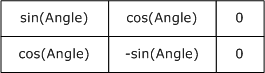

Figure 3: Rotation Transform Matrix

The current world space transform is multiplied by this matrix, and the result becomes the new current world space transform. The **Flags** field determines the order of multiplication.

See section [2.3.9](#Section_2.3.9) for the specification of additional transform record types.

<a id="Section_2.3.9.4"></a>
#### 2.3.9.4 EmfPlusScaleWorldTransform Record

The EmfPlusScaleWorldTransform record performs a [**scaling**](#gt_f3f5f638-16f6-4159-a3f1-9d845b1196f5) on the current [**world space**](#gt_world-space) [**transform**](#gt_transform).

```mermaid
packet-beta
  0-15: "Type"
  16-31: "Flags"
  32-63: "Size"
  64-95: "DataSize"
  96-127: "Sx"
  128-159: "Sy"
```

**Type (2 bytes):** An unsigned integer that identifies this record type as EmfPlusScaleWorldTransform from the [RecordType](#Section_2.1.1.1) enumeration. The value MUST be 0x402E.

**Flags (2 bytes):** An unsigned integer that provides information about how the operation is to be performed, and about the structure of the record.

```mermaid
packet-beta
  0-0: "X"
  1-1: "X"
  2-2: "A"
  3-3: "X"
  4-4: "X"
  5-5: "X"
  6-6: "X"
  7-7: "X"
  8-8: "X"
  9-9: "X"
  10-10: "X"
  11-11: "X"
  12-12: "X"
  13-13: "X"
  14-14: "X"
  15-15: "X"
```

**X (1 bit):** Reserved and MUST be ignored.

**A (1 bit):** If set, the transform matrix is post-multiplied. If clear, it is pre-multiplied.

**Size (4 bytes):** An unsigned integer that specifies the 32-bit-aligned number of bytes in the entire record, including the 12-byte record header and record-specific data. For this record type, the value MUST be 0x00000014.

**DataSize (4 bytes):** An unsigned integer that specifies the 32-bit-aligned number of bytes of record-specific data that follows. For this record type, the value MUST be 0x00000008.

**Sx (4 bytes):** A floating-point value that defines the horizontal scale factor. The scaling is performed by constructing a new transform matrix from the **Sx** and **Sy** field values, as shown in the following table.

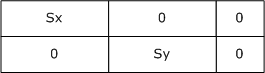

Figure 4: Scale Transform Matrix

**Sy (4 bytes):** A floating-point value that defines the vertical scale factor.

See section [2.3.9](#Section_2.3.9) for the specification of additional transform record types.

<a id="Section_2.3.9.5"></a>
#### 2.3.9.5 EmfPlusSetPageTransform Record

The EmfPlusSetPageTransform record specifies [**scaling**](#gt_f3f5f638-16f6-4159-a3f1-9d845b1196f5) factors and units for converting [**page space**](#gt_page-space) coordinates to [**device space**](#gt_device-space) coordinates.

```mermaid
packet-beta
  0-15: "Type"
  16-31: "Flags"
  32-63: "Size"
  64-95: "DataSize"
  96-127: "PageScale"
```

**Type (2 bytes):** An unsigned integer that identifies this record type as EmfPlusSetPageTransform from the [RecordType](#Section_2.1.1.1) enumeration. The value MUST be 0x4030.

**Flags (2 bytes):** An unsigned integer that provides information about how the operation is to be performed, and about the structure of the record.

```mermaid
packet-beta
  0-0: "0"
  1-1: "0"
  2-2: "0"
  3-3: "0"
  4-4: "0"
  5-5: "0"
  6-6: "0"
  7-7: "0"
  8-15: "PageUnit"
```

**PageUnit (1 byte):** The unit of measure for page space coordinates, from the [UnitType](#Section_2.1.1.32) enumeration. This value SHOULD NOT be **UnitTypeDisplay** or **UnitTypeWorld**.<33>

**Size (4 bytes):** An unsigned integer that specifies the 32-bit-aligned number of bytes in the entire record, including the 12-byte record header and record-specific data. For this record type, the value MUST be 0x00000010.

**DataSize (4 bytes):** An unsigned integer that specifies the 32-bit-aligned number of bytes of record-specific data that follows. For this record type, the value MUST be 0x00000004.

**PageScale (4 bytes):** A floating-point value that specifies the scale factor for converting page space coordinates to device space coordinates.

See section [2.3.9](#Section_2.3.9) for the specification of additional transform record types.

<a id="Section_2.3.9.6"></a>
#### 2.3.9.6 EmfPlusSetWorldTransform Record

The EmfPlusSetWorldTransform record sets the world transform according to the values in a specified transform matrix.

```mermaid
packet-beta
  0-15: "Type"
  16-31: "Flags"
  32-63: "Size"
  64-95: "DataSize"
  96-223: "MatrixData (24 bytes)"
```

**Type (2 bytes):** An unsigned integer that identifies this record type as EmfPlusSetWorldTransform from the [RecordType](#Section_2.1.1.1) enumeration. The value MUST be 0x402A.

**Flags (2 bytes):** An unsigned integer that is not used. This field SHOULD be set to zero and MUST be ignored upon receipt.

**Size (4 bytes):** An unsigned integer that specifies the 32-bit-aligned number of bytes in the entire record, including the 12-byte record header and record-specific data. For this record type, the value MUST be 0x00000024.

**DataSize (4 bytes):** An unsigned integer that specifies the 32-bit-aligned number of bytes of record-specific data that follows. For this record type, the value MUST be 0x00000018.

**MatrixData (24 bytes):** An [EmfPlusTransformMatrix](#Section_2.2.2.47) object that defines the new current world transform.

See section [2.3.9](#Section_2.3.9) for the specification of additional transform record types.

<a id="Section_2.3.9.7"></a>
#### 2.3.9.7 EmfPlusTranslateWorldTransform Record

The EmfPlusTranslateWorldTransform record performs a [**translation**](#gt_translation-transform) on the current [**world space**](#gt_world-space) [**transform**](#gt_transform).

```mermaid
packet-beta
  0-15: "Type"
  16-31: "Flags"
  32-63: "Size"
  64-95: "DataSize"
  96-127: "dx"
  128-159: "dy"
```

**Type (2 bytes):** An unsigned integer that identifies this record type as EmfPlusTranslateWorldTransform from the [RecordType](#Section_2.1.1.1) enumeration. The value MUST be 0x402D.

**Flags (2 bytes):** An unsigned integer that provides information about how the operation is to be performed, and about the structure of the record.

```mermaid
packet-beta
  0-0: "X"
  1-1: "X"
  2-2: "A"
  3-3: "X"
  4-4: "X"
  5-5: "X"
  6-6: "X"
  7-7: "X"
  8-8: "X"
  9-9: "X"
  10-10: "X"
  11-11: "X"
  12-12: "X"
  13-13: "X"
  14-14: "X"
  15-15: "X"
```

**X (1 bit):** Reserved and MUST be ignored.

**A (1 bit):** If set, the transform matrix is post-multiplied. If clear, it is pre-multiplied.

**Size (4 bytes):** An unsigned integer that specifies the 32-bit-aligned number of bytes in the entire record, including the 12-byte record header and record-specific data. For this record type, the value MUST be 0x00000014.

**DataSize (4 bytes):** An unsigned integer that specifies the 32-bit-aligned number of bytes of record-specific data that follows. For this record type, the value MUST be 0x00000008.

**dx (4 bytes):** A floating-point value that defines the horizontal distance. The translation is performed by constructing a new world transform matrix from the **dx** and **dy** fields.

**dy (4 bytes):** A floating-point value that defines the vertical distance value.

See section [2.3.9](#Section_2.3.9) for the specification of additional transform record types.

<a id="Section_3"></a>
# 3 Structure Examples

The following sections present examples that illustrate the function of EMF+ Extensions structures.

<a id="Section_3.1"></a>
## 3.1 Metafile Design

<a id="Section_3.1.1"></a>
### 3.1.1 Byte Ordering Example

The following code snippet illustrates how the use of the [**big-endian**](#gt_big-endian) and [**little-endian**](#gt_little-endian) methods can affect the compatibility of applications.

#include <unistd.h>

#include <sys/stat.h>

#include <fcntl.h>

int main()

{

int buf;

int in;

int nread;

in = open("file.in", O_RDONLY);

nread = read(in, (int *) &buf, sizeof(buf));

printf("First Integer in file.in = %x\n", buf);

exit(0);

}

In the preceding code, if the first integer word stored in the file.in file on a big-endian computer was the hexadecimal number 0x12345678, the resulting output on that computer would be as follows:

% ./test

First Integer in file.in = 12345678

%

If the file.in file was read by the same program running on a little-endian computer, the resulting output would be as follows:

% ./test

First Integer in file.in = 78563412

%

Because of the difference in output, [**metafile**](#gt_metafile) record processing needs to be implemented so that it can read integers from a file based on the endian method that the output computer uses.

Because metafiles were developed and written with little-endian computers, machines that are big-endian based will have to perform this necessary compensation.

<a id="Section_3.1.2"></a>
### 3.1.2 Managing Graphics Objects

This section describes a conceptual model for managing graphics objects that an [**EMF+**](#gt_enhanced-metafile-format-plus-extensions-emf) implementation can maintain during metafile playback. The described organization is provided to facilitate the explanation of the file format. This specification does not mandate that implementations adhere to this model as long as their external behavior is consistent with that defined in this specification.

The EmfPlusObject record (section [2.3.5.1](#Section_2.3.5.1)) creates graphics objects of the types defined in the ObjectType enumeration (section [2.1.1.21](#Section_2.1.1.21)), and the objects themselves are specified in Graphics Objects (section [2.2.1](#Section_2.2.1)). Once created, graphics objects can be reused any number of times in graphics operations.

An implementation is responsible for keeping track of graphics objects during metafile playback. A model for managing graphics objects is described below. This model minimizes the space needed by the graphics object table during playback.

- Create a hash table for graphics objects used in metafile playback.
- Grow the hash table as objects are created by the EmfPlusObject record; each new entry in the table receives an object and its index.
- When a metafile record refers to an object, it specifies the object's index. Use this index as a key into the hash table to retrieve the object.
- When a new object is created that has the same index as an existing object, replace the hash table entry of the existing object with one for the new object.
<a id="Section_3.2"></a>
## 3.2 EMF+ Metafile Example

This section provides an example of a [**metafile**](#gt_metafile), which when processed renders the following image:


Figure 5: EMF+ Metafile Example

The contents of this metafile example are shown below in hexadecimal bytes. The far-left column is the byte offset from the start of the metafile; the far-right characters are the interpretation of the byte values in the Latin-1 [**ANSI character set**](#gt_100cd8a6-5cb1-4895-9de6-e4a3c224a583) [[ISO/IEC-8859-1]](https://go.microsoft.com/fwlink/?LinkId=90689). The sections that follow describe the metafile records that convey this series of bytes.

00000000: 01 00 00 00 6C 00 00 00 FF FF FF FF FF FF FF FF ...l...ÿÿÿÿÿÿÿÿ

00000010: 64 00 00 00 6B 00 00 00 00 00 00 00 00 00 00 00 d...k...........

00000020: F0 07 00 00 77 08 00 00 20 45 4D 46 00 00 01 00 ð..w .. EMF.. .

00000030: 5C 0A 00 00 4C 00 00 00 02 00 00 00 00 00 00 00 \...L... .......

00000040: 00 00 00 00 00 00 00 00 40 06 00 00 B0 04 00 00 ........@ ..° ..

00000050: 40 01 00 00 F0 00 00 00 00 00 00 00 00 00 00 00 @ ..ð...........

00000060: 00 00 00 00 00 E2 04 00 80 A9 03 00 46 00 00 00 .....â .€© .F...

00000070: 2C 00 00 00 20 00 00 00 45 4D 46 2B 01 40 01 00 ,... ...EMF+ @ .

00000080: 1C 00 00 00 10 00 00 00 02 10 C0 DB 01 00 00 00 ... ... ÀÛ ...

00000090: 66 00 00 00 6C 00 00 00 21 00 00 00 08 00 00 00 f...l...!... ...

000000A0: 62 00 00 00 0C 00 00 00 01 00 00 00 21 00 00 00 b....... ...!...

000000B0: 08 00 00 00 62 00 00 00 0C 00 00 00 01 00 00 00 ...b....... ...

000000C0: 21 00 00 00 08 00 00 00 21 00 00 00 08 00 00 00 !... ...!... ...

000000D0: 73 00 00 00 0C 00 00 00 00 00 00 00 1C 00 00 00 s........... ...

000000E0: 08 00 00 00 25 00 00 00 0C 00 00 00 00 00 00 80 ...%..........€

000000F0: 25 00 00 00 0C 00 00 00 07 00 00 80 25 00 00 00 %.........€%...

00000100: 0C 00 00 00 0E 00 00 80 30 00 00 00 0C 00 00 00 .......€0.......

00000110: 0F 00 00 80 19 00 00 00 0C 00 00 00 FF FF FF 00 ..€ .......ÿÿÿ.

00000120: 18 00 00 00 0C 00 00 00 00 00 00 00 12 00 00 00 ........... ...

00000130: 0C 00 00 00 02 00 00 00 13 00 00 00 0C 00 00 00 .... ... .......

00000140: 01 00 00 00 14 00 00 00 0C 00 00 00 0D 00 00 00 ... ...........

00000150: 15 00 00 00 0C 00 00 00 01 00 00 00 16 00 00 00 ....... ... ...

00000160: 0C 00 00 00 00 00 00 00 0D 00 00 00 10 00 00 00 ............ ...

00000170: 00 00 00 00 00 00 00 00 3A 00 00 00 0C 00 00 00 ........:.......

00000180: 0A 00 00 00 1B 00 00 00 10 00 00 00 00 00 00 00 .... ... .......

00000190: 00 00 00 00 23 00 00 00 20 00 00 00 87 C3 81 3F ....#... ...‡Ã□?

000001A0: 00 00 00 00 00 00 00 00 7A BD 80 3F 00 00 00 80 ........z½€?...€

000001B0: 00 00 00 80 24 00 00 00 24 00 00 00 87 C3 81 3F ...€$...$...‡Ã□?

000001C0: 00 00 00 00 00 00 00 00 7A BD 80 3F 00 00 00 80 ........z½€?...€

000001D0: 00 00 00 80 04 00 00 00 73 00 00 00 0C 00 00 00 ...€ ...s.......

000001E0: 00 00 00 00 0D 00 00 00 10 00 00 00 00 00 00 00 ........ .......

000001F0: 00 00 00 00 52 00 00 00 70 01 00 00 01 00 00 00 ....R...p .. ...

00000200: 10 00 00 00 07 00 00 00 00 00 00 00 00 00 00 00 ..............

00000210: BC 02 00 00 00 00 00 00 07 02 02 22 53 00 79 00 ¼ ...... "S.y.

00000220: 73 00 74 00 65 00 6D 00 00 00 00 00 00 00 00 00 s.t.e.m.........

00000230: 00 00 00 00 00 00 00 00 00 00 00 00 00 00 00 00 ................

00000240: 00 00 00 00 00 00 00 00 00 00 00 00 00 00 00 00 ................

00000250: 00 00 00 00 00 00 00 00 00 00 00 00 00 00 00 00 ................

00000260: B1 E6 31 7C BC FE 12 00 21 00 00 00 00 00 13 00 ±æ1|¼þ .!..... .

00000270: 00 00 2E 00 54 E1 12 00 BC FE 12 00 14 E1 12 00 ....Tá .¼þ . á .

00000280: 00 00 00 00 F4 F4 12 00 34 B8 F9 77 68 26 F4 77 ....ôô .4¸ùwh&ôw

00000290: FF FF FF FF AD 97 F7 77 7F 99 F7 77 70 E1 12 00 ÿÿÿÿ­—÷w™÷wpá .

000002A0: 21 00 00 00 01 00 00 00 FC 8B CE 02 38 A6 17 00 !... ...ü‹Î 8¦ .

000002B0: 7F 99 F7 77 B0 DA 4F 00 63 DE 5D 00 3E 08 5A 00 ™÷w°ÚO.cÞ].> Z.

000002C0: 68 99 5A 00 F5 82 54 00 1A 91 54 00 8F 9B C7 77 h™Z.õ‚T. 'T.□›Çw

000002D0: BD 93 54 00 6F 9D 54 00 94 E5 54 00 00 00 54 00 ½"T.o□T."åT...T.

000002E0: AF 58 56 00 6B 50 56 00 B4 3A 55 00 05 39 55 00 ¯XV.kPV.':U. 9U.

000002F0: 09 35 55 00 64 C4 4F 00 00 82 41 00 FF 44 41 00 .5U.dÄO..‚A.ÿDA.

00000300: 12 4E 41 00 E1 4B 41 00 1D 1E 31 7C 4B 16 31 7C NA.áKA. 1|K 1|

00000310: DA EF 30 7C 49 F4 30 7C EA A3 37 7C 00 00 D5 77 Úï0|Iô0|ê£7|..Õw

00000320: A5 DC D5 77 46 46 D3 77 D7 96 D3 77 97 ED 31 7C ¥ÜÕwFFÓw×–Ów—í1|

00000330: B1 E6 31 7C 00 00 2E 01 10 E2 12 00 68 8B CE 02 ±æ1|... â .h‹Î

00000340: 08 ED F8 77 68 8B CE 02 00 00 2E 01 01 00 00 00 íøwh‹Î ... ...

00000350: 00 00 2E 01 C4 04 F9 77 27 05 F9 77 64 76 00 08 ... Ä ùw' ùwdv.

00000360: 00 00 00 00 25 00 00 00 0C 00 00 00 01 00 00 00 ....%....... ...

00000370: 25 00 00 00 0C 00 00 00 0E 00 00 80 28 00 00 00 %..........€(...

00000380: 0C 00 00 00 01 00 00 00 46 00 00 00 88 02 00 00 .... ...F...ˆ ..

00000390: 7C 02 00 00 45 4D 46 2B 1E 40 0B 00 0C 00 00 00 | ..EMF+ @......

000003A0: 00 00 00 00 24 40 02 00 0C 00 00 00 00 00 00 00 ....$@ .........

000003B0: 21 40 07 00 0C 00 00 00 00 00 00 00 22 40 03 00 !@........."@ .

000003C0: 0C 00 00 00 00 00 00 00 1F 40 05 00 0C 00 00 00 ........¬@ .....

000003D0: 00 00 00 00 2C 40 00 00 24 00 00 00 18 00 00 00 ....,@..$... ...

000003E0: 00 00 80 3F 00 00 00 00 00 00 00 00 00 00 80 3F ..€?..........€?

000003F0: 00 00 00 80 00 00 00 80 25 40 00 00 10 00 00 00 ...€...€%@.. ...

00000400: 04 00 00 00 00 00 00 00 2C 40 00 00 24 00 00 00 .......,@..$...

00000410: 18 00 00 00 00 00 80 3F 00 00 00 00 00 00 00 00 .....€?........

00000420: 00 00 80 3F 00 00 00 00 00 00 00 00 2A 40 00 00 ..€?........*@..

00000430: 24 00 00 00 18 00 00 00 00 00 80 3F 00 00 00 00 $... .....€?....

00000440: 00 00 00 00 00 00 80 3F 00 00 00 80 00 00 00 80 ......€?...€...€

00000450: 28 40 00 00 10 00 00 00 04 00 00 00 01 00 00 00 (@.. ... ... ...

00000460: 1E 40 0B 00 0C 00 00 00 00 00 00 00 24 40 02 00 @..........$@ .

00000470: 0C 00 00 00 00 00 00 00 21 40 07 00 0C 00 00 00 ........!@.....

00000480: 00 00 00 00 22 40 03 00 0C 00 00 00 00 00 00 00 ...."@ .........

00000490: 1F 40 05 00 0C 00 00 00 00 00 00 00 30 40 02 00 ¬@ .........0@ .

000004A0: 10 00 00 00 04 00 00 00 00 00 80 3F 2A 40 00 00 ... .....€?*@..

000004B0: 24 00 00 00 18 00 00 00 00 00 80 3F 00 00 00 00 $... .....€?....

000004C0: 00 00 00 00 00 00 80 3F 00 00 00 80 00 00 00 80 ......€?...€...€

000004D0: 2A 40 00 00 24 00 00 00 18 00 00 00 00 00 80 3F *@..$... .....€?

000004E0: 00 00 00 00 00 00 00 00 00 00 80 3F 00 00 00 80 ..........€?...€

000004F0: 00 00 00 80 2A 40 00 00 24 00 00 00 18 00 00 00 ...€*@..$... ...

00000500: 0D 74 DA 3A 00 00 00 00 00 00 00 00 0D 74 DA 3A .tÚ:.........tÚ:

00000510: 00 00 00 80 00 00 00 80 2A 40 00 00 24 00 00 00 ...€...€*@..$...

00000520: 18 00 00 00 92 5F 2C 3E 00 00 00 00 00 00 00 00 ...'_,>........

00000530: EB 51 38 3E 00 00 00 80 00 00 00 80 08 40 00 03 ëQ8>...€...€ @.

00000540: C4 00 00 00 B8 00 00 00 02 10 C0 DB 13 00 00 00 Ä...¸... ÀÛ ...

00000550: 00 00 00 00 FC 7F F5 43 CF FF FF BF 9D 8E 08 44 ....üõCÏÿÿ¿□Ž D

00000560: 1E 01 00 C0 FE BF 13 44 EB 15 2B 42 FF BF 13 44 .Àþ¿ Dë +Bÿ¿ D

00000570: FC FF C3 42 FF BF 13 44 FE FF C3 42 FF BF 13 44 üÿÃBÿ¿ DþÿÃBÿ¿ D

00000580: 01 00 C4 42 FF BF 13 44 03 00 C4 42 FF BF 13 44 .ÄBÿ¿ D .ÄBÿ¿ D

00000590: FF FF F5 43 FF BF 13 44 9F CE 08 44 9F 8E 08 44 ÿÿõCÿ¿ DŸÎ DŸŽ D

000005A0: FF FF 13 44 00 80 F5 43 FF FF 13 44 05 00 C2 42 ÿÿ D.€õCÿÿ D .ÂB

000005B0: FF FF 13 44 16 16 27 42 00 00 14 44 72 FF 3F C0 ÿÿ D 'B.. Drÿ?À

000005C0: 9F CE 08 44 E8 FF 3F C0 01 00 F6 43 10 00 40 C0 ŸÎ Dèÿ?À .öC .@À

000005D0: 04 00 C4 42 64 00 40 C0 17 16 2B 42 FA 15 27 42 .ÄBd.@À +Bú 'B

000005E0: E8 FE FF BF F6 FF C1 42 26 00 00 C0 00 03 03 03 èþÿ¿öÿÁB&..À.

000005F0: 03 03 03 01 03 03 03 01 03 03 03 01 03 03 83 BF ƒ¿

00000600: 14 40 00 80 10 00 00 00 04 00 00 00 FF FF FF 00 @.€ ... ...ÿÿÿ.

00000610: 46 00 00 00 50 00 00 00 44 00 00 00 45 4D 46 2B F...P...D...EMF+

00000620: 08 40 01 02 30 00 00 00 24 00 00 00 02 10 C0 DB @ 0...$... ÀÛ

00000630: 00 00 00 00 80 00 00 00 02 00 00 00 00 00 80 3F ....€... .....€?

00000640: 00 00 00 00 02 10 C0 DB 00 00 00 00 00 00 00 FF .... ÀÛ.......ÿ

00000650: 15 40 00 00 10 00 00 00 04 00 00 00 01 00 00 00 @.. ... ... ...

00000660: 22 00 00 00 0C 00 00 00 FF FF FF FF 22 00 00 00 ".......ÿÿÿÿ"...

00000670: 0C 00 00 00 FF FF FF FF 25 00 00 00 0C 00 00 00 ....ÿÿÿÿ%.......

00000680: 0D 00 00 80 22 00 00 00 0C 00 00 00 FF FF FF FF ...€".......ÿÿÿÿ

00000690: 21 00 00 00 08 00 00 00 73 00 00 00 0C 00 00 00 !... ...s.......

000006A0: 00 00 00 00 1C 00 00 00 08 00 00 00 25 00 00 00 .... ... ...%...

000006B0: 0C 00 00 00 00 00 00 80 25 00 00 00 0C 00 00 00 .......€%.......

000006C0: 07 00 00 80 25 00 00 00 0C 00 00 00 0E 00 00 80 ..€%..........€

000006D0: 30 00 00 00 0C 00 00 00 0F 00 00 80 19 00 00 00 0....... ..€ ...

000006E0: 0C 00 00 00 FF FF FF 00 18 00 00 00 0C 00 00 00 ....ÿÿÿ. .......

000006F0: 00 00 00 00 12 00 00 00 0C 00 00 00 02 00 00 00 .... ....... ...

00000700: 13 00 00 00 0C 00 00 00 01 00 00 00 14 00 00 00 ....... ... ...

00000710: 0C 00 00 00 0D 00 00 00 15 00 00 00 0C 00 00 00 ........ .......

00000720: 01 00 00 00 16 00 00 00 0C 00 00 00 00 00 00 00 ... ...........

00000730: 0D 00 00 00 10 00 00 00 00 00 00 00 00 00 00 00 .... ...........

00000740: 3A 00 00 00 0C 00 00 00 0A 00 00 00 1B 00 00 00 :........... ...

00000750: 10 00 00 00 00 00 00 00 00 00 00 00 23 00 00 00 ...........#...

00000760: 20 00 00 00 87 C3 81 3F 00 00 00 00 00 00 00 00 ...‡Ã□?........

00000770: 7A BD 80 3F 00 00 00 80 00 00 00 80 24 00 00 00 z½€?...€...€$...

00000780: 24 00 00 00 87 C3 81 3F 00 00 00 00 00 00 00 00 $...‡Ã□?........

00000790: 7A BD 80 3F 00 00 00 80 00 00 00 80 04 00 00 00 z½€?...€...€ ...

000007A0: 73 00 00 00 0C 00 00 00 00 00 00 00 46 00 00 00 s...........F...

000007B0: 60 00 00 00 52 00 00 00 47 44 49 43 02 00 00 00 `...R...GDIC ...

000007C0: 00 00 00 00 00 00 00 00 66 00 00 00 6C 00 00 00 ........f...l...

000007D0: 1B 00 00 00 41 00 70 00 70 00 4E 00 61 00 6D 00 ...A.p.p.N.a.m.

000007E0: 65 00 00 00 49 00 6D 00 61 00 67 00 65 00 20 00 e...I.m.a.g.e. .

000007F0: 44 00 65 00 73 00 63 00 72 00 69 00 70 00 74 00 D.e.s.c.r.i.p.t.

00000800: 69 00 6F 00 6E 00 00 00 00 00 00 00 23 00 00 00 i.o.n.......#...

00000810: 20 00 00 00 FF FF 7F 3F 00 00 00 00 00 00 00 00 ...ÿÿ?........

00000820: FD FF 7F 3F 00 00 00 00 00 00 00 00 24 00 00 00 ýÿ?........$...

00000830: 24 00 00 00 FF FF 7F 3F 00 00 00 00 00 00 00 00 $...ÿÿ?........

00000840: FD FF 7F 3F 00 00 00 00 00 00 00 00 04 00 00 00 ýÿ?........ ...

00000850: 23 00 00 00 20 00 00 00 FF FF 7F 3F 00 00 00 00 #... ...ÿÿ?....

00000860: 00 00 00 00 FD FF 7F 3F 00 00 00 00 00 00 00 00 ....ýÿ?........

00000870: 24 00 00 00 24 00 00 00 FF FF 7F 3F 00 00 00 00 $...$...ÿÿ?....

00000880: 00 00 00 00 FD FF 7F 3F 00 00 00 00 00 00 00 00 ....ýÿ?........

00000890: 04 00 00 00 23 00 00 00 20 00 00 00 0D 74 DA 3A ...#... ....tÚ:

000008A0: 00 00 00 00 00 00 00 00 0C 74 DA 3A 00 00 00 00 .........tÚ:....

000008B0: 00 00 00 00 24 00 00 00 24 00 00 00 0D 74 DA 3A ....$...$....tÚ:

000008C0: 00 00 00 00 00 00 00 00 0C 74 DA 3A 00 00 00 00 .........tÚ:....

000008D0: 00 00 00 00 04 00 00 00 23 00 00 00 20 00 00 00 .... ...#... ...

000008E0: 92 5F 2C 3E 00 00 00 00 00 00 00 00 E9 51 38 3E '_,>........éQ8>

000008F0: 00 00 00 00 00 00 00 00 24 00 00 00 24 00 00 00 ........$...$...

00000900: 92 5F 2C 3E 00 00 00 00 00 00 00 00 E9 51 38 3E '_,>........éQ8>

00000910: 00 00 00 00 00 00 00 00 04 00 00 00 25 00 00 00 ........ ...%...

00000920: 0C 00 00 00 05 00 00 80 2C 00 00 00 20 00 00 00 .... ..€,... ...

00000930: FD FF FF FF FE FF FF FF 4F 02 00 00 50 02 00 00 ýÿÿÿþÿÿÿO ..P ..

00000940: C8 00 00 00 C8 00 00 00 46 00 00 00 14 00 00 00 È...È...F... ...

00000950: 08 00 00 00 47 44 49 43 03 00 00 00 22 00 00 00 ...GDIC ..."...

00000960: 0C 00 00 00 FF FF FF FF 46 00 00 00 54 00 00 00 ....ÿÿÿÿF...T...

00000970: 48 00 00 00 45 4D 46 2B 29 40 00 00 10 00 00 00 H...EMF+)@.. ...

00000980: 04 00 00 00 01 00 00 00 26 40 00 00 10 00 00 00 ... ...&@.. ...

00000990: 04 00 00 00 00 00 00 00 2A 40 00 00 24 00 00 00 .......*@..$...

000009A0: 18 00 00 00 00 00 80 3F 00 00 00 00 00 00 00 00 .....€?........

000009B0: 00 00 80 3F 00 00 00 00 00 00 00 00 4C 00 00 00 ..€?........L...

000009C0: 64 00 00 00 FF FF FF FF FF FF FF FF 64 00 00 00 d...ÿÿÿÿÿÿÿÿd...

000009D0: 6B 00 00 00 FF FF FF FF FF FF FF FF 66 00 00 00 k...ÿÿÿÿÿÿÿÿf...

000009E0: 6D 00 00 00 29 00 AA 00 00 00 00 00 00 00 00 00 m...).ª.........

000009F0: 00 00 80 3F 00 00 00 00 00 00 00 00 00 00 80 3F ..€?..........€?

00000A00: 00 00 00 00 00 00 00 00 00 00 00 00 00 00 00 00 ................

00000A10: 00 00 00 00 00 00 00 00 00 00 00 00 00 00 00 00 ................

00000A20: 22 00 00 00 0C 00 00 00 FF FF FF FF 46 00 00 00 ".......ÿÿÿÿF...

00000A30: 1C 00 00 00 10 00 00 00 45 4D 46 2B 02 40 00 00 ... ...EMF+ @..

00000A40: 0C 00 00 00 00 00 00 00 0E 00 00 00 14 00 00 00 ............ ...

00000A50: 00 00 00 00 10 00 00 00 14 00 00 00

The sections that follow provide definitions of the header and records that correspond to this metafile. These sections describe each record as it appears in the hexadecimal representation of the example, and the records have been interpreted for the convenience of the reader; however, to reflect the exact order of records in the metafile, some record types appear more than once, and, in some cases, the repeated instances can be identical.

<a id="Section_3.2.1"></a>
### 3.2.1 EMR_HEADER Example

This section provides an example of the [**EMF**](#gt_enhanced-metafile-format-emf) EMR_HEADER record with Extension 2 ([MS-EMF](../MS-EMF/MS-EMF.md) section 2.3.4.2.3).

00000000: 01 00 00 00 6C 00 00 00 FF FF FF FF FF FF FF FF

00000010: 64 00 00 00 6B 00 00 00 00 00 00 00 00 00 00 00

00000020: F0 07 00 00 77 08 00 00 20 45 4D 46 00 00 01 00

00000030: 5C 0A 00 00 4C 00 00 00 02 00 00 00 00 00 00 00

00000040: 00 00 00 00 00 00 00 00 40 06 00 00 B0 04 00 00

00000050: 40 01 00 00 F0 00 00 00 00 00 00 00 00 00 00 00

00000060: 00 00 00 00 00 E2 04 00 80 A9 03 00

```mermaid
packet-beta
  0-31: "Type (0x00000001)"
  32-63: "Size (0x0000006C)"
  64-95: "Bounds (0xFFFFFFFF)"
  96-127: "... (0xFFFFFFFF)"
  128-159: "... (0x00000064)"
  160-191: "... (0x0000006B)"
  192-223: "Frame (0x00000000)"
  224-255: "... (0x00000000)"
  256-287: "... (0x000007F0)"
  288-319: "... (0x00000877)"
```

**Type (4 bytes):** 0x00000001 identifies the record type as EMR_HEADER.

**Size (4 bytes):** 0x0000006C specifies the record size in bytes, 108.

**Bounds (16 bytes):** (0xFFFFFFFF, 0xFFFFFFFF, 0x00000064, 0x0000006B) specifies the rectangular inclusive-inclusive bounds in device units of the smallest rectangle that can be drawn around the image stored in the [**metafile**](#gt_metafile).

**Frame (16 bytes):** (0x00000000, 0x00000000, 0x000007F0, 0x00000877) specifies the rectangular inclusive-inclusive dimensions, in .01 millimeter units, of a rectangle that surrounds the image stored in the metafile.

```mermaid
packet-beta
  0-31: "Signature (0x464D4520)"
  32-63: "Version (0x00010000)"
  64-95: "Bytes (0x00000A5C)"
  96-127: "Records (0x0000004C)"
  128-143: "Handles (0x0002)"
  144-159: "Reserved (0x0000)"
  160-191: "nDescription (0x00000000)"
  192-223: "offDescription (0x00000000)"
  224-255: "nPalEntries (0x00000000)"
```

**Signature (4 bytes):** 0x464D4520 specifies the record signature, which consists of the [**ASCII**](#gt_ascii) string " EMF".

**Version (4 bytes):** 0x00010000 specifies EMF metafile interoperability.

**Bytes (4 bytes):** 0x00000A5C specifies the size of the metafile in bytes.

**Records (4 bytes):** 0x0000004C specifies the number of records in the metafile

**Handles (2 bytes):** 0x0002 specifies the number of indexes that will need to be defined during the processing of the metafile. These indexes correspond to graphics objects that are used in drawing commands. Index zero is reserved for references to the metafile itself.

**Reserved (2 bytes):** 0x0000 is not used.

**nDescription (4 bytes):** 0x00000000 specifies the number of characters in the array that contains the description of the metafile's contents. Zero indicates there is no description string.

**offDescription (4 bytes):** 0x00000000 specifies the offset from the beginning of this record to the array that contains the description of the metafile's contents.

**nPalEntries (4 bytes):** 0x00000000 specifies the number of entries in the metafile [**palette**](#gt_palette). The location of the palette is specified in the EMF end-of-file record (EMR_EOF, [MS-EMF] section 2.3.4.1).

```mermaid
packet-beta
  0-31: "Device (0x00000640)"
  32-63: "... (0x000004B0)"
  64-95: "Millimeters (0x00000140)"
  96-127: "... (0x000000F0)"
  128-159: "cbPixelFormat (0x00000000)"
  160-191: "offPixelFormat (0x00000000)"
  192-223: "bOpenGL (0x00000000)"
  224-255: "MicrometersX (0x0004E200)"
  256-287: "MicrometersY (0x0003A900)"
```

**Device (8 bytes):** (0x00000640, 0x000004B0) specifies the size of the reference device in pixels.

**Millimeters (8 bytes):** (0x00000140, 0x000000F0) specifies the size of the reference device in millimeters.

**cbPixelFormat (4 bytes):** 0x00000000 specifies the size of the EMF PixelFormatDescriptor object ([MS-EMF] section 2.2.22). This value indicates that no pixel format is defined.

**offPixelFormat (4 bytes):** 0x00000000 specifies the offset to the PixelFormatDescriptor in the metafile. In this case, no pixel format structure is present.

**bOpenGL (4 bytes):** 0x00000000 specifies that no EMF [**OpenGL**](#gt_opengl) records ([MS-EMF] section 2.3.9) are present in the metafile.

**MicrometersX (4 bytes):** 0x0004E200 specifies the horizontal size of the reference device in micrometers.

**MicrometersY (4 bytes):** 0x0003A900 specifies the vertical size of the reference device in micrometers.

<a id="Section_3.2.2"></a>
### 3.2.2 EMR_COMMENT_EMFPLUS Example 1

This section provides an example of the [**EMF**](#gt_enhanced-metafile-format-emf) EMR_COMMENT_EMFPLUS record ([MS-EMF](../MS-EMF/MS-EMF.md) section 2.3.3.2).

00000060: 46 00 00 00

00000070: 2C 00 00 00 20 00 00 00 45 4D 46 2B

```mermaid
packet-beta
  0-31: "Type (0x00000046)"
  32-63: "Size (0x0000002C)"
  64-95: "DataSize (0x00000020)"
  96-127: "EMFPlusSignature ("EMF+")"
```

**Type (4 bytes):** 0x00000046 identifies the record type as an EMF comment record.

**Size (4 bytes):** 0x0000002C specifies the size of this record in bytes, including embedded EMF+ records.

**DataSize (4 bytes):** 0x00000020 specifies the size of the [**EMF+**](#gt_enhanced-metafile-format-plus-extensions-emf) data in bytes.

**EMFPlusSignature (4 bytes):** "EMF+" identifies the comment record type as EMR_COMMENT_EMFPLUS.

The embedded EMF+ records are presented in the sections that follow.

<a id="Section_3.2.2.1"></a>
#### 3.2.2.1 EmfPlusHeader Example

This section provides an example of the EmfPlusHeader record (section [2.3.3.3](#Section_2.3.3.3)).

00000070: 01 40 01 00

00000080: 1C 00 00 00 10 00 00 00 02 10 C0 DB 01 00 00 00

00000090: 66 00 00 00 6C 00 00 00

```mermaid
packet-beta
  0-15: "Type (0x4001)"
  16-31: "Flags (0x0001)"
  32-63: "Size (0x0000001C)"
  64-95: "DataSize (0x00000010)"
  96-127: "Version (0xDBC01002)"
  128-159: "EmfPlusFlags (0x00000001)"
  160-191: "LogicalDpiX (0x00000066)"
  192-223: "LogicalDpiY (0x0000006C)"
```

**Type (2 bytes):** 0x4001 identifies the record type as EmfPlusHeader.

**Flags (2 bytes):** 0x0001 specifies that the metafile is **EMF+ Dual**.

**Size (4 bytes):** 0x0000001C specifies the 32-bit-aligned size of the entire record in bytes, including the 12-byte record header and the record-specific buffer data.

**DataSize (4 bytes):** 0x00000010 specifies the number of bytes of data in the **RecordData** member that follows. This number does not include the size of the invariant part of this record.

**Version (4 bytes):** 0xDBC01002 specifies the version of operating systems graphics that was used to create the [**metafile**](#gt_metafile) (EmfPlusGraphicsVersion object).

**EmfPlusFlags (4 bytes):** 0x00000001 specifies the additional information about how this metafile was recorded. If the value is set to 0x00000001, the metafile was recorded with a reference [**playback device context**](#gt_playback-device-context) for a video display.

**LogicalDpiX (4 bytes):** 0x00000066 specifies the dots per inch (DPI) in the horizontal direction of the drawing surface for which the metafile was created.

**LogicalDpiY (4 bytes):** 0x0000006C specifies the dots per inch (DPI) in the vertical direction of the drawing surface for which the metafile was created.

<a id="Section_3.2.3"></a>
### 3.2.3 EMR_SAVEDC Example 1

This section provides an example of the [**EMF**](#gt_enhanced-metafile-format-emf) EMR_SAVEDC record ([MS-EMF](../MS-EMF/MS-EMF.md) section 2.3.11).

00000090: 21 00 00 00 08 00 00 00

```mermaid
packet-beta
  0-31: "Type (0x00000021)"
  32-63: "Size (0x00000008)"
```

**Type (4 bytes):** 0x00000021 identifies the record type as EMR_SAVEDC.

**Size (4 bytes):** 0x00000008 specifies the size of this record in bytes.

<a id="Section_3.2.4"></a>
### 3.2.4 EMR_SETICMMODE Example 1

This section provides an example of the [**EMF**](#gt_enhanced-metafile-format-emf) EMR_SETICMMODE record ([MS-EMF](../MS-EMF/MS-EMF.md) section 2.3.11.14).

000000A0: 62 00 00 00 0C 00 00 00 01 00 00 00

```mermaid
packet-beta
  0-31: "Type (0x00000062)"
  32-63: "Size (0x0000000C)"
  64-95: "ICMMode (0x00000001)"
```

**Type (4 bytes):** 0x00000062 identifies the record type as EMR_SETICMMODE.

**Size (4 bytes):** 0x0000000C specifies the size of this record in bytes.

**ICMMode (4 bytes):** 0x00000001 specifies turning off [**Image Color Management (ICM)**](#gt_image-color-management-icm). This value is defined in the EMF ICMMode enumeration.

<a id="Section_3.2.5"></a>
### 3.2.5 EMR_SAVEDC Example 2

This section provides an example of the [**EMF**](#gt_enhanced-metafile-format-emf) EMR_SAVEDC record ([MS-EMF](../MS-EMF/MS-EMF.md) section 2.3.11).

000000A0: 21 00 00 00

000000B0: 08 00 00 00

```mermaid
packet-beta
  0-31: "Type (0x00000021)"
  32-63: "Size (0x00000008)"
```

**Type (4 bytes):** 0x00000021 identifies the record type as EMR_SAVEDC.

**Size (4 bytes):** 0x00000008 specifies the size of this record in bytes.

<a id="Section_3.2.6"></a>
### 3.2.6 EMR_SETICMMODE Example 2

This section provides an example of the [**EMF**](#gt_enhanced-metafile-format-emf) EMR_SETICMMODE record ([MS-EMF](../MS-EMF/MS-EMF.md) section 2.3.11.14).

000000B0: 62 00 00 00 0C 00 00 00 01 00 00 00

```mermaid
packet-beta
  0-31: "Type (0x00000062)"
  32-63: "Size (0x0000000C)"
  64-95: "ICMMode (0x00000001)"
```

**Type (4 bytes):** 0x00000062 identifies the record type as EMR_SETICMMODE.

**Size (4 bytes):** 0x0000000C specifies the size of this record in bytes.

**ICMMode (4 bytes):** 0x00000001 specifies turning off [**Image Color Management (ICM)**](#gt_image-color-management-icm). This value is defined in the EMF ICMMode enumeration.

<a id="Section_3.2.7"></a>
### 3.2.7 EMR_SAVEDC Example 3

This section provides an example of the [**EMF**](#gt_enhanced-metafile-format-emf) EMR_SAVEDC record ([MS-EMF](../MS-EMF/MS-EMF.md) section 2.3.11).

000000C0: 21 00 00 00 08 00 00 00

```mermaid
packet-beta
  0-31: "Type (0x00000021)"
  32-63: "Size (0x00000008)"
```

**Type (4 bytes):** 0x00000021 identifies the record type as EMR_SAVEDC.

**Size (4 bytes):** 0x00000008 specifies the size of this record in bytes.

<a id="Section_3.2.8"></a>
### 3.2.8 EMR_SETLAYOUT Example 1

This section provides an example of the [**EMF**](#gt_enhanced-metafile-format-emf) EMR_SETLAYOUT record ([MS-EMF](../MS-EMF/MS-EMF.md) section 2.3.11.17).

000000D0: 73 00 00 00 0C 00 00 00 00 00 00 00

```mermaid
packet-beta
  0-31: "Type (0x00000073)"
  32-63: "Size (0x0000000C)"
  64-95: "LayoutMode (0x00000000)"
```

**Type (4 bytes):** 0x00000073 identifies the record type as EMR_SETLAYOUT.

**Size (4 bytes):** 0x0000000C specifies the size of this record in bytes.

**LayoutMode (4 bytes):** 0x00000000 specifies left-to-right horizontal layout.

<a id="Section_3.2.9"></a>
### 3.2.9 EMR_SETMETARGN Example 1

This section provides an example of the [**EMF**](#gt_enhanced-metafile-format-emf) EMR_SETMETARGN record ([MS-EMF](../MS-EMF/MS-EMF.md) section 2.3.2).

000000D0: 1C 00 00 00

000000E0: 08 00 00 00

```mermaid
packet-beta
  0-31: "Type (0x0000001C)"
  32-63: "Size (0x00000008)"
```

**Type (4 bytes):** 0x0000001C identifies the record type as EMR_SETMETARGN.

**Size (4 bytes):** 0x00000008 specifies the size of this record.

<a id="Section_3.2.10"></a>
### 3.2.10 EMR_SELECTOBJECT Example 1

This section provides an example of the [**EMF**](#gt_enhanced-metafile-format-emf) EMR_SELECTOBJECT record ([MS-EMF](../MS-EMF/MS-EMF.md) section 2.3.8.5).

000000E0: 25 00 00 00 0C 00 00 00 00 00 00 80

```mermaid
packet-beta
  0-31: "Type (0x00000025)"
  32-63: "Size (0x0000000C)"
  64-95: "ihObject (0x80000000=WHITE_BRUSH)"
```

**Type (4 bytes):** 0x00000025 identifies the record type as EMR_SELECTOBJECT.

**Size (4 bytes):** 0x0000000C specifies the size of this record in bytes.

**ihObject (4 bytes):** 0x80000000 specifies the index of an object in the EMF+ Object Table (section [3.1.2](#Section_3.1.2)).

<a id="Section_3.2.11"></a>
### 3.2.11 EMR_SELECTOBJECT Example 2

This section provides an example of the [**EMF**](#gt_enhanced-metafile-format-emf) EMR_SELECTOBJECT record ([MS-EMF](../MS-EMF/MS-EMF.md) section 2.3.8.5).

000000F0: 25 00 00 00 0C 00 00 00 07 00 00 80

```mermaid
packet-beta
  0-31: "Type (0x00000025)"
  32-63: "Size (0x0000000C)"
  64-95: "ihObject (0x80000007=BLACK_PEN)"
```

**Type (4 bytes):** 0x00000025 identifies the record type as EMR_SELECTOBJECT.

**Size (4 bytes):** 0x0000000C specifies the size of this record in bytes.

**ihObject (4 bytes):** 0x80000007 specifies the index of an object in the EMF+ Object Table (section [3.1.2](#Section_3.1.2)).

<a id="Section_3.2.12"></a>
### 3.2.12 EMR_SELECTOBJECT Example 3

This section provides an example of the [**EMF**](#gt_enhanced-metafile-format-emf) EMR_SELECTOBJECT record ([MS-EMF](../MS-EMF/MS-EMF.md) section 2.3.8.5).

000000F0: 25 00 00 00

00000100: 0C 00 00 00 0E 00 00 80

```mermaid
packet-beta
  0-31: "Type (0x00000025)"
  32-63: "Size (0x0000000C)"
  64-95: "ihObject (0x8000000E=DEVICE_DEFAULT_FONT)"
```

**Type (4 bytes):** 0x00000025 identifies the record type as EMR_SELECTOBJECT.

**Size (4 bytes):** 0x0000000C specifies the size of this record in bytes.

**ihObject (4 bytes):** 0x8000000E specifies the index of an object in the EMF+ Object Table (section [3.1.2](#Section_3.1.2)).

<a id="Section_3.2.13"></a>
### 3.2.13 EMR_SELECTPALETTE Example 1

This section provides an example of the [**EMF**](#gt_enhanced-metafile-format-emf) EMR_SELECTPALETTE record ([MS-EMF](../MS-EMF/MS-EMF.md) section 2.3.8.6).

00000100: 30 00 00 00 0C 00 00 00

00000110: 0F 00 00 80

```mermaid
packet-beta
  0-31: "Type (0x00000030)"
  32-63: "Size (0x0000000C)"
  64-95: "ihPal (0x8000000F)"
```

**Type (4 bytes):** 0x00000030 identifies the record type as EMR_SELECTPALETTE.

**Size (4 bytes):** 0x0000000C specifies the size of this record in bytes.

**ihPal (4 bytes):** 0x8000000F specifies the palette index. The palette can be selected in background mode only.

<a id="Section_3.2.14"></a>
### 3.2.14 EMR_SETBKCOLOR Example 1

This section provides an example of the [**EMF**](#gt_enhanced-metafile-format-emf) EMR_SETBKCOLOR record ([MS-EMF](../MS-EMF/MS-EMF.md) section 2.3.11.10).

00000110: 19 00 00 00 0C 00 00 00 FF FF FF 00

```mermaid
packet-beta
  0-31: "Type (0x00000019)"
  32-63: "Size (0x0000000C)"
  64-95: "Color (0x00FFFFFF)"
```

**Type (4 bytes):** 0x00000019 identifies the record type as EMR_SETBKCOLOR.

**Size (4 bytes):** 0x0000000C specifies the size of this record in bytes.

**Color (4 bytes):** 0x00FFFFFF specifies the background color value with the [**WMF**](#gt_windows-metafile-format-wmf) ColorRef object ([MS-WMF](../MS-WMF/MS-WMF.md) section 2.2.2.8).

<a id="Section_3.2.15"></a>
### 3.2.15 EMR_SETTEXTCOLOR Example 1

This section provides an example of the [**EMF**](#gt_enhanced-metafile-format-emf) EMR_SETTEXTCOLOR record ([MS-EMF](../MS-EMF/MS-EMF.md) section 2.3.11.26).

00000120: 18 00 00 00 0C 00 00 00 00 00 00 00

```mermaid
packet-beta
  0-31: "Type (0x00000018)"
  32-63: "Size (0x0000000C)"
  64-95: "Color (0x00000000)"
```

**Type (4 bytes):** 0x00000018 identifies the record type as EMR_SETTEXTCOLOR.

**Size (4 bytes):** 0x0000000C specifies the size of this record in bytes.

**Color (4 bytes):** 0x00000000 specifies the text color value in the form specified using the [**WMF**](#gt_windows-metafile-format-wmf) ColorRef object ([MS-WMF](../MS-WMF/MS-WMF.md) section 2.2.2.8).

<a id="Section_3.2.16"></a>
### 3.2.16 EMR_SETBKMODE Example 1

This section provides an example of the [**EMF**](#gt_enhanced-metafile-format-emf) EMR_SETBKMODE record ([MS-EMF](../MS-EMF/MS-EMF.md) section 2.3.11.11).

00000120: 12 00 00 00

00000130: 0C 00 00 00 02 00 00 00

```mermaid
packet-beta
  0-31: "Type (0x00000012)"
  32-63: "Size (0x0000000C)"
  64-95: "BackgroundMode (0x00000002)"
```

**Type (4 bytes):** 0x00000012 identifies the record type as EMR_SETBKMODE.

**Size (4 bytes):** 0x0000000C specifies the size of this record in bytes.

**BackgroundMode (4 bytes):** 0x00000002 specifies **OPAQUE** background mode. This value is defined in the EMF BackgroundMode enumeration.

<a id="Section_3.2.17"></a>
### 3.2.17 EMR_SETPOLYFILLMODE Example 1

This section provides an example of the [**EMF**](#gt_enhanced-metafile-format-emf) EMR_SETPOLYFILLMODE record ([MS-EMF](../MS-EMF/MS-EMF.md) section 2.3.11.22).

00000130: 13 00 00 00 0C 00 00 00

00000140: 01 00 00 00

```mermaid
packet-beta
  0-31: "Type (0x00000013)"
  32-63: "Size (0x0000000C)"
  64-95: "PolygonFillMode (0x00000001)"
```

**Type (4 bytes):** 0x00000013 identifies the record type as EMR_SETPOLYFILLMODE.

**Size (4 bytes):** 0x0000000C specifies the size of this record in bytes.

**PolygonFillMode (4 bytes):** 0x00000001 specifies **ALTERNATE** polygon fill mode. This value is defined in the EMF PolygonFillMode enumeration.

<a id="Section_3.2.18"></a>
### 3.2.18 EMR_SETROP2 Example 1

This section provides an example of the [**EMF**](#gt_enhanced-metafile-format-emf) EMR_SETROP2 record ([MS-EMF](../MS-EMF/MS-EMF.md) section 2.3.11.23).

00000140: 14 00 00 00 0C 00 00 00 0D 00 00 00

```mermaid
packet-beta
  0-31: "Type (0x00000014)"
  32-63: "Size (0x0000000C)"
  64-95: "ROP2Mode (0x0000000D)"
```

**Type (4 bytes):** 0x00000014 identifies the record type as EMR_SETROP2.

**Size (4 bytes):** 0x0000000C specifies the size of this record in bytes.

**ROP2Mode (4 bytes):** 0x0000000D specifies the **R2_COPYPEN** raster operation mode. This value is defined in the [**WMF**](#gt_windows-metafile-format-wmf) BinaryRasterOperation enumeration ([MS-WMF](../MS-WMF/MS-WMF.md) section 2.1.1.2).

<a id="Section_3.2.19"></a>
### 3.2.19 EMR_SETSTRETCHBLTMODE Example 1

This section provides an example of the [**EMF**](#gt_enhanced-metafile-format-emf) EMR_SETSTRETCHBLTMODE record ([MS-EMF](../MS-EMF/MS-EMF.md) section 2.3.11.24).

00000150: 15 00 00 00 0C 00 00 00 01 00 00 00

```mermaid
packet-beta
  0-31: "Type (0x00000015)"
  32-63: "Size (0x0000000C)"
  64-95: "StretchMode (0x00000001)"
```

**Type (4 bytes):** 0x00000015 identifies the record type as EMR_SETSTRETCHBLTMODE.

**Size (4 bytes):** 0x0000000C specifies the size of this record in bytes.

**StretchMode (4 bytes):** 0x00000001 specifies a Boolean AND operation using the color values for the eliminated and existing pixels, from the EMF StretchMode enumeration.

<a id="Section_3.2.20"></a>
### 3.2.20 EMR_SETTEXTALIGN Example 1

This section provides an example of the [**EMF**](#gt_enhanced-metafile-format-emf) EMR_SETTEXTALIGN record ([MS-EMF](../MS-EMF/MS-EMF.md) section 2.3.11.25).

00000150: 16 00 00 00

00000160: 0C 00 00 00 00 00 00 00

```mermaid
packet-beta
  0-31: "Type (0x00000016)"
  32-63: "Size (0x0000000C)"
  64-95: "TextAlignmentMode (0x00000000)"
```

**Type (4 bytes):** 0x00000016 identifies the record type as EMR_SETTEXTALIGN.

**Size (4 bytes):** 0x0000000C specifies the size of this record in bytes.

**TextAlignmentMode (4 bytes):** 0x00000000 specifies text alignment using a mask of [**WMF**](#gt_windows-metafile-format-wmf) TextAlignmentMode or VerticalTextAlignmentMode flags ([MS-WMF](../MS-WMF/MS-WMF.md) sections 2.1.2.3 and 2.1.2.4). Only one flag can be chosen from those that affect horizontal and vertical alignment. In addition, only one of the two flags that alter the current position can be chosen.

<a id="Section_3.2.21"></a>
### 3.2.21 EMR_SETBRUSHORGEX Example 1

This section provides an example of the [**EMF**](#gt_enhanced-metafile-format-emf) EMR_SETBRUSHORGEX record ([MS-EMF](../MS-EMF/MS-EMF.md) section 2.3.11.12).

00000160: 0D 00 00 00 10 00 00 00

00000170: 00 00 00 00 00 00 00 00

```mermaid
packet-beta
  0-31: "Type (0x0000000D)"
  32-63: "Size (0x00000010)"
  64-95: "Origin (0x00000000)"
  96-127: "... (0x00000000)"
```

**Type (4 bytes):** 0x0000000D identifies the record type as EMR_SETBRUSHORGEX.

**Size (4 bytes):** 0x00000010 specifies the size of this record in bytes.

**Origin (8 bytes):** (0x00000000, 0x00000000) specifies the brush horizontal and vertical origin in device units.

<a id="Section_3.2.22"></a>
### 3.2.22 EMR_SETMITERLIMIT Example 1

This section provides an example of the [**EMF**](#gt_enhanced-metafile-format-emf) EMR_SETMITERLIMIT record ([MS-EMF](../MS-EMF/MS-EMF.md) section 2.3.11.21).

00000170: 3A 00 00 00 0C 00 00 00

00000180: 0A 00 00 00

```mermaid
packet-beta
  0-31: "Type (0x0000003A)"
  32-63: "Size (0x0000000C)"
  64-95: "MiterLimit (0x0000000A)"
```

**Type (4 bytes):** 0x0000003A identifies the record type as EMR_SETMITERLIMIT.

**Size (4 bytes):** 0x0000000C specifies the size of this record in bytes.

**MiterLimit (4 bytes):** 0x0000000A specifies a [**miter length**](#gt_miter-length) limit of 10 logical units.

<a id="Section_3.2.23"></a>
### 3.2.23 EMR_MOVETOEX Example 1

This section provides an example of the [**EMF**](#gt_enhanced-metafile-format-emf) EMR_MOVETOEX record ([MS-EMF](../MS-EMF/MS-EMF.md) section 2.3.11.4).

00000180: 1B 00 00 00 10 00 00 00 00 00 00 00

00000190: 00 00 00 00

```mermaid
packet-beta
  0-31: "Type (0x0000001B)"
  32-63: "Size (0x00000010)"
  64-95: "Offset (0x00000000)"
  96-127: "... (0x00000000)"
```

**Type (4 bytes):** 0x0000001B identifies the record type as EMR_MOVETOEX.

**Size (4 bytes):** 0x00000010 specifies the size of this record in bytes.

**Offset (8 bytes):** (0x00000000, 0x00000000) specifies coordinates of the new current position in logical units.

<a id="Section_3.2.24"></a>
### 3.2.24 EMR_SETWORLDTRANSFORM Example 1

This section provides an example of the [**EMF**](#gt_enhanced-metafile-format-emf) EMR_SETWORLDTRANSFORM record ([MS-EMF](../MS-EMF/MS-EMF.md) section 2.3.12.2).

00000190: 23 00 00 00 20 00 00 00 87 C3 81 3F

000001A0: 00 00 00 00 00 00 00 00 7A BD 80 3F 00 00 00 80

000001B0: 00 00 00 80

```mermaid
packet-beta
  0-31: "Type (0x00000023)"
  32-63: "Size (0x00000020)"
  64-95: "Xform (0x3F81C387) (24 bytes)"
  96-127: "... (0x00000000)"
  128-159: "... (0x00000000)"
  160-191: "... (0x3F80BD7A)"
  192-223: "... (0x80000000)"
  224-255: "... (0x80000000)"
```

**Type (4 bytes):** 0x00000023 identifies the record type as EMR_SETWORLDTRANSFORM.

**Size (4 bytes):** 0x00000020 specifies the size of this record in bytes.

**Xform (24 bytes):** (1.005782, 0.000000, 0.000000, 1.013780, 0.000000, 0.000000) an EMF XForm object ([MS-EMF] section 2.2.28), which specifies the [**world space**](#gt_world-space) to [**page space**](#gt_page-space) transformation.

<a id="Section_3.2.25"></a>
### 3.2.25 EMR_MODIFYWORLDTRANSFORM Example 1

This section provides an example of the [**EMF**](#gt_enhanced-metafile-format-emf) EMR_MODIFYWORLDTRANSFORM record ([MS-EMF](../MS-EMF/MS-EMF.md) section 2.3.12.1).

24 00 00 00 24 00 00 00 87 C3 81 3F

000001C0: 00 00 00 00 00 00 00 00 7A BD 80 3F 00 00 00 80

000001D0: 00 00 00 80 04 00 00 00

```mermaid
packet-beta
  0-31: "Type (0x00000024)"
  32-63: "Size (0x00000024)"
  64-95: "Xform (0x3F81C387) (24 bytes)"
  96-127: "... (0x00000000)"
  128-159: "... (0x00000000)"
  160-191: "... (0x3F80BD7A)"
  192-223: "... (0x80000000)"
  224-255: "... (0x80000000)"
  256-287: "ModifyWorldTransformMode (0x00000004)"
```

**Type (4 bytes):** 0x00000024 identifies the record type as EMR_MODIFYWORLDTRANSFORM.

**Size (4 bytes):** 0x00000024 specifies the size of this record in bytes.

**Xform (24 bytes):** (1.005782, 0.000000, 0.000000, 1.013780, 0.000000, 0.000000) an EMF XForm object ([MS-EMF] section 2.2.28), which specifies the [**world space**](#gt_world-space) to [**page space**](#gt_page-space) transformation.

**ModifyWorldTransformMode (4 bytes):** 0x00000004 specifies that this record performs the function of an EMF EMR_SETWORLDTRANSFORM record ([MS-EMF] section 2.3.12.2). This value is defined in the EMF ModifyWorldTransformMode enumeration ([MS-EMF] section 2.1.24).

<a id="Section_3.2.26"></a>
### 3.2.26 EMR_SETLAYOUT Example 2

This section provides an example of the [**EMF**](#gt_enhanced-metafile-format-emf) EMR_SETLAYOUT record ([MS-EMF](../MS-EMF/MS-EMF.md) section 2.3.11.17).

000001D0: 73 00 00 00 0C 00 00 00

000001E0: 00 00 00 00

```mermaid
packet-beta
  0-31: "Type (0x00000073)"
  32-63: "Size (0x0000000C)"
  64-95: "LayoutMode (0x00000000)"
```

**Type (4 bytes):** 0x00000073 identifies the record type as EMR_SETLAYOUT.

**Size (4 bytes):** 0x0000000C specifies the size of this record in bytes.

**LayoutMode (4 bytes):** 0x00000000 specifies left-to-right horizontal layout.

<a id="Section_3.2.27"></a>
### 3.2.27 EMR_SETBRUSHORGEX Example 2

This section provides an example of the [**EMF**](#gt_enhanced-metafile-format-emf) EMR_SETBRUSHORGEX record ([MS-EMF](../MS-EMF/MS-EMF.md) section 2.3.11.12).

000001E0: 0D 00 00 00 10 00 00 00 00 00 00 00

000001F0: 00 00 00 00

```mermaid
packet-beta
  0-31: "Type (0x0000000D)"
  32-63: "Size (0x00000010)"
  64-95: "Origin (0x00000000)"
  96-127: "... (0x00000000)"
```

**Type (4 bytes):** 0x0000000D identifies the record type as EMR_SETBRUSHORGEX.

**Size (4 bytes):** 0x00000010 specifies the size of this record in bytes.

**Origin (8 bytes):** (0x00000000, 0x00000000) specifies the brush horizontal and vertical origin in device units.

<a id="Section_3.2.28"></a>
### 3.2.28 EMR_EXTCREATEFONTINDIRECTW Example

This section provides an example of the [**EMF**](#gt_enhanced-metafile-format-emf) EMR_EXTCREATEFONTINDIRECTW record ([MS-EMF](../MS-EMF/MS-EMF.md) section 2.3.7.8).

000001F0: 52 00 00 00 70 01 00 00 01 00 00 00

00000200: 10 00 00 00 07 00 00 00 00 00 00 00 00 00 00 00

00000210: BC 02 00 00 00 00 00 00 07 02 02 22 53 00 79 00

00000220: 73 00 74 00 65 00 6D 00 00 00 00 00 00 00 00 00

00000230: 00 00 00 00 00 00 00 00 00 00 00 00 00 00 00 00

00000240: 00 00 00 00 00 00 00 00 00 00 00 00 00 00 00 00

00000250: 00 00 00 00 00 00 00 00 00 00 00 00 00 00 00 00

00000260: B1 E6 31 7C BC FE 12 00 21 00 00 00 00 00 13 00

00000270: 00 00 2E 00 54 E1 12 00 BC FE 12 00 14 E1 12 00

00000280: 00 00 00 00 F4 F4 12 00 34 B8 F9 77 68 26 F4 77

00000290: FF FF FF FF AD 97 F7 77 7F 99 F7 77 70 E1 12 00

000002A0: 21 00 00 00 01 00 00 00 FC 8B CE 02 38 A6 17 00

000002B0: 7F 99 F7 77 B0 DA 4F 00 63 DE 5D 00 3E 08 5A 00

000002C0: 68 99 5A 00 F5 82 54 00 1A 91 54 00 8F 9B C7 77

000002D0: BD 93 54 00 6F 9D 54 00 94 E5 54 00 00 00 54 00

000002E0: AF 58 56 00 6B 50 56 00 B4 3A 55 00 05 39 55 00

000002F0: 09 35 55 00 64 C4 4F 00 00 82 41 00 FF 44 41 00

00000300: 12 4E 41 00 E1 4B 41 00 1D 1E 31 7C 4B 16 31 7C

00000310: DA EF 30 7C 49 F4 30 7C EA A3 37 7C 00 00 D5 77

00000320: A5 DC D5 77 46 46 D3 77 D7 96 D3 77 97 ED 31 7C

00000330: B1 E6 31 7C 00 00 2E 01 10 E2 12 00 68 8B CE 02

00000340: 08 ED F8 77 68 8B CE 02 00 00 2E 01 01 00 00 00

00000350: 00 00 2E 01 C4 04 F9 77 27 05 F9 77 64 76 00 08

00000360: 00 00 00 00

```mermaid
packet-beta
  0-31: "Type (0x00000052)"
  32-63: "Size (0x00000170)"
  64-95: "ihFonts (0x00000001)"
  96-223: "elw (360 bytes)"
```

**Type (4 bytes):** 0x00000052 identifies the record type as EMR_EXTCREATEFONTINDIRECTW.

**Size (4 bytes):** 0x00000170 specifies the size of this record in bytes.

**ihFonts (4 bytes):** 0x00000001 specifies the object index in the EMF+ Object Table (section [3.1.2](#Section_3.1.2)) to assign to the font.

**elw (360 bytes)** the logical font, which is an EMF LogFontExDv object ([MS-EMF] section 2.2.15).

```mermaid
packet-beta
  0-31: "Height (0x00000010)"
  32-63: "Width (0x00000007)"
  64-95: "Escapement (0x00000000)"
  96-127: "Orientation (0x00000000)"
  128-159: "Weight (0x0000002BC)"
  160-167: "Italic (0x00)"
  168-175: "Underline (0x00)"
  176-183: "StrikeOut (0x00)"
  184-191: "CharSet (0x00)"
  192-199: "OutPrecision (0x07)"
  200-207: "ClipPrecision (0x02)"
  208-215: "Quality (0x02)"
  216-223: "PitchAndFamily (0x22)"
  224-351: "Facename ("System") (68 bytes)"
```

**Height (4 bytes):** 0x00000010 specifies the [**cell height**](#gt_cell-height) for this font in logical units.

**Width (4 bytes):** 0x00000007 specifies the average character width for this font in logical units.

**Escapement (4 bytes):** 0x00000000 specifies an angle of 0 degrees between the [**baseline**](#gt_baseline) of a row of text and the x-axis of the device.

**Orientation (4 bytes):** 0x00000000 specifies an angle of 0 degrees between the baseline of each character and the x-axis of the device.

**Weight (4 bytes):** 0x0000002BC specifies that the [**weight**](#gt_weight) of the font is 700, in the range 0 through 1000, from lightest to darkest, with 400 (0x00000190) considered normal.

**Italic (1 byte):** 0x00 specifies that the font is not italic.

**Underline (1 byte):** 0x00 specifies that the font is not underlined.

**StrikeOut (1 byte):** 0x00 specifies that the font characters do not have a strike-out graphic.

**CharSet (1 byte):** 0x00 specifies the **ANSI_CHARSET**, as defined in the [**WMF**](#gt_windows-metafile-format-wmf) CharacterSet enumeration ([MS-WMF](../MS-WMF/MS-WMF.md) section 2.1.1.5).

**OutPrecision (1 byte):** 0x07 specifies the output precision, which is how closely the output matches the requested font properties, from the WMF OutPrecision enumeration ([MS-WMF] section 2.1.1.21). The value 0x07 specifies a [**TrueType**](#gt_truetype) font.

**ClipPrecision (1 byte):** 0x02 specifies the clipping precision, which is how to clip characters that are partially outside the clipping region, from the WMF ClipPrecision Flags ([MS-WMF] section 2.1.2.1). The value 0x02 is used for vector and TrueType fonts.

**Quality (1 byte):** 0x02 specifies proof output quality, from the WMF FontQuality enumeration ([MS-WMF] section 2.1.1.10).

**PitchAndFamily (1 byte):** 0x22 specifies a variable-pitch font with no serifs, from the WMF FamilyFont and PitchFont enumerations ([MS-WMF] sections 2.1.1.8 and 2.1.1.24).

**Facename (68 bytes):** "System" specifies the [**typeface**](#gt_typeface) name of the font in [**Unicode**](#gt_unicode) characters.

```mermaid
packet-beta
  0-127: "FullName ("") (132 bytes)"
  128-255: "Style ("") (68 bytes)"
  256-383: "Script ("") (68 bytes)"
  384-415: "Signature (0x80007664)"
  416-447: "NumAxes (0x00000000)"
```

**FullName (132 bytes):** An empty string specifies the full name of the font.

**Style (68 bytes):** An empty string describes the style of the font.

**Script (68 bytes):** An empty string describes the character set of the font.

**Signature (4 bytes):** 0x80007664 specifies the signature of an EMF DesignVector object ([MS-EMF] section 2.2.3).

**NumAxes (4 bytes):** 0x00000000 specifies the number of [**font axes**](#gt_5d727201-0a47-44b1-86e5-faf77f0f2463) described in the DesignVector object.

<a id="Section_3.2.29"></a>
### 3.2.29 EMR_SELECTOBJECT Example 4

This section provides an example of the [**EMF**](#gt_enhanced-metafile-format-emf) EMR_SELECTOBJECT record ([MS-EMF](../MS-EMF/MS-EMF.md) section 2.3.8.5).

00000360: 25 00 00 00 0C 00 00 00 01 00 00 00

```mermaid
packet-beta
  0-31: "Type (0x00000025)"
  32-63: "Size (0x0000000C)"
  64-95: "ihObject (0x00000001)"
```

**Type (4 bytes):** 0x00000025 identifies the record type as EMR_SELECTOBJECT.

**Size (4 bytes):** 0x0000000C specifies the size of this record in bytes.

**ihObject (4 bytes):** 0x00000001 specifies the index of an object in the EMF+ Object Table (section [3.1.2](#Section_3.1.2)).

<a id="Section_3.2.30"></a>
### 3.2.30 EMR_SELECTOBJECT Example 5

This section provides an example of the [**EMF**](#gt_enhanced-metafile-format-emf) EMR_SELECTOBJECT record ([MS-EMF](../MS-EMF/MS-EMF.md) section 2.3.8.5).

00000370: 25 00 00 00 0C 00 00 00 0E 00 00 80

```mermaid
packet-beta
  0-31: "Type (0x00000025)"
  32-63: "Size (0x0000000C)"
  64-95: "ihObject (0x8000000E=DEVICE_DEFAULT_FONT)"
```

**Type (4 bytes):** 0x00000025 identifies the record type as EMR_SELECTOBJECT.

**Size (4 bytes):** 0x0000000C specifies the size of this record in bytes.

**ihObject (4 bytes):** 0x8000000E specifies the index of an object in the EMF+ Object Table (section [3.1.2](#Section_3.1.2)).

<a id="Section_3.2.31"></a>
### 3.2.31 EMR_DELETEOBJECT Example

This section provides an example of the [**EMF**](#gt_enhanced-metafile-format-emf) EMR_DELETEOBJECT record ([MS-EMF](../MS-EMF/MS-EMF.md) section 2.3.8.3).

00000370: 28 00 00 00

00000380: 0C 00 00 00 01 00 00 00

```mermaid
packet-beta
  0-31: "Type (0x00000028)"
  32-63: "Size (0x0000000C)"
  64-95: "ihObject (0x00000001)"
```

**Type (4 bytes):** 0x00000028 identifies the record type as EMR_DELETEOBJECT.

**Size (4 bytes):** 0x0000000C specifies the size of this record in bytes.

**ihObject (4 bytes):** 0x00000001 specifies the object in the EMF+ Object Table (section [3.1.2](#Section_3.1.2)) to be deleted.

<a id="Section_3.2.32"></a>
### 3.2.32 EMR_COMMENT_EMFPLUS Example 2

This section provides an example of the [**EMF**](#gt_enhanced-metafile-format-emf) EMR_COMMENT_EMFPLUS record ([MS-EMF](../MS-EMF/MS-EMF.md) section 2.3.3.2).

00000380: 46 00 00 00 88 02 00 00

00000390: 7C 02 00 00 45 4D 46 2B

```mermaid
packet-beta
  0-31: "Type (0x00000046)"
  32-63: "Size (0x00000288)"
  64-95: "DataSize (0x0000027C)"
  96-127: "EMFPlusSignature ("EMF+")"
```

**Type (4 bytes):** 0x00000046 identifies the record type as an EMF comment record.

**Size (4 bytes):** 0x00000288 specifies the size of this record in bytes, including embedded EMF+ records.

**DataSize (4 bytes):** 0x0000027C specifies the size of the [**EMF+**](#gt_enhanced-metafile-format-plus-extensions-emf) data in bytes.

**EMFPlusSignature (4 bytes):** "EMF+" identifies the comment record type as EMR_COMMENT_EMFPLUS.

The embedded EMF+ records are presented in the sections that follow.

<a id="Section_3.2.32.1"></a>
#### 3.2.32.1 EmfPlusSetAntiAliasMode Example 1

This section provides an example of the EmfPlusSetAntiAliasMode record (section [2.3.6.1](#Section_2.3.6.1)).

00000390: 1E 40 0B 00 0C 00 00 00

000003A0: 00 00 00 00

```mermaid
packet-beta
  0-15: "Type (0x401E)"
  16-31: "Flags (0x000B)"
  32-63: "Size (0x0000000C)"
  64-95: "DataSize (0x00000000)"
```

**Type (2 bytes):** 0x401E identifies the record type as EmfPlusSetAntiAliasMode.

**Flags (2 bytes):** 0x000B specifies [**anti-aliasing**](#gt_anti-aliasing) with an 8x8 [**box filter**](#gt_box-filter).

**Size (4 bytes):** 0x0000000C specifies the size in bytes of this record.

**DataSize (4 bytes):** 0x00000000 specifies the size in bytes of record-specific data in this record, and in this case, there is none.

<a id="Section_3.2.32.2"></a>
#### 3.2.32.2 EmfPlusSetCompositingQuality Example 1

This section provides an example of the EmfPlusSetCompositingQuality record (section [2.3.6.3](#Section_2.3.6.3)).

000003A0: 24 40 02 00 0C 00 00 00 00 00 00 00

```mermaid
packet-beta
  0-15: "Type (0x4024)"
  16-31: "Flags (0x0002)"
  32-63: "Size (0x0000000C)"
  64-95: "DataSize (0x00000000)"
```

**Type (2 bytes):** 0x4024 identifies the record type as EmfPlusSetCompositingQuality.

**Flags (2 bytes):** 0x0002 specifies CompositingQualityHighSpeed from the CompositingQuality enumeration.

**Size (4 bytes):** 0x0000000C specifies the size in bytes of this record.

**DataSize (4 bytes):** 0x00000000 specifies the size in bytes of record-specific data in this record, and in this case there is none.

<a id="Section_3.2.32.3"></a>
#### 3.2.32.3 EmfPlusSetInterpolationMode Example 1

This section provides an example of the EmfPlusSetInterpolationMode record (section [2.3.6.4](#Section_2.3.6.4)).

000003B0: 21 40 07 00 0C 00 00 00 00 00 00 00

```mermaid
packet-beta
  0-15: "Type (0x4021)"
  16-31: "Flags (0x0007)"
  32-63: "Size (0x0000000C)"
  64-95: "DataSize (0x00000000)"
```

**Type (2 bytes):** 0x4021 identifies the record type as EmfPlusSetInterpolationMode.

**Flags (2 bytes):** 0x0007 specifies InterpolationModeHighQualityBicubic from the InterpolationMode enumeration (section [2.1.1.16](#Section_2.3.6.4)).

**Size (4 bytes):** 0x0000000C specifies the size in bytes of this record.

**DataSize (4 bytes):** 0x00000000 specifies the size in bytes of record-specific data in this record, and in this case there is none.

<a id="Section_3.2.32.4"></a>
#### 3.2.32.4 EmfPlusSetPixelOffsetMode Example 1

This section provides an example of the EmfPlusSetPixelOffsetMode record (section [2.3.6.5](#Section_2.3.6.5)).

000003B0: 22 40 03 00

000003C0: 0C 00 00 00 00 00 00 00

```mermaid
packet-beta
  0-15: "Type (0x4022)"
  16-31: "Flags (0x0003)"
  32-63: "Size (0x0000000C)"
  64-95: "DataSize (0x00000000)"
```

**Type (2 bytes):** 0x4022 identifies the record type as EmfPlusSetPixelOffsetMode.

**Flags (2 bytes):** 0x0003 specifies PixelOffsetModeNone from the PixelOffsetMode enumeration.

**Size (4 bytes):** 0x0000000C specifies the size in bytes of this record.

**DataSize (4 bytes):** 0x00000000 specifies the size in bytes of record-specific data in this record, and in this case there is none.

<a id="Section_3.2.32.5"></a>
#### 3.2.32.5 EmfPlusSetTextRenderingHint Example 1

This section provides an example of the EmfPlusSetTextRenderingHint record (section [2.3.6.8](#Section_2.3.6.8)).

000003C0: 1F 40 05 00 0C 00 00 00

000003D0: 00 00 00 00

```mermaid
packet-beta
  0-15: "Type (0x401F)"
  16-31: "Flags (0x0005)"
  32-63: "Size (0x0000000C)"
  64-95: "DataSize (0x00000000)"
```

**Type (2 bytes):** 0x401F identifies the record type as EmfPlusSetTextRenderingHint.

**Flags (2 bytes):** 0x0005 specifies TextRenderingHintClearTypeGridFit from the TextRenderingHint enumeration.

**Size (4 bytes):** 0x0000000C specifies the size in bytes of this record.

**DataSize (4 bytes):** 0x00000000 specifies the size in bytes of record-specific data in this record, and in this case, there is none.

<a id="Section_3.2.32.6"></a>
#### 3.2.32.6 EmfPlusMultiplyWorldTransform Example 1

This section provides an example of the EmfPlusMultiplyWorldTransform record (section [2.3.9.1](#Section_2.3.9.1)).

000003D0: 2C 40 00 00 24 00 00 00 18 00 00 00

000003E0: 00 00 80 3F 00 00 00 00 00 00 00 00 00 00 80 3F

000003F0: 00 00 00 80 00 00 00 80

```mermaid
packet-beta
  0-15: "Type (0x402C)"
  16-31: "Flags (0x0000)"
  32-63: "Size (0x00000024)"
  64-95: "DataSize (0x00000018)"
  96-127: "MatrixData (0x3F800000) (24 bytes)"
  128-159: "... (0x00000000)"
  160-191: "... (0x00000000)"
  192-223: "... (0x3F800000)"
  224-255: "... (0x80000000)"
  256-287: "... (0x80000000)"
```

**Type (2 bytes):** 0x402C identifies the record type as EmfPlusMultiplyWorldTransform.

**Flags (2 bytes):** 0x0000 specifies pre-multiplication of the [**transform**](#gt_transform) matrix.

**Size (4 bytes):** 0x00000024 specifies the size in bytes of the entire record.

**DataSize (4 bytes):** 0x00000018 specifies the size in bytes of the record-specific data that follows.

**MatrixData (24 bytes):** An EmfPlusTransformMatrix object (section [2.2.2.47](#Section_2.2.2.47)) that contains the multiplication matrix.

<a id="Section_3.2.32.7"></a>
#### 3.2.32.7 EmfPlusSave Example

This section provides an example of the EmfPlusSave record (section [2.3.7.5](#Section_3.2.32.7)).

000003F0: 25 40 00 00 10 00 00 00

00000400: 04 00 00 00 00 00 00 00

```mermaid
packet-beta
  0-15: "Type (0x4025)"
  16-31: "Flags (0x0000)"
  32-63: "Size (0x00000010)"
  64-95: "DataSize (0x00000004)"
  96-127: "StackIndex (0x00000000)"
```

**Type (2 bytes):** 0x4025 identifies the record type as EmfPlusSave.

**Flags (2 bytes):** 0x0000 This field is undefined for this record type.

**Size (4 bytes):** 0x00000010 specifies the 32-bit-aligned size of the entire record in bytes, including the 12-byte record header and the record-specific buffer data.

**DataSize (4 bytes):** 0x00000004 specifies the 32-bit-aligned number of bytes of data in the **PointData** member that follows. This number does not include the size of the invariant part of this record.

**StackIndex (4 bytes):** 0x00000000 specifies the identifier used by the corresponding EmfPlusRestore operation (section [2.3.7.4](#Section_3.2.67.2)) to retrieve the graphics state from the correct save level on the graphics state stack.

<a id="Section_3.2.32.8"></a>
#### 3.2.32.8 EmfPlusMultiplyWorldTransform Example 2

This section provides an example of the EmfPlusMultiplyWorldTransform record (section [2.3.9.1](#Section_2.3.9.1)).

00000400: 2C 40 00 00 24 00 00 00

00000410: 18 00 00 00 00 00 80 3F 00 00 00 00 00 00 00 00

00000420: 00 00 80 3F 00 00 00 00 00 00 00 00

```mermaid
packet-beta
  0-15: "Type (0x402C)"
  16-31: "Flags (0x0000)"
  32-63: "Size (0x00000024)"
  64-95: "DataSize (0x00000018)"
  96-127: "MatrixData (0x3F800000) (24 bytes)"
  128-159: "... (0x00000000)"
  160-191: "... (0x00000000)"
  192-223: "... (0x3F800000)"
  224-255: "... (0x00000000)"
  256-287: "... (0x00000000)"
```

**Type (2 bytes):** 0x402C identifies the record type as EmfPlusMultiplyWorldTransform.

**Flags (2 bytes):** 0x0000 specifies pre-multiplication of the [**transform**](#gt_transform) matrix.

**Size (4 bytes):** 0x00000024 specifies the size in bytes of the entire record.

**DataSize (4 bytes):** 0x00000018 specifies the size in bytes of the record-specific data that follows.

**MatrixData (24 bytes):** An EmfPlusTransformMatrix object (section [2.2.2.47](#Section_2.2.2.47)) that contains the multiplication matrix.

<a id="Section_3.2.32.9"></a>
#### 3.2.32.9 EmfPlusSetWorldTransform Example 1

This section provides an example of the EmfPlusSetWorldTransform record (section [2.3.9.6](#Section_2.3.9.6)).

00000420: 2A 40 00 00

00000430: 24 00 00 00 18 00 00 00 00 00 80 3F 00 00 00 00

00000440: 00 00 00 00 00 00 80 3F 00 00 00 80 00 00 00 80

```mermaid
packet-beta
  0-15: "Type (0x402A)"
  16-31: "Flags (0x0000)"
  32-63: "Size (0x00000024)"
  64-95: "DataSize (0x00000018)"
  96-127: "MatrixData (0x3F800000) (24 bytes)"
  128-159: "... (0x00000000)"
  160-191: "... (0x00000000)"
  192-223: "... (0x3F800000)"
  224-255: "... (0x80000000)"
  256-287: "... (0x80000000)"
```

**Type (2 bytes):** 0x402A identifies the record type as EmfPlusSetWorldTransform.

**Flags (2 bytes):** 0x0000 This field is undefined for this record type.

**Size (4 bytes):** 0x00000024 specifies the size in bytes of this record.

**DataSize (4 bytes):** 0x00000018 specifies the size in bytes of record-specific data in this record.

**MatrixData (24 bytes):** An EmfPlusTransformMatrix object (section [2.2.2.47](#Section_2.2.2.47)), which specifies the world transform.

<a id="Section_3.2.32.10"></a>
#### 3.2.32.10 EmfPlusBeginContainerNoParams Example

This section provides an example of the EmfPlusBeginContainerNoParams record (section [2.3.7.2](#Section_2.3.7.2)).

00000450: 28 40 00 00 10 00 00 00 04 00 00 00 01 00 00 00

```mermaid
packet-beta
  0-15: "Type (0x4028)"
  16-31: "Flags (0x0000)"
  32-63: "Size (0x00000010)"
  64-95: "DataSize (0x00000004)"
  96-127: "StackIndex (0x00000001)"
```

**Type (2 bytes):** 0x4028 identifies the record type as EmfPlusBeginContainerNoParams.

**Flags (2 bytes):** 0x0000 is undefined for this record type.

**Size (4 bytes):** 0x00000010 specifies the size in bytes of the entire record.

**DataSize (4 bytes):** 0x00000004 specifies the size in bytes of the record-specific data that follows.

**StackIndex (4 bytes):** 0x00000001 specifies the identifier used to reference the container in future records. It will match a **StackIndex** value in a subsequent EmfPlusEndContainer record (section [2.3.7.3](#Section_2.3.7.3)) that will end the container.

<a id="Section_3.2.32.11"></a>
#### 3.2.32.11 EmfPlusSetAntiAliasMode Example 2

This section provides an example of the EmfPlusSetAntiAliasMode record (section [2.3.6.1](#Section_2.3.6.1)).

00000460: 1E 40 0B 00 0C 00 00 00 00 00 00 00

```mermaid
packet-beta
  0-15: "Type (0x401E)"
  16-31: "Flags (0x000B)"
  32-63: "Size (0x0000000C)"
  64-95: "DataSize (0x00000000)"
```

**Type (2 bytes):** 0x401E identifies the record type as EmfPlusSetAntiAliasMode.

**Flags (2 bytes):** 0x000B specifies [**anti-aliasing**](#gt_anti-aliasing) with an 8x8 [**box filter**](#gt_box-filter).

**Size (4 bytes):** 0x0000000C specifies the size in bytes of this record.

**DataSize (4 bytes):** 0x00000000 specifies the size in bytes of record-specific data in this record, and in this case there is none.

<a id="Section_3.2.32.12"></a>
#### 3.2.32.12 EmfPlusSetCompositingQuality Example 2

This section provides an example of the EmfPlusSetCompositingQuality record (section [2.3.6.3](#Section_2.3.6.3)).

00000460: 24 40 02 00

00000470: 0C 00 00 00 00 00 00 00

```mermaid
packet-beta
  0-15: "Type (0x4024)"
  16-31: "Flags (0x0002)"
  32-63: "Size (0x0000000C)"
  64-95: "DataSize (0x00000000)"
```

**Type (2 bytes):** 0x4024 identifies the record type as EmfPlusSetCompositingQuality.

**Flags (2 bytes):** 0x0002 specifies CompositingQualityHighSpeed from the CompositingQuality enumeration.

**Size (4 bytes):** 0x0000000C specifies the size in bytes of this record.

**DataSize (4 bytes):** 0x00000000 specifies the size in bytes of record-specific data in this record, and in this case there is none.

<a id="Section_3.2.32.13"></a>
#### 3.2.32.13 EmfPlusSetInterpolationMode Example 2

This section provides an example of the EmfPlusSetInterpolationMode record (section [2.3.6.4](#Section_2.3.6.4)).

00000470: 21 40 07 00 0C 00 00 00

00000480: 00 00 00 00

```mermaid
packet-beta
  0-15: "Type (0x4021)"
  16-31: "Flags (0x0007)"
  32-63: "Size (0x0000000C)"
  64-95: "DataSize (0x00000000)"
```

**Type (2 bytes):** 0x4021 identifies the record type as EmfPlusSetInterpolationMode.

**Flags (2 bytes):** 0x0007 specifies InterpolationModeHighQualityBicubic from the InterpolationMode enumeration (section [2.1.1.16](#Section_2.3.6.4)).

**Size (4 bytes):** 0x0000000C specifies the size in bytes of this record.

**DataSize (4 bytes):** 0x00000000 specifies the size in bytes of record-specific data in this record, and in this case there is none.

<a id="Section_3.2.32.14"></a>
#### 3.2.32.14 EmfPlusSetPixelOffsetMode Example 2

This section provides an example of the EmfPlusSetPixelOffsetMode record (section [2.3.6.5](#Section_2.3.6.5)).

00000480: 22 40 03 00 0C 00 00 00 00 00 00 00

```mermaid
packet-beta
  0-15: "Type (0x4022)"
  16-31: "Flags (0x0003)"
  32-63: "Size (0x0000000C)"
  64-95: "DataSize (0x00000000)"
```

**Type (2 bytes):** 0x4022 identifies the record type as EmfPlusSetPixelOffsetMode.

**Flags (2 bytes):** 0x0003 specifies PixelOffsetModeNone from the PixelOffsetMode enumeration (section [2.1.1.25](#Section_3.2.32.14)).

**Size (4 bytes):** 0x0000000C specifies the size in bytes of this record.

**DataSize (4 bytes):** 0x00000000 specifies the size in bytes of record-specific data in this record, and in this case there is none.

<a id="Section_3.2.32.15"></a>
#### 3.2.32.15 EmfPlusSetTextRenderingHint Example 2

This section provides an example of the EmfPlusSetTextRenderingHint record (section [2.3.6.8](#Section_2.3.6.8)).

00000490: 1F 40 05 00 0C 00 00 00 00 00 00 00

```mermaid
packet-beta
  0-15: "Type (0x401F)"
  16-31: "Flags (0x0005)"
  32-63: "Size (0x0000000C)"
  64-95: "DataSize (0x00000000)"
```

**Type (2 bytes):** 0x401F identifies the record type as EmfPlusSetTextRenderingHint.

**Flags (2 bytes):** 0x0005 specifies TextRenderingHintClearTypeGridFit from the TextRenderingHint enumeration (section [2.1.1.31](#Section_2.1.1.31)).

**Size (4 bytes):** 0x0000000C specifies the size in bytes of this record.

**DataSize (4 bytes):** 0x00000000 specifies the size in bytes of record-specific data in this record, and in this case, there is none.

<a id="Section_3.2.32.16"></a>
#### 3.2.32.16 EmfPlusSetPageTransform Example

This section provides an example of the EmfPlusSetPageTransform record (section [2.3.9.5](#Section_2.3.9.5)).

00000490: 30 40 02 00

000004A0: 10 00 00 00 04 00 00 00 00 00 80 3F

```mermaid
packet-beta
  0-15: "Type (0x4030)"
  16-31: "Flags (0x0002)"
  32-63: "Size (0x00000010)"
  64-95: "DataSize (0x00000004)"
  96-127: "PageScale (0x3F800000)"
```

**Type (2 bytes):** 0x4030 identifies the record type as EmfPlusSetPageTransform.

**Flags (2 bytes):** 0x0002 specifies UnitPixel from the UnitType enumeration.

**Size (4 bytes):** 0x00000010 specifies the size in bytes of this record.

**DataSize (4 bytes):** 0x00000004 specifies the size in bytes of the record-specific data in this record.

**PageScale (4 bytes):** 0x3F800000 specifies the floating-point scale factor for converting [**page space**](#gt_page-space) coordinates to [**device space**](#gt_device-space) coordinates.

<a id="Section_3.2.32.17"></a>
#### 3.2.32.17 EmfPlusSetWorldTransform Example 2

This section provides an example of the EmfPlusSetWorldTransform record (section [2.3.9.6](#Section_2.3.9.6)).

000004A0: 2A 40 00 00

000004B0: 24 00 00 00 18 00 00 00 00 00 80 3F 00 00 00 00

000004C0: 00 00 00 00 00 00 80 3F 00 00 00 80 00 00 00 80

```mermaid
packet-beta
  0-15: "Type (0x402A)"
  16-31: "Flags (0x0000)"
  32-63: "Size (0x00000024)"
  64-95: "DataSize (0x00000018)"
  96-127: "MatrixData (0x3F800000) (24 bytes)"
  128-159: "... (0x00000000)"
  160-191: "... (0x00000000)"
  192-223: "... (0x3F800000)"
  224-255: "... (0x80000000)"
  256-287: "... (0x80000000)"
```

**Type (2 bytes):** 0x402A identifies the record type as EmfPlusSetWorldTransform.

**Flags (2 bytes):** 0x0000 is undefined for this record type.

**Size (4 bytes):** 0x00000024 specifies the size in bytes of the entire record.

**DataSize (4 bytes):** 0x00000018 specifies the size in bytes of the **MatrixData** field that follows.

**MatrixData (24 bytes):** An EmfPlusTransformMatrix object (section [2.2.2.47](#Section_2.2.2.47)) that contains the [**world-space**](#gt_world-space) [**transform**](#gt_transform).

<a id="Section_3.2.32.18"></a>
#### 3.2.32.18 EmfPlusSetWorldTransform Example 3

This section provides an example of the EmfPlusSetWorldTransform record (section [2.3.9.6](#Section_2.3.9.6)).

000004D0: 2A 40 00 00 24 00 00 00 18 00 00 00 00 00 80 3F

000004E0: 00 00 00 00 00 00 00 00 00 00 80 3F 00 00 00 80

000004F0: 00 00 00 80

```mermaid
packet-beta
  0-15: "Type (0x402A)"
  16-31: "Flags (0x0000)"
  32-63: "Size (0x00000024)"
  64-95: "DataSize (0x00000018)"
  96-127: "MatrixData (0x3F800000) (24 bytes)"
  128-159: "... (0x00000000)"
  160-191: "... (0x00000000)"
  192-223: "... (0x3F800000)"
  224-255: "... (0x80000000)"
  256-287: "... (0x80000000)"
```

**Type (2 bytes):** 0x402A identifies the record type as EmfPlusSetWorldTransform.

**Flags (2 bytes):** 0x0000 is undefined for this record type.

**Size (4 bytes):** 0x00000024 specifies the size in bytes of the entire record.

**DataSize (4 bytes):** 0x00000018 specifies the size in bytes of the **MatrixData** field that follows.

**MatrixData (24 bytes):** An EmfPlusTransformMatrix object (section [2.2.2.47](#Section_2.2.2.47)) that contains the [**world-space**](#gt_world-space) [**transform**](#gt_transform).

<a id="Section_3.2.32.19"></a>
#### 3.2.32.19 EmfPlusSetWorldTransform Example 4

This section provides an example of the EmfPlusSetWorldTransform record (section [2.3.9.6](#Section_2.3.9.6)).

000004F0: 2A 40 00 00 24 00 00 00 18 00 00 00

00000500: 0D 74 DA 3A 00 00 00 00 00 00 00 00 0D 74 DA 3A

00000510: 00 00 00 80 00 00 00 80

```mermaid
packet-beta
  0-15: "Type (0x402A)"
  16-31: "Flags (0x0000)"
  32-63: "Size (0x00000024)"
  64-95: "DataSize (0x00000018)"
  96-127: "MatrixData (0x3ADA740D) (24 bytes)"
  128-159: "... (0x00000000)"
  160-191: "... (0x00000000)"
  192-223: "... (0x3ADA740D)"
  224-255: "... (0x80000000)"
  256-287: "... (0x80000000)"
```

**Type (2 bytes):** 0x402A identifies the record type as EmfPlusSetWorldTransform.

**Flags (2 bytes):** 0x0000 is undefined for this record type.

**Size (4 bytes):** 0x00000024 specifies the size in bytes of the entire record.

**DataSize (4 bytes):** 0x00000018 specifies the size in bytes of the **MatrixData** field that follows.

**MatrixData (24 bytes):** An EmfPlusTransformMatrix object (section [2.2.2.47](#Section_2.2.2.47)) that contains the [**world-space**](#gt_world-space) [**transform**](#gt_transform).

<a id="Section_3.2.32.20"></a>
#### 3.2.32.20 EmfPlusSetWorldTransform Example 5

This section provides an example of the EmfPlusSetWorldTransform record (section [2.3.9.6](#Section_2.3.9.6)).

00000510: 2A 40 00 00 24 00 00 00

00000520: 18 00 00 00 92 5F 2C 3E 00 00 00 00 00 00 00 00

00000530: EB 51 38 3E 00 00 00 80 00 00 00 80

```mermaid
packet-beta
  0-15: "Type (0x402A)"
  16-31: "Flags (0x0000)"
  32-63: "Size (0x00000024)"
  64-95: "DataSize (0x00000018)"
  96-127: "MatrixData (0x3E2C5F92) (24 bytes)"
  128-159: "... (0x00000000)"
  160-191: "... (0x00000000)"
  192-223: "... (0x3D3851EB)"
  224-255: "... (0x80000000)"
  256-287: "... (0x80000000)"
```

**Type (2 bytes):** 0x402A identifies the record type as EmfPlusSetWorldTransform.

**Flags (2 bytes):** 0x0000 is undefined for this record type.

**Size (4 bytes):** 0x00000024 specifies the size in bytes of the entire record.

**DataSize (4 bytes):** 0x00000018 specifies the size in bytes of the **MatrixData** field that follows.

**MatrixData (24 bytes):** An EmfPlusTransformMatrix object (section [2.2.2.47](#Section_2.2.2.47)) that contains the [**world-space**](#gt_world-space) [**transform**](#gt_transform).

<a id="Section_3.2.32.21"></a>
#### 3.2.32.21 EmfPlusObject Example

This section provides an example of the EmfPlusObject record (section [2.3.5.1](#Section_2.3.5.1)).

00000530: 08 40 00 03

00000540: C4 00 00 00 B8 00 00 00 02 10 C0 DB 13 00 00 00

00000550: 00 00 00 00 FC 7F F5 43 CF FF FF BF 9D 8E 08 44

00000560: 1E 01 00 C0 FE BF 13 44 EB 15 2B 42 FF BF 13 44

00000570: FC FF C3 42 FF BF 13 44 FE FF C3 42 FF BF 13 44

00000580: 01 00 C4 42 FF BF 13 44 03 00 C4 42 FF BF 13 44

00000590: FF FF F5 43 FF BF 13 44 9F CE 08 44 9F 8E 08 44

000005A0: FF FF 13 44 00 80 F5 43 FF FF 13 44 05 00 C2 42

000005B0: FF FF 13 44 16 16 27 42 00 00 14 44 72 FF 3F C0

000005C0: 9F CE 08 44 E8 FF 3F C0 01 00 F6 43 10 00 40 C0

000005D0: 04 00 C4 42 64 00 40 C0 17 16 2B 42 FA 15 27 42

000005E0: E8 FE FF BF F6 FF C1 42 26 00 00 C0 00 03 03 03

000005F0: 03 03 03 01 03 03 03 01 03 03 03 01 03 03 83 BF

```mermaid
packet-beta
  0-15: "Type (0x4008)"
  16-31: "Flags (0x0300)"
  32-63: "Size (0x000000C4)"
  64-95: "DataSize (0x000000B8)"
  96-127: "ObjectTypePath"
```

**Type (2 bytes):** 0x4008 identifies the record type as EmfPlusObject.

**Flags (2 bytes):** 0x0300 specifies an EmfPlusPath object (section [2.2.1.6](#Section_2.2.2.32)) from the ObjectType enumeration (section [2.1.1.21](#Section_2.1.1.21)), and index 0x00 for the graphics object in the EMF+ Object Table (section [3.1.2](#Section_3.1.2)).

**Size (4 bytes):** 0x000000C4 specifies the size in bytes of the entire record.

**DataSize (4 bytes):** 0x000000B8 specifies the size in bytes of the record-specific data that follows.

**ObjectTypePath (4 bytes):** An EmfPlusPath object.

```mermaid
packet-beta
  0-31: "Version (0xDBC01002)"
  32-63: "PathPointCount (0x00000013)"
  64-95: "PathPointFlags (0x00000000)"
  96-159: "PathPoints (FC 7F F5 43 CF FF FF BF 9D 8E 08 44 1E 01 00 C0 FE BF 13 44 EB 15 2B 42 FF BF 13 44 FC FF C3 42 FF BF 13 44 FE FF C3 42 FF BF 13 44 01 00 C4 42 FF BF 13 44 03 00 C4 42 FF BF 13 44 FF FF F5 43 FF BF 13 44 9F CE 08 44 9F 8E 08 44 FF FF 13 44 00 80 F5 43 FF FF 13 44 05 00 C2 42 FF FF 13 44 16 16 27 42 00 00 14 44 72 FF 3F C0 9F CE 08 44 E8 FF 3F C0 01 00 F6 43 10 00 40 C0 04 00 C4 42 64 00 40 C0 17 16 2B 42                FA 15 27 42 E8 FE FF BF F6 FF C1 42 26 00 00 C0) (variable)"
  160-223: "PathPointTypes (0x00, 0x03, 0x03, 0x03, 0x03, 0x03, 0x03, 0x01, 0x03, 0x03,0x03, 0x01, 0x03, 0x03, 0x03, 0x01, 0x03, 0x03, 0x83) (variable)"
  224-255: "AlignmentPadding (0xBF)"
```

**Version (4 bytes):** 0xDBC01002 specifies the graphics version that was used to create the EmfPlusPath object in this record. The value 0xDBC01002 corresponds to [**GDI+**](#gt_graphics-device-interface-extended-gdi) version 1.1.

**PathPointCount (4 bytes):** 0x00000013 specifies the number of elements in the **PathPoints** and **PathPointTypes** arrays.

**PathPointFlags (4 bytes):** 0x00000000 specifies that the path point type values are not compressed.

**PathPoints (variable):** An array of **PathPointCount** EmfPlusPointF objects (section [2.2.2.36](#Section_2.2.2.36)) that specify the endpoints and control points of the lines and [**Bezier curves**](#gt_bezier-curve) that define the [**path**](#gt_path).

**PathPointTypes (variable):** An array of **PathPointCount** bytes that specify the point types and flags for the data points in the path. Point types determine how the points are used to draw the path and are values in the PathPointType enumeration (section [2.1.1.22](#Section_2.1.1.22)).

**AlignmentPadding (4 bytes):** An extra byte that makes the total size of this record a multiple of 4 bytes. The value of this field is indeterminate and is ignored.

<a id="Section_3.2.32.22"></a>
#### 3.2.32.22 EmfPlusFillPath Example

This section provides an example of the EmfPlusFillPath record (section [2.3.4.17](#Section_2.3.4.17)).

00000600: 14 40 00 80 10 00 00 00 04 00 00 00 FF FF FF 00

```mermaid
packet-beta
  0-15: "Type (0x4014)"
  16-31: "Flags (0x8000)"
  32-63: "Size (0x00000010)"
  64-95: "DataSize (0x00000004)"
  96-127: "BrushId (0x00FFFFFF)"
```

**Type (2 bytes):** 0x4014 identifies the record type as EmfPlusFillPath.

**Flags (2 bytes):** 0x8000 specifies that a solid color is specified in the **BrushId** field.

**Size (4 bytes):** 0x00000010 specifies the size in bytes of the entire record.

**DataSize (4 bytes):** 0x00000004 specifies the size in bytes of the **BrushID** field that follows.

**BrushId (4 bytes):** 0x00FFFFFF specifies the fill color, which is white.

<a id="Section_3.2.33"></a>
### 3.2.33 EMR_COMMENT_EMFPLUS Example 3

This section provides an example of the [**EMF**](#gt_enhanced-metafile-format-emf) EMR_COMMENT_EMFPLUS record ([MS-EMF](../MS-EMF/MS-EMF.md) section 2.3.3.2).

00000610: 46 00 00 00 50 00 00 00 44 00 00 00 45 4D 46 2B

```mermaid
packet-beta
  0-31: "Type (0x00000046)"
  32-63: "Size (0x00000050)"
  64-95: "DataSize (0x00000044)"
  96-127: "EMFPlusSignature ("EMF+")"
```

**Type (2 bytes):** 0x00000046 identifies the record type as an EMF comment record.

**Size (2 bytes):** 0x00000050 specifies the size of this record in bytes, including embedded EMF+ records.

**DataSize (4 bytes):** 0x00000044 specifies the size of the [**EMF+**](#gt_enhanced-metafile-format-plus-extensions-emf) data in bytes.

**EMFPlusSignature (4 bytes):** "EMF+" identifies the comment record type as EMR_COMMENT_EMFPLUS.

The embedded EMF+ records are presented in the sections that follow.

<a id="Section_3.2.33.1"></a>
#### 3.2.33.1 EmfPlusObject Example

This section provides an example of the EmfPlusObject record (section [2.3.5.1](#Section_2.3.5.1)).

00000620: 08 40 01 02 30 00 00 00 24 00 00 00 02 10 C0 DB

00000630: 00 00 00 00 80 00 00 00 02 00 00 00 00 00 80 3F

00000640: 00 00 00 00 02 10 C0 DB 00 00 00 00 00 00 00 FF

```mermaid
packet-beta
  0-15: "Type (0x4008)"
  16-31: "Flags (0x0201)"
  32-63: "Size (0x00000030)"
  64-95: "DataSize (0x00000024)"
  96-127: "ObjectTypePen"
```

**Type (2 bytes):** 0x4008 identifies the record type as EmfPlusObject.

**Flags (2 bytes):** 0x0201 specifies an EmfPlusPen object (section [2.2.1.7](#Section_2.2.1.7)) from the ObjectType enumeration (section [2.1.1.21](#Section_2.1.1.21)), and index 0x01 for the graphics object in the EMF+ Object Table (section [3.1.2](#Section_3.1.2)).

**Size (4 bytes):** 0x00000030 specifies the size in bytes of the entire record.

**DataSize (4 bytes):** 0x00000024 specifies the size in bytes of the record-specific data that follows.

**ObjectTypePen (4 bytes):** An EmfPlusPen object that specifies the graphics pen defined by this object record.

```mermaid
packet-beta
  0-31: "Version (0xDBC01002)"
  32-63: "Type (0x00000000)"
  64-127: "PenData (variable)"
  128-191: "BrushObject (variable)"
```

**Version (4 bytes):** 0xDBC01002 specifies the graphics version that was used to create the EmfPlusPen object in this record. The value 0xDBC01002 corresponds to [**GDI+**](#gt_graphics-device-interface-extended-gdi) version 1.1.

**Type (4 bytes):** 0x00000000 is not used.

**PenData (variable):** An EmfPlusPenData object (section [2.2.2.33](#Section_2.2.2.33)) that specifies the characteristics of the graphics pen, including both required and optional fields.

```mermaid
packet-beta
  0-31: "PenDataFlags (0x00000080)"
  32-63: "PerUnit (0x00000002)"
  64-95: "PenWidth (0x3F800000)"
  96-127: "OptionalData (0x00000000)"
```

**PenDataFlags (4 bytes):** 0x00000080 specifies that a dashed-line offset value is present in the **OptionalData** field of this object. This is a value from the PenData flags (section [2.1.2.7](#Section_2.1.2.7)).

**PenUnit (4 bytes):** 0x00000002 specifies a unit of one pixel for the pen, from the UnitType enumeration (section [2.1.1.32](#Section_2.1.1.32)).

**PenWidth (4 bytes):** 0x3F800000 specifies a floating-point value that is the width of the stroke drawn by the pen, in the units specified by the **PenUnit** field.

**OptionalData (4 bytes):** 0x00000000 specifies a zero dashed-line offset.

**BrushObject (variable):** An EmfPlusBrush object (section [2.2.1.1](#Section_2.2.1.1)) that specifies the graphics brush associated with the pen.

```mermaid
packet-beta
  0-31: "Version (0xDBC01002)"
  32-63: "Type (0x00000000)"
  64-95: "BrushData (0xFF000000)"
```

**Version (4 bytes):** 0xDBC01002 specifies the graphics version that was used to create the EmfPlusBrush object in this record.

**Type (4 bytes):** 0x00000000 specifies a solid color brush from the BrushType enumeration (section [2.1.1.3](#Section_2.1.1.3)).

**BrushData (4 bytes):** 0xFF000000 specifies a blue brush color.

<a id="Section_3.2.33.2"></a>
#### 3.2.33.2 EmfPlusDrawPath Example

This section provides an example of the EmfPlusDrawPath record (section [2.3.4.11](#Section_2.3.4.11)).

00000650: 15 40 00 00 10 00 00 00 04 00 00 00 01 00 00 00

```mermaid
packet-beta
  0-15: "Type (0x4015)"
  16-31: "Flags (0x0000)"
  32-63: "Size (0x00000010)"
  64-95: "DataSize (0x00000004)"
  96-127: "PenId (0x00000001)"
```

**Type (2 bytes):** 0x4015 identifies the record type as EmfPlusDrawPath.

**Flags (2 bytes):** 0x0000 specifies the graphics object identifier and object type.

**Size (4 bytes):** 0x00000010 specifies the 32-bit-aligned size of the entire record in bytes, including the 12-byte record header and the record-specific buffer data.

**DataSize (4 bytes):** 0x00000004 specifies the 32-bit-aligned number of bytes of data in the **RecordData** member that follows. This number does not include the size of the invariant part of this record.

**PenId (4 bytes):** 0x00000001 specifies the index into the EMF+ Object Table (section [3.1.2](#Section_3.1.2)) for the EmfPlusPen object (section [2.2.1.7](#Section_2.2.1.7)) to use.

<a id="Section_3.2.34"></a>
### 3.2.34 EMR_RESTOREDC Example 1

This section provides an example of the [**EMF**](#gt_enhanced-metafile-format-emf) EMR_RESTOREDC record ([MS-EMF](../MS-EMF/MS-EMF.md) section 2.3.11.6).

00000660: 22 00 00 00 0C 00 00 00 FF FF FF FF

```mermaid
packet-beta
  0-31: "Type (0x00000022)"
  32-63: "Size (0x0000000C)"
  64-95: "SavedDC (0xFFFFFFFF)"
```

**Type (4 bytes):** 0x00000022 identifies the record type as EMR_RESTOREDC.

**Size (4 bytes):** 0x0000000C specifies the size of this record in bytes.

**SavedDC (4 bytes):** 0xFFFFFFFF specifies the most recently saved state.

<a id="Section_3.2.35"></a>
### 3.2.35 EMR_RESTOREDC Example 2

This section provides an example of the [**EMF**](#gt_enhanced-metafile-format-emf) EMR_RESTOREDC record ([MS-EMF](../MS-EMF/MS-EMF.md) section 2.3.11.6).

00000660: 22 00 00 00

00000670: 0C 00 00 00 FF FF FF FF

```mermaid
packet-beta
  0-31: "Type (0x00000022)"
  32-63: "Size (0x0000000C)"
  64-95: "SavedDC (0xFFFFFFFF)"
```

**Type (4 bytes):** 0x00000022 identifies the record type as EMR_RESTOREDC.

**Size (4 bytes):** 0x0000000C specifies the size of this record in bytes.

**SavedDC (4 bytes):** 0xFFFFFFFF specifies the most recently saved state.

<a id="Section_3.2.36"></a>
### 3.2.36 EMR_SELECTOBJECT Example 6

This section provides an example of the [**EMF**](#gt_enhanced-metafile-format-emf) EMR_SELECTOBJECT record ([MS-EMF](../MS-EMF/MS-EMF.md) section 2.3.8.5).

00000670: 25 00 00 00 0C 00 00 00

00000680: 0D 00 00 80

```mermaid
packet-beta
  0-31: "Type (0x00000025)"
  32-63: "Size (0x0000000C)"
  64-95: "ihObject (0x8000000D=SYSTEM_FONT)"
```

**Type (4 bytes):** 0x00000025 identifies the record type as EMR_SELECTOBJECT.

**Size (4 bytes):** 0x0000000C specifies the size of this record in bytes.

**ihObject (4 bytes):** 0x8000000D specifies the index of an object in the EMF+ Object Table (section [3.1.2](#Section_3.1.2)).

<a id="Section_3.2.37"></a>
### 3.2.37 EMR_RESTOREDC Example 3

This section provides an example of the [**EMF**](#gt_enhanced-metafile-format-emf) EMR_RESTOREDC record ([MS-EMF](../MS-EMF/MS-EMF.md) section 2.3.11.6).

00000680: 22 00 00 00 0C 00 00 00 FF FF FF FF

```mermaid
packet-beta
  0-31: "Type (0x00000022)"
  32-63: "Size (0x0000000C)"
  64-95: "SavedDC (0xFFFFFFFF)"
```

**Type (4 bytes):** 0x00000022 identifies the record type as EMR_RESTOREDC.

**Size (4 bytes):** 0x0000000C specifies the size of this record in bytes.

**SavedDC (4 bytes):** 0xFFFFFFFF specifies the most recently saved state.

<a id="Section_3.2.38"></a>
### 3.2.38 EMR_SAVEDC Example 4

This section provides an example of the [**EMF**](#gt_enhanced-metafile-format-emf) EMR_SAVEDC record ([MS-EMF](../MS-EMF/MS-EMF.md) section 2.3.11).

00000690: 21 00 00 00 08 00 00 00

```mermaid
packet-beta
  0-31: "Type (0x00000021)"
  32-63: "Size (0x00000008)"
```

**Type (4 bytes):** 0x00000021 identifies the record type as EMR_SAVEDC.

**Size (4 bytes):** 0x00000008 specifies the size of this record in bytes.

<a id="Section_3.2.39"></a>
### 3.2.39 EMR_SETLAYOUT Example 3

This section provides an example of the [**EMF**](#gt_enhanced-metafile-format-emf) EMR_SETLAYOUT record ([MS-EMF](../MS-EMF/MS-EMF.md) section 2.3.11.17).

00000690: 73 00 00 00 0C 00 00 00

000006A0: 00 00 00 00

```mermaid
packet-beta
  0-31: "Type (0x00000073)"
  32-63: "Size (0x0000000C)"
  64-95: "LayoutMode (0x00000000)"
```

**Type (4 bytes):** 0x00000073 identifies the record type as EMR_SETLAYOUT.

**Size (4 bytes):** 0x0000000C specifies the size of this record in bytes.

**LayoutMode (4 bytes):** 0x00000000 specifies left-to-right horizontal layout.

<a id="Section_3.2.40"></a>
### 3.2.40 EMR_SETMETARGN Example 2

This section provides an example of the [**EMF**](#gt_enhanced-metafile-format-emf) EMR_SETMETARGN record ([MS-EMF](../MS-EMF/MS-EMF.md) section 2.3.2).

000006A0: 1C 00 00 00 08 00 00 00

```mermaid
packet-beta
  0-31: "Type (0x0000001C)"
  32-63: "Size (0x00000008)"
```

**Type (4 bytes):** 0x0000001C identifies the record type as EMR_SETMETARGN.

**Size (4 bytes):** 0x00000008 specifies the size of this record.

<a id="Section_3.2.41"></a>
### 3.2.41 EMR_SELECTOBJECT Example 7

This section provides an example of the [**EMF**](#gt_enhanced-metafile-format-emf) EMR_SELECTOBJECT record ([MS-EMF](../MS-EMF/MS-EMF.md) section 2.3.8.5).

000006A0: 25 00 00 00

000006B0: 0C 00 00 00 00 00 00 80

```mermaid
packet-beta
  0-31: "Type (0x00000025)"
  32-63: "Size (0x0000000C)"
  64-95: "ihObject (0x80000000=WHITE_BRUSH)"
```

**Type (4 bytes):** 0x00000025 identifies the record type as EMR_SELECTOBJECT.

**Size (4 bytes):** 0x0000000C specifies the size of this record in bytes.

**ihObject (4 bytes):** 0x80000000 specifies the index of an object in the EMF+ Object Table (section [3.1.2](#Section_3.1.2)).

<a id="Section_3.2.42"></a>
### 3.2.42 EMR_SELECTOBJECT Example 8

This section provides an example of the [**EMF**](#gt_enhanced-metafile-format-emf) EMR_SELECTOBJECT record ([MS-EMF](../MS-EMF/MS-EMF.md) section 2.3.8.5).

000006B0: 25 00 00 00 0C 00 00 00

000006C0: 07 00 00 80

```mermaid
packet-beta
  0-31: "Type (0x00000025)"
  32-63: "Size (0x0000000C)"
  64-95: "ihObject (0x80000007=BLACK_PEN)"
```

**Type (4 bytes):** 0x00000025 identifies the record type as EMR_SELECTOBJECT.

**Size (4 bytes):** 0x0000000C specifies the size of this record in bytes.

**ihObject (4 bytes):** 0x80000007 specifies the index of an object in the EMF+ Object Table (section [3.1.2](#Section_3.1.2)).

<a id="Section_3.2.43"></a>
### 3.2.43 EMR_SELECTOBJECT Example 9

This section provides an example of the [**EMF**](#gt_enhanced-metafile-format-emf) EMR_SELECTOBJECT record ([MS-EMF](../MS-EMF/MS-EMF.md) section 2.3.8.5).

000006C0: 25 00 00 00 0C 00 00 00 0E 00 00 80

```mermaid
packet-beta
  0-31: "Type (0x00000025)"
  32-63: "Size (0x0000000C)"
  64-95: "ihObject (0x8000000E=DEVICE_DEFAULT_FONT)"
```

**Type (4 bytes):** 0x00000025 identifies the record type as EMR_SELECTOBJECT.

**Size (4 bytes):** 0x0000000C specifies the size of this record in bytes.

**ihObject (4 bytes):** 0x8000000E specifies the index of an object in the EMF+ Object Table (section [3.1.2](#Section_3.1.2)).

<a id="Section_3.2.44"></a>
### 3.2.44 EMR_SELECTPALETTE Example 2

This section provides an example of the [**EMF**](#gt_enhanced-metafile-format-emf) EMR_SELECTPALETTE record ([MS-EMF](../MS-EMF/MS-EMF.md) section 2.3.8.6).

000006D0: 30 00 00 00 0C 00 00 00 0F 00 00 80

```mermaid
packet-beta
  0-31: "Type (0x00000030)"
  32-63: "Size (0x0000000C)"
  64-95: "ihPal (0x8000000F)"
```

**Type (4 bytes):** 0x00000030 identifies the record type as EMR_SELECTPALETTE.

**Size (4 bytes):** 0x0000000C specifies the size of this record in bytes.

**ihPal (4 bytes):** 0x8000000F specifies the palette index. The palette can be selected in background mode only.

<a id="Section_3.2.45"></a>
### 3.2.45 EMR_SETBKCOLOR Example 2

This section provides an example of the [**EMF**](#gt_enhanced-metafile-format-emf) EMR_SETBKCOLOR record ([MS-EMF](../MS-EMF/MS-EMF.md) section 2.3.11.10).

000006D0: 19 00 00 00

000006E0: 0C 00 00 00 FF FF FF 00

```mermaid
packet-beta
  0-31: "Type (0x00000019)"
  32-63: "Size (0x0000000C)"
  64-95: "Color (0x00FFFFFF)"
```

**Type (4 bytes):** 0x00000019 identifies the record type as EMR_SETBKCOLOR.

**Size (4 bytes):** 0x0000000C specifies the size of this record in bytes.

**Color (4 bytes):** 0x00FFFFFF specifies the background color value of the [**WMF**](#gt_windows-metafile-format-wmf) ColorRef object ([MS-WMF](../MS-WMF/MS-WMF.md) section 2.2.2.8).

<a id="Section_3.2.46"></a>
### 3.2.46 EMR_SETTEXTCOLOR Example 2

This section provides an example of the [**EMF**](#gt_enhanced-metafile-format-emf) EMR_SETTEXTCOLOR record ([MS-EMF](../MS-EMF/MS-EMF.md) section 2.3.11.26).

000006E0: 18 00 00 00 0C 00 00 00

```mermaid
packet-beta
  0-31: "Type (0x00000018)"
  32-63: "Size (0x0000000C)"
  64-95: "Color (0x00000000)"
```

**Type (4 bytes):** 0x00000018 identifies the record type as EMR_SETTEXTCOLOR.

**Size (4 bytes):** 0x0000000C specifies the size of this record in bytes.

**Color (4 bytes):** 0x00000000 specifies the text color value.

<a id="Section_3.2.47"></a>
### 3.2.47 EMR_SETBKMODE Example 2

This section provides an example of the [**EMF**](#gt_enhanced-metafile-format-emf) EMR_SETBKMODE record ([MS-EMF](../MS-EMF/MS-EMF.md) section 2.3.11.11).

000006F0: 12 00 00 00 0C 00 00 00 02 00 00 00

```mermaid
packet-beta
  0-31: "Type (0x00000012)"
  32-63: "Size (0x0000000C)"
  64-95: "BackgroundMode (0x00000002)"
```

**Type (4 bytes):** 0x00000012 identifies the record type as EMR_SETBKMODE.

**Size (4 bytes):** 0x0000000C specifies the size of this record in bytes.

**BackgroundMode (4 bytes):** 0x00000002 specifies **OPAQUE** background mode. This value is defined in the EMF BackgroundMode enumeration ([MS-EMF] section 2.1.4).

<a id="Section_3.2.48"></a>
### 3.2.48 EMR_SETPOLYFILLMODE Example 2

This section provides an example of the [**EMF**](#gt_enhanced-metafile-format-emf) EMR_SETPOLYFILLMODE record ([MS-EMF](../MS-EMF/MS-EMF.md) section 2.3.11.22).

00000700: 13 00 00 00 0C 00 00 00 01 00 00 00

```mermaid
packet-beta
  0-31: "Type (0x00000013)"
  32-63: "Size (0x0000000C)"
  64-95: "PolygonFillMode (0x00000001)"
```

**Type (4 bytes):** 0x00000013 identifies the record type as EMR_SETPOLYFILLMODE.

**Size (4 bytes):** 0x0000000C specifies the size of this record in bytes.

**PolygonFillMode (4 bytes):** 0x00000001 specifies **ALTERNATE** polygon fill mode. This value is defined in the EMF PolygonFillMode enumeration ([MS-EMF] section 2.1.27).

<a id="Section_3.2.49"></a>
### 3.2.49 EMR_SETROP2 Example 2

This section provides an example of the [**EMF**](#gt_enhanced-metafile-format-emf) EMR_SETROP2 record ([MS-EMF](../MS-EMF/MS-EMF.md) section 2.3.11.23).

00000700: 14 00 00 00

00000710: 0C 00 00 00 0D 00 00 00

```mermaid
packet-beta
  0-31: "Type (0x00000014)"
  32-63: "Size (0x0000000C)"
  64-95: "ROP2Mode (0x0000000D)"
```

**Type (4 bytes):** 0x00000014 identifies the record type as EMR_SETROP2.

**Size (4 bytes):** 0x0000000C specifies the size of this record in bytes.

**ROP2Mode (4 bytes):** 0x0000000D specifies the **R2_COPYPEN** raster operation mode. This value is defined in the [**WMF**](#gt_windows-metafile-format-wmf) BinaryRasterOperation enumeration ([MS-WMF](../MS-WMF/MS-WMF.md) section 2.1.1.2).

<a id="Section_3.2.50"></a>
### 3.2.50 EMR_SETSTRETCHBLTMODE Example 2

This section provides an example of the [**EMF**](#gt_enhanced-metafile-format-emf) EMR_SETSTRETCHBLTMODE record ([MS-EMF](../MS-EMF/MS-EMF.md) section 2.3.11.24).

00000710: 15 00 00 00 0C 00 00 00

00000720: 01 00 00 00

```mermaid
packet-beta
  0-31: "Type (0x00000015)"
  32-63: "Size (0x0000000C)"
  64-95: "StretchMode (0x00000001)"
```

**Type (4 bytes):** 0x00000015 identifies the record type as EMR_SETSTRETCHBLTMODE.

**Size (4 bytes):** 0x0000000C specifies the size of this record in bytes.

**StretchMode (4 bytes):** 0x00000001 specifies a Boolean AND operation using the color values for the eliminated and existing pixels, from the EMF StretchMode enumeration ([MS-EMF] section 2.1.32).

<a id="Section_3.2.51"></a>
### 3.2.51 EMR_SETTEXTALIGN Example 2

This section provides an example of the [**EMF**](#gt_enhanced-metafile-format-emf) EMR_SETTEXTALIGN record ([MS-EMF](../MS-EMF/MS-EMF.md) section 2.3.11.25).

00000720: 16 00 00 00 0C 00 00 00 00 00 00 00

```mermaid
packet-beta
  0-31: "Type (0x00000016)"
  32-63: "Size (0x0000000C)"
  64-95: "TextAlignmentMode (0x00000000)"
```

**Type (4 bytes):** 0x00000016 identifies the record type as EMR_SETTEXTALIGN.

**Size (4 bytes):** 0x0000000C specifies the size of this record in bytes.

**TextAlignmentMode (4 bytes):** 0x00000000 specifies text alignment using a mask of [**WMF**](#gt_windows-metafile-format-wmf) TextAlignmentMode flags or VerticalTextAlignmentMode flags ([MS-WMF](../MS-WMF/MS-WMF.md) sections 2.1.2.3 and 2.1.2.4). Only one flag can be chosen from those that affect horizontal and vertical alignment. In addition, only one of the two flags that alter the current position can be chosen.

<a id="Section_3.2.52"></a>
### 3.2.52 EMR_SETBRUSHORGEX Example 3

This section provides an example of the [**EMF**](#gt_enhanced-metafile-format-emf) EMR_SETBRUSHORGEX record ([MS-EMF](../MS-EMF/MS-EMF.md) section 2.3.11.12).

00000730: 0D 00 00 00 10 00 00 00 00 00 00 00 00 00 00 00

```mermaid
packet-beta
  0-31: "Type (0x0000000D)"
  32-63: "Size (0x00000010)"
  64-95: "Origin (0x00000000)"
  96-127: "... (0x00000000)"
```

**Type (4 bytes):** 0x0000000D identifies the record type as EMR_SETBRUSHORGEX.

**Size (4 bytes):** 0x00000010 specifies the size of this record in bytes.

**Origin (8 bytes):** (0x00000000, 0x00000000) specifies the brush horizontal and vertical origin in device units.

<a id="Section_3.2.53"></a>
### 3.2.53 EMR_SETMITERLIMIT Example 2

This section provides an example of the [**EMF**](#gt_enhanced-metafile-format-emf) EMR_SETMITERLIMIT record ([MS-EMF](../MS-EMF/MS-EMF.md) section 2.3.11.21).

00000740: 3A 00 00 00 0C 00 00 00 0A 00 00 00

```mermaid
packet-beta
  0-31: "Type (0x0000003A)"
  32-63: "Size (0x0000000C)"
  64-95: "MiterLimit (0x0000000A)"
```

**Type (4 bytes):** 0x0000003A identifies the record type as EMR_SETMITERLIMIT.

**Size (4 bytes):** 0x0000000C specifies the size of this record in bytes.

**MiterLimit (4 bytes):** 0x0000000A specifies a [**miter length**](#gt_miter-length) limit of 10 logical units.

<a id="Section_3.2.54"></a>
### 3.2.54 EMR_MOVETOEX Example 2

This section provides an example of the [**EMF**](#gt_enhanced-metafile-format-emf) EMR_MOVETOEX record ([MS-EMF](../MS-EMF/MS-EMF.md) section 2.3.11.4).

00000740: 1B 00 00 00

00000750: 10 00 00 00 00 00 00 00 00 00 00 00

```mermaid
packet-beta
  0-31: "Type (0x0000001B)"
  32-63: "Size (0x00000010)"
  64-95: "Offset (0x00000000)"
  96-127: "... (0x00000000)"
```

**Type (4 bytes):** 0x0000001B identifies the record type as EMR_MOVETOEX.

**Size (4 bytes):** 0x00000010 specifies the size of this record in bytes.

**Offset (8 bytes):** (0x00000000, 0x00000000) specifies coordinates of the new current position in logical units.

<a id="Section_3.2.55"></a>
### 3.2.55 EMR_SETWORLDTRANSFORM Example 2

This section provides an example of the [**EMF**](#gt_enhanced-metafile-format-emf) EMR_SETWORLDTRANSFORM ([MS-EMF](../MS-EMF/MS-EMF.md) section 2.3.12.2).

00000750: 23 00 00 00

00000760: 20 00 00 00 87 C3 81 3F 00 00 00 00 00 00 00 00

00000770: 7A BD 80 3F 00 00 00 80 00 00 00 80

```mermaid
packet-beta
  0-31: "Type (0x00000023)"
  32-63: "Size (0x00000020)"
  64-95: "Xform (0x3F81C387) (24 bytes)"
  96-127: "... (0x00000000)"
  128-159: "... (0x00000000)"
  160-191: "... (0x3F80BD7A)"
  192-223: "... (0x80000000)"
  224-255: "... (0x80000000)"
```

**Type (4 bytes):** 0x00000023 identifies the record type as EMR_SETWORLDTRANSFORM.

**Size (4 bytes):** 0x00000020 specifies the size of this record in bytes.

**Xform (24 bytes):** (1.005782, 0.000000, 0.000000, 1.013780, 0.000000, 0.000000) an EMF XForm object ([MS-EMF] section 2.2.28), which specifies the [**world space**](#gt_world-space) to [**page space**](#gt_page-space) transformation.

<a id="Section_3.2.56"></a>
### 3.2.56 EMR_MODIFYWORLDTRANSFORM Example 2

This section provides an example of the [**EMF**](#gt_enhanced-metafile-format-emf) EMR_MODIFYWORLDTRANSFORM record ([MS-EMF](../MS-EMF/MS-EMF.md) section 2.3.12.1).

00000780: 24 00 00 00 87 C3 81 3F 00 00 00 00 00 00 00 00

00000790: 7A BD 80 3F 00 00 00 80 00 00 00 80 04 00 00 00

```mermaid
packet-beta
  0-31: "Type (0x00000024)"
  32-63: "Size (0x00000024)"
  64-95: "Xform (0x3F81C387) (24 bytes)"
  96-127: "... (0x00000000)"
  128-159: "... (0x00000000)"
  160-191: "... (0x3F80BD7A)"
  192-223: "... (0x80000000)"
  224-255: "... (0x80000000)"
  256-287: "ModifyWorldTransformMode (0x00000004)"
```

**Type (4 bytes):** 0x00000024 identifies the record type as EMR_MODIFYWORLDTRANSFORM.

**Size (4 bytes):** 0x00000024 specifies the size of this record in bytes.

**Xform (24 bytes):** (1.005782, 0.000000, 0.000000, 1.013780, 0.000000, 0.000000) an EMF XForm object ([MS-EMF] section 2.2.28), which specifies the [**world space**](#gt_world-space) to [**page space**](#gt_page-space) transformation.

**ModifyWorldTransformMode (4 bytes):** 0x00000004 specifies that this record performs the function of an EMF EMR_SETWORLDTRANSFORM record ([MS-EMF] section 2.3.12.2). This value is defined in the EMF ModifyWorldTransformMode enumeration ([MS-EMF] section 2.1.24).

<a id="Section_3.2.57"></a>
### 3.2.57 EMR_SETLAYOUT Example 4

This section provides an example of the [**EMF**](#gt_enhanced-metafile-format-emf) EMR_SETLAYOUT record ([MS-EMF](../MS-EMF/MS-EMF.md) section 2.3.11.17).

000007A0: 73 00 00 00 0C 00 00 00 00 00 00 00

```mermaid
packet-beta
  0-31: "Type (0x00000073)"
  32-63: "Size (0x0000000C)"
  64-95: "LayoutMode (0x00000000)"
```

**Type**: 0x00000073 identifies the record type as EMR_SETLAYOUT.

**Size**: 0x0000000C specifies the size of this record in bytes.

**LayoutMode**: 0x00000000 specifies left-to-right horizontal layout.

<a id="Section_3.2.58"></a>
### 3.2.58 EMR_COMMENT_BEGINGROUP Example

This section provides an example of the [**EMF**](#gt_enhanced-metafile-format-emf) EMR_COMMENT_BEGINGROUP record ([MS-EMF](../MS-EMF/MS-EMF.md) section 2.3.3.4.1).

000007A0: 46 00 00 00

000007B0: 60 00 00 00 52 00 00 00 47 44 49 43 02 00 00 00

000007C0: 00 00 00 00 00 00 00 00 66 00 00 00 6C 00 00 00

000007D0: 1B 00 00 00 41 00 70 00 70 00 4E 00 61 00 6D 00

000007E0: 65 00 00 00 49 00 6D 00 61 00 67 00 65 00 20 00

000007F0: 44 00 65 00 73 00 63 00 72 00 69 00 70 00 74 00

00000800: 69 00 6F 00 6E 00 00 00 00 00 00 00

```mermaid
packet-beta
  0-31: "Type (0x00000046)"
  32-63: "Size (0x00000060)"
  64-95: "DataSize (0x00000052)"
  96-127: "Identifier ("GDIC")"
  128-159: "CommentType (0x00000002)"
  160-191: "OutputRect (0x00000000)"
  192-223: "... (0x00000000)"
  224-255: "... (0x00000066)"
  256-287: "... (0x0000006C)"
  288-319: "nDescription (0x0000001B)"
  320-447: "Description ("AppName Image Description") (60 bytes)"
```

**Type (4 bytes):** 0x00000046 identifies the record type as EMF comment ([MS-EMF] section 2.3.3).

**Size (4 bytes):** 0x00000060 specifies the size of this record in bytes.

**DataSize (4 bytes):** 0x00000052 specifies the size of the following fields and data in bytes.

**Identifier (4 bytes):** "GDIC" identifies this record as EMF EMR_COMMENT_PUBLIC ([MS-EMF] section 2.3.3.4).

**CommentType (4 bytes):** 0x00000002 identifies the type of EMR_COMMENT_PUBLIC record as EMR_COMMENT_BEGINGROUP, from the EMF EmrComment enumeration ([MS-EMF] section 2.1.10).

**OutputRect (16 bytes):** (0x00000000, 0x00000000, 0x00000066, 0x0000006C) defines a [**WMF**](#gt_windows-metafile-format-wmf) RectL object ([MS-WMF](../MS-WMF/MS-WMF.md) section 2.2.2.19), which defines the bounding rectangle for output in logical units.

**nDescription (4 bytes):** 0x0000001B specifies the number of [**Unicode**](#gt_unicode) characters in the description string.

**Description (60 bytes):** "AppName Image Description".

<a id="Section_3.2.59"></a>
### 3.2.59 EMR_SETWORLDTRANSFORM Example 3

This section provides an example of the [**EMF**](#gt_enhanced-metafile-format-emf) EMR_SETWORLDTRANSFORM record ([MS-EMF](../MS-EMF/MS-EMF.md) section 2.3.12.2).

00000800: 23 00 00 00

00000810: 20 00 00 00 FF FF 7F 3F 00 00 00 00 00 00 00 00

00000820: FD FF 7F 3F 00 00 00 00 00 00 00 00

```mermaid
packet-beta
  0-31: "Type (0x00000023)"
  32-63: "Size (0x00000020)"
  64-95: "Xform (0x3F7FFFFF) (24 bytes)"
  96-127: "... (0x00000000)"
  128-159: "... (0x00000000)"
  160-191: "... (0x3F7FFFFD)"
  192-223: "... (0x00000000)"
  224-255: "... (0x00000000)"
```

**Type (4 bytes):** 0x00000023 identifies the record type as EMR_SETWORLDTRANSFORM.

**Size (4 bytes):** 0x00000020 specifies the size of this record in bytes.

**Xform (24 bytes):** (1.000000, 0.000000, 0.000000, 1.000000, 0.000000, 0.000000) an EMF XForm object ([MS-EMF] section 2.2.28), which specifies the [**world space**](#gt_world-space) to [**page space**](#gt_page-space) transformation.

<a id="Section_3.2.60"></a>
### 3.2.60 EMR_MODIFYWORLDTRANSFORM Example 3

This section provides an example of the [**EMF**](#gt_enhanced-metafile-format-emf) EMR_MODIFYWORLDTRANSFORM record ([MS-EMF](../MS-EMF/MS-EMF.md) section 2.3.12.1).

00000820: 24 00 00 00

00000830: 24 00 00 00 FF FF 7F 3F 00 00 00 00 00 00 00 00

00000840: FD FF 7F 3F 00 00 00 00 00 00 00 00 04 00 00 00

```mermaid
packet-beta
  0-31: "Type (0x00000024)"
  32-63: "Size (0x00000024)"
  64-95: "Xform (0x3F7FFFFF) (24 bytes)"
  96-127: "... (0x00000000)"
  128-159: "... (0x00000000)"
  160-191: "... (0x3F7FFFFD)"
  192-223: "... (0x00000000)"
  224-255: "... (0x00000000)"
  256-287: "ModifyWorldTransformMode (0x00000004)"
```

**Type (4 bytes):** 0x00000024 identifies the record type as EMR_MODIFYWORLDTRANSFORM.

**Size (4 bytes):** 0x00000024 specifies the size of this record in bytes.

**Xform (24 bytes):** (1.000000, 0.000000, 0.000000, 1.000000, 0.000000, 0.000000) an EMF XForm object ([MS-EMF] section 2.2.28), which specifies the [**world space**](#gt_world-space) to [**page space**](#gt_page-space) transformation.

**ModifyWorldTransformMode (4 bytes):** 0x00000004 specifies that this record performs the function of an EMF EMR_SETWORLDTRANSFORM record ([MS-EMF] section 2.3.12.2). This value is defined in the EMF ModifyWorldTransformMode enumeration ([MS-EMF] section 2.1.24).

<a id="Section_3.2.61"></a>
### 3.2.61 EMR_MODIFYWORLDTRANSFORM Example 4

This section provides an example of the [**EMF**](#gt_enhanced-metafile-format-emf) EMR_MODIFYWORLDTRANSFORM record ([MS-EMF](../MS-EMF/MS-EMF.md) section 2.3.12.1).

000008B0: 24 00 00 00 24 00 00 00 0D 74 DA 3A

000008C0: 00 00 00 00 00 00 00 00 0C 74 DA 3A 00 00 00 00

000008D0: 00 00 00 00 04 00 00 00

```mermaid
packet-beta
  0-31: "Type (0x00000024)"
  32-63: "Size (0x00000024)"
  64-95: "Xform (0x3ADA740D) (24 bytes)"
  96-127: "... (0x00000000)"
  128-159: "... (0x00000000)"
  160-191: "... (0x3ADA740C)"
  192-223: "... (0x00000000)"
  224-255: "... (0x00000000)"
  256-287: "ModifyWorldTransformMode (0x00000004)"
```

**Type (4 bytes):** 0x00000024 identifies the record type as EMR_MODIFYWORLDTRANSFORM.

**Size (4 bytes):** 0x00000024 specifies the size of this record in bytes.

**Xform (24 bytes):** (0.001667, 0.000000, 0.000000, 0.001667, 0.000000, 0.000000,) an EMF XForm object ([MS-EMF] section 2.2.28), which specifies the [**world space**](#gt_world-space) to [**page space**](#gt_page-space) transformation.

**ModifyWorldTransformMode (4 bytes):** 0x00000004 specifies that this record performs the function of an EMF EMR_SETWORLDTRANSFORM record ([MS-EMF] section 2.3.12.2). This value is defined in the EMF ModifyWorldTransformMode enumeration ([MS-EMF] section 2.1.24).

<a id="Section_3.2.62"></a>
### 3.2.62 EMR_MODIFYWORLDTRANSFORM Example 5

This section provides an example of the [**EMF**](#gt_enhanced-metafile-format-emf) EMR_MODIFYWORLDTRANSFORM record ([MS-EMF](../MS-EMF/MS-EMF.md) section 2.3.12.1).

000008F0: 24 00 00 00 24 00 00 00

00000900: 92 5F 2C 3E 00 00 00 00 00 00 00 00 E9 51 38 3E

00000910: 00 00 00 00 00 00 00 00 04 00 00 00

```mermaid
packet-beta
  0-31: "Type (0x00000024)"
  32-63: "Size (0x00000024)"
  64-95: "Xform (0x3E2C5F92) (24 bytes)"
  96-127: "... (0x00000000)"
  128-159: "... (0x00000000)"
  160-191: "... (0x3E3851E9)"
  192-223: "... (0x00000000)"
  224-255: "... (0x00000000)"
  256-287: "ModifyWorldTransformMode (0x00000004)"
```

**Type (4 bytes):** 0x00000024 identifies the record type as EMR_MODIFYWORLDTRANSFORM.

**Size (4 bytes):** 0x00000024 specifies the size of this record in bytes.

**Xform (24 bytes):** (0.180000, 0.000000, 0.000000, 0.168333, 0.000000, 0.000000) an EMF XForm object ([MS-EMF] section 2.2.28), which specifies the [**world space**](#gt_world-space) to [**page space**](#gt_page-space) transformation.

**ModifyWorldTransformMode (4 bytes):** 0x00000004 specifies that this record performs the function of an EMF EMR_SETWORLDTRANSFORM record ([MS-EMF] section 2.3.12.2). This value is defined in the EMF ModifyWorldTransformMode enumeration ([MS-EMF] section 2.1.24).

<a id="Section_3.2.63"></a>
### 3.2.63 EMR_SELECTOBJECT Example 10

This section provides an example of the [**EMF**](#gt_enhanced-metafile-format-emf) EMR_SELECTOBJECT record ([MS-EMF](../MS-EMF/MS-EMF.md) section 2.3.8.5).

00000910: 25 00 00 00

00000920: 0C 00 00 00 05 00 00 80

```mermaid
packet-beta
  0-31: "Type (0x00000025)"
  32-63: "Size (0x0000000C)"
  64-95: "ihObject (0x80000005=NULL_BRUSH)"
```

**Type (4 bytes):** 0x00000025 identifies the record type as EMR_SELECTOBJECT.

**Size (4 bytes):** 0x0000000C specifies the size of this record in bytes.

**ihObject (4 bytes):** 0x80000005 specifies the index of an object in the EMF+ Object Table (section [3.1.2](#Section_3.1.2)).

<a id="Section_3.2.64"></a>
### 3.2.64 EMR_ROUNDRECT Example

This section provides an example of the [**EMF**](#gt_enhanced-metafile-format-emf) EMR_ROUNDRECT record ([MS-EMF](../MS-EMF/MS-EMF.md) section 2.3.5.35).

00000920: 2C 00 00 00 20 00 00 00

00000930: FD FF FF FF FE FF FF FF 4F 02 00 00 50 02 00 00

00000940: C8 00 00 00 C8 00 00 00

```mermaid
packet-beta
  0-31: "Type (0x0000002C)"
  32-63: "Size (0x00000020)"
  64-95: "Box (0xFFFFFFFD)"
  96-127: "... (0xFFFFFFFE)"
  128-159: "... (0x0000024F)"
  160-191: "... (0x00000250)"
  192-223: "Corner (0x000000C8)"
  224-255: "... (0x000000C8)"
```

**Type (4 bytes):** 0x0000002C identifies the record type as EMR_ROUNDRECT.

**Size (4 bytes):** 0x00000020 specifies the size of this record in bytes.

**Box (16 bytes):** (0xFFFFFFFD, 0xFFFFFFFE, 0x0000024F, 0x00000250) defines the inclusive-inclusive bounding rectangle in logical coordinates.

**Corner (8 bytes):** (0x000000C8, 0x000000C8) specifies the width and height, in logical coordinates, of the ellipse used to draw the rounded corners.

<a id="Section_3.2.65"></a>
### 3.2.65 EMR_COMMENT_ENDGROUP Example

This section provides an example of the [**EMF**](#gt_enhanced-metafile-format-emf) EMR_COMMENT_ENDGROUP record ([MS-EMF](../MS-EMF/MS-EMF.md) section 2.3.3.4.2).

00000940: 46 00 00 00 14 00 00 00

00000950: 08 00 00 00 47 44 49 43 03 00 00 00

```mermaid
packet-beta
  0-31: "Type (0x00000046)"
  32-63: "Size (0x00000014)"
  64-95: "DataSize (0x00000008)"
  96-127: "Identifier ("GDIC")"
  128-159: "CommentType (0x00000003)"
```

**Type (4 bytes):** 0x00000046 identifies the record type as EMF comment ([MS-EMF] section 2.3.3).

**Size (4 bytes):** 0x00000014 specifies the size of this record in bytes.

**DataSize (4 bytes):** 0x00000008 specifies the size of the following fields and data in bytes.

**Identifier (4 bytes):** "GDIC" identifies this record as EMR_COMMENT_PUBLIC ([MS-EMF] section 2.3.3.4).

**CommentType (4 bytes):** 0x00000003 identifies the type of EMR_COMMENT_PUBLIC record as EMR_COMMENT_ENDGROUP, from the EMF EmrComment enumeration ([MS-EMF] section 2.1.10).

<a id="Section_3.2.66"></a>
### 3.2.66 EMR_RESTOREDC Example 4

This section provides an example of the [**EMF**](#gt_enhanced-metafile-format-emf) EMR_RESTOREDC record ([MS-EMF](../MS-EMF/MS-EMF.md) section 2.3.11.6).

00000950: 22 00 00 00

00000960: 0C 00 00 00 FF FF FF FF

```mermaid
packet-beta
  0-31: "Type (0x00000022)"
  32-63: "Size (0x0000000C)"
  64-95: "SavedDC (0xFFFFFFFF)"
```

**Type (4 bytes):** 0x00000022 identifies the record type as EMR_RESTOREDC.

**Size (4 bytes):** 0x0000000C specifies the size of this record in bytes.

**SavedDC (4 bytes):** 0xFFFFFFFF specifies the most recently saved state.

<a id="Section_3.2.67"></a>
### 3.2.67 EMR_COMMENT_EMFPLUS Example 4

This section provides an example of the [**EMF**](#gt_enhanced-metafile-format-emf) EMR_COMMENT_EMFPLUS record ([MS-EMF](../MS-EMF/MS-EMF.md) section 2.3.3.2).

00000960: 46 00 00 00 54 00 00 00

00000970: 48 00 00 00 45 4D 46 2B

```mermaid
packet-beta
  0-31: "Type (0x00000046)"
  32-63: "Size (0x00000054)"
  64-95: "DataSize (0x00000048)"
  96-127: "EMFPlusSignature ("EMF+")"
```

**Type (4 bytes):** 0x00000046 identifies the record type as EMF comment ([MS-EMF] section 2.3.3).

**Size (4 bytes):** 0x00000054 specifies the size of this record in bytes, including embedded EMF+ records.

**DataSize (4 bytes):** 0x00000048 specifies the size of the [**EMF+**](#gt_enhanced-metafile-format-plus-extensions-emf) data in bytes.

**EMFPlusSignature (4 bytes):** "EMF+" identifies the comment record type as EMR_COMMENT_EMFPLUS.

The embedded EMF+ records are presented in the sections that follow.

<a id="Section_3.2.67.1"></a>
#### 3.2.67.1 EmfPlusEndContainer Example

This section provides an example of the EmfPlusEndContainer record (section [2.3.7.3](#Section_2.3.7.3)).

00000970: 40 00 00 10 00 00 00

00000980: 04 00 00 00 01 00 00 00

```mermaid
packet-beta
  0-15: "Type (0x4029)"
  16-31: "Flags (0x0000)"
  32-63: "Size (0x00000010)"
  64-95: "DataSize (0x00000004)"
  96-127: "StackIndex (0x00000001)"
```

**Type (2 bytes):** 0x4029 identifies the record type as EmfPlusEndContainer.

**Flags (2 bytes):** 0x0000 This field is undefined for this record type.

**Size (4 bytes):** 0x00000010 specifies the 32-bit-aligned size of the entire record in bytes, including the 12-byte record header and the record-specific buffer data.

**DataSize (4 bytes):** 0x00000004 specifies the 32-bit-aligned number of bytes of data in the **PointData** member that follows. This number does not include the size of the invariant part of this record.

**StackIndex (4 bytes):** 0x00000001 specifies the identifier used to reference the container in future records.

<a id="Section_3.2.67.2"></a>
#### 3.2.67.2 EmfPlusRestore Example

This section provides an example of the EmfPlusRestore record (section [2.3.7.4](#Section_3.2.67.2)).

00000980: 26 40 00 00 10 00 00 00

```mermaid
packet-beta
  0-15: "Type (0x4026)"
  16-31: "Flags (0x0000)"
  32-63: "Size (0x00000010)"
  64-95: "DataSize (0x00000004)"
  96-127: "StackIndex (0x00000000)"
```

**Type (2 bytes):** 0x4026 identifies the record type as EmfPlusRestore.

**Flags (2 bytes):** 0x0000 This value is undefined for this record type.

**Size (4 bytes):** 0x00000010 specifies the 32-bit-aligned size of the entire record in bytes, including the 12-byte record header and the record-specific buffer data.

**DataSize (4 bytes):** 0x00000004 specifies the 32-bit-aligned number of bytes of data in the **PointData** member that follows. This number does not include the size of the invariant part of this record.

**StackIndex (4 bytes):** 0x00000000 specifies the identifier used to retrieve the graphics state from the correct save level on the graphics state stack.

<a id="Section_3.2.67.3"></a>
#### 3.2.67.3 EmfPlusSetWorldTransform Example

This section provides an example of the EmfPlusSetWorldTransform record (section [2.3.9.6](#Section_2.3.9.6)).

00000990: 2A 40 00 00 24 00 00 00

000009A0: 18 00 00 00 00 00 80 3F 00 00 00 00 00 00 00 00

000009B0: 00 00 80 3F 00 00 00 00 00 00 00 00

```mermaid
packet-beta
  0-15: "Type (0x402A)"
  16-31: "Flags (0x0000)"
  32-63: "Size (0x00000024)"
  64-95: "DataSize (0x00000018)"
  96-127: "MatrixData (0x3F800000) (24 bytes)"
  128-159: "... (0x00000000)"
  160-191: "... (0x00000000)"
  192-223: "... (0x3F800000)"
  224-255: "... (0x00000000)"
  256-287: "... (0x00000000)"
```

**Type (2 bytes):** 0x402A identifies the record type as EmfPlusSetWorldTransform.

**Flags (2 bytes):** 0x0000 is undefined for this record type.

**Size (4 bytes):** 0x00000024 specifies the size in bytes of the entire record.

**DataSize (4 bytes):** 0x00000018 specifies the size in bytes of the **MatrixData** field that follows.

**MatrixData (24 bytes):** An EmfPlusTransformMatrix object (section [2.2.2.47](#Section_2.2.2.47)) that contains the [**world space**](#gt_world-space) [**transform**](#gt_transform).

<a id="Section_3.2.68"></a>
### 3.2.68 EMR_BITBLT Example

This section provides an example of the [**EMF**](#gt_enhanced-metafile-format-emf) EMR_BITBLT record ([MS-EMF](../MS-EMF/MS-EMF.md) section 2.3.1.2).

000009B0: 4C 00 00 00

000009C0: 64 00 00 00 FF FF FF FF FF FF FF FF 64 00 00 00

000009D0: 6B 00 00 00 FF FF FF FF FF FF FF FF 66 00 00 00

000009E0: 6D 00 00 00 29 00 AA 00 00 00 00 00 00 00 00 00

000009F0: 00 00 80 3F 00 00 00 00 00 00 00 00 00 00 80 3F

00000A00: 00 00 00 00 00 00 00 00 00 00 00 00 00 00 00 00

00000A10: 00 00 00 00 00 00 00 00 00 00 00 00 00 00 00 00

```mermaid
packet-beta
  0-31: "Type (0x0000004C)"
  32-63: "Size (0x00000064)"
  64-95: "Bounds (0xFFFFFFFF)"
  96-127: "... (0xFFFFFFFF)"
  128-159: "... (0x00000064)"
  160-191: "... (0x0000006B)"
  192-223: "xDest (0xFFFFFFFF)"
  224-255: "yDest (0xFFFFFFFF)"
  256-287: "cxDest (0x00000066)"
  288-319: "cyDest (0x0000006D)"
  320-351: "BitBlitRasterOperation (0x00AA0029)"
  352-383: "xSrc (0x00000000)"
  384-415: "ySrc (0x00000000)"
  416-447: "xformSrc (0x3F800000) (24 bytes)"
  448-479: "... (0x00000000)"
  480-511: "... (0x00000000)"
  512-543: "... (0x3F800000)"
  544-575: "... (0x00000000)"
  576-607: "... (0x00000000)"
  608-639: "BkColorSrc (0x00000000)"
```

**Type (4 bytes):** 0x0000004C identifies the record type as EMR_BITBLT.

**Size (4 bytes):** 0x00000064 specifies the size of this record in bytes.

**Bounds (16 bytes):** (0xFFFFFFFF, 0xFFFFFFFF, 0x00000064, 0x0000006B) defines the bounding rectangle in device units.

**xDest (4 bytes):** 0xFFFFFFFF specifies the logical x-coordinate of the upper-left corner of the destination rectangle.

**yDest (4 bytes):** 0xFFFFFFFF specifies the logical y-coordinate of the upper-left corner of the destination rectangle.

**cxDest (4 bytes):** 0x00000066 specifies the logical width of the destination rectangle.

**cyDest (4 bytes):** 0x0000006D specifies the logical height of the destination rectangle.

**BitBlitRasterOperation (4 bytes):** 0x00AA0029 specifies the [**raster operation**](#gt_raster-operation) code. These codes define how the color data of the source rectangle is to be combined with the color data of the destination rectangle to achieve the final color. This value is defined in the [**WMF**](#gt_windows-metafile-format-wmf) TernaryRasterOperation enumeration ([MS-WMF](../MS-WMF/MS-WMF.md) section 2.1.1.31).

**xSrc (4 bytes):** 0x00000000 specifies the logical x-coordinate of the upper-left corner of the source rectangle.

**ySrc (4 bytes):** 0x00000000 specifies the logical y-coordinate of the upper-left corner of the source rectangle.

**xformSrc (24 bytes):** (0x3F800000, 0x00000000, 0x00000000, 0x3F800000, 0x00000000, 0x00000000) defines the [**world space**](#gt_world-space) to [**page space**](#gt_page-space) transformation of the source [**bitmap**](#gt_bitmap).

**BkColorSrc (4 bytes):** 0x00000000 specifies the background color of the source bitmap.

```mermaid
packet-beta
  0-31: "UsageSrc (0x00000000)"
  32-63: "offBmiSrc (0x00000000)"
  64-95: "cbBmiSrc (0x00000000)"
  96-127: "offBitsSrc (0x00000000)"
  128-159: "cbBitsSrc (0x00000000)"
```

**UsageSrc (4 bytes):** 0x00000000 specifies that the color table in the WMF DeviceIndependentBitmap object ([MS-WMF] section 2.2.2.9) header contains [**RGB**](#gt_red-green-blue-rgb) values. This value is defined in the EMF DIBColors enumeration ([MS-EMF] section 2.1.9).

**offBmiSrc (4 bytes):** 0x00000000 specifies the offset to the source [**device-independent bitmap (DIB)**](#gt_device-independent-bitmap-dib) object header.

**cbBmiSrc (4 bytes):** 0x00000000 specifies the size of the source DIB object header.

**offBitsSrc (4 bytes):** 0x00000000 specifies the offset to the source bitmap bits.

**cbBitsSrc (4 bytes):** 0x00000000 specifies the size of the source bitmap bits.

<a id="Section_3.2.69"></a>
### 3.2.69 EMR_RESTOREDC Example 5

This section provides an example of the [**EMF**](#gt_enhanced-metafile-format-emf) EMR_RESTOREDC record ([MS-EMF](../MS-EMF/MS-EMF.md) section 2.3.11.6).

00000A20: 22 00 00 00 0C 00 00 00 FF FF FF FF

```mermaid
packet-beta
  0-31: "Type (0x00000022)"
  32-63: "Size (0x0000000C)"
  64-95: "SavedDC (0xFFFFFFFF)"
```

**Type (4 bytes):** 0x00000022 identifies the record type as EMR_RESTOREDC.

**Size (4 bytes):** 0x0000000C specifies the size of this record in bytes.

**SavedDC (4 bytes):** 0xFFFFFFFF specifies the most recently saved state.

<a id="Section_3.2.70"></a>
### 3.2.70 EMR_COMMENT_EMFPLUS Example 5

This section provides an example of the [**EMF**](#gt_enhanced-metafile-format-emf) EMR_COMMENT_EMFPLUS record ([MS-EMF](../MS-EMF/MS-EMF.md) section 2.3.3.2).

00000A20: 46 00 00 00

00000A30: 1C 00 00 00 10 00 00 00 45 4D 46 2B

```mermaid
packet-beta
  0-31: "Type (0x00000046)"
  32-63: "Size (0x0000001C)"
  64-95: "DataSize (0x00000010)"
  96-127: "EMFPlusSignature (0x2B464D45 = "EMF+")"
```

**Type (4 bytes):** 0x00000046 identifies the record type as EMF comment ([MS-EMF] section 2.3.3).

**Size (4 bytes):** 0x0000001C specifies the size of this record in bytes, including embedded EMF+ records.

**DataSize (4 bytes):** 0x00000010 specifies the size of the [**EMF+**](#gt_enhanced-metafile-format-plus-extensions-emf) data in bytes.

**EMFPlusSignature (4 bytes):** "EMF+" identifies the comment record type as EMR_COMMENT_EMFPLUS.

The embedded EMF+ records are presented in the sections that follow.

<a id="Section_3.2.70.1"></a>
#### 3.2.70.1 EmfPlusEndOfFile Example

This section provides an example of the EmfPlusEndOfFile record (section [2.3.3.1](#Section_2.3.3.1)).

00000A30: 02 40 00 00

00000A40: 0C 00 00 00 00 00 00 00

```mermaid
packet-beta
  0-15: "Type (0x4002)"
  16-31: "Flags (0x0000)"
  32-63: "Size (0x0000000C)"
  64-95: "DataSize (0x00000000)"
```

**Type (2 bytes):** 0x4002 identifies the record type as EmfPlusEndOfFile.

**Flags (2 bytes):** 0x0000 is not used by this record type.

**Size (4 bytes):** 0x0000000C specifies the 32-bit-aligned size of this record in bytes.

**DataSize (4 bytes):** 0x00000000 specifies that no bytes of data follow.

<a id="Section_3.2.71"></a>
### 3.2.71 EMR_EOF Example

This section provides an example of the [**EMF**](#gt_enhanced-metafile-format-emf) EMR_EOF record ([MS-EMF](../MS-EMF/MS-EMF.md) section 2.3.4.1).

00000A40: 0E 00 00 00 14 00 00 00

00000A50: 00 00 00 00 10 00 00 00 14 00 00 00

```mermaid
packet-beta
  0-31: "Type (0x0000000E)"
  32-63: "Size (0x00000014)"
  64-95: "nPalEntries (0x00000000)"
  96-127: "offPalEntries (0x00000000)"
  128-159: "PaletteEntries (0x00000010)"
  160-191: "SizeLast (0x00000014)"
```

**Type (4 bytes):** 0x0000000E identifies the record type as EMR_EOF.

**Size (4 bytes):** 0x00000014 specifies the size of this record in bytes.

**nPalEntries (4 bytes):** 0x00000000 specifies the number of [**palette**](#gt_palette) entries.

**offPalEntries (4 bytes):** 0x00000000 is ignored, as no palette entries are defined.

**PaletteEntries (4 bytes):** 0x00000010 is ignored, as no palette entries are defined.

**SizeLast (4 bytes):** 0x00000014 specifies a value that is the same as **Size**, and is the last field of the [**metafile**](#gt_metafile).

<a id="Section_3.3"></a>
## 3.3 EMF+ String Drawing Example

This section provides an example of [**EMF+**](#gt_enhanced-metafile-format-plus-extensions-emf) string drawing as generated by [**GDI+**](#gt_graphics-device-interface-extended-gdi) functions.

The following GDI+ example generates an EmfPlusDrawString record (section [2.3.4.14](#Section_2.3.4.14)) and EmfPlusFont and EmfPlusStringFormatData objects (sections [2.2.1.3](#Section_2.2.1.3) and [2.2.2.44](#Section_2.2.2.44)).

GdiplusStartupInput gdiplusStartupInput;

GdiplusStartupOutput gdiplusStartupOutput;

ULONG_PTR gdiplusToken = 0;

int CALLBACK WinMain( HINSTANCE, HINSTANCE, LPSTR, int )

{

// InitializeGdiPlus

GdiplusStartup(&gdiplusToken, &gdiplusStartupInput, &gdiplusStartupOutput);

HDC DeviceContext = GetDC( nullptr );

Metafile File( L"DrawString.emf", DeviceContext, EmfTypeEmfPlusOnly, L"DrawString Demo" );

Graphics RenderTarget( &File );

FontFamily Family( L"Arial" );

Font EffectiveFont( &Family, 40.0f, FontStyle::FontStyleUnderline, UnitPixel );

RectF LayoutRect( 0, 0, 100, 100 );

Gdiplus::StringFormat Format( 0, 0 );

Format.SetAlignment( Gdiplus::StringAlignment::StringAlignmentFar );

Gdiplus::Rect GradientRect( 0, 0, 100, 100 );

Gdiplus::LinearGradientBrush

TestBrush( GradientRect,

Gdiplus::Color( 0xff, 0x00, 0x00 ),

Gdiplus::Color( 0x00, 0x00, 0xff ),

0.0f );

const wchar_t HelloWorld[] = L"Hello World 1 2 3 4!";

RenderTarget.DrawString( HelloWorld,

ARRAYSIZE(HelloWorld) - 1,

&EffectiveFont,

LayoutRect,

&Format,

&TestBrush );

ReleaseDC( nullptr, DeviceContext );

return 1;

}

The EMF+ [**metafile**](#gt_metafile) generated by the preceding GDI+ example renders the following image:

Figure 6: EMF+ string drawing example

<a id="Section_4"></a>
# 4 Security

This file format enables third parties to send payloads, such as PostScript, to pass through as executable code.

<a id="Section_5"></a>
# 5 Appendix A: Product Behavior

The information in this specification is applicable to the following Microsoft products or supplemental software. References to product versions include updates to those products.

- Windows 2000 operating system
- Windows XP operating system
- Windows Server 2003 operating system
- Windows Vista operating system
- Windows Server 2008 operating system
- Windows 7 operating system
- Windows Server 2008 R2 operating system
- Windows 8 operating system
- Windows Server 2012 operating system
- Windows 8.1 operating system
- Windows Server 2012 R2 operating system
- Windows 10 operating system
- Windows Server 2016 operating system
- Windows Server operating system
- Windows Server 2019 operating system
- Windows Server 2022 operating system
- Windows 11 operating system
- Windows Server 2025 operating system
Exceptions, if any, are noted in this section. If an update version, service pack or Knowledge Base (KB) number appears with a product name, the behavior changed in that update. The new behavior also applies to subsequent updates unless otherwise specified. If a product edition appears with the product version, behavior is different in that product edition.

Unless otherwise specified, any statement of optional behavior in this specification that is prescribed using the terms "SHOULD" or "SHOULD NOT" implies product behavior in accordance with the SHOULD or SHOULD NOT prescription. Unless otherwise specified, the term "MAY" implies that the product does not follow the prescription.

<1> Section 1.3.1: The following table shows how the two cases of embedded EMF+ records are processed on different versions of Windows.

| Metafile type | Processed by | Case I | Case II |
| --- | --- | --- | --- |
| EMF+ only | Windows NT 3.1 operating system, Windows NT 3.5 operating system, Windows NT 3.51 operating system, and Windows NT 4.0 operating system | No records are processed. | No records are processed. |
| EMF+ only | Windows 2000, Windows XP, Windows Server 2003, Windows Vista, Windows Server 2008, Windows 7, Windows Server 2008 R2 operating system, Windows 8, Windows Server 2012 operating system, Windows 8.1, Windows Server 2012 R2 operating system, and Windows 10 | EMF records 3 through N are ignored; [EMF+ records](#Section_2.3) are processed. | EMF records 3 through N are ignored; EMF+ records are processed. |
| EMF+ dual | Windows NT 3.1, Windows NT 3.5, Windows NT 3.51, and Windows NT 4.0 | EMF records 3 through N are processed; EMF+ records are ignored. | EMF records 3 through N are processed; EMF+ records are ignored. |
| EMF+ dual | Windows 2000, Windows XP, Windows Server 2003, Windows Vista, Windows Server 2008, Windows 7, Windows Server 2008 R2, Windows 8, Windows Server 2012, Windows 8.1, Windows Server 2012 R2, and Windows 10 | EMF records 3 through N are ignored; EMF+ records are processed. | EMF records 3 through N are processed; EMF+ records are processed. |

<2> Section 1.4: Windows applications that use the [**GDI+**](#gt_graphics-device-interface-extended-gdi) API [[MSDN-GDI+]](https://go.microsoft.com/fwlink/?LinkId=90013) can create [**EMF**](#gt_enhanced-metafile-format-emf) metafiles [MS-EMF](../MS-EMF/MS-EMF.md) that contain [**EMF+**](#gt_enhanced-metafile-format-plus-extensions-emf) records (section [2.3](#Section_2.3)).

<3> Section 2.1.1.6: Windows treats any invalid values as CompositingQualityDefault.

<4> Section 2.1.1.12: GDI+ version 1.1 is not supported on Windows 2000.

<5> Section 2.1.1.27: **SmoothingModeAntiAlias8x4** is not supported on Windows 2000.

<6> Section 2.1.1.27: **SmoothingModeAntiAlias8x8** is not supported on Windows 2000.

<7> Section 2.1.2.1: Windows-based GDI+ ignores blend factors for BrushDataBlendFactorsV.

<8> Section 2.1.2.3: Windows does not write this flag value to EMF+ metafiles.

<9> Section 2.1.2.8: In Windows, this flag is set to specify that GDI+ is used to render text instead of [**GDI**](#gt_graphics-device-interface-gdi).

<10> Section 2.1.3.1: Windows produces corrupt records when the ColorCurve effect is used.

<11> Section 2.2.1.3: Windows never uses unit type **UnitTypeDisplay** for this field.

<12> Section 2.2.2.19: If the graphics version number is GraphicsVersion1, the metafile was created using Windows GDI+ 1.0.

If the graphics version number is GraphicsVersion1_1, the metafile was created using Windows GDI+ 1.1.

<13> Section 2.2.2.24: When **Reserved1** is not the same as **StartColor** and **Reserved2** is not the same as **EndColor**, nothing will be rendered.

<14> Section 2.2.2.24: When **Reserved1** is not the same as **StartColor** and **Reserved2** is not the same as **EndColor**, nothing will be rendered.

<15> Section 2.2.2.25: In Windows-based GDI+, the result of BrushDataBlendFactorsV alone is the same as if no blend factor was used.

<16> Section 2.2.2.25: In Windows-based GDI+, when both BrushDataBlendFactorsV and BrushDataBlendFactorsH are set, the result is the same as if BrushDataBlendFactorsH alone is set.

<17> Section 2.2.3: Image Effects Objects (section [2.2.3](#Section_2.2.3)) are only supported by GDI+ 1.1.

<18> Section 2.2.3.6: The client treats this value as 1.0.

<19> Section 2.3.2.1: Windows sets this field to an arbitrary value between 0x0000 and 0x0003, inclusive.

<20> Section 2.3.4.3: In Windows, if the **P** flag is set, the **C** flag is clear.

<21> Section 2.3.4.4: In Windows, if the **P** flag is set, the **C** flag is clear.

<22> Section 2.3.4.9: In Windows, if the **P** flag is set, the **C** flag is clear.

<23> Section 2.3.4.10: In Windows, if the **P** flag is set, the **C** flag is clear.

<24> Section 2.3.4.15: In Windows, if the **P** flag is set, the **C** flag is clear.

<25> Section 2.3.4.19: In Windows, if the **P** flag is set, the **C** flag is clear.

<26> Section 2.3.5.2: The [EmfPlusSerializableObject](#Section_2.3.5.2) record type is only supported by GDI+ 1.1.

<27> Section 2.3.6.1: Smoothing with [**anti-aliasing**](#gt_anti-aliasing) that uses a [**box filter**](#gt_box-filter) algorithm is not supported on Windows 2000.

<28> Section 2.3.7.1: Windows never writes those values to the **PageUnit** field, but they are accepted with undefined results.

<29> Section 2.3.8: Windows does not generate the EmfPlusSetTSClip record.

<30> Section 2.3.8: Windows does not generate the EmfPlusSetTSGraphics record.

<31> Section 2.3.8.1: The EmfPlusSetTSClip record type is only supported by GDI+ 1.1.

<32> Section 2.3.8.2: The [EmfPlusSetTSGraphics](#Section_2.3.8.2) record type is only supported by GDI+ 1.1.

<33> Section 2.3.9.5: Windows never writes those values to the **PageUnit** field, but they are accepted with undefined results.

<a id="Section_6"></a>
# 6 Change Tracking

This section identifies changes that were made to this document since the last release. Changes are classified as Major, Minor, or None.

The revision class **Major** means that the technical content in the document was significantly revised. Major changes affect protocol interoperability or implementation. Examples of major changes are:

- A document revision that incorporates changes to interoperability requirements.
- A document revision that captures changes to protocol functionality.
The revision class **Minor** means that the meaning of the technical content was clarified. Minor changes do not affect protocol interoperability or implementation. Examples of minor changes are updates to clarify ambiguity at the sentence, paragraph, or table level.

The revision class **None** means that no new technical changes were introduced. Minor editorial and formatting changes may have been made, but the relevant technical content is identical to the last released version.

The changes made to this document are listed in the following table. For more information, please contact [dochelp@microsoft.com](mailto:dochelp@microsoft.com).

| Section | Description | Revision class |
| --- | --- | --- |
| [2.3.4.15](#Section_2.3.4.15) EmfPlusFillClosedCurve Record | 11251 : Revised names of fill operations in descriptions of alternate fill and winding fill operations. | Major |
| [5](#Section_5) Appendix A: Product Behavior | Added Windows Server 2025 to the list of applicable products. | Major |

<a id="revision-history"></a>

## Revision History

| Date | Version | Revision Class | Comments |
| --- | --- | --- | --- |
| 2/22/2007 | 0.01 | New | Version 0.01 release |
| 6/1/2007 | 1.0 | Major | Updated and revised the technical content. |
| 7/3/2007 | 1.1 | Minor | Editorial changes to make consistent references and use of acronyms; and some glossary terms were added. |
| 7/20/2007 | 1.2 | Minor | Clarified the meaning of the technical content. |
| 8/10/2007 | 1.3 | Minor | Clarified the meaning of the technical content. |
| 9/28/2007 | 1.4 | Minor | Clarified the meaning of the technical content. |
| 10/23/2007 | 2.0 | Major | Updated and revised the technical content; restructured for easier navigation. |
| 11/30/2007 | 3.0 | Major | Restructured EMF+ constants, objects, other revisions, and standardized art |
| 1/25/2008 | 3.1 | Minor | Clarified the meaning of the technical content. |
| 3/14/2008 | 4.0 | Major | Abstract data model added. |
| 5/16/2008 | 4.0.1 | Editorial | Changed language and formatting in the technical content. |
| 6/20/2008 | 4.1 | Minor | Clarified the meaning of the technical content. |
| 7/25/2008 | 4.1.1 | Editorial | Changed language and formatting in the technical content. |
| 8/29/2008 | 4.1.2 | Editorial | Changed language and formatting in the technical content. |
| 10/24/2008 | 4.2 | Minor | Clarified the meaning of the technical content. |
| 12/5/2008 | 4.3 | Minor | Clarified the meaning of the technical content. |
| 1/16/2009 | 5.0 | Major | Updated and revised the technical content. |
| 2/27/2009 | 5.1 | Minor | Clarified the meaning of the technical content. |
| 4/10/2009 | 6.0 | Major | Updated and revised the technical content. |
| 5/22/2009 | 7.0 | Major | Updated and revised the technical content. |
| 7/2/2009 | 7.1 | Minor | Clarified the meaning of the technical content. |
| 8/14/2009 | 7.1.1 | Editorial | Changed language and formatting in the technical content. |
| 9/25/2009 | 7.2 | Minor | Clarified the meaning of the technical content. |
| 11/6/2009 | 7.3 | Minor | Clarified the meaning of the technical content. |
| 12/18/2009 | 7.3.1 | Editorial | Changed language and formatting in the technical content. |
| 1/29/2010 | 7.4 | Minor | Clarified the meaning of the technical content. |
| 3/12/2010 | 7.5 | Minor | Clarified the meaning of the technical content. |
| 4/23/2010 | 7.5.1 | Editorial | Changed language and formatting in the technical content. |
| 6/4/2010 | 7.6 | Minor | Clarified the meaning of the technical content. |
| 7/16/2010 | 8.0 | Major | Updated and revised the technical content. |
| 8/27/2010 | 8.0 | None | No changes to the meaning, language, or formatting of the technical content. |
| 10/8/2010 | 8.1 | Minor | Clarified the meaning of the technical content. |
| 11/19/2010 | 8.2 | Minor | Clarified the meaning of the technical content. |
| 1/7/2011 | 8.2 | None | No changes to the meaning, language, or formatting of the technical content. |
| 2/11/2011 | 8.2 | None | No changes to the meaning, language, or formatting of the technical content. |
| 3/25/2011 | 8.2 | None | No changes to the meaning, language, or formatting of the technical content. |
| 5/6/2011 | 8.2 | None | No changes to the meaning, language, or formatting of the technical content. |
| 6/17/2011 | 8.3 | Minor | Clarified the meaning of the technical content. |
| 9/23/2011 | 9.0 | Major | Updated and revised the technical content. |
| 12/16/2011 | 10.0 | Major | Updated and revised the technical content. |
| 3/30/2012 | 10.0 | None | No changes to the meaning, language, or formatting of the technical content. |
| 7/12/2012 | 10.0 | None | No changes to the meaning, language, or formatting of the technical content. |
| 10/25/2012 | 10.0 | None | No changes to the meaning, language, or formatting of the technical content. |
| 1/31/2013 | 10.0 | None | No changes to the meaning, language, or formatting of the technical content. |
| 8/8/2013 | 11.0 | Major | Updated and revised the technical content. |
| 11/14/2013 | 12.0 | Major | Updated and revised the technical content. |
| 2/13/2014 | 12.0 | None | No changes to the meaning, language, or formatting of the technical content. |
| 5/15/2014 | 13.0 | Major | Updated and revised the technical content. |
| 6/30/2015 | 14.0 | Major | Significantly changed the technical content. |
| 10/16/2015 | 14.0 | None | No changes to the meaning, language, or formatting of the technical content. |
| 7/14/2016 | 14.1 | Minor | Clarified the meaning of the technical content. |
| 6/1/2017 | 14.1 | None | No changes to the meaning, language, or formatting of the technical content. |
| 9/15/2017 | 15.0 | Major | Significantly changed the technical content. |
| 12/1/2017 | 15.0 | None | No changes to the meaning, language, or formatting of the technical content. |
| 9/12/2018 | 16.0 | Major | Significantly changed the technical content. |
| 3/4/2020 | 17.0 | Major | Significantly changed the technical content. |
| 4/7/2021 | 18.0 | Major | Significantly changed the technical content. |
| 6/25/2021 | 19.0 | Major | Significantly changed the technical content. |
| 4/23/2024 | 20.0 | Major | Significantly changed the technical content. |
