# [MS-EMFSPOOL]: Enhanced Metafile Spool Format

Table of Contents

<details>
<summary>1 Introduction</summary>

- [1 Introduction](#Section_1)
  - [1.1 Glossary](#Section_1.1)
  - [1.2 References](#Section_1.2)
    - [1.2.1 Normative References](#Section_1.2.1)
    - [1.2.2 Informative References](#Section_1.2.2)
  - [1.3 Overview](#Section_1.3)
    - [1.3.1 Metafile Structure](#Section_1.3.1)
    - [1.3.2 Byte Ordering](#Section_1.3.2)
  - [1.4 Relationship to Protocols and Other Structures](#Section_1.4)
  - [1.5 Applicability Statement](#Section_1.5)
  - [1.6 Versioning and Localization](#Section_1.6)
  - [1.7 Vendor-Extensible Fields](#Section_1.7)
</details>

<details>
<summary>2 Structures</summary>

- [2 Structures](#Section_2)
  - [2.1 EMFSPOOL Enumerations](#Section_2.1)
    - [2.1.1 RecordType Enumeration](#Section_2.1.1)
    - [2.1.2 SpecVersion Enumeration](#Section_2.1.2)
  - [2.2 EMFSPOOL Records](#Section_2.2)
    - [2.2.1 Record Syntax](#Section_2.2.1)
    - [2.2.2 Header Record](#Section_2.2.2)
    - [2.2.3 Data Records](#Section_2.2.3)
      - [2.2.3.1 Page Content Records](#Section_2.2.3.1)
      - [2.2.3.2 Page Offset Records](#Section_2.2.3.2)
      - [2.2.3.3 Font Definition Records](#Section_2.2.3.3)
        - [2.2.3.3.1 EMRI_ENGINE_FONT Record](#Section_2.2.3.3.1)
        - [2.2.3.3.2 EMRI_TYPE1_FONT Record](#Section_2.2.3.3.2)
        - [2.2.3.3.3 EMRI_DESIGNVECTOR Record](#Section_2.2.3.3.3)
        - [2.2.3.3.4 EMRI_SUBSET_FONT Record](#Section_2.2.3.3.4)
        - [2.2.3.3.5 EMRI_DELTA_FONT Record](#Section_2.2.3.3.5)
      - [2.2.3.4 Font Offset Records](#Section_2.2.3.4)
      - [2.2.3.5 EMRI_DEVMODE Record](#Section_2.2.3.5)
      - [2.2.3.6 EMRI_PRESTARTPAGE Record](#Section_2.2.3.6)
      - [2.2.3.7 EMRI_PS_JOB_DATA Record](#Section_2.2.3.7)
</details>

<details>
<summary>3 Structure Examples</summary>

- [3 Structure Examples](#Section_3)
  - [3.1 Byte Ordering](#Section_3.1)
  - [3.2 EMFSPOOL Metafile Structure](#Section_3.2)
    - [3.2.1 EMFSPOOL Header Example](#Section_3.2.1)
    - [3.2.2 EMRI_METAFILE_DATA Example 1](#Section_3.2.2)
      - [3.2.2.1 EMR_HEADER Example](#Section_3.2.2.1)
      - [3.2.2.2 EMR_SETICMMODE Example 1](#Section_3.2.2.2)
      - [3.2.2.3 EMR_SELECTOBJECT Example 1](#Section_3.2.2.3)
      - [3.2.2.4 EMR_SELECTOBJECT Example 2](#Section_3.2.2.4)
      - [3.2.2.5 EMR_SELECTOBJECT Example 3](#Section_3.2.2.5)
      - [3.2.2.6 EMR_MOVETOEX Example](#Section_3.2.2.6)
      - [3.2.2.7 EMR_SETBRUSHORGEX Example](#Section_3.2.2.7)
      - [3.2.2.8 EMR_SETICMMODE Example 2](#Section_3.2.2.8)
      - [3.2.2.9 EMR_SETCOLORSPACE Example](#Section_3.2.2.9)
      - [3.2.2.10 EMR_SETTEXTALIGN Example 1](#Section_3.2.2.10)
      - [3.2.2.11 EMR_SELECTOBJECT Example 4](#Section_3.2.2.11)
      - [3.2.2.12 EMR_SETTEXTALIGN Example 2](#Section_3.2.2.12)
      - [3.2.2.13 EMR_SETBKMODE Example 1](#Section_3.2.2.13)
      - [3.2.2.14 EMR_SETVIEWPORTORGEX Example](#Section_3.2.2.14)
      - [3.2.2.15 EMR_SETBKMODE Example 2](#Section_3.2.2.15)
      - [3.2.2.16 EMR_EXTCREATEFONTINDIRECTW Example](#Section_3.2.2.16)
      - [3.2.2.17 EMR_SELECTOBJECT Example 5](#Section_3.2.2.17)
      - [3.2.2.18 EMR_SETTEXTCOLOR Example](#Section_3.2.2.18)
      - [3.2.2.19 EMR_FORCEUFIMAPPING Example](#Section_3.2.2.19)
      - [3.2.2.20 EMR_COMMENT_EMFSPOOL Example](#Section_3.2.2.20)
        - [3.2.2.20.1 EMRI_ENGINE_FONT Example](#Section_3.2.2.20.1)
      - [3.2.2.21 EMR_EXTTEXTOUTW Example 1](#Section_3.2.2.21)
      - [3.2.2.22 EMR_EXTTEXTOUTW Example 2](#Section_3.2.2.22)
      - [3.2.2.23 EMR_SETBKMODE Example 3](#Section_3.2.2.23)
      - [3.2.2.24 EMR_EXTTEXTOUTW Example 3](#Section_3.2.2.24)
      - [3.2.2.25 EMR_EXTTEXTOUTW Example 4](#Section_3.2.2.25)
      - [3.2.2.26 EMR_SETBKMODE Example 4](#Section_3.2.2.26)
      - [3.2.2.27 EMR_EXTTEXTOUTW Example 5](#Section_3.2.2.27)
      - [3.2.2.28 EMR_EXTTEXTOUTW Example 6](#Section_3.2.2.28)
      - [3.2.2.29 EMR_EXTTEXTOUTW Example 7](#Section_3.2.2.29)
      - [3.2.2.30 EMR_EXTTEXTOUTW Example 8](#Section_3.2.2.30)
      - [3.2.2.31 EMR_SETBKMODE Example 5](#Section_3.2.2.31)
      - [3.2.2.32 EMR_EXTTEXTOUTW Example 9](#Section_3.2.2.32)
      - [3.2.2.33 EMR_SELECTOBJECT Example 6](#Section_3.2.2.33)
      - [3.2.2.34 EMR_SETICMMODE Example 3](#Section_3.2.2.34)
      - [3.2.2.35 EMR_EOF Example](#Section_3.2.2.35)
    - [3.2.3 EMRI_ENGINE_FONT_EXT Example](#Section_3.2.3)
    - [3.2.4 EMRI_DEVMODE Example 1](#Section_3.2.4)
    - [3.2.5 EMRI_BW_METAFILE_EXT Example 1](#Section_3.2.5)
    - [3.2.6 EMRI_METAFILE_DATA Example 2](#Section_3.2.6)
      - [3.2.6.1 EMR_HEADER Example](#Section_3.2.6.1)
      - [3.2.6.2 EMR_SETICMMODE Example 1](#Section_3.2.6.2)
      - [3.2.6.3 EMR_SELECTOBJECT Example 1](#Section_3.2.6.3)
      - [3.2.6.4 EMR_SELECTOBJECT Example 2](#Section_3.2.6.4)
      - [3.2.6.5 EMR_SELECTOBJECT Example 3](#Section_3.2.6.5)
      - [3.2.6.6 EMR_MOVETOEX Example](#Section_3.2.6.6)
      - [3.2.6.7 EMR_SETBRUSHORGEX Example](#Section_3.2.6.7)
      - [3.2.6.8 EMR_SETICMMODE Example 2](#Section_3.2.6.8)
      - [3.2.6.9 EMR_SETCOLORSPACE Example](#Section_3.2.6.9)
      - [3.2.6.10 EMR_SETTEXTALIGN Example 1](#Section_3.2.6.10)
      - [3.2.6.11 EMR_SELECTOBJECT Example 4](#Section_3.2.6.11)
      - [3.2.6.12 EMR_SETTEXTALIGN Example 2](#Section_3.2.6.12)
      - [3.2.6.13 EMR_SETBKMODE Example 1](#Section_3.2.6.13)
      - [3.2.6.14 EMR_SETVIEWPORTORGEX Example](#Section_3.2.6.14)
      - [3.2.6.15 EMR_SETBKMODE Example 2](#Section_3.2.6.15)
      - [3.2.6.16 EMR_EXTCREATEFONTINDIRECTW Example](#Section_3.2.6.16)
      - [3.2.6.17 EMR_SELECTOBJECT Example 5](#Section_3.2.6.17)
      - [3.2.6.18 EMR_FORCEUFIMAPPING Example](#Section_3.2.6.18)
      - [3.2.6.19 EMR_EXTTEXTOUTW Example 1](#Section_3.2.6.19)
      - [3.2.6.20 EMR_EXTTEXTOUTW Example 2](#Section_3.2.6.20)
      - [3.2.6.21 EMR_SETBKMODE Example 3](#Section_3.2.6.21)
      - [3.2.6.22 EMR_EXTTEXTOUTW Example 3](#Section_3.2.6.22)
      - [3.2.6.23 EMR_EXTTEXTOUTW Example 4](#Section_3.2.6.23)
      - [3.2.6.24 EMR_EXTTEXTOUTW Example 5](#Section_3.2.6.24)
      - [3.2.6.25 EMR_EXTTEXTOUTW Example 6](#Section_3.2.6.25)
      - [3.2.6.26 EMR_EXTTEXTOUTW Example 7](#Section_3.2.6.26)
      - [3.2.6.27 EMR_EXTTEXTOUTW Example 8](#Section_3.2.6.27)
      - [3.2.6.28 EMR_SETBKMODE Example 4](#Section_3.2.6.28)
      - [3.2.6.29 EMR_EXTTEXTOUTW Example 9](#Section_3.2.6.29)
      - [3.2.6.30 EMR_SELECTOBJECT Example 6](#Section_3.2.6.30)
      - [3.2.6.31 EMR_SETICMMODE Example 3](#Section_3.2.6.31)
      - [3.2.6.32 EMR_EOF Example](#Section_3.2.6.32)
    - [3.2.7 EMRI_DEVMODE Example 2](#Section_3.2.7)
    - [3.2.8 EMRI_BW_METAFILE_EXT Example 2](#Section_3.2.8)
</details>

<details>
<summary>4 Security Considerations</summary>

- [4 Security Considerations](#Section_4)
</details>

<details>
<summary>5 Appendix A: Product Behavior</summary>

- [5 Appendix A: Product Behavior](#Section_5)
</details>

<details>
<summary>6 Change Tracking</summary>

- [6 Change Tracking](#Section_6)
</details>

For the legal notice and IP terms, see [LEGAL.md](../LEGAL.md).
Last updated: 9/16/2024.
See [Revision History](#revision-history) for full version history.

<a id="Section_1"></a>
# 1 Introduction

[**Enhanced metafile spool format (EMFSPOOL)**](#gt_enhanced-metafile-spool-format-emfspool) is a file format used to store portable definitions of [**print jobs**](#gt_print-job) that output graphical images. EMFSPOOL [**metafiles**](#gt_metafile) contain a sequence of records that are parsed and processed to run the print job on any output device.

Sections 1.7 and 2 of this specification are normative. All other sections and examples in this specification are informative.

<a id="Section_1.1"></a>
## 1.1 Glossary

This document uses the following terms:

<a id="gt_american-national-standards-institute-ansi-character-set"></a>
**American National Standards Institute (ANSI) character set**: A character set defined by a code page approved by the American National Standards Institute (ANSI). The term "ANSI" as used to signify Windows code pages is a historical reference and a misnomer that persists in the Windows community. The source of this misnomer stems from the fact that the Windows code page 1252 was originally based on an ANSI draft, which became International Organization for Standardization (ISO) Standard 8859-1 [[ISO/IEC-8859-1]](https://go.microsoft.com/fwlink/?LinkId=90689). In Windows, the ANSI character set can be any of the following code pages: 1252, 1250, 1251, 1253, 1254, 1255, 1256, 1257, 1258, 874, 932, 936, 949, or 950. For example, "ANSI application" is usually a reference to a non-[**Unicode**](#gt_unicode) or code-page-based application. Therefore, "ANSI character set" is often misused to refer to one of the character sets defined by a Windows code page that can be used as an active system code page; for example, character sets defined by code page 1252 or character sets defined by code page 950. Windows is now based on Unicode, so the use of ANSI character sets is strongly discouraged unless they are used to interoperate with legacy applications or legacy data.

<a id="gt_ascii"></a>
**ASCII**: The American Standard Code for Information Interchange (ASCII) is an 8-bit character-encoding scheme based on the English alphabet. ASCII codes represent text in computers, communications equipment, and other devices that work with text. ASCII refers to a single 8-bit ASCII character or an array of 8-bit ASCII characters with the high bit of each character set to zero.

<a id="gt_big-endian"></a>
**big-endian**: Multiple-byte values that are byte-ordered with the most significant byte stored in the memory location with the lowest address.

<a id="gt_bitmap"></a>
**bitmap**: A collection of structures that contain a representation of a graphical image, a logical palette, dimensions and other information.

<a id="gt_color-matching"></a>
**color matching**: The conversion of a color, sent from its original color space, to its visually closest color in the destination color space. See also [**Image Color Management (ICM)**](#gt_image-color-management-icm).

<a id="gt_delta-font"></a>
**delta font**: Partial [**TrueType**](#gt_truetype) and [**OpenType**](#gt_opentype) font that contains new [**glyphs**](#gt_glyph) to be merged with data from a previous [**subset font**](#gt_subset-font) definition.

<a id="gt_design-vector"></a>
**design vector**: A set of specific values for the font axes of a multiple master font.

<a id="gt_device"></a>
**device**: Any peripheral or part of a computer system that can send or receive data.

<a id="gt_dithering"></a>
**dithering**: A form of digital halftoning.

<a id="gt_embedded-font"></a>
**embedded font**: A font that is attached to a document so that the font can be used wherever the document is used, regardless of whether the font is installed on the system.

<a id="gt_encapsulated-postscript-eps"></a>
**encapsulated PostScript (EPS)**: A file of [**PostScript**](#gt_postscript) raw data that describes the appearance of a single page. Although EPS data can describe text, graphics, and images; the primary purpose of an EPS file is to be encapsulated within another [**PostScript**](#gt_postscript) page definition.

<a id="gt_enhanced-metafile-format-emf"></a>
**enhanced metafile format (EMF)**: A file format that supports the device-independent definitions of images.

<a id="gt_enhanced-metafile-format-plus-extensions-emf"></a>
**enhanced metafile format plus extensions (EMF+)**: A file format that supports the device-independent definitions of images.

<a id="gt_enhanced-metafile-spool-format-emfspool"></a>
**enhanced metafile spool format (EMFSPOOL)**: A format that specifies a structure of [**enhanced metafile format (EMF)**](#gt_enhanced-metafile-format-emf) records used for defining application and device-independent printer [**spool files**](#gt_spool-file).

<a id="gt_font-association"></a>
**font association**: The automatic pairing of a font that contains ideographs with a font that does not contain ideographs. Font association is used to maintain font attributes across changes in locale and allows the user to enter ideographic characters regardless of which font is selected.

<a id="gt_font-axis"></a>
**font axis**: A property of font design that can assume a linear range of values. In general, a font has multiple axes. For example, a font can define an axis for [**weight**](#gt_weight), along which range the possible values for that property.

<a id="gt_font-mapper"></a>
**font mapper**: An operating system component that maps specified font attributes to available, installed fonts on the system.

<a id="gt_glyph"></a>
**glyph**: A graphical representation of a character, a part of a character, or a sequence of characters, in a font used for graphical output.

<a id="gt_graphics-device-interface-gdi"></a>
**Graphics Device Interface (GDI)**: An API supported on 16-bit and 32-bit versions of the operating system which supports graphics operations and image manipulation on logical graphics objects.

<a id="gt_image-color-management-icm"></a>
**Image Color Management (ICM)**: Technology that ensures that a color image, graphic, or text object is rendered as closely as possible to its original intent on any device despite differences in imaging technologies and color capabilities between devices.

<a id="gt_inclusive-inclusive"></a>
**inclusive-inclusive**: When referring to the bounds of a rectangle that consist of two coordinates—one coordinate for one corner and the other coordinate for the opposite corner [**inclusive-inclusive**](#gt_inclusive-inclusive) means that the coordinates are part of the rectangle. If not [**inclusive-inclusive**](#gt_inclusive-inclusive), the coordinates are not part of the rectangle and instead are one logical unit outside the bounds of the rectangle along both coordinate axes.

<a id="gt_little-endian"></a>
**little-endian**: Multiple-byte values that are byte-ordered with the least significant byte stored in the memory location with the lowest address.

<a id="gt_metafile"></a>
**metafile**: A sequence of record structures that store an image in an application-independent format. Metafile records contain drawing commands, object definitions, and configuration settings. When a metafile is processed, the stored image can be rendered on a display, output to a printer or plotter, stored in memory, or saved to a file or stream.

<a id="gt_opengl"></a>
**OpenGL**: A software API for graphics hardware that supports the rendering of multidimensional graphical objects. The Microsoft implementation of OpenGL for the Windows operating system provides industry-standard graphics software for creating high-quality still and animated three-dimensional color images. See [[OPENGL]](https://go.microsoft.com/fwlink/?LinkId=90241) for further information.

<a id="gt_opentype"></a>
**OpenType**: A [**Unicode**](#gt_unicode)-based font technology that is an extension to [**TrueType**](#gt_truetype) and [**Type 1 font**](#gt_type-1-font) technologies. OpenType allows [**PostScript**](#gt_postscript) and [**TrueType**](#gt_truetype) glyph definitions to reside in a common container format.

<a id="gt_page-description-language-pdl"></a>
**page description language (PDL)**: The language for describing the layout and contents of a printed page. Common examples are PostScript and Printer Control Language (PCL).

<a id="gt_port"></a>
**port**: A TCP/IP numbered connection point that is used to transfer data.

<a id="gt_postscript"></a>
**PostScript**: A [**page description language**](#gt_page-description-language-pdl) developed by Adobe Systems that is primarily used for printing documents on laser printers. It is the standard for desktop publishing.

<a id="gt_print-job"></a>
**print job**: The rendered [**page description language (PDL)**](#gt_page-description-language-pdl) output data sent to a print device for a particular application or user request.

<a id="gt_print-server"></a>
**print server**: A machine that hosts the print system and all its different components.

<a id="gt_printer-driver"></a>
**printer driver**: The interface component between the operating system and the printer device. It is responsible for processing the application data into a [**page description language (PDL)**](#gt_page-description-language-pdl) that can be interpreted by the printer device.

<a id="gt_region"></a>
**region**: A graphics object that is nonrectilinear in shape and is defined by an array of scanlines.

<a id="gt_soft-font"></a>
**soft font**: A font that is downloaded from an external source, such as a disk or system, to a printer prior to printing.

<a id="gt_spool-file"></a>
**spool file**: A representation of application content data than can be processed by a [**printer driver**](#gt_printer-driver). Common examples are enhanced metafile format and XML Paper Specification (XPS) [[MSDN-XMLP]](https://go.microsoft.com/fwlink/?LinkId=90172). For more information, see [[MSDN-META]](https://go.microsoft.com/fwlink/?LinkId=90040).

<a id="gt_spool-file-format"></a>
**spool file format**: The specific representation that is used in an instance of a [**spool file**](#gt_spool-file). Common examples for [**spool file**](#gt_spool-file) formats are [**enhanced metafile spool format (EMFSPOOL)**](#gt_enhanced-metafile-spool-format-emfspool) [MS-EMFSPOOL](#Section_3d8cd6cc528742e8925f4a53afd04534) and XML Paper Specification (XPS) [MSDN-XMLP]. For more information, see [[MSDN-SPOOL]](https://go.microsoft.com/fwlink/?LinkId=90134).

<a id="gt_stock-object"></a>
**stock object**: A predefined graphics object. Stock objects are standard, commonly used objects, such as a black brush and pen. The set of predefined stock objects is specified in [MS-EMF] section 2.1.31. Stock objects are neither created nor deleted.

<a id="gt_subset-font"></a>
**subset font**: A subset of [**TrueType**](#gt_truetype) and [**OpenType**](#gt_opentype) fonts, which can be merged to form more complete fonts. Subset fonts are embedded in [**metafiles**](#gt_metafile) in order to save space. Information is present only for the characters that are actually used in a document.

<a id="gt_truetype"></a>
**TrueType**: A scalable font technology that renders fonts for both the printer and the screen. Each TrueType font contains its own algorithms for converting printer outlines into screen [**bitmaps**](#gt_bitmap), which means both the outline and [**bitmap**](#gt_bitmap) information is rasterized from the same font data. The lower-level language embedded within the TrueType font allows great flexibility in its design. Both TrueType and [**Type 1 font**](#gt_type-1-font) technologies are part of the [**OpenType**](#gt_opentype) format.

<a id="gt_truetype-font"></a>
**TrueType font**: A type of computer font that can be scaled to any size. TrueType fonts are clear and readable in all sizes and can be sent to any printer or other output device.

<a id="gt_type-1-font"></a>
**Type 1 font**: A public, standard type format originally developed for use with [**PostScript**](#gt_postscript) printers. Type 1 fonts contain two components—the outline font, used for printing; and the [**bitmap**](#gt_bitmap) font set, used for screen display.

<a id="gt_typeface"></a>
**typeface**: The primary design of a set of printed characters such as Courier, Helvetica, and Times Roman. The terms typeface and font are sometimes used interchangeably. A font is the particular implementation and variation of the typeface such as normal, bold, or italics. The distinguishing characteristic of a typeface is often the presence or absence of serifs.

<a id="gt_unicode"></a>
**Unicode**: A character encoding standard developed by the Unicode Consortium that represents almost all of the written languages of the world. The [**Unicode**](#gt_unicode) standard [[UNICODE5.0.0/2007]](https://go.microsoft.com/fwlink/?LinkId=154659) provides three forms (UTF-8, UTF-16, and UTF-32) and seven schemes (UTF-8, UTF-16, UTF-16 BE, UTF-16 LE, UTF-32, UTF-32 LE, and UTF-32 BE).

<a id="gt_utf-16le"></a>
**UTF-16LE**: The Unicode Transformation Format - 16-bit, Little Endian encoding scheme. It is used to encode [**Unicode**](#gt_unicode) characters as a sequence of 16-bit codes, each encoded as two 8-bit bytes with the least-significant byte first.

<a id="gt_weight"></a>
**weight**: The property of a font that specifies the degree of emphasis or boldness of the characters.

<a id="gt_windows-metafile-format-wmf"></a>
**Windows metafile format (WMF)**: A file format used by Windows that supports the definition of images, including a format for clip art in word-processing documents.

**MAY, SHOULD, MUST, SHOULD NOT, MUST NOT:** These terms (in all caps) are used as defined in [[RFC2119]](https://go.microsoft.com/fwlink/?LinkId=90317). All statements of optional behavior use either MAY, SHOULD, or SHOULD NOT.

<a id="Section_1.2"></a>
## 1.2 References

Links to a document in the Microsoft Open Specifications library point to the correct section in the most recently published version of the referenced document. However, because individual documents in the library are not updated at the same time, the section numbers in the documents may not match. You can confirm the correct section numbering by checking the [Errata](https://go.microsoft.com/fwlink/?linkid=850906).

<a id="Section_1.2.1"></a>
### 1.2.1 Normative References

We conduct frequent surveys of the normative references to assure their continued availability. If you have any issue with finding a normative reference, please contact [dochelp@microsoft.com](mailto:dochelp@microsoft.com). We will assist you in finding the relevant information.

[ISO/IEC-8859-1] International Organization for Standardization, "Information Technology -- 8-Bit Single-Byte Coded Graphic Character Sets -- Part 1: Latin Alphabet No. 1", ISO/IEC 8859-1, 1998, [http://www.iso.org/iso/home/store/catalogue_tc/catalogue_detail.htm?csnumber=28245](https://go.microsoft.com/fwlink/?LinkId=90689)

**Note** There is a charge to download the specification.

[MS-DTYP] Microsoft Corporation, "[Windows Data Types](../MS-DTYP/MS-DTYP.md)".

[MS-EMF] Microsoft Corporation, "[Enhanced Metafile Format](../MS-EMF/MS-EMF.md)".

[MS-RPRN] Microsoft Corporation, "[Print System Remote Protocol](../MS-RPRN/MS-RPRN.md)".

[RFC2119] Bradner, S., "Key words for use in RFCs to Indicate Requirement Levels", BCP 14, RFC 2119, March 1997, [https://www.rfc-editor.org/info/rfc2119](https://go.microsoft.com/fwlink/?LinkId=90317)

[UNICODE] The Unicode Consortium, "The Unicode Consortium Home Page", [http://www.unicode.org/](https://go.microsoft.com/fwlink/?LinkId=90550)

<a id="Section_1.2.2"></a>
### 1.2.2 Informative References

[MS-EMFPLUS] Microsoft Corporation, "[Enhanced Metafile Format Plus Extensions](../MS-EMFPLUS/MS-EMFPLUS.md)".

[MS-PAR] Microsoft Corporation, "[Print System Asynchronous Remote Protocol](../MS-PAR/MS-PAR.md)".

[MS-WMF] Microsoft Corporation, "[Windows Metafile Format](../MS-WMF/MS-WMF.md)".

<a id="Section_1.3"></a>
## 1.3 Overview

An [**EMFSPOOL**](#gt_enhanced-metafile-spool-format-emfspool) [**metafile**](#gt_metafile) is a sequence of variable-length records that define the page data, page layout, fonts, graphics, and virtual device settings for a [**print job**](#gt_print-job) that renders a graphical image.<1>

<a id="Section_1.3.1"></a>
### 1.3.1 Metafile Structure

An [**EMFSPOOL**](#gt_enhanced-metafile-spool-format-emfspool) [**metafile**](#gt_metafile) begins with a header record, which includes the metafile version, its size, the name of the document, and identification of an output device. A metafile is "played back" when its records are parsed and processed, sends the [**print job**](#gt_print-job) to its next destination

EMFSPOOL records contain graphics commands, which specify drawing operations, graphics objects, and properties that define how to render the document, including:

- The overall structure of the document.
- The format and content of individual pages.
- Print [**device**](#gt_device) settings, such as paper size.
- [**Embedded fonts**](#gt_embedded-font).
- Image [**bitmaps**](#gt_bitmap).
- Injected [**PostScript**](#gt_postscript) commands.
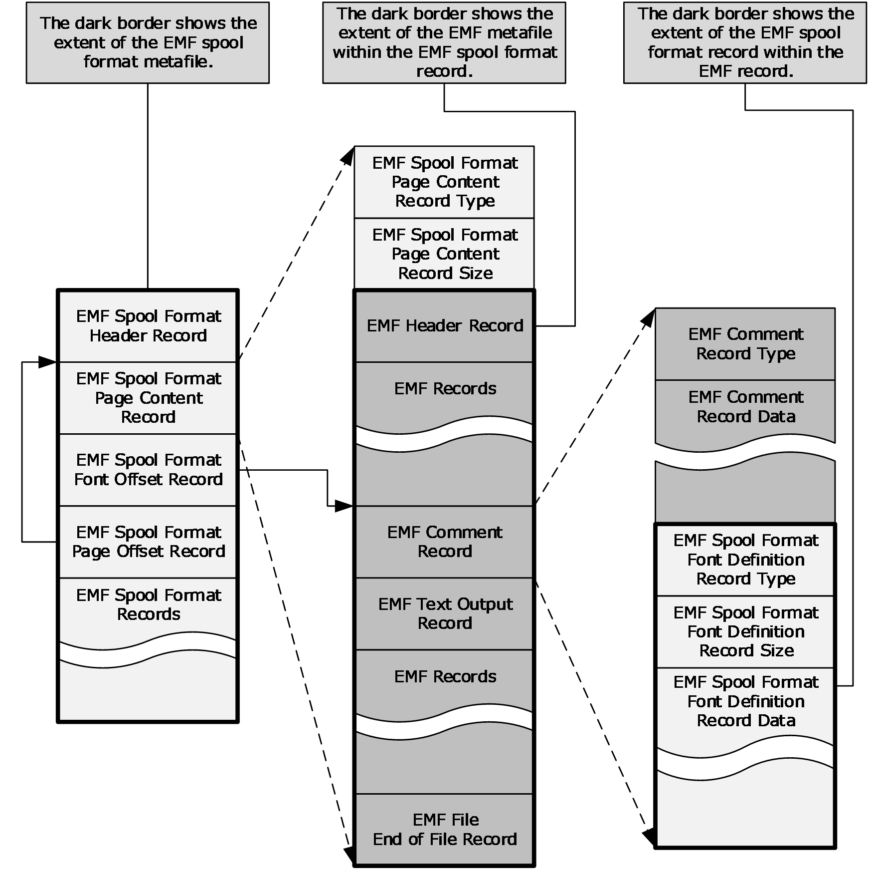

Figure 1: High-level structure of an EMFSPOOL file

This figure shows the following about EMFSPOOL files:

- A header record is always present, specified in section [2.2.2](#Section_2.2.2).
- A page content record actually contains an entire [**EMF**](#gt_enhanced-metafile-format-emf) metafile, as specified in [MS-EMF](../MS-EMF/MS-EMF.md).
- A font definition can be embedded in an EMF EMR_COMMENT_EMFSPOOL record, which is embedded in an EMF metafile, which is embedded in a page content record. For more information, see [MS-EMF] section 2.3.3.3.
- No end-of-file record is defined.
<a id="Section_1.3.2"></a>
### 1.3.2 Byte Ordering

The bytes in a word in [**EMFSPOOL**](#gt_enhanced-metafile-spool-format-emfspool) [**metafile**](#gt_metafile) records are numbered right-to-left [**little-endian**](#gt_little-endian) format.

Some computer architectures number the bytes in a word from left to right, which is called [**big-endian**](#gt_big-endian). The byte numbering used for bitfields in this specification is big-endian. Other architectures number the bytes in a binary word from right to left, which is referred to as little-endian. The byte numbering used for enumerations, objects, and records in this specification is little-endian.

Using the big-endian and little-endian methods, the number 0x12345678 would be stored as shown in the following table.

| Bit Range | Field | Description |
| --- | --- | --- |
| Variable | big-endian | 0x12 0x34 0x56 0x78 |
| Variable | little-endian | 0x78 0x56 0x34 0x12 |

<a id="Section_1.4"></a>
## 1.4 Relationship to Protocols and Other Structures

Several related [**metafile**](#gt_metafile) formats can be used together for device-independent printing. Their relationships are:

- [**Enhanced metafile spool format (EMFSPOOL)**](#gt_enhanced-metafile-spool-format-emfspool) records (section [2.2](#Section_2.2)) can contain EMF records.
- [**Enhanced metafile format (EMF)**](#gt_enhanced-metafile-format-emf) records ([MS-EMF](../MS-EMF/MS-EMF.md) section 2.3) can contain EMF+ records.
- [**Enhanced metafile format plus extensions (EMF+)**](#gt_enhanced-metafile-format-plus-extensions-emf) records ([MS-EMFPLUS](../MS-EMFPLUS/MS-EMFPLUS.md) section 2.3) can contain [**Windows metafile format (WMF)**](#gt_windows-metafile-format-wmf) records ([MS-WMF](../MS-WMF/MS-WMF.md) section 2.3).
This is illustrated qualitatively in the following figure.

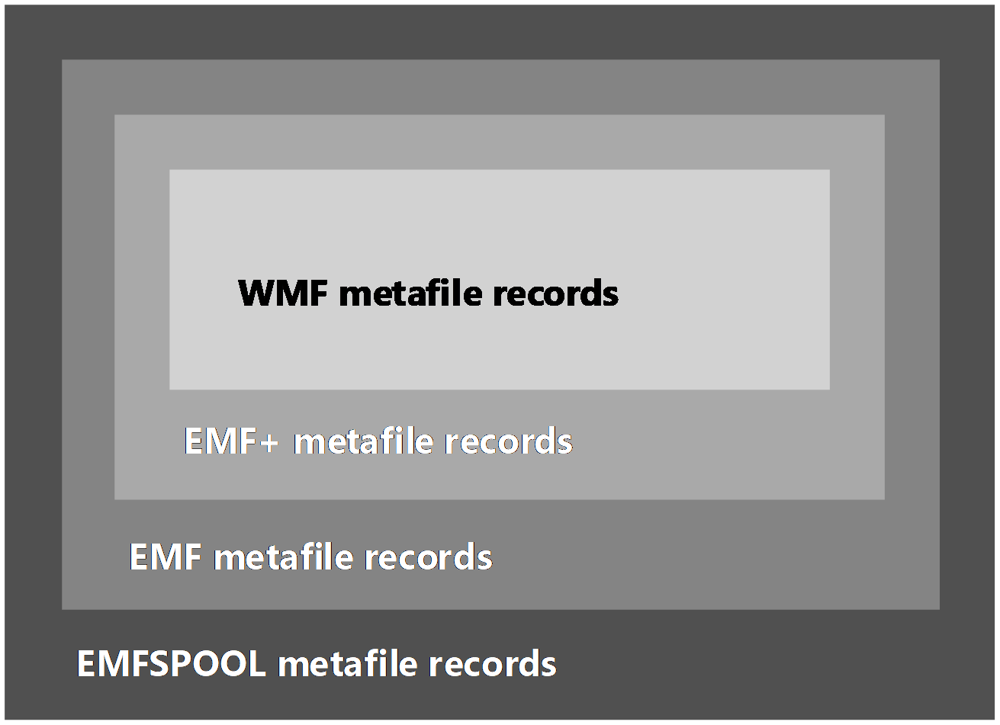

Figure 2: Relationships of metafile record types

EMFSPOOL metafile [**print jobs**](#gt_print-job) are sent to remote [**print servers**](#gt_print-server) by using the Print System Remote Protocol [MS-RPRN](../MS-RPRN/MS-RPRN.md) or Print System Asynchronous Remote Protocol [MS-PAR](../MS-PAR/MS-PAR.md).

<a id="Section_1.5"></a>
## 1.5 Applicability Statement

[**EMFSPOOL**](#gt_enhanced-metafile-spool-format-emfspool) [**metafiles**](#gt_metafile) are portable containers for [**print jobs**](#gt_print-job). The [**spool file format**](#gt_spool-file-format) supported by EMFSPOOL is applicable to rendering output on all devices, including displays, printers, and plotters.

<a id="Section_1.6"></a>
## 1.6 Versioning and Localization

This specification covers versioning issues in the following areas:

**Structure Versions**: There is only one version of the [**EMFSPOOL**](#gt_enhanced-metafile-spool-format-emfspool) file format.

**Localization**: EMFSPOOL format defines no locale-specific processes or data.

<a id="Section_1.7"></a>
## 1.7 Vendor-Extensible Fields

[**EMFSPOOL**](#gt_enhanced-metafile-spool-format-emfspool) [**metafile**](#gt_metafile) format supports arbitrary, vendor-defined [**PDL**](#gt_page-description-language-pdl) within embedded [**EMF**](#gt_enhanced-metafile-format-emf) metafiles [MS-EMF](../MS-EMF/MS-EMF.md).

<a id="Section_2"></a>
# 2 Structures

The following topics specify:

- Common enumerations.
- [**EMF spool format**](#gt_enhanced-metafile-spool-format-emfspool) records, as they are marshaled on the wire.
This protocol references commonly used data types as defined in [MS-DTYP](../MS-DTYP/MS-DTYP.md).

<a id="Section_2.1"></a>
## 2.1 EMFSPOOL Enumerations

<a id="Section_2.1.1"></a>
### 2.1.1 RecordType Enumeration

The RecordType enumeration specifies the types of records allowed in an [**EMF spool format**](#gt_enhanced-metafile-spool-format-emfspool) metafile.<2>

typedef enum

{

EMRI_METAFILE = 0x00000001,

EMRI_ENGINE_FONT = 0x00000002,

EMRI_DEVMODE = 0x00000003,

EMRI_TYPE1_FONT = 0x00000004,

EMRI_PRESTARTPAGE = 0x00000005,

EMRI_DESIGNVECTOR = 0x00000006,

EMRI_SUBSET_FONT = 0x00000007,

EMRI_DELTA_FONT = 0x00000008,

EMRI_FORM_METAFILE = 0x00000009,

EMRI_BW_METAFILE = 0x0000000A,

EMRI_BW_FORM_METAFILE = 0x0000000B,

EMRI_METAFILE_DATA = 0x0000000C,

EMRI_METAFILE_EXT = 0x0000000D,

EMRI_BW_METAFILE_EXT = 0x0000000E,

EMRI_ENGINE_FONT_EXT = 0x0000000F,

EMRI_TYPE1_FONT_EXT = 0x00000010,

EMRI_DESIGNVECTOR_EXT = 0x00000011,

EMRI_SUBSET_FONT_EXT = 0x00000012,

EMRI_DELTA_FONT_EXT = 0x00000013,

EMRI_PS_JOB_DATA = 0x00000014,

EMRI_EMBED_FONT_EXT = 0x00000015

} RecordType;

**EMRI_METAFILE:** Document content in the form of an [**EMF**](#gt_enhanced-metafile-format-emf) [**metafile**](#gt_metafile), as specified in section [2.2.3.1](#Section_2.2.3.1).

**EMRI_ENGINE_FONT:** A [**TrueType**](#gt_truetype) font definition, as specified in section [2.2.3.3.1](#Section_2.2.3.3.1).

**EMRI_DEVMODE:** Device settings, as specified in section [2.2.3.5](#Section_2.2.3.5).

**EMRI_TYPE1_FONT:** A [**PostScript**](#gt_postscript) [**Type 1 font**](#gt_type-1-font) definition, as specified in section [2.2.3.3.2](#Section_2.2.3.3.2).

**EMRI_PRESTARTPAGE:** The start page for [**encapsulated PostScript (EPS)**](#gt_encapsulated-postscript-eps), as specified in section [2.2.3.6](#Section_2.2.3.6).

**EMRI_DESIGNVECTOR:** A font [**design vector**](#gt_design-vector), as specified in section [2.2.3.3.3](#Section_2.2.3.3.3).

**EMRI_SUBSET_FONT:** A [**subset font**](#gt_subset-font) definition, as specified in section [2.2.3.3.4](#Section_2.2.3.3.4).

**EMRI_DELTA_FONT:** A [**delta font**](#gt_delta-font) definition, as specified in section [2.2.3.3.5](#Section_2.2.3.3.5).

**EMRI_FORM_METAFILE:** Document content in the form of an EMF metafile, as specified in section 2.2.3.1.

**EMRI_BW_METAFILE:** Monochrome document content in the form of an EMF metafile, as specified in section 2.2.3.1.

**EMRI_BW_FORM_METAFILE:** Monochrome document content in the form of an EMF metafile, as specified in section 2.2.3.1.

**EMRI_METAFILE_DATA:** Document content in the form of an EMF metafile, as specified in section 2.2.3.1.

**EMRI_METAFILE_EXT:** An offset to document content, as specified in section [2.2.3.2](#Section_2.2.3.2).

**EMRI_BW_METAFILE_EXT:** An offset to monochrome document content, as specified in section 2.2.3.2.

**EMRI_ENGINE_FONT_EXT:** An offset to a TrueType font definition, as specified in section [2.2.3.4](#Section_2.2.3.4).

**EMRI_TYPE1_FONT_EXT:** An offset to a PostScript Type 1 font definition, as specified in section 2.2.3.4.

**EMRI_DESIGNVECTOR_EXT:** An offset to a font design vector, as specified in section 2.2.3.4.

**EMRI_SUBSET_FONT_EXT:** An offset to a subset font definition, as specified in section 2.2.3.4.

**EMRI_DELTA_FONT_EXT:** An offset to a delta font definition, as specified in section 2.2.3.4.

**EMRI_PS_JOB_DATA:** Document-level PostScript data, as specified in section [2.2.3.7](#Section_2.2.3.7).

**EMRI_EMBED_FONT_EXT:** An offset to [**embedded font**](#gt_embedded-font) identifiers, as specified in section 2.2.3.4.

<a id="Section_2.1.2"></a>
### 2.1.2 SpecVersion Enumeration

The SpecVersion enumeration specifies Windows system versions, for comparison with [**printer driver**](#gt_printer-driver) versions.

typedef enum

{

_WIN32_WINNT_NT4 = 0x0400,

_WIN32_WINNT_WIN2K = 0x0500,

_WIN32_WINNT_WINXP = 0x0501,

_WIN32_WINNT_WS03 = 0x0502,

_WIN32_WINNT_VISTA = 0x0600,

_WIN32_WINNT_WIN7 = 0x0601,

_WIN32_WINNT_WIN8 = 0x0602

} SpecVersion;

**_WIN32_WINNT_NT4:** Windows NT 4.0 operating system

**_WIN32_WINNT_WIN2K:** Windows 2000 operating system

**_WIN32_WINNT_WINXP:** Windows XP operating system

**_WIN32_WINNT_WS03:** Windows Server 2003 operating system

**_WIN32_WINNT_VISTA:** Windows Vista operating system and Windows Server 2008 operating system

**_WIN32_WINNT_WIN7:** Windows 7 operating system and Windows Server 2008 R2 operating system

**_WIN32_WINNT_WIN8:** Windows 8 operating system and Windows Server 2012 operating system

<a id="Section_2.2"></a>
## 2.2 EMFSPOOL Records

[**EMFSPOOL**](#gt_enhanced-metafile-spool-format-emfspool) records include syntax and record types. This information is organized as follows.

| Name | Section | Description |
| --- | --- | --- |
| Record syntax | [2.2.1](#Section_2.2.1) | The structure and syntax of EMFSPOOL records. |
| Header record | [2.2.2](#Section_2.2.2) | The EMFSPOOL header record, which specifies global properties, including the size of the spool file, the name of the document being spooled, and the name of the output device. |
| Data records | [2.2.3](#Section_2.2.3) | EMFSPOOL data records, which specify page content, fonts, and output device information. |

All string data in EMFSPOOL records MUST be encoded in [**Unicode**](#gt_unicode) [**UTF-16LE**](#gt_utf-16le) format, as specified in [[UNICODE]](https://go.microsoft.com/fwlink/?LinkId=90550), unless stated otherwise. The size of each record in EMFSPOOL MUST be rounded up to a multiple of 4 bytes.

<a id="Section_2.2.1"></a>
### 2.2.1 Record Syntax

The **Record Syntax** is specified as follows.

<emf_spool_format> ::= <Header_record>

[ <EMRI_PS_JOB_DATA_record> ]

{ <other_records> }

<page_offset_records>

<other_records> ::= <page_content_records> |

<font_definition_records> |

<font_offset_records> |

<EMRI_DEVMODE_record> |

<EMRI_PRESTARTPAGE_record>

<page_content_records> ::= <EMRI_METAFILE_record> |

<EMRI_FORM_METAFILE_record> |

<EMRI_BW_METAFILE_record> |

<EMRI_BW_FORM_METAFILE_record> |

<EMRI_METAFILE_DATA_record>

<page_offset_records> ::= <EMRI_METAFILE_EXT_record> |

<EMRI_BW_METAFILE_EXT_record>

<font_definition_records> ::= <EMRI_ENGINE_FONT_record> |

<EMRI_TYPE1_FONT_record> |

<EMRI_DESIGNVECTOR_record> |

<EMRI_SUBSET_FONT_record> |

<EMRI_DELTA_FONT_record>

<font_offset_records> ::= <EMRI_ENGINE_FONT_EXT_record> |

<EMRI_TYPE1_FONT_EXT_record> |

<EMRI_DESIGNVECTOR_EXT_record> |

<EMRI_SUBSET_FONT_OFFSET_record> |

<EMRI_DELTA_FONT_EXT_record> |

<EMRI_EMBED_FONT_EXT_record>

These record types perform the following roles:

- An **<EMRI_PS_JOB_DATA_record>** stores injected [**PostScript**](#gt_postscript) code at the document level. If an <EMRI_PS_JOB_DATA_record> is present in the [**metafile**](#gt_metafile), it MUST be the first [**EMF spool format**](#gt_enhanced-metafile-spool-format-emfspool) record after the <Header_record>.
- **<page_content_records>** store drawing commands for rendering and formatting individual pages of output. Within a <page_content_record>, a complete [**EMF**](#gt_enhanced-metafile-format-emf) metafile can be defined, as specified in [MS-EMF](../MS-EMF/MS-EMF.md).
- **<page_offset_records>** point to <page_content_records>, which MUST precede the <page_offset_records> in the metafile. Two types of <page_offset_records> are provided, for color and monochrome pages.
- **<font_definition_records>** store font information within an EMF EMR_COMMENT_EMFSPOOL record that is identified with the signature "TONF", as specified in [MS-EMF] section 2.3.3.3. The EMR_COMMENT_EMFSPOOL record is part of an EMF metafile that is embedded in a <page_content_record>.
- **<font_offset_records>** point to the [**embedded font**](#gt_embedded-font) definitions within preceding <page_content_records>.
- An **<EMRI_DEVMODE_record>** stores [**device**](#gt_device) settings and information about device capabilities.
- An **<EMRI_PRESTARTPAGE_record>** stores [**encapsulated PostScript (EPS)**](#gt_encapsulated-postscript-eps).
All record types are specified in section [2.2](#Section_2.2).

<a id="Section_2.2.2"></a>
### 2.2.2 Header Record

The Header record is always the first record of an [**EMFSPOOL**](#gt_enhanced-metafile-spool-format-emfspool) [**metafile**](#gt_metafile).

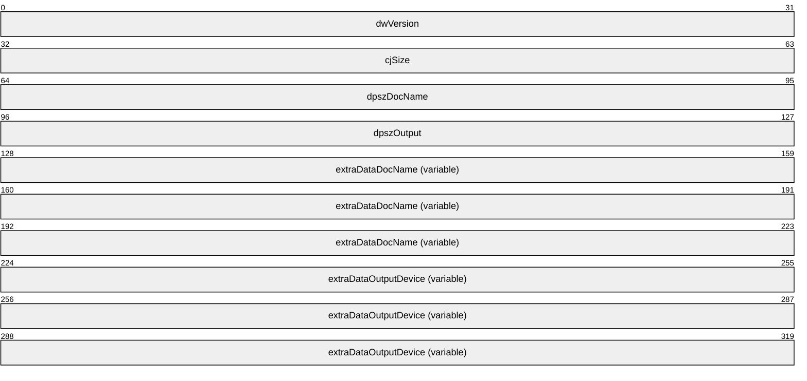

**dwVersion (4 bytes):** A 32-bit unsigned integer that specifies the version of EMFSPOOL. This value MUST be 0x00010000.

**cjSize (4 bytes):** A 32-bit unsigned integer that specifies the size, in bytes, of the header record, including extra data attached. The size of each record in EMFSPOOL MUST be rounded up to a multiple of 32 bits.

**dpszDocName (4 bytes):** A 32-bit unsigned integer that specifies the offset of the document name from the start of the record (**dwVersion** field). The document name is stored as a NULL-terminated [**Unicode**](#gt_unicode) string, as specified in [[UNICODE]](https://go.microsoft.com/fwlink/?LinkId=90550), in the **extraDataDocName** field. If this value is 0x00000000, a document name string SHOULD NOT be present in the header record.

**dpszOutput (4 bytes):** A 32-bit unsigned integer that specifies the offset of the output [**device**](#gt_device) name from the start of the record (**dwVersion** field). The output device name is stored as a NULL-terminated Unicode string in the **extraDataOutputDevice** field. If this value is 0x00000000, an output device name string SHOULD NOT be present in the header record.

**extraDataDocName (variable):** Variable-size storage area for the document name string. This structure MUST be 32-bit aligned.


**PaddingDocName (variable):** An optional array of WORD structures as padding, because the **DocName** field is not required to immediately follow the **dpszOutput** field. The values of these structures are indeterminate and MUST be ignored.

**DocName (variable):** A null-terminated string that specifies the name of the output file, or the name of the printer port.

**AlignmentDocName (variable):** An optional array of WORD structures to ensure 32-bit alignment. The values of these structures are indeterminate and MUST be ignored.

**extraDataOutputDevice (variable):** Variable-size storage area for the output device name string. This structure MUST be 32-bit aligned.


**PaddingOutputDevice (variable):** An optional array of WORD structures as padding, because the **OutputDevice** field is not required to immediately follow the **extraDataDocName** field. The values of these structures are indeterminate and MUST be ignored.

**OutputDevice (variable):** A null-terminated string that specifies the name of the output file, or the name of the printer port.

**AlignmentOutputDevice (variable):** An optional array of WORD structures to ensure 32-bit alignment. The values of these structures are indeterminate and MUST be ignored.

<a id="Section_2.2.3"></a>
### 2.2.3 Data Records

This section specifies the Data records, which follow the [**EMF spool format**](#gt_enhanced-metafile-spool-format-emfspool) [Header Record (section 2.2.2)](#Section_2.2.2). These records have been grouped into the following categories, as described in [Record Syntax (section 2.2.1)](#Section_2.2.1).

| Name | Section | Description |
| --- | --- | --- |
| Page Content records | [2.2.3.1](#Section_2.2.3.1) | Page content records specify formatting and graphical content, in the form of embedded [**EMF**](#gt_enhanced-metafile-format-emf) [**metafiles**](#gt_metafile). |
| Page Offset records | [2.2.3.2](#Section_2.2.3.2) | Page offset records specify the location of page content records in the EMF spool format metafile. |
| Font Definition records | [2.2.3.3](#Section_2.2.3.3) | Font definition records specify partial fonts, complete fonts, and font properties. |
| Font Offset records | [2.2.3.4](#Section_2.2.3.4) | Font offset records specify offsets to [**embedded font**](#gt_embedded-font) definition records. |
| EMRI_DEVMODE record | [2.2.3.5](#Section_2.2.3.5) | EMRI_DEVMODE records store [**device**](#gt_device) settings and properties. |
| EMRI_PRESTARTPAGE record | [2.2.3.6](#Section_2.2.3.6) | EMRI_PRESTARTPAGE records contain information used in [**encapsulated PostScript (EPS)**](#gt_encapsulated-postscript-eps) printing. |
| EMRI_PS_JOB_DATA record | [2.2.3.7](#Section_2.2.3.7) | EMRI_PS_JOB_DATA records store injected [**PostScript**](#gt_postscript) data at the job level.<3> |

All EMF spool format data records have the generic format specified as follows.

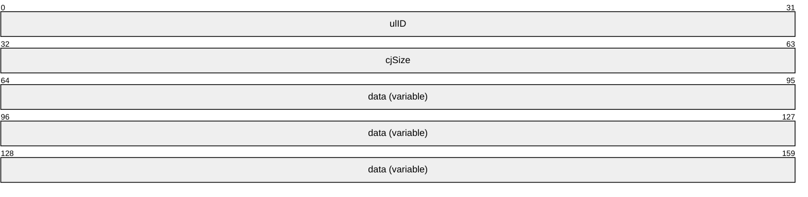

**ulID (4 bytes):** A 32-bit unsigned identifier that specifies the type of record from the [RecordType Enumeration (section 2.1.1)](#Section_2.1.1).

**cjSize (4 bytes):** A 32-bit unsigned integer that specifies the size, in bytes, of the data attached to the record. The size of each record in an EMF spool format metafile MUST be rounded up to a multiple of 4 bytes.

**data (variable):** A variable-size array that stores the data information of the record, according to its record type. The data array MUST be 32-bit aligned.

<a id="Section_2.2.3.1"></a>
#### 2.2.3.1 Page Content Records

**Page Content Records** include five record types, and they all have the following structure. Page content records specify formatting and graphical content, in the form of embedded [**EMF**](#gt_enhanced-metafile-format-emf) [**metafile**](#gt_metafile) records [MS-EMF](../MS-EMF/MS-EMF.md).

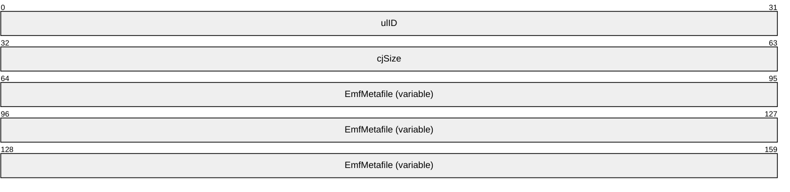

**ulID (4 bytes):** A 32-bit unsigned integer from the following table, which identifies the type of record (section [2.1.1](#Section_2.1.1)).

| Value | Meaning |
| --- | --- |
| EMRI_METAFILE 0x00000001 | This record defines the same function as the **EMRI_METAFILE_DATA** record.<4> |
| EMRI_FORM_METAFILE 0x00000009 | This record defines the same function as the **EMRI_METAFILE_DATA** record.<5> |
| EMRI_BW_METAFILE 0x0000000A | This record defines the same function as the **EMRI_METAFILE_DATA** record, except that the content is monochrome.<6> |
| EMRI_BW_FORM_METAFILE 0x0000000B | This record defines the same function as the **EMRI_METAFILE_DATA** record, except that the content is monochrome.<7> |
| EMRI_METAFILE_DATA 0x0000000C | The record contains an EMF metafile [MS-EMF], which specifies the content for a page of output. |

**cjSize (4 bytes):** A 32-bit unsigned integer that specifies the size, in bytes, of the metafile data attached to the record. The size of each record in [**EMF spool format**](#gt_enhanced-metafile-spool-format-emfspool) MUST be rounded up to a multiple of 4 bytes.

**EmfMetafile (variable):** A complete EMF metafile.

<a id="Section_2.2.3.2"></a>
#### 2.2.3.2 Page Offset Records

The Page Offset records include two record types, and they both have the structure shown as follows. Page offset records specify the location of [page content](#Section_2.2.3.1) records in the [**EMF spool format**](#gt_enhanced-metafile-spool-format-emfspool) [**metafile**](#gt_metafile). Page content records are specified in section 2.2.3.1.

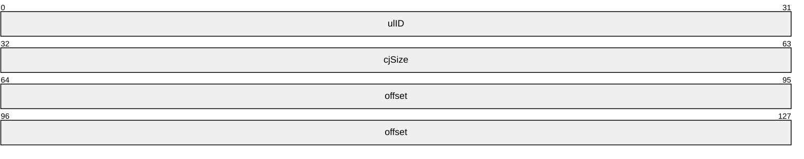

**ulID (4 bytes):** A 32-bit unsigned integer that identifies the type of record, from the [RecordType (section 2.1.1)](#Section_2.1.1) enumeration.

| Value | Meaning |
| --- | --- |
| EMRI_METAFILE_EXT 0x0000000D | Offset to a page content record. |
| EMRI_BW_METAFILE_EXT 0x0000000E | Offset to a page content record that contains only monochrome data. |

**cjSize (4 bytes):** A 32-bit unsigned integer that specifies the size, in bytes, of the data attached to the record. The size of each record in EMF spool format MUST be rounded up to a multiple of 4 bytes.

**offset (8 bytes):** A 64-bit unsigned integer that specifies the offset, in bytes, from the start of the page offset record to the start of a page content record. That page content record MUST be located ahead of the corresponding page offset record, which means that the offset is counted backward in the metafile.

<a id="Section_2.2.3.3"></a>
#### 2.2.3.3 Font Definition Records

The Font Definition records include five record types, listed in the following table. Font definition records specify partial fonts, complete fonts, and font properties.

| Name | Section | Description |
| --- | --- | --- |
| EMRI_ENGINE_FONT | [2.2.3.3.1](#Section_2.2.3.3.1) | Defines a font in [**TrueType**](#gt_truetype) format. |
| EMRI_TYPE1_FONT | [2.2.3.3.2](#Section_2.2.3.3.2) | Defines a font in [**PostScript**](#gt_postscript) [**Type 1 font**](#gt_type-1-font) format. |
| EMRI_DESIGNVECTOR | [2.2.3.3.3](#Section_2.2.3.3.3) | Contains a font's [**design vector**](#gt_design-vector), which characterizes a font's appearance in 16 properties. |
| EMRI_SUBSET_FONT | [2.2.3.3.4](#Section_2.2.3.3.4) | Contains a partial font in TrueType format, with enough [**glyph**](#gt_glyph) outlines for pages up to the current page. |
| EMRI_DELTA_FONT | [2.2.3.3.5](#Section_2.2.3.3.5) | Contains new glyphs to be merged with data from a preceding **EMRI_SUBSET_FONT** record. |

The **EMRI_ENGINE_FONT** and **EMRI_TYPE1_FONT** records have similar structures, and the **EMRI_SUBSET_FONT** and **EMRI_DELTA_FONT** records have similar structures.

In an [**EMF spool format**](#gt_enhanced-metafile-spool-format-emfspool) [**metafile**](#gt_metafile), a font definition record MUST be embedded in an [**EMF**](#gt_enhanced-metafile-format-emf) EMR_COMMENT_EMFSPOOL record that contains the "**TONF**" signature in [**ASCII**](#gt_ascii) (0x544F4E46), as specified in [MS-EMF](../MS-EMF/MS-EMF.md) section 2.3.3.3.

The EMR_COMMENT_EMFSPOOL record itself is part of a complete EMF metafile that is embedded in an EMF spool format [page content (section 2.2.3.1)](#Section_2.2.3.1) record. This multiple embedding scheme is shown in the structure overview figure in section [1.3.1](#Section_1.3.1).

<a id="Section_2.2.3.3.1"></a>
##### 2.2.3.3.1 EMRI_ENGINE_FONT Record

The EMRI_ENGINE_FONT record contains embedded [**TrueType**](#gt_truetype) fonts. This record and the [EMRI_TYPE1_FONT (section 2.2.3.3.2)](#Section_2.2.3.3.2) record have similar structures.

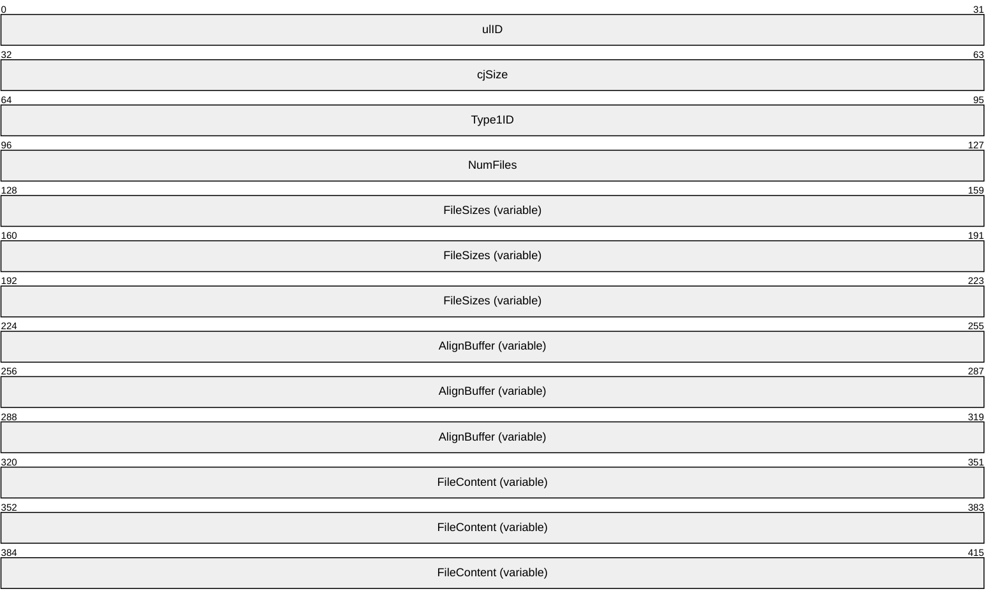

**ulID (4 bytes):** A 32-bit unsigned integer that identifies the type of record. The value MUST be 0x00000002, which specifies the **EMRI_ENGINE_FONT** record type from the [RecordType Enumeration (section 2.1.1)](#Section_2.1.1).

**cjSize (4 bytes):** A 32-bit unsigned integer that specifies the size, in bytes, of the data attached to the record. The size of each record in an [**EMF spool format**](#gt_enhanced-metafile-spool-format-emfspool) file MUST be rounded up to a multiple of 4 bytes.

**Type1ID (4 bytes):** A 32-bit unsigned integer. The value MUST be 0x00000000, to indicate a TrueType.

**NumFiles (4 bytes):** A 32-bit unsigned integer that specifies the number of files attached to this record.

**FileSizes (variable):** Variable number of 32-bit unsigned integers that define the sizes of the files attached to this record.

**AlignBuffer (variable):** Up to 7 bytes, to make the data that follows 64-bit aligned.

**FileContent (variable):** Variable-size, 32-bit aligned data that represents the definitions of glyphs in the font. The content is in TrueType format.

<a id="Section_2.2.3.3.2"></a>
##### 2.2.3.3.2 EMRI_TYPE1_FONT Record

The EMRI_TYPE1_FONT record contains embedded [**PostScript**](#gt_postscript) [**Type 1 fonts**](#gt_type-1-font). This record and the [EMRI_ENGINE_FONT (section 2.2.3.3.1)](#Section_2.2.3.3.1) record have similar structures.

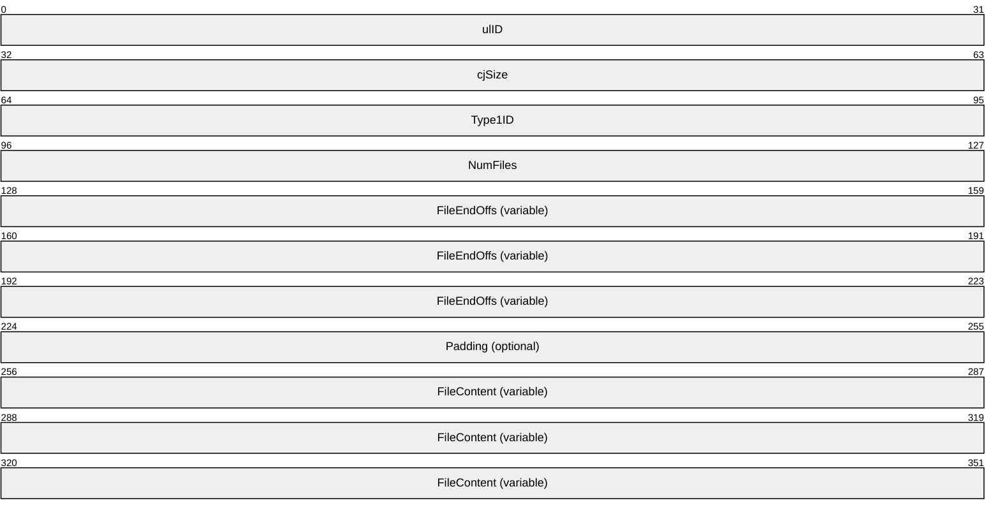

**ulID (4 bytes):** A 32-bit unsigned integer that identifies the type of record. The value MUST be 0x00000004, which specifies the **EMRI_TYPE1_FONT** record type from the [RecordType (section 2.1.1)](#Section_2.1.1) enumeration.

**cjSize (4 bytes):** A 32-bit unsigned integer that specifies the size, in bytes, of this record, not including the **ulID** and **cjSize** fields. The size of each record in [**EMF spool format**](#gt_enhanced-metafile-spool-format-emfspool) MUST be rounded up to a multiple of 4 bytes.

**Type1ID (4 bytes):** A 32-bit unsigned integer that SHOULD be 0x00000000 and MUST be ignored.<8>

**NumFiles (4 bytes):** A 32-bit unsigned integer that specifies the number of files included in this record. This value MUST NOT be zero.

**FileEndOffs (variable):** An array of 32-bit unsigned integers that specify the locations of the font files in this record. For each font file, this value is the byte offset of the end of that file, starting from the beginning of the first file. Thus, the first **FileEndOffs** value is the size, in bytes, of the first file; the second value is the sum of the sizes of the first and second files, and so on.

The **FileEndOffs** values are limited as follows:

FileEndOffs[0] < FileEndOffs[1] < ... < FileEndOffs[NumFiles - 1]

<= (cjSize – (8 + (nFiles * 4))

Each offset value MUST be a multiple of 4 bytes, and each file MUST have a size greater than zero.

**Padding (4 bytes):** An optional 32-bit field, which is padding used to align the **FileContent** field on an 8-byte boundary. The contents of this field are indeterminate and MUST be ignored.

**FileContent (variable):** Variable-size, 32-bit aligned data, which represents the definitions of glyphs in the font. The content is in PostScript **Type 1** font format.

<a id="Section_2.2.3.3.3"></a>
##### 2.2.3.3.3 EMRI_DESIGNVECTOR Record

The EMRI_DESIGNVECTOR record specifies a [**design vector**](#gt_design-vector) for a font, which characterizes the font's appearance in up to 16 dimensions.<9>


**ulID (4 bytes):** A 32-bit unsigned integer that identifies the type of record. The value MUST be 0x00000006, which specifies the **EMRI_DESIGNVECTOR** record type from the [RecordType Enumeration (section 2.1.1)](#Section_2.1.1).

**cjSize (4 bytes):** A 32-bit unsigned integer that specifies the size, in bytes, of the data attached to the record. The size of each record in [**EMF spool format**](#gt_enhanced-metafile-spool-format-emfspool) MUST be rounded up to a multiple of 4 bytes.

**UniversalFontId (8 bytes):** An [**EMF**](#gt_enhanced-metafile-format-emf) UniversalFontId object ([MS-EMF](../MS-EMF/MS-EMF.md) section 2.2.27) that identifies the font.

**DesignVector (variable):** An EMF DesignVector object ([MS-EMF] section 2.2.3) that specifies the properties of the font.

The first DWORD MUST contain the design vector signature, which is the value given by the equation.

0x08000000 + 'd' + ('v' << 8)

Using 8-bit [**ASCII**](#gt_ascii) for the character code points, this value is 0x08007664.

<a id="Section_2.2.3.3.4"></a>
##### 2.2.3.3.4 EMRI_SUBSET_FONT Record

The EMRI_SUBSET_FONT record contains a subset of [**TrueType**](#gt_truetype) and [**OpenType**](#gt_opentype) fonts, which can be merged to form more complete fonts. An EMRI_SUBSET_FONT record defines enough glyph outlines for pages up to the current one.

This record and the [EMRI_DELTA_FONT (section 2.2.3.3.5)](#Section_2.2.3.3.5) record have similar structures.


**ulID (4 bytes):** A 32-bit unsigned integer that identifies the type of record. The value MUST be 0x00000007, which specifies the **EMRI_SUBSET_FONT** record type from the [RecordType Enumeration (section 2.1.1)](#Section_2.1.1).

**cjSize (4 bytes):** A 32-bit unsigned integer that specifies the size, in bytes, of the data attached to the record. The size of each record in [**EMF spool format**](#gt_enhanced-metafile-spool-format-emfspool) MUST be rounded up to a multiple of 4 bytes.

**UniversalFontId (8 bytes):** An [**EMF**](#gt_enhanced-metafile-format-emf) UniversalFontId object ([MS-EMF](../MS-EMF/MS-EMF.md) section 2.2.27) that identifies the font.

**FontData (variable):** The 32-bit-aligned data that contains the definitions of glyphs in the font.

<a id="Section_2.2.3.3.5"></a>
##### 2.2.3.3.5 EMRI_DELTA_FONT Record

The **EMRI_DELTA_FONT** record contains partial [**TrueType**](#gt_truetype) and [**OpenType**](#gt_opentype) fonts, which can be merged to form more complete fonts. An EMRI_DELTA_FONT record defines new glyphs to be merged with data from a preceding EMRI_SUBSET_FONT record.

This record and the EMRI_SUBSET_FONT (section [2.2.3.3.4](#Section_2.2.3.3.4)) have similar structures.


**ulID (4 bytes):** An unsigned integer that identifies the type of record. The value MUST be 0x00000008, which specifies the **EMRI_DELTA_FONT** record type from the [RecordType Enumeration (section 2.1.1)](#Section_2.1.1).

**cjSize (4 bytes):** An unsigned integer that specifies the size of the **FontData** field, in bytes.

**UniversalFontId (8 bytes):** An [**EMF**](#gt_enhanced-metafile-format-emf) UniversalFontId object ([MS-EMF](../MS-EMF/MS-EMF.md) section 2.2.27) that identifies the font.

**FontData (variable):** The 32-bit-aligned data that contains the definitions of glyphs in the font.

<a id="Section_2.2.3.4"></a>
#### 2.2.3.4 Font Offset Records

**Font Offset** records are of six types, and they all have the structure shown as follows. Font offset records specify offsets to [**embedded font**](#gt_embedded-font) definition records in an [**EMF spool format**](#gt_enhanced-metafile-spool-format-emfspool) metafile.

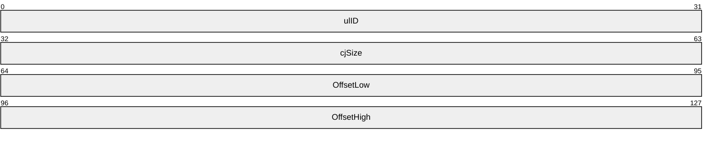

**ulID (4 bytes):** A 32-bit unsigned integer that identifies the type of record, from the [RecordType (section 2.1.1)](#Section_2.1.1) enumeration.

| Value | Meaning |
| --- | --- |
| EMRI_ENGINE_FONT_EXT 0x0000000F | This type of record specifies an offset to a [**TrueType**](#gt_truetype) font within a page content record. |
| EMRI_TYPE1_FONT_EXT 0x00000010 | This type of record specifies an offset to a [**PostScript**](#gt_postscript) [**Type 1 font**](#gt_type-1-font) within a page content record. |
| EMRI_DESIGNVECTOR_EXT 0x00000011 | This type of record specifies an offset to a TrueType font [**design vector**](#gt_design-vector) within a page content record. |
| EMRI_SUBSET_FONT_EXT 0x00000012 | This type of record specifies an offset to embedded [**subset fonts**](#gt_subset-font) within a page content record. |
| EMRI_DELTA_FONT_EXT 0x00000013 | This type of record specifies an offset to embedded [**delta fonts**](#gt_delta-font) within a page content record. |
| EMRI_EMBED_FONT_EXT 0x00000015 | This type of record specifies an offset to embedded font identifiers within a page content record. |

**cjSize (4 bytes):** A 32-bit unsigned integer that specifies the size, in bytes, of the data attached to the record. The size of each record in EMF spool format MUST be aligned to a multiple of 4 bytes.

**OffsetLow (4 bytes):** The lower 32 bits of a 64-bit unsigned integer that contains the font offset.

**OffsetHigh (4 bytes):** The upper 32 bits of a 64-bit unsigned integer that contains the font offset.

The offset is the number of bytes from the start of the offset record to the start of a [font definition (section 2.2.3.3)](#Section_2.2.3.3) record, which is embedded within a [page content](#Section_2.2.3.1) record. Font definition records are embedded in EMR_COMMENT_EMFSPOOL records, as specified in [MS-EMF](../MS-EMF/MS-EMF.md) section 2.3.3.3.

<a id="Section_2.2.3.5"></a>
#### 2.2.3.5 EMRI_DEVMODE Record

The **EMRI_DEVMODE** record specifies the configuration and capabilities of an output [**device**](#gt_device).

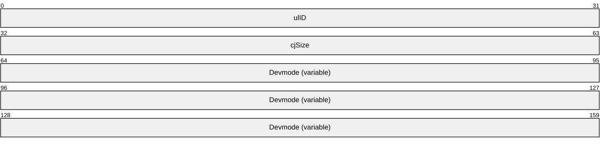

**ulID (4 bytes):** An unsigned integer that identifies the record type (section [2.1.1](#Section_2.1.1)). This value is 0x00000003 for the EMRI_DEVMODE record.

**CjSize (4 bytes):** An unsigned integer that specifies the size of the **Devmode** field, in bytes. Each [**EMFSPOOL**](#gt_enhanced-metafile-spool-format-emfspool) record MUST be aligned to a multiple of 32 bits.

**Devmode (variable):** A _DEVMODE structure ([MS-RPRN](../MS-RPRN/MS-RPRN.md) section 2.2.2.1), which defines the configuration and capabilities of an output device.

<a id="Section_2.2.3.6"></a>
#### 2.2.3.6 EMRI_PRESTARTPAGE Record

The EMRI_PRESTARTPAGE record specifies the start of [**encapsulated PostScript (EPS)**](#gt_encapsulated-postscript-eps) data.

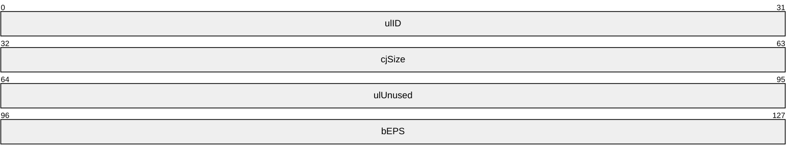

**ulID (4 bytes):** A 32-bit unsigned integer that identifies the type of record. The value MUST be 0x00000005, from the [RecordType (section 2.1.1)](#Section_2.1.1) enumeration.

**cjSize (4 bytes):** A 32-bit unsigned integer that specifies the size, in bytes, of the data attached to the record. Each record in [**EMF spool format**](#gt_enhanced-metafile-spool-format-emfspool) MUST be aligned to a multiple of 4 bytes.

**ulUnused (4 bytes):** A 32-bit unsigned integer that is not used. Its value MUST be 0xFFFFFFFF.

**bEPS (4 bytes):** A 32-bit unsigned integer that specifies whether EPS printing is enabled. EPS printing is enabled if the value is nonzero. When EPS printing is enabled, the [**printer driver**](#gt_printer-driver) is only used to generate a minimum header, and the rest of the output is generated through [**PostScript**](#gt_postscript) pass-through.

<a id="Section_2.2.3.7"></a>
#### 2.2.3.7 EMRI_PS_JOB_DATA Record

The EMRI_PS_JOB_DATA record stores [**encapsulated PostScript (EPS)**](#gt_encapsulated-postscript-eps) data at the document level. If this record is present, it MUST appear immediately after an EMFSPOOL [Header Record (section 2.2.2)](#Section_2.2.2), as shown in the [Record Syntax (section 2.2.1)](#Section_2.2.1).

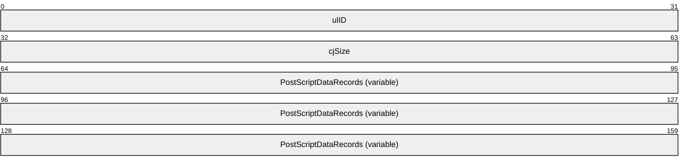

**ulID (4 bytes):** A 32-bit unsigned integer that identifies the type of record. The value MUST be 0x00000014, from the [RecordType Enumeration (section 2.1.1)](#Section_2.1.1).

**cjSize (4 bytes):** A 32-bit unsigned integer that specifies the size, in bytes, of the data attached to the record. Each record in [**EMFSPOOL**](#gt_enhanced-metafile-spool-format-emfspool) format MUST be aligned to a multiple of 4 bytes.

**PostScriptDataRecords (variable):** Data after the **ulID** and **cjSize** fields comes as multiple [**PostScript**](#gt_postscript) data records until all **cjSize** bytes are accounted for. Each variable-size record has the following structure.

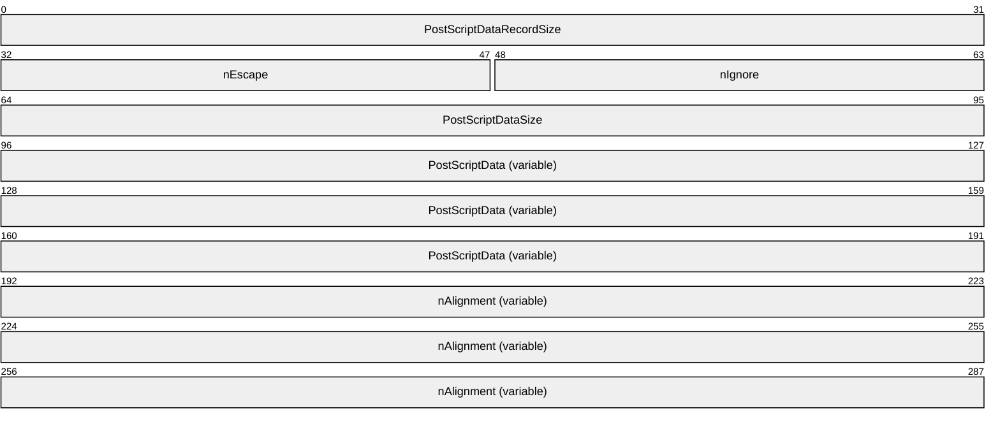

**PostScriptDataRecordSize (4 bytes):** A 32-bit unsigned integer that specifies the size, in bytes, of this PostScript data record. This value is based upon the value of **PostScriptDataSize** as follows:

| Bit Range | Field | Description |
| --- | --- | --- |
| Variable | 0 | PostScriptDataSize + 16 |
| Variable | 1 | PostScriptDataSize + 15 |
| Variable | 2 | PostScriptDataSize + 18 |
| Variable | 3 | PostScriptDataSize + 17 |

**nEscape (2 bytes):** A 16-bit unsigned integer that specifies the escape code. It MUST be one of the following values; otherwise, this record is ignored.

| Value | Meaning |
| --- | --- |
| POSTSCRIPT_IDENTIFY 0x1005 | Specify either PostScript–centric or [**GDI**](#gt_graphics-device-interface-gdi)–centric mode to the [**printer driver**](#gt_printer-driver). |
| POSTSCRIPT_INJECTION 0x1006 | Insert a block of raw data into a PostScript stream. |

**nIgnore (2 bytes):** An unsigned integer that SHOULD be zero and MUST be ignored on receipt.

**PostScriptDataSize (4 bytes):** A signed integer that specifies the size of the **PostScriptData** field, in bytes.

**PostScriptData (variable):** The PostScript data.

**nAlignment (variable):** A buffer that is included to ensure the record is 32-bit aligned. The contents of this field MUST be ignored. The size of this field is based upon the value of **PostScriptDataSize** as follows:

| Bit Range | Field | Description |
| --- | --- | --- |
| Variable | 0 | 4 bytes |
| Variable | 1 | 3 bytes |
| Variable | 2 | 6 bytes |
| Variable | 3 | 5 bytes |

<a id="Section_3"></a>
# 3 Structure Examples

<a id="Section_3.1"></a>
## 3.1 Byte Ordering

The following code snippet illustrates how the use of the [**big-endian**](#gt_big-endian) and [**little-endian**](#gt_little-endian) methods can affect the compatibility of applications.

#include <unistd.h>

#include <sys/stat.h>

#include <fcntl.h>

int main()

{

int buf;

int in;

int nread;

in = open("file.in", O_RDONLY);

nread = read(in, (int *) &buf, sizeof(buf));

printf("First Integer in file.in = %x\n", buf);

exit(0);

}

In the preceding code, if the first integer word stored in the file.in file on a big-endian computer was the hexadecimal number 0x12345678, the resulting output on that computer would be as follows.

% ./test

First Integer in file.in = 12345678

%

If the file.in file were read by the same program running on a little-endian computer, the resulting output would be as follows.

% ./test

First Integer in file.in = 78563412

%

Because of the difference in output, one would need to implement [**metafile**](#gt_metafile) record processing so that it could read integers from a file based on the endian method that the computer uses.

<a id="Section_3.2"></a>
## 3.2 EMFSPOOL Metafile Structure

This section provides an example of an [**EMFSPOOL**](#gt_enhanced-metafile-spool-format-emfspool) [**metafile**](#gt_metafile), which when processed renders the following images.


Figure 3: EMFSPOOL metafile example, page 1


Figure 4: EMFSPOOL metafile example, page 2

The contents of this metafile example are shown as follows in hexadecimal bytes. The far-left column is the byte count; the far-right characters are the interpretation of the bytes in the Latin-1 [**ANSI Character Set**](#gt_100cd8a6-5cb1-4895-9de6-e4a3c224a583) [[ISO/IEC-8859-1]](https://go.microsoft.com/fwlink/?LinkId=90689). The sections that follow describe the records that convey this series of bytes.

00000000:00 00 01 00 54 00 00 00 10 00 00 00 46 00 00 00 ....T.......F...

00000010:4d 00 69 00 63 00 72 00 6f 00 73 00 6f 00 66 00 M.i.c.r.o.s.o.f.

00000020:74 00 20 00 57 00 6f 00 72 00 64 00 20 00 2d 00 t. .W.o.r.d. .-.

00000030:20 00 44 00 6f 00 63 00 75 00 6d 00 65 00 6e 00 .D.o.c.u.m.e.n.

00000040:74 00 31 00 00 00 4e 00 65 00 30 00 32 00 3a 00 t.1...N.e.0.2.:.

00000050:00 00 00 00 0c 00 00 00 58 46 06 00 01 00 00 00 ........XF......

00000060:84 00 00 00 67 01 00 00 3d 01 00 00 3b 04 00 00 „...g...=...;...

00000070:4f 02 00 00 00 00 00 00 00 00 00 00 4c 4f 00 00 O...........LO..

00000080:14 69 00 00 20 45 4d 46 00 00 01 00 58 46 06 00 .i.. EMF....XF..

00000090:23 00 00 00 02 00 00 00 0c 00 00 00 6c 00 00 00 #...........l...

000000a0:00 00 00 00 3f 0b 00 00 e9 0e 00 00 cb 00 00 00 ....?...é...Ë...

000000b0:0d 01 00 00 00 00 00 00 00 00 00 00 00 00 00 00 ................

000000c0:79 19 03 00 ff 1b 04 00 50 00 72 00 69 00 6e 00 y...ÿ...P.r.i.n.

000000d0:74 00 20 00 74 00 65 00 73 00 74 00 00 00 00 00 t. .t.e.s.t.....

000000e0:62 00 00 00 0c 00 00 00 02 00 00 00 25 00 00 00 b...........%...

000000f0:0c 00 00 00 07 00 00 80 25 00 00 00 0c 00 00 00 .......€%.......

00000100:00 00 00 80 25 00 00 00 0c 00 00 00 0e 00 00 80 ...€%..........€

00000110:1b 00 00 00 10 00 00 00 00 00 00 00 00 00 00 00 ................

00000120:0d 00 00 00 10 00 00 00 00 00 00 00 00 00 00 00 ................

00000130:62 00 00 00 0c 00 00 00 02 00 00 00 64 00 00 00 b...........d...

00000140:0c 00 00 00 14 00 00 80 16 00 00 00 0c 00 00 00 .......€........

00000150:18 00 00 00 25 00 00 00 0c 00 00 00 0e 00 00 80 ....%..........€

00000160:16 00 00 00 0c 00 00 00 18 00 00 00 12 00 00 00 ................

00000170:0c 00 00 00 01 00 00 00 0c 00 00 00 10 00 00 00 ................

00000180:00 00 00 00 00 00 00 00 12 00 00 00 0c 00 00 00 ................

00000190:01 00 00 00 52 00 00 00 70 01 00 00 01 00 00 00 ....R...p.......

000001a0:c4 ff ff ff 00 00 00 00 00 00 00 00 00 00 00 00 Äÿÿÿ............

000001b0:90 01 00 00 00 00 00 00 07 40 00 12 54 00 69 00 □........@..T.i.

000001c0:6d 00 65 00 73 00 20 00 4e 00 65 00 77 00 20 00 m.e.s. .N.e.w. .

000001d0:52 00 6f 00 6d 00 61 00 6e 00 00 00 00 00 00 00 R.o.m.a.n.......

000001e0:00 00 00 00 00 00 00 00 00 00 00 00 00 00 00 00 ................

000001f0:00 00 00 00 00 00 00 00 00 00 00 00 00 00 20 00 .............. .

00000200:08 5a 18 00 24 a8 56 07 d0 ee 7d 07 c4 f0 7d 07 .Z..$¨V.Ðî}.Äð}.

00000210:37 a4 07 30 90 00 b7 00 b8 1a e2 01 00 00 00 00 7¤.0□.•.¸.â.....

00000220:00 00 00 00 b8 1a e2 01 6f ec ee 94 d4 a5 07 30 ....¸.â.oìî"Ô¥.0

00000230:48 f1 7d 07 40 f8 a9 30 84 f8 a9 30 78 a3 07 30 Hñ}.@ø©0„ø©0x£.0

00000240:28 48 24 00 01 00 00 00 02 00 00 00 50 ee 7d 07 (H$.........Pî}.

00000250:54 ee 7d 07 ac 1e 24 00 00 90 fd 7f 00 90 fd 7f Tî}.¬.$..□ý.□ý

00000260:00 00 b9 6e b8 00 b9 6e 18 ee 7d 07 00 00 b9 6e ..¹n¸.¹n.î}...¹n

00000270:50 ee 7d 07 14 00 00 00 01 00 00 00 00 00 00 00 Pî}.............

00000280:00 00 00 00 00 00 00 00 47 16 90 01 00 00 00 00 ........G.□.....

00000290:00 00 00 00 00 00 00 00 87 3a 00 20 00 00 00 00 ........‡:. ....

000002a0:00 00 00 00 00 00 00 00 ff 01 00 00 00 00 00 00 ........ÿ.......

000002b0:54 00 69 00 6d 00 65 00 73 00 20 00 00 00 65 00 T.i.m.e.s. ...e.

000002c0:77 00 20 00 52 00 6f 00 6d 00 61 00 6e 00 00 00 w. .R.o.m.a.n...

000002d0:00 00 00 00 00 00 00 00 00 00 00 00 00 00 00 00 ................

000002e0:00 00 00 00 00 00 00 00 f0 ee 7d 07 5a b0 02 30 ........ðî}.Z°.0

000002f0:f0 ee 7d 07 8c 63 ab 30 08 ef 7d 07 64 76 00 08 ðî}.Œc«0.ï}.dv..

00000300:00 00 00 00 25 00 00 00 0c 00 00 00 01 00 00 00 ....%...........

00000310:18 00 00 00 0c 00 00 00 00 00 00 02 6d 00 00 00 ............m...

00000320:10 00 00 00 df a6 a0 78 01 00 00 00 46 00 00 00 ....ߦ x....F...

00000330:ec 3e 06 00 e0 3e 06 00 00 00 00 00 46 4e 4f 54 ì>..à>......FNOT

00000340:02 00 00 00 d0 3e 06 00 00 00 00 00 01 00 00 00 ....Ð>..........

00000350:c0 3e 06 00 00 00 00 00 À>......

******* Embedded TrueType Font *****

00064210: 54 00 00 00 a8 00 00 00 T...¨...

00064220:67 01 00 00 3d 01 00 00 c4 02 00 00 80 01 00 00 g...=...Ä...€...

00064230:01 00 00 00 47 a2 e1 40 76 84 e1 40 67 01 00 00 ....G¢á@v„á@g...

00064240:73 01 00 00 0f 00 00 00 4c 00 00 00 04 10 00 00 s.......L.......

00064250:00 00 00 00 00 00 00 00 f4 0b 00 00 78 0f 00 00 ........ô...x...

00064260:6c 00 00 00 54 00 68 00 69 00 73 00 20 00 69 00 l...T.h.i.s. .i.

00064270:73 00 20 00 70 00 61 00 67 00 65 00 20 00 31 00 s. .p.a.g.e. .1.

00064280:2e 00 00 00 25 00 00 00 1e 00 00 00 11 00 00 00 ....%...........

00064290:17 00 00 00 0f 00 00 00 11 00 00 00 17 00 00 00 ................

000642a0:0f 00 00 00 1e 00 00 00 1b 00 00 00 1d 00 00 00 ................

000642b0:1b 00 00 00 0f 00 00 00 1e 00 00 00 0f 00 00 00 ................

000642c0:54 00 00 00 54 00 00 00 c5 02 00 00 3d 01 00 00 T...T...Å...=...

000642d0:df 02 00 00 80 01 00 00 01 00 00 00 47 a2 e1 40 ß...€.......G¢á@

000642e0:76 84 e1 40 c5 02 00 00 73 01 00 00 01 00 00 00 v„á@Å...s.......

000642f0:4c 00 00 00 04 10 00 00 00 00 00 00 00 00 00 00 L...............

00064300:f4 0b 00 00 78 0f 00 00 50 00 00 00 20 00 00 00 ô...x...P... ...

00064310:1b 00 00 00 12 00 00 00 0c 00 00 00 01 00 00 00 ................

00064320:54 00 00 00 b4 00 00 00 67 01 00 00 82 01 00 00 T...´...g...‚...

00064330:d9 02 00 00 c5 01 00 00 01 00 00 00 47 a2 e1 40 Ù...Å.......G¢á@

00064340:76 84 e1 40 67 01 00 00 b8 01 00 00 11 00 00 00 v„á@g...¸.......

00064350:4c 00 00 00 04 10 00 00 00 00 00 00 00 00 00 00 L...............

00064360:f4 0b 00 00 78 0f 00 00 70 00 00 00 50 00 61 00 ô...x...p...P.a.

00064370:67 00 65 00 20 00 31 00 20 00 69 00 73 00 20 00 g.e. .1. .i.s. .

00064380:6c 00 65 00 74 00 74 00 65 00 72 00 2e 00 00 00 l.e.t.t.e.r.....

00064390:21 00 00 00 1b 00 00 00 1d 00 00 00 1b 00 00 00 !...............

000643a0:0f 00 00 00 1e 00 00 00 0f 00 00 00 11 00 00 00 ................

000643b0:17 00 00 00 0f 00 00 00 11 00 00 00 1b 00 00 00 ................

000643c0:11 00 00 00 11 00 00 00 1b 00 00 00 14 00 00 00 ................

000643d0:0f 00 00 00 54 00 00 00 54 00 00 00 da 02 00 00 ....T...T...Ú...

000643e0:82 01 00 00 f3 02 00 00 c5 01 00 00 01 00 00 00 ‚...ó...Å.......

000643f0:47 a2 e1 40 76 84 e1 40 da 02 00 00 b8 01 00 00 G¢á@v„á@Ú...¸...

00064400:01 00 00 00 4c 00 00 00 04 10 00 00 00 00 00 00 ....L...........

00064410:00 00 00 00 f4 0b 00 00 78 0f 00 00 50 00 00 00 ....ô...x...P...

00064420:20 00 00 00 1a 00 00 00 12 00 00 00 0c 00 00 00 ...............

00064430:01 00 00 00 54 00 00 00 d0 00 00 00 67 01 00 00 ....T...Ð...g...

00064440:c7 01 00 00 61 03 00 00 0a 02 00 00 01 00 00 00 Ç...a...........

00064450:47 a2 e1 40 76 84 e1 40 67 01 00 00 fd 01 00 00 G¢á@v„á@g...ý...

00064460:16 00 00 00 4c 00 00 00 04 10 00 00 00 00 00 00 ....L...........

00064470:00 00 00 00 f4 0b 00 00 78 0f 00 00 78 00 00 00 ....ô...x...x...

00064480:50 00 61 00 67 00 65 00 20 00 31 00 20 00 6f 00 P.a.g.e. .1. .o.

00064490:72 00 69 00 65 00 6e 00 74 00 61 00 74 00 69 00 r.i.e.n.t.a.t.i.

000644a0:6f 00 6e 00 20 00 69 00 73 00 20 00 21 00 00 00 o.n. .i.s. .!...

000644b0:1b 00 00 00 1d 00 00 00 1b 00 00 00 0f 00 00 00 ................

000644c0:1e 00 00 00 0f 00 00 00 1e 00 00 00 14 00 00 00 ................

000644d0:11 00 00 00 1b 00 00 00 1e 00 00 00 11 00 00 00 ................

000644e0:1b 00 00 00 11 00 00 00 11 00 00 00 1e 00 00 00 ................

000644f0:1e 00 00 00 0e 00 00 00 11 00 00 00 17 00 00 00 ................

00064500:0f 00 00 00 54 00 00 00 7c 00 00 00 62 03 00 00 ....T...|...b...

00064510:c7 01 00 00 12 04 00 00 0a 02 00 00 01 00 00 00 Ç...............

00064520:47 a2 e1 40 76 84 e1 40 62 03 00 00 fd 01 00 00 G¢á@v„á@b...ý...

00064530:08 00 00 00 4c 00 00 00 04 10 00 00 00 00 00 00 ....L...........

00064540:00 00 00 00 f4 0b 00 00 78 0f 00 00 5c 00 00 00 ....ô...x...\...

00064550:70 00 6f 00 72 00 74 00 72 00 61 00 69 00 74 00 p.o.r.t.r.a.i.t.

00064560:1e 00 00 00 1e 00 00 00 14 00 00 00 11 00 00 00 ................

00064570:14 00 00 00 1b 00 00 00 10 00 00 00 11 00 00 00 ................

00064580:54 00 00 00 54 00 00 00 13 04 00 00 c7 01 00 00 T...T.......Ç...

00064590:21 04 00 00 0a 02 00 00 01 00 00 00 47 a2 e1 40 !...........G¢á@

000645a0:76 84 e1 40 13 04 00 00 fd 01 00 00 01 00 00 00 v„á@....ý.......

000645b0:4c 00 00 00 04 10 00 00 00 00 00 00 00 00 00 00 L...............

000645c0:f4 0b 00 00 78 0f 00 00 50 00 00 00 2e 00 00 00 ô...x...P.......

000645d0:0f 00 00 00 54 00 00 00 54 00 00 00 22 04 00 00 ....T...T..."...

000645e0:c7 01 00 00 3b 04 00 00 0a 02 00 00 01 00 00 00 Ç...;...........

000645f0:47 a2 e1 40 76 84 e1 40 22 04 00 00 fd 01 00 00 G¢á@v„á@"...ý...

00064600:01 00 00 00 4c 00 00 00 04 10 00 00 00 00 00 00 ....L...........

00064610:00 00 00 00 f4 0b 00 00 78 0f 00 00 50 00 00 00 ....ô...x...P...

00064620:20 00 00 00 1a 00 00 00 12 00 00 00 0c 00 00 00 ...............

00064630:01 00 00 00 54 00 00 00 54 00 00 00 67 01 00 00 ....T...T...g...

00064640:0c 02 00 00 81 01 00 00 4f 02 00 00 01 00 00 00 ....□...O.......

00064650:47 a2 e1 40 76 84 e1 40 67 01 00 00 42 02 00 00 G¢á@v„á@g...B...

00064660:01 00 00 00 4c 00 00 00 04 10 00 00 00 00 00 00 ....L...........

00064670:00 00 00 00 f4 0b 00 00 78 0f 00 00 50 00 00 00 ....ô...x...P...

00064680:20 00 00 00 1b 00 00 00 25 00 00 00 0c 00 00 00 .......%.......

00064690:0e 00 00 80 62 00 00 00 0c 00 00 00 01 00 00 00 ...€b...........

000646a0:0e 00 00 00 14 00 00 00 00 00 00 00 10 00 00 00 ................

000646b0:14 00 00 00 0f 00 00 00 08 00 00 00 74 43 06 00 ............tC..

000646c0:00 00 00 00 03 00 00 00 40 04 00 00 5c 00 5c 00 ........@...\.\.

000646d0:70 00 72 00 69 00 6e 00 74 00 65 00 72 00 73 00 p.r.i.n.t.e.r.s.

000646e0:65 00 72 00 76 00 65 00 72 00 5c 00 43 00 61 00 e.r.v.e.r.\.C.a.

000646f0:6e 00 6f 00 6e 00 20 00 42 00 75 00 62 00 62 00 n.o.n. .B.u.b.b.

00064700:6c 00 65 00 2d 00 4a 00 00 00 00 00 01 04 00 06 l.e.-.J.........

00064710:dc 00 64 03 43 ef 80 07 01 00 01 00 ea 0a 6f 08 Ü.d.Cï€.....ê.o.

00064720:64 00 01 00 0f 00 fd ff 02 00 01 00 fd ff 02 00 d.....ýÿ....ýÿ..

00064730:01 00 4c 00 65 00 74 00 74 00 65 00 72 00 00 00 ..L.e.t.t.e.r...

00064740:00 00 00 00 00 00 00 00 00 00 00 00 00 00 00 00 ................

00064750:00 00 00 00 00 00 00 00 00 00 00 00 00 00 00 00 ................

00064760:00 00 00 00 00 00 00 00 00 00 00 00 00 00 00 00 ................

00064770:00 00 00 00 00 00 00 00 00 00 00 00 00 00 00 00 ................

00064780:01 00 00 00 00 00 00 00 02 00 00 00 02 00 00 00 ................

00064790:01 00 00 00 01 01 00 00 00 00 00 00 00 00 00 00 ................

000647a0:00 00 00 00 00 00 00 00 44 49 4e 55 22 00 00 01 ........DINU"...

000647b0:44 02 18 00 59 d8 b0 99 00 00 00 00 00 00 00 00 D...YØ°™........

000647c0:00 00 00 00 01 00 00 00 00 00 00 00 00 00 00 00 ................

000647d0:00 00 00 00 08 00 00 00 01 00 00 00 03 00 01 00 ................

000647e0:01 00 02 00 02 00 00 00 00 00 00 00 00 00 00 00 ................

000647f0:00 00 00 00 00 00 00 00 00 00 00 00 00 00 00 00 ................

00064800:00 00 00 00 00 00 00 00 00 00 00 00 00 00 00 00 ................

00064810:00 00 00 00 00 00 00 00 00 00 00 00 00 00 00 00 ................

00064820:00 00 00 00 00 00 00 00 00 00 00 00 00 00 00 00 ................

00064830:00 00 00 00 00 00 00 00 00 00 00 00 00 00 00 00 ................

00064840:00 00 00 00 00 00 00 00 00 00 00 00 00 00 00 00 ................

00064850:00 00 00 00 00 00 00 00 00 00 00 00 00 00 00 00 ................

00064860:00 00 00 00 00 00 00 00 00 00 00 00 00 00 00 00 ................

00064870:00 00 00 00 00 00 00 00 00 00 00 00 00 00 00 00 ................

00064880:00 00 00 00 00 00 00 00 00 00 00 00 00 00 00 00 ................

00064890:00 00 00 00 00 00 00 00 00 00 00 00 00 00 00 00 ................

000648a0:00 00 00 00 00 00 00 00 00 00 00 00 00 00 00 00 ................

000648b0:00 00 00 00 00 00 00 00 00 00 00 00 00 00 00 00 ................

000648c0:00 00 00 00 00 00 00 00 00 00 00 00 00 00 00 00 ................

000648d0:00 00 00 00 00 00 00 00 00 00 00 00 00 00 00 00 ................

000648e0:00 00 00 00 00 00 00 00 00 00 00 00 00 00 00 00 ................

000648f0:00 00 00 00 00 00 00 00 00 00 00 00 00 00 00 00 ................

00064900:00 00 00 00 00 00 00 00 00 00 00 00 00 00 00 00 ................

00064910:00 00 00 00 00 00 00 00 00 00 00 00 00 00 00 00 ................

00064920:00 00 00 00 00 00 00 00 00 00 00 00 00 00 00 00 ................

00064930:00 00 00 00 00 00 00 00 00 00 00 00 00 00 00 00 ................

00064940:00 00 00 00 00 00 00 00 00 00 00 00 00 00 00 00 ................

00064950:00 00 00 00 00 00 00 00 00 00 00 00 00 00 00 00 ................

00064960:00 00 00 00 00 00 00 00 00 00 00 00 00 00 00 00 ................

00064970:00 00 00 00 00 00 00 00 00 00 00 00 00 00 00 00 ................

00064980:00 00 00 00 00 00 00 00 00 00 00 00 00 00 00 00 ................

00064990:00 00 00 00 00 00 00 00 00 00 00 00 00 00 00 00 ................

000649a0:00 00 00 00 00 00 00 00 00 00 00 00 00 00 00 00 ................

000649b0:00 00 00 00 00 00 00 00 00 00 00 00 00 00 00 00 ................

000649c0:00 00 00 00 00 00 00 00 00 00 00 00 00 00 00 00 ................

000649d0:00 00 00 00 00 00 00 00 01 00 00 00 00 00 00 00 ................

000649e0:00 00 00 00 00 01 00 00 53 4d 54 4a 18 00 00 00 ........SMTJ....

000649f0:4e 55 4a 42 00 00 01 00 34 00 00 00 00 00 00 00 NUJB....4.......

00064a00:00 00 00 00 08 01 00 00 53 4d 54 4a 00 00 00 00 ........SMTJ....

00064a10:14 00 00 00 00 00 f4 00 43 00 61 00 6e 00 6f 00 ......ô.C.a.n.o.

00064a20:6e 00 20 00 42 00 75 00 62 00 62 00 6c 00 65 00 n. .B.u.b.b.l.e.

00064a30:2d 00 4a 00 65 00 74 00 20 00 42 00 4a 00 43 00 -.J.e.t. .B.J.C.

00064a40:2d 00 35 00 30 00 00 00 49 6e 70 75 74 42 69 6e -.5.0...InputBin

00064a50:00 4d 41 4e 55 41 4c 00 52 45 53 44 4c 4c 00 55 .MANUAL.RESDLL.U

00064a60:6e 69 72 65 73 44 4c 4c 00 50 61 70 65 72 53 69 niresDLL.PaperSi

00064a70:7a 65 00 4c 45 54 54 45 52 00 52 65 73 6f 6c 75 ze.LETTER.Resolu

00064a80:74 69 6f 6e 00 53 54 41 4e 44 41 52 44 00 4d 65 tion.STANDARD.Me

00064a90:64 69 61 54 79 70 65 00 53 54 41 4e 44 41 52 44 diaType.STANDARD

00064aa0:00 43 6f 6c 6f 72 4d 6f 64 65 00 43 4d 59 4b 32 .ColorMode.CMYK2

00064ab0:34 00 48 61 6c 66 74 6f 6e 65 00 48 54 5f 50 41 4.Halftone.HT_PA

00064ac0:54 53 49 5a 45 5f 41 55 54 4f 00 4f 72 69 65 6e TSIZE_AUTO.Orien

00064ad0:74 61 74 69 6f 6e 00 50 4f 52 54 52 41 49 54 00 tation.PORTRAIT.

00064ae0:00 00 00 00 00 00 00 00 00 00 00 00 00 00 00 00 ................

00064af0:00 00 00 00 00 00 00 00 00 00 00 00 00 00 00 00 ................

00064b00:00 00 00 00 00 00 00 00 00 00 00 00 0e 00 00 00 ................

00064b10:08 00 00 00 b8 4a 06 00 00 00 00 00 0c 00 00 00 ....¸J..........

00064b20:64 07 00 00 01 00 00 00 84 00 00 00 3d 01 00 00 d.......„...=...

00064b30:68 01 00 00 4d 04 00 00 7a 02 00 00 00 00 00 00 h...M...z.......

00064b40:00 00 00 00 14 69 00 00 4c 4f 00 00 20 45 4d 46 .....i..LO.. EMF

00064b50:00 00 01 00 64 07 00 00 21 00 00 00 02 00 00 00 ....d...!.......

00064b60:0c 00 00 00 6c 00 00 00 00 00 00 00 e9 0e 00 00 ....l.......é...

00064b70:3f 0b 00 00 0d 01 00 00 cb 00 00 00 00 00 00 00 ?.......Ë.......

00064b80:00 00 00 00 00 00 00 00 ff 1b 04 00 79 19 03 00 ........ÿ...y...

00064b90:50 00 72 00 69 00 6e 00 74 00 20 00 74 00 65 00 P.r.i.n.t. .t.e.

00064ba0:73 00 74 00 00 00 00 00 62 00 00 00 0c 00 00 00 s.t.....b.......

00064bb0:02 00 00 00 25 00 00 00 0c 00 00 00 07 00 00 80 ....%..........€

00064bc0:25 00 00 00 0c 00 00 00 00 00 00 80 25 00 00 00 %..........€%...

00064bd0:0c 00 00 00 0e 00 00 80 1b 00 00 00 10 00 00 00 .......€........

00064be0:00 00 00 00 00 00 00 00 0d 00 00 00 10 00 00 00 ................

00064bf0:00 00 00 00 00 00 00 00 62 00 00 00 0c 00 00 00 ........b.......

00064c00:02 00 00 00 64 00 00 00 0c 00 00 00 14 00 00 80 ....d..........€

00064c10:16 00 00 00 0c 00 00 00 18 00 00 00 25 00 00 00 ............%...

00064c20:0c 00 00 00 0e 00 00 80 16 00 00 00 0c 00 00 00 .......€........

00064c30:18 00 00 00 12 00 00 00 0c 00 00 00 01 00 00 00 ................

00064c40:0c 00 00 00 10 00 00 00 00 00 00 00 00 00 00 00 ................

00064c50:12 00 00 00 0c 00 00 00 01 00 00 00 52 00 00 00 ............R...

00064c60:70 01 00 00 01 00 00 00 c4 ff ff ff 00 00 00 00 p.......Äÿÿÿ....

00064c70:00 00 00 00 00 00 00 00 90 01 00 00 00 00 00 00 ........□.......

00064c80:07 40 00 12 54 00 69 00 6d 00 65 00 73 00 20 00 .@..T.i.m.e.s. .

00064c90:4e 00 65 00 77 00 20 00 52 00 6f 00 6d 00 61 00 N.e.w. .R.o.m.a.

00064ca0:6e 00 00 00 00 00 00 00 00 00 00 00 00 00 00 00 n...............

00064cb0:00 00 00 00 00 00 00 00 00 00 00 00 00 00 00 00 ................

00064cc0:00 00 00 00 00 00 20 00 08 5a 18 00 24 a8 56 07 ...... ..Z..$¨V.

00064cd0:24 a8 56 07 c4 f0 7d 07 c9 a4 07 30 90 00 b7 00 $¨V.Äð}.ɤ.0□.•.

00064ce0:b8 1a e2 01 43 00 00 00 00 00 00 00 b8 1a e2 01 ¸.â.C.......¸.â.

00064cf0:6f ec ee 94 d4 a5 07 30 48 f1 7d 07 40 f8 a9 30 oìî"Ô¥.0Hñ}.@ø©0

00064d00:84 f8 a9 30 78 a3 07 30 2f 00 00 00 7b 7c 03 30 „ø©0x£.0/...{|.0

00064d10:31 90 18 00 00 00 00 00 f4 5e 9b 00 08 5a 18 00 1□......ô^›..Z..

00064d20:04 00 00 00 08 00 00 00 04 00 00 00 68 5e 9b 00 ............h^›.

00064d30:78 ee 7d 07 31 90 18 00 00 00 00 00 04 00 00 00 xî}.1□..........

00064d40:7c ee 7d 07 00 00 7d 07 00 00 00 00 00 00 00 00 |î}...}.........

00064d50:47 16 90 01 00 00 00 00 00 00 00 00 00 00 00 00 G.□.............

00064d60:87 3a 00 20 00 00 00 00 00 00 00 00 00 00 00 00 ‡:. ............

00064d70:ff 01 00 00 00 00 00 00 54 00 69 00 6d 00 65 00 ÿ.......T.i.m.e.

00064d80:73 00 20 00 00 00 65 00 77 00 20 00 52 00 6f 00 s. ...e.w. .R.o.

00064d90:6d 00 61 00 6e 00 00 00 00 00 00 00 00 00 00 00 m.a.n...........

00064da0:00 00 00 00 00 00 00 00 00 00 00 00 00 00 00 00 ................

00064db0:f0 ee 7d 07 5a b0 02 30 f0 ee 7d 07 8c 63 ab 30 ðî}.Z°.0ðî}.Œc«0

00064dc0:08 ef 7d 07 64 76 00 08 00 00 00 00 25 00 00 00 .ï}.dv......%...

00064dd0:0c 00 00 00 01 00 00 00 6d 00 00 00 10 00 00 00 ........m.......

00064de0:df a6 a0 78 01 00 00 00 54 00 00 00 a8 00 00 00 ߦ x....T...¨...

00064df0:3d 01 00 00 68 01 00 00 9a 02 00 00 ab 01 00 00 =...h...š...«...

00064e00:01 00 00 00 76 84 e1 40 47 a2 e1 40 3d 01 00 00 ....v„á@G¢á@=...

00064e10:9e 01 00 00 0f 00 00 00 4c 00 00 00 04 10 00 00 ž.......L.......

00064e20:00 00 00 00 00 00 00 00 78 0f 00 00 f4 0b 00 00 ........x...ô...

00064e30:6c 00 00 00 54 00 68 00 69 00 73 00 20 00 69 00 l...T.h.i.s. .i.

00064e40:73 00 20 00 70 00 61 00 67 00 65 00 20 00 32 00 s. .p.a.g.e. .2.

00064e50:2e 00 06 00 25 00 00 00 1e 00 00 00 11 00 00 00 ....%...........

00064e60:17 00 00 00 0f 00 00 00 11 00 00 00 17 00 00 00 ................

00064e70:0f 00 00 00 1e 00 00 00 1b 00 00 00 1d 00 00 00 ................

00064e80:1b 00 00 00 0f 00 00 00 1e 00 00 00 0f 00 00 00 ................

00064e90:54 00 00 00 54 00 00 00 9b 02 00 00 68 01 00 00 T...T...›...h...

00064ea0:b5 02 00 00 ab 01 00 00 01 00 00 00 76 84 e1 40 µ...«.......v„á@

00064eb0:47 a2 e1 40 9b 02 00 00 9e 01 00 00 01 00 00 00 G¢á@›...ž.......

00064ec0:4c 00 00 00 04 10 00 00 00 00 00 00 00 00 00 00 L...............

00064ed0:78 0f 00 00 f4 0b 00 00 50 00 00 00 20 00 00 56 x...ô...P... ..V

00064ee0:1b 00 00 00 12 00 00 00 0c 00 00 00 01 00 00 00 ................

00064ef0:54 00 00 00 88 00 00 00 3d 01 00 00 ad 01 00 00 T...ˆ...=...­...

00064f00:23 02 00 00 f0 01 00 00 01 00 00 00 76 84 e1 40 #...ð.......v„á@

00064f10:47 a2 e1 40 3d 01 00 00 e3 01 00 00 0a 00 00 00 G¢á@=...ã.......

00064f20:4c 00 00 00 04 10 00 00 00 00 00 00 00 00 00 00 L...............

00064f30:78 0f 00 00 f4 0b 00 00 60 00 00 00 50 00 61 00 x...ô...`...P.a.

00064f40:67 00 65 00 20 00 32 00 20 00 69 00 73 00 20 00 g.e. .2. .i.s. .

00064f50:21 00 00 00 1b 00 00 00 1d 00 00 00 1b 00 00 00 !...............

00064f60:0f 00 00 00 1e 00 00 00 0f 00 00 00 11 00 00 00 ................

00064f70:17 00 00 00 0f 00 00 00 54 00 00 00 70 00 00 00 ........T...p...

00064f80:24 02 00 00 ad 01 00 00 a0 02 00 00 f0 01 00 00 $...­... ...ð...

00064f90:01 00 00 00 76 84 e1 40 47 a2 e1 40 24 02 00 00 ....v„á@G¢á@$...

00064fa0:e3 01 00 00 06 00 00 00 4c 00 00 00 04 10 00 00 ã.......L.......

00064fb0:00 00 00 00 00 00 00 00 78 0f 00 00 f4 0b 00 00 ........x...ô...

00064fc0:58 00 00 00 6c 00 65 00 74 00 74 00 65 00 72 00 X...l.e.t.t.e.r.

00064fd0:11 00 00 00 1b 00 00 00 11 00 00 00 11 00 00 00 ................

00064fe0:1b 00 00 00 14 00 00 00 54 00 00 00 54 00 00 00 ........T...T...

00064ff0:a1 02 00 00 ad 01 00 00 af 02 00 00 f0 01 00 00 ¡...­...¯...ð...

00065000:01 00 00 00 76 84 e1 40 47 a2 e1 40 a1 02 00 00 ....v„á@G¢á@¡...

00065010:e3 01 00 00 01 00 00 00 4c 00 00 00 04 10 00 00 ã.......L.......

00065020:00 00 00 00 00 00 00 00 78 0f 00 00 f4 0b 00 00 ........x...ô...

00065030:50 00 00 00 2e 00 fe 26 0f 00 00 00 54 00 00 00 P.....þ&....T...

00065040:54 00 00 00 b0 02 00 00 ad 01 00 00 c9 02 00 00 T...°...­...É...

00065050:f0 01 00 00 01 00 00 00 76 84 e1 40 47 a2 e1 40 ð.......v„á@G¢á@

00065060:b0 02 00 00 e3 01 00 00 01 00 00 00 4c 00 00 00 °...ã.......L...

00065070:04 10 00 00 00 00 00 00 00 00 00 00 78 0f 00 00 ............x...

00065080:f4 0b 00 00 50 00 00 00 20 00 01 05 1a 00 00 00 ô...P... .......

00065090:12 00 00 00 0c 00 00 00 01 00 00 00 54 00 00 00 ............T...

000650a0:0c 01 00 00 3d 01 00 00 f2 01 00 00 33 04 00 00 ....=...ò...3...

000650b0:35 02 00 00 01 00 00 00 76 84 e1 40 47 a2 e1 40 5.......v„á@G¢á@

000650c0:3d 01 00 00 28 02 00 00 20 00 00 00 4c 00 00 00 =...(... ...L...

000650d0:04 10 00 00 00 00 00 00 00 00 00 00 78 0f 00 00 ............x...

000650e0:f4 0b 00 00 8c 00 00 00 50 00 61 00 67 00 65 00 ô...Œ...P.a.g.e.

000650f0:20 00 32 00 20 00 6f 00 72 00 69 00 65 00 6e 00 .2. .o.r.i.e.n.

00065100:74 00 61 00 74 00 69 00 6f 00 6e 00 20 00 69 00 t.a.t.i.o.n. .i.

00065110:73 00 20 00 6c 00 61 00 6e 00 64 00 73 00 63 00 s. .l.a.n.d.s.c.

00065120:61 00 70 00 65 00 2e 00 21 00 00 00 1b 00 00 00 a.p.e...!.......

00065130:1d 00 00 00 1b 00 00 00 0f 00 00 00 1e 00 00 00 ................

00065140:0f 00 00 00 1e 00 00 00 14 00 00 00 11 00 00 00 ................

00065150:1b 00 00 00 1e 00 00 00 11 00 00 00 1b 00 00 00 ................

00065160:11 00 00 00 11 00 00 00 1e 00 00 00 1e 00 00 00 ................

00065170:0e 00 00 00 11 00 00 00 17 00 00 00 0f 00 00 00 ................

00065180:11 00 00 00 1b 00 00 00 1e 00 00 00 1e 00 00 00 ................

00065190:17 00 00 00 1a 00 00 00 1b 00 00 00 1e 00 00 00 ................

000651a0:1b 00 00 00 0f 00 00 00 54 00 00 00 54 00 00 00 ........T...T...

000651b0:34 04 00 00 f2 01 00 00 4d 04 00 00 35 02 00 00 4...ò...M...5...

000651c0:01 00 00 00 76 84 e1 40 47 a2 e1 40 34 04 00 00 ....v„á@G¢á@4...

000651d0:28 02 00 00 01 00 00 00 4c 00 00 00 04 10 00 00 (.......L.......

000651e0:00 00 00 00 00 00 00 00 78 0f 00 00 f4 0b 00 00 ........x...ô...

000651f0:50 00 00 00 20 00 00 3c 1a 00 00 00 12 00 00 00 P... ..<........

00065200:0c 00 00 00 01 00 00 00 54 00 00 00 54 00 00 00 ........T...T...

00065210:3d 01 00 00 37 02 00 00 57 01 00 00 7a 02 00 00 =...7...W...z...

00065220:01 00 00 00 76 84 e1 40 47 a2 e1 40 3d 01 00 00 ....v„á@G¢á@=...

00065230:6d 02 00 00 01 00 00 00 4c 00 00 00 04 10 00 00 m.......L.......

00065240:00 00 00 00 00 00 00 00 78 0f 00 00 f4 0b 00 00 ........x...ô...

00065250:50 00 00 00 20 00 00 4a 1b 00 00 00 25 00 00 00 P... ..J....%...

00065260:0c 00 00 00 0e 00 00 80 62 00 00 00 0c 00 00 00 .......€b.......

00065270:01 00 00 00 0e 00 00 00 14 00 00 00 00 00 00 00 ................

00065280:10 00 00 00 14 00 00 00 03 00 00 00 40 04 00 00 ............@...

00065290:5c 00 5c 00 70 00 72 00 69 00 6e 00 74 00 65 00 \.\.p.r.i.n.t.e.

000652a0:72 00 73 00 65 00 72 00 76 00 65 00 72 00 5c 00 r.s.e.r.v.e.r.\.

000652b0:43 00 61 00 6e 00 6f 00 6e 00 20 00 42 00 75 00 C.a.n.o.n. .B.u.

000652c0:62 00 62 00 6c 00 65 00 2d 00 4a 00 00 00 00 00 b.b.l.e.-.J.....

000652d0:01 04 00 06 dc 00 64 03 43 ef 80 07 02 00 01 00 ....Ü.d.Cï€.....

000652e0:ea 0a 6f 08 64 00 01 00 0f 00 fd ff 02 00 01 00 ê.o.d.....ýÿ....

000652f0:fd ff 02 00 01 00 4c 00 65 00 74 00 74 00 65 00 ýÿ....L.e.t.t.e.

00065300:72 00 00 00 00 00 00 00 00 00 00 00 00 00 00 00 r...............

00065310:00 00 00 00 00 00 00 00 00 00 00 00 00 00 00 00 ................

00065320:00 00 00 00 00 00 00 00 00 00 00 00 00 00 00 00 ................

00065330:00 00 00 00 00 00 00 00 00 00 00 00 00 00 00 00 ................

00065340:00 00 00 00 01 00 00 00 00 00 00 00 02 00 00 00 ................

00065350:02 00 00 00 01 00 00 00 01 01 00 00 00 00 00 00 ................

00065360:00 00 00 00 00 00 00 00 00 00 00 00 44 49 4e 55 ............DINU

00065370:22 00 00 01 44 02 18 00 59 d8 b0 99 00 00 00 00 "...D...YØ°™....

00065380:00 00 00 00 00 00 00 00 01 00 00 00 00 00 00 00 ................

00065390:00 00 00 00 00 00 00 00 08 00 00 00 01 00 00 00 ................

000653a0:03 00 01 00 01 00 02 00 02 00 00 00 00 00 00 00 ................

000653b0:00 00 00 00 00 00 00 00 00 00 00 00 00 00 00 00 ................

000653c0:00 00 00 00 00 00 00 00 00 00 00 00 00 00 00 00 ................

000653d0:00 00 00 00 00 00 00 00 00 00 00 00 00 00 00 00 ................

000653e0:00 00 00 00 00 00 00 00 00 00 00 00 00 00 00 00 ................

000653f0:00 00 00 00 00 00 00 00 00 00 00 00 00 00 00 00 ................

00065400:00 00 00 00 00 00 00 00 00 00 00 00 00 00 00 00 ................

00065410:00 00 00 00 00 00 00 00 00 00 00 00 00 00 00 00 ................

00065420:00 00 00 00 00 00 00 00 00 00 00 00 00 00 00 00 ................

00065430:00 00 00 00 00 00 00 00 00 00 00 00 00 00 00 00 ................

00065440:00 00 00 00 00 00 00 00 00 00 00 00 00 00 00 00 ................

00065450:00 00 00 00 00 00 00 00 00 00 00 00 00 00 00 00 ................

00065460:00 00 00 00 00 00 00 00 00 00 00 00 00 00 00 00 ................

00065470:00 00 00 00 00 00 00 00 00 00 00 00 00 00 00 00 ................

00065480:00 00 00 00 00 00 00 00 00 00 00 00 00 00 00 00 ................

00065490:00 00 00 00 00 00 00 00 00 00 00 00 00 00 00 00 ................

000654a0:00 00 00 00 00 00 00 00 00 00 00 00 00 00 00 00 ................

000654b0:00 00 00 00 00 00 00 00 00 00 00 00 00 00 00 00 ................

000654c0:00 00 00 00 00 00 00 00 00 00 00 00 00 00 00 00 ................

000654d0:00 00 00 00 00 00 00 00 00 00 00 00 00 00 00 00 ................

000654e0:00 00 00 00 00 00 00 00 00 00 00 00 00 00 00 00 ................

000654f0:00 00 00 00 00 00 00 00 00 00 00 00 00 00 00 00 ................

00065500:00 00 00 00 00 00 00 00 00 00 00 00 00 00 00 00 ................

00065510:00 00 00 00 00 00 00 00 00 00 00 00 00 00 00 00 ................

00065520:00 00 00 00 00 00 00 00 00 00 00 00 00 00 00 00 ................

00065530:00 00 00 00 00 00 00 00 00 00 00 00 00 00 00 00 ................

00065540:00 00 00 00 00 00 00 00 00 00 00 00 00 00 00 00 ................

00065550:00 00 00 00 00 00 00 00 00 00 00 00 00 00 00 00 ................

00065560:00 00 00 00 00 00 00 00 00 00 00 00 00 00 00 00 ................

00065570:00 00 00 00 00 00 00 00 00 00 00 00 00 00 00 00 ................

00065580:00 00 00 00 00 00 00 00 00 00 00 00 00 00 00 00 ................

00065590:00 00 00 00 00 00 00 00 00 00 00 00 01 00 00 00 ................

000655a0:00 00 00 00 00 00 00 00 00 01 00 00 53 4d 54 4a ............SMTJ

000655b0:18 00 00 00 4e 55 4a 42 00 00 01 00 34 00 00 00 ....NUJB....4...

000655c0:00 00 00 00 00 00 00 00 08 01 00 00 53 4d 54 4a ............SMTJ

000655d0:00 00 00 00 14 00 00 00 00 00 f4 00 43 00 61 00 ..........ô.C.a.

000655e0:6e 00 6f 00 6e 00 20 00 42 00 75 00 62 00 62 00 n.o.n. .B.u.b.b.

000655f0:6c 00 65 00 2d 00 4a 00 65 00 74 00 20 00 42 00 l.e.-.J.e.t. .B.

00065600:4a 00 43 00 2d 00 35 00 30 00 00 00 49 6e 70 75 J.C.-.5.0...Inpu

00065610:74 42 69 6e 00 4d 41 4e 55 41 4c 00 52 45 53 44 tBin.MANUAL.RESD

00065620:4c 4c 00 55 6e 69 72 65 73 44 4c 4c 00 50 61 70 LL.UniresDLL.Pap

00065630:65 72 53 69 7a 65 00 4c 45 54 54 45 52 00 52 65 erSize.LETTER.Re

00065640:73 6f 6c 75 74 69 6f 6e 00 53 54 41 4e 44 41 52 solution.STANDAR

00065650:44 00 4d 65 64 69 61 54 79 70 65 00 53 54 41 4e D.MediaType.STAN

00065660:44 41 52 44 00 43 6f 6c 6f 72 4d 6f 64 65 00 43 DARD.ColorMode.C

00065670:4d 59 4b 32 34 00 48 61 6c 66 74 6f 6e 65 00 48 MYK24.Halftone.H

00065680:54 5f 50 41 54 53 49 5a 45 5f 41 55 54 4f 00 4f T_PATSIZE_AUTO.O

00065690:72 69 65 6e 74 61 74 69 6f 6e 00 50 4f 52 54 52 rientation.PORTR

000656a0:41 49 54 00 00 00 00 00 00 00 00 00 00 00 00 00 AIT.............

000656b0:00 00 00 00 00 00 00 00 00 00 00 00 00 00 00 00 ................

000656c0:00 00 00 00 00 00 00 00 00 00 00 00 00 00 00 00 ................

000656d0:0e 00 00 00 08 00 00 00 b4 0b 00 00 00 00 00 00 ........´.......

<a id="Section_3.2.1"></a>
### 3.2.1 EMFSPOOL Header Example

This section provides an example of a Header record (section [2.2.2](#Section_2.2.2)).

00000000:00 00 01 00 54 00 00 00 10 00 00 00 46 00 00 00

00000010:4d 00 69 00 63 00 72 00 6F 00 73 00 6f 00 66 00

00000020:74 00 20 00 57 00 6F 00 72 00 64 00 20 00 2D 00

00000030:20 00 44 00 6f 00 63 00 75 00 6d 00 65 00 6E 00

00000040:74 00 31 00 00 00 4E 00 65 00 30 00 32 00 3A 00

00000050:00 00 00 00


**dwVersion (4 bytes):** 0x00010000 specifies the version of [**EMFSPOOL**](#gt_enhanced-metafile-spool-format-emfspool).

**cjSize (4 bytes):** 0x00000054 specifies the size, in bytes, of the header record, including any extra data attached.

**dpszDocName (4 bytes):** 0x00000010 specifies the offset of the document name from the start of the record (the **dwVersion** field). The document name is stored as a NULL-terminated [**Unicode**](#gt_unicode) string [[UNICODE]](https://go.microsoft.com/fwlink/?LinkId=90550), in the **extraData** area. If the value is 0x00000000, no document name is specified.

**dpszOutput (4 bytes):** 0x00000046 specifies the offset of the output [**device**](#gt_device) name from the start of the record (**dwVersion** field). The output device name is stored as a NULL-terminated Unicode string in the **extraData** area. If the value is 0, no output device name is specified.

**extraDataDocName**: Variable-size storage area for document name.

**extraDataOutputDevice**: Variable-size storage area for output device name. Padding bytes will be added following this storage area to align the entire header record on a 4-byte boundary.

<a id="Section_3.2.2"></a>
### 3.2.2 EMRI_METAFILE_DATA Example 1

This section provides an example of the EMRI_METAFILE_DATA record (section [2.2.3.1](#Section_2.2.3.1)).

00000050: 0C 00 00 00 58 46 06 00

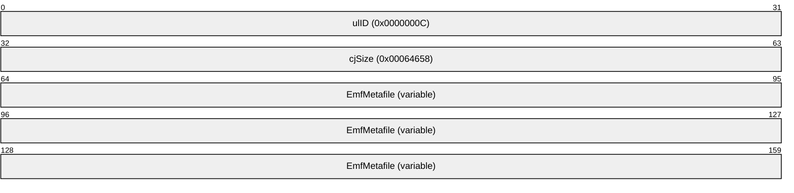

**ulID (4 bytes):** 0x0000000C identifies the EMRI_METAFILE_DATA record type ().

**cjSize (4 bytes):** 0x00064658 specifies the 4-byte-aligned size in bytes of the data in this record.

**EmfMetafile (variable):** A variable-size field that contains a complete [**EMF**](#gt_enhanced-metafile-format-emf) [**metafile**](#gt_metafile). This embedded metafile itself contains an embedded Font Definition Record (), the corresponding example of which is in section [3.2.2.20.1](#Section_3.2.2.20.1).

<a id="Section_3.2.2.1"></a>
#### 3.2.2.1 EMR_HEADER Example

This section provides an example of the [**EMF**](#gt_enhanced-metafile-format-emf) EMR_HEADER record ([MS-EMF](../MS-EMF/MS-EMF.md) section 2.3.4.2).

00000050: 01 00 00 00

00000060:84 00 00 00 67 01 00 00 3D 01 00 00 3B 04 00 00

00000070:4F 02 00 00 00 00 00 00 00 00 00 00 4C 4F 00 00

00000080:14 69 00 00 20 45 4D 46 00 00 01 00 58 46 06 00

00000090:23 00 00 00 02 00 00 00 0C 00 00 00 6C 00 00 00

000000a0:00 00 00 00 3F 0b 00 00 E9 0E 00 00 CB 00 00 00

000000b0:0D 01 00 00 00 00 00 00 00 00 00 00 00 00 00 00

000000c0:79 19 03 00 FF 1B 04 00 50 00 72 00 69 00 6E 00

000000d0:74 00 20 00 74 00 65 00 73 00 74 00 00 00 00 00

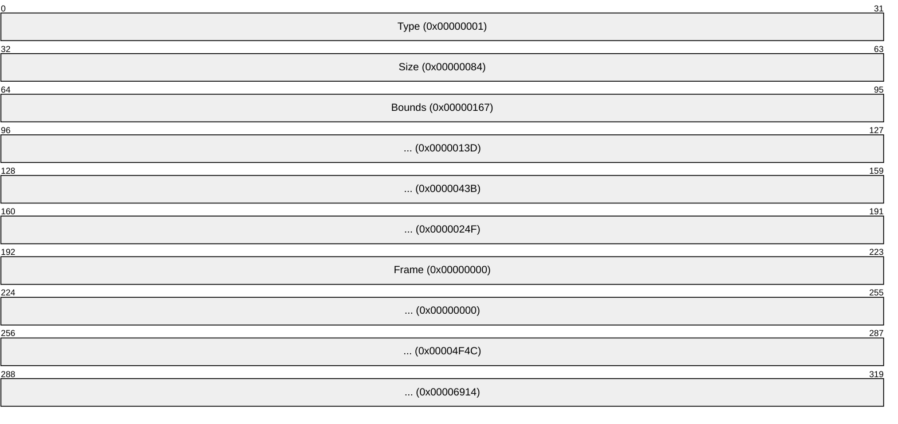

**Type (4 bytes):** 0x00000001 identifies this record type as EMR_HEADER.

**Size (4 bytes):** 0x00000084 specifies the record size in bytes.

**Bounds (16 bytes):** 0x00000167, 0x0000013D, 0x0000043B, 0x0000024F specifies the rectangular [**inclusive-inclusive**](#gt_inclusive-inclusive) bounds in [**device**](#gt_device) units of the smallest rectangle that can be drawn around the image stored in the [**metafile**](#gt_metafile).

**Frame (16 bytes):** 0x00000000, 0x00000000, 0x00004F4C, 0x00006914 specifies the rectangular inclusive-inclusive dimensions, in .01 millimeter units, of a rectangle that surrounds the image stored in the metafile.

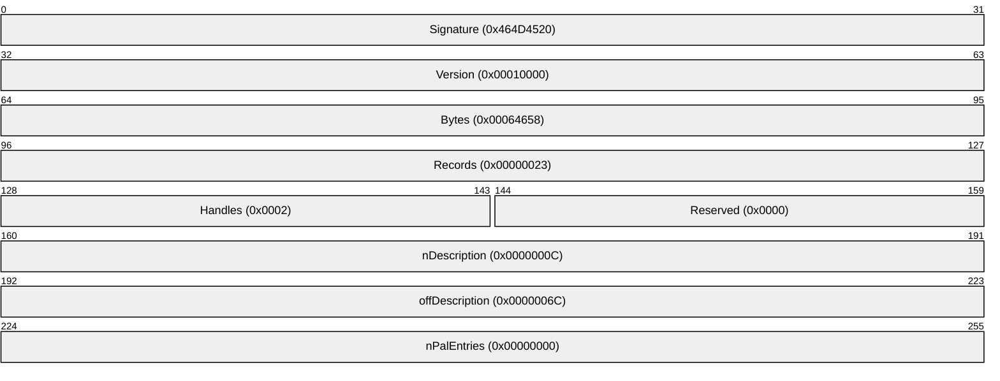

**Signature (4 bytes):** 0x464D4520 specifies the record signature, which consists of the [**ASCII**](#gt_ascii) string "EMF".

**Version (4 bytes):** 0x00010000 specifies EMF metafile interoperability.

**Bytes (4 bytes):** 0x00064658 specifies the size of the metafile in bytes.

**Records (4 bytes):** 0x00000023 specifies the number of records in the metafile.

**Handles (2 bytes):** 0x0002 specifies the number of indexes that will need to be defined during the processing of the metafile. These indexes correspond to graphics objects that are used in drawing commands. Index 0 is reserved for references to the metafile itself.

**Reserved (2 bytes):** 0x0000 is not used.

**nDescription (4 bytes):** 0x0000000C specifies the number of characters in the array that contains the description of the EMF metafile's contents.

**offDescription (4 bytes):** 0x0000006C specifies the offset from the beginning of this record to the array that contains the description of the EMF metafile's contents.

**nPalEntries (4 bytes):** 0x00000000 specifies the number of entries in the metafile palette. The location of the palette is specified in the EMR_EOF record ([MS-EMF] section 2.3.4.1).

```mermaid
packet-beta
  0-31: "Device (0x00000B3F)"
  32-63: "... (0x00000EE9)"
  64-95: "Millimeters (0x000000CB)"
  96-127: "... (0x0000010D)"
  128-159: "cbPixelFormat (0x00000000)"
  160-191: "offPixelFormat (0x00000000)"
  192-223: "bOpenGL (0x00000000)"
  224-255: "MicrometersX (0x00031979)"
  256-287: "MicrometersY (0x00041BFF)"
  288-319: "EmfDescription ("Print test")"
```

**Device (8 bytes):** 0x00000B3F, 0x00000EE9 specifies the size of the reference device in pixels.

**Millimeters (8 bytes):** 0x000000CB, 0x0000010D specifies the size of the reference device in millimeters.

**cbPixelFormat (4 bytes):** 0x00000000 specifies the size of the PixelFormatDescriptor structure ([MS-EMF] section 2.2.22). This value indicates that no pixel format is defined.

**offPixelFormat (4 bytes):** 0x00000000 specifies the offset to the PixelFormatDescriptor in the metafile. In this case, no pixel format structure is present.

**bOpenGL (4 bytes):** 0x00000000 specifies that no [**OpenGL**](#gt_opengl) commands are present in the metafile.

**MicrometersX (4 bytes):** 0x00031979 specifies the horizontal size of the reference device in micrometers.

**MicrometersY (4 bytes):** 0x00041BFF specifies the vertical size of the reference device in micrometers.

**EmfDescription (4 bytes):** "Print test".

<a id="Section_3.2.2.2"></a>
#### 3.2.2.2 EMR_SETICMMODE Example 1

This section provides an example of the [**EMF**](#gt_enhanced-metafile-format-emf) EMR_SETICMMODE record ([MS-EMF](../MS-EMF/MS-EMF.md) section 2.3.11.14).

000000E0:62 00 00 00 0C 00 00 00 02 00 00 00

```mermaid
packet-beta
  0-31: "Type (0x00000062)"
  32-63: "Size (0x0000000C)"
  64-95: "ICMMode (0x00000002)"
```

**Type (4 bytes):** 0x00000062 identifies this record type as EMR_SETICMMODE.

**Size (4 bytes):** 0x0000000C is the size of this record in bytes.

**ICMMode (4 bytes):** 0x00000002 is an [**Image Color Management (ICM)**](#gt_image-color-management-icm) mode value ([MS-EMF] section 2.1.18).

<a id="Section_3.2.2.3"></a>
#### 3.2.2.3 EMR_SELECTOBJECT Example 1

This section provides an example of the [**EMF**](#gt_enhanced-metafile-format-emf) EMR_SELECTOBJECT record, ([MS-EMF](../MS-EMF/MS-EMF.md) section 2.3.8.5).

000000E0: 25 00 00 00

000000F0:0C 00 00 00 07 00 00 80

```mermaid
packet-beta
  0-31: "Type (0x00000025)"
  32-63: "Size (0x0000000C)"
  64-95: "ihObject (0x80000007)"
```

**Type (4 bytes):** 0x00000025 identifies this record type as EMR_SELECTOBJECT.

**Size (4 bytes):** 0x0000000C is the size of this record in bytes.

**ihObject (4 bytes):** 0x80000007 is the index of a **BLACK_PEN** [**stock object**](#gt_stock-object) from ([MS-EMF] section 2.1.31).

<a id="Section_3.2.2.4"></a>
#### 3.2.2.4 EMR_SELECTOBJECT Example 2

This section provides an example of the [**EMF**](#gt_enhanced-metafile-format-emf) EMR_SELECTOBJECT record ([MS-EMF](../MS-EMF/MS-EMF.md) section 2.3.8.5).

000000F0: 25 00 00 00 0C 00 00 00

00000100: 00 00 00 80

```mermaid
packet-beta
  0-31: "Type (0x00000025)"
  32-63: "Size (0x0000000C)"
  64-95: "ihObject (0x80000000=WHITE_BRUSH)"
```

**Type (4 bytes):** 0x00000025 identifies this record type as EMR_SELECTOBJECT.

**Size (4 bytes):** 0x0000000C is the size of this record in bytes.

**ihObject (4 bytes):** 0x80000000 specifies the index of an object in the object table or the stock object if it is negative.

<a id="Section_3.2.2.5"></a>
#### 3.2.2.5 EMR_SELECTOBJECT Example 3

This section provides an example of the [**EMF**](#gt_enhanced-metafile-format-emf) EMR_SELECTOBJECT record ([MS-EMF](../MS-EMF/MS-EMF.md) section 2.3.8.5).

00000100: 25 00 00 00 0C 00 00 00 0E 00 00 80

```mermaid
packet-beta
  0-31: "Type (0x00000025)"
  32-63: "Size (0x0000000C)"
  64-95: "ihObject (0x8000000E=DEVICE_DEFAULT_FONT)"
```

**Type (4 bytes):** 0x00000025 identifies this record type as EMR_SELECTOBJECT.

**Size (4 bytes):** 0x0000000C is the size of this record in bytes.

**ihObject (4 bytes):** 0x8000000E specifies the index of an object in the object table or the stock object if it is negative.

<a id="Section_3.2.2.6"></a>
#### 3.2.2.6 EMR_MOVETOEX Example

This section provides an example of the [**EMF**](#gt_enhanced-metafile-format-emf) EMR_MOVETOEX record ([MS-EMF](../MS-EMF/MS-EMF.md) section 2.3.11.4).

00000110:1B 00 00 00 10 00 00 00 00 00 00 00 00 00 00 00

```mermaid
packet-beta
  0-31: "Type (0x0000001B)"
  32-63: "Size (0x00000010)"
  64-127: "Offset (0x0000000000000000)"
```

**Type (4 bytes):** 0x0000001B identifies this record type as EMR_MOVETOEX.

**Size (4 bytes):** 0x00000010 is the size of this record in bytes.

**Offset (8 bytes):** 0x0000000000000000 specifies the coordinates of the new current position in logical units.

<a id="Section_3.2.2.7"></a>
#### 3.2.2.7 EMR_SETBRUSHORGEX Example

This section provides an example of the [**EMF**](#gt_enhanced-metafile-format-emf) EMR_SETBRUSHORGEX record ([MS-EMF](../MS-EMF/MS-EMF.md) section 2.3.11.12).

00000120:0D 00 00 00 10 00 00 00 00 00 00 00 00 00 00 00

```mermaid
packet-beta
  0-31: "Type (0x0000000D)"
  32-63: "Size (0x00000010)"
  64-95: "Origin (0x00000000)"
  96-127: "... (0x00000000)"
```

**Type (4 bytes):** 0x0000000D identifies this record type as EMR_SETBRUSHORGEX.

**Size (4 bytes):** 0x00000010 is the size of this record in bytes.

**Origin (8 bytes):** 0x00000000, 0x00000000 defines the brush horizontal and vertical origin in [**device**](#gt_device) units.

<a id="Section_3.2.2.8"></a>
#### 3.2.2.8 EMR_SETICMMODE Example 2

This section provides an example of the [**EMF**](#gt_enhanced-metafile-format-emf) EMR_SETICMMODE record ([MS-EMF](../MS-EMF/MS-EMF.md) section 2.3.11.14).

00000130:62 00 00 00 0C 00 00 00 02 00 00 00

```mermaid
packet-beta
  0-31: "Type (0x00000062)"
  32-63: "Size (0x0000000C)"
  64-95: "ICMMode (0x00000002)"
```

**Type (4 bytes):** 0x00000062 identifies this record type as EMR_SETICMMODE.

**Size (4 bytes):** 0x0000000C is the size of this record in bytes.

**ICMMode (4 bytes):** 0x00000002 is an [**Image Color Management (ICM)**](#gt_image-color-management-icm) mode value ([MS-EMF] section 2.1.18).

<a id="Section_3.2.2.9"></a>
#### 3.2.2.9 EMR_SETCOLORSPACE Example

This section provides an example of the [**EMF**](#gt_enhanced-metafile-format-emf) EMR_SETCOLORSPACE record ([MS-EMF](../MS-EMF/MS-EMF.md) section 2.3.8.7).

00000130: 64 00 00 00

00000140:0C 00 00 00 14 00 00 80

```mermaid
packet-beta
  0-31: "Type (0x00000064)"
  32-63: "Size (0x0000000C)"
  64-95: "ihCS (0x80000014)"
```

**Type (4 bytes):** 0x00000064 identifies this record type as EMR_SETCOLORSPACE.

**Size (4 bytes):** 0x0000000C is the size of this record in bytes.

**ihCS (4 bytes):** 0x80000014 specifies the **ColorSpace** ([MS-EMF] section 2.1.7).

<a id="Section_3.2.2.10"></a>
#### 3.2.2.10 EMR_SETTEXTALIGN Example 1

This section provides an example of an [**EMF**](#gt_enhanced-metafile-format-emf) EMR_SETTEXTALIGN record ([MS-EMF](../MS-EMF/MS-EMF.md) section 2.3.11.25).

00000140: 16 00 00 00 0C 00 00 00

00000150:18 00 00 00

```mermaid
packet-beta
  0-31: "Type (0x00000016)"
  32-63: "Size (0x0000000C)"
  64-95: "TextAlignmentMode (0x00000018)"
```

**Type (4 bytes):** 0x00000016 identifies the record type as EMR_SETTEXTALIGN.

**Size (4 bytes):** 0x0000000C is the size of this record in bytes.

**TextAlignmentMode (4 bytes):** 0x00000018 specifies the text alignment mode by using TextAlignmentMode Flags ([MS-WMF](../MS-WMF/MS-WMF.md) section 2.1.2.3).

<a id="Section_3.2.2.11"></a>
#### 3.2.2.11 EMR_SELECTOBJECT Example 4

This section provides an example of the [**EMF**](#gt_enhanced-metafile-format-emf) EMR_SELECTOBJECT record ([MS-EMF](../MS-EMF/MS-EMF.md) section 2.3.8.5).

00000150: 25 00 00 00 0C 00 00 00 0E 00 00 80

```mermaid
packet-beta
  0-31: "Type (0x00000025)"
  32-63: "Size (0x0000000C)"
  64-95: "ihObject (0x8000000E=DEVICE_DEFAULT_FONT)"
```

**Type (4 bytes):** 0x00000025 identifies this record type as EMR_SELECTOBJECT.

**Size (4 bytes):** 0x0000000C is the size of this record in bytes.

**ihObject (4 bytes):** 0x8000000E specifies the index of an object in the object table or stock object to be selected.

<a id="Section_3.2.2.12"></a>
#### 3.2.2.12 EMR_SETTEXTALIGN Example 2

This section provides an example of the [**EMF**](#gt_enhanced-metafile-format-emf) EMR_SETTEXTALIGN record ([MS-EMF](../MS-EMF/MS-EMF.md) section 2.3.11.25).

00000160:16 00 00 00 0C 00 00 00 18 00 00 00

```mermaid
packet-beta
  0-31: "Type (0x00000016)"
  32-63: "Size (0x0000000C)"
  64-95: "TextAlignmentMode (0x00000018)"
```

**Type (4 bytes):** 0x00000016 identifies the record type as EMR_SETTEXTALIGN.

**Size (4 bytes):** 0x0000000C is the size of this record in bytes.

**TextAlignmentMode (4 bytes):** 0x00000018 specifies the text alignment mode by using TextAlignmentMode Flags ([MS-WMF](../MS-WMF/MS-WMF.md) section 2.1.2.3).

<a id="Section_3.2.2.13"></a>
#### 3.2.2.13 EMR_SETBKMODE Example 1

This section provides an example of the [**EMF**](#gt_enhanced-metafile-format-emf) EMR_SETBKMODE record ([MS-EMF](../MS-EMF/MS-EMF.md) section 2.3.11.11).

00000160: 12 00 00 00

00000170:0C 00 00 00 01 00 00 00

```mermaid
packet-beta
  0-31: "Type (0x00000012)"
  32-63: "Size (0x0000000C)"
  64-95: "BackgroundMode (0x00000001)"
```

**Type (4 bytes):** 0x00000012 identifies this record type as EMR_SETBKMODE.

**Size (4 bytes):** 0x0000000C is the size of this record in bytes.

**BackgroundMode (4 bytes):** 0x00000001 specifies background mode.

<a id="Section_3.2.2.14"></a>
#### 3.2.2.14 EMR_SETVIEWPORTORGEX Example

This section provides an example of the [**EMF**](#gt_enhanced-metafile-format-emf) EMR_SETVIEWPORTORGEX record ([MS-EMF](../MS-EMF/MS-EMF.md) section 2.3.11.29).

00000170: 0C 00 00 00 10 00 00 00

00000180:00 00 00 00 00 00 00 00

```mermaid
packet-beta
  0-31: "Type (0x0000000C)"
  32-63: "Size (0x00000010)"
  64-95: "Origin (0x00000000)"
  96-127: "... (0x00000000)"
```

**Type (4 bytes):** 0x0000000C identifies this record type as EMR_SETVIEWPORTORGEX.

**Size (4 bytes):** 0x00000010 is the size of this record in bytes.

**Origin (8 bytes):** 0x00000000, 0x00000000 specifies the viewport horizontal and vertical origin in [**device**](#gt_device) units.

<a id="Section_3.2.2.15"></a>
#### 3.2.2.15 EMR_SETBKMODE Example 2

This section provides an example of the [**EMF**](#gt_enhanced-metafile-format-emf) EMR_SETBKMODE record ([MS-EMF](../MS-EMF/MS-EMF.md) section 2.3.11.11).

00000180: 12 00 00 00 0C 00 00 00

00000190:01 00 00 00

```mermaid
packet-beta
  0-31: "Type (0x00000012)"
  32-63: "Size (0x0000000C)"
  64-95: "BackgroundMode (0x00000001)"
```

**Type (4 bytes):** 0x00000012 identifies this record type as EMR_SETBKMODE.

**Size (4 bytes):** 0x0000000C is the size of this record in bytes.

**BackgroundMode (4 bytes):** 0x00000001 specifies background mode.

<a id="Section_3.2.2.16"></a>
#### 3.2.2.16 EMR_EXTCREATEFONTINDIRECTW Example

This section provides an example of an [**EMF**](#gt_enhanced-metafile-format-emf) EMR_EXTCREATEFONTINDIRECTW record ([MS-EMF](../MS-EMF/MS-EMF.md) section 2.3.7.8).

00000190: 52 00 00 00 70 01 00 00 01 00 00 00

000001A0:C4 FF FF FF 00 00 00 00 00 00 00 00 00 00 00 00

000001B0:90 01 00 00 00 00 00 00 07 40 00 12 54 00 69 00

000001C0:6D 00 65 00 73 00 20 00 4E 00 65 00 77 00 20 00

000001D0:52 00 6F 00 6D 00 61 00 6E 00 00 00 00 00 00 00

000001E0:00 00 00 00 00 00 00 00 00 00 00 00 00 00 00 00

000001F0:00 00 00 00 00 00 00 00 00 00 00 00 00 00 20 00

00000200:08 5A 18 00 24 A8 56 07 D0 EE 7D 07 C4 F0 7D 07

00000210:37 A4 07 30 90 00 B7 00 B8 1A E2 01 00 00 00 00

00000220:00 00 00 00 B8 1A E2 01 6F EC EE 94 D4 A5 07 30

00000230:48 F1 7D 07 40 F8 A9 30 84 F8 A9 30 78 A3 07 30

00000240:28 48 24 00 01 00 00 00 02 00 00 00 50 EE 7D 07

00000250:54 EE 7D 07 AC 1E 24 00 00 90 FD 7F 00 90 FD 7F

00000260:00 00 B9 6E B8 00 B9 6E 18 EE 7D 07 00 00 B9 6E

00000270:50 EE 7D 07 14 00 00 00 01 00 00 00 00 00 00 00

00000280:00 00 00 00 00 00 00 00 47 16 90 01 00 00 00 00

00000290:00 00 00 00 00 00 00 00 87 3A 00 20 00 00 00 00

000002A0:00 00 00 00 00 00 00 00 FF 01 00 00 00 00 00 00

000002B0:54 00 69 00 6D 00 65 00 73 00 20 00 00 00 65 00

000002C0:77 00 20 00 52 00 6F 00 6D 00 61 00 6E 00 00 00

000002D0:00 00 00 00 00 00 00 00 00 00 00 00 00 00 00 00

000002E0:00 00 00 00 00 00 00 00 F0 EE 7D 07 5A B0 02 30

000002F0:F0 EE 7D 07 8C 63 AB 30 08 EF 7D 07 64 76 00 08

00000300:00 00 00 00

```mermaid
packet-beta
  0-31: "Type (0x00000052)"
  32-63: "Size (0x00000170)"
  64-95: "ihFonts (0x00000001)"
  96-223: "elw (360 bytes)"
```

**Type (4 bytes):** 0x00000052 identifies the record type as EMR_EXTCREATEFONTINDIRECTW.

**Size (4 bytes):** 0x00000170 specifies the size of this record in bytes.

**ihFonts (4 bytes):** 0x00000001 specifies the object index in the EMF Object Table ([MS-EMF] section 3.1.1) to assign to the font.

**elw (360 bytes):** To determine the type of logical font object in this field, an algorithm ([MS-EMF] section 2.3.7.8) is applied, which indicates that this is an LogFontExDv object ([MS-EMF] section 2.2.15).

```mermaid
packet-beta
  0-31: "Height (0xFFFFFFC4)"
  32-63: "Width (0x00000000)"
  64-95: "Escapement (0x00000000)"
  96-127: "Orientation (0x00000000)"
  128-159: "Weight (0x000000190)"
  160-167: "Italic (0x00)"
  168-175: "Underline (0x00)"
  176-183: "StrikeOut (0x00)"
  184-191: "CharSet (0x00)"
  192-199: "OutPrecision (0x07)"
  200-207: "ClipPrecision (0x40)"
  208-215: "Quality (0x00)"
  216-223: "PitchAndFamily (0x12)"
  224-351: "Facename ("Times New Roman") (68 bytes)"
```

**Height (4 bytes):** 0xFFFFFFC4 has an absolute value of 60, which specifies the character height for this font in logical units.

**Width (4 bytes):** 0x00000000 specifies a computed font width. The aspect ratio of the [**device**](#gt_device) is matched against the digitization aspect ratio of the font to find the closest match, determined by the absolute value of the difference.

**Escapement (4 bytes):** 0x00000000 specifies an angle of 0 degrees between the baseline of a row of text and the x-axis of the device.

**Orientation (4 bytes):** 0x00000000 specifies an angle of 0 degrees between each character's baseline and the x-axis of the device.

**Weight (4 bytes):** 0x000000190 specifies that the [**weight**](#gt_weight) of the font is 400, in the range 0 through 1000, from lightest to darkest, with 400 (0x00000190) considered normal.

**Italic (1 byte):** 0x00 specifies that the font is not italic.

**Underline (1 byte):** 0x00 specifies that the font is not underlined.

**StrikeOut (1 byte):** 0x00 specifies that the font characters do not have a strike-out graphic.

**CharSet (1 byte):** 0x00 specifies the **ANSI_CHARSET**, as defined in the CharacterSet enumeration ([MS-WMF](../MS-WMF/MS-WMF.md) section 2.1.1.5).

**OutPrecision (1 byte):** 0x07 specifies the output precision, which is how closely the output matches the requested font properties, from the OutPrecision enumeration ([MS-WMF] section 2.1.1.21). The value 0x07 specifies that the [**font mapper**](#gt_font-mapper) choose a [**TrueType**](#gt_truetype) font.

**ClipPrecision (1 byte):** 0x40 specifies the clipping precision, which is how to clip characters that are partially outside the clipping [**region**](#gt_region), from the ClipPrecision flags ([MS-WMF] section 2.1.2.1). The value 0x40 specifies that [**font association**](#gt_font-association) be turned off.

**Quality (1 byte):** 0x00 specifies default output quality, from the FontQuality enumeration ([MS-WMF] section 2.1.1.10).

**PitchAndFamily (1 byte):** 0x12 specifies a variable-pitch font with serifs, from the FamilyFont and PitchFont enumerations ([MS-WMF] sections 2.1.1.8 and 2.1.1.24, respectively).

**Facename (68 bytes):** "Times New Roman" specifies the [**typeface**](#gt_typeface) name of the font in [**Unicode**](#gt_unicode) characters.

```mermaid
packet-beta
  0-127: "FullName ("") (132 bytes)"
  128-255: "Style ("") (68 bytes)"
  256-383: "Script ("") (68 bytes)"
  384-415: "Signature (0x80007664)"
  416-447: "NumAxes (0x00000000)"
```

**FullName (132 bytes):** An empty string specifies the font's full name.

**Style (68 bytes):** An empty string describes the font's style.

**Script (68 bytes):** An empty string describes the font's character set.

**Signature (4 bytes):** 0x80007664 specifies the signature of an DesignVector object ([MS-EMF] section 2.2.3).

**NumAxes (4 bytes):** 0x00000000 specifies the number of [**font axes**](#gt_5d727201-0a47-44b1-86e5-faf77f0f2463) described in the DesignVector object.

<a id="Section_3.2.2.17"></a>
#### 3.2.2.17 EMR_SELECTOBJECT Example 5

This section provides an example of the [**EMF**](#gt_enhanced-metafile-format-emf) EMR_SELECTOBJECT record ([MS-EMF](../MS-EMF/MS-EMF.md) section 2.3.8.5).

00000300: 25 00 00 00 0C 00 00 00 01 00 00 00

```mermaid
packet-beta
  0-31: "Type (0x00000025)"
  32-63: "Size (0x0000000C)"
  64-95: "ihObject (0x00000001)"
```

**Type (4 bytes):** 0x00000025 identifies this record type as EMR_SELECTOBJECT.

**Size (4 bytes):** 0x0000000C is the size of this record in bytes.

**ihObject (4 bytes):** 0x00000001 specifies the index of an object in the object table or stock object to be selected.

<a id="Section_3.2.2.18"></a>
#### 3.2.2.18 EMR_SETTEXTCOLOR Example

This section provides an example of the [**EMF**](#gt_enhanced-metafile-format-emf) EMR_SETTEXTCOLOR record ([MS-EMF](../MS-EMF/MS-EMF.md) section 2.3.11.26).

00000310:18 00 00 00 0C 00 00 00 00 00 00 02

```mermaid
packet-beta
  0-31: "Type (0x00000018)"
  32-63: "Size (0x0000000C)"
  64-95: "Color (0x02000000)"
```

**Type (4 bytes):** 0x00000018 identifies this record type as EMR_SETTEXTCOLOR.

**Size (4 bytes):** 0x0000000C is the size of this record in bytes.

**Color (4 bytes):** 0x02000000 specifies the text color value.

<a id="Section_3.2.2.19"></a>
#### 3.2.2.19 EMR_FORCEUFIMAPPING Example

This section provides an example of the [**EMF**](#gt_enhanced-metafile-format-emf) EMR_FORCEUFIMAPPING record ([MS-EMF](../MS-EMF/MS-EMF.md) section 2.3.11.2).

00000310: 6D 00 00 00

00000320:10 00 00 00 DF A6 A0 78 01 00 00 00

```mermaid
packet-beta
  0-31: "Type (0x0000006D)"
  32-63: "Size (0x00000010)"
  64-95: "ufi (0x78A0A6DF)"
  96-127: "... (0x00000001)"
```

**Type (4 bytes):** 0x0000006D identifies this record type as EMR_FORCEUFIMAPPING.

**Size (4 bytes):** 0x00000010 is the size of this record in bytes.

**ufi (4 bytes):** 0x78A0A6DF, 0x00000001 specifies the font ID to use. This consists of a 32-bit checksum (0x78A0A6DF) followed by a 32-bit index (0x00000001).

<a id="Section_3.2.2.20"></a>
#### 3.2.2.20 EMR_COMMENT_EMFSPOOL Example

This section provides an example of the [**EMF**](#gt_enhanced-metafile-format-emf) EMR_COMMENT_EMFSPOOL record ([MS-EMF](../MS-EMF/MS-EMF.md) section 2.3.3.3).

00000320: 46 00 00 00

00000330:ec 3e 06 00 e0 3e 06 00 00 00 00 00 46 4e 4f 54

```mermaid
packet-beta
  0-31: "Type (0x00000046)"
  32-63: "Size (0x00063EEC)"
  64-95: "DataSize (0x00063EE0)"
  96-127: "Identifier (0x00000000)"
  128-159: "RecordSignature (0x544F4E46)"
  160-255: "EMFSpoolFontDefinitionData (variable)"
```

**Type (4 bytes):** 0x00000046 identifies this record type as an EMR_COMMENT record ([MS-EMF] section 2.3.3).

**Size (4 bytes):** 0x00063EEC is the size in bytes of this entire record.

**DataSize (4 bytes):** 0x00063EE0 specifies the size in bytes of the data that follows, including the embedded EMRI_ENGINE_FONT (section [2.2.3.3.1](#Section_2.2.3.3.1)) record.

**Identifier (4 bytes):** 0x00000000 identifies this EMR_COMMENT record type as EMR_COMMENT_EMFSPOOL.

**RecordSignature (4 bytes):** 0x544F4E46 ("TONF") identifies this EMR_COMMENT_EMFSPOOL record as one that contains embedded [**EMF spool format**](#gt_enhanced-metafile-spool-format-emfspool) font definition data.

**EMFSpoolFontDefinitionData (variable):** A **DataSize** length array of bytes that contains the data.

<a id="Section_3.2.2.20.1"></a>
##### 3.2.2.20.1 EMRI_ENGINE_FONT Example

This section provides an example of an EMRI_ENGINE_FONT font definition record (section [2.2.3.3.1](#Section_2.2.3.3.1)).

00000340:02 00 00 00 d0 3e 06 00 00 00 00 00 01 00 00 00

00000350:c0 3e 06 00 00 00 00 00

```mermaid
packet-beta
  0-31: "ulID (0x00000002)"
  32-63: "cjSize (00063ED0)"
  64-95: "Type1ID (0x00000000)"
  96-127: "NumFiles (0x00000001)"
  128-159: "FileSizes (0x00063EC0)"
  160-191: "AlignBuffer (0x00000000)"
  192-287: "FileContent (variable)"
```

**ulID (4 bytes):** 0x00000002 identifies the type of record as an [**EMFSPOOL**](#gt_enhanced-metafile-spool-format-emfspool) **EMRI_ENGINE_FONT** font definition record.

**cjSize (4 bytes):** 00063ED0 specifies the size, in bytes, of the data attached to the record, rounded up to a multiple of 4 bytes.

**Type1ID (4 bytes):** 0x00000000 identifies the font format as [**TrueType**](#gt_truetype).

**NumFiles (4 bytes):** 0x00000001 specifies the number of font files embedded within this record.

**FileSizes (4 bytes):** 0x00063EC0 specifies the sizes of the files attached within this record.

**AlignBuffer (4 bytes):** 0x00000000 specifies the number of bytes to skip to make the data that follows 64-bit aligned.

**FileContent (variable):** The actual bits of the fonts, each 32-bit aligned, in TrueType format.

<a id="Section_3.2.2.21"></a>
#### 3.2.2.21 EMR_EXTTEXTOUTW Example 1

This section provides an example of an [**EMF**](#gt_enhanced-metafile-format-emf) EMR_EXTTEXTOUTW record ([MS-EMF](../MS-EMF/MS-EMF.md) section 2.3.5.8).

00064210: 54 00 00 00 A8 00 00 00

00064220:67 01 00 00 3d 01 00 00 C4 02 00 00 80 01 00 00

00064230:01 00 00 00 47 A2 E1 40 76 84 E1 40 67 01 00 00

00064240:73 01 00 00 0F 00 00 00 4C 00 00 00 04 10 00 00

00064250:00 00 00 00 00 00 00 00 F4 0b 00 00 78 0F 00 00

00064260:6C 00 00 00 54 00 68 00 69 00 73 00 20 00 69 00

00064270:73 00 20 00 70 00 61 00 67 00 65 00 20 00 31 00

00064280:2E 00 00 00 25 00 00 00 1E 00 00 00 11 00 00 00

00064290:17 00 00 00 0F 00 00 00 11 00 00 00 17 00 00 00

000642a0:0F 00 00 00 1E 00 00 00 1B 00 00 00 1D 00 00 00

000642b0:1B 00 00 00 0F 00 00 00 1E 00 00 00 0F 00 00 00

```mermaid
packet-beta
  0-31: "Type (0x00000054)"
  32-63: "Size (0x000000A8)"
  64-95: "Bounds (0x00000167)"
  96-127: "... (0x0000013D)"
  128-159: "... (0x000002C4)"
  160-191: "... (0x00000180)"
  192-223: "iGraphicsMode (0x00000001)"
  224-255: "exScale (0x40E1A247)"
  256-287: "eyScale (0x40E18476)"
  288-383: "EmrText (variable)"
```

**Type (4 bytes):** 0x00000054 identifies the record type as EMR_EXTTEXTOUTW.

**Size (4 bytes):** 0x000000A8 is the size of this record in bytes.

**Bounds (16 bytes):** 0x00000167, 0x0000013D, 0x000002C4, 0x00000180 values are not used.

**iGraphicsMode (4 bytes):** 0x00000001 specifies the **GM_COMPATIBLE** graphics mode ([MS-EMF] section 2.1.16).

**exScale (4 bytes):** 0x40E1A247 specifies the X scale from Page units to .01mm units if the graphics mode is **GM_COMPATIBLE**.

**eyScale (4 bytes):** 0x40E18476 specifies the Y scales from Page units to .01mm units if the graphics mode is **GM_COMPATIBLE**.

**EmrText (variable):** An EmrText object ([MS-EMF] section 2.2.5). This is followed by strings and spacing arrays.

```mermaid
packet-beta
  0-31: "Reference (0x00000167)"
  32-63: "... (0x00000173)"
  64-95: "Chars (0x0000000F)"
  96-127: "offString (0x0000004C)"
  128-159: "Options (0x00001004)"
  160-191: "Rectangle (0x00000000)"
  192-223: "... (0x00000000)"
  224-255: "... (0x00000BF4)"
  256-287: "... (0x00000F78)"
  288-319: "offDx (0x0000006C)"
  320-351: "text ("This is page 1.")"
```

**Reference (8 bytes):** 0x00000167, 0x00000173 specifies the coordinates of the reference point used to position the string.

**Chars (4 bytes):** 0x0000000F specifies the number of characters in the string.

**offString (4 bytes):** 0x0000004C specifies the offset to the string.

**Options (4 bytes):** 0x00001004 indicates that the rectangle defined in the **Rectangle** field is used for clipping ([MS-EMF] section 2.1.11).

**Rectangle (16 bytes):** 0x00000000, 0x00000000, 0x00000BF4, 0x00000F78 defines the clipping rectangle in logical units.

**offDx (4 bytes):** 0x0000006C specifies the offset to the intercharacter spacing array.

**text (4 bytes):** "This is page 1.".

<a id="Section_3.2.2.22"></a>
#### 3.2.2.22 EMR_EXTTEXTOUTW Example 2

This section provides an example of an [**EMF**](#gt_enhanced-metafile-format-emf) EMR_EXTTEXTOUTW record ([MS-EMF](../MS-EMF/MS-EMF.md) section 2.3.5.8).

000642C0:54 00 00 00 54 00 00 00 C5 02 00 00 3D 01 00 00

000642D0:DF 02 00 00 80 01 00 00 01 00 00 00 47 A2 E1 40

000642E0:76 84 E1 40 C5 02 00 00 73 01 00 00 01 00 00 00

000642F0:4C 00 00 00 04 10 00 00 00 00 00 00 00 00 00 00

00064300:F4 0B 00 00 78 0F 00 00 50 00 00 00 20 00 00 00

00064310:1B 00 00 00

```mermaid
packet-beta
  0-31: "Type (0x00000054)"
  32-63: "Size (0x00000005)"
  64-95: "Bounds (0x000002C5)"
  96-127: "... (0x0000013D)"
  128-159: "... (0x000002DF)"
  160-191: "... (0x00000180)"
  192-223: "iGraphicsMode (0x00000001)"
  224-255: "exScale (0x40E1A247)"
  256-287: "eyScale (0x40E18476)"
  288-383: "EmrText (variable)"
```

**Type (4 bytes):** 0x00000054 identifies the record type as EMR_EXTTEXTOUTW.

**Size (4 bytes):** 0x00000005 is the size of this record in bytes.

**Bounds (16 bytes):** 0x000002C5, 0x0000013D, 0x000002DF, 0x00000180 values are not used.

**iGraphicsMode (4 bytes):** 0x00000001 specifies the **GM_COMPATIBLE** graphics mode ([MS-EMF] section 2.1.16).

**exScale (4 bytes):** 0x40E1A247 specifies the X scale from page units to .01 mm units if the graphics mode is **GM_COMPATIBLE**.

**eyScale (4 bytes):** 0x40E18476 specifies the Y scale from Page units to .01 mm units if the graphics mode is **GM_COMPATIBLE**.

**EmrText (variable):** An EmrText object ([MS-EMF] section 2.2.5). This is followed by strings and spacing arrays.

```mermaid
packet-beta
  0-31: "Reference (0x000002C5)"
  32-63: "... (0x00000173)"
  64-95: "Chars (0x00000001)"
  96-127: "offString (0x0000004C)"
  128-159: "Options (0x00001004)"
  160-191: "Rectangle (0x00000000)"
  192-223: "... (0x00000000)"
  224-255: "... (0x00000BF4)"
  256-287: "... (0x00000F78)"
  288-319: "offDx (0x00000050)"
  320-351: "text (" ")"
```

**Reference (8 bytes):** 0x000002C5, 0x00000173 specifies the coordinates of the reference point used to position the string.

**Chars (4 bytes):** 0x00000001 specifies the number of characters in the string.

**offString (4 bytes):** 0x0000004C specifies the offset to the string.

**Options (4 bytes):** 0x00001004 indicates that the rectangle defined in the **Rectangle** field is used for clipping ([MS-EMF] section 2.1.11).

**Rectangle (16 bytes):** 0x00000000, 0x00000000, 0x00000BF4, 0x00000F78 defines the clipping rectangle in logical units.

**offDx (4 bytes):** 0x00000050 specifies the offset to the intercharacter spacing array.

**text (4 bytes):** " ".

<a id="Section_3.2.2.23"></a>
#### 3.2.2.23 EMR_SETBKMODE Example 3

This section provides an example of the [**EMF**](#gt_enhanced-metafile-format-emf) EMR_SETBKMODE record ([MS-EMF](../MS-EMF/MS-EMF.md) section 2.3.11.11).

00064310: 12 00 00 00 0C 00 00 00 01 00 00 00

```mermaid
packet-beta
  0-31: "Type (0x00000012)"
  32-63: "Size (0x0000000C)"
  64-95: "Mode (0x00000001)"
```

**Type (4 bytes):** 0x00000012 identifies this record type as EMR_SETBKMODE.

**Size (4 bytes):** 0x0000000C is the size of this record in bytes.

**Mode (4 bytes):** 0x00000001 specifies the background color value.

<a id="Section_3.2.2.24"></a>
#### 3.2.2.24 EMR_EXTTEXTOUTW Example 3

This section provides an example of an [**EMF**](#gt_enhanced-metafile-format-emf) EMR_EXTTEXTOUTW record ([MS-EMF](../MS-EMF/MS-EMF.md) section 2.3.5.8).

00064320:54 00 00 00 B4 00 00 00 67 01 00 00 82 01 00 00

00064330:D9 02 00 00 C5 01 00 00 01 00 00 00 47 A2 E1 40

00064340:76 84 E1 40 67 01 00 00 B8 01 00 00 11 00 00 00

00064350:4C 00 00 00 04 10 00 00 00 00 00 00 00 00 00 00

00064360:F4 0B 00 00 78 0F 00 00 70 00 00 00 50 00 61 00

00064370:67 00 65 00 20 00 31 00 20 00 69 00 73 00 20 00

00064380:6C 00 65 00 74 00 74 00 65 00 72 00 2E 00 00 00

00064390:21 00 00 00 1B 00 00 00 1D 00 00 00 1B 00 00 00

000643a0:0F 00 00 00 1E 00 00 00 0F 00 00 00 11 00 00 00

000643b0:17 00 00 00 0F 00 00 00 11 00 00 00 1B 00 00 00

000643c0:11 00 00 00 11 00 00 00 1B 00 00 00 14 00 00 00

000643d0:0F 00 00 00

```mermaid
packet-beta
  0-31: "Type (0x00000054)"
  32-63: "Size (0x000000B4)"
  64-95: "Bounds (0x00000167)"
  96-127: "... (0x00000182)"
  128-159: "... (0x000002D9)"
  160-191: "... (0x000001C5)"
  192-223: "iGraphicsMode (0x00000001)"
  224-255: "exScale (0x40E1A247)"
  256-287: "eyScale (0x40E18476)"
  288-383: "EmrText (variable)"
```

**Type (4 bytes):** 0x00000054 identifies the record type as EMR_EXTTEXTOUTW.

**Size (4 bytes):** 0x000000B4 is the size of this record in bytes.

**Bounds (16 bytes):** 0x00000167, 0x00000182, 0x000002D9, 0x000001C5 values are not used.

**iGraphicsMode (4 bytes):** 0x00000001 specifies the **GM_COMPATIBLE** graphics mode ([MS-EMF] section 2.1.16).

**exScale (4 bytes):** 0x40E1A247 specifies the X scale from Page units to .01mm units if the graphics mode is **GM_COMPATIBLE**.

**eyScale (4 bytes):** 0x40E18476 specifies the Y scales from Page units to .01mm units if the graphics mode is **GM_COMPATIBLE**.

**EmrText (variable):** An EmrText object ([MS-EMF] section 2.2.5). This is followed by strings and spacing arrays.

```mermaid
packet-beta
  0-31: "Reference (0x00000167)"
  32-63: "... (0x000001B8)"
  64-95: "Chars (0x00000011)"
  96-127: "offString (0x0000004C)"
  128-159: "Options (0x00001004)"
  160-191: "Rectangle (0x00000000)"
  192-223: "... (0x00000000)"
  224-255: "... (0x00000BF4)"
  256-287: "... (0x00000F78)"
  288-319: "offDx (0x00000070)"
  320-351: "text ("Page 1 is letter.")"
```

**Reference (8 bytes):** 0x00000167, 0x000001B8 specifies the coordinates of the reference point used to position the string.

**Chars (4 bytes):** 0x00000011 specifies the number of characters in the string.

**offString (4 bytes):** 0x0000004C specifies the offset to the string.

**Options (4 bytes):** 0x00001004 indicates that the rectangle defined in the **Rectangle** field is used for clipping ([MS-EMF] section 2.1.11).

**Rectangle (16 bytes):** 0x00000000, 0x00000000, 0x00000BF4, 0x0x00000F78 defines the clipping rectangle in logical units.

**offDx (4 bytes):** 0x00000070 specifies the offset to intercharacter spacing array.

**text (4 bytes):** "Page 1 is letter.".

<a id="Section_3.2.2.25"></a>
#### 3.2.2.25 EMR_EXTTEXTOUTW Example 4

This section provides an example of an [**EMF**](#gt_enhanced-metafile-format-emf) EMR_EXTTEXTOUTW record ([MS-EMF](../MS-EMF/MS-EMF.md) section 2.3.5.8).

000643D0: 54 00 00 00 54 00 00 00 DA 02 00 00

000643E0:82 01 00 00 F3 02 00 00 C5 01 00 00 01 00 00 00

000643F0:47 A2 E1 40 76 84 E1 40 DA 02 00 00 B8 01 00 00

00064400:01 00 00 00 4C 00 00 00 04 10 00 00 00 00 00 00

00064410:00 00 00 00 F4 0b 00 00 78 0F 00 00 50 00 00 00

00064420:20 00 00 00 1A 00 00 00

```mermaid
packet-beta
  0-31: "Type (0x00000054)"
  32-63: "Size (0x00000054)"
  64-95: "Bounds (0x000002DA)"
  96-127: "... (0x00000182)"
  128-159: "... (0x000002F3)"
  160-191: "... (0x000001C5)"
  192-223: "iGraphicsMode (0x00000001)"
  224-255: "exScale (0x40E1A247)"
  256-287: "eyScale (0x40E18476)"
  288-383: "EmrText (variable)"
```

**Type (4 bytes):** 0x00000054 identifies the record type as EMR_EXTTEXTOUTW.

**Size (4 bytes):** 0x00000054 is the size of this record in bytes.

**Bounds (16 bytes):** 0x000002DA, 0x00000182, 0x000002F3, 0x000001C5 values are not used.

**iGraphicsMode (4 bytes):** 0x00000001 specifies the **GM_COMPATIBLE** graphics mode ([MS-EMF] section 2.1.16).

**exScale (4 bytes):** 0x40E1A247 specifies the X scale from Page units to .01mm units if the graphics mode is **GM_COMPATIBLE**.

**eyScale (4 bytes):** 0x40E18476 specifies the Y scales from Page units to .01mm units if the graphics mode is **GM_COMPATIBLE**.

**EmrText (variable):** An EmrText object ([MS-EMF] section 2.2.5). This is followed by strings and spacing arrays.

```mermaid
packet-beta
  0-31: "Reference (0x000002DA)"
  32-63: "... (0x000001B8)"
  64-95: "Chars (0x00000001)"
  96-127: "offString (0x0000004C)"
  128-159: "Options (0x00001004)"
  160-191: "Rectangle (0x00000000)"
  192-223: "... (0x00000000)"
  224-255: "... (0x00000BF4)"
  256-287: "... (0x00000F78)"
  288-319: "offDx (0x00000050)"
  320-351: "text (" ")"
```

**Reference (8 bytes):** 0x000002DA, 0x000001B8 specifies the coordinates of the reference point used to position the string.

**Chars (4 bytes):** 0x00000001 specifies the number of characters in the string.

**offString (4 bytes):** 0x0000004C specifies the offset to the string.

**Options (4 bytes):** 0x00001004 indicates that the rectangle defined in the **Rectangle** field is used for clipping ([MS-EMF] section 2.1.11).

**Rectangle (16 bytes):** 0x00000000, 0x00000000, 0x0000BF4, 0x00000F78 defines the clipping rectangle in logical units.

**offDx (4 bytes):** 0x00000050 specifies the offset to the intercharacter spacing array.

**text (4 bytes):** " ".

<a id="Section_3.2.2.26"></a>
#### 3.2.2.26 EMR_SETBKMODE Example 4

This section provides an example of the [**EMF**](#gt_enhanced-metafile-format-emf) EMR_SETBKMODE record ([MS-EMF](../MS-EMF/MS-EMF.md) section 2.3.11.11).

00064420: 12 00 00 00 0C 00 00 00

00064430:01 00 00 00

```mermaid
packet-beta
  0-31: "Type (0x00000012)"
  32-63: "Size (0x0000000C)"
  64-95: "BackgroundMode (0x00000001)"
```

**Type (4 bytes):** 0x00000012 identifies this record type as EMR_SETBKMODE.

**Size (4 bytes):** 0x0000000C is the size of this record in bytes.

**BackgroundMode (4 bytes):** 0x00000001 specifies background mode.

<a id="Section_3.2.2.27"></a>
#### 3.2.2.27 EMR_EXTTEXTOUTW Example 5

This section provides an example of an [**EMF**](#gt_enhanced-metafile-format-emf) EMR_EXTTEXTOUTW record ([MS-EMF](../MS-EMF/MS-EMF.md) section 2.3.5.8).

00064430: 54 00 00 00 d0 00 00 00 67 01 00 00

00064440:C7 01 00 00 61 03 00 00 0A 02 00 00 01 00 00 00

00064450:47 A2 E1 40 76 84 E1 40 67 01 00 00 FD 01 00 00

00064460:16 00 00 00 4C 00 00 00 04 10 00 00 00 00 00 00

00064470:00 00 00 00 F4 0b 00 00 78 0F 00 00 78 00 00 00

00064480:50 00 61 00 67 00 65 00 20 00 31 00 20 00 6F 00

00064490:72 00 69 00 65 00 6e 00 74 00 61 00 74 00 69 00

000644A0:6F 00 6E 00 20 00 69 00 73 00 20 00 21 00 00 00

000644B0:1B 00 00 00 1D 00 00 00 1B 00 00 00 0F 00 00 00

000644C0:1E 00 00 00 0F 00 00 00 1E 00 00 00 14 00 00 00

000644D0:11 00 00 00 1B 00 00 00 1E 00 00 00 11 00 00 00

000644E0:1B 00 00 00 11 00 00 00 11 00 00 00 1E 00 00 00

000644F0:1E 00 00 00 0E 00 00 00 11 00 00 00 17 00 00 00

00064500:0F 00 00 00

```mermaid
packet-beta
  0-31: "Type (0x00000054)"
  32-63: "Size (0x000000D0)"
  64-95: "Bounds (0x00000167)"
  96-127: "... (0x000001C7)"
  128-159: "... (0xF00000361)"
  160-191: "... (0x0000020A)"
  192-223: "iGraphicsMode (0x00000001)"
  224-255: "exScale (0x40E1A247)"
  256-287: "eyScale (0x40E18476)"
  288-383: "EmrText (variable)"
```

**Type (4 bytes):** 0x00000054 identifies the record type as EMR_EXTTEXTOUTW.

**Size (4 bytes):** 0x000000D0 is the size of this record in bytes.

**Bounds (16 bytes):** 0x00000167, 0x000001C7, 0xF00000361, 0x0000020A values are not used.

**iGraphicsMode (4 bytes):** 0x00000001 specifies the **GM_COMPATIBLE** graphics mode ([MS-EMF] section 2.1.16).

**exScale (4 bytes):** 0x40E1A247 specifies the X scale from Page units to .01mm units if the graphics mode is **GM_COMPATIBLE**.

**eyScale (4 bytes):** 0x40E18476 specifies the Y scales from Page units to .01mm units if the graphics mode is **GM_COMPATIBLE**.

**EmrText (variable):** An EmrText object ([MS-EMF] section 2.2.5). This is followed by strings and spacing arrays.

```mermaid
packet-beta
  0-31: "Reference (0x00000167)"
  32-63: "... (0x000001FD)"
  64-95: "Chars (0x00000016)"
  96-127: "offString (0x0000004C)"
  128-159: "Options (0x00001004)"
  160-191: "Rectangle (0x00000000)"
  192-223: "... (0x00000000)"
  224-255: "... (0x00000BF4)"
  256-287: "... (0x00000F78)"
  288-319: "offDx (0x00000078)"
  320-351: "text ("Page 1 orientation is !")"
```

**Reference**: 0x00000167, 0x000001FD specifies the coordinates of the reference point used to position the string.

**Chars**: 0x00000016 specifies the number of characters in the string.

**offString**: 0x0000004C specifies the offset to the string.

**Options**: 0x00001004 indicates that the rectangle defined in the **Rectangle** field is used for clipping ([MS-EMF] section 2.1.11).

**Rectangle**: 0x00000000, 0x00000000, 0x00000BF4, 0x00000F78 defines the clipping rectangle in logical units.

**offDx**: 0x00000078 specifies the offset to the intercharacter spacing array.

**text**: "Page 1 orientation is !".

<a id="Section_3.2.2.28"></a>
#### 3.2.2.28 EMR_EXTTEXTOUTW Example 6

This section provides an example of an [**EMF**](#gt_enhanced-metafile-format-emf) EMR_EXTTEXTOUTW record ([MS-EMF](../MS-EMF/MS-EMF.md) section 2.3.5.8).

00064500: 54 00 00 00 7C 00 00 00 62 03 00 00

00064510:C7 01 00 00 12 04 00 00 0A 02 00 00 01 00 00 00

00064520:47 A2 E1 40 76 84 E1 40 62 03 00 00 FD 01 00 00

00064530:08 00 00 00 4C 00 00 00 04 10 00 00 00 00 00 00

00064540:00 00 00 00 F4 0B 00 00 78 0F 00 00 5C 00 00 00

00064550:70 00 6F 00 72 00 74 00 72 00 61 00 69 00 74 00

00064560:1E 00 00 00 1E 00 00 00 14 00 00 00 11 00 00 00

00064570:14 00 00 00 1B 00 00 00 10 00 00 00 11 00 00 00

```mermaid
packet-beta
  0-31: "Type (0x00000054)"
  32-63: "Size (0x0000007C)"
  64-95: "Bounds (0x00000362)"
  96-127: "... (0x000001C7)"
  128-159: "... (0x00000412)"
  160-191: "... (0x0000020A)"
  192-223: "iGraphicsMode (0x00000001)"
  224-255: "exScale (0x40E1A247)"
  256-287: "eyScale (0x40E18476)"
  288-383: "EmrText (variable)"
```

**Type (4 bytes):** 0x00000054 identifies the record type as EMR_EXTTEXTOUTW.

**Size (4 bytes):** 0x0000007C is the size of this record in bytes.

**Bounds (16 bytes):** 0x00000362, 0x000001C7, 0x00000412, 0x0000020A values are not used.

**iGraphicsMode (4 bytes):** 0x00000001 specifies the **GM_COMPATIBLE** graphics mode ([MS-EMF] section 2.1.16).

**exScale (4 bytes):** 35.260418 specifies the X scale from Page units to .01mm units if the graphics mode is **GM_COMPATIBLE**.

**eyScale (4 bytes):** 35.250000 specifies the Y scales from Page units to .01mm units if the graphics mode is **GM_COMPATIBLE**.

**EmrText (variable):** An EmrText object ([MS-EMF] section 2.2.5). This is followed by strings and spacing arrays.

```mermaid
packet-beta
  0-31: "Reference (0x00000362)"
  32-63: "... (0x000001FD)"
  64-95: "Chars (0x00000008)"
  96-127: "offString (0x0000004C)"
  128-159: "Options (0x00001004)"
  160-191: "Rectangle (0x00000000)"
  192-223: "... (0x00000000)"
  224-255: "... (0x00000BF4)"
  256-287: "... (0x00000F78)"
  288-319: "offDx (0x0000005C)"
  320-351: "text ("portrait")"
```

**Reference (8 bytes):** 0x00000362, 0x000001FD specifies the coordinates of the reference point used to position the string.

**Chars (4 bytes):** 0x00000008 specifies the number of characters in the string.

**offString (4 bytes):** 0x0000004C specifies the offset to the string.

**Options (4 bytes):** 0x00001004 indicates that the rectangle defined in the **Rectangle** field is used for clipping ([MS-EMF] section 2.1.11).

**Rectangle (16 bytes):** 0x00000000, 0x00000000, 0x00000BF4, 0x00000F78 defines the clipping rectangle in logical units.

**offDx (4 bytes):** 0x0000005C specifies the offset to the intercharacter spacing array.

**text (4 bytes):** "portrait".

<a id="Section_3.2.2.29"></a>
#### 3.2.2.29 EMR_EXTTEXTOUTW Example 7

This section provides an example of an [**EMF**](#gt_enhanced-metafile-format-emf) EMR_EXTTEXTOUTW record ([MS-EMF](../MS-EMF/MS-EMF.md) section 2.3.5.8).

00064580:54 00 00 00 54 00 00 00 13 04 00 00 C7 01 00 00

00064590:21 04 00 00 0A 02 00 00 01 00 00 00 47 A2 E1 40

000645A0:76 84 E1 40 13 04 00 00 FD 01 00 00 01 00 00 00

000645B0:4C 00 00 00 04 10 00 00 00 00 00 00 00 00 00 00

000645C0:F4 0B 00 00 78 0F 00 00 50 00 00 00 2E 00 00 00

000645D0:0F 00 00 00

```mermaid
packet-beta
  0-31: "Type (0x00000054)"
  32-63: "Size (0x00000054)"
  64-95: "Bounds (0x00000413)"
  96-127: "... (0x000001C7)"
  128-159: "... (0x00000421)"
  160-191: "... (0x0000020A)"
  192-223: "iGraphicsMode (0x00000001)"
  224-255: "exScale (0x40E1A247)"
  256-287: "eyScale (0x40E18476)"
  288-383: "EmrText (variable)"
```

**Type (4 bytes):** 0x00000054 identifies the record type as EMR_EXTTEXTOUTW.

**Size (4 bytes):** 0x00000054 is the size of this record in bytes.

**Bounds (16 bytes):** 0x00000413, 0x000001C7, 0x00000421, 0x0000020A values are not used.

**iGraphicsMode (4 bytes):** 0x00000001 specifies the **GM_COMPATIBLE** graphics mode ([MS-EMF] section 2.1.16).

**exScale (4 bytes):** 0x40E1A247 specifies the X scale from Page units to .01mm units if the graphics mode is **GM_COMPATIBLE**.

**eyScale (4 bytes):** 0x40E18476 specifies the Y scales from Page units to .01mm units if the graphics mode is **GM_COMPATIBLE**.

**EmrText (variable):** An EMF EmrText object ([MS-EMF] section 2.2.5). This is followed by strings and spacing arrays.

```mermaid
packet-beta
  0-31: "Reference (0x00000413)"
  32-63: "... (0x000001FD)"
  64-95: "Chars (0x00000001)"
  96-127: "offString (0x0000004C)"
  128-159: "Options (0x00001004)"
  160-191: "Rectangle (0x00000000)"
  192-223: "... (0x00000000)"
  224-255: "... (0x00000BF4F)"
  256-287: "... (0x00000F78)"
  288-319: "offDx (0x00000050)"
  320-351: "text (".")"
```

**Reference (8 bytes):** (0x00000413, 0x000001FD) specifies the coordinates of the reference point used to position the string.

**Chars (4 bytes):** 0x00000001 specifies the number of characters in the string.

**offString (4 bytes):** 0x0000004C specifies the offset to the string.

**Options (4 bytes):** 0x00001004 indicates that the rectangle defined in the **Rectangle** field is used for clipping ([MS-EMF] section 2.1.11).

**Rectangle (16 bytes):** (0x00000000, 0x00000000, 0x00000BF4F, 0x00000F78) defines the clipping rectangle in logical units.

**offDx (4 bytes):** 0x00000050 specifies the offset to the intercharacter spacing array.

**text (4 bytes):** ".".

<a id="Section_3.2.2.30"></a>
#### 3.2.2.30 EMR_EXTTEXTOUTW Example 8

This section provides an example of an [**EMF**](#gt_enhanced-metafile-format-emf) EMR_EXTTEXTOUTW record ([MS-EMF](../MS-EMF/MS-EMF.md) section 2.3.5.8).

000645d0: 54 00 00 00 54 00 00 00 22 04 00 00

000645E0:C7 01 00 00 3B 04 00 00 0A 02 00 00 01 00 00 00

000645F0:47 A2 E1 40 76 84 E1 40 22 04 00 00 FD 01 00 00

00064600:01 00 00 00 4C 00 00 00 04 10 00 00 00 00 00 00

00064610:00 00 00 00 F4 0b 00 00 78 0F 00 00 50 00 00 00

00064620:20 00 00 00 1A 00 00 00

```mermaid
packet-beta
  0-31: "Type (0x00000054)"
  32-63: "Size (0x00000054)"
  64-95: "Bounds (0x00000422)"
  96-127: "... (0x000001C7)"
  128-159: "... (0x0000043B)"
  160-191: "... (0x0000020A)"
  192-223: "iGraphicsMode (0x00000001)"
  224-255: "exScale (0x40E1A247)"
  256-287: "eyScale (0x40E18476)"
  288-383: "EmrText (variable)"
```

**Type (4 bytes):** 0x00000054 identifies the record type as EMR_EXTTEXTOUTW.

**Size (4 bytes):** 0x00000054 is the size of this record in bytes.

**Bounds (16 bytes):** 0x00000422, 0x000001C7, 0x0000043B, 0x0000020A values are not used.

**iGraphicsMode (4 bytes):** 0x00000001 specifies the **GM_COMPATIBLE** graphics mode ([MS-EMF] section 2.1.16).

**exScale (4 bytes):** 0x40E1A247 0x00000001 specifies the X scale from Page units to .01mm units if the graphics mode is **GM_COMPATIBLE**.

**eyScale (4 bytes):** 0x40E18476 0x00000001 specifies the Y scales from Page units to .01mm units if the graphics mode is **GM_COMPATIBLE**.

**EmrText (variable):** An EmrText object ([MS-EMF] section 2.2.5). This is followed by strings and spacing arrays.

```mermaid
packet-beta
  0-31: "Reference (0x00000413)"
  32-63: "... (0x000001FD)"
  64-95: "Chars (0x00000001)"
  96-127: "offString (0x0000004C)"
  128-159: "Options (0x00001004)"
  160-191: "Rectangle (0x00000000)"
  192-223: "... (0x00000000)"
  224-255: "... (0x00000BF4F)"
  256-287: "... (0x00000F78)"
  288-319: "offDx (0x00000050)"
  320-351: "text (" ")"
```

**Reference (8 bytes):** 0x00000413, 0x000001FD specifies the coordinates of the reference point used to position the string.

**Chars (4 bytes):** 0x00000001 specifies the number of characters in the string.

**offString (4 bytes):** 0x0000004C specifies the offset to the string.

**Options(4 bytes):** 0x00001004 indicates that the rectangle defined in the **Rectangle** field is used for clipping ([MS-EMF] section 2.1.11).

**Rectangle (16 bytes):** 0x00000000, 0x00000000, 0x00000BF4F, 0x00000F78 defines the clipping rectangle in logical units.

**offDx (4 bytes):** 0x00000050 specifies the offset to the intercharacter spacing array.

**text (4 bytes):** " ".

<a id="Section_3.2.2.31"></a>
#### 3.2.2.31 EMR_SETBKMODE Example 5

This section provides an example of the [**EMF**](#gt_enhanced-metafile-format-emf) EMR_SETBKMODE record ([MS-EMF](../MS-EMF/MS-EMF.md) section 2.3.11.11).

00064620: 12 00 00 00 0C 00 00 00

00064630:01 00 00 00

```mermaid
packet-beta
  0-31: "Type (0x00000012)"
  32-63: "Size (0x0000000C)"
  64-95: "Mode (0x00000001)"
```

**Type (4 bytes):** 0x00000012 identifies this record type as EMR_SETBKMODE.

**Size (4 bytes):** 0x0000000C is the size of this record in bytes.

**Mode (4 bytes):** 0x00000001 specifies the background mode.

<a id="Section_3.2.2.32"></a>
#### 3.2.2.32 EMR_EXTTEXTOUTW Example 9

This section provides an example of an [**EMF**](#gt_enhanced-metafile-format-emf) EMR_EXTTEXTOUTW record ([MS-EMF](../MS-EMF/MS-EMF.md) section 2.3.5.8).

00064630: 54 00 00 00 54 00 00 00 67 01 00 00

00064640:0C 02 00 00 81 01 00 00 4F 02 00 00 01 00 00 00

00064650:47 A2 E1 40 76 84 E1 40 67 01 00 00 42 02 00 00

00064660:01 00 00 00 4C 00 00 00 04 10 00 00 00 00 00 00

00064670:00 00 00 00 F4 0B 00 00 78 0F 00 00 50 00 00 00

00064680:20 00 00 00 1B 00 00 00

```mermaid
packet-beta
  0-31: "Type (0x00000054)"
  32-63: "Size (0x00000054)"
  64-95: "Bounds (0x00000167)"
  96-127: "... (0x0000020C)"
  128-159: "... (0x00000181)"
  160-191: "... (0x0000024F)"
  192-223: "iGraphicsMode (0x00000001)"
  224-255: "exScale (0x40E1A247)"
  256-287: "eyScale (0x40E18476)"
  288-383: "EmrText (variable)"
```

**Type (4 bytes):** 0x00000054 identifies the record type as EMR_EXTTEXTOUTW.

**Size (4 bytes):** 0x00000054 is the size of this record in bytes.

**Bounds (16 bytes):** 0x00000167, 0x0000020C, 0x00000181, 0x0000024F values are not used.

**iGraphicsMode (4 bytes):** 0x00000001 specifies the **GM_COMPATIBLE** graphics mode ([MS-EMF] section 2.1.16).

**exScale (4 bytes):** 0x40E1A247 specifies the X scale from Page units to .01mm units if the graphics mode is **GM_COMPATIBLE**.

**eyScale (4 bytes):** 0x40E18476 specifies the Y scales from Page units to .01mm units if the graphics mode is **GM_COMPATIBLE**.

**EmrText (variable):** An EmrText object ([MS-EMF] section 2.2.5). This is followed by strings and spacing arrays.

```mermaid
packet-beta
  0-31: "Reference (0x00000167)"
  32-63: "... (0x00000242)"
  64-95: "Chars (0x00000001)"
  96-127: "offString (0x0000004C)"
  128-159: "Options (0x00001004)"
  160-191: "Rectangle (0x00000000)"
  192-223: "... (0x00000000)"
  224-255: "... (0x00000BF4F)"
  256-287: "... (0x00000F78)"
  288-319: "offDx (0x00000050)"
  320-351: "text (" ")"
```

**Reference (8 bytes):** 0x00000167, 0x00000242 specifies the coordinates of the reference point used to position the string.

**Chars (4 bytes):** 0x00000001 specifies the number of characters in the string.

**offString (4 bytes):** 0x0000004C specifies the offset to the string.

**Options (4 bytes):** 0x00001004 indicates that the rectangle defined in the **Rectangle** field is used for clipping ([MS-EMF] section 2.1.11).

**Rectangle (16 bytes):** 0x00000000, 0x00000000, 0x00000BF4F, 0x00000F78 defines the clipping rectangle in logical units.

**offDx (4 bytes):** 0x00000050 specifies the offset to the intercharacter spacing array.

**text (4 bytes):** " ".

<a id="Section_3.2.2.33"></a>
#### 3.2.2.33 EMR_SELECTOBJECT Example 6

This section provides an example of the [**EMF**](#gt_enhanced-metafile-format-emf) EMR_SELECTOBJECT record ([MS-EMF](../MS-EMF/MS-EMF.md) section 2.3.8.5).

00064680: 25 00 00 00 0C 00 00 00

00064690:0E 00 00 80

```mermaid
packet-beta
  0-31: "Type (0x00000025)"
  32-63: "Size (0x0000000C)"
  64-95: "ihObject (0x8000000E=DEVICE_DEFAULT_FONT)"
```

**Type (4 bytes):** 0x00000025 identifies this record type as EMR_SELECTOBJECT.

**Size (4 bytes):** 0x0000000C is the size of this record in bytes.

**ihObject (4 bytes):** 0x8000000E specifies the index of an object in the object table or the stock object if it is negative.

<a id="Section_3.2.2.34"></a>
#### 3.2.2.34 EMR_SETICMMODE Example 3

This section provides an example of the [**EMF**](#gt_enhanced-metafile-format-emf) EMR_SETICMMODE record ([MS-EMF](../MS-EMF/MS-EMF.md) section 2.3.11.14).

00064690: 62 00 00 00 0C 00 00 00 01 00 00 00

```mermaid
packet-beta
  0-31: "Type (0x00000062)"
  32-63: "Size (0x0000000C)"
  64-95: "ICMMode (0x00000001)"
```

**Type (4 bytes):** 0x00000062 identifies this record type as EMR_SETICMMODE.

**Size (4 bytes):** 0x0000000C is the size of this record in bytes.

**ICMMode (4 bytes):** 0x00000001 is an [**Image Color Management (ICM)**](#gt_image-color-management-icm) mode value ([MS-EMF] section 2.1.18).

<a id="Section_3.2.2.35"></a>
#### 3.2.2.35 EMR_EOF Example

This section provides an example of an [**EMF**](#gt_enhanced-metafile-format-emf) EMR_EOF record ([MS-EMF](../MS-EMF/MS-EMF.md) section 2.3.4.1).

000646A0:0E 00 00 00 14 00 00 00 00 00 00 00 10 00 00 00

000646B0:14 00 00 00

```mermaid
packet-beta
  0-31: "Type (0x0000000E)"
  32-63: "Size (0x00000014)"
  64-95: "nPalEntries (0x00000000)"
  96-127: "offPalEntries (0x00000010)"
  128-159: "SizeLast (0x00000014)"
```

**Type (4 bytes):** 0x0000000E identifies the type of record as an EMR_EOF record.

**Size (4 bytes):** 0x00000014 is the size of this record in bytes.

**nPalEntries (4 bytes):** 0x00000000 specifies the number of palette entries.

**offPalEntries (4 bytes):** 0x00000010 specifies the offset to the palette entries.

**SizeLast (4 bytes):** 0x00000014 is the same as **Size**.

<a id="Section_3.2.3"></a>
### 3.2.3 EMRI_ENGINE_FONT_EXT Example

This section provides an example of the EMRI_ENGINE_FONT_EXT record (section [2.2.3.4](#Section_2.2.3.4)).

000646B0: 0F 00 00 00 08 00 00 00 74 43 06 00

000646C0:00 00 00 00

```mermaid
packet-beta
  0-31: "Type (0x0000000F)"
  32-63: "Size (0x00000008)"
  64-95: "OffsetLow (0x00064374)"
  96-127: "OffsetHigh (0x00000000)"
```

**Type (4 bytes):** 0x0000000F specifies this record type as **EMRI_ENGINE_FONT_EXT**, which is a font offset record.

**Size (4 bytes):** 0x00000008 is the size in bytes of the data in this record.

**OffsetLow (4 bytes):** 0x00064374 is the lower (least-significant) 32 bits of the offset, which is the location of the [**embedded font**](#gt_embedded-font) in a previous **EMRI_METAFILE_DATA** record, relative to the start of this record.

**OffsetHigh (4 bytes):** 0x00000000 is the upper (most-significant) 32 bits of the offset.

<a id="Section_3.2.4"></a>
### 3.2.4 EMRI_DEVMODE Example 1

This section provides an example of the EMRI_DEVMODE record (section [2.2.3.5](#Section_2.2.3.5)).

000646C0: 03 00 00 00 40 04 00 00 5C 00 5C 00

000646D0:70 00 72 00 69 00 6E 00 74 00 65 00 72 00 73 00

000646E0:65 00 72 00 76 00 65 00 72 00 5C 00 43 00 61 00

000646F0:6E 00 6F 00 6E 00 20 00 42 00 75 00 62 00 62 00

00064700:6C 00 65 00 2D 00 4A 00 00 00 00 00 01 04 00 06

00064710:DC 00 64 03 43 EF 80 07 01 00 01 00 EA 0A 6F 08

00064720:64 00 01 00 0F 00 FD FF 02 00 01 00 FD FF 02 00

00064730:01 00 4C 00 65 00 74 00 74 00 65 00 72 00 00 00

00064740:00 00 00 00 00 00 00 00 00 00 00 00 00 00 00 00

00064750:00 00 00 00 00 00 00 00 00 00 00 00 00 00 00 00

00064760:00 00 00 00 00 00 00 00 00 00 00 00 00 00 00 00

00064770:00 00 00 00 00 00 00 00 00 00 00 00 00 00 00 00

00064780:01 00 00 00 00 00 00 00 02 00 00 00 02 00 00 00

00064790:01 00 00 00 01 01 00 00 00 00 00 00 00 00 00 00

000647A0:00 00 00 00 00 00 00 00 44 49 4E 55 22 00 00 01

000647B0:44 02 18 00 59 D8 B0 99 00 00 00 00 00 00 00 00

000647C0:00 00 00 00 01 00 00 00 00 00 00 00 00 00 00 00

000647D0:00 00 00 00 08 00 00 00 01 00 00 00 03 00 01 00

000647E0:01 00 02 00 02 00 00 00 00 00 00 00 00 00 00 00

000647F0:00 00 00 00 00 00 00 00 00 00 00 00 00 00 00 00

00064800:00 00 00 00 00 00 00 00 00 00 00 00 00 00 00 00

00064810:00 00 00 00 00 00 00 00 00 00 00 00 00 00 00 00

00064820:00 00 00 00 00 00 00 00 00 00 00 00 00 00 00 00

00064830:00 00 00 00 00 00 00 00 00 00 00 00 00 00 00 00

00064840:00 00 00 00 00 00 00 00 00 00 00 00 00 00 00 00

00064850:00 00 00 00 00 00 00 00 00 00 00 00 00 00 00 00

00064860:00 00 00 00 00 00 00 00 00 00 00 00 00 00 00 00

00064870:00 00 00 00 00 00 00 00 00 00 00 00 00 00 00 00

00064880:00 00 00 00 00 00 00 00 00 00 00 00 00 00 00 00

00064890:00 00 00 00 00 00 00 00 00 00 00 00 00 00 00 00

000648A0:00 00 00 00 00 00 00 00 00 00 00 00 00 00 00 00

000648B0:00 00 00 00 00 00 00 00 00 00 00 00 00 00 00 00

000648C0:00 00 00 00 00 00 00 00 00 00 00 00 00 00 00 00

000648D0:00 00 00 00 00 00 00 00 00 00 00 00 00 00 00 00

000648E0:00 00 00 00 00 00 00 00 00 00 00 00 00 00 00 00

000648F0:00 00 00 00 00 00 00 00 00 00 00 00 00 00 00 00

00064900:00 00 00 00 00 00 00 00 00 00 00 00 00 00 00 00

00064910:00 00 00 00 00 00 00 00 00 00 00 00 00 00 00 00

00064920:00 00 00 00 00 00 00 00 00 00 00 00 00 00 00 00

00064930:00 00 00 00 00 00 00 00 00 00 00 00 00 00 00 00

00064940:00 00 00 00 00 00 00 00 00 00 00 00 00 00 00 00

00064950:00 00 00 00 00 00 00 00 00 00 00 00 00 00 00 00

00064960:00 00 00 00 00 00 00 00 00 00 00 00 00 00 00 00

00064970:00 00 00 00 00 00 00 00 00 00 00 00 00 00 00 00

00064980:00 00 00 00 00 00 00 00 00 00 00 00 00 00 00 00

00064990:00 00 00 00 00 00 00 00 00 00 00 00 00 00 00 00

000649A0:00 00 00 00 00 00 00 00 00 00 00 00 00 00 00 00

000649B0:00 00 00 00 00 00 00 00 00 00 00 00 00 00 00 00

000649C0:00 00 00 00 00 00 00 00 00 00 00 00 00 00 00 00

000649D0:00 00 00 00 00 00 00 00 01 00 00 00 00 00 00 00

000649E0:00 00 00 00 00 01 00 00 53 4D 54 4A 18 00 00 00

000649F0:4E 55 4A 42 00 00 01 00 34 00 00 00 00 00 00 00

00064A00:00 00 00 00 08 01 00 00 53 4D 54 4A 00 00 00 00

00064A10:14 00 00 00 00 00 F4 00 43 00 61 00 6E 00 6F 00

00064A20:6E 00 20 00 42 00 75 00 62 00 62 00 6C 00 65 00

00064A30:2D 00 4A 00 65 00 74 00 20 00 42 00 4A 00 43 00

00064A40:2D 00 35 00 30 00 00 00 49 6E 70 75 74 42 69 6E

00064A50:00 4D 41 4E 55 41 4C 00 52 45 53 44 4C 4C 00 55

00064A60:6E 69 72 65 73 44 4C 4C 00 50 61 70 65 72 53 69

00064A70:7A 65 00 4C 45 54 54 45 52 00 52 65 73 6F 6C 75

00064A80:74 69 6F 6E 00 53 54 41 4E 44 41 52 44 00 4D 65

00064A90:64 69 61 54 79 70 65 00 53 54 41 4E 44 41 52 44

00064AA0:00 43 6F 6C 6F 72 4D 6F 64 65 00 43 4D 59 4B 32

00064AB0:34 00 48 61 6C 66 74 6F 6E 65 00 48 54 5F 50 41

00064AC0:54 53 49 5A 45 5F 41 55 54 4F 00 4F 72 69 65 6E

00064AD0:74 61 74 69 6F 6E 00 50 4F 52 54 52 41 49 54 00

00064AE0:00 00 00 00 00 00 00 00 00 00 00 00 00 00 00 00

00064AF0:00 00 00 00 00 00 00 00 00 00 00 00 00 00 00 00

00064B00:00 00 00 00

```mermaid
packet-beta
  0-31: "ulID (0x00000003=EMRI_DEVMODE)"
  32-63: "cjSize (0x00000440)"
  64-159: "Devmode (variable)"
```

**ulID (4 bytes):** 0x00000003 is the EMRI_DEVMODE record type (section [2.2.1](#Section_2.2.1)).

**cjSize (4 bytes):** 0x00000440 is the size, in bytes, of all the data in the record, including public fields and private driver-specific data.

**Devmode (variable):** A _DEVMODE structure ([MS-RPRN](../MS-RPRN/MS-RPRN.md) section 2.2.2.1), which defines the initialization of public and [**printer driver**](#gt_printer-driver)-specific data.

```mermaid
packet-beta
  0-95: "dmDeviceName ("\\printerserver\Canon Bubble-J") (64 bytes)"
  96-111: "dmSpecVersion (0x0401)"
  112-127: "dmDriverVersion (0x0600)"
  128-143: "dmSize (0x00DC)"
  144-159: "dmDriverExtra (0x0364)"
  160-191: "dmFields (0x0780EF43)"
  192-207: "dmOrientation (0x0001)"
  208-223: "dmPaperSize (0x0001)"
  224-239: "dmPaperLength (0x0AEA)"
  240-255: "dmPaperWidth (0x086F)"
  256-271: "dmScale (0x0064)"
  272-287: "dmCopies (0x0001)"
  288-303: "dmDefaultSource (0x000F)"
  304-319: "dmPrintQuality (0xFFFD)"
  320-335: "dmColor (0x0002)"
  336-351: "dmDuplex (0x0001)"
```

**dmDeviceName (64 bytes):** "\\printerserver\Canon Bubble-J" is the text name of the printer.

**dmSpecVersion (2 bytes):** 0x0401 is the version of the initialization data specification on which this structure is based.

**dmDriverVersion (2 bytes):** 0x0600 is the implementation-defined version of the printer driver.

**dmSize (2 bytes):** 0x00DC is the size, in bytes, of the _DEVMODE structure, which does not include private, driver-specific data.

**dmDriverExtra (2 bytes):** 0x0364 is the size, in bytes, of private, printer driver-specific data that follows the fixed-length portion of the _DEVMODE structure.

**dmFields (4 bytes):** A bitfield that specifies which output parameters have been initialized. The fields that have been initialized in this example are described as follows.

```mermaid
packet-beta
  0-0: "0"
  1-1: "UP"
  2-2: "0"
  3-3: "SC"
  4-4: "PW"
  5-5: "PL"
  6-6: "PS"
  7-7: "OR"
  8-8: "CL"
  9-9: "TT"
  10-10: "Y"
  11-11: "DX"
  12-12: "CR"
  13-13: "PQ"
  14-14: "DS"
  15-15: "CP"
  16-16: "CM"
  17-17: "0"
  18-18: "0"
  19-19: "0"
  20-20: "0"
  21-21: "0"
  22-22: "0"
  23-23: "FM"
  24-24: "0"
  25-25: "0"
  26-26: "0"
  27-27: "0"
  28-28: "0"
  29-29: "DT"
  30-30: "MT"
  31-31: "CI"
  32-32: "0"
  33-33: "1"
  34-34: "0"
  35-35: "0"
  36-36: "0"
  37-37: "0"
  38-38: "1"
  39-39: "1"
  40-40: "1"
  41-41: "1"
  42-42: "1"
  43-43: "0"
  44-44: "1"
  45-45: "1"
  46-46: "1"
  47-47: "1"
  48-48: "1"
  49-49: "0"
  50-50: "0"
  51-51: "0"
  52-52: "0"
  53-53: "0"
  54-54: "0"
  55-55: "0"
  56-56: "0"
  57-57: "0"
  58-58: "0"
  59-59: "0"
  60-60: "0"
  61-61: "1"
  62-62: "1"
  63-63: "1"
```

The value of this field is 0x0780EF43, which is a [**big-endian**](#gt_big-endian) representation, but data in the [**metafile**](#gt_metafile) is [**little-endian**](#gt_little-endian). Thus, the value that maps to the bitfield definitions is 0x43EF8007, indicating which of the following printing parameters have been initialized.

See [MS-RPRN] section 2.2.2.1 for a specification of each bit value.

**UP:** The principal that initializes the page layout.

**PS:** The paper size.

**OR:** The orientation.

**CL:** The collation method.

**TT:** The printing of [**TrueType fonts**](#gt_truetype-font).

**Y:** The vertical resolution supported by the printer.

**CR:** The color mode on color printers.

**PQ:** The print quality, which determines the resolution of the output.

**DS:** The default paper source.

**CP:** The number of copies

**CM:** The handling of [**Image Color Management (ICM)**](#gt_image-color-management-icm).

**DT:** The method for [**dithering**](#gt_dithering).

**MT:** The type of output media.

**CI:** The [**color matching**](#gt_color-matching) method.

**dmOrientation (2 bytes):** 0x0001 specifies portrait orientation.

**dmPaperSize (2 bytes):** 0x0001 specifies letter-size output media, 8 1/2 x 11 inches.

**dmPaperLength (2 bytes):** 0x0AEA specifies the printable area length of 279.4 millimeters.

**dmPaperWidth (2 bytes):** 0x086F specifies the printable area width of 215.9 millimeters.

**dmScale (2 bytes):** 0x0064 specifies scaling of 100%, which means no scaling is performed.

**dmCopies (2 bytes):** 0x0001 specifies 1 copy to be printed.

**dmDefaultSource (2 bytes):** 0x000F specifies that the default paper source on the printer is whichever that supplies the media specified by the **dmPaperSize** field.

**dmPrintQuality (2 bytes):** 0xFFFD specifies medium-resolution print quality.

**dmColor (2 bytes):** 0x0002 specifies color printing on color printers.

**dmDuplex (2 bytes):** 0x0001 specifies single-sided printing.

```mermaid
packet-beta
  0-15: "dmYResolution (0xFFFD)"
  16-31: "dmTTOption (0x0002)"
  32-47: "dmCollate (0x0001)"
  48-111: "dmFormName ("Letter") (64 bytes)"
  112-127: "reserved0 (0x0000)"
  128-159: "reserved1 (0x00000000)"
  160-191: "reserved2 (0x00000000)"
  192-223: "reserved3 (0x00000000)"
  224-255: "dmNup (0x00000001)"
  256-287: "reserved4 (0x00000000)"
```

**dmYResolution (2 bytes):** 0xFFFD specifies medium vertical resolution of the printer.

**dmTTOption (2 bytes):** 0x0002 specifies that [**TrueType**](#gt_truetype) fonts are downloaded as [**soft fonts**](#gt_soft-font).

**dmCollate (2 bytes):** 0x0001 specifies that collation is used when printing multiple copies.

**dmFormName (64 bytes):** "Letter" specifies the name of the printer form, padded with nulls to fit into a 32-character [**Unicode**](#gt_unicode).

**reserved0 (2 bytes):** Not used.

**reserved1 (4 bytes):** Not used.

**reserved2 (4 bytes):** Not used.

**reserved3 (4 bytes):** Not used.

**dmNup (4 bytes):** 0x00000001 specifies that the [**print server**](#gt_print-server) is responsible for performing page layout of logical pages on a physical page.

**reserved4 (4 bytes):** Not used.

```mermaid
packet-beta
  0-31: "dmICMMethod (0x00000002)"
  32-63: "dmICMIntent (0x00000002)"
  64-95: "dmMediaType (0x00000001)"
  96-127: "dmDitherType (0x00000101)"
  128-159: "reserved5 (0x00000000)"
  160-191: "reserved6 (0x00000000)"
  192-223: "reserved7 (0x00000000)"
  224-255: "reserved8 (0x00000000)"
  256-351: "dmDriverExtraData (868 bytes)"
```

**dmICMMethod (4 bytes):** 0x00000002 specifies that ICM is handled by the system on which the metafile was created.

**dmICMIntent (4 bytes):** 0x00000002 specifies that color matching is optimized for contrast.

**dmMediaType (4 bytes):** 0x00000001 specifies that plain-paper media type is used.

**dmDitherType (4 bytes):** 0x00000101 specifies a printer driver-specific value for the type of dithering.

**reserved5 (4 bytes):** Not used.

**reserved6 (4 bytes):** Not used.

**reserved7 (4 bytes):** Not used.

**reserved8 (4 bytes):** Not used.

**dmDriverExtraData (868 bytes):** Private, printer driver-specific data.

<a id="Section_3.2.5"></a>
### 3.2.5 EMRI_BW_METAFILE_EXT Example 1

This section provides an example of the EMRI_BW_METAFILE_EXT record (section [2.2.3.2](#Section_2.2.3.2)).

00064B00: 0E 00 00 00

00064B10:08 00 00 00 B8 4A 06 00 00 00 00 00

```mermaid
packet-beta
  0-31: "ulID (0x0000000E)"
  32-63: "cjSize (0x00000008)"
  64-127: "offset (0x0000000000064AB8)"
```

**ulID (4 bytes):** 0x0000000E identifies this record type as **EMRI_BW_METAFILE_EXT**, which is a page offset record.

**cjSize (4 bytes):** 0x00000008 is the size in bytes of the data in this record.

**offset (8 bytes):** 0x0000000000064AB8 specifies the offset backwards in the [**metafile**](#gt_metafile) to the preceding page content record (section [2.2.3.1](#Section_2.2.3.1)), the corresponding example of which is in section [3.2.2](#Section_3.2.2).

This record signals the end of the page.

<a id="Section_3.2.6"></a>
### 3.2.6 EMRI_METAFILE_DATA Example 2

This section provides an example of the EMRI_METAFILE_DATA record (section [2.2.3.1](#Section_2.2.3.1)).

00064B10: 0C 00 00 00

00064B20:64 07 00 00

```mermaid
packet-beta
  0-31: "ulID (0x0000000C)"
  32-63: "cjSize (0x00000764)"
  64-159: "EmfMetafile (variable)"
```

**ulID (4 bytes):** 0x0000000C identifies the type of record as **EMRI_METAFILE_DATA**, which is a page content record.

**cjSize (4 bytes):** 0x00000764 specifies the 4-byte-aligned size in bytes of the data in this record.

**EmfMetafile (variable):** A variable-size field that contains a complete [**EMF**](#gt_enhanced-metafile-format-emf) [**metafile**](#gt_metafile). This embedded metafile does not contain an embedded font definition record (section [2.2.3.3](#Section_2.2.3.3)).

<a id="Section_3.2.6.1"></a>
#### 3.2.6.1 EMR_HEADER Example

This section provides an example of the [**EMF**](#gt_enhanced-metafile-format-emf) EMR_HEADER record ([MS-EMF](../MS-EMF/MS-EMF.md) section 2.3.4.2).

00064B20: 01 00 00 00 84 00 00 00 3D 01 00 00

00064B30:68 01 00 00 4D 04 00 00 7A 02 00 00 00 00 00 00

00064B40:00 00 00 00 14 69 00 00 4C 4F 00 00 20 45 4D 46

00064B50:00 00 01 00 64 07 00 00 21 00 00 00 02 00 00 00

00064B60:0C 00 00 00 6C 00 00 00 00 00 00 00 E9 0E 00 00

00064B70:3F 0B 00 00 0D 01 00 00 CB 00 00 00 00 00 00 00

00064B80:00 00 00 00 00 00 00 00 FF 1B 04 00 79 19 03 00

00064B90:50 00 72 00 69 00 6E 00 74 00 20 00 74 00 65 00

00064BA0:73 00 74 00 00 00 00 00

```mermaid
packet-beta
  0-31: "Type (0x00000001)"
  32-63: "Size (0x00000084)"
  64-95: "Bounds (0x0000013D)"
  96-127: "... (0x00000168)"
  128-159: "... (0x0000044D)"
  160-191: "... (0x0000027A)"
  192-223: "Frame (0x00000000)"
  224-255: "... (0x00000000)"
  256-287: "... (0x00006914)"
  288-319: "... (0x00004F4C)"
```

**Type (4 bytes):** 0x00000001 identifies this EMF record type as EMR_HEADER.

**Size (4 bytes):** 0x00000084 is the record size in bytes.

**Bounds (16 bytes):** 0x0000013D, 0x00000168, 0x0000044D, 0x0000027A specifies the rectangular [**inclusive-inclusive**](#gt_inclusive-inclusive) bounds in [**device**](#gt_device) units of the smallest rectangle that can be drawn around the image stored in the [**metafile**](#gt_metafile).

**Frame (16 bytes):** 0x00000000, 0x00000000, 0x00006914, 0x00004F4C specifies the rectangular inclusive-inclusive dimensions, in .01 millimeter units, of a rectangle that surrounds the image stored in the metafile.

```mermaid
packet-beta
  0-31: "Signature (0x464D4520)"
  32-63: "Version (0x00010000)"
  64-95: "Bytes (0x00000764)"
  96-127: "Records (0x00000021)"
  128-143: "Handles (0x0002)"
  144-159: "Reserved (0x0000)"
  160-191: "nDescription (0x0000000C)"
  192-223: "offDescription (0x0000006C)"
  224-255: "nPalEntries (0x00000000)"
```

**Signature (4 bytes):** 0x464D4520 specifies the record signature, which consists of the [**ASCII**](#gt_ascii) string "EMF".

**Version (4 bytes):** 0x00010000 specifies EMF metafile interoperability.

**Bytes (4 bytes):** 0x00000764 specifies the size of the metafile in bytes.

**Records (4 bytes):** 0x00000021 specifies the number of records in the metafile.

**Handles (2 bytes):** 0x0002 specifies the number of indexes that will need to be defined during the processing of the metafile. These indexes correspond to graphics objects that are used in drawing commands. Index 0 is reserved for references to the metafile itself.

**Reserved (2 bytes):** 0x0000 is not used.

**nDescription (4 bytes):** 0x0000000C specifies the number of characters in the array that contains the description of the EMF metafile's contents.

**offDescription (4 bytes):** 0x0000006C specifies the offset from the beginning of this record to the array that contains the description of the EMF metafile's contents.

**nPalEntries (4 bytes):** 0x00000000 specifies the number of entries in the metafile palette. The location of the palette is specified in the EMF end-of-file record.

```mermaid
packet-beta
  0-31: "Device (0x00000B3F)"
  32-63: "... (0x00000EE9)"
  64-95: "Millimeters (0x0000010D)"
  96-127: "... (0x000000CB)"
  128-159: "cbPixelFormat (0x00000000)"
  160-191: "offPixelFormat (0x00000000)"
  192-223: "bOpenGL (0x00000000)"
  224-255: "MicrometersX (0x00031979)"
  256-287: "MicrometersY (0x00041BFF)"
  288-319: "EmfDescription ("Print test")"
```

**Device (8 bytes):** 0x00000B3F, 0x00000EE9 specifies the size of the reference device in pixels.

**Millimeters (8 bytes):** 0x0000010D, 0x000000CB specifies the size of the reference device in millimeters.

**cbPixelFormat (4 bytes):** 0x00000000 specifies the size of the PixelFormatDescriptor structure ([MS-EMF] section 2.2.22). This value indicates that no pixel format is defined.

**offPixelFormat (4 bytes):** 0x00000000 specifies the offset to the PixelFormatDescriptor in the metafile. In this case, no pixel format structure is present.

**bOpenGL (4 bytes):** 0x00000000 specifies that no [**OpenGL**](#gt_opengl) commands are present in the metafile.

**MicrometersX (4 bytes):** 0x00031979 specifies the horizontal size of the reference device in micrometers.

**MicrometersY (4 bytes):** 0x00041BFF specifies the vertical size of the reference device in micrometers.

**EmfDescription (4 bytes):** "Print test".

<a id="Section_3.2.6.2"></a>
#### 3.2.6.2 EMR_SETICMMODE Example 1

This section provides an example of the EMR_SETICMMODE record ([MS-EMF](../MS-EMF/MS-EMF.md) section 2.3.11.14).

00064BA0: 62 00 00 00 0C 00 00 00

00064BB0:02 00 00 00

```mermaid
packet-beta
  0-31: "Type (0x00000062)"
  32-63: "Size (0x0000000C)"
  64-95: "ICMMode (0x00000002)"
```

**Type (4 bytes):** 0x00000062 identifies this [**EMF**](#gt_enhanced-metafile-format-emf) record type as EMR_SETICMMODE.

**Size (4 bytes):** 0x0000000C is the size of this record in bytes.

**ICMMode (4 bytes):** 0x00000002 is an [**Image Color Management (ICM)**](#gt_image-color-management-icm) mode value from the EMF ICMMode enumeration ([MS-EMF] section 2.1.18).

<a id="Section_3.2.6.3"></a>
#### 3.2.6.3 EMR_SELECTOBJECT Example 1

This section provides an example of the EMR_SELECTOBJECT record ([MS-EMF](../MS-EMF/MS-EMF.md) section 2.3.8.5).

00064BB0: 25 00 00 00 0C 00 00 00 07 00 00 80

```mermaid
packet-beta
  0-31: "Type (0x00000025)"
  32-63: "Size (0x0000000C)"
  64-95: "ihObject (0x80000007)"
```

**Type (4 bytes):** 0x00000025 identifies this [**EMF**](#gt_enhanced-metafile-format-emf) record type as EMR_SELECTOBJECT.

**Size (4 bytes):** 0x0000000C is the size of this record in bytes.

**ihObject (4 bytes):** 0x80000007 specifies the index of an object in the object table or the stock object if it is negative.

<a id="Section_3.2.6.4"></a>
#### 3.2.6.4 EMR_SELECTOBJECT Example 2

This section provides an example of the EMR_SELECTOBJECT record ([MS-EMF](../MS-EMF/MS-EMF.md) section 2.3.8.5).

00064BC0:25 00 00 00 0C 00 00 00 00 00 00 80

```mermaid
packet-beta
  0-31: "Type (0x00000025)"
  32-63: "Size (0x0000000C)"
  64-95: "ihObject (0x00000002)"
```

**Type (4 bytes):** 0x00000025 identifies this [**EMF**](#gt_enhanced-metafile-format-emf) record type as EMR_SELECTOBJECT.

**Size (4 bytes):** 0x0000000C is the size of this record in bytes.

**ihObject (4 bytes):** 0x00000002 specifies the index of an object in the object table or the stock object if it is negative.

<a id="Section_3.2.6.5"></a>
#### 3.2.6.5 EMR_SELECTOBJECT Example 3

This section provides an example of the EMR_SELECTOBJECT record ([MS-EMF](../MS-EMF/MS-EMF.md) section 2.3.8.5).

00064BC0: 25 00 00 00

00064BD0:0C 00 00 00 0E 00 00 80

```mermaid
packet-beta
  0-31: "Type (0x00000025)"
  32-63: "Size (0x0000000C)"
  64-95: "ihObject (0x8000000E=DEVICE_DEFAULT_FONT)"
```

**Type (4 bytes):** 0x00000025 identifies this [**EMF**](#gt_enhanced-metafile-format-emf) record type as EMR_SELECTOBJECT.

**Size (4 bytes):** 0x0000000C is the size of this record in bytes.

**ihObject (4 bytes):** 0x8000000E specifies the index of an object in the object table or the stock object if it is negative.

<a id="Section_3.2.6.6"></a>
#### 3.2.6.6 EMR_MOVETOEX Example

This section provides an example of the EMR_MOVETOEX record ([MS-EMF](../MS-EMF/MS-EMF.md) section 2.3.11.4).

00064BD0: 1B 00 00 00 10 00 00 00

00064BE0:00 00 00 00 00 00 00 00

```mermaid
packet-beta
  0-31: "Type (0x0000001B)"
  32-63: "Size (0x00000010)"
  64-127: "Offset (0x0000000000000000)"
```

**Type (4 bytes):** 0x0000001B identifies this [**EMF**](#gt_enhanced-metafile-format-emf) record type as EMR_MOVETOEX.

**Size (4 bytes):** 0x00000010 is the size of this record in bytes.

**Offset (8 bytes):** 0x0000000000000000 specifies coordinates of the new current position in logical units.

<a id="Section_3.2.6.7"></a>
#### 3.2.6.7 EMR_SETBRUSHORGEX Example

This section provides an example of the EMR_SETBRUSHORGEX record ([MS-EMF](../MS-EMF/MS-EMF.md) section 2.3.11.12).

00064BE0: 0d 00 00 00 10 00 00 00

00064BF0:00 00 00 00 00 00 00 00

```mermaid
packet-beta
  0-31: "Type (0x0000000D)"
  32-63: "Size (0x00000010)"
  64-95: "Origin (0x00000000)"
  96-127: "... (0x00000000)"
```

**Type (4 bytes):** 0x0000000D identifies this [**EMF**](#gt_enhanced-metafile-format-emf) record type as EMR_SETBRUSHORGEX.

**Size (4 bytes):** 0x00000010 is the size of this record in bytes.

**Origin (8 bytes):** 0x00000000, 0x00000000 specifies the brush horizontal and vertical origin in [**device**](#gt_device) units.

<a id="Section_3.2.6.8"></a>
#### 3.2.6.8 EMR_SETICMMODE Example 2

This section provides an example of the EMR_SETICMMODE record ([MS-EMF](../MS-EMF/MS-EMF.md) section 2.3.11.14).

00064BF0: 62 00 00 00 0C 00 00 00

00064C00:02 00 00 00

```mermaid
packet-beta
  0-31: "Type (0x00000062)"
  32-63: "Size (0x0000000C)"
  64-95: "ICMMode (0x00000002)"
```

**Type (4 bytes):** 0x00000062 identifies this [**EMF**](#gt_enhanced-metafile-format-emf) record type as EMR_SETICMMODE.

**Size (4 bytes):** 0x0000000C is the size of this EMF record in bytes.

**ICMMode (4 bytes):** 0x00000002 is an [**Image Color Management (ICM)**](#gt_image-color-management-icm) mode value from the ICMMode enumeration ([MS-EMF] section 2.1.18).

<a id="Section_3.2.6.9"></a>
#### 3.2.6.9 EMR_SETCOLORSPACE Example

This section provides an example of the [**EMF**](#gt_enhanced-metafile-format-emf) EMR_SETCOLORSPACE record ([MS-EMF](../MS-EMF/MS-EMF.md) section 2.3.8.7).

00064C00: 64 00 00 00 0C 00 00 00 14 00 00 80

```mermaid
packet-beta
  0-31: "Type (0x00000064)"
  32-63: "Size (0x0000000C)"
  64-95: "ihCS (0x80000014)"
```

**Type (4 bytes):** 0x00000064 identifies this record type as EMR_SETCOLORSPACE.

**Size (4 bytes):** 0x0000000C is the size of this record in bytes.

**ihCS (4 bytes):** 0x80000014 specifies the ColorSpace ([MS-EMF] section 2.1.7).

<a id="Section_3.2.6.10"></a>
#### 3.2.6.10 EMR_SETTEXTALIGN Example 1

This section provides an example of an [**EMF**](#gt_enhanced-metafile-format-emf) EMR_SETTEXTALIGN record ([MS-EMF](../MS-EMF/MS-EMF.md) section 2.3.11.25).

00064C10:16 00 00 00 0C 00 00 00 18 00 00 00

```mermaid
packet-beta
  0-31: "Type (0x00000016)"
  32-63: "Size (0x0000000C)"
  64-95: "TextAlignmentMode (0x00000018)"
```

**Type (4 bytes):** 0x00000016 identifies the record type as EMR_SETTEXTALIGN.

**Size (4 bytes):** 0x0000000C is the size of this record in bytes.

**TextAlignmentMode (4 bytes):** 0x00000018 specifies the text alignment mode by using [**WMF**](#gt_windows-metafile-format-wmf) TextAlignmentMode flags ([MS-WMF](../MS-WMF/MS-WMF.md) section 2.1.2.3).

<a id="Section_3.2.6.11"></a>
#### 3.2.6.11 EMR_SELECTOBJECT Example 4

This section provides an example of the [**EMF**](#gt_enhanced-metafile-format-emf) EMR_SELECTOBJECT record ([MS-EMF](../MS-EMF/MS-EMF.md) section 2.3.8.5).

00064C10: 25 00 00 00

00064C20:0c 00 00 00 0e 00 00 80

```mermaid
packet-beta
  0-31: "Type (0x00000025)"
  32-63: "Size (0x0000000C)"
  64-95: "ihObject (0x8000000E=DEVICE_DEFAULT_FONT)"
```

**Type (4 bytes):** 0x00000025 identifies this record type as EMR_SELECTOBJECT.

**Size (4 bytes):** 0x0000000C is the size of this record in bytes.

**ihObject (4 bytes):** 0x8000000E specifies the index of an object in the object table or the stock object if it is negative.

<a id="Section_3.2.6.12"></a>
#### 3.2.6.12 EMR_SETTEXTALIGN Example 2

This section provides an example of an [**EMF**](#gt_enhanced-metafile-format-emf) EMR_SETTEXTALIGN record ([MS-EMF](../MS-EMF/MS-EMF.md) section 2.3.11.25).

00064C20 16 00 00 00 0C 00 00 00

00064C30:18 00 00 00

```mermaid
packet-beta
  0-31: "Type (0x00000016)"
  32-63: "Size (0x0000000C)"
  64-95: "TextAlignmentMode (0x00000018)"
```

**Type (4 bytes):** 0x00000016 identifies the record type as EMR_SETTEXTALIGN.

**Size (4 bytes):** 0x0000000C is the size of this record in bytes.

**TextAlignmentMode (4 bytes):** 0x00000018 specifies the text alignment mode by using [**WMF**](#gt_windows-metafile-format-wmf) TextAlignmentMode flags ([MS-WMF](../MS-WMF/MS-WMF.md) section 2.1.2.3).

<a id="Section_3.2.6.13"></a>
#### 3.2.6.13 EMR_SETBKMODE Example 1

This section provides an example of the [**EMF**](#gt_enhanced-metafile-format-emf) EMR_SETBKMODE record ([MS-EMF](../MS-EMF/MS-EMF.md) section 2.3.11.11).

00064C30: 12 00 00 00 0C 00 00 00 01 00 00 00

```mermaid
packet-beta
  0-31: "Type (0x00000018)"
  32-63: "Size (0x0000000C)"
  64-95: "Mode (0x00000001)"
```

**Type (4 bytes):** 0x00000018 identifies this record type as EMR_SETBKMODE.

**Size (4 bytes):** 0x0000000C is the size of this record in bytes.

**Mode (4 bytes):** 0x00000001 specifies the background mode as **TRANSPARENT**.

<a id="Section_3.2.6.14"></a>
#### 3.2.6.14 EMR_SETVIEWPORTORGEX Example

This section provides an example of the [**EMF**](#gt_enhanced-metafile-format-emf) EMR_SETVIEWPORTORGEX record ([MS-EMF](../MS-EMF/MS-EMF.md) section 2.3.11.29).

00064C40:0C 00 00 00 10 00 00 00 00 00 00 00 00 00 00 00

```mermaid
packet-beta
  0-31: "Type (0x0000000C)"
  32-63: "Size (0x00000010)"
  64-95: "Origin (0x00000000)"
  96-127: "... (0x00000000)"
```

**Type (4 bytes):** 0x0000000C identifies this record type as EMR_SETVIEWPORTORGEX.

**Size (4 bytes):** 0x00000010 is the size of this record in bytes.

**Origin (8 bytes):** 0x00000000, 0x00000000 specifies the viewport horizontal and vertical origin in [**device**](#gt_device) units.

<a id="Section_3.2.6.15"></a>
#### 3.2.6.15 EMR_SETBKMODE Example 2

This section provides an example of the [**EMF**](#gt_enhanced-metafile-format-emf) EMR_SETBKMODE record ([MS-EMF](../MS-EMF/MS-EMF.md) section 2.3.11.11).

00064C50:12 00 00 00 0C 00 00 00 01 00 00 00

```mermaid
packet-beta
  0-31: "Type (0x00000012)"
  32-63: "Size (0x0000000C)"
  64-95: "Mode (0x00000001)"
```

**Type (4 bytes):** 0x00000012 identifies this record type as EMR_SETBKMODE.

**Size (4 bytes):** 0x0000000C is the size of this record in bytes.

**Mode (4 bytes):** 0x00000001 specifies the background mode ([MS-EMF] section 2.1.4).

<a id="Section_3.2.6.16"></a>
#### 3.2.6.16 EMR_EXTCREATEFONTINDIRECTW Example

This section provides an example of an [**EMF**](#gt_enhanced-metafile-format-emf) EMR_EXTCREATEFONTINDIRECTW record ([MS-EMF](../MS-EMF/MS-EMF.md) section 2.3.7.8).

00064C50: 52 00 00 00

00064C60:70 01 00 00 01 00 00 00 C4 FF FF FF 00 00 00 00

00064C70:00 00 00 00 00 00 00 00 90 01 00 00 00 00 00 00

00064C80:07 40 00 12 54 00 69 00 6D 00 65 00 73 00 20 00

00064C90:4E 00 65 00 77 00 20 00 52 00 6F 00 6D 00 61 00

00064CA0:6E 00 00 00 00 00 00 00 00 00 00 00 00 00 00 00

00064CB0:00 00 00 00 00 00 00 00 00 00 00 00 00 00 00 00

00064CC0:00 00 00 00 00 00 20 00 08 5A 18 00 24 A8 56 07

00064CD0:24 A8 56 07 C4 F0 7D 07 C9 A4 07 30 90 00 B7 00

00064CE0:B8 1A E2 01 43 00 00 00 00 00 00 00 B8 1A E2 01

00064CF0:6F EC EE 94 D4 A5 07 30 48 F1 7D 07 40 F8 A9 30

00064D00:84 F8 A9 30 78 A3 07 30 2F 00 00 00 7B 7C 03 30

00064D10:31 90 18 00 00 00 00 00 F4 5E 9B 00 08 5A 18 00

00064D20:04 00 00 00 08 00 00 00 04 00 00 00 68 5E 9B 00

00064D30:78 EE 7D 07 31 90 18 00 00 00 00 00 04 00 00 00

00064D40:7C EE 7D 07 00 00 7D 07 00 00 00 00 00 00 00 00

00064D50:47 16 90 01 00 00 00 00 00 00 00 00 00 00 00 00

00064D60:87 3A 00 20 00 00 00 00 00 00 00 00 00 00 00 00

00064D70:FF 01 00 00 00 00 00 00 54 00 69 00 6D 00 65 00

00064D80:73 00 20 00 00 00 65 00 77 00 20 00 52 00 6F 00

00064D90:6D 00 61 00 6E 00 00 00 00 00 00 00 00 00 00 00

00064DA0:00 00 00 00 00 00 00 00 00 00 00 00 00 00 00 00

00064DB0:F0 EE 7D 07 5A B0 02 30 F0 EE 7D 07 8C 63 AB 30

00064DC0:08 EF 7D 07 64 76 00 08 00 00 00 00

```mermaid
packet-beta
  0-31: "Type (0x00000052)"
  32-63: "Size (0x00000170)"
  64-95: "ihFonts (0x00000001)"
  96-223: "elw (360 bytes)"
```

**Type (4 bytes):** 0x00000052 identifies the record type as EMR_EXTCREATEFONTINDIRECTW.

**Size (4 bytes):** 0x00000170 specifies the size of this record in bytes.

**ihFonts (4 bytes):** 0x00000001 specifies the object index in the EMF Object Table ([MS-EMF] section 3.1.1) to assign to the font.

**elw (360 bytes):** To determine the type of logical font object in this field, an algorithm ([MS-EMF] section 2.3.7.8) is applied, which indicates that this is an LogFontExDv object ([MS-EMF] section 2.2.15).

```mermaid
packet-beta
  0-31: "Height (0xFFFFFFC4)"
  32-63: "Width (0x00000000)"
  64-95: "Escapement (0x00000000)"
  96-127: "Orientation (0x00000000)"
  128-159: "Weight (0x000000190)"
  160-167: "Italic (0x00)"
  168-175: "Underline (0x00)"
  176-183: "StrikeOut (0x00)"
  184-191: "CharSet (0x00)"
  192-199: "OutPrecision (0x07)"
  200-207: "ClipPrecision (0x40)"
  208-215: "Quality (0x00)"
  216-223: "PitchAndFamily (0x12)"
  224-351: "Facename ("Times New Roman") (68 bytes)"
```

**Height (4 bytes):** 0xFFFFFFC4 has an absolute value of 60, which specifies the character height for this font in logical units.

**Width (4 bytes):** 0x00000000 specifies a computed font width. The aspect ratio of the [**device**](#gt_device) is matched against the digitization aspect ratio of the font to find the closest match, determined by the absolute value of the difference.

**Escapement (4 bytes):** 0x00000000 specifies an angle of 0 degrees between the baseline of a row of text and the x-axis of the device.

**Orientation (4 bytes):** 0x00000000 specifies an angle of 0 degrees between each character's baseline and the x-axis of the device.

**Weight (4 bytes):** 0x000000190 specifies that the [**weight**](#gt_weight) of the font is 400, in the range 0 through 1000, from lightest to darkest, with 400 (0x00000190) considered normal.

**Italic (1 byte):** 0x00 specifies that the font is not italic.

**Underline (1 byte):** 0x00 specifies that the font is not underlined.

**StrikeOut (1 byte):** 0x00 specifies that the font characters do not have a strike-out graphic.

**CharSet (1 byte):** 0x00 specifies the **ANSI_CHARSET** as defined in the [**WMF**](#gt_windows-metafile-format-wmf) CharacterSet enumeration ([MS-WMF](../MS-WMF/MS-WMF.md) section 2.1.1.5).

**OutPrecision (1 byte):** 0x07 specifies the output precision, which is how closely the output matches the requested font properties, from the WMF OutPrecision enumeration ([MS-WMF] section 2.1.1.21). The value 0x07 specifies that the [**font mapper**](#gt_font-mapper) choose a [**TrueType**](#gt_truetype) font.

**ClipPrecision (1 byte):** 0x40 specifies the clipping precision, which is how to clip characters that are partially outside the clipping [**region**](#gt_region), from the WMF ClipPrecision flags ([MS-WMF] section 2.1.2.1). The value 0x40 specifies that [**font association**](#gt_font-association) be turned off.

**Quality (1 byte):** 0x00 specifies default output quality, from the WMF FontQuality enumeration ([MS-WMF] section 2.1.1.10).

**PitchAndFamily (1 byte):** 0x12 specifies a variable-pitch font with serifs, from the WMF FamilyFont and PitchFont enumerations ([MS-WMF] sections 2.1.1.8 and 2.1.1.24).

**Facename (68 bytes):** "Times New Roman" specifies the [**typeface**](#gt_typeface) name of the font in [**Unicode**](#gt_unicode) characters.

```mermaid
packet-beta
  0-127: "FullName ("") (132 bytes)"
  128-255: "Style ("") (68 bytes)"
  256-383: "Script ("") (68 bytes)"
  384-415: "Signature (0x80007664)"
  416-447: "NumAxes (0x00000000)"
```

**FullName (132 bytes):** An empty string specifies the font's full name.

**Style (68 bytes):** An empty string describes the font's style.

**Script (68 bytes):** An empty string describes the font's character set.

**Signature (4 bytes):** 0x80007664 specifies the signature of a DesignVector object ([MS-EMF] section 2.2.3).

**NumAxes (4 bytes):** 0x00000000 specifies the number of [**font axes**](#gt_5d727201-0a47-44b1-86e5-faf77f0f2463) described in the DesignVector object.

<a id="Section_3.2.6.17"></a>
#### 3.2.6.17 EMR_SELECTOBJECT Example 5

This section provides an example of the [**EMF**](#gt_enhanced-metafile-format-emf) EMR_SELECTOBJECT record ([MS-EMF](../MS-EMF/MS-EMF.md) section 2.3.8.5).

00064DC0: 25 00 00 00

00064DD0:0C 00 00 00 01 00 00 00

```mermaid
packet-beta
  0-31: "Type (0x00000025)"
  32-63: "Size (0x0000000C)"
  64-95: "ihObject (0x00000001)"
```

**Type (4 bytes):** 0x00000025 identifies this record type as EMR_SELECTOBJECT.

**Size (4 bytes):** 0x0000000C is the size of this record in bytes.

**ihObject (4 bytes):** 0x00000001 specifies the index of an object in the object table or the stock object if it is negative.

<a id="Section_3.2.6.18"></a>
#### 3.2.6.18 EMR_FORCEUFIMAPPING Example

This section provides an example of the [**EMF**](#gt_enhanced-metafile-format-emf) EMR_FORCEUFIMAPPING record ([MS-EMF](../MS-EMF/MS-EMF.md) section 2.3.11.2).

00064DD0: 6D 00 00 00 10 00 00 00

00064DE0:DF A6 A0 78 01 00 00 00

```mermaid
packet-beta
  0-31: "Type (0x0000006D)"
  32-63: "Size (0x00000010)"
  64-95: "ufi (0x78A0A6DF)"
  96-127: "... (0x00000001)"
```

**Type (4 bytes):** 0x0000006D identifies this record type as EMR_FORCEUFIMAPPING.

**Size (4 bytes):** 0x00000010 specifies the size of this record in bytes.

**ufi (8 bytes):** 0x78A0A6DF, 0x00000001 specifies the universal font ID to use. This consists of a 32-bit checksum (0x78A0A6DF) followed by a 32-bit index (0x00000001).

<a id="Section_3.2.6.19"></a>
#### 3.2.6.19 EMR_EXTTEXTOUTW Example 1

This section provides an example of an [**EMF**](#gt_enhanced-metafile-format-emf) EMR_EXTTEXTOUTW record ([MS-EMF](../MS-EMF/MS-EMF.md) section 2.3.5.8).

00064DE0: 54 00 00 00 A8 00 00 00

00064DF0:3D 01 00 00 68 01 00 00 9A 02 00 00 AB 01 00 00

00064E00:01 00 00 00 76 84 E1 40 47 A2 E1 40 3D 01 00 00

00064E10:9E 01 00 00 0F 00 00 00 4C 00 00 00 04 10 00 00

00064E20:00 00 00 00 00 00 00 00 78 0F 00 00 F4 0B 00 00

00064E30:6C 00 00 00 54 00 68 00 69 00 73 00 20 00 69 00

00064E40:73 00 20 00 70 00 61 00 67 00 65 00 20 00 32 00

00064E50:2E 00 06 00 25 00 00 00 1E 00 00 00 11 00 00 00

00064E60:17 00 00 00 0F 00 00 00 11 00 00 00 17 00 00 00

00064E70:0F 00 00 00 1E 00 00 00 1B 00 00 00 1D 00 00 00

00064E80:1B 00 00 00 0F 00 00 00 1E 00 00 00 0F 00 00 00

```mermaid
packet-beta
  0-31: "Type (0x00000054)"
  32-63: "Size (0x000000A8)"
  64-95: "Bounds (0x0000013D)"
  96-127: "... (0x00000168)"
  128-159: "... (0x0000029A)"
  160-191: "... (0x000001AB)"
  192-223: "iGraphicsMode (0x00000001)"
  224-255: "exScale (0x40E18476)"
  256-287: "eyScale (0x40E1A247)"
  288-383: "EmrText (variable)"
```

**Type (4 bytes):** 0x00000054 identifies the record type as EMR_EXTTEXTOUTW.

**Size (4 bytes):** 0x000000A8 specifies the size of this record in bytes.

**Bounds (16 bytes):** 0x0000013D, 0x00000168, 0x0000029A, 0x000001AB values are not used.

**iGraphicsMode (4 bytes):** 0x00000001 specifies the **GM_COMPATIBLE** graphics mode ([MS-EMF] section 2.1.16).

**exScale (4 bytes):** 0x40E18476 specifies the X scale from Page units to .01mm units if the graphics mode is **GM_COMPATIBLE**.

**eyScale (4 bytes):** 0x40E1A247 specifies the Y scales from Page units to .01mm units if the graphics mode is **GM_COMPATIBLE**.

**EmrText (variable):** An EmrText object ([MS-EMF] section 2.2.5). This is followed by strings and spacing arrays.

```mermaid
packet-beta
  0-31: "Reference (0x0000013D)"
  32-63: "... (0x0000019E)"
  64-95: "Chars (0x0000000F)"
  96-127: "offString (0x0000004C)"
  128-159: "Options (0x00001004)"
  160-191: "Rectangle (0x00000000)"
  192-223: "... (0x00000000)"
  224-255: "... (0x00000F78)"
  256-287: "... (0x00000BF4)"
  288-319: "offDx (0x0000006C)"
  320-351: "text ("This is page 2.")"
```

**Reference (8 bytes):** 0x0000013D, 0x0000019E specifies the coordinates of the reference point used to position the string.

**Chars (4 bytes):** 0x0000000F specifies the number of characters in the string.

**offString (4 bytes):** 0x0000004C specifies the offset to the string.

**Options (4 bytes):** 0x00001004 indicates that the rectangle defined in the **Rectangle** field is used for clipping ([MS-EMF] section 2.1.11).

**Rectangle (16 bytes):** 0x00000000, 0x00000000, 0x00000F78, 0x00000BF4 defines the clipping rectangle in logical units.

**offDx (4 bytes):** 0x0000006C specifies the offset to the intercharacter spacing array.

**text (4 bytes):** "This is page 2.".

<a id="Section_3.2.6.20"></a>
#### 3.2.6.20 EMR_EXTTEXTOUTW Example 2

This section provides an example of an [**EMF**](#gt_enhanced-metafile-format-emf) EMR_EXTTEXTOUTW record ([MS-EMF](../MS-EMF/MS-EMF.md) section 2.3.5.8).

00064E90:54 00 00 00 54 00 00 00 9B 02 00 00 68 01 00 00

00064EA0:B5 02 00 00 AB 01 00 00 01 00 00 00 76 84 E1 40

00064EB0:47 A2 E1 40 9B 02 00 00 9E 01 00 00 01 00 00 00

00064EC0:4C 00 00 00 04 10 00 00 00 00 00 00 00 00 00 00

00064ED0:78 0F 00 00 F4 0B 00 00 50 00 00 00 20 00 00 56

00064EE0:1B 00 00 00

```mermaid
packet-beta
  0-31: "Type (0x00000054)"
  32-63: "Size (0x00000054)"
  64-95: "Bounds (0x0000029B)"
  96-127: "... (0x00000168)"
  128-159: "... (0x000002B5)"
  160-191: "... (0x000001AB)"
  192-223: "iGraphicsMode (0x00000001)"
  224-255: "exScale (0x40E18476)"
  256-287: "eyScale (0x40E1A247)"
  288-383: "EmrText (variable)"
```

**Type (4 bytes):** 0x00000054 identifies the record type as EMR_EXTTEXTOUTW.

**Size (4 bytes):** 0x00000054 specifies the size of this record in bytes.

**Bounds (16 bytes):** 0x0000029B, 0x00000168, 0x000002B5, 0x000001AB values are not used.

**iGraphicsMode (4 bytes):** 0x00000001 specifies the **GM_COMPATIBLE** graphics mode ([MS-EMF] section 2.1.16).

**exScale (4 bytes):** 0x40E18476 specifies the X scale from Page units to .01mm units if the graphics mode is **GM_COMPATIBLE**.

**eyScale (4 bytes):** 0x40E1A247 specifies the Y scales from Page units to .01mm units if the graphics mode is **GM_COMPATIBLE**.

**EmrText (variable):** An EmrText object ([MS-EMF] section 2.2.5). This is followed by strings and spacing arrays.

```mermaid
packet-beta
  0-31: "Reference (0x0000029B)"
  32-63: "... (0x0000019E)"
  64-95: "Chars (0x00000001)"
  96-127: "offString (0x0000004C)"
  128-159: "Options (0x00001004)"
  160-191: "Rectangle (0x00000000)"
  192-223: "... (0x00000000)"
  224-255: "... (0x00000F78)"
  256-287: "... (0x00000BF4)"
  288-319: "offDx (0x00000050)"
  320-351: "text (" ")"
```

**Reference (8 bytes):** 0x0000029B, 0x0000019E specifies the coordinates of the reference point used to position the string.

**Chars (4 bytes):** 0x00000001 specifies the number of characters in the string.

**offString (4 bytes):** 0x0000004C specifies the offset to the string.

**Options (4 bytes):** 0x00001004 indicates that the rectangle defined in the **Rectangle** field is used for clipping ([MS-EMF] section 2.1.11).

**Rectangle (16 bytes):** 0x00000000, 0x00000000, 0x00000F78, 0x00000BF4 defines the clipping rectangle in logical units.

**offDx (4 bytes):** 0x00000050 specifies the offset to the intercharacter spacing array.

**text (4 bytes):** " ".

<a id="Section_3.2.6.21"></a>
#### 3.2.6.21 EMR_SETBKMODE Example 3

This section provides an example of the [**EMF**](#gt_enhanced-metafile-format-emf) EMR_SETBKMODE record ([MS-EMF](../MS-EMF/MS-EMF.md) section 2.3.11.11).

00064EE0: 12 00 00 00 0C 00 00 00 01 00 00 00

```mermaid
packet-beta
  0-31: "Type (0x00000012)"
  32-63: "Size (0x0000000C)"
  64-95: "BackgroundMode (0x00000001)"
```

**Type (4 bytes):** 0x00000012 identifies this record type as EMR_SETBKMODE.

**Size (4 bytes):** 0x0000000C specifies the size of this record in bytes.

**BackgroundMode (4 bytes):** 0x00000001 specifies background mode.

<a id="Section_3.2.6.22"></a>
#### 3.2.6.22 EMR_EXTTEXTOUTW Example 3

This section provides an example of an [**EMF**](#gt_enhanced-metafile-format-emf) EMR_EXTTEXTOUTW record ([MS-EMF](../MS-EMF/MS-EMF.md) section 2.3.5.8).

00064EF0:54 00 00 00 88 00 00 00 3D 01 00 00 AD 01 00 00

00064F00:23 02 00 00 F0 01 00 00 01 00 00 00 76 84 E1 40

00064F10:47 A2 E1 40 3D 01 00 00 E3 01 00 00 0A 00 00 00

00064F20:4C 00 00 00 04 10 00 00 00 00 00 00 00 00 00 00

00064F30:78 0F 00 00 F4 0B 00 00 60 00 00 00 50 00 61 00

00064F40:67 00 65 00 20 00 32 00 20 00 69 00 73 00 20 00

00064F50:21 00 00 00 1B 00 00 00 1D 00 00 00 1B 00 00 00

00064F60:0F 00 00 00 1E 00 00 00 0F 00 00 00 11 00 00 00

00064F70:17 00 00 00 0F 00 00 00

```mermaid
packet-beta
  0-31: "Type (0x00000054)"
  32-63: "Size (0x00000088)"
  64-95: "Bounds (0x0000013D)"
  96-127: "... (0x000001AD)"
  128-159: "... (0x00000223)"
  160-191: "... (0x00001F0)"
  192-223: "iGraphicsMode (0x00000001)"
  224-255: "exScale (0x40E18476)"
  256-287: "eyScale (0x40E1A247)"
  288-383: "EmrText (variable)"
```

**Type (4 bytes):** 0x00000054 identifies the record type as EMR_EXTTEXTOUTW.

**Size (4 bytes):** 0x00000088 specifies the size of this record in bytes.

**Bounds (16 bytes):** 0x0000013D, 0x000001AD, 0x00000223, 0x00001F0 values are not used.

**iGraphicsMode (4 bytes):** 0x00000001 specifies the **GM_COMPATIBLE** graphics mode ([MS-EMF] section 2.1.16).

**exScale (4 bytes):** 0x40E18476 specifies the X scale from Page units to .01 mm units if the graphics mode is **GM_COMPATIBLE**.

**eyScale (4 bytes):** 0x40E1A247 specifies the Y scales from Page units to .01mm units if the graphics mode is **GM_COMPATIBLE**.

**EmrText (variable):** An EmrText object ([MS-EMF] section 2.2.5). This is followed by strings and spacing arrays.

```mermaid
packet-beta
  0-31: "Reference (0x0000013D)"
  32-63: "... (0x000001E3)"
  64-95: "Chars (0x0000000A)"
  96-127: "offString (0x0000004C)"
  128-159: "Options (0x00001004)"
  160-191: "Rectangle (0x00000000)"
  192-223: "... (0x00000000)"
  224-255: "... (0x00000F78)"
  256-287: "... (0x00000BF4)"
  288-319: "offDx (0x00000060)"
  320-351: "text ("Page 2 is !")"
```

**Reference (8 bytes):** 0x0000013D, 0x000001E3 specifies the coordinates of the reference point used to position the string.

**Chars (4 bytes):** 0x0000000A specifies the number of characters in the string.

**offString (4 bytes):** 0x0000004C specifies the offset to the string.

**Options (4 bytes):** 0x00001004 indicates that the rectangle defined in the **Rectangle** field is used for clipping ([MS-EMF] section 2.1.11).

**Rectangle (16 bytes):** 0x00000000, 0x00000000, 0x00000F78, 0x00000BF4 defines the clipping rectangle in logical units.

**offDx (4 bytes):** 0x00000060 specifies the offset to the intercharacter spacing array.

**text (4 bytes):** "Page 2 is !".

<a id="Section_3.2.6.23"></a>
#### 3.2.6.23 EMR_EXTTEXTOUTW Example 4

This section provides an example of an [**EMF**](#gt_enhanced-metafile-format-emf) EMR_EXTTEXTOUTW record ([MS-EMF](../MS-EMF/MS-EMF.md) section 2.3.5.8).

00064F70: 54 00 00 00 70 00 00 00

00064F80:24 02 00 00 AD 01 00 00 A0 02 00 00 F0 01 00 00

00064F90:01 00 00 00 76 84 E1 40 47 A2 E1 40 24 02 00 00

00064FA0:E3 01 00 00 06 00 00 00 4C 00 00 00 04 10 00 00

00064FB0:00 00 00 00 00 00 00 00 78 0F 00 00 F4 0B 00 00

00064FC0:58 00 00 00 6C 00 65 00 74 00 74 00 65 00 72 00

00064FD0:11 00 00 00 1B 00 00 00 11 00 00 00 11 00 00 00

00064FE0:1B 00 00 00 14 00 00 00

```mermaid
packet-beta
  0-31: "Type (0x00000054)"
  32-63: "Size (0x00000070)"
  64-95: "Bounds (0x00000224)"
  96-127: "... (0x000001AD)"
  128-159: "... (0x000002A0)"
  160-191: "... (0x00001F0)"
  192-223: "iGraphicsMode (0x00000001)"
  224-255: "exScale (0x40E18476)"
  256-287: "eyScale (0x40E1A247)"
  288-383: "EmrText (variable)"
```

**Type (4 bytes):** 0x00000054 identifies the record type as EMR_EXTTEXTOUTW.

**Size (4 bytes):** 0x00000070 specifies the size of this record in bytes.

**Bounds (16 bytes):** 0x00000224, 0x000001AD, 0x000002A0, 0x000001F0 values are not used.

**iGraphicsMode (4 bytes):** 0x00000001 specifies the **GM_COMPATIBLE** graphics mode ([MS-EMF] section 2.1.16).

**exScale (4 bytes)**: 0x40E18476 specifies the X scale from Page units to .01mm units if the graphics mode is **GM_COMPATIBLE**.

**eyScale (4 bytes):** 0x40E1A247 specifies the Y scales from Page units to .01mm units if the graphics mode is **GM_COMPATIBLE**.

**EmrText (variable):** An EmrText object ([MS-EMF] section 2.2.5). This is followed by strings and spacing arrays.

```mermaid
packet-beta
  0-31: "Reference (0x00000224)"
  32-63: "... (0x000001E3)"
  64-95: "Chars (0x00000006)"
  96-127: "offString (0x0000004C)"
  128-159: "Options (0x00001004)"
  160-191: "Rectangle (0x00000000)"
  192-223: "... (0x00000000)"
  224-255: "... (0x00000F78)"
  256-287: "... (0x00000BF4)"
  288-319: "offDx (0x00000058)"
  320-351: "text ("letter")"
```

**Reference (8 bytes):** 0x00000224, 0x000001E3 specifies the coordinates of the reference point used to position the string.

**Chars (4 bytes):** 0x00000006 specifies the number of characters in the string.

**offString (4 bytes):** 0x0000004C specifies the offset to the string.

**Options (4 bytes):** 0x00001004 indicates that the rectangle defined in the **Rectangle** field is used for clipping ([MS-EMF] section 2.1.11).

**Rectangle (16 bytes):** 0x00000000, 0x00000000, 0x00000F78, 0x0000BF4 defines the clipping rectangle in logical units.

**offDx (4 bytes):** 0x00000058 specifies the offset to the intercharacter spacing array.

**text (4 bytes):** "letter".

<a id="Section_3.2.6.24"></a>
#### 3.2.6.24 EMR_EXTTEXTOUTW Example 5

This section provides an example of an [**EMF**](#gt_enhanced-metafile-format-emf) EMR_EXTTEXTOUTW record ([MS-EMF](../MS-EMF/MS-EMF.md) section 2.3.5.8).

00064FE0: 54 00 00 00 54 00 00 00

00064FF0:A1 02 00 00 AD 01 00 00 AF 02 00 00 F0 01 00 00

00065000:01 00 00 00 76 84 E1 40 47 A2 E1 40 A1 02 00 00

00065010:E3 01 00 00 01 00 00 00 4C 00 00 00 04 10 00 00

00065020:00 00 00 00 00 00 00 00 78 0F 00 00 F4 0B 00 00

00065030:50 00 00 00 2E 00 FE 26 0F 00 00 00

```mermaid
packet-beta
  0-31: "Type (0x00000054)"
  32-63: "Size (0x00000054)"
  64-95: "Bounds (0x000002A1)"
  96-127: "... (0x000001AD)"
  128-159: "... (0x000002AF)"
  160-191: "... (0x00001F0)"
  192-223: "iGraphicsMode (0x00000001)"
  224-255: "exScale (0x40E18476)"
  256-287: "eyScale (0x40E1A247)"
  288-383: "EmrText (variable)"
```

**Type (4 bytes):** 0x00000054 identifies the record type as EMR_EXTTEXTOUTW.

**Size (4 bytes):** 0x00000054 specifies the size of this record in bytes.

**Bounds (16 bytes):** 0x000002A1, 0x000001AD, 0x000002AF, 0x000001F0 values are not used.

**iGraphicsMode (4 bytes):** 0x00000001 specifies the **GM_COMPATIBLE** graphics mode ([MS-EMF] section 2.1.16).

**exScale (4 bytes):** 0x40E18476 specifies the X scale from Page units to .01 mm units if the graphics mode is **GM_COMPATIBLE**.

**eyScale (4 bytes):** 0x40E1A247 specifies the Y scales from Page units to .01 mm units if the graphics mode is **GM_COMPATIBLE**.

**EmrText (variable):** An EmrText object ([MS-EMF] section 2.2.5). This is followed by strings and spacing arrays.

```mermaid
packet-beta
  0-31: "Reference (0x000002A1)"
  32-63: "... (0x000001E3)"
  64-95: "Chars (0x00000001)"
  96-127: "offString (0x0000004C)"
  128-159: "Options (0x00001004)"
  160-191: "Rectangle (0x00000000)"
  192-223: "... (0x00000000)"
  224-255: "... (0x00000F78)"
  256-287: "... (0x00000BF4)"
  288-319: "offDx (0x00000050)"
  320-351: "text (" ")"
```

**Reference (8 bytes):** 0x000002A1, 0x000001E3 specifies the coordinates of the reference point used to position the string.

**Chars (4 bytes):** 0x00000001 specifies the number of characters in the string.

**offString (4 bytes):** 0x0000004C specifies the offset to the string.

**Options (4 bytes):** 0x00001004 indicates that the rectangle defined in the **Rectangle** field is used for clipping ([MS-EMF] section 2.1.11).

**Rectangle (16 bytes):** 0x00000000, 0x00000000, 0x00000F78, 0x0000BF4 defines the clipping rectangle in logical units.

**offDx (4 bytes):** 0x00000050 specifies the offset to the intercharacter spacing array.

**text (4 bytes):** " ".

<a id="Section_3.2.6.25"></a>
#### 3.2.6.25 EMR_EXTTEXTOUTW Example 6

This section provides an example of an [**EMF**](#gt_enhanced-metafile-format-emf) EMR_EXTTEXTOUTW record ([MS-EMF](../MS-EMF/MS-EMF.md) section 2.3.5.8).

00065030: 54 00 00 00

00065040:54 00 00 00 B0 02 00 00 AD 01 00 00 C9 02 00 00

00065050:F0 01 00 00 01 00 00 00 76 84 E1 40 47 A2 E1 40

00065060:B0 02 00 00 E3 01 00 00 01 00 00 00 4C 00 00 00

00065070:04 10 00 00 00 00 00 00 00 00 00 00 78 0F 00 00

00065080:F4 0B 00 00 50 00 00 00 20 00 01 05 1A 00 00 00

00065090:12 00 00 00 0C 00 00 00 01 00 00 00

```mermaid
packet-beta
  0-31: "Type (0x00000054)"
  32-63: "Size (0x00000054)"
  64-95: "Bounds (0x000002B0)"
  96-127: "... (0x000001AD)"
  128-159: "... (0x000002C9)"
  160-191: "... (0x00001F0)"
  192-223: "iGraphicsMode (0x00000001)"
  224-255: "exScale (0x40E18476)"
  256-287: "eyScale (0x40E14740)"
  288-383: "EmrText (variable)"
```

**Type (4 bytes):** 0x00000054 identifies the record type as EMR_EXTTEXTOUTW.

**Size (4 bytes):** 0x00000054 specifies the size of this record in bytes.

**Bounds (16 bytes):** 0x000002B0, 0x000001AD, 0x000002C9, 0x000001F0 values are not used.

**iGraphicsMode (4 bytes):** 0x00000001 specifies the **GM_COMPATIBLE** graphics mode ([MS-EMF] section 2.1.16).

**exScale (4 bytes):** 0x40E18476 specifies the X scale from Page units to .01 mm units if the graphics mode is **GM_COMPATIBLE**.

**eyScale (4 bytes):** 0x40E14740 specifies the Y scales from Page units to .01 mm units if the graphics mode is **GM_COMPATIBLE**.

**EmrText (variable):** An EmrText object ([MS-EMF] section 2.2.5). This is followed by strings and spacing arrays.

```mermaid
packet-beta
  0-31: "Reference (0x000002B0)"
  32-63: "... (0x000001E3)"
  64-95: "Chars (0x00000001)"
  96-127: "offString (0x0000004C)"
  128-159: "Options (0x00001004)"
  160-191: "Rectangle (0x00000000)"
  192-223: "... (0x00000000)"
  224-255: "... (0x00000F78)"
  256-287: "... (0x00000BF4)"
  288-319: "offDx (0x00000050)"
  320-351: "text (" ")"
```

**Reference (8 bytes):** 0x000002B0, 0x000001E3 specifies the coordinates of the reference point used to position the string.

**Chars (4 bytes):** 0x00000001 specifies the number of characters in the string.

**offString (4 bytes):** 0x0000004C specifies the offset to the string.

**Options (4 bytes):** 0x00001004 indicates that the rectangle defined in the **Rectangle** field is used for clipping ([MS-EMF] section 2.1.11).

**Rectangle (16 bytes):** (0x00000000, 0x00000000, 0x00000F78, 0x0000BF4) defines the clipping rectangle in logical units.

**offDx (4 bytes):** 0x00000050 specifies the offset to the intercharacter spacing array.

**text (4 bytes):** " ".

<a id="Section_3.2.6.26"></a>
#### 3.2.6.26 EMR_EXTTEXTOUTW Example 7

This section provides an example of an [**EMF**](#gt_enhanced-metafile-format-emf) EMR_EXTTEXTOUTW record ([MS-EMF](../MS-EMF/MS-EMF.md) section 2.3.5.8).

00065090: 54 00 00 00

000650A0:0C 01 00 00 3D 01 00 00 F2 01 00 00 33 04 00 00

000650B0:35 02 00 00 01 00 00 00 76 84 E1 40 47 A2 E1 40

000650C0:3D 01 00 00 28 02 00 00 20 00 00 00 4C 00 00 00

000650D0:04 10 00 00 00 00 00 00 00 00 00 00 78 0F 00 00

000650E0:F4 0B 00 00 8C 00 00 00 50 00 61 00 67 00 65 00

000650F0:20 00 32 00 20 00 6F 00 72 00 69 00 65 00 6E 00

00065100:74 00 61 00 74 00 69 00 6F 00 6E 00 20 00 69 00

00065110:73 00 20 00 6C 00 61 00 6E 00 64 00 73 00 63 00

00065120:61 00 70 00 65 00 2E 00 21 00 00 00 1B 00 00 00

00065130:1D 00 00 00 1B 00 00 00 0F 00 00 00 1E 00 00 00

00065140:0F 00 00 00 1E 00 00 00 14 00 00 00 11 00 00 00

00065150:1B 00 00 00 1E 00 00 00 11 00 00 00 1B 00 00 00

00065160:11 00 00 00 11 00 00 00 1E 00 00 00 1E 00 00 00

00065170:0E 00 00 00 11 00 00 00 17 00 00 00 0F 00 00 00

00065180:11 00 00 00 1B 00 00 00 1E 00 00 00 1E 00 00 00

00065190:17 00 00 00 1A 00 00 00 1B 00 00 00 1E 00 00 00

000651A0:1B 00 00 00 0F 00 00 00

```mermaid
packet-beta
  0-31: "Type (0x00000054)"
  32-63: "Size (0x0000010C)"
  64-95: "Bounds (0x0000013D)"
  96-127: "... (0x000001F2)"
  128-159: "... (0x00000433)"
  160-191: "... (0x00000235)"
  192-223: "iGraphicsMode (0x00000001)"
  224-255: "exScale (0x40E18476)"
  256-287: "eyScale (0x40E1A247)"
  288-383: "EmrText (variable)"
```

**Type (4 bytes):** 0x00000054 identifies the record type as EMR_EXTTEXTOUTW.

**Size (4 bytes):** 0x0000010C specifies the size of this record in bytes.

**Bounds (16 bytes):** 0x0000013D, 0x000001F2, 0x00000433, 0x00000235 values are not used.

**iGraphicsMode (4 bytes):** 0x00000001 specifies the **GM_COMPATIBLE** graphics mode ([MS-EMF] section 2.1.16).

**exScale (4 bytes):** 0x40E18476 specifies the X scale from Page units to .01 mm units if the graphics mode is **GM_COMPATIBLE**.

**eyScale (4 bytes):** 0x40E1A247 specifies the Y scales from Page units to .01 mm units if the graphics mode is **GM_COMPATIBLE**.

**EmrText (variable):** An EmrText object ([MS-EMF] section 2.2.5). This is followed by strings and spacing arrays.

```mermaid
packet-beta
  0-31: "Reference (0x0000013D)"
  32-63: "... (0x00000228)"
  64-95: "Chars (0x00000020)"
  96-127: "offString (0x0000004C)"
  128-159: "Options (0x00001004)"
  160-191: "Rectangle (0x00000000)"
  192-223: "... (0x00000000)"
  224-255: "... (0x00000F78)"
  256-287: "... (0x00000BF4)"
  288-319: "offDx (0x0000008C)"
  320-351: "text ("Page 2 orientation is landscape.")"
```

**Reference (8 bytes):** 0x0000013D, 0x00000228 specifies the coordinates of the reference point used to position the string.

**Chars (4 bytes):** 0x00000020 specifies the number of characters in the string.

**offString (4 bytes):** 0x0000004C specifies the offset to the string.

**Options (4 bytes):** 0x00001004 indicates that the rectangle defined in the **Rectangle** field is used for clipping ([MS-EMF] section 2.1.11).

**Rectangle (16 bytes):** 0x00000000, 0x00000000, 0x00000F78, 0x00000BF4 defines the clipping rectangle in logical units.

**offDx (4 bytes):** 0x0000008C specifies the offset to intercharacter spacing array.

**text (4 bytes):** "Page 2 orientation is landscape.".

<a id="Section_3.2.6.27"></a>
#### 3.2.6.27 EMR_EXTTEXTOUTW Example 8

This section provides an example of an [**EMF**](#gt_enhanced-metafile-format-emf) EMR_EXTTEXTOUTW record ([MS-EMF](../MS-EMF/MS-EMF.md) section 2.3.5.8).

000651A0: 54 00 00 00 54 00 00 00

000651B0:34 04 00 00 F2 01 00 00 4D 04 00 00 35 02 00 00

000651C0:01 00 00 00 76 84 E1 40 47 A2 E1 40 34 04 00 00

000651D0:28 02 00 00 01 00 00 00 4C 00 00 00 04 10 00 00

000651E0:00 00 00 00 00 00 00 00 78 0F 00 00 F4 0B 00 00

000651F0:50 00 00 00 20 00 00 3C 1A 00 00 00

```mermaid
packet-beta
  0-31: "Type (0x00000054)"
  32-63: "Size (0x00000054)"
  64-95: "Bounds (0x00000434)"
  96-127: "... (0x000001F2)"
  128-159: "... (0x0000044D)"
  160-191: "... (0x00000235)"
  192-223: "iGraphicsMode (0x00000001)"
  224-255: "exScale (0x40E18576)"
  256-287: "eyScale (0x40E1A247)"
  288-383: "EmrText (variable)"
```

**Type (4 bytes):** 0x00000054 identifies the record type as EMR_EXTTEXTOUTW.

**Size (4 bytes):** 0x00000054 specifies the size of this record in bytes.

**Bounds (16 bytes):** 0x00000434, 0x000001F2, 0x0000044D, 0x00000235 values are not used.

**iGraphicsMode (4 bytes):** 0x00000001 specifies the **GM_COMPATIBLE** graphics mode ([MS-EMF] section 2.1.16).

**exScale (4 bytes):** 0x40E18576 specifies the X scale from Page units to .01 mm units if the graphics mode is **GM_COMPATIBLE**.

**eyScale (4 bytes):** 0x40E1A247 specifies the Y scales from Page units to .01 mm units if the graphics mode is **GM_COMPATIBLE**.

**EmrText (variable):** An EmrText object ([MS-EMF] section 2.2.5). This is followed by strings and spacing arrays.

```mermaid
packet-beta
  0-31: "Reference (0x00000434)"
  32-63: "... (0x00000282)"
  64-95: "Chars (0x00000001)"
  96-127: "offString (0x0000004C)"
  128-159: "Options (0x00001004)"
  160-191: "Rectangle (0x00000000)"
  192-223: "... (0x00000000)"
  224-255: "... (0x00000F78)"
  256-287: "... (0x00000BF4)"
  288-319: "offDx (0x00000050)"
  320-351: "text (" ")"
```

**Reference (8 bytes):** 0x00000434, 0x00000282 specifies the coordinates of the reference point used to position the string.

**Chars (4 bytes):** 0x00000001 specifies the number of characters in the string.

**offString (4 bytes):** 0x0000004C specifies the offset to the string.

**Options (4 bytes):** 0x00001004 indicates that the rectangle defined in the **Rectangle** field is used for clipping ([MS-EMF] section 2.1.11).

**Rectangle (16 bytes):** (0x00000000, 0x00000000, 0x00000F78, 0x00000BF4) defines the clipping rectangle in logical units.

**offDx (4 bytes):** 0x00000050 specifies the offset to the intercharacter spacing array.

**text (4 bytes):** " ".

<a id="Section_3.2.6.28"></a>
#### 3.2.6.28 EMR_SETBKMODE Example 4

This section provides an example of the [**EMF**](#gt_enhanced-metafile-format-emf) EMR_SETBKMODE record ([MS-EMF](../MS-EMF/MS-EMF.md) section 2.3.11.11).

000651F0: 12 00 00 00

00065200:0C 00 00 00 01 00 00 00

```mermaid
packet-beta
  0-31: "Type (0x00000012)"
  32-63: "Size (0x0000000C)"
  64-95: "BackgroundMode (0x00000001)"
```

**Type (4 bytes):** 0x00000012 identifies this record type as EMR_SETBKMODE.

**Size (4 bytes):** 0x0000000C specifies the size of this record in bytes.

**BackgroundMode (4 bytes):** 0x00000001 specifies background mode.

<a id="Section_3.2.6.29"></a>
#### 3.2.6.29 EMR_EXTTEXTOUTW Example 9

This section provides an example of an [**EMF**](#gt_enhanced-metafile-format-emf) EMR_EXTTEXTOUTW record ([MS-EMF](../MS-EMF/MS-EMF.md) section 2.3.5.8).

00065200: 54 00 00 00 54 00 00 00

00065210:3D 01 00 00 37 02 00 00 57 01 00 00 7A 02 00 00

00065220:01 00 00 00 76 84 E1 40 47 A2 E1 40 3D 01 00 00

00065230:6D 02 00 00 01 00 00 00 4C 00 00 00 04 10 00 00

00065240:00 00 00 00 00 00 00 00 78 0f 00 00 F4 0B 00 00

00065250:50 00 00 00 20 00 00 4A 1B 00 00 00

```mermaid
packet-beta
  0-31: "Type (0x00000054)"
  32-63: "Size (0x00000054)"
  64-95: "Bounds (0x0000013D)"
  96-127: "... (0x00000237)"
  128-159: "... (0x00000157)"
  160-191: "... (0x0000027A)"
  192-223: "iGraphicsMode (0x00000001)"
  224-255: "exScale (0x40E18576)"
  256-287: "eyScale (0x40E1A247)"
  288-383: "EmrText (variable)"
```

**Type (4 bytes):** 0x00000054 identifies the record type as EMR_EXTTEXTOUTW.

**Size (4 bytes):** 0x00000054 specifies the size of this record in bytes.

**Bounds (16 bytes):** 0x0000013D, 0x00000237, 0x00000157, 0x0000027A values are not used.

**iGraphicsMode (4 bytes):** 0x00000001 specifies the **GM_COMPATIBLE** graphics mode ([MS-EMF] section 2.1.16).

**exScale (4 bytes):** 0x40E18576 specifies the X scale from page units to .01 mm units if the graphics mode is **GM_COMPATIBLE**.

**eyScale (4 bytes):** 0x40E1A247 specifies the Y scales from page units to .01 mm units if the graphics mode is **GM_COMPATIBLE**.

**EmrText (variable):** An EmrText object ([MS-EMF] section 2.2.5). This is followed by strings and spacing arrays.

```mermaid
packet-beta
  0-31: "Reference (0x0000013D)"
  32-63: "... (0x0000026D)"
  64-95: "Chars (0x00000001)"
  96-127: "offString (0x0000004C)"
  128-159: "Options (0x00001004)"
  160-191: "Rectangle (0x00000000)"
  192-223: "... (0x00000000)"
  224-255: "... (0x00000F78)"
  256-287: "... (0x00000BF4)"
  288-319: "offDx (0x00000050)"
  320-351: "text (" ")"
```

**Reference (8 bytes):** 0x0000013D, 0x0000026D specifies the coordinates of the reference point used to position the string.

**Chars (4 bytes):** 0x00000001 specifies the number of characters in the string.

**offString (4 bytes):** 0x0000004C specifies the offset to the string.

**Options (4 bytes):** 0x00001004 indicates that the rectangle defined in the **Rectangle** field is used for clipping ([MS-EMF] section 2.1.11).

**Rectangle (16 bytes):** (0x00000000, 0x00000000, 0x00000F78, 0x00000BF4) defines the clipping rectangle in logical units.

**offDx (4 bytes):** 0x00000050 specifies the offset to intercharacter spacing array.

**text (4 bytes):** " ".

<a id="Section_3.2.6.30"></a>
#### 3.2.6.30 EMR_SELECTOBJECT Example 6

This section provides an example of the [**EMF**](#gt_enhanced-metafile-format-emf) EMR_SELECTOBJECT record ([MS-EMF](../MS-EMF/MS-EMF.md) section 2.3.8.5).

00065250: 25 00 00 00

00065260:0C 00 00 00 0E 00 00 80

```mermaid
packet-beta
  0-31: "Type (0x00000025)"
  32-63: "Size (0x0000000C)"
  64-95: "ihObject (0x8000000E=DEVICE_DEFAULT_FONT)"
```

**Type (4 bytes):** 0x00000025 identifies this record type as EMR_SELECTOBJECT.

**Size (4 bytes):** 0x0000000C specifies the size of this record in bytes.

**ihObject (4 bytes):** 0x8000000E specifies the index of an object in the object table or the stock object if it is negative.

<a id="Section_3.2.6.31"></a>
#### 3.2.6.31 EMR_SETICMMODE Example 3

This section provides an example of the [**EMF**](#gt_enhanced-metafile-format-emf) EMR_SETICMMODE record ([MS-EMF](../MS-EMF/MS-EMF.md) section 2.3.11.14).

00065260: 62 00 00 00 0C 00 00 00

00065270:01 00 00 00

```mermaid
packet-beta
  0-31: "Type (0x00000062)"
  32-63: "Size (0x0000000C)"
  64-95: "ICMMode (0x00000001)"
```

**Type (4 bytes):** 0x00000062 identifies this record type as EMR_SETICMMODE.

**Size (4 bytes):** 0x0000000C is the size of this EMF record in bytes.

**ICMMode (4 bytes):** 0x00000001 is an [**Image Color Management (ICM)**](#gt_image-color-management-icm) mode value ([MS-EMF] section 2.1.18).

<a id="Section_3.2.6.32"></a>
#### 3.2.6.32 EMR_EOF Example

This section provides an example of an [**EMF**](#gt_enhanced-metafile-format-emf) EMR_EOF record ([MS-EMF](../MS-EMF/MS-EMF.md) section 2.3.4.1).

00065270: 0E 00 00 00 14 00 00 00 00 00 00 00

00065280:10 00 00 00 14 00 00 00

```mermaid
packet-beta
  0-31: "Type (0x0000000E)"
  32-63: "Size (0x00000014)"
  64-95: "nPalEntries (0x00000000)"
  96-127: "offPalEntries (0x00000010)"
  128-159: "SizeLast (0x00000014)"
```

**Type (4 bytes):** 0x0000000E identifies the type of record as an EMR_EOF record.

**Size (4 bytes):** A 0x00000014 specifies the size of this record in bytes.

**nPalEntries (4 bytes):** 0x00000000 specifies the number of palette entries.

**offPalEntries (4 bytes):** 0x00000010 specifies the offset to the palette entries.

**SizeLast (4 bytes):** 0x00000014 is the same as **Size**.

<a id="Section_3.2.7"></a>
### 3.2.7 EMRI_DEVMODE Example 2

This section provides an example of the EMRI_DEVMODE record (section [2.2.3.5](#Section_2.2.3.5)).

00065280: 03 00 00 00 40 04 00 00

00065290:5C 00 5C 00 70 00 72 00 69 00 6E 00 74 00 65 00

000652A0:72 00 73 00 65 00 72 00 76 00 65 00 72 00 5C 00

000652B0:43 00 61 00 6E 00 6F 00 6E 00 20 00 42 00 75 00

000652C0:62 00 62 00 6C 00 65 00 2D 00 4A 00 00 00 00 00

000652D0:01 04 00 06 DC 00 64 03 43 EF 80 07 02 00 01 00

000652E0:EA 0A 6F 08 64 00 01 00 0F 00 FD FF 02 00 01 00

000652F0:FD FF 02 00 01 00 4C 00 65 00 74 00 74 00 65 00

00065300:72 00 00 00 00 00 00 00 00 00 00 00 00 00 00 00

00065310:00 00 00 00 00 00 00 00 00 00 00 00 00 00 00 00

00065320:00 00 00 00 00 00 00 00 00 00 00 00 00 00 00 00

00065330:00 00 00 00 00 00 00 00 00 00 00 00 00 00 00 00

00065340:00 00 00 00 01 00 00 00 00 00 00 00 02 00 00 00

00065350:02 00 00 00 01 00 00 00 01 01 00 00 00 00 00 00

00065360:00 00 00 00 00 00 00 00 00 00 00 00 44 49 4E 55

00065370:22 00 00 01 44 02 18 00 59 D8 B0 99 00 00 00 00

00065380:00 00 00 00 00 00 00 00 01 00 00 00 00 00 00 00

00065390:00 00 00 00 00 00 00 00 08 00 00 00 01 00 00 00

000653A0:03 00 01 00 01 00 02 00 02 00 00 00 00 00 00 00

000653B0:00 00 00 00 00 00 00 00 00 00 00 00 00 00 00 00

000653C0:00 00 00 00 00 00 00 00 00 00 00 00 00 00 00 00

000653D0:00 00 00 00 00 00 00 00 00 00 00 00 00 00 00 00

000653E0:00 00 00 00 00 00 00 00 00 00 00 00 00 00 00 00

000653F0:00 00 00 00 00 00 00 00 00 00 00 00 00 00 00 00

00065400:00 00 00 00 00 00 00 00 00 00 00 00 00 00 00 00

00065410:00 00 00 00 00 00 00 00 00 00 00 00 00 00 00 00

00065420:00 00 00 00 00 00 00 00 00 00 00 00 00 00 00 00

00065430:00 00 00 00 00 00 00 00 00 00 00 00 00 00 00 00

00065440:00 00 00 00 00 00 00 00 00 00 00 00 00 00 00 00

00065450:00 00 00 00 00 00 00 00 00 00 00 00 00 00 00 00

00065460:00 00 00 00 00 00 00 00 00 00 00 00 00 00 00 00

00065470:00 00 00 00 00 00 00 00 00 00 00 00 00 00 00 00

00065480:00 00 00 00 00 00 00 00 00 00 00 00 00 00 00 00

00065490:00 00 00 00 00 00 00 00 00 00 00 00 00 00 00 00

000654A0:00 00 00 00 00 00 00 00 00 00 00 00 00 00 00 00

000654B0:00 00 00 00 00 00 00 00 00 00 00 00 00 00 00 00

000654C0:00 00 00 00 00 00 00 00 00 00 00 00 00 00 00 00

000654D0:00 00 00 00 00 00 00 00 00 00 00 00 00 00 00 00

000654E0:00 00 00 00 00 00 00 00 00 00 00 00 00 00 00 00

000654F0:00 00 00 00 00 00 00 00 00 00 00 00 00 00 00 00

00065500:00 00 00 00 00 00 00 00 00 00 00 00 00 00 00 00

00065510:00 00 00 00 00 00 00 00 00 00 00 00 00 00 00 00

00065520:00 00 00 00 00 00 00 00 00 00 00 00 00 00 00 00

00065530:00 00 00 00 00 00 00 00 00 00 00 00 00 00 00 00

00065540:00 00 00 00 00 00 00 00 00 00 00 00 00 00 00 00

00065550:00 00 00 00 00 00 00 00 00 00 00 00 00 00 00 00

00065560:00 00 00 00 00 00 00 00 00 00 00 00 00 00 00 00

00065570:00 00 00 00 00 00 00 00 00 00 00 00 00 00 00 00

00065580:00 00 00 00 00 00 00 00 00 00 00 00 00 00 00 00

00065590:00 00 00 00 00 00 00 00 00 00 00 00 01 00 00 00

000655A0:00 00 00 00 00 00 00 00 00 01 00 00 53 4D 54 4A

000655B0:18 00 00 00 4E 55 4A 42 00 00 01 00 34 00 00 00

000655C0:00 00 00 00 00 00 00 00 08 01 00 00 53 4D 54 4A

000655D0:00 00 00 00 14 00 00 00 00 00 F4 00 43 00 61 00

000655E0:6E 00 6F 00 6E 00 20 00 42 00 75 00 62 00 62 00

000655F0:6C 00 65 00 2D 00 4A 00 65 00 74 00 20 00 42 00

00065600:4A 00 43 00 2D 00 35 00 30 00 00 00 49 6E 70 75

00065610:74 42 69 6E 00 4D 41 4E 55 41 4C 00 52 45 53 44

00065620:4C 4C 00 55 6E 69 72 65 73 44 4C 4C 00 50 61 70

00065630:65 72 53 69 7A 65 00 4C 45 54 54 45 52 00 52 65

00065640:73 6F 6C 75 74 69 6F 6E 00 53 54 41 4E 44 41 52

00065650:44 00 4D 65 64 69 61 54 79 70 65 00 53 54 41 4E

00065660:44 41 52 44 00 43 6F 6C 6F 72 4D 6F 64 65 00 43

00065670:4D 59 4B 32 34 00 48 61 6C 66 74 6F 6E 65 00 48

00065680:54 5F 50 41 54 53 49 5A 45 5F 41 55 54 4F 00 4F

00065690:72 69 65 6E 74 61 74 69 6F 6E 00 50 4F 52 54 52

000656A0:41 49 54 00 00 00 00 00 00 00 00 00 00 00 00 00

000656B0:00 00 00 00 00 00 00 00 00 00 00 00 00 00 00 00

000656C0:00 00 00 00 00 00 00 00 00 00 00 00 00 00 00 00

```mermaid
packet-beta
  0-31: "ulID (0x00000003=EMRI_DEVMODE)"
  32-63: "cjSize (0x00000440)"
  64-159: "Devmode (variable)"
```

**ulID (4 bytes):** 0x00000003 specifies the type of the record, **EMRI_DEVMODE**, from the RecordType enumeration (section [2.1.1](#Section_2.1.1)).

**cjSize (4 bytes):** 0x00000440 is the size, in bytes, of all the data in the record, including private driver-specific data. Each [**EMFSPOOL**](#gt_enhanced-metafile-spool-format-emfspool) record is aligned to a multiple of 4 bytes.

**Devmode (variable):** A complete, variable-length **_DEVMODE** structure ([MS-RPRN](../MS-RPRN/MS-RPRN.md) section 2.2.2.1).

```mermaid
packet-beta
  0-127: "dmDeviceName ("\\printerserver\Canon Bubble-J") (68 bytes)"
  128-143: "dmSpecVersion (0x0401)"
  144-159: "dmDriverVersion (0x0600)"
  160-175: "dmSize (0x00DC)"
  176-191: "dmDriverExtra (0x0364)"
  192-223: "dmFields (0x0780EF43)"
  224-239: "dmOrientation (0x0001)"
  240-255: "dmPaperSize (0x0001)"
  256-271: "dmPaperLength (0x0AEA)"
  272-287: "dmPaperWidth (0x086F)"
  288-303: "dmScale (0x0064)"
  304-319: "dmCopies (0x0001)"
  320-335: "dmDefaultSource (0x000F)"
  336-351: "dmPrintQuality (0xFFFD)"
  352-367: "dmColor (0x0002)"
  368-383: "dmDuplex (0x0001)"
```

**dmDeviceName (68 bytes):** "\\printerserver\Canon Bubble-J" specifies the text name of the printer, truncated to fit into a 32-character [**Unicode**](#gt_unicode) string with null terminator.

**dmSpecVersion (2 bytes):** 0x0401 specifies the version of the initialization data specification on which the structure is based.

**dmDriverVersion (2 bytes):** 0x0600 specifies the version assigned by the implementer of the [**printer driver**](#gt_printer-driver).

**dmSize (2 bytes):** 0x00DC specifies the size, in bytes, of the fixed-length portion of the **_DEVMODE** structure, which does not include the private driver-specific data that follows.

**dmDriverExtra (2 bytes):** 0x0364 specifies size, in bytes, of the variable-length driver-specific data that follows the fixed-length portion of the **_DEVMODE** structure.

**dmFields (4 bytes):** 0x0780EF43 specifies whether certain fields of the **_DEVMODE** structure are initialized. If a field is initialized, its corresponding bit is set; otherwise the bit is clear.

**dmOrientation (2 bytes):** 0x0001 specifies **Portrait** page orientation.

**dmPaperSize (2 bytes):** 0x0001 specifies **Letter** size paper, 8 1/2 x 11 inches.

**dmPaperLength (2 bytes):** 0x0AEA specifies the length of the printable area, in tenths of a millimeter.

**dmPaperWidth (2 bytes):** 0x086F specifies the width of the printable area, in tenths of a millimeter.

**dmScale (2 bytes):** 0x0064 specifies the factor by which the printed output is meant to be scaled, in percent.

**dmCopies (2 bytes):** 0x0001 specifies the number of copies to be printed.

**dmDefaultSource (2 bytes):** 0x000F specifies a device-specific value for the paper source, from which the output bin can be determined.

**dmPrintQuality (2 bytes):** 0xFFFD specifies medium-resolution printing quality with a predefined value. If this field contained a positive value, it would specify the dots per inch resolution of the [**device**](#gt_device).

**dmColor (2 bytes):** 0x0002 specifies color printing.

**dmDuplex (2 bytes):** 0x0001 specifies single-sided printing.

```mermaid
packet-beta
  0-15: "dmYResolution (0xFFFD)"
  16-31: "dmTTOption (0x0002)"
  32-47: "dmCollate (0x0001)"
  48-175: "dmFormName ("Letter") (68 bytes)"
  176-191: "reserved0 (0x0000)"
  192-223: "reserved1 (0x00000000)"
  224-255: "reserved2 (0x00000000)"
  256-287: "reserved3 (0x00000000)"
  288-319: "dmNup (0x00000001)"
  320-351: "reserved4 (0x00000000)"
```

**dmYResolution (2 bytes):** 0xFFFD specifies the vertical resolution of the printer, in dots per inch.

**dmTTOption (2 bytes):** 0x0002 specifies that [**TrueType**](#gt_truetype) fonts be downloaded as [**soft fonts**](#gt_soft-font).

**dmCollate (2 bytes):** 0x0001 specifies that collation be used when printing multiple copies.

**dmFormName (68 bytes):** "Letter" specifies the name of the printer form, padded with nulls to fit into a 32-character Unicode string with null terminator.

**reserved0 (2 bytes):** 0x0000 is not used.

**reserved1 (4 bytes):** 0x00000000 is not used.

**reserved2 (4 bytes):** 0x00000000 is not used.

**reserved3 (4 bytes):** 0x00000000 is not used.

**dmNup (4 bytes):** 0x00000001 specifies that the [**print server**](#gt_print-server) handles the layout of multiple logical pages on one physical page.

**reserved4 (4 bytes):** 0x00000000 is not used.

```mermaid
packet-beta
  0-31: "dmICMMethod (0x00000002)"
  32-63: "dmICMIntent (0x00000002)"
  64-95: "dmMediaType (0x00000001)"
  96-127: "dmDitherType (0x00000101)"
  128-159: "reserved5 (0x00000000)"
  160-191: "reserved6 (0x00000000)"
  192-223: "reserved7 (0x00000000)"
  224-255: "reserved8 (0x00000000)"
  256-383: "dmDriverExtraData (116 bytes)"
```

**dmICMMethod (4 bytes):** 0x00000002 specifies that [**Image Color Management**](#gt_image-color-management-icm) be handled by the system on which the [**Page Description Language (PDL)**](#gt_page-description-language-pdl) data is generated.

**dmICMIntent (4 bytes):** 0x00000002 specifies that [**color matching**](#gt_color-matching) is optimized for contrast.

**dmMediaType (4 bytes):** 0x00000001 specifies that plain-paper media type is used.

**dmDitherType (4 bytes):** 0x00000101 specifies a printer driver-specific value for the type of [**dithering**](#gt_dithering).

**reserved5 (4 bytes):** 0x00000000 is not used.

**reserved6 (4 bytes):** 0x00000000 is not used.

**reserved7 (4 bytes):** 0x00000000 is not used.

**reserved8 (4 bytes):** 0x00000000 is not used.

**dmDriverExtraData (116 bytes):** A block of private data, of a size specified by the **dmDriverExtra** field, which is understandable only by the printer driver.

<a id="Section_3.2.8"></a>
### 3.2.8 EMRI_BW_METAFILE_EXT Example 2

This section provides an example of the EMRI_BW_METAFILE_EXT record specified in section [2.2.3.2](#Section_2.2.3.2)).

000656D0:0E 00 00 00 08 00 00 00 B4 0B 00 00 00 00 00 00

```mermaid
packet-beta
  0-31: "ulID (0x0000000E)"
  32-63: "cjSize (0x00000008)"
  64-127: "offset (0x0000000000000BB4)"
```

**ulID (4 bytes):** 0x0000000E specifies this record type as **EMRI_BW_METAFILE_EXT**, which is a page offset record.

**cjSize (4 bytes):** 0x00000008 is the size in bytes of the data in this record.

**offset (8 bytes):** 0x0000000000000BB4 specifies the offset backward in the [**metafile**](#gt_metafile) to the preceding Page Content Record (section [2.2.3.1](#Section_2.2.3.1)), the corresponding example of which is in section [3.2.6](#Section_3.2.6).

This record signals the end of the page.

<a id="Section_4"></a>
# 4 Security Considerations

This file format enables third parties to send payloads (such as [**PostScript**](#gt_postscript)) to pass through as executable code.

<a id="Section_5"></a>
# 5 Appendix A: Product Behavior

The information in this specification is applicable to the following Microsoft products or supplemental software. References to product versions include updates to those products.

The terms "earlier" and "later", when used with a product version, refer to either all preceding versions or all subsequent versions, respectively. The term "through" refers to the inclusive range of versions. Applicable Microsoft products are listed chronologically in this section.

- Windows NT 4.0 operating system Service Pack 2 (SP2)
- Windows 2000 operating system
- Windows XP operating system
- Windows Server 2003 operating system
- Windows Vista operating system
- Windows Server 2008 operating system
- Windows 7 operating system
- Windows Server 2008 R2 operating system
- Windows 8 operating system
- Windows Server 2012 operating system
- Windows 8.1 operating system
- Windows Server 2012 R2 operating system
- Windows 10 operating system
- Windows Server 2016 operating system
- Windows Server operating system
- Windows Server 2019 operating system
- Windows Server 2022 operating system
- Windows 11 operating system
- Windows Server 2025 operating system
Exceptions, if any, are noted in this section. If an update version, service pack or Knowledge Base (KB) number appears with a product name, the behavior changed in that update. The new behavior also applies to subsequent updates unless otherwise specified. If a product edition appears with the product version, behavior is different in that product edition.

Unless otherwise specified, any statement of optional behavior in this specification that is prescribed using the terms "SHOULD" or "SHOULD NOT" implies product behavior in accordance with the SHOULD or SHOULD NOT prescription. Unless otherwise specified, the term "MAY" implies that the product does not follow the prescription.

<1> Section 1.3: When a Windows application needs to print, it performs the following operations:

- First, the application creates a printer [**device**](#gt_device) context specifying the target printer.
- The application then calls [**Windows graphics device interface (GDI)**](#gt_6c550e84-9a9c-46ef-8716-7260fe29cae3) methods such as **DrawLine** to pass drawing instructions to the GDI graphics engine.
- The GDI graphics engine accumulates the drawing instructions into an [**EMFSPOOL**](#gt_enhanced-metafile-spool-format-emfspool) file.
- The [**spool file**](#gt_spool-file) is sent to the Windows print spooler. One of the spool file formats accepted by the Windows print spooler is the EMFSPOOL.
- The Windows print spooler interprets the EMFSPOOL, possibly also inserting page layout information and job control instructions into the data stream.
- The spooler then sends the data stream to the serial, parallel, or network [**port**](#gt_port) driver associated with the target printer's I/O port.
<2> Section 2.1.1: The following table shows support for EMFSPOOL records by Windows version.

| Record type | Windows NT 4.0 SP2 | Windows 2000 | Windows XP and later and Windows Server 2003 and later |
| --- | --- | --- | --- |
| EMRI_METAFILE | X | X **Note** This record type is parsed, but is not written to [**metafiles**](#gt_metafile). | X **Note** This record type is parsed, but is not written to metafiles. |
| EMRI_ENGINE_FONT | X | X | X |
| EMRI_DEVMODE | X | X | X |
| EMRI_TYPE1_FONT | X | X | X |
| EMRI_PRESTARTPAGE | X | X | X |
| EMRI_DESIGNVECTOR | - | X | X **Note** This record type is parsed, but is not written to metafiles. |
| EMRI_SUBSET_FONT | - | X | X |
| EMRI_DELTA_FONT | - | X | X |
| EMRI_FORM_METAFILE | - | X **Note** This record type is parsed, but is not written to metafiles. | X **Note** This record type is parsed, but is not written to metafiles. |
| EMRI_BW_METAFILE | - | X **Note** This record type is parsed, but is not written to metafiles. | X **Note** This record type is parsed, but is not written to metafiles. |
| EMRI_BW_FORM_METAFILE | - | X **Note** This record type is parsed, but is not written to metafiles. | X **Note** This record type is parsed, but is not written to metafiles. |
| EMRI_METAFILE_DATA | - | X | X |
| EMRI_METAFILE_EXT | - | X | X |
| EMRI_BW_METAFILE_EXT | - | X | X |
| EMRI_ENGINE_FONT_EXT | - | X | X |
| EMRI_TYPE1_FONT_EXT | - | X | X |
| EMRI_DESIGNVECTOR_EXT | - | X | X |
| EMRI_SUBSET_FONT_EXT | - | X | X |
| EMRI_DELTA_FONT_EXT | - | X | X |
| EMRI_PS_JOB_DATA | - | X | X |
| EMRI_EMBED_FONT_EXT | - | - | X |

<3> Section 2.2.3: This record is not supported on Windows NT 4.0 SP2.

<4> Section 2.2.3.1: This record is written to metafiles by the Windows NT 4.0 SP2 implementation.

<5> Section 2.2.3.1: This record is not written to metafiles by Windows implementations.

<6> Section 2.2.3.1: This record is not written to metafiles by Windows implementations.

<7> Section 2.2.3.1: This record is not written to metafiles by Windows implementations.

<8> Section 2.2.3.3.2: Windows NT 4.0 operating system: This is set to a nonzero value.

<9> Section 2.2.3.3.3: This record is written to metafiles by Windows 2000 implementations only.

<a id="Section_6"></a>
# 6 Change Tracking

No table of changes is available. The document is either new or has had no changes since its last release.

<a id="revision-history"></a>

## Revision History

| Date | Version | Revision Class | Comments |
| --- | --- | --- | --- |
| 6/1/2007 | 2.0 | Major | Updated and revised the technical content. |
| 7/3/2007 | 2.1 | Minor | Clarified the meaning of the technical content. |
| 8/10/2007 | 2.2 | Minor | Clarified the meaning of the technical content. |
| 9/28/2007 | 2.3 | Minor | Clarified the meaning of the technical content. |
| 10/23/2007 | 3.0 | Major | Updated and revised the technical content; restructured for easier navigation. |
| 1/25/2008 | 3.0.1 | Editorial | Changed language and formatting in the technical content. |
| 3/14/2008 | 4.0 | Major | Windows version-specific behavior added. |
| 6/20/2008 | 4.0.1 | Editorial | Changed language and formatting in the technical content. |
| 7/25/2008 | 4.0.2 | Editorial | Changed language and formatting in the technical content. |
| 8/29/2008 | 4.0.3 | Editorial | Changed language and formatting in the technical content. |
| 10/24/2008 | 4.0.4 | Editorial | Changed language and formatting in the technical content. |
| 12/5/2008 | 4.1 | Minor | Clarified the meaning of the technical content. |
| 1/16/2009 | 4.1.1 | Editorial | Changed language and formatting in the technical content. |
| 2/27/2009 | 4.2 | Minor | Clarified the meaning of the technical content. |
| 4/10/2009 | 4.3 | Minor | Clarified the meaning of the technical content. |
| 5/22/2009 | 5.0 | Major | Updated and revised the technical content. |
| 7/2/2009 | 5.1 | Minor | Clarified the meaning of the technical content. |
| 8/14/2009 | 5.1.1 | Editorial | Changed language and formatting in the technical content. |
| 9/25/2009 | 5.2 | Minor | Clarified the meaning of the technical content. |
| 11/6/2009 | 5.2.1 | Editorial | Changed language and formatting in the technical content. |
| 12/18/2009 | 5.2.2 | Editorial | Changed language and formatting in the technical content. |
| 1/29/2010 | 5.3 | Minor | Clarified the meaning of the technical content. |
| 3/12/2010 | 5.4 | Minor | Clarified the meaning of the technical content. |
| 4/23/2010 | 5.4.1 | Editorial | Changed language and formatting in the technical content. |
| 6/4/2010 | 5.5 | Minor | Clarified the meaning of the technical content. |
| 7/16/2010 | 5.5 | None | No changes to the meaning, language, or formatting of the technical content. |
| 8/27/2010 | 5.5.1 | Editorial | Changed language and formatting in the technical content. |
| 10/8/2010 | 5.5.1 | None | No changes to the meaning, language, or formatting of the technical content. |
| 11/19/2010 | 5.5.1 | None | No changes to the meaning, language, or formatting of the technical content. |
| 1/7/2011 | 5.5.1 | None | No changes to the meaning, language, or formatting of the technical content. |
| 2/11/2011 | 5.5.1 | None | No changes to the meaning, language, or formatting of the technical content. |
| 3/25/2011 | 5.5.1 | None | No changes to the meaning, language, or formatting of the technical content. |
| 5/6/2011 | 5.5.1 | None | No changes to the meaning, language, or formatting of the technical content. |
| 6/17/2011 | 5.6 | Minor | Clarified the meaning of the technical content. |
| 9/23/2011 | 5.6 | None | No changes to the meaning, language, or formatting of the technical content. |
| 12/16/2011 | 6.0 | Major | Updated and revised the technical content. |
| 3/30/2012 | 6.0 | None | No changes to the meaning, language, or formatting of the technical content. |
| 7/12/2012 | 6.0 | None | No changes to the meaning, language, or formatting of the technical content. |
| 10/25/2012 | 6.0 | None | No changes to the meaning, language, or formatting of the technical content. |
| 1/31/2013 | 6.0 | None | No changes to the meaning, language, or formatting of the technical content. |
| 8/8/2013 | 7.0 | Major | Updated and revised the technical content. |
| 11/14/2013 | 7.0 | None | No changes to the meaning, language, or formatting of the technical content. |
| 2/13/2014 | 7.0 | None | No changes to the meaning, language, or formatting of the technical content. |
| 5/15/2014 | 7.0 | None | No changes to the meaning, language, or formatting of the technical content. |
| 6/30/2015 | 8.0 | Major | Significantly changed the technical content. |
| 10/16/2015 | 8.0 | None | No changes to the meaning, language, or formatting of the technical content. |
| 7/14/2016 | 8.1 | Minor | Clarified the meaning of the technical content. |
| 6/1/2017 | 8.1 | None | No changes to the meaning, language, or formatting of the technical content. |
| 9/15/2017 | 9.0 | Major | Significantly changed the technical content. |
| 9/12/2018 | 10.0 | Major | Significantly changed the technical content. |
| 4/7/2021 | 11.0 | Major | Significantly changed the technical content. |
| 6/25/2021 | 12.0 | Major | Significantly changed the technical content. |
| 4/23/2024 | 13.0 | Major | Significantly changed the technical content. |
| 9/16/2024 | 13.0 | None | No changes to the meaning, language, or formatting of the technical content. |
