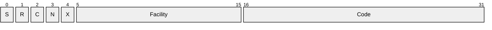
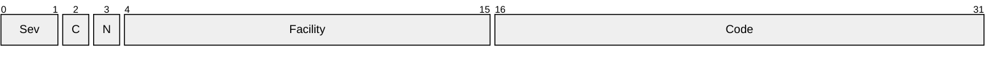

# [MS-ERREF]: Windows Error Codes

Table of Contents

1 Introduction

- [1 Introduction](#Section_1)
  - [1.1 Glossary](#Section_1.1)
  - [1.2 References](#Section_1.2)
    - [1.2.1 Normative References](#Section_1.2.1)
    - [1.2.2 Informative References](#Section_1.2.2)
  - [1.3 Overview](#Section_1.3)
  - [1.4 Relationship to Protocols and Other Structures](#Section_1.4)
  - [1.5 Applicability Statement](#Section_1.5)
  - [1.6 Versioning and Localization](#Section_1.6)
  - [1.7 Vendor Extensible Fields](#Section_1.7)

2 Structures

- [2 Structures](#Section_2)
  - [2.1 HRESULT](#Section_2.1)
    - [2.1.1 HRESULT Values](#Section_2.1.1)
    - [2.1.2 HRESULT From WIN32 Error Code Macro](#Section_2.1.2)
  - [2.2 Win32 Error Codes](#Section_2.2)
  - [2.3 NTSTATUS](#Section_2.3)
    - [2.3.1 NTSTATUS Values](#Section_2.3.1)
  - [2.4 LDAP Error to Win32 Error Mapping](#Section_2.4)

3 Structure Example

- [3 Structure Example](#Section_3)

4 Security Considerations

- [4 Security Considerations](#Section_4)

5 Appendix A: Product Behavior

- [5 Appendix A: Product Behavior](#Section_5)

6 Change Tracking

- [6 Change Tracking](#Section_6)

For the legal notice and IP terms, see [LEGAL.md](../LEGAL.md).
Last updated: 11/19/2024.
See [Revision History](#revision-history) for full version history.

# 1 Introduction

The Windows Error Codes document is a companion reference to the protocol specifications. It documents the common usage details for those [HRESULT values](#Section_2.1.1), [Win32 error codes](#Section_2.2), and [NTSTATUS values](#Section_2.3.1) that are referenced by specifications in the protocol documentation set.

Sections 1.7 and 2 of this specification are normative. All other sections and examples in this specification are informative.

## 1.1 Glossary

This document uses the following terms:

**HRESULT**: An integer value that indicates the result or status of an operation. A particular HRESULT can have different meanings depending on the protocol using it. See [MS-ERREF](#Section_1bc92ddfb79e413cbbaa99a5281a6c90) section 2.1 and specific protocol documents for further details.

**terminal server**: A computer on which [**terminal services**](#gt_terminal-services-ts) is running.

**terminal services (TS)**: A service on a server computer that allows delivery of applications, or the desktop itself, to various computing devices. When a user runs an application on a [**terminal server**](#gt_terminal-server), the application execution takes place on the server computer and only keyboard, mouse, and display information is transmitted over the network. Each user sees only his or her individual session, which is managed transparently by the server operating system and is independent of any other client session.

**universally unique identifier (UUID)**: A 128-bit value. UUIDs can be used for multiple purposes, from tagging objects with an extremely short lifetime, to reliably identifying very persistent objects in cross-process communication such as client and server interfaces, manager entry-point vectors, and RPC objects. UUIDs are highly likely to be unique. UUIDs are also known as globally unique identifiers (GUIDs) and these terms are used interchangeably in the Microsoft protocol technical documents (TDs). Interchanging the usage of these terms does not imply or require a specific algorithm or mechanism to generate the UUID. Specifically, the use of this term does not imply or require that the algorithms described in [[RFC4122]](https://go.microsoft.com/fwlink/?LinkId=90460) or [[C706]](https://go.microsoft.com/fwlink/?LinkId=89824) has to be used for generating the UUID.

**MAY, SHOULD, MUST, SHOULD NOT, MUST NOT:** These terms (in all caps) are used as defined in [[RFC2119]](https://go.microsoft.com/fwlink/?LinkId=90317). All statements of optional behavior use either MAY, SHOULD, or SHOULD NOT.

## 1.2 References

Links to a document in the Microsoft Open Specifications library point to the correct section in the most recently published version of the referenced document. However, because individual documents in the library are not updated at the same time, the section numbers in the documents may not match. You can confirm the correct section numbering by checking the [Errata](https://go.microsoft.com/fwlink/?linkid=850906).

### 1.2.1 Normative References

We conduct frequent surveys of the normative references to assure their continued availability. If you have any issue with finding a normative reference, please contact [dochelp@microsoft.com](mailto:dochelp@microsoft.com). We will assist you in finding the relevant information.

[RFC2119] Bradner, S., "Key words for use in RFCs to Indicate Requirement Levels", BCP 14, RFC 2119, March 1997, [https://www.rfc-editor.org/info/rfc2119](https://go.microsoft.com/fwlink/?LinkId=90317)

[RFC2251] Wahl, M., Howes, T., and Kille, S., "Lightweight Directory Access Protocol (v3)", RFC 2251, December 1997, [https://www.rfc-editor.org/info/rfc2251](https://go.microsoft.com/fwlink/?LinkId=90325)

### 1.2.2 Informative References

None.

## 1.3 Overview

If a protocol returns [**HRESULTs**](#gt_hresult), the protocol uses HRESULTs, as specified in section [2.1](#Section_2.1.1).

If a protocol uses Win32 error codes, these values are taken from the Windows error number space, as specified in section [2.2](#Section_2.2).

If a protocol uses NTSTATUS values, these values are specified in section [2.3](#Section_2.3.1).

## 1.4 Relationship to Protocols and Other Structures

The structures documented in this specification do not depend on any other structures or protocols.

The structures in this document are returned by many protocols.

## 1.5 Applicability Statement

The data types specified in this document are applicable for use in any protocol that needs to include a discrete set of error codes.

## 1.6 Versioning and Localization

The structures in the Windows Error Codes require no versioning or localization information.

## 1.7 Vendor Extensible Fields

[HRESULTs](#Section_2.1.1): Vendors can choose their own values, as long as the **C** bit (0x20000000) is set, indicating it is a customer code. The structures documented in this specification have no vendor-extensible fields.

[Win32 Error Codes](#Section_2.2): Vendors can only reuse these values with their indicated meanings. Choosing any other value runs the risk of a collision in the future.

[NTSTATUS](#Section_2.3.1): Vendors can choose their own values for this field, as long as the **C** bit (0x20000000) is set, indicating it is a customer code.

# 2 Structures

## 2.1 HRESULT

The HRESULT numbering space is vendor-extensible. Vendors can supply their own values for this field, as long as the **C** bit (0x20000000) is set, indicating it is a customer code.

The HRESULT numbering space has the following internal structure. Any protocol that uses NTSTATUS values on the wire is responsible for stating the order in which the bytes are placed on the wire.

**S (1 bit):** Severity. If set, indicates a failure result. If clear, indicates a success result.

**R (1 bit):** Reserved. If the **N** bit is clear, this bit MUST be set to 0. If the **N** bit is set, this bit is defined by the NTSTATUS numbering space (as specified in section [2.3](#Section_2.3.1)).

**C (1 bit):** Customer. This bit specifies if the value is customer-defined or Microsoft-defined. The bit is set for customer-defined values and clear for Microsoft-defined values.<1>

**N (1 bit):** If set, indicates that the error code is an NTSTATUS value (as specified in section 2.3), except that this bit is set.

**X (1 bit):** Reserved. SHOULD be set to 0. <2>

**Facility (11 bits):** An indicator of the source of the error. New facilities are occasionally added by Microsoft.

The following table lists the currently defined facility codes:

| Value | Meaning |
| --- | --- |
| FACILITY_NULL 0 | The default facility code. |
| FACILITY_RPC 1 | The source of the error code is an RPC subsystem. |
| FACILITY_DISPATCH 2 | The source of the error code is a COM Dispatch. |
| FACILITY_STORAGE 3 | The source of the error code is OLE Storage. |
| FACILITY_ITF 4 | The source of the error code is COM/OLE Interface management. |
| FACILITY_WIN32 7 | This region is reserved to map undecorated error codes into HRESULTs. |
| FACILITY_WINDOWS 8 | The source of the error code is the Windows subsystem. |
| FACILITY_SECURITY 9 | The source of the error code is the Security API layer. |
| FACILITY_SSPI 9 | The source of the error code is the Security API layer. |
| FACILITY_CONTROL 10 | The source of the error code is the control mechanism. |
| FACILITY_CERT 11 | The source of the error code is a certificate client or server? |
| FACILITY_INTERNET 12 | The source of the error code is Wininet related. |
| FACILITY_MEDIASERVER 13 | The source of the error code is the Windows Media Server. |
| FACILITY_MSMQ 14 | The source of the error code is the Microsoft Message Queue. |
| FACILITY_SETUPAPI 15 | The source of the error code is the Setup API. |
| FACILITY_SCARD 16 | The source of the error code is the Smart-card subsystem. |
| FACILITY_COMPLUS 17 | The source of the error code is COM+. |
| FACILITY_AAF 18 | The source of the error code is the Microsoft agent. |
| FACILITY_URT 19 | The source of the error code is .NET CLR. |
| FACILITY_ACS 20 | The source of the error code is the audit collection service. |
| FACILITY_DPLAY 21 | The source of the error code is Direct Play. |
| FACILITY_UMI 22 | The source of the error code is the ubiquitous memoryintrospection service. |
| FACILITY_SXS 23 | The source of the error code is Side-by-side servicing. |
| FACILITY_WINDOWS_CE 24 | The error code is specific to Windows CE. |
| FACILITY_HTTP 25 | The source of the error code is HTTP support. |
| FACILITY_USERMODE_COMMONLOG 26 | The source of the error code is common Logging support. |
| FACILITY_USERMODE_FILTER_MANAGER 31 | The source of the error code is the user mode filter manager. |
| FACILITY_BACKGROUNDCOPY 32 | The source of the error code is background copy control |
| FACILITY_CONFIGURATION 33 | The source of the error code is configuration services. |
| FACILITY_STATE_MANAGEMENT 34 | The source of the error code is state management services. |
| FACILITY_METADIRECTORY 35 | The source of the error code is the Microsoft Identity Server. |
| FACILITY_WINDOWSUPDATE 36 | The source of the error code is a Windows update. |
| FACILITY_DIRECTORYSERVICE 37 | The source of the error code is Active Directory. |
| FACILITY_GRAPHICS 38 | The source of the error code is the graphics drivers. |
| FACILITY_SHELL 39 | The source of the error code is the user Shell. |
| FACILITY_TPM_SERVICES 40 | The source of the error code is the Trusted Platform Module services. |
| FACILITY_TPM_SOFTWARE 41 | The source of the error code is the Trusted Platform Module applications. |
| FACILITY_PLA 48 | The source of the error code is Performance Logs and Alerts |
| FACILITY_FVE 49 | The source of the error code is Full volume encryption. |
| FACILITY_FWP 50 | he source of the error code is the Firewall Platform. |
| FACILITY_WINRM 51 | The source of the error code is the Windows Resource Manager. |
| FACILITY_NDIS 52 | The source of the error code is the Network Driver Interface. |
| FACILITY_USERMODE_HYPERVISOR 53 | The source of the error code is the Usermode Hypervisor components. |
| FACILITY_CMI 54 | The source of the error code is the Configuration Management Infrastructure. |
| FACILITY_USERMODE_VIRTUALIZATION 55 | The source of the error code is the user mode virtualization subsystem. |
| FACILITY_USERMODE_VOLMGR 56 | The source of the error code is the user mode volume manager |
| FACILITY_BCD 57 | The source of the error code is the Boot Configuration Database. |
| FACILITY_USERMODE_VHD 58 | The source of the error code is user mode virtual hard disk support. |
| FACILITY_SDIAG 60 | The source of the error code is System Diagnostics. |
| FACILITY_WEBSERVICES 61 | The source of the error code is the Web Services. |
| FACILITY_WINDOWS_DEFENDER 80 | The source of the error code is a Windows Defender component. |
| FACILITY_OPC 81 | The source of the error code is the open connectivity service. |

**Code (2 bytes):** The remainder of the error code.

### 2.1.1 HRESULT Values

Combining the fields of an [**HRESULT**](#gt_hresult) into a single, 32-bit numbering space, the following HRESULT values are defined, in addition to those derived from [NTSTATUS values (section 2.3.1)](#Section_2.3) and [Win32 error codes (section 2.2)](#Section_2.2). This document provides the common usage details of the HRESULTs; individual protocol specifications provide expanded or modified definitions.

Most values also have a default message defined, which can be used to map the value to a human-readable text message; when this is done, the HRESULT value is also known as a message identifier.

Note: In the following descriptions, a percentage sign (%) followed by one or more alphanumeric characters (for example, "%1" or "%hs") indicates a variable that is replaced by text at the time the value is returned.

| Return value/code | Description |
| --- | --- |
| 0x00030200 STG_S_CONVERTED | The underlying file was converted to compound file format. |
| 0x00030201 STG_S_BLOCK | The storage operation should block until more data is available. |
| 0x00030202 STG_S_RETRYNOW | The storage operation should retry immediately. |
| 0x00030203 STG_S_MONITORING | The notified event sink will not influence the storage operation. |
| 0x00030204 STG_S_MULTIPLEOPENS | Multiple opens prevent consolidated (commit succeeded). |
| 0x00030205 STG_S_CONSOLIDATIONFAILED | Consolidation of the storage file failed (commit succeeded). |
| 0x00030206 STG_S_CANNOTCONSOLIDATE | Consolidation of the storage file is inappropriate (commit succeeded). |
| 0x00040000 OLE_S_USEREG | Use the registry database to provide the requested information. |
| 0x00040001 OLE_S_STATIC | Success, but static. |
| 0x00040002 OLE_S_MAC_CLIPFORMAT | Macintosh clipboard format. |
| 0x00040100 DRAGDROP_S_DROP | Successful drop took place. |
| 0x00040101 DRAGDROP_S_CANCEL | Drag-drop operation canceled. |
| 0x00040102 DRAGDROP_S_USEDEFAULTCURSORS | Use the default cursor. |
| 0x00040130 DATA_S_SAMEFORMATETC | Data has same FORMATETC. |
| 0x00040140 VIEW_S_ALREADY_FROZEN | View is already frozen. |
| 0x00040170 CACHE_S_FORMATETC_NOTSUPPORTED | FORMATETC not supported. |
| 0x00040171 CACHE_S_SAMECACHE | Same cache. |
| 0x00040172 CACHE_S_SOMECACHES_NOTUPDATED | Some caches are not updated. |
| 0x00040180 OLEOBJ_S_INVALIDVERB | Invalid verb for OLE object. |
| 0x00040181 OLEOBJ_S_CANNOT_DOVERB_NOW | Verb number is valid but verb cannot be done now. |
| 0x00040182 OLEOBJ_S_INVALIDHWND | Invalid window handle passed. |
| 0x000401A0 INPLACE_S_TRUNCATED | Message is too long; some of it had to be truncated before displaying. |
| 0x000401C0 CONVERT10_S_NO_PRESENTATION | Unable to convert OLESTREAM to IStorage. |
| 0x000401E2 MK_S_REDUCED_TO_SELF | Moniker reduced to itself. |
| 0x000401E4 MK_S_ME | Common prefix is this moniker. |
| 0x000401E5 MK_S_HIM | Common prefix is input moniker. |
| 0x000401E6 MK_S_US | Common prefix is both monikers. |
| 0x000401E7 MK_S_MONIKERALREADYREGISTERED | Moniker is already registered in running object table. |
| 0x00040200 EVENT_S_SOME_SUBSCRIBERS_FAILED | An event was able to invoke some, but not all, of the subscribers. |
| 0x00040202 EVENT_S_NOSUBSCRIBERS | An event was delivered, but there were no subscribers. |
| 0x00041300 SCHED_S_TASK_READY | The task is ready to run at its next scheduled time. |
| 0x00041301 SCHED_S_TASK_RUNNING | The task is currently running. |
| 0x00041302 SCHED_S_TASK_DISABLED | The task will not run at the scheduled times because it has been disabled. |
| 0x00041303 SCHED_S_TASK_HAS_NOT_RUN | The task has not yet run. |
| 0x00041304 SCHED_S_TASK_NO_MORE_RUNS | There are no more runs scheduled for this task. |
| 0x00041305 SCHED_S_TASK_NOT_SCHEDULED | One or more of the properties that are needed to run this task on a schedule have not been set. |
| 0x00041306 SCHED_S_TASK_TERMINATED | The last run of the task was terminated by the user. |
| 0x00041307 SCHED_S_TASK_NO_VALID_TRIGGERS | Either the task has no triggers, or the existing triggers are disabled or not set. |
| 0x00041308 SCHED_S_EVENT_TRIGGER | Event triggers do not have set run times. |
| 0x0004131B SCHED_S_SOME_TRIGGERS_FAILED | The task is registered, but not all specified triggers will start the task. |
| 0x0004131C SCHED_S_BATCH_LOGON_PROBLEM | The task is registered, but it might fail to start. Batch logon privilege needs to be enabled for the task principal. |
| 0x0004D000 XACT_S_ASYNC | An asynchronous operation was specified. The operation has begun, but its outcome is not known yet. |
| 0x0004D002 XACT_S_READONLY | The method call succeeded because the transaction was read-only. |
| 0x0004D003 XACT_S_SOMENORETAIN | The transaction was successfully aborted. However, this is a coordinated transaction, and a number of enlisted resources were aborted outright because they could not support abort-retaining semantics. |
| 0x0004D004 XACT_S_OKINFORM | No changes were made during this call, but the sink wants another chance to look if any other sinks make further changes. |
| 0x0004D005 XACT_S_MADECHANGESCONTENT | The sink is content and wants the transaction to proceed. Changes were made to one or more resources during this call. |
| 0x0004D006 XACT_S_MADECHANGESINFORM | The sink is for the moment and wants the transaction to proceed, but if other changes are made following this return by other event sinks, this sink wants another chance to look. |
| 0x0004D007 XACT_S_ALLNORETAIN | The transaction was successfully aborted. However, the abort was nonretaining. |
| 0x0004D008 XACT_S_ABORTING | An abort operation was already in progress. |
| 0x0004D009 XACT_S_SINGLEPHASE | The resource manager has performed a single-phase commit of the transaction. |
| 0x0004D00A XACT_S_LOCALLY_OK | The local transaction has not aborted. |
| 0x0004D010 XACT_S_LASTRESOURCEMANAGER | The resource manager has requested to be the coordinator (last resource manager) for the transaction. |
| 0x00080012 CO_S_NOTALLINTERFACES | Not all the requested interfaces were available. |
| 0x00080013 CO_S_MACHINENAMENOTFOUND | The specified machine name was not found in the cache. |
| 0x00090312 SEC_I_CONTINUE_NEEDED | The function completed successfully, but it must be called again to complete the context. |
| 0x00090313 SEC_I_COMPLETE_NEEDED | The function completed successfully, but CompleteToken must be called. |
| 0x00090314 SEC_I_COMPLETE_AND_CONTINUE | The function completed successfully, but both CompleteToken and this function must be called to complete the context. |
| 0x00090315 SEC_I_LOCAL_LOGON | The logon was completed, but no network authority was available. The logon was made using locally known information. |
| 0x00090317 SEC_I_CONTEXT_EXPIRED | The context has expired and can no longer be used. |
| 0x00090320 SEC_I_INCOMPLETE_CREDENTIALS | The credentials supplied were not complete and could not be verified. Additional information can be returned from the context. |
| 0x00090321 SEC_I_RENEGOTIATE | The context data must be renegotiated with the peer. |
| 0x00090323 SEC_I_NO_LSA_CONTEXT | There is no LSA mode context associated with this context. |
| 0x0009035C SEC_I_SIGNATURE_NEEDED | A signature operation must be performed before the user can authenticate. |
| 0x00091012 CRYPT_I_NEW_PROTECTION_REQUIRED | The protected data needs to be reprotected. |
| 0x000D0000 NS_S_CALLPENDING | The requested operation is pending completion. |
| 0x000D0001 NS_S_CALLABORTED | The requested operation was aborted by the client. |
| 0x000D0002 NS_S_STREAM_TRUNCATED | The stream was purposefully stopped before completion. |
| 0x000D0BC8 NS_S_REBUFFERING | The requested operation has caused the source to rebuffer. |
| 0x000D0BC9 NS_S_DEGRADING_QUALITY | The requested operation has caused the source to degrade codec quality. |
| 0x000D0BDB NS_S_TRANSCRYPTOR_EOF | The transcryptor object has reached end of file. |
| 0x000D0FE8 NS_S_WMP_UI_VERSIONMISMATCH | An upgrade is needed for the theme manager to correctly show this skin. Skin reports version: %.1f. |
| 0x000D0FE9 NS_S_WMP_EXCEPTION | An error occurred in one of the UI components. |
| 0x000D1040 NS_S_WMP_LOADED_GIF_IMAGE | Successfully loaded a GIF file. |
| 0x000D1041 NS_S_WMP_LOADED_PNG_IMAGE | Successfully loaded a PNG file. |
| 0x000D1042 NS_S_WMP_LOADED_BMP_IMAGE | Successfully loaded a BMP file. |
| 0x000D1043 NS_S_WMP_LOADED_JPG_IMAGE | Successfully loaded a JPG file. |
| 0x000D104F NS_S_WMG_FORCE_DROP_FRAME | Drop this frame. |
| 0x000D105F NS_S_WMR_ALREADYRENDERED | The specified stream has already been rendered. |
| 0x000D1060 NS_S_WMR_PINTYPEPARTIALMATCH | The specified type partially matches this pin type. |
| 0x000D1061 NS_S_WMR_PINTYPEFULLMATCH | The specified type fully matches this pin type. |
| 0x000D1066 NS_S_WMG_ADVISE_DROP_FRAME | The timestamp is late compared to the current render position. Advise dropping this frame. |
| 0x000D1067 NS_S_WMG_ADVISE_DROP_TO_KEYFRAME | The timestamp is severely late compared to the current render position. Advise dropping everything up to the next key frame. |
| 0x000D10DB NS_S_NEED_TO_BUY_BURN_RIGHTS | No burn rights. You will be prompted to buy burn rights when you try to burn this file to an audio CD. |
| 0x000D10FE NS_S_WMPCORE_PLAYLISTCLEARABORT | Failed to clear playlist because it was aborted by user. |
| 0x000D10FF NS_S_WMPCORE_PLAYLISTREMOVEITEMABORT | Failed to remove item in the playlist since it was aborted by user. |
| 0x000D1102 NS_S_WMPCORE_PLAYLIST_CREATION_PENDING | Playlist is being generated asynchronously. |
| 0x000D1103 NS_S_WMPCORE_MEDIA_VALIDATION_PENDING | Validation of the media is pending. |
| 0x000D1104 NS_S_WMPCORE_PLAYLIST_REPEAT_SECONDARY_SEGMENTS_IGNORED | Encountered more than one Repeat block during ASX processing. |
| 0x000D1105 NS_S_WMPCORE_COMMAND_NOT_AVAILABLE | Current state of WMP disallows calling this method or property. |
| 0x000D1106 NS_S_WMPCORE_PLAYLIST_NAME_AUTO_GENERATED | Name for the playlist has been auto generated. |
| 0x000D1107 NS_S_WMPCORE_PLAYLIST_IMPORT_MISSING_ITEMS | The imported playlist does not contain all items from the original. |
| 0x000D1108 NS_S_WMPCORE_PLAYLIST_COLLAPSED_TO_SINGLE_MEDIA | The M3U playlist has been ignored because it only contains one item. |
| 0x000D1109 NS_S_WMPCORE_MEDIA_CHILD_PLAYLIST_OPEN_PENDING | The open for the child playlist associated with this media is pending. |
| 0x000D110A NS_S_WMPCORE_MORE_NODES_AVAIABLE | More nodes support the interface requested, but the array for returning them is full. |
| 0x000D1135 NS_S_WMPBR_SUCCESS | Backup or Restore successful!. |
| 0x000D1136 NS_S_WMPBR_PARTIALSUCCESS | Transfer complete with limitations. |
| 0x000D1144 NS_S_WMPEFFECT_TRANSPARENT | Request to the effects control to change transparency status to transparent. |
| 0x000D1145 NS_S_WMPEFFECT_OPAQUE | Request to the effects control to change transparency status to opaque. |
| 0x000D114E NS_S_OPERATION_PENDING | The requested application pane is performing an operation and will not be released. |
| 0x000D1359 NS_S_TRACK_BUY_REQUIRES_ALBUM_PURCHASE | The file is only available for purchase when you buy the entire album. |
| 0x000D135E NS_S_NAVIGATION_COMPLETE_WITH_ERRORS | There were problems completing the requested navigation. There are identifiers missing in the catalog. |
| 0x000D1361 NS_S_TRACK_ALREADY_DOWNLOADED | Track already downloaded. |
| 0x000D1519 NS_S_PUBLISHING_POINT_STARTED_WITH_FAILED_SINKS | The publishing point successfully started, but one or more of the requested data writer plug-ins failed. |
| 0x000D2726 NS_S_DRM_LICENSE_ACQUIRED | Status message: The license was acquired. |
| 0x000D2727 NS_S_DRM_INDIVIDUALIZED | Status message: The security upgrade has been completed. |
| 0x000D2746 NS_S_DRM_MONITOR_CANCELLED | Status message: License monitoring has been canceled. |
| 0x000D2747 NS_S_DRM_ACQUIRE_CANCELLED | Status message: License acquisition has been canceled. |
| 0x000D276E NS_S_DRM_BURNABLE_TRACK | The track is burnable and had no playlist burn limit. |
| 0x000D276F NS_S_DRM_BURNABLE_TRACK_WITH_PLAYLIST_RESTRICTION | The track is burnable but has a playlist burn limit. |
| 0x000D27DE NS_S_DRM_NEEDS_INDIVIDUALIZATION | A security upgrade is required to perform the operation on this media file. |
| 0x000D2AF8 NS_S_REBOOT_RECOMMENDED | Installation was successful; however, some file cleanup is not complete. For best results, restart your computer. |
| 0x000D2AF9 NS_S_REBOOT_REQUIRED | Installation was successful; however, some file cleanup is not complete. To continue, you must restart your computer. |
| 0x000D2F09 NS_S_EOSRECEDING | EOS hit during rewinding. |
| 0x000D2F0D NS_S_CHANGENOTICE | Internal. |
| 0x001F0001 ERROR_FLT_IO_COMPLETE | The IO was completed by a filter. |
| 0x00262307 ERROR_GRAPHICS_MODE_NOT_PINNED | No mode is pinned on the specified VidPN source or target. |
| 0x0026231E ERROR_GRAPHICS_NO_PREFERRED_MODE | Specified mode set does not specify preference for one of its modes. |
| 0x0026234B ERROR_GRAPHICS_DATASET_IS_EMPTY | Specified data set (for example, mode set, frequency range set, descriptor set, and topology) is empty. |
| 0x0026234C ERROR_GRAPHICS_NO_MORE_ELEMENTS_IN_DATASET | Specified data set (for example, mode set, frequency range set, descriptor set, and topology) does not contain any more elements. |
| 0x00262351 ERROR_GRAPHICS_PATH_CONTENT_GEOMETRY_TRANSFORMATION_NOT_PINNED | Specified content transformation is not pinned on the specified VidPN present path. |
| 0x00300100 PLA_S_PROPERTY_IGNORED | Property value will be ignored. |
| 0x00340001 ERROR_NDIS_INDICATION_REQUIRED | The request will be completed later by a Network Driver Interface Specification (NDIS) status indication. |
| 0x0DEAD100 TRK_S_OUT_OF_SYNC | The VolumeSequenceNumber of a MOVE_NOTIFICATION request is incorrect. |
| 0x0DEAD102 TRK_VOLUME_NOT_FOUND | The VolumeID in a request was not found in the server's ServerVolumeTable. |
| 0x0DEAD103 TRK_VOLUME_NOT_OWNED | A notification was sent to the LnkSvrMessage method, but the RequestMachine for the request was not the VolumeOwner for a VolumeID in the request. |
| 0x0DEAD107 TRK_S_NOTIFICATION_QUOTA_EXCEEDED | The server received a MOVE_NOTIFICATION request, but the FileTable size limit has already been reached. |
| 0x400D004F NS_I_TIGER_START | The Title Server %1 is running. |
| 0x400D0051 NS_I_CUB_START | Content Server %1 (%2) is starting. |
| 0x400D0052 NS_I_CUB_RUNNING | Content Server %1 (%2) is running. |
| 0x400D0054 NS_I_DISK_START | Disk %1 ( %2 ) on Content Server %3, is running. |
| 0x400D0056 NS_I_DISK_REBUILD_STARTED | Started rebuilding disk %1 ( %2 ) on Content Server %3. |
| 0x400D0057 NS_I_DISK_REBUILD_FINISHED | Finished rebuilding disk %1 ( %2 ) on Content Server %3. |
| 0x400D0058 NS_I_DISK_REBUILD_ABORTED | Aborted rebuilding disk %1 ( %2 ) on Content Server %3. |
| 0x400D0059 NS_I_LIMIT_FUNNELS | A NetShow administrator at network location %1 set the data stream limit to %2 streams. |
| 0x400D005A NS_I_START_DISK | A NetShow administrator at network location %1 started disk %2. |
| 0x400D005B NS_I_STOP_DISK | A NetShow administrator at network location %1 stopped disk %2. |
| 0x400D005C NS_I_STOP_CUB | A NetShow administrator at network location %1 stopped Content Server %2. |
| 0x400D005D NS_I_KILL_USERSESSION | A NetShow administrator at network location %1 aborted user session %2 from the system. |
| 0x400D005E NS_I_KILL_CONNECTION | A NetShow administrator at network location %1 aborted obsolete connection %2 from the system. |
| 0x400D005F NS_I_REBUILD_DISK | A NetShow administrator at network location %1 started rebuilding disk %2. |
| 0x400D0069 MCMADM_I_NO_EVENTS | Event initialization failed, there will be no MCM events. |
| 0x400D006E NS_I_LOGGING_FAILED | The logging operation failed. |
| 0x400D0070 NS_I_LIMIT_BANDWIDTH | A NetShow administrator at network location %1 set the maximum bandwidth limit to %2 bps. |
| 0x400D0191 NS_I_CUB_UNFAIL_LINK | Content Server %1 (%2) has established its link to Content Server %3. |
| 0x400D0193 NS_I_RESTRIPE_START | Restripe operation has started. |
| 0x400D0194 NS_I_RESTRIPE_DONE | Restripe operation has completed. |
| 0x400D0196 NS_I_RESTRIPE_DISK_OUT | Content disk %1 (%2) on Content Server %3 has been restriped out. |
| 0x400D0197 NS_I_RESTRIPE_CUB_OUT | Content server %1 (%2) has been restriped out. |
| 0x400D0198 NS_I_DISK_STOP | Disk %1 ( %2 ) on Content Server %3, has been offlined. |
| 0x400D14BE NS_I_PLAYLIST_CHANGE_RECEDING | The playlist change occurred while receding. |
| 0x400D2EFF NS_I_RECONNECTED | The client is reconnected. |
| 0x400D2F01 NS_I_NOLOG_STOP | Forcing a switch to a pending header on start. |
| 0x400D2F03 NS_I_EXISTING_PACKETIZER | There is already an existing packetizer plugin for the stream. |
| 0x400D2F04 NS_I_MANUAL_PROXY | The proxy setting is manual. |
| 0x40262009 ERROR_GRAPHICS_DRIVER_MISMATCH | The kernel driver detected a version mismatch between it and the user mode driver. |
| 0x4026242F ERROR_GRAPHICS_UNKNOWN_CHILD_STATUS | Child device presence was not reliably detected. |
| 0x40262437 ERROR_GRAPHICS_LEADLINK_START_DEFERRED | Starting the lead-link adapter has been deferred temporarily. |
| 0x40262439 ERROR_GRAPHICS_POLLING_TOO_FREQUENTLY | The display adapter is being polled for children too frequently at the same polling level. |
| 0x4026243A ERROR_GRAPHICS_START_DEFERRED | Starting the adapter has been deferred temporarily. |
| 0x8000000A E_PENDING | The data necessary to complete this operation is not yet available. |
| 0x80004001 E_NOTIMPL | Not implemented. |
| 0x80004002 E_NOINTERFACE | No such interface supported. |
| 0x80004003 E_POINTER | Invalid pointer. |
| 0x80004004 E_ABORT | Operation aborted. |
| 0x80004005 E_FAIL | Unspecified error. |
| 0x80004006 CO_E_INIT_TLS | Thread local storage failure. |
| 0x80004007 CO_E_INIT_SHARED_ALLOCATOR | Get shared memory allocator failure. |
| 0x80004008 CO_E_INIT_MEMORY_ALLOCATOR | Get memory allocator failure. |
| 0x80004009 CO_E_INIT_CLASS_CACHE | Unable to initialize class cache. |
| 0x8000400A CO_E_INIT_RPC_CHANNEL | Unable to initialize remote procedure call (RPC) services. |
| 0x8000400B CO_E_INIT_TLS_SET_CHANNEL_CONTROL | Cannot set thread local storage channel control. |
| 0x8000400C CO_E_INIT_TLS_CHANNEL_CONTROL | Could not allocate thread local storage channel control. |
| 0x8000400D CO_E_INIT_UNACCEPTED_USER_ALLOCATOR | The user-supplied memory allocator is unacceptable. |
| 0x8000400E CO_E_INIT_SCM_MUTEX_EXISTS | The OLE service mutex already exists. |
| 0x8000400F CO_E_INIT_SCM_FILE_MAPPING_EXISTS | The OLE service file mapping already exists. |
| 0x80004010 CO_E_INIT_SCM_MAP_VIEW_OF_FILE | Unable to map view of file for OLE service. |
| 0x80004011 CO_E_INIT_SCM_EXEC_FAILURE | Failure attempting to launch OLE service. |
| 0x80004012 CO_E_INIT_ONLY_SINGLE_THREADED | There was an attempt to call CoInitialize a second time while single-threaded. |
| 0x80004013 CO_E_CANT_REMOTE | A Remote activation was necessary but was not allowed. |
| 0x80004014 CO_E_BAD_SERVER_NAME | A Remote activation was necessary, but the server name provided was invalid. |
| 0x80004015 CO_E_WRONG_SERVER_IDENTITY | The class is configured to run as a security ID different from the caller. |
| 0x80004016 CO_E_OLE1DDE_DISABLED | Use of OLE1 services requiring Dynamic Data Exchange (DDE) Windows is disabled. |
| 0x80004017 CO_E_RUNAS_SYNTAX | A RunAs specification must be <domain name>\<user name> or simply <user name>. |
| 0x80004018 CO_E_CREATEPROCESS_FAILURE | The server process could not be started. The path name might be incorrect. |
| 0x80004019 CO_E_RUNAS_CREATEPROCESS_FAILURE | The server process could not be started as the configured identity. The path name might be incorrect or unavailable. |
| 0x8000401A CO_E_RUNAS_LOGON_FAILURE | The server process could not be started because the configured identity is incorrect. Check the user name and password. |
| 0x8000401B CO_E_LAUNCH_PERMSSION_DENIED | The client is not allowed to launch this server. |
| 0x8000401C CO_E_START_SERVICE_FAILURE | The service providing this server could not be started. |
| 0x8000401D CO_E_REMOTE_COMMUNICATION_FAILURE | This computer was unable to communicate with the computer providing the server. |
| 0x8000401E CO_E_SERVER_START_TIMEOUT | The server did not respond after being launched. |
| 0x8000401F CO_E_CLSREG_INCONSISTENT | The registration information for this server is inconsistent or incomplete. |
| 0x80004020 CO_E_IIDREG_INCONSISTENT | The registration information for this interface is inconsistent or incomplete. |
| 0x80004021 CO_E_NOT_SUPPORTED | The operation attempted is not supported. |
| 0x80004022 CO_E_RELOAD_DLL | A DLL must be loaded. |
| 0x80004023 CO_E_MSI_ERROR | A Microsoft Software Installer error was encountered. |
| 0x80004024 CO_E_ATTEMPT_TO_CREATE_OUTSIDE_CLIENT_CONTEXT | The specified activation could not occur in the client context as specified. |
| 0x80004025 CO_E_SERVER_PAUSED | Activations on the server are paused. |
| 0x80004026 CO_E_SERVER_NOT_PAUSED | Activations on the server are not paused. |
| 0x80004027 CO_E_CLASS_DISABLED | The component or application containing the component has been disabled. |
| 0x80004028 CO_E_CLRNOTAVAILABLE | The common language runtime is not available. |
| 0x80004029 CO_E_ASYNC_WORK_REJECTED | The thread-pool rejected the submitted asynchronous work. |
| 0x8000402A CO_E_SERVER_INIT_TIMEOUT | The server started, but it did not finish initializing in a timely fashion. |
| 0x8000402B CO_E_NO_SECCTX_IN_ACTIVATE | Unable to complete the call because there is no COM+ security context inside IObjectControl.Activate. |
| 0x80004030 CO_E_TRACKER_CONFIG | The provided tracker configuration is invalid. |
| 0x80004031 CO_E_THREADPOOL_CONFIG | The provided thread pool configuration is invalid. |
| 0x80004032 CO_E_SXS_CONFIG | The provided side-by-side configuration is invalid. |
| 0x80004033 CO_E_MALFORMED_SPN | The server principal name (SPN) obtained during security negotiation is malformed. |
| 0x8000FFFF E_UNEXPECTED | Catastrophic failure. |
| 0x80010001 RPC_E_CALL_REJECTED | Call was rejected by callee. |
| 0x80010002 RPC_E_CALL_CANCELED | Call was canceled by the message filter. |
| 0x80010003 RPC_E_CANTPOST_INSENDCALL | The caller is dispatching an intertask SendMessage call and cannot call out via PostMessage. |
| 0x80010004 RPC_E_CANTCALLOUT_INASYNCCALL | The caller is dispatching an asynchronous call and cannot make an outgoing call on behalf of this call. |
| 0x80010005 RPC_E_CANTCALLOUT_INEXTERNALCALL | It is illegal to call out while inside message filter. |
| 0x80010006 RPC_E_CONNECTION_TERMINATED | The connection terminated or is in a bogus state and can no longer be used. Other connections are still valid. |
| 0x80010007 RPC_E_SERVER_DIED | The callee (the server, not the server application) is not available and disappeared; all connections are invalid. The call might have executed. |
| 0x80010008 RPC_E_CLIENT_DIED | The caller (client) disappeared while the callee (server) was processing a call. |
| 0x80010009 RPC_E_INVALID_DATAPACKET | The data packet with the marshaled parameter data is incorrect. |
| 0x8001000A RPC_E_CANTTRANSMIT_CALL | The call was not transmitted properly; the message queue was full and was not emptied after yielding. |
| 0x8001000B RPC_E_CLIENT_CANTMARSHAL_DATA | The client RPC caller cannot marshal the parameter data due to errors (such as low memory). |
| 0x8001000C RPC_E_CLIENT_CANTUNMARSHAL_DATA | The client RPC caller cannot unmarshal the return data due to errors (such as low memory). |
| 0x8001000D RPC_E_SERVER_CANTMARSHAL_DATA | The server RPC callee cannot marshal the return data due to errors (such as low memory). |
| 0x8001000E RPC_E_SERVER_CANTUNMARSHAL_DATA | The server RPC callee cannot unmarshal the parameter data due to errors (such as low memory). |
| 0x8001000F RPC_E_INVALID_DATA | Received data is invalid. The data might be server or client data. |
| 0x80010010 RPC_E_INVALID_PARAMETER | A particular parameter is invalid and cannot be (un)marshaled. |
| 0x80010011 RPC_E_CANTCALLOUT_AGAIN | There is no second outgoing call on same channel in DDE conversation. |
| 0x80010012 RPC_E_SERVER_DIED_DNE | The callee (the server, not the server application) is not available and disappeared; all connections are invalid. The call did not execute. |
| 0x80010100 RPC_E_SYS_CALL_FAILED | System call failed. |
| 0x80010101 RPC_E_OUT_OF_RESOURCES | Could not allocate some required resource (such as memory or events) |
| 0x80010102 RPC_E_ATTEMPTED_MULTITHREAD | Attempted to make calls on more than one thread in single-threaded mode. |
| 0x80010103 RPC_E_NOT_REGISTERED | The requested interface is not registered on the server object. |
| 0x80010104 RPC_E_FAULT | RPC could not call the server or could not return the results of calling the server. |
| 0x80010105 RPC_E_SERVERFAULT | The server threw an exception. |
| 0x80010106 RPC_E_CHANGED_MODE | Cannot change thread mode after it is set. |
| 0x80010107 RPC_E_INVALIDMETHOD | The method called does not exist on the server. |
| 0x80010108 RPC_E_DISCONNECTED | The object invoked has disconnected from its clients. |
| 0x80010109 RPC_E_RETRY | The object invoked chose not to process the call now. Try again later. |
| 0x8001010A RPC_E_SERVERCALL_RETRYLATER | The message filter indicated that the application is busy. |
| 0x8001010B RPC_E_SERVERCALL_REJECTED | The message filter rejected the call. |
| 0x8001010C RPC_E_INVALID_CALLDATA | A call control interface was called with invalid data. |
| 0x8001010D RPC_E_CANTCALLOUT_ININPUTSYNCCALL | An outgoing call cannot be made because the application is dispatching an input-synchronous call. |
| 0x8001010E RPC_E_WRONG_THREAD | The application called an interface that was marshaled for a different thread. |
| 0x8001010F RPC_E_THREAD_NOT_INIT | CoInitialize has not been called on the current thread. |
| 0x80010110 RPC_E_VERSION_MISMATCH | The version of OLE on the client and server machines does not match. |
| 0x80010111 RPC_E_INVALID_HEADER | OLE received a packet with an invalid header. |
| 0x80010112 RPC_E_INVALID_EXTENSION | OLE received a packet with an invalid extension. |
| 0x80010113 RPC_E_INVALID_IPID | The requested object or interface does not exist. |
| 0x80010114 RPC_E_INVALID_OBJECT | The requested object does not exist. |
| 0x80010115 RPC_S_CALLPENDING | OLE has sent a request and is waiting for a reply. |
| 0x80010116 RPC_S_WAITONTIMER | OLE is waiting before retrying a request. |
| 0x80010117 RPC_E_CALL_COMPLETE | Call context cannot be accessed after call completed. |
| 0x80010118 RPC_E_UNSECURE_CALL | Impersonate on unsecure calls is not supported. |
| 0x80010119 RPC_E_TOO_LATE | Security must be initialized before any interfaces are marshaled or unmarshaled. It cannot be changed after initialized. |
| 0x8001011A RPC_E_NO_GOOD_SECURITY_PACKAGES | No security packages are installed on this machine, the user is not logged on, or there are no compatible security packages between the client and server. |
| 0x8001011B RPC_E_ACCESS_DENIED | Access is denied. |
| 0x8001011C RPC_E_REMOTE_DISABLED | Remote calls are not allowed for this process. |
| 0x8001011D RPC_E_INVALID_OBJREF | The marshaled interface data packet (OBJREF) has an invalid or unknown format. |
| 0x8001011E RPC_E_NO_CONTEXT | No context is associated with this call. This happens for some custom marshaled calls and on the client side of the call. |
| 0x8001011F RPC_E_TIMEOUT | This operation returned because the time-out period expired. |
| 0x80010120 RPC_E_NO_SYNC | There are no synchronize objects to wait on. |
| 0x80010121 RPC_E_FULLSIC_REQUIRED | Full subject issuer chain Secure Sockets Layer (SSL) principal name expected from the server. |
| 0x80010122 RPC_E_INVALID_STD_NAME | Principal name is not a valid Microsoft standard (msstd) name. |
| 0x80010123 CO_E_FAILEDTOIMPERSONATE | Unable to impersonate DCOM client. |
| 0x80010124 CO_E_FAILEDTOGETSECCTX | Unable to obtain server's security context. |
| 0x80010125 CO_E_FAILEDTOOPENTHREADTOKEN | Unable to open the access token of the current thread. |
| 0x80010126 CO_E_FAILEDTOGETTOKENINFO | Unable to obtain user information from an access token. |
| 0x80010127 CO_E_TRUSTEEDOESNTMATCHCLIENT | The client who called IAccessControl::IsAccessPermitted was not the trustee provided to the method. |
| 0x80010128 CO_E_FAILEDTOQUERYCLIENTBLANKET | Unable to obtain the client's security blanket. |
| 0x80010129 CO_E_FAILEDTOSETDACL | Unable to set a discretionary access control list (ACL) into a security descriptor. |
| 0x8001012A CO_E_ACCESSCHECKFAILED | The system function AccessCheck returned false. |
| 0x8001012B CO_E_NETACCESSAPIFAILED | Either NetAccessDel or NetAccessAdd returned an error code. |
| 0x8001012C CO_E_WRONGTRUSTEENAMESYNTAX | One of the trustee strings provided by the user did not conform to the <Domain>\<Name> syntax and it was not the *" string". |
| 0x8001012D CO_E_INVALIDSID | One of the security identifiers provided by the user was invalid. |
| 0x8001012E CO_E_CONVERSIONFAILED | Unable to convert a wide character trustee string to a multiple-byte trustee string. |
| 0x8001012F CO_E_NOMATCHINGSIDFOUND | Unable to find a security identifier that corresponds to a trustee string provided by the user. |
| 0x80010130 CO_E_LOOKUPACCSIDFAILED | The system function LookupAccountSID failed. |
| 0x80010131 CO_E_NOMATCHINGNAMEFOUND | Unable to find a trustee name that corresponds to a security identifier provided by the user. |
| 0x80010132 CO_E_LOOKUPACCNAMEFAILED | The system function LookupAccountName failed. |
| 0x80010133 CO_E_SETSERLHNDLFAILED | Unable to set or reset a serialization handle. |
| 0x80010134 CO_E_FAILEDTOGETWINDIR | Unable to obtain the Windows directory. |
| 0x80010135 CO_E_PATHTOOLONG | Path too long. |
| 0x80010136 CO_E_FAILEDTOGENUUID | Unable to generate a [**UUID**](#gt_universally-unique-identifier-uuid). |
| 0x80010137 CO_E_FAILEDTOCREATEFILE | Unable to create file. |
| 0x80010138 CO_E_FAILEDTOCLOSEHANDLE | Unable to close a serialization handle or a file handle. |
| 0x80010139 CO_E_EXCEEDSYSACLLIMIT | The number of access control entries (ACEs) in an ACL exceeds the system limit. |
| 0x8001013A CO_E_ACESINWRONGORDER | Not all the DENY_ACCESS ACEs are arranged in front of the GRANT_ACCESS ACEs in the stream. |
| 0x8001013B CO_E_INCOMPATIBLESTREAMVERSION | The version of ACL format in the stream is not supported by this implementation of IAccessControl. |
| 0x8001013C CO_E_FAILEDTOOPENPROCESSTOKEN | Unable to open the access token of the server process. |
| 0x8001013D CO_E_DECODEFAILED | Unable to decode the ACL in the stream provided by the user. |
| 0x8001013F CO_E_ACNOTINITIALIZED | The COM IAccessControl object is not initialized. |
| 0x80010140 CO_E_CANCEL_DISABLED | Call Cancellation is disabled. |
| 0x8001FFFF RPC_E_UNEXPECTED | An internal error occurred. |
| 0x80020001 DISP_E_UNKNOWNINTERFACE | Unknown interface. |
| 0x80020003 DISP_E_MEMBERNOTFOUND | Member not found. |
| 0x80020004 DISP_E_PARAMNOTFOUND | Parameter not found. |
| 0x80020005 DISP_E_TYPEMISMATCH | Type mismatch. |
| 0x80020006 DISP_E_UNKNOWNNAME | Unknown name. |
| 0x80020007 DISP_E_NONAMEDARGS | No named arguments. |
| 0x80020008 DISP_E_BADVARTYPE | Bad variable type. |
| 0x80020009 DISP_E_EXCEPTION | Exception occurred. |
| 0x8002000A DISP_E_OVERFLOW | Out of present range. |
| 0x8002000B DISP_E_BADINDEX | Invalid index. |
| 0x8002000C DISP_E_UNKNOWNLCID | Unknown language. |
| 0x8002000D DISP_E_ARRAYISLOCKED | Memory is locked. |
| 0x8002000E DISP_E_BADPARAMCOUNT | Invalid number of parameters. |
| 0x8002000F DISP_E_PARAMNOTOPTIONAL | Parameter not optional. |
| 0x80020010 DISP_E_BADCALLEE | Invalid callee. |
| 0x80020011 DISP_E_NOTACOLLECTION | Does not support a collection. |
| 0x80020012 DISP_E_DIVBYZERO | Division by zero. |
| 0x80020013 DISP_E_BUFFERTOOSMALL | Buffer too small. |
| 0x80028016 TYPE_E_BUFFERTOOSMALL | Buffer too small. |
| 0x80028017 TYPE_E_FIELDNOTFOUND | Field name not defined in the record. |
| 0x80028018 TYPE_E_INVDATAREAD | Old format or invalid type library. |
| 0x80028019 TYPE_E_UNSUPFORMAT | Old format or invalid type library. |
| 0x8002801C TYPE_E_REGISTRYACCESS | Error accessing the OLE registry. |
| 0x8002801D TYPE_E_LIBNOTREGISTERED | Library not registered. |
| 0x80028027 TYPE_E_UNDEFINEDTYPE | Bound to unknown type. |
| 0x80028028 TYPE_E_QUALIFIEDNAMEDISALLOWED | Qualified name disallowed. |
| 0x80028029 TYPE_E_INVALIDSTATE | Invalid forward reference, or reference to uncompiled type. |
| 0x8002802A TYPE_E_WRONGTYPEKIND | Type mismatch. |
| 0x8002802B TYPE_E_ELEMENTNOTFOUND | Element not found. |
| 0x8002802C TYPE_E_AMBIGUOUSNAME | Ambiguous name. |
| 0x8002802D TYPE_E_NAMECONFLICT | Name already exists in the library. |
| 0x8002802E TYPE_E_UNKNOWNLCID | Unknown language code identifier (LCID). |
| 0x8002802F TYPE_E_DLLFUNCTIONNOTFOUND | Function not defined in specified DLL. |
| 0x800288BD TYPE_E_BADMODULEKIND | Wrong module kind for the operation. |
| 0x800288C5 TYPE_E_SIZETOOBIG | Size cannot exceed 64 KB. |
| 0x800288C6 TYPE_E_DUPLICATEID | Duplicate ID in inheritance hierarchy. |
| 0x800288CF TYPE_E_INVALIDID | Incorrect inheritance depth in standard OLE hmember. |
| 0x80028CA0 TYPE_E_TYPEMISMATCH | Type mismatch. |
| 0x80028CA1 TYPE_E_OUTOFBOUNDS | Invalid number of arguments. |
| 0x80028CA2 TYPE_E_IOERROR | I/O error. |
| 0x80028CA3 TYPE_E_CANTCREATETMPFILE | Error creating unique .tmp file. |
| 0x80029C4A TYPE_E_CANTLOADLIBRARY | Error loading type library or DLL. |
| 0x80029C83 TYPE_E_INCONSISTENTPROPFUNCS | Inconsistent property functions. |
| 0x80029C84 TYPE_E_CIRCULARTYPE | Circular dependency between types and modules. |
| 0x80030001 STG_E_INVALIDFUNCTION | Unable to perform requested operation. |
| 0x80030002 STG_E_FILENOTFOUND | %1 could not be found. |
| 0x80030003 STG_E_PATHNOTFOUND | The path %1 could not be found. |
| 0x80030004 STG_E_TOOMANYOPENFILES | There are insufficient resources to open another file. |
| 0x80030005 STG_E_ACCESSDENIED | Access denied. |
| 0x80030006 STG_E_INVALIDHANDLE | Attempted an operation on an invalid object. |
| 0x80030008 STG_E_INSUFFICIENTMEMORY | There is insufficient memory available to complete operation. |
| 0x80030009 STG_E_INVALIDPOINTER | Invalid pointer error. |
| 0x80030012 STG_E_NOMOREFILES | There are no more entries to return. |
| 0x80030013 STG_E_DISKISWRITEPROTECTED | Disk is write-protected. |
| 0x80030019 STG_E_SEEKERROR | An error occurred during a seek operation. |
| 0x8003001D STG_E_WRITEFAULT | A disk error occurred during a write operation. |
| 0x8003001E STG_E_READFAULT | A disk error occurred during a read operation. |
| 0x80030020 STG_E_SHAREVIOLATION | A share violation has occurred. |
| 0x80030021 STG_E_LOCKVIOLATION | A lock violation has occurred. |
| 0x80030050 STG_E_FILEALREADYEXISTS | %1 already exists. |
| 0x80030057 STG_E_INVALIDPARAMETER | Invalid parameter error. |
| 0x80030070 STG_E_MEDIUMFULL | There is insufficient disk space to complete operation. |
| 0x800300F0 STG_E_PROPSETMISMATCHED | Illegal write of non-simple property to simple property set. |
| 0x800300FA STG_E_ABNORMALAPIEXIT | An application programming interface (API) call exited abnormally. |
| 0x800300FB STG_E_INVALIDHEADER | The file %1 is not a valid compound file. |
| 0x800300FC STG_E_INVALIDNAME | The name %1 is not valid. |
| 0x800300FD STG_E_UNKNOWN | An unexpected error occurred. |
| 0x800300FE STG_E_UNIMPLEMENTEDFUNCTION | That function is not implemented. |
| 0x800300FF STG_E_INVALIDFLAG | Invalid flag error. |
| 0x80030100 STG_E_INUSE | Attempted to use an object that is busy. |
| 0x80030101 STG_E_NOTCURRENT | The storage has been changed since the last commit. |
| 0x80030102 STG_E_REVERTED | Attempted to use an object that has ceased to exist. |
| 0x80030103 STG_E_CANTSAVE | Cannot save. |
| 0x80030104 STG_E_OLDFORMAT | The compound file %1 was produced with an incompatible version of storage. |
| 0x80030105 STG_E_OLDDLL | The compound file %1 was produced with a newer version of storage. |
| 0x80030106 STG_E_SHAREREQUIRED | Share.exe or equivalent is required for operation. |
| 0x80030107 STG_E_NOTFILEBASEDSTORAGE | Illegal operation called on non-file based storage. |
| 0x80030108 STG_E_EXTANTMARSHALLINGS | Illegal operation called on object with extant marshalings. |
| 0x80030109 STG_E_DOCFILECORRUPT | The docfile has been corrupted. |
| 0x80030110 STG_E_BADBASEADDRESS | OLE32.DLL has been loaded at the wrong address. |
| 0x80030111 STG_E_DOCFILETOOLARGE | The compound file is too large for the current implementation. |
| 0x80030112 STG_E_NOTSIMPLEFORMAT | The compound file was not created with the STGM_SIMPLE flag. |
| 0x80030201 STG_E_INCOMPLETE | The file download was aborted abnormally. The file is incomplete. |
| 0x80030202 STG_E_TERMINATED | The file download has been terminated. |
| 0x80030305 STG_E_STATUS_COPY_PROTECTION_FAILURE | Generic Copy Protection Error. |
| 0x80030306 STG_E_CSS_AUTHENTICATION_FAILURE | Copy Protection Error—DVD CSS Authentication failed. |
| 0x80030307 STG_E_CSS_KEY_NOT_PRESENT | Copy Protection Error—The given sector does not have a valid CSS key. |
| 0x80030308 STG_E_CSS_KEY_NOT_ESTABLISHED | Copy Protection Error—DVD session key not established. |
| 0x80030309 STG_E_CSS_SCRAMBLED_SECTOR | Copy Protection Error—The read failed because the sector is encrypted. |
| 0x8003030A STG_E_CSS_REGION_MISMATCH | Copy Protection Error—The current DVD's region does not correspond to the region setting of the drive. |
| 0x8003030B STG_E_RESETS_EXHAUSTED | Copy Protection Error—The drive's region setting might be permanent or the number of user resets has been exhausted. |
| 0x80040000 OLE_E_OLEVERB | Invalid OLEVERB structure. |
| 0x80040001 OLE_E_ADVF | Invalid advise flags. |
| 0x80040002 OLE_E_ENUM_NOMORE | Cannot enumerate any more because the associated data is missing. |
| 0x80040003 OLE_E_ADVISENOTSUPPORTED | This implementation does not take advises. |
| 0x80040004 OLE_E_NOCONNECTION | There is no connection for this connection ID. |
| 0x80040005 OLE_E_NOTRUNNING | Need to run the object to perform this operation. |
| 0x80040006 OLE_E_NOCACHE | There is no cache to operate on. |
| 0x80040007 OLE_E_BLANK | Uninitialized object. |
| 0x80040008 OLE_E_CLASSDIFF | Linked object's source class has changed. |
| 0x80040009 OLE_E_CANT_GETMONIKER | Not able to get the moniker of the object. |
| 0x8004000A OLE_E_CANT_BINDTOSOURCE | Not able to bind to the source. |
| 0x8004000B OLE_E_STATIC | Object is static; operation not allowed. |
| 0x8004000C OLE_E_PROMPTSAVECANCELLED | User canceled out of the Save dialog box. |
| 0x8004000D OLE_E_INVALIDRECT | Invalid rectangle. |
| 0x8004000E OLE_E_WRONGCOMPOBJ | compobj.dll is too old for the ole2.dll initialized. |
| 0x8004000F OLE_E_INVALIDHWND | Invalid window handle. |
| 0x80040010 OLE_E_NOT_INPLACEACTIVE | Object is not in any of the inplace active states. |
| 0x80040011 OLE_E_CANTCONVERT | Not able to convert object. |
| 0x80040012 OLE_E_NOSTORAGE | Not able to perform the operation because object is not given storage yet. |
| 0x80040064 DV_E_FORMATETC | Invalid FORMATETC structure. |
| 0x80040065 DV_E_DVTARGETDEVICE | Invalid DVTARGETDEVICE structure. |
| 0x80040066 DV_E_STGMEDIUM | Invalid STDGMEDIUM structure. |
| 0x80040067 DV_E_STATDATA | Invalid STATDATA structure. |
| 0x80040068 DV_E_LINDEX | Invalid lindex. |
| 0x80040069 DV_E_TYMED | Invalid TYMED structure. |
| 0x8004006A DV_E_CLIPFORMAT | Invalid clipboard format. |
| 0x8004006B DV_E_DVASPECT | Invalid aspects. |
| 0x8004006C DV_E_DVTARGETDEVICE_SIZE | The *tdSize* parameter of the DVTARGETDEVICE structure is invalid. |
| 0x8004006D DV_E_NOIVIEWOBJECT | Object does not support IViewObject interface. |
| 0x80040100 DRAGDROP_E_NOTREGISTERED | Trying to revoke a drop target that has not been registered. |
| 0x80040101 DRAGDROP_E_ALREADYREGISTERED | This window has already been registered as a drop target. |
| 0x80040102 DRAGDROP_E_INVALIDHWND | Invalid window handle. |
| 0x80040110 CLASS_E_NOAGGREGATION | Class does not support aggregation (or class object is remote). |
| 0x80040111 CLASS_E_CLASSNOTAVAILABLE | ClassFactory cannot supply requested class. |
| 0x80040112 CLASS_E_NOTLICENSED | Class is not licensed for use. |
| 0x80040140 VIEW_E_DRAW | Error drawing view. |
| 0x80040150 REGDB_E_READREGDB | Could not read key from registry. |
| 0x80040151 REGDB_E_WRITEREGDB | Could not write key to registry. |
| 0x80040152 REGDB_E_KEYMISSING | Could not find the key in the registry. |
| 0x80040153 REGDB_E_INVALIDVALUE | Invalid value for registry. |
| 0x80040154 REGDB_E_CLASSNOTREG | Class not registered. |
| 0x80040155 REGDB_E_IIDNOTREG | Interface not registered. |
| 0x80040156 REGDB_E_BADTHREADINGMODEL | Threading model entry is not valid. |
| 0x80040160 CAT_E_CATIDNOEXIST | CATID does not exist. |
| 0x80040161 CAT_E_NODESCRIPTION | Description not found. |
| 0x80040164 CS_E_PACKAGE_NOTFOUND | No package in the software installation data in Active Directory meets this criteria. |
| 0x80040165 CS_E_NOT_DELETABLE | Deleting this will break the referential integrity of the software installation data in Active Directory. |
| 0x80040166 CS_E_CLASS_NOTFOUND | The CLSID was not found in the software installation data in Active Directory. |
| 0x80040167 CS_E_INVALID_VERSION | The software installation data in Active Directory is corrupt. |
| 0x80040168 CS_E_NO_CLASSSTORE | There is no software installation data in Active Directory. |
| 0x80040169 CS_E_OBJECT_NOTFOUND | There is no software installation data object in Active Directory. |
| 0x8004016A CS_E_OBJECT_ALREADY_EXISTS | The software installation data object in Active Directory already exists. |
| 0x8004016B CS_E_INVALID_PATH | The path to the software installation data in Active Directory is not correct. |
| 0x8004016C CS_E_NETWORK_ERROR | A network error interrupted the operation. |
| 0x8004016D CS_E_ADMIN_LIMIT_EXCEEDED | The size of this object exceeds the maximum size set by the administrator. |
| 0x8004016E CS_E_SCHEMA_MISMATCH | The schema for the software installation data in Active Directory does not match the required schema. |
| 0x8004016F CS_E_INTERNAL_ERROR | An error occurred in the software installation data in Active Directory. |
| 0x80040170 CACHE_E_NOCACHE_UPDATED | Cache not updated. |
| 0x80040180 OLEOBJ_E_NOVERBS | No verbs for OLE object. |
| 0x80040181 OLEOBJ_E_INVALIDVERB | Invalid verb for OLE object. |
| 0x800401A0 INPLACE_E_NOTUNDOABLE | Undo is not available. |
| 0x800401A1 INPLACE_E_NOTOOLSPACE | Space for tools is not available. |
| 0x800401C0 CONVERT10_E_OLESTREAM_GET | OLESTREAM Get method failed. |
| 0x800401C1 CONVERT10_E_OLESTREAM_PUT | OLESTREAM Put method failed. |
| 0x800401C2 CONVERT10_E_OLESTREAM_FMT | Contents of the OLESTREAM not in correct format. |
| 0x800401C3 CONVERT10_E_OLESTREAM_BITMAP_TO_DIB | There was an error in a Windows GDI call while converting the bitmap to a device-independent bitmap (DIB). |
| 0x800401C4 CONVERT10_E_STG_FMT | Contents of the IStorage not in correct format. |
| 0x800401C5 CONVERT10_E_STG_NO_STD_STREAM | Contents of IStorage is missing one of the standard streams. |
| 0x800401C6 CONVERT10_E_STG_DIB_TO_BITMAP | There was an error in a Windows Graphics Device Interface (GDI) call while converting the DIB to a bitmap. |
| 0x800401D0 CLIPBRD_E_CANT_OPEN | OpenClipboard failed. |
| 0x800401D1 CLIPBRD_E_CANT_EMPTY | EmptyClipboard failed. |
| 0x800401D2 CLIPBRD_E_CANT_SET | SetClipboard failed. |
| 0x800401D3 CLIPBRD_E_BAD_DATA | Data on clipboard is invalid. |
| 0x800401D4 CLIPBRD_E_CANT_CLOSE | CloseClipboard failed. |
| 0x800401E0 MK_E_CONNECTMANUALLY | Moniker needs to be connected manually. |
| 0x800401E1 MK_E_EXCEEDEDDEADLINE | Operation exceeded deadline. |
| 0x800401E2 MK_E_NEEDGENERIC | Moniker needs to be generic. |
| 0x800401E3 MK_E_UNAVAILABLE | Operation unavailable. |
| 0x800401E4 MK_E_SYNTAX | Invalid syntax. |
| 0x800401E5 MK_E_NOOBJECT | No object for moniker. |
| 0x800401E6 MK_E_INVALIDEXTENSION | Bad extension for file. |
| 0x800401E7 MK_E_INTERMEDIATEINTERFACENOTSUPPORTED | Intermediate operation failed. |
| 0x800401E8 MK_E_NOTBINDABLE | Moniker is not bindable. |
| 0x800401E9 MK_E_NOTBOUND | Moniker is not bound. |
| 0x800401EA MK_E_CANTOPENFILE | Moniker cannot open file. |
| 0x800401EB MK_E_MUSTBOTHERUSER | User input required for operation to succeed. |
| 0x800401EC MK_E_NOINVERSE | Moniker class has no inverse. |
| 0x800401ED MK_E_NOSTORAGE | Moniker does not refer to storage. |
| 0x800401EE MK_E_NOPREFIX | No common prefix. |
| 0x800401EF MK_E_ENUMERATION_FAILED | Moniker could not be enumerated. |
| 0x800401F0 CO_E_NOTINITIALIZED | CoInitialize has not been called. |
| 0x800401F1 CO_E_ALREADYINITIALIZED | CoInitialize has already been called. |
| 0x800401F2 CO_E_CANTDETERMINECLASS | Class of object cannot be determined. |
| 0x800401F3 CO_E_CLASSSTRING | Invalid class string. |
| 0x800401F4 CO_E_IIDSTRING | Invalid interface string. |
| 0x800401F5 CO_E_APPNOTFOUND | Application not found. |
| 0x800401F6 CO_E_APPSINGLEUSE | Application cannot be run more than once. |
| 0x800401F7 CO_E_ERRORINAPP | Some error in application. |
| 0x800401F8 CO_E_DLLNOTFOUND | DLL for class not found. |
| 0x800401F9 CO_E_ERRORINDLL | Error in the DLL. |
| 0x800401FA CO_E_WRONGOSFORAPP | Wrong operating system or operating system version for application. |
| 0x800401FB CO_E_OBJNOTREG | Object is not registered. |
| 0x800401FC CO_E_OBJISREG | Object is already registered. |
| 0x800401FD CO_E_OBJNOTCONNECTED | Object is not connected to server. |
| 0x800401FE CO_E_APPDIDNTREG | Application was launched, but it did not register a class factory. |
| 0x800401FF CO_E_RELEASED | Object has been released. |
| 0x80040201 EVENT_E_ALL_SUBSCRIBERS_FAILED | An event was unable to invoke any of the subscribers. |
| 0x80040203 EVENT_E_QUERYSYNTAX | A syntax error occurred trying to evaluate a query string. |
| 0x80040204 EVENT_E_QUERYFIELD | An invalid field name was used in a query string. |
| 0x80040205 EVENT_E_INTERNALEXCEPTION | An unexpected exception was raised. |
| 0x80040206 EVENT_E_INTERNALERROR | An unexpected internal error was detected. |
| 0x80040207 EVENT_E_INVALID_PER_USER_SID | The owner security identifier (SID) on a per-user subscription does not exist. |
| 0x80040208 EVENT_E_USER_EXCEPTION | A user-supplied component or subscriber raised an exception. |
| 0x80040209 EVENT_E_TOO_MANY_METHODS | An interface has too many methods to fire events from. |
| 0x8004020A EVENT_E_MISSING_EVENTCLASS | A subscription cannot be stored unless its event class already exists. |
| 0x8004020B EVENT_E_NOT_ALL_REMOVED | Not all the objects requested could be removed. |
| 0x8004020C EVENT_E_COMPLUS_NOT_INSTALLED | COM+ is required for this operation, but it is not installed. |
| 0x8004020D EVENT_E_CANT_MODIFY_OR_DELETE_UNCONFIGURED_OBJECT | Cannot modify or delete an object that was not added using the COM+ Administrative SDK. |
| 0x8004020E EVENT_E_CANT_MODIFY_OR_DELETE_CONFIGURED_OBJECT | Cannot modify or delete an object that was added using the COM+ Administrative SDK. |
| 0x8004020F EVENT_E_INVALID_EVENT_CLASS_PARTITION | The event class for this subscription is in an invalid partition. |
| 0x80040210 EVENT_E_PER_USER_SID_NOT_LOGGED_ON | The owner of the PerUser subscription is not logged on to the system specified. |
| 0x80041309 SCHED_E_TRIGGER_NOT_FOUND | Trigger not found. |
| 0x8004130A SCHED_E_TASK_NOT_READY | One or more of the properties that are needed to run this task have not been set. |
| 0x8004130B SCHED_E_TASK_NOT_RUNNING | There is no running instance of the task. |
| 0x8004130C SCHED_E_SERVICE_NOT_INSTALLED | The Task Scheduler service is not installed on this computer. |
| 0x8004130D SCHED_E_CANNOT_OPEN_TASK | The task object could not be opened. |
| 0x8004130E SCHED_E_INVALID_TASK | The object is either an invalid task object or is not a task object. |
| 0x8004130F SCHED_E_ACCOUNT_INFORMATION_NOT_SET | No account information could be found in the Task Scheduler security database for the task indicated. |
| 0x80041310 SCHED_E_ACCOUNT_NAME_NOT_FOUND | Unable to establish existence of the account specified. |
| 0x80041311 SCHED_E_ACCOUNT_DBASE_CORRUPT | Corruption was detected in the Task Scheduler security database; the database has been reset. |
| 0x80041312 SCHED_E_NO_SECURITY_SERVICES | Task Scheduler security services are available only on Windows NT operating system. |
| 0x80041313 SCHED_E_UNKNOWN_OBJECT_VERSION | The task object version is either unsupported or invalid. |
| 0x80041314 SCHED_E_UNSUPPORTED_ACCOUNT_OPTION | The task has been configured with an unsupported combination of account settings and run-time options. |
| 0x80041315 SCHED_E_SERVICE_NOT_RUNNING | The Task Scheduler service is not running. |
| 0x80041316 SCHED_E_UNEXPECTEDNODE | The task XML contains an unexpected node. |
| 0x80041317 SCHED_E_NAMESPACE | The task XML contains an element or attribute from an unexpected namespace. |
| 0x80041318 SCHED_E_INVALIDVALUE | The task XML contains a value that is incorrectly formatted or out of range. |
| 0x80041319 SCHED_E_MISSINGNODE | The task XML is missing a required element or attribute. |
| 0x8004131A SCHED_E_MALFORMEDXML | The task XML is malformed. |
| 0x8004131D SCHED_E_TOO_MANY_NODES | The task XML contains too many nodes of the same type. |
| 0x8004131E SCHED_E_PAST_END_BOUNDARY | The task cannot be started after the trigger's end boundary. |
| 0x8004131F SCHED_E_ALREADY_RUNNING | An instance of this task is already running. |
| 0x80041320 SCHED_E_USER_NOT_LOGGED_ON | The task will not run because the user is not logged on. |
| 0x80041321 SCHED_E_INVALID_TASK_HASH | The task image is corrupt or has been tampered with. |
| 0x80041322 SCHED_E_SERVICE_NOT_AVAILABLE | The Task Scheduler service is not available. |
| 0x80041323 SCHED_E_SERVICE_TOO_BUSY | The Task Scheduler service is too busy to handle your request. Try again later. |
| 0x80041324 SCHED_E_TASK_ATTEMPTED | The Task Scheduler service attempted to run the task, but the task did not run due to one of the constraints in the task definition. |
| 0x8004D000 XACT_E_ALREADYOTHERSINGLEPHASE | Another single phase resource manager has already been enlisted in this transaction. |
| 0x8004D001 XACT_E_CANTRETAIN | A retaining commit or abort is not supported. |
| 0x8004D002 XACT_E_COMMITFAILED | The transaction failed to commit for an unknown reason. The transaction was aborted. |
| 0x8004D003 XACT_E_COMMITPREVENTED | Cannot call commit on this transaction object because the calling application did not initiate the transaction. |
| 0x8004D004 XACT_E_HEURISTICABORT | Instead of committing, the resource heuristically aborted. |
| 0x8004D005 XACT_E_HEURISTICCOMMIT | Instead of aborting, the resource heuristically committed. |
| 0x8004D006 XACT_E_HEURISTICDAMAGE | Some of the states of the resource were committed while others were aborted, likely because of heuristic decisions. |
| 0x8004D007 XACT_E_HEURISTICDANGER | Some of the states of the resource might have been committed while others were aborted, likely because of heuristic decisions. |
| 0x8004D008 XACT_E_ISOLATIONLEVEL | The requested isolation level is not valid or supported. |
| 0x8004D009 XACT_E_NOASYNC | The transaction manager does not support an asynchronous operation for this method. |
| 0x8004D00A XACT_E_NOENLIST | Unable to enlist in the transaction. |
| 0x8004D00B XACT_E_NOISORETAIN | The requested semantics of retention of isolation across retaining commit and abort boundaries cannot be supported by this transaction implementation, or **isoFlags** was not equal to 0. |
| 0x8004D00C XACT_E_NORESOURCE | There is no resource presently associated with this enlistment. |
| 0x8004D00D XACT_E_NOTCURRENT | The transaction failed to commit due to the failure of optimistic concurrency control in at least one of the resource managers. |
| 0x8004D00E XACT_E_NOTRANSACTION | The transaction has already been implicitly or explicitly committed or aborted. |
| 0x8004D00F XACT_E_NOTSUPPORTED | An invalid combination of flags was specified. |
| 0x8004D010 XACT_E_UNKNOWNRMGRID | The resource manager ID is not associated with this transaction or the transaction manager. |
| 0x8004D011 XACT_E_WRONGSTATE | This method was called in the wrong state. |
| 0x8004D012 XACT_E_WRONGUOW | The indicated unit of work does not match the unit of work expected by the resource manager. |
| 0x8004D013 XACT_E_XTIONEXISTS | An enlistment in a transaction already exists. |
| 0x8004D014 XACT_E_NOIMPORTOBJECT | An import object for the transaction could not be found. |
| 0x8004D015 XACT_E_INVALIDCOOKIE | The transaction cookie is invalid. |
| 0x8004D016 XACT_E_INDOUBT | The transaction status is in doubt. A communication failure occurred, or a transaction manager or resource manager has failed. |
| 0x8004D017 XACT_E_NOTIMEOUT | A time-out was specified, but time-outs are not supported. |
| 0x8004D018 XACT_E_ALREADYINPROGRESS | The requested operation is already in progress for the transaction. |
| 0x8004D019 XACT_E_ABORTED | The transaction has already been aborted. |
| 0x8004D01A XACT_E_LOGFULL | The Transaction Manager returned a log full error. |
| 0x8004D01B XACT_E_TMNOTAVAILABLE | The transaction manager is not available. |
| 0x8004D01C XACT_E_CONNECTION_DOWN | A connection with the transaction manager was lost. |
| 0x8004D01D XACT_E_CONNECTION_DENIED | A request to establish a connection with the transaction manager was denied. |
| 0x8004D01E XACT_E_REENLISTTIMEOUT | Resource manager reenlistment to determine transaction status timed out. |
| 0x8004D01F XACT_E_TIP_CONNECT_FAILED | The transaction manager failed to establish a connection with another Transaction Internet Protocol (TIP) transaction manager. |
| 0x8004D020 XACT_E_TIP_PROTOCOL_ERROR | The transaction manager encountered a protocol error with another TIP transaction manager. |
| 0x8004D021 XACT_E_TIP_PULL_FAILED | The transaction manager could not propagate a transaction from another TIP transaction manager. |
| 0x8004D022 XACT_E_DEST_TMNOTAVAILABLE | The transaction manager on the destination machine is not available. |
| 0x8004D023 XACT_E_TIP_DISABLED | The transaction manager has disabled its support for TIP. |
| 0x8004D024 XACT_E_NETWORK_TX_DISABLED | The transaction manager has disabled its support for remote or network transactions. |
| 0x8004D025 XACT_E_PARTNER_NETWORK_TX_DISABLED | The partner transaction manager has disabled its support for remote or network transactions. |
| 0x8004D026 XACT_E_XA_TX_DISABLED | The transaction manager has disabled its support for XA transactions. |
| 0x8004D027 XACT_E_UNABLE_TO_READ_DTC_CONFIG | Microsoft Distributed Transaction Coordinator (MSDTC) was unable to read its configuration information. |
| 0x8004D028 XACT_E_UNABLE_TO_LOAD_DTC_PROXY | MSDTC was unable to load the DTC proxy DLL. |
| 0x8004D029 XACT_E_ABORTING | The local transaction has aborted. |
| 0x8004D080 XACT_E_CLERKNOTFOUND | The specified CRM clerk was not found. It might have completed before it could be held. |
| 0x8004D081 XACT_E_CLERKEXISTS | The specified CRM clerk does not exist. |
| 0x8004D082 XACT_E_RECOVERYINPROGRESS | Recovery of the CRM log file is still in progress. |
| 0x8004D083 XACT_E_TRANSACTIONCLOSED | The transaction has completed, and the log records have been discarded from the log file. They are no longer available. |
| 0x8004D084 XACT_E_INVALIDLSN | lsnToRead is outside of the current limits of the log |
| 0x8004D085 XACT_E_REPLAYREQUEST | The COM+ Compensating Resource Manager has records it wishes to replay. |
| 0x8004D100 XACT_E_CONNECTION_REQUEST_DENIED | The request to connect to the specified transaction coordinator was denied. |
| 0x8004D101 XACT_E_TOOMANY_ENLISTMENTS | The maximum number of enlistments for the specified transaction has been reached. |
| 0x8004D102 XACT_E_DUPLICATE_GUID | A resource manager with the same identifier is already registered with the specified transaction coordinator. |
| 0x8004D103 XACT_E_NOTSINGLEPHASE | The prepare request given was not eligible for single-phase optimizations. |
| 0x8004D104 XACT_E_RECOVERYALREADYDONE | RecoveryComplete has already been called for the given resource manager. |
| 0x8004D105 XACT_E_PROTOCOL | The interface call made was incorrect for the current state of the protocol. |
| 0x8004D106 XACT_E_RM_FAILURE | The xa_open call failed for the XA resource. |
| 0x8004D107 XACT_E_RECOVERY_FAILED | The xa_recover call failed for the XA resource. |
| 0x8004D108 XACT_E_LU_NOT_FOUND | The logical unit of work specified cannot be found. |
| 0x8004D109 XACT_E_DUPLICATE_LU | The specified logical unit of work already exists. |
| 0x8004D10A XACT_E_LU_NOT_CONNECTED | Subordinate creation failed. The specified logical unit of work was not connected. |
| 0x8004D10B XACT_E_DUPLICATE_TRANSID | A transaction with the given identifier already exists. |
| 0x8004D10C XACT_E_LU_BUSY | The resource is in use. |
| 0x8004D10D XACT_E_LU_NO_RECOVERY_PROCESS | The LU Recovery process is down. |
| 0x8004D10E XACT_E_LU_DOWN | The remote session was lost. |
| 0x8004D10F XACT_E_LU_RECOVERING | The resource is currently recovering. |
| 0x8004D110 XACT_E_LU_RECOVERY_MISMATCH | There was a mismatch in driving recovery. |
| 0x8004D111 XACT_E_RM_UNAVAILABLE | An error occurred with the XA resource. |
| 0x8004E002 CONTEXT_E_ABORTED | The root transaction wanted to commit, but the transaction aborted. |
| 0x8004E003 CONTEXT_E_ABORTING | The COM+ component on which the method call was made has a transaction that has already aborted or is in the process of aborting. |
| 0x8004E004 CONTEXT_E_NOCONTEXT | There is no Microsoft Transaction Server (MTS) object context. |
| 0x8004E005 CONTEXT_E_WOULD_DEADLOCK | The component is configured to use synchronization, and this method call would cause a deadlock to occur. |
| 0x8004E006 CONTEXT_E_SYNCH_TIMEOUT | The component is configured to use synchronization, and a thread has timed out waiting to enter the context. |
| 0x8004E007 CONTEXT_E_OLDREF | You made a method call on a COM+ component that has a transaction that has already committed or aborted. |
| 0x8004E00C CONTEXT_E_ROLENOTFOUND | The specified role was not configured for the application. |
| 0x8004E00F CONTEXT_E_TMNOTAVAILABLE | COM+ was unable to talk to the MSDTC. |
| 0x8004E021 CO_E_ACTIVATIONFAILED | An unexpected error occurred during COM+ activation. |
| 0x8004E022 CO_E_ACTIVATIONFAILED_EVENTLOGGED | COM+ activation failed. Check the event log for more information. |
| 0x8004E023 CO_E_ACTIVATIONFAILED_CATALOGERROR | COM+ activation failed due to a catalog or configuration error. |
| 0x8004E024 CO_E_ACTIVATIONFAILED_TIMEOUT | COM+ activation failed because the activation could not be completed in the specified amount of time. |
| 0x8004E025 CO_E_INITIALIZATIONFAILED | COM+ activation failed because an initialization function failed. Check the event log for more information. |
| 0x8004E026 CONTEXT_E_NOJIT | The requested operation requires that just-in-time (JIT) be in the current context, and it is not. |
| 0x8004E027 CONTEXT_E_NOTRANSACTION | The requested operation requires that the current context have a transaction, and it does not. |
| 0x8004E028 CO_E_THREADINGMODEL_CHANGED | The components threading model has changed after install into a COM+ application. Re-install component. |
| 0x8004E029 CO_E_NOIISINTRINSICS | Internet Information Services (IIS) intrinsics not available. Start your work with IIS. |
| 0x8004E02A CO_E_NOCOOKIES | An attempt to write a cookie failed. |
| 0x8004E02B CO_E_DBERROR | An attempt to use a database generated a database-specific error. |
| 0x8004E02C CO_E_NOTPOOLED | The COM+ component you created must use object pooling to work. |
| 0x8004E02D CO_E_NOTCONSTRUCTED | The COM+ component you created must use object construction to work correctly. |
| 0x8004E02E CO_E_NOSYNCHRONIZATION | The COM+ component requires synchronization, and it is not configured for it. |
| 0x8004E02F CO_E_ISOLEVELMISMATCH | The TxIsolation Level property for the COM+ component being created is stronger than the TxIsolationLevel for the root. |
| 0x8004E030 CO_E_CALL_OUT_OF_TX_SCOPE_NOT_ALLOWED | The component attempted to make a cross-context call between invocations of EnterTransactionScope and ExitTransactionScope. This is not allowed. Cross-context calls cannot be made while inside a transaction scope. |
| 0x8004E031 CO_E_EXIT_TRANSACTION_SCOPE_NOT_CALLED | The component made a call to EnterTransactionScope, but did not make a corresponding call to ExitTransactionScope before returning. |
| 0x80070005 E_ACCESSDENIED | General access denied error. |
| 0x8007000E E_OUTOFMEMORY | The server does not have enough memory for the new channel. |
| 0x80070032 ERROR_NOT_SUPPORTED | The server cannot support a client request for a dynamic virtual channel. |
| 0x80070057 E_INVALIDARG | One or more arguments are invalid. |
| 0x80070070 ERROR_DISK_FULL | There is not enough space on the disk. |
| 0x80080001 CO_E_CLASS_CREATE_FAILED | Attempt to create a class object failed. |
| 0x80080002 CO_E_SCM_ERROR | OLE service could not bind object. |
| 0x80080003 CO_E_SCM_RPC_FAILURE | RPC communication failed with OLE service. |
| 0x80080004 CO_E_BAD_PATH | Bad path to object. |
| 0x80080005 CO_E_SERVER_EXEC_FAILURE | Server execution failed. |
| 0x80080006 CO_E_OBJSRV_RPC_FAILURE | OLE service could not communicate with the object server. |
| 0x80080007 MK_E_NO_NORMALIZED | Moniker path could not be normalized. |
| 0x80080008 CO_E_SERVER_STOPPING | Object server is stopping when OLE service contacts it. |
| 0x80080009 MEM_E_INVALID_ROOT | An invalid root block pointer was specified. |
| 0x80080010 MEM_E_INVALID_LINK | An allocation chain contained an invalid link pointer. |
| 0x80080011 MEM_E_INVALID_SIZE | The requested allocation size was too large. |
| 0x80080015 CO_E_MISSING_DISPLAYNAME | The activation requires a display name to be present under the class identifier (CLSID) key. |
| 0x80080016 CO_E_RUNAS_VALUE_MUST_BE_AAA | The activation requires that the RunAs value for the application is Activate As Activator. |
| 0x80080017 CO_E_ELEVATION_DISABLED | The class is not configured to support elevated activation. |
| 0x80090001 NTE_BAD_UID | Bad UID. |
| 0x80090002 NTE_BAD_HASH | Bad hash. |
| 0x80090003 NTE_BAD_KEY | Bad key. |
| 0x80090004 NTE_BAD_LEN | Bad length. |
| 0x80090005 NTE_BAD_DATA | Bad data. |
| 0x80090006 NTE_BAD_SIGNATURE | Invalid signature. |
| 0x80090007 NTE_BAD_VER | Bad version of provider. |
| 0x80090008 NTE_BAD_ALGID | Invalid algorithm specified. |
| 0x80090009 NTE_BAD_FLAGS | Invalid flags specified. |
| 0x8009000A NTE_BAD_TYPE | Invalid type specified. |
| 0x8009000B NTE_BAD_KEY_STATE | Key not valid for use in specified state. |
| 0x8009000C NTE_BAD_HASH_STATE | Hash not valid for use in specified state. |
| 0x8009000D NTE_NO_KEY | Key does not exist. |
| 0x8009000E NTE_NO_MEMORY | Insufficient memory available for the operation. |
| 0x8009000F NTE_EXISTS | Object already exists. |
| 0x80090010 NTE_PERM | Access denied. |
| 0x80090011 NTE_NOT_FOUND | Object was not found. |
| 0x80090012 NTE_DOUBLE_ENCRYPT | Data already encrypted. |
| 0x80090013 NTE_BAD_PROVIDER | Invalid provider specified. |
| 0x80090014 NTE_BAD_PROV_TYPE | Invalid provider type specified. |
| 0x80090015 NTE_BAD_PUBLIC_KEY | Provider's public key is invalid. |
| 0x80090016 NTE_BAD_KEYSET | Key set does not exist. |
| 0x80090017 NTE_PROV_TYPE_NOT_DEF | Provider type not defined. |
| 0x80090018 NTE_PROV_TYPE_ENTRY_BAD | The provider type, as registered, is invalid. |
| 0x80090019 NTE_KEYSET_NOT_DEF | The key set is not defined. |
| 0x8009001A NTE_KEYSET_ENTRY_BAD | The key set, as registered, is invalid. |
| 0x8009001B NTE_PROV_TYPE_NO_MATCH | Provider type does not match registered value. |
| 0x8009001C NTE_SIGNATURE_FILE_BAD | The digital signature file is corrupt. |
| 0x8009001D NTE_PROVIDER_DLL_FAIL | Provider DLL failed to initialize correctly. |
| 0x8009001E NTE_PROV_DLL_NOT_FOUND | Provider DLL could not be found. |
| 0x8009001F NTE_BAD_KEYSET_PARAM | The *keyset* parameter is invalid. |
| 0x80090020 NTE_FAIL | An internal error occurred. |
| 0x80090021 NTE_SYS_ERR | A base error occurred. |
| 0x80090022 NTE_SILENT_CONTEXT | Provider could not perform the action because the context was acquired as silent. |
| 0x80090023 NTE_TOKEN_KEYSET_STORAGE_FULL | The security token does not have storage space available for an additional container. |
| 0x80090024 NTE_TEMPORARY_PROFILE | The profile for the user is a temporary profile. |
| 0x80090025 NTE_FIXEDPARAMETER | The key parameters could not be set because the configuration service provider (CSP) uses fixed parameters. |
| 0x80090026 NTE_INVALID_HANDLE | The supplied handle is invalid. |
| 0x80090027 NTE_INVALID_PARAMETER | The parameter is incorrect. |
| 0x80090028 NTE_BUFFER_TOO_SMALL | The buffer supplied to a function was too small. |
| 0x80090029 NTE_NOT_SUPPORTED | The requested operation is not supported. |
| 0x8009002A NTE_NO_MORE_ITEMS | No more data is available. |
| 0x8009002B NTE_BUFFERS_OVERLAP | The supplied buffers overlap incorrectly. |
| 0x8009002C NTE_DECRYPTION_FAILURE | The specified data could not be decrypted. |
| 0x8009002D NTE_INTERNAL_ERROR | An internal consistency check failed. |
| 0x8009002E NTE_UI_REQUIRED | This operation requires input from the user. |
| 0x8009002F NTE_HMAC_NOT_SUPPORTED | The cryptographic provider does not support Hash Message Authentication Code (HMAC). |
| 0x80090300 SEC_E_INSUFFICIENT_MEMORY | Not enough memory is available to complete this request. |
| 0x80090301 SEC_E_INVALID_HANDLE | The handle specified is invalid. |
| 0x80090302 SEC_E_UNSUPPORTED_FUNCTION | The function requested is not supported. |
| 0x80090303 SEC_E_TARGET_UNKNOWN | The specified target is unknown or unreachable. |
| 0x80090304 SEC_E_INTERNAL_ERROR | The Local Security Authority (LSA) cannot be contacted. |
| 0x80090305 SEC_E_SECPKG_NOT_FOUND | The requested security package does not exist. |
| 0x80090306 SEC_E_NOT_OWNER | The caller is not the owner of the desired credentials. |
| 0x80090307 SEC_E_CANNOT_INSTALL | The security package failed to initialize and cannot be installed. |
| 0x80090308 SEC_E_INVALID_TOKEN | The token supplied to the function is invalid. |
| 0x80090309 SEC_E_CANNOT_PACK | The security package is not able to marshal the logon buffer, so the logon attempt has failed. |
| 0x8009030A SEC_E_QOP_NOT_SUPPORTED | The per-message quality of protection is not supported by the security package. |
| 0x8009030B SEC_E_NO_IMPERSONATION | The security context does not allow impersonation of the client. |
| 0x8009030C SEC_E_LOGON_DENIED | The logon attempt failed. |
| 0x8009030D SEC_E_UNKNOWN_CREDENTIALS | The credentials supplied to the package were not recognized. |
| 0x8009030E SEC_E_NO_CREDENTIALS | No credentials are available in the security package. |
| 0x8009030F SEC_E_MESSAGE_ALTERED | The message or signature supplied for verification has been altered. |
| 0x80090310 SEC_E_OUT_OF_SEQUENCE | The message supplied for verification is out of sequence. |
| 0x80090311 SEC_E_NO_AUTHENTICATING_AUTHORITY | No authority could be contacted for authentication. |
| 0x80090316 SEC_E_BAD_PKGID | The requested security package does not exist. |
| 0x80090317 SEC_E_CONTEXT_EXPIRED | The context has expired and can no longer be used. |
| 0x80090318 SEC_E_INCOMPLETE_MESSAGE | The supplied message is incomplete. The signature was not verified. |
| 0x80090320 SEC_E_INCOMPLETE_CREDENTIALS | The credentials supplied were not complete and could not be verified. The context could not be initialized. |
| 0x80090321 SEC_E_BUFFER_TOO_SMALL | The buffers supplied to a function was too small. |
| 0x80090322 SEC_E_WRONG_PRINCIPAL | The target principal name is incorrect. |
| 0x80090324 SEC_E_TIME_SKEW | The clocks on the client and server machines are skewed. |
| 0x80090325 SEC_E_UNTRUSTED_ROOT | The certificate chain was issued by an authority that is not trusted. |
| 0x80090326 SEC_E_ILLEGAL_MESSAGE | The message received was unexpected or badly formatted. |
| 0x80090327 SEC_E_CERT_UNKNOWN | An unknown error occurred while processing the certificate. |
| 0x80090328 SEC_E_CERT_EXPIRED | The received certificate has expired. |
| 0x80090329 SEC_E_ENCRYPT_FAILURE | The specified data could not be encrypted. |
| 0x80090330 SEC_E_DECRYPT_FAILURE | The specified data could not be decrypted. |
| 0x80090331 SEC_E_ALGORITHM_MISMATCH | The client and server cannot communicate because they do not possess a common algorithm. |
| 0x80090332 SEC_E_SECURITY_QOS_FAILED | The security context could not be established due to a failure in the requested quality of service (for example, mutual authentication or delegation). |
| 0x80090333 SEC_E_UNFINISHED_CONTEXT_DELETED | A security context was deleted before the context was completed. This is considered a logon failure. |
| 0x80090334 SEC_E_NO_TGT_REPLY | The client is trying to negotiate a context and the server requires user-to-user but did not send a ticket granting ticket (TGT) reply. |
| 0x80090335 SEC_E_NO_IP_ADDRESSES | Unable to accomplish the requested task because the local machine does not have an IP addresses. |
| 0x80090336 SEC_E_WRONG_CREDENTIAL_HANDLE | The supplied credential handle does not match the credential associated with the security context. |
| 0x80090337 SEC_E_CRYPTO_SYSTEM_INVALID | The cryptographic system or checksum function is invalid because a required function is unavailable. |
| 0x80090338 SEC_E_MAX_REFERRALS_EXCEEDED | The number of maximum ticket referrals has been exceeded. |
| 0x80090339 SEC_E_MUST_BE_KDC | The local machine must be a Kerberos domain controller (KDC), and it is not. |
| 0x8009033A SEC_E_STRONG_CRYPTO_NOT_SUPPORTED | The other end of the security negotiation requires strong cryptographics, but it is not supported on the local machine. |
| 0x8009033B SEC_E_TOO_MANY_PRINCIPALS | The KDC reply contained more than one principal name. |
| 0x8009033C SEC_E_NO_PA_DATA | Expected to find PA data for a hint of what etype to use, but it was not found. |
| 0x8009033D SEC_E_PKINIT_NAME_MISMATCH | The client certificate does not contain a valid user principal name (UPN), or does not match the client name in the logon request. Contact your administrator. |
| 0x8009033E SEC_E_SMARTCARD_LOGON_REQUIRED | Smart card logon is required and was not used. |
| 0x8009033F SEC_E_SHUTDOWN_IN_PROGRESS | A system shutdown is in progress. |
| 0x80090340 SEC_E_KDC_INVALID_REQUEST | An invalid request was sent to the KDC. |
| 0x80090341 SEC_E_KDC_UNABLE_TO_REFER | The KDC was unable to generate a referral for the service requested. |
| 0x80090342 SEC_E_KDC_UNKNOWN_ETYPE | The encryption type requested is not supported by the KDC. |
| 0x80090343 SEC_E_UNSUPPORTED_PREAUTH | An unsupported pre-authentication mechanism was presented to the Kerberos package. |
| 0x80090345 SEC_E_DELEGATION_REQUIRED | The requested operation cannot be completed. The computer must be trusted for delegation, and the current user account must be configured to allow delegation. |
| 0x80090346 SEC_E_BAD_BINDINGS | Client's supplied Security Support Provider Interface (SSPI) channel bindings were incorrect. |
| 0x80090347 SEC_E_MULTIPLE_ACCOUNTS | The received certificate was mapped to multiple accounts. |
| 0x80090348 SEC_E_NO_KERB_KEY | No Kerberos key was found. |
| 0x80090349 SEC_E_CERT_WRONG_USAGE | The certificate is not valid for the requested usage. |
| 0x80090350 SEC_E_DOWNGRADE_DETECTED | The system detected a possible attempt to compromise security. Ensure that you can contact the server that authenticated you. |
| 0x80090351 SEC_E_SMARTCARD_CERT_REVOKED | The smart card certificate used for authentication has been revoked. Contact your system administrator. The event log might contain additional information. |
| 0x80090352 SEC_E_ISSUING_CA_UNTRUSTED | An untrusted certification authority (CA) was detected while processing the smart card certificate used for authentication. Contact your system administrator. |
| 0x80090353 SEC_E_REVOCATION_OFFLINE_C | The revocation status of the smart card certificate used for authentication could not be determined. Contact your system administrator. |
| 0x80090354 SEC_E_PKINIT_CLIENT_FAILURE | The smart card certificate used for authentication was not trusted. Contact your system administrator. |
| 0x80090355 SEC_E_SMARTCARD_CERT_EXPIRED | The smart card certificate used for authentication has expired. Contact your system administrator. |
| 0x80090356 SEC_E_NO_S4U_PROT_SUPPORT | The Kerberos subsystem encountered an error. A service for user protocol requests was made against a domain controller that does not support services for users. |
| 0x80090357 SEC_E_CROSSREALM_DELEGATION_FAILURE | An attempt was made by this server to make a Kerberos-constrained delegation request for a target outside the server's realm. This is not supported and indicates a misconfiguration on this server's allowed-to-delegate-to list. Contact your administrator. |
| 0x80090358 SEC_E_REVOCATION_OFFLINE_KDC | The revocation status of the domain controller certificate used for smart card authentication could not be determined. The system event log contains additional information. Contact your system administrator. |
| 0x80090359 SEC_E_ISSUING_CA_UNTRUSTED_KDC | An untrusted CA was detected while processing the domain controller certificate used for authentication. The system event log contains additional information. Contact your system administrator. |
| 0x8009035A SEC_E_KDC_CERT_EXPIRED | The domain controller certificate used for smart card logon has expired. Contact your system administrator with the contents of your system event log. |
| 0x8009035B SEC_E_KDC_CERT_REVOKED | The domain controller certificate used for smart card logon has been revoked. Contact your system administrator with the contents of your system event log. |
| 0x8009035D SEC_E_INVALID_PARAMETER | One or more of the parameters passed to the function were invalid. |
| 0x8009035E SEC_E_DELEGATION_POLICY | The client policy does not allow credential delegation to the target server. |
| 0x8009035F SEC_E_POLICY_NLTM_ONLY | The client policy does not allow credential delegation to the target server with NLTM only authentication. |
| 0x80091001 CRYPT_E_MSG_ERROR | An error occurred while performing an operation on a cryptographic message. |
| 0x80091002 CRYPT_E_UNKNOWN_ALGO | Unknown cryptographic algorithm. |
| 0x80091003 CRYPT_E_OID_FORMAT | The object identifier is poorly formatted. |
| 0x80091004 CRYPT_E_INVALID_MSG_TYPE | Invalid cryptographic message type. |
| 0x80091005 CRYPT_E_UNEXPECTED_ENCODING | Unexpected cryptographic message encoding. |
| 0x80091006 CRYPT_E_AUTH_ATTR_MISSING | The cryptographic message does not contain an expected authenticated attribute. |
| 0x80091007 CRYPT_E_HASH_VALUE | The hash value is not correct. |
| 0x80091008 CRYPT_E_INVALID_INDEX | The index value is not valid. |
| 0x80091009 CRYPT_E_ALREADY_DECRYPTED | The content of the cryptographic message has already been decrypted. |
| 0x8009100A CRYPT_E_NOT_DECRYPTED | The content of the cryptographic message has not been decrypted yet. |
| 0x8009100B CRYPT_E_RECIPIENT_NOT_FOUND | The enveloped-data message does not contain the specified recipient. |
| 0x8009100C CRYPT_E_CONTROL_TYPE | Invalid control type. |
| 0x8009100D CRYPT_E_ISSUER_SERIALNUMBER | Invalid issuer or serial number. |
| 0x8009100E CRYPT_E_SIGNER_NOT_FOUND | Cannot find the original signer. |
| 0x8009100F CRYPT_E_ATTRIBUTES_MISSING | The cryptographic message does not contain all of the requested attributes. |
| 0x80091010 CRYPT_E_STREAM_MSG_NOT_READY | The streamed cryptographic message is not ready to return data. |
| 0x80091011 CRYPT_E_STREAM_INSUFFICIENT_DATA | The streamed cryptographic message requires more data to complete the decode operation. |
| 0x80092001 CRYPT_E_BAD_LEN | The length specified for the output data was insufficient. |
| 0x80092002 CRYPT_E_BAD_ENCODE | An error occurred during the encode or decode operation. |
| 0x80092003 CRYPT_E_FILE_ERROR | An error occurred while reading or writing to a file. |
| 0x80092004 CRYPT_E_NOT_FOUND | Cannot find object or property. |
| 0x80092005 CRYPT_E_EXISTS | The object or property already exists. |
| 0x80092006 CRYPT_E_NO_PROVIDER | No provider was specified for the store or object. |
| 0x80092007 CRYPT_E_SELF_SIGNED | The specified certificate is self-signed. |
| 0x80092008 CRYPT_E_DELETED_PREV | The previous certificate or certificate revocation list (CRL) context was deleted. |
| 0x80092009 CRYPT_E_NO_MATCH | Cannot find the requested object. |
| 0x8009200A CRYPT_E_UNEXPECTED_MSG_TYPE | The certificate does not have a property that references a private key. |
| 0x8009200B CRYPT_E_NO_KEY_PROPERTY | Cannot find the certificate and private key for decryption. |
| 0x8009200C CRYPT_E_NO_DECRYPT_CERT | Cannot find the certificate and private key to use for decryption. |
| 0x8009200D CRYPT_E_BAD_MSG | Not a cryptographic message or the cryptographic message is not formatted correctly. |
| 0x8009200E CRYPT_E_NO_SIGNER | The signed cryptographic message does not have a signer for the specified signer index. |
| 0x8009200F CRYPT_E_PENDING_CLOSE | Final closure is pending until additional frees or closes. |
| 0x80092010 CRYPT_E_REVOKED | The certificate is revoked. |
| 0x80092011 CRYPT_E_NO_REVOCATION_DLL | No DLL or exported function was found to verify revocation. |
| 0x80092012 CRYPT_E_NO_REVOCATION_CHECK | The revocation function was unable to check revocation for the certificate. |
| 0x80092013 CRYPT_E_REVOCATION_OFFLINE | The revocation function was unable to check revocation because the revocation server was offline. |
| 0x80092014 CRYPT_E_NOT_IN_REVOCATION_DATABASE | The certificate is not in the revocation server's database. |
| 0x80092020 CRYPT_E_INVALID_NUMERIC_STRING | The string contains a non-numeric character. |
| 0x80092021 CRYPT_E_INVALID_PRINTABLE_STRING | The string contains a nonprintable character. |
| 0x80092022 CRYPT_E_INVALID_IA5_STRING | The string contains a character not in the 7-bit ASCII character set. |
| 0x80092023 CRYPT_E_INVALID_X500_STRING | The string contains an invalid X500 name attribute key, object identifier (OID), value, or delimiter. |
| 0x80092024 CRYPT_E_NOT_CHAR_STRING | The dwValueType for the CERT_NAME_VALUE is not one of the character strings. Most likely it is either a CERT_RDN_ENCODED_BLOB or CERT_TDN_OCTED_STRING. |
| 0x80092025 CRYPT_E_FILERESIZED | The Put operation cannot continue. The file needs to be resized. However, there is already a signature present. A complete signing operation must be done. |
| 0x80092026 CRYPT_E_SECURITY_SETTINGS | The cryptographic operation failed due to a local security option setting. |
| 0x80092027 CRYPT_E_NO_VERIFY_USAGE_DLL | No DLL or exported function was found to verify subject usage. |
| 0x80092028 CRYPT_E_NO_VERIFY_USAGE_CHECK | The called function was unable to perform a usage check on the subject. |
| 0x80092029 CRYPT_E_VERIFY_USAGE_OFFLINE | The called function was unable to complete the usage check because the server was offline. |
| 0x8009202A CRYPT_E_NOT_IN_CTL | The subject was not found in a certificate trust list (CTL). |
| 0x8009202B CRYPT_E_NO_TRUSTED_SIGNER | None of the signers of the cryptographic message or certificate trust list is trusted. |
| 0x8009202C CRYPT_E_MISSING_PUBKEY_PARA | The public key's algorithm parameters are missing. |
| 0x80093000 CRYPT_E_OSS_ERROR | OSS Certificate encode/decode error code base. |
| 0x80093001 OSS_MORE_BUF | OSS ASN.1 Error: Output Buffer is too small. |
| 0x80093002 OSS_NEGATIVE_UINTEGER | OSS ASN.1 Error: Signed integer is encoded as a unsigned integer. |
| 0x80093003 OSS_PDU_RANGE | OSS ASN.1 Error: Unknown ASN.1 data type. |
| 0x80093004 OSS_MORE_INPUT | OSS ASN.1 Error: Output buffer is too small; the decoded data has been truncated. |
| 0x80093005 OSS_DATA_ERROR | OSS ASN.1 Error: Invalid data. |
| 0x80093006 OSS_BAD_ARG | OSS ASN.1 Error: Invalid argument. |
| 0x80093007 OSS_BAD_VERSION | OSS ASN.1 Error: Encode/Decode version mismatch. |
| 0x80093008 OSS_OUT_MEMORY | OSS ASN.1 Error: Out of memory. |
| 0x80093009 OSS_PDU_MISMATCH | OSS ASN.1 Error: Encode/Decode error. |
| 0x8009300A OSS_LIMITED | OSS ASN.1 Error: Internal error. |
| 0x8009300B OSS_BAD_PTR | OSS ASN.1 Error: Invalid data. |
| 0x8009300C OSS_BAD_TIME | OSS ASN.1 Error: Invalid data. |
| 0x8009300D OSS_INDEFINITE_NOT_SUPPORTED | OSS ASN.1 Error: Unsupported BER indefinite-length encoding. |
| 0x8009300E OSS_MEM_ERROR | OSS ASN.1 Error: Access violation. |
| 0x8009300F OSS_BAD_TABLE | OSS ASN.1 Error: Invalid data. |
| 0x80093010 OSS_TOO_LONG | OSS ASN.1 Error: Invalid data. |
| 0x80093011 OSS_CONSTRAINT_VIOLATED | OSS ASN.1 Error: Invalid data. |
| 0x80093012 OSS_FATAL_ERROR | OSS ASN.1 Error: Internal error. |
| 0x80093013 OSS_ACCESS_SERIALIZATION_ERROR | OSS ASN.1 Error: Multithreading conflict. |
| 0x80093014 OSS_NULL_TBL | OSS ASN.1 Error: Invalid data. |
| 0x80093015 OSS_NULL_FCN | OSS ASN.1 Error: Invalid data. |
| 0x80093016 OSS_BAD_ENCRULES | OSS ASN.1 Error: Invalid data. |
| 0x80093017 OSS_UNAVAIL_ENCRULES | OSS ASN.1 Error: Encode/Decode function not implemented. |
| 0x80093018 OSS_CANT_OPEN_TRACE_WINDOW | OSS ASN.1 Error: Trace file error. |
| 0x80093019 OSS_UNIMPLEMENTED | OSS ASN.1 Error: Function not implemented. |
| 0x8009301A OSS_OID_DLL_NOT_LINKED | OSS ASN.1 Error: Program link error. |
| 0x8009301B OSS_CANT_OPEN_TRACE_FILE | OSS ASN.1 Error: Trace file error. |
| 0x8009301C OSS_TRACE_FILE_ALREADY_OPEN | OSS ASN.1 Error: Trace file error. |
| 0x8009301D OSS_TABLE_MISMATCH | OSS ASN.1 Error: Invalid data. |
| 0x8009301E OSS_TYPE_NOT_SUPPORTED | OSS ASN.1 Error: Invalid data. |
| 0x8009301F OSS_REAL_DLL_NOT_LINKED | OSS ASN.1 Error: Program link error. |
| 0x80093020 OSS_REAL_CODE_NOT_LINKED | OSS ASN.1 Error: Program link error. |
| 0x80093021 OSS_OUT_OF_RANGE | OSS ASN.1 Error: Program link error. |
| 0x80093022 OSS_COPIER_DLL_NOT_LINKED | OSS ASN.1 Error: Program link error. |
| 0x80093023 OSS_CONSTRAINT_DLL_NOT_LINKED | OSS ASN.1 Error: Program link error. |
| 0x80093024 OSS_COMPARATOR_DLL_NOT_LINKED | OSS ASN.1 Error: Program link error. |
| 0x80093025 OSS_COMPARATOR_CODE_NOT_LINKED | OSS ASN.1 Error: Program link error. |
| 0x80093026 OSS_MEM_MGR_DLL_NOT_LINKED | OSS ASN.1 Error: Program link error. |
| 0x80093027 OSS_PDV_DLL_NOT_LINKED | OSS ASN.1 Error: Program link error. |
| 0x80093028 OSS_PDV_CODE_NOT_LINKED | OSS ASN.1 Error: Program link error. |
| 0x80093029 OSS_API_DLL_NOT_LINKED | OSS ASN.1 Error: Program link error. |
| 0x8009302A OSS_BERDER_DLL_NOT_LINKED | OSS ASN.1 Error: Program link error. |
| 0x8009302B OSS_PER_DLL_NOT_LINKED | OSS ASN.1 Error: Program link error. |
| 0x8009302C OSS_OPEN_TYPE_ERROR | OSS ASN.1 Error: Program link error. |
| 0x8009302D OSS_MUTEX_NOT_CREATED | OSS ASN.1 Error: System resource error. |
| 0x8009302E OSS_CANT_CLOSE_TRACE_FILE | OSS ASN.1 Error: Trace file error. |
| 0x80093100 CRYPT_E_ASN1_ERROR | ASN1 Certificate encode/decode error code base. |
| 0x80093101 CRYPT_E_ASN1_INTERNAL | ASN1 internal encode or decode error. |
| 0x80093102 CRYPT_E_ASN1_EOD | ASN1 unexpected end of data. |
| 0x80093103 CRYPT_E_ASN1_CORRUPT | ASN1 corrupted data. |
| 0x80093104 CRYPT_E_ASN1_LARGE | ASN1 value too large. |
| 0x80093105 CRYPT_E_ASN1_CONSTRAINT | ASN1 constraint violated. |
| 0x80093106 CRYPT_E_ASN1_MEMORY | ASN1 out of memory. |
| 0x80093107 CRYPT_E_ASN1_OVERFLOW | ASN1 buffer overflow. |
| 0x80093108 CRYPT_E_ASN1_BADPDU | ASN1 function not supported for this protocol data unit (PDU). |
| 0x80093109 CRYPT_E_ASN1_BADARGS | ASN1 bad arguments to function call. |
| 0x8009310A CRYPT_E_ASN1_BADREAL | ASN1 bad real value. |
| 0x8009310B CRYPT_E_ASN1_BADTAG | ASN1 bad tag value met. |
| 0x8009310C CRYPT_E_ASN1_CHOICE | ASN1 bad choice value. |
| 0x8009310D CRYPT_E_ASN1_RULE | ASN1 bad encoding rule. |
| 0x8009310E CRYPT_E_ASN1_UTF8 | ASN1 bad Unicode (UTF8). |
| 0x80093133 CRYPT_E_ASN1_PDU_TYPE | ASN1 bad PDU type. |
| 0x80093134 CRYPT_E_ASN1_NYI | ASN1 not yet implemented. |
| 0x80093201 CRYPT_E_ASN1_EXTENDED | ASN1 skipped unknown extensions. |
| 0x80093202 CRYPT_E_ASN1_NOEOD | ASN1 end of data expected. |
| 0x80094001 CERTSRV_E_BAD_REQUESTSUBJECT | The request subject name is invalid or too long. |
| 0x80094002 CERTSRV_E_NO_REQUEST | The request does not exist. |
| 0x80094003 CERTSRV_E_BAD_REQUESTSTATUS | The request's current status does not allow this operation. |
| 0x80094004 CERTSRV_E_PROPERTY_EMPTY | The requested property value is empty. |
| 0x80094005 CERTSRV_E_INVALID_CA_CERTIFICATE | The CA's certificate contains invalid data. |
| 0x80094006 CERTSRV_E_SERVER_SUSPENDED | Certificate service has been suspended for a database restore operation. |
| 0x80094007 CERTSRV_E_ENCODING_LENGTH | The certificate contains an encoded length that is potentially incompatible with older enrollment software. |
| 0x80094008 CERTSRV_E_ROLECONFLICT | The operation is denied. The user has multiple roles assigned, and the CA is configured to enforce role separation. |
| 0x80094009 CERTSRV_E_RESTRICTEDOFFICER | The operation is denied. It can only be performed by a certificate manager that is allowed to manage certificates for the current requester. |
| 0x8009400A CERTSRV_E_KEY_ARCHIVAL_NOT_CONFIGURED | Cannot archive private key. The CA is not configured for key archival. |
| 0x8009400B CERTSRV_E_NO_VALID_KRA | Cannot archive private key. The CA could not verify one or more key recovery certificates. |
| 0x8009400C CERTSRV_E_BAD_REQUEST_KEY_ARCHIVAL | The request is incorrectly formatted. The encrypted private key must be in an unauthenticated attribute in an outermost signature. |
| 0x8009400D CERTSRV_E_NO_CAADMIN_DEFINED | At least one security principal must have the permission to manage this CA. |
| 0x8009400E CERTSRV_E_BAD_RENEWAL_CERT_ATTRIBUTE | The request contains an invalid renewal certificate attribute. |
| 0x8009400F CERTSRV_E_NO_DB_SESSIONS | An attempt was made to open a CA database session, but there are already too many active sessions. The server needs to be configured to allow additional sessions. |
| 0x80094010 CERTSRV_E_ALIGNMENT_FAULT | A memory reference caused a data alignment fault. |
| 0x80094011 CERTSRV_E_ENROLL_DENIED | The permissions on this CA do not allow the current user to enroll for certificates. |
| 0x80094012 CERTSRV_E_TEMPLATE_DENIED | The permissions on the certificate template do not allow the current user to enroll for this type of certificate. |
| 0x80094013 CERTSRV_E_DOWNLEVEL_DC_SSL_OR_UPGRADE | The contacted domain controller cannot support signed Lightweight Directory Access Protocol (LDAP) traffic. Update the domain controller or configure Certificate Services to use SSL for Active Directory access. |
| 0x80094800 CERTSRV_E_UNSUPPORTED_CERT_TYPE | The requested certificate template is not supported by this CA. |
| 0x80094801 CERTSRV_E_NO_CERT_TYPE | The request contains no certificate template information. |
| 0x80094802 CERTSRV_E_TEMPLATE_CONFLICT | The request contains conflicting template information. |
| 0x80094803 CERTSRV_E_SUBJECT_ALT_NAME_REQUIRED | The request is missing a required Subject Alternate name extension. |
| 0x80094804 CERTSRV_E_ARCHIVED_KEY_REQUIRED | The request is missing a required private key for archival by the server. |
| 0x80094805 CERTSRV_E_SMIME_REQUIRED | The request is missing a required SMIME capabilities extension. |
| 0x80094806 CERTSRV_E_BAD_RENEWAL_SUBJECT | The request was made on behalf of a subject other than the caller. The certificate template must be configured to require at least one signature to authorize the request. |
| 0x80094807 CERTSRV_E_BAD_TEMPLATE_VERSION | The request template version is newer than the supported template version. |
| 0x80094808 CERTSRV_E_TEMPLATE_POLICY_REQUIRED | The template is missing a required signature policy attribute. |
| 0x80094809 CERTSRV_E_SIGNATURE_POLICY_REQUIRED | The request is missing required signature policy information. |
| 0x8009480A CERTSRV_E_SIGNATURE_COUNT | The request is missing one or more required signatures. |
| 0x8009480B CERTSRV_E_SIGNATURE_REJECTED | One or more signatures did not include the required application or issuance policies. The request is missing one or more required valid signatures. |
| 0x8009480C CERTSRV_E_ISSUANCE_POLICY_REQUIRED | The request is missing one or more required signature issuance policies. |
| 0x8009480D CERTSRV_E_SUBJECT_UPN_REQUIRED | The UPN is unavailable and cannot be added to the Subject Alternate name. |
| 0x8009480E CERTSRV_E_SUBJECT_DIRECTORY_GUID_REQUIRED | The Active Directory GUID is unavailable and cannot be added to the Subject Alternate name. |
| 0x8009480F CERTSRV_E_SUBJECT_DNS_REQUIRED | The Domain Name System (DNS) name is unavailable and cannot be added to the Subject Alternate name. |
| 0x80094810 CERTSRV_E_ARCHIVED_KEY_UNEXPECTED | The request includes a private key for archival by the server, but key archival is not enabled for the specified certificate template. |
| 0x80094811 CERTSRV_E_KEY_LENGTH | The public key does not meet the minimum size required by the specified certificate template. |
| 0x80094812 CERTSRV_E_SUBJECT_EMAIL_REQUIRED | The email name is unavailable and cannot be added to the Subject or Subject Alternate name. |
| 0x80094813 CERTSRV_E_UNKNOWN_CERT_TYPE | One or more certificate templates to be enabled on this CA could not be found. |
| 0x80094814 CERTSRV_E_CERT_TYPE_OVERLAP | The certificate template renewal period is longer than the certificate validity period. The template should be reconfigured or the CA certificate renewed. |
| 0x80094815 CERTSRV_E_TOO_MANY_SIGNATURES | The certificate template requires too many return authorization (RA) signatures. Only one RA signature is allowed. |
| 0x80094816 CERTSRV_E_RENEWAL_BAD_PUBLIC_KEY | The key used in a renewal request does not match one of the certificates being renewed. |
| 0x80094817 CERTSRV_E_INVALID_EK | The endorsement key certificate is not valid. |
| 0x8009481A CERTSRV_E_KEY_ATTESTATION | Key attestation did not succeed. |
| 0x80095000 XENROLL_E_KEY_NOT_EXPORTABLE | The key is not exportable. |
| 0x80095001 XENROLL_E_CANNOT_ADD_ROOT_CERT | You cannot add the root CA certificate into your local store. |
| 0x80095002 XENROLL_E_RESPONSE_KA_HASH_NOT_FOUND | The key archival hash attribute was not found in the response. |
| 0x80095003 XENROLL_E_RESPONSE_UNEXPECTED_KA_HASH | An unexpected key archival hash attribute was found in the response. |
| 0x80095004 XENROLL_E_RESPONSE_KA_HASH_MISMATCH | There is a key archival hash mismatch between the request and the response. |
| 0x80095005 XENROLL_E_KEYSPEC_SMIME_MISMATCH | Signing certificate cannot include SMIME extension. |
| 0x80096001 TRUST_E_SYSTEM_ERROR | A system-level error occurred while verifying trust. |
| 0x80096002 TRUST_E_NO_SIGNER_CERT | The certificate for the signer of the message is invalid or not found. |
| 0x80096003 TRUST_E_COUNTER_SIGNER | One of the counter signatures was invalid. |
| 0x80096004 TRUST_E_CERT_SIGNATURE | The signature of the certificate cannot be verified. |
| 0x80096005 TRUST_E_TIME_STAMP | The time-stamp signature or certificate could not be verified or is malformed. |
| 0x80096010 TRUST_E_BAD_DIGEST | The digital signature of the object did not verify. |
| 0x80096019 TRUST_E_BASIC_CONSTRAINTS | A certificate's basic constraint extension has not been observed. |
| 0x8009601E TRUST_E_FINANCIAL_CRITERIA | The certificate does not meet or contain the Authenticode financial extensions. |
| 0x80097001 MSSIPOTF_E_OUTOFMEMRANGE | Tried to reference a part of the file outside the proper range. |
| 0x80097002 MSSIPOTF_E_CANTGETOBJECT | Could not retrieve an object from the file. |
| 0x80097003 MSSIPOTF_E_NOHEADTABLE | Could not find the head table in the file. |
| 0x80097004 MSSIPOTF_E_BAD_MAGICNUMBER | The magic number in the head table is incorrect. |
| 0x80097005 MSSIPOTF_E_BAD_OFFSET_TABLE | The offset table has incorrect values. |
| 0x80097006 MSSIPOTF_E_TABLE_TAGORDER | Duplicate table tags or the tags are out of alphabetical order. |
| 0x80097007 MSSIPOTF_E_TABLE_LONGWORD | A table does not start on a long word boundary. |
| 0x80097008 MSSIPOTF_E_BAD_FIRST_TABLE_PLACEMENT | First table does not appear after header information. |
| 0x80097009 MSSIPOTF_E_TABLES_OVERLAP | Two or more tables overlap. |
| 0x8009700A MSSIPOTF_E_TABLE_PADBYTES | Too many pad bytes between tables, or pad bytes are not 0. |
| 0x8009700B MSSIPOTF_E_FILETOOSMALL | File is too small to contain the last table. |
| 0x8009700C MSSIPOTF_E_TABLE_CHECKSUM | A table checksum is incorrect. |
| 0x8009700D MSSIPOTF_E_FILE_CHECKSUM | The file checksum is incorrect. |
| 0x80097010 MSSIPOTF_E_FAILED_POLICY | The signature does not have the correct attributes for the policy. |
| 0x80097011 MSSIPOTF_E_FAILED_HINTS_CHECK | The file did not pass the hints check. |
| 0x80097012 MSSIPOTF_E_NOT_OPENTYPE | The file is not an OpenType file. |
| 0x80097013 MSSIPOTF_E_FILE | Failed on a file operation (such as open, map, read, or write). |
| 0x80097014 MSSIPOTF_E_CRYPT | A call to a CryptoAPI function failed. |
| 0x80097015 MSSIPOTF_E_BADVERSION | There is a bad version number in the file. |
| 0x80097016 MSSIPOTF_E_DSIG_STRUCTURE | The structure of the DSIG table is incorrect. |
| 0x80097017 MSSIPOTF_E_PCONST_CHECK | A check failed in a partially constant table. |
| 0x80097018 MSSIPOTF_E_STRUCTURE | Some kind of structural error. |
| 0x80097019 ERROR_CRED_REQUIRES_CONFIRMATION | The requested credential requires confirmation. |
| 0x800B0001 TRUST_E_PROVIDER_UNKNOWN | Unknown trust provider. |
| 0x800B0002 TRUST_E_ACTION_UNKNOWN | The trust verification action specified is not supported by the specified trust provider. |
| 0x800B0003 TRUST_E_SUBJECT_FORM_UNKNOWN | The form specified for the subject is not one supported or known by the specified trust provider. |
| 0x800B0004 TRUST_E_SUBJECT_NOT_TRUSTED | The subject is not trusted for the specified action. |
| 0x800B0005 DIGSIG_E_ENCODE | Error due to problem in ASN.1 encoding process. |
| 0x800B0006 DIGSIG_E_DECODE | Error due to problem in ASN.1 decoding process. |
| 0x800B0007 DIGSIG_E_EXTENSIBILITY | Reading/writing extensions where attributes are appropriate, and vice versa. |
| 0x800B0008 DIGSIG_E_CRYPTO | Unspecified cryptographic failure. |
| 0x800B0009 PERSIST_E_SIZEDEFINITE | The size of the data could not be determined. |
| 0x800B000A PERSIST_E_SIZEINDEFINITE | The size of the indefinite-sized data could not be determined. |
| 0x800B000B PERSIST_E_NOTSELFSIZING | This object does not read and write self-sizing data. |
| 0x800B0100 TRUST_E_NOSIGNATURE | No signature was present in the subject. |
| 0x800B0101 CERT_E_EXPIRED | A required certificate is not within its validity period when verifying against the current system clock or the time stamp in the signed file. |
| 0x800B0102 CERT_E_VALIDITYPERIODNESTING | The validity periods of the certification chain do not nest correctly. |
| 0x800B0103 CERT_E_ROLE | A certificate that can only be used as an end entity is being used as a CA or vice versa. |
| 0x800B0104 CERT_E_PATHLENCONST | A path length constraint in the certification chain has been violated. |
| 0x800B0105 CERT_E_CRITICAL | A certificate contains an unknown extension that is marked "critical". |
| 0x800B0106 CERT_E_PURPOSE | A certificate is being used for a purpose other than the ones specified by its CA. |
| 0x800B0107 CERT_E_ISSUERCHAINING | A parent of a given certificate did not issue that child certificate. |
| 0x800B0108 CERT_E_MALFORMED | A certificate is missing or has an empty value for an important field, such as a subject or issuer name. |
| 0x800B0109 CERT_E_UNTRUSTEDROOT | A certificate chain processed, but terminated in a root certificate that is not trusted by the trust provider. |
| 0x800B010A CERT_E_CHAINING | A certificate chain could not be built to a trusted root authority. |
| 0x800B010B TRUST_E_FAIL | Generic trust failure. |
| 0x800B010C CERT_E_REVOKED | A certificate was explicitly revoked by its issuer. If the certificate is Microsoft Windows PCA 2010, then the driver was signed by a certificate no longer recognized by Windows.<3> |
| 0x800B010D CERT_E_UNTRUSTEDTESTROOT | The certification path terminates with the test root that is not trusted with the current policy settings. |
| 0x800B010E CERT_E_REVOCATION_FAILURE | The revocation process could not continue—the certificates could not be checked. |
| 0x800B010F CERT_E_CN_NO_MATCH | The certificate's CN name does not match the passed value. |
| 0x800B0110 CERT_E_WRONG_USAGE | The certificate is not valid for the requested usage. |
| 0x800B0111 TRUST_E_EXPLICIT_DISTRUST | The certificate was explicitly marked as untrusted by the user. |
| 0x800B0112 CERT_E_UNTRUSTEDCA | A certification chain processed correctly, but one of the CA certificates is not trusted by the policy provider. |
| 0x800B0113 CERT_E_INVALID_POLICY | The certificate has invalid policy. |
| 0x800B0114 CERT_E_INVALID_NAME | The certificate has an invalid name. The name is not included in the permitted list or is explicitly excluded. |
| 0x800D0003 NS_W_SERVER_BANDWIDTH_LIMIT | The maximum filebitrate value specified is greater than the server's configured maximum bandwidth. |
| 0x800D0004 NS_W_FILE_BANDWIDTH_LIMIT | The maximum bandwidth value specified is less than the maximum filebitrate. |
| 0x800D0060 NS_W_UNKNOWN_EVENT | Unknown %1 event encountered. |
| 0x800D0199 NS_I_CATATONIC_FAILURE | Disk %1 ( %2 ) on Content Server %3, will be failed because it is catatonic. |
| 0x800D019A NS_I_CATATONIC_AUTO_UNFAIL | Disk %1 ( %2 ) on Content Server %3, auto online from catatonic state. |
| 0x800F0000 SPAPI_E_EXPECTED_SECTION_NAME | A non-empty line was encountered in the INF before the start of a section. |
| 0x800F0001 SPAPI_E_BAD_SECTION_NAME_LINE | A section name marker in the information file (INF) is not complete or does not exist on a line by itself. |
| 0x800F0002 SPAPI_E_SECTION_NAME_TOO_LONG | An INF section was encountered whose name exceeds the maximum section name length. |
| 0x800F0003 SPAPI_E_GENERAL_SYNTAX | The syntax of the INF is invalid. |
| 0x800F0100 SPAPI_E_WRONG_INF_STYLE | The style of the INF is different than what was requested. |
| 0x800F0101 SPAPI_E_SECTION_NOT_FOUND | The required section was not found in the INF. |
| 0x800F0102 SPAPI_E_LINE_NOT_FOUND | The required line was not found in the INF. |
| 0x800F0103 SPAPI_E_NO_BACKUP | The files affected by the installation of this file queue have not been backed up for uninstall. |
| 0x800F0200 SPAPI_E_NO_ASSOCIATED_CLASS | The INF or the device information set or element does not have an associated install class. |
| 0x800F0201 SPAPI_E_CLASS_MISMATCH | The INF or the device information set or element does not match the specified install class. |
| 0x800F0202 SPAPI_E_DUPLICATE_FOUND | An existing device was found that is a duplicate of the device being manually installed. |
| 0x800F0203 SPAPI_E_NO_DRIVER_SELECTED | There is no driver selected for the device information set or element. |
| 0x800F0204 SPAPI_E_KEY_DOES_NOT_EXIST | The requested device registry key does not exist. |
| 0x800F0205 SPAPI_E_INVALID_DEVINST_NAME | The device instance name is invalid. |
| 0x800F0206 SPAPI_E_INVALID_CLASS | The install class is not present or is invalid. |
| 0x800F0207 SPAPI_E_DEVINST_ALREADY_EXISTS | The device instance cannot be created because it already exists. |
| 0x800F0208 SPAPI_E_DEVINFO_NOT_REGISTERED | The operation cannot be performed on a device information element that has not been registered. |
| 0x800F0209 SPAPI_E_INVALID_REG_PROPERTY | The device property code is invalid. |
| 0x800F020A SPAPI_E_NO_INF | The INF from which a driver list is to be built does not exist. |
| 0x800F020B SPAPI_E_NO_SUCH_DEVINST | The device instance does not exist in the hardware tree. |
| 0x800F020C SPAPI_E_CANT_LOAD_CLASS_ICON | The icon representing this install class cannot be loaded. |
| 0x800F020D SPAPI_E_INVALID_CLASS_INSTALLER | The class installer registry entry is invalid. |
| 0x800F020E SPAPI_E_DI_DO_DEFAULT | The class installer has indicated that the default action should be performed for this installation request. |
| 0x800F020F SPAPI_E_DI_NOFILECOPY | The operation does not require any files to be copied. |
| 0x800F0210 SPAPI_E_INVALID_HWPROFILE | The specified hardware profile does not exist. |
| 0x800F0211 SPAPI_E_NO_DEVICE_SELECTED | There is no device information element currently selected for this device information set. |
| 0x800F0212 SPAPI_E_DEVINFO_LIST_LOCKED | The operation cannot be performed because the device information set is locked. |
| 0x800F0213 SPAPI_E_DEVINFO_DATA_LOCKED | The operation cannot be performed because the device information element is locked. |
| 0x800F0214 SPAPI_E_DI_BAD_PATH | The specified path does not contain any applicable device INFs. |
| 0x800F0215 SPAPI_E_NO_CLASSINSTALL_PARAMS | No class installer parameters have been set for the device information set or element. |
| 0x800F0216 SPAPI_E_FILEQUEUE_LOCKED | The operation cannot be performed because the file queue is locked. |
| 0x800F0217 SPAPI_E_BAD_SERVICE_INSTALLSECT | A service installation section in this INF is invalid. |
| 0x800F0218 SPAPI_E_NO_CLASS_DRIVER_LIST | There is no class driver list for the device information element. |
| 0x800F0219 SPAPI_E_NO_ASSOCIATED_SERVICE | The installation failed because a function driver was not specified for this device instance. |
| 0x800F021A SPAPI_E_NO_DEFAULT_DEVICE_INTERFACE | There is presently no default device interface designated for this interface class. |
| 0x800F021B SPAPI_E_DEVICE_INTERFACE_ACTIVE | The operation cannot be performed because the device interface is currently active. |
| 0x800F021C SPAPI_E_DEVICE_INTERFACE_REMOVED | The operation cannot be performed because the device interface has been removed from the system. |
| 0x800F021D SPAPI_E_BAD_INTERFACE_INSTALLSECT | An interface installation section in this INF is invalid. |
| 0x800F021E SPAPI_E_NO_SUCH_INTERFACE_CLASS | This interface class does not exist in the system. |
| 0x800F021F SPAPI_E_INVALID_REFERENCE_STRING | The reference string supplied for this interface device is invalid. |
| 0x800F0220 SPAPI_E_INVALID_MACHINENAME | The specified machine name does not conform to Universal Naming Convention (UNCs). |
| 0x800F0221 SPAPI_E_REMOTE_COMM_FAILURE | A general remote communication error occurred. |
| 0x800F0222 SPAPI_E_MACHINE_UNAVAILABLE | The machine selected for remote communication is not available at this time. |
| 0x800F0223 SPAPI_E_NO_CONFIGMGR_SERVICES | The Plug and Play service is not available on the remote machine. |
| 0x800F0224 SPAPI_E_INVALID_PROPPAGE_PROVIDER | The property page provider registry entry is invalid. |
| 0x800F0225 SPAPI_E_NO_SUCH_DEVICE_INTERFACE | The requested device interface is not present in the system. |
| 0x800F0226 SPAPI_E_DI_POSTPROCESSING_REQUIRED | The device's co-installer has additional work to perform after installation is complete. |
| 0x800F0227 SPAPI_E_INVALID_COINSTALLER | The device's co-installer is invalid. |
| 0x800F0228 SPAPI_E_NO_COMPAT_DRIVERS | There are no compatible drivers for this device. |
| 0x800F0229 SPAPI_E_NO_DEVICE_ICON | There is no icon that represents this device or device type. |
| 0x800F022A SPAPI_E_INVALID_INF_LOGCONFIG | A logical configuration specified in this INF is invalid. |
| 0x800F022B SPAPI_E_DI_DONT_INSTALL | The class installer has denied the request to install or upgrade this device. |
| 0x800F022C SPAPI_E_INVALID_FILTER_DRIVER | One of the filter drivers installed for this device is invalid. |
| 0x800F022D SPAPI_E_NON_WINDOWS_NT_DRIVER | The driver selected for this device does not support Windows XP operating system. |
| 0x800F022E SPAPI_E_NON_WINDOWS_DRIVER | The driver selected for this device does not support Windows. |
| 0x800F022F SPAPI_E_NO_CATALOG_FOR_OEM_INF | The third-party INF does not contain digital signature information. |
| 0x800F0230 SPAPI_E_DEVINSTALL_QUEUE_NONNATIVE | An invalid attempt was made to use a device installation file queue for verification of digital signatures relative to other platforms. |
| 0x800F0231 SPAPI_E_NOT_DISABLEABLE | The device cannot be disabled. |
| 0x800F0232 SPAPI_E_CANT_REMOVE_DEVINST | The device could not be dynamically removed. |
| 0x800F0233 SPAPI_E_INVALID_TARGET | Cannot copy to specified target. |
| 0x800F0234 SPAPI_E_DRIVER_NONNATIVE | Driver is not intended for this platform. |
| 0x800F0235 SPAPI_E_IN_WOW64 | Operation not allowed in WOW64. |
| 0x800F0236 SPAPI_E_SET_SYSTEM_RESTORE_POINT | The operation involving unsigned file copying was rolled back, so that a system restore point could be set. |
| 0x800F0237 SPAPI_E_INCORRECTLY_COPIED_INF | An INF was copied into the Windows INF directory in an improper manner. |
| 0x800F0238 SPAPI_E_SCE_DISABLED | The Security Configuration Editor (SCE) APIs have been disabled on this embedded product. |
| 0x800F0239 SPAPI_E_UNKNOWN_EXCEPTION | An unknown exception was encountered. |
| 0x800F023A SPAPI_E_PNP_REGISTRY_ERROR | A problem was encountered when accessing the Plug and Play registry database. |
| 0x800F023B SPAPI_E_REMOTE_REQUEST_UNSUPPORTED | The requested operation is not supported for a remote machine. |
| 0x800F023C SPAPI_E_NOT_AN_INSTALLED_OEM_INF | The specified file is not an installed original equipment manufacturer (OEM) INF. |
| 0x800F023D SPAPI_E_INF_IN_USE_BY_DEVICES | One or more devices are presently installed using the specified INF. |
| 0x800F023E SPAPI_E_DI_FUNCTION_OBSOLETE | The requested device install operation is obsolete. |
| 0x800F023F SPAPI_E_NO_AUTHENTICODE_CATALOG | A file could not be verified because it does not have an associated catalog signed via Authenticode. |
| 0x800F0240 SPAPI_E_AUTHENTICODE_DISALLOWED | Authenticode signature verification is not supported for the specified INF. |
| 0x800F0241 SPAPI_E_AUTHENTICODE_TRUSTED_PUBLISHER | The INF was signed with an Authenticode catalog from a trusted publisher. |
| 0x800F0242 SPAPI_E_AUTHENTICODE_TRUST_NOT_ESTABLISHED | The publisher of an Authenticode-signed catalog has not yet been established as trusted. |
| 0x800F0243 SPAPI_E_AUTHENTICODE_PUBLISHER_NOT_TRUSTED | The publisher of an Authenticode-signed catalog was not established as trusted. |
| 0x800F0244 SPAPI_E_SIGNATURE_OSATTRIBUTE_MISMATCH | The software was tested for compliance with Windows logo requirements on a different version of Windows and might not be compatible with this version. |
| 0x800F0245 SPAPI_E_ONLY_VALIDATE_VIA_AUTHENTICODE | The file can be validated only by a catalog signed via Authenticode. |
| 0x800F0246 SPAPI_E_DEVICE_INSTALLER_NOT_READY | One of the installers for this device cannot perform the installation at this time. |
| 0x800F0247 SPAPI_E_DRIVER_STORE_ADD_FAILED | A problem was encountered while attempting to add the driver to the store. |
| 0x800F0248 SPAPI_E_DEVICE_INSTALL_BLOCKED | The installation of this device is forbidden by system policy. Contact your system administrator. |
| 0x800F0249 SPAPI_E_DRIVER_INSTALL_BLOCKED | The installation of this driver is forbidden by system policy. Contact your system administrator. |
| 0x800F024A SPAPI_E_WRONG_INF_TYPE | The specified INF is the wrong type for this operation. |
| 0x800F024B SPAPI_E_FILE_HASH_NOT_IN_CATALOG | The hash for the file is not present in the specified catalog file. The file is likely corrupt or the victim of tampering. |
| 0x800F024C SPAPI_E_DRIVER_STORE_DELETE_FAILED | A problem was encountered while attempting to delete the driver from the store. |
| 0x800F0300 SPAPI_E_UNRECOVERABLE_STACK_OVERFLOW | An unrecoverable stack overflow was encountered. |
| 0x800F1000 SPAPI_E_ERROR_NOT_INSTALLED | No installed components were detected. |
| 0x80100001 SCARD_F_INTERNAL_ERROR | An internal consistency check failed. |
| 0x80100002 SCARD_E_CANCELLED | The action was canceled by an SCardCancel request. |
| 0x80100003 SCARD_E_INVALID_HANDLE | The supplied handle was invalid. |
| 0x80100004 SCARD_E_INVALID_PARAMETER | One or more of the supplied parameters could not be properly interpreted. |
| 0x80100005 SCARD_E_INVALID_TARGET | Registry startup information is missing or invalid. |
| 0x80100006 SCARD_E_NO_MEMORY | Not enough memory available to complete this command. |
| 0x80100007 SCARD_F_WAITED_TOO_LONG | An internal consistency timer has expired. |
| 0x80100008 SCARD_E_INSUFFICIENT_BUFFER | The data buffer to receive returned data is too small for the returned data. |
| 0x80100009 SCARD_E_UNKNOWN_READER | The specified reader name is not recognized. |
| 0x8010000A SCARD_E_TIMEOUT | The user-specified time-out value has expired. |
| 0x8010000B SCARD_E_SHARING_VIOLATION | The smart card cannot be accessed because of other connections outstanding. |
| 0x8010000C SCARD_E_NO_SMARTCARD | The operation requires a smart card, but no smart card is currently in the device. |
| 0x8010000D SCARD_E_UNKNOWN_CARD | The specified smart card name is not recognized. |
| 0x8010000E SCARD_E_CANT_DISPOSE | The system could not dispose of the media in the requested manner. |
| 0x8010000F SCARD_E_PROTO_MISMATCH | The requested protocols are incompatible with the protocol currently in use with the smart card. |
| 0x80100010 SCARD_E_NOT_READY | The reader or smart card is not ready to accept commands. |
| 0x80100011 SCARD_E_INVALID_VALUE | One or more of the supplied parameters values could not be properly interpreted. |
| 0x80100012 SCARD_E_SYSTEM_CANCELLED | The action was canceled by the system, presumably to log off or shut down. |
| 0x80100013 SCARD_F_COMM_ERROR | An internal communications error has been detected. |
| 0x80100014 SCARD_F_UNKNOWN_ERROR | An internal error has been detected, but the source is unknown. |
| 0x80100015 SCARD_E_INVALID_ATR | An automatic terminal recognition (ATR) obtained from the registry is not a valid ATR string. |
| 0x80100016 SCARD_E_NOT_TRANSACTED | An attempt was made to end a nonexistent transaction. |
| 0x80100017 SCARD_E_READER_UNAVAILABLE | The specified reader is not currently available for use. |
| 0x80100018 SCARD_P_SHUTDOWN | The operation has been aborted to allow the server application to exit. |
| 0x80100019 SCARD_E_PCI_TOO_SMALL | The peripheral component interconnect (PCI) Receive buffer was too small. |
| 0x8010001A SCARD_E_READER_UNSUPPORTED | The reader driver does not meet minimal requirements for support. |
| 0x8010001B SCARD_E_DUPLICATE_READER | The reader driver did not produce a unique reader name. |
| 0x8010001C SCARD_E_CARD_UNSUPPORTED | The smart card does not meet minimal requirements for support. |
| 0x8010001D SCARD_E_NO_SERVICE | The smart card resource manager is not running. |
| 0x8010001E SCARD_E_SERVICE_STOPPED | The smart card resource manager has shut down. |
| 0x8010001F SCARD_E_UNEXPECTED | An unexpected card error has occurred. |
| 0x80100020 SCARD_E_ICC_INSTALLATION | No primary provider can be found for the smart card. |
| 0x80100021 SCARD_E_ICC_CREATEORDER | The requested order of object creation is not supported. |
| 0x80100022 SCARD_E_UNSUPPORTED_FEATURE | This smart card does not support the requested feature. |
| 0x80100023 SCARD_E_DIR_NOT_FOUND | The identified directory does not exist in the smart card. |
| 0x80100024 SCARD_E_FILE_NOT_FOUND | The identified file does not exist in the smart card. |
| 0x80100025 SCARD_E_NO_DIR | The supplied path does not represent a smart card directory. |
| 0x80100026 SCARD_E_NO_FILE | The supplied path does not represent a smart card file. |
| 0x80100027 SCARD_E_NO_ACCESS | Access is denied to this file. |
| 0x80100028 SCARD_E_WRITE_TOO_MANY | The smart card does not have enough memory to store the information. |
| 0x80100029 SCARD_E_BAD_SEEK | There was an error trying to set the smart card file object pointer. |
| 0x8010002A SCARD_E_INVALID_CHV | The supplied PIN is incorrect. |
| 0x8010002B SCARD_E_UNKNOWN_RES_MNG | An unrecognized error code was returned from a layered component. |
| 0x8010002C SCARD_E_NO_SUCH_CERTIFICATE | The requested certificate does not exist. |
| 0x8010002D SCARD_E_CERTIFICATE_UNAVAILABLE | The requested certificate could not be obtained. |
| 0x8010002E SCARD_E_NO_READERS_AVAILABLE | Cannot find a smart card reader. |
| 0x8010002F SCARD_E_COMM_DATA_LOST | A communications error with the smart card has been detected. Retry the operation. |
| 0x80100030 SCARD_E_NO_KEY_CONTAINER | The requested key container does not exist on the smart card. |
| 0x80100031 SCARD_E_SERVER_TOO_BUSY | The smart card resource manager is too busy to complete this operation. |
| 0x80100065 SCARD_W_UNSUPPORTED_CARD | The reader cannot communicate with the smart card, due to ATR configuration conflicts. |
| 0x80100066 SCARD_W_UNRESPONSIVE_CARD | The smart card is not responding to a reset. |
| 0x80100067 SCARD_W_UNPOWERED_CARD | Power has been removed from the smart card, so that further communication is not possible. |
| 0x80100068 SCARD_W_RESET_CARD | The smart card has been reset, so any shared state information is invalid. |
| 0x80100069 SCARD_W_REMOVED_CARD | The smart card has been removed, so that further communication is not possible. |
| 0x8010006A SCARD_W_SECURITY_VIOLATION | Access was denied because of a security violation. |
| 0x8010006B SCARD_W_WRONG_CHV | The card cannot be accessed because the wrong PIN was presented. |
| 0x8010006C SCARD_W_CHV_BLOCKED | The card cannot be accessed because the maximum number of PIN entry attempts has been reached. |
| 0x8010006D SCARD_W_EOF | The end of the smart card file has been reached. |
| 0x8010006E SCARD_W_CANCELLED_BY_USER | The action was canceled by the user. |
| 0x8010006F SCARD_W_CARD_NOT_AUTHENTICATED | No PIN was presented to the smart card. |
| 0x80110401 COMADMIN_E_OBJECTERRORS | Errors occurred accessing one or more objects—the ErrorInfo collection contains more detail. |
| 0x80110402 COMADMIN_E_OBJECTINVALID | One or more of the object's properties are missing or invalid. |
| 0x80110403 COMADMIN_E_KEYMISSING | The object was not found in the catalog. |
| 0x80110404 COMADMIN_E_ALREADYINSTALLED | The object is already registered. |
| 0x80110407 COMADMIN_E_APP_FILE_WRITEFAIL | An error occurred writing to the application file. |
| 0x80110408 COMADMIN_E_APP_FILE_READFAIL | An error occurred reading the application file. |
| 0x80110409 COMADMIN_E_APP_FILE_VERSION | Invalid version number in application file. |
| 0x8011040A COMADMIN_E_BADPATH | The file path is invalid. |
| 0x8011040B COMADMIN_E_APPLICATIONEXISTS | The application is already installed. |
| 0x8011040C COMADMIN_E_ROLEEXISTS | The role already exists. |
| 0x8011040D COMADMIN_E_CANTCOPYFILE | An error occurred copying the file. |
| 0x8011040F COMADMIN_E_NOUSER | One or more users are not valid. |
| 0x80110410 COMADMIN_E_INVALIDUSERIDS | One or more users in the application file are not valid. |
| 0x80110411 COMADMIN_E_NOREGISTRYCLSID | The component's CLSID is missing or corrupt. |
| 0x80110412 COMADMIN_E_BADREGISTRYPROGID | The component's programmatic ID is missing or corrupt. |
| 0x80110413 COMADMIN_E_AUTHENTICATIONLEVEL | Unable to set required authentication level for update request. |
| 0x80110414 COMADMIN_E_USERPASSWDNOTVALID | The identity or password set on the application is not valid. |
| 0x80110418 COMADMIN_E_CLSIDORIIDMISMATCH | Application file CLSIDs or instance identifiers (IIDs) do not match corresponding DLLs. |
| 0x80110419 COMADMIN_E_REMOTEINTERFACE | Interface information is either missing or changed. |
| 0x8011041A COMADMIN_E_DLLREGISTERSERVER | DllRegisterServer failed on component install. |
| 0x8011041B COMADMIN_E_NOSERVERSHARE | No server file share available. |
| 0x8011041D COMADMIN_E_DLLLOADFAILED | DLL could not be loaded. |
| 0x8011041E COMADMIN_E_BADREGISTRYLIBID | The registered TypeLib ID is not valid. |
| 0x8011041F COMADMIN_E_APPDIRNOTFOUND | Application install directory not found. |
| 0x80110423 COMADMIN_E_REGISTRARFAILED | Errors occurred while in the component registrar. |
| 0x80110424 COMADMIN_E_COMPFILE_DOESNOTEXIST | The file does not exist. |
| 0x80110425 COMADMIN_E_COMPFILE_LOADDLLFAIL | The DLL could not be loaded. |
| 0x80110426 COMADMIN_E_COMPFILE_GETCLASSOBJ | GetClassObject failed in the DLL. |
| 0x80110427 COMADMIN_E_COMPFILE_CLASSNOTAVAIL | The DLL does not support the components listed in the TypeLib. |
| 0x80110428 COMADMIN_E_COMPFILE_BADTLB | The TypeLib could not be loaded. |
| 0x80110429 COMADMIN_E_COMPFILE_NOTINSTALLABLE | The file does not contain components or component information. |
| 0x8011042A COMADMIN_E_NOTCHANGEABLE | Changes to this object and its subobjects have been disabled. |
| 0x8011042B COMADMIN_E_NOTDELETEABLE | The delete function has been disabled for this object. |
| 0x8011042C COMADMIN_E_SESSION | The server catalog version is not supported. |
| 0x8011042D COMADMIN_E_COMP_MOVE_LOCKED | The component move was disallowed because the source or destination application is either a system application or currently locked against changes. |
| 0x8011042E COMADMIN_E_COMP_MOVE_BAD_DEST | The component move failed because the destination application no longer exists. |
| 0x80110430 COMADMIN_E_REGISTERTLB | The system was unable to register the TypeLib. |
| 0x80110433 COMADMIN_E_SYSTEMAPP | This operation cannot be performed on the system application. |
| 0x80110434 COMADMIN_E_COMPFILE_NOREGISTRAR | The component registrar referenced in this file is not available. |
| 0x80110435 COMADMIN_E_COREQCOMPINSTALLED | A component in the same DLL is already installed. |
| 0x80110436 COMADMIN_E_SERVICENOTINSTALLED | The service is not installed. |
| 0x80110437 COMADMIN_E_PROPERTYSAVEFAILED | One or more property settings are either invalid or in conflict with each other. |
| 0x80110438 COMADMIN_E_OBJECTEXISTS | The object you are attempting to add or rename already exists. |
| 0x80110439 COMADMIN_E_COMPONENTEXISTS | The component already exists. |
| 0x8011043B COMADMIN_E_REGFILE_CORRUPT | The registration file is corrupt. |
| 0x8011043C COMADMIN_E_PROPERTY_OVERFLOW | The property value is too large. |
| 0x8011043E COMADMIN_E_NOTINREGISTRY | Object was not found in registry. |
| 0x8011043F COMADMIN_E_OBJECTNOTPOOLABLE | This object cannot be pooled. |
| 0x80110446 COMADMIN_E_APPLID_MATCHES_CLSID | A CLSID with the same GUID as the new application ID is already installed on this machine. |
| 0x80110447 COMADMIN_E_ROLE_DOES_NOT_EXIST | A role assigned to a component, interface, or method did not exist in the application. |
| 0x80110448 COMADMIN_E_START_APP_NEEDS_COMPONENTS | You must have components in an application to start the application. |
| 0x80110449 COMADMIN_E_REQUIRES_DIFFERENT_PLATFORM | This operation is not enabled on this platform. |
| 0x8011044A COMADMIN_E_CAN_NOT_EXPORT_APP_PROXY | Application proxy is not exportable. |
| 0x8011044B COMADMIN_E_CAN_NOT_START_APP | Failed to start application because it is either a library application or an application proxy. |
| 0x8011044C COMADMIN_E_CAN_NOT_EXPORT_SYS_APP | System application is not exportable. |
| 0x8011044D COMADMIN_E_CANT_SUBSCRIBE_TO_COMPONENT | Cannot subscribe to this component (the component might have been imported). |
| 0x8011044E COMADMIN_E_EVENTCLASS_CANT_BE_SUBSCRIBER | An event class cannot also be a subscriber component. |
| 0x8011044F COMADMIN_E_LIB_APP_PROXY_INCOMPATIBLE | Library applications and application proxies are incompatible. |
| 0x80110450 COMADMIN_E_BASE_PARTITION_ONLY | This function is valid for the base partition only. |
| 0x80110451 COMADMIN_E_START_APP_DISABLED | You cannot start an application that has been disabled. |
| 0x80110457 COMADMIN_E_CAT_DUPLICATE_PARTITION_NAME | The specified partition name is already in use on this computer. |
| 0x80110458 COMADMIN_E_CAT_INVALID_PARTITION_NAME | The specified partition name is invalid. Check that the name contains at least one visible character. |
| 0x80110459 COMADMIN_E_CAT_PARTITION_IN_USE | The partition cannot be deleted because it is the default partition for one or more users. |
| 0x8011045A COMADMIN_E_FILE_PARTITION_DUPLICATE_FILES | The partition cannot be exported because one or more components in the partition have the same file name. |
| 0x8011045B COMADMIN_E_CAT_IMPORTED_COMPONENTS_NOT_ALLOWED | Applications that contain one or more imported components cannot be installed into a nonbase partition. |
| 0x8011045C COMADMIN_E_AMBIGUOUS_APPLICATION_NAME | The application name is not unique and cannot be resolved to an application ID. |
| 0x8011045D COMADMIN_E_AMBIGUOUS_PARTITION_NAME | The partition name is not unique and cannot be resolved to a partition ID. |
| 0x80110472 COMADMIN_E_REGDB_NOTINITIALIZED | The COM+ registry database has not been initialized. |
| 0x80110473 COMADMIN_E_REGDB_NOTOPEN | The COM+ registry database is not open. |
| 0x80110474 COMADMIN_E_REGDB_SYSTEMERR | The COM+ registry database detected a system error. |
| 0x80110475 COMADMIN_E_REGDB_ALREADYRUNNING | The COM+ registry database is already running. |
| 0x80110480 COMADMIN_E_MIG_VERSIONNOTSUPPORTED | This version of the COM+ registry database cannot be migrated. |
| 0x80110481 COMADMIN_E_MIG_SCHEMANOTFOUND | The schema version to be migrated could not be found in the COM+ registry database. |
| 0x80110482 COMADMIN_E_CAT_BITNESSMISMATCH | There was a type mismatch between binaries. |
| 0x80110483 COMADMIN_E_CAT_UNACCEPTABLEBITNESS | A binary of unknown or invalid type was provided. |
| 0x80110484 COMADMIN_E_CAT_WRONGAPPBITNESS | There was a type mismatch between a binary and an application. |
| 0x80110485 COMADMIN_E_CAT_PAUSE_RESUME_NOT_SUPPORTED | The application cannot be paused or resumed. |
| 0x80110486 COMADMIN_E_CAT_SERVERFAULT | The COM+ catalog server threw an exception during execution. |
| 0x80110600 COMQC_E_APPLICATION_NOT_QUEUED | Only COM+ applications marked "queued" can be invoked using the "queue" moniker. |
| 0x80110601 COMQC_E_NO_QUEUEABLE_INTERFACES | At least one interface must be marked "queued" to create a queued component instance with the "queue" moniker. |
| 0x80110602 COMQC_E_QUEUING_SERVICE_NOT_AVAILABLE | Message Queuing is required for the requested operation and is not installed. |
| 0x80110603 COMQC_E_NO_IPERSISTSTREAM | Unable to marshal an interface that does not support IPersistStream. |
| 0x80110604 COMQC_E_BAD_MESSAGE | The message is improperly formatted or was damaged in transit. |
| 0x80110605 COMQC_E_UNAUTHENTICATED | An unauthenticated message was received by an application that accepts only authenticated messages. |
| 0x80110606 COMQC_E_UNTRUSTED_ENQUEUER | The message was requeued or moved by a user not in the QC Trusted User "role". |
| 0x80110701 MSDTC_E_DUPLICATE_RESOURCE | Cannot create a duplicate resource of type Distributed Transaction Coordinator. |
| 0x80110808 COMADMIN_E_OBJECT_PARENT_MISSING | One of the objects being inserted or updated does not belong to a valid parent collection. |
| 0x80110809 COMADMIN_E_OBJECT_DOES_NOT_EXIST | One of the specified objects cannot be found. |
| 0x8011080A COMADMIN_E_APP_NOT_RUNNING | The specified application is not currently running. |
| 0x8011080B COMADMIN_E_INVALID_PARTITION | The partitions specified are not valid. |
| 0x8011080D COMADMIN_E_SVCAPP_NOT_POOLABLE_OR_RECYCLABLE | COM+ applications that run as Windows NT service cannot be pooled or recycled. |
| 0x8011080E COMADMIN_E_USER_IN_SET | One or more users are already assigned to a local partition set. |
| 0x8011080F COMADMIN_E_CANTRECYCLELIBRARYAPPS | Library applications cannot be recycled. |
| 0x80110811 COMADMIN_E_CANTRECYCLESERVICEAPPS | Applications running as Windows NT services cannot be recycled. |
| 0x80110812 COMADMIN_E_PROCESSALREADYRECYCLED | The process has already been recycled. |
| 0x80110813 COMADMIN_E_PAUSEDPROCESSMAYNOTBERECYCLED | A paused process cannot be recycled. |
| 0x80110814 COMADMIN_E_CANTMAKEINPROCSERVICE | Library applications cannot be Windows NT services. |
| 0x80110815 COMADMIN_E_PROGIDINUSEBYCLSID | The ProgID provided to the copy operation is invalid. The ProgID is in use by another registered CLSID. |
| 0x80110816 COMADMIN_E_DEFAULT_PARTITION_NOT_IN_SET | The partition specified as the default is not a member of the partition set. |
| 0x80110817 COMADMIN_E_RECYCLEDPROCESSMAYNOTBEPAUSED | A recycled process cannot be paused. |
| 0x80110818 COMADMIN_E_PARTITION_ACCESSDENIED | Access to the specified partition is denied. |
| 0x80110819 COMADMIN_E_PARTITION_MSI_ONLY | Only application files (*.msi files) can be installed into partitions. |
| 0x8011081A COMADMIN_E_LEGACYCOMPS_NOT_ALLOWED_IN_1_0_FORMAT | Applications containing one or more legacy components cannot be exported to 1.0 format. |
| 0x8011081B COMADMIN_E_LEGACYCOMPS_NOT_ALLOWED_IN_NONBASE_PARTITIONS | Legacy components cannot exist in nonbase partitions. |
| 0x8011081C COMADMIN_E_COMP_MOVE_SOURCE | A component cannot be moved (or copied) from the System Application, an application proxy, or a nonchangeable application. |
| 0x8011081D COMADMIN_E_COMP_MOVE_DEST | A component cannot be moved (or copied) to the System Application, an application proxy or a nonchangeable application. |
| 0x8011081E COMADMIN_E_COMP_MOVE_PRIVATE | A private component cannot be moved (or copied) to a library application or to the base partition. |
| 0x8011081F COMADMIN_E_BASEPARTITION_REQUIRED_IN_SET | The Base Application Partition exists in all partition sets and cannot be removed. |
| 0x80110820 COMADMIN_E_CANNOT_ALIAS_EVENTCLASS | Alas, Event Class components cannot be aliased. |
| 0x80110821 COMADMIN_E_PRIVATE_ACCESSDENIED | Access is denied because the component is private. |
| 0x80110822 COMADMIN_E_SAFERINVALID | The specified SAFER level is invalid. |
| 0x80110823 COMADMIN_E_REGISTRY_ACCESSDENIED | The specified user cannot write to the system registry. |
| 0x80110824 COMADMIN_E_PARTITIONS_DISABLED | COM+ partitions are currently disabled. |
| 0x801F0001 ERROR_FLT_NO_HANDLER_DEFINED | A handler was not defined by the filter for this operation. |
| 0x801F0002 ERROR_FLT_CONTEXT_ALREADY_DEFINED | A context is already defined for this object. |
| 0x801F0003 ERROR_FLT_INVALID_ASYNCHRONOUS_REQUEST | Asynchronous requests are not valid for this operation. |
| 0x801F0004 ERROR_FLT_DISALLOW_FAST_IO | Disallow the Fast IO path for this operation. |
| 0x801F0005 ERROR_FLT_INVALID_NAME_REQUEST | An invalid name request was made. The name requested cannot be retrieved at this time. |
| 0x801F0006 ERROR_FLT_NOT_SAFE_TO_POST_OPERATION | Posting this operation to a worker thread for further processing is not safe at this time because it could lead to a system deadlock. |
| 0x801F0007 ERROR_FLT_NOT_INITIALIZED | The Filter Manager was not initialized when a filter tried to register. Be sure that the Filter Manager is being loaded as a driver. |
| 0x801F0008 ERROR_FLT_FILTER_NOT_READY | The filter is not ready for attachment to volumes because it has not finished initializing (FltStartFiltering has not been called). |
| 0x801F0009 ERROR_FLT_POST_OPERATION_CLEANUP | The filter must clean up any operation-specific context at this time because it is being removed from the system before the operation is completed by the lower drivers. |
| 0x801F000A ERROR_FLT_INTERNAL_ERROR | The Filter Manager had an internal error from which it cannot recover; therefore, the operation has been failed. This is usually the result of a filter returning an invalid value from a preoperation callback. |
| 0x801F000B ERROR_FLT_DELETING_OBJECT | The object specified for this action is in the process of being deleted; therefore, the action requested cannot be completed at this time. |
| 0x801F000C ERROR_FLT_MUST_BE_NONPAGED_POOL | Nonpaged pool must be used for this type of context. |
| 0x801F000D ERROR_FLT_DUPLICATE_ENTRY | A duplicate handler definition has been provided for an operation. |
| 0x801F000E ERROR_FLT_CBDQ_DISABLED | The callback data queue has been disabled. |
| 0x801F000F ERROR_FLT_DO_NOT_ATTACH | Do not attach the filter to the volume at this time. |
| 0x801F0010 ERROR_FLT_DO_NOT_DETACH | Do not detach the filter from the volume at this time. |
| 0x801F0011 ERROR_FLT_INSTANCE_ALTITUDE_COLLISION | An instance already exists at this altitude on the volume specified. |
| 0x801F0012 ERROR_FLT_INSTANCE_NAME_COLLISION | An instance already exists with this name on the volume specified. |
| 0x801F0013 ERROR_FLT_FILTER_NOT_FOUND | The system could not find the filter specified. |
| 0x801F0014 ERROR_FLT_VOLUME_NOT_FOUND | The system could not find the volume specified. |
| 0x801F0015 ERROR_FLT_INSTANCE_NOT_FOUND | The system could not find the instance specified. |
| 0x801F0016 ERROR_FLT_CONTEXT_ALLOCATION_NOT_FOUND | No registered context allocation definition was found for the given request. |
| 0x801F0017 ERROR_FLT_INVALID_CONTEXT_REGISTRATION | An invalid parameter was specified during context registration. |
| 0x801F0018 ERROR_FLT_NAME_CACHE_MISS | The name requested was not found in the Filter Manager name cache and could not be retrieved from the file system. |
| 0x801F0019 ERROR_FLT_NO_DEVICE_OBJECT | The requested device object does not exist for the given volume. |
| 0x801F001A ERROR_FLT_VOLUME_ALREADY_MOUNTED | The specified volume is already mounted. |
| 0x801F001B ERROR_FLT_ALREADY_ENLISTED | The specified Transaction Context is already enlisted in a transaction. |
| 0x801F001C ERROR_FLT_CONTEXT_ALREADY_LINKED | The specified context is already attached to another object. |
| 0x801F0020 ERROR_FLT_NO_WAITER_FOR_REPLY | No waiter is present for the filter's reply to this message. |
| 0x80260001 ERROR_HUNG_DISPLAY_DRIVER_THREAD | {Display Driver Stopped Responding} The %hs display driver has stopped working normally. Save your work and reboot the system to restore full display functionality. The next time you reboot the machine a dialog will be displayed giving you a chance to report this failure to Microsoft. |
| 0x80261001 ERROR_MONITOR_NO_DESCRIPTOR | Monitor descriptor could not be obtained. |
| 0x80261002 ERROR_MONITOR_UNKNOWN_DESCRIPTOR_FORMAT | Format of the obtained monitor descriptor is not supported by this release. |
| 0x80263001 DWM_E_COMPOSITIONDISABLED | {Desktop Composition is Disabled} The operation could not be completed because desktop composition is disabled. |
| 0x80263002 DWM_E_REMOTING_NOT_SUPPORTED | {Some Desktop Composition APIs Are Not Supported While Remoting} Some desktop composition APIs are not supported while remoting. The operation is not supported while running in a remote session. |
| 0x80263003 DWM_E_NO_REDIRECTION_SURFACE_AVAILABLE | {No DWM Redirection Surface is Available} The Desktop Window Manager (DWM) was unable to provide a redirection surface to complete the DirectX present. |
| 0x80263004 DWM_E_NOT_QUEUING_PRESENTS | {DWM Is Not Queuing Presents for the Specified Window} The window specified is not currently using queued presents. |
| 0x80280000 TPM_E_ERROR_MASK | This is an error mask to convert Trusted Platform Module (TPM) hardware errors to Win32 errors. |
| 0x80280001 TPM_E_AUTHFAIL | Authentication failed. |
| 0x80280002 TPM_E_BADINDEX | The index to a Platform Configuration Register (PCR), DIR, or other register is incorrect. |
| 0x80280003 TPM_E_BAD_PARAMETER | One or more parameters are bad. |
| 0x80280004 TPM_E_AUDITFAILURE | An operation completed successfully but the auditing of that operation failed. |
| 0x80280005 TPM_E_CLEAR_DISABLED | The clear disable flag is set and all clear operations now require physical access. |
| 0x80280006 TPM_E_DEACTIVATED | The TPM is deactivated. |
| 0x80280007 TPM_E_DISABLED | The TPM is disabled. |
| 0x80280008 TPM_E_DISABLED_CMD | The target command has been disabled. |
| 0x80280009 TPM_E_FAIL | The operation failed. |
| 0x8028000A TPM_E_BAD_ORDINAL | The ordinal was unknown or inconsistent. |
| 0x8028000B TPM_E_INSTALL_DISABLED | The ability to install an owner is disabled. |
| 0x8028000C TPM_E_INVALID_KEYHANDLE | The key handle cannot be interpreted. |
| 0x8028000D TPM_E_KEYNOTFOUND | The key handle points to an invalid key. |
| 0x8028000E TPM_E_INAPPROPRIATE_ENC | Unacceptable encryption scheme. |
| 0x8028000F TPM_E_MIGRATEFAIL | Migration authorization failed. |
| 0x80280010 TPM_E_INVALID_PCR_INFO | PCR information could not be interpreted. |
| 0x80280011 TPM_E_NOSPACE | No room to load key. |
| 0x80280012 TPM_E_NOSRK | There is no storage root key (SRK) set. |
| 0x80280013 TPM_E_NOTSEALED_BLOB | An encrypted blob is invalid or was not created by this TPM. |
| 0x80280014 TPM_E_OWNER_SET | There is already an owner. |
| 0x80280015 TPM_E_RESOURCES | The TPM has insufficient internal resources to perform the requested action. |
| 0x80280016 TPM_E_SHORTRANDOM | A random string was too short. |
| 0x80280017 TPM_E_SIZE | The TPM does not have the space to perform the operation. |
| 0x80280018 TPM_E_WRONGPCRVAL | The named PCR value does not match the current PCR value. |
| 0x80280019 TPM_E_BAD_PARAM_SIZE | The *paramSize* argument to the command has the incorrect value. |
| 0x8028001A TPM_E_SHA_THREAD | There is no existing SHA-1 thread. |
| 0x8028001B TPM_E_SHA_ERROR | The calculation is unable to proceed because the existing SHA-1 thread has already encountered an error. |
| 0x8028001C TPM_E_FAILEDSELFTEST | Self-test has failed and the TPM has shut down. |
| 0x8028001D TPM_E_AUTH2FAIL | The authorization for the second key in a two-key function failed authorization. |
| 0x8028001E TPM_E_BADTAG | The tag value sent to for a command is invalid. |
| 0x8028001F TPM_E_IOERROR | An I/O error occurred transmitting information to the TPM. |
| 0x80280020 TPM_E_ENCRYPT_ERROR | The encryption process had a problem. |
| 0x80280021 TPM_E_DECRYPT_ERROR | The decryption process did not complete. |
| 0x80280022 TPM_E_INVALID_AUTHHANDLE | An invalid handle was used. |
| 0x80280023 TPM_E_NO_ENDORSEMENT | The TPM does not have an endorsement key (EK) installed. |
| 0x80280024 TPM_E_INVALID_KEYUSAGE | The usage of a key is not allowed. |
| 0x80280025 TPM_E_WRONG_ENTITYTYPE | The submitted entity type is not allowed. |
| 0x80280026 TPM_E_INVALID_POSTINIT | The command was received in the wrong sequence relative to TPM_Init and a subsequent TPM_Startup. |
| 0x80280027 TPM_E_INAPPROPRIATE_SIG | Signed data cannot include additional DER information. |
| 0x80280028 TPM_E_BAD_KEY_PROPERTY | The key properties in TPM_KEY_PARMs are not supported by this TPM. |
| 0x80280029 TPM_E_BAD_MIGRATION | The migration properties of this key are incorrect. |
| 0x8028002A TPM_E_BAD_SCHEME | The signature or encryption scheme for this key is incorrect or not permitted in this situation. |
| 0x8028002B TPM_E_BAD_DATASIZE | The size of the data (or blob) parameter is bad or inconsistent with the referenced key. |
| 0x8028002C TPM_E_BAD_MODE | A mode parameter is bad, such as capArea or subCapArea for TPM_GetCapability, physicalPresence parameter for TPM_PhysicalPresence, or migrationType for TPM_CreateMigrationBlob. |
| 0x8028002D TPM_E_BAD_PRESENCE | Either the physicalPresence or physicalPresenceLock bits have the wrong value. |
| 0x8028002E TPM_E_BAD_VERSION | The TPM cannot perform this version of the capability. |
| 0x8028002F TPM_E_NO_WRAP_TRANSPORT | The TPM does not allow for wrapped transport sessions. |
| 0x80280030 TPM_E_AUDITFAIL_UNSUCCESSFUL | TPM audit construction failed and the underlying command was returning a failure code also. |
| 0x80280031 TPM_E_AUDITFAIL_SUCCESSFUL | TPM audit construction failed and the underlying command was returning success. |
| 0x80280032 TPM_E_NOTRESETABLE | Attempt to reset a PCR that does not have the resettable attribute. |
| 0x80280033 TPM_E_NOTLOCAL | Attempt to reset a PCR register that requires locality and the locality modifier not part of command transport. |
| 0x80280034 TPM_E_BAD_TYPE | Make identity blob not properly typed. |
| 0x80280035 TPM_E_INVALID_RESOURCE | When saving context identified resource type does not match actual resource. |
| 0x80280036 TPM_E_NOTFIPS | The TPM is attempting to execute a command only available when in Federal Information Processing Standards (FIPS) mode. |
| 0x80280037 TPM_E_INVALID_FAMILY | The command is attempting to use an invalid family ID. |
| 0x80280038 TPM_E_NO_NV_PERMISSION | The permission to manipulate the NV storage is not available. |
| 0x80280039 TPM_E_REQUIRES_SIGN | The operation requires a signed command. |
| 0x8028003A TPM_E_KEY_NOTSUPPORTED | Wrong operation to load an NV key. |
| 0x8028003B TPM_E_AUTH_CONFLICT | NV_LoadKey blob requires both owner and blob authorization. |
| 0x8028003C TPM_E_AREA_LOCKED | The NV area is locked and not writable. |
| 0x8028003D TPM_E_BAD_LOCALITY | The locality is incorrect for the attempted operation. |
| 0x8028003E TPM_E_READ_ONLY | The NV area is read-only and cannot be written to. |
| 0x8028003F TPM_E_PER_NOWRITE | There is no protection on the write to the NV area. |
| 0x80280040 TPM_E_FAMILYCOUNT | The family count value does not match. |
| 0x80280041 TPM_E_WRITE_LOCKED | The NV area has already been written to. |
| 0x80280042 TPM_E_BAD_ATTRIBUTES | The NV area attributes conflict. |
| 0x80280043 TPM_E_INVALID_STRUCTURE | The structure tag and version are invalid or inconsistent. |
| 0x80280044 TPM_E_KEY_OWNER_CONTROL | The key is under control of the TPM owner and can only be evicted by the TPM owner. |
| 0x80280045 TPM_E_BAD_COUNTER | The counter handle is incorrect. |
| 0x80280046 TPM_E_NOT_FULLWRITE | The write is not a complete write of the area. |
| 0x80280047 TPM_E_CONTEXT_GAP | The gap between saved context counts is too large. |
| 0x80280048 TPM_E_MAXNVWRITES | The maximum number of NV writes without an owner has been exceeded. |
| 0x80280049 TPM_E_NOOPERATOR | No operator AuthData value is set. |
| 0x8028004A TPM_E_RESOURCEMISSING | The resource pointed to by context is not loaded. |
| 0x8028004B TPM_E_DELEGATE_LOCK | The delegate administration is locked. |
| 0x8028004C TPM_E_DELEGATE_FAMILY | Attempt to manage a family other then the delegated family. |
| 0x8028004D TPM_E_DELEGATE_ADMIN | Delegation table management not enabled. |
| 0x8028004E TPM_E_TRANSPORT_NOTEXCLUSIVE | There was a command executed outside an exclusive transport session. |
| 0x8028004F TPM_E_OWNER_CONTROL | Attempt to context save an owner evict controlled key. |
| 0x80280050 TPM_E_DAA_RESOURCES | The DAA command has no resources available to execute the command. |
| 0x80280051 TPM_E_DAA_INPUT_DATA0 | The consistency check on DAA parameter inputData0 has failed. |
| 0x80280052 TPM_E_DAA_INPUT_DATA1 | The consistency check on DAA parameter inputData1 has failed. |
| 0x80280053 TPM_E_DAA_ISSUER_SETTINGS | The consistency check on DAA_issuerSettings has failed. |
| 0x80280054 TPM_E_DAA_TPM_SETTINGS | The consistency check on DAA_tpmSpecific has failed. |
| 0x80280055 TPM_E_DAA_STAGE | The atomic process indicated by the submitted DAA command is not the expected process. |
| 0x80280056 TPM_E_DAA_ISSUER_VALIDITY | The issuer's validity check has detected an inconsistency. |
| 0x80280057 TPM_E_DAA_WRONG_W | The consistency check on w has failed. |
| 0x80280058 TPM_E_BAD_HANDLE | The handle is incorrect. |
| 0x80280059 TPM_E_BAD_DELEGATE | Delegation is not correct. |
| 0x8028005A TPM_E_BADCONTEXT | The context blob is invalid. |
| 0x8028005B TPM_E_TOOMANYCONTEXTS | Too many contexts held by the TPM. |
| 0x8028005C TPM_E_MA_TICKET_SIGNATURE | Migration authority signature validation failure. |
| 0x8028005D TPM_E_MA_DESTINATION | Migration destination not authenticated. |
| 0x8028005E TPM_E_MA_SOURCE | Migration source incorrect. |
| 0x8028005F TPM_E_MA_AUTHORITY | Incorrect migration authority. |
| 0x80280061 TPM_E_PERMANENTEK | Attempt to revoke the EK and the EK is not revocable. |
| 0x80280062 TPM_E_BAD_SIGNATURE | Bad signature of CMK ticket. |
| 0x80280063 TPM_E_NOCONTEXTSPACE | There is no room in the context list for additional contexts. |
| 0x80280400 TPM_E_COMMAND_BLOCKED | The command was blocked. |
| 0x80280401 TPM_E_INVALID_HANDLE | The specified handle was not found. |
| 0x80280402 TPM_E_DUPLICATE_VHANDLE | The TPM returned a duplicate handle and the command needs to be resubmitted. |
| 0x80280403 TPM_E_EMBEDDED_COMMAND_BLOCKED | The command within the transport was blocked. |
| 0x80280404 TPM_E_EMBEDDED_COMMAND_UNSUPPORTED | The command within the transport is not supported. |
| 0x80280800 TPM_E_RETRY | The TPM is too busy to respond to the command immediately, but the command could be resubmitted at a later time. |
| 0x80280801 TPM_E_NEEDS_SELFTEST | SelfTestFull has not been run. |
| 0x80280802 TPM_E_DOING_SELFTEST | The TPM is currently executing a full self-test. |
| 0x80280803 TPM_E_DEFEND_LOCK_RUNNING | The TPM is defending against dictionary attacks and is in a time-out period. |
| 0x80284001 TBS_E_INTERNAL_ERROR | An internal software error has been detected. |
| 0x80284002 TBS_E_BAD_PARAMETER | One or more input parameters are bad. |
| 0x80284003 TBS_E_INVALID_OUTPUT_POINTER | A specified output pointer is bad. |
| 0x80284004 TBS_E_INVALID_CONTEXT | The specified context handle does not refer to a valid context. |
| 0x80284005 TBS_E_INSUFFICIENT_BUFFER | A specified output buffer is too small. |
| 0x80284006 TBS_E_IOERROR | An error occurred while communicating with the TPM. |
| 0x80284007 TBS_E_INVALID_CONTEXT_PARAM | One or more context parameters are invalid. |
| 0x80284008 TBS_E_SERVICE_NOT_RUNNING | The TPM Base Services (TBS) is not running and could not be started. |
| 0x80284009 TBS_E_TOO_MANY_TBS_CONTEXTS | A new context could not be created because there are too many open contexts. |
| 0x8028400A TBS_E_TOO_MANY_RESOURCES | A new virtual resource could not be created because there are too many open virtual resources. |
| 0x8028400B TBS_E_SERVICE_START_PENDING | The TBS service has been started but is not yet running. |
| 0x8028400C TBS_E_PPI_NOT_SUPPORTED | The physical presence interface is not supported. |
| 0x8028400D TBS_E_COMMAND_CANCELED | The command was canceled. |
| 0x8028400E TBS_E_BUFFER_TOO_LARGE | The input or output buffer is too large. |
| 0x80290100 TPMAPI_E_INVALID_STATE | The command buffer is not in the correct state. |
| 0x80290101 TPMAPI_E_NOT_ENOUGH_DATA | The command buffer does not contain enough data to satisfy the request. |
| 0x80290102 TPMAPI_E_TOO_MUCH_DATA | The command buffer cannot contain any more data. |
| 0x80290103 TPMAPI_E_INVALID_OUTPUT_POINTER | One or more output parameters was null or invalid. |
| 0x80290104 TPMAPI_E_INVALID_PARAMETER | One or more input parameters are invalid. |
| 0x80290105 TPMAPI_E_OUT_OF_MEMORY | Not enough memory was available to satisfy the request. |
| 0x80290106 TPMAPI_E_BUFFER_TOO_SMALL | The specified buffer was too small. |
| 0x80290107 TPMAPI_E_INTERNAL_ERROR | An internal error was detected. |
| 0x80290108 TPMAPI_E_ACCESS_DENIED | The caller does not have the appropriate rights to perform the requested operation. |
| 0x80290109 TPMAPI_E_AUTHORIZATION_FAILED | The specified authorization information was invalid. |
| 0x8029010A TPMAPI_E_INVALID_CONTEXT_HANDLE | The specified context handle was not valid. |
| 0x8029010B TPMAPI_E_TBS_COMMUNICATION_ERROR | An error occurred while communicating with the TBS. |
| 0x8029010C TPMAPI_E_TPM_COMMAND_ERROR | The TPM returned an unexpected result. |
| 0x8029010D TPMAPI_E_MESSAGE_TOO_LARGE | The message was too large for the encoding scheme. |
| 0x8029010E TPMAPI_E_INVALID_ENCODING | The encoding in the binary large object (BLOB) was not recognized. |
| 0x8029010F TPMAPI_E_INVALID_KEY_SIZE | The key size is not valid. |
| 0x80290110 TPMAPI_E_ENCRYPTION_FAILED | The encryption operation failed. |
| 0x80290111 TPMAPI_E_INVALID_KEY_PARAMS | The key parameters structure was not valid. |
| 0x80290112 TPMAPI_E_INVALID_MIGRATION_AUTHORIZATION_BLOB | The requested supplied data does not appear to be a valid migration authorization BLOB. |
| 0x80290113 TPMAPI_E_INVALID_PCR_INDEX | The specified PCR index was invalid. |
| 0x80290114 TPMAPI_E_INVALID_DELEGATE_BLOB | The data given does not appear to be a valid delegate BLOB. |
| 0x80290115 TPMAPI_E_INVALID_CONTEXT_PARAMS | One or more of the specified context parameters was not valid. |
| 0x80290116 TPMAPI_E_INVALID_KEY_BLOB | The data given does not appear to be a valid key BLOB. |
| 0x80290117 TPMAPI_E_INVALID_PCR_DATA | The specified PCR data was invalid. |
| 0x80290118 TPMAPI_E_INVALID_OWNER_AUTH | The format of the owner authorization data was invalid. |
| 0x80290200 TBSIMP_E_BUFFER_TOO_SMALL | The specified buffer was too small. |
| 0x80290201 TBSIMP_E_CLEANUP_FAILED | The context could not be cleaned up. |
| 0x80290202 TBSIMP_E_INVALID_CONTEXT_HANDLE | The specified context handle is invalid. |
| 0x80290203 TBSIMP_E_INVALID_CONTEXT_PARAM | An invalid context parameter was specified. |
| 0x80290204 TBSIMP_E_TPM_ERROR | An error occurred while communicating with the TPM. |
| 0x80290205 TBSIMP_E_HASH_BAD_KEY | No entry with the specified key was found. |
| 0x80290206 TBSIMP_E_DUPLICATE_VHANDLE | The specified virtual handle matches a virtual handle already in use. |
| 0x80290207 TBSIMP_E_INVALID_OUTPUT_POINTER | The pointer to the returned handle location was null or invalid. |
| 0x80290208 TBSIMP_E_INVALID_PARAMETER | One or more parameters are invalid. |
| 0x80290209 TBSIMP_E_RPC_INIT_FAILED | The RPC subsystem could not be initialized. |
| 0x8029020A TBSIMP_E_SCHEDULER_NOT_RUNNING | The TBS scheduler is not running. |
| 0x8029020B TBSIMP_E_COMMAND_CANCELED | The command was canceled. |
| 0x8029020C TBSIMP_E_OUT_OF_MEMORY | There was not enough memory to fulfill the request. |
| 0x8029020D TBSIMP_E_LIST_NO_MORE_ITEMS | The specified list is empty, or the iteration has reached the end of the list. |
| 0x8029020E TBSIMP_E_LIST_NOT_FOUND | The specified item was not found in the list. |
| 0x8029020F TBSIMP_E_NOT_ENOUGH_SPACE | The TPM does not have enough space to load the requested resource. |
| 0x80290210 TBSIMP_E_NOT_ENOUGH_TPM_CONTEXTS | There are too many TPM contexts in use. |
| 0x80290211 TBSIMP_E_COMMAND_FAILED | The TPM command failed. |
| 0x80290212 TBSIMP_E_UNKNOWN_ORDINAL | The TBS does not recognize the specified ordinal. |
| 0x80290213 TBSIMP_E_RESOURCE_EXPIRED | The requested resource is no longer available. |
| 0x80290214 TBSIMP_E_INVALID_RESOURCE | The resource type did not match. |
| 0x80290215 TBSIMP_E_NOTHING_TO_UNLOAD | No resources can be unloaded. |
| 0x80290216 TBSIMP_E_HASH_TABLE_FULL | No new entries can be added to the hash table. |
| 0x80290217 TBSIMP_E_TOO_MANY_TBS_CONTEXTS | A new TBS context could not be created because there are too many open contexts. |
| 0x80290218 TBSIMP_E_TOO_MANY_RESOURCES | A new virtual resource could not be created because there are too many open virtual resources. |
| 0x80290219 TBSIMP_E_PPI_NOT_SUPPORTED | The physical presence interface is not supported. |
| 0x8029021A TBSIMP_E_TPM_INCOMPATIBLE | TBS is not compatible with the version of TPM found on the system. |
| 0x80290300 TPM_E_PPI_ACPI_FAILURE | A general error was detected when attempting to acquire the BIOS response to a physical presence command. |
| 0x80290301 TPM_E_PPI_USER_ABORT | The user failed to confirm the TPM operation request. |
| 0x80290302 TPM_E_PPI_BIOS_FAILURE | The BIOS failure prevented the successful execution of the requested TPM operation (for example, invalid TPM operation request, BIOS communication error with the TPM). |
| 0x80290303 TPM_E_PPI_NOT_SUPPORTED | The BIOS does not support the physical presence interface. |
| 0x80300002 PLA_E_DCS_NOT_FOUND | A Data Collector Set was not found. |
| 0x80300045 PLA_E_TOO_MANY_FOLDERS | Unable to start Data Collector Set because there are too many folders. |
| 0x80300070 PLA_E_NO_MIN_DISK | Not enough free disk space to start Data Collector Set. |
| 0x803000AA PLA_E_DCS_IN_USE | Data Collector Set is in use. |
| 0x803000B7 PLA_E_DCS_ALREADY_EXISTS | Data Collector Set already exists. |
| 0x80300101 PLA_E_PROPERTY_CONFLICT | Property value conflict. |
| 0x80300102 PLA_E_DCS_SINGLETON_REQUIRED | The current configuration for this Data Collector Set requires that it contain exactly one Data Collector. |
| 0x80300103 PLA_E_CREDENTIALS_REQUIRED | A user account is required to commit the current Data Collector Set properties. |
| 0x80300104 PLA_E_DCS_NOT_RUNNING | Data Collector Set is not running. |
| 0x80300105 PLA_E_CONFLICT_INCL_EXCL_API | A conflict was detected in the list of include and exclude APIs. Do not specify the same API in both the include list and the exclude list. |
| 0x80300106 PLA_E_NETWORK_EXE_NOT_VALID | The executable path specified refers to a network share or UNC path. |
| 0x80300107 PLA_E_EXE_ALREADY_CONFIGURED | The executable path specified is already configured for API tracing. |
| 0x80300108 PLA_E_EXE_PATH_NOT_VALID | The executable path specified does not exist. Verify that the specified path is correct. |
| 0x80300109 PLA_E_DC_ALREADY_EXISTS | Data Collector already exists. |
| 0x8030010A PLA_E_DCS_START_WAIT_TIMEOUT | The wait for the Data Collector Set start notification has timed out. |
| 0x8030010B PLA_E_DC_START_WAIT_TIMEOUT | The wait for the Data Collector to start has timed out. |
| 0x8030010C PLA_E_REPORT_WAIT_TIMEOUT | The wait for the report generation tool to finish has timed out. |
| 0x8030010D PLA_E_NO_DUPLICATES | Duplicate items are not allowed. |
| 0x8030010E PLA_E_EXE_FULL_PATH_REQUIRED | When specifying the executable to trace, you must specify a full path to the executable and not just a file name. |
| 0x8030010F PLA_E_INVALID_SESSION_NAME | The session name provided is invalid. |
| 0x80300110 PLA_E_PLA_CHANNEL_NOT_ENABLED | The Event Log channel Microsoft-Windows-Diagnosis-PLA/Operational must be enabled to perform this operation. |
| 0x80300111 PLA_E_TASKSCHED_CHANNEL_NOT_ENABLED | The Event Log channel Microsoft-Windows-TaskScheduler must be enabled to perform this operation. |
| 0x80310000 FVE_E_LOCKED_VOLUME | The volume must be unlocked before it can be used. |
| 0x80310001 FVE_E_NOT_ENCRYPTED | The volume is fully decrypted and no key is available. |
| 0x80310002 FVE_E_NO_TPM_BIOS | The firmware does not support using a TPM during boot. |
| 0x80310003 FVE_E_NO_MBR_METRIC | The firmware does not use a TPM to perform initial program load (IPL) measurement. |
| 0x80310004 FVE_E_NO_BOOTSECTOR_METRIC | The master boot record (MBR) is not TPM-aware. |
| 0x80310005 FVE_E_NO_BOOTMGR_METRIC | The BOOTMGR is not being measured by the TPM. |
| 0x80310006 FVE_E_WRONG_BOOTMGR | The BOOTMGR component does not perform expected TPM measurements. |
| 0x80310007 FVE_E_SECURE_KEY_REQUIRED | No secure key protection mechanism has been defined. |
| 0x80310008 FVE_E_NOT_ACTIVATED | This volume has not been provisioned for encryption. |
| 0x80310009 FVE_E_ACTION_NOT_ALLOWED | Requested action was denied by the full-volume encryption (FVE) control engine. |
| 0x8031000A FVE_E_AD_SCHEMA_NOT_INSTALLED | The Active Directory forest does not contain the required attributes and classes to host FVE or TPM information. |
| 0x8031000B FVE_E_AD_INVALID_DATATYPE | The type of data obtained from Active Directory was not expected. |
| 0x8031000C FVE_E_AD_INVALID_DATASIZE | The size of the data obtained from Active Directory was not expected. |
| 0x8031000D FVE_E_AD_NO_VALUES | The attribute read from Active Directory has no (zero) values. |
| 0x8031000E FVE_E_AD_ATTR_NOT_SET | The attribute was not set. |
| 0x8031000F FVE_E_AD_GUID_NOT_FOUND | The specified GUID could not be found. |
| 0x80310010 FVE_E_BAD_INFORMATION | The control block for the encrypted volume is not valid. |
| 0x80310011 FVE_E_TOO_SMALL | Not enough free space remaining on volume to allow encryption. |
| 0x80310012 FVE_E_SYSTEM_VOLUME | The volume cannot be encrypted because it is required to boot the operating system. |
| 0x80310013 FVE_E_FAILED_WRONG_FS | The volume cannot be encrypted because the file system is not supported. |
| 0x80310014 FVE_E_FAILED_BAD_FS | The file system is inconsistent. Run CHKDSK. |
| 0x80310015 FVE_E_NOT_SUPPORTED | This volume cannot be encrypted. |
| 0x80310016 FVE_E_BAD_DATA | Data supplied is malformed. |
| 0x80310017 FVE_E_VOLUME_NOT_BOUND | Volume is not bound to the system. |
| 0x80310018 FVE_E_TPM_NOT_OWNED | TPM must be owned before a volume can be bound to it. |
| 0x80310019 FVE_E_NOT_DATA_VOLUME | The volume specified is not a data volume. |
| 0x8031001A FVE_E_AD_INSUFFICIENT_BUFFER | The buffer supplied to a function was insufficient to contain the returned data. |
| 0x8031001B FVE_E_CONV_READ | A read operation failed while converting the volume. |
| 0x8031001C FVE_E_CONV_WRITE | A write operation failed while converting the volume. |
| 0x8031001D FVE_E_KEY_REQUIRED | One or more key protection mechanisms are required for this volume. |
| 0x8031001E FVE_E_CLUSTERING_NOT_SUPPORTED | Cluster configurations are not supported. |
| 0x8031001F FVE_E_VOLUME_BOUND_ALREADY | The volume is already bound to the system. |
| 0x80310020 FVE_E_OS_NOT_PROTECTED | The boot OS volume is not being protected via FVE. |
| 0x80310021 FVE_E_PROTECTION_DISABLED | All protection mechanisms are effectively disabled (clear key exists). |
| 0x80310022 FVE_E_RECOVERY_KEY_REQUIRED | A recovery key protection mechanism is required. |
| 0x80310023 FVE_E_FOREIGN_VOLUME | This volume cannot be bound to a TPM. |
| 0x80310024 FVE_E_OVERLAPPED_UPDATE | The control block for the encrypted volume was updated by another thread. Try again. |
| 0x80310025 FVE_E_TPM_SRK_AUTH_NOT_ZERO | The SRK authentication of the TPM is not zero and, therefore, is not compatible. |
| 0x80310026 FVE_E_FAILED_SECTOR_SIZE | The volume encryption algorithm cannot be used on this sector size. |
| 0x80310027 FVE_E_FAILED_AUTHENTICATION | BitLocker recovery authentication failed. |
| 0x80310028 FVE_E_NOT_OS_VOLUME | The volume specified is not the boot OS volume. |
| 0x80310029 FVE_E_AUTOUNLOCK_ENABLED | Auto-unlock information for data volumes is present on the boot OS volume. |
| 0x8031002A FVE_E_WRONG_BOOTSECTOR | The system partition boot sector does not perform TPM measurements. |
| 0x8031002B FVE_E_WRONG_SYSTEM_FS | The system partition file system must be NTFS. |
| 0x8031002C FVE_E_POLICY_PASSWORD_REQUIRED | Group policy requires a recovery password before encryption can begin. |
| 0x8031002D FVE_E_CANNOT_SET_FVEK_ENCRYPTED | The volume encryption algorithm and key cannot be set on an encrypted volume. |
| 0x8031002E FVE_E_CANNOT_ENCRYPT_NO_KEY | A key must be specified before encryption can begin. |
| 0x80310030 FVE_E_BOOTABLE_CDDVD | A bootable CD/DVD is in the system. Remove the CD/DVD and reboot the system. |
| 0x80310031 FVE_E_PROTECTOR_EXISTS | An instance of this key protector already exists on the volume. |
| 0x80310032 FVE_E_RELATIVE_PATH | The file cannot be saved to a relative path. |
| 0x80320001 FWP_E_CALLOUT_NOT_FOUND | The callout does not exist. |
| 0x80320002 FWP_E_CONDITION_NOT_FOUND | The filter condition does not exist. |
| 0x80320003 FWP_E_FILTER_NOT_FOUND | The filter does not exist. |
| 0x80320004 FWP_E_LAYER_NOT_FOUND | The layer does not exist. |
| 0x80320005 FWP_E_PROVIDER_NOT_FOUND | The provider does not exist. |
| 0x80320006 FWP_E_PROVIDER_CONTEXT_NOT_FOUND | The provider context does not exist. |
| 0x80320007 FWP_E_SUBLAYER_NOT_FOUND | The sublayer does not exist. |
| 0x80320008 FWP_E_NOT_FOUND | The object does not exist. |
| 0x80320009 FWP_E_ALREADY_EXISTS | An object with that GUID or LUID already exists. |
| 0x8032000A FWP_E_IN_USE | The object is referenced by other objects and, therefore, cannot be deleted. |
| 0x8032000B FWP_E_DYNAMIC_SESSION_IN_PROGRESS | The call is not allowed from within a dynamic session. |
| 0x8032000C FWP_E_WRONG_SESSION | The call was made from the wrong session and, therefore, cannot be completed. |
| 0x8032000D FWP_E_NO_TXN_IN_PROGRESS | The call must be made from within an explicit transaction. |
| 0x8032000E FWP_E_TXN_IN_PROGRESS | The call is not allowed from within an explicit transaction. |
| 0x8032000F FWP_E_TXN_ABORTED | The explicit transaction has been forcibly canceled. |
| 0x80320010 FWP_E_SESSION_ABORTED | The session has been canceled. |
| 0x80320011 FWP_E_INCOMPATIBLE_TXN | The call is not allowed from within a read-only transaction. |
| 0x80320012 FWP_E_TIMEOUT | The call timed out while waiting to acquire the transaction lock. |
| 0x80320013 FWP_E_NET_EVENTS_DISABLED | Collection of network diagnostic events is disabled. |
| 0x80320014 FWP_E_INCOMPATIBLE_LAYER | The operation is not supported by the specified layer. |
| 0x80320015 FWP_E_KM_CLIENTS_ONLY | The call is allowed for kernel-mode callers only. |
| 0x80320016 FWP_E_LIFETIME_MISMATCH | The call tried to associate two objects with incompatible lifetimes. |
| 0x80320017 FWP_E_BUILTIN_OBJECT | The object is built in and, therefore, cannot be deleted. |
| 0x80320018 FWP_E_TOO_MANY_BOOTTIME_FILTERS | The maximum number of boot-time filters has been reached. |
| 0x80320019 FWP_E_NOTIFICATION_DROPPED | A notification could not be delivered because a message queue is at its maximum capacity. |
| 0x8032001A FWP_E_TRAFFIC_MISMATCH | The traffic parameters do not match those for the security association context. |
| 0x8032001B FWP_E_INCOMPATIBLE_SA_STATE | The call is not allowed for the current security association state. |
| 0x8032001C FWP_E_NULL_POINTER | A required pointer is null. |
| 0x8032001D FWP_E_INVALID_ENUMERATOR | An enumerator is not valid. |
| 0x8032001E FWP_E_INVALID_FLAGS | The flags field contains an invalid value. |
| 0x8032001F FWP_E_INVALID_NET_MASK | A network mask is not valid. |
| 0x80320020 FWP_E_INVALID_RANGE | An FWP_RANGE is not valid. |
| 0x80320021 FWP_E_INVALID_INTERVAL | The time interval is not valid. |
| 0x80320022 FWP_E_ZERO_LENGTH_ARRAY | An array that must contain at least one element that is zero-length. |
| 0x80320023 FWP_E_NULL_DISPLAY_NAME | The **displayData.name** field cannot be null. |
| 0x80320024 FWP_E_INVALID_ACTION_TYPE | The action type is not one of the allowed action types for a filter. |
| 0x80320025 FWP_E_INVALID_WEIGHT | The filter weight is not valid. |
| 0x80320026 FWP_E_MATCH_TYPE_MISMATCH | A filter condition contains a match type that is not compatible with the operands. |
| 0x80320027 FWP_E_TYPE_MISMATCH | An FWP_VALUE or FWPM_CONDITION_VALUE is of the wrong type. |
| 0x80320028 FWP_E_OUT_OF_BOUNDS | An integer value is outside the allowed range. |
| 0x80320029 FWP_E_RESERVED | A reserved field is nonzero. |
| 0x8032002A FWP_E_DUPLICATE_CONDITION | A filter cannot contain multiple conditions operating on a single field. |
| 0x8032002B FWP_E_DUPLICATE_KEYMOD | A policy cannot contain the same keying module more than once. |
| 0x8032002C FWP_E_ACTION_INCOMPATIBLE_WITH_LAYER | The action type is not compatible with the layer. |
| 0x8032002D FWP_E_ACTION_INCOMPATIBLE_WITH_SUBLAYER | The action type is not compatible with the sublayer. |
| 0x8032002E FWP_E_CONTEXT_INCOMPATIBLE_WITH_LAYER | The raw context or the provider context is not compatible with the layer. |
| 0x8032002F FWP_E_CONTEXT_INCOMPATIBLE_WITH_CALLOUT | The raw context or the provider context is not compatible with the callout. |
| 0x80320030 FWP_E_INCOMPATIBLE_AUTH_METHOD | The authentication method is not compatible with the policy type. |
| 0x80320031 FWP_E_INCOMPATIBLE_DH_GROUP | The Diffie-Hellman group is not compatible with the policy type. |
| 0x80320032 FWP_E_EM_NOT_SUPPORTED | An Internet Key Exchange (IKE) policy cannot contain an Extended Mode policy. |
| 0x80320033 FWP_E_NEVER_MATCH | The enumeration template or subscription will never match any objects. |
| 0x80320034 FWP_E_PROVIDER_CONTEXT_MISMATCH | The provider context is of the wrong type. |
| 0x80320035 FWP_E_INVALID_PARAMETER | The parameter is incorrect. |
| 0x80320036 FWP_E_TOO_MANY_SUBLAYERS | The maximum number of sublayers has been reached. |
| 0x80320037 FWP_E_CALLOUT_NOTIFICATION_FAILED | The notification function for a callout returned an error. |
| 0x80320038 FWP_E_INCOMPATIBLE_AUTH_CONFIG | The IPsec authentication configuration is not compatible with the authentication type. |
| 0x80320039 FWP_E_INCOMPATIBLE_CIPHER_CONFIG | The IPsec cipher configuration is not compatible with the cipher type. |
| 0x80340002 ERROR_NDIS_INTERFACE_CLOSING | The binding to the network interface is being closed. |
| 0x80340004 ERROR_NDIS_BAD_VERSION | An invalid version was specified. |
| 0x80340005 ERROR_NDIS_BAD_CHARACTERISTICS | An invalid characteristics table was used. |
| 0x80340006 ERROR_NDIS_ADAPTER_NOT_FOUND | Failed to find the network interface, or the network interface is not ready. |
| 0x80340007 ERROR_NDIS_OPEN_FAILED | Failed to open the network interface. |
| 0x80340008 ERROR_NDIS_DEVICE_FAILED | The network interface has encountered an internal unrecoverable failure. |
| 0x80340009 ERROR_NDIS_MULTICAST_FULL | The multicast list on the network interface is full. |
| 0x8034000A ERROR_NDIS_MULTICAST_EXISTS | An attempt was made to add a duplicate multicast address to the list. |
| 0x8034000B ERROR_NDIS_MULTICAST_NOT_FOUND | At attempt was made to remove a multicast address that was never added. |
| 0x8034000C ERROR_NDIS_REQUEST_ABORTED | The network interface aborted the request. |
| 0x8034000D ERROR_NDIS_RESET_IN_PROGRESS | The network interface cannot process the request because it is being reset. |
| 0x8034000F ERROR_NDIS_INVALID_PACKET | An attempt was made to send an invalid packet on a network interface. |
| 0x80340010 ERROR_NDIS_INVALID_DEVICE_REQUEST | The specified request is not a valid operation for the target device. |
| 0x80340011 ERROR_NDIS_ADAPTER_NOT_READY | The network interface is not ready to complete this operation. |
| 0x80340014 ERROR_NDIS_INVALID_LENGTH | The length of the buffer submitted for this operation is not valid. |
| 0x80340015 ERROR_NDIS_INVALID_DATA | The data used for this operation is not valid. |
| 0x80340016 ERROR_NDIS_BUFFER_TOO_SHORT | The length of the buffer submitted for this operation is too small. |
| 0x80340017 ERROR_NDIS_INVALID_OID | The network interface does not support this OID. |
| 0x80340018 ERROR_NDIS_ADAPTER_REMOVED | The network interface has been removed. |
| 0x80340019 ERROR_NDIS_UNSUPPORTED_MEDIA | The network interface does not support this media type. |
| 0x8034001A ERROR_NDIS_GROUP_ADDRESS_IN_USE | An attempt was made to remove a token ring group address that is in use by other components. |
| 0x8034001B ERROR_NDIS_FILE_NOT_FOUND | An attempt was made to map a file that cannot be found. |
| 0x8034001C ERROR_NDIS_ERROR_READING_FILE | An error occurred while the NDIS tried to map the file. |
| 0x8034001D ERROR_NDIS_ALREADY_MAPPED | An attempt was made to map a file that is already mapped. |
| 0x8034001E ERROR_NDIS_RESOURCE_CONFLICT | An attempt to allocate a hardware resource failed because the resource is used by another component. |
| 0x8034001F ERROR_NDIS_MEDIA_DISCONNECTED | The I/O operation failed because network media is disconnected or the wireless access point is out of range. |
| 0x80340022 ERROR_NDIS_INVALID_ADDRESS | The network address used in the request is invalid. |
| 0x8034002A ERROR_NDIS_PAUSED | The offload operation on the network interface has been paused. |
| 0x8034002B ERROR_NDIS_INTERFACE_NOT_FOUND | The network interface was not found. |
| 0x8034002C ERROR_NDIS_UNSUPPORTED_REVISION | The revision number specified in the structure is not supported. |
| 0x8034002D ERROR_NDIS_INVALID_PORT | The specified port does not exist on this network interface. |
| 0x8034002E ERROR_NDIS_INVALID_PORT_STATE | The current state of the specified port on this network interface does not support the requested operation. |
| 0x803400BB ERROR_NDIS_NOT_SUPPORTED | The network interface does not support this request. |
| 0x80342000 ERROR_NDIS_DOT11_AUTO_CONFIG_ENABLED | The wireless local area network (LAN) interface is in auto-configuration mode and does not support the requested parameter change operation. |
| 0x80342001 ERROR_NDIS_DOT11_MEDIA_IN_USE | The wireless LAN interface is busy and cannot perform the requested operation. |
| 0x80342002 ERROR_NDIS_DOT11_POWER_STATE_INVALID | The wireless LAN interface is shutting down and does not support the requested operation. |
| 0x8DEAD01B TRK_E_NOT_FOUND | A requested object was not found. |
| 0x8DEAD01C TRK_E_VOLUME_QUOTA_EXCEEDED | The server received a CREATE_VOLUME subrequest of a SYNC_VOLUMES request, but the ServerVolumeTable size limit for the RequestMachine has already been reached. |
| 0x8DEAD01E TRK_SERVER_TOO_BUSY | The server is busy, and the client should retry the request at a later time. |
| 0xC0090001 ERROR_AUDITING_DISABLED | The specified event is currently not being audited. |
| 0xC0090002 ERROR_ALL_SIDS_FILTERED | The SID filtering operation removed all SIDs. |
| 0xC0090003 ERROR_BIZRULES_NOT_ENABLED | Business rule scripts are disabled for the calling application. |
| 0xC00D0005 NS_E_NOCONNECTION | There is no connection established with the Windows Media server. The operation failed. |
| 0xC00D0006 NS_E_CANNOTCONNECT | Unable to establish a connection to the server. |
| 0xC00D0007 NS_E_CANNOTDESTROYTITLE | Unable to destroy the title. |
| 0xC00D0008 NS_E_CANNOTRENAMETITLE | Unable to rename the title. |
| 0xC00D0009 NS_E_CANNOTOFFLINEDISK | Unable to offline disk. |
| 0xC00D000A NS_E_CANNOTONLINEDISK | Unable to online disk. |
| 0xC00D000B NS_E_NOREGISTEREDWALKER | There is no file parser registered for this type of file. |
| 0xC00D000C NS_E_NOFUNNEL | There is no data connection established. |
| 0xC00D000D NS_E_NO_LOCALPLAY | Failed to load the local play DLL. |
| 0xC00D000E NS_E_NETWORK_BUSY | The network is busy. |
| 0xC00D000F NS_E_TOO_MANY_SESS | The server session limit was exceeded. |
| 0xC00D0010 NS_E_ALREADY_CONNECTED | The network connection already exists. |
| 0xC00D0011 NS_E_INVALID_INDEX | Index %1 is invalid. |
| 0xC00D0012 NS_E_PROTOCOL_MISMATCH | There is no protocol or protocol version supported by both the client and the server. |
| 0xC00D0013 NS_E_TIMEOUT | The server, a computer set up to offer multimedia content to other computers, could not handle your request for multimedia content in a timely manner. Please try again later. |
| 0xC00D0014 NS_E_NET_WRITE | Error writing to the network. |
| 0xC00D0015 NS_E_NET_READ | Error reading from the network. |
| 0xC00D0016 NS_E_DISK_WRITE | Error writing to a disk. |
| 0xC00D0017 NS_E_DISK_READ | Error reading from a disk. |
| 0xC00D0018 NS_E_FILE_WRITE | Error writing to a file. |
| 0xC00D0019 NS_E_FILE_READ | Error reading from a file. |
| 0xC00D001A NS_E_FILE_NOT_FOUND | The system cannot find the file specified. |
| 0xC00D001B NS_E_FILE_EXISTS | The file already exists. |
| 0xC00D001C NS_E_INVALID_NAME | The file name, directory name, or volume label syntax is incorrect. |
| 0xC00D001D NS_E_FILE_OPEN_FAILED | Failed to open a file. |
| 0xC00D001E NS_E_FILE_ALLOCATION_FAILED | Unable to allocate a file. |
| 0xC00D001F NS_E_FILE_INIT_FAILED | Unable to initialize a file. |
| 0xC00D0020 NS_E_FILE_PLAY_FAILED | Unable to play a file. |
| 0xC00D0021 NS_E_SET_DISK_UID_FAILED | Could not set the disk UID. |
| 0xC00D0022 NS_E_INDUCED | An error was induced for testing purposes. |
| 0xC00D0023 NS_E_CCLINK_DOWN | Two Content Servers failed to communicate. |
| 0xC00D0024 NS_E_INTERNAL | An unknown error occurred. |
| 0xC00D0025 NS_E_BUSY | The requested resource is in use. |
| 0xC00D0026 NS_E_UNRECOGNIZED_STREAM_TYPE | The specified protocol is not recognized. Be sure that the file name and syntax, such as slashes, are correct for the protocol. |
| 0xC00D0027 NS_E_NETWORK_SERVICE_FAILURE | The network service provider failed. |
| 0xC00D0028 NS_E_NETWORK_RESOURCE_FAILURE | An attempt to acquire a network resource failed. |
| 0xC00D0029 NS_E_CONNECTION_FAILURE | The network connection has failed. |
| 0xC00D002A NS_E_SHUTDOWN | The session is being terminated locally. |
| 0xC00D002B NS_E_INVALID_REQUEST | The request is invalid in the current state. |
| 0xC00D002C NS_E_INSUFFICIENT_BANDWIDTH | There is insufficient bandwidth available to fulfill the request. |
| 0xC00D002D NS_E_NOT_REBUILDING | The disk is not rebuilding. |
| 0xC00D002E NS_E_LATE_OPERATION | An operation requested for a particular time could not be carried out on schedule. |
| 0xC00D002F NS_E_INVALID_DATA | Invalid or corrupt data was encountered. |
| 0xC00D0030 NS_E_FILE_BANDWIDTH_LIMIT | The bandwidth required to stream a file is higher than the maximum file bandwidth allowed on the server. |
| 0xC00D0031 NS_E_OPEN_FILE_LIMIT | The client cannot have any more files open simultaneously. |
| 0xC00D0032 NS_E_BAD_CONTROL_DATA | The server received invalid data from the client on the control connection. |
| 0xC00D0033 NS_E_NO_STREAM | There is no stream available. |
| 0xC00D0034 NS_E_STREAM_END | There is no more data in the stream. |
| 0xC00D0035 NS_E_SERVER_NOT_FOUND | The specified server could not be found. |
| 0xC00D0036 NS_E_DUPLICATE_NAME | The specified name is already in use. |
| 0xC00D0037 NS_E_DUPLICATE_ADDRESS | The specified address is already in use. |
| 0xC00D0038 NS_E_BAD_MULTICAST_ADDRESS | The specified address is not a valid multicast address. |
| 0xC00D0039 NS_E_BAD_ADAPTER_ADDRESS | The specified adapter address is invalid. |
| 0xC00D003A NS_E_BAD_DELIVERY_MODE | The specified delivery mode is invalid. |
| 0xC00D003B NS_E_INVALID_CHANNEL | The specified station does not exist. |
| 0xC00D003C NS_E_INVALID_STREAM | The specified stream does not exist. |
| 0xC00D003D NS_E_INVALID_ARCHIVE | The specified archive could not be opened. |
| 0xC00D003E NS_E_NOTITLES | The system cannot find any titles on the server. |
| 0xC00D003F NS_E_INVALID_CLIENT | The system cannot find the client specified. |
| 0xC00D0040 NS_E_INVALID_BLACKHOLE_ADDRESS | The Blackhole Address is not initialized. |
| 0xC00D0041 NS_E_INCOMPATIBLE_FORMAT | The station does not support the stream format. |
| 0xC00D0042 NS_E_INVALID_KEY | The specified key is not valid. |
| 0xC00D0043 NS_E_INVALID_PORT | The specified port is not valid. |
| 0xC00D0044 NS_E_INVALID_TTL | The specified TTL is not valid. |
| 0xC00D0045 NS_E_STRIDE_REFUSED | The request to fast forward or rewind could not be fulfilled. |
| 0xC00D0046 NS_E_MMSAUTOSERVER_CANTFINDWALKER | Unable to load the appropriate file parser. |
| 0xC00D0047 NS_E_MAX_BITRATE | Cannot exceed the maximum bandwidth limit. |
| 0xC00D0048 NS_E_LOGFILEPERIOD | Invalid value for LogFilePeriod. |
| 0xC00D0049 NS_E_MAX_CLIENTS | Cannot exceed the maximum client limit. |
| 0xC00D004A NS_E_LOG_FILE_SIZE | The maximum log file size has been reached. |
| 0xC00D004B NS_E_MAX_FILERATE | Cannot exceed the maximum file rate. |
| 0xC00D004C NS_E_WALKER_UNKNOWN | Unknown file type. |
| 0xC00D004D NS_E_WALKER_SERVER | The specified file, %1, cannot be loaded onto the specified server, %2. |
| 0xC00D004E NS_E_WALKER_USAGE | There was a usage error with file parser. |
| 0xC00D0050 NS_E_TIGER_FAIL | The Title Server %1 has failed. |
| 0xC00D0053 NS_E_CUB_FAIL | Content Server %1 (%2) has failed. |
| 0xC00D0055 NS_E_DISK_FAIL | Disk %1 ( %2 ) on Content Server %3, has failed. |
| 0xC00D0060 NS_E_MAX_FUNNELS_ALERT | The NetShow data stream limit of %1 streams was reached. |
| 0xC00D0061 NS_E_ALLOCATE_FILE_FAIL | The NetShow Video Server was unable to allocate a %1 block file named %2. |
| 0xC00D0062 NS_E_PAGING_ERROR | A Content Server was unable to page a block. |
| 0xC00D0063 NS_E_BAD_BLOCK0_VERSION | Disk %1 has unrecognized control block version %2. |
| 0xC00D0064 NS_E_BAD_DISK_UID | Disk %1 has incorrect uid %2. |
| 0xC00D0065 NS_E_BAD_FSMAJOR_VERSION | Disk %1 has unsupported file system major version %2. |
| 0xC00D0066 NS_E_BAD_STAMPNUMBER | Disk %1 has bad stamp number in control block. |
| 0xC00D0067 NS_E_PARTIALLY_REBUILT_DISK | Disk %1 is partially reconstructed. |
| 0xC00D0068 NS_E_ENACTPLAN_GIVEUP | EnactPlan gives up. |
| 0xC00D006A MCMADM_E_REGKEY_NOT_FOUND | The key was not found in the registry. |
| 0xC00D006B NS_E_NO_FORMATS | The publishing point cannot be started because the server does not have the appropriate stream formats. Use the Multicast Announcement Wizard to create a new announcement for this publishing point. |
| 0xC00D006C NS_E_NO_REFERENCES | No reference URLs were found in an ASX file. |
| 0xC00D006D NS_E_WAVE_OPEN | Error opening wave device, the device might be in use. |
| 0xC00D006F NS_E_CANNOTCONNECTEVENTS | Unable to establish a connection to the NetShow event monitor service. |
| 0xC00D0071 NS_E_NO_DEVICE | No device driver is present on the system. |
| 0xC00D0072 NS_E_NO_SPECIFIED_DEVICE | No specified device driver is present. |
| 0xC00D00C8 NS_E_MONITOR_GIVEUP | Netshow Events Monitor is not operational and has been disconnected. |
| 0xC00D00C9 NS_E_REMIRRORED_DISK | Disk %1 is remirrored. |
| 0xC00D00CA NS_E_INSUFFICIENT_DATA | Insufficient data found. |
| 0xC00D00CB NS_E_ASSERT | 1 failed in file %2 line %3. |
| 0xC00D00CC NS_E_BAD_ADAPTER_NAME | The specified adapter name is invalid. |
| 0xC00D00CD NS_E_NOT_LICENSED | The application is not licensed for this feature. |
| 0xC00D00CE NS_E_NO_SERVER_CONTACT | Unable to contact the server. |
| 0xC00D00CF NS_E_TOO_MANY_TITLES | Maximum number of titles exceeded. |
| 0xC00D00D0 NS_E_TITLE_SIZE_EXCEEDED | Maximum size of a title exceeded. |
| 0xC00D00D1 NS_E_UDP_DISABLED | UDP protocol not enabled. Not trying %1!ls!. |
| 0xC00D00D2 NS_E_TCP_DISABLED | TCP protocol not enabled. Not trying %1!ls!. |
| 0xC00D00D3 NS_E_HTTP_DISABLED | HTTP protocol not enabled. Not trying %1!ls!. |
| 0xC00D00D4 NS_E_LICENSE_EXPIRED | The product license has expired. |
| 0xC00D00D5 NS_E_TITLE_BITRATE | Source file exceeds the per title maximum bitrate. See NetShow Theater documentation for more information. |
| 0xC00D00D6 NS_E_EMPTY_PROGRAM_NAME | The program name cannot be empty. |
| 0xC00D00D7 NS_E_MISSING_CHANNEL | Station %1 does not exist. |
| 0xC00D00D8 NS_E_NO_CHANNELS | You need to define at least one station before this operation can complete. |
| 0xC00D00D9 NS_E_INVALID_INDEX2 | The index specified is invalid. |
| 0xC00D0190 NS_E_CUB_FAIL_LINK | Content Server %1 (%2) has failed its link to Content Server %3. |
| 0xC00D0192 NS_E_BAD_CUB_UID | Content Server %1 (%2) has incorrect uid %3. |
| 0xC00D0195 NS_E_GLITCH_MODE | Server unreliable because multiple components failed. |
| 0xC00D019B NS_E_NO_MEDIA_PROTOCOL | Content Server %1 (%2) is unable to communicate with the Media System Network Protocol. |
| 0xC00D07F1 NS_E_NOTHING_TO_DO | Nothing to do. |
| 0xC00D07F2 NS_E_NO_MULTICAST | Not receiving data from the server. |
| 0xC00D0BB8 NS_E_INVALID_INPUT_FORMAT | The input media format is invalid. |
| 0xC00D0BB9 NS_E_MSAUDIO_NOT_INSTALLED | The MSAudio codec is not installed on this system. |
| 0xC00D0BBA NS_E_UNEXPECTED_MSAUDIO_ERROR | An unexpected error occurred with the MSAudio codec. |
| 0xC00D0BBB NS_E_INVALID_OUTPUT_FORMAT | The output media format is invalid. |
| 0xC00D0BBC NS_E_NOT_CONFIGURED | The object must be fully configured before audio samples can be processed. |
| 0xC00D0BBD NS_E_PROTECTED_CONTENT | You need a license to perform the requested operation on this media file. |
| 0xC00D0BBE NS_E_LICENSE_REQUIRED | You need a license to perform the requested operation on this media file. |
| 0xC00D0BBF NS_E_TAMPERED_CONTENT | This media file is corrupted or invalid. Contact the content provider for a new file. |
| 0xC00D0BC0 NS_E_LICENSE_OUTOFDATE | The license for this media file has expired. Get a new license or contact the content provider for further assistance. |
| 0xC00D0BC1 NS_E_LICENSE_INCORRECT_RIGHTS | You are not allowed to open this file. Contact the content provider for further assistance. |
| 0xC00D0BC2 NS_E_AUDIO_CODEC_NOT_INSTALLED | The requested audio codec is not installed on this system. |
| 0xC00D0BC3 NS_E_AUDIO_CODEC_ERROR | An unexpected error occurred with the audio codec. |
| 0xC00D0BC4 NS_E_VIDEO_CODEC_NOT_INSTALLED | The requested video codec is not installed on this system. |
| 0xC00D0BC5 NS_E_VIDEO_CODEC_ERROR | An unexpected error occurred with the video codec. |
| 0xC00D0BC6 NS_E_INVALIDPROFILE | The Profile is invalid. |
| 0xC00D0BC7 NS_E_INCOMPATIBLE_VERSION | A new version of the SDK is needed to play the requested content. |
| 0xC00D0BCA NS_E_OFFLINE_MODE | The requested URL is not available in offline mode. |
| 0xC00D0BCB NS_E_NOT_CONNECTED | The requested URL cannot be accessed because there is no network connection. |
| 0xC00D0BCC NS_E_TOO_MUCH_DATA | The encoding process was unable to keep up with the amount of supplied data. |
| 0xC00D0BCD NS_E_UNSUPPORTED_PROPERTY | The given property is not supported. |
| 0xC00D0BCE NS_E_8BIT_WAVE_UNSUPPORTED | Windows Media Player cannot copy the files to the CD because they are 8-bit. Convert the files to 16-bit, 44-kHz stereo files by using Sound Recorder or another audio-processing program, and then try again. |
| 0xC00D0BCF NS_E_NO_MORE_SAMPLES | There are no more samples in the current range. |
| 0xC00D0BD0 NS_E_INVALID_SAMPLING_RATE | The given sampling rate is invalid. |
| 0xC00D0BD1 NS_E_MAX_PACKET_SIZE_TOO_SMALL | The given maximum packet size is too small to accommodate this profile.) |
| 0xC00D0BD2 NS_E_LATE_PACKET | The packet arrived too late to be of use. |
| 0xC00D0BD3 NS_E_DUPLICATE_PACKET | The packet is a duplicate of one received before. |
| 0xC00D0BD4 NS_E_SDK_BUFFERTOOSMALL | Supplied buffer is too small. |
| 0xC00D0BD5 NS_E_INVALID_NUM_PASSES | The wrong number of preprocessing passes was used for the stream's output type. |
| 0xC00D0BD6 NS_E_ATTRIBUTE_READ_ONLY | An attempt was made to add, modify, or delete a read only attribute. |
| 0xC00D0BD7 NS_E_ATTRIBUTE_NOT_ALLOWED | An attempt was made to add attribute that is not allowed for the given media type. |
| 0xC00D0BD8 NS_E_INVALID_EDL | The EDL provided is invalid. |
| 0xC00D0BD9 NS_E_DATA_UNIT_EXTENSION_TOO_LARGE | The Data Unit Extension data was too large to be used. |
| 0xC00D0BDA NS_E_CODEC_DMO_ERROR | An unexpected error occurred with a DMO codec. |
| 0xC00D0BDC NS_E_FEATURE_DISABLED_BY_GROUP_POLICY | This feature has been disabled by group policy. |
| 0xC00D0BDD NS_E_FEATURE_DISABLED_IN_SKU | This feature is disabled in this SKU. |
| 0xC00D0FA0 NS_E_NO_CD | There is no CD in the CD drive. Insert a CD, and then try again. |
| 0xC00D0FA1 NS_E_CANT_READ_DIGITAL | Windows Media Player could not use digital playback to play the CD. To switch to analog playback, on the Tools menu, click Options, and then click the Devices tab. Double-click the CD drive, and then in the Playback area, click Analog. For additional assistance, click Web Help. |
| 0xC00D0FA2 NS_E_DEVICE_DISCONNECTED | Windows Media Player no longer detects a connected portable device. Reconnect your portable device, and then try synchronizing the file again. |
| 0xC00D0FA3 NS_E_DEVICE_NOT_SUPPORT_FORMAT | Windows Media Player cannot play the file. The portable device does not support the specified file type. |
| 0xC00D0FA4 NS_E_SLOW_READ_DIGITAL | Windows Media Player could not use digital playback to play the CD. The Player has automatically switched the CD drive to analog playback. To switch back to digital CD playback, use the Devices tab. For additional assistance, click Web Help. |
| 0xC00D0FA5 NS_E_MIXER_INVALID_LINE | An invalid line error occurred in the mixer. |
| 0xC00D0FA6 NS_E_MIXER_INVALID_CONTROL | An invalid control error occurred in the mixer. |
| 0xC00D0FA7 NS_E_MIXER_INVALID_VALUE | An invalid value error occurred in the mixer. |
| 0xC00D0FA8 NS_E_MIXER_UNKNOWN_MMRESULT | An unrecognized MMRESULT occurred in the mixer. |
| 0xC00D0FA9 NS_E_USER_STOP | User has stopped the operation. |
| 0xC00D0FAA NS_E_MP3_FORMAT_NOT_FOUND | Windows Media Player cannot rip the track because a compatible MP3 encoder is not installed on your computer. Install a compatible MP3 encoder or choose a different format to rip to (such as Windows Media Audio). |
| 0xC00D0FAB NS_E_CD_READ_ERROR_NO_CORRECTION | Windows Media Player cannot read the CD. The disc might be dirty or damaged. Turn on error correction, and then try again. |
| 0xC00D0FAC NS_E_CD_READ_ERROR | Windows Media Player cannot read the CD. The disc might be dirty or damaged or the CD drive might be malfunctioning. |
| 0xC00D0FAD NS_E_CD_SLOW_COPY | For best performance, do not play CD tracks while ripping them. |
| 0xC00D0FAE NS_E_CD_COPYTO_CD | It is not possible to directly burn tracks from one CD to another CD. You must first rip the tracks from the CD to your computer, and then burn the files to a blank CD. |
| 0xC00D0FAF NS_E_MIXER_NODRIVER | Could not open a sound mixer driver. |
| 0xC00D0FB0 NS_E_REDBOOK_ENABLED_WHILE_COPYING | Windows Media Player cannot rip tracks from the CD correctly because the CD drive settings in Device Manager do not match the CD drive settings in the Player. |
| 0xC00D0FB1 NS_E_CD_REFRESH | Windows Media Player is busy reading the CD. |
| 0xC00D0FB2 NS_E_CD_DRIVER_PROBLEM | Windows Media Player could not use digital playback to play the CD. The Player has automatically switched the CD drive to analog playback. To switch back to digital CD playback, use the Devices tab. For additional assistance, click Web Help. |
| 0xC00D0FB3 NS_E_WONT_DO_DIGITAL | Windows Media Player could not use digital playback to play the CD. The Player has automatically switched the CD drive to analog playback. To switch back to digital CD playback, use the Devices tab. For additional assistance, click Web Help. |
| 0xC00D0FB4 NS_E_WMPXML_NOERROR | A call was made to GetParseError on the XML parser but there was no error to retrieve. |
| 0xC00D0FB5 NS_E_WMPXML_ENDOFDATA | The XML Parser ran out of data while parsing. |
| 0xC00D0FB6 NS_E_WMPXML_PARSEERROR | A generic parse error occurred in the XML parser but no information is available. |
| 0xC00D0FB7 NS_E_WMPXML_ATTRIBUTENOTFOUND | A call get GetNamedAttribute or GetNamedAttributeIndex on the XML parser resulted in the index not being found. |
| 0xC00D0FB8 NS_E_WMPXML_PINOTFOUND | A call was made go GetNamedPI on the XML parser, but the requested Processing Instruction was not found. |
| 0xC00D0FB9 NS_E_WMPXML_EMPTYDOC | Persist was called on the XML parser, but the parser has no data to persist. |
| 0xC00D0FBA NS_E_WMP_PATH_ALREADY_IN_LIBRARY | This file path is already in the library. |
| 0xC00D0FBE NS_E_WMP_FILESCANALREADYSTARTED | Windows Media Player is already searching for files to add to your library. Wait for the current process to finish before attempting to search again. |
| 0xC00D0FBF NS_E_WMP_HME_INVALIDOBJECTID | Windows Media Player is unable to find the media you are looking for. |
| 0xC00D0FC0 NS_E_WMP_MF_CODE_EXPIRED | A component of Windows Media Player is out-of-date. If you are running a pre-release version of Windows, try upgrading to a more recent version. |
| 0xC00D0FC1 NS_E_WMP_HME_NOTSEARCHABLEFORITEMS | This container does not support search on items. |
| 0xC00D0FC7 NS_E_WMP_ADDTOLIBRARY_FAILED | Windows Media Player encountered a problem while adding one or more files to the library. For additional assistance, click Web Help. |
| 0xC00D0FC8 NS_E_WMP_WINDOWSAPIFAILURE | A Windows API call failed but no error information was available. |
| 0xC00D0FC9 NS_E_WMP_RECORDING_NOT_ALLOWED | This file does not have burn rights. If you obtained this file from an online store, go to the online store to get burn rights. |
| 0xC00D0FCA NS_E_DEVICE_NOT_READY | Windows Media Player no longer detects a connected portable device. Reconnect your portable device, and then try to sync the file again. |
| 0xC00D0FCB NS_E_DAMAGED_FILE | Windows Media Player cannot play the file because it is corrupted. |
| 0xC00D0FCC NS_E_MPDB_GENERIC | Windows Media Player encountered an error while attempting to access information in the library. Try restarting the Player. |
| 0xC00D0FCD NS_E_FILE_FAILED_CHECKS | The file cannot be added to the library because it is smaller than the "Skip files smaller than" setting. To add the file, change the setting on the Library tab. For additional assistance, click Web Help. |
| 0xC00D0FCE NS_E_MEDIA_LIBRARY_FAILED | Windows Media Player cannot create the library. You must be logged on as an administrator or a member of the Administrators group to install the Player. For more information, contact your system administrator. |
| 0xC00D0FCF NS_E_SHARING_VIOLATION | The file is already in use. Close other programs that might be using the file, or stop playing the file, and then try again. |
| 0xC00D0FD0 NS_E_NO_ERROR_STRING_FOUND | Windows Media Player has encountered an unknown error. |
| 0xC00D0FD1 NS_E_WMPOCX_NO_REMOTE_CORE | The Windows Media Player ActiveX control cannot connect to remote media services, but will continue with local media services. |
| 0xC00D0FD2 NS_E_WMPOCX_NO_ACTIVE_CORE | The requested method or property is not available because the Windows Media Player ActiveX control has not been properly activated. |
| 0xC00D0FD3 NS_E_WMPOCX_NOT_RUNNING_REMOTELY | The Windows Media Player ActiveX control is not running in remote mode. |
| 0xC00D0FD4 NS_E_WMPOCX_NO_REMOTE_WINDOW | An error occurred while trying to get the remote Windows Media Player window. |
| 0xC00D0FD5 NS_E_WMPOCX_ERRORMANAGERNOTAVAILABLE | Windows Media Player has encountered an unknown error. |
| 0xC00D0FD6 NS_E_PLUGIN_NOTSHUTDOWN | Windows Media Player was not closed properly. A damaged or incompatible plug-in might have caused the problem to occur. As a precaution, all optional plug-ins have been disabled. |
| 0xC00D0FD7 NS_E_WMP_CANNOT_FIND_FOLDER | Windows Media Player cannot find the specified path. Verify that the path is typed correctly. If it is, the path does not exist in the specified location, or the computer where the path is located is not available. |
| 0xC00D0FD8 NS_E_WMP_STREAMING_RECORDING_NOT_ALLOWED | Windows Media Player cannot save a file that is being streamed. |
| 0xC00D0FD9 NS_E_WMP_PLUGINDLL_NOTFOUND | Windows Media Player cannot find the selected plug-in. The Player will try to remove it from the menu. To use this plug-in, install it again. |
| 0xC00D0FDA NS_E_NEED_TO_ASK_USER | Action requires input from the user. |
| 0xC00D0FDB NS_E_WMPOCX_PLAYER_NOT_DOCKED | The Windows Media Player ActiveX control must be in a docked state for this action to be performed. |
| 0xC00D0FDC NS_E_WMP_EXTERNAL_NOTREADY | The Windows Media Player external object is not ready. |
| 0xC00D0FDD NS_E_WMP_MLS_STALE_DATA | Windows Media Player cannot perform the requested action. Your computer's time and date might not be set correctly. |
| 0xC00D0FDE NS_E_WMP_UI_SUBCONTROLSNOTSUPPORTED | The control (%s) does not support creation of sub-controls, yet (%d) sub-controls have been specified. |
| 0xC00D0FDF NS_E_WMP_UI_VERSIONMISMATCH | Version mismatch: (%.1f required, %.1f found). |
| 0xC00D0FE0 NS_E_WMP_UI_NOTATHEMEFILE | The layout manager was given valid XML that wasn't a theme file. |
| 0xC00D0FE1 NS_E_WMP_UI_SUBELEMENTNOTFOUND | The %s subelement could not be found on the %s object. |
| 0xC00D0FE2 NS_E_WMP_UI_VERSIONPARSE | An error occurred parsing the version tag. Valid version tags are of the form: <?wmp version='1.0'?>. |
| 0xC00D0FE3 NS_E_WMP_UI_VIEWIDNOTFOUND | The view specified in for the 'currentViewID' property (%s) was not found in this theme file. |
| 0xC00D0FE4 NS_E_WMP_UI_PASSTHROUGH | This error used internally for hit testing. |
| 0xC00D0FE5 NS_E_WMP_UI_OBJECTNOTFOUND | Attributes were specified for the %s object, but the object was not available to send them to. |
| 0xC00D0FE6 NS_E_WMP_UI_SECONDHANDLER | The %s event already has a handler, the second handler was ignored. |
| 0xC00D0FE7 NS_E_WMP_UI_NOSKININZIP | No .wms file found in skin archive. |
| 0xC00D0FEA NS_E_WMP_URLDOWNLOADFAILED | Windows Media Player encountered a problem while downloading the file. For additional assistance, click Web Help. |
| 0xC00D0FEB NS_E_WMPOCX_UNABLE_TO_LOAD_SKIN | The Windows Media Player ActiveX control cannot load the requested uiMode and cannot roll back to the existing uiMode. |
| 0xC00D0FEC NS_E_WMP_INVALID_SKIN | Windows Media Player encountered a problem with the skin file. The skin file might not be valid. |
| 0xC00D0FED NS_E_WMP_SENDMAILFAILED | Windows Media Player cannot send the link because your email program is not responding. Verify that your email program is configured properly, and then try again. For more information about email, see Windows Help. |
| 0xC00D0FEE NS_E_WMP_LOCKEDINSKINMODE | Windows Media Player cannot switch to full mode because your computer administrator has locked this skin. |
| 0xC00D0FEF NS_E_WMP_FAILED_TO_SAVE_FILE | Windows Media Player encountered a problem while saving the file. For additional assistance, click Web Help. |
| 0xC00D0FF0 NS_E_WMP_SAVEAS_READONLY | Windows Media Player cannot overwrite a read-only file. Try using a different file name. |
| 0xC00D0FF1 NS_E_WMP_FAILED_TO_SAVE_PLAYLIST | Windows Media Player encountered a problem while creating or saving the playlist. For additional assistance, click Web Help. |
| 0xC00D0FF2 NS_E_WMP_FAILED_TO_OPEN_WMD | Windows Media Player cannot open the Windows Media Download file. The file might be damaged. |
| 0xC00D0FF3 NS_E_WMP_CANT_PLAY_PROTECTED | The file cannot be added to the library because it is a protected DVR-MS file. This content cannot be played back by Windows Media Player. |
| 0xC00D0FF4 NS_E_SHARING_STATE_OUT_OF_SYNC | Media sharing has been turned off because a required Windows setting or component has changed. For additional assistance, click Web Help. |
| 0xC00D0FFA NS_E_WMPOCX_REMOTE_PLAYER_ALREADY_RUNNING | Exclusive Services launch failed because the Windows Media Player is already running. |
| 0xC00D1004 NS_E_WMP_RBC_JPGMAPPINGIMAGE | JPG Images are not recommended for use as a mappingImage. |
| 0xC00D1005 NS_E_WMP_JPGTRANSPARENCY | JPG Images are not recommended when using a transparencyColor. |
| 0xC00D1009 NS_E_WMP_INVALID_MAX_VAL | The Max property cannot be less than Min property. |
| 0xC00D100A NS_E_WMP_INVALID_MIN_VAL | The Min property cannot be greater than Max property. |
| 0xC00D100E NS_E_WMP_CS_JPGPOSITIONIMAGE | JPG Images are not recommended for use as a positionImage. |
| 0xC00D100F NS_E_WMP_CS_NOTEVENLYDIVISIBLE | The (%s) image's size is not evenly divisible by the positionImage's size. |
| 0xC00D1018 NS_E_WMPZIP_NOTAZIPFILE | The ZIP reader opened a file and its signature did not match that of the ZIP files. |
| 0xC00D1019 NS_E_WMPZIP_CORRUPT | The ZIP reader has detected that the file is corrupted. |
| 0xC00D101A NS_E_WMPZIP_FILENOTFOUND | GetFileStream, SaveToFile, or SaveTemp file was called on the ZIP reader with a file name that was not found in the ZIP file. |
| 0xC00D1022 NS_E_WMP_IMAGE_FILETYPE_UNSUPPORTED | Image type not supported. |
| 0xC00D1023 NS_E_WMP_IMAGE_INVALID_FORMAT | Image file might be corrupt. |
| 0xC00D1024 NS_E_WMP_GIF_UNEXPECTED_ENDOFFILE | Unexpected end of file. GIF file might be corrupt. |
| 0xC00D1025 NS_E_WMP_GIF_INVALID_FORMAT | Invalid GIF file. |
| 0xC00D1026 NS_E_WMP_GIF_BAD_VERSION_NUMBER | Invalid GIF version. Only 87a or 89a supported. |
| 0xC00D1027 NS_E_WMP_GIF_NO_IMAGE_IN_FILE | No images found in GIF file. |
| 0xC00D1028 NS_E_WMP_PNG_INVALIDFORMAT | Invalid PNG image file format. |
| 0xC00D1029 NS_E_WMP_PNG_UNSUPPORTED_BITDEPTH | PNG bitdepth not supported. |
| 0xC00D102A NS_E_WMP_PNG_UNSUPPORTED_COMPRESSION | Compression format defined in PNG file not supported, |
| 0xC00D102B NS_E_WMP_PNG_UNSUPPORTED_FILTER | Filter method defined in PNG file not supported. |
| 0xC00D102C NS_E_WMP_PNG_UNSUPPORTED_INTERLACE | Interlace method defined in PNG file not supported. |
| 0xC00D102D NS_E_WMP_PNG_UNSUPPORTED_BAD_CRC | Bad CRC in PNG file. |
| 0xC00D102E NS_E_WMP_BMP_INVALID_BITMASK | Invalid bitmask in BMP file. |
| 0xC00D102F NS_E_WMP_BMP_TOPDOWN_DIB_UNSUPPORTED | Topdown DIB not supported. |
| 0xC00D1030 NS_E_WMP_BMP_BITMAP_NOT_CREATED | Bitmap could not be created. |
| 0xC00D1031 NS_E_WMP_BMP_COMPRESSION_UNSUPPORTED | Compression format defined in BMP not supported. |
| 0xC00D1032 NS_E_WMP_BMP_INVALID_FORMAT | Invalid Bitmap format. |
| 0xC00D1033 NS_E_WMP_JPG_JERR_ARITHCODING_NOTIMPL | JPEG Arithmetic coding not supported. |
| 0xC00D1034 NS_E_WMP_JPG_INVALID_FORMAT | Invalid JPEG format. |
| 0xC00D1035 NS_E_WMP_JPG_BAD_DCTSIZE | Invalid JPEG format. |
| 0xC00D1036 NS_E_WMP_JPG_BAD_VERSION_NUMBER | Internal version error. Unexpected JPEG library version. |
| 0xC00D1037 NS_E_WMP_JPG_BAD_PRECISION | Internal JPEG Library error. Unsupported JPEG data precision. |
| 0xC00D1038 NS_E_WMP_JPG_CCIR601_NOTIMPL | JPEG CCIR601 not supported. |
| 0xC00D1039 NS_E_WMP_JPG_NO_IMAGE_IN_FILE | No image found in JPEG file. |
| 0xC00D103A NS_E_WMP_JPG_READ_ERROR | Could not read JPEG file. |
| 0xC00D103B NS_E_WMP_JPG_FRACT_SAMPLE_NOTIMPL | JPEG Fractional sampling not supported. |
| 0xC00D103C NS_E_WMP_JPG_IMAGE_TOO_BIG | JPEG image too large. Maximum image size supported is 65500 X 65500. |
| 0xC00D103D NS_E_WMP_JPG_UNEXPECTED_ENDOFFILE | Unexpected end of file reached in JPEG file. |
| 0xC00D103E NS_E_WMP_JPG_SOF_UNSUPPORTED | Unsupported JPEG SOF marker found. |
| 0xC00D103F NS_E_WMP_JPG_UNKNOWN_MARKER | Unknown JPEG marker found. |
| 0xC00D1044 NS_E_WMP_FAILED_TO_OPEN_IMAGE | Windows Media Player cannot display the picture file. The player either does not support the picture type or the picture is corrupted. |
| 0xC00D1049 NS_E_WMP_DAI_SONGTOOSHORT | Windows Media Player cannot compute a Digital Audio Id for the song. It is too short. |
| 0xC00D104A NS_E_WMG_RATEUNAVAILABLE | Windows Media Player cannot play the file at the requested speed. |
| 0xC00D104B NS_E_WMG_PLUGINUNAVAILABLE | The rendering or digital signal processing plug-in cannot be instantiated. |
| 0xC00D104C NS_E_WMG_CANNOTQUEUE | The file cannot be queued for seamless playback. |
| 0xC00D104D NS_E_WMG_PREROLLLICENSEACQUISITIONNOTALLOWED | Windows Media Player cannot download media usage rights for a file in the playlist. |
| 0xC00D104E NS_E_WMG_UNEXPECTEDPREROLLSTATUS | Windows Media Player encountered an error while trying to queue a file. |
| 0xC00D1051 NS_E_WMG_INVALID_COPP_CERTIFICATE | Windows Media Player cannot play the protected file. The Player cannot verify that the connection to your video card is secure. Try installing an updated device driver for your video card. |
| 0xC00D1052 NS_E_WMG_COPP_SECURITY_INVALID | Windows Media Player cannot play the protected file. The Player detected that the connection to your hardware might not be secure. |
| 0xC00D1053 NS_E_WMG_COPP_UNSUPPORTED | Windows Media Player output link protection is unsupported on this system. |
| 0xC00D1054 NS_E_WMG_INVALIDSTATE | Operation attempted in an invalid graph state. |
| 0xC00D1055 NS_E_WMG_SINKALREADYEXISTS | A renderer cannot be inserted in a stream while one already exists. |
| 0xC00D1056 NS_E_WMG_NOSDKINTERFACE | The Windows Media SDK interface needed to complete the operation does not exist at this time. |
| 0xC00D1057 NS_E_WMG_NOTALLOUTPUTSRENDERED | Windows Media Player cannot play a portion of the file because it requires a codec that either could not be downloaded or that is not supported by the Player. |
| 0xC00D1058 NS_E_WMG_FILETRANSFERNOTALLOWED | File transfer streams are not allowed in the standalone Player. |
| 0xC00D1059 NS_E_WMR_UNSUPPORTEDSTREAM | Windows Media Player cannot play the file. The Player does not support the format you are trying to play. |
| 0xC00D105A NS_E_WMR_PINNOTFOUND | An operation was attempted on a pin that does not exist in the DirectShow filter graph. |
| 0xC00D105B NS_E_WMR_WAITINGONFORMATSWITCH | Specified operation cannot be completed while waiting for a media format change from the SDK. |
| 0xC00D105C NS_E_WMR_NOSOURCEFILTER | Specified operation cannot be completed because the source filter does not exist. |
| 0xC00D105D NS_E_WMR_PINTYPENOMATCH | The specified type does not match this pin. |
| 0xC00D105E NS_E_WMR_NOCALLBACKAVAILABLE | The WMR Source Filter does not have a callback available. |
| 0xC00D1062 NS_E_WMR_SAMPLEPROPERTYNOTSET | The specified property has not been set on this sample. |
| 0xC00D1063 NS_E_WMR_CANNOT_RENDER_BINARY_STREAM | A plug-in is required to correctly play the file. To determine if the plug-in is available to download, click Web Help. |
| 0xC00D1064 NS_E_WMG_LICENSE_TAMPERED | Windows Media Player cannot play the file because your media usage rights are corrupted. If you previously backed up your media usage rights, try restoring them. |
| 0xC00D1065 NS_E_WMR_WILLNOT_RENDER_BINARY_STREAM | Windows Media Player cannot play protected files that contain binary streams. |
| 0xC00D1068 NS_E_WMX_UNRECOGNIZED_PLAYLIST_FORMAT | Windows Media Player cannot play the playlist because it is not valid. |
| 0xC00D1069 NS_E_ASX_INVALIDFORMAT | Windows Media Player cannot play the playlist because it is not valid. |
| 0xC00D106A NS_E_ASX_INVALIDVERSION | A later version of Windows Media Player might be required to play this playlist. |
| 0xC00D106B NS_E_ASX_INVALID_REPEAT_BLOCK | The format of a REPEAT loop within the current playlist file is not valid. |
| 0xC00D106C NS_E_ASX_NOTHING_TO_WRITE | Windows Media Player cannot save the playlist because it does not contain any items. |
| 0xC00D106D NS_E_URLLIST_INVALIDFORMAT | Windows Media Player cannot play the playlist because it is not valid. |
| 0xC00D106E NS_E_WMX_ATTRIBUTE_DOES_NOT_EXIST | The specified attribute does not exist. |
| 0xC00D106F NS_E_WMX_ATTRIBUTE_ALREADY_EXISTS | The specified attribute already exists. |
| 0xC00D1070 NS_E_WMX_ATTRIBUTE_UNRETRIEVABLE | Cannot retrieve the specified attribute. |
| 0xC00D1071 NS_E_WMX_ITEM_DOES_NOT_EXIST | The specified item does not exist in the current playlist. |
| 0xC00D1072 NS_E_WMX_ITEM_TYPE_ILLEGAL | Items of the specified type cannot be created within the current playlist. |
| 0xC00D1073 NS_E_WMX_ITEM_UNSETTABLE | The specified item cannot be set in the current playlist. |
| 0xC00D1074 NS_E_WMX_PLAYLIST_EMPTY | Windows Media Player cannot perform the requested action because the playlist does not contain any items. |
| 0xC00D1075 NS_E_MLS_SMARTPLAYLIST_FILTER_NOT_REGISTERED | The specified auto playlist contains a filter type that is either not valid or is not installed on this computer. |
| 0xC00D1076 NS_E_WMX_INVALID_FORMAT_OVER_NESTING | Windows Media Player cannot play the file because the associated playlist contains too many nested playlists. |
| 0xC00D107C NS_E_WMPCORE_NOSOURCEURLSTRING | Windows Media Player cannot find the file. Verify that the path is typed correctly. If it is, the file might not exist in the specified location, or the computer where the file is stored might not be available. |
| 0xC00D107D NS_E_WMPCORE_COCREATEFAILEDFORGITOBJECT | Failed to create the Global Interface Table. |
| 0xC00D107E NS_E_WMPCORE_FAILEDTOGETMARSHALLEDEVENTHANDLERINTERFACE | Failed to get the marshaled graph event handler interface. |
| 0xC00D107F NS_E_WMPCORE_BUFFERTOOSMALL | Buffer is too small for copying media type. |
| 0xC00D1080 NS_E_WMPCORE_UNAVAILABLE | The current state of the Player does not allow this operation. |
| 0xC00D1081 NS_E_WMPCORE_INVALIDPLAYLISTMODE | The playlist manager does not understand the current play mode (for example, shuffle or normal). |
| 0xC00D1086 NS_E_WMPCORE_ITEMNOTINPLAYLIST | Windows Media Player cannot play the file because it is not in the current playlist. |
| 0xC00D1087 NS_E_WMPCORE_PLAYLISTEMPTY | There are no items in the playlist. Add items to the playlist, and then try again. |
| 0xC00D1088 NS_E_WMPCORE_NOBROWSER | The web page cannot be displayed because no web browser is installed on your computer. |
| 0xC00D1089 NS_E_WMPCORE_UNRECOGNIZED_MEDIA_URL | Windows Media Player cannot find the specified file. Verify the path is typed correctly. If it is, the file does not exist in the specified location, or the computer where the file is stored is not available. |
| 0xC00D108A NS_E_WMPCORE_GRAPH_NOT_IN_LIST | Graph with the specified URL was not found in the prerolled graph list. |
| 0xC00D108B NS_E_WMPCORE_PLAYLIST_EMPTY_OR_SINGLE_MEDIA | Windows Media Player cannot perform the requested operation because there is only one item in the playlist. |
| 0xC00D108C NS_E_WMPCORE_ERRORSINKNOTREGISTERED | An error sink was never registered for the calling object. |
| 0xC00D108D NS_E_WMPCORE_ERRORMANAGERNOTAVAILABLE | The error manager is not available to respond to errors. |
| 0xC00D108E NS_E_WMPCORE_WEBHELPFAILED | The Web Help URL cannot be opened. |
| 0xC00D108F NS_E_WMPCORE_MEDIA_ERROR_RESUME_FAILED | Could not resume playing next item in playlist. |
| 0xC00D1090 NS_E_WMPCORE_NO_REF_IN_ENTRY | Windows Media Player cannot play the file because the associated playlist does not contain any items or the playlist is not valid. |
| 0xC00D1091 NS_E_WMPCORE_WMX_LIST_ATTRIBUTE_NAME_EMPTY | An empty string for playlist attribute name was found. |
| 0xC00D1092 NS_E_WMPCORE_WMX_LIST_ATTRIBUTE_NAME_ILLEGAL | A playlist attribute name that is not valid was found. |
| 0xC00D1093 NS_E_WMPCORE_WMX_LIST_ATTRIBUTE_VALUE_EMPTY | An empty string for a playlist attribute value was found. |
| 0xC00D1094 NS_E_WMPCORE_WMX_LIST_ATTRIBUTE_VALUE_ILLEGAL | An illegal value for a playlist attribute was found. |
| 0xC00D1095 NS_E_WMPCORE_WMX_LIST_ITEM_ATTRIBUTE_NAME_EMPTY | An empty string for a playlist item attribute name was found. |
| 0xC00D1096 NS_E_WMPCORE_WMX_LIST_ITEM_ATTRIBUTE_NAME_ILLEGAL | An illegal value for a playlist item attribute name was found. |
| 0xC00D1097 NS_E_WMPCORE_WMX_LIST_ITEM_ATTRIBUTE_VALUE_EMPTY | An illegal value for a playlist item attribute was found. |
| 0xC00D1098 NS_E_WMPCORE_LIST_ENTRY_NO_REF | The playlist does not contain any items. |
| 0xC00D1099 NS_E_WMPCORE_MISNAMED_FILE | Windows Media Player cannot play the file. The file is either corrupted or the Player does not support the format you are trying to play. |
| 0xC00D109A NS_E_WMPCORE_CODEC_NOT_TRUSTED | The codec downloaded for this file does not appear to be properly signed, so it cannot be installed. |
| 0xC00D109B NS_E_WMPCORE_CODEC_NOT_FOUND | Windows Media Player cannot play the file. One or more codecs required to play the file could not be found. |
| 0xC00D109C NS_E_WMPCORE_CODEC_DOWNLOAD_NOT_ALLOWED | Windows Media Player cannot play the file because a required codec is not installed on your computer. To try downloading the codec, turn on the "Download codecs automatically" option. |
| 0xC00D109D NS_E_WMPCORE_ERROR_DOWNLOADING_PLAYLIST | Windows Media Player encountered a problem while downloading the playlist. For additional assistance, click Web Help. |
| 0xC00D109E NS_E_WMPCORE_FAILED_TO_BUILD_PLAYLIST | Failed to build the playlist. |
| 0xC00D109F NS_E_WMPCORE_PLAYLIST_ITEM_ALTERNATE_NONE | Playlist has no alternates to switch into. |
| 0xC00D10A0 NS_E_WMPCORE_PLAYLIST_ITEM_ALTERNATE_EXHAUSTED | No more playlist alternates available to switch to. |
| 0xC00D10A1 NS_E_WMPCORE_PLAYLIST_ITEM_ALTERNATE_NAME_NOT_FOUND | Could not find the name of the alternate playlist to switch into. |
| 0xC00D10A2 NS_E_WMPCORE_PLAYLIST_ITEM_ALTERNATE_MORPH_FAILED | Failed to switch to an alternate for this media. |
| 0xC00D10A3 NS_E_WMPCORE_PLAYLIST_ITEM_ALTERNATE_INIT_FAILED | Failed to initialize an alternate for the media. |
| 0xC00D10A4 NS_E_WMPCORE_MEDIA_ALTERNATE_REF_EMPTY | No URL specified for the roll over Refs in the playlist file. |
| 0xC00D10A5 NS_E_WMPCORE_PLAYLIST_NO_EVENT_NAME | Encountered a playlist with no name. |
| 0xC00D10A6 NS_E_WMPCORE_PLAYLIST_EVENT_ATTRIBUTE_ABSENT | A required attribute in the event block of the playlist was not found. |
| 0xC00D10A7 NS_E_WMPCORE_PLAYLIST_EVENT_EMPTY | No items were found in the event block of the playlist. |
| 0xC00D10A8 NS_E_WMPCORE_PLAYLIST_STACK_EMPTY | No playlist was found while returning from a nested playlist. |
| 0xC00D10A9 NS_E_WMPCORE_CURRENT_MEDIA_NOT_ACTIVE | The media item is not active currently. |
| 0xC00D10AB NS_E_WMPCORE_USER_CANCEL | Windows Media Player cannot perform the requested action because you chose to cancel it. |
| 0xC00D10AC NS_E_WMPCORE_PLAYLIST_REPEAT_EMPTY | Windows Media Player encountered a problem with the playlist. The format of the playlist is not valid. |
| 0xC00D10AD NS_E_WMPCORE_PLAYLIST_REPEAT_START_MEDIA_NONE | Media object corresponding to start of a playlist repeat block was not found. |
| 0xC00D10AE NS_E_WMPCORE_PLAYLIST_REPEAT_END_MEDIA_NONE | Media object corresponding to the end of a playlist repeat block was not found. |
| 0xC00D10AF NS_E_WMPCORE_INVALID_PLAYLIST_URL | The playlist URL supplied to the playlist manager is not valid. |
| 0xC00D10B0 NS_E_WMPCORE_MISMATCHED_RUNTIME | Windows Media Player cannot play the file because it is corrupted. |
| 0xC00D10B1 NS_E_WMPCORE_PLAYLIST_IMPORT_FAILED_NO_ITEMS | Windows Media Player cannot add the playlist to the library because the playlist does not contain any items. |
| 0xC00D10B2 NS_E_WMPCORE_VIDEO_TRANSFORM_FILTER_INSERTION | An error has occurred that could prevent the changing of the video contrast on this media. |
| 0xC00D10B3 NS_E_WMPCORE_MEDIA_UNAVAILABLE | Windows Media Player cannot play the file. If the file is located on the Internet, connect to the Internet. If the file is located on a removable storage card, insert the storage card. |
| 0xC00D10B4 NS_E_WMPCORE_WMX_ENTRYREF_NO_REF | The playlist contains an ENTRYREF for which no href was parsed. Check the syntax of playlist file. |
| 0xC00D10B5 NS_E_WMPCORE_NO_PLAYABLE_MEDIA_IN_PLAYLIST | Windows Media Player cannot play any items in the playlist. To find information about the problem, click the Now Playing tab, and then click the icon next to each file in the List pane. |
| 0xC00D10B6 NS_E_WMPCORE_PLAYLIST_EMPTY_NESTED_PLAYLIST_SKIPPED_ITEMS | Windows Media Player cannot play some or all of the items in the playlist because the playlist is nested. |
| 0xC00D10B7 NS_E_WMPCORE_BUSY | Windows Media Player cannot play the file at this time. Try again later. |
| 0xC00D10B8 NS_E_WMPCORE_MEDIA_CHILD_PLAYLIST_UNAVAILABLE | There is no child playlist available for this media item at this time. |
| 0xC00D10B9 NS_E_WMPCORE_MEDIA_NO_CHILD_PLAYLIST | There is no child playlist for this media item. |
| 0xC00D10BA NS_E_WMPCORE_FILE_NOT_FOUND | Windows Media Player cannot find the file. The link from the item in the library to its associated digital media file might be broken. To fix the problem, try repairing the link or removing the item from the library. |
| 0xC00D10BB NS_E_WMPCORE_TEMP_FILE_NOT_FOUND | The temporary file was not found. |
| 0xC00D10BC NS_E_WMDM_REVOKED | Windows Media Player cannot sync the file because the device needs to be updated. |
| 0xC00D10BD NS_E_DDRAW_GENERIC | Windows Media Player cannot play the video because there is a problem with your video card. |
| 0xC00D10BE NS_E_DISPLAY_MODE_CHANGE_FAILED | Windows Media Player failed to change the screen mode for full-screen video playback. |
| 0xC00D10BF NS_E_PLAYLIST_CONTAINS_ERRORS | Windows Media Player cannot play one or more files. For additional information, right-click an item that cannot be played, and then click Error Details. |
| 0xC00D10C0 NS_E_CHANGING_PROXY_NAME | Cannot change the proxy name if the proxy setting is not set to custom. |
| 0xC00D10C1 NS_E_CHANGING_PROXY_PORT | Cannot change the proxy port if the proxy setting is not set to custom. |
| 0xC00D10C2 NS_E_CHANGING_PROXY_EXCEPTIONLIST | Cannot change the proxy exception list if the proxy setting is not set to custom. |
| 0xC00D10C3 NS_E_CHANGING_PROXYBYPASS | Cannot change the proxy bypass flag if the proxy setting is not set to custom. |
| 0xC00D10C4 NS_E_CHANGING_PROXY_PROTOCOL_NOT_FOUND | Cannot find the specified protocol. |
| 0xC00D10C5 NS_E_GRAPH_NOAUDIOLANGUAGE | Cannot change the language settings. Either the graph has no audio or the audio only supports one language. |
| 0xC00D10C6 NS_E_GRAPH_NOAUDIOLANGUAGESELECTED | The graph has no audio language selected. |
| 0xC00D10C7 NS_E_CORECD_NOTAMEDIACD | This is not a media CD. |
| 0xC00D10C8 NS_E_WMPCORE_MEDIA_URL_TOO_LONG | Windows Media Player cannot play the file because the URL is too long. |
| 0xC00D10C9 NS_E_WMPFLASH_CANT_FIND_COM_SERVER | To play the selected item, you must install the Macromedia Flash Player. To download the Macromedia Flash Player, go to the Adobe website. |
| 0xC00D10CA NS_E_WMPFLASH_INCOMPATIBLEVERSION | To play the selected item, you must install a later version of the Macromedia Flash Player. To download the Macromedia Flash Player, go to the Adobe website. |
| 0xC00D10CB NS_E_WMPOCXGRAPH_IE_DISALLOWS_ACTIVEX_CONTROLS | Windows Media Player cannot play the file because your Internet security settings prohibit the use of ActiveX controls. |
| 0xC00D10CC NS_E_NEED_CORE_REFERENCE | The use of this method requires an existing reference to the Player object. |
| 0xC00D10CD NS_E_MEDIACD_READ_ERROR | Windows Media Player cannot play the CD. The disc might be dirty or damaged. |
| 0xC00D10CE NS_E_IE_DISALLOWS_ACTIVEX_CONTROLS | Windows Media Player cannot play the file because your Internet security settings prohibit the use of ActiveX controls. |
| 0xC00D10CF NS_E_FLASH_PLAYBACK_NOT_ALLOWED | Flash playback has been turned off in Windows Media Player. |
| 0xC00D10D0 NS_E_UNABLE_TO_CREATE_RIP_LOCATION | Windows Media Player cannot rip the CD because a valid rip location cannot be created. |
| 0xC00D10D1 NS_E_WMPCORE_SOME_CODECS_MISSING | Windows Media Player cannot play the file because a required codec is not installed on your computer. |
| 0xC00D10D2 NS_E_WMP_RIP_FAILED | Windows Media Player cannot rip one or more tracks from the CD. |
| 0xC00D10D3 NS_E_WMP_FAILED_TO_RIP_TRACK | Windows Media Player encountered a problem while ripping the track from the CD. For additional assistance, click Web Help. |
| 0xC00D10D4 NS_E_WMP_ERASE_FAILED | Windows Media Player encountered a problem while erasing the disc. For additional assistance, click Web Help. |
| 0xC00D10D5 NS_E_WMP_FORMAT_FAILED | Windows Media Player encountered a problem while formatting the device. For additional assistance, click Web Help. |
| 0xC00D10D6 NS_E_WMP_CANNOT_BURN_NON_LOCAL_FILE | This file cannot be burned to a CD because it is not located on your computer. |
| 0xC00D10D7 NS_E_WMP_FILE_TYPE_CANNOT_BURN_TO_AUDIO_CD | It is not possible to burn this file type to an audio CD. Windows Media Player can burn the following file types to an audio CD: WMA, MP3, or WAV. |
| 0xC00D10D8 NS_E_WMP_FILE_DOES_NOT_FIT_ON_CD | This file is too large to fit on a disc. |
| 0xC00D10D9 NS_E_WMP_FILE_NO_DURATION | It is not possible to determine if this file can fit on a disc because Windows Media Player cannot detect the length of the file. Playing the file before burning might enable the Player to detect the file length. |
| 0xC00D10DA NS_E_PDA_FAILED_TO_BURN | Windows Media Player encountered a problem while burning the file to the disc. For additional assistance, click Web Help. |
| 0xC00D10DC NS_E_FAILED_DOWNLOAD_ABORT_BURN | Windows Media Player cannot burn the audio CD because some items in the list that you chose to buy could not be downloaded from the online store. |
| 0xC00D10DD NS_E_WMPCORE_DEVICE_DRIVERS_MISSING | Windows Media Player cannot play the file. Try using Windows Update or Device Manager to update the device drivers for your audio and video cards. For information about using Windows Update or Device Manager, see Windows Help. |
| 0xC00D1126 NS_E_WMPIM_USEROFFLINE | Windows Media Player has detected that you are not connected to the Internet. Connect to the Internet, and then try again. |
| 0xC00D1127 NS_E_WMPIM_USERCANCELED | The attempt to connect to the Internet was canceled. |
| 0xC00D1128 NS_E_WMPIM_DIALUPFAILED | The attempt to connect to the Internet failed. |
| 0xC00D1129 NS_E_WINSOCK_ERROR_STRING | Windows Media Player has encountered an unknown network error. |
| 0xC00D1130 NS_E_WMPBR_NOLISTENER | No window is currently listening to Backup and Restore events. |
| 0xC00D1131 NS_E_WMPBR_BACKUPCANCEL | Your media usage rights were not backed up because the backup was canceled. |
| 0xC00D1132 NS_E_WMPBR_RESTORECANCEL | Your media usage rights were not restored because the restoration was canceled. |
| 0xC00D1133 NS_E_WMPBR_ERRORWITHURL | An error occurred while backing up or restoring your media usage rights. A required web page cannot be displayed. |
| 0xC00D1134 NS_E_WMPBR_NAMECOLLISION | Your media usage rights were not backed up because the backup was canceled. |
| 0xC00D1137 NS_E_WMPBR_DRIVE_INVALID | Windows Media Player cannot restore your media usage rights from the specified location. Choose another location, and then try again. |
| 0xC00D1138 NS_E_WMPBR_BACKUPRESTOREFAILED | Windows Media Player cannot backup or restore your media usage rights. |
| 0xC00D1158 NS_E_WMP_CONVERT_FILE_FAILED | Windows Media Player cannot add the file to the library. |
| 0xC00D1159 NS_E_WMP_CONVERT_NO_RIGHTS_ERRORURL | Windows Media Player cannot add the file to the library because the content provider prohibits it. For assistance, contact the company that provided the file. |
| 0xC00D115A NS_E_WMP_CONVERT_NO_RIGHTS_NOERRORURL | Windows Media Player cannot add the file to the library because the content provider prohibits it. For assistance, contact the company that provided the file. |
| 0xC00D115B NS_E_WMP_CONVERT_FILE_CORRUPT | Windows Media Player cannot add the file to the library. The file might not be valid. |
| 0xC00D115C NS_E_WMP_CONVERT_PLUGIN_UNAVAILABLE_ERRORURL | Windows Media Player cannot add the file to the library. The plug-in required to add the file is not installed properly. For assistance, click Web Help to display the website of the company that provided the file. |
| 0xC00D115D NS_E_WMP_CONVERT_PLUGIN_UNAVAILABLE_NOERRORURL | Windows Media Player cannot add the file to the library. The plug-in required to add the file is not installed properly. For assistance, contact the company that provided the file. |
| 0xC00D115E NS_E_WMP_CONVERT_PLUGIN_UNKNOWN_FILE_OWNER | Windows Media Player cannot add the file to the library. The plug-in required to add the file is not installed properly. For assistance, contact the company that provided the file. |
| 0xC00D1160 NS_E_DVD_DISC_COPY_PROTECT_OUTPUT_NS | Windows Media Player cannot play this DVD. Try installing an updated driver for your video card or obtaining a newer video card. |
| 0xC00D1161 NS_E_DVD_DISC_COPY_PROTECT_OUTPUT_FAILED | This DVD's resolution exceeds the maximum allowed by your component video outputs. Try reducing your screen resolution to 640 x 480, or turn off analog component outputs and use a VGA connection to your monitor. |
| 0xC00D1162 NS_E_DVD_NO_SUBPICTURE_STREAM | Windows Media Player cannot display subtitles or highlights in DVD menus. Reinstall the DVD decoder or contact the DVD drive manufacturer to obtain an updated decoder. |
| 0xC00D1163 NS_E_DVD_COPY_PROTECT | Windows Media Player cannot play this DVD because there is a problem with digital copy protection between your DVD drive, decoder, and video card. Try installing an updated driver for your video card. |
| 0xC00D1164 NS_E_DVD_AUTHORING_PROBLEM | Windows Media Player cannot play the DVD. The disc was created in a manner that the Player does not support. |
| 0xC00D1165 NS_E_DVD_INVALID_DISC_REGION | Windows Media Player cannot play the DVD because the disc prohibits playback in your region of the world. You must obtain a disc that is intended for your geographic region. |
| 0xC00D1166 NS_E_DVD_COMPATIBLE_VIDEO_CARD | Windows Media Player cannot play the DVD because your video card does not support DVD playback. |
| 0xC00D1167 NS_E_DVD_MACROVISION | Windows Media Player cannot play this DVD because it is not possible to turn on analog copy protection on the output display. Try installing an updated driver for your video card. |
| 0xC00D1168 NS_E_DVD_SYSTEM_DECODER_REGION | Windows Media Player cannot play the DVD because the region assigned to your DVD drive does not match the region assigned to your DVD decoder. |
| 0xC00D1169 NS_E_DVD_DISC_DECODER_REGION | Windows Media Player cannot play the DVD because the disc prohibits playback in your region of the world. You must obtain a disc that is intended for your geographic region. |
| 0xC00D116A NS_E_DVD_NO_VIDEO_STREAM | Windows Media Player cannot play DVD video. You might need to adjust your Windows display settings. Open display settings in Control Panel, and then try lowering your screen resolution and color quality settings. |
| 0xC00D116B NS_E_DVD_NO_AUDIO_STREAM | Windows Media Player cannot play DVD audio. Verify that your sound card is set up correctly, and then try again. |
| 0xC00D116C NS_E_DVD_GRAPH_BUILDING | Windows Media Player cannot play DVD video. Close any open files and quit any other programs, and then try again. If the problem persists, restart your computer. |
| 0xC00D116D NS_E_DVD_NO_DECODER | Windows Media Player cannot play the DVD because a compatible DVD decoder is not installed on your computer. |
| 0xC00D116E NS_E_DVD_PARENTAL | Windows Media Player cannot play the scene because it has a parental rating higher than the rating that you are authorized to view. |
| 0xC00D116F NS_E_DVD_CANNOT_JUMP | Windows Media Player cannot skip to the requested location on the DVD. |
| 0xC00D1170 NS_E_DVD_DEVICE_CONTENTION | Windows Media Player cannot play the DVD because it is currently in use by another program. Quit the other program that is using the DVD, and then try again. |
| 0xC00D1171 NS_E_DVD_NO_VIDEO_MEMORY | Windows Media Player cannot play DVD video. You might need to adjust your Windows display settings. Open display settings in Control Panel, and then try lowering your screen resolution and color quality settings. |
| 0xC00D1172 NS_E_DVD_CANNOT_COPY_PROTECTED | Windows Media Player cannot rip the DVD because it is copy protected. |
| 0xC00D1173 NS_E_DVD_REQUIRED_PROPERTY_NOT_SET | One of more of the required properties has not been set. |
| 0xC00D1174 NS_E_DVD_INVALID_TITLE_CHAPTER | The specified title and/or chapter number does not exist on this DVD. |
| 0xC00D1176 NS_E_NO_CD_BURNER | Windows Media Player cannot burn the files because the Player cannot find a burner. If the burner is connected properly, try using Windows Update to install the latest device driver. |
| 0xC00D1177 NS_E_DEVICE_IS_NOT_READY | Windows Media Player does not detect storage media in the selected device. Insert storage media into the device, and then try again. |
| 0xC00D1178 NS_E_PDA_UNSUPPORTED_FORMAT | Windows Media Player cannot sync this file. The Player might not support the file type. |
| 0xC00D1179 NS_E_NO_PDA | Windows Media Player does not detect a portable device. Connect your portable device, and then try again. |
| 0xC00D117A NS_E_PDA_UNSPECIFIED_ERROR | Windows Media Player encountered an error while communicating with the device. The storage card on the device might be full, the device might be turned off, or the device might not allow playlists or folders to be created on it. |
| 0xC00D117B NS_E_MEMSTORAGE_BAD_DATA | Windows Media Player encountered an error while burning a CD. |
| 0xC00D117C NS_E_PDA_FAIL_SELECT_DEVICE | Windows Media Player encountered an error while communicating with a portable device or CD drive. |
| 0xC00D117D NS_E_PDA_FAIL_READ_WAVE_FILE | Windows Media Player cannot open the WAV file. |
| 0xC00D117E NS_E_IMAPI_LOSSOFSTREAMING | Windows Media Player failed to burn all the files to the CD. Select a slower recording speed, and then try again. |
| 0xC00D117F NS_E_PDA_DEVICE_FULL | There is not enough storage space on the portable device to complete this operation. Delete some unneeded files on the portable device, and then try again. |
| 0xC00D1180 NS_E_FAIL_LAUNCH_ROXIO_PLUGIN | Windows Media Player cannot burn the files. Verify that your burner is connected properly, and then try again. If the problem persists, reinstall the Player. |
| 0xC00D1181 NS_E_PDA_DEVICE_FULL_IN_SESSION | Windows Media Player did not sync some files to the device because there is not enough storage space on the device. |
| 0xC00D1182 NS_E_IMAPI_MEDIUM_INVALIDTYPE | The disc in the burner is not valid. Insert a blank disc into the burner, and then try again. |
| 0xC00D1183 NS_E_PDA_MANUALDEVICE | Windows Media Player cannot perform the requested action because the device does not support sync. |
| 0xC00D1184 NS_E_PDA_PARTNERSHIPNOTEXIST | To perform the requested action, you must first set up sync with the device. |
| 0xC00D1185 NS_E_PDA_CANNOT_CREATE_ADDITIONAL_SYNC_RELATIONSHIP | You have already created sync partnerships with 16 devices. To create a new sync partnership, you must first end an existing partnership. |
| 0xC00D1186 NS_E_PDA_NO_TRANSCODE_OF_DRM | Windows Media Player cannot sync the file because protected files cannot be converted to the required quality level or file format. |
| 0xC00D1187 NS_E_PDA_TRANSCODECACHEFULL | The folder that stores converted files is full. Either empty the folder or increase its size, and then try again. |
| 0xC00D1188 NS_E_PDA_TOO_MANY_FILE_COLLISIONS | There are too many files with the same name in the folder on the device. Change the file name or sync to a different folder. |
| 0xC00D1189 NS_E_PDA_CANNOT_TRANSCODE | Windows Media Player cannot convert the file to the format required by the device. |
| 0xC00D118A NS_E_PDA_TOO_MANY_FILES_IN_DIRECTORY | You have reached the maximum number of files your device allows in a folder. If your device supports playback from subfolders, try creating subfolders on the device and storing some files in them. |
| 0xC00D118B NS_E_PROCESSINGSHOWSYNCWIZARD | Windows Media Player is already trying to start the Device Setup Wizard. |
| 0xC00D118C NS_E_PDA_TRANSCODE_NOT_PERMITTED | Windows Media Player cannot convert this file format. If an updated version of the codec used to compress this file is available, install it and then try to sync the file again. |
| 0xC00D118D NS_E_PDA_INITIALIZINGDEVICES | Windows Media Player is busy setting up devices. Try again later. |
| 0xC00D118E NS_E_PDA_OBSOLETE_SP | Your device is using an outdated driver that is no longer supported by Windows Media Player. For additional assistance, click Web Help. |
| 0xC00D118F NS_E_PDA_TITLE_COLLISION | Windows Media Player cannot sync the file because a file with the same name already exists on the device. Change the file name or try to sync the file to a different folder. |
| 0xC00D1190 NS_E_PDA_DEVICESUPPORTDISABLED | Automatic and manual sync have been turned off temporarily. To sync to a device, restart Windows Media Player. |
| 0xC00D1191 NS_E_PDA_NO_LONGER_AVAILABLE | This device is not available. Connect the device to the computer, and then try again. |
| 0xC00D1192 NS_E_PDA_ENCODER_NOT_RESPONDING | Windows Media Player cannot sync the file because an error occurred while converting the file to another quality level or format. If the problem persists, remove the file from the list of files to sync. |
| 0xC00D1193 NS_E_PDA_CANNOT_SYNC_FROM_LOCATION | Windows Media Player cannot sync the file to your device. The file might be stored in a location that is not supported. Copy the file from its current location to your hard disk, add it to your library, and then try to sync the file again. |
| 0xC00D1194 NS_E_WMP_PROTOCOL_PROBLEM | Windows Media Player cannot open the specified URL. Verify that the Player is configured to use all available protocols, and then try again. |
| 0xC00D1195 NS_E_WMP_NO_DISK_SPACE | Windows Media Player cannot perform the requested action because there is not enough storage space on your computer. Delete some unneeded files on your hard disk, and then try again. |
| 0xC00D1196 NS_E_WMP_LOGON_FAILURE | The server denied access to the file. Verify that you are using the correct user name and password. |
| 0xC00D1197 NS_E_WMP_CANNOT_FIND_FILE | Windows Media Player cannot find the file. If you are trying to play, burn, or sync an item that is in your library, the item might point to a file that has been moved, renamed, or deleted. |
| 0xC00D1198 NS_E_WMP_SERVER_INACCESSIBLE | Windows Media Player cannot connect to the server. The server name might not be correct, the server might not be available, or your proxy settings might not be correct. |
| 0xC00D1199 NS_E_WMP_UNSUPPORTED_FORMAT | Windows Media Player cannot play the file. The Player might not support the file type or might not support the codec that was used to compress the file. |
| 0xC00D119A NS_E_WMP_DSHOW_UNSUPPORTED_FORMAT | Windows Media Player cannot play the file. The Player might not support the file type or a required codec might not be installed on your computer. |
| 0xC00D119B NS_E_WMP_PLAYLIST_EXISTS | Windows Media Player cannot create the playlist because the name already exists. Type a different playlist name. |
| 0xC00D119C NS_E_WMP_NONMEDIA_FILES | Windows Media Player cannot delete the playlist because it contains items that are not digital media files. Any digital media files in the playlist were deleted. |
| 0xC00D119D NS_E_WMP_INVALID_ASX | The playlist cannot be opened because it is stored in a shared folder on another computer. If possible, move the playlist to the playlists folder on your computer. |
| 0xC00D119E NS_E_WMP_ALREADY_IN_USE | Windows Media Player is already in use. Stop playing any items, close all Player dialog boxes, and then try again. |
| 0xC00D119F NS_E_WMP_IMAPI_FAILURE | Windows Media Player encountered an error while burning. Verify that the burner is connected properly and that the disc is clean and not damaged. |
| 0xC00D11A0 NS_E_WMP_WMDM_FAILURE | Windows Media Player has encountered an unknown error with your portable device. Reconnect your portable device, and then try again. |
| 0xC00D11A1 NS_E_WMP_CODEC_NEEDED_WITH_4CC | A codec is required to play this file. To determine if this codec is available to download from the web, click Web Help. |
| 0xC00D11A2 NS_E_WMP_CODEC_NEEDED_WITH_FORMATTAG | An audio codec is needed to play this file. To determine if this codec is available to download from the web, click Web Help. |
| 0xC00D11A3 NS_E_WMP_MSSAP_NOT_AVAILABLE | To play the file, you must install the latest Windows service pack. To install the service pack from the Windows Update website, click Web Help. |
| 0xC00D11A4 NS_E_WMP_WMDM_INTERFACEDEAD | Windows Media Player no longer detects a portable device. Reconnect your portable device, and then try again. |
| 0xC00D11A5 NS_E_WMP_WMDM_NOTCERTIFIED | Windows Media Player cannot sync the file because the portable device does not support protected files. |
| 0xC00D11A6 NS_E_WMP_WMDM_LICENSE_NOTEXIST | This file does not have sync rights. If you obtained this file from an online store, go to the online store to get sync rights. |
| 0xC00D11A7 NS_E_WMP_WMDM_LICENSE_EXPIRED | Windows Media Player cannot sync the file because the sync rights have expired. Go to the content provider's online store to get new sync rights. |
| 0xC00D11A8 NS_E_WMP_WMDM_BUSY | The portable device is already in use. Wait until the current task finishes or quit other programs that might be using the portable device, and then try again. |
| 0xC00D11A9 NS_E_WMP_WMDM_NORIGHTS | Windows Media Player cannot sync the file because the content provider or device prohibits it. You might be able to resolve this problem by going to the content provider's online store to get sync rights. |
| 0xC00D11AA NS_E_WMP_WMDM_INCORRECT_RIGHTS | The content provider has not granted you the right to sync this file. Go to the content provider's online store to get sync rights. |
| 0xC00D11AB NS_E_WMP_IMAPI_GENERIC | Windows Media Player cannot burn the files to the CD. Verify that the disc is clean and not damaged. If necessary, select a slower recording speed or try a different brand of blank discs. |
| 0xC00D11AD NS_E_WMP_IMAPI_DEVICE_NOTPRESENT | Windows Media Player cannot burn the files. Verify that the burner is connected properly, and then try again. |
| 0xC00D11AE NS_E_WMP_IMAPI_DEVICE_BUSY | Windows Media Player cannot burn the files. Verify that the burner is connected properly and that the disc is clean and not damaged. If the burner is already in use, wait until the current task finishes or quit other programs that might be using the burner. |
| 0xC00D11AF NS_E_WMP_IMAPI_LOSS_OF_STREAMING | Windows Media Player cannot burn the files to the CD. |
| 0xC00D11B0 NS_E_WMP_SERVER_UNAVAILABLE | Windows Media Player cannot play the file. The server might not be available or there might be a problem with your network or firewall settings. |
| 0xC00D11B1 NS_E_WMP_FILE_OPEN_FAILED | Windows Media Player encountered a problem while playing the file. For additional assistance, click Web Help. |
| 0xC00D11B2 NS_E_WMP_VERIFY_ONLINE | Windows Media Player must connect to the Internet to verify the file's media usage rights. Connect to the Internet, and then try again. |
| 0xC00D11B3 NS_E_WMP_SERVER_NOT_RESPONDING | Windows Media Player cannot play the file because a network error occurred. The server might not be available. Verify that you are connected to the network and that your proxy settings are correct. |
| 0xC00D11B4 NS_E_WMP_DRM_CORRUPT_BACKUP | Windows Media Player cannot restore your media usage rights because it could not find any backed up rights on your computer. |
| 0xC00D11B5 NS_E_WMP_DRM_LICENSE_SERVER_UNAVAILABLE | Windows Media Player cannot download media usage rights because the server is not available (for example, the server might be busy or not online). |
| 0xC00D11B6 NS_E_WMP_NETWORK_FIREWALL | Windows Media Player cannot play the file. A network firewall might be preventing the Player from opening the file by using the UDP transport protocol. If you typed a URL in the Open URL dialog box, try using a different transport protocol (for example, "http:"). |
| 0xC00D11B7 NS_E_WMP_NO_REMOVABLE_MEDIA | Insert the removable media, and then try again. |
| 0xC00D11B8 NS_E_WMP_PROXY_CONNECT_TIMEOUT | Windows Media Player cannot play the file because the proxy server is not responding. The proxy server might be temporarily unavailable or your Player proxy settings might not be valid. |
| 0xC00D11B9 NS_E_WMP_NEED_UPGRADE | To play the file, you might need to install a later version of Windows Media Player. On the Help menu, click Check for Updates, and then follow the instructions. For additional assistance, click Web Help. |
| 0xC00D11BA NS_E_WMP_AUDIO_HW_PROBLEM | Windows Media Player cannot play the file because there is a problem with your sound device. There might not be a sound device installed on your computer, it might be in use by another program, or it might not be functioning properly. |
| 0xC00D11BB NS_E_WMP_INVALID_PROTOCOL | Windows Media Player cannot play the file because the specified protocol is not supported. If you typed a URL in the Open URL dialog box, try using a different transport protocol (for example, "http:" or "rtsp:"). |
| 0xC00D11BC NS_E_WMP_INVALID_LIBRARY_ADD | Windows Media Player cannot add the file to the library because the file format is not supported. |
| 0xC00D11BD NS_E_WMP_MMS_NOT_SUPPORTED | Windows Media Player cannot play the file because the specified protocol is not supported. If you typed a URL in the Open URL dialog box, try using a different transport protocol (for example, "mms:"). |
| 0xC00D11BE NS_E_WMP_NO_PROTOCOLS_SELECTED | Windows Media Player cannot play the file because there are no streaming protocols selected. Select one or more protocols, and then try again. |
| 0xC00D11BF NS_E_WMP_GOFULLSCREEN_FAILED | Windows Media Player cannot switch to Full Screen. You might need to adjust your Windows display settings. Open display settings in Control Panel, and then try setting Hardware acceleration to Full. |
| 0xC00D11C0 NS_E_WMP_NETWORK_ERROR | Windows Media Player cannot play the file because a network error occurred. The server might not be available (for example, the server is busy or not online) or you might not be connected to the network. |
| 0xC00D11C1 NS_E_WMP_CONNECT_TIMEOUT | Windows Media Player cannot play the file because the server is not responding. Verify that you are connected to the network, and then try again later. |
| 0xC00D11C2 NS_E_WMP_MULTICAST_DISABLED | Windows Media Player cannot play the file because the multicast protocol is not enabled. On the Tools menu, click Options, click the Network tab, and then select the Multicast check box. For additional assistance, click Web Help. |
| 0xC00D11C3 NS_E_WMP_SERVER_DNS_TIMEOUT | Windows Media Player cannot play the file because a network problem occurred. Verify that you are connected to the network, and then try again later. |
| 0xC00D11C4 NS_E_WMP_PROXY_NOT_FOUND | Windows Media Player cannot play the file because the network proxy server cannot be found. Verify that your proxy settings are correct, and then try again. |
| 0xC00D11C5 NS_E_WMP_TAMPERED_CONTENT | Windows Media Player cannot play the file because it is corrupted. |
| 0xC00D11C6 NS_E_WMP_OUTOFMEMORY | Your computer is running low on memory. Quit other programs, and then try again. |
| 0xC00D11C7 NS_E_WMP_AUDIO_CODEC_NOT_INSTALLED | Windows Media Player cannot play, burn, rip, or sync the file because a required audio codec is not installed on your computer. |
| 0xC00D11C8 NS_E_WMP_VIDEO_CODEC_NOT_INSTALLED | Windows Media Player cannot play the file because the required video codec is not installed on your computer. |
| 0xC00D11C9 NS_E_WMP_IMAPI_DEVICE_INVALIDTYPE | Windows Media Player cannot burn the files. If the burner is busy, wait for the current task to finish. If necessary, verify that the burner is connected properly and that you have installed the latest device driver. |
| 0xC00D11CA NS_E_WMP_DRM_DRIVER_AUTH_FAILURE | Windows Media Player cannot play the protected file because there is a problem with your sound device. Try installing a new device driver or use a different sound device. |
| 0xC00D11CB NS_E_WMP_NETWORK_RESOURCE_FAILURE | Windows Media Player encountered a network error. Restart the Player. |
| 0xC00D11CC NS_E_WMP_UPGRADE_APPLICATION | Windows Media Player is not installed properly. Reinstall the Player. |
| 0xC00D11CD NS_E_WMP_UNKNOWN_ERROR | Windows Media Player encountered an unknown error. For additional assistance, click Web Help. |
| 0xC00D11CE NS_E_WMP_INVALID_KEY | Windows Media Player cannot play the file because the required codec is not valid. |
| 0xC00D11CF NS_E_WMP_CD_ANOTHER_USER | The CD drive is in use by another user. Wait for the task to complete, and then try again. |
| 0xC00D11D0 NS_E_WMP_DRM_NEEDS_AUTHORIZATION | Windows Media Player cannot play, sync, or burn the protected file because a problem occurred with the Windows Media Digital Rights Management (DRM) system. You might need to connect to the Internet to update your DRM components. For additional assistance, click Web Help. |
| 0xC00D11D1 NS_E_WMP_BAD_DRIVER | Windows Media Player cannot play the file because there might be a problem with your sound or video device. Try installing an updated device driver. |
| 0xC00D11D2 NS_E_WMP_ACCESS_DENIED | Windows Media Player cannot access the file. The file might be in use, you might not have access to the computer where the file is stored, or your proxy settings might not be correct. |
| 0xC00D11D3 NS_E_WMP_LICENSE_RESTRICTS | The content provider prohibits this action. Go to the content provider's online store to get new media usage rights. |
| 0xC00D11D4 NS_E_WMP_INVALID_REQUEST | Windows Media Player cannot perform the requested action at this time. |
| 0xC00D11D5 NS_E_WMP_CD_STASH_NO_SPACE | Windows Media Player cannot burn the files because there is not enough free disk space to store the temporary files. Delete some unneeded files on your hard disk, and then try again. |
| 0xC00D11D6 NS_E_WMP_DRM_NEW_HARDWARE | Your media usage rights have become corrupted or are no longer valid. This might happen if you have replaced hardware components in your computer. |
| 0xC00D11D7 NS_E_WMP_DRM_INVALID_SIG | The required Windows Media Digital Rights Management (DRM) component cannot be validated. You might be able resolve the problem by reinstalling the Player. |
| 0xC00D11D8 NS_E_WMP_DRM_CANNOT_RESTORE | You have exceeded your restore limit for the day. Try restoring your media usage rights tomorrow. |
| 0xC00D11D9 NS_E_WMP_BURN_DISC_OVERFLOW | Some files might not fit on the CD. The required space cannot be calculated accurately because some files might be missing duration information. To ensure the calculation is accurate, play the files that are missing duration information. |
| 0xC00D11DA NS_E_WMP_DRM_GENERIC_LICENSE_FAILURE | Windows Media Player cannot verify the file's media usage rights. If you obtained this file from an online store, go to the online store to get the necessary rights. |
| 0xC00D11DB NS_E_WMP_DRM_NO_SECURE_CLOCK | It is not possible to sync because this device's internal clock is not set correctly. To set the clock, select the option to set the device clock on the Privacy tab of the Options dialog box, connect to the Internet, and then sync the device again. For additional assistance, click Web Help. |
| 0xC00D11DC NS_E_WMP_DRM_NO_RIGHTS | Windows Media Player cannot play, burn, rip, or sync the protected file because you do not have the appropriate rights. |
| 0xC00D11DD NS_E_WMP_DRM_INDIV_FAILED | Windows Media Player encountered an error during upgrade. |
| 0xC00D11DE NS_E_WMP_SERVER_NONEWCONNECTIONS | Windows Media Player cannot connect to the server because it is not accepting any new connections. This could be because it has reached its maximum connection limit. Please try again later. |
| 0xC00D11DF NS_E_WMP_MULTIPLE_ERROR_IN_PLAYLIST | A number of queued files cannot be played. To find information about the problem, click the Now Playing tab, and then click the icon next to each file in the List pane. |
| 0xC00D11E0 NS_E_WMP_IMAPI2_ERASE_FAIL | Windows Media Player encountered an error while erasing the rewritable CD or DVD. Verify that the CD or DVD burner is connected properly and that the disc is clean and not damaged. |
| 0xC00D11E1 NS_E_WMP_IMAPI2_ERASE_DEVICE_BUSY | Windows Media Player cannot erase the rewritable CD or DVD. Verify that the CD or DVD burner is connected properly and that the disc is clean and not damaged. If the burner is already in use, wait until the current task finishes or quit other programs that might be using the burner. |
| 0xC00D11E2 NS_E_WMP_DRM_COMPONENT_FAILURE | A Windows Media Digital Rights Management (DRM) component encountered a problem. If you are trying to use a file that you obtained from an online store, try going to the online store and getting the appropriate usage rights. |
| 0xC00D11E3 NS_E_WMP_DRM_NO_DEVICE_CERT | It is not possible to obtain device's certificate. Please contact the device manufacturer for a firmware update or for other steps to resolve this problem. |
| 0xC00D11E4 NS_E_WMP_SERVER_SECURITY_ERROR | Windows Media Player encountered an error when connecting to the server. The security information from the server could not be validated. |
| 0xC00D11E5 NS_E_WMP_AUDIO_DEVICE_LOST | An audio device was disconnected or reconfigured. Verify that the audio device is connected, and then try to play the item again. |
| 0xC00D11E6 NS_E_WMP_IMAPI_MEDIA_INCOMPATIBLE | Windows Media Player could not complete burning because the disc is not compatible with your drive. Try inserting a different kind of recordable media or use a disc that supports a write speed that is compatible with your drive. |
| 0xC00D11EE NS_E_SYNCWIZ_DEVICE_FULL | Windows Media Player cannot save the sync settings because your device is full. Delete some unneeded files on your device and then try again. |
| 0xC00D11EF NS_E_SYNCWIZ_CANNOT_CHANGE_SETTINGS | It is not possible to change sync settings at this time. Try again later. |
| 0xC00D11F0 NS_E_TRANSCODE_DELETECACHEERROR | Windows Media Player cannot delete these files currently. If the Player is synchronizing, wait until it is complete and then try again. |
| 0xC00D11F8 NS_E_CD_NO_BUFFERS_READ | Windows Media Player could not use digital mode to read the CD. The Player has automatically switched the CD drive to analog mode. To switch back to digital mode, use the Devices tab. For additional assistance, click Web Help. |
| 0xC00D11F9 NS_E_CD_EMPTY_TRACK_QUEUE | No CD track was specified for playback. |
| 0xC00D11FA NS_E_CD_NO_READER | The CD filter was not able to create the CD reader. |
| 0xC00D11FB NS_E_CD_ISRC_INVALID | Invalid ISRC code. |
| 0xC00D11FC NS_E_CD_MEDIA_CATALOG_NUMBER_INVALID | Invalid Media Catalog Number. |
| 0xC00D11FD NS_E_SLOW_READ_DIGITAL_WITH_ERRORCORRECTION | Windows Media Player cannot play audio CDs correctly because the CD drive is slow and error correction is turned on. To increase performance, turn off playback error correction for this drive. |
| 0xC00D11FE NS_E_CD_SPEEDDETECT_NOT_ENOUGH_READS | Windows Media Player cannot estimate the CD drive's playback speed because the CD track is too short. |
| 0xC00D11FF NS_E_CD_QUEUEING_DISABLED | Cannot queue the CD track because queuing is not enabled. |
| 0xC00D1202 NS_E_WMP_DRM_ACQUIRING_LICENSE | Windows Media Player cannot download additional media usage rights until the current download is complete. |
| 0xC00D1203 NS_E_WMP_DRM_LICENSE_EXPIRED | The media usage rights for this file have expired or are no longer valid. If you obtained the file from an online store, sign in to the store, and then try again. |
| 0xC00D1204 NS_E_WMP_DRM_LICENSE_NOTACQUIRED | Windows Media Player cannot download the media usage rights for the file. If you obtained the file from an online store, sign in to the store, and then try again. |
| 0xC00D1205 NS_E_WMP_DRM_LICENSE_NOTENABLED | The media usage rights for this file are not yet valid. To see when they will become valid, right-click the file in the library, click Properties, and then click the Media Usage Rights tab. |
| 0xC00D1206 NS_E_WMP_DRM_LICENSE_UNUSABLE | The media usage rights for this file are not valid. If you obtained this file from an online store, contact the store for assistance. |
| 0xC00D1207 NS_E_WMP_DRM_LICENSE_CONTENT_REVOKED | The content provider has revoked the media usage rights for this file. If you obtained this file from an online store, ask the store if a new version of the file is available. |
| 0xC00D1208 NS_E_WMP_DRM_LICENSE_NOSAP | The media usage rights for this file require a feature that is not supported in your current version of Windows Media Player or your current version of Windows. Try installing the latest version of the Player. If you obtained this file from an online store, contact the store for further assistance. |
| 0xC00D1209 NS_E_WMP_DRM_UNABLE_TO_ACQUIRE_LICENSE | Windows Media Player cannot download media usage rights at this time. Try again later. |
| 0xC00D120A NS_E_WMP_LICENSE_REQUIRED | Windows Media Player cannot play, burn, or sync the file because the media usage rights are missing. If you obtained the file from an online store, sign in to the store, and then try again. |
| 0xC00D120B NS_E_WMP_PROTECTED_CONTENT | Windows Media Player cannot play, burn, or sync the file because the media usage rights are missing. If you obtained the file from an online store, sign in to the store, and then try again. |
| 0xC00D122A NS_E_WMP_POLICY_VALUE_NOT_CONFIGURED | Windows Media Player cannot read a policy. This can occur when the policy does not exist in the registry or when the registry cannot be read. |
| 0xC00D1234 NS_E_PDA_CANNOT_SYNC_FROM_INTERNET | Windows Media Player cannot sync content streamed directly from the Internet. If possible, download the file to your computer, and then try to sync the file. |
| 0xC00D1235 NS_E_PDA_CANNOT_SYNC_INVALID_PLAYLIST | This playlist is not valid or is corrupted. Create a new playlist using Windows Media Player, then sync the new playlist instead. |
| 0xC00D1236 NS_E_PDA_FAILED_TO_SYNCHRONIZE_FILE | Windows Media Player encountered a problem while synchronizing the file to the device. For additional assistance, click Web Help. |
| 0xC00D1237 NS_E_PDA_SYNC_FAILED | Windows Media Player encountered an error while synchronizing to the device. |
| 0xC00D1238 NS_E_PDA_DELETE_FAILED | Windows Media Player cannot delete a file from the device. |
| 0xC00D1239 NS_E_PDA_FAILED_TO_RETRIEVE_FILE | Windows Media Player cannot copy a file from the device to your library. |
| 0xC00D123A NS_E_PDA_DEVICE_NOT_RESPONDING | Windows Media Player cannot communicate with the device because the device is not responding. Try reconnecting the device, resetting the device, or contacting the device manufacturer for updated firmware. |
| 0xC00D123B NS_E_PDA_FAILED_TO_TRANSCODE_PHOTO | Windows Media Player cannot sync the picture to the device because a problem occurred while converting the file to another quality level or format. The original file might be damaged or corrupted. |
| 0xC00D123C NS_E_PDA_FAILED_TO_ENCRYPT_TRANSCODED_FILE | Windows Media Player cannot convert the file. The file might have been encrypted by the Encrypted File System (EFS). Try decrypting the file first and then synchronizing it. For information about how to decrypt a file, see Windows Help and Support. |
| 0xC00D123D NS_E_PDA_CANNOT_TRANSCODE_TO_AUDIO | Your device requires that this file be converted in order to play on the device. However, the device either does not support playing audio, or Windows Media Player cannot convert the file to an audio format that is supported by the device. |
| 0xC00D123E NS_E_PDA_CANNOT_TRANSCODE_TO_VIDEO | Your device requires that this file be converted in order to play on the device. However, the device either does not support playing video, or Windows Media Player cannot convert the file to a video format that is supported by the device. |
| 0xC00D123F NS_E_PDA_CANNOT_TRANSCODE_TO_IMAGE | Your device requires that this file be converted in order to play on the device. However, the device either does not support displaying pictures, or Windows Media Player cannot convert the file to a picture format that is supported by the device. |
| 0xC00D1240 NS_E_PDA_RETRIEVED_FILE_FILENAME_TOO_LONG | Windows Media Player cannot sync the file to your computer because the file name is too long. Try renaming the file on the device. |
| 0xC00D1241 NS_E_PDA_CEWMDM_DRM_ERROR | Windows Media Player cannot sync the file because the device is not responding. This typically occurs when there is a problem with the device firmware. For additional assistance, click Web Help. |
| 0xC00D1242 NS_E_INCOMPLETE_PLAYLIST | Incomplete playlist. |
| 0xC00D1243 NS_E_PDA_SYNC_RUNNING | It is not possible to perform the requested action because sync is in progress. You can either stop sync or wait for it to complete, and then try again. |
| 0xC00D1244 NS_E_PDA_SYNC_LOGIN_ERROR | Windows Media Player cannot sync the subscription content because you are not signed in to the online store that provided it. Sign in to the online store, and then try again. |
| 0xC00D1245 NS_E_PDA_TRANSCODE_CODEC_NOT_FOUND | Windows Media Player cannot convert the file to the format required by the device. One or more codecs required to convert the file could not be found. |
| 0xC00D1246 NS_E_CANNOT_SYNC_DRM_TO_NON_JANUS_DEVICE | It is not possible to sync subscription files to this device. |
| 0xC00D1247 NS_E_CANNOT_SYNC_PREVIOUS_SYNC_RUNNING | Your device is operating slowly or is not responding. Until the device responds, it is not possible to sync again. To return the device to normal operation, try disconnecting it from the computer or resetting it. |
| 0xC00D125C NS_E_WMP_HWND_NOTFOUND | The Windows Media Player download manager cannot function properly because the Player main window cannot be found. Try restarting the Player. |
| 0xC00D125D NS_E_BKGDOWNLOAD_WRONG_NO_FILES | Windows Media Player encountered a download that has the wrong number of files. This might occur if another program is trying to create jobs with the same signature as the Player. |
| 0xC00D125E NS_E_BKGDOWNLOAD_COMPLETECANCELLEDJOB | Windows Media Player tried to complete a download that was already canceled. The file will not be available. |
| 0xC00D125F NS_E_BKGDOWNLOAD_CANCELCOMPLETEDJOB | Windows Media Player tried to cancel a download that was already completed. The file will not be removed. |
| 0xC00D1260 NS_E_BKGDOWNLOAD_NOJOBPOINTER | Windows Media Player is trying to access a download that is not valid. |
| 0xC00D1261 NS_E_BKGDOWNLOAD_INVALIDJOBSIGNATURE | This download was not created by Windows Media Player. |
| 0xC00D1262 NS_E_BKGDOWNLOAD_FAILED_TO_CREATE_TEMPFILE | The Windows Media Player download manager cannot create a temporary file name. This might occur if the path is not valid or if the disk is full. |
| 0xC00D1263 NS_E_BKGDOWNLOAD_PLUGIN_FAILEDINITIALIZE | The Windows Media Player download manager plug-in cannot start. This might occur if the system is out of resources. |
| 0xC00D1264 NS_E_BKGDOWNLOAD_PLUGIN_FAILEDTOMOVEFILE | The Windows Media Player download manager cannot move the file. |
| 0xC00D1265 NS_E_BKGDOWNLOAD_CALLFUNCFAILED | The Windows Media Player download manager cannot perform a task because the system has no resources to allocate. |
| 0xC00D1266 NS_E_BKGDOWNLOAD_CALLFUNCTIMEOUT | The Windows Media Player download manager cannot perform a task because the task took too long to run. |
| 0xC00D1267 NS_E_BKGDOWNLOAD_CALLFUNCENDED | The Windows Media Player download manager cannot perform a task because the Player is terminating the service. The task will be recovered when the Player restarts. |
| 0xC00D1268 NS_E_BKGDOWNLOAD_WMDUNPACKFAILED | The Windows Media Player download manager cannot expand a WMD file. The file will be deleted and the operation will not be completed successfully. |
| 0xC00D1269 NS_E_BKGDOWNLOAD_FAILEDINITIALIZE | The Windows Media Player download manager cannot start. This might occur if the system is out of resources. |
| 0xC00D126A NS_E_INTERFACE_NOT_REGISTERED_IN_GIT | Windows Media Player cannot access a required functionality. This might occur if the wrong system files or Player DLLs are loaded. |
| 0xC00D126B NS_E_BKGDOWNLOAD_INVALID_FILE_NAME | Windows Media Player cannot get the file name of the requested download. The requested download will be canceled. |
| 0xC00D128E NS_E_IMAGE_DOWNLOAD_FAILED | Windows Media Player encountered an error while downloading an image. |
| 0xC00D12C0 NS_E_WMP_UDRM_NOUSERLIST | Windows Media Player cannot update your media usage rights because the Player cannot verify the list of activated users of this computer. |
| 0xC00D12C1 NS_E_WMP_DRM_NOT_ACQUIRING | Windows Media Player is trying to acquire media usage rights for a file that is no longer being used. Rights acquisition will stop. |
| 0xC00D12F2 NS_E_WMP_BSTR_TOO_LONG | The parameter is not valid. |
| 0xC00D12FC NS_E_WMP_AUTOPLAY_INVALID_STATE | The state is not valid for this request. |
| 0xC00D1306 NS_E_WMP_COMPONENT_REVOKED | Windows Media Player cannot play this file until you complete the software component upgrade. After the component has been upgraded, try to play the file again. |
| 0xC00D1324 NS_E_CURL_NOTSAFE | The URL is not safe for the operation specified. |
| 0xC00D1325 NS_E_CURL_INVALIDCHAR | The URL contains one or more characters that are not valid. |
| 0xC00D1326 NS_E_CURL_INVALIDHOSTNAME | The URL contains a host name that is not valid. |
| 0xC00D1327 NS_E_CURL_INVALIDPATH | The URL contains a path that is not valid. |
| 0xC00D1328 NS_E_CURL_INVALIDSCHEME | The URL contains a scheme that is not valid. |
| 0xC00D1329 NS_E_CURL_INVALIDURL | The URL is not valid. |
| 0xC00D132B NS_E_CURL_CANTWALK | Windows Media Player cannot play the file. If you clicked a link on a web page, the link might not be valid. |
| 0xC00D132C NS_E_CURL_INVALIDPORT | The URL port is not valid. |
| 0xC00D132D NS_E_CURLHELPER_NOTADIRECTORY | The URL is not a directory. |
| 0xC00D132E NS_E_CURLHELPER_NOTAFILE | The URL is not a file. |
| 0xC00D132F NS_E_CURL_CANTDECODE | The URL contains characters that cannot be decoded. The URL might be truncated or incomplete. |
| 0xC00D1330 NS_E_CURLHELPER_NOTRELATIVE | The specified URL is not a relative URL. |
| 0xC00D1331 NS_E_CURL_INVALIDBUFFERSIZE | The buffer is smaller than the size specified. |
| 0xC00D1356 NS_E_SUBSCRIPTIONSERVICE_PLAYBACK_DISALLOWED | The content provider has not granted you the right to play this file. Go to the content provider's online store to get play rights. |
| 0xC00D1357 NS_E_CANNOT_BUY_OR_DOWNLOAD_FROM_MULTIPLE_SERVICES | Windows Media Player cannot purchase or download content from multiple online stores. |
| 0xC00D1358 NS_E_CANNOT_BUY_OR_DOWNLOAD_CONTENT | The file cannot be purchased or downloaded. The file might not be available from the online store. |
| 0xC00D135A NS_E_NOT_CONTENT_PARTNER_TRACK | The provider of this file cannot be identified. |
| 0xC00D135B NS_E_TRACK_DOWNLOAD_REQUIRES_ALBUM_PURCHASE | The file is only available for download when you buy the entire album. |
| 0xC00D135C NS_E_TRACK_DOWNLOAD_REQUIRES_PURCHASE | You must buy the file before you can download it. |
| 0xC00D135D NS_E_TRACK_PURCHASE_MAXIMUM_EXCEEDED | You have exceeded the maximum number of files that can be purchased in a single transaction. |
| 0xC00D135F NS_E_SUBSCRIPTIONSERVICE_LOGIN_FAILED | Windows Media Player cannot sign in to the online store. Verify that you are using the correct user name and password. If the problem persists, the store might be temporarily unavailable. |
| 0xC00D1360 NS_E_SUBSCRIPTIONSERVICE_DOWNLOAD_TIMEOUT | Windows Media Player cannot download this item because the server is not responding. The server might be temporarily unavailable or the Internet connection might be lost. |
| 0xC00D1362 NS_E_CONTENT_PARTNER_STILL_INITIALIZING | Content Partner still initializing. |
| 0xC00D1363 NS_E_OPEN_CONTAINING_FOLDER_FAILED | The folder could not be opened. The folder might have been moved or deleted. |
| 0xC00D136A NS_E_ADVANCEDEDIT_TOO_MANY_PICTURES | Windows Media Player could not add all of the images to the file because the images exceeded the 7 megabyte (MB) limit. |
| 0xC00D1388 NS_E_REDIRECT | The client redirected to another server. |
| 0xC00D1389 NS_E_STALE_PRESENTATION | The streaming media description is no longer current. |
| 0xC00D138A NS_E_NAMESPACE_WRONG_PERSIST | It is not possible to create a persistent namespace node under a transient parent node. |
| 0xC00D138B NS_E_NAMESPACE_WRONG_TYPE | It is not possible to store a value in a namespace node that has a different value type. |
| 0xC00D138C NS_E_NAMESPACE_NODE_CONFLICT | It is not possible to remove the root namespace node. |
| 0xC00D138D NS_E_NAMESPACE_NODE_NOT_FOUND | The specified namespace node could not be found. |
| 0xC00D138E NS_E_NAMESPACE_BUFFER_TOO_SMALL | The buffer supplied to hold namespace node string is too small. |
| 0xC00D138F NS_E_NAMESPACE_TOO_MANY_CALLBACKS | The callback list on a namespace node is at the maximum size. |
| 0xC00D1390 NS_E_NAMESPACE_DUPLICATE_CALLBACK | It is not possible to register an already-registered callback on a namespace node. |
| 0xC00D1391 NS_E_NAMESPACE_CALLBACK_NOT_FOUND | Cannot find the callback in the namespace when attempting to remove the callback. |
| 0xC00D1392 NS_E_NAMESPACE_NAME_TOO_LONG | The namespace node name exceeds the allowed maximum length. |
| 0xC00D1393 NS_E_NAMESPACE_DUPLICATE_NAME | Cannot create a namespace node that already exists. |
| 0xC00D1394 NS_E_NAMESPACE_EMPTY_NAME | The namespace node name cannot be a null string. |
| 0xC00D1395 NS_E_NAMESPACE_INDEX_TOO_LARGE | Finding a child namespace node by index failed because the index exceeded the number of children. |
| 0xC00D1396 NS_E_NAMESPACE_BAD_NAME | The namespace node name is invalid. |
| 0xC00D1397 NS_E_NAMESPACE_WRONG_SECURITY | It is not possible to store a value in a namespace node that has a different security type. |
| 0xC00D13EC NS_E_CACHE_ARCHIVE_CONFLICT | The archive request conflicts with other requests in progress. |
| 0xC00D13ED NS_E_CACHE_ORIGIN_SERVER_NOT_FOUND | The specified origin server cannot be found. |
| 0xC00D13EE NS_E_CACHE_ORIGIN_SERVER_TIMEOUT | The specified origin server is not responding. |
| 0xC00D13EF NS_E_CACHE_NOT_BROADCAST | The internal code for HTTP status code 412 Precondition Failed due to not broadcast type. |
| 0xC00D13F0 NS_E_CACHE_CANNOT_BE_CACHED | The internal code for HTTP status code 403 Forbidden due to not cacheable. |
| 0xC00D13F1 NS_E_CACHE_NOT_MODIFIED | The internal code for HTTP status code 304 Not Modified. |
| 0xC00D1450 NS_E_CANNOT_REMOVE_PUBLISHING_POINT | It is not possible to remove a cache or proxy publishing point. |
| 0xC00D1451 NS_E_CANNOT_REMOVE_PLUGIN | It is not possible to remove the last instance of a type of plug-in. |
| 0xC00D1452 NS_E_WRONG_PUBLISHING_POINT_TYPE | Cache and proxy publishing points do not support this property or method. |
| 0xC00D1453 NS_E_UNSUPPORTED_LOAD_TYPE | The plug-in does not support the specified load type. |
| 0xC00D1454 NS_E_INVALID_PLUGIN_LOAD_TYPE_CONFIGURATION | The plug-in does not support any load types. The plug-in must support at least one load type. |
| 0xC00D1455 NS_E_INVALID_PUBLISHING_POINT_NAME | The publishing point name is invalid. |
| 0xC00D1456 NS_E_TOO_MANY_MULTICAST_SINKS | Only one multicast data writer plug-in can be enabled for a publishing point. |
| 0xC00D1457 NS_E_PUBLISHING_POINT_INVALID_REQUEST_WHILE_STARTED | The requested operation cannot be completed while the publishing point is started. |
| 0xC00D1458 NS_E_MULTICAST_PLUGIN_NOT_ENABLED | A multicast data writer plug-in must be enabled in order for this operation to be completed. |
| 0xC00D1459 NS_E_INVALID_OPERATING_SYSTEM_VERSION | This feature requires Windows Server 2003, Enterprise Edition. |
| 0xC00D145A NS_E_PUBLISHING_POINT_REMOVED | The requested operation cannot be completed because the specified publishing point has been removed. |
| 0xC00D145B NS_E_INVALID_PUSH_PUBLISHING_POINT_START_REQUEST | Push publishing points are started when the encoder starts pushing the stream. This publishing point cannot be started by the server administrator. |
| 0xC00D145C NS_E_UNSUPPORTED_LANGUAGE | The specified language is not supported. |
| 0xC00D145D NS_E_WRONG_OS_VERSION | Windows Media Services will only run on Windows Server 2003, Standard Edition and Windows Server 2003, Enterprise Edition. |
| 0xC00D145E NS_E_PUBLISHING_POINT_STOPPED | The operation cannot be completed because the publishing point has been stopped. |
| 0xC00D14B4 NS_E_PLAYLIST_ENTRY_ALREADY_PLAYING | The playlist entry is already playing. |
| 0xC00D14B5 NS_E_EMPTY_PLAYLIST | The playlist or directory you are requesting does not contain content. |
| 0xC00D14B6 NS_E_PLAYLIST_PARSE_FAILURE | The server was unable to parse the requested playlist file. |
| 0xC00D14B7 NS_E_PLAYLIST_UNSUPPORTED_ENTRY | The requested operation is not supported for this type of playlist entry. |
| 0xC00D14B8 NS_E_PLAYLIST_ENTRY_NOT_IN_PLAYLIST | Cannot jump to a playlist entry that is not inserted in the playlist. |
| 0xC00D14B9 NS_E_PLAYLIST_ENTRY_SEEK | Cannot seek to the desired playlist entry. |
| 0xC00D14BA NS_E_PLAYLIST_RECURSIVE_PLAYLISTS | Cannot play recursive playlist. |
| 0xC00D14BB NS_E_PLAYLIST_TOO_MANY_NESTED_PLAYLISTS | The number of nested playlists exceeded the limit the server can handle. |
| 0xC00D14BC NS_E_PLAYLIST_SHUTDOWN | Cannot execute the requested operation because the playlist has been shut down by the Media Server. |
| 0xC00D14BD NS_E_PLAYLIST_END_RECEDING | The playlist has ended while receding. |
| 0xC00D1518 NS_E_DATAPATH_NO_SINK | The data path does not have an associated data writer plug-in. |
| 0xC00D151A NS_E_INVALID_PUSH_TEMPLATE | The specified push template is invalid. |
| 0xC00D151B NS_E_INVALID_PUSH_PUBLISHING_POINT | The specified push publishing point is invalid. |
| 0xC00D151C NS_E_CRITICAL_ERROR | The requested operation cannot be performed because the server or publishing point is in a critical error state. |
| 0xC00D151D NS_E_NO_NEW_CONNECTIONS | The content cannot be played because the server is not currently accepting connections. Try connecting at a later time. |
| 0xC00D151E NS_E_WSX_INVALID_VERSION | The version of this playlist is not supported by the server. |
| 0xC00D151F NS_E_HEADER_MISMATCH | The command does not apply to the current media header user by a server component. |
| 0xC00D1520 NS_E_PUSH_DUPLICATE_PUBLISHING_POINT_NAME | The specified publishing point name is already in use. |
| 0xC00D157C NS_E_NO_SCRIPT_ENGINE | There is no script engine available for this file. |
| 0xC00D157D NS_E_PLUGIN_ERROR_REPORTED | The plug-in has reported an error. See the Troubleshooting tab or the NT Application Event Log for details. |
| 0xC00D157E NS_E_SOURCE_PLUGIN_NOT_FOUND | No enabled data source plug-in is available to access the requested content. |
| 0xC00D157F NS_E_PLAYLIST_PLUGIN_NOT_FOUND | No enabled playlist parser plug-in is available to access the requested content. |
| 0xC00D1580 NS_E_DATA_SOURCE_ENUMERATION_NOT_SUPPORTED | The data source plug-in does not support enumeration. |
| 0xC00D1581 NS_E_MEDIA_PARSER_INVALID_FORMAT | The server cannot stream the selected file because it is either damaged or corrupt. Select a different file. |
| 0xC00D1582 NS_E_SCRIPT_DEBUGGER_NOT_INSTALLED | The plug-in cannot be enabled because a compatible script debugger is not installed on this system. Install a script debugger, or disable the script debugger option on the general tab of the plug-in's properties page and try again. |
| 0xC00D1583 NS_E_FEATURE_REQUIRES_ENTERPRISE_SERVER | The plug-in cannot be loaded because it requires Windows Server 2003, Enterprise Edition. |
| 0xC00D1584 NS_E_WIZARD_RUNNING | Another wizard is currently running. Please close the other wizard or wait until it finishes before attempting to run this wizard again. |
| 0xC00D1585 NS_E_INVALID_LOG_URL | Invalid log URL. Multicast logging URL must look like "http://servername/isapibackend.dll". |
| 0xC00D1586 NS_E_INVALID_MTU_RANGE | Invalid MTU specified. The valid range for maximum packet size is between 36 and 65507 bytes. |
| 0xC00D1587 NS_E_INVALID_PLAY_STATISTICS | Invalid play statistics for logging. |
| 0xC00D1588 NS_E_LOG_NEED_TO_BE_SKIPPED | The log needs to be skipped. |
| 0xC00D1589 NS_E_HTTP_TEXT_DATACONTAINER_SIZE_LIMIT_EXCEEDED | The size of the data exceeded the limit the WMS HTTP Download Data Source plugin can handle. |
| 0xC00D158A NS_E_PORT_IN_USE | One usage of each socket address (protocol/network address/port) is permitted. Verify that other services or applications are not attempting to use the same port and then try to enable the plug-in again. |
| 0xC00D158B NS_E_PORT_IN_USE_HTTP | One usage of each socket address (protocol/network address/port) is permitted. Verify that other services (such as IIS) or applications are not attempting to use the same port and then try to enable the plug-in again. |
| 0xC00D158C NS_E_HTTP_TEXT_DATACONTAINER_INVALID_SERVER_RESPONSE | The WMS HTTP Download Data Source plugin was unable to receive the remote server's response. |
| 0xC00D158D NS_E_ARCHIVE_REACH_QUOTA | The archive plug-in has reached its quota. |
| 0xC00D158E NS_E_ARCHIVE_ABORT_DUE_TO_BCAST | The archive plug-in aborted because the source was from broadcast. |
| 0xC00D158F NS_E_ARCHIVE_GAP_DETECTED | The archive plug-in detected an interrupt in the source. |
| 0xC00D1590 NS_E_AUTHORIZATION_FILE_NOT_FOUND | The system cannot find the file specified. |
| 0xC00D1B58 NS_E_BAD_MARKIN | The mark-in time should be greater than 0 and less than the mark-out time. |
| 0xC00D1B59 NS_E_BAD_MARKOUT | The mark-out time should be greater than the mark-in time and less than the file duration. |
| 0xC00D1B5A NS_E_NOMATCHING_MEDIASOURCE | No matching media type is found in the source %1. |
| 0xC00D1B5B NS_E_UNSUPPORTED_SOURCETYPE | The specified source type is not supported. |
| 0xC00D1B5C NS_E_TOO_MANY_AUDIO | It is not possible to specify more than one audio input. |
| 0xC00D1B5D NS_E_TOO_MANY_VIDEO | It is not possible to specify more than two video inputs. |
| 0xC00D1B5E NS_E_NOMATCHING_ELEMENT | No matching element is found in the list. |
| 0xC00D1B5F NS_E_MISMATCHED_MEDIACONTENT | The profile's media types must match the media types defined for the session. |
| 0xC00D1B60 NS_E_CANNOT_DELETE_ACTIVE_SOURCEGROUP | It is not possible to remove an active source while encoding. |
| 0xC00D1B61 NS_E_AUDIODEVICE_BUSY | It is not possible to open the specified audio capture device because it is currently in use. |
| 0xC00D1B62 NS_E_AUDIODEVICE_UNEXPECTED | It is not possible to open the specified audio capture device because an unexpected error has occurred. |
| 0xC00D1B63 NS_E_AUDIODEVICE_BADFORMAT | The audio capture device does not support the specified audio format. |
| 0xC00D1B64 NS_E_VIDEODEVICE_BUSY | It is not possible to open the specified video capture device because it is currently in use. |
| 0xC00D1B65 NS_E_VIDEODEVICE_UNEXPECTED | It is not possible to open the specified video capture device because an unexpected error has occurred. |
| 0xC00D1B66 NS_E_INVALIDCALL_WHILE_ENCODER_RUNNING | This operation is not allowed while encoding. |
| 0xC00D1B67 NS_E_NO_PROFILE_IN_SOURCEGROUP | No profile is set for the source. |
| 0xC00D1B68 NS_E_VIDEODRIVER_UNSTABLE | The video capture driver returned an unrecoverable error. It is now in an unstable state. |
| 0xC00D1B69 NS_E_VIDCAPSTARTFAILED | It was not possible to start the video device. |
| 0xC00D1B6A NS_E_VIDSOURCECOMPRESSION | The video source does not support the requested output format or color depth. |
| 0xC00D1B6B NS_E_VIDSOURCESIZE | The video source does not support the requested capture size. |
| 0xC00D1B6C NS_E_ICMQUERYFORMAT | It was not possible to obtain output information from the video compressor. |
| 0xC00D1B6D NS_E_VIDCAPCREATEWINDOW | It was not possible to create a video capture window. |
| 0xC00D1B6E NS_E_VIDCAPDRVINUSE | There is already a stream active on this video device. |
| 0xC00D1B6F NS_E_NO_MEDIAFORMAT_IN_SOURCE | No media format is set in source. |
| 0xC00D1B70 NS_E_NO_VALID_OUTPUT_STREAM | Cannot find a valid output stream from the source. |
| 0xC00D1B71 NS_E_NO_VALID_SOURCE_PLUGIN | It was not possible to find a valid source plug-in for the specified source. |
| 0xC00D1B72 NS_E_NO_ACTIVE_SOURCEGROUP | No source is currently active. |
| 0xC00D1B73 NS_E_NO_SCRIPT_STREAM | No script stream is set in the current source. |
| 0xC00D1B74 NS_E_INVALIDCALL_WHILE_ARCHIVAL_RUNNING | This operation is not allowed while archiving. |
| 0xC00D1B75 NS_E_INVALIDPACKETSIZE | The setting for the maximum packet size is not valid. |
| 0xC00D1B76 NS_E_PLUGIN_CLSID_INVALID | The plug-in CLSID specified is not valid. |
| 0xC00D1B77 NS_E_UNSUPPORTED_ARCHIVETYPE | This archive type is not supported. |
| 0xC00D1B78 NS_E_UNSUPPORTED_ARCHIVEOPERATION | This archive operation is not supported. |
| 0xC00D1B79 NS_E_ARCHIVE_FILENAME_NOTSET | The local archive file name was not set. |
| 0xC00D1B7A NS_E_SOURCEGROUP_NOTPREPARED | The source is not yet prepared. |
| 0xC00D1B7B NS_E_PROFILE_MISMATCH | Profiles on the sources do not match. |
| 0xC00D1B7C NS_E_INCORRECTCLIPSETTINGS | The specified crop values are not valid. |
| 0xC00D1B7D NS_E_NOSTATSAVAILABLE | No statistics are available at this time. |
| 0xC00D1B7E NS_E_NOTARCHIVING | The encoder is not archiving. |
| 0xC00D1B7F NS_E_INVALIDCALL_WHILE_ENCODER_STOPPED | This operation is only allowed during encoding. |
| 0xC00D1B80 NS_E_NOSOURCEGROUPS | This SourceGroupCollection doesn't contain any SourceGroups. |
| 0xC00D1B81 NS_E_INVALIDINPUTFPS | This source does not have a frame rate of 30 fps. Therefore, it is not possible to apply the inverse telecine filter to the source. |
| 0xC00D1B82 NS_E_NO_DATAVIEW_SUPPORT | It is not possible to display your source or output video in the Video panel. |
| 0xC00D1B83 NS_E_CODEC_UNAVAILABLE | One or more codecs required to open this content could not be found. |
| 0xC00D1B84 NS_E_ARCHIVE_SAME_AS_INPUT | The archive file has the same name as an input file. Change one of the names before continuing. |
| 0xC00D1B85 NS_E_SOURCE_NOTSPECIFIED | The source has not been set up completely. |
| 0xC00D1B86 NS_E_NO_REALTIME_TIMECOMPRESSION | It is not possible to apply time compression to a broadcast session. |
| 0xC00D1B87 NS_E_UNSUPPORTED_ENCODER_DEVICE | It is not possible to open this device. |
| 0xC00D1B88 NS_E_UNEXPECTED_DISPLAY_SETTINGS | It is not possible to start encoding because the display size or color has changed since the current session was defined. Restore the previous settings or create a new session. |
| 0xC00D1B89 NS_E_NO_AUDIODATA | No audio data has been received for several seconds. Check the audio source and restart the encoder. |
| 0xC00D1B8A NS_E_INPUTSOURCE_PROBLEM | One or all of the specified sources are not working properly. Check that the sources are configured correctly. |
| 0xC00D1B8B NS_E_WME_VERSION_MISMATCH | The supplied configuration file is not supported by this version of the encoder. |
| 0xC00D1B8C NS_E_NO_REALTIME_PREPROCESS | It is not possible to use image preprocessing with live encoding. |
| 0xC00D1B8D NS_E_NO_REPEAT_PREPROCESS | It is not possible to use two-pass encoding when the source is set to loop. |
| 0xC00D1B8E NS_E_CANNOT_PAUSE_LIVEBROADCAST | It is not possible to pause encoding during a broadcast. |
| 0xC00D1B8F NS_E_DRM_PROFILE_NOT_SET | A DRM profile has not been set for the current session. |
| 0xC00D1B90 NS_E_DUPLICATE_DRMPROFILE | The profile ID is already used by a DRM profile. Specify a different profile ID. |
| 0xC00D1B91 NS_E_INVALID_DEVICE | The setting of the selected device does not support control for playing back tapes. |
| 0xC00D1B92 NS_E_SPEECHEDL_ON_NON_MIXEDMODE | You must specify a mixed voice and audio mode in order to use an optimization definition file. |
| 0xC00D1B93 NS_E_DRM_PASSWORD_TOO_LONG | The specified password is too long. Type a password with fewer than 8 characters. |
| 0xC00D1B94 NS_E_DEVCONTROL_FAILED_SEEK | It is not possible to seek to the specified mark-in point. |
| 0xC00D1B95 NS_E_INTERLACE_REQUIRE_SAMESIZE | When you choose to maintain the interlacing in your video, the output video size must match the input video size. |
| 0xC00D1B96 NS_E_TOO_MANY_DEVICECONTROL | Only one device control plug-in can control a device. |
| 0xC00D1B97 NS_E_NO_MULTIPASS_FOR_LIVEDEVICE | You must also enable storing content to hard disk temporarily in order to use two-pass encoding with the input device. |
| 0xC00D1B98 NS_E_MISSING_AUDIENCE | An audience is missing from the output stream configuration. |
| 0xC00D1B99 NS_E_AUDIENCE_CONTENTTYPE_MISMATCH | All audiences in the output tree must have the same content type. |
| 0xC00D1B9A NS_E_MISSING_SOURCE_INDEX | A source index is missing from the output stream configuration. |
| 0xC00D1B9B NS_E_NUM_LANGUAGE_MISMATCH | The same source index in different audiences should have the same number of languages. |
| 0xC00D1B9C NS_E_LANGUAGE_MISMATCH | The same source index in different audiences should have the same languages. |
| 0xC00D1B9D NS_E_VBRMODE_MISMATCH | The same source index in different audiences should use the same VBR encoding mode. |
| 0xC00D1B9E NS_E_INVALID_INPUT_AUDIENCE_INDEX | The bit rate index specified is not valid. |
| 0xC00D1B9F NS_E_INVALID_INPUT_LANGUAGE | The specified language is not valid. |
| 0xC00D1BA0 NS_E_INVALID_INPUT_STREAM | The specified source type is not valid. |
| 0xC00D1BA1 NS_E_EXPECT_MONO_WAV_INPUT | The source must be a mono channel .wav file. |
| 0xC00D1BA2 NS_E_INPUT_WAVFORMAT_MISMATCH | All the source .wav files must have the same format. |
| 0xC00D1BA3 NS_E_RECORDQ_DISK_FULL | The hard disk being used for temporary storage of content has reached the minimum allowed disk space. Create more space on the hard disk and restart encoding. |
| 0xC00D1BA4 NS_E_NO_PAL_INVERSE_TELECINE | It is not possible to apply the inverse telecine feature to PAL content. |
| 0xC00D1BA5 NS_E_ACTIVE_SG_DEVICE_DISCONNECTED | A capture device in the current active source is no longer available. |
| 0xC00D1BA6 NS_E_ACTIVE_SG_DEVICE_CONTROL_DISCONNECTED | A device used in the current active source for device control is no longer available. |
| 0xC00D1BA7 NS_E_NO_FRAMES_SUBMITTED_TO_ANALYZER | No frames have been submitted to the analyzer for analysis. |
| 0xC00D1BA8 NS_E_INPUT_DOESNOT_SUPPORT_SMPTE | The source video does not support time codes. |
| 0xC00D1BA9 NS_E_NO_SMPTE_WITH_MULTIPLE_SOURCEGROUPS | It is not possible to generate a time code when there are multiple sources in a session. |
| 0xC00D1BAA NS_E_BAD_CONTENTEDL | The voice codec optimization definition file cannot be found or is corrupted. |
| 0xC00D1BAB NS_E_INTERLACEMODE_MISMATCH | The same source index in different audiences should have the same interlace mode. |
| 0xC00D1BAC NS_E_NONSQUAREPIXELMODE_MISMATCH | The same source index in different audiences should have the same nonsquare pixel mode. |
| 0xC00D1BAD NS_E_SMPTEMODE_MISMATCH | The same source index in different audiences should have the same time code mode. |
| 0xC00D1BAE NS_E_END_OF_TAPE | Either the end of the tape has been reached or there is no tape. Check the device and tape. |
| 0xC00D1BAF NS_E_NO_MEDIA_IN_AUDIENCE | No audio or video input has been specified. |
| 0xC00D1BB0 NS_E_NO_AUDIENCES | The profile must contain a bit rate. |
| 0xC00D1BB1 NS_E_NO_AUDIO_COMPAT | You must specify at least one audio stream to be compatible with Windows Media Player 7.1. |
| 0xC00D1BB2 NS_E_INVALID_VBR_COMPAT | Using a VBR encoding mode is not compatible with Windows Media Player 7.1. |
| 0xC00D1BB3 NS_E_NO_PROFILE_NAME | You must specify a profile name. |
| 0xC00D1BB4 NS_E_INVALID_VBR_WITH_UNCOMP | It is not possible to use a VBR encoding mode with uncompressed audio or video. |
| 0xC00D1BB5 NS_E_MULTIPLE_VBR_AUDIENCES | It is not possible to use MBR encoding with VBR encoding. |
| 0xC00D1BB6 NS_E_UNCOMP_COMP_COMBINATION | It is not possible to mix uncompressed and compressed content in a session. |
| 0xC00D1BB7 NS_E_MULTIPLE_AUDIO_CODECS | All audiences must use the same audio codec. |
| 0xC00D1BB8 NS_E_MULTIPLE_AUDIO_FORMATS | All audiences should use the same audio format to be compatible with Windows Media Player 7.1. |
| 0xC00D1BB9 NS_E_AUDIO_BITRATE_STEPDOWN | The audio bit rate for an audience with a higher total bit rate must be greater than one with a lower total bit rate. |
| 0xC00D1BBA NS_E_INVALID_AUDIO_PEAKRATE | The audio peak bit rate setting is not valid. |
| 0xC00D1BBB NS_E_INVALID_AUDIO_PEAKRATE_2 | The audio peak bit rate setting must be greater than the audio bit rate setting. |
| 0xC00D1BBC NS_E_INVALID_AUDIO_BUFFERMAX | The setting for the maximum buffer size for audio is not valid. |
| 0xC00D1BBD NS_E_MULTIPLE_VIDEO_CODECS | All audiences must use the same video codec. |
| 0xC00D1BBE NS_E_MULTIPLE_VIDEO_SIZES | All audiences should use the same video size to be compatible with Windows Media Player 7.1. |
| 0xC00D1BBF NS_E_INVALID_VIDEO_BITRATE | The video bit rate setting is not valid. |
| 0xC00D1BC0 NS_E_VIDEO_BITRATE_STEPDOWN | The video bit rate for an audience with a higher total bit rate must be greater than one with a lower total bit rate. |
| 0xC00D1BC1 NS_E_INVALID_VIDEO_PEAKRATE | The video peak bit rate setting is not valid. |
| 0xC00D1BC2 NS_E_INVALID_VIDEO_PEAKRATE_2 | The video peak bit rate setting must be greater than the video bit rate setting. |
| 0xC00D1BC3 NS_E_INVALID_VIDEO_WIDTH | The video width setting is not valid. |
| 0xC00D1BC4 NS_E_INVALID_VIDEO_HEIGHT | The video height setting is not valid. |
| 0xC00D1BC5 NS_E_INVALID_VIDEO_FPS | The video frame rate setting is not valid. |
| 0xC00D1BC6 NS_E_INVALID_VIDEO_KEYFRAME | The video key frame setting is not valid. |
| 0xC00D1BC7 NS_E_INVALID_VIDEO_IQUALITY | The video image quality setting is not valid. |
| 0xC00D1BC8 NS_E_INVALID_VIDEO_CQUALITY | The video codec quality setting is not valid. |
| 0xC00D1BC9 NS_E_INVALID_VIDEO_BUFFER | The video buffer setting is not valid. |
| 0xC00D1BCA NS_E_INVALID_VIDEO_BUFFERMAX | The setting for the maximum buffer size for video is not valid. |
| 0xC00D1BCB NS_E_INVALID_VIDEO_BUFFERMAX_2 | The value of the video maximum buffer size setting must be greater than the video buffer size setting. |
| 0xC00D1BCC NS_E_INVALID_VIDEO_WIDTH_ALIGN | The alignment of the video width is not valid. |
| 0xC00D1BCD NS_E_INVALID_VIDEO_HEIGHT_ALIGN | The alignment of the video height is not valid. |
| 0xC00D1BCE NS_E_MULTIPLE_SCRIPT_BITRATES | All bit rates must have the same script bit rate. |
| 0xC00D1BCF NS_E_INVALID_SCRIPT_BITRATE | The script bit rate specified is not valid. |
| 0xC00D1BD0 NS_E_MULTIPLE_FILE_BITRATES | All bit rates must have the same file transfer bit rate. |
| 0xC00D1BD1 NS_E_INVALID_FILE_BITRATE | The file transfer bit rate is not valid. |
| 0xC00D1BD2 NS_E_SAME_AS_INPUT_COMBINATION | All audiences in a profile should either be same as input or have video width and height specified. |
| 0xC00D1BD3 NS_E_SOURCE_CANNOT_LOOP | This source type does not support looping. |
| 0xC00D1BD4 NS_E_INVALID_FOLDDOWN_COEFFICIENTS | The fold-down value needs to be between -144 and 0. |
| 0xC00D1BD5 NS_E_DRMPROFILE_NOTFOUND | The specified DRM profile does not exist in the system. |
| 0xC00D1BD6 NS_E_INVALID_TIMECODE | The specified time code is not valid. |
| 0xC00D1BD7 NS_E_NO_AUDIO_TIMECOMPRESSION | It is not possible to apply time compression to a video-only session. |
| 0xC00D1BD8 NS_E_NO_TWOPASS_TIMECOMPRESSION | It is not possible to apply time compression to a session that is using two-pass encoding. |
| 0xC00D1BD9 NS_E_TIMECODE_REQUIRES_VIDEOSTREAM | It is not possible to generate a time code for an audio-only session. |
| 0xC00D1BDA NS_E_NO_MBR_WITH_TIMECODE | It is not possible to generate a time code when you are encoding content at multiple bit rates. |
| 0xC00D1BDB NS_E_INVALID_INTERLACEMODE | The video codec selected does not support maintaining interlacing in video. |
| 0xC00D1BDC NS_E_INVALID_INTERLACE_COMPAT | Maintaining interlacing in video is not compatible with Windows Media Player 7.1. |
| 0xC00D1BDD NS_E_INVALID_NONSQUAREPIXEL_COMPAT | Allowing nonsquare pixel output is not compatible with Windows Media Player 7.1. |
| 0xC00D1BDE NS_E_INVALID_SOURCE_WITH_DEVICE_CONTROL | Only capture devices can be used with device control. |
| 0xC00D1BDF NS_E_CANNOT_GENERATE_BROADCAST_INFO_FOR_QUALITYVBR | It is not possible to generate the stream format file if you are using quality-based VBR encoding for the audio or video stream. Instead use the Windows Media file generated after encoding to create the announcement file. |
| 0xC00D1BE0 NS_E_EXCEED_MAX_DRM_PROFILE_LIMIT | It is not possible to create a DRM profile because the maximum number of profiles has been reached. You must delete some DRM profiles before creating new ones. |
| 0xC00D1BE1 NS_E_DEVICECONTROL_UNSTABLE | The device is in an unstable state. Check that the device is functioning properly and a tape is in place. |
| 0xC00D1BE2 NS_E_INVALID_PIXEL_ASPECT_RATIO | The pixel aspect ratio value must be between 1 and 255. |
| 0xC00D1BE3 NS_E_AUDIENCE__LANGUAGE_CONTENTTYPE_MISMATCH | All streams with different languages in the same audience must have same properties. |
| 0xC00D1BE4 NS_E_INVALID_PROFILE_CONTENTTYPE | The profile must contain at least one audio or video stream. |
| 0xC00D1BE5 NS_E_TRANSFORM_PLUGIN_NOT_FOUND | The transform plug-in could not be found. |
| 0xC00D1BE6 NS_E_TRANSFORM_PLUGIN_INVALID | The transform plug-in is not valid. It might be damaged or you might not have the required permissions to access the plug-in. |
| 0xC00D1BE7 NS_E_EDL_REQUIRED_FOR_DEVICE_MULTIPASS | To use two-pass encoding, you must enable device control and setup an edit decision list (EDL) that has at least one entry. |
| 0xC00D1BE8 NS_E_INVALID_VIDEO_WIDTH_FOR_INTERLACED_ENCODING | When you choose to maintain the interlacing in your video, the output video size must be a multiple of 4. |
| 0xC00D1BE9 NS_E_MARKIN_UNSUPPORTED | Markin/Markout is unsupported with this source type. |
| 0xC00D2711 NS_E_DRM_INVALID_APPLICATION | A problem has occurred in the Digital Rights Management component. Contact product support for this application. |
| 0xC00D2712 NS_E_DRM_LICENSE_STORE_ERROR | License storage is not working. Contact Microsoft product support. |
| 0xC00D2713 NS_E_DRM_SECURE_STORE_ERROR | Secure storage is not working. Contact Microsoft product support. |
| 0xC00D2714 NS_E_DRM_LICENSE_STORE_SAVE_ERROR | License acquisition did not work. Acquire a new license or contact the content provider for further assistance. |
| 0xC00D2715 NS_E_DRM_SECURE_STORE_UNLOCK_ERROR | A problem has occurred in the Digital Rights Management component. Contact Microsoft product support. |
| 0xC00D2716 NS_E_DRM_INVALID_CONTENT | The media file is corrupted. Contact the content provider to get a new file. |
| 0xC00D2717 NS_E_DRM_UNABLE_TO_OPEN_LICENSE | The license is corrupted. Acquire a new license. |
| 0xC00D2718 NS_E_DRM_INVALID_LICENSE | The license is corrupted or invalid. Acquire a new license |
| 0xC00D2719 NS_E_DRM_INVALID_MACHINE | Licenses cannot be copied from one computer to another. Use License Management to transfer licenses, or get a new license for the media file. |
| 0xC00D271B NS_E_DRM_ENUM_LICENSE_FAILED | License storage is not working. Contact Microsoft product support. |
| 0xC00D271C NS_E_DRM_INVALID_LICENSE_REQUEST | The media file is corrupted. Contact the content provider to get a new file. |
| 0xC00D271D NS_E_DRM_UNABLE_TO_INITIALIZE | A problem has occurred in the Digital Rights Management component. Contact Microsoft product support. |
| 0xC00D271E NS_E_DRM_UNABLE_TO_ACQUIRE_LICENSE | The license could not be acquired. Try again later. |
| 0xC00D271F NS_E_DRM_INVALID_LICENSE_ACQUIRED | License acquisition did not work. Acquire a new license or contact the content provider for further assistance. |
| 0xC00D2720 NS_E_DRM_NO_RIGHTS | The requested operation cannot be performed on this file. |
| 0xC00D2721 NS_E_DRM_KEY_ERROR | The requested action cannot be performed because a problem occurred with the Windows Media Digital Rights Management (DRM) components on your computer. |
| 0xC00D2722 NS_E_DRM_ENCRYPT_ERROR | A problem has occurred in the Digital Rights Management component. Contact Microsoft product support. |
| 0xC00D2723 NS_E_DRM_DECRYPT_ERROR | The media file is corrupted. Contact the content provider to get a new file. |
| 0xC00D2725 NS_E_DRM_LICENSE_INVALID_XML | The license is corrupted. Acquire a new license. |
| 0xC00D2728 NS_E_DRM_NEEDS_INDIVIDUALIZATION | A security upgrade is required to perform the operation on this media file. |
| 0xC00D2729 NS_E_DRM_ALREADY_INDIVIDUALIZED | You already have the latest security components. No upgrade is necessary at this time. |
| 0xC00D272A NS_E_DRM_ACTION_NOT_QUERIED | The application cannot perform this action. Contact product support for this application. |
| 0xC00D272B NS_E_DRM_ACQUIRING_LICENSE | You cannot begin a new license acquisition process until the current one has been completed. |
| 0xC00D272C NS_E_DRM_INDIVIDUALIZING | You cannot begin a new security upgrade until the current one has been completed. |
| 0xC00D272D NS_E_BACKUP_RESTORE_FAILURE | Failure in Backup-Restore. |
| 0xC00D272E NS_E_BACKUP_RESTORE_BAD_REQUEST_ID | Bad Request ID in Backup-Restore. |
| 0xC00D272F NS_E_DRM_PARAMETERS_MISMATCHED | A problem has occurred in the Digital Rights Management component. Contact Microsoft product support. |
| 0xC00D2730 NS_E_DRM_UNABLE_TO_CREATE_LICENSE_OBJECT | A license cannot be created for this media file. Reinstall the application. |
| 0xC00D2731 NS_E_DRM_UNABLE_TO_CREATE_INDI_OBJECT | A problem has occurred in the Digital Rights Management component. Contact Microsoft product support. |
| 0xC00D2732 NS_E_DRM_UNABLE_TO_CREATE_ENCRYPT_OBJECT | A problem has occurred in the Digital Rights Management component. Contact Microsoft product support. |
| 0xC00D2733 NS_E_DRM_UNABLE_TO_CREATE_DECRYPT_OBJECT | A problem has occurred in the Digital Rights Management component. Contact Microsoft product support. |
| 0xC00D2734 NS_E_DRM_UNABLE_TO_CREATE_PROPERTIES_OBJECT | A problem has occurred in the Digital Rights Management component. Contact Microsoft product support. |
| 0xC00D2735 NS_E_DRM_UNABLE_TO_CREATE_BACKUP_OBJECT | A problem has occurred in the Digital Rights Management component. Contact Microsoft product support. |
| 0xC00D2736 NS_E_DRM_INDIVIDUALIZE_ERROR | The security upgrade failed. Try again later. |
| 0xC00D2737 NS_E_DRM_LICENSE_OPEN_ERROR | License storage is not working. Contact Microsoft product support. |
| 0xC00D2738 NS_E_DRM_LICENSE_CLOSE_ERROR | License storage is not working. Contact Microsoft product support. |
| 0xC00D2739 NS_E_DRM_GET_LICENSE_ERROR | License storage is not working. Contact Microsoft product support. |
| 0xC00D273A NS_E_DRM_QUERY_ERROR | A problem has occurred in the Digital Rights Management component. Contact Microsoft product support. |
| 0xC00D273B NS_E_DRM_REPORT_ERROR | A problem has occurred in the Digital Rights Management component. Contact product support for this application. |
| 0xC00D273C NS_E_DRM_GET_LICENSESTRING_ERROR | License storage is not working. Contact Microsoft product support. |
| 0xC00D273D NS_E_DRM_GET_CONTENTSTRING_ERROR | The media file is corrupted. Contact the content provider to get a new file. |
| 0xC00D273E NS_E_DRM_MONITOR_ERROR | A problem has occurred in the Digital Rights Management component. Try again later. |
| 0xC00D273F NS_E_DRM_UNABLE_TO_SET_PARAMETER | The application has made an invalid call to the Digital Rights Management component. Contact product support for this application. |
| 0xC00D2740 NS_E_DRM_INVALID_APPDATA | A problem has occurred in the Digital Rights Management component. Contact Microsoft product support. |
| 0xC00D2741 NS_E_DRM_INVALID_APPDATA_VERSION | A problem has occurred in the Digital Rights Management component. Contact product support for this application. |
| 0xC00D2742 NS_E_DRM_BACKUP_EXISTS | Licenses are already backed up in this location. |
| 0xC00D2743 NS_E_DRM_BACKUP_CORRUPT | One or more backed-up licenses are missing or corrupt. |
| 0xC00D2744 NS_E_DRM_BACKUPRESTORE_BUSY | You cannot begin a new backup process until the current process has been completed. |
| 0xC00D2745 NS_E_BACKUP_RESTORE_BAD_DATA | Bad Data sent to Backup-Restore. |
| 0xC00D2748 NS_E_DRM_LICENSE_UNUSABLE | The license is invalid. Contact the content provider for further assistance. |
| 0xC00D2749 NS_E_DRM_INVALID_PROPERTY | A required property was not set by the application. Contact product support for this application. |
| 0xC00D274A NS_E_DRM_SECURE_STORE_NOT_FOUND | A problem has occurred in the Digital Rights Management component of this application. Try to acquire a license again. |
| 0xC00D274B NS_E_DRM_CACHED_CONTENT_ERROR | A license cannot be found for this media file. Use License Management to transfer a license for this file from the original computer, or acquire a new license. |
| 0xC00D274C NS_E_DRM_INDIVIDUALIZATION_INCOMPLETE | A problem occurred during the security upgrade. Try again later. |
| 0xC00D274D NS_E_DRM_DRIVER_AUTH_FAILURE | Certified driver components are required to play this media file. Contact Windows Update to see whether updated drivers are available for your hardware. |
| 0xC00D274E NS_E_DRM_NEED_UPGRADE_MSSAP | One or more of the Secure Audio Path components were not found or an entry point in those components was not found. |
| 0xC00D274F NS_E_DRM_REOPEN_CONTENT | Status message: Reopen the file. |
| 0xC00D2750 NS_E_DRM_DRIVER_DIGIOUT_FAILURE | Certain driver functionality is required to play this media file. Contact Windows Update to see whether updated drivers are available for your hardware. |
| 0xC00D2751 NS_E_DRM_INVALID_SECURESTORE_PASSWORD | A problem has occurred in the Digital Rights Management component. Contact Microsoft product support. |
| 0xC00D2752 NS_E_DRM_APPCERT_REVOKED | A problem has occurred in the Digital Rights Management component. Contact Microsoft product support. |
| 0xC00D2753 NS_E_DRM_RESTORE_FRAUD | You cannot restore your license(s). |
| 0xC00D2754 NS_E_DRM_HARDWARE_INCONSISTENT | The licenses for your media files are corrupted. Contact Microsoft product support. |
| 0xC00D2755 NS_E_DRM_SDMI_TRIGGER | To transfer this media file, you must upgrade the application. |
| 0xC00D2756 NS_E_DRM_SDMI_NOMORECOPIES | You cannot make any more copies of this media file. |
| 0xC00D2757 NS_E_DRM_UNABLE_TO_CREATE_HEADER_OBJECT | A problem has occurred in the Digital Rights Management component. Contact Microsoft product support. |
| 0xC00D2758 NS_E_DRM_UNABLE_TO_CREATE_KEYS_OBJECT | A problem has occurred in the Digital Rights Management component. Contact Microsoft product support. |
| 0xC00D2759 NS_E_DRM_LICENSE_NOTACQUIRED | Unable to obtain license. |
| 0xC00D275A NS_E_DRM_UNABLE_TO_CREATE_CODING_OBJECT | A problem has occurred in the Digital Rights Management component. Contact Microsoft product support. |
| 0xC00D275B NS_E_DRM_UNABLE_TO_CREATE_STATE_DATA_OBJECT | A problem has occurred in the Digital Rights Management component. Contact Microsoft product support. |
| 0xC00D275C NS_E_DRM_BUFFER_TOO_SMALL | The buffer supplied is not sufficient. |
| 0xC00D275D NS_E_DRM_UNSUPPORTED_PROPERTY | The property requested is not supported. |
| 0xC00D275E NS_E_DRM_ERROR_BAD_NET_RESP | The specified server cannot perform the requested operation. |
| 0xC00D275F NS_E_DRM_STORE_NOTALLSTORED | Some of the licenses could not be stored. |
| 0xC00D2760 NS_E_DRM_SECURITY_COMPONENT_SIGNATURE_INVALID | The Digital Rights Management security upgrade component could not be validated. Contact Microsoft product support. |
| 0xC00D2761 NS_E_DRM_INVALID_DATA | Invalid or corrupt data was encountered. |
| 0xC00D2762 NS_E_DRM_POLICY_DISABLE_ONLINE | The Windows Media Digital Rights Management system cannot perform the requested action because your computer or network administrator has enabled the group policy Prevent Windows Media DRM Internet Access. For assistance, contact your administrator. |
| 0xC00D2763 NS_E_DRM_UNABLE_TO_CREATE_AUTHENTICATION_OBJECT | A problem has occurred in the Digital Rights Management component. Contact Microsoft product support. |
| 0xC00D2764 NS_E_DRM_NOT_CONFIGURED | Not all of the necessary properties for DRM have been set. |
| 0xC00D2765 NS_E_DRM_DEVICE_ACTIVATION_CANCELED | The portable device does not have the security required to copy protected files to it. To obtain the additional security, try to copy the file to your portable device again. When a message appears, click OK. |
| 0xC00D2766 NS_E_BACKUP_RESTORE_TOO_MANY_RESETS | Too many resets in Backup-Restore. |
| 0xC00D2767 NS_E_DRM_DEBUGGING_NOT_ALLOWED | Running this process under a debugger while using DRM content is not allowed. |
| 0xC00D2768 NS_E_DRM_OPERATION_CANCELED | The user canceled the DRM operation. |
| 0xC00D2769 NS_E_DRM_RESTRICTIONS_NOT_RETRIEVED | The license you are using has assocaited output restrictions. This license is unusable until these restrictions are queried. |
| 0xC00D276A NS_E_DRM_UNABLE_TO_CREATE_PLAYLIST_OBJECT | A problem has occurred in the Digital Rights Management component. Contact Microsoft product support. |
| 0xC00D276B NS_E_DRM_UNABLE_TO_CREATE_PLAYLIST_BURN_OBJECT | A problem has occurred in the Digital Rights Management component. Contact Microsoft product support. |
| 0xC00D276C NS_E_DRM_UNABLE_TO_CREATE_DEVICE_REGISTRATION_OBJECT | A problem has occurred in the Digital Rights Management component. Contact Microsoft product support. |
| 0xC00D276D NS_E_DRM_UNABLE_TO_CREATE_METERING_OBJECT | A problem has occurred in the Digital Rights Management component. Contact Microsoft product support. |
| 0xC00D2770 NS_E_DRM_TRACK_EXCEEDED_PLAYLIST_RESTICTION | The specified track has exceeded it's specified playlist burn limit in this playlist. |
| 0xC00D2771 NS_E_DRM_TRACK_EXCEEDED_TRACKBURN_RESTRICTION | The specified track has exceeded it's track burn limit. |
| 0xC00D2772 NS_E_DRM_UNABLE_TO_GET_DEVICE_CERT | A problem has occurred in obtaining the device's certificate. Contact Microsoft product support. |
| 0xC00D2773 NS_E_DRM_UNABLE_TO_GET_SECURE_CLOCK | A problem has occurred in obtaining the device's secure clock. Contact Microsoft product support. |
| 0xC00D2774 NS_E_DRM_UNABLE_TO_SET_SECURE_CLOCK | A problem has occurred in setting the device's secure clock. Contact Microsoft product support. |
| 0xC00D2775 NS_E_DRM_UNABLE_TO_GET_SECURE_CLOCK_FROM_SERVER | A problem has occurred in obtaining the secure clock from server. Contact Microsoft product support. |
| 0xC00D2776 NS_E_DRM_POLICY_METERING_DISABLED | This content requires the metering policy to be enabled. |
| 0xC00D2777 NS_E_DRM_TRANSFER_CHAINED_LICENSES_UNSUPPORTED | Transfer of chained licenses unsupported. |
| 0xC00D2778 NS_E_DRM_SDK_VERSIONMISMATCH | The Digital Rights Management component is not installed properly. Reinstall the Player. |
| 0xC00D2779 NS_E_DRM_LIC_NEEDS_DEVICE_CLOCK_SET | The file could not be transferred because the device clock is not set. |
| 0xC00D277A NS_E_LICENSE_HEADER_MISSING_URL | The content header is missing an acquisition URL. |
| 0xC00D277B NS_E_DEVICE_NOT_WMDRM_DEVICE | The current attached device does not support WMDRM. |
| 0xC00D277C NS_E_DRM_INVALID_APPCERT | A problem has occurred in the Digital Rights Management component. Contact Microsoft product support. |
| 0xC00D277D NS_E_DRM_PROTOCOL_FORCEFUL_TERMINATION_ON_PETITION | The client application has been forcefully terminated during a DRM petition. |
| 0xC00D277E NS_E_DRM_PROTOCOL_FORCEFUL_TERMINATION_ON_CHALLENGE | The client application has been forcefully terminated during a DRM challenge. |
| 0xC00D277F NS_E_DRM_CHECKPOINT_FAILED | Secure storage protection error. Restore your licenses from a previous backup and try again. |
| 0xC00D2780 NS_E_DRM_BB_UNABLE_TO_INITIALIZE | A problem has occurred in the Digital Rights Management root of trust. Contact Microsoft product support. |
| 0xC00D2781 NS_E_DRM_UNABLE_TO_LOAD_HARDWARE_ID | A problem has occurred in retrieving the Digital Rights Management machine identification. Contact Microsoft product support. |
| 0xC00D2782 NS_E_DRM_UNABLE_TO_OPEN_DATA_STORE | A problem has occurred in opening the Digital Rights Management data storage file. Contact Microsoft product. |
| 0xC00D2783 NS_E_DRM_DATASTORE_CORRUPT | The Digital Rights Management data storage is not functioning properly. Contact Microsoft product support. |
| 0xC00D2784 NS_E_DRM_UNABLE_TO_CREATE_INMEMORYSTORE_OBJECT | A problem has occurred in the Digital Rights Management component. Contact Microsoft product support. |
| 0xC00D2785 NS_E_DRM_STUBLIB_REQUIRED | A secured library is required to access the requested functionality. |
| 0xC00D2786 NS_E_DRM_UNABLE_TO_CREATE_CERTIFICATE_OBJECT | A problem has occurred in the Digital Rights Management component. Contact Microsoft product support. |
| 0xC00D2787 NS_E_DRM_MIGRATION_TARGET_NOT_ONLINE | A problem has occurred in the Digital Rights Management component during license migration. Contact Microsoft product support. |
| 0xC00D2788 NS_E_DRM_INVALID_MIGRATION_IMAGE | A problem has occurred in the Digital Rights Management component during license migration. Contact Microsoft product support. |
| 0xC00D2789 NS_E_DRM_MIGRATION_TARGET_STATES_CORRUPTED | A problem has occurred in the Digital Rights Management component during license migration. Contact Microsoft product support. |
| 0xC00D278A NS_E_DRM_MIGRATION_IMPORTER_NOT_AVAILABLE | A problem has occurred in the Digital Rights Management component during license migration. Contact Microsoft product support. |
| 0xC00D278B NS_DRM_E_MIGRATION_UPGRADE_WITH_DIFF_SID | A problem has occurred in the Digital Rights Management component during license migration. Contact Microsoft product support. |
| 0xC00D278C NS_DRM_E_MIGRATION_SOURCE_MACHINE_IN_USE | The Digital Rights Management component is in use during license migration. Contact Microsoft product support. |
| 0xC00D278D NS_DRM_E_MIGRATION_TARGET_MACHINE_LESS_THAN_LH | Licenses are being migrated to a machine running XP or downlevel OS. This operation can only be performed on Windows Vista or a later OS. Contact Microsoft product support. |
| 0xC00D278E NS_DRM_E_MIGRATION_IMAGE_ALREADY_EXISTS | Migration Image already exists. Contact Microsoft product support. |
| 0xC00D278F NS_E_DRM_HARDWAREID_MISMATCH | The requested action cannot be performed because a hardware configuration change has been detected by the Windows Media Digital Rights Management (DRM) components on your computer. |
| 0xC00D2790 NS_E_INVALID_DRMV2CLT_STUBLIB | The wrong stublib has been linked to an application or DLL using drmv2clt.dll. |
| 0xC00D2791 NS_E_DRM_MIGRATION_INVALID_LEGACYV2_DATA | The legacy V2 data being imported is invalid. |
| 0xC00D2792 NS_E_DRM_MIGRATION_LICENSE_ALREADY_EXISTS | The license being imported already exists. |
| 0xC00D2793 NS_E_DRM_MIGRATION_INVALID_LEGACYV2_SST_PASSWORD | The password of the Legacy V2 SST entry being imported is incorrect. |
| 0xC00D2794 NS_E_DRM_MIGRATION_NOT_SUPPORTED | Migration is not supported by the plugin. |
| 0xC00D2795 NS_E_DRM_UNABLE_TO_CREATE_MIGRATION_IMPORTER_OBJECT | A migration importer cannot be created for this media file. Reinstall the application. |
| 0xC00D2796 NS_E_DRM_CHECKPOINT_MISMATCH | The requested action cannot be performed because a problem occurred with the Windows Media Digital Rights Management (DRM) components on your computer. |
| 0xC00D2797 NS_E_DRM_CHECKPOINT_CORRUPT | The requested action cannot be performed because a problem occurred with the Windows Media Digital Rights Management (DRM) components on your computer. |
| 0xC00D2798 NS_E_REG_FLUSH_FAILURE | The requested action cannot be performed because a problem occurred with the Windows Media Digital Rights Management (DRM) components on your computer. |
| 0xC00D2799 NS_E_HDS_KEY_MISMATCH | The requested action cannot be performed because a problem occurred with the Windows Media Digital Rights Management (DRM) components on your computer. |
| 0xC00D279A NS_E_DRM_MIGRATION_OPERATION_CANCELLED | Migration was canceled by the user. |
| 0xC00D279B NS_E_DRM_MIGRATION_OBJECT_IN_USE | Migration object is already in use and cannot be called until the current operation completes. |
| 0xC00D279C NS_E_DRM_MALFORMED_CONTENT_HEADER | The content header does not comply with DRM requirements and cannot be used. |
| 0xC00D27D8 NS_E_DRM_LICENSE_EXPIRED | The license for this file has expired and is no longer valid. Contact your content provider for further assistance. |
| 0xC00D27D9 NS_E_DRM_LICENSE_NOTENABLED | The license for this file is not valid yet, but will be at a future date. |
| 0xC00D27DA NS_E_DRM_LICENSE_APPSECLOW | The license for this file requires a higher level of security than the player you are currently using has. Try using a different player or download a newer version of your current player. |
| 0xC00D27DB NS_E_DRM_STORE_NEEDINDI | The license cannot be stored as it requires security upgrade of Digital Rights Management component. |
| 0xC00D27DC NS_E_DRM_STORE_NOTALLOWED | Your machine does not meet the requirements for storing the license. |
| 0xC00D27DD NS_E_DRM_LICENSE_APP_NOTALLOWED | The license for this file requires an upgraded version of your player or a different player. |
| 0xC00D27DF NS_E_DRM_LICENSE_CERT_EXPIRED | The license server's certificate expired. Make sure your system clock is set correctly. Contact your content provider for further assistance. |
| 0xC00D27E0 NS_E_DRM_LICENSE_SECLOW | The license for this file requires a higher level of security than the player you are currently using has. Try using a different player or download a newer version of your current player. |
| 0xC00D27E1 NS_E_DRM_LICENSE_CONTENT_REVOKED | The content owner for the license you just acquired is no longer supporting their content. Contact the content owner for a newer version of the content. |
| 0xC00D27E2 NS_E_DRM_DEVICE_NOT_REGISTERED | The content owner for the license you just acquired requires your device to register to the current machine. |
| 0xC00D280A NS_E_DRM_LICENSE_NOSAP | The license for this file requires a feature that is not supported in your current player or operating system. You can try with newer version of your current player or contact your content provider for further assistance. |
| 0xC00D280B NS_E_DRM_LICENSE_NOSVP | The license for this file requires a feature that is not supported in your current player or operating system. You can try with newer version of your current player or contact your content provider for further assistance. |
| 0xC00D280C NS_E_DRM_LICENSE_NOWDM | The license for this file requires Windows Driver Model (WDM) audio drivers. Contact your sound card manufacturer for further assistance. |
| 0xC00D280D NS_E_DRM_LICENSE_NOTRUSTEDCODEC | The license for this file requires a higher level of security than the player you are currently using has. Try using a different player or download a newer version of your current player. |
| 0xC00D280E NS_E_DRM_SOURCEID_NOT_SUPPORTED | The license for this file is not supported by your current player. You can try with newer version of your current player or contact your content provider for further assistance. |
| 0xC00D283D NS_E_DRM_NEEDS_UPGRADE_TEMPFILE | An updated version of your media player is required to play the selected content. |
| 0xC00D283E NS_E_DRM_NEED_UPGRADE_PD | A new version of the Digital Rights Management component is required. Contact product support for this application to get the latest version. |
| 0xC00D283F NS_E_DRM_SIGNATURE_FAILURE | Failed to either create or verify the content header. |
| 0xC00D2840 NS_E_DRM_LICENSE_SERVER_INFO_MISSING | Could not read the necessary information from the system registry. |
| 0xC00D2841 NS_E_DRM_BUSY | The DRM subsystem is currently locked by another application or user. Try again later. |
| 0xC00D2842 NS_E_DRM_PD_TOO_MANY_DEVICES | There are too many target devices registered on the portable media. |
| 0xC00D2843 NS_E_DRM_INDIV_FRAUD | The security upgrade cannot be completed because the allowed number of daily upgrades has been exceeded. Try again tomorrow. |
| 0xC00D2844 NS_E_DRM_INDIV_NO_CABS | The security upgrade cannot be completed because the server is unable to perform the operation. Try again later. |
| 0xC00D2845 NS_E_DRM_INDIV_SERVICE_UNAVAILABLE | The security upgrade cannot be performed because the server is not available. Try again later. |
| 0xC00D2846 NS_E_DRM_RESTORE_SERVICE_UNAVAILABLE | Windows Media Player cannot restore your licenses because the server is not available. Try again later. |
| 0xC00D2847 NS_E_DRM_CLIENT_CODE_EXPIRED | Windows Media Player cannot play the protected file. Verify that your computer's date is set correctly. If it is correct, on the Help menu, click Check for Player Updates to install the latest version of the Player. |
| 0xC00D2848 NS_E_DRM_NO_UPLINK_LICENSE | The chained license cannot be created because the referenced uplink license does not exist. |
| 0xC00D2849 NS_E_DRM_INVALID_KID | The specified KID is invalid. |
| 0xC00D284A NS_E_DRM_LICENSE_INITIALIZATION_ERROR | License initialization did not work. Contact Microsoft product support. |
| 0xC00D284C NS_E_DRM_CHAIN_TOO_LONG | The uplink license of a chained license cannot itself be a chained license. |
| 0xC00D284D NS_E_DRM_UNSUPPORTED_ALGORITHM | The specified encryption algorithm is unsupported. |
| 0xC00D284E NS_E_DRM_LICENSE_DELETION_ERROR | License deletion did not work. Contact Microsoft product support. |
| 0xC00D28A0 NS_E_DRM_INVALID_CERTIFICATE | The client's certificate is corrupted or the signature cannot be verified. |
| 0xC00D28A1 NS_E_DRM_CERTIFICATE_REVOKED | The client's certificate has been revoked. |
| 0xC00D28A2 NS_E_DRM_LICENSE_UNAVAILABLE | There is no license available for the requested action. |
| 0xC00D28A3 NS_E_DRM_DEVICE_LIMIT_REACHED | The maximum number of devices in use has been reached. Unable to open additional devices. |
| 0xC00D28A4 NS_E_DRM_UNABLE_TO_VERIFY_PROXIMITY | The proximity detection procedure could not confirm that the receiver is near the transmitter in the network. |
| 0xC00D28A5 NS_E_DRM_MUST_REGISTER | The client must be registered before executing the intended operation. |
| 0xC00D28A6 NS_E_DRM_MUST_APPROVE | The client must be approved before executing the intended operation. |
| 0xC00D28A7 NS_E_DRM_MUST_REVALIDATE | The client must be revalidated before executing the intended operation. |
| 0xC00D28A8 NS_E_DRM_INVALID_PROXIMITY_RESPONSE | The response to the proximity detection challenge is invalid. |
| 0xC00D28A9 NS_E_DRM_INVALID_SESSION | The requested session is invalid. |
| 0xC00D28AA NS_E_DRM_DEVICE_NOT_OPEN | The device must be opened before it can be used to receive content. |
| 0xC00D28AB NS_E_DRM_DEVICE_ALREADY_REGISTERED | Device registration failed because the device is already registered. |
| 0xC00D28AC NS_E_DRM_UNSUPPORTED_PROTOCOL_VERSION | Unsupported WMDRM-ND protocol version. |
| 0xC00D28AD NS_E_DRM_UNSUPPORTED_ACTION | The requested action is not supported. |
| 0xC00D28AE NS_E_DRM_CERTIFICATE_SECURITY_LEVEL_INADEQUATE | The certificate does not have an adequate security level for the requested action. |
| 0xC00D28AF NS_E_DRM_UNABLE_TO_OPEN_PORT | Unable to open the specified port for receiving Proximity messages. |
| 0xC00D28B0 NS_E_DRM_BAD_REQUEST | The message format is invalid. |
| 0xC00D28B1 NS_E_DRM_INVALID_CRL | The Certificate Revocation List is invalid or corrupted. |
| 0xC00D28B2 NS_E_DRM_ATTRIBUTE_TOO_LONG | The length of the attribute name or value is too long. |
| 0xC00D28B3 NS_E_DRM_EXPIRED_LICENSEBLOB | The license blob passed in the cardea request is expired. |
| 0xC00D28B4 NS_E_DRM_INVALID_LICENSEBLOB | The license blob passed in the cardea request is invalid. Contact Microsoft product support. |
| 0xC00D28B5 NS_E_DRM_INCLUSION_LIST_REQUIRED | The requested operation cannot be performed because the license does not contain an inclusion list. |
| 0xC00D28B6 NS_E_DRM_DRMV2CLT_REVOKED | A problem has occurred in the Digital Rights Management component. Contact Microsoft product support. |
| 0xC00D28B7 NS_E_DRM_RIV_TOO_SMALL | A problem has occurred in the Digital Rights Management component. Contact Microsoft product support. |
| 0xC00D2904 NS_E_OUTPUT_PROTECTION_LEVEL_UNSUPPORTED | Windows Media Player does not support the level of output protection required by the content. |
| 0xC00D2905 NS_E_COMPRESSED_DIGITAL_VIDEO_PROTECTION_LEVEL_UNSUPPORTED | Windows Media Player does not support the level of protection required for compressed digital video. |
| 0xC00D2906 NS_E_UNCOMPRESSED_DIGITAL_VIDEO_PROTECTION_LEVEL_UNSUPPORTED | Windows Media Player does not support the level of protection required for uncompressed digital video. |
| 0xC00D2907 NS_E_ANALOG_VIDEO_PROTECTION_LEVEL_UNSUPPORTED | Windows Media Player does not support the level of protection required for analog video. |
| 0xC00D2908 NS_E_COMPRESSED_DIGITAL_AUDIO_PROTECTION_LEVEL_UNSUPPORTED | Windows Media Player does not support the level of protection required for compressed digital audio. |
| 0xC00D2909 NS_E_UNCOMPRESSED_DIGITAL_AUDIO_PROTECTION_LEVEL_UNSUPPORTED | Windows Media Player does not support the level of protection required for uncompressed digital audio. |
| 0xC00D290A NS_E_OUTPUT_PROTECTION_SCHEME_UNSUPPORTED | Windows Media Player does not support the scheme of output protection required by the content. |
| 0xC00D2AFA NS_E_REBOOT_RECOMMENDED | Installation was not successful and some file cleanup is not complete. For best results, restart your computer. |
| 0xC00D2AFB NS_E_REBOOT_REQUIRED | Installation was not successful. To continue, you must restart your computer. |
| 0xC00D2AFC NS_E_SETUP_INCOMPLETE | Installation was not successful. |
| 0xC00D2AFD NS_E_SETUP_DRM_MIGRATION_FAILED | Setup cannot migrate the Windows Media Digital Rights Management (DRM) components. |
| 0xC00D2AFE NS_E_SETUP_IGNORABLE_FAILURE | Some skin or playlist components cannot be installed. |
| 0xC00D2AFF NS_E_SETUP_DRM_MIGRATION_FAILED_AND_IGNORABLE_FAILURE | Setup cannot migrate the Windows Media Digital Rights Management (DRM) components. In addition, some skin or playlist components cannot be installed. |
| 0xC00D2B00 NS_E_SETUP_BLOCKED | Installation is blocked because your computer does not meet one or more of the setup requirements. |
| 0xC00D2EE0 NS_E_UNKNOWN_PROTOCOL | The specified protocol is not supported. |
| 0xC00D2EE1 NS_E_REDIRECT_TO_PROXY | The client is redirected to a proxy server. |
| 0xC00D2EE2 NS_E_INTERNAL_SERVER_ERROR | The server encountered an unexpected condition which prevented it from fulfilling the request. |
| 0xC00D2EE3 NS_E_BAD_REQUEST | The request could not be understood by the server. |
| 0xC00D2EE4 NS_E_ERROR_FROM_PROXY | The proxy experienced an error while attempting to contact the media server. |
| 0xC00D2EE5 NS_E_PROXY_TIMEOUT | The proxy did not receive a timely response while attempting to contact the media server. |
| 0xC00D2EE6 NS_E_SERVER_UNAVAILABLE | The server is currently unable to handle the request due to a temporary overloading or maintenance of the server. |
| 0xC00D2EE7 NS_E_REFUSED_BY_SERVER | The server is refusing to fulfill the requested operation. |
| 0xC00D2EE8 NS_E_INCOMPATIBLE_SERVER | The server is not a compatible streaming media server. |
| 0xC00D2EE9 NS_E_MULTICAST_DISABLED | The content cannot be streamed because the Multicast protocol has been disabled. |
| 0xC00D2EEA NS_E_INVALID_REDIRECT | The server redirected the player to an invalid location. |
| 0xC00D2EEB NS_E_ALL_PROTOCOLS_DISABLED | The content cannot be streamed because all protocols have been disabled. |
| 0xC00D2EEC NS_E_MSBD_NO_LONGER_SUPPORTED | The MSBD protocol is no longer supported. Please use HTTP to connect to the Windows Media stream. |
| 0xC00D2EED NS_E_PROXY_NOT_FOUND | The proxy server could not be located. Please check your proxy server configuration. |
| 0xC00D2EEE NS_E_CANNOT_CONNECT_TO_PROXY | Unable to establish a connection to the proxy server. Please check your proxy server configuration. |
| 0xC00D2EEF NS_E_SERVER_DNS_TIMEOUT | Unable to locate the media server. The operation timed out. |
| 0xC00D2EF0 NS_E_PROXY_DNS_TIMEOUT | Unable to locate the proxy server. The operation timed out. |
| 0xC00D2EF1 NS_E_CLOSED_ON_SUSPEND | Media closed because Windows was shut down. |
| 0xC00D2EF2 NS_E_CANNOT_READ_PLAYLIST_FROM_MEDIASERVER | Unable to read the contents of a playlist file from a media server. |
| 0xC00D2EF3 NS_E_SESSION_NOT_FOUND | Session not found. |
| 0xC00D2EF4 NS_E_REQUIRE_STREAMING_CLIENT | Content requires a streaming media client. |
| 0xC00D2EF5 NS_E_PLAYLIST_ENTRY_HAS_CHANGED | A command applies to a previous playlist entry. |
| 0xC00D2EF6 NS_E_PROXY_ACCESSDENIED | The proxy server is denying access. The username and/or password might be incorrect. |
| 0xC00D2EF7 NS_E_PROXY_SOURCE_ACCESSDENIED | The proxy could not provide valid authentication credentials to the media server. |
| 0xC00D2EF8 NS_E_NETWORK_SINK_WRITE | The network sink failed to write data to the network. |
| 0xC00D2EF9 NS_E_FIREWALL | Packets are not being received from the server. The packets might be blocked by a filtering device, such as a network firewall. |
| 0xC00D2EFA NS_E_MMS_NOT_SUPPORTED | The MMS protocol is not supported. Please use HTTP or RTSP to connect to the Windows Media stream. |
| 0xC00D2EFB NS_E_SERVER_ACCESSDENIED | The Windows Media server is denying access. The username and/or password might be incorrect. |
| 0xC00D2EFC NS_E_RESOURCE_GONE | The Publishing Point or file on the Windows Media Server is no longer available. |
| 0xC00D2EFD NS_E_NO_EXISTING_PACKETIZER | There is no existing packetizer plugin for a stream. |
| 0xC00D2EFE NS_E_BAD_SYNTAX_IN_SERVER_RESPONSE | The response from the media server could not be understood. This might be caused by an incompatible proxy server or media server. |
| 0xC00D2F00 NS_E_RESET_SOCKET_CONNECTION | The Windows Media Server reset the network connection. |
| 0xC00D2F02 NS_E_TOO_MANY_HOPS | The request could not reach the media server (too many hops). |
| 0xC00D2F05 NS_E_TOO_MUCH_DATA_FROM_SERVER | The server is sending too much data. The connection has been terminated. |
| 0xC00D2F06 NS_E_CONNECT_TIMEOUT | It was not possible to establish a connection to the media server in a timely manner. The media server might be down for maintenance, or it might be necessary to use a proxy server to access this media server. |
| 0xC00D2F07 NS_E_PROXY_CONNECT_TIMEOUT | It was not possible to establish a connection to the proxy server in a timely manner. Please check your proxy server configuration. |
| 0xC00D2F08 NS_E_SESSION_INVALID | Session not found. |
| 0xC00D2F0A NS_E_PACKETSINK_UNKNOWN_FEC_STREAM | Unknown packet sink stream. |
| 0xC00D2F0B NS_E_PUSH_CANNOTCONNECT | Unable to establish a connection to the server. Ensure Windows Media Services is started and the HTTP Server control protocol is properly enabled. |
| 0xC00D2F0C NS_E_INCOMPATIBLE_PUSH_SERVER | The Server service that received the HTTP push request is not a compatible version of Windows Media Services (WMS). This error might indicate the push request was received by IIS instead of WMS. Ensure WMS is started and has the HTTP Server control protocol properly enabled and try again. |
| 0xC00D32C8 NS_E_END_OF_PLAYLIST | The playlist has reached its end. |
| 0xC00D32C9 NS_E_USE_FILE_SOURCE | Use file source. |
| 0xC00D32CA NS_E_PROPERTY_NOT_FOUND | The property was not found. |
| 0xC00D32CC NS_E_PROPERTY_READ_ONLY | The property is read only. |
| 0xC00D32CD NS_E_TABLE_KEY_NOT_FOUND | The table key was not found. |
| 0xC00D32CF NS_E_INVALID_QUERY_OPERATOR | Invalid query operator. |
| 0xC00D32D0 NS_E_INVALID_QUERY_PROPERTY | Invalid query property. |
| 0xC00D32D2 NS_E_PROPERTY_NOT_SUPPORTED | The property is not supported. |
| 0xC00D32D4 NS_E_SCHEMA_CLASSIFY_FAILURE | Schema classification failure. |
| 0xC00D32D5 NS_E_METADATA_FORMAT_NOT_SUPPORTED | The metadata format is not supported. |
| 0xC00D32D6 NS_E_METADATA_NO_EDITING_CAPABILITY | Cannot edit the metadata. |
| 0xC00D32D7 NS_E_METADATA_CANNOT_SET_LOCALE | Cannot set the locale id. |
| 0xC00D32D8 NS_E_METADATA_LANGUAGE_NOT_SUPORTED | The language is not supported in the format. |
| 0xC00D32D9 NS_E_METADATA_NO_RFC1766_NAME_FOR_LOCALE | There is no RFC1766 name translation for the supplied locale id. |
| 0xC00D32DA NS_E_METADATA_NOT_AVAILABLE | The metadata (or metadata item) is not available. |
| 0xC00D32DB NS_E_METADATA_CACHE_DATA_NOT_AVAILABLE | The cached metadata (or metadata item) is not available. |
| 0xC00D32DC NS_E_METADATA_INVALID_DOCUMENT_TYPE | The metadata document is invalid. |
| 0xC00D32DD NS_E_METADATA_IDENTIFIER_NOT_AVAILABLE | The metadata content identifier is not available. |
| 0xC00D32DE NS_E_METADATA_CANNOT_RETRIEVE_FROM_OFFLINE_CACHE | Cannot retrieve metadata from the offline metadata cache. |
| 0xC0261003 ERROR_MONITOR_INVALID_DESCRIPTOR_CHECKSUM | Checksum of the obtained monitor descriptor is invalid. |
| 0xC0261004 ERROR_MONITOR_INVALID_STANDARD_TIMING_BLOCK | Monitor descriptor contains an invalid standard timing block. |
| 0xC0261005 ERROR_MONITOR_WMI_DATABLOCK_REGISTRATION_FAILED | Windows Management Instrumentation (WMI) data block registration failed for one of the MSMonitorClass WMI subclasses. |
| 0xC0261006 ERROR_MONITOR_INVALID_SERIAL_NUMBER_MONDSC_BLOCK | Provided monitor descriptor block is either corrupted or does not contain the monitor's detailed serial number. |
| 0xC0261007 ERROR_MONITOR_INVALID_USER_FRIENDLY_MONDSC_BLOCK | Provided monitor descriptor block is either corrupted or does not contain the monitor's user-friendly name. |
| 0xC0261008 ERROR_MONITOR_NO_MORE_DESCRIPTOR_DATA | There is no monitor descriptor data at the specified (offset, size) region. |
| 0xC0261009 ERROR_MONITOR_INVALID_DETAILED_TIMING_BLOCK | Monitor descriptor contains an invalid detailed timing block. |
| 0xC0262000 ERROR_GRAPHICS_NOT_EXCLUSIVE_MODE_OWNER | Exclusive mode ownership is needed to create unmanaged primary allocation. |
| 0xC0262001 ERROR_GRAPHICS_INSUFFICIENT_DMA_BUFFER | The driver needs more direct memory access (DMA) buffer space to complete the requested operation. |
| 0xC0262002 ERROR_GRAPHICS_INVALID_DISPLAY_ADAPTER | Specified display adapter handle is invalid. |
| 0xC0262003 ERROR_GRAPHICS_ADAPTER_WAS_RESET | Specified display adapter and all of its state has been reset. |
| 0xC0262004 ERROR_GRAPHICS_INVALID_DRIVER_MODEL | The driver stack does not match the expected driver model. |
| 0xC0262005 ERROR_GRAPHICS_PRESENT_MODE_CHANGED | Present happened but ended up into the changed desktop mode. |
| 0xC0262006 ERROR_GRAPHICS_PRESENT_OCCLUDED | Nothing to present due to desktop occlusion. |
| 0xC0262007 ERROR_GRAPHICS_PRESENT_DENIED | Not able to present due to denial of desktop access. |
| 0xC0262008 ERROR_GRAPHICS_CANNOTCOLORCONVERT | Not able to present with color conversion. |
| 0xC0262100 ERROR_GRAPHICS_NO_VIDEO_MEMORY | Not enough video memory available to complete the operation. |
| 0xC0262101 ERROR_GRAPHICS_CANT_LOCK_MEMORY | Could not probe and lock the underlying memory of an allocation. |
| 0xC0262102 ERROR_GRAPHICS_ALLOCATION_BUSY | The allocation is currently busy. |
| 0xC0262103 ERROR_GRAPHICS_TOO_MANY_REFERENCES | An object being referenced has reach the maximum reference count already and cannot be referenced further. |
| 0xC0262104 ERROR_GRAPHICS_TRY_AGAIN_LATER | A problem could not be solved due to some currently existing condition. The problem should be tried again later. |
| 0xC0262105 ERROR_GRAPHICS_TRY_AGAIN_NOW | A problem could not be solved due to some currently existing condition. The problem should be tried again immediately. |
| 0xC0262106 ERROR_GRAPHICS_ALLOCATION_INVALID | The allocation is invalid. |
| 0xC0262107 ERROR_GRAPHICS_UNSWIZZLING_APERTURE_UNAVAILABLE | No more unswizzling apertures are currently available. |
| 0xC0262108 ERROR_GRAPHICS_UNSWIZZLING_APERTURE_UNSUPPORTED | The current allocation cannot be unswizzled by an aperture. |
| 0xC0262109 ERROR_GRAPHICS_CANT_EVICT_PINNED_ALLOCATION | The request failed because a pinned allocation cannot be evicted. |
| 0xC0262110 ERROR_GRAPHICS_INVALID_ALLOCATION_USAGE | The allocation cannot be used from its current segment location for the specified operation. |
| 0xC0262111 ERROR_GRAPHICS_CANT_RENDER_LOCKED_ALLOCATION | A locked allocation cannot be used in the current command buffer. |
| 0xC0262112 ERROR_GRAPHICS_ALLOCATION_CLOSED | The allocation being referenced has been closed permanently. |
| 0xC0262113 ERROR_GRAPHICS_INVALID_ALLOCATION_INSTANCE | An invalid allocation instance is being referenced. |
| 0xC0262114 ERROR_GRAPHICS_INVALID_ALLOCATION_HANDLE | An invalid allocation handle is being referenced. |
| 0xC0262115 ERROR_GRAPHICS_WRONG_ALLOCATION_DEVICE | The allocation being referenced does not belong to the current device. |
| 0xC0262116 ERROR_GRAPHICS_ALLOCATION_CONTENT_LOST | The specified allocation lost its content. |
| 0xC0262200 ERROR_GRAPHICS_GPU_EXCEPTION_ON_DEVICE | Graphics processing unit (GPU) exception is detected on the given device. The device is not able to be scheduled. |
| 0xC0262300 ERROR_GRAPHICS_INVALID_VIDPN_TOPOLOGY | Specified video present network (VidPN) topology is invalid. |
| 0xC0262301 ERROR_GRAPHICS_VIDPN_TOPOLOGY_NOT_SUPPORTED | Specified VidPN topology is valid but is not supported by this model of the display adapter. |
| 0xC0262302 ERROR_GRAPHICS_VIDPN_TOPOLOGY_CURRENTLY_NOT_SUPPORTED | Specified VidPN topology is valid but is not supported by the display adapter at this time, due to current allocation of its resources. |
| 0xC0262303 ERROR_GRAPHICS_INVALID_VIDPN | Specified VidPN handle is invalid. |
| 0xC0262304 ERROR_GRAPHICS_INVALID_VIDEO_PRESENT_SOURCE | Specified video present source is invalid. |
| 0xC0262305 ERROR_GRAPHICS_INVALID_VIDEO_PRESENT_TARGET | Specified video present target is invalid. |
| 0xC0262306 ERROR_GRAPHICS_VIDPN_MODALITY_NOT_SUPPORTED | Specified VidPN modality is not supported (for example, at least two of the pinned modes are not cofunctional). |
| 0xC0262308 ERROR_GRAPHICS_INVALID_VIDPN_SOURCEMODESET | Specified VidPN source mode set is invalid. |
| 0xC0262309 ERROR_GRAPHICS_INVALID_VIDPN_TARGETMODESET | Specified VidPN target mode set is invalid. |
| 0xC026230A ERROR_GRAPHICS_INVALID_FREQUENCY | Specified video signal frequency is invalid. |
| 0xC026230B ERROR_GRAPHICS_INVALID_ACTIVE_REGION | Specified video signal active region is invalid. |
| 0xC026230C ERROR_GRAPHICS_INVALID_TOTAL_REGION | Specified video signal total region is invalid. |
| 0xC0262310 ERROR_GRAPHICS_INVALID_VIDEO_PRESENT_SOURCE_MODE | Specified video present source mode is invalid. |
| 0xC0262311 ERROR_GRAPHICS_INVALID_VIDEO_PRESENT_TARGET_MODE | Specified video present target mode is invalid. |
| 0xC0262312 ERROR_GRAPHICS_PINNED_MODE_MUST_REMAIN_IN_SET | Pinned mode must remain in the set on VidPN's cofunctional modality enumeration. |
| 0xC0262313 ERROR_GRAPHICS_PATH_ALREADY_IN_TOPOLOGY | Specified video present path is already in the VidPN topology. |
| 0xC0262314 ERROR_GRAPHICS_MODE_ALREADY_IN_MODESET | Specified mode is already in the mode set. |
| 0xC0262315 ERROR_GRAPHICS_INVALID_VIDEOPRESENTSOURCESET | Specified video present source set is invalid. |
| 0xC0262316 ERROR_GRAPHICS_INVALID_VIDEOPRESENTTARGETSET | Specified video present target set is invalid. |
| 0xC0262317 ERROR_GRAPHICS_SOURCE_ALREADY_IN_SET | Specified video present source is already in the video present source set. |
| 0xC0262318 ERROR_GRAPHICS_TARGET_ALREADY_IN_SET | Specified video present target is already in the video present target set. |
| 0xC0262319 ERROR_GRAPHICS_INVALID_VIDPN_PRESENT_PATH | Specified VidPN present path is invalid. |
| 0xC026231A ERROR_GRAPHICS_NO_RECOMMENDED_VIDPN_TOPOLOGY | Miniport has no recommendation for augmentation of the specified VidPN topology. |
| 0xC026231B ERROR_GRAPHICS_INVALID_MONITOR_FREQUENCYRANGESET | Specified monitor frequency range set is invalid. |
| 0xC026231C ERROR_GRAPHICS_INVALID_MONITOR_FREQUENCYRANGE | Specified monitor frequency range is invalid. |
| 0xC026231D ERROR_GRAPHICS_FREQUENCYRANGE_NOT_IN_SET | Specified frequency range is not in the specified monitor frequency range set. |
| 0xC026231F ERROR_GRAPHICS_FREQUENCYRANGE_ALREADY_IN_SET | Specified frequency range is already in the specified monitor frequency range set. |
| 0xC0262320 ERROR_GRAPHICS_STALE_MODESET | Specified mode set is stale. Reacquire the new mode set. |
| 0xC0262321 ERROR_GRAPHICS_INVALID_MONITOR_SOURCEMODESET | Specified monitor source mode set is invalid. |
| 0xC0262322 ERROR_GRAPHICS_INVALID_MONITOR_SOURCE_MODE | Specified monitor source mode is invalid. |
| 0xC0262323 ERROR_GRAPHICS_NO_RECOMMENDED_FUNCTIONAL_VIDPN | Miniport does not have any recommendation regarding the request to provide a functional VidPN given the current display adapter configuration. |
| 0xC0262324 ERROR_GRAPHICS_MODE_ID_MUST_BE_UNIQUE | ID of the specified mode is already used by another mode in the set. |
| 0xC0262325 ERROR_GRAPHICS_EMPTY_ADAPTER_MONITOR_MODE_SUPPORT_INTERSECTION | System failed to determine a mode that is supported by both the display adapter and the monitor connected to it. |
| 0xC0262326 ERROR_GRAPHICS_VIDEO_PRESENT_TARGETS_LESS_THAN_SOURCES | Number of video present targets must be greater than or equal to the number of video present sources. |
| 0xC0262327 ERROR_GRAPHICS_PATH_NOT_IN_TOPOLOGY | Specified present path is not in the VidPN topology. |
| 0xC0262328 ERROR_GRAPHICS_ADAPTER_MUST_HAVE_AT_LEAST_ONE_SOURCE | Display adapter must have at least one video present source. |
| 0xC0262329 ERROR_GRAPHICS_ADAPTER_MUST_HAVE_AT_LEAST_ONE_TARGET | Display adapter must have at least one video present target. |
| 0xC026232A ERROR_GRAPHICS_INVALID_MONITORDESCRIPTORSET | Specified monitor descriptor set is invalid. |
| 0xC026232B ERROR_GRAPHICS_INVALID_MONITORDESCRIPTOR | Specified monitor descriptor is invalid. |
| 0xC026232C ERROR_GRAPHICS_MONITORDESCRIPTOR_NOT_IN_SET | Specified descriptor is not in the specified monitor descriptor set. |
| 0xC026232D ERROR_GRAPHICS_MONITORDESCRIPTOR_ALREADY_IN_SET | Specified descriptor is already in the specified monitor descriptor set. |
| 0xC026232E ERROR_GRAPHICS_MONITORDESCRIPTOR_ID_MUST_BE_UNIQUE | ID of the specified monitor descriptor is already used by another descriptor in the set. |
| 0xC026232F ERROR_GRAPHICS_INVALID_VIDPN_TARGET_SUBSET_TYPE | Specified video present target subset type is invalid. |
| 0xC0262330 ERROR_GRAPHICS_RESOURCES_NOT_RELATED | Two or more of the specified resources are not related to each other, as defined by the interface semantics. |
| 0xC0262331 ERROR_GRAPHICS_SOURCE_ID_MUST_BE_UNIQUE | ID of the specified video present source is already used by another source in the set. |
| 0xC0262332 ERROR_GRAPHICS_TARGET_ID_MUST_BE_UNIQUE | ID of the specified video present target is already used by another target in the set. |
| 0xC0262333 ERROR_GRAPHICS_NO_AVAILABLE_VIDPN_TARGET | Specified VidPN source cannot be used because there is no available VidPN target to connect it to. |
| 0xC0262334 ERROR_GRAPHICS_MONITOR_COULD_NOT_BE_ASSOCIATED_WITH_ADAPTER | Newly arrived monitor could not be associated with a display adapter. |
| 0xC0262335 ERROR_GRAPHICS_NO_VIDPNMGR | Display adapter in question does not have an associated VidPN manager. |
| 0xC0262336 ERROR_GRAPHICS_NO_ACTIVE_VIDPN | VidPN manager of the display adapter in question does not have an active VidPN. |
| 0xC0262337 ERROR_GRAPHICS_STALE_VIDPN_TOPOLOGY | Specified VidPN topology is stale. Re-acquire the new topology. |
| 0xC0262338 ERROR_GRAPHICS_MONITOR_NOT_CONNECTED | There is no monitor connected on the specified video present target. |
| 0xC0262339 ERROR_GRAPHICS_SOURCE_NOT_IN_TOPOLOGY | Specified source is not part of the specified VidPN topology. |
| 0xC026233A ERROR_GRAPHICS_INVALID_PRIMARYSURFACE_SIZE | Specified primary surface size is invalid. |
| 0xC026233B ERROR_GRAPHICS_INVALID_VISIBLEREGION_SIZE | Specified visible region size is invalid. |
| 0xC026233C ERROR_GRAPHICS_INVALID_STRIDE | Specified stride is invalid. |
| 0xC026233D ERROR_GRAPHICS_INVALID_PIXELFORMAT | Specified pixel format is invalid. |
| 0xC026233E ERROR_GRAPHICS_INVALID_COLORBASIS | Specified color basis is invalid. |
| 0xC026233F ERROR_GRAPHICS_INVALID_PIXELVALUEACCESSMODE | Specified pixel value access mode is invalid. |
| 0xC0262340 ERROR_GRAPHICS_TARGET_NOT_IN_TOPOLOGY | Specified target is not part of the specified VidPN topology. |
| 0xC0262341 ERROR_GRAPHICS_NO_DISPLAY_MODE_MANAGEMENT_SUPPORT | Failed to acquire display mode management interface. |
| 0xC0262342 ERROR_GRAPHICS_VIDPN_SOURCE_IN_USE | Specified VidPN source is already owned by a display mode manager (DMM) client and cannot be used until that client releases it. |
| 0xC0262343 ERROR_GRAPHICS_CANT_ACCESS_ACTIVE_VIDPN | Specified VidPN is active and cannot be accessed. |
| 0xC0262344 ERROR_GRAPHICS_INVALID_PATH_IMPORTANCE_ORDINAL | Specified VidPN present path importance ordinal is invalid. |
| 0xC0262345 ERROR_GRAPHICS_INVALID_PATH_CONTENT_GEOMETRY_TRANSFORMATION | Specified VidPN present path content geometry transformation is invalid. |
| 0xC0262346 ERROR_GRAPHICS_PATH_CONTENT_GEOMETRY_TRANSFORMATION_NOT_SUPPORTED | Specified content geometry transformation is not supported on the respective VidPN present path. |
| 0xC0262347 ERROR_GRAPHICS_INVALID_GAMMA_RAMP | Specified gamma ramp is invalid. |
| 0xC0262348 ERROR_GRAPHICS_GAMMA_RAMP_NOT_SUPPORTED | Specified gamma ramp is not supported on the respective VidPN present path. |
| 0xC0262349 ERROR_GRAPHICS_MULTISAMPLING_NOT_SUPPORTED | Multisampling is not supported on the respective VidPN present path. |
| 0xC026234A ERROR_GRAPHICS_MODE_NOT_IN_MODESET | Specified mode is not in the specified mode set. |
| 0xC026234D ERROR_GRAPHICS_INVALID_VIDPN_TOPOLOGY_RECOMMENDATION_REASON | Specified VidPN topology recommendation reason is invalid. |
| 0xC026234E ERROR_GRAPHICS_INVALID_PATH_CONTENT_TYPE | Specified VidPN present path content type is invalid. |
| 0xC026234F ERROR_GRAPHICS_INVALID_COPYPROTECTION_TYPE | Specified VidPN present path copy protection type is invalid. |
| 0xC0262350 ERROR_GRAPHICS_UNASSIGNED_MODESET_ALREADY_EXISTS | No more than one unassigned mode set can exist at any given time for a given VidPN source or target. |
| 0xC0262352 ERROR_GRAPHICS_INVALID_SCANLINE_ORDERING | The specified scan line ordering type is invalid. |
| 0xC0262353 ERROR_GRAPHICS_TOPOLOGY_CHANGES_NOT_ALLOWED | Topology changes are not allowed for the specified VidPN. |
| 0xC0262354 ERROR_GRAPHICS_NO_AVAILABLE_IMPORTANCE_ORDINALS | All available importance ordinals are already used in the specified topology. |
| 0xC0262355 ERROR_GRAPHICS_INCOMPATIBLE_PRIVATE_FORMAT | Specified primary surface has a different private format attribute than the current primary surface. |
| 0xC0262356 ERROR_GRAPHICS_INVALID_MODE_PRUNING_ALGORITHM | Specified mode pruning algorithm is invalid. |
| 0xC0262400 ERROR_GRAPHICS_SPECIFIED_CHILD_ALREADY_CONNECTED | Specified display adapter child device already has an external device connected to it. |
| 0xC0262401 ERROR_GRAPHICS_CHILD_DESCRIPTOR_NOT_SUPPORTED | The display adapter child device does not support reporting a descriptor. |
| 0xC0262430 ERROR_GRAPHICS_NOT_A_LINKED_ADAPTER | The display adapter is not linked to any other adapters. |
| 0xC0262431 ERROR_GRAPHICS_LEADLINK_NOT_ENUMERATED | Lead adapter in a linked configuration was not enumerated yet. |
| 0xC0262432 ERROR_GRAPHICS_CHAINLINKS_NOT_ENUMERATED | Some chain adapters in a linked configuration were not enumerated yet. |
| 0xC0262433 ERROR_GRAPHICS_ADAPTER_CHAIN_NOT_READY | The chain of linked adapters is not ready to start because of an unknown failure. |
| 0xC0262434 ERROR_GRAPHICS_CHAINLINKS_NOT_STARTED | An attempt was made to start a lead link display adapter when the chain links were not started yet. |
| 0xC0262435 ERROR_GRAPHICS_CHAINLINKS_NOT_POWERED_ON | An attempt was made to turn on a lead link display adapter when the chain links were turned off. |
| 0xC0262436 ERROR_GRAPHICS_INCONSISTENT_DEVICE_LINK_STATE | The adapter link was found to be in an inconsistent state. Not all adapters are in an expected PNP or power state. |
| 0xC0262438 ERROR_GRAPHICS_NOT_POST_DEVICE_DRIVER | The driver trying to start is not the same as the driver for the posted display adapter. |
| 0xC0262500 ERROR_GRAPHICS_OPM_NOT_SUPPORTED | The driver does not support Output Protection Manager (OPM). |
| 0xC0262501 ERROR_GRAPHICS_COPP_NOT_SUPPORTED | The driver does not support Certified Output Protection Protocol (COPP). |
| 0xC0262502 ERROR_GRAPHICS_UAB_NOT_SUPPORTED | The driver does not support a user-accessible bus (UAB). |
| 0xC0262503 ERROR_GRAPHICS_OPM_INVALID_ENCRYPTED_PARAMETERS | The specified encrypted parameters are invalid. |
| 0xC0262504 ERROR_GRAPHICS_OPM_PARAMETER_ARRAY_TOO_SMALL | An array passed to a function cannot hold all of the data that the function wants to put in it. |
| 0xC0262505 ERROR_GRAPHICS_OPM_NO_VIDEO_OUTPUTS_EXIST | The GDI display device passed to this function does not have any active video outputs. |
| 0xC0262506 ERROR_GRAPHICS_PVP_NO_DISPLAY_DEVICE_CORRESPONDS_TO_NAME | The protected video path (PVP) cannot find an actual GDI display device that corresponds to the passed-in GDI display device name. |
| 0xC0262507 ERROR_GRAPHICS_PVP_DISPLAY_DEVICE_NOT_ATTACHED_TO_DESKTOP | This function failed because the GDI display device passed to it was not attached to the Windows desktop. |
| 0xC0262508 ERROR_GRAPHICS_PVP_MIRRORING_DEVICES_NOT_SUPPORTED | The PVP does not support mirroring display devices because they do not have video outputs. |
| 0xC026250A ERROR_GRAPHICS_OPM_INVALID_POINTER | The function failed because an invalid pointer parameter was passed to it. A pointer parameter is invalid if it is null, it points to an invalid address, it points to a kernel mode address, or it is not correctly aligned. |
| 0xC026250B ERROR_GRAPHICS_OPM_INTERNAL_ERROR | An internal error caused this operation to fail. |
| 0xC026250C ERROR_GRAPHICS_OPM_INVALID_HANDLE | The function failed because the caller passed in an invalid OPM user mode handle. |
| 0xC026250D ERROR_GRAPHICS_PVP_NO_MONITORS_CORRESPOND_TO_DISPLAY_DEVICE | This function failed because the GDI device passed to it did not have any monitors associated with it. |
| 0xC026250E ERROR_GRAPHICS_PVP_INVALID_CERTIFICATE_LENGTH | A certificate could not be returned because the certificate buffer passed to the function was too small. |
| 0xC026250F ERROR_GRAPHICS_OPM_SPANNING_MODE_ENABLED | A video output could not be created because the frame buffer is in spanning mode. |
| 0xC0262510 ERROR_GRAPHICS_OPM_THEATER_MODE_ENABLED | A video output could not be created because the frame buffer is in theater mode. |
| 0xC0262511 ERROR_GRAPHICS_PVP_HFS_FAILED | The function call failed because the display adapter's hardware functionality scan failed to validate the graphics hardware. |
| 0xC0262512 ERROR_GRAPHICS_OPM_INVALID_SRM | The High-Bandwidth Digital Content Protection (HDCP) System Renewability Message (SRM) passed to this function did not comply with section 5 of the HDCP 1.1 specification. |
| 0xC0262513 ERROR_GRAPHICS_OPM_OUTPUT_DOES_NOT_SUPPORT_HDCP | The video output cannot enable the HDCP system because it does not support it. |
| 0xC0262514 ERROR_GRAPHICS_OPM_OUTPUT_DOES_NOT_SUPPORT_ACP | The video output cannot enable analog copy protection because it does not support it. |
| 0xC0262515 ERROR_GRAPHICS_OPM_OUTPUT_DOES_NOT_SUPPORT_CGMSA | The video output cannot enable the Content Generation Management System Analog (CGMS-A) protection technology because it does not support it. |
| 0xC0262516 ERROR_GRAPHICS_OPM_HDCP_SRM_NEVER_SET | IOPMVideoOutput's GetInformation() method cannot return the version of the SRM being used because the application never successfully passed an SRM to the video output. |
| 0xC0262517 ERROR_GRAPHICS_OPM_RESOLUTION_TOO_HIGH | IOPMVideoOutput's Configure() method cannot enable the specified output protection technology because the output's screen resolution is too high. |
| 0xC0262518 ERROR_GRAPHICS_OPM_ALL_HDCP_HARDWARE_ALREADY_IN_USE | IOPMVideoOutput's Configure() method cannot enable HDCP because the display adapter's HDCP hardware is already being used by other physical outputs. |
| 0xC0262519 ERROR_GRAPHICS_OPM_VIDEO_OUTPUT_NO_LONGER_EXISTS | The operating system asynchronously destroyed this OPM video output because the operating system's state changed. This error typically occurs because the monitor physical device object (PDO) associated with this video output was removed, the monitor PDO associated with this video output was stopped, the video output's session became a nonconsole session or the video output's desktop became an inactive desktop. |
| 0xC026251A ERROR_GRAPHICS_OPM_SESSION_TYPE_CHANGE_IN_PROGRESS | IOPMVideoOutput's methods cannot be called when a session is changing its type. There are currently three types of sessions: console, disconnected and remote (remote desktop protocol [RDP] or Independent Computing Architecture [ICA]). |
| 0xC0262580 ERROR_GRAPHICS_I2C_NOT_SUPPORTED | The monitor connected to the specified video output does not have an I2C bus. |
| 0xC0262581 ERROR_GRAPHICS_I2C_DEVICE_DOES_NOT_EXIST | No device on the I2C bus has the specified address. |
| 0xC0262582 ERROR_GRAPHICS_I2C_ERROR_TRANSMITTING_DATA | An error occurred while transmitting data to the device on the I2C bus. |
| 0xC0262583 ERROR_GRAPHICS_I2C_ERROR_RECEIVING_DATA | An error occurred while receiving data from the device on the I2C bus. |
| 0xC0262584 ERROR_GRAPHICS_DDCCI_VCP_NOT_SUPPORTED | The monitor does not support the specified Virtual Control Panel (VCP) code. |
| 0xC0262585 ERROR_GRAPHICS_DDCCI_INVALID_DATA | The data received from the monitor is invalid. |
| 0xC0262586 ERROR_GRAPHICS_DDCCI_MONITOR_RETURNED_INVALID_TIMING_STATUS_BYTE | A function call failed because a monitor returned an invalid Timing Status byte when the operating system used the Display Data Channel Command Interface (DDC/CI) Get Timing Report and Timing Message command to get a timing report from a monitor. |
| 0xC0262587 ERROR_GRAPHICS_MCA_INVALID_CAPABILITIES_STRING | The monitor returned a DDC/CI capabilities string that did not comply with the ACCESS.bus 3.0, DDC/CI 1.1 or MCCS 2 Revision 1 specification. |
| 0xC0262588 ERROR_GRAPHICS_MCA_INTERNAL_ERROR | An internal Monitor Configuration API error occurred. |
| 0xC0262589 ERROR_GRAPHICS_DDCCI_INVALID_MESSAGE_COMMAND | An operation failed because a DDC/CI message had an invalid value in its command field. |
| 0xC026258A ERROR_GRAPHICS_DDCCI_INVALID_MESSAGE_LENGTH | This error occurred because a DDC/CI message length field contained an invalid value. |
| 0xC026258B ERROR_GRAPHICS_DDCCI_INVALID_MESSAGE_CHECKSUM | This error occurred because the value in a DDC/CI message checksum field did not match the message's computed checksum value. This error implies that the data was corrupted while it was being transmitted from a monitor to a computer. |
| 0xC02625D6 ERROR_GRAPHICS_PMEA_INVALID_MONITOR | The HMONITOR no longer exists, is not attached to the desktop, or corresponds to a mirroring device. |
| 0xC02625D7 ERROR_GRAPHICS_PMEA_INVALID_D3D_DEVICE | The Direct3D (D3D) device's GDI display device no longer exists, is not attached to the desktop, or is a mirroring display device. |
| 0xC02625D8 ERROR_GRAPHICS_DDCCI_CURRENT_CURRENT_VALUE_GREATER_THAN_MAXIMUM_VALUE | A continuous VCP code's current value is greater than its maximum value. This error code indicates that a monitor returned an invalid value. |
| 0xC02625D9 ERROR_GRAPHICS_MCA_INVALID_VCP_VERSION | The monitor's VCP Version (0xDF) VCP code returned an invalid version value. |
| 0xC02625DA ERROR_GRAPHICS_MCA_MONITOR_VIOLATES_MCCS_SPECIFICATION | The monitor does not comply with the Monitor Control Command Set (MCCS) specification it claims to support. |
| 0xC02625DB ERROR_GRAPHICS_MCA_MCCS_VERSION_MISMATCH | The MCCS version in a monitor's mccs_ver capability does not match the MCCS version the monitor reports when the VCP Version (0xDF) VCP code is used. |
| 0xC02625DC ERROR_GRAPHICS_MCA_UNSUPPORTED_MCCS_VERSION | The Monitor Configuration API only works with monitors that support the MCCS 1.0 specification, the MCCS 2.0 specification, or the MCCS 2.0 Revision 1 specification. |
| 0xC02625DE ERROR_GRAPHICS_MCA_INVALID_TECHNOLOGY_TYPE_RETURNED | The monitor returned an invalid monitor technology type. CRT, plasma, and LCD (TFT) are examples of monitor technology types. This error implies that the monitor violated the MCCS 2.0 or MCCS 2.0 Revision 1 specification. |
| 0xC02625DF ERROR_GRAPHICS_MCA_UNSUPPORTED_COLOR_TEMPERATURE | The SetMonitorColorTemperature() caller passed a color temperature to it that the current monitor did not support. CRT, plasma, and LCD (TFT) are examples of monitor technology types. This error implies that the monitor violated the MCCS 2.0 or MCCS 2.0 Revision 1 specification. |
| 0xC02625E0 ERROR_GRAPHICS_ONLY_CONSOLE_SESSION_SUPPORTED | This function can be used only if a program is running in the local console session. It cannot be used if the program is running on a remote desktop session or on a [**terminal server**](#gt_terminal-server) session. |

### 2.1.2 HRESULT From WIN32 Error Code Macro

The HRESULT From WIN32 Error Code Macro converts a Win32 error code to an HRESULT using the pattern 0x8007XXXX, where XXXX is the first two bytes of the Win32 hex value 0x0000XXXX.

The macro is as follows:

#define FACILITY_WIN32 0x0007

#define __HRESULT_FROM_WIN32(x) ((HRESULT)(x) <= 0 ? ((HRESULT)(x)) : ((HRESULT) (((x) & 0x0000FFFF) | (FACILITY_WIN32 << 16) | 0x80000000)))

## 2.2 Win32 Error Codes

All Win32 error codes MUST be in the range 0x0000 to 0xFFFF, although Win32 error codes can be used both in 16-bit fields (such as within the [**HRESULT**](#gt_hresult) type specified in section [2.1](#Section_2.1.1)) as well as 32-bit fields. Most values also have a default message defined, which can be used to map the value to a human-readable text message; when this is done, the Win32 error code is also known as a message identifier.

The following table specifies the values and corresponding meanings of the Win32 error codes. Vendors SHOULD NOT assign other meanings to these values, to avoid the risk of a collision in the future.

This document provides the common usage details of the Win32 error codes; individual protocol specifications provide expanded or modified definitions.

**Note** In the following descriptions, a percentage sign followed by one or more alphanumeric characters (for example, "%1" or "%hs") indicates a variable that will be replaced by text at the time the value is returned.

| Win32 error codes | Description |
| --- | --- |
| 0x00000000 ERROR_SUCCESS | The operation completed successfully. |
| 0x00000000 NERR_Success | The operation completed successfully. |
| 0x00000001 ERROR_INVALID_FUNCTION | Incorrect function. |
| 0x00000002 ERROR_FILE_NOT_FOUND | The system cannot find the file specified. |
| 0x00000003 ERROR_PATH_NOT_FOUND | The system cannot find the path specified. |
| 0x00000004 ERROR_TOO_MANY_OPEN_FILES | The system cannot open the file. |
| 0x00000005 ERROR_ACCESS_DENIED | Access is denied. |
| 0x00000006 ERROR_INVALID_HANDLE | The handle is invalid. |
| 0x00000007 ERROR_ARENA_TRASHED | The storage control blocks were destroyed. |
| 0x00000008 ERROR_NOT_ENOUGH_MEMORY | Not enough storage is available to process this command. |
| 0x00000009 ERROR_INVALID_BLOCK | The storage control block address is invalid. |
| 0x0000000A ERROR_BAD_ENVIRONMENT | The environment is incorrect. |
| 0x0000000B ERROR_BAD_FORMAT | An attempt was made to load a program with an incorrect format. |
| 0x0000000C ERROR_INVALID_ACCESS | The access code is invalid. |
| 0x0000000D ERROR_INVALID_DATA | The data is invalid. |
| 0x0000000E ERROR_OUTOFMEMORY | Not enough storage is available to complete this operation. |
| 0x0000000F ERROR_INVALID_DRIVE | The system cannot find the drive specified. |
| 0x00000010 ERROR_CURRENT_DIRECTORY | The directory cannot be removed. |
| 0x00000011 ERROR_NOT_SAME_DEVICE | The system cannot move the file to a different disk drive. |
| 0x00000012 ERROR_NO_MORE_FILES | There are no more files. |
| 0x00000013 ERROR_WRITE_PROTECT | The media is write-protected. |
| 0x00000014 ERROR_BAD_UNIT | The system cannot find the device specified. |
| 0x00000015 ERROR_NOT_READY | The device is not ready. |
| 0x00000016 ERROR_BAD_COMMAND | The device does not recognize the command. |
| 0x00000017 ERROR_CRC | Data error (cyclic redundancy check). |
| 0x00000018 ERROR_BAD_LENGTH | The program issued a command but the command length is incorrect. |
| 0x00000019 ERROR_SEEK | The drive cannot locate a specific area or track on the disk. |
| 0x0000001A ERROR_NOT_DOS_DISK | The specified disk cannot be accessed. |
| 0x0000001B ERROR_SECTOR_NOT_FOUND | The drive cannot find the sector requested. |
| 0x0000001C ERROR_OUT_OF_PAPER | The printer is out of paper. |
| 0x0000001D ERROR_WRITE_FAULT | The system cannot write to the specified device. |
| 0x0000001E ERROR_READ_FAULT | The system cannot read from the specified device. |
| 0x0000001F ERROR_GEN_FAILURE | A device attached to the system is not functioning. |
| 0x00000020 ERROR_SHARING_VIOLATION | The process cannot access the file because it is being used by another process. |
| 0x00000021 ERROR_LOCK_VIOLATION | The process cannot access the file because another process has locked a portion of the file. |
| 0x00000022 ERROR_WRONG_DISK | The wrong disk is in the drive. Insert %2 (Volume Serial Number: %3) into drive %1. |
| 0x00000024 ERROR_SHARING_BUFFER_EXCEEDED | Too many files opened for sharing. |
| 0x00000026 ERROR_HANDLE_EOF | Reached the end of the file. |
| 0x00000027 ERROR_HANDLE_DISK_FULL | The disk is full. |
| 0x00000032 ERROR_NOT_SUPPORTED | The request is not supported. |
| 0x00000033 ERROR_REM_NOT_LIST | Windows cannot find the network path. Verify that the network path is correct and the destination computer is not busy or turned off. If Windows still cannot find the network path, contact your network administrator. |
| 0x00000034 ERROR_DUP_NAME | You were not connected because a duplicate name exists on the network. Go to System in Control Panel to change the computer name, and then try again. |
| 0x00000035 ERROR_BAD_NETPATH | The network path was not found. |
| 0x00000036 ERROR_NETWORK_BUSY | The network is busy. |
| 0x00000037 ERROR_DEV_NOT_EXIST | The specified network resource or device is no longer available. |
| 0x00000038 ERROR_TOO_MANY_CMDS | The network BIOS command limit has been reached. |
| 0x00000039 ERROR_ADAP_HDW_ERR | A network adapter hardware error occurred. |
| 0x0000003A ERROR_BAD_NET_RESP | The specified server cannot perform the requested operation. |
| 0x0000003B ERROR_UNEXP_NET_ERR | An unexpected network error occurred. |
| 0x0000003C ERROR_BAD_REM_ADAP | The remote adapter is not compatible. |
| 0x0000003D ERROR_PRINTQ_FULL | The print queue is full. |
| 0x0000003E ERROR_NO_SPOOL_SPACE | Space to store the file waiting to be printed is not available on the server. |
| 0x0000003F ERROR_PRINT_CANCELLED | Your file waiting to be printed was deleted. |
| 0x00000040 ERROR_NETNAME_DELETED | The specified network name is no longer available. |
| 0x00000041 ERROR_NETWORK_ACCESS_DENIED | Network access is denied. |
| 0x00000042 ERROR_BAD_DEV_TYPE | The network resource type is not correct. |
| 0x00000043 ERROR_BAD_NET_NAME | The network name cannot be found. |
| 0x00000044 ERROR_TOO_MANY_NAMES | The name limit for the local computer network adapter card was exceeded. |
| 0x00000045 ERROR_TOO_MANY_SESS | The network BIOS session limit was exceeded. |
| 0x00000046 ERROR_SHARING_PAUSED | The remote server has been paused or is in the process of being started. |
| 0x00000047 ERROR_REQ_NOT_ACCEP | No more connections can be made to this remote computer at this time because the computer has accepted the maximum number of connections. |
| 0x00000048 ERROR_REDIR_PAUSED | The specified printer or disk device has been paused. |
| 0x00000050 ERROR_FILE_EXISTS | The file exists. |
| 0x00000052 ERROR_CANNOT_MAKE | The directory or file cannot be created. |
| 0x00000053 ERROR_FAIL_I24 | Fail on INT 24. |
| 0x00000054 ERROR_OUT_OF_STRUCTURES | Storage to process this request is not available. |
| 0x00000055 ERROR_ALREADY_ASSIGNED | The local device name is already in use. |
| 0x00000056 ERROR_INVALID_PASSWORD | The specified network password is not correct. |
| 0x00000057 ERROR_INVALID_PARAMETER | The parameter is incorrect. |
| 0x00000058 ERROR_NET_WRITE_FAULT | A write fault occurred on the network. |
| 0x00000059 ERROR_NO_PROC_SLOTS | The system cannot start another process at this time. |
| 0x00000064 ERROR_TOO_MANY_SEMAPHORES | Cannot create another system semaphore. |
| 0x00000065 ERROR_EXCL_SEM_ALREADY_OWNED | The exclusive semaphore is owned by another process. |
| 0x00000066 ERROR_SEM_IS_SET | The semaphore is set and cannot be closed. |
| 0x00000067 ERROR_TOO_MANY_SEM_REQUESTS | The semaphore cannot be set again. |
| 0x00000068 ERROR_INVALID_AT_INTERRUPT_TIME | Cannot request exclusive semaphores at interrupt time. |
| 0x00000069 ERROR_SEM_OWNER_DIED | The previous ownership of this semaphore has ended. |
| 0x0000006A ERROR_SEM_USER_LIMIT | Insert the disk for drive %1. |
| 0x0000006B ERROR_DISK_CHANGE | The program stopped because an alternate disk was not inserted. |
| 0x0000006C ERROR_DRIVE_LOCKED | The disk is in use or locked by another process. |
| 0x0000006D ERROR_BROKEN_PIPE | The pipe has been ended. |
| 0x0000006E ERROR_OPEN_FAILED | The system cannot open the device or file specified. |
| 0x0000006F ERROR_BUFFER_OVERFLOW | The file name is too long. |
| 0x00000070 ERROR_DISK_FULL | There is not enough space on the disk. |
| 0x00000071 ERROR_NO_MORE_SEARCH_HANDLES | No more internal file identifiers are available. |
| 0x00000072 ERROR_INVALID_TARGET_HANDLE | The target internal file identifier is incorrect. |
| 0x00000075 ERROR_INVALID_CATEGORY | The Input Output Control (IOCTL) call made by the application program is not correct. |
| 0x00000076 ERROR_INVALID_VERIFY_SWITCH | The verify-on-write switch parameter value is not correct. |
| 0x00000077 ERROR_BAD_DRIVER_LEVEL | The system does not support the command requested. |
| 0x00000078 ERROR_CALL_NOT_IMPLEMENTED | This function is not supported on this system. |
| 0x00000079 ERROR_SEM_TIMEOUT | The semaphore time-out period has expired. |
| 0x0000007A ERROR_INSUFFICIENT_BUFFER | The data area passed to a system call is too small. |
| 0x0000007B ERROR_INVALID_NAME | The file name, directory name, or volume label syntax is incorrect. |
| 0x0000007C ERROR_INVALID_LEVEL | The system call level is not correct. |
| 0x0000007D ERROR_NO_VOLUME_LABEL | The disk has no volume label. |
| 0x0000007E ERROR_MOD_NOT_FOUND | The specified module could not be found. |
| 0x0000007F ERROR_PROC_NOT_FOUND | The specified procedure could not be found. |
| 0x00000080 ERROR_WAIT_NO_CHILDREN | There are no child processes to wait for. |
| 0x00000081 ERROR_CHILD_NOT_COMPLETE | The %1 application cannot be run in Win32 mode. |
| 0x00000082 ERROR_DIRECT_ACCESS_HANDLE | Attempt to use a file handle to an open disk partition for an operation other than raw disk I/O. |
| 0x00000083 ERROR_NEGATIVE_SEEK | An attempt was made to move the file pointer before the beginning of the file. |
| 0x00000084 ERROR_SEEK_ON_DEVICE | The file pointer cannot be set on the specified device or file. |
| 0x00000085 ERROR_IS_JOIN_TARGET | A **JOIN** or **SUBST** command cannot be used for a drive that contains previously joined drives. |
| 0x00000086 ERROR_IS_JOINED | An attempt was made to use a **JOIN** or **SUBST** command on a drive that has already been joined. |
| 0x00000087 ERROR_IS_SUBSTED | An attempt was made to use a **JOIN** or **SUBST** command on a drive that has already been substituted. |
| 0x00000088 ERROR_NOT_JOINED | The system tried to delete the **JOIN** of a drive that is not joined. |
| 0x00000089 ERROR_NOT_SUBSTED | The system tried to delete the substitution of a drive that is not substituted. |
| 0x0000008A ERROR_JOIN_TO_JOIN | The system tried to join a drive to a directory on a joined drive. |
| 0x0000008B ERROR_SUBST_TO_SUBST | The system tried to substitute a drive to a directory on a substituted drive. |
| 0x0000008C ERROR_JOIN_TO_SUBST | The system tried to join a drive to a directory on a substituted drive. |
| 0x0000008D ERROR_SUBST_TO_JOIN | The system tried to **SUBST** a drive to a directory on a joined drive. |
| 0x0000008E ERROR_BUSY_DRIVE | The system cannot perform a **JOIN** or **SUBST** at this time. |
| 0x0000008F ERROR_SAME_DRIVE | The system cannot join or substitute a drive to or for a directory on the same drive. |
| 0x00000090 ERROR_DIR_NOT_ROOT | The directory is not a subdirectory of the root directory. |
| 0x00000091 ERROR_DIR_NOT_EMPTY | The directory is not empty. |
| 0x00000092 ERROR_IS_SUBST_PATH | The path specified is being used in a substitute. |
| 0x00000093 ERROR_IS_JOIN_PATH | Not enough resources are available to process this command. |
| 0x00000094 ERROR_PATH_BUSY | The path specified cannot be used at this time. |
| 0x00000095 ERROR_IS_SUBST_TARGET | An attempt was made to join or substitute a drive for which a directory on the drive is the target of a previous substitute. |
| 0x00000096 ERROR_SYSTEM_TRACE | System trace information was not specified in your CONFIG.SYS file, or tracing is disallowed. |
| 0x00000097 ERROR_INVALID_EVENT_COUNT | The number of specified semaphore events for DosMuxSemWait is not correct. |
| 0x00000098 ERROR_TOO_MANY_MUXWAITERS | DosMuxSemWait did not execute; too many semaphores are already set. |
| 0x00000099 ERROR_INVALID_LIST_FORMAT | The DosMuxSemWait list is not correct. |
| 0x0000009A ERROR_LABEL_TOO_LONG | The volume label you entered exceeds the label character limit of the destination file system. |
| 0x0000009B ERROR_TOO_MANY_TCBS | Cannot create another thread. |
| 0x0000009C ERROR_SIGNAL_REFUSED | The recipient process has refused the signal. |
| 0x0000009D ERROR_DISCARDED | The segment is already discarded and cannot be locked. |
| 0x0000009E ERROR_NOT_LOCKED | The segment is already unlocked. |
| 0x0000009F ERROR_BAD_THREADID_ADDR | The address for the thread ID is not correct. |
| 0x000000A0 ERROR_BAD_ARGUMENTS | One or more arguments are not correct. |
| 0x000000A1 ERROR_BAD_PATHNAME | The specified path is invalid. |
| 0x000000A2 ERROR_SIGNAL_PENDING | A signal is already pending. |
| 0x000000A4 ERROR_MAX_THRDS_REACHED | No more threads can be created in the system. |
| 0x000000A7 ERROR_LOCK_FAILED | Unable to lock a region of a file. |
| 0x000000AA ERROR_BUSY | The requested resource is in use. |
| 0x000000AD ERROR_CANCEL_VIOLATION | A lock request was not outstanding for the supplied cancel region. |
| 0x000000AE ERROR_ATOMIC_LOCKS_NOT_SUPPORTED | The file system does not support atomic changes to the lock type. |
| 0x000000B4 ERROR_INVALID_SEGMENT_NUMBER | The system detected a segment number that was not correct. |
| 0x000000B6 ERROR_INVALID_ORDINAL | The operating system cannot run %1. |
| 0x000000B7 ERROR_ALREADY_EXISTS | Cannot create a file when that file already exists. |
| 0x000000BA ERROR_INVALID_FLAG_NUMBER | The flag passed is not correct. |
| 0x000000BB ERROR_SEM_NOT_FOUND | The specified system semaphore name was not found. |
| 0x000000BC ERROR_INVALID_STARTING_CODESEG | The operating system cannot run %1. |
| 0x000000BD ERROR_INVALID_STACKSEG | The operating system cannot run %1. |
| 0x000000BE ERROR_INVALID_MODULETYPE | The operating system cannot run %1. |
| 0x000000BF ERROR_INVALID_EXE_SIGNATURE | Cannot run %1 in Win32 mode. |
| 0x000000C0 ERROR_EXE_MARKED_INVALID | The operating system cannot run %1. |
| 0x000000C1 ERROR_BAD_EXE_FORMAT | %1 is not a valid Win32 application. |
| 0x000000C2 ERROR_ITERATED_DATA_EXCEEDS_64k | The operating system cannot run %1. |
| 0x000000C3 ERROR_INVALID_MINALLOCSIZE | The operating system cannot run %1. |
| 0x000000C4 ERROR_DYNLINK_FROM_INVALID_RING | The operating system cannot run this application program. |
| 0x000000C5 ERROR_IOPL_NOT_ENABLED | The operating system is not presently configured to run this application. |
| 0x000000C6 ERROR_INVALID_SEGDPL | The operating system cannot run %1. |
| 0x000000C7 ERROR_AUTODATASEG_EXCEEDS_64k | The operating system cannot run this application program. |
| 0x000000C8 ERROR_RING2SEG_MUST_BE_MOVABLE | The code segment cannot be greater than or equal to 64 KB. |
| 0x000000C9 ERROR_RELOC_CHAIN_XEEDS_SEGLIM | The operating system cannot run %1. |
| 0x000000CA ERROR_INFLOOP_IN_RELOC_CHAIN | The operating system cannot run %1. |
| 0x000000CB ERROR_ENVVAR_NOT_FOUND | The system could not find the environment option that was entered. |
| 0x000000CD ERROR_NO_SIGNAL_SENT | No process in the command subtree has a signal handler. |
| 0x000000CE ERROR_FILENAME_EXCED_RANGE | The file name or extension is too long. |
| 0x000000CF ERROR_RING2_STACK_IN_USE | The ring 2 stack is in use. |
| 0x000000D0 ERROR_META_EXPANSION_TOO_LONG | The asterisk (*) or question mark (?) global file name characters are entered incorrectly, or too many global file name characters are specified. |
| 0x000000D1 ERROR_INVALID_SIGNAL_NUMBER | The signal being posted is not correct. |
| 0x000000D2 ERROR_THREAD_1_INACTIVE | The signal handler cannot be set. |
| 0x000000D4 ERROR_LOCKED | The segment is locked and cannot be reallocated. |
| 0x000000D6 ERROR_TOO_MANY_MODULES | Too many dynamic-link modules are attached to this program or dynamic-link module. |
| 0x000000D7 ERROR_NESTING_NOT_ALLOWED | Cannot nest calls to LoadModule. |
| 0x000000D8 ERROR_EXE_MACHINE_TYPE_MISMATCH | This version of %1 is not compatible with the version of Windows you're running. Check your computer's system information to see whether you need an x86 (32-bit) or x64 (64-bit) version of the program, and then contact the software publisher. |
| 0x000000D9 ERROR_EXE_CANNOT_MODIFY_SIGNED_BINARY | The image file %1 is signed, unable to modify. |
| 0x000000DA ERROR_EXE_CANNOT_MODIFY_STRONG_SIGNED_BINARY | The image file %1 is strong signed, unable to modify. |
| 0x000000DC ERROR_FILE_CHECKED_OUT | This file is checked out or locked for editing by another user. |
| 0x000000DD ERROR_CHECKOUT_REQUIRED | The file must be checked out before saving changes. |
| 0x000000DE ERROR_BAD_FILE_TYPE | The file type being saved or retrieved has been blocked. |
| 0x000000DF ERROR_FILE_TOO_LARGE | The file size exceeds the limit allowed and cannot be saved. |
| 0x000000E0 ERROR_FORMS_AUTH_REQUIRED | Access denied. Before opening files in this location, you must first browse to the website and select the option to sign in automatically. |
| 0x000000E1 ERROR_VIRUS_INFECTED | Operation did not complete successfully because the file contains a virus. |
| 0x000000E2 ERROR_VIRUS_DELETED | This file contains a virus and cannot be opened. Due to the nature of this virus, the file has been removed from this location. |
| 0x000000E5 ERROR_PIPE_LOCAL | The pipe is local. |
| 0x000000E6 ERROR_BAD_PIPE | The pipe state is invalid. |
| 0x000000E7 ERROR_PIPE_BUSY | All pipe instances are busy. |
| 0x000000E8 ERROR_NO_DATA | The pipe is being closed. |
| 0x000000E9 ERROR_PIPE_NOT_CONNECTED | No process is on the other end of the pipe. |
| 0x000000EA ERROR_MORE_DATA | More data is available. |
| 0x000000F0 ERROR_VC_DISCONNECTED | The session was canceled. |
| 0x000000FE ERROR_INVALID_EA_NAME | The specified extended attribute name was invalid. |
| 0x000000FF ERROR_EA_LIST_INCONSISTENT | The extended attributes are inconsistent. |
| 0x00000102 WAIT_TIMEOUT | The wait operation timed out. |
| 0x00000103 ERROR_NO_MORE_ITEMS | No more data is available. |
| 0x0000010A ERROR_CANNOT_COPY | The copy functions cannot be used. |
| 0x0000010B ERROR_DIRECTORY | The directory name is invalid. |
| 0x00000113 ERROR_EAS_DIDNT_FIT | The extended attributes did not fit in the buffer. |
| 0x00000114 ERROR_EA_FILE_CORRUPT | The extended attribute file on the mounted file system is corrupt. |
| 0x00000115 ERROR_EA_TABLE_FULL | The extended attribute table file is full. |
| 0x00000116 ERROR_INVALID_EA_HANDLE | The specified extended attribute handle is invalid. |
| 0x0000011A ERROR_EAS_NOT_SUPPORTED | The mounted file system does not support extended attributes. |
| 0x00000120 ERROR_NOT_OWNER | Attempt to release mutex not owned by caller. |
| 0x0000012A ERROR_TOO_MANY_POSTS | Too many posts were made to a semaphore. |
| 0x0000012B ERROR_PARTIAL_COPY | Only part of a ReadProcessMemory or WriteProcessMemory request was completed. |
| 0x0000012C ERROR_OPLOCK_NOT_GRANTED | The oplock request is denied. |
| 0x0000012D ERROR_INVALID_OPLOCK_PROTOCOL | An invalid oplock acknowledgment was received by the system. |
| 0x0000012E ERROR_DISK_TOO_FRAGMENTED | The volume is too fragmented to complete this operation. |
| 0x0000012F ERROR_DELETE_PENDING | The file cannot be opened because it is in the process of being deleted. |
| 0x0000013D ERROR_MR_MID_NOT_FOUND | The system cannot find message text for message number 0x%1 in the message file for %2. |
| 0x0000013E ERROR_SCOPE_NOT_FOUND | The scope specified was not found. |
| 0x0000015E ERROR_FAIL_NOACTION_REBOOT | No action was taken because a system reboot is required. |
| 0x0000015F ERROR_FAIL_SHUTDOWN | The shutdown operation failed. |
| 0x00000160 ERROR_FAIL_RESTART | The restart operation failed. |
| 0x00000161 ERROR_MAX_SESSIONS_REACHED | The maximum number of sessions has been reached. |
| 0x00000190 ERROR_THREAD_MODE_ALREADY_BACKGROUND | The thread is already in background processing mode. |
| 0x00000191 ERROR_THREAD_MODE_NOT_BACKGROUND | The thread is not in background processing mode. |
| 0x00000192 ERROR_PROCESS_MODE_ALREADY_BACKGROUND | The process is already in background processing mode. |
| 0x00000193 ERROR_PROCESS_MODE_NOT_BACKGROUND | The process is not in background processing mode. |
| 0x000001E7 ERROR_INVALID_ADDRESS | Attempt to access invalid address. |
| 0x000001F4 ERROR_USER_PROFILE_LOAD | User profile cannot be loaded. |
| 0x00000216 ERROR_ARITHMETIC_OVERFLOW | Arithmetic result exceeded 32 bits. |
| 0x00000217 ERROR_PIPE_CONNECTED | There is a process on the other end of the pipe. |
| 0x00000218 ERROR_PIPE_LISTENING | Waiting for a process to open the other end of the pipe. |
| 0x00000219 ERROR_VERIFIER_STOP | Application verifier has found an error in the current process. |
| 0x0000021A ERROR_ABIOS_ERROR | An error occurred in the ABIOS subsystem. |
| 0x0000021B ERROR_WX86_WARNING | A warning occurred in the WX86 subsystem. |
| 0x0000021C ERROR_WX86_ERROR | An error occurred in the WX86 subsystem. |
| 0x0000021D ERROR_TIMER_NOT_CANCELED | An attempt was made to cancel or set a timer that has an associated asynchronous procedure call (APC) and the subject thread is not the thread that originally set the timer with an associated APC routine. |
| 0x0000021E ERROR_UNWIND | Unwind exception code. |
| 0x0000021F ERROR_BAD_STACK | An invalid or unaligned stack was encountered during an unwind operation. |
| 0x00000220 ERROR_INVALID_UNWIND_TARGET | An invalid unwind target was encountered during an unwind operation. |
| 0x00000221 ERROR_INVALID_PORT_ATTRIBUTES | Invalid object attributes specified to NtCreatePort or invalid port attributes specified to NtConnectPort. |
| 0x00000222 ERROR_PORT_MESSAGE_TOO_LONG | Length of message passed to NtRequestPort or NtRequestWaitReplyPort was longer than the maximum message allowed by the port. |
| 0x00000223 ERROR_INVALID_QUOTA_LOWER | An attempt was made to lower a quota limit below the current usage. |
| 0x00000224 ERROR_DEVICE_ALREADY_ATTACHED | An attempt was made to attach to a device that was already attached to another device. |
| 0x00000225 ERROR_INSTRUCTION_MISALIGNMENT | An attempt was made to execute an instruction at an unaligned address, and the host system does not support unaligned instruction references. |
| 0x00000226 ERROR_PROFILING_NOT_STARTED | Profiling not started. |
| 0x00000227 ERROR_PROFILING_NOT_STOPPED | Profiling not stopped. |
| 0x00000228 ERROR_COULD_NOT_INTERPRET | The passed ACL did not contain the minimum required information. |
| 0x00000229 ERROR_PROFILING_AT_LIMIT | The number of active profiling objects is at the maximum and no more can be started. |
| 0x0000022A ERROR_CANT_WAIT | Used to indicate that an operation cannot continue without blocking for I/O. |
| 0x0000022B ERROR_CANT_TERMINATE_SELF | Indicates that a thread attempted to terminate itself by default (called NtTerminateThread with NULL) and it was the last thread in the current process. |
| 0x0000022C ERROR_UNEXPECTED_MM_CREATE_ERR | If an MM error is returned that is not defined in the standard FsRtl filter, it is converted to one of the following errors that is guaranteed to be in the filter. In this case, information is lost; however, the filter correctly handles the exception. |
| 0x0000022D ERROR_UNEXPECTED_MM_MAP_ERROR | If an MM error is returned that is not defined in the standard FsRtl filter, it is converted to one of the following errors that is guaranteed to be in the filter. In this case, information is lost; however, the filter correctly handles the exception. |
| 0x0000022E ERROR_UNEXPECTED_MM_EXTEND_ERR | If an MM error is returned that is not defined in the standard FsRtl filter, it is converted to one of the following errors that is guaranteed to be in the filter. In this case, information is lost; however, the filter correctly handles the exception. |
| 0x0000022F ERROR_BAD_FUNCTION_TABLE | A malformed function table was encountered during an unwind operation. |
| 0x00000230 ERROR_NO_GUID_TRANSLATION | Indicates that an attempt was made to assign protection to a file system file or directory and one of the SIDs in the security descriptor could not be translated into a GUID that could be stored by the file system. This causes the protection attempt to fail, which might cause a file creation attempt to fail. |
| 0x00000231 ERROR_INVALID_LDT_SIZE | Indicates that an attempt was made to grow a local domain table (LDT) by setting its size, or that the size was not an even number of selectors. |
| 0x00000233 ERROR_INVALID_LDT_OFFSET | Indicates that the starting value for the LDT information was not an integral multiple of the selector size. |
| 0x00000234 ERROR_INVALID_LDT_DESCRIPTOR | Indicates that the user supplied an invalid descriptor when trying to set up LDT descriptors. |
| 0x00000235 ERROR_TOO_MANY_THREADS | Indicates a process has too many threads to perform the requested action. For example, assignment of a primary token can be performed only when a process has zero or one threads. |
| 0x00000236 ERROR_THREAD_NOT_IN_PROCESS | An attempt was made to operate on a thread within a specific process, but the thread specified is not in the process specified. |
| 0x00000237 ERROR_PAGEFILE_QUOTA_EXCEEDED | Page file quota was exceeded. |
| 0x00000238 ERROR_LOGON_SERVER_CONFLICT | The Netlogon service cannot start because another Netlogon service running in the domain conflicts with the specified role. |
| 0x00000239 ERROR_SYNCHRONIZATION_REQUIRED | On applicable Windows Server releases, the Security Accounts Manager (SAM) database is significantly out of synchronization with the copy on the domain controller. A complete synchronization is required. |
| 0x0000023A ERROR_NET_OPEN_FAILED | The NtCreateFile API failed. This error should never be returned to an application, it is a place holder for the Windows LAN Manager Redirector to use in its internal error mapping routines. |
| 0x0000023B ERROR_IO_PRIVILEGE_FAILED | {Privilege Failed} The I/O permissions for the process could not be changed. |
| 0x0000023C ERROR_CONTROL_C_EXIT | {Application Exit by CTRL+C} The application terminated as a result of a CTRL+C. |
| 0x0000023D ERROR_MISSING_SYSTEMFILE | {Missing System File} The required system file %hs is bad or missing. |
| 0x0000023E ERROR_UNHANDLED_EXCEPTION | {Application Error} The exception %s (0x%08lx) occurred in the application at location 0x%08lx. |
| 0x0000023F ERROR_APP_INIT_FAILURE | {Application Error} The application failed to initialize properly (0x%lx). Click OK to terminate the application. |
| 0x00000240 ERROR_PAGEFILE_CREATE_FAILED | {Unable to Create Paging File} The creation of the paging file %hs failed (%lx). The requested size was %ld. |
| 0x00000241 ERROR_INVALID_IMAGE_HASH | The hash for the image cannot be found in the system catalogs. The image is likely corrupt or the victim of tampering. |
| 0x00000242 ERROR_NO_PAGEFILE | {No Paging File Specified} No paging file was specified in the system configuration. |
| 0x00000243 ERROR_ILLEGAL_FLOAT_CONTEXT | {EXCEPTION} A real-mode application issued a floating-point instruction, and floating-point hardware is not present. |
| 0x00000244 ERROR_NO_EVENT_PAIR | An event pair synchronization operation was performed using the thread-specific client/server event pair object, but no event pair object was associated with the thread. |
| 0x00000245 ERROR_DOMAIN_CTRLR_CONFIG_ERROR | A domain server has an incorrect configuration. |
| 0x00000246 ERROR_ILLEGAL_CHARACTER | An illegal character was encountered. For a multibyte character set, this includes a lead byte without a succeeding trail byte. For the Unicode character set, this includes the characters 0xFFFF and 0xFFFE. |
| 0x00000247 ERROR_UNDEFINED_CHARACTER | The Unicode character is not defined in the Unicode character set installed on the system. |
| 0x00000248 ERROR_FLOPPY_VOLUME | The paging file cannot be created on a floppy disk. |
| 0x00000249 ERROR_BIOS_FAILED_TO_CONNECT_INTERRUPT | The system bios failed to connect a system interrupt to the device or bus for which the device is connected. |
| 0x0000024A ERROR_BACKUP_CONTROLLER | This operation is only allowed for the primary domain controller (PDC) of the domain. |
| 0x0000024B ERROR_MUTANT_LIMIT_EXCEEDED | An attempt was made to acquire a mutant such that its maximum count would have been exceeded. |
| 0x0000024C ERROR_FS_DRIVER_REQUIRED | A volume has been accessed for which a file system driver is required that has not yet been loaded. |
| 0x0000024D ERROR_CANNOT_LOAD_REGISTRY_FILE | {Registry File Failure} The registry cannot load the hive (file): %hs or its log or alternate. It is corrupt, absent, or not writable. |
| 0x0000024E ERROR_DEBUG_ATTACH_FAILED | {Unexpected Failure in DebugActiveProcess} An unexpected failure occurred while processing a DebugActiveProcess API request. Choosing OK will terminate the process, and choosing Cancel will ignore the error. |
| 0x0000024F ERROR_SYSTEM_PROCESS_TERMINATED | {Fatal System Error} The %hs system process terminated unexpectedly with a status of 0x%08x (0x%08x 0x%08x). The system has been shut down. |
| 0x00000250 ERROR_DATA_NOT_ACCEPTED | {Data Not Accepted} The transport driver interface (TDI) client could not handle the data received during an indication. |
| 0x00000251 ERROR_VDM_HARD_ERROR | The NT Virtual DOS Machine (NTVDM) encountered a hard error. |
| 0x00000252 ERROR_DRIVER_CANCEL_TIMEOUT | {Cancel Timeout} The driver %hs failed to complete a canceled I/O request in the allotted time. |
| 0x00000253 ERROR_REPLY_MESSAGE_MISMATCH | {Reply Message Mismatch} An attempt was made to reply to a local procedure call (LPC) message, but the thread specified by the client ID in the message was not waiting on that message. |
| 0x00000254 ERROR_LOST_WRITEBEHIND_DATA | {Delayed Write Failed} Windows was unable to save all the data for the file %hs. The data has been lost. This error might be caused by a failure of your computer hardware or network connection. Try to save this file elsewhere. |
| 0x00000255 ERROR_CLIENT_SERVER_PARAMETERS_INVALID | The parameters passed to the server in the client/server shared memory window were invalid. Too much data might have been put in the shared memory window. |
| 0x00000256 ERROR_NOT_TINY_STREAM | The stream is not a tiny stream. |
| 0x00000257 ERROR_STACK_OVERFLOW_READ | The request must be handled by the stack overflow code. |
| 0x00000258 ERROR_CONVERT_TO_LARGE | Internal OFS status codes indicating how an allocation operation is handled. Either it is retried after the containing onode is moved or the extent stream is converted to a large stream. |
| 0x00000259 ERROR_FOUND_OUT_OF_SCOPE | The attempt to find the object found an object matching by ID on the volume but it is out of the scope of the handle used for the operation. |
| 0x0000025A ERROR_ALLOCATE_BUCKET | The bucket array must be grown. Retry transaction after doing so. |
| 0x0000025B ERROR_MARSHALL_OVERFLOW | The user/kernel marshaling buffer has overflowed. |
| 0x0000025C ERROR_INVALID_VARIANT | The supplied variant structure contains invalid data. |
| 0x0000025D ERROR_BAD_COMPRESSION_BUFFER | The specified buffer contains ill-formed data. |
| 0x0000025E ERROR_AUDIT_FAILED | {Audit Failed} An attempt to generate a security audit failed. |
| 0x0000025F ERROR_TIMER_RESOLUTION_NOT_SET | The timer resolution was not previously set by the current process. |
| 0x00000260 ERROR_INSUFFICIENT_LOGON_INFO | There is insufficient account information to log you on. |
| 0x00000261 ERROR_BAD_DLL_ENTRYPOINT | {Invalid DLL Entrypoint} The dynamic link library %hs is not written correctly. The stack pointer has been left in an inconsistent state. The entry point should be declared as WINAPI or STDCALL. Select YES to fail the DLL load. Select NO to continue execution. Selecting NO can cause the application to operate incorrectly. |
| 0x00000262 ERROR_BAD_SERVICE_ENTRYPOINT | {Invalid Service Callback Entrypoint} The %hs service is not written correctly. The stack pointer has been left in an inconsistent state. The callback entry point should be declared as WINAPI or STDCALL. Selecting OK will cause the service to continue operation. However, the service process might operate incorrectly. |
| 0x00000263 ERROR_IP_ADDRESS_CONFLICT1 | There is an IP address conflict with another system on the network. |
| 0x00000264 ERROR_IP_ADDRESS_CONFLICT2 | There is an IP address conflict with another system on the network. |
| 0x00000265 ERROR_REGISTRY_QUOTA_LIMIT | {Low On Registry Space} The system has reached the maximum size allowed for the system part of the registry. Additional storage requests will be ignored. |
| 0x00000266 ERROR_NO_CALLBACK_ACTIVE | A callback return system service cannot be executed when no callback is active. |
| 0x00000267 ERROR_PWD_TOO_SHORT | The password provided is too short to meet the policy of your user account. Choose a longer password. |
| 0x00000268 ERROR_PWD_TOO_RECENT | The policy of your user account does not allow you to change passwords too frequently. This is done to prevent users from changing back to a familiar, but potentially discovered, password. If you feel your password has been compromised, contact your administrator immediately to have a new one assigned. |
| 0x00000269 ERROR_PWD_HISTORY_CONFLICT | You have attempted to change your password to one that you have used in the past. The policy of your user account does not allow this. Select a password that you have not previously used. |
| 0x0000026A ERROR_UNSUPPORTED_COMPRESSION | The specified compression format is unsupported. |
| 0x0000026B ERROR_INVALID_HW_PROFILE | The specified hardware profile configuration is invalid. |
| 0x0000026C ERROR_INVALID_PLUGPLAY_DEVICE_PATH | The specified Plug and Play registry device path is invalid. |
| 0x0000026D ERROR_QUOTA_LIST_INCONSISTENT | The specified quota list is internally inconsistent with its descriptor. |
| 0x0000026E ERROR_EVALUATION_EXPIRATION | {Windows Evaluation Notification} The evaluation period for this installation of Windows has expired. This system will shut down in 1 hour. To restore access to this installation of Windows, upgrade this installation using a licensed distribution of this product. |
| 0x0000026F ERROR_ILLEGAL_DLL_RELOCATION | {Illegal System DLL Relocation} The system DLL %hs was relocated in memory. The application will not run properly. The relocation occurred because the DLL %hs occupied an address range reserved for Windows system DLLs. The vendor supplying the DLL should be contacted for a new DLL. |
| 0x00000270 ERROR_DLL_INIT_FAILED_LOGOFF | {DLL Initialization Failed} The application failed to initialize because the window station is shutting down. |
| 0x00000271 ERROR_VALIDATE_CONTINUE | The validation process needs to continue on to the next step. |
| 0x00000272 ERROR_NO_MORE_MATCHES | There are no more matches for the current index enumeration. |
| 0x00000273 ERROR_RANGE_LIST_CONFLICT | The range could not be added to the range list because of a conflict. |
| 0x00000274 ERROR_SERVER_SID_MISMATCH | The server process is running under a SID different than that required by the client. |
| 0x00000275 ERROR_CANT_ENABLE_DENY_ONLY | A group marked use for deny only cannot be enabled. |
| 0x00000276 ERROR_FLOAT_MULTIPLE_FAULTS | {EXCEPTION} Multiple floating point faults. |
| 0x00000277 ERROR_FLOAT_MULTIPLE_TRAPS | {EXCEPTION} Multiple floating point traps. |
| 0x00000278 ERROR_NOINTERFACE | The requested interface is not supported. |
| 0x00000279 ERROR_DRIVER_FAILED_SLEEP | {System Standby Failed} The driver %hs does not support standby mode. Updating this driver might allow the system to go to standby mode. |
| 0x0000027A ERROR_CORRUPT_SYSTEM_FILE | The system file %1 has become corrupt and has been replaced. |
| 0x0000027B ERROR_COMMITMENT_MINIMUM | {Virtual Memory Minimum Too Low} Your system is low on virtual memory. Windows is increasing the size of your virtual memory paging file. During this process, memory requests for some applications might be denied. For more information, see Help. |
| 0x0000027C ERROR_PNP_RESTART_ENUMERATION | A device was removed so enumeration must be restarted. |
| 0x0000027D ERROR_SYSTEM_IMAGE_BAD_SIGNATURE | {Fatal System Error} The system image %s is not properly signed. The file has been replaced with the signed file. The system has been shut down. |
| 0x0000027E ERROR_PNP_REBOOT_REQUIRED | Device will not start without a reboot. |
| 0x0000027F ERROR_INSUFFICIENT_POWER | There is not enough power to complete the requested operation. |
| 0x00000281 ERROR_SYSTEM_SHUTDOWN | The system is in the process of shutting down. |
| 0x00000282 ERROR_PORT_NOT_SET | An attempt to remove a process DebugPort was made, but a port was not already associated with the process. |
| 0x00000283 ERROR_DS_VERSION_CHECK_FAILURE | This version of Windows is not compatible with the behavior version of directory forest, domain, or domain controller. |
| 0x00000284 ERROR_RANGE_NOT_FOUND | The specified range could not be found in the range list. |
| 0x00000286 ERROR_NOT_SAFE_MODE_DRIVER | The driver was not loaded because the system is booting into safe mode. |
| 0x00000287 ERROR_FAILED_DRIVER_ENTRY | The driver was not loaded because it failed its initialization call. |
| 0x00000288 ERROR_DEVICE_ENUMERATION_ERROR | The device encountered an error while applying power or reading the device configuration. This might be caused by a failure of your hardware or by a poor connection. |
| 0x00000289 ERROR_MOUNT_POINT_NOT_RESOLVED | The create operation failed because the name contained at least one mount point that resolves to a volume to which the specified device object is not attached. |
| 0x0000028A ERROR_INVALID_DEVICE_OBJECT_PARAMETER | The device object parameter is either not a valid device object or is not attached to the volume specified by the file name. |
| 0x0000028B ERROR_MCA_OCCURED | A machine check error has occurred. Check the system event log for additional information. |
| 0x0000028C ERROR_DRIVER_DATABASE_ERROR | There was an error [%2] processing the driver database. |
| 0x0000028D ERROR_SYSTEM_HIVE_TOO_LARGE | The system hive size has exceeded its limit. |
| 0x0000028E ERROR_DRIVER_FAILED_PRIOR_UNLOAD | The driver could not be loaded because a previous version of the driver is still in memory. |
| 0x0000028F ERROR_VOLSNAP_PREPARE_HIBERNATE | {Volume Shadow Copy Service} Wait while the Volume Shadow Copy Service prepares volume %hs for hibernation. |
| 0x00000290 ERROR_HIBERNATION_FAILURE | The system has failed to hibernate (the error code is %hs). Hibernation will be disabled until the system is restarted. |
| 0x00000299 ERROR_FILE_SYSTEM_LIMITATION | The requested operation could not be completed due to a file system limitation. |
| 0x0000029C ERROR_ASSERTION_FAILURE | An assertion failure has occurred. |
| 0x0000029D ERROR_ACPI_ERROR | An error occurred in the Advanced Configuration and Power Interface (ACPI) subsystem. |
| 0x0000029E ERROR_WOW_ASSERTION | WOW assertion error. |
| 0x0000029F ERROR_PNP_BAD_MPS_TABLE | A device is missing in the system BIOS MultiProcessor Specification (MPS) table. This device will not be used. Contact your system vendor for system BIOS update. |
| 0x000002A0 ERROR_PNP_TRANSLATION_FAILED | A translator failed to translate resources. |
| 0x000002A1 ERROR_PNP_IRQ_TRANSLATION_FAILED | An interrupt request (IRQ) translator failed to translate resources. |
| 0x000002A2 ERROR_PNP_INVALID_ID | Driver %2 returned invalid ID for a child device (%3). |
| 0x000002A3 ERROR_WAKE_SYSTEM_DEBUGGER | {Kernel Debugger Awakened} the system debugger was awakened by an interrupt. |
| 0x000002A4 ERROR_HANDLES_CLOSED | {Handles Closed} Handles to objects have been automatically closed because of the requested operation. |
| 0x000002A5 ERROR_EXTRANEOUS_INFORMATION | {Too Much Information} The specified ACL contained more information than was expected. |
| 0x000002A6 ERROR_RXACT_COMMIT_NECESSARY | This warning level status indicates that the transaction state already exists for the registry subtree, but that a transaction commit was previously aborted. The commit has NOT been completed, but it has not been rolled back either (so it can still be committed if desired). |
| 0x000002A7 ERROR_MEDIA_CHECK | {Media Changed} The media might have changed. |
| 0x000002A8 ERROR_GUID_SUBSTITUTION_MADE | {GUID Substitution} During the translation of a GUID to a Windows SID, no administratively defined GUID prefix was found. A substitute prefix was used, which will not compromise system security. However, this might provide more restrictive access than intended. |
| 0x000002A9 ERROR_STOPPED_ON_SYMLINK | The create operation stopped after reaching a symbolic link. |
| 0x000002AA ERROR_LONGJUMP | A long jump has been executed. |
| 0x000002AB ERROR_PLUGPLAY_QUERY_VETOED | The Plug and Play query operation was not successful. |
| 0x000002AC ERROR_UNWIND_CONSOLIDATE | A frame consolidation has been executed. |
| 0x000002AD ERROR_REGISTRY_HIVE_RECOVERED | {Registry Hive Recovered} Registry hive (file): %hs was corrupted and it has been recovered. Some data might have been lost. |
| 0x000002AE ERROR_DLL_MIGHT_BE_INSECURE | The application is attempting to run executable code from the module %hs. This might be insecure. An alternative, %hs, is available. Should the application use the secure module %hs? |
| 0x000002AF ERROR_DLL_MIGHT_BE_INCOMPATIBLE | The application is loading executable code from the module %hs. This is secure, but might be incompatible with previous releases of the operating system. An alternative, %hs, is available. Should the application use the secure module %hs? |
| 0x000002B0 ERROR_DBG_EXCEPTION_NOT_HANDLED | Debugger did not handle the exception. |
| 0x000002B1 ERROR_DBG_REPLY_LATER | Debugger will reply later. |
| 0x000002B2 ERROR_DBG_UNABLE_TO_PROVIDE_HANDLE | Debugger cannot provide handle. |
| 0x000002B3 ERROR_DBG_TERMINATE_THREAD | Debugger terminated thread. |
| 0x000002B4 ERROR_DBG_TERMINATE_PROCESS | Debugger terminated process. |
| 0x000002B5 ERROR_DBG_CONTROL_C | Debugger got control C. |
| 0x000002B6 ERROR_DBG_PRINTEXCEPTION_C | Debugger printed exception on control C. |
| 0x000002B7 ERROR_DBG_RIPEXCEPTION | Debugger received Routing Information Protocol (RIP) exception. |
| 0x000002B8 ERROR_DBG_CONTROL_BREAK | Debugger received control break. |
| 0x000002B9 ERROR_DBG_COMMAND_EXCEPTION | Debugger command communication exception. |
| 0x000002BA ERROR_OBJECT_NAME_EXISTS | {Object Exists} An attempt was made to create an object and the object name already existed. |
| 0x000002BB ERROR_THREAD_WAS_SUSPENDED | {Thread Suspended} A thread termination occurred while the thread was suspended. The thread was resumed and termination proceeded. |
| 0x000002BC ERROR_IMAGE_NOT_AT_BASE | {Image Relocated} An image file could not be mapped at the address specified in the image file. Local fixes must be performed on this image. |
| 0x000002BD ERROR_RXACT_STATE_CREATED | This informational level status indicates that a specified registry subtree transaction state did not yet exist and had to be created. |
| 0x000002BE ERROR_SEGMENT_NOTIFICATION | {Segment Load} A virtual DOS machine (VDM) is loading, unloading, or moving an MS-DOS or Win16 program segment image. An exception is raised so a debugger can load, unload, or track symbols and breakpoints within these 16-bit segments. |
| 0x000002BF ERROR_BAD_CURRENT_DIRECTORY | {Invalid Current Directory} The process cannot switch to the startup current directory %hs. Select OK to set current directory to %hs, or select CANCEL to exit. |
| 0x000002C0 ERROR_FT_READ_RECOVERY_FROM_BACKUP | {Redundant Read} To satisfy a read request, the NT fault-tolerant file system successfully read the requested data from a redundant copy. This was done because the file system encountered a failure on a member of the fault-tolerant volume, but it was unable to reassign the failing area of the device. |
| 0x000002C1 ERROR_FT_WRITE_RECOVERY | {Redundant Write} To satisfy a write request, the Windows NT fault-tolerant file system successfully wrote a redundant copy of the information. This was done because the file system encountered a failure on a member of the fault-tolerant volume, but it was not able to reassign the failing area of the device. |
| 0x000002C2 ERROR_IMAGE_MACHINE_TYPE_MISMATCH | {Machine Type Mismatch} The image file %hs is valid, but is for a machine type other than the current machine. Select OK to continue, or CANCEL to fail the DLL load. |
| 0x000002C3 ERROR_RECEIVE_PARTIAL | {Partial Data Received} The network transport returned partial data to its client. The remaining data will be sent later. |
| 0x000002C4 ERROR_RECEIVE_EXPEDITED | {Expedited Data Received} The network transport returned data to its client that was marked as expedited by the remote system. |
| 0x000002C5 ERROR_RECEIVE_PARTIAL_EXPEDITED | {Partial Expedited Data Received} The network transport returned partial data to its client and this data was marked as expedited by the remote system. The remaining data will be sent later. |
| 0x000002C6 ERROR_EVENT_DONE | {TDI Event Done} The TDI indication has completed successfully. |
| 0x000002C7 ERROR_EVENT_PENDING | {TDI Event Pending} The TDI indication has entered the pending state. |
| 0x000002C8 ERROR_CHECKING_FILE_SYSTEM | Checking file system on %wZ. |
| 0x000002C9 ERROR_FATAL_APP_EXIT | {Fatal Application Exit} %hs. |
| 0x000002CA ERROR_PREDEFINED_HANDLE | The specified registry key is referenced by a predefined handle. |
| 0x000002CB ERROR_WAS_UNLOCKED | {Page Unlocked} The page protection of a locked page was changed to 'No Access' and the page was unlocked from memory and from the process. |
| 0x000002CD ERROR_WAS_LOCKED | {Page Locked} One of the pages to lock was already locked. |
| 0x000002CF ERROR_ALREADY_WIN32 | The value already corresponds with a Win 32 error code. |
| 0x000002D0 ERROR_IMAGE_MACHINE_TYPE_MISMATCH_EXE | {Machine Type Mismatch} The image file %hs is valid, but is for a machine type other than the current machine. |
| 0x000002D1 ERROR_NO_YIELD_PERFORMED | A yield execution was performed and no thread was available to run. |
| 0x000002D2 ERROR_TIMER_RESUME_IGNORED | The resume flag to a timer API was ignored. |
| 0x000002D3 ERROR_ARBITRATION_UNHANDLED | The arbiter has deferred arbitration of these resources to its parent. |
| 0x000002D4 ERROR_CARDBUS_NOT_SUPPORTED | The inserted CardBus device cannot be started because of a configuration error on %hs"." |
| 0x000002D5 ERROR_MP_PROCESSOR_MISMATCH | The CPUs in this multiprocessor system are not all the same revision level. To use all processors the operating system restricts itself to the features of the least capable processor in the system. If problems occur with this system, contact the CPU manufacturer to see if this mix of processors is supported. |
| 0x000002D6 ERROR_HIBERNATED | The system was put into hibernation. |
| 0x000002D7 ERROR_RESUME_HIBERNATION | The system was resumed from hibernation. |
| 0x000002D8 ERROR_FIRMWARE_UPDATED | Windows has detected that the system firmware (BIOS) was updated (previous firmware date = %2, current firmware date %3). |
| 0x000002D9 ERROR_DRIVERS_LEAKING_LOCKED_PAGES | A device driver is leaking locked I/O pages, causing system degradation. The system has automatically enabled a tracking code to try and catch the culprit. |
| 0x000002DA ERROR_WAKE_SYSTEM | The system has awoken. |
| 0x000002DF ERROR_ABANDONED_WAIT_0 | The call failed because the handle associated with it was closed. |
| 0x000002E4 ERROR_ELEVATION_REQUIRED | The requested operation requires elevation. |
| 0x000002E5 ERROR_REPARSE | A reparse should be performed by the object manager because the name of the file resulted in a symbolic link. |
| 0x000002E6 ERROR_OPLOCK_BREAK_IN_PROGRESS | An open/create operation completed while an oplock break is underway. |
| 0x000002E7 ERROR_VOLUME_MOUNTED | A new volume has been mounted by a file system. |
| 0x000002E8 ERROR_RXACT_COMMITTED | This success level status indicates that the transaction state already exists for the registry subtree, but that a transaction commit was previously aborted. The commit has now been completed. |
| 0x000002E9 ERROR_NOTIFY_CLEANUP | This indicates that a notify change request has been completed due to closing the handle which made the notify change request. |
| 0x000002EA ERROR_PRIMARY_TRANSPORT_CONNECT_FAILED | {Connect Failure on Primary Transport} An attempt was made to connect to the remote server %hs on the primary transport, but the connection failed. The computer was able to connect on a secondary transport. |
| 0x000002EB ERROR_PAGE_FAULT_TRANSITION | Page fault was a transition fault. |
| 0x000002EC ERROR_PAGE_FAULT_DEMAND_ZERO | Page fault was a demand zero fault. |
| 0x000002ED ERROR_PAGE_FAULT_COPY_ON_WRITE | Page fault was a demand zero fault. |
| 0x000002EE ERROR_PAGE_FAULT_GUARD_PAGE | Page fault was a demand zero fault. |
| 0x000002EF ERROR_PAGE_FAULT_PAGING_FILE | Page fault was satisfied by reading from a secondary storage device. |
| 0x000002F0 ERROR_CACHE_PAGE_LOCKED | Cached page was locked during operation. |
| 0x000002F1 ERROR_CRASH_DUMP | Crash dump exists in paging file. |
| 0x000002F2 ERROR_BUFFER_ALL_ZEROS | Specified buffer contains all zeros. |
| 0x000002F3 ERROR_REPARSE_OBJECT | A reparse should be performed by the object manager because the name of the file resulted in a symbolic link. |
| 0x000002F4 ERROR_RESOURCE_REQUIREMENTS_CHANGED | The device has succeeded a query-stop and its resource requirements have changed. |
| 0x000002F5 ERROR_TRANSLATION_COMPLETE | The translator has translated these resources into the global space and no further translations should be performed. |
| 0x000002F6 ERROR_NOTHING_TO_TERMINATE | A process being terminated has no threads to terminate. |
| 0x000002F7 ERROR_PROCESS_NOT_IN_JOB | The specified process is not part of a job. |
| 0x000002F8 ERROR_PROCESS_IN_JOB | The specified process is part of a job. |
| 0x000002F9 ERROR_VOLSNAP_HIBERNATE_READY | {Volume Shadow Copy Service} The system is now ready for hibernation. |
| 0x000002FA ERROR_FSFILTER_OP_COMPLETED_SUCCESSFULLY | A file system or file system filter driver has successfully completed an FsFilter operation. |
| 0x000002FB ERROR_INTERRUPT_VECTOR_ALREADY_CONNECTED | The specified interrupt vector was already connected. |
| 0x000002FC ERROR_INTERRUPT_STILL_CONNECTED | The specified interrupt vector is still connected. |
| 0x000002FD ERROR_WAIT_FOR_OPLOCK | An operation is blocked waiting for an oplock. |
| 0x000002FE ERROR_DBG_EXCEPTION_HANDLED | Debugger handled exception. |
| 0x000002FF ERROR_DBG_CONTINUE | Debugger continued. |
| 0x00000300 ERROR_CALLBACK_POP_STACK | An exception occurred in a user mode callback and the kernel callback frame should be removed. |
| 0x00000301 ERROR_COMPRESSION_DISABLED | Compression is disabled for this volume. |
| 0x00000302 ERROR_CANTFETCHBACKWARDS | The data provider cannot fetch backward through a result set. |
| 0x00000303 ERROR_CANTSCROLLBACKWARDS | The data provider cannot scroll backward through a result set. |
| 0x00000304 ERROR_ROWSNOTRELEASED | The data provider requires that previously fetched data is released before asking for more data. |
| 0x00000305 ERROR_BAD_ACCESSOR_FLAGS | The data provider was not able to interpret the flags set for a column binding in an accessor. |
| 0x00000306 ERROR_ERRORS_ENCOUNTERED | One or more errors occurred while processing the request. |
| 0x00000307 ERROR_NOT_CAPABLE | The implementation is not capable of performing the request. |
| 0x00000308 ERROR_REQUEST_OUT_OF_SEQUENCE | The client of a component requested an operation that is not valid given the state of the component instance. |
| 0x00000309 ERROR_VERSION_PARSE_ERROR | A version number could not be parsed. |
| 0x0000030A ERROR_BADSTARTPOSITION | The iterator's start position is invalid. |
| 0x0000030B ERROR_MEMORY_HARDWARE | The hardware has reported an uncorrectable memory error. |
| 0x0000030C ERROR_DISK_REPAIR_DISABLED | The attempted operation required self-healing to be enabled. |
| 0x0000030D ERROR_INSUFFICIENT_RESOURCE_FOR_SPECIFIED_SHARED_SECTION_SIZE | The Desktop heap encountered an error while allocating session memory. There is more information in the system event log. |
| 0x0000030E ERROR_SYSTEM_POWERSTATE_TRANSITION | The system power state is transitioning from %2 to %3. |
| 0x0000030F ERROR_SYSTEM_POWERSTATE_COMPLEX_TRANSITION | The system power state is transitioning from %2 to %3 but could enter %4. |
| 0x00000310 ERROR_MCA_EXCEPTION | A thread is getting dispatched with MCA EXCEPTION because of MCA. |
| 0x00000311 ERROR_ACCESS_AUDIT_BY_POLICY | Access to %1 is monitored by policy rule %2. |
| 0x00000312 ERROR_ACCESS_DISABLED_NO_SAFER_UI_BY_POLICY | Access to %1 has been restricted by your administrator by policy rule %2. |
| 0x00000313 ERROR_ABANDON_HIBERFILE | A valid hibernation file has been invalidated and should be abandoned. |
| 0x00000314 ERROR_LOST_WRITEBEHIND_DATA_NETWORK_DISCONNECTED | {Delayed Write Failed} Windows was unable to save all the data for the file %hs; the data has been lost. This error can be caused by network connectivity issues. Try to save this file elsewhere. |
| 0x00000315 ERROR_LOST_WRITEBEHIND_DATA_NETWORK_SERVER_ERROR | {Delayed Write Failed} Windows was unable to save all the data for the file %hs; the data has been lost. This error was returned by the server on which the file exists. Try to save this file elsewhere. |
| 0x00000316 ERROR_LOST_WRITEBEHIND_DATA_LOCAL_DISK_ERROR | {Delayed Write Failed} Windows was unable to save all the data for the file %hs; the data has been lost. This error can be caused if the device has been removed or the media is write-protected. |
| 0x000003E2 ERROR_EA_ACCESS_DENIED | Access to the extended attribute was denied. |
| 0x000003E3 ERROR_OPERATION_ABORTED | The I/O operation has been aborted because of either a thread exit or an application request. |
| 0x000003E4 ERROR_IO_INCOMPLETE | Overlapped I/O event is not in a signaled state. |
| 0x000003E5 ERROR_IO_PENDING | Overlapped I/O operation is in progress. |
| 0x000003E6 ERROR_NOACCESS | Invalid access to memory location. |
| 0x000003E7 ERROR_SWAPERROR | Error performing in-page operation. |
| 0x000003E9 ERROR_STACK_OVERFLOW | Recursion too deep; the stack overflowed. |
| 0x000003EA ERROR_INVALID_MESSAGE | The window cannot act on the sent message. |
| 0x000003EB ERROR_CAN_NOT_COMPLETE | Cannot complete this function. |
| 0x000003EC ERROR_INVALID_FLAGS | Invalid flags. |
| 0x000003ED ERROR_UNRECOGNIZED_VOLUME | The volume does not contain a recognized file system. Be sure that all required file system drivers are loaded and that the volume is not corrupted. |
| 0x000003EE ERROR_FILE_INVALID | The volume for a file has been externally altered so that the opened file is no longer valid. |
| 0x000003EF ERROR_FULLSCREEN_MODE | The requested operation cannot be performed in full-screen mode. |
| 0x000003F0 ERROR_NO_TOKEN | An attempt was made to reference a token that does not exist. |
| 0x000003F1 ERROR_BADDB | The configuration registry database is corrupt. |
| 0x000003F2 ERROR_BADKEY | The configuration registry key is invalid. |
| 0x000003F3 ERROR_CANTOPEN | The configuration registry key could not be opened. |
| 0x000003F4 ERROR_CANTREAD | The configuration registry key could not be read. |
| 0x000003F5 ERROR_CANTWRITE | The configuration registry key could not be written. |
| 0x000003F6 ERROR_REGISTRY_RECOVERED | One of the files in the registry database had to be recovered by use of a log or alternate copy. The recovery was successful. |
| 0x000003F7 ERROR_REGISTRY_CORRUPT | The registry is corrupted. The structure of one of the files containing registry data is corrupted, or the system's memory image of the file is corrupted, or the file could not be recovered because the alternate copy or log was absent or corrupted. |
| 0x000003F8 ERROR_REGISTRY_IO_FAILED | An I/O operation initiated by the registry failed and cannot be recovered. The registry could not read in, write out, or flush one of the files that contain the system's image of the registry. |
| 0x000003F9 ERROR_NOT_REGISTRY_FILE | The system attempted to load or restore a file into the registry, but the specified file is not in a registry file format. |
| 0x000003FA ERROR_KEY_DELETED | Illegal operation attempted on a registry key that has been marked for deletion. |
| 0x000003FB ERROR_NO_LOG_SPACE | System could not allocate the required space in a registry log. |
| 0x000003FC ERROR_KEY_HAS_CHILDREN | Cannot create a symbolic link in a registry key that already has subkeys or values. |
| 0x000003FD ERROR_CHILD_MUST_BE_VOLATILE | Cannot create a stable subkey under a volatile parent key. |
| 0x000003FE ERROR_NOTIFY_ENUM_DIR | A notify change request is being completed and the information is not being returned in the caller's buffer. The caller now needs to enumerate the files to find the changes. |
| 0x0000041B ERROR_DEPENDENT_SERVICES_RUNNING | A stop control has been sent to a service that other running services are dependent on. |
| 0x0000041C ERROR_INVALID_SERVICE_CONTROL | The requested control is not valid for this service. |
| 0x0000041D ERROR_SERVICE_REQUEST_TIMEOUT | The service did not respond to the start or control request in a timely fashion. |
| 0x0000041E ERROR_SERVICE_NO_THREAD | A thread could not be created for the service. |
| 0x0000041F ERROR_SERVICE_DATABASE_LOCKED | The service database is locked. |
| 0x00000420 ERROR_SERVICE_ALREADY_RUNNING | An instance of the service is already running. |
| 0x00000421 ERROR_INVALID_SERVICE_ACCOUNT | The account name is invalid or does not exist, or the password is invalid for the account name specified. |
| 0x00000422 ERROR_SERVICE_DISABLED | The service cannot be started, either because it is disabled or because it has no enabled devices associated with it. |
| 0x00000423 ERROR_CIRCULAR_DEPENDENCY | Circular service dependency was specified. |
| 0x00000424 ERROR_SERVICE_DOES_NOT_EXIST | The specified service does not exist as an installed service. |
| 0x00000425 ERROR_SERVICE_CANNOT_ACCEPT_CTRL | The service cannot accept control messages at this time. |
| 0x00000426 ERROR_SERVICE_NOT_ACTIVE | The service has not been started. |
| 0x00000427 ERROR_FAILED_SERVICE_CONTROLLER_CONNECT | The service process could not connect to the service controller. |
| 0x00000428 ERROR_EXCEPTION_IN_SERVICE | An exception occurred in the service when handling the control request. |
| 0x00000429 ERROR_DATABASE_DOES_NOT_EXIST | The database specified does not exist. |
| 0x0000042A ERROR_SERVICE_SPECIFIC_ERROR | The service has returned a service-specific error code. |
| 0x0000042B ERROR_PROCESS_ABORTED | The process terminated unexpectedly. |
| 0x0000042C ERROR_SERVICE_DEPENDENCY_FAIL | The dependency service or group failed to start. |
| 0x0000042D ERROR_SERVICE_LOGON_FAILED | The service did not start due to a logon failure. |
| 0x0000042E ERROR_SERVICE_START_HANG | After starting, the service stopped responding in a start-pending state. |
| 0x0000042F ERROR_INVALID_SERVICE_LOCK | The specified service database lock is invalid. |
| 0x00000430 ERROR_SERVICE_MARKED_FOR_DELETE | The specified service has been marked for deletion. |
| 0x00000431 ERROR_SERVICE_EXISTS | The specified service already exists. |
| 0x00000432 ERROR_ALREADY_RUNNING_LKG | The system is currently running with the last-known-good configuration. |
| 0x00000433 ERROR_SERVICE_DEPENDENCY_DELETED | The dependency service does not exist or has been marked for deletion. |
| 0x00000434 ERROR_BOOT_ALREADY_ACCEPTED | The current boot has already been accepted for use as the last-known-good control set. |
| 0x00000435 ERROR_SERVICE_NEVER_STARTED | No attempts to start the service have been made since the last boot. |
| 0x00000436 ERROR_DUPLICATE_SERVICE_NAME | The name is already in use as either a service name or a service display name. |
| 0x00000437 ERROR_DIFFERENT_SERVICE_ACCOUNT | The account specified for this service is different from the account specified for other services running in the same process. |
| 0x00000438 ERROR_CANNOT_DETECT_DRIVER_FAILURE | Failure actions can only be set for Win32 services, not for drivers. |
| 0x00000439 ERROR_CANNOT_DETECT_PROCESS_ABORT | This service runs in the same process as the service control manager. Therefore, the service control manager cannot take action if this service's process terminates unexpectedly. |
| 0x0000043A ERROR_NO_RECOVERY_PROGRAM | No recovery program has been configured for this service. |
| 0x0000043B ERROR_SERVICE_NOT_IN_EXE | The executable program that this service is configured to run in does not implement the service. |
| 0x0000043C ERROR_NOT_SAFEBOOT_SERVICE | This service cannot be started in Safe Mode. |
| 0x0000044C ERROR_END_OF_MEDIA | The physical end of the tape has been reached. |
| 0x0000044D ERROR_FILEMARK_DETECTED | A tape access reached a filemark. |
| 0x0000044E ERROR_BEGINNING_OF_MEDIA | The beginning of the tape or a partition was encountered. |
| 0x0000044F ERROR_SETMARK_DETECTED | A tape access reached the end of a set of files. |
| 0x00000450 ERROR_NO_DATA_DETECTED | No more data is on the tape. |
| 0x00000451 ERROR_PARTITION_FAILURE | Tape could not be partitioned. |
| 0x00000452 ERROR_INVALID_BLOCK_LENGTH | When accessing a new tape of a multivolume partition, the current block size is incorrect. |
| 0x00000453 ERROR_DEVICE_NOT_PARTITIONED | Tape partition information could not be found when loading a tape. |
| 0x00000454 ERROR_UNABLE_TO_LOCK_MEDIA | Unable to lock the media eject mechanism. |
| 0x00000455 ERROR_UNABLE_TO_UNLOAD_MEDIA | Unable to unload the media. |
| 0x00000456 ERROR_MEDIA_CHANGED | The media in the drive might have changed. |
| 0x00000457 ERROR_BUS_RESET | The I/O bus was reset. |
| 0x00000458 ERROR_NO_MEDIA_IN_DRIVE | No media in drive. |
| 0x00000459 ERROR_NO_UNICODE_TRANSLATION | No mapping for the Unicode character exists in the target multibyte code page. |
| 0x0000045A ERROR_DLL_INIT_FAILED | A DLL initialization routine failed. |
| 0x0000045B ERROR_SHUTDOWN_IN_PROGRESS | A system shutdown is in progress. |
| 0x0000045C ERROR_NO_SHUTDOWN_IN_PROGRESS | Unable to abort the system shutdown because no shutdown was in progress. |
| 0x0000045D ERROR_IO_DEVICE | The request could not be performed because of an I/O device error. |
| 0x0000045E ERROR_SERIAL_NO_DEVICE | No serial device was successfully initialized. The serial driver will unload. |
| 0x0000045F ERROR_IRQ_BUSY | Unable to open a device that was sharing an IRQ with other devices. At least one other device that uses that IRQ was already opened. |
| 0x00000460 ERROR_MORE_WRITES | A serial I/O operation was completed by another write to the serial port. (The IOCTL_SERIAL_XOFF_COUNTER reached zero.) |
| 0x00000461 ERROR_COUNTER_TIMEOUT | A serial I/O operation completed because the time-out period expired. (The IOCTL_SERIAL_XOFF_COUNTER did not reach zero.) |
| 0x00000462 ERROR_FLOPPY_ID_MARK_NOT_FOUND | No ID address mark was found on the floppy disk. |
| 0x00000463 ERROR_FLOPPY_WRONG_CYLINDER | Mismatch between the floppy disk sector ID field and the floppy disk controller track address. |
| 0x00000464 ERROR_FLOPPY_UNKNOWN_ERROR | The floppy disk controller reported an error that is not recognized by the floppy disk driver. |
| 0x00000465 ERROR_FLOPPY_BAD_REGISTERS | The floppy disk controller returned inconsistent results in its registers. |
| 0x00000466 ERROR_DISK_RECALIBRATE_FAILED | While accessing the hard disk, a recalibrate operation failed, even after retries. |
| 0x00000467 ERROR_DISK_OPERATION_FAILED | While accessing the hard disk, a disk operation failed even after retries. |
| 0x00000468 ERROR_DISK_RESET_FAILED | While accessing the hard disk, a disk controller reset was needed, but that also failed. |
| 0x00000469 ERROR_EOM_OVERFLOW | Physical end of tape encountered. |
| 0x0000046A ERROR_NOT_ENOUGH_SERVER_MEMORY | Not enough server storage is available to process this command. |
| 0x0000046B ERROR_POSSIBLE_DEADLOCK | A potential deadlock condition has been detected. |
| 0x0000046C ERROR_MAPPED_ALIGNMENT | The base address or the file offset specified does not have the proper alignment. |
| 0x00000474 ERROR_SET_POWER_STATE_VETOED | An attempt to change the system power state was vetoed by another application or driver. |
| 0x00000475 ERROR_SET_POWER_STATE_FAILED | The system BIOS failed an attempt to change the system power state. |
| 0x00000476 ERROR_TOO_MANY_LINKS | An attempt was made to create more links on a file than the file system supports. |
| 0x0000047E ERROR_OLD_WIN_VERSION | The specified program requires a newer version of Windows. |
| 0x0000047F ERROR_APP_WRONG_OS | The specified program is not a Windows or MS-DOS program. |
| 0x00000480 ERROR_SINGLE_INSTANCE_APP | Cannot start more than one instance of the specified program. |
| 0x00000481 ERROR_RMODE_APP | The specified program was written for an earlier version of Windows. |
| 0x00000482 ERROR_INVALID_DLL | One of the library files needed to run this application is damaged. |
| 0x00000483 ERROR_NO_ASSOCIATION | No application is associated with the specified file for this operation. |
| 0x00000484 ERROR_DDE_FAIL | An error occurred in sending the command to the application. |
| 0x00000485 ERROR_DLL_NOT_FOUND | One of the library files needed to run this application cannot be found. |
| 0x00000486 ERROR_NO_MORE_USER_HANDLES | The current process has used all of its system allowance of handles for Windows manager objects. |
| 0x00000487 ERROR_MESSAGE_SYNC_ONLY | The message can be used only with synchronous operations. |
| 0x00000488 ERROR_SOURCE_ELEMENT_EMPTY | The indicated source element has no media. |
| 0x00000489 ERROR_DESTINATION_ELEMENT_FULL | The indicated destination element already contains media. |
| 0x0000048A ERROR_ILLEGAL_ELEMENT_ADDRESS | The indicated element does not exist. |
| 0x0000048B ERROR_MAGAZINE_NOT_PRESENT | The indicated element is part of a magazine that is not present. |
| 0x0000048C ERROR_DEVICE_REINITIALIZATION_NEEDED | The indicated device requires re-initialization due to hardware errors. |
| 0x0000048D ERROR_DEVICE_REQUIRES_CLEANING | The device has indicated that cleaning is required before further operations are attempted. |
| 0x0000048E ERROR_DEVICE_DOOR_OPEN | The device has indicated that its door is open. |
| 0x0000048F ERROR_DEVICE_NOT_CONNECTED | The device is not connected. |
| 0x00000490 ERROR_NOT_FOUND | Element not found. |
| 0x00000491 ERROR_NO_MATCH | There was no match for the specified key in the index. |
| 0x00000492 ERROR_SET_NOT_FOUND | The property set specified does not exist on the object. |
| 0x00000493 ERROR_POINT_NOT_FOUND | The point passed to GetMouseMovePoints is not in the buffer. |
| 0x00000494 ERROR_NO_TRACKING_SERVICE | The tracking (workstation) service is not running. |
| 0x00000495 ERROR_NO_VOLUME_ID | The volume ID could not be found. |
| 0x00000497 ERROR_UNABLE_TO_REMOVE_REPLACED | Unable to remove the file to be replaced. |
| 0x00000498 ERROR_UNABLE_TO_MOVE_REPLACEMENT | Unable to move the replacement file to the file to be replaced. The file to be replaced has retained its original name. |
| 0x00000499 ERROR_UNABLE_TO_MOVE_REPLACEMENT_2 | Unable to move the replacement file to the file to be replaced. The file to be replaced has been renamed using the backup name. |
| 0x0000049A ERROR_JOURNAL_DELETE_IN_PROGRESS | The volume change journal is being deleted. |
| 0x0000049B ERROR_JOURNAL_NOT_ACTIVE | The volume change journal is not active. |
| 0x0000049C ERROR_POTENTIAL_FILE_FOUND | A file was found, but it might not be the correct file. |
| 0x0000049D ERROR_JOURNAL_ENTRY_DELETED | The journal entry has been deleted from the journal. |
| 0x000004A6 ERROR_SHUTDOWN_IS_SCHEDULED | A system shutdown has already been scheduled. |
| 0x000004A7 ERROR_SHUTDOWN_USERS_LOGGED_ON | The system shutdown cannot be initiated because there are other users logged on to the computer. |
| 0x000004B0 ERROR_BAD_DEVICE | The specified device name is invalid. |
| 0x000004B1 ERROR_CONNECTION_UNAVAIL | The device is not currently connected but it is a remembered connection. |
| 0x000004B2 ERROR_DEVICE_ALREADY_REMEMBERED | The local device name has a remembered connection to another network resource. |
| 0x000004B3 ERROR_NO_NET_OR_BAD_PATH | The network path was either typed incorrectly, does not exist, or the network provider is not currently available. Try retyping the path or contact your network administrator. |
| 0x000004B4 ERROR_BAD_PROVIDER | The specified network provider name is invalid. |
| 0x000004B5 ERROR_CANNOT_OPEN_PROFILE | Unable to open the network connection profile. |
| 0x000004B6 ERROR_BAD_PROFILE | The network connection profile is corrupted. |
| 0x000004B7 ERROR_NOT_CONTAINER | Cannot enumerate a noncontainer. |
| 0x000004B8 ERROR_EXTENDED_ERROR | An extended error has occurred. |
| 0x000004B9 ERROR_INVALID_GROUPNAME | The format of the specified group name is invalid. |
| 0x000004BA ERROR_INVALID_COMPUTERNAME | The format of the specified computer name is invalid. |
| 0x000004BB ERROR_INVALID_EVENTNAME | The format of the specified event name is invalid. |
| 0x000004BC ERROR_INVALID_DOMAINNAME | The format of the specified domain name is invalid. |
| 0x000004BD ERROR_INVALID_SERVICENAME | The format of the specified service name is invalid. |
| 0x000004BE ERROR_INVALID_NETNAME | The format of the specified network name is invalid. |
| 0x000004BF ERROR_INVALID_SHARENAME | The format of the specified share name is invalid. |
| 0x000004C0 ERROR_INVALID_PASSWORDNAME | The format of the specified password is invalid. |
| 0x000004C1 ERROR_INVALID_MESSAGENAME | The format of the specified message name is invalid. |
| 0x000004C2 ERROR_INVALID_MESSAGEDEST | The format of the specified message destination is invalid. |
| 0x000004C3 ERROR_SESSION_CREDENTIAL_CONFLICT | Multiple connections to a server or shared resource by the same user, using more than one user name, are not allowed. Disconnect all previous connections to the server or shared resource and try again. |
| 0x000004C4 ERROR_REMOTE_SESSION_LIMIT_EXCEEDED | An attempt was made to establish a session to a network server, but there are already too many sessions established to that server. |
| 0x000004C5 ERROR_DUP_DOMAINNAME | The workgroup or domain name is already in use by another computer on the network. |
| 0x000004C6 ERROR_NO_NETWORK | The network is not present or not started. |
| 0x000004C7 ERROR_CANCELLED | The operation was canceled by the user. |
| 0x000004C8 ERROR_USER_MAPPED_FILE | The requested operation cannot be performed on a file with a user-mapped section open. |
| 0x000004C9 ERROR_CONNECTION_REFUSED | The remote system refused the network connection. |
| 0x000004CA ERROR_GRACEFUL_DISCONNECT | The network connection was gracefully closed. |
| 0x000004CB ERROR_ADDRESS_ALREADY_ASSOCIATED | The network transport endpoint already has an address associated with it. |
| 0x000004CC ERROR_ADDRESS_NOT_ASSOCIATED | An address has not yet been associated with the network endpoint. |
| 0x000004CD ERROR_CONNECTION_INVALID | An operation was attempted on a nonexistent network connection. |
| 0x000004CE ERROR_CONNECTION_ACTIVE | An invalid operation was attempted on an active network connection. |
| 0x000004CF ERROR_NETWORK_UNREACHABLE | The network location cannot be reached. For information about network troubleshooting, see Windows Help. |
| 0x000004D0 ERROR_HOST_UNREACHABLE | The network location cannot be reached. For information about network troubleshooting, see Windows Help. |
| 0x000004D1 ERROR_PROTOCOL_UNREACHABLE | The network location cannot be reached. For information about network troubleshooting, see Windows Help. |
| 0x000004D2 ERROR_PORT_UNREACHABLE | No service is operating at the destination network endpoint on the remote system. |
| 0x000004D3 ERROR_REQUEST_ABORTED | The request was aborted. |
| 0x000004D4 ERROR_CONNECTION_ABORTED | The network connection was aborted by the local system. |
| 0x000004D5 ERROR_RETRY | The operation could not be completed. A retry should be performed. |
| 0x000004D6 ERROR_CONNECTION_COUNT_LIMIT | A connection to the server could not be made because the limit on the number of concurrent connections for this account has been reached. |
| 0x000004D7 ERROR_LOGIN_TIME_RESTRICTION | Attempting to log on during an unauthorized time of day for this account. |
| 0x000004D8 ERROR_LOGIN_WKSTA_RESTRICTION | The account is not authorized to log on from this station. |
| 0x000004D9 ERROR_INCORRECT_ADDRESS | The network address could not be used for the operation requested. |
| 0x000004DA ERROR_ALREADY_REGISTERED | The service is already registered. |
| 0x000004DB ERROR_SERVICE_NOT_FOUND | The specified service does not exist. |
| 0x000004DC ERROR_NOT_AUTHENTICATED | The operation being requested was not performed because the user has not been authenticated. |
| 0x000004DD ERROR_NOT_LOGGED_ON | The operation being requested was not performed because the user has not logged on to the network. The specified service does not exist. |
| 0x000004DE ERROR_CONTINUE | Continue with work in progress. |
| 0x000004DF ERROR_ALREADY_INITIALIZED | An attempt was made to perform an initialization operation when initialization has already been completed. |
| 0x000004E0 ERROR_NO_MORE_DEVICES | No more local devices. |
| 0x000004E1 ERROR_NO_SUCH_SITE | The specified site does not exist. |
| 0x000004E2 ERROR_DOMAIN_CONTROLLER_EXISTS | A domain controller with the specified name already exists. |
| 0x000004E3 ERROR_ONLY_IF_CONNECTED | This operation is supported only when you are connected to the server. |
| 0x000004E4 ERROR_OVERRIDE_NOCHANGES | The group policy framework should call the extension even if there are no changes. |
| 0x000004E5 ERROR_BAD_USER_PROFILE | The specified user does not have a valid profile. |
| 0x000004E6 ERROR_NOT_SUPPORTED_ON_SBS | This operation is not supported on a computer running Windows Server 2003 operating system for Small Business Server. |
| 0x000004E7 ERROR_SERVER_SHUTDOWN_IN_PROGRESS | The server machine is shutting down. |
| 0x000004E8 ERROR_HOST_DOWN | The remote system is not available. For information about network troubleshooting, see Windows Help. |
| 0x000004E9 ERROR_NON_ACCOUNT_SID | The security identifier provided is not from an account domain. |
| 0x000004EA ERROR_NON_DOMAIN_SID | The security identifier provided does not have a domain component. |
| 0x000004EB ERROR_APPHELP_BLOCK | AppHelp dialog canceled, thus preventing the application from starting. |
| 0x000004EC ERROR_ACCESS_DISABLED_BY_POLICY | This program is blocked by Group Policy. For more information, contact your system administrator. |
| 0x000004ED ERROR_REG_NAT_CONSUMPTION | A program attempt to use an invalid register value. Normally caused by an uninitialized register. This error is Itanium specific. |
| 0x000004EE ERROR_CSCSHARE_OFFLINE | The share is currently offline or does not exist. |
| 0x000004EF ERROR_PKINIT_FAILURE | The Kerberos protocol encountered an error while validating the KDC certificate during smartcard logon. There is more information in the system event log. |
| 0x000004F0 ERROR_SMARTCARD_SUBSYSTEM_FAILURE | The Kerberos protocol encountered an error while attempting to utilize the smartcard subsystem. |
| 0x000004F1 ERROR_DOWNGRADE_DETECTED | The system detected a possible attempt to compromise security. Ensure that you can contact the server that authenticated you. |
| 0x000004F7 ERROR_MACHINE_LOCKED | The machine is locked and cannot be shut down without the force option. |
| 0x000004F9 ERROR_CALLBACK_SUPPLIED_INVALID_DATA | An application-defined callback gave invalid data when called. |
| 0x000004FA ERROR_SYNC_FOREGROUND_REFRESH_REQUIRED | The Group Policy framework should call the extension in the synchronous foreground policy refresh. |
| 0x000004FB ERROR_DRIVER_BLOCKED | This driver has been blocked from loading. |
| 0x000004FC ERROR_INVALID_IMPORT_OF_NON_DLL | A DLL referenced a module that was neither a DLL nor the process's executable image. |
| 0x000004FD ERROR_ACCESS_DISABLED_WEBBLADE | Windows cannot open this program because it has been disabled. |
| 0x000004FE ERROR_ACCESS_DISABLED_WEBBLADE_TAMPER | Windows cannot open this program because the license enforcement system has been tampered with or become corrupted. |
| 0x000004FF ERROR_RECOVERY_FAILURE | A transaction recover failed. |
| 0x00000500 ERROR_ALREADY_FIBER | The current thread has already been converted to a fiber. |
| 0x00000501 ERROR_ALREADY_THREAD | The current thread has already been converted from a fiber. |
| 0x00000502 ERROR_STACK_BUFFER_OVERRUN | The system detected an overrun of a stack-based buffer in this application. This overrun could potentially allow a malicious user to gain control of this application. |
| 0x00000503 ERROR_PARAMETER_QUOTA_EXCEEDED | Data present in one of the parameters is more than the function can operate on. |
| 0x00000504 ERROR_DEBUGGER_INACTIVE | An attempt to perform an operation on a debug object failed because the object is in the process of being deleted. |
| 0x00000505 ERROR_DELAY_LOAD_FAILED | An attempt to delay-load a .dll or get a function address in a delay-loaded .dll failed. |
| 0x00000506 ERROR_VDM_DISALLOWED | %1 is a 16-bit application. You do not have permissions to execute 16-bit applications. Check your permissions with your system administrator. |
| 0x00000507 ERROR_UNIDENTIFIED_ERROR | Insufficient information exists to identify the cause of failure. |
| 0x00000508 ERROR_INVALID_CRUNTIME_PARAMETER | The parameter passed to a **C** runtime function is incorrect. |
| 0x00000509 ERROR_BEYOND_VDL | The operation occurred beyond the valid data length of the file. |
| 0x0000050A ERROR_INCOMPATIBLE_SERVICE_SID_TYPE | The service start failed because one or more services in the same process have an incompatible service SID type setting. A service with a restricted service SID type can only coexist in the same process with other services with a restricted SID type. |
| 0x0000050B ERROR_DRIVER_PROCESS_TERMINATED | The process hosting the driver for this device has been terminated. |
| 0x0000050C ERROR_IMPLEMENTATION_LIMIT | An operation attempted to exceed an implementation-defined limit. |
| 0x0000050D ERROR_PROCESS_IS_PROTECTED | Either the target process, or the target thread's containing process, is a protected process. |
| 0x0000050E ERROR_SERVICE_NOTIFY_CLIENT_LAGGING | The service notification client is lagging too far behind the current state of services in the machine. |
| 0x0000050F ERROR_DISK_QUOTA_EXCEEDED | An operation failed because the storage quota was exceeded. |
| 0x00000510 ERROR_CONTENT_BLOCKED | An operation failed because the content was blocked. |
| 0x00000511 ERROR_INCOMPATIBLE_SERVICE_PRIVILEGE | A privilege that the service requires to function properly does not exist in the service account configuration. The Services Microsoft Management Console (MMC) snap-in (Services.msc) and the Local Security Settings MMC snap-in (Secpol.msc) can be used to view the service configuration and the account configuration. |
| 0x00000513 ERROR_INVALID_LABEL | Indicates a particular SID cannot be assigned as the label of an object. |
| 0x00000514 ERROR_NOT_ALL_ASSIGNED | Not all privileges or groups referenced are assigned to the caller. |
| 0x00000515 ERROR_SOME_NOT_MAPPED | Some mapping between account names and SIDs was not done. |
| 0x00000516 ERROR_NO_QUOTAS_FOR_ACCOUNT | No system quota limits are specifically set for this account. |
| 0x00000517 ERROR_LOCAL_USER_SESSION_KEY | No encryption key is available. A well-known encryption key was returned. |
| 0x00000518 ERROR_NULL_LM_PASSWORD | The password is too complex to be converted to a LAN Manager password. The LAN Manager password returned is a null string. |
| 0x00000519 ERROR_UNKNOWN_REVISION | The revision level is unknown. |
| 0x0000051A ERROR_REVISION_MISMATCH | Indicates two revision levels are incompatible. |
| 0x0000051B ERROR_INVALID_OWNER | This SID cannot be assigned as the owner of this object. |
| 0x0000051C ERROR_INVALID_PRIMARY_GROUP | This SID cannot be assigned as the primary group of an object. |
| 0x0000051D ERROR_NO_IMPERSONATION_TOKEN | An attempt has been made to operate on an impersonation token by a thread that is not currently impersonating a client. |
| 0x0000051E ERROR_CANT_DISABLE_MANDATORY | The group cannot be disabled. |
| 0x0000051F ERROR_NO_LOGON_SERVERS | There are currently no logon servers available to service the logon request. |
| 0x00000520 ERROR_NO_SUCH_LOGON_SESSION | A specified logon session does not exist. It might already have been terminated. |
| 0x00000521 ERROR_NO_SUCH_PRIVILEGE | A specified privilege does not exist. |
| 0x00000522 ERROR_PRIVILEGE_NOT_HELD | A required privilege is not held by the client. |
| 0x00000523 ERROR_INVALID_ACCOUNT_NAME | The name provided is not a properly formed account name. |
| 0x00000524 ERROR_USER_EXISTS | The specified account already exists. |
| 0x00000525 ERROR_NO_SUCH_USER | The specified account does not exist. |
| 0x00000526 ERROR_GROUP_EXISTS | The specified group already exists. |
| 0x00000527 ERROR_NO_SUCH_GROUP | The specified group does not exist. |
| 0x00000528 ERROR_MEMBER_IN_GROUP | Either the specified user account is already a member of the specified group, or the specified group cannot be deleted because it contains a member. |
| 0x00000529 ERROR_MEMBER_NOT_IN_GROUP | The specified user account is not a member of the specified group account. |
| 0x0000052A ERROR_LAST_ADMIN | The last remaining administration account cannot be disabled or deleted. |
| 0x0000052B ERROR_WRONG_PASSWORD | Unable to update the password. The value provided as the current password is incorrect. |
| 0x0000052C ERROR_ILL_FORMED_PASSWORD | Unable to update the password. The value provided for the new password contains values that are not allowed in passwords. |
| 0x0000052D ERROR_PASSWORD_RESTRICTION | Unable to update the password. The value provided for the new password does not meet the length, complexity, or history requirements of the domain. |
| 0x0000052E ERROR_LOGON_FAILURE | Logon failure: Unknown user name or bad password. |
| 0x0000052F ERROR_ACCOUNT_RESTRICTION | Logon failure: User account restriction. Possible reasons are blank passwords not allowed, logon hour restrictions, or a policy restriction has been enforced. |
| 0x00000530 ERROR_INVALID_LOGON_HOURS | Logon failure: Account logon time restriction violation. |
| 0x00000531 ERROR_INVALID_WORKSTATION | Logon failure: User not allowed to log on to this computer. |
| 0x00000532 ERROR_PASSWORD_EXPIRED | Logon failure: The specified account password has expired. |
| 0x00000533 ERROR_ACCOUNT_DISABLED | Logon failure: Account currently disabled. |
| 0x00000534 ERROR_NONE_MAPPED | No mapping between account names and SIDs was done. |
| 0x00000535 ERROR_TOO_MANY_LUIDS_REQUESTED | Too many local user identifiers (LUIDs) were requested at one time. |
| 0x00000536 ERROR_LUIDS_EXHAUSTED | No more LUIDs are available. |
| 0x00000537 ERROR_INVALID_SUB_AUTHORITY | The sub-authority part of an SID is invalid for this particular use. |
| 0x00000538 ERROR_INVALID_ACL | The ACL structure is invalid. |
| 0x00000539 ERROR_INVALID_SID | The SID structure is invalid. |
| 0x0000053A ERROR_INVALID_SECURITY_DESCR | The security descriptor structure is invalid. |
| 0x0000053C ERROR_BAD_INHERITANCE_ACL | The inherited ACL or ACE could not be built. |
| 0x0000053D ERROR_SERVER_DISABLED | The server is currently disabled. |
| 0x0000053E ERROR_SERVER_NOT_DISABLED | The server is currently enabled. |
| 0x0000053F ERROR_INVALID_ID_AUTHORITY | The value provided was an invalid value for an identifier authority. |
| 0x00000540 ERROR_ALLOTTED_SPACE_EXCEEDED | No more memory is available for security information updates. |
| 0x00000541 ERROR_INVALID_GROUP_ATTRIBUTES | The specified attributes are invalid, or incompatible with the attributes for the group as a whole. |
| 0x00000542 ERROR_BAD_IMPERSONATION_LEVEL | Either a required impersonation level was not provided, or the provided impersonation level is invalid. |
| 0x00000543 ERROR_CANT_OPEN_ANONYMOUS | Cannot open an anonymous level security token. |
| 0x00000544 ERROR_BAD_VALIDATION_CLASS | The validation information class requested was invalid. |
| 0x00000545 ERROR_BAD_TOKEN_TYPE | The type of the token is inappropriate for its attempted use. |
| 0x00000546 ERROR_NO_SECURITY_ON_OBJECT | Unable to perform a security operation on an object that has no associated security. |
| 0x00000547 ERROR_CANT_ACCESS_DOMAIN_INFO | Configuration information could not be read from the domain controller, either because the machine is unavailable, or access has been denied. |
| 0x00000548 ERROR_INVALID_SERVER_STATE | The SAM or local security authority (LSA) server was in the wrong state to perform the security operation. |
| 0x00000549 ERROR_INVALID_DOMAIN_STATE | The domain was in the wrong state to perform the security operation. |
| 0x0000054A ERROR_INVALID_DOMAIN_ROLE | This operation is only allowed for the PDC of the domain. |
| 0x0000054B ERROR_NO_SUCH_DOMAIN | The specified domain either does not exist or could not be contacted. |
| 0x0000054C ERROR_DOMAIN_EXISTS | The specified domain already exists. |
| 0x0000054D ERROR_DOMAIN_LIMIT_EXCEEDED | An attempt was made to exceed the limit on the number of domains per server. |
| 0x0000054E ERROR_INTERNAL_DB_CORRUPTION | Unable to complete the requested operation because of either a catastrophic media failure or a data structure corruption on the disk. |
| 0x0000054F ERROR_INTERNAL_ERROR | An internal error occurred. |
| 0x00000550 ERROR_GENERIC_NOT_MAPPED | Generic access types were contained in an access mask that should already be mapped to nongeneric types. |
| 0x00000551 ERROR_BAD_DESCRIPTOR_FORMAT | A security descriptor is not in the right format (absolute or self-relative). |
| 0x00000552 ERROR_NOT_LOGON_PROCESS | The requested action is restricted for use by logon processes only. The calling process has not registered as a logon process. |
| 0x00000553 ERROR_LOGON_SESSION_EXISTS | Cannot start a new logon session with an ID that is already in use. |
| 0x00000554 ERROR_NO_SUCH_PACKAGE | A specified authentication package is unknown. |
| 0x00000555 ERROR_BAD_LOGON_SESSION_STATE | The logon session is not in a state that is consistent with the requested operation. |
| 0x00000556 ERROR_LOGON_SESSION_COLLISION | The logon session ID is already in use. |
| 0x00000557 ERROR_INVALID_LOGON_TYPE | A logon request contained an invalid logon type value. |
| 0x00000558 ERROR_CANNOT_IMPERSONATE | Unable to impersonate using a named pipe until data has been read from that pipe. |
| 0x00000559 ERROR_RXACT_INVALID_STATE | The transaction state of a registry subtree is incompatible with the requested operation. |
| 0x0000055A ERROR_RXACT_COMMIT_FAILURE | An internal security database corruption has been encountered. |
| 0x0000055B ERROR_SPECIAL_ACCOUNT | Cannot perform this operation on built-in accounts. |
| 0x0000055C ERROR_SPECIAL_GROUP | Cannot perform this operation on this built-in special group. |
| 0x0000055D ERROR_SPECIAL_USER | Cannot perform this operation on this built-in special user. |
| 0x0000055E ERROR_MEMBERS_PRIMARY_GROUP | The user cannot be removed from a group because the group is currently the user's primary group. |
| 0x0000055F ERROR_TOKEN_ALREADY_IN_USE | The token is already in use as a primary token. |
| 0x00000560 ERROR_NO_SUCH_ALIAS | The specified local group does not exist. |
| 0x00000561 ERROR_MEMBER_NOT_IN_ALIAS | The specified account name is not a member of the group. |
| 0x00000562 ERROR_MEMBER_IN_ALIAS | The specified account name is already a member of the group. |
| 0x00000563 ERROR_ALIAS_EXISTS | The specified local group already exists. |
| 0x00000564 ERROR_LOGON_NOT_GRANTED | Logon failure: The user has not been granted the requested logon type at this computer. |
| 0x00000565 ERROR_TOO_MANY_SECRETS | The maximum number of secrets that can be stored in a single system has been exceeded. |
| 0x00000566 ERROR_SECRET_TOO_LONG | The length of a secret exceeds the maximum length allowed. |
| 0x00000567 ERROR_INTERNAL_DB_ERROR | The local security authority database contains an internal inconsistency. |
| 0x00000568 ERROR_TOO_MANY_CONTEXT_IDS | During a logon attempt, the user's security context accumulated too many SIDs. |
| 0x00000569 ERROR_LOGON_TYPE_NOT_GRANTED | Logon failure: The user has not been granted the requested logon type at this computer. |
| 0x0000056A ERROR_NT_CROSS_ENCRYPTION_REQUIRED | A cross-encrypted password is necessary to change a user password. |
| 0x0000056B ERROR_NO_SUCH_MEMBER | A member could not be added to or removed from the local group because the member does not exist. |
| 0x0000056C ERROR_INVALID_MEMBER | A new member could not be added to a local group because the member has the wrong account type. |
| 0x0000056D ERROR_TOO_MANY_SIDS | Too many SIDs have been specified. |
| 0x0000056E ERROR_LM_CROSS_ENCRYPTION_REQUIRED | A cross-encrypted password is necessary to change this user password. |
| 0x0000056F ERROR_NO_INHERITANCE | Indicates an ACL contains no inheritable components. |
| 0x00000570 ERROR_FILE_CORRUPT | The file or directory is corrupted and unreadable. |
| 0x00000571 ERROR_DISK_CORRUPT | The disk structure is corrupted and unreadable. |
| 0x00000572 ERROR_NO_USER_SESSION_KEY | There is no user session key for the specified logon session. |
| 0x00000573 ERROR_LICENSE_QUOTA_EXCEEDED | The service being accessed is licensed for a particular number of connections. No more connections can be made to the service at this time because the service has accepted the maximum number of connections. |
| 0x00000574 ERROR_WRONG_TARGET_NAME | Logon failure: The target account name is incorrect. |
| 0x00000575 ERROR_MUTUAL_AUTH_FAILED | Mutual authentication failed. The server's password is out of date at the domain controller. |
| 0x00000576 ERROR_TIME_SKEW | There is a time and/or date difference between the client and server. |
| 0x00000577 ERROR_CURRENT_DOMAIN_NOT_ALLOWED | This operation cannot be performed on the current domain. |
| 0x00000578 ERROR_INVALID_WINDOW_HANDLE | Invalid window handle. |
| 0x00000579 ERROR_INVALID_MENU_HANDLE | Invalid menu handle. |
| 0x0000057A ERROR_INVALID_CURSOR_HANDLE | Invalid cursor handle. |
| 0x0000057B ERROR_INVALID_ACCEL_HANDLE | Invalid accelerator table handle. |
| 0x0000057C ERROR_INVALID_HOOK_HANDLE | Invalid hook handle. |
| 0x0000057D ERROR_INVALID_DWP_HANDLE | Invalid handle to a multiple-window position structure. |
| 0x0000057E ERROR_TLW_WITH_WSCHILD | Cannot create a top-level child window. |
| 0x0000057F ERROR_CANNOT_FIND_WND_CLASS | Cannot find window class. |
| 0x00000580 ERROR_WINDOW_OF_OTHER_THREAD | Invalid window; it belongs to other thread. |
| 0x00000581 ERROR_HOTKEY_ALREADY_REGISTERED | Hot key is already registered. |
| 0x00000582 ERROR_CLASS_ALREADY_EXISTS | Class already exists. |
| 0x00000583 ERROR_CLASS_DOES_NOT_EXIST | Class does not exist. |
| 0x00000584 ERROR_CLASS_HAS_WINDOWS | Class still has open windows. |
| 0x00000585 ERROR_INVALID_INDEX | Invalid index. |
| 0x00000586 ERROR_INVALID_ICON_HANDLE | Invalid icon handle. |
| 0x00000587 ERROR_PRIVATE_DIALOG_INDEX | Using private DIALOG window words. |
| 0x00000588 ERROR_LISTBOX_ID_NOT_FOUND | The list box identifier was not found. |
| 0x00000589 ERROR_NO_WILDCARD_CHARACTERS | No wildcards were found. |
| 0x0000058A ERROR_CLIPBOARD_NOT_OPEN | Thread does not have a clipboard open. |
| 0x0000058B ERROR_HOTKEY_NOT_REGISTERED | Hot key is not registered. |
| 0x0000058C ERROR_WINDOW_NOT_DIALOG | The window is not a valid dialog window. |
| 0x0000058D ERROR_CONTROL_ID_NOT_FOUND | Control ID not found. |
| 0x0000058E ERROR_INVALID_COMBOBOX_MESSAGE | Invalid message for a combo box because it does not have an edit control. |
| 0x0000058F ERROR_WINDOW_NOT_COMBOBOX | The window is not a combo box. |
| 0x00000590 ERROR_INVALID_EDIT_HEIGHT | Height must be less than 256. |
| 0x00000591 ERROR_DC_NOT_FOUND | Invalid device context (DC) handle. |
| 0x00000592 ERROR_INVALID_HOOK_FILTER | Invalid hook procedure type. |
| 0x00000593 ERROR_INVALID_FILTER_PROC | Invalid hook procedure. |
| 0x00000594 ERROR_HOOK_NEEDS_HMOD | Cannot set nonlocal hook without a module handle. |
| 0x00000595 ERROR_GLOBAL_ONLY_HOOK | This hook procedure can only be set globally. |
| 0x00000596 ERROR_JOURNAL_HOOK_SET | The journal hook procedure is already installed. |
| 0x00000597 ERROR_HOOK_NOT_INSTALLED | The hook procedure is not installed. |
| 0x00000598 ERROR_INVALID_LB_MESSAGE | Invalid message for single-selection list box. |
| 0x00000599 ERROR_SETCOUNT_ON_BAD_LB | LB_SETCOUNT sent to non-lazy list box. |
| 0x0000059A ERROR_LB_WITHOUT_TABSTOPS | This list box does not support tab stops. |
| 0x0000059B ERROR_DESTROY_OBJECT_OF_OTHER_THREAD | Cannot destroy object created by another thread. |
| 0x0000059C ERROR_CHILD_WINDOW_MENU | Child windows cannot have menus. |
| 0x0000059D ERROR_NO_SYSTEM_MENU | The window does not have a system menu. |
| 0x0000059E ERROR_INVALID_MSGBOX_STYLE | Invalid message box style. |
| 0x0000059F ERROR_INVALID_SPI_VALUE | Invalid system-wide (SPI_*) parameter. |
| 0x000005A0 ERROR_SCREEN_ALREADY_LOCKED | Screen already locked. |
| 0x000005A1 ERROR_HWNDS_HAVE_DIFF_PARENT | All handles to windows in a multiple-window position structure must have the same parent. |
| 0x000005A2 ERROR_NOT_CHILD_WINDOW | The window is not a child window. |
| 0x000005A3 ERROR_INVALID_GW_COMMAND | Invalid GW_* command. |
| 0x000005A4 ERROR_INVALID_THREAD_ID | Invalid thread identifier. |
| 0x000005A5 ERROR_NON_MDICHILD_WINDOW | Cannot process a message from a window that is not a multiple document interface (MDI) window. |
| 0x000005A6 ERROR_POPUP_ALREADY_ACTIVE | Pop-up menu already active. |
| 0x000005A7 ERROR_NO_SCROLLBARS | The window does not have scroll bars. |
| 0x000005A8 ERROR_INVALID_SCROLLBAR_RANGE | Scroll bar range cannot be greater than MAXLONG. |
| 0x000005A9 ERROR_INVALID_SHOWWIN_COMMAND | Cannot show or remove the window in the way specified. |
| 0x000005AA ERROR_NO_SYSTEM_RESOURCES | Insufficient system resources exist to complete the requested service. |
| 0x000005AB ERROR_NONPAGED_SYSTEM_RESOURCES | Insufficient system resources exist to complete the requested service. |
| 0x000005AC ERROR_PAGED_SYSTEM_RESOURCES | Insufficient system resources exist to complete the requested service. |
| 0x000005AD ERROR_WORKING_SET_QUOTA | Insufficient quota to complete the requested service. |
| 0x000005AE ERROR_PAGEFILE_QUOTA | Insufficient quota to complete the requested service. |
| 0x000005AF ERROR_COMMITMENT_LIMIT | The paging file is too small for this operation to complete. |
| 0x000005B0 ERROR_MENU_ITEM_NOT_FOUND | A menu item was not found. |
| 0x000005B1 ERROR_INVALID_KEYBOARD_HANDLE | Invalid keyboard layout handle. |
| 0x000005B2 ERROR_HOOK_TYPE_NOT_ALLOWED | Hook type not allowed. |
| 0x000005B3 ERROR_REQUIRES_INTERACTIVE_WINDOWSTATION | This operation requires an interactive window station. |
| 0x000005B4 ERROR_TIMEOUT | This operation returned because the time-out period expired. |
| 0x000005B5 ERROR_INVALID_MONITOR_HANDLE | Invalid monitor handle. |
| 0x000005B6 ERROR_INCORRECT_SIZE | Incorrect size argument. |
| 0x000005B7 ERROR_SYMLINK_CLASS_DISABLED | The symbolic link cannot be followed because its type is disabled. |
| 0x000005B8 ERROR_SYMLINK_NOT_SUPPORTED | This application does not support the current operation on symbolic links. |
| 0x000005DC ERROR_EVENTLOG_FILE_CORRUPT | The event log file is corrupted. |
| 0x000005DD ERROR_EVENTLOG_CANT_START | No event log file could be opened, so the event logging service did not start. |
| 0x000005DE ERROR_LOG_FILE_FULL | The event log file is full. |
| 0x000005DF ERROR_EVENTLOG_FILE_CHANGED | The event log file has changed between read operations. |
| 0x0000060E ERROR_INVALID_TASK_NAME | The specified task name is invalid. |
| 0x0000060F ERROR_INVALID_TASK_INDEX | The specified task index is invalid. |
| 0x00000610 ERROR_THREAD_ALREADY_IN_TASK | The specified thread is already joining a task. |
| 0x00000641 ERROR_INSTALL_SERVICE_FAILURE | The Windows Installer service could not be accessed. This can occur if the Windows Installer is not correctly installed. Contact your support personnel for assistance. |
| 0x00000642 ERROR_INSTALL_USEREXIT | User canceled installation. |
| 0x00000643 ERROR_INSTALL_FAILURE | Fatal error during installation. |
| 0x00000644 ERROR_INSTALL_SUSPEND | Installation suspended, incomplete. |
| 0x00000645 ERROR_UNKNOWN_PRODUCT | This action is valid only for products that are currently installed. |
| 0x00000646 ERROR_UNKNOWN_FEATURE | Feature ID not registered. |
| 0x00000647 ERROR_UNKNOWN_COMPONENT | Component ID not registered. |
| 0x00000648 ERROR_UNKNOWN_PROPERTY | Unknown property. |
| 0x00000649 ERROR_INVALID_HANDLE_STATE | Handle is in an invalid state. |
| 0x0000064A ERROR_BAD_CONFIGURATION | The configuration data for this product is corrupt. Contact your support personnel. |
| 0x0000064B ERROR_INDEX_ABSENT | Component qualifier not present. |
| 0x0000064C ERROR_INSTALL_SOURCE_ABSENT | The installation source for this product is not available. Verify that the source exists and that you can access it. |
| 0x0000064D ERROR_INSTALL_PACKAGE_VERSION | This installation package cannot be installed by the Windows Installer service. You must install a Windows service pack that contains a newer version of the Windows Installer service. |
| 0x0000064E ERROR_PRODUCT_UNINSTALLED | Product is uninstalled. |
| 0x0000064F ERROR_BAD_QUERY_SYNTAX | SQL query syntax invalid or unsupported. |
| 0x00000650 ERROR_INVALID_FIELD | Record field does not exist. |
| 0x00000651 ERROR_DEVICE_REMOVED | The device has been removed. |
| 0x00000652 ERROR_INSTALL_ALREADY_RUNNING | Another installation is already in progress. Complete that installation before proceeding with this install. |
| 0x00000653 ERROR_INSTALL_PACKAGE_OPEN_FAILED | This installation package could not be opened. Verify that the package exists and that you can access it, or contact the application vendor to verify that this is a valid Windows Installer package. |
| 0x00000654 ERROR_INSTALL_PACKAGE_INVALID | This installation package could not be opened. Contact the application vendor to verify that this is a valid Windows Installer package. |
| 0x00000655 ERROR_INSTALL_UI_FAILURE | There was an error starting the Windows Installer service user interface. Contact your support personnel. |
| 0x00000656 ERROR_INSTALL_LOG_FAILURE | Error opening installation log file. Verify that the specified log file location exists and that you can write to it. |
| 0x00000657 ERROR_INSTALL_LANGUAGE_UNSUPPORTED | The language of this installation package is not supported by your system. |
| 0x00000658 ERROR_INSTALL_TRANSFORM_FAILURE | Error applying transforms. Verify that the specified transform paths are valid. |
| 0x00000659 ERROR_INSTALL_PACKAGE_REJECTED | This installation is forbidden by system policy. Contact your system administrator. |
| 0x0000065A ERROR_FUNCTION_NOT_CALLED | Function could not be executed. |
| 0x0000065B ERROR_FUNCTION_FAILED | Function failed during execution. |
| 0x0000065C ERROR_INVALID_TABLE | Invalid or unknown table specified. |
| 0x0000065D ERROR_DATATYPE_MISMATCH | Data supplied is of wrong type. |
| 0x0000065E ERROR_UNSUPPORTED_TYPE | Data of this type is not supported. |
| 0x0000065F ERROR_CREATE_FAILED | The Windows Installer service failed to start. Contact your support personnel. |
| 0x00000660 ERROR_INSTALL_TEMP_UNWRITABLE | The Temp folder is on a drive that is full or is inaccessible. Free up space on the drive or verify that you have write permission on the Temp folder. |
| 0x00000661 ERROR_INSTALL_PLATFORM_UNSUPPORTED | This installation package is not supported by this processor type. Contact your product vendor. |
| 0x00000662 ERROR_INSTALL_NOTUSED | Component not used on this computer. |
| 0x00000663 ERROR_PATCH_PACKAGE_OPEN_FAILED | This update package could not be opened. Verify that the update package exists and that you can access it, or contact the application vendor to verify that this is a valid Windows Installer update package. |
| 0x00000664 ERROR_PATCH_PACKAGE_INVALID | This update package could not be opened. Contact the application vendor to verify that this is a valid Windows Installer update package. |
| 0x00000665 ERROR_PATCH_PACKAGE_UNSUPPORTED | This update package cannot be processed by the Windows Installer service. You must install a Windows service pack that contains a newer version of the Windows Installer service. |
| 0x00000666 ERROR_PRODUCT_VERSION | Another version of this product is already installed. Installation of this version cannot continue. To configure or remove the existing version of this product, use Add/Remove Programs in Control Panel. |
| 0x00000667 ERROR_INVALID_COMMAND_LINE | Invalid command-line argument. Consult the Windows Installer SDK for detailed command line help. |
| 0x00000668 ERROR_INSTALL_REMOTE_DISALLOWED | Only administrators have permission to add, remove, or configure server software during a [**Terminal Services**](#gt_terminal-services-ts) remote session. If you want to install or configure software on the server, contact your network administrator. |
| 0x00000669 ERROR_SUCCESS_REBOOT_INITIATED | The requested operation completed successfully. The system will be restarted so the changes can take effect. |
| 0x0000066A ERROR_PATCH_TARGET_NOT_FOUND | The upgrade cannot be installed by the Windows Installer service because the program to be upgraded might be missing, or the upgrade might update a different version of the program. Verify that the program to be upgraded exists on your computer and that you have the correct upgrade. |
| 0x0000066B ERROR_PATCH_PACKAGE_REJECTED | The update package is not permitted by a software restriction policy. |
| 0x0000066C ERROR_INSTALL_TRANSFORM_REJECTED | One or more customizations are not permitted by a software restriction policy. |
| 0x0000066D ERROR_INSTALL_REMOTE_PROHIBITED | The Windows Installer does not permit installation from a Remote Desktop Connection. |
| 0x0000066E ERROR_PATCH_REMOVAL_UNSUPPORTED | Uninstallation of the update package is not supported. |
| 0x0000066F ERROR_UNKNOWN_PATCH | The update is not applied to this product. |
| 0x00000670 ERROR_PATCH_NO_SEQUENCE | No valid sequence could be found for the set of updates. |
| 0x00000671 ERROR_PATCH_REMOVAL_DISALLOWED | Update removal was disallowed by policy. |
| 0x00000672 ERROR_INVALID_PATCH_XML | The XML update data is invalid. |
| 0x00000673 ERROR_PATCH_MANAGED_ADVERTISED_PRODUCT | Windows Installer does not permit updating of managed advertised products. At least one feature of the product must be installed before applying the update. |
| 0x00000674 ERROR_INSTALL_SERVICE_SAFEBOOT | The Windows Installer service is not accessible in Safe Mode. Try again when your computer is not in Safe Mode or you can use System Restore to return your machine to a previous good state. |
| 0x000006A4 RPC_S_INVALID_STRING_BINDING | The string binding is invalid. |
| 0x000006A5 RPC_S_WRONG_KIND_OF_BINDING | The binding handle is not the correct type. |
| 0x000006A6 RPC_S_INVALID_BINDING | The binding handle is invalid. |
| 0x000006A7 RPC_S_PROTSEQ_NOT_SUPPORTED | The RPC protocol sequence is not supported. |
| 0x000006A8 RPC_S_INVALID_RPC_PROTSEQ | The RPC protocol sequence is invalid. |
| 0x000006A9 RPC_S_INVALID_STRING_UUID | The string [**UUID**](#gt_universally-unique-identifier-uuid) is invalid. |
| 0x000006AA RPC_S_INVALID_ENDPOINT_FORMAT | The endpoint format is invalid. |
| 0x000006AB RPC_S_INVALID_NET_ADDR | The network address is invalid. |
| 0x000006AC RPC_S_NO_ENDPOINT_FOUND | No endpoint was found. |
| 0x000006AD RPC_S_INVALID_TIMEOUT | The time-out value is invalid. |
| 0x000006AE RPC_S_OBJECT_NOT_FOUND | The object UUID) was not found. |
| 0x000006AF RPC_S_ALREADY_REGISTERED | The object UUID) has already been registered. |
| 0x000006B0 RPC_S_TYPE_ALREADY_REGISTERED | The type UUID has already been registered. |
| 0x000006B1 RPC_S_ALREADY_LISTENING | The RPC server is already listening. |
| 0x000006B2 RPC_S_NO_PROTSEQS_REGISTERED | No protocol sequences have been registered. |
| 0x000006B3 RPC_S_NOT_LISTENING | The RPC server is not listening. |
| 0x000006B4 RPC_S_UNKNOWN_MGR_TYPE | The manager type is unknown. |
| 0x000006B5 RPC_S_UNKNOWN_IF | The interface is unknown. |
| 0x000006B6 RPC_S_NO_BINDINGS | There are no bindings. |
| 0x000006B7 RPC_S_NO_PROTSEQS | There are no protocol sequences. |
| 0x000006B8 RPC_S_CANT_CREATE_ENDPOINT | The endpoint cannot be created. |
| 0x000006B9 RPC_S_OUT_OF_RESOURCES | Not enough resources are available to complete this operation. |
| 0x000006BA RPC_S_SERVER_UNAVAILABLE | The RPC server is unavailable. |
| 0x000006BB RPC_S_SERVER_TOO_BUSY | The RPC server is too busy to complete this operation. |
| 0x000006BC RPC_S_INVALID_NETWORK_OPTIONS | The network options are invalid. |
| 0x000006BD RPC_S_NO_CALL_ACTIVE | There are no RPCs active on this thread. |
| 0x000006BE RPC_S_CALL_FAILED | The RPC failed. |
| 0x000006BF RPC_S_CALL_FAILED_DNE | The RPC failed and did not execute. |
| 0x000006C0 RPC_S_PROTOCOL_ERROR | An RPC protocol error occurred. |
| 0x000006C1 RPC_S_PROXY_ACCESS_DENIED | Access to the HTTP proxy is denied. |
| 0x000006C2 RPC_S_UNSUPPORTED_TRANS_SYN | The transfer syntax is not supported by the RPC server. |
| 0x000006C4 RPC_S_UNSUPPORTED_TYPE | The UUID type is not supported. |
| 0x000006C5 RPC_S_INVALID_TAG | The tag is invalid. |
| 0x000006C6 RPC_S_INVALID_BOUND | The array bounds are invalid. |
| 0x000006C7 RPC_S_NO_ENTRY_NAME | The binding does not contain an entry name. |
| 0x000006C8 RPC_S_INVALID_NAME_SYNTAX | The name syntax is invalid. |
| 0x000006C9 RPC_S_UNSUPPORTED_NAME_SYNTAX | The name syntax is not supported. |
| 0x000006CB RPC_S_UUID_NO_ADDRESS | No network address is available to use to construct a UUID. |
| 0x000006CC RPC_S_DUPLICATE_ENDPOINT | The endpoint is a duplicate. |
| 0x000006CD RPC_S_UNKNOWN_AUTHN_TYPE | The authentication type is unknown. |
| 0x000006CE RPC_S_MAX_CALLS_TOO_SMALL | The maximum number of calls is too small. |
| 0x000006CF RPC_S_STRING_TOO_LONG | The string is too long. |
| 0x000006D0 RPC_S_PROTSEQ_NOT_FOUND | The RPC protocol sequence was not found. |
| 0x000006D1 RPC_S_PROCNUM_OUT_OF_RANGE | The procedure number is out of range. |
| 0x000006D2 RPC_S_BINDING_HAS_NO_AUTH | The binding does not contain any authentication information. |
| 0x000006D3 RPC_S_UNKNOWN_AUTHN_SERVICE | The authentication service is unknown. |
| 0x000006D4 RPC_S_UNKNOWN_AUTHN_LEVEL | The authentication level is unknown. |
| 0x000006D5 RPC_S_INVALID_AUTH_IDENTITY | The security context is invalid. |
| 0x000006D6 RPC_S_UNKNOWN_AUTHZ_SERVICE | The authorization service is unknown. |
| 0x000006D7 EPT_S_INVALID_ENTRY | The entry is invalid. |
| 0x000006D8 EPT_S_CANT_PERFORM_OP | The server endpoint cannot perform the operation. |
| 0x000006D9 EPT_S_NOT_REGISTERED | There are no more endpoints available from the endpoint mapper. |
| 0x000006DA RPC_S_NOTHING_TO_EXPORT | No interfaces have been exported. |
| 0x000006DB RPC_S_INCOMPLETE_NAME | The entry name is incomplete. |
| 0x000006DC RPC_S_INVALID_VERS_OPTION | The version option is invalid. |
| 0x000006DD RPC_S_NO_MORE_MEMBERS | There are no more members. |
| 0x000006DE RPC_S_NOT_ALL_OBJS_UNEXPORTED | There is nothing to unexport. |
| 0x000006DF RPC_S_INTERFACE_NOT_FOUND | The interface was not found. |
| 0x000006E0 RPC_S_ENTRY_ALREADY_EXISTS | The entry already exists. |
| 0x000006E1 RPC_S_ENTRY_NOT_FOUND | The entry is not found. |
| 0x000006E2 RPC_S_NAME_SERVICE_UNAVAILABLE | The name service is unavailable. |
| 0x000006E3 RPC_S_INVALID_NAF_ID | The network address family is invalid. |
| 0x000006E4 RPC_S_CANNOT_SUPPORT | The requested operation is not supported. |
| 0x000006E5 RPC_S_NO_CONTEXT_AVAILABLE | No security context is available to allow impersonation. |
| 0x000006E6 RPC_S_INTERNAL_ERROR | An internal error occurred in an RPC. |
| 0x000006E7 RPC_S_ZERO_DIVIDE | The RPC server attempted an integer division by zero. |
| 0x000006E8 RPC_S_ADDRESS_ERROR | An addressing error occurred in the RPC server. |
| 0x000006E9 RPC_S_FP_DIV_ZERO | A floating-point operation at the RPC server caused a division by zero. |
| 0x000006EA RPC_S_FP_UNDERFLOW | A floating-point underflow occurred at the RPC server. |
| 0x000006EB RPC_S_FP_OVERFLOW | A floating-point overflow occurred at the RPC server. |
| 0x000006EC RPC_X_NO_MORE_ENTRIES | The list of RPC servers available for the binding of auto handles has been exhausted. |
| 0x000006ED RPC_X_SS_CHAR_TRANS_OPEN_FAIL | Unable to open the character translation table file. |
| 0x000006EE RPC_X_SS_CHAR_TRANS_SHORT_FILE | The file containing the character translation table has fewer than 512 bytes. |
| 0x000006EF RPC_X_SS_IN_NULL_CONTEXT | A null context handle was passed from the client to the host during an RPC. |
| 0x000006F1 RPC_X_SS_CONTEXT_DAMAGED | The context handle changed during an RPC. |
| 0x000006F2 RPC_X_SS_HANDLES_MISMATCH | The binding handles passed to an RPC do not match. |
| 0x000006F3 RPC_X_SS_CANNOT_GET_CALL_HANDLE | The stub is unable to get the RPC handle. |
| 0x000006F4 RPC_X_NULL_REF_POINTER | A null reference pointer was passed to the stub. |
| 0x000006F5 RPC_X_ENUM_VALUE_OUT_OF_RANGE | The enumeration value is out of range. |
| 0x000006F6 RPC_X_BYTE_COUNT_TOO_SMALL | The byte count is too small. |
| 0x000006F7 RPC_X_BAD_STUB_DATA | The stub received bad data. |
| 0x000006F8 ERROR_INVALID_USER_BUFFER | The supplied user buffer is not valid for the requested operation. |
| 0x000006F9 ERROR_UNRECOGNIZED_MEDIA | The disk media is not recognized. It might not be formatted. |
| 0x000006FA ERROR_NO_TRUST_LSA_SECRET | The workstation does not have a trust secret. |
| 0x000006FB ERROR_NO_TRUST_SAM_ACCOUNT | The security database on the server does not have a computer account for this workstation trust relationship. |
| 0x000006FC ERROR_TRUSTED_DOMAIN_FAILURE | The trust relationship between the primary domain and the trusted domain failed. |
| 0x000006FD ERROR_TRUSTED_RELATIONSHIP_FAILURE | The trust relationship between this workstation and the primary domain failed. |
| 0x000006FE ERROR_TRUST_FAILURE | The network logon failed. |
| 0x000006FF RPC_S_CALL_IN_PROGRESS | An RPC is already in progress for this thread. |
| 0x00000700 ERROR_NETLOGON_NOT_STARTED | An attempt was made to log on, but the network logon service was not started. |
| 0x00000701 ERROR_ACCOUNT_EXPIRED | The user's account has expired. |
| 0x00000702 ERROR_REDIRECTOR_HAS_OPEN_HANDLES | The redirector is in use and cannot be unloaded. |
| 0x00000703 ERROR_PRINTER_DRIVER_ALREADY_INSTALLED | The specified printer driver is already installed. |
| 0x00000704 ERROR_UNKNOWN_PORT | The specified port is unknown. |
| 0x00000705 ERROR_UNKNOWN_PRINTER_DRIVER | The printer driver is unknown. |
| 0x00000706 ERROR_UNKNOWN_PRINTPROCESSOR | The print processor is unknown. |
| 0x00000707 ERROR_INVALID_SEPARATOR_FILE | The specified separator file is invalid. |
| 0x00000708 ERROR_INVALID_PRIORITY | The specified priority is invalid. |
| 0x00000709 ERROR_INVALID_PRINTER_NAME | The printer name is invalid. |
| 0x0000070A ERROR_PRINTER_ALREADY_EXISTS | The printer already exists. |
| 0x0000070B ERROR_INVALID_PRINTER_COMMAND | The printer command is invalid. |
| 0x0000070C ERROR_INVALID_DATATYPE | The specified data type is invalid. |
| 0x0000070D ERROR_INVALID_ENVIRONMENT | The environment specified is invalid. |
| 0x0000070E RPC_S_NO_MORE_BINDINGS | There are no more bindings. |
| 0x0000070F ERROR_NOLOGON_INTERDOMAIN_TRUST_ACCOUNT | The account used is an interdomain trust account. Use your global user account or local user account to access this server. |
| 0x00000710 ERROR_NOLOGON_WORKSTATION_TRUST_ACCOUNT | The account used is a computer account. Use your global user account or local user account to access this server. |
| 0x00000711 ERROR_NOLOGON_SERVER_TRUST_ACCOUNT | The account used is a server trust account. Use your global user account or local user account to access this server. |
| 0x00000712 ERROR_DOMAIN_TRUST_INCONSISTENT | The name or SID of the domain specified is inconsistent with the trust information for that domain. |
| 0x00000713 ERROR_SERVER_HAS_OPEN_HANDLES | The server is in use and cannot be unloaded. |
| 0x00000714 ERROR_RESOURCE_DATA_NOT_FOUND | The specified image file did not contain a resource section. |
| 0x00000715 ERROR_RESOURCE_TYPE_NOT_FOUND | The specified resource type cannot be found in the image file. |
| 0x00000716 ERROR_RESOURCE_NAME_NOT_FOUND | The specified resource name cannot be found in the image file. |
| 0x00000717 ERROR_RESOURCE_LANG_NOT_FOUND | The specified resource language ID cannot be found in the image file. |
| 0x00000718 ERROR_NOT_ENOUGH_QUOTA | Not enough quota is available to process this command. |
| 0x00000719 RPC_S_NO_INTERFACES | No interfaces have been registered. |
| 0x0000071A RPC_S_CALL_CANCELLED | The RPC was canceled. |
| 0x0000071B RPC_S_BINDING_INCOMPLETE | The binding handle does not contain all the required information. |
| 0x0000071C RPC_S_COMM_FAILURE | A communications failure occurred during an RPC. |
| 0x0000071D RPC_S_UNSUPPORTED_AUTHN_LEVEL | The requested authentication level is not supported. |
| 0x0000071E RPC_S_NO_PRINC_NAME | No principal name is registered. |
| 0x0000071F RPC_S_NOT_RPC_ERROR | The error specified is not a valid Windows RPC error code. |
| 0x00000720 RPC_S_UUID_LOCAL_ONLY | A UUID that is valid only on this computer has been allocated. |
| 0x00000721 RPC_S_SEC_PKG_ERROR | A security package-specific error occurred. |
| 0x00000722 RPC_S_NOT_CANCELLED | The thread is not canceled. |
| 0x00000723 RPC_X_INVALID_ES_ACTION | Invalid operation on the encoding/decoding handle. |
| 0x00000724 RPC_X_WRONG_ES_VERSION | Incompatible version of the serializing package. |
| 0x00000725 RPC_X_WRONG_STUB_VERSION | Incompatible version of the RPC stub. |
| 0x00000726 RPC_X_INVALID_PIPE_OBJECT | The RPC pipe object is invalid or corrupted. |
| 0x00000727 RPC_X_WRONG_PIPE_ORDER | An invalid operation was attempted on an RPC pipe object. |
| 0x00000728 RPC_X_WRONG_PIPE_VERSION | Unsupported RPC pipe version. |
| 0x0000076A RPC_S_GROUP_MEMBER_NOT_FOUND | The group member was not found. |
| 0x0000076B EPT_S_CANT_CREATE | The endpoint mapper database entry could not be created. |
| 0x0000076C RPC_S_INVALID_OBJECT | The object UUID is the nil UUID. |
| 0x0000076D ERROR_INVALID_TIME | The specified time is invalid. |
| 0x0000076E ERROR_INVALID_FORM_NAME | The specified form name is invalid. |
| 0x0000076F ERROR_INVALID_FORM_SIZE | The specified form size is invalid. |
| 0x00000770 ERROR_ALREADY_WAITING | The specified printer handle is already being waited on. |
| 0x00000771 ERROR_PRINTER_DELETED | The specified printer has been deleted. |
| 0x00000772 ERROR_INVALID_PRINTER_STATE | The state of the printer is invalid. |
| 0x00000773 ERROR_PASSWORD_MUST_CHANGE | The user's password must be changed before logging on the first time. |
| 0x00000774 ERROR_DOMAIN_CONTROLLER_NOT_FOUND | Could not find the domain controller for this domain. |
| 0x00000775 ERROR_ACCOUNT_LOCKED_OUT | The referenced account is currently locked out and cannot be logged on to. |
| 0x00000776 OR_INVALID_OXID | The object exporter specified was not found. |
| 0x00000777 OR_INVALID_OID | The object specified was not found. |
| 0x00000778 OR_INVALID_SET | The object set specified was not found. |
| 0x00000779 RPC_S_SEND_INCOMPLETE | Some data remains to be sent in the request buffer. |
| 0x0000077A RPC_S_INVALID_ASYNC_HANDLE | Invalid asynchronous RPC handle. |
| 0x0000077B RPC_S_INVALID_ASYNC_CALL | Invalid asynchronous RPC call handle for this operation. |
| 0x0000077C RPC_X_PIPE_CLOSED | The RPC pipe object has already been closed. |
| 0x0000077D RPC_X_PIPE_DISCIPLINE_ERROR | The RPC call completed before all pipes were processed. |
| 0x0000077E RPC_X_PIPE_EMPTY | No more data is available from the RPC pipe. |
| 0x0000077F ERROR_NO_SITENAME | No site name is available for this machine. |
| 0x00000780 ERROR_CANT_ACCESS_FILE | The file cannot be accessed by the system. |
| 0x00000781 ERROR_CANT_RESOLVE_FILENAME | The name of the file cannot be resolved by the system. |
| 0x00000782 RPC_S_ENTRY_TYPE_MISMATCH | The entry is not of the expected type. |
| 0x00000783 RPC_S_NOT_ALL_OBJS_EXPORTED | Not all object UUIDs could be exported to the specified entry. |
| 0x00000784 RPC_S_INTERFACE_NOT_EXPORTED | The interface could not be exported to the specified entry. |
| 0x00000785 RPC_S_PROFILE_NOT_ADDED | The specified profile entry could not be added. |
| 0x00000786 RPC_S_PRF_ELT_NOT_ADDED | The specified profile element could not be added. |
| 0x00000787 RPC_S_PRF_ELT_NOT_REMOVED | The specified profile element could not be removed. |
| 0x00000788 RPC_S_GRP_ELT_NOT_ADDED | The group element could not be added. |
| 0x00000789 RPC_S_GRP_ELT_NOT_REMOVED | The group element could not be removed. |
| 0x0000078A ERROR_KM_DRIVER_BLOCKED | The printer driver is not compatible with a policy enabled on your computer that blocks Windows NT 4.0 operating system drivers. |
| 0x0000078B ERROR_CONTEXT_EXPIRED | The context has expired and can no longer be used. |
| 0x0000078C ERROR_PER_USER_TRUST_QUOTA_EXCEEDED | The current user's delegated trust creation quota has been exceeded. |
| 0x0000078D ERROR_ALL_USER_TRUST_QUOTA_EXCEEDED | The total delegated trust creation quota has been exceeded. |
| 0x0000078E ERROR_USER_DELETE_TRUST_QUOTA_EXCEEDED | The current user's delegated trust deletion quota has been exceeded. |
| 0x0000078F ERROR_AUTHENTICATION_FIREWALL_FAILED | Logon failure: The machine you are logging on to is protected by an authentication firewall. The specified account is not allowed to authenticate to the machine. |
| 0x00000790 ERROR_REMOTE_PRINT_CONNECTIONS_BLOCKED | Remote connections to the Print Spooler are blocked by a policy set on your machine. |
| 0x000007D0 ERROR_INVALID_PIXEL_FORMAT | The pixel format is invalid. |
| 0x000007D1 ERROR_BAD_DRIVER | The specified driver is invalid. |
| 0x000007D2 ERROR_INVALID_WINDOW_STYLE | The window style or class attribute is invalid for this operation. |
| 0x000007D3 ERROR_METAFILE_NOT_SUPPORTED | The requested metafile operation is not supported. |
| 0x000007D4 ERROR_TRANSFORM_NOT_SUPPORTED | The requested transformation operation is not supported. |
| 0x000007D5 ERROR_CLIPPING_NOT_SUPPORTED | The requested clipping operation is not supported. |
| 0x000007DA ERROR_INVALID_CMM | The specified color management module is invalid. |
| 0x000007DB ERROR_INVALID_PROFILE | The specified color profile is invalid. |
| 0x000007DC ERROR_TAG_NOT_FOUND | The specified tag was not found. |
| 0x000007DD ERROR_TAG_NOT_PRESENT | A required tag is not present. |
| 0x000007DE ERROR_DUPLICATE_TAG | The specified tag is already present. |
| 0x000007DF ERROR_PROFILE_NOT_ASSOCIATED_WITH_DEVICE | The specified color profile is not associated with any device. |
| 0x000007E0 ERROR_PROFILE_NOT_FOUND | The specified color profile was not found. |
| 0x000007E1 ERROR_INVALID_COLORSPACE | The specified color space is invalid. |
| 0x000007E2 ERROR_ICM_NOT_ENABLED | Image Color Management is not enabled. |
| 0x000007E3 ERROR_DELETING_ICM_XFORM | There was an error while deleting the color transform. |
| 0x000007E4 ERROR_INVALID_TRANSFORM | The specified color transform is invalid. |
| 0x000007E5 ERROR_COLORSPACE_MISMATCH | The specified transform does not match the bitmap's color space. |
| 0x000007E6 ERROR_INVALID_COLORINDEX | The specified named color index is not present in the profile. |
| 0x000007E7 ERROR_PROFILE_DOES_NOT_MATCH_DEVICE | The specified profile is intended for a device of a different type than the specified device. |
| 0x00000836 NERR_NetNotStarted | The workstation driver is not installed. |
| 0x00000837 NERR_UnknownServer | The server could not be located. |
| 0x00000838 NERR_ShareMem | An internal error occurred. The network cannot access a shared memory segment. |
| 0x00000839 NERR_NoNetworkResource | A network resource shortage occurred. |
| 0x0000083A NERR_RemoteOnly | This operation is not supported on workstations. |
| 0x0000083B NERR_DevNotRedirected | The device is not connected. |
| 0x0000083C ERROR_CONNECTED_OTHER_PASSWORD | The network connection was made successfully, but the user had to be prompted for a password other than the one originally specified. |
| 0x0000083D ERROR_CONNECTED_OTHER_PASSWORD_DEFAULT | The network connection was made successfully using default credentials. |
| 0x00000842 NERR_ServerNotStarted | The Server service is not started. |
| 0x00000843 NERR_ItemNotFound | The queue is empty. |
| 0x00000844 NERR_UnknownDevDir | The device or directory does not exist. |
| 0x00000845 NERR_RedirectedPath | The operation is invalid on a redirected resource. |
| 0x00000846 NERR_DuplicateShare | The name has already been shared. |
| 0x00000847 NERR_NoRoom | The server is currently out of the requested resource. |
| 0x00000849 NERR_TooManyItems | Requested addition of items exceeds the maximum allowed. |
| 0x0000084A NERR_InvalidMaxUsers | The Peer service supports only two simultaneous users. |
| 0x0000084B NERR_BufTooSmall | The API return buffer is too small. |
| 0x0000084F NERR_RemoteErr | A remote API error occurred. |
| 0x00000853 NERR_LanmanIniError | An error occurred when opening or reading the configuration file. |
| 0x00000858 NERR_NetworkError | A general network error occurred. |
| 0x00000859 NERR_WkstaInconsistentState | The Workstation service is in an inconsistent state. Restart the computer before restarting the Workstation service. |
| 0x0000085A NERR_WkstaNotStarted | The Workstation service has not been started. |
| 0x0000085B NERR_BrowserNotStarted | The requested information is not available. |
| 0x0000085C NERR_InternalError | An internal error occurred. |
| 0x0000085D NERR_BadTransactConfig | The server is not configured for transactions. |
| 0x0000085E NERR_InvalidAPI | The requested API is not supported on the remote server. |
| 0x0000085F NERR_BadEventName | The event name is invalid. |
| 0x00000860 NERR_DupNameReboot | The computer name already exists on the network. Change it and reboot the computer. |
| 0x00000862 NERR_CfgCompNotFound | The specified component could not be found in the configuration information. |
| 0x00000863 NERR_CfgParamNotFound | The specified parameter could not be found in the configuration information. |
| 0x00000865 NERR_LineTooLong | A line in the configuration file is too long. |
| 0x00000866 NERR_QNotFound | The printer does not exist. |
| 0x00000867 NERR_JobNotFound | The print job does not exist. |
| 0x00000868 NERR_DestNotFound | The printer destination cannot be found. |
| 0x00000869 NERR_DestExists | The printer destination already exists. |
| 0x0000086A NERR_QExists | The print queue already exists. |
| 0x0000086B NERR_QNoRoom | No more printers can be added. |
| 0x0000086C NERR_JobNoRoom | No more print jobs can be added. |
| 0x0000086D NERR_DestNoRoom | No more printer destinations can be added. |
| 0x0000086E NERR_DestIdle | This printer destination is idle and cannot accept control operations. |
| 0x0000086F NERR_DestInvalidOp | This printer destination request contains an invalid control function. |
| 0x00000870 NERR_ProcNoRespond | The print processor is not responding. |
| 0x00000871 NERR_SpoolerNotLoaded | The spooler is not running. |
| 0x00000872 NERR_DestInvalidState | This operation cannot be performed on the print destination in its current state. |
| 0x00000873 NERR_QinvalidState | This operation cannot be performed on the print queue in its current state. |
| 0x00000874 NERR_JobInvalidState | This operation cannot be performed on the print job in its current state. |
| 0x00000875 NERR_SpoolNoMemory | A spooler memory allocation failure occurred. |
| 0x00000876 NERR_DriverNotFound | The device driver does not exist. |
| 0x00000877 NERR_DataTypeInvalid | The data type is not supported by the print processor. |
| 0x00000878 NERR_ProcNotFound | The print processor is not installed. |
| 0x00000884 NERR_ServiceTableLocked | The service database is locked. |
| 0x00000885 NERR_ServiceTableFull | The service table is full. |
| 0x00000886 NERR_ServiceInstalled | The requested service has already been started. |
| 0x00000887 NERR_ServiceEntryLocked | The service does not respond to control actions. |
| 0x00000888 NERR_ServiceNotInstalled | The service has not been started. |
| 0x00000889 NERR_BadServiceName | The service name is invalid. |
| 0x0000088A NERR_ServiceCtlTimeout | The service is not responding to the control function. |
| 0x0000088B NERR_ServiceCtlBusy | The service control is busy. |
| 0x0000088C NERR_BadServiceProgName | The configuration file contains an invalid service program name. |
| 0x0000088D NERR_ServiceNotCtrl | The service could not be controlled in its present state. |
| 0x0000088E NERR_ServiceKillProc | The service ended abnormally. |
| 0x0000088F NERR_ServiceCtlNotValid | The requested pause or stop is not valid for this service. |
| 0x00000890 NERR_NotInDispatchTbl | The service control dispatcher could not find the service name in the dispatch table. |
| 0x00000891 NERR_BadControlRecv | The service control dispatcher pipe read failed. |
| 0x00000892 NERR_ServiceNotStarting | A thread for the new service could not be created. |
| 0x00000898 NERR_AlreadyLoggedOn | This workstation is already logged on to the LAN. |
| 0x00000899 NERR_NotLoggedOn | The workstation is not logged on to the LAN. |
| 0x0000089A NERR_BadUsername | The user name or group name parameter is invalid. |
| 0x0000089B NERR_BadPassword | The password parameter is invalid. |
| 0x0000089C NERR_UnableToAddName_W | The logon processor did not add the message alias. |
| 0x0000089D NERR_UnableToAddName_F | The logon processor did not add the message alias. |
| 0x0000089E NERR_UnableToDelName_W | The logoff processor did not delete the message alias. |
| 0x0000089F NERR_UnableToDelName_F | The logoff processor did not delete the message alias. |
| 0x000008A1 NERR_LogonsPaused | Network logons are paused. |
| 0x000008A2 NERR_LogonServerConflict | A centralized logon server conflict occurred. |
| 0x000008A3 NERR_LogonNoUserPath | The server is configured without a valid user path. |
| 0x000008A4 NERR_LogonScriptError | An error occurred while loading or running the logon script. |
| 0x000008A6 NERR_StandaloneLogon | The logon server was not specified. The computer will be logged on as STANDALONE. |
| 0x000008A7 NERR_LogonServerNotFound | The logon server could not be found. |
| 0x000008A8 NERR_LogonDomainExists | There is already a logon domain for this computer. |
| 0x000008A9 NERR_NonValidatedLogon | The logon server could not validate the logon. |
| 0x000008AB NERR_ACFNotFound | The security database could not be found. |
| 0x000008AC NERR_GroupNotFound | The group name could not be found. |
| 0x000008AD NERR_UserNotFound | The user name could not be found. |
| 0x000008AE NERR_ResourceNotFound | The resource name could not be found. |
| 0x000008AF NERR_GroupExists | The group already exists. |
| 0x000008B0 NERR_UserExists | The user account already exists. |
| 0x000008B1 NERR_ResourceExists | The resource permission list already exists. |
| 0x000008B2 NERR_NotPrimary | This operation is allowed only on the PDC of the domain. |
| 0x000008B3 NERR_ACFNotLoaded | The security database has not been started. |
| 0x000008B4 NERR_ACFNoRoom | There are too many names in the user accounts database. |
| 0x000008B5 NERR_ACFFileIOFail | A disk I/O failure occurred. |
| 0x000008B6 NERR_ACFTooManyLists | The limit of 64 entries per resource was exceeded. |
| 0x000008B7 NERR_UserLogon | Deleting a user with a session is not allowed. |
| 0x000008B8 NERR_ACFNoParent | The parent directory could not be located. |
| 0x000008B9 NERR_CanNotGrowSegment | Unable to add to the security database session cache segment. |
| 0x000008BA NERR_SpeGroupOp | This operation is not allowed on this special group. |
| 0x000008BB NERR_NotInCache | This user is not cached in the user accounts database session cache. |
| 0x000008BC NERR_UserInGroup | The user already belongs to this group. |
| 0x000008BD NERR_UserNotInGroup | The user does not belong to this group. |
| 0x000008BE NERR_AccountUndefined | This user account is undefined. |
| 0x000008BF NERR_AccountExpired | This user account has expired. |
| 0x000008C0 NERR_InvalidWorkstation | The user is not allowed to log on from this workstation. |
| 0x000008C1 NERR_InvalidLogonHours | The user is not allowed to log on at this time. |
| 0x000008C2 NERR_PasswordExpired | The password of this user has expired. |
| 0x000008C3 NERR_PasswordCantChange | The password of this user cannot change. |
| 0x000008C4 NERR_PasswordHistConflict | This password cannot be used now. |
| 0x000008C5 NERR_PasswordTooShort | The password does not meet the password policy requirements. Check the minimum password length, password complexity, and password history requirements. |
| 0x000008C6 NERR_PasswordTooRecent | The password of this user is too recent to change. |
| 0x000008C7 NERR_InvalidDatabase | The security database is corrupted. |
| 0x000008C8 NERR_DatabaseUpToDate | No updates are necessary to this replicant network or local security database. |
| 0x000008C9 NERR_SyncRequired | This replicant database is outdated; synchronization is required. |
| 0x000008CA NERR_UseNotFound | The network connection could not be found. |
| 0x000008CB NERR_BadAsgType | This asg_type is invalid. |
| 0x000008CC NERR_DeviceIsShared | This device is currently being shared. |
| 0x000008DE NERR_NoComputerName | The computer name could not be added as a message alias. The name might already exist on the network. |
| 0x000008DF NERR_MsgAlreadyStarted | The Messenger service is already started. |
| 0x000008E0 NERR_MsgInitFailed | The Messenger service failed to start. |
| 0x000008E1 NERR_NameNotFound | The message alias could not be found on the network. |
| 0x000008E2 NERR_AlreadyForwarded | This message alias has already been forwarded. |
| 0x000008E3 NERR_AddForwarded | This message alias has been added but is still forwarded. |
| 0x000008E4 NERR_AlreadyExists | This message alias already exists locally. |
| 0x000008E5 NERR_TooManyNames | The maximum number of added message aliases has been exceeded. |
| 0x000008E6 NERR_DelComputerName | The computer name could not be deleted. |
| 0x000008E7 NERR_LocalForward | Messages cannot be forwarded back to the same workstation. |
| 0x000008E8 NERR_GrpMsgProcessor | An error occurred in the domain message processor. |
| 0x000008E9 NERR_PausedRemote | The message was sent, but the recipient has paused the Messenger service. |
| 0x000008EA NERR_BadReceive | The message was sent but not received. |
| 0x000008EB NERR_NameInUse | The message alias is currently in use. Try again later. |
| 0x000008EC NERR_MsgNotStarted | The Messenger service has not been started. |
| 0x000008ED NERR_NotLocalName | The name is not on the local computer. |
| 0x000008EE NERR_NoForwardName | The forwarded message alias could not be found on the network. |
| 0x000008EF NERR_RemoteFull | The message alias table on the remote station is full. |
| 0x000008F0 NERR_NameNotForwarded | Messages for this alias are not currently being forwarded. |
| 0x000008F1 NERR_TruncatedBroadcast | The broadcast message was truncated. |
| 0x000008F6 NERR_InvalidDevice | This is an invalid device name. |
| 0x000008F7 NERR_WriteFault | A write fault occurred. |
| 0x000008F9 NERR_DuplicateName | A duplicate message alias exists on the network. |
| 0x000008FA NERR_DeleteLater | This message alias will be deleted later. |
| 0x000008FB NERR_IncompleteDel | The message alias was not successfully deleted from all networks. |
| 0x000008FC NERR_MultipleNets | This operation is not supported on computers with multiple networks. |
| 0x00000906 NERR_NetNameNotFound | This shared resource does not exist. |
| 0x00000907 NERR_DeviceNotShared | This device is not shared. |
| 0x00000908 NERR_ClientNameNotFound | A session does not exist with that computer name. |
| 0x0000090A NERR_FileIdNotFound | There is not an open file with that identification number. |
| 0x0000090B NERR_ExecFailure | A failure occurred when executing a remote administration command. |
| 0x0000090C NERR_TmpFile | A failure occurred when opening a remote temporary file. |
| 0x0000090D NERR_TooMuchData | The data returned from a remote administration command has been truncated to 64 KB. |
| 0x0000090E NERR_DeviceShareConflict | This device cannot be shared as both a spooled and a nonspooled resource. |
| 0x0000090F NERR_BrowserTableIncomplete | The information in the list of servers might be incorrect. |
| 0x00000910 NERR_NotLocalDomain | The computer is not active in this domain. |
| 0x00000911 NERR_IsDfsShare | The share must be removed from the Distributed File System (DFS) before it can be deleted. |
| 0x0000091B NERR_DevInvalidOpCode | The operation is invalid for this device. |
| 0x0000091C NERR_DevNotFound | This device cannot be shared. |
| 0x0000091D NERR_DevNotOpen | This device was not open. |
| 0x0000091E NERR_BadQueueDevString | This device name list is invalid. |
| 0x0000091F NERR_BadQueuePriority | The queue priority is invalid. |
| 0x00000921 NERR_NoCommDevs | There are no shared communication devices. |
| 0x00000922 NERR_QueueNotFound | The queue you specified does not exist. |
| 0x00000924 NERR_BadDevString | This list of devices is invalid. |
| 0x00000925 NERR_BadDev | The requested device is invalid. |
| 0x00000926 NERR_InUseBySpooler | This device is already in use by the spooler. |
| 0x00000927 NERR_CommDevInUse | This device is already in use as a communication device. |
| 0x0000092F NERR_InvalidComputer | This computer name is invalid. |
| 0x00000932 NERR_MaxLenExceeded | The string and prefix specified are too long. |
| 0x00000934 NERR_BadComponent | This path component is invalid. |
| 0x00000935 NERR_CantType | Could not determine the type of input. |
| 0x0000093A NERR_TooManyEntries | The buffer for types is not big enough. |
| 0x00000942 NERR_ProfileFileTooBig | Profile files cannot exceed 64 KB. |
| 0x00000943 NERR_ProfileOffset | The start offset is out of range. |
| 0x00000944 NERR_ProfileCleanup | The system cannot delete current connections to network resources. |
| 0x00000945 NERR_ProfileUnknownCmd | The system was unable to parse the command line in this file. |
| 0x00000946 NERR_ProfileLoadErr | An error occurred while loading the profile file. |
| 0x00000947 NERR_ProfileSaveErr | Errors occurred while saving the profile file. The profile was partially saved. |
| 0x00000949 NERR_LogOverflow | Log file %1 is full. |
| 0x0000094A NERR_LogFileChanged | This log file has changed between reads. |
| 0x0000094B NERR_LogFileCorrupt | Log file %1 is corrupt. |
| 0x0000094C NERR_SourceIsDir | The source path cannot be a directory. |
| 0x0000094D NERR_BadSource | The source path is illegal. |
| 0x0000094E NERR_BadDest | The destination path is illegal. |
| 0x0000094F NERR_DifferentServers | The source and destination paths are on different servers. |
| 0x00000951 NERR_RunSrvPaused | The Run server you requested is paused. |
| 0x00000955 NERR_ErrCommRunSrv | An error occurred when communicating with a Run server. |
| 0x00000957 NERR_ErrorExecingGhost | An error occurred when starting a background process. |
| 0x00000958 NERR_ShareNotFound | The shared resource you are connected to could not be found. |
| 0x00000960 NERR_InvalidLana | The LAN adapter number is invalid. |
| 0x00000961 NERR_OpenFiles | There are open files on the connection. |
| 0x00000962 NERR_ActiveConns | Active connections still exist. |
| 0x00000963 NERR_BadPasswordCore | This share name or password is invalid. |
| 0x00000964 NERR_DevInUse | The device is being accessed by an active process. |
| 0x00000965 NERR_LocalDrive | The drive letter is in use locally. |
| 0x0000097E NERR_AlertExists | The specified client is already registered for the specified event. |
| 0x0000097F NERR_TooManyAlerts | The alert table is full. |
| 0x00000980 NERR_NoSuchAlert | An invalid or nonexistent alert name was raised. |
| 0x00000981 NERR_BadRecipient | The alert recipient is invalid. |
| 0x00000982 NERR_AcctLimitExceeded | A user's session with this server has been deleted. |
| 0x00000988 NERR_InvalidLogSeek | The log file does not contain the requested record number. |
| 0x00000992 NERR_BadUasConfig | The user accounts database is not configured correctly. |
| 0x00000993 NERR_InvalidUASOp | This operation is not permitted when the Net Logon service is running. |
| 0x00000994 NERR_LastAdmin | This operation is not allowed on the last administrative account. |
| 0x00000995 NERR_DCNotFound | Could not find the domain controller for this domain. |
| 0x00000996 NERR_LogonTrackingError | Could not set logon information for this user. |
| 0x00000997 NERR_NetlogonNotStarted | The Net Logon service has not been started. |
| 0x00000998 NERR_CanNotGrowUASFile | Unable to add to the user accounts database. |
| 0x00000999 NERR_TimeDiffAtDC | This server's clock is not synchronized with the PDC's clock. |
| 0x0000099A NERR_PasswordMismatch | A password mismatch has been detected. |
| 0x0000099C NERR_NoSuchServer | The server identification does not specify a valid server. |
| 0x0000099D NERR_NoSuchSession | The session identification does not specify a valid session. |
| 0x0000099E NERR_NoSuchConnection | The connection identification does not specify a valid connection. |
| 0x0000099F NERR_TooManyServers | There is no space for another entry in the table of available servers. |
| 0x000009A0 NERR_TooManySessions | The server has reached the maximum number of sessions it supports. |
| 0x000009A1 NERR_TooManyConnections | The server has reached the maximum number of connections it supports. |
| 0x000009A2 NERR_TooManyFiles | The server cannot open more files because it has reached its maximum number. |
| 0x000009A3 NERR_NoAlternateServers | There are no alternate servers registered on this server. |
| 0x000009A6 NERR_TryDownLevel | Try the down-level (remote admin protocol) version of API instead. |
| 0x000009B0 NERR_UPSDriverNotStarted | The uninterruptible power supply (UPS) driver could not be accessed by the UPS service. |
| 0x000009B1 NERR_UPSInvalidConfig | The UPS service is not configured correctly. |
| 0x000009B2 NERR_UPSInvalidCommPort | The UPS service could not access the specified Comm Port. |
| 0x000009B3 NERR_UPSSignalAsserted | The UPS indicated a line fail or low battery situation. Service not started. |
| 0x000009B4 NERR_UPSShutdownFailed | The UPS service failed to perform a system shut down. |
| 0x000009C4 NERR_BadDosRetCode | The program below returned an MS-DOS error code. |
| 0x000009C5 NERR_ProgNeedsExtraMem | The program below needs more memory. |
| 0x000009C6 NERR_BadDosFunction | The program below called an unsupported MS-DOS function. |
| 0x000009C7 NERR_RemoteBootFailed | The workstation failed to boot. |
| 0x000009C8 NERR_BadFileCheckSum | The file below is corrupt. |
| 0x000009C9 NERR_NoRplBootSystem | No loader is specified in the boot-block definition file. |
| 0x000009CA NERR_RplLoadrNetBiosErr | NetBIOS returned an error: The network control blocks (NCBs) and Server Message Block (SMB) are dumped above. |
| 0x000009CB NERR_RplLoadrDiskErr | A disk I/O error occurred. |
| 0x000009CC NERR_ImageParamErr | Image parameter substitution failed. |
| 0x000009CD NERR_TooManyImageParams | Too many image parameters cross disk sector boundaries. |
| 0x000009CE NERR_NonDosFloppyUsed | The image was not generated from an MS-DOS disk formatted with /S. |
| 0x000009CF NERR_RplBootRestart | Remote boot will be restarted later. |
| 0x000009D0 NERR_RplSrvrCallFailed | The call to the Remoteboot server failed. |
| 0x000009D1 NERR_CantConnectRplSrvr | Cannot connect to the Remoteboot server. |
| 0x000009D2 NERR_CantOpenImageFile | Cannot open image file on the Remoteboot server. |
| 0x000009D3 NERR_CallingRplSrvr | Connecting to the Remoteboot server. |
| 0x000009D4 NERR_StartingRplBoot | Connecting to the Remoteboot server. |
| 0x000009D5 NERR_RplBootServiceTerm | Remote boot service was stopped, check the error log for the cause of the problem. |
| 0x000009D6 NERR_RplBootStartFailed | Remote boot startup failed; check the error log for the cause of the problem. |
| 0x000009D7 NERR_RPL_CONNECTED | A second connection to a Remoteboot resource is not allowed. |
| 0x000009F6 NERR_BrowserConfiguredToNotRun | The browser service was configured with MaintainServerList=No. |
| 0x00000A32 NERR_RplNoAdaptersStarted | Service failed to start because none of the network adapters started with this service. |
| 0x00000A33 NERR_RplBadRegistry | Service failed to start due to bad startup information in the registry. |
| 0x00000A34 NERR_RplBadDatabase | Service failed to start because its database is absent or corrupt. |
| 0x00000A35 NERR_RplRplfilesShare | Service failed to start because the RPLFILES share is absent. |
| 0x00000A36 NERR_RplNotRplServer | Service failed to start because the RPLUSER group is absent. |
| 0x00000A37 NERR_RplCannotEnum | Cannot enumerate service records. |
| 0x00000A38 NERR_RplWkstaInfoCorrupted | Workstation record information has been corrupted. |
| 0x00000A39 NERR_RplWkstaNotFound | Workstation record was not found. |
| 0x00000A3A NERR_RplWkstaNameUnavailable | Workstation name is in use by some other workstation. |
| 0x00000A3B NERR_RplProfileInfoCorrupted | Profile record information has been corrupted. |
| 0x00000A3C NERR_RplProfileNotFound | Profile record was not found. |
| 0x00000A3D NERR_RplProfileNameUnavailable | Profile name is in use by some other profile. |
| 0x00000A3E NERR_RplProfileNotEmpty | There are workstations using this profile. |
| 0x00000A3F NERR_RplConfigInfoCorrupted | Configuration record information has been corrupted. |
| 0x00000A40 NERR_RplConfigNotFound | Configuration record was not found. |
| 0x00000A41 NERR_RplAdapterInfoCorrupted | Adapter ID record information has been corrupted. |
| 0x00000A42 NERR_RplInternal | An internal service error has occurred. |
| 0x00000A43 NERR_RplVendorInfoCorrupted | Vendor ID record information has been corrupted. |
| 0x00000A44 NERR_RplBootInfoCorrupted | Boot block record information has been corrupted. |
| 0x00000A45 NERR_RplWkstaNeedsUserAcct | The user account for this workstation record is missing. |
| 0x00000A46 NERR_RplNeedsRPLUSERAcct | The RPLUSER local group could not be found. |
| 0x00000A47 NERR_RplBootNotFound | Boot block record was not found. |
| 0x00000A48 NERR_RplIncompatibleProfile | Chosen profile is incompatible with this workstation. |
| 0x00000A49 NERR_RplAdapterNameUnavailable | Chosen network adapter ID is in use by some other workstation. |
| 0x00000A4A NERR_RplConfigNotEmpty | There are profiles using this configuration. |
| 0x00000A4B NERR_RplBootInUse | There are workstations, profiles, or configurations using this boot block. |
| 0x00000A4C NERR_RplBackupDatabase | Service failed to back up the Remoteboot database. |
| 0x00000A4D NERR_RplAdapterNotFound | Adapter record was not found. |
| 0x00000A4E NERR_RplVendorNotFound | Vendor record was not found. |
| 0x00000A4F NERR_RplVendorNameUnavailable | Vendor name is in use by some other vendor record. |
| 0x00000A50 NERR_RplBootNameUnavailable | The boot name or vendor ID is in use by some other boot block record. |
| 0x00000A51 NERR_RplConfigNameUnavailable | The configuration name is in use by some other configuration. |
| 0x00000A64 NERR_DfsInternalCorruption | The internal database maintained by the DFS service is corrupt. |
| 0x00000A65 NERR_DfsVolumeDataCorrupt | One of the records in the internal DFS database is corrupt. |
| 0x00000A66 NERR_DfsNoSuchVolume | There is no DFS name whose entry path matches the input entry path. |
| 0x00000A67 NERR_DfsVolumeAlreadyExists | A root or link with the given name already exists. |
| 0x00000A68 NERR_DfsAlreadyShared | The server share specified is already shared in the DFS. |
| 0x00000A69 NERR_DfsNoSuchShare | The indicated server share does not support the indicated DFS namespace. |
| 0x00000A6A NERR_DfsNotALeafVolume | The operation is not valid in this portion of the namespace. |
| 0x00000A6B NERR_DfsLeafVolume | The operation is not valid in this portion of the namespace. |
| 0x00000A6C NERR_DfsVolumeHasMultipleServers | The operation is ambiguous because the link has multiple servers. |
| 0x00000A6D NERR_DfsCantCreateJunctionPoint | Unable to create a link. |
| 0x00000A6E NERR_DfsServerNotDfsAware | The server is not DFS-aware. |
| 0x00000A6F NERR_DfsBadRenamePath | The specified rename target path is invalid. |
| 0x00000A70 NERR_DfsVolumeIsOffline | The specified DFS link is offline. |
| 0x00000A71 NERR_DfsNoSuchServer | The specified server is not a server for this link. |
| 0x00000A72 NERR_DfsCyclicalName | A cycle in the DFS name was detected. |
| 0x00000A73 NERR_DfsNotSupportedInServerDfs | The operation is not supported on a server-based DFS. |
| 0x00000A74 NERR_DfsDuplicateService | This link is already supported by the specified server share. |
| 0x00000A75 NERR_DfsCantRemoveLastServerShare | Cannot remove the last server share supporting this root or link. |
| 0x00000A76 NERR_DfsVolumeIsInterDfs | The operation is not supported for an inter-DFS link. |
| 0x00000A77 NERR_DfsInconsistent | The internal state of the DFS Service has become inconsistent. |
| 0x00000A78 NERR_DfsServerUpgraded | The DFS Service has been installed on the specified server. |
| 0x00000A79 NERR_DfsDataIsIdentical | The DFS data being reconciled is identical. |
| 0x00000A7A NERR_DfsCantRemoveDfsRoot | The DFS root cannot be deleted. Uninstall DFS if required. |
| 0x00000A7B NERR_DfsChildOrParentInDfs | A child or parent directory of the share is already in a DFS. |
| 0x00000A82 NERR_DfsInternalError | DFS internal error. |
| 0x00000A83 NERR_SetupAlreadyJoined | This machine is already joined to a domain. |
| 0x00000A84 NERR_SetupNotJoined | This machine is not currently joined to a domain. |
| 0x00000A85 NERR_SetupDomainController | This machine is a domain controller and cannot be unjoined from a domain. |
| 0x00000A86 NERR_DefaultJoinRequired | The destination domain controller does not support creating machine accounts in organizational units (OUs). |
| 0x00000A87 NERR_InvalidWorkgroupName | The specified workgroup name is invalid. |
| 0x00000A88 NERR_NameUsesIncompatibleCodePage | The specified computer name is incompatible with the default language used on the domain controller. |
| 0x00000A89 NERR_ComputerAccountNotFound | The specified computer account could not be found. |
| 0x00000A8A NERR_PersonalSku | This version of Windows cannot be joined to a domain. |
| 0x00000A8D NERR_PasswordMustChange | The password must change at the next logon. |
| 0x00000A8E NERR_AccountLockedOut | The account is locked out. |
| 0x00000A8F NERR_PasswordTooLong | The password is too long. |
| 0x00000A90 NERR_PasswordNotComplexEnough | The password does not meet the complexity policy. |
| 0x00000A91 NERR_PasswordFilterError | The password does not meet the requirements of the password filter DLLs. |
| 0x00000BB8 ERROR_UNKNOWN_PRINT_MONITOR | The specified print monitor is unknown. |
| 0x00000BB9 ERROR_PRINTER_DRIVER_IN_USE | The specified printer driver is currently in use. |
| 0x00000BBA ERROR_SPOOL_FILE_NOT_FOUND | The spool file was not found. |
| 0x00000BBB ERROR_SPL_NO_STARTDOC | A StartDocPrinter call was not issued. |
| 0x00000BBC ERROR_SPL_NO_ADDJOB | An AddJob call was not issued. |
| 0x00000BBD ERROR_PRINT_PROCESSOR_ALREADY_INSTALLED | The specified print processor has already been installed. |
| 0x00000BBE ERROR_PRINT_MONITOR_ALREADY_INSTALLED | The specified print monitor has already been installed. |
| 0x00000BBF ERROR_INVALID_PRINT_MONITOR | The specified print monitor does not have the required functions. |
| 0x00000BC0 ERROR_PRINT_MONITOR_IN_USE | The specified print monitor is currently in use. |
| 0x00000BC1 ERROR_PRINTER_HAS_JOBS_QUEUED | The requested operation is not allowed when there are jobs queued to the printer. |
| 0x00000BC2 ERROR_SUCCESS_REBOOT_REQUIRED | The requested operation is successful. Changes will not be effective until the system is rebooted. |
| 0x00000BC3 ERROR_SUCCESS_RESTART_REQUIRED | The requested operation is successful. Changes will not be effective until the service is restarted. |
| 0x00000BC4 ERROR_PRINTER_NOT_FOUND | No printers were found. |
| 0x00000BC5 ERROR_PRINTER_DRIVER_WARNED | The printer driver is known to be unreliable. |
| 0x00000BC6 ERROR_PRINTER_DRIVER_BLOCKED | The printer driver is known to harm the system. |
| 0x00000BC7 ERROR_PRINTER_DRIVER_PACKAGE_IN_USE | The specified printer driver package is currently in use. |
| 0x00000BC8 ERROR_CORE_DRIVER_PACKAGE_NOT_FOUND | Unable to find a core driver package that is required by the printer driver package. |
| 0x00000BC9 ERROR_FAIL_REBOOT_REQUIRED | The requested operation failed. A system reboot is required to roll back changes made. |
| 0x00000BCA ERROR_FAIL_REBOOT_INITIATED | The requested operation failed. A system reboot has been initiated to roll back changes made. |
| 0x00000BCB ERROR_PRINTER_DRIVER_DOWNLOAD_NEEDED | The specified printer driver was not found on the system and needs to be downloaded. |
| 0x00000BCE ERROR_PRINTER_NOT_SHAREABLE | The specified printer cannot be shared. |
| 0x00000F6E ERROR_IO_REISSUE_AS_CACHED | Reissue the given operation as a cached I/O operation. |
| 0x00000FA0 ERROR_WINS_INTERNAL | Windows Internet Name Service (WINS) encountered an error while processing the command. |
| 0x00000FA1 ERROR_CAN_NOT_DEL_LOCAL_WINS | The local WINS cannot be deleted. |
| 0x00000FA2 ERROR_STATIC_INIT | The importation from the file failed. |
| 0x00000FA3 ERROR_INC_BACKUP | The backup failed. Was a full backup done before? |
| 0x00000FA4 ERROR_FULL_BACKUP | The backup failed. Check the directory to which you are backing the database. |
| 0x00000FA5 ERROR_REC_NON_EXISTENT | The name does not exist in the WINS database. |
| 0x00000FA6 ERROR_RPL_NOT_ALLOWED | Replication with a nonconfigured partner is not allowed. |
| 0x00000FD2 PEERDIST_ERROR_CONTENTINFO_VERSION_UNSUPPORTED | The version of the supplied content information is not supported. |
| 0x00000FD3 PEERDIST_ERROR_CANNOT_PARSE_CONTENTINFO | The supplied content information is malformed. |
| 0x00000FD4 PEERDIST_ERROR_MISSING_DATA | The requested data cannot be found in local or peer caches. |
| 0x00000FD5 PEERDIST_ERROR_NO_MORE | No more data is available or required. |
| 0x00000FD6 PEERDIST_ERROR_NOT_INITIALIZED | The supplied object has not been initialized. |
| 0x00000FD7 PEERDIST_ERROR_ALREADY_INITIALIZED | The supplied object has already been initialized. |
| 0x00000FD8 PEERDIST_ERROR_SHUTDOWN_IN_PROGRESS | A shutdown operation is already in progress. |
| 0x00000FD9 PEERDIST_ERROR_INVALIDATED | The supplied object has already been invalidated. |
| 0x00000FDA PEERDIST_ERROR_ALREADY_EXISTS | An element already exists and was not replaced. |
| 0x00000FDB PEERDIST_ERROR_OPERATION_NOTFOUND | Cannot cancel the requested operation as it has already been completed. |
| 0x00000FDC PEERDIST_ERROR_ALREADY_COMPLETED | Cannot perform the requested operation because it has already been carried out. |
| 0x00000FDD PEERDIST_ERROR_OUT_OF_BOUNDS | An operation accessed data beyond the bounds of valid data. |
| 0x00000FDE PEERDIST_ERROR_VERSION_UNSUPPORTED | The requested version is not supported. |
| 0x00000FDF PEERDIST_ERROR_INVALID_CONFIGURATION | A configuration value is invalid. |
| 0x00000FE0 PEERDIST_ERROR_NOT_LICENSED | The SKU is not licensed. |
| 0x00000FE1 PEERDIST_ERROR_SERVICE_UNAVAILABLE | PeerDist Service is still initializing and will be available shortly. |
| 0x00001004 ERROR_DHCP_ADDRESS_CONFLICT | The Dynamic Host Configuration Protocol (DHCP) client has obtained an IP address that is already in use on the network. The local interface will be disabled until the DHCP client can obtain a new address. |
| 0x00001068 ERROR_WMI_GUID_NOT_FOUND | The GUID passed was not recognized as valid by a WMI data provider. |
| 0x00001069 ERROR_WMI_INSTANCE_NOT_FOUND | The instance name passed was not recognized as valid by a WMI data provider. |
| 0x0000106A ERROR_WMI_ITEMID_NOT_FOUND | The data item ID passed was not recognized as valid by a WMI data provider. |
| 0x0000106B ERROR_WMI_TRY_AGAIN | The WMI request could not be completed and should be retried. |
| 0x0000106C ERROR_WMI_DP_NOT_FOUND | The WMI data provider could not be located. |
| 0x0000106D ERROR_WMI_UNRESOLVED_INSTANCE_REF | The WMI data provider references an instance set that has not been registered. |
| 0x0000106E ERROR_WMI_ALREADY_ENABLED | The WMI data block or event notification has already been enabled. |
| 0x0000106F ERROR_WMI_GUID_DISCONNECTED | The WMI data block is no longer available. |
| 0x00001070 ERROR_WMI_SERVER_UNAVAILABLE | The WMI data service is not available. |
| 0x00001071 ERROR_WMI_DP_FAILED | The WMI data provider failed to carry out the request. |
| 0x00001072 ERROR_WMI_INVALID_MOF | The WMI Managed Object Format (MOF) information is not valid. |
| 0x00001073 ERROR_WMI_INVALID_REGINFO | The WMI registration information is not valid. |
| 0x00001074 ERROR_WMI_ALREADY_DISABLED | The WMI data block or event notification has already been disabled. |
| 0x00001075 ERROR_WMI_READ_ONLY | The WMI data item or data block is read-only. |
| 0x00001076 ERROR_WMI_SET_FAILURE | The WMI data item or data block could not be changed. |
| 0x000010CC ERROR_INVALID_MEDIA | The media identifier does not represent a valid medium. |
| 0x000010CD ERROR_INVALID_LIBRARY | The library identifier does not represent a valid library. |
| 0x000010CE ERROR_INVALID_MEDIA_POOL | The media pool identifier does not represent a valid media pool. |
| 0x000010CF ERROR_DRIVE_MEDIA_MISMATCH | The drive and medium are not compatible, or they exist in different libraries. |
| 0x000010D0 ERROR_MEDIA_OFFLINE | The medium currently exists in an offline library and must be online to perform this operation. |
| 0x000010D1 ERROR_LIBRARY_OFFLINE | The operation cannot be performed on an offline library. |
| 0x000010D2 ERROR_EMPTY | The library, drive, or media pool is empty. |
| 0x000010D3 ERROR_NOT_EMPTY | The library, drive, or media pool must be empty to perform this operation. |
| 0x000010D4 ERROR_MEDIA_UNAVAILABLE | No media is currently available in this media pool or library. |
| 0x000010D5 ERROR_RESOURCE_DISABLED | A resource required for this operation is disabled. |
| 0x000010D6 ERROR_INVALID_CLEANER | The media identifier does not represent a valid cleaner. |
| 0x000010D7 ERROR_UNABLE_TO_CLEAN | The drive cannot be cleaned or does not support cleaning. |
| 0x000010D8 ERROR_OBJECT_NOT_FOUND | The object identifier does not represent a valid object. |
| 0x000010D9 ERROR_DATABASE_FAILURE | Unable to read from or write to the database. |
| 0x000010DA ERROR_DATABASE_FULL | The database is full. |
| 0x000010DB ERROR_MEDIA_INCOMPATIBLE | The medium is not compatible with the device or media pool. |
| 0x000010DC ERROR_RESOURCE_NOT_PRESENT | The resource required for this operation does not exist. |
| 0x000010DD ERROR_INVALID_OPERATION | The operation identifier is not valid. |
| 0x000010DE ERROR_MEDIA_NOT_AVAILABLE | The media is not mounted or ready for use. |
| 0x000010DF ERROR_DEVICE_NOT_AVAILABLE | The device is not ready for use. |
| 0x000010E0 ERROR_REQUEST_REFUSED | The operator or administrator has refused the request. |
| 0x000010E1 ERROR_INVALID_DRIVE_OBJECT | The drive identifier does not represent a valid drive. |
| 0x000010E2 ERROR_LIBRARY_FULL | Library is full. No slot is available for use. |
| 0x000010E3 ERROR_MEDIUM_NOT_ACCESSIBLE | The transport cannot access the medium. |
| 0x000010E4 ERROR_UNABLE_TO_LOAD_MEDIUM | Unable to load the medium into the drive. |
| 0x000010E5 ERROR_UNABLE_TO_INVENTORY_DRIVE | Unable to retrieve the drive status. |
| 0x000010E6 ERROR_UNABLE_TO_INVENTORY_SLOT | Unable to retrieve the slot status. |
| 0x000010E7 ERROR_UNABLE_TO_INVENTORY_TRANSPORT | Unable to retrieve status about the transport. |
| 0x000010E8 ERROR_TRANSPORT_FULL | Cannot use the transport because it is already in use. |
| 0x000010E9 ERROR_CONTROLLING_IEPORT | Unable to open or close the inject/eject port. |
| 0x000010EA ERROR_UNABLE_TO_EJECT_MOUNTED_MEDIA | Unable to eject the medium because it is in a drive. |
| 0x000010EB ERROR_CLEANER_SLOT_SET | A cleaner slot is already reserved. |
| 0x000010EC ERROR_CLEANER_SLOT_NOT_SET | A cleaner slot is not reserved. |
| 0x000010ED ERROR_CLEANER_CARTRIDGE_SPENT | The cleaner cartridge has performed the maximum number of drive cleanings. |
| 0x000010EE ERROR_UNEXPECTED_OMID | Unexpected on-medium identifier. |
| 0x000010EF ERROR_CANT_DELETE_LAST_ITEM | The last remaining item in this group or resource cannot be deleted. |
| 0x000010F0 ERROR_MESSAGE_EXCEEDS_MAX_SIZE | The message provided exceeds the maximum size allowed for this parameter. |
| 0x000010F1 ERROR_VOLUME_CONTAINS_SYS_FILES | The volume contains system or paging files. |
| 0x000010F2 ERROR_INDIGENOUS_TYPE | The media type cannot be removed from this library because at least one drive in the library reports it can support this media type. |
| 0x000010F3 ERROR_NO_SUPPORTING_DRIVES | This offline media cannot be mounted on this system because no enabled drives are present that can be used. |
| 0x000010F4 ERROR_CLEANER_CARTRIDGE_INSTALLED | A cleaner cartridge is present in the tape library. |
| 0x000010F5 ERROR_IEPORT_FULL | Cannot use the IEport because it is not empty. |
| 0x000010FE ERROR_FILE_OFFLINE | The remote storage service was not able to recall the file. |
| 0x000010FF ERROR_REMOTE_STORAGE_NOT_ACTIVE | The remote storage service is not operational at this time. |
| 0x00001100 ERROR_REMOTE_STORAGE_MEDIA_ERROR | The remote storage service encountered a media error. |
| 0x00001126 ERROR_NOT_A_REPARSE_POINT | The file or directory is not a reparse point. |
| 0x00001127 ERROR_REPARSE_ATTRIBUTE_CONFLICT | The reparse point attribute cannot be set because it conflicts with an existing attribute. |
| 0x00001128 ERROR_INVALID_REPARSE_DATA | The data present in the reparse point buffer is invalid. |
| 0x00001129 ERROR_REPARSE_TAG_INVALID | The tag present in the reparse point buffer is invalid. |
| 0x0000112A ERROR_REPARSE_TAG_MISMATCH | There is a mismatch between the tag specified in the request and the tag present in the reparse point. |
| 0x00001194 ERROR_VOLUME_NOT_SIS_ENABLED | Single Instance Storage (SIS) is not available on this volume. |
| 0x00001389 ERROR_DEPENDENT_RESOURCE_EXISTS | The operation cannot be completed because other resources depend on this resource. |
| 0x0000138A ERROR_DEPENDENCY_NOT_FOUND | The cluster resource dependency cannot be found. |
| 0x0000138B ERROR_DEPENDENCY_ALREADY_EXISTS | The cluster resource cannot be made dependent on the specified resource because it is already dependent. |
| 0x0000138C ERROR_RESOURCE_NOT_ONLINE | The cluster resource is not online. |
| 0x0000138D ERROR_HOST_NODE_NOT_AVAILABLE | A cluster node is not available for this operation. |
| 0x0000138E ERROR_RESOURCE_NOT_AVAILABLE | The cluster resource is not available. |
| 0x0000138F ERROR_RESOURCE_NOT_FOUND | The cluster resource could not be found. |
| 0x00001390 ERROR_SHUTDOWN_CLUSTER | The cluster is being shut down. |
| 0x00001391 ERROR_CANT_EVICT_ACTIVE_NODE | A cluster node cannot be evicted from the cluster unless the node is down or it is the last node. |
| 0x00001392 ERROR_OBJECT_ALREADY_EXISTS | The object already exists. |
| 0x00001393 ERROR_OBJECT_IN_LIST | The object is already in the list. |
| 0x00001394 ERROR_GROUP_NOT_AVAILABLE | The cluster group is not available for any new requests. |
| 0x00001395 ERROR_GROUP_NOT_FOUND | The cluster group could not be found. |
| 0x00001396 ERROR_GROUP_NOT_ONLINE | The operation could not be completed because the cluster group is not online. |
| 0x00001397 ERROR_HOST_NODE_NOT_RESOURCE_OWNER | The operation failed because either the specified cluster node is not the owner of the resource, or the node is not a possible owner of the resource. |
| 0x00001398 ERROR_HOST_NODE_NOT_GROUP_OWNER | The operation failed because either the specified cluster node is not the owner of the group, or the node is not a possible owner of the group. |
| 0x00001399 ERROR_RESMON_CREATE_FAILED | The cluster resource could not be created in the specified resource monitor. |
| 0x0000139A ERROR_RESMON_ONLINE_FAILED | The cluster resource could not be brought online by the resource monitor. |
| 0x0000139B ERROR_RESOURCE_ONLINE | The operation could not be completed because the cluster resource is online. |
| 0x0000139C ERROR_QUORUM_RESOURCE | The cluster resource could not be deleted or brought offline because it is the quorum resource. |
| 0x0000139D ERROR_NOT_QUORUM_CAPABLE | The cluster could not make the specified resource a quorum resource because it is not capable of being a quorum resource. |
| 0x0000139E ERROR_CLUSTER_SHUTTING_DOWN | The cluster software is shutting down. |
| 0x0000139F ERROR_INVALID_STATE | The group or resource is not in the correct state to perform the requested operation. |
| 0x000013A0 ERROR_RESOURCE_PROPERTIES_STORED | The properties were stored but not all changes will take effect until the next time the resource is brought online. |
| 0x000013A1 ERROR_NOT_QUORUM_CLASS | The cluster could not make the specified resource a quorum resource because it does not belong to a shared storage class. |
| 0x000013A2 ERROR_CORE_RESOURCE | The cluster resource could not be deleted because it is a core resource. |
| 0x000013A3 ERROR_QUORUM_RESOURCE_ONLINE_FAILED | The quorum resource failed to come online. |
| 0x000013A4 ERROR_QUORUMLOG_OPEN_FAILED | The quorum log could not be created or mounted successfully. |
| 0x000013A5 ERROR_CLUSTERLOG_CORRUPT | The cluster log is corrupt. |
| 0x000013A6 ERROR_CLUSTERLOG_RECORD_EXCEEDS_MAXSIZE | The record could not be written to the cluster log because it exceeds the maximum size. |
| 0x000013A7 ERROR_CLUSTERLOG_EXCEEDS_MAXSIZE | The cluster log exceeds its maximum size. |
| 0x000013A8 ERROR_CLUSTERLOG_CHKPOINT_NOT_FOUND | No checkpoint record was found in the cluster log. |
| 0x000013A9 ERROR_CLUSTERLOG_NOT_ENOUGH_SPACE | The minimum required disk space needed for logging is not available. |
| 0x000013AA ERROR_QUORUM_OWNER_ALIVE | The cluster node failed to take control of the quorum resource because the resource is owned by another active node. |
| 0x000013AB ERROR_NETWORK_NOT_AVAILABLE | A cluster network is not available for this operation. |
| 0x000013AC ERROR_NODE_NOT_AVAILABLE | A cluster node is not available for this operation. |
| 0x000013AD ERROR_ALL_NODES_NOT_AVAILABLE | All cluster nodes must be running to perform this operation. |
| 0x000013AE ERROR_RESOURCE_FAILED | A cluster resource failed. |
| 0x000013AF ERROR_CLUSTER_INVALID_NODE | The cluster node is not valid. |
| 0x000013B0 ERROR_CLUSTER_NODE_EXISTS | The cluster node already exists. |
| 0x000013B1 ERROR_CLUSTER_JOIN_IN_PROGRESS | A node is in the process of joining the cluster. |
| 0x000013B2 ERROR_CLUSTER_NODE_NOT_FOUND | The cluster node was not found. |
| 0x000013B3 ERROR_CLUSTER_LOCAL_NODE_NOT_FOUND | The cluster local node information was not found. |
| 0x000013B4 ERROR_CLUSTER_NETWORK_EXISTS | The cluster network already exists. |
| 0x000013B5 ERROR_CLUSTER_NETWORK_NOT_FOUND | The cluster network was not found. |
| 0x000013B6 ERROR_CLUSTER_NETINTERFACE_EXISTS | The cluster network interface already exists. |
| 0x000013B7 ERROR_CLUSTER_NETINTERFACE_NOT_FOUND | The cluster network interface was not found. |
| 0x000013B8 ERROR_CLUSTER_INVALID_REQUEST | The cluster request is not valid for this object. |
| 0x000013B9 ERROR_CLUSTER_INVALID_NETWORK_PROVIDER | The cluster network provider is not valid. |
| 0x000013BA ERROR_CLUSTER_NODE_DOWN | The cluster node is down. |
| 0x000013BB ERROR_CLUSTER_NODE_UNREACHABLE | The cluster node is not reachable. |
| 0x000013BC ERROR_CLUSTER_NODE_NOT_MEMBER | The cluster node is not a member of the cluster. |
| 0x000013BD ERROR_CLUSTER_JOIN_NOT_IN_PROGRESS | A cluster join operation is not in progress. |
| 0x000013BE ERROR_CLUSTER_INVALID_NETWORK | The cluster network is not valid. |
| 0x000013C0 ERROR_CLUSTER_NODE_UP | The cluster node is up. |
| 0x000013C1 ERROR_CLUSTER_IPADDR_IN_USE | The cluster IP address is already in use. |
| 0x000013C2 ERROR_CLUSTER_NODE_NOT_PAUSED | The cluster node is not paused. |
| 0x000013C3 ERROR_CLUSTER_NO_SECURITY_CONTEXT | No cluster security context is available. |
| 0x000013C4 ERROR_CLUSTER_NETWORK_NOT_INTERNAL | The cluster network is not configured for internal cluster communication. |
| 0x000013C5 ERROR_CLUSTER_NODE_ALREADY_UP | The cluster node is already up. |
| 0x000013C6 ERROR_CLUSTER_NODE_ALREADY_DOWN | The cluster node is already down. |
| 0x000013C7 ERROR_CLUSTER_NETWORK_ALREADY_ONLINE | The cluster network is already online. |
| 0x000013C8 ERROR_CLUSTER_NETWORK_ALREADY_OFFLINE | The cluster network is already offline. |
| 0x000013C9 ERROR_CLUSTER_NODE_ALREADY_MEMBER | The cluster node is already a member of the cluster. |
| 0x000013CA ERROR_CLUSTER_LAST_INTERNAL_NETWORK | The cluster network is the only one configured for internal cluster communication between two or more active cluster nodes. The internal communication capability cannot be removed from the network. |
| 0x000013CB ERROR_CLUSTER_NETWORK_HAS_DEPENDENTS | One or more cluster resources depend on the network to provide service to clients. The client access capability cannot be removed from the network. |
| 0x000013CC ERROR_INVALID_OPERATION_ON_QUORUM | This operation cannot be performed on the cluster resource because it is the quorum resource. This quorum resource cannot be brought offline and its possible owners list cannot be modified. |
| 0x000013CD ERROR_DEPENDENCY_NOT_ALLOWED | The cluster quorum resource is not allowed to have any dependencies. |
| 0x000013CE ERROR_CLUSTER_NODE_PAUSED | The cluster node is paused. |
| 0x000013CF ERROR_NODE_CANT_HOST_RESOURCE | The cluster resource cannot be brought online. The owner node cannot run this resource. |
| 0x000013D0 ERROR_CLUSTER_NODE_NOT_READY | The cluster node is not ready to perform the requested operation. |
| 0x000013D1 ERROR_CLUSTER_NODE_SHUTTING_DOWN | The cluster node is shutting down. |
| 0x000013D2 ERROR_CLUSTER_JOIN_ABORTED | The cluster join operation was aborted. |
| 0x000013D3 ERROR_CLUSTER_INCOMPATIBLE_VERSIONS | The cluster join operation failed due to incompatible software versions between the joining node and its sponsor. |
| 0x000013D4 ERROR_CLUSTER_MAXNUM_OF_RESOURCES_EXCEEDED | This resource cannot be created because the cluster has reached the limit on the number of resources it can monitor. |
| 0x000013D5 ERROR_CLUSTER_SYSTEM_CONFIG_CHANGED | The system configuration changed during the cluster join or form operation. The join or form operation was aborted. |
| 0x000013D6 ERROR_CLUSTER_RESOURCE_TYPE_NOT_FOUND | The specified resource type was not found. |
| 0x000013D7 ERROR_CLUSTER_RESTYPE_NOT_SUPPORTED | The specified node does not support a resource of this type. This might be due to version inconsistencies or due to the absence of the resource DLL on this node. |
| 0x000013D8 ERROR_CLUSTER_RESNAME_NOT_FOUND | The specified resource name is not supported by this resource DLL. This might be due to a bad (or changed) name supplied to the resource DLL. |
| 0x000013D9 ERROR_CLUSTER_NO_RPC_PACKAGES_REGISTERED | No authentication package could be registered with the RPC server. |
| 0x000013DA ERROR_CLUSTER_OWNER_NOT_IN_PREFLIST | You cannot bring the group online because the owner of the group is not in the preferred list for the group. To change the owner node for the group, move the group. |
| 0x000013DB ERROR_CLUSTER_DATABASE_SEQMISMATCH | The join operation failed because the cluster database sequence number has changed or is incompatible with the locker node. This can happen during a join operation if the cluster database was changing during the join. |
| 0x000013DC ERROR_RESMON_INVALID_STATE | The resource monitor will not allow the fail operation to be performed while the resource is in its current state. This can happen if the resource is in a pending state. |
| 0x000013DD ERROR_CLUSTER_GUM_NOT_LOCKER | A non-locker code received a request to reserve the lock for making global updates. |
| 0x000013DE ERROR_QUORUM_DISK_NOT_FOUND | The quorum disk could not be located by the cluster service. |
| 0x000013DF ERROR_DATABASE_BACKUP_CORRUPT | The backed-up cluster database is possibly corrupt. |
| 0x000013E0 ERROR_CLUSTER_NODE_ALREADY_HAS_DFS_ROOT | A DFS root already exists in this cluster node. |
| 0x000013E1 ERROR_RESOURCE_PROPERTY_UNCHANGEABLE | An attempt to modify a resource property failed because it conflicts with another existing property. |
| 0x00001702 ERROR_CLUSTER_MEMBERSHIP_INVALID_STATE | An operation was attempted that is incompatible with the current membership state of the node. |
| 0x00001703 ERROR_CLUSTER_QUORUMLOG_NOT_FOUND | The quorum resource does not contain the quorum log. |
| 0x00001704 ERROR_CLUSTER_MEMBERSHIP_HALT | The membership engine requested shutdown of the cluster service on this node. |
| 0x00001705 ERROR_CLUSTER_INSTANCE_ID_MISMATCH | The join operation failed because the cluster instance ID of the joining node does not match the cluster instance ID of the sponsor node. |
| 0x00001706 ERROR_CLUSTER_NETWORK_NOT_FOUND_FOR_IP | A matching cluster network for the specified IP address could not be found. |
| 0x00001707 ERROR_CLUSTER_PROPERTY_DATA_TYPE_MISMATCH | The actual data type of the property did not match the expected data type of the property. |
| 0x00001708 ERROR_CLUSTER_EVICT_WITHOUT_CLEANUP | The cluster node was evicted from the cluster successfully, but the node was not cleaned up. To determine what clean-up steps failed and how to recover, see the Failover Clustering application event log using Event Viewer. |
| 0x00001709 ERROR_CLUSTER_PARAMETER_MISMATCH | Two or more parameter values specified for a resource's properties are in conflict. |
| 0x0000170A ERROR_NODE_CANNOT_BE_CLUSTERED | This computer cannot be made a member of a cluster. |
| 0x0000170B ERROR_CLUSTER_WRONG_OS_VERSION | This computer cannot be made a member of a cluster because it does not have the correct version of Windows installed. |
| 0x0000170C ERROR_CLUSTER_CANT_CREATE_DUP_CLUSTER_NAME | A cluster cannot be created with the specified cluster name because that cluster name is already in use. Specify a different name for the cluster. |
| 0x0000170D ERROR_CLUSCFG_ALREADY_COMMITTED | The cluster configuration action has already been committed. |
| 0x0000170E ERROR_CLUSCFG_ROLLBACK_FAILED | The cluster configuration action could not be rolled back. |
| 0x0000170F ERROR_CLUSCFG_SYSTEM_DISK_DRIVE_LETTER_CONFLICT | The drive letter assigned to a system disk on one node conflicted with the drive letter assigned to a disk on another node. |
| 0x00001710 ERROR_CLUSTER_OLD_VERSION | One or more nodes in the cluster are running a version of Windows that does not support this operation. |
| 0x00001711 ERROR_CLUSTER_MISMATCHED_COMPUTER_ACCT_NAME | The name of the corresponding computer account does not match the network name for this resource. |
| 0x00001712 ERROR_CLUSTER_NO_NET_ADAPTERS | No network adapters are available. |
| 0x00001713 ERROR_CLUSTER_POISONED | The cluster node has been poisoned. |
| 0x00001714 ERROR_CLUSTER_GROUP_MOVING | The group is unable to accept the request because it is moving to another node. |
| 0x00001715 ERROR_CLUSTER_RESOURCE_TYPE_BUSY | The resource type cannot accept the request because it is too busy performing another operation. |
| 0x00001716 ERROR_RESOURCE_CALL_TIMED_OUT | The call to the cluster resource DLL timed out. |
| 0x00001717 ERROR_INVALID_CLUSTER_IPV6_ADDRESS | The address is not valid for an IPv6 Address resource. A global IPv6 address is required, and it must match a cluster network. Compatibility addresses are not permitted. |
| 0x00001718 ERROR_CLUSTER_INTERNAL_INVALID_FUNCTION | An internal cluster error occurred. A call to an invalid function was attempted. |
| 0x00001719 ERROR_CLUSTER_PARAMETER_OUT_OF_BOUNDS | A parameter value is out of acceptable range. |
| 0x0000171A ERROR_CLUSTER_PARTIAL_SEND | A network error occurred while sending data to another node in the cluster. The number of bytes transmitted was less than required. |
| 0x0000171B ERROR_CLUSTER_REGISTRY_INVALID_FUNCTION | An invalid cluster registry operation was attempted. |
| 0x0000171C ERROR_CLUSTER_INVALID_STRING_TERMINATION | An input string of characters is not properly terminated. |
| 0x0000171D ERROR_CLUSTER_INVALID_STRING_FORMAT | An input string of characters is not in a valid format for the data it represents. |
| 0x0000171E ERROR_CLUSTER_DATABASE_TRANSACTION_IN_PROGRESS | An internal cluster error occurred. A cluster database transaction was attempted while a transaction was already in progress. |
| 0x0000171F ERROR_CLUSTER_DATABASE_TRANSACTION_NOT_IN_PROGRESS | An internal cluster error occurred. There was an attempt to commit a cluster database transaction while no transaction was in progress. |
| 0x00001720 ERROR_CLUSTER_NULL_DATA | An internal cluster error occurred. Data was not properly initialized. |
| 0x00001721 ERROR_CLUSTER_PARTIAL_READ | An error occurred while reading from a stream of data. An unexpected number of bytes was returned. |
| 0x00001722 ERROR_CLUSTER_PARTIAL_WRITE | An error occurred while writing to a stream of data. The required number of bytes could not be written. |
| 0x00001723 ERROR_CLUSTER_CANT_DESERIALIZE_DATA | An error occurred while deserializing a stream of cluster data. |
| 0x00001724 ERROR_DEPENDENT_RESOURCE_PROPERTY_CONFLICT | One or more property values for this resource are in conflict with one or more property values associated with its dependent resources. |
| 0x00001725 ERROR_CLUSTER_NO_QUORUM | A quorum of cluster nodes was not present to form a cluster. |
| 0x00001726 ERROR_CLUSTER_INVALID_IPV6_NETWORK | The cluster network is not valid for an IPv6 address resource, or it does not match the configured address. |
| 0x00001727 ERROR_CLUSTER_INVALID_IPV6_TUNNEL_NETWORK | The cluster network is not valid for an IPv6 tunnel resource. Check the configuration of the IP Address resource on which the IPv6 tunnel resource depends. |
| 0x00001728 ERROR_QUORUM_NOT_ALLOWED_IN_THIS_GROUP | Quorum resource cannot reside in the available storage group. |
| 0x00001770 ERROR_ENCRYPTION_FAILED | The specified file could not be encrypted. |
| 0x00001771 ERROR_DECRYPTION_FAILED | The specified file could not be decrypted. |
| 0x00001772 ERROR_FILE_ENCRYPTED | The specified file is encrypted and the user does not have the ability to decrypt it. |
| 0x00001773 ERROR_NO_RECOVERY_POLICY | There is no valid encryption recovery policy configured for this system. |
| 0x00001774 ERROR_NO_EFS | The required encryption driver is not loaded for this system. |
| 0x00001775 ERROR_WRONG_EFS | The file was encrypted with a different encryption driver than is currently loaded. |
| 0x00001776 ERROR_NO_USER_KEYS | There are no Encrypting File System (EFS) keys defined for the user. |
| 0x00001777 ERROR_FILE_NOT_ENCRYPTED | The specified file is not encrypted. |
| 0x00001778 ERROR_NOT_EXPORT_FORMAT | The specified file is not in the defined EFS export format. |
| 0x00001779 ERROR_FILE_READ_ONLY | The specified file is read-only. |
| 0x0000177A ERROR_DIR_EFS_DISALLOWED | The directory has been disabled for encryption. |
| 0x0000177B ERROR_EFS_SERVER_NOT_TRUSTED | The server is not trusted for remote encryption operation. |
| 0x0000177C ERROR_BAD_RECOVERY_POLICY | Recovery policy configured for this system contains invalid recovery certificate. |
| 0x0000177D ERROR_EFS_ALG_BLOB_TOO_BIG | The encryption algorithm used on the source file needs a bigger key buffer than the one on the destination file. |
| 0x0000177E ERROR_VOLUME_NOT_SUPPORT_EFS | The disk partition does not support file encryption. |
| 0x0000177F ERROR_EFS_DISABLED | This machine is disabled for file encryption. |
| 0x00001780 ERROR_EFS_VERSION_NOT_SUPPORT | A newer system is required to decrypt this encrypted file. |
| 0x00001781 ERROR_CS_ENCRYPTION_INVALID_SERVER_RESPONSE | The remote server sent an invalid response for a file being opened with client-side encryption. |
| 0x00001782 ERROR_CS_ENCRYPTION_UNSUPPORTED_SERVER | Client-side encryption is not supported by the remote server even though it claims to support it. |
| 0x00001783 ERROR_CS_ENCRYPTION_EXISTING_ENCRYPTED_FILE | File is encrypted and should be opened in client-side encryption mode. |
| 0x00001784 ERROR_CS_ENCRYPTION_NEW_ENCRYPTED_FILE | A new encrypted file is being created and a $EFS needs to be provided. |
| 0x00001785 ERROR_CS_ENCRYPTION_FILE_NOT_CSE | The SMB client requested a client-side extension (CSE) file system control (FSCTL) on a non-CSE file. |
| 0x000017E6 ERROR_NO_BROWSER_SERVERS_FOUND | The list of servers for this workgroup is not currently available |
| 0x00001838 SCHED_E_SERVICE_NOT_LOCALSYSTEM | The Task Scheduler service must be configured to run in the System account to function properly. Individual tasks can be configured to run in other accounts. |
| 0x000019C8 ERROR_LOG_SECTOR_INVALID | The log service encountered an invalid log sector. |
| 0x000019C9 ERROR_LOG_SECTOR_PARITY_INVALID | The log service encountered a log sector with invalid block parity. |
| 0x000019CA ERROR_LOG_SECTOR_REMAPPED | The log service encountered a remapped log sector. |
| 0x000019CB ERROR_LOG_BLOCK_INCOMPLETE | The log service encountered a partial or incomplete log block. |
| 0x000019CC ERROR_LOG_INVALID_RANGE | The log service encountered an attempt to access data outside the active log range. |
| 0x000019CD ERROR_LOG_BLOCKS_EXHAUSTED | The log service user marshaling buffers are exhausted. |
| 0x000019CE ERROR_LOG_READ_CONTEXT_INVALID | The log service encountered an attempt to read from a marshaling area with an invalid read context. |
| 0x000019CF ERROR_LOG_RESTART_INVALID | The log service encountered an invalid log restart area. |
| 0x000019D0 ERROR_LOG_BLOCK_VERSION | The log service encountered an invalid log block version. |
| 0x000019D1 ERROR_LOG_BLOCK_INVALID | The log service encountered an invalid log block. |
| 0x000019D2 ERROR_LOG_READ_MODE_INVALID | The log service encountered an attempt to read the log with an invalid read mode. |
| 0x000019D3 ERROR_LOG_NO_RESTART | The log service encountered a log stream with no restart area. |
| 0x000019D4 ERROR_LOG_METADATA_CORRUPT | The log service encountered a corrupted metadata file. |
| 0x000019D5 ERROR_LOG_METADATA_INVALID | The log service encountered a metadata file that could not be created by the log file system. |
| 0x000019D6 ERROR_LOG_METADATA_INCONSISTENT | The log service encountered a metadata file with inconsistent data. |
| 0x000019D7 ERROR_LOG_RESERVATION_INVALID | The log service encountered an attempt to erroneous allocate or dispose reservation space. |
| 0x000019D8 ERROR_LOG_CANT_DELETE | The log service cannot delete a log file or file system container. |
| 0x000019D9 ERROR_LOG_CONTAINER_LIMIT_EXCEEDED | The log service has reached the maximum allowable containers allocated to a log file. |
| 0x000019DA ERROR_LOG_START_OF_LOG | The log service has attempted to read or write backward past the start of the log. |
| 0x000019DB ERROR_LOG_POLICY_ALREADY_INSTALLED | The log policy could not be installed because a policy of the same type is already present. |
| 0x000019DC ERROR_LOG_POLICY_NOT_INSTALLED | The log policy in question was not installed at the time of the request. |
| 0x000019DD ERROR_LOG_POLICY_INVALID | The installed set of policies on the log is invalid. |
| 0x000019DE ERROR_LOG_POLICY_CONFLICT | A policy on the log in question prevented the operation from completing. |
| 0x000019DF ERROR_LOG_PINNED_ARCHIVE_TAIL | Log space cannot be reclaimed because the log is pinned by the archive tail. |
| 0x000019E0 ERROR_LOG_RECORD_NONEXISTENT | The log record is not a record in the log file. |
| 0x000019E1 ERROR_LOG_RECORDS_RESERVED_INVALID | The number of reserved log records or the adjustment of the number of reserved log records is invalid. |
| 0x000019E2 ERROR_LOG_SPACE_RESERVED_INVALID | The reserved log space or the adjustment of the log space is invalid. |
| 0x000019E3 ERROR_LOG_TAIL_INVALID | A new or existing archive tail or base of the active log is invalid. |
| 0x000019E4 ERROR_LOG_FULL | The log space is exhausted. |
| 0x000019E5 ERROR_COULD_NOT_RESIZE_LOG | The log could not be set to the requested size. |
| 0x000019E6 ERROR_LOG_MULTIPLEXED | The log is multiplexed; no direct writes to the physical log are allowed. |
| 0x000019E7 ERROR_LOG_DEDICATED | The operation failed because the log is a dedicated log. |
| 0x000019E8 ERROR_LOG_ARCHIVE_NOT_IN_PROGRESS | The operation requires an archive context. |
| 0x000019E9 ERROR_LOG_ARCHIVE_IN_PROGRESS | Log archival is in progress. |
| 0x000019EA ERROR_LOG_EPHEMERAL | The operation requires a non-ephemeral log, but the log is ephemeral. |
| 0x000019EB ERROR_LOG_NOT_ENOUGH_CONTAINERS | The log must have at least two containers before it can be read from or written to. |
| 0x000019EC ERROR_LOG_CLIENT_ALREADY_REGISTERED | A log client has already registered on the stream. |
| 0x000019ED ERROR_LOG_CLIENT_NOT_REGISTERED | A log client has not been registered on the stream. |
| 0x000019EE ERROR_LOG_FULL_HANDLER_IN_PROGRESS | A request has already been made to handle the log full condition. |
| 0x000019EF ERROR_LOG_CONTAINER_READ_FAILED | The log service encountered an error when attempting to read from a log container. |
| 0x000019F0 ERROR_LOG_CONTAINER_WRITE_FAILED | The log service encountered an error when attempting to write to a log container. |
| 0x000019F1 ERROR_LOG_CONTAINER_OPEN_FAILED | The log service encountered an error when attempting to open a log container. |
| 0x000019F2 ERROR_LOG_CONTAINER_STATE_INVALID | The log service encountered an invalid container state when attempting a requested action. |
| 0x000019F3 ERROR_LOG_STATE_INVALID | The log service is not in the correct state to perform a requested action. |
| 0x000019F4 ERROR_LOG_PINNED | The log space cannot be reclaimed because the log is pinned. |
| 0x000019F5 ERROR_LOG_METADATA_FLUSH_FAILED | The log metadata flush failed. |
| 0x000019F6 ERROR_LOG_INCONSISTENT_SECURITY | Security on the log and its containers is inconsistent. |
| 0x000019F7 ERROR_LOG_APPENDED_FLUSH_FAILED | Records were appended to the log or reservation changes were made, but the log could not be flushed. |
| 0x000019F8 ERROR_LOG_PINNED_RESERVATION | The log is pinned due to reservation consuming most of the log space. Free some reserved records to make space available. |
| 0x00001A2C ERROR_INVALID_TRANSACTION | The transaction handle associated with this operation is not valid. |
| 0x00001A2D ERROR_TRANSACTION_NOT_ACTIVE | The requested operation was made in the context of a transaction that is no longer active. |
| 0x00001A2E ERROR_TRANSACTION_REQUEST_NOT_VALID | The requested operation is not valid on the transaction object in its current state. |
| 0x00001A2F ERROR_TRANSACTION_NOT_REQUESTED | The caller has called a response API, but the response is not expected because the transaction manager did not issue the corresponding request to the caller. |
| 0x00001A30 ERROR_TRANSACTION_ALREADY_ABORTED | It is too late to perform the requested operation because the transaction has already been aborted. |
| 0x00001A31 ERROR_TRANSACTION_ALREADY_COMMITTED | It is too late to perform the requested operation because the transaction has already been committed. |
| 0x00001A32 ERROR_TM_INITIALIZATION_FAILED | The transaction manager was unable to be successfully initialized. Transacted operations are not supported. |
| 0x00001A33 ERROR_RESOURCEMANAGER_READ_ONLY | The specified resource manager made no changes or updates to the resource under this transaction. |
| 0x00001A34 ERROR_TRANSACTION_NOT_JOINED | The resource manager has attempted to prepare a transaction that it has not successfully joined. |
| 0x00001A35 ERROR_TRANSACTION_SUPERIOR_EXISTS | The transaction object already has a superior enlistment, and the caller attempted an operation that would have created a new superior. Only a single superior enlistment is allowed. |
| 0x00001A36 ERROR_CRM_PROTOCOL_ALREADY_EXISTS | The resource manager tried to register a protocol that already exists. |
| 0x00001A37 ERROR_TRANSACTION_PROPAGATION_FAILED | The attempt to propagate the transaction failed. |
| 0x00001A38 ERROR_CRM_PROTOCOL_NOT_FOUND | The requested propagation protocol was not registered as a CRM. |
| 0x00001A39 ERROR_TRANSACTION_INVALID_MARSHALL_BUFFER | The buffer passed in to PushTransaction or PullTransaction is not in a valid format. |
| 0x00001A3A ERROR_CURRENT_TRANSACTION_NOT_VALID | The current transaction context associated with the thread is not a valid handle to a transaction object. |
| 0x00001A3B ERROR_TRANSACTION_NOT_FOUND | The specified transaction object could not be opened because it was not found. |
| 0x00001A3C ERROR_RESOURCEMANAGER_NOT_FOUND | The specified resource manager object could not be opened because it was not found. |
| 0x00001A3D ERROR_ENLISTMENT_NOT_FOUND | The specified enlistment object could not be opened because it was not found. |
| 0x00001A3E ERROR_TRANSACTIONMANAGER_NOT_FOUND | The specified transaction manager object could not be opened because it was not found. |
| 0x00001A3F ERROR_TRANSACTIONMANAGER_NOT_ONLINE | The specified resource manager was unable to create an enlistment because its associated transaction manager is not online. |
| 0x00001A40 ERROR_TRANSACTIONMANAGER_RECOVERY_NAME_COLLISION | The specified transaction manager was unable to create the objects contained in its log file in the ObjectB namespace. Therefore, the transaction manager was unable to recover. |
| 0x00001A90 ERROR_TRANSACTIONAL_CONFLICT | The function attempted to use a name that is reserved for use by another transaction. |
| 0x00001A91 ERROR_RM_NOT_ACTIVE | Transaction support within the specified file system resource manager is not started or was shut down due to an error. |
| 0x00001A92 ERROR_RM_METADATA_CORRUPT | The metadata of the resource manager has been corrupted. The resource manager will not function. |
| 0x00001A93 ERROR_DIRECTORY_NOT_RM | The specified directory does not contain a resource manager. |
| 0x00001A95 ERROR_TRANSACTIONS_UNSUPPORTED_REMOTE | The remote server or share does not support transacted file operations. |
| 0x00001A96 ERROR_LOG_RESIZE_INVALID_SIZE | The requested log size is invalid. |
| 0x00001A97 ERROR_OBJECT_NO_LONGER_EXISTS | The object (file, stream, link) corresponding to the handle has been deleted by a transaction savepoint rollback. |
| 0x00001A98 ERROR_STREAM_MINIVERSION_NOT_FOUND | The specified file miniversion was not found for this transacted file open. |
| 0x00001A99 ERROR_STREAM_MINIVERSION_NOT_VALID | The specified file miniversion was found but has been invalidated. The most likely cause is a transaction savepoint rollback. |
| 0x00001A9A ERROR_MINIVERSION_INACCESSIBLE_FROM_SPECIFIED_TRANSACTION | A miniversion can only be opened in the context of the transaction that created it. |
| 0x00001A9B ERROR_CANT_OPEN_MINIVERSION_WITH_MODIFY_INTENT | It is not possible to open a miniversion with modify access. |
| 0x00001A9C ERROR_CANT_CREATE_MORE_STREAM_MINIVERSIONS | It is not possible to create any more miniversions for this stream. |
| 0x00001A9E ERROR_REMOTE_FILE_VERSION_MISMATCH | The remote server sent mismatching version numbers or FID for a file opened with transactions. |
| 0x00001A9F ERROR_HANDLE_NO_LONGER_VALID | The handle has been invalidated by a transaction. The most likely cause is the presence of memory mapping on a file, or an open handle when the transaction ended or rolled back to savepoint. |
| 0x00001AA0 ERROR_NO_TXF_METADATA | There is no transaction metadata on the file. |
| 0x00001AA1 ERROR_LOG_CORRUPTION_DETECTED | The log data is corrupt. |
| 0x00001AA2 ERROR_CANT_RECOVER_WITH_HANDLE_OPEN | The file cannot be recovered because a handle is still open on it. |
| 0x00001AA3 ERROR_RM_DISCONNECTED | The transaction outcome is unavailable because the resource manager responsible for it is disconnected. |
| 0x00001AA4 ERROR_ENLISTMENT_NOT_SUPERIOR | The request was rejected because the enlistment in question is not a superior enlistment. |
| 0x00001AA5 ERROR_RECOVERY_NOT_NEEDED | The transactional resource manager is already consistent. Recovery is not needed. |
| 0x00001AA6 ERROR_RM_ALREADY_STARTED | The transactional resource manager has already been started. |
| 0x00001AA7 ERROR_FILE_IDENTITY_NOT_PERSISTENT | The file cannot be opened in a transaction because its identity depends on the outcome of an unresolved transaction. |
| 0x00001AA8 ERROR_CANT_BREAK_TRANSACTIONAL_DEPENDENCY | The operation cannot be performed because another transaction is depending on the fact that this property will not change. |
| 0x00001AA9 ERROR_CANT_CROSS_RM_BOUNDARY | The operation would involve a single file with two transactional resource managers and is therefore not allowed. |
| 0x00001AAA ERROR_TXF_DIR_NOT_EMPTY | The $Txf directory must be empty for this operation to succeed. |
| 0x00001AAB ERROR_INDOUBT_TRANSACTIONS_EXIST | The operation would leave a transactional resource manager in an inconsistent state and is, therefore, not allowed. |
| 0x00001AAC ERROR_TM_VOLATILE | The operation could not be completed because the transaction manager does not have a log. |
| 0x00001AAD ERROR_ROLLBACK_TIMER_EXPIRED | A rollback could not be scheduled because a previously scheduled rollback has already been executed or is queued for execution. |
| 0x00001AAE ERROR_TXF_ATTRIBUTE_CORRUPT | The transactional metadata attribute on the file or directory is corrupt and unreadable. |
| 0x00001AAF ERROR_EFS_NOT_ALLOWED_IN_TRANSACTION | The encryption operation could not be completed because a transaction is active. |
| 0x00001AB0 ERROR_TRANSACTIONAL_OPEN_NOT_ALLOWED | This object is not allowed to be opened in a transaction. |
| 0x00001AB1 ERROR_LOG_GROWTH_FAILED | An attempt to create space in the transactional resource manager's log failed. The failure status has been recorded in the event log. |
| 0x00001AB2 ERROR_TRANSACTED_MAPPING_UNSUPPORTED_REMOTE | Memory mapping (creating a mapped section) to a remote file under a transaction is not supported. |
| 0x00001AB3 ERROR_TXF_METADATA_ALREADY_PRESENT | Transaction metadata is already present on this file and cannot be superseded. |
| 0x00001AB4 ERROR_TRANSACTION_SCOPE_CALLBACKS_NOT_SET | A transaction scope could not be entered because the scope handler has not been initialized. |
| 0x00001AB5 ERROR_TRANSACTION_REQUIRED_PROMOTION | Promotion was required to allow the resource manager to enlist, but the transaction was set to disallow it. |
| 0x00001AB6 ERROR_CANNOT_EXECUTE_FILE_IN_TRANSACTION | This file is open for modification in an unresolved transaction and can be opened for execution only by a transacted reader. |
| 0x00001AB7 ERROR_TRANSACTIONS_NOT_FROZEN | The request to thaw frozen transactions was ignored because transactions were not previously frozen. |
| 0x00001AB8 ERROR_TRANSACTION_FREEZE_IN_PROGRESS | Transactions cannot be frozen because a freeze is already in progress. |
| 0x00001AB9 ERROR_NOT_SNAPSHOT_VOLUME | The target volume is not a snapshot volume. This operation is only valid on a volume mounted as a snapshot. |
| 0x00001ABA ERROR_NO_SAVEPOINT_WITH_OPEN_FILES | The savepoint operation failed because files are open on the transaction. This is not permitted. |
| 0x00001ABB ERROR_DATA_LOST_REPAIR | Windows has discovered corruption in a file, and that file has since been repaired. Data loss might have occurred. |
| 0x00001ABC ERROR_SPARSE_NOT_ALLOWED_IN_TRANSACTION | The sparse operation could not be completed because a transaction is active on the file. |
| 0x00001ABD ERROR_TM_IDENTITY_MISMATCH | The call to create a transaction manager object failed because the Tm Identity stored in the logfile does not match the Tm Identity that was passed in as an argument. |
| 0x00001ABE ERROR_FLOATED_SECTION | I/O was attempted on a section object that has been floated as a result of a transaction ending. There is no valid data. |
| 0x00001ABF ERROR_CANNOT_ACCEPT_TRANSACTED_WORK | The transactional resource manager cannot currently accept transacted work due to a transient condition, such as low resources. |
| 0x00001AC0 ERROR_CANNOT_ABORT_TRANSACTIONS | The transactional resource manager had too many transactions outstanding that could not be aborted. The transactional resource manager has been shut down. |
| 0x00001B59 ERROR_CTX_WINSTATION_NAME_INVALID | The specified session name is invalid. |
| 0x00001B5A ERROR_CTX_INVALID_PD | The specified protocol driver is invalid. |
| 0x00001B5B ERROR_CTX_PD_NOT_FOUND | The specified protocol driver was not found in the system path. |
| 0x00001B5C ERROR_CTX_WD_NOT_FOUND | The specified terminal connection driver was not found in the system path. |
| 0x00001B5D ERROR_CTX_CANNOT_MAKE_EVENTLOG_ENTRY | A registry key for event logging could not be created for this session. |
| 0x00001B5E ERROR_CTX_SERVICE_NAME_COLLISION | A service with the same name already exists on the system. |
| 0x00001B5F ERROR_CTX_CLOSE_PENDING | A close operation is pending on the session. |
| 0x00001B60 ERROR_CTX_NO_OUTBUF | There are no free output buffers available. |
| 0x00001B61 ERROR_CTX_MODEM_INF_NOT_FOUND | The MODEM.INF file was not found. |
| 0x00001B62 ERROR_CTX_INVALID_MODEMNAME | The modem name was not found in the MODEM.INF file. |
| 0x00001B63 ERROR_CTX_MODEM_RESPONSE_ERROR | The modem did not accept the command sent to it. Verify that the configured modem name matches the attached modem. |
| 0x00001B64 ERROR_CTX_MODEM_RESPONSE_TIMEOUT | The modem did not respond to the command sent to it. Verify that the modem is properly cabled and turned on. |
| 0x00001B65 ERROR_CTX_MODEM_RESPONSE_NO_CARRIER | Carrier detect has failed or carrier has been dropped due to disconnect. |
| 0x00001B66 ERROR_CTX_MODEM_RESPONSE_NO_DIALTONE | Dial tone not detected within the required time. Verify that the phone cable is properly attached and functional. |
| 0x00001B67 ERROR_CTX_MODEM_RESPONSE_BUSY | Busy signal detected at remote site on callback. |
| 0x00001B68 ERROR_CTX_MODEM_RESPONSE_VOICE | Voice detected at remote site on callback. |
| 0x00001B69 ERROR_CTX_TD_ERROR | Transport driver error. |
| 0x00001B6E ERROR_CTX_WINSTATION_NOT_FOUND | The specified session cannot be found. |
| 0x00001B6F ERROR_CTX_WINSTATION_ALREADY_EXISTS | The specified session name is already in use. |
| 0x00001B70 ERROR_CTX_WINSTATION_BUSY | The requested operation cannot be completed because the terminal connection is currently busy processing a connect, disconnect, reset, or delete operation. |
| 0x00001B71 ERROR_CTX_BAD_VIDEO_MODE | An attempt has been made to connect to a session whose video mode is not supported by the current client. |
| 0x00001B7B ERROR_CTX_GRAPHICS_INVALID | The application attempted to enable DOS graphics mode. DOS graphics mode is not supported. |
| 0x00001B7D ERROR_CTX_LOGON_DISABLED | Your interactive logon privilege has been disabled. Contact your administrator. |
| 0x00001B7E ERROR_CTX_NOT_CONSOLE | The requested operation can be performed only on the system console. This is most often the result of a driver or system DLL requiring direct console access. |
| 0x00001B80 ERROR_CTX_CLIENT_QUERY_TIMEOUT | The client failed to respond to the server connect message. |
| 0x00001B81 ERROR_CTX_CONSOLE_DISCONNECT | Disconnecting the console session is not supported. |
| 0x00001B82 ERROR_CTX_CONSOLE_CONNECT | Reconnecting a disconnected session to the console is not supported. |
| 0x00001B84 ERROR_CTX_SHADOW_DENIED | The request to control another session remotely was denied. |
| 0x00001B85 ERROR_CTX_WINSTATION_ACCESS_DENIED | The requested session access is denied. |
| 0x00001B89 ERROR_CTX_INVALID_WD | The specified terminal connection driver is invalid. |
| 0x00001B8A ERROR_CTX_SHADOW_INVALID | The requested session cannot be controlled remotely. This might be because the session is disconnected or does not currently have a user logged on. |
| 0x00001B8B ERROR_CTX_SHADOW_DISABLED | The requested session is not configured to allow remote control. |
| 0x00001B8C ERROR_CTX_CLIENT_LICENSE_IN_USE | Your request to connect to this [**terminal server**](#gt_terminal-server) has been rejected. Your terminal server client license number is currently being used by another user. Call your system administrator to obtain a unique license number. |
| 0x00001B8D ERROR_CTX_CLIENT_LICENSE_NOT_SET | Your request to connect to this terminal server has been rejected. Your terminal server client license number has not been entered for this copy of the terminal server client. Contact your system administrator. |
| 0x00001B8E ERROR_CTX_LICENSE_NOT_AVAILABLE | The number of connections to this computer is limited and all connections are in use right now. Try connecting later or contact your system administrator. |
| 0x00001B8F ERROR_CTX_LICENSE_CLIENT_INVALID | The client you are using is not licensed to use this system. Your logon request is denied. |
| 0x00001B90 ERROR_CTX_LICENSE_EXPIRED | The system license has expired. Your logon request is denied. |
| 0x00001B91 ERROR_CTX_SHADOW_NOT_RUNNING | Remote control could not be terminated because the specified session is not currently being remotely controlled. |
| 0x00001B92 ERROR_CTX_SHADOW_ENDED_BY_MODE_CHANGE | The remote control of the console was terminated because the display mode was changed. Changing the display mode in a remote control session is not supported. |
| 0x00001B93 ERROR_ACTIVATION_COUNT_EXCEEDED | Activation has already been reset the maximum number of times for this installation. Your activation timer will not be cleared. |
| 0x00001B94 ERROR_CTX_WINSTATIONS_DISABLED | Remote logons are currently disabled. |
| 0x00001B95 ERROR_CTX_ENCRYPTION_LEVEL_REQUIRED | You do not have the proper encryption level to access this session. |
| 0x00001B96 ERROR_CTX_SESSION_IN_USE | The user %s\\%s is currently logged on to this computer. Only the current user or an administrator can log on to this computer. |
| 0x00001B97 ERROR_CTX_NO_FORCE_LOGOFF | The user %s\\%s is already logged on to the console of this computer. You do not have permission to log in at this time. To resolve this issue, contact %s\\%s and have them log off. |
| 0x00001B98 ERROR_CTX_ACCOUNT_RESTRICTION | Unable to log you on because of an account restriction. |
| 0x00001B99 ERROR_RDP_PROTOCOL_ERROR | The RDP component %2 detected an error in the protocol stream and has disconnected the client. |
| 0x00001B9A ERROR_CTX_CDM_CONNECT | The Client Drive Mapping Service has connected on terminal connection. |
| 0x00001B9B ERROR_CTX_CDM_DISCONNECT | The Client Drive Mapping Service has disconnected on terminal connection. |
| 0x00001B9C ERROR_CTX_SECURITY_LAYER_ERROR | The terminal server security layer detected an error in the protocol stream and has disconnected the client. |
| 0x00001B9D ERROR_TS_INCOMPATIBLE_SESSIONS | The target session is incompatible with the current session. |
| 0x00001F41 FRS_ERR_INVALID_API_SEQUENCE | The file replication service API was called incorrectly. |
| 0x00001F42 FRS_ERR_STARTING_SERVICE | The file replication service cannot be started. |
| 0x00001F43 FRS_ERR_STOPPING_SERVICE | The file replication service cannot be stopped. |
| 0x00001F44 FRS_ERR_INTERNAL_API | The file replication service API terminated the request. The event log might contain more information. |
| 0x00001F45 FRS_ERR_INTERNAL | The file replication service terminated the request. The event log might contain more information. |
| 0x00001F46 FRS_ERR_SERVICE_COMM | The file replication service cannot be contacted. The event log might contain more information. |
| 0x00001F47 FRS_ERR_INSUFFICIENT_PRIV | The file replication service cannot satisfy the request because the user has insufficient privileges. The event log might contain more information. |
| 0x00001F48 FRS_ERR_AUTHENTICATION | The file replication service cannot satisfy the request because authenticated RPC is not available. The event log might contain more information. |
| 0x00001F49 FRS_ERR_PARENT_INSUFFICIENT_PRIV | The file replication service cannot satisfy the request because the user has insufficient privileges on the domain controller. The event log might contain more information. |
| 0x00001F4A FRS_ERR_PARENT_AUTHENTICATION | The file replication service cannot satisfy the request because authenticated RPC is not available on the domain controller. The event log might contain more information. |
| 0x00001F4B FRS_ERR_CHILD_TO_PARENT_COMM | The file replication service cannot communicate with the file replication service on the domain controller. The event log might contain more information. |
| 0x00001F4C FRS_ERR_PARENT_TO_CHILD_COMM | The file replication service on the domain controller cannot communicate with the file replication service on this computer. The event log might contain more information. |
| 0x00001F4D FRS_ERR_SYSVOL_POPULATE | The file replication service cannot populate the system volume because of an internal error. The event log might contain more information. |
| 0x00001F4E FRS_ERR_SYSVOL_POPULATE_TIMEOUT | The file replication service cannot populate the system volume because of an internal time-out. The event log might contain more information. |
| 0x00001F4F FRS_ERR_SYSVOL_IS_BUSY | The file replication service cannot process the request. The system volume is busy with a previous request. |
| 0x00001F50 FRS_ERR_SYSVOL_DEMOTE | The file replication service cannot stop replicating the system volume because of an internal error. The event log might contain more information. |
| 0x00001F51 FRS_ERR_INVALID_SERVICE_PARAMETER | The file replication service detected an invalid parameter. |
| 0x00002008 ERROR_DS_NOT_INSTALLED | An error occurred while installing the directory service. For more information, see the event log. |
| 0x00002009 ERROR_DS_MEMBERSHIP_EVALUATED_LOCALLY | The directory service evaluated group memberships locally. |
| 0x0000200A ERROR_DS_NO_ATTRIBUTE_OR_VALUE | The specified directory service attribute or value does not exist. |
| 0x0000200B ERROR_DS_INVALID_ATTRIBUTE_SYNTAX | The attribute syntax specified to the directory service is invalid. |
| 0x0000200C ERROR_DS_ATTRIBUTE_TYPE_UNDEFINED | The attribute type specified to the directory service is not defined. |
| 0x0000200D ERROR_DS_ATTRIBUTE_OR_VALUE_EXISTS | The specified directory service attribute or value already exists. |
| 0x0000200E ERROR_DS_BUSY | The directory service is busy. |
| 0x0000200F ERROR_DS_UNAVAILABLE | The directory service is unavailable. |
| 0x00002010 ERROR_DS_NO_RIDS_ALLOCATED | The directory service was unable to allocate a relative identifier. |
| 0x00002011 ERROR_DS_NO_MORE_RIDS | The directory service has exhausted the pool of relative identifiers. |
| 0x00002012 ERROR_DS_INCORRECT_ROLE_OWNER | The requested operation could not be performed because the directory service is not the master for that type of operation. |
| 0x00002013 ERROR_DS_RIDMGR_INIT_ERROR | The directory service was unable to initialize the subsystem that allocates relative identifiers. |
| 0x00002014 ERROR_DS_OBJ_CLASS_VIOLATION | The requested operation did not satisfy one or more constraints associated with the class of the object. |
| 0x00002015 ERROR_DS_CANT_ON_NON_LEAF | The directory service can perform the requested operation only on a leaf object. |
| 0x00002016 ERROR_DS_CANT_ON_RDN | The directory service cannot perform the requested operation on the relative distinguished name (RDN) attribute of an object. |
| 0x00002017 ERROR_DS_CANT_MOD_OBJ_CLASS | The directory service detected an attempt to modify the object class of an object. |
| 0x00002018 ERROR_DS_CROSS_DOM_MOVE_ERROR | The requested cross-domain move operation could not be performed. |
| 0x00002019 ERROR_DS_GC_NOT_AVAILABLE | Unable to contact the global catalog (GC) server. |
| 0x0000201A ERROR_SHARED_POLICY | The policy object is shared and can only be modified at the root. |
| 0x0000201B ERROR_POLICY_OBJECT_NOT_FOUND | The policy object does not exist. |
| 0x0000201C ERROR_POLICY_ONLY_IN_DS | The requested policy information is only in the directory service. |
| 0x0000201D ERROR_PROMOTION_ACTIVE | A domain controller promotion is currently active. |
| 0x0000201E ERROR_NO_PROMOTION_ACTIVE | A domain controller promotion is not currently active. |
| 0x00002020 ERROR_DS_OPERATIONS_ERROR | An operations error occurred. |
| 0x00002021 ERROR_DS_PROTOCOL_ERROR | A protocol error occurred. |
| 0x00002022 ERROR_DS_TIMELIMIT_EXCEEDED | The time limit for this request was exceeded. |
| 0x00002023 ERROR_DS_SIZELIMIT_EXCEEDED | The size limit for this request was exceeded. |
| 0x00002024 ERROR_DS_ADMIN_LIMIT_EXCEEDED | The administrative limit for this request was exceeded. |
| 0x00002025 ERROR_DS_COMPARE_FALSE | The compare response was false. |
| 0x00002026 ERROR_DS_COMPARE_TRUE | The compare response was true. |
| 0x00002027 ERROR_DS_AUTH_METHOD_NOT_SUPPORTED | The requested authentication method is not supported by the server. |
| 0x00002028 ERROR_DS_STRONG_AUTH_REQUIRED | A more secure authentication method is required for this server. |
| 0x00002029 ERROR_DS_INAPPROPRIATE_AUTH | Inappropriate authentication. |
| 0x0000202A ERROR_DS_AUTH_UNKNOWN | The authentication mechanism is unknown. |
| 0x0000202B ERROR_DS_REFERRAL | A referral was returned from the server. |
| 0x0000202C ERROR_DS_UNAVAILABLE_CRIT_EXTENSION | The server does not support the requested critical extension. |
| 0x0000202D ERROR_DS_CONFIDENTIALITY_REQUIRED | This request requires a secure connection. |
| 0x0000202E ERROR_DS_INAPPROPRIATE_MATCHING | Inappropriate matching. |
| 0x0000202F ERROR_DS_CONSTRAINT_VIOLATION | A constraint violation occurred. |
| 0x00002030 ERROR_DS_NO_SUCH_OBJECT | There is no such object on the server. |
| 0x00002031 ERROR_DS_ALIAS_PROBLEM | There is an alias problem. |
| 0x00002032 ERROR_DS_INVALID_DN_SYNTAX | An invalid dn syntax has been specified. |
| 0x00002033 ERROR_DS_IS_LEAF | The object is a leaf object. |
| 0x00002034 ERROR_DS_ALIAS_DEREF_PROBLEM | There is an alias dereferencing problem. |
| 0x00002035 ERROR_DS_UNWILLING_TO_PERFORM | The server is unwilling to process the request. |
| 0x00002036 ERROR_DS_LOOP_DETECT | A loop has been detected. |
| 0x00002037 ERROR_DS_NAMING_VIOLATION | There is a naming violation. |
| 0x00002038 ERROR_DS_OBJECT_RESULTS_TOO_LARGE | The result set is too large. |
| 0x00002039 ERROR_DS_AFFECTS_MULTIPLE_DSAS | The operation affects multiple DSAs. |
| 0x0000203A ERROR_DS_SERVER_DOWN | The server is not operational. |
| 0x0000203B ERROR_DS_LOCAL_ERROR | A local error has occurred. |
| 0x0000203C ERROR_DS_ENCODING_ERROR | An encoding error has occurred. |
| 0x0000203D ERROR_DS_DECODING_ERROR | A decoding error has occurred. |
| 0x0000203E ERROR_DS_FILTER_UNKNOWN | The search filter cannot be recognized. |
| 0x0000203F ERROR_DS_PARAM_ERROR | One or more parameters are illegal. |
| 0x00002040 ERROR_DS_NOT_SUPPORTED | The specified method is not supported. |
| 0x00002041 ERROR_DS_NO_RESULTS_RETURNED | No results were returned. |
| 0x00002042 ERROR_DS_CONTROL_NOT_FOUND | The specified control is not supported by the server. |
| 0x00002043 ERROR_DS_CLIENT_LOOP | A referral loop was detected by the client. |
| 0x00002044 ERROR_DS_REFERRAL_LIMIT_EXCEEDED | The preset referral limit was exceeded. |
| 0x00002045 ERROR_DS_SORT_CONTROL_MISSING | The search requires a SORT control. |
| 0x00002046 ERROR_DS_OFFSET_RANGE_ERROR | The search results exceed the offset range specified. |
| 0x0000206D ERROR_DS_ROOT_MUST_BE_NC | The root object must be the head of a naming context. The root object cannot have an instantiated parent. |
| 0x0000206E ERROR_DS_ADD_REPLICA_INHIBITED | The add replica operation cannot be performed. The naming context must be writable to create the replica. |
| 0x0000206F ERROR_DS_ATT_NOT_DEF_IN_SCHEMA | A reference to an attribute that is not defined in the schema occurred. |
| 0x00002070 ERROR_DS_MAX_OBJ_SIZE_EXCEEDED | The maximum size of an object has been exceeded. |
| 0x00002071 ERROR_DS_OBJ_STRING_NAME_EXISTS | An attempt was made to add an object to the directory with a name that is already in use. |
| 0x00002072 ERROR_DS_NO_RDN_DEFINED_IN_SCHEMA | An attempt was made to add an object of a class that does not have an RDN defined in the schema. |
| 0x00002073 ERROR_DS_RDN_DOESNT_MATCH_SCHEMA | An attempt was made to add an object using an RDN that is not the RDN defined in the schema. |
| 0x00002074 ERROR_DS_NO_REQUESTED_ATTS_FOUND | None of the requested attributes were found on the objects. |
| 0x00002075 ERROR_DS_USER_BUFFER_TO_SMALL | The user buffer is too small. |
| 0x00002076 ERROR_DS_ATT_IS_NOT_ON_OBJ | The attribute specified in the operation is not present on the object. |
| 0x00002077 ERROR_DS_ILLEGAL_MOD_OPERATION | Illegal modify operation. Some aspect of the modification is not permitted. |
| 0x00002078 ERROR_DS_OBJ_TOO_LARGE | The specified object is too large. |
| 0x00002079 ERROR_DS_BAD_INSTANCE_TYPE | The specified instance type is not valid. |
| 0x0000207A ERROR_DS_MASTERDSA_REQUIRED | The operation must be performed at a master DSA. |
| 0x0000207B ERROR_DS_OBJECT_CLASS_REQUIRED | The object class attribute must be specified. |
| 0x0000207C ERROR_DS_MISSING_REQUIRED_ATT | A required attribute is missing. |
| 0x0000207D ERROR_DS_ATT_NOT_DEF_FOR_CLASS | An attempt was made to modify an object to include an attribute that is not legal for its class. |
| 0x0000207E ERROR_DS_ATT_ALREADY_EXISTS | The specified attribute is already present on the object. |
| 0x00002080 ERROR_DS_CANT_ADD_ATT_VALUES | The specified attribute is not present, or has no values. |
| 0x00002081 ERROR_DS_SINGLE_VALUE_CONSTRAINT | Multiple values were specified for an attribute that can have only one value. |
| 0x00002082 ERROR_DS_RANGE_CONSTRAINT | A value for the attribute was not in the acceptable range of values. |
| 0x00002083 ERROR_DS_ATT_VAL_ALREADY_EXISTS | The specified value already exists. |
| 0x00002084 ERROR_DS_CANT_REM_MISSING_ATT | The attribute cannot be removed because it is not present on the object. |
| 0x00002085 ERROR_DS_CANT_REM_MISSING_ATT_VAL | The attribute value cannot be removed because it is not present on the object. |
| 0x00002086 ERROR_DS_ROOT_CANT_BE_SUBREF | The specified root object cannot be a subreference. |
| 0x00002087 ERROR_DS_NO_CHAINING | Chaining is not permitted. |
| 0x00002088 ERROR_DS_NO_CHAINED_EVAL | Chained evaluation is not permitted. |
| 0x00002089 ERROR_DS_NO_PARENT_OBJECT | The operation could not be performed because the object's parent is either uninstantiated or deleted. |
| 0x0000208A ERROR_DS_PARENT_IS_AN_ALIAS | Having a parent that is an alias is not permitted. Aliases are leaf objects. |
| 0x0000208B ERROR_DS_CANT_MIX_MASTER_AND_REPS | The object and parent must be of the same type, either both masters or both replicas. |
| 0x0000208C ERROR_DS_CHILDREN_EXIST | The operation cannot be performed because child objects exist. This operation can only be performed on a leaf object. |
| 0x0000208D ERROR_DS_OBJ_NOT_FOUND | Directory object not found. |
| 0x0000208E ERROR_DS_ALIASED_OBJ_MISSING | The aliased object is missing. |
| 0x0000208F ERROR_DS_BAD_NAME_SYNTAX | The object name has bad syntax. |
| 0x00002090 ERROR_DS_ALIAS_POINTS_TO_ALIAS | An alias is not permitted to refer to another alias. |
| 0x00002091 ERROR_DS_CANT_DEREF_ALIAS | The alias cannot be dereferenced. |
| 0x00002092 ERROR_DS_OUT_OF_SCOPE | The operation is out of scope. |
| 0x00002093 ERROR_DS_OBJECT_BEING_REMOVED | The operation cannot continue because the object is in the process of being removed. |
| 0x00002094 ERROR_DS_CANT_DELETE_DSA_OBJ | The DSA object cannot be deleted. |
| 0x00002095 ERROR_DS_GENERIC_ERROR | A directory service error has occurred. |
| 0x00002096 ERROR_DS_DSA_MUST_BE_INT_MASTER | The operation can only be performed on an internal master DSA object. |
| 0x00002097 ERROR_DS_CLASS_NOT_DSA | The object must be of class DSA. |
| 0x00002098 ERROR_DS_INSUFF_ACCESS_RIGHTS | Insufficient access rights to perform the operation. |
| 0x00002099 ERROR_DS_ILLEGAL_SUPERIOR | The object cannot be added because the parent is not on the list of possible superiors. |
| 0x0000209A ERROR_DS_ATTRIBUTE_OWNED_BY_SAM | Access to the attribute is not permitted because the attribute is owned by the SAM. |
| 0x0000209B ERROR_DS_NAME_TOO_MANY_PARTS | The name has too many parts. |
| 0x0000209C ERROR_DS_NAME_TOO_LONG | The name is too long. |
| 0x0000209D ERROR_DS_NAME_VALUE_TOO_LONG | The name value is too long. |
| 0x0000209E ERROR_DS_NAME_UNPARSEABLE | The directory service encountered an error parsing a name. |
| 0x0000209F ERROR_DS_NAME_TYPE_UNKNOWN | The directory service cannot get the attribute type for a name. |
| 0x000020A0 ERROR_DS_NOT_AN_OBJECT | The name does not identify an object; the name identifies a phantom. |
| 0x000020A1 ERROR_DS_SEC_DESC_TOO_SHORT | The security descriptor is too short. |
| 0x000020A2 ERROR_DS_SEC_DESC_INVALID | The security descriptor is invalid. |
| 0x000020A3 ERROR_DS_NO_DELETED_NAME | Failed to create name for deleted object. |
| 0x000020A4 ERROR_DS_SUBREF_MUST_HAVE_PARENT | The parent of a new subreference must exist. |
| 0x000020A5 ERROR_DS_NCNAME_MUST_BE_NC | The object must be a naming context. |
| 0x000020A6 ERROR_DS_CANT_ADD_SYSTEM_ONLY | It is not permitted to add an attribute that is owned by the system. |
| 0x000020A7 ERROR_DS_CLASS_MUST_BE_CONCRETE | The class of the object must be structural; you cannot instantiate an abstract class. |
| 0x000020A8 ERROR_DS_INVALID_DMD | The schema object could not be found. |
| 0x000020A9 ERROR_DS_OBJ_GUID_EXISTS | A local object with this GUID (dead or alive) already exists. |
| 0x000020AA ERROR_DS_NOT_ON_BACKLINK | The operation cannot be performed on a back link. |
| 0x000020AB ERROR_DS_NO_CROSSREF_FOR_NC | The cross-reference for the specified naming context could not be found. |
| 0x000020AC ERROR_DS_SHUTTING_DOWN | The operation could not be performed because the directory service is shutting down. |
| 0x000020AD ERROR_DS_UNKNOWN_OPERATION | The directory service request is invalid. |
| 0x000020AE ERROR_DS_INVALID_ROLE_OWNER | The role owner attribute could not be read. |
| 0x000020AF ERROR_DS_COULDNT_CONTACT_FSMO | The requested Flexible Single Master Operations (FSMO) operation failed. The current FSMO holder could not be contacted. |
| 0x000020B0 ERROR_DS_CROSS_NC_DN_RENAME | Modification of a distinguished name across a naming context is not permitted. |
| 0x000020B1 ERROR_DS_CANT_MOD_SYSTEM_ONLY | The attribute cannot be modified because it is owned by the system. |
| 0x000020B2 ERROR_DS_REPLICATOR_ONLY | Only the replicator can perform this function. |
| 0x000020B3 ERROR_DS_OBJ_CLASS_NOT_DEFINED | The specified class is not defined. |
| 0x000020B4 ERROR_DS_OBJ_CLASS_NOT_SUBCLASS | The specified class is not a subclass. |
| 0x000020B5 ERROR_DS_NAME_REFERENCE_INVALID | The name reference is invalid. |
| 0x000020B6 ERROR_DS_CROSS_REF_EXISTS | A cross-reference already exists. |
| 0x000020B7 ERROR_DS_CANT_DEL_MASTER_CROSSREF | It is not permitted to delete a master cross-reference. |
| 0x000020B8 ERROR_DS_SUBTREE_NOTIFY_NOT_NC_HEAD | Subtree notifications are only supported on naming context (NC) heads. |
| 0x000020B9 ERROR_DS_NOTIFY_FILTER_TOO_COMPLEX | Notification filter is too complex. |
| 0x000020BA ERROR_DS_DUP_RDN | Schema update failed: Duplicate RDN. |
| 0x000020BB ERROR_DS_DUP_OID | Schema update failed: Duplicate OID. |
| 0x000020BC ERROR_DS_DUP_MAPI_ID | Schema update failed: Duplicate Message Application Programming Interface (MAPI) identifier. |
| 0x000020BD ERROR_DS_DUP_SCHEMA_ID_GUID | Schema update failed: Duplicate schema ID GUID. |
| 0x000020BE ERROR_DS_DUP_LDAP_DISPLAY_NAME | Schema update failed: Duplicate LDAP display name. |
| 0x000020BF ERROR_DS_SEMANTIC_ATT_TEST | Schema update failed: Range-Lower less than Range-Upper. |
| 0x000020C0 ERROR_DS_SYNTAX_MISMATCH | Schema update failed: Syntax mismatch. |
| 0x000020C1 ERROR_DS_EXISTS_IN_MUST_HAVE | Schema deletion failed: Attribute is used in the Must-Contain list. |
| 0x000020C2 ERROR_DS_EXISTS_IN_MAY_HAVE | Schema deletion failed: Attribute is used in the May-Contain list. |
| 0x000020C3 ERROR_DS_NONEXISTENT_MAY_HAVE | Schema update failed: Attribute in May-Contain list does not exist. |
| 0x000020C4 ERROR_DS_NONEXISTENT_MUST_HAVE | Schema update failed: Attribute in the Must-Contain list does not exist. |
| 0x000020C5 ERROR_DS_AUX_CLS_TEST_FAIL | Schema update failed: Class in the Aux Class list does not exist or is not an auxiliary class. |
| 0x000020C6 ERROR_DS_NONEXISTENT_POSS_SUP | Schema update failed: Class in the Poss-Superiors list does not exist. |
| 0x000020C7 ERROR_DS_SUB_CLS_TEST_FAIL | Schema update failed: Class in the subclass of the list does not exist or does not satisfy hierarchy rules. |
| 0x000020C8 ERROR_DS_BAD_RDN_ATT_ID_SYNTAX | Schema update failed: Rdn-Att-Id has wrong syntax. |
| 0x000020C9 ERROR_DS_EXISTS_IN_AUX_CLS | Schema deletion failed: Class is used as an auxiliary class. |
| 0x000020CA ERROR_DS_EXISTS_IN_SUB_CLS | Schema deletion failed: Class is used as a subclass. |
| 0x000020CB ERROR_DS_EXISTS_IN_POSS_SUP | Schema deletion failed: Class is used as a Poss-Superior. |
| 0x000020CC ERROR_DS_RECALCSCHEMA_FAILED | Schema update failed in recalculating validation cache. |
| 0x000020CD ERROR_DS_TREE_DELETE_NOT_FINISHED | The tree deletion is not finished. The request must be made again to continue deleting the tree. |
| 0x000020CE ERROR_DS_CANT_DELETE | The requested delete operation could not be performed. |
| 0x000020CF ERROR_DS_ATT_SCHEMA_REQ_ID | Cannot read the governs class identifier for the schema record. |
| 0x000020D0 ERROR_DS_BAD_ATT_SCHEMA_SYNTAX | The attribute schema has bad syntax. |
| 0x000020D1 ERROR_DS_CANT_CACHE_ATT | The attribute could not be cached. |
| 0x000020D2 ERROR_DS_CANT_CACHE_CLASS | The class could not be cached. |
| 0x000020D3 ERROR_DS_CANT_REMOVE_ATT_CACHE | The attribute could not be removed from the cache. |
| 0x000020D4 ERROR_DS_CANT_REMOVE_CLASS_CACHE | The class could not be removed from the cache. |
| 0x000020D5 ERROR_DS_CANT_RETRIEVE_DN | The distinguished name attribute could not be read. |
| 0x000020D6 ERROR_DS_MISSING_SUPREF | No superior reference has been configured for the directory service. The directory service is, therefore, unable to issue referrals to objects outside this forest. |
| 0x000020D7 ERROR_DS_CANT_RETRIEVE_INSTANCE | The instance type attribute could not be retrieved. |
| 0x000020D8 ERROR_DS_CODE_INCONSISTENCY | An internal error has occurred. |
| 0x000020D9 ERROR_DS_DATABASE_ERROR | A database error has occurred. |
| 0x000020DA ERROR_DS_GOVERNSID_MISSING | The **governsID** attribute is missing. |
| 0x000020DB ERROR_DS_MISSING_EXPECTED_ATT | An expected attribute is missing. |
| 0x000020DC ERROR_DS_NCNAME_MISSING_CR_REF | The specified naming context is missing a cross-reference. |
| 0x000020DD ERROR_DS_SECURITY_CHECKING_ERROR | A security checking error has occurred. |
| 0x000020DE ERROR_DS_SCHEMA_NOT_LOADED | The schema is not loaded. |
| 0x000020DF ERROR_DS_SCHEMA_ALLOC_FAILED | Schema allocation failed. Check if the machine is running low on memory. |
| 0x000020E0 ERROR_DS_ATT_SCHEMA_REQ_SYNTAX | Failed to obtain the required syntax for the attribute schema. |
| 0x000020E1 ERROR_DS_GCVERIFY_ERROR | The GC verification failed. The GC is not available or does not support the operation. Some part of the directory is currently not available. |
| 0x000020E2 ERROR_DS_DRA_SCHEMA_MISMATCH | The replication operation failed because of a schema mismatch between the servers involved. |
| 0x000020E3 ERROR_DS_CANT_FIND_DSA_OBJ | The DSA object could not be found. |
| 0x000020E4 ERROR_DS_CANT_FIND_EXPECTED_NC | The naming context could not be found. |
| 0x000020E5 ERROR_DS_CANT_FIND_NC_IN_CACHE | The naming context could not be found in the cache. |
| 0x000020E6 ERROR_DS_CANT_RETRIEVE_CHILD | The child object could not be retrieved. |
| 0x000020E7 ERROR_DS_SECURITY_ILLEGAL_MODIFY | The modification was not permitted for security reasons. |
| 0x000020E8 ERROR_DS_CANT_REPLACE_HIDDEN_REC | The operation cannot replace the hidden record. |
| 0x000020E9 ERROR_DS_BAD_HIERARCHY_FILE | The hierarchy file is invalid. |
| 0x000020EA ERROR_DS_BUILD_HIERARCHY_TABLE_FAILED | The attempt to build the hierarchy table failed. |
| 0x000020EB ERROR_DS_CONFIG_PARAM_MISSING | The directory configuration parameter is missing from the registry. |
| 0x000020EC ERROR_DS_COUNTING_AB_INDICES_FAILED | The attempt to count the address book indices failed. |
| 0x000020ED ERROR_DS_HIERARCHY_TABLE_MALLOC_FAILED | The allocation of the hierarchy table failed. |
| 0x000020EE ERROR_DS_INTERNAL_FAILURE | The directory service encountered an internal failure. |
| 0x000020EF ERROR_DS_UNKNOWN_ERROR | The directory service encountered an unknown failure. |
| 0x000020F0 ERROR_DS_ROOT_REQUIRES_CLASS_TOP | A root object requires a class of "top". |
| 0x000020F1 ERROR_DS_REFUSING_FSMO_ROLES | This directory server is shutting down, and cannot take ownership of new floating single-master operation roles. |
| 0x000020F2 ERROR_DS_MISSING_FSMO_SETTINGS | The directory service is missing mandatory configuration information and is unable to determine the ownership of floating single-master operation roles. |
| 0x000020F3 ERROR_DS_UNABLE_TO_SURRENDER_ROLES | The directory service was unable to transfer ownership of one or more floating single-master operation roles to other servers. |
| 0x000020F4 ERROR_DS_DRA_GENERIC | The replication operation failed. |
| 0x000020F5 ERROR_DS_DRA_INVALID_PARAMETER | An invalid parameter was specified for this replication operation. |
| 0x000020F6 ERROR_DS_DRA_BUSY | The directory service is too busy to complete the replication operation at this time. |
| 0x000020F7 ERROR_DS_DRA_BAD_DN | The DN specified for this replication operation is invalid. |
| 0x000020F8 ERROR_DS_DRA_BAD_NC | The naming context specified for this replication operation is invalid. |
| 0x000020F9 ERROR_DS_DRA_DN_EXISTS | The DN specified for this replication operation already exists. |
| 0x000020FA ERROR_DS_DRA_INTERNAL_ERROR | The replication system encountered an internal error. |
| 0x000020FB ERROR_DS_DRA_INCONSISTENT_DIT | The replication operation encountered a database inconsistency. |
| 0x000020FC ERROR_DS_DRA_CONNECTION_FAILED | The server specified for this replication operation could not be contacted. |
| 0x000020FD ERROR_DS_DRA_BAD_INSTANCE_TYPE | The replication operation encountered an object with an invalid instance type. |
| 0x000020FE ERROR_DS_DRA_OUT_OF_MEM | The replication operation failed to allocate memory. |
| 0x000020FF ERROR_DS_DRA_MAIL_PROBLEM | The replication operation encountered an error with the mail system. |
| 0x00002100 ERROR_DS_DRA_REF_ALREADY_EXISTS | The replication reference information for the target server already exists. |
| 0x00002101 ERROR_DS_DRA_REF_NOT_FOUND | The replication reference information for the target server does not exist. |
| 0x00002102 ERROR_DS_DRA_OBJ_IS_REP_SOURCE | The naming context cannot be removed because it is replicated to another server. |
| 0x00002103 ERROR_DS_DRA_DB_ERROR | The replication operation encountered a database error. |
| 0x00002104 ERROR_DS_DRA_NO_REPLICA | The naming context is in the process of being removed or is not replicated from the specified server. |
| 0x00002105 ERROR_DS_DRA_ACCESS_DENIED | Replication access was denied. |
| 0x00002106 ERROR_DS_DRA_NOT_SUPPORTED | The requested operation is not supported by this version of the directory service. |
| 0x00002107 ERROR_DS_DRA_RPC_CANCELLED | The replication RPC was canceled. |
| 0x00002108 ERROR_DS_DRA_SOURCE_DISABLED | The source server is currently rejecting replication requests. |
| 0x00002109 ERROR_DS_DRA_SINK_DISABLED | The destination server is currently rejecting replication requests. |
| 0x0000210A ERROR_DS_DRA_NAME_COLLISION | The replication operation failed due to a collision of object names. |
| 0x0000210B ERROR_DS_DRA_SOURCE_REINSTALLED | The replication source has been reinstalled. |
| 0x0000210C ERROR_DS_DRA_MISSING_PARENT | The replication operation failed because a required parent object is missing. |
| 0x0000210D ERROR_DS_DRA_PREEMPTED | The replication operation was preempted. |
| 0x0000210E ERROR_DS_DRA_ABANDON_SYNC | The replication synchronization attempt was abandoned because of a lack of updates. |
| 0x0000210F ERROR_DS_DRA_SHUTDOWN | The replication operation was terminated because the system is shutting down. |
| 0x00002110 ERROR_DS_DRA_INCOMPATIBLE_PARTIAL_SET | A synchronization attempt failed because the destination DC is currently waiting to synchronize new partial attributes from the source. This condition is normal if a recent schema change modified the partial attribute set. The destination partial attribute set is not a subset of the source partial attribute set. |
| 0x00002111 ERROR_DS_DRA_SOURCE_IS_PARTIAL_REPLICA | The replication synchronization attempt failed because a master replica attempted to sync from a partial replica. |
| 0x00002112 ERROR_DS_DRA_EXTN_CONNECTION_FAILED | The server specified for this replication operation was contacted, but that server was unable to contact an additional server needed to complete the operation. |
| 0x00002113 ERROR_DS_INSTALL_SCHEMA_MISMATCH | The version of the directory service schema of the source forest is not compatible with the version of the directory service on this computer. |
| 0x00002114 ERROR_DS_DUP_LINK_ID | Schema update failed: An attribute with the same link identifier already exists. |
| 0x00002115 ERROR_DS_NAME_ERROR_RESOLVING | Name translation: Generic processing error. |
| 0x00002116 ERROR_DS_NAME_ERROR_NOT_FOUND | Name translation: Could not find the name or insufficient right to see name. |
| 0x00002117 ERROR_DS_NAME_ERROR_NOT_UNIQUE | Name translation: Input name mapped to more than one output name. |
| 0x00002118 ERROR_DS_NAME_ERROR_NO_MAPPING | Name translation: The input name was found but not the associated output format. |
| 0x00002119 ERROR_DS_NAME_ERROR_DOMAIN_ONLY | Name translation: Unable to resolve completely, only the domain was found. |
| 0x0000211A ERROR_DS_NAME_ERROR_NO_SYNTACTICAL_MAPPING | Name translation: Unable to perform purely syntactical mapping at the client without going out to the wire. |
| 0x0000211B ERROR_DS_CONSTRUCTED_ATT_MOD | Modification of a constructed attribute is not allowed. |
| 0x0000211C ERROR_DS_WRONG_OM_OBJ_CLASS | The OM-Object-Class specified is incorrect for an attribute with the specified syntax. |
| 0x0000211D ERROR_DS_DRA_REPL_PENDING | The replication request has been posted; waiting for a reply. |
| 0x0000211E ERROR_DS_DS_REQUIRED | The requested operation requires a directory service, and none was available. |
| 0x0000211F ERROR_DS_INVALID_LDAP_DISPLAY_NAME | The LDAP display name of the class or attribute contains non-ASCII characters. |
| 0x00002120 ERROR_DS_NON_BASE_SEARCH | The requested search operation is only supported for base searches. |
| 0x00002121 ERROR_DS_CANT_RETRIEVE_ATTS | The search failed to retrieve attributes from the database. |
| 0x00002122 ERROR_DS_BACKLINK_WITHOUT_LINK | The schema update operation tried to add a backward link attribute that has no corresponding forward link. |
| 0x00002123 ERROR_DS_EPOCH_MISMATCH | The source and destination of a cross-domain move do not agree on the object's epoch number. Either the source or the destination does not have the latest version of the object. |
| 0x00002124 ERROR_DS_SRC_NAME_MISMATCH | The source and destination of a cross-domain move do not agree on the object's current name. Either the source or the destination does not have the latest version of the object. |
| 0x00002125 ERROR_DS_SRC_AND_DST_NC_IDENTICAL | The source and destination for the cross-domain move operation are identical. The caller should use a local move operation instead of a cross-domain move operation. |
| 0x00002126 ERROR_DS_DST_NC_MISMATCH | The source and destination for a cross-domain move do not agree on the naming contexts in the forest. Either the source or the destination does not have the latest version of the Partitions container. |
| 0x00002127 ERROR_DS_NOT_AUTHORITIVE_FOR_DST_NC | The destination of a cross-domain move is not authoritative for the destination naming context. |
| 0x00002128 ERROR_DS_SRC_GUID_MISMATCH | The source and destination of a cross-domain move do not agree on the identity of the source object. Either the source or the destination does not have the latest version of the source object. |
| 0x00002129 ERROR_DS_CANT_MOVE_DELETED_OBJECT | The object being moved across domains is already known to be deleted by the destination server. The source server does not have the latest version of the source object. |
| 0x0000212A ERROR_DS_PDC_OPERATION_IN_PROGRESS | Another operation that requires exclusive access to the PDC FSMO is already in progress. |
| 0x0000212B ERROR_DS_CROSS_DOMAIN_CLEANUP_REQD | A cross-domain move operation failed because two versions of the moved object exist—one each in the source and destination domains. The destination object needs to be removed to restore the system to a consistent state. |
| 0x0000212C ERROR_DS_ILLEGAL_XDOM_MOVE_OPERATION | This object cannot be moved across domain boundaries either because cross-domain moves for this class are not allowed, or the object has some special characteristics, for example, a trust account or a restricted relative identifier (RID), that prevent its move. |
| 0x0000212D ERROR_DS_CANT_WITH_ACCT_GROUP_MEMBERSHPS | Cannot move objects with memberships across domain boundaries because, once moved, this violates the membership conditions of the account group. Remove the object from any account group memberships and retry. |
| 0x0000212E ERROR_DS_NC_MUST_HAVE_NC_PARENT | A naming context head must be the immediate child of another naming context head, not of an interior node. |
| 0x0000212F ERROR_DS_CR_IMPOSSIBLE_TO_VALIDATE | The directory cannot validate the proposed naming context name because it does not hold a replica of the naming context above the proposed naming context. Ensure that the domain naming master role is held by a server that is configured as a GC server, and that the server is up-to-date with its replication partners. (Applies only to Windows 2000 operating system domain naming masters.) |
| 0x00002130 ERROR_DS_DST_DOMAIN_NOT_NATIVE | Destination domain must be in native mode. |
| 0x00002131 ERROR_DS_MISSING_INFRASTRUCTURE_CONTAINER | The operation cannot be performed because the server does not have an infrastructure container in the domain of interest. |
| 0x00002132 ERROR_DS_CANT_MOVE_ACCOUNT_GROUP | Cross-domain moves of nonempty account groups is not allowed. |
| 0x00002133 ERROR_DS_CANT_MOVE_RESOURCE_GROUP | Cross-domain moves of nonempty resource groups is not allowed. |
| 0x00002134 ERROR_DS_INVALID_SEARCH_FLAG | The search flags for the attribute are invalid. The ambiguous name resolution (ANR) bit is valid only on attributes of Unicode or Teletex strings. |
| 0x00002135 ERROR_DS_NO_TREE_DELETE_ABOVE_NC | Tree deletions starting at an object that has an NC head as a descendant are not allowed. |
| 0x00002136 ERROR_DS_COULDNT_LOCK_TREE_FOR_DELETE | The directory service failed to lock a tree in preparation for a tree deletion because the tree was in use. |
| 0x00002137 ERROR_DS_COULDNT_IDENTIFY_OBJECTS_FOR_TREE_DELETE | The directory service failed to identify the list of objects to delete while attempting a tree deletion. |
| 0x00002138 ERROR_DS_SAM_INIT_FAILURE | SAM initialization failed because of the following error: %1. Error Status: 0x%2. Click OK to shut down the system and reboot into Directory Services Restore Mode. Check the event log for detailed information. |
| 0x00002139 ERROR_DS_SENSITIVE_GROUP_VIOLATION | Only an administrator can modify the membership list of an administrative group. |
| 0x0000213A ERROR_DS_CANT_MOD_PRIMARYGROUPID | Cannot change the primary group ID of a domain controller account. |
| 0x0000213B ERROR_DS_ILLEGAL_BASE_SCHEMA_MOD | An attempt was made to modify the base schema. |
| 0x0000213C ERROR_DS_NONSAFE_SCHEMA_CHANGE | Adding a new mandatory attribute to an existing class, deleting a mandatory attribute from an existing class, or adding an optional attribute to the special class Top that is not a backlink attribute (directly or through inheritance, for example, by adding or deleting an auxiliary class) is not allowed. |
| 0x0000213D ERROR_DS_SCHEMA_UPDATE_DISALLOWED | Schema update is not allowed on this DC because the DC is not the schema FSMO role owner. |
| 0x0000213E ERROR_DS_CANT_CREATE_UNDER_SCHEMA | An object of this class cannot be created under the schema container. You can only create Attribute-Schema and Class-Schema objects under the schema container. |
| 0x0000213F ERROR_DS_INSTALL_NO_SRC_SCH_VERSION | The replica or child install failed to get the **objectVersion** attribute on the schema container on the source DC. Either the attribute is missing on the schema container or the credentials supplied do not have permission to read it. |
| 0x00002140 ERROR_DS_INSTALL_NO_SCH_VERSION_IN_INIFILE | The replica or child install failed to read the **objectVersion** attribute in the SCHEMA section of the file schema.ini in the System32 directory. |
| 0x00002141 ERROR_DS_INVALID_GROUP_TYPE | The specified group type is invalid. |
| 0x00002142 ERROR_DS_NO_NEST_GLOBALGROUP_IN_MIXEDDOMAIN | You cannot nest global groups in a mixed domain if the group is security-enabled. |
| 0x00002143 ERROR_DS_NO_NEST_LOCALGROUP_IN_MIXEDDOMAIN | You cannot nest local groups in a mixed domain if the group is security-enabled. |
| 0x00002144 ERROR_DS_GLOBAL_CANT_HAVE_LOCAL_MEMBER | A global group cannot have a local group as a member. |
| 0x00002145 ERROR_DS_GLOBAL_CANT_HAVE_UNIVERSAL_MEMBER | A global group cannot have a universal group as a member. |
| 0x00002146 ERROR_DS_UNIVERSAL_CANT_HAVE_LOCAL_MEMBER | A universal group cannot have a local group as a member. |
| 0x00002147 ERROR_DS_GLOBAL_CANT_HAVE_CROSSDOMAIN_MEMBER | A global group cannot have a cross-domain member. |
| 0x00002148 ERROR_DS_LOCAL_CANT_HAVE_CROSSDOMAIN_LOCAL_MEMBER | A local group cannot have another cross domain local group as a member. |
| 0x00002149 ERROR_DS_HAVE_PRIMARY_MEMBERS | A group with primary members cannot change to a security-disabled group. |
| 0x0000214A ERROR_DS_STRING_SD_CONVERSION_FAILED | The schema cache load failed to convert the string default security descriptor (SD) on a class-schema object. |
| 0x0000214B ERROR_DS_NAMING_MASTER_GC | Only DSAs configured to be GC servers should be allowed to hold the domain naming master FSMO role. (Applies only to Windows 2000 servers.) |
| 0x0000214C ERROR_DS_DNS_LOOKUP_FAILURE | The DSA operation is unable to proceed because of a DNS lookup failure. |
| 0x0000214D ERROR_DS_COULDNT_UPDATE_SPNS | While processing a change to the DNS host name for an object, the SPN values could not be kept in sync. |
| 0x0000214E ERROR_DS_CANT_RETRIEVE_SD | The Security Descriptor attribute could not be read. |
| 0x0000214F ERROR_DS_KEY_NOT_UNIQUE | The object requested was not found, but an object with that key was found. |
| 0x00002150 ERROR_DS_WRONG_LINKED_ATT_SYNTAX | The syntax of the linked attribute being added is incorrect. Forward links can only have syntax 2.5.5.1, 2.5.5.7, and 2.5.5.14, and backlinks can only have syntax 2.5.5.1. |
| 0x00002151 ERROR_DS_SAM_NEED_BOOTKEY_PASSWORD | SAM needs to get the boot password. |
| 0x00002152 ERROR_DS_SAM_NEED_BOOTKEY_FLOPPY | SAM needs to get the boot key from the floppy disk. |
| 0x00002153 ERROR_DS_CANT_START | Directory Service cannot start. |
| 0x00002154 ERROR_DS_INIT_FAILURE | Directory Services could not start. |
| 0x00002155 ERROR_DS_NO_PKT_PRIVACY_ON_CONNECTION | The connection between client and server requires packet privacy or better. |
| 0x00002156 ERROR_DS_SOURCE_DOMAIN_IN_FOREST | The source domain cannot be in the same forest as the destination. |
| 0x00002157 ERROR_DS_DESTINATION_DOMAIN_NOT_IN_FOREST | The destination domain MUST be in the forest. |
| 0x00002158 ERROR_DS_DESTINATION_AUDITING_NOT_ENABLED | The operation requires that destination domain auditing be enabled. |
| 0x00002159 ERROR_DS_CANT_FIND_DC_FOR_SRC_DOMAIN | The operation could not locate a DC for the source domain. |
| 0x0000215A ERROR_DS_SRC_OBJ_NOT_GROUP_OR_USER | The source object must be a group or user. |
| 0x0000215B ERROR_DS_SRC_SID_EXISTS_IN_FOREST | The source object's SID already exists in the destination forest. |
| 0x0000215C ERROR_DS_SRC_AND_DST_OBJECT_CLASS_MISMATCH | The source and destination object must be of the same type. |
| 0x0000215D ERROR_SAM_INIT_FAILURE | SAM initialization failed because of the following error: %1. Error Status: 0x%2. Click OK to shut down the system and reboot into Safe Mode. Check the event log for detailed information. |
| 0x0000215E ERROR_DS_DRA_SCHEMA_INFO_SHIP | Schema information could not be included in the replication request. |
| 0x0000215F ERROR_DS_DRA_SCHEMA_CONFLICT | The replication operation could not be completed due to a schema incompatibility. |
| 0x00002160 ERROR_DS_DRA_EARLIER_SCHEMA_CONFLICT | The replication operation could not be completed due to a previous schema incompatibility. |
| 0x00002161 ERROR_DS_DRA_OBJ_NC_MISMATCH | The replication update could not be applied because either the source or the destination has not yet received information regarding a recent cross-domain move operation. |
| 0x00002162 ERROR_DS_NC_STILL_HAS_DSAS | The requested domain could not be deleted because there exist domain controllers that still host this domain. |
| 0x00002163 ERROR_DS_GC_REQUIRED | The requested operation can be performed only on a GC server. |
| 0x00002164 ERROR_DS_LOCAL_MEMBER_OF_LOCAL_ONLY | A local group can only be a member of other local groups in the same domain. |
| 0x00002165 ERROR_DS_NO_FPO_IN_UNIVERSAL_GROUPS | Foreign security principals cannot be members of universal groups. |
| 0x00002166 ERROR_DS_CANT_ADD_TO_GC | The attribute is not allowed to be replicated to the GC because of security reasons. |
| 0x00002167 ERROR_DS_NO_CHECKPOINT_WITH_PDC | The checkpoint with the PDC could not be taken because too many modifications are currently being processed. |
| 0x00002168 ERROR_DS_SOURCE_AUDITING_NOT_ENABLED | The operation requires that source domain auditing be enabled. |
| 0x00002169 ERROR_DS_CANT_CREATE_IN_NONDOMAIN_NC | Security principal objects can only be created inside domain naming contexts. |
| 0x0000216A ERROR_DS_INVALID_NAME_FOR_SPN | An SPN could not be constructed because the provided host name is not in the necessary format. |
| 0x0000216B ERROR_DS_FILTER_USES_CONTRUCTED_ATTRS | A filter was passed that uses constructed attributes. |
| 0x0000216C ERROR_DS_UNICODEPWD_NOT_IN_QUOTES | The **unicodePwd** attribute value must be enclosed in quotation marks. |
| 0x0000216D ERROR_DS_MACHINE_ACCOUNT_QUOTA_EXCEEDED | Your computer could not be joined to the domain. You have exceeded the maximum number of computer accounts you are allowed to create in this domain. Contact your system administrator to have this limit reset or increased. |
| 0x0000216E ERROR_DS_MUST_BE_RUN_ON_DST_DC | For security reasons, the operation must be run on the destination DC. |
| 0x0000216F ERROR_DS_SRC_DC_MUST_BE_SP4_OR_GREATER | For security reasons, the source DC must be NT4SP4 or greater. |
| 0x00002170 ERROR_DS_CANT_TREE_DELETE_CRITICAL_OBJ | Critical directory service system objects cannot be deleted during tree deletion operations. The tree deletion might have been partially performed. |
| 0x00002171 ERROR_DS_INIT_FAILURE_CONSOLE | Directory Services could not start because of the following error: %1. Error Status: 0x%2. Click OK to shut down the system. You can use the Recovery Console to further diagnose the system. |
| 0x00002172 ERROR_DS_SAM_INIT_FAILURE_CONSOLE | SAM initialization failed because of the following error: %1. Error Status: 0x%2. Click OK to shut down the system. You can use the Recovery Console to further diagnose the system. |
| 0x00002173 ERROR_DS_FOREST_VERSION_TOO_HIGH | The version of the operating system installed is incompatible with the current forest functional level. You must upgrade to a new version of the operating system before this server can become a domain controller in this forest. |
| 0x00002174 ERROR_DS_DOMAIN_VERSION_TOO_HIGH | The version of the operating system installed is incompatible with the current domain functional level. You must upgrade to a new version of the operating system before this server can become a domain controller in this domain. |
| 0x00002175 ERROR_DS_FOREST_VERSION_TOO_LOW | The version of the operating system installed on this server no longer supports the current forest functional level. You must raise the forest functional level before this server can become a domain controller in this forest. |
| 0x00002176 ERROR_DS_DOMAIN_VERSION_TOO_LOW | The version of the operating system installed on this server no longer supports the current domain functional level. You must raise the domain functional level before this server can become a domain controller in this domain. |
| 0x00002177 ERROR_DS_INCOMPATIBLE_VERSION | The version of the operating system installed on this server is incompatible with the functional level of the domain or forest. |
| 0x00002178 ERROR_DS_LOW_DSA_VERSION | The functional level of the domain (or forest) cannot be raised to the requested value because one or more domain controllers in the domain (or forest) are at a lower, incompatible functional level. |
| 0x00002179 ERROR_DS_NO_BEHAVIOR_VERSION_IN_MIXEDDOMAIN | The forest functional level cannot be raised to the requested value because one or more domains are still in mixed-domain mode. All domains in the forest must be in native mode for you to raise the forest functional level. |
| 0x0000217A ERROR_DS_NOT_SUPPORTED_SORT_ORDER | The sort order requested is not supported. |
| 0x0000217B ERROR_DS_NAME_NOT_UNIQUE | The requested name already exists as a unique identifier. |
| 0x0000217C ERROR_DS_MACHINE_ACCOUNT_CREATED_PRENT4 | The machine account was created before Windows NT 4.0. The account needs to be re-created. |
| 0x0000217D ERROR_DS_OUT_OF_VERSION_STORE | The database is out of version store. |
| 0x0000217E ERROR_DS_INCOMPATIBLE_CONTROLS_USED | Unable to continue operation because multiple conflicting controls were used. |
| 0x0000217F ERROR_DS_NO_REF_DOMAIN | Unable to find a valid security descriptor reference domain for this partition. |
| 0x00002180 ERROR_DS_RESERVED_LINK_ID | Schema update failed: The link identifier is reserved. |
| 0x00002181 ERROR_DS_LINK_ID_NOT_AVAILABLE | Schema update failed: There are no link identifiers available. |
| 0x00002182 ERROR_DS_AG_CANT_HAVE_UNIVERSAL_MEMBER | An account group cannot have a universal group as a member. |
| 0x00002183 ERROR_DS_MODIFYDN_DISALLOWED_BY_INSTANCE_TYPE | Rename or move operations on naming context heads or read-only objects are not allowed. |
| 0x00002184 ERROR_DS_NO_OBJECT_MOVE_IN_SCHEMA_NC | Move operations on objects in the schema naming context are not allowed. |
| 0x00002185 ERROR_DS_MODIFYDN_DISALLOWED_BY_FLAG | A system flag has been set on the object that does not allow the object to be moved or renamed. |
| 0x00002186 ERROR_DS_MODIFYDN_WRONG_GRANDPARENT | This object is not allowed to change its grandparent container. Moves are not forbidden on this object, but are restricted to sibling containers. |
| 0x00002187 ERROR_DS_NAME_ERROR_TRUST_REFERRAL | Unable to resolve completely; a referral to another forest was generated. |
| 0x00002188 ERROR_NOT_SUPPORTED_ON_STANDARD_SERVER | The requested action is not supported on a standard server. |
| 0x00002189 ERROR_DS_CANT_ACCESS_REMOTE_PART_OF_AD | Could not access a partition of the directory service located on a remote server. Make sure at least one server is running for the partition in question. |
| 0x0000218A ERROR_DS_CR_IMPOSSIBLE_TO_VALIDATE_V2 | The directory cannot validate the proposed naming context (or partition) name because it does not hold a replica, nor can it contact a replica of the naming context above the proposed naming context. Ensure that the parent naming context is properly registered in the DNS, and at least one replica of this naming context is reachable by the domain naming master. |
| 0x0000218B ERROR_DS_THREAD_LIMIT_EXCEEDED | The thread limit for this request was exceeded. |
| 0x0000218C ERROR_DS_NOT_CLOSEST | The GC server is not in the closest site. |
| 0x0000218D ERROR_DS_CANT_DERIVE_SPN_WITHOUT_SERVER_REF | The directory service cannot derive an SPN with which to mutually authenticate the target server because the corresponding server object in the local DS database has no **serverReference** attribute. |
| 0x0000218E ERROR_DS_SINGLE_USER_MODE_FAILED | The directory service failed to enter single-user mode. |
| 0x0000218F ERROR_DS_NTDSCRIPT_SYNTAX_ERROR | The directory service cannot parse the script because of a syntax error. |
| 0x00002190 ERROR_DS_NTDSCRIPT_PROCESS_ERROR | The directory service cannot process the script because of an error. |
| 0x00002191 ERROR_DS_DIFFERENT_REPL_EPOCHS | The directory service cannot perform the requested operation because the servers involved are of different replication epochs (which is usually related to a domain rename that is in progress). |
| 0x00002192 ERROR_DS_DRS_EXTENSIONS_CHANGED | The directory service binding must be renegotiated due to a change in the server extensions information. |
| 0x00002193 ERROR_DS_REPLICA_SET_CHANGE_NOT_ALLOWED_ON_DISABLED_CR | The operation is not allowed on a disabled cross-reference. |
| 0x00002194 ERROR_DS_NO_MSDS_INTID | Schema update failed: No values for msDS-IntId are available. |
| 0x00002195 ERROR_DS_DUP_MSDS_INTID | Schema update failed: Duplicate msDS-IntId. Retry the operation. |
| 0x00002196 ERROR_DS_EXISTS_IN_RDNATTID | Schema deletion failed: Attribute is used in rDNAttID. |
| 0x00002197 ERROR_DS_AUTHORIZATION_FAILED | The directory service failed to authorize the request. |
| 0x00002198 ERROR_DS_INVALID_SCRIPT | The directory service cannot process the script because it is invalid. |
| 0x00002199 ERROR_DS_REMOTE_CROSSREF_OP_FAILED | The remote create cross-reference operation failed on the domain naming master FSMO. The operation's error is in the extended data. |
| 0x0000219A ERROR_DS_CROSS_REF_BUSY | A cross-reference is in use locally with the same name. |
| 0x0000219B ERROR_DS_CANT_DERIVE_SPN_FOR_DELETED_DOMAIN | The directory service cannot derive an SPN with which to mutually authenticate the target server because the server's domain has been deleted from the forest. |
| 0x0000219C ERROR_DS_CANT_DEMOTE_WITH_WRITEABLE_NC | Writable NCs prevent this DC from demoting. |
| 0x0000219D ERROR_DS_DUPLICATE_ID_FOUND | The requested object has a nonunique identifier and cannot be retrieved. |
| 0x0000219E ERROR_DS_INSUFFICIENT_ATTR_TO_CREATE_OBJECT | Insufficient attributes were given to create an object. This object might not exist because it might have been deleted and the garbage already collected. |
| 0x0000219F ERROR_DS_GROUP_CONVERSION_ERROR | The group cannot be converted due to attribute restrictions on the requested group type. |
| 0x000021A0 ERROR_DS_CANT_MOVE_APP_BASIC_GROUP | Cross-domain moves of nonempty basic application groups is not allowed. |
| 0x000021A1 ERROR_DS_CANT_MOVE_APP_QUERY_GROUP | Cross-domain moves of nonempty query-based application groups is not allowed. |
| 0x000021A2 ERROR_DS_ROLE_NOT_VERIFIED | The FSMO role ownership could not be verified because its directory partition did not replicate successfully with at least one replication partner. |
| 0x000021A3 ERROR_DS_WKO_CONTAINER_CANNOT_BE_SPECIAL | The target container for a redirection of a well-known object container cannot already be a special container. |
| 0x000021A4 ERROR_DS_DOMAIN_RENAME_IN_PROGRESS | The directory service cannot perform the requested operation because a domain rename operation is in progress. |
| 0x000021A5 ERROR_DS_EXISTING_AD_CHILD_NC | The directory service detected a child partition below the requested partition name. The partition hierarchy must be created in a top down method. |
| 0x000021A6 ERROR_DS_REPL_LIFETIME_EXCEEDED | The directory service cannot replicate with this server because the time since the last replication with this server has exceeded the tombstone lifetime. |
| 0x000021A7 ERROR_DS_DISALLOWED_IN_SYSTEM_CONTAINER | The requested operation is not allowed on an object under the system container. |
| 0x000021A8 ERROR_DS_LDAP_SEND_QUEUE_FULL | The LDAP server's network send queue has filled up because the client is not processing the results of its requests fast enough. No more requests will be processed until the client catches up. If the client does not catch up then it will be disconnected. |
| 0x000021A9 ERROR_DS_DRA_OUT_SCHEDULE_WINDOW | The scheduled replication did not take place because the system was too busy to execute the request within the schedule window. The replication queue is overloaded. Consider reducing the number of partners or decreasing the scheduled replication frequency. |
| 0x000021AA ERROR_DS_POLICY_NOT_KNOWN | At this time, it cannot be determined if the branch replication policy is available on the hub domain controller. Retry at a later time to account for replication latencies. |
| 0x000021AB ERROR_NO_SITE_SETTINGS_OBJECT | The site settings object for the specified site does not exist. |
| 0x000021AC ERROR_NO_SECRETS | The local account store does not contain secret material for the specified account. |
| 0x000021AD ERROR_NO_WRITABLE_DC_FOUND | Could not find a writable domain controller in the domain. |
| 0x000021AE ERROR_DS_NO_SERVER_OBJECT | The server object for the domain controller does not exist. |
| 0x000021AF ERROR_DS_NO_NTDSA_OBJECT | The NTDS Settings object for the domain controller does not exist. |
| 0x000021B0 ERROR_DS_NON_ASQ_SEARCH | The requested search operation is not supported for attribute scoped query (ASQ) searches. |
| 0x000021B1 ERROR_DS_AUDIT_FAILURE | A required audit event could not be generated for the operation. |
| 0x000021B2 ERROR_DS_INVALID_SEARCH_FLAG_SUBTREE | The search flags for the attribute are invalid. The subtree index bit is valid only on single-valued attributes. |
| 0x000021B3 ERROR_DS_INVALID_SEARCH_FLAG_TUPLE | The search flags for the attribute are invalid. The tuple index bit is valid only on attributes of Unicode strings. |
| 0x000021BF ERROR_DS_DRA_RECYCLED_TARGET | The replication operation failed because the target object referenced by a link value is recycled. |
| 0x000021C2 ERROR_DS_HIGH_DSA_VERSION | The functional level of the domain (or forest) cannot be lowered to the requested value. |
| 0x000021C7 ERROR_DS_SPN_VALUE_NOT_UNIQUE_IN_FOREST | The operation failed because the SPN value provided for addition/modification is not unique forest-wide. |
| 0x000021C8 ERROR_DS_UPN_VALUE_NOT_UNIQUE_IN_FOREST | The operation failed because the UPN value provided for addition/modification is not unique forest-wide. |
| 0x00002329 DNS_ERROR_RCODE_FORMAT_ERROR | DNS server unable to interpret format. |
| 0x0000232A DNS_ERROR_RCODE_SERVER_FAILURE | DNS server failure. |
| 0x0000232B DNS_ERROR_RCODE_NAME_ERROR | DNS name does not exist. |
| 0x0000232C DNS_ERROR_RCODE_NOT_IMPLEMENTED | DNS request not supported by name server. |
| 0x0000232D DNS_ERROR_RCODE_REFUSED | DNS operation refused. |
| 0x0000232E DNS_ERROR_RCODE_YXDOMAIN | DNS name that should not exist, does exist. |
| 0x0000232F DNS_ERROR_RCODE_YXRRSET | DNS resource record (RR) set that should not exist, does exist. |
| 0x00002330 DNS_ERROR_RCODE_NXRRSET | DNS RR set that should to exist, does not exist. |
| 0x00002331 DNS_ERROR_RCODE_NOTAUTH | DNS server not authoritative for zone. |
| 0x00002332 DNS_ERROR_RCODE_NOTZONE | DNS name in update or prereq is not in zone. |
| 0x00002338 DNS_ERROR_RCODE_BADSIG | DNS signature failed to verify. |
| 0x00002339 DNS_ERROR_RCODE_BADKEY | DNS bad key. |
| 0x0000233A DNS_ERROR_RCODE_BADTIME | DNS signature validity expired. |
| 0x0000251D DNS_INFO_NO_RECORDS | No records found for given DNS query. |
| 0x0000251E DNS_ERROR_BAD_PACKET | Bad DNS packet. |
| 0x0000251F DNS_ERROR_NO_PACKET | No DNS packet. |
| 0x00002520 DNS_ERROR_RCODE | DNS error, check rcode. |
| 0x00002521 DNS_ERROR_UNSECURE_PACKET | Unsecured DNS packet. |
| 0x0000254F DNS_ERROR_INVALID_TYPE | Invalid DNS type. |
| 0x00002550 DNS_ERROR_INVALID_IP_ADDRESS | Invalid IP address. |
| 0x00002551 DNS_ERROR_INVALID_PROPERTY | Invalid property. |
| 0x00002552 DNS_ERROR_TRY_AGAIN_LATER | Try DNS operation again later. |
| 0x00002553 DNS_ERROR_NOT_UNIQUE | Record for given name and type is not unique. |
| 0x00002554 DNS_ERROR_NON_RFC_NAME | DNS name does not comply with RFC specifications. |
| 0x00002555 DNS_STATUS_FQDN | DNS name is a fully qualified DNS name. |
| 0x00002556 DNS_STATUS_DOTTED_NAME | DNS name is dotted (multilabel). |
| 0x00002557 DNS_STATUS_SINGLE_PART_NAME | DNS name is a single-part name. |
| 0x00002558 DNS_ERROR_INVALID_NAME_CHAR | DNS name contains an invalid character. |
| 0x00002559 DNS_ERROR_NUMERIC_NAME | DNS name is entirely numeric. |
| 0x0000255A DNS_ERROR_NOT_ALLOWED_ON_ROOT_SERVER | The operation requested is not permitted on a DNS root server. |
| 0x0000255B DNS_ERROR_NOT_ALLOWED_UNDER_DELEGATION | The record could not be created because this part of the DNS namespace has been delegated to another server. |
| 0x0000255C DNS_ERROR_CANNOT_FIND_ROOT_HINTS | The DNS server could not find a set of root hints. |
| 0x0000255D DNS_ERROR_INCONSISTENT_ROOT_HINTS | The DNS server found root hints but they were not consistent across all adapters. |
| 0x0000255E DNS_ERROR_DWORD_VALUE_TOO_SMALL | The specified value is too small for this parameter. |
| 0x0000255F DNS_ERROR_DWORD_VALUE_TOO_LARGE | The specified value is too large for this parameter. |
| 0x00002560 DNS_ERROR_BACKGROUND_LOADING | This operation is not allowed while the DNS server is loading zones in the background. Try again later. |
| 0x00002561 DNS_ERROR_NOT_ALLOWED_ON_RODC | The operation requested is not permitted on against a DNS server running on a read-only DC. |
| 0x00002581 DNS_ERROR_ZONE_DOES_NOT_EXIST | DNS zone does not exist. |
| 0x00002582 DNS_ERROR_NO_ZONE_INFO | DNS zone information not available. |
| 0x00002583 DNS_ERROR_INVALID_ZONE_OPERATION | Invalid operation for DNS zone. |
| 0x00002584 DNS_ERROR_ZONE_CONFIGURATION_ERROR | Invalid DNS zone configuration. |
| 0x00002585 DNS_ERROR_ZONE_HAS_NO_SOA_RECORD | DNS zone has no start of authority (SOA) record. |
| 0x00002586 DNS_ERROR_ZONE_HAS_NO_NS_RECORDS | DNS zone has no Name Server (NS) record. |
| 0x00002587 DNS_ERROR_ZONE_LOCKED | DNS zone is locked. |
| 0x00002588 DNS_ERROR_ZONE_CREATION_FAILED | DNS zone creation failed. |
| 0x00002589 DNS_ERROR_ZONE_ALREADY_EXISTS | DNS zone already exists. |
| 0x0000258A DNS_ERROR_AUTOZONE_ALREADY_EXISTS | DNS automatic zone already exists. |
| 0x0000258B DNS_ERROR_INVALID_ZONE_TYPE | Invalid DNS zone type. |
| 0x0000258C DNS_ERROR_SECONDARY_REQUIRES_MASTER_IP | Secondary DNS zone requires master IP address. |
| 0x0000258D DNS_ERROR_ZONE_NOT_SECONDARY | DNS zone not secondary. |
| 0x0000258E DNS_ERROR_NEED_SECONDARY_ADDRESSES | Need secondary IP address. |
| 0x0000258F DNS_ERROR_WINS_INIT_FAILED | WINS initialization failed. |
| 0x00002590 DNS_ERROR_NEED_WINS_SERVERS | Need WINS servers. |
| 0x00002591 DNS_ERROR_NBSTAT_INIT_FAILED | NBTSTAT initialization call failed. |
| 0x00002592 DNS_ERROR_SOA_DELETE_INVALID | Invalid delete of SOA. |
| 0x00002593 DNS_ERROR_FORWARDER_ALREADY_EXISTS | A conditional forwarding zone already exists for that name. |
| 0x00002594 DNS_ERROR_ZONE_REQUIRES_MASTER_IP | This zone must be configured with one or more master DNS server IP addresses. |
| 0x00002595 DNS_ERROR_ZONE_IS_SHUTDOWN | The operation cannot be performed because this zone is shut down. |
| 0x000025B3 DNS_ERROR_PRIMARY_REQUIRES_DATAFILE | The primary DNS zone requires a data file. |
| 0x000025B4 DNS_ERROR_INVALID_DATAFILE_NAME | Invalid data file name for the DNS zone. |
| 0x000025B5 DNS_ERROR_DATAFILE_OPEN_FAILURE | Failed to open the data file for the DNS zone. |
| 0x000025B6 DNS_ERROR_FILE_WRITEBACK_FAILED | Failed to write the data file for the DNS zone. |
| 0x000025B7 DNS_ERROR_DATAFILE_PARSING | Failure while reading datafile for DNS zone. |
| 0x000025E5 DNS_ERROR_RECORD_DOES_NOT_EXIST | DNS record does not exist. |
| 0x000025E6 DNS_ERROR_RECORD_FORMAT | DNS record format error. |
| 0x000025E7 DNS_ERROR_NODE_CREATION_FAILED | Node creation failure in DNS. |
| 0x000025E8 DNS_ERROR_UNKNOWN_RECORD_TYPE | Unknown DNS record type. |
| 0x000025E9 DNS_ERROR_RECORD_TIMED_OUT | DNS record timed out. |
| 0x000025EA DNS_ERROR_NAME_NOT_IN_ZONE | Name not in DNS zone. |
| 0x000025EB DNS_ERROR_CNAME_LOOP | CNAME loop detected. |
| 0x000025EC DNS_ERROR_NODE_IS_CNAME | Node is a CNAME DNS record. |
| 0x000025ED DNS_ERROR_CNAME_COLLISION | A CNAME record already exists for the given name. |
| 0x000025EE DNS_ERROR_RECORD_ONLY_AT_ZONE_ROOT | Record is only at DNS zone root. |
| 0x000025EF DNS_ERROR_RECORD_ALREADY_EXISTS | DNS record already exists. |
| 0x000025F0 DNS_ERROR_SECONDARY_DATA | Secondary DNS zone data error. |
| 0x000025F1 DNS_ERROR_NO_CREATE_CACHE_DATA | Could not create DNS cache data. |
| 0x000025F2 DNS_ERROR_NAME_DOES_NOT_EXIST | DNS name does not exist. |
| 0x000025F3 DNS_WARNING_PTR_CREATE_FAILED | Could not create pointer (PTR) record. |
| 0x000025F4 DNS_WARNING_DOMAIN_UNDELETED | DNS domain was undeleted. |
| 0x000025F5 DNS_ERROR_DS_UNAVAILABLE | The directory service is unavailable. |
| 0x000025F6 DNS_ERROR_DS_ZONE_ALREADY_EXISTS | DNS zone already exists in the directory service. |
| 0x000025F7 DNS_ERROR_NO_BOOTFILE_IF_DS_ZONE | DNS server not creating or reading the boot file for the directory service integrated DNS zone. |
| 0x00002617 DNS_INFO_AXFR_COMPLETE | DNS AXFR (zone transfer) complete. |
| 0x00002618 DNS_ERROR_AXFR | DNS zone transfer failed. |
| 0x00002619 DNS_INFO_ADDED_LOCAL_WINS | Added local WINS server. |
| 0x00002649 DNS_STATUS_CONTINUE_NEEDED | Secure update call needs to continue update request. |
| 0x0000267B DNS_ERROR_NO_TCPIP | TCP/IP network protocol not installed. |
| 0x0000267C DNS_ERROR_NO_DNS_SERVERS | No DNS servers configured for local system. |
| 0x000026AD DNS_ERROR_DP_DOES_NOT_EXIST | The specified directory partition does not exist. |
| 0x000026AE DNS_ERROR_DP_ALREADY_EXISTS | The specified directory partition already exists. |
| 0x000026AF DNS_ERROR_DP_NOT_ENLISTED | This DNS server is not enlisted in the specified directory partition. |
| 0x000026B0 DNS_ERROR_DP_ALREADY_ENLISTED | This DNS server is already enlisted in the specified directory partition. |
| 0x000026B1 DNS_ERROR_DP_NOT_AVAILABLE | The directory partition is not available at this time. Wait a few minutes and try again. |
| 0x000026B2 DNS_ERROR_DP_FSMO_ERROR | The application directory partition operation failed. The domain controller holding the domain naming master role is down or unable to service the request or is not running Windows Server 2003. |
| 0x00002714 WSAEINTR | A blocking operation was interrupted by a call to WSACancelBlockingCall. |
| 0x00002719 WSAEBADF | The file handle supplied is not valid. |
| 0x0000271D WSAEACCES | An attempt was made to access a socket in a way forbidden by its access permissions. |
| 0x0000271E WSAEFAULT | The system detected an invalid pointer address in attempting to use a pointer argument in a call. |
| 0x00002726 WSAEINVAL | An invalid argument was supplied. |
| 0x00002728 WSAEMFILE | Too many open sockets. |
| 0x00002733 WSAEWOULDBLOCK | A nonblocking socket operation could not be completed immediately. |
| 0x00002734 WSAEINPROGRESS | A blocking operation is currently executing. |
| 0x00002735 WSAEALREADY | An operation was attempted on a nonblocking socket that already had an operation in progress. |
| 0x00002736 WSAENOTSOCK | An operation was attempted on something that is not a socket. |
| 0x00002737 WSAEDESTADDRREQ | A required address was omitted from an operation on a socket. |
| 0x00002738 WSAEMSGSIZE | A message sent on a datagram socket was larger than the internal message buffer or some other network limit, or the buffer used to receive a datagram into was smaller than the datagram itself. |
| 0x00002739 WSAEPROTOTYPE | A protocol was specified in the socket function call that does not support the semantics of the socket type requested. |
| 0x0000273A WSAENOPROTOOPT | An unknown, invalid, or unsupported option or level was specified in a getsockopt or setsockopt call. |
| 0x0000273B WSAEPROTONOSUPPORT | The requested protocol has not been configured into the system, or no implementation for it exists. |
| 0x0000273C WSAESOCKTNOSUPPORT | The support for the specified socket type does not exist in this address family. |
| 0x0000273D WSAEOPNOTSUPP | The attempted operation is not supported for the type of object referenced. |
| 0x0000273E WSAEPFNOSUPPORT | The protocol family has not been configured into the system or no implementation for it exists. |
| 0x0000273F WSAEAFNOSUPPORT | An address incompatible with the requested protocol was used. |
| 0x00002740 WSAEADDRINUSE | Only one usage of each socket address (protocol/network address/port) is normally permitted. |
| 0x00002741 WSAEADDRNOTAVAIL | The requested address is not valid in its context. |
| 0x00002742 WSAENETDOWN | A socket operation encountered a dead network. |
| 0x00002743 WSAENETUNREACH | A socket operation was attempted to an unreachable network. |
| 0x00002744 WSAENETRESET | The connection has been broken due to keep-alive activity detecting a failure while the operation was in progress. |
| 0x00002745 WSAECONNABORTED | An established connection was aborted by the software in your host machine. |
| 0x00002746 WSAECONNRESET | An existing connection was forcibly closed by the remote host. |
| 0x00002747 WSAENOBUFS | An operation on a socket could not be performed because the system lacked sufficient buffer space or because a queue was full. |
| 0x00002748 WSAEISCONN | A connect request was made on an already connected socket. |
| 0x00002749 WSAENOTCONN | A request to send or receive data was disallowed because the socket is not connected and (when sending on a datagram socket using a sendto call) no address was supplied. |
| 0x0000274A WSAESHUTDOWN | A request to send or receive data was disallowed because the socket had already been shut down in that direction with a previous shutdown call. |
| 0x0000274B WSAETOOMANYREFS | Too many references to a kernel object. |
| 0x0000274C WSAETIMEDOUT | A connection attempt failed because the connected party did not properly respond after a period of time, or the established connection failed because the connected host failed to respond. |
| 0x0000274D WSAECONNREFUSED | No connection could be made because the target machine actively refused it. |
| 0x0000274E WSAELOOP | Cannot translate name. |
| 0x0000274F WSAENAMETOOLONG | Name or name component was too long. |
| 0x00002750 WSAEHOSTDOWN | A socket operation failed because the destination host was down. |
| 0x00002751 WSAEHOSTUNREACH | A socket operation was attempted to an unreachable host. |
| 0x00002752 WSAENOTEMPTY | Cannot remove a directory that is not empty. |
| 0x00002753 WSAEPROCLIM | A Windows Sockets implementation might have a limit on the number of applications that can use it simultaneously. |
| 0x00002754 WSAEUSERS | Ran out of quota. |
| 0x00002755 WSAEDQUOT | Ran out of disk quota. |
| 0x00002756 WSAESTALE | File handle reference is no longer available. |
| 0x00002757 WSAEREMOTE | Item is not available locally. |
| 0x0000276B WSASYSNOTREADY | WSAStartup cannot function at this time because the underlying system it uses to provide network services is currently unavailable. |
| 0x0000276C WSAVERNOTSUPPORTED | The Windows Sockets version requested is not supported. |
| 0x0000276D WSANOTINITIALISED | Either the application has not called WSAStartup, or WSAStartup failed. |
| 0x00002775 WSAEDISCON | Returned by WSARecv or WSARecvFrom to indicate that the remote party has initiated a graceful shutdown sequence. |
| 0x00002776 WSAENOMORE | No more results can be returned by WSALookupServiceNext. |
| 0x00002777 WSAECANCELLED | A call to WSALookupServiceEnd was made while this call was still processing. The call has been canceled. |
| 0x00002778 WSAEINVALIDPROCTABLE | The procedure call table is invalid. |
| 0x00002779 WSAEINVALIDPROVIDER | The requested service provider is invalid. |
| 0x0000277A WSAEPROVIDERFAILEDINIT | The requested service provider could not be loaded or initialized. |
| 0x0000277B WSASYSCALLFAILURE | A system call that should never fail has failed. |
| 0x0000277C WSASERVICE_NOT_FOUND | No such service is known. The service cannot be found in the specified namespace. |
| 0x0000277D WSATYPE_NOT_FOUND | The specified class was not found. |
| 0x0000277E WSA_E_NO_MORE | No more results can be returned by WSALookupServiceNext. |
| 0x0000277F WSA_E_CANCELLED | A call to WSALookupServiceEnd was made while this call was still processing. The call has been canceled. |
| 0x00002780 WSAEREFUSED | A database query failed because it was actively refused. |
| 0x00002AF9 WSAHOST_NOT_FOUND | No such host is known. |
| 0x00002AFA WSATRY_AGAIN | This is usually a temporary error during host name resolution and means that the local server did not receive a response from an authoritative server. |
| 0x00002AFB WSANO_RECOVERY | A nonrecoverable error occurred during a database lookup. |
| 0x00002AFC WSANO_DATA | The requested name is valid, but no data of the requested type was found. |
| 0x00002AFD WSA_QOS_RECEIVERS | At least one reserve has arrived. |
| 0x00002AFE WSA_QOS_SENDERS | At least one path has arrived. |
| 0x00002AFF WSA_QOS_NO_SENDERS | There are no senders. |
| 0x00002B00 WSA_QOS_NO_RECEIVERS | There are no receivers. |
| 0x00002B01 WSA_QOS_REQUEST_CONFIRMED | Reserve has been confirmed. |
| 0x00002B02 WSA_QOS_ADMISSION_FAILURE | Error due to lack of resources. |
| 0x00002B03 WSA_QOS_POLICY_FAILURE | Rejected for administrative reasons—bad credentials. |
| 0x00002B04 WSA_QOS_BAD_STYLE | Unknown or conflicting style. |
| 0x00002B05 WSA_QOS_BAD_OBJECT | There is a problem with some part of the filterspec or provider-specific buffer in general. |
| 0x00002B06 WSA_QOS_TRAFFIC_CTRL_ERROR | There is a problem with some part of the flowspec. |
| 0x00002B07 WSA_QOS_GENERIC_ERROR | General quality of serve (QOS) error. |
| 0x00002B08 WSA_QOS_ESERVICETYPE | An invalid or unrecognized service type was found in the flowspec. |
| 0x00002B09 WSA_QOS_EFLOWSPEC | An invalid or inconsistent flowspec was found in the QOS structure. |
| 0x00002B0A WSA_QOS_EPROVSPECBUF | Invalid QOS provider-specific buffer. |
| 0x00002B0B WSA_QOS_EFILTERSTYLE | An invalid QOS filter style was used. |
| 0x00002B0C WSA_QOS_EFILTERTYPE | An invalid QOS filter type was used. |
| 0x00002B0D WSA_QOS_EFILTERCOUNT | An incorrect number of QOS FILTERSPECs were specified in the FLOWDESCRIPTOR. |
| 0x00002B0E WSA_QOS_EOBJLENGTH | An object with an invalid **ObjectLength** field was specified in the QOS provider-specific buffer. |
| 0x00002B0F WSA_QOS_EFLOWCOUNT | An incorrect number of flow descriptors was specified in the QOS structure. |
| 0x00002B10 WSA_QOS_EUNKOWNPSOBJ | An unrecognized object was found in the QOS provider-specific buffer. |
| 0x00002B11 WSA_QOS_EPOLICYOBJ | An invalid policy object was found in the QOS provider-specific buffer. |
| 0x00002B12 WSA_QOS_EFLOWDESC | An invalid QOS flow descriptor was found in the flow descriptor list. |
| 0x00002B13 WSA_QOS_EPSFLOWSPEC | An invalid or inconsistent flowspec was found in the QOS provider-specific buffer. |
| 0x00002B14 WSA_QOS_EPSFILTERSPEC | An invalid FILTERSPEC was found in the QOS provider-specific buffer. |
| 0x00002B15 WSA_QOS_ESDMODEOBJ | An invalid shape discard mode object was found in the QOS provider-specific buffer. |
| 0x00002B16 WSA_QOS_ESHAPERATEOBJ | An invalid shaping rate object was found in the QOS provider-specific buffer. |
| 0x00002B17 WSA_QOS_RESERVED_PETYPE | A reserved policy element was found in the QOS provider-specific buffer. |
| 0x000032C8 ERROR_IPSEC_QM_POLICY_EXISTS | The specified quick mode policy already exists. |
| 0x000032C9 ERROR_IPSEC_QM_POLICY_NOT_FOUND | The specified quick mode policy was not found. |
| 0x000032CA ERROR_IPSEC_QM_POLICY_IN_USE | The specified quick mode policy is being used. |
| 0x000032CB ERROR_IPSEC_MM_POLICY_EXISTS | The specified main mode policy already exists. |
| 0x000032CC ERROR_IPSEC_MM_POLICY_NOT_FOUND | The specified main mode policy was not found. |
| 0x000032CD ERROR_IPSEC_MM_POLICY_IN_USE | The specified main mode policy is being used. |
| 0x000032CE ERROR_IPSEC_MM_FILTER_EXISTS | The specified main mode filter already exists. |
| 0x000032CF ERROR_IPSEC_MM_FILTER_NOT_FOUND | The specified main mode filter was not found. |
| 0x000032D0 ERROR_IPSEC_TRANSPORT_FILTER_EXISTS | The specified transport mode filter already exists. |
| 0x000032D1 ERROR_IPSEC_TRANSPORT_FILTER_NOT_FOUND | The specified transport mode filter does not exist. |
| 0x000032D2 ERROR_IPSEC_MM_AUTH_EXISTS | The specified main mode authentication list exists. |
| 0x000032D3 ERROR_IPSEC_MM_AUTH_NOT_FOUND | The specified main mode authentication list was not found. |
| 0x000032D4 ERROR_IPSEC_MM_AUTH_IN_USE | The specified main mode authentication list is being used. |
| 0x000032D5 ERROR_IPSEC_DEFAULT_MM_POLICY_NOT_FOUND | The specified default main mode policy was not found. |
| 0x000032D6 ERROR_IPSEC_DEFAULT_MM_AUTH_NOT_FOUND | The specified default main mode authentication list was not found. |
| 0x000032D7 ERROR_IPSEC_DEFAULT_QM_POLICY_NOT_FOUND | The specified default quick mode policy was not found. |
| 0x000032D8 ERROR_IPSEC_TUNNEL_FILTER_EXISTS | The specified tunnel mode filter exists. |
| 0x000032D9 ERROR_IPSEC_TUNNEL_FILTER_NOT_FOUND | The specified tunnel mode filter was not found. |
| 0x000032DA ERROR_IPSEC_MM_FILTER_PENDING_DELETION | The main mode filter is pending deletion. |
| 0x000032DB ERROR_IPSEC_TRANSPORT_FILTER_ENDING_DELETION | The transport filter is pending deletion. |
| 0x000032DC ERROR_IPSEC_TUNNEL_FILTER_PENDING_DELETION | The tunnel filter is pending deletion. |
| 0x000032DD ERROR_IPSEC_MM_POLICY_PENDING_ELETION | The main mode policy is pending deletion. |
| 0x000032DE ERROR_IPSEC_MM_AUTH_PENDING_DELETION | The main mode authentication bundle is pending deletion. |
| 0x000032DF ERROR_IPSEC_QM_POLICY_PENDING_DELETION | The quick mode policy is pending deletion. |
| 0x000032E0 WARNING_IPSEC_MM_POLICY_PRUNED | The main mode policy was successfully added, but some of the requested offers are not supported. |
| 0x000032E1 WARNING_IPSEC_QM_POLICY_PRUNED | The quick mode policy was successfully added, but some of the requested offers are not supported. |
| 0x000035E8 ERROR_IPSEC_IKE_NEG_STATUS_BEGIN | Starts the list of frequencies of various IKE Win32 error codes encountered during negotiations. |
| 0x000035E9 ERROR_IPSEC_IKE_AUTH_FAIL | The IKE authentication credentials are unacceptable. |
| 0x000035EA ERROR_IPSEC_IKE_ATTRIB_FAIL | The IKE security attributes are unacceptable. |
| 0x000035EB ERROR_IPSEC_IKE_NEGOTIATION_PENDING | The IKE negotiation is in progress. |
| 0x000035EC ERROR_IPSEC_IKE_GENERAL_PROCESSING_ERROR | General processing error. |
| 0x000035ED ERROR_IPSEC_IKE_TIMED_OUT | Negotiation timed out. |
| 0x000035EE ERROR_IPSEC_IKE_NO_CERT | The IKE failed to find a valid machine certificate. Contact your network security administrator about installing a valid certificate in the appropriate certificate store. |
| 0x000035EF ERROR_IPSEC_IKE_SA_DELETED | The IKE security association (SA) was deleted by a peer before it was completely established. |
| 0x000035F0 ERROR_IPSEC_IKE_SA_REAPED | The IKE SA was deleted before it was completely established. |
| 0x000035F1 ERROR_IPSEC_IKE_MM_ACQUIRE_DROP | The negotiation request sat in the queue too long. |
| 0x000035F2 ERROR_IPSEC_IKE_QM_ACQUIRE_DROP | The negotiation request sat in the queue too long. |
| 0x000035F3 ERROR_IPSEC_IKE_QUEUE_DROP_MM | The negotiation request sat in the queue too long. |
| 0x000035F4 ERROR_IPSEC_IKE_QUEUE_DROP_NO_MM | The negotiation request sat in the queue too long. |
| 0x000035F5 ERROR_IPSEC_IKE_DROP_NO_RESPONSE | There was no response from a peer. |
| 0x000035F6 ERROR_IPSEC_IKE_MM_DELAY_DROP | The negotiation took too long. |
| 0x000035F7 ERROR_IPSEC_IKE_QM_DELAY_DROP | The negotiation took too long. |
| 0x000035F8 ERROR_IPSEC_IKE_ERROR | An unknown error occurred. |
| 0x000035F9 ERROR_IPSEC_IKE_CRL_FAILED | The certificate revocation check failed. |
| 0x000035FA ERROR_IPSEC_IKE_INVALID_KEY_USAGE | Invalid certificate key usage. |
| 0x000035FB ERROR_IPSEC_IKE_INVALID_CERT_TYPE | Invalid certificate type. |
| 0x000035FC ERROR_IPSEC_IKE_NO_PRIVATE_KEY | The IKE negotiation failed because the machine certificate used does not have a private key. IPsec certificates require a private key. Contact your network security administrator about a certificate that has a private key. |
| 0x000035FE ERROR_IPSEC_IKE_DH_FAIL | There was a failure in the Diffie-Hellman computation. |
| 0x00003600 ERROR_IPSEC_IKE_INVALID_HEADER | Invalid header. |
| 0x00003601 ERROR_IPSEC_IKE_NO_POLICY | No policy configured. |
| 0x00003602 ERROR_IPSEC_IKE_INVALID_SIGNATURE | Failed to verify signature. |
| 0x00003603 ERROR_IPSEC_IKE_KERBEROS_ERROR | Failed to authenticate using Kerberos. |
| 0x00003604 ERROR_IPSEC_IKE_NO_PUBLIC_KEY | The peer's certificate did not have a public key. |
| 0x00003605 ERROR_IPSEC_IKE_PROCESS_ERR | Error processing the error payload. |
| 0x00003606 ERROR_IPSEC_IKE_PROCESS_ERR_SA | Error processing the SA payload. |
| 0x00003607 ERROR_IPSEC_IKE_PROCESS_ERR_PROP | Error processing the proposal payload. |
| 0x00003608 ERROR_IPSEC_IKE_PROCESS_ERR_TRANS | Error processing the transform payload. |
| 0x00003609 ERROR_IPSEC_IKE_PROCESS_ERR_KE | Error processing the key exchange payload. |
| 0x0000360A ERROR_IPSEC_IKE_PROCESS_ERR_ID | Error processing the ID payload. |
| 0x0000360B ERROR_IPSEC_IKE_PROCESS_ERR_CERT | Error processing the certification payload. |
| 0x0000360C ERROR_IPSEC_IKE_PROCESS_ERR_CERT_REQ | Error processing the certificate request payload. |
| 0x0000360D ERROR_IPSEC_IKE_PROCESS_ERR_HASH | Error processing the hash payload. |
| 0x0000360E ERROR_IPSEC_IKE_PROCESS_ERR_SIG | Error processing the signature payload. |
| 0x0000360F ERROR_IPSEC_IKE_PROCESS_ERR_NONCE | Error processing the nonce payload. |
| 0x00003610 ERROR_IPSEC_IKE_PROCESS_ERR_NOTIFY | Error processing the notify payload. |
| 0x00003611 ERROR_IPSEC_IKE_PROCESS_ERR_DELETE | Error processing the delete payload. |
| 0x00003612 ERROR_IPSEC_IKE_PROCESS_ERR_VENDOR | Error processing the VendorId payload. |
| 0x00003613 ERROR_IPSEC_IKE_INVALID_PAYLOAD | Invalid payload received. |
| 0x00003614 ERROR_IPSEC_IKE_LOAD_SOFT_SA | Soft SA loaded. |
| 0x00003615 ERROR_IPSEC_IKE_SOFT_SA_TORN_DOWN | Soft SA torn down. |
| 0x00003616 ERROR_IPSEC_IKE_INVALID_COOKIE | Invalid cookie received. |
| 0x00003617 ERROR_IPSEC_IKE_NO_PEER_CERT | Peer failed to send valid machine certificate. |
| 0x00003618 ERROR_IPSEC_IKE_PEER_CRL_FAILED | Certification revocation check of peer's certificate failed. |
| 0x00003619 ERROR_IPSEC_IKE_POLICY_CHANGE | New policy invalidated SAs formed with the old policy. |
| 0x0000361A ERROR_IPSEC_IKE_NO_MM_POLICY | There is no available main mode IKE policy. |
| 0x0000361B ERROR_IPSEC_IKE_NOTCBPRIV | Failed to enabled trusted computer base (TCB) privilege. |
| 0x0000361C ERROR_IPSEC_IKE_SECLOADFAIL | Failed to load SECURITY.DLL. |
| 0x0000361D ERROR_IPSEC_IKE_FAILSSPINIT | Failed to obtain the security function table dispatch address from the SSPI. |
| 0x0000361E ERROR_IPSEC_IKE_FAILQUERYSSP | Failed to query the Kerberos package to obtain the max token size. |
| 0x0000361F ERROR_IPSEC_IKE_SRVACQFAIL | Failed to obtain the Kerberos server credentials for the Internet Security Association and Key Management Protocol (ISAKMP)/ERROR_IPSEC_IKE service. Kerberos authentication will not function. The most likely reason for this is lack of domain membership. This is normal if your computer is a member of a workgroup. |
| 0x00003620 ERROR_IPSEC_IKE_SRVQUERYCRED | Failed to determine the SSPI principal name for ISAKMP/ERROR_IPSEC_IKE service (QueryCredentialsAttributes). |
| 0x00003621 ERROR_IPSEC_IKE_GETSPIFAIL | Failed to obtain a new service provider interface (SPI) for the inbound SA from the IPsec driver. The most common cause for this is that the driver does not have the correct filter. Check your policy to verify the filters. |
| 0x00003622 ERROR_IPSEC_IKE_INVALID_FILTER | Given filter is invalid. |
| 0x00003623 ERROR_IPSEC_IKE_OUT_OF_MEMORY | Memory allocation failed. |
| 0x00003624 ERROR_IPSEC_IKE_ADD_UPDATE_KEY_FAILED | Failed to add an SA to the IPSec driver. The most common cause for this is if the IKE negotiation took too long to complete. If the problem persists, reduce the load on the faulting machine. |
| 0x00003625 ERROR_IPSEC_IKE_INVALID_POLICY | Invalid policy. |
| 0x00003626 ERROR_IPSEC_IKE_UNKNOWN_DOI | Invalid digital object identifier (DOI). |
| 0x00003627 ERROR_IPSEC_IKE_INVALID_SITUATION | Invalid situation. |
| 0x00003628 ERROR_IPSEC_IKE_DH_FAILURE | Diffie-Hellman failure. |
| 0x00003629 ERROR_IPSEC_IKE_INVALID_GROUP | Invalid Diffie-Hellman group. |
| 0x0000362A ERROR_IPSEC_IKE_ENCRYPT | Error encrypting payload. |
| 0x0000362B ERROR_IPSEC_IKE_DECRYPT | Error decrypting payload. |
| 0x0000362C ERROR_IPSEC_IKE_POLICY_MATCH | Policy match error. |
| 0x0000362D ERROR_IPSEC_IKE_UNSUPPORTED_ID | Unsupported ID. |
| 0x0000362E ERROR_IPSEC_IKE_INVALID_HASH | Hash verification failed. |
| 0x0000362F ERROR_IPSEC_IKE_INVALID_HASH_ALG | Invalid hash algorithm. |
| 0x00003630 ERROR_IPSEC_IKE_INVALID_HASH_SIZE | Invalid hash size. |
| 0x00003631 ERROR_IPSEC_IKE_INVALID_ENCRYPT_ALG | Invalid encryption algorithm. |
| 0x00003632 ERROR_IPSEC_IKE_INVALID_AUTH_ALG | Invalid authentication algorithm. |
| 0x00003633 ERROR_IPSEC_IKE_INVALID_SIG | Invalid certificate signature. |
| 0x00003634 ERROR_IPSEC_IKE_LOAD_FAILED | Load failed. |
| 0x00003635 ERROR_IPSEC_IKE_RPC_DELETE | Deleted by using an RPC call. |
| 0x00003636 ERROR_IPSEC_IKE_BENIGN_REINIT | A temporary state was created to perform reinitialization. This is not a real failure. |
| 0x00003637 ERROR_IPSEC_IKE_INVALID_RESPONDER_LIFETIME_NOTIFY | The lifetime value received in the Responder Lifetime Notify is below the Windows 2000 configured minimum value. Fix the policy on the peer machine. |
| 0x00003639 ERROR_IPSEC_IKE_INVALID_CERT_KEYLEN | Key length in the certificate is too small for configured security requirements. |
| 0x0000363A ERROR_IPSEC_IKE_MM_LIMIT | Maximum number of established MM SAs to peer exceeded. |
| 0x0000363B ERROR_IPSEC_IKE_NEGOTIATION_DISABLED | The IKE received a policy that disables negotiation. |
| 0x0000363C ERROR_IPSEC_IKE_QM_LIMIT | Reached maximum quick mode limit for the main mode. New main mode will be started. |
| 0x0000363D ERROR_IPSEC_IKE_MM_EXPIRED | Main mode SA lifetime expired or the peer sent a main mode delete. |
| 0x0000363E ERROR_IPSEC_IKE_PEER_MM_ASSUMED_INVALID | Main mode SA assumed to be invalid because peer stopped responding. |
| 0x0000363F ERROR_IPSEC_IKE_CERT_CHAIN_POLICY_MISMATCH | Certificate does not chain to a trusted root in IPsec policy. |
| 0x00003640 ERROR_IPSEC_IKE_UNEXPECTED_MESSAGE_ID | Received unexpected message ID. |
| 0x00003641 ERROR_IPSEC_IKE_INVALID_UMATTS | Received invalid AuthIP user mode attributes. |
| 0x00003642 ERROR_IPSEC_IKE_DOS_COOKIE_SENT | Sent DOS cookie notify to initiator. |
| 0x00003643 ERROR_IPSEC_IKE_SHUTTING_DOWN | The IKE service is shutting down. |
| 0x00003644 ERROR_IPSEC_IKE_CGA_AUTH_FAILED | Could not verify the binding between the color graphics adapter (CGA) address and the certificate. |
| 0x00003645 ERROR_IPSEC_IKE_PROCESS_ERR_NATOA | Error processing the NatOA payload. |
| 0x00003646 ERROR_IPSEC_IKE_INVALID_MM_FOR_QM | The parameters of the main mode are invalid for this quick mode. |
| 0x00003647 ERROR_IPSEC_IKE_QM_EXPIRED | The quick mode SA was expired by the IPsec driver. |
| 0x00003648 ERROR_IPSEC_IKE_TOO_MANY_FILTERS | Too many dynamically added IKEEXT filters were detected. |
| 0x00003649 ERROR_IPSEC_IKE_NEG_STATUS_END | Ends the list of frequencies of various IKE Win32 error codes encountered during negotiations. |
| 0x000036B0 ERROR_SXS_SECTION_NOT_FOUND | The requested section was not present in the activation context. |
| 0x000036B1 ERROR_SXS_CANT_GEN_ACTCTX | The application has failed to start because its side-by-side configuration is incorrect. See the application event log for more detail. |
| 0x000036B2 ERROR_SXS_INVALID_ACTCTXDATA_FORMAT | The application binding data format is invalid. |
| 0x000036B3 ERROR_SXS_ASSEMBLY_NOT_FOUND | The referenced assembly is not installed on your system. |
| 0x000036B4 ERROR_SXS_MANIFEST_FORMAT_ERROR | The manifest file does not begin with the required tag and format information. |
| 0x000036B5 ERROR_SXS_MANIFEST_PARSE_ERROR | The manifest file contains one or more syntax errors. |
| 0x000036B6 ERROR_SXS_ACTIVATION_CONTEXT_DISABLED | The application attempted to activate a disabled activation context. |
| 0x000036B7 ERROR_SXS_KEY_NOT_FOUND | The requested lookup key was not found in any active activation context. |
| 0x000036B8 ERROR_SXS_VERSION_CONFLICT | A component version required by the application conflicts with another active component version. |
| 0x000036B9 ERROR_SXS_WRONG_SECTION_TYPE | The type requested activation context section does not match the query API used. |
| 0x000036BA ERROR_SXS_THREAD_QUERIES_DISABLED | Lack of system resources has required isolated activation to be disabled for the current thread of execution. |
| 0x000036BB ERROR_SXS_PROCESS_DEFAULT_ALREADY_SET | An attempt to set the process default activation context failed because the process default activation context was already set. |
| 0x000036BC ERROR_SXS_UNKNOWN_ENCODING_GROUP | The encoding group identifier specified is not recognized. |
| 0x000036BD ERROR_SXS_UNKNOWN_ENCODING | The encoding requested is not recognized. |
| 0x000036BE ERROR_SXS_INVALID_XML_NAMESPACE_URI | The manifest contains a reference to an invalid URI. |
| 0x000036BF ERROR_SXS_ROOT_MANIFEST_DEPENDENCY_OT_INSTALLED | The application manifest contains a reference to a dependent assembly that is not installed. |
| 0x000036C0 ERROR_SXS_LEAF_MANIFEST_DEPENDENCY_NOT_INSTALLED | The manifest for an assembly used by the application has a reference to a dependent assembly that is not installed. |
| 0x000036C1 ERROR_SXS_INVALID_ASSEMBLY_IDENTITY_ATTRIBUTE | The manifest contains an attribute for the assembly identity that is not valid. |
| 0x000036C2 ERROR_SXS_MANIFEST_MISSING_REQUIRED_DEFAULT_NAMESPACE | The manifest is missing the required default namespace specification on the assembly element. |
| 0x000036C3 ERROR_SXS_MANIFEST_INVALID_REQUIRED_DEFAULT_NAMESPACE | The manifest has a default namespace specified on the assembly element but its value is not urn:schemas-microsoft-com:asm.v1"." |
| 0x000036C4 ERROR_SXS_PRIVATE_MANIFEST_CROSS_PATH_WITH_REPARSE_POINT | The private manifest probed has crossed the reparse-point-associated path. |
| 0x000036C5 ERROR_SXS_DUPLICATE_DLL_NAME | Two or more components referenced directly or indirectly by the application manifest have files by the same name. |
| 0x000036C6 ERROR_SXS_DUPLICATE_WINDOWCLASS_NAME | Two or more components referenced directly or indirectly by the application manifest have window classes with the same name. |
| 0x000036C7 ERROR_SXS_DUPLICATE_CLSID | Two or more components referenced directly or indirectly by the application manifest have the same COM server CLSIDs. |
| 0x000036C8 ERROR_SXS_DUPLICATE_IID | Two or more components referenced directly or indirectly by the application manifest have proxies for the same COM interface IIDs. |
| 0x000036C9 ERROR_SXS_DUPLICATE_TLBID | Two or more components referenced directly or indirectly by the application manifest have the same COM type library TLBIDs. |
| 0x000036CA ERROR_SXS_DUPLICATE_PROGID | Two or more components referenced directly or indirectly by the application manifest have the same COM ProgIDs. |
| 0x000036CB ERROR_SXS_DUPLICATE_ASSEMBLY_NAME | Two or more components referenced directly or indirectly by the application manifest are different versions of the same component, which is not permitted. |
| 0x000036CC ERROR_SXS_FILE_HASH_MISMATCH | A component's file does not match the verification information present in the component manifest. |
| 0x000036CD ERROR_SXS_POLICY_PARSE_ERROR | The policy manifest contains one or more syntax errors. |
| 0x000036CE ERROR_SXS_XML_E_MISSINGQUOTE | Manifest Parse Error: A string literal was expected, but no opening quotation mark was found. |
| 0x000036CF ERROR_SXS_XML_E_COMMENTSYNTAX | Manifest Parse Error: Incorrect syntax was used in a comment. |
| 0x000036D0 ERROR_SXS_XML_E_BADSTARTNAMECHAR | Manifest Parse Error: A name started with an invalid character. |
| 0x000036D1 ERROR_SXS_XML_E_BADNAMECHAR | Manifest Parse Error: A name contained an invalid character. |
| 0x000036D2 ERROR_SXS_XML_E_BADCHARINSTRING | Manifest Parse Error: A string literal contained an invalid character. |
| 0x000036D3 ERROR_SXS_XML_E_XMLDECLSYNTAX | Manifest Parse Error: Invalid syntax for an XML declaration. |
| 0x000036D4 ERROR_SXS_XML_E_BADCHARDATA | Manifest Parse Error: An Invalid character was found in text content. |
| 0x000036D5 ERROR_SXS_XML_E_MISSINGWHITESPACE | Manifest Parse Error: Required white space was missing. |
| 0x000036D6 ERROR_SXS_XML_E_EXPECTINGTAGEND | Manifest Parse Error: The angle bracket (>) character was expected. |
| 0x000036D7 ERROR_SXS_XML_E_MISSINGSEMICOLON | Manifest Parse Error: A semicolon (;) was expected. |
| 0x000036D8 ERROR_SXS_XML_E_UNBALANCEDPAREN | Manifest Parse Error: Unbalanced parentheses. |
| 0x000036D9 ERROR_SXS_XML_E_INTERNALERROR | Manifest Parse Error: Internal error. |
| 0x000036DA ERROR_SXS_XML_E_UNEXPECTED_WHITESPACE | Manifest Parse Error: Whitespace is not allowed at this location. |
| 0x000036DB ERROR_SXS_XML_E_INCOMPLETE_ENCODING | Manifest Parse Error: End of file reached in invalid state for current encoding. |
| 0x000036DC ERROR_SXS_XML_E_MISSING_PAREN | Manifest Parse Error: Missing parenthesis. |
| 0x000036DD ERROR_SXS_XML_E_EXPECTINGCLOSEQUOTE | Manifest Parse Error: A single (') or double (") quotation mark is missing. |
| 0x000036DE ERROR_SXS_XML_E_MULTIPLE_COLONS | Manifest Parse Error: Multiple colons are not allowed in a name. |
| 0x000036DF ERROR_SXS_XML_E_INVALID_DECIMAL | Manifest Parse Error: Invalid character for decimal digit. |
| 0x000036E0 ERROR_SXS_XML_E_INVALID_HEXIDECIMAL | Manifest Parse Error: Invalid character for hexadecimal digit. |
| 0x000036E1 ERROR_SXS_XML_E_INVALID_UNICODE | Manifest Parse Error: Invalid Unicode character value for this platform. |
| 0x000036E2 ERROR_SXS_XML_E_WHITESPACEORQUESTIONMARK | Manifest Parse Error: Expecting whitespace or question mark (?). |
| 0x000036E3 ERROR_SXS_XML_E_UNEXPECTEDENDTAG | Manifest Parse Error: End tag was not expected at this location. |
| 0x000036E4 ERROR_SXS_XML_E_UNCLOSEDTAG | Manifest Parse Error: The following tags were not closed: %1. |
| 0x000036E5 ERROR_SXS_XML_E_DUPLICATEATTRIBUTE | Manifest Parse Error: Duplicate attribute. |
| 0x000036E6 ERROR_SXS_XML_E_MULTIPLEROOTS | Manifest Parse Error: Only one top-level element is allowed in an XML document. |
| 0x000036E7 ERROR_SXS_XML_E_INVALIDATROOTLEVEL | Manifest Parse Error: Invalid at the top level of the document. |
| 0x000036E8 ERROR_SXS_XML_E_BADXMLDECL | Manifest Parse Error: Invalid XML declaration. |
| 0x000036E9 ERROR_SXS_XML_E_MISSINGROOT | Manifest Parse Error: XML document must have a top-level element. |
| 0x000036EA ERROR_SXS_XML_E_UNEXPECTEDEOF | Manifest Parse Error: Unexpected end of file. |
| 0x000036EB ERROR_SXS_XML_E_BADPEREFINSUBSET | Manifest Parse Error: Parameter entities cannot be used inside markup declarations in an internal subset. |
| 0x000036EC ERROR_SXS_XML_E_UNCLOSEDSTARTTAG | Manifest Parse Error: Element was not closed. |
| 0x000036ED ERROR_SXS_XML_E_UNCLOSEDENDTAG | Manifest Parse Error: End element was missing the angle bracket (>) character. |
| 0x000036EE ERROR_SXS_XML_E_UNCLOSEDSTRING | Manifest Parse Error: A string literal was not closed. |
| 0x000036EF ERROR_SXS_XML_E_UNCLOSEDCOMMENT | Manifest Parse Error: A comment was not closed. |
| 0x000036F0 ERROR_SXS_XML_E_UNCLOSEDDECL | Manifest Parse Error: A declaration was not closed. |
| 0x000036F1 ERROR_SXS_XML_E_UNCLOSEDCDATA | Manifest Parse Error: A CDATA section was not closed. |
| 0x000036F2 ERROR_SXS_XML_E_RESERVEDNAMESPACE | Manifest Parse Error: The namespace prefix is not allowed to start with the reserved string xml"." |
| 0x000036F3 ERROR_SXS_XML_E_INVALIDENCODING | Manifest Parse Error: System does not support the specified encoding. |
| 0x000036F4 ERROR_SXS_XML_E_INVALIDSWITCH | Manifest Parse Error: Switch from current encoding to specified encoding not supported. |
| 0x000036F5 ERROR_SXS_XML_E_BADXMLCASE | Manifest Parse Error: The name "xml" is reserved and must be lowercase. |
| 0x000036F6 ERROR_SXS_XML_E_INVALID_STANDALONE | Manifest Parse Error: The stand-alone attribute must have the value "yes" or "no". |
| 0x000036F7 ERROR_SXS_XML_E_UNEXPECTED_STANDALONE | Manifest Parse Error: The stand-alone attribute cannot be used in external entities. |
| 0x000036F8 ERROR_SXS_XML_E_INVALID_VERSION | Manifest Parse Error: Invalid version number. |
| 0x000036F9 ERROR_SXS_XML_E_MISSINGEQUALS | Manifest Parse Error: Missing equal sign (=) between the attribute and the attribute value. |
| 0x000036FA ERROR_SXS_PROTECTION_RECOVERY_FAILED | Assembly Protection Error: Unable to recover the specified assembly. |
| 0x000036FB ERROR_SXS_PROTECTION_PUBLIC_KEY_OO_SHORT | Assembly Protection Error: The public key for an assembly was too short to be allowed. |
| 0x000036FC ERROR_SXS_PROTECTION_CATALOG_NOT_VALID | Assembly Protection Error: The catalog for an assembly is not valid, or does not match the assembly's manifest. |
| 0x000036FD ERROR_SXS_UNTRANSLATABLE_HRESULT | An HRESULT could not be translated to a corresponding Win32 error code. |
| 0x000036FE ERROR_SXS_PROTECTION_CATALOG_FILE_MISSING | Assembly Protection Error: The catalog for an assembly is missing. |
| 0x000036FF ERROR_SXS_MISSING_ASSEMBLY_IDENTITY_ATTRIBUTE | The supplied assembly identity is missing one or more attributes that must be present in this context. |
| 0x00003700 ERROR_SXS_INVALID_ASSEMBLY_IDENTITY_ATTRIBUTE_NAME | The supplied assembly identity has one or more attribute names that contain characters not permitted in XML names. |
| 0x00003701 ERROR_SXS_ASSEMBLY_MISSING | The referenced assembly could not be found. |
| 0x00003702 ERROR_SXS_CORRUPT_ACTIVATION_STACK | The activation context activation stack for the running thread of execution is corrupt. |
| 0x00003703 ERROR_SXS_CORRUPTION | The application isolation metadata for this process or thread has become corrupt. |
| 0x00003704 ERROR_SXS_EARLY_DEACTIVATION | The activation context being deactivated is not the most recently activated one. |
| 0x00003705 ERROR_SXS_INVALID_DEACTIVATION | The activation context being deactivated is not active for the current thread of execution. |
| 0x00003706 ERROR_SXS_MULTIPLE_DEACTIVATION | The activation context being deactivated has already been deactivated. |
| 0x00003707 ERROR_SXS_PROCESS_TERMINATION_REQUESTED | A component used by the isolation facility has requested to terminate the process. |
| 0x00003708 ERROR_SXS_RELEASE_ACTIVATION_ONTEXT | A kernel mode component is releasing a reference on an activation context. |
| 0x00003709 ERROR_SXS_SYSTEM_DEFAULT_ACTIVATION_CONTEXT_EMPTY | The activation context of the system default assembly could not be generated. |
| 0x0000370A ERROR_SXS_INVALID_IDENTITY_ATTRIBUTE_VALUE | The value of an attribute in an identity is not within the legal range. |
| 0x0000370B ERROR_SXS_INVALID_IDENTITY_ATTRIBUTE_NAME | The name of an attribute in an identity is not within the legal range. |
| 0x0000370C ERROR_SXS_IDENTITY_DUPLICATE_ATTRIBUTE | An identity contains two definitions for the same attribute. |
| 0x0000370D ERROR_SXS_IDENTITY_PARSE_ERROR | The identity string is malformed. This might be due to a trailing comma, more than two unnamed attributes, a missing attribute name, or a missing attribute value. |
| 0x0000370E ERROR_MALFORMED_SUBSTITUTION_STRING | A string containing localized substitutable content was malformed. Either a dollar sign ($) was followed by something other than a left parenthesis or another dollar sign, or a substitution's right parenthesis was not found. |
| 0x0000370F ERROR_SXS_INCORRECT_PUBLIC_KEY_OKEN | The public key token does not correspond to the public key specified. |
| 0x00003710 ERROR_UNMAPPED_SUBSTITUTION_STRING | A substitution string had no mapping. |
| 0x00003711 ERROR_SXS_ASSEMBLY_NOT_LOCKED | The component must be locked before making the request. |
| 0x00003712 ERROR_SXS_COMPONENT_STORE_CORRUPT | The component store has been corrupted. |
| 0x00003713 ERROR_ADVANCED_INSTALLER_FAILED | An advanced installer failed during setup or servicing. |
| 0x00003714 ERROR_XML_ENCODING_MISMATCH | The character encoding in the XML declaration did not match the encoding used in the document. |
| 0x00003715 ERROR_SXS_MANIFEST_IDENTITY_SAME_BUT_CONTENTS_DIFFERENT | The identities of the manifests are identical, but the contents are different. |
| 0x00003716 ERROR_SXS_IDENTITIES_DIFFERENT | The component identities are different. |
| 0x00003717 ERROR_SXS_ASSEMBLY_IS_NOT_A_DEPLOYMENT | The assembly is not a deployment. |
| 0x00003718 ERROR_SXS_FILE_NOT_PART_OF_ASSEMBLY | The file is not a part of the assembly. |
| 0x00003719 ERROR_SXS_MANIFEST_TOO_BIG | The size of the manifest exceeds the maximum allowed. |
| 0x0000371A ERROR_SXS_SETTING_NOT_REGISTERED | The setting is not registered. |
| 0x0000371B ERROR_SXS_TRANSACTION_CLOSURE_INCOMPLETE | One or more required members of the transaction are not present. |
| 0x00003A98 ERROR_EVT_INVALID_CHANNEL_PATH | The specified channel path is invalid. |
| 0x00003A99 ERROR_EVT_INVALID_QUERY | The specified query is invalid. |
| 0x00003A9A ERROR_EVT_PUBLISHER_METADATA_NOT_FOUND | The publisher metadata cannot be found in the resource. |
| 0x00003A9B ERROR_EVT_EVENT_TEMPLATE_NOT_FOUND | The template for an event definition cannot be found in the resource (error = %1). |
| 0x00003A9C ERROR_EVT_INVALID_PUBLISHER_NAME | The specified publisher name is invalid. |
| 0x00003A9D ERROR_EVT_INVALID_EVENT_DATA | The event data raised by the publisher is not compatible with the event template definition in the publisher's manifest. |
| 0x00003A9F ERROR_EVT_CHANNEL_NOT_FOUND | The specified channel could not be found. Check channel configuration. |
| 0x00003AA0 ERROR_EVT_MALFORMED_XML_TEXT | The specified XML text was not well-formed. See extended error for more details. |
| 0x00003AA1 ERROR_EVT_SUBSCRIPTION_TO_DIRECT_CHANNEL | The caller is trying to subscribe to a direct channel which is not allowed. The events for a direct channel go directly to a log file and cannot be subscribed to. |
| 0x00003AA2 ERROR_EVT_CONFIGURATION_ERROR | Configuration error. |
| 0x00003AA3 ERROR_EVT_QUERY_RESULT_STALE | The query result is stale or invalid. This might be due to the log being cleared or rolling over after the query result was created. Users should handle this code by releasing the query result object and reissuing the query. |
| 0x00003AA4 ERROR_EVT_QUERY_RESULT_INVALID_POSITION | Query result is currently at an invalid position. |
| 0x00003AA5 ERROR_EVT_NON_VALIDATING_MSXML | Registered Microsoft XML (MSXML) does not support validation. |
| 0x00003AA6 ERROR_EVT_FILTER_ALREADYSCOPED | An expression can only be followed by a change-of-scope operation if it itself evaluates to a node set and is not already part of some other change-of-scope operation. |
| 0x00003AA7 ERROR_EVT_FILTER_NOTELTSET | Cannot perform a step operation from a term that does not represent an element set. |
| 0x00003AA8 ERROR_EVT_FILTER_INVARG | Left side arguments to binary operators must be either attributes, nodes, or variables and right side arguments must be constants. |
| 0x00003AA9 ERROR_EVT_FILTER_INVTEST | A step operation must involve either a node test or, in the case of a predicate, an algebraic expression against which to test each node in the node set identified by the preceding node set can be evaluated. |
| 0x00003AAA ERROR_EVT_FILTER_INVTYPE | This data type is currently unsupported. |
| 0x00003AAB ERROR_EVT_FILTER_PARSEERR | A syntax error occurred at position %1!d! |
| 0x00003AAC ERROR_EVT_FILTER_UNSUPPORTEDOP | This operator is unsupported by this implementation of the filter. |
| 0x00003AAD ERROR_EVT_FILTER_UNEXPECTEDTOKEN | The token encountered was unexpected. |
| 0x00003AAE ERROR_EVT_INVALID_OPERATION_OVER_ENABLED_DIRECT_CHANNEL | The requested operation cannot be performed over an enabled direct channel. The channel must first be disabled before performing the requested operation. |
| 0x00003AAF ERROR_EVT_INVALID_CHANNEL_PROPERTY_VALUE | Channel property %1!s! contains an invalid value. The value has an invalid type, is outside the valid range, cannot be updated, or is not supported by this type of channel. |
| 0x00003AB0 ERROR_EVT_INVALID_PUBLISHER_PROPERTY_VALUE | Publisher property %1!s! contains an invalid value. The value has an invalid type, is outside the valid range, cannot be updated, or is not supported by this type of publisher. |
| 0x00003AB1 ERROR_EVT_CHANNEL_CANNOT_ACTIVATE | The channel fails to activate. |
| 0x00003AB2 ERROR_EVT_FILTER_TOO_COMPLEX | The xpath expression exceeded supported complexity. Simplify it or split it into two or more simple expressions. |
| 0x00003AB3 ERROR_EVT_MESSAGE_NOT_FOUND | The message resource is present but the message is not found in the string or message table. |
| 0x00003AB4 ERROR_EVT_MESSAGE_ID_NOT_FOUND | The message ID for the desired message could not be found. |
| 0x00003AB5 ERROR_EVT_UNRESOLVED_VALUE_INSERT | The substitution string for the insert index (%1) could not be found. |
| 0x00003AB6 ERROR_EVT_UNRESOLVED_PARAMETER_INSERT | The description string for the parameter reference (%1) could not be found. |
| 0x00003AB7 ERROR_EVT_MAX_INSERTS_REACHED | The maximum number of replacements has been reached. |
| 0x00003AB8 ERROR_EVT_EVENT_DEFINITION_NOT_OUND | The event definition could not be found for the event ID (%1). |
| 0x00003AB9 ERROR_EVT_MESSAGE_LOCALE_NOT_FOUND | The locale-specific resource for the desired message is not present. |
| 0x00003ABA ERROR_EVT_VERSION_TOO_OLD | The resource is too old to be compatible. |
| 0x00003ABB ERROR_EVT_VERSION_TOO_NEW | The resource is too new to be compatible. |
| 0x00003ABC ERROR_EVT_CANNOT_OPEN_CHANNEL_OF_QUERY | The channel at index %1 of the query cannot be opened. |
| 0x00003ABD ERROR_EVT_PUBLISHER_DISABLED | The publisher has been disabled and its resource is not available. This usually occurs when the publisher is in the process of being uninstalled or upgraded. |
| 0x00003AE8 ERROR_EC_SUBSCRIPTION_CANNOT_ACTIVATE | The subscription fails to activate. |
| 0x00003AE9 ERROR_EC_LOG_DISABLED | The log of the subscription is in a disabled state and events cannot be forwarded to it. The log must first be enabled before the subscription can be activated. |
| 0x00003AFC ERROR_MUI_FILE_NOT_FOUND | The resource loader failed to find the Multilingual User Interface (MUI) file. |
| 0x00003AFD ERROR_MUI_INVALID_FILE | The resource loader failed to load the MUI file because the file failed to pass validation. |
| 0x00003AFE ERROR_MUI_INVALID_RC_CONFIG | The release candidate (RC) manifest is corrupted with garbage data, is an unsupported version, or is missing a required item. |
| 0x00003AFF ERROR_MUI_INVALID_LOCALE_NAME | The RC manifest has an invalid culture name. |
| 0x00003B00 ERROR_MUI_INVALID_ULTIMATEFALLBACK_NAME | The RC Manifest has an invalid ultimate fallback name. |
| 0x00003B01 ERROR_MUI_FILE_NOT_LOADED | The resource loader cache does not have a loaded MUI entry. |
| 0x00003B02 ERROR_RESOURCE_ENUM_USER_STOP | The user stopped resource enumeration. |
| 0x00003B03 ERROR_MUI_INTLSETTINGS_UILANG_NOT_INSTALLED | User interface language installation failed. |
| 0x00003B04 ERROR_MUI_INTLSETTINGS_INVALID_LOCALE_NAME | Locale installation failed. |
| 0x00003B60 ERROR_MCA_INVALID_CAPABILITIES_STRING | The monitor returned a DDC/CI capabilities string that did not comply with the ACCESS.bus 3.0, DDC/CI 1.1, or MCCS 2 Revision 1 specification. |
| 0x00003B61 ERROR_MCA_INVALID_VCP_VERSION | The monitor's VCP version (0xDF) VCP code returned an invalid version value. |
| 0x00003B62 ERROR_MCA_MONITOR_VIOLATES_MCCS_SPECIFICATION | The monitor does not comply with the MCCS specification it claims to support. |
| 0x00003B63 ERROR_MCA_MCCS_VERSION_MISMATCH | The MCCS version in a monitor's mccs_ver capability does not match the MCCS version the monitor reports when the VCP version (0xDF) VCP code is used. |
| 0x00003B64 ERROR_MCA_UNSUPPORTED_MCCS_VERSION | The monitor configuration API works only with monitors that support the MCCS 1.0, MCCS 2.0, or MCCS 2.0 Revision 1 specifications. |
| 0x00003B65 ERROR_MCA_INTERNAL_ERROR | An internal monitor configuration API error occurred. |
| 0x00003B66 ERROR_MCA_INVALID_TECHNOLOGY_TYPE_RETURNED | The monitor returned an invalid monitor technology type. CRT, plasma, and LCD (TFT) are examples of monitor technology types. This error implies that the monitor violated the MCCS 2.0 or MCCS 2.0 Revision 1 specification. |
| 0x00003B67 ERROR_MCA_UNSUPPORTED_COLOR_TEMPERATURE | The SetMonitorColorTemperature() caller passed a color temperature to it that the current monitor did not support. CRT, plasma, and LCD (TFT) are examples of monitor technology types. This error implies that the monitor violated the MCCS 2.0 or MCCS 2.0 Revision 1 specification. |
| 0x00003B92 ERROR_AMBIGUOUS_SYSTEM_DEVICE | The requested system device cannot be identified due to multiple indistinguishable devices potentially matching the identification criteria. |
| 0x00003BC3 ERROR_SYSTEM_DEVICE_NOT_FOUND | The requested system device cannot be found. |

## 2.3 NTSTATUS

Values are 32 bit and are laid out as follows. The following diagram is independent of endianness; that is, the diagram is shown in host byte order and merely shows the layout of the numbering space.

Any protocol that uses NTSTATUS values on the wire is responsible for stating the order that the bytes are placed on the wire.

**Sev (2 bits):** Severity. Severity codes are as follows.

| Value | Meaning |
| --- | --- |
| STATUS_SEVERITY_SUCCESS 0x0 | Success |
| STATUS_SEVERITY_INFORMATIONAL 0x1 | Informational |
| STATUS_SEVERITY_WARNING 0x2 | Warning |
| STATUS_SEVERITY_ERROR 0x3 | Error |

**C (1 bit):** Customer. This specifies if the value is customer- or Microsoft-defined. This bit is set for customer-defined values and clear for Microsoft-defined values.<4>

**N (1 bit):** Reserved. MUST be set to 0 so that it is possible to map an NTSTATUS value to an equivalent [HRESULT value](#Section_2.1.1), as specified in section 2.1, by setting this bit.

**Facility (12 bits):** A value that, together with the **C** bit, indicates the numbering space to use for the **Code** field.<5>

**Code (2 bytes):** The remainder of the error code. Vendors SHOULD reuse the values in the following table with their indicated meaning or define their own values with the **C** bit set. Choosing any other value with the **C** bit clear runs the risk of a collision in the future.

### 2.3.1 NTSTATUS Values

By combining the NTSTATUS into a single 32-bit numbering space, the following NTSTATUS values are defined. Most values also have a defined default message that can be used to map the value to a human-readable text message. When this is done, the NTSTATUS value is also known as a message identifier.

This document provides the common usage details of the NTSTATUS values; individual protocol specifications provide expanded or modified definitions when needed.

In the following descriptions, a percentage sign that is followed by one or more alphanumeric characters (for example, "%1" or "%hs") indicates a variable that is replaced by text at the time the value is returned.

| Return value/code | Description |
| --- | --- |
| 0x00000000 STATUS_SUCCESS | The operation completed successfully. |
| 0x00000000 STATUS_WAIT_0 | The caller specified WaitAny for WaitType and one of the dispatcher objects in the Object array has been set to the signaled state. |
| 0x00000001 STATUS_WAIT_1 | The caller specified WaitAny for WaitType and one of the dispatcher objects in the Object array has been set to the signaled state. |
| 0x00000002 STATUS_WAIT_2 | The caller specified WaitAny for WaitType and one of the dispatcher objects in the Object array has been set to the signaled state. |
| 0x00000003 STATUS_WAIT_3 | The caller specified WaitAny for WaitType and one of the dispatcher objects in the Object array has been set to the signaled state. |
| 0x0000003F STATUS_WAIT_63 | The caller specified WaitAny for WaitType and one of the dispatcher objects in the Object array has been set to the signaled state. |
| 0x00000080 STATUS_ABANDONED | The caller attempted to wait for a mutex that has been abandoned. |
| 0x00000080 STATUS_ABANDONED_WAIT_0 | The caller attempted to wait for a mutex that has been abandoned. |
| 0x000000BF STATUS_ABANDONED_WAIT_63 | The caller attempted to wait for a mutex that has been abandoned. |
| 0x000000C0 STATUS_USER_APC | A user-mode APC was delivered before the given Interval expired. |
| 0x00000101 STATUS_ALERTED | The delay completed because the thread was alerted. |
| 0x00000102 STATUS_TIMEOUT | The given Timeout interval expired. |
| 0x00000103 STATUS_PENDING | The operation that was requested is pending completion. |
| 0x00000104 STATUS_REPARSE | A reparse should be performed by the Object Manager because the name of the file resulted in a symbolic link. |
| 0x00000105 STATUS_MORE_ENTRIES | Returned by enumeration APIs to indicate more information is available to successive calls. |
| 0x00000106 STATUS_NOT_ALL_ASSIGNED | Indicates not all privileges or groups that are referenced are assigned to the caller. This allows, for example, all privileges to be disabled without having to know exactly which privileges are assigned. |
| 0x00000107 STATUS_SOME_NOT_MAPPED | Some of the information to be translated has not been translated. |
| 0x00000108 STATUS_OPLOCK_BREAK_IN_PROGRESS | An open/create operation completed while an opportunistic lock (oplock) break is underway. |
| 0x00000109 STATUS_VOLUME_MOUNTED | A new volume has been mounted by a file system. |
| 0x0000010A STATUS_RXACT_COMMITTED | This success level status indicates that the transaction state already exists for the registry subtree but that a transaction commit was previously aborted. The commit has now been completed. |
| 0x0000010B STATUS_NOTIFY_CLEANUP | Indicates that a notify change request has been completed due to closing the handle that made the notify change request. |
| 0x0000010C STATUS_NOTIFY_ENUM_DIR | Indicates that a notify change request is being completed and that the information is not being returned in the caller's buffer. The caller now needs to enumerate the files to find the changes. |
| 0x0000010D STATUS_NO_QUOTAS_FOR_ACCOUNT | {No Quotas} No system quota limits are specifically set for this account. |
| 0x0000010E STATUS_PRIMARY_TRANSPORT_CONNECT_FAILED | {Connect Failure on Primary Transport} An attempt was made to connect to the remote server %hs on the primary transport, but the connection failed. The computer WAS able to connect on a secondary transport. |
| 0x00000110 STATUS_PAGE_FAULT_TRANSITION | The page fault was a transition fault. |
| 0x00000111 STATUS_PAGE_FAULT_DEMAND_ZERO | The page fault was a demand zero fault. |
| 0x00000112 STATUS_PAGE_FAULT_COPY_ON_WRITE | The page fault was a demand zero fault. |
| 0x00000113 STATUS_PAGE_FAULT_GUARD_PAGE | The page fault was a demand zero fault. |
| 0x00000114 STATUS_PAGE_FAULT_PAGING_FILE | The page fault was satisfied by reading from a secondary storage device. |
| 0x00000115 STATUS_CACHE_PAGE_LOCKED | The cached page was locked during operation. |
| 0x00000116 STATUS_CRASH_DUMP | The crash dump exists in a paging file. |
| 0x00000117 STATUS_BUFFER_ALL_ZEROS | The specified buffer contains all zeros. |
| 0x00000118 STATUS_REPARSE_OBJECT | A reparse should be performed by the Object Manager because the name of the file resulted in a symbolic link. |
| 0x00000119 STATUS_RESOURCE_REQUIREMENTS_CHANGED | The device has succeeded a query-stop and its resource requirements have changed. |
| 0x00000120 STATUS_TRANSLATION_COMPLETE | The translator has translated these resources into the global space and no additional translations should be performed. |
| 0x00000121 STATUS_DS_MEMBERSHIP_EVALUATED_LOCALLY | The directory service evaluated group memberships locally, because it was unable to contact a global catalog server. |
| 0x00000122 STATUS_NOTHING_TO_TERMINATE | A process being terminated has no threads to terminate. |
| 0x00000123 STATUS_PROCESS_NOT_IN_JOB | The specified process is not part of a job. |
| 0x00000124 STATUS_PROCESS_IN_JOB | The specified process is part of a job. |
| 0x00000125 STATUS_VOLSNAP_HIBERNATE_READY | {Volume Shadow Copy Service} The system is now ready for hibernation. |
| 0x00000126 STATUS_FSFILTER_OP_COMPLETED_SUCCESSFULLY | A file system or file system filter driver has successfully completed an FsFilter operation. |
| 0x00000127 STATUS_INTERRUPT_VECTOR_ALREADY_CONNECTED | The specified interrupt vector was already connected. |
| 0x00000128 STATUS_INTERRUPT_STILL_CONNECTED | The specified interrupt vector is still connected. |
| 0x00000129 STATUS_PROCESS_CLONED | The current process is a cloned process. |
| 0x0000012A STATUS_FILE_LOCKED_WITH_ONLY_READERS | The file was locked and all users of the file can only read. |
| 0x0000012B STATUS_FILE_LOCKED_WITH_WRITERS | The file was locked and at least one user of the file can write. |
| 0x00000202 STATUS_RESOURCEMANAGER_READ_ONLY | The specified ResourceManager made no changes or updates to the resource under this transaction. |
| 0x00000367 STATUS_WAIT_FOR_OPLOCK | An operation is blocked and waiting for an oplock. |
| 0x00010001 DBG_EXCEPTION_HANDLED | Debugger handled the exception. |
| 0x00010002 DBG_CONTINUE | The debugger continued. |
| 0x001C0001 STATUS_FLT_IO_COMPLETE | The IO was completed by a filter. |
| 0xC0000467 STATUS_FILE_NOT_AVAILABLE | The file is temporarily unavailable. |
| 0xC0000480 STATUS_SHARE_UNAVAILABLE | The share is temporarily unavailable. |
| 0xC0000721 STATUS_CALLBACK_RETURNED_THREAD_AFFINITY | A threadpool worker thread entered a callback at thread affinity %p and exited at affinity %p. This is unexpected, indicating that the callback missed restoring the priority. |
| 0x40000000 STATUS_OBJECT_NAME_EXISTS | {Object Exists} An attempt was made to create an object but the object name already exists. |
| 0x40000001 STATUS_THREAD_WAS_SUSPENDED | {Thread Suspended} A thread termination occurred while the thread was suspended. The thread resumed, and termination proceeded. |
| 0x40000002 STATUS_WORKING_SET_LIMIT_RANGE | {Working Set Range Error} An attempt was made to set the working set minimum or maximum to values that are outside the allowable range. |
| 0x40000003 STATUS_IMAGE_NOT_AT_BASE | {Image Relocated} An image file could not be mapped at the address that is specified in the image file. Local fixes must be performed on this image. |
| 0x40000004 STATUS_RXACT_STATE_CREATED | This informational level status indicates that a specified registry subtree transaction state did not yet exist and had to be created. |
| 0x40000005 STATUS_SEGMENT_NOTIFICATION | {Segment Load} A virtual DOS machine (VDM) is loading, unloading, or moving an MS-DOS or Win16 program segment image. An exception is raised so that a debugger can load, unload, or track symbols and breakpoints within these 16-bit segments. |
| 0x40000006 STATUS_LOCAL_USER_SESSION_KEY | {Local Session Key} A user session key was requested for a local remote procedure call (RPC) connection. The session key that is returned is a constant value and not unique to this connection. |
| 0x40000007 STATUS_BAD_CURRENT_DIRECTORY | {Invalid Current Directory} The process cannot switch to the startup current directory %hs. Select OK to set the current directory to %hs, or select CANCEL to exit. |
| 0x40000008 STATUS_SERIAL_MORE_WRITES | {Serial IOCTL Complete} A serial I/O operation was completed by another write to a serial port. (The IOCTL_SERIAL_XOFF_COUNTER reached zero.) |
| 0x40000009 STATUS_REGISTRY_RECOVERED | {Registry Recovery} One of the files that contains the system registry data had to be recovered by using a log or alternate copy. The recovery was successful. |
| 0x4000000A STATUS_FT_READ_RECOVERY_FROM_BACKUP | {Redundant Read} To satisfy a read request, the Windows NT fault-tolerant file system successfully read the requested data from a redundant copy. This was done because the file system encountered a failure on a member of the fault-tolerant volume but was unable to reassign the failing area of the device. |
| 0x4000000B STATUS_FT_WRITE_RECOVERY | {Redundant Write} To satisfy a write request, the Windows NT fault-tolerant file system successfully wrote a redundant copy of the information. This was done because the file system encountered a failure on a member of the fault-tolerant volume but was unable to reassign the failing area of the device. |
| 0x4000000C STATUS_SERIAL_COUNTER_TIMEOUT | {Serial IOCTL Timeout} A serial I/O operation completed because the time-out period expired. (The IOCTL_SERIAL_XOFF_COUNTER had not reached zero.) |
| 0x4000000D STATUS_NULL_LM_PASSWORD | {Password Too Complex} The Windows password is too complex to be converted to a LAN Manager password. The LAN Manager password that returned is a NULL string. |
| 0x4000000E STATUS_IMAGE_MACHINE_TYPE_MISMATCH | {Machine Type Mismatch} The image file %hs is valid but is for a machine type other than the current machine. Select OK to continue, or CANCEL to fail the DLL load. |
| 0x4000000F STATUS_RECEIVE_PARTIAL | {Partial Data Received} The network transport returned partial data to its client. The remaining data will be sent later. |
| 0x40000010 STATUS_RECEIVE_EXPEDITED | {Expedited Data Received} The network transport returned data to its client that was marked as expedited by the remote system. |
| 0x40000011 STATUS_RECEIVE_PARTIAL_EXPEDITED | {Partial Expedited Data Received} The network transport returned partial data to its client and this data was marked as expedited by the remote system. The remaining data will be sent later. |
| 0x40000012 STATUS_EVENT_DONE | {TDI Event Done} The TDI indication has completed successfully. |
| 0x40000013 STATUS_EVENT_PENDING | {TDI Event Pending} The TDI indication has entered the pending state. |
| 0x40000014 STATUS_CHECKING_FILE_SYSTEM | Checking file system on %wZ. |
| 0x40000015 STATUS_FATAL_APP_EXIT | {Fatal Application Exit} %hs |
| 0x40000016 STATUS_PREDEFINED_HANDLE | The specified registry key is referenced by a predefined handle. |
| 0x40000017 STATUS_WAS_UNLOCKED | {Page Unlocked} The page protection of a locked page was changed to 'No Access' and the page was unlocked from memory and from the process. |
| 0x40000018 STATUS_SERVICE_NOTIFICATION | %hs |
| 0x40000019 STATUS_WAS_LOCKED | {Page Locked} One of the pages to lock was already locked. |
| 0x4000001A STATUS_LOG_HARD_ERROR | Application popup: %1 : %2 |
| 0x4000001B STATUS_ALREADY_WIN32 | A Win32 process already exists. |
| 0x4000001C STATUS_WX86_UNSIMULATE | An exception status code that is used by the Win32 x86 emulation subsystem. |
| 0x4000001D STATUS_WX86_CONTINUE | An exception status code that is used by the Win32 x86 emulation subsystem. |
| 0x4000001E STATUS_WX86_SINGLE_STEP | An exception status code that is used by the Win32 x86 emulation subsystem. |
| 0x4000001F STATUS_WX86_BREAKPOINT | An exception status code that is used by the Win32 x86 emulation subsystem. |
| 0x40000020 STATUS_WX86_EXCEPTION_CONTINUE | An exception status code that is used by the Win32 x86 emulation subsystem. |
| 0x40000021 STATUS_WX86_EXCEPTION_LASTCHANCE | An exception status code that is used by the Win32 x86 emulation subsystem. |
| 0x40000022 STATUS_WX86_EXCEPTION_CHAIN | An exception status code that is used by the Win32 x86 emulation subsystem. |
| 0x40000023 STATUS_IMAGE_MACHINE_TYPE_MISMATCH_EXE | {Machine Type Mismatch} The image file %hs is valid but is for a machine type other than the current machine. |
| 0x40000024 STATUS_NO_YIELD_PERFORMED | A yield execution was performed and no thread was available to run. |
| 0x40000025 STATUS_TIMER_RESUME_IGNORED | The resume flag to a timer API was ignored. |
| 0x40000026 STATUS_ARBITRATION_UNHANDLED | The arbiter has deferred arbitration of these resources to its parent. |
| 0x40000027 STATUS_CARDBUS_NOT_SUPPORTED | The device has detected a CardBus card in its slot. |
| 0x40000028 STATUS_WX86_CREATEWX86TIB | An exception status code that is used by the Win32 x86 emulation subsystem. |
| 0x40000029 STATUS_MP_PROCESSOR_MISMATCH | The CPUs in this multiprocessor system are not all the same revision level. To use all processors, the operating system restricts itself to the features of the least capable processor in the system. If problems occur with this system, contact the CPU manufacturer to see if this mix of processors is supported. |
| 0x4000002A STATUS_HIBERNATED | The system was put into hibernation. |
| 0x4000002B STATUS_RESUME_HIBERNATION | The system was resumed from hibernation. |
| 0x4000002C STATUS_FIRMWARE_UPDATED | Windows has detected that the system firmware (BIOS) was updated [previous firmware date = %2, current firmware date %3]. |
| 0x4000002D STATUS_DRIVERS_LEAKING_LOCKED_PAGES | A device driver is leaking locked I/O pages and is causing system degradation. The system has automatically enabled the tracking code to try and catch the culprit. |
| 0x4000002E STATUS_MESSAGE_RETRIEVED | The ALPC message being canceled has already been retrieved from the queue on the other side. |
| 0x4000002F STATUS_SYSTEM_POWERSTATE_TRANSITION | The system power state is transitioning from %2 to %3. |
| 0x40000030 STATUS_ALPC_CHECK_COMPLETION_LIST | The receive operation was successful. Check the ALPC completion list for the received message. |
| 0x40000031 STATUS_SYSTEM_POWERSTATE_COMPLEX_TRANSITION | The system power state is transitioning from %2 to %3 but could enter %4. |
| 0x40000032 STATUS_ACCESS_AUDIT_BY_POLICY | Access to %1 is monitored by policy rule %2. |
| 0x40000033 STATUS_ABANDON_HIBERFILE | A valid hibernation file has been invalidated and should be abandoned. |
| 0x40000034 STATUS_BIZRULES_NOT_ENABLED | Business rule scripts are disabled for the calling application. |
| 0x40000294 STATUS_WAKE_SYSTEM | The system has awoken. |
| 0x40000370 STATUS_DS_SHUTTING_DOWN | The directory service is shutting down. |
| 0x40010001 DBG_REPLY_LATER | Debugger will reply later. |
| 0x40010002 DBG_UNABLE_TO_PROVIDE_HANDLE | Debugger cannot provide a handle. |
| 0x40010003 DBG_TERMINATE_THREAD | Debugger terminated the thread. |
| 0x40010004 DBG_TERMINATE_PROCESS | Debugger terminated the process. |
| 0x40010005 DBG_CONTROL_C | Debugger obtained control of C. |
| 0x40010006 DBG_PRINTEXCEPTION_C | Debugger printed an exception on control C. |
| 0x40010007 DBG_RIPEXCEPTION | Debugger received a RIP exception. |
| 0x40010008 DBG_CONTROL_BREAK | Debugger received a control break. |
| 0x40010009 DBG_COMMAND_EXCEPTION | Debugger command communication exception. |
| 0x40020056 RPC_NT_UUID_LOCAL_ONLY | A [**UUID**](#gt_universally-unique-identifier-uuid) that is valid only on this computer has been allocated. |
| 0x400200AF RPC_NT_SEND_INCOMPLETE | Some data remains to be sent in the request buffer. |
| 0x400A0004 STATUS_CTX_CDM_CONNECT | The Client Drive Mapping Service has connected on Terminal Connection. |
| 0x400A0005 STATUS_CTX_CDM_DISCONNECT | The Client Drive Mapping Service has disconnected on Terminal Connection. |
| 0x4015000D STATUS_SXS_RELEASE_ACTIVATION_CONTEXT | A kernel mode component is releasing a reference on an activation context. |
| 0x40190034 STATUS_RECOVERY_NOT_NEEDED | The transactional resource manager is already consistent. Recovery is not needed. |
| 0x40190035 STATUS_RM_ALREADY_STARTED | The transactional resource manager has already been started. |
| 0x401A000C STATUS_LOG_NO_RESTART | The log service encountered a log stream with no restart area. |
| 0x401B00EC STATUS_VIDEO_DRIVER_DEBUG_REPORT_REQUEST | {Display Driver Recovered From Failure} The %hs display driver has detected a failure and recovered from it. Some graphical operations might have failed. The next time you restart the machine, a dialog box appears, giving you an opportunity to upload data about this failure to Microsoft. |
| 0x401E000A STATUS_GRAPHICS_PARTIAL_DATA_POPULATED | The specified buffer is not big enough to contain the entire requested dataset. Partial data is populated up to the size of the buffer. The caller needs to provide a buffer of the size as specified in the partially populated buffer's content (interface specific). |
| 0x401E0117 STATUS_GRAPHICS_DRIVER_MISMATCH | The kernel driver detected a version mismatch between it and the user mode driver. |
| 0x401E0307 STATUS_GRAPHICS_MODE_NOT_PINNED | No mode is pinned on the specified VidPN source/target. |
| 0x401E031E STATUS_GRAPHICS_NO_PREFERRED_MODE | The specified mode set does not specify a preference for one of its modes. |
| 0x401E034B STATUS_GRAPHICS_DATASET_IS_EMPTY | The specified dataset (for example, mode set, frequency range set, descriptor set, or topology) is empty. |
| 0x401E034C STATUS_GRAPHICS_NO_MORE_ELEMENTS_IN_DATASET | The specified dataset (for example, mode set, frequency range set, descriptor set, or topology) does not contain any more elements. |
| 0x401E0351 STATUS_GRAPHICS_PATH_CONTENT_GEOMETRY_TRANSFORMATION_NOT_PINNED | The specified content transformation is not pinned on the specified VidPN present path. |
| 0x401E042F STATUS_GRAPHICS_UNKNOWN_CHILD_STATUS | The child device presence was not reliably detected. |
| 0x401E0437 STATUS_GRAPHICS_LEADLINK_START_DEFERRED | Starting the lead adapter in a linked configuration has been temporarily deferred. |
| 0x401E0439 STATUS_GRAPHICS_POLLING_TOO_FREQUENTLY | The display adapter is being polled for children too frequently at the same polling level. |
| 0x401E043A STATUS_GRAPHICS_START_DEFERRED | Starting the adapter has been temporarily deferred. |
| 0x40230001 STATUS_NDIS_INDICATION_REQUIRED | The request will be completed later by an NDIS status indication. |
| 0x80000001 STATUS_GUARD_PAGE_VIOLATION | {EXCEPTION} Guard Page Exception A page of memory that marks the end of a data structure, such as a stack or an array, has been accessed. |
| 0x80000002 STATUS_DATATYPE_MISALIGNMENT | {EXCEPTION} Alignment Fault A data type misalignment was detected in a load or store instruction. |
| 0x80000003 STATUS_BREAKPOINT | {EXCEPTION} Breakpoint A breakpoint has been reached. |
| 0x80000004 STATUS_SINGLE_STEP | {EXCEPTION} Single Step A single step or trace operation has just been completed. |
| 0x80000005 STATUS_BUFFER_OVERFLOW | {Buffer Overflow} The data was too large to fit into the specified buffer. |
| 0x80000006 STATUS_NO_MORE_FILES | {No More Files} No more files were found which match the file specification. |
| 0x80000007 STATUS_WAKE_SYSTEM_DEBUGGER | {Kernel Debugger Awakened} The system debugger was awakened by an interrupt. |
| 0x8000000A STATUS_HANDLES_CLOSED | {Handles Closed} Handles to objects have been automatically closed because of the requested operation. |
| 0x8000000B STATUS_NO_INHERITANCE | {Non-Inheritable ACL} An access control list (ACL) contains no components that can be inherited. |
| 0x8000000C STATUS_GUID_SUBSTITUTION_MADE | {GUID Substitution} During the translation of a globally unique identifier (GUID) to a Windows security ID (SID), no administratively defined GUID prefix was found. A substitute prefix was used, which will not compromise system security. However, this might provide a more restrictive access than intended. |
| 0x8000000D STATUS_PARTIAL_COPY | Because of protection conflicts, not all the requested bytes could be copied. |
| 0x8000000E STATUS_DEVICE_PAPER_EMPTY | {Out of Paper} The printer is out of paper. |
| 0x8000000F STATUS_DEVICE_POWERED_OFF | {Device Power Is Off} The printer power has been turned off. |
| 0x80000010 STATUS_DEVICE_OFF_LINE | {Device Offline} The printer has been taken offline. |
| 0x80000011 STATUS_DEVICE_BUSY | {Device Busy} The device is currently busy. |
| 0x80000012 STATUS_NO_MORE_EAS | {No More EAs} No more extended attributes (EAs) were found for the file. |
| 0x80000013 STATUS_INVALID_EA_NAME | {Illegal EA} The specified extended attribute (EA) name contains at least one illegal character. |
| 0x80000014 STATUS_EA_LIST_INCONSISTENT | {Inconsistent EA List} The extended attribute (EA) list is inconsistent. |
| 0x80000015 STATUS_INVALID_EA_FLAG | {Invalid EA Flag} An invalid extended attribute (EA) flag was set. |
| 0x80000016 STATUS_VERIFY_REQUIRED | {Verifying Disk} The media has changed and a verify operation is in progress; therefore, no reads or writes can be performed to the device, except those that are used in the verify operation. |
| 0x80000017 STATUS_EXTRANEOUS_INFORMATION | {Too Much Information} The specified access control list (ACL) contained more information than was expected. |
| 0x80000018 STATUS_RXACT_COMMIT_NECESSARY | This warning level status indicates that the transaction state already exists for the registry subtree, but that a transaction commit was previously aborted. The commit has NOT been completed but has not been rolled back either; therefore, it can still be committed, if needed. |
| 0x8000001A STATUS_NO_MORE_ENTRIES | {No More Entries} No more entries are available from an enumeration operation. |
| 0x8000001B STATUS_FILEMARK_DETECTED | {Filemark Found} A filemark was detected. |
| 0x8000001C STATUS_MEDIA_CHANGED | {Media Changed} The media has changed. |
| 0x8000001D STATUS_BUS_RESET | {I/O Bus Reset} An I/O bus reset was detected. |
| 0x8000001E STATUS_END_OF_MEDIA | {End of Media} The end of the media was encountered. |
| 0x8000001F STATUS_BEGINNING_OF_MEDIA | The beginning of a tape or partition has been detected. |
| 0x80000020 STATUS_MEDIA_CHECK | {Media Changed} The media might have changed. |
| 0x80000021 STATUS_SETMARK_DETECTED | A tape access reached a set mark. |
| 0x80000022 STATUS_NO_DATA_DETECTED | During a tape access, the end of the data written is reached. |
| 0x80000023 STATUS_REDIRECTOR_HAS_OPEN_HANDLES | The redirector is in use and cannot be unloaded. |
| 0x80000024 STATUS_SERVER_HAS_OPEN_HANDLES | The server is in use and cannot be unloaded. |
| 0x80000025 STATUS_ALREADY_DISCONNECTED | The specified connection has already been disconnected. |
| 0x80000026 STATUS_LONGJUMP | A long jump has been executed. |
| 0x80000027 STATUS_CLEANER_CARTRIDGE_INSTALLED | A cleaner cartridge is present in the tape library. |
| 0x80000028 STATUS_PLUGPLAY_QUERY_VETOED | The Plug and Play query operation was not successful. |
| 0x80000029 STATUS_UNWIND_CONSOLIDATE | A frame consolidation has been executed. |
| 0x8000002A STATUS_REGISTRY_HIVE_RECOVERED | {Registry Hive Recovered} The registry hive (file): %hs was corrupted and it has been recovered. Some data might have been lost. |
| 0x8000002B STATUS_DLL_MIGHT_BE_INSECURE | The application is attempting to run executable code from the module %hs. This might be insecure. An alternative, %hs, is available. Should the application use the secure module %hs? |
| 0x8000002C STATUS_DLL_MIGHT_BE_INCOMPATIBLE | The application is loading executable code from the module %hs. This is secure but might be incompatible with previous releases of the operating system. An alternative, %hs, is available. Should the application use the secure module %hs? |
| 0x8000002D STATUS_STOPPED_ON_SYMLINK | The create operation stopped after reaching a symbolic link. |
| 0x80000288 STATUS_DEVICE_REQUIRES_CLEANING | The device has indicated that cleaning is necessary. |
| 0x80000289 STATUS_DEVICE_DOOR_OPEN | The device has indicated that its door is open. Further operations require it closed and secured. |
| 0x80000803 STATUS_DATA_LOST_REPAIR | Windows discovered a corruption in the file %hs. This file has now been repaired. Check if any data in the file was lost because of the corruption. |
| 0x80010001 DBG_EXCEPTION_NOT_HANDLED | Debugger did not handle the exception. |
| 0x80130001 STATUS_CLUSTER_NODE_ALREADY_UP | The cluster node is already up. |
| 0x80130002 STATUS_CLUSTER_NODE_ALREADY_DOWN | The cluster node is already down. |
| 0x80130003 STATUS_CLUSTER_NETWORK_ALREADY_ONLINE | The cluster network is already online. |
| 0x80130004 STATUS_CLUSTER_NETWORK_ALREADY_OFFLINE | The cluster network is already offline. |
| 0x80130005 STATUS_CLUSTER_NODE_ALREADY_MEMBER | The cluster node is already a member of the cluster. |
| 0x80190009 STATUS_COULD_NOT_RESIZE_LOG | The log could not be set to the requested size. |
| 0x80190029 STATUS_NO_TXF_METADATA | There is no transaction metadata on the file. |
| 0x80190031 STATUS_CANT_RECOVER_WITH_HANDLE_OPEN | The file cannot be recovered because there is a handle still open on it. |
| 0x80190041 STATUS_TXF_METADATA_ALREADY_PRESENT | Transaction metadata is already present on this file and cannot be superseded. |
| 0x80190042 STATUS_TRANSACTION_SCOPE_CALLBACKS_NOT_SET | A transaction scope could not be entered because the scope handler has not been initialized. |
| 0x801B00EB STATUS_VIDEO_HUNG_DISPLAY_DRIVER_THREAD_RECOVERED | {Display Driver Stopped Responding and recovered} The %hs display driver has stopped working normally. The recovery had been performed. |
| 0x801C0001 STATUS_FLT_BUFFER_TOO_SMALL | {Buffer too small} The buffer is too small to contain the entry. No information has been written to the buffer. |
| 0x80210001 STATUS_FVE_PARTIAL_METADATA | Volume metadata read or write is incomplete. |
| 0x80210002 STATUS_FVE_TRANSIENT_STATE | BitLocker encryption keys were ignored because the volume was in a transient state. |
| 0xC0000001 STATUS_UNSUCCESSFUL | {Operation Failed} The requested operation was unsuccessful. |
| 0xC0000002 STATUS_NOT_IMPLEMENTED | {Not Implemented} The requested operation is not implemented. |
| 0xC0000003 STATUS_INVALID_INFO_CLASS | {Invalid Parameter} The specified information class is not a valid information class for the specified object. |
| 0xC0000004 STATUS_INFO_LENGTH_MISMATCH | The specified information record length does not match the length that is required for the specified information class. |
| 0xC0000005 STATUS_ACCESS_VIOLATION | The instruction at 0x%08lx referenced memory at 0x%08lx. The memory could not be %s. |
| 0xC0000006 STATUS_IN_PAGE_ERROR | The instruction at 0x%08lx referenced memory at 0x%08lx. The required data was not placed into memory because of an I/O error status of 0x%08lx. |
| 0xC0000007 STATUS_PAGEFILE_QUOTA | The page file quota for the process has been exhausted. |
| 0xC0000008 STATUS_INVALID_HANDLE | An invalid HANDLE was specified. |
| 0xC0000009 STATUS_BAD_INITIAL_STACK | An invalid initial stack was specified in a call to NtCreateThread. |
| 0xC000000A STATUS_BAD_INITIAL_PC | An invalid initial start address was specified in a call to NtCreateThread. |
| 0xC000000B STATUS_INVALID_CID | An invalid client ID was specified. |
| 0xC000000C STATUS_TIMER_NOT_CANCELED | An attempt was made to cancel or set a timer that has an associated APC and the specified thread is not the thread that originally set the timer with an associated APC routine. |
| 0xC000000D STATUS_INVALID_PARAMETER | An invalid parameter was passed to a service or function. |
| 0xC000000E STATUS_NO_SUCH_DEVICE | A device that does not exist was specified. |
| 0xC000000F STATUS_NO_SUCH_FILE | {File Not Found} The file %hs does not exist. |
| 0xC0000010 STATUS_INVALID_DEVICE_REQUEST | The specified request is not a valid operation for the target device. |
| 0xC0000011 STATUS_END_OF_FILE | The end-of-file marker has been reached. There is no valid data in the file beyond this marker. |
| 0xC0000012 STATUS_WRONG_VOLUME | {Wrong Volume} The wrong volume is in the drive. Insert volume %hs into drive %hs. |
| 0xC0000013 STATUS_NO_MEDIA_IN_DEVICE | {No Disk} There is no disk in the drive. Insert a disk into drive %hs. |
| 0xC0000014 STATUS_UNRECOGNIZED_MEDIA | {Unknown Disk Format} The disk in drive %hs is not formatted properly. Check the disk, and reformat it, if needed. |
| 0xC0000015 STATUS_NONEXISTENT_SECTOR | {Sector Not Found} The specified sector does not exist. |
| 0xC0000016 STATUS_MORE_PROCESSING_REQUIRED | {Still Busy} The specified I/O request packet (IRP) cannot be disposed of because the I/O operation is not complete. |
| 0xC0000017 STATUS_NO_MEMORY | {Not Enough Quota} Not enough virtual memory or paging file quota is available to complete the specified operation. |
| 0xC0000018 STATUS_CONFLICTING_ADDRESSES | {Conflicting Address Range} The specified address range conflicts with the address space. |
| 0xC0000019 STATUS_NOT_MAPPED_VIEW | The address range to unmap is not a mapped view. |
| 0xC000001A STATUS_UNABLE_TO_FREE_VM | The virtual memory cannot be freed. |
| 0xC000001B STATUS_UNABLE_TO_DELETE_SECTION | The specified section cannot be deleted. |
| 0xC000001C STATUS_INVALID_SYSTEM_SERVICE | An invalid system service was specified in a system service call. |
| 0xC000001D STATUS_ILLEGAL_INSTRUCTION | {EXCEPTION} Illegal Instruction An attempt was made to execute an illegal instruction. |
| 0xC000001E STATUS_INVALID_LOCK_SEQUENCE | {Invalid Lock Sequence} An attempt was made to execute an invalid lock sequence. |
| 0xC000001F STATUS_INVALID_VIEW_SIZE | {Invalid Mapping} An attempt was made to create a view for a section that is bigger than the section. |
| 0xC0000020 STATUS_INVALID_FILE_FOR_SECTION | {Bad File} The attributes of the specified mapping file for a section of memory cannot be read. |
| 0xC0000021 STATUS_ALREADY_COMMITTED | {Already Committed} The specified address range is already committed. |
| 0xC0000022 STATUS_ACCESS_DENIED | {Access Denied} A process has requested access to an object but has not been granted those access rights. |
| 0xC0000023 STATUS_BUFFER_TOO_SMALL | {Buffer Too Small} The buffer is too small to contain the entry. No information has been written to the buffer. |
| 0xC0000024 STATUS_OBJECT_TYPE_MISMATCH | {Wrong Type} There is a mismatch between the type of object that is required by the requested operation and the type of object that is specified in the request. |
| 0xC0000025 STATUS_NONCONTINUABLE_EXCEPTION | {EXCEPTION} Cannot Continue Windows cannot continue from this exception. |
| 0xC0000026 STATUS_INVALID_DISPOSITION | An invalid exception disposition was returned by an exception handler. |
| 0xC0000027 STATUS_UNWIND | Unwind exception code. |
| 0xC0000028 STATUS_BAD_STACK | An invalid or unaligned stack was encountered during an unwind operation. |
| 0xC0000029 STATUS_INVALID_UNWIND_TARGET | An invalid unwind target was encountered during an unwind operation. |
| 0xC000002A STATUS_NOT_LOCKED | An attempt was made to unlock a page of memory that was not locked. |
| 0xC000002B STATUS_PARITY_ERROR | A device parity error on an I/O operation. |
| 0xC000002C STATUS_UNABLE_TO_DECOMMIT_VM | An attempt was made to decommit uncommitted virtual memory. |
| 0xC000002D STATUS_NOT_COMMITTED | An attempt was made to change the attributes on memory that has not been committed. |
| 0xC000002E STATUS_INVALID_PORT_ATTRIBUTES | Invalid object attributes specified to NtCreatePort or invalid port attributes specified to NtConnectPort. |
| 0xC000002F STATUS_PORT_MESSAGE_TOO_LONG | The length of the message that was passed to NtRequestPort or NtRequestWaitReplyPort is longer than the maximum message that is allowed by the port. |
| 0xC0000030 STATUS_INVALID_PARAMETER_MIX | An invalid combination of parameters was specified. |
| 0xC0000031 STATUS_INVALID_QUOTA_LOWER | An attempt was made to lower a quota limit below the current usage. |
| 0xC0000032 STATUS_DISK_CORRUPT_ERROR | {Corrupt Disk} The file system structure on the disk is corrupt and unusable. Run the Chkdsk utility on the volume %hs. |
| 0xC0000033 STATUS_OBJECT_NAME_INVALID | The object name is invalid. |
| 0xC0000034 STATUS_OBJECT_NAME_NOT_FOUND | The object name is not found. |
| 0xC0000035 STATUS_OBJECT_NAME_COLLISION | The object name already exists. |
| 0xC0000037 STATUS_PORT_DISCONNECTED | An attempt was made to send a message to a disconnected communication port. |
| 0xC0000038 STATUS_DEVICE_ALREADY_ATTACHED | An attempt was made to attach to a device that was already attached to another device. |
| 0xC0000039 STATUS_OBJECT_PATH_INVALID | The object path component was not a directory object. |
| 0xC000003A STATUS_OBJECT_PATH_NOT_FOUND | {Path Not Found} The path %hs does not exist. |
| 0xC000003B STATUS_OBJECT_PATH_SYNTAX_BAD | The object path component was not a directory object. |
| 0xC000003C STATUS_DATA_OVERRUN | {Data Overrun} A data overrun error occurred. |
| 0xC000003D STATUS_DATA_LATE_ERROR | {Data Late} A data late error occurred. |
| 0xC000003E STATUS_DATA_ERROR | {Data Error} An error occurred in reading or writing data. |
| 0xC000003F STATUS_CRC_ERROR | {Bad CRC} A cyclic redundancy check (CRC) checksum error occurred. |
| 0xC0000040 STATUS_SECTION_TOO_BIG | {Section Too Large} The specified section is too big to map the file. |
| 0xC0000041 STATUS_PORT_CONNECTION_REFUSED | The NtConnectPort request is refused. |
| 0xC0000042 STATUS_INVALID_PORT_HANDLE | The type of port handle is invalid for the operation that is requested. |
| 0xC0000043 STATUS_SHARING_VIOLATION | A file cannot be opened because the share access flags are incompatible. |
| 0xC0000044 STATUS_QUOTA_EXCEEDED | Insufficient quota exists to complete the operation. |
| 0xC0000045 STATUS_INVALID_PAGE_PROTECTION | The specified page protection was not valid. |
| 0xC0000046 STATUS_MUTANT_NOT_OWNED | An attempt to release a mutant object was made by a thread that was not the owner of the mutant object. |
| 0xC0000047 STATUS_SEMAPHORE_LIMIT_EXCEEDED | An attempt was made to release a semaphore such that its maximum count would have been exceeded. |
| 0xC0000048 STATUS_PORT_ALREADY_SET | An attempt was made to set the DebugPort or ExceptionPort of a process, but a port already exists in the process, or an attempt was made to set the CompletionPort of a file but a port was already set in the file, or an attempt was made to set the associated completion port of an ALPC port but it is already set. |
| 0xC0000049 STATUS_SECTION_NOT_IMAGE | An attempt was made to query image information on a section that does not map an image. |
| 0xC000004A STATUS_SUSPEND_COUNT_EXCEEDED | An attempt was made to suspend a thread whose suspend count was at its maximum. |
| 0xC000004B STATUS_THREAD_IS_TERMINATING | An attempt was made to suspend a thread that has begun termination. |
| 0xC000004C STATUS_BAD_WORKING_SET_LIMIT | An attempt was made to set the working set limit to an invalid value (for example, the minimum greater than maximum). |
| 0xC000004D STATUS_INCOMPATIBLE_FILE_MAP | A section was created to map a file that is not compatible with an already existing section that maps the same file. |
| 0xC000004E STATUS_SECTION_PROTECTION | A view to a section specifies a protection that is incompatible with the protection of the initial view. |
| 0xC000004F STATUS_EAS_NOT_SUPPORTED | An operation involving EAs failed because the file system does not support EAs. |
| 0xC0000050 STATUS_EA_TOO_LARGE | An EA operation failed because the EA set is too large. |
| 0xC0000051 STATUS_NONEXISTENT_EA_ENTRY | An EA operation failed because the name or EA index is invalid. |
| 0xC0000052 STATUS_NO_EAS_ON_FILE | The file for which EAs were requested has no EAs. |
| 0xC0000053 STATUS_EA_CORRUPT_ERROR | The EA is corrupt and cannot be read. |
| 0xC0000054 STATUS_FILE_LOCK_CONFLICT | A requested read/write cannot be granted due to a conflicting file lock. |
| 0xC0000055 STATUS_LOCK_NOT_GRANTED | A requested file lock cannot be granted due to other existing locks. |
| 0xC0000056 STATUS_DELETE_PENDING | A non-close operation has been requested of a file object that has a delete pending. |
| 0xC0000057 STATUS_CTL_FILE_NOT_SUPPORTED | An attempt was made to set the control attribute on a file. This attribute is not supported in the destination file system. |
| 0xC0000058 STATUS_UNKNOWN_REVISION | Indicates a revision number that was encountered or specified is not one that is known by the service. It might be a more recent revision than the service is aware of. |
| 0xC0000059 STATUS_REVISION_MISMATCH | Indicates that two revision levels are incompatible. |
| 0xC000005A STATUS_INVALID_OWNER | Indicates a particular security ID cannot be assigned as the owner of an object. |
| 0xC000005B STATUS_INVALID_PRIMARY_GROUP | Indicates a particular security ID cannot be assigned as the primary group of an object. |
| 0xC000005C STATUS_NO_IMPERSONATION_TOKEN | An attempt has been made to operate on an impersonation token by a thread that is not currently impersonating a client. |
| 0xC000005D STATUS_CANT_DISABLE_MANDATORY | A mandatory group cannot be disabled. |
| 0xC000005E STATUS_NO_LOGON_SERVERS | No logon servers are currently available to service the logon request. |
| 0xC000005F STATUS_NO_SUCH_LOGON_SESSION | A specified logon session does not exist. It might already have been terminated. |
| 0xC0000060 STATUS_NO_SUCH_PRIVILEGE | A specified privilege does not exist. |
| 0xC0000061 STATUS_PRIVILEGE_NOT_HELD | A required privilege is not held by the client. |
| 0xC0000062 STATUS_INVALID_ACCOUNT_NAME | The name provided is not a properly formed account name. |
| 0xC0000063 STATUS_USER_EXISTS | The specified account already exists. |
| 0xC0000064 STATUS_NO_SUCH_USER | The specified account does not exist. |
| 0xC0000065 STATUS_GROUP_EXISTS | The specified group already exists. |
| 0xC0000066 STATUS_NO_SUCH_GROUP | The specified group does not exist. |
| 0xC0000067 STATUS_MEMBER_IN_GROUP | The specified user account is already in the specified group account. Also used to indicate a group cannot be deleted because it contains a member. |
| 0xC0000068 STATUS_MEMBER_NOT_IN_GROUP | The specified user account is not a member of the specified group account. |
| 0xC0000069 STATUS_LAST_ADMIN | Indicates the requested operation would disable or delete the last remaining administration account. This is not allowed to prevent creating a situation in which the system cannot be administrated. |
| 0xC000006A STATUS_WRONG_PASSWORD | When trying to update a password, this return status indicates that the value provided as the current password is not correct. |
| 0xC000006B STATUS_ILL_FORMED_PASSWORD | When trying to update a password, this return status indicates that the value provided for the new password contains values that are not allowed in passwords. |
| 0xC000006C STATUS_PASSWORD_RESTRICTION | When trying to update a password, this status indicates that some password update rule has been violated. For example, the password might not meet length criteria. |
| 0xC000006D STATUS_LOGON_FAILURE | The attempted logon is invalid. This is either due to a bad username or authentication information. |
| 0xC000006E STATUS_ACCOUNT_RESTRICTION | Indicates a referenced user name and authentication information are valid, but some user account restriction has prevented successful authentication (such as time-of-day restrictions). |
| 0xC000006F STATUS_INVALID_LOGON_HOURS | The user account has time restrictions and cannot be logged onto at this time. |
| 0xC0000070 STATUS_INVALID_WORKSTATION | The user account is restricted so that it cannot be used to log on from the source workstation. |
| 0xC0000071 STATUS_PASSWORD_EXPIRED | The user account password has expired. |
| 0xC0000072 STATUS_ACCOUNT_DISABLED | The referenced account is currently disabled and cannot be logged on to. |
| 0xC0000073 STATUS_NONE_MAPPED | None of the information to be translated has been translated. |
| 0xC0000074 STATUS_TOO_MANY_LUIDS_REQUESTED | The number of LUIDs requested cannot be allocated with a single allocation. |
| 0xC0000075 STATUS_LUIDS_EXHAUSTED | Indicates there are no more LUIDs to allocate. |
| 0xC0000076 STATUS_INVALID_SUB_AUTHORITY | Indicates the sub-authority value is invalid for the particular use. |
| 0xC0000077 STATUS_INVALID_ACL | Indicates the ACL structure is not valid. |
| 0xC0000078 STATUS_INVALID_SID | Indicates the SID structure is not valid. |
| 0xC0000079 STATUS_INVALID_SECURITY_DESCR | Indicates the SECURITY_DESCRIPTOR structure is not valid. |
| 0xC000007A STATUS_PROCEDURE_NOT_FOUND | Indicates the specified procedure address cannot be found in the DLL. |
| 0xC000007B STATUS_INVALID_IMAGE_FORMAT | {Bad Image} %hs is either not designed to run on Windows or it contains an error. Try installing the program again using the original installation media or contact your system administrator or the software vendor for support. |
| 0xC000007C STATUS_NO_TOKEN | An attempt was made to reference a token that does not exist. This is typically done by referencing the token that is associated with a thread when the thread is not impersonating a client. |
| 0xC000007D STATUS_BAD_INHERITANCE_ACL | Indicates that an attempt to build either an inherited ACL or ACE was not successful. This can be caused by a number of things. One of the more probable causes is the replacement of a CreatorId with a SID that did not fit into the ACE or ACL. |
| 0xC000007E STATUS_RANGE_NOT_LOCKED | The range specified in NtUnlockFile was not locked. |
| 0xC000007F STATUS_DISK_FULL | An operation failed because the disk was full. |
| 0xC0000080 STATUS_SERVER_DISABLED | The GUID allocation server is disabled at the moment. |
| 0xC0000081 STATUS_SERVER_NOT_DISABLED | The GUID allocation server is enabled at the moment. |
| 0xC0000082 STATUS_TOO_MANY_GUIDS_REQUESTED | Too many GUIDs were requested from the allocation server at once. |
| 0xC0000083 STATUS_GUIDS_EXHAUSTED | The GUIDs could not be allocated because the Authority Agent was exhausted. |
| 0xC0000084 STATUS_INVALID_ID_AUTHORITY | The value provided was an invalid value for an identifier authority. |
| 0xC0000085 STATUS_AGENTS_EXHAUSTED | No more authority agent values are available for the particular identifier authority value. |
| 0xC0000086 STATUS_INVALID_VOLUME_LABEL | An invalid volume label has been specified. |
| 0xC0000087 STATUS_SECTION_NOT_EXTENDED | A mapped section could not be extended. |
| 0xC0000088 STATUS_NOT_MAPPED_DATA | Specified section to flush does not map a data file. |
| 0xC0000089 STATUS_RESOURCE_DATA_NOT_FOUND | Indicates the specified image file did not contain a resource section. |
| 0xC000008A STATUS_RESOURCE_TYPE_NOT_FOUND | Indicates the specified resource type cannot be found in the image file. |
| 0xC000008B STATUS_RESOURCE_NAME_NOT_FOUND | Indicates the specified resource name cannot be found in the image file. |
| 0xC000008C STATUS_ARRAY_BOUNDS_EXCEEDED | {EXCEPTION} Array bounds exceeded. |
| 0xC000008D STATUS_FLOAT_DENORMAL_OPERAND | {EXCEPTION} Floating-point denormal operand. |
| 0xC000008E STATUS_FLOAT_DIVIDE_BY_ZERO | {EXCEPTION} Floating-point division by zero. |
| 0xC000008F STATUS_FLOAT_INEXACT_RESULT | {EXCEPTION} Floating-point inexact result. |
| 0xC0000090 STATUS_FLOAT_INVALID_OPERATION | {EXCEPTION} Floating-point invalid operation. |
| 0xC0000091 STATUS_FLOAT_OVERFLOW | {EXCEPTION} Floating-point overflow. |
| 0xC0000092 STATUS_FLOAT_STACK_CHECK | {EXCEPTION} Floating-point stack check. |
| 0xC0000093 STATUS_FLOAT_UNDERFLOW | {EXCEPTION} Floating-point underflow. |
| 0xC0000094 STATUS_INTEGER_DIVIDE_BY_ZERO | {EXCEPTION} Integer division by zero. |
| 0xC0000095 STATUS_INTEGER_OVERFLOW | {EXCEPTION} Integer overflow. |
| 0xC0000096 STATUS_PRIVILEGED_INSTRUCTION | {EXCEPTION} Privileged instruction. |
| 0xC0000097 STATUS_TOO_MANY_PAGING_FILES | An attempt was made to install more paging files than the system supports. |
| 0xC0000098 STATUS_FILE_INVALID | The volume for a file has been externally altered such that the opened file is no longer valid. |
| 0xC0000099 STATUS_ALLOTTED_SPACE_EXCEEDED | When a block of memory is allotted for future updates, such as the memory allocated to hold discretionary access control and primary group information, successive updates might exceed the amount of memory originally allotted. Because a quota might already have been charged to several processes that have handles to the object, it is not reasonable to alter the size of the allocated memory. Instead, a request that requires more memory than has been allotted must fail and the STATUS_ALLOTTED_SPACE_EXCEEDED error returned. |
| 0xC000009A STATUS_INSUFFICIENT_RESOURCES | Insufficient system resources exist to complete the API. |
| 0xC000009B STATUS_DFS_EXIT_PATH_FOUND | An attempt has been made to open a DFS exit path control file. |
| 0xC000009C STATUS_DEVICE_DATA_ERROR | There are bad blocks (sectors) on the hard disk. |
| 0xC000009D STATUS_DEVICE_NOT_CONNECTED | There is bad cabling, non-termination, or the controller is not able to obtain access to the hard disk. |
| 0xC000009F STATUS_FREE_VM_NOT_AT_BASE | Virtual memory cannot be freed because the base address is not the base of the region and a region size of zero was specified. |
| 0xC00000A0 STATUS_MEMORY_NOT_ALLOCATED | An attempt was made to free virtual memory that is not allocated. |
| 0xC00000A1 STATUS_WORKING_SET_QUOTA | The working set is not big enough to allow the requested pages to be locked. |
| 0xC00000A2 STATUS_MEDIA_WRITE_PROTECTED | {Write Protect Error} The disk cannot be written to because it is write-protected. Remove the write protection from the volume %hs in drive %hs. |
| 0xC00000A3 STATUS_DEVICE_NOT_READY | {Drive Not Ready} The drive is not ready for use; its door might be open. Check drive %hs and make sure that a disk is inserted and that the drive door is closed. |
| 0xC00000A4 STATUS_INVALID_GROUP_ATTRIBUTES | The specified attributes are invalid or are incompatible with the attributes for the group as a whole. |
| 0xC00000A5 STATUS_BAD_IMPERSONATION_LEVEL | A specified impersonation level is invalid. Also used to indicate that a required impersonation level was not provided. |
| 0xC00000A6 STATUS_CANT_OPEN_ANONYMOUS | An attempt was made to open an anonymous-level token. Anonymous tokens cannot be opened. |
| 0xC00000A7 STATUS_BAD_VALIDATION_CLASS | The validation information class requested was invalid. |
| 0xC00000A8 STATUS_BAD_TOKEN_TYPE | The type of a token object is inappropriate for its attempted use. |
| 0xC00000A9 STATUS_BAD_MASTER_BOOT_RECORD | The type of a token object is inappropriate for its attempted use. |
| 0xC00000AA STATUS_INSTRUCTION_MISALIGNMENT | An attempt was made to execute an instruction at an unaligned address and the host system does not support unaligned instruction references. |
| 0xC00000AB STATUS_INSTANCE_NOT_AVAILABLE | The maximum named pipe instance count has been reached. |
| 0xC00000AC STATUS_PIPE_NOT_AVAILABLE | An instance of a named pipe cannot be found in the listening state. |
| 0xC00000AD STATUS_INVALID_PIPE_STATE | The named pipe is not in the connected or closing state. |
| 0xC00000AE STATUS_PIPE_BUSY | The specified pipe is set to complete operations and there are current I/O operations queued so that it cannot be changed to queue operations. |
| 0xC00000AF STATUS_ILLEGAL_FUNCTION | The specified handle is not open to the server end of the named pipe. |
| 0xC00000B0 STATUS_PIPE_DISCONNECTED | The specified named pipe is in the disconnected state. |
| 0xC00000B1 STATUS_PIPE_CLOSING | The specified named pipe is in the closing state. |
| 0xC00000B2 STATUS_PIPE_CONNECTED | The specified named pipe is in the connected state. |
| 0xC00000B3 STATUS_PIPE_LISTENING | The specified named pipe is in the listening state. |
| 0xC00000B4 STATUS_INVALID_READ_MODE | The specified named pipe is not in message mode. |
| 0xC00000B5 STATUS_IO_TIMEOUT | {Device Timeout} The specified I/O operation on %hs was not completed before the time-out period expired. |
| 0xC00000B6 STATUS_FILE_FORCED_CLOSED | The specified file has been closed by another process. |
| 0xC00000B7 STATUS_PROFILING_NOT_STARTED | Profiling is not started. |
| 0xC00000B8 STATUS_PROFILING_NOT_STOPPED | Profiling is not stopped. |
| 0xC00000B9 STATUS_COULD_NOT_INTERPRET | The passed ACL did not contain the minimum required information. |
| 0xC00000BA STATUS_FILE_IS_A_DIRECTORY | The file that was specified as a target is a directory, and the caller specified that it could be anything but a directory. |
| 0xC00000BB STATUS_NOT_SUPPORTED | The request is not supported. |
| 0xC00000BC STATUS_REMOTE_NOT_LISTENING | This remote computer is not listening. |
| 0xC00000BD STATUS_DUPLICATE_NAME | A duplicate name exists on the network. |
| 0xC00000BE STATUS_BAD_NETWORK_PATH | The network path cannot be located. |
| 0xC00000BF STATUS_NETWORK_BUSY | The network is busy. |
| 0xC00000C0 STATUS_DEVICE_DOES_NOT_EXIST | This device does not exist. |
| 0xC00000C1 STATUS_TOO_MANY_COMMANDS | The network BIOS command limit has been reached. |
| 0xC00000C2 STATUS_ADAPTER_HARDWARE_ERROR | An I/O adapter hardware error has occurred. |
| 0xC00000C3 STATUS_INVALID_NETWORK_RESPONSE | The network responded incorrectly. |
| 0xC00000C4 STATUS_UNEXPECTED_NETWORK_ERROR | An unexpected network error occurred. |
| 0xC00000C5 STATUS_BAD_REMOTE_ADAPTER | The remote adapter is not compatible. |
| 0xC00000C6 STATUS_PRINT_QUEUE_FULL | The print queue is full. |
| 0xC00000C7 STATUS_NO_SPOOL_SPACE | Space to store the file that is waiting to be printed is not available on the server. |
| 0xC00000C8 STATUS_PRINT_CANCELLED | The requested print file has been canceled. |
| 0xC00000C9 STATUS_NETWORK_NAME_DELETED | The network name was deleted. |
| 0xC00000CA STATUS_NETWORK_ACCESS_DENIED | Network access is denied. |
| 0xC00000CB STATUS_BAD_DEVICE_TYPE | {Incorrect Network Resource Type} The specified device type (LPT, for example) conflicts with the actual device type on the remote resource. |
| 0xC00000CC STATUS_BAD_NETWORK_NAME | {Network Name Not Found} The specified share name cannot be found on the remote server. |
| 0xC00000CD STATUS_TOO_MANY_NAMES | The name limit for the network adapter card of the local computer was exceeded. |
| 0xC00000CE STATUS_TOO_MANY_SESSIONS | The network BIOS session limit was exceeded. |
| 0xC00000CF STATUS_SHARING_PAUSED | File sharing has been temporarily paused. |
| 0xC00000D0 STATUS_REQUEST_NOT_ACCEPTED | No more connections can be made to this remote computer at this time because the computer has already accepted the maximum number of connections. |
| 0xC00000D1 STATUS_REDIRECTOR_PAUSED | Print or disk redirection is temporarily paused. |
| 0xC00000D2 STATUS_NET_WRITE_FAULT | A network data fault occurred. |
| 0xC00000D3 STATUS_PROFILING_AT_LIMIT | The number of active profiling objects is at the maximum and no more can be started. |
| 0xC00000D4 STATUS_NOT_SAME_DEVICE | {Incorrect Volume} The destination file of a rename request is located on a different device than the source of the rename request. |
| 0xC00000D5 STATUS_FILE_RENAMED | The specified file has been renamed and thus cannot be modified. |
| 0xC00000D6 STATUS_VIRTUAL_CIRCUIT_CLOSED | {Network Request Timeout} The session with a remote server has been disconnected because the time-out interval for a request has expired. |
| 0xC00000D7 STATUS_NO_SECURITY_ON_OBJECT | Indicates an attempt was made to operate on the security of an object that does not have security associated with it. |
| 0xC00000D8 STATUS_CANT_WAIT | Used to indicate that an operation cannot continue without blocking for I/O. |
| 0xC00000D9 STATUS_PIPE_EMPTY | Used to indicate that a read operation was done on an empty pipe. |
| 0xC00000DA STATUS_CANT_ACCESS_DOMAIN_INFO | Configuration information could not be read from the domain controller, either because the machine is unavailable or access has been denied. |
| 0xC00000DB STATUS_CANT_TERMINATE_SELF | Indicates that a thread attempted to terminate itself by default (called NtTerminateThread with NULL) and it was the last thread in the current process. |
| 0xC00000DC STATUS_INVALID_SERVER_STATE | Indicates the Sam Server was in the wrong state to perform the desired operation. |
| 0xC00000DD STATUS_INVALID_DOMAIN_STATE | Indicates the domain was in the wrong state to perform the desired operation. |
| 0xC00000DE STATUS_INVALID_DOMAIN_ROLE | This operation is only allowed for the primary domain controller of the domain. |
| 0xC00000DF STATUS_NO_SUCH_DOMAIN | The specified domain did not exist. |
| 0xC00000E0 STATUS_DOMAIN_EXISTS | The specified domain already exists. |
| 0xC00000E1 STATUS_DOMAIN_LIMIT_EXCEEDED | An attempt was made to exceed the limit on the number of domains per server for this release. |
| 0xC00000E2 STATUS_OPLOCK_NOT_GRANTED | An error status returned when the opportunistic lock (oplock) request is denied. |
| 0xC00000E3 STATUS_INVALID_OPLOCK_PROTOCOL | An error status returned when an invalid opportunistic lock (oplock) acknowledgment is received by a file system. |
| 0xC00000E4 STATUS_INTERNAL_DB_CORRUPTION | This error indicates that the requested operation cannot be completed due to a catastrophic media failure or an on-disk data structure corruption. |
| 0xC00000E5 STATUS_INTERNAL_ERROR | An internal error occurred. |
| 0xC00000E6 STATUS_GENERIC_NOT_MAPPED | Indicates generic access types were contained in an access mask which should already be mapped to non-generic access types. |
| 0xC00000E7 STATUS_BAD_DESCRIPTOR_FORMAT | Indicates a security descriptor is not in the necessary format (absolute or self-relative). |
| 0xC00000E8 STATUS_INVALID_USER_BUFFER | An access to a user buffer failed at an expected point in time. This code is defined because the caller does not want to accept STATUS_ACCESS_VIOLATION in its filter. |
| 0xC00000E9 STATUS_UNEXPECTED_IO_ERROR | If an I/O error that is not defined in the standard FsRtl filter is returned, it is converted to the following error, which is guaranteed to be in the filter. In this case, information is lost; however, the filter correctly handles the exception. |
| 0xC00000EA STATUS_UNEXPECTED_MM_CREATE_ERR | If an MM error that is not defined in the standard FsRtl filter is returned, it is converted to one of the following errors, which are guaranteed to be in the filter. In this case, information is lost; however, the filter correctly handles the exception. |
| 0xC00000EB STATUS_UNEXPECTED_MM_MAP_ERROR | If an MM error that is not defined in the standard FsRtl filter is returned, it is converted to one of the following errors, which are guaranteed to be in the filter. In this case, information is lost; however, the filter correctly handles the exception. |
| 0xC00000EC STATUS_UNEXPECTED_MM_EXTEND_ERR | If an MM error that is not defined in the standard FsRtl filter is returned, it is converted to one of the following errors, which are guaranteed to be in the filter. In this case, information is lost; however, the filter correctly handles the exception. |
| 0xC00000ED STATUS_NOT_LOGON_PROCESS | The requested action is restricted for use by logon processes only. The calling process has not registered as a logon process. |
| 0xC00000EE STATUS_LOGON_SESSION_EXISTS | An attempt has been made to start a new session manager or LSA logon session by using an ID that is already in use. |
| 0xC00000EF STATUS_INVALID_PARAMETER_1 | An invalid parameter was passed to a service or function as the first argument. |
| 0xC00000F0 STATUS_INVALID_PARAMETER_2 | An invalid parameter was passed to a service or function as the second argument. |
| 0xC00000F1 STATUS_INVALID_PARAMETER_3 | An invalid parameter was passed to a service or function as the third argument. |
| 0xC00000F2 STATUS_INVALID_PARAMETER_4 | An invalid parameter was passed to a service or function as the fourth argument. |
| 0xC00000F3 STATUS_INVALID_PARAMETER_5 | An invalid parameter was passed to a service or function as the fifth argument. |
| 0xC00000F4 STATUS_INVALID_PARAMETER_6 | An invalid parameter was passed to a service or function as the sixth argument. |
| 0xC00000F5 STATUS_INVALID_PARAMETER_7 | An invalid parameter was passed to a service or function as the seventh argument. |
| 0xC00000F6 STATUS_INVALID_PARAMETER_8 | An invalid parameter was passed to a service or function as the eighth argument. |
| 0xC00000F7 STATUS_INVALID_PARAMETER_9 | An invalid parameter was passed to a service or function as the ninth argument. |
| 0xC00000F8 STATUS_INVALID_PARAMETER_10 | An invalid parameter was passed to a service or function as the tenth argument. |
| 0xC00000F9 STATUS_INVALID_PARAMETER_11 | An invalid parameter was passed to a service or function as the eleventh argument. |
| 0xC00000FA STATUS_INVALID_PARAMETER_12 | An invalid parameter was passed to a service or function as the twelfth argument. |
| 0xC00000FB STATUS_REDIRECTOR_NOT_STARTED | An attempt was made to access a network file, but the network software was not yet started. |
| 0xC00000FC STATUS_REDIRECTOR_STARTED | An attempt was made to start the redirector, but the redirector has already been started. |
| 0xC00000FD STATUS_STACK_OVERFLOW | A new guard page for the stack cannot be created. |
| 0xC00000FE STATUS_NO_SUCH_PACKAGE | A specified authentication package is unknown. |
| 0xC00000FF STATUS_BAD_FUNCTION_TABLE | A malformed function table was encountered during an unwind operation. |
| 0xC0000100 STATUS_VARIABLE_NOT_FOUND | Indicates the specified environment variable name was not found in the specified environment block. |
| 0xC0000101 STATUS_DIRECTORY_NOT_EMPTY | Indicates that the directory trying to be deleted is not empty. |
| 0xC0000102 STATUS_FILE_CORRUPT_ERROR | {Corrupt File} The file or directory %hs is corrupt and unreadable. Run the Chkdsk utility. |
| 0xC0000103 STATUS_NOT_A_DIRECTORY | A requested opened file is not a directory. |
| 0xC0000104 STATUS_BAD_LOGON_SESSION_STATE | The logon session is not in a state that is consistent with the requested operation. |
| 0xC0000105 STATUS_LOGON_SESSION_COLLISION | An internal LSA error has occurred. An authentication package has requested the creation of a logon session but the ID of an already existing logon session has been specified. |
| 0xC0000106 STATUS_NAME_TOO_LONG | A specified name string is too long for its intended use. |
| 0xC0000107 STATUS_FILES_OPEN | The user attempted to force close the files on a redirected drive, but there were opened files on the drive, and the user did not specify a sufficient level of force. |
| 0xC0000108 STATUS_CONNECTION_IN_USE | The user attempted to force close the files on a redirected drive, but there were opened directories on the drive, and the user did not specify a sufficient level of force. |
| 0xC0000109 STATUS_MESSAGE_NOT_FOUND | RtlFindMessage could not locate the requested message ID in the message table resource. |
| 0xC000010A STATUS_PROCESS_IS_TERMINATING | An attempt was made to duplicate an object handle into or out of an exiting process. |
| 0xC000010B STATUS_INVALID_LOGON_TYPE | Indicates an invalid value has been provided for the LogonType requested. |
| 0xC000010C STATUS_NO_GUID_TRANSLATION | Indicates that an attempt was made to assign protection to a file system file or directory and one of the SIDs in the security descriptor could not be translated into a GUID that could be stored by the file system. This causes the protection attempt to fail, which might cause a file creation attempt to fail. |
| 0xC000010D STATUS_CANNOT_IMPERSONATE | Indicates that an attempt has been made to impersonate via a named pipe that has not yet been read from. |
| 0xC000010E STATUS_IMAGE_ALREADY_LOADED | Indicates that the specified image is already loaded. |
| 0xC0000117 STATUS_NO_LDT | Indicates that an attempt was made to change the size of the LDT for a process that has no LDT. |
| 0xC0000118 STATUS_INVALID_LDT_SIZE | Indicates that an attempt was made to grow an LDT by setting its size, or that the size was not an even number of selectors. |
| 0xC0000119 STATUS_INVALID_LDT_OFFSET | Indicates that the starting value for the LDT information was not an integral multiple of the selector size. |
| 0xC000011A STATUS_INVALID_LDT_DESCRIPTOR | Indicates that the user supplied an invalid descriptor when trying to set up LDT descriptors. |
| 0xC000011B STATUS_INVALID_IMAGE_NE_FORMAT | The specified image file did not have the correct format. It appears to be NE format. |
| 0xC000011C STATUS_RXACT_INVALID_STATE | Indicates that the transaction state of a registry subtree is incompatible with the requested operation. For example, a request has been made to start a new transaction with one already in progress, or a request has been made to apply a transaction when one is not currently in progress. |
| 0xC000011D STATUS_RXACT_COMMIT_FAILURE | Indicates an error has occurred during a registry transaction commit. The database has been left in an unknown, but probably inconsistent, state. The state of the registry transaction is left as COMMITTING. |
| 0xC000011E STATUS_MAPPED_FILE_SIZE_ZERO | An attempt was made to map a file of size zero with the maximum size specified as zero. |
| 0xC000011F STATUS_TOO_MANY_OPENED_FILES | Too many files are opened on a remote server. This error should only be returned by the Windows redirector on a remote drive. |
| 0xC0000120 STATUS_CANCELLED | The I/O request was canceled. |
| 0xC0000121 STATUS_CANNOT_DELETE | An attempt has been made to remove a file or directory that cannot be deleted. |
| 0xC0000122 STATUS_INVALID_COMPUTER_NAME | Indicates a name that was specified as a remote computer name is syntactically invalid. |
| 0xC0000123 STATUS_FILE_DELETED | An I/O request other than close was performed on a file after it was deleted, which can only happen to a request that did not complete before the last handle was closed via NtClose. |
| 0xC0000124 STATUS_SPECIAL_ACCOUNT | Indicates an operation that is incompatible with built-in accounts has been attempted on a built-in (special) SAM account. For example, built-in accounts cannot be deleted. |
| 0xC0000125 STATUS_SPECIAL_GROUP | The operation requested cannot be performed on the specified group because it is a built-in special group. |
| 0xC0000126 STATUS_SPECIAL_USER | The operation requested cannot be performed on the specified user because it is a built-in special user. |
| 0xC0000127 STATUS_MEMBERS_PRIMARY_GROUP | Indicates a member cannot be removed from a group because the group is currently the member's primary group. |
| 0xC0000128 STATUS_FILE_CLOSED | An I/O request other than close and several other special case operations was attempted using a file object that had already been closed. |
| 0xC0000129 STATUS_TOO_MANY_THREADS | Indicates a process has too many threads to perform the requested action. For example, assignment of a primary token can be performed only when a process has zero or one threads. |
| 0xC000012A STATUS_THREAD_NOT_IN_PROCESS | An attempt was made to operate on a thread within a specific process, but the specified thread is not in the specified process. |
| 0xC000012B STATUS_TOKEN_ALREADY_IN_USE | An attempt was made to establish a token for use as a primary token but the token is already in use. A token can only be the primary token of one process at a time. |
| 0xC000012C STATUS_PAGEFILE_QUOTA_EXCEEDED | The page file quota was exceeded. |
| 0xC000012D STATUS_COMMITMENT_LIMIT | {Out of Virtual Memory} Your system is low on virtual memory. To ensure that Windows runs correctly, increase the size of your virtual memory paging file. For more information, see Help. |
| 0xC000012E STATUS_INVALID_IMAGE_LE_FORMAT | The specified image file did not have the correct format: it appears to be LE format. |
| 0xC000012F STATUS_INVALID_IMAGE_NOT_MZ | The specified image file did not have the correct format: it did not have an initial MZ. |
| 0xC0000130 STATUS_INVALID_IMAGE_PROTECT | The specified image file did not have the correct format: it did not have a proper e_lfarlc in the MZ header. |
| 0xC0000131 STATUS_INVALID_IMAGE_WIN_16 | The specified image file did not have the correct format: it appears to be a 16-bit Windows image. |
| 0xC0000132 STATUS_LOGON_SERVER_CONFLICT | The Netlogon service cannot start because another Netlogon service running in the domain conflicts with the specified role. |
| 0xC0000133 STATUS_TIME_DIFFERENCE_AT_DC | The time at the primary domain controller is different from the time at the backup domain controller or member server by too large an amount. |
| 0xC0000134 STATUS_SYNCHRONIZATION_REQUIRED | On applicable Windows Server releases, the SAM database is significantly out of synchronization with the copy on the domain controller. A complete synchronization is required. |
| 0xC0000135 STATUS_DLL_NOT_FOUND | {Unable To Locate Component} This application has failed to start because %hs was not found. Reinstalling the application might fix this problem. |
| 0xC0000136 STATUS_OPEN_FAILED | The NtCreateFile API failed. This error should never be returned to an application; it is a place holder for the Windows LAN Manager Redirector to use in its internal error-mapping routines. |
| 0xC0000137 STATUS_IO_PRIVILEGE_FAILED | {Privilege Failed} The I/O permissions for the process could not be changed. |
| 0xC0000138 STATUS_ORDINAL_NOT_FOUND | {Ordinal Not Found} The ordinal %ld could not be located in the dynamic link library %hs. |
| 0xC0000139 STATUS_ENTRYPOINT_NOT_FOUND | {Entry Point Not Found} The procedure entry point %hs could not be located in the dynamic link library %hs. |
| 0xC000013A STATUS_CONTROL_C_EXIT | {Application Exit by CTRL+C} The application terminated as a result of a CTRL+C. |
| 0xC000013B STATUS_LOCAL_DISCONNECT | {Virtual Circuit Closed} The network transport on your computer has closed a network connection. There might or might not be I/O requests outstanding. |
| 0xC000013C STATUS_REMOTE_DISCONNECT | {Virtual Circuit Closed} The network transport on a remote computer has closed a network connection. There might or might not be I/O requests outstanding. |
| 0xC000013D STATUS_REMOTE_RESOURCES | {Insufficient Resources on Remote Computer} The remote computer has insufficient resources to complete the network request. For example, the remote computer might not have enough available memory to carry out the request at this time. |
| 0xC000013E STATUS_LINK_FAILED | {Virtual Circuit Closed} An existing connection (virtual circuit) has been broken at the remote computer. There is probably something wrong with the network software protocol or the network hardware on the remote computer. |
| 0xC000013F STATUS_LINK_TIMEOUT | {Virtual Circuit Closed} The network transport on your computer has closed a network connection because it had to wait too long for a response from the remote computer. |
| 0xC0000140 STATUS_INVALID_CONNECTION | The connection handle that was given to the transport was invalid. |
| 0xC0000141 STATUS_INVALID_ADDRESS | The address handle that was given to the transport was invalid. |
| 0xC0000142 STATUS_DLL_INIT_FAILED | {DLL Initialization Failed} Initialization of the dynamic link library %hs failed. The process is terminating abnormally. |
| 0xC0000143 STATUS_MISSING_SYSTEMFILE | {Missing System File} The required system file %hs is bad or missing. |
| 0xC0000144 STATUS_UNHANDLED_EXCEPTION | {Application Error} The exception %s (0x%08lx) occurred in the application at location 0x%08lx. |
| 0xC0000145 STATUS_APP_INIT_FAILURE | {Application Error} The application failed to initialize properly (0x%lx). Click OK to terminate the application. |
| 0xC0000146 STATUS_PAGEFILE_CREATE_FAILED | {Unable to Create Paging File} The creation of the paging file %hs failed (%lx). The requested size was %ld. |
| 0xC0000147 STATUS_NO_PAGEFILE | {No Paging File Specified} No paging file was specified in the system configuration. |
| 0xC0000148 STATUS_INVALID_LEVEL | {Incorrect System Call Level} An invalid level was passed into the specified system call. |
| 0xC0000149 STATUS_WRONG_PASSWORD_CORE | {Incorrect Password to LAN Manager Server} You specified an incorrect password to a LAN Manager 2.x or MS-NET server. |
| 0xC000014A STATUS_ILLEGAL_FLOAT_CONTEXT | {EXCEPTION} A real-mode application issued a floating-point instruction and floating-point hardware is not present. |
| 0xC000014B STATUS_PIPE_BROKEN | The pipe operation has failed because the other end of the pipe has been closed. |
| 0xC000014C STATUS_REGISTRY_CORRUPT | {The Registry Is Corrupt} The structure of one of the files that contains registry data is corrupt; the image of the file in memory is corrupt; or the file could not be recovered because the alternate copy or log was absent or corrupt. |
| 0xC000014D STATUS_REGISTRY_IO_FAILED | An I/O operation initiated by the Registry failed and cannot be recovered. The registry could not read in, write out, or flush one of the files that contain the system's image of the registry. |
| 0xC000014E STATUS_NO_EVENT_PAIR | An event pair synchronization operation was performed using the thread-specific client/server event pair object, but no event pair object was associated with the thread. |
| 0xC000014F STATUS_UNRECOGNIZED_VOLUME | The volume does not contain a recognized file system. Be sure that all required file system drivers are loaded and that the volume is not corrupt. |
| 0xC0000150 STATUS_SERIAL_NO_DEVICE_INITED | No serial device was successfully initialized. The serial driver will unload. |
| 0xC0000151 STATUS_NO_SUCH_ALIAS | The specified local group does not exist. |
| 0xC0000152 STATUS_MEMBER_NOT_IN_ALIAS | The specified account name is not a member of the group. |
| 0xC0000153 STATUS_MEMBER_IN_ALIAS | The specified account name is already a member of the group. |
| 0xC0000154 STATUS_ALIAS_EXISTS | The specified local group already exists. |
| 0xC0000155 STATUS_LOGON_NOT_GRANTED | A requested type of logon (for example, interactive, network, and service) is not granted by the local security policy of the target system. Ask the system administrator to grant the necessary form of logon. |
| 0xC0000156 STATUS_TOO_MANY_SECRETS | The maximum number of secrets that can be stored in a single system was exceeded. The length and number of secrets is limited to satisfy U.S. State Department export restrictions. |
| 0xC0000157 STATUS_SECRET_TOO_LONG | The length of a secret exceeds the maximum allowable length. The length and number of secrets is limited to satisfy U.S. State Department export restrictions. |
| 0xC0000158 STATUS_INTERNAL_DB_ERROR | The local security authority (LSA) database contains an internal inconsistency. |
| 0xC0000159 STATUS_FULLSCREEN_MODE | The requested operation cannot be performed in full-screen mode. |
| 0xC000015A STATUS_TOO_MANY_CONTEXT_IDS | During a logon attempt, the user's security context accumulated too many security IDs. This is a very unusual situation. Remove the user from some global or local groups to reduce the number of security IDs to incorporate into the security context. |
| 0xC000015B STATUS_LOGON_TYPE_NOT_GRANTED | A user has requested a type of logon (for example, interactive or network) that has not been granted. An administrator has control over who can logon interactively and through the network. |
| 0xC000015C STATUS_NOT_REGISTRY_FILE | The system has attempted to load or restore a file into the registry, and the specified file is not in the format of a registry file. |
| 0xC000015D STATUS_NT_CROSS_ENCRYPTION_REQUIRED | An attempt was made to change a user password in the security account manager without providing the necessary Windows cross-encrypted password. |
| 0xC000015E STATUS_DOMAIN_CTRLR_CONFIG_ERROR | A domain server has an incorrect configuration. |
| 0xC000015F STATUS_FT_MISSING_MEMBER | An attempt was made to explicitly access the secondary copy of information via a device control to the fault tolerance driver and the secondary copy is not present in the system. |
| 0xC0000160 STATUS_ILL_FORMED_SERVICE_ENTRY | A configuration registry node that represents a driver service entry was ill-formed and did not contain the required value entries. |
| 0xC0000161 STATUS_ILLEGAL_CHARACTER | An illegal character was encountered. For a multibyte character set, this includes a lead byte without a succeeding trail byte. For the Unicode character set this includes the characters 0xFFFF and 0xFFFE. |
| 0xC0000162 STATUS_UNMAPPABLE_CHARACTER | No mapping for the Unicode character exists in the target multibyte code page. |
| 0xC0000163 STATUS_UNDEFINED_CHARACTER | The Unicode character is not defined in the Unicode character set that is installed on the system. |
| 0xC0000164 STATUS_FLOPPY_VOLUME | The paging file cannot be created on a floppy disk. |
| 0xC0000165 STATUS_FLOPPY_ID_MARK_NOT_FOUND | {Floppy Disk Error} While accessing a floppy disk, an ID address mark was not found. |
| 0xC0000166 STATUS_FLOPPY_WRONG_CYLINDER | {Floppy Disk Error} While accessing a floppy disk, the track address from the sector ID field was found to be different from the track address that is maintained by the controller. |
| 0xC0000167 STATUS_FLOPPY_UNKNOWN_ERROR | {Floppy Disk Error} The floppy disk controller reported an error that is not recognized by the floppy disk driver. |
| 0xC0000168 STATUS_FLOPPY_BAD_REGISTERS | {Floppy Disk Error} While accessing a floppy-disk, the controller returned inconsistent results via its registers. |
| 0xC0000169 STATUS_DISK_RECALIBRATE_FAILED | {Hard Disk Error} While accessing the hard disk, a recalibrate operation failed, even after retries. |
| 0xC000016A STATUS_DISK_OPERATION_FAILED | {Hard Disk Error} While accessing the hard disk, a disk operation failed even after retries. |
| 0xC000016B STATUS_DISK_RESET_FAILED | {Hard Disk Error} While accessing the hard disk, a disk controller reset was needed, but even that failed. |
| 0xC000016C STATUS_SHARED_IRQ_BUSY | An attempt was made to open a device that was sharing an interrupt request (IRQ) with other devices. At least one other device that uses that IRQ was already opened. Two concurrent opens of devices that share an IRQ and only work via interrupts is not supported for the particular bus type that the devices use. |
| 0xC000016D STATUS_FT_ORPHANING | {FT Orphaning} A disk that is part of a fault-tolerant volume can no longer be accessed. |
| 0xC000016E STATUS_BIOS_FAILED_TO_CONNECT_INTERRUPT | The basic input/output system (BIOS) failed to connect a system interrupt to the device or bus for which the device is connected. |
| 0xC0000172 STATUS_PARTITION_FAILURE | The tape could not be partitioned. |
| 0xC0000173 STATUS_INVALID_BLOCK_LENGTH | When accessing a new tape of a multi-volume partition, the current blocksize is incorrect. |
| 0xC0000174 STATUS_DEVICE_NOT_PARTITIONED | The tape partition information could not be found when loading a tape. |
| 0xC0000175 STATUS_UNABLE_TO_LOCK_MEDIA | An attempt to lock the eject media mechanism failed. |
| 0xC0000176 STATUS_UNABLE_TO_UNLOAD_MEDIA | An attempt to unload media failed. |
| 0xC0000177 STATUS_EOM_OVERFLOW | The physical end of tape was detected. |
| 0xC0000178 STATUS_NO_MEDIA | {No Media} There is no media in the drive. Insert media into drive %hs. |
| 0xC000017A STATUS_NO_SUCH_MEMBER | A member could not be added to or removed from the local group because the member does not exist. |
| 0xC000017B STATUS_INVALID_MEMBER | A new member could not be added to a local group because the member has the wrong account type. |
| 0xC000017C STATUS_KEY_DELETED | An illegal operation was attempted on a registry key that has been marked for deletion. |
| 0xC000017D STATUS_NO_LOG_SPACE | The system could not allocate the required space in a registry log. |
| 0xC000017E STATUS_TOO_MANY_SIDS | Too many SIDs have been specified. |
| 0xC000017F STATUS_LM_CROSS_ENCRYPTION_REQUIRED | An attempt was made to change a user password in the security account manager without providing the necessary LM cross-encrypted password. |
| 0xC0000180 STATUS_KEY_HAS_CHILDREN | An attempt was made to create a symbolic link in a registry key that already has subkeys or values. |
| 0xC0000181 STATUS_CHILD_MUST_BE_VOLATILE | An attempt was made to create a stable subkey under a volatile parent key. |
| 0xC0000182 STATUS_DEVICE_CONFIGURATION_ERROR | The I/O device is configured incorrectly or the configuration parameters to the driver are incorrect. |
| 0xC0000183 STATUS_DRIVER_INTERNAL_ERROR | An error was detected between two drivers or within an I/O driver. |
| 0xC0000184 STATUS_INVALID_DEVICE_STATE | The device is not in a valid state to perform this request. |
| 0xC0000185 STATUS_IO_DEVICE_ERROR | The I/O device reported an I/O error. |
| 0xC0000186 STATUS_DEVICE_PROTOCOL_ERROR | A protocol error was detected between the driver and the device. |
| 0xC0000187 STATUS_BACKUP_CONTROLLER | This operation is only allowed for the primary domain controller of the domain. |
| 0xC0000188 STATUS_LOG_FILE_FULL | The log file space is insufficient to support this operation. |
| 0xC0000189 STATUS_TOO_LATE | A write operation was attempted to a volume after it was dismounted. |
| 0xC000018A STATUS_NO_TRUST_LSA_SECRET | The workstation does not have a trust secret for the primary domain in the local LSA database. |
| 0xC000018B STATUS_NO_TRUST_SAM_ACCOUNT | On applicable Windows Server releases, the SAM database does not have a computer account for this workstation trust relationship. |
| 0xC000018C STATUS_TRUSTED_DOMAIN_FAILURE | The logon request failed because the trust relationship between the primary domain and the trusted domain failed. |
| 0xC000018D STATUS_TRUSTED_RELATIONSHIP_FAILURE | The logon request failed because the trust relationship between this workstation and the primary domain failed. |
| 0xC000018E STATUS_EVENTLOG_FILE_CORRUPT | The Eventlog log file is corrupt. |
| 0xC000018F STATUS_EVENTLOG_CANT_START | No Eventlog log file could be opened. The Eventlog service did not start. |
| 0xC0000190 STATUS_TRUST_FAILURE | The network logon failed. This might be because the validation authority cannot be reached. |
| 0xC0000191 STATUS_MUTANT_LIMIT_EXCEEDED | An attempt was made to acquire a mutant such that its maximum count would have been exceeded. |
| 0xC0000192 STATUS_NETLOGON_NOT_STARTED | An attempt was made to logon, but the NetLogon service was not started. |
| 0xC0000193 STATUS_ACCOUNT_EXPIRED | The user account has expired. |
| 0xC0000194 STATUS_POSSIBLE_DEADLOCK | {EXCEPTION} Possible deadlock condition. |
| 0xC0000195 STATUS_NETWORK_CREDENTIAL_CONFLICT | Multiple connections to a server or shared resource by the same user, using more than one user name, are not allowed. Disconnect all previous connections to the server or shared resource and try again. |
| 0xC0000196 STATUS_REMOTE_SESSION_LIMIT | An attempt was made to establish a session to a network server, but there are already too many sessions established to that server. |
| 0xC0000197 STATUS_EVENTLOG_FILE_CHANGED | The log file has changed between reads. |
| 0xC0000198 STATUS_NOLOGON_INTERDOMAIN_TRUST_ACCOUNT | The account used is an interdomain trust account. Use your global user account or local user account to access this server. |
| 0xC0000199 STATUS_NOLOGON_WORKSTATION_TRUST_ACCOUNT | The account used is a computer account. Use your global user account or local user account to access this server. |
| 0xC000019A STATUS_NOLOGON_SERVER_TRUST_ACCOUNT | The account used is a server trust account. Use your global user account or local user account to access this server. |
| 0xC000019B STATUS_DOMAIN_TRUST_INCONSISTENT | The name or SID of the specified domain is inconsistent with the trust information for that domain. |
| 0xC000019C STATUS_FS_DRIVER_REQUIRED | A volume has been accessed for which a file system driver is required that has not yet been loaded. |
| 0xC000019D STATUS_IMAGE_ALREADY_LOADED_AS_DLL | Indicates that the specified image is already loaded as a DLL. |
| 0xC000019E STATUS_INCOMPATIBLE_WITH_GLOBAL_SHORT_NAME_REGISTRY_SETTING | Short name settings cannot be changed on this volume due to the global registry setting. |
| 0xC000019F STATUS_SHORT_NAMES_NOT_ENABLED_ON_VOLUME | Short names are not enabled on this volume. |
| 0xC00001A0 STATUS_SECURITY_STREAM_IS_INCONSISTENT | The security stream for the given volume is in an inconsistent state. Please run CHKDSK on the volume. |
| 0xC00001A1 STATUS_INVALID_LOCK_RANGE | A requested file lock operation cannot be processed due to an invalid byte range. |
| 0xC00001A2 STATUS_INVALID_ACE_CONDITION | The specified access control entry (ACE) contains an invalid condition. |
| 0xC00001A3 STATUS_IMAGE_SUBSYSTEM_NOT_PRESENT | The subsystem needed to support the image type is not present. |
| 0xC00001A4 STATUS_NOTIFICATION_GUID_ALREADY_DEFINED | The specified file already has a notification GUID associated with it. |
| 0xC0000201 STATUS_NETWORK_OPEN_RESTRICTION | A remote open failed because the network open restrictions were not satisfied. |
| 0xC0000202 STATUS_NO_USER_SESSION_KEY | There is no user session key for the specified logon session. |
| 0xC0000203 STATUS_USER_SESSION_DELETED | The remote user session has been deleted. |
| 0xC0000204 STATUS_RESOURCE_LANG_NOT_FOUND | Indicates the specified resource language ID cannot be found in the image file. |
| 0xC0000205 STATUS_INSUFF_SERVER_RESOURCES | Insufficient server resources exist to complete the request. |
| 0xC0000206 STATUS_INVALID_BUFFER_SIZE | The size of the buffer is invalid for the specified operation. |
| 0xC0000207 STATUS_INVALID_ADDRESS_COMPONENT | The transport rejected the specified network address as invalid. |
| 0xC0000208 STATUS_INVALID_ADDRESS_WILDCARD | The transport rejected the specified network address due to invalid use of a wildcard. |
| 0xC0000209 STATUS_TOO_MANY_ADDRESSES | The transport address could not be opened because all the available addresses are in use. |
| 0xC000020A STATUS_ADDRESS_ALREADY_EXISTS | The transport address could not be opened because it already exists. |
| 0xC000020B STATUS_ADDRESS_CLOSED | The transport address is now closed. |
| 0xC000020C STATUS_CONNECTION_DISCONNECTED | The transport connection is now disconnected. |
| 0xC000020D STATUS_CONNECTION_RESET | The transport connection has been reset. |
| 0xC000020E STATUS_TOO_MANY_NODES | The transport cannot dynamically acquire any more nodes. |
| 0xC000020F STATUS_TRANSACTION_ABORTED | The transport aborted a pending transaction. |
| 0xC0000210 STATUS_TRANSACTION_TIMED_OUT | The transport timed out a request that is waiting for a response. |
| 0xC0000211 STATUS_TRANSACTION_NO_RELEASE | The transport did not receive a release for a pending response. |
| 0xC0000212 STATUS_TRANSACTION_NO_MATCH | The transport did not find a transaction that matches the specific token. |
| 0xC0000213 STATUS_TRANSACTION_RESPONDED | The transport had previously responded to a transaction request. |
| 0xC0000214 STATUS_TRANSACTION_INVALID_ID | The transport does not recognize the specified transaction request ID. |
| 0xC0000215 STATUS_TRANSACTION_INVALID_TYPE | The transport does not recognize the specified transaction request type. |
| 0xC0000216 STATUS_NOT_SERVER_SESSION | The transport can only process the specified request on the server side of a session. |
| 0xC0000217 STATUS_NOT_CLIENT_SESSION | The transport can only process the specified request on the client side of a session. |
| 0xC0000218 STATUS_CANNOT_LOAD_REGISTRY_FILE | {Registry File Failure} The registry cannot load the hive (file): %hs or its log or alternate. It is corrupt, absent, or not writable. |
| 0xC0000219 STATUS_DEBUG_ATTACH_FAILED | {Unexpected Failure in DebugActiveProcess} An unexpected failure occurred while processing a DebugActiveProcess API request. Choosing OK will terminate the process, and choosing Cancel will ignore the error. |
| 0xC000021A STATUS_SYSTEM_PROCESS_TERMINATED | {Fatal System Error} The %hs system process terminated unexpectedly with a status of 0x%08x (0x%08x 0x%08x). The system has been shut down. |
| 0xC000021B STATUS_DATA_NOT_ACCEPTED | {Data Not Accepted} The TDI client could not handle the data received during an indication. |
| 0xC000021C STATUS_NO_BROWSER_SERVERS_FOUND | {Unable to Retrieve Browser Server List} The list of servers for this workgroup is not currently available. |
| 0xC000021D STATUS_VDM_HARD_ERROR | NTVDM encountered a hard error. |
| 0xC000021E STATUS_DRIVER_CANCEL_TIMEOUT | {Cancel Timeout} The driver %hs failed to complete a canceled I/O request in the allotted time. |
| 0xC000021F STATUS_REPLY_MESSAGE_MISMATCH | {Reply Message Mismatch} An attempt was made to reply to an LPC message, but the thread specified by the client ID in the message was not waiting on that message. |
| 0xC0000220 STATUS_MAPPED_ALIGNMENT | {Mapped View Alignment Incorrect} An attempt was made to map a view of a file, but either the specified base address or the offset into the file were not aligned on the proper allocation granularity. |
| 0xC0000221 STATUS_IMAGE_CHECKSUM_MISMATCH | {Bad Image Checksum} The image %hs is possibly corrupt. The header checksum does not match the computed checksum. |
| 0xC0000222 STATUS_LOST_WRITEBEHIND_DATA | {Delayed Write Failed} Windows was unable to save all the data for the file %hs. The data has been lost. This error might be caused by a failure of your computer hardware or network connection. Try to save this file elsewhere. |
| 0xC0000223 STATUS_CLIENT_SERVER_PARAMETERS_INVALID | The parameters passed to the server in the client/server shared memory window were invalid. Too much data might have been put in the shared memory window. |
| 0xC0000224 STATUS_PASSWORD_MUST_CHANGE | The user password must be changed before logging on the first time. |
| 0xC0000225 STATUS_NOT_FOUND | The object was not found. |
| 0xC0000226 STATUS_NOT_TINY_STREAM | The stream is not a tiny stream. |
| 0xC0000227 STATUS_RECOVERY_FAILURE | A transaction recovery failed. |
| 0xC0000228 STATUS_STACK_OVERFLOW_READ | The request must be handled by the stack overflow code. |
| 0xC0000229 STATUS_FAIL_CHECK | A consistency check failed. |
| 0xC000022A STATUS_DUPLICATE_OBJECTID | The attempt to insert the ID in the index failed because the ID is already in the index. |
| 0xC000022B STATUS_OBJECTID_EXISTS | The attempt to set the object ID failed because the object already has an ID. |
| 0xC000022C STATUS_CONVERT_TO_LARGE | Internal OFS status codes indicating how an allocation operation is handled. Either it is retried after the containing oNode is moved or the extent stream is converted to a large stream. |
| 0xC000022D STATUS_RETRY | The request needs to be retried. |
| 0xC000022E STATUS_FOUND_OUT_OF_SCOPE | The attempt to find the object found an object on the volume that matches by ID; however, it is out of the scope of the handle that is used for the operation. |
| 0xC000022F STATUS_ALLOCATE_BUCKET | The bucket array must be grown. Retry the transaction after doing so. |
| 0xC0000230 STATUS_PROPSET_NOT_FOUND | The specified property set does not exist on the object. |
| 0xC0000231 STATUS_MARSHALL_OVERFLOW | The user/kernel marshaling buffer has overflowed. |
| 0xC0000232 STATUS_INVALID_VARIANT | The supplied variant structure contains invalid data. |
| 0xC0000233 STATUS_DOMAIN_CONTROLLER_NOT_FOUND | A domain controller for this domain was not found. |
| 0xC0000234 STATUS_ACCOUNT_LOCKED_OUT | The user account has been automatically locked because too many invalid logon attempts or password change attempts have been requested. |
| 0xC0000235 STATUS_HANDLE_NOT_CLOSABLE | NtClose was called on a handle that was protected from close via NtSetInformationObject. |
| 0xC0000236 STATUS_CONNECTION_REFUSED | The transport-connection attempt was refused by the remote system. |
| 0xC0000237 STATUS_GRACEFUL_DISCONNECT | The transport connection was gracefully closed. |
| 0xC0000238 STATUS_ADDRESS_ALREADY_ASSOCIATED | The transport endpoint already has an address associated with it. |
| 0xC0000239 STATUS_ADDRESS_NOT_ASSOCIATED | An address has not yet been associated with the transport endpoint. |
| 0xC000023A STATUS_CONNECTION_INVALID | An operation was attempted on a nonexistent transport connection. |
| 0xC000023B STATUS_CONNECTION_ACTIVE | An invalid operation was attempted on an active transport connection. |
| 0xC000023C STATUS_NETWORK_UNREACHABLE | The remote network is not reachable by the transport. |
| 0xC000023D STATUS_HOST_UNREACHABLE | The remote system is not reachable by the transport. |
| 0xC000023E STATUS_PROTOCOL_UNREACHABLE | The remote system does not support the transport protocol. |
| 0xC000023F STATUS_PORT_UNREACHABLE | No service is operating at the destination port of the transport on the remote system. |
| 0xC0000240 STATUS_REQUEST_ABORTED | The request was aborted. |
| 0xC0000241 STATUS_CONNECTION_ABORTED | The transport connection was aborted by the local system. |
| 0xC0000242 STATUS_BAD_COMPRESSION_BUFFER | The specified buffer contains ill-formed data. |
| 0xC0000243 STATUS_USER_MAPPED_FILE | The requested operation cannot be performed on a file with a user mapped section open. |
| 0xC0000244 STATUS_AUDIT_FAILED | {Audit Failed} An attempt to generate a security audit failed. |
| 0xC0000245 STATUS_TIMER_RESOLUTION_NOT_SET | The timer resolution was not previously set by the current process. |
| 0xC0000246 STATUS_CONNECTION_COUNT_LIMIT | A connection to the server could not be made because the limit on the number of concurrent connections for this account has been reached. |
| 0xC0000247 STATUS_LOGIN_TIME_RESTRICTION | Attempting to log on during an unauthorized time of day for this account. |
| 0xC0000248 STATUS_LOGIN_WKSTA_RESTRICTION | The account is not authorized to log on from this station. |
| 0xC0000249 STATUS_IMAGE_MP_UP_MISMATCH | {UP/MP Image Mismatch} The image %hs has been modified for use on a uniprocessor system, but you are running it on a multiprocessor machine. Reinstall the image file. |
| 0xC0000250 STATUS_INSUFFICIENT_LOGON_INFO | There is insufficient account information to log you on. |
| 0xC0000251 STATUS_BAD_DLL_ENTRYPOINT | {Invalid DLL Entrypoint} The dynamic link library %hs is not written correctly. The stack pointer has been left in an inconsistent state. The entry point should be declared as WINAPI or STDCALL. Select YES to fail the DLL load. Select NO to continue execution. Selecting NO might cause the application to operate incorrectly. |
| 0xC0000252 STATUS_BAD_SERVICE_ENTRYPOINT | {Invalid Service Callback Entrypoint} The %hs service is not written correctly. The stack pointer has been left in an inconsistent state. The callback entry point should be declared as WINAPI or STDCALL. Selecting OK will cause the service to continue operation. However, the service process might operate incorrectly. |
| 0xC0000253 STATUS_LPC_REPLY_LOST | The server received the messages but did not send a reply. |
| 0xC0000254 STATUS_IP_ADDRESS_CONFLICT1 | There is an IP address conflict with another system on the network. |
| 0xC0000255 STATUS_IP_ADDRESS_CONFLICT2 | There is an IP address conflict with another system on the network. |
| 0xC0000256 STATUS_REGISTRY_QUOTA_LIMIT | {Low On Registry Space} The system has reached the maximum size that is allowed for the system part of the registry. Additional storage requests will be ignored. |
| 0xC0000257 STATUS_PATH_NOT_COVERED | The contacted server does not support the indicated part of the DFS namespace. |
| 0xC0000258 STATUS_NO_CALLBACK_ACTIVE | A callback return system service cannot be executed when no callback is active. |
| 0xC0000259 STATUS_LICENSE_QUOTA_EXCEEDED | The service being accessed is licensed for a particular number of connections. No more connections can be made to the service at this time because the service has already accepted the maximum number of connections. |
| 0xC000025A STATUS_PWD_TOO_SHORT | The password provided is too short to meet the policy of your user account. Choose a longer password. |
| 0xC000025B STATUS_PWD_TOO_RECENT | The policy of your user account does not allow you to change passwords too frequently. This is done to prevent users from changing back to a familiar, but potentially discovered, password. If you feel your password has been compromised, contact your administrator immediately to have a new one assigned. |
| 0xC000025C STATUS_PWD_HISTORY_CONFLICT | You have attempted to change your password to one that you have used in the past. The policy of your user account does not allow this. Select a password that you have not previously used. |
| 0xC000025E STATUS_PLUGPLAY_NO_DEVICE | You have attempted to load a legacy device driver while its device instance had been disabled. |
| 0xC000025F STATUS_UNSUPPORTED_COMPRESSION | The specified compression format is unsupported. |
| 0xC0000260 STATUS_INVALID_HW_PROFILE | The specified hardware profile configuration is invalid. |
| 0xC0000261 STATUS_INVALID_PLUGPLAY_DEVICE_PATH | The specified Plug and Play registry device path is invalid. |
| 0xC0000262 STATUS_DRIVER_ORDINAL_NOT_FOUND | {Driver Entry Point Not Found} The %hs device driver could not locate the ordinal %ld in driver %hs. |
| 0xC0000263 STATUS_DRIVER_ENTRYPOINT_NOT_FOUND | {Driver Entry Point Not Found} The %hs device driver could not locate the entry point %hs in driver %hs. |
| 0xC0000264 STATUS_RESOURCE_NOT_OWNED | {Application Error} The application attempted to release a resource it did not own. Click OK to terminate the application. |
| 0xC0000265 STATUS_TOO_MANY_LINKS | An attempt was made to create more links on a file than the file system supports. |
| 0xC0000266 STATUS_QUOTA_LIST_INCONSISTENT | The specified quota list is internally inconsistent with its descriptor. |
| 0xC0000267 STATUS_FILE_IS_OFFLINE | The specified file has been relocated to offline storage. |
| 0xC0000268 STATUS_EVALUATION_EXPIRATION | {Windows Evaluation Notification} The evaluation period for this installation of Windows has expired. This system will shutdown in 1 hour. To restore access to this installation of Windows, upgrade this installation by using a licensed distribution of this product. |
| 0xC0000269 STATUS_ILLEGAL_DLL_RELOCATION | {Illegal System DLL Relocation} The system DLL %hs was relocated in memory. The application will not run properly. The relocation occurred because the DLL %hs occupied an address range that is reserved for Windows system DLLs. The vendor supplying the DLL should be contacted for a new DLL. |
| 0xC000026A STATUS_LICENSE_VIOLATION | {License Violation} The system has detected tampering with your registered product type. This is a violation of your software license. Tampering with the product type is not permitted. |
| 0xC000026B STATUS_DLL_INIT_FAILED_LOGOFF | {DLL Initialization Failed} The application failed to initialize because the window station is shutting down. |
| 0xC000026C STATUS_DRIVER_UNABLE_TO_LOAD | {Unable to Load Device Driver} %hs device driver could not be loaded. Error Status was 0x%x. |
| 0xC000026D STATUS_DFS_UNAVAILABLE | DFS is unavailable on the contacted server. |
| 0xC000026E STATUS_VOLUME_DISMOUNTED | An operation was attempted to a volume after it was dismounted. |
| 0xC000026F STATUS_WX86_INTERNAL_ERROR | An internal error occurred in the Win32 x86 emulation subsystem. |
| 0xC0000270 STATUS_WX86_FLOAT_STACK_CHECK | Win32 x86 emulation subsystem floating-point stack check. |
| 0xC0000271 STATUS_VALIDATE_CONTINUE | The validation process needs to continue on to the next step. |
| 0xC0000272 STATUS_NO_MATCH | There was no match for the specified key in the index. |
| 0xC0000273 STATUS_NO_MORE_MATCHES | There are no more matches for the current index enumeration. |
| 0xC0000275 STATUS_NOT_A_REPARSE_POINT | The NTFS file or directory is not a reparse point. |
| 0xC0000276 STATUS_IO_REPARSE_TAG_INVALID | The Windows I/O reparse tag passed for the NTFS reparse point is invalid. |
| 0xC0000277 STATUS_IO_REPARSE_TAG_MISMATCH | The Windows I/O reparse tag does not match the one that is in the NTFS reparse point. |
| 0xC0000278 STATUS_IO_REPARSE_DATA_INVALID | The user data passed for the NTFS reparse point is invalid. |
| 0xC0000279 STATUS_IO_REPARSE_TAG_NOT_HANDLED | The layered file system driver for this I/O tag did not handle it when needed. |
| 0xC0000280 STATUS_REPARSE_POINT_NOT_RESOLVED | The NTFS symbolic link could not be resolved even though the initial file name is valid. |
| 0xC0000281 STATUS_DIRECTORY_IS_A_REPARSE_POINT | The NTFS directory is a reparse point. |
| 0xC0000282 STATUS_RANGE_LIST_CONFLICT | The range could not be added to the range list because of a conflict. |
| 0xC0000283 STATUS_SOURCE_ELEMENT_EMPTY | The specified medium changer source element contains no media. |
| 0xC0000284 STATUS_DESTINATION_ELEMENT_FULL | The specified medium changer destination element already contains media. |
| 0xC0000285 STATUS_ILLEGAL_ELEMENT_ADDRESS | The specified medium changer element does not exist. |
| 0xC0000286 STATUS_MAGAZINE_NOT_PRESENT | The specified element is contained in a magazine that is no longer present. |
| 0xC0000287 STATUS_REINITIALIZATION_NEEDED | The device requires re-initialization due to hardware errors. |
| 0xC000028A STATUS_ENCRYPTION_FAILED | The file encryption attempt failed. |
| 0xC000028B STATUS_DECRYPTION_FAILED | The file decryption attempt failed. |
| 0xC000028C STATUS_RANGE_NOT_FOUND | The specified range could not be found in the range list. |
| 0xC000028D STATUS_NO_RECOVERY_POLICY | There is no encryption recovery policy configured for this system. |
| 0xC000028E STATUS_NO_EFS | The required encryption driver is not loaded for this system. |
| 0xC000028F STATUS_WRONG_EFS | The file was encrypted with a different encryption driver than is currently loaded. |
| 0xC0000290 STATUS_NO_USER_KEYS | There are no EFS keys defined for the user. |
| 0xC0000291 STATUS_FILE_NOT_ENCRYPTED | The specified file is not encrypted. |
| 0xC0000292 STATUS_NOT_EXPORT_FORMAT | The specified file is not in the defined EFS export format. |
| 0xC0000293 STATUS_FILE_ENCRYPTED | The specified file is encrypted and the user does not have the ability to decrypt it. |
| 0xC0000295 STATUS_WMI_GUID_NOT_FOUND | The GUID passed was not recognized as valid by a WMI data provider. |
| 0xC0000296 STATUS_WMI_INSTANCE_NOT_FOUND | The instance name passed was not recognized as valid by a WMI data provider. |
| 0xC0000297 STATUS_WMI_ITEMID_NOT_FOUND | The data item ID passed was not recognized as valid by a WMI data provider. |
| 0xC0000298 STATUS_WMI_TRY_AGAIN | The WMI request could not be completed and should be retried. |
| 0xC0000299 STATUS_SHARED_POLICY | The policy object is shared and can only be modified at the root. |
| 0xC000029A STATUS_POLICY_OBJECT_NOT_FOUND | The policy object does not exist when it should. |
| 0xC000029B STATUS_POLICY_ONLY_IN_DS | The requested policy information only lives in the Ds. |
| 0xC000029C STATUS_VOLUME_NOT_UPGRADED | The volume must be upgraded to enable this feature. |
| 0xC000029D STATUS_REMOTE_STORAGE_NOT_ACTIVE | The remote storage service is not operational at this time. |
| 0xC000029E STATUS_REMOTE_STORAGE_MEDIA_ERROR | The remote storage service encountered a media error. |
| 0xC000029F STATUS_NO_TRACKING_SERVICE | The tracking (workstation) service is not running. |
| 0xC00002A0 STATUS_SERVER_SID_MISMATCH | The server process is running under a SID that is different from the SID that is required by client. |
| 0xC00002A1 STATUS_DS_NO_ATTRIBUTE_OR_VALUE | The specified directory service attribute or value does not exist. |
| 0xC00002A2 STATUS_DS_INVALID_ATTRIBUTE_SYNTAX | The attribute syntax specified to the directory service is invalid. |
| 0xC00002A3 STATUS_DS_ATTRIBUTE_TYPE_UNDEFINED | The attribute type specified to the directory service is not defined. |
| 0xC00002A4 STATUS_DS_ATTRIBUTE_OR_VALUE_EXISTS | The specified directory service attribute or value already exists. |
| 0xC00002A5 STATUS_DS_BUSY | The directory service is busy. |
| 0xC00002A6 STATUS_DS_UNAVAILABLE | The directory service is unavailable. |
| 0xC00002A7 STATUS_DS_NO_RIDS_ALLOCATED | The directory service was unable to allocate a relative identifier. |
| 0xC00002A8 STATUS_DS_NO_MORE_RIDS | The directory service has exhausted the pool of relative identifiers. |
| 0xC00002A9 STATUS_DS_INCORRECT_ROLE_OWNER | The requested operation could not be performed because the directory service is not the master for that type of operation. |
| 0xC00002AA STATUS_DS_RIDMGR_INIT_ERROR | The directory service was unable to initialize the subsystem that allocates relative identifiers. |
| 0xC00002AB STATUS_DS_OBJ_CLASS_VIOLATION | The requested operation did not satisfy one or more constraints that are associated with the class of the object. |
| 0xC00002AC STATUS_DS_CANT_ON_NON_LEAF | The directory service can perform the requested operation only on a leaf object. |
| 0xC00002AD STATUS_DS_CANT_ON_RDN | The directory service cannot perform the requested operation on the Relatively Defined Name (RDN) attribute of an object. |
| 0xC00002AE STATUS_DS_CANT_MOD_OBJ_CLASS | The directory service detected an attempt to modify the object class of an object. |
| 0xC00002AF STATUS_DS_CROSS_DOM_MOVE_FAILED | An error occurred while performing a cross domain move operation. |
| 0xC00002B0 STATUS_DS_GC_NOT_AVAILABLE | Unable to contact the global catalog server. |
| 0xC00002B1 STATUS_DIRECTORY_SERVICE_REQUIRED | The requested operation requires a directory service, and none was available. |
| 0xC00002B2 STATUS_REPARSE_ATTRIBUTE_CONFLICT | The reparse attribute cannot be set because it is incompatible with an existing attribute. |
| 0xC00002B3 STATUS_CANT_ENABLE_DENY_ONLY | A group marked "use for deny only" cannot be enabled. |
| 0xC00002B4 STATUS_FLOAT_MULTIPLE_FAULTS | {EXCEPTION} Multiple floating-point faults. |
| 0xC00002B5 STATUS_FLOAT_MULTIPLE_TRAPS | {EXCEPTION} Multiple floating-point traps. |
| 0xC00002B6 STATUS_DEVICE_REMOVED | The device has been removed. |
| 0xC00002B7 STATUS_JOURNAL_DELETE_IN_PROGRESS | The volume change journal is being deleted. |
| 0xC00002B8 STATUS_JOURNAL_NOT_ACTIVE | The volume change journal is not active. |
| 0xC00002B9 STATUS_NOINTERFACE | The requested interface is not supported. |
| 0xC00002C1 STATUS_DS_ADMIN_LIMIT_EXCEEDED | A directory service resource limit has been exceeded. |
| 0xC00002C2 STATUS_DRIVER_FAILED_SLEEP | {System Standby Failed} The driver %hs does not support standby mode. Updating this driver allows the system to go to standby mode. |
| 0xC00002C3 STATUS_MUTUAL_AUTHENTICATION_FAILED | Mutual Authentication failed. The server password is out of date at the domain controller. |
| 0xC00002C4 STATUS_CORRUPT_SYSTEM_FILE | The system file %1 has become corrupt and has been replaced. |
| 0xC00002C5 STATUS_DATATYPE_MISALIGNMENT_ERROR | {EXCEPTION} Alignment Error A data type misalignment error was detected in a load or store instruction. |
| 0xC00002C6 STATUS_WMI_READ_ONLY | The WMI data item or data block is read-only. |
| 0xC00002C7 STATUS_WMI_SET_FAILURE | The WMI data item or data block could not be changed. |
| 0xC00002C8 STATUS_COMMITMENT_MINIMUM | {Virtual Memory Minimum Too Low} Your system is low on virtual memory. Windows is increasing the size of your virtual memory paging file. During this process, memory requests for some applications might be denied. For more information, see Help. |
| 0xC00002C9 STATUS_REG_NAT_CONSUMPTION | {EXCEPTION} Register NaT consumption faults. A NaT value is consumed on a non-speculative instruction. |
| 0xC00002CA STATUS_TRANSPORT_FULL | The transport element of the medium changer contains media, which is causing the operation to fail. |
| 0xC00002CB STATUS_DS_SAM_INIT_FAILURE | Security Accounts Manager initialization failed because of the following error: %hs Error Status: 0x%x. Click OK to shut down this system and restart in Directory Services Restore Mode. Check the event log for more detailed information. |
| 0xC00002CC STATUS_ONLY_IF_CONNECTED | This operation is supported only when you are connected to the server. |
| 0xC00002CD STATUS_DS_SENSITIVE_GROUP_VIOLATION | Only an administrator can modify the membership list of an administrative group. |
| 0xC00002CE STATUS_PNP_RESTART_ENUMERATION | A device was removed so enumeration must be restarted. |
| 0xC00002CF STATUS_JOURNAL_ENTRY_DELETED | The journal entry has been deleted from the journal. |
| 0xC00002D0 STATUS_DS_CANT_MOD_PRIMARYGROUPID | Cannot change the primary group ID of a domain controller account. |
| 0xC00002D1 STATUS_SYSTEM_IMAGE_BAD_SIGNATURE | {Fatal System Error} The system image %s is not properly signed. The file has been replaced with the signed file. The system has been shut down. |
| 0xC00002D2 STATUS_PNP_REBOOT_REQUIRED | The device will not start without a reboot. |
| 0xC00002D3 STATUS_POWER_STATE_INVALID | The power state of the current device cannot support this request. |
| 0xC00002D4 STATUS_DS_INVALID_GROUP_TYPE | The specified group type is invalid. |
| 0xC00002D5 STATUS_DS_NO_NEST_GLOBALGROUP_IN_MIXEDDOMAIN | In a mixed domain, no nesting of a global group if the group is security enabled. |
| 0xC00002D6 STATUS_DS_NO_NEST_LOCALGROUP_IN_MIXEDDOMAIN | In a mixed domain, cannot nest local groups with other local groups, if the group is security enabled. |
| 0xC00002D7 STATUS_DS_GLOBAL_CANT_HAVE_LOCAL_MEMBER | A global group cannot have a local group as a member. |
| 0xC00002D8 STATUS_DS_GLOBAL_CANT_HAVE_UNIVERSAL_MEMBER | A global group cannot have a universal group as a member. |
| 0xC00002D9 STATUS_DS_UNIVERSAL_CANT_HAVE_LOCAL_MEMBER | A universal group cannot have a local group as a member. |
| 0xC00002DA STATUS_DS_GLOBAL_CANT_HAVE_CROSSDOMAIN_MEMBER | A global group cannot have a cross-domain member. |
| 0xC00002DB STATUS_DS_LOCAL_CANT_HAVE_CROSSDOMAIN_LOCAL_MEMBER | A local group cannot have another cross-domain local group as a member. |
| 0xC00002DC STATUS_DS_HAVE_PRIMARY_MEMBERS | Cannot change to a security-disabled group because primary members are in this group. |
| 0xC00002DD STATUS_WMI_NOT_SUPPORTED | The WMI operation is not supported by the data block or method. |
| 0xC00002DE STATUS_INSUFFICIENT_POWER | There is not enough power to complete the requested operation. |
| 0xC00002DF STATUS_SAM_NEED_BOOTKEY_PASSWORD | The Security Accounts Manager needs to get the boot password. |
| 0xC00002E0 STATUS_SAM_NEED_BOOTKEY_FLOPPY | The Security Accounts Manager needs to get the boot key from the floppy disk. |
| 0xC00002E1 STATUS_DS_CANT_START | The directory service cannot start. |
| 0xC00002E2 STATUS_DS_INIT_FAILURE | The directory service could not start because of the following error: %hs Error Status: 0x%x. Click OK to shut down this system and restart in Directory Services Restore Mode. Check the event log for more detailed information. |
| 0xC00002E3 STATUS_SAM_INIT_FAILURE | The Security Accounts Manager initialization failed because of the following error: %hs Error Status: 0x%x. Click OK to shut down this system and restart in Safe Mode. Check the event log for more detailed information. |
| 0xC00002E4 STATUS_DS_GC_REQUIRED | The requested operation can be performed only on a global catalog server. |
| 0xC00002E5 STATUS_DS_LOCAL_MEMBER_OF_LOCAL_ONLY | A local group can only be a member of other local groups in the same domain. |
| 0xC00002E6 STATUS_DS_NO_FPO_IN_UNIVERSAL_GROUPS | Foreign security principals cannot be members of universal groups. |
| 0xC00002E7 STATUS_DS_MACHINE_ACCOUNT_QUOTA_EXCEEDED | Your computer could not be joined to the domain. You have exceeded the maximum number of computer accounts you are allowed to create in this domain. Contact your system administrator to have this limit reset or increased. |
| 0xC00002E9 STATUS_CURRENT_DOMAIN_NOT_ALLOWED | This operation cannot be performed on the current domain. |
| 0xC00002EA STATUS_CANNOT_MAKE | The directory or file cannot be created. |
| 0xC00002EB STATUS_SYSTEM_SHUTDOWN | The system is in the process of shutting down. |
| 0xC00002EC STATUS_DS_INIT_FAILURE_CONSOLE | Directory Services could not start because of the following error: %hs Error Status: 0x%x. Click OK to shut down the system. You can use the recovery console to diagnose the system further. |
| 0xC00002ED STATUS_DS_SAM_INIT_FAILURE_CONSOLE | Security Accounts Manager initialization failed because of the following error: %hs Error Status: 0x%x. Click OK to shut down the system. You can use the recovery console to diagnose the system further. |
| 0xC00002EE STATUS_UNFINISHED_CONTEXT_DELETED | A security context was deleted before the context was completed. This is considered a logon failure. |
| 0xC00002EF STATUS_NO_TGT_REPLY | The client is trying to negotiate a context and the server requires user-to-user but did not send a TGT reply. |
| 0xC00002F0 STATUS_OBJECTID_NOT_FOUND | An object ID was not found in the file. |
| 0xC00002F1 STATUS_NO_IP_ADDRESSES | Unable to accomplish the requested task because the local machine does not have any IP addresses. |
| 0xC00002F2 STATUS_WRONG_CREDENTIAL_HANDLE | The supplied credential handle does not match the credential that is associated with the security context. |
| 0xC00002F3 STATUS_CRYPTO_SYSTEM_INVALID | The crypto system or checksum function is invalid because a required function is unavailable. |
| 0xC00002F4 STATUS_MAX_REFERRALS_EXCEEDED | The number of maximum ticket referrals has been exceeded. |
| 0xC00002F5 STATUS_MUST_BE_KDC | The local machine must be a Kerberos KDC (domain controller) and it is not. |
| 0xC00002F6 STATUS_STRONG_CRYPTO_NOT_SUPPORTED | The other end of the security negotiation requires strong crypto but it is not supported on the local machine. |
| 0xC00002F7 STATUS_TOO_MANY_PRINCIPALS | The KDC reply contained more than one principal name. |
| 0xC00002F8 STATUS_NO_PA_DATA | Expected to find PA data for a hint of what etype to use, but it was not found. |
| 0xC00002F9 STATUS_PKINIT_NAME_MISMATCH | The client certificate does not contain a valid UPN, or does not match the client name in the logon request. Contact your administrator. |
| 0xC00002FA STATUS_SMARTCARD_LOGON_REQUIRED | Smart card logon is required and was not used. |
| 0xC00002FB STATUS_KDC_INVALID_REQUEST | An invalid request was sent to the KDC. |
| 0xC00002FC STATUS_KDC_UNABLE_TO_REFER | The KDC was unable to generate a referral for the service requested. |
| 0xC00002FD STATUS_KDC_UNKNOWN_ETYPE | The encryption type requested is not supported by the KDC. |
| 0xC00002FE STATUS_SHUTDOWN_IN_PROGRESS | A system shutdown is in progress. |
| 0xC00002FF STATUS_SERVER_SHUTDOWN_IN_PROGRESS | The server machine is shutting down. |
| 0xC0000300 STATUS_NOT_SUPPORTED_ON_SBS | This operation is not supported on a computer running Windows Server 2003 for Small Business Server. |
| 0xC0000301 STATUS_WMI_GUID_DISCONNECTED | The WMI GUID is no longer available. |
| 0xC0000302 STATUS_WMI_ALREADY_DISABLED | Collection or events for the WMI GUID is already disabled. |
| 0xC0000303 STATUS_WMI_ALREADY_ENABLED | Collection or events for the WMI GUID is already enabled. |
| 0xC0000304 STATUS_MFT_TOO_FRAGMENTED | The master file table on the volume is too fragmented to complete this operation. |
| 0xC0000305 STATUS_COPY_PROTECTION_FAILURE | Copy protection failure. |
| 0xC0000306 STATUS_CSS_AUTHENTICATION_FAILURE | Copy protection error—DVD CSS Authentication failed. |
| 0xC0000307 STATUS_CSS_KEY_NOT_PRESENT | Copy protection error—The specified sector does not contain a valid key. |
| 0xC0000308 STATUS_CSS_KEY_NOT_ESTABLISHED | Copy protection error—DVD session key not established. |
| 0xC0000309 STATUS_CSS_SCRAMBLED_SECTOR | Copy protection error—The read failed because the sector is encrypted. |
| 0xC000030A STATUS_CSS_REGION_MISMATCH | Copy protection error—The region of the specified DVD does not correspond to the region setting of the drive. |
| 0xC000030B STATUS_CSS_RESETS_EXHAUSTED | Copy protection error—The region setting of the drive might be permanent. |
| 0xC0000320 STATUS_PKINIT_FAILURE | The Kerberos protocol encountered an error while validating the KDC certificate during smart card logon. There is more information in the system event log. |
| 0xC0000321 STATUS_SMARTCARD_SUBSYSTEM_FAILURE | The Kerberos protocol encountered an error while attempting to use the smart card subsystem. |
| 0xC0000322 STATUS_NO_KERB_KEY | The target server does not have acceptable Kerberos credentials. |
| 0xC0000350 STATUS_HOST_DOWN | The transport determined that the remote system is down. |
| 0xC0000351 STATUS_UNSUPPORTED_PREAUTH | An unsupported pre-authentication mechanism was presented to the Kerberos package. |
| 0xC0000352 STATUS_EFS_ALG_BLOB_TOO_BIG | The encryption algorithm that is used on the source file needs a bigger key buffer than the one that is used on the destination file. |
| 0xC0000353 STATUS_PORT_NOT_SET | An attempt to remove a processes DebugPort was made, but a port was not already associated with the process. |
| 0xC0000354 STATUS_DEBUGGER_INACTIVE | An attempt to do an operation on a debug port failed because the port is in the process of being deleted. |
| 0xC0000355 STATUS_DS_VERSION_CHECK_FAILURE | This version of Windows is not compatible with the behavior version of the directory forest, domain, or domain controller. |
| 0xC0000356 STATUS_AUDITING_DISABLED | The specified event is currently not being audited. |
| 0xC0000357 STATUS_PRENT4_MACHINE_ACCOUNT | The machine account was created prior to Windows NT 4.0. The account needs to be recreated. |
| 0xC0000358 STATUS_DS_AG_CANT_HAVE_UNIVERSAL_MEMBER | An account group cannot have a universal group as a member. |
| 0xC0000359 STATUS_INVALID_IMAGE_WIN_32 | The specified image file did not have the correct format; it appears to be a 32-bit Windows image. |
| 0xC000035A STATUS_INVALID_IMAGE_WIN_64 | The specified image file did not have the correct format; it appears to be a 64-bit Windows image. |
| 0xC000035B STATUS_BAD_BINDINGS | The client's supplied SSPI channel bindings were incorrect. |
| 0xC000035C STATUS_NETWORK_SESSION_EXPIRED | The client session has expired; so the client must re-authenticate to continue accessing the remote resources. |
| 0xC000035D STATUS_APPHELP_BLOCK | The AppHelp dialog box canceled; thus preventing the application from starting. |
| 0xC000035E STATUS_ALL_SIDS_FILTERED | The SID filtering operation removed all SIDs. |
| 0xC000035F STATUS_NOT_SAFE_MODE_DRIVER | The driver was not loaded because the system is starting in safe mode. |
| 0xC0000361 STATUS_ACCESS_DISABLED_BY_POLICY_DEFAULT | Access to %1 has been restricted by your Administrator by the default software restriction policy level. |
| 0xC0000362 STATUS_ACCESS_DISABLED_BY_POLICY_PATH | Access to %1 has been restricted by your Administrator by location with policy rule %2 placed on path %3. |
| 0xC0000363 STATUS_ACCESS_DISABLED_BY_POLICY_PUBLISHER | Access to %1 has been restricted by your Administrator by software publisher policy. |
| 0xC0000364 STATUS_ACCESS_DISABLED_BY_POLICY_OTHER | Access to %1 has been restricted by your Administrator by policy rule %2. |
| 0xC0000365 STATUS_FAILED_DRIVER_ENTRY | The driver was not loaded because it failed its initialization call. |
| 0xC0000366 STATUS_DEVICE_ENUMERATION_ERROR | The device encountered an error while applying power or reading the device configuration. This might be caused by a failure of your hardware or by a poor connection. |
| 0xC0000368 STATUS_MOUNT_POINT_NOT_RESOLVED | The create operation failed because the name contained at least one mount point that resolves to a volume to which the specified device object is not attached. |
| 0xC0000369 STATUS_INVALID_DEVICE_OBJECT_PARAMETER | The device object parameter is either not a valid device object or is not attached to the volume that is specified by the file name. |
| 0xC000036A STATUS_MCA_OCCURED | A machine check error has occurred. Check the system event log for additional information. |
| 0xC000036B STATUS_DRIVER_BLOCKED_CRITICAL | Driver %2 has been blocked from loading. |
| 0xC000036C STATUS_DRIVER_BLOCKED | Driver %2 has been blocked from loading. |
| 0xC000036D STATUS_DRIVER_DATABASE_ERROR | There was error [%2] processing the driver database. |
| 0xC000036E STATUS_SYSTEM_HIVE_TOO_LARGE | System hive size has exceeded its limit. |
| 0xC000036F STATUS_INVALID_IMPORT_OF_NON_DLL | A dynamic link library (DLL) referenced a module that was neither a DLL nor the process's executable image. |
| 0xC0000371 STATUS_NO_SECRETS | The local account store does not contain secret material for the specified account. |
| 0xC0000372 STATUS_ACCESS_DISABLED_NO_SAFER_UI_BY_POLICY | Access to %1 has been restricted by your Administrator by policy rule %2. |
| 0xC0000373 STATUS_FAILED_STACK_SWITCH | The system was not able to allocate enough memory to perform a stack switch. |
| 0xC0000374 STATUS_HEAP_CORRUPTION | A heap has been corrupted. |
| 0xC0000380 STATUS_SMARTCARD_WRONG_PIN | An incorrect PIN was presented to the smart card. |
| 0xC0000381 STATUS_SMARTCARD_CARD_BLOCKED | The smart card is blocked. |
| 0xC0000382 STATUS_SMARTCARD_CARD_NOT_AUTHENTICATED | No PIN was presented to the smart card. |
| 0xC0000383 STATUS_SMARTCARD_NO_CARD | No smart card is available. |
| 0xC0000384 STATUS_SMARTCARD_NO_KEY_CONTAINER | The requested key container does not exist on the smart card. |
| 0xC0000385 STATUS_SMARTCARD_NO_CERTIFICATE | The requested certificate does not exist on the smart card. |
| 0xC0000386 STATUS_SMARTCARD_NO_KEYSET | The requested keyset does not exist. |
| 0xC0000387 STATUS_SMARTCARD_IO_ERROR | A communication error with the smart card has been detected. |
| 0xC0000388 STATUS_DOWNGRADE_DETECTED | The system detected a possible attempt to compromise security. Ensure that you can contact the server that authenticated you. |
| 0xC0000389 STATUS_SMARTCARD_CERT_REVOKED | The smart card certificate used for authentication has been revoked. Contact your system administrator. There might be additional information in the event log. |
| 0xC000038A STATUS_ISSUING_CA_UNTRUSTED | An untrusted certificate authority was detected while processing the smart card certificate that is used for authentication. Contact your system administrator. |
| 0xC000038B STATUS_REVOCATION_OFFLINE_C | The revocation status of the smart card certificate that is used for authentication could not be determined. Contact your system administrator. |
| 0xC000038C STATUS_PKINIT_CLIENT_FAILURE | The smart card certificate used for authentication was not trusted. Contact your system administrator. |
| 0xC000038D STATUS_SMARTCARD_CERT_EXPIRED | The smart card certificate used for authentication has expired. Contact your system administrator. |
| 0xC000038E STATUS_DRIVER_FAILED_PRIOR_UNLOAD | The driver could not be loaded because a previous version of the driver is still in memory. |
| 0xC000038F STATUS_SMARTCARD_SILENT_CONTEXT | The smart card provider could not perform the action because the context was acquired as silent. |
| 0xC0000401 STATUS_PER_USER_TRUST_QUOTA_EXCEEDED | The delegated trust creation quota of the current user has been exceeded. |
| 0xC0000402 STATUS_ALL_USER_TRUST_QUOTA_EXCEEDED | The total delegated trust creation quota has been exceeded. |
| 0xC0000403 STATUS_USER_DELETE_TRUST_QUOTA_EXCEEDED | The delegated trust deletion quota of the current user has been exceeded. |
| 0xC0000404 STATUS_DS_NAME_NOT_UNIQUE | The requested name already exists as a unique identifier. |
| 0xC0000405 STATUS_DS_DUPLICATE_ID_FOUND | The requested object has a non-unique identifier and cannot be retrieved. |
| 0xC0000406 STATUS_DS_GROUP_CONVERSION_ERROR | The group cannot be converted due to attribute restrictions on the requested group type. |
| 0xC0000407 STATUS_VOLSNAP_PREPARE_HIBERNATE | {Volume Shadow Copy Service} Wait while the Volume Shadow Copy Service prepares volume %hs for hibernation. |
| 0xC0000408 STATUS_USER2USER_REQUIRED | Kerberos sub-protocol User2User is required. |
| 0xC0000409 STATUS_STACK_BUFFER_OVERRUN | The system detected an overrun of a stack-based buffer in this application. This overrun could potentially allow a malicious user to gain control of this application. |
| 0xC000040A STATUS_NO_S4U_PROT_SUPPORT | The Kerberos subsystem encountered an error. A service for user protocol request was made against a domain controller which does not support service for user. |
| 0xC000040B STATUS_CROSSREALM_DELEGATION_FAILURE | An attempt was made by this server to make a Kerberos constrained delegation request for a target that is outside the server realm. This action is not supported and the resulting error indicates a misconfiguration on the allowed-to-delegate-to list for this server. Contact your administrator. |
| 0xC000040C STATUS_REVOCATION_OFFLINE_KDC | The revocation status of the domain controller certificate used for smart card authentication could not be determined. There is additional information in the system event log. Contact your system administrator. |
| 0xC000040D STATUS_ISSUING_CA_UNTRUSTED_KDC | An untrusted certificate authority was detected while processing the domain controller certificate used for authentication. There is additional information in the system event log. Contact your system administrator. |
| 0xC000040E STATUS_KDC_CERT_EXPIRED | The domain controller certificate used for smart card logon has expired. Contact your system administrator with the contents of your system event log. |
| 0xC000040F STATUS_KDC_CERT_REVOKED | The domain controller certificate used for smart card logon has been revoked. Contact your system administrator with the contents of your system event log. |
| 0xC0000410 STATUS_PARAMETER_QUOTA_EXCEEDED | Data present in one of the parameters is more than the function can operate on. |
| 0xC0000411 STATUS_HIBERNATION_FAILURE | The system has failed to hibernate (The error code is %hs). Hibernation will be disabled until the system is restarted. |
| 0xC0000412 STATUS_DELAY_LOAD_FAILED | An attempt to delay-load a .dll or get a function address in a delay-loaded .dll failed. |
| 0xC0000413 STATUS_AUTHENTICATION_FIREWALL_FAILED | Logon Failure: The machine you are logging onto is protected by an authentication firewall. The specified account is not allowed to authenticate to the machine. |
| 0xC0000414 STATUS_VDM_DISALLOWED | %hs is a 16-bit application. You do not have permissions to execute 16-bit applications. Check your permissions with your system administrator. |
| 0xC0000415 STATUS_HUNG_DISPLAY_DRIVER_THREAD | {Display Driver Stopped Responding} The %hs display driver has stopped working normally. Save your work and reboot the system to restore full display functionality. The next time you reboot the machine a dialog will be displayed giving you a chance to report this failure to Microsoft. |
| 0xC0000416 STATUS_INSUFFICIENT_RESOURCE_FOR_SPECIFIED_SHARED_SECTION_SIZE | The Desktop heap encountered an error while allocating session memory. There is more information in the system event log. |
| 0xC0000417 STATUS_INVALID_CRUNTIME_PARAMETER | An invalid parameter was passed to a C runtime function. |
| 0xC0000418 STATUS_NTLM_BLOCKED | The authentication failed because NTLM was blocked. |
| 0xC0000419 STATUS_DS_SRC_SID_EXISTS_IN_FOREST | The source object's SID already exists in destination forest. |
| 0xC000041A STATUS_DS_DOMAIN_NAME_EXISTS_IN_FOREST | The domain name of the trusted domain already exists in the forest. |
| 0xC000041B STATUS_DS_FLAT_NAME_EXISTS_IN_FOREST | The flat name of the trusted domain already exists in the forest. |
| 0xC000041C STATUS_INVALID_USER_PRINCIPAL_NAME | The User Principal Name (UPN) is invalid. |
| 0xC0000420 STATUS_ASSERTION_FAILURE | There has been an assertion failure. |
| 0xC0000421 STATUS_VERIFIER_STOP | Application verifier has found an error in the current process. |
| 0xC0000423 STATUS_CALLBACK_POP_STACK | A user mode unwind is in progress. |
| 0xC0000424 STATUS_INCOMPATIBLE_DRIVER_BLOCKED | %2 has been blocked from loading due to incompatibility with this system. Contact your software vendor for a compatible version of the driver. |
| 0xC0000425 STATUS_HIVE_UNLOADED | Illegal operation attempted on a registry key which has already been unloaded. |
| 0xC0000426 STATUS_COMPRESSION_DISABLED | Compression is disabled for this volume. |
| 0xC0000427 STATUS_FILE_SYSTEM_LIMITATION | The requested operation could not be completed due to a file system limitation. |
| 0xC0000428 STATUS_INVALID_IMAGE_HASH | The hash for image %hs cannot be found in the system catalogs. The image is likely corrupt or the victim of tampering. |
| 0xC0000429 STATUS_NOT_CAPABLE | The implementation is not capable of performing the request. |
| 0xC000042A STATUS_REQUEST_OUT_OF_SEQUENCE | The requested operation is out of order with respect to other operations. |
| 0xC000042B STATUS_IMPLEMENTATION_LIMIT | An operation attempted to exceed an implementation-defined limit. |
| 0xC000042C STATUS_ELEVATION_REQUIRED | The requested operation requires elevation. |
| 0xC000042D STATUS_NO_SECURITY_CONTEXT | The required security context does not exist. |
| 0xC000042E STATUS_PKU2U_CERT_FAILURE | The PKU2U protocol encountered an error while attempting to utilize the associated certificates. |
| 0xC0000432 STATUS_BEYOND_VDL | The operation was attempted beyond the valid data length of the file. |
| 0xC0000433 STATUS_ENCOUNTERED_WRITE_IN_PROGRESS | The attempted write operation encountered a write already in progress for some portion of the range. |
| 0xC0000434 STATUS_PTE_CHANGED | The page fault mappings changed in the middle of processing a fault so the operation must be retried. |
| 0xC0000435 STATUS_PURGE_FAILED | The attempt to purge this file from memory failed to purge some or all the data from memory. |
| 0xC0000440 STATUS_CRED_REQUIRES_CONFIRMATION | The requested credential requires confirmation. |
| 0xC0000441 STATUS_CS_ENCRYPTION_INVALID_SERVER_RESPONSE | The remote server sent an invalid response for a file being opened with Client Side Encryption. |
| 0xC0000442 STATUS_CS_ENCRYPTION_UNSUPPORTED_SERVER | Client Side Encryption is not supported by the remote server even though it claims to support it. |
| 0xC0000443 STATUS_CS_ENCRYPTION_EXISTING_ENCRYPTED_FILE | File is encrypted and should be opened in Client Side Encryption mode. |
| 0xC0000444 STATUS_CS_ENCRYPTION_NEW_ENCRYPTED_FILE | A new encrypted file is being created and a $EFS needs to be provided. |
| 0xC0000445 STATUS_CS_ENCRYPTION_FILE_NOT_CSE | The SMB client requested a CSE FSCTL on a non-CSE file. |
| 0xC0000446 STATUS_INVALID_LABEL | Indicates a particular Security ID cannot be assigned as the label of an object. |
| 0xC0000450 STATUS_DRIVER_PROCESS_TERMINATED | The process hosting the driver for this device has terminated. |
| 0xC0000451 STATUS_AMBIGUOUS_SYSTEM_DEVICE | The requested system device cannot be identified due to multiple indistinguishable devices potentially matching the identification criteria. |
| 0xC0000452 STATUS_SYSTEM_DEVICE_NOT_FOUND | The requested system device cannot be found. |
| 0xC0000453 STATUS_RESTART_BOOT_APPLICATION | This boot application must be restarted. |
| 0xC0000454 STATUS_INSUFFICIENT_NVRAM_RESOURCES | Insufficient NVRAM resources exist to complete the API. A reboot might be required. |
| 0xC0000460 STATUS_NO_RANGES_PROCESSED | No ranges for the specified operation were able to be processed. |
| 0xC0000463 STATUS_DEVICE_FEATURE_NOT_SUPPORTED | The storage device does not support Offload Write. |
| 0xC0000464 STATUS_DEVICE_UNREACHABLE | Data cannot be moved because the source device cannot communicate with the destination device. |
| 0xC0000465 STATUS_INVALID_TOKEN | The token representing the data is invalid or expired. |
| 0xC0000466 STATUS_SERVER_UNAVAILABLE | The file server is temporarily unavailable. |
| 0xC0000500 STATUS_INVALID_TASK_NAME | The specified task name is invalid. |
| 0xC0000501 STATUS_INVALID_TASK_INDEX | The specified task index is invalid. |
| 0xC0000502 STATUS_THREAD_ALREADY_IN_TASK | The specified thread is already joining a task. |
| 0xC0000503 STATUS_CALLBACK_BYPASS | A callback has requested to bypass native code. |
| 0xC0000602 STATUS_FAIL_FAST_EXCEPTION | A fail fast exception occurred. Exception handlers will not be invoked and the process will be terminated immediately. |
| 0xC0000603 STATUS_IMAGE_CERT_REVOKED | Windows cannot verify the digital signature for this file. The signing certificate for this file has been revoked. |
| 0xC0000700 STATUS_PORT_CLOSED | The ALPC port is closed. |
| 0xC0000701 STATUS_MESSAGE_LOST | The ALPC message requested is no longer available. |
| 0xC0000702 STATUS_INVALID_MESSAGE | The ALPC message supplied is invalid. |
| 0xC0000703 STATUS_REQUEST_CANCELED | The ALPC message has been canceled. |
| 0xC0000704 STATUS_RECURSIVE_DISPATCH | Invalid recursive dispatch attempt. |
| 0xC0000705 STATUS_LPC_RECEIVE_BUFFER_EXPECTED | No receive buffer has been supplied in a synchronous request. |
| 0xC0000706 STATUS_LPC_INVALID_CONNECTION_USAGE | The connection port is used in an invalid context. |
| 0xC0000707 STATUS_LPC_REQUESTS_NOT_ALLOWED | The ALPC port does not accept new request messages. |
| 0xC0000708 STATUS_RESOURCE_IN_USE | The resource requested is already in use. |
| 0xC0000709 STATUS_HARDWARE_MEMORY_ERROR | The hardware has reported an uncorrectable memory error. |
| 0xC000070A STATUS_THREADPOOL_HANDLE_EXCEPTION | Status 0x%08x was returned, waiting on handle 0x%x for wait 0x%p, in waiter 0x%p. |
| 0xC000070B STATUS_THREADPOOL_SET_EVENT_ON_COMPLETION_FAILED | After a callback to 0x%p(0x%p), a completion call to Set event(0x%p) failed with status 0x%08x. |
| 0xC000070C STATUS_THREADPOOL_RELEASE_SEMAPHORE_ON_COMPLETION_FAILED | After a callback to 0x%p(0x%p), a completion call to ReleaseSemaphore(0x%p, %d) failed with status 0x%08x. |
| 0xC000070D STATUS_THREADPOOL_RELEASE_MUTEX_ON_COMPLETION_FAILED | After a callback to 0x%p(0x%p), a completion call to ReleaseMutex(%p) failed with status 0x%08x. |
| 0xC000070E STATUS_THREADPOOL_FREE_LIBRARY_ON_COMPLETION_FAILED | After a callback to 0x%p(0x%p), a completion call to FreeLibrary(%p) failed with status 0x%08x. |
| 0xC000070F STATUS_THREADPOOL_RELEASED_DURING_OPERATION | The thread pool 0x%p was released while a thread was posting a callback to 0x%p(0x%p) to it. |
| 0xC0000710 STATUS_CALLBACK_RETURNED_WHILE_IMPERSONATING | A thread pool worker thread is impersonating a client, after a callback to 0x%p(0x%p). This is unexpected, indicating that the callback is missing a call to revert the impersonation. |
| 0xC0000711 STATUS_APC_RETURNED_WHILE_IMPERSONATING | A thread pool worker thread is impersonating a client, after executing an APC. This is unexpected, indicating that the APC is missing a call to revert the impersonation. |
| 0xC0000712 STATUS_PROCESS_IS_PROTECTED | Either the target process, or the target thread's containing process, is a protected process. |
| 0xC0000713 STATUS_MCA_EXCEPTION | A thread is getting dispatched with MCA EXCEPTION because of MCA. |
| 0xC0000714 STATUS_CERTIFICATE_MAPPING_NOT_UNIQUE | The client certificate account mapping is not unique. |
| 0xC0000715 STATUS_SYMLINK_CLASS_DISABLED | The symbolic link cannot be followed because its type is disabled. |
| 0xC0000716 STATUS_INVALID_IDN_NORMALIZATION | Indicates that the specified string is not valid for IDN normalization. |
| 0xC0000717 STATUS_NO_UNICODE_TRANSLATION | No mapping for the Unicode character exists in the target multi-byte code page. |
| 0xC0000718 STATUS_ALREADY_REGISTERED | The provided callback is already registered. |
| 0xC0000719 STATUS_CONTEXT_MISMATCH | The provided context did not match the target. |
| 0xC000071A STATUS_PORT_ALREADY_HAS_COMPLETION_LIST | The specified port already has a completion list. |
| 0xC000071B STATUS_CALLBACK_RETURNED_THREAD_PRIORITY | A threadpool worker thread entered a callback at thread base priority 0x%x and exited at priority 0x%x. This is unexpected, indicating that the callback missed restoring the priority. |
| 0xC000071C STATUS_INVALID_THREAD | An invalid thread, handle %p, is specified for this operation. Possibly, a threadpool worker thread was specified. |
| 0xC000071D STATUS_CALLBACK_RETURNED_TRANSACTION | A threadpool worker thread entered a callback, which left transaction state. This is unexpected, indicating that the callback missed clearing the transaction. |
| 0xC000071E STATUS_CALLBACK_RETURNED_LDR_LOCK | A threadpool worker thread entered a callback, which left the loader lock held. This is unexpected, indicating that the callback missed releasing the lock. |
| 0xC000071F STATUS_CALLBACK_RETURNED_LANG | A threadpool worker thread entered a callback, which left with preferred languages set. This is unexpected, indicating that the callback missed clearing them. |
| 0xC0000720 STATUS_CALLBACK_RETURNED_PRI_BACK | A threadpool worker thread entered a callback, which left with background priorities set. This is unexpected, indicating that the callback missed restoring the original priorities. |
| 0xC0000800 STATUS_DISK_REPAIR_DISABLED | The attempted operation required self healing to be enabled. |
| 0xC0000801 STATUS_DS_DOMAIN_RENAME_IN_PROGRESS | The directory service cannot perform the requested operation because a domain rename operation is in progress. |
| 0xC0000802 STATUS_DISK_QUOTA_EXCEEDED | An operation failed because the storage quota was exceeded. |
| 0xC0000804 STATUS_CONTENT_BLOCKED | An operation failed because the content was blocked. |
| 0xC0000805 STATUS_BAD_CLUSTERS | The operation could not be completed due to bad clusters on disk. |
| 0xC0000806 STATUS_VOLUME_DIRTY | The operation could not be completed because the volume is dirty. Please run the Chkdsk utility and try again. |
| 0xC0000901 STATUS_FILE_CHECKED_OUT | This file is checked out or locked for editing by another user. |
| 0xC0000902 STATUS_CHECKOUT_REQUIRED | The file must be checked out before saving changes. |
| 0xC0000903 STATUS_BAD_FILE_TYPE | The file type being saved or retrieved has been blocked. |
| 0xC0000904 STATUS_FILE_TOO_LARGE | The file size exceeds the limit allowed and cannot be saved. |
| 0xC0000905 STATUS_FORMS_AUTH_REQUIRED | Access Denied. Before opening files in this location, you must first browse to the e.g. site and select the option to log on automatically. |
| 0xC0000906 STATUS_VIRUS_INFECTED | The operation did not complete successfully because the file contains a virus. |
| 0xC0000907 STATUS_VIRUS_DELETED | This file contains a virus and cannot be opened. Due to the nature of this virus, the file has been removed from this location. |
| 0xC0000908 STATUS_BAD_MCFG_TABLE | The resources required for this device conflict with the MCFG table. |
| 0xC000090B STATUS_BAD_DATA | Bad data. |
| 0xC0000909 STATUS_CANNOT_BREAK_OPLOCK | The operation did not complete successfully because it would cause an oplock to be broken. The caller has requested that existing oplocks not be broken. |
| 0xC0009898 STATUS_WOW_ASSERTION | WOW Assertion Error. |
| 0xC000A000 STATUS_INVALID_SIGNATURE | The cryptographic signature is invalid. |
| 0xC000A001 STATUS_HMAC_NOT_SUPPORTED | The cryptographic provider does not support HMAC. |
| 0xC000A002 STATUS_AUTH_TAG_MISMATCH | The computed authentication tag did not match the input authentication tag. |
| 0xC000A010 STATUS_IPSEC_QUEUE_OVERFLOW | The IPsec queue overflowed. |
| 0xC000A011 STATUS_ND_QUEUE_OVERFLOW | The neighbor discovery queue overflowed. |
| 0xC000A012 STATUS_HOPLIMIT_EXCEEDED | An Internet Control Message Protocol (ICMP) hop limit exceeded error was received. |
| 0xC000A013 STATUS_PROTOCOL_NOT_SUPPORTED | The protocol is not installed on the local machine. |
| 0xC000A080 STATUS_LOST_WRITEBEHIND_DATA_NETWORK_DISCONNECTED | {Delayed Write Failed} Windows was unable to save all the data for the file %hs; the data has been lost. This error might be caused by network connectivity issues. Try to save this file elsewhere. |
| 0xC000A081 STATUS_LOST_WRITEBEHIND_DATA_NETWORK_SERVER_ERROR | {Delayed Write Failed} Windows was unable to save all the data for the file %hs; the data has been lost. This error was returned by the server on which the file exists. Try to save this file elsewhere. |
| 0xC000A082 STATUS_LOST_WRITEBEHIND_DATA_LOCAL_DISK_ERROR | {Delayed Write Failed} Windows was unable to save all the data for the file %hs; the data has been lost. This error might be caused if the device has been removed or the media is write-protected. |
| 0xC000A083 STATUS_XML_PARSE_ERROR | Windows was unable to parse the requested XML data. |
| 0xC000A084 STATUS_XMLDSIG_ERROR | An error was encountered while processing an XML digital signature. |
| 0xC000A085 STATUS_WRONG_COMPARTMENT | This indicates that the caller made the connection request in the wrong routing compartment. |
| 0xC000A086 STATUS_AUTHIP_FAILURE | This indicates that there was an AuthIP failure when attempting to connect to the remote host. |
| 0xC000A087 STATUS_DS_OID_MAPPED_GROUP_CANT_HAVE_MEMBERS | OID mapped groups cannot have members. |
| 0xC000A088 STATUS_DS_OID_NOT_FOUND | The specified OID cannot be found. |
| 0xC000A100 STATUS_HASH_NOT_SUPPORTED | Hash generation for the specified version and hash type is not enabled on server. |
| 0xC000A101 STATUS_HASH_NOT_PRESENT | The hash requests is not present or not up to date with the current file contents. |
| 0xC000A2A1 STATUS_OFFLOAD_READ_FLT_NOT_SUPPORTED | A file system filter on the server has not opted in for Offload Read support. |
| 0xC000A2A2 STATUS_OFFLOAD_WRITE_FLT_NOT_SUPPORTED | A file system filter on the server has not opted in for Offload Write support. |
| 0xC000A2A3 STATUS_OFFLOAD_READ_FILE_NOT_SUPPORTED | Offload read operations cannot be performed on: Compressed files Sparse files Encrypted files File system metadata files |
| 0xC000A2A4 STATUS_OFFLOAD_WRITE_FILE_NOT_SUPPORTED | Offload write operations cannot be performed on: Compressed files Sparse files Encrypted files File system metadata files |
| 0xC0010001 DBG_NO_STATE_CHANGE | The debugger did not perform a state change. |
| 0xC0010002 DBG_APP_NOT_IDLE | The debugger found that the application is not idle. |
| 0xC0020001 RPC_NT_INVALID_STRING_BINDING | The string binding is invalid. |
| 0xC0020002 RPC_NT_WRONG_KIND_OF_BINDING | The binding handle is not the correct type. |
| 0xC0020003 RPC_NT_INVALID_BINDING | The binding handle is invalid. |
| 0xC0020004 RPC_NT_PROTSEQ_NOT_SUPPORTED | The RPC protocol sequence is not supported. |
| 0xC0020005 RPC_NT_INVALID_RPC_PROTSEQ | The RPC protocol sequence is invalid. |
| 0xC0020006 RPC_NT_INVALID_STRING_UUID | The string UUID is invalid. |
| 0xC0020007 RPC_NT_INVALID_ENDPOINT_FORMAT | The endpoint format is invalid. |
| 0xC0020008 RPC_NT_INVALID_NET_ADDR | The network address is invalid. |
| 0xC0020009 RPC_NT_NO_ENDPOINT_FOUND | No endpoint was found. |
| 0xC002000A RPC_NT_INVALID_TIMEOUT | The time-out value is invalid. |
| 0xC002000B RPC_NT_OBJECT_NOT_FOUND | The object UUID was not found. |
| 0xC002000C RPC_NT_ALREADY_REGISTERED | The object UUID has already been registered. |
| 0xC002000D RPC_NT_TYPE_ALREADY_REGISTERED | The type UUID has already been registered. |
| 0xC002000E RPC_NT_ALREADY_LISTENING | The RPC server is already listening. |
| 0xC002000F RPC_NT_NO_PROTSEQS_REGISTERED | No protocol sequences have been registered. |
| 0xC0020010 RPC_NT_NOT_LISTENING | The RPC server is not listening. |
| 0xC0020011 RPC_NT_UNKNOWN_MGR_TYPE | The manager type is unknown. |
| 0xC0020012 RPC_NT_UNKNOWN_IF | The interface is unknown. |
| 0xC0020013 RPC_NT_NO_BINDINGS | There are no bindings. |
| 0xC0020014 RPC_NT_NO_PROTSEQS | There are no protocol sequences. |
| 0xC0020015 RPC_NT_CANT_CREATE_ENDPOINT | The endpoint cannot be created. |
| 0xC0020016 RPC_NT_OUT_OF_RESOURCES | Insufficient resources are available to complete this operation. |
| 0xC0020017 RPC_NT_SERVER_UNAVAILABLE | The RPC server is unavailable. |
| 0xC0020018 RPC_NT_SERVER_TOO_BUSY | The RPC server is too busy to complete this operation. |
| 0xC0020019 RPC_NT_INVALID_NETWORK_OPTIONS | The network options are invalid. |
| 0xC002001A RPC_NT_NO_CALL_ACTIVE | No RPCs are active on this thread. |
| 0xC002001B RPC_NT_CALL_FAILED | The RPC failed. |
| 0xC002001C RPC_NT_CALL_FAILED_DNE | The RPC failed and did not execute. |
| 0xC002001D RPC_NT_PROTOCOL_ERROR | An RPC protocol error occurred. |
| 0xC002001F RPC_NT_UNSUPPORTED_TRANS_SYN | The RPC server does not support the transfer syntax. |
| 0xC0020021 RPC_NT_UNSUPPORTED_TYPE | The type UUID is not supported. |
| 0xC0020022 RPC_NT_INVALID_TAG | The tag is invalid. |
| 0xC0020023 RPC_NT_INVALID_BOUND | The array bounds are invalid. |
| 0xC0020024 RPC_NT_NO_ENTRY_NAME | The binding does not contain an entry name. |
| 0xC0020025 RPC_NT_INVALID_NAME_SYNTAX | The name syntax is invalid. |
| 0xC0020026 RPC_NT_UNSUPPORTED_NAME_SYNTAX | The name syntax is not supported. |
| 0xC0020028 RPC_NT_UUID_NO_ADDRESS | No network address is available to construct a UUID. |
| 0xC0020029 RPC_NT_DUPLICATE_ENDPOINT | The endpoint is a duplicate. |
| 0xC002002A RPC_NT_UNKNOWN_AUTHN_TYPE | The authentication type is unknown. |
| 0xC002002B RPC_NT_MAX_CALLS_TOO_SMALL | The maximum number of calls is too small. |
| 0xC002002C RPC_NT_STRING_TOO_LONG | The string is too long. |
| 0xC002002D RPC_NT_PROTSEQ_NOT_FOUND | The RPC protocol sequence was not found. |
| 0xC002002E RPC_NT_PROCNUM_OUT_OF_RANGE | The procedure number is out of range. |
| 0xC002002F RPC_NT_BINDING_HAS_NO_AUTH | The binding does not contain any authentication information. |
| 0xC0020030 RPC_NT_UNKNOWN_AUTHN_SERVICE | The authentication service is unknown. |
| 0xC0020031 RPC_NT_UNKNOWN_AUTHN_LEVEL | The authentication level is unknown. |
| 0xC0020032 RPC_NT_INVALID_AUTH_IDENTITY | The security context is invalid. |
| 0xC0020033 RPC_NT_UNKNOWN_AUTHZ_SERVICE | The authorization service is unknown. |
| 0xC0020034 EPT_NT_INVALID_ENTRY | The entry is invalid. |
| 0xC0020035 EPT_NT_CANT_PERFORM_OP | The operation cannot be performed. |
| 0xC0020036 EPT_NT_NOT_REGISTERED | No more endpoints are available from the endpoint mapper. |
| 0xC0020037 RPC_NT_NOTHING_TO_EXPORT | No interfaces have been exported. |
| 0xC0020038 RPC_NT_INCOMPLETE_NAME | The entry name is incomplete. |
| 0xC0020039 RPC_NT_INVALID_VERS_OPTION | The version option is invalid. |
| 0xC002003A RPC_NT_NO_MORE_MEMBERS | There are no more members. |
| 0xC002003B RPC_NT_NOT_ALL_OBJS_UNEXPORTED | There is nothing to unexport. |
| 0xC002003C RPC_NT_INTERFACE_NOT_FOUND | The interface was not found. |
| 0xC002003D RPC_NT_ENTRY_ALREADY_EXISTS | The entry already exists. |
| 0xC002003E RPC_NT_ENTRY_NOT_FOUND | The entry was not found. |
| 0xC002003F RPC_NT_NAME_SERVICE_UNAVAILABLE | The name service is unavailable. |
| 0xC0020040 RPC_NT_INVALID_NAF_ID | The network address family is invalid. |
| 0xC0020041 RPC_NT_CANNOT_SUPPORT | The requested operation is not supported. |
| 0xC0020042 RPC_NT_NO_CONTEXT_AVAILABLE | No security context is available to allow impersonation. |
| 0xC0020043 RPC_NT_INTERNAL_ERROR | An internal error occurred in the RPC. |
| 0xC0020044 RPC_NT_ZERO_DIVIDE | The RPC server attempted to divide an integer by zero. |
| 0xC0020045 RPC_NT_ADDRESS_ERROR | An addressing error occurred in the RPC server. |
| 0xC0020046 RPC_NT_FP_DIV_ZERO | A floating point operation at the RPC server caused a divide by zero. |
| 0xC0020047 RPC_NT_FP_UNDERFLOW | A floating point underflow occurred at the RPC server. |
| 0xC0020048 RPC_NT_FP_OVERFLOW | A floating point overflow occurred at the RPC server. |
| 0xC0020049 RPC_NT_CALL_IN_PROGRESS | An RPC is already in progress for this thread. |
| 0xC002004A RPC_NT_NO_MORE_BINDINGS | There are no more bindings. |
| 0xC002004B RPC_NT_GROUP_MEMBER_NOT_FOUND | The group member was not found. |
| 0xC002004C EPT_NT_CANT_CREATE | The endpoint mapper database entry could not be created. |
| 0xC002004D RPC_NT_INVALID_OBJECT | The object UUID is the nil UUID. |
| 0xC002004F RPC_NT_NO_INTERFACES | No interfaces have been registered. |
| 0xC0020050 RPC_NT_CALL_CANCELLED | The RPC was canceled. |
| 0xC0020051 RPC_NT_BINDING_INCOMPLETE | The binding handle does not contain all the required information. |
| 0xC0020052 RPC_NT_COMM_FAILURE | A communications failure occurred during an RPC. |
| 0xC0020053 RPC_NT_UNSUPPORTED_AUTHN_LEVEL | The requested authentication level is not supported. |
| 0xC0020054 RPC_NT_NO_PRINC_NAME | No principal name was registered. |
| 0xC0020055 RPC_NT_NOT_RPC_ERROR | The error specified is not a valid Windows RPC error code. |
| 0xC0020057 RPC_NT_SEC_PKG_ERROR | A security package-specific error occurred. |
| 0xC0020058 RPC_NT_NOT_CANCELLED | The thread was not canceled. |
| 0xC0020062 RPC_NT_INVALID_ASYNC_HANDLE | Invalid asynchronous RPC handle. |
| 0xC0020063 RPC_NT_INVALID_ASYNC_CALL | Invalid asynchronous RPC call handle for this operation. |
| 0xC0020064 RPC_NT_PROXY_ACCESS_DENIED | Access to the HTTP proxy is denied. |
| 0xC0030001 RPC_NT_NO_MORE_ENTRIES | The list of RPC servers available for auto-handle binding has been exhausted. |
| 0xC0030002 RPC_NT_SS_CHAR_TRANS_OPEN_FAIL | The file designated by DCERPCCHARTRANS cannot be opened. |
| 0xC0030003 RPC_NT_SS_CHAR_TRANS_SHORT_FILE | The file containing the character translation table has fewer than 512 bytes. |
| 0xC0030004 RPC_NT_SS_IN_NULL_CONTEXT | A null context handle is passed as an [in] parameter. |
| 0xC0030005 RPC_NT_SS_CONTEXT_MISMATCH | The context handle does not match any known context handles. |
| 0xC0030006 RPC_NT_SS_CONTEXT_DAMAGED | The context handle changed during a call. |
| 0xC0030007 RPC_NT_SS_HANDLES_MISMATCH | The binding handles passed to an RPC do not match. |
| 0xC0030008 RPC_NT_SS_CANNOT_GET_CALL_HANDLE | The stub is unable to get the call handle. |
| 0xC0030009 RPC_NT_NULL_REF_POINTER | A null reference pointer was passed to the stub. |
| 0xC003000A RPC_NT_ENUM_VALUE_OUT_OF_RANGE | The enumeration value is out of range. |
| 0xC003000B RPC_NT_BYTE_COUNT_TOO_SMALL | The byte count is too small. |
| 0xC003000C RPC_NT_BAD_STUB_DATA | The stub received bad data. |
| 0xC0030059 RPC_NT_INVALID_ES_ACTION | Invalid operation on the encoding/decoding handle. |
| 0xC003005A RPC_NT_WRONG_ES_VERSION | Incompatible version of the serializing package. |
| 0xC003005B RPC_NT_WRONG_STUB_VERSION | Incompatible version of the RPC stub. |
| 0xC003005C RPC_NT_INVALID_PIPE_OBJECT | The RPC pipe object is invalid or corrupt. |
| 0xC003005D RPC_NT_INVALID_PIPE_OPERATION | An invalid operation was attempted on an RPC pipe object. |
| 0xC003005E RPC_NT_WRONG_PIPE_VERSION | Unsupported RPC pipe version. |
| 0xC003005F RPC_NT_PIPE_CLOSED | The RPC pipe object has already been closed. |
| 0xC0030060 RPC_NT_PIPE_DISCIPLINE_ERROR | The RPC call completed before all pipes were processed. |
| 0xC0030061 RPC_NT_PIPE_EMPTY | No more data is available from the RPC pipe. |
| 0xC0040035 STATUS_PNP_BAD_MPS_TABLE | A device is missing in the system BIOS MPS table. This device will not be used. Contact your system vendor for a system BIOS update. |
| 0xC0040036 STATUS_PNP_TRANSLATION_FAILED | A translator failed to translate resources. |
| 0xC0040037 STATUS_PNP_IRQ_TRANSLATION_FAILED | An IRQ translator failed to translate resources. |
| 0xC0040038 STATUS_PNP_INVALID_ID | Driver %2 returned an invalid ID for a child device (%3). |
| 0xC0040039 STATUS_IO_REISSUE_AS_CACHED | Reissue the given operation as a cached I/O operation |
| 0xC00A0001 STATUS_CTX_WINSTATION_NAME_INVALID | Session name %1 is invalid. |
| 0xC00A0002 STATUS_CTX_INVALID_PD | The protocol driver %1 is invalid. |
| 0xC00A0003 STATUS_CTX_PD_NOT_FOUND | The protocol driver %1 was not found in the system path. |
| 0xC00A0006 STATUS_CTX_CLOSE_PENDING | A close operation is pending on the terminal connection. |
| 0xC00A0007 STATUS_CTX_NO_OUTBUF | No free output buffers are available. |
| 0xC00A0008 STATUS_CTX_MODEM_INF_NOT_FOUND | The MODEM.INF file was not found. |
| 0xC00A0009 STATUS_CTX_INVALID_MODEMNAME | The modem (%1) was not found in the MODEM.INF file. |
| 0xC00A000A STATUS_CTX_RESPONSE_ERROR | The modem did not accept the command sent to it. Verify that the configured modem name matches the attached modem. |
| 0xC00A000B STATUS_CTX_MODEM_RESPONSE_TIMEOUT | The modem did not respond to the command sent to it. Verify that the modem cable is properly attached and the modem is turned on. |
| 0xC00A000C STATUS_CTX_MODEM_RESPONSE_NO_CARRIER | Carrier detection has failed or the carrier has been dropped due to disconnection. |
| 0xC00A000D STATUS_CTX_MODEM_RESPONSE_NO_DIALTONE | A dial tone was not detected within the required time. Verify that the phone cable is properly attached and functional. |
| 0xC00A000E STATUS_CTX_MODEM_RESPONSE_BUSY | A busy signal was detected at a remote site on callback. |
| 0xC00A000F STATUS_CTX_MODEM_RESPONSE_VOICE | A voice was detected at a remote site on callback. |
| 0xC00A0010 STATUS_CTX_TD_ERROR | Transport driver error. |
| 0xC00A0012 STATUS_CTX_LICENSE_CLIENT_INVALID | The client you are using is not licensed to use this system. Your logon request is denied. |
| 0xC00A0013 STATUS_CTX_LICENSE_NOT_AVAILABLE | The system has reached its licensed logon limit. Try again later. |
| 0xC00A0014 STATUS_CTX_LICENSE_EXPIRED | The system license has expired. Your logon request is denied. |
| 0xC00A0015 STATUS_CTX_WINSTATION_NOT_FOUND | The specified session cannot be found. |
| 0xC00A0016 STATUS_CTX_WINSTATION_NAME_COLLISION | The specified session name is already in use. |
| 0xC00A0017 STATUS_CTX_WINSTATION_BUSY | The requested operation cannot be completed because the terminal connection is currently processing a connect, disconnect, reset, or delete operation. |
| 0xC00A0018 STATUS_CTX_BAD_VIDEO_MODE | An attempt has been made to connect to a session whose video mode is not supported by the current client. |
| 0xC00A0022 STATUS_CTX_GRAPHICS_INVALID | The application attempted to enable DOS graphics mode. DOS graphics mode is not supported. |
| 0xC00A0024 STATUS_CTX_NOT_CONSOLE | The requested operation can be performed only on the system console. This is most often the result of a driver or system DLL requiring direct console access. |
| 0xC00A0026 STATUS_CTX_CLIENT_QUERY_TIMEOUT | The client failed to respond to the server connect message. |
| 0xC00A0027 STATUS_CTX_CONSOLE_DISCONNECT | Disconnecting the console session is not supported. |
| 0xC00A0028 STATUS_CTX_CONSOLE_CONNECT | Reconnecting a disconnected session to the console is not supported. |
| 0xC00A002A STATUS_CTX_SHADOW_DENIED | The request to control another session remotely was denied. |
| 0xC00A002B STATUS_CTX_WINSTATION_ACCESS_DENIED | A process has requested access to a session, but has not been granted those access rights. |
| 0xC00A002E STATUS_CTX_INVALID_WD | The terminal connection driver %1 is invalid. |
| 0xC00A002F STATUS_CTX_WD_NOT_FOUND | The terminal connection driver %1 was not found in the system path. |
| 0xC00A0030 STATUS_CTX_SHADOW_INVALID | The requested session cannot be controlled remotely. You cannot control your own session, a session that is trying to control your session, a session that has no user logged on, or other sessions from the console. |
| 0xC00A0031 STATUS_CTX_SHADOW_DISABLED | The requested session is not configured to allow remote control. |
| 0xC00A0032 STATUS_RDP_PROTOCOL_ERROR | The RDP protocol component %2 detected an error in the protocol stream and has disconnected the client. |
| 0xC00A0033 STATUS_CTX_CLIENT_LICENSE_NOT_SET | Your request to connect to this [**terminal server**](#gt_terminal-server) has been rejected. Your terminal server client license number has not been entered for this copy of the terminal client. Contact your system administrator for help in entering a valid, unique license number for this terminal server client. Click OK to continue. |
| 0xC00A0034 STATUS_CTX_CLIENT_LICENSE_IN_USE | Your request to connect to this terminal server has been rejected. Your terminal server client license number is currently being used by another user. Contact your system administrator to obtain a new copy of the terminal server client with a valid, unique license number. Click OK to continue. |
| 0xC00A0035 STATUS_CTX_SHADOW_ENDED_BY_MODE_CHANGE | The remote control of the console was terminated because the display mode was changed. Changing the display mode in a remote control session is not supported. |
| 0xC00A0036 STATUS_CTX_SHADOW_NOT_RUNNING | Remote control could not be terminated because the specified session is not currently being remotely controlled. |
| 0xC00A0037 STATUS_CTX_LOGON_DISABLED | Your interactive logon privilege has been disabled. Contact your system administrator. |
| 0xC00A0038 STATUS_CTX_SECURITY_LAYER_ERROR | The terminal server security layer detected an error in the protocol stream and has disconnected the client. |
| 0xC00A0039 STATUS_TS_INCOMPATIBLE_SESSIONS | The target session is incompatible with the current session. |
| 0xC00B0001 STATUS_MUI_FILE_NOT_FOUND | The resource loader failed to find an MUI file. |
| 0xC00B0002 STATUS_MUI_INVALID_FILE | The resource loader failed to load an MUI file because the file failed to pass validation. |
| 0xC00B0003 STATUS_MUI_INVALID_RC_CONFIG | The RC manifest is corrupted with garbage data, is an unsupported version, or is missing a required item. |
| 0xC00B0004 STATUS_MUI_INVALID_LOCALE_NAME | The RC manifest has an invalid culture name. |
| 0xC00B0005 STATUS_MUI_INVALID_ULTIMATEFALLBACK_NAME | The RC manifest has and invalid ultimate fallback name. |
| 0xC00B0006 STATUS_MUI_FILE_NOT_LOADED | The resource loader cache does not have a loaded MUI entry. |
| 0xC00B0007 STATUS_RESOURCE_ENUM_USER_STOP | The user stopped resource enumeration. |
| 0xC0130001 STATUS_CLUSTER_INVALID_NODE | The cluster node is not valid. |
| 0xC0130002 STATUS_CLUSTER_NODE_EXISTS | The cluster node already exists. |
| 0xC0130003 STATUS_CLUSTER_JOIN_IN_PROGRESS | A node is in the process of joining the cluster. |
| 0xC0130004 STATUS_CLUSTER_NODE_NOT_FOUND | The cluster node was not found. |
| 0xC0130005 STATUS_CLUSTER_LOCAL_NODE_NOT_FOUND | The cluster local node information was not found. |
| 0xC0130006 STATUS_CLUSTER_NETWORK_EXISTS | The cluster network already exists. |
| 0xC0130007 STATUS_CLUSTER_NETWORK_NOT_FOUND | The cluster network was not found. |
| 0xC0130008 STATUS_CLUSTER_NETINTERFACE_EXISTS | The cluster network interface already exists. |
| 0xC0130009 STATUS_CLUSTER_NETINTERFACE_NOT_FOUND | The cluster network interface was not found. |
| 0xC013000A STATUS_CLUSTER_INVALID_REQUEST | The cluster request is not valid for this object. |
| 0xC013000B STATUS_CLUSTER_INVALID_NETWORK_PROVIDER | The cluster network provider is not valid. |
| 0xC013000C STATUS_CLUSTER_NODE_DOWN | The cluster node is down. |
| 0xC013000D STATUS_CLUSTER_NODE_UNREACHABLE | The cluster node is not reachable. |
| 0xC013000E STATUS_CLUSTER_NODE_NOT_MEMBER | The cluster node is not a member of the cluster. |
| 0xC013000F STATUS_CLUSTER_JOIN_NOT_IN_PROGRESS | A cluster join operation is not in progress. |
| 0xC0130010 STATUS_CLUSTER_INVALID_NETWORK | The cluster network is not valid. |
| 0xC0130011 STATUS_CLUSTER_NO_NET_ADAPTERS | No network adapters are available. |
| 0xC0130012 STATUS_CLUSTER_NODE_UP | The cluster node is up. |
| 0xC0130013 STATUS_CLUSTER_NODE_PAUSED | The cluster node is paused. |
| 0xC0130014 STATUS_CLUSTER_NODE_NOT_PAUSED | The cluster node is not paused. |
| 0xC0130015 STATUS_CLUSTER_NO_SECURITY_CONTEXT | No cluster security context is available. |
| 0xC0130016 STATUS_CLUSTER_NETWORK_NOT_INTERNAL | The cluster network is not configured for internal cluster communication. |
| 0xC0130017 STATUS_CLUSTER_POISONED | The cluster node has been poisoned. |
| 0xC0140001 STATUS_ACPI_INVALID_OPCODE | An attempt was made to run an invalid AML opcode. |
| 0xC0140002 STATUS_ACPI_STACK_OVERFLOW | The AML interpreter stack has overflowed. |
| 0xC0140003 STATUS_ACPI_ASSERT_FAILED | An inconsistent state has occurred. |
| 0xC0140004 STATUS_ACPI_INVALID_INDEX | An attempt was made to access an array outside its bounds. |
| 0xC0140005 STATUS_ACPI_INVALID_ARGUMENT | A required argument was not specified. |
| 0xC0140006 STATUS_ACPI_FATAL | A fatal error has occurred. |
| 0xC0140007 STATUS_ACPI_INVALID_SUPERNAME | An invalid SuperName was specified. |
| 0xC0140008 STATUS_ACPI_INVALID_ARGTYPE | An argument with an incorrect type was specified. |
| 0xC0140009 STATUS_ACPI_INVALID_OBJTYPE | An object with an incorrect type was specified. |
| 0xC014000A STATUS_ACPI_INVALID_TARGETTYPE | A target with an incorrect type was specified. |
| 0xC014000B STATUS_ACPI_INCORRECT_ARGUMENT_COUNT | An incorrect number of arguments was specified. |
| 0xC014000C STATUS_ACPI_ADDRESS_NOT_MAPPED | An address failed to translate. |
| 0xC014000D STATUS_ACPI_INVALID_EVENTTYPE | An incorrect event type was specified. |
| 0xC014000E STATUS_ACPI_HANDLER_COLLISION | A handler for the target already exists. |
| 0xC014000F STATUS_ACPI_INVALID_DATA | Invalid data for the target was specified. |
| 0xC0140010 STATUS_ACPI_INVALID_REGION | An invalid region for the target was specified. |
| 0xC0140011 STATUS_ACPI_INVALID_ACCESS_SIZE | An attempt was made to access a field outside the defined range. |
| 0xC0140012 STATUS_ACPI_ACQUIRE_GLOBAL_LOCK | The global system lock could not be acquired. |
| 0xC0140013 STATUS_ACPI_ALREADY_INITIALIZED | An attempt was made to reinitialize the ACPI subsystem. |
| 0xC0140014 STATUS_ACPI_NOT_INITIALIZED | The ACPI subsystem has not been initialized. |
| 0xC0140015 STATUS_ACPI_INVALID_MUTEX_LEVEL | An incorrect mutex was specified. |
| 0xC0140016 STATUS_ACPI_MUTEX_NOT_OWNED | The mutex is not currently owned. |
| 0xC0140017 STATUS_ACPI_MUTEX_NOT_OWNER | An attempt was made to access the mutex by a process that was not the owner. |
| 0xC0140018 STATUS_ACPI_RS_ACCESS | An error occurred during an access to region space. |
| 0xC0140019 STATUS_ACPI_INVALID_TABLE | An attempt was made to use an incorrect table. |
| 0xC0140020 STATUS_ACPI_REG_HANDLER_FAILED | The registration of an ACPI event failed. |
| 0xC0140021 STATUS_ACPI_POWER_REQUEST_FAILED | An ACPI power object failed to transition state. |
| 0xC0150001 STATUS_SXS_SECTION_NOT_FOUND | The requested section is not present in the activation context. |
| 0xC0150002 STATUS_SXS_CANT_GEN_ACTCTX | Windows was unble to process the application binding information. Refer to the system event log for further information. |
| 0xC0150003 STATUS_SXS_INVALID_ACTCTXDATA_FORMAT | The application binding data format is invalid. |
| 0xC0150004 STATUS_SXS_ASSEMBLY_NOT_FOUND | The referenced assembly is not installed on the system. |
| 0xC0150005 STATUS_SXS_MANIFEST_FORMAT_ERROR | The manifest file does not begin with the required tag and format information. |
| 0xC0150006 STATUS_SXS_MANIFEST_PARSE_ERROR | The manifest file contains one or more syntax errors. |
| 0xC0150007 STATUS_SXS_ACTIVATION_CONTEXT_DISABLED | The application attempted to activate a disabled activation context. |
| 0xC0150008 STATUS_SXS_KEY_NOT_FOUND | The requested lookup key was not found in any active activation context. |
| 0xC0150009 STATUS_SXS_VERSION_CONFLICT | A component version required by the application conflicts with another component version that is already active. |
| 0xC015000A STATUS_SXS_WRONG_SECTION_TYPE | The type requested activation context section does not match the query API used. |
| 0xC015000B STATUS_SXS_THREAD_QUERIES_DISABLED | Lack of system resources has required isolated activation to be disabled for the current thread of execution. |
| 0xC015000C STATUS_SXS_ASSEMBLY_MISSING | The referenced assembly could not be found. |
| 0xC015000E STATUS_SXS_PROCESS_DEFAULT_ALREADY_SET | An attempt to set the process default activation context failed because the process default activation context was already set. |
| 0xC015000F STATUS_SXS_EARLY_DEACTIVATION | The activation context being deactivated is not the most recently activated one. |
| 0xC0150010 STATUS_SXS_INVALID_DEACTIVATION | The activation context being deactivated is not active for the current thread of execution. |
| 0xC0150011 STATUS_SXS_MULTIPLE_DEACTIVATION | The activation context being deactivated has already been deactivated. |
| 0xC0150012 STATUS_SXS_SYSTEM_DEFAULT_ACTIVATION_CONTEXT_EMPTY | The activation context of the system default assembly could not be generated. |
| 0xC0150013 STATUS_SXS_PROCESS_TERMINATION_REQUESTED | A component used by the isolation facility has requested that the process be terminated. |
| 0xC0150014 STATUS_SXS_CORRUPT_ACTIVATION_STACK | The activation context activation stack for the running thread of execution is corrupt. |
| 0xC0150015 STATUS_SXS_CORRUPTION | The application isolation metadata for this process or thread has become corrupt. |
| 0xC0150016 STATUS_SXS_INVALID_IDENTITY_ATTRIBUTE_VALUE | The value of an attribute in an identity is not within the legal range. |
| 0xC0150017 STATUS_SXS_INVALID_IDENTITY_ATTRIBUTE_NAME | The name of an attribute in an identity is not within the legal range. |
| 0xC0150018 STATUS_SXS_IDENTITY_DUPLICATE_ATTRIBUTE | An identity contains two definitions for the same attribute. |
| 0xC0150019 STATUS_SXS_IDENTITY_PARSE_ERROR | The identity string is malformed. This might be due to a trailing comma, more than two unnamed attributes, a missing attribute name, or a missing attribute value. |
| 0xC015001A STATUS_SXS_COMPONENT_STORE_CORRUPT | The component store has become corrupted. |
| 0xC015001B STATUS_SXS_FILE_HASH_MISMATCH | A component's file does not match the verification information present in the component manifest. |
| 0xC015001C STATUS_SXS_MANIFEST_IDENTITY_SAME_BUT_CONTENTS_DIFFERENT | The identities of the manifests are identical, but their contents are different. |
| 0xC015001D STATUS_SXS_IDENTITIES_DIFFERENT | The component identities are different. |
| 0xC015001E STATUS_SXS_ASSEMBLY_IS_NOT_A_DEPLOYMENT | The assembly is not a deployment. |
| 0xC015001F STATUS_SXS_FILE_NOT_PART_OF_ASSEMBLY | The file is not a part of the assembly. |
| 0xC0150020 STATUS_ADVANCED_INSTALLER_FAILED | An advanced installer failed during setup or servicing. |
| 0xC0150021 STATUS_XML_ENCODING_MISMATCH | The character encoding in the XML declaration did not match the encoding used in the document. |
| 0xC0150022 STATUS_SXS_MANIFEST_TOO_BIG | The size of the manifest exceeds the maximum allowed. |
| 0xC0150023 STATUS_SXS_SETTING_NOT_REGISTERED | The setting is not registered. |
| 0xC0150024 STATUS_SXS_TRANSACTION_CLOSURE_INCOMPLETE | One or more required transaction members are not present. |
| 0xC0150025 STATUS_SMI_PRIMITIVE_INSTALLER_FAILED | The SMI primitive installer failed during setup or servicing. |
| 0xC0150026 STATUS_GENERIC_COMMAND_FAILED | A generic command executable returned a result that indicates failure. |
| 0xC0150027 STATUS_SXS_FILE_HASH_MISSING | A component is missing file verification information in its manifest. |
| 0xC0190001 STATUS_TRANSACTIONAL_CONFLICT | The function attempted to use a name that is reserved for use by another transaction. |
| 0xC0190002 STATUS_INVALID_TRANSACTION | The transaction handle associated with this operation is invalid. |
| 0xC0190003 STATUS_TRANSACTION_NOT_ACTIVE | The requested operation was made in the context of a transaction that is no longer active. |
| 0xC0190004 STATUS_TM_INITIALIZATION_FAILED | The transaction manager was unable to be successfully initialized. Transacted operations are not supported. |
| 0xC0190005 STATUS_RM_NOT_ACTIVE | Transaction support within the specified file system resource manager was not started or was shut down due to an error. |
| 0xC0190006 STATUS_RM_METADATA_CORRUPT | The metadata of the resource manager has been corrupted. The resource manager will not function. |
| 0xC0190007 STATUS_TRANSACTION_NOT_JOINED | The resource manager attempted to prepare a transaction that it has not successfully joined. |
| 0xC0190008 STATUS_DIRECTORY_NOT_RM | The specified directory does not contain a file system resource manager. |
| 0xC019000A STATUS_TRANSACTIONS_UNSUPPORTED_REMOTE | The remote server or share does not support transacted file operations. |
| 0xC019000B STATUS_LOG_RESIZE_INVALID_SIZE | The requested log size for the file system resource manager is invalid. |
| 0xC019000C STATUS_REMOTE_FILE_VERSION_MISMATCH | The remote server sent mismatching version number or Fid for a file opened with transactions. |
| 0xC019000F STATUS_CRM_PROTOCOL_ALREADY_EXISTS | The resource manager tried to register a protocol that already exists. |
| 0xC0190010 STATUS_TRANSACTION_PROPAGATION_FAILED | The attempt to propagate the transaction failed. |
| 0xC0190011 STATUS_CRM_PROTOCOL_NOT_FOUND | The requested propagation protocol was not registered as a CRM. |
| 0xC0190012 STATUS_TRANSACTION_SUPERIOR_EXISTS | The transaction object already has a superior enlistment, and the caller attempted an operation that would have created a new superior. Only a single superior enlistment is allowed. |
| 0xC0190013 STATUS_TRANSACTION_REQUEST_NOT_VALID | The requested operation is not valid on the transaction object in its current state. |
| 0xC0190014 STATUS_TRANSACTION_NOT_REQUESTED | The caller has called a response API, but the response is not expected because the transaction manager did not issue the corresponding request to the caller. |
| 0xC0190015 STATUS_TRANSACTION_ALREADY_ABORTED | It is too late to perform the requested operation, because the transaction has already been aborted. |
| 0xC0190016 STATUS_TRANSACTION_ALREADY_COMMITTED | It is too late to perform the requested operation, because the transaction has already been committed. |
| 0xC0190017 STATUS_TRANSACTION_INVALID_MARSHALL_BUFFER | The buffer passed in to NtPushTransaction or NtPullTransaction is not in a valid format. |
| 0xC0190018 STATUS_CURRENT_TRANSACTION_NOT_VALID | The current transaction context associated with the thread is not a valid handle to a transaction object. |
| 0xC0190019 STATUS_LOG_GROWTH_FAILED | An attempt to create space in the transactional resource manager's log failed. The failure status has been recorded in the event log. |
| 0xC0190021 STATUS_OBJECT_NO_LONGER_EXISTS | The object (file, stream, or link) that corresponds to the handle has been deleted by a transaction savepoint rollback. |
| 0xC0190022 STATUS_STREAM_MINIVERSION_NOT_FOUND | The specified file miniversion was not found for this transacted file open. |
| 0xC0190023 STATUS_STREAM_MINIVERSION_NOT_VALID | The specified file miniversion was found but has been invalidated. The most likely cause is a transaction savepoint rollback. |
| 0xC0190024 STATUS_MINIVERSION_INACCESSIBLE_FROM_SPECIFIED_TRANSACTION | A miniversion can be opened only in the context of the transaction that created it. |
| 0xC0190025 STATUS_CANT_OPEN_MINIVERSION_WITH_MODIFY_INTENT | It is not possible to open a miniversion with modify access. |
| 0xC0190026 STATUS_CANT_CREATE_MORE_STREAM_MINIVERSIONS | It is not possible to create any more miniversions for this stream. |
| 0xC0190028 STATUS_HANDLE_NO_LONGER_VALID | The handle has been invalidated by a transaction. The most likely cause is the presence of memory mapping on a file or an open handle when the transaction ended or rolled back to savepoint. |
| 0xC0190030 STATUS_LOG_CORRUPTION_DETECTED | The log data is corrupt. |
| 0xC0190032 STATUS_RM_DISCONNECTED | The transaction outcome is unavailable because the resource manager responsible for it is disconnected. |
| 0xC0190033 STATUS_ENLISTMENT_NOT_SUPERIOR | The request was rejected because the enlistment in question is not a superior enlistment. |
| 0xC0190036 STATUS_FILE_IDENTITY_NOT_PERSISTENT | The file cannot be opened in a transaction because its identity depends on the outcome of an unresolved transaction. |
| 0xC0190037 STATUS_CANT_BREAK_TRANSACTIONAL_DEPENDENCY | The operation cannot be performed because another transaction is depending on this property not changing. |
| 0xC0190038 STATUS_CANT_CROSS_RM_BOUNDARY | The operation would involve a single file with two transactional resource managers and is, therefore, not allowed. |
| 0xC0190039 STATUS_TXF_DIR_NOT_EMPTY | The $Txf directory must be empty for this operation to succeed. |
| 0xC019003A STATUS_INDOUBT_TRANSACTIONS_EXIST | The operation would leave a transactional resource manager in an inconsistent state and is therefore not allowed. |
| 0xC019003B STATUS_TM_VOLATILE | The operation could not be completed because the transaction manager does not have a log. |
| 0xC019003C STATUS_ROLLBACK_TIMER_EXPIRED | A rollback could not be scheduled because a previously scheduled rollback has already executed or been queued for execution. |
| 0xC019003D STATUS_TXF_ATTRIBUTE_CORRUPT | The transactional metadata attribute on the file or directory %hs is corrupt and unreadable. |
| 0xC019003E STATUS_EFS_NOT_ALLOWED_IN_TRANSACTION | The encryption operation could not be completed because a transaction is active. |
| 0xC019003F STATUS_TRANSACTIONAL_OPEN_NOT_ALLOWED | This object is not allowed to be opened in a transaction. |
| 0xC0190040 STATUS_TRANSACTED_MAPPING_UNSUPPORTED_REMOTE | Memory mapping (creating a mapped section) a remote file under a transaction is not supported. |
| 0xC0190043 STATUS_TRANSACTION_REQUIRED_PROMOTION | Promotion was required to allow the resource manager to enlist, but the transaction was set to disallow it. |
| 0xC0190044 STATUS_CANNOT_EXECUTE_FILE_IN_TRANSACTION | This file is open for modification in an unresolved transaction and can be opened for execute only by a transacted reader. |
| 0xC0190045 STATUS_TRANSACTIONS_NOT_FROZEN | The request to thaw frozen transactions was ignored because transactions were not previously frozen. |
| 0xC0190046 STATUS_TRANSACTION_FREEZE_IN_PROGRESS | Transactions cannot be frozen because a freeze is already in progress. |
| 0xC0190047 STATUS_NOT_SNAPSHOT_VOLUME | The target volume is not a snapshot volume. This operation is valid only on a volume mounted as a snapshot. |
| 0xC0190048 STATUS_NO_SAVEPOINT_WITH_OPEN_FILES | The savepoint operation failed because files are open on the transaction, which is not permitted. |
| 0xC0190049 STATUS_SPARSE_NOT_ALLOWED_IN_TRANSACTION | The sparse operation could not be completed because a transaction is active on the file. |
| 0xC019004A STATUS_TM_IDENTITY_MISMATCH | The call to create a transaction manager object failed because the Tm Identity that is stored in the log file does not match the Tm Identity that was passed in as an argument. |
| 0xC019004B STATUS_FLOATED_SECTION | I/O was attempted on a section object that has been floated as a result of a transaction ending. There is no valid data. |
| 0xC019004C STATUS_CANNOT_ACCEPT_TRANSACTED_WORK | The transactional resource manager cannot currently accept transacted work due to a transient condition, such as low resources. |
| 0xC019004D STATUS_CANNOT_ABORT_TRANSACTIONS | The transactional resource manager had too many transactions outstanding that could not be aborted. The transactional resource manager has been shut down. |
| 0xC019004E STATUS_TRANSACTION_NOT_FOUND | The specified transaction was unable to be opened because it was not found. |
| 0xC019004F STATUS_RESOURCEMANAGER_NOT_FOUND | The specified resource manager was unable to be opened because it was not found. |
| 0xC0190050 STATUS_ENLISTMENT_NOT_FOUND | The specified enlistment was unable to be opened because it was not found. |
| 0xC0190051 STATUS_TRANSACTIONMANAGER_NOT_FOUND | The specified transaction manager was unable to be opened because it was not found. |
| 0xC0190052 STATUS_TRANSACTIONMANAGER_NOT_ONLINE | The specified resource manager was unable to create an enlistment because its associated transaction manager is not online. |
| 0xC0190053 STATUS_TRANSACTIONMANAGER_RECOVERY_NAME_COLLISION | The specified transaction manager was unable to create the objects contained in its log file in the Ob namespace. Therefore, the transaction manager was unable to recover. |
| 0xC0190054 STATUS_TRANSACTION_NOT_ROOT | The call to create a superior enlistment on this transaction object could not be completed because the transaction object specified for the enlistment is a subordinate branch of the transaction. Only the root of the transaction can be enlisted as a superior. |
| 0xC0190055 STATUS_TRANSACTION_OBJECT_EXPIRED | Because the associated transaction manager or resource manager has been closed, the handle is no longer valid. |
| 0xC0190056 STATUS_COMPRESSION_NOT_ALLOWED_IN_TRANSACTION | The compression operation could not be completed because a transaction is active on the file. |
| 0xC0190057 STATUS_TRANSACTION_RESPONSE_NOT_ENLISTED | The specified operation could not be performed on this superior enlistment because the enlistment was not created with the corresponding completion response in the NotificationMask. |
| 0xC0190058 STATUS_TRANSACTION_RECORD_TOO_LONG | The specified operation could not be performed because the record to be logged was too long. This can occur because either there are too many enlistments on this transaction or the combined RecoveryInformation being logged on behalf of those enlistments is too long. |
| 0xC0190059 STATUS_NO_LINK_TRACKING_IN_TRANSACTION | The link-tracking operation could not be completed because a transaction is active. |
| 0xC019005A STATUS_OPERATION_NOT_SUPPORTED_IN_TRANSACTION | This operation cannot be performed in a transaction. |
| 0xC019005B STATUS_TRANSACTION_INTEGRITY_VIOLATED | The kernel transaction manager had to abort or forget the transaction because it blocked forward progress. |
| 0xC0190060 STATUS_EXPIRED_HANDLE | The handle is no longer properly associated with its transaction. It might have been opened in a transactional resource manager that was subsequently forced to restart. Please close the handle and open a new one. |
| 0xC0190061 STATUS_TRANSACTION_NOT_ENLISTED | The specified operation could not be performed because the resource manager is not enlisted in the transaction. |
| 0xC01A0001 STATUS_LOG_SECTOR_INVALID | The log service found an invalid log sector. |
| 0xC01A0002 STATUS_LOG_SECTOR_PARITY_INVALID | The log service encountered a log sector with invalid block parity. |
| 0xC01A0003 STATUS_LOG_SECTOR_REMAPPED | The log service encountered a remapped log sector. |
| 0xC01A0004 STATUS_LOG_BLOCK_INCOMPLETE | The log service encountered a partial or incomplete log block. |
| 0xC01A0005 STATUS_LOG_INVALID_RANGE | The log service encountered an attempt to access data outside the active log range. |
| 0xC01A0006 STATUS_LOG_BLOCKS_EXHAUSTED | The log service user-log marshaling buffers are exhausted. |
| 0xC01A0007 STATUS_LOG_READ_CONTEXT_INVALID | The log service encountered an attempt to read from a marshaling area with an invalid read context. |
| 0xC01A0008 STATUS_LOG_RESTART_INVALID | The log service encountered an invalid log restart area. |
| 0xC01A0009 STATUS_LOG_BLOCK_VERSION | The log service encountered an invalid log block version. |
| 0xC01A000A STATUS_LOG_BLOCK_INVALID | The log service encountered an invalid log block. |
| 0xC01A000B STATUS_LOG_READ_MODE_INVALID | The log service encountered an attempt to read the log with an invalid read mode. |
| 0xC01A000D STATUS_LOG_METADATA_CORRUPT | The log service encountered a corrupted metadata file. |
| 0xC01A000E STATUS_LOG_METADATA_INVALID | The log service encountered a metadata file that could not be created by the log file system. |
| 0xC01A000F STATUS_LOG_METADATA_INCONSISTENT | The log service encountered a metadata file with inconsistent data. |
| 0xC01A0010 STATUS_LOG_RESERVATION_INVALID | The log service encountered an attempt to erroneously allocate or dispose reservation space. |
| 0xC01A0011 STATUS_LOG_CANT_DELETE | The log service cannot delete the log file or the file system container. |
| 0xC01A0012 STATUS_LOG_CONTAINER_LIMIT_EXCEEDED | The log service has reached the maximum allowable containers allocated to a log file. |
| 0xC01A0013 STATUS_LOG_START_OF_LOG | The log service has attempted to read or write backward past the start of the log. |
| 0xC01A0014 STATUS_LOG_POLICY_ALREADY_INSTALLED | The log policy could not be installed because a policy of the same type is already present. |
| 0xC01A0015 STATUS_LOG_POLICY_NOT_INSTALLED | The log policy in question was not installed at the time of the request. |
| 0xC01A0016 STATUS_LOG_POLICY_INVALID | The installed set of policies on the log is invalid. |
| 0xC01A0017 STATUS_LOG_POLICY_CONFLICT | A policy on the log in question prevented the operation from completing. |
| 0xC01A0018 STATUS_LOG_PINNED_ARCHIVE_TAIL | The log space cannot be reclaimed because the log is pinned by the archive tail. |
| 0xC01A0019 STATUS_LOG_RECORD_NONEXISTENT | The log record is not a record in the log file. |
| 0xC01A001A STATUS_LOG_RECORDS_RESERVED_INVALID | The number of reserved log records or the adjustment of the number of reserved log records is invalid. |
| 0xC01A001B STATUS_LOG_SPACE_RESERVED_INVALID | The reserved log space or the adjustment of the log space is invalid. |
| 0xC01A001C STATUS_LOG_TAIL_INVALID | A new or existing archive tail or the base of the active log is invalid. |
| 0xC01A001D STATUS_LOG_FULL | The log space is exhausted. |
| 0xC01A001E STATUS_LOG_MULTIPLEXED | The log is multiplexed; no direct writes to the physical log are allowed. |
| 0xC01A001F STATUS_LOG_DEDICATED | The operation failed because the log is dedicated. |
| 0xC01A0020 STATUS_LOG_ARCHIVE_NOT_IN_PROGRESS | The operation requires an archive context. |
| 0xC01A0021 STATUS_LOG_ARCHIVE_IN_PROGRESS | Log archival is in progress. |
| 0xC01A0022 STATUS_LOG_EPHEMERAL | The operation requires a nonephemeral log, but the log is ephemeral. |
| 0xC01A0023 STATUS_LOG_NOT_ENOUGH_CONTAINERS | The log must have at least two containers before it can be read from or written to. |
| 0xC01A0024 STATUS_LOG_CLIENT_ALREADY_REGISTERED | A log client has already registered on the stream. |
| 0xC01A0025 STATUS_LOG_CLIENT_NOT_REGISTERED | A log client has not been registered on the stream. |
| 0xC01A0026 STATUS_LOG_FULL_HANDLER_IN_PROGRESS | A request has already been made to handle the log full condition. |
| 0xC01A0027 STATUS_LOG_CONTAINER_READ_FAILED | The log service encountered an error when attempting to read from a log container. |
| 0xC01A0028 STATUS_LOG_CONTAINER_WRITE_FAILED | The log service encountered an error when attempting to write to a log container. |
| 0xC01A0029 STATUS_LOG_CONTAINER_OPEN_FAILED | The log service encountered an error when attempting to open a log container. |
| 0xC01A002A STATUS_LOG_CONTAINER_STATE_INVALID | The log service encountered an invalid container state when attempting a requested action. |
| 0xC01A002B STATUS_LOG_STATE_INVALID | The log service is not in the correct state to perform a requested action. |
| 0xC01A002C STATUS_LOG_PINNED | The log space cannot be reclaimed because the log is pinned. |
| 0xC01A002D STATUS_LOG_METADATA_FLUSH_FAILED | The log metadata flush failed. |
| 0xC01A002E STATUS_LOG_INCONSISTENT_SECURITY | Security on the log and its containers is inconsistent. |
| 0xC01A002F STATUS_LOG_APPENDED_FLUSH_FAILED | Records were appended to the log or reservation changes were made, but the log could not be flushed. |
| 0xC01A0030 STATUS_LOG_PINNED_RESERVATION | The log is pinned due to reservation consuming most of the log space. Free some reserved records to make space available. |
| 0xC01B00EA STATUS_VIDEO_HUNG_DISPLAY_DRIVER_THREAD | {Display Driver Stopped Responding} The %hs display driver has stopped working normally. Save your work and reboot the system to restore full display functionality. The next time you reboot the computer, a dialog box will allow you to upload data about this failure to Microsoft. |
| 0xC01C0001 STATUS_FLT_NO_HANDLER_DEFINED | A handler was not defined by the filter for this operation. |
| 0xC01C0002 STATUS_FLT_CONTEXT_ALREADY_DEFINED | A context is already defined for this object. |
| 0xC01C0003 STATUS_FLT_INVALID_ASYNCHRONOUS_REQUEST | Asynchronous requests are not valid for this operation. |
| 0xC01C0004 STATUS_FLT_DISALLOW_FAST_IO | This is an internal error code used by the filter manager to determine if a fast I/O operation should be forced down the input/output request packet (IRP) path. Minifilters should never return this value. |
| 0xC01C0005 STATUS_FLT_INVALID_NAME_REQUEST | An invalid name request was made. The name requested cannot be retrieved at this time. |
| 0xC01C0006 STATUS_FLT_NOT_SAFE_TO_POST_OPERATION | Posting this operation to a worker thread for further processing is not safe at this time because it could lead to a system deadlock. |
| 0xC01C0007 STATUS_FLT_NOT_INITIALIZED | The Filter Manager was not initialized when a filter tried to register. Make sure that the Filter Manager is loaded as a driver. |
| 0xC01C0008 STATUS_FLT_FILTER_NOT_READY | The filter is not ready for attachment to volumes because it has not finished initializing (FltStartFiltering has not been called). |
| 0xC01C0009 STATUS_FLT_POST_OPERATION_CLEANUP | The filter must clean up any operation-specific context at this time because it is being removed from the system before the operation is completed by the lower drivers. |
| 0xC01C000A STATUS_FLT_INTERNAL_ERROR | The Filter Manager had an internal error from which it cannot recover; therefore, the operation has failed. This is usually the result of a filter returning an invalid value from a pre-operation callback. |
| 0xC01C000B STATUS_FLT_DELETING_OBJECT | The object specified for this action is in the process of being deleted; therefore, the action requested cannot be completed at this time. |
| 0xC01C000C STATUS_FLT_MUST_BE_NONPAGED_POOL | A nonpaged pool must be used for this type of context. |
| 0xC01C000D STATUS_FLT_DUPLICATE_ENTRY | A duplicate handler definition has been provided for an operation. |
| 0xC01C000E STATUS_FLT_CBDQ_DISABLED | The callback data queue has been disabled. |
| 0xC01C000F STATUS_FLT_DO_NOT_ATTACH | Do not attach the filter to the volume at this time. |
| 0xC01C0010 STATUS_FLT_DO_NOT_DETACH | Do not detach the filter from the volume at this time. |
| 0xC01C0011 STATUS_FLT_INSTANCE_ALTITUDE_COLLISION | An instance already exists at this altitude on the volume specified. |
| 0xC01C0012 STATUS_FLT_INSTANCE_NAME_COLLISION | An instance already exists with this name on the volume specified. |
| 0xC01C0013 STATUS_FLT_FILTER_NOT_FOUND | The system could not find the filter specified. |
| 0xC01C0014 STATUS_FLT_VOLUME_NOT_FOUND | The system could not find the volume specified. |
| 0xC01C0015 STATUS_FLT_INSTANCE_NOT_FOUND | The system could not find the instance specified. |
| 0xC01C0016 STATUS_FLT_CONTEXT_ALLOCATION_NOT_FOUND | No registered context allocation definition was found for the given request. |
| 0xC01C0017 STATUS_FLT_INVALID_CONTEXT_REGISTRATION | An invalid parameter was specified during context registration. |
| 0xC01C0018 STATUS_FLT_NAME_CACHE_MISS | The name requested was not found in the Filter Manager name cache and could not be retrieved from the file system. |
| 0xC01C0019 STATUS_FLT_NO_DEVICE_OBJECT | The requested device object does not exist for the given volume. |
| 0xC01C001A STATUS_FLT_VOLUME_ALREADY_MOUNTED | The specified volume is already mounted. |
| 0xC01C001B STATUS_FLT_ALREADY_ENLISTED | The specified transaction context is already enlisted in a transaction. |
| 0xC01C001C STATUS_FLT_CONTEXT_ALREADY_LINKED | The specified context is already attached to another object. |
| 0xC01C0020 STATUS_FLT_NO_WAITER_FOR_REPLY | No waiter is present for the filter's reply to this message. |
| 0xC01D0001 STATUS_MONITOR_NO_DESCRIPTOR | A monitor descriptor could not be obtained. |
| 0xC01D0002 STATUS_MONITOR_UNKNOWN_DESCRIPTOR_FORMAT | This release does not support the format of the obtained monitor descriptor. |
| 0xC01D0003 STATUS_MONITOR_INVALID_DESCRIPTOR_CHECKSUM | The checksum of the obtained monitor descriptor is invalid. |
| 0xC01D0004 STATUS_MONITOR_INVALID_STANDARD_TIMING_BLOCK | The monitor descriptor contains an invalid standard timing block. |
| 0xC01D0005 STATUS_MONITOR_WMI_DATABLOCK_REGISTRATION_FAILED | WMI data-block registration failed for one of the MSMonitorClass WMI subclasses. |
| 0xC01D0006 STATUS_MONITOR_INVALID_SERIAL_NUMBER_MONDSC_BLOCK | The provided monitor descriptor block is either corrupted or does not contain the monitor's detailed serial number. |
| 0xC01D0007 STATUS_MONITOR_INVALID_USER_FRIENDLY_MONDSC_BLOCK | The provided monitor descriptor block is either corrupted or does not contain the monitor's user-friendly name. |
| 0xC01D0008 STATUS_MONITOR_NO_MORE_DESCRIPTOR_DATA | There is no monitor descriptor data at the specified (offset or size) region. |
| 0xC01D0009 STATUS_MONITOR_INVALID_DETAILED_TIMING_BLOCK | The monitor descriptor contains an invalid detailed timing block. |
| 0xC01D000A STATUS_MONITOR_INVALID_MANUFACTURE_DATE | Monitor descriptor contains invalid manufacture date. |
| 0xC01E0000 STATUS_GRAPHICS_NOT_EXCLUSIVE_MODE_OWNER | Exclusive mode ownership is needed to create an unmanaged primary allocation. |
| 0xC01E0001 STATUS_GRAPHICS_INSUFFICIENT_DMA_BUFFER | The driver needs more DMA buffer space to complete the requested operation. |
| 0xC01E0002 STATUS_GRAPHICS_INVALID_DISPLAY_ADAPTER | The specified display adapter handle is invalid. |
| 0xC01E0003 STATUS_GRAPHICS_ADAPTER_WAS_RESET | The specified display adapter and all of its state have been reset. |
| 0xC01E0004 STATUS_GRAPHICS_INVALID_DRIVER_MODEL | The driver stack does not match the expected driver model. |
| 0xC01E0005 STATUS_GRAPHICS_PRESENT_MODE_CHANGED | Present happened but ended up into the changed desktop mode. |
| 0xC01E0006 STATUS_GRAPHICS_PRESENT_OCCLUDED | Nothing to present due to desktop occlusion. |
| 0xC01E0007 STATUS_GRAPHICS_PRESENT_DENIED | Not able to present due to denial of desktop access. |
| 0xC01E0008 STATUS_GRAPHICS_CANNOTCOLORCONVERT | Not able to present with color conversion. |
| 0xC01E000B STATUS_GRAPHICS_PRESENT_REDIRECTION_DISABLED | Present redirection is disabled (desktop windowing management subsystem is off). |
| 0xC01E000C STATUS_GRAPHICS_PRESENT_UNOCCLUDED | Previous exclusive VidPn source owner has released its ownership |
| 0xC01E0100 STATUS_GRAPHICS_NO_VIDEO_MEMORY | Not enough video memory is available to complete the operation. |
| 0xC01E0101 STATUS_GRAPHICS_CANT_LOCK_MEMORY | Could not probe and lock the underlying memory of an allocation. |
| 0xC01E0102 STATUS_GRAPHICS_ALLOCATION_BUSY | The allocation is currently busy. |
| 0xC01E0103 STATUS_GRAPHICS_TOO_MANY_REFERENCES | An object being referenced has already reached the maximum reference count and cannot be referenced further. |
| 0xC01E0104 STATUS_GRAPHICS_TRY_AGAIN_LATER | A problem could not be solved due to an existing condition. Try again later. |
| 0xC01E0105 STATUS_GRAPHICS_TRY_AGAIN_NOW | A problem could not be solved due to an existing condition. Try again now. |
| 0xC01E0106 STATUS_GRAPHICS_ALLOCATION_INVALID | The allocation is invalid. |
| 0xC01E0107 STATUS_GRAPHICS_UNSWIZZLING_APERTURE_UNAVAILABLE | No more unswizzling apertures are currently available. |
| 0xC01E0108 STATUS_GRAPHICS_UNSWIZZLING_APERTURE_UNSUPPORTED | The current allocation cannot be unswizzled by an aperture. |
| 0xC01E0109 STATUS_GRAPHICS_CANT_EVICT_PINNED_ALLOCATION | The request failed because a pinned allocation cannot be evicted. |
| 0xC01E0110 STATUS_GRAPHICS_INVALID_ALLOCATION_USAGE | The allocation cannot be used from its current segment location for the specified operation. |
| 0xC01E0111 STATUS_GRAPHICS_CANT_RENDER_LOCKED_ALLOCATION | A locked allocation cannot be used in the current command buffer. |
| 0xC01E0112 STATUS_GRAPHICS_ALLOCATION_CLOSED | The allocation being referenced has been closed permanently. |
| 0xC01E0113 STATUS_GRAPHICS_INVALID_ALLOCATION_INSTANCE | An invalid allocation instance is being referenced. |
| 0xC01E0114 STATUS_GRAPHICS_INVALID_ALLOCATION_HANDLE | An invalid allocation handle is being referenced. |
| 0xC01E0115 STATUS_GRAPHICS_WRONG_ALLOCATION_DEVICE | The allocation being referenced does not belong to the current device. |
| 0xC01E0116 STATUS_GRAPHICS_ALLOCATION_CONTENT_LOST | The specified allocation lost its content. |
| 0xC01E0200 STATUS_GRAPHICS_GPU_EXCEPTION_ON_DEVICE | A GPU exception was detected on the given device. The device cannot be scheduled. |
| 0xC01E0300 STATUS_GRAPHICS_INVALID_VIDPN_TOPOLOGY | The specified VidPN topology is invalid. |
| 0xC01E0301 STATUS_GRAPHICS_VIDPN_TOPOLOGY_NOT_SUPPORTED | The specified VidPN topology is valid but is not supported by this model of the display adapter. |
| 0xC01E0302 STATUS_GRAPHICS_VIDPN_TOPOLOGY_CURRENTLY_NOT_SUPPORTED | The specified VidPN topology is valid but is not currently supported by the display adapter due to allocation of its resources. |
| 0xC01E0303 STATUS_GRAPHICS_INVALID_VIDPN | The specified VidPN handle is invalid. |
| 0xC01E0304 STATUS_GRAPHICS_INVALID_VIDEO_PRESENT_SOURCE | The specified video present source is invalid. |
| 0xC01E0305 STATUS_GRAPHICS_INVALID_VIDEO_PRESENT_TARGET | The specified video present target is invalid. |
| 0xC01E0306 STATUS_GRAPHICS_VIDPN_MODALITY_NOT_SUPPORTED | The specified VidPN modality is not supported (for example, at least two of the pinned modes are not co-functional). |
| 0xC01E0308 STATUS_GRAPHICS_INVALID_VIDPN_SOURCEMODESET | The specified VidPN source mode set is invalid. |
| 0xC01E0309 STATUS_GRAPHICS_INVALID_VIDPN_TARGETMODESET | The specified VidPN target mode set is invalid. |
| 0xC01E030A STATUS_GRAPHICS_INVALID_FREQUENCY | The specified video signal frequency is invalid. |
| 0xC01E030B STATUS_GRAPHICS_INVALID_ACTIVE_REGION | The specified video signal active region is invalid. |
| 0xC01E030C STATUS_GRAPHICS_INVALID_TOTAL_REGION | The specified video signal total region is invalid. |
| 0xC01E0310 STATUS_GRAPHICS_INVALID_VIDEO_PRESENT_SOURCE_MODE | The specified video present source mode is invalid. |
| 0xC01E0311 STATUS_GRAPHICS_INVALID_VIDEO_PRESENT_TARGET_MODE | The specified video present target mode is invalid. |
| 0xC01E0312 STATUS_GRAPHICS_PINNED_MODE_MUST_REMAIN_IN_SET | The pinned mode must remain in the set on the VidPN's co-functional modality enumeration. |
| 0xC01E0313 STATUS_GRAPHICS_PATH_ALREADY_IN_TOPOLOGY | The specified video present path is already in the VidPN's topology. |
| 0xC01E0314 STATUS_GRAPHICS_MODE_ALREADY_IN_MODESET | The specified mode is already in the mode set. |
| 0xC01E0315 STATUS_GRAPHICS_INVALID_VIDEOPRESENTSOURCESET | The specified video present source set is invalid. |
| 0xC01E0316 STATUS_GRAPHICS_INVALID_VIDEOPRESENTTARGETSET | The specified video present target set is invalid. |
| 0xC01E0317 STATUS_GRAPHICS_SOURCE_ALREADY_IN_SET | The specified video present source is already in the video present source set. |
| 0xC01E0318 STATUS_GRAPHICS_TARGET_ALREADY_IN_SET | The specified video present target is already in the video present target set. |
| 0xC01E0319 STATUS_GRAPHICS_INVALID_VIDPN_PRESENT_PATH | The specified VidPN present path is invalid. |
| 0xC01E031A STATUS_GRAPHICS_NO_RECOMMENDED_VIDPN_TOPOLOGY | The miniport has no recommendation for augmenting the specified VidPN's topology. |
| 0xC01E031B STATUS_GRAPHICS_INVALID_MONITOR_FREQUENCYRANGESET | The specified monitor frequency range set is invalid. |
| 0xC01E031C STATUS_GRAPHICS_INVALID_MONITOR_FREQUENCYRANGE | The specified monitor frequency range is invalid. |
| 0xC01E031D STATUS_GRAPHICS_FREQUENCYRANGE_NOT_IN_SET | The specified frequency range is not in the specified monitor frequency range set. |
| 0xC01E031F STATUS_GRAPHICS_FREQUENCYRANGE_ALREADY_IN_SET | The specified frequency range is already in the specified monitor frequency range set. |
| 0xC01E0320 STATUS_GRAPHICS_STALE_MODESET | The specified mode set is stale. Reacquire the new mode set. |
| 0xC01E0321 STATUS_GRAPHICS_INVALID_MONITOR_SOURCEMODESET | The specified monitor source mode set is invalid. |
| 0xC01E0322 STATUS_GRAPHICS_INVALID_MONITOR_SOURCE_MODE | The specified monitor source mode is invalid. |
| 0xC01E0323 STATUS_GRAPHICS_NO_RECOMMENDED_FUNCTIONAL_VIDPN | The miniport does not have a recommendation regarding the request to provide a functional VidPN given the current display adapter configuration. |
| 0xC01E0324 STATUS_GRAPHICS_MODE_ID_MUST_BE_UNIQUE | The ID of the specified mode is being used by another mode in the set. |
| 0xC01E0325 STATUS_GRAPHICS_EMPTY_ADAPTER_MONITOR_MODE_SUPPORT_INTERSECTION | The system failed to determine a mode that is supported by both the display adapter and the monitor connected to it. |
| 0xC01E0326 STATUS_GRAPHICS_VIDEO_PRESENT_TARGETS_LESS_THAN_SOURCES | The number of video present targets must be greater than or equal to the number of video present sources. |
| 0xC01E0327 STATUS_GRAPHICS_PATH_NOT_IN_TOPOLOGY | The specified present path is not in the VidPN's topology. |
| 0xC01E0328 STATUS_GRAPHICS_ADAPTER_MUST_HAVE_AT_LEAST_ONE_SOURCE | The display adapter must have at least one video present source. |
| 0xC01E0329 STATUS_GRAPHICS_ADAPTER_MUST_HAVE_AT_LEAST_ONE_TARGET | The display adapter must have at least one video present target. |
| 0xC01E032A STATUS_GRAPHICS_INVALID_MONITORDESCRIPTORSET | The specified monitor descriptor set is invalid. |
| 0xC01E032B STATUS_GRAPHICS_INVALID_MONITORDESCRIPTOR | The specified monitor descriptor is invalid. |
| 0xC01E032C STATUS_GRAPHICS_MONITORDESCRIPTOR_NOT_IN_SET | The specified descriptor is not in the specified monitor descriptor set. |
| 0xC01E032D STATUS_GRAPHICS_MONITORDESCRIPTOR_ALREADY_IN_SET | The specified descriptor is already in the specified monitor descriptor set. |
| 0xC01E032E STATUS_GRAPHICS_MONITORDESCRIPTOR_ID_MUST_BE_UNIQUE | The ID of the specified monitor descriptor is being used by another descriptor in the set. |
| 0xC01E032F STATUS_GRAPHICS_INVALID_VIDPN_TARGET_SUBSET_TYPE | The specified video present target subset type is invalid. |
| 0xC01E0330 STATUS_GRAPHICS_RESOURCES_NOT_RELATED | Two or more of the specified resources are not related to each other, as defined by the interface semantics. |
| 0xC01E0331 STATUS_GRAPHICS_SOURCE_ID_MUST_BE_UNIQUE | The ID of the specified video present source is being used by another source in the set. |
| 0xC01E0332 STATUS_GRAPHICS_TARGET_ID_MUST_BE_UNIQUE | The ID of the specified video present target is being used by another target in the set. |
| 0xC01E0333 STATUS_GRAPHICS_NO_AVAILABLE_VIDPN_TARGET | The specified VidPN source cannot be used because there is no available VidPN target to connect it to. |
| 0xC01E0334 STATUS_GRAPHICS_MONITOR_COULD_NOT_BE_ASSOCIATED_WITH_ADAPTER | The newly arrived monitor could not be associated with a display adapter. |
| 0xC01E0335 STATUS_GRAPHICS_NO_VIDPNMGR | The particular display adapter does not have an associated VidPN manager. |
| 0xC01E0336 STATUS_GRAPHICS_NO_ACTIVE_VIDPN | The VidPN manager of the particular display adapter does not have an active VidPN. |
| 0xC01E0337 STATUS_GRAPHICS_STALE_VIDPN_TOPOLOGY | The specified VidPN topology is stale; obtain the new topology. |
| 0xC01E0338 STATUS_GRAPHICS_MONITOR_NOT_CONNECTED | No monitor is connected on the specified video present target. |
| 0xC01E0339 STATUS_GRAPHICS_SOURCE_NOT_IN_TOPOLOGY | The specified source is not part of the specified VidPN's topology. |
| 0xC01E033A STATUS_GRAPHICS_INVALID_PRIMARYSURFACE_SIZE | The specified primary surface size is invalid. |
| 0xC01E033B STATUS_GRAPHICS_INVALID_VISIBLEREGION_SIZE | The specified visible region size is invalid. |
| 0xC01E033C STATUS_GRAPHICS_INVALID_STRIDE | The specified stride is invalid. |
| 0xC01E033D STATUS_GRAPHICS_INVALID_PIXELFORMAT | The specified pixel format is invalid. |
| 0xC01E033E STATUS_GRAPHICS_INVALID_COLORBASIS | The specified color basis is invalid. |
| 0xC01E033F STATUS_GRAPHICS_INVALID_PIXELVALUEACCESSMODE | The specified pixel value access mode is invalid. |
| 0xC01E0340 STATUS_GRAPHICS_TARGET_NOT_IN_TOPOLOGY | The specified target is not part of the specified VidPN's topology. |
| 0xC01E0341 STATUS_GRAPHICS_NO_DISPLAY_MODE_MANAGEMENT_SUPPORT | Failed to acquire the display mode management interface. |
| 0xC01E0342 STATUS_GRAPHICS_VIDPN_SOURCE_IN_USE | The specified VidPN source is already owned by a DMM client and cannot be used until that client releases it. |
| 0xC01E0343 STATUS_GRAPHICS_CANT_ACCESS_ACTIVE_VIDPN | The specified VidPN is active and cannot be accessed. |
| 0xC01E0344 STATUS_GRAPHICS_INVALID_PATH_IMPORTANCE_ORDINAL | The specified VidPN's present path importance ordinal is invalid. |
| 0xC01E0345 STATUS_GRAPHICS_INVALID_PATH_CONTENT_GEOMETRY_TRANSFORMATION | The specified VidPN's present path content geometry transformation is invalid. |
| 0xC01E0346 STATUS_GRAPHICS_PATH_CONTENT_GEOMETRY_TRANSFORMATION_NOT_SUPPORTED | The specified content geometry transformation is not supported on the respective VidPN present path. |
| 0xC01E0347 STATUS_GRAPHICS_INVALID_GAMMA_RAMP | The specified gamma ramp is invalid. |
| 0xC01E0348 STATUS_GRAPHICS_GAMMA_RAMP_NOT_SUPPORTED | The specified gamma ramp is not supported on the respective VidPN present path. |
| 0xC01E0349 STATUS_GRAPHICS_MULTISAMPLING_NOT_SUPPORTED | Multisampling is not supported on the respective VidPN present path. |
| 0xC01E034A STATUS_GRAPHICS_MODE_NOT_IN_MODESET | The specified mode is not in the specified mode set. |
| 0xC01E034D STATUS_GRAPHICS_INVALID_VIDPN_TOPOLOGY_RECOMMENDATION_REASON | The specified VidPN topology recommendation reason is invalid. |
| 0xC01E034E STATUS_GRAPHICS_INVALID_PATH_CONTENT_TYPE | The specified VidPN present path content type is invalid. |
| 0xC01E034F STATUS_GRAPHICS_INVALID_COPYPROTECTION_TYPE | The specified VidPN present path copy protection type is invalid. |
| 0xC01E0350 STATUS_GRAPHICS_UNASSIGNED_MODESET_ALREADY_EXISTS | Only one unassigned mode set can exist at any one time for a particular VidPN source or target. |
| 0xC01E0352 STATUS_GRAPHICS_INVALID_SCANLINE_ORDERING | The specified scan line ordering type is invalid. |
| 0xC01E0353 STATUS_GRAPHICS_TOPOLOGY_CHANGES_NOT_ALLOWED | The topology changes are not allowed for the specified VidPN. |
| 0xC01E0354 STATUS_GRAPHICS_NO_AVAILABLE_IMPORTANCE_ORDINALS | All available importance ordinals are being used in the specified topology. |
| 0xC01E0355 STATUS_GRAPHICS_INCOMPATIBLE_PRIVATE_FORMAT | The specified primary surface has a different private-format attribute than the current primary surface. |
| 0xC01E0356 STATUS_GRAPHICS_INVALID_MODE_PRUNING_ALGORITHM | The specified mode-pruning algorithm is invalid. |
| 0xC01E0357 STATUS_GRAPHICS_INVALID_MONITOR_CAPABILITY_ORIGIN | The specified monitor-capability origin is invalid. |
| 0xC01E0358 STATUS_GRAPHICS_INVALID_MONITOR_FREQUENCYRANGE_CONSTRAINT | The specified monitor-frequency range constraint is invalid. |
| 0xC01E0359 STATUS_GRAPHICS_MAX_NUM_PATHS_REACHED | The maximum supported number of present paths has been reached. |
| 0xC01E035A STATUS_GRAPHICS_CANCEL_VIDPN_TOPOLOGY_AUGMENTATION | The miniport requested that augmentation be canceled for the specified source of the specified VidPN's topology. |
| 0xC01E035B STATUS_GRAPHICS_INVALID_CLIENT_TYPE | The specified client type was not recognized. |
| 0xC01E035C STATUS_GRAPHICS_CLIENTVIDPN_NOT_SET | The client VidPN is not set on this adapter (for example, no user mode-initiated mode changes have taken place on this adapter). |
| 0xC01E0400 STATUS_GRAPHICS_SPECIFIED_CHILD_ALREADY_CONNECTED | The specified display adapter child device already has an external device connected to it. |
| 0xC01E0401 STATUS_GRAPHICS_CHILD_DESCRIPTOR_NOT_SUPPORTED | The display adapter child device does not support reporting a descriptor. |
| 0xC01E0430 STATUS_GRAPHICS_NOT_A_LINKED_ADAPTER | The display adapter is not linked to any other adapters. |
| 0xC01E0431 STATUS_GRAPHICS_LEADLINK_NOT_ENUMERATED | The lead adapter in a linked configuration was not enumerated yet. |
| 0xC01E0432 STATUS_GRAPHICS_CHAINLINKS_NOT_ENUMERATED | Some chain adapters in a linked configuration have not yet been enumerated. |
| 0xC01E0433 STATUS_GRAPHICS_ADAPTER_CHAIN_NOT_READY | The chain of linked adapters is not ready to start because of an unknown failure. |
| 0xC01E0434 STATUS_GRAPHICS_CHAINLINKS_NOT_STARTED | An attempt was made to start a lead link display adapter when the chain links had not yet started. |
| 0xC01E0435 STATUS_GRAPHICS_CHAINLINKS_NOT_POWERED_ON | An attempt was made to turn on a lead link display adapter when the chain links were turned off. |
| 0xC01E0436 STATUS_GRAPHICS_INCONSISTENT_DEVICE_LINK_STATE | The adapter link was found in an inconsistent state. Not all adapters are in an expected PNP/power state. |
| 0xC01E0438 STATUS_GRAPHICS_NOT_POST_DEVICE_DRIVER | The driver trying to start is not the same as the driver for the posted display adapter. |
| 0xC01E043B STATUS_GRAPHICS_ADAPTER_ACCESS_NOT_EXCLUDED | An operation is being attempted that requires the display adapter to be in a quiescent state. |
| 0xC01E0500 STATUS_GRAPHICS_OPM_NOT_SUPPORTED | The driver does not support OPM. |
| 0xC01E0501 STATUS_GRAPHICS_COPP_NOT_SUPPORTED | The driver does not support COPP. |
| 0xC01E0502 STATUS_GRAPHICS_UAB_NOT_SUPPORTED | The driver does not support UAB. |
| 0xC01E0503 STATUS_GRAPHICS_OPM_INVALID_ENCRYPTED_PARAMETERS | The specified encrypted parameters are invalid. |
| 0xC01E0504 STATUS_GRAPHICS_OPM_PARAMETER_ARRAY_TOO_SMALL | An array passed to a function cannot hold all of the data that the function wants to put in it. |
| 0xC01E0505 STATUS_GRAPHICS_OPM_NO_PROTECTED_OUTPUTS_EXIST | The GDI display device passed to this function does not have any active protected outputs. |
| 0xC01E0506 STATUS_GRAPHICS_PVP_NO_DISPLAY_DEVICE_CORRESPONDS_TO_NAME | The PVP cannot find an actual GDI display device that corresponds to the passed-in GDI display device name. |
| 0xC01E0507 STATUS_GRAPHICS_PVP_DISPLAY_DEVICE_NOT_ATTACHED_TO_DESKTOP | This function failed because the GDI display device passed to it was not attached to the Windows desktop. |
| 0xC01E0508 STATUS_GRAPHICS_PVP_MIRRORING_DEVICES_NOT_SUPPORTED | The PVP does not support mirroring display devices because they do not have any protected outputs. |
| 0xC01E050A STATUS_GRAPHICS_OPM_INVALID_POINTER | The function failed because an invalid pointer parameter was passed to it. A pointer parameter is invalid if it is null, is not correctly aligned, or it points to an invalid address or a kernel mode address. |
| 0xC01E050B STATUS_GRAPHICS_OPM_INTERNAL_ERROR | An internal error caused an operation to fail. |
| 0xC01E050C STATUS_GRAPHICS_OPM_INVALID_HANDLE | The function failed because the caller passed in an invalid OPM user-mode handle. |
| 0xC01E050D STATUS_GRAPHICS_PVP_NO_MONITORS_CORRESPOND_TO_DISPLAY_DEVICE | This function failed because the GDI device passed to it did not have any monitors associated with it. |
| 0xC01E050E STATUS_GRAPHICS_PVP_INVALID_CERTIFICATE_LENGTH | A certificate could not be returned because the certificate buffer passed to the function was too small. |
| 0xC01E050F STATUS_GRAPHICS_OPM_SPANNING_MODE_ENABLED | DxgkDdiOpmCreateProtectedOutput() could not create a protected output because the video present yarget is in spanning mode. |
| 0xC01E0510 STATUS_GRAPHICS_OPM_THEATER_MODE_ENABLED | DxgkDdiOpmCreateProtectedOutput() could not create a protected output because the video present target is in theater mode. |
| 0xC01E0511 STATUS_GRAPHICS_PVP_HFS_FAILED | The function call failed because the display adapter's hardware functionality scan (HFS) failed to validate the graphics hardware. |
| 0xC01E0512 STATUS_GRAPHICS_OPM_INVALID_SRM | The HDCP SRM passed to this function did not comply with section 5 of the HDCP 1.1 specification. |
| 0xC01E0513 STATUS_GRAPHICS_OPM_OUTPUT_DOES_NOT_SUPPORT_HDCP | The protected output cannot enable the HDCP system because it does not support it. |
| 0xC01E0514 STATUS_GRAPHICS_OPM_OUTPUT_DOES_NOT_SUPPORT_ACP | The protected output cannot enable analog copy protection because it does not support it. |
| 0xC01E0515 STATUS_GRAPHICS_OPM_OUTPUT_DOES_NOT_SUPPORT_CGMSA | The protected output cannot enable the CGMS-A protection technology because it does not support it. |
| 0xC01E0516 STATUS_GRAPHICS_OPM_HDCP_SRM_NEVER_SET | DxgkDdiOPMGetInformation() cannot return the version of the SRM being used because the application never successfully passed an SRM to the protected output. |
| 0xC01E0517 STATUS_GRAPHICS_OPM_RESOLUTION_TOO_HIGH | DxgkDdiOPMConfigureProtectedOutput() cannot enable the specified output protection technology because the output's screen resolution is too high. |
| 0xC01E0518 STATUS_GRAPHICS_OPM_ALL_HDCP_HARDWARE_ALREADY_IN_USE | DxgkDdiOPMConfigureProtectedOutput() cannot enable HDCP because other physical outputs are using the display adapter's HDCP hardware. |
| 0xC01E051A STATUS_GRAPHICS_OPM_PROTECTED_OUTPUT_NO_LONGER_EXISTS | The operating system asynchronously destroyed this OPM-protected output because the operating system state changed. This error typically occurs because the monitor PDO associated with this protected output was removed or stopped, the protected output's session became a nonconsole session, or the protected output's desktop became inactive. |
| 0xC01E051B STATUS_GRAPHICS_OPM_SESSION_TYPE_CHANGE_IN_PROGRESS | OPM functions cannot be called when a session is changing its type. Three types of sessions currently exist: console, disconnected, and remote (RDP or ICA). |
| 0xC01E051C STATUS_GRAPHICS_OPM_PROTECTED_OUTPUT_DOES_NOT_HAVE_COPP_SEMANTICS | The DxgkDdiOPMGetCOPPCompatibleInformation, DxgkDdiOPMGetInformation, or DxgkDdiOPMConfigureProtectedOutput function failed. This error is returned only if a protected output has OPM semantics. DxgkDdiOPMGetCOPPCompatibleInformation always returns this error if a protected output has OPM semantics. DxgkDdiOPMGetInformation returns this error code if the caller requested COPP-specific information. DxgkDdiOPMConfigureProtectedOutput returns this error when the caller tries to use a COPP-specific command. |
| 0xC01E051D STATUS_GRAPHICS_OPM_INVALID_INFORMATION_REQUEST | The DxgkDdiOPMGetInformation and DxgkDdiOPMGetCOPPCompatibleInformation functions return this error code if the passed-in sequence number is not the expected sequence number or the passed-in OMAC value is invalid. |
| 0xC01E051E STATUS_GRAPHICS_OPM_DRIVER_INTERNAL_ERROR | The function failed because an unexpected error occurred inside a display driver. |
| 0xC01E051F STATUS_GRAPHICS_OPM_PROTECTED_OUTPUT_DOES_NOT_HAVE_OPM_SEMANTICS | The DxgkDdiOPMGetCOPPCompatibleInformation, DxgkDdiOPMGetInformation, or DxgkDdiOPMConfigureProtectedOutput function failed. This error is returned only if a protected output has COPP semantics. DxgkDdiOPMGetCOPPCompatibleInformation returns this error code if the caller requested OPM-specific information. DxgkDdiOPMGetInformation always returns this error if a protected output has COPP semantics. DxgkDdiOPMConfigureProtectedOutput returns this error when the caller tries to use an OPM-specific command. |
| 0xC01E0520 STATUS_GRAPHICS_OPM_SIGNALING_NOT_SUPPORTED | The DxgkDdiOPMGetCOPPCompatibleInformation and DxgkDdiOPMConfigureProtectedOutput functions return this error if the display driver does not support the DXGKMDT_OPM_GET_ACP_AND_CGMSA_SIGNALING and DXGKMDT_OPM_SET_ACP_AND_CGMSA_SIGNALING GUIDs. |
| 0xC01E0521 STATUS_GRAPHICS_OPM_INVALID_CONFIGURATION_REQUEST | The DxgkDdiOPMConfigureProtectedOutput function returns this error code if the passed-in sequence number is not the expected sequence number or the passed-in OMAC value is invalid. |
| 0xC01E0580 STATUS_GRAPHICS_I2C_NOT_SUPPORTED | The monitor connected to the specified video output does not have an I2C bus. |
| 0xC01E0581 STATUS_GRAPHICS_I2C_DEVICE_DOES_NOT_EXIST | No device on the I2C bus has the specified address. |
| 0xC01E0582 STATUS_GRAPHICS_I2C_ERROR_TRANSMITTING_DATA | An error occurred while transmitting data to the device on the I2C bus. |
| 0xC01E0583 STATUS_GRAPHICS_I2C_ERROR_RECEIVING_DATA | An error occurred while receiving data from the device on the I2C bus. |
| 0xC01E0584 STATUS_GRAPHICS_DDCCI_VCP_NOT_SUPPORTED | The monitor does not support the specified VCP code. |
| 0xC01E0585 STATUS_GRAPHICS_DDCCI_INVALID_DATA | The data received from the monitor is invalid. |
| 0xC01E0586 STATUS_GRAPHICS_DDCCI_MONITOR_RETURNED_INVALID_TIMING_STATUS_BYTE | A function call failed because a monitor returned an invalid timing status byte when the operating system used the DDC/CI get timing report and timing message command to get a timing report from a monitor. |
| 0xC01E0587 STATUS_GRAPHICS_DDCCI_INVALID_CAPABILITIES_STRING | A monitor returned a DDC/CI capabilities string that did not comply with the ACCESS.bus 3.0, DDC/CI 1.1, or MCCS 2 Revision 1 specification. |
| 0xC01E0588 STATUS_GRAPHICS_MCA_INTERNAL_ERROR | An internal error caused an operation to fail. |
| 0xC01E0589 STATUS_GRAPHICS_DDCCI_INVALID_MESSAGE_COMMAND | An operation failed because a DDC/CI message had an invalid value in its command field. |
| 0xC01E058A STATUS_GRAPHICS_DDCCI_INVALID_MESSAGE_LENGTH | This error occurred because a DDC/CI message had an invalid value in its length field. |
| 0xC01E058B STATUS_GRAPHICS_DDCCI_INVALID_MESSAGE_CHECKSUM | This error occurred because the value in a DDC/CI message's checksum field did not match the message's computed checksum value. This error implies that the data was corrupted while it was being transmitted from a monitor to a computer. |
| 0xC01E058C STATUS_GRAPHICS_INVALID_PHYSICAL_MONITOR_HANDLE | This function failed because an invalid monitor handle was passed to it. |
| 0xC01E058D STATUS_GRAPHICS_MONITOR_NO_LONGER_EXISTS | The operating system asynchronously destroyed the monitor that corresponds to this handle because the operating system's state changed. This error typically occurs because the monitor PDO associated with this handle was removed or stopped, or a display mode change occurred. A display mode change occurs when Windows sends a WM_DISPLAYCHANGE message to applications. |
| 0xC01E05E0 STATUS_GRAPHICS_ONLY_CONSOLE_SESSION_SUPPORTED | This function can be used only if a program is running in the local console session. It cannot be used if a program is running on a remote desktop session or on a terminal server session. |
| 0xC01E05E1 STATUS_GRAPHICS_NO_DISPLAY_DEVICE_CORRESPONDS_TO_NAME | This function cannot find an actual GDI display device that corresponds to the specified GDI display device name. |
| 0xC01E05E2 STATUS_GRAPHICS_DISPLAY_DEVICE_NOT_ATTACHED_TO_DESKTOP | The function failed because the specified GDI display device was not attached to the Windows desktop. |
| 0xC01E05E3 STATUS_GRAPHICS_MIRRORING_DEVICES_NOT_SUPPORTED | This function does not support GDI mirroring display devices because GDI mirroring display devices do not have any physical monitors associated with them. |
| 0xC01E05E4 STATUS_GRAPHICS_INVALID_POINTER | The function failed because an invalid pointer parameter was passed to it. A pointer parameter is invalid if it is null, is not correctly aligned, or points to an invalid address or to a kernel mode address. |
| 0xC01E05E5 STATUS_GRAPHICS_NO_MONITORS_CORRESPOND_TO_DISPLAY_DEVICE | This function failed because the GDI device passed to it did not have a monitor associated with it. |
| 0xC01E05E6 STATUS_GRAPHICS_PARAMETER_ARRAY_TOO_SMALL | An array passed to the function cannot hold all of the data that the function must copy into the array. |
| 0xC01E05E7 STATUS_GRAPHICS_INTERNAL_ERROR | An internal error caused an operation to fail. |
| 0xC01E05E8 STATUS_GRAPHICS_SESSION_TYPE_CHANGE_IN_PROGRESS | The function failed because the current session is changing its type. This function cannot be called when the current session is changing its type. Three types of sessions currently exist: console, disconnected, and remote (RDP or ICA). |
| 0xC0210000 STATUS_FVE_LOCKED_VOLUME | The volume must be unlocked before it can be used. |
| 0xC0210001 STATUS_FVE_NOT_ENCRYPTED | The volume is fully decrypted and no key is available. |
| 0xC0210002 STATUS_FVE_BAD_INFORMATION | The control block for the encrypted volume is not valid. |
| 0xC0210003 STATUS_FVE_TOO_SMALL | Not enough free space remains on the volume to allow encryption. |
| 0xC0210004 STATUS_FVE_FAILED_WRONG_FS | The partition cannot be encrypted because the file system is not supported. |
| 0xC0210005 STATUS_FVE_FAILED_BAD_FS | The file system is inconsistent. Run the Check Disk utility. |
| 0xC0210006 STATUS_FVE_FS_NOT_EXTENDED | The file system does not extend to the end of the volume. |
| 0xC0210007 STATUS_FVE_FS_MOUNTED | This operation cannot be performed while a file system is mounted on the volume. |
| 0xC0210008 STATUS_FVE_NO_LICENSE | BitLocker Drive Encryption is not included with this version of Windows. |
| 0xC0210009 STATUS_FVE_ACTION_NOT_ALLOWED | The requested action was denied by the FVE control engine. |
| 0xC021000A STATUS_FVE_BAD_DATA | The data supplied is malformed. |
| 0xC021000B STATUS_FVE_VOLUME_NOT_BOUND | The volume is not bound to the system. |
| 0xC021000C STATUS_FVE_NOT_DATA_VOLUME | The volume specified is not a data volume. |
| 0xC021000D STATUS_FVE_CONV_READ_ERROR | A read operation failed while converting the volume. |
| 0xC021000E STATUS_FVE_CONV_WRITE_ERROR | A write operation failed while converting the volume. |
| 0xC021000F STATUS_FVE_OVERLAPPED_UPDATE | The control block for the encrypted volume was updated by another thread. Try again. |
| 0xC0210010 STATUS_FVE_FAILED_SECTOR_SIZE | The volume encryption algorithm cannot be used on this sector size. |
| 0xC0210011 STATUS_FVE_FAILED_AUTHENTICATION | BitLocker recovery authentication failed. |
| 0xC0210012 STATUS_FVE_NOT_OS_VOLUME | The volume specified is not the boot operating system volume. |
| 0xC0210013 STATUS_FVE_KEYFILE_NOT_FOUND | The BitLocker startup key or recovery password could not be read from external media. |
| 0xC0210014 STATUS_FVE_KEYFILE_INVALID | The BitLocker startup key or recovery password file is corrupt or invalid. |
| 0xC0210015 STATUS_FVE_KEYFILE_NO_VMK | The BitLocker encryption key could not be obtained from the startup key or the recovery password. |
| 0xC0210016 STATUS_FVE_TPM_DISABLED | The TPM is disabled. |
| 0xC0210017 STATUS_FVE_TPM_SRK_AUTH_NOT_ZERO | The authorization data for the SRK of the TPM is not zero. |
| 0xC0210018 STATUS_FVE_TPM_INVALID_PCR | The system boot information changed or the TPM locked out access to BitLocker encryption keys until the computer is restarted. |
| 0xC0210019 STATUS_FVE_TPM_NO_VMK | The BitLocker encryption key could not be obtained from the TPM. |
| 0xC021001A STATUS_FVE_PIN_INVALID | The BitLocker encryption key could not be obtained from the TPM and PIN. |
| 0xC021001B STATUS_FVE_AUTH_INVALID_APPLICATION | A boot application hash does not match the hash computed when BitLocker was turned on. |
| 0xC021001C STATUS_FVE_AUTH_INVALID_CONFIG | The Boot Configuration Data (BCD) settings are not supported or have changed because BitLocker was enabled. |
| 0xC021001D STATUS_FVE_DEBUGGER_ENABLED | Boot debugging is enabled. Run Windows Boot Configuration Data Store Editor (bcdedit.exe) to turn it off. |
| 0xC021001E STATUS_FVE_DRY_RUN_FAILED | The BitLocker encryption key could not be obtained. |
| 0xC021001F STATUS_FVE_BAD_METADATA_POINTER | The metadata disk region pointer is incorrect. |
| 0xC0210020 STATUS_FVE_OLD_METADATA_COPY | The backup copy of the metadata is out of date. |
| 0xC0210021 STATUS_FVE_REBOOT_REQUIRED | No action was taken because a system restart is required. |
| 0xC0210022 STATUS_FVE_RAW_ACCESS | No action was taken because BitLocker Drive Encryption is in RAW access mode. |
| 0xC0210023 STATUS_FVE_RAW_BLOCKED | BitLocker Drive Encryption cannot enter RAW access mode for this volume. |
| 0xC0210026 STATUS_FVE_NO_FEATURE_LICENSE | This feature of BitLocker Drive Encryption is not included with this version of Windows. |
| 0xC0210027 STATUS_FVE_POLICY_USER_DISABLE_RDV_NOT_ALLOWED | Group policy does not permit turning off BitLocker Drive Encryption on roaming data volumes. |
| 0xC0210028 STATUS_FVE_CONV_RECOVERY_FAILED | Bitlocker Drive Encryption failed to recover from aborted conversion. This could be due to either all conversion logs being corrupted or the media being write-protected. |
| 0xC0210029 STATUS_FVE_VIRTUALIZED_SPACE_TOO_BIG | The requested virtualization size is too big. |
| 0xC0210030 STATUS_FVE_VOLUME_TOO_SMALL | The drive is too small to be protected using BitLocker Drive Encryption. |
| 0xC0220001 STATUS_FWP_CALLOUT_NOT_FOUND | The callout does not exist. |
| 0xC0220002 STATUS_FWP_CONDITION_NOT_FOUND | The filter condition does not exist. |
| 0xC0220003 STATUS_FWP_FILTER_NOT_FOUND | The filter does not exist. |
| 0xC0220004 STATUS_FWP_LAYER_NOT_FOUND | The layer does not exist. |
| 0xC0220005 STATUS_FWP_PROVIDER_NOT_FOUND | The provider does not exist. |
| 0xC0220006 STATUS_FWP_PROVIDER_CONTEXT_NOT_FOUND | The provider context does not exist. |
| 0xC0220007 STATUS_FWP_SUBLAYER_NOT_FOUND | The sublayer does not exist. |
| 0xC0220008 STATUS_FWP_NOT_FOUND | The object does not exist. |
| 0xC0220009 STATUS_FWP_ALREADY_EXISTS | An object with that GUID or LUID already exists. |
| 0xC022000A STATUS_FWP_IN_USE | The object is referenced by other objects and cannot be deleted. |
| 0xC022000B STATUS_FWP_DYNAMIC_SESSION_IN_PROGRESS | The call is not allowed from within a dynamic session. |
| 0xC022000C STATUS_FWP_WRONG_SESSION | The call was made from the wrong session and cannot be completed. |
| 0xC022000D STATUS_FWP_NO_TXN_IN_PROGRESS | The call must be made from within an explicit transaction. |
| 0xC022000E STATUS_FWP_TXN_IN_PROGRESS | The call is not allowed from within an explicit transaction. |
| 0xC022000F STATUS_FWP_TXN_ABORTED | The explicit transaction has been forcibly canceled. |
| 0xC0220010 STATUS_FWP_SESSION_ABORTED | The session has been canceled. |
| 0xC0220011 STATUS_FWP_INCOMPATIBLE_TXN | The call is not allowed from within a read-only transaction. |
| 0xC0220012 STATUS_FWP_TIMEOUT | The call timed out while waiting to acquire the transaction lock. |
| 0xC0220013 STATUS_FWP_NET_EVENTS_DISABLED | The collection of network diagnostic events is disabled. |
| 0xC0220014 STATUS_FWP_INCOMPATIBLE_LAYER | The operation is not supported by the specified layer. |
| 0xC0220015 STATUS_FWP_KM_CLIENTS_ONLY | The call is allowed for kernel-mode callers only. |
| 0xC0220016 STATUS_FWP_LIFETIME_MISMATCH | The call tried to associate two objects with incompatible lifetimes. |
| 0xC0220017 STATUS_FWP_BUILTIN_OBJECT | The object is built-in and cannot be deleted. |
| 0xC0220018 STATUS_FWP_TOO_MANY_BOOTTIME_FILTERS | The maximum number of boot-time filters has been reached. |
| 0xC0220018 STATUS_FWP_TOO_MANY_CALLOUTS | The maximum number of callouts has been reached. |
| 0xC0220019 STATUS_FWP_NOTIFICATION_DROPPED | A notification could not be delivered because a message queue has reached maximum capacity. |
| 0xC022001A STATUS_FWP_TRAFFIC_MISMATCH | The traffic parameters do not match those for the security association context. |
| 0xC022001B STATUS_FWP_INCOMPATIBLE_SA_STATE | The call is not allowed for the current security association state. |
| 0xC022001C STATUS_FWP_NULL_POINTER | A required pointer is null. |
| 0xC022001D STATUS_FWP_INVALID_ENUMERATOR | An enumerator is not valid. |
| 0xC022001E STATUS_FWP_INVALID_FLAGS | The flags field contains an invalid value. |
| 0xC022001F STATUS_FWP_INVALID_NET_MASK | A network mask is not valid. |
| 0xC0220020 STATUS_FWP_INVALID_RANGE | An FWP_RANGE is not valid. |
| 0xC0220021 STATUS_FWP_INVALID_INTERVAL | The time interval is not valid. |
| 0xC0220022 STATUS_FWP_ZERO_LENGTH_ARRAY | An array that must contain at least one element has a zero length. |
| 0xC0220023 STATUS_FWP_NULL_DISPLAY_NAME | The displayData.name field cannot be null. |
| 0xC0220024 STATUS_FWP_INVALID_ACTION_TYPE | The action type is not one of the allowed action types for a filter. |
| 0xC0220025 STATUS_FWP_INVALID_WEIGHT | The filter weight is not valid. |
| 0xC0220026 STATUS_FWP_MATCH_TYPE_MISMATCH | A filter condition contains a match type that is not compatible with the operands. |
| 0xC0220027 STATUS_FWP_TYPE_MISMATCH | An FWP_VALUE or FWPM_CONDITION_VALUE is of the wrong type. |
| 0xC0220028 STATUS_FWP_OUT_OF_BOUNDS | An integer value is outside the allowed range. |
| 0xC0220029 STATUS_FWP_RESERVED | A reserved field is nonzero. |
| 0xC022002A STATUS_FWP_DUPLICATE_CONDITION | A filter cannot contain multiple conditions operating on a single field. |
| 0xC022002B STATUS_FWP_DUPLICATE_KEYMOD | A policy cannot contain the same keying module more than once. |
| 0xC022002C STATUS_FWP_ACTION_INCOMPATIBLE_WITH_LAYER | The action type is not compatible with the layer. |
| 0xC022002D STATUS_FWP_ACTION_INCOMPATIBLE_WITH_SUBLAYER | The action type is not compatible with the sublayer. |
| 0xC022002E STATUS_FWP_CONTEXT_INCOMPATIBLE_WITH_LAYER | The raw context or the provider context is not compatible with the layer. |
| 0xC022002F STATUS_FWP_CONTEXT_INCOMPATIBLE_WITH_CALLOUT | The raw context or the provider context is not compatible with the callout. |
| 0xC0220030 STATUS_FWP_INCOMPATIBLE_AUTH_METHOD | The authentication method is not compatible with the policy type. |
| 0xC0220031 STATUS_FWP_INCOMPATIBLE_DH_GROUP | The Diffie-Hellman group is not compatible with the policy type. |
| 0xC0220032 STATUS_FWP_EM_NOT_SUPPORTED | An IKE policy cannot contain an Extended Mode policy. |
| 0xC0220033 STATUS_FWP_NEVER_MATCH | The enumeration template or subscription will never match any objects. |
| 0xC0220034 STATUS_FWP_PROVIDER_CONTEXT_MISMATCH | The provider context is of the wrong type. |
| 0xC0220035 STATUS_FWP_INVALID_PARAMETER | The parameter is incorrect. |
| 0xC0220036 STATUS_FWP_TOO_MANY_SUBLAYERS | The maximum number of sublayers has been reached. |
| 0xC0220037 STATUS_FWP_CALLOUT_NOTIFICATION_FAILED | The notification function for a callout returned an error. |
| 0xC0220038 STATUS_FWP_INCOMPATIBLE_AUTH_CONFIG | The IPsec authentication configuration is not compatible with the authentication type. |
| 0xC0220039 STATUS_FWP_INCOMPATIBLE_CIPHER_CONFIG | The IPsec cipher configuration is not compatible with the cipher type. |
| 0xC022003C STATUS_FWP_DUPLICATE_AUTH_METHOD | A policy cannot contain the same auth method more than once. |
| 0xC0220100 STATUS_FWP_TCPIP_NOT_READY | The TCP/IP stack is not ready. |
| 0xC0220101 STATUS_FWP_INJECT_HANDLE_CLOSING | The injection handle is being closed by another thread. |
| 0xC0220102 STATUS_FWP_INJECT_HANDLE_STALE | The injection handle is stale. |
| 0xC0220103 STATUS_FWP_CANNOT_PEND | The classify cannot be pended. |
| 0xC0230002 STATUS_NDIS_CLOSING | The binding to the network interface is being closed. |
| 0xC0230004 STATUS_NDIS_BAD_VERSION | An invalid version was specified. |
| 0xC0230005 STATUS_NDIS_BAD_CHARACTERISTICS | An invalid characteristics table was used. |
| 0xC0230006 STATUS_NDIS_ADAPTER_NOT_FOUND | Failed to find the network interface or the network interface is not ready. |
| 0xC0230007 STATUS_NDIS_OPEN_FAILED | Failed to open the network interface. |
| 0xC0230008 STATUS_NDIS_DEVICE_FAILED | The network interface has encountered an internal unrecoverable failure. |
| 0xC0230009 STATUS_NDIS_MULTICAST_FULL | The multicast list on the network interface is full. |
| 0xC023000A STATUS_NDIS_MULTICAST_EXISTS | An attempt was made to add a duplicate multicast address to the list. |
| 0xC023000B STATUS_NDIS_MULTICAST_NOT_FOUND | At attempt was made to remove a multicast address that was never added. |
| 0xC023000C STATUS_NDIS_REQUEST_ABORTED | The network interface aborted the request. |
| 0xC023000D STATUS_NDIS_RESET_IN_PROGRESS | The network interface cannot process the request because it is being reset. |
| 0xC023000F STATUS_NDIS_INVALID_PACKET | An attempt was made to send an invalid packet on a network interface. |
| 0xC0230010 STATUS_NDIS_INVALID_DEVICE_REQUEST | The specified request is not a valid operation for the target device. |
| 0xC0230011 STATUS_NDIS_ADAPTER_NOT_READY | The network interface is not ready to complete this operation. |
| 0xC0230014 STATUS_NDIS_INVALID_LENGTH | The length of the buffer submitted for this operation is not valid. |
| 0xC0230015 STATUS_NDIS_INVALID_DATA | The data used for this operation is not valid. |
| 0xC0230016 STATUS_NDIS_BUFFER_TOO_SHORT | The length of the submitted buffer for this operation is too small. |
| 0xC0230017 STATUS_NDIS_INVALID_OID | The network interface does not support this object identifier. |
| 0xC0230018 STATUS_NDIS_ADAPTER_REMOVED | The network interface has been removed. |
| 0xC0230019 STATUS_NDIS_UNSUPPORTED_MEDIA | The network interface does not support this media type. |
| 0xC023001A STATUS_NDIS_GROUP_ADDRESS_IN_USE | An attempt was made to remove a token ring group address that is in use by other components. |
| 0xC023001B STATUS_NDIS_FILE_NOT_FOUND | An attempt was made to map a file that cannot be found. |
| 0xC023001C STATUS_NDIS_ERROR_READING_FILE | An error occurred while NDIS tried to map the file. |
| 0xC023001D STATUS_NDIS_ALREADY_MAPPED | An attempt was made to map a file that is already mapped. |
| 0xC023001E STATUS_NDIS_RESOURCE_CONFLICT | An attempt to allocate a hardware resource failed because the resource is used by another component. |
| 0xC023001F STATUS_NDIS_MEDIA_DISCONNECTED | The I/O operation failed because the network media is disconnected or the wireless access point is out of range. |
| 0xC0230022 STATUS_NDIS_INVALID_ADDRESS | The network address used in the request is invalid. |
| 0xC023002A STATUS_NDIS_PAUSED | The offload operation on the network interface has been paused. |
| 0xC023002B STATUS_NDIS_INTERFACE_NOT_FOUND | The network interface was not found. |
| 0xC023002C STATUS_NDIS_UNSUPPORTED_REVISION | The revision number specified in the structure is not supported. |
| 0xC023002D STATUS_NDIS_INVALID_PORT | The specified port does not exist on this network interface. |
| 0xC023002E STATUS_NDIS_INVALID_PORT_STATE | The current state of the specified port on this network interface does not support the requested operation. |
| 0xC023002F STATUS_NDIS_LOW_POWER_STATE | The miniport adapter is in a lower power state. |
| 0xC02300BB STATUS_NDIS_NOT_SUPPORTED | The network interface does not support this request. |
| 0xC023100F STATUS_NDIS_OFFLOAD_POLICY | The TCP connection is not offloadable because of a local policy setting. |
| 0xC0231012 STATUS_NDIS_OFFLOAD_CONNECTION_REJECTED | The TCP connection is not offloadable by the Chimney offload target. |
| 0xC0231013 STATUS_NDIS_OFFLOAD_PATH_REJECTED | The IP Path object is not in an offloadable state. |
| 0xC0232000 STATUS_NDIS_DOT11_AUTO_CONFIG_ENABLED | The wireless LAN interface is in auto-configuration mode and does not support the requested parameter change operation. |
| 0xC0232001 STATUS_NDIS_DOT11_MEDIA_IN_USE | The wireless LAN interface is busy and cannot perform the requested operation. |
| 0xC0232002 STATUS_NDIS_DOT11_POWER_STATE_INVALID | The wireless LAN interface is power down and does not support the requested operation. |
| 0xC0232003 STATUS_NDIS_PM_WOL_PATTERN_LIST_FULL | The list of wake on LAN patterns is full. |
| 0xC0232004 STATUS_NDIS_PM_PROTOCOL_OFFLOAD_LIST_FULL | The list of low power protocol offloads is full. |
| 0xC0360001 STATUS_IPSEC_BAD_SPI | The SPI in the packet does not match a valid IPsec SA. |
| 0xC0360002 STATUS_IPSEC_SA_LIFETIME_EXPIRED | The packet was received on an IPsec SA whose lifetime has expired. |
| 0xC0360003 STATUS_IPSEC_WRONG_SA | The packet was received on an IPsec SA that does not match the packet characteristics. |
| 0xC0360004 STATUS_IPSEC_REPLAY_CHECK_FAILED | The packet sequence number replay check failed. |
| 0xC0360005 STATUS_IPSEC_INVALID_PACKET | The IPsec header and/or trailer in the packet is invalid. |
| 0xC0360006 STATUS_IPSEC_INTEGRITY_CHECK_FAILED | The IPsec integrity check failed. |
| 0xC0360007 STATUS_IPSEC_CLEAR_TEXT_DROP | IPsec dropped a clear text packet. |
| 0xC0360008 STATUS_IPSEC_AUTH_FIREWALL_DROP | IPsec dropped an incoming ESP packet in authenticated firewall mode. This drop is benign. |
| 0xC0360009 STATUS_IPSEC_THROTTLE_DROP | IPsec dropped a packet due to DOS throttle. |
| 0xC0368000 STATUS_IPSEC_DOSP_BLOCK | IPsec Dos Protection matched an explicit block rule. |
| 0xC0368001 STATUS_IPSEC_DOSP_RECEIVED_MULTICAST | IPsec Dos Protection received an IPsec specific multicast packet which is not allowed. |
| 0xC0368002 STATUS_IPSEC_DOSP_INVALID_PACKET | IPsec Dos Protection received an incorrectly formatted packet. |
| 0xC0368003 STATUS_IPSEC_DOSP_STATE_LOOKUP_FAILED | IPsec Dos Protection failed to lookup state. |
| 0xC0368004 STATUS_IPSEC_DOSP_MAX_ENTRIES | IPsec Dos Protection failed to create state because there are already maximum number of entries allowed by policy. |
| 0xC0368005 STATUS_IPSEC_DOSP_KEYMOD_NOT_ALLOWED | IPsec Dos Protection received an IPsec negotiation packet for a keying module which is not allowed by policy. |
| 0xC0368006 STATUS_IPSEC_DOSP_MAX_PER_IP_RATELIMIT_QUEUES | IPsec Dos Protection failed to create per internal IP ratelimit queue because there is already maximum number of queues allowed by policy. |
| 0xC038005B STATUS_VOLMGR_MIRROR_NOT_SUPPORTED | The system does not support mirrored volumes. |
| 0xC038005C STATUS_VOLMGR_RAID5_NOT_SUPPORTED | The system does not support RAID-5 volumes. |
| 0xC03A0014 STATUS_VIRTDISK_PROVIDER_NOT_FOUND | A virtual disk support provider for the specified file was not found. |
| 0xC03A0015 STATUS_VIRTDISK_NOT_VIRTUAL_DISK | The specified disk is not a virtual disk. |
| 0xC03A0016 STATUS_VHD_PARENT_VHD_ACCESS_DENIED | The chain of virtual hard disks is inaccessible. The process has not been granted access rights to the parent virtual hard disk for the differencing disk. |
| 0xC03A0017 STATUS_VHD_CHILD_PARENT_SIZE_MISMATCH | The chain of virtual hard disks is corrupted. There is a mismatch in the virtual sizes of the parent virtual hard disk and differencing disk. |
| 0xC03A0018 STATUS_VHD_DIFFERENCING_CHAIN_CYCLE_DETECTED | The chain of virtual hard disks is corrupted. A differencing disk is indicated in its own parent chain. |
| 0xC03A0019 STATUS_VHD_DIFFERENCING_CHAIN_ERROR_IN_PARENT | The chain of virtual hard disks is inaccessible. There was an error opening a virtual hard disk further up the chain. |
| 0xC05D0000 STATUS_SMB_NO_PREAUTH_INTEGRITY_HASH_OVERLAP | Returned in response to a client negotiate request when the server does not support any of the hash algorithms in the request. |
| 0xC05D0001 STATUS_SMB_BAD_CLUSTER_DIALECT | The current cluster functional level does not support this SMB dialect. |

## 2.4 LDAP Error to Win32 Error Mapping

Windows contains an implementation of the LDAP resultCode ([[RFC2251]](https://go.microsoft.com/fwlink/?LinkId=90325) section 4.1.10) which is used by higher-layer protocols to interpret the results of an LDAP operation.

Each LDAP error value is also mapped to the closest Win32 error value, for use by the higher-layer protocols. This mapping is as shown in the following table:

| Value: Decimal | Value: Hexadecimal representation | LDAPResult.resultCode: RFC 1777 | LDAPResult.resultCode: RFC 2251 | Windows: Ldap Error (LDAP_RETCODE from winldap.w) | Windows: Win32 error (from LdapMapErrorToWin32 / winmain\ds\ds\src\ldap\client\util.cxx) |
| --- | --- | --- | --- | --- | --- |
| 0 | 0x0 | success | success | LDAP_SUCCESS | NO_ERROR |
| 1 | 0x1 | operationsError | operationsError | LDAP_OPERATIONS_ERROR | ERROR_OPEN_FAILED |
| 2 | 0x2 | protocolError | protocolError | LDAP_PROTOCOL_ERROR | ERROR_INVALID_LEVEL |
| 3 | 0x3 | timeLimitExceeded | timeLimitExceeded | LDAP_TIMELIMIT_EXCEEDED | ERROR_TIMEOUT |
| 4 | 0x4 | sizeLimitExceeded | sizeLimitExceeded | LDAP_SIZELIMIT_EXCEEDED | ERROR_MORE_DATA |
| 5 | 0x5 | compareFalse | compareFalse | LDAP_COMPARE_FALSE | ERROR_DS_GENERIC_ERROR |
| 6 | 0x6 | compareTrue | compareTrue | LDAP_COMPARE_TRUE | ERROR_DS_GENERIC_ERROR |
| 7 | 0x7 | authMethodNotSupported | authMethodNotSupported | LDAP_AUTH_METHOD_NOT_SUPPORTED | ERROR_ACCESS_DENIED |
| 8 | 0x8 | strongAuthRequired | strongAuthRequired | LDAP_STRONG_AUTH_REQUIRED | ERROR_ACCESS_DENIED |
| 9 | 0x9 | - | 9 reserved | LDAP_REFERRAL_V2, LDAP_PARTIAL_RESULTS | ERROR_MORE_DATA |
| 10 | 0xA | - | referral | LDAP_REFERRAL | - |
| 11 | 0xB | - | adminLimitExceeded | LDAP_ADMIN_LIMIT_EXCEEDED | ERROR_NOT_ENOUGH_QUOTA |
| 12 | 0xC | - | unavailableCriticalExtension | LDAP_UNAVAILABLE_CRIT_EXTENSION | ERROR_CAN_NOT_COMPLETE |
| 13 | 0xD | - | confidentialityRequired | LDAP_CONFIDENTIALITY_REQUIRED | - |
| 14 | 0xE | - | saslBindInProgress | LDAP_SASL_BIND_IN_PROGRESS | - |
| 15 | 0xF | - | - | - | - |
| 16 | 0x10 | noSuchAttribute | noSuchAttribute | LDAP_NO_SUCH_ATTRIBUTE | ERROR_INVALID_PARAMETER |
| 17 | 0x11 | undefinedAttributeType | undefinedAttributeType | LDAP_UNDEFINED_TYPE | ERROR_DS_GENERIC_ERROR |
| 18 | 0x12 | inappropriateMatching | inappropriateMatching | LDAP_INAPPROPRIATE_MATCHING | ERROR_INVALID_PARAMETER |
| 19 | 0x13 | constraintViolation | constraintViolation | LDAP_CONSTRAINT_VIOLATION | ERROR_INVALID_PARAMETER |
| 20 | 0x14 | attributeOrValueExists | attributeOrValueExists | LDAP_ATTRIBUTE_OR_VALUE_EXISTS | ERROR_ALREADY_EXISTS |
| 21 | 0x15 | invalidAttributeSyntax | invalidAttributeSyntax | LDAP_INVALID_SYNTAX | ERROR_INVALID_NAME |
| 22 | 0x16 | - | - | - | - |
| 23 | 0x17 | - | - | - | - |
| 24 | 0x18 | - | - | - | - |
| 25 | 0x19 | - | - | - | - |
| 26 | 0x1A | - | - | - | - |
| 27 | 0x1B | - | - | - | - |
| 28 | 0x1C | - | - | - | - |
| 29 | 0x1D | - | - | - | - |
| 30 | 0x1E | - | - | - | - |
| 31 | 0x1F | - | - | - | - |
| 32 | 0x20 | noSuchObject | noSuchObject | LDAP_NO_SUCH_OBJECT | ERROR_FILE_NOT_FOUND |
| 33 | 0x21 | aliasProblem | aliasProblem | LDAP_ALIAS_PROBLEM | ERROR_DS_GENERIC_ERROR |
| 34 | 0x22 | invalidDNSyntax | invalidDNSyntax | LDAP_INVALID_DN_SYNTAX | ERROR_INVALID_PARAMETER |
| 35 | 0x23 | isLeaf | 35 reserved for undefined isLeaf | LDAP_IS_LEAF | ERROR_DS_GENERIC_ERROR |
| 36 | 0x24 | aliasDereferencingProblem | aliasDereferencingProblem | LDAP_ALIAS_DEREF_PROBLEM | ERROR_DS_GENERIC_ERROR |
| 37 | 0x25 | - | 37-47 unused | - | - |
| 38 | 0x26 | - | - | - | - |
| 39 | 0x27 | - | - | - | - |
| 40 | 0x28 | - | - | - | - |
| 41 | 0x29 | - | - | - | - |
| 42 | 0x2A | - | - | - | - |
| 43 | 0x2B | - | - | - | - |
| 44 | 0x2C | - | - | - | - |
| 45 | 0x2D | - | - | - | - |
| 46 | 0x2E | - | - | - | - |
| 47 | 0x2F | - | - | - | - |
| 48 | 0x30 | inappropriateAuthentication | inappropriateAuthentication | LDAP_INAPPROPRIATE_AUTH | ERROR_ACCESS_DENIED |
| 49 | 0x31 | invalidCredentials | invalidCredentials | LDAP_INVALID_CREDENTIALS | ERROR_LOGON_FAILURE |
| 50 | 0x32 | insufficientAccessRights | insufficientAccessRights | LDAP_INSUFFICIENT_RIGHTS | ERROR_ACCESS_DENIED |
| 51 | 0x33 | busy | busy | LDAP_BUSY | ERROR_BUSY |
| 52 | 0x34 | unavailable | unavailable | LDAP_UNAVAILABLE | ERROR_DEV_NOT_EXIST |
| 53 | 0x35 | unwillingToPerform | unwillingToPerform | LDAP_UNWILLING_TO_PERFORM | ERROR_CAN_NOT_COMPLETE |
| 54 | 0x36 | loopDetect | loopDetect | LDAP_LOOP_DETECT | ERROR_DS_GENERIC_ERROR |
| 55 | 0x37 | - | 55-63 unused | - | - |
| 56 | 0x38 | - | - | - | - |
| 57 | 0x39 | - | - | - | - |
| 58 | 0x3A | - | - | - | - |
| 59 | 0x3B | - | - | - | - |
| 60 | 0x3C | - | - | LDAP_SORT_CONTROL_MISSING | ERROR_DS_SORT_CONTROL_MISSING |
| 61 | 0x3D | - | - | LDAP_OFFSET_RANGE_ERROR | ERROR_DS_OFFSET_RANGE_ERROR |
| 62 | 0x3E | - | - | - | - |
| 63 | 0x3F | - | - | - | - |
| 64 | 0x40 | namingViolation | namingViolation | LDAP_NAMING_VIOLATION | ERROR_INVALID_PARAMETER |
| 65 | 0x41 | objectClassViolation | objectClassViolation | LDAP_OBJECT_CLASS_VIOLATION | ERROR_INVALID_PARAMETER |
| 66 | 0x42 | notAllowedOnNonLeaf | notAllowedOnNonLeaf | LDAP_NOT_ALLOWED_ON_NONLEAF | ERROR_CAN_NOT_COMPLETE |
| 67 | 0x43 | notAllowedOnRDN | notAllowedOnRDN | LDAP_NOT_ALLOWED_ON_RDN | ERROR_ACCESS_DENIED |
| 68 | 0x44 | entryAlreadyExists | entryAlreadyExists | LDAP_ALREADY_EXISTS | ERROR_ALREADY_EXISTS |
| 69 | 0x45 | objectClassModsProhibited | objectClassModsProhibited | LDAP_NO_OBJECT_CLASS_MODS | ERROR_ACCESS_DENIED |
| 70 | 0x46 | - | 70 reserved for CLDAP | LDAP_RESULTS_TOO_LARGE | ERROR_INSUFFICIENT_BUFFER |
| 71 | 0x47 | - | affectsMultipleDSAs | LDAP_AFFECTS_MULTIPLE_DSAS | ERROR_CAN_NOT_COMPLETE |
| 72 | 0x48 | - | 72-79 unused | - | - |
| 73 | 0x49 | - | - | - | - |
| 74 | 0x4A | - | - | - | - |
| 75 | 0x4B | - | - | - | - |
| 76 | 0x4C | - | - | LDAP_VIRTUAL_LIST_VIEW_ERROR | - |
| 77 | 0x4D | - | - | - | - |
| 78 | 0x4E | - | - | - | - |
| 79 | 0x4F | - | - | - | - |
| 80 | 0x50 | other | other | LDAP_OTHER | ERROR_DS_GENERIC_ERROR |
| 81 | 0x51 | - | 81-90 reserved for APIs | LDAP_SERVER_DOWN | ERROR_BAD_NET_RESP |
| 82 | 0x52 | - | - | LDAP_LOCAL_ERROR | ERROR_DS_GENERIC_ERROR |
| 83 | 0x53 | - | - | LDAP_ENCODING_ERROR | ERROR_UNEXP_NET_ERR |
| 84 | 0x54 | - | - | LDAP_DECODING_ERROR | ERROR_UNEXP_NET_ERR |
| 85 | 0x55 | - | - | LDAP_TIMEOUT | ERROR_SERVICE_REQUEST_TIMEOUT |
| 86 | 0x56 | - | - | LDAP_AUTH_UNKNOWN | ERROR_WRONG_PASSWORD |
| 87 | 0x57 | - | - | LDAP_FILTER_ERROR | ERROR_INVALID_PARAMETER |
| 88 | 0x58 | - | - | LDAP_USER_CANCELLED | ERROR_CANCELLED |
| 89 | 0x59 | - | - | LDAP_PARAM_ERROR | ERROR_INVALID_PARAMETER |
| 90 | 0x5A | - | - | LDAP_NO_MEMORY | ERROR_NOT_ENOUGH_MEMORY |
| 91 | 0x5B | - | - | LDAP_CONNECT_ERROR | ERROR_CONNECTION_REFUSED |
| 92 | 0x5C | - | - | LDAP_NOT_SUPPORTED | ERROR_CAN_NOT_COMPLETE |
| 93 | 0x5D | - | - | LDAP_NO_RESULTS_RETURNED | ERROR_MORE_DATA |
| 94 | 0x5E | - | - | LDAP_CONTROL_NOT_FOUND | ERROR_NOT_FOUND |
| 95 | 0x5F | - | - | LDAP_MORE_RESULTS_TO_RETURN | ERROR_MORE_DATA |
| 96 | 0x60 | - | - | LDAP_CLIENT_LOOP | - |
| 97 | 0x61 | - | - | LDAP_REFERRAL_LIMIT_EXCEEDED | - |
| 98 | 0x62 | - | - | - | - |

# 3 Structure Example

There are no structure examples.

# 4 Security Considerations

These structures require no security considerations beyond those of the protocols that utilize them.

# 5 Appendix A: Product Behavior

The information in this specification is applicable to the following Microsoft products or supplemental software. References to product versions include updates to those products.

- Windows NT operating system
- Windows 2000 operating system
- Windows XP operating system
- Windows Server 2003 operating system
- Windows Vista operating system
- Windows Server 2008 operating system
- Windows 7 operating system
- Windows Server 2008 R2 operating system
- Windows 8 operating system
- Windows Server 2012 operating system
- Windows 8.1 operating system
- Windows Server 2012 R2 operating system
- Windows 10 operating system
- Windows Server 2016 operating system
- Windows Server operating system
- Windows Server 2019 operating system
- Windows Server 2022 operating system
- Windows 11 operating system
Exceptions, if any, are noted in this section. If an update version, service pack or Knowledge Base (KB) number appears with a product name, the behavior changed in that update. The new behavior also applies to subsequent updates unless otherwise specified. If a product edition appears with the product version, behavior is different in that product edition.

Unless otherwise specified, any statement of optional behavior in this specification that is prescribed using the terms "SHOULD" or "SHOULD NOT" implies product behavior in accordance with the SHOULD or SHOULD NOT prescription. Unless otherwise specified, the term "MAY" implies that the product does not follow the prescription.

<1> Section 2.1: All [**HRESULT**](#gt_hresult) values used by Microsoft have the **C** bit clear.

<2> Section 2.1: The following HRESULT codes have the X bit set to 1:

| Value | Name |
| --- | --- |
| 0x0DEAD100 | TRK_S_OUT_OF_SYNC |
| 0x0DEAD102 | TRK_VOLUME_NOT_FOUND |
| 0x0DEAD103 | TRK_VOLUME_NOT_OWNED |
| 0x0DEAD107 | TRK_S_NOTIFICATION_QUOTA_EXCEEDED |
| 0x8DEAD01B | TRK_E_NOT_FOUND |
| 0x8DEAD01C | TRK_E_VOLUME_QUOTA_EXCEEDED |
| 0x8DEAD01E | TRK_SERVER_TOO_BUSY |

<3> Section 2.1.1: If you are the driver owner, please contact [Windows Hardware Developer Support](https://go.microsoft.com/fwlink/?linkid=2180424).

<4> Section 2.3: All [NTSTATUS values](#Section_2.3.1) that are used by Microsoft have the **C** bit clear.

<5> Section 2.3: Windows defines the following NTSTATUS facility values when the **C** bit is clear.

| Name | Value |
| --- | --- |
| FACILITY_DEBUGGER | 0x001 |
| FACILITY_RPC_RUNTIME | 0x002 |
| FACILITY_RPC_STUBS | 0x003 |
| FACILITY_IO_ERROR_CODE | 0x004 |
| FACILITY_NTWIN32 | 0x007 |
| FACILITY_NTSSPI | 0x009 |
| FACILITY_TERMINAL_SERVER | 0x00A |
| FACILTIY_MUI_ERROR_CODE | 0x00B |
| FACILITY_USB_ERROR_CODE | 0x010 |
| FACILITY_HID_ERROR_CODE | 0x011 |
| FACILITY_FIREWIRE_ERROR_CODE | 0x012 |
| FACILITY_CLUSTER_ERROR_CODE | 0x013 |
| FACILITY_ACPI_ERROR_CODE | 0x014 |
| FACILITY_SXS_ERROR_CODE | 0x015 |
| FACILITY_TRANSACTION | 0x019 |
| FACILITY_COMMONLOG | 0x01A |
| FACILITY_VIDEO | 0x01B |
| FACILITY_FILTER_MANAGER | 0x01C |
| FACILITY_MONITOR | 0x01D |
| FACILITY_GRAPHICS_KERNEL | 0x01E |
| FACILITY_DRIVER_FRAMEWORK | 0x020 |
| FACILITY_FVE_ERROR_CODE | 0x021 |
| FACILITY_FWP_ERROR_CODE | 0x022 |
| FACILITY_NDIS_ERROR_CODE | 0x023 |
| FACILITY_HYPERVISOR | 0x035 |
| FACILITY_IPSEC | 0x036 |
| FACILITY_MAXIMUM_VALUE | 0x037 |

# 6 Change Tracking

This section identifies changes that were made to this document since the last release. Changes are classified as Major, Minor, or None.

The revision class **Major** means that the technical content in the document was significantly revised. Major changes affect protocol interoperability or implementation. Examples of major changes are:

- A document revision that incorporates changes to interoperability requirements.
- A document revision that captures changes to protocol functionality.
The revision class **Minor** means that the meaning of the technical content was clarified. Minor changes do not affect protocol interoperability or implementation. Examples of minor changes are updates to clarify ambiguity at the sentence, paragraph, or table level.

The revision class **None** means that no new technical changes were introduced. Minor editorial and formatting changes may have been made, but the relevant technical content is identical to the last released version.

The changes made to this document are listed in the following table. For more information, please contact [dochelp@microsoft.com](mailto:dochelp@microsoft.com).

| Section | Description | Revision class |
| --- | --- | --- |
| [2.3.1](#Section_2.3) NTSTATUS Values | 11820 : Added STATUS_SMB_BAD_CLUSTER_DIALECT and STATUS_SMB_NO_PREAUTH_INTEGRITY_HASH_OVERLAP to the table of NTSTATUS values. | Major |

## Revision History

| Date | Version | Revision Class | Comments |
| --- | --- | --- | --- |
| 2/14/2008 | 5.0.3 | Editorial | Changed language and formatting in the technical content. |
| 3/14/2008 | 5.1 | Minor | Clarified the meaning of the technical content. |
| 5/16/2008 | 5.1.1 | Editorial | Changed language and formatting in the technical content. |
| 6/20/2008 | 5.2 | Minor | Clarified the meaning of the technical content. |
| 7/25/2008 | 5.2.1 | Editorial | Changed language and formatting in the technical content. |
| 8/29/2008 | 5.2.2 | Editorial | Changed language and formatting in the technical content. |
| 10/24/2008 | 5.2.3 | Editorial | Changed language and formatting in the technical content. |
| 12/5/2008 | 5.3 | Minor | Clarified the meaning of the technical content. |
| 1/16/2009 | 5.3.1 | Editorial | Editorial Update. |
| 2/27/2009 | 5.3.2 | Editorial | Changed language and formatting in the technical content. |
| 4/10/2009 | 6.0 | Major | Updated and revised the technical content. |
| 5/22/2009 | 7.0 | Major | Updated and revised the technical content. |
| 7/2/2009 | 7.1 | Minor | Clarified the meaning of the technical content. |
| 8/14/2009 | 8.0 | Major | Updated and revised the technical content. |
| 9/25/2009 | 8.1 | Minor | Clarified the meaning of the technical content. |
| 11/6/2009 | 8.2 | Minor | Clarified the meaning of the technical content. |
| 12/18/2009 | 9.0 | Major | Updated and revised the technical content. |
| 1/29/2010 | 9.0.1 | Editorial | Changed language and formatting in the technical content. |
| 3/12/2010 | 9.0.2 | Editorial | Changed language and formatting in the technical content. |
| 4/23/2010 | 9.0.3 | Editorial | Changed language and formatting in the technical content. |
| 6/4/2010 | 9.0.4 | Editorial | Changed language and formatting in the technical content. |
| 7/16/2010 | 9.0.4 | None | No changes to the meaning, language, or formatting of the technical content. |
| 8/27/2010 | 9.0.4 | None | No changes to the meaning, language, or formatting of the technical content. |
| 10/8/2010 | 9.0.4 | None | No changes to the meaning, language, or formatting of the technical content. |
| 11/19/2010 | 10.0 | Major | Updated and revised the technical content. |
| 1/7/2011 | 11.0 | Major | Updated and revised the technical content. |
| 2/11/2011 | 11.0 | None | No changes to the meaning, language, or formatting of the technical content. |
| 3/25/2011 | 12.0 | Major | Updated and revised the technical content. |
| 5/6/2011 | 12.0 | None | No changes to the meaning, language, or formatting of the technical content. |
| 6/17/2011 | 12.1 | Minor | Clarified the meaning of the technical content. |
| 9/23/2011 | 12.2 | Minor | Clarified the meaning of the technical content. |
| 12/16/2011 | 13.0 | Major | Updated and revised the technical content. |
| 3/30/2012 | 13.1 | Minor | Clarified the meaning of the technical content. |
| 7/12/2012 | 13.1 | None | No changes to the meaning, language, or formatting of the technical content. |
| 10/25/2012 | 13.1 | None | No changes to the meaning, language, or formatting of the technical content. |
| 1/31/2013 | 13.1 | None | No changes to the meaning, language, or formatting of the technical content. |
| 8/8/2013 | 14.0 | Major | Updated and revised the technical content. |
| 11/14/2013 | 14.1 | Minor | Clarified the meaning of the technical content. |
| 2/13/2014 | 14.2 | Minor | Clarified the meaning of the technical content. |
| 5/15/2014 | 14.2 | None | No changes to the meaning, language, or formatting of the technical content. |
| 6/30/2015 | 15.0 | Major | Significantly changed the technical content. |
| 10/16/2015 | 15.0 | None | No changes to the meaning, language, or formatting of the technical content. |
| 7/14/2016 | 16.0 | Major | Significantly changed the technical content. |
| 6/1/2017 | 17.0 | Major | Significantly changed the technical content. |
| 9/15/2017 | 18.0 | Major | Significantly changed the technical content. |
| 12/1/2017 | 18.0 | None | No changes to the meaning, language, or formatting of the technical content. |
| 9/12/2018 | 19.0 | Major | Significantly changed the technical content. |
| 4/7/2021 | 20.0 | Major | Significantly changed the technical content. |
| 6/25/2021 | 21.0 | Major | Significantly changed the technical content. |
| 11/16/2021 | 22.0 | Major | Significantly changed the technical content. |
| 11/19/2024 | 23.0 | Major | Significantly changed the technical content. |
